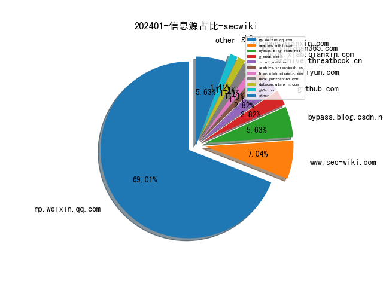
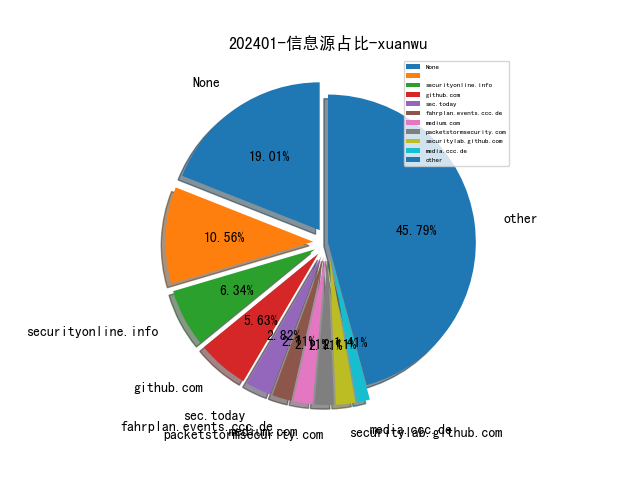
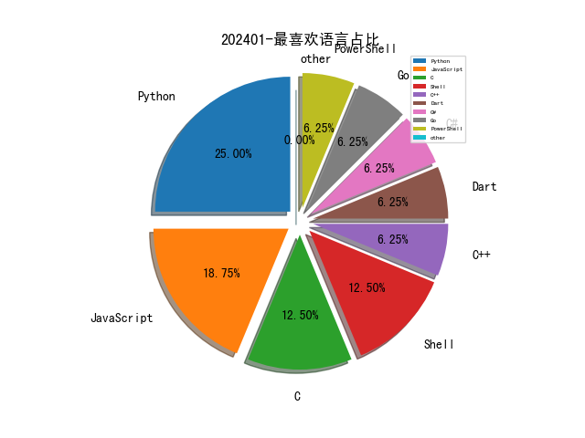

# [数据--所有](README_20.md)
# [数据--年度](README_2024.md)
# 202401 信息源与信息类型占比

# 网络安全书籍 推荐
| date_added | language | title | author | link | size| 
| --- | --- | --- | --- | --- | ---| 
| 2024-01-15 07:27:02 | English | Automating Data Quality Monitoring | unknown | https://www.wowebook.org/automating-data-quality-monitoring/ | unknown| 
| 2024-01-13 20:16:46 | English | Machine Learning: A Guide to PyTorch, TensorFlow, and Scikit-Learn: Mastering Machine Learning With Python | Van Der Post, Hayden | http://libgen.rs/book/index.php?md5=8F932A1D4B435F1D840A6B0F11162D70 | 762 kB [EPUB]| 
| 2024-01-13 20:11:35 | English | Pythonomics: coding strategies to python in economics: A Comprehensive guide to the application of python programming in economics | Van Der Post, Hayden | http://libgen.rs/book/index.php?md5=A242AC92B08A3574F587109279778A54 | 1 MB [EPUB]| 
| 2024-01-13 20:05:14 | English | Python for Accounting: The comprehensive guide to introducing python into your accounting workflow | Van Der Post, Hayden | http://libgen.rs/book/index.php?md5=9FA1E2FEC28795D89518D4F928BA7C96 | 2 MB [EPUB]| 
| 2024-01-13 19:40:04 | English | Deep Learning for Finance: Creating Machine & Deep Learning Models for Trading in Python | Sofien Kaabar | http://libgen.rs/book/index.php?md5=A1E5C5D79EBA2ED48BE421425CF1555D | 9 MB [PDF]| 
| 2024-01-08 07:33:21 | English | Soar with Haskell | unknown | https://www.wowebook.org/soar-with-haskell/ | unknown| 
| 2024-01-08 07:21:27 | English | Data Observability for Data Engineering | unknown | https://www.wowebook.org/data-observability-for-data-engineering/ | unknown| 
| 2024-01-06 10:25:12 | English | Microsoft 365 Administrator MS-102 Exam Guide | unknown | https://www.wowebook.org/microsoft-365-administrator-ms-102-exam-guide/ | unknown| 
| 2024-01-05 11:43:32 | English | Applied Computational Thinking with Python, Second Edition | unknown | https://www.wowebook.org/applied-computational-thinking-with-python-second-edition/ | unknown| 
| 2024-01-05 18:25:08 | English | The Crypto Launderers: Crime and Cryptocurrencies from the Dark Web to DeFi and Beyond | David Carlisle | http://libgen.rs/book/index.php?md5=488EEE0AE318657F45AA60B24B85570F | 13 MB [EPUB]| 
| 2024-01-05 18:06:01 | English | (Springer Undergraduate Mathematics Series) A Course in Python: The Core of the Language | Roozbeh Hazrat | http://libgen.rs/book/index.php?md5=0F974EB1BA244B42A5114B9F484EDAD6 | 11 MB [PDF]| 
| 2024-01-03 14:38:56 | English | Security Orchestration, Automation, and Response for Security Analysts | unknown | https://www.wowebook.org/security-orchestration-automation-and-response-for-security-analysts/ | unknown| 
| 2024-01-03 13:43:09 | English | DevOps for Databases | unknown | https://www.wowebook.org/devops-for-databases/ | unknown| 
| 2024-01-03 19:06:28 | English | Think Python: How to Think Like a Computer Scientist | Allen B. Downey | http://libgen.rs/book/index.php?md5=D4ACD947DD464F477E332EAC4BD000CC | 900 kB [PDF]| 

# 微信公众号 推荐
| nickname_english | weixin_no | title | url| 
| --- | --- | --- | ---| 
| 360数字安全 | gh_6db130c5163e | 连续三年领跑！ | https://mp.weixin.qq.com/s?__biz=MzA4MTg0MDQ4Nw==&mid=2247568617&idx=2&sn=906edf29ed679e89d98d9f957b515eb1 | 3| 
| A9 Team | gh_533347fad180 | 初探威胁情报平台 | https://mp.weixin.qq.com/s?__biz=MzkzNzI2Mzc0Ng==&mid=2247486113&idx=1&sn=46478c6b19269d96d1138bb8cc5cee23 | 2| 
| CISSP | wxxinchuangsec | 网易安全已死... | https://mp.weixin.qq.com/s?__biz=Mzg4MTg0MjQ5OA==&mid=2247484131&idx=1&sn=f5c10b665e8afa94be6cfffe19477231 | 5| 
| CNCERT国家工程研究中心 | NELCERT | 思科又曝高危漏洞，黑客利用可获取 root 权限 | https://mp.weixin.qq.com/s?__biz=MzUzNDYxOTA1NA==&mid=2247542501&idx=3&sn=d545579a7c31094ce37d7cd5df7bf000 | 14| 
| CNVD漏洞平台 | CNVDTS | 上周关注度较高的产品安全漏洞(20240108-20240114) | https://mp.weixin.qq.com/s?__biz=MzU3ODM2NTg2Mg==&mid=2247494322&idx=2&sn=91db3d4d3e7008110d0256136ff89d42 | 3| 
| CT Stack 安全社区 | Ctstack-chaitin | 干货｜print(\"Real World CTF解题攻略限时特供\") | https://mp.weixin.qq.com/s?__biz=MzIzOTE1ODczMg==&mid=2247498904&idx=1&sn=e1403d845aadc54a6561c289b5441679 | 1| 
| CodeWisdom | gh_2395906a410f | 智能化软件开发微访谈·第二十九期：开源软件供应链风险分析与治理 | https://mp.weixin.qq.com/s/u3UEBjiMT1pSQiDNzkD4Kg | 1| 
| Devil安全 | gh_b35dd18ddc14 | 【漏洞复现】用友GRP-U8 ufgovbank XXE漏洞 | https://mp.weixin.qq.com/s?__biz=Mzg2MjkwMDY3OA==&mid=2247484644&idx=1&sn=badecc3ea560d47a30acef5ea3f188e2 | 5| 
| FreeBuf | freebuf | CSO、安全运营...2023网安人年度关注 TOP 10 | https://mp.weixin.qq.com/s?__biz=MjM5NjA0NjgyMA==&mid=2651254893&idx=1&sn=4675d08e1834b45700dc37e07da7d5d0 | 28| 
| Gcow安全团队 | Gcow666 | 第84篇：顶级加密勒索组织LockBit的深度剖析与技战法分析（上篇） | https://mp.weixin.qq.com/s?__biz=MzUyNzk2NDcwMw==&mid=2247488578&idx=2&sn=78a0f0f062207ba88ae75927326e4ed0 | 2| 
| Jiyou too beautiful | zorejt-_- | HTB-Monitored笔记 | https://mp.weixin.qq.com/s?__biz=Mzk0MTQxOTA3Ng==&mid=2247487870&idx=1&sn=10f38649df4cab3757846668b0776fe8 | 1| 
| OSINT研习社 | OSINT_Club | 防止医疗保健行业数据泄露的 14 种方法 | https://mp.weixin.qq.com/s?__biz=Mzg4MzA4NTM0OA==&mid=2247488555&idx=1&sn=1218703bf5fb75755a84d4850333f7c7 | 2| 
| OneMoreThink | OneMoreThinkkk | 靶场实战(16)：OSCP备考之VulnHub BORN2ROOT 1 | https://mp.weixin.qq.com/s?__biz=MzI0NjA3Mzk2NQ==&mid=2247491768&idx=1&sn=ac81f3cd9b896eff9f7ff14f7157c2b6 | 4| 
| Reset安全 | gh_a006697f54a9 | 浅谈安全域划分与访问控制策略 | https://mp.weixin.qq.com/s?__biz=MzU3Mzg1NzMyNw==&mid=2247484827&idx=1&sn=d6026188ca5a43d63e692fe491f8da3f | 6| 
| SecWiki | SecWiki | SecWiki周刊（第515期） | https://mp.weixin.qq.com/s?__biz=MjM5NDM1OTM0Mg==&mid=2651053116&idx=1&sn=a7ae635085c88de685c41fd6cc8af9f8 | 1| 
| Seraph安全实验室 | Seraph_Security | 重生第四篇之从总公司到分公司的艰难内网渗透 | https://mp.weixin.qq.com/s?__biz=MzI0MTY3ODQwNw==&mid=2247488989&idx=1&sn=830c5267dfbf13b096e2e5f71bd4a893 | 2| 
| WK安全 | kai_wen_8 | 【漏洞复现】金和-Upload-任意文件上传漏洞复现 | https://mp.weixin.qq.com/s?__biz=Mzg2ODg3NzExNw==&mid=2247487930&idx=1&sn=e8f15ffe5a9a08b1b40353d0d8162e71 | 7| 
| Web安全工具库 | websec-tools | 漏扫神器Invicti Professional v24.1（1月9日更新） | https://mp.weixin.qq.com/s?__biz=MzI4MDQ5MjY1Mg==&mid=2247512065&idx=1&sn=9f0e36919a869d59470167a5474edf1c | 6| 
| XxSec | gh_51582c8261c4 | 渗透案例 | https://mp.weixin.qq.com/s?__biz=MzkwNDAwMDc2NA==&mid=2247487359&idx=1&sn=450913268567861837b6636de277c7c7 | 1| 
| YongYe 安全实验室 | YongYe_Security | CVE-2023-7028__Gitlab任意用户密码重置  复现 | https://mp.weixin.qq.com/s?__biz=Mzg4MDk4MjM0Mw==&mid=2247484408&idx=1&sn=7c6ef716bcab39f256887864b16d8816 | 1| 
| e安在线 | ean-online | 大语言模型漏洞缓解指南 | https://mp.weixin.qq.com/s?__biz=MzI1OTA1MzQzNA==&mid=2651245077&idx=1&sn=bc4fc2d37192b08f764fca5e9dc926a2 | 5| 
| i春秋 | icqedu | error专访丨挖洞路上，从来没有一无所获的付出！（附案例解析） | https://mp.weixin.qq.com/s?__biz=MzUzNTkyODI0OA==&mid=2247525286&idx=1&sn=c6ad1a54a59dd7730c2bf83e8c5c4cc8 | 2| 
| thelostworld | gh_3f2e5b9f028c | [漏洞复现-99] 宏*-ehr-hcm trainplan-tree sql注入漏洞 | https://mp.weixin.qq.com/s?__biz=MzIyNjk0ODYxMA==&mid=2247487388&idx=1&sn=88940d2ab5355d1444475e00dc0f8207 | 5| 
| 一个不正经的黑客 | gh_ddeb734f0ee7 | 【日刷亿洞】批量爆破Druid后台账号密码 | https://mp.weixin.qq.com/s?__biz=MzkwODI1ODgzOA==&mid=2247502111&idx=1&sn=685fba8f09ad2ee4ead319847590192a | 1| 
| 一起聊安全 | gh_589ffdaa31f9 | 网络关键设备和网络安全专用产品安全认证和安全检测结果（2024年1月9日更新） | https://mp.weixin.qq.com/s?__biz=MzI3NjUzOTQ0NQ==&mid=2247505563&idx=1&sn=7a0d80e0e170916f1dd1333e05157b63 | 2| 
| 三六零CERT | CERT-360 | 安全事件周报 2024-01-08 第2周 | https://mp.weixin.qq.com/s?__biz=MzU5MjEzOTM3NA==&mid=2247501293&idx=1&sn=356e83f0e4b451427a0dcd664760d72d | 7| 
| 与智慧做朋友 | qichelaba3 | 数据工作：如何解决【驱动力】不足的问题？ | https://mp.weixin.qq.com/s?__biz=MzA3OTg3Mjg3NA==&mid=2456975703&idx=1&sn=3fc35d4f1b865a302fd4dfe9d91af1ef | 1| 
| 东方财富安全应急响应中心 | emsrc_team | 2024年福利首发 , 积分暴涨与新春好礼常在 | https://mp.weixin.qq.com/s?__biz=MzUzNDAxMjAyOQ==&mid=2247484371&idx=1&sn=56fc5ebd22a518964fa657783b2dbde4 | 1| 
| 中国信息安全 | chinainfosec | 专题·CC标准 , 信息技术安全评估准则新版标准的变化及应用展望 | https://mp.weixin.qq.com/s?__biz=MzA5MzE5MDAzOA==&mid=2664203031&idx=1&sn=e6a8a59972bea011dde316ef17fe5b47 | 15| 
| 中国计算机学会 | ccfvoice | BOPs：一种算力度量指标 , CCCF精选 | https://mp.weixin.qq.com/s?__biz=MjM5MTY5ODE4OQ==&mid=2651566417&idx=1&sn=77dd36bcd88df48fa8d896ee04a0a53f | 15| 
| 中睿天下 | zorelworld | SPF电子邮件身份验证协议的一些局限性 | https://mp.weixin.qq.com/s?__biz=MzAwNjc0MDA1NA==&mid=2650139781&idx=1&sn=646de409430814ae015005fd070bd3a1 | 2| 
| 云起无垠 | Clouditera2021 | 第36期 , GPTSecurity周报 | https://mp.weixin.qq.com/s?__biz=Mzg3Mjg4NTcyNg==&mid=2247488590&idx=1&sn=8f2fcb87704dc0f33554bbe51e0f2158 | 3| 
| 亚信安全 | yaxinanquan | 再度登榜！亚信安全成功入选中国金融科技企业双50榜单 | https://mp.weixin.qq.com/s?__biz=MjM5NjY2MTIzMw==&mid=2650610998&idx=1&sn=ce9c87a161ca33df047971d61099a733 | 5| 
| 京东安全应急响应中心 | jsrc_team | 【活动】龙年接好运，新年礼盒已上线！ | https://mp.weixin.qq.com/s?__biz=MjM5OTk2MTMxOQ==&mid=2727836217&idx=1&sn=ba63bf976ef38d342065c0392533e228 | 1| 
| 亿人安全 | Yr-Sec | 内网攻防,真实环境下的内网渗透 | https://mp.weixin.qq.com/s?__biz=Mzk0MTIzNTgzMQ==&mid=2247512817&idx=1&sn=f7dd400c6ee41f581f6ce0eed5929d22 | 4| 
| 代码卫士 | codesafe | GitLab 提醒注意严重的零点击账户劫持漏洞 | https://mp.weixin.qq.com/s?__biz=MzI2NTg4OTc5Nw==&mid=2247518669&idx=1&sn=e9e78678e6c35cd6c0c37b638d5a988c | 6| 
| 伞神安全 | gh_4f203aeb4f56 | 勒索软件攻击的工作原理：影响、示例和响应 | https://mp.weixin.qq.com/s?__biz=MzkyOTU4NzE0Nw==&mid=2247484054&idx=1&sn=907fe58ff0574da58e83cdff08b254d9 | 1| 
| 信息安全D1net | D1Net18 | 公司如何使用GenAI来防范ChatGPT泄漏数据 | https://mp.weixin.qq.com/s?__biz=MzA3NTIyNzgwNA==&mid=2650258323&idx=1&sn=be59e8e7f324089517b658407943eea1 | 2| 
| 信息安全与通信保密杂志社 | cismag2013 | ​加密C2框架EvilOSX流量分析 | https://mp.weixin.qq.com/s/Nl5SWMFFjsxG8LeYBOPuPg | 14| 
| 信息安全研究 | ISR2016 | 【业界动态】网安市场周度监测（2024-01-15） | https://mp.weixin.qq.com/s?__biz=MzA3NzgzNDM0OQ==&mid=2664983265&idx=3&sn=dbc9ebfd726ab78e193dcbe24a5e7cb3 | 17| 
| 全球技术地图 | drc_iite | 美国OpenAI公司的政策不再明确禁止将其技术用于“军事和战争” | https://mp.weixin.qq.com/s?__biz=MzI1OTExNDY1NQ==&mid=2651609935&idx=2&sn=36a17940dc6bc91e8333dbfa5448bbea | 14| 
| 公安部网络安全等级保护中心 | gh_f5f6bf3d09af | 大模型系统安全标准验证试点活动正式启动 | https://mp.weixin.qq.com/s?__biz=MzU3NTQwNDYyNA==&mid=2247486904&idx=1&sn=460278a447c741ae881d6a1ba34bfa07 | 1| 
| 关键信息基础设施安全保护联盟 | CNCIIPA | 倒计时5天 ：关键信息基础设施安全保护论坛即将召开 | https://mp.weixin.qq.com/s?__biz=MzkxNjU2NjY5MQ==&mid=2247498611&idx=2&sn=339d4f859240a5c567c473ffe7a99b0b | 6| 
| 关键基础设施安全应急响应中心 | CII-SRC | 美国国防供应链CMMC倡议的演变、进展与思考 | https://mp.weixin.qq.com/s?__biz=MzkyMzAwMDEyNg==&mid=2247541886&idx=2&sn=dcd48836b29b7548090a782e7c39ab34 | 16| 
| 内生安全联盟 | CCESS_CHINA | 消息 , 已有三个省市正式成立数据局 | https://mp.weixin.qq.com/s?__biz=Mzg4MDU0NTQ4Mw==&mid=2247515877&idx=2&sn=1f6a47ad6f2cb4ccf112203bfab491b9 | 12| 
| 创信华通 | cdcxht | 创信华通网络安全课堂2024年1月开班计划来啦！ | https://mp.weixin.qq.com/s?__biz=MzUxNTQxMzUxMw==&mid=2247520592&idx=1&sn=3a9f5d77a4faf695381bc58b5ad30b34 | 3| 
| 北邮 GAMMA Lab | BUPT_GAMMA | 北邮GAMMA Lab 2023年会顺利举行 | https://mp.weixin.qq.com/s?__biz=Mzg4MzE1MTQzNw==&mid=2247488865&idx=1&sn=0dc697f8e5f83ce6ba5d433c10225f0c | 1| 
| 合天网安实验室 | hee_tian | 全力支撑高校网安人才培养，2023-2024网安冬令营圆满收官 | https://mp.weixin.qq.com/s?__biz=MjM5MTYxNjQxOA==&mid=2652903370&idx=2&sn=96aeda3b458628604e4254aa04ca513e | 6| 
| 启明星辰安全简讯 | VitaminSecurity | 安全简讯（2024.01.15） | https://mp.weixin.qq.com/s?__biz=MzUxMDQzNTMyNg==&mid=2247503657&idx=1&sn=92bfedeef89d6bf3749df4fc7b7e37ef | 12| 
| 启明星辰集团 | venustech_weixin | 启明星辰喜获荣耀安全隐私及奖励计划“卓越合作伙伴”  共护亿级终端用户安全 | https://mp.weixin.qq.com/s?__biz=MzA3NDQ0MzkzMA==&mid=2651722684&idx=1&sn=a91f658828137f85adb04dabe96b7713 | 4| 
| 商密君 | shangmijun | 三部门印发《区块链和分布式记账技术标准体系建设指南》（附全文） | https://mp.weixin.qq.com/s?__biz=MzI5NTM4OTQ5Mg==&mid=2247618648&idx=1&sn=9166159e3d829b62f85d4b3fd7fbb314 | 20| 
| 嘶吼专业版 | Pro4hou | 生成式人工智能对网络安全的影响 | https://mp.weixin.qq.com/s?__biz=MzI0MDY1MDU4MQ==&mid=2247573072&idx=1&sn=25f6b0ee270a98efd4b8f3726c65803f | 10| 
| 大数据安全工程研究中心 | DSJAQGCYJZX | “数据安全人才专场培训”2024年第一期（总第十三期）开始招生啦! | https://mp.weixin.qq.com/s?__biz=MjM5Nzg0NzUxOQ==&mid=2247486850&idx=1&sn=7887701c76a419eea5ee440dc84ab3dd | 4| 
| 天唯信息安全 | TWtech2113189 | 上市公司突发公告：遭电诈超9200万 | https://mp.weixin.qq.com/s?__biz=MzkzMjE5MTY5NQ==&mid=2247493965&idx=1&sn=c4e1525fa6bca21a406c6a41b483258b | 15| 
| 天御攻防实验室 | TianyuLab | 分享威胁情报真心不容易啊：从实践中学到的一些经验 | https://mp.weixin.qq.com/s?__biz=MzU0MzgyMzM2Nw==&mid=2247485321&idx=1&sn=de67daf9d96010dd3ded0a53c6fcff88 | 4| 
| 天融信 | TopsecPioneer | 天融信：如何保护个人数据安全？这些知识速来了解！ | https://mp.weixin.qq.com/s?__biz=MzA3OTMxNTcxNA==&mid=2650896778&idx=2&sn=abac4092f01b815b412390d5c8c4a352 | 9| 
| 天融信教育 | TOPSEC-EDU | 每日安全提醒~ | https://mp.weixin.qq.com/s?__biz=MzU0MjEwNTM5Ng==&mid=2247515802&idx=2&sn=a77358edeccc06e352bb20c0d544f060 | 11| 
| 天锐数据安全 | tipray | 天锐股份2023年终盛典胜利召开！ | https://mp.weixin.qq.com/s?__biz=MjM5MTk0MzIzMQ==&mid=2652018541&idx=1&sn=20fc53c1e0917b48b39ed88c21139e50 | 6| 
| 奇安信 CERT | gh_64040028303e | 安全热点周报（2024.1.8-2024.1.14） | https://mp.weixin.qq.com/s?__biz=MzU5NDgxODU1MQ==&mid=2247500355&idx=1&sn=d88db933abd506320204ddc28b072503 | 2| 
| 奇安信集团 | qianxin-keji | 关注 │ 美国智库分析人工智能未来对网络安全的可能利害影响 | https://mp.weixin.qq.com/s?__biz=MzU0NDk0NTAwMw==&mid=2247606020&idx=2&sn=55c058c2650eada0f621af881cb6b3c9 | 7| 
| 字节跳动技术团队 | BytedanceTechBlog | AI 解读视频张口就来？这种「幻觉」难题 Vista-LLaMA 给解决了 | https://mp.weixin.qq.com/s?__biz=MzI1MzYzMjE0MQ==&mid=2247505377&idx=1&sn=d3c333e56d3e7b20cbde8a40a716f207 | 5| 
| 安世加 | asjeiss | 货拉拉安全招人！资深终端安全工程师、安全运营工程师、还有多个校招及实习生岗位... | https://mp.weixin.qq.com/s?__biz=MzU2MTQwMzMxNA==&mid=2247536788&idx=1&sn=fa78102f7de7f4c4bcf83ef2ceb422e9 | 6| 
| 安信安全 | gsaxns | 前沿 , 以数据跨境风险治理为抓手 推动全球体育治理数字化变革 | https://mp.weixin.qq.com/s?__biz=MzAxNTYwOTU1Mw==&mid=2650086768&idx=1&sn=5100dafb7215d2f960da42a4af889bd9 | 12| 
| 安全419 | anquan-419 | 助力行业品牌建设 安全419 2024年度媒体服务体系全面更新 | https://mp.weixin.qq.com/s?__biz=MzUyMDQ4OTkyMg==&mid=2247537385&idx=1&sn=1347da34eaf5575fde61a6d2a2022519 | 9| 
| 安全内参 | anquanneican | 美国海军战舰造船厂遭勒索攻击：数控机床停机数天、上万人信息泄露 | https://mp.weixin.qq.com/s?__biz=MzI4NDY2MDMwMw==&mid=2247510831&idx=1&sn=4c32eb5635ac014facf67aae3f6cfcdc | 11| 
| 安全后厨 | sanxingfengaa | 每日新闻(331)——2024.01.15 | https://mp.weixin.qq.com/s?__biz=MzI3MDQ1NDE2OA==&mid=2247490398&idx=1&sn=dd09131cbb1cd48efb331b0f860e79e1 | 16| 
| 安全圈 | ChinaAnQuan | 【安全圈】消费者海外购遭泄露个人信息，电商平台被判担责 | https://mp.weixin.qq.com/s?__biz=MzIzMzE4NDU1OQ==&mid=2652052202&idx=2&sn=7f3b61ea4693cd74df85e7c31a25343f | 28| 
| 安全威胁纵横 | gh_715fe2f8df0b | Sems and Specials Incorporated 遭 8Base 组织勒索 | https://mp.weixin.qq.com/s?__biz=Mzk0MDYwMjE3OQ==&mid=2247484187&idx=1&sn=5a31cb7da264a8df0007ef831886b128 | 4| 
| 安全帮 | SafetyGuan | 2024年首期CISP-PTS培训班盛大开班 | https://mp.weixin.qq.com/s?__biz=MzkzNjQwOTc4MQ==&mid=2247489089&idx=1&sn=ab71947133095fe95f7a3af0bb7294c3 | 2| 
| 安全攻防团队 | gh_983c1037a3f6 | u200b云安全风险情报（1.01-1.14） | https://mp.weixin.qq.com/s?__biz=MzkzNTI4NjU1Mw==&mid=2247484885&idx=1&sn=b8d5129eee80bfffbd691cf29ab82405 | 1| 
| 安全牛 | aqniu-wx | 构建进攻性的网络安全防护策略 | https://mp.weixin.qq.com/s?__biz=MjM5Njc3NjM4MA==&mid=2651127362&idx=1&sn=e3f66f02f6a3a42567e72c82bcbd89ff | 11| 
| 安全研究GoSSIP | GoSSIPSJTU | G.O.S.S.I.P 阅读推荐 2024-01-15 大破量子危机 | https://mp.weixin.qq.com/s?__biz=Mzg5ODUxMzg0Ng==&mid=2247497136&idx=1&sn=d0ce75822ad80b0535b0cddd26507a53 | 3| 
| 安圈评 | gh_c9e26ce99897 | 荷兰媒体曝光震网病毒成本超过10亿美元 | https://mp.weixin.qq.com/s?__biz=MzkwNTI4MTA1MQ==&mid=2247501097&idx=1&sn=e886c09e376272d49439c7683320941a | 4| 
| 安在 | AnZer_SH | 发布 , 安在新榜 · 2024企业网络安全CSO发展调查报告 | https://mp.weixin.qq.com/s?__biz=MzU5ODgzNTExOQ==&mid=2247610921&idx=1&sn=3933afb6e4b37201b3050f1a8b51b27d | 10| 
| 安天移动安全 | AVLTeam | 安天移动安全获评2023年荣耀“最佳战略合作伙伴” | https://mp.weixin.qq.com/s?__biz=MjM5NTY4NzcyNg==&mid=2650248987&idx=1&sn=2adb4f4d2d50a664d846fa28901acc1a | 1| 
| 宸极实验室 | ChenJiLab | 『杂项』高效文本分析：使用 Hyperscan 进行正则匹配 | https://mp.weixin.qq.com/s?__biz=Mzg4NTA0MzgxNQ==&mid=2247488749&idx=1&sn=ff9e1b5eb5821406c314e4ebcfcf57a5 | 2| 
| 小白安全工具 | gh_981785667bb3 | [信息收集利器]TscanPlus | https://mp.weixin.qq.com/s?__biz=MzkyMTQwNjA4NA==&mid=2247484686&idx=1&sn=f43f2a6f62e17f73fa87a5af24e3aa9d | 2| 
| 山石网科安全技术研究院 | HSN_LAB | 绕过EDR探索系列一 , 用户模式HOOK | https://mp.weixin.qq.com/s?__biz=MzUzMDUxNTE1Mw==&mid=2247504456&idx=1&sn=db0ea7f9ab14af0c76f8cc157343c54b | 4| 
| 州弟学安全 | gh_8440a0e647ba | 学习干货,从DMZ到核心内网仿真攻防视角 | https://mp.weixin.qq.com/s?__biz=MzkzMDE5OTQyNQ==&mid=2247484515&idx=1&sn=8f3b6365a2ab71cc6cfcb0e7ec7d2aad | 2| 
| 工业安全产业联盟 | ICSISIA | 通知 , 财政部印发《关于加强数据资产管理的指导意见》（附全文） | https://mp.weixin.qq.com/s?__biz=MzI2MDk2NDA0OA==&mid=2247525868&idx=1&sn=b6fc88fe10e770af64bcf1342842d3f8 | 8| 
| 幸福的味道 | d716-716 | 建了个学习群，欢迎小伙伴们加入 | https://mp.weixin.qq.com/s?__biz=MzA5NDk3NTUwNw==&mid=2651753813&idx=1&sn=32066c24eb16182560fe84535f73906b | 6| 
| 强网竞赛 | qiangwangjingsai | 实战强网，燃爆中原！第七届“强网杯”线下赛圆满落幕 | https://mp.weixin.qq.com/s?__biz=Mzg4MjY3NDQ2Ng==&mid=2247486908&idx=1&sn=c9422ada270ba37086d9f3930e3f41dd | 2| 
| 掌控安全EDU | ZKAQEDU | 喜迎2024 , 掌控安全学院微专业开年活动 | https://mp.weixin.qq.com/s?__biz=MzUyODkwNDIyMg==&mid=2247535619&idx=1&sn=ca8a58b0aaa1025878a98e4b86a40160 | 9| 
| 攻防训练营 | gh_0c0623da04c6 | 不用写脚本利用yakit一键获取提交flag | https://mp.weixin.qq.com/s?__biz=Mzk0MTQ5MjIwNg==&mid=2247483902&idx=1&sn=244eb1586aca447e735185efeb45519c | 1| 
| 效率源 | xiaolvyuantech | 好消息来啦！效率源“致敬·警察节”赠礼活动获奖名单公布 | https://mp.weixin.qq.com/s?__biz=MjM5ODQ3NjAwNQ==&mid=2650545704&idx=1&sn=c748a59414d96b132f8a9b51c535217f | 2| 
| 数世咨询 | dwconcn | Cloudflare威胁报告发现：2023年DDoS攻击流量惊人增长 | https://mp.weixin.qq.com/s?__biz=MzkxNzA3MTgyNg==&mid=2247507973&idx=1&sn=a641fd19dcc216703aa9cb692211ccc7 | 5| 
| 无界信安 | None | 微软安全产品关系 | https://mp.weixin.qq.com/s?__biz=Mzk0MzI3OTAwMg==&mid=2247485729&idx=1&sn=22846fcceff4e488c67b957298e07a86 | 2| 
| 无糖反网络犯罪研究中心 | gh_2ee7a9b17c0d | 邹平警方打掉\"跑分洗钱\"团伙丨菏泽警方破获非法利用信息网络案——涉网犯罪每日情报 | https://mp.weixin.qq.com/s?__biz=MzAxMzkzNDA1Mg==&mid=2247508274&idx=1&sn=24ebe15f5540a5f5690b8754970c80e4 | 3| 
| 智检安全 | gh_8aa925423f14 | 红日ATT&CK实战系列（二） | https://mp.weixin.qq.com/s?__biz=MzkyNTUyOTk0NA==&mid=2247486999&idx=1&sn=495bc82d98afee17cfc96b863cc95a3d | 4| 
| 暴暴的皮卡丘 | gh_3aa935a28263 | windows权限维持之SCM服务控制管理器 | https://mp.weixin.qq.com/s?__biz=MzU0NDI5NTY4OQ==&mid=2247484710&idx=1&sn=8fc9881a40ef46dcb173620ae5878b60 | 5| 
| 极思 | WhoAmSven | 【极思】五年安全运营实践总结与未来思考 | https://mp.weixin.qq.com/s/ViXzcMo3p1jukzdVPVXlNw | 1| 
| 榫卯江湖 | cnxct_coder | 美团RASP大规模研发部署实践总结 | https://mp.weixin.qq.com/s/RHE8xoBCBTa4fKZGKyUKqg | 2| 
| 浙网安协数据安全治理专委会 | zwax-sjaqzlzwh | 财政部印发《关于加强数据资产管理的指导意见》 | https://mp.weixin.qq.com/s?__biz=Mzk0NjE5NjUxOA==&mid=2247485523&idx=1&sn=33913acf637f111d004d0367d71746d9 | 1| 
| 深信服科技 | sangfor_man | Q3稳居TOP 2！深信服超融合，在变化中稳步前行 | https://mp.weixin.qq.com/s?__biz=MjM5MTAzNjYyMA==&mid=2650584464&idx=1&sn=1939d4889ba7d21f95ec0f31aefc5a30 | 4| 
| 深圳市网络与信息安全行业协会 | SNISRI | 关于开展2023年度网络空间安全工程技术人才专业职称评审工作的通知 | https://mp.weixin.qq.com/s?__biz=MzU0Mzk0NDQyOA==&mid=2247513055&idx=1&sn=285d5d8312f4ada4e4f1ba1a42088489 | 3| 
| 湖南金盾评估中心 | JD83758161 | 湖南金盾荣获湖南省委网信办“2023年优秀技术支撑单位” | https://mp.weixin.qq.com/s?__biz=MzIyNTI0ODcwMw==&mid=2662128326&idx=1&sn=d408b4c1bd00f1ab0b36fed9f24b1893 | 2| 
| 生有可恋 | hyang0-1 | 监控主机间的访问关系 | https://mp.weixin.qq.com/s?__biz=Mzk0MTI4NTIzNQ==&mid=2247490312&idx=1&sn=c98068eb40307d1ba5f2bb20378cb005 | 7| 
| 白帽子左一 | HackRead | 记一次phpstudy后门引发的渗透测试 | https://mp.weixin.qq.com/s?__biz=MzI4NTcxMjQ1MA==&mid=2247605015&idx=1&sn=84887005602020d754983336de1c535a | 8| 
| 看雪学苑 | ikanxue | [车联网安全]使用STM32开发板实战汽车UDS诊断 | https://mp.weixin.qq.com/s?__biz=MjM5NTc2MDYxMw==&mid=2458535564&idx=1&sn=153be3591315901eba6cdb1a99c53037 | 17| 
| 知道创宇 | knownsec | 多渠道加快落实APP备案，内容安全评估如何应对？ | https://mp.weixin.qq.com/s?__biz=MjM5NzA3Nzg2MA==&mid=2649867477&idx=1&sn=ee6cc008eee05537eecdb9c8a3a55be6 | 2| 
| 红蓝公鸡队 | None | 网络安全行情太好啦 | https://mp.weixin.qq.com/s?__biz=Mzg5MDc1MjY5Ng==&mid=2247492224&idx=1&sn=0363ecdf313597ec43ee49c427f4c3db | 3| 
| 绿盟科技 | NSFOCUS-weixin | 乘风破浪 勇拓海外 , 绿盟科技助力非洲某商业银行网络安全升级 | https://mp.weixin.qq.com/s?__biz=MjM5ODYyMTM4MA==&mid=2650447232&idx=1&sn=758576e1637955de592e202d115850d9 | 5| 
| 绿盟科技威胁情报 | NSFOCUS_NTI | 绿盟威胁情报周报（2024.01.08-2024.01.14） | https://mp.weixin.qq.com/s?__biz=Mzg2Nzg0NDkwMw==&mid=2247491951&idx=1&sn=7818d1c6641dcd17d568beb342f713d7 | 1| 
| 网安百色 | www_xinbs_net | 思科又曝高危漏洞，黑客利用可获取 root 权限 | https://mp.weixin.qq.com/s?__biz=MzI0NzE4ODk1Mw==&mid=2652092546&idx=1&sn=b442dc8871d371e9c4f6b12db62ab431 | 6| 
| 网星安全 | netstarsec | 年度画卷 , 网星安全股东会年终总结完美谢幕 | https://mp.weixin.qq.com/s?__biz=MzkxNTEzMTA0Mw==&mid=2247494563&idx=1&sn=44d8b4419d9e5e3aa73f374a89da0704 | 2| 
| 网络安全与数据治理 | gh_ddbdee0c5caf | 财政部、工信部印发《数据库政府采购需求标准（2023年版）》 | https://mp.weixin.qq.com/s?__biz=MzIzODk1NzY5NA==&mid=2247496615&idx=1&sn=65db65eff56f3309649c96615728c003 | 6| 
| 网络安全交流圈 | gh_6d11e0d3a78e | Cookie提取-SharpCookieMonster | https://mp.weixin.qq.com/s?__biz=MzI1MDk3NDc5Mg==&mid=2247485189&idx=1&sn=532ff94256532affaa4e90fec4f1fd98 | 1| 
| 网络安全和信息化 | None | 网络安全等级保护测评规划与设计 | https://mp.weixin.qq.com/s?__biz=MjM5MzMwMDU5NQ==&mid=2649160757&idx=1&sn=3e71e542f227f386fb945e59bb828593 | 7| 
| 网络安全研究所 | wlaqyjs | 网安兄弟们长点心眼，这10个坑别踩了，不然真找不到工作！ | https://mp.weixin.qq.com/s?__biz=MzU4OTg4Nzc4MQ==&mid=2247499756&idx=1&sn=92e2bddc727cf87360d98dc0405d69bb | 10| 
| 网络安全者 | close_3577673633 | fscan免杀（1月13日更新） | https://mp.weixin.qq.com/s?__biz=MzU3NzY3MzYzMw==&mid=2247497416&idx=1&sn=c2fd97ef3fc0062ea3f001b8c94b06c3 | 2| 
| 网络安全资源库 | gh_e8a4866a67fe | 四步拿下某流股份有限公司 | https://mp.weixin.qq.com/s?__biz=MzkxMzMyNzMyMA==&mid=2247551716&idx=1&sn=6ed4aceeff547dff3f1101ffd6799dce | 12| 
| 网络安全透视镜 | gh_0111d52251cf | 兑现承诺，抽奖免费赠内网攻防书 | https://mp.weixin.qq.com/s?__biz=MzIxMTg1ODAwNw==&mid=2247499320&idx=1&sn=91272ffc57c3a92ba61b8536ae905840 | 2| 
| 美亚柏科 | MeiyaPico | 汽车取证大师再升级，重点模块支持率再创新高！ | https://mp.weixin.qq.com/s?__biz=MjM5NTU4NjgzMg==&mid=2651406883&idx=1&sn=e091238348d67f5d3a6cf87b738c7653 | 11| 
| 胖哈勃 | pwnhub | 干货｜print(\"Real World CTF解题攻略限时特供\") | https://mp.weixin.qq.com/s?__biz=MzI2OTUzMzg3Ng==&mid=2247501426&idx=1&sn=03e70f6b691aba8f398e178e17a36a56 | 1| 
| 腾讯安全 | TXAQ2019 | 程序员大战勒索病毒，保卫双十一最后的堡垒 | https://mp.weixin.qq.com/s?__biz=Mzg5OTE4NTczMQ==&mid=2247513588&idx=1&sn=cb45d682d54598a6c290574b1e6b8523 | 1| 
| 腾讯玄武实验室 | XuanwuLab | 每日安全动态推送(1-15) | https://mp.weixin.qq.com/s?__biz=MzA5NDYyNDI0MA==&mid=2651959498&idx=1&sn=854f605c9fde844de3b3d7b6a22e0983 | 5| 
| 芸云虾扯蛋 | YYZSGOGOGO2 | 只会netstat?最全应急排查网络连接思路，不学一下吗? | https://mp.weixin.qq.com/s?__biz=MzkwMzI4NDU0MA==&mid=2247483924&idx=1&sn=088ce3edaa6e5ae94ae1c22bc38ab850 | 1| 
| 蓝桥云课精选 | lanqiaoyunke01 | 学编程千万别直接敲代码！不然真的是浪费...... | https://mp.weixin.qq.com/s?__biz=MzkwODM4NDM5OA==&mid=2247516209&idx=1&sn=0ffad4496617ae7bcd0dbf9c61c09b54 | 10| 
| 蚁剑安全实验室 | AntSwordSec | 【漏洞复现】Yearning front 任意文件读取漏洞 | https://mp.weixin.qq.com/s?__biz=MzkxNTU5NjM5MQ==&mid=2247485285&idx=1&sn=c68089166fed70f8cf78701c72f5ba09 | 3| 
| 蚂蚁安全响应中心 | antgroupsec | 龙年掘金 , 新年翻倍再加赠，接住2024第一份好彩头 | https://mp.weixin.qq.com/s?__biz=MzI3NDEzNzIxMg==&mid=2650489762&idx=1&sn=e8371a7433806d77766370bbf0e64ea1 | 1| 
| 谈思实验室 | gh_6446c19b4595 | 看门狗在嵌入式系统中的作用是个什么？ | https://mp.weixin.qq.com/s?__biz=MzIzOTc2OTAxMg==&mid=2247531867&idx=1&sn=56d4fb64f8359cba8402ee6397964087 | 14| 
| 贝雷帽SEC | Beret-Sec | 【红队】一款集合fscan和kscan等优秀工具功能的扫描爆破工具 | https://mp.weixin.qq.com/s?__biz=Mzk0MDQzNzY5NQ==&mid=2247489716&idx=1&sn=b26dd0b1ecd5f364f5e40f8e19a28431 | 2| 
| 赛博新经济 | gh_5c4abe1ee3a6 | 大语言模型系统安全综述 | https://mp.weixin.qq.com/s/wtJ8CPem_EQG1MnvbQdfJw | 2| 
| 车小胖谈网络 | chexiaopangnetwork | 网线(1Gbps)和5GHz频段的Wi-Fi 哪个快? | https://mp.weixin.qq.com/s?__biz=MzIxNTM3NDE2Nw==&mid=2247489920&idx=1&sn=c49a8cd490de1673f9a4764d6d5cb3d0 | 3| 
| 边界无限 | BoundaryX | 边界无限获评CCIA“2023年度先进会员单位” | https://mp.weixin.qq.com/s?__biz=MzAwNzk0NTkxNw==&mid=2247486691&idx=2&sn=60bfa68d025da52db153c9dbfd5132c1 | 3| 
| 迪普科技 | DPtechnology | 人民数据发布丨迪普科技入选信创网络安全新势力研究报告 | https://mp.weixin.qq.com/s?__biz=MzA4NzE5MzkzNA==&mid=2650350510&idx=1&sn=3adac407b57c1419c82cb23ec0013c44 | 3| 
| 邑安全 | EansecD | CISA：Microsoft SharePoint 的关键错误现已被积极利用 | https://mp.weixin.qq.com/s?__biz=MzUyMzczNzUyNQ==&mid=2247519387&idx=3&sn=b778c06b0f3d438567c150ee70a439af | 6| 
| 锐眼安全实验室 | gh_ac88e02e949f | 釜底抽薪：勒索组织Akira首先将矛头瞄准受害者数据备份相关系统 | https://mp.weixin.qq.com/s?__biz=MzIyOTczMjI2MQ==&mid=2247485964&idx=1&sn=47f03cf6a3217491e110037eb109643a | 1| 
| 陌陌安全 | MomoSecurity | 冬日计划：吃“洞”人锦标赛，袭来！ | https://mp.weixin.qq.com/s?__biz=MzI2OTYzOTQzNw==&mid=2247488230&idx=1&sn=007bea87f37346f1a3f40bacd7b3993f | 1| 
| 零漏安全 | linglouAnQuan | 0day漏洞防护 | https://mp.weixin.qq.com/s?__biz=MzkyMDUzMzY1MA==&mid=2247496685&idx=1&sn=efff16a56bcca88e04921db2fc89bc96 | 4| 
| 青衣十三楼飞花堂 | scz------ | Win10 KB5034441升级失败的另类解决方案 | https://mp.weixin.qq.com/s?__biz=MzUzMjQyMDE3Ng==&mid=2247487091&idx=1&sn=bac7d1c94ae06372210036c43f63d48e | 6| 
| 非攻安全实验室 | gh_9c3b7f864fba | NETGEAR DGND3700v2 路由器 setup.cgi 接口远程命令执行漏洞 | https://mp.weixin.qq.com/s?__biz=Mzk0NDUzMDA1Mg==&mid=2247484902&idx=1&sn=d794b3d64365d9f86eed39a484fb54dc | 1| 
| 飓风网络安全 | gh_183f818a07dc | 【漏洞预警】Juniper Networks Junos OS远程代码执行漏洞CVE-2024-21591 | https://mp.weixin.qq.com/s?__biz=MzI3NzMzNzE5Ng==&mid=2247487402&idx=2&sn=67f7cad9b1f953403677efd7ea1a0421 | 8| 
| 飞羽技术工坊 | None | 网传字节仍在洽谈收购饿了么，用GPT预测一波 | https://mp.weixin.qq.com/s?__biz=MzkwODQyMjgwNg==&mid=2247484768&idx=1&sn=70b432b656525d569697974eb0da8e60 | 3| 
| 黑盾云 | heiduncloud | 第一百六十一期【黑盾云】每周安全头条（2024.1.8-1.14） | https://mp.weixin.qq.com/s?__biz=MzUzMzE5MTQ0Mw==&mid=2247491020&idx=1&sn=f96acee7f62aa3a24ede63c1b1a1c19d | 1| 
| F12sec | F12sec | 元旦解题游戏-第一题write up | https://mp.weixin.qq.com/s?__biz=Mzg5NjU3NzE3OQ==&mid=2247488803&idx=1&sn=37c40f405cde7a1fa22eb97ba9e2a18f | 5| 
| Z2O安全攻防 | None | 入行安全？ | https://mp.weixin.qq.com/s?__biz=Mzg2ODYxMzY3OQ==&mid=2247507769&idx=1&sn=657d1a25cc0416f1c08e124d1f58b36f | 7| 
| 云鼎实验室 | YunDingLab | 每周云安全资讯-2024年第2周 | https://mp.weixin.qq.com/s?__biz=MzU3ODAyMjg4OQ==&mid=2247496028&idx=1&sn=b32ee9b76628d2ffe4284f94b3bec8b6 | 2| 
| 划水但不摆烂 | gh_0ea5f4b417af | 【漏洞情报 , 新】用友GRP-U8 ufgovbank XXE漏洞 | https://mp.weixin.qq.com/s?__biz=Mzk0NDUxMjAzNw==&mid=2247485231&idx=1&sn=f8e3acc4c823e5419a9420433dae18c8 | 2| 
| 前沿信安资讯阵地 | None | 2023年运营商网络安全可信内生探索与实践 | https://mp.weixin.qq.com/s?__biz=MzA3MTM0NTQzNA==&mid=2455769509&idx=1&sn=434d7c6c43aeb5f02b2c6b721836d740 | 4| 
| 李白你好 | libai_hello | 2024年，师傅们抓紧做这件事！ | https://mp.weixin.qq.com/s?__biz=MzkwMzMwODg2Mw==&mid=2247503085&idx=1&sn=2cf813d088fdc765472a24d3c327939d | 4| 
| 河南等级保护测评 | hndjbh | 国外：一周网络安全态势回顾之第29期 | https://mp.weixin.qq.com/s?__biz=Mzg2NjY2MTI3Mg==&mid=2247493709&idx=1&sn=887d5059b77b600c7b580d871747b580 | 10| 
| 洞见网安 | doonsec | 洞见简报【2024/1/13】 | https://mp.weixin.qq.com/s?__biz=MzAxNzg3NzMyNQ==&mid=2247487049&idx=1&sn=3f1b6e22f99c962c690c22ada8e88336 | 10| 
| 渗透安全团队 | GuYingLanQi | 实战纪实 , 某配送平台zabbix 未授权访问 + 弱口令 | https://mp.weixin.qq.com/s?__biz=MzkxNDAyNTY2NA==&mid=2247513968&idx=1&sn=0b156530a472ff109fa4b4d0dd3c6c18 | 9| 
| 溪琉安全录 | gh_e1ff7c735f30 | 【漏洞复现】Gitlab任意用户密码重置 | https://mp.weixin.qq.com/s?__biz=MzIwNjkxMDM4Mg==&mid=2247484480&idx=1&sn=b2d97351fe47b99fdb20e44f418128ab | 1| 
| 祺印说信安 | qiyinshuoxinan | 国外：一周网络安全态势回顾之第29期 | https://mp.weixin.qq.com/s?__biz=MzA5MzU5MzQzMA==&mid=2652104095&idx=1&sn=cc1dfea3775a716740c2e975490013cf | 15| 
| 船山信安 | zghyxa | Eyoucms的sql注入复现(2019Bversion) | https://mp.weixin.qq.com/s?__biz=MzU2NDY2OTU4Nw==&mid=2247511829&idx=1&sn=3ff4689f4b45aaa7eebe7b9c3b2b2e60 | 5| 
| 赛哈文 | SecHaven | GitLab任意用户密码重置漏洞验证脚本 CVE-2023-7028 | https://mp.weixin.qq.com/s?__biz=Mzg3ODkzNjU4NA==&mid=2247485307&idx=1&sn=6ab01704ba47cefea8a8506a7fe473f8 | 1| 
| 闲聊趣说 | xianliaoqushuo | CVE-2023-7028 GitLab Account Takeover漏洞分析 | https://mp.weixin.qq.com/s?__biz=MzIwODc2NjgxNA==&mid=2247483963&idx=1&sn=8ca5d1fd9e5b437ec7bbed8db474e791 | 3| 
| 0x6270安全团队 | gh_15054083100c | 当所有人都在关注AI时，Wi-Fi 7悄然起飞 | https://mp.weixin.qq.com/s?__biz=Mzg4Njc1MTIzMw==&mid=2247485447&idx=1&sn=da227c41c88be73337d49e361326701a | 4| 
| AI与网安 | None | 博士申请指导（限时特惠） | https://mp.weixin.qq.com/s?__biz=MzU1ODQ2NTY3Ng==&mid=2247485159&idx=1&sn=ef945f841caab5dfd32a5562a314fa46 | 6| 
| AlertSec | AlertSec | HackTheBox-Fawn | https://mp.weixin.qq.com/s?__biz=MzkwMjU5MzgzMQ==&mid=2247484590&idx=1&sn=f347af899b0de08c1ac0a02fa1d9248f | 3| 
| HACK之道 | hacklearn | 掌握内网渗透之道，成为实战高手，看《内网渗透实战攻略》就够了 | https://mp.weixin.qq.com/s?__biz=MzIwMzIyMjYzNA==&mid=2247512423&idx=1&sn=b9c64a57c8f0211f9d08ee9cb19bb826 | 8| 
| Hacking就是好玩 | gh_aed6cfc863ed | 在内存中玩贪吃蛇.md | https://mp.weixin.qq.com/s?__biz=MzU2NzcwNTY3Mg==&mid=2247484897&idx=1&sn=4dc72b47670445a742becd87c8717087 | 1| 
| Hack分享吧 | HackShareB | Socks代理池自动化搭建工具v1.3 | https://mp.weixin.qq.com/s?__biz=MzA4NzU1Mjk4Mw==&mid=2247489451&idx=1&sn=39bd2b860aa1b68c36776a888f3cfacc | 5| 
| IoT物联网技术 | IoT-Tech-Expo | 12 万元接私活【外卖换电柜】项目，造黑客攻击，柜门被暴力打开，IoT 安全不容小觑 | https://mp.weixin.qq.com/s?__biz=MjM5OTA4MzA0MA==&mid=2454932269&idx=1&sn=733fc906b8c18b84515530a0c1e63db9 | 8| 
| IoVSecurity | IoVSecurity | 联网自动驾驶机器人的网络安全 | https://mp.weixin.qq.com/s?__biz=MzU2MDk1Nzg2MQ==&mid=2247600717&idx=1&sn=562b5d975b798d8df7bacb6e68f3fcee | 25| 
| Khan安全攻防实验室 | None | 学计算机的 | https://mp.weixin.qq.com/s?__biz=MzAwMjQ2NTQ4Mg==&mid=2247492235&idx=1&sn=647ee6e3b81bd31f881e4c359afe0487 | 3| 
| MicroPest | gh_696c36c5382b | “苹果熟得慢，说明你家的苹果更甜” 暨 “工具：编程工具知识库（四）” | https://mp.weixin.qq.com/s?__biz=MjM5NDcxMDQzNA==&mid=2247488160&idx=1&sn=e6f3e558f92b60be7a116d2fbae25aea | 5| 
| PwnPigPig | gh_b623b2ac830c | web备忘录之xss总结 | https://mp.weixin.qq.com/s?__biz=MzkyNDI2NjQzNg==&mid=2247487705&idx=1&sn=327575bdda63ab89ba5ca55c0d488d20 | 3| 
| Relay学安全 | gh_8d57319ec39c | 挂钩Sleep函数绕过BeaocnEye | https://mp.weixin.qq.com/s?__biz=Mzg5MDg3OTc0OA==&mid=2247485406&idx=1&sn=4ad9ae3b9e56bb7b241f522cbc79c305 | 4| 
| SCA御盾 | SCA_Magic | 【漏洞复现】华天动力漏洞集合 | https://mp.weixin.qq.com/s?__biz=MzkzNjYwODg3Ng==&mid=2247484255&idx=1&sn=593fb55af1dc091ae6a4e94de018dbc2 | 8| 
| StepSnail | u_defined | RCE bypass的一些小技巧## | https://mp.weixin.qq.com/s?__biz=Mzg3ODQ1NzU4MA==&mid=2247484380&idx=1&sn=08f639e90344678441a9d83382a12dd6 | 1| 
| WIN哥学安全 | WIN-security | 【攻防实战】地市红队攻防演练经验总结 | https://mp.weixin.qq.com/s?__biz=MzkwODM3NjIxOQ==&mid=2247496557&idx=1&sn=a550d9da526dd0d390b882bb10e249e4 | 7| 
| WebSec | gh_2914f5b10e8e | 免杀,记一次cs样本免杀实践 | https://mp.weixin.qq.com/s?__biz=MzkyMzYwNTEyNg==&mid=2247484923&idx=1&sn=ecee2f56a4a8c842e35cbc3bdcb8e663 | 12| 
| YY的黑板报 | gh_a91bd497db44 | 密码算法知识也很有意思——聊聊密钥交换 | https://mp.weixin.qq.com/s?__biz=Mzg5NzY5NjM5Mg==&mid=2247484682&idx=1&sn=3bacbf81eb42d09a17fb79a99f7da322 | 1| 
| Zacarx随笔 | Zacarx007 | ciscn2019_华北赛区_web1_phar反序列化_php代码审计 | https://mp.weixin.qq.com/s?__biz=MzkxMDU5MzY0NQ==&mid=2247483807&idx=1&sn=9f574339bd9c274df03477f790061236 | 1| 
| kali笔记 | bbskali-cn | 一款自动化渗透工具包 TscanPlus | https://mp.weixin.qq.com/s?__biz=MzkxMzIwNTY1OA==&mid=2247502591&idx=1&sn=ae8e0776c7b74118d0b4a343b4849dcd | 6| 
| qingjiegong | gh_da9af7b08f61 | 网易云音乐歌曲破解 | https://mp.weixin.qq.com/s?__biz=MjM5MjcwODU5NA==&mid=2247483982&idx=1&sn=633e46d054706423282f1cc83e56e0c4 | 2| 
| wavecn | sender_is_sender | 甲方应如何检查和缓解供应链攻击风险？ | https://mp.weixin.qq.com/s?__biz=Mzg4Njc0Mjc3NQ==&mid=2247485828&idx=1&sn=ed4d0ff902f21fa40964612ddfef1d4e | 1| 
| 乌雲安全 | hackctf | 内网渗透实战技术攻略指南 | https://mp.weixin.qq.com/s?__biz=MzAwMjA5OTY5Ng==&mid=2247521012&idx=1&sn=033af33a886b940f1c27fd5c0a146a15 | 7| 
| 会杀毒的单反狗 | cmlitiejun | CISA：Microsoft SharePoint 的关键漏洞已被积极利用 | https://mp.weixin.qq.com/s?__biz=MzI2NzAwOTg4NQ==&mid=2649790249&idx=1&sn=da97bd44b1200398721fa6fba27fe3d0 | 7| 
| 信安404 | infosec404 | 【渗透实战】某学校授权渗透测试评估 | https://mp.weixin.qq.com/s?__biz=Mzk0NjQ5MTM1MA==&mid=2247486550&idx=1&sn=999189edc9a39b41f32adcc9b3e85407 | 8| 
| 信息时代的犯罪侦查 | infocrime | 从影视剧里学习如何躲避跟踪 | https://mp.weixin.qq.com/s?__biz=MzAxNTA4NDAwOQ==&mid=2650736904&idx=1&sn=21aa687a3d86201d7d79401d1c44df3d | 1| 
| 利刃信安攻防实验室 | LRXAGFSYS | 【演讲口才】20240112 周鸿祎演讲 你也可以好口才——如何演讲 | https://mp.weixin.qq.com/s?__biz=MzU1Mjk3MDY1OA==&mid=2247509331&idx=1&sn=1a3abb62d6355aea72fcac9cb5554902 | 9| 
| 听风安全 | tingfengsec | Shiz病毒新变种出现 多种对抗窃取信息 | https://mp.weixin.qq.com/s?__biz=Mzg3NzIxMDYxMw==&mid=2247499018&idx=1&sn=1cbf4ef45a9f18e9b14d4e3f99f82573 | 8| 
| 墨雪飘影 | SG-CXZ | 元旦解题游戏第三题write up | https://mp.weixin.qq.com/s?__biz=MzI3NzI4OTkyNw==&mid=2247489106&idx=1&sn=13ca8434f3ef13020889ae4ceba8790a | 3| 
| 大数据技术标准推进委员会 | gh_06f5ec229a80 | 从《数据库政府采购需求标准》详细解读数据库防篡改和全密态能力 | https://mp.weixin.qq.com/s?__biz=MzU0NzczNjAwMw==&mid=2247507924&idx=1&sn=8b078da17abc0ade6d7083ada39a0bbc | 9| 
| 天盾信安 | None | 粉丝福利，进来抽奖！ | https://mp.weixin.qq.com/s?__biz=MzkxMDYwNDI0MA==&mid=2247484087&idx=1&sn=b3828a9bf509b1cd237a59a1aa1c0eb5 | 3| 
| 安全架构 | gh_b85664ada8d0 | 威胁情报和主动防御 | https://mp.weixin.qq.com/s?__biz=Mzg5MjgxNTQ1MA==&mid=2247486022&idx=1&sn=9246f491228eb963c230cd77a9808099 | 2| 
| 安全狗的自我修养 | haidragon_study | 威胁检测与搜寻建模2.通过Mimikatz源代码审查发现 API 函数使用情况 | https://mp.weixin.qq.com/s?__biz=MzkwOTE5MDY5NA==&mid=2247491365&idx=1&sn=1fd3d714531c927b381458ef3b5ee37e | 7| 
| 安恒信息CERT | gh_1c2b41c1abc7 | 【二次更新】Gitlab 任意用户密码重置漏洞（CVE-2023-51467）风险通告 | https://mp.weixin.qq.com/s?__biz=MzUzOTE2OTM5Mg==&mid=2247489079&idx=1&sn=13e547db4df7a3fb7f602d2c64ded85f | 5| 
| 小艾搞安全 | lxfcl_0827 | 【Web实战】零基础微信小程序逆向 | https://mp.weixin.qq.com/s?__biz=Mzg3MTY3NzUwMQ==&mid=2247488682&idx=1&sn=33e238f6e586783dc8bf38ef8d543ef1 | 6| 
| 小黑子安全 | xiaoheizi537981 | Xray和Burp联动 | https://mp.weixin.qq.com/s?__biz=Mzg5NDg4MzYzNQ==&mid=2247486169&idx=1&sn=14833e159d6313add2096d95fd677861 | 4| 
| 工业互联网标识智库 | CAICT-bs | 苏州协同袁雪腾：工业互联网标识解析体系是实现新型工业化的重要途径,标识贯通实践派 | https://mp.weixin.qq.com/s?__biz=MzU1OTUxNTI1NA==&mid=2247567526&idx=1&sn=63ddf290c18756b9f330df753984e5e9 | 5| 
| 开源情报技术研究院 | gh_d1f65c3b3e5b | 网络安全资讯周报（01/08- 01/12） | https://mp.weixin.qq.com/s?__biz=MzkwNjQxOTk1Mg==&mid=2247485688&idx=1&sn=fb74913bbf1365f74df6adf41b079709 | 1| 
| 情报分析师 | Intelligencer1 | 情报分析师教你破解身体语言背后的秘密 | https://mp.weixin.qq.com/s?__biz=MzA3Mjc1MTkwOA==&mid=2650544063&idx=1&sn=81e66ccddf7e1e766ac2431f657a1664 | 11| 
| 情报分析师Pro | globalpolice | 塔利班的情报行动和反间谍行为 | https://mp.weixin.qq.com/s?__biz=MzkwNzM0NzA5MA==&mid=2247494937&idx=1&sn=c2fc7bd2c9de67bac2b1e794158c85c1 | 4| 
| 技可达工作室 | ms016team | 看EDR如何抓APT活动 | https://mp.weixin.qq.com/s?__biz=MzU3NDY1NTYyOQ==&mid=2247485853&idx=1&sn=77098b5c52d1fe19709e2ef9ad02e1e0 | 1| 
| 数据助力 | shujuzl | 数据中台与通用大模型怎样会成为政府与企业业务升级的利器？ | https://mp.weixin.qq.com/s?__biz=MzIyMTc0NTc0OQ==&mid=2247484317&idx=1&sn=12e380c8e4625f9b056a05c9bd7c4023 | 2| 
| 数据学堂 | data_school | 31张IT架构图构图模板PPT合集 | https://mp.weixin.qq.com/s?__biz=MzkyMDE5ODYwMw==&mid=2247520934&idx=1&sn=a0d644237c35c0c95badd98ead892278 | 5| 
| 格格巫和蓝精灵 | direnjie-sec | GitLab 任意用户密码重置漏洞复现（CVE-2023-7028） | https://mp.weixin.qq.com/s?__biz=MzI5NDg0ODkwMQ==&mid=2247485742&idx=1&sn=30b8e858fd596163cd1ec3dfae11481f | 2| 
| 泾弦安全 | gh_60939843fa4a | shellcode编写与简单运行 | https://mp.weixin.qq.com/s?__biz=Mzk0MzU5NTg1Ng==&mid=2247483828&idx=1&sn=1538e83e3dd4bee4a69ad9b0e231ca5c | 1| 
| 浅安安全 | gh_758e256fcc72 | 漏洞预警 , 百卓网络Smart多业务安全网关智能管理平台文件上传漏洞 | https://mp.weixin.qq.com/s?__biz=MzkwMTQ0NDA1NQ==&mid=2247487441&idx=1&sn=38244c484c5521085d49b15f696ad1c3 | 12| 
| 淮橘安全 | st_0-1 | 一款常用的API漏洞扫描工具,渗透,简单实用 | https://mp.weixin.qq.com/s?__biz=MzkxOTUyNTg2MA==&mid=2247483773&idx=1&sn=597b234c9823cd14adef76d5e5fc436f | 2| 
| 渭南师院网络信息安全社 | wnu_cyber-security | 信息安全专业概要介绍 | https://mp.weixin.qq.com/s?__biz=Mzk0MjI1NzY1NQ==&mid=2247486601&idx=1&sn=3f49ebc0c2c29afff31b668d5bfc63bb | 1| 
| 湘安无事 | xndsb-1234 | 记一次利用wx绑定漏洞的渗透过程 | https://mp.weixin.qq.com/s?__biz=MzU3Mjk2NDU2Nw==&mid=2247490521&idx=1&sn=716777680dde08253775c27f7054c449 | 5| 
| 潇湘信安 | xxxasec | TscanPlus1.2！一款红队自动化工具 | https://mp.weixin.qq.com/s?__biz=Mzg4NTUwMzM1Ng==&mid=2247508252&idx=1&sn=639bbbd11499ab2836513c538eac8d61 | 4| 
| 白安全组 | bai-1152770445 | ssrf漏洞简单学习解析 | https://mp.weixin.qq.com/s?__biz=MzU4MjYxNTYwNA==&mid=2247487047&idx=1&sn=598bd6f51f8d764181b4650e1875ea99 | 5| 
| 白帽子 | NS-CTF | 打造属于你自己的Cobalt Strike插件 | https://mp.weixin.qq.com/s?__biz=MzAwMDQwNTE5MA==&mid=2650247308&idx=1&sn=087da624f8ddf7851d3f630b1bfbb6cd | 5| 
| 皓月的笔记本 | gh_7340936b0779 | 【靶场合集】CTF-NSSCTF Round#16 Basic：Litter | https://mp.weixin.qq.com/s?__biz=Mzk0ODM0NDExMg==&mid=2247484388&idx=1&sn=95f5bb7f648d8fae882cb6641f6a296e | 2| 
| 知攻善防实验室 | ChinaRan404 | 只会fscan？？如何学习内网渗透？？？？ | https://mp.weixin.qq.com/s?__biz=MzkxMTUwOTY1MA==&mid=2247484499&idx=1&sn=058da15765b4b4bb6c4327d0d7ba1593 | 6| 
| 知机安全 | gh_ad3e7f23f43a | 恶意软件家族：国家行为者武器化Ivanti VPN零日漏洞 | https://mp.weixin.qq.com/s?__biz=MzIzNDU5NTI4OQ==&mid=2247485058&idx=1&sn=b1ab3f9382e4c137521d30a7226579a5 | 6| 
| 秦国商鞅 | dig_exploit | 转载某讯病毒事件，没有针对某讯的意思，只是好奇 | https://mp.weixin.qq.com/s?__biz=Mzg4NzAwNzA4NA==&mid=2247484416&idx=1&sn=9f68a4a10cd8c6cdf6174bead5abed58 | 3| 
| 秦安战略 | qinan1128 | 秦安：春节近，紧紧盯住“四大效应”，警惕对反华势力的战略支援 | https://mp.weixin.qq.com/s?__biz=MzA5MDg1MDUyMA==&mid=2650466332&idx=1&sn=26f48d5d507bff17d959842d719841bc | 18| 
| 网安寻路人 | DataProtection101 | 为了保护科学，必须以零样本翻译的方式使用大预言模型（外专观点） | https://mp.weixin.qq.com/s?__biz=MzIxODM0NDU4MQ==&mid=2247500664&idx=1&sn=d69d93d753698dbe5a66231357f3f74c | 1| 
| 网络与安全实验室 | Hohai_Network | 每周文章分享-142 | https://mp.weixin.qq.com/s?__biz=MzI1MTQwMjYwNA==&mid=2247499534&idx=1&sn=ee1609d4f1a910a0b1603778bf1d819d | 2| 
| 网络安全与取证研究 | wangluoanquanquzheng | 记一次PHP还原网安 | https://mp.weixin.qq.com/s?__biz=Mzg3NTU3NTY0Nw==&mid=2247488453&idx=1&sn=2934161360cddaad3c99ee939e3ddf01 | 5| 
| 网络安全等保与关保 | DJBH-CIIP | DL/T 2614-2023电力行业网络安全等级保护基本要求 | https://mp.weixin.qq.com/s?__biz=MzUyNjk2MDU4MQ==&mid=2247485967&idx=1&sn=e962df155f7931fccf1f6ea7574b6b9c | 5| 
| 网络技术联盟站 | wljslmz | 图解 OSI 七层模型，全网最易懂！ | https://mp.weixin.qq.com/s?__biz=MzIyMzIwNzAxMQ==&mid=2649455823&idx=1&sn=13f960dd9aaf3e029390df7122421898 | 6| 
| 菜鸟小新 | dsz-67 | webshell事件处置案例-Weblogic排查案例 | https://mp.weixin.qq.com/s?__biz=Mzg4OTI0MDk5MQ==&mid=2247490462&idx=1&sn=1457ef7b71866ff560166a75d602f273 | 4| 
| 计算机与网络安全 | C-CyberSecurity | 网络安全国家标准清单（2024年1月） | https://mp.weixin.qq.com/s?__biz=MjM5OTk4MDE2MA==&mid=2655221579&idx=1&sn=e6461aa9d0c1b6151fa22817f784ff79 | 7| 
| 谈数据 | learning-bigdata | 企业数字化转型：再认识、再思考、再出发！ | https://mp.weixin.qq.com/s?__biz=MzI1NzYwNTMzNw==&mid=2247520423&idx=1&sn=0c417336cafe916f5dc00c484d0ff0e2 | 5| 
| 赛博研究院 | SICSI-cybersecurity | 上海专场 , 关于开展数据安全工程师培训班的通知 | https://mp.weixin.qq.com/s?__biz=MzUzODYyMDIzNw==&mid=2247507527&idx=1&sn=d01cf640ce8738373c4be75d0213e9b1 | 9| 
| 赛欧思安全研究实验室 | gh_04596d590471 | 赛欧思一周资讯分类汇总(2024-01-08 ~ 2024-01-13) | https://mp.weixin.qq.com/s?__biz=MzU0MjE2Mjk3Ng==&mid=2247486628&idx=1&sn=30d4dedcaac99db65ab184e545aa97ec | 4| 
| 迪哥讲事 | growing0101 | SQL注入+文件上传+免杀Getshell | https://mp.weixin.qq.com/s?__biz=MzIzMTIzNTM0MA==&mid=2247493313&idx=1&sn=6bd66f80e6dbde33adb8aa08c85ee02d | 8| 
| 闪石星曜CyberSecurity | ShiningStone666666 | 代码审计入门与进阶的小小尛建议，希望能对你有帮助！ | https://mp.weixin.qq.com/s?__biz=Mzg3MDU1MjgwNA==&mid=2247485565&idx=1&sn=11ba527c09f038630a2532b4a2107b53 | 2| 
| 雾都的猫 | None | 感谢一路相伴，粉丝福利大放送！ | https://mp.weixin.qq.com/s?__biz=Mzk0OTQ0MTI2MQ==&mid=2247484492&idx=1&sn=0a0ce97304d28c876c68fe5aa03f695b | 3| 
| 黑客白帽子 | hackerwhitehat | 赏金猎人｜挖SRC漏洞的技巧 | https://mp.weixin.qq.com/s?__biz=MzA5MzYzMzkzNg==&mid=2650939459&idx=1&sn=270ce76f1d0131b2b8281b452209759c | 16| 
| 黑猫安全 | Blackcat-Security | JUNIPER NETWORKS修复了其防火墙和交换机中的一个关键远程代码执行(RCE)漏洞 | https://mp.weixin.qq.com/s?__biz=Mzg3OTc0NDcyNQ==&mid=2247490669&idx=1&sn=a5b38a922a887ff362c6951ab2df28ac | 14| 
| 黑白之道 | i77169 | 读者在反诈网红直播间交了1000元保证金，调查：警方已立案，人已被抓，防诈骗也要防“返诈” | https://mp.weixin.qq.com/s?__biz=MzAxMjE3ODU3MQ==&mid=2650585630&idx=1&sn=8badf7d90ba34cf8a8f3470124936a4f | 29| 
| OSINT情报分析师 | None | 印度政府卫生中心数据库据称被出售-后台回复[印度]获取线索源 | https://mp.weixin.qq.com/s?__biz=MzkxNzU5MjE0OA==&mid=2247483934&idx=1&sn=2fc0897891696e21ce4e7fbd3a7672aa | 4| 
| dotNet安全矩阵 | doNetSafety | .NET 分享一次实战反混淆DLL的过程 | https://mp.weixin.qq.com/s?__biz=MzUyOTc3NTQ5MA==&mid=2247490275&idx=1&sn=e94dfced7ca10ad69821a56db7d6d2dd | 10| 
| 国际云安全联盟CSA | gh_674820794ae8 | CSA发布 , 云原生应用保护平台（CNAPP）调查报告 | https://mp.weixin.qq.com/s?__biz=MzkwMTM5MDUxMA==&mid=2247495479&idx=1&sn=d35d440356cc2bae74113b4503875b81 | 3| 
| 安全喵喵站 | CyberSecurityMew | 网络安全能力的下一个时代｜深思 | https://mp.weixin.qq.com/s?__biz=MzkzNjE5NjQ4Mw==&mid=2247536663&idx=1&sn=3de4abaf2d099569c1f05618f0aabfe3 | 2| 
| 昊天信安 | cniaosec | 推荐｜主动防御系统 -- 冰盾 | https://mp.weixin.qq.com/s?__biz=MzkzNzI4NDQzMA==&mid=2247496011&idx=1&sn=f5edd723367c0f2ed28d4c908dee90d6 | 5| 
| 渗透安全HackTwo | CB-Hack | 某协同办公系统存在任意文件读取漏洞及绕过思路-漏洞挖掘 | https://mp.weixin.qq.com/s?__biz=Mzg3ODE2MjkxMQ==&mid=2247484950&idx=1&sn=99b2831d8f8e68a1b11d47cc650772f5 | 7| 
| 猪八戒网安全应急响应中心 | qiji_2014 | 活动,感恩有你，ZSRC答谢活动 | https://mp.weixin.qq.com/s?__biz=MzA4MDMzODAxMQ==&mid=2247486653&idx=1&sn=d5554f1dd2ba0cf5e689af88cc5058f6 | 1| 
| 第59号 | malianwa59 | 实力见证 , 美创科技第59号实验室发现多个知名数据库漏洞！ | https://mp.weixin.qq.com/s?__biz=MzI0NDgxMzgxNA==&mid=2247495773&idx=1&sn=abc840328a3b8ada328ea3b1ef5e24b3 | 4| 
| 编码安全 | bianma2021 | 聊聊电商风控的那些事 | https://mp.weixin.qq.com/s?__biz=Mzk0MjIxNzgwNg==&mid=2247487484&idx=1&sn=28ed3bc7e5ffc53a9316369510ed1d12 | 2| 
| 菜鸟学信安 | securitylearn | 获取Telegram的用户IP地址 | https://mp.weixin.qq.com/s?__biz=MzU2NzY5MzI5Ng==&mid=2247499525&idx=1&sn=a3cf3800bcc366897e8155ef082fa6b8 | 1| 
| 释然IT杂谈 | ShiRan_IT | 【Tools】单兵渗透系统Prism X 棱镜X | https://mp.weixin.qq.com/s?__biz=MzIxMTEyOTM2Ng==&mid=2247502558&idx=1&sn=42e86ed4db9f5ad408b006655c5926a3 | 1| 
| 阿无安全 | gh_42ad55a11898 | CVE-2024-0195 RCE漏洞（附EXP） | https://mp.weixin.qq.com/s?__biz=MzkwMTUzNDgxOA==&mid=2247484341&idx=1&sn=f274a58c189d4166f313b6cf09b0eae6 | 1| 
| 雷石安全实验室 | leishianquan1 | 雷石｜病毒样本分析 | https://mp.weixin.qq.com/s?__biz=MzI5MDE0MjQ1NQ==&mid=2247525920&idx=1&sn=d757b7c9ba3250357503cdeef42ab684 | 1| 
| ChaMd5安全团队 | None | 顺丰SRC第二届白帽技术沙龙预约开启！ | https://mp.weixin.qq.com/s?__biz=MzIzMTc1MjExOQ==&mid=2247509934&idx=1&sn=457cb165b7cf868ba3bf514af8cae8aa | 2| 
| Day1安全团队 | gh_123cbbc95fc3 | 顺丰SRC第二届白帽技术沙龙预约开启！ | https://mp.weixin.qq.com/s?__biz=MzU1NDU1NTI5Nw==&mid=2247486813&idx=1&sn=4b9f54966157914db528492f42fa273b | 2| 
| E安全 | EAQapp | 美国知名安全公司遭袭致瑞士空军敏感信息外泄 | https://mp.weixin.qq.com/s?__biz=MzI4MjA1MzkyNA==&mid=2655344293&idx=1&sn=2572e725048121669d463f742253bdd1 | 6| 
| FOFA | gh_d79c8913fde8 | FOFA资产拓线实战系列：响尾蛇APT组织 | https://mp.weixin.qq.com/s?__biz=MzkyNzIwMzY4OQ==&mid=2247489202&idx=1&sn=3bb931ee03b8eac819a4302060a4a9da | 1| 
| Lambda小队 | LambdaTeam | RedTeam工具隐蔽技术（一） | https://mp.weixin.qq.com/s?__biz=Mzg5MDY1NTg3OQ==&mid=2247485412&idx=1&sn=8a1c0a16337538bdac7d20cd53132e96 | 1| 
| Red Teams | Red_Teams | DC-9 | https://mp.weixin.qq.com/s?__biz=Mzg5MjUyMTgyNg==&mid=2247484960&idx=1&sn=8b44a7b4309feb55334313836ae06da7 | 3| 
| Sq1Map | None | 转载数据安全能力框架 | https://mp.weixin.qq.com/s?__biz=MzU0NDg1MjQ0Nw==&mid=2247484508&idx=1&sn=a71fdcac936d05b3fe9ce9191cb33b6b | 1| 
| TKing的安全圈 | MrKingfile | 仿蓝奏云网盘 /file/list SQL注入漏洞复现 | https://mp.weixin.qq.com/s?__biz=MzIyNzU2NDIwOA==&mid=2247488578&idx=3&sn=fa2a0b06215980fe34f6f3aad4e39a9b | 2| 
| Tide安全团队 | TideSec | TscanPlus v1.2 发布 , 新增域名枚举等功能 | https://mp.weixin.qq.com/s?__biz=Mzg2NTA4OTI5NA==&mid=2247514515&idx=1&sn=bce971a7f2d59393ea9bac83f67767db | 1| 
| TtTeam | gh_a0a1db78ea68 | 2023年最受欢迎u200bu200b的渗透测试工具（8）- Sirius 漏洞扫描器 | https://mp.weixin.qq.com/s?__biz=Mzg2NTk4MTE1MQ==&mid=2247484462&idx=1&sn=cc2c0a5b3fdeb38d0f7b3a78f1feac78 | 5| 
| Yak Project | YakLanguage | 编译拾遗（一）：代码静态行为分析 | https://mp.weixin.qq.com/s?__biz=Mzk0MTM4NzIxMQ==&mid=2247519032&idx=1&sn=97f46d8d8184bb1c57d36787fa35df97 | 1| 
| flower安全 | flowerx258 | 准备学内网的话看它就ok啦~ | https://mp.weixin.qq.com/s?__biz=MzkxNjQyODY5MA==&mid=2247485980&idx=1&sn=11ec81555539875d6e2110579ce4e782 | 2| 
| fullbug | xiejava1018 | 安全防御之备份恢复技术 | https://mp.weixin.qq.com/s?__biz=MjM5NDMwMjEwMg==&mid=2451851384&idx=1&sn=f4cf7dad7f4811a57b64460bc910bdfd | 6| 
| null安全团队 | NoneSec | 顺丰SRC第二届白帽技术沙龙预约开启！ | https://mp.weixin.qq.com/s?__biz=MzIxOTk2Mjg1NA==&mid=2247487062&idx=1&sn=26c1b00060d3c2a332d16c2eeaedbd90 | 1| 
| vExpert | vArchitect | 一个中规中矩的vSAN案例 | https://mp.weixin.qq.com/s?__biz=MzUyOTkzMjk1Ng==&mid=2247485569&idx=1&sn=9664a8eb9b3726e00e92d65c706c312f | 1| 
| 丁爸 情报分析师的工具箱 | dingba2016 | 【通知】中国刑事科学技术协会2024年度培训班 | https://mp.weixin.qq.com/s?__biz=MzI2MTE0NTE3Mw==&mid=2651141644&idx=1&sn=959db83a2d1f7783a8215a6205437f7f | 9| 
| 中国保密协会科学技术分会 | gh_be4f21d557c0 | 无线振动感知：原理、技术与应用 | https://mp.weixin.qq.com/s?__biz=MzIxMzI4ODI1MA==&mid=2247487751&idx=1&sn=2147d30f88e65a58ded5d85559de95e5 | 1| 
| 二进制磨剑 | pyable | 超级混淆！用 IDA 的控制流图来画图！ | https://mp.weixin.qq.com/s?__biz=MzI1Mjk2MTM1OQ==&mid=2247483912&idx=1&sn=9d648fb20496299a045ce5a8d95981a8 | 3| 
| 信安之路 | xazlsec | 一键渗透全流程 | https://mp.weixin.qq.com/s?__biz=MzI5MDQ2NjExOQ==&mid=2247499075&idx=1&sn=8d09328ef53c81a664ec075e44da34a9 | 4| 
| 兰花豆说网络安全 | gh_0e9b2a5e2976 | 养成密码管理习惯，保障个人数字安全 | https://mp.weixin.qq.com/s?__biz=MzI3NzM5NDA0NA==&mid=2247485312&idx=1&sn=eb922dd16fbaad8ac814983fd79c922e | 5| 
| 刨洞安全团队 | gh_55f3b3854b4b | OpenWrt 迎 20 周年，官方宣布将推出首款路由器 | https://mp.weixin.qq.com/s?__biz=Mzk0OTM5MTk0OA==&mid=2247495582&idx=1&sn=97a783cac2bb225ef2ddcfd3e32bece1 | 4| 
| 吉祥同学学安全 | gh_370fbad7aec1 | 垃圾公司才让员工单休，原苹果电脑公司（中国）市场总监高建华说 | https://mp.weixin.qq.com/s?__biz=MzI1ODY3MTA3Nw==&mid=2247484771&idx=1&sn=e4512141b3748953088094acc5887dc5 | 4| 
| 启明星辰网络空间安全教育 | gh_310250868fd4 | 启明星辰知白学院2024上半年公开课计划出炉，请查收！ | https://mp.weixin.qq.com/s?__biz=MzUzNDg0NTc1NA==&mid=2247505882&idx=1&sn=9b81d5c84e51f9b49bfb1a6637bb9ca6 | 2| 
| 商业智能研究 | fr_research | 2023数据资产管理大会：数据治理发展趋势 | https://mp.weixin.qq.com/s?__biz=MzIwMzg5MTI0OQ==&mid=2247538498&idx=1&sn=2a55781425ec9d1d6c7c7aefbaa16562 | 2| 
| 嗨嗨安全 | gh_dc18c8a0e913 | 说到做到！开始抽奖！ | https://mp.weixin.qq.com/s?__biz=MzIzMjg0MjM5OQ==&mid=2247486866&idx=1&sn=33f3bfdb2cf4aef1a34e98275800deb7 | 5| 
| 四叶草安全 | siyecaoanquan1 | 四叶草安全参与西安2023创投大会 | https://mp.weixin.qq.com/s?__biz=MjM5MTI2NDQzNg==&mid=2654551037&idx=1&sn=50cf24ef197c44f20bd264a0bc08fd79 | 3| 
| 墨菲安全 | None | 墨菲安全实力入选信息通信软件供应链安全社区“2023软件供应链优秀成果” | https://mp.weixin.qq.com/s?__biz=MzkwOTM0MjI5NQ==&mid=2247487784&idx=1&sn=7b5e37da0f0db5cd7f82bfe289592e41 | 1| 
| 天澜实验室 | gh_c5fea27198a7 | 亿赛通 电子文档安全管理系统 任意文件读取 CNVD-2023-09184 | https://mp.weixin.qq.com/s?__biz=MzkyMzU3MzcyNQ==&mid=2247484322&idx=1&sn=3cc1c374b4eb8b038c53002d9b8ba7f4 | 4| 
| 奇安盘古 | PanguLab | 取证技术新突破！奇安信再获公安部科学技术奖一等奖 | https://mp.weixin.qq.com/s?__biz=MzI2MDA0MTYyMQ==&mid=2654404209&idx=1&sn=460081eaa4c48bb0c14fed57af413cfa | 1| 
| 安全客 | anquanbobao | 针对 Wi-Fi 网络的 5 种最危险的攻击 | https://mp.weixin.qq.com/s?__biz=MzA5ODA0NDE2MA==&mid=2649786070&idx=1&sn=575c4e31487c6e0279cc8a7f2fc97041 | 2| 
| 安全小将李坦然 | gh_b7be9b469f93 | 一个易懂、完整、实战的K8S攻防靶场演练 | https://mp.weixin.qq.com/s?__biz=MzkwMDQ4MDU2MA==&mid=2247484099&idx=1&sn=e47f54e9d3f69963911190d4dbcb8d6a | 1| 
| 安全攻防屋 | z6_debug | 某盟毁意向？安全行业的冬天来了嘛 | https://mp.weixin.qq.com/s?__biz=MzkyNTU3MjA3OQ==&mid=2247484536&idx=1&sn=ef7614249665cc5f577d5be38e43280e | 1| 
| 安全社 | Sec-Boss | 404蜜罐2.0高交互版 | https://mp.weixin.qq.com/s?__biz=MzkwMzUyNDIwMA==&mid=2247483936&idx=1&sn=85a6aff876133413f1921d7f8bd3e9ff | 1| 
| 安恒信息 | AnHengCloudNews | 2023年度盘点丨网络安全科普，我们在行动 | https://mp.weixin.qq.com/s?__biz=MjM5NTE0MjQyMg==&mid=2650599695&idx=1&sn=b3f9794a4c93ead085d748af48d55926 | 9| 
| 安迈信科应急响应中心 | gh_6b3e4cf2d589 | 【漏洞通告】Windows Hyper-V 远程执行代码漏洞 | https://mp.weixin.qq.com/s?__biz=Mzg2NjczMzc1NA==&mid=2247485245&idx=1&sn=0559a99f7c887600b6ffeec35a1517c7 | 4| 
| 小C学安全 | V_MOG11 | 【渗透工具】生成Nuclei POC模版的Burp插件 仅自己可见 | https://mp.weixin.qq.com/s?__biz=MzU5NTEwMTMxMw==&mid=2247484504&idx=1&sn=fd879500eb068fde1171dae170fd11ba | 7| 
| 山石网科新视界 | hillstone-vision | 以远见超越未见｜一文回首山石网科2023国产化安全之路 | https://mp.weixin.qq.com/s?__biz=MzAxMDE4MTAzMQ==&mid=2661283732&idx=1&sn=450917a898f839ef2d27d88e27013a46 | 6| 
| 弥天安全实验室 | gh_41292c8e5379 | 【成功复现】Ssssssss Spider-Flow代码执行漏洞(CVE-2024-0195) | https://mp.weixin.qq.com/s?__biz=MzU2NDgzOTQzNw==&mid=2247500601&idx=1&sn=0f5311d7dc8b99ddc905090f022507c9 | 2| 
| 微步在线 | Threatbook | 【干货】头部券商勒索软件攻击实战演练复盘 | https://mp.weixin.qq.com/s?__biz=MzI5NjA0NjI5MQ==&mid=2650180130&idx=1&sn=f4a582b30125a5b2259b78d981151752 | 5| 
| 悬镜安全说 | xmirror-anpro | 行业认可,悬镜获评2023年度通信行业优秀解决方案 | https://mp.weixin.qq.com/s?__biz=MzAwODc2NjgwMg==&mid=2649111856&idx=1&sn=c613d15224437e248e31938f152e1c80 | 1| 
| 揽月安全团队 | gh_33eaab6ca696 | 金和OA SAP_B1Config.aspx未授权访问漏洞 | https://mp.weixin.qq.com/s?__biz=Mzg2OTk3ODYzOA==&mid=2247484995&idx=1&sn=65440ead2a056a9e3bf3a0c6986084db | 4| 
| 无影安全实验室 | hacker-xc1 | 记一次简单的实战攻防演练，拿下大量数据！！！ | https://mp.weixin.qq.com/s?__biz=Mzg5NzUyNTI1Nw==&mid=2247489812&idx=1&sn=4b19f5bbe151770f78e61b36216ccf6f | 3| 
| 棉花糖网络安全圈 | hacker-mht | 4个世邦通信SPON IP网络对讲广播系统漏洞【附POC】 | https://mp.weixin.qq.com/s?__biz=Mzg5NTYwMDIyOA==&mid=2247501055&idx=1&sn=47774c3b4b0d5d6882527c8d992dfedd | 8| 
| 横戈安全团队 | HengGeSec | 顺丰SRC第二届白帽技术沙龙预约开启！ | https://mp.weixin.qq.com/s?__biz=Mzk0NDIwMTgzMQ==&mid=2247484943&idx=1&sn=2c9c5fd6ca910bfb05e456a2db016a57 | 1| 
| 法克安全 | fucksafe | 【漏洞复现】Panabit-Panalog日志审计系统前台代码执行漏洞 | https://mp.weixin.qq.com/s?__biz=MzkwMjIzNTU2Mg==&mid=2247484125&idx=1&sn=06e594c3637fbec2933add649f2168ed | 1| 
| 海底生残月 | xiaochi_730 | 某CMS的RCE漏洞分析&思路扩展（新手学习） | https://mp.weixin.qq.com/s?__biz=MzkyOTQyOTk3Mg==&mid=2247484799&idx=1&sn=42edb279ac63cb10c6524914e4a1d570 | 6| 
| 深信服千里目安全技术中心 | gh_c644c6e98b08 | 【恶意文件】Search-MS URI协议滥用的钓鱼攻击 | https://mp.weixin.qq.com/s?__biz=Mzg2NjgzNjA5NQ==&mid=2247521952&idx=1&sn=bf1c8e4f5c5dc988388a4ba1aece386c | 2| 
| 深网知识库 | Lidskool | DeepWeb DarkFantasy 网络术语表与 LIONCUBE | https://mp.weixin.qq.com/s?__biz=Mzg4OTAzMzU2OQ==&mid=2247486328&idx=1&sn=af438cf1935585d6d7a067e8a25f2323 | 2| 
| 渗透测试研究中心 | AdSecurity | 渗透技巧分享-sqlserver-os-shell(有杀软)绕过免杀上线 | https://mp.weixin.qq.com/s?__biz=MzU5ODMzMzc5MQ==&mid=2247486024&idx=1&sn=2b93c62c3bccf53a53dad2e96da819b3 | 2| 
| 滴滴技术 | didi_tech | 滴滴小程序开发标准 Mpx 推出新版本，聚焦性能与包体积优化 | https://mp.weixin.qq.com/s?__biz=MzU1ODEzNjI2NA==&mid=2247568236&idx=1&sn=12dabd8f01e159e95b1d515ace2f1ec6 | 1| 
| 猫鼠信安 | gh_b8b8c8961ead | 应急响应常用工具推送 | https://mp.weixin.qq.com/s?__biz=Mzg2NjUzNzg4Ng==&mid=2247484355&idx=1&sn=37b7426d625a8331fdc71b847a3d0a73 | 1| 
| 瞌睡虫小K | gh_fd73ce9242f7 | Dozer寒假渗透培训开始啦！ | https://mp.weixin.qq.com/s?__biz=MzI4MTIxMzkxMg==&mid=2247485188&idx=1&sn=b1cc2c5c8f2578489a855531379561fb | 1| 
| 知道创宇404实验室 | seebug_org | 原创 Paper , AFL 语法变异插件 Grammar-Mutator 的基本使用 | https://mp.weixin.qq.com/s?__biz=MzAxNDY2MTQ2OQ==&mid=2650975502&idx=1&sn=6fd9bcff5d8bfa94597d4dab55f9327a | 2| 
| 等保不好做啊 | gh_6767bc3f07d7 | 等保2.0测评 — Windows 操作系统 | https://mp.weixin.qq.com/s?__biz=MzkzNjU3NTY5NQ==&mid=2247486141&idx=1&sn=80334c39c2833e632b071d91b0c563d2 | 4| 
| 红队蓝军 | Xx_Security | 网安公开课 , lnk钓鱼专题，今晚21：00等你来 | https://mp.weixin.qq.com/s?__biz=Mzg2NDY2MTQ1OQ==&mid=2247516462&idx=1&sn=2e09f41c8fd8c8c8871bbfff0a61ccfe | 4| 
| 绿盟科技研究通讯 | nsfocus_research | 检测与防护：大模型信息泄露的安全「紧箍」 | https://mp.weixin.qq.com/s?__biz=MzIyODYzNTU2OA==&mid=2247496611&idx=1&sn=8ed1b46a3135c5342c7e54f015996986 | 2| 
| 网安国际 | inforsec | 【重要提醒】InForSec 2024年网络空间安全学术年会明日（12日）召开 | https://mp.weixin.qq.com/s?__biz=MzA4ODYzMjU0NQ==&mid=2652314653&idx=1&sn=fc3c712810a59b82acb7ede942dbd56a | 2| 
| 网新安服 | Insigma_Security | Microsoft 1 月 CVE 漏洞预警 | https://mp.weixin.qq.com/s?__biz=MzA5OTk2OTY5MA==&mid=2247485618&idx=1&sn=7117008e298c6ad0d7b258c25ae123c5 | 2| 
| 网络盾牌 | gh_6ef5650b8b89 | 0111-网络靶场中蓝队网络态势评估的自动化评估和可扩展性 | https://mp.weixin.qq.com/s?__biz=MzkyNjMzMTcwOQ==&mid=2247494776&idx=1&sn=83df2508c8726bf954fb02bdd5af00e4 | 3| 
| 网络空间安全科学学报 | wxjmrh | 第一期“瞻天编语”航天科技期刊系列沙龙活动成功举办 | https://mp.weixin.qq.com/s?__biz=MzI0NjU2NDMwNQ==&mid=2247496955&idx=1&sn=7d7d55e4deb698917b3899bbda3fb2a3 | 2| 
| 网络运维渗透 | afei_00and11 | 某邦通信股份有限公司IP网络对讲广播系统挖矿检测脚本 | https://mp.weixin.qq.com/s?__biz=MzA3MjMxODUwNg==&mid=2247486338&idx=1&sn=a3c369eb24d1c8e08490f3942159dd64 | 1| 
| 美团技术团队 | meituantech | 2023美团技术沙龙盘点：21个视频揭秘复杂业务场景背后的技术实践 , 内含福利 | https://mp.weixin.qq.com/s?__biz=MjM5NjQ5MTI5OA==&mid=2651776778&idx=1&sn=088a5c28b357501e37f4c3e7cdbdab4d | 1| 
| 虎符智库 | TT_Thinktank | 美国首席信息安全官关注十大重点方向 | https://mp.weixin.qq.com/s?__biz=MzIwNjYwMTMyNQ==&mid=2247489898&idx=1&sn=a3542c3466cc0389cb10a1cee02eb519 | 2| 
| 融云攻防实验室 | gh_0dba7ff3f653 | 漏洞复现 draytek-vigor-2960 远程命令执行漏洞 | https://mp.weixin.qq.com/s?__biz=MzkyMTMwNjU1Mg==&mid=2247490270&idx=1&sn=d0c63ba31a127a3b75adce999e7fc79d | 4| 
| 行长叠报 | BUG_BANK | BUGBANK直播助力2024顺丰SRC白帽技术沙龙！预约正式开启 | https://mp.weixin.qq.com/s?__biz=MzAxODg1MDMwOQ==&mid=2247503923&idx=1&sn=9825b9eb372bb15a89bc84c1b313e697 | 1| 
| 补天平台 | Patchingthesky | 【补天平台助力】顺丰SRC第二届白帽技术沙龙预约直播开始啦！ | https://mp.weixin.qq.com/s?__biz=MzI2NzY5MDI3NQ==&mid=2247502579&idx=1&sn=695f4feea6717db00c3e5ad2deebcfa0 | 3| 
| 豆豆咨询 | douAsk | 密码学——DES题目 | https://mp.weixin.qq.com/s?__biz=MzU3MzAzMzk3OA==&mid=2247484896&idx=1&sn=986875810cfa10cf433bebfc12eb83b8 | 3| 
| 贝壳安全应急响应中心 | BeiKe_SRC | 技术分享｜基于图实现 Kubernetes 异常权限检测 | https://mp.weixin.qq.com/s?__biz=MzA5MjA0OTAwOQ==&mid=2247485318&idx=1&sn=9dff5dd85b39c9a96ffbd8a0b8f14c63 | 1| 
| 运维帮 | None |  | https://mp.weixin.qq.com/s?__biz=MzA3MzYwNjQ3NA==&mid=2651301287&idx=1&sn=cdcac0d3c0d373e3d7478633cc77e54d | 3| 
| 锋刃科技 | ahfengren | Apache-OFBiz ProgramExport任意命令执行漏洞（复现） | https://mp.weixin.qq.com/s?__biz=MzUxMjc0MTE3Mw==&mid=2247492769&idx=1&sn=c8b0d6b3de7e1c28de027fdd91f57fa1 | 2| 
| 锐安全 | SecuritySharp | DHS的一个有用的安全架构USA，到底是什么？ | https://mp.weixin.qq.com/s?__biz=MzAxOTk3NTg5OQ==&mid=2247489844&idx=1&sn=66b71e62c4ffa7ae24aa7a24e0879300 | 2| 
| 零度安全攻防实验室 | Zero-safety | 重生第二篇之金蝶rce上传绕过 | https://mp.weixin.qq.com/s?__biz=MzI3MzUwMTQwNg==&mid=2247485843&idx=1&sn=f1e996abe5d7f40c09a08053c238b370 | 3| 
| 青藤智库 | qingtengzhiku | 向上汇报：将安全与企业绩效关联起来的5个技巧 | https://mp.weixin.qq.com/s?__biz=MzUyOTkwNTQ5Mg==&mid=2247488783&idx=1&sn=d9ab19527d84f68deffac166a39c14b3 | 1| 
| 顺丰安全应急响应中心 | SFSRC- | 顺丰SRC第二届白帽技术沙龙预约开启！ | https://mp.weixin.qq.com/s?__biz=MzU3OTAyODk4MQ==&mid=2247488576&idx=1&sn=b32bdbd6c607b8a467a2fb4d83dae38f | 1| 
| 马赛克安全实验室 | mosaic-sec | [漏洞复现-97] 华*动力-OA-hrapplicationformservice-信息泄露漏洞 | https://mp.weixin.qq.com/s?__biz=MzI5MzU4ODE5Mw==&mid=2247484939&idx=1&sn=889a1fc1fbd212b7dd6b74eb0de22d87 | 4| 
| 黑客与极客 | Geeker-Hacker | 聊聊亚马逊的六页纸开会法-为什么 PPT 不如备忘录 | https://mp.weixin.qq.com/s?__biz=MzAxNjM0MDA3NQ==&mid=2451412960&idx=1&sn=071844be1bf7a77cf113958afed2fa46 | 1| 
| 黑白天实验室 | HBT-SEC | 加入唯品会一起成长吧 | https://mp.weixin.qq.com/s?__biz=MzU4NTY4MDEzMw==&mid=2247493949&idx=1&sn=eeef3381c69b0dcd28c3d2c7d1d675c7 | 2| 
| 3072 | gh_02e64d74f88d | dualserver dos漏洞分析 （四） | https://mp.weixin.qq.com/s?__biz=MzU4OTk0NDMzOA==&mid=2247484104&idx=1&sn=fed3cbb391c74377527a79ceb86b54f4 | 2| 
| CISP | None | 关于举办第一届“长城杯”信息安全铁人三项赛初赛的通知 | https://mp.weixin.qq.com/s?__biz=MzI1NzQ0NTMxMQ==&mid=2247488936&idx=1&sn=9449596263b8cdea54387465b2b524bc | 4| 
| CNNVD安全动态 | cnnvd_news | 信息安全漏洞周报（2024年第2期） | https://mp.weixin.qq.com/s?__biz=MzAxODY1OTM5OQ==&mid=2651443584&idx=1&sn=ac86fd5a5f86ff4c84f1131e63442e26 | 2| 
| EBCloud | KKHsuCheney | 传统网络根基之Spanning-Tree | https://mp.weixin.qq.com/s?__biz=Mzg4MTA2MTc4MA==&mid=2247492775&idx=1&sn=21f5e74aa188ba9d0531e8c36b3d1984 | 3| 
| Hacking黑白红 | Hacking012 | 铁在烧，李铁是怎样练成的？（不会网络安全的hacker不是一个好球迷。） | https://mp.weixin.qq.com/s?__biz=Mzg2NDYwMDA1NA==&mid=2247535372&idx=1&sn=39f93faa49880a334293bd0e75794103 | 2| 
| IMPERVA | IMPERVA | 全球一周数据泄漏事件播报 | https://mp.weixin.qq.com/s?__biz=MzI1OTYyOTUyOA==&mid=2247487337&idx=1&sn=ac7d3f3c7ac2704393b09e02c9af1d54 | 4| 
| NISL实验室 | NISL_THU2020 | 【学术沙龙】NISL 1月11日活动预告 - TO BE ON AIR | https://mp.weixin.qq.com/s?__biz=MzUxMTEwOTA3OA==&mid=2247485636&idx=1&sn=813a0447153173a511540f577c5c02e3 | 2| 
| Ots安全 | AnQuan7 | 我国成功发射了一颗商业研究卫星，天仪33卫星采用双RROS内核开源操作系统 | https://mp.weixin.qq.com/s?__biz=MzAxMjYyMzkwOA==&mid=2247503652&idx=1&sn=aae5fe51ae136f25ab507124710eb9b6 | 7| 
| SecHub网络安全社区 | secevery0x01 | EDU-SRC实战 , Kindeditor4.1.1编辑器文件上传 | https://mp.weixin.qq.com/s?__biz=MzI5NTUzNzY3Ng==&mid=2247487784&idx=1&sn=3adf8f1fab3f210992a5962b4a603e3a | 3| 
| WgpSec狼组安全团队 | None | IOS安全 APP TLS 数据强制抓包与解包 | https://mp.weixin.qq.com/s?__biz=MzIyMjkzMzY4Ng==&mid=2247503188&idx=1&sn=d050e411f34dad980026f5dbc772fb3b | 3| 
| XiAnG学安全 | XiAnG_sec | 2023 年全国网络安全行业职业技能大赛-电子数据取证分析师-决赛WP | https://mp.weixin.qq.com/s?__biz=Mzk0MTQzNjIyNg==&mid=2247490155&idx=1&sn=7c8db74f38ab983d0f6792628bae5262 | 2| 
| fly的渗透学习笔记 | Forever--Lfy- | 某燃气收费系统文件上传漏洞 | https://mp.weixin.qq.com/s?__biz=MjM5MTg0Nzk5Nw==&mid=2247484485&idx=1&sn=2eb02f3839e646c9f7f04f5252259742 | 2| 
| 不懂安全的果仁 | GD_199911 | Github上那些好用的安全工具(二) | https://mp.weixin.qq.com/s?__biz=Mzg4NDg3NjE5MQ==&mid=2247484585&idx=1&sn=6d2d46440b9f3a4896b3e535113af49d | 1| 
| 不秃头的安全 | BTTDAQ | 实战SRC,某交友APP一分钱买会员漏洞 | https://mp.weixin.qq.com/s?__biz=Mzg3NzkwMTYyOQ==&mid=2247484476&idx=1&sn=17a52551b78cdb4928a849f96f03f659 | 4| 
| 企业安全实践 | disciplinesec | Redis未授权访问漏洞利用手法及日志分析 | https://mp.weixin.qq.com/s?__biz=Mzg3NjU0OTQyMg==&mid=2247484092&idx=1&sn=9222c73b798ffc7920ca4d170c56104b | 1| 
| 信息安全国家工程研究中心 | None | 中国人民警察节 , 致敬人民警察 | https://mp.weixin.qq.com/s?__biz=MzU5OTQ0NzY3Ng==&mid=2247495800&idx=1&sn=7315da6f69a79b78b0ad96d6eded904e | 1| 
| 华顺信安 | gh_f1578f14f8c2 | 华顺信安入选《2023年度中国数字安全能力图谱（精选版）》 | https://mp.weixin.qq.com/s?__biz=MzUzNjg1OTY3Mg==&mid=2247491196&idx=1&sn=7d3aa6f6f01259f9c787ac20b84c43d7 | 1| 
| 南风漏洞复现文库 | gh_a9e9b8a80c70 | 用友移动系统管理uploadIcon.do接口存在任意文件上传漏洞 附POC软件 | https://mp.weixin.qq.com/s?__biz=MzIxMjEzMDkyMA==&mid=2247485034&idx=1&sn=a2c1f085ca37f6b3a36fa22b395b5767 | 2| 
| 取证者联盟 | None | 【更新 】《电子数据取证与网络犯罪调查专刊》（第六辑）来了！ | https://mp.weixin.qq.com/s?__biz=Mzg4MzEwMDAyNw==&mid=2247485084&idx=1&sn=d3069cb3107d130dc6135184355f1806 | 2| 
| 哈拉少安全小队 | gh_b273ce95df95 | 重生第二篇之金蝶rce上传绕过 | https://mp.weixin.qq.com/s?__biz=MzAxNzkyOTgxMw==&mid=2247492073&idx=1&sn=690dab1dd4d6595f1492082e1df2a125 | 2| 
| 嘉诚安全 | jiachengsec | 2024年1月微软补丁日多个高危漏洞安全风险通告 | https://mp.weixin.qq.com/s?__biz=MzU4NjY4MDAyNQ==&mid=2247494292&idx=1&sn=52c6bd1e8ca3cfad827b33542f53a030 | 2| 
| 天融信阿尔法实验室 | None | 【风险提示】天融信关于微软2024年01月安全更新的风险提示 | https://mp.weixin.qq.com/s?__biz=Mzg3MDAzMDQxNw==&mid=2247496572&idx=1&sn=dbc76b07c4bcede6a35207d0acf42678 | 1| 
| 天际友盟 | gh_8833afc123ef | 2023年12月·DRP数字风险态势报告 | https://mp.weixin.qq.com/s?__biz=MzIwNjQ4OTU3NA==&mid=2247507701&idx=1&sn=f63b7e245459311c71c1e6bb0c6ef7b5 | 2| 
| 守望者实验室 | WatcherLAB | 中国人民警察节 , 致敬我们的守护者！ | https://mp.weixin.qq.com/s?__biz=MzkxMzQwNDcxNg==&mid=2247486237&idx=1&sn=64d51b2692a45da660080759af936293 | 1| 
| 安全info | gh_28e797818f90 | 网站监测工具测评之功能强大的Uptime Kuma | https://mp.weixin.qq.com/s?__biz=Mzg2MTc0NTYyNg==&mid=2247485417&idx=1&sn=1890e10f7ef23cbcb63a2477c5e0574b | 1| 
| 安全管理杂谈 | itiscissp | 感谢各位朋友 | https://mp.weixin.qq.com/s?__biz=MzI5MjEyOTE4MA==&mid=2648519981&idx=1&sn=3ae489eafc3210fc1c152e2727036923 | 1| 
| 安全绘景 | gh_a4e19e42a2aa | 2023全国网络安全行业职业技能大赛-网络安全管理员-决赛WP | https://mp.weixin.qq.com/s?__biz=MzkyNzYxMDQ2MQ==&mid=2247484294&idx=1&sn=63782f51726cad67868c38bcaabb0f46 | 1| 
| 实战安全研究 | gh_f390fc63c711 | 云函数隐藏C2 | https://mp.weixin.qq.com/s?__biz=MzU0MTc2NTExNg==&mid=2247489188&idx=1&sn=dc9d5c84e773959247e5fb75038a2519 | 6| 
| 小毅安全阵地 | anquanzhendi | 2024年首期CISP-PTS培训班盛大开班 | https://mp.weixin.qq.com/s?__biz=Mzg4MDE0MzQzMw==&mid=2247486903&idx=1&sn=5e7c43b12d46a6d85d5bad0586aee309 | 2| 
| 小白菜安全 | xiaobaicaianquan | 智邦国际ERP GetPersonalSealData.ashx接口SQL注入漏洞复现 | https://mp.weixin.qq.com/s?__biz=MzIzOTM2MzczNQ==&mid=2247484139&idx=1&sn=d0cc9a45e7fe3713f8bedae455daff66 | 3| 
| 德斯克安全小课堂 | None | 数据分类分级方法论与实践详解 | https://mp.weixin.qq.com/s?__biz=MzA3MTUxNzQxMQ==&mid=2453884661&idx=1&sn=6b2887d0b31d043e2fbf11163fa4bafa | 2| 
| 慢雾科技 | SlowMist | 报告解读之朝鲜黑客、钓鱼团伙及洗钱工具分析 | https://mp.weixin.qq.com/s?__biz=MzU4ODQ3NTM2OA==&mid=2247499259&idx=1&sn=a5103ab9aa71c0b7acfdecdc3f43e812 | 2| 
| 数安行 | gh_4a91b25696f1 | 数安行荣获2024安全市场年度大会荣誉奖项 | https://mp.weixin.qq.com/s?__biz=Mzg5OTM0NTM2OQ==&mid=2247491022&idx=1&sn=66ee1438e16cc399406ebdd68e4d0786 | 2| 
| 数据安全与数据要素化研究 | gh_287b260a46c9 | 数据要素政策动态观察第二十三期(2024.1.1-2024.1.7) | https://mp.weixin.qq.com/s?__biz=MzIwNzQyMTEyMQ==&mid=2247488290&idx=1&sn=9e6169d30f5a74deda4c696bfc8235c3 | 2| 
| 数据安全推进计划 | gh_5e558917e916 | 行标发布！YD/T 4558-2023《数据安全治理能力通用评估方法》 | https://mp.weixin.qq.com/s?__biz=Mzg3NjY3MDE3MA==&mid=2247489997&idx=1&sn=5cc81cd8cbfaadfbd25c7de27ddeeb85 | 3| 
| 明暗安全 | None | 实战 ｜ 一文教你如何逆向（二） | https://mp.weixin.qq.com/s?__biz=MzkxMjYxODcyNA==&mid=2247484128&idx=1&sn=8de24a88f390fa8ccbd845fab06c7a79 | 3| 
| 星尘安全 | stardust-sec | 【安全知识】访问控制模型DAC、MAC、RBAC、ABAC有什么区别？ | https://mp.weixin.qq.com/s?__biz=Mzg3NTY0MjIwNg==&mid=2247484146&idx=1&sn=c51010de18c812267a0d2e2195474c52 | 3| 
| 火绒安全 | HuorongLab | 2024-01微软漏洞通告 | https://mp.weixin.qq.com/s?__biz=MzI3NjYzMDM1Mg==&mid=2247517166&idx=1&sn=5ce507a298e0d093153109790e1ed312 | 2| 
| 狐狸说安全 | itseckpg | （此文价值极大）ChatGPT搞钱来了，网安人抓紧进！！！ | https://mp.weixin.qq.com/s?__biz=MzUzMDQ1MTY0MQ==&mid=2247504112&idx=1&sn=58f37e38f5673484c9cedf3df5dd2577 | 3| 
| 猪猪谈安全 | zzt-anquan | 某学校授权渗透测试评估 | https://mp.weixin.qq.com/s?__biz=MzIyMDAwMjkzNg==&mid=2247512842&idx=1&sn=825d5e028579c5d892873a677bff3bfb | 2| 
| 琴音安全 | Qinyinsafe | 掌握内网渗透之道，成为实战高手，看《内网渗透实战攻略》就够了 | https://mp.weixin.qq.com/s?__biz=Mzg3NTk4MzY0MA==&mid=2247486004&idx=1&sn=1640a19b35ede04aa1ff69f508ec4e51 | 2| 
| 电子取证wiki | forensicswiki | 2023 年全国网络安全行业职业技能大赛-电子数据取证分析师-决赛WP | https://mp.weixin.qq.com/s?__biz=MzkzNTQzNTQzMQ==&mid=2247484454&idx=1&sn=559f175082e60a1a0a641e42f0c8dbd3 | 2| 
| 白帽子飙车路 | hack-by-txf | 【赠书抽奖】《内网渗透实战攻略》 | https://mp.weixin.qq.com/s?__biz=MzI1ODI0MTczNQ==&mid=2247489892&idx=1&sn=c5c470a68847f3eca710628207a7888d | 1| 
| 皓月当空w | hanaffectionl | 【高危漏洞】 fonttools XML存在xxe漏洞 | https://mp.weixin.qq.com/s?__biz=Mzg4MDg5NzAxMQ==&mid=2247485458&idx=1&sn=bc467580c220d29d81159f7141d4315d | 4| 
| 盘古石取证 | Panguite_CN | 2024年全国首批电子数据取证分析师认证在奇安信安全中心完成 | https://mp.weixin.qq.com/s?__biz=Mzg3MjE1NjQ0NA==&mid=2247501940&idx=1&sn=bc455da33741b3b7b8d252804f721f86 | 2| 
| 盛邦安全WebRAY | WebRay_weixin | 致敬人民警察，守护你我平安~ | https://mp.weixin.qq.com/s?__biz=MzAwNTAxMjUwNw==&mid=2650274887&idx=1&sn=c78672799544850534fe28d4bf718c5e | 2| 
| 硅步security | Gsecurity | 狩猎 - 银狐网络侧基础设施实践 | https://mp.weixin.qq.com/s?__biz=MzkwMjI2OTc3MQ==&mid=2247487844&idx=1&sn=ed9779f245571550951cf42356179c78 | 1| 
| 红云谈安全 | None | 一颗低调谦卑的心或许会给你带来更多可能 | https://mp.weixin.qq.com/s?__biz=MzI0MTUwMjQ5Nw==&mid=2247486179&idx=1&sn=d2b57ab268348a67e599bfd5ec4175b7 | 2| 
| 网易云音乐技术团队 | gh_e0a72742f973 | 基于VictoriaMetrics构建云音乐亿级APM Metric监控体系 | https://mp.weixin.qq.com/s?__biz=MzI1NTg3NzcwNQ==&mid=2247490232&idx=1&sn=2207378620928bf692ecad96980072e4 | 1| 
| 网络空间信息安全学习 | gh_39213c5878aa | RGB 启动！这个软件给你的 Mac 屏幕，装上跑马灯！ | https://mp.weixin.qq.com/s?__biz=MzI2MjcwMTgwOQ==&mid=2247490429&idx=1&sn=2294031d48b57bb2d9478765ad6a58d3 | 3| 
| 芳华绝代安全团队 | ifhsec | Web缓存欺骗攻击原理及实战 | https://mp.weixin.qq.com/s?__biz=MzI4NTYwMzc5OQ==&mid=2247484053&idx=1&sn=32f4150ad9480d5ae6c810a1c353ad8b | 1| 
| 菜鸟的渗透测试之路 | KRookieSec | 安卓机圈大事件——LSPosed、ZygiskNext等宣布停更 | https://mp.weixin.qq.com/s?__biz=MzkwMTQxNDc3OQ==&mid=2247484030&idx=1&sn=7b4e81ccc1e2c96a16119e02507a85db | 1| 
| 藏剑安全 | cangjiansafe | 新书速递！《内网渗透实战攻略》(抽奖赠书) | https://mp.weixin.qq.com/s?__biz=Mzg5MDA5NzUzNA==&mid=2247486260&idx=1&sn=c7197fad6503e13b2d999d58cc496a1b | 4| 
| 赛博昆仑CERT | gh_9ec1e14521c3 | 【补丁日速递】2024年1月微软补丁日安全风险通告 | https://mp.weixin.qq.com/s?__biz=MzkxMDQyMTIzMA==&mid=2247484498&idx=1&sn=4805b2c37e5bce38ef9fce42f32f4d9c | 1| 
| 锦行科技 | None | 分享图片 | https://mp.weixin.qq.com/s?__biz=MzIxNTQxMjQyNg==&mid=2247492006&idx=1&sn=970230cf9f21692d69a7783c197c66d9 | 2| 
| 隐雾安全 | gh_9355275bad2a | 隐雾公开课第三讲：红队体系建设之流量隐匿探讨（上） | https://mp.weixin.qq.com/s?__biz=MzkyNzM2MjM0OQ==&mid=2247491182&idx=1&sn=f4f5d539aa85c157527485f6e037b518 | 2| 
| 零攻防 | ZeroDefense | 白嫖卡巴斯基企业版详细教程 | https://mp.weixin.qq.com/s?__biz=MzkyNDUzNjk4MQ==&mid=2247483848&idx=1&sn=6d9a00a79e2bd69fcc55090eae4fdf50 | 1| 
| 青藤云安全 | qingtengyunanquan | 厦门银行主机安全运营体系建设实践 | https://mp.weixin.qq.com/s?__biz=MzAwNDE4Mzc1NA==&mid=2650848419&idx=1&sn=164c43f455d4966f7cff808f9acd742b | 1| 
| 骨哥说事 | None | 组合拳法：漏洞链的艺术 | https://mp.weixin.qq.com/s?__biz=MjM5Mzc4MzUzMQ==&mid=2650257729&idx=1&sn=fd66603b927efb9fc71ce00b55b4505c | 2| 
| 黑伞安全 | hack_umbrella | Dubbo-admin-authorized-bypass CNVD-2023-96546  代码审计 | https://mp.weixin.qq.com/s?__biz=MzU0MzkzOTYzOQ==&mid=2247488476&idx=1&sn=e3d3f0cd49d2fa4ba825f0725b87d5dd | 3| 
| 黑客网络安全 | hackerTalk | telegram 电报小飞机避坑 | https://mp.weixin.qq.com/s?__biz=MzIxODQzOTA5Mg==&mid=2247486629&idx=1&sn=403758d0c334fedea5366235e500f27b | 1| 
| 默安科技 | moresec | 默安科技携手中国航信 打造软件供应链优秀治理实践成果 | https://mp.weixin.qq.com/s?__biz=MzIzODQxMjM2NQ==&mid=2247497992&idx=1&sn=04f2413224a8f4fe8cc7e4ad31d5a49d | 1| 
| 360威胁情报中心 | CoreSec360 | APT-C-56（透明部落）使用RlmRat家族最新攻击活动 | https://mp.weixin.qq.com/s?__biz=MzUyMjk4NzExMA==&mid=2247494653&idx=1&sn=7fb16e3c14401ae5bbed925876027fd7 | 1| 
| EchoSec | gh_ae9ab8305da0 | CVE-2023-38146 Win11 RCE漏洞（文末惊喜） | https://mp.weixin.qq.com/s?__biz=MzU3MTU3NTY2NA==&mid=2247488387&idx=1&sn=2927db8f5483741a03992fd341c400d7 | 1| 
| Guoxin 401 | gh_fa31805b5e16 | 漏洞复现,用友GRP-U8ufgovbank接口XXE | https://mp.weixin.qq.com/s?__biz=MzkzMzUwODY1OQ==&mid=2247486577&idx=1&sn=3580cecb137345394a051264a64dc4b2 | 1| 
| ISEC安全e站 | ANSCEN-ISEC | 人工智能 , 探索大语言模型的安全和隐私挑战 | https://mp.weixin.qq.com/s?__biz=MzIxNzU5NzYzNQ==&mid=2247488927&idx=1&sn=9abb2f26d73c3677dbd142c872836c3b | 1| 
| KK安全说 | kksecurity | 黑客简史速览 | https://mp.weixin.qq.com/s?__biz=Mzg4NzgyODEzNQ==&mid=2247486019&idx=1&sn=1d25f2e0618abd8c63a6c7ccd7fd208d | 6| 
| M01N Team | None | LLM强化防线：大模型敏感信息的泄露检测和风险评估 | https://mp.weixin.qq.com/s?__biz=MzkyMTI0NjA3OA==&mid=2247493250&idx=1&sn=0cc6cb43640fbfae73e1d7d5018d8384 | 2| 
| Ms08067安全实验室 | Ms08067_com | NTLM重放攻击 | https://mp.weixin.qq.com/s?__biz=MzU1NjgzOTAyMg==&mid=2247517226&idx=1&sn=5d05302f1d34222b629d4cb89bd48444 | 4| 
| RainSec | RainSec111 | CTF之ContainerEscape | https://mp.weixin.qq.com/s?__biz=Mzg3NzczOTA3OQ==&mid=2247486028&idx=1&sn=5f30970a81e990fe5a71228cec1cd403 | 1| 
| ipasslab | gh_406bdd615bc1 | 2024-01-10学术活动预告 | https://mp.weixin.qq.com/s?__biz=MzIxNDUwMTY2NQ==&mid=2247485011&idx=1&sn=97d868a9bb7830d6f85133db32fe7e0b | 1| 
| sahx安全从业记 | gh_6a110ce6ac22 | CVE利用推送 | https://mp.weixin.qq.com/s?__biz=Mzg5OTg3MDI0Ng==&mid=2247488837&idx=1&sn=7a8a60e1bd46fa56477ed43742799e2f | 2| 
| 东方隐侠安全团队 | dfyx_sec | 安卓逆向基础-四大组件之Activity | https://mp.weixin.qq.com/s?__biz=Mzg2NTkwODU3Ng==&mid=2247505883&idx=1&sn=0174bf24cd74b31ca91bb0afb985f7c9 | 2| 
| 中伦文德网络安全与数据合规 | gh_4b33f9a2e329 | 【新闻速递】交通运输部发布《铁路关键信息基础设施安全保护管理办法》 | https://mp.weixin.qq.com/s?__biz=MzIxNDgyNTg0NQ==&mid=2247492108&idx=1&sn=c865bf672c8e8b195f1b84f607dcdc81 | 2| 
| 信安网络技术 | xinanwangluojishu | 筑牢数字经济发展“三大基石” | https://mp.weixin.qq.com/s?__biz=MzkyNDUxNTQ2Mw==&mid=2247484664&idx=1&sn=807eb3566b1e1d0b27e315a14d642a80 | 3| 
| 军机故阁 | gh_e57baf46bdf5 | CVE-2022-1471 SnakeYAML RCE | https://mp.weixin.qq.com/s?__biz=MzU5Mjk3MDA5Ng==&mid=2247485848&idx=1&sn=1c02229556562e214fe9994b642c7633 | 2| 
| 哔哩哔哩技术 | bilibili-TC | 多云管理系列之云网络实践 | https://mp.weixin.qq.com/s?__biz=Mzg3Njc0NTgwMg==&mid=2247498140&idx=1&sn=d15199c0f6a1856a1c920b126c5e06f4 | 2| 
| 国家互联网应急中心CNCERT | CNCERTCC | CNVD漏洞周报2024年第1期 | https://mp.weixin.qq.com/s?__biz=MzIwNDk0MDgxMw==&mid=2247498900&idx=1&sn=f4c6d12d510c6e9634ad8f0aedb30c50 | 4| 
| 大仙安全说 | gh_15500b9393d6 | 隐影追踪：获取用户设备IP和GPS位置，抓取目标照片 | https://mp.weixin.qq.com/s?__biz=MzkxMDYwODk2NQ==&mid=2247484433&idx=1&sn=9a056671d6df0486ff708f603c0bcd4b | 2| 
| 安全牛课堂 | aqniu_edu | CISSP学习分享：持续学习才是核心竞争力！ | https://mp.weixin.qq.com/s?__biz=MzIxNTM4NDY2MQ==&mid=2247509033&idx=1&sn=c79758749f2becaafd9ab346041a80b9 | 4| 
| 安全狗 | safedog2013 | 持续领跑云安全赛道！安全狗多项安全能力获认可 | https://mp.weixin.qq.com/s?__biz=MjM5NTc2NDM4MQ==&mid=2650840122&idx=1&sn=9024b22405266b26a0c7f98e1aff4e99 | 3| 
| 安全脉脉 | gh_6d21af7faacb | 开启未来之路-汽车数字取证 | https://mp.weixin.qq.com/s?__biz=Mzk0MzQzNzMxOA==&mid=2247485605&idx=1&sn=5d6e54aea17f73a18f3cb23a65c8c97e | 2| 
| 小兵搞安全 | antian365sec | 技术研究的极致：探索无限可能，实现卓越成就 | https://mp.weixin.qq.com/s?__biz=MzA3NTc0MTA1Mg==&mid=2664710909&idx=1&sn=abdc495e56b4612fe99d0f62c376a271 | 1| 
| 小惜渗透 | xxshentou | 【js逆向实战】RPC+mitm | https://mp.weixin.qq.com/s?__biz=Mzg3OTcxMjE2NQ==&mid=2247486662&idx=1&sn=8ef0eb07b5767299e987c97555072f81 | 2| 
| 巢安实验室 | safe-labs | EarthWorm结合proxifier搭建正反向代理服务器 | https://mp.weixin.qq.com/s?__biz=MzU2MjY1ODEwMA==&mid=2247490098&idx=1&sn=0da1c6cc7cd4d5827bb35222fda9d40b | 3| 
| 数说安全 | csreviews | 2.3万人天、2200万移动安服大单，最高中标价1675元每人天 | https://mp.weixin.qq.com/s?__biz=MzkzMDE5MDI5Mg==&mid=2247505193&idx=1&sn=f320e73327d56382d9028fdd3eaafda7 | 2| 
| 杭州数据安全联盟 | gh_4959e361d8ba | 刘烈宏解读《“数据要素×”三年行动计划（2024-2026年）》行动意义 | https://mp.weixin.qq.com/s?__biz=MzkyMjI2MDE2Mg==&mid=2247501675&idx=1&sn=ecda82d13d77925ca8bfa4ab74ddd4e1 | 5| 
| 渗透Xiao白帽 | SuPejkj | 一线群众 , G圈大事件！删库停更 | https://mp.weixin.qq.com/s?__biz=MzI1NTM4ODIxMw==&mid=2247500456&idx=1&sn=68f92a5f35d6541e4c2a5aca19c774aa | 1| 
| 百度安全应急响应中心 | baidu_sec | 新年仪式感｜您有一份龙年好运请查收 | https://mp.weixin.qq.com/s?__biz=MzA4ODc0MTIwMw==&mid=2652538490&idx=1&sn=c33b49c8853fa1a85d73dab9a7f8605a | 1| 
| 米好信安 | mhxa-2016 | 关于开展2024年“筑网计划”师资培训的通知 | https://mp.weixin.qq.com/s?__biz=MzU1NTYxMjA5MA==&mid=2247500035&idx=1&sn=1938307255f4d2b8e98244358ebe9773 | 2| 
| 网络安全研究宅基地 | gh_684e6ad8d12c | 报名开启！第七届西湖论剑·中国杭州网络安全技能大赛再度起航 | https://mp.weixin.qq.com/s?__biz=MzUyMDEyNTkwNA==&mid=2247496189&idx=1&sn=f3e83b1b74d20f2b95945966b8aee235 | 1| 
| 腾讯技术工程 | Tencent_TEG | 分布式事务概述与项目实战 | https://mp.weixin.qq.com/s?__biz=MjM5ODYwMjI2MA==&mid=2649781705&idx=1&sn=1342f57b8dee28037a76dbaf5241bd23 | 2| 
| 货拉拉安全应急响应中心 | lalasrc | 迎新春，LLSRC倾情献礼，双重福利宠爱你！ | https://mp.weixin.qq.com/s?__biz=Mzg2MDU5NjI0Mw==&mid=2247489449&idx=1&sn=a48d5600cc6f641be2416c0bc7d36c7c | 1| 
| 阿里安全响应中心 | alisrc | ASRC七月至十月英雄榜发布！ | https://mp.weixin.qq.com/s?__biz=MzIxMjEwNTc4NA==&mid=2652993526&idx=1&sn=99f37870ae4ad44a27aab07111d4d8f4 | 2| 
| 雷神众测 | bounty_team | 报名开启！第七届西湖论剑·中国杭州网络安全技能大赛再度起航 | https://mp.weixin.qq.com/s?__biz=MzI0NzEwOTM0MA==&mid=2652502710&idx=1&sn=977ada2995952370fdfdb1f4ca542e3b | 1| 
| 黑客驰 | HyphenTech | 2024真正可行的手机安装Kali Linux方法！ | https://mp.weixin.qq.com/s?__biz=Mzg4MzgwMDE2Mw==&mid=2247486261&idx=1&sn=170304b0f10c309af8f1d9e2acee6b33 | 2| 
| 鼎信安全 | HNDXCP | 2023鼎信安全第四季度员工生日会 | https://mp.weixin.qq.com/s?__biz=MzIwOTc4MTE4Nw==&mid=2247497912&idx=1&sn=bd6debced1e2f63de7c75a74bff4800b | 1| 
| OPPO安全应急响应中心 | opposrc | 恶意App后台弹窗技术手法分析 | https://mp.weixin.qq.com/s/hGx8FNjI37trnZehY839bQ | 3| 
| 天极智库 | gh_90d775fd9c26 | 【国际视野】Gartner发布《2024年网络安全主要趋势》 | https://mp.weixin.qq.com/s/o3HnQlicgR3cl4t5BFV6Ug | 2| 
| 奇点威胁 | gh_a2963a32c260 | Remcos RAT通信模型剖析及攻防技术对抗 | https://mp.weixin.qq.com/s/yqauQ6rtBzrLI7h1nB7zQg | 2| 
| 威努特工控安全 | winicssec_bj | 工控IDS规则构建及验证实战 | https://mp.weixin.qq.com/s/TJWW3RfB2-1mvmAeArQHtw | 4| 
| 安全学术圈 | secquan | 2024年国家自然科学基金安全领域部分题目列表 | https://mp.weixin.qq.com/s/3_Uy27WvNSf3e35mJWBVEQ | 3| 
| 安天集团 | Antiylab | 关基系统应对定向勒索攻击的防御和治理思考 | https://mp.weixin.qq.com/s/9DNFqKAXdti8W2jHfZFgqA | 11| 
| 时间之外沉浮事 | tasnrh | 跨域协同网络作战：现代战争的新形势 | https://mp.weixin.qq.com/s/xcRElPpnK7CkKjZdYPDEPA | 1| 
| 洞源实验室 | Official_InsBug | HackerGPT&WhiteRabbitNeo的使用及体验对比 | https://mp.weixin.qq.com/s/42ETiCS-e-yfvBdAfre3xg | 1| 
| 淡看安全路 | gh_8a1e908fc8ab | Chrome 调试模式 | https://mp.weixin.qq.com/s/yaDtGeKpuzFQZDoRdaAPKg | 1| 
| 破壳平台 | TianGong_Lab | 破壳分析：Linksys设备多个0-day漏洞 | https://mp.weixin.qq.com/s/MyT_EWKaVYTStEUi3MKSOw | 4| 
| 贝壳产品技术 | beikeTC | 技术分享｜基于图实现 Kubernetes 异常权限检测 | https://mp.weixin.qq.com/s/sf3RFJAJEg3HVeFrI-jBKg | 1| 
| GSDK安全团队 | gh_403a21e91f24 | 综合性的资产收集和漏洞扫描工具 - Komo | https://mp.weixin.qq.com/s?__biz=MzIzNTE0Mzc0OA==&mid=2247485605&idx=1&sn=5d71047e92a8ccc2749440cb6bc618ae | 3| 
| HackSee | hacksee_com | 叙利亚威胁组织兜售破坏性的SilverRAT | https://mp.weixin.qq.com/s?__biz=MzI5NTA0MTY2Mw==&mid=2247484229&idx=1&sn=98f5c8533dab01fdee1f6328a0e73e2a | 1| 
| UKFC安全 | gh_f762e53fa5dd | CTF入门资源推荐 | https://mp.weixin.qq.com/s?__biz=MzkyNTU4OTc3MA==&mid=2247484720&idx=1&sn=66ee96bd6515d4f10dae424c0640eebd | 1| 
| XDsecurity | None | 活动文章,Hacking Group 0772活动圆满结束 | https://mp.weixin.qq.com/s?__biz=Mzg2NTcyNjU4Nw==&mid=2247485050&idx=1&sn=85bf7b61d6cae747af93f1e548e26aef | 2| 
| 中国网安 | zgwawatx | 网安周讯：一周网络安全大事件盘点（一月第1期） | https://mp.weixin.qq.com/s?__biz=MzAxMjYxNDkwNA==&mid=2656153982&idx=1&sn=0ba1c0b2b3fc83543ac97ce461d3c68d | 1| 
| 信息安全最新论文技术交流 | gh_a7fb15b30ab3 | CSRankings 2024结果发布 | https://mp.weixin.qq.com/s?__biz=MzI2NDg5NjY0OA==&mid=2247491120&idx=1&sn=34cc5c88f6e8e3b274b3e4456f523747 | 1| 
| 夜组安全 | NightCrawler_Team | JS接口提取,漏洞检测工具 | https://mp.weixin.qq.com/s?__biz=Mzk0ODM0NDIxNQ==&mid=2247489674&idx=1&sn=5dcb9c543fb7d0efecacb59431a8186a | 2| 
| 天驿安全 | None | Fofa绕过查询限制分析 | https://mp.weixin.qq.com/s?__biz=MzkxNjIxNDQyMQ==&mid=2247496128&idx=1&sn=0cdf694600dac9e3444e0696b6d5859d | 3| 
| 小白摸坑学网安 | None | 分享图片 | https://mp.weixin.qq.com/s?__biz=MzkyMDUwNzMxMw==&mid=2247484407&idx=1&sn=4f88f53fbde3001f7a2810f2b3a6d03f | 1| 
| 希潭实验室 | abc123network | 第84篇：顶级加密勒索组织LockBit的深度剖析与技战法分析（上篇） | https://mp.weixin.qq.com/s?__biz=MzkzMjI1NjI3Ng==&mid=2247486517&idx=1&sn=ba5401d56d1cb5f0e119d3bde2182df5 | 1| 
| 彼德研究院 | Smart_Institute | CDSP-高级-首席数据安全官招生介绍 | https://mp.weixin.qq.com/s?__biz=MzA5NDM2MjQ3Mg==&mid=2247499980&idx=1&sn=4d1d2e93da30aef0bffc68ac4306d0d5 | 4| 
| 摸鱼Sec | gh_e3d95d1a5b73 | 深xx日志审计rce | https://mp.weixin.qq.com/s?__biz=MzkwODUxMDUwMg==&mid=2247483775&idx=1&sn=33e195e59fd5d9d2e5c851e93d220022 | 1| 
| 数据取证杂谈 | None | 【视频图像篇】模糊图像增强技术之视频平均帧处理 | https://mp.weixin.qq.com/s?__biz=MzkwMzE4NDQ5MA==&mid=2247485439&idx=1&sn=ac7eb2be35fd7b222b67fbd757028a1e | 1| 
| 玄道夜谈 | None | 分享图片 | https://mp.weixin.qq.com/s?__biz=MzI3Njc1MjcxMg==&mid=2247490346&idx=1&sn=e5f258c3d2b39f9bc65cf4f35499def4 | 1| 
| 白给信安 | gh_7ab1751417f8 | JAVA代码审计-SQL注入漏洞一(配套视频) | https://mp.weixin.qq.com/s?__biz=MzkzODQ0MDc2Mg==&mid=2247484770&idx=1&sn=1fbdbec38b003f3edb61ba4290cc76e7 | 1| 
| 网络安全与等级保护 | SM1SM2SM3 | 解读来了！《“数据要素×”三年行动计划》正式稿与征求意见稿变化有点大 | https://mp.weixin.qq.com/s?__biz=MzI5NDM2MzM4Nw==&mid=2247484625&idx=1&sn=705bc39f329ba733c2dbae5c620b15f9 | 1| 
| 隼目安全 | None | 【相关分享】Yakit工具(一) | https://mp.weixin.qq.com/s?__biz=Mzk0OTUwNTU5Nw==&mid=2247485759&idx=1&sn=d23008ea6b14e83b3bf6ad1e8f66166b | 2| 
| 黄公子学安全 | None | 文件上传之条件竞争 | https://mp.weixin.qq.com/s?__biz=MzkzODQzNTU2NA==&mid=2247485726&idx=1&sn=683ab002ab85ca7ab17d2168f3ddaad8 | 2| 
| 黑熊安全 | gh_1735f5aa94ba | 从Reids漏洞聊到getshell手法，再到计划任务和主从复制原理 | https://mp.weixin.qq.com/s?__biz=Mzg2MTg2NzI5OA==&mid=2247484091&idx=1&sn=f1cfd17ad1bd46eec91b3cb45c44217f | 1| 
| 齐鲁师院网络安全社团 | qlnu_ctf | 2023网络安全社团年度工作总结 | https://mp.weixin.qq.com/s?__biz=MzU3MDU5NTA1MQ==&mid=2247498047&idx=1&sn=7c0854d296c31fa08df9943fa30d3860 | 1| 
| 0day态势感知跳板 | gh_b7d5a2ae2fba | 【通用/事件-第4期】给管理系统后台打孔的最后一天，这个安服当不了…… | https://mp.weixin.qq.com/s?__biz=Mzg3Mjg3Mzc3OA==&mid=2247498828&idx=1&sn=fbc5e5fc40e455f2e6db67e40c7fca39 | 2| 
| LHACK安全 | Lhack_1314 | 关于网络安全这个行业 | https://mp.weixin.qq.com/s?__biz=MzkyMjU2Nzc1Mg==&mid=2247484150&idx=1&sn=b04942bfbb821912d3d9e1e871ff982d | 1| 
| NOP Team | yidalidemao | PowerShell 配置文件后门 , Windows 后门系列 | https://mp.weixin.qq.com/s?__biz=MzU1NDkwMzAyMg==&mid=2247494760&idx=1&sn=eb19b1dd05e6d3455b401fe63c1929ae | 2| 
| OpenWrt | gh_0c676b3c6a77 | 寒假给小孩安排一个防沉迷路由器，控制游戏和视频时间 | https://mp.weixin.qq.com/s?__biz=MzU4MTgxNDc2MQ==&mid=2247485556&idx=1&sn=57301d2d591e1c4a10921543e04eb035 | 1| 
| Stack0verf1ow | gh_1bd2b188f17d | 【PWN】ctfshow元旦水友赛题目解析 | https://mp.weixin.qq.com/s?__biz=MzkwODAzMTExOA==&mid=2247484105&idx=1&sn=ef5ffee9bbc45916857138dd2735a921 | 1| 
| crossoverJie | crossoverJie | 技术阅读周刊第十三期：一些提高生产力工具的终端命令 | https://mp.weixin.qq.com/s?__biz=MzIyMzgyODkxMQ==&mid=2247486838&idx=1&sn=4b4f4b5684d4e784611849647c316921 | 1| 
| goddemon的小屋 | gh_0383232a884d | 实战之常规漏洞快速挖掘 | https://mp.weixin.qq.com/s?__biz=MzI2NTc1ODY0Mw==&mid=2247485777&idx=1&sn=566b578449ed08e3370c308347c77a63 | 1| 
| leveryd | gh_8d7f6ed4daff | 超级实用的思维工具-5W1H | https://mp.weixin.qq.com/s?__biz=MzkyMDIxMjE5MA==&mid=2247485449&idx=1&sn=8a3d66ba14b55a8036558a949214e473 | 1| 
| 仙友道 | None | 今日更新 | https://mp.weixin.qq.com/s?__biz=Mzg3NjYwNDgzMQ==&mid=2247485969&idx=1&sn=9244d0636eab3761a53e593b81775cca | 1| 
| 代码小铺 | None | 天天在用的MySQL你到底了解多少 | https://mp.weixin.qq.com/s?__biz=Mzg4NDY4Mzk3Mw==&mid=2247484990&idx=1&sn=8f5c068db12ec976c2fe5edbb436b67f | 1| 
| 伟盾网络安全 | gh_75e869919a5f | MySQL反序列化学习 | https://mp.weixin.qq.com/s?__biz=MzkwOTIxNzQ5OA==&mid=2247484710&idx=1&sn=9ec2ea429de29701afa112bec1993ac6 | 1| 
| 信安学习笔记 | None | 【Web渗透】利用frp实现内网端口转发 | https://mp.weixin.qq.com/s?__biz=MzkzNDU5OTg3Mw==&mid=2247485074&idx=1&sn=97da30c200ab99b5dcbd6022da2286e9 | 3| 
| 内蒙古等保测评 | gh_9cf911477f9a | 铁路关键信息基础设施安全保护管理办法（中华人民共和国交通运输部令2023年第20号） | https://mp.weixin.qq.com/s?__biz=MzI4MjExMzAwNA==&mid=2247486911&idx=1&sn=be1eef10c9bfbed4b0548adc9670051c | 1| 
| 复旦白泽战队 | fdwhitzard | 项目报名｜本科生科研项目报名开始啦！ | https://mp.weixin.qq.com/s?__biz=MzU4NzUxOTI0OQ==&mid=2247488476&idx=1&sn=1458a03970a69cd2efca802ebb01841b | 2| 
| 大学生网络安全尖锋训练营 | gh_b54960a6ea07 | 【小寒】小寒生寒寒凝霜，思念如水水流长 | https://mp.weixin.qq.com/s?__biz=MzUzODkwMDMxNA==&mid=2247574772&idx=1&sn=f8e979263b9be8c5b62d79e354771abb | 1| 
| 安全无界 | gh_f49672a46883 | 一波三折的GetShell | https://mp.weixin.qq.com/s?__biz=Mzg2MjU2MjY4Mw==&mid=2247484497&idx=1&sn=062b678a206b2faf2903b620584c0f23 | 1| 
| 安第斯智能云 | AndesBrain | 安第斯智能云助力一加 Ace 3发布，三大功能亮眼 | https://mp.weixin.qq.com/s?__biz=Mzg4MzE2MzY1OA==&mid=2247498182&idx=1&sn=6c9c95c3ce85f2c6d9c7eae203f8c2a6 | 1| 
| 小红书技术REDtech | gh_f510929429e3 | 小红书 X WSDM 2024「对话式多文档问答挑战赛」火热开赛！ | https://mp.weixin.qq.com/s?__biz=Mzg4OTc2MzczNg==&mid=2247489588&idx=1&sn=10d32aa726a8e6eb6d07903a1c770ceb | 1| 
| 放之 | ECyberSecurity | 当我们在谈安全默认时我们在谈什么 | https://mp.weixin.qq.com/s?__biz=Mzg3ODAzNjg5OA==&mid=2247485234&idx=1&sn=21fecfd63f6dba5b67ab64898087cb77 | 1| 
| 漏洞战争 | vulwar | 《漏洞战争》修订版说明 | https://mp.weixin.qq.com/s?__biz=MzU0MzgzNTU0Mw==&mid=2247485184&idx=1&sn=ca21cf67f658ab63b117f09088a81127 | 2| 
| 爱喝酒烫头的曹操 | gh_80ca437fa5e5 | (0day) 用友u8-crm存在信息泄露漏洞 | https://mp.weixin.qq.com/s?__biz=MzkwOTIzODg0MA==&mid=2247490418&idx=1&sn=22288449d4fa10f7c2ec3d4d4ce56bc7 | 2| 
| 猫头鹰安全团队 | MTYSecurity | Apache Ofbiz CVE-2023-51467 图形化利用工具 | https://mp.weixin.qq.com/s?__biz=Mzg5NzcyNTk3OQ==&mid=2247484061&idx=1&sn=168a14c5ce0e7004e8deea4debd2e0ec | 1| 
| 知黑守白 | gh_cfd31ff54692 | 【漏洞复现】睿因科技-wavlink-路由器-多处前台RCE | https://mp.weixin.qq.com/s?__biz=MzkyNTU4MDc5Mw==&mid=2247485128&idx=1&sn=f5aac80f3732be96a2b4db7d88d4de94 | 4| 
| 红蓝攻防研究实验室 | gh_17746ad81b52 | ATT&CK框架更新跟踪-凭据访问之Network Provider DLL | https://mp.weixin.qq.com/s?__biz=Mzg4NzkwMDA5NQ==&mid=2247484342&idx=1&sn=b4fd90cd682a6377b934e6e6c7645021 | 1| 
| 网络安全自修室 | gh_21e38c4b4ad1 | HTB平台Forest靶机实战渗透笔记 | https://mp.weixin.qq.com/s?__biz=MzI0NDYxMzk1Mg==&mid=2247500050&idx=1&sn=66627a59264c9ac1484aa4460371b9a4 | 2| 
| 自主创新如是说 | gh_d24ff23c5104 | 【小寒】小寒节气飘寒雪，阵阵寒风绕耳边 | https://mp.weixin.qq.com/s?__biz=MzkxMzI3MzMwMQ==&mid=2247519557&idx=1&sn=2a28be8816a4b5662aba15faf9e3b856 | 1| 
| 艾克sec | ekkoosec | Java反序列化利用：commons-beanutils（cb链）简单分析 | https://mp.weixin.qq.com/s?__biz=MzkxNTUwNjgxOQ==&mid=2247484024&idx=1&sn=29fa8aec6b3f24f25755e6b008cb25aa | 1| 
| 芸芸众生的吹水号 | YYZSGOGOGO2 | 你不是黑客吗？ | https://mp.weixin.qq.com/s?__biz=MzkwMzI4NDU0MA==&mid=2247483918&idx=1&sn=00bcf98954369f099554385c4ee69b6b | 2| 
| 谛听ditecting | gh_ce3e0df31e50 | 谛听 工控安全月报 , 12月 | https://mp.weixin.qq.com/s?__biz=MzU3MzQyOTU0Nw==&mid=2247490407&idx=1&sn=6ecd5f7f168623fc38555d2b20756f3c | 1| 
| 赤弋安全团队 | gh_532e7430f018 | 攻防演练,某市级HVV攻防演练总结 | https://mp.weixin.qq.com/s?__biz=MzkzNzQyMDkxMQ==&mid=2247487136&idx=1&sn=e405f048b811469243727fe4ce39c21f | 3| 
| 进击安全 | JinJiAnQuan_888 | 某网盘逻辑缺陷GetShell0day | https://mp.weixin.qq.com/s?__biz=MzkyMjM5NDM3NQ==&mid=2247485361&idx=1&sn=7cc40fc17aaeb009504108b997bc1dd4 | 1| 
| 麋鹿安全 | gh_76dddb79ae86 | 晚睡+过度劳累=双杀阳气！五年赛博保安养生法教你如何快速补救！(食补篇) | https://mp.weixin.qq.com/s?__biz=MzkwNjUwNTg0MA==&mid=2247491055&idx=1&sn=b75dfad2c325b1f3d506878037652b85 | 3| 
| ACT Team | None | Bug Bounty Career - Web Hacking | https://mp.weixin.qq.com/s?__biz=Mzg2OTcyODc1OA==&mid=2247487447&idx=1&sn=afa82f07d9ea071a4f693160d7fc99dd | 2| 
| Docker中文社区 | dockerchina | 一份超实用的运维运行维护管理制度，建议收藏！ | https://mp.weixin.qq.com/s?__biz=MzI1NzI5NDM4Mw==&mid=2247496607&idx=1&sn=4b71d56396e0c5903f4c8d0ccbfdee43 | 1| 
| Esn技术社区 | None | 如果说“渗透是一门艺术,那么自学就是一门技术”—可以任何一个正常一个月入门Python的资料分享—虽说看着比较乱,但它“实用”！ | https://mp.weixin.qq.com/s?__biz=MzU5Njg5NzUzMw==&mid=2247489145&idx=1&sn=e372f5c2d98365c3f391b8c05a93fc40 | 2| 
| Geek小黑板 | SanqiSecurity | SQL Injection的前世今生浅谈 | https://mp.weixin.qq.com/s?__biz=MzIzNjAwMTkyMw==&mid=2247484913&idx=1&sn=f12400cc1bab43fa63b88b0896777bf1 | 1| 
| LK安全 | None | 记一次前端加解密到sql注入过waf的实战 | https://mp.weixin.qq.com/s?__biz=MzkxMzQyMzUwMg==&mid=2247485573&idx=1&sn=f74f441b23b926d032d9bbbaef2a54f5 | 1| 
| OSNT研习社 | None | OnlyFans 在开源情报工作中的作用 | https://mp.weixin.qq.com/s?__biz=Mzg4MzA4NTM0OA==&mid=2247488429&idx=1&sn=d1e106e305c67da99fc0ec69a0ff74c1 | 1| 
| Rot5pider安全团队 | Rot5pider-Team | APP渗透测试之USB调试抓包-gnirehtet | https://mp.weixin.qq.com/s?__biz=Mzg5OTYxMjk0Mw==&mid=2247489391&idx=1&sn=340c19297a0e7fe1a1cefe910f56f2de | 3| 
| kali linux渗透测试 | kalipentest | 卧槽，分数“999999”！俄罗斯方块干到宕机！ | https://mp.weixin.qq.com/s?__biz=Mzg2ODE5OTM5Nw==&mid=2247485534&idx=1&sn=bf75c0c89d6e096e5396ba9301246624 | 1| 
| 七芒星实验室 | HeptagramSec | FTP服务后门实战 | https://mp.weixin.qq.com/s?__biz=Mzg4MTU4NTc2Nw==&mid=2247490740&idx=1&sn=1305e3acbfc070720840d14348a92573 | 3| 
| 全栈网络空间安全 | cyber_securlty | 虚拟网络安全分析 | https://mp.weixin.qq.com/s?__biz=Mzg3NTUzOTg3NA==&mid=2247510636&idx=1&sn=d3097eecb87202f1b398c2c9f54b4344 | 2| 
| 墨菲安全实验室 | gh_e042bf9d205c | NPM投毒导致所有公开NPM包无法删除 | https://mp.weixin.qq.com/s?__biz=MzkxMDMxMjgxMg==&mid=2247484943&idx=1&sn=bee3761bd98b1323c43c9163db03cc6d | 1| 
| 天擎攻防实验室 | None | 【通用/事件-第3期】微信支付接口惊爆漏洞-大量行业单位0元支付（大量通用） | https://mp.weixin.qq.com/s?__biz=MzU2MzQyMjA1NA==&mid=2247484317&idx=1&sn=6b6a1707de5294be454b9a6165d1099e | 4| 
| 天虞实验室 | gh_e3e55897d65f | 获取vCenter锁屏主机hash | https://mp.weixin.qq.com/s/XomBcHD9G1zvLhDjihdHxw | 1| 
| 字节跳动安全中心 | TouTiaoSec | 年度盘点｜让我们再认识一次 | https://mp.weixin.qq.com/s?__biz=MzUzMzcyMDYzMw==&mid=2247492217&idx=1&sn=d441446fd85f2b06b29c1a6cdae66d93 | 1| 
| 安全逐梦人 | None | CodeQLpy工具审计oasys | https://mp.weixin.qq.com/s?__biz=MzkxNzUxMjU5OQ==&mid=2247484295&idx=1&sn=69033d29fb1735e38f031cb94402931e | 1| 
| 安全鸭 | yliang53 | SQL Injection的前世今生浅谈 | https://mp.weixin.qq.com/s?__biz=MjM5NDUxMTI2NA==&mid=2247485106&idx=1&sn=cd8a24513282b6cd698678d4ab6c5a2e | 1| 
| 我不懂安全 | say_ohno | 前端JS加密对抗由浅入深-1 | https://mp.weixin.qq.com/s?__biz=Mzg2NDcwNjkzNw==&mid=2247486709&idx=1&sn=29ce4cee65bcc735f74fd6e0cac1993b | 1| 
| 数据安全与取证 | Cflab_net | Nvlddmkm.sys蓝屏错误的修复方法 | https://mp.weixin.qq.com/s?__biz=MzIyNzU0NjIyMg==&mid=2247488177&idx=1&sn=46c6eda81e6232f69709238e16829618 | 2| 
| 星盟安全 | None | Hack for the Real , 这一次，以极客之名，为真实而战！ | https://mp.weixin.qq.com/s?__biz=MzU3ODc2NTg1OA==&mid=2247489427&idx=1&sn=bd04c9218673236e5f41e90cb4cb221e | 1| 
| 极梦C | gh_2353880ae4d9 | 攻防演练-硬啃靶标之泛微OA拿下靶标 | https://mp.weixin.qq.com/s?__biz=MzU2NjgzMDM3Mg==&mid=2247490598&idx=1&sn=fa4b5646b68110524a153d45e3206096 | 1| 
| 梆梆安全 | BANGCLE | 再获殊荣！梆梆安全荣获中国网络安全产业联盟“2023年度优秀会员单位” | https://mp.weixin.qq.com/s?__biz=MjM5NzE0NTIxMg==&mid=2651130523&idx=1&sn=e9db46a8095e857663829c0e6c14e4d8 | 1| 
| 每天一个入狱小技巧 | gh_ba62997aff09 | 前端JS加密对抗由浅入深-1 | https://mp.weixin.qq.com/s?__biz=Mzg2MzYzNjEyMg==&mid=2247487151&idx=1&sn=f6e3e8821291178d27f62c76235ab64f | 1| 
| 浅黑科技 | qianheikeji | 支付宝有多狠？当年为抓骗子搞出“图计算”，现在竟用它预测未来 | https://mp.weixin.qq.com/s?__biz=MzU0NDEwMTc1MA==&mid=2247523114&idx=1&sn=1db5be9361f2b0cb5e5e1709693e1c97 | 1| 
| 漏洞盒子VulBox | None | 如何在春节期间恶补红队知识?秘籍都整理好了 | https://mp.weixin.qq.com/s?__biz=MzIxODIzNzgwMw==&mid=2654067394&idx=1&sn=699684f924043eb46c0e42d12701fd15 | 1| 
| 炼石网络CipherGateway | CipherGateway | 图解国家数据局《\"数据要素×\"三年行动计划》及修订对比-附下载 | https://mp.weixin.qq.com/s?__biz=MzkyNzE5MDUzMw==&mid=2247534949&idx=1&sn=a551470a69662dffa8809d086db61dca | 1| 
| 猫蛋儿安全 | MD_SEC | 用友NCCLOUD smartweb2.RPC.d XML外部实体注入 | https://mp.weixin.qq.com/s?__biz=MzkxMTUyMjUxMw==&mid=2247521058&idx=1&sn=5fcfbf383255248b1973562f08b6750c | 2| 
| 白帽学子 | gh_4bda7b44c1e3 | 一款全面且多功能的安全扫描仪 | https://mp.weixin.qq.com/s?__biz=MzkyNzIxMjM3Mg==&mid=2247486074&idx=1&sn=62eb44ea459bec45a5eac3a5cfa07c8f | 1| 
| 白泽安全实验室 | baizelab | APT组织UAC-0050利用RemcosRAT远控针对乌克兰政府开展攻击——每周威胁情报动态第159期（12.29-1.04） | https://mp.weixin.qq.com/s?__biz=MzI0MTE4ODY3Nw==&mid=2247492050&idx=1&sn=6e011e2cd22d5956e15cbf2f27b0371e | 1| 
| 竞远网络安全 | None | 首届“强基杯”总决赛成绩出炉，竞远安全两支战队斩获全国二等奖 | https://mp.weixin.qq.com/s?__biz=MzAwMTU3NTcwMg==&mid=2650274145&idx=1&sn=46133502f15f5c7ce99c96e8fb02f8f5 | 1| 
| 等级保护测评 | None | 铁路关键信息基础设施安全保护管理办法（中华人民共和国交通运输部令2023年第20号） | https://mp.weixin.qq.com/s?__biz=MzU1ODM1Njc1Ng==&mid=2247497601&idx=1&sn=0069c0cfa5cf4cd680ee15160993d8ee | 1| 
| 网安杂谈 | sdpcwa | 三重好礼免费赠送 , 《电子数据取证与网络犯罪调查》专刊第六辑等你来领！ | https://mp.weixin.qq.com/s?__biz=MzAwMTMzMDUwNg==&mid=2650887996&idx=1&sn=5d8d873c62ad34129bdd1a1b9d0989e7 | 1| 
| 软件安全与逆向分析 | None | App隐私合规与代码分析探针实战课程第二季完结，安卓系统定制课程更新2集 | https://mp.weixin.qq.com/s?__biz=MzU3MTY5MzQxMA==&mid=2247484570&idx=1&sn=ee22d85039d2888d1fdab7dd349935ee | 1| 
| 长亭安全观察 | gh_4f6964d0d1e4 | 技术说丨我的IoT安全之路，从“攻略”自家路由器开始 | https://mp.weixin.qq.com/s?__biz=MzkyNDUyNzU1MQ==&mid=2247484354&idx=1&sn=4584a700f0c1cd1958fa12c28c9dd7f9 | 1| 
| Art Of Hunting | gh_d3ebfd9e0148 | [AOH 029]YEARMIX 2023 | https://mp.weixin.qq.com/s?__biz=MzkzMTIyOTA1NA==&mid=2247484247&idx=1&sn=84929e35df6760f09850569e710f8061 | 1| 
| KQsec | M1debug | [AOH 029]YEARMIX 2023 | https://mp.weixin.qq.com/s?__biz=MzIyNTU3MzQ5Nw==&mid=2247484570&idx=1&sn=a5fa7ecefc61a0f9466593baab435817 | 1| 
| 安全的矛与盾 | gh_b4c853063b88 | 都2024年了，你不会还再被沙箱X出吧？ | https://mp.weixin.qq.com/s?__biz=Mzg5MDc4OTUyNg==&mid=2247484334&idx=1&sn=014d6b6dd191be2b885670dd76d381b8 | 1| 
| 橘猫学安全 | gh_af700ee13397 | 获取PC端微信个人信息工具 | https://mp.weixin.qq.com/s?__biz=Mzg5OTY2NjUxMw==&mid=2247510986&idx=1&sn=2d90fd30c11f2ea88de5fe6ef23adc11 | 2| 
| Gaobai文库 | HikC98799 | （此文价值极大）ChatGPT搞钱来了，网安人抓紧进！！！ | https://mp.weixin.qq.com/s?__biz=MzkxNzIzNDExMA==&mid=2247486347&idx=1&sn=77320e785a22db3d7b4032eef3eff390 | 1| 
| NOVASEC | NOVA_SEC | 攻击面管理ASM介绍及长亭云图试用 | https://mp.weixin.qq.com/s?__biz=MzUzODU3ODA0MA==&mid=2247489377&idx=1&sn=07a103dd7372dbba7c641521c267fb7b | 1| 
| Nu1L Team | Nu1L-Team | 第二届N1CTF Junior比赛说明，官方加入计划不容错过！ | https://mp.weixin.qq.com/s?__biz=MzU4MTg1NzAzMA==&mid=2247489243&idx=1&sn=9751f773fdc8cd02a368499a01297a7c | 1| 
| Python之美 | python_cn | u200b推荐系统课程《打开引擎盖》 | https://mp.weixin.qq.com/s?__biz=MzA3NDk1NjI0OQ==&mid=2247485231&idx=1&sn=1bf632f436e470eda97c8c91c538c61d | 1| 
| Tokaye安全 | None | 【0day】openEap统一门户存在任意文件下载和敏感信息泄露漏洞 | https://mp.weixin.qq.com/s?__biz=MzkzODMwOTE5NQ==&mid=2247483805&idx=1&sn=532f18856529b400af57484ba8a6e66d | 1| 
| Web安全 | hacker_cor0ps | 安全助手资讯上线 | https://mp.weixin.qq.com/s?__biz=MzAwMjE5MzI0OA==&mid=2247484770&idx=1&sn=acf6f4c69aaa06cbd509b8db1cf9e715 | 1| 
| backdoor | ip-addr | 记录2023：第一次被安全厂商致谢 | https://mp.weixin.qq.com/s?__biz=MzI5MzkwMzU1Nw==&mid=2247485101&idx=1&sn=a10acc0be1378eeae5609186b5c63190 | 1| 
| 不够安全 | gh_72a34cefa21c | [漏洞复现] CVE-2023-50038 textpanttern cms任意文件上传 | https://mp.weixin.qq.com/s?__biz=Mzg2OTYzNTExNQ==&mid=2247484688&idx=1&sn=5406ec85ac61f51ba57fba3e78b3ba6d | 1| 
| 亿赛通 | esafenet2003 | 我们这一年 , 一起回顾亿赛通的高光2023 | https://mp.weixin.qq.com/s?__biz=MzA5MjE0OTQzMw==&mid=2666306227&idx=1&sn=5fb8ae5dfcbf64b58066c336d0d60d81 | 1| 
| 儒道易行 | gh_ad128618f5e9 | 那天下着很大的雨，母亲从城里走回来的时候，浑身就是一个泥人，那一刻我就知道我没有别的选择了 | https://mp.weixin.qq.com/s?__biz=Mzg5NTU2NjA1Mw==&mid=2247491275&idx=2&sn=d95b47ec1859efe398d6bf458f858b89 | 2| 
| 全频带阻塞干扰 | RFJamming | 谣言粉碎机 , 人体内安装窃听器的五种可能 | https://mp.weixin.qq.com/s?__biz=MzIzMzE2OTQyNA==&mid=2648956761&idx=1&sn=590f259d950019608144b96728d96a04 | 1| 
| 千寻安服 | None | 千寻笔记：有关安卓渗透的几个案例分享 | https://mp.weixin.qq.com/s?__biz=MzkzMzI3OTczNA==&mid=2247486961&idx=1&sn=483fea366d83825bd8d6367077502d5b | 1| 
| 华为安全 | HuaweiSecurity | 未然通讯社：2023年每日恶意文件增加3%；虚假VPN Chrome恶意插件被安装150万次 | https://mp.weixin.qq.com/s?__biz=MzAwODU5NzYxOA==&mid=2247502745&idx=1&sn=a67dde50e5e56c4102948ef54221083b | 1| 
| 哪都通安全 | gh_b7951db6f28c | 叮～你有新的速递！CVE-2023-6895 RCE漏洞（附EXP） | https://mp.weixin.qq.com/s?__biz=Mzg4MjgxNjk2NQ==&mid=2247485952&idx=1&sn=be402f063cc7579181a1610280f8fddd | 1| 
| 国信安全 | gh_aa0cfb9da03f | 第十九期网络安全创新发展研讨会——“数智赋能新未来，应对安全新挑战”研讨会在上海成功举办 | https://mp.weixin.qq.com/s?__biz=MzU5MzYzMzU5NA==&mid=2247488724&idx=1&sn=beb6d056d79468631cd037958000ab46 | 1| 
| 奇安网情局 | QACIA2020 | 手机战争：以色列国防军利用加密智能手机提高作战效能 | https://mp.weixin.qq.com/s?__biz=MzI4ODQzMzk3MA==&mid=2247488130&idx=1&sn=76ef2322f7129d65ef0b7d31375c499e | 1| 
| 安全学习之路 | gh_c48fe6464b52 | web测试用例逻辑漏洞瞎扯系列 | https://mp.weixin.qq.com/s?__biz=Mzg4MTUwODQxMw==&mid=2247483989&idx=1&sn=54e5bf83224ef59fcd9c99a740b38bbf | 1| 
| 安全宇宙 | knownsec818 | ScanV（云监测）助力金融适应科技变革，满足《金融信息系统网络安全风险评估规范》 | https://mp.weixin.qq.com/s?__biz=MzAxMDc5NzYwNQ==&mid=2652414851&idx=1&sn=ffed538926a2b03062b171efa3740dea | 1| 
| 安全虫 | gh_c3b53949a88e | 【翻译】首次发现漏洞并获得了100美元的赏金，是关于子域劫持的(032) | https://mp.weixin.qq.com/s?__biz=Mzg2NDk4MTg5NA==&mid=2247484292&idx=1&sn=172088d35481ad271a42c6ff2ce9b543 | 1| 
| 小草培养创研中心 | gh_a824093cc3ce | 四叶草安全协办“铸剑杯”全国大学生网络安全攻防竞赛 | https://mp.weixin.qq.com/s?__biz=MzIxMDAwNzM3MQ==&mid=2247520168&idx=1&sn=d9f1a05b83dae9c9289f6546c083eab6 | 1| 
| 工业信息安全产业发展联盟 | None | 2023年工业信息安全技能大赛复赛在海口市成功举办！ | https://mp.weixin.qq.com/s?__biz=MzUyMzA1MTM2NA==&mid=2247495205&idx=1&sn=afd4b6deff776b7d552529accba20646 | 1| 
| 左逆安全攻防 | ZNAQ-Kedaya | 用友 NC ActionHandlerServlet 反序列化 | https://mp.weixin.qq.com/s?__biz=MzUyNjk0Njg5Nw==&mid=2247483898&idx=1&sn=b7eb89d22270d640bb2e305c3c2aefcb | 1| 
| 数据安全共同体计划 | gh_385b203e9e03 | 数据安全新动态（2023年12月·下篇） | https://mp.weixin.qq.com/s?__biz=Mzg5MDcxODc5NA==&mid=2247489740&idx=2&sn=52ad5265abb5541f384cd66ce11bde25 | 2| 
| 暗魂攻防实验室 | anhunsec-red | 记一次银狐病毒样本简单分析 | https://mp.weixin.qq.com/s?__biz=MzkyMjE1NzQ2MA==&mid=2247488812&idx=1&sn=006bdf43320c88f6c3c5d7fca4b43a57 | 1| 
| 梅苑安全学术 | gh_e291bf9d0869 | 某网盘逻辑缺陷GetShell0day | https://mp.weixin.qq.com/s?__biz=MzkwMTU2NzMwOQ==&mid=2247484183&idx=1&sn=c655f39e59e5372b81fc0595c91ac8e5 | 1| 
| 欧亚研究汇 | EurasianRC | 国家元首：哈中关系进入新的“黄金三十年”，将得到进一步加强 | https://mp.weixin.qq.com/s?__biz=MzkxOTI3ODI3NA==&mid=2247490552&idx=1&sn=e303ff389e793c415f00689603e8acf4 | 3| 
| 焦点安全应急响应中心 | None | 龙翔虎跃送祝福——FSRC2023年度祝福开启啦 | https://mp.weixin.qq.com/s?__biz=MzI2ODY3MzcyMA==&mid=2247505904&idx=1&sn=29b6a83721cc226ca77bf19b7c044724 | 1| 
| 犀利猪安全 | None | GetShell , 文件上传遇到WAF那就绕它 | https://mp.weixin.qq.com/s?__biz=Mzk0NzQxNzY2OQ==&mid=2247485928&idx=1&sn=d71c5968682099cfd5b1c24003600faa | 1| 
| 猎洞时刻 | Bug-hunter_A1xxNy | （此文价值极大）ChatGPT搞钱来了，网安人抓紧进！！！ | https://mp.weixin.qq.com/s?__biz=MzkyNTUyNTE5OA==&mid=2247484837&idx=1&sn=9b44c4382f1af6fc1cc609476f41df75 | 1| 
| 红紫蓝攻防实验室 | gh_d8be83d728b1 | 2024，第一枪！一起期待，一起向前 | https://mp.weixin.qq.com/s?__biz=MzkyNjQ0NTQ2NA==&mid=2247492482&idx=1&sn=2c5553369a2e6ffc28b61e59b9d2bd85 | 1| 
| 编码安全研究 | hacker-0908 | 文件上传漏洞知识总结 | https://mp.weixin.qq.com/s?__biz=Mzg2NDY1MDc2Mg==&mid=2247504393&idx=1&sn=9a2125f1d8d34a40bf613c478c65b4a3 | 1| 
| 网安培训 | ccrctraining | CISAW安全集成 学员心得 ,, 杨茂林：安全集成——指导我们开展信息系统建设的最佳安全实践 | https://mp.weixin.qq.com/s?__biz=MzIzNTEzNzIyMA==&mid=2247485837&idx=1&sn=226300500bfb9f345ce5110e2331c211 | 1| 
| 网络威胁数据联盟 | gh_4cdf96acbe40 | 漏洞通告,Apache OFBiz远程代码执行漏洞（CVE-2023-51467） | https://mp.weixin.qq.com/s?__biz=MzA3MzI5NzY0OA==&mid=2247495444&idx=1&sn=a32f47e739de4ecfd227943d6d961511 | 1| 
| 网络安全007 | wangluoanquan_007 | 【1day】某友CRM存在逻辑漏洞+文件读取漏洞 | https://mp.weixin.qq.com/s?__biz=MzI1NTE2NzQ3NQ==&mid=2247485093&idx=1&sn=8b685cc6e90b4bb271ba115625274511 | 1| 
| 腾讯音乐技术团队 | gh_287053a877e6 | 基于AST技术的Taro框架升级方案 | https://mp.weixin.qq.com/s?__biz=MzI1NjEwMTM4OA==&mid=2651236669&idx=1&sn=ec7fcd39b15c31e110d039a1590535f3 | 1| 
| 赛宁网安 | Cyberpeace | 赛宁数字孪生靶场获“鹏城杯”突出贡献奖 | https://mp.weixin.qq.com/s?__biz=MzA4Mjk5NjU3MA==&mid=2455482620&idx=1&sn=1522c24d35d305e93bcd9c10750d771f | 1| 
| 赛查查 | gh_fabaad32b9d1 | 【蓝桥杯】第十五届青少组大赛开始报名，你敢挑战吗？ | https://mp.weixin.qq.com/s?__biz=Mzk0NTU0ODc0Nw==&mid=2247485716&idx=1&sn=160722a4b4dce9c0cc7af9a648e802a6 | 1| 
| 轩辕实验室 | xuanyuanlab | 分享 , 基于区块链的自动驾驶车辆电池寿命预测方法 | https://mp.weixin.qq.com/s?__biz=MzI1MTkwODMxMQ==&mid=2247487493&idx=1&sn=e76731cdfa585f1c598e6896431751f2 | 1| 
| 进击的HACK | redteasec | SRC中的一些信息收集姿势 | https://mp.weixin.qq.com/s?__biz=MzkxNjMwNDUxNg==&mid=2247485138&idx=1&sn=9949904846182aa9b9708551420207b0 | 1| 
| 遮天实验室 | None | 分享一批文库私钥 | https://mp.weixin.qq.com/s?__biz=MzIxMDkzMzc5MA==&mid=2247486894&idx=1&sn=72f7aca9e4a6d8f487825448f2ed3398 | 1| 
| 零时科技 | noneage | 零时科技 ,, 本月钓鱼诈骗事件依旧不减，发生多起单个地址被盗百万美元以上的事件 | https://mp.weixin.qq.com/s?__biz=MzU1OTc2MzE2Mg==&mid=2247488443&idx=1&sn=e475ece1c5808ac44623fbc612a92a78 | 1| 
| 非尝咸鱼贩 | awkwardfish1 | 堪比 left-pad 2.0 事件，又有无聊人士玩坏 npm，求组队投诉 | https://mp.weixin.qq.com/s?__biz=Mzk0NDE3MTkzNQ==&mid=2247485265&idx=1&sn=937e9b860afdf597126b5886f322896d | 1| 
| XCTF联赛 | gh_3d7c7f90f79f | CTFTIME国际性网络安全夺旗赛事统计分析 | https://mp.weixin.qq.com/s/TrWjfCuWYmli4cu_vLCRDg | 1| 
| 湛卢工作室 | xuehao_studio | 说说安全验证 | https://mp.weixin.qq.com/s/GT8vPM-y45aWXcXIqOAvEQ | 1| 
| 稻香湖下午茶 | dxhxwc | 【喜讯】《一体化智能技术体系构想》免费下载，探索无尽智慧之源！ | https://mp.weixin.qq.com/s/UMDhqjWkvRi5JlIoyFLkMQ | 1| 
| 随看随记随说 | gh_44c85152ddc7 | 卡巴三角行动演讲几个有意思的点 | https://mp.weixin.qq.com/s/mOUrub6FZsWzpUordwIFeA | 1| 

# 私人github账号 推荐
| github_id | title | url | p_url | p_profile | p_loc | p_company | p_repositories | p_projects | p_stars | p_followers | p_following | repo_lang | repo_star | repo_forks | 
| --- | --- | --- | --- | --- | --- | --- | --- | --- | --- | --- | --- | --- | --- | ---| 
| anasfik | Flutter Spy是一款Bash命令行工具，旨在提供对构建的Flutter应用进行深入代码分析和数据提取的能力。它支持从安卓应用（APK文件）中收集信息，并提供数据提取和导出报告的功能。 | https://github.com/anasfik/flutter-spy | https://github.com/anasfik?tab=followers | Obsessed | Marrakesh, Morocco | None | 47 | 0 | 207 | 0 | 0 | Shell,Dart | 0 | 0 | 1| 
| byinarie | 使用此PoC代码从最新版本的Microsoft Teams中获取和解密cookie | https://github.com/byinarie/teams_dump | https://github.com/byinarie?tab=followers | the hacker known as 4channel | None | None | 104 | 0 | 573 | 0 | 0 | Python,PowerShell | 0 | 0 | 1| 
| chainreactors | gogo: 面向红队的高度可控可拓展的自动化引擎 | https://github.com/chainreactors/gogo | None | None | None | None | 0 | 0 | 0 | 0 | 0 | Go,Python | 0 | 0 | 1| 
| h2-stack | Low-level RASP: Protecting Applications Implemented in High-level Languages | https://github.com/h2-stack/LL-RASP | https://github.com/h2-stack?tab=followers |  | None | None | 4 | 0 | 0 | 0 | 0 | C,JavaScript | 0 | 0 | 1| 
| malsearchs | 介绍了一个用于对PE文件进行静态分析的命令行工具，该工具旨在从恶意软件样本和可疑可执行文件中提取有价值的数据，而无需执行这些文件。它提供了广泛的分析技术，用于识别恶意基础架构、库等，并生成文本文件作为结果输出，这些文件对于进一步的自定义深入分析或撰写详细的技术报告非常有用。 | https://github.com/malsearchs/Static-Reverse-Engineering-SRE | https://github.com/malsearchs?tab=followers | < Penetration Test , Red Team , Malware Research , Exploit Development > | between 0s & 1s | None | 3 | 0 | 0 | 0 | 0 | Python | 0 | 0 | 1| 
| netero1010 | 该文章介绍了一个名为EDRSilencer的安全工具，其主要亮点是能够阻止运行的EDR进程的出站流量。该工具支持多种EDR，并提供了使用方法、编译和示例。 | https://github.com/netero1010/EDRSilencer | https://github.com/netero1010?tab=followers |  | Hong Kong | None | 13 | 0 | 85 | 0 | 0 | C#,C | 0 | 0 | 1| 
| nischalaryal | 介绍了如何使用OpenAirInterface和Magma Core搭建LTE蜂窝网络测试平台，涉及到了特定硬件和软件的设置过程。 | https://github.com/nischalaryal/cellular-network-testbed-setup | https://github.com/nischalaryal?tab=followers | Dual degree Masters student Computer Engineering Passionate about coding | None | None | 3 | 0 | 2 | 0 | 0 | JavaScript | 0 | 0 | 1| 
| nowak0x01 | 介绍了一个脚本，旨在将WordPress中的跨站脚本（XSS）漏洞升级为远程代码执行（RCE）或其他关键漏洞。该脚本提供了支持WordPress 6.X.X、5.X.X和4.X.X版本，并具有提权、用户创建、自定义插件上传、内置插件和主题编辑等关键功能。 | https://github.com/nowak0x01/WPXStrike | https://github.com/nowak0x01?tab=followers |  | None | None | 15 | 0 | 40 | 0 | 0 | Shell,JavaScript | 0 | 0 | 1| 

# medium 推荐
| title | url| 
| --- | ---| 
| 介绍了Inductive Automation Ignition的漏洞，详细分析了利用XML反序列化实现远程代码执行（RCE）的根本原因 | https://petrusviet.medium.com/cve-2023-50220-inductive-automation-ignition-xml-deserialization-to-rce-7b395412c6cf| 
| 对恶意iOS应用进行静态分析的技术细节 | https://medium.com/@icebre4ker/analysis-of-an-info-stealer-chapter-2-the-ios-app-0529e7b45405| 
| 该文章介绍了Flutter应用中SSL pinning绕过的技术，并详细分析了使用reFlutter框架绕过SSL pinning的过程。通过介绍新的绕过SSL pinning的方法和工具，为SSL pinning绕过提供了实用的指南。 | https://medium.com/@prasad508/bypass-ssl-pinning-for-flutter-a2f9ae85762e| 

# 知乎 推荐
| title | url| 
| --- | ---| 
| 被低估的Prompt | https://zhuanlan.zhihu.com/p/676543080| 

# 论坛 推荐
| title | url| 
| --- | ---| 
| 本文深入分析了Zoho ManageEngine Opmanager中的CVE-2023-31099漏洞，提供了详细的漏洞分析、利用演示和POC代码。 | https://xz.aliyun.com/t/13216| 

# 日更新程序
`python update_daily.py`