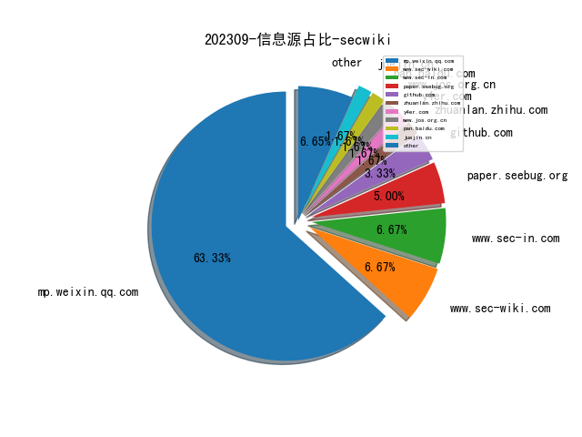
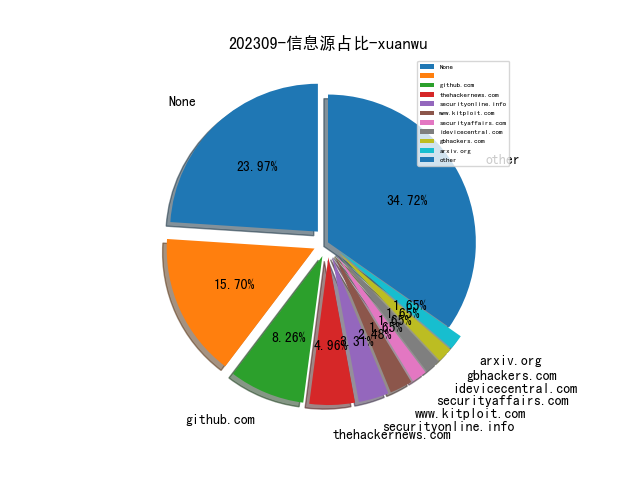
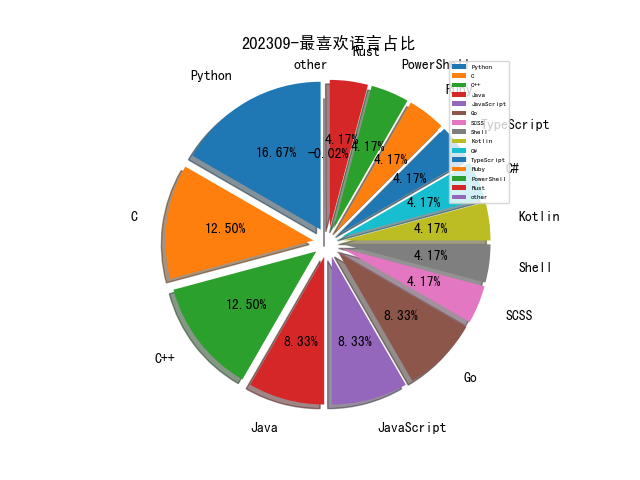

# [数据--所有](README_20.md)
# [数据--年度](README_2023.md)
# 202309 信息源与信息类型占比

# 网络安全书籍 推荐
| date_added | language | title | author | link | size| 
| --- | --- | --- | --- | --- | ---| 
| 2023-09-05 15:06:23 | English | Real-Time Environmental Monitoring | Miguel F. Acevedo | http://libgen.rs/book/index.php?md5=03C4527483DFA81BBD090D30EDC2DF96 | 51 MB [PDF]| 

# 微信公众号 推荐
| nickname_english | weixin_no | title | url| 
| --- | --- | --- | ---| 
| 安全学术圈 | secquan | 北京邮电大学 , 非法移动赌博应用程序揭秘 | https://mp.weixin.qq.com/s/cinkcJfb6jejD61xosJnqw | 1| 
| 娜璋AI安全之家 | gh_91f1fe28fc6e | [系统安全] 五十三.DataCon竞赛 (2)2022年DataCon涉网分析之恶意样本IOC自动化提取详解 | https://mp.weixin.qq.com/s/f1ahob8H30EeAAgJ0R3pMg | 1| 
| QingScan | qingscan | 自动化数据安全检测工具：DataSec | https://mp.weixin.qq.com/s/LqKibMx_p39zv1vS4Gj2yg | 1| 
| 穿过丛林 | gh_f90eac70537b | ASE22：基于树图构建的大规模语义克隆检测TreeCen | https://mp.weixin.qq.com/s/kpPHM6A49lyILhViigUe3Q | 1| 
| 航电科技圈 | gh_d814ea15711a | 机载软件建模与仿真技术研究 | https://mp.weixin.qq.com/s/FISEufs4RIukqCSYxmgfBQ | 1| 
| 绿盟科技研究通讯 | nsfocus_research | 论文解读：《From ChatGPT to ThreatGPT》(上） | https://mp.weixin.qq.com/s/IzaQ2c7Y1_g9WNXol7NQnw | 1| 
| SecWiki | SecWiki | APT终结者之流量实名制（上） | https://mp.weixin.qq.com/s/L6B65rBCI67elNiUBtOgyw | 1| 
| 安全行者老霍 | gh_c2b78e839fd7 | OpenVAS vs. Nessus：漏洞扫描工具对比 | https://mp.weixin.qq.com/s/utlfmdDv14rNQ71Aykppxw?poc_token=HMdA9WSjMcE0m6Wftcwqqr9CZZt0xXMy75oj6Raj | 1| 
| 安全419 | anquan-419 | 杨冀龙：企业必须有自己的灵魂 需打造独特竞争力 | https://mp.weixin.qq.com/s/RpM7OZupYWijdvNDfR07WQ | 1| 
| 信息安全与通信保密杂志社 | cismag2013 | 美陆军云环境建设最新进展 | https://mp.weixin.qq.com/s/jmIK8RYD6iOLQ3j4gsqvCQ | 2| 
| Crypto Lab | cryptosystems | 基于公有链的隐匿通信技术 | https://mp.weixin.qq.com/s/So4uKfYypTGPd0gsRbGwZA | 1| 
| 洞源实验室 | gh_4929169c5e90 | Apache Tomcat请求走私漏洞 CVE-2022-42252 | https://mp.weixin.qq.com/s/IJ-MGRVJ0Ac3Iy57sY4xOg | 1| 

# 私人github账号 推荐
| github_id | title | url | p_url | p_profile | p_loc | p_company | p_repositories | p_projects | p_stars | p_followers | p_following | repo_lang | repo_star | repo_forks | 
| --- | --- | --- | --- | --- | --- | --- | --- | --- | --- | --- | --- | --- | --- | ---| 
| nquinlan | 为什么 Math.random 不应该用于生产环境的编程 | https://github.com/nquinlan/better-random-numbers-for-javascript-mirror | https://github.com/MLH | COO @MLH | Seattle, WA | Major League Hacking | 95 | 0 | 80 | 0 | 0 | JavaScript,Ruby | 0 | 0 | 1| 
| notfromstatefarm | nvflashk - 一款绕过GP BIOS的工具，允许用户绕过工厂BIOS的所有限制，使用户能够从他们所购买的硬件中获得最大性能 | https://github.com/notfromstatefarm/nvflashk | https://github.com/notfromstatefarm?tab=followers | beep beep | None | None | 11 | 0 | 8 | 0 | 0 | Go | 0 | 0 | 1| 
| microsoft | 围绕开发的一款工业控制系统PLC的取证工具 | https://github.com/microsoft/ics-forensics-tools | None | None | None | None | 0 | 0 | 0 | 0 | 0 | SCSS,TypeScript,Java,C#,JavaScript,C++,Python,PowerShell | 0 | 0 | 1| 
| cellebrite-labs | 一种用于将 Apple 沙箱配置文件逆向（反编译）为其原始 SBPL 格式（Sandbox Profile Language，一种类似 Scheme 的语言）的工具 | https://github.com/cellebrite-labs/sandblaster | None | None | None | None | 0 | 0 | 0 | 0 | 0 | Python,C | 0 | 0 | 1| 
| Tylous | SniffAir：一个开源的无线安全框架 | https://github.com/Tylous/SniffAir | https://github.com/Tylous?tab=followers |  | None | Optiv | 35 | 0 | 54 | 0 | 0 | Python,Go,C | 0 | 0 | 1| 
| Feysh-Group | corax-community: SAST产品Corax的免费社区版 | https://github.com/Feysh-Group/corax-community | None | None | None | None | 0 | 0 | 0 | 0 | 0 | Kotlin,Java | 0 | 0 | 1| 
| 0xKayala | 一个基于 Nuclei 和 Paramspider的web应用fuzzer | https://github.com/0xKayala/NucleiFuzzer | https://github.com/0xKayala?tab=followers | Certified Ethical Hacker , Penetration Tester , Bug Hunter , Security Researcher | Remote | Vatins | 113 | 0 | 395 | 0 | 0 | Shell | 0 | 0 | 1| 

# 知乎 推荐
| title | url| 
| --- | ---| 
| 关于AI in Security，各个大厂都做了什么——Google篇 | https://zhuanlan.zhihu.com/p/654955997| 

# 日更新程序
`python update_daily.py`