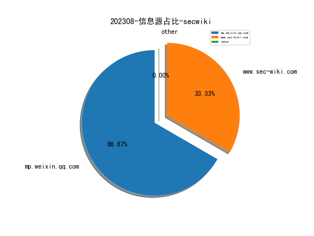
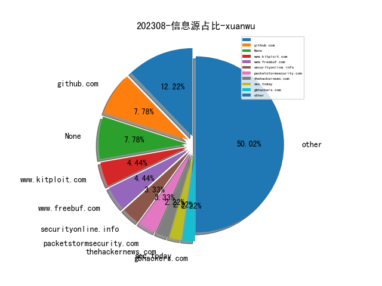
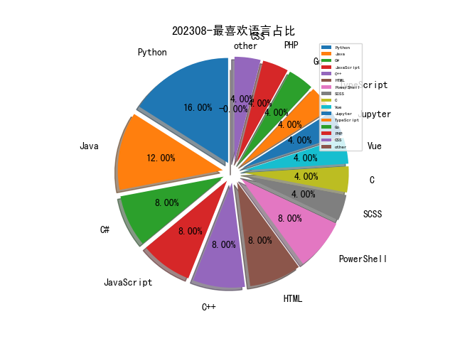

# [数据--所有](README_20.md)
# [数据--年度](README_2023.md)
# 202308 信息源与信息类型占比

# 政策 推荐
| title | url| 
| --- | ---| 
| 个人信息保护合规审计管理办法（征求意见稿） | http://www.cac.gov.cn/2023-08/03/c_1692628348448092.htm| 

# 网络安全书籍 推荐
| date_added | language | title | author | link | size| 
| --- | --- | --- | --- | --- | ---| 
| 2023-08-07 04:38:09 | English | (Synthesis Lectures on Engineering, Science, and Technology) Deep Learning-Powered Technologies. Autonomous Driving, Artificial Intelligence of Things (AIoT), Augmented Reality, 5G Communications and Beyond | Khaled Salah Mohamed | http://libgen.rs/book/index.php?md5=D05425526EF00521EA4A383ADB1ECC8F | 8 MB [PDF]| 
| 2023-08-06 14:46:43 | English | Proven Programs in Education: Classroom Management and Assessment | Robert Slavin | http://libgen.rs/book/index.php?md5=4E60CD5D56FFA45D09C1B6EEDCFB0D52 | 1 MB [EPUB]| 
| 2023-08-06 14:43:18 | English | (Community, Environment and Disaster Risk Management Ser.) Building Resilient Urban Communities | Jonas Joerin; Rajib Shaw; R. R. Krishnamurthy | http://libgen.rs/book/index.php?md5=FF3135CC5AF016D8495858213A5F09BE | 7 MB [PDF]| 
| 2023-08-03 03:47:10 | English | From Fraud to Freedom | Njoroge | http://libgen.rs/book/index.php?md5=19BAECE464D553ACF5F143FB72541CE0 | 921 kB [EPUB]| 
| 2023-08-02 01:34:57 | English | Property Rich: Secure Your Financial Freedom | Melissa Opie; Stephen Zamykal | http://libgen.rs/book/index.php?md5=D1EEB51BC5BF67D9DBEE2D14CDF4901D | 7 MB [EPUB]| 
| 2023-08-02 00:44:45 | English | Relationship Reset: How to break the cycle of conflict and create secure and lasting love | Lissy Abrahams | http://libgen.rs/book/index.php?md5=3E0FDED1EE3AA4981812A0D22B42E517 | 2 MB [EPUB]| 
| 2023-08-01 16:47:02 | English | Britain Since 1945: Aspects of Identity | P. Leese | http://libgen.rs/book/index.php?md5=B17B374B9B0BE133B6207259DEC35BEB | 48 MB [PDF]| 

# 微信公众号 推荐
| nickname_english | weixin_no | title | url| 
| --- | --- | --- | ---| 
| 洞源实验室 | gh_4929169c5e90 | Hutool资源消耗漏洞 CVE-2022-4565 | https://mp.weixin.qq.com/s/QoFSFdYqQxwGlpbeLn9ebA | 1| 
| 信息安全与通信保密杂志社 | cismag2013 | 2022 年美欧网络演习解析 | https://mp.weixin.qq.com/s/HwpMne6hktQmgvcjArKw4Q | 3| 
| 观澜安全团队 | GlanSec | 微软 Amsi 反病毒接口逆向详解和绕过思路 | https://mp.weixin.qq.com/s/N7LXbOkxiq6jIo5MIbUw7A | 1| 
| 安全学术圈 | secquan | 奇安信 , 软件源中与软件包相关的安全威胁 | https://mp.weixin.qq.com/s/prQIDYxM5MM29b4BgVQRHg | 1| 
| 纽创信安 | OSR_Shenzhen | 硬件安全闲话第一篇：硬件安全的基本概念 | https://mp.weixin.qq.com/s/Sp1SI_7qhzOYfCMVIgGmQA | 1| 
| 清河六点下班 | wugoulab | 数据库自动取样: DataMiner | https://mp.weixin.qq.com/s/EXYTCBk-8qO85qFEPkYNDQ | 1| 
| 安全419 | anquan-419 | 智慧停车平台被曝大规模数据泄露 API安全缺陷成风险根因 | https://mp.weixin.qq.com/s/r0lGJtPYOljbnXUSpS9X-g | 1| 
| 绿盟科技研究通讯 | nsfocus_research | 软件供应链检测工具现状分析 | https://mp.weixin.qq.com/s/FCPBzsRg9XGnjlWbV64KmA | 1| 
| 潇湘信安 | xxxasec | 第三方远控软件在渗透中的利用 | https://mp.weixin.qq.com/s/JM_Gt3U3eLzEmI9qCV8kZA | 1| 
| 安全村SecUN | sec-un | 为啥搜索我的公司，打开竟然是个菠菜网站｜黑帽SEO技术 | https://mp.weixin.qq.com/s/N0BCuwXVGMzJcw_A9DETPA | 2| 
| 印说者也 | gh_5eca69297427 | 盗号攻击的横纵切分与攻防策略 | https://mp.weixin.qq.com/s/InrTwqdR2i7o-BZZrVti_Q | 1| 
| FreeBuf | freebuf | 卡巴斯基：2023年第二季度APT趋势报告 | https://mp.weixin.qq.com/s/o2LEBfhDeGiQ9w2-gRP9dQ | 1| 
| CTIO威胁观测 | ctio-996 | 【论文】使用Transformer-Based模型生成虚假的网络威胁情报 | https://mp.weixin.qq.com/s/D--a0bXmV8DZsplZUvtmsg | 1| 
| 慢雾科技 | SlowMist | 警惕隐蔽的 Rug Pull，合约存储引起的跑路盘 | https://mp.weixin.qq.com/s/sOa6p0-IczCHkUAx9rREhg | 1| 

# 私人github账号 推荐
| github_id | title | url | p_url | p_profile | p_loc | p_company | p_repositories | p_projects | p_stars | p_followers | p_following | repo_lang | repo_star | repo_forks | 
| --- | --- | --- | --- | --- | --- | --- | --- | --- | --- | --- | --- | --- | --- | ---| 
| wh0amitz | 利用Kerberos讲本地权限提升至system的工具 | https://github.com/wh0amitz/S4UTomato | https://github.com/wh0amitz?tab=followers | Student & Pentesting & Security research | Beijing | None | 7 | 0 | 242 | 0 | 0 | C#,C,HTML,PowerShell,C++ | 0 | 0 | 1| 
| Zigrin-Security | 基于 CakePHP 框架的 Web 应用程序中漏洞发现的自动化过程 | https://github.com/Zigrin-Security/CakeFuzzer | None | None | None | None | 0 | 0 | 0 | 0 | 0 | Python,PHP | 0 | 0 | 1| 
| Cyb3r-Monk | 检测网络上活跃的C&C活动的工具 | https://github.com/Cyb3r-Monk/ACCD | https://github.com/Cyb3r-Monk?tab=followers | Cyb3rMonk | Netherlands | None | 71 | 0 | 303 | 0 | 0 | Jupyter | 0 | 0 | 1| 

# 日更新程序
`python update_daily.py`