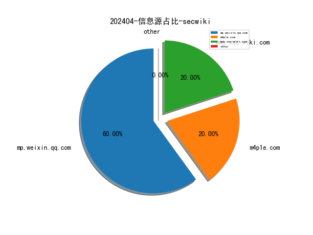
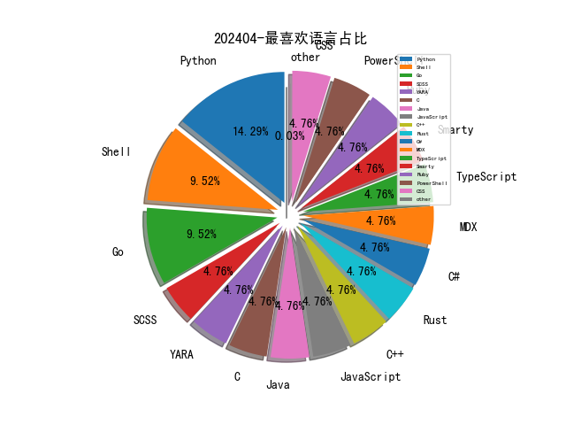

# [数据--所有](README_20.md)
# [数据--年度](README_2024.md)
# 202404 信息源与信息类型占比

# 网络安全书籍 推荐
| date_added | language | title | author | link | size| 
| --- | --- | --- | --- | --- | ---| 
| 2024-04-14 10:19:58 | English | Extending Power BI with Python and R, Second Edition | unknown | https://www.wowebook.org/extending-power-bi-with-python-and-r-second-edition/ | unknown| 
| 2024-04-13 03:09:41 | English | The New China Playbook: Beyond Socialism and Capitalism | Keyu Jin | http://libgen.rs/book/index.php?md5=6C8917CA5D0BA36791790E67944BD5A3 | 1 MB [EPUB]| 
| 2024-04-13 13:22:15 | English | Introduction to Cryptography: Principles and Applications (Information Security and Cryptography) | Helmut Knebl Hans Delfs | http://libgen.rs/book/index.php?md5=48E9A483416BFAB0D82C56E77E8F028A | 4 MB [PDF]| 
| 2024-04-12 20:37:20 | English | Stepping Through Cybersecurity Risk Management: A Systems Thinking Approach | Jennifer L. Bayuk | http://libgen.rs/book/index.php?md5=B77F4B8D6D76A0FD05CF46673DDADFDD | 29 MB [RAR]| 
| 2024-04-12 20:37:17 | English | Stepping Through Cybersecurity Risk Management : A Systems Thinking Approach | Jennifer L. Bayuk | http://libgen.rs/book/index.php?md5=941699B7040077250D6F7843BEA914D7 | 18 MB [EPUB]| 
| 2024-04-12 20:37:13 | English | Stepping Through Cybersecurity Risk Management: A Systems Thinking Approach | Jennifer L. Bayuk | http://libgen.rs/book/index.php?md5=2513941CEB782BD567D66D534D6689B2 | 10 MB [PDF]| 
| 2024-04-11 11:48:50 | English | Structural Health Monitoring by Time Series Analysis and Statistical Distance Measures (PoliMI SpringerBriefs) | Alireza Entezami | http://libgen.rs/book/index.php?md5=A1D42C18E96699148401F8AF611F8CC0 | 5 MB [PDF]| 
| 2024-04-11 08:58:26 | English | Python All-in-One For Dummies, 3rd Edition | unknown | https://www.wowebook.org/python-all-in-one-for-dummies-3rd-edition/ | unknown| 
| 2024-04-10 14:58:04 | English | Information Security Planning: A Practical Approach | Susan Lincke | http://libgen.rs/book/index.php?md5=D519F0ADCC9A7A60ABD8BCE0CFB3FC6E | 13 MB [PDF]| 
| 2024-04-10 14:57:13 | English | Increasing Climate Variability and Change: Reducing the Vulnerability of Agriculture and Forestry | James Salinger (editor), Mannava VK Sivakumar (editor), Raymond P. Motha (editor) | http://libgen.rs/book/index.php?md5=C181250C9E89658CDEDCBB36D6E8B6EA | 13 MB [PDF]| 
| 2024-04-10 14:54:34 | English | Information and Cyber Security: 18th International Conference, ISSA 2019, Johannesburg, South Africa, August 15, 2019, Proceedings (Communications in Computer and Information Science, 1166) | Hein Venter (editor), Marianne Loock (editor), Marijke Coetzee (editor), Mariki Eloff (editor), Jan Eloff (editor) | http://libgen.rs/book/index.php?md5=35D0A71758EF69DF6C2BC58AC7777FED | 12 MB [PDF]| 
| 2024-04-08 13:41:36 | English | Financial Cryptography and Data Security: 25th International Conference, FC 2021, Virtual Event, March 1–5, 2021, Revised Selected Papers, Part II (Security and Cryptology) | Nikita Borisov (editor), Claudia Diaz (editor) | http://libgen.rs/book/index.php?md5=40ABFFD1B525794BA01CEBE7BA881BB9 | 25 MB [PDF]| 
| 2024-04-07 11:50:34 | English | Synthetic Data and Generative AI | unknown | https://www.wowebook.org/synthetic-data-and-generative-ai/ | unknown| 
| 2024-04-07 13:47:25 | English | Large Language Model-Based Solutions: How to Deliver Value with Cost-Effective Generative AI Applications | unknown | https://www.wowebook.org/large-language-model-based-solutions-how-to-deliver-value-with-cost-effective-generative-ai-applications/ | unknown| 
| 2024-04-07 13:06:55 | English | Microsoft SharePoint Premium in the Real World: Bringing Practical Cloud AI to Content Management | unknown | https://www.wowebook.org/microsoft-sharepoint-premium-in-the-real-world-bringing-practical-cloud-ai-to-content-management/ | unknown| 
| 2024-04-06 18:55:16 | English | ChatGPT for Cybersecurity Cookbook | unknown | https://www.wowebook.org/chatgpt-for-cybersecurity-cookbook/ | unknown| 
| 2024-04-05 10:17:18 | English | Microsoft 365 Administrator MS-102 Exam Guide | Aaron Guilmette | http://libgen.rs/book/index.php?md5=E30324C59A2DD3FB90ACDA853F701DD2 | 39 MB [PDF]| 
| 2024-04-04 15:29:46 | English | Python Pandas and Python Data Structures for Beginners | JP Parker | http://libgen.rs/book/index.php?md5=849215ADC33344BF08AADFB0FC6860B3 | 71 MB [PDF]| 
| 2024-04-04 15:19:07 | English | Emerging Technologies in Data Mining and Information Security: Proceedings of IEMIS 2022, Volume 1 (Lecture Notes in Networks and Systems, 491) | Paramartha Dutta (editor), Satyajit Chakrabarti (editor), Abhishek Bhattacharya (editor), Soumi Dutta (editor), Vincenzo Piuri (editor) | http://libgen.rs/book/index.php?md5=A6C83A88BFC79A0F7FB44CB8658C664D | 24 MB [PDF]| 
| 2024-04-04 15:05:04 | English | Emerging Technologies in Data Mining and Information Security: Proceedings of IEMIS 2022, Volume 2 (Lecture Notes in Networks and Systems, 490) | Paramartha Dutta (editor), Satyajit Chakrabarti (editor), Abhishek Bhattacharya (editor), Soumi Dutta (editor), Celia Shahnaz (editor) | http://libgen.rs/book/index.php?md5=7AAFDB868B4CDE2F7A7715D23A137273 | 23 MB [PDF]| 
| 2024-04-04 15:02:33 | English | Emerging Technologies in Data Mining and Information Security: Proceedings of IEMIS 2022, Volume 3 (Advances in Intelligent Systems and Computing, 1348) | Paramartha Dutta (editor), Abhishek Bhattacharya (editor), Soumi Dutta (editor), Wen-Cheng Lai (editor) | http://libgen.rs/book/index.php?md5=2ABD51FFCB92C4E43D4D330183146D12 | 23 MB [PDF]| 
| 2024-04-04 17:40:45 | English | Electronic Fetal Monitoring | Xiaohui Guo (editor) | http://libgen.rs/book/index.php?md5=AA4518522270C37690C19A22D0E37B79 | 35 MB [PDF]| 
| 2024-04-04 14:58:13 | English | EcoDesign and Sustainability II: Social Perspectives and Sustainability Assessment (Sustainable Production, Life Cycle Engineering and Management) | Yusuke Kishita (editor), Mitsutaka Matsumoto (editor), Masato Inoue (editor), Shinichi Fukushige (editor) | http://libgen.rs/book/index.php?md5=1712B759CF72ADFC3F5655A38A098B99 | 22 MB [PDF]| 
| 2024-04-04 14:24:26 | English | Emerging Trends in Cybersecurity Applications | Kevin Daimi (editor), Abeer Alsadoon (editor), Cathryn Peoples (editor), Nour El Madhoun (editor) | http://libgen.rs/book/index.php?md5=DFF3ECF1983BECFFAA2CFD7B8F7125F5 | 21 MB [PDF]| 

# 微信公众号 推荐
| nickname_english | weixin_no | title | url| 
| --- | --- | --- | ---| 
| Bypass | Bypass-- | 《云原生安全攻防》-- 云原生攻防矩阵 | https://mp.weixin.qq.com/s?__biz=MzA3NzE2MjgwMg==&mid=2448909343&idx=1&sn=6f5d84e17e38bd1a98082bee3572b440 | 1| 
| CISSP | wxxinchuangsec | 美亚柏科：裁减 635 人、亏损 2 亿、市值暴降 124 亿 | https://mp.weixin.qq.com/s?__biz=Mzg4MTg0MjQ5OA==&mid=2247484779&idx=1&sn=b246eb917c3614fb64c0ef24a8ee3466 | 6| 
| Coder小Q | Litt1eQueen | u200b探索RSA密钥格式：数字安全的建筑基石 | https://mp.weixin.qq.com/s?__biz=MzUwOTc3MTQyNg==&mid=2247488637&idx=1&sn=2ab3f89529779faf80ff6a3649f7f837 | 3| 
| FreeBuf | freebuf | 22% 的员工承认违规使用 AI | https://mp.weixin.qq.com/s?__biz=MjM5NjA0NjgyMA==&mid=2651269178&idx=1&sn=61a46fca0fd8c946b0345869375cf1d7 | 40| 
| HACK之道 | hacklearn | 实战,一次煎熬的HVV打点经历 | https://mp.weixin.qq.com/s?__biz=MzIwMzIyMjYzNA==&mid=2247513452&idx=1&sn=85a927bee568da5d8dbf4c5841358f1e | 7| 
| Hack分享吧 | HackShareB | JScanner！递归式网站路径检测工具 | https://mp.weixin.qq.com/s?__biz=MzA4NzU1Mjk4Mw==&mid=2247490312&idx=1&sn=793a970cb8aa9d791598e7e95cf166d3 | 1| 
| IoVSecurity | IoVSecurity | 以太网安全 - 效果如何? nxp | https://mp.weixin.qq.com/s?__biz=MzU2MDk1Nzg2MQ==&mid=2247606621&idx=1&sn=f7ec0a96419fa0916434253eb800ddb5 | 15| 
| KK安全说 | kksecurity | 再谈“OSINT”和“尼日尔事件” | https://mp.weixin.qq.com/s?__biz=Mzg4NzgyODEzNQ==&mid=2247486831&idx=1&sn=e2d5473bcaedd0f5d78a5a1db2c041c0 | 16| 
| MicroPest | None | cewl爬取+dirtycow提权：Lampiao靶机 | https://mp.weixin.qq.com/s?__biz=MjM5NDcxMDQzNA==&mid=2247488760&idx=1&sn=7f373bf5362960bf0c601ac173cac4d5 | 2| 
| OpenWrt | gh_0c676b3c6a77 | 支持刷机的路由器大全（2024） | https://mp.weixin.qq.com/s?__biz=MzU4MTgxNDc2MQ==&mid=2247485636&idx=1&sn=2d28022d4c81e3e30d6a4a9203f57fce | 2| 
| Ots安全 | AnQuan7 | CVE-2024-20670 报告 - “新 Outlook”NTLM 泄漏和文件执行 | https://mp.weixin.qq.com/s?__biz=MzAxMjYyMzkwOA==&mid=2247506303&idx=1&sn=7bde7dc361bd64dfca7f8834b7a428a4 | 23| 
| RushB安全小队 | gh_49a3570aec26 | Pixel刷机教程 | https://mp.weixin.qq.com/s?__biz=MzkxMzUwODkwNw==&mid=2247483857&idx=1&sn=2a7785b0d3605ce9b2d5c19b1202e5bc | 1| 
| Sec探索者 | gh_46a14c338f91 | Java代码审计课程正式开课！超低价位！干货满满！ | https://mp.weixin.qq.com/s?__biz=MzkyNDYwNTcyNA==&mid=2247484310&idx=1&sn=01eb41b9d53e3af692eac54fe1ac51a0 | 1| 
| Theloner安全团队 | lonersec | 白帽赏金赛晋级名单公布 | https://mp.weixin.qq.com/s?__biz=MzI2Mzc4ODc1NQ==&mid=2247488992&idx=1&sn=454842b2d4c167e5eb66074c67aa0b16 | 1| 
| WebSec | gh_2914f5b10e8e | 2024HW，网安文档都说靠谱的供应商，你确定不投吗？ | https://mp.weixin.qq.com/s?__biz=MzkyMzYwNTEyNg==&mid=2247485910&idx=1&sn=ff907d2d8ef3a366bbdc3e174d75fa49 | 1| 
| WgpSec狼组安全团队 | wgpsec | HackPack（LLM挑战）Writeup | https://mp.weixin.qq.com/s?__biz=MzIyMjkzMzY4Ng==&mid=2247505125&idx=1&sn=528c0adf952b3dc446b54a93aa0dd9c9 | 3| 
| dotNet安全矩阵 | doNetSafety | .NET 矩阵W15增量红队工具集合 | https://mp.weixin.qq.com/s?__biz=MzUyOTc3NTQ5MA==&mid=2247491380&idx=1&sn=cdc5ce6341d443ef57263d2502102de4 | 8| 
| kali笔记 | bbskali-cn | 简单增加自己的步数 装逼技能+1000000 | https://mp.weixin.qq.com/s?__biz=MzkxMzIwNTY1OA==&mid=2247504166&idx=1&sn=760058f22ce74eca63271ba0a8478452 | 4| 
| thelostworld | gh_3f2e5b9f028c | 求贤-招聘-360红队攻防专家base：成都、广州 | https://mp.weixin.qq.com/s?__biz=MzIyNjk0ODYxMA==&mid=2247487485&idx=1&sn=b0e441252f6ea553bb9b13f027fe9593 | 2| 
| 不秃头的安全 | BTTDAQ | 沈阳深蓝24年国HW招聘 | https://mp.weixin.qq.com/s?__biz=Mzg3NzkwMTYyOQ==&mid=2247486470&idx=1&sn=5a671fa03b6ad5cf8a4c7b3f238ec757 | 3| 
| 中国数据安全产业网 | gh_a30bfee064c9 | 正式开赛！第二届数据安全大赛暨首届“数信杯”数据安全大赛数据安全积分争夺赛预赛 | https://mp.weixin.qq.com/s?__biz=Mzg2OTczNjMwNQ==&mid=2247488810&idx=1&sn=6fbc657f7fdb1429f881818400d29cad | 6| 
| 乌雲安全 | hackctf | 安全圈招聘,网商银行招人 | https://mp.weixin.qq.com/s?__biz=MzAwMjA5OTY5Ng==&mid=2247521812&idx=1&sn=4a51a4642b98df689df8b66a996fe08b | 6| 
| 亚信安全 | yaxinanquan | 在线药房数据惨遭Ransomhub窃取，亚信安全发布《勒索家族和勒索事件监控报告》(2024年第12期) | https://mp.weixin.qq.com/s?__biz=MjM5NjY2MTIzMw==&mid=2650613717&idx=1&sn=3f7357f99d7a8fd1ea13e6c7d8ffb874 | 10| 
| 亿人安全 | Yr-Sec | 师傅们！找到一个接私活的好地方！ | https://mp.weixin.qq.com/s?__biz=Mzk0MTIzNTgzMQ==&mid=2247514722&idx=1&sn=5594276e8ef12925912c9ce45481ff32 | 7| 
| 信安404 | None | 重点系统指纹漏洞验证工具 | https://mp.weixin.qq.com/s?__biz=Mzk0NjQ5MTM1MA==&mid=2247488709&idx=1&sn=2caee9aec7d05b84e5894d936c1d52b3 | 4| 
| 内生安全联盟 | CCESS_CHINA | 涨知识 , 网络安全167个专业术语全面解析 | https://mp.weixin.qq.com/s?__biz=Mzg4MDU0NTQ4Mw==&mid=2247518214&idx=1&sn=698786aea3225eaeb7bc3dc0dc48edeb | 16| 
| 利刃信安 | DMXGFSYS | 【漏洞总结】常见漏洞总结归纳自学路线图 | https://mp.weixin.qq.com/s?__biz=MzU1Mjk3MDY1OA==&mid=2247512943&idx=1&sn=f8894afe64eeed6be2da8e13a2183ad0 | 4| 
| 北邮 GAMMA Lab | BUPT_GAMMA | AAAI 24 , 基于序列超图和对抗学习增强多尺度扩散预测 | https://mp.weixin.qq.com/s?__biz=Mzg4MzE1MTQzNw==&mid=2247489531&idx=1&sn=5ddc0ba19644549d59c7ebd42b8d9c21 | 1| 
| 合天网安实验室 | hee_tian | 4.15全民国家安全教育日！文末有福利 | https://mp.weixin.qq.com/s?__biz=MjM5MTYxNjQxOA==&mid=2652904789&idx=1&sn=f3ac66c965aead27a43d2813bd394974 | 11| 
| 呼啦啦安全 | gh_586ce4241b73 | u200bAPP逆向系列(一) | https://mp.weixin.qq.com/s?__biz=Mzg5OTg5NzkwNw==&mid=2247484866&idx=1&sn=c2bd3dfb02b0289be5a0555cd3b09db9 | 1| 
| 夜组安全 | NightCrawler_Team | Catcher(捕手) 重点系统指纹漏洞验证工具，适用于外网打点，资产梳理漏洞检查。 | https://mp.weixin.qq.com/s?__biz=Mzk0ODM0NDIxNQ==&mid=2247490372&idx=1&sn=d7caf1371a9ada3af06d409bf7b91b2f | 3| 
| 安全后厨 | sanxingfengaa | 风景2——上海植物园 | https://mp.weixin.qq.com/s?__biz=MzI3MDQ1NDE2OA==&mid=2247490631&idx=1&sn=4fa2cc1f628786eab16b92653302f531 | 2| 
| 安全学习那些事儿 | aqxxse | 安全工程师因窃取1200万美元加密货币被判入狱3年 | https://mp.weixin.qq.com/s?__biz=MzkxNTI2NTQxOA==&mid=2247491696&idx=1&sn=753601c18a44609f082ba0868fe92402 | 7| 
| 安全新说 | InSightNIS | 2023-2024爱分析·信创厂商全景报告 | https://mp.weixin.qq.com/s?__biz=MzA3NDIwNTY5Mw==&mid=2247503854&idx=1&sn=77b7ff43790d04e5e1148cde38e38c20 | 4| 
| 安全狗的自我修养 | haidragon_study | zCamera，一个拥有超过1亿次安装的应用，从远程入侵到数据泄露。 | https://mp.weixin.qq.com/s?__biz=MzkwOTE5MDY5NA==&mid=2247495134&idx=1&sn=0aafc5041d692b91dd9e21d7c39b4148 | 5| 
| 安在 | None | 知识星球 , 如何对敏感数据的日志分类和统计？安全驱动创新和云趋势状况如何？ | https://mp.weixin.qq.com/s?__biz=MzU5ODgzNTExOQ==&mid=2247620045&idx=1&sn=2a693a2195d6b8b6499650fd4e458f77 | 19| 
| 安天集团 | Antiylab | 安天网络行为检测能力升级通告（20240414） | https://mp.weixin.qq.com/s?__biz=MjM5MTA3Nzk4MQ==&mid=2650205093&idx=1&sn=eb1a54b29add1d202c085c40c9f5379c | 3| 
| 实战安全研究 | gh_f390fc63c711 | 继上章简单代码审计一波 | https://mp.weixin.qq.com/s?__biz=MzU0MTc2NTExNg==&mid=2247490009&idx=1&sn=451ec47bd8d72b3df8a8bc5e471d9a6d | 4| 
| 寒鹭网络安全团队 | hanlu_security | el表达式注入漏洞 | https://mp.weixin.qq.com/s?__biz=MzkwNDQxODMzNg==&mid=2247484629&idx=1&sn=3ca94535ef902fbe9504deae6866e0d9 | 1| 
| 小黑子安全 | xiaoheizi537981 | 接口漏洞-WebService-wsdl+SOAP-Swagger+HTTP-WebPack | https://mp.weixin.qq.com/s?__biz=Mzg5NDg4MzYzNQ==&mid=2247486418&idx=1&sn=4fcee48a2ac02fc57350d19f362ec045 | 4| 
| 情报分析师 | Intelligencer1 | 以色列如何防御伊朗的无人机袭击 | https://mp.weixin.qq.com/s?__biz=MzA3Mjc1MTkwOA==&mid=2650548366&idx=1&sn=42ac4c158c015f82d0c03cc730194215 | 7| 
| 情报分析师Pro | globalpolice | 揭秘伊朗军事力量 | https://mp.weixin.qq.com/s?__biz=MzkwNzM0NzA5MA==&mid=2247497525&idx=1&sn=8fc17ab93787a8d21a947b12bd370530 | 7| 
| 技术修道场 | gh_fe3e6e63e435 | 如何理解进程调度机制？ | https://mp.weixin.qq.com/s?__biz=MzA4NTY4MjAyMQ==&mid=2447898747&idx=1&sn=a29658c5c4c1782a912159d5d6d741a6 | 4| 
| 掌控安全EDU | ZKAQEDU | HW面试经验分享 , 某服蓝队初级 | https://mp.weixin.qq.com/s?__biz=MzUyODkwNDIyMg==&mid=2247539021&idx=1&sn=acddc43a6e071e03f03f9d84031c9d52 | 10| 
| 教父爱分享 | jiaofutql | 伊朗黑客关闭以色列铁穹导弹防御系统？下一个安全军工风口是无人机？ | https://mp.weixin.qq.com/s?__biz=MzI1Mjc3NTUwMQ==&mid=2247534626&idx=1&sn=130715fba54463cac88ea23ccd2d9566 | 1| 
| 数据何规 | PIPL2021 | 煮酒言规 , 第116期 , 社保号是敏感个人信息吗？ | https://mp.weixin.qq.com/s?__biz=MzU1MzAzNzcwNw==&mid=2247490437&idx=1&sn=5aa0c9df764752665d125d0e8b18fadd | 7| 
| 数据取证杂谈 | None | 审讯高手的独门秘籍——如何深度洞察人心 | https://mp.weixin.qq.com/s?__biz=MzkwMzE4NDQ5MA==&mid=2247485524&idx=1&sn=b4385e869ecf670af466762ee3b2007e | 3| 
| 数据学堂 | data_school | 111页Word , 数据治理咨询项目投标文件 | https://mp.weixin.qq.com/s?__biz=MzkyMDE5ODYwMw==&mid=2247523963&idx=1&sn=0fdcfbc6d3c61196eb5f0e97e1376a11 | 5| 
| 数据安全矩阵 | gh_5d34ca8a20a1 | 杭州动态,研究报告｜《“中国数谷”数据要素流通安全白皮书》（附下载） | https://mp.weixin.qq.com/s?__biz=Mzg3OTg5MzAzNw==&mid=2247491972&idx=1&sn=ac8af05e91c015e85ae2ff499f6e1b0d | 4| 
| 李白你好 | libai_hello | 某次小红书帮助下的Edu SRC挖掘 | https://mp.weixin.qq.com/s?__biz=MzkwMzMwODg2Mw==&mid=2247506232&idx=1&sn=dfc28b2260e455399abc4a2f8a9ed1b3 | 1| 
| 棉花糖网络安全圈 | hacker-mht | BurpSuite插件集成Ehole指纹库并进行常见OA弱口令爆破插件 | https://mp.weixin.qq.com/s?__biz=Mzg5NTYwMDIyOA==&mid=2247504341&idx=1&sn=7229281c3948d00d764ee7c30230512b | 2| 
| 河南等级保护测评 | hndjbh | 美国国家安全局发布数据安全指南 | https://mp.weixin.qq.com/s?__biz=Mzg2NjY2MTI3Mg==&mid=2247494701&idx=1&sn=e32cb3b02043a4aa03ddcc6ec44b0d9a | 8| 
| 洞见网安 | doonsec | 网安简报【2024/4/13】 | https://mp.weixin.qq.com/s?__biz=MzAxNzg3NzMyNQ==&mid=2247487740&idx=1&sn=9a9fbaf484c9f080bd433ce20b424407 | 3| 
| 浙大网安 | gh_e603b55057e7 | 区块链与数据安全全重实验室成果发布：深度合成语音检测平台 | https://mp.weixin.qq.com/s?__biz=Mzg5NDczNDc4NA==&mid=2247494636&idx=1&sn=c62c49f165963ed383759d2f0a6473ed | 1| 
| 渗透测试知识学习 | stcszsxx | 渗透测试中最基础的思路 | https://mp.weixin.qq.com/s?__biz=MzI1MzQwNjEzNA==&mid=2247484042&idx=1&sn=cfe9e262d1d75181ed41fd6daa1fd0e1 | 7| 
| 潇湘信安 | xxxasec | 挖洞总是漏？超全checklist奉上！ | https://mp.weixin.qq.com/s?__biz=Mzg4NTUwMzM1Ng==&mid=2247509656&idx=1&sn=3303d561f73b375183c4f005f7fad7ee | 1| 
| 狐狸说安全 | itseckpg | 师傅们，这个新方向爆了！70k很稳 | https://mp.weixin.qq.com/s?__biz=MzUzMDQ1MTY0MQ==&mid=2247505523&idx=1&sn=20bc6dee82f841073d6ec433346753e0 | 1| 
| 玄道夜谈 | None | 分享图片 | https://mp.weixin.qq.com/s?__biz=MzI3Njc1MjcxMg==&mid=2247491815&idx=1&sn=c05b0478b9350edf10a2fcb7861f6df2 | 6| 
| 白帽子 | NS-CTF | 利用GPT进行代码审计-Beelt模板注入 | https://mp.weixin.qq.com/s?__biz=MzAwMDQwNTE5MA==&mid=2650247489&idx=1&sn=316b1afce8acd3d70ed3c4a46490cd55 | 7| 
| 白帽子左一 | HackRead | 一次简单的从web到域控 | https://mp.weixin.qq.com/s?__biz=MzI4NTcxMjQ1MA==&mid=2247608135&idx=1&sn=40e4074d4987a812ab409c35d4cb6c79 | 5| 
| 知攻善防实验室 | ChinaRan404 | [韭]大学生如何选择安全公司-防骗指南 | https://mp.weixin.qq.com/s?__biz=MzkxMTUwOTY1MA==&mid=2247485901&idx=1&sn=41122418b03c555941c56895e5579340 | 3| 
| 知机安全 | gh_ad3e7f23f43a | 前安全工程师被判3年监禁：盗窃1230万美元的加密货币交易 | https://mp.weixin.qq.com/s?__biz=MzIzNDU5NTI4OQ==&mid=2247486135&idx=1&sn=bbb55229a71014985d6d423a8f04e12d | 4| 
| 祺印说信安 | qiyinshuoxinan | 国外：一周网络安全态势回顾之第42期 | https://mp.weixin.qq.com/s?__biz=MzA5MzU5MzQzMA==&mid=2652106066&idx=1&sn=344107e1a3dca41616c1f9d36d92e59d | 6| 
| 网安寻路人 | DataProtection101 | 欧盟《关于政治广告的透明度和针对性的条例》（全文翻译） | https://mp.weixin.qq.com/s?__biz=MzIxODM0NDU4MQ==&mid=2247502781&idx=1&sn=af36a73ef01d7296bf73a0b914f5877b | 1| 
| 网络安全与取证研究 | wangluoanquanquzheng | 【微信取证篇】微信收藏图片存储记录思维导图 | https://mp.weixin.qq.com/s?__biz=Mzg3NTU3NTY0Nw==&mid=2247488717&idx=1&sn=1f36e61a191a5c268e09c64d1f7363f5 | 5| 
| 网络安全实验室 | wlaqyjs | 华为集团实习生招聘网络安全与隐私保护工程师 | https://mp.weixin.qq.com/s?__biz=MzU4OTg4Nzc4MQ==&mid=2247501782&idx=1&sn=a1f7ed701db4d3b06c4634b13385bf23 | 3| 
| 自主创新如是说 | gh_d24ff23c5104 | 【419剧透之四】专家评价《2023网信自主创新调研报告》 | https://mp.weixin.qq.com/s?__biz=MzkxMzI3MzMwMQ==&mid=2247524986&idx=1&sn=80b17f3ea0dd4eade631a007a2f9c483 | 3| 
| 船山信安 | zghyxa | windows权限提升-WIN提权 | https://mp.weixin.qq.com/s?__biz=MzU2NDY2OTU4Nw==&mid=2247513337&idx=1&sn=46352b929f9a8e5ea1fed1a82affd63c | 5| 
| 苏说安全 | sushuoanquan | 网安科普 , 一图读懂勒索病毒防护 | https://mp.weixin.qq.com/s?__biz=Mzg5OTg5OTI1NQ==&mid=2247487075&idx=1&sn=72ce09eb3eb6daa4a334b0bdc9662ccd | 4| 
| 菜鸟小新 | dsz-67 | 勒索病毒工作原理&主机加固的核心要点 | https://mp.weixin.qq.com/s?__biz=Mzg4OTI0MDk5MQ==&mid=2247491863&idx=1&sn=813c3746150b5370b8539f2ad4e8166d | 3| 
| 计算机与网络安全 | C-CyberSecurity | Gartner：2024年安全和风险管理技术采用路线图 | https://mp.weixin.qq.com/s?__biz=MjM5OTk4MDE2MA==&mid=2655234158&idx=1&sn=ef4644786ba4e9567acc5d316768a236 | 15| 
| 谈数据 | learning-bigdata | 数据分类分级怎么搞？国家标准来了！（附全文） | https://mp.weixin.qq.com/s?__biz=MzI1NzYwNTMzNw==&mid=2247522746&idx=1&sn=ff3d1381d4d12a002e35ac084a2c0cd7 | 5| 
| 赤鸢安全 | gh_3fd0cbd825a6 | 【招聘】hvv蓝队高频面试题目分享-下（内附答案） | https://mp.weixin.qq.com/s?__biz=MzkyOTY0NTc1MQ==&mid=2247484602&idx=1&sn=90ebcdabcefb82a72678ed0b5bab6a60 | 2| 
| 道一安全 | DaoYiSecurity | 学习干货,小白女友看完这篇文章后，面试工作和护网蓝队初级竟然秒通过！建议收藏 | https://mp.weixin.qq.com/s?__biz=MzU5OTMxNjkxMA==&mid=2247484882&idx=1&sn=92a727334e7570ba2b0a309ede73fe9e | 4| 
| 重生之成为赛博女保安 | None | 你们不要再打了啦 | https://mp.weixin.qq.com/s?__biz=MzIxOTQ1OTY4OQ==&mid=2247484496&idx=1&sn=9f16278140de4f2f0401b2ceff881c75 | 5| 
| 重生者安全团队 | Fighter-hackerone | Eblal 网站被印度尼西亚黑客组织入侵 | https://mp.weixin.qq.com/s?__biz=Mzg4NTczMTMyMQ==&mid=2247484824&idx=1&sn=514ef77bc2ccb3a8365bc8078dac4ad2 | 5| 
| 银天信息 | intian1996- | 网络攻击离你有多近？这场模拟实验告诉你 | https://mp.weixin.qq.com/s?__biz=MzA4MDk4NTIwMg==&mid=2454060488&idx=1&sn=45c6ba58753f60f12180fc87b0c18649 | 1| 
| 银遁安全团队 | gh_3e6002f59af7 | 王道4S管理系统存在SQL注入漏洞 | https://mp.weixin.qq.com/s?__biz=MzU3MjU4MjM3MQ==&mid=2247484864&idx=1&sn=c06e85083e57294efa08961951350fa5 | 5| 
| 零漏安全 | linglouAnQuan | BurpSuite Professional v2024.2.1.2 中文汉化版 | https://mp.weixin.qq.com/s?__biz=MzkyMDUzMzY1MA==&mid=2247498519&idx=1&sn=6a578a42df7352bae805af3662124639 | 4| 
| 青衣十三楼飞花堂 | scz------ | cby的作文 | https://mp.weixin.qq.com/s?__biz=MzUzMjQyMDE3Ng==&mid=2247487263&idx=1&sn=58f391c7f311d945e84b71c63dceda3b | 5| 
| 骨哥说事 | guge_guge | 网络安全信息差-2024年4月13日 | https://mp.weixin.qq.com/s?__biz=MjM5Mzc4MzUzMQ==&mid=2650258479&idx=1&sn=6529adf9887d66f0a4841c580e2b5fa8 | 2| 
| 黑客白帽子 | hackerwhitehat | 实战,一次煎熬的HVV打点经历 | https://mp.weixin.qq.com/s?__biz=MzA5MzYzMzkzNg==&mid=2650947770&idx=1&sn=4e5bee45f314e532c6f11dbc5e512bf8 | 12| 
| 黑客驰 | None | 伊朗攻击以色列实况 | https://mp.weixin.qq.com/s?__biz=Mzg4MzgwMDE2Mw==&mid=2247486798&idx=1&sn=dcda571f0165cb256e6f7824e7ea3790 | 5| 
| 黑白之道 | i77169 | 超18万个摄像头“失控”，“窥私”背后的黑产,南昌一高校3万余条师生个人信息数据被黑客窃取 | https://mp.weixin.qq.com/s?__biz=MzAxMjE3ODU3MQ==&mid=2650590827&idx=1&sn=cfebc4b9943f3408581c306d3985b7cb | 16| 
| CKCsec安全研究院 | ckcsec2022 | Edusrc通杀复盘：一次从外围打点进入后台的奇妙历程 | https://mp.weixin.qq.com/s?__biz=MzkxMTIyMjg0NQ==&mid=2247494399&idx=1&sn=5b6d934a40926002d9a342cc9e882cbc | 1| 
| Crush Sec | Crush_Sec | Bugbounty Automation 01——LFI自动化 | https://mp.weixin.qq.com/s?__biz=MzkxMjMwNTEwMg==&mid=2247485716&idx=1&sn=3ccb34de64e2af029798616c7e5384b1 | 3| 
| DFIR蘇小沐 | DFIR00 | 【微信取证篇】微信收藏图片存储记录思维导图 | https://mp.weixin.qq.com/s?__biz=MzI2MTUwNjI4Mw==&mid=2247488176&idx=1&sn=161d39db0f51daec839f30c6200d9d90 | 4| 
| DX安全实验室 | gh_695e77d73020 | 2024HVV行动招聘—预付款？日结一半？ | https://mp.weixin.qq.com/s?__biz=Mzg3MDY2NDE0MQ==&mid=2247491173&idx=2&sn=6864a583fe448457ae7ed5ee8cdbdf93 | 5| 
| Gh0xE9 | po7mn1 | 旧iPad/iPhone登录微信显示版本过低？快看这里！几个小妙招解决！ | https://mp.weixin.qq.com/s?__biz=MzAwNTc5MTMyNg==&mid=2247499388&idx=1&sn=a6168326211fdb24e776fc53b5760399 | 3| 
| HackSee | hacksee_com | 朝鲜黑客利用两个MITRE子技术:幻影DLL劫持，TCC滥用 | https://mp.weixin.qq.com/s?__biz=MzI5NTA0MTY2Mw==&mid=2247484884&idx=1&sn=f0cf0a7bacea1c2170238f3918543cb9 | 5| 
| Hacking黑白红 | Hacking012 | 0day Telegram核弹级漏洞 ？1day Telegram Windows客户端RCE漏洞复现 | https://mp.weixin.qq.com/s?__biz=Mzg2NDYwMDA1NA==&mid=2247537544&idx=1&sn=f4cecd23d72c740c47af236c985f7dfc | 1| 
| JOY的安全屋 | gh_99b4126d82ce | 北风安全团队纳新啦｜火热招聘中 | https://mp.weixin.qq.com/s?__biz=Mzg2ODkyNjU4NQ==&mid=2247483747&idx=1&sn=47d3c3b1bb3139e51072afd9daed9ea5 | 1| 
| NGC660安全实验室 | NGC660_Team | 【大招来袭】超强浏览器插件，助你绕过微信授权登录限制！ | https://mp.weixin.qq.com/s?__biz=MzkyODMxODUwNQ==&mid=2247493365&idx=1&sn=7869eba384e24f470087bc0ea810b40f | 2| 
| NOP Team | yidalidemao | nodeIntegration , Electron安全 | https://mp.weixin.qq.com/s?__biz=MzU1NDkwMzAyMg==&mid=2247500688&idx=1&sn=504500f9ef85846340775fb81e250366 | 1| 
| Nu1L Team | Nu1L-Team | Sec3-Solana审计实习/全职 - 远程工作 | https://mp.weixin.qq.com/s?__biz=MzU4MTg1NzAzMA==&mid=2247490186&idx=1&sn=7eac9d2599868df22a44c16d66cbd9f8 | 2| 
| Relay学安全 | gh_8d57319ec39c | 红队基础设施部署-Azure CDN | https://mp.weixin.qq.com/s?__biz=Mzg5MDg3OTc0OA==&mid=2247486645&idx=1&sn=cec4e8e4f51dd5ca114129eb71be3c76 | 2| 
| WIN哥学安全 | WIN-security | 3保1评 , 分保、等保、关保、密评联系与区别【附下载】 | https://mp.weixin.qq.com/s?__biz=MzkwODM3NjIxOQ==&mid=2247499259&idx=1&sn=ac561fe72eb6dfcb11049fa45fab3da1 | 3| 
| WK安全 | kai_wen_8 | 24年国护，上车集结！ | https://mp.weixin.qq.com/s?__biz=Mzg2ODg3NzExNw==&mid=2247488137&idx=1&sn=34c7cc01c1bdb2dcbca41716d89901b4 | 1| 
| WalkingCloud | WalkingCloud2018 | 【Graylog告警联动篇】部署webhook服务实现自动传参并自动执行shell脚本 | https://mp.weixin.qq.com/s?__biz=MzU2MjU1OTE0MA==&mid=2247498902&idx=1&sn=97adea0ab243f5ee1eb9137113ab8651 | 3| 
| YongYe 安全实验室 | YongYe_Security | CVE-2024-29269__TLR-2005KSH_RCE复现 附批量扫描 | https://mp.weixin.qq.com/s?__biz=Mzg4MDk4MjM0Mw==&mid=2247484546&idx=1&sn=e0124f1823e34c8d90dcdd6d5256014b | 2| 
| Z2O安全攻防 | Z2O_SEC | 一次曲折的JDK反序列化到JNDI注入绕过（no forceString） | https://mp.weixin.qq.com/s?__biz=Mzg2ODYxMzY3OQ==&mid=2247510516&idx=1&sn=5dd03ff1a2fa6985aa6c3def33d26873 | 12| 
| 一个不正经的黑客 | gh_ddeb734f0ee7 | [在野0day预警] CVE-2024-3400  Palo Alto Networks PAN-OS 命令执行 | https://mp.weixin.qq.com/s?__biz=MzkwODI1ODgzOA==&mid=2247503998&idx=1&sn=332988b40b127d770f6525695889df84 | 4| 
| 一起聊安全 | gh_589ffdaa31f9 | 394个算法获批清单（第五批深度合成服务算法备案信息的公告），累计有940个算法完成备案 | https://mp.weixin.qq.com/s?__biz=MzI3NjUzOTQ0NQ==&mid=2247509246&idx=1&sn=f9a1e2b4673572666f4e6321f7cb9fd4 | 1| 
| 丁爸 情报分析师的工具箱 | dingba2016 | 【AI速读】美军气象战 | https://mp.weixin.qq.com/s?__biz=MzI2MTE0NTE3Mw==&mid=2651143207&idx=1&sn=1e2012ef7b2de523d554d7866f6ddbd1 | 7| 
| 中国电信安全 | gh_ea6109d37f13 | 循光而行 安如磐石（内有视频） | https://mp.weixin.qq.com/s?__biz=Mzg5NTU3Nzg3MQ==&mid=2247513423&idx=1&sn=49ecb7b13b4fc921854533fa2199248b | 5| 
| 中国计算机学会 | ccfvoice | CNCC2024技术论坛征集活动开启 | https://mp.weixin.qq.com/s?__biz=MjM5MTY5ODE4OQ==&mid=2651570284&idx=1&sn=637ccb18cd0c43dc256faa264dc4a9fc | 29| 
| 中孚信息 | None | 415《警惕！危险边缘》系列公益视频之《暗藏玄机的礼品》 | https://mp.weixin.qq.com/s?__biz=MzAxMjE1MDY0NA==&mid=2247507688&idx=1&sn=bfac1d28959ff96eebacbf16b11b908a | 2| 
| 会杀毒的单反狗 | cmlitiejun | 不明黑客利用0day漏洞对 Palo Alto Networks 防火墙进行后门攻击 | https://mp.weixin.qq.com/s?__biz=MzI2NzAwOTg4NQ==&mid=2649790874&idx=1&sn=cd83c5569ad5e24f61370ce12b85570e | 4| 
| 信安百科 | gh_1a73db5eef37 | N/A｜0day！Telegram Windows客户端存在RCE漏洞 | https://mp.weixin.qq.com/s?__biz=Mzg2ODcxMjYzMA==&mid=2247485198&idx=1&sn=9fb16ba413e9330ee9bb4e828efedc37 | 5| 
| 信息安全与通信保密杂志社 | cismag2013 | 多家企业高校遭u200b处罚！江西公安2023年网络安全行政执法典型案例发布 | https://mp.weixin.qq.com/s?__biz=MzkwMTMyMDQ3Mw==&mid=2247587289&idx=1&sn=f1dc612caf7754d1220ba8ded2a84ee5 | 11| 
| 儒道易行 | gh_ad128618f5e9 | 2024.04.13 健身打卡第 54 天 | https://mp.weixin.qq.com/s?__biz=Mzg5NTU2NjA1Mw==&mid=2247491965&idx=1&sn=ef777e379fa2445cabc45d6e688e60cf | 8| 
| 全球技术地图 | drc_iite | 法国明确推动颠覆性创新的最新重点领域 | https://mp.weixin.qq.com/s?__biz=MzI1OTExNDY1NQ==&mid=2651612000&idx=1&sn=8ea16dba8241c57020b46a0d00197373 | 15| 
| 前沿信安资讯阵地 | None | 2024年网络威胁概览（03）,  量子计算：即将到来的加密启示录 | https://mp.weixin.qq.com/s?__biz=MzA3MTM0NTQzNA==&mid=2455772814&idx=1&sn=eda294204494790822c7bc880be6215f | 5| 
| 剑外思归客 | Hex_70776a6377 | Tomcat 中间件漏洞复现 | https://mp.weixin.qq.com/s?__biz=Mzg3MDY0NjA5MQ==&mid=2247484219&idx=1&sn=d3b6865f992372bf6a3bde54e372f931 | 1| 
| 哈拉少安全小队 | gh_b273ce95df95 | 黑名单上传.xamlx文件实现RCE | https://mp.weixin.qq.com/s?__biz=MzAxNzkyOTgxMw==&mid=2247492531&idx=1&sn=075ec241f79e561d9202a089d1d293d8 | 4| 
| 商密君 | shangmijun | 总体国家安全观主题海报来了！ | https://mp.weixin.qq.com/s?__biz=MzI5NTM4OTQ5Mg==&mid=2247621432&idx=1&sn=c6ee1aa577a407fa624c110765dd9653 | 38| 
| 土拨鼠的安全屋 | None | 如何修改密码？ | https://mp.weixin.qq.com/s?__biz=Mzk0ODY1NzEwMA==&mid=2247483863&idx=1&sn=bbd37ddb6ee1dccd02c8ba4de3a59a58 | 1| 
| 墨雪飘影 | SG-CXZ | 【更新公告】新增收藏、评论管理、一键分享 | https://mp.weixin.qq.com/s?__biz=MzI3NzI4OTkyNw==&mid=2247489207&idx=1&sn=95a864d232e97c9e654a19fde397137c | 1| 
| 大山子雪人 | None | 从国家项目理解系统思维-国家和科学林业 | https://mp.weixin.qq.com/s?__biz=Mzg2MDc0NTIxOQ==&mid=2247484501&idx=1&sn=67a794c108b62cfc99be2d8b4bc39b86 | 2| 
| 天驿安全 | tianyisec | 67条tips！渗透测试大佬的技巧总结 | https://mp.weixin.qq.com/s?__biz=MzkxNjIxNDQyMQ==&mid=2247496809&idx=1&sn=998ee09803062f2b44f5b6947b2322af | 3| 
| 奇安信集团 | qianxin-keji | 央视独家：奇安信揭秘那些人人都会碰到的网络攻击，今天给你真相！ | https://mp.weixin.qq.com/s?__biz=MzU0NDk0NTAwMw==&mid=2247610441&idx=1&sn=2f539177c14fd124346778e6d655f71e | 15| 
| 威努特工控安全 | winicssec_bj | 一周全球重大网络安全事件速递（第十八期） | https://mp.weixin.qq.com/s?__biz=MzAwNTgyODU3NQ==&mid=2651117816&idx=1&sn=f499daa86c701a82ab57cd6a41752716 | 1| 
| 安全内参 | anquanneican | 美网军司令：2023年在17国开展超20次“前出狩猎”行动 | https://mp.weixin.qq.com/s?__biz=MzI4NDY2MDMwMw==&mid=2247511399&idx=1&sn=4b59bbfaf275afea4b06971fa83d62ff | 9| 
| 安全圈 | ChinaAnQuan | 【安全圈】造车新势力悠遥汽车回应被全体员工实名举报：遭网络攻击已报案 | https://mp.weixin.qq.com/s?__biz=MzIzMzE4NDU1OQ==&mid=2652057923&idx=1&sn=f09ab66e7562404da72ed341187f8832 | 40| 
| 安全小子大杂烩 | None | 某地级攻防总结 | https://mp.weixin.qq.com/s?__biz=MzkzMjQzNjg1Nw==&mid=2247484761&idx=1&sn=7b7403b1e33d03ef5402a52ba9190111 | 1| 
| 安全研究GoSSIP | GoSSIPSJTU | G.O.S.S.I.P 广而告之 2024-04-13 上海期智研究院诚聘海内外顶尖人才 | https://mp.weixin.qq.com/s?__biz=Mzg5ODUxMzg0Ng==&mid=2247497794&idx=1&sn=80d268dda06a5a7633f8904fc840a349 | 6| 
| 安恒信息 | AnHengCloudNews | 安恒信息正式成为2025年第九届亚洲冬季运动会网络安全和数据安全官方赞助商 | https://mp.weixin.qq.com/s?__biz=MjM5NTE0MjQyMg==&mid=2650604927&idx=1&sn=b55d2c52d8fbc120354565997cd97871 | 1| 
| 安知讯 | dataanquan | 《反保险欺诈工作办法》将发布，含数据安全、网络安全、个人信息保护等内容 | https://mp.weixin.qq.com/s?__biz=MzIxMDIwODM2MA==&mid=2653929694&idx=1&sn=b9ec4e2ea536bde71c9cfa088bedcac2 | 10| 
| 小兵搞安全 | None | 威胁情报系列研究——威胁情报定义、分类样例及特征 | https://mp.weixin.qq.com/s?__biz=MzA3NTc0MTA1Mg==&mid=2664711369&idx=1&sn=47c65030ecad5d8b2f0159e9461f0184 | 5| 
| 山石网科安全技术研究院 | HSN_LAB | 山石荣获2024年度智能汽车白帽黑客团队奖项 | https://mp.weixin.qq.com/s?__biz=MzUzMDUxNTE1Mw==&mid=2247505391&idx=1&sn=136ed6b4dc2a4145189a171faa38eaa5 | 3| 
| 工业互联网标识智库 | CAICT-bs | 2024星火生态大会 , 2024泰尔英福战略发布会看点发布！ | https://mp.weixin.qq.com/s?__biz=MzU1OTUxNTI1NA==&mid=2247576376&idx=1&sn=60d72d24766fe3274784905a6ced683f | 12| 
| 工联安全众测 | gh_76781543558c | 总体国家安全观主题海报来了！ | https://mp.weixin.qq.com/s?__biz=MzkyMDMwNTkwNg==&mid=2247487076&idx=1&sn=81354f23a83ca7fe5a8c37ec619ceac3 | 1| 
| 开源安全研究院 | sec_lab | 【智能分析RSA】 2024入围决赛十大企业Mitiga | https://mp.weixin.qq.com/s?__biz=Mzg3NjU2NDEyMA==&mid=2247485607&idx=1&sn=a21c201af599ef0c2d93f3802892b920 | 1| 
| 开源情报技术研究院 | gh_d1f65c3b3e5b | 网络安全资讯周报（04/08- 04/12） | https://mp.weixin.qq.com/s?__biz=MzkwNjQxOTk1Mg==&mid=2247485767&idx=1&sn=f0bef99e3bf9e614b7ecb74426b65362 | 1| 
| 数据保护官 | DPOHUB | 人工智能这轮风口，法律人如何抓？ | https://mp.weixin.qq.com/s?__biz=MzU5NjA0OTQxOQ==&mid=2247518529&idx=2&sn=dda3f458e2e584fccad08ca6e4254e2b | 7| 
| 数据法盟 | DPO_HUB | AI复活热潮背后：一门缅怀的新生意，还是噱头而已？ | https://mp.weixin.qq.com/s?__biz=MzIyNjUxOTQ0MQ==&mid=2247561033&idx=2&sn=27a8fac42e1be4d7df1fb48d6977e659 | 6| 
| 数说安全 | csreviews | 国投智能（美亚柏科）：业务收入下滑，人员减少635人 | https://mp.weixin.qq.com/s?__biz=MzkzMDE5MDI5Mg==&mid=2247505677&idx=1&sn=7e700a822ecd4a5df11ab3d2d177ea98 | 5| 
| 昂楷资讯 | ankkinews | 案例丨助力某政务大数据平台数据安全体系建设，充分释放数字能效 | https://mp.weixin.qq.com/s?__biz=MzIyMTAwOTE5Mw==&mid=2651859992&idx=1&sn=209814d7c24604dea15554ec26bd4c8e | 2| 
| 明暗安全 | gh_808abf69ea32 | 渗透测试之信息收集 | https://mp.weixin.qq.com/s?__biz=MzkxMjYxODcyNA==&mid=2247484261&idx=1&sn=85d6776800bc20abe286011320da5e55 | 2| 
| 星尘安全 | stardust-sec | 数据安全是一个奢侈品，大型企业过度建设，中小企业无人问津 | https://mp.weixin.qq.com/s?__biz=Mzg3NTY0MjIwNg==&mid=2247484438&idx=1&sn=ba6441337716e0c9cc9077e5750a26b1 | 1| 
| 杭州数据安全联盟 | gh_4959e361d8ba | 专家解读 , 进一步夯实金融领域数据安全法治之基——浅谈《银行保险机构数据安全管理办法（公开征求意见稿）》 | https://mp.weixin.qq.com/s?__biz=MzkyMjI2MDE2Mg==&mid=2247502150&idx=1&sn=0005a716e9559b0d3430bd7483e42976 | 2| 
| 泰晓科技 | TinyLab-Org | OSDT Weekly 2024-04-03 第248期 | https://mp.weixin.qq.com/s?__biz=MzA5NDQzODQ3MQ==&mid=2648193316&idx=2&sn=aecd2db63082e46e7d2b6dd7924c0497 | 3| 
| 泾弦安全 | gh_60939843fa4a | 免杀断链 | https://mp.weixin.qq.com/s?__biz=Mzk0MzU5NTg1Ng==&mid=2247484091&idx=1&sn=e203f1f9dbe7f8c7ef9633140f25f4f4 | 2| 
| 浅安安全 | None | 漏洞预警 , 致远互联OA文件上传漏洞 | https://mp.weixin.qq.com/s?__biz=MzkwMTQ0NDA1NQ==&mid=2247488373&idx=1&sn=b3b61b0be3e109b2e5aaa3d759f65fad | 13| 
| 渗透云记 | gh_31250237d569 | 若依后台任意文件读取的进阶利用思路 | https://mp.weixin.qq.com/s?__biz=MzkxNDYxMTc0Mg==&mid=2247483989&idx=1&sn=87f3066c427c57125ad63a9e8575dacf | 3| 
| 漏洞猎人 | None | 定了！刚刚发布！  已经明确！4月13日开始实行！这个消息太及时了！ | https://mp.weixin.qq.com/s?__biz=MzkwOTQ4NDMzOQ==&mid=2247484103&idx=1&sn=d441e51112f934bb8e09efdf9a05bf66 | 5| 
| 犀利猪安全 | XiLi-Pig | 超细节的 , 一次从无到有文件上传 | https://mp.weixin.qq.com/s?__biz=Mzk0NzQxNzY2OQ==&mid=2247486197&idx=1&sn=51ca3bd713b81a1bc975a58d33221330 | 3| 
| 生有可恋 | hyang0-1 | 如何制订机房搬迁方案 | https://mp.weixin.qq.com/s?__biz=Mzk0MTI4NTIzNQ==&mid=2247491232&idx=1&sn=3f9beed8801e7cac78f42b7512fddf06 | 7| 
| 看雪学苑 | ikanxue | V8漏洞利用之对象伪造漏洞利用模板 | https://mp.weixin.qq.com/s?__biz=MjM5NTc2MDYxMw==&mid=2458550274&idx=1&sn=83844418c6e1fb22d4d8c2033abdea5e | 28| 
| 秦国商鞅 | None | 原创---采访从2000年前穿越到现在中国的秦始皇笔录（一） | https://mp.weixin.qq.com/s?__biz=Mzg4NzAwNzA4NA==&mid=2247484584&idx=1&sn=df477ea417f10267f8361a377cd3c19a | 3| 
| 秦安战略 | qinan1128 | 秦安：伊朗未来几天要动手吗？打击以色列会从哪里开始？ | https://mp.weixin.qq.com/s?__biz=MzA5MDg1MDUyMA==&mid=2650468847&idx=1&sn=f35214797c1714943bf1c4c435998e2b | 15| 
| 紫金山实验室 | gh_c6641c63a118 | 北京市党政代表团到紫金山实验室考察调研 | https://mp.weixin.qq.com/s?__biz=MzU4NDc2MzcwNw==&mid=2247497426&idx=1&sn=87405179f7b6e23b5d81b7d57398d7d3 | 1| 
| 紫队安全研究 | ziduianquanyanjiu | 伊朗 APT 使用“BellaCiao”u200bu200b恶意软件攻击美国、欧洲和亚洲的目标 | https://mp.weixin.qq.com/s?__biz=Mzg3OTYxODQxNg==&mid=2247484252&idx=1&sn=07a5be56ad43af9a8a8b343c5c62778d | 3| 
| 网安百色 | None | 英特尔、联想等服务器曝出难以修复的漏洞 | https://mp.weixin.qq.com/s?__biz=MzI0NzE4ODk1Mw==&mid=2652092646&idx=1&sn=70da28cadce5cd5a5268ec8cc2284df0 | 6| 
| 网络与信息法学会 | cyber-info-law | 【资讯】江苏省工信厅等四部门印发《关于推进工业互联网平台高质量发展若干措施》 | https://mp.weixin.qq.com/s?__biz=MzU1NDY3NDgwMQ==&mid=2247539602&idx=1&sn=299ee5045104dd06b6acfe569f098bd2 | 10| 
| 网络与安全实验室 | None | 每周文章分享-155 | https://mp.weixin.qq.com/s?__biz=MzI1MTQwMjYwNA==&mid=2247499979&idx=1&sn=615a5017e57a9e8da85e12ba169bd27a | 1| 
| 网络安全资源库 | gh_e8a4866a67fe | 如何看待现在的网络安全圈子？ | https://mp.weixin.qq.com/s?__biz=MzkxMzMyNzMyMA==&mid=2247555405&idx=1&sn=06100de2d7c6b087153c8ebb67a49525 | 9| 
| 网络技术联盟站 | wljslmz | OSPF技术专栏完结啦，速度收藏！ | https://mp.weixin.qq.com/s?__biz=MzIyMzIwNzAxMQ==&mid=2649457243&idx=1&sn=82f10af5a15ac5dd7b88e0b92e58bc6b | 6| 
| 蓝桥云课精选 | lanqiaoyunke01 | 第十五届蓝桥杯大赛省赛火热开赛，全国23万学子同台争锋 | https://mp.weixin.qq.com/s?__biz=MzkwODM4NDM5OA==&mid=2247517242&idx=2&sn=0d30f2f6e09e28a857813d7de2e30b3f | 10| 
| 谈思实验室 | gh_6446c19b4595 | 汽车网络安全的未来硬件需求 | https://mp.weixin.qq.com/s?__biz=MzIzOTc2OTAxMg==&mid=2247536568&idx=1&sn=c2f5efd360cca0e55a4b35bdedb0b135 | 22| 
| 贝雷帽SEC | Beret-Sec | 【OSCP】decode | https://mp.weixin.qq.com/s?__biz=Mzk0MDQzNzY5NQ==&mid=2247491020&idx=1&sn=0b013e2044c217ad9cf1723c30145e37 | 5| 
| 赛博安全狗 | gh_a838eda1ce70 | 2024-04-13 安全日报 | https://mp.weixin.qq.com/s?__biz=MzkyNjU3NDQ1MA==&mid=2247488129&idx=2&sn=f723b1bde09d7810230e7aee0ee19a28 | 11| 
| 赛博研究院 | SICSI-cybersecurity | 每周热点｜CNIL发布首份适用于GDPR的人工智能使用说明 | https://mp.weixin.qq.com/s?__biz=MzUzODYyMDIzNw==&mid=2247508604&idx=1&sn=02bba1d9a2dd5b9f9b2de2e3090822b1 | 5| 
| 赛欧思安全研究实验室 | gh_04596d590471 | 赛欧思一周资讯分类汇总(2024-04-08 ~ 2024-04-13) | https://mp.weixin.qq.com/s?__biz=MzU0MjE2Mjk3Ng==&mid=2247486933&idx=1&sn=9f6c8a5fca2c37e293793fdcd8f3f32d | 4| 
| 轩公子谈技术 | linux_hack | 利用GPT进行代码审计-Beelt模板注入 | https://mp.weixin.qq.com/s?__biz=MzU3MDg2NDI4OA==&mid=2247489824&idx=1&sn=5e16bfd0c81c91c087bbff1b39d45d6d | 1| 
| 边界骇客 | no__root | 社工不仅仅是社工库 | https://mp.weixin.qq.com/s?__biz=MzU1NTkzMTYxOQ==&mid=2247485671&idx=1&sn=fc3ecec78249772c7bc4d3f44ea89a05 | 2| 
| 进击的HACK | None | 寻找可利用的白文件 | https://mp.weixin.qq.com/s?__biz=MzkxNjMwNDUxNg==&mid=2247485331&idx=1&sn=9b3d7e9f2792dd7b3e6476949ed46e90 | 7| 
| 迪哥讲事 | growing0101 | 五千块-某金融赏金SRC漏洞案例 | https://mp.weixin.qq.com/s?__biz=MzIzMTIzNTM0MA==&mid=2247494230&idx=1&sn=3d60b938d2f7194662aad014135943dc | 8| 
| 郑州市网络安全协会 | gh_cfae138acd38 | 坚持总体国家安全观 筑牢网络安全防线 | https://mp.weixin.qq.com/s?__biz=MzUyNzk1NjExMw==&mid=2247487068&idx=1&sn=8a7e240ff18ee51e174d2b7d817bbca1 | 1| 
| 长歌安全 | gh_8ae79cd3109b | 易宝OA-ExecuteQueryForDataSetBinary处sql注入 | https://mp.weixin.qq.com/s?__biz=MzkzMjI1MDQwMg==&mid=2247484346&idx=1&sn=84128ae44f6797d7e65a43fe49e2673e | 2| 
| 长风安全 | None | 40天，从零到百,知识库数量突破100+ | https://mp.weixin.qq.com/s?__biz=Mzg4MDkyMTE4OQ==&mid=2247484224&idx=1&sn=9307c4659eafba9fe7dab1731684dc54 | 3| 
| 陈冠男的游戏人生 | CGN-115 | 玩转Flipper Zero：Sub-GHz功能使用指南 | https://mp.weixin.qq.com/s?__biz=MzU5OTU3NDEzOQ==&mid=2247492355&idx=1&sn=ca618ab3dcc3f9b2c958c08998808d27 | 1| 
| 隐私护卫队 | None | AI复活热潮背后：一门缅怀的新生意，还是噱头而已？ | https://mp.weixin.qq.com/s?__biz=MzkwODMxNjY5NA==&mid=2247517498&idx=1&sn=df02be0445be6a09d16a7fedbb290e25 | 3| 
| 黑伞安全 | hack_umbrella | 长亭珂兰寺荣膺阿里安全响应中心2023年度优秀安全团队 | https://mp.weixin.qq.com/s?__biz=MzU0MzkzOTYzOQ==&mid=2247489040&idx=1&sn=31b741e26580251e2d1192376f8fc7ad | 2| 
| 黑客技术家园 | hacker202403 | 常用的改机软件有哪些？除了需要Xpodes工具框架，还有一样必不可少 | https://mp.weixin.qq.com/s?__biz=MzI2OTk4MTA3Ng==&mid=2247490025&idx=2&sn=5b861f3fcec8baf25174c670a63ff0b8 | 13| 
| 360数字安全 | gh_6db130c5163e | 走在“AI+”前列 | https://mp.weixin.qq.com/s?__biz=MzA4MTg0MDQ4Nw==&mid=2247570790&idx=1&sn=e20ec959ff9aed807a7a64eb8610372d | 9| 
| CNCERT国家工程研究中心 | NELCERT | 提升安全数据管理能力的10个技巧 | https://mp.weixin.qq.com/s?__biz=MzUzNDYxOTA1NA==&mid=2247544022&idx=1&sn=34d88f134cb8120fff1b3ede521cbf56 | 18| 
| CNNVD安全动态 | cnnvd_news | CNNVD关于Fortinet FortiClient代码注入漏洞的通报 | https://mp.weixin.qq.com/s?__biz=MzAxODY1OTM5OQ==&mid=2651443933&idx=1&sn=6d40abf42850b60213008f12b76e748c | 3| 
| Clarmy吱声 | VoiceOfClarmy | NOAA 版 Graphcast 来了 | https://mp.weixin.qq.com/s?__biz=MzI2MDQ0ODIzNg==&mid=2247485149&idx=1&sn=0fd79d9bd4adf173ff0fe922dc8b588f | 1| 
| CodeAnalyzer Ultra | CodeAnalyzer | 抽丝剥茧代码属性图CPG-第三弹：CPG中的DFG-2 | https://mp.weixin.qq.com/s/x7cAdgn6qx13vw_ODQNb7g | 1| 
| Devil安全 | gh_b35dd18ddc14 | 【漏洞复现】科荣AIO ReadFile任意文件读取漏洞 | https://mp.weixin.qq.com/s?__biz=Mzg2MjkwMDY3OA==&mid=2247484961&idx=1&sn=fa490aa2cbabc278ba59f807acb6ea4f | 2| 
| M01N Team | m01nteam | 每周蓝军技术推送（2024.3.30-4.12） | https://mp.weixin.qq.com/s?__biz=MzkyMTI0NjA3OA==&mid=2247493496&idx=1&sn=d64d103ced803a3ae8586916f6981640 | 2| 
| Ms08067安全实验室 | Ms08067_com | 快速寻找可以构建出网通信隧道的计算机 | https://mp.weixin.qq.com/s?__biz=MzU1NjgzOTAyMg==&mid=2247519489&idx=1&sn=b07616ff8affd8c276c7e914007d06b4 | 6| 
| M姐 数据合规评论 | M_DigitalLawandLife | 国际资讯 , 法国CNIL发布首份关于人工智能系统开发的建议等（4.10-4.12） | https://mp.weixin.qq.com/s?__biz=MzU5NzUxNjg3Nw==&mid=2247499326&idx=1&sn=367bfb813fd5b3a78b1bf31a4c11adf5 | 4| 
| Tokaye安全 | TokayeSec | 过瑞数WAF动态验证，简易版！ | https://mp.weixin.qq.com/s?__biz=MzkzODMwOTE5NQ==&mid=2247483836&idx=1&sn=cf746c3ad30d5c23d84a78ae9db90d6d | 1| 
| 丈八网安 | gh_c9ca0655a9a7 | 专属TKS模型+实战场景：智能网联汽车信息安全人才培养解决方案正式发布 | https://mp.weixin.qq.com/s?__biz=MzkwNzI1NDk0MQ==&mid=2247491626&idx=1&sn=85055a89ac99fff8889ee1db0cc9a306 | 3| 
| 中国信息安全 | chinainfosec | 专家观点 , 我国人工智能法应如何制定 | https://mp.weixin.qq.com/s?__biz=MzA5MzE5MDAzOA==&mid=2664210410&idx=3&sn=bec5de9a51a6092d939e0003a7af667f | 46| 
| 中国软件评测中心 | None | AI大模型安全治理研讨会暨AI安全工作组成立仪式顺利举办 | https://mp.weixin.qq.com/s?__biz=MjM5NzYwNDU0Mg==&mid=2649243523&idx=2&sn=c3ecfc7ea451998084e8a67fde1e0113 | 6| 
| 中睿天下 | zorelworld | 中睿天下入选安全牛中国网络安全行业全景图10项能力图谱！ | https://mp.weixin.qq.com/s?__biz=MzAwNjc0MDA1NA==&mid=2650140905&idx=1&sn=64e3687b0b2f909f252fceacafde48ad | 1| 
| 云起无垠 | Clouditera2021 | 擘画未来 即刻出发！云起无垠入围安全“FP30”计划 | https://mp.weixin.qq.com/s?__biz=Mzg3Mjg4NTcyNg==&mid=2247489022&idx=1&sn=43cdccbc4f05cf1ec33ad59b3612c362 | 4| 
| 亿赛通 | esafenet2003 | 榜上有名 , 亿赛通十二项细分领域登榜安全牛《中国网络安全行业全景图》 | https://mp.weixin.qq.com/s?__biz=MzA5MjE0OTQzMw==&mid=2666306513&idx=1&sn=7d9aad92928006795bc241a210c2537c | 3| 
| 代码卫士 | None | Fortinet 修复严重的 FortiClientLinux 漏洞 | https://mp.weixin.qq.com/s?__biz=MzI2NTg4OTc5Nw==&mid=2247519274&idx=1&sn=0db6fdb46bf03ada98af3901110ee37b | 10| 
| 众智维安 | openxorg | 众智维科技助力CPX CHINA 2024定档4月18日，在上海举办！ | https://mp.weixin.qq.com/s?__biz=MzU5Mjg0NzA5Mw==&mid=2247492150&idx=1&sn=8b62961eb5beae3ee2cc345c037324e9 | 3| 
| 伤心的金毛 | CNbaimao | CVE-2022-36883测试 | https://mp.weixin.qq.com/s?__biz=MzU2NDM2OTQxMw==&mid=2247484109&idx=1&sn=abec44d7a018a0fab4ac36f711a6cc73 | 1| 
| 信息安全D1net | D1Net18 | 勒索软件组织的知名度影响着公司是否支付赎金的决定 | https://mp.weixin.qq.com/s?__biz=MzA3NTIyNzgwNA==&mid=2650258564&idx=1&sn=595dfeb266cd5a359920655880de21e6 | 3| 
| 信息安全研究 | ISR2016 | 【业界动态】工信部召开人工智能赋能新型工业化企业座谈会 | https://mp.weixin.qq.com/s?__biz=MzA3NzgzNDM0OQ==&mid=2664985926&idx=1&sn=fd02caf525d33cf877fc732d4fc759f1 | 17| 
| 关键基础设施安全应急响应中心 | CII-SRC | 微软将OPENAI的DALL-E作为美国军方的战场工具 | https://mp.weixin.qq.com/s?__biz=MzkyMzAwMDEyNg==&mid=2247543268&idx=2&sn=a1ec53566367aa04f33c8e26a888285e | 18| 
| 军机故阁 | gh_e57baf46bdf5 | 美国通讯企业AT&T泄露7300万用户信息 | https://mp.weixin.qq.com/s?__biz=MzU5Mjk3MDA5Ng==&mid=2247485982&idx=1&sn=4c25d84b79cd9af4b29ab423242842b4 | 1| 
| 农夫安全团队 | None | 契约与公平 | https://mp.weixin.qq.com/s?__biz=MzI0MzQ4NTI1OA==&mid=2247484820&idx=1&sn=28337e0007d61908c218297da4c49dd7 | 1| 
| 农夫安全开源计划 | None | 契约与公平 | https://mp.weixin.qq.com/s?__biz=MzkxOTMzNDkwOA==&mid=2247484150&idx=1&sn=ddf8811354d20114abac6b8710600910 | 1| 
| 凯撒安全实验室 | SecueKaiser | 项目来啦！！攻防挖洞能者速来dd (第三弹) | https://mp.weixin.qq.com/s?__biz=Mzg2OTg5NjE5MQ==&mid=2247485253&idx=1&sn=b077642e30c805257205128708b825c7 | 1| 
| 凹陷外壳 | gh_d777bcc9e90e | 基于 dind 开发一个远程代码运行器 | https://mp.weixin.qq.com/s?__biz=Mzg5NzkwNDAxMA==&mid=2247483862&idx=1&sn=096bbe22d67509ab725659ef58e420c5 | 1| 
| 刑天攻防实验室 | XT-Lab | 系统调用与ret2syscall | https://mp.weixin.qq.com/s?__biz=Mzg5NDgzOTAxMQ==&mid=2247485489&idx=1&sn=004f27a50d107b04e5d2ef371e3b5b7f | 1| 
| 创信华通 | cdcxht | 创信招聘丨加入我们，共创美好未来！ | https://mp.weixin.qq.com/s?__biz=MzUxNTQxMzUxMw==&mid=2247521889&idx=1&sn=c2a3413e561854e33fa6728a616bde85 | 3| 
| 南风漏洞复现文库 | None | 浙大恩特客户资源管理系统Ri0004_openFileByStream.jsp接口存在任意文件读取漏洞 | https://mp.weixin.qq.com/s?__biz=MzIxMjEzMDkyMA==&mid=2247486163&idx=1&sn=be62990ea16076d51fba74099ada6664 | 3| 
| 吉祥在职场 | gh_370fbad7aec1 | 企业反腐也成为了【降本增效】的一个好手段 | https://mp.weixin.qq.com/s?__biz=MzI1ODY3MTA3Nw==&mid=2247485159&idx=1&sn=ac9d38b23d9f05ef2d61064adac895f0 | 1| 
| 启明星辰安全简讯 | None | 安全简讯（2024.04.12） | https://mp.weixin.qq.com/s?__biz=MzUxMDQzNTMyNg==&mid=2247504149&idx=1&sn=03a90edfb1283f2a929e61ea6192a452 | 14| 
| 启明星辰集团 | None | 凝心聚力担使命  奋楫扬帆启新程——青海移动2024年政企领域安全业务发展暨“走进启明星辰”专项活动 | https://mp.weixin.qq.com/s?__biz=MzA3NDQ0MzkzMA==&mid=2651724462&idx=1&sn=c63d6611ea5a289e8b1b5dcc8d01f3d4 | 6| 
| 哔哩哔哩技术 | bilibili-TC | 千万长连消息系统 | https://mp.weixin.qq.com/s?__biz=Mzg3Njc0NTgwMg==&mid=2247498952&idx=1&sn=61316837cd685e4d20cf6931858c31a9 | 1| 
| 嗨嗨安全 | natuerhi666 | Js Route Scan---好工具，快来看看把！ | https://mp.weixin.qq.com/s?__biz=MzIzMjg0MjM5OQ==&mid=2247487203&idx=1&sn=9dbb0e0f18a342ee6a1f2812357e87ae | 1| 
| 嘶吼专业版 | Pro4hou | 隐形 GTPDOOR Linux 恶意软件针对移动运营商网络 | https://mp.weixin.qq.com/s?__biz=MzI0MDY1MDU4MQ==&mid=2247574633&idx=1&sn=af908caf5d1da6222075cfb4fb7e4f83 | 3| 
| 四叶草安全 | siyecaoanquan1 | 四叶草安全参加全省人工智能和大数据企业座谈会 市委书记方红卫主持并讲话 | https://mp.weixin.qq.com/s?__biz=MjM5MTI2NDQzNg==&mid=2654551415&idx=1&sn=dacbf1362ff9ebf9b5c92c1d46d3c64c | 2| 
| 国舜股份 | guoshun-gs | 再度登榜 , 国舜股份入选2024中国网络安全行业全景图12项细分领域 | https://mp.weixin.qq.com/s?__biz=MzA3NjU5MTIxMg==&mid=2650573923&idx=1&sn=87e7191bde8a191c37a96f6130c1c209 | 5| 
| 国际云安全联盟CSA | gh_674820794ae8 | 如何利用Sys：All漏洞渗透生产环境中的GKE集群 | https://mp.weixin.qq.com/s?__biz=MzkwMTM5MDUxMA==&mid=2247496601&idx=1&sn=e3eb4d13907edad3e887a3615f7c1978 | 2| 
| 塞讯安全验证 | secvision_cn | 解读Gartner《2024安全和风险管理技术路线图》：BAS技术的价值和未来发展 | https://mp.weixin.qq.com/s?__biz=Mzk0MTMzMDUyOA==&mid=2247496618&idx=1&sn=f4ba25eac8a856165fb842e1ed6daafd | 2| 
| 大淘宝技术 | AlibabaMTT | Agent调研--19类Agent框架对比 | https://mp.weixin.qq.com/s/rogMCoS1zDN0mAAC5EKhFQ | 1| 
| 天融信教育 | None | 每日安全提醒~ | https://mp.weixin.qq.com/s?__biz=MzU0MjEwNTM5Ng==&mid=2247517181&idx=2&sn=7d0d110cb91c44d345efde8e4f805ea0 | 12| 
| 天际友盟 | gh_8833afc123ef | [0412] 一周重点威胁情报｜天际友盟情报站 | https://mp.weixin.qq.com/s?__biz=MzIwNjQ4OTU3NA==&mid=2247508188&idx=1&sn=4892567a8e10aac2a5d17b37f7db8d83 | 2| 
| 奇安信病毒响应中心 | gh_416eb7efb780 | 每周勒索威胁摘要 | https://mp.weixin.qq.com/s?__biz=MzI5Mzg5MDM3NQ==&mid=2247494009&idx=1&sn=a9725d2e8fa3215afd05a94cfcaae453 | 1| 
| 字节脉搏实验室 | zijiemaiboshiyanshi | 中国网络安全行业全景图（第十一版）发布 | https://mp.weixin.qq.com/s?__biz=MzI2ODU2MjM0OA==&mid=2247491637&idx=1&sn=bb72cbe622d1ce491747c28985cc767f | 1| 
| 安信安全 | gsaxns | 专家观点 , 提升人工智能安全治理的中国话语权 | https://mp.weixin.qq.com/s?__biz=MzAxNTYwOTU1Mw==&mid=2650088787&idx=1&sn=ff588ef2cc9d8a9312a28cc17f4903f4 | 7| 
| 安全419 | anquan-419 | 微步在线：做“新基础安全”提供者 | https://mp.weixin.qq.com/s?__biz=MzUyMDQ4OTkyMg==&mid=2247539039&idx=1&sn=441e5b31e5bc4ea88a3b54b3a090a896 | 9| 
| 安全极客 | None | 【论文速读】, CovRL：基于覆盖引导的强化学习对LLM基础变异进行JavaScript引擎模糊测试 | https://mp.weixin.qq.com/s?__biz=MzkzNDUxOTk2Mw==&mid=2247493699&idx=1&sn=988cac94881afa4b11e860518c769098 | 5| 
| 安全牛课堂 | aqniu_edu | 5月班报名中 , 信息安全管理体系ISO27001 Auditor审核员认证 | https://mp.weixin.qq.com/s?__biz=MzIxNTM4NDY2MQ==&mid=2247510175&idx=2&sn=cadb9846e31cc919c0e10a32cd73bfce | 6| 
| 安全狗 | safedog2013 | 实至名归！安全狗入选网络安全行业全景图（第十一版）多个细分领域 | https://mp.weixin.qq.com/s?__biz=MjM5NTc2NDM4MQ==&mid=2650840768&idx=1&sn=b568b7074912909eafba05e330e44a51 | 4| 
| 安全绘景 | gh_a4e19e42a2aa | 网络安全新手如何快速入门！从0到1升级？ | https://mp.weixin.qq.com/s?__biz=MzkyNzYxMDQ2MQ==&mid=2247484661&idx=1&sn=8005f00e71a272f102f844e28342960b | 1| 
| 巢安实验室 | safe-labs | hackrf GPS欺骗 | https://mp.weixin.qq.com/s?__biz=MzU2MjY1ODEwMA==&mid=2247491295&idx=1&sn=c23130fbfac4e38d576d982a785fbed3 | 5| 
| 工业安全产业联盟 | None | 干货丨基于运营能力的城市安全风险评估指标模型的研究 | https://mp.weixin.qq.com/s?__biz=MzI2MDk2NDA0OA==&mid=2247526928&idx=1&sn=f3dfcfe57487d855c58e58296a9d83d1 | 7| 
| 希潭实验室 | abc123network | 第90篇：美国APT的全球流量监听系统（Turmoil监听与Turbine涡轮）讲解与分析 | https://mp.weixin.qq.com/s/gzqmEfGTJAvuMlhMNm9NUA | 1| 
| 常行科技 | changxingkeji1 | 行业认可 , 常行科技实力入选《中国网络安全行业全景图（第十一版）》 | https://mp.weixin.qq.com/s?__biz=MzA4NjMwMzI3Mg==&mid=2247499183&idx=1&sn=c253c256a7c379d84024fb27fa605817 | 1| 
| 悬镜安全 | Anpro-tech | 权威认可 , 悬镜安全持续霸榜安全牛《中国网络安全全景图》供应链安全赛道 | https://mp.weixin.qq.com/s?__biz=MzA3NzE2ODk1Mg==&mid=2647790300&idx=1&sn=ca6a83963e6dac5f004d0ebff5a32383 | 2| 
| 成都链安 | LiananTech | 实力领跑,成都链安连续6年上榜安全牛《中国网络安全行业全景图》 | https://mp.weixin.qq.com/s?__biz=MzU2NzUxMTM0Nw==&mid=2247510933&idx=1&sn=ac5bb1755a5dc8eb9f0dc5abaa180fec | 1| 
| 教育网络信息安全 | gh_cf0acb6103bc | ECSP北京开班啦！ | https://mp.weixin.qq.com/s?__biz=MzI0ODI4Njk0Ng==&mid=2247491889&idx=2&sn=96ef8a0cf3f74f89f7e0ef79f401a8b8 | 4| 
| 数世咨询 | dwconcn | AI 蠕虫来袭 | https://mp.weixin.qq.com/s?__biz=MzkxNzA3MTgyNg==&mid=2247510026&idx=1&sn=2a27bdbda4443076a79ad4264c433241 | 6| 
| 数字治理全球洞察 | None | 欧盟高官：人工智能正在重复原子弹的故事 | https://mp.weixin.qq.com/s?__biz=MzIyNjE0NTQ2OA==&mid=2651255381&idx=1&sn=aa10087789e8b12cd53616d6e6f79354 | 2| 
| 数安行 | gh_4a91b25696f1 | 数据安全每周观察 , 《全国网络安全标准化技术委员会2024年度工作要点》正式印发 | https://mp.weixin.qq.com/s?__biz=Mzg5OTM0NTM2OQ==&mid=2247491725&idx=1&sn=04e04addbd26a24afde9e95e6e230d57 | 5| 
| 暗影安全 | gh_4f0dabd0df69 | 中国网络安全行业全景图（第十一版）发布 | https://mp.weixin.qq.com/s?__biz=MzI2MzA3OTgxOA==&mid=2657165468&idx=1&sn=fdc6d5a53f667fcfdb087ff9d5864fdd | 1| 
| 暴暴的皮卡丘 | None | Frida Hook(三) ：Objection快速定位 | https://mp.weixin.qq.com/s?__biz=MzU0NDI5NTY4OQ==&mid=2247485170&idx=1&sn=697534365f7dbb1978b5d42ee7aecfcc | 3| 
| 极道安全 | None | 2024年hvv的一些小道消息 | https://mp.weixin.qq.com/s?__biz=Mzg5Mjk0NzI2Mg==&mid=2247483735&idx=1&sn=75f07dd6b756e8b411efb4f037c4dfeb | 1| 
| 泽鹿安全 | None | 实力见证！泽鹿安全上榜《中国网络安全行业全景图》 | https://mp.weixin.qq.com/s?__biz=Mzg5MjE1NzgzMw==&mid=2247488507&idx=1&sn=b2e98028512b1574f951162ba527a21d | 3| 
| 深圳大学合规研究院 | None | 一周资讯（总第85期）, 深圳市市场监督管理局发布《深圳市网络直播营销中广告活动合规指引》 | https://mp.weixin.qq.com/s?__biz=Mzg5NTMzMzI1MQ==&mid=2247502312&idx=1&sn=1bf76dec11487ab2fbbca4d30be34173 | 2| 
| 渊龙Sec安全团队 | Aabyss-Team | 记一次敏感文件权限维持 | https://mp.weixin.qq.com/s?__biz=Mzg4NTY0MDg1Mg==&mid=2247485475&idx=1&sn=5a5d9a903aa8467e9cb7fd7dcb5de0c1 | 1| 
| 渗透Xiao白帽 | SuPejkj | CVE-2024-3273 远程命令执行漏洞（附EXP） | https://mp.weixin.qq.com/s?__biz=MzI1NTM4ODIxMw==&mid=2247500665&idx=1&sn=17d4d0dd0af9c34a53583bd8665836f5 | 3| 
| 漏洞文库 | gh_39e3d018b3d3 | 【漏洞复现】CVE-2024-3116 | https://mp.weixin.qq.com/s?__biz=MzkwNTE4Mzc2Mg==&mid=2247485020&idx=1&sn=3d13b0303a2a567980ea6bdb079cf5cc | 1| 
| 火绒安全 | HuorongLab | 窃密木马借壁纸引擎传播，Steam 再中招 | https://mp.weixin.qq.com/s/LFrxlo_Ik0FcvNvc3Oavhg | 4| 
| 爱加密 | zhiyouaijiami | 移动应用安全合规动态：网信办、金管局发文强调数据安全；3月个人信息违规抽查结果出炉！（第五期） | https://mp.weixin.qq.com/s?__biz=MjM5NzU4NjkyMw==&mid=2650743421&idx=1&sn=ab2c62ab992ce4f04092666729f21387 | 2| 
| 爱奇艺技术产品团队 | iQIYI-TP | 爱奇艺APP Android低端机性能优化 | https://mp.weixin.qq.com/s?__biz=MzI0MjczMjM2NA==&mid=2247497970&idx=1&sn=dff28ae1ac1ac8069ef2be5013f56d6d | 1| 
| 珞安科技 | luoantechnology | 再获表彰丨珞安科技荣膺“中国自动化领域年度优质工业安全服务商” | https://mp.weixin.qq.com/s?__biz=MzU2NjI5NzY1OA==&mid=2247509203&idx=1&sn=5e87b0d7c6c33ff890e5d532eda9eb71 | 5| 
| 电科网安 | upsec0726 | 国务院办公厅关于印发《统筹融资信用服务平台建设提升中小微企业融资便利水平实施方案》的通知 | https://mp.weixin.qq.com/s?__biz=MzU3ODk0MzE4OA==&mid=2247486987&idx=1&sn=9226a98bcea49b2833fddb66037311ec | 3| 
| 百度安全实验室 | None | 倒计时4天！百度Create AI开发者大会“大模型与深度学习技术”论坛亮点抢鲜看！ | https://mp.weixin.qq.com/s?__biz=MzA3NTQ3ODI0NA==&mid=2247487060&idx=1&sn=e6bbeb11a326c569134367987f3a3b9b | 1| 
| 百度安全应急响应中心 | baidu_sec | 倒计时4天！百度Create AI开发者大会“大模型与深度学习技术”论坛亮点抢鲜看！ | https://mp.weixin.qq.com/s?__biz=MzA4ODc0MTIwMw==&mid=2652539146&idx=1&sn=4eeb359542571ccdeae30db89a397613 | 3| 
| 盘古石取证 | Panguite_CN | 第二届“盘古石杯”全国电子数据取证大赛-赛前培训开启报名 | https://mp.weixin.qq.com/s?__biz=Mzg3MjE1NjQ0NA==&mid=2247502584&idx=1&sn=7d4b60b65ff4c49597600627c0c05927 | 2| 
| 矢安科技 | shanghaishiankeji | 又双叒叕上榜啦！矢安科技上榜安全牛《中国网络安全行业全景图》多项领域 | https://mp.weixin.qq.com/s?__biz=Mzg2Mjc3NTMxOA==&mid=2247507502&idx=1&sn=e6572eb2a7714f1b38b88ca790006cb8 | 3| 
| 知否智否 | PC13661319144 | PPT分享 , 邬江兴院士：网络内生安全理论研究现状与尚需证明的问题 | https://mp.weixin.qq.com/s/i8HdMy4Oq0HSlkqI0TElgA | 1| 
| 穿过丛林 | gh_f90eac70537b | ICSE23：基于行为图的智能漏洞检测优化 | https://mp.weixin.qq.com/s/mCdmGqPLxRGMqxxgS4XgFA | 1| 
| 等保不好做啊 | gh_6767bc3f07d7 | 中国网络安全行业全景图（第十一版）发布 | https://mp.weixin.qq.com/s?__biz=MzkzNjU3NTY5NQ==&mid=2247486515&idx=1&sn=b26bb2bf987a94fc695fc1711432c965 | 2| 
| 红蓝公鸡队 | None | 四不碰 | https://mp.weixin.qq.com/s?__biz=Mzg5MDc1MjY5Ng==&mid=2247492680&idx=1&sn=e33fc545c21c6addc6debc99c50efa6f | 3| 
| 红队蓝军 | Xx_Security | 24年网络安全行情怎么样 | https://mp.weixin.qq.com/s?__biz=Mzg2NDY2MTQ1OQ==&mid=2247517023&idx=1&sn=363cd2b3caab18ca8396fe7be7700136 | 1| 
| 绿盟科技 | NSFOCUS-weixin | 绿盟科技全项登榜安全牛《中国网络安全行业全景图》 | https://mp.weixin.qq.com/s?__biz=MjM5ODYyMTM4MA==&mid=2650450557&idx=1&sn=4d0ddf1df4b2214316b2623547df7b42 | 10| 
| 网络与数据法律实务 | None | 汇业活动 , “浪奔浪涌：业务出海与本地化大潮中的科技监管挑战”闭门研讨会顺利举行 | https://mp.weixin.qq.com/s?__biz=MzAxOTk5NDY1MQ==&mid=2247486736&idx=1&sn=e1d078f556e23f42fad94b4d926f081d | 2| 
| 网络安全和信息化 | ITyunwei_365master | 安全跟我学｜“钓鱼”邮件就在身边，这份防“钓”指南速速查收！ | https://mp.weixin.qq.com/s?__biz=MjM5MzMwMDU5NQ==&mid=2649162625&idx=1&sn=e5d9b0127c83c706e3fea45007303805 | 11| 
| 网络盾牌 | gh_6ef5650b8b89 | 0411-电信巨头AT&T承认超5000万用户数据泄露-间谍软件活动针对印度和巴基斯坦用户-菲律宾科技部服务器遭黑客入侵 | https://mp.weixin.qq.com/s?__biz=MzkyNjMzMTcwOQ==&mid=2247495207&idx=1&sn=a2f1cf8f3a2ecbd5da0899a757db1a6e | 4| 
| 网络空间安全军民融合创新中心 | jmrh1226 | 2023年全球国防网络空间情况综述（网络安防篇-下） | https://mp.weixin.qq.com/s?__biz=MzU0ODg5Mjc2NA==&mid=2247489758&idx=1&sn=3c73ccc4661aec9651f89b3ed9ea81fe | 1| 
| 网络靖安司CSIZ | gh_46cccf54f25e | 工信部部署做好2024年信息通信业安全生产和网络运行安全工作 | https://mp.weixin.qq.com/s?__biz=Mzg2MTU5ODQ2Mg==&mid=2247506726&idx=1&sn=01ef1c3a0315dc8ac61053bbce8cc4e0 | 1| 
| 腾讯安全 | None | 腾讯安全与60家金融机构讨论了这三个热门话题 | https://mp.weixin.qq.com/s?__biz=Mzg5OTE4NTczMQ==&mid=2247513872&idx=1&sn=205c5245de9e79432d52a2a76062803b | 3| 
| 腾讯安全威胁情报中心 | Tencent_TIX | SecCorpus: 构建安全领域大模型数据的技术实践 | https://mp.weixin.qq.com/s/W16S9EsAC6T8QAEiopewyQ | 2| 
| 腾讯玄武实验室 | XuanwuLab | 每日安全动态推送(4-12) | https://mp.weixin.qq.com/s?__biz=MzA5NDYyNDI0MA==&mid=2651959598&idx=1&sn=03f55a4ddfb0c70fd62106249c3b6152 | 3| 
| 芸云虾扯蛋 | YYZSGOGOGO2 | 【公众号推荐】漏洞发布更新！你还没关注这几个安全公众号？ | https://mp.weixin.qq.com/s?__biz=MzkwMzI4NDU0MA==&mid=2247484336&idx=1&sn=df40ed0525642100a7507a5344f0ded3 | 4| 
| 藏剑安全 | cangjiansafe | 首届高校网络安全管理运维赛即将开赛！ | https://mp.weixin.qq.com/s?__biz=Mzg5MDA5NzUzNA==&mid=2247487609&idx=1&sn=c1928b721c4ad581f0ae082eac0f7efe | 3| 
| 虎符智库 | TT_Thinktank | 阴影之下：揭示API威胁的攻击趋势 | https://mp.weixin.qq.com/s?__biz=MzIwNjYwMTMyNQ==&mid=2247490039&idx=1&sn=c00c82b6408e08ecf6859ba282451752 | 1| 
| 蜚语科技 | feyshsec | 蜚语科技再获殊荣：优秀智能汽车软件安全提供商 | https://mp.weixin.qq.com/s?__biz=MzI5NzI5NzY1MA==&mid=2247485430&idx=1&sn=814cb7a59e7d39b7e64597748d6cc05e | 2| 
| 融云攻防实验室 | None | 漏洞预警 山石网科云鉴安全管理系统 setsystemtimeaction rce漏洞 | https://mp.weixin.qq.com/s?__biz=MzkyMTMwNjU1Mg==&mid=2247491019&idx=1&sn=912fed07a610458da16683701a921a83 | 5| 
| 赛宁网安 | Cyberpeace | 持续上榜！赛宁网安多项能力入选《中国网络安全行业全景图》 | https://mp.weixin.qq.com/s?__biz=MzA4Mjk5NjU3MA==&mid=2455484665&idx=1&sn=8faf37fbc03171c3153e4ff7f4b11070 | 3| 
| 赛查查 | gh_fabaad32b9d1 | 赛事通知｜2024第21届信息安全与对抗技术竞赛报名通知 | https://mp.weixin.qq.com/s?__biz=Mzk0NTU0ODc0Nw==&mid=2247486442&idx=1&sn=f5888248a5dbd915776dbe45fc34a66a | 7| 
| 金盾信安 | JD952401 | 财政部发布《会计信息化工作规范（征求意见稿）》和《会计软件基本功能和服务规范（征求意见稿）》 | https://mp.weixin.qq.com/s?__biz=MjM5NjA2NzY3NA==&mid=2448661841&idx=2&sn=82d52bf4853e0f849b295b40fb6524b6 | 8| 
| 阿无安全 | gh_42ad55a11898 | 中国网络安全行业全景图（第十一版）发布 | https://mp.weixin.qq.com/s?__biz=MzkwMTUzNDgxOA==&mid=2247484388&idx=1&sn=5abd351a30bd0801bd0f4bc20b601a3c | 1| 
| 随风四千里 | gh_3cef5033d787 | 得终端者得天下 | https://mp.weixin.qq.com/s?__biz=MzkyMzY1NDYxMQ==&mid=2247483723&idx=1&sn=29e1c9cdaa74cbb2fdce678e10d7d550 | 1| 
| 零时科技 | noneage | 零时科技入选安全牛第十一版《中国网络安全行业全景图》 | https://mp.weixin.qq.com/s?__biz=MzU1OTc2MzE2Mg==&mid=2247488624&idx=1&sn=36cce5135e6f0157f83072224145fc4b | 2| 
| 韭要学安全 | oupendedu0 | 韭要聊聊hvv如何挑选中介机构 | https://mp.weixin.qq.com/s?__biz=MzkzNDMxMzcxNQ==&mid=2247484008&idx=1&sn=499be7257a36519a68e4e0aba7574ce4 | 1| 
| 魔方安全 | None | 多次收录 , 魔方安全荣登中国网络安全行业全景图（第十一版） | https://mp.weixin.qq.com/s?__biz=MzI3NzA5NDc0MA==&mid=2649290934&idx=1&sn=f9b258fa19566186976f8bd8749f4932 | 3| 
| AI与网安 | gh_c57275954216 | CVE-2024-25850 | https://mp.weixin.qq.com/s?__biz=MzU1ODQ2NTY3Ng==&mid=2247486329&idx=1&sn=dc072b8a3dc27a3026f0d52573895bc2 | 2| 
| CAICT可信安全 | CAICT_SECURITY | 安全守卫者计划 , 2024中国信通院“云安全专题”优秀案例征集正式启动！ | https://mp.weixin.qq.com/s?__biz=Mzk0MjM1MDg2Mg==&mid=2247498850&idx=1&sn=6bd87a7621b378d55f9b4251d36fc8e8 | 3| 
| Hack All Sec | PTIOVHA | 一文学会MQTT | https://mp.weixin.qq.com/s?__biz=MzkwMjQyMDA5Nw==&mid=2247485653&idx=1&sn=4ff64a6a269025c72e186b907ec9e330 | 1| 
| ISEC安全e站 | ANSCEN-ISEC | 新规发布 , 促进和规范数据跨境流动 释放数据要素价值 | https://mp.weixin.qq.com/s?__biz=MzIxNzU5NzYzNQ==&mid=2247488977&idx=1&sn=59732613facb24002b9e63023185fc72 | 1| 
| SQ安全渗透 | s17607161757 | 从exp反推CVE-2022-0847dirtypipe原理 | https://mp.weixin.qq.com/s?__biz=Mzg3OTE2MzM3OA==&mid=2247486367&idx=1&sn=5881535399d45d92fb742a0006cce4e5 | 2| 
| SecOps急行军 | SecOpsWithU | 创业一周年随笔 | https://mp.weixin.qq.com/s?__biz=MjM5Mjc5MDQ3NA==&mid=2652056314&idx=1&sn=a2ee13839fed3b4d3c1eaba3a1357256 | 1| 
| Web安全工具库 | websec-tools | 系统指纹漏洞验证工具 -- 捕手（4月10日更新） | https://mp.weixin.qq.com/s?__biz=MzI4MDQ5MjY1Mg==&mid=2247512681&idx=1&sn=c6ae62e153afeca50a834503193eeee3 | 8| 
| XDsecurity | gh_a6965ae2a4f5 | 招聘,茄子科技,北京、上海,有实习生 | https://mp.weixin.qq.com/s?__biz=Mzg2NTcyNjU4Nw==&mid=2247485213&idx=1&sn=39dd37f3975268306a6888c21c7eba70 | 4| 
| Xiaoyu安全服务 | gh_ccd3f3fbe3d3 | 恶意代码分析和红队免杀实战 | https://mp.weixin.qq.com/s?__biz=MzkwMzQyNjg1Ng==&mid=2247486757&idx=1&sn=320bcafd82befeddb659a7ae660cd471 | 2| 
| Yak Project | YakLanguage | 利用yakit进行小程序和app抓包 | https://mp.weixin.qq.com/s?__biz=Mzk0MTM4NzIxMQ==&mid=2247519994&idx=1&sn=915ed0060030520c774f99387c76144a | 1| 
| crossoverJie | crossoverJie | 2024年的云原生架构需要哪些技术栈 | https://mp.weixin.qq.com/s?__biz=MzIyMzgyODkxMQ==&mid=2247487024&idx=1&sn=814cbe3e79f00efe9b7cb43ae2a06bb2 | 1| 
| i隐私圆桌派 | iappchina | 国际隐私保护专业协会2024全球峰会——由本地化要求和数据保护的充分性认定塑造的数据传输格局 | https://mp.weixin.qq.com/s?__biz=MzI0NTE0ODA1MA==&mid=2247485020&idx=1&sn=c0a733fdf91b25be5197499d7d3d9a56 | 2| 
| 中伦文德网络安全与数据合规 | gh_4b33f9a2e329 | 【新闻速递】工信部发布《关于开展增值电信业务扩大对外开放试点工作的通告》 | https://mp.weixin.qq.com/s?__biz=MzIxNDgyNTg0NQ==&mid=2247492562&idx=1&sn=f2088933174edd12efd2fdef686f02d5 | 3| 
| 云弈安全 | yunyisec | 喜讯！云弈科技获得网络关键设备和网络安全专用产品安全认证 | https://mp.weixin.qq.com/s?__biz=MzU2ODY0ODk2Nw==&mid=2247488466&idx=1&sn=6684917e8e7960b55d0a04482abe1812 | 1| 
| 华云安 | huaun_security | 一文速解攻击面管理的关键要点与优势 | https://mp.weixin.qq.com/s?__biz=MzI1Njc5NTY1MQ==&mid=2247499376&idx=1&sn=a26a619ef380b39ee4f70642fd50b415 | 1| 
| 合规科技研究 | ComplianceTech | 版权合作密集，AI公司打算如何分蛋糕？丨AI版权战事② | https://mp.weixin.qq.com/s?__biz=MzkxMzIyNDg2Mg==&mid=2247496486&idx=1&sn=e1175641fe2e0ffed5e3ca3780db32f3 | 3| 
| 商业智能研究 | fr_research | 51张架构图，讲透数字化企业IT建设规划方法论！ | https://mp.weixin.qq.com/s?__biz=MzIwMzg5MTI0OQ==&mid=2247543071&idx=1&sn=9ca79bb95a7bcba33f27eb2bd487bf87 | 3| 
| 嗜心 | gh_f0e258c2d27c | 心理学：以貌取人不能用？ | https://mp.weixin.qq.com/s?__biz=MzkzMDU3MjIzMA==&mid=2247483908&idx=1&sn=1756b305ba0fb21539655d1ef00dbeb3 | 1| 
| 天极智库 | gh_90d775fd9c26 | 【国际视野】欧盟委员会联合研究中心与欧洲网络安全局联合联合发布《网络弹性法案要求标准映射》 | https://mp.weixin.qq.com/s?__biz=MzIyMjQwMTQ3Ng==&mid=2247489722&idx=1&sn=a54dd5d27b58215737e001620de60cd2 | 4| 
| 天融信 | TopsecPioneer | 河南省鹤壁市市长李可一行莅临天融信参观交流 | https://mp.weixin.qq.com/s?__biz=MzA3OTMxNTcxNA==&mid=2650913465&idx=1&sn=848bc417ca3237bf5601cdc19f47f8a1 | 5| 
| 奇安信 CERT | gh_64040028303e | Rust 命令注入漏洞(CVE-2024-24576)安全风险通告 | https://mp.weixin.qq.com/s?__biz=MzU5NDgxODU1MQ==&mid=2247500805&idx=1&sn=144ae8281feb31c590c9613eaa0bdbed | 3| 
| 奇安信司法鉴定 | qax-forensic | 浏览器监守自盗，司法鉴定斩断黑手 | https://mp.weixin.qq.com/s?__biz=Mzg4NDYzNzIzNQ==&mid=2247491032&idx=1&sn=4a4ecf8545633e0667913072176d6ba0 | 1| 
| 奇安网情局 | QACIA2020 | 美国网络司令部司令回顾2023年成就并展望2024年工作 | https://mp.weixin.qq.com/s?__biz=MzI4ODQzMzk3MA==&mid=2247488519&idx=1&sn=83db569bd8fa55546d6ff41836b7f4a7 | 1| 
| 字节跳动安全中心 | TouTiaoSec | ByteSRC交流室｜揭秘年榜Top2的幕后故事 | https://mp.weixin.qq.com/s?__biz=MzUzMzcyMDYzMw==&mid=2247492686&idx=1&sn=7923d3ef477a2bc079f100a92ef1d7ab | 2| 
| 安世加 | asjeiss | 安全聘 , 某国有股份制商业银行招人啦 | https://mp.weixin.qq.com/s?__biz=MzU2MTQwMzMxNA==&mid=2247538058&idx=1&sn=3c958164c5f551ace14cc20485e03e18 | 7| 
| 安全之眼SecEye | Sec__Eye | 【渗透利器】复杂环境下的Shiro反序列化利用工具 | https://mp.weixin.qq.com/s?__biz=MzkzOTY1MzcyOQ==&mid=2247486967&idx=1&sn=b16016c39fc1f9163acef2ad4a96892e | 4| 
| 安全威胁纵横 | None | IntelBroker 再次出击，知名酒店 64.2 万人数据遭泄露 | https://mp.weixin.qq.com/s?__biz=Mzk0MDYwMjE3OQ==&mid=2247484807&idx=1&sn=0aa8572e86b1f8d67f69205b4d2e6059 | 3| 
| 安全脉脉 | gh_6d21af7faacb | 现代 Tucson破解 | https://mp.weixin.qq.com/s?__biz=Mzk0MzQzNzMxOA==&mid=2247486580&idx=1&sn=828602b54a7f2949f61b0b8728538e5a | 2| 
| 安全逐梦人 | gh_bdb40c30b1d4 | 用友NC saveImageServlet 文件上传漏洞分析 | https://mp.weixin.qq.com/s?__biz=MzkxNzUxMjU5OQ==&mid=2247484400&idx=1&sn=911457d40c9367d65873c93dd19f2c6f | 1| 
| 安恒信息CERT | gh_1c2b41c1abc7 | 网络安全信息与动态周报2024年第14期（4月1日-4月7日） | https://mp.weixin.qq.com/s?__biz=MzUzOTE2OTM5Mg==&mid=2247489252&idx=2&sn=3f76401da1a57c2bbc14e103e4b5a3fb | 2| 
| 安迈信科应急响应中心 | gh_6b3e4cf2d589 | 【漏洞通告】D-Link远程命令执行漏洞(CVE-2024-3273) | https://mp.weixin.qq.com/s?__biz=Mzg2NjczMzc1NA==&mid=2247485598&idx=2&sn=a5624901a06d5755ba6bad487be4124a | 6| 
| 山石网科新视界 | hillstone-vision | 芯山石 信未来丨4月18日，山石网科生态合作伙伴大会即将启幕 | https://mp.weixin.qq.com/s?__biz=MzAxMDE4MTAzMQ==&mid=2661286387&idx=1&sn=01c567c9f4161914855588328461291c | 2| 
| 州弟学安全 | gh_8440a0e647ba | 漏洞发布,2024年了！这几个网络公众号一定要关注，偷偷内卷 | https://mp.weixin.qq.com/s?__biz=MzkzMDE5OTQyNQ==&mid=2247485170&idx=1&sn=9e0715d272242646edfc4463cc618276 | 3| 
| 工业信息安全产业发展联盟 | Nisia_Gongxinanquan | 关于征集2024年网络和数据安全领域产学协同优秀案例的通知 | https://mp.weixin.qq.com/s?__biz=MzUyMzA1MTM2NA==&mid=2247496115&idx=1&sn=797be0a9e75beaad0a603e7d3b21b564 | 4| 
| 异空间安全 | yikongjiananquan | 2024Web安全就业班第十六期招生通知（本期更新内容） | https://mp.weixin.qq.com/s?__biz=MzIzOTUwMjI5MA==&mid=2247485516&idx=1&sn=c1be35708b5754f4b5e705c54fa5f773 | 1| 
| 弥天安全实验室 | gh_41292c8e5379 | 【仿长亭】HVV之自研拟态蜜罐低配版 | https://mp.weixin.qq.com/s?__biz=MzU2NDgzOTQzNw==&mid=2247501450&idx=1&sn=8ac8985b660889c129b71c11e217f3c2 | 1| 
| 微步在线 | Threatbook | 智见·破境 , 2024网络安全运营实战大会在京开幕 | https://mp.weixin.qq.com/s?__biz=MzI5NjA0NjI5MQ==&mid=2650180988&idx=1&sn=d892bb067fd61b87ae42f1f597af71e7 | 1| 
| 我的安全视界观 | None | SDL 17/100问：威胁建模和架构安全评审，有何异同？ | https://mp.weixin.qq.com/s?__biz=MzI3Njk2OTIzOQ==&mid=2247485987&idx=1&sn=1f818f82c931939ef1046ef10520901c | 1| 
| 数据安全与数据要素化研究 | None | 数据要素市场动态观察第三十四期（2024.4.1-2024.4.7） | https://mp.weixin.qq.com/s?__biz=MzIwNzQyMTEyMQ==&mid=2247488403&idx=1&sn=3de4f974fee660d8cd4fa2dbb2c4bcb8 | 1| 
| 数据安全推进计划 | gh_5e558917e916 | 扬帆起航 , 银行保险业数据安全风险评估与治理研讨会成功召开 | https://mp.weixin.qq.com/s?__biz=Mzg3NjY3MDE3MA==&mid=2247490494&idx=1&sn=eb68a7e02ebca0ea323d5c59b9edb14a | 2| 
| 无糖反网络犯罪研究中心 | gh_2ee7a9b17c0d | 金川警方破获非法雪茄烟销售案 , 小金警方破获刷单返利诈骗案——涉网犯罪每日情报 | https://mp.weixin.qq.com/s?__biz=MzAxMzkzNDA1Mg==&mid=2247510197&idx=2&sn=d7f0e836f195aa2502f70c72363a4923 | 6| 
| 深信服千里目安全技术中心 | gh_c644c6e98b08 | 【漏洞通告】Rust命令注入漏洞CVE-2024-24576 | https://mp.weixin.qq.com/s?__biz=Mzg2NjgzNjA5NQ==&mid=2247522464&idx=1&sn=a768ef9a7d868cc6a4b3634693c49f13 | 4| 
| 深圳市网络与信息安全行业协会 | SNISRI | 网络安全保险典型服务方案目录公布 | https://mp.weixin.qq.com/s?__biz=MzU0Mzk0NDQyOA==&mid=2247516162&idx=1&sn=928af91e246afc3c659b997de441f2cd | 4| 
| 渗透安全HackTwo | CB-Hack | 一款FastJson反序列化漏洞利用和扫描探测工具,漏洞探测 | https://mp.weixin.qq.com/s?__biz=Mzg3ODE2MjkxMQ==&mid=2247486424&idx=1&sn=03255073f7b42f0e9be73b574faf41bb | 1| 
| 湘安无事 | None | 岂有此理!挖洞圣手遭天道打压，该如何破局？ | https://mp.weixin.qq.com/s?__biz=MzU3Mjk2NDU2Nw==&mid=2247491260&idx=1&sn=07d75c6d16a61fe6a9992dc938fac3ed | 3| 
| 灰帽安全 | HUIMSEC | CVE-2024-28255 RCE漏洞（附EXP） | https://mp.weixin.qq.com/s?__biz=Mzg2MjYxODQ4Mw==&mid=2247484972&idx=1&sn=cfa9f7e367425e2ecd111de8573dfb6e | 1| 
| 白安全组 | bai-1152770445 | HW的小坑你踩过哪些？今年你也可以参加！ | https://mp.weixin.qq.com/s?__biz=MzU4MjYxNTYwNA==&mid=2247487173&idx=1&sn=89bff3b88c05a9e59c849832c6bf3b51 | 3| 
| 白小帽 | gh_0a6120ecd7e7 | SRC 当代阳谋 | https://mp.weixin.qq.com/s?__biz=Mzg5Mzc0MTg1NQ==&mid=2247483845&idx=1&sn=4e70f45a29294837c5f29b750d0cc85a | 1| 
| 知其安科技 | zhiqiansec | 拯救数据免受勒索的终极秘笈｜安全防护验证技术引领安全革命 | https://mp.weixin.qq.com/s?__biz=MzkzNTI5NTgyMw==&mid=2247496942&idx=1&sn=de9f5b50ce3a82818ab29e2484adc10a | 2| 
| 知道创宇 | knownsec | 基层单位需紧握信息化浪潮下的舆论主导权 | https://mp.weixin.qq.com/s?__biz=MjM5NzA3Nzg2MA==&mid=2649868210&idx=1&sn=e92983d9e38bfb80e1a78f39d6c29204 | 2| 
| 米瑞尔信安 | MiruierSafe | 2024内网攻防特训班第一期报名 | https://mp.weixin.qq.com/s?__biz=MzkxODM5MzYzNg==&mid=2247485476&idx=1&sn=068df30f88dc34b76c21871c19199581 | 2| 
| 网络威胁数据联盟 | None | 【漏洞预警】微软2024年4月补丁日多个产品安全漏洞预警 | https://mp.weixin.qq.com/s?__biz=MzA3MzI5NzY0OA==&mid=2247495605&idx=1&sn=71b4be19e3cf68e6fc3cc52bd04ca762 | 3| 
| 网络安全与数据治理 | None | 工信部等七部门联合印发《推动工业领域设备更新实施方案》 | https://mp.weixin.qq.com/s?__biz=MzIzODk1NzY5NA==&mid=2247497276&idx=1&sn=885055dd6643df290bf569efcbd9f709 | 4| 
| 网络安全者 | close_3577673633 | WX公众号信息收集工具 -- Wxipsearch（4月10日更新） | https://mp.weixin.qq.com/s?__biz=MzU3NzY3MzYzMw==&mid=2247497550&idx=1&sn=a265da76c730a8b807ef1801d5ce5da9 | 3| 
| 美团技术团队 | meituantech | 美团外卖基于GPU的向量检索系统实践 | https://mp.weixin.qq.com/s?__biz=MjM5NjQ5MTI5OA==&mid=2651777342&idx=1&sn=dc20d77aad1708540f5da04c455a0a62 | 1| 
| 腾讯技术工程 | Tencent_TEG | Docker使用笔记 | https://mp.weixin.qq.com/s?__biz=MjM5ODYwMjI2MA==&mid=2649783273&idx=1&sn=d4a49d9004ac258c64de6973d6b44c01 | 3| 
| 蓝胖子之家 | gh_fa158f2ae9b3 | RWKV Runner开源AI聊天 写作 作曲神器、开箱即用 | https://mp.weixin.qq.com/s?__biz=MzU1NDg4MjY1Mg==&mid=2247487597&idx=1&sn=02ff7c2b352ba246c1837c64020d776a | 3| 
| 补天平台 | Patchingthesky | 报名通道即将关闭！2024天眼挑战赛，报名从速！ | https://mp.weixin.qq.com/s?__biz=MzI2NzY5MDI3NQ==&mid=2247503247&idx=1&sn=6fece02e3840a1a324847deb86d7b2b0 | 2| 
| 车小胖谈网络 | chexiaopangnetwork | 初学者对于BGP不理解的地方？ | https://mp.weixin.qq.com/s?__biz=MzIxNTM3NDE2Nw==&mid=2247489990&idx=1&sn=e681dc5e86b87bc5942ecc045ee46090 | 1| 
| 锐安全 | SecuritySharp | 弹性，到底经历了哪些重要里程碑？ | https://mp.weixin.qq.com/s?__biz=MzAxOTk3NTg5OQ==&mid=2247490264&idx=1&sn=19f085b9103291eae31fb28f1abc8621 | 3| 
| 隐私合规交流圈 | None | 直播开始啦！分享我这几年的DPO工作经验及AI对数据合规的影响 | https://mp.weixin.qq.com/s?__biz=Mzg4MTg3NDI0NQ==&mid=2247499539&idx=1&sn=a06c9c0c5cf5300a82c6dfcc4cf193f5 | 4| 
| 隼目安全 | SUNMU_WEB | 【重要通知】资源共享与交流社区 | https://mp.weixin.qq.com/s?__biz=Mzk0OTUwNTU5Nw==&mid=2247486203&idx=1&sn=e43ef53b53aa1db54872169ad1724c98 | 3| 
| 黑战士 | None | 渗透入门靶场大盘点 | https://mp.weixin.qq.com/s?__biz=MzUxMzQ2NTM2Nw==&mid=2247492953&idx=1&sn=e6050c8133167e06479da42a8562e955 | 1| 
| AtomsTeam | Atoms4Team | AtomsTeam内部工具公开了？ | https://mp.weixin.qq.com/s?__biz=Mzg3ODgyMzMzNw==&mid=2247484226&idx=1&sn=06df2266df4b8dc7f9482dc6efed3673 | 1| 
| CNVD漏洞平台 | None | Microsoft发布2024年4月安全更新 | https://mp.weixin.qq.com/s?__biz=MzU3ODM2NTg2Mg==&mid=2247494635&idx=1&sn=a893adb92ceb3b91a69d919eecabe8dd | 3| 
| EchoSec | None | CVE-2024-28255 RCE漏洞（附EXP） | https://mp.weixin.qq.com/s?__biz=MzU3MTU3NTY2NA==&mid=2247488514&idx=1&sn=233718209b6fc68c31dd1abd9f809339 | 1| 
| IoT物联网技术 | IoT-Tech-Expo | 直播｜涂鸦 MiniApp 开发者线上交流会，3 分钟带你玩转 IoT 小程序开发 | https://mp.weixin.qq.com/s?__biz=MjM5OTA4MzA0MA==&mid=2454933545&idx=1&sn=2894113b5f42e1604a3a427cdac81945 | 3| 
| Rock sec | None | JAVA反序列化基础 | https://mp.weixin.qq.com/s?__biz=Mzk0NzYyMTAwNw==&mid=2247484466&idx=1&sn=82847e665cabf22332e643c08615a776 | 1| 
| Timeline Sec | TimelineSec | CVE-2024-24747：MINIO权限提升漏洞 | https://mp.weixin.qq.com/s?__biz=MzA4NzUwMzc3NQ==&mid=2247494090&idx=1&sn=6ef2ecf03ef493a5a3737cea4a3983ba | 4| 
| pentest | gh_b3fe67ebab22 | [已复现]新视窗新一代物业管理系统任意文件上传漏洞 | https://mp.weixin.qq.com/s?__biz=Mzg3NDk1MDczOQ==&mid=2247484796&idx=1&sn=e73164cc96f9e27da353ab7f6908bf01 | 1| 
| xsser的博客 | None | 再谈llm 代码审计 | https://mp.weixin.qq.com/s?__biz=MzA4NzA5OTYzNw==&mid=2247484316&idx=1&sn=e8539b40d5be0c656172aa0fc4b290a9 | 1| 
| 京东安全应急响应中心 | jsrc_team | 违规事件处置公告 | https://mp.weixin.qq.com/s?__biz=MjM5OTk2MTMxOQ==&mid=2727836392&idx=1&sn=540ebf758ea395cd5f33d3f0406b9c3c | 2| 
| 兰花豆说网络安全 | SecuritySay | 网络安全行业的春天何时来? | https://mp.weixin.qq.com/s?__biz=MzI3NzM5NDA0NA==&mid=2247485828&idx=1&sn=6f7e489b9e3b31b61f09057ab7ca5792 | 2| 
| 华顺信安 | gh_f1578f14f8c2 | 向黑客支付2200万美元，“赎金”才是应对勒索攻击的最优解？ | https://mp.weixin.qq.com/s?__biz=MzUzNjg1OTY3Mg==&mid=2247491337&idx=1&sn=422f191e174c9979a56f181fbe376d28 | 1| 
| 吉祥学安全 | gh_bf0dc85c3f99 | AI未来可能在网络安全的十大应用场景 | https://mp.weixin.qq.com/s?__biz=MzkwNjY1Mzc0Nw==&mid=2247483787&idx=1&sn=c09e0ec9b37e48e9cf3ed54c2e79a2ca | 2| 
| 和光同尘hugh | hughone1 | 自定义BurpSuite漏洞扫描——BChecks | https://mp.weixin.qq.com/s?__biz=MzkzNjM4OTM1Ng==&mid=2247483937&idx=1&sn=c7d9672aa29113677f5568c2fd754db8 | 1| 
| 墨云安全 | None | 获得网络攻防先手，自动化渗透测试工具如何选择 | https://mp.weixin.qq.com/s?__biz=MzU5ODE2NDA3NA==&mid=2247496034&idx=1&sn=de8732dccef70d05d25a206a0099efbc | 1| 
| 复旦白泽战队 | fdwhitzard | 复旦白泽为你解读《生成式人工智能服务安全基本要求》 | https://mp.weixin.qq.com/s?__biz=MzU4NzUxOTI0OQ==&mid=2247489196&idx=1&sn=791e311c8fd473bcecb24ff1f4bbef41 | 1| 
| 天启实验室 | NXKMKS | RCE 遇到受限 shell 的突破 | https://mp.weixin.qq.com/s?__biz=Mzk0NzM4NzI1MA==&mid=2247486080&idx=1&sn=683d1626ce23f2c41030bd1d7476165a | 1| 
| 天空卫士SkyGuard | Sky--Guard | 天空卫士亮相中东最大网络安全盛会GISEC，开启数安新征程 | https://mp.weixin.qq.com/s?__biz=MzA5MjQyODY1Mw==&mid=2648486179&idx=1&sn=e77690e6d6f7341901554aa62b124ea1 | 1| 
| 安全客 | None | 注意 , 声称最安全的编程语言Rust存在严重漏洞，可导致 Windows 命令注入攻击 | https://mp.weixin.qq.com/s?__biz=MzA5ODA0NDE2MA==&mid=2649786486&idx=1&sn=0b1fe310f847fda664a13e169c44bdaf | 2| 
| 小红书技术REDtech | gh_f510929429e3 | 小红书搜索团队提出新解码策略，降低大模型推理成本 | https://mp.weixin.qq.com/s?__biz=Mzg4OTc2MzczNg==&mid=2247490248&idx=1&sn=ae1aedbe18bc83cfda5aeba62d970206 | 1| 
| 平航科技 | pinghangtechnology | 【第十九期】平航电子取证技术简报实物刊正式上线！ | https://mp.weixin.qq.com/s?__biz=MzI0OTEyMTk5OQ==&mid=2247492638&idx=1&sn=1771fd9364569a24f392f0bd32828c01 | 1| 
| 开源聚合网络空间安全研究院 | None | 【WEB攻防】XML&XXE安全及黑白盒挖掘等详解 | https://mp.weixin.qq.com/s?__biz=MzI4NTE4NDAyNA==&mid=2650396515&idx=1&sn=1ca2fdb7d879729d7f0e6df7b7e68b55 | 1| 
| 水湾实验室 | gh_b07fc26f6d89 | 水湾编译,《车载电气控制单元网络安全评估框架》第一篇 | https://mp.weixin.qq.com/s?__biz=MzkwNTY1NTY0NQ==&mid=2247483832&idx=1&sn=da7e0475e9e0edb8441cee2e020162bc | 1| 
| 河马安全区 | HippoSec | Electron 安全与你我息息相关 | https://mp.weixin.qq.com/s?__biz=Mzk0NDM5MjczMw==&mid=2247484529&idx=1&sn=6ae41bc1b31645cd10207b8d27be2772 | 1| 
| 深信服科技 | sangfor_man | 明日开播｜VMware先进替代方案线上研讨会 | https://mp.weixin.qq.com/s?__biz=MjM5MTAzNjYyMA==&mid=2650585852&idx=2&sn=f49661def298d20c83974c7e1dc5c171 | 4| 
| 漏洞更新 | None | Apache Fineract SQL注入漏洞 | https://mp.weixin.qq.com/s?__biz=Mzg4MzY2NjEyMQ==&mid=2247485922&idx=1&sn=b2c0f9a689755934a4c2999bb806a57c | 1| 
| 绿盟科技研究通讯 | None | 源码&二进制组成成分分析现状 | https://mp.weixin.qq.com/s?__biz=MzIyODYzNTU2OA==&mid=2247496956&idx=1&sn=48b1999bed994bcd008197fd3ad60438 | 3| 
| 网新安服 | Insigma_Security | Microsoft 4 月 CVE 漏洞预警 | https://mp.weixin.qq.com/s?__biz=MzA5OTk2OTY5MA==&mid=2247485625&idx=1&sn=380b56cb7473293d20228f702cb8cb6e | 1| 
| 网络空间信息安全学习 | gh_39213c5878aa | 自动隐私打码工具 DAMA 新功能，支持倾斜文字和 RAW 格式图片 | https://mp.weixin.qq.com/s?__biz=MzI2MjcwMTgwOQ==&mid=2247490699&idx=1&sn=a203b38b9052f4d4d72ff2bd083aa4ce | 2| 
| 网络空间安全科学学报 | wxjmrh | 大家观点 , 冯登国院士：2024网络空间安全科技应重点关注六个方面 | https://mp.weixin.qq.com/s?__biz=MzI0NjU2NDMwNQ==&mid=2247499286&idx=2&sn=b772d8448355e3bf19f103fe9b8859b2 | 7| 
| 美亚柏科 | MeiyaPico | 交博会进行时，美亚柏科智慧交管创新成果引关注 | https://mp.weixin.qq.com/s?__biz=MjM5NTU4NjgzMg==&mid=2651409808&idx=1&sn=17931ae7beaa326c6fd85f1fcabfc1fc | 5| 
| 老鑫安全 | studentSec | 广告 | https://mp.weixin.qq.com/s?__biz=MzU0NDc0NTY3OQ==&mid=2247487026&idx=1&sn=2a6c0fc411a965026e08e0fe6db44ead | 2| 
| 表哥带我 | gh_1c54009a0474 | 广告（文章末抽奖） | https://mp.weixin.qq.com/s?__biz=Mzg4NDg2NTM3NQ==&mid=2247484197&idx=1&sn=d5f78141945b054c0d88abc652279252 | 3| 
| 逆向成长日记 | bigger_spider | Akamai 加密分析（一） | https://mp.weixin.qq.com/s?__biz=Mzg4NTg0MjMzNQ==&mid=2247483863&idx=1&sn=47066ac0928fffd5b4e19b1ff119b048 | 2| 
| 银联安全应急响应中心 | unionpay_usrc | USRC春日破冰挖洞寻宝计划｜春耕有成，安全同行 | https://mp.weixin.qq.com/s?__biz=MzI4Njc3NjczNg==&mid=2247485474&idx=1&sn=19a739e54e10b712edcac47d261ee34a | 1| 
| 长亭安全观察 | gh_4f6964d0d1e4 | 西部赛区,第二届数据安全大赛暨首届“数信杯”数据安全大赛数据安全积分争夺赛西部赛区线上预赛参赛手册及注意事项说明 | https://mp.weixin.qq.com/s?__biz=MzkyNDUyNzU1MQ==&mid=2247484620&idx=1&sn=318d3c7892d212a70a48b0779f66d6d5 | 2| 
| 闪石星曜CyberSecurity | ShiningStone666666 | 解放双手，自动化批量挖掘 CVE？这个项目有点意思。 | https://mp.weixin.qq.com/s?__biz=Mzg3MDU1MjgwNA==&mid=2247486704&idx=1&sn=e24070b49fc51f466c22617e503bcee8 | 3| 
| 随心记事 | None | [笔记] HTB-IClean 靶场实战 | https://mp.weixin.qq.com/s?__biz=Mzk0NTMyNzI4MQ==&mid=2247484685&idx=1&sn=65b052772b0e40d9633211b2dc18b1ab | 1| 
| 飓风网络安全 | gh_183f818a07dc | 【漏洞预警】Rust命令注入漏洞（CVE-2024-24576） | https://mp.weixin.qq.com/s?__biz=MzI3NzMzNzE5Ng==&mid=2247487906&idx=1&sn=31d3975488ea70eaa313a33392d56ed6 | 6| 
| 黑猫安全 | Blackcat-Security | 超过 91,000 台运行 WebOS 的 LG 智能电视容易受到黑客攻击 | https://mp.weixin.qq.com/s?__biz=Mzg3OTc0NDcyNQ==&mid=2247491250&idx=2&sn=ae68244a4405c82b70cfc0d24873cc98 | 13| 
| APP个人信息保护治理 | anceyun | 更繁荣更健康，APP开发者个人信息保护宣讲会（vivo站）圆满落幕 | https://mp.weixin.qq.com/s?__biz=MzU3NzYzOTIwNg==&mid=2247485901&idx=1&sn=05b61db8ad691fc80b64dbba58eb82e7 | 1| 
| CISP | gh_a6a902006095 | 第一届“长城杯”信息安全铁人三项赛初赛晋级半决赛名单 | https://mp.weixin.qq.com/s?__biz=MzI1NzQ0NTMxMQ==&mid=2247489158&idx=1&sn=7a570814dce1ebfb18605181a32efdcd | 2| 
| CertiK | certikchina | 回顾 , 香港安全主题会议精彩内容整理：安全、监管与创新的交汇点 | https://mp.weixin.qq.com/s?__biz=MzU5OTg4MTIxMw==&mid=2247502741&idx=1&sn=873d9e9dd25c561ab01b806131506caf | 2| 
| Jiyou too beautiful | zorejt-_- | HTB-Mist笔记 | https://mp.weixin.qq.com/s?__biz=Mzk0MTQxOTA3Ng==&mid=2247488300&idx=1&sn=06c36ad178366fea543b5d3f71965d3e | 1| 
| T00ls安全 | T00lsSec | 某传销诈骗网站代码审计 | https://mp.weixin.qq.com/s?__biz=Mzg3NzYzODU5NQ==&mid=2247484569&idx=1&sn=a4531b7d767701f7cb69963001bdaffa | 1| 
| T0daySeeker | gh_26c54b2c64aa | 新兴TOP2勒索软件！存在中国受害者的BianLian勒索软件解密原理剖析 | https://mp.weixin.qq.com/s/io-wpMqippUyLfgKErGsgw | 2| 
| T大4的小圈圈 | T4x0rhhhhh | 能不能支持一波 | https://mp.weixin.qq.com/s?__biz=MzkyODI1MTgyNA==&mid=2247485146&idx=1&sn=58741622d2f84431dfb7f74d504f82ec | 2| 
| fullbug | xiejava1018 | 实战要求下，如何做好资产安全信息管理 | https://mp.weixin.qq.com/s?__biz=MjM5NDMwMjEwMg==&mid=2451851655&idx=1&sn=cd4ac232ac916748081ef17a51609ca3 | 2| 
| i春秋 | icqedu | 报名已开启丨i春秋邀您参加EISS-2024企业信息安全峰会·北京站 | https://mp.weixin.qq.com/s?__biz=MzUzNTkyODI0OA==&mid=2247525939&idx=1&sn=1884590c477a4e928e8bd6c45b195c92 | 1| 
| 两年半网安练习生 | taimei-jini | 这里有你没关注的嘛？ | https://mp.weixin.qq.com/s?__biz=MzkyNDQ5NDM3OA==&mid=2247483882&idx=1&sn=c45fd507aa8bc34eb24209baa24371a3 | 1| 
| 乌托邦安全团队 | AreYouOkDream | HackingGroup0872向你发送了一份邀请 | https://mp.weixin.qq.com/s?__biz=MzI1MDM5MzI4Mw==&mid=2247484890&idx=1&sn=ffeb7756912bdfdf3287ab7f7a592dd4 | 1| 
| 佛波勒攻防实验室 | FbiSafe | pgAdmin4 <= 8.4 后台远程命令执行漏洞 (CVE-2024-3116) | https://mp.weixin.qq.com/s?__biz=Mzg3Nzg2Mzg3NQ==&mid=2247484570&idx=1&sn=ce2e68e195fed5202030f65bdeb7ee17 | 1| 
| 信息安全国家工程研究中心 | gh_1e0d1778d4b2 | 案例 , 江西公安机关处罚多家不履行网络安全保护义务和数据安全保护义务的单位 | https://mp.weixin.qq.com/s?__biz=MzU5OTQ0NzY3Ng==&mid=2247496450&idx=1&sn=8c84428217250536af4634deeedff872 | 2| 
| 信通合规 | xintonghegui | 合规周动态丨中央网信办部署开展“清朗·优化营商网络环境—整治涉企侵权信息乱象”专项行动 | https://mp.weixin.qq.com/s?__biz=Mzg2NTY1NDk3Mg==&mid=2247496719&idx=1&sn=1d48df19876be8fc23d48891431b09a2 | 1| 
| 全知科技 | QUANZHI-TECH | 全知科技获CCIA数安委2023年度“突出贡献奖”殊荣！ | https://mp.weixin.qq.com/s?__biz=MzU0NDMxODY2Nw==&mid=2247521516&idx=1&sn=1132caaa1bdf688a5011abc917d05690 | 4| 
| 剁椒鱼头没剁椒 | gh_d007bd1f1c01 | POC&EXP编写—常用模块 | https://mp.weixin.qq.com/s?__biz=Mzg3MDk0OTc1Nw==&mid=2247487315&idx=1&sn=07e5231d2f9c37fb34af38564a19b269 | 1| 
| 合天网络安全 | hetian_waxy | 从网络基础到渗透测试的无尽探索 | https://mp.weixin.qq.com/s?__biz=MzIyNzU3Mzg2NQ==&mid=2247487136&idx=1&sn=bacd636fb6dbf83ff60ece5175c55cb5 | 1| 
| 天盾信安 | Tiandun_yanshu0_0 | 天盾信安鼹鼠公然挑衅法律手握44.72亿信息数据库 | https://mp.weixin.qq.com/s?__biz=MzkxMDYwNDI0MA==&mid=2247484492&idx=1&sn=7bb1737c037d7199d7f6a902424b1a37 | 2| 
| 天禧信安 | txxa-385 | 【公众号推荐】漏洞发布更新！你还没关注这几个安全公众号？ | https://mp.weixin.qq.com/s?__biz=MzUyMTE0MDQ0OA==&mid=2247493706&idx=1&sn=e61b135196c4fe5ef29d68fe637a59b2 | 1| 
| 娜璋AI安全之家 | gh_91f1fe28fc6e | [当人工智能遇上安全] 13.威胁情报实体识别 (3)利用keras构建CNN-BiLSTM-ATT-CRF实体识别模型 | https://mp.weixin.qq.com/s?__biz=Mzg5MTM5ODU2Mg==&mid=2247499659&idx=1&sn=1f8bd7a0196da77fd4008201d2573949 | 1| 
| 字节跳动技术团队 | BytedanceTechBlog | 2024 抖音欢笑中国年(三)：编辑器技巧与实践 | https://mp.weixin.qq.com/s?__biz=MzI1MzYzMjE0MQ==&mid=2247507030&idx=1&sn=ba59c16c567c395280d4c9826010de01 | 1| 
| 安全Si语 | SecWhisper | 《漫谈红队技术》之《AV/XDR对抗方法论》系列公开课第一期预告！~ | https://mp.weixin.qq.com/s?__biz=MzU4NTkwMzgzNQ==&mid=2247483854&idx=1&sn=2211b8844508ff93715bd64e3d47efef | 1| 
| 安全帮 | None | 网安从业者必收藏的知识库 | https://mp.weixin.qq.com/s?__biz=MzkzNjQwOTc4MQ==&mid=2247489238&idx=1&sn=a44bb93e7eedf08d7fd98e3de0e4c656 | 2| 
| 安天移动安全 | AVLTeam | 安天移动安全将加大App自动续费问题技术发现和披露力度 | https://mp.weixin.qq.com/s?__biz=MjM5NTY4NzcyNg==&mid=2650249115&idx=1&sn=717cf7b498935781fa2d608628f6f7ac | 1| 
| 帅仔回忆录 | gh_c06a4d65143b | 恶意通讯流量案例分析，钓鱼邮件附件链路执行，导致Cobalt Strike、IcedID木马受控等多种威胁行为 | https://mp.weixin.qq.com/s?__biz=Mzg2NTczNDg1MQ==&mid=2247485225&idx=1&sn=0d4f5aff6c6173e64ef10e9153864a0b | 1| 
| 平安集团安全应急响应中心 | PSRC_Team | 【1.5倍】平安健康互联网4月众测活动来袭！ | https://mp.weixin.qq.com/s?__biz=MzIzODAwMTYxNQ==&mid=2652144903&idx=1&sn=87af8dfc748ce4a8957288e3185bcf29 | 1| 
| 数据法律观察 | gh_907425b75d50 | 数据跨境,临港新片区启用国内首个基层数据跨境服务中心，现场受理6家企业试点场景申报 | https://mp.weixin.qq.com/s?__biz=Mzg3ODA0MjA3OA==&mid=2247489032&idx=1&sn=9559b18fd18bc1659b0ce958fe4b4a7b | 4| 
| 星悦安全 | XingYue404 | 亿渡留言管理系统 RCE | https://mp.weixin.qq.com/s?__biz=Mzg4MTkwMTI5Mw==&mid=2247484183&idx=1&sn=56850fc72c5b1068be57e89ca552c07a | 1| 
| 暗影网安实验室 | mryp99 | 车辆安全灵魂拷问漏洞之CVE-2024-3094 | https://mp.weixin.qq.com/s?__biz=MzIyNTIxNDA1Ng==&mid=2659209614&idx=1&sn=703e9215c5cd92f2744c7c5da3282c2a | 2| 
| 洛米唯熊 | lmwx5320 | PoW 验证机制漏洞攻击 | https://mp.weixin.qq.com/s?__biz=MzIzODE0NDc3OQ==&mid=2247492646&idx=1&sn=5df684aac71c03e06dd1696e9991b2b2 | 1| 
| 漏洞盒子VulBox | Vulbox_ | 【护网指南】倒计时：1小时带你玩转红队必备技能 | https://mp.weixin.qq.com/s?__biz=MzIxODIzNzgwMw==&mid=2654068931&idx=1&sn=6956c21a19744ecbc20c5c29a0f51102 | 3| 
| 猎洞时刻 | Bug-hunter_A1xxNy | 劲爆消息！著名社交平台Telegram存在RCE漏洞！！ | https://mp.weixin.qq.com/s?__biz=MzkyNTUyNTE5OA==&mid=2247485176&idx=1&sn=2ebcabbfaf1e72724fa22644fb48026b | 1| 
| 白帽子飙车路 | hack-by-txf | 【赠书抽奖】《CTF快速上手：PicoCTF真题解析（Web篇）》 | https://mp.weixin.qq.com/s?__biz=MzI1ODI0MTczNQ==&mid=2247490186&idx=1&sn=133c6a0adaa1e7f64e286bd799ce126b | 1| 
| 白帽黑客训练营 | hacker198511 | 黑客题材的电影有哪些，黑客电影大全2024 | https://mp.weixin.qq.com/s?__biz=MzIzNjIwNTQ5MQ==&mid=2247484850&idx=1&sn=8b22c51d3b9f51947ed1d87e9f6f9a29 | 1| 
| 白给信安 | gh_7ab1751417f8 | JAVA代码审计-SSRF漏洞(配套视频) | https://mp.weixin.qq.com/s?__biz=MzkzODQ0MDc2Mg==&mid=2247484853&idx=1&sn=3785edd42c30725352c9d45071075b4c | 1| 
| 网络安全等保与关保 | DJBH-CIIP | 网络安全的法治之盾——网络安全有关法律法规简析 | https://mp.weixin.qq.com/s?__biz=MzUyNjk2MDU4MQ==&mid=2247486170&idx=1&sn=4fe34a0960ef7c7f34a8ca4b70fa1154 | 1| 
| 菜鸟学信安 | securitylearn | 2024HW漏洞&情报交流群  限时删 | https://mp.weixin.qq.com/s?__biz=MzU2NzY5MzI5Ng==&mid=2247500800&idx=1&sn=22a69512a67b6af569b3e87598b38a5e | 3| 
| Aaron与安全的那些事 | wengchenmsile | CVE-2024-3094你这么神秘?安全中心旗舰版都拦不住你 | https://mp.weixin.qq.com/s?__biz=MzI3MTk4NTcyNw==&mid=2247486673&idx=1&sn=3109a612a62209bbd2202bc9131ce9b6 | 1| 
| Adler学安全 | Acade- | 漏洞复现-CNVD-2024-16213 | https://mp.weixin.qq.com/s?__biz=Mzg5NDU1MDc1OA==&mid=2247485407&idx=2&sn=2f264c92dfd3a70bf69f30620b4f4c1b | 4| 
| ChaMd5安全团队 | chamd5sec | 2024第四届红明谷 WriteUp By Mini-Venom | https://mp.weixin.qq.com/s?__biz=MzIzMTc1MjExOQ==&mid=2247510297&idx=1&sn=ed08cfe659c832ae47dc66faa47751fb | 1| 
| Esn技术社区 | esnshequ | 说个冷笑话“图文与视频”的故事！ | https://mp.weixin.qq.com/s?__biz=MzU5Njg5NzUzMw==&mid=2247489707&idx=1&sn=d9313976f7a64463621d3fd1fee798c3 | 2| 
| FreeBuf安全咨询 | freebuf_ent | StrelaStealer恶意软件2024年攻击活动分析 | https://mp.weixin.qq.com/s?__biz=Mzg2MTAwNzg1Ng==&mid=2247493279&idx=1&sn=d083763c48a2eabb4b9ef4f1e9e71b1a | 1| 
| GobySec | gobysec | 技术分享｜某办公系统代码执行漏洞分析及检测优化 | https://mp.weixin.qq.com/s?__biz=MzI4MzcwNTAzOQ==&mid=2247545610&idx=1&sn=fc68572f3dac32cb743ebd68f5f855b8 | 1| 
| HACK学习呀 | None | 其实，我也提了911了，18年就提了 | https://mp.weixin.qq.com/s?__biz=MzI5MDU1NDk2MA==&mid=2247513017&idx=1&sn=6c17d12e3dad7455d83e71a3a7bf18a1 | 1| 
| SecWiki | SecWiki | SecWiki周刊（第527期） | https://mp.weixin.qq.com/s?__biz=MjM5NDM1OTM0Mg==&mid=2651053189&idx=1&sn=4ef62d8f400f24f6aaf7ed5512daab93 | 1| 
| 二进制空间安全 | suntiger_2023 | 逆向ChatGPT4核心 | https://mp.weixin.qq.com/s?__biz=MzkxOTUyOTc0NQ==&mid=2247488474&idx=1&sn=f0b9ccb6a6371bb558b5b69dc0738179 | 2| 
| 听风安全 | tingfengsec | 挖矿病毒持续活跃，通过 ssh \"强行\" 登录 | https://mp.weixin.qq.com/s?__biz=Mzg3NzIxMDYxMw==&mid=2247500241&idx=1&sn=58e772eabf0eb7b0f811232f068fcf93 | 1| 
| 嘉诚安全 | jiachengsec | 【漏洞通告】HTTP/2 CONTINUATION Flood拒绝服务漏洞安全风险通告 | https://mp.weixin.qq.com/s?__biz=MzU4NjY4MDAyNQ==&mid=2247495024&idx=1&sn=3af97f66e6bb09ee18ccf801ade8ead8 | 3| 
| 国家互联网应急中心CNCERT | CNCERTCC | 网络安全信息与动态周报2024年第13期（3月25日-3月31日） | https://mp.weixin.qq.com/s?__biz=MzIwNDk0MDgxMw==&mid=2247499078&idx=1&sn=e9029e6703834c32be7fcd4492f337d2 | 1| 
| 威胁棱镜 | THREAT_PRISM | 美国网络安全从业人员规模与收入成色几何 | https://mp.weixin.qq.com/s/VOHt55hJL6ImGbU0BSQHuA | 1| 
| 安华金和 | DB-schina | 安华金和联合南开大学推出NKDBsec开源框架，推动开源生态中的隐私计算技术高速发展 | https://mp.weixin.qq.com/s?__biz=MzA3MTQwNTQxMg==&mid=2650786236&idx=1&sn=7a78e8be28af1aa9e20b1e8573f96749 | 1| 
| 宸极实验室 | ChenJiLab | 『漏洞复现』不安全的 Python Pickles | https://mp.weixin.qq.com/s?__biz=Mzg4NTA0MzgxNQ==&mid=2247488994&idx=1&sn=b8820c7c683c35f7b0c6fa383aa45f7d | 1| 
| 小毅安全阵地 | anquanzhendi | 总体国家安全观·创新引领10周年——第九个全民国家安全教育日即将到来！ | https://mp.weixin.qq.com/s?__biz=Mzg4MDE0MzQzMw==&mid=2247487249&idx=1&sn=30a5d10e05431be00aac7741ec7659dd | 2| 
| 小白菜安全 | xiaobaicaianquan | OpenMetadata condition接口处RCE漏洞-CVE-2024-28255 | https://mp.weixin.qq.com/s?__biz=MzIzOTM2MzczNQ==&mid=2247484332&idx=1&sn=ec98c5f473245185c543171e3f150904 | 1| 
| 微步在线研究响应中心 | None | 黑产工具DCRat深入溯源 | https://mp.weixin.qq.com/s?__biz=Mzg5MTc3ODY4Mw==&mid=2247505404&idx=1&sn=105424328e94a52852ebbaa0a7d30072 | 2| 
| 斗象智能安全 | TophantAI | 云安全难点解题：云流量采集分析的各种姿势 | https://mp.weixin.qq.com/s?__biz=MzIwMjcyNzA5Mw==&mid=2247494702&idx=1&sn=2c32b25f6e9acd19e7f71e6e0f03187f | 1| 
| 梆梆安全 | BANGCLE | 邀请函 , 4月10日，梆梆安全邀您共赴FreeBuf 企业安全俱乐部·广州站！ | https://mp.weixin.qq.com/s?__biz=MjM5NzE0NTIxMg==&mid=2651131397&idx=1&sn=81a87a259cd9d0b0b7c302f4e652c1f7 | 1| 
| 洞源实验室 | Official_InsBug | 软件安全评估之设计评审入门（上） | https://mp.weixin.qq.com/s/CPEs-ggN-xQ9YgiDYOW7yA | 2| 
| 爬虫逆向小林哥 | xiaolinge-lucky | 【自动化系列】plawright过某音登录验证 | https://mp.weixin.qq.com/s?__biz=MzU4MDY4ODU2MA==&mid=2247485982&idx=1&sn=fc6e105b48fd37024968d092b17b7ae0 | 1| 
| 独眼情报 | cs_cti | 威胁狩猎：Latrodectus最新分析 | https://mp.weixin.qq.com/s?__biz=MzkzNDIzNDUxOQ==&mid=2247484013&idx=1&sn=6a0b461199b59a9f12eb31fe3ca50c2d&chksm=c2411295f5369b83a5bbadb898b2d0febc2e7762f3dfe86e5789c658db7b8df335ea4087121f&token=302919747&lang=zh_CN#rd | 2| 
| 猪八戒网安全应急响应中心 | qiji_2014 | 【活动】ZSRC八周年，生日快乐！ | https://mp.weixin.qq.com/s?__biz=MzA4MDMzODAxMQ==&mid=2247486684&idx=1&sn=176e774529b9b355df97f8bfac2c8f85 | 1| 
| 粵港澳大灣區網絡安全協會 | HKBACA | 湾Job , 蚂蚁集团招聘安全专家 | https://mp.weixin.qq.com/s?__biz=MzkwOTUyODE5Mg==&mid=2247484601&idx=1&sn=64cc87d20c40139e61f1238b0c0b353f | 6| 
| 锦行科技 | jeeseensec | 安全可控 , 锦行科技赋能工业领域构建可信数字化基座 | https://mp.weixin.qq.com/s?__biz=MzIxNTQxMjQyNg==&mid=2247492126&idx=1&sn=5515a96fd30d037ee44b0e9102e782c6 | 2| 
| 陌陌安全 | None | 待到山花烂漫时，季度抽奖来预告！ | https://mp.weixin.qq.com/s?__biz=MzI2OTYzOTQzNw==&mid=2247488280&idx=1&sn=79726f121ec281807eab2669cb44532d | 1| 
| 青藤云安全 | qingtengyunanquan | 新品预告 , 应用安全新纪元：如何领先于不断演变的应用威胁 | https://mp.weixin.qq.com/s?__biz=MzAwNDE4Mzc1NA==&mid=2650848659&idx=1&sn=a9125d874fea42037ee9bbfb026ed927 | 1| 
| 飞羽技术工坊 | remex_sec | 用Coze搞一个简单的安全AI助手 | https://mp.weixin.qq.com/s?__biz=MzkwODQyMjgwNg==&mid=2247485003&idx=1&sn=6991ab42ec2a1847f58a673916d7d4df | 2| 
| 黑盾云 | heiduncloud | 第一百七十二期【黑盾云】每周安全头条（2024.4.1-4.7） | https://mp.weixin.qq.com/s?__biz=MzUzMzE5MTQ0Mw==&mid=2247491068&idx=1&sn=c25b01343d0da45323248c8a67576a94 | 1| 
| 默安科技 | moresec | 开发安全建设，如何避免眉毛胡子一把抓 , 芝士官来了 | https://mp.weixin.qq.com/s?__biz=MzIzODQxMjM2NQ==&mid=2247498261&idx=1&sn=ef7751cac4cd6bae897769303b9b18e8 | 1| 
| 赛博攻防悟道 | lookvul | Palantir告警和检测策略框架简介 | https://mp.weixin.qq.com/s/6IVvBJ4n81-DaCh9sjYe7w | 2| 
| Gaobai文库 | HikC98799 | 靠谱推荐 , 沈阳深蓝24年国HW招聘 | https://mp.weixin.qq.com/s?__biz=MzkxNzIzNDExMA==&mid=2247486547&idx=1&sn=bfdcef930126fdc41d2b85848c5e37b7 | 1| 
| Khan安全攻防实验室 | KhanCJSH | 新书速递 送送送 权限提升技术：攻防实战与技巧 | https://mp.weixin.qq.com/s?__biz=MzAwMjQ2NTQ4Mg==&mid=2247492766&idx=1&sn=e2ec6b9d7ec21832da52a371c8b8930f | 1| 
| LemonSec | lemon-sec | 各种OA、中间件、CMS等漏洞合集 | https://mp.weixin.qq.com/s?__biz=MzUyMTA0MjQ4NA==&mid=2247549390&idx=1&sn=e4d016e5b0f4f1353fb39d250491f27e | 4| 
| TtTeam | None | RDP 神器 - EVILRDP | https://mp.weixin.qq.com/s?__biz=Mzg2NTk4MTE1MQ==&mid=2247484784&idx=1&sn=6a7546e014e3344171f6277e61ff0437 | 1| 
| XiAnG学安全 | None | 2024精武杯 等你来战！ | https://mp.weixin.qq.com/s?__biz=Mzk0MTQzNjIyNg==&mid=2247490924&idx=1&sn=522ea69faa1b704ae3c4771e4512a766 | 1| 
| XxSec | Xxsec_FancyBear | 大病初愈 | https://mp.weixin.qq.com/s?__biz=MzkwNDAwMDc2NA==&mid=2247487379&idx=1&sn=051001c8fb705f51be3d21fa18239427 | 1| 
| YaYaLiou | gh_1fb0344012e3 | 网络安全面试面经 | https://mp.weixin.qq.com/s?__biz=MzkwOTUzMDk4OA==&mid=2247483786&idx=1&sn=b5a2a8f76a5923d5b9e2017a277fb9c2 | 1| 
| Zacarx随笔 | Zacarx007 | 2024Hw蓝队初级面试押题 | https://mp.weixin.qq.com/s?__biz=MzkxMDU5MzY0NQ==&mid=2247484183&idx=1&sn=11c3ff0efc31102a435da12ab358188d | 1| 
| echoabced | aa1lecho | IOS中的输入法 | https://mp.weixin.qq.com/s?__biz=MzkxMzUyMzg1OQ==&mid=2247484419&idx=1&sn=9ac9f80953dd3b6583e4e9b12aaadec6 | 2| 
| 乐枕迭代日志 | cdxy_011 | AI x Security创新者观察（一）：AI安全赛道厂商 | https://mp.weixin.qq.com/s?__biz=MzA3NTMyNDg3OQ==&mid=2652519684&idx=1&sn=0b3639c12135e41907b3b9ca61adfcd2 | 1| 
| 二进制磨剑 | pyable | IDA 技巧(3) IDA 中的选择 Selection | https://mp.weixin.qq.com/s?__biz=MzI1Mjk2MTM1OQ==&mid=2247484151&idx=1&sn=a26e4c5a580e604e90fd5d892e9f632a | 2| 
| 二进制科学 | None | 使用proguard混淆自己的java代码 | https://mp.weixin.qq.com/s?__biz=MjM5NDMzMzAwNQ==&mid=2247485484&idx=1&sn=5e0321e61db2f33317827fadedc77af0 | 1| 
| 人遁安全 | Rendun-sec | 有些人心如花木，皆向阳而生。来吧，哈哈 | https://mp.weixin.qq.com/s?__biz=Mzk0NDQwMDY1Nw==&mid=2247484230&idx=1&sn=c2dc683022142fd63c684d1e05d7f792 | 1| 
| 全栈网络空间安全 | cyber_securlty | 安全访问平台架构 | https://mp.weixin.qq.com/s?__biz=Mzg3NTUzOTg3NA==&mid=2247511916&idx=1&sn=6626a5bbe317f59491c204ae16b404e6 | 1| 
| 全频带阻塞干扰 | RFJamming | 真相 , 国际金融公司雇佣前间谍？ | https://mp.weixin.qq.com/s?__biz=MzIzMzE2OTQyNA==&mid=2648957288&idx=1&sn=de8ec6de15d243ab3aae68864793754f | 1| 
| 安全架构 | gh_b85664ada8d0 | XZ开源项目投毒事件深入解析 | https://mp.weixin.qq.com/s?__biz=Mzg5MjgxNTQ1MA==&mid=2247487201&idx=1&sn=533a803590010ad71ce1824878e74643 | 1| 
| 无相实验室 | gh_dcd6d8edd12b | 安全威胁情报周报（2024/03/30-2024/04/05） | https://mp.weixin.qq.com/s?__biz=Mzg4NjYyMzUyNg==&mid=2247489421&idx=1&sn=eda6c8578d1aff695bdb7d74b66084c6 | 1| 
| 昊天信安 | cniaosec | 宝塔WAF 0day漏洞，可直接获取Root权限 | https://mp.weixin.qq.com/s?__biz=MzkzNzI4NDQzMA==&mid=2247496739&idx=1&sn=205102e95077971791959dacb306a28c | 2| 
| 橘猫学安全 | gh_af700ee13397 | 一键打造属于自己漏扫系统（附下载） | https://mp.weixin.qq.com/s?__biz=Mzg5OTY2NjUxMw==&mid=2247511637&idx=1&sn=d92d2bdd97b748043826860e4e4df4ba | 4| 
| 玄知安全实验室 | gh_2f49ecc78ed6 | GL.iNet 路由器身份验证绕过漏洞 (CVE-2023-46453) | https://mp.weixin.qq.com/s?__biz=Mzk0MzYzMDI2OA==&mid=2247486360&idx=1&sn=96387c2c2da4443d3849ea5b0d86ab27 | 1| 
| 琴音安全 | Qinyinsafe | 一款Go版(更强大)的TideFinger指纹识别工具 | https://mp.weixin.qq.com/s?__biz=Mzg3NTk4MzY0MA==&mid=2247486482&idx=1&sn=f235d84c73c500e058b85a59d4e6a043 | 1| 
| 电子物证 | ewuzheng | 【哈希校验值的变与不变】 | https://mp.weixin.qq.com/s?__biz=MzAwNDcwMDgzMA==&mid=2651047103&idx=2&sn=2c166c669b21bb5079580f340ca08dc9 | 2| 
| 糖果的实验室 | mycandylab | 《数字风控体系--设计与实践》 | https://mp.weixin.qq.com/s?__biz=MjM5NjEzNzU5OQ==&mid=2247485440&idx=1&sn=7be86a3362200a0dad3eec4326b92ebd | 1| 
| 编码安全研究 | hacker-0908 | 提权扫描Tools汇总（附下载） | https://mp.weixin.qq.com/s?__biz=Mzg2NDY1MDc2Mg==&mid=2247504811&idx=1&sn=e972253803249e25dcfb512fc887b21f | 4| 
| 老五说网络 | YQ_share | 深信服防火墙AF策略路由如何配置？ | https://mp.weixin.qq.com/s?__biz=MzUxNzg5MzM2Mg==&mid=2247486904&idx=1&sn=02f7353b9cb95d010a903005421fcefa | 2| 
| 零攻防 | ZeroDefense | 免杀实战·Defender的完整项目 | https://mp.weixin.qq.com/s?__biz=MzkyNDUzNjk4MQ==&mid=2247484571&idx=1&sn=ffc8ec6a5fefa4a2f6d6b07ed20e5fcf | 1| 
| Desync InfoSec | DesyncInfoSec | 【DFIR报告翻译】OneNote? RansomNote! | https://mp.weixin.qq.com/s?__biz=MzkzMDE3ODc1Mw==&mid=2247487603&idx=1&sn=0311f86113f989571312e3c86079f5d6 | 1| 
| F12sec | F12sec | 渗透测试之信息收集实战——某校信息收集 | https://mp.weixin.qq.com/s?__biz=Mzg5NjU3NzE3OQ==&mid=2247488816&idx=1&sn=118d30fc7b3dd317bc4e03c21fdb4161 | 1| 
| OSINT情报分析师 | None | 美国2024-2026情报界开源情报战略 | https://mp.weixin.qq.com/s?__biz=MzkxNzU5MjE0OA==&mid=2247484081&idx=1&sn=c23c23f9c2368c7f41b548549f6a3b58 | 2| 
| TahirSec | gh_ea4772086043 | Linux , xz/liblzma库供应链攻击事件分析 | https://mp.weixin.qq.com/s?__biz=MzkzNjIwMzM5Nw==&mid=2247487941&idx=1&sn=63bf2d4d4aaff8e8a2d134db68b21c85 | 1| 
| flower安全 | None | Fscan 自实现loader免杀规避 | https://mp.weixin.qq.com/s?__biz=MzkxNjQyODY5MA==&mid=2247486256&idx=1&sn=46679a00281b8a3fd5d1e0c5dea787de | 1| 
| moonsec | moon_sec | 红队基础设施之托管你的有效载荷 | https://mp.weixin.qq.com/s?__biz=MzAwMjc0NTEzMw==&mid=2653588366&idx=1&sn=477e8362977e78133b8610be654dab11 | 1| 
| wavecn | sender_is_sender | 观察开源安全基金会制订中的软件包存储库安全框架 | https://mp.weixin.qq.com/s?__biz=Mzg4Njc0Mjc3NQ==&mid=2247485984&idx=1&sn=72847c6ab6c39c07cbca56b8a9da3322 | 1| 
| 与智慧做朋友 | qichelaba3 | 用【记念】缅怀过往，用【运营】面向未来！ | https://mp.weixin.qq.com/s?__biz=MzA3OTg3Mjg3NA==&mid=2456975957&idx=1&sn=70c9d858ea8afa3d19167ad2273c3f8e | 1| 
| 公安部网络安全等级保护中心 | gh_f5f6bf3d09af | 清明时节 | https://mp.weixin.qq.com/s?__biz=MzU3NTQwNDYyNA==&mid=2247487109&idx=1&sn=7e93cc432bec23cfee087894108a37e7 | 1| 
| 刨洞之眼 | gh_d8f9af93f3da | 为阻止恶意软件活动蔓延，PyPI暂停新用户注册 | https://mp.weixin.qq.com/s?__biz=Mzk0MTQ4NTU5OA==&mid=2247485254&idx=1&sn=fc1cc1b2e7bf7068f328586380b31474 | 1| 
| 南街老友 | None | 亿赛通-数据泄露防护(DLP)多个接口代码执行漏洞 | https://mp.weixin.qq.com/s?__biz=MzA5OTA0MTU4Mg==&mid=2247485917&idx=1&sn=81646e32f0fca2ae42516d9726fa7150 | 3| 
| 大数据杂货铺 | bigdataGrocery | 知识图谱和 LLM：多跳问答 | https://mp.weixin.qq.com/s/FRtsS9UKSU9Z6yEQ3aDoZg | 1| 
| 安全上春山 | None | 安全没有未来，成人娱乐才有 | https://mp.weixin.qq.com/s?__biz=MzU3MDE2NTU2Mw==&mid=2247484528&idx=1&sn=08504ee0a5fb777afd6df3b2028ea870 | 1| 
| 安全喵喵站 | CyberSecurityMew | 上榜！两位中国网安领军人物入选福布斯2024全球亿万富豪榜单 | https://mp.weixin.qq.com/s?__biz=MzkzNjE5NjQ4Mw==&mid=2247537709&idx=1&sn=73bde4fc55b8cba1d322d4b8a965cde5 | 1| 
| 安全红蓝紫 | RushForce2020 | 2024年去中心化身份的不完全指南 | https://mp.weixin.qq.com/s?__biz=MzI1NjQxMzIzMw==&mid=2247491708&idx=1&sn=2d8c31c3dcbfcaa8366cf7aba2682d4b | 1| 
| 数据安全合规交流部落 | GD_DataSecurity | 【警惕】别让你的隐私“裸奔”！一文带你构筑数字堡垒 | https://mp.weixin.qq.com/s?__biz=MzU2MDQ0NzkyMw==&mid=2247484786&idx=1&sn=d026ecf141903c45a1b13a88964698c5 | 1| 
| 有度安全 | gh_e9bab6cc5861 | 今日清明，缅怀、承志！ | https://mp.weixin.qq.com/s?__biz=Mzg3NTEyMzU4OA==&mid=2247513259&idx=1&sn=690ab563be81b003310386a7108b238f | 1| 
| 清华大学智能法治研究院 | THUIAIL | 2023-2024年度​美国网安局人工智能路线图 | https://mp.weixin.qq.com/s/pWbsvAMTJCpRIzQVO-Dy2A | 1| 
| 渗透安全团队 | GuYingLanQi | 干货 , 支付金额类漏洞挖掘技巧总结 | https://mp.weixin.qq.com/s?__biz=MzkxNDAyNTY2NA==&mid=2247515503&idx=1&sn=862a23d0a30fe9822b17885a8b5bcdd1 | 4| 
| 渗透测试安全攻防 | None | 阻止EDR进行dll注入的探索 | https://mp.weixin.qq.com/s?__biz=MzkyNTUyNDMyOA==&mid=2247487049&idx=1&sn=18b7f429572f647c72955a1a1215475a | 1| 
| 系统安全运维 | None | Log4j打点后与管理员斗智斗勇 | https://mp.weixin.qq.com/s?__biz=Mzk0NjE0NDc5OQ==&mid=2247523591&idx=1&sn=c27652a5b277f2eba357f67c88599246 | 4| 
| 赛博游民营 | CyberGame101 | 202403国外网络安全产品发布情况 | https://mp.weixin.qq.com/s?__biz=MzIzNjI1OTY5Mw==&mid=2247486812&idx=1&sn=02ab057b16ebf66d92adbf7b3166ce6c | 1| 
| 隐查查 | None | 清明丨气清景明，万物皆显 | https://mp.weixin.qq.com/s?__biz=MzkwODMxMjcyMQ==&mid=2247487358&idx=1&sn=a298478acf05e9f4a9f48d6ce985e6c7 | 1| 
| 隐雾安全 | gh_9355275bad2a | 钓鱼系列-电子邮件系统之SMTP、IMAP协议介绍 | https://mp.weixin.qq.com/s?__biz=MzkyNzM2MjM0OQ==&mid=2247492591&idx=1&sn=61cea79e9d3f854594c9361d3f07164a | 1| 
| 黑熊安全 | gh_1735f5aa94ba | 记一次价格500rmb的短信轰炸 | https://mp.weixin.qq.com/s?__biz=Mzg2MTg2NzI5OA==&mid=2247484345&idx=1&sn=e885b80b23a63a25dc834f0e989586f8 | 1| 
| 360威胁情报中心 | CoreSec360 | XZ压缩库供应链攻击事件深度刨析 | https://mp.weixin.qq.com/s/WPLr-GxPjofYmbLMmigfbA | 1| 
| 天幕安全团队 | gh_084d2f0aca87 | 小工具更新 | https://mp.weixin.qq.com/s?__biz=Mzk0NDI2MTQzMw==&mid=2247484498&idx=1&sn=49c3506882225be25f1b47c4c0244e28 | 1| 
| 奇安信威胁情报中心 | gh_166784eae33e | VPN安装包“引狼入室”：疑似金眼狗（APT-Q-27）团伙的窃密行动 | https://mp.weixin.qq.com/s/gdb8KStXDxY2eOLLbiPFCQ | 2| 
| 破壳平台 | TianGong_Lab | IoT设备常见Web Server漏洞挖掘思路分析 | https://mp.weixin.qq.com/s/CTmprsOdt7vHq2Z6er1B-w | 1| 
| F5安全团队 | gh_0bded17f22af | 攻防实战技巧《权限提升技术》由两位数十年的网安大佬作者写的，看完你也能够像他们一样牛逼！！ | https://mp.weixin.qq.com/s?__biz=Mzk0NDYxMjk5Nw==&mid=2247484010&idx=1&sn=d6b7a1d78095a3f827a503a1901a93c4 | 1| 
| GSDK安全团队 | gh_403a21e91f24 | 被动信息收集及数据融合工具 - baicuan | https://mp.weixin.qq.com/s?__biz=MzIzNTE0Mzc0OA==&mid=2247485687&idx=1&sn=7b1fc403bb29bbb4a41fde251a5d74b1 | 1| 
| Max安全研究院 | baosec404 | Cobalt Strike高阶玩法 | https://mp.weixin.qq.com/s?__biz=MzUzNjk3NDc2Ng==&mid=2247484172&idx=1&sn=d4dab76a9a8704aba52c07c95aaabf4b | 1| 
| PTEHub | gh_5aff651a75ac | 招聘：实习生，坐标北京！ | https://mp.weixin.qq.com/s?__biz=Mzg4NzY5NjgyNw==&mid=2247484694&idx=1&sn=7bdd78c8920542edf9312d501f9437c3 | 1| 
| SKSEC | gh_f932e6087f88 | 【表哥有话说 第110期】软件安全 | https://mp.weixin.qq.com/s?__biz=MzU1MjI5MDY3Nw==&mid=2247486533&idx=1&sn=238ffa51f1c2cb32a822bab79e50bf5d | 1| 
| YY的黑板报 | gh_a91bd497db44 | 玩玩AI生成歌曲 | https://mp.weixin.qq.com/s?__biz=Mzg5NzY5NjM5Mg==&mid=2247484745&idx=1&sn=c03ed1ca4b8eb3d09e349f09fcb09e31 | 1| 
| 万径安全 | Mega_Vector | 大模型引领网络安全智能化前沿探索-2024HackingClub·北京站 | https://mp.weixin.qq.com/s?__biz=MzIwMzI1MDg2Mg==&mid=2649944206&idx=1&sn=677d137fd7ebc44318f21a2d428cb32c | 1| 
| 中国电信SRC | yundi_src | 【漏洞分析】XZ Utilѕ工具库恶意后门植入漏洞(CVE-2024-3094)漏洞分析 | https://mp.weixin.qq.com/s?__biz=Mzg3MjY1NzI0NA==&mid=2247554104&idx=1&sn=e93dd10b3ac2c026c7c0db0148515e24 | 1| 
| 从放弃到入门 | T-stzl | what？拿到wordpress，你还不会反弹shell？ | https://mp.weixin.qq.com/s?__biz=MzIzNDE0Mzk0NA==&mid=2649595353&idx=1&sn=91e3f2e875d580ed87f85b503b7b0640 | 1| 
| 国家网络安全通报中心 | gh_8793d2a6176d | 江西公安机关网络安全行政执法典型案例 | https://mp.weixin.qq.com/s?__biz=MzU1MTE1MjU5Nw==&mid=2247485017&idx=1&sn=0d321f83b7b33e99772155dc811a24a5 | 1| 
| 奇安信技术研究院 | jishuyanjiuyuan001 | 天穹 , DLL侧加载检测功能上线 | https://mp.weixin.qq.com/s?__biz=Mzg4OTU4MjQ4Mg==&mid=2247487383&idx=1&sn=df201cbaf74aa5e8228c8cef18ccae95 | 1| 
| 安全随笔 | SecNotes | 一篇文章搞懂各种代理穿透 | https://mp.weixin.qq.com/s?__biz=MzU1MTA4ODM4MQ==&mid=2247485311&idx=1&sn=770be5e115b4fe0154f1c43f69039090 | 1| 
| 小呆安全 | None | 免杀开发基基础（文末附源码） | https://mp.weixin.qq.com/s?__biz=MzkzNTUwNzIxNA==&mid=2247484186&idx=1&sn=1958e1346691af87dffb7d347359d1cb | 1| 
| 小草培养创研中心 | gh_a824093cc3ce | 以赛促学•2024年西京学院首届信息安全技能大赛圆满举办 | https://mp.weixin.qq.com/s?__biz=MzIxMDAwNzM3MQ==&mid=2247520499&idx=1&sn=99688d7aa85cadad4c73a1ab0e95bccb | 1| 
| 德斯克安全小课堂 | szdesk | 浅谈企业数据安全治理与保障框架 | https://mp.weixin.qq.com/s?__biz=MzA3MTUxNzQxMQ==&mid=2453884936&idx=1&sn=e2495a1cd7b82a3ca28eda9c9b69a394 | 1| 
| 慢雾科技 | SlowMist | AssangeDAO 资金转移引发疑问 —— 高调募捐背后潜在的 Rug Pull | https://mp.weixin.qq.com/s?__biz=MzU4ODQ3NTM2OA==&mid=2247499619&idx=1&sn=84ae71acbffbfd86fb32dafdb05c6dfc | 1| 
| 技术分享交流 | TPWKshare | Centos搭建TBase数据库 | https://mp.weixin.qq.com/s?__biz=MzAxMDIwNjg2MA==&mid=2247485672&idx=1&sn=528b9a662ff8646f31f0b2e7a60e7689 | 1| 
| 攻防学堂 | gongfangxuetang | 2024:DIGITALWORLD.LOCAL DEVELOPMENT靶场复现 | https://mp.weixin.qq.com/s?__biz=Mzk0NDU2ODgzMg==&mid=2247484342&idx=1&sn=1a44af2e699086f2a1bbfe2e68cf1ca3 | 1| 
| 数据安全共同体计划 | gh_385b203e9e03 | 关注！数据安全新动态（2024年3月·上篇） | https://mp.weixin.qq.com/s?__biz=Mzg5MDcxODc5NA==&mid=2247490421&idx=1&sn=4982bcbef91f9b151ae92fa5ddc85827 | 1| 
| 星盟安全 | XM_security | Pwn2Own TORONTO 2023 (CVE-2024-1179) & TP-Link Omada ER605 | https://mp.weixin.qq.com/s?__biz=MzU3ODc2NTg1OA==&mid=2247489730&idx=1&sn=f7cf80279f328ae9634049c862b8d25e | 1| 
| 梅苑安全 | mei______yuan | 内部网络安全纵深防御体系构建（方案设计与实施） | https://mp.weixin.qq.com/s?__biz=MzkwMTU2NzMwOQ==&mid=2247484372&idx=1&sn=1757d6d0148b35ee400018a7472b2ed2 | 1| 
| 渗透测试 网络安全技术学习 | gh_24ac528f97fa | 无线网络破解工具Reaver | https://mp.weixin.qq.com/s?__biz=MzI1MzQwNjEzNA==&mid=2247483995&idx=1&sn=dd1788b116d4a5fedcf8763c068733ca | 1| 
| 火山信安实验室 | gh_34cab30bba54 | 【漏洞通报】用友NC多个RCE漏洞 | https://mp.weixin.qq.com/s?__biz=Mzg2NDIxOTM4NA==&mid=2247513999&idx=2&sn=b600d35adef1911bbff484ae8dbdbd14 | 3| 
| 白帽子程序员 | gh_21a2e58edc9a | 某国产中间件文件上传漏洞分析 | https://mp.weixin.qq.com/s?__biz=Mzg3Mjc0MDQ2Nw==&mid=2247494390&idx=1&sn=320cc153275f8a9b6f236ec04e613a79 | 1| 
| 盛邦安全WebRAY | None | 烽火三十六技丨大话API安全系列之（一）鉴权风险分析与应对 | https://mp.weixin.qq.com/s?__biz=MzAwNTAxMjUwNw==&mid=2650275316&idx=1&sn=128b26edd6e82ee483e35626f241467e | 1| 
| 绿盟科技威胁情报 | NSFOCUS_NTI | TransparentTribe针对印度政府部门的鱼叉式钓鱼邮件攻击 | https://mp.weixin.qq.com/s?__biz=Mzg2Nzg0NDkwMw==&mid=2247491970&idx=1&sn=82a6da22e5abcf937178b75f0e6e0bd2 | 1| 
| 网络空间安全研究院UESTC | SecurityWeekly | 国家重点研发计划“分布式无证书网络身份系统的关键技术” 2024第一季度项目研讨会在成都交子梦工场金融麦田成功举办 | https://mp.weixin.qq.com/s?__biz=Mzk0MDMwNjU3Ng==&mid=2247484170&idx=1&sn=fa0669f46c746dcf4e4941d4157be51d | 1| 
| 芳华绝代安全团队 | ifhsec | 玲珑安全第一期SRC培训班即将开课！ | https://mp.weixin.qq.com/s?__biz=MzI4NTYwMzc5OQ==&mid=2247486139&idx=1&sn=11eb92b27684e41a86d26673ec4747f1 | 1| 
| 行长叠报 | BUG_BANK | 【新书福利】《内网安全攻防》姊妹篇全新出击！带你玩转内网红队之路~ | https://mp.weixin.qq.com/s?__biz=MzAxODg1MDMwOQ==&mid=2247504978&idx=1&sn=9f3efbbef2bd58ce93943a7db909d77f | 1| 
| 边界无限 | BoundaryX | 边界无限入选“CCIA2024年网络安全服务阳光行动”成员单位 | https://mp.weixin.qq.com/s?__biz=MzAwNzk0NTkxNw==&mid=2247486807&idx=1&sn=bc8270b6de792d6e69019a3e0f524dbd | 1| 
| 鼎信安全 | HNDXCP | 第一季度员工生日会 | https://mp.weixin.qq.com/s?__biz=MzIwOTc4MTE4Nw==&mid=2247498837&idx=1&sn=2883a53ff8a8575c482cb57ae34967ce | 1| 

# 私人github账号 推荐
| github_id | title | url | p_url | p_profile | p_loc | p_company | p_repositories | p_projects | p_stars | p_followers | p_following | repo_lang | repo_star | repo_forks | 
| --- | --- | --- | --- | --- | --- | --- | --- | --- | --- | --- | --- | --- | --- | ---| 
| 0mWindyBug | 介绍了一种利用漏洞的技术，可以将未签名的驱动程序映射到已签名的内存中。 | https://github.com/0mWindyBug/GhostMapperUM | https://github.com/0mWindyBug?tab=followers | driver dev ish | None | None | 15 | 0 | 135 | 0 | 0 | C,C++ | 0 | 0 | 1| 
| ReconInfoSec | 介绍了一个用于模拟网络防御的Python脚本，旨在生成真实用户浏览网络时的有机流量 | https://github.com/ReconInfoSec/web-traffic-generator | None | None | None | None | 0 | 0 | 0 | 0 | 0 | Python,Go,Shell,PowerShell,SCSS | 0 | 0 | 1| 
| TheCruZ | KDMapper是一个利用iqvw64e.sys Intel驱动程序手动映射非签名驱动程序到内存的工具。 | https://github.com/TheCruZ/kdmapper | https://github.com/TheCruZ?tab=followers | Developer 😉 Do you need help? Ask me! 🙌 | España/Madrid | None | 14 | 0 | 33 | 0 | 0 | C,C++ | 0 | 0 | 1| 
| flipt-io | Reverst是一个基于QUIC和HTTP/3构建的负载均衡反向隧道服务器和Go服务-客户端库 | https://github.com/flipt-io/reverst/ | None | None | None | None | 0 | 0 | 0 | 0 | 0 | TypeScript,Java,C#,Smarty,Python,MDX,Go,Ruby,Rust | 0 | 0 | 1| 
| osintmatter | ShortEm All是一个用于URL扫描和安全风险评估的新工具，它自动化了URL扫描的过程，提供了多种功能和定制选项，可以帮助用户聚焦于结果分析 | https://github.com/osintmatter/shortemall | https://github.com/osintmatter?tab=followers |  | None | None | 2 | 0 | 9 | 0 | 0 | Python | 0 | 0 | 1| 
| umair9747 | 该文章介绍了一个新的物联网安全工具包，能够识别物联网产品并扫描其中的潜在漏洞和默认密码问题，适用于多种物联网设备 | https://github.com/umair9747/Genzai | https://github.com/umair9747?tab=followers | Someone who can break stuff as good as he can make it. | India | None | 27 | 0 | 16 | 0 | 0 | Shell,JavaScript,CSS,YARA | 0 | 0 | 1| 

# medium 推荐
| title | url| 
| --- | ---| 
| 披露了Delinea Secret Server特权访问管理解决方案的新漏洞，通过详细的代码分析发现了漏洞的根本原因，涉及到了反序列化 | https://straightblast.medium.com/all-your-secrets-are-belong-to-us-a-delinea-secret-server-authn-authz-bypass-adc26c800ad3?source=rss-4bd9d210b6d1------2| 
| 介绍了使用Ghidra分析ARM固件的方法 | https://medium.com/@datacompboy/katwalk-c2-p-5-overclocking-and-bugfixing-0ff1fd853e49| 
| 介绍了网页缓存中的漏洞和攻击技术，详细分析了Web缓存中的毒化和欺骗漏洞 | https://anasbetis023.medium.com/dont-trust-the-cache-exposing-web-cache-poisoning-and-deception-vulnerabilities-3a829f221f52| 
| 本文介绍了如何伪造git提交，并讨论了如何使用GPG密钥进行提交签名 | https://medium.com/@pjbgf/spoofing-git-commits-7bef357d72f0| 

# 论坛 推荐
| title | url| 
| --- | ---| 
| 通过对JumpServer漏洞CVE-2024-29201的分析，详细阐述了漏洞成因、利用方法及补丁更新情况，展现了对漏洞利用的深入研究和分析。 | https://xz.aliyun.com/t/14238?time__1311=mqmx9QiQi%3DD%3Ddx05DI74CT%2BnUfO47I5x| 

# 日更新程序
`python update_daily.py`