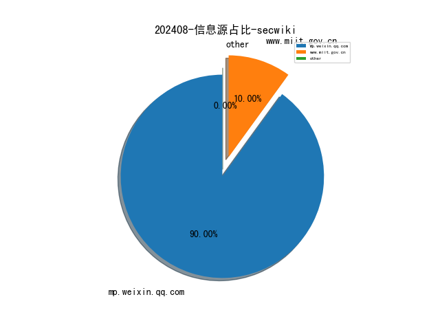
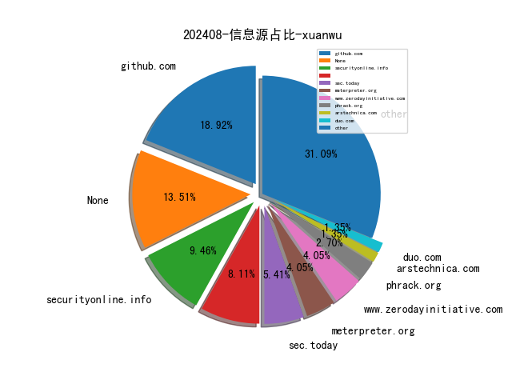
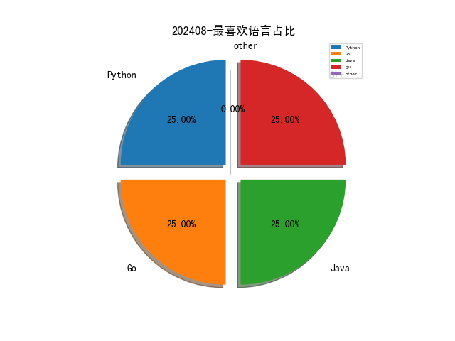

# [数据--所有](README_20.md)
# [数据--年度](README_2024.md)
# 202408 信息源与信息类型占比

# 政策 推荐
| title | url| 
| --- | ---| 
| 工业和信息化部主责国家重点研发计划重点专项管理实施细则 | https://www.miit.gov.cn/gyhxxhb/jgsj/gxjss/wjfb/art/2024/art_e13533ef46b84f00ac360d85e453bcf8.html| 

# 网络安全书籍 推荐
| date_added | language | title | author | link | size| 
| --- | --- | --- | --- | --- | ---| 
| 2024-08-05 19:09:15 | English | Modern Python Cookbook, Third Edition | unknown | https://www.wowebook.org/modern-python-cookbook-third-edition/ | unknown| 
| 2024-08-05 18:51:13 | English | Python Machine Learning By Example, Fourth Edition | unknown | https://www.wowebook.org/python-machine-learning-by-example-fourth-edition/ | unknown| 
| 2024-08-05 18:17:35 | English | Microsoft Power BI Cookbook, Third Edition | unknown | https://www.wowebook.org/microsoft-power-bi-cookbook-third-edition/ | unknown| 
| 2024-08-05 16:47:12 | English | Building AI Applications with Microsoft Semantic Kernel | unknown | https://www.wowebook.org/building-ai-applications-with-microsoft-semantic-kernel/ | unknown| 
| 2024-08-05 07:06:46 | English | Generative AI with Amazon Bedrock | unknown | https://www.wowebook.org/generative-ai-with-amazon-bedrock/ | unknown| 
| 2024-08-04 00:42:40 | English | Empowering the Public Sector with Generative AI: From Strategy and Design to Real-World Applications | Sanjeev Pulapaka; Srinath Godavarthi; Sherry Ding | http://libgen.rs/book/index.php?md5=B9028A0818AB363EB8E4E1476A9904C4 | 8 MB [PDF]| 
| 2024-08-03 05:59:58 | English | Causal Inference and Discovery in Python: Unlock the secrets of modern causal machine learning with DoWhy, EconML, PyTorch and more | Aleksander Molak | http://libgen.rs/book/index.php?md5=475E9E1EB217D481E46109BED7382CA3 | 10 MB [PDF]| 
| 2024-08-03 22:58:05 | English | ChatGPT & Co.: A Workbook for Writing, Research, Creating Images, Programming, and More | Rainer Hattenhauer | http://libgen.rs/book/index.php?md5=3BFF0B21BC6A4DBF14CA5384EEDCD2BD | 18 MB [PDF]| 
| 2024-08-03 21:56:47 | English | Introduction to Python Network Automation Volume II : Stepping up: Beyond the Essentials for Success | Brendan Choi | http://libgen.rs/book/index.php?md5=04D327365FA9BFFF3B5EA356B9270D3D | 21 MB [EPUB]| 
| 2024-08-01 07:44:31 | English | (EXPERT INSIGHT) Modern Python Cookbook: 130+ updated recipes for modern Python 3.12 with new techniques and tools, 3rd Edition | Steven F. Lott | http://libgen.rs/book/index.php?md5=D731D90A898B09E8C5A998DE5A779991 | 13 MB [EPUB]| 
| 2024-08-01 07:27:53 | English | Write Powerful Rust Macros | Van Overmeire, Sam; | http://libgen.rs/book/index.php?md5=660722869C7184BF13AF142D6FBD598C | 9 MB [EPUB]| 
| 2024-08-01 07:25:34 | English | Business Analytics with R and Python (AI for Risks) | David L. Olson , Desheng Dash Wu , Cuicui Luo , Majid Nabavi | http://libgen.rs/book/index.php?md5=9A879BC0732EB36A842F9A0724482C26 | 5 MB [PDF]| 
| 2024-08-01 07:11:06 | English | Python Machine Learning By Example_Fourth Edition | Yuxi (Hayden) Liu | http://libgen.rs/book/index.php?md5=09EE97ED0847AD4F1B44B3E003544CE1 | 23 MB [EPUB]| 
| 2024-08-01 01:56:56 | English | (20th Anniversary Edition) Applied Cryptography: Protocols, Algorithms and Source Code in C | Bruce Schneier | http://libgen.rs/book/index.php?md5=7708506900EF60D1657BE5D342387917 | 22 MB [EPUB]| 
| 2024-08-01 11:29:24 | English | ChatGPT for Conversational AI and Chatbots | unknown | https://www.wowebook.org/chatgpt-for-conversational-ai-and-chatbots/ | unknown| 
| 2024-08-01 08:29:09 | English | Python Data Cleaning Cookbook, Second Edition | unknown | https://www.wowebook.org/python-data-cleaning-cookbook-second-edition/ | unknown| 

# 微信公众号 推荐
| nickname_english | weixin_no | title | url| 
| --- | --- | --- | ---| 
| CIO之家 | None | 云原生应用高可用最佳实践 | https://mp.weixin.qq.com/s?__biz=MjM5NTk5Mjc4Mg==&mid=2655216204&idx=2&sn=c07681b227e3576ab55c6b9e6061e189 | 2| 
| Hack分享吧 | None | 一款强大且综合的加解密工具集合 | https://mp.weixin.qq.com/s?__biz=MzA4NzU1Mjk4Mw==&mid=2247491324&idx=1&sn=8f254de2c424352295e78988b688fa10 | 1| 
| KK安全说 | None | Google Play 商店中存在的可疑间谍软件 | https://mp.weixin.qq.com/s?__biz=Mzg4NzgyODEzNQ==&mid=2247487642&idx=1&sn=f627691657c615af488db6b8c813aee4 | 4| 
| OSINT研习社 | None | 戴尔、AT&T、Verizon、Capital One 和其他公司的员工通过流行的办公应用程序暴露信息 | https://mp.weixin.qq.com/s?__biz=Mzg4MzA4NTM0OA==&mid=2247490972&idx=1&sn=eaa4af72fa579e0d72a54b67b9ec14bd | 1| 
| kali笔记 | None | 小米温湿度计2 刷第三方固件 接入HA | https://mp.weixin.qq.com/s?__biz=MzkxMzIwNTY1OA==&mid=2247506054&idx=1&sn=f6f1c019360fe8d684702cd3c30666df | 3| 
| 一个安全研究员 | None | 专业很重要，但显得专业更重要 | https://mp.weixin.qq.com/s?__biz=MzU5MDI0ODI5MQ==&mid=2247486597&idx=1&sn=14eb9202fd9a6c550b42fb6bab970987 | 1| 
| 七芒星实验室 | None | 【护网必备】通达OA漏洞综合利用工具 | https://mp.weixin.qq.com/s?__biz=Mzg4MTU4NTc2Nw==&mid=2247492790&idx=1&sn=83760b17fd92af31a01f00a975764ff7 | 5| 
| 合规渗透 | None | HW2024验真漏洞情报 8.5 | https://mp.weixin.qq.com/s?__biz=MzkzOTI2NjUyNA==&mid=2247484457&idx=1&sn=d22231ae11be465e4fed725d5843bd4a | 5| 
| 威努特安全网络 | None | 从操控中心到海上平台，威努特构建海上智能油田安全防线 | https://mp.weixin.qq.com/s?__biz=MzAwNTgyODU3NQ==&mid=2651125288&idx=1&sn=695026b7483e9a42c74cacd03466c9e7 | 3| 
| 安全村SecUN | None | APP上线！斯元网安速查引擎 & 喵站国际版新闻APP —— 面向全球发布！ | https://mp.weixin.qq.com/s?__biz=MzkyODM5NzQwNQ==&mid=2247495592&idx=2&sn=9def19025fde4037ac7faf7ee9ae358a | 3| 
| 小明信安 | None | 【1day , 漏洞复现】某人力管理管理平台UploadHandler 任意文件上传漏洞 | https://mp.weixin.qq.com/s?__biz=Mzg4NjI0MDM5MA==&mid=2247486186&idx=1&sn=3c752a2c7cdc7d153ae9a5d4beca5168 | 5| 
| 小羊安全屋 | None | 【文件上传】泛微云桥 | https://mp.weixin.qq.com/s?__biz=MzkyMTY1NDc2OA==&mid=2247486611&idx=1&sn=1b30da010d166f367ec203adce295312 | 1| 
| 混入安全圈的程序猿 | None | 使用这个工具配合BP修改请求响应包太香了！ | https://mp.weixin.qq.com/s?__biz=MzU3ODI3NDc4NA==&mid=2247484465&idx=1&sn=8d734d3f57dd99d488152a978974cc05 | 1| 
| 渝安全Sec | None | 什么是商用密码应用改造 | https://mp.weixin.qq.com/s?__biz=Mzg2NDkwMDcxNA==&mid=2247485389&idx=1&sn=e770c6073f72a256b0e945d1970d61c7 | 1| 
| 潇湘信安 | None | 记一次真实溯源案例 | https://mp.weixin.qq.com/s?__biz=Mzg4NTUwMzM1Ng==&mid=2247511537&idx=1&sn=60fe0478ff10b6995c9adb21fccccf24 | 1| 
| 玄道夜谈 | None | 分享图片 | https://mp.weixin.qq.com/s?__biz=MzI3Njc1MjcxMg==&mid=2247492920&idx=1&sn=5da6dbf9692f61a2083b6e4a13038deb | 3| 
| 网安鲲为帝 | None | 【小白工具】超高并发目录扫描 | https://mp.weixin.qq.com/s?__biz=Mzk0OTY3OTc5Mw==&mid=2247484433&idx=1&sn=e2a758b3d54ffd73562df933f5f79454 | 1| 
| 迪普科技 | None | 耕深拓广 持续增长丨一图看懂迪普科技半年成绩单 | https://mp.weixin.qq.com/s?__biz=MzA4NzE5MzkzNA==&mid=2650358497&idx=1&sn=027c9c44405fcf4321af00e04543b816 | 2| 
| 3072 | None | CVE-2024-38100   Fake potato LPE漏洞分析 | https://mp.weixin.qq.com/s?__biz=MzU4OTk0NDMzOA==&mid=2247489486&idx=1&sn=2a0b3418c79b6130b68662f93851293f | 3| 
| CAPPVD漏洞库 | None | 倒计时3天！第五期移动互联网APP产品安全漏洞技术沙龙 | https://mp.weixin.qq.com/s?__biz=MzkyMjM4MzY5Ng==&mid=2247485701&idx=1&sn=8d3ba0e1f84d63091825757a5c863f2f | 1| 
| CISSP | None | CISA—国际注册信息系统审计师认证 | https://mp.weixin.qq.com/s?__biz=Mzg4MTg0MjQ5OA==&mid=2247486109&idx=2&sn=0dfb378c6591cadd66f65ab96f8a859b | 3| 
| ChaMd5安全团队 | None | 对大型语言模型的即时抽象攻击，实现更低廉的应用程序接口定价 | https://mp.weixin.qq.com/s?__biz=MzIzMTc1MjExOQ==&mid=2247510851&idx=1&sn=309d1e778f4ed34a163a4c69cbf9803f | 2| 
| Crush Sec | None | Athena_钉钉推送群 | https://mp.weixin.qq.com/s?__biz=MzkxMjMwNTEwMg==&mid=2247486128&idx=1&sn=70506adb1939937c1a03a15754f10b90 | 2| 
| Docker中文社区 | None | 集群网络连通性校验工具-NetDoctor | https://mp.weixin.qq.com/s?__biz=MzI1NzI5NDM4Mw==&mid=2247497666&idx=1&sn=04c78f5fca4deecc5205261ff58f3f58 | 1| 
| Echo Reply | None | Wireshark & Packetdrill , TCP 三次握手之 TCP Options 字段 TSOPT | https://mp.weixin.qq.com/s?__biz=MzA5NTUxODA0OA==&mid=2247492859&idx=1&sn=0e54e573da56e99ee31573780cb34443 | 2| 
| Eonian Sharp | None | URL编码原理 | https://mp.weixin.qq.com/s?__biz=Mzg3NzUyMTM0NA==&mid=2247486854&idx=1&sn=86622b5b1a83b86694a48ce8fbe6156e | 3| 
| E安全 | None | Sitting Ducks攻击，超过35000个域名被劫持！ | https://mp.weixin.qq.com/s?__biz=MzI4MjA1MzkyNA==&mid=2655346831&idx=1&sn=31f7af3e9585f6d73010b6d42845fad6 | 3| 
| F12sec | None | 数据安全项目实施工作随笔 | https://mp.weixin.qq.com/s?__biz=Mzg5NjU3NzE3OQ==&mid=2247489025&idx=2&sn=8411aa1b33b3244c309eb51695de45ed | 2| 
| GoUpSec | None | 周刊 , 网安大事回顾（2024.7.29-2024.8.4） | https://mp.weixin.qq.com/s?__biz=MzkxNTI2MTI1NA==&mid=2247500127&idx=3&sn=a6798bad67d94ad65bce9f09fb47175a | 7| 
| HACK之道 | None | 一个永久的HW漏洞情报、渗透知识库 | https://mp.weixin.qq.com/s?__biz=MzIwMzIyMjYzNA==&mid=2247515102&idx=1&sn=b4392058e9a021d61b4b89491aea9304 | 3| 
| Hack All Sec | None | Web API 渗透测试指南 | https://mp.weixin.qq.com/s?__biz=MzkwMjQyMDA5Nw==&mid=2247485875&idx=1&sn=45db1ad9ad2d4d16e106635620f36398 | 1| 
| Khan安全攻防实验室 | None | 医学SCI无忧发表 , 大牛帮修改、润色、选刊、投稿、返修，6个月承诺中刊！ | https://mp.weixin.qq.com/s?__biz=MzAwMjQ2NTQ4Mg==&mid=2247494356&idx=2&sn=09ea849f7ce09f9a5181e48df227c166 | 4| 
| LemonSec | None | kali wifi破解了解一下 | https://mp.weixin.qq.com/s?__biz=MzUyMTA0MjQ4NA==&mid=2247550595&idx=2&sn=a724e05418a58dae8ba6dcd9ed75fc61 | 4| 
| Longwaer安全百晓堂 | None | 投入200学习挖洞，收益率160倍+，看看这位小伙做对了什么 | https://mp.weixin.qq.com/s?__biz=MzkxODY0NjE5MA==&mid=2247484893&idx=1&sn=fe20b3d61f54f345cd60f1aa5981bd66 | 1| 
| OneTS安全团队 | None | CTF必会-古典密码与常见编码大全（全网最全） | https://mp.weixin.qq.com/s?__biz=MzkxMDY3MzQyNQ==&mid=2247484346&idx=1&sn=a57d828cd8066f2f774ee48fb96f2f5a | 1| 
| Ots安全 | None | 这是一个更有趣的setup.exe“特性”——真的是一个持久性的技巧 | https://mp.weixin.qq.com/s?__biz=MzAxMjYyMzkwOA==&mid=2247512111&idx=1&sn=b70891f4f490db8a233774d5a159f78a | 14| 
| RainSec | None | Firefly-SRC资产探测平台新版更新 | https://mp.weixin.qq.com/s?__biz=Mzg3NzczOTA3OQ==&mid=2247486061&idx=1&sn=c8b9c5b6b773ff1782be53a3d940e903 | 1| 
| SCA御盾 | None | 【漏洞复现】某餐饮系统-goodcost-getlistdata-sql注入漏洞 | https://mp.weixin.qq.com/s?__biz=MzkzNjYwODg3Ng==&mid=2247485421&idx=1&sn=f18919e01ee0e6fc90c64935bc8c444f | 3| 
| Sec探索者 | None | X捷漏洞综合检查工具v1.0 | https://mp.weixin.qq.com/s?__biz=MzkyNDYwNTcyNA==&mid=2247486612&idx=1&sn=25c6bebb9fc895ff308363cafe974691 | 3| 
| TEST安全 | None | XAMPP默认环境CVE-2024-4577 PHP CGI 远程代码执行漏洞复现 | https://mp.weixin.qq.com/s?__biz=MzkyMTQyMzkyMg==&mid=2247483983&idx=1&sn=fb1db0d095a01fc09e21ca8aceeb42ed | 1| 
| TeamSecret安全团队 | None | 【工具免杀】SharpWeb -Google篇 | https://mp.weixin.qq.com/s?__biz=MzkzMDQ5MDM3NA==&mid=2247485002&idx=1&sn=111d2cde2098063d80568cdfb4b69b8a | 3| 
| TtTeam | None | Hvv 故事吃瓜 13 （开始服刑） | https://mp.weixin.qq.com/s?__biz=Mzg2NTk4MTE1MQ==&mid=2247485602&idx=1&sn=97870e602d8be9af49b6bf158e07c07f | 3| 
| WebSec | None | (EDU 0day)某格智慧心理服务平台某接口存在SQL注入漏洞 | https://mp.weixin.qq.com/s?__biz=MzkyMzYwNTEyNg==&mid=2247486743&idx=1&sn=0f46f731911dea4a9c5bc0ed0df3339a | 1| 
| Web安全工具库 | None | 资源分享（8月5日更新） | https://mp.weixin.qq.com/s?__biz=MzI4MDQ5MjY1Mg==&mid=2247513717&idx=2&sn=e411e7eb1132681e0ee982c1b578368a | 4| 
| WgpSec狼组安全团队 | None | TFC CTF · 2024 WriteUp | https://mp.weixin.qq.com/s?__biz=MzIyMjkzMzY4Ng==&mid=2247507130&idx=1&sn=de75ecaaab3e99074896bca217a99e21 | 2| 
| XDsecurity | None | 开源情报,情报战略,国际动态分析,2024年美国反国家情报战略,翻译及速读 | https://mp.weixin.qq.com/s?__biz=Mzg2NTcyNjU4Nw==&mid=2247485356&idx=1&sn=93984ebfd87c2686b72e604790bf0ea4 | 1| 
| Z2O安全攻防 | None | 如何学习云原生安全攻防与运营？ | https://mp.weixin.qq.com/s?__biz=Mzg2ODYxMzY3OQ==&mid=2247514254&idx=1&sn=473b5b48be4531a25b6e9507650f0e0f | 1| 
| dotNet安全矩阵 | None | .NET内网实战：模拟Installer关闭Defender | https://mp.weixin.qq.com/s?__biz=MzUyOTc3NTQ5MA==&mid=2247494017&idx=3&sn=fd0d15ce7cad336cc0a3ada03d02e52b | 14| 
| e安在线 | None | 全国首例人工智能领域侵犯商业秘密案 锁定公司内鬼 | https://mp.weixin.qq.com/s?__biz=MzI1OTA1MzQzNA==&mid=2651246136&idx=1&sn=7f3f74b6bf851d23d723b998670ef748 | 2| 
| nday POC | None | 【漏洞复现】某天云智慧平台系统 Upload.ashx 任意文件上传漏洞 | https://mp.weixin.qq.com/s?__biz=MzkzMTcwMTg1Mg==&mid=2247485515&idx=1&sn=e322deb80e03f81553e55b9ba58f6730 | 3| 
| web安全与运维 | None | ATT&CK—Caldera 实操（保姆级教学） | https://mp.weixin.qq.com/s?__biz=Mzg2NjgyNDM4MA==&mid=2247489937&idx=1&sn=2d943edbfe3844cd2077916ca0152db6 | 2| 
| 一起聊安全 | None | 某大型集团信息安全管理体系优化咨询方案（附下载） | https://mp.weixin.qq.com/s?__biz=MzI3NjUzOTQ0NQ==&mid=2247512965&idx=1&sn=918cf7214323597aa6acc13187be01a4 | 4| 
| 三沐数安 | None | info_scan 自动化漏洞扫描系统 | https://mp.weixin.qq.com/s?__biz=MzU1NjczNjA0Nw==&mid=2247484547&idx=1&sn=bbf30cce68075e9b4b1f6335776521ca | 4| 
| 与智慧做朋友 | None | 新时代：电子认证（CA）能否更有用武之地？（续） | https://mp.weixin.qq.com/s?__biz=MzA3OTg3Mjg3NA==&mid=2456976250&idx=1&sn=965221e207bae1a2fc8924d2e76defcf | 2| 
| 中孚信息 | None | 内外兼修方可行稳致远，中孚信息为政务数据安全铸牢坚实屏障 | https://mp.weixin.qq.com/s?__biz=MzAxMjE1MDY0NA==&mid=2247508298&idx=1&sn=457146c451765a4aa40b4b1884a7a2bc | 2| 
| 乌雲安全 | None | 一款内存马检测工具 | https://mp.weixin.qq.com/s?__biz=MzAwMjA5OTY5Ng==&mid=2247523528&idx=1&sn=a3de9d0bfe7f4a8992177165907d74d4 | 5| 
| 二进制磨剑 | None | Obfusheader.h，编译时混淆终极利器！ | https://mp.weixin.qq.com/s?__biz=MzI1Mjk2MTM1OQ==&mid=2247484493&idx=2&sn=19af16ec4cf728e2b1d56c0e4655426c | 4| 
| 二进制空间安全 | None | 一款开源持续更新的后渗透免杀框架 | https://mp.weixin.qq.com/s?__biz=MzkxOTUyOTc0NQ==&mid=2247491149&idx=1&sn=63c761854d5a939c59f0bec9fefd393c | 1| 
| 云计算和网络安全技术实践 | None | vulnhub之CLAMP的实践 | https://mp.weixin.qq.com/s?__biz=MzA3MjM5MDc2Nw==&mid=2650748588&idx=1&sn=823055115bcda594ff04b1566a353b1b | 1| 
| 代码审计SDL | None | MinerU 介绍 | https://mp.weixin.qq.com/s?__biz=MzI2NTExNzcxNQ==&mid=2247484288&idx=1&sn=a11342590cf0edb24985d65fc3de366a | 1| 
| 信息安全与网络安全 | None | ITSS服务工程师/ITSS服务经理认证，详细介绍 | https://mp.weixin.qq.com/s?__biz=Mzg4NTU3NjY2OQ==&mid=2247488146&idx=1&sn=ec6817a4dca8d9a99d7fe31b0a6f60a3 | 1| 
| 光剑安全 | None | 【工具推荐】强大的“小程序反编译”工具推荐 | https://mp.weixin.qq.com/s?__biz=Mzk0MzQ4OTg0NQ==&mid=2247483955&idx=1&sn=1020ee1e6bdb8096818b51dd9e8d57e8 | 3| 
| 全球技术地图 | None | 美军利用人工智能赋能军事训练的最新实践 | https://mp.weixin.qq.com/s?__biz=MzI1OTExNDY1NQ==&mid=2651614670&idx=1&sn=4fdb2caf90631b9d9ea0b332a59677fd | 2| 
| 兰花豆说网络安全 | None | 网络空间形势严峻，360国有化进程加快 | https://mp.weixin.qq.com/s?__biz=MzI3NzM5NDA0NA==&mid=2247488631&idx=1&sn=11a13aaa2252e6ddac74018d20cb7c74 | 1| 
| 关键信息基础设施安全保护联盟 | None | 党建学习日——深入领悟新思想，共绘发展新蓝图 | https://mp.weixin.qq.com/s?__biz=MzkxNjU2NjY5MQ==&mid=2247505443&idx=3&sn=c9c90eae531eaf54527749c56316e184 | 6| 
| 军哥网络安全读报 | None | 黑客以350万美元的价格兜售近 30 亿人的个人数据 | https://mp.weixin.qq.com/s?__biz=MzI2NzAwOTg4NQ==&mid=2649791978&idx=2&sn=b644d0971d8861ba74cb408de7a0234a | 8| 
| 冷漠安全 | None | 「漏洞复现」方天云智慧平台系统 Upload.ashx 任意文件上传漏洞 | https://mp.weixin.qq.com/s?__biz=MzkyNDY3MTY3MA==&mid=2247485067&idx=1&sn=e1cacfa89c75a522c97a834bfef66f1d | 3| 
| 前沿信安资讯阵地 | None | 2024年M-Trends特别报告 | https://mp.weixin.qq.com/s?__biz=MzA3MTM0NTQzNA==&mid=2455777497&idx=1&sn=61681953ab93cc34e145698f48f9c08d | 2| 
| 北邮 GAMMA Lab | None | 技术分享 , GraphStore & FeatureStore | https://mp.weixin.qq.com/s?__biz=Mzg4MzE1MTQzNw==&mid=2247490258&idx=1&sn=57bca216acf47164f5d0bdc70b68d48b | 2| 
| 取证者联盟 | None | 电子数据鉴定在知识产权领域的应用 | https://mp.weixin.qq.com/s?__biz=Mzg4MzEwMDAyNw==&mid=2247485143&idx=1&sn=32b1e0e10416bf11b59f90eb089d68a3 | 1| 
| 吉祥在职场 | None | 价值3个亿的安全漏洞，唯一被美国双制裁的安全企业，360还是低调了！ | https://mp.weixin.qq.com/s?__biz=MzI1ODY3MTA3Nw==&mid=2247485916&idx=1&sn=2dfdca0d3dd532e60ec61c70faa86173 | 2| 
| 吉祥快学网络安全吧 | None | 周鸿祎表示：这么多年360用户看广告是为了国家看的 | https://mp.weixin.qq.com/s?__biz=MzkzMzcxNTQyNw==&mid=2247484232&idx=1&sn=a02b516b89b6f4784a56bbf7547ac0d9 | 5| 
| 君说安全 | None | 为什么越来越多的网安企业开始国有化？ | https://mp.weixin.qq.com/s?__biz=MzUzNjkxODE5MA==&mid=2247486322&idx=1&sn=f92296a0cce029b3c6416495db086c56 | 3| 
| 哈拉少安全小队 | None | 某攻防演练｜从404页面到接管阿里云 | https://mp.weixin.qq.com/s?__biz=MzAxNzkyOTgxMw==&mid=2247492816&idx=1&sn=8b6b2e636edf566489fcee9955fbf9d1 | 3| 
| 啄木鸟软件测试 | None | 测试常识：WEB端进行弱网测试详解 | https://mp.weixin.qq.com/s?__biz=MzA5NDk4NTU3Mg==&mid=2649590029&idx=3&sn=b81a20af597a9ed5863efce457a51839 | 3| 
| 嗨嗨安全 | None | 黑客(红队)攻防中LLMNR/NBNS欺骗和desktop.ini获取哈希(hash) | https://mp.weixin.qq.com/s?__biz=MzIzMjg0MjM5OQ==&mid=2247487557&idx=1&sn=632cb5bc7937e8e9778727f76cab0fe1 | 4| 
| 国际云安全联盟CSA | None | 首个AI安全认证课程引爆关注：600+学员上课，行业专家亲授 | https://mp.weixin.qq.com/s?__biz=MzkwMTM5MDUxMA==&mid=2247498297&idx=1&sn=6f51f65b5f35c22f628cbbe72cb1c7ff | 1| 
| 墨雪飘影 | None | 8月1日hvv情报推送 | https://mp.weixin.qq.com/s?__biz=MzI3NzI4OTkyNw==&mid=2247489347&idx=2&sn=2872fad16eb21bf3e844dd2ec2110a72 | 2| 
| 大山子雪人 | None | 炎炎夏日，来点清新爽文解解暑 | https://mp.weixin.qq.com/s?__biz=Mzg2MDc0NTIxOQ==&mid=2247484561&idx=1&sn=3faa49f315f159b3e8bf791a419ad47d | 1| 
| 天唯信息安全 | None | 《信息技术 云计算 面向云原生的应用支撑平台功能要求》（GB/T 44158-2024）将于2025年1月1日起正式实施。 | https://mp.weixin.qq.com/s?__biz=MzkzMjE5MTY5NQ==&mid=2247499643&idx=3&sn=e1f156e926fcddf3f890330f22948643 | 9| 
| 天融信 | None | 再度上榜！天融信安全运营服务列入Gartner®报告 | https://mp.weixin.qq.com/s?__biz=MzA3OTMxNTcxNA==&mid=2650932673&idx=1&sn=e0534a8f8cbc997298d0ff243c556f0e | 1| 
| 天际友盟 | None | [0805]一周重点暗网情报｜天际友盟情报站 | https://mp.weixin.qq.com/s?__biz=MzIwNjQ4OTU3NA==&mid=2247509239&idx=1&sn=999a720984c33bdd9d91ee3df36a24a6 | 3| 
| 奇安信 CERT | None | 安全热点周报：本周新增四个在野利用漏洞，企业安全面临新威胁 | https://mp.weixin.qq.com/s?__biz=MzU5NDgxODU1MQ==&mid=2247501791&idx=2&sn=f2a4a01fe90a969544f6d6b4567ded0f | 2| 
| 奇安网情局 | None | 美国学者通过新框架对战时进攻性网络行动进行三纬解析 | https://mp.weixin.qq.com/s?__biz=MzI4ODQzMzk3MA==&mid=2247488945&idx=1&sn=50fd0ee60bee2ed61afa4c3adb99d295 | 2| 
| 安全光圈 | None | HVV防守-天蝎通信流量揭秘 | https://mp.weixin.qq.com/s?__biz=Mzk0MDY2NTY5Mw==&mid=2247485203&idx=1&sn=9dffadeab672dd9ac69f058711e2b000 | 3| 
| 安全分析与研究 | None | 某黑产最新免杀攻击样本详细分析 | https://mp.weixin.qq.com/s?__biz=MzA4ODEyODA3MQ==&mid=2247488674&idx=1&sn=e27df173edcb389bf5bc4d22bf4a4b51 | 1| 
| 安全喵喵站 | None | 你真的不来吗？2024 V-Transform Expo 数字化转型先机！ | https://mp.weixin.qq.com/s?__biz=MzkzNjE5NjQ4Mw==&mid=2247539797&idx=2&sn=b5654e000666a5b242f693ac0ee0cfc9 | 5| 
| 安全学习那些事儿 | None | 《北京国际大数据交易所有限责任公司个人信息授权运营管理办法(试行)》发布 | https://mp.weixin.qq.com/s?__biz=MzkxNTI2NTQxOA==&mid=2247493340&idx=5&sn=26dafe0de695f496f623924f301a5735 | 10| 
| 安全小工坊 | None | Firefly-SRC资产探测平台新版更新 | https://mp.weixin.qq.com/s?__biz=MzU5MTE4Mzk0NQ==&mid=2247484479&idx=1&sn=134c4aa37b0fb60248aab05579bc2b61 | 1| 
| 安全无界 | None | 一次完整的渗透测试经历 | https://mp.weixin.qq.com/s?__biz=Mzg2MjU2MjY4Mw==&mid=2247484847&idx=1&sn=c4142f86671c9fc2379d7409971df682 | 1| 
| 安全洞察知识图谱 | None | 2024 护网专用扫描器 -- HWScanGUI（8月2日更新） | https://mp.weixin.qq.com/s?__biz=MzkyMDM4NDM5Ng==&mid=2247486742&idx=1&sn=95294592a57dc7e735dbf268f7331056 | 2| 
| 安全牛 | None | 安全红队和MDR之间的关键联系 | https://mp.weixin.qq.com/s?__biz=MjM5Njc3NjM4MA==&mid=2651131389&idx=2&sn=be16055170530af70782e2dbd7b9fd79 | 6| 
| 安小圈 | None | 社工钓鱼基本流程 | https://mp.weixin.qq.com/s?__biz=Mzg2MDg0ODg1NQ==&mid=2247523258&idx=3&sn=91fca490a4da2d15cb52852534cf17c5 | 12| 
| 安恒信息 | None | 15万人来过的网红打卡点，这个暑假又有新活动了！ | https://mp.weixin.qq.com/s?__biz=MjM5NTE0MjQyMg==&mid=2650612158&idx=2&sn=b96d75fe532b090b8c79fa9861e030d0 | 7| 
| 实战安全研究 | None | TryHackMe-Holo【Windows域渗透】 | https://mp.weixin.qq.com/s?__biz=MzU0MTc2NTExNg==&mid=2247490766&idx=1&sn=12e94689acb23bce40cf70b57b4fb5a3 | 4| 
| 小行星安全圈 | None | 【首发】内网横向GUI图形化工具 | https://mp.weixin.qq.com/s?__biz=MzkxNDcwMjg0Mg==&mid=2247485120&idx=1&sn=4a522cacf13a62251b657ed1920c37e0 | 1| 
| 小酸弟信安 | None | Panalog 日志审计系统  SQL 注入漏洞【XVE-2024-5232】 | https://mp.weixin.qq.com/s?__biz=Mzk0MTcyNDk4OA==&mid=2247483684&idx=1&sn=573e3f481bcdf83b45f64697c405a09e | 1| 
| 山石网科新视界 | None | 生态共赢｜山石网科生态合作伙伴全国巡展持续发力 | https://mp.weixin.qq.com/s?__biz=MzAxMDE4MTAzMQ==&mid=2661292026&idx=1&sn=5d0c40840f34c71f89701a66fb56d8fe | 3| 
| 工业信息安全产业发展联盟 | None | 《工业和信息化部主责国家重点研发计划重点专项管理实施细则》印发实施 | https://mp.weixin.qq.com/s?__biz=MzUyMzA1MTM2NA==&mid=2247498097&idx=2&sn=a99838dfc201391d525d2135481fc738 | 4| 
| 张无瑕思密达 | None | 微信抖音硬刚苹果，尚能饭否？ | https://mp.weixin.qq.com/s?__biz=MzkwMzI1ODUwNA==&mid=2247487344&idx=1&sn=823032973470ce93c1f0203a1f838bfa | 3| 
| 情报分析师 | None | S.A.L.U.T.E 情报报告法在情报行动中的重要性 | https://mp.weixin.qq.com/s?__biz=MzA3Mjc1MTkwOA==&mid=2650553731&idx=2&sn=09344538896639ff0b1dc272a3ac5f91 | 8| 
| 情报分析师Pro | None | 突发警报：伊朗声称拥有核武器！ | https://mp.weixin.qq.com/s?__biz=MzkwNzM0NzA5MA==&mid=2247499904&idx=1&sn=d8ae2921f4189918bbde0717c502ac5a | 4| 
| 我吃饼干 | None | 【漏洞复现】同享EHR存在UploadHandler.ashx文件上传漏洞 | https://mp.weixin.qq.com/s?__biz=MzkzODY2ODA0OA==&mid=2247485598&idx=1&sn=940c9995e853dae59e2c71e5970e0bf3 | 2| 
| 技术修道场 | None | 深入Linux文件包含：技术解析与安全防范 | https://mp.weixin.qq.com/s?__biz=MzA4NTY4MjAyMQ==&mid=2447899283&idx=1&sn=d9d2200ceb315b6f32e673e24165c2c7 | 2| 
| 掌控安全EDU | None | 漏洞挖掘 , 记一次某中学系统越权漏洞 | https://mp.weixin.qq.com/s?__biz=MzUyODkwNDIyMg==&mid=2247542421&idx=1&sn=ffcb988ae36f3efa4de413d7689eeda4 | 6| 
| 揽月安全团队 | None | VulnTarget-k | https://mp.weixin.qq.com/s?__biz=Mzg2OTk3ODYzOA==&mid=2247485635&idx=1&sn=b47bd86c7f3ab7b6765180a477425831 | 3| 
| 攻城狮成长日记 | None | Upload-Lab第6关：如何巧妙绕过利用大小写绕过黑名单验证？ | https://mp.weixin.qq.com/s?__biz=MjM5OTc5MjM4Nw==&mid=2457381047&idx=1&sn=c10e4ab57adce35b9c001fd977171120 | 7| 
| 攻防实战指南 | None | 攻防实战指南内部群八月第一周工具资源话题整合 | https://mp.weixin.qq.com/s?__biz=MzkwNzY4MzE3OQ==&mid=2247484143&idx=1&sn=732d1a4aa11a58dc3713f776a5b95a7d | 1| 
| 昊天信安 | None | Burpsuite API敏感信息查找插件-v2.0.2 | https://mp.weixin.qq.com/s?__biz=MzkzNzI4NDQzMA==&mid=2247498849&idx=1&sn=8a686ef92cb1016a704c3b18a8f9d5a3 | 2| 
| 星悦安全 | None | 手把手教你怎么申请CVE(绿色通道Wiki) | https://mp.weixin.qq.com/s?__biz=Mzg4MTkwMTI5Mw==&mid=2247485207&idx=1&sn=52367c079f5bc406567b90a2b5d96bdc | 2| 
| 橘猫学安全 | None | 信息收集工具 -- 水泽(V1.0) | https://mp.weixin.qq.com/s?__biz=Mzg5OTY2NjUxMw==&mid=2247512540&idx=2&sn=c1a02224faa890fae96869098474ba05 | 6| 
| 永信至诚 | None | 「数字风洞」支撑香港特区赛事演练丨永信至诚护航香港网络攻防精英培训暨攻防大赛圆满举办 | https://mp.weixin.qq.com/s?__biz=MzAwNDUyMjk4MQ==&mid=2454826718&idx=1&sn=8a56766ebca68967ff2f152b5eb465fc | 1| 
| 汽车电子嵌入式 | None | 【OS】AUTOSAR OS Spinlock实现原理（下篇） | https://mp.weixin.qq.com/s?__biz=Mzg2NTYxOTcxMw==&mid=2247492250&idx=2&sn=1bec2c7a3db2a1a4bed4948765c3339f | 2| 
| 河南等级保护测评 | None | 欧美与俄囚犯交换计划，包括网络犯罪人员 | https://mp.weixin.qq.com/s?__biz=Mzg2NjY2MTI3Mg==&mid=2247496528&idx=2&sn=fa9f3e7a4d2ed1d0410048ca868c07c6 | 4| 
| 泾弦安全 | None | hvv漏洞合集 | https://mp.weixin.qq.com/s?__biz=Mzk0MzU5NTg1Ng==&mid=2247484752&idx=1&sn=66e1b93610568a4e152be1e5a3fc29ea | 1| 
| 洞见网安 | None | 网安原创文章推荐【2024/8/4】 | https://mp.weixin.qq.com/s?__biz=MzAxNzg3NzMyNQ==&mid=2247488704&idx=1&sn=7e32ad5818fac5294dcd40335a6ac89b | 2| 
| 浅安安全 | None | 工具 , maltrail | https://mp.weixin.qq.com/s?__biz=MzkwMTQ0NDA1NQ==&mid=2247489963&idx=4&sn=5264e1b597b2b2e32fe5d0382240d226 | 8| 
| 渗透安全HackTwo | None | 安服挖洞日常暴力前台入侵测试,挖洞技巧 | https://mp.weixin.qq.com/s?__biz=Mzg3ODE2MjkxMQ==&mid=2247487930&idx=1&sn=e5ec6984af55801fd2f72e9fdb8ae166 | 1| 
| 渗透安全团队 | None | 「域渗透」域账户的几种攻击方式 | https://mp.weixin.qq.com/s?__biz=MzkxNDAyNTY2NA==&mid=2247517898&idx=2&sn=4b612f868ca2ff8a62bd9f157f4288a7 | 6| 
| 渗透测试研究中心 | None | 人人都能免杀-团队工具u200bdarkPulse | https://mp.weixin.qq.com/s?__biz=MzU5ODMzMzc5MQ==&mid=2247486372&idx=1&sn=29dd7b0598e7bbf71125ccdc625adc59 | 3| 
| 湖南省网络空间安全协会 | None | 今日要闻丨网安一周资讯速览 063期 | https://mp.weixin.qq.com/s?__biz=MzAwMTg3MDQzOA==&mid=2247509787&idx=1&sn=3f4bcae9118a7ee847baa030a771d142 | 3| 
| 湖南金盾评估中心 | None | 喜报 I 湖南金盾中标益阳市第四人民医院等保测评项目 | https://mp.weixin.qq.com/s?__biz=MzIyNTI0ODcwMw==&mid=2662128752&idx=1&sn=3f7d4655fd5b3f9c01fbf0e9442db2ed | 1| 
| 犀牛安全 | None | 俄罗斯勒索软件团伙占所有勒索赎金收益的 69% | https://mp.weixin.qq.com/s?__biz=Mzg3ODY0NTczMA==&mid=2247490859&idx=1&sn=865cb39ae772c67026eaea98765f4d89 | 1| 
| 狐狸说安全 | None | One-Fox工具箱V8.1公开版补丁包已发布！ | https://mp.weixin.qq.com/s?__biz=MzUzMDQ1MTY0MQ==&mid=2247505852&idx=1&sn=a2348a9635f8fb8df34ea199ecb09e5f | 1| 
| 独眼情报 | None | 以国家公共数据公司名义运营的 Jerico Pictures Inc.泄露了近 30 亿个人的个人信息。 | https://mp.weixin.qq.com/s?__biz=MzkzNDIzNDUxOQ==&mid=2247487600&idx=8&sn=84eef4d1113462c618f3bbb57654c82e | 28| 
| 电子物证 | None | 【在中国开展手机取证会面临什么困难？】 | https://mp.weixin.qq.com/s?__biz=MzAwNDcwMDgzMA==&mid=2651047739&idx=2&sn=551272f3af62f5cb3d39148a7a6102a9 | 2| 
| 白帽子左一 | None | 使用iptables的 IP 转发绕过 SSL Pinning | https://mp.weixin.qq.com/s?__biz=MzI4NTcxMjQ1MA==&mid=2247612095&idx=1&sn=dd2d85e17de044feb0d74003d8b5d61f | 4| 
| 白帽学子 | None | 高效轻量的 Web 漏洞扫描工具 | https://mp.weixin.qq.com/s?__biz=MzkyNzIxMjM3Mg==&mid=2247487206&idx=1&sn=d0cc310ad461ed8f1800f2c27e7f0b4b | 3| 
| 矢安科技 | None | 【喜报】矢安科技荣获“2024年度网络系统安全突出贡献单位” | https://mp.weixin.qq.com/s?__biz=Mzg2Mjc3NTMxOA==&mid=2247513105&idx=1&sn=ec3d961f3fbd10aca209cd3db6dc3a52 | 1| 
| 知其安科技 | None | 关注前沿技术，知其安加入平行切面联盟 | https://mp.weixin.qq.com/s?__biz=MzkzNTI5NTgyMw==&mid=2247502065&idx=1&sn=37f6c29e82b966951e369fba6700d323 | 1| 
| 篝火信安 | None | 安全运营 , 记一次公网攻击Payload分析 | https://mp.weixin.qq.com/s?__biz=MzIyNzc3OTMzNw==&mid=2247485342&idx=1&sn=3ba42d58e0991301c73c17c75769c77d | 1| 
| 系统安全运维 | None | 实战分享 , Post文件上传WAF Bypass总结 | https://mp.weixin.qq.com/s?__biz=Mzk0NjE0NDc5OQ==&mid=2247524654&idx=2&sn=a55e030c7ef67d097965c225cdf4c777 | 4| 
| 紫队安全研究 | None | HVV技战法 , 网络安全防护技战法报告-汇报材料 | https://mp.weixin.qq.com/s?__biz=Mzg3OTYxODQxNg==&mid=2247484782&idx=1&sn=85db7bbb30695ae04c533069dcb78e5c | 4| 
| 红蓝公鸡队 | None | 《经典》 | https://mp.weixin.qq.com/s?__biz=Mzg5MDc1MjY5Ng==&mid=2247493001&idx=1&sn=1d827a307ea40238812f10083ae09313 | 1| 
| 编码安全研究 | None | XML 基础知识 && XXE 漏洞原理解析及实验 | https://mp.weixin.qq.com/s?__biz=Mzg2NDY1MDc2Mg==&mid=2247505464&idx=2&sn=e0d69b07bbcfee314e9d1553d5aaee0f | 3| 
| 网安杂谈 | None | 【2025合作伙伴巡礼】中科链源：业内首家“资金&虚拟币”全链条犯罪数智查控平台 | https://mp.weixin.qq.com/s?__biz=MzAwMTMzMDUwNg==&mid=2650888976&idx=1&sn=73610feaef2c70eca04f617ed0e270d3 | 3| 
| 网空闲话plus | None | 全球谍影扫描【20240805】032期 | https://mp.weixin.qq.com/s?__biz=MzkyMjQ5ODk5OA==&mid=2247502050&idx=2&sn=30d81218796e8b2550e0c11c7795ba6f | 5| 
| 网络安全与取证研究 | None | 在中国开展手机取证会面临什么困难？ | https://mp.weixin.qq.com/s?__biz=Mzg3NTU3NTY0Nw==&mid=2247489006&idx=1&sn=316d2587c18bb8ac92500fd0cc6e13d4 | 3| 
| 网络安全实验室 | None | 56篇技战法 , 上万高危IP域名 , 最新情报 | https://mp.weixin.qq.com/s?__biz=MzU4OTg4Nzc4MQ==&mid=2247503263&idx=2&sn=7a0a0142966a7dbaea924b76ca75158c | 7| 
| 网络安全者 | None | 用于批量扫描远程桌面是否关闭NLA，而后半自动寻找搜狗输入法RC | https://mp.weixin.qq.com/s?__biz=MzU3NzY3MzYzMw==&mid=2247498051&idx=1&sn=949ddb0ca34c44e0a01cf14e9b621f78 | 2| 
| 网络空间信息安全学习 | None | 穿越宇宙的神秘信号：探索未知的奇异现象 | https://mp.weixin.qq.com/s?__biz=MzI2MjcwMTgwOQ==&mid=2247491379&idx=1&sn=a38991481f044810dafc17ce36e4f2c4 | 3| 
| 老烦的草根安全观 | None | 网络安全缩略语汇编手册——G | https://mp.weixin.qq.com/s?__biz=MzA5MTYyMDQ0OQ==&mid=2247493122&idx=1&sn=56ee6926f8ae63c6cc6f23f082e36d62 | 2| 
| 脚本小子 | None | 信呼OA系统index接口处nickname参数存在SQL注入漏洞【漏洞复现,附nuclei-POC】 | https://mp.weixin.qq.com/s?__biz=MzkyOTcwOTMwMQ==&mid=2247484162&idx=1&sn=ee30ecae20f1a11a1d44fe85e2dad04a | 1| 
| 船山信安 | None | 中国黑客使用 LODEINFO 和 NOOPDOOR 恶意软件瞄准日本公司 | https://mp.weixin.qq.com/s?__biz=MzU2NDY2OTU4Nw==&mid=2247515432&idx=1&sn=40b1eb31ff9f043cd996d8481ad1ff0a | 1| 
| 良月安全 | None | [漏洞分析]LiveBos文件上传漏洞复现及绕过分析 | https://mp.weixin.qq.com/s?__biz=MzkzMDcxNzg4MA==&mid=2247484049&idx=1&sn=c3f120e7bbfccc3d6751ad547b259fb4 | 3| 
| 苏说安全 | None | 软测 , 关于软件第三方测试 | https://mp.weixin.qq.com/s?__biz=Mzg5OTg5OTI1NQ==&mid=2247488151&idx=1&sn=1828354c45e04719d9f2c3defec72b71 | 3| 
| 菜狗安全 | None | JAVA代审-JFinalCMSV5.0.0sql注入分析 | https://mp.weixin.qq.com/s?__biz=Mzg4MzkwNzI1OQ==&mid=2247484652&idx=1&sn=dd7a9babd1defcf5b2bd1f95eb0986d0 | 2| 
| 菜鸟学信安 | None | 一款JS接口提取,漏洞检测工具 | https://mp.weixin.qq.com/s?__biz=MzU2NzY5MzI5Ng==&mid=2247502412&idx=1&sn=44be04cd7a90927075da11ac19d60bc4 | 3| 
| 菜鸟小新 | None | rbd常用的配置参数 | https://mp.weixin.qq.com/s?__biz=Mzg4OTI0MDk5MQ==&mid=2247492155&idx=1&sn=b7878145707f937b6bd2a474b456bab2 | 3| 
| 蓝胖子之家 | None | 音乐下载器--支持自定义歌单批量下载（使用时注意合法合规）无损音质 | https://mp.weixin.qq.com/s?__biz=MzU1NDg4MjY1Mg==&mid=2247488412&idx=1&sn=24cd3dd555df1214cc11cde08558468d | 2| 
| 蛙王工具库 | None | Hvv姿势——0day拦截 | https://mp.weixin.qq.com/s?__biz=MzkwNzM5NDk4Mw==&mid=2247484272&idx=1&sn=83d7dd724948db7d2e8cec59c6fc4bbf | 1| 
| 表哥带我 | None | 关于黑客“月山橘”事件完整记录 | https://mp.weixin.qq.com/s?__biz=Mzg4NDg2NTM3NQ==&mid=2247484336&idx=1&sn=d6f768c3e11cd129d5b89fbdae380408 | 3| 
| 计算机与网络安全 | None | 永久会员申请（每月仅2个名额） | https://mp.weixin.qq.com/s?__biz=MjM5OTk4MDE2MA==&mid=2655250148&idx=8&sn=50c1175aeba33789e4a662532b9e047e | 18| 
| 赛欧思安全研究实验室 | None | CVE-2024-7339：DVR 漏洞使超过 400000 台设备面临黑客攻击 | https://mp.weixin.qq.com/s?__biz=MzU0MjE2Mjk3Ng==&mid=2247487493&idx=1&sn=b0e2be0473ff20ea340495be184064b6 | 4| 
| 轩辕实验室 | None | 行业 , 虚拟硬件ECU原型仿真工具，助力整车开发优化提速 | https://mp.weixin.qq.com/s?__biz=MzI1MTkwODMxMQ==&mid=2247487505&idx=1&sn=2033a3527ca39e9849f2a836868f6058 | 1| 
| 逆向与爬虫的故事 | None | b站w_rid逆向 | https://mp.weixin.qq.com/s?__biz=Mzg5ODA3OTM1NA==&mid=2247493092&idx=2&sn=dbf804cb6def42f16127ad1a358b7336 | 2| 
| 逆向有你 | None | 反编译PyInstaller打包方式为python代码 | https://mp.weixin.qq.com/s?__biz=MzA4MzgzNTU5MA==&mid=2652035654&idx=1&sn=b57b539d1c55f802f2975dec97aa2e31 | 2| 
| 道一安全 | None | 2024HW内部漏洞情报库已更新至今日 | https://mp.weixin.qq.com/s?__biz=MzU5OTMxNjkxMA==&mid=2247486343&idx=1&sn=93d979b49d9c18588f2118aef02f0b4b | 3| 
| 道玄网安驿站 | None | 【IoT安全】逆向硬件，手搓SDR射频设备 | https://mp.weixin.qq.com/s?__biz=Mzg4NTg5MDQ0OA==&mid=2247486554&idx=1&sn=279d866c09daeee7179842229dd25543 | 2| 
| 重生之成为赛博女保安 | None | Alfadi联盟别闹了，你妈妈喊你回家吃饭 | https://mp.weixin.qq.com/s?__biz=MzIxOTQ1OTY4OQ==&mid=2247485460&idx=1&sn=f4229f42bfa1742fc429644e6da499df | 2| 
| 长亭安全观察 | None | 国家安全部警告：这些办公“黑科技”可能有失泄密风险 | https://mp.weixin.qq.com/s?__biz=MzkyNDUyNzU1MQ==&mid=2247485298&idx=1&sn=6c7d969653b2496b0e562fc061628c81 | 1| 
| 闲聊知识铺 | None | 攻防演练蓝队反制思路 | https://mp.weixin.qq.com/s?__biz=MzkwMzE0NDMwMg==&mid=2247486101&idx=1&sn=0e6268e9a204174e37406685735793b0 | 1| 
| 阿乐你好 | None | XAMPP默认环境CVE-2024-4577 PHP CGI 远程代码执行漏洞复现 | https://mp.weixin.qq.com/s?__biz=MzIxNTIzNTExMQ==&mid=2247490165&idx=1&sn=2a7ce1121470dce13871199479c03e2f | 1| 
| 隐雾安全 | None | Src EDU专项课程开课通知【今晚八点】 | https://mp.weixin.qq.com/s?__biz=MzkyNzM2MjM0OQ==&mid=2247494084&idx=1&sn=73652fb2176cc14616a372284cc03fe0 | 2| 
| 隼目安全 | None | Alfadi联盟别闹了，你妈妈喊你回家吃饭 | https://mp.weixin.qq.com/s?__biz=Mzk0OTUwNTU5Nw==&mid=2247486410&idx=1&sn=1921efc71c9f5d10c81f69df1c3a8584 | 1| 
| 零漏安全 | None | 真不错 | https://mp.weixin.qq.com/s?__biz=MzkyMDUzMzY1MA==&mid=2247499189&idx=1&sn=bcac45f94bc7ddefaece21ba536b3f9a | 3| 
| 青藤实验室 | None | 【已复现】CVE-2024-38856 Apache OFbiz未授权RCE漏洞 | https://mp.weixin.qq.com/s?__biz=MzI1NDQxMDE0NQ==&mid=2247485059&idx=1&sn=88ea8bf4dfa968f2d66ff833c81c4bbc | 1| 
| 骏安检测 | None | 新规发布｜《网络暴力信息治理规定》8月1日起正式施行 | https://mp.weixin.qq.com/s?__biz=MzI4NTM3MzM0OA==&mid=2247494538&idx=1&sn=0be7a77ef87c33c9c3553a7ce2e417f4 | 1| 
| 骨哥说事 | None | 沉浸式翻译调用本地Ollama | https://mp.weixin.qq.com/s?__biz=MjM5Mzc4MzUzMQ==&mid=2650259544&idx=2&sn=35f49521f828e89c5375d94666852881 | 4| 
| 高等精灵实验室 | None | Legado：一款书虫必备的阅读App，文中附高质量书源！ | https://mp.weixin.qq.com/s?__biz=MzA4MjkzMTcxMg==&mid=2449045598&idx=1&sn=6a096ae01c2827fa0d38cb3e485393d1 | 2| 
| 高级红队专家 | None | CRTO , 开篇 | https://mp.weixin.qq.com/s?__biz=MzIzODMyMzQxNQ==&mid=2247484026&idx=1&sn=9516892c3f36e1427a2eb09af14d69a0 | 4| 
| 黑帽渗透技术 | None | 现在有什么行业可以让人快速翻身上岸？可以试试这个方向，上岸其实不难！！ | https://mp.weixin.qq.com/s?__biz=MzAxNTQwMjAzOA==&mid=2452514716&idx=1&sn=fba399141b4387f142ab21342402b55d | 3| 
| 黑熊安全 | None | 记一次团队内部的红蓝对抗-攻击篇 | https://mp.weixin.qq.com/s?__biz=Mzg2MTg2NzI5OA==&mid=2247484452&idx=1&sn=6592384b26a8851dc2a1ea1675c63277 | 2| 
| 黑猫安全 | None | 美国起诉TikTok和字节跳动违反儿童隐私法 | https://mp.weixin.qq.com/s?__biz=Mzg3OTc0NDcyNQ==&mid=2247492091&idx=3&sn=e98de3f7a82650e54e85991c1d0ce4f2 | 10| 
| 黑白之道 | None | 一款强大的burpsuite漏洞扫描插件 | https://mp.weixin.qq.com/s?__biz=MzAxMjE3ODU3MQ==&mid=2650597673&idx=4&sn=e3ca1ff02d8fad3456821abc9e890b21 | 16| 
| FreeBuf | None | Aardvark：一个针对多账户AWS IAM访问与身份管理的API框架 | https://mp.weixin.qq.com/s?__biz=MjM5NjA0NjgyMA==&mid=2651295977&idx=4&sn=721a79a571479231fc1ba6feae71ec43 | 4| 
| GSDK安全团队 | None | 一款支持高度自定义的 Java 内存马生成工具 - java-memshell-generator | https://mp.weixin.qq.com/s?__biz=MzIzNTE0Mzc0OA==&mid=2247485779&idx=1&sn=4acc19e2f20e8ac3d1986c10860e9ad2 | 2| 
| H4ll0 H4ck3r | None | 老铁有奖领辣~快点击文章观看吧 | https://mp.weixin.qq.com/s?__biz=MzkwNzcyNTUwNQ==&mid=2247483826&idx=1&sn=b3b9cde1a704b4bb5ee26562f3d2ff4b | 1| 
| HackSee | None | 对字节码解释器的攻击隐藏了恶意注入活动 | https://mp.weixin.qq.com/s?__biz=MzI5NTA0MTY2Mw==&mid=2247485531&idx=1&sn=81f4e2814d91d638605d30a867df95ac | 4| 
| IoVSecurity | None | 整车信息安全设计对车企的挑战 | https://mp.weixin.qq.com/s?__biz=MzU2MDk1Nzg2MQ==&mid=2247611825&idx=3&sn=cbb71ca8d5c13fa6fdf4a38b037b3817 | 6| 
| MicroPest | None | 写个视频文件压缩工具shell | https://mp.weixin.qq.com/s?__biz=MjM5NDcxMDQzNA==&mid=2247489187&idx=1&sn=f79f1a323ef5596d71fbd18488c4b287 | 1| 
| NGC660安全实验室 | None | 一次看个爽——攻防演练合集篇 | https://mp.weixin.qq.com/s?__biz=MzkyODMxODUwNQ==&mid=2247493528&idx=1&sn=811e7e8f5cd218425db9c32d00cd2511 | 1| 
| Nu1L Team | None | CTFCON 2024直播地址更改通知 | https://mp.weixin.qq.com/s?__biz=MzU4MTg1NzAzMA==&mid=2247490365&idx=1&sn=400e3c0715565b79113ed4581d28999b | 1| 
| RongRui安全团队 | None | 免杀分享 白+黑 手动查找白文件下的DLL | https://mp.weixin.qq.com/s?__biz=MzkwMzcwMDU5OA==&mid=2247483854&idx=1&sn=48ed68ecfd332a917a3998373fcc62af | 1| 
| RowTeam | None | 经修复的 SharpBrowserKing | https://mp.weixin.qq.com/s?__biz=Mzg4NTU5NjMxOQ==&mid=2247484327&idx=1&sn=84a1449b221b8805e54172df7ed61662 | 1| 
| X安全实验室 | None | 蓝队猴子的摸鱼秘籍 | https://mp.weixin.qq.com/s?__biz=MzkzMDM5NzIwMw==&mid=2247484511&idx=1&sn=8aa0d28d151cb255fef3255322c92034 | 1| 
| flower安全 | None | 黑客(红队)攻防中LLMNR/NBNS欺骗和desktop.ini获取哈希(hash) | https://mp.weixin.qq.com/s?__biz=MzkxNjQyODY5MA==&mid=2247486677&idx=1&sn=e8c3546612532fe766a407a87de00715 | 1| 
| wavecn | None | 一线大厂是如何实施代码向后移植的 | https://mp.weixin.qq.com/s?__biz=Mzg4Njc0Mjc3NQ==&mid=2247486225&idx=1&sn=2cdf30d55383b55eae0c9c872e077ea8 | 1| 
| 一位不愿透露姓名的热心网友 | None | VUE｜如何不使用Fuzz得到网站所有参数与接口？ | https://mp.weixin.qq.com/s?__biz=MzkzODEzNjA3MQ==&mid=2247488483&idx=1&sn=7a3b79fbc58491102eee78204ffacb2f | 1| 
| 一己之见安全团队 | None | Hvv姿势——0day拦截 | https://mp.weixin.qq.com/s?__biz=MzkzNzY3ODk4MQ==&mid=2247484020&idx=1&sn=6ea2f48f3404e23601cb8faa6176f7d5 | 1| 
| 人遁安全 | None | 暗黑领域的探索：终极枚举指南！！！ | https://mp.weixin.qq.com/s?__biz=Mzk0NDQwMDY1Nw==&mid=2247484392&idx=1&sn=92c13575221b14cfdc123d697283207f | 2| 
| 信安王子 | None | windows开机密码绕过再现，到底是谁的锅 | https://mp.weixin.qq.com/s?__biz=Mzg4MjY5MDE4NA==&mid=2247483975&idx=1&sn=154a16ef40563af4c09a48849c43ad16 | 1| 
| 信息安全与通信保密杂志社 | None | 警惕！这些办公“黑科技”可能有失泄密风险！ | https://mp.weixin.qq.com/s?__biz=MzkwMTMyMDQ3Mw==&mid=2247591750&idx=1&sn=3ee94b773926786b551b3d058e4ed33b | 1| 
| 儒道易行 | None | 浅谈红队攻防之道-钓鱼小技巧 | https://mp.weixin.qq.com/s?__biz=Mzg5NTU2NjA1Mw==&mid=2247492407&idx=1&sn=63b78d28f350a80083b4dbd05da44d0a | 1| 
| 利刃信安 | None | 骑车摔伤，右手骨折，公众号暂停更新一百天 | https://mp.weixin.qq.com/s?__biz=MzU1Mjk3MDY1OA==&mid=2247515414&idx=1&sn=41b7bcbb0013f733ddb719d11a7c5488 | 1| 
| 博通技术 | None | 涉“文件传输助手”，国安部紧急提醒 | https://mp.weixin.qq.com/s?__biz=Mzk0MjM5ODQ0Ng==&mid=2247493235&idx=1&sn=105499080be63e057f42ffb8199d5642 | 2| 
| 听风安全 | None | 浅谈RDP与输入法的奇妙碰撞 | https://mp.weixin.qq.com/s?__biz=Mzg3NzIxMDYxMw==&mid=2247502127&idx=1&sn=33c247fa97a1d09de31ca54d3fbcdb90 | 2| 
| 在下小白 | None | 记一次校园墙小程序渗透测试 | https://mp.weixin.qq.com/s?__biz=MzkyNzUzMjM1NQ==&mid=2247484624&idx=1&sn=6f368fd3958e6b74ac304b4ad209dda1 | 1| 
| 夜组安全 | None | 240804威胁情报日记 | https://mp.weixin.qq.com/s?__biz=Mzk0ODM0NDIxNQ==&mid=2247491740&idx=1&sn=c496dc857226af07bd97ded1be35abce | 1| 
| 大仙安全说 | None | 集中化护网招人 | https://mp.weixin.qq.com/s?__biz=MzkxMDYwODk2NQ==&mid=2247484524&idx=1&sn=d502a53af884f8f696c24c92174a41c8 | 1| 
| 大象只为你 | None | Redis7.x安装系列教程(二)主从部署&原理详解 | https://mp.weixin.qq.com/s?__biz=MzI5NzUyNzMzMQ==&mid=2247485248&idx=1&sn=842d2c1b99ef65e2905795ce73aedac0 | 3| 
| 奇安信威胁情报中心 | None | 近期值得关注的IOC（2024-08-04） | https://mp.weixin.qq.com/s?__biz=MzI2MDc2MDA4OA==&mid=2247511442&idx=1&sn=5bbcfbf6d66c2bbf33c6b3ac2ed8ad33 | 2| 
| 安全圈 | None | 【安全圈】Black Basta 在 Qakbot 下架后开发定制恶意软件 | https://mp.weixin.qq.com/s?__biz=MzIzMzE4NDU1OQ==&mid=2652063341&idx=4&sn=d31b1fdf80b5abb1e9e4c3b2bcc023c9 | 7| 
| 安全孺子牛 | None | 1.Wireshark恶意数据包基本配置 | https://mp.weixin.qq.com/s?__biz=MzI2MDI0NTM2Nw==&mid=2247490092&idx=1&sn=86ce0b1967bd4dc4811d5d2f444a67dd | 1| 
| 安全方案与实践 | None | 零信任和AI | https://mp.weixin.qq.com/s?__biz=MzkyMzU2NjQyNA==&mid=2247483829&idx=1&sn=ce94df2b2e75afe241f89d6a435ed3f7 | 1| 
| 安全狗的自我修养 | None | GoogleVRP上的验证绕过进行帐户前接管 | https://mp.weixin.qq.com/s?__biz=MzkwOTE5MDY5NA==&mid=2247498211&idx=1&sn=0b75a29cd8c255b4b9912a1d1e5ea415 | 1| 
| 安全聚 | None | 【漏洞预警】D-LINK DI-8100 远程命令执行漏洞（CVE-2024-7436） | https://mp.weixin.qq.com/s?__biz=MzkyNzQzNDI5OQ==&mid=2247486481&idx=1&sn=c7b9d64e85f7ed057857d967532331a4 | 1| 
| 安全视安 | None | 【情报】据称伊斯兰黑客军袭击了以色列银行网站 | https://mp.weixin.qq.com/s?__biz=Mzg4NzgzMjUzOA==&mid=2247484785&idx=1&sn=2d137d6f1ea816da5385bf9da1b98a07 | 2| 
| 安天集团 | None | 安天网络行为检测能力升级通告（20240804） | https://mp.weixin.qq.com/s?__biz=MjM5MTA3Nzk4MQ==&mid=2650206562&idx=1&sn=0a00d4fd6f3c94c928c9218134653b9b | 1| 
| 小白菜安全 | None | 网络安全超值圈子推荐-小白菜安全 | https://mp.weixin.qq.com/s?__biz=MzIzOTM2MzczNQ==&mid=2247484832&idx=2&sn=c55ace68b7dfffb23e2a23ca4057a70c | 2| 
| 小羽网安 | None | CISP-PTE 综合靶场1 图文解析，msf综合利用MS14-058提权漏洞【附靶场环境】 | https://mp.weixin.qq.com/s?__biz=Mzg2Nzk0NjA4Mg==&mid=2247488126&idx=1&sn=40c4c171c0ab69f74ae6831ff479930b | 2| 
| 弱口令验证机器人 | None | 记一次JS逆向分析 | https://mp.weixin.qq.com/s?__biz=MzkzNzM0OTcyOQ==&mid=2247484671&idx=1&sn=7d5b98a8a26c1736ea15d32bc63606ce | 1| 
| 微步在线研究响应中心 | None | 威胁情报周报（7.29~8.4） | https://mp.weixin.qq.com/s?__biz=Mzg5MTc3ODY4Mw==&mid=2247506673&idx=1&sn=8aa2634078a5cc55457c9f52e4ca6b3f | 1| 
| 攻防SRC | None | 0803~0804-攻防演练之请防守方重点关注威胁情报样本信息 | https://mp.weixin.qq.com/s?__biz=MzIyNDg2MDQ4Ng==&mid=2247486457&idx=1&sn=2d776dec4ac6dd05be0ebacc6d1aebcf | 1| 
| 星尘安全 | None | 勒索软件支付创下最高纪录：7500 万美元 | https://mp.weixin.qq.com/s?__biz=Mzg3NTY0MjIwNg==&mid=2247484459&idx=1&sn=b29201a5838138793d39255eda517701 | 1| 
| 核点点 | None | 单位、组织的信息安全管理工作与公安机关网络安全保卫部门之间的配合 | https://mp.weixin.qq.com/s?__biz=MzU3MDEwMjk2MQ==&mid=2247485093&idx=1&sn=61e18ac877cd9aa5df3d70a0ba9aa6f8 | 1| 
| 榫卯江湖 | None | eBPF在Golang中的应用介绍 | https://mp.weixin.qq.com/s?__biz=MzUyMDM0OTY5NA==&mid=2247485004&idx=1&sn=fbc51aa3fe403626c9c919000b1b9c07 | 1| 
| 火炬木攻防实验室 | None | SMC在CTF逆向中的应用 | https://mp.weixin.qq.com/s?__biz=Mzg4NzcxOTI0OQ==&mid=2247486042&idx=1&sn=e16138495c84906e85f7c14f985778c7 | 1| 
| 由由学习吧 | None | ctftools-all-in-one进度更新 | https://mp.weixin.qq.com/s?__biz=MzI1NzUxOTUzMA==&mid=2247485467&idx=1&sn=1dd2ee39c76cbb65d31030adb1d45a18 | 1| 
| 白帽黑客训练营 | None | 黑客零基础入门怎么学，怎么从零开始学黑客 | https://mp.weixin.qq.com/s?__biz=MzIzNjIwNTQ5MQ==&mid=2247484882&idx=1&sn=f7b4b4eab597de72da7c1dad9f6b702a | 1| 
| 看雪学苑 | None | 看雪安卓高研2w、3w计划，实现逆向技术飞跃 | https://mp.weixin.qq.com/s?__biz=MjM5NTc2MDYxMw==&mid=2458565630&idx=2&sn=f79ab1f7609b19cfb9930afbfd5e8bca | 4| 
| 知攻善防实验室 | None | [Win11]集成化综合漏洞扫描系统 | https://mp.weixin.qq.com/s?__biz=MzkxMTUwOTY1MA==&mid=2247488182&idx=1&sn=0f14d3a4712e92ae290d5eece6b597f4 | 3| 
| 知机安全 | None | 【2024-08-04】每日安全资讯摘要 | https://mp.weixin.qq.com/s?__biz=MzIzNDU5NTI4OQ==&mid=2247487326&idx=1&sn=f586d944cf6e0721349c65c9d18326e0 | 3| 
| 秦安战略 | None | 《诗词游记》第350期：登上平南川 | https://mp.weixin.qq.com/s?__biz=MzA5MDg1MDUyMA==&mid=2650471959&idx=3&sn=6f5e27c1302993af531d9926d5180372 | 6| 
| 筑梦之月 | None | 网络空间安全专业怎么样，有哪些学习途径？ | https://mp.weixin.qq.com/s?__biz=MzkyMTYyOTQ5NA==&mid=2247484728&idx=1&sn=1e8dbe0c03eaa130181cdb3bc62e5582 | 1| 
| 红紫蓝攻防实验室 | None | ISC.AI 2024数字安全峰会 | https://mp.weixin.qq.com/s?__biz=MzkyNjQ0NTQ2NA==&mid=2247493601&idx=1&sn=ed96e42f1da767fee4fea7e58c5f1955 | 2| 
| 网络与信息法学会 | None | 【资讯】浙江省经信厅就《浙江省加快培育独角兽企业行动方案（2024—2027年）（征求意见稿）》公开征求意见 | https://mp.weixin.qq.com/s?__biz=MzU1NDY3NDgwMQ==&mid=2247544079&idx=3&sn=d7931624310d690bdec96914d8d7e321 | 6| 
| 网络安全备忘录 | None | 电力监控系统安全防护总体方案介绍 | https://mp.weixin.qq.com/s?__biz=MzA3NDMyNDM0NQ==&mid=2247484483&idx=1&sn=e8d70dddf1c43cda0d067cba8b45561d | 2| 
| 网络技术干货圈 | None | 网络工程师必知：动态路由协议有哪些？ | https://mp.weixin.qq.com/s?__biz=MzUyNTExOTY1Nw==&mid=2247525490&idx=1&sn=00b61881e3bd84c4abfee19eb3d29f7d | 3| 
| 网络技术联盟站 | None | 一张图带你了解Linux 文件目录结构，很详细！ | https://mp.weixin.qq.com/s?__biz=MzIyMzIwNzAxMQ==&mid=2649460353&idx=1&sn=9e999c6fa5e482dbf0a8071883ad3167 | 3| 
| 网络研究观 | None | 一句话总结各朝代灭亡原因 | https://mp.weixin.qq.com/s?__biz=MzkxNDM4OTM3OQ==&mid=2247494988&idx=1&sn=b789d9f83c8b1004f8bb69ea9dc0ea63 | 2| 
| 航行笔记 | None | 21岁郑钦文奥运夺冠的一些启发 | https://mp.weixin.qq.com/s?__biz=MzIyOTAxOTYwMw==&mid=2650236690&idx=1&sn=1e8f957c983c97e7ca5afd6152f6e713 | 1| 
| 苏诺木安全团队 | None | 【HW-day】用友NC Cloud queryStaffByName SQL注入漏洞【附poc】 | https://mp.weixin.qq.com/s?__biz=MzkwMjYzNTE4MA==&mid=2247484904&idx=1&sn=6b8d8bd32ebb278b112be593e5d9b681 | 1| 
| 融云攻防实验室 | None | 漏洞预警 用友 NC querypsninfo SQL注入漏洞 | https://mp.weixin.qq.com/s?__biz=MzkyMTMwNjU1Mg==&mid=2247491559&idx=1&sn=dc307b921e03c9215e4951320bc30903 | 2| 
| 蟹堡安全团队 | None | 喰星云-数字化餐饮服务系统stock.php存在SQL注入漏洞 | https://mp.weixin.qq.com/s?__biz=MzkyMTUzMDY1OA==&mid=2247484448&idx=8&sn=19a267675678ec78e258a77ad8ae1ac7 | 16| 
| 谈思实验室 | None | 汽车OTA与手机OTA一样吗？ | https://mp.weixin.qq.com/s?__biz=MzIzOTc2OTAxMg==&mid=2247541434&idx=1&sn=55f8d630c70a247241ed5fcddef169b1 | 3| 
| 跟着斯叔唠安全 | None | 从AWVS低危到通杀任意文件读取 | https://mp.weixin.qq.com/s?__biz=MzkzNDI5NjEzMQ==&mid=2247484195&idx=1&sn=4af44b369654c7fe2cfa02b90daee6b6 | 1| 
| 轩公子谈技术 | None | 某攻防演练｜从404页面到接管阿里云 | https://mp.weixin.qq.com/s?__biz=MzU3MDg2NDI4OA==&mid=2247490037&idx=1&sn=a42cb74c865fdfc4e044a578d08f706e | 1| 
| 迪哥讲事 | None | 接口文档下的渗透测试 | https://mp.weixin.qq.com/s?__biz=MzIzMTIzNTM0MA==&mid=2247495457&idx=1&sn=aebbd60317af317a24efceed4352581d | 2| 
| 银遁安全团队 | None | 【0day】易捷OA ShowPic存在任意文件读取漏洞 | https://mp.weixin.qq.com/s?__biz=MzU3MjU4MjM3MQ==&mid=2247486776&idx=1&sn=3857368a370b62e6695531fb59d29b74 | 2| 
| 锐安全 | None | 到底谁是安全行业的屠龙少年？ | https://mp.weixin.qq.com/s?__biz=MzAxOTk3NTg5OQ==&mid=2247490840&idx=1&sn=f63a07f475a354498f768c88201981de | 1| 
| 阿呆攻防 | None | APP渗透,呆哥说稳了！通杀！六个方案带你无脑APP脱壳 | https://mp.weixin.qq.com/s?__biz=MzIzNDU5Mzk2OQ==&mid=2247485997&idx=1&sn=3ad9f6e52a71b6a03c663746a044cd9f | 1| 
| 黑客技术家园 | None | Kali Linux实战：用Social Engineering Toolkit(SET)打造钓鱼攻击 | https://mp.weixin.qq.com/s?__biz=MzI2OTk4MTA3Ng==&mid=2247493165&idx=4&sn=1ab1baf516c9fc2ae77b0bdd4a0c7e11 | 4| 
| FCSQ安全团队 | None | ISC.AI 2024人工智能峰会：解锁明星场景，助推AI普惠 | https://mp.weixin.qq.com/s?__biz=MzkzODIwNjA1Mw==&mid=2247484651&idx=1&sn=3b4d1c3d80c8c1f23b3c7fae70421b2d | 1| 
| Gat4by | None | 一次看个爽——攻防演练合集篇 | https://mp.weixin.qq.com/s?__biz=MzkzNTY1MTg4Mg==&mid=2247484164&idx=1&sn=d8faca185749eff210e25071f6a83c14 | 1| 
| Heihu Share | None | 开发基础 , SSM 整合 + VUE && CRUD | https://mp.weixin.qq.com/s?__biz=MzkwMzQyMTg5OA==&mid=2247484100&idx=1&sn=8ef275def688653396281d5bfea014c4 | 1| 
| ListSec | None | GZCTF平台搭建记录 | https://mp.weixin.qq.com/s?__biz=MzIwMjUyNDM0OA==&mid=2247485678&idx=1&sn=6ac2834b0f4488c52634cbac587d0122 | 1| 
| Rsec | None | 0022. 我发现了一种绕过 CSRF 保护来实现帐户接管的新方法【转载】 | https://mp.weixin.qq.com/s?__biz=MzA4NDQ5NTU0MA==&mid=2647689764&idx=1&sn=1dfb9076a695738c794a48e05b20fbbc | 1| 
| Tide安全团队 | None | 山东省移动应用七月份安全态势 | https://mp.weixin.qq.com/s?__biz=Mzg2NTA4OTI5NA==&mid=2247516712&idx=1&sn=2aab79d5d86766da30efc87cbbbe881e | 1| 
| Urkc安全 | None | Lot安全之nmap配合shodan api扫描IOT设备 | https://mp.weixin.qq.com/s?__biz=MzkxNTU5NTI1Ng==&mid=2247485536&idx=1&sn=ec0c3a44d1aac926c5d8a27122bd916b | 2| 
| fkalis | None | 一次看个爽——攻防演练合集篇 | https://mp.weixin.qq.com/s?__biz=MzkyODcwOTA4NA==&mid=2247484443&idx=1&sn=3e9118a464553075731d51be6555efd2 | 1| 
| fullbug | None | django集成pytest进行自动化单元测试实战 | https://mp.weixin.qq.com/s?__biz=MjM5NDMwMjEwMg==&mid=2451851766&idx=1&sn=9871a4dbdf9e37f731db69290c391e58 | 1| 
| 丁爸 情报分析师的工具箱 | None | 【AI速读】乌克兰如何在战场追踪俄罗斯士兵的手机 | https://mp.weixin.qq.com/s?__biz=MzI2MTE0NTE3Mw==&mid=2651145453&idx=1&sn=9ce6da20fc2c40e4d299e9fbde939331 | 4| 
| 中国软件评测中心 | None | 中国软件评测中心召开2024年上半年工作总结会 | https://mp.weixin.qq.com/s?__biz=MjM5NzYwNDU0Mg==&mid=2649246261&idx=1&sn=69ecb61447a33317349ae0a1f38b9be3 | 10| 
| 信安404 | None | 【工具更新】Invicti（Netsparker）最新版Crack（附下载） | https://mp.weixin.qq.com/s?__biz=Mzk0NjQ5MTM1MA==&mid=2247491202&idx=1&sn=9b3d4cb3da6f9688b96ab4e2bfa0864b | 1| 
| 信安百科 | None | Android版Telegram中的0day | https://mp.weixin.qq.com/s?__biz=Mzg2ODcxMjYzMA==&mid=2247485524&idx=2&sn=107bfa4ace14218a76c777ada29d55c0 | 2| 
| 信息安全笔记 | None | 月薪30k的安全专家被裁员后选择回老家县城做外包，说给谁听都不会信 | https://mp.weixin.qq.com/s?__biz=MjM5MzI3NzE4NA==&mid=2257484292&idx=1&sn=a6bf741d557aeaa1683ad0e71428fbc8 | 1| 
| 内生安全联盟 | None | 央行就《修改〈中国人民银行关于进一步加强征信信息安全管理的通知〉有关公告（征求意见稿）》公开征求意见 | https://mp.weixin.qq.com/s?__biz=Mzg4MDU0NTQ4Mw==&mid=2247521970&idx=2&sn=79e2317276bfa76aa16d5534a393255f | 6| 
| 北极星安全实验室 | None | 【hw】2024护网漏洞情报-第九弹 | https://mp.weixin.qq.com/s?__biz=Mzg5MDg0MzYxMg==&mid=2247486884&idx=1&sn=b1e98cfeca777ce323f688dcf49a0097 | 3| 
| 吉祥学安全 | None | 护网总结汇报PPT一键生成，还要啥售前工程师 | https://mp.weixin.qq.com/s?__biz=MzkwNjY1Mzc0Nw==&mid=2247485286&idx=1&sn=a2d5fe678cf270c41c0d5abe5c045f9b | 2| 
| 商密君 | None | 继全球蓝屏后，微软Azure云服务因「安全错误」导致全球宕机 | https://mp.weixin.qq.com/s?__biz=MzI5NTM4OTQ5Mg==&mid=2247626795&idx=4&sn=2ef899e09e581543b238392a6c334537 | 5| 
| 天帷信息 | None | 天帷信息入选安徽省通信管理局第二届网络安全应急技术支撑单位 | https://mp.weixin.qq.com/s?__biz=Mzk0NDQ5MzIxOA==&mid=2247508531&idx=1&sn=b18bb27373fc968e5e4715254f333a4d | 1| 
| 天才少女Alpha | None | 年中小结：自由职业工作者的一天 | https://mp.weixin.qq.com/s?__biz=MzkxMDQ3MTYxMA==&mid=2247484200&idx=1&sn=49ddb286ec5ae2c2437fee644789dadc | 1| 
| 威零安全实验室 | None | Kpamda漏洞库-24年希望成为最好的安全知识库 | https://mp.weixin.qq.com/s?__biz=Mzg4Mzg4OTIyMA==&mid=2247485586&idx=2&sn=6040028160422e14a6686ce8a57eb57b | 2| 
| 安全随心录 | None | 第十一课-系统学习代码审计：代码审计实战1-代码审计方法论 | https://mp.weixin.qq.com/s?__biz=MzkxNjY0NDM3OA==&mid=2247484052&idx=1&sn=62fa83caa34246b1ea67a7db1b527450 | 1| 
| 安在 | None | 在看 , 厂商：本周热门网络安全产业动态 | https://mp.weixin.qq.com/s?__biz=MzU5ODgzNTExOQ==&mid=2247626293&idx=2&sn=f83640867ee1c15479587a63690d3366 | 2| 
| 安知讯 | None | 招行3项应用通过人脸识别安全评估 | https://mp.weixin.qq.com/s?__biz=MzIxMDIwODM2MA==&mid=2653930423&idx=2&sn=a4b82250d78319dd5cca03100d4843b6 | 2| 
| 小兵搞安全 | None | 2024年7月网络安全动态情报收集 | https://mp.weixin.qq.com/s?__biz=MzA3NTc0MTA1Mg==&mid=2664711833&idx=1&sn=4520eb3738f822d414f7bedd64983c9e | 1| 
| 数世咨询 | None | 安全行业活动全览（2024年7月） | https://mp.weixin.qq.com/s?__biz=MzkxNzA3MTgyNg==&mid=2247514515&idx=1&sn=5a5b1f432c7bce3bf2abee4a1a6e8819 | 4| 
| 星盟安全 | None | NKCTF2024 re VM？VM！WP | https://mp.weixin.qq.com/s?__biz=MzU3ODc2NTg1OA==&mid=2247490242&idx=2&sn=bd06f3b6b614a6ad576758c0cdcc227a | 2| 
| 智佳网络安全 | None | 【JAVA安全】JNDI注入 | https://mp.weixin.qq.com/s?__biz=Mzk0NDYwOTcxNg==&mid=2247484009&idx=1&sn=75c8ed8737558050d396fdccbabbea3a | 1| 
| 棉花糖fans | None | 疑似黑客入侵中国xx管理系统获取大量军人信息并炫耀，其中有极高级别！ | https://mp.weixin.qq.com/s?__biz=MzkyOTQzNjIwNw==&mid=2247486283&idx=1&sn=1819e866a47aa9775d16044964aba321 | 3| 
| 白帽子 | None | CVE-2024-36401：GeoServer未授权RCE漏洞 | https://mp.weixin.qq.com/s?__biz=MzAwMDQwNTE5MA==&mid=2650247590&idx=1&sn=768b212ad04e04b3f97d42e7487fec88 | 1| 
| 紫金山实验室 | None | “紫金学堂”正式成立并举办中层管理人员培训 | https://mp.weixin.qq.com/s?__biz=MzU4NDc2MzcwNw==&mid=2247497894&idx=1&sn=6f5c4707b22e860eae2a5b8e7f8af979 | 2| 
| 网安守护 | None | 你不能这样，那就那样… | https://mp.weixin.qq.com/s?__biz=MzU4NDY3MTk2NQ==&mid=2247490570&idx=1&sn=30303c4ac9ba8f614aefad885eb95a05 | 1| 
| 车小胖谈网络 | None | 为什么说 HTTPS 是安全的？ | https://mp.weixin.qq.com/s?__biz=MzIxNTM3NDE2Nw==&mid=2247490096&idx=1&sn=cc08dca6010262298a18a68122efbdab | 1| 
| 车联网攻防日记 | None | 【IoT安全】如何手搓一个Wi-Fi协议栈（2） | https://mp.weixin.qq.com/s?__biz=Mzg5MjY0MzU0Nw==&mid=2247484834&idx=1&sn=3a1be0ef81a7b121edd5d67ab218300d | 2| 
| 透明魔方 | None | 数据安全风险评估讨论（8月主题活动分享） | https://mp.weixin.qq.com/s?__biz=MzI4NzA1Nzg5OA==&mid=2247485311&idx=1&sn=2c5ac5a3b34830fea53883d4f4ab5b07 | 1| 
| 锐眼安全实验室 | None | 论道二·昆成 | https://mp.weixin.qq.com/s?__biz=MzIyOTczMjI2MQ==&mid=2247486317&idx=1&sn=f4d53372d9df23bbc88f2cfb88834fca | 1| 
| 鱼影安全 | None | Wirehark数据分析与取证TLS.pcapng | https://mp.weixin.qq.com/s?__biz=MzkyOTI4NTY4MQ==&mid=2247490618&idx=1&sn=282557f165e6423fe7bb17da634c565d | 1| 
| BlockSec | None | BlockSec助力香港Web3｜设立品牌奖学金 联手港理工推动区块链人才发展 | https://mp.weixin.qq.com/s?__biz=MzkyMzI2NzIyMw==&mid=2247488031&idx=1&sn=7d07ee2f037e47a02a22269165b38461 | 2| 
| CNCERT国家工程研究中心 | None | 微软：云服务大规模宕机因DDoS“防卫过当” | https://mp.weixin.qq.com/s?__biz=MzUzNDYxOTA1NA==&mid=2247546172&idx=3&sn=1c658db5a4d2900730e32c43f710cb0c | 6| 
| CSJH网络安全团队 | None | 搜狗输入法绕过windows锁屏逻辑RCE | https://mp.weixin.qq.com/s?__biz=Mzg3MDYyNzY0MA==&mid=2247490945&idx=1&sn=d08a870598c59d5d5d8f16d1fcf0bdfc | 1| 
| CertiK | None | 荣誉 , CertiK第五次获Apple致谢，致力于提供全面的安全解决方案 | https://mp.weixin.qq.com/s?__biz=MzU5OTg4MTIxMw==&mid=2247503189&idx=1&sn=5f67b622083c0e239ba3c5be8c005b73 | 1| 
| Evilc0de 安全团队 | None | 流量对抗-域前置基础设施搭建 | https://mp.weixin.qq.com/s?__biz=MzkzMTM3OTA0NQ==&mid=2247484805&idx=1&sn=98edbfc422e50e1a7276c04ea4310c2d | 1| 
| KCon 黑客大会 | None | 【高端培训招募】KCon大会培训日，正式回归啦！ | https://mp.weixin.qq.com/s?__biz=MzIzOTAwNzc1OQ==&mid=2651137771&idx=2&sn=8e196fd1ef596eb429237158e790fa8c | 2| 
| MSEC运营号 | None | 实战攻防—子域名搜集技术简析 | https://mp.weixin.qq.com/s?__biz=Mzk0MzUxOTc2MQ==&mid=2247484700&idx=1&sn=a1287d3f6c78e5c83be51d2808dc77e8 | 1| 
| XCon | None | XCon2024议题,,挖掘Windows系统组件中的认证前远程代码执行漏洞 | https://mp.weixin.qq.com/s?__biz=MzU4ODUzMTU4Mg==&mid=2247486474&idx=1&sn=061bf4d52f413c9f40de79ac282d1d26 | 1| 
| XiAnG学安全 | None | 流量对抗-域前置基础设施搭建 | https://mp.weixin.qq.com/s?__biz=Mzk0MTQzNjIyNg==&mid=2247492401&idx=1&sn=1fa3a804e2f5c8fda7a92317cce191c8 | 1| 
| YuanQiu安全 | None | Windows 0Day“搜狗输入法”被利用，背后曝光?（并有人借用此方法来钓鱼） | https://mp.weixin.qq.com/s?__biz=MzkyNzQxMjQ4Ng==&mid=2247484134&idx=1&sn=b83e5fb54e9b6b6ebc1c0b59ec6942a5 | 1| 
| 信安路漫漫 | None | linux应急常用命令-find | https://mp.weixin.qq.com/s?__biz=Mzg2MzkwNDU1Mw==&mid=2247484977&idx=2&sn=e0ff55c49c7b27b722a8e33c22bf93e5 | 2| 
| 信息安全研究 | None | 【业界动态】2024中国国际大数据产业博览会新闻发布会 | https://mp.weixin.qq.com/s?__biz=MzA3NzgzNDM0OQ==&mid=2664988699&idx=3&sn=9fad83c2cb8fd10e6c7f88db5701a32d | 6| 
| 关键基础设施安全应急响应中心 | None | 美国重要血液中心遭勒索攻击，数百家医院启动“血液短缺”应急程序 | https://mp.weixin.qq.com/s?__biz=MzkyMzAwMDEyNg==&mid=2247545203&idx=3&sn=b8469a6068feeed8c6ef586242298498 | 6| 
| 刨洞安全团队 | None | 流量对抗-域前置基础设施搭建 | https://mp.weixin.qq.com/s?__biz=Mzk0OTM5MTk0OA==&mid=2247496368&idx=1&sn=cbe138086fc4ff7194f911036722ef76 | 1| 
| 剁椒鱼头没剁椒 | None | 搜狗输入法是无辜的？替微软背锅了！ | https://mp.weixin.qq.com/s?__biz=Mzg3MDk0OTc1Nw==&mid=2247487605&idx=1&sn=40da9b0030ed902ab977de73bb74b350 | 1| 
| 哔哩哔哩技术 | None | bilibili邀请您参加ALC Shanghai Meetup 第1期！ | https://mp.weixin.qq.com/s?__biz=Mzg3Njc0NTgwMg==&mid=2247500098&idx=2&sn=bf0994c8113760780e3a10897fcd1688 | 2| 
| 嘶吼专业版 | None | 业内首款！“星火”电子数据智能取证分析平台重磅发布 | https://mp.weixin.qq.com/s?__biz=MzI0MDY1MDU4MQ==&mid=2247577365&idx=2&sn=ba54c59958c59720339eb580d7866fc2 | 4| 
| 增益安全 | None | ZoomEye助力奥运！免费抽月度会员或10W积分！ | https://mp.weixin.qq.com/s?__biz=MzI3ODk3ODE2OA==&mid=2247484304&idx=1&sn=8945771f60a0ec7cfffce0024bee07f1 | 1| 
| 墨瞳编程 | None | 【网络安全】SQL注入篇（1） | https://mp.weixin.qq.com/s?__biz=MzkxNDU0MTUyNw==&mid=2247489453&idx=1&sn=4104ea7933639f9badee5a8656f800e2 | 1| 
| 天地和兴 | None | 共建信创安全底座丨天地和兴加入统信UOS主动安全防护计划(UAPP) | https://mp.weixin.qq.com/s?__biz=MjM5Mzk0MDE2Ng==&mid=2649607851&idx=1&sn=3ffc5755b79bd7d304a7b8bf3d0a6421 | 1| 
| 字节脉搏实验室 | None | 【突发】搜狗输入法简单绕过Windows锁屏机制 | https://mp.weixin.qq.com/s?__biz=MzI2ODU2MjM0OA==&mid=2247492320&idx=1&sn=a892076d4f1b04e2e531dd6da741f23e | 2| 
| 字节跳动技术团队 | None | KubeAdmiral v1.0.0 发布！ | https://mp.weixin.qq.com/s?__biz=MzI1MzYzMjE0MQ==&mid=2247508586&idx=1&sn=670979485b58e3b18cd4de1539b258a2 | 2| 
| 安全威胁纵横 | None | 全球 Android 用户均在遭受短信窃取程序威胁 | https://mp.weixin.qq.com/s?__biz=Mzk0MDYwMjE3OQ==&mid=2247485620&idx=1&sn=4eae59852df9ab68eef4b858f135354b | 2| 
| 安全极客 | None | 解锁AI安全新高度，安全极客全新升级 | https://mp.weixin.qq.com/s?__biz=MzkzNDUxOTk2Mw==&mid=2247494373&idx=1&sn=28b52fccafa26794eb2ee9524ab0dafd | 1| 
| 安全架构 | None | 基于攻击视角的安全建设 | https://mp.weixin.qq.com/s?__biz=Mzg5MjgxNTQ1MA==&mid=2247487637&idx=1&sn=8a73cf37dcef8f954f3db7b0266d65f3 | 1| 
| 安全牛课堂 | None | 刷爆朋友圈的凤凰项目沙盘谷安的DevOps Master培训里就有！ | https://mp.weixin.qq.com/s?__biz=MzIxNTM4NDY2MQ==&mid=2247511795&idx=1&sn=7987a8b6c42fbdc7e1efe817188bcff1 | 1| 
| 小C学安全 | None | 【漏洞复现】“搜狗输入法”简单绕过Windows锁屏机制？真相是？？？ | https://mp.weixin.qq.com/s?__biz=MzU5NTEwMTMxMw==&mid=2247485326&idx=1&sn=8613332b70754da627f690c82f64a734 | 1| 
| 常行科技 | None | 【漏洞通告】第三方输入法绕过Windows锁屏机制 | https://mp.weixin.qq.com/s?__biz=MzA4NjMwMzI3Mg==&mid=2247500024&idx=1&sn=f4c20be04235d0358b5d9a239a49f3ef | 1| 
| 微步在线 | None | 中关村街道及中关村科学城领导莅临微步调研交流 | https://mp.weixin.qq.com/s?__biz=MzI5NjA0NjI5MQ==&mid=2650181877&idx=2&sn=97d8a9f94e4a710ce8ea42553638ea46 | 2| 
| 我爱林 | None | 漏洞复现 ,, Splunk Enterprise Windows平台目录遍历 | https://mp.weixin.qq.com/s?__biz=MzI2Mzc3OTg1Ng==&mid=2247492586&idx=1&sn=8a7cef4c6f044cd4841aff639334fa37 | 1| 
| 教育网络信息安全 | None | 招贤纳士 | https://mp.weixin.qq.com/s?__biz=MzI0ODI4Njk0Ng==&mid=2247492054&idx=4&sn=f2825c54553e4257a8c792c60322b690 | 4| 
| 暗影安全 | None | 【突发】搜狗输入法简单绕过Windows锁屏机制 | https://mp.weixin.qq.com/s?__biz=MzI2MzA3OTgxOA==&mid=2657165598&idx=1&sn=b00eb41b4a2a9df81c489b2e975c2cc8 | 2| 
| 梅苑安全 | None | 学习干货,实战某次行业攻防应急响应(附环境) | https://mp.weixin.qq.com/s?__biz=MzkwMTU2NzMwOQ==&mid=2247484383&idx=1&sn=4fe4b1c6edd45e8fd75b49e08178e371 | 1| 
| 樱花庄的本间白猫 | None | 【转发】输入法绕过Windows锁屏机制后续 | https://mp.weixin.qq.com/s?__biz=Mzk0NDU1NTA5MA==&mid=2247483853&idx=1&sn=b51e9479b48fc23412e5f3c18ff3158a | 1| 
| 浅梦安全 | None | 关于三方输入法绕过Windows锁屏机制获取system权限简单分析（三方输入法替windows背锅，并有人以此来钓鱼） | https://mp.weixin.qq.com/s?__biz=Mzk0NzUyNTk1NQ==&mid=2247485871&idx=1&sn=c6e433ab5aa63cba1c03a7ff9e59fb72 | 1| 
| 湘安无事 | None | 乐子，\"高温关怀\" | https://mp.weixin.qq.com/s?__biz=MzU3Mjk2NDU2Nw==&mid=2247492023&idx=1&sn=1a7eae936ebb5104c37923541c386ec8 | 1| 
| 炼石网络CipherGateway | None | 喜报 , 炼石入选首批“切面联盟技术合作伙伴计划” | https://mp.weixin.qq.com/s?__biz=MzkyNzE5MDUzMw==&mid=2247552254&idx=1&sn=44dfb62a9515f43a26bbc8f06d3bc909 | 1| 
| 爱喝酒烫头的曹操 | None | LiveBOS UploadFile.do任意文件上传漏洞 | https://mp.weixin.qq.com/s?__biz=MzkwOTIzODg0MA==&mid=2247491069&idx=1&sn=3e07a30cacbd601b7c2ee72e2b4ba2cc | 1| 
| 犀利猪安全 | None | 洞还是bug？ , 输入法绕Windows锁屏获取system权限？ | https://mp.weixin.qq.com/s?__biz=Mzk0NzQxNzY2OQ==&mid=2247486653&idx=1&sn=6472500962cb0d5596f33d0a16160b80 | 1| 
| 白帽攻防 | None | 【2024HW情报】0729-0801漏洞 | https://mp.weixin.qq.com/s?__biz=MzkyMjcxNzE2MQ==&mid=2247483849&idx=1&sn=8db15c2180096a51201748a35740561f | 1| 
| 白泽安全实验室 | None | 多个疑似巴基斯坦APT组织攻击技战术及目标的重合分析——每周威胁情报动态第186期（07.26-08.01） | https://mp.weixin.qq.com/s?__biz=MzI0MTE4ODY3Nw==&mid=2247492265&idx=1&sn=c1d045347fc8703c7ca172bd583d9f9c | 1| 
| 盘古石取证 | None | 奇安信助力全国职业院校“电子数据取证”师资培训班圆满结束 | https://mp.weixin.qq.com/s?__biz=Mzg3MjE1NjQ0NA==&mid=2247503972&idx=1&sn=c99bec620c19ca313f9ed9915932bbb1 | 1| 
| 绿盟科技研究通讯 | None | 【顶会论文分享】ET-BERT：基于预训练模型BERT的加密流量表征方法 | https://mp.weixin.qq.com/s?__biz=MzIyODYzNTU2OA==&mid=2247497614&idx=1&sn=9da6f37710ddae613391834258089655 | 2| 
| 网络与安全实验室 | None | 团队科研成果分享-36 | https://mp.weixin.qq.com/s?__biz=MzI1MTQwMjYwNA==&mid=2247500433&idx=1&sn=7c320567e79687ddfdc6ea222f920696 | 1| 
| 网络与数据法律实务 | None | 关于《国家网络身份认证公共服务管理办法（征求意见稿）》的几点建议 | https://mp.weixin.qq.com/s?__biz=MzAxOTk5NDY1MQ==&mid=2247486919&idx=1&sn=b3401fe2b33ff364b5fbf8a5816acc83 | 1| 
| 网络安全透视镜 | None | 微软键盘特权接口加载第三方输入法导致命令执行 | https://mp.weixin.qq.com/s?__biz=MzIxMTg1ODAwNw==&mid=2247500155&idx=1&sn=8aeb9983722086f56a8be9e50a21513f | 1| 
| 腾讯安全威胁情报中心 | None | 重保战报20240802｜关注SQL注入类攻击 | https://mp.weixin.qq.com/s?__biz=MzI5ODk3OTM1Ng==&mid=2247509762&idx=1&sn=6e83cd36064610bc6586a1fcdd18b2e3 | 1| 
| 零时科技 | None | 【安全月报】, 7月区块链安全事件大幅增长，因黑客攻击等损失金额达2.86亿美元 | https://mp.weixin.qq.com/s?__biz=MzU1OTc2MzE2Mg==&mid=2247488888&idx=1&sn=f3c77f307f68e07f4672021c498ee485 | 1| 
| 黑客技术与网络安全 | None | “调制解调器遭入侵后，我调查发现了大漏洞！” | https://mp.weixin.qq.com/s?__biz=MzIyMDEzMTA2MQ==&mid=2651167649&idx=1&sn=5312c93373c0678edc18ce6140ee16f1 | 1| 
| 黑客白帽子 | None | 【LSP专享】韩国超漂亮好看女主播团播舞蹈比赛高清视频1V | https://mp.weixin.qq.com/s?__biz=MzA5MzYzMzkzNg==&mid=2650956465&idx=3&sn=843e59a1b4212cdd584cc6fd784b6bbe | 3| 
| Art Of Hunting | None | [VIP 001]在线秒查RockYou2024 100亿密码本 | https://mp.weixin.qq.com/s?__biz=MzkzMTIyOTA1NA==&mid=2247484294&idx=1&sn=95f452736a9f71bf04761b842281cd7f | 1| 
| BeFun安全实验室 | None | 四川省职工职业技能大赛网络安全决赛题解 | https://mp.weixin.qq.com/s?__biz=MzI3NDEzMDgzNw==&mid=2247485059&idx=1&sn=7ad2dc37b89c57d708727f43d187c810 | 1| 
| CAICT可信安全 | None | 标准研讨 ,《制品库能力要求》第一次标准研讨会通知 | https://mp.weixin.qq.com/s?__biz=Mzk0MjM1MDg2Mg==&mid=2247500817&idx=1&sn=d6070171cb011988503954847e192683 | 1| 
| DFIR蘇小沐 | None | 【八一】建军节快乐 | https://mp.weixin.qq.com/s?__biz=MzI2MTUwNjI4Mw==&mid=2247488540&idx=1&sn=8c8d69e5c62b42ae94d7cac2d740d74e | 1| 
| Gaobai文库 | None | HW攻防知识库分享 | https://mp.weixin.qq.com/s?__biz=MzkxNzIzNDExMA==&mid=2247486602&idx=1&sn=6f27c612a8ce3fd8276c70de514fe8c2 | 1| 
| LHACK安全 | None | 2024 互联网公司时薪排行榜！拼多多、小红书很顶！ | https://mp.weixin.qq.com/s?__biz=MzkyMjU2Nzc1Mg==&mid=2247484369&idx=1&sn=a4ad65cd3c21547b633f9516dd30dee4 | 1| 
| SSP安全研究 | None | Hvv利器渗透工具箱Spear V3 | https://mp.weixin.qq.com/s?__biz=Mzg5MzMzNTUzMA==&mid=2247485205&idx=1&sn=629799b76457828e589318f0f5a4fd41 | 1| 
| TIPFactory情报工厂 | None | 深入研究C2框架--CobaltStrike 篇1 | https://mp.weixin.qq.com/s?__biz=MzkyMjM0ODAwNg==&mid=2247488035&idx=1&sn=b5d1a5e576d765434816444b6c625c03 | 1| 
| Tenable安全 | None | Tenable公布2024年第二季度业绩 | https://mp.weixin.qq.com/s?__biz=MzIyMTg0MTE3MA==&mid=2247487218&idx=1&sn=880b36396b666636f0eccd4818a6788a | 1| 
| Undoubted Security | None | 【漏洞分享】用友 U8-Cloud XML XChangeServlet XXE | https://mp.weixin.qq.com/s?__biz=MzI0NjE1NDYyOA==&mid=2247484456&idx=1&sn=63cc27a00724286cef7d658ff9eada54 | 1| 
| lowkey笔记 | None | 更新100部剧本杀资源 | https://mp.weixin.qq.com/s?__biz=MzI0NDA4NzQ1Mw==&mid=2247484883&idx=1&sn=cca34021d65d18b616a7d45fd3bdb162 | 1| 
| 中国保密协会科学技术分会 | None | 加密恶意流量识别及对抗研究 | https://mp.weixin.qq.com/s?__biz=MzIxMzI4ODI1MA==&mid=2247488504&idx=1&sn=d2ea89563f22d7d13ea07ad26b4ccc0d | 1| 
| 中国电信安全 | None | 就在明天！ | https://mp.weixin.qq.com/s?__biz=Mzg5NTU3Nzg3MQ==&mid=2247527634&idx=1&sn=c8b0b21e7d603ddfd4566741ce1a8d07 | 1| 
| 中国网络空间安全协会 | None | 中国网络空间安全协会在京举办人工智能能力建设、行业自律专题讨论 | https://mp.weixin.qq.com/s?__biz=MzA3ODE0NDA4MA==&mid=2649399959&idx=1&sn=87f2beabb9cb07a9f2908f0d20d2e5b0 | 1| 
| 中泊研安全应急响应中心 | None | 加快工业互联网建设，促进企业数字化转型 | https://mp.weixin.qq.com/s?__biz=Mzg2NDc0MjUxMw==&mid=2247485850&idx=1&sn=e34be97e32d64ed3ea3b167a403adcc7 | 1| 
| 云起无垠 | None | 活动预告,“AI+Security”系列第2期：对抗！大模型自身安全的攻防博弈线上活动即将开始 | https://mp.weixin.qq.com/s?__biz=Mzg3Mjg4NTcyNg==&mid=2247489484&idx=1&sn=5770824aef4d1e5657e0585da4eb5689 | 1| 
| 亿赛通 | None | 九阴真经被偷走以后… | https://mp.weixin.qq.com/s?__biz=MzA5MjE0OTQzMw==&mid=2666306797&idx=1&sn=062decf181d2af605c425e59277bbc4d | 1| 
| 信安之路 | None | 后门对抗技术，与管理员躲猫猫，敌进我退，敌退我进 | https://mp.weixin.qq.com/s?__biz=MzI5MDQ2NjExOQ==&mid=2247499530&idx=1&sn=e68c15f49398bf1120b6d36bb16ee36a | 1| 
| 创信华通 | None | 创信培训丨 创信华通网络安全课堂8月开课计划 | https://mp.weixin.qq.com/s?__biz=MzUxNTQxMzUxMw==&mid=2247523342&idx=1&sn=88ffe2f5cc79d3a3756ddbaa3b9bdb83 | 1| 
| 卡巴斯基网络安全大百科 | None | CrowdStrike 导致全球停电 | https://mp.weixin.qq.com/s?__biz=MzAxNjg3MjczOA==&mid=2247485746&idx=1&sn=edb4bcdd98186d61905958e5f3c5b200 | 1| 
| 反入侵实验室 | None | 【资讯速看】最大黑客论坛之一BreachForums 的用户数据被管理员泄露 | https://mp.weixin.qq.com/s?__biz=MzIxODg1OTkzMg==&mid=2247487302&idx=3&sn=43ce9d52a5dfc2d9d125c0e034333987 | 3| 
| 哆啦安全 | None | SKRoot-SuperKernelRoot-Linux内核级完美隐藏RooT | https://mp.weixin.qq.com/s?__biz=Mzg2NzUzNzk1Mw==&mid=2247496930&idx=1&sn=ca5b34566cf83f196dc9b3c1a4434167 | 1| 
| 嘉诚安全 | None | 【漏洞通告】Google Chrome多个高危漏洞安全风险通告 | https://mp.weixin.qq.com/s?__biz=MzU4NjY4MDAyNQ==&mid=2247496012&idx=1&sn=6c54d613d59a40ec409f68932356deef | 1| 
| 奇安信病毒响应中心 | None | 黑产分析报告:一次后攻击阶段升级控制活动分析 | https://mp.weixin.qq.com/s?__biz=MzI5Mzg5MDM3NQ==&mid=2247494421&idx=1&sn=afe466ec064407b4d44dac5aa08e9eb9 | 1| 
| 安信安全 | None | 建军节丨峥嵘岁月  光辉历程 | https://mp.weixin.qq.com/s?__biz=MzAxNTYwOTU1Mw==&mid=2650091153&idx=1&sn=6a118477ceed1fe3854669fb494c206d | 1| 
| 安全Si语 | None | 最近的一些小事情。 | https://mp.weixin.qq.com/s?__biz=MzU4NTkwMzgzNQ==&mid=2247483879&idx=1&sn=315c2cac55dfe94821c6c2b676e88385 | 1| 
| 安协小天使 | None | 开拓安全与技术的极限 —— Vidar-Team 战队 | https://mp.weixin.qq.com/s?__biz=MzIxNDU2ODg3Mw==&mid=2247485917&idx=1&sn=a699aee151fcf5101e14e2146748582d | 1| 
| 安芯网盾 | None | 铁血铸盾，致敬军人 | https://mp.weixin.qq.com/s?__biz=MzU1Njk1NTYzOA==&mid=2247491215&idx=1&sn=0f31cb8112905dd4d76357c50250cec4 | 1| 
| 安迈信科应急响应中心 | None | 【漏洞通告】Softnext Mail SQR Expert  - 操作系统命令注入 (CVE-2024-5670) | https://mp.weixin.qq.com/s?__biz=Mzg2NjczMzc1NA==&mid=2247486194&idx=4&sn=2c72163af460e3d515e5341ca4bef4ca | 4| 
| 小艾搞安全 | None | 网安人都在关注的武器库 | https://mp.weixin.qq.com/s?__biz=Mzg3MTY3NzUwMQ==&mid=2247489490&idx=1&sn=0e5c46694c43cf46ec4adbc6fc9feba2 | 1| 
| 广东省网络安全应急响应中心 | None | 【大赛预通知】广东省信创大赛--2024年信息系统适配验证师职业技能竞赛 | https://mp.weixin.qq.com/s?__biz=MzUzNTI2MzU0OQ==&mid=2247497423&idx=1&sn=827692b8b58ee28bbb0a7b6fdcb36bb7 | 1| 
| 度小满安全应急响应中心 | None | 【联合众测】DXMSRC携手5家SRC送福利！ | https://mp.weixin.qq.com/s?__biz=Mzg2MjIzODI3Mw==&mid=2247492592&idx=1&sn=5d99b3f8ba6b82f00569b18a31df29aa | 1| 
| 效率源 | None | 新品福利 , 用数据恢复技术赋能手机取证，效率源极光手机多路快取系统重磅来袭！ | https://mp.weixin.qq.com/s?__biz=MjM5ODQ3NjAwNQ==&mid=2650549354&idx=1&sn=151b73cb39b8c8fa0fcddb69abcce44f | 1| 
| 数说安全 | None | 第二届切面联盟会议成功举办，解锁安全生态发展新视角 | https://mp.weixin.qq.com/s?__biz=MzkzMDE5MDI5Mg==&mid=2247507009&idx=2&sn=73aa5942d019177285491455798fee26 | 2| 
| 李白你好 | None | 【情报】搜狗输入法简单绕过Windows锁屏机制 | https://mp.weixin.qq.com/s?__biz=MzkwMzMwODg2Mw==&mid=2247507944&idx=1&sn=70de5e8eff5cf904bcb7a4b55cc2042a | 1| 
| 柠檬赏金猎人 | None | Reqable安卓抓包工具 | https://mp.weixin.qq.com/s?__biz=Mzg2Mzg2NDM0NA==&mid=2247484739&idx=1&sn=5cf326fd7d856e4f7f0612fe4455fdaf | 1| 
| 梆梆安全 | None | 建军节 , 心怀赤丹守家园，身披荣光耀山河 | https://mp.weixin.qq.com/s?__biz=MjM5NzE0NTIxMg==&mid=2651133485&idx=2&sn=780c7f501001ef6002862ffa4ef08a0d | 2| 
| 泽鹿安全 | None | 八一建军节 , 峥嵘岁月，致敬八一 | https://mp.weixin.qq.com/s?__biz=Mzg5MjE1NzgzMw==&mid=2247488852&idx=1&sn=e863671bbc7c7cfe5c11934c6a36e3e1 | 1| 
| 渊龙Sec安全团队 | None | ISC.AI 2024在京开幕：院士专家共议“安全+AI”发展新路径 | https://mp.weixin.qq.com/s?__biz=Mzg4NTY0MDg1Mg==&mid=2247485578&idx=1&sn=f31b25d370fd4ef22d1a41421941fad6 | 1| 
| 滑板人之家 | None | 从一个Potato插件看红队武器化开发 | https://mp.weixin.qq.com/s?__biz=MzIyMDkxMTk4MQ==&mid=2247484008&idx=1&sn=912f613660e2b9757e9d816ad05e2941 | 1| 
| 灵创科技安全服务 | None | 致敬最可爱的人，灵创科技与您共庆八一建军节 | https://mp.weixin.qq.com/s?__biz=Mzg4MzEzOTEwMw==&mid=2247491992&idx=1&sn=6b0d6668a7fbbe1d38fce31a6718bc17 | 1| 
| 琴音安全 | None | 2024hw最全情报小屋！ | https://mp.weixin.qq.com/s?__biz=Mzg3NTk4MzY0MA==&mid=2247486796&idx=1&sn=33f5869aadd318cd629cdf56e5d69b09 | 1| 
| 竞远网络安全 | None | 热烈庆祝中国人民解放军建军97周年 | https://mp.weixin.qq.com/s?__biz=MzAwMTU3NTcwMg==&mid=2650274414&idx=1&sn=bcf658dd24e92d7173b9919d5f0ee91a | 1| 
| 等保不好做啊 | None | 等保语录 | https://mp.weixin.qq.com/s?__biz=MzkzNjU3NTY5NQ==&mid=2247487021&idx=1&sn=41cd13da751c1eac7b2c5153915ca9f3 | 1| 
| 粤西网络空间安全实验室 | None | 每月网络安全动向（97） | https://mp.weixin.qq.com/s?__biz=MzkyODMxNzQ2NQ==&mid=2247487739&idx=1&sn=1ea088b9f669f38622b3cf45acd65c6f | 1| 
| 绿盟科技 | None | 八一建军节｜身披荣光，用「坚守」写下安全的信仰 | https://mp.weixin.qq.com/s?__biz=MjM5ODYyMTM4MA==&mid=2650455830&idx=2&sn=17f3a95d23d2354b4b2b952eaf711f15 | 2| 
| 网安培训 | None | 以AI安全防御之盾对抗自动化攻击之矛 | https://mp.weixin.qq.com/s?__biz=MzIzNTEzNzIyMA==&mid=2247486326&idx=1&sn=3a3e34e176c8b7117e1b2330abd97400 | 1| 
| 网安寻路人 | None | 欧盟《关于金融部门数字业务复原力条例》全文翻译 | https://mp.weixin.qq.com/s?__biz=MzIxODM0NDU4MQ==&mid=2247504107&idx=1&sn=88bbea7a5f97799fb1977364ad4ce43d | 1| 
| 网络个人修炼 | None | Python自动化：微步API文件解析 | https://mp.weixin.qq.com/s?__biz=MzkzMDQ0NzQwNA==&mid=2247485244&idx=1&sn=85d72ec2dc81dd1c0cbaae5a8638daea | 1| 
| 网络安全创新服务基地 | None | 中网信安热烈庆祝中国人民解放军建军97周年 | https://mp.weixin.qq.com/s?__biz=MzA3Nzk3NTA4Nw==&mid=2247515314&idx=1&sn=7e19b0edcdd521cf62a9913e042552d9 | 1| 
| 网络安全威胁和漏洞信息共享平台 | None | 关于防范勒索病毒Play新变种的风险提示 | https://mp.weixin.qq.com/s?__biz=MzA5Nzc4Njg1NA==&mid=2247489109&idx=1&sn=497dcd0d2120be8958c3a4ab3f7f2cea | 1| 
| 网络空间安全与法治协同创新中心 | None | 微软：云服务大规模宕机因DDoS“防卫过当” | https://mp.weixin.qq.com/s?__biz=MzkwMTQyODI4Ng==&mid=2247493176&idx=3&sn=fb0741be2d2b5ba1d57b9c31c09e9ccc | 3| 
| 腾讯玄武实验室 | None | 每日安全动态推送(8-1) | https://mp.weixin.qq.com/s?__biz=MzA5NDYyNDI0MA==&mid=2651959749&idx=1&sn=c9ce775ad4ae8795a4f2e2c5f2b9cc54 | 1| 
| 赛宁网安 | None | 八一建军节 , 捍卫国家安全，热血军魂永驻！ | https://mp.weixin.qq.com/s?__biz=MzA4Mjk5NjU3MA==&mid=2455486054&idx=1&sn=7db0b8f4bf8c0ceb8d480a8a7137717a | 1| 
| 赛查查 | None | 赛事集锦｜2024年8月网络安全行业活动、赛事一览 | https://mp.weixin.qq.com/s?__biz=Mzk0NTU0ODc0Nw==&mid=2247489210&idx=1&sn=28aef3fddb2dda7194aa3846ec2fe375 | 1| 
| 逆向OneByOne | None | js逆向案例-极验3代滑块3个w | https://mp.weixin.qq.com/s?__biz=MzU5NTcyMDc1Ng==&mid=2247492494&idx=1&sn=2c00dbbe9cf56f9b0cb2df665915c67f | 1| 
| 马哥网络安全 | None | MySQL高频常用操作命令，都在这里了！（PDF下载） | https://mp.weixin.qq.com/s?__biz=MzkxMzMyNzMyMA==&mid=2247560949&idx=2&sn=c3875333844b3bb6afc967d63f3ac00f | 2| 
| 鹰图平台 | None | 2024攻防演习天眼情报站 · 0731期 | https://mp.weixin.qq.com/s?__biz=MzkzMDUxNzU3MQ==&mid=2247483854&idx=1&sn=c4965493d40f225565ae311e05bed896 | 1| 
| 黑客街安全团队 | None | 搜狗输入法可以简单绕过Windows锁屏机制 | https://mp.weixin.qq.com/s?__biz=Mzg5OTQzNTI4Nw==&mid=2247488823&idx=1&sn=01e72c84668438090e776958ead594a6 | 1| 
| 龙哥网络安全 | None | 想当黑客一定要学编程吗？ | https://mp.weixin.qq.com/s?__biz=MzU3MjczNzA1Ng==&mid=2247489064&idx=1&sn=555afef49879065097eefca4ce9880bb | 1| 

# 日更新程序
`python update_daily.py`