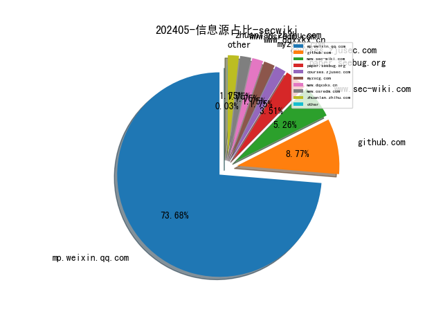
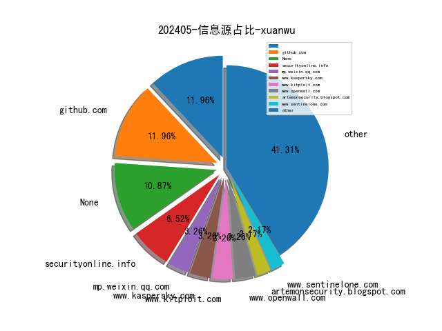
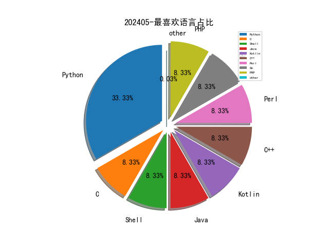

# [数据--所有](README_20.md)
# [数据--年度](README_2024.md)
# 202405 信息源与信息类型占比

# 网络安全书籍 推荐
| date_added | language | title | author | link | size| 
| --- | --- | --- | --- | --- | ---| 
| 2024-05-09 12:13:25 | English | Beyond the Binary: Gender and Legal Personhood in Islamic Law | Saadia Yacoob | http://libgen.rs/book/index.php?md5=ED37E6FC1F549DF6BD20EDF463FAFD54 | 3 MB [PDF]| 
| 2024-05-09 09:47:37 | English | Python Pandas and Python Statements for Beginners: A Step-by-Step Guide to Data Analysis and Visualization and a Beginners Guide to IF, ELIF, and ELSE Statements - 2 Books in 1 | JP Parker | http://libgen.rs/book/index.php?md5=BB0459F9E15B3FDF8983F805B856903B | 257 kB [EPUB]| 
| 2024-05-09 09:37:25 | English | Python Powerhouse: A Developers Guide to Efficient Coding: Python + Flask + Docker + TKinter +ML + Deep Learning + NLP | Husn Ara | http://libgen.rs/book/index.php?md5=3557F869A28C57A5DA987C2E5427883D | 2 MB [EPUB]| 
| 2024-05-09 09:06:05 | English | Monte Carlo with Python | Van Der Post, Hayden | http://libgen.rs/book/index.php?md5=2A3E4245F16CE9D3897211158440F871 | 2 MB [EPUB]| 
| 2024-05-09 06:55:24 | English | Active Machine Learning with Python | unknown | https://www.wowebook.org/active-machine-learning-with-python/ | unknown| 
| 2024-05-08 08:33:10 | English | Mastering AWS Security, Second Edition | unknown | https://www.wowebook.org/mastering-aws-security-second-edition/ | unknown| 
| 2024-05-08 07:31:11 | English | Unveiling the NIST Risk Management Framework (RMF) | unknown | https://www.wowebook.org/unveiling-the-nist-risk-management-framework-rmf/ | unknown| 
| 2024-05-07 09:02:10 | English | Python Concurrency with asyncio, Video Edition | unknown | https://www.wowebook.org/python-concurrency-with-asyncio-video-edition/ | unknown| 
| 2024-05-06 14:26:54 | English | Unveiling the NIST Risk Management Framework (RMF): A practical guide to implementing RMF and managing risks in your organization | Thomas Marsland | http://libgen.rs/book/index.php?md5=D96BA2A974A9AD36F86B81DBC3E77960 | 4 MB [EPUB]| 
| 2024-05-05 16:12:22 | English | The Art of Cyber Warfare: Strategic and Tactical Approaches for Attack and Defense in the Digital Age | Peter Kestner | http://libgen.rs/book/index.php?md5=9A8BAF8694E3F79B83C11528069E372C | 10 MB [RAR]| 
| 2024-05-05 15:49:16 | English | The OSINT Handbook | unknown | https://www.wowebook.org/the-osint-handbook/ | unknown| 
| 2024-05-05 16:12:17 | English | The Art of Cyber Warfare: Strategic and Tactical Approaches for Attack and Defense in the Digital Age | Peter Kestner | http://libgen.rs/book/index.php?md5=3E77C81F8784372C4BC9E710A610C607 | 559 kB [EPUB]| 
| 2024-05-05 16:12:15 | English | The Art of Cyber Warfare: Strategic and Tactical Approaches for Attack and Defense in the Digital Age | Peter Kestner | http://libgen.rs/book/index.php?md5=5AB7C12AE5F07A32BC58F63165516528 | 1 MB [PDF]| 
| 2024-05-03 16:34:31 | English | Cybersecurity Architects Handbook: An end-to-end guide to implementing and maintaining robust security architecture | Lester Nichols | http://libgen.rs/book/index.php?md5=D8F1E01172D13BFE87D501BC6B757211 | 8 MB [EPUB]| 

# 微信公众号 推荐
| nickname_english | weixin_no | title | url| 
| --- | --- | --- | ---| 
| CISSP | wxxinchuangsec | 安全服务市场 TOP 5 | https://mp.weixin.qq.com/s?__biz=Mzg4MTg0MjQ5OA==&mid=2247484930&idx=1&sn=90cb8db7432046c68eb2fb04598b669d | 3| 
| DFIR蘇小沐 | DFIR00 | 【母亲节快乐】愿时光慢些走，岁月待您以温柔 | https://mp.weixin.qq.com/s?__biz=MzI2MTUwNjI4Mw==&mid=2247488366&idx=1&sn=4bb9b72bbd75072a647fb55c2f945b17 | 2| 
| GG安全 | gh_29eff9b30a53 | 钓鱼佬永不空军！！看我如何社g搞定学姐继而接管站点全部权限，“严重”漏洞横空出世 | https://mp.weixin.qq.com/s?__biz=MzIwMjE2NTM5Mg==&mid=2247484834&idx=1&sn=f5c5d3ca80704c6fcc466f7c24bd71d5 | 3| 
| Gh0xE9 | po7mn1 | 2024高校网络安全管理运维赛部分Writeup | https://mp.weixin.qq.com/s?__biz=MzAwNTc5MTMyNg==&mid=2247499439&idx=1&sn=1dbebadf31ef5c0be92eef922aba7220 | 1| 
| HACK之道 | hacklearn | 自动化捡洞/打点必备神器 | https://mp.weixin.qq.com/s?__biz=MzIwMzIyMjYzNA==&mid=2247513891&idx=1&sn=3b01c4a177f7dad16902088f2071bf2f | 2| 
| IoVSecurity | IoVSecurity | 远程车辆控制的关键 - 自动驾驶域控制器 百度 | https://mp.weixin.qq.com/s?__biz=MzU2MDk1Nzg2MQ==&mid=2247608309&idx=1&sn=6f8770039fbcd301ff7c6bf8a80b189f | 9| 
| LemonSec | lemon-sec | 查找真实IP工具 -- FCDN | https://mp.weixin.qq.com/s?__biz=MzUyMTA0MjQ4NA==&mid=2247549759&idx=2&sn=185a7072d2fd15aa561a3c2a5b2a5ed6 | 6| 
| NOP Team | yidalidemao | Fuse , Electron 安全 | https://mp.weixin.qq.com/s?__biz=MzU1NDkwMzAyMg==&mid=2247501909&idx=1&sn=73f4ade65a45df82cd5469217f5d59f8 | 7| 
| OnionSec | gh_8ab0e346e1df | 请多做一些无意义的事情 | https://mp.weixin.qq.com/s?__biz=MzUyMTUwMzI3Ng==&mid=2247485438&idx=1&sn=80569843d5bfbceeb8f3634a343d874e | 2| 
| Ots安全 | AnQuan7 | 使用编码级别绕过 WAF 以利用 CSPT | https://mp.weixin.qq.com/s?__biz=MzAxMjYyMzkwOA==&mid=2247507637&idx=3&sn=25eeb45eda7f3910f95a69b9b2900bfb | 25| 
| Relay学安全 | gh_8d57319ec39c | BloodHound高价值攻击路径配合Ntlm Relay | https://mp.weixin.qq.com/s?__biz=Mzg5MDg3OTc0OA==&mid=2247486734&idx=1&sn=f1bac24f45a857368a0f282737972864 | 1| 
| UKFC安全 | gh_f762e53fa5dd | 高级渗透测试工程师招聘来啦！ | https://mp.weixin.qq.com/s?__biz=MzkyNTU4OTc3MA==&mid=2247484800&idx=1&sn=f28f50f2cec11df0af42686e3c6156a5 | 1| 
| WIN哥学安全 | WIN-security | 记一次梦游渗透从jmx到rce | https://mp.weixin.qq.com/s?__biz=MzkwODM3NjIxOQ==&mid=2247499984&idx=1&sn=00c302e1dccd5ce488d02d5c543dc6b1 | 3| 
| XDsecurity | gh_a6965ae2a4f5 | 搬运,渗透测试、安全服务、红蓝队面试资料 | https://mp.weixin.qq.com/s?__biz=Mzg2NTcyNjU4Nw==&mid=2247485228&idx=1&sn=f28c8994aa1acda18b165e980f0f2c4c | 1| 
| XiAnG学安全 | XiAnG_sec | 【全解】2024第二届“盘古石杯”全国电子数据取证大赛晋级赛参考WP | https://mp.weixin.qq.com/s?__biz=Mzk0MTQzNjIyNg==&mid=2247491487&idx=1&sn=7d5043c7b140d61d21e1180ae9839aeb | 2| 
| Z2O安全攻防 | Z2O_SEC | 找到一个师傅们接私活的好地方！ | https://mp.weixin.qq.com/s?__biz=Mzg2ODYxMzY3OQ==&mid=2247511444&idx=1&sn=63c73241ed17bf2ccdf2c71820b9ec55 | 11| 
| dotNet安全矩阵 | doNetSafety | .NET 矩阵W19增量红队工具集合 | https://mp.weixin.qq.com/s?__biz=MzUyOTc3NTQ5MA==&mid=2247491736&idx=1&sn=1888e04a3a75763873042289355f8925 | 7| 
| flower安全 | flowerx258 | 渗透测试,一次丝滑的渗透测试记录 | https://mp.weixin.qq.com/s?__biz=MzkxNjQyODY5MA==&mid=2247486471&idx=1&sn=051aa8ec67990880fc529af69c2e172c | 3| 
| kali笔记 | bbskali-cn | 待会删！请网安人低调浏览！ | https://mp.weixin.qq.com/s?__biz=MzkxMzIwNTY1OA==&mid=2247504537&idx=1&sn=6c80f8f2dad9f4279780589d727a166e | 1| 
| 一己之见安全团队 | gh_51d9e58684ee | 安全设备篇——日志审计系统 | https://mp.weixin.qq.com/s?__biz=MzkzNzY3ODk4MQ==&mid=2247483829&idx=1&sn=c7c901de20c82c91887cb3971d4a53be | 1| 
| 一起聊安全 | gh_589ffdaa31f9 | 2024第三届上海网络安全博览会先预览 | https://mp.weixin.qq.com/s?__biz=MzI3NjUzOTQ0NQ==&mid=2247510361&idx=1&sn=002fbd461e257e900b50245cc7c5aea7 | 2| 
| 丁爸 情报分析师的工具箱 | dingba2016 | 【AI总结】比较中美C4ISR | https://mp.weixin.qq.com/s/06v1Qcrwy8o0chzesk60Nw | 4| 
| 中国计算机学会 | ccfvoice | 网络空间数据安全与治理 , YEF2024 | https://mp.weixin.qq.com/s?__biz=MjM5MTY5ODE4OQ==&mid=2651571845&idx=1&sn=717ecf40d609d3ca1f7f5d7814fec99f | 44| 
| 乌雲安全 | hackctf | 师傅们，这个新方向爆了！70k很稳 | https://mp.weixin.qq.com/s?__biz=MzAwMjA5OTY5Ng==&mid=2247522348&idx=1&sn=1eb997fee6a0ee3aacbf4f82a04ca0e6 | 4| 
| 亿人安全 | Yr-Sec | 师傅们，找到一个接私活的好地方！ | https://mp.weixin.qq.com/s?__biz=Mzk0MTIzNTgzMQ==&mid=2247515167&idx=1&sn=9ba124d9cb54a609d94d5f9e6828bb8d | 4| 
| 会杀毒的单反狗 | cmlitiejun | 美国医疗保健巨头 Ascension 遭受重大网络攻击，导致该组织及医疗服务陷入混乱 | https://mp.weixin.qq.com/s?__biz=MzI2NzAwOTg4NQ==&mid=2649791133&idx=1&sn=7b43d5518edf9c776fa1eefe67f41ad1 | 7| 
| 伟大航路D | gh_c1fdc31f79ef | 【未公开】用友NC registerServlet接口处存在JNDI 远程代码执行漏洞(XVE-2024-10248) | https://mp.weixin.qq.com/s?__biz=MzkwNzYzNTkzNA==&mid=2247485808&idx=1&sn=1546bf115af2afd4949a88b708e868b8 | 2| 
| 信安404 | infosec404 | 师傅们，这个新方向爆了！70k很稳 | https://mp.weixin.qq.com/s?__biz=Mzk0NjQ5MTM1MA==&mid=2247490033&idx=1&sn=a1c8088a8f6f1052e06d543522b83f0e | 2| 
| 信安路漫漫 | gh_96cdf0c3b4d5 | 货拉拉信息安全资产库建设实践 | https://mp.weixin.qq.com/s?__biz=Mzg2MzkwNDU1Mw==&mid=2247484647&idx=1&sn=5bae906fcf4b79f66fbd65145c2a7ede | 1| 
| 信息安全ISecurity | GuardCyberSec | 【网络安全】小型企业在个人信息保护法框架下的合规路径 | https://mp.weixin.qq.com/s?__biz=MzI3MTk4Mjc3NA==&mid=2247485543&idx=1&sn=a20b97b80e8f35ac93883da9f2cc2304 | 3| 
| 信息安全研究 | ISR2016 | 预告 , 倒计时3天！ | https://mp.weixin.qq.com/s?__biz=MzA3NzgzNDM0OQ==&mid=2664986733&idx=1&sn=db20a86b38d1b457d1c358a02cb9a08b | 18| 
| 全球技术地图 | drc_iite | 新型空中特遣部队将如何重塑美空军作战部署 | https://mp.weixin.qq.com/s?__biz=MzI1OTExNDY1NQ==&mid=2651612667&idx=1&sn=e10c837b1bcc8e416d956990dc75baad | 14| 
| 内生安全联盟 | CCESS_CHINA | 国际观察 , 美国多措并举构建网络安全战略体系 | https://mp.weixin.qq.com/s?__biz=Mzg4MDU0NTQ4Mw==&mid=2247518885&idx=1&sn=dfcb0f3831921d6d1986ff6384741229 | 9| 
| 前沿信安资讯阵地 | infosrc | 2024年的14个网络安全趋势 | https://mp.weixin.qq.com/s?__biz=MzA3MTM0NTQzNA==&mid=2455774052&idx=1&sn=e40971666a87d53acf16f2d6ec648828 | 5| 
| 十九线菜鸟学安全 | gh_5d5696256f18 | 【红蓝/演练】-事前准备(8)之蜜罐建设 | https://mp.weixin.qq.com/s?__biz=MzI1OTUyMTI2MQ==&mid=2247484494&idx=1&sn=a7c717a1c3196fd7de5048932cb74a92 | 3| 
| 吉祥在职场 | gh_370fbad7aec1 | 从副总裁到资深工程师：空窗近1年，薪资还涨了，已不在乎虚名，赚钱养家更重要！ | https://mp.weixin.qq.com/s?__biz=MzI1ODY3MTA3Nw==&mid=2247485333&idx=1&sn=9f98df333e569114c02c2a11fc42a5c6 | 3| 
| 吉祥学安全 | gh_bf0dc85c3f99 | 谷歌也加入了草台班子，删账户、丢数据、尽然还瘫痪7天 | https://mp.weixin.qq.com/s?__biz=MzkwNjY1Mzc0Nw==&mid=2247484078&idx=1&sn=88b4dd56f8536d9b47c199f601cfa581 | 7| 
| 哈拉少安全小队 | gh_b273ce95df95 | 哥斯拉源码分析(二)jsp shell分析 | https://mp.weixin.qq.com/s?__biz=MzAxNzkyOTgxMw==&mid=2247492568&idx=1&sn=19d08df130b2f0a0088816957e30d71d | 3| 
| 土拨鼠的安全屋 | None | 林子大了什么鸟都有 | https://mp.weixin.qq.com/s?__biz=Mzk0ODY1NzEwMA==&mid=2247483914&idx=1&sn=fca438203874c9ef6fdc8da7e2050655 | 1| 
| 复旦白泽战队 | fdwhitzard | 白泽团队：探索用LLM提高漏洞库质量 | https://mp.weixin.qq.com/s?__biz=MzU4NzUxOTI0OQ==&mid=2247489542&idx=1&sn=54ea540a8195dd81d33cf2d1cfe9403a | 3| 
| 天禧信安 | txxa-385 | 【Volatility3】护网杯_Easy_dump | https://mp.weixin.qq.com/s?__biz=MzUyMTE0MDQ0OA==&mid=2247493708&idx=1&sn=a38102134284814da333e078cbb0ea30 | 1| 
| 天锐数据安全 | None | 祝所有母亲节日快乐～ | https://mp.weixin.qq.com/s?__biz=MjM5MTk0MzIzMQ==&mid=2652019909&idx=1&sn=2ba4e7455de2499504802b204a448399 | 8| 
| 安信安全 | gsaxns | 母亲节丨时光温柔  爱只因有你 | https://mp.weixin.qq.com/s?__biz=MzAxNTYwOTU1Mw==&mid=2650089496&idx=1&sn=c96f2f1aa2359cff7c7bdaf8ae321c17 | 7| 
| 安全内参 | anquanneican | 深度解读：Verizon年度数据泄漏调查报告 | https://mp.weixin.qq.com/s?__biz=MzI4NDY2MDMwMw==&mid=2247511595&idx=1&sn=a0171c1a27748ce7b496c59ad50bd560 | 12| 
| 安全圈 | ChinaAnQuan | 【安全圈】RTX4090 暴力破解密码，看看你的密码能撑多久？ | https://mp.weixin.qq.com/s?__biz=MzIzMzE4NDU1OQ==&mid=2652059654&idx=1&sn=fcde9ad1dc6104fa8a06757de92a9793 | 36| 
| 安全学习那些事儿 | aqxxse | 《网络反不正当竞争暂行规定》发布 9月1日起施行 | https://mp.weixin.qq.com/s?__biz=MzkxNTI2NTQxOA==&mid=2247492080&idx=1&sn=7e7dd62ba65b7136c02da2108ef75d80 | 2| 
| 安全新说 | InSightNIS | 一图读懂国家标准 GB/T 43698-2024《网络安全技术 软件供应链安全要求》 | https://mp.weixin.qq.com/s?__biz=MzA3NDIwNTY5Mw==&mid=2247504482&idx=1&sn=ea8045868391477db32ea4805e7ef57d | 5| 
| 安在 | None | 知识星球 , 做抽奖网站有哪些防薅羊毛思路？今年API安全市场状况如何？ | https://mp.weixin.qq.com/s?__biz=MzU5ODgzNTExOQ==&mid=2247621420&idx=1&sn=62d27e1a796594b4246948a6494f667f | 16| 
| 安天集团 | Antiylab | 安天网络行为检测能力升级通告（20240512） | https://mp.weixin.qq.com/s?__biz=MjM5MTA3Nzk4MQ==&mid=2650205573&idx=1&sn=5001c6b7e01e88e7bcd021809e0e328a | 9| 
| 安恒信息 | None | AI生成｜西湖论剑十二周年主题曲MV，诠释科技与艺术的碰撞 | https://mp.weixin.qq.com/s?__biz=MjM5NTE0MjQyMg==&mid=2650606620&idx=1&sn=e31ff8f5e4fa02fd8d4a7bb6a046f94c | 2| 
| 安知讯 | dataanquan | 金融监管总局：银行保险机构要加强数据安全、网络安全、科技外包等风险管理 | https://mp.weixin.qq.com/s?__biz=MzIxMDIwODM2MA==&mid=2653929874&idx=1&sn=547b3ae62cba23646134530905818df5 | 12| 
| 实战安全研究 | gh_f390fc63c711 | 代码审计-某人脸识别平台多处文件上传 | https://mp.weixin.qq.com/s?__biz=MzU0MTc2NTExNg==&mid=2247490239&idx=1&sn=49bcb9f0154017515144cc5d886b93ee | 1| 
| 小艾搞安全 | None | 关于小红书粉丝的逆天私信 | https://mp.weixin.qq.com/s?__biz=Mzg3MTY3NzUwMQ==&mid=2247489327&idx=1&sn=9eef135d617b4a7b3e5da1052e296283 | 1| 
| 开源情报技术研究院 | gh_d1f65c3b3e5b | 网络安全资讯周报（5/6- 4/10） | https://mp.weixin.qq.com/s?__biz=MzkwNjQxOTk1Mg==&mid=2247485779&idx=1&sn=09e23b04f47e4e37adfe31b0fbf25402 | 1| 
| 情报分析师 | Intelligencer1 | 地缘信息知识星球（5月12日更新明细） | https://mp.weixin.qq.com/s?__biz=MzA3Mjc1MTkwOA==&mid=2650549337&idx=2&sn=5052b535802f9745e9283f14407f5486 | 12| 
| 技术修道场 | gh_fe3e6e63e435 | TCP连接的建立与终止，开启与关闭数据传输的桥梁 | https://mp.weixin.qq.com/s?__biz=MzA4NTY4MjAyMQ==&mid=2447898931&idx=1&sn=672df09848fc8b748cbcf49f17a2c0dc | 5| 
| 掌控安全EDU | ZKAQEDU | 漏洞挖掘 , 招聘平台验证码爆破+短信轰炸漏洞 | https://mp.weixin.qq.com/s?__biz=MzUyODkwNDIyMg==&mid=2247539928&idx=1&sn=a1da6687d461cbd3405ad2c7436c5230 | 11| 
| 数安行 | None | 5月12日  母亲节 | https://mp.weixin.qq.com/s?__biz=Mzg5OTM0NTM2OQ==&mid=2247492247&idx=1&sn=b343ed2688624b5b2f86c10255f62421 | 3| 
| 数据何规 | PIPL2021 | 煮酒言规 , 第120期 , 智能体的法律性质 | https://mp.weixin.qq.com/s?__biz=MzU1MzAzNzcwNw==&mid=2247490803&idx=1&sn=89a3bf3a95a884ccef0d36087cc062c3 | 4| 
| 数据取证杂谈 | DigitalForensic | 【全解】2024第二届“盘古石杯”全国电子数据取证大赛晋级赛参考WP | https://mp.weixin.qq.com/s?__biz=MzkwMzE4NDQ5MA==&mid=2247485549&idx=1&sn=4dd7840c32ddd5cf7abbdd9c139b7203 | 3| 
| 数据学堂 | data_school | 数据架构设计方法论及案例（51页PPT） | https://mp.weixin.qq.com/s?__biz=MzkyMDE5ODYwMw==&mid=2247524534&idx=1&sn=9a8916ff19bd6ca7a2186d484a1773fc | 2| 
| 数据安全合规交流部落 | GD_DataSecurity | IP地址127.0.0.1的误解：一次投标监管的技术失误 | https://mp.weixin.qq.com/s?__biz=MzU2MDQ0NzkyMw==&mid=2247484813&idx=1&sn=26b2d4d7bba0ac22331cc3d1086f6136 | 1| 
| 数据安全矩阵 | gh_5d34ca8a20a1 | 财政部 国家网信办关于印发《会计师事务所数据安全管理暂行办法》的通知 | https://mp.weixin.qq.com/s?__biz=Mzg3OTg5MzAzNw==&mid=2247492717&idx=1&sn=cc04b2570e9c6c151033e0502ffbbab7 | 5| 
| 星盟安全 | XM_security | 高校网络安全管理运维赛 Writeup | https://mp.weixin.qq.com/s?__biz=MzU3ODc2NTg1OA==&mid=2247489838&idx=1&sn=c0e2b95537b47909d04437f92a8c3ed1 | 1| 
| 橘猫学安全 | gh_af700ee13397 | 渗透测试思路分享-寻找入口（干货） | https://mp.weixin.qq.com/s?__biz=Mzg5OTY2NjUxMw==&mid=2247512050&idx=1&sn=07da0aa2cb93f55529600347fc58bbc9 | 4| 
| 河南等级保护测评 | hndjbh | RSA 会议的指南：构建合适的供应商生态系统 | https://mp.weixin.qq.com/s?__biz=Mzg2NjY2MTI3Mg==&mid=2247495023&idx=2&sn=48f22c5a884a9fe26bde5bed698989ed | 10| 
| 泾弦安全 | None | 2024hvv行动-初中级 | https://mp.weixin.qq.com/s?__biz=Mzk0MzU5NTg1Ng==&mid=2247484572&idx=1&sn=393b21b52ea86c8eb6c207d1033a2ae6 | 4| 
| 浅安安全 | gh_758e256fcc72 | 漏洞预警 , F5 BIG-IP Next Central Manager SQL注入漏洞 | https://mp.weixin.qq.com/s?__biz=MzkwMTQ0NDA1NQ==&mid=2247488785&idx=1&sn=774666d923814fe3c8678b5cf1c4210a | 8| 
| 渗透安全团队 | GuYingLanQi | 工具 , 红队信息收集谷歌爬取Google_searchurl | https://mp.weixin.qq.com/s?__biz=MzkxNDAyNTY2NA==&mid=2247516483&idx=1&sn=a24cbe631dd367102bbff923537437d1 | 6| 
| 漏洞猎人 | VulnHunter | CVE-2024-3806 | https://mp.weixin.qq.com/s?__biz=MzkwOTQ4NDMzOQ==&mid=2247484319&idx=1&sn=bba9bd11123a6649f089debcca03f9e6 | 1| 
| 爱喝酒烫头的曹操 | gh_80ca437fa5e5 | 瑞友天翼应用虚拟化系统appsaveSQL注入 | https://mp.weixin.qq.com/s?__biz=MzkwOTIzODg0MA==&mid=2247490489&idx=1&sn=f2ae1c2e98ae28e7dc45979f511b3537 | 1| 
| 独语小栈 | gh_fdf661248b20 | c2研究项目 | https://mp.weixin.qq.com/s?__biz=Mzg5MTg1MjA2OA==&mid=2247483792&idx=1&sn=751da80c20dc0d75d58b10d627ff3d87 | 1| 
| 玄道夜谈 | None | 分享图片 | https://mp.weixin.qq.com/s?__biz=MzI3Njc1MjcxMg==&mid=2247492024&idx=1&sn=493d7ce9d4fd375e266b5c29f811ccbe | 5| 
| 白帽子左一 | HackRead | 记一次HW供应链攻击到SQL注入新用法 | https://mp.weixin.qq.com/s?__biz=MzI4NTcxMjQ1MA==&mid=2247609480&idx=1&sn=d7b9f118a369a94dca898bad8010fa71 | 7| 
| 白帽子飙车路 | hack-by-txf | 白嫖DeepSeek+沉浸式翻译插件 | https://mp.weixin.qq.com/s?__biz=MzI1ODI0MTczNQ==&mid=2247490327&idx=1&sn=d154477f1a5ef7e3f6de5638b0cab5ce | 1| 
| 皓月当空w | hanaffectionl | 【热点播报】习近平今年首访回眸 | https://mp.weixin.qq.com/s?__biz=Mzg4MDg5NzAxMQ==&mid=2247485597&idx=2&sn=8850075e84916dc83768347d541aa850 | 3| 
| 看雪学苑 | ikanxue | VM逆向，一篇就够了（下） | https://mp.weixin.qq.com/s?__biz=MjM5NTc2MDYxMw==&mid=2458554406&idx=1&sn=09b1307e73fc9a5575095895864e3799 | 26| 
| 知攻善防实验室 | ChinaRan404 | 超值999！ZoomEye终身会员开售！使用ZoomEye快速追踪热点漏洞！ | https://mp.weixin.qq.com/s?__biz=MzkxMTUwOTY1MA==&mid=2247487348&idx=1&sn=aefcbba458b72cabdb07f62afb3b917d | 1| 
| 系统安全运维 | Taurus-1314147 | 一款web目录快速扫描工具 | https://mp.weixin.qq.com/s?__biz=Mzk0NjE0NDc5OQ==&mid=2247524165&idx=1&sn=241059e1f645072b8af30f191a73d03b | 9| 
| 网络与信息法学会 | cyber-info-law | 【资讯】自然资源部办公厅、工信部办公厅发布《关于规范移动互联网应用程序中登载使用地图行为的通知》 | https://mp.weixin.qq.com/s?__biz=MzU1NDY3NDgwMQ==&mid=2247540682&idx=1&sn=34b098096dc27d659ad675be8f3f97a9 | 18| 
| 网络与安全实验室 | Hohai_Network | 每周文章分享-159 | https://mp.weixin.qq.com/s?__biz=MzI1MTQwMjYwNA==&mid=2247500078&idx=1&sn=855a2eb38b4cb08274c6a501b531c9fc | 2| 
| 网络安全与取证研究 | wangluoanquanquzheng | 基于跨境赌博分析网站内置客服系统及人员信息 | https://mp.weixin.qq.com/s?__biz=Mzg3NTU3NTY0Nw==&mid=2247488799&idx=1&sn=f5c83034eafa269439dbc97c0cfe9a7c | 4| 
| 网络安全与数据治理 | gh_ddbdee0c5caf | 官宣！第七届数字中国建设峰会将于5月24日至25日举办 | https://mp.weixin.qq.com/s?__biz=MzIzODk1NzY5NA==&mid=2247497409&idx=1&sn=c3d695d6edeacf453ca227215165c7c7 | 7| 
| 网络安全和信息化 | ITyunwei_365master | 《网络反不正当竞争暂行规定》发布 | https://mp.weixin.qq.com/s?__biz=MjM5MzMwMDU5NQ==&mid=2649163375&idx=2&sn=db3dd2c1b9f053a8c92133666ca38cf8 | 14| 
| 网络安全资源库 | gh_e8a4866a67fe | linux病毒扫描工具ClamAV使用 | https://mp.weixin.qq.com/s?__biz=MzkxMzMyNzMyMA==&mid=2247556786&idx=1&sn=15db9ca46ea7b03f07897c82833bf637 | 18| 
| 网络法前哨 | cyberlawing | 时建中：规范网络竞争行为xa0护航数字经济持续健康发展——《网络反不正当竞争暂行规定》评介 | https://mp.weixin.qq.com/s?__biz=MzIzMTU2MzU3NQ==&mid=2247493648&idx=1&sn=aba80a4c69b7f834d208a5953b80a55c | 4| 
| 网络法理论与实务前沿 | gh_d1069c3872e2 | 祝福 , 以爱之名 致敬母亲 | https://mp.weixin.qq.com/s?__biz=MzUxNDMzOTAyOQ==&mid=2247492972&idx=1&sn=52ea8fc73896e1a9a962fc3e773912e5 | 5| 
| 船山信安 | zghyxa | Weblogic-CVE-2023-21839 漏洞解析 | https://mp.weixin.qq.com/s?__biz=MzU2NDY2OTU4Nw==&mid=2247513769&idx=1&sn=271421f7ed767bbe16e6217db9b4062a | 4| 
| 苏说安全 | sushuoanquan | 2024年拟制定《网络数据安全管理条例》 | https://mp.weixin.qq.com/s?__biz=Mzg5OTg5OTI1NQ==&mid=2247487313&idx=1&sn=5fdec86501b21895d5b146f85b242bb9 | 1| 
| 计算机与网络安全 | C-CyberSecurity | 自助下载 , 工控安全，云安全，人工智能（算力算网） | https://mp.weixin.qq.com/s?__biz=MjM5OTk4MDE2MA==&mid=2655238266&idx=1&sn=5c35b63087a06443f91100113835d0df | 11| 
| 谈思实验室 | gh_6446c19b4595 | 小鹏P7热管理系统分析 | https://mp.weixin.qq.com/s?__biz=MzIzOTc2OTAxMg==&mid=2247537648&idx=2&sn=f333eeca3beb572fe089117ecf42fc1e | 20| 
| 谈数据 | learning-bigdata | 盘点 , 47张新质生产力产业链图谱 | https://mp.weixin.qq.com/s?__biz=MzI1NzYwNTMzNw==&mid=2247523112&idx=1&sn=14b06632cf594ff92a09392c63bcd324 | 3| 
| 走在网安路上的哥布林 | gh_830aed7d81d2 | TRX HW 二面 | https://mp.weixin.qq.com/s?__biz=MzU5NjYwNDIyOQ==&mid=2247484568&idx=1&sn=dbec64810ea8f117eebd8243a7c8c23b | 2| 
| 道一安全 | DaoYiSecurity | 渗透测试、红队、网络安全面试题大全附答案 | https://mp.weixin.qq.com/s?__biz=MzU5OTMxNjkxMA==&mid=2247485336&idx=1&sn=a63752fb3f615d9ab95fe806ae68586b | 6| 
| 重生者安全 | Fighter-hackerone | 【吃瓜段子】男的x不够温柔被女的报复 | https://mp.weixin.qq.com/s?__biz=Mzg4NTczMTMyMQ==&mid=2247485725&idx=1&sn=fff6ab311b36ade6b720eb5bc64a9a0c | 2| 
| 隐查查 | None | 母亲节 , 时光温柔，只因有你 | https://mp.weixin.qq.com/s?__biz=MzkwODMxMjcyMQ==&mid=2247487410&idx=1&sn=a12252da270c76ade55ba81de23e1835 | 1| 
| 零漏安全 | None | 北京肉夹馍 15  还得补五块 | https://mp.weixin.qq.com/s?__biz=MzkyMDUzMzY1MA==&mid=2247498682&idx=1&sn=c011cc984bf3b4f03a10e1f13b353680 | 2| 
| 靶场手记 | gh_b01702ed9a29 | 【Volatility3】护网杯_Easy_dump | https://mp.weixin.qq.com/s?__biz=MzkzNTY0NzU3Mw==&mid=2247483736&idx=1&sn=b94810e2f888bfb91d4104d4950e4553 | 1| 
| 飞羽技术工坊 | remex_sec | 写了一个面向开发者的日历 | https://mp.weixin.qq.com/s?__biz=MzkwODQyMjgwNg==&mid=2247485021&idx=1&sn=3120887d1c70a9f64551fc5db4c2b708 | 1| 
| 魔方安全 | None | 她呵护你长大，你守护她安全 | https://mp.weixin.qq.com/s?__biz=MzI3NzA5NDc0MA==&mid=2649291041&idx=1&sn=96de0126a2e3f85b34a122acfca3f8f3 | 2| 
| 黑客白帽子 | hackerwhitehat | 记一次梦游渗透从jmx到rce | https://mp.weixin.qq.com/s?__biz=MzA5MzYzMzkzNg==&mid=2650950304&idx=1&sn=555ca3dfd42505a6d2f83bc1b19d3c11 | 12| 
| 黑白之道 | i77169 | 收到文件即可领取338万元扶贫资金？,通过AI技术变成一段虚拟视频，加上手机号、银行卡号就能悄无声息地转走银行卡里的钱？ | https://mp.weixin.qq.com/s?__biz=MzAxMjE3ODU3MQ==&mid=2650592706&idx=1&sn=48931bf2f777ba3842a35081993c3c11 | 16| 
| 360数字安全 | gh_6db130c5163e | 加薪神器！《AIGC职场提效360计》课程上线ISC学院！ | https://mp.weixin.qq.com/s?__biz=MzA4MTg0MDQ4Nw==&mid=2247571332&idx=1&sn=935f3cd2624561596383d7c7cc1ffd34 | 5| 
| CCIA数据安全工作委员会 | CCIA-DSC | 关于举办“2024年网络安全优秀创新成果大赛”的通知 | https://mp.weixin.qq.com/s?__biz=MzkyNzI3MzAxOA==&mid=2247531750&idx=1&sn=a4db6de523e024a1dfea3f0895c30459 | 1| 
| CNCERT国家工程研究中心 | NELCERT | 疑似俄罗斯「军事黑客」持续攻击波兰政府机构 | https://mp.weixin.qq.com/s?__biz=MzUzNDYxOTA1NA==&mid=2247544530&idx=2&sn=fa3f270187528f9bf0790683ecf80480 | 13| 
| CNVD漏洞平台 | CNVDTS | F5发布2024年5月季度安全通告 | https://mp.weixin.qq.com/s?__biz=MzU3ODM2NTg2Mg==&mid=2247494725&idx=1&sn=607dab57ce1ddf4a5ce4f884617b1e8e | 1| 
| CT Stack 安全社区 | Ctstack-chaitin | xray社区平台功能再升级 单个PoC最高奖励提升40% | https://mp.weixin.qq.com/s?__biz=MzIzOTE1ODczMg==&mid=2247499063&idx=1&sn=2ab6cc91c1d912af75bf0cc10e49ba07 | 3| 
| Cyb3rES3c | Cyb3rES3c | 记一次由sessionkey泄露导致的任意用户登录 | https://mp.weixin.qq.com/s?__biz=Mzg2MTc1MjY5OQ==&mid=2247485516&idx=1&sn=7e5004b75d92a168dcb0b108b99c3026 | 5| 
| FreeBuf | freebuf | 如何应对专线攻击；总部与分支机构的安全责任划分 , FB甲方群话题讨论 | https://mp.weixin.qq.com/s?__biz=MjM5NjA0NjgyMA==&mid=2651275782&idx=1&sn=a13eeb678584ca5c33e2a659ab0d0c6f | 36| 
| HackSee | hacksee_com | 最新消息:美国国会图书馆遭网络攻击，10月英国图书馆遭黑客入侵 | https://mp.weixin.qq.com/s?__biz=MzI5NTA0MTY2Mw==&mid=2247485091&idx=1&sn=f59568eee58cf20e79859fe9e8e0e992 | 4| 
| KK安全说 | kksecurity | 如何检查您的 iPhone 是否感染了间谍软件/跟踪软件 | https://mp.weixin.qq.com/s?__biz=Mzg4NzgyODEzNQ==&mid=2247486927&idx=3&sn=f00467aea8233ad4249dbc9cd7ba9925 | 11| 
| Ms08067安全实验室 | Ms08067_com | Linux最新提权通杀五大绝招（下） | https://mp.weixin.qq.com/s?__biz=MzU1NjgzOTAyMg==&mid=2247519975&idx=1&sn=c26fb903aeadd27296ffdc21598f7d88 | 4| 
| M姐 数据合规评论 | M_DigitalLawandLife | “AI助理”解读新法规（二）：天津自贸区数据出境负面清单 | https://mp.weixin.qq.com/s?__biz=MzU5NzUxNjg3Nw==&mid=2247499686&idx=1&sn=1538b20fc71c60ed61181987864f00dc | 6| 
| XCTF联赛 | gh_3d7c7f90f79f | RCTF 2024 , 奋楫启航 逐梦笃行 | https://mp.weixin.qq.com/s?__biz=MjM5NDU3MjExNw==&mid=2247515100&idx=1&sn=bdcba0f7c98b98bb4e74befe6fa72d74 | 1| 
| echoabced | zzPDCA | 关于项目管理中的PDCA运用实践 | https://mp.weixin.qq.com/s?__biz=MzkxMzUyMzg1OQ==&mid=2247484438&idx=1&sn=d36fd709b98c65954caf73fb2a279a99 | 1| 
| imBobby的自留地 | imBobbySY | 搭建自动化安全运营思路：Wazuh + WAF + 企业微信 | https://mp.weixin.qq.com/s?__biz=MzI5MjI4ODU4Nw==&mid=2247485416&idx=1&sn=fdf8bd3c43e62c211ebe8f0dc4afdcc3 | 3| 
| i隐私圆桌派 | iappchina | [JobBoard] Privacy Compliance Specialist | https://mp.weixin.qq.com/s?__biz=MzI0NTE0ODA1MA==&mid=2247485038&idx=1&sn=1db5ead74bbc773748e2c2430d8c7746 | 1| 
| 一个不正经的黑客 | None | 努力！打破真正抽象！ | https://mp.weixin.qq.com/s?__biz=MzkwODI1ODgzOA==&mid=2247505671&idx=1&sn=a0f4e3f6de5ae615d048467ae9104a2c | 2| 
| 七芒星实验室 | HeptagramSec | ADCS之权限维持 | https://mp.weixin.qq.com/s?__biz=Mzg4MTU4NTc2Nw==&mid=2247491482&idx=2&sn=5758837e2a605d207e07c67447e156fb | 5| 
| 中国信息安全 | chinainfosec | 发布 , 市场监管总局发布《网络反不正当竞争暂行规定》（附全文） | https://mp.weixin.qq.com/s?__biz=MzA5MzE5MDAzOA==&mid=2664212953&idx=2&sn=ad04be180399dc5bb5579280fd7dac18 | 29| 
| 中国数据安全产业网 | gh_a30bfee064c9 | 2024西湖论剑·数字安全大会第七届数据安全创新实践案例入册公示 | https://mp.weixin.qq.com/s?__biz=Mzg2OTczNjMwNQ==&mid=2247489173&idx=1&sn=5baf44663af5c0c77d9d557ec5119dfc | 3| 
| 中国网络空间安全协会 | CSAC20160325 | 人工智能应用创新与语料建设研讨会在河北举办 | https://mp.weixin.qq.com/s?__biz=MzA3ODE0NDA4MA==&mid=2649399469&idx=1&sn=5f8b040788a43daa6a8d78da5f6eb33b | 5| 
| 中国软件评测中心 | china_testing | 数据安全产业赛入围决赛名单,2024数字中国创新大赛数字安全赛道数据安全产业赛入围决赛名单 | https://mp.weixin.qq.com/s?__biz=MjM5NzYwNDU0Mg==&mid=2649244111&idx=1&sn=8cfd81f8fa9fd602dc2c91021b88ee44 | 2| 
| 云起无垠 | Clouditera2021 | 活动预告,“AI+Security”系列第1期：大模型&网络空间安全前沿探索活动火热报名中 | https://mp.weixin.qq.com/s?__biz=Mzg3Mjg4NTcyNg==&mid=2247489103&idx=1&sn=27a3a8e6369a63ce6463fdabe10cb829 | 1| 
| 互联网合规君 | gh_057ac073892c | 最新｜《网络反不正当竞争暂行规定》 | https://mp.weixin.qq.com/s?__biz=MzA5NjgwOTQyMA==&mid=2649322651&idx=1&sn=25baa67e0ad69ff471d88c3bec134a09 | 3| 
| 亚信安全 | yaxinanquan | 【一触即发】快来围观C3安全大会朋友圈九宫格！ | https://mp.weixin.qq.com/s?__biz=MjM5NjY2MTIzMw==&mid=2650614757&idx=1&sn=8f510aeea48bf833e3665e31850bb892 | 6| 
| 代码卫士 | codesafe | 谷歌修复今年第五个 Chrome 0day漏洞 | https://mp.weixin.qq.com/s?__biz=MzI2NTg4OTc5Nw==&mid=2247519462&idx=1&sn=1f7824cfd17d3489bc4ba1b37c5d974c | 10| 
| 全频带阻塞干扰 | RFJamming | 高端保镖 , 高净值人物保护装备揭秘 | https://mp.weixin.qq.com/s/5NspU6W59psT9TeIZimEwg | 1| 
| 兰花豆说网络安全 | SecuritySay | 网络安全研发人员年龄和学历结构分析 | https://mp.weixin.qq.com/s?__biz=MzI3NzM5NDA0NA==&mid=2247487776&idx=1&sn=f816000fe2cbbc180768b3173896495e | 5| 
| 关键基础设施安全应急响应中心 | CII-SRC | 财政部 国家网信办印发《会计师事务所数据安全管理暂行办法》 | https://mp.weixin.qq.com/s?__biz=MzkyMzAwMDEyNg==&mid=2247543658&idx=1&sn=2eaf1323ce933f01a5372bebd368b6ef | 13| 
| 刑天攻防实验室 | XT-Lab | Web Socket安全测试 | https://mp.weixin.qq.com/s?__biz=Mzg5NDgzOTAxMQ==&mid=2247485585&idx=1&sn=380fd077cc887518f917d712c13c9f47 | 1| 
| 利刃信安 | DMXGFSYS | 【细思极恐】CISSP官方报名信息存在台独和藏独倾向 | https://mp.weixin.qq.com/s?__biz=MzU1Mjk3MDY1OA==&mid=2247513573&idx=1&sn=8ebf13922df512f6a336f27708feae76 | 2| 
| 合天网安实验室 | hee_tian | 【免费领】求职面试必备：网络安全岗位面试题合集（含答案） | https://mp.weixin.qq.com/s?__biz=MjM5MTYxNjQxOA==&mid=2652905002&idx=2&sn=1270fb52144c46ab1209c3f1fc04a44b | 9| 
| 合规科技研究 | ComplianceTech | 北京加速自动驾驶立法 今年将审议自动驾驶汽车条例 | https://mp.weixin.qq.com/s?__biz=MzkxMzIyNDg2Mg==&mid=2247496698&idx=1&sn=2ef1635919f06522148752b1e63dfec4 | 5| 
| 启明星辰安全简讯 | VitaminSecurity | 安全简讯（2024.05.11） | https://mp.weixin.qq.com/s?__biz=MzUxMDQzNTMyNg==&mid=2247504304&idx=1&sn=001a5a4ab2a362c66391b5e2167898f9 | 13| 
| 启明星辰集团 | venustech_weixin | 2024中国移动算力网络大会 , 潘柱廷：以BASIC6业务框架构建算力网络安全蓝图 | https://mp.weixin.qq.com/s?__biz=MzA3NDQ0MzkzMA==&mid=2651725447&idx=1&sn=47ba023e5f7d506dd0f918afa0aa3fdf | 7| 
| 商业智能研究 | fr_research | 《供应链与物流数字化发展简析》.PDF下载 | https://mp.weixin.qq.com/s?__biz=MzIwMzg5MTI0OQ==&mid=2247546666&idx=2&sn=aa306c5bc15b79f1b3173784bff47544 | 7| 
| 商密君 | shangmijun | 刘烈宏：上下联动、横向协同的数据工作体系基本形成 | https://mp.weixin.qq.com/s?__biz=MzI5NTM4OTQ5Mg==&mid=2247622555&idx=1&sn=4a22a9741fcef75f819fe047440a9d3a | 18| 
| 嘉诚安全 | jiachengsec | 【漏洞通告】Apache OFBiz目录遍历致代码执行漏洞安全风险通告 | https://mp.weixin.qq.com/s?__biz=MzU4NjY4MDAyNQ==&mid=2247495340&idx=1&sn=099549514af1cc6b983d0edddeb3ceb5 | 6| 
| 嘶吼专业版 | Pro4hou | 50000多个小型代理服务器容易受到关键的RCE缺陷的影响 | https://mp.weixin.qq.com/s?__biz=MzI0MDY1MDU4MQ==&mid=2247575139&idx=1&sn=1258e61c9be3e488950d83d1c04e53bb | 9| 
| 增益安全 | pbuff07 | 给学妹发点好看的 | https://mp.weixin.qq.com/s?__biz=MzI3ODk3ODE2OA==&mid=2247484211&idx=1&sn=aa491c8ecf2407bdbb9684e86e54622d | 2| 
| 大数据技术标准推进委员会 | gh_06f5ec229a80 | 参会指南 , 2024 DataOps发展大会即将召开！ | https://mp.weixin.qq.com/s?__biz=MzU0NzczNjAwMw==&mid=2247510397&idx=1&sn=1380e275828f4696f0ccb541f62e2d20 | 4| 
| 天空卫士SkyGuard | Sky--Guard | RSAC2024: 洞悉安全新趋势 - 天空卫士前沿观察 | https://mp.weixin.qq.com/s?__biz=MzA5MjQyODY1Mw==&mid=2648489763&idx=1&sn=becd3770aea8499eac2e868cb23a2f55 | 1| 
| 天融信 | TopsecPioneer | 网安首家！天融信成为西门子DVP数字化增值合作伙伴 | https://mp.weixin.qq.com/s?__biz=MzA3OTMxNTcxNA==&mid=2650917994&idx=1&sn=760ff89fde47e86dea8006c3b2b95319 | 10| 
| 天融信教育 | TOPSEC-EDU | 数据泄露事件 , 戴尔数据遭泄露，影响4900万客户！ | https://mp.weixin.qq.com/s?__biz=MzU0MjEwNTM5Ng==&mid=2247518042&idx=1&sn=b1ec180ce758343129dae8dd7ceabcf7 | 11| 
| 奇安信威胁情报中心 | gh_166784eae33e | 针对区块链从业者的招聘陷阱：疑似Lazarus（APT-Q-1）窃密行动分析 | https://mp.weixin.qq.com/s/84lUaNSGo4lhQlpnCVUHfQ | 1| 
| 奇安信安全监测与响应中心 | QAX-CERT | H3C-CAS虚拟化管理系统文件上传漏洞(QVD-2024-13294)安全风险通告 | https://mp.weixin.qq.com/s?__biz=MzUzODQ0ODkyNA==&mid=2247485054&idx=1&sn=bd9d245ae2d3a3b6089d774264b091b4 | 1| 
| 奇安信集团 | None | 集成！整合！平台化！RSAC 2024照见网络安全新愿景 | https://mp.weixin.qq.com/s?__biz=MzU0NDk0NTAwMw==&mid=2247611288&idx=3&sn=df78bf55579a1271a60043f53ec5991e | 12| 
| 字节跳动技术团队 | BytedanceTechBlog | 作为校招新人，他们如何在字节跳动做 AI 研究并中选 ICLR 的？ | https://mp.weixin.qq.com/s?__biz=MzI1MzYzMjE0MQ==&mid=2247507216&idx=1&sn=f4801e6e4c526204a590ad78d1555e40 | 1| 
| 安世加 | asjeiss | 波音公司去年43GB数据泄露 拒向黑客支付2亿美元赎金 | https://mp.weixin.qq.com/s?__biz=MzU2MTQwMzMxNA==&mid=2247538483&idx=1&sn=26cdc416f032b2f0ec62c063bb73d0fa | 8| 
| 安全威胁纵横 | gh_715fe2f8df0b | 50万人受影响！美国某彩票公司遭网络攻击 | https://mp.weixin.qq.com/s?__biz=Mzk0MDYwMjE3OQ==&mid=2247484928&idx=1&sn=d296df73cc94e67c6ac8bb4c51a9492f | 2| 
| 安全帮 | anquanplus | Nessus 破解+最新插件更新图文教程 百度网盘下载 | https://mp.weixin.qq.com/s?__biz=MzkzNjQwOTc4MQ==&mid=2247489305&idx=1&sn=ba92315595250fb8026df51f094a855c | 2| 
| 安全极客 | gh_23236568a71e | 活动预告,“AI+Security”系列第1期：大模型&网络空间安全前沿探索活动火热报名中 | https://mp.weixin.qq.com/s?__biz=MzkzNDUxOTk2Mw==&mid=2247493867&idx=1&sn=fc6b264c5b614dfc9754e8f385f0d870 | 4| 
| 安全牛 | aqniu-wx | 公安机关破获一个以AI技术为支撑的网络犯罪团伙 | https://mp.weixin.qq.com/s?__biz=MjM5Njc3NjM4MA==&mid=2651129586&idx=2&sn=5858083645d36a86f91ceafeb2f80e66 | 6| 
| 安全研究GoSSIP | GoSSIPSJTU | G.O.S.S.I.P 阅读推荐 2024-05-11 可能是今年最令人拍案叫绝的exploit——俄罗斯方块黑客帝国！ | https://mp.weixin.qq.com/s?__biz=Mzg5ODUxMzg0Ng==&mid=2247497988&idx=1&sn=a8798125f655ace74199ad628bb2edd8 | 6| 
| 安恒信息CERT | gh_1c2b41c1abc7 | 【已复现】瑞友天翼应用虚拟化系统存在session反序列化漏洞 | https://mp.weixin.qq.com/s?__biz=MzUzOTE2OTM5Mg==&mid=2247489319&idx=1&sn=63bdc3f9dff15cf69d00ef439e1fe547 | 4| 
| 安迈信科应急响应中心 | gh_6b3e4cf2d589 | 浙大恩特客户资源管理系统 RegulatePriceAction SQL注入漏洞 | https://mp.weixin.qq.com/s?__biz=Mzg2NjczMzc1NA==&mid=2247485796&idx=2&sn=4fef35879a755a07fb22dde96f67be2c | 14| 
| 小韩讲安全 | None | 《10块》 | https://mp.weixin.qq.com/s?__biz=Mzg3NTY3NDA5MA==&mid=2247483842&idx=1&sn=f17171f739cc007b3fe7817a727984fc | 2| 
| 工业互联网标识智库 | CAICT-bs | 我国工业互联网一体化进园区发展成效再上新台阶（上篇） | https://mp.weixin.qq.com/s?__biz=MzU1OTUxNTI1NA==&mid=2247580904&idx=1&sn=b5a16eede3112a067f3e39c4eb678a8e | 10| 
| 微步在线研究响应中心 | gh_280024a09930 | 【更新】H3C-CAS虚拟化管理系统文件上传漏洞 | https://mp.weixin.qq.com/s?__biz=Mzg5MTc3ODY4Mw==&mid=2247505762&idx=1&sn=42f58b5109a63fd7a453c861fa31434c | 2| 
| 情报分析师Pro | globalpolice | 巴基斯坦俾路支省致命暴力事件激增的背后是什么？ | https://mp.weixin.qq.com/s?__biz=MzkwNzM0NzA5MA==&mid=2247497818&idx=1&sn=efca0bfd2a407832b747bab95fbf88f8 | 6| 
| 我不懂安全 | say_ohno | 某通用设备的二进制文件RCE逆向分析 | https://mp.weixin.qq.com/s?__biz=Mzg2NDcwNjkzNw==&mid=2247486989&idx=1&sn=41c19bfd73c2e3373ff73bb07306d53b | 1| 
| 效率源 | xiaolvyuantech | 产品升级 , 效率源手机取证全面支持HarmonyOS 4.2 | https://mp.weixin.qq.com/s?__biz=MjM5ODQ3NjAwNQ==&mid=2650547461&idx=1&sn=016b041ff6076d645dc4e6f1a7dd1abc | 2| 
| 数世咨询 | dwconcn | 安全行业活动全览（2024年4月） | https://mp.weixin.qq.com/s?__biz=MzkxNzA3MTgyNg==&mid=2247511447&idx=1&sn=91ad37f634ae9b6bde59bc74c94fb083 | 8| 
| 数据保护官 | DPOHUB | 美国将对中国电动汽车征收四倍关税?! | https://mp.weixin.qq.com/s?__biz=MzU5NjA0OTQxOQ==&mid=2247519306&idx=1&sn=bbdcc531feb6f8dbc0987b928a160a22 | 11| 
| 数据合规与隐私设计 | gh_48918499d464 | AlphaFold,蛋白质结构预测模型初探 | https://mp.weixin.qq.com/s?__biz=Mzg5NDY2OTYyOQ==&mid=2247484945&idx=1&sn=faf59b0f402d3aa471f95fbc642fb922 | 1| 
| 无限学习安全团队 | EverLearnTeam | 微信小程序辅助渗透-自动化工具+1 | https://mp.weixin.qq.com/s?__biz=MzkyNTYzMTg3OQ==&mid=2247485270&idx=1&sn=2fed3e6ea863d3b35cce091d2d9c1dea | 1| 
| 昂楷资讯 | ankkinews | 出海进行时！昂楷科技发布数据库安全审计产品多语言版本，助力全球数据安全 | https://mp.weixin.qq.com/s?__biz=MzIyMTAwOTE5Mw==&mid=2651860103&idx=1&sn=1a94009d876de24d57a91426d3fc6195 | 1| 
| 暗影安全 | gh_4f0dabd0df69 | 记一次梦游渗透从jmx到rce | https://mp.weixin.qq.com/s?__biz=MzI2MzA3OTgxOA==&mid=2657165474&idx=1&sn=076b28cf8913b7e1034e1de3f7b0c25a | 1| 
| 格格巫和蓝精灵 | direnjie-sec | WEB3.0(下一代互联网)名词图文介绍 | https://mp.weixin.qq.com/s?__biz=MzI5NDg0ODkwMQ==&mid=2247485940&idx=1&sn=0fd9b1cfcc2837d48142f832ba134c4d | 2| 
| 棉花糖网络安全圈 | hacker-mht | 微信小程序辅助渗透-自动化工具+1 | https://mp.weixin.qq.com/s?__biz=Mzg5NTYwMDIyOA==&mid=2247504401&idx=1&sn=da2b26b66e74ef9932f827720e76e9e3 | 2| 
| 深信服千里目安全技术中心 | gh_c644c6e98b08 | 警惕这几类网络钓鱼陷阱！（附网络钓鱼趋势报告） | https://mp.weixin.qq.com/s?__biz=Mzg2NjgzNjA5NQ==&mid=2247522786&idx=1&sn=b481b055a0889530505424feb65f71a2 | 6| 
| 深信服科技 | sangfor_man | 32个关于VMware替代的真实问题，请回答！ | https://mp.weixin.qq.com/s?__biz=MjM5MTAzNjYyMA==&mid=2650586851&idx=1&sn=cb1150eb9d9f1b708f0352636679ebff | 3| 
| 深圳市网络与信息安全行业协会 | SNISRI | 5项网络安全推荐性国家标准计划 | https://mp.weixin.qq.com/s?__biz=MzU0Mzk0NDQyOA==&mid=2247516815&idx=1&sn=ddc57f08c6a960d2db5e49a3f8b40f33 | 6| 
| 深网知识库 | Lidskool | “proRAT 1.9 程序真的那么容易接管某人的电脑吗？” | https://mp.weixin.qq.com/s?__biz=Mzg4OTAzMzU2OQ==&mid=2247486662&idx=1&sn=206a97553249e608af5ca3e2b9d930cc | 3| 
| 电驭叛客 | langu_xyz | 招合伙人 | https://mp.weixin.qq.com/s?__biz=MzU3MDg0MDgwNw==&mid=2247484204&idx=1&sn=e88d2cfb68a66641a1f37f65e5158f99 | 1| 
| 白昼信安 | M9-xiaobai | 蓝凌OA漏洞-POC合集 | https://mp.weixin.qq.com/s?__biz=MzU1NzgyMzA0OA==&mid=2247490236&idx=1&sn=4f8050afc569c7baaba5b0e299bf1418 | 1| 
| 盘古石取证 | Panguite_CN | 第二届盘古石杯全国电子数据大赛火爆依旧，职业组参赛人数同比增加121% | https://mp.weixin.qq.com/s?__biz=Mzg3MjE1NjQ0NA==&mid=2247502831&idx=1&sn=5144f2f6a7e635ff14c439f25c4bd49f | 2| 
| 盛邦安全WebRAY | WebRay_weixin | 倒计时2天！盛邦安全年度新品暨卫星互联网安全战略升级发布会即将启幕 | https://mp.weixin.qq.com/s?__biz=MzAwNTAxMjUwNw==&mid=2650275474&idx=2&sn=054f7bc03910f59024e858672a9e715a | 4| 
| 盛邦安全应急响应中心 | WebRAY_Sec | 烽火狼烟丨暗网数据及攻击威胁情报分析周报（05/06-05/11） | https://mp.weixin.qq.com/s?__biz=Mzk0NjMxNTgyOQ==&mid=2247484238&idx=1&sn=b0d9dec50f6c9b4b1d587fca36956b7d | 1| 
| 知黑守白 | gh_cfd31ff54692 | 【未公开】电信网关配置管理系统-文件上传-rewrite | https://mp.weixin.qq.com/s?__biz=MzkyNTU4MDc5Mw==&mid=2247485796&idx=1&sn=0ed40a6e580c659bf87c4d9d554cb8bb | 2| 
| 秦安战略 | qinan1128 | 秦安：该强硬起来！普京就任明确首访中国，发生了两件针对性大事 | https://mp.weixin.qq.com/s?__biz=MzA5MDg1MDUyMA==&mid=2650469578&idx=1&sn=8be51cf4c240d3a757cbab3cf7e8a01e | 12| 
| 移动安全星球 | Andy02141225 | 知识征集令：「移动安全」专题 | https://mp.weixin.qq.com/s?__biz=MzI3Mzk2OTkxNg==&mid=2247486230&idx=1&sn=ecd57b6d42741e4c7991dfbf5f1d3914 | 1| 
| 紫队安全研究 | ziduianquanyanjiu | 俄罗斯APT在东欧攻击中部署新的“Kapeka”后门 | https://mp.weixin.qq.com/s?__biz=Mzg3OTYxODQxNg==&mid=2247484336&idx=1&sn=3226005aa3cd0b8b08c05e2f133540e7 | 5| 
| 红蓝公鸡队 | None | 资本家 | https://mp.weixin.qq.com/s?__biz=Mzg5MDc1MjY5Ng==&mid=2247492802&idx=1&sn=bc3551c33bd72f89c58043fad57589d3 | 3| 
| 红队蓝军 | Xx_Security | 红队武器开发初级第三期 | https://mp.weixin.qq.com/s?__biz=Mzg2NDY2MTQ1OQ==&mid=2247517771&idx=1&sn=b293ee847aff8c03071ce2a2f34a1ead | 2| 
| 绿盟科技 | NSFOCUS-weixin | 大模型与软件供应链安全的融合探索 | https://mp.weixin.qq.com/s?__biz=MjM5ODYyMTM4MA==&mid=2650451945&idx=1&sn=32341d8f3bb009475376deb72d6e33b6 | 12| 
| 网安培训 | ccrctraining | 信息安全保障人员认证（CISAW）2024年6月线上考试安排 | https://mp.weixin.qq.com/s?__biz=MzIzNTEzNzIyMA==&mid=2247486133&idx=1&sn=5801fcadfce66bbb576989331922f882 | 1| 
| 网安守护 | security_fangxian | 希望在生活的每一个角落都能发光发热，活出精彩纷呈的人生 | https://mp.weixin.qq.com/s?__biz=MzU4NDY3MTk2NQ==&mid=2247489293&idx=1&sn=3e9dc9b3dc6c74026bcd08dff2b21d54 | 2| 
| 网络技术联盟站 | wljslmz | PoE 三大标准：IEEE 802.3af、IEEE 802.3at、IEEE 802.3bt | https://mp.weixin.qq.com/s?__biz=MzIyMzIwNzAxMQ==&mid=2649457844&idx=1&sn=637be1d6c0391e043ec368e51911221e | 5| 
| 网络盾牌 | gh_6ef5650b8b89 | 0511-戴尔警告数据泄露-欧洲刑警组织疑遭入侵，机密信息数据泄露-俄乌冲突为美军网络战提供经验教训 | https://mp.weixin.qq.com/s?__biz=MzkyNjMzMTcwOQ==&mid=2247495399&idx=1&sn=307a803c67aa277f216aea274333de07 | 3| 
| 老五说网络 | YQ_share | 网络技能大赛试题-有线网络配置解析（二） | https://mp.weixin.qq.com/s?__biz=MzUxNzg5MzM2Mg==&mid=2247486966&idx=1&sn=c6fcf20ba4867ae4ba91abd74e875f52 | 1| 
| 腾讯玄武实验室 | XuanwuLab | 每日安全动态推送(5-11) | https://mp.weixin.qq.com/s?__biz=MzA5NDYyNDI0MA==&mid=2651959634&idx=1&sn=d58f834876c386f5829a8432d37bc213 | 4| 
| 蓝胖子之家 | gh_fa158f2ae9b3 | 对抗恶意软件和其他阻止文件的程序非常有用 | https://mp.weixin.qq.com/s?__biz=MzU1NDg4MjY1Mg==&mid=2247487817&idx=1&sn=0d5c34e31332d0bf7cf7274283493fdb | 2| 
| 蛇矛实验室 | Cybersnaker | 开源渗透框架Havoc | https://mp.weixin.qq.com/s?__biz=MzkwMjI1NzY4Ng==&mid=2247524331&idx=1&sn=327e13e0e924462e7e40a3ffe0085b99 | 1| 
| 贫僧法号云空 | gh_cf6b405797e0 | 泛微OA E-Cology ln.FileDownload 文件读取漏洞 | https://mp.weixin.qq.com/s?__biz=Mzg4OTkwMDc1Mg==&mid=2247484751&idx=1&sn=2e45fb3943d7f52f54cf1b9b0175cdfd | 1| 
| 赛博研究院 | SICSI-cybersecurity | 每周热点｜国新办举行第七届数字中国建设峰会有关情况新闻发布会 | https://mp.weixin.qq.com/s?__biz=MzUzODYyMDIzNw==&mid=2247509107&idx=1&sn=85b8fc06dfad57dde540ba6e27e62972 | 6| 
| 赛宁网安 | Cyberpeace | 莅临赛宁 , 区领导调研紫金山科技城建设发展工作 | https://mp.weixin.qq.com/s?__biz=MzA4Mjk5NjU3MA==&mid=2455484933&idx=1&sn=641c96aae701337aff97a720f90e1210 | 2| 
| 轩公子谈技术 | linux_hack | 某通用设备的二进制文件RCE逆向分析 | https://mp.weixin.qq.com/s?__biz=MzU3MDg2NDI4OA==&mid=2247489879&idx=1&sn=f1261a183c0355b9fd530d31aa2bd391 | 1| 
| 迪哥讲事 | growing0101 | webshell到域控 | https://mp.weixin.qq.com/s?__biz=MzIzMTIzNTM0MA==&mid=2247494593&idx=1&sn=d13d5e032650c040018c74feb7a49aee | 5| 
| 释然IT杂谈 | ShiRan_IT | 【案例】揭露在某鱼某红书卖jd卡被骗后的追溯之道 | https://mp.weixin.qq.com/s?__biz=MzIxMTEyOTM2Ng==&mid=2247502944&idx=1&sn=c379cfc1104e24812751bdc4d2d75a90 | 1| 
| 阿无安全 | gh_42ad55a11898 | CVE-2024-29269 RCE漏洞（附EXP） | https://mp.weixin.qq.com/s?__biz=MzkwMTUzNDgxOA==&mid=2247484414&idx=1&sn=d4c793f50d6941c8d9141d34ef28a7b2 | 1| 
| 飓风网络安全 | gh_183f818a07dc | 【漏洞预警】Next.js < 14.1.1 Server Actions SSRF漏洞 | https://mp.weixin.qq.com/s?__biz=MzI3NzMzNzE5Ng==&mid=2247488135&idx=1&sn=b027427e95c2c340ca64c741e197ba0a | 11| 
| 鹏组安全 | Kris_Alex2 | 小米路由器安装OpenWRT和ShellClash | https://mp.weixin.qq.com/s?__biz=Mzg5NDU3NDA3OQ==&mid=2247490402&idx=1&sn=b341abf3bd76a39e5360ee038626ab9e | 1| 
| 黑客安全 | heikeanquan | 免费的电脑控制手机软件 | https://mp.weixin.qq.com/s?__biz=Mzg3NTAzMjQyNg==&mid=2247486734&idx=1&sn=3ebd7327ece68ba193f18f5fa0a44c56 | 2| 
| Adler学安全 | Acade- | 漏洞复现-CVE-2024-32640 | https://mp.weixin.qq.com/s?__biz=Mzg5NDU1MDc1OA==&mid=2247485537&idx=1&sn=cb79570dd5fde7793a1bf51a0d87c03a | 5| 
| CertiK | certikchina | 技术详解 , 链上打新局中局，交税的狙击机器人 | https://mp.weixin.qq.com/s?__biz=MzU5OTg4MTIxMw==&mid=2247502907&idx=1&sn=ecc44d0d7f57eea140951189f52462b0 | 1| 
| Day1安全团队 | gh_123cbbc95fc3 | Day1助力 , 超值999！ZoomEye终身会员开售！使用ZoomEye快速追踪热点漏洞！ | https://mp.weixin.qq.com/s?__biz=MzU1NDU1NTI5Nw==&mid=2247487834&idx=1&sn=526bc8f2f74588b568f9400a8d1e35b7 | 1| 
| GSDK安全团队 | gh_403a21e91f24 | Tomcat综合漏洞利用工具 - AttackTomcat | https://mp.weixin.qq.com/s?__biz=MzIzNTE0Mzc0OA==&mid=2247485706&idx=1&sn=b6bb60b6a5409232512e2de38dde73f3 | 2| 
| IMPERVA | IMPERVA | 全球一周数据泄漏事件播报 | https://mp.weixin.qq.com/s?__biz=MzI1OTYyOTUyOA==&mid=2247487607&idx=1&sn=b43e968198eece7749ab3ed8bb917f53 | 2| 
| M01N Team | m01nteam | 每周蓝军技术推送（2024.4.27-5.10） | https://mp.weixin.qq.com/s?__biz=MzkyMTI0NjA3OA==&mid=2247493534&idx=1&sn=df4e19901c9a73c64140896239954187 | 1| 
| SecHub网络安全社区 | secevery0x01 | Linux提权技巧整理 | https://mp.weixin.qq.com/s?__biz=MzI5NTUzNzY3Ng==&mid=2247488514&idx=1&sn=3eb2174a31589f6f2887031718f8b601 | 1| 
| TimeAxis Sec | TimeAxis_Sec | 【漏洞复现】优卡特脸爱云管理系统文件上传漏洞 | https://mp.weixin.qq.com/s?__biz=MzIxNzY1MTc1OA==&mid=2247483715&idx=1&sn=e1ab4143a639bb4d8211bd159da3da96 | 1| 
| Yak Project | YakLanguage | 探索程序分析：以静态单赋值(SSA)格式为基础的YakSSA | https://mp.weixin.qq.com/s?__biz=Mzk0MTM4NzIxMQ==&mid=2247520165&idx=1&sn=5c04e57dd45b71415975004e0f974321 | 1| 
| 万径安全 | Mega_Vector | 还有这种事？我的工作全被Ta抢着做了！ | https://mp.weixin.qq.com/s?__biz=MzIwMzI1MDg2Mg==&mid=2649944604&idx=1&sn=b78e452cca04ea8882ab6fb0c9819c2e | 1| 
| 中伦文德网络安全与数据合规 | gh_4b33f9a2e329 | 【新闻速递】财政部、国家网信办发布《会计师事务所数据安全管理暂行办法》 | https://mp.weixin.qq.com/s?__biz=MzIxNDgyNTg0NQ==&mid=2247492630&idx=1&sn=ed0506f7f0597275b46dd440da2a872b | 3| 
| 中国电信安全 | gh_ea6109d37f13 | 聊热点｜中华人民共和国和法兰西共和国关于人工智能和全球治理的联合声明、AI伦理和安全风险管理终极指南 | https://mp.weixin.qq.com/s?__biz=Mzg5NTU3Nzg3MQ==&mid=2247515810&idx=1&sn=ad00355c3fab91bcb30d3a7a0f8f9e5c | 2| 
| 云众可信 | yunzhongkexin | 云众可信深度参编的国家标准《网络安全众测服务》正式获批发布 | https://mp.weixin.qq.com/s?__biz=Mzg2NDU3Mzc5OA==&mid=2247489447&idx=1&sn=51fac61b08749cde2c353a3f16670b6e | 1| 
| 亿赛通 | esafenet2003 | 数安e站 , 什么是数据分类分级？ | https://mp.weixin.qq.com/s?__biz=MzA5MjE0OTQzMw==&mid=2666306548&idx=1&sn=775f78a437f7bb04a97cdbd47e4e2de7 | 1| 
| 众智维安 | openxorg | 众智维科技荣耀加冕，斩获2024年江苏省首届工业互联网安全技能大赛二等奖！ | https://mp.weixin.qq.com/s?__biz=MzU5Mjg0NzA5Mw==&mid=2247492268&idx=1&sn=2d323b8be0335cdc213e273f2b91bca9 | 2| 
| 刨洞之眼 | gh_d8f9af93f3da | TunnelVision 漏洞曝光，几乎可监听所有VPN | https://mp.weixin.qq.com/s?__biz=Mzk0MTQ4NTU5OA==&mid=2247485288&idx=1&sn=e5ad69db62549e777a34dad167a647f5 | 1| 
| 剑客古月的安全屋 | gh_90d1c5be986b | src挖掘-edu篇流程+思路总结 | https://mp.weixin.qq.com/s?__biz=MzkxNDY0NjY3MQ==&mid=2247484722&idx=1&sn=217264254f4d259fd6db20cf1887734c | 1| 
| 勒索病毒头条 | gh_e2ebf868b29d | 勒索攻击同比增长21%，医疗行业沦为勒索软件团伙眼中潜力高、回款快的“财富密码” | https://mp.weixin.qq.com/s?__biz=MzkwNTYyNDQ3MQ==&mid=2247484284&idx=1&sn=174556a7736367f76c6d0a7ed1385af2 | 1| 
| 启明星辰泰合 | gh_ff488b0e98ad | 再获提名推荐，启明星辰NDR产品获得Gartner《2024 NDR市场指导报告》提名代表厂商 | https://mp.weixin.qq.com/s?__biz=MjM5NDI4ODU5OQ==&mid=2684314368&idx=1&sn=f7535d7748e31268a87464f20b08fb52 | 2| 
| 国际云安全联盟CSA | gh_674820794ae8 | CSA AI Summit@RSAC 2024成功举办，发布AI系列报告 | https://mp.weixin.qq.com/s?__biz=MzkwMTM5MDUxMA==&mid=2247497125&idx=1&sn=2fada58104fd2df68d8380b6f9b68d53 | 3| 
| 天际友盟 | gh_8833afc123ef | [0510] 一周重点威胁情报｜天际友盟情报站 | https://mp.weixin.qq.com/s?__biz=MzIwNjQ4OTU3NA==&mid=2247508248&idx=1&sn=473970a7b21e173e588946f5518d8d22 | 2| 
| 奇安信 CERT | gh_64040028303e | 【在野利用】Google Chrome Visuals 释放后重用漏洞(CVE-2024-4671)安全风险通告 | https://mp.weixin.qq.com/s?__biz=MzU5NDgxODU1MQ==&mid=2247501009&idx=1&sn=d4ce01ea254aeccbb07cfcce19a1bcd3 | 2| 
| 安全之眼SecEye | Sec__Eye | 一款Spring图形化综合漏洞的利用工具 | https://mp.weixin.qq.com/s?__biz=MzkzOTY1MzcyOQ==&mid=2247487633&idx=1&sn=01e46300373a1789d7d874a7b011cefa | 4| 
| 安全堡垒 | gh_ccd3f3fbe3d3 | 免费领取MS08067&8大课程试听合集 | https://mp.weixin.qq.com/s?__biz=MzkwMzQyNjg1Ng==&mid=2247486954&idx=1&sn=9794edd26c662a6cb3dbb7d2bf87a39b | 1| 
| 安全脉脉 | gh_6d21af7faacb | 某汽车检测机构 , 车联网安全面经分享 | https://mp.weixin.qq.com/s?__biz=Mzk0MzQzNzMxOA==&mid=2247486707&idx=1&sn=e23622fe945618cd08fd5dba56111408 | 2| 
| 小红书技术REDtech | gh_f510929429e3 | CVPR 2024｜多模态场景感知，小红书高保真人体运动预测方法来了！ | https://mp.weixin.qq.com/s?__biz=Mzg4OTc2MzczNg==&mid=2247490567&idx=1&sn=f0c75efc72b44fa8db8a1f6ad36d2229 | 1| 
| 工业信息安全产业发展联盟 | Nisia_Gongxinanquan | 工业领域数据安全典型案例丨自动驾驶数据分类分级案例 | https://mp.weixin.qq.com/s?__biz=MzUyMzA1MTM2NA==&mid=2247496366&idx=2&sn=908b781e12fa39b5b24f6f89f033f480 | 2| 
| 工业安全产业联盟 | ICSISIA | 干货丨基于IPDRR安全框架的智慧机场关键信息基础设施网络安全建设项目 | https://mp.weixin.qq.com/s?__biz=MzI2MDk2NDA0OA==&mid=2247527205&idx=1&sn=610e0a3e605eaa28e4489ba1c234c11a | 6| 
| 平航科技 | pinghangtechnology | 【CS6100重要更新】国产化系统取证、全新交互机制、更强的解析能力… | https://mp.weixin.qq.com/s?__biz=MzI0OTEyMTk5OQ==&mid=2247492806&idx=1&sn=74478a15410ece5802dde06aee4168d8 | 1| 
| 影域实验室 | gh_342a62011dc0 | 对C2 Havoc的流量检测分析含检测脚本 | https://mp.weixin.qq.com/s?__biz=MzkzODU3MzA5OQ==&mid=2247484328&idx=1&sn=d7aef3a5c506fc7e27687638938dcd1a | 4| 
| 我吃你家米了 | gh_6e3d70a95c43 | windows file system filter driver && WPP tracing | https://mp.weixin.qq.com/s?__biz=MzkzNTA0NzgyMA==&mid=2247484211&idx=1&sn=54c6ddb46070408df7c75024dfb70f26 | 1| 
| 数字治理全球洞察 | cyberlaw2015 | 重磅,《会计师事务所数据安全管理暂行办法》(全文) | https://mp.weixin.qq.com/s?__biz=MzIyNjE0NTQ2OA==&mid=2651255463&idx=1&sn=1b666b9d0e3b640ab7b5d394480e92ee | 2| 
| 数据安全与数据要素化研究 | gh_287b260a46c9 | 数据要素市场动态观察第三十八期（2024.4.29-2024.5.5） | https://mp.weixin.qq.com/s?__biz=MzIwNzQyMTEyMQ==&mid=2247488447&idx=1&sn=63ff2eb52a74d25f878cf4fd6d9b9170 | 2| 
| 数据法律观察 | gh_907425b75d50 | 数据跨境动态,天津自贸试验区数据出境管理负面清单发布 | https://mp.weixin.qq.com/s?__biz=Mzg3ODA0MjA3OA==&mid=2247489082&idx=1&sn=b4f371deff691d8aff85c8bda36ac6fc | 3| 
| 无糖反网络犯罪研究中心 | gh_2ee7a9b17c0d | 新巴尔虎警方破获帮助信息网络犯罪案 , 郧西警方破获帮助信息网络犯罪案——涉网犯罪每日情报 | https://mp.weixin.qq.com/s?__biz=MzAxMzkzNDA1Mg==&mid=2247510558&idx=1&sn=b3d9bccb5f205cb307a0c68b71ab3114 | 3| 
| 星禾团队 | lansjsbehdudbwiwo1 | 招新重启中······ | https://mp.weixin.qq.com/s?__biz=MzkyNzY1NzEwMQ==&mid=2247484067&idx=1&sn=54caf1f45b91867cb64fa30bb2416a42 | 1| 
| 洞源实验室 | Official_InsBug | PHP开发中的不安全反序列化 | https://mp.weixin.qq.com/s?__biz=Mzg4Nzk3MTg3MA==&mid=2247485586&idx=1&sn=4a43225d3bdc2204e24990e635242059 | 1| 
| 洞见网安 | doonsec | 网安简报【2024/5/9】 | https://mp.weixin.qq.com/s?__biz=MzAxNzg3NzMyNQ==&mid=2247488017&idx=1&sn=373672dff78fd2e47bde7b7bc5970d2e | 3| 
| 渗透测试知识学习 | stcszsxx | 渗透测试神器ffuf | https://mp.weixin.qq.com/s?__biz=MzI1MzQwNjEzNA==&mid=2247484109&idx=1&sn=ee85c34852e0123061dabd168685b866 | 5| 
| 漏洞之星 | gh_3a1a61f67c00 | 包中包呗? | https://mp.weixin.qq.com/s?__biz=Mzg2ODc0Mjc0Mw==&mid=2247484047&idx=1&sn=ddef169cfc4edfbf0c104a6f2a0207d3 | 1| 
| 火绒安全 | HuorongLab | 【火绒安全周报】俄罗斯黑客遭巨额悬赏/Mac用户警惕数据泄露 | https://mp.weixin.qq.com/s?__biz=MzI3NjYzMDM1Mg==&mid=2247518385&idx=1&sn=669235c3473c0828b091daf6cf9296ed | 2| 
| 玄知安全实验室 | gh_2f49ecc78ed6 | burpsuite插件Jsroutescan | https://mp.weixin.qq.com/s?__biz=Mzk0MzYzMDI2OA==&mid=2247486557&idx=1&sn=412852a9c8a2f90054888cf57e0ecde7 | 1| 
| 珞安科技 | luoantechnology | 深度参编  建言献策 , 《2023网信自主创新调研报告》工控安全篇 | https://mp.weixin.qq.com/s?__biz=MzU2NjI5NzY1OA==&mid=2247509565&idx=1&sn=ef7e79a8cf19b4aa3951d781c677c2bb | 3| 
| 生有可恋 | hyang0-1 | 3000万条数据有多大 | https://mp.weixin.qq.com/s?__biz=Mzk0MTI4NTIzNQ==&mid=2247491484&idx=1&sn=3635fcd9bb1dea9ec8ad189fd66b168f | 5| 
| 第59号 | malianwa59 | 每周安全速递²⁹³,法国医院CHC-SV称拒绝支付LockBit勒索软件组织的赎金 | https://mp.weixin.qq.com/s?__biz=MzI0NDgxMzgxNA==&mid=2247495809&idx=1&sn=198a1eabf169493b0ac35a39091cd58a | 1| 
| 网络空间信息安全学习 | gh_39213c5878aa | 上新日 , 自动截屏记录 Mac 操作，为 Win 系统添加 Dock 栏 | https://mp.weixin.qq.com/s?__biz=MzI2MjcwMTgwOQ==&mid=2247490839&idx=1&sn=a0621a8df6805ed1ef89d85d3b5082be | 3| 
| 网络空间安全军民融合创新中心 | jmrh1226 | 美国学者分析人工智能技术对网络格局的影响 | https://mp.weixin.qq.com/s?__biz=MzU0ODg5Mjc2NA==&mid=2247489790&idx=1&sn=e02a7486ba392963b8e8390338ded2b4 | 1| 
| 蓝桥云课精选 | lanqiaoyunke01 | 想学习人工智能，先得了解这8大算法！ | https://mp.weixin.qq.com/s?__biz=MzkwODM4NDM5OA==&mid=2247517720&idx=1&sn=0abe2c41f38d3142ecd48f287e3dbef0 | 5| 
| 藏剑安全 | cangjiansafe | 内推,杭州得物急招-Java开发工程师，直推领导 | https://mp.weixin.qq.com/s?__biz=Mzg5MDA5NzUzNA==&mid=2247487731&idx=1&sn=3b9ddd6eaee3fefbe6a43c415f8e74a2 | 1| 
| 蜚语科技 | feyshsec | 探索AI未来：蜚语科技与您相约AI CON HK 2024 | https://mp.weixin.qq.com/s?__biz=MzI5NzI5NzY1MA==&mid=2247485514&idx=1&sn=c430499345aaff27dc4a855f7f7c480f | 1| 
| 补天平台 | Patchingthesky | 端午第四趴 , 公益+专属SRC活动来啦！奖品超丰厚！ | https://mp.weixin.qq.com/s?__biz=MzI2NzY5MDI3NQ==&mid=2247503651&idx=2&sn=e83283b44afa7f323cac8bc2261be578 | 7| 
| 货拉拉安全应急响应中心 | lalasrc | 货拉拉信息安全资产库建设实践 | https://mp.weixin.qq.com/s/RR5YznWfqmKEg757425dgg | 3| 
| 赤弋安全团队 | gh_532e7430f018 | 超值999！ZoomEye终身会员开售！使用ZoomEye快速追踪热点漏洞！ | https://mp.weixin.qq.com/s?__biz=MzkzNzQyMDkxMQ==&mid=2247487538&idx=1&sn=0dfd7306f153fb122d0c091126726256 | 1| 
| 金盾信安 | JD952401 | 网安标委 , 《网络安全技术 信息技术安全评估方法》等16项网络安全国家标准获批发布 | https://mp.weixin.qq.com/s?__biz=MjM5NjA2NzY3NA==&mid=2448662438&idx=2&sn=1c88b9c5edddc61c0f5497ce5960fdc9 | 12| 
| 长亭安全应急响应中心 | chaitin_cert | 【已复现】瑞友天翼应用虚拟化系统SQL注入致远程代码执行漏洞 | https://mp.weixin.qq.com/s?__biz=MzIwMDk1MjMyMg==&mid=2247492519&idx=1&sn=f5fe81e8e8f28c5f717ea46ff2cb2e1e | 2| 
| 长亭科技 | Chaitin_Tech | 即将发布｜长亭御衡（Alioth）安全技术验证平台强势来袭 | https://mp.weixin.qq.com/s?__biz=MzIwNDA2NDk5OQ==&mid=2651387536&idx=1&sn=dd064362cb58e9388302194edd079bac | 3| 
| 隐私合规交流圈 | PrivacyStudy | 上海线下活动即将开始——《2024年ACFE全球职务舞弊调查报告》中文版上海首发 | https://mp.weixin.qq.com/s?__biz=Mzg4MTg3NDI0NQ==&mid=2247500164&idx=2&sn=8e81c873edf145827a310b79c99e2888 | 4| 
| 隐私护卫队 | shenduxinwen | 数据要素x大赛启动！刘烈宏：释放数据价值重在创造应用场景 | https://mp.weixin.qq.com/s?__biz=MzkwODMxNjY5NA==&mid=2247517953&idx=2&sn=00ffadbe26961cde01a43bea7aa9cc73 | 3| 
| 青衣十三楼飞花堂 | scz------ | 吃不到小炒肉的女科学家 | https://mp.weixin.qq.com/s?__biz=MzUzMjQyMDE3Ng==&mid=2247487405&idx=1&sn=84b411a4713d25b9034ea57237d5ae39 | 5| 
| 慢雾科技 | SlowMist | 花小钱钓大鱼｜揭秘 1155 WBTC 钓鱼事件 | https://mp.weixin.qq.com/s/mQch5pEg1fmJsMbiOClwOg | 2| 
| 数据STUDIO | PyDataStudio | 时间序列概率预测的共形预测 | https://mp.weixin.qq.com/s/OuinaUwB--vRpogwEbVmhA | 1| 
| CNNVD安全动态 | cnnvd_news | CNNVD关于Apache ActiveMQ安全漏洞的通报 | https://mp.weixin.qq.com/s?__biz=MzAxODY1OTM5OQ==&mid=2651444072&idx=1&sn=ebc3cf72f75e8a0129121849f1fd65f7 | 1| 
| EBCloud | KKHsuCheney | 数据安全治理体系浅析 | https://mp.weixin.qq.com/s?__biz=Mzg4MTA2MTc4MA==&mid=2247493029&idx=1&sn=af2eaa2748d46bf956e7eb6f99cdf399 | 1| 
| IoT物联网技术 | IoT-Tech-Expo | 物联网 AI 机器视觉赋能智慧工厂，实现产品缺陷精准识别 | https://mp.weixin.qq.com/s?__biz=MjM5OTA4MzA0MA==&mid=2454933856&idx=1&sn=ceaa1c5f2df681f886de572b0954e03e | 4| 
| Nu1L Team | None | 第二届京麒CTF即刻开启报名 | https://mp.weixin.qq.com/s?__biz=MzU4MTg1NzAzMA==&mid=2247490325&idx=1&sn=87e6f0c9176e1055b8f8c0bec4a13fea | 1| 
| Red Teams | None | 一键解密，网络安全神器现已问世！ | https://mp.weixin.qq.com/s?__biz=Mzg5MjUyMTgyNg==&mid=2247485137&idx=1&sn=0760cfd3e23ca1d20bad3b0fb75253fc | 1| 
| Timeline Sec | TimelineSec | QVD-2024-15263：禅道身份认证绕过漏洞 | https://mp.weixin.qq.com/s?__biz=MzA4NzUwMzc3NQ==&mid=2247494423&idx=1&sn=e1d0e5b340ceffad6dad5ea1e1e9ad78 | 2| 
| 中国电信SRC | yundi_src | Apache ActiveMQ Jolokia 和 REST API 未授权访问漏洞 (CVE-2024-32114) | https://mp.weixin.qq.com/s?__biz=Mzg3MjY1NzI0NA==&mid=2247555011&idx=1&sn=73a3dd093545bc2b8540d716fe668f5f | 1| 
| 中孚信息 | zfinfo | 速看！新保密法百题问答 | https://mp.weixin.qq.com/s?__biz=MzAxMjE1MDY0NA==&mid=2247507957&idx=2&sn=574907f40f22b56d12b8b8de7e335741 | 4| 
| 京东安全应急响应中心 | jsrc_team | 第二届京麒CTF挑战赛报名开启！ | https://mp.weixin.qq.com/s?__biz=MjM5OTk2MTMxOQ==&mid=2727836502&idx=1&sn=96752f8ecb91e99ea9b14eb7ccc2aa89 | 1| 
| 信息安全小助手 | gh_114c9ed5864b | 信息安全小提示（2024年第5期） | https://mp.weixin.qq.com/s?__biz=MzkyMjEwNjY5NQ==&mid=2247484982&idx=1&sn=c66fad3629e648f57525387a0987e3e4 | 1| 
| 南阳网络空间安全研究院 | gh_206ce0a49692 | 一周网络安全速递 | https://mp.weixin.qq.com/s?__biz=Mzg5MjkxMDc4MA==&mid=2247483748&idx=1&sn=4d5d785e9cfa9f214fc6ac62e9d680bc | 1| 
| 吾爱破解论坛 | pojie_52 | 吾爱破解安卓逆向入门教程《安卓逆向这档事》十八、表哥，你也不想你的Frida被检测吧!(上) | https://mp.weixin.qq.com/s?__biz=MjM5Mjc3MDM2Mw==&mid=2651140642&idx=1&sn=cf8328f89aff48e3c338fee43e3a5d43 | 2| 
| 四叶草安全 | siyecaoanquan1 | AI引领网络安全新纪元：智能防御，守护数字世界 | https://mp.weixin.qq.com/s?__biz=MjM5MTI2NDQzNg==&mid=2654551466&idx=1&sn=287b64111c8a6835cec668ad3640e77c | 1| 
| 天极智库 | gh_90d775fd9c26 | 【国际视野】Pentera发布《2024年渗透测试现状》调查报告 | https://mp.weixin.qq.com/s?__biz=MzIyMjQwMTQ3Ng==&mid=2247489819&idx=1&sn=ea5a37d30725b0567db75e8e53267053 | 1| 
| 奇安信司法鉴定 | qax-forensic | 摸透仿真网络模式，更好完成取证鉴定 | https://mp.weixin.qq.com/s?__biz=Mzg4NDYzNzIzNQ==&mid=2247491127&idx=1&sn=e51e23ad3ce67534893b8bd9de5bebfe | 1| 
| 奇安网情局 | QACIA2020 | 美军持续迭代联合网络训练靶场PCTE并纳入更多新功能 | https://mp.weixin.qq.com/s?__biz=MzI4ODQzMzk3MA==&mid=2247488688&idx=1&sn=9479b1acd48b5b8643294c1b415a95c8 | 2| 
| 安全牛课堂 | aqniu_edu | 省钱又美滋滋的考证计划，安排！ | https://mp.weixin.qq.com/s?__biz=MzIxNTM4NDY2MQ==&mid=2247510593&idx=1&sn=a51155c6efa480409ed53ee9a0c30588 | 6| 
| 山石网科新视界 | hillstone-vision | RSAC 2024丨山石网科携8大方案亮相，斩获双奖 | https://mp.weixin.qq.com/s?__biz=MzAxMDE4MTAzMQ==&mid=2661287755&idx=1&sn=9d5d2d4c2185cb6c8cab8c979ca97131 | 2| 
| 开源聚合网络空间安全研究院 | OSPtech_Cyberspace | 【实例剖析】记从逆向脱壳APP到写防炸群辅助工具 | https://mp.weixin.qq.com/s?__biz=MzI4NTE4NDAyNA==&mid=2650396623&idx=1&sn=eeb101f385de37607bbacb192634b08d | 1| 
| 弱口令安全实验室 | EzPassSec | 新手向的s2-046漏洞复现 | https://mp.weixin.qq.com/s?__biz=MzkyNzMyNjcwNQ==&mid=2247486715&idx=1&sn=ff2c9ac284920e85daa9bd13e8ca41d4 | 1| 
| 技可达工作室 | ms016team | 复杂之眼EDR产品申请试用 | https://mp.weixin.qq.com/s?__biz=MzU3NDY1NTYyOQ==&mid=2247485923&idx=1&sn=3bacd9003addeffdc42470e8fa78e5da | 2| 
| 摸鱼Sec | gh_e3d95d1a5b73 | 【0day】瑞友天翼应用虚拟化系统 | https://mp.weixin.qq.com/s?__biz=MzkwODUxMDUwMg==&mid=2247483793&idx=1&sn=42c68bd3acf0c13723704af42add1c96 | 1| 
| 数据法盟 | DPO_HUB | 最新 , TikTok“卖或禁”法案诉状摘要，附全文 | https://mp.weixin.qq.com/s?__biz=MzIyNjUxOTQ0MQ==&mid=2247561680&idx=1&sn=5f423d04b1a98024a0b603bcd50f0e7c | 4| 
| 月落安全 | gh_48da38d0bfb5 | 国内AI彻底爆了！全网独一份AI大模型资源...（待会删） | https://mp.weixin.qq.com/s?__biz=Mzg4NDk4MTk5OA==&mid=2247485284&idx=1&sn=1810bd9680a8e1854004e02663de2502 | 1| 
| 独眼情报 | cs_cti | TunnelVision (CVE-2024-3661)：攻击者可以基于DHCP的缺陷解密vpn流量 | https://mp.weixin.qq.com/s?__biz=MzkzNDIzNDUxOQ==&mid=2247484568&idx=1&sn=e919bb16ff3726b3d543cdbff2ee990a | 2| 
| 白帽子 | None | 2024年首届高校网络安全管理运维赛Writeup | https://mp.weixin.qq.com/s?__biz=MzAwMDQwNTE5MA==&mid=2650247510&idx=1&sn=0f3b603b81262e7e163a24c3cbfca740 | 2| 
| 知道创宇 | knownsec | 哈工大研究员发布研究报告：政府网站安全仍面临严峻挑战！ | https://mp.weixin.qq.com/s?__biz=MjM5NzA3Nzg2MA==&mid=2649868263&idx=1&sn=fce28ece889bf1be7180a14f8d69e9c3 | 1| 
| 网易云音乐技术团队 | gh_e0a72742f973 | 云音乐桌面端 3.0 改版前端性能优化之旅 | https://mp.weixin.qq.com/s?__biz=MzI1NTg3NzcwNQ==&mid=2247491052&idx=1&sn=f0e35492c397f04c68c76619c5017d3f | 1| 
| 网络空间安全研究院UESTC | SecurityWeekly | 区块链安全与平台技术教育部工程研究中心、数字经济智能与安全川渝共建重点实验室获2023年中国电子学会科技进步二等奖 | https://mp.weixin.qq.com/s?__biz=Mzk0MDMwNjU3Ng==&mid=2247484205&idx=1&sn=abbf8ab135c51969baeeef7628fe3365 | 1| 
| 腾讯安全 | TXAQ2019 | 权威认可！腾讯列入Forrester内部风险解决方案代表厂商 | https://mp.weixin.qq.com/s?__biz=Mzg5OTE4NTczMQ==&mid=2247514005&idx=1&sn=4cab13788868fd71ec912d669ef5340b | 1| 
| 赛博大作战 | gh_808e29f219d4 | MSSQL注入利用工具更新速览 v1.5 | https://mp.weixin.qq.com/s?__biz=Mzk0NjYyNDI0Ng==&mid=2247483871&idx=1&sn=4c1a0b6b8094f49e60892b9b4d4ddd77 | 1| 
| 赤鸢安全 | gh_3fd0cbd825a6 | 【免杀】不是，哥们儿！八百多就能学免杀？ | https://mp.weixin.qq.com/s?__biz=MzkyOTY0NTc1MQ==&mid=2247484778&idx=1&sn=ed5cdc27cfd7f594938968802e84e9a3 | 2| 
| 进击的HACK | redteasec | SQL注入之通配符注入 | https://mp.weixin.qq.com/s?__biz=MzkxNjMwNDUxNg==&mid=2247485467&idx=1&sn=1ac0178c758e6754dd7cb4ed6b7fcd1c | 5| 
| 锋刃科技 | ahfengren | 登记测试：软件产品增值税即征即退流程 | https://mp.weixin.qq.com/s?__biz=MzUxMjc0MTE3Mw==&mid=2247493147&idx=1&sn=44209a52ae858cb2ccfdcb5f42fbcd67 | 2| 
| 阿呆攻防 | None | HVV了！这得来张免sm的动态IP的流量卡 | https://mp.weixin.qq.com/s?__biz=MzIzNDU5Mzk2OQ==&mid=2247485836&idx=1&sn=d9f81b93245084ccdb9140f169130520 | 2| 
| 阿里云安全 | aliyunsec | 首发！阿里云《安全运营工具用户体验调研报告》 | https://mp.weixin.qq.com/s?__biz=MzA4MTQ2MjI5OA==&mid=2664090896&idx=1&sn=611a956bc8fc47c0244a9c67d20a0747 | 1| 
| 零时科技 | noneage | 零时科技 ,, SATURN攻击事件分析 | https://mp.weixin.qq.com/s?__biz=MzU1OTc2MzE2Mg==&mid=2247488735&idx=1&sn=268af96dc1b2ce27fbb2db7e562b94dc | 1| 
| 雷神众测 | bounty_team | 世间美好，接“粽”而至｜雷神众测端午福利来袭！ | https://mp.weixin.qq.com/s?__biz=MzI0NzEwOTM0MA==&mid=2652502909&idx=1&sn=aafc63dc511c9405b303d15b97926244 | 2| 
| 骨哥说事 | guge_guge | 18 岁少年如何发现虚拟机逃逸漏洞 | https://mp.weixin.qq.com/s?__biz=MjM5Mzc4MzUzMQ==&mid=2650258743&idx=1&sn=d58b9b33a2a888795b869c199237b79d | 2| 
| 默安科技 | moresec | 《芝士官来了》第二期要点提炼与下期精彩预告：继续讲透开发安全 | https://mp.weixin.qq.com/s?__biz=MzIzODQxMjM2NQ==&mid=2247498421&idx=1&sn=410a0cddaf82e8e07564ef934b019a67 | 2| 
| CISP | gh_a6a902006095 | 注册信息安全培训讲师（CISI）选拔通过名单（最终批） | https://mp.weixin.qq.com/s?__biz=MzI1NzQ0NTMxMQ==&mid=2247489281&idx=1&sn=771b4111b53869e9bbf16a9473b807d8 | 1| 
| Crush Sec | Crush_Sec | 漏洞分析——禅道项目管理系统身份认证绕过漏洞 | https://mp.weixin.qq.com/s?__biz=MzkxMjMwNTEwMg==&mid=2247485836&idx=1&sn=6d1dfb958efbeb3d6d0c1d4e56490dda | 1| 
| DX安全实验室 | gh_695e77d73020 | 一键解密，网络安全神器现已问世！ | https://mp.weixin.qq.com/s?__biz=Mzg3MDY2NDE0MQ==&mid=2247491400&idx=1&sn=51d0f52cc1e4e03b227f5b8472dc33fc | 1| 
| JOY的安全屋 | gh_99b4126d82ce | 【新接口】魔方网表 magicflue 任意文件上传漏洞 | https://mp.weixin.qq.com/s?__biz=Mzg2ODkyNjU4NQ==&mid=2247483758&idx=1&sn=a414cafd45cac90bbefa8396cb98bda4 | 2| 
| Jiyou too beautiful | zorejt-_- | HTB-Mailing笔记 | https://mp.weixin.qq.com/s?__biz=Mzk0MTQxOTA3Ng==&mid=2247488532&idx=1&sn=ff69898c7783716eabb5038dfded1454 | 1| 
| Khan安全攻防实验室 | None | 小黑子 | https://mp.weixin.qq.com/s?__biz=MzAwMjQ2NTQ4Mg==&mid=2247492913&idx=1&sn=c6c7412679dfca79bf61948238583af2 | 3| 
| T00ls安全 | T00lsSec | 信息泄露漏-实战案例 | https://mp.weixin.qq.com/s?__biz=Mzg3NzYzODU5NQ==&mid=2247484623&idx=1&sn=7a70759d47d43421d28a818719cc8e81 | 1| 
| TIPFactory情报工厂 | TIPFactory | 143个黑客工具横向对比 | https://mp.weixin.qq.com/s?__biz=MzkyMjM0ODAwNg==&mid=2247487842&idx=1&sn=9af22a92fe318d5d35e5b6c5900e5d62 | 1| 
| Tide安全团队 | TideSec | 无影(TscanPlus) v1.8发布：Poc模糊匹配 | https://mp.weixin.qq.com/s?__biz=Mzg2NTA4OTI5NA==&mid=2247515184&idx=1&sn=8c67f488099ec281f0560d2cfc354899 | 1| 
| 不懂安全的校长 | sectip | 漏洞挖掘 , 使用HaE与CaA组合挖掘高危漏洞 | https://mp.weixin.qq.com/s?__biz=MzkyMzI3OTY4Mg==&mid=2247486669&idx=1&sn=a57e8cce05df72bd31863f468f2338cb | 1| 
| 信息安全国家工程研究中心 | gh_1e0d1778d4b2 | 中华人民共和国和法兰西共和国关于人工智能和全球治理的联合声明 | https://mp.weixin.qq.com/s?__biz=MzU5OTQ0NzY3Ng==&mid=2247496598&idx=2&sn=665ac451aefab93384c225725357ba01 | 3| 
| 创信华通 | cdcxht | 创信招聘丨找工作？看这里！ | https://mp.weixin.qq.com/s?__biz=MzUxNTQxMzUxMw==&mid=2247522308&idx=1&sn=4b28077e78986c89719f35d733c4cb0b | 4| 
| 剁椒鱼头没剁椒 | None | POC&amp;EXP编写笔记合集 | https://mp.weixin.qq.com/s?__biz=Mzg3MDk0OTc1Nw==&mid=2247487495&idx=1&sn=a690f7c348a8fe6579c6b7dfc7b7796f | 1| 
| 字节跳动安全中心 | TouTiaoSec | ByteSRC专测｜生活服务反爬进行中 | https://mp.weixin.qq.com/s?__biz=MzUzMzcyMDYzMw==&mid=2247492711&idx=1&sn=773f4c8a31b96efd53d4c971b704866a | 1| 
| 安全419 | anquan-419 | 网安上市企业2023年财报回顾：形势挑战严峻 长坡厚雪孕育生机 | https://mp.weixin.qq.com/s?__biz=MzUyMDQ4OTkyMg==&mid=2247539409&idx=1&sn=8a1415e5baa4bd450befbe9ddfedda61 | 2| 
| 安全后厨 | sanxingfengaa | 风景3——红山森林动物园 | https://mp.weixin.qq.com/s?__biz=MzI3MDQ1NDE2OA==&mid=2247491150&idx=1&sn=d9b687a6bb6dd7a18e4c2523d94a4ce7 | 6| 
| 安全随笔 | SecNotes | 一篇文章搞懂隧道技术 | https://mp.weixin.qq.com/s?__biz=MzU1MTA4ODM4MQ==&mid=2247485375&idx=1&sn=0ae828a409dae3d304651f7e18bff7d7 | 1| 
| 安协小天使 | gh_e4ac6bc8fbfb | Vidar-Team两位00后荣登全球安全顶会Black hat | https://mp.weixin.qq.com/s?__biz=MzIxNDU2ODg3Mw==&mid=2247485796&idx=1&sn=53de99b68a63cf879062f0ac3d0098c7 | 1| 
| 小毅安全阵地 | anquanzhendi | 【安全小剧场】环保新能源企业的终端防泄密 | https://mp.weixin.qq.com/s?__biz=Mzg4MDE0MzQzMw==&mid=2247487430&idx=1&sn=5d7ef35c180ce225252b3aa73fddccdc | 1| 
| 小黑说安全 | X1ia0hei | 星梦计划——SRC漏洞猎人(文末现金抽奖) | https://mp.weixin.qq.com/s?__biz=MzkxNjQyMjcwMw==&mid=2247486185&idx=2&sn=8914741df4a1c20161299bff7c896883 | 3| 
| 州弟学安全 | gh_8440a0e647ba | 实战学习,保姆式实战等保测评Windows镜像(邀请码+全流程+未公开漏洞) | https://mp.weixin.qq.com/s?__biz=MzkzMDE5OTQyNQ==&mid=2247485344&idx=1&sn=9e513e2aab080c39541f8585299cd6df | 2| 
| 未言数据安全中心 | weyard_O | 中法两国关于人工智能和全球治理的联合声明 | https://mp.weixin.qq.com/s?__biz=MzkyMTMwMzc1Mw==&mid=2247484915&idx=1&sn=27fbac7cb3118cccb13c9ee1a22735fa | 1| 
| 杭州数据安全联盟 | gh_4959e361d8ba | 美国国防信息系统局发布未来五年战略计划 | https://mp.weixin.qq.com/s?__biz=MzkyMjI2MDE2Mg==&mid=2247502209&idx=1&sn=efa3f173760387e6189e423940428532 | 2| 
| 泰晓科技 | TinyLab-Org | 泰晓社区开源之夏2024宣讲会预告 | https://mp.weixin.qq.com/s?__biz=MzA5NDQzODQ3MQ==&mid=2648193407&idx=1&sn=72f65318297384ea481f264380b57e97 | 1| 
| 深圳大学合规研究院 | ICS-SZU | 深圳大学合规研究院合规实务论坛第三十五讲暨反洗钱与制裁高级研修班第三讲：《制裁趋势分享及案例分析》 | https://mp.weixin.qq.com/s?__biz=Mzg5NTMzMzI1MQ==&mid=2247502583&idx=1&sn=70320d9d41da768338d70e1470fcf92e | 1| 
| 爱加密 | zhiyouaijiami | 案例解析 , 金融行业12项个人信息违规场景及合规要点披露！ | https://mp.weixin.qq.com/s?__biz=MjM5NzU4NjkyMw==&mid=2650743616&idx=1&sn=fee169e6e53315936c38f1a0937ff298 | 1| 
| 犀利猪安全 | XiLi-Pig | 有石粒的 , 一次有点东西的Oracle注入 | https://mp.weixin.qq.com/s?__biz=Mzk0NzQxNzY2OQ==&mid=2247486351&idx=1&sn=aff70f070b2dee5ddf209846406aaa7a | 1| 
| 百度安全应急响应中心 | baidu_sec | 议题征集｜「度安讲」安全左移 · 业务护航 技术沙龙议题报名！ | https://mp.weixin.qq.com/s?__biz=MzA4ODc0MTIwMw==&mid=2652539410&idx=1&sn=dd325c27b8d9912534c725c9d582af1d | 2| 
| 编角料 | geekbyter | 移动安全之hook操作灵异现象并解决 | https://mp.weixin.qq.com/s?__biz=MzU0MjUwMTA2OQ==&mid=2247486530&idx=1&sn=79121d7eb214947f2b7b8d0f5662162e | 1| 
| 网络与数据法律实务 | gh_daf0af303efa | 外資系企業によるHRデータ越境に関するコンプライアンス問題 | https://mp.weixin.qq.com/s?__biz=MzAxOTk5NDY1MQ==&mid=2247486840&idx=1&sn=a0de592bb8dc80e8338b66c4702befbb | 1| 
| 网络空间安全科学学报 | wxjmrh | 网安周报 , 深圳发布《公共数据安全评估方法》5月1日实施 | https://mp.weixin.qq.com/s?__biz=MzI0NjU2NDMwNQ==&mid=2247499719&idx=2&sn=5e825fefc0c6648a546248cb002bf6b1 | 2| 
| 美亚柏科 | MeiyaPico | 【免费试用】取证云平台解锁新功能，APP分析中心重磅上线 | https://mp.weixin.qq.com/s?__biz=MjM5NTU4NjgzMg==&mid=2651410322&idx=1&sn=fcb63658489d33ab97b68cff6f472688 | 3| 
| 美团安全应急响应中心 | gh_83d9bb3b8ed0 | 招聘 , 美团安全实习生招聘正在进行中 | https://mp.weixin.qq.com/s?__biz=MzI5MDc4MTM3Mg==&mid=2247493059&idx=1&sn=362fa696530db9493fa8c165e6f64e6b | 1| 
| 腾讯技术工程 | Tencent_TEG | TCP经典异常问题探讨与解决 | https://mp.weixin.qq.com/s?__biz=MjM5ODYwMjI2MA==&mid=2649783401&idx=1&sn=a3b405b50bddd7e46f18e4c4b027ea7d | 1| 
| 表图 | CyberSecurityCircle | 网络安全上市公司年报分析之一：收入 | https://mp.weixin.qq.com/s?__biz=MzUzOTI4NDQ3NA==&mid=2247484551&idx=1&sn=8b9731e1de99571332b27777828a77dc | 1| 
| 赛博社工 | gh_dcbdb7831567 | 红队使用 PE封隔器进行AV 规避的技巧 | https://mp.weixin.qq.com/s?__biz=MzkzNjY3MTc1MA==&mid=2247483980&idx=1&sn=ad7a20dc0ae708e6e1ffa201117de762 | 1| 
| 赛查查 | gh_fabaad32b9d1 | 关于举办第九届上海市大学生网络安全大赛暨“磐石行动”2024第二届全国高校网络安全邀请赛的通知 | https://mp.weixin.qq.com/s?__biz=Mzk0NTU0ODc0Nw==&mid=2247486727&idx=1&sn=5ed17645b7708a4d3a9d21b9223742f2 | 3| 
| 锐眼安全实验室 | gh_ac88e02e949f | 勒索软件演进新阶段,一枚要求支付现金的勒索软件Cash Ransomware | https://mp.weixin.qq.com/s?__biz=MzIyOTczMjI2MQ==&mid=2247486112&idx=1&sn=0e0df2e6cc3996b7e57f57bc2f7b2cea | 1| 
| 零度安全攻防实验室 | Zero-safety | 【2024HW】HW首批招聘-快来投简历！！ | https://mp.weixin.qq.com/s?__biz=MzI3MzUwMTQwNg==&mid=2247485862&idx=1&sn=934a4e381fbe83078d4e998105a95ebb | 1| 
| 青藤云安全 | qingtengyunanquan | 云攻击上升288%，CNAPP已经成为最后必选项 | https://mp.weixin.qq.com/s?__biz=MzAwNDE4Mzc1NA==&mid=2650848768&idx=1&sn=f3dec3245a8f09d57e10c0075616b5d2 | 2| 
| AI与网安 | gh_c57275954216 | AJ-Report开源数据大屏存在远程命令执行漏洞 | https://mp.weixin.qq.com/s?__biz=MzU1ODQ2NTY3Ng==&mid=2247486542&idx=1&sn=2be06b22bab693fc89be39ce01dd99b7 | 1| 
| FreeBuf安全咨询 | freebuf_ent | 2024数据安全：超过60%组织的DLP“成熟度低” | https://mp.weixin.qq.com/s?__biz=Mzg2MTAwNzg1Ng==&mid=2247493411&idx=1&sn=6e2fc6872803cd754a1d6796ea8d1153 | 1| 
| OSINT情报分析师 | None | 开源情报社区 | https://mp.weixin.qq.com/s?__biz=MzkxNzU5MjE0OA==&mid=2247484236&idx=1&sn=d292a08226f59331ddd6cfeb288aa2ed | 1| 
| Rock sec | gh_a129a168e0d4 | Ncast高清智能录播系统存在任意文件读取漏洞 | https://mp.weixin.qq.com/s?__biz=Mzk0NzYyMTAwNw==&mid=2247484485&idx=1&sn=cd825856d1681e05b283928989e0b228 | 1| 
| T0daySeeker | gh_26c54b2c64aa | CIA组织MikroTik软路由攻击场景复现及后门加解密剖析 | https://mp.weixin.qq.com/s/azDzg3op0kqBUpakFtkTAw | 3| 
| goddemon的小屋 | gh_0383232a884d | 一个idea | https://mp.weixin.qq.com/s?__biz=MzI2NTc1ODY0Mw==&mid=2247485901&idx=1&sn=a0e1ccd150785ab78465d10e4b129db2 | 2| 
| vExpert | vArchitect | AI PC离我们还有多远 | https://mp.weixin.qq.com/s?__biz=MzUyOTkzMjk1Ng==&mid=2247485658&idx=1&sn=66e7d162411d8062941dbd37ff951221 | 1| 
| 二进制空间安全 | suntiger_2023 | 访问暗网专用Linux操作系统 | https://mp.weixin.qq.com/s?__biz=MzkxOTUyOTc0NQ==&mid=2247489344&idx=1&sn=8cbe4ee0bfe008a10bf34cb736c31a1a | 1| 
| 云鼎实验室 | YunDingLab | 安全验证 , 容器安全的验证度量实践 | https://mp.weixin.qq.com/s?__biz=MzU3ODAyMjg4OQ==&mid=2247496177&idx=1&sn=47e212d83e2a081b467e23c41dc3e677 | 1| 
| 众安天下Allsec | All_sec | “胖猫”事件揭下网恋“纱布”，且看安全专家如何发声 | https://mp.weixin.qq.com/s?__biz=MzIyOTUzODY5Ng==&mid=2247504079&idx=1&sn=e4d0b8529a63d7abcf183be4c03cdb1f | 1| 
| 信安保密 | xinanbaomi | 关于开展“军工保密现场审查实施流程及迎检注意事项”培训的通知 | https://mp.weixin.qq.com/s?__biz=MjM5MzUyMzM2NA==&mid=2652914026&idx=1&sn=4702f26b4d62b185b3bc985c277db037 | 4| 
| 信通合规 | xintonghegui | 合规周动态丨国务院反垄断反不正当竞争委员会发布《经营者反垄断合规指南》 | https://mp.weixin.qq.com/s?__biz=Mzg2NTY1NDk3Mg==&mid=2247496875&idx=1&sn=a30a9af1dafdebf8669b590ed677307f | 1| 
| 公安部网络安全等级保护中心 | gh_f5f6bf3d09af | 大模型安全标准已发布，能力验证火热报名中！！！ | https://mp.weixin.qq.com/s?__biz=MzU3NTQwNDYyNA==&mid=2247487400&idx=1&sn=6eeb2f706133520cda6431adb80b1d07 | 2| 
| 前进四安全团队 | gh_f1993e0472e9 | 【黑客揭秘】通过heapdump使用mat进行分析，解锁Spring Boot Admin后台隐藏的密码宝藏！ | https://mp.weixin.qq.com/s?__biz=MzkzMzI4MTY3OA==&mid=2247485222&idx=1&sn=a06a01f5845d264ba81a23d03c8b1414 | 1| 
| 嗨嗨安全 | natuerhi666 | RCE宝典重磅回归！全面升级你的知识库！ | https://mp.weixin.qq.com/s?__biz=MzIzMjg0MjM5OQ==&mid=2247487270&idx=1&sn=91ee83b080c75b9176e04212561a58e5 | 1| 
| 国信安全 | gh_aa0cfb9da03f | 国家信息中心信息与网络安全部一行赴四川调研交流 | https://mp.weixin.qq.com/s?__biz=MzU5MzYzMzU5NA==&mid=2247488922&idx=1&sn=9380a3b1ac179a7284a5c4273416a4aa | 1| 
| 安全学术圈 | secquan | 北京交通大学 , 在联邦推荐安全中探索用户画像与物品间的相互作用 | https://mp.weixin.qq.com/s/1wsfoBg1J0dcY_AAzFHehQ | 3| 
| 安全无界 | gh_f49672a46883 | API未授权访问到进入系统 | https://mp.weixin.qq.com/s?__biz=Mzg2MjU2MjY4Mw==&mid=2247484724&idx=1&sn=ba7ec3eadc87719ab14bcbf6956a01b3 | 1| 
| 安恒信息服务平台 | DBAPP688023 | 安恒上新了｜明御防火墙信创新系列即将上新（扫码预约） | https://mp.weixin.qq.com/s?__biz=MzkwODE2OTU0NA==&mid=2247492777&idx=1&sn=1591641df43da1c7cee956c932334784 | 1| 
| 安易科技AneSec | anesec | 中国网安科技中东新篇章！ | https://mp.weixin.qq.com/s?__biz=MzkwMTI3ODUxOQ==&mid=2247484987&idx=1&sn=49fa403b79297ed4ffbbbe8bfc5fdfc9 | 1| 
| 宸极实验室 | ChenJiLab | 『杂项』如何对小程序进行反编译？ | https://mp.weixin.qq.com/s?__biz=Mzg4NTA0MzgxNQ==&mid=2247489124&idx=1&sn=ae1ae13461d410eefb5ee28627a56bd0 | 1| 
| 山石网科安全技术研究院 | HSN_LAB | 二进制安全之自控制流劫持混淆及其恢复研究 | https://mp.weixin.qq.com/s?__biz=MzUzMDUxNTE1Mw==&mid=2247505912&idx=1&sn=8473685aa71b1a6ff0ff05264601e2d2 | 1| 
| 平安集团安全应急响应中心 | PSRC_Team | 叮！平安银行5月奖励活动提前看 | https://mp.weixin.qq.com/s?__biz=MzIzODAwMTYxNQ==&mid=2652144972&idx=1&sn=2d9126467d45b200eb503f03ff366813 | 1| 
| 张无瑕思密达 | kibana520 | Tiktok只退不卖，来自印度的启示 | https://mp.weixin.qq.com/s?__biz=MzkwMzI1ODUwNA==&mid=2247487080&idx=1&sn=59c48595584c30dcf39acee3e0082f33 | 4| 
| 德斯克安全小课堂 | szdesk | 一个人的信息安全部（3）——数据防泄露【附有DLP选型对比表】 | https://mp.weixin.qq.com/s?__biz=MzA3MTUxNzQxMQ==&mid=2453884995&idx=1&sn=af4b47fc114eca5b49962f71a29e8bab | 1| 
| 无名之 | gh_183ba3e9a2da | 关于ETW的这点，他错了 | https://mp.weixin.qq.com/s?__biz=Mzk0NTUwNzAyOA==&mid=2247484179&idx=1&sn=beab72f398b4152382dbf19d46f89c8a | 1| 
| 浙网安协数据安全治理专委会 | zwax-sjaqzlzwh | 中英双语 , 美国对全球网络空间安全与发展的威胁和破坏（全文） | https://mp.weixin.qq.com/s?__biz=Mzk0NjE5NjUxOA==&mid=2247485629&idx=1&sn=cc0ea081e88c5455fe82debdc1ec622b | 1| 
| 红蓝攻防研究实验室 | gh_17746ad81b52 | Cloudflare Tunnel+Cobalt Strike隐藏C2 | https://mp.weixin.qq.com/s?__biz=Mzg4NzkwMDA5NQ==&mid=2247484427&idx=1&sn=48c5f808509e1200d9553c2cc6f7628c | 1| 
| 网络安全等保与关保 | DJBH-CIIP | 关键信息基础设施安全保护的理论技术与实战 | https://mp.weixin.qq.com/s?__biz=MzUyNjk2MDU4MQ==&mid=2247486196&idx=1&sn=3a72be7838ed045c4b6ef7a787c73794 | 1| 
| 菜鸟小新 | None | HW工作内容和操作建议 | https://mp.weixin.qq.com/s?__biz=Mzg4OTI0MDk5MQ==&mid=2247491879&idx=1&sn=6dfb9bb53b302dfe7f3cfe89f4dc7fec | 1| 
| 融云攻防实验室 | gh_0dba7ff3f653 | 漏洞预警 用友-时空KSOA linkadd.jsp sql注入漏洞 | https://mp.weixin.qq.com/s?__biz=MzkyMTMwNjU1Mg==&mid=2247491203&idx=1&sn=27b12f6790e705e36c059921a1d8a685 | 1| 
| 讯飞安全 | iflyteksec | 讯飞SRC,2024-Q1季度奖励公告 | https://mp.weixin.qq.com/s?__biz=MzIwMDE5NDg1MA==&mid=2247494055&idx=1&sn=9cfc7152efa577456166dfbd348cc455 | 1| 
| 迪普科技 | DPtechnology | 第一中标候选人！迪普科技入围中国农业银行中高端负载均衡项目 | https://mp.weixin.qq.com/s?__biz=MzA4NzE5MzkzNA==&mid=2650353448&idx=1&sn=220e5a4eae48edae4c80054a9cec5aa5 | 1| 
| 闲聊趣说 | xianliaoqushuo | Mitmproxy解密自签名证书加密流量 | https://mp.weixin.qq.com/s?__biz=MzIwODc2NjgxNA==&mid=2247484023&idx=1&sn=ca793fb62d450567b1dbe7bbdf2a60a7 | 1| 
| 鬼麦子 | gh_5e1b4049201f | win客户端黑盒挖掘 | https://mp.weixin.qq.com/s?__biz=Mzg4MzY3MTgyMw==&mid=2247483974&idx=1&sn=967a4f366018f0fe361002f918616a27 | 1| 
| 黑客仓库 | hacker-depot | 助力网络安全红队的12个实用资源 | https://mp.weixin.qq.com/s?__biz=MzU0MDUxMDEzNQ==&mid=2247489275&idx=1&sn=7506794a2f7b1f762ce8d3f0a0568f5b | 1| 
| 黑客技术与网络安全 | HackerCoder | 90后程序员辞职搞灰产：开发视频搬运软件、不到一年获利超700万，结局很刑！ | https://mp.weixin.qq.com/s?__biz=MzIyMDEzMTA2MQ==&mid=2651166669&idx=1&sn=3f487810d1a427831a38959a026f6520 | 1| 
| 黑客驰 | HackerChi_Top | SploitScan帮你发现最新漏洞 | https://mp.weixin.qq.com/s?__biz=Mzg4MzgwMDE2Mw==&mid=2247487251&idx=1&sn=d52b7484e72ac9d9799b3e7db02385b7 | 4| 
| 黑猫安全 | Blackcat-Security | 北约和欧盟正式谴责与俄罗斯有关的APT28网络间谍活动 | https://mp.weixin.qq.com/s?__biz=Mzg3OTc0NDcyNQ==&mid=2247491409&idx=2&sn=210ba734318b617f64219b36cb1eb13b | 2| 
| 大模型与小场景 | gh_795892027e5c | 大模型安全 , 最新！大模型安全开源项目汇总（建议收藏） | https://mp.weixin.qq.com/s/ofMytXbFEhkaCDQWQy0KqA | 1| 
| ADLab | v_adlab | 青春挺膺 强国有我 , 启明星辰积极防御技术研究院荣获2023年度“海淀青年榜样”集体 | https://mp.weixin.qq.com/s?__biz=MzAwNTI1NDI3MQ==&mid=2649619412&idx=1&sn=7ba9ae46a48b3516b70021375ff69f58 | 1| 
| 信安网络技术 | xinanwangluojishu | 五四青年节 | https://mp.weixin.qq.com/s?__biz=MzkyNDUxNTQ2Mw==&mid=2247485132&idx=1&sn=0a2a9671b38ef7c2bde5099d88866a8c | 1| 
| 启明星辰网络空间安全教育 | gh_310250868fd4 | 五四青年节丨为梦想不止步，征遍星辰大海，归来仍是少年！ | https://mp.weixin.qq.com/s?__biz=MzUzNDg0NTc1NA==&mid=2247508963&idx=1&sn=348bf2d95b1297588dd2dfec0cb9cafa | 2| 
| 国舜股份 | None | 青年节：致青春 | https://mp.weixin.qq.com/s?__biz=MzA3NjU5MTIxMg==&mid=2650574031&idx=1&sn=3047b789fec5ec3d0a040caf3c0e6b65 | 2| 
| 安全逐梦人 | gh_bdb40c30b1d4 | AJ-Report代码执行漏洞分析 | https://mp.weixin.qq.com/s?__biz=MzkxNzUxMjU5OQ==&mid=2247484471&idx=1&sn=146c2c6d1ea2195b33157d5d7083afee | 1| 
| 昊天信安 | cniaosec | 一款支持自建服务器的免费远控神器 | https://mp.weixin.qq.com/s?__biz=MzkzNzI4NDQzMA==&mid=2247497878&idx=1&sn=a53d729988221799f7632e5b8c3ad963 | 2| 
| 梆梆安全 | BANGCLE | 五四青年节｜无所畏惧，肆意青春 | https://mp.weixin.qq.com/s?__biz=MjM5NzE0NTIxMg==&mid=2651132020&idx=1&sn=22c5ca8ca40e07b1a22920acbed00891 | 1| 
| 白安全组 | bai-1152770445 | 护网避坑之——锁人合同 | https://mp.weixin.qq.com/s?__biz=MzU4MjYxNTYwNA==&mid=2247487224&idx=1&sn=6fe3bc7a5601de57b59ad820526379a3 | 3| 
| 网安寻路人 | DataProtection101 | 美国土安全部：《降低人工智能风险：关键基础设施所有者和运营者安全和安保指南》全文翻译 | https://mp.weixin.qq.com/s?__biz=MzIxODM0NDU4MQ==&mid=2247503104&idx=1&sn=a876b2c1c4b9d40477aa5e8a419a97e6 | 1| 
| 锦行科技 | None | 梦想向上而生，青春大有可为！祝你五四青年节快乐！ | https://mp.weixin.qq.com/s?__biz=MzIxNTQxMjQyNg==&mid=2247492189&idx=1&sn=f05dd6bd3fab36c13ef8056e5cd938e1 | 2| 
| Echo Reply | None | 一个有关 TCP 重传的小问题 | https://mp.weixin.qq.com/s?__biz=MzA5NTUxODA0OA==&mid=2247492530&idx=1&sn=db591afd3c0148807a10b55a847e212b | 1| 
| Esn技术社区 | esnshequ | 黑客实验室创建完整版系列（四）资产整合,编程环境搭配 | https://mp.weixin.qq.com/s?__biz=MzU5Njg5NzUzMw==&mid=2247489902&idx=1&sn=3539d96efb545251a95830eeb1a671d2 | 4| 
| FTC安全 | FTC_sec | 抗沙箱方式列举 | https://mp.weixin.qq.com/s?__biz=MzkzODM0OTE4OA==&mid=2247484411&idx=1&sn=d1c8f115f5b9843b8482cc1ce9e5d9af | 1| 
| GR反窃密攻防实验室 | GR-TSCM-LAB | 【技术】反窃密技术检测中对电子设备的检测方法 | https://mp.weixin.qq.com/s?__biz=MzU5MTM4MTIxMA==&mid=2247485202&idx=1&sn=1afed455f361564c56bd326b9503ab8f | 2| 
| LK安全 | loudonglieren123 | LK安全祝各位师傅五一快乐(内有福利) | https://mp.weixin.qq.com/s?__biz=MzkxMzQyMzUwMg==&mid=2247485944&idx=1&sn=8978ba99c51ad58ad78abf50ab8aaa2d | 1| 
| OSINT研习社 | OSINT_Club | 您的电子邮件可能被黑客入侵吗？ 2024 年窃取者日志中排名靠前的电子邮件提供商分析 | https://mp.weixin.qq.com/s?__biz=Mzg4MzA4NTM0OA==&mid=2247490296&idx=1&sn=b0a7f40b8a648acc603cd141a6212f9c | 3| 
| 不懂安全的果仁 | None | 盗版课培训课，你就卖吧。 | https://mp.weixin.qq.com/s?__biz=Mzg4NDg3NjE5MQ==&mid=2247485026&idx=1&sn=c1e2ad9ea092df8d37990816c5a4394b | 1| 
| 信息安全与通信保密杂志社 | cismag2013 | 2023全球十大网络安全演习 | https://mp.weixin.qq.com/s?__biz=MzkwMTMyMDQ3Mw==&mid=2247588085&idx=1&sn=c00ae77ecdf67a09b4dc7a198b8c1847 | 2| 
| 国家互联网应急中心CNCERT | CNCERTCC | 网络安全信息与动态周报2024年第17期（4月22日-4月27日） | https://mp.weixin.qq.com/s?__biz=MzIwNDk0MDgxMw==&mid=2247499123&idx=1&sn=a88380a3beed037470aab773ba7a9c50 | 1| 
| 大仙安全说 | gh_15500b9393d6 | 【2024 HW】第二批招聘进行中！ | https://mp.weixin.qq.com/s?__biz=MzkxMDYwODk2NQ==&mid=2247484518&idx=1&sn=cf3d78adfb351a17896291f57619f7e2 | 1| 
| 安全喵喵站 | CyberSecurityMew | 漏洞利用3倍·数据泄露翻番｜Verizon DBIR 2024报告·附下载 | https://mp.weixin.qq.com/s?__biz=MzkzNjE5NjQ4Mw==&mid=2247538070&idx=1&sn=8e37d5ad8a52a70c17f24e3d2c12ede3 | 1| 
| 安全开发炒面 | Security_development | 一个基于Ring 3 的rootkit | https://mp.weixin.qq.com/s?__biz=MzU3MDU5ODg1Ng==&mid=2247485776&idx=1&sn=6ad39c74ad60406e90023d5e72c9efee | 2| 
| 安全狗的自我修养 | haidragon_study | 免费课程大全-新课linux程序设计与安全开发基础视频教程更新到78节了 | https://mp.weixin.qq.com/s?__biz=MzkwOTE5MDY5NA==&mid=2247495595&idx=1&sn=aeff7c14ad8f8907ba549e33a14104de | 2| 
| 星悦安全 | XingYue404 | 某云算力矿机交易所审计(未公开漏洞) | https://mp.weixin.qq.com/s?__biz=Mzg4MTkwMTI5Mw==&mid=2247484270&idx=1&sn=c59fafbeef122219676f2b5eff2eb92e | 1| 
| 有价值炮灰 | dust1337 | u200bJava 应用安全之 JEB Floating License 绕过 | https://mp.weixin.qq.com/s?__biz=MzA3MzU1MDQwOA==&mid=2247484875&idx=1&sn=d8aa9ec5ca06d57b131f61d7ba214bde | 1| 
| 渗透安全HackTwo | CB-Hack | AJ-Report数据大屏系统存在命令执行漏洞（未公开）,漏洞预警 | https://mp.weixin.qq.com/s?__biz=Mzg3ODE2MjkxMQ==&mid=2247486678&idx=1&sn=802f8e5854b78a5e21540668e68c7c0f | 2| 
| 漏洞文库 | gh_39e3d018b3d3 | 【漏洞复现】CVE-2024-28253 | https://mp.weixin.qq.com/s?__biz=MzkwNTE4Mzc2Mg==&mid=2247485240&idx=1&sn=df42f7720d47f9572dc52d4c5e0d111c | 8| 
| 皓月的笔记本 | gh_7340936b0779 | 【搭建合集】kkFileView 4.3.0搭建 | https://mp.weixin.qq.com/s?__biz=Mzk0ODM0NDExMg==&mid=2247484475&idx=1&sn=62d59f62324e355a7d6e89c1a678c5b2 | 2| 
| 祺印说信安 | qiyinshuoxinan | 国外专家探讨：网络安全领导力是否应该专业化问题 | https://mp.weixin.qq.com/s?__biz=MzA5MzU5MzQzMA==&mid=2652106370&idx=1&sn=cbb081103bd6721f60a8d48183dbf9d5 | 8| 
| 艾克sec | nimingak | 哥斯拉webshell管理工具二开小记(已上传至github) | https://mp.weixin.qq.com/s?__biz=MzkxNTUwNjgxOQ==&mid=2247484153&idx=1&sn=67d8b3932714ff0a0ee5745f7049a661 | 1| 
| 菜鸟学信安 | securitylearn | 渗透测试之App与小程序工具总结 | https://mp.weixin.qq.com/s?__biz=MzU2NzY5MzI5Ng==&mid=2247500961&idx=1&sn=3978d4611bc4e88a4bfe7e40310e9d14 | 2| 
| 葡萄不只会安全 | putao-m0l1 | 68元买网站前端源代码，安全圈韭菜太好割了 | https://mp.weixin.qq.com/s?__biz=Mzg5OTg1MDk0Mw==&mid=2247484549&idx=1&sn=386716a4a9ee2451403e0daf301b9a2c | 3| 
| 赛欧思安全研究实验室 | gh_04596d590471 | 【安全/科技】互联网情报资讯05.03 | https://mp.weixin.qq.com/s?__biz=MzU0MjE2Mjk3Ng==&mid=2247487029&idx=1&sn=8e4b460c267dd9805bda4b5d2d4278a6 | 1| 
| 重生者安全团队 | Fighter-hackerone | 如何在50-100 米范围内的精确跟踪用户可以实时监控其他人的物流或安全？ | https://mp.weixin.qq.com/s?__biz=Mzg4NTczMTMyMQ==&mid=2247485284&idx=1&sn=b9aec6b384c4cdcd28041b58d1689eda | 4| 
| 长风安全 | gh_7a8fbb3fb79d | SpringBlade list SQL注入批量检测工具 | https://mp.weixin.qq.com/s?__biz=Mzg4MDkyMTE4OQ==&mid=2247484422&idx=1&sn=4bc9602641b6abcdfa48f66d5c6cead2 | 1| 
| 鸿鹄实验室 | None | 分享图片 | https://mp.weixin.qq.com/s?__biz=MzU0MjUxNjgyOQ==&mid=2247492197&idx=1&sn=78bc7570966446bdacc4599b0868b6eb | 1| 
| 黑客技术家园 | hacker202403 | 抖音涨粉神器，自带脚本无需手动操作，而且还是免费使用哦 | https://mp.weixin.qq.com/s?__biz=MzI2OTk4MTA3Ng==&mid=2247490141&idx=1&sn=6bc14ac203330c72a9f4e456ca68643a | 4| 
| EDI安全 | EDISEC | 五一快乐（抽奖 | https://mp.weixin.qq.com/s?__biz=MzIzMTQ4NzE2Ng==&mid=2247494766&idx=1&sn=671f92808e3dbfbefb409f6566670dc6 | 1| 
| SwimSec | gh_4f6ba22a0158 | Crowdstrike不仅仅是SaaS EDR | https://mp.weixin.qq.com/s/i4of22TdWlSo7Xd4YDlyyA | 2| 
| TKing的安全圈 | MrKingfile | 网盾东风班  使命必达，守护数字安全 | https://mp.weixin.qq.com/s?__biz=MzIyNzU2NDIwOA==&mid=2247489822&idx=1&sn=88b8c397cafbafdf9621a1b148905452 | 1| 
| TtTeam | gh_a0a1db78ea68 | Android - 渗透测试框架 | https://mp.weixin.qq.com/s?__biz=Mzg2NTk4MTE1MQ==&mid=2247484931&idx=1&sn=7f8577b6e65ce3249ade5b9e9fb84774 | 2| 
| 中国保密协会科学技术分会 | gh_be4f21d557c0 | “机器学习”在美国空军人力资源管理的应用分析 | https://mp.weixin.qq.com/s?__biz=MzIxMzI4ODI1MA==&mid=2247488294&idx=1&sn=3da83a26c2f3f1bda8b418d7ac0bd71e | 1| 
| 司南评测体系 | opencompass2024 | 实战解读：Llama 3 安全性对抗分析 | https://mp.weixin.qq.com/s/qLf5-HXG-WtS1LAQUD8pww | 1| 
| 天御攻防实验室 | TianyuLab | 谷歌利用生成式AI实现自动化恶意软件逆向工程分析 | https://mp.weixin.qq.com/s/QPFU2qhsK8p3_tj7BlFkbA | 3| 
| 娜璋AI安全之家 | gh_91f1fe28fc6e | [AI安全论文] (32)南洋理工大学刘杨教授——网络空间安全和AIGC整合之道学习笔记及强推（InForSec） | https://mp.weixin.qq.com/s?__biz=Mzg5MTM5ODU2Mg==&mid=2247499894&idx=1&sn=b13567ba9da2116544931b0b3b32fb0d | 2| 
| 安全红蓝紫 | RushForce2020 | 以身份优先的数据安全将成为业务的必需品 | https://mp.weixin.qq.com/s?__biz=MzI1NjQxMzIzMw==&mid=2247491741&idx=1&sn=f6be6033a72770647746419cc92e7e52 | 2| 
| 实战攻防安全 | gh_b2e3012c2c61 | SharpADWS - 滥用 ADWS 协议枚举 Active Directory | https://mp.weixin.qq.com/s?__biz=MzkxNjU2NjM4NA==&mid=2247483819&idx=1&sn=71cad13bc4470102dff0227acb1d5e01 | 1| 
| 小黑子安全 | xiaoheizi537981 | 代码审计-SQL注入类+文件对比技术 | https://mp.weixin.qq.com/s?__biz=Mzg5NDg4MzYzNQ==&mid=2247486463&idx=1&sn=c1e8fcd8d765ff4f1d1c6ab4dfc03b92 | 2| 
| 山警网络空间安全实验室 | sdpcsec | 【邀请函】第二届黄河流域公安院校网络空间安全技能挑战赛 | https://mp.weixin.qq.com/s?__biz=MjM5Njc1OTYyNA==&mid=2450786711&idx=1&sn=db8f008fb92d57f913c33183fb059864 | 1| 
| 开放知识图谱 | OpenKG-CN | 论文浅尝 , 探索基于大模型的知识图谱补全 | https://mp.weixin.qq.com/s/DQEfeFFNYyv0-StUAe218Q | 1| 
| 教父爱分享 | jiaofutql | 说了N遍....不听 | https://mp.weixin.qq.com/s?__biz=MzI1Mjc3NTUwMQ==&mid=2247534972&idx=1&sn=7bcac33484c4b4ffa57b5484d338d0a6 | 2| 
| 极星信安 | gh_90d6a5c9b8d6 | THM平台,Dogcat靶机记录 | https://mp.weixin.qq.com/s?__biz=MzkyMzQ5NjYwMw==&mid=2247484504&idx=1&sn=c2d0014f481a2f0729bd617b62b55d90 | 1| 
| 法克安全 | fucksafe | 快速获取Windows机器存在的杀软（1800+进程比对） | https://mp.weixin.qq.com/s?__biz=MzkwMjIzNTU2Mg==&mid=2247484194&idx=1&sn=048b28f3e13aceb43e43c06b99ee4931 | 2| 
| 湘安无事 | xndsb-1234 | SpringBlade error/list SQL 注入漏洞(附工具) | https://mp.weixin.qq.com/s?__biz=MzU3Mjk2NDU2Nw==&mid=2247491340&idx=1&sn=c7e31b9dd91546b01a0b10c76d196b42 | 1| 
| 漏洞战争 | vulwar | 网络安全顶刊——TDSC 2023 论文清单与摘要（1） | https://mp.weixin.qq.com/s?__biz=MzU0MzgzNTU0Mw==&mid=2247485276&idx=1&sn=3883d5e2a9cb9d33d656a7821271a039 | 4| 
| 秦国商鞅 | dig_exploit | 原创-透过某60红衣教主最近火谈人应该懂得适可而止以及给红衣教主和自己的忠告 | https://mp.weixin.qq.com/s?__biz=Mzg4NzAwNzA4NA==&mid=2247484665&idx=1&sn=ddbd9d196d69f4b52ecf8a461ba8f9fa | 1| 
| 网络安全自学 | gh_1d8521f5d38e | 侧信道攻击对数据安全的威胁(一)xa0 -----什么是侧信道攻击？ | https://mp.weixin.qq.com/s?__biz=MzI3NzQ3NzY4OA==&mid=2247484031&idx=1&sn=4c17e95fa2e7cfb1da498b5687c47412 | 1| 
| 老鑫安全 | studentSec | 让virustotal变的更绿 | https://mp.weixin.qq.com/s?__biz=MzU0NDc0NTY3OQ==&mid=2247487124&idx=1&sn=1e45125c999f86be7d36d7229e218972 | 1| 
| 认知独省 | cogniti0n | 金庸武侠-非线性理解的屌丝逆袭 | https://mp.weixin.qq.com/s?__biz=MzU0NTI4MDQwMQ==&mid=2247484090&idx=1&sn=0f7a105c1b221d0e3d2a496b6135598c | 1| 
| 锐安全 | SecuritySharp | 网络弹性终结篇：网络弹性发展的两个阶段与安全的关系 | https://mp.weixin.qq.com/s?__biz=MzAxOTk3NTg5OQ==&mid=2247490329&idx=1&sn=f7f906eed4d87afce7105a329e3d0eb6 | 1| 
| 黑熊安全 | gh_1735f5aa94ba | emo了，谁来骂醒我。 | https://mp.weixin.qq.com/s?__biz=Mzg2MTg2NzI5OA==&mid=2247484396&idx=1&sn=a341624ef9fdfb460fde3b59be8e5da5 | 1| 
| DataCon大数据安全分析竞赛 | None | 劳动节快乐！致敬为梦想奋斗的你 | https://mp.weixin.qq.com/s?__biz=MzU5Njg1NzMyNw==&mid=2247487942&idx=1&sn=696b19ccc14e54d68260218b179738de | 1| 
| Desync InfoSec | DesyncInfoSec | DesyncInfoSec 技术交流群 | https://mp.weixin.qq.com/s?__biz=MzkzMDE3ODc1Mw==&mid=2247487755&idx=2&sn=fac73f8b3946f8144f319c9e71edb5d6 | 2| 
| ISC平台 | CISC360 | ISC祝大家劳动节快乐！ | https://mp.weixin.qq.com/s?__biz=MjM5ODI2MTg3Mw==&mid=2649815173&idx=1&sn=2df6ea4d7401fb68e6092310d6fa2344 | 1| 
| OPPO安全中心 | opposrc | 【五月巨献】额外奖励/新人加成/出国游学，这个五月OSRC让你嗨翻天！ | https://mp.weixin.qq.com/s?__biz=MzUyNzc4Mzk3MQ==&mid=2247493405&idx=1&sn=e003c745b1c761f1d24b8c39220ea77e | 1| 
| Sec探索者 | gh_46a14c338f91 | 【五一活动】大白哥免杀课2期 | https://mp.weixin.qq.com/s?__biz=MzkyNDYwNTcyNA==&mid=2247484496&idx=1&sn=118d3246b9ce6959b22c6dc19e141e3d | 1| 
| yudays实验室 | yudays-safe | 加密请求的口令爆破 | https://mp.weixin.qq.com/s?__biz=MzU0NjU5NDE4Mg==&mid=2247485430&idx=1&sn=519713fbdf3c7cac4d9ed1fb7e686f0c | 1| 
| 中睿天下 | zorelworld | 尊重每一份努力 致敬每一份坚守 | https://mp.weixin.qq.com/s?__biz=MzAwNjc0MDA1NA==&mid=2650140984&idx=1&sn=8ae0084c99bea62242969b61d0f7c1b5 | 1| 
| 信安百科 | gh_1a73db5eef37 | CVE-2024-4040｜CrushFTP 认证绕过模板注入漏洞（POC） | https://mp.weixin.qq.com/s?__biz=Mzg2ODcxMjYzMA==&mid=2247485251&idx=2&sn=a5e3bb1742e53371e2a85d0f35945065 | 2| 
| 全知科技 | None | 致敬劳动者 | https://mp.weixin.qq.com/s?__biz=MzU0NDMxODY2Nw==&mid=2247521636&idx=1&sn=740e5158222fefdfea00fb25bc5c1a93 | 1| 
| 墨云安全 | moyunsec | 墨云科技｜致敬每一位劳动者 | https://mp.weixin.qq.com/s?__biz=MzU5ODE2NDA3NA==&mid=2247496096&idx=1&sn=150bf825aa82374cb99cd9ce2ecf72a0 | 1| 
| 夜组安全 | NightCrawler_Team | 禅道最新身份认证绕过漏洞利用工具 | https://mp.weixin.qq.com/s?__biz=Mzk0ODM0NDIxNQ==&mid=2247490566&idx=1&sn=1f943829de3bdbcc76baae593ba14f44 | 1| 
| 大山子雪人 | None | 四月书单推荐 | https://mp.weixin.qq.com/s?__biz=Mzg2MDc0NTIxOQ==&mid=2247484516&idx=1&sn=2ec8dfdb3a5dd2f716a8d10406292e6a | 1| 
| 天唯信息安全 | TWtech2113189 | 天唯科技2024年五一劳动节放假通知 | https://mp.weixin.qq.com/s?__biz=MzkzMjE5MTY5NQ==&mid=2247497222&idx=1&sn=092c4ff1463065e5c2e021684f1930cd | 2| 
| 奇安信技术研究院 | None | 奇安信技术研究院祝您劳动节快乐！ | https://mp.weixin.qq.com/s?__biz=Mzg4OTU4MjQ4Mg==&mid=2247487393&idx=1&sn=fbb71ba1ef4724105bb9791481c677a3 | 1| 
| 安全小将李坦然 | gh_b7be9b469f93 | 【红队】lnk钓鱼的奇思妙想(你应该没见过) | https://mp.weixin.qq.com/s?__biz=MzkwMDQ4MDU2MA==&mid=2247484283&idx=1&sn=be7c6281e48f263a49fee13be9f66096 | 1| 
| 安天移动安全 | AVLTeam | 五一 , 致敬劳动者，安全到万家 | https://mp.weixin.qq.com/s?__biz=MjM5NTY4NzcyNg==&mid=2650249130&idx=1&sn=59d75da08b3122458d72eec1616cde7e | 1| 
| 小杨时光智汇 | gh_c80141a39fbd | 精进之路：Python 框架实战心得与策略 | https://mp.weixin.qq.com/s?__biz=MzkzMDMyNzk5NQ==&mid=2247484869&idx=1&sn=cd1e0db7a8cc9a497fedfa626bc8528f | 1| 
| 工联安全众测 | gh_76781543558c | 工联众测平台祝您劳动节快乐 | https://mp.weixin.qq.com/s?__biz=MzkyMDMwNTkwNg==&mid=2247487119&idx=1&sn=6c84a65000ad50d480dbbbde26e16d8d | 1| 
| 度小满安全应急响应中心 | dxmsrc | DXMSRC｜祝白帽师傅们五一假期愉快～ | https://mp.weixin.qq.com/s?__biz=Mzg2MjIzODI3Mw==&mid=2247492429&idx=1&sn=bc20abb45f1a4bbd1844f752777bb609 | 1| 
| 异空间安全 | None | 五一老学员续杯活动 | https://mp.weixin.qq.com/s?__biz=MzIzOTUwMjI5MA==&mid=2247485522&idx=1&sn=b0cb729cdab3826c0086f1832e94c33f | 1| 
| 恒星EDU | None | 五一｜劳动节快乐 | https://mp.weixin.qq.com/s?__biz=MzU1MzE3Njg2Mw==&mid=2247507883&idx=1&sn=c801b0d3ead217b26469140d0c9baa3e | 1| 
| 成都链安 | None | 五一劳动节,向每一位努力奋斗的劳动者致敬 | https://mp.weixin.qq.com/s?__biz=MzU2NzUxMTM0Nw==&mid=2247510983&idx=1&sn=650113c94e50c2897a3d9932f0e5d6fe | 1| 
| 我爱林 | CoderWin | 漏洞复现 ,, SpringBlade dict-biz/list接口SQL注入 | https://mp.weixin.qq.com/s?__biz=MzI2Mzc3OTg1Ng==&mid=2247492516&idx=1&sn=bd9f7ce4f679a8baf4680bd256f21592 | 1| 
| 打代码的猫 | kitescat_666 | 【開山安全笔记】WAF略知一二 | https://mp.weixin.qq.com/s?__biz=MzU5MjMzMTI2MQ==&mid=2247484991&idx=1&sn=1b0115d100b04faa707ceaf7ad924317 | 1| 
| 数据安全共同体计划 | gh_385b203e9e03 | 五一快乐丨守护数据安全，致敬每一位劳动者 | https://mp.weixin.qq.com/s?__biz=Mzg5MDcxODc5NA==&mid=2247491236&idx=1&sn=63527a4ee322f74e45b5f9287ed426f6 | 1| 
| 数说安全 | csreviews | 明朝万达IPO终止，原拟募资3.6亿元 | https://mp.weixin.qq.com/s?__biz=MzkzMDE5MDI5Mg==&mid=2247505889&idx=1&sn=1628c056cfb4b89ac444ac0142693405 | 2| 
| 暴暴的皮卡丘 | gh_3aa935a28263 | windows持久化后门之notepad++ | https://mp.weixin.qq.com/s?__biz=MzU0NDI5NTY4OQ==&mid=2247485277&idx=1&sn=28ed6858d4411ffbc018de29f9e2606b | 1| 
| 朱厌安全 | AQ_F0R | 免杀的艺术：浅谈驱动对抗EDR | https://mp.weixin.qq.com/s?__biz=Mzg4Njg3MDk5Ng==&mid=2247486480&idx=1&sn=706ac8fe80bcc6fe3f02ce492992662f | 1| 
| 杭师大网安 | gh_cb6e613490cd | 杭州师范大学第五届网络与信息安全竞赛实践赛成功举办 | https://mp.weixin.qq.com/s?__biz=Mzg5MzA1MDIzMg==&mid=2247495388&idx=1&sn=329d20f41c7c04851d4ebd4ae44af425 | 1| 
| 炼石网络CipherGateway | CipherGateway | 五一｜担当安全使命负重前行，守护万千岗位人生华章 | https://mp.weixin.qq.com/s?__biz=MzkyNzE5MDUzMw==&mid=2247547310&idx=1&sn=d900753de0767fffefcaea84b7b79b29 | 1| 
| 矢安科技 | shanghaishiankeji | 劳动节快乐！ | https://mp.weixin.qq.com/s?__biz=Mzg2Mjc3NTMxOA==&mid=2247507526&idx=1&sn=63c57fab1452c4ab7a419de34e4bee65 | 1| 
| 绿盟科技研究通讯 | nsfocus_research | RSAC 2024创新沙盒｜Dropzone AI：自动化安全运营研判 | https://mp.weixin.qq.com/s?__biz=MzIyODYzNTU2OA==&mid=2247497249&idx=1&sn=74ddb0c7862274f6633179a3a7f7d328 | 1| 
| 老烦的草根安全观 | linglan30 | 理解数据 | https://mp.weixin.qq.com/s?__biz=MzA5MTYyMDQ0OQ==&mid=2247492695&idx=1&sn=922798756846815166d0f56bc891f07f | 1| 
| 联想全球安全实验室 | gh_bfd408ab01d7 | 联想全球安全实验室祝您劳动节快乐 | https://mp.weixin.qq.com/s?__biz=MzU1ODk1MzI1NQ==&mid=2247490144&idx=1&sn=8020837916900e333f3dafa752a113bb | 1| 
| 贝雷帽SEC | Beret-Sec | 【红队】一款企业资产快速收集工具 | https://mp.weixin.qq.com/s?__biz=Mzk0MDQzNzY5NQ==&mid=2247491376&idx=1&sn=4c85ce374cf431a583bea3f0958c8e5d | 1| 
| 软件安全与逆向分析 | feicong_sec | 大家五一快乐，活动开奖了，再送星球优惠券 | https://mp.weixin.qq.com/s?__biz=MzU3MTY5MzQxMA==&mid=2247484637&idx=1&sn=64d7846ce3f3536e8d5cd626a2b825a8 | 1| 
| 锦岳智慧 | WatcherLAB | 五一快乐 , 致敬每一位辛勤付出的劳动者 | https://mp.weixin.qq.com/s?__biz=MzkxMzQwNDcxNg==&mid=2247486414&idx=1&sn=d8098da9ec4ee88326dc57adf789f58e | 1| 
| 雾都的猫 | wuducat404 | 盘点网络安全启蒙电影《我是谁：没有绝对安全的系统》中用到的信息安全技术 | https://mp.weixin.qq.com/s?__biz=Mzk0OTQ0MTI2MQ==&mid=2247484514&idx=1&sn=104df61a50b22fb0f152675f421e7c86 | 1| 
| 青澜安全团队 | gh_6d11e0d3a78e | 五一劳动节 , 致敬平凡 • 致敬奋斗者 | https://mp.weixin.qq.com/s?__biz=MzI1MDk3NDc5Mg==&mid=2247485266&idx=1&sn=e2adc0ff176dfc9cef6e936dc4792668 | 1| 

# 私人github账号 推荐
| github_id | title | url | p_url | p_profile | p_loc | p_company | p_repositories | p_projects | p_stars | p_followers | p_following | repo_lang | repo_star | repo_forks | 
| --- | --- | --- | --- | --- | --- | --- | --- | --- | --- | --- | --- | --- | --- | ---| 
| Stuub | 披露了针对嵌入式Jetty服务器上运行的CData应用程序的新漏洞，并提供了用于自动化漏洞分析的原型PoC | https://github.com/Stuub/CVE-2024-31848-PoC | https://github.com/Stuub?tab=followers | Cyber Threat Intelligence Researcher | 15:44 (UTC +01:00) | Flare | 11 | 0 | 56 | 0 | 0 | Python,PHP | 0 | 0 | 1| 
| cybersectroll | 介绍了一种新的DLL注入技术，通过将DLL注入到进程中，实现对任务管理器进程的lsass转储。 | https://github.com/cybersectroll/TrollDump/ | https://github.com/cybersectroll?tab=followers |  | None | None | 1 | 0 | 0 | 0 | 0 | Batchfile | 0 | 0 | 1| 
| fdx-xdf | darkPulse是一个用go编写的shellcode Packer，支持多种加密和加载方式，适用于各种shellcode的生成。 | https://github.com/fdx-xdf/darkPulse | https://github.com/fdx-xdf?tab=followers |  | China | None | 10 | 0 | 57 | 0 | 0 | Go | 0 | 0 | 1| 
| ivision-research | Burpscript为Burp Suite添加了动态脚本能力，允许使用Python或Javascript编写脚本来操作HTTP请求和响应。该工具支持Python 3和JavaScript，可用于操纵代理或其他工具的请求和响应，具有条件地丢弃请求和响应、快速启用/禁用脚本等特性 | https://github.com/ivision-research/burpscript | None | None | None | None | 0 | 0 | 0 | 0 | 0 | Python,Kotlin,Java,Go | 0 | 0 | 1| 
| klecko | 使用KVM对x86_64二进制文件进行模拟和模糊测试，结合Intel Processor Trace进行代码覆盖 | https://github.com/klecko/kvm-fuzz | https://github.com/klecko?tab=followers | Pwn & rev | None | Hackiit | 19 | 0 | 18 | 0 | 0 | C,C++ | 0 | 0 | 1| 
| liuhuigmail | GrowingBugRepository: 公开缺陷基准数据集 | https://github.com/liuhuigmail/GrowingBugRepository | https://github.com/liuhuigmail?tab=followers | Professor of software engineering | None | Beijing Institute of Technology | 17 | 0 | 18 | 0 | 0 | Python,Perl | 0 | 0 | 1| 
| montysecurity | C2-Tracker: Live Feed of C2 servers, tools, and botnets | https://github.com/montysecurity/C2-Tracker | https://github.com/montysecurity?tab=followers | h[ack,unt]er | ~ | None | 20 | 0 | 27 | 0 | 0 | Python,Shell | 0 | 0 | 1| 
| singleghost2 | 介绍了一个新的IDA插件，用于改善IDA中的记事本功能，为每个函数提供单独的记事本空间，并增加了许多实用功能。 | https://github.com/singleghost2/IDA-Notepad-plus | https://github.com/singleghost2?tab=followers | loves binary security | None | None | 13 | 0 | 122 | 0 | 0 | Python,Go,JavaScript,C++ | 0 | 0 | 1| 

# medium 推荐
| title | url| 
| --- | ---| 
| 披露了绕过两步验证（2FA）和速率限制的新漏洞，以及讨论了使用 brute force 攻击来实现这一绕过的新方法。 | https://imwaiting18.medium.com/i-sent-1-000-000-requests-to-a-server-dcb6b41d5d7f| 
| 通过对恶意远程访问工具Android/Phoenix的逆向工程分析，揭示了其广泛监视受害者手机的恶意行为，包括窃取屏幕截图、解锁手势等 | https://cryptax.medium.com/reverse-engineering-of-android-phoenix-b59693c03bd3| 

# 日更新程序
`python update_daily.py`