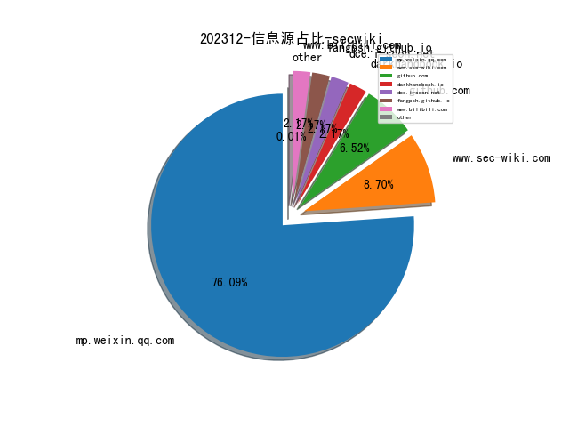
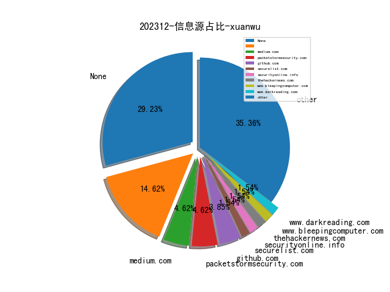
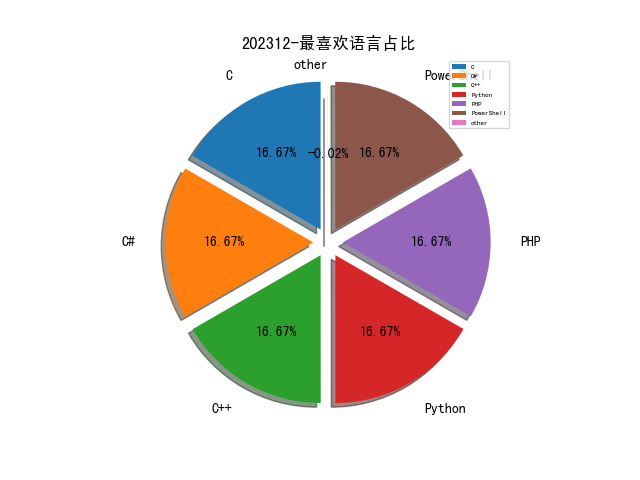

# [数据--所有](README_20.md)
# [数据--年度](README_2023.md)
# 202312 信息源与信息类型占比

# 网络安全书籍 推荐
| date_added | language | title | author | link | size| 
| --- | --- | --- | --- | --- | ---| 
| 2023-12-23 18:58:50 | English | Security Orchestration, Automation, and Response for Security Analysts: Learn the secrets of SOAR to improve MTTA and MTTR and strengthen your organizations security posture | Benjamin Kovacevic | http://libgen.rs/book/index.php?md5=291F0E7199BBE33B31E128142683B2A6 | 27 MB [PDF]| 
| 2023-12-23 18:38:53 | English | Generative AI with LangChain: Build large language model (LLM) apps with Python, ChatGPT and other LLMs | Ben Auffarth | http://libgen.rs/book/index.php?md5=A505C1996DB016F0BDD55CF52026EFC4 | 14 MB [PDF]| 
| 2023-12-22 07:52:51 | English | Understanding Microsoft Teams Administration, 2nd Edition | unknown | https://www.wowebook.org/understanding-microsoft-teams-administration-2nd-edition/ | unknown| 
| 2023-12-20 06:05:44 | English | Building a Cyber Risk Management Program | unknown | https://www.wowebook.org/building-a-cyber-risk-management-program/ | unknown| 
| 2023-12-19 09:04:26 | English | Python Debugging for AI, Machine Learning, and Cloud Computing | unknown | https://www.wowebook.org/python-debugging-for-ai-machine-learning-and-cloud-computing/ | unknown| 
| 2023-12-13 06:44:16 | English | AWS IoT With Edge ML and Cybersecurity | unknown | https://www.wowebook.org/aws-iot-with-edge-ml-and-cybersecurity/ | unknown| 
| 2023-12-13 06:26:08 | English | Deploy Container Applications Using Kubernetes | unknown | https://www.wowebook.org/deploy-container-applications-using-kubernetes/ | unknown| 
| 2023-12-11 08:50:04 | English | Discovering Cybersecurity | unknown | https://www.wowebook.org/discovering-cybersecurity/ | unknown| 
| 2023-12-11 19:49:18 | English | Comprehensive Python Cheatsheet | Jure Sorn | http://libgen.rs/book/index.php?md5=3F9F692C7257B66046BDA97DAA079A2D | 436 kB [PDF]| 
| 2023-12-11 19:43:29 | English | Statistics, Data Mining and Machine Learning in Astronomy: A Practical Python Guide for the Analysis of Survey Data | Zeljko Ivezic, Andrew J. Connolly, Jacob T VanderPlas, Alexander Gray | http://libgen.rs/book/index.php?md5=F288D0B650C97B4248BD09851C7D6FC2 | 28 MB [PDF]| 
| 2023-12-10 05:24:50 | English | Building Recommendation Systems in Python and JAX | unknown | https://www.wowebook.org/building-recommendation-systems-in-python-and-jax/ | unknown| 
| 2023-12-06 09:31:58 | English | Python Graphics, 2nd Edition | unknown | https://www.wowebook.org/python-graphics-2nd-edition/ | unknown| 
| 2023-12-05 07:47:32 | English | Data Modeling with Microsoft Excel | unknown | https://www.wowebook.org/data-modeling-with-microsoft-excel/ | unknown| 
| 2023-12-05 07:08:22 | English | The Immersive Metaverse Playbook for Business Leaders | unknown | https://www.wowebook.org/the-immersive-metaverse-playbook-for-business-leaders/ | unknown| 
| 2023-12-04 16:34:23 | English | Okta Administration Up and Running: Drive operational excellence with IAM solutions for on-premises and cloud apps, 2nd Edition | Lovisa Stenbäcken Stjernlöf, HenkJan de Vries | http://libgen.rs/book/index.php?md5=A139A33C8BC8E86A16ED2EDD9646D080 | 25 MB [PDF]| 
| 2023-12-03 08:50:00 | English | Microsoft 365 Certified Fundamentals MS-900 Exam Guide, Third Edition | unknown | https://www.wowebook.org/microsoft-365-certified-fundamentals-ms-900-exam-guide-third-edition/ | unknown| 
| 2023-12-03 21:03:26 | English | Minimalist Data Wrangling with Python | Marek Gagolewski | http://libgen.rs/book/index.php?md5=6C4104ED1815935DE92FD9C1BD35E071 | 7 MB [PDF]| 

# 学习视频 推荐
| title | url| 
| --- | ---| 
| 区块链安全训练营在线课程 | https://www.bilibili.com/video/BV14u4y1H7ik/| 

# 微信公众号 推荐
| nickname_english | weixin_no | title | url| 
| --- | --- | --- | ---| 
| AI与网安 | gh_c57275954216 | 致远互联FE协作办公平台editflow_manager存在sql注入漏洞(附nuclei poc) | https://mp.weixin.qq.com/s?__biz=MzU1ODQ2NTY3Ng==&mid=2247484878&idx=1&sn=51fa62b58442eda06a4523ba6ffb7ab1 | 1| 
| Hack分享吧 | HackShareB | 4.6K+Star！1.5W+POC漏洞扫描工具 | https://mp.weixin.qq.com/s?__biz=MzA4NzU1Mjk4Mw==&mid=2247489152&idx=1&sn=de74726ff6efe9d403c40e706b560e7d | 4| 
| Reset安全 | gh_a006697f54a9 | 如何应对不断升级的勒索软件攻击？ | https://mp.weixin.qq.com/s?__biz=MzU3Mzg1NzMyNw==&mid=2247484627&idx=1&sn=93ac87cd1e2de7677c69dc1eebeec349 | 1| 
| SCA御盾 | SCA_Magic | 【漏洞复现】（nday）3个通达OA-sql注入复现集合 | https://mp.weixin.qq.com/s?__biz=MzkzNjYwODg3Ng==&mid=2247484023&idx=1&sn=e8fe750d3d5fb5794c74ced78ba0d8a7 | 4| 
| WK安全 | kai_wen_8 | 记一次CMS系统后台通杀0day-SQL注入审计之路 | https://mp.weixin.qq.com/s?__biz=Mzg2ODg3NzExNw==&mid=2247487790&idx=1&sn=fcf5e6a4fd64b199c6a8daac38633400 | 3| 
| WebSec | gh_2914f5b10e8e | 记一次CMS系统后台通杀0day-SQL注入审计之路 | https://mp.weixin.qq.com/s?__biz=MzkyMzYwNTEyNg==&mid=2247484348&idx=1&sn=c72a033e0232cf40f0a46d32906cc55c | 1| 
| dotNet安全矩阵 | doNetSafety | .NET 安全矩阵一周工具集锦 | https://mp.weixin.qq.com/s?__biz=MzUyOTc3NTQ5MA==&mid=2247489955&idx=1&sn=a6dc581a7c0b4169e2db4eecf7dee3ac | 8| 
| 乌雲安全 | hackctf | 记一次对某黄色软件破解次数限制和金币视频 | https://mp.weixin.qq.com/s?__biz=MzAwMjA5OTY5Ng==&mid=2247520887&idx=1&sn=b670d8ff88262826fc3986e6a8143617 | 5| 
| 亿人安全 | Yr-Sec | \"坚守梦想，一研为定\" | https://mp.weixin.qq.com/s?__biz=Mzk0MTIzNTgzMQ==&mid=2247512306&idx=1&sn=8a5bcef4bebeb57c07c790aa0b70dec0 | 4| 
| 会杀毒的单反狗 | cmlitiejun | 汽车隐私（一）：您的汽车可能正在收集您的数据 | https://mp.weixin.qq.com/s?__biz=MzI2NzAwOTg4NQ==&mid=2649790135&idx=1&sn=caa12722dabc7d8e23d4c63c73fbe63f | 2| 
| 信安404 | infosec404 | 马上2024了，教你如何早点拿下Java代码审计，给简历增加这项技能吧！ | https://mp.weixin.qq.com/s?__biz=Mzk0NjQ5MTM1MA==&mid=2247486012&idx=1&sn=a4b055fd8d57ac331e8e7bf0157fca90 | 5| 
| 全栈网络空间安全 | cyber_securlty | 常见安全模型介绍 | https://mp.weixin.qq.com/s?__biz=Mzg3NTUzOTg3NA==&mid=2247510451&idx=1&sn=9164badd7edbf69842f4cefa3f72be85 | 1| 
| 内生安全联盟 | CCESS_CHINA | 良法善治安天下——习近平总书记指引网络法治建设述评 | https://mp.weixin.qq.com/s?__biz=Mzg4MDU0NTQ4Mw==&mid=2247514877&idx=1&sn=62b6403a65cf4dad3f2afba5f2fbdcde | 7| 
| 利刃信安攻防实验室 | LRXAGFSYS | 【编程学习】Java 教程 01 | https://mp.weixin.qq.com/s?__biz=MzU1Mjk3MDY1OA==&mid=2247508985&idx=1&sn=83b12ae04ca131e0337358861c08fcb4 | 12| 
| 剑外思归客 | Hex_70776a6377 | \"金盾信安杯\"网络与数据安全大赛线下赛    数据加密WP | https://mp.weixin.qq.com/s?__biz=Mzg3MDY0NjA5MQ==&mid=2247484048&idx=1&sn=246aae7ba40a8aaf61c4453edf7d187e | 2| 
| 可汗安全团队 | None | 好好好 | https://mp.weixin.qq.com/s?__biz=MzAwMjQ2NTQ4Mg==&mid=2247492106&idx=1&sn=71b3b20233a181690018ad1eb5defef1 | 3| 
| 吉祥同学学安全 | gh_370fbad7aec1 | 呆在舒适圈？还是走出去挨打！ | https://mp.weixin.qq.com/s?__biz=MzI1ODY3MTA3Nw==&mid=2247484672&idx=1&sn=f321bde8373ac8c4eb4471478ebc400e | 5| 
| 哆啦安全 | gmkj_dlaq | 小程序反编译 | https://mp.weixin.qq.com/s?__biz=Mzg2NzUzNzk1Mw==&mid=2247496625&idx=1&sn=e6c89a8e27efcc05e0c30fbe644ee048 | 4| 
| 嗨嗨安全 | gh_dc18c8a0e913 | TscanPlus--啊！大佬又开发工具了！ | https://mp.weixin.qq.com/s?__biz=MzIzMjg0MjM5OQ==&mid=2247486738&idx=1&sn=ea1c5b100462a99b5be4f8d4948160f3 | 4| 
| 嘉诚安全 | jiachengsec | 合规高效 融合创新 , 2023SCIC 第二届网络安全合规创新大会成功举办！ | https://mp.weixin.qq.com/s?__biz=MzU4NjY4MDAyNQ==&mid=2247494235&idx=1&sn=12802a4ff6061c54a41ac866c50b1038 | 3| 
| 国际云安全联盟CSA | gh_674820794ae8 | 第七届云安全联盟大中华区大会成功举办—云融未来，安全内在 | https://mp.weixin.qq.com/s?__biz=MzkwMTM5MDUxMA==&mid=2247495211&idx=1&sn=c29f4ce7b80aff227633ad7f3f113922 | 6| 
| 夜组安全 | NightCrawler_Team | bypassAll静态引擎，如绕过QVM，绕过VT所有静态引擎 | https://mp.weixin.qq.com/s?__biz=Mzk0ODM0NDIxNQ==&mid=2247489420&idx=1&sn=208ad06a9c02abcba248733199f4a32a | 2| 
| 大数据技术标准推进委员会 | gh_06f5ec229a80 | 2023数据资产管理大会——政务大数据论坛在京举办 | https://mp.weixin.qq.com/s?__biz=MzU0NzczNjAwMw==&mid=2247507300&idx=1&sn=6d6d6b47784f8201a9efffb7a7704dfb | 8| 
| 天地和兴 | bjtdhxkj | 一图读懂国家标准GB/T 43269-2023《信息安全技术 网络安全应急能力评估准则》 | https://mp.weixin.qq.com/s?__biz=MjM5Mzk0MDE2Ng==&mid=2649606911&idx=1&sn=6f4c19c43500f21b382bad69ab658453 | 1| 
| 天御攻防实验室 | TianyuLab | 威胁情报与法律风险 | https://mp.weixin.qq.com/s?__biz=MzU0MzgyMzM2Nw==&mid=2247485255&idx=1&sn=4741292f5812f27cd7b330bd8b3a5ce7 | 3| 
| 天禧信安 | txxa-385 | 【Pikachu 靶场精讲】远程文件包含（file include remote） | https://mp.weixin.qq.com/s?__biz=MzUyMTE0MDQ0OA==&mid=2247492988&idx=1&sn=4a93cb888a485c59495733c92483060f | 6| 
| 威努特工控安全 | winicssec_bj | 一周全球重大网络安全事件速递（第四期） | https://mp.weixin.qq.com/s?__biz=MzAwNTgyODU3NQ==&mid=2651109510&idx=1&sn=159e7900bb4b9577e88d1bfe4102e91f | 1| 
| 安全内参 | anquanneican | 北京市人民检察院发布8起维护网络安全和数据安全典型案例 | https://mp.weixin.qq.com/s?__biz=MzI4NDY2MDMwMw==&mid=2247510656&idx=1&sn=6d0ba336c3d57cce1b666418e444a194 | 13| 
| 安恒信息 | AnHengCloudNews | 再立标杆！安恒信息助力上海市临港新片区大数据中心荣获2023年“数赋临港”优秀案例 | https://mp.weixin.qq.com/s?__biz=MjM5NTE0MjQyMg==&mid=2650597973&idx=1&sn=f43fe0d13b7039f411f64c61a584913a | 6| 
| 安恒信息CERT | gh_1c2b41c1abc7 | 【风险通告】用友产品多个高危漏洞风险提示 | https://mp.weixin.qq.com/s?__biz=MzUzOTE2OTM5Mg==&mid=2247489006&idx=1&sn=0b190489ea0ca9982c7fec72d68d6f03 | 3| 
| 小毅安全阵地 | anquanzhendi | 【就业内推】12月网安内推岗位汇总~ | https://mp.weixin.qq.com/s?__biz=Mzg4MDE0MzQzMw==&mid=2247486728&idx=1&sn=f7330848cf49ae7a6adc426e337a0fe7 | 4| 
| 开源情报技术研究院 | gh_d1f65c3b3e5b | 网络安全资讯周报（12/18- 12/22） | https://mp.weixin.qq.com/s?__biz=MzkwNjQxOTk1Mg==&mid=2247485648&idx=1&sn=626446f939301f51612bb531635a0d1f | 3| 
| 影流R | gh_9586c0e3e212 | 内网渗透之域控攻击 | https://mp.weixin.qq.com/s?__biz=MzkwNzU5NzQ0OQ==&mid=2247483781&idx=1&sn=d7a4f45640e4a07d527bcaa4d63b5c00 | 1| 
| 掌控安全EDU | ZKAQEDU | SSRF中Redis的利用 | https://mp.weixin.qq.com/s?__biz=MzUyODkwNDIyMg==&mid=2247534783&idx=1&sn=2c117a9a97fe25ccdcebff2b0215ac53 | 12| 
| 数据学堂 | data_school | 105页PPT , 企业架构（业务架构、数据架构、应用架构、技术架构）设计实战手册 | https://mp.weixin.qq.com/s?__biz=MzkyMDE5ODYwMw==&mid=2247520250&idx=1&sn=5a4fd27929c4daa62cd3ba24b2145a65 | 3| 
| 格格巫和蓝精灵 | None | 人与代码的桥梁 - 聊聊SAST | https://mp.weixin.qq.com/s?__biz=MzI5NDg0ODkwMQ==&mid=2247485715&idx=1&sn=006b49b18c67996820f2ca9564aa1578 | 2| 
| 梅苑安全学术 | gh_e291bf9d0869 | 卡耐基梅隆大学 , 基于语义信息提取和领域特定语言模型的CVE攻击技术预测 | https://mp.weixin.qq.com/s?__biz=MzkwMTU2NzMwOQ==&mid=2247484160&idx=1&sn=16e7520c25da136bcddf7b1856b296a4 | 1| 
| 汽车电子嵌入式 | gh_c9d411042eab | H-桥电路 | https://mp.weixin.qq.com/s?__biz=Mzg2NTYxOTcxMw==&mid=2247490312&idx=1&sn=b40d9a46b9de22cb426415f0190cba7c | 1| 
| 河南等级保护测评 | hndjbh | 公安部召开新闻发布会通报打击整治网络谣言违法犯罪活动举措成效并答记者问 | https://mp.weixin.qq.com/s?__biz=Mzg2NjY2MTI3Mg==&mid=2247493526&idx=1&sn=c19ac03fa8a8cd9e0e031ddea80ed414 | 8| 
| 浅安安全 | gh_758e256fcc72 | 漏洞预警 , OpenSSH命令注入漏洞 | https://mp.weixin.qq.com/s?__biz=MzkwMTQ0NDA1NQ==&mid=2247487211&idx=1&sn=7df027f3f64aaea549f99b6e6415cc73 | 11| 
| 深信服科技 | sangfor_man | 深信服斩获两大奖项，携手CSA大中华区发布XDR白皮书（内附下载） | https://mp.weixin.qq.com/s?__biz=MjM5MTAzNjYyMA==&mid=2650583689&idx=1&sn=82542bcacfa54402f7834777b9c53bcb | 4| 
| 深圳网安培训学院 | gh_94f04a96b1ca | 关于开展2024 年第1期网络与信息安全管理员(网络安全管理员)(四级)职业技能等级认定考试的通知 | https://mp.weixin.qq.com/s?__biz=Mzg3MDYzMjAyNA==&mid=2247485444&idx=1&sn=a28648868caea63e838f6d63c4b8d8aa | 2| 
| 渗透安全HackTwo | CB-Hack | 某次项目的XSS-Bypss转换思路的xss-top10漏洞挖掘 | https://mp.weixin.qq.com/s?__biz=Mzg3ODE2MjkxMQ==&mid=2247484611&idx=1&sn=76a5326ac21431f7166289bf20b85b88 | 3| 
| 渗透测试安全攻防 | coleakandyueyiyi | PE结构指南：c语言武器开发基础 | https://mp.weixin.qq.com/s?__biz=MzkyNTUyNDMyOA==&mid=2247486493&idx=1&sn=a31479c9d75599712a392ecaa7b3e5e7 | 1| 
| 猎洞时刻 | Bug-hunter_A1xxNy | 再谈宝塔后门账号维权 | https://mp.weixin.qq.com/s?__biz=MzkyNTUyNTE5OA==&mid=2247484734&idx=1&sn=1a5cdfc4eb88b1a60628a8c121a2126e | 3| 
| 白帽子 | NS-CTF | 关于加解密测试的一些浅谈 | https://mp.weixin.qq.com/s?__biz=MzAwMDQwNTE5MA==&mid=2650247244&idx=1&sn=10b10ee08ef24deb78699a07c0560d80 | 3| 
| 白帽子左一 | HackRead | 突破前端加密方法总结 | https://mp.weixin.qq.com/s?__biz=MzI4NTcxMjQ1MA==&mid=2247604132&idx=1&sn=e5efe033aae7dfc03636393118bc2194 | 9| 
| 祺印说信安 | qiyinshuoxinan | 未来五年的网络安全趋势 | https://mp.weixin.qq.com/s?__biz=MzA5MzU5MzQzMA==&mid=2652103694&idx=1&sn=ea22fdecdd685e218a1363ab0bd73abb | 10| 
| 网安寻路人 | DataProtection101 | 联合国人工智能高级别咨询机构发布临时报告《以人为本的人工智能治理》 | https://mp.weixin.qq.com/s?__biz=MzIxODM0NDU4MQ==&mid=2247500613&idx=1&sn=fecd4d8a07a6705495fc6f49de02c312 | 3| 
| 网络与安全实验室 | Hohai_Network | 每周文章分享-139 | https://mp.weixin.qq.com/s?__biz=MzI1MTQwMjYwNA==&mid=2247499385&idx=1&sn=53a21ec027c88cea4d50cbc75d5d7ec2 | 1| 
| 网络安全与取证研究 | wangluoanquanquzheng | 技术分享｜涉网犯罪信息侦察思路分享 | https://mp.weixin.qq.com/s?__biz=Mzg3NTU3NTY0Nw==&mid=2247488395&idx=1&sn=c89f7b583cc42ec9897c228ae5a38fea | 4| 
| 网络安全与数据治理 | gh_ddbdee0c5caf | “释放数据要素价值 赋能经济社会发展”中国“数据要素×”生态大会将于12月24日举行 | https://mp.weixin.qq.com/s?__biz=MzIzODk1NzY5NA==&mid=2247496442&idx=1&sn=00e1229407fe66bb7adeba70f2a79821 | 12| 
| 网络安全资源库 | gh_e8a4866a67fe | HW, 网络攻防演练手册 | https://mp.weixin.qq.com/s?__biz=MzkxMzMyNzMyMA==&mid=2247550633&idx=1&sn=d4b8d8f46a5925143b8e3e95834de718 | 11| 
| 菜菜sec | gh_46729a04c0cd | 一起来打靶 | https://mp.weixin.qq.com/s?__biz=MzkzNTQwNjQ4OA==&mid=2247483955&idx=1&sn=a1fe4efbb4ab449a57d9ead3f47c620a | 1| 
| 菜鸟小新 | dsz-67 | Ubuntu使用 | https://mp.weixin.qq.com/s?__biz=Mzg4OTI0MDk5MQ==&mid=2247490053&idx=1&sn=a3ec0fa666500499f58e454b79fa223a | 4| 
| 衡阳信安 | zghyxa | nacos相关漏洞学习 | https://mp.weixin.qq.com/s?__biz=MzU2NDY2OTU4Nw==&mid=2247511416&idx=1&sn=856558abb53689bc959c70b743c2b4b3 | 3| 
| 计算机与网络安全 | C-CyberSecurity | 《关于打造国家信创产业高地三年行动方案（2023-2025年）》全文及解读 | https://mp.weixin.qq.com/s?__biz=MjM5OTk4MDE2MA==&mid=2655218329&idx=1&sn=3fa8c1f26f1e55450f53d939c60fb46d | 10| 
| 谈数据 | learning-bigdata | 第一批用AI做数据分析的人，已经碾压同事了！ | https://mp.weixin.qq.com/s?__biz=MzI1NzYwNTMzNw==&mid=2247520032&idx=1&sn=76344d2cc3828112b63602c56f3a53d4 | 4| 
| 赛博安全狗 | gh_a838eda1ce70 | 【权限维持技术】PowerShell 调用Windows API实现键盘监听器 | https://mp.weixin.qq.com/s?__biz=MzkyNjU3NDQ1MA==&mid=2247485997&idx=1&sn=a6e392c7e28e72e603b1dac7805ec442 | 3| 
| 赛博研究院 | SICSI-cybersecurity | 每周热点｜欧盟成员国就《网络团结法案》达成共同立场；OpenAI 推出人工智能安全框架 | https://mp.weixin.qq.com/s?__biz=MzUzODYyMDIzNw==&mid=2247507306&idx=1&sn=9b08a0241d6124eabd40bda337e989bd | 7| 
| 赛欧思安全研究实验室 | gh_04596d590471 | 互联网情报资讯12.23 | https://mp.weixin.qq.com/s?__biz=MzU0MjE2Mjk3Ng==&mid=2247486569&idx=1&sn=f4a619709944e8c20cd11aa737c03640 | 2| 
| 运维帮 | yunweibang | 新容器引擎崛起，Docker地位不保 | https://mp.weixin.qq.com/s?__biz=MzA3MzYwNjQ3NA==&mid=2651301195&idx=1&sn=55bbba6122910d9eb51edb12854c2b43 | 3| 
| 黑客白帽子 | hackerwhitehat | 【漏洞通告】Zabbix zbx_session cookie泄露漏洞（CVE-2023-32725） | https://mp.weixin.qq.com/s?__biz=MzA5MzYzMzkzNg==&mid=2650937587&idx=1&sn=7ba65ef1a78c0e769e7a4ce96a383ac1 | 25| 
| 黑客驰 | HyphenTech | Windows11渗透测试套装 | https://mp.weixin.qq.com/s?__biz=Mzg4MzgwMDE2Mw==&mid=2247486242&idx=1&sn=352de363ee3a730ad2090794c9a88f44 | 2| 
| 黑白之道 | i77169 | 多方势力威胁美国2024大选；,你安装“天猫红包版”APP? | https://mp.weixin.qq.com/s?__biz=MzAxMjE3ODU3MQ==&mid=2650584538&idx=1&sn=53cd6a27f4b6f1009cad0724f8714455 | 16| 
| 360数字安全 | gh_6db130c5163e | 年关将至，某大行向360发来感谢信 | https://mp.weixin.qq.com/s?__biz=MzA4MTg0MDQ4Nw==&mid=2247568145&idx=1&sn=a6571973a52233b929229dece546dd26 | 7| 
| FXDSecurity | gh_7f0786f69d56 | 金蝶Apusic应用服务器 JNDI注入漏洞浅析 | https://mp.weixin.qq.com/s?__biz=Mzg5ODYyMDI1Mw==&mid=2247483871&idx=1&sn=06265b431261da600b946b99314c2e7a | 1| 
| FreeBuf | freebuf | X （推特）宕机，是裁员惹的祸？ | https://mp.weixin.qq.com/s?__biz=MjM5NjA0NjgyMA==&mid=2651252457&idx=1&sn=d5e7f593e7a9eb25b7356f34f3abbf07 | 44| 
| IoVSecurity | IoVSecurity | ISO 24089 主导 UN R156 SUMS | https://mp.weixin.qq.com/s?__biz=MzU2MDk1Nzg2MQ==&mid=2247599633&idx=1&sn=0a15ee221339d0b3a137aa4f0cf50fa8 | 30| 
| M01N Team | m01nteam | 每周蓝军技术推送（2023.12.16-12.22） | https://mp.weixin.qq.com/s?__biz=MzkyMTI0NjA3OA==&mid=2247493039&idx=1&sn=b80de1c039e640c529a3fb897d82eb18 | 7| 
| Ms08067安全实验室 | Ms08067_com | 第二期CTF从入门到提升 | https://mp.weixin.qq.com/s?__biz=MzU1NjgzOTAyMg==&mid=2247516886&idx=1&sn=a304f1a6f7e565e5ab1bfc85ef98940a | 6| 
| Relay学安全 | gh_8d57319ec39c | Shellcode写入到注册表上线 | https://mp.weixin.qq.com/s?__biz=Mzg5MDg3OTc0OA==&mid=2247485220&idx=1&sn=930de0757246c4d98c97d551dd2e85d9 | 4| 
| XDsecurity | gh_a6965ae2a4f5 | 招聘,驻场,河南郑州、洛阳 | https://mp.weixin.qq.com/s?__biz=Mzg2NTcyNjU4Nw==&mid=2247484982&idx=1&sn=4e690d79a607d850cf13eeae8cb64dde | 1| 
| 三六零CERT | CERT-360 | 安全日报（2023.12.22） | https://mp.weixin.qq.com/s?__biz=MzU5MjEzOTM3NA==&mid=2247500357&idx=1&sn=d6e37af6ca4aacac0e441a6cd92e3be1 | 9| 
| 中国计算机学会 | ccfvoice | 院士领衔，聚业内顶级智慧，第二届CCF中国数字经济50人论坛高端峰会开始报名啦！ | https://mp.weixin.qq.com/s?__biz=MjM5MTY5ODE4OQ==&mid=2651565579&idx=1&sn=fccd69a147af6e3eee74addeaf16cc63 | 25| 
| 云众可信 | yunzhongkexin | 官网焕新 , 全新内容、崭新体验、贴心服务 | https://mp.weixin.qq.com/s?__biz=Mzg2NDU3Mzc5OA==&mid=2247489244&idx=1&sn=37195332c1fdbd2f2f8a65f0efc4cc04 | 1| 
| 亚信安全 | yaxinanquan | 安若磐石！亚信安全斩获CSA 2023两项大奖，TrustOne最佳代言载誉而归 | https://mp.weixin.qq.com/s?__biz=MjM5NjY2MTIzMw==&mid=2650610417&idx=1&sn=abbb53326f2112e9e6b00bd28cda9dd9 | 16| 
| 代码小铺 | Java_Cpp_C_Python_MB | 6G要来了！ | https://mp.weixin.qq.com/s?__biz=Mzg4NDY4Mzk3Mw==&mid=2247484971&idx=1&sn=d0b3ad4f91fdb956c0a295def3c2279b | 2| 
| 信息安全大事件 | xxaqdsj | 6年历史的Office 漏洞被攻击者利用传播间谍软件 | https://mp.weixin.qq.com/s?__biz=MzkzNjIzMjM5Ng==&mid=2247489236&idx=1&sn=f7bcee119ee9e720b83d6278a3ea6412 | 4| 
| 兰花豆说网络安全 | gh_0e9b2a5e2976 | 网络安全人士必知的三个攻击模型 | https://mp.weixin.qq.com/s?__biz=MzI3NzM5NDA0NA==&mid=2247485232&idx=1&sn=cbd42058fa89527a541ef0c7e8fff9d8 | 6| 
| 华为安全 | HuaweiSecurity | 【Web一点通】新一代华为防火墙Web界面，让面板更智能 | https://mp.weixin.qq.com/s?__biz=MzAwODU5NzYxOA==&mid=2247502632&idx=1&sn=987c3aa6762bc5c338f5b3306aff3e9d | 4| 
| 南风漏洞复现文库 | gh_a9e9b8a80c70 | 铭飞CMS cms/content/list接口存在SQL注入 附POC | https://mp.weixin.qq.com/s?__biz=MzIxMjEzMDkyMA==&mid=2247484887&idx=1&sn=65e72ed3048ce754d4bafe6fe1049c02 | 3| 
| 合天网安实验室 | hee_tian | 职场人网安“开挂”！你确定不来试一下？ | https://mp.weixin.qq.com/s?__biz=MjM5MTYxNjQxOA==&mid=2652902792&idx=1&sn=019b5608edeb0735768380fa7c2f1555 | 12| 
| 哈拉少安全小队 | gh_b273ce95df95 | 任意文件下载漏洞的利用思考 | https://mp.weixin.qq.com/s?__biz=MzAxNzkyOTgxMw==&mid=2247492055&idx=1&sn=c105084ec8d921a51264ce11ffc60701 | 7| 
| 商密君 | shangmijun | 公安部：严厉打击网红大V造谣传谣等乱象 | https://mp.weixin.qq.com/s?__biz=MzI5NTM4OTQ5Mg==&mid=2247617683&idx=1&sn=cb4f06b418636e1ab665c933ea19c37c | 33| 
| 天盾信安 | Tiandun_yanshu0_0 | XSS漏洞检测和利用 | https://mp.weixin.qq.com/s?__biz=MzkxMDYwNDI0MA==&mid=2247484032&idx=1&sn=86c762f201c7ab914606794c9fee5487 | 5| 
| 天空卫士SkyGuard | Sky--Guard | 《江苏联通数据安全体系建设》入选“星河”优秀案例 | https://mp.weixin.qq.com/s?__biz=MzA5MjQyODY1Mw==&mid=2648464978&idx=1&sn=7b90e793e22cccdd22f83479d8d89aa9 | 2| 
| 奇安信集团 | qianxin-keji | 齐向东：做好“四管四防”护航金融安全 | https://mp.weixin.qq.com/s?__biz=MzU0NDk0NTAwMw==&mid=2247604555&idx=1&sn=c7172949e4b8ae7b588639114b821a3f | 22| 
| 安世加 | asjeiss | 巴西第一夫人因X账户遭黑客攻击与马斯克发生争执 | https://mp.weixin.qq.com/s?__biz=MzU2MTQwMzMxNA==&mid=2247536529&idx=1&sn=6a0c0cc90ca3aaa3a23123c5d1fe8140 | 11| 
| 安全419 | anquan-419 | 病例泄露事件凸显隐私保护之殇 医疗机构应如何加强患者信息保密和管理？ | https://mp.weixin.qq.com/s?__biz=MzUyMDQ4OTkyMg==&mid=2247536360&idx=1&sn=fc2ad2f88de358fdd0cbefa909980303 | 12| 
| 安全后厨 | sanxingfengaa | 每日新闻(317)——2023.12.22 | https://mp.weixin.qq.com/s?__biz=MzI3MDQ1NDE2OA==&mid=2247490340&idx=1&sn=2641a74c093663c37658ab56955db003 | 24| 
| 安全圈 | ChinaAnQuan | 【安全圈】攻击者利用已有6年历史的Office 漏洞传播间谍软件 | https://mp.weixin.qq.com/s?__biz=MzIzMzE4NDU1OQ==&mid=2652050944&idx=1&sn=8883ec6856bb6ef4bf3818b7661ccefb | 40| 
| 安全帮 | None | 【南汤圆/北饺子】传统美食背后的文化差异，你知道吗？ | https://mp.weixin.qq.com/s?__biz=MzkzNjQwOTc4MQ==&mid=2247489049&idx=1&sn=1bd06c5c86e3b6fa24a057e747a0f336 | 3| 
| 安全研究GoSSIP | GoSSIPSJTU | G.O.S.S.I.P 阅读推荐 2023-12-22 漏洞挖掘哪家强？ | https://mp.weixin.qq.com/s?__biz=Mzg5ODUxMzg0Ng==&mid=2247497004&idx=1&sn=f14c906fa94ba3b6277e219fa92798d7 | 5| 
| 安在 | AnZer_SH | 活动  ,  华顺信安专题：真实攻击下的金融信息安全赋能 | https://mp.weixin.qq.com/s?__biz=MzU5ODgzNTExOQ==&mid=2247609402&idx=1&sn=0831580b9704bda1d6be9875ff662439 | 17| 
| 安天集团 | Antiylab | 北向守望 , 第十一届安天网络安全冬训营1月6-7日冰城再相聚 | https://mp.weixin.qq.com/s?__biz=MjM5MTA3Nzk4MQ==&mid=2650203007&idx=1&sn=05b0a4411ac135dbbc063373a40b79fb | 6| 
| 寒鹭网络安全团队 | hanlu_security | 复现MS14-068&PTT攻击 | https://mp.weixin.qq.com/s?__biz=MzkwNDQxODMzNg==&mid=2247484548&idx=1&sn=10a4f4e951c929c17c3238353dfb3c55 | 2| 
| 小C学安全 | V_MOG11 | 【内网渗透】隐藏cobaltstrike服务器—自定义证书+C2侧写 | https://mp.weixin.qq.com/s?__biz=MzU5NTEwMTMxMw==&mid=2247484446&idx=1&sn=5004cd65b04831988fb60ad876ea0afe | 3| 
| 州弟学安全 | gh_8440a0e647ba | 学习干货,详解一次简单的综合应急响应学习思路 | https://mp.weixin.qq.com/s?__biz=MzkzMDE5OTQyNQ==&mid=2247484404&idx=1&sn=a340aa925da61fd48f3fb19a17d2c71d | 2| 
| 工业互联网标识智库 | CAICT-bs | 常如平：工业互联网标识“四性”将带来“四统”｜标识贯通大咖谈 | https://mp.weixin.qq.com/s?__biz=MzU1OTUxNTI1NA==&mid=2247559450&idx=1&sn=2f723964e27e0d994ddf27d5f7800a30 | 17| 
| 平安集团安全应急响应中心 | PSRC_Team | 2023即将结束，还有人不知道这个翻倍奖励活动吗？ | https://mp.weixin.qq.com/s?__biz=MzIzODAwMTYxNQ==&mid=2652144618&idx=1&sn=9e6da1175e6c0a85ca8a695012fd79ba | 1| 
| 我爱林 | CoderWin | 漏洞复现 ,, Tosei 自助洗衣机远程代码执行 | https://mp.weixin.qq.com/s?__biz=MzI2Mzc3OTg1Ng==&mid=2247492393&idx=1&sn=199c3717498a65b4b781188977ce848e | 1| 
| 效率源 | xiaolvyuantech | 是交通肇事还是故意杀人？浏览器记录揭开案件真相 | https://mp.weixin.qq.com/s?__biz=MjM5ODQ3NjAwNQ==&mid=2650544919&idx=1&sn=7a8d8c58f133fa5bec3535e71f11f29b | 2| 
| 数安行 | gh_4a91b25696f1 | 数据安全每周观察 , 关于向社会公开征求《“数据要素×”三年行动计划（2024—2026年）（征求意见稿）》意见的公告 | https://mp.weixin.qq.com/s?__biz=Mzg5OTM0NTM2OQ==&mid=2247490789&idx=1&sn=b59255995764e47bc41e32f7a98370d4 | 2| 
| 数据安全推进计划 | gh_5e558917e916 | 《数据安全治理实践指南（3.0）》发布（附下载链接） | https://mp.weixin.qq.com/s?__biz=Mzg3NjY3MDE3MA==&mid=2247489899&idx=1&sn=a55e25c74d418de4e47ddbda9a4ccfa3 | 4| 
| 无相实验室 | gh_dcd6d8edd12b | 安全威胁情报周报（2023/12/16-2023/12/22） | https://mp.weixin.qq.com/s?__biz=Mzg4NjYyMzUyNg==&mid=2247488362&idx=1&sn=9eda134eb99f513eeffc637bfabe872d | 2| 
| 无糖反网络犯罪研究中心 | gh_2ee7a9b17c0d | 金华警方打掉“跑分”犯罪团伙 , 黄冈警方打掉境外赌博引流产业链——涉网犯罪每日情报 | https://mp.weixin.qq.com/s?__biz=MzAxMzkzNDA1Mg==&mid=2247507876&idx=1&sn=ce5a8582118f4b3a9aaa857ba7f5838e | 9| 
| 树树搞安全 | gh_295665d5b7a9 | 众测实战技巧 | https://mp.weixin.qq.com/s?__biz=Mzg5MDk3NDE2Mw==&mid=2247483966&idx=1&sn=ae06acf2fb288537a00931a7e5d6b406 | 1| 
| 橘子杀手 | Or4ng3_Ki11er | 2023 强网杯三道 pyjail 的题解 | https://mp.weixin.qq.com/s?__biz=MzI3OTE4MTU5Mw==&mid=2247486015&idx=1&sn=be4d91dd27730b1dffa1831ba7bedc51 | 1| 
| 渗透安全团队 | GuYingLanQi | 浅谈宝塔渗透手法，从常见漏洞 聊到 宝塔维权 再到 bypass disable_functions原理 | https://mp.weixin.qq.com/s?__biz=MzkxNDAyNTY2NA==&mid=2247513105&idx=1&sn=e693abd9dcbcd319591af06b2a2ca885 | 9| 
| 火绒安全 | HuorongLab | 【火绒安全周报】美国工程师因不满被解雇删库被判 / 微软查获创建数亿诈骗账户的网络犯罪团伙 | https://mp.weixin.qq.com/s?__biz=MzI3NjYzMDM1Mg==&mid=2247517026&idx=1&sn=20db733aa3a876715d661e758567190c | 3| 
| 盛邦安全WebRAY | WebRay_weixin | 共筑安全防线丨上海市委网信办与盛邦安全联合举办网络安全技术沙龙 | https://mp.weixin.qq.com/s?__biz=MzAwNTAxMjUwNw==&mid=2650274766&idx=1&sn=0108d4d88ad4a5b2d5b86907407fbb12 | 2| 
| 盛邦安全应急响应中心 | WebRAY_Sec | 烽火狼烟丨暗网数据及攻击威胁情报分析周报（12/18-12/22) | https://mp.weixin.qq.com/s?__biz=Mzk0NjMxNTgyOQ==&mid=2247484105&idx=1&sn=871e55cb8d45e1ecb0c8f4c56936eb52 | 2| 
| 看雪学苑 | ikanxue | The Finals SDK与某辅助的驱动注入 | https://mp.weixin.qq.com/s?__biz=MjM5NTc2MDYxMw==&mid=2458532489&idx=1&sn=e3679954a4bb0c7eb9958e5a06fec14a | 34| 
| 秦安战略 | qinan1128 | 秦安：“逼统”开始！需明确统一倒计时，发布新时代告台湾同胞书 | https://mp.weixin.qq.com/s?__biz=MzA5MDg1MDUyMA==&mid=2650465482&idx=1&sn=1435e977e5ad6169b7e2603eabbe8f7a | 1| 
| 移动安全星球 | Andy02141225 | 【感恩有你，幸运不期而至！】 | https://mp.weixin.qq.com/s?__biz=MzI3Mzk2OTkxNg==&mid=2247486059&idx=1&sn=138e3fd1b9e27bde6eaf203cf7e7c5be | 1| 
| 绿盟科技 | NSFOCUS-weixin | 绿盟科技与国家工业信息安全发展研究中心联合开展“学数据安全知识 为数字经济护航”主题党日活动 | https://mp.weixin.qq.com/s?__biz=MjM5ODYyMTM4MA==&mid=2650446567&idx=1&sn=37bc82def594128b1367214c162b2eec | 19| 
| 网安百色 | www_xinbs_net | 2023年数据泄露事件盘点 | https://mp.weixin.qq.com/s?__biz=MzI0NzE4ODk1Mw==&mid=2652092514&idx=1&sn=f29891b57ce2df391ea1a99c20e47db2 | 3| 
| 网星安全 | None | Okta收购Spree Security , 联手推进身份安全 | https://mp.weixin.qq.com/s?__biz=MzkxNTEzMTA0Mw==&mid=2247494455&idx=1&sn=0947139ebec64cacc8a204d427c54050 | 2| 
| 网络安全与等级保护 | SM1SM2SM3 | 感恩遇见，做个小调查 | https://mp.weixin.qq.com/s?__biz=MzI5NDM2MzM4Nw==&mid=2247484598&idx=1&sn=d7ed671793a6635b8e2c623e8632f26f | 2| 
| 网络空间信息安全学习 | gh_39213c5878aa | 国货上新日 , 置顶重要信息，随手速记灵感！便签 Pro 上架 | https://mp.weixin.qq.com/s?__biz=MzI2MjcwMTgwOQ==&mid=2247490374&idx=1&sn=69d26c12151a745643d0f5d924a4de15 | 6| 
| 网络空间安全科学学报 | wxjmrh | 航天科技期刊联盟成立大会在京召开，学报编辑部作为期刊代表作交流分享 | https://mp.weixin.qq.com/s?__biz=MzI0NjU2NDMwNQ==&mid=2247496827&idx=1&sn=de7fc827646bfe18aeab758252db5fb8 | 3| 
| 美亚柏科 | MeiyaPico | 中央经济工作会议的高频词汇，美亚柏科发展关键词！ | https://mp.weixin.qq.com/s?__biz=MjM5NTU4NjgzMg==&mid=2651404143&idx=1&sn=5146bd73ab2f9689f7f26251dce73f2c | 11| 
| 腾讯技术工程 | None | 彻底明白C++的So热更新 | https://mp.weixin.qq.com/s?__biz=MjM5ODYwMjI2MA==&mid=2649781513&idx=1&sn=1f70134fd241eda2bcbeb4936ea19d55 | 3| 
| 腾讯玄武实验室 | XuanwuLab | 每日安全动态推送(12-22) | https://mp.weixin.qq.com/s?__biz=MzA5NDYyNDI0MA==&mid=2651959472&idx=1&sn=db2ed3e4d22868c421e61f34249b66e6 | 5| 
| 赛宁网安 | Cyberpeace | 赛宁综合安全验证评估，筑牢关基网络安全屏障 | https://mp.weixin.qq.com/s?__biz=MzA4Mjk5NjU3MA==&mid=2455482524&idx=1&sn=9a3a8c318a390c39da676579a090c7d5 | 6| 
| 青衣十三楼飞花堂 | scz------ | ZIP密码穷举工具zcrack.exe使用说明 | https://mp.weixin.qq.com/s?__biz=MzUzMjQyMDE3Ng==&mid=2247487022&idx=1&sn=fb391f9e53b3ea31d6e90c81cd3be217 | 4| 
| 风眼实验室 | gh_aa426cddbf75 | 资源公钥基础设施RPKI部署状态分析 | https://mp.weixin.qq.com/s?__biz=MzkzMzM0ODg2NA==&mid=2247489646&idx=1&sn=8e075f458e693c7c18c642b734695310 | 1| 
| 飓风网络安全 | gh_183f818a07dc | 【漏洞预警】Zabbix zbx_session cookie泄露漏洞CVE-2023-32725 | https://mp.weixin.qq.com/s?__biz=MzI3NzMzNzE5Ng==&mid=2247487291&idx=1&sn=57c136669aba00dd520e729d55dccc91 | 7| 
| GitHubStore | gh_43bcfabdcc54 | Codefuse-ChatBot：开源的 AI 智能助手 | https://mp.weixin.qq.com/s/tUBkFR6UeiwzhPIbsTEG9Q | 1| 
| 字节跳动安全中心 | TouTiaoSec | 图神经网络和代码大模型加持 , 提升二进制比对分享 | https://mp.weixin.qq.com/s/LHegfuU-zSPNBarLCNV0PQ | 6| 
| 雁行安全团队 | YX_Security | 关于加解密测试的一些浅谈 | https://mp.weixin.qq.com/s/Co68c-M5SEVhjuDsSdziCg | 2| 
| AlertSec | gh_0cebbe2c8bca | Windows系统内核漏洞提权 | https://mp.weixin.qq.com/s?__biz=MzkwMjU5MzgzMQ==&mid=2247484442&idx=1&sn=be0b6039d56fcf3ba560d0772cfa80c3 | 3| 
| CNCERT国家工程研究中心 | NELCERT | 不靠谱的补丁！补丁再次被绕过-声音文件触发的Microsoft Outlook零点击漏洞链 | https://mp.weixin.qq.com/s?__biz=MzUzNDYxOTA1NA==&mid=2247541802&idx=1&sn=0904f96e3531d223f1b02b80d0bd3d20 | 16| 
| CNNVD安全动态 | cnnvd_news | CNNVD关于Apache Dubbo 代码问题漏洞的通报 | https://mp.weixin.qq.com/s?__biz=MzAxODY1OTM5OQ==&mid=2651443544&idx=1&sn=1c28549726ca72b8e47e131133498d55 | 3| 
| CNVD漏洞平台 | CNVDTS | 关于蓝牙协议存在中间人攻击漏洞的安全公告 | https://mp.weixin.qq.com/s?__biz=MzU3ODM2NTg2Mg==&mid=2247494202&idx=1&sn=2e2677116981ae7c18a94570a5597dcb | 1| 
| EBCloud | KKHsuCheney | 磁盘性能测试-FIO工具的使用 | https://mp.weixin.qq.com/s?__biz=Mzg4MTA2MTc4MA==&mid=2247492713&idx=1&sn=b736a367846ae63784fabcde55565354 | 2| 
| GSDK安全团队 | gh_403a21e91f24 | 痕迹清除工具 - MrKaplan | https://mp.weixin.qq.com/s?__biz=MzIzNTE0Mzc0OA==&mid=2247485543&idx=1&sn=edffac075ed31b6a566c4f3532a266a8 | 4| 
| HackingClub | Hacking_Club | 白帽集结丨ISC2023数字安全创新能力百强颁奖典礼正式定档！ | https://mp.weixin.qq.com/s?__biz=MzkxMzE4MTc5Ng==&mid=2247498684&idx=1&sn=88c5ad3a17be8f54a08a165fc5b3fe49 | 1| 
| Hacking黑白红 | Hacking012 | 【Web实战】某头部直辖市攻防演练纪实-如何不用0day打下n个点 | https://mp.weixin.qq.com/s?__biz=Mzg2NDYwMDA1NA==&mid=2247534881&idx=1&sn=13436751946db4b57e20f1d15dabb78b | 6| 
| HexaGoners | gh_c9639f9a843e | RongRui-C2-Version1.2 | https://mp.weixin.qq.com/s?__biz=MzkxNTQ0MDA2NQ==&mid=2247484208&idx=1&sn=e7afd94426eaa32ee43711888b9b15c7 | 2| 
| IMPERVA | None | 第二期：Imperva合作伙伴 - 亚信安全 | https://mp.weixin.qq.com/s?__biz=MzI1OTYyOTUyOA==&mid=2247487290&idx=1&sn=adcc24db00c2fff16433273e82a01b79 | 3| 
| KQsec | M1debug | 通过配置中间人来抓取并篡改客户端流量 | https://mp.weixin.qq.com/s?__biz=MzIyNTU3MzQ5Nw==&mid=2247484567&idx=1&sn=d59615406a0d3f19e8104b3c8b0fbf78 | 1| 
| OneMoreThink | OneMoreThinkkk | 靶机实战(6)：SolidState | https://mp.weixin.qq.com/s?__biz=MzI0NjA3Mzk2NQ==&mid=2247489369&idx=1&sn=28ffbfc7b1779cbe2eb924d1afc5a43d | 3| 
| Ots安全 | AnQuan7 | 从宏到有效负载：解密响尾蛇网络入侵策略 | https://mp.weixin.qq.com/s?__biz=MzAxMjYyMzkwOA==&mid=2247503355&idx=1&sn=2f1f72039f5e9e8258da975b35b58198 | 7| 
| Rot5pider安全团队 | Rot5pider-Team | kill安装nuclei漏洞扫描工具 | https://mp.weixin.qq.com/s?__biz=Mzg5OTYxMjk0Mw==&mid=2247489314&idx=1&sn=6e6b2cbac28d36c08376a9c8ae7cb2d6 | 2| 
| SecHub网络安全社区 | secevery0x01 | AD(活动目录)错误配置项检查工具Certipy的使用 | https://mp.weixin.qq.com/s?__biz=MzI5NTUzNzY3Ng==&mid=2247487682&idx=1&sn=c4cf69898b096bf9afa1aeada7cc7cd3 | 3| 
| T0ngMystic工作站 | T0ngMystic | ADCS-域提权-ESC8-NTML中继攻击 | https://mp.weixin.qq.com/s?__biz=MzUyMDk3ODk5MA==&mid=2247484966&idx=1&sn=53ddee07badbf9e9cbc70a1f0997e6e6 | 1| 
| UKFC安全 | gh_f762e53fa5dd | pwn liunx的glibc中的random随机数详解 | https://mp.weixin.qq.com/s?__biz=MzkyNTU4OTc3MA==&mid=2247484421&idx=1&sn=d0bb3b959e082632bb95101b121a4ed8 | 1| 
| betasec | BetaSecLab | 4.3K+Star！1.5W+POC漏洞扫描工具 | https://mp.weixin.qq.com/s?__biz=Mzg4MzA4Nzg4Ng==&mid=2247511794&idx=1&sn=e52a99a101964c92757e62f6a308bada | 1| 
| e安在线 | ean-online | 破案495起抓获1536人 这些“内鬼”“网络水军”落网 | https://mp.weixin.qq.com/s?__biz=MzI1OTA1MzQzNA==&mid=2651244975&idx=1&sn=a6cd4db4a81909b8a614f49ae5892a3b | 4| 
| fly的渗透学习笔记 | Forever--Lfy- | WiseGiga NAS网络存储器 rce | https://mp.weixin.qq.com/s?__biz=MjM5MTg0Nzk5Nw==&mid=2247484398&idx=1&sn=68ef943a63ec1e9082c78ce7e01d01f9 | 4| 
| fullbug | xiejava1018 | 安全运营之安全检查和测试 | https://mp.weixin.qq.com/s?__biz=MjM5NDMwMjEwMg==&mid=2451851297&idx=1&sn=0150ef5d201c774eaa6db98ee21ad455 | 2| 
| i春秋 | icqedu | 专访丨有关云安全漏洞挖掘的一些思考和总结 | https://mp.weixin.qq.com/s?__biz=MzUzNTkyODI0OA==&mid=2247524867&idx=1&sn=ec2884e42e487b9aa4874818b76c40df | 4| 
| moonsec | moon_sec | 进程注入 | https://mp.weixin.qq.com/s?__biz=MzAwMjc0NTEzMw==&mid=2653588242&idx=1&sn=4b1c0514b68e474a894e47921f440a7a | 1| 
| sahx安全从业记 | None | 不战而屈人之兵 | https://mp.weixin.qq.com/s?__biz=Mzg5OTg3MDI0Ng==&mid=2247488822&idx=1&sn=f55761bc0cec16bab488a85e8573ee58 | 2| 
| 中伦文德网络安全与数据合规 | gh_4b33f9a2e329 | 【新闻速递】全国首例！法院认定数据交易买受人商业秘密侵权案 | https://mp.weixin.qq.com/s?__biz=MzIxNDgyNTg0NQ==&mid=2247492026&idx=1&sn=6e345519fa7b66fb3d19cc2edad79cdb | 3| 
| 中国信息安全 | chinainfosec | 专题·数字安全免疫力 , 数据安全护航“智慧统计”数字化行稳致远 | https://mp.weixin.qq.com/s?__biz=MzA5MzE5MDAzOA==&mid=2664200365&idx=1&sn=94b033bc7966d217f1f2c6d123b87cda | 28| 
| 中国网络安全产业公共服务平台 | caict-cpsci | 信通院安全所与移动研究院安全所共同启动抗DDoS攻击产品互操作能力检验 | https://mp.weixin.qq.com/s?__biz=Mzg5MzQ5NjQyNw==&mid=2247486015&idx=1&sn=ced620a3d6626da89fcf56ddc8e06812 | 5| 
| 代码卫士 | codesafe | 黑客滥用 GitHub 躲避检测并控制失陷主机 | https://mp.weixin.qq.com/s?__biz=MzI2NTg4OTc5Nw==&mid=2247518446&idx=1&sn=184ffcfdf3ef01cd4d12be833c1827f5 | 14| 
| 伞神安全 | gh_4f203aeb4f56 | 大专≠王八&&水浅=所有网安工作者 | https://mp.weixin.qq.com/s?__biz=MzkyOTU4NzE0Nw==&mid=2247483974&idx=1&sn=39feb0de0bf1cf391799d851b746a0cb | 1| 
| 信安网络技术 | xinanwangluojishu | 楼宇资产管理系统 | https://mp.weixin.qq.com/s?__biz=MzkyNDUxNTQ2Mw==&mid=2247484566&idx=1&sn=26a17395ebea971941fe3246a6e1df63 | 1| 
| 信息安全D1net | D1Net18 | 网络安全角色正在发生怎样的变化，招聘时需要关注哪些方面 | https://mp.weixin.qq.com/s?__biz=MzA3NTIyNzgwNA==&mid=2650258188&idx=1&sn=ed6f0e21deb4511629253988f19333ef | 2| 
| 信息安全与通信保密杂志社 | cismag2013 | 高端访谈｜亿赛通宋春岭：数据安全治理：打好“技术 + 管理 + 监管”组合拳 | https://mp.weixin.qq.com/s?__biz=MzkwMTMyMDQ3Mw==&mid=2247583348&idx=1&sn=c70195945ca10de9c3585f5e52f0dcef | 20| 
| 信息安全最新论文技术交流 | gh_a7fb15b30ab3 | 全球工程前沿2023 | https://mp.weixin.qq.com/s?__biz=MzI2NDg5NjY0OA==&mid=2247491092&idx=1&sn=92c9346a29dc0a679110894bcc28440e | 2| 
| 信息安全研究 | ISR2016 | 预告｜还有2天，2023网络安全创新发展大会即将召开 | https://mp.weixin.qq.com/s?__biz=MzA3NzgzNDM0OQ==&mid=2664982726&idx=1&sn=7b6698446ae429cd0f5c628c92e8ccbb | 22| 
| 全球技术地图 | drc_iite | 简析全球深海采矿发展现状及挑战 | https://mp.weixin.qq.com/s?__biz=MzI1OTExNDY1NQ==&mid=2651609261&idx=1&sn=5df03d3b64f9ff72c47f7e1356650ba5 | 11| 
| 关键信息基础设施安全保护联盟 | CNCIIPA | 专题·关基保护 , 新形势下我国工业领域关键信息基础设施安全保护工作实践与探讨 | https://mp.weixin.qq.com/s?__biz=MzkxNjU2NjY5MQ==&mid=2247498025&idx=1&sn=c3b1aa43a05b23f66ec70431f0c6ccc9 | 1| 
| 关键基础设施安全应急响应中心 | CII-SRC | 以合规性为基线增强数字安全免疫力 | https://mp.weixin.qq.com/s?__biz=MzkyMzAwMDEyNg==&mid=2247541294&idx=1&sn=5546df103ebfa4a78b21a3b253247eba | 19| 
| 军机故阁 | gh_e57baf46bdf5 | CVE-2023 29357&24955漏洞组合技详细分析 | https://mp.weixin.qq.com/s?__biz=MzU5Mjk3MDA5Ng==&mid=2247485771&idx=1&sn=a865a7d6c98242f5fc34e091698c1b48 | 2| 
| 华顺信安 | gh_f1578f14f8c2 | 华顺信安专家作客「大咖聊网安」深度揭秘网络诈骗 | https://mp.weixin.qq.com/s?__biz=MzUzNjg1OTY3Mg==&mid=2247491098&idx=1&sn=7dfe8d38222e5e500b57e7c4b07aec7d | 3| 
| 反入侵实验室 | baiyeguimei | 高薪招聘-渗透测试实习生-深圳 | https://mp.weixin.qq.com/s?__biz=MzIxODg1OTkzMg==&mid=2247487257&idx=1&sn=3fe51ccde6ae2e05451e9596d2b5157c | 1| 
| 听风安全 | None | 从外网打点到拿下多重域环境 | https://mp.weixin.qq.com/s?__biz=Mzg3NzIxMDYxMw==&mid=2247498379&idx=1&sn=164709c3d759478618a9856652244b7b | 7| 
| 启明星辰安全简讯 | VitaminSecurity | 安全简讯（2023.12.20） | https://mp.weixin.qq.com/s?__biz=MzUxMDQzNTMyNg==&mid=2247503536&idx=1&sn=96c1304d326a34bb6888c50c0079b074 | 8| 
| 启明星辰集团 | venustech_weixin | 最大份额！启明星辰APT产品再展实力 | https://mp.weixin.qq.com/s?__biz=MzA3NDQ0MzkzMA==&mid=2651722153&idx=1&sn=67b71b590f606a6600bbf0cf6a2097a6 | 6| 
| 嘶吼专业版 | Pro4hou | 推陈出新 抵御网络威胁 , 嘶吼2023网络安全行业优秀安全产品盘点 | https://mp.weixin.qq.com/s?__biz=MzI0MDY1MDU4MQ==&mid=2247572389&idx=1&sn=80bd81f54865adc8cc63b9167752117c | 15| 
| 国家互联网应急中心CNCERT | CNCERTCC | 网络安全信息与动态周报2023年第51期（12月11日-12月17日） | https://mp.weixin.qq.com/s?__biz=MzIwNDk0MDgxMw==&mid=2247498876&idx=1&sn=5cd02c3900e48926195c55b69747e4b0 | 4| 
| 大余安全 | dayuST123 | 大余每日一攻防darkhole-2（十五） | https://mp.weixin.qq.com/s?__biz=Mzg3MDMxMTg3OQ==&mid=2247505188&idx=1&sn=b13aef22d1d27aae9056c076c99c62c0 | 10| 
| 天喻数据安全 | Data-Encryption | 通用技术集团机床研究院启动数据安全建设项目 | https://mp.weixin.qq.com/s?__biz=MzIxMzIwMTE0MQ==&mid=2651899123&idx=1&sn=2175b996fb015b687d4e34d888d0add7 | 1| 
| 天擎攻防实验室 | gh_2fb077348503 | 【漏洞复现】金蝶Apusic应用服务器远程代码执行漏洞 | https://mp.weixin.qq.com/s?__biz=MzU2MzQyMjA1NA==&mid=2247484305&idx=1&sn=873310dc11eaabfa43d378e963219deb | 3| 
| 天极智库 | gh_90d775fd9c26 | 【国际视野】美国卫生与公众服务部发布《2023-2028数据战略》 | https://mp.weixin.qq.com/s?__biz=MzIyMjQwMTQ3Ng==&mid=2247489309&idx=1&sn=a5d30b9507d1631ad24a734a7433b691 | 2| 
| 天融信 | TopsecPioneer | 不负时光 向阳生长 , 2023年天融信安全SD-WAN走进千行百业，加速云网安融合发展 | https://mp.weixin.qq.com/s?__biz=MzA3OTMxNTcxNA==&mid=2650889924&idx=1&sn=4eb34238fb7390d46c9acf0d9ab44940 | 7| 
| 天融信教育 | TOPSEC-EDU | 美国贷款巨头声称1470万名客户数据遭泄露 | https://mp.weixin.qq.com/s?__biz=MzU0MjEwNTM5Ng==&mid=2247515256&idx=1&sn=f15f8fab476e543c3d5b0ae44d06c447 | 10| 
| 奇安信 CERT | gh_64040028303e | 【已复现】金蝶天燕远程代码执行漏洞安全风险通告 | https://mp.weixin.qq.com/s?__biz=MzU5NDgxODU1MQ==&mid=2247500197&idx=1&sn=8272717eb61fd478b19549ebe0f3e0ab | 4| 
| 奇安信威胁情报中心 | gh_166784eae33e | 亲以黑客组织Predatory Sparrow再袭伊朗，加油站服务遭大范围打击 | https://mp.weixin.qq.com/s?__biz=MzI2MDc2MDA4OA==&mid=2247509143&idx=1&sn=88964355022bef06d4eaa57a97ef2a62 | 1| 
| 安全威胁纵横 | None | 黑客利用 CitrixBleed 漏洞攻击 Xfinity，3600 万人受影响 | https://mp.weixin.qq.com/s?__biz=Mzk0MDYwMjE3OQ==&mid=2247483937&idx=1&sn=0744fe3ec3f32db392da7545d0e15e6e | 3| 
| 安全牛 | aqniu-wx | 2023年加密攻击态势观察：85.9%的威胁通过加密通道发起 | https://mp.weixin.qq.com/s?__biz=MjM5Njc3NjM4MA==&mid=2651126943&idx=1&sn=32e323160e811671b0bf37e44721f0ca | 11| 
| 安全牛课堂 | aqniu_edu | 2024年关于软考高项（信息系统项目管理师）快问快答 | https://mp.weixin.qq.com/s?__biz=MzIxNTM4NDY2MQ==&mid=2247508759&idx=1&sn=b8ed61c44383010fb624ed3eb46e750d | 5| 
| 安全绘景 | gh_a4e19e42a2aa | 在野0day , 亿赛通任意用户登录分析 | https://mp.weixin.qq.com/s?__biz=MzkyNzYxMDQ2MQ==&mid=2247484226&idx=1&sn=1cb687603b9b5fab1088d1dafd9e569c | 4| 
| 安迈信科应急响应中心 | gh_6b3e4cf2d589 | 【漏洞通告】Spring Framework 拒绝服务漏洞 | https://mp.weixin.qq.com/s?__biz=Mzg2NjczMzc1NA==&mid=2247485158&idx=4&sn=f07af08cac9392499bb1b74d49eae4d4 | 7| 
| 宸极实验室 | ChenJiLab | 『漏洞复现』记 Openfire 身份认证绕过漏洞导致 RCE | https://mp.weixin.qq.com/s?__biz=Mzg4NTA0MzgxNQ==&mid=2247488691&idx=1&sn=60271069ce409bb3d3198df6a265b44b | 2| 
| 小白菜安全 | xiaobaicaianquan | u200bI Doc View在线文档预览系统漏洞合集 | https://mp.weixin.qq.com/s?__biz=MzIzOTM2MzczNQ==&mid=2247484089&idx=1&sn=cf6af6e339f711b53ee23f3ed825f773 | 1| 
| 山海之关 | shg-sec | 威胁情报：捕获某OA系统0day | https://mp.weixin.qq.com/s?__biz=Mzg4MjcxMTAwMQ==&mid=2247487891&idx=1&sn=48eb612b3158aa8228a14e80b6f2596c | 2| 
| 山石网科安全技术研究院 | HSN_LAB | 2023第七届强网杯线上赛WriteUp｜Part2 | https://mp.weixin.qq.com/s?__biz=MzUzMDUxNTE1Mw==&mid=2247503351&idx=1&sn=2c8b4702663ee2dba9e034abcb8c06a6 | 2| 
| 弥天安全实验室 | gh_41292c8e5379 | 【成功复现】海康威视对讲广播系统远程命令执行漏洞(CVE-2023-6895) | https://mp.weixin.qq.com/s?__biz=MzU2NDgzOTQzNw==&mid=2247500258&idx=1&sn=aaebe327325b3b7c59160d07936e4bfe | 3| 
| 微步在线 | Threatbook | 创新驱动成长 微步获评“2023数字经济独角兽企业” | https://mp.weixin.qq.com/s?__biz=MzI5NjA0NjI5MQ==&mid=2650179811&idx=1&sn=ded761c72ecdc03785eaf23fb45c99c2 | 4| 
| 必火安全 | None | 100种权限提升方法 | https://mp.weixin.qq.com/s?__biz=MzUzMjg0MTk5Mw==&mid=2247487494&idx=1&sn=70e658680e31997035cd784569c660e1 | 1| 
| 快手技术团队 | gh_96fee918d420 | EMNLP 2023 , SAMP：基于自适应混合精度的训练后量化模型推理库 | https://mp.weixin.qq.com/s?__biz=Mzg2NzU4MDM0MQ==&mid=2247485784&idx=1&sn=a9652ccdc70b683d3dd72475e8cbadae | 1| 
| 携程安全应急响应中心 | csrc_team | 2023年终冲榜活动重磅来袭 | https://mp.weixin.qq.com/s?__biz=MzAwOTczODMxMw==&mid=2651017234&idx=1&sn=b6f548c629da1049471210203b3ca1d3 | 1| 
| 数据安全与数据要素化研究 | gh_287b260a46c9 | 数据要素政策动态观察第二十期(2023.12.11-2023.12.17) | https://mp.weixin.qq.com/s?__biz=MzIwNzQyMTEyMQ==&mid=2247488246&idx=1&sn=f51199763873ac87f1ba4f93f39a725e | 2| 
| 数据安全服务 | gh_4b08a9c66ef8 | 喜报！浙江数安荣获“优秀演练攻击单位”称号 | https://mp.weixin.qq.com/s?__biz=MzIzMDM1MDgzNA==&mid=2247486939&idx=1&sn=ef681d0cf9be827a3aecd20e2e9ad09c | 1| 
| 新氧安全应急响应中心 | gh_3b4adf44e230 | 新氧安全应急响应中心上线啦！！！ | https://mp.weixin.qq.com/s?__biz=MzkxMDU0NjY4MQ==&mid=2247483673&idx=1&sn=c65f9bb1a7a653c70b24609134ce2393 | 1| 
| 暴暴的皮卡丘 | gh_3aa935a28263 | DNS 秒级重绑定探索 | https://mp.weixin.qq.com/s?__biz=MzU0NDI5NTY4OQ==&mid=2247484514&idx=1&sn=19687a3278f97a980301ec76f3494287 | 2| 
| 极梦C | gh_2353880ae4d9 | 攻防打点-0day(信息泄漏)到getshell | https://mp.weixin.qq.com/s?__biz=MzU2NjgzMDM3Mg==&mid=2247490474&idx=1&sn=e6d42d908ef46c00510c1e2513b980e2 | 1| 
| 浙大网安 | gh_e603b55057e7 | 大咖云集！2023网络空间安全西湖论坛议程抢先看 | https://mp.weixin.qq.com/s?__biz=Mzg5NDczNDc4NA==&mid=2247494410&idx=1&sn=58e25c1d90b4b8ff631a8553921acd63 | 3| 
| 深信服千里目安全技术中心 | gh_c644c6e98b08 | 【恶意文件】钓鱼邮件传播远控木马进行地域性攻击 | https://mp.weixin.qq.com/s?__biz=Mzg2NjgzNjA5NQ==&mid=2247521766&idx=1&sn=5615859f8332b7c831179a655d5c8ffd | 4| 
| 深圳市网络与信息安全行业协会 | SNISRI | 近期网络安全事件大盘点 | https://mp.weixin.qq.com/s?__biz=MzU0Mzk0NDQyOA==&mid=2247512241&idx=1&sn=7d4427ea7cafc12bf2626058a09801bd | 5| 
| 狐狸说安全 | itseckpg | 活动最后一天！视频讲解 , 带你全面了解CISP-PTE和CISP-IRE | https://mp.weixin.qq.com/s?__biz=MzUzMDQ1MTY0MQ==&mid=2247504040&idx=1&sn=68a4f0c41ea50d9b42a08977c527f4bc | 2| 
| 珂技知识分享 | kezibei001 | web选手入门pwn(13)——2023强网杯个人WP | https://mp.weixin.qq.com/s?__biz=MzUzNDMyNjI3Mg==&mid=2247486676&idx=1&sn=bfc661562932da932bfcf1debd552c45 | 1| 
| 生有可恋 | hyang0-1 | docker 映射出来的端口如何写 iptables 规则 | https://mp.weixin.qq.com/s?__biz=Mzk0MTI4NTIzNQ==&mid=2247490120&idx=1&sn=ba40691ae9f76ce0a50e34f0907135a4 | 1| 
| 白帽子程序员 | gh_21a2e58edc9a | 攻防,记一次省护红队的经历 | https://mp.weixin.qq.com/s?__biz=Mzg3Mjc0MDQ2Nw==&mid=2247494007&idx=1&sn=c6456aca953ecc90c4873db05e7444af | 2| 
| 知攻善防实验室 | ChinaRan404 | 蓝队应急响应工具箱使用手册 | https://mp.weixin.qq.com/s/NI2OMCaaEGSr3oVwXwoepw | 10| 
| 知道创宇 | knownsec | 从2023年IPv6部署数据看IPv6市场趋势 | https://mp.weixin.qq.com/s?__biz=MjM5NzA3Nzg2MA==&mid=2649867197&idx=1&sn=3e8b076bfd539fa6b6d29e242bf142b3 | 6| 
| 破壳平台 | TianGong_Lab | 人与代码的桥梁 - 聊聊SAST | https://mp.weixin.qq.com/s?__biz=Mzk0OTU2ODQ4Mw==&mid=2247484238&idx=1&sn=f9c4a304989b01c3264e468d9eab2788 | 1| 
| 第59号 | malianwa59 | 零信任数据安全深研与创新实践，美创论文入选中国科技核心期刊 | https://mp.weixin.qq.com/s?__biz=MzI0NDgxMzgxNA==&mid=2247495569&idx=1&sn=e9d4a9763577aa69177c4c742978238c | 2| 
| 等保不好做啊 | gh_6767bc3f07d7 | 网络安全基础技术扫盲篇 — 常见web漏洞之SQL注入 | https://mp.weixin.qq.com/s?__biz=MzkzNjU3NTY5NQ==&mid=2247485724&idx=1&sn=4272ec268ca3b8cb18451b4301d5c375 | 2| 
| 等级保护测评 | zgdjbh | 关于开展2023年网络安全优秀评选活动的通知 | https://mp.weixin.qq.com/s?__biz=MzU1ODM1Njc1Ng==&mid=2247497579&idx=1&sn=39ea392bfe6332b2f50f7c0ab3efeafa | 2| 
| 红蓝公鸡队 | LY_laboratory | 网安公开课 , 自制目录扫描工具 | https://mp.weixin.qq.com/s?__biz=Mzg5MDc1MjY5Ng==&mid=2247492046&idx=1&sn=a667cce8a58d107a5de09d5c44c24b55 | 4| 
| 红队蓝军 | Xx_Security | 网安公开课 , 自制目录扫描工具 | https://mp.weixin.qq.com/s?__biz=Mzg2NDY2MTQ1OQ==&mid=2247516266&idx=1&sn=138e1f09ae00902b8e4054ca2e177adf | 5| 
| 绿盟科技研究通讯 | None | 腾讯云服务跨租户劫持风险研究 | https://mp.weixin.qq.com/s?__biz=MzIyODYzNTU2OA==&mid=2247496403&idx=1&sn=ced739dbab006c5a87ac2e8672852cad | 4| 
| 网络安全和信息化 | ITyunwei_365master | 2023智慧政务行业安全样板｜集团数字化转型信息安全建设实践 | https://mp.weixin.qq.com/s?__biz=MjM5MzMwMDU5NQ==&mid=2649160335&idx=1&sn=471db5c32065143287650ef55847d78d | 10| 
| 网络技术联盟站 | wljslmz | 一文带你了解核心交换机和普通交换机的区别 | https://mp.weixin.qq.com/s?__biz=MzIyMzIwNzAxMQ==&mid=2649455358&idx=1&sn=f2699639535df8ab9b29d188c56dcce5 | 7| 
| 蓝桥云课精选 | lanqiaoyunke01 | 【最后一期】蓝桥杯省赛无忧班寒假特训开始招生！ | https://mp.weixin.qq.com/s?__biz=MzkwODM4NDM5OA==&mid=2247515933&idx=1&sn=38b7f35647ed4d5d3a51f2b3cc706e3f | 3| 
| 藏剑安全 | cangjiansafe | 内推,奇安信高新招聘渗透测试工程师 | https://mp.weixin.qq.com/s?__biz=Mzg5MDA5NzUzNA==&mid=2247485773&idx=1&sn=803971120e0e89566855007c9fafe589 | 2| 
| 虎符智库 | TT_Thinktank | 挥之不去的幽灵：2023年勒索攻击盘点 | https://mp.weixin.qq.com/s?__biz=MzIwNjYwMTMyNQ==&mid=2247489869&idx=1&sn=0b014d1825c614a731f9ca129da23161 | 2| 
| 蚁剑安全实验室 | AntSwordSec | 【漏洞复现】泛微云桥 e-Bridge addTaste接口SQL注入漏洞 | https://mp.weixin.qq.com/s?__biz=MzkxNTU5NjM5MQ==&mid=2247484470&idx=1&sn=9b496850fdbc99bb3b41b797c0943539 | 4| 
| 补天平台 | Patchingthesky | 需要带电脑和麻袋的补天白帽盛典是一种什么样的体验？ | https://mp.weixin.qq.com/s?__biz=MzI2NzY5MDI3NQ==&mid=2247501894&idx=1&sn=a7edc93f256f7e540fced15cdc10ad66 | 6| 
| 赛查查 | gh_fabaad32b9d1 | 第七届“赛博杯”网络安全大赛开始报名啦！ | https://mp.weixin.qq.com/s?__biz=Mzk0NTU0ODc0Nw==&mid=2247485655&idx=1&sn=8893184e0c4e60cf4f2177445197a22c | 2| 
| 轩辕实验室 | xuanyuanlab | 分享 , 引入行为树的自动驾驶场景生成机制 | https://mp.weixin.qq.com/s?__biz=MzI1MTkwODMxMQ==&mid=2247487492&idx=1&sn=b3a7be76768a13302eeba0dce55c7983 | 1| 
| 道格安全 | D0g3upup | 2023“安洵杯”第六届网络安全挑战赛开赛倒计时三天！ | https://mp.weixin.qq.com/s?__biz=MzU2NzQyMTY1NQ==&mid=2247487866&idx=1&sn=12a36855f2ca7ee1cfa2ed7afec5373d | 1| 
| 阿乐你好 | gh_cdf3717dded0 | 2023“安洵杯”网络安全挑战赛等你来战！ | https://mp.weixin.qq.com/s?__biz=MzIxNTIzNTExMQ==&mid=2247489734&idx=1&sn=c283a461a9c88fb00f22ad4e3321a841 | 5| 
| 雾都的猫 | None | 亿赛通任意用户登录分析 | https://mp.weixin.qq.com/s?__biz=Mzk0OTQ0MTI2MQ==&mid=2247484424&idx=1&sn=a4e416d11be7e302abe951ebe73319fd | 2| 
| 骨哥说事 | guge_guge | 最新Twitter XSS + CSRF 漏洞完整披露【附PoC】 | https://mp.weixin.qq.com/s?__biz=MjM5Mzc4MzUzMQ==&mid=2650257608&idx=1&sn=d1b22c53c4e796897c5e72d64239ad20 | 3| 
| 麋鹿安全 | gh_76dddb79ae86 | 浅谈宝塔渗透手法，从常见漏洞 聊到 宝塔维权 再到 bypass disable_functions原理 | https://mp.weixin.qq.com/s?__biz=MzkwNjUwNTg0MA==&mid=2247490207&idx=1&sn=fb4213eecd00d529a24ac398f2c1c3bd | 1| 
| 默安逐日实验室 | gh_995a1a9f25b5 | K8S 中对 Windows 节点的利用 | https://mp.weixin.qq.com/s?__biz=MzkxMjI3MDgwOA==&mid=2247484723&idx=1&sn=afbde4cc5afcafc045ec4d9720c1bb6f | 1| 
| 齐鲁师院网络安全社团 | qlnu_ctf | 祝贺陈星同学在“强网杯”青少年专项赛中取得优异成绩！ | https://mp.weixin.qq.com/s?__biz=MzU3MDU5NTA1MQ==&mid=2247497962&idx=1&sn=1ab783c5dbe0cccc6eda22801c3ebfe5 | 1| 
| 安全学术圈 | secquan | 新南威尔士大学 , DeepWukong-基于图神经网络的软件漏洞静态检测方法 | https://mp.weixin.qq.com/s/k_1QqhwERiQ_4gBKaB1Qqg | 2| 
| 数世咨询 | dwconcn | 《2023年数据泄露态势报告》, 附下载地址 | https://mp.weixin.qq.com/s/u4-f8iHEYeUvSWnzo9dTGw | 7| 
| 洞源实验室 | Official_InsBug | CVE-2023-39785堆栈溢出漏洞分析 | https://mp.weixin.qq.com/s?__biz=Mzg4Nzk3MTg3MA==&mid=2247484732&idx=1&sn=5e8fce255a786deb0408c895ca6e7bda&chksm=cf830c4df8f4855bb78a59ba7c22ba3ed55741d60d7de15ee46faf8f7b8856867a0e0c0c5f2b&mpshare=1&scene=1&srcid=1218xHOu73EvIwUPm3S6pDQH&sharer_shar | 6| 
| FuzzWiki | gh_fcf21e658324 | 软件安全国内外研究团队调研报告（下）,技术进展 | https://mp.weixin.qq.com/s/gVC7wv2unhIU65_UPLjglw | 4| 
| 东方隐侠安全团队 | dfyx_sec | 基于飞书实现漏洞运营自动化 | https://mp.weixin.qq.com/s/42hjlsyjoAFREYMQoj9REw | 1| 
| 古明地觉的编程教室 | unwind_exception | 模拟 TLS 指纹实现反反爬 | https://mp.weixin.qq.com/s/kk5ihEWfhF_nTW3WGqCx3A | 1| 
| 360威胁情报中心 | CoreSec360 | 疑似Kasablanka组织针对纳卡地区的攻击活动分析 | https://mp.weixin.qq.com/s?__biz=MzUyMjk4NzExMA==&mid=2247494512&idx=1&sn=151caeb7b46c3a6a58af714a576a8442 | 2| 
| Devil安全 | gh_b35dd18ddc14 | 【漏洞复现】奥威亚视屏云平台任意文件读取 | https://mp.weixin.qq.com/s?__biz=Mzg2MjkwMDY3OA==&mid=2247484552&idx=1&sn=14c61dd4d3ee2dec0d656c0ee1d9040e | 2| 
| Drt安全战队 | gh_f51273998067 | 投稿活动 , 攻防社区年终投稿，新年礼盒好礼相送！ | https://mp.weixin.qq.com/s?__biz=MzkxNTM0OTQyMA==&mid=2247491915&idx=1&sn=8dfa49d4aaba2368c612f2c3d4290965 | 1| 
| EDI安全 | EDISEC | 应急响应之内存马 | https://mp.weixin.qq.com/s?__biz=MzIzMTQ4NzE2Ng==&mid=2247494523&idx=1&sn=e116476d25381e82284908688ac95de0 | 4| 
| F12sec | F12sec | 加群 ｜ 共谋企业src安全 | https://mp.weixin.qq.com/s?__biz=Mzg5NjU3NzE3OQ==&mid=2247488778&idx=1&sn=e85df623299153d1954a9e34790b5e31 | 1| 
| GR反窃密攻防实验室 | GR-TSCM-LAB | 【交流】苏州保密展回顾—感受国产化装备逆袭之路 | https://mp.weixin.qq.com/s?__biz=MzU5MTM4MTIxMA==&mid=2247485119&idx=1&sn=640eadb8686b204602a3fe8d11941e4c | 1| 
| Gcow安全团队 | Gcow666 | Fscan 二开记录 | https://mp.weixin.qq.com/s?__biz=MzUyNzk2NDcwMw==&mid=2247488571&idx=1&sn=a02af76451d768dd34fe0f6851612a2c | 1| 
| Guoxin 401 | gh_fa31805b5e16 | 漏洞复现,泛微-云桥e-Bridge SQL注入漏洞 | https://mp.weixin.qq.com/s?__biz=MzkzMzUwODY1OQ==&mid=2247486500&idx=1&sn=c9b7f4d52f9b415dc63dbb24b4bb7cea | 1| 
| HACK之道 | hacklearn | 网络安全应急响应技术实战指南 | https://mp.weixin.qq.com/s?__biz=MzIwMzIyMjYzNA==&mid=2247512220&idx=1&sn=860d49e58042d5b4fe854f6c3ba082cc | 5| 
| JC的安全之路 | csec527 | CS Bof 基础学习 | https://mp.weixin.qq.com/s?__biz=Mzg3NDk3NzMwNw==&mid=2247484377&idx=1&sn=583a8f59527528ec2c4fc5aaaf3e6fe8 | 6| 
| KK安全说 | kksecurity | 怎么做一个木马 | https://mp.weixin.qq.com/s?__biz=Mzg4NzgyODEzNQ==&mid=2247485877&idx=1&sn=c3b70b995ba22a07110716374a050c46 | 5| 
| OPPO安全应急响应中心 | opposrc | 听说，你们都在期待我们的年终颁奖？ | https://mp.weixin.qq.com/s?__biz=MzUyNzc4Mzk3MQ==&mid=2247492870&idx=1&sn=13f958973383697e03781a44bdd27503 | 4| 
| Poker安全 | None | （待会删）yyds，请低调使用！ | https://mp.weixin.qq.com/s?__biz=Mzg5NTgxMDg3Nw==&mid=2247485018&idx=1&sn=c20347e29d0b3705c830934235cecd7d | 2| 
| Stack0verf1ow | gh_1bd2b188f17d | 【PWN】活跃一下 | https://mp.weixin.qq.com/s?__biz=MzkwODAzMTExOA==&mid=2247483984&idx=1&sn=26fb722aa899b40d5d2516e01a90e392 | 1| 
| TIPFactory情报工厂 | TIPFactory | APT29 最新技战术分享 | https://mp.weixin.qq.com/s?__biz=MzkyMjM0ODAwNg==&mid=2247487469&idx=1&sn=3de8b89ffde3c8d6d6a7ba133a8ba297 | 2| 
| Wax Today | Wax_Today | 今天没段子，今天领证 | https://mp.weixin.qq.com/s?__biz=MzkyMDM5Nzk4MQ==&mid=2247483977&idx=1&sn=faa7d387fa2cc93e05940b4c1e9d8be3 | 2| 
| Yak Project | YakLanguage | 【能力传承】第十四届极客大挑战完美收官！ | https://mp.weixin.qq.com/s?__biz=Mzk0MTM4NzIxMQ==&mid=2247518138&idx=1&sn=e84765a2244f21e07b0c76c916c465a1 | 2| 
| loochSec | gh_1fd37665f197 | 进程与线程-内核隐藏进程 | https://mp.weixin.qq.com/s?__biz=Mzg4NTg4MDAxMA==&mid=2247486038&idx=1&sn=68aaedd9870bcad8d75b36c9812d762f | 2| 
| thelostworld | gh_3f2e5b9f028c | [漏洞复现-79] 用*-U8C-Cloud-BlurTypeQuery-sql注入漏洞 | https://mp.weixin.qq.com/s?__biz=MzIyNjk0ODYxMA==&mid=2247487326&idx=1&sn=ac4bc259868cee191d0597efc4b40c76 | 10| 
| vivo千镜 | gh_54ff3f871510 | vivo荣获AIIA“安全治理委员会副组长单位” | https://mp.weixin.qq.com/s?__biz=MzI0Njg4NzE3MQ==&mid=2247491394&idx=1&sn=ff4ed42aaa546331f8ca62718385193d | 1| 
| 万径安全 | Mega_Vector | 一家十年的网络安全公司选择重新创业 | https://mp.weixin.qq.com/s?__biz=MzIwMzI1MDg2Mg==&mid=2649943664&idx=1&sn=c8c8826711ef24ffdcd158ca5d60e1c9 | 2| 
| 不懂安全 | the-avengers-5 | 快看！渗透测试工具库！ | https://mp.weixin.qq.com/s?__biz=Mzg3NzE4NzgzMA==&mid=2247484777&idx=1&sn=abd5242aedab2617a10e6b5dcfc4c5f4 | 1| 
| 中睿天下 | zorelworld | 中睿天下2024校招笔试攻略来咯！ | https://mp.weixin.qq.com/s?__biz=MzAwNjc0MDA1NA==&mid=2650139535&idx=1&sn=7d126aee122975b15f9d958b34cdd2ec | 1| 
| 云鼎实验室 | YunDingLab | 从Wiz Cluster Games 挑战赛漫谈K8s集群安全 | https://mp.weixin.qq.com/s?__biz=MzU3ODAyMjg4OQ==&mid=2247495973&idx=1&sn=1b39149aebe4162f06b024fa887425fd | 2| 
| 亿赛通 | None | 2023数据安全与商业秘密保护专业研讨会顺利召开 | https://mp.weixin.qq.com/s?__biz=MzA5MjE0OTQzMw==&mid=2666306014&idx=1&sn=f69bea79e71bc39e421295a6335dc44b | 1| 
| 创信华通 | cdcxht | 创信看数安丨国家数据局正式揭牌之后，局党组书记、局长刘烈宏在多个公开场合作重要发言 | https://mp.weixin.qq.com/s?__biz=MzUxNTQxMzUxMw==&mid=2247520334&idx=1&sn=341e2be0174ae038bfbbb7814200b8df | 2| 
| 北邮 GAMMA Lab | BUPT_GAMMA | 专题解读｜分子图多模态代表性工作介绍 | https://mp.weixin.qq.com/s?__biz=Mzg4MzE1MTQzNw==&mid=2247488686&idx=1&sn=1edf9da15a3b58bc09e8ec5f0300a1a6 | 2| 
| 哔哩哔哩技术 | bilibili-TC | B站画质补完计划（1）：插帧提升《雍正王朝》等视频流畅度 | https://mp.weixin.qq.com/s?__biz=Mzg3Njc0NTgwMg==&mid=2247497917&idx=1&sn=e1e73c0bb872d1ffd4a84f83361bdeb7 | 3| 
| 商业智能研究 | fr_research | 数据治理的实践之路，这篇文章给你指向灯 | https://mp.weixin.qq.com/s?__biz=MzIwMzg5MTI0OQ==&mid=2247537243&idx=1&sn=3b78976ea284b3dbb8b7becce9b65b67 | 3| 
| 复旦白泽战队 | fdwhitzard | 我实验室杨珉教授承担的国家重点研发项目“移动应用隐私收集行为的分析检测技术及应用示范”课题三研讨会顺利开展 | https://mp.weixin.qq.com/s?__biz=MzU4NzUxOTI0OQ==&mid=2247488300&idx=1&sn=864a8cdee7e488c84b7e30a4e8469a9b | 3| 
| 大仙安全说 | gh_15500b9393d6 | MYSQL , UDF提权解析 | https://mp.weixin.qq.com/s?__biz=MzkxMDYwODk2NQ==&mid=2247484219&idx=1&sn=1e12b48a904985e2bbda1a3e004cadc4 | 3| 
| 天帷信息 | TWdengbao | 国家互联网信息办公室关于《网络安全事件报告管理办法（征求意见稿）》公开征求意见的通知 | https://mp.weixin.qq.com/s?__biz=Mzk0NDQ5MzIxOA==&mid=2247505300&idx=1&sn=a8a460e5d2bfaa436f032396564da41e | 1| 
| 天际友盟 | gh_8833afc123ef | [1215] 一周重点威胁情报｜天际友盟情报站 | https://mp.weixin.qq.com/s?__biz=MzIwNjQ4OTU3NA==&mid=2247507528&idx=1&sn=e72fcfb374b6935aad9a516e6a5e8582 | 1| 
| 奇安信病毒响应中心 | gh_416eb7efb780 | 每周勒索威胁摘要 | https://mp.weixin.qq.com/s?__biz=MzI5Mzg5MDM3NQ==&mid=2247493506&idx=1&sn=c4d1bc7da637537fb5643f315278c43d | 1| 
| 奇安网情局 | QACIA2020 | 美国国会2024财年国防授权法案涉网络内容集萃 | https://mp.weixin.qq.com/s?__biz=MzI4ODQzMzk3MA==&mid=2247488074&idx=1&sn=1666963b3d569834c23b92479760ab9b | 3| 
| 安全无界 | gh_f49672a46883 | 【0day挖掘】瑞友天翼客户端Rce-附批量检查脚本poc | https://mp.weixin.qq.com/s?__biz=Mzg2MjU2MjY4Mw==&mid=2247484446&idx=1&sn=69e01eaf49adeb83607748d5b76890cb | 1| 
| 工业安全产业联盟 | ICSISIA | 国标丨信息安全技术 政务计算机终端核心配置规范（征求意见稿），附下载 | https://mp.weixin.qq.com/s?__biz=MzI2MDk2NDA0OA==&mid=2247525462&idx=1&sn=1b419407336057b1597ba21b3b27f96e | 6| 
| 悟空安全 | gh_3f33ed14634c | 风信子社区积分商城上线！！ | https://mp.weixin.qq.com/s?__biz=Mzg4Nzg4NDQwNA==&mid=2247484298&idx=1&sn=ad35bb12c22b2a7a610496bf13097e33 | 2| 
| 情报分析师 | Intelligencer1 | 情报分析师必看必会之情报文本呈现形式 | https://mp.weixin.qq.com/s?__biz=MzA3Mjc1MTkwOA==&mid=2650542572&idx=1&sn=2c71d2b2337b29b6f7a04e2098b46d7b | 7| 
| 昊天信安 | cniaosec | 茅台中一签挣500  撸飞天茅台 | https://mp.weixin.qq.com/s?__biz=MzkzNzI4NDQzMA==&mid=2247495583&idx=1&sn=ec9fb6e901dcdec10611709429a6dde5 | 3| 
| 月落安全 | gh_48da38d0bfb5 | 我付费搞来的资源，价值超大！！ | https://mp.weixin.qq.com/s?__biz=Mzg4NDk4MTk5OA==&mid=2247485159&idx=1&sn=aefe1a29574c8edf56fbb9b549f1850a | 1| 
| 杭州数据安全联盟 | gh_4959e361d8ba | “推动数据要素可信流通，释放数据要素价值”系列活动——探索公共数据授权运营专题交流会圆满举办 | https://mp.weixin.qq.com/s?__biz=MzkyMjI2MDE2Mg==&mid=2247501526&idx=1&sn=037ca7853ca39edb84a09f03f3aaa76a | 4| 
| 浪飒sec | langsasec | 我张嘴说不上来但我觉得垃圾的面试题 | https://mp.weixin.qq.com/s?__biz=MzI1ODM1MjUxMQ==&mid=2247493944&idx=1&sn=a609b67ca1ce89d8de8e4ec62e8c9cdb | 1| 
| 渊龙Sec安全团队 | Aabyss-Team | 投稿活动 , 攻防社区年终投稿，新年礼盒好礼相送！ | https://mp.weixin.qq.com/s?__biz=Mzg4NTY0MDg1Mg==&mid=2247485199&idx=1&sn=0a9430400b74769a12603b061d683873 | 1| 
| 滑板人之家 | gh_db0218d920fc | 用友反序列化-LoginVideoServlet、FileManageServlet | https://mp.weixin.qq.com/s?__biz=MzIyMDkxMTk4MQ==&mid=2247483790&idx=1&sn=a45f503d7465161633d25b86db7d62eb | 1| 
| 炮炮安全 | DaTangBounty | 赏金猎人学习纪录6 | https://mp.weixin.qq.com/s?__biz=MzkwNjQ3NDM3OQ==&mid=2247484092&idx=1&sn=9984fbf0cada30e4c5afa3a72a2c4e4f | 2| 
| 狗头网络安全 | goutouanquan | 自动化巡航扫描框架（可用于红队打点评估） | https://mp.weixin.qq.com/s?__biz=Mzk0ODU4MjIyNQ==&mid=2247483835&idx=1&sn=824dfcc3a12f938a685e8be16716333f | 1| 
| 电驭叛客 | langu_xyz | 如同头顶上夜空中的月亮 | https://mp.weixin.qq.com/s?__biz=MzU3MDg0MDgwNw==&mid=2247484168&idx=1&sn=f86889a25f9b5f67994e3cea62f0e1cd | 1| 
| 皓月当空w | hanaffectionl | 【高危漏洞】 icc智能物联综合管理平台存在任意文件读取漏洞 | https://mp.weixin.qq.com/s?__biz=Mzg4MDg5NzAxMQ==&mid=2247485418&idx=1&sn=122b0c7c55b0997d0bc410e953bd0095 | 6| 
| 知其安科技 | zhiqiansec | 基于安全能力有效性验证，提升安全运营能力｜证券行业专刊2·安全村 | https://mp.weixin.qq.com/s?__biz=MzkzNTI5NTgyMw==&mid=2247493149&idx=1&sn=51645ce94ab8aa96b54eff5a1afc61f4 | 1| 
| 网安培训 | ccrctraining | 网安中心举办邮政快递行业信息安全保障人员培训班 | https://mp.weixin.qq.com/s?__biz=MzIzNTEzNzIyMA==&mid=2247485361&idx=1&sn=9f9df33c9e7e1309a60d69ca899400ff | 2| 
| 网络安全007 | wangluoanquan_007 | 【0day】某智能终端操作平台默认密码+多个通用SQL注入漏洞 | https://mp.weixin.qq.com/s?__biz=MzI1NTE2NzQ3NQ==&mid=2247485084&idx=1&sn=672743b630beacfab9a1b193f1536985 | 1| 
| 网络尖刀 | mcbang_com | 网络尖刀获京东JSRC五年年度No.1，黑色键盘获白帽七年年度No.1 | https://mp.weixin.qq.com/s?__biz=MjM5MDA3MzI0MA==&mid=2650091188&idx=1&sn=d2e87db0cebdc705c00f9d90445526a0 | 1| 
| 老烦的草根安全观 | linglan30 | 美国NIST最新数据安全标准简介 | https://mp.weixin.qq.com/s?__biz=MzA5MTYyMDQ0OQ==&mid=2247492260&idx=1&sn=53e947344353f28a721b71939e78925f | 3| 
| 虎符网络 | HF_security | 竞赛通知！第二届数据安全大赛暨首届“数信杯”数据安全大赛正式开启 | https://mp.weixin.qq.com/s?__biz=MzUxODY3MDExMA==&mid=2247489096&idx=1&sn=d1798ec9fdc29892082d39b70f32d4bb | 1| 
| 行长叠报 | BUG_BANK | 谋乐科技实力入选中国网络安全企业100强（第十一版）榜单 | https://mp.weixin.qq.com/s?__biz=MzAxODg1MDMwOQ==&mid=2247503865&idx=1&sn=ddf8360a0668aeb67055ea8810954bbd | 1| 
| 谈思实验室 | gh_6446c19b4595 | 智能网联汽车隐私开发方法与流程探究 | https://mp.weixin.qq.com/s?__biz=MzIzOTc2OTAxMg==&mid=2247530328&idx=1&sn=7ddbe2bd1c880eecc98e61f0c5e206cf | 14| 
| 贝雷帽SEC | Beret-Sec | 【红队】一款好用的权限升级脚本套件 | https://mp.weixin.qq.com/s?__biz=Mzk0MDQzNzY5NQ==&mid=2247489328&idx=1&sn=d226a30f7ee924cb1c81f7978749e3d4 | 5| 
| 赛博少女 | Skaysec | S2-066 浅析 | https://mp.weixin.qq.com/s?__biz=Mzg5OTQ3NzA2MQ==&mid=2247486828&idx=1&sn=aace2699fb9cca4793334280e63ef8bb | 3| 
| 软件安全与逆向分析 | None | 安卓系统定制课程大纲与学习环境及工具 | https://mp.weixin.qq.com/s?__biz=MzU3MTY5MzQxMA==&mid=2247484556&idx=1&sn=56248074602db9e291df29d11fb99e0e | 1| 
| 边界无限 | BoundaryX | 从CVE-2023-49070看RASP的0Day防御 | https://mp.weixin.qq.com/s?__biz=MzAwNzk0NTkxNw==&mid=2247486642&idx=1&sn=142d0d4a8c62c2a841eee2cdf225b237 | 2| 
| 黑客与极客 | Geeker-Hacker | 150亿英里外的旅行者号软件升级 | https://mp.weixin.qq.com/s?__biz=MzAxNjM0MDA3NQ==&mid=2451412934&idx=1&sn=8d1cb4c2c2935d9e5f9f41cdc4d12822 | 1| 
| 慢雾科技 | SlowMist | 适得其反 —— 任意地址欺骗攻击解析 | https://mp.weixin.qq.com/s/aZaPPwVZwgtdxjjHizDj3w | 4| 
| DataCon大数据安全分析竞赛 | gh_a0316d342599 | 走近冠军战队 , 蝉联两届冠军！武汉大学N0nE429战队眼中的DataCon | https://mp.weixin.qq.com/s?__biz=MzU5Njg1NzMyNw==&mid=2247487873&idx=1&sn=6ac870c95fa59b98b47c2f8de0328717 | 3| 
| IRTeam工业安全 | ICSRedTeam | 工控系统中的补丁管理最佳实践 | https://mp.weixin.qq.com/s?__biz=MzAwNDI0MDYwMw==&mid=2247485605&idx=1&sn=bf7d98013779747504a36bf4559f4761 | 1| 
| WIN哥学安全 | WIN-security | CS2游戏漏洞0day | https://mp.weixin.qq.com/s?__biz=MzkwODM3NjIxOQ==&mid=2247495343&idx=1&sn=f4fdc5bfd6ea85c23582d19db1fdee3d | 5| 
| Z2O安全攻防 | Z2O_SEC | 活动目录ACL攻击面总结 | https://mp.weixin.qq.com/s?__biz=Mzg2ODYxMzY3OQ==&mid=2247506359&idx=1&sn=30b682d211f55f2d2cf443e016a87b2c | 7| 
| jacky安全 | None | cs2 代码注入漏洞 | https://mp.weixin.qq.com/s?__biz=MzkzMjQ0MTk1OQ==&mid=2247483845&idx=1&sn=7e5b53a4544a4fd9bc1d492a75dada32 | 1| 
| kali笔记 | bbskali-cn | VM17.5键盘失灵故障解决 | https://mp.weixin.qq.com/s?__biz=MzkxMzIwNTY1OA==&mid=2247501939&idx=1&sn=3717cc2e14104586ba8c2eae7feae200 | 3| 
| qingjiegong | gh_da9af7b08f61 | ed编辑器的一个骚操作 | https://mp.weixin.qq.com/s?__biz=MjM5MjcwODU5NA==&mid=2247483892&idx=1&sn=d546a0b41392feeaf3e164904dbf2c9d | 2| 
| 丁爸 情报分析师的工具箱 | dingba2016 | 【资料】美军太平洋战争计划出台啦？ | https://mp.weixin.qq.com/s?__biz=MzI2MTE0NTE3Mw==&mid=2651140847&idx=1&sn=ad274e904ecb87185a672ec623bcbae4 | 3| 
| 京东安全应急响应中心 | jsrc_team | 白帽盛典，即将起航！ | https://mp.weixin.qq.com/s?__biz=MjM5OTk2MTMxOQ==&mid=2727836163&idx=1&sn=b52e900dbffd459a414ae351d53ae561 | 1| 
| 众亦信安 | gh_d0dab7f4b5ba | 推荐几个网安人必备宝藏知识库! | https://mp.weixin.qq.com/s?__biz=Mzg5NTkxNzg4MA==&mid=2247487474&idx=1&sn=40bef9832cd1c7ab810e30b7446637c1 | 1| 
| 信安百科 | gh_1a73db5eef37 | CVE-2023-42344｜OpenCMS XXE漏洞 | https://mp.weixin.qq.com/s?__biz=Mzg2ODcxMjYzMA==&mid=2247484793&idx=1&sn=473430b07a6469bb9ab5d85971280d76 | 4| 
| 信息安全国家工程研究中心 | gh_1e0d1778d4b2 | 国家安全部部署地理信息数据安全相关重要行动，有两个背景值得关注！ | https://mp.weixin.qq.com/s?__biz=MzU5OTQ0NzY3Ng==&mid=2247495530&idx=1&sn=cde44237e5c2b2d154c3daeda5bcf735 | 4| 
| 全知科技 | QUANZHI-TECH | 喜讯！全知科技上榜“2023年度用户推荐网络安全厂商品牌” | https://mp.weixin.qq.com/s?__biz=MzU0NDMxODY2Nw==&mid=2247521214&idx=1&sn=82785c98b4433702cccc71dbc3f23f96 | 2| 
| 刨洞之眼 | gh_d8f9af93f3da | CS2(反恐精英)目前存在一个严重漏洞！ | https://mp.weixin.qq.com/s?__biz=Mzk0MTQ4NTU5OA==&mid=2247484748&idx=1&sn=d155bf96b345ec956c1e25105e0791ff | 1| 
| 取证者联盟 | F_I_United | 前置存证：企业数据商业秘密保护的创新思路 | https://mp.weixin.qq.com/s?__biz=Mzg4MzEwMDAyNw==&mid=2247485044&idx=1&sn=5817bf50901314fbbac3aa5b9fb92418 | 1| 
| 各家兴 | gh_ad128618f5e9 | 红队攻防实战之DEATHNOTE | https://mp.weixin.qq.com/s?__biz=Mzg5NTU2NjA1Mw==&mid=2247491103&idx=1&sn=0e2039e47afc65c6683c5c00a63280a7 | 4| 
| 吾爱破解论坛 | pojie_52 | VMProtect编译成功过程梳理 | https://mp.weixin.qq.com/s?__biz=MjM5Mjc3MDM2Mw==&mid=2651139907&idx=1&sn=75f706adfaf3f6e6d5cfcabf70898b77 | 1| 
| 天才少女Alpha | gh_8b6b00bbd557 | 【nday】某个oa账号接口密码泄露 | https://mp.weixin.qq.com/s?__biz=MzkxMDQ3MTYxMA==&mid=2247484031&idx=1&sn=aafbaa507c5134e52cd13729fb110ded | 4| 
| 天澜实验室 | gh_c5fea27198a7 | 多个安全设备 sslvpn_client.php RCE | https://mp.weixin.qq.com/s?__biz=MzkyMzU3MzcyNQ==&mid=2247484070&idx=1&sn=c633c169d897ee6538a96e1d5dd5583f | 3| 
| 字节跳动技术团队 | BytedanceTechBlog | 字节电商双11 大促容量保障是如何做的？ | https://mp.weixin.qq.com/s?__biz=MzI1MzYzMjE0MQ==&mid=2247505107&idx=1&sn=a492c8a94068b2c28b8ef7824c4e437b | 5| 
| 安信安全 | gsaxns | 2023年重大网络安全政策法规盘点 | https://mp.weixin.qq.com/s?__biz=MzAxNTYwOTU1Mw==&mid=2650085974&idx=1&sn=509e438c8376a91c433cbea3113c3c89 | 3| 
| 安全客 | anquanbobao | 静态搜索iOS动态链接函数的调用位置 | https://mp.weixin.qq.com/s?__biz=MzA5ODA0NDE2MA==&mid=2649785925&idx=1&sn=41f4e1d515e22cf6e9b61fd3a48ccf83 | 2| 
| 安华金和 | DB-schina | 安华金和数据安全评估系统打造“赋能+护航”双引擎 | https://mp.weixin.qq.com/s?__biz=MzA3MTQwNTQxMg==&mid=2650785853&idx=1&sn=b41190f7d703c8a406a991f9210fc3b2 | 1| 
| 小艾搞安全 | lxfcl_0827 | 警惕新型推广式刷单诈骗！！！ | https://mp.weixin.qq.com/s?__biz=Mzg3MTY3NzUwMQ==&mid=2247488226&idx=1&sn=7b9d917c67f93725a6a8371731fa2790 | 2| 
| 小迪安全 | xiaodisec | 【双12活动】,小迪安全培训冲 | https://mp.weixin.qq.com/s?__biz=MzA5MzQ3MDE1NQ==&mid=2653940522&idx=1&sn=84c6be1f2f4e6b1a8e46ae9829dfe67b | 1| 
| 小黑说安全 | Xxia0hei04 | MeterSphere 综合利用 | https://mp.weixin.qq.com/s?__biz=MzkxNjQyMjcwMw==&mid=2247485550&idx=2&sn=388ff63f85fb929760e85fdf103b9719 | 5| 
| 山石网科新视界 | hillstone-vision | 协同育人丨山石网科成功入选教育部“第三期供需对接就业育人项目” | https://mp.weixin.qq.com/s?__biz=MzAxMDE4MTAzMQ==&mid=2661281881&idx=1&sn=2c3c2a8bf1e7bcd34284c1f5c3f303e5 | 2| 
| 微步在线研究响应中心 | gh_280024a09930 | 漏洞通告 , 亿赛通新一代电子文档安全管理系统远程代码执行漏洞 | https://mp.weixin.qq.com/s?__biz=Mzg5MTc3ODY4Mw==&mid=2247504060&idx=1&sn=88f932c02608fd7326d831ab15c48ae8 | 2| 
| 情报分析师Pro | globalpolice | 情报显示，随着战争的继续，乌克兰有数十万人受伤和死亡 | https://mp.weixin.qq.com/s?__biz=MzkwNzM0NzA5MA==&mid=2247494469&idx=1&sn=7ebd52f8bf126336cb76c29ae1ffc1ed | 4| 
| 搁浅安全 | Geqian_CTF | HTB-Surveillance（Medium） | https://mp.weixin.qq.com/s?__biz=MzkwNTM5NTU1NA==&mid=2247485948&idx=1&sn=187e032a838a998dabdaca0e14e54a04 | 1| 
| 摸鱼Sec | gh_e3d95d1a5b73 | 蓝凌EKP前台授权绕过导致文件上传 | https://mp.weixin.qq.com/s?__biz=MzkwODUxMDUwMg==&mid=2247483729&idx=1&sn=a056d4d3ce37885f59e56f3e407c67ff | 1| 
| 棉花糖网络安全圈 | hacker-mht | 棉花糖博客域名更新 | https://mp.weixin.qq.com/s?__biz=Mzg5NTYwMDIyOA==&mid=2247500448&idx=1&sn=b53faaa035da5458851ba2aba558b741 | 9| 
| 渝安全Sec | gh_cf5ae6200b20 | 浅析网站应用IPv6支持度监测指标及考核机制 | https://mp.weixin.qq.com/s?__biz=Mzg2NDkwMDcxNA==&mid=2247485285&idx=1&sn=f49a45026d55e451357e08500b1a9cb4 | 1| 
| 火线Zone | huoxian_zone | 来了，火线安全平台年终奖！ | https://mp.weixin.qq.com/s?__biz=MzI2NDQ5NTQzOQ==&mid=2247498749&idx=1&sn=f688b4c5132433418393934c2a6c0cb6 | 1| 
| 网易云音乐技术团队 | gh_e0a72742f973 | 云音乐 AI Agent 探索实践 | https://mp.weixin.qq.com/s?__biz=MzI1NTg3NzcwNQ==&mid=2247489855&idx=1&sn=8d3d8add4dbca63a59f094554401039c | 1| 
| 老五说网络 | YQ_share | 边界防火墙与普通防火墙区别 | https://mp.weixin.qq.com/s?__biz=MzUxNzg5MzM2Mg==&mid=2247486421&idx=1&sn=f7818db6fa29dbb7c1cc8c6dd066b9d2 | 5| 
| 菜狗安全 | gh_70a0ab0dafa1 | 代审小白的成长之路之BlueCMS | https://mp.weixin.qq.com/s?__biz=Mzg4MzkwNzI1OQ==&mid=2247484189&idx=1&sn=5c819c486077caaf685b23980cd2e753 | 1| 
| 蚂蚁安全响应中心 | None | 蚂蚁安全交流会深圳站回顾 , 融汇无间，思想无限 | https://mp.weixin.qq.com/s?__biz=MzI3NDEzNzIxMg==&mid=2650489401&idx=1&sn=5f5dc0d1bb12b43f85b933c017f7b8d9 | 2| 
| 赛哈文 | SecHaven | Frida Hook Android method（一） | https://mp.weixin.qq.com/s?__biz=Mzg3ODkzNjU4NA==&mid=2247485297&idx=1&sn=8665905fbb3ebec39620be8ed9648aa6 | 1| 
| 进击安全 | JinJiAnQuan_888 | cs2 代码注入漏洞 | https://mp.weixin.qq.com/s?__biz=MzkyMjM5NDM3NQ==&mid=2247485358&idx=1&sn=8a74092c9136598cabdd272fac177374 | 1| 
| 迪哥讲事 | growing0101 | 全自动白帽漏洞扫描器 | https://mp.weixin.qq.com/s?__biz=MzIzMTIzNTM0MA==&mid=2247492983&idx=1&sn=94ebc640fde3c4b0a956c66e290f16ff | 4| 
| 风信Purrs | whoamils | Cyber Triage 3.9.0 取证工具 | https://mp.weixin.qq.com/s?__biz=MzI1NDIwMTI0MA==&mid=2247484335&idx=1&sn=76bafad8359d2f833d6c9c327c8993bf | 1| 
| 默安科技 | None | 系列 , 一个优秀的CSPM产品，在典型行业场景下如何落地？ | https://mp.weixin.qq.com/s?__biz=MzIzODQxMjM2NQ==&mid=2247497868&idx=1&sn=cd7a3657cf1f525ebba8ef2bfc9b99b0 | 2| 
| 鼎信安全 | HNDXCP | 鼎信安全 , 网络安全一周资讯 | https://mp.weixin.qq.com/s?__biz=MzIwOTc4MTE4Nw==&mid=2247497411&idx=1&sn=a6ab46117340025c2d79b1e34fd9587c | 1| 
| 机器AI学习 数据AI挖掘 | hyh012356789 | 使用知识图谱和Llama-Index实现基于大模型的RAG | https://mp.weixin.qq.com/s/d8iJ-Qmml4ZgSCIyWnQPYA | 1| 
| 百度Geek说 | baidugeektalk | 大模型在代码缺陷检测领域的应用实践 | https://mp.weixin.qq.com/s/kXSiXfgsezfLZjR-cGb5vg | 1| 
| Enginge | somewhatme | 当windows系统无法直接获取密码的时候 | https://mp.weixin.qq.com/s?__biz=MzU1NTQ5MDEwNw==&mid=2247485049&idx=1&sn=a7cc4e05851c2947d073fa10693beacf | 1| 
| Timeline Sec | TimelineSec | 招聘 , 理想汽车安全岗位招聘中！ | https://mp.weixin.qq.com/s?__biz=MzA4NzUwMzc3NQ==&mid=2247493153&idx=1&sn=a48ae3df412ee81d9768b7fcfe2054c4 | 2| 
| W啥都学 | gh_e911bdfdbe01 | 在线工具包v0.5.0公测版（增加自定义工具添加） | https://mp.weixin.qq.com/s?__biz=Mzg4NTgxNTc5Mg==&mid=2247484216&idx=1&sn=025864015612025894310e401b967b4a | 1| 
| ctffish | ctffish | misc-找找找.zip | https://mp.weixin.qq.com/s?__biz=MzI4NTMyOTY0Mg==&mid=2247483910&idx=1&sn=9ef99270b196ffa7e86457be7f6f9624 | 1| 
| gakki的童养夫 | gh_5b1084d953c3 | AOSP源码定制-内置可执行文件 | https://mp.weixin.qq.com/s?__biz=MzU0NjQ0MTA3Mg==&mid=2247484990&idx=1&sn=1050ed427c759b729d5bbb2865dbcb1a | 1| 
| 信安学习笔记 | Whoami_hello | 【Web渗透】文件上传绕过思路 | https://mp.weixin.qq.com/s?__biz=MzkzNDU5OTg3Mw==&mid=2247484680&idx=1&sn=f51bc1f1d32d326c6c6e543eeeba0bde | 3| 
| 十九线菜鸟学安全 | gh_5d5696256f18 | 【红蓝/演练】-事前准备(4)之工作环境准备 | https://mp.weixin.qq.com/s?__biz=MzI1OTUyMTI2MQ==&mid=2247484447&idx=1&sn=fba995c29305790c86d7aac4e0f83e94 | 1| 
| 天驿安全 | tianyisec | 小巧的安全端口工具 | https://mp.weixin.qq.com/s?__biz=MzkxNjIxNDQyMQ==&mid=2247495975&idx=1&sn=ec9bd87b2c339a672afaab97cee7036e | 1| 
| 安全小将李坦然 | gh_b7be9b469f93 | ServiceAccount Token 在不同 K8s 版本中的使用 | https://mp.weixin.qq.com/s?__biz=MzkwMDQ4MDU2MA==&mid=2247483985&idx=1&sn=4dde5ff68cc39ecf24a53a9a6ec675eb | 1| 
| 安全狗的自我修养 | haidragon_study | 二进制漏洞分析-20.TrustZone Task_Phone_Novelchd漏洞(上) | https://mp.weixin.qq.com/s?__biz=MzkwOTE5MDY5NA==&mid=2247490509&idx=1&sn=a6977ea232543521661cd65ccebf6dea | 4| 
| 巢安实验室 | safe-labs | S2-013远程代码执行漏洞 | https://mp.weixin.qq.com/s?__biz=MzU2MjY1ODEwMA==&mid=2247489845&idx=1&sn=fe9e1973435934c24b5ef8425ed78116 | 3| 
| 希潭实验室 | abc123network | 第82篇：用户名密码字典生成工具V0.32发布，(14种拼音格式,IP地址处理,密码字典生成) | https://mp.weixin.qq.com/s?__biz=MzkzMjI1NjI3Ng==&mid=2247486457&idx=1&sn=518c171696e25a5976f5b4111674ac42 | 1| 
| 无影安全实验室 | hacker-xc1 | 一款适用于以APP病毒分析、APP漏洞挖掘、APP开发、HW行动/红队/渗透测试团队为场景的移动端辅助分析工具 | https://mp.weixin.qq.com/s?__biz=Mzg5NzUyNTI1Nw==&mid=2247487417&idx=1&sn=5f7da5262f421e0557085fcd0f41ff7f | 1| 
| 李白你好 | libai_hello | 低调使用！一个师傅们做私活的好地方... | https://mp.weixin.qq.com/s?__biz=MzkwMzMwODg2Mw==&mid=2247502468&idx=1&sn=ff7e03717ff8537f532b61c559ffb5b8 | 1| 
| 湘安无事 | xndsb-1234 | SRC漏洞挖掘技巧之抓包-封包、协议、APP、小程序、PC应用、WEB应用 | https://mp.weixin.qq.com/s?__biz=MzU3Mjk2NDU2Nw==&mid=2247490164&idx=1&sn=c8451fbc39667ba9bc58f4d15a45dd12 | 2| 
| 潇湘信安 | None | 锐捷RG-UAC应用网关-前台RCE漏洞复现反弹shell实战 | https://mp.weixin.qq.com/s?__biz=Mzg4NTUwMzM1Ng==&mid=2247507703&idx=1&sn=d4317318d9ba6ee1c88604d1f0c4ad41 | 2| 
| 猪猪谈安全 | zzt-anquan | (在野0day)某户协同OA平台某接口存在任意文件读取漏洞 | https://mp.weixin.qq.com/s?__biz=MzIyMDAwMjkzNg==&mid=2247512569&idx=1&sn=bfb57f1e67ce8d0c0665d99cd8935a42 | 3| 
| 琴音安全 | Qinyinsafe | 渗透实战,攻防演练之接口敏感信息泄露 | https://mp.weixin.qq.com/s?__biz=Mzg3NTk4MzY0MA==&mid=2247485873&idx=1&sn=6c7aad805370168334541c8916524f2d | 1| 
| 白安全组 | bai-1152770445 | Apache APISIX 默认密钥漏洞（CVE-2020-13945） | https://mp.weixin.qq.com/s?__biz=MzU4MjYxNTYwNA==&mid=2247486965&idx=1&sn=757121c599b0f4f17e1a9d4638dbd9da | 1| 
| 白昼安全团队 | gh_0bd89cadb3c2 | JTopCMS审计之目录穿越漏洞 | https://mp.weixin.qq.com/s?__biz=Mzg3Mzg3OTU4OQ==&mid=2247489690&idx=1&sn=7cca28dcad6b5a39d3c27a794d1436c5 | 1| 
| 皮相 | OnTheSurface | 不通过互连网向iPhone传文件 | https://mp.weixin.qq.com/s?__biz=MzI0NDA5MDYyNA==&mid=2648257246&idx=1&sn=161fe27e92b81b9c35dda1983450b98d | 1| 
| 菜鸟学信安 | securitylearn | 一款可以干掉杀毒跟EDR的工具 | https://mp.weixin.qq.com/s?__biz=MzU2NzY5MzI5Ng==&mid=2247499112&idx=1&sn=f713485b590937fe4a574529ebbddad7 | 2| 
| 豆豆咨询 | douAsk | RSA加解密算法及题目解析 | https://mp.weixin.qq.com/s?__biz=MzU3MzAzMzk3OA==&mid=2247484727&idx=1&sn=9c7a1b556a43aa151e3f6c555b4b901e | 1| 
| 锐眼安全实验室 | gh_ac88e02e949f | 多架飞机偏离航线，GPS导航系统被攻击 | https://mp.weixin.qq.com/s?__biz=MzIyOTczMjI2MQ==&mid=2247485904&idx=1&sn=dd8d3eeeb5289475aa03cd16adc46aa2 | 2| 
| 随风安全 | gh_c267b37706a8 | 网安人必读：网络安全法篇 | https://mp.weixin.qq.com/s?__biz=Mzg5Mjg2ODYyMA==&mid=2247484005&idx=1&sn=0f4b3abcbfaa6004a318d28b58d4a4f5 | 2| 
| 飞羽技术工坊 | remex_sec | 0代码编写，快速构建门户网站（基于React Antd） | https://mp.weixin.qq.com/s?__biz=MzkwODQyMjgwNg==&mid=2247484660&idx=1&sn=e059a17b94c37141739b1973dc097bbf | 2| 
| IT职场课 | None | 那些你熟悉的人，是如何一句话表达爱情的 | https://mp.weixin.qq.com/s?__biz=MzU5NzQ3NzIwMA==&mid=2247484077&idx=1&sn=9800de17a1a5576e80ed0e1662c3cae1 | 2| 
| 与智慧做朋友 | qichelaba3 | 数据工作，应该有的思想认知！ | https://mp.weixin.qq.com/s?__biz=MzA3OTg3Mjg3NA==&mid=2456975623&idx=1&sn=8806a21e81bfb726459ee68f1c74a5d7 | 1| 
| 划水但不摆烂 | gh_0ea5f4b417af | 【漏洞情报 , 新】云安宝-云匣子Fastjson命令执行 | https://mp.weixin.qq.com/s?__biz=Mzk0NDUxMjAzNw==&mid=2247485131&idx=1&sn=da5e0eba0579ef4a64cc69cdff25f59d | 2| 
| 前沿信安资讯阵地 | None | 星球干货 | https://mp.weixin.qq.com/s?__biz=MzA3MTM0NTQzNA==&mid=2455767955&idx=1&sn=333449eaa81987bc4929347acaeb0fcf | 2| 
| 新蜂网络安全实验室 | gh_19a989b1980d | strace键盘记录后门分析 | https://mp.weixin.qq.com/s?__biz=MzI0NTI4NjEwOQ==&mid=2247484813&idx=1&sn=1b52d70c22c9b116cb44aa6494ac4fbd | 3| 
| 星悦安全 | XingYue404 | Edusrc漏洞挖掘-某证书站捡漏 | https://mp.weixin.qq.com/s?__biz=Mzg4MTkwMTI5Mw==&mid=2247483933&idx=1&sn=31635f99862f0fd89e5d2730779df876 | 1| 
| 猫蛋儿安全 | MD_SEC | 【报名启动】2023补天白帽年度盛典不见不散！ | https://mp.weixin.qq.com/s?__biz=MzkxMTUyMjUxMw==&mid=2247515752&idx=1&sn=6c70e758df0a6010824afd02aee46f82 | 1| 
| 白昼信安 | M9-xiaobai | 对某塔的一次随缘 | https://mp.weixin.qq.com/s?__biz=MzU1NzgyMzA0OA==&mid=2247490201&idx=1&sn=bd4d47d327517002e8b665ebecea45bf | 1| 
| 红紫蓝攻防实验室 | gh_d8be83d728b1 | 中国网络安全产业分析(2023年) | https://mp.weixin.qq.com/s?__biz=MzkyNjQ0NTQ2NA==&mid=2247492236&idx=1&sn=665fd0396476240ff59c91b20d475248 | 2| 
| 网络安全研究宅基地 | gh_684e6ad8d12c | 双料冠军！总积分第一！HAC战队的“强网”拟态防御国际精英挑战赛之旅 | https://mp.weixin.qq.com/s?__biz=MzUyMDEyNTkwNA==&mid=2247496068&idx=1&sn=c598f0f67555fdeb00e42aab2dbe0bc6 | 2| 
| 赛博昆仑CERT | gh_9ec1e14521c3 | 【复现】 Apache Struts 文件上传漏洞（CVE-2023-50164）风险通告 | https://mp.weixin.qq.com/s?__biz=MzkxMDQyMTIzMA==&mid=2247484475&idx=1&sn=96fa1c8565b090ee5dbb4f315c494d8a | 1| 
| 长亭安全应急响应中心 | chaitin_cert | 【已复现】关于新的Struts2漏洞，你应该知道的 | https://mp.weixin.qq.com/s?__biz=MzIwMDk1MjMyMg==&mid=2247492021&idx=1&sn=2a2b18a0eb673d32ed54d8fa472871eb | 1| 
| 鬼麦子 | gh_5e1b4049201f | 资产管理平台架构思路 | https://mp.weixin.qq.com/s?__biz=Mzg4MzY3MTgyMw==&mid=2247483937&idx=1&sn=11ecd17b4888a0391faaa385c1c79dc3 | 1| 
| FOFA | gh_d79c8913fde8 | ObserverStealer 窃密木马分析及拓线 | https://mp.weixin.qq.com/s/iLuis0npdkSR98F43yv4ww | 1| 
| Linyuan Lab | linyuanlab | 网络社会安全：一门新兴科学（上） 作者：凯瑟琳·卡利 | https://mp.weixin.qq.com/s/USgl8S41fyORJgOOqOmPkg | 2| 
| CISP | gh_a6a902006095 | 2023年9月CISP成绩公布 | https://mp.weixin.qq.com/s?__biz=MzI1NzQ0NTMxMQ==&mid=2247488838&idx=1&sn=f50685b769cab699e617ce2f6e668da1 | 2| 
| CSJH网络安全团队 | CSJH20200606 | 一个Rootkit小玩具 | https://mp.weixin.qq.com/s?__biz=Mzg3MDYyNzY0MA==&mid=2247490773&idx=1&sn=7b714aeb2b3be537ade64f1bf95f25b8 | 1| 
| CyberTorres | gh_bdc0bf051f95 | 轻松过23下软考信安低分心得，附案例 | https://mp.weixin.qq.com/s?__biz=MzkwMjQyNjAxMA==&mid=2247483985&idx=1&sn=77e4dd19a6b0d68c799e741a542810cb | 1| 
| Desync InfoSec | gh_1a0c9eea6b2a | 【DFIR报告翻译】一箭双雕，SQL爆破成功后不仅挖矿还勒索 | https://mp.weixin.qq.com/s?__biz=MzkzMDE3ODc1Mw==&mid=2247487144&idx=1&sn=8df3bab97837370505611579d63412b6 | 1| 
| LemonSec | lemon-sec | 最新最全！2023企业网络安全意识服务目录重磅来袭~ | https://mp.weixin.qq.com/s?__biz=MzUyMTA0MjQ4NA==&mid=2247548252&idx=1&sn=719d78e7190f311e795a538e169b90fc | 2| 
| NCVT CSTA | NCVT_WLAQJSXH | 交换机产品那些事儿-H3C 5820交换机开启WEB远程登陆管理的限定 | https://mp.weixin.qq.com/s?__biz=Mzg4NjUzODYyNw==&mid=2247485397&idx=1&sn=0b14d67436fae901119fbcb9245fee99 | 3| 
| XxSec | gh_51582c8261c4 | 读书  学习 | https://mp.weixin.qq.com/s?__biz=MzkwNDAwMDc2NA==&mid=2247487327&idx=1&sn=697173019bcac8e5eb8045d2a185b9d4 | 1| 
| wavecn | sender_is_sender | 解读 GB／T 42446-2023 《信息安全技术 网络安全从业人员能力基本要求》 | https://mp.weixin.qq.com/s?__biz=Mzg4Njc0Mjc3NQ==&mid=2247485770&idx=1&sn=6629d52bdc76d1d95dce97386e08d9d3 | 1| 
| 中国保密协会科学技术分会 | gh_be4f21d557c0 | 视频分析技术在人员身份识别任务中的应用 | https://mp.weixin.qq.com/s?__biz=MzIxMzI4ODI1MA==&mid=2247487675&idx=1&sn=f795ceb0fa290bca39fed687d7f54c35 | 1| 
| 中孚信息 | zfinfo | 构建零信任综合能力 保障工作秘密信息安全——中孚信息分享工作秘密防护新思路 | https://mp.weixin.qq.com/s?__biz=MzAxMjE1MDY0NA==&mid=2247507127&idx=1&sn=f684bbf6c67b15dd3ea232d3413ffed1 | 8| 
| 中机博也车联网安全 | CMboye | 李克强：有序推进自动驾驶汽车运输服务 | https://mp.weixin.qq.com/s?__biz=Mzk0NDQzODY4MA==&mid=2247484089&idx=1&sn=2dd3691eb00110e56c44972243b358f3 | 1| 
| 信息安全与网络安全 | open_wangann | 数据安全认证CCRC-DSO和CCRC-DSA的区别 | https://mp.weixin.qq.com/s?__biz=Mzg4NTU3NjY2OQ==&mid=2247487829&idx=1&sn=e0ba302e13554259e57021e470ffb3f3 | 1| 
| 创宇安全智脑 | websoc | 创宇安全智脑 , Apache ActiveMQ Jolokia 远程代码执行等35个漏洞可检测 | https://mp.weixin.qq.com/s?__biz=MzIwNjU0NjAyNg==&mid=2247487866&idx=1&sn=f2db4aaa436a3f6e6abac91f0428b21c | 1| 
| 刨洞安全团队 | gh_55f3b3854b4b | 绕过AV进行UserAdd的方法总结及实现 | https://mp.weixin.qq.com/s?__biz=Mzk0OTM5MTk0OA==&mid=2247494480&idx=1&sn=dff2441e010dcb3b33f4177fcaef075c | 1| 
| 剁椒鱼头没剁椒 | gh_d007bd1f1c01 | 麻辣香锅病毒处置 | https://mp.weixin.qq.com/s?__biz=Mzg3MDk0OTc1Nw==&mid=2247486729&idx=1&sn=f13b6bfde866ddd479c553301a516d08 | 1| 
| 启明星辰网络空间安全教育 | gh_310250868fd4 | 今年已14起！阿里、滴滴等多个平台系统崩溃，网络安全稳定不容有失！ | https://mp.weixin.qq.com/s?__biz=MzUzNDg0NTc1NA==&mid=2247505437&idx=1&sn=2a13fabb93125eb65d33bab2c4009931 | 1| 
| 四叶草安全 | siyecaoanquan1 | BugNull—不一样的安全漏洞防御 | https://mp.weixin.qq.com/s?__biz=MjM5MTI2NDQzNg==&mid=2654550676&idx=1&sn=7ab138ecf168a36802773bc454b8b62c | 1| 
| 国舜股份 | None | 今日大雪 | https://mp.weixin.qq.com/s?__biz=MzA3NjU5MTIxMg==&mid=2650573196&idx=1&sn=594693d77a6efb6b957e71b1e3edb2ec | 2| 
| 天问实验室 | tianwenlab | TranSec,车联网安全单兵渗透系统 | https://mp.weixin.qq.com/s?__biz=MzkwNzI0ODE5NQ==&mid=2247486175&idx=1&sn=c7ad2a441255ed53d999c6fed80438e0 | 1| 
| 安全狗 | safedog2013 | 安全狗创始人&CEO陈奋荣获“拔尖人才”称号 | https://mp.weixin.qq.com/s?__biz=MjM5NTc2NDM4MQ==&mid=2650839885&idx=1&sn=cff37d9808bd42bd63c7cd67e631d16b | 2| 
| 小红书技术REDtech | gh_f510929429e3 | FFA 2023 明日开幕，Flink 智能诊断、小红书流批一体实践精彩来袭 | https://mp.weixin.qq.com/s?__biz=Mzg4OTc2MzczNg==&mid=2247489261&idx=1&sn=5b5455c6076122947dcc849164638dd2 | 2| 
| 开源聚合网络空间安全研究院 | OSPtech_Cyberspace | 盘点Web基础漏洞之CSRF的分类及防护 | https://mp.weixin.qq.com/s?__biz=MzI4NTE4NDAyNA==&mid=2650395942&idx=1&sn=58b48b0278d1e467091baaab2bfdedc9 | 1| 
| 星网实验室 | dfmcrsc | Apache Ofbiz XML-RPC RCE漏洞复现（CVE-2023-49070 | https://mp.weixin.qq.com/s?__biz=MjM5ODQzNTE3NA==&mid=2247485314&idx=1&sn=119d26d45b677280f96e10f5247d9876 | 1| 
| 橘猫学安全 | gh_af700ee13397 | 一款多线程host碰撞工具 | https://mp.weixin.qq.com/s?__biz=Mzg5OTY2NjUxMw==&mid=2247510769&idx=1&sn=1daab932711591f87d035c4547d11d78 | 2| 
| 汇能云安全 | metech2005 | 大众Atlas、奥迪Q4、沃尔沃XC90...多款汽车被曝手机客户隐私数据 | https://mp.weixin.qq.com/s?__biz=MzIwNzAwOTQxMg==&mid=2652249546&idx=1&sn=2c0c74d105e2e6031b05985368505224 | 1| 
| 泽鹿安全 | gh_fa953363d3b4 | 今年最后一期 , 智能汽车安全攻防实训课程火热报名中~~ | https://mp.weixin.qq.com/s?__biz=Mzg5MjE1NzgzMw==&mid=2247487405&idx=1&sn=19be9901a9ff4929d2533b102f1c1175 | 1| 
| 浅黑科技 | qianheikeji | 把“中国制造”的云计算卖给外国人是一种怎样的体验？ | https://mp.weixin.qq.com/s?__biz=MzU0NDEwMTc1MA==&mid=2247523023&idx=1&sn=3d50a3642028119d625a96e8349ed9ea | 1| 
| 漏洞盒子VulBox | Vulbox_ | 一个普通网安人做社群，40天超600人为他付费 | https://mp.weixin.qq.com/s?__biz=MzIxODIzNzgwMw==&mid=2654066457&idx=1&sn=0578a7e7bd09914da44d39367a68f8b6 | 1| 
| 白帽100安全攻防实验室 | whitecap100_team | 天刃 - 车联网安全渗透测试系统 | https://mp.weixin.qq.com/s?__biz=MzIxMDYyNTk3Nw==&mid=2247514606&idx=1&sn=b4df027e57714572cb96710e330a9e6a | 1| 
| 米瑞尔信安 | MiruierSafe | 2023各大护网的\"黑奴\"公司，必避坑！ | https://mp.weixin.qq.com/s?__biz=MzkxODM5MzYzNg==&mid=2247485359&idx=1&sn=a666de326d43c08a913673b99362dabe | 1| 
| 绿盟科技威胁情报 | NSFOCUS_NTI | xorbot--一个检出率趋近于零的新型僵尸网络家族 | https://mp.weixin.qq.com/s?__biz=Mzg2Nzg0NDkwMw==&mid=2247491911&idx=1&sn=9046e12407ad960ac3d0dd326b8ba87b | 2| 
| 网安志异 | None | 猎象｜印度黑客雇佣组织深度揭秘 - 一篇路透社删除的报道 | https://mp.weixin.qq.com/s?__biz=MzAxNzYyNzMyNg==&mid=2664232545&idx=1&sn=dbcf8a93adb980d535dcbf0618d753e6 | 1| 
| 网络安全研究所 | wlaqyjs | 从小白到专家！聊聊攻防渗透工作绕不开的几个证书 | https://mp.weixin.qq.com/s?__biz=MzU4OTg4Nzc4MQ==&mid=2247498785&idx=1&sn=830415b742070671cd1eaaecebf6d25a | 4| 
| 老鑫安全 | studentSec | 急招！！！ | https://mp.weixin.qq.com/s?__biz=MzU0NDc0NTY3OQ==&mid=2247486492&idx=1&sn=28f282fe811aadb77e52b0447fc87004 | 1| 
| 货拉拉安全应急响应中心 | lalasrc | LLSRC新春礼盒活动：全线翻倍&现金奖励&礼盒 | https://mp.weixin.qq.com/s?__biz=Mzg2MDU5NjI0Mw==&mid=2247489382&idx=1&sn=f5fd8108b2891c58324efbf652ec2759 | 1| 
| 迪普科技 | DPtechnology | 创新驱动·数智赋能丨迪普科技受邀参加2023电力行业信息化年会 | https://mp.weixin.qq.com/s?__biz=MzA4NzE5MzkzNA==&mid=2650349888&idx=1&sn=16855f62df2fa04e3bacbe3f40381cd2 | 3| 
| 邑安全 | EansecD | 新的 SLAM 攻击可窃取 AMD、英特尔 CPU 的敏感数据 | https://mp.weixin.qq.com/s?__biz=MzUyMzczNzUyNQ==&mid=2247519228&idx=1&sn=69271381e2f7a32419b21cee3ba8e57f | 4| 
| 锋刃科技 | None | 喜讯,锋刃科技入选安徽省通信管理局网络安全应急技术支撑单位 | https://mp.weixin.qq.com/s?__biz=MzUxMjc0MTE3Mw==&mid=2247492393&idx=1&sn=93a20fd01afe9873747d5b566e50533c | 1| 
| Eonian Sharp | Eonian_sharp | [kd] Hyacinth - 一款java漏洞集合工具 | https://mp.weixin.qq.com/s?__biz=Mzg3NzUyMTM0NA==&mid=2247485391&idx=1&sn=8e6067a1acae87a114ac8140795d66bc | 1| 
| Esn技术社区 | esnshequ | 2024年Ai 类最全列表 | https://mp.weixin.qq.com/s?__biz=MzU5Njg5NzUzMw==&mid=2247488651&idx=1&sn=f869d17cb0275d267d8f6ee2ac07c73c | 1| 
| Gh0xE9 | po7mn1 | 见证雷池成为 GitHub 全球第一的 WAF 项目 | https://mp.weixin.qq.com/s?__biz=MzAwNTc5MTMyNg==&mid=2247499233&idx=1&sn=b82ca9fa8a2a27298e4dac2550b99eba | 1| 
| ISEC安全e站 | ANSCEN-ISEC | 缓解数据泄露 , 检测和应对未经授权的数据传输的4种方法 | https://mp.weixin.qq.com/s?__biz=MzIxNzU5NzYzNQ==&mid=2247488919&idx=1&sn=12edb2a8301a8e64e75a7bfcdfb5506a | 1| 
| NISL实验室 | NISL_THU2020 | 【学术沙龙】NISL 12月07日活动预告 - TO BE ON AIR | https://mp.weixin.qq.com/s?__biz=MzUxMTEwOTA3OA==&mid=2247485527&idx=1&sn=c67526d6981aaf34b0b01eda0d336019 | 1| 
| Panda安全 | gh_a198f0a0ba65 | ArrayVPN 任意文件读取漏洞 | https://mp.weixin.qq.com/s?__biz=MzkzMDQ5MzM1NA==&mid=2247483957&idx=1&sn=129c9ad3f1b4b59556b219e9d3945848 | 1| 
| crossoverJie | crossoverJie | 老炮新作，大一统的监控探针采集器 cprobe 开源了 | https://mp.weixin.qq.com/s?__biz=MzIyMzgyODkxMQ==&mid=2247486662&idx=1&sn=4ea56df0e5fa58acfb047da4677f34da | 1| 
| kali linux渗透测试 | None | fortify23.1扫描java webgoat maven项目 | https://mp.weixin.qq.com/s?__biz=Mzg2ODE5OTM5Nw==&mid=2247485511&idx=1&sn=f2ec9cee3404c5c55e5110e8e2e984af | 1| 
| null安全团队 | None | 使用 Burp Suite Bambdas漏洞挖掘 | https://mp.weixin.qq.com/s?__biz=MzIxOTk2Mjg1NA==&mid=2247487044&idx=1&sn=1ae4e8f7a18590d8f7729e0e7cd734e8 | 1| 
| 一个不正经的黑客 | None | 图解C2 fork and run的PostexJobs过程 | https://mp.weixin.qq.com/s?__biz=MzkwODI1ODgzOA==&mid=2247501587&idx=1&sn=ce82a56fc891b93e8783c5cd5020bf17 | 1| 
| 中孚安全技术研究 | zf_sec | Confluence 数据中心和服务器中的不当授权漏洞（CVE-2023-22518） | https://mp.weixin.qq.com/s?__biz=Mzg4Nzc3MTk3Mg==&mid=2247488268&idx=1&sn=682de0bdb4105631f83f79da1af4a1c6 | 1| 
| 兰云银河实验室 | gh_8812ef24ef15 | 近期热门网络安全事件 | https://mp.weixin.qq.com/s?__biz=MzUxNDc5NjA3OQ==&mid=2247491642&idx=1&sn=0e8834bbdec5ac6404c950f751ec636b | 1| 
| 关注安全技术 | heresecurity | 【招聘】渗透测试工程师【深圳】 | https://mp.weixin.qq.com/s?__biz=MzA4MDMwMjQ3Mg==&mid=2651868681&idx=1&sn=dedb0e5490769bce90c99d3d216776d9 | 1| 
| 启明星辰微招聘 | Venus_recruitment | 启明星辰,2024校园招聘求职通关指南来了！ | https://mp.weixin.qq.com/s?__biz=MzAwNzQ1NTE1OQ==&mid=2247485846&idx=1&sn=df92dc8eb3915c0e0660ac5791ded339 | 1| 
| 威胁棱镜 | THREAT_PRISM | IDA 插件大赛 2023 | https://mp.weixin.qq.com/s/yuAz4plaJH1l-IV2Ftjt1Q | 2| 
| 威胁猎人Threat Hunter | YongAnOnline | 2023互联网黑灰产攻防技术沙龙（上海站）-演讲内容分享 | https://mp.weixin.qq.com/s/jusqCymbMUSMtMqLntnuMQ | 1| 
| 安全宇宙 | knownsec818 | 政务网站安全合规之道，ScanV（云监测）提供优质监测解决方案 | https://mp.weixin.qq.com/s?__biz=MzAxMDc5NzYwNQ==&mid=2652414812&idx=1&sn=414ad5b3dcb6ab4476fcbe108cf3009b | 1| 
| 安全小白 | Puzzle_00 | 安全设备命令执行漏洞——通杀 | https://mp.weixin.qq.com/s?__biz=MzI1NDU2MzAzNQ==&mid=2247485992&idx=1&sn=758ae62ec6ab09e4759ee8370b1b8cbd | 1| 
| 安全村SecUN | sec-un | IPv6安全演进与实践｜证券行业专刊2·安全村 | https://mp.weixin.qq.com/s?__biz=MzkyODM5NzQwNQ==&mid=2247493977&idx=1&sn=9f9641d2fb26dd27d5a0a254ffd16990 | 1| 
| 安恒信息安全服务 | AHXXsecurityservice | 九维团队-红队（突破）, 剖析一个红队常用Cobalt Strike钓鱼程序的生成 | https://mp.weixin.qq.com/s?__biz=MzAwMDgyNTQzMQ==&mid=2247539457&idx=1&sn=68d05d625840d8689e5b60ca666909d3 | 2| 
| 度小满安全应急响应中心 | dxmsrc | DXMSRC｜11月排行榜，附十倍活动奖励 | https://mp.weixin.qq.com/s?__biz=Mzg2MjIzODI3Mw==&mid=2247492137&idx=1&sn=a08054957eb5256766c696bc05959701 | 2| 
| 德斯克安全小课堂 | szdesk | 通过蜜罐观察对容器编排服务的在野攻击 | https://mp.weixin.qq.com/s?__biz=MzA3MTUxNzQxMQ==&mid=2453884211&idx=1&sn=4e86ad8a26c7ddba74d49d6ca1d0a6b1 | 1| 
| 数说安全 | csreviews | 1068台安全产品，新华三4748万中标！ | https://mp.weixin.qq.com/s?__biz=MzkzMDE5MDI5Mg==&mid=2247504730&idx=1&sn=2541f5c295376baf97047692a9d79a61 | 2| 
| 星云安全 | gh_dd2f48adc2e0 | 记一次攻防Mssql注入中文目录写shell方式 | https://mp.weixin.qq.com/s?__biz=MzkxODA4NjQwNQ==&mid=2247494289&idx=1&sn=e7a5de1c9ef3193f10a6187ce44b9b02 | 1| 
| 朱厌安全 | AQ_F0R | 红蓝对抗重点OA系统漏洞利用工具新年贺岁版 发布！ | https://mp.weixin.qq.com/s?__biz=Mzg4Njg3MDk5Ng==&mid=2247486457&idx=1&sn=b5fcc4f0374622642188da7e7ae4dac0 | 1| 
| 榫卯江湖 | cnxct_coder | L4LB网络中间件DPVS在FNAT TOA模式存在IP伪造漏洞 | https://mp.weixin.qq.com/s?__biz=MzUyMDM0OTY5NA==&mid=2247484794&idx=1&sn=002d06d096f0421d194cfe7a2ccad952 | 1| 
| 洛米唯熊 | lmwx5320 | 神秘代码 | https://mp.weixin.qq.com/s?__biz=MzIzODE0NDc3OQ==&mid=2247492578&idx=1&sn=838f5cdaa09a699ca3ff7eacbf5d5455 | 1| 
| 阿里云应急响应 | gh_12f3517e40de | 【风险通告】Atlassian Confluence 模板注入代码执行漏洞（CVE-2023-22522） | https://mp.weixin.qq.com/s?__biz=MzI5MzY2MzM0Mw==&mid=2247486284&idx=1&sn=e9d1cafe1ec9fcdcda17e1ba73fe2f70 | 1| 
| 陌陌安全 | MomoSecurity | 大幅调整 , 业务范围汇总及奖励机制汇总 | https://mp.weixin.qq.com/s?__biz=MzI2OTYzOTQzNw==&mid=2247488105&idx=1&sn=7c69bb46ef4a3dc194a5b488cc754f90 | 1| 
| 青藤云安全 | qingtengyunanquan | 增长和创新双第一，青藤稳居《2023年中国云原生安全市场报告》领导者象限！ | https://mp.weixin.qq.com/s?__biz=MzAwNDE4Mzc1NA==&mid=2650848160&idx=1&sn=f49f0d403872893d02dacd27dc4ea642 | 1| 
| 鹰眼威胁情报中心 | cheetahsafe | Higaisa 组织近期活动分析，利用仿冒页面进行钓鱼攻击 | https://mp.weixin.qq.com/s?__biz=MzU2OTcxNjE4Mw==&mid=2247485811&idx=1&sn=4687ee21c8cf7693ce58ba8e880b68c7 | 1| 
| 0x6270安全团队 | gh_15054083100c | 团队知识星球安利 | https://mp.weixin.qq.com/s?__biz=Mzg4Njc1MTIzMw==&mid=2247485399&idx=2&sn=bfda64866cb8d29eac5117a2fa4a3277 | 2| 
| Asimov攻防实验室 | Red_Asimov | 一周安全分享 | https://mp.weixin.qq.com/s?__biz=MzkxNTQzMDkwOA==&mid=2247483841&idx=1&sn=8f1ddcd9944d4a16267decb21699c5d3 | 1| 
| Beacon Tower Lab | WebRAY_BTL | DayDayPoc交流群开通啦～ | https://mp.weixin.qq.com/s?__biz=MzkzNjMxNDM0Mg==&mid=2247486259&idx=1&sn=297a957c3bec6af44532b5b7f6082fb5 | 1| 
| CCIA数据安全工作委员会 | CCIA-DSC | 联盟技术规范 I《儿童智能手表个人信息和权益保护指南》（征求意见稿）公开征求意见 | https://mp.weixin.qq.com/s?__biz=MzkyNzI3MzAxOA==&mid=2247514535&idx=1&sn=e1579d4cfa8a28637c8c16b51c8f2c84 | 1| 
| YongYe 安全实验室 | YongYe_Security | BlackCat_自写模块化免杀工具 | https://mp.weixin.qq.com/s?__biz=Mzg4MDk4MjM0Mw==&mid=2247484237&idx=1&sn=d805288129c481d84754f02c8b4b3104 | 1| 
| pentest | gh_b3fe67ebab22 | 她是一个什么样的人？ | https://mp.weixin.qq.com/s?__biz=Mzg3NDk1MDczOQ==&mid=2247484680&idx=1&sn=7542ce346ed116006148f94aefeb81c7 | 1| 
| 云起无垠 | Clouditera2021 | 第30期 , GPTSecurity周报 | https://mp.weixin.qq.com/s?__biz=Mzg3Mjg4NTcyNg==&mid=2247488314&idx=1&sn=21eb3eb8639bae72e6d728bfc6f35876 | 1| 
| 互联网安全大会 | CISC360 | 2023数字安全公开赛总决赛圆满落幕，答辩实录将上线ISC安全课 | https://mp.weixin.qq.com/s?__biz=MjM5ODI2MTg3Mw==&mid=2649814653&idx=1&sn=5b5d94523e3899e0b474d4141168cfce | 1| 
| 人遁安全 | Rendun-sec | 天不生我夏小芸，安全万古如长夜。漏洞测试一条龙服务 | https://mp.weixin.qq.com/s?__biz=Mzk0NDQwMDY1Nw==&mid=2247484068&idx=1&sn=97d7e5c62b35eca649df7cdb6c00e169 | 3| 
| 信安保密 | xinanbaomi | GJB9001C《质量管理体系要求》解读（三十五）谈谈国军标质量管理中的运行（十九） | https://mp.weixin.qq.com/s?__biz=MjM5MzUyMzM2NA==&mid=2652913796&idx=2&sn=7978ec608dd669b70617655563b6dccc | 2| 
| 击势安全 | M9shellTeam | ISRC-2023年终众测，TOP冲冲冲！！！ | https://mp.weixin.qq.com/s?__biz=MzU5NzU0ODc5Mg==&mid=2247484844&idx=1&sn=beb960e8926e4fa216b1628a47ba52a4 | 1| 
| 华云安 | huaun_security | 华云安马维士：云原生架构下的攻击面持续安全验证体系详解 | https://mp.weixin.qq.com/s?__biz=MzI1Njc5NTY1MQ==&mid=2247498528&idx=1&sn=c9fae2d372047fd30c3e514ce118237a | 1| 
| 奇安盘古 | PanguLab | 上海公安学院侦查系与奇安盘古战略合作签约暨“产学研合作基地”揭牌仪式成功举行 | https://mp.weixin.qq.com/s?__biz=MzI2MDA0MTYyMQ==&mid=2654404174&idx=1&sn=621a3ef1b1a7985656c0c5aeb846af7d | 1| 
| 安全攻防团队 | gh_983c1037a3f6 | u200b云安全风险情报（11.27-12.03） | https://mp.weixin.qq.com/s?__biz=MzkzNTI4NjU1Mw==&mid=2247484814&idx=1&sn=388ad9c68abd3899c15a67641e0927d9 | 1| 
| 安全脉脉 | gh_6d21af7faacb | 车联网安全求职之路 | https://mp.weixin.qq.com/s?__biz=Mzk0MzQzNzMxOA==&mid=2247485464&idx=1&sn=13ba1ff53c4678a7dc661aa900608518 | 2| 
| 安圈评 | gh_c9e26ce99897 | 埃及电子支付巨头遭勒索软件攻击，花费近半个月恢复正常 | https://mp.weixin.qq.com/s?__biz=MzkwNTI4MTA1MQ==&mid=2247501009&idx=1&sn=57c4e12dc19d197f1f386c3304615f3c | 1| 
| 寻云安全团队 | xunyunsec | [我们不仅仅是“理论派”更是“实战派”]  广州天河HG联合闭门研讨会成功召开 | https://mp.weixin.qq.com/s?__biz=MzkzMzEwNzIzNQ==&mid=2247506681&idx=1&sn=0190cf76c63c829ddb4f0eeaee68e236 | 1| 
| 小木说安全 | gh_75a482422889 | java代码审计（一） | https://mp.weixin.qq.com/s?__biz=MzIwODAxODUwOA==&mid=2247484338&idx=1&sn=fc52a528d675be097c5f94cee2ee52c9 | 1| 
| 小白安全工具 | gh_981785667bb3 | [微信解密工具]WeChatMsg | https://mp.weixin.qq.com/s?__biz=MzkyMTQwNjA4NA==&mid=2247484627&idx=1&sn=440385dc06e8628c55ebfc958bc7cbd7 | 1| 
| 智检安全 | gh_8aa925423f14 | D-Eyes为绿盟科技一款检测与响应工具 | https://mp.weixin.qq.com/s?__biz=MzkyNTUyOTk0NA==&mid=2247485755&idx=1&sn=3b8924fd23c90d5a39bf60b389f51112 | 1| 
| 梆梆安全 | BANGCLE | 荣登百强 ！梆梆安全连续八年入选《中国网络安全企业100强》榜单 | https://mp.weixin.qq.com/s?__biz=MjM5NzE0NTIxMg==&mid=2651130291&idx=1&sn=ee18bf988e6d0789d6bf5f53472221ee | 2| 
| 欧亚研究汇 | EurasianRC | 哈萨克斯坦将于2024年担任中亚区域经济合作计划主席国 | https://mp.weixin.qq.com/s?__biz=MzkxOTI3ODI3NA==&mid=2247490409&idx=1&sn=79963684b35eccdcd95212736c9272ec | 3| 
| 洞见网安 | doonsec | ISRC-2023年终众测，TOP冲冲冲！！！ | https://mp.weixin.qq.com/s?__biz=MzAxNzg3NzMyNQ==&mid=2247486942&idx=1&sn=ca585b00072ca743f7864d636aaf54c3 | 1| 
| 浙网安协数据安全治理专委会 | gh_45f2171baa79 | 邀您参会｜“数据与网络安全创新 赋能工业企业数字化转型”主题沙龙 | https://mp.weixin.qq.com/s?__biz=Mzk0NjE5NjUxOA==&mid=2247485443&idx=1&sn=2f795dc62a16c6aa16759b2fb4a93691 | 1| 
| 犀利猪安全 | XiLi-Pig | 干就完了 , 一发即可识别并输出是何加密算法 | https://mp.weixin.qq.com/s?__biz=Mzk0NzQxNzY2OQ==&mid=2247485769&idx=1&sn=dc083552afb38da0fbce2c1de2b397a8 | 1| 
| 白鼠安全团队 | WhiteRatSec | ISRC-2023年终众测，TOP冲冲冲！！！ | https://mp.weixin.qq.com/s?__biz=MzIwMjkxMTY5Mg==&mid=2247484759&idx=1&sn=48fb10f8303795b5669c57c32bfa49fc | 1| 
| 盘古石取证 | Panguite_CN | 政策解读 , 2024电子数据取证分析师报考条件迎来新变化 | https://mp.weixin.qq.com/s?__biz=Mzg3MjE1NjQ0NA==&mid=2247501119&idx=1&sn=95a9bf3c7a72a90a63a9a97f00213b72 | 1| 
| 网络安全透视镜 | None | 资本家看了都流泪 | https://mp.weixin.qq.com/s?__biz=MzIxMTg1ODAwNw==&mid=2247498556&idx=1&sn=ba9cb6ba5e095187108f90621dab3232 | 1| 
| 蝉蜕 | gh_eccc538cb3e5 | termux手册：安装termux、换源、快捷键、基本命令 | https://mp.weixin.qq.com/s?__biz=Mzg5NTU4MjkyMQ==&mid=2247484020&idx=1&sn=fc9f2db25cfc05a9cb24f2d74d76869d | 1| 
| 蝰蛇信息安全实验室 | InfoSecLab | 【实战攻略】如何利用Fastjson漏洞复现？一步步教你轻松操控代码执行！ | https://mp.weixin.qq.com/s?__biz=MzA3NzgyNjUwNA==&mid=2247491055&idx=1&sn=9fd9ce31545a4e514ad29a08c7395253 | 1| 
| 融云攻防实验室 | gh_0dba7ff3f653 | 漏洞复现 红帆ioffice ioassistance2.asmx sql注入漏洞 | https://mp.weixin.qq.com/s?__biz=MzkyMTMwNjU1Mg==&mid=2247489864&idx=1&sn=8417b06b52a46eaaaa56efb634b54162 | 1| 
| 讯飞安全 | iflyteksec | 分享｜讯飞威胁情报实践分享（一） | https://mp.weixin.qq.com/s?__biz=MzIwMDE5NDg1MA==&mid=2247493898&idx=1&sn=89b324037db745fb12dbcf8d47fea98f | 1| 
| 远洋的小船 | gh_1ecefae4ccce | ISRC-2023年终众测，TOP冲冲冲！！！ | https://mp.weixin.qq.com/s?__biz=MzA5Mzg1OTkxMQ==&mid=2247484241&idx=1&sn=cccfb7e7364a9bc81e984e6fd0340472 | 3| 
| 阿里安全响应中心 | alisrc | 先知安全沙龙-长沙站 12月16日开启！ | https://mp.weixin.qq.com/s?__biz=MzIxMjEwNTc4NA==&mid=2652993440&idx=1&sn=8730aeef78fd607f7ff598cac896cba6 | 1| 
| 隐雾安全 | None | 我要发律师函了哦（吃瓜）记一次验证码绕过导致的getshell（学习） | https://mp.weixin.qq.com/s?__biz=MzkyNzM2MjM0OQ==&mid=2247489350&idx=1&sn=5162f02b84d519f3d38eb768ff11d3c3 | 1| 
| 隼目安全 | CN-Fifth-Network | 【相关分享】网络搭建之永久链路 | https://mp.weixin.qq.com/s?__biz=Mzk0OTUwNTU5Nw==&mid=2247485400&idx=1&sn=9a4f4008020e09d721b64f250d372fc9 | 2| 
| 雷神众测 | bounty_team | 雷神众测漏洞周报2023.11.27-2023.12.03 | https://mp.weixin.qq.com/s?__biz=MzI0NzEwOTM0MA==&mid=2652502649&idx=1&sn=c9a5cc84cd588f22296535268a44e1e0 | 1| 
| WalkingCloud | WalkingCloud2018 | nginx+shell脚本实现一键启用与关闭停机维护页面 | https://mp.weixin.qq.com/s?__biz=MzU2MjU1OTE0MA==&mid=2247498489&idx=1&sn=375d8bf46b5ad8b9208d48722777faac | 1| 
| 一个人的安全笔记 | xjiek2015 | [HTB] Carpediem Writeup | https://mp.weixin.qq.com/s?__biz=MzIwOTA4NTg4MA==&mid=2652491269&idx=1&sn=e413fa5587f5c6f072c8c1572e7e1005 | 1| 
| 信安小屋 | CTF_Writeup | ISRC-2023年终众测，TOP冲冲冲！！！ | https://mp.weixin.qq.com/s?__biz=MzI3ODkyOTYxOA==&mid=2247485363&idx=1&sn=34d9e1a28f1567d0057a44e05350a935 | 1| 
| 实战安全研究 | gh_f390fc63c711 | 实战 , 攻防实战绕过登录机制进入后台获取大量敏感数据 | https://mp.weixin.qq.com/s?__biz=MzU0MTc2NTExNg==&mid=2247488938&idx=1&sn=4eb5b05b7888c8017f899d65de379763 | 1| 
| 深网知识库 | Lidskool | DOS 攻击渗透测试（第 2 部分） | https://mp.weixin.qq.com/s?__biz=Mzg4OTAzMzU2OQ==&mid=2247486242&idx=1&sn=55935fe86f1184824ddb13ae5609fd9b | 1| 
| 艾克sec | ekkoosec | 从漏洞挖掘的角度深入分析shiro反序列化漏洞 | https://mp.weixin.qq.com/s?__biz=MzkxNTUwNjgxOQ==&mid=2247484000&idx=1&sn=e93e0724a707f4c9184a00bf98ed5ff8 | 1| 
| 黑伞安全 | hack_umbrella | 代码审计:jar-analyzer 分析漏洞 Apache Commons Text RCE | https://mp.weixin.qq.com/s?__biz=MzU0MzkzOTYzOQ==&mid=2247488387&idx=1&sn=32b400ebc06e86a5aff1934b6a1a8d38 | 1| 
| Nu1L Team | Nu1L-Team | 12月3日，CTFCON·启示 , 直播预告 | https://mp.weixin.qq.com/s?__biz=MzU4MTg1NzAzMA==&mid=2247488070&idx=1&sn=080a9f9efcf6f8484cd8846c9576d0b5 | 1| 
| Web安全工具库 | websec-tools | 一键免杀冰蝎、哥斯拉等webshelu200bu200bl的php、jsp木马文件（12月1日更新） | https://mp.weixin.qq.com/s?__biz=MzI4MDQ5MjY1Mg==&mid=2247511880&idx=1&sn=79af6e7c4a5943ff505f1c2deff7f19c | 1| 
| 一起聊安全 | gh_589ffdaa31f9 | 3项网络安全国家标准获批发布 | https://mp.weixin.qq.com/s?__biz=MzI3NjUzOTQ0NQ==&mid=2247504629&idx=1&sn=5c61f04361943702a2d23fc1a4cfa6bd | 1| 
| 信息安全笔记 | None | 老网安的面经-技术问答-软件安全设计篇 | https://mp.weixin.qq.com/s?__biz=MjM5MzI3NzE4NA==&mid=2257484154&idx=1&sn=b6bbec9b83b35d1decaea58ad2024373 | 1| 
| 华为安全应急响应中心 | HUAWEI_PSIRT | 坐上小火车，华为人带你打卡全球，看最美风景 | https://mp.weixin.qq.com/s?__biz=MzI0MTY5NDQyMw==&mid=2247502598&idx=1&sn=32f02cfc278169375c0e600a70a82687 | 1| 
| 开源安全研究院 | sec_lab | 2023 Snyk 人工智能生成代码安全报告 | https://mp.weixin.qq.com/s?__biz=Mzg3NjU2NDEyMA==&mid=2247485065&idx=1&sn=f59dc23188ecff465358a08e788d977a | 1| 
| 暗魂攻防实验室 | None | 暗魂攻防实验室抽奖活动 | https://mp.weixin.qq.com/s?__biz=MzkyMjE1NzQ2MA==&mid=2247488642&idx=1&sn=fad3ee2c4775ed763812c69b12f4ab0b | 2| 
| 深度网络安全实验室 | gh_b8187c8ac468 | 金和OA SAP_B1Config.aspx未授权访问 | https://mp.weixin.qq.com/s?__biz=MzkzMjUzMjMzNQ==&mid=2247483727&idx=1&sn=7763663e97b43c8776fa5b17d4b26b1d | 1| 
| 知机安全 | gh_ad3e7f23f43a | 美国财政部制裁朝鲜Kimsuky黑客和8名境外代理人 | https://mp.weixin.qq.com/s?__biz=MzIzNDU5NTI4OQ==&mid=2247484871&idx=1&sn=08328442ef0315c85e26ac0c3e05eaaf | 2| 
| 网络空间内生安全大会 | gh_d40b551fe129 | 这里有一场学术盛宴邀您“享用”！第三届网络空间内生安全发展大会报名通道开启 | https://mp.weixin.qq.com/s?__biz=MzkwOTI5NzIzMA==&mid=2247483930&idx=1&sn=56c784daa1f3f44f64d906a3af0ac2ee | 2| 
| 腾讯安全应急响应中心 | tsrc_team | 关于组织开展第二届数据安全大赛暨首届“数信杯”数据安全大赛的通知 | https://mp.weixin.qq.com/s?__biz=MjM5NzE1NjA0MQ==&mid=2651206501&idx=1&sn=73b7968967290acbf4dfb9f5625cfd34 | 1| 
| 进击的HACK | redteasec | IP伪造插件FakeIP | https://mp.weixin.qq.com/s?__biz=MzkxNjMwNDUxNg==&mid=2247485124&idx=1&sn=bcaa748c38bf7c5a7224ef8f7fbc8f35 | 1| 
| 黑客技术家园 | hacker202303 | 急需ai设计师: 根据需求上传“AI”软件即可，无需经验，简单好做! | https://mp.weixin.qq.com/s?__biz=MzI2OTk4MTA3Ng==&mid=2247488445&idx=1&sn=5128a7a5116b667492af9562e0aac4d3 | 1| 

# 私人github账号 推荐
| github_id | title | url | p_url | p_profile | p_loc | p_company | p_repositories | p_projects | p_stars | p_followers | p_following | repo_lang | repo_star | repo_forks | 
| --- | --- | --- | --- | --- | --- | --- | --- | --- | --- | --- | --- | --- | --- | ---| 
| Dongdongshe | 介绍了Neuzz fuzzer存在的漏洞，并对漏洞的根本原因进行了详细分析。 | https://github.com/Dongdongshe/neuzz/issues/12 | https://github.com/Dongdongshe?tab=followers |  | None | None | 40 | 0 | 34 | 0 | 0 |  | 0 | 0 | 1| 
| TideSec | TscanPlus: 一款综合性网络安全检测和运维工具 | https://github.com/TideSec/Tscanplus | https://github.com/TideSec?tab=followers | 一心不动，大巧不工。 | China | Tide | 21 | 0 | 345 | 0 | 0 | Python,Go,PHP,Ruby,XSLT | 0 | 0 | 1| 
| alipay | xAST（应用安全测试技术） | https://github.com/alipay/ant-application-security-testing-benchmark | None | None | None | None | 0 | 0 | 0 | 0 | 0 | C,Java,Python,JavaScript,C++,C#,Go,PHP | 0 | 0 | 1| 
| b1tg | 如何使用Rust编写Windows shellcode | https://github.com/b1tg/rust-windows-shellcode | https://github.com/b1tg?tab=followers | know your stuff | None | None | 141 | 0 | 1300 | 0 | 0 | Python,C,Objective-C,Rust | 0 | 0 | 1| 
| caoweiquan322 | 针对libwebp库的漏洞利用工具，通过构建不完整的树来触发内存溢出漏洞，对核心的网络安全技术进行了详细分析，并提供了利用漏洞的演示和步骤。 | https://github.com/caoweiquan322/NotEnough | https://github.com/caoweiquan322?tab=followers |  | None | None | 4 | 0 | 47 | 0 | 0 | Python,C,MATLAB,C++ | 0 | 0 | 1| 
| cyberheartmi9 | 介绍了由orange tsai在Pwn2Own中发现的影响Microsoft Exchange Server的Proxyshell RCE漏洞，并介绍了针对该漏洞的新扫描工具Proxyshell-Scanner。 | https://github.com/cyberheartmi9/Proxyshell-Scanner | https://github.com/cyberheartmi9?tab=followers | Security Engineer work as Freelancer Full Time Pentest Web application & Mobile application & code review (Java , php , Python) , OSCP,OSWE | 127.0.0.1 | Freelancer | 79 | 0 | 1800 | 0 | 0 | Python | 0 | 0 | 1| 
| n132 | 将任意写入转化为远程代码执行。只需知道Glibc的基地址，通过一次任意写入Glibc的GOT表，绕过2.35版本以上的保护机制，实现任意代码执行。 | https://github.com/n132/Libc-GOT-Hijacking | https://github.com/n132?tab=followers | Look Whos Back! | Tempe, Arizona | Arizona State University / Shellphish / r3kapig | 32 | 0 | 215 | 0 | 0 | Python,C | 0 | 0 | 1| 
| nettitude | 这篇文章介绍了Tartarus-TpAllocInject，一个简单的加载器，使用Tartarus Gate方法通过间接系统调用执行shellcode，并改变了原有的CreateThreadPoolWait函数的调用方式，从而实现了OPSEC安全的红队操作。 | https://github.com/nettitude/Tartarus-TpAllocInject | None | None | None | None | 0 | 0 | 0 | 0 | 0 | C#,PHP,PowerShell,C++ | 0 | 0 | 1| 

# medium 推荐
| title | url| 
| --- | ---| 
| 介绍了一些有用的自动化工具和方法，用于发现XSS、Blind-XSS、SQLI、SSRF、LFI、LOG4J漏洞。 | https://medium.com/@Alra3ees/some-tips-to-earn-your-first-bounty-find-xss-blind-xss-sqli-ssrf-lfi-log4j-using-some-handy-tools-2ae31afeae1a| 
| 介绍了通过上传图片导致客户数据泄露的新漏洞，详细分析了对漏洞进行测试的步骤和潜在的利用方式，是针对图片上传相关的新测试方法的讨论。 | https://medium.com/@mares.viktor/leaking-plaintext-credentials-by-uploading-an-image-ec11d64fbd63| 
| 介绍了使用Burp Suite进行历史分析以绕过403错误的重要性，作者通过详细分析发现了一种绕过403错误的新方法，强调了结合Burp Suite的历史分析来发现漏洞。 | https://redfishiaven.medium.com/the-importance-of-burp-suite-history-analysis-to-bypass-403-error-973aa642a8a3| 
| 通过分析JavaScript代码发现SQL注入漏洞，强调了通过代码分析查找漏洞的新方法。 | https://melguerdawi.medium.com/javascript-analysis-to-sql-injection-ca763f9c4c4e| 
| 通过Python脚本创建恶意PDF文件以利用存储型XSS漏洞，揭示了PDF文件中潜在的安全风险。 | https://medium.com/@katmaca2014/pdf-upload-leading-to-stored-xss-f712326705ee| 
| 本文介绍了作者发现的Firebase严重配置错误，通过披露新的漏洞信息和提供漏洞利用示例，展示了对漏洞的利用过程。 | https://medium.com/@facu.tha/critical-misconfiguration-in-firebase-e682ec4239d6| 
| API Fuzzing是一个自动化的测试方法，目的是识别未知的错误和缺陷。本文介绍了使用API Fuzzing来发现API的漏洞，提到了安全工具BurpSuite和Postman，并讨论了API版本之间的差异。 | https://hackysterio.medium.com/fuzzing-apis-73d9f5cdf156| 
| 介绍了一种发现Blind OS命令注入漏洞的经历，并提供了详细的漏洞分析和利用演示。作者分享了如何通过Burp Collaborator或监听器来检测Blind OS命令注入漏洞。 | https://medium.com/@theUnixe/blind-os-command-injection-via-activation-request-2ea51185a18| 
| 通过有效利用SSRF漏洞，成功绕过安全协议并利用iFrame加载了AWS数据。文章介绍了SSRF漏洞的详细分析、利用方法以及针对性的应对措施，是对SSRF漏洞利用的深入探讨。 | https://medium.com/@theUnixe/exploiting-ssrf-vulnerability-to-gain-unauthorized-access-to-aws-data-619afef4e974| 

# 日更新程序
`python update_daily.py`