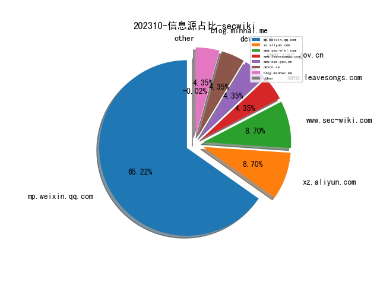
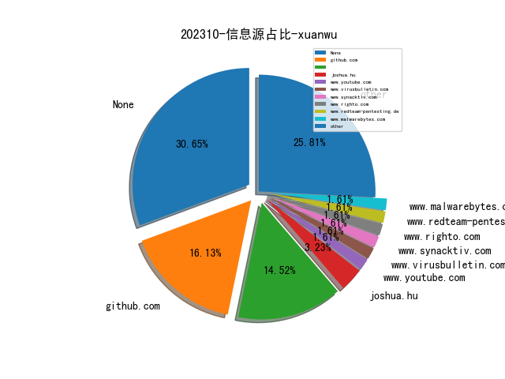
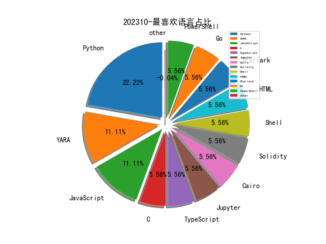

# [数据--所有](README_20.md)
# [数据--年度](README_2023.md)
# 202310 信息源与信息类型占比

# 政策 推荐
| title | url| 
| --- | ---| 
| 规范和促进数据跨境流动规定（征求意见稿） | http://www.cac.gov.cn/2023-09/28/c_1697558914242877.htm| 

# 网络安全书籍 推荐
| date_added | language | title | author | link | size| 
| --- | --- | --- | --- | --- | ---| 
| 2023-10-22 17:13:58 | English | Rust In Practice: A Programmers Guide to Build Rust Programs, Test Applications and Create Cargo Packages | Rustacean Team | http://libgen.rs/book/index.php?md5=869DFD23AB0EF7D4F64A646199103470 | 426 kB [EPUB]| 
| 2023-10-22 17:12:56 | English | Practical Rust 1.x Cookbook: 100+ Solutions across Command Line, CI/CD, Kubernetes, Networking, Code Performance and Microservices | Rustacean Team | http://libgen.rs/book/index.php?md5=B766D2E409AE1A6365C011C65AFC1A50 | 669 kB [EPUB]| 
| 2023-10-19 14:39:26 | English | Head First Python: A Learners Guide to the Fundamentals of Python Programming, A Brain-Friendly Guide <[Early Release - RAW & UNEDITED]> | Paul Barry | http://libgen.rs/book/index.php?md5=1A85A06658A6E506E3CC18EDE8B625CC | 124 MB [PDF]| 
| 2023-10-12 15:07:33 | English | Artificial Intelligence & Blockchain in Cyber Physical Systems: Technologies & Applications | Muhammad Arif, Valentina Emilia Balas, Tabrez Nafis, Nawab Muhammad Faseeh Qureshi, Samar Wazir, Ibrar Hussain | http://libgen.rs/book/index.php?md5=998DF7DF613C96890EA2A8631844F1EB | 40 MB [PDF]| 
| 2023-10-11 18:01:39 | English | Ansible For Security by Examples | Luca Berton | http://libgen.rs/book/index.php?md5=0440BBACC6C24FFFC5D5307691D775B8 | 1 MB [EPUB]| 
| 2023-10-06 15:24:08 | English | The day of defense | McDonald, A. Melvin | http://libgen.rs/book/index.php?md5=38B739BA016B5369AECD5DB58A5B3D18 | 201 kB [EPUB]| 
| 2023-10-06 11:16:41 | English | Python for DevOps: Learn Ruthlessly Effective Automation | Noah Gift, Kennedy Behrman, Alfredo Deza, Grig Gheorghiu | http://libgen.rs/book/index.php?md5=D80589BD3C0804C795C7CE97138026F1 | 11 MB [PDF]| 
| 2023-10-06 17:18:06 | English | The Myth of Overpunishment: A Defense of the American Justice System and a Proposal to Reduce Incarceration While Protecting the Public | Barry Latzer | http://libgen.rs/book/index.php?md5=00E78F1753ED6F53879A53A0933302C0 | 2 MB [EPUB]| 
| 2023-10-05 16:02:41 | English | Hacking Kubernetes: Threat-Driven Analysis and Defense | Andrew Martin, Michael Hausenblas | http://libgen.rs/book/index.php?md5=492A742FF37EE73CE3591FB5FCBCE7BB | 9 MB [PDF]| 
| 2023-10-05 15:32:52 | English | (The Shelly Cashman Series) Technology for Success and The Shelly Cashman Series Microsoft 365 & Office 2021 (MindTap Course List) | Sandy Cable, Jennifer T. Campbell, Mark Ciampa, Barbara Clemens, Jennifer Duffy, Steven M. Freund, Mark Frydenberg, Ralph E. Hooper, Ellen Monk, Lisa Ruffolo, Susan Sebok, Misty Vermaat, Jill West | http://libgen.rs/book/index.php?md5=3EEE6D81FD0205B78E8DC017AB189526 | 80 MB [PDF]| 
| 2023-10-04 19:05:48 | English | Understanding Analog Side Channels Using Cryptography Algorithms | Alenka Zajić; Milos Prvulovic | http://libgen.rs/book/index.php?md5=7F1D0D6CD099D60E374B4108FB376D0C | 86 MB [EPUB]| 
| 2023-10-04 18:48:54 | English | Kubernetes Security and Observability: A Holistic Approach to Securing Containers and Cloud Native Applications | Brendan Creane, Amit Gupta | http://libgen.rs/book/index.php?md5=70C5393323FC76F1A4D7D9842F54D92D | 11 MB [PDF]| 
| 2023-10-04 18:48:53 | English | Identity-Native Infrastructure Access Management: Preventing Breaches by Eliminating Secrets and Adopting Zero Trust | Ev Kontsevoy, Sakshyam Shah, Peter Conrad | http://libgen.rs/book/index.php?md5=154B43B65DFEAECCEB00BD19957C20A2 | 2 MB [PDF]| 

# 微信公众号 推荐
| nickname_english | weixin_no | title | url| 
| --- | --- | --- | ---| 
| 骏安检测 | jsjajc | 重阳｜清秋有信，唯愿久久 | https://mp.weixin.qq.com/s?__biz=MzI4NTM3MzM0OA==&mid=2247493848&idx=1&sn=6db6047ed8ae83208d5d2197843aba8a | 1| 
| 猫蛋儿安全 | MD_SEC | 汽车网络安全:只有开局，没有尽头，聚光向前，安全到达 | https://mp.weixin.qq.com/s?__biz=MzkxMTUyMjUxMw==&mid=2247504774&idx=2&sn=46e01ddc511b064677d8710be3983ac5 | 2| 
| 独角鲸安全 | narwhal_sec | 美国APT入侵西北工业大学使用的5款远控后门揭秘 | https://mp.weixin.qq.com/s?__biz=MzA4MzMzOTQ4Mw==&mid=2453663941&idx=1&sn=5a1fa2a38b406f58eae71cba1499afc5 | 2| 
| 深网知识库 | Lidskool | 1337 Worm Cpanel Cracker/Bruter [ 2023 ] 已激活 | https://mp.weixin.qq.com/s?__biz=Mzg4OTAzMzU2OQ==&mid=2247485701&idx=1&sn=23a18a21c69d08606f7a943095112a87 | 2| 
| 榫卯江湖 | cnxct_coder | eBPF应用程序开发：快人一步 | https://mp.weixin.qq.com/s?__biz=MzUyMDM0OTY5NA==&mid=2247484733&idx=1&sn=466f1438d01d7a9e09c23c6e4d7cbce1 | 1| 
| 数安行 | None | 九九重阳，登高望远！ | https://mp.weixin.qq.com/s?__biz=Mzg5OTM0NTM2OQ==&mid=2247490428&idx=1&sn=36f207a09bba2a1cba4059c9423983be | 1| 
| 小白的备忘笔记 | KALI_admin_CUI | sqlmap | https://mp.weixin.qq.com/s?__biz=Mzk0MzQzMTc4OA==&mid=2247484072&idx=1&sn=46a9e9a733619e708687918e4b63679e | 1| 
| 天融信阿尔法实验室 | gh_0b0b1747bf15 | 每周安全动态精选（10.16-10.20） | https://mp.weixin.qq.com/s?__biz=Mzg3MDAzMDQxNw==&mid=2247496495&idx=1&sn=0ab20df761ecc517c7c4644940680aa9 | 1| 
| 君哥的体历 | jungedetili | 营销场景下如何保障数据安全传输及企业终端管理讨论, 总第211周 | https://mp.weixin.qq.com/s?__biz=MzI2MjQ1NTA4MA==&mid=2247490112&idx=1&sn=665a636b75d9bf9f631b7f94dce12fe7 | 1| 
| 云计算和网络安全技术实践 | gh_34d6b0cb5633 | vulnhub之Five86-2的实践 | https://mp.weixin.qq.com/s?__biz=MzA3MjM5MDc2Nw==&mid=2650747984&idx=1&sn=cb3012fc1762f3344adbacf334f1e728 | 1| 
| 中孚信息 | zfinfo | 中孚信息获评“山东省网络安全和信息化工作先进集体” | https://mp.weixin.qq.com/s?__biz=MzAxMjE1MDY0NA==&mid=2247506838&idx=1&sn=b291e77905b2262400ff60500496316a | 1| 
| loochSec | gh_1fd37665f197 | 调用门 | https://mp.weixin.qq.com/s?__biz=Mzg4NTg4MDAxMA==&mid=2247484458&idx=1&sn=43d4a58dee8aec97fa3b871176a88aa0 | 2| 
| gakki的童养夫 | gh_5b1084d953c3 | NewStarCTF2023公开赛week3安卓wp | https://mp.weixin.qq.com/s?__biz=MzU0NjQ0MTA3Mg==&mid=2247484950&idx=1&sn=2fe047f6a65b46f25af0a0c0818bd627 | 1| 
| 蝉蜕 | None | iot-vulhub(基础环境篇) | https://mp.weixin.qq.com/s?__biz=Mzg5NTU4MjkyMQ==&mid=2247484010&idx=1&sn=e9d07a9ac9d65c6e01644b034404710a | 1| 
| 漏洞猎人安全 | gh_24b45e14b87e | web安全卷不动了？快来试试汽车安全 | https://mp.weixin.qq.com/s?__biz=Mzk0MTQ4NzU5NQ==&mid=2247483826&idx=1&sn=e063636f982e866eeaa622f43f7e13ba | 1| 
| 深白网安 | gh_c9fbc4fe8721 | X山终端安全系统V9.0 SQL注入复现(附POC) | https://mp.weixin.qq.com/s?__biz=Mzk0MTUxNzAxMg==&mid=2247483896&idx=1&sn=9bbc5a486f44475d23a9323293da468f | 1| 
| 月落安全 | gh_48da38d0bfb5 | 热乎！代码审计漏洞复现——dedecms后台sql注入 | https://mp.weixin.qq.com/s?__biz=Mzg4NDk4MTk5OA==&mid=2247485076&idx=1&sn=b7acd222d9e7fbaf01a69bfc27b7496a | 1| 
| 华为安全应急响应中心 | HUAWEI_PSIRT | 给华为打工的第一步——听学长学姐的！ | https://mp.weixin.qq.com/s?__biz=MzI0MTY5NDQyMw==&mid=2247500484&idx=1&sn=354af77ed8c29367089860404259e403 | 1| 
| 十九线菜鸟学安全 | gh_5d5696256f18 | 【红蓝/演练】-事前准备(1)之演练组织 | https://mp.weixin.qq.com/s?__biz=MzI1OTUyMTI2MQ==&mid=2247484429&idx=1&sn=0838ee2ad7ffbb410eebe394b11e362d | 1| 
| LHACK安全 | None | 记一次\"91\"站点渗透 | https://mp.weixin.qq.com/s?__biz=MzkyMjU2Nzc1Mg==&mid=2247483755&idx=1&sn=9fc17d429a1224bb14c0374b969d7000 | 1| 
| K8实验室 | K8-lab | 10万美元漏洞复现SharePoint CVE-2023-29357 | https://mp.weixin.qq.com/s?__biz=Mzg3MTY4NjUyOQ==&mid=2247485496&idx=1&sn=d0b47cea87f2828767b6cedb493574ce | 1| 
| IT职场课 | gh_f524e5a0a1fb | 他们名企大厂，年薪百万，却苦于催婚 | https://mp.weixin.qq.com/s?__biz=MzU5NzQ3NzIwMA==&mid=2247483918&idx=1&sn=bea72351756778069da42ee7b55c4d31 | 1| 
| ACT Team | gh_c108b6f21f86 | 2023深圳·中国1024程序员CTF信息安全大赛初赛Writeup | https://mp.weixin.qq.com/s?__biz=Mzg2OTcyODc1OA==&mid=2247486175&idx=1&sn=529fbe492b9bcd6ce1bcc60c63e139d0 | 1| 
| 轩辕实验室 | xuanyuanlab | 分享 , 基于反向传播来生成自动驾驶测试场景的方法 | https://mp.weixin.qq.com/s?__biz=MzI1MTkwODMxMQ==&mid=2247487263&idx=1&sn=e5a1fcf388c3c200e4f005d704645f14 | 2| 
| 编角料 | geekbyter | tls指纹之ja4发布！！！ | https://mp.weixin.qq.com/s/Vo57J6l7WEt7L2bF_EAfbA | 1| 
| 知其安科技 | zhiqiansec | 喜报｜知其安上榜Gartner代表性厂商 | https://mp.weixin.qq.com/s?__biz=MzkzNTI5NTgyMw==&mid=2247492158&idx=1&sn=d062eccfcdaff303f7c8f7384f5bf468 | 1| 
| 渊龙Sec安全团队 | Aabyss-Team | 从零学习AWD比赛指导手册 | https://mp.weixin.qq.com/s?__biz=Mzg4NTY0MDg1Mg==&mid=2247485127&idx=1&sn=332aec05a070fc6f3a8298e9f77ece73 | 1| 
| 梅苑安全学术 | gh_e291bf9d0869 | 从零学习AWD比赛指导手册 | https://mp.weixin.qq.com/s?__biz=MzkwMTU2NzMwOQ==&mid=2247483978&idx=1&sn=22eae7c1a91974fb9782fe80e9bcd199 | 1| 
| 开源情报技术研究院 | gh_d1f65c3b3e5b | 网络安全资讯周报（10/16 - 10/20） | https://mp.weixin.qq.com/s?__biz=MzkwNjQxOTk1Mg==&mid=2247485539&idx=1&sn=d06caef125970cb343579569116c0bf2 | 1| 
| 小红书技术REDtech | gh_f510929429e3 | 限时赠票｜关于 AI 赋能、智能高清、音视频技术...小红书邀你参加「RTE 实时互联网大会」 | https://mp.weixin.qq.com/s?__biz=Mzg4OTc2MzczNg==&mid=2247488415&idx=2&sn=614f5b5f38bf04da6323002ea2379302 | 2| 
| 安全逐梦人 | gh_bdb40c30b1d4 | 记录一次攻防演练实战过程 | https://mp.weixin.qq.com/s?__biz=MzkxNzUxMjU5OQ==&mid=2247484154&idx=1&sn=6aa3f0eedd7d7435a002d750c0b28a48 | 1| 
| 学蚁致用 | sudo_i | As-Exploits 1.5更新 | https://mp.weixin.qq.com/s?__biz=MzI0MDI5MTQ3OQ==&mid=2247484603&idx=1&sn=7dfee9deb3909c29f30e35d9d90bb6ae | 1| 
| 一个不正经的黑客 | gh_ddeb734f0ee7 | 快速挖掘技巧+某学校实战案例分享 | https://mp.weixin.qq.com/s?__biz=MzkwODI1ODgzOA==&mid=2247485962&idx=2&sn=3d10fa3d9538934eaa417ff7129a4d1c | 5| 
| xiaoliangliu | gh_15ec9af50d21 | APT分析之WizardSpiderAPT组织勒索攻击模拟、对抗 | https://mp.weixin.qq.com/s?__biz=Mzg3Mzk2MzA3Nw==&mid=2247483820&idx=1&sn=6723f831a83deb585163ecaa8796da4a | 1| 
| X安全实验室 | None | 遥遥领先 | https://mp.weixin.qq.com/s?__biz=MzkzMDM5NzIwMw==&mid=2247484415&idx=1&sn=3fc79d8d3ed8958c6ae846f97fd79fab | 1| 
| Tokaye安全 | E0kt1sec | 流影（FlowShadow）---国内首个开源网络流量可视化分析和威胁感知平台 | https://mp.weixin.qq.com/s?__biz=MzkzODMwOTE5NQ==&mid=2247483759&idx=1&sn=262600c5ddad76c9c73d5d5192be0dde | 2| 
| StepSnail | u_defined | Kali 安装Python2/3 pip | https://mp.weixin.qq.com/s?__biz=Mzg3ODQ1NzU4MA==&mid=2247484339&idx=1&sn=d336aa113eafaa01b2231288df19252d | 1| 
| Feng随心而安 | gh_13bd5fd7a612 | \"红客们\"请别用\"爱国\"两字成为你吸引流量的关键字 | https://mp.weixin.qq.com/s?__biz=MzkzMjIwNzM1Ng==&mid=2247484713&idx=1&sn=4283b2a0f17ab53848b532b3dbfaaa2c | 1| 
| F12sec | F12sec | NB！又一本安全攻防新书开售！！ | https://mp.weixin.qq.com/s?__biz=Mzg5NjU3NzE3OQ==&mid=2247488761&idx=2&sn=23257a475821d5b058e4506b1f249ec5 | 2| 
| Drt安全战队 | gh_f51273998067 | 报名倒计时15天！,补天杯破解大赛需要你关注的三点！ | https://mp.weixin.qq.com/s?__biz=MzkxNTM0OTQyMA==&mid=2247491811&idx=1&sn=b459e52da1f36f477f0de660996ccb0b | 1| 
| AutoSrc | gh_d971b60db163 | 车联网安全相关工具 | https://mp.weixin.qq.com/s?__biz=MzkwNjQ5NzE2MQ==&mid=2247483898&idx=1&sn=c3f0572d7d2a9f00c35cccdb3ad45fdd | 1| 
| 黑客街安全团队 | gh_5a73befc7598 | 老年人被骗“暗语”快看！本条消息请尽快转发到家庭群！ | https://mp.weixin.qq.com/s?__biz=Mzg5OTQzNTI4Nw==&mid=2247488690&idx=1&sn=30272ab735ab9bbea5a2d6eb5e2860b1 | 2| 
| 补天漏洞响应平台 | butianqianxin | 报名倒计时15天！,补天杯破解大赛需要你关注的三点！ | https://mp.weixin.qq.com/s?__biz=MzU4MzgwODc3Ng==&mid=2247494981&idx=1&sn=ed35b58f8a58fa6f7c8732fc55ef814f | 1| 
| 网易云音乐技术团队 | gh_e0a72742f973 | 云音乐Android Cronet接入实践 | https://mp.weixin.qq.com/s?__biz=MzI1NTg3NzcwNQ==&mid=2247489502&idx=1&sn=cf9d7511c4cbeb76e7dfb2f112a7ea87 | 1| 
| 盛邦安全应急响应中心 | WebRAY_Sec | 烽火狼烟丨暗网数据及攻击威胁情报分析周报（10/16-10/20) | https://mp.weixin.qq.com/s?__biz=Mzk0NjMxNTgyOQ==&mid=2247484039&idx=1&sn=cd478cde962bd555056f73e0d8a0a8a1 | 1| 
| 盛邦安全WebRAY | WebRay_weixin | 倒计时7天丨探索天地网络，畅谈测绘技术 | https://mp.weixin.qq.com/s?__biz=MzAwNTAxMjUwNw==&mid=2650274065&idx=2&sn=b4aa123f085de5f31491cbf6614cde0a | 3| 
| 白帽子飙车路 | hack-by-txf | 报名倒计时15天！,补天杯破解大赛需要你关注的三点！ | https://mp.weixin.qq.com/s?__biz=MzI1ODI0MTczNQ==&mid=2247489340&idx=1&sn=6e7db896254161fe868a1b40894031e3 | 1| 
| 湘雪尘奕 | gkaq_gkk | 报名倒计时15天！,补天杯破解大赛需要你关注的三点！ | https://mp.weixin.qq.com/s?__biz=MzI2MzE3NzczNQ==&mid=2650622939&idx=1&sn=ae813bc956a5451716fbcf18e5301420 | 1| 
| 梆梆安全 | BANGCLE | 以赛促学！梆梆安全全力护航“福建省第五届网络安全职业技能竞赛暨2023年全国电信和互联网行业职业技能竞赛福建赛区选拔赛”圆满举办 | https://mp.weixin.qq.com/s?__biz=MjM5NzE0NTIxMg==&mid=2651129920&idx=1&sn=8257eb164fba11a940a645765b861739 | 2| 
| 暗影安全 | gh_4f0dabd0df69 | 报名倒计时15天！,补天破解大赛需要你关注三点！ | https://mp.weixin.qq.com/s?__biz=MzI2MzA3OTgxOA==&mid=2657164899&idx=1&sn=af2f2357680d543c106e9eff27e7bacc | 3| 
| 星云安全 | gh_dd2f48adc2e0 | \"红客们\"请别用\"爱国\"两字成为你吸引流量的关键字 | https://mp.weixin.qq.com/s?__biz=MzkxODA4NjQwNQ==&mid=2247489278&idx=1&sn=a849b8c89933cef5243f538b3e235010 | 1| 
| 数据安全合规交流部落 | GD_DataSecurity | 谈一谈我是如何入门安全的，七年安全生涯总结 | https://mp.weixin.qq.com/s?__biz=MzU2MDQ0NzkyMw==&mid=2247484672&idx=1&sn=5c6743e0659f6c4db4e9d4d318deb2ce | 1| 
| 数据安全与取证 | Cflab_net | 逆向工程技术在移动应用渗透测试的应用 | https://mp.weixin.qq.com/s?__biz=MzIyNzU0NjIyMg==&mid=2247488002&idx=1&sn=0ec85dfe7863bd8aea8f2141231ea74f | 1| 
| 字节脉搏实验室 | zijiemaiboshiyanshi | 报名倒计时15天！,补天破解大赛需要你关注三点！ | https://mp.weixin.qq.com/s?__biz=MzI2ODU2MjM0OA==&mid=2247491471&idx=1&sn=2c072175a862b5fbf4968ed6b32da8c1 | 1| 
| 奇安信安全应急响应中心 | gh_5c0c4dc97eb6 | 中秋特别策划 , 周大福黄金获奖名单 | https://mp.weixin.qq.com/s?__biz=Mzg5OTYwMTY5MA==&mid=2247504217&idx=1&sn=baa4724a176493dc0936079410ec9ac6 | 1| 
| 天空卫士SkyGuard | Sky--Guard | 专利背后的故事 , 一种邮件安全控制方法 | https://mp.weixin.qq.com/s?__biz=MzA5MjQyODY1Mw==&mid=2648464731&idx=1&sn=4cc1b22efe63aefd4ffb77facff77a5b | 1| 
| 天禧信安 | txxa-385 | 报名倒计时15天 , 补天杯破解大赛需要你关注的三点！ | https://mp.weixin.qq.com/s?__biz=MzUyMTE0MDQ0OA==&mid=2247492791&idx=1&sn=b13a4f7c74392944a238557639380798 | 1| 
| 国信安全 | gh_aa0cfb9da03f | 深圳市政务服务数据管理局王卓民副局长一行来中心交流 | https://mp.weixin.qq.com/s?__biz=MzU5MzYzMzU5NA==&mid=2247488463&idx=1&sn=1e3ee305cb48d2a952f7e2d33c94e464 | 1| 
| 哔哩哔哩技术 | bilibili-TC | 猫耳 Android 播放框架开发实践 | https://mp.weixin.qq.com/s?__biz=Mzg3Njc0NTgwMg==&mid=2247496917&idx=1&sn=4c955d51ce653e831cd103d2b1b75199 | 1| 
| 刨洞之眼 | None | OPENAI API故障，API服务受影响无法使用 | https://mp.weixin.qq.com/s?__biz=Mzk0MTQ4NTU5OA==&mid=2247484393&idx=1&sn=e7ddf30e48a715111acb5e25bb8e17cc | 3| 
| VisActor | visactor-521 | 可视化大师课：图表史话 | https://mp.weixin.qq.com/s?__biz=MzA4NDk5NTYwNw==&mid=2651430177&idx=1&sn=ad1e6d36b2186b844be428f1631a5c9a | 1| 
| Timeline Sec | TimelineSec | 帮会「TimelineSec@赏金猎人」带你坐上“众测直通车” | https://mp.weixin.qq.com/s?__biz=MzA4NzUwMzc3NQ==&mid=2247492783&idx=1&sn=2d9e601f25b4423b76c311d157c4e80a | 2| 
| Nu1L Team | None | N1CTF 2023明日8点正式开赛 | https://mp.weixin.qq.com/s?__biz=MzU4MTg1NzAzMA==&mid=2247488024&idx=1&sn=a8ef71700b03f3d99dc0f96b01ae8e07 | 1| 
| LemonSec | lemon-sec | 报名倒计时15天！,补天杯破解大赛需要你关注的三点！ | https://mp.weixin.qq.com/s?__biz=MzUyMTA0MjQ4NA==&mid=2247547883&idx=1&sn=7e8b60a55775f6b46712a0c139afbc3a | 1| 
| KQsec | None | 北京大学长沙计算与数字经济研究院网络安全研究中心招聘 | https://mp.weixin.qq.com/s?__biz=MzIyNTU3MzQ5Nw==&mid=2247484552&idx=1&sn=622bd2217ca5b7b4f60e9337a40aa411 | 1| 
| KK安全说 | kksecurity | 10.21-相聚北京-《开发与安全共识研讨会》 | https://mp.weixin.qq.com/s?__biz=Mzg4NzgyODEzNQ==&mid=2247485383&idx=1&sn=e56d45900f4c561833680b46c101a6fc | 1| 
| Ghost Wolf Lab | gh_f04eb9c9130b | 《Windows恶意软件常见API一览》发布 | https://mp.weixin.qq.com/s?__biz=MzI3OTM3OTAyNw==&mid=2247485557&idx=1&sn=8059893fb702708f4edb8f58b417cc98 | 3| 
| 安第斯智能云 | AndesBrain | 基于安第斯智能云打造，OPPO发布「文件随心开」功能 | https://mp.weixin.qq.com/s?__biz=Mzg4MzE2MzY1OA==&mid=2247496882&idx=1&sn=9cbecb3f9090c5391cf45f4a92ed1fff | 1| 
| 云梦安全实验室 | gh_bed17136296f | <漏洞复现>中**麟堡垒机SQL注入漏洞 | https://mp.weixin.qq.com/s?__biz=MzkzODMyOTEzOA==&mid=2247484194&idx=2&sn=add6a4e6a6c614e3a52d3decc87d6aea | 2| 
| Hacker学习笔记 | gh_a18ba10719e2 | MSF后渗透meterpreter使用 | https://mp.weixin.qq.com/s?__biz=MzIzMTI5MTYwOQ==&mid=2247484093&idx=1&sn=e7ccfec631b9bcc4e6a7cb1ed12558a4 | 1| 
| 360漏洞研究院 | gh_9dfd76b8e0c2 | 安全动态｜受邀参会、实力霸榜，360漏洞研究能力获谷歌、微软双料认证 | https://mp.weixin.qq.com/s?__biz=Mzk0ODM3NTU5MA==&mid=2247493435&idx=1&sn=05c023466cd61928c32180bfb538c896 | 1| 
| 默安科技 | moresec | Oracle WebLogic Server 远程代码执行漏洞（CVE-2023-22072）通告 | https://mp.weixin.qq.com/s?__biz=MzIzODQxMjM2NQ==&mid=2247497527&idx=1&sn=b3c53b955ecb9e631441e2d484b08982 | 1| 
| 马赛克安全实验室 | mosaic-sec | [漏洞复现-35]用*OA-移动系统-DownloadServlet文件读取漏洞 | https://mp.weixin.qq.com/s?__biz=MzI5MzU4ODE5Mw==&mid=2247484178&idx=1&sn=fc656dde7787941f1b6d7195da019f2f | 2| 
| 零幺sec | gh_5d8812573c60 | 2023各大安全厂商面试经验分享 | https://mp.weixin.qq.com/s?__biz=Mzk0NDM3MTU0OQ==&mid=2247484073&idx=1&sn=2e3068af8a154b1da4244a97c67ba8be | 1| 
| 闪石星曜CyberSecurity | None | 志同道合的朋友，你在哪？ | https://mp.weixin.qq.com/s?__biz=Mzg3MDU1MjgwNA==&mid=2247485204&idx=1&sn=a5eca5de104276557affcd25c428b922 | 1| 
| 释然IT杂谈 | ShiRan_IT | 【实用】满足等保要求的基线核查脚本：linux&Windows | https://mp.weixin.qq.com/s?__biz=MzIxMTEyOTM2Ng==&mid=2247502381&idx=1&sn=b3c0cd5bbb102b064cc3d70652c0062e | 1| 
| 酷酷信安 | gh_daa7e4d09140 | Godzilla流量解密工具 | https://mp.weixin.qq.com/s?__biz=Mzg2NTk3MjA2OQ==&mid=2247484192&idx=1&sn=ab5ff19ea3ffbb390160bb7365e67550 | 1| 
| 网安培训 | ccrctraining | 信息安全保障人员认证（CISAW）2023年11月线上考试安排 | https://mp.weixin.qq.com/s?__biz=MzIzNTEzNzIyMA==&mid=2247485213&idx=1&sn=225d45b5d0f6fc2a38cad5efaf93143f | 1| 
| 洪椒攻防实验室 | gh_ce67936af655 | SMB弱口令的一些利用 | https://mp.weixin.qq.com/s?__biz=Mzg5ODkwMzA0MA==&mid=2247485449&idx=1&sn=51c70b1b47f42e3d006be0415d4f20d1 | 1| 
| 杭州数据安全联盟 | gh_4959e361d8ba | 20231018第60期｜安全漏洞一周播报 | https://mp.weixin.qq.com/s?__biz=MzkyMjI2MDE2Mg==&mid=2247501271&idx=1&sn=79963463c6ae8127f9f50248cf827f97 | 1| 
| 数说安全 | csreviews | 拼人头?缩成本?华顺信安赵武:都是泥潭！没有技术突破毫无价值。 | https://mp.weixin.qq.com/s?__biz=MzkzMDE5MDI5Mg==&mid=2247503895&idx=1&sn=d04f352dac03a934aeac9617a99795a2 | 3| 
| 教育网络信息安全 | gh_cf0acb6103bc | 最全面的钓鱼邮件演练服务来啦！ | https://mp.weixin.qq.com/s?__biz=MzI0ODI4Njk0Ng==&mid=2247491449&idx=1&sn=1f7201622d45a07799ea9e9461f45e14 | 1| 
| 恒星EDU | cyberslab | 议程发布！全国数字安全行业产教融合共同体成立大会倒计时3天 | https://mp.weixin.qq.com/s?__biz=MzU1MzE3Njg2Mw==&mid=2247506820&idx=1&sn=f46f6df751b6ca7c68090c856d1ae413 | 1| 
| 微步在线应急响应团队 | gh_59637109313f | 真相大揭秘！恶意软件如何入侵你的设备 | https://mp.weixin.qq.com/s?__biz=Mzg5ODc3NzMzMg==&mid=2247485696&idx=1&sn=9710ea39ada3e2a9adeeba7da9df07a4 | 1| 
| 安全小姿势 | www_sqlsec_com | Web 安全入门到进阶系列知识点脑图 | https://mp.weixin.qq.com/s?__biz=Mzk0MDI0OTQwNw==&mid=2247484284&idx=1&sn=6c20171795787e8e48818eacbae1c0c8 | 1| 
| 字节跳动技术团队 | BytedanceTechBlog | 火山引擎实时、低延时拥塞控制算法的优化实践 | https://mp.weixin.qq.com/s?__biz=MzI1MzYzMjE0MQ==&mid=2247504397&idx=1&sn=1da33095ad447ac8d659410237f228be | 1| 
| 奇安网情局 | QACIA2020 | 以色列与哈马斯冲突表明伴随现代战争的网络战已成为新常态 | https://mp.weixin.qq.com/s?__biz=MzI4ODQzMzk3MA==&mid=2247487878&idx=1&sn=aa5a80dea44cd890edc109e315028cae | 2| 
| 奇安盘古 | PanguLab | 奇安信助力上海公安刑事技术技能大赛圆满落幕！ | https://mp.weixin.qq.com/s?__biz=MzI2MDA0MTYyMQ==&mid=2654404114&idx=1&sn=0efd5c85b6f96aabf7a583e3a8bf3cd7 | 1| 
| 天唯信息安全 | TWtech2113189 | 最新研究，利用AI可检测和拦截中间人（MitM）攻击 | https://mp.weixin.qq.com/s?__biz=MzkzMjE5MTY5NQ==&mid=2247491003&idx=1&sn=9aa8fe42915e7a955a9ae0487c23168d | 7| 
| 信息安全最新论文技术交流 | gh_a7fb15b30ab3 | TDSC , AI算法可检测针对军用无人驾驶车辆的中间人攻击 | https://mp.weixin.qq.com/s?__biz=MzI2NDg5NjY0OA==&mid=2247491019&idx=1&sn=a26f34088c7254f5076c37bdaa814591 | 3| 
| 信息安全小助手 | gh_114c9ed5864b | 信息安全小提示（九） | https://mp.weixin.qq.com/s?__biz=MzkyMjEwNjY5NQ==&mid=2247484943&idx=1&sn=29bcb96d98ad7b188476fdc258062158 | 1| 
| 代码审计 | white-hat-note | 知识星球2023年10月PHP函数小挑战 | https://mp.weixin.qq.com/s?__biz=MzA4MDU0NzY4Ng==&mid=2459420574&idx=1&sn=e5f4e8c10ff3a8e218fea216713ba08c | 1| 
| 中睿天下 | zorelworld | 助力网络安全攻防演练 , 中睿天下获国网蒙东电力数字化事业部感谢信 | https://mp.weixin.qq.com/s?__biz=MzAwNjc0MDA1NA==&mid=2650139275&idx=1&sn=4fbf5ba96cfaab5cedcbf599a24ce6e8 | 1| 
| 世纪网安 | hainanshijiwangan | 世纪网安协助保亭黎族苗族自治县人民法院开展网络安全意识培训 | https://mp.weixin.qq.com/s?__biz=MzkzMDE4NTE5OA==&mid=2247486058&idx=1&sn=0bbadef049a238dea4a31455dc612d6d | 1| 
| echoabced | aa1lecho | go检测端口开放情况 | https://mp.weixin.qq.com/s?__biz=MzkxMzUyMzg1OQ==&mid=2247484210&idx=3&sn=a4d8da7099392dcadae6ab66ceea61db | 3| 
| Sec盾 | Sec_Shield | 白嫖机会来了！网安认证、超级抵扣、免费礼品，直接领！ | https://mp.weixin.qq.com/s?__biz=MzI2NzE4MTI0MQ==&mid=2247487238&idx=1&sn=ba6545dc35c51380219abab8f846838b | 1| 
| GR反窃密攻防实验室 | GR-TSCM-LAB | 【硬件】电磁无线信号长时监测系统 | https://mp.weixin.qq.com/s?__biz=MzU5MTM4MTIxMA==&mid=2247485092&idx=1&sn=e507e6ca7bdd4a4ce2f23e37b9ab6560 | 1| 
| Docker中文社区 | None | 运维必备的《网络端口大全》，看这一份就够了 | https://mp.weixin.qq.com/s?__biz=MzI1NzI5NDM4Mw==&mid=2247496121&idx=1&sn=35e2155145f519954b98cd5dfc8082bd | 3| 
| 阿无安全 | gh_42ad55a11898 | 白嫖机会来了！网安认证、超级抵扣、免费礼品，直接领！ | https://mp.weixin.qq.com/s?__biz=MzkwMTUzNDgxOA==&mid=2247484112&idx=1&sn=b73195ab6a3e9a6967e1f86dea5fcd72 | 1| 
| 网络安全等保测评 | rxDJCP | Cost vs. Benefit of Security Controls | https://mp.weixin.qq.com/s?__biz=MzI3MDY0Nzg1Nw==&mid=2247488356&idx=1&sn=c9e4c71bb81817df4c435d9da9ae01d8 | 1| 
| 竞远网络安全 | savegdn | 专业可靠，让安全更安全，竞远安全2023年第三期新员工培训圆满结束 | https://mp.weixin.qq.com/s?__biz=MzAwMTU3NTcwMg==&mid=2650274075&idx=1&sn=0ce102dde05202f40510538d06e8fb18 | 1| 
| 炮炮安全 | DaTangBounty | 记一次找工作的渗透测试 | https://mp.weixin.qq.com/s?__biz=MzkwNjQ3NDM3OQ==&mid=2247483858&idx=1&sn=599d09727f0fa5c55344e01aa47f7ab8 | 2| 
| 渭南师院网络信息安全社 | wnu_cyber-security | 2023年网络安全宣传周系列活动 | https://mp.weixin.qq.com/s?__biz=Mzk0MjI1NzY1NQ==&mid=2247486363&idx=1&sn=c533342ffa9e66ad038e6db6175ca029 | 1| 
| 懒时小窝 | lazytime_site | 【HTTP】TLS1.3 初次解读 | https://mp.weixin.qq.com/s/FX79d7oQNrbgc73Sr0TB4w | 1| 
| 徐之 | innnovations | Efuse介绍及安全启动浅析 | https://mp.weixin.qq.com/s/PVItfdRvFPl144hTji2WvQ | 1| 
| 安全村SecUN | sec-un | “监控、对账、验证”，确保安全防御措施持续有效｜大湾区金融安全专刊·安全村 | https://mp.weixin.qq.com/s?__biz=MzkyODM5NzQwNQ==&mid=2247493168&idx=1&sn=a386759de21bfe4a07779ed1d7af9878 | 1| 
| 哪都通安全 | gh_b7951db6f28c | 白嫖机会来了！网安认证、超级抵扣、免费礼品，直接领！ | https://mp.weixin.qq.com/s?__biz=Mzg4MjgxNjk2NQ==&mid=2247485878&idx=1&sn=56e8bfa5119ee1e5b23f1354353b2fe7 | 2| 
| COMPASS Lab | gh_5f715fbda2b0 | 利用SEV的I/O漏洞进行攻击 | https://mp.weixin.qq.com/s/-qCcoIALocQKPhsbA7e5ag | 1| 
| 鼎信安全 | HNDXCP | 鼎信安全 , 网络安全一周资讯 | https://mp.weixin.qq.com/s?__biz=MzIwOTc4MTE4Nw==&mid=2247496570&idx=1&sn=5bb3ad9f027c862f8fc17dcac4207f78 | 1| 
| 骨哥说事 | guge_guge | \"GraphQL黑客：如何使用简单的探测获得$1000赏金\" | https://mp.weixin.qq.com/s?__biz=MjM5Mzc4MzUzMQ==&mid=2650257267&idx=1&sn=3d9cc06ddb5a78ce209aaf60861ba3e4 | 4| 
| 随心记事 | Remember-Things | [小记] 某不良网站逆向分析破解 | https://mp.weixin.qq.com/s?__biz=Mzk0NTMyNzI4MQ==&mid=2247484530&idx=1&sn=1747ed76e31470e80d4eddb14e31e084 | 1| 
| 车小胖谈网络 | chexiaopangnetwork | 无线网络玩游戏低延迟，如何调优？ | https://mp.weixin.qq.com/s?__biz=MzIxNTM3NDE2Nw==&mid=2247489821&idx=1&sn=ed6d1751bf3a09293a9048d53a58ecde | 2| 
| 货拉拉安全应急响应中心 | lalasrc | 【Huo力全开 】LLSRC金秋漏洞收割季活动来袭！ | https://mp.weixin.qq.com/s?__biz=Mzg2MDU5NjI0Mw==&mid=2247489078&idx=1&sn=029f8e6a3fefeb2811a0892e634b3cb1 | 1| 
| 藏剑安全 | cangjiansafe | 内推,长亭科技2024届秋招开启，附内推码~ | https://mp.weixin.qq.com/s?__biz=Mzg5MDA5NzUzNA==&mid=2247485374&idx=2&sn=8328399c0a579146f91ef45025a4d7ce | 2| 
| 绿盟科技威胁情报 | NSFOCUS_NTI | 绿盟威胁情报周报（2023.10.09-2023.10.15） | https://mp.weixin.qq.com/s?__biz=Mzg2Nzg0NDkwMw==&mid=2247491817&idx=1&sn=d46e65148e3b94e7132f4cbb5959d76a | 1| 
| 瞌睡虫小K | gh_fd73ce9242f7 | 【竞赛】金陵科技学院-Dozer-香山杯初赛wp | https://mp.weixin.qq.com/s?__biz=MzI4MTIxMzkxMg==&mid=2247485015&idx=1&sn=c43af92c7734c13f2e2913a149e8b7ad | 1| 
| 爱喝酒烫头的曹操 | gh_80ca437fa5e5 | 2023 HW实战-帆软V9文件上传漏洞复现 | https://mp.weixin.qq.com/s?__biz=MzkwOTIzODg0MA==&mid=2247490375&idx=1&sn=4e98e7835d06117e3c5e381878eda543 | 1| 
| 浪飒sec | langsasec | 一个全方位自定义导航 | https://mp.weixin.qq.com/s?__biz=MzI1ODM1MjUxMQ==&mid=2247493781&idx=1&sn=ddd1b8e5e85434e3e009b3153b887810 | 2| 
| 浅黑科技 | qianheikeji | 世界千疮百孔，有一群黑客在缝缝补补 | https://mp.weixin.qq.com/s?__biz=MzU0NDEwMTc1MA==&mid=2247522715&idx=1&sn=b61ccebfb1026554b62bfcdf7b1f838f | 1| 
| 极与黑 | JLBK11 | 个人微信添加一个多功能机器人（更新） | https://mp.weixin.qq.com/s?__biz=MzA3MzQzODg2Nw==&mid=2247484493&idx=1&sn=808b579857a01ac264336d91132fb347 | 1| 
| 星盟安全 | XM_security | 从入门到提高丨星盟团队在线教你打CTF，稳步提升实战技能！ | https://mp.weixin.qq.com/s?__biz=MzU3ODc2NTg1OA==&mid=2247489046&idx=3&sn=d10fd0b05edc5247cd84f5c528b50398 | 3| 
| 数据安全治理技术 | DSG_ART | 数据脱敏技术定义及实施过程解析 | https://mp.weixin.qq.com/s?__biz=MzAwNzk2OTQ4MQ==&mid=2247484037&idx=1&sn=88dc7888e55955999d13e6b0686adae3 | 3| 
| 悟空安全 | gh_3f33ed14634c | 任我行 分销ERP SQL注入漏洞 | https://mp.weixin.qq.com/s?__biz=Mzg4Nzg4NDQwNA==&mid=2247484181&idx=1&sn=a962d7c72faef59b4366137f55786e9b | 2| 
| 快手技术团队 | gh_96fee918d420 | 快手5篇论文入选ACM国际信息与知识管理会议CIKM 2023 | https://mp.weixin.qq.com/s?__biz=Mzg2NzU4MDM0MQ==&mid=2247485647&idx=1&sn=6e9c5b9ac9f5d86a34ab9a5faedf0646 | 1| 
| 山石网科新视界 | hillstone-vision | 等保2.0时代，山石网科国产化等保产品攻略 | https://mp.weixin.qq.com/s?__biz=MzAxMDE4MTAzMQ==&mid=2661281170&idx=2&sn=e6581af5d9ef1f6283240c5bf61fc8dc | 3| 
| 守望者实验室 | WatcherLAB | 巴以冲突网络战活动梳理及特点分析 | https://mp.weixin.qq.com/s?__biz=MzkxMzQwNDcxNg==&mid=2247486209&idx=1&sn=d82147796d20e8111f91a6de14e85166 | 1| 
| 夜安团队SEC | Night-Sec | buuctf newstar 2023 公开赛-crypto-week2-writeup | https://mp.weixin.qq.com/s?__biz=MzkzODQxMDAzOQ==&mid=2247484274&idx=1&sn=4676fe9a1682d874c79aba8d1c4e65ec | 1| 
| 复旦白泽战队 | fdwhitzard | 离谱！黄色图片竟疑似来自某东？！事关每个厂商声誉！ | https://mp.weixin.qq.com/s?__biz=MzU4NzUxOTI0OQ==&mid=2247487236&idx=1&sn=930adf57578a30c3f6c1498724f0b1dc | 2| 
| 嘉诚安全 | None | 【漏洞通告】Apache Airflow信息泄露漏洞安全风险通告 | https://mp.weixin.qq.com/s?__biz=MzU4NjY4MDAyNQ==&mid=2247493525&idx=1&sn=c0a501dc05a71225f5c27bf27377ea38 | 2| 
| 吉祥同学学安全 | gh_370fbad7aec1 | 装修骚扰电话不断，罪魁阔手原来是物业。 | https://mp.weixin.qq.com/s?__biz=MzI1ODY3MTA3Nw==&mid=2247484406&idx=1&sn=11229515057637e5d59fb71511e4fab4 | 1| 
| 华顺信安 | gh_f1578f14f8c2 | 实力认证 , 华顺信安获评CNNVD 2023年度首期漏洞贡献奖 | https://mp.weixin.qq.com/s?__biz=MzUzNjg1OTY3Mg==&mid=2247490803&idx=1&sn=532b725c3960a48db58c68930bd2397e | 1| 
| 北邮 GAMMA Lab | BUPT_GAMMA | 专题解读 , 不变风险最小理论在图神经网络分布外泛化中的应用 | https://mp.weixin.qq.com/s?__biz=Mzg4MzE1MTQzNw==&mid=2247488313&idx=1&sn=1a5abbc33338aaa0c7dfd8eed1bc9ea1 | 1| 
| 创信华通 | cdcxht | 创信资讯丨创信华通正式成为国家信息安全漏洞库（CNNVD）技术支撑单位 | https://mp.weixin.qq.com/s?__biz=MzUxNTQxMzUxMw==&mid=2247518605&idx=1&sn=019933fe8fe450e9680cb96ae1f8fa4c | 1| 
| 七芒星实验室 | HeptagramSec | Webpack源代码泄露 | https://mp.weixin.qq.com/s?__biz=Mzg4MTU4NTc2Nw==&mid=2247490293&idx=1&sn=6326c0942b1d77437099ebd2ff4fb159 | 1| 
| sahx安全从业记 | None | 本地文件包含漏洞检测工具LFI-FINDER | https://mp.weixin.qq.com/s?__biz=Mzg5OTg3MDI0Ng==&mid=2247488624&idx=1&sn=79d0c397a243d6d9a88006b865d03763 | 1| 
| e安在线 | ean-online | 每秒近4亿次请求，这个0-Day让DDoS 攻击破新纪录 | https://mp.weixin.qq.com/s?__biz=MzI1OTA1MzQzNA==&mid=2651244622&idx=1&sn=e7fe6529f2280ca7fad9225df8eb0f05 | 2| 
| YNsec安全实验室 | YNsecStudio | 《CTF特训计划体系课程》第1期上线！开班倒计时10天！ | https://mp.weixin.qq.com/s?__biz=Mzg4MzgxMDc5MA==&mid=2247486618&idx=1&sn=c069ee0a30573c47a3529474162eb28b | 1| 
| XCTF联赛 | gh_3d7c7f90f79f | ACTF 2023 , 击碎过往 重启新章 | https://mp.weixin.qq.com/s?__biz=MjM5NDU3MjExNw==&mid=2247514780&idx=1&sn=5763f40cabe6f2aad2a3645be3bf3be2 | 1| 
| V安全资讯 | v-safe-cn | 警方提醒：无限嵌套的刷单骗局！近期已有多人被骗 | https://mp.weixin.qq.com/s?__biz=MzI4MDQ1MzQ0NA==&mid=2247493264&idx=2&sn=25e1e7664aee5ef877bc978b128df98c | 6| 
| M01N Team | m01nteam | 寄生云计算服务实现可信C2控制 | https://mp.weixin.qq.com/s?__biz=MzkyMTI0NjA3OA==&mid=2247492452&idx=1&sn=8655af05c87b83bcacfcfead7fa0086e | 2| 
| ListSec | None | Flask SSTI靶场记录 | https://mp.weixin.qq.com/s?__biz=MzIwMjUyNDM0OA==&mid=2247485488&idx=1&sn=08da1db7a7d97e3083ed2cb2d1c6577b | 1| 
| HACK学习君 | None | 权限不够 | https://mp.weixin.qq.com/s?__biz=MzIzNzMxMDkxNw==&mid=2247493144&idx=1&sn=40a3e74899f00f7895cd5af8f2a95761 | 2| 
| CCIA数据安全工作委员会 | CCIA-DSC | 关于“2023年网络安全优秀创新成果大赛—数据安全和个人信息保护专题赛”评选结果公示的通知 | https://mp.weixin.qq.com/s?__biz=MzkyNzI3MzAxOA==&mid=2247512266&idx=1&sn=eb04f800dcc7c72130c99fc624e7ad99 | 1| 
| 百度安全 | BaiduSD00 | 百度零信任架构落地经验分享——7层零信任方案 | https://mp.weixin.qq.com/s/5utSjmXrh5enrAvJmJLFvQ | 1| 
| 黑客网络安全 | hackerTalk | TrollStore巨魔商店永久安装APP 可实现IOS应用双开 安装任意APP | https://mp.weixin.qq.com/s?__biz=MzIxODQzOTA5Mg==&mid=2247486553&idx=1&sn=3b9f056c4eb9d5b45f1735b1c415fc73 | 2| 
| 鹏组安全 | Kris_Alex2 | 【赠书福利*3】《AWD特训营》攻防双重视角详解｜文末抽奖 | https://mp.weixin.qq.com/s?__biz=Mzg5NDU3NDA3OQ==&mid=2247489907&idx=1&sn=95a17d11dfe672f7632b6dc694e0761c | 1| 
| 风信Purrs | whoamils | 新书到！《AWD特训营》攻防双重视角详解 | https://mp.weixin.qq.com/s?__biz=MzI1NDIwMTI0MA==&mid=2247484261&idx=1&sn=a543bcba763e1d332cc6f85e6cb1924a | 1| 
| 阿乐你好 | gh_cdf3717dded0 | 新书到！《AWD特训营》攻防双重视角详解 | https://mp.weixin.qq.com/s?__biz=MzIxNTIzNTExMQ==&mid=2247489616&idx=1&sn=fe514314b7750441cd5522efe2cd7e48 | 3| 
| 软件测试培训 | iTestTrain | Jenkins第12讲：Jenkins核心技术-自动化部署 | https://mp.weixin.qq.com/s?__biz=MzA5NDk4NTU3Mg==&mid=2649585857&idx=1&sn=3ab9ee3f56719823304b442a81378c09 | 2| 
| 白泽安全实验室 | baizelab | 新APT组织沙猁猫针对库尔德斯坦民主党活动人士分发远控木马——每周威胁情报动态第147期（09.29-10.12） | https://mp.weixin.qq.com/s?__biz=MzI0MTE4ODY3Nw==&mid=2247491877&idx=1&sn=efbe0c1736cbb5a7fcf37852d0ef6920 | 2| 
| 电子物证 | ewuzheng | 【毒品犯罪电子数据类证据审查要点】 | https://mp.weixin.qq.com/s?__biz=MzAwNDcwMDgzMA==&mid=2651046076&idx=2&sn=9848c6b9fa4f7ffe7749b6d78da43f09 | 4| 
| 琴音安全 | Qinyinsafe | CTF/AWD竞赛速胜指南:《AWD特训营》攻防双重视角详解 | https://mp.weixin.qq.com/s?__biz=Mzg3NTk4MzY0MA==&mid=2247485469&idx=1&sn=980e549e4ac8b659a3d03a78dcdd4fec | 3| 
| 洞源实验室 | gh_4929169c5e90 | Apache Commons Compress内存耗尽漏洞 CVE-2021-35516 | https://mp.weixin.qq.com/s/KvEW6zV80BORRi9YHOxgTQ | 2| 
| 汇能云安全 | metech2005 | 南昌某企业疑曝删库勒索事件，当地网信办处以5万元罚款 | https://mp.weixin.qq.com/s?__biz=MzIwNzAwOTQxMg==&mid=2652249314&idx=1&sn=bce7d5e1a8684d9eb1808c727f9c28eb | 3| 
| 永信至诚 | INT-GROUP | 数字风洞通信行业实践丨永信至诚护航中国通服2023年第三届“通服网安杯”网络和数据安全技能竞赛圆满举办 | https://mp.weixin.qq.com/s?__biz=MzAwNDUyMjk4MQ==&mid=2454822351&idx=1&sn=ac0af4f31641fd3ef973a77af6d041db | 1| 
| 朱厌安全团队 | AQ_F0R | 新书到！《AWD特训营》攻防双重视角详解 | https://mp.weixin.qq.com/s?__biz=Mzg4Njg3MDk5Ng==&mid=2247486432&idx=1&sn=999d56a074015042fb841809794a9aae | 1| 
| 小阿辉谈安全 | hgschools | CobaltStrike 4.9 Cracked !!! | https://mp.weixin.qq.com/s?__biz=MzkyMDE4NzE1Mw==&mid=2247484659&idx=1&sn=997e43266dbb1aca976d25967e85c063 | 1| 
| 奇安信病毒响应中心 | gh_416eb7efb780 | 每周勒索威胁摘要 | https://mp.weixin.qq.com/s?__biz=MzI5Mzg5MDM3NQ==&mid=2247493360&idx=1&sn=626a2d71af5d3757175d48a88ee7f6a8 | 2| 
| 天億网络安全 | tywlaq | 网络排错五大基本步骤与命令 | https://mp.weixin.qq.com/s?__biz=MzU4ODU1MzAyNg==&mid=2247512885&idx=1&sn=f9471f2636922fdedc4ab0a3f976fa9c | 2| 
| 夏小芸sec | xiaxiaoyunyyds | Python渗透脚本 | https://mp.weixin.qq.com/s?__biz=Mzg4NDkwMDAyMQ==&mid=2247487326&idx=2&sn=e8cb11e64ce9165c993cbc2bd1f57e0b | 2| 
| 兰云银河实验室 | gh_8812ef24ef15 | 近期热门网络安全事件 | https://mp.weixin.qq.com/s?__biz=MzUxNDc5NjA3OQ==&mid=2247491568&idx=1&sn=8c6ee0c1250835d3bf201b060144bb0d | 1| 
| thelostworld | gh_3f2e5b9f028c | [漏洞复现-32]宏*OA-KhFieldTree注入漏洞 | https://mp.weixin.qq.com/s?__biz=MzIyNjk0ODYxMA==&mid=2247487119&idx=1&sn=7bb26aa6edb27a18e0b2ea6281675c2e | 8| 
| betasec | BetaSecLab | 新书到！《AWD特训营》攻防双重视角详解 | https://mp.weixin.qq.com/s?__biz=Mzg4MzA4Nzg4Ng==&mid=2247511700&idx=1&sn=961adfd30d2b5938d6ddbc199924a3bc | 1| 
| WhITECat安全团队 | WhITECat_007 | 跨界骚操作？为啥搞安全的跑去学 AI ？ | https://mp.weixin.qq.com/s?__biz=MzAwMzc2MDQ3NQ==&mid=2247487349&idx=1&sn=bfc1ece69a6004678332c13ac43afd59 | 1| 
| SecHub网络安全社区 | secevery0x01 | 内网单台Windows主机信息收集小结 | https://mp.weixin.qq.com/s?__biz=MzI5NTUzNzY3Ng==&mid=2247487139&idx=1&sn=0d6234f0f89b3dbb7b50003a042eec23 | 1| 
| JOY的安全屋 | gh_99b4126d82ce | 出新书咯！《AWD特训营》攻防双重视角详解 | https://mp.weixin.qq.com/s?__biz=Mzg2ODkyNjU4NQ==&mid=2247483700&idx=1&sn=4468f42116b0b46df96d4d189c70c783 | 1| 
| Eonian Sharp | Eonian_sharp | [YA-20] libcurl 和 curl 中发现高严重性漏洞 (CVE-2023-38545) | https://mp.weixin.qq.com/s?__biz=Mzg3NzUyMTM0NA==&mid=2247485252&idx=1&sn=da9eca24384b466d0b265a23f7336bb0 | 1| 
| A9 Team | gh_533347fad180 | 【A9】Electron 桌面应用程序  XSS到RCE 的学习 | https://mp.weixin.qq.com/s?__biz=MzkzNzI2Mzc0Ng==&mid=2247485924&idx=1&sn=244a243bf96e49ecc13f9b6023713803 | 2| 
| 黑客的睡前一思 | thinkh4ck | 黑客的睡前一思part42 | https://mp.weixin.qq.com/s?__biz=Mzk0ODMxODEzMw==&mid=2247483899&idx=1&sn=21047e673c6b074b2be1b327e0e1cfeb | 1| 
| 非尝咸鱼贩 | awkwardfish1 | Mac 安全会议 OBTS v6 即将开始 | https://mp.weixin.qq.com/s?__biz=Mzk0NDE3MTkzNQ==&mid=2247485050&idx=1&sn=ca6f322db5c35eccae81306462cad1c4 | 2| 
| 雾都的猫 | wuducat404 | 复活了，永久windows激活，附软件 | https://mp.weixin.qq.com/s?__biz=Mzk0OTQ0MTI2MQ==&mid=2247484139&idx=1&sn=c289d1557f15af8cb8f7447ff7396da2 | 3| 
| 金盾检测股份 | jd365eval | 10种新兴网络安全威胁和攻击手法 | https://mp.weixin.qq.com/s?__biz=MzI5NjA4NjA3OA==&mid=2652095488&idx=1&sn=e9dc097c3ac2bc196c23c0b0b7fb58c1 | 2| 
| 邑安全 | EansecD | CVE-2023-27121漏洞分析：Pleasant Password Manager的XSS漏洞 | https://mp.weixin.qq.com/s?__biz=MzUyMzczNzUyNQ==&mid=2247518427&idx=4&sn=453a35eb958878858bea1a50c0d339a0 | 15| 
| 迪普科技 | DPtechnology | IDC权威发布！迪普科技蝉联中国抗DDoS硬件安全产品市场份额前三 | https://mp.weixin.qq.com/s?__biz=MzA4NzE5MzkzNA==&mid=2650348802&idx=1&sn=ac7f59aceca793be4d01425cf60ee070 | 2| 
| 进击的HACK | redteasec | 华为云遇到aksk+SecurityToken的利用方式 | https://mp.weixin.qq.com/s?__biz=MzkxNjMwNDUxNg==&mid=2247484889&idx=1&sn=a2375565108bc8815985282e73c2ba03 | 4| 
| 赛博昆仑CERT | gh_9ec1e14521c3 | 【复现】Exchange Server远程代码执行漏洞(CVE-2023-36778)漏洞风险通告 | https://mp.weixin.qq.com/s?__biz=MzkxMDQyMTIzMA==&mid=2247484397&idx=1&sn=ad9421fb5d8d9a498d842236980ca5be | 1| 
| 赛博安全社团 | gh_ac1289a6ef60 | 【百团预热】科技类,赛博安全协会 | https://mp.weixin.qq.com/s?__biz=MzkyNDIyNTE0OQ==&mid=2247484776&idx=1&sn=6e89628b19259bd534f9806d905eab26 | 1| 
| 谈数据 | learning-bigdata | 【PPT】指标驱动、数据优先、工业数字化转型的经验分享 | https://mp.weixin.qq.com/s?__biz=MzI1NzYwNTMzNw==&mid=2247518059&idx=1&sn=7010d570e1fdbda05e6dee66f544fa5d | 3| 
| 美团技术团队 | meituantech | 倒计时10天 , 2023美团机器人研究院科研课题申报 | https://mp.weixin.qq.com/s?__biz=MjM5NjQ5MTI5OA==&mid=2651775367&idx=2&sn=b9705991753398f35cfe01a668cf7713 | 2| 
| 网络安全资源库 | gh_e8a4866a67fe | 278页Go语言入门经典，逻辑清晰图文并茂，一网打尽Go语言！ | https://mp.weixin.qq.com/s?__biz=MzkxMzMyNzMyMA==&mid=2247544879&idx=2&sn=5234f69b07718939a350bd1278856e98 | 8| 
| 网络安全研究宅基地 | gh_684e6ad8d12c | 荣誉不断！安恒恒脑斩获昇腾AI创新大赛浙江赛区金奖 | https://mp.weixin.qq.com/s?__biz=MzUyMDEyNTkwNA==&mid=2247495606&idx=1&sn=556b9afc663c97a6382807e30b2c3b68 | 2| 
| 网络与安全实验室 | Hohai_Network | 实验室韩光洁教授、江金芳教授入选斯坦福大学2023年度全球前2%顶尖科学家榜单！ | https://mp.weixin.qq.com/s?__biz=MzI1MTQwMjYwNA==&mid=2247498817&idx=1&sn=841ea64dc5a3bfc930141fa27fedb8d6 | 1| 
| 维他命安全 | VitaminSecurity | 【漏洞通告】Apache Tomcat请求走私漏洞（CVE-2023-45648） | https://mp.weixin.qq.com/s?__biz=MzUxMDQzNTMyNg==&mid=2247503216&idx=3&sn=153bda05ff5db1191a77529a63eefb43 | 7| 
| 等保不好做啊 | gh_6767bc3f07d7 | 等保2.0测评深入理解—Linux操作系统（五） | https://mp.weixin.qq.com/s?__biz=MzkzNjU3NTY5NQ==&mid=2247484148&idx=1&sn=5fc04d686a92e41c2ee8e11928b4c1df | 2| 
| 知机安全 | gh_ad3e7f23f43a | Balada Injector：2023年9月恶意软件攻击超17,000个WordPress网站 | https://mp.weixin.qq.com/s?__biz=MzIzNDU5NTI4OQ==&mid=2247484554&idx=1&sn=afe8b3fa4c18681bb05ce3a55865776e | 4| 
| 白帽文库 | HackerOneBar | 【漏洞复现】Atlassian Confluence Data Center and Server 权限提升漏洞 | https://mp.weixin.qq.com/s?__biz=Mzg5MTgzNjAyMQ==&mid=2247484173&idx=1&sn=de3699fc48bec131e97dd7d6259503bc | 1| 
| 白帽子左一 | HackRead | Qual+Android方案Unlock学习 以Oneplus7Pro为例 | https://mp.weixin.qq.com/s?__biz=MzI4NTcxMjQ1MA==&mid=2247601199&idx=1&sn=92f1a1d327ea36149d4eb20fccf30f3c | 6| 
| 猫鼠信安 | gh_b8b8c8961ead | 顶级APT后门Sunburst通信流量全过程复盘分析 | https://mp.weixin.qq.com/s?__biz=Mzg2NjUzNzg4Ng==&mid=2247484309&idx=1&sn=a69100ba90adda9888c4d9eccef4d20f | 1| 
| 狐狸说安全 | itseckpg | 公开课Day2—企业SRC之路 | https://mp.weixin.qq.com/s?__biz=MzUzMDQ1MTY0MQ==&mid=2247503212&idx=1&sn=ff8b35d66877beaaa7103223a2b67ea0 | 2| 
| 滴滴技术 | didi_tech | CCF CED 2023，滴滴和你聊聊工程师文化（文末送门票） | https://mp.weixin.qq.com/s?__biz=MzU1ODEzNjI2NA==&mid=2247565889&idx=2&sn=b64695dbcb2ad79bc82e29a1462b81ae | 4| 
| 渗透测试网络安全 | STCSWLAQSEC | 对冰蝎4的魔改 | https://mp.weixin.qq.com/s?__biz=MzkwMTE4NDM5NA==&mid=2247486756&idx=1&sn=cbcabacb73f4d855b5c9e042938285f7 | 2| 
| 渗透测试安全攻防 | coleakandyueyiyi | Windows应急响应,入侵排查指南 | https://mp.weixin.qq.com/s?__biz=MzkyNTUyNDMyOA==&mid=2247486211&idx=1&sn=bc8d7fbc8583598f314a9c024aaea4bd | 3| 
| 浅安安全 | gh_758e256fcc72 | 技术分享 , Deskbypass | https://mp.weixin.qq.com/s?__biz=MzkwMTQ0NDA1NQ==&mid=2247486321&idx=4&sn=f4da0b983138e893d99dc63be132eba3 | 21| 
| 洞见网安 | doonsec | 洞见简报【2023/10/11】 | https://mp.weixin.qq.com/s?__biz=MzAxNzg3NzMyNQ==&mid=2247486860&idx=1&sn=ed56fda1202c48de0d079d06f7c6c710 | 9| 
| 杭师大网安 | gh_cb6e613490cd | 寻找发光的你！杭师大网安攻防组招新了！ | https://mp.weixin.qq.com/s?__biz=Mzg5MzA1MDIzMg==&mid=2247494467&idx=1&sn=457c93d2d4f6a87dd0381ebe080fb5e9 | 1| 
| 数据思考笔记 | ThinkofData | 万字长文 , 泰康人寿基于 Apache Hudi 构建湖仓一体平台的应用实践 | https://mp.weixin.qq.com/s?__biz=MzkzMzQxODU3Mg==&mid=2247485715&idx=2&sn=482e84263adfd488dde48edec2ed9c6d | 2| 
| 数字人才创研院 | HD-Talent | 漏洞复现,深信服SG上网优化管理系统存在文件读取漏洞 | https://mp.weixin.qq.com/s?__biz=MzkwODMzOTA2NA==&mid=2247492135&idx=1&sn=02a2c789e71f88776003e89bd44eacb8 | 1| 
| 摸鱼Sec | gh_e3d95d1a5b73 | CVE-2023-22515 | https://mp.weixin.qq.com/s?__biz=MzkwODUxMDUwMg==&mid=2247483695&idx=1&sn=9359a1c29f3004b188247a09a15f1dc8 | 1| 
| 揽月安全团队 | gh_33eaab6ca696 | OfficeWeb365 SaveDraw 任意文件上传漏洞 | https://mp.weixin.qq.com/s?__biz=Mzg2OTk3ODYzOA==&mid=2247484562&idx=1&sn=e1d7246a507e7d72c63ff7c272493c84 | 4| 
| 掌控安全EDU | ZKAQEDU | 金x软件有限公司安全测试岗位面试 | https://mp.weixin.qq.com/s?__biz=MzUyODkwNDIyMg==&mid=2247532278&idx=1&sn=4c66832c6dd2d4087a9d617e1b74d0a8 | 6| 
| 微步在线研究响应中心 | gh_280024a09930 | 每秒千万次的超级DDoS攻击，靠的就是这个洞，快修 | https://mp.weixin.qq.com/s?__biz=Mzg5MTc3ODY4Mw==&mid=2247503225&idx=1&sn=c094821b062b3801cb6edb200e192b69 | 3| 
| 左逆安全攻防 | ZNAQ-Kedaya | HiKVISION 综合安防管理平台 report 任意文件上传漏洞 | https://mp.weixin.qq.com/s?__biz=MzUyNjk0Njg5Nw==&mid=2247483811&idx=4&sn=ff2e25c993a1ae5afa7c746fb662221e | 4| 
| 小黑说安全 | Xxia0hei04 | 使用 Visual Studio 开发 CS 的 BOF | https://mp.weixin.qq.com/s?__biz=MzkxNjQyMjcwMw==&mid=2247484972&idx=2&sn=423d8ca53ded9680fe34bd43f06a1c7d | 5| 
| 小毅安全阵地 | anquanzhendi | 安全聘 , 零跑科技招信息安全架构师 | https://mp.weixin.qq.com/s?__biz=Mzg4MDE0MzQzMw==&mid=2247486512&idx=1&sn=3aa8f21b65f40ac180d797104d61531e | 1| 
| 寻云安全团队 | xunyunsec | [寻云安全助力]2023年中国石油网络安全应用研讨会通知 | https://mp.weixin.qq.com/s?__biz=MzkzMzEwNzIzNQ==&mid=2247505994&idx=1&sn=85c0a19ce6df22afdf2da807197b7828 | 1| 
| 实战攻防安全 | None | 【全网首发】最新版cobaltstrike4.9.1 原版破解版 | https://mp.weixin.qq.com/s?__biz=MzkxNjU2NjM4NA==&mid=2247483754&idx=1&sn=2a8fdb2f305e4c6d902f99010d842fb9 | 2| 
| 安恒信息资讯 | DBAPP688023 | 2023年9月《安恒信息网络安全月报》出炉，文末扫码下载 | https://mp.weixin.qq.com/s?__biz=MzkwODE2OTU0NA==&mid=2247492360&idx=1&sn=105e110484e7383cb761fe711b85bacf | 1| 
| 安圈评 | gh_c9e26ce99897 | 超140亿元资金失窃？印度一支付网关服务被黑，损失创纪录 | https://mp.weixin.qq.com/s?__biz=MzkwNTI4MTA1MQ==&mid=2247500882&idx=1&sn=78b92728fbfbde06f58c8655be9b4016 | 3| 
| 安全狗 | safedog2013 | 云工作负载安全保护姿势海选，你pick哪种 | https://mp.weixin.qq.com/s?__biz=MjM5NTc2NDM4MQ==&mid=2650839259&idx=1&sn=8c314a5fd2ae00153cdb2d471a7e67dd | 1| 
| 安全牛 | aqniu-wx | 《生成式人工智能服务安全基本要求》（征求意见稿）公开征求意见 | https://mp.weixin.qq.com/s?__biz=MjM5Njc3NjM4MA==&mid=2651125965&idx=2&sn=0f3de5c43b36ed8dbe31d3e203ed3d2b | 9| 
| 安全无界 | gh_f49672a46883 | 修改ID提升用户身份权限 | https://mp.weixin.qq.com/s?__biz=Mzg2MjU2MjY4Mw==&mid=2247484315&idx=1&sn=77d69285332b2fe12b0ae57c6612b5ee | 1| 
| 安全客 | anquanbobao | 开源软件惊现十级漏洞！涉及数百万应用程序 | https://mp.weixin.qq.com/s?__biz=MzA5ODA0NDE2MA==&mid=2649785585&idx=2&sn=9e77f7f41451a0eae1ceb30ead074920 | 2| 
| 安全孺子牛 | Sec_line | Curl SOCKS5 堆溢出漏洞(CVE-2023-38545)修复方法 | https://mp.weixin.qq.com/s?__biz=MzI2MDI0NTM2Nw==&mid=2247490026&idx=1&sn=6e218f643bdee3399005027298611e27 | 1| 
| 字节跳动安全中心 | TouTiaoSec | ByteSRC发奖啦！你们值得！ | https://mp.weixin.qq.com/s?__biz=MzUzMzcyMDYzMw==&mid=2247491577&idx=1&sn=5ec447862fbc8cb933bb2fcb72f4f07b | 1| 
| 天锐数据安全 | tipray | 国务院规定！关于电子文件归档和电子档案管理办法 | https://mp.weixin.qq.com/s?__biz=MjM5MTk0MzIzMQ==&mid=2652017697&idx=2&sn=727941ba3967b22b500bbe5a539441ee | 5| 
| 天擎攻防实验室 | gh_2fb077348503 | 【漏洞复现】Atlassian Confluence Data Center and Server 权限提升漏洞 | https://mp.weixin.qq.com/s?__biz=MzU2MzQyMjA1NA==&mid=2247484191&idx=1&sn=c160ceb4432159a3cb108442517266b7 | 2| 
| 大数据技术标准推进委员会 | gh_06f5ec229a80 | TDBC回顾 , 拓数派郭罡：PieCloudDB 云原生数仓虚拟化的演进与发展【附PPT+回放】 | https://mp.weixin.qq.com/s?__biz=MzU0NzczNjAwMw==&mid=2247505498&idx=2&sn=27d82a2f544a4253c503224a7a8c578e | 8| 
| 国家网络安全通报中心 | gh_8793d2a6176d | 北京网警约谈第三方链接被篡改单位 | https://mp.weixin.qq.com/s?__biz=MzU1MTE1MjU5Nw==&mid=2247484888&idx=1&sn=683f4c2649afd3b371734c7c5b38c259 | 1| 
| 国家互联网应急中心CNCERT | CNCERTCC | F5发布2023年10月季度安全通告 | https://mp.weixin.qq.com/s?__biz=MzIwNDk0MDgxMw==&mid=2247498734&idx=1&sn=eb03ca61dd3843e1afa1e5d438a7f56e | 1| 
| 印券行外卖补助神器 | gh_c92ae2e243f9 | 招聘/印券行招贤纳士，等待您的加入！ | https://mp.weixin.qq.com/s?__biz=MzU0OTQyMDkzMQ==&mid=2247484271&idx=2&sn=5412ee3bfeb92d841cc593ddf998d3f7 | 6| 
| 刨洞安全团队 | gh_55f3b3854b4b | Subconverter订阅转换RCE漏洞 | https://mp.weixin.qq.com/s?__biz=Mzk0OTM5MTk0OA==&mid=2247493400&idx=1&sn=4971169aac1982b9b20585bc901d94dd | 7| 
| 创宇安全智脑 | websoc | 创宇安全智脑 , Atlassian Confluence 权限提升等71个漏洞可检测 | https://mp.weixin.qq.com/s?__biz=MzIwNjU0NjAyNg==&mid=2247487613&idx=1&sn=4967e3b566c373708339a83281bb92e8 | 1| 
| 凯撒安全实验室 | SecueKaiser | 《安全工程师》 | https://mp.weixin.qq.com/s?__biz=Mzg2OTg5NjE5MQ==&mid=2247485092&idx=1&sn=52f8255e78fb50d1aa19325242cb5bdf | 1| 
| 兰花豆说网络安全 | gh_0e9b2a5e2976 | 终端环境感知与安全防护 | https://mp.weixin.qq.com/s?__biz=MzI3NzM5NDA0NA==&mid=2247484880&idx=1&sn=feadf14528ad115a3f8a87211e6fb1f2 | 5| 
| 全栈网络空间安全 | cyber_securlty | 安全架构与设计的杂谈 | https://mp.weixin.qq.com/s?__biz=Mzg3NTUzOTg3NA==&mid=2247509834&idx=1&sn=d65ed065836c999c231b26d6628b0913 | 1| 
| 信息安全笔记 | infosecnote | 网络安全小白成长课程调研 | https://mp.weixin.qq.com/s?__biz=MjM5MzI3NzE4NA==&mid=2257484020&idx=1&sn=39026f0b09ff342bf25029d90f4b4193 | 5| 
| 信息安全国家工程研究中心 | None | 数据安全要做到心中有数 | https://mp.weixin.qq.com/s?__biz=MzU5OTQ0NzY3Ng==&mid=2247495149&idx=2&sn=4fe581d462a580ac5d4e9699cae8274e | 2| 
| 信安404 | infosec404 | 记一次对某变异webshell的分析 | https://mp.weixin.qq.com/s?__biz=Mzk0NjQ5MTM1MA==&mid=2247485057&idx=1&sn=e732a0e9ae7906297cec22660fb411eb | 5| 
| 云众可信 | yunzhongkexin | 重磅 , 云众可信网络安全靶场入选《工业控制系统信息安全产品及服务指南》 | https://mp.weixin.qq.com/s?__biz=Mzg2NDU3Mzc5OA==&mid=2247489142&idx=1&sn=6e5f2128094e5db3b6a8422970eed765 | 1| 
| 云下信安 | yunxiabiyu | VScode的红队使用方式 | https://mp.weixin.qq.com/s?__biz=MzU2MzY1NjU3Ng==&mid=2247485505&idx=1&sn=ad9e5f7c8a74896f004f1a301d084bda | 1| 
| 二进制科学 | BinaryScience | 优化ida插件showcomments | https://mp.weixin.qq.com/s?__biz=MjM5NDMzMzAwNQ==&mid=2247485398&idx=1&sn=3ca489b76760f789380d6794ec02bec5 | 1| 
| 上汽集团网络安全应急响应中心 | gh_3054190ba5e2 | GoUpSec｜有必要为OT网络单独建设一个SOC吗？ | https://mp.weixin.qq.com/s?__biz=MzA5NzQzNTc0Ng==&mid=2247498188&idx=4&sn=4132081e399b7aed36573fd4cb7a2834 | 4| 
| 丁永博的成长日记 | gh_26cb3abead85 | 实战,手把手教如何利用畅捷通t+命令执行漏洞 | https://mp.weixin.qq.com/s?__biz=MzkyOTMxNDM3Ng==&mid=2247487641&idx=1&sn=30235089a679a5637c38f6253a73fbac | 2| 
| fullbug | xiejava1018 | Vue快速入门 | https://mp.weixin.qq.com/s?__biz=MjM5NDMwMjEwMg==&mid=2451850952&idx=1&sn=95d7c4a3dfeb4a1107aa6edbfa75a330 | 4| 
| Y1X1n安全 | yixinwsecurity | 对验证码的识别爆破 | https://mp.weixin.qq.com/s?__biz=MzI4MDcxODc4MQ==&mid=2247484594&idx=1&sn=bfb7a64c19d9272e6706a53bf58f1bdd | 1| 
| WIN哥学安全 | WIN-security | 软考证书，彻底爆了！！ | https://mp.weixin.qq.com/s?__biz=MzkwODM3NjIxOQ==&mid=2247494710&idx=1&sn=ff2910d37d1f3f3274f162bd105f11d9 | 4| 
| Van1sh | gh_ba55e3f8405f | 好题分享系列：fractRSA | https://mp.weixin.qq.com/s?__biz=Mzg5OTkxMzM3NA==&mid=2247485061&idx=1&sn=27fc290100950347f324796a0cf23e1c | 1| 
| Skynet 安全团队 | Skynet_security999 | SafeLine 扩展插件系统概要 | https://mp.weixin.qq.com/s?__biz=Mzg4MzU5MzU4OA==&mid=2247483930&idx=1&sn=831bac6c7bd669a3978a87fc2eefe4b6 | 2| 
| SecPulse安全脉搏 | SecPulse | 【漏洞预警】libcue内存损坏漏洞威胁通告 | https://mp.weixin.qq.com/s?__biz=MzAxNDM3NTM0NQ==&mid=2657045568&idx=1&sn=19f81fbfc7d82a95e4d822c277db6bf9 | 1| 
| NGC660安全实验室 | NGC660_Team | macOS m1 Ventura 13.1 环境配置记录 | https://mp.weixin.qq.com/s?__biz=MzkyODMxODUwNQ==&mid=2247493035&idx=1&sn=af620f0f7409967bac8e92b78f0b37f0 | 2| 
| IMPERVA | IMPERVA | 全球一周数据泄漏事件播报 | https://mp.weixin.qq.com/s?__biz=MzI1OTYyOTUyOA==&mid=2247487075&idx=1&sn=67255893ee862f1052ee6224cb4eb09e | 1| 
| Gh0xE9 | po7mn1 | 公众号新增CTF比赛竞赛赛事查询等功能 | https://mp.weixin.qq.com/s?__biz=MzAwNTc5MTMyNg==&mid=2247499052&idx=1&sn=0c3eaee01d4a96b5d8c16d6b6d58cb9b | 2| 
| CTIO威胁观测 | ctio-996 | 【采集、分析、分享】美军作者谈美国政府的开源情报问题及解决方案 | https://mp.weixin.qq.com/s?__biz=MzU4NzA5Nzg2Nw==&mid=2247484895&idx=1&sn=7e7b3c583e254aab3872fe653aae72d9 | 1| 
| CKCsec安全研究院 | None | 《草包》 | https://mp.weixin.qq.com/s?__biz=MzkxMTIyMjg0NQ==&mid=2247493640&idx=1&sn=e53438a4a394d14b7b2e204c69014d18 | 2| 
| Aaron与安全的那些事 | None | Proving Grounds Practice-Snookums | https://mp.weixin.qq.com/s?__biz=MzI3MTk4NTcyNw==&mid=2247486557&idx=1&sn=e09a52f98ddb726ac8e94154dc43bda1 | 2| 
| 0到1渗透测试 | gh_46729a04c0cd | 活动周，低价考nisp，pte等 | https://mp.weixin.qq.com/s?__biz=MzkzNTQwNjQ4OA==&mid=2247483830&idx=1&sn=ad6fca9baeeb3f3dc98581c1cb5145c6 | 1| 
| 长亭安全应急响应中心 | chaitin_cert | 风险提示｜curl/libcurl 缓冲区溢出漏洞（CVE-2023-38545） | https://mp.weixin.qq.com/s?__biz=MzIwMDk1MjMyMg==&mid=2247491843&idx=1&sn=194b3e2dbb3e8b8e3cb742d1851803dd | 1| 
| 猪猪谈安全 | zzt-anquan | 记一次抽丝剥茧式的渗透测试 | https://mp.weixin.qq.com/s?__biz=MzIyMDAwMjkzNg==&mid=2247512386&idx=1&sn=a3444f948cd6d4e2e683ec36ce8cfc92 | 4| 
| 猎洞时刻 | Bug-hunter_A1xxNy | 域渗透之影卷拷贝获取域内全部hash | https://mp.weixin.qq.com/s?__biz=MzkyNTUyNTE5OA==&mid=2247484127&idx=1&sn=7a1bfe65303d6589553e9d2aae2d5863 | 4| 
| 安全学习与分享 | gh_a56158c408ab | 用友NC uapjs RCE漏洞复现（实现文件写入） | https://mp.weixin.qq.com/s?__biz=Mzg5NTA2OTYzOA==&mid=2247484041&idx=1&sn=00f764039362d4e2e51ca3aefc876342 | 1| 
| 商业智能研究 | fr_research | 《企业指标体系搭建白皮书》重磅发布！帮助企业从0-1搭建指标体系，用数据辅助决策管理 | https://mp.weixin.qq.com/s?__biz=MzIwMzg5MTI0OQ==&mid=2247530109&idx=1&sn=fe80cadb57fbaad5be7403c2d4d7d7dc | 4| 
| 中机博也车联网安全 | CMboye | 【漏洞预警】curl开源组件高危漏洞涉及车联网 | https://mp.weixin.qq.com/s?__biz=Mzk0NDQzODY4MA==&mid=2247483975&idx=1&sn=163a5ee1d32a0d5d075903cde953d9be | 1| 
| night安全 | YGnight001 | 【安全工具】自动扫描、解密、解包微信小程序 | https://mp.weixin.qq.com/s?__biz=MzU5MTc1NTE0Ng==&mid=2247484671&idx=1&sn=63f9f7d4422820e34896981aa5cfb77c | 7| 
| NightTalk安全团队 | V13592886228 | js前端解密-HMACSHA256加密算法 | https://mp.weixin.qq.com/s?__biz=MzA3NDM1MjI4NA==&mid=2247483958&idx=1&sn=04df5c3c58bb11477994500aebd13922 | 2| 
| GEEKCON | GEEKCON-DarkNavy | 10·24见 , GEEKCON 2023 赛程议题公布！ | https://mp.weixin.qq.com/s?__biz=Mzk0NzQ5MDYyNw==&mid=2247484409&idx=1&sn=599c3bd733138b35e32453b57bd7446b | 2| 
| 英语学习经验 | hacknotes | 四级高频词汇311个（带考频） | https://mp.weixin.qq.com/s?__biz=Mzk0NDI1NTk0MQ==&mid=2247484198&idx=1&sn=79b78bba143144826b324f5207eade27 | 7| 
| 聚锋实验室 | jufenglab | TOP5 , 头条：美国政府拟确定联邦采购网络安全基线要求 | https://mp.weixin.qq.com/s?__biz=MzI2NDE0NTM5Nw==&mid=2651974920&idx=1&sn=e899a1ef97d29f652f8d7e302cc1ebe5 | 1| 
| 网络盾牌 | gh_6ef5650b8b89 | 1010-美政府确定联邦采购网络安全基线要求-富士通推出日本第一台私人量子计算机-美军士兵因试图泄露国防机密而在旧金山被捕 | https://mp.weixin.qq.com/s?__biz=MzkyNjMzMTcwOQ==&mid=2247494271&idx=1&sn=bc27973bd9159766845291ebb080bc2e | 5| 
| 网络安全学习圈 | qfwlaq | 心动的WiFi——WiFi爆破学习记录 | https://mp.weixin.qq.com/s?__biz=MzIxMTcyMjg2MA==&mid=2247496686&idx=1&sn=05594588aef78b359360469d280b7292 | 2| 
| 网安寻路人 | DataProtection101 | 个人信息保护认证走向前台，“权责一致”压实地方安全责任——再评《规范和促进数据跨境流动规定（征求意见稿）》 | https://mp.weixin.qq.com/s?__biz=MzIxODM0NDU4MQ==&mid=2247500473&idx=1&sn=de06081b4f5bcdaf403b48b8e98fa6de | 3| 
| 杰哥的IT之旅 | Jake_Internet | 常用的570个Linux命令+280个Shell脚本，一定能帮到你，运维建议收藏！ | https://mp.weixin.qq.com/s?__biz=MzAwMjg1NjY3Nw==&mid=2247533158&idx=1&sn=2b40ed162e43f16541176ec75c40c995 | 1| 
| 我不懂安全 | say_ohno | 关于打造安卓测试机的方法以及常见问题的解决方式 | https://mp.weixin.qq.com/s?__biz=Mzg2NDcwNjkzNw==&mid=2247486507&idx=1&sn=37634ce7404aadaafc0ef9e44e75ec00 | 1| 
| 安全行者老霍 | gh_c2b78e839fd7 | 数据安全成熟度模型2.0（DSMM 2.0） | https://mp.weixin.qq.com/s?__biz=Mzg3NjU4MDI4NQ==&mid=2247485693&idx=1&sn=3635b67852e59c3c2d2042b1f22cc0b0 | 1| 
| 威努特工控安全 | winicssec_bj | 赎金5100万美元！江森自控遭勒索软件攻击致部分运营中断 | https://mp.weixin.qq.com/s?__biz=MzAwNTgyODU3NQ==&mid=2651102267&idx=1&sn=7f867b21a2fb5a816fceb2dfccab5b60 | 5| 
| 天幕安全团队 | gh_084d2f0aca87 | 进程创建 | https://mp.weixin.qq.com/s?__biz=Mzk0NDI2MTQzMw==&mid=2247484431&idx=1&sn=a3699d50bc50100ba5b31ab4cbd77e7b | 2| 
| 大学生网络安全尖锋训练营 | gh_b54960a6ea07 | 【干货】GB/T 31509-2015 信息安全风险评估实施指南 | https://mp.weixin.qq.com/s?__biz=MzUzODkwMDMxNA==&mid=2247569968&idx=1&sn=a62609f2093f63ba55e564150a637fdb | 2| 
| 夜组安全 | NightCrawler_Team | 135端口横向移动工具 | https://mp.weixin.qq.com/s?__biz=Mzk0ODM0NDIxNQ==&mid=2247488352&idx=1&sn=6bb71650aa6b7c362dcce8953b8b6237 | 6| 
| 墨菲安全实验室 | gh_e042bf9d205c | curl&libcurl高危漏洞CVE-2023-38545即将公开，如何应对？ | https://mp.weixin.qq.com/s?__biz=MzkxMDMxMjgxMg==&mid=2247484759&idx=1&sn=51ff573c0ea8892ab7e86afcba83918f | 1| 
| 一起聊安全 | gh_589ffdaa31f9 | 2023中国电力行业自主可控发展研究报告（附下载） | https://mp.weixin.qq.com/s?__biz=MzI3NjUzOTQ0NQ==&mid=2247503708&idx=1&sn=3f8beef664760f191b2a74362a07463d | 2| 
| Th0r安全 | gh_3ad192d9c87f | 获得CISSP后我的求职更新 | https://mp.weixin.qq.com/s?__biz=Mzg3ODY3MzcwMQ==&mid=2247492961&idx=1&sn=61f3389ee07fd9ca7542097fae266ffa | 3| 
| HACK学习呀 | None | 安全行业里有几个越做越傻的赛道，尽量别碰。 | https://mp.weixin.qq.com/s?__biz=MzI5MDU1NDk2MA==&mid=2247512793&idx=1&sn=e3d42e1ca0f66874f1b45ea3a44ba3be | 1| 
| Devil安全 | gh_b35dd18ddc14 | 【漏洞复现】Casdoor任意文件读取漏洞 | https://mp.weixin.qq.com/s?__biz=Mzg2MjkwMDY3OA==&mid=2247484186&idx=1&sn=056a6e82a42e20d0f1006883ecb429b1 | 5| 
| AI与网安 | gh_c57275954216 | 【1day】NUUO NVR RCE漏洞复现（附nuclei poc） | https://mp.weixin.qq.com/s?__biz=MzU1ODQ2NTY3Ng==&mid=2247484249&idx=1&sn=c98a0089c99909d007398f3eddaa5ce1 | 6| 
| 黑伞安全 | hack_umbrella | Jpress 远程代码执行漏洞挖掘 | https://mp.weixin.qq.com/s?__biz=MzU0MzkzOTYzOQ==&mid=2247488125&idx=1&sn=c228f1511a325462364caf5979fcb850 | 5| 
| 魔方安全 | cubesec | 安全卫士 , 魔方安全漏洞周报 | https://mp.weixin.qq.com/s?__biz=MzI3NzA5NDc0MA==&mid=2649290100&idx=1&sn=a690e926a90a4e2586a1f57a8d8b0829 | 3| 
| 飞羽技术工坊 | remex_sec | 曲线救国！Python操控WPS文件自动 | https://mp.weixin.qq.com/s?__biz=MzkwODQyMjgwNg==&mid=2247484442&idx=1&sn=d14e041c0d2608d06d4b2272f40d1eb2 | 3| 
| 雷神众测 | bounty_team | 雷神众测漏洞周报2023.09.25-2023.10.08 | https://mp.weixin.qq.com/s?__biz=MzI0NzEwOTM0MA==&mid=2652502442&idx=1&sn=7d46ac23554c90f9c94f6b1684234c57 | 2| 
| 隐雾安全 | gh_9355275bad2a | Src公开课第二讲——如何做好Src信息收集 | https://mp.weixin.qq.com/s?__biz=MzkyNzM2MjM0OQ==&mid=2247488429&idx=1&sn=4e41ec86de0b743ada56d1d64ebd3ea2 | 7| 
| 赤弋安全团队 | gh_532e7430f018 | 月师傅红队出师靶场考核wp | https://mp.weixin.qq.com/s?__biz=MzkzNzQyMDkxMQ==&mid=2247486988&idx=1&sn=127f1a6e96e7424278cf8e6d370f571f | 4| 
| 赛欧思安全研究实验室 | gh_04596d590471 | 医疗保健领域的 BEC 攻击增加了 279% | https://mp.weixin.qq.com/s?__biz=MzU0MjE2Mjk3Ng==&mid=2247486305&idx=1&sn=9634e79952e9290db6c1d454c5cb3d3c | 3| 
| 网络空间安全科学学报 | wxjmrh | 创刊｜院士致创刊贺词，祝《网络空间安全科学学报》正式创刊 | https://mp.weixin.qq.com/s?__biz=MzI0NjU2NDMwNQ==&mid=2247495555&idx=2&sn=be84a22d4754c0fcde7bee5de1efa5c4 | 4| 
| 网络安全者 | close_3577673633 | VMware Aria Operations for Networks 远程代码执行漏洞分析 | https://mp.weixin.qq.com/s?__biz=MzU3NzY3MzYzMw==&mid=2247497109&idx=1&sn=e5b7f4222cea9f36f80fef6eb2c5509e | 4| 
| 网络安全回收站 | gh_cd24c9599f5f | 分析哥斯拉内存加载Jar技术 | https://mp.weixin.qq.com/s?__biz=Mzg2MTc1NDAxMA==&mid=2247483979&idx=1&sn=f72f1b4534faad45015bdfaf9bd755ff | 2| 
| 红队笔记录 | gh_0162f0882c95 | GitLab渗透：高效攻略大揭秘 | https://mp.weixin.qq.com/s?__biz=Mzg4Njc3NzM1OA==&mid=2247484757&idx=1&sn=5361ecf409bdd677ae2e307c19c17339 | 1| 
| 红蓝公鸡队 | LY_laboratory | 网安公开课丨对某hvv中0检出的CS样本的深度学习 | https://mp.weixin.qq.com/s?__biz=Mzg5MDc1MjY5Ng==&mid=2247491580&idx=1&sn=84b60e130a10c5eef4c7abf553991e78 | 1| 
| 紫金山实验室 | gh_c6641c63a118 | 东数西算典型场景之大模型研讨会在紫金山实验室成功召开 | https://mp.weixin.qq.com/s?__biz=MzU4NDc2MzcwNw==&mid=2247496245&idx=1&sn=e278bc12375983e42927838f2e80c60d | 1| 
| 石头的安全料理屋 | gh_1ab0a564103f | 云原生安全资讯/项目介绍: rootlesskit | https://mp.weixin.qq.com/s?__biz=MzA4NTAxMjA5Mg==&mid=2247484210&idx=1&sn=32f5437e345253019ffe122b268afd59 | 1| 
| 知道创宇 | knownsec | 知道创宇ScanA内容安全在线检测2.0焕新上线 强化AI应用 | https://mp.weixin.qq.com/s?__biz=MjM5NzA3Nzg2MA==&mid=2649866137&idx=1&sn=ef1572ead410e0a0435856f2793e2fd1 | 5| 
| 盘古石取证 | Panguite_CN | u200b中国首批人社部电子数据取证分析师认证证书由奇安信联合人社部颁发 | https://mp.weixin.qq.com/s?__biz=Mzg3MjE1NjQ0NA==&mid=2247500881&idx=1&sn=d92a6d0c45b5677e86e8609d3cb6b333 | 1| 
| 犀利猪安全 | XiLi-Pig | 第7集：Hackmyvm通关笔记之driftingblues7 | https://mp.weixin.qq.com/s?__biz=Mzk0NzQxNzY2OQ==&mid=2247485640&idx=1&sn=1abd8bd911dfb367a07bd5741f4d8fcb | 1| 
| 炼石网络CipherGateway | CipherGateway | 附下载｜图解密评管理办法、密评机构管理办法 | https://mp.weixin.qq.com/s?__biz=MzkyNzE5MDUzMw==&mid=2247526444&idx=1&sn=815f0fdcb46ad169b10dfe5aa4cdb289 | 2| 
| 潇湘信安 | xxxasec | 潇湘信安3周年，知识星球免费进！ | https://mp.weixin.qq.com/s?__biz=Mzg4NTUwMzM1Ng==&mid=2247506979&idx=1&sn=70d15ba76cfe7b7525bd7051d77dea0a | 6| 
| 深信服科技 | sangfor_man | 中资企业从“走出去”到“走进去”，为什么这么难？ | https://mp.weixin.qq.com/s?__biz=MjM5MTAzNjYyMA==&mid=2650580326&idx=1&sn=bc666c10a5da51a02013790b4cbe8a27 | 4| 
| 格格巫和蓝精灵 | direnjie-sec | Jumpserver安全一窥：Sep系列漏洞深度解析 | https://mp.weixin.qq.com/s?__biz=MzI5NDg0ODkwMQ==&mid=2247485645&idx=1&sn=8e1dc5d662b03cef96d57c8419cc8707 | 1| 
| 李白你好 | libai_hello | 微信小程序 .wxapkg 文件扫描 + 解密 + 解包工具 | https://mp.weixin.qq.com/s?__biz=MzkwMzMwODg2Mw==&mid=2247501167&idx=1&sn=5dc62f0fa1879fcbf9a3f7ab8c5c610d | 8| 
| 权说安全 | gh_cb3e71d34374 | 天下苦定制久矣，平台化建设到底难在哪里？ | https://mp.weixin.qq.com/s?__biz=MzU5NjEzNTY4NQ==&mid=2247485305&idx=1&sn=ce6d9fe4dc11265e60920cfaace1d74d | 2| 
| 星阑科技 | StarCrossCN | 9月重点关注这些API漏洞 | https://mp.weixin.qq.com/s?__biz=Mzg5NjEyMjA5OQ==&mid=2247498810&idx=1&sn=1bc447eae26581e841871e7c01946c81 | 3| 
| 数据学堂 | data_school | 企业架构（4A）一体化设计方法论 | https://mp.weixin.qq.com/s?__biz=MzkyMDE5ODYwMw==&mid=2247517843&idx=1&sn=6ea5ea23eb855a174835e24ab8dcc9ba | 7| 
| 数世咨询 | dwconcn | 网络风险建模从定性到定量 | https://mp.weixin.qq.com/s?__biz=MzkxNzA3MTgyNg==&mid=2247503747&idx=1&sn=a047cb61fd871a580b1655f2e0266a86 | 3| 
| 慢雾科技 | SlowMist | 复盘｜Balancer 漏洞分析 | https://mp.weixin.qq.com/s?__biz=MzU4ODQ3NTM2OA==&mid=2247498611&idx=1&sn=1df9aa5d6715e06f9705e2dc8e10e529 | 2| 
| 德斯克安全小课堂 | szdesk | 数据安全是否能成为下一个风口 | https://mp.weixin.qq.com/s?__biz=MzA3MTUxNzQxMQ==&mid=2453883915&idx=1&sn=66d9d5873406b6fdd5f7821dcc76b9b8 | 2| 
| 微言晓意 | WeYanXY | 个人信息保护评估的主要类型与相关合规要求 | https://mp.weixin.qq.com/s?__biz=MzI5MTEyMDUzMw==&mid=2650046690&idx=1&sn=eda5991e623d52c58d703a1930d1fa60 | 1| 
| 微步在线 | Threatbook | 微步2023“星火训练营”合作伙伴赋能培训完美收官 | https://mp.weixin.qq.com/s?__biz=MzI5NjA0NjI5MQ==&mid=2650179057&idx=1&sn=8768404d0c29fb1f24d4029ab63afb25 | 2| 
| 山石网科安全技术研究院 | HSN_LAB | 苏州/广州招聘多个方向网络安全研究实习生 | https://mp.weixin.qq.com/s?__biz=MzUzMDUxNTE1Mw==&mid=2247502522&idx=1&sn=4c6d214ea1443788bd087d75e53dd3f9 | 3| 
| 安恒信息安全服务 | AHXXsecurityservice | 15年重保零事故：安恒信息圆满完成杭州亚运会网络安保任务 | https://mp.weixin.qq.com/s?__biz=MzAwMDgyNTQzMQ==&mid=2247531832&idx=1&sn=c8d6438c2f0d1cec6f0368811725cba5 | 4| 
| 安天移动安全 | AVLTeam | 安天移动安全携手即构科技，打造一站式安全预警方案 | https://mp.weixin.qq.com/s?__biz=MjM5NTY4NzcyNg==&mid=2650248950&idx=1&sn=5c3204cbda481119ddbdcac6179eeb1b | 1| 
| 安全防护 | gh_6d0797ffb439 | 深入理解HTTP2.0协议 | https://mp.weixin.qq.com/s?__biz=MzAxNDM5NDEyMw==&mid=2247484096&idx=1&sn=dded40b20ef1a6e629b052b331c4dd57 | 2| 
| 安全攻防团队 | gh_983c1037a3f6 | u200b云安全风险情报（10.02-10.08） | https://mp.weixin.qq.com/s?__biz=MzkzNTI4NjU1Mw==&mid=2247484606&idx=1&sn=62c38f19003f69d0ed049b268c07ce73 | 2| 
| 安全小白团 | noobsec | Pypykatz：基于Python实现的Mimikatz | https://mp.weixin.qq.com/s?__biz=MzU2NzY5MjAwNQ==&mid=2247485813&idx=1&sn=df498204dff02e3e5b17db80e8e60cc4 | 3| 
| 安全喵喵站 | CyberSecurityMew | 扬帆出海！6家网安明星厂商与您相约新加坡！ | https://mp.weixin.qq.com/s?__biz=MzkzNjE5NjQ4Mw==&mid=2247534555&idx=1&sn=36a144517784378f9ca060a51fcb9029 | 9| 
| 安信安全 | None | 为什么开源软件供应链攻击在一年内增加了两倍 | https://mp.weixin.qq.com/s?__biz=MzAxNTYwOTU1Mw==&mid=2650084362&idx=1&sn=5e66a081b3c89938b56e46a11a471fd6 | 1| 
| 威胁棱镜 | THREAT_PRISM | MITRE ATT&CK Enterprise 第五轮评估 | https://mp.weixin.qq.com/s/KlBpwesdfEqy1IrRT2W4tA | 2| 
| 嗨嗨安全 | gh_dc18c8a0e913 | Armitage,MSF图形界面神器 | https://mp.weixin.qq.com/s?__biz=MzIzMjg0MjM5OQ==&mid=2247486181&idx=1&sn=4c722bba9e0808d7393ba975ccf6b826 | 3| 
| 内生安全联盟 | CCESS_CHINA | （附全文）《密评管理办法》正式发布 商密应用宣布进入“强制性”合规时代 | https://mp.weixin.qq.com/s?__biz=Mzg4MDU0NTQ4Mw==&mid=2247512776&idx=2&sn=91f5ada712e87108bbc1006319be603f | 8| 
| 信息安全研究 | ISR2016 | 【业界动态】网安市场周度监测（2023-10-09） | https://mp.weixin.qq.com/s?__biz=MzA3NzgzNDM0OQ==&mid=2664980613&idx=3&sn=2888b4eec1d8a3df1561fab7a0562dc4 | 16| 
| 京东安全应急响应中心 | None | 【招聘】京东蓝军招贤纳士，高薪急聘！ | https://mp.weixin.qq.com/s?__biz=MjM5OTk2MTMxOQ==&mid=2727836058&idx=1&sn=5b7a39728813025230d76c1a2787b6de | 2| 
| 云起无垠 | Clouditera2021 | 第22期 , GPTSecurity周报 | https://mp.weixin.qq.com/s?__biz=Mzg3Mjg4NTcyNg==&mid=2247488057&idx=1&sn=aa4b5926643571761f3cd9f505b57330 | 1| 
| 中伦文德网络安全与数据合规 | gh_4b33f9a2e329 | 【新闻速递】《工业和信息化领域数据安全风险评估实施细则（试行）（征求意见稿）》公开征求意见 | https://mp.weixin.qq.com/s?__biz=MzIxNDgyNTg0NQ==&mid=2247491562&idx=2&sn=4ad899ab9eb3850b6836f7f00571cf0f | 2| 
| i春秋 | icqedu | 知名演员称疑遭“蟹”逅骗局，网友：巧了，刚刚收到 | https://mp.weixin.qq.com/s?__biz=MzUzNTkyODI0OA==&mid=2247524055&idx=1&sn=f4c4a4616ce5de710685773cdd049abd | 2| 
| XiAnG学安全 | XiAnG_sec | 站库分离取证手册：服务器镜像、数据库配置及网站还原指南 | https://mp.weixin.qq.com/s?__biz=Mzk0MTQzNjIyNg==&mid=2247489414&idx=1&sn=100f5726e689d3d3a61009e0068fb8b7 | 1| 
| Web安全工具库 | websec-tools | 信息收集扫描器 -- Slack | https://mp.weixin.qq.com/s?__biz=MzI4MDQ5MjY1Mg==&mid=2247511379&idx=1&sn=278725fa9f1bf11dd9833579835d2100 | 10| 
| She11ud0 安全团队 | gh_775f0c593214 | 记一次 PHP Zend Engine 5.6 源码解密 | https://mp.weixin.qq.com/s?__biz=Mzk0MDQ5MjYyNA==&mid=2247483952&idx=1&sn=1f14b3eff3b267c0f9ea55f093a61bf6 | 1| 
| JC的安全之路 | csec527 | 浅谈笔者看到的那些攻击欺骗式防御手段 | https://mp.weixin.qq.com/s?__biz=Mzg3NDk3NzMwNw==&mid=2247484341&idx=1&sn=ed6aacd2831b18293ae5a954eb3cf90f | 1| 
| GSDK安全团队 | gh_403a21e91f24 | 面向红队的自动化引擎 - gogo | https://mp.weixin.qq.com/s?__biz=MzIzNTE0Mzc0OA==&mid=2247485331&idx=1&sn=e760a9e8499996cb310b587d08019c45 | 1| 
| FreeBuf安全咨询 | freebuf_ent | 2023年美国网络攻防演练与政策分析 | https://mp.weixin.qq.com/s?__biz=Mzg2MTAwNzg1Ng==&mid=2247491351&idx=1&sn=07134e40b23213ca452fe119c2c769c6 | 1| 
| E安全 | EAQapp | 伊朗黑客组织加入巴以冲突网络战！持续击垮以色列电力安全防线 | https://mp.weixin.qq.com/s?__biz=MzI4MjA1MzkyNA==&mid=2655339261&idx=1&sn=33ec62e1e05ce230fa83278e5ea8ff2c | 7| 
| EchoSec | gh_ae9ab8305da0 | 获得CISSP证书后我的求职经验分享 | https://mp.weixin.qq.com/s?__biz=MzU3MTU3NTY2NA==&mid=2247488248&idx=1&sn=95451a264bd3ae8ed2f988fb9da424c1 | 1| 
| Desync InfoSec | gh_1a0c9eea6b2a | NSA和CISA红蓝队共享的网络安全误配置TOP10 (上) | https://mp.weixin.qq.com/s?__biz=MzkzMDE3ODc1Mw==&mid=2247486971&idx=1&sn=34ea641ef333c9b1dc6977ff866c32c1 | 4| 
| CNVD漏洞平台 | CNVDTS | 上周关注度较高的产品安全漏洞(20230925-20231008) | https://mp.weixin.qq.com/s?__biz=MzU3ODM2NTg2Mg==&mid=2247493950&idx=2&sn=62467cea53fea897dbf8e94ecd44896b | 4| 
| CNNVD安全动态 | cnnvd_news | 信息安全漏洞周报（2023年第39期） | https://mp.weixin.qq.com/s?__biz=MzAxODY1OTM5OQ==&mid=2651443373&idx=1&sn=e7e43960ef4ccaa43a973c10b4b2b70f | 5| 
| Beacon Tower Lab | WebRAY_BTL | 记一次对某变异webshell的分析 | https://mp.weixin.qq.com/s?__biz=MzkzNjMxNDM0Mg==&mid=2247486173&idx=1&sn=cb5879a8795dea382c9a59c0c18abd3a | 1| 
| 360数字安全 | gh_6db130c5163e | 【喜报速递】360数字安全托管运营服务守护某高校网络安全建设 | https://mp.weixin.qq.com/s?__biz=MzA4MTg0MDQ4Nw==&mid=2247566607&idx=1&sn=b69e9ab84f09762b62f80dacfb0a561d | 2| 
| 黑客在思考 | hackthink | 「震惊」CobaltStrike 4.9 泄露 | https://mp.weixin.qq.com/s?__biz=MzI5NzU0MTc5Mg==&mid=2247484881&idx=1&sn=0784ede00def1fca1ef3ce7b85bf783f | 1| 
| 飓风网络安全 | gh_183f818a07dc | 【漏洞预警】TorchServe SSRF 漏洞CVE-2023-43654 | https://mp.weixin.qq.com/s?__biz=MzI3NzMzNzE5Ng==&mid=2247486753&idx=2&sn=345d309a6ad11de9fc144ea09f2c9f14 | 16| 
| 非攻安全实验室 | gh_9c3b7f864fba | 大华智慧园区管理平台存在任意文件读取 | https://mp.weixin.qq.com/s?__biz=Mzk0NDUzMDA1Mg==&mid=2247483912&idx=1&sn=b4527f4cb8c3ebc7600f9399cf492cf4 | 7| 
| 零信任攻防实验室 | Dream_sec_1 | 记一次通杀0day的挖掘与CVE提交 | https://mp.weixin.qq.com/s?__biz=Mzg4Njg5OTk5OQ==&mid=2247486216&idx=1&sn=39d21cd3c870c89f4bc08dbb934e2f5e | 7| 
| 锋刃科技 | ahfengren | 广联达OA多个接口存在信息泄露漏洞 | https://mp.weixin.qq.com/s?__biz=MzUxMjc0MTE3Mw==&mid=2247491997&idx=1&sn=481e9ff191562dc69c01b0d72912ac9a | 3| 
| 追梦信安 | Dreamer-Sec | 内推：长亭科技2024届秋招开启，附内推码 | https://mp.weixin.qq.com/s?__biz=MzkwNTQxNDc1MQ==&mid=2247485089&idx=1&sn=dcfadb9b0deae2c892370f19c6925a14 | 3| 
| 贝雷帽SEC | Beret-Sec | 【红队】Supershell C2 远控平台 | https://mp.weixin.qq.com/s?__biz=Mzk0MDQzNzY5NQ==&mid=2247487904&idx=1&sn=054e6d469a8688c5e51cfdfcc3722e19 | 6| 
| 补天平台 | Patchingthesky | 奇安信获评CNVD漏洞信息报送突出贡献单位等三项荣誉 | https://mp.weixin.qq.com/s?__biz=MzI2NzY5MDI3NQ==&mid=2247499301&idx=2&sn=b2362fc22747f920ee590bf34b468584 | 5| 
| 蓝桥云课精选 | lanqiaoyunke01 | 编程干货：怎么样“抄“一个PHP扩展？ | https://mp.weixin.qq.com/s?__biz=MzkwODM4NDM5OA==&mid=2247513714&idx=2&sn=323401892423124df133903e2274777c | 2| 
| 腾讯玄武实验室 | XuanwuLab | 每日安全动态推送(10-8) | https://mp.weixin.qq.com/s?__biz=MzA5NDYyNDI0MA==&mid=2651959372&idx=1&sn=2a9d3a959b03d82ad098c15d391a3177 | 4| 
| 腾讯技术工程 | None | 大牛书单 , 大模型方向好书推荐 | https://mp.weixin.qq.com/s?__biz=MjM5ODYwMjI2MA==&mid=2649780580&idx=1&sn=f8367042b6aa9769ef7f1154a08f298d | 1| 
| 网安杂谈 | sdpcwa | 书讯,《电子数据取证实验·基础卷》 新书问世 | https://mp.weixin.qq.com/s?__biz=MzAwMTMzMDUwNg==&mid=2650887935&idx=1&sn=117fe93cd5780eca957c40909cbde4cf | 1| 
| 绿盟科技研究通讯 | nsfocus_research | 九月网安创新公司扫描分析（附Q3综合分析） | https://mp.weixin.qq.com/s?__biz=MzIyODYzNTU2OA==&mid=2247495960&idx=1&sn=ae328d96e5c0b9fd5f170f132915d566 | 4| 
| 第59号 | malianwa59 | 【漏洞通告】Apple iOS及iPadOS 本地权限提升漏洞（CVE-2023-42824） | https://mp.weixin.qq.com/s?__biz=MzI0NDgxMzgxNA==&mid=2247495330&idx=1&sn=9ab71091a53c3424b93df08a20a76c2c | 3| 
| 珞珈大数据 | bigdatawhu | 论文阅读 , 基于超关系的知识图谱链接预测 | https://mp.weixin.qq.com/s?__biz=MzI4OTY2MzAzMA==&mid=2247485876&idx=1&sn=297425ec528c0e235ff485c031f166db | 1| 
| 渗透安全HackTwo | CB-Hack | 最新AWVS/Acunetix Premium v23.9高级版漏洞扫描器Windows/Linux下载 | https://mp.weixin.qq.com/s?__biz=Mzg3ODE2MjkxMQ==&mid=2247484304&idx=1&sn=0a536204b808564ecd39d820312b00b6 | 1| 
| 深夜笔记本 | shenyebijiben | 记一次越权 | https://mp.weixin.qq.com/s?__biz=MjM5Nzk3MjMzMA==&mid=2650570005&idx=1&sn=69463a598aaf036101773f347fbeff72 | 2| 
| 深圳市网络与信息安全行业协会 | SNISRI | 全文附解读 ,《商用密码应用安全性评估管理办法》 | https://mp.weixin.qq.com/s?__biz=MzU0Mzk0NDQyOA==&mid=2247510922&idx=1&sn=8b6b706a171ac1007ffd4072946d1fac | 1| 
| 深信服千里目安全技术中心 | gh_c644c6e98b08 | 【漏洞通告】GNU C Library缓冲区溢出漏洞CVE-2023-4911 | https://mp.weixin.qq.com/s?__biz=Mzg2NjgzNjA5NQ==&mid=2247520893&idx=1&sn=08905defcb3946110d0234a17349d464 | 1| 
| 无糖反网络犯罪研究中心 | gh_2ee7a9b17c0d | 咸宁警方打掉全链条”帮信“犯罪团伙 , 宁德警方打掉”跑分洗钱“团伙——涉网犯罪每日情报 | https://mp.weixin.qq.com/s?__biz=MzAxMzkzNDA1Mg==&mid=2247507071&idx=1&sn=d4e682f9a2cebbb8b2cb00187196f249 | 6| 
| 无名之 | gh_183ba3e9a2da | 来自2017年的石像鬼技术 | https://mp.weixin.qq.com/s?__biz=Mzk0NTUwNzAyOA==&mid=2247483947&idx=1&sn=3c193bb8dad6afa7b2e84718ae30d751 | 1| 
| 技术分享交流 | TPWKshare | CentOS搭建Bitbucket管理平台（下） | https://mp.weixin.qq.com/s?__biz=MzAxMDIwNjg2MA==&mid=2247485574&idx=1&sn=3eb81667a0def7b23f9cc7391e012cd7 | 1| 
| 弥天安全实验室 | gh_41292c8e5379 | Juniper Networks Junos OS EX远程命令执行漏洞(CVE-2023-36845) | https://mp.weixin.qq.com/s?__biz=MzU2NDgzOTQzNw==&mid=2247499654&idx=1&sn=8fd5f524e0d7bd4f7798f0eb96305386 | 4| 
| 宸极实验室 | ChenJiLab | 『杂项』利用 Windows 白名单免杀 | https://mp.weixin.qq.com/s?__biz=Mzg4NTA0MzgxNQ==&mid=2247488526&idx=1&sn=04b9822b9badef8a38ebd20c34d2802c | 2| 
| 安在 | AnZer_SH | 在Z｜易安联（高至35K/月）多城市诚招大客户销售以及C/C++网络后端研发、Win客户端开发工程师 | https://mp.weixin.qq.com/s?__biz=MzU5ODgzNTExOQ==&mid=2247602510&idx=2&sn=1dc3a3c3784a0bd8e49fa31c009061f7 | 15| 
| 安全牛课堂 | aqniu_edu | 苑老师 [渗透测试技术大课] 进行时 , 第一课 Linux基础 | https://mp.weixin.qq.com/s?__biz=MzIxNTM4NDY2MQ==&mid=2247507697&idx=1&sn=055d4d9190a5c5789ac0ec08fec64694 | 8| 
| 安全帮 | SafetyGuan | 16张动图讲透网络原理 | https://mp.weixin.qq.com/s?__biz=MzkzNjQwOTc4MQ==&mid=2247488895&idx=1&sn=3a08b02006bd940633c266e3ad9cf7b2 | 3| 
| 安全内参 | anquanneican | 美国政府拟确定联邦采购网络安全基线要求 | https://mp.weixin.qq.com/s?__biz=MzI4NDY2MDMwMw==&mid=2247509990&idx=2&sn=a9249b299d41ade5789ebdf5cc2cf85a | 9| 
| 安全419 | anquan-419 | 数据跨境流动新规减轻企业合规负担 不等于降低数据保护要求 | https://mp.weixin.qq.com/s?__biz=MzUyMDQ4OTkyMg==&mid=2247532189&idx=2&sn=ea705d4ee2df829873c90b33aca06515 | 11| 
| 安世加 | asjeiss | 安全聘 , Shopee开启热招(更新版） | https://mp.weixin.qq.com/s?__biz=MzU2MTQwMzMxNA==&mid=2247535080&idx=2&sn=e46c1e41ec3cfdf55d618bc452591bcf | 7| 
| 威零安全实验室 | WLAQTD | 催更之某高校奇葩任意密码重置 | https://mp.weixin.qq.com/s?__biz=Mzg4Mzg4OTIyMA==&mid=2247485076&idx=1&sn=cbfc7be0e5c4ed1c0dc778bba0d60da9 | 3| 
| 奇安信威胁情报中心 | None | VB2023 , Hi， 伦敦，我们来啦！ | https://mp.weixin.qq.com/s?__biz=MzI2MDc2MDA4OA==&mid=2247508281&idx=1&sn=975a1af7f41a9cbd9c67e297df4c4be7 | 2| 
| 国际云安全联盟CSA | gh_674820794ae8 | 大会前瞻 , DWC数字世界大会先导论坛10月13日开幕！！ | https://mp.weixin.qq.com/s?__biz=MzkwMTM5MDUxMA==&mid=2247493649&idx=1&sn=3195f969a68acce2221cc3186b6366ec | 3| 
| 四叶草安全 | siyecaoanquan1 | 2023 SSC网络安全大会｜“物联网安全实战训练营” | https://mp.weixin.qq.com/s?__biz=MjM5MTI2NDQzNg==&mid=2654550044&idx=2&sn=e39e7061d3d4cf4616eb99564e2dd973 | 10| 
| 合天网安实验室 | hee_tian | 【免费领】全网最值得收藏的企业级代码审计指导手册 | https://mp.weixin.qq.com/s?__biz=MjM5MTYxNjQxOA==&mid=2652900891&idx=2&sn=ae5ca7c24042a19a568c3dbce10a783e | 6| 
| 关键基础设施安全应急响应中心 | CII-SRC | 美高梅度假村因勒索软件攻击损失超7.3亿元 | https://mp.weixin.qq.com/s?__biz=MzkyMzAwMDEyNg==&mid=2247540015&idx=2&sn=c033cbb7587c8cb8486459415ba96e73 | 8| 
| 信息安全大事件 | xxaqdsj | 重要通知！服务器巨头核心固件曝7个高危漏洞 | https://mp.weixin.qq.com/s?__biz=MzkzNjIzMjM5Ng==&mid=2247488868&idx=1&sn=aca0db96ebbc378502074b11ec19d39f | 4| 
| 信息安全D1net | D1Net18 | 美高梅集团遭受勒索软件攻击 由此带来的损失达1亿美元 | https://mp.weixin.qq.com/s?__biz=MzA3NTIyNzgwNA==&mid=2650257640&idx=1&sn=aacae8dac24c41c89c8403754c342c28 | 2| 
| 代码卫士 | codesafe | NSA和CISA联合发布十大最常见的网络安全配置不当问题清单 | https://mp.weixin.qq.com/s?__biz=MzI2NTg4OTc5Nw==&mid=2247517792&idx=2&sn=26f5404af467b67c8aed30c37fbd4f2f | 9| 
| 亿人安全 | Yr-Sec | 攻防,记两次内网入侵溯源 | https://mp.weixin.qq.com/s?__biz=Mzk0MTIzNTgzMQ==&mid=2247510301&idx=1&sn=e586b6ec1b813c28dc738beabf764368 | 6| 
| 乐枕迭代日志 | cdxy_011 | 碎片 #202309 | https://mp.weixin.qq.com/s?__biz=MzA3NTMyNDg3OQ==&mid=2652519624&idx=1&sn=73da449e2bf5bcc4a286d587873d5187 | 1| 
| 乌托邦安全团队 | None | Hacking Group 0872 我们相聚大理！ | https://mp.weixin.qq.com/s?__biz=MzI1MDM5MzI4Mw==&mid=2247484830&idx=1&sn=6b78e749fa0a264316e1619e108e027a | 1| 
| 中国信息安全 | chinainfosec | 专家观点 , 释放数据价值要守好安全底线 | https://mp.weixin.qq.com/s?__biz=MzA5MzE5MDAzOA==&mid=2664194270&idx=4&sn=41b7cd6459d916a9fa121e57f8a21913 | 28| 
| 三六零CERT | CERT-360 | 安全日报（2023.10.08） | https://mp.weixin.qq.com/s?__biz=MzU5MjEzOTM3NA==&mid=2247496825&idx=2&sn=b05e008f597c86bccc5f21da6765c900 | 6| 
| TahirSec | gh_ea4772086043 | Windows , 活动痕迹取证总结（二） | https://mp.weixin.qq.com/s?__biz=MzkzNjIwMzM5Nw==&mid=2247486038&idx=1&sn=a5347575df5423f3042c32750e45b64e | 1| 
| RedTeaming | RedTeamer | Marshal用户手册 | https://mp.weixin.qq.com/s?__biz=MzUyMDgzMDMyMg==&mid=2247484431&idx=1&sn=38bfd60772a5035fe52de6048927f1fc | 1| 
| Red Teams | Red_Teams | 红队项目一 | https://mp.weixin.qq.com/s?__biz=Mzg5MjUyMTgyNg==&mid=2247484300&idx=1&sn=ef1ae2f99cc01b2bb84fa6c1ef5e4ff1 | 1| 
| IoT物联网技术 | IoT-Tech-Expo | Mainflux IoT：Go语言轻量级开源物联网平台，支持HTTP、MQTT、WebSocket、CoAP协议 | https://mp.weixin.qq.com/s?__biz=MjM5OTA4MzA0MA==&mid=2454931587&idx=1&sn=09431504fab0ffcc3f92086ce7828324 | 4| 
| DeadEye安全团队 | gh_fcf5d3d1e57d | RealWorld,应急引发的规模性红队反制案例 | https://mp.weixin.qq.com/s?__biz=MzA4MjMzMjU3Mg==&mid=2247484320&idx=1&sn=78e9c297f016a6060e6872c0fc974643 | 1| 
| Day1安全团队 | None | 长亭科技2024校园招聘正式启动! | https://mp.weixin.qq.com/s?__biz=MzU1NDU1NTI5Nw==&mid=2247486526&idx=1&sn=a64f9fe8c358092fffe12de60d1fa88f | 1| 
| CNCERT国家工程研究中心 | NELCERT | 2023年史上最疯狂！勒索软件公开受害者数量创纪录 | https://mp.weixin.qq.com/s?__biz=MzUzNDYxOTA1NA==&mid=2247540272&idx=3&sn=42e773871063894fe4a010aa5608b121 | 9| 
| 湘安无事 | xndsb-1234 | [攻防实战]外网突破 | https://mp.weixin.qq.com/s?__biz=MzU3Mjk2NDU2Nw==&mid=2247487525&idx=1&sn=fe5e43e61e64ccc14bd7b00b4d22ffc1 | 17| 
| 小白安全工具 | gh_981785667bb3 | Java 内存马生成工具 | https://mp.weixin.qq.com/s?__biz=MzkyMTQwNjA4NA==&mid=2247484473&idx=1&sn=c6e02a6af9065fd75af9d50f6bdb5e6d | 6| 
| 安全架构 | gh_b85664ada8d0 | 大数据安全风险管理服务能力 | https://mp.weixin.qq.com/s?__biz=Mzg5MjgxNTQ1MA==&mid=2247485193&idx=1&sn=7c6e2172e195ebf9bb1dec05fa760ed4 | 4| 
| WK安全 | kai_wen_8 | SRC漏洞挖掘上分技巧 | https://mp.weixin.qq.com/s?__biz=Mzg2ODg3NzExNw==&mid=2247486562&idx=1&sn=ff445efb14dbac70a8e96d4ec0212a5a | 8| 
| Hack分享吧 | HackShareB | v0.1.1！最新云安全Ak/Sk利用工具 | https://mp.weixin.qq.com/s?__biz=MzA4NzU1Mjk4Mw==&mid=2247488476&idx=1&sn=9a006ab630ae2f649573667430771cb5 | 8| 
| 银遁安全团队 | gh_3e6002f59af7 | 从外网GetShell到内网提权-Matrix-Breakout: 2 Morpheus | https://mp.weixin.qq.com/s?__biz=MzU3MjU4MjM3MQ==&mid=2247484042&idx=1&sn=3ce05299f7be6e1c97180f73c93da773 | 1| 
| 软件安全与逆向分析 | None | eBPF公开课-Frida全版本通杀检测方案二 | https://mp.weixin.qq.com/s?__biz=MzU3MTY5MzQxMA==&mid=2247484490&idx=1&sn=4088bd01935e6f265863bdd1be90c5e7 | 3| 
| 融云攻防实验室 | gh_0dba7ff3f653 | 漏洞复现 Casdoor系统static任意文件读取漏洞（未公布） | https://mp.weixin.qq.com/s?__biz=MzkyMTMwNjU1Mg==&mid=2247489325&idx=1&sn=e395afc973562dea08f29d5b3ea20120 | 5| 
| 虚拟框架 | twoyii | Android 14 正式版今天发布了 | https://mp.weixin.qq.com/s?__biz=MjM5Njg5ODU2NA==&mid=2257501751&idx=1&sn=8258019cff5d89a45353162850db338e | 2| 
| 网络安全经济学 | Cybernomics | NIST 推出以人为中心的网络安全计划 | https://mp.weixin.qq.com/s?__biz=Mzg2MTA4NTI4Ng==&mid=2247489880&idx=1&sn=66aa4cc8d91e9d77c35a504430a72683 | 1| 
| 网安百色 | www_xinbs_net | 瞒报重要信息系统突发事件，北京农商行被监管罚款80万，近年来多家银行因此被罚 | https://mp.weixin.qq.com/s?__biz=MzI0NzE4ODk1Mw==&mid=2652092452&idx=2&sn=2a96eeedfca4d873e095456201f97cd9 | 8| 
| 红蓝攻防实验室 | web_black | 云资产管理工具0.1.1-加强假期末尾版更新 | https://mp.weixin.qq.com/s?__biz=MzU2OTkwNzIxOA==&mid=2247484344&idx=1&sn=2a8089717d2203a0a0ae6431334e2b9d | 9| 
| 白帽子程序员 | gh_21a2e58edc9a | Web渗透测试-实战 方法 思路 总结 | https://mp.weixin.qq.com/s?__biz=Mzg3Mjc0MDQ2Nw==&mid=2247493634&idx=1&sn=e478512e83b549ff4a81449a5be8522d | 3| 
| 橘猫学安全 | gh_af700ee13397 | 挖掘CNVD通用漏洞，重点在思路！！！ | https://mp.weixin.qq.com/s?__biz=Mzg5OTY2NjUxMw==&mid=2247510016&idx=2&sn=bff88d4122b11de28cf7d0b588b4f5a7 | 4| 
| 无界信安 | Boundless_Sec | 浅析MITRE ATT&CK第5轮评估 | https://mp.weixin.qq.com/s?__biz=Mzk0MzI3OTAwMg==&mid=2247485461&idx=1&sn=cf83328a880ccbf182a78cb0d13f2484 | 3| 
| 实战安全研究 | gh_f390fc63c711 | 对最初站点的一次代码审计 | https://mp.weixin.qq.com/s?__biz=MzU0MTc2NTExNg==&mid=2247488449&idx=1&sn=65b93b8e03d135736e36ee26ececd94f | 5| 
| 奇安信集团 | qianxin-keji | 華為、京東、美團......20名企成為香港重點企業夥伴！ | https://mp.weixin.qq.com/s?__biz=MzU0NDk0NTAwMw==&mid=2247599469&idx=1&sn=d8815e13c427d8205a6db2cdcd824534 | 17| 
| 奇安信 CERT | gh_64040028303e | Atlassian Confluence Data Center and Server 权限提升漏洞安全风险通告 | https://mp.weixin.qq.com/s?__biz=MzU5NDgxODU1MQ==&mid=2247499667&idx=1&sn=34ffd286d7d5848306b8b35b69b4f63f | 5| 
| 天帷信息 | None | 培训动态丨抓紧时间报名！天帷网络安全课堂10月开班计划来啦 | https://mp.weixin.qq.com/s?__biz=Mzk0NDQ5MzIxOA==&mid=2247504841&idx=1&sn=6ac25b79b2f58badb627effb2b388e6c | 2| 
| 哆啦安全 | None | 项目案例 | https://mp.weixin.qq.com/s?__biz=Mzg2NzUzNzk1Mw==&mid=2247496255&idx=1&sn=58f87e270cd93fd34551fd2d803e6895 | 6| 
| 南风漏洞复现文库 | gh_a9e9b8a80c70 | 金盘图书馆微信管理平台存在敏感信息泄露漏洞 附POC | https://mp.weixin.qq.com/s?__biz=MzIxMjEzMDkyMA==&mid=2247484248&idx=1&sn=282f2a7af27fb7d720897f33ae06b898 | 6| 
| 划水但不摆烂 | gh_0ea5f4b417af | 【漏洞情报 , 扩展】JumpServer未授权访问扩展利用链 | https://mp.weixin.qq.com/s?__biz=Mzk0NDUxMjAzNw==&mid=2247484802&idx=1&sn=e3537c1eda150c685a7fcf91124c963b | 3| 
| 兰花豆说安全 | gh_0e9b2a5e2976 | 网络安全的三大支柱：身份、权限和资产 | https://mp.weixin.qq.com/s?__biz=MzI3NzM5NDA0NA==&mid=2247484836&idx=1&sn=8be4c5d12cbfb47d241ba9f9c0dc2820 | 4| 
| 全频带阻塞干扰 | RFJamming | 特勤局手册 , 美国总统的内部代号 | https://mp.weixin.qq.com/s?__biz=MzIzMzE2OTQyNA==&mid=2648956313&idx=1&sn=20b60e182e5635de71ce698d97b792ac | 1| 
| 儒道易行 | gh_ad128618f5e9 | 金蝶OA server_file 目录遍历漏洞 | https://mp.weixin.qq.com/s?__biz=Mzg5NTU2NjA1Mw==&mid=2247489849&idx=2&sn=f7a8b8b4969b027834d2b6d04214e8a2 | 9| 
| 会杀毒的单反狗 | cmlitiejun | Linux 漏洞（CVE-2023-4911）使数百万系统面临攻击，影响主要 Linux 发行版 | https://mp.weixin.qq.com/s?__biz=MzI2NzAwOTg4NQ==&mid=2649789670&idx=1&sn=671187e12d178b0ed743e4e2df59ee9c | 8| 
| 中国保密协会科学技术分会 | gh_be4f21d557c0 | 欧盟网络安全威胁之社会工程（下篇） | https://mp.weixin.qq.com/s?__biz=MzIxMzI4ODI1MA==&mid=2247487529&idx=1&sn=344caded1930398f972233e279dec12c | 4| 
| 与智慧做朋友 | qichelaba3 | 【信息中心】在“信创”、“数安”等大环境下，如何更好的开展工作？可以考虑采用“视讯融合” | https://mp.weixin.qq.com/s?__biz=MzA3OTg3Mjg3NA==&mid=2456975415&idx=1&sn=418f20af6d6b6a0088e570e4a1e86bd3 | 3| 
| wavecn | sender_is_sender | openEuler 安装配置 Dovecot 邮件服务器排障 | https://mp.weixin.qq.com/s?__biz=Mzg4Njc0Mjc3NQ==&mid=2247485709&idx=1&sn=ddec8bfcd972411e132192a2653609e4 | 1| 
| vExpert | vArchitect | 不兼容组件的vSAN非官方指引 | https://mp.weixin.qq.com/s?__biz=MzUyOTkzMjk1Ng==&mid=2247485479&idx=1&sn=7086d831910263ee57801386e0afb6ff | 1| 
| Jiyou too beautiful | zorejt-_- | HTB-Visual笔记 | https://mp.weixin.qq.com/s?__biz=Mzk0MTQxOTA3Ng==&mid=2247487208&idx=1&sn=84a6d2f61ae940d5963dd15a9836463b | 3| 
| Hacking黑白红 | Hacking012 | 第一届“龙信杯”电子数据取证竞赛Writeup | https://mp.weixin.qq.com/s?__biz=Mzg2NDYwMDA1NA==&mid=2247533034&idx=1&sn=66046d2d9d9472cdec870d70b69c2007 | 6| 
| 黑客技术与网络安全 | HackerCoder | 会玩这 10 个 Linux 命令，一定是个有趣的 IT 男！ | https://mp.weixin.qq.com/s?__biz=MzIyMDEzMTA2MQ==&mid=2651165584&idx=1&sn=5cc9b5ce97c562a14e9a2f141a2d1174 | 5| 
| 网络安全自学 | gh_1d8521f5d38e | 光猫和路由器的区别和联系 | https://mp.weixin.qq.com/s?__biz=MzI3NzQ3NzY4OA==&mid=2247484015&idx=1&sn=1ad56945711f4c3f8b87230bbdf23479 | 1| 
| 白安全组 | bai-1152770445 | 一篇sqlmap的新手入门级训练 | https://mp.weixin.qq.com/s?__biz=MzU4MjYxNTYwNA==&mid=2247486850&idx=1&sn=ce829d4e68084a23f5f2c66b7dea220f | 2| 
| 汽车电子嵌入式 | gh_c9d411042eab | AUTOSAR实战教程 – 学会读懂AUTOSAR模式管理BswM配置 | https://mp.weixin.qq.com/s?__biz=Mzg2NTYxOTcxMw==&mid=2247488865&idx=1&sn=18ec7b813fd4cda69ff2f1e1ed701bd2 | 6| 
| 扫地僧的茶饭日常 | gh_adce6a490378 | [工具篇] 后渗透权限维持工具-HackerPermKeeper | https://mp.weixin.qq.com/s?__biz=Mzg5NTUyNTI5OA==&mid=2247485352&idx=1&sn=50c5ca1805ee6f4a136fe0f4ce4dd1c0 | 1| 
| 天御攻防实验室 | TianyuLab | 国际关系中的网络冲突 - 学者视角 | https://mp.weixin.qq.com/s?__biz=MzU0MzgyMzM2Nw==&mid=2247485063&idx=1&sn=c6e4d0e609b8f210b56fe68a13652d4a | 3| 
| 大兵说安全 | dabingshuoanquan | 教你一招，轻松变成反病毒高手 | https://mp.weixin.qq.com/s?__biz=MzI2MzM0NjcxNw==&mid=2247485377&idx=1&sn=27286d0e0fcf3fbf7ba29460c808d6a2 | 2| 
| 大余安全 | dayuST123 | 2023百个项目渗透教学优惠倒计时仅剩3天！ | https://mp.weixin.qq.com/s?__biz=Mzg3MDMxMTg3OQ==&mid=2247503694&idx=1&sn=b169da2c0f362f456bddcdd02ebaa885 | 1| 
| 吾爱破解论坛 | pojie_52 | 吾爱破解安卓逆向入门教程《安卓逆向这档事》十五、是时候学习一下Frida一把梭了(下) | https://mp.weixin.qq.com/s?__biz=MjM5Mjc3MDM2Mw==&mid=2651139756&idx=1&sn=6c91893c01ccde3637ee64551ad67884 | 1| 
| web安全笔记 | gh_19563af1285e | SRC,众测---url重定向漏洞挖掘技巧和思路 | https://mp.weixin.qq.com/s?__biz=MzkzMzQwNDkzMQ==&mid=2247484154&idx=1&sn=64a1eba48d10f2b92f2c350f1e4b1b4d | 2| 
| crossoverJie | crossoverJie | 跟着播客学英语-Why I use vim ? part one. | https://mp.weixin.qq.com/s?__biz=MzIyMzgyODkxMQ==&mid=2247486354&idx=1&sn=26ebb1b2134e8478df098592c0e3f29d | 4| 
| Numen Cyber Labs | gh_06b147bc90bd | MOSEC会后随想：浏览器安全、web3钱包插件端安全 | https://mp.weixin.qq.com/s?__biz=Mzg4MDcxNTc2NA==&mid=2247486077&idx=1&sn=bd18f4cf257b013f1b571c8a8964c190 | 1| 
| 青衣十三楼飞花堂 | scz------ | 历史风云中的一代英杰--伍修权 | https://mp.weixin.qq.com/s?__biz=MzUzMjQyMDE3Ng==&mid=2247486858&idx=1&sn=2aec4e317c9cf720035d2e2a91a7f7eb | 7| 
| 赛博回忆录 | cybermemory | jumpserver最新re-auth复现（伪随机经典案例） | https://mp.weixin.qq.com/s/VShjaDI1McerX843YyOENw | 1| 
| 网络安全透视镜 | gh_0111d52251cf | 用友GPR-U8 slbmbygr SQL注入漏洞 | https://mp.weixin.qq.com/s?__biz=MzIxMTg1ODAwNw==&mid=2247497445&idx=1&sn=ba46bd186bade1eb7215099174174998 | 11| 
| 网络安全与取证研究 | wangluoanquanquzheng | 2023某省电子取证比武wp | https://mp.weixin.qq.com/s?__biz=Mzg3NTU3NTY0Nw==&mid=2247488016&idx=1&sn=c1e8bc6585dc49cf54fafcca766b309b | 11| 
| 绿盟科技 | NSFOCUS-weixin | 攻略 , 谁说安全运维人不可以轻松过假期？ | https://mp.weixin.qq.com/s?__biz=MjM5ODYyMTM4MA==&mid=2650444262&idx=1&sn=2520ada2daacbec34128b63bba6ac600 | 8| 
| 白帽子 | NS-CTF | Splunk系列：Splunk数据接入篇（二） | https://mp.weixin.qq.com/s?__biz=MzAwMDQwNTE5MA==&mid=2650247037&idx=1&sn=026ee5e0ffebda2061f270110da2ba4b | 9| 
| 生有可恋 | hyang0-1 | 【得了鼻炎怎么办】大象治疗法 | https://mp.weixin.qq.com/s?__biz=Mzk0MTI4NTIzNQ==&mid=2247490043&idx=1&sn=67d298aa3fc250138623695f0670ed73 | 3| 
| 小迪安全 | xiaodisec | 国庆活动最后一天,小迪培训冲 | https://mp.weixin.qq.com/s?__biz=MzA5MzQ3MDE1NQ==&mid=2653940498&idx=1&sn=f3f1feebbd5d031ab8a06ac04b19c742 | 1| 
| 小艾搞安全 | lxfcl_0827 | 信息收集道道之外网信息收集 | https://mp.weixin.qq.com/s?__biz=Mzg3MTY3NzUwMQ==&mid=2247487743&idx=1&sn=fc8027ea3d2100614b49940c8b457523 | 4| 
| 安全狗的自我修养 | haidragon_study | windows网络安全防火墙与虚拟网卡视频教程更新到81节了 | https://mp.weixin.qq.com/s?__biz=MzkwOTE5MDY5NA==&mid=2247488488&idx=1&sn=b03bf9a41eedaa7f33bc67f80daac741 | 11| 
| 安全学术圈 | secquan | 凯斯西储大学 , iDev：跨GitHub和StackOverflow平台间的用户识别 | https://mp.weixin.qq.com/s?__biz=MzU5MTM5MTQ2MA==&mid=2247489675&idx=1&sn=0bc0ccb019bfead7e54f529a964e1eb4 | 11| 
| 安全圈 | ChinaAnQuan | 【安全圈】新的 BunnyLoader 威胁以功能丰富的恶意软件即服务的形式出现 | https://mp.weixin.qq.com/s?__biz=MzIzMzE4NDU1OQ==&mid=2652045842&idx=4&sn=95e01f1930a4d31ae0a6a84acd40a605 | 38| 
| 安全后厨 | sanxingfengaa | 博客来咯！！！ | https://mp.weixin.qq.com/s?__biz=MzI3MDQ1NDE2OA==&mid=2247489994&idx=4&sn=bc77182c93c772ed50745e4cd87e76c9 | 19| 
| 娜璋AI安全之家 | gh_91f1fe28fc6e | [论文工具] LaTeX常见错误及解决方法汇总笔记（eps2pdf失败 , 特殊符号 , 参考文献未显示或越界） | https://mp.weixin.qq.com/s?__biz=Mzg5MTM5ODU2Mg==&mid=2247498790&idx=1&sn=4c7d35b98c6feca607006049809a67f4 | 2| 
| 天驿安全 | tianyisec | 某菠菜网站任意文件上传漏洞 | https://mp.weixin.qq.com/s?__biz=MzkxNjIxNDQyMQ==&mid=2247495638&idx=1&sn=64633f02aaf1d3eb09940d0724eaf658 | 6| 
| 天融信教育 | TOPSEC-EDU | 接到陌生Face Time来电？高危！ | https://mp.weixin.qq.com/s?__biz=MzU0MjEwNTM5Ng==&mid=2247512791&idx=1&sn=d3759a25e7c6816f2406f9cd0a0e16cd | 9| 
| 天才少女Alpha | gh_8b6b00bbd557 | CVE-2022-22947-spring-gateway RCE | https://mp.weixin.qq.com/s?__biz=MzkxMDQ3MTYxMA==&mid=2247483900&idx=1&sn=45b1135d46a5d50f8947e7dacd792051 | 3| 
| 利刃信安攻防实验室 | LRXAGFSYS | 【应急响应】网络安全应急响应技术实战指南-Win系统排查 | https://mp.weixin.qq.com/s?__biz=MzU1Mjk3MDY1OA==&mid=2247506930&idx=1&sn=41bcd83c4aa11059f1ae0d0fdfc1f53c | 14| 
| 军机故阁 | gh_e57baf46bdf5 | 获取Telegram的用户IP地址 | https://mp.weixin.qq.com/s/YVthE8_jCQGRz23C0pa4oQ | 2| 
| 乌雲安全 | hackctf | 腾讯代码分析扫描工具集 | https://mp.weixin.qq.com/s?__biz=MzAwMjA5OTY5Ng==&mid=2247519991&idx=1&sn=25bbc393361d32e4d9fbd6b0dff6c06e | 14| 
| 两年半网安练习生 | taimei-jini | 记录小黑子的一个三分球（edusrc证书） | https://mp.weixin.qq.com/s?__biz=MzkyNDQ5NDM3OA==&mid=2247483841&idx=1&sn=b14e9b7fffe0448ecacafc7164690c35 | 1| 
| flower安全混子 | flowerx258 | 信息学奥赛一本通第一章解题记录 | https://mp.weixin.qq.com/s?__biz=MzkxNjQyODY5MA==&mid=2247485610&idx=1&sn=51e4de1daf866cfe82b3a9552ab8d925 | 2| 
| dotNet安全矩阵 | doNetSafety | .NET安全矩阵知识库优惠持续进行 | https://mp.weixin.qq.com/s?__biz=MzUyOTc3NTQ5MA==&mid=2247488863&idx=2&sn=9b58bb545fb134cc362f486a47f68159 | 17| 
| SecWiki | SecWiki | SecWiki周刊（第500期） | https://mp.weixin.qq.com/s?__biz=MjM5NDM1OTM0Mg==&mid=2651053022&idx=1&sn=b57d03ec9d0774877a76df228e9c6f2c | 2| 
| MicroPest | gh_696c36c5382b | 续上篇---NtGlobalFlag | https://mp.weixin.qq.com/s?__biz=MjM5NDcxMDQzNA==&mid=2247487898&idx=1&sn=fdaaab2eadf404f67ac05a8ba3208ed9 | 1| 
| Enginge | somewhatme | 域密码喷射工具集分享 | https://mp.weixin.qq.com/s?__biz=MzU1NTQ5MDEwNw==&mid=2247484946&idx=1&sn=d828120ebe8c4261832debdf7350b6dc | 5| 
| 黑白之道 | i77169 | 一款好用的扫描爆破工具 | https://mp.weixin.qq.com/s?__biz=MzAxMjE3ODU3MQ==&mid=2650578990&idx=4&sn=98fc804af76fbff02113db66ff25449e | 39| 
| 黑熊安全 | gh_1735f5aa94ba | 企业src信息收集公开课——全是干活！！ | https://mp.weixin.qq.com/s?__biz=Mzg2MTg2NzI5OA==&mid=2247483970&idx=1&sn=972cda6a19e21d49e4c8078647eef220 | 1| 
| 黑客驰 | HyphenTech | 微信之父 张小龙2351条饭否日记 | https://mp.weixin.qq.com/s?__biz=Mzg4MzgwMDE2Mw==&mid=2247485656&idx=1&sn=d5d97663a7c243921027a1ef9f872e83 | 4| 
| 零时科技 | noneage | 零时科技 ,, 9月区块链安全事件损失超3亿美元 | https://mp.weixin.qq.com/s?__biz=MzU1OTc2MzE2Mg==&mid=2247488285&idx=1&sn=9d315df2871b44c1d88f5b1f14fdcd04 | 1| 
| 陈冠男的游戏人生 | CGN-115 | 对BLE中继攻击的探索 | https://mp.weixin.qq.com/s?__biz=MzU5OTU3NDEzOQ==&mid=2247491852&idx=1&sn=0bcdb66f15ed3b743979f22762f9ddae | 1| 
| 谈思实验室 | gh_6446c19b4595 | 第三代CAN总线 CAN-XL | https://mp.weixin.qq.com/s?__biz=MzIzOTc2OTAxMg==&mid=2247527022&idx=1&sn=ca0455f575d4e94e16c2be1d2a61597f | 15| 
| 衡阳信安 | zghyxa | dll劫持实例学习 | https://mp.weixin.qq.com/s?__biz=MzU2NDY2OTU4Nw==&mid=2247509947&idx=1&sn=e9791a5bec926d107b70e636b0cb5870 | 13| 
| 菜鸟学信安 | securitylearn | 安卓APP抓包解决方案(教程) | https://mp.weixin.qq.com/s?__biz=MzU2NzY5MzI5Ng==&mid=2247498429&idx=1&sn=9ebd47b699b658a8a4253e55c3004722 | 9| 
| 老烦的草根安全观 | linglan30 | 从业务链分析轻量级供应链安全及对策 | https://mp.weixin.qq.com/s?__biz=MzA5MTYyMDQ0OQ==&mid=2247491568&idx=1&sn=498725fe022dc6aa9e08b555d5c38302 | 8| 
| 网络运维渗透 | afei_00and11 | 【漏洞预警/复现】某微e-office协同管理系统存在任意文件读取漏洞复现&分析 CNVD-2022-07603 | https://mp.weixin.qq.com/s?__biz=MzA3MjMxODUwNg==&mid=2247486101&idx=1&sn=053c28d8978f338840ee3e5a0677b21d | 6| 
| 网络安全研究所 | wlaqyjs | 0基础能不能转行做网络安全？网络安全人才发展路线 | https://mp.weixin.qq.com/s?__biz=MzU4OTg4Nzc4MQ==&mid=2247496873&idx=1&sn=003e2022a6ffb03c52a0aead54ea1602 | 11| 
| 红队蓝军 | Xx_Security | windows-lsass转储篇 | https://mp.weixin.qq.com/s?__biz=Mzg2NDY2MTQ1OQ==&mid=2247515247&idx=1&sn=e83e4956a4cca7b85ba2c971bf7010f2 | 6| 
| 祺印说信安 | qiyinshuoxinan | 组织网络弹性之旅第4部分：危机管理 | https://mp.weixin.qq.com/s?__biz=MzA5MzU5MzQzMA==&mid=2652101933&idx=2&sn=ba3005c8bd0407466b84bb561c846696 | 31| 
| 皮相 | OnTheSurface | 共济会最高揭秘 | https://mp.weixin.qq.com/s?__biz=MzI0NDA5MDYyNA==&mid=2648257217&idx=1&sn=7156ad9331f61b3471b4c4c2cfe95bba | 1| 
| 皓月当空w | hanaffectionl | 【高危漏洞】用友 U8CLOUDv5.0版本API存在SQL注入漏洞问题的安全补丁 | https://mp.weixin.qq.com/s?__biz=Mzg4MDg5NzAxMQ==&mid=2247484991&idx=1&sn=e393aee6f14075564a7e57328b31f39d | 16| 
| 清华大学智能法治研究院 | THUIAIL | 白宫生成式人工智能评估计划 | https://mp.weixin.qq.com/s/8rWfeLkC19NgILP5-lnoUg | 1| 
| 河南等级保护测评 | hndjbh | 10 个在线游戏安全提示 | https://mp.weixin.qq.com/s?__biz=Mzg2NjY2MTI3Mg==&mid=2247492006&idx=2&sn=b92edde3dc14e0a620b7f6c5e129ac1e | 32| 
| 搁浅安全 | None | HTB-Zipping（Insane） | https://mp.weixin.qq.com/s?__biz=MzkwNTM5NTU1NA==&mid=2247485721&idx=1&sn=2461e36ec725c243cad8fb0f46543653 | 4| 
| 我真不会渗透 | rkabyss | PTT票据传递攻击 | https://mp.weixin.qq.com/s?__biz=MzI0NjIxMDU2Ng==&mid=2247484671&idx=1&sn=f8ab8c1ff10b630d7de97727a81d38aa | 1| 
| 成都链安 | LiananTech | 【链看点】,9月区块链安全事件损失超3亿美元 | https://mp.weixin.qq.com/s?__biz=MzU2NzUxMTM0Nw==&mid=2247510353&idx=1&sn=14b0603fd77076a9cdb05293596a57fe | 1| 
| 情报分析师Pro | globalpolice | 蒙古：与现代化的斗争 | https://mp.weixin.qq.com/s?__biz=MzkwNzM0NzA5MA==&mid=2247493877&idx=1&sn=356a75507e3dfdb7ece3a9933c688aee | 7| 
| 希潭实验室 | abc123network | 蓝队分析研判工具箱V0.81，支持14种哥斯拉流量解密,溯源辅助,佛法搜索,shiro、log4j2解密,各种java反编译 | https://mp.weixin.qq.com/s?__biz=MzkzMjI1NjI3Ng==&mid=2247486357&idx=1&sn=43a7f357167b6cc0e0d2bbacc9e217c5 | 2| 
| 小白菜安全 | xiaobaicaianquan | DataEase数据可视化分析工具后台SQL注入漏洞复现 CVE-2023-40771 | https://mp.weixin.qq.com/s?__biz=MzIzOTM2MzczNQ==&mid=2247483937&idx=1&sn=e18b0c26708ca2b8cdfa5d78d888ee0d | 5| 
| 安全虫 | gh_c3b53949a88e | 安全周刊（019） | https://mp.weixin.qq.com/s?__biz=Mzg2NDk4MTg5NA==&mid=2247484022&idx=1&sn=eea15a15476a5347eca7141079604bed | 5| 
| 天际友盟 | gh_8833afc123ef | [1002]一周重点暗网情报｜天际友盟情报站 | https://mp.weixin.qq.com/s?__biz=MzIwNjQ4OTU3NA==&mid=2247506834&idx=1&sn=dd2b8a102a81fc3561aeea9206b999b0 | 2| 
| 嘶吼专业版 | Pro4hou | Turla（又名Pensive Ursa）工具库分析 | https://mp.weixin.qq.com/s?__biz=MzI0MDY1MDU4MQ==&mid=2247568222&idx=2&sn=728fae0fbe100a51afaac83c99daf6ae | 14| 
| 哈拉少安全小队 | gh_b273ce95df95 | 【攻防小词条03 , 红蓝对抗】Github隐私信息溯源&反溯源 | https://mp.weixin.qq.com/s?__biz=MzAxNzkyOTgxMw==&mid=2247491537&idx=1&sn=ed164b2292054cd04a129cee496b2e3a | 6| 
| 和光同尘hugh | hughone1 | 【漏洞通告】——挖洞的动力2 | https://mp.weixin.qq.com/s?__biz=MzkzNjM4OTM1Ng==&mid=2247483894&idx=1&sn=0b3b5d74d647b60878d938cbc15d1e36 | 1| 
| 听风安全 | tingfengsec | 如何通过一个工号打入内网 | https://mp.weixin.qq.com/s?__biz=Mzg3NzIxMDYxMw==&mid=2247493284&idx=1&sn=c24b92825340e5ae80699299dc75e3ee | 6| 
| 可汗安全团队 | None | 2023 | https://mp.weixin.qq.com/s?__biz=MzAwMjQ2NTQ4Mg==&mid=2247491776&idx=1&sn=670c3363e02a783858356e91f5d561c3 | 9| 
| 前沿信安资讯阵地 | None | 保护你的数据 | https://mp.weixin.qq.com/s?__biz=MzA3MTM0NTQzNA==&mid=2455764916&idx=1&sn=af506f9840245ab84e49993c41ad712f | 21| 
| 全球技术地图 | drc_iite | 2023年上半年生物领域前沿科技发展态势 | https://mp.weixin.qq.com/s?__biz=MzI1OTExNDY1NQ==&mid=2651607127&idx=1&sn=318d5f67a87eae0bf6bb83ebde32c13e | 11| 
| 中国计算机学会 | ccfvoice | CNCC , 人机物融合背景下的需求工程 | https://mp.weixin.qq.com/s?__biz=MjM5MTY5ODE4OQ==&mid=2651559959&idx=2&sn=30c99894c933518d04a0b229b9fca014 | 34| 
| 东方隐侠安全实验室 | dfyx_sec | Freebuf直播预告｜东方隐侠—渗透测试&漏洞自动化武器研究 | https://mp.weixin.qq.com/s?__biz=Mzg2NTkwODU3Ng==&mid=2247503473&idx=1&sn=96ba7ed18f2003b2762e8b5e44452b25 | 1| 
| 不懂安全 | the-avengers-5 | 内网保姆车，发车！ | https://mp.weixin.qq.com/s?__biz=Mzg3NzE4NzgzMA==&mid=2247484627&idx=1&sn=ff91b13392bedd1285e0ccf5b6ebb13a | 1| 
| kali笔记 | bbskali-cn | Kali2023安装最新版Nessus | https://mp.weixin.qq.com/s?__biz=MzkxMzIwNTY1OA==&mid=2247499798&idx=1&sn=f476368176d450eeab62cb2de5bbd705 | 10| 
| fly的渗透学习笔记 | Forever--Lfy- | NUUO 摄像头远程命令执行漏洞复现 | https://mp.weixin.qq.com/s?__biz=MjM5MTg0Nzk5Nw==&mid=2247484106&idx=1&sn=243bea320e5d87a4d9b056e334485020 | 3| 
| XDsecurity | gh_a6965ae2a4f5 | 威胁情报信息分享,Lazarus假冒Meta招聘者针对西班牙航空航天公司 | https://mp.weixin.qq.com/s?__biz=Mzg2NTcyNjU4Nw==&mid=2247484822&idx=1&sn=d264dc6e7a2c52f1f9e885146635713c | 2| 
| TtTeam | gh_a0a1db78ea68 | 免杀！魔改frp内网隧道 | https://mp.weixin.qq.com/s?__biz=Mzg2NTk4MTE1MQ==&mid=2247484058&idx=1&sn=eb32f6ea2851c6ab9726996eef0ca817 | 3| 
| OnionSec | gh_8ab0e346e1df | 阅读《容忍与自由》的笔记 | https://mp.weixin.qq.com/s?__biz=MzUyMTUwMzI3Ng==&mid=2247485294&idx=1&sn=e495c610ba9d29c4136d4ab2f611eaf2 | 3| 
| N0wayBack | N0way_Back | 第二届“华为杯” WP | https://mp.weixin.qq.com/s?__biz=Mzg4MTg1MDY4MQ==&mid=2247484970&idx=1&sn=0d4054ebcd8b1fa79cb95d7978277bc0 | 4| 
| Linux开源社区 | linuxkysq | 无码下载，支持批量，几行代码，搞定整个平台 | https://mp.weixin.qq.com/s?__biz=Mzg2MDQzMjY4NQ==&mid=2247492010&idx=1&sn=fa8387752bc7104e617ba4f12fd3e3e6 | 9| 
| HACK之道 | hacklearn | 云主机秘钥泄露及利用 | https://mp.weixin.qq.com/s?__biz=MzIwMzIyMjYzNA==&mid=2247511538&idx=1&sn=838362312b8b9c9711816c48dc751499 | 11| 
| 黑客白帽子 | hackerwhitehat | 2023年最适合“女学生”的笔记本电脑推荐——附4种不同类型女生笔记本电脑挑选指南 | https://mp.weixin.qq.com/s?__biz=MzA5MzYzMzkzNg==&mid=2650930378&idx=2&sn=21e3476cc25b38cb09c77ed0b90c47df | 24| 
| 锐眼安全实验室 | None | 国庆 | https://mp.weixin.qq.com/s?__biz=MzIyOTczMjI2MQ==&mid=2247485822&idx=1&sn=412a3604770327fbb051f80fd1440c08 | 2| 
| 迪哥讲事 | growing0101 | 绕过验证码实现任意用户登陆 | https://mp.weixin.qq.com/s?__biz=MzIzMTIzNTM0MA==&mid=2247492078&idx=1&sn=4b3888b4b696b49d0f0bdc40eb53a8ef | 14| 
| 进击安全 | JinJiAnQuan_888 | 对最初站点的一次代码审计 | https://mp.weixin.qq.com/s?__biz=MzkyMjM5NDM3NQ==&mid=2247485227&idx=1&sn=5e974ace4345af3b0fe438ce863beaba | 1| 
| 赛博研究院 | SICSI-cybersecurity | 以安全之责，筑强国之梦｜赛博研究院邀您共庆祖国华诞！ | https://mp.weixin.qq.com/s?__biz=MzUzODYyMDIzNw==&mid=2247504929&idx=1&sn=f8e7f55b5dc8f9623c6cf4986bad6cc8 | 13| 
| 计算机与网络安全 | C-CyberSecurity | 新时代宣传思想工作（干部培训教材） | https://mp.weixin.qq.com/s?__biz=MjM5OTk4MDE2MA==&mid=2655210341&idx=2&sn=6f6cdd5c385434cfdba971dcf92e3c1e | 46| 
| 菜鸟小新 | dsz-67 | 利用 URL 解析混淆 | https://mp.weixin.qq.com/s?__biz=Mzg4OTI0MDk5MQ==&mid=2247489480&idx=1&sn=946517780b0f431497ee143c0402d8e9 | 13| 
| 网络技术联盟站 | wljslmz | 监控网络流量“三大件”：SFlow、NetFlow、SNMP | https://mp.weixin.qq.com/s?__biz=MzIyMzIwNzAxMQ==&mid=2649453804&idx=1&sn=02081de12a2062515e8d07552ccaec5c | 12| 
| 网络安全学习爱好者 | wlanxxahz_jianhao | vulnhub之unknowndevice64-V1.0渗透实战 | https://mp.weixin.qq.com/s?__biz=Mzk0MzI2NzQ5MA==&mid=2247486030&idx=1&sn=3df2a28502dfb96abe4fa48fcca09213 | 8| 
| 网络安全和信息化 | None | 祖国盛世华诞 | https://mp.weixin.qq.com/s?__biz=MjM5MzMwMDU5NQ==&mid=2649158622&idx=1&sn=51408b4ae91438aca16aceee15c14b8d | 11| 
| 看雪学苑 | ikanxue | 反恶意软件扫描接口(AMSI)如何帮助您防御恶意软件 | https://mp.weixin.qq.com/s?__biz=MjM5NTc2MDYxMw==&mid=2458520791&idx=2&sn=8ac9d6992651e1f934ef2a4f5b51bbae | 31| 
| 皓月的笔记本 | gh_7340936b0779 | 【漏洞复现】Weblogic 文件上传漏洞（CVE-2019-2618） | https://mp.weixin.qq.com/s?__biz=Mzk0ODM0NDExMg==&mid=2247484045&idx=2&sn=78186cb1e61ba3953c28c68a0436e8e2 | 9| 
| 渗透安全团队 | GuYingLanQi | 云安全 , AWS challenge挑战靶场 | https://mp.weixin.qq.com/s?__biz=MzkxNDAyNTY2NA==&mid=2247510293&idx=2&sn=903244641df2393deadb60c445a325d4 | 24| 
| 沃克学安全 | walkerxuewangan | 国庆,2023只剩最后3个月了 | https://mp.weixin.qq.com/s?__biz=MzkzMjIxNjExNg==&mid=2247485137&idx=1&sn=a81b1e839d57eb7636f00b558f00c2ae | 1| 
| 昊天信安 | cniaosec | 推荐一个超牛的终端模拟器 | https://mp.weixin.qq.com/s?__biz=MzkzNzI4NDQzMA==&mid=2247494679&idx=1&sn=33b7ab0f494cb58c200e97d8abeed04b | 11| 
| 无影安全实验室 | hacker-xc1 | 记一次重保期间的实战溯源反制 | https://mp.weixin.qq.com/s?__biz=Mzg5NzUyNTI1Nw==&mid=2247485793&idx=1&sn=d8db369fd9858d0fb2449a61d04c331e | 1| 
| 数据安全域 | None | 欢度国庆，愿祖国繁荣昌盛！ | https://mp.weixin.qq.com/s?__biz=MzkyNzM0NzA3Ng==&mid=2247517422&idx=1&sn=6ef8c578a100827a974b08d7583c7f9b | 11| 
| 数据助力 | shujuzl | 金融的本质：信用、大数据与恒大许家印事件 | https://mp.weixin.qq.com/s?__biz=MzIyMTc0NTc0OQ==&mid=2247484125&idx=1&sn=c4050474081eb8bd30f4e16dd778c1f6 | 5| 
| 情报分析师 | Intelligencer1 | 关注小号，谨防失联！ | https://mp.weixin.qq.com/s?__biz=MzA3Mjc1MTkwOA==&mid=2650539537&idx=3&sn=f0437ad7697a259fe6edec4e97765820 | 26| 
| 巢安实验室 | safe-labs | 锦绣山河，共赢盛世 | https://mp.weixin.qq.com/s?__biz=MzU2MjY1ODEwMA==&mid=2247489273&idx=1&sn=1b7e4cfbc28f6fae331f5b0c8e8593fd | 8| 
| 安恒信息 | AnHengCloudNews | 每一天都是我们的赛事级重保 | https://mp.weixin.qq.com/s?__biz=MjM5NTE0MjQyMg==&mid=2650589328&idx=1&sn=45b1bb0950638241af55c7d038302286 | 12| 
| 安天集团 | Antiylab | 安天网络行为检测能力升级通告（20231001） | https://mp.weixin.qq.com/s?__biz=MjM5MTA3Nzk4MQ==&mid=2650201958&idx=1&sn=21a4d3d7ac3eb939913e2a1a2240a892 | 5| 
| 安全研究GoSSIP | GoSSIPSJTU | 加州大学尔湾分校计算机系Alfred Chen教授招收全奖博士生（AI/Systems/Network Security方向) | https://mp.weixin.qq.com/s?__biz=Mzg5ODUxMzg0Ng==&mid=2247496400&idx=1&sn=096ff6775871a8fd5f806847fe268ce0 | 6| 
| 太空安全 | SateSec | 澳大利亚Kleos Space电磁频谱监测卫星 | https://mp.weixin.qq.com/s?__biz=MzkwNjM4NTg4OQ==&mid=2247491210&idx=3&sn=96151adec08639406cd74e7bbc4e9b74 | 16| 
| 商密君 | shangmijun | 重磅更新！微软将在 Windows11中推出通行密钥支持功能 | https://mp.weixin.qq.com/s?__biz=MzI5NTM4OTQ5Mg==&mid=2247612927&idx=4&sn=22f63f1fc66fbda59789737bc35b587f | 54| 
| 剁椒鱼头没剁椒 | gh_d007bd1f1c01 | 登陆页面/登陆框渗透测试思路 | https://mp.weixin.qq.com/s?__biz=Mzg3MDk0OTc1Nw==&mid=2247486524&idx=1&sn=24bb342dccd0849a26dcb94e0f163138 | 3| 
| 信息安全与通信保密杂志社 | cismag2013 | u200b加密C2框架Mythic流量分析 | https://mp.weixin.qq.com/s?__biz=MzkwMTMyMDQ3Mw==&mid=2247580443&idx=2&sn=da5992c2b1ed08d94e9ec9f7e2c9c507 | 16| 
| 信安文摘 | share-for-life | 【云原生渗透】- 通过WIZ IAM挑战赛熟悉云IAM漏洞及工具 | https://mp.weixin.qq.com/s?__biz=Mzg3OTEwMzIzNA==&mid=2247484638&idx=1&sn=0dc13f7405dba08b0ae88ff699de2a8d | 2| 
| 五六七安全团队 | gh_d59f281cad29 | 用友U8 slbmbygr.jsp 存在sql注入 | https://mp.weixin.qq.com/s?__biz=MzkwOTIyNjgwNw==&mid=2247485173&idx=1&sn=239f76c0d1a965036d92ac611dcd6bed | 11| 
| 云鼎实验室 | YunDingLab | 每周云安全资讯-2023年第40周 | https://mp.weixin.qq.com/s?__biz=MzU3ODAyMjg4OQ==&mid=2247495003&idx=1&sn=bc757c44fbf85f8d7a36d25f811f1144 | 2| 
| 丁爸 情报分析师的工具箱 | dingba2016 | 【工具】AI工具导航 | https://mp.weixin.qq.com/s?__biz=MzI2MTE0NTE3Mw==&mid=2651139270&idx=1&sn=3c967ec5fcd41ecc552a893b0cefd319 | 20| 
| moonsec | moon_sec | 【国庆活动】暗月渗透测试培训 | https://mp.weixin.qq.com/s?__biz=MzAwMjc0NTEzMw==&mid=2653587871&idx=1&sn=fd46a3d370efe30c41935f10f4025266 | 3| 
| Z2O安全攻防 | Z2O_SEC | 红队安全攻防知识库 | https://mp.weixin.qq.com/s?__biz=Mzg2ODYxMzY3OQ==&mid=2247503348&idx=2&sn=e834cc24bab5f80db0668dd2f4cc3666 | 15| 
| Tide安全团队 | TideSec | 山东省移动应用九月份安全态势 | https://mp.weixin.qq.com/s?__biz=Mzg2NTA4OTI5NA==&mid=2247512396&idx=1&sn=613c719cc03eae1721130dd18300f658 | 1| 
| T00ls安全 | T00lsSec | 国庆献礼！某平台后渗透利用技巧 | https://mp.weixin.qq.com/s?__biz=Mzg3NzYzODU5NQ==&mid=2247484267&idx=1&sn=76e0cc80de4b7c7ef8ab4e67786698e3 | 1| 
| Stanleyman | None | 国庆快乐，让我飙歌一次！ | https://mp.weixin.qq.com/s?__biz=MzkwNzEzMTg3MQ==&mid=2247487424&idx=1&sn=783430ca62bd84f40088f95ebc329686 | 2| 
| Ots安全 | AnQuan7 | 正在进行中的 RCE 通过 IIS HTTP 模块进行 WS_FTP Ad Hoc (CVE-2023-40044) | https://mp.weixin.qq.com/s?__biz=MzAxMjYyMzkwOA==&mid=2247501628&idx=1&sn=923b09964f083b287cf4e33fc961e1e5 | 15| 
| Ms08067安全实验室 | Ms08067_com | 最新宽字节注入攻击和代码分析技术 | https://mp.weixin.qq.com/s?__biz=MzU1NjgzOTAyMg==&mid=2247514221&idx=3&sn=b336199ed189026e9e5879a489de838d | 3| 
| Matrix SEC | gh_d6c65ea376d7 | 【LG】一款域内信息收集工具 | https://mp.weixin.qq.com/s?__biz=Mzk0NDUzMjU0NA==&mid=2247484868&idx=2&sn=57002d2ad4000f8e0eb5e537d84110a3 | 9| 
| LK安全 | loudonglieren123 | 记一次与某src厂商斗智斗勇最终拿到赏金 | https://mp.weixin.qq.com/s?__biz=MzkxMzQyMzUwMg==&mid=2247485162&idx=1&sn=1414df462515f2c1ea0fab6112975d34 | 2| 
| IoVSecurity | IoVSecurity | 使用软件和硬件攻击来攻击 AUTOSAR | https://mp.weixin.qq.com/s?__biz=MzU2MDk1Nzg2MQ==&mid=2247592748&idx=3&sn=537095f01de76b5ae154d1277e28d0f0 | 36| 
| FreeBuf | freebuf | 安全技术分享：在真实场景中模拟动态二维码钓鱼与劫持测试 | https://mp.weixin.qq.com/s?__biz=MjM5NjA0NjgyMA==&mid=2651243329&idx=4&sn=6a3f7b38264973fac38315eec19cda1a | 47| 
| Echo Reply | AA7ACE | Wireshark & Packetdrill , TCP 基础之三次握手 | https://mp.weixin.qq.com/s?__biz=MzA5NTUxODA0OA==&mid=2247490806&idx=1&sn=553344d4b3cfaeab199e05f0b9362292 | 2| 

# 私人github账号 推荐
| github_id | title | url | p_url | p_profile | p_loc | p_company | p_repositories | p_projects | p_stars | p_followers | p_following | repo_lang | repo_star | repo_forks | 
| --- | --- | --- | --- | --- | --- | --- | --- | --- | --- | --- | --- | --- | --- | ---| 
| mrwadams | AttackGen 是一款网络安全事件响应测试工具，利用大型语言模型和综合 MITRE ATT&CK 框架的强大功能。该工具根据用户选择的威胁参与者群体和组织的详细信息生成定制的事件响应场景 | https://github.com/mrwadams/attackgen | https://github.com/mrwadams?tab=followers |  | None | None | 16 | 0 | 5 | 0 | 0 | Python,HTML,Jupyter | 0 | 0 | 1| 
| g0ldencybersec | CloudRecon是一套用于红队和漏洞猎手的工具，通过检查SSL证书中的关键词，扫描IP地址或CIDR（例如云提供商IP），找到隐藏的开发资产和网站。 | https://github.com/g0ldencybersec/CloudRecon | https://github.com/g0ldencybersec?tab=followers | Offensive Security Bug Bounties Cyber Tools | None | None | 5 | 0 | 4 | 0 | 0 | Go,Python,Ruby | 0 | 0 | 1| 
| deadbits | Vigil 是一个 Python 框架和 REST API，用于根据一组扫描仪评估大型语言模型 (LLM) 提示，以检测提示注入、越狱和其他潜在风险输入 | https://github.com/deadbits/vigil-llm | https://github.com/deadbits?tab=followers | threat intelligence, malware, python | None | None | 40 | 0 | 1200 | 0 | 0 | Python,YARA,C | 0 | 0 | 1| 
| cyber-defence-campus | 这个Python脚本可以通过Wifi欺骗无人机的远程ID，支持ASD-STAN格式，例如Parrot无人机使用。它可以欺骗单个或多个无人机，在随机位置或特定区域内。 | https://github.com/cyber-defence-campus/droneRemoteIDSpoofer | None | None | None | None | 0 | 0 | 0 | 0 | 0 | Python | 0 | 0 | 1| 
| crytic | Optik 是一组符号执行工具，可协助智能合约 Fuzzer，使它们能够以混合模式运行。它基本上将 Echidna 与 Maat 符号执行器结合起来，该执行器重放模糊语料库，并通过新的输入来扩展它，以增加覆盖范围 | https://github.com/crytic/optik | None | None | None | None | 0 | 0 | 0 | 0 | 0 | TypeScript,Python,Cairo,Solidity,Shell,Starlark,Go,JavaScript | 0 | 0 | 1| 
| clearbluejar | Ghidra 二进制 diff 工具 | https://github.com/clearbluejar/ghidriff | https://github.com/clearbluejar?tab=followers |  | None | None | 36 | 0 | 84 | 0 | 0 | Python,HTML | 0 | 0 | 1| 
| cjm00n | Visual Studio 项目的一种新的利用技术，提供无需使用项目根目录中的 .suo 文件进行编译即可执行代码的PoC | https://github.com/cjm00n/EvilSln | https://github.com/cjm00n?tab=followers | scuter, member of Kap0k | china | None | 8 | 0 | 63 | 0 | 0 | C#,HTML,Dockerfile,C++ | 0 | 0 | 1| 
| chompie1337 | Windows CVE-2023-36802 本地提权 EXP | https://github.com/chompie1337/Windows_MSKSSRV_LPE_CVE-2023-36802 | https://github.com/chompie1337?tab=followers |  | None | None | 9 | 0 | 3 | 0 | 0 | Python,C | 0 | 0 | 1| 
| avogabos | AI SecurityStarterkit - 一个脚本存储库，旨在通过 AI 实现安全各个方面的自动化。该存储库旨在帮助您测试和迭代，然后扩展并合并到更广泛的安全自动化工作流程中。 | https://github.com/avogabos/ai_security_starterkit | https://github.com/avogabos?tab=followers |  | None | None | 1 | 0 | 0 | 0 | 0 | Python | 0 | 0 | 1| 
| Wh04m1001 | 容器管理器服务中的任意目录创建错误 | https://github.com/Wh04m1001/CVE-2023-36723 | https://github.com/Wh04m1001?tab=followers | OSCP,OSEP,CRTO,CRTP,CRTE,PACES | None | None | 49 | 0 | 174 | 0 | 0 | Python,C,C++ | 0 | 0 | 1| 
| MHaggis | ShellSweep 是一个 PowerShell/Python/Lua 工具，旨在检测指定目录中潜在的 webshel​​l 文件。 ShellSheep 及其工具套件计算文件内容的熵，以估计文件是 Webshel​​l 文件的可能性 | https://github.com/MHaggis/ShellSweep | https://github.com/MHaggis?tab=followers |  | None | @splunk | 46 | 0 | 405 | 0 | 0 | YARA,JavaScript,PowerShell | 0 | 0 | 1| 
| 0xb11a1 | C# 程序混淆器 | https://github.com/0xb11a1/yetAnotherObfuscator | https://github.com/0xb11a1?tab=followers |  | None | None | 10 | 0 | 2 | 0 | 0 | C#,Python,Shell,HTML | 0 | 0 | 1| 

# medium 推荐
| title | url| 
| --- | ---| 
| 本文介绍了Microsoft Defender平台的几个有趣的监控滥用功能 | https://medium.com/falconforce/microsoft-defender-for-endpoint-internals-0x05-telemetry-for-sensitive-actions-1b90439f5c25?source=friends_link&sk=8ac2d4a290f085f3edc870d235798af6| 
| PVS-Studio，静态代码分析器 | https://medium.com/@Code_Analysis/pvs-studio-static-code-analyzer-21e8af76ed47?source=social.tw| 

# 论坛 推荐
| title | url| 
| --- | ---| 
| 利用特殊反序列化组件攻击原生反序列化入口 | https://xz.aliyun.com/t/12910| 
| 利用JSRPC协议实现任意用户登录 | https://xz.aliyun.com/t/12897| 
| 部分中间人攻击手法简介 | https://xz.aliyun.com/t/12880| 
| tvt固件加解密分析 | https://xz.aliyun.com/t/12850| 

# 日更新程序
`python update_daily.py`