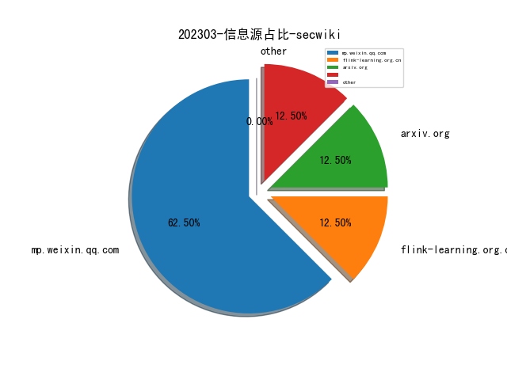
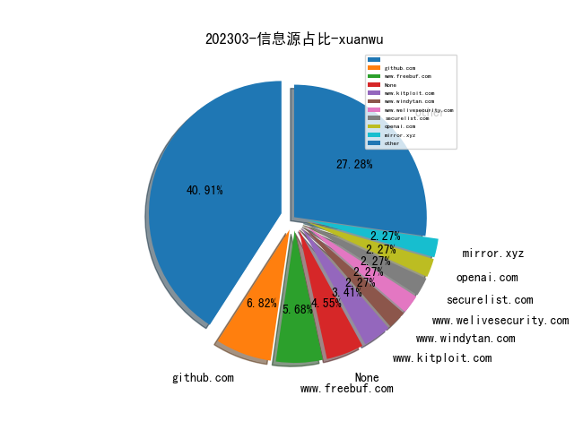
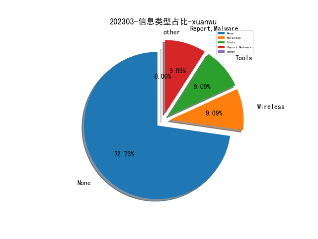
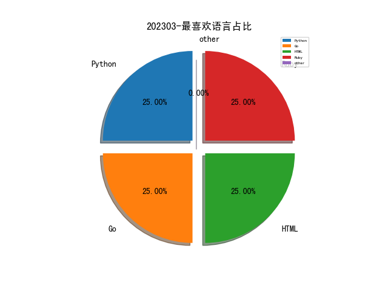

# [数据--所有](README_20.md)
# [数据--年度](README_2023.md)
# 202303 信息源与信息类型占比

# 微信公众号 推荐
| nickname_english | weixin_no | title | url| 
| --- | --- | --- | ---| 
| 榫卯江湖 | cnxct_coder | eCapture旁观者支持Golang tls/https加密明文捕获 | https://mp.weixin.qq.com/s/O7bxwa5wV1u785jOkJwh1Q | 1| 
| Bypass | Bypass-- | AD域安全攻防实践（附攻防矩阵图） | https://mp.weixin.qq.com/s/SvGz8mHOBlgEc9O2hBHCEQ | 1| 
| 老杨吃西瓜不吐葡萄皮 | HelloYangwg_20220222 | 从宏碁安全事件想到构建有韧性网络安全新范式 | https://mp.weixin.qq.com/s/5R4CWSFwFACxkAClwgxQRw | 1| 
| 信息安全与通信保密杂志社 | cismag2013 | 基于Neo4j的网络安全知识图谱构建分析 | https://mp.weixin.qq.com/s/pIJZfxLheqbtyylDJNvqUA | 2| 
| 中国信息安全 | chinainfosec | 论坛·2022全球网空态势回顾 , 2022年度俄罗斯网络空间安全态势综述 | https://mp.weixin.qq.com/s/dmhJMVect8JincvZLMyW2w | 1| 
| Tide安全团队 | TideSec | CTF中RSA常见攻击方法 | https://mp.weixin.qq.com/s/5UY-4SPHvPD8hS2Jy8jhgw | 1| 
| 虎符智库 | TT_Thinktank | 深度：美军“前出狩猎”网络作战行动与影响分析 | https://mp.weixin.qq.com/s/yb2VuHzagO3MTsO3Lv5LSA | 1| 
| 薛定谔的猿 | yeapes | Nginx流量镜像(Mirror) | https://mp.weixin.qq.com/s/xdIKU-w4_eMxV265Qp4vQA | 1| 
| 王小明的事 | Struggle_of_a_noob | Zabbix与Jumpserver后渗透小记 | https://mp.weixin.qq.com/s/OwSZWCshBKJW0b5du7Juhw | 1| 
| 微步在线研究响应中心 | gh_280024a09930 | PHP反混淆实战 , 手把手带你入门PHP-Parser | https://mp.weixin.qq.com/s/Qb2m6RAmr5Oy6TCvi9X-ow | 1| 
| 在酒吧喝牛奶的牛仔 | gh_266f5cc317ca | 镜像扫描Layer分析对比 | https://mp.weixin.qq.com/s/GjMdGmPG7AH2ilzcJh08fw | 1| 
| 小红书技术REDtech | gh_f510929429e3 | 小红书社区反作弊探索与实践 | https://mp.weixin.qq.com/s/05s4wkPkSnZ7vILNtgnu0w | 1| 
| 威胁棱镜 | THREAT_PRISM | 大规模 DNS 流量中检测恶意请求 | https://mp.weixin.qq.com/s/7x7lajReBrdU3OcRJaOBWw | 1| 
| dada安全研究所 | CyberBugs | 上古版本panabit审计 | https://mp.weixin.qq.com/s/wODk1OgYmab_EM9f0Fi7Lg | 1| 
| 安全学术圈 | secquan | NDSS 2023 论文录用列表 | https://mp.weixin.qq.com/s/ZRIFX2GmP8niyUfiWj8ewA | 3| 
| 安全小子大杂烩 | hl666sec | 记一次从linux打进域控 | https://mp.weixin.qq.com/s/9ZUKARK1q0U5nSqM2bSbAw | 1| 
| 太空安全 | SateSec | 星链StarLink终端信号分析和信关站设计图（更新） | https://mp.weixin.qq.com/s/Vd-7v9fJ5uyv7_XDBb5QfQ | 1| 
| 顺丰安全应急响应中心 | SFSRC- | 容器行为异常自学习引擎 | https://mp.weixin.qq.com/s/LlTfNx1DbgS_dO7X9xVVAg | 1| 
| 绿盟科技研究通讯 | nsfocus_research | ChatGPT潜在的八大“安全隐患”洞察 | https://mp.weixin.qq.com/s/a4ZBuI3SMNobWDeaXrEJ_w | 1| 
| 一个人的安全笔记 | xjiek2015 | [HTB] SteamCloud Writeup | https://mp.weixin.qq.com/s/UU9FiZ61X8_XnaoDTv3ovA | 2| 
| 世界科技研究与发展 | globesci | 【优先发布】美国国防高级研究计划局近5年国防科研经费预算活动的趋势与特点 | https://mp.weixin.qq.com/s/WMdWdIOBwQJNoOi9wMvnrw | 1| 
| Art Of Hunting | gh_d3ebfd9e0148 | [AOH 019]逆向分析微信本地数据库加密 | https://mp.weixin.qq.com/s/u0ZrxBYN-Shg2_e8mGIoaQ | 1| 

# 组织github账号 推荐
| github_id | title | url | org_url | org_profile | org_geo | org_repositories | org_people | org_projects | repo_lang | repo_star | repo_forks| 
| --- | --- | --- | --- | --- | --- | --- | --- | --- | --- | --- | ---| 

# 私人github账号 推荐
| github_id | title | url | p_url | p_profile | p_loc | p_company | p_repositories | p_projects | p_stars | p_followers | p_following | repo_lang | repo_star | repo_forks | 
| --- | --- | --- | --- | --- | --- | --- | --- | --- | --- | --- | --- | --- | --- | ---| 
| slowmist | 区块链常见漏洞列表 | https://github.com/slowmist/Cryptocurrency-Security-Audit-Guide/blob/main/Blockchain-Common-Vulnerability-List_CN.md | None | None | None | None | 0 | 0 | 0 | 0 | 0 | Python,Go,HTML,Ruby | 0 | 0 | 1| 

# medium_xuanwu 推荐
| title | url| 
| --- | ---| 

# medium_secwiki 推荐
| title | url| 
| --- | ---| 

# zhihu_xuanwu 推荐
| title | url| 
| --- | ---| 

# zhihu_secwiki 推荐
| title | url| 
| --- | ---| 

# xz_xuanwu 推荐
| title | url| 
| --- | ---| 

# xz_secwiki 推荐
| title | url| 
| --- | ---| 

# 日更新程序
`python update_daily.py`