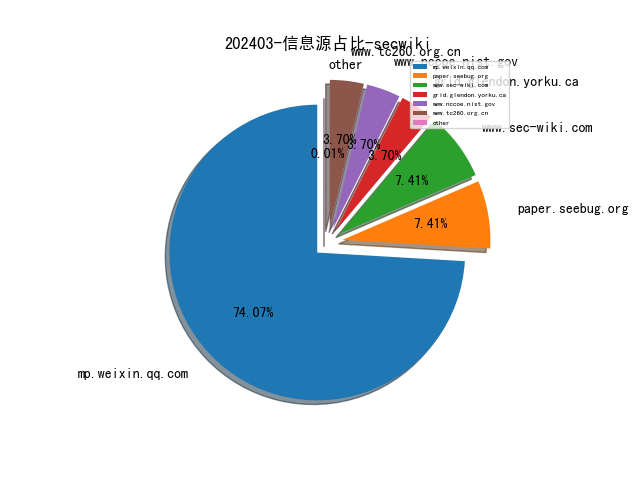
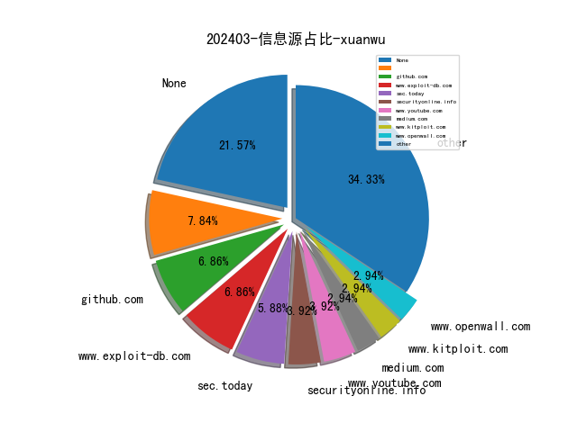
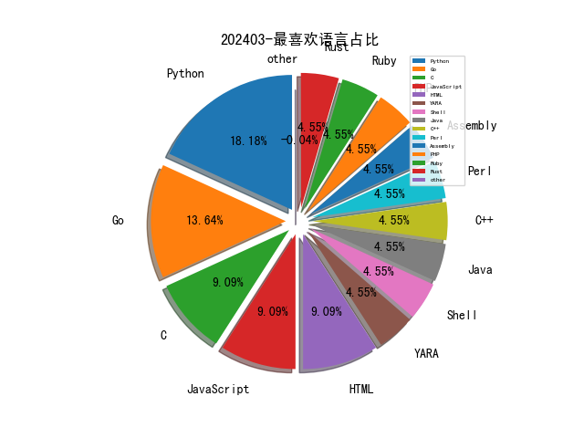

# [数据--所有](README_20.md)
# [数据--年度](README_2024.md)
# 202403 信息源与信息类型占比

# 网络安全书籍 推荐
| date_added | language | title | author | link | size| 
| --- | --- | --- | --- | --- | ---| 
| 2024-03-01 06:25:33 | English | Machine Learning Theory and Applications: Hands-on Use Cases with Python on Classical and Quantum Machines | unknown | https://www.wowebook.org/machine-learning-theory-and-applications-hands-on-use-cases-with-python-on-classical-and-quantum-machines/ | unknown| 
| 2024-03-01 16:26:47 | English | Cloud Forensics Demystified | unknown | https://www.wowebook.org/cloud-forensics-demystified/ | unknown| 
| 2024-03-01 10:48:40 | English | Mastering Microsoft Fabric | unknown | https://www.wowebook.org/mastering-microsoft-fabric/ | unknown| 

# 微信公众号 推荐
| nickname_english | weixin_no | title | url| 
| --- | --- | --- | ---| 
| 360数字安全 | gh_6db130c5163e | 周鸿祎免费课｜《预见AGI》3万字前沿干货速速收藏 | https://mp.weixin.qq.com/s?__biz=MzA4MTg0MDQ4Nw==&mid=2247569712&idx=1&sn=5760bff7b6becabf07dd59ecc158d40c | 1| 
| BOSS直聘安全应急响应中心 | None | 春光无限好，挖洞正当时 , Boss直聘＆华为邀您来早春猎洞～ | https://mp.weixin.qq.com/s?__biz=MzkyODIwNDI3NA==&mid=2247486056&idx=1&sn=fbd28d9fc5f2e802eb4733b1b09562af | 1| 
| CISSP | None | 信安领域考证备考资料汇总（靶场/题库/书籍） | https://mp.weixin.qq.com/s?__biz=Mzg4MTg0MjQ5OA==&mid=2247484329&idx=1&sn=f6c04757515c543abf77ca62b27d9832 | 2| 
| FreeBuf | None | 企业终端如何管理；网闸还有用吗 , FB甲方群话题讨论 | https://mp.weixin.qq.com/s?__biz=MjM5NjA0NjgyMA==&mid=2651260328&idx=1&sn=7f7f94f48420c1a11ada3027f3226a06 | 4| 
| IoT物联网技术 | IoT-Tech-Expo | 仅 720元，基于 ChatGPT 自制可穿戴硬件 AI Pin 私人助理，软硬件程序全部开源 | https://mp.weixin.qq.com/s?__biz=MjM5OTA4MzA0MA==&mid=2454932968&idx=1&sn=61ed8f8b187ebf16eb55bf63ad63a0f0 | 1| 
| M01N Team | None | 每周蓝军技术推送（2024.2.24-3.1） | https://mp.weixin.qq.com/s?__biz=MzkyMTI0NjA3OA==&mid=2247493385&idx=1&sn=01b1c0c6697995854a87460b32482fcd | 1| 
| NOP Team | yidalidemao | 如何验证可执行文件是可靠的 ｜ Windows 应急响应 | https://mp.weixin.qq.com/s?__biz=MzU1NDkwMzAyMg==&mid=2247499399&idx=1&sn=378744184000af40053dea2367c8ac9b | 1| 
| OPPO安全应急响应中心 | opposrc | 2024年1月奖励公告 | https://mp.weixin.qq.com/s?__biz=MzUyNzc4Mzk3MQ==&mid=2247493130&idx=1&sn=5cc8cc4c5909695e87c7f6cd2da56aab | 1| 
| Web安全工具库 | websec-tools | ruoyi 后台定时任务注入哥斯拉内存马（3月1日更新） | https://mp.weixin.qq.com/s?__biz=MzI4MDQ5MjY1Mg==&mid=2247512385&idx=1&sn=5f55e74d8aa2965474010f1cdb897710 | 2| 
| Yak Project | YakLanguage | 已在工位（我是做什么的来着？） | https://mp.weixin.qq.com/s?__biz=Mzk0MTM4NzIxMQ==&mid=2247519428&idx=1&sn=55ddb23f6d876b5260cfa7590f1b03c7 | 1| 
| 丁爸 情报分析师的工具箱 | dingba2016 | 【AI速读】美军各军种情报文件 | https://mp.weixin.qq.com/s?__biz=MzI2MTE0NTE3Mw==&mid=2651142439&idx=1&sn=191f56e72aa1b4a567d4e98ea4d98d6d | 1| 
| 万径安全 | Mega_Vector | 万径安全乔迁大吉，新篇章新起点，开启新征程！ | https://mp.weixin.qq.com/s?__biz=MzIwMzI1MDg2Mg==&mid=2649944029&idx=1&sn=5d08b753ccd4e59519a61e614bcb9547 | 1| 
| 丈八网安 | gh_c9ca0655a9a7 | 3周年 , 遇见丈八 向新同行 | https://mp.weixin.qq.com/s?__biz=MzkwNzI1NDk0MQ==&mid=2247491258&idx=1&sn=8103003a246d3fa2621146d0cd15e3b2 | 1| 
| 三六零CERT | None | CVE-2024-25065：Apache OFBiz目录遍历漏洞通告 | https://mp.weixin.qq.com/s?__biz=MzU5MjEzOTM3NA==&mid=2247503138&idx=1&sn=e334a14fb04d75405cc0a1d4539e169f | 2| 
| 中国信息安全 | chinainfosec | 专家解读 , 以《未成年人网络保护条例》助推未成年人网络权益保护的持续深化与完善 | https://mp.weixin.qq.com/s?__biz=MzA5MzE5MDAzOA==&mid=2664206263&idx=3&sn=ff193285b2658b16e40148e5abddc248 | 7| 
| 中国计算机学会 | ccfvoice | 关于发布《计算机与应用工程能力评价规范》团体标准的公告 | https://mp.weixin.qq.com/s?__biz=MjM5MTY5ODE4OQ==&mid=2651568260&idx=6&sn=f62e04de8d1cfa8099ab1503cd8799c0 | 1| 
| 中国软件评测中心 | None | 关于征集数据安全关键技术与产业应用评价工业和信息化部重点实验室2024年度开放课题的通知 | https://mp.weixin.qq.com/s?__biz=MjM5NzYwNDU0Mg==&mid=2649242901&idx=1&sn=ae9ba2a5f46534cee194dbc07e571574 | 1| 
| 亚信安全 | None | 重保利器，企业安全巡查！亚信安全外部攻击面管理服务可以试用啦 | https://mp.weixin.qq.com/s?__biz=MjM5NjY2MTIzMw==&mid=2650612180&idx=1&sn=42c97268fee66894575430fbe7f45a4b | 3| 
| 代码卫士 | None | 思科修复 Data Center OS 中的多个高危漏洞 | https://mp.weixin.qq.com/s?__biz=MzI2NTg4OTc5Nw==&mid=2247518970&idx=1&sn=6962ea177a62fac9410b186624a2cd9a | 2| 
| 众安安全应急响应中心 | za_ZASRC | 速看！漏洞接收范围更新 | https://mp.weixin.qq.com/s?__biz=MzI5NTQwMjYxNg==&mid=2247483787&idx=1&sn=f75dc5a77109b481c972c38a2dc12a9b | 1| 
| 划水但不摆烂 | None | FindAll-应急响应自动化分析工具 | https://mp.weixin.qq.com/s?__biz=Mzk0NDUxMjAzNw==&mid=2247485790&idx=1&sn=53dbf6b86a6e33348bf5a3b753c53551 | 1| 
| 华为安全应急响应中心 | None | 春光无限好，挖洞正当时 , 华为＆Boss直聘邀您来早春猎洞～ | https://mp.weixin.qq.com/s?__biz=MzI0MTY5NDQyMw==&mid=2247509892&idx=1&sn=c4f0c7068e21312e77d021a6d35bc460 | 1| 
| 华顺信安 | None | 湖南网信办、中网投领导专家莅临华顺信安湖南分公司调研交流 | https://mp.weixin.qq.com/s?__biz=MzUzNjg1OTY3Mg==&mid=2247491275&idx=1&sn=f0ef5653b5a0af1e7b81e5b5cfb5e5ef | 1| 
| 启明星辰集团 | None | 以场景化安全服务，助力工业领域数据安全能力提升 | https://mp.weixin.qq.com/s?__biz=MzA3NDQ0MzkzMA==&mid=2651723511&idx=1&sn=fd921a71f017bfc2d5e68566c6d266a8 | 1| 
| 天擎攻防实验室 | gh_2fb077348503 | 【漏洞复现】蓝凌OA wechatLoginHelper.do SQL注入漏洞 | https://mp.weixin.qq.com/s?__biz=MzU2MzQyMjA1NA==&mid=2247484338&idx=1&sn=5a9c086fc04c6c5e753b84881c8042fb | 1| 
| 奇安信集团 | qianxin-keji | 奇安信获第十届CNCERT甲级网络安全应急服务支撑单位称号 | https://mp.weixin.qq.com/s?__biz=MzU0NDk0NTAwMw==&mid=2247608648&idx=2&sn=137badf854e46592fd7862eac32d74b6 | 4| 
| 安世加 | asjeiss | 突破260亿元，上海网络安全产业规模实现3年倍增 | https://mp.weixin.qq.com/s?__biz=MzU2MTQwMzMxNA==&mid=2247537164&idx=1&sn=e57bc80fb2c77a4367ff0897aa12a6c0 | 4| 
| 安全圈 | ChinaAnQuan | 【安全圈】GitHub宣布：为所有推送到公共存储库的推送启用秘密扫描推送保护 | https://mp.weixin.qq.com/s?__biz=MzIzMzE4NDU1OQ==&mid=2652054959&idx=3&sn=0549233565c26be33254e92737414c6d | 4| 
| 安全攻防屋 | None | 【VulnHub靶场】Kioptrix_Level 1.1 | https://mp.weixin.qq.com/s?__biz=MzkyNTU3MjA3OQ==&mid=2247484663&idx=1&sn=57e5c5b691b5c32c217660205b05c50a | 1| 
| 安全狗 | None | 护航“两会” 安全狗严阵以待 | https://mp.weixin.qq.com/s?__biz=MjM5NTc2NDM4MQ==&mid=2650840512&idx=1&sn=d50194e8c425739d94689f3c5e118cf8 | 1| 
| 安全研究GoSSIP | GoSSIPSJTU | G.O.S.S.I.P 阅读推荐 2024-03-01 马奇诺防线总在龙年被攻破 | https://mp.weixin.qq.com/s?__biz=Mzg5ODUxMzg0Ng==&mid=2247497405&idx=1&sn=4884198d5a93b4a35c0cd289da967d92 | 1| 
| 安全脉脉 | gh_6d21af7faacb | 美国以安全风险为由对中国车辆展开调查 , 附：美国汽车数据安全要求 | https://mp.weixin.qq.com/s?__biz=Mzk0MzQzNzMxOA==&mid=2247486430&idx=1&sn=e96c9a960f3937ed5ca451440a3ba411 | 3| 
| 安在 | AnZer_SH | 被“逼”走的安全人员会去哪儿？ | https://mp.weixin.qq.com/s?__biz=MzU5ODgzNTExOQ==&mid=2247617084&idx=1&sn=f3ab4d3ee3c0544ce42af442b22fec85 | 2| 
| 安天集团 | Antiylab | 安天参研项目再获一项省部级奖项 | https://mp.weixin.qq.com/s?__biz=MjM5MTA3Nzk4MQ==&mid=2650204428&idx=1&sn=69dad7f9e2a2f752d7ee35abd5b31d4e | 1| 
| 安易科技AneSec | anesec | 安易科技携手粤港澳大湾区网络安全协会，共筑网络安全新篇章 | https://mp.weixin.qq.com/s?__biz=MzkwMTI3ODUxOQ==&mid=2247484842&idx=1&sn=94257e1a6de9a8b8c52a127f4b2a8382 | 1| 
| 小明今天拿站了吗 | gh_e4fa4e7e7516 | 用AI“复活”女儿，知名音乐人回应 | https://mp.weixin.qq.com/s?__biz=Mzg2Njg1OTYyOA==&mid=2247483893&idx=1&sn=50895433613b30a3e4e72dc993de1a01 | 1| 
| 工业互联网标识智库 | CAICT-bs | 《新闻联播》专题报道丨加“数”前行！数字中国建设正绘就中国式现代化“新图景” | https://mp.weixin.qq.com/s?__biz=MzU1OTUxNTI1NA==&mid=2247569285&idx=1&sn=9f6d266dba2759cdae193386714fc5d1 | 2| 
| 工业安全产业联盟 | ICSISIA | 重磅 , 2023年工业安全系统典型应用示范案例入选名单发布 | https://mp.weixin.qq.com/s?__biz=MzI2MDk2NDA0OA==&mid=2247526500&idx=1&sn=8445d082e6c1959cd1430565a2dd7636 | 2| 
| 开源聚合网络空间安全研究院 | OSPtech_Cyberspace | Web安全之Nginx常见漏洞解析 | https://mp.weixin.qq.com/s?__biz=MzI4NTE4NDAyNA==&mid=2650396319&idx=1&sn=9205385ff32a9ff6509dd706cc6415a6 | 1| 
| 悬镜安全 | Anpro-tech | 权威认可 , 悬镜入选CNCERT数据与软件安全评测领域首批支撑单位 | https://mp.weixin.qq.com/s?__biz=MzA3NzE2ODk1Mg==&mid=2647789976&idx=1&sn=8b71a2ada186842c1728357912eed43d | 2| 
| 慢雾科技 | SlowMist | 每月动态 , Web3 安全事件总损失约 4.04 亿美元 | https://mp.weixin.qq.com/s?__biz=MzU4ODQ3NTM2OA==&mid=2247499467&idx=1&sn=8e3b00e6c5cc5a44843d8b05390e5ef1 | 1| 
| 成都链安 | None | 【链看点】,2月区块链安全事件损失超4.2亿美元，越来越多犯罪涉及虚拟货币 | https://mp.weixin.qq.com/s?__biz=MzU2NzUxMTM0Nw==&mid=2247510584&idx=1&sn=f8d7e94a0f6793e3e29eb03b55b6dc1d | 1| 
| 效率源 | xiaolvyuantech | “闪电定位”“一键恢复”？「空壳」App敛财4700余万 | https://mp.weixin.qq.com/s?__biz=MjM5ODQ3NjAwNQ==&mid=2650546104&idx=1&sn=9caef0382dc2da7fec531281c03aa160 | 1| 
| 数安行 | None | 数据安全每周观察 , 中华人民共和国主席令（第二十号）《中华人民共和国保守国家秘密法》修订通过 | https://mp.weixin.qq.com/s?__biz=Mzg5OTM0NTM2OQ==&mid=2247491291&idx=1&sn=977dcdff554cee455aac23a5a4809712 | 1| 
| 无糖反网络犯罪研究中心 | None | 临沂警方打掉电诈取现团伙 , 惠水警方破获网络赌博案——涉网犯罪每日情报 | https://mp.weixin.qq.com/s?__biz=MzAxMzkzNDA1Mg==&mid=2247509010&idx=1&sn=f8c58b0402541e02f916314ab3a5adfc | 1| 
| 昂楷资讯 | ankkinews | 工信部再发实施方案，扎实推进工业领域数据安全工作 | https://mp.weixin.qq.com/s?__biz=MzIyMTAwOTE5Mw==&mid=2651859586&idx=1&sn=55a374bf249b4dc2287336995f80c698 | 1| 
| 晴天安全 | gh_8d3e48eabcc6 | [1day]用友-UFIDA-NC某接口存在存在任意文件上传 | https://mp.weixin.qq.com/s?__biz=MzkwNjYzMjc3OQ==&mid=2247484080&idx=1&sn=cb62d734d18161d8d5004c16fde55f88 | 1| 
| 梆梆安全 | None | 洞见安全 , 央视报道“AI换脸”安全事件，人脸识别攻击怎么防？ | https://mp.weixin.qq.com/s?__biz=MjM5NzE0NTIxMg==&mid=2651130939&idx=1&sn=d8c8bcfce81540cff15ef0b2a5d38a24 | 1| 
| 洞源实验室 | None | 开源组件安全风险及应对 | https://mp.weixin.qq.com/s?__biz=Mzg4Nzk3MTg3MA==&mid=2247485103&idx=1&sn=90edb582e709b4a75352b4c179fd6a57 | 1| 
| 滑板人之家 | gh_db0218d920fc | 宏景-DisplayExcelCustomReport文件读取 | https://mp.weixin.qq.com/s?__biz=MzIyMDkxMTk4MQ==&mid=2247483923&idx=1&sn=7df60b85a76cef935af11c3d60c71465 | 1| 
| 火绒安全 | None | 【火绒安全周报】黑客利用谷歌云运行服务传播木马 / 二十多万网约车司机信息被卖 | https://mp.weixin.qq.com/s?__biz=MzI3NjYzMDM1Mg==&mid=2247517765&idx=1&sn=6971fd1f6e53bec3c075a56fec018ff7 | 1| 
| 珞安科技 | None | 助推产业发展 , 工业互联网安全产业创新论坛在上海成功举办 | https://mp.weixin.qq.com/s?__biz=MzU2NjI5NzY1OA==&mid=2247508840&idx=1&sn=f3297773b129514e2fd85d85d67086fe | 1| 
| 盛邦安全应急响应中心 | None | 烽火狼烟丨暗网数据及攻击威胁情报分析周报（02/26-03/01） | https://mp.weixin.qq.com/s?__biz=Mzk0NjMxNTgyOQ==&mid=2247484169&idx=1&sn=ae46c5e3c1f1cacc3d7ad834e6a18fd7 | 1| 
| 看雪学苑 | None | 实战教学-CTF Pwn 入门之旅：Linux pwn 探索篇 | https://mp.weixin.qq.com/s?__biz=MjM5NTc2MDYxMw==&mid=2458542842&idx=4&sn=0138553b56cbc58637ab93bcc374b22d | 4| 
| 系统安全运维 | None | 2024年网络安全从业者何去何从？ | https://mp.weixin.qq.com/s?__biz=Mzk0NjE0NDc5OQ==&mid=2247523020&idx=1&sn=ddda63e647355a49444429f0ccd39b2f | 2| 
| 绿盟科技研究通讯 | nsfocus_research | 网络侦察的反溯源技术研究 | https://mp.weixin.qq.com/s/OrIliK1y9ZBKJAnohTYfkg | 1| 
| 网安培训 | ccrctraining | 个人信息保护专业人员（CCRC-PIPP）助力企业数据要素合规有序流通 | https://mp.weixin.qq.com/s?__biz=MzIzNTEzNzIyMA==&mid=2247486021&idx=1&sn=0357ed37ba595aa2c812d3f3e57fe98b | 1| 
| 网星安全 | None | 内网渗透瑞士军刀-impacket工具解析（九） | https://mp.weixin.qq.com/s?__biz=MzkxNTEzMTA0Mw==&mid=2247494969&idx=1&sn=213bbb5d3f100d9d8cda153823cdb7a8 | 1| 
| 网络空间信息安全学习 | gh_39213c5878aa | 上新日 , 跨平台 AI 翻译工具 TTime，PC 效率工具套装 Object Desktop 来了 | https://mp.weixin.qq.com/s?__biz=MzI2MjcwMTgwOQ==&mid=2247490554&idx=1&sn=6d3763c4b3dd302e89b033c21b5e54aa | 1| 
| 虎符智库 | None | 观察：“人为因素风险管理”兴起，安全意识进入2.0时代 | https://mp.weixin.qq.com/s?__biz=MzIwNjYwMTMyNQ==&mid=2247489953&idx=1&sn=5338c8cd5b01363355a23f83ab4fdde2 | 1| 
| 谈思实验室 | None | 信息安全的底层机制 | https://mp.weixin.qq.com/s?__biz=MzIzOTc2OTAxMg==&mid=2247534046&idx=1&sn=ae87ab1e2fe0a3385586166f1d9cc6e4 | 3| 
| 边界无限 | None | 边界无限强势加入粤港澳大湾区网络安全协会，共筑安全新里程碑 | https://mp.weixin.qq.com/s?__biz=MzAwNzk0NTkxNw==&mid=2247486782&idx=1&sn=96896401e189fac6a18f85c2877eda98 | 1| 
| 进击的HACK | redteasec | 获取Google Play Store中的apk文件 | https://mp.weixin.qq.com/s?__biz=MzkxNjMwNDUxNg==&mid=2247485188&idx=1&sn=4f469cfc6c0e02bd2cdba8755c74f8be | 1| 
| 长亭科技 | None | 实网攻防82h，410000+条攻击日志惊现长亭 | https://mp.weixin.qq.com/s?__biz=MzIwNDA2NDk5OQ==&mid=2651387133&idx=1&sn=a74c874947bed2c113218be6583e6ede | 3| 
| 顺丰安全应急响应中心 | SFSRC- | 【致谢信】 | https://mp.weixin.qq.com/s?__biz=MzU3OTAyODk4MQ==&mid=2247488689&idx=1&sn=56ab405986d1e4b34249f7667f8e7b1f | 2| 
| 飓风网络安全 | gh_183f818a07dc | 【漏洞预警】Apache Ambari < 2.7.8 XXE（CVE-2023-50380） | https://mp.weixin.qq.com/s?__biz=MzI3NzMzNzE5Ng==&mid=2247487652&idx=2&sn=6b47990e70d2394aee42cb2284ae8cb9 | 3| 
| 黑客技术家园 | hacker202403 | ios12卡贴机(有锁)/无锁机 改电信一步到位 | https://mp.weixin.qq.com/s?__biz=MzI2OTk4MTA3Ng==&mid=2247488885&idx=1&sn=24bed6fbe0db5dd729ba92bed394cf51 | 2| 

# 私人github账号 推荐
| github_id | title | url | p_url | p_profile | p_loc | p_company | p_repositories | p_projects | p_stars | p_followers | p_following | repo_lang | repo_star | repo_forks | 
| --- | --- | --- | --- | --- | --- | --- | --- | --- | --- | --- | --- | --- | --- | ---| 
| MultSec | MultCheck是一款开源的恶意软件分析工具，可以用于测试文件被多个杀毒引擎检测的情况。它易于使用，可以测试多个杀毒引擎，并且易于扩展，可以添加自定义杀毒引擎。 | https://github.com/MultSec/MultCheck | None | None | None | None | 0 | 0 | 0 | 0 | 0 | Go | 0 | 0 | 1| 

# medium 推荐
| title | url| 
| --- | ---| 
| 介绍了两种追踪Telegram用户实时位置的方法 | https://x-it.medium.com/how-to-track-realtime-location-of-any-telegram-user-2-methods-ec09d873b839| 

# 日更新程序
`python update_daily.py`