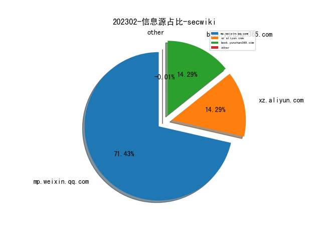
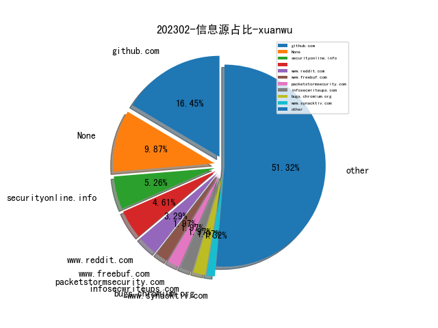
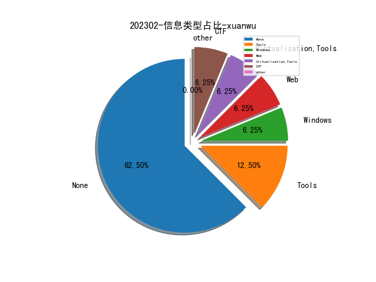
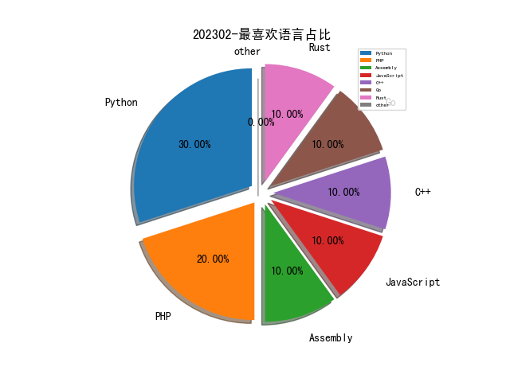

# [数据--所有](README_20.md)
# [数据--年度](README_2023.md)
# 202302 信息源与信息类型占比

# 微信公众号 推荐
| nickname_english | weixin_no | title | url| 
| --- | --- | --- | ---| 
| 恒星EDU | cyberslab | MISC｜西湖论剑·2022中国杭州网络安全技能大赛初赛官方Write Up | https://mp.weixin.qq.com/s/t6z7VjlW09b9A3Fv2bt7dA | 1| 
| 计算机文艺复兴 | gh_111b1f3866f6 | ChatGPT研究框架（80页PPT）, 国君计算机 | https://mp.weixin.qq.com/s/YtJn2pfdS_on1nSATOylYw | 1| 
| 绿盟科技 | NSFOCUS-weixin | ChatGPT概念“狂飙”，你追了吗？ | https://mp.weixin.qq.com/s/sZstPhuQSHN85rP_3urOWw | 1| 
| 墨菲安全 | murphy_sec | 软件供应链安全 2022 年回顾 | https://mp.weixin.qq.com/s/RQDqv7GxCo2bQqnlfsXt8g | 1| 
| 信息安全与通信保密杂志社 | cismag2013 | 2022网络空间安全重大项目发展概况 | https://mp.weixin.qq.com/s/w5Go3qqC8vJnJKL4k9R0Bg | 1| 
| 404 Not F0und | AI4Security | 换种思路做入侵检测 | https://mp.weixin.qq.com/s/7AwMJQjH8_zWUT3bWkoEzQ | 1| 
| 威胁棱镜 | THREAT_PRISM | 在线沙盒的 ATT&CK 映射能力调研 | https://mp.weixin.qq.com/s/m_eh9bWeYdKxnffSwbeMLQ | 1| 
| 赛博攻防悟道 | lookvul | 美国NSA安全运营关键原则 | https://mp.weixin.qq.com/s/uTjXfgYTP5ZHZpwPuFXNwA | 1| 
| 安全客 | anquanbobao | 【技术分享】开源软件供应链攻击回顾 | https://mp.weixin.qq.com/s/pAVrIQ0b66Y_YoSH3DLoIA | 1| 
| 太空安全 | SateSec | 25美元破解Starlink 星链终端路由器 | https://mp.weixin.qq.com/s/X-Fvs9TUPO1UT7BZsIOtnw | 2| 
| 4ra1n | sec-4ra1n | 分享Jar包分析工具：jar-analyzer | https://mp.weixin.qq.com/s/Rrx6x5M_28YRcQQCdxuEeQ | 1| 
| 有价值炮灰 | dust1337 | iptables 在 Android 抓包中的妙用 | https://mp.weixin.qq.com/s/P0ESUUXBmq2aQnrqDHsDaw | 1| 

# 组织github账号 推荐
| github_id | title | url | org_url | org_profile | org_geo | org_repositories | org_people | org_projects | repo_lang | repo_star | repo_forks| 
| --- | --- | --- | --- | --- | --- | --- | --- | --- | --- | --- | ---| 

# 私人github账号 推荐
| github_id | title | url | p_url | p_profile | p_loc | p_company | p_repositories | p_projects | p_stars | p_followers | p_following | repo_lang | repo_star | repo_forks | 
| --- | --- | --- | --- | --- | --- | --- | --- | --- | --- | --- | --- | --- | --- | ---| 
| voidz0r | ImageMagick 任意文件读的POC。漏洞存在于PNG的generator中。 | https://github.com/voidz0r/CVE-2022-44268 | https://github.com/voidz0r?tab=followers | Security Engineer, Security Researcher and Developer. I love to break things and I get mad at the 3rd nested loop. | Anywhere | DHL Express | 29 | 0 | 4 | 0 | 0 | Python,PHP,JavaScript,Rust | 0 | 0 | 1| 
| teambi0s | bi0sCTF 2022 Offical source code && env && sol | https://github.com/teambi0s/bi0sCTF/tree/main/2022 | None | None | None | None | 0 | 0 | 0 | 0 | 0 | C,Shell,Python,JavaScript,C++,HTML,CSS | 0 | 0 | 1| 
| phplaber | Yawf: 开源的 Web 漏洞自动化检测工具 | https://github.com/phplaber/yawf | https://github.com/phplaber?tab=followers | Security researcher | Nanjing, China | None | 7 | 0 | 384 | 0 | 0 | Python,Go,PHP | 0 | 0 | 1| 
| nikn0laty | pdfkit命令执行漏洞CVE-2022-25765 Exp | https://github.com/nikn0laty/PDFkit-CMD-Injection-CVE-2022-25765 | https://github.com/nikn0laty?tab=followers |  | None | None | 1 | 0 | 0 | 0 | 0 | Python | 0 | 0 | 1| 
| nanabingies | Dell dbutil_2_3.sys 驱动提权漏洞的exp | https://github.com/nanabingies/CVE-2021-21551 | https://github.com/nanabingies?tab=followers | if you base your expectations on what you see, you blind yourself to the possibilities of what could be | Accra, Ghana | None | 21 | 0 | 21 | 0 | 0 | Assembly,C++ | 0 | 0 | 1| 
| mazen160 | 一个用于检测secrets的正则表达式集合，可以在各种文件中匹配secrets。 | https://github.com/mazen160/secrets-patterns-db | https://github.com/mazen160?tab=followers | Cyber Security Engineer (Offensive Security) | None | None | 31 | 0 | 7 | 0 | 0 | Python,Shell | 0 | 0 | 1| 
| dicegang | DiceCTF 2023 Offical sourcecode && env && sol | https://github.com/dicegang/dicectf-2023-challenges | None | None | None | None | 0 | 0 | 0 | 0 | 0 | Python,C,HTML,JavaScript | 0 | 0 | 1| 
| cisagov | 一个可能可以恢复ESXiArgs勒索病毒的脚本。 | https://github.com/cisagov/ESXiArgs-Recover | None | None | None | None | 0 | 0 | 0 | 0 | 0 | Shell,HTML,Python,Open,JavaScript,TypeScript,TSQL,HCL | 0 | 0 | 1| 
| batteryshark | 利用 QEMU + GDB 帮助魔改，逆向和理解嵌入式系统内核 | https://github.com/batteryshark/writeups/wiki/Go-to-Shell---Reverse-Engineering-Kernel-Modifications-with-QEMU-gdb | https://github.com/batteryshark?tab=followers |  | None | None | 65 | 0 | 13 | 0 | 0 | C#,C,C++ | 0 | 0 | 1| 
| ashemery | 香普兰学院的逆向和二进制漏洞利用课程相关的配套练习 | https://github.com/ashemery/exploitation-course/tree/master/labs | https://github.com/ashemery?tab=followers | [Between Teams of Red and Blue, Im with the Purple Team] | USA | https://www.cyber5w.com | 37 | 0 | 20 | 0 | 0 | Python,Shell,PowerShell | 0 | 0 | 1| 
| Cyber-Buddy | 一个基于OWASP MASVS (Mobile Application Security Verification Standard) 的安卓应用安全检测工具。 | https://github.com/Cyber-Buddy/APKHunt | https://github.com/Cyber-Buddy?tab=followers |  | None | None | 1 | 0 | 1 | 0 | 0 | Go | 0 | 0 | 1| 
| CMEPW | 一个如何绕过Antivirus的知识思维导图。 | https://github.com/CMEPW/BypassAV | None | None | None | None | 0 | 0 | 0 | 0 | 0 | Python,Go,C,TypeScript | 0 | 0 | 1| 

# medium_xuanwu 推荐
| title | url| 
| --- | ---| 
| 介绍了一系列工具用来bug bountry自动化。内容比较初级。 | https://sn0xsharma.medium.com/automation-using-python-in-bug-bountys-full-practical-explanation-e1e694c43f78| 
| 介绍了一些简单的2FA的bypass方法。不过这类方法估计很难在实际中奏效。 | http://medium.com/m/global-identity-2?redirectUrl=https%3A%2F%2Fthegrayarea.tech%2Fbug-hunting-101-multi-factor-authentication-otp-bypass-79f03b554df6| 

# medium_secwiki 推荐
| title | url| 
| --- | ---| 

# zhihu_xuanwu 推荐
| title | url| 
| --- | ---| 

# zhihu_secwiki 推荐
| title | url| 
| --- | ---| 
| 如何写好一篇高质量的IEEE/ACM Transaction级别的计算机科学论... | https://www.zhihu.com/question/22790506/answer/990626321| 

# xz_xuanwu 推荐
| title | url| 
| --- | ---| 
| Mimikatz Bypass Credential Guard的记录 | https://xz.aliyun.com/t/12097| 

# xz_secwiki 推荐
| title | url| 
| --- | ---| 
| C2服务器隐藏与Linux上线 | https://xz.aliyun.com/t/12094| 

# 日更新程序
`python update_daily.py`