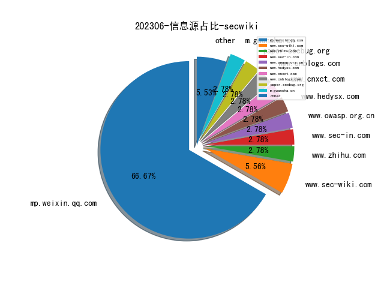
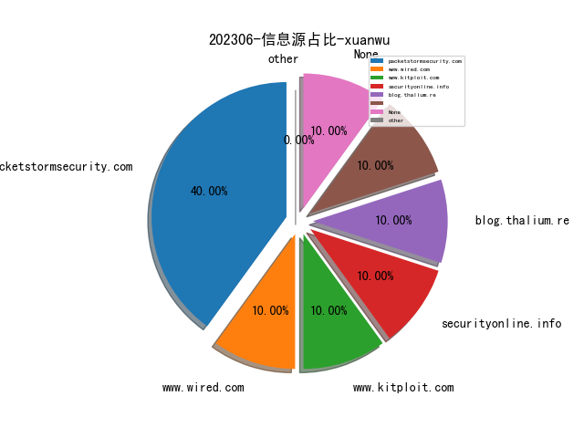
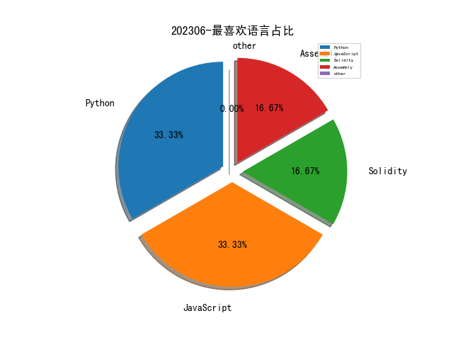

# [数据--所有](README_20.md)
# [数据--年度](README_2023.md)
# 202306 信息源与信息类型占比

# 微信公众号 推荐
| nickname_english | weixin_no | title | url| 
| --- | --- | --- | ---| 
| 穿过丛林 | gh_f90eac70537b | IEEE TDSC22：基于深度学习的细粒度漏洞检测框架VulDeeLocator | https://mp.weixin.qq.com/s/CTsdbwCcaX_Ni-9rdUEUNQ | 2| 
| 太空安全 | SateSec | 复盘卫星大战 Hack-A-Sat 3 天基攻防竞赛 | https://mp.weixin.qq.com/s/Iyg_N71AAeThNRJ_hu_dvg | 3| 
| Numen Cyber Labs | gh_06b147bc90bd | Numen独家:Win32k提权漏洞CVE-2023-29936漏洞解析以EXP构造 | https://mp.weixin.qq.com/s/41ugLvwpbwaJvWUI6wuSNA | 1| 
| NISL实验室 | NISL_THU2020 | 【成果分享】Under the Dark: 隐匿矿池滥用分析研究 | https://mp.weixin.qq.com/s/SiClmwLxyOdLIShNz4fDiA | 2| 
| 复旦白泽战队 | fdwhitzard | 白泽带你读论文｜How Long Do Vulnerabilities Live in the Code? | https://mp.weixin.qq.com/s/DRAAiWE4HiscWB1ZIFB0hA | 1| 
| 安全研究GoSSIP | GoSSIPSJTU | G.O.S.S.I.P 阅读推荐 2023-06-07 大破Office签名保护！ | https://mp.weixin.qq.com/s/1UYiHGDBimZbetdX9gPUKA | 1| 
| 看雪学苑 | ikanxue | 用 Qiling/Unicorn 框架来 dump il2cpp | https://mp.weixin.qq.com/s/zu5jZp0-CT8m0obklXP3lQ | 1| 
| 信息安全与通信保密杂志社 | cismag2013 | 从俄乌冲突看网络威慑理论的创新发展 | https://mp.weixin.qq.com/s/0nu_OSY16L-Oj-2CXTkO2g | 2| 
| 互联网后端架构 | fullstack888 | 作业帮在多云环境下的高可用双活架构优化实践 | https://mp.weixin.qq.com/s/oVxun0-2M9royJUWqi8k7Q | 1| 
| Qunar技术沙龙 | QunarTL | Qunar万亿级Elasticsearch集群节点迁移实战 | https://mp.weixin.qq.com/s/zpz6k4lXQlvvBx756hyWQA | 1| 
| 黑哥虾撩 | gh_67cfd5e45750 | Operation Triangulation 卡巴斯基被黑 | https://mp.weixin.qq.com/s/j4DVSXCmRqZaSohIl-KBTg | 1| 
| 落水轩 | gh_c10ee4802699 | BH ASIA 2023内鬼数据安全解决方案 | https://mp.weixin.qq.com/s/AUA5ec7a0Gv0r_Pm0BFk4Q | 1| 
| 君哥的体历 | jungedetili | 金融企业安全建设探索之异常访问检测系统 | https://mp.weixin.qq.com/s/T6yJD_MIZf5d1qnCMQ43HA | 1| 
| 赛博攻防悟道 | lookvul | 检测响应的保真度漏斗模型精解 | https://mp.weixin.qq.com/s/V5SCIgkV5xO57h860LTY2A | 1| 
| 珞珈之戍 | luojiazhishu | 【论文推荐】分析移动赌博诈骗的真实数据 | https://mp.weixin.qq.com/s/vrv4gk6xsJMqiz9bUtd59A | 1| 
| 企业管理现代化创新成果 | QGGC1990 | 国家电网有限公司：特大型电网企业基于实战攻防的主动网络安全管理 | https://mp.weixin.qq.com/s/3Z3ZLfIJdjNgBNh-fayr5A | 1| 
| 中国网安 | zgwawatx | 【专题研究第013期】Palantir 大数据能力分析研究 | https://mp.weixin.qq.com/s/CIT3izspkz7_r6KpbnBtDg | 1| 
| 中国信息安全 | chinainfosec | 专家观点 , 未成年人网络违法犯罪治理应注意的事项及完善建议 | https://mp.weixin.qq.com/s/9ku8lclJqAoLTTonbRvsZA | 2| 

# 组织github账号 推荐
| github_id | title | url | org_url | org_profile | org_geo | org_repositories | org_people | org_projects | repo_lang | repo_star | repo_forks| 
| --- | --- | --- | --- | --- | --- | --- | --- | --- | --- | --- | ---| 

# 私人github账号 推荐
| github_id | title | url | p_url | p_profile | p_loc | p_company | p_repositories | p_projects | p_stars | p_followers | p_following | repo_lang | repo_star | repo_forks | 
| --- | --- | --- | --- | --- | --- | --- | --- | --- | --- | --- | --- | --- | --- | ---| 
| team-s2 | AAA 战队2022年ctf_summer_courses培训课程资料 | https://github.com/team-s2/ctf_summer_courses/tree/main | None | None | None | None | 0 | 0 | 0 | 0 | 0 | Python,Solidity,Assembly,JavaScript | 0 | 0 | 1| 

# medium_xuanwu 推荐
| title | url| 
| --- | ---| 

# medium_secwiki 推荐
| title | url| 
| --- | ---| 

# zhihu_xuanwu 推荐
| title | url| 
| --- | ---| 

# zhihu_secwiki 推荐
| title | url| 
| --- | ---| 
| 形式化方法的研究方向到底是干什么的？ | https://www.zhihu.com/question/37328298| 

# xz_xuanwu 推荐
| title | url| 
| --- | ---| 

# xz_secwiki 推荐
| title | url| 
| --- | ---| 

# 日更新程序
`python update_daily.py`