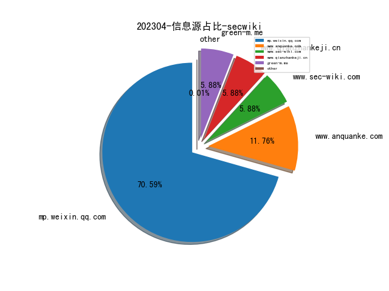
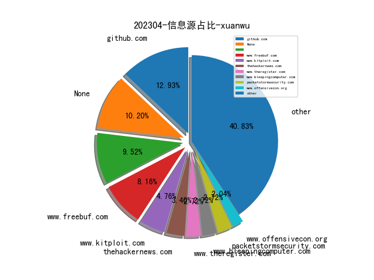
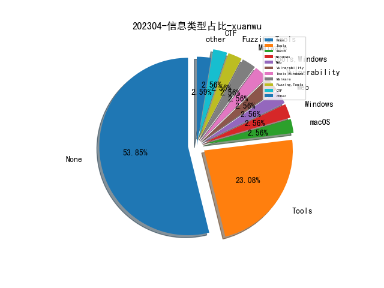

# [数据--所有](README_20.md)
# [数据--年度](README_2023.md)
# 202304 信息源与信息类型占比

# 微信公众号 推荐
| nickname_english | weixin_no | title | url| 
| --- | --- | --- | ---| 
| 威胁棱镜 | THREAT_PRISM | 以 AI 速度赋能防御 | https://mp.weixin.qq.com/s/e6W2Uy64i9cY7U7-3FnoxQ | 1| 
| 公安部网络安全等级保护中心 | gh_f5f6bf3d09af | 基于等级保护思路的应用软件开发安全关键要素探讨 | https://mp.weixin.qq.com/s/J8nQRKXBMDBQqTl2InO9pg | 1| 
| 安全学术圈 | secquan | 利用静态提取的代码特征对过拟合补丁进行自动分类 | https://mp.weixin.qq.com/s/NcTHJFSF6w6R7XO-ejtzzA | 1| 
| 守望者实验室 | WatcherLAB | 供应链安全实践：基于风险的“供应链攻击面”梳理和分析 | https://mp.weixin.qq.com/s/xk8VFdgRfkcKCnP4xi5qmQ | 1| 
| 学术plus | caeit-e | 英国防部发布云战略路线图： 构建数字骨干 助力数字转型 | https://mp.weixin.qq.com/s/MOODFHGrf_aeXs5G3FzavQ | 1| 
| Seebug漏洞平台 | seebug_org | 原创Paper , parse-server 从原型污染到 RCE 漏洞(CVE-2022-39396) 分析 | https://mp.weixin.qq.com/s/AB3LiDutpMQm9C1eumy9IQ | 1| 
| Azure云科技 | MS_CEChina | CISO 聚焦 , AI驱动的微软安全防护：安全不仅仅是默认的，也是可以预测的 | https://mp.weixin.qq.com/s/lyHukb_LK0MASwhJT4baow | 1| 

# 组织github账号 推荐
| github_id | title | url | org_url | org_profile | org_geo | org_repositories | org_people | org_projects | repo_lang | repo_star | repo_forks| 
| --- | --- | --- | --- | --- | --- | --- | --- | --- | --- | --- | ---| 

# 私人github账号 推荐
| github_id | title | url | p_url | p_profile | p_loc | p_company | p_repositories | p_projects | p_stars | p_followers | p_following | repo_lang | repo_star | repo_forks | 
| --- | --- | --- | --- | --- | --- | --- | --- | --- | --- | --- | --- | --- | --- | ---| 

# medium_xuanwu 推荐
| title | url| 
| --- | ---| 

# medium_secwiki 推荐
| title | url| 
| --- | ---| 

# zhihu_xuanwu 推荐
| title | url| 
| --- | ---| 

# zhihu_secwiki 推荐
| title | url| 
| --- | ---| 

# xz_xuanwu 推荐
| title | url| 
| --- | ---| 

# xz_secwiki 推荐
| title | url| 
| --- | ---| 

# 日更新程序
`python update_daily.py`