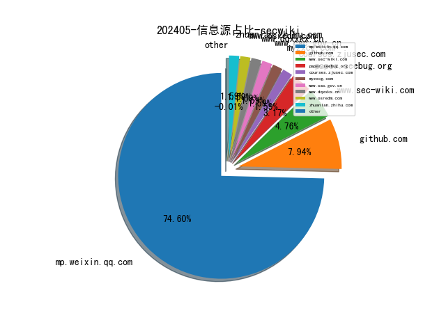

# [数据--所有](README_20.md)
# [数据--年度](README_2024.md)
# 202405 信息源与信息类型占比

# 网络安全书籍 推荐
| date_added | language | title | author | link | size| 
| --- | --- | --- | --- | --- | ---| 
| 2024-05-08 08:33:10 | English | Mastering AWS Security, Second Edition | unknown | https://www.wowebook.org/mastering-aws-security-second-edition/ | unknown| 
| 2024-05-08 07:31:11 | English | Unveiling the NIST Risk Management Framework (RMF) | unknown | https://www.wowebook.org/unveiling-the-nist-risk-management-framework-rmf/ | unknown| 
| 2024-05-07 09:02:10 | English | Python Concurrency with asyncio, Video Edition | unknown | https://www.wowebook.org/python-concurrency-with-asyncio-video-edition/ | unknown| 
| 2024-05-06 14:26:54 | English | Unveiling the NIST Risk Management Framework (RMF): A practical guide to implementing RMF and managing risks in your organization | Thomas Marsland | http://libgen.rs/book/index.php?md5=D96BA2A974A9AD36F86B81DBC3E77960 | 4 MB [EPUB]| 
| 2024-05-05 16:12:22 | English | The Art of Cyber Warfare: Strategic and Tactical Approaches for Attack and Defense in the Digital Age | Peter Kestner | http://libgen.rs/book/index.php?md5=9A8BAF8694E3F79B83C11528069E372C | 10 MB [RAR]| 
| 2024-05-05 15:49:16 | English | The OSINT Handbook | unknown | https://www.wowebook.org/the-osint-handbook/ | unknown| 
| 2024-05-05 16:12:17 | English | The Art of Cyber Warfare: Strategic and Tactical Approaches for Attack and Defense in the Digital Age | Peter Kestner | http://libgen.rs/book/index.php?md5=3E77C81F8784372C4BC9E710A610C607 | 559 kB [EPUB]| 
| 2024-05-05 16:12:15 | English | The Art of Cyber Warfare: Strategic and Tactical Approaches for Attack and Defense in the Digital Age | Peter Kestner | http://libgen.rs/book/index.php?md5=5AB7C12AE5F07A32BC58F63165516528 | 1 MB [PDF]| 
| 2024-05-03 16:34:31 | English | Cybersecurity Architects Handbook: An end-to-end guide to implementing and maintaining robust security architecture | Lester Nichols | http://libgen.rs/book/index.php?md5=D8F1E01172D13BFE87D501BC6B757211 | 8 MB [EPUB]| 

# 微信公众号 推荐
| nickname_english | weixin_no | title | url| 
| --- | --- | --- | ---| 
| 360数字安全 | gh_6db130c5163e | RSA 2024 聚焦：让AI更安全 | https://mp.weixin.qq.com/s?__biz=MzA4MTg0MDQ4Nw==&mid=2247571130&idx=1&sn=fee0b78148d2573a60d94688c14ccf13 | 3| 
| CNCERT国家工程研究中心 | NELCERT | 并购经营忽视网络安全，这家全球巨头CEO被美国国会公开质询 | https://mp.weixin.qq.com/s?__biz=MzUzNDYxOTA1NA==&mid=2247544433&idx=2&sn=8d60003080b8cf296d97b0f71f8cc014 | 10| 
| CNNVD安全动态 | cnnvd_news | CNNVD关于Apache ActiveMQ安全漏洞的通报 | https://mp.weixin.qq.com/s?__biz=MzAxODY1OTM5OQ==&mid=2651444072&idx=1&sn=ebc3cf72f75e8a0129121849f1fd65f7 | 1| 
| DFIR蘇小沐 | DFIR00 | 【镜像仿真篇】ESXi镜像仿真教程 | https://mp.weixin.qq.com/s?__biz=MzI2MTUwNjI4Mw==&mid=2247488357&idx=1&sn=8685eee43cfa5ecf67053cc554d25916 | 1| 
| EBCloud | KKHsuCheney | 数据安全治理体系浅析 | https://mp.weixin.qq.com/s?__biz=Mzg4MTA2MTc4MA==&mid=2247493029&idx=1&sn=af2eaa2748d46bf956e7eb6f99cdf399 | 1| 
| FreeBuf | freebuf | 网安上市企业2023年财报回顾：形势挑战严峻 长坡厚雪孕育生机 | https://mp.weixin.qq.com/s?__biz=MjM5NjA0NjgyMA==&mid=2651274999&idx=2&sn=a3c593f334fd68df2170745101458a56 | 24| 
| GG安全 | None | DC系列——DC6靶机渗透测试（未修改） | https://mp.weixin.qq.com/s?__biz=MzIwMjE2NTM5Mg==&mid=2247484806&idx=1&sn=ab6560d51c2990250e96d9ff804874f9 | 2| 
| GSDK安全团队 | gh_403a21e91f24 | 网络安全综合工具 - PotatoTool | https://mp.weixin.qq.com/s?__biz=MzIzNTE0Mzc0OA==&mid=2247485705&idx=1&sn=f813fbf4baeea046b72f07ea4e25f8b6 | 1| 
| IoT物联网技术 | IoT-Tech-Expo | 物联网 AI 机器视觉赋能智慧工厂，实现产品缺陷精准识别 | https://mp.weixin.qq.com/s?__biz=MjM5OTA4MzA0MA==&mid=2454933856&idx=1&sn=ceaa1c5f2df681f886de572b0954e03e | 4| 
| LemonSec | lemon-sec | 实战 , 记一次对某集团漏洞挖掘 | https://mp.weixin.qq.com/s?__biz=MzUyMTA0MjQ4NA==&mid=2247549639&idx=1&sn=1aedf3e8673045144cebf2c1e0537c5e | 4| 
| NOP Team | yidalidemao | shell.openExternal , Electron 安全 | https://mp.weixin.qq.com/s?__biz=MzU1NDkwMzAyMg==&mid=2247501645&idx=1&sn=df371e77be0277beb05cb21a13615355 | 4| 
| Nu1L Team | None | 第二届京麒CTF即刻开启报名 | https://mp.weixin.qq.com/s?__biz=MzU4MTg1NzAzMA==&mid=2247490325&idx=1&sn=87e6f0c9176e1055b8f8c0bec4a13fea | 1| 
| Ots安全 | AnQuan7 | PDF.js 和 React-PDF JavaScript 缺陷威胁数百万用户 | https://mp.weixin.qq.com/s?__biz=MzAxMjYyMzkwOA==&mid=2247507484&idx=1&sn=797faae5d47a680343d5802b6cd07f35 | 15| 
| Red Teams | None | 一键解密，网络安全神器现已问世！ | https://mp.weixin.qq.com/s?__biz=Mzg5MjUyMTgyNg==&mid=2247485137&idx=1&sn=0760cfd3e23ca1d20bad3b0fb75253fc | 1| 
| Timeline Sec | TimelineSec | QVD-2024-15263：禅道身份认证绕过漏洞 | https://mp.weixin.qq.com/s?__biz=MzA4NzUwMzc3NQ==&mid=2247494423&idx=1&sn=e1d0e5b340ceffad6dad5ea1e1e9ad78 | 2| 
| XiAnG学安全 | XiAnG_sec | 摸透仿真网络模式，更好完成取证鉴定 | https://mp.weixin.qq.com/s?__biz=Mzk0MTQzNjIyNg==&mid=2247491274&idx=1&sn=ec1bffcacb413c1f45ed0740abff46f7 | 1| 
| Z2O安全攻防 | Z2O_SEC | Symantec+EDR极端白名单策略下的C&C Bypass 研究 | https://mp.weixin.qq.com/s?__biz=Mzg2ODYxMzY3OQ==&mid=2247511435&idx=1&sn=a5c665923e2a2f4ff7ab10832bf9b358 | 10| 
| 中国信息安全 | chinainfosec | 前沿 , 2024高校网络安全发展趋势分析 | https://mp.weixin.qq.com/s?__biz=MzA5MzE5MDAzOA==&mid=2664212629&idx=2&sn=dbede52135c2c966fdb9c9de40242b40 | 16| 
| 中国数据安全产业网 | gh_a30bfee064c9 | 数据安全产业赛入围决赛名单,2024数字中国创新大赛数字安全赛道数据安全产业赛入围决赛名单 | https://mp.weixin.qq.com/s?__biz=Mzg2OTczNjMwNQ==&mid=2247489155&idx=1&sn=4a0845cfeb23d896f197170edf461fd3 | 2| 
| 中国电信SRC | yundi_src | Apache ActiveMQ Jolokia 和 REST API 未授权访问漏洞 (CVE-2024-32114) | https://mp.weixin.qq.com/s?__biz=Mzg3MjY1NzI0NA==&mid=2247555011&idx=1&sn=73a3dd093545bc2b8540d716fe668f5f | 1| 
| 中国电信安全 | gh_ea6109d37f13 | 免费试用！ | https://mp.weixin.qq.com/s?__biz=Mzg5NTU3Nzg3MQ==&mid=2247515688&idx=1&sn=53afdd8c1b96a5c5d448d823d10dae50 | 1| 
| 中国网络空间安全协会 | CSAC20160325 | 网络安全态势研判分析报告（第6期） | https://mp.weixin.qq.com/s?__biz=MzA3ODE0NDA4MA==&mid=2649399430&idx=1&sn=d714b0e5a5c2ee32dbed0b37ad5ffa00 | 3| 
| 中国计算机学会 | ccfvoice | 关于推荐（申报）2024年度“CCF科技成果奖”的通知 | https://mp.weixin.qq.com/s?__biz=MjM5MTY5ODE4OQ==&mid=2651571524&idx=3&sn=7a53516c6a38e0192eea68f43ea08015 | 23| 
| 中孚信息 | zfinfo | 速看！新保密法百题问答 | https://mp.weixin.qq.com/s?__biz=MzAxMjE1MDY0NA==&mid=2247507957&idx=2&sn=574907f40f22b56d12b8b8de7e335741 | 4| 
| 亚信安全 | yaxinanquan | 40秒快闪超前探秘：C3安全大会·2024全视角 | https://mp.weixin.qq.com/s?__biz=MjM5NjY2MTIzMw==&mid=2650614370&idx=1&sn=46b7840d3d6199b7f7610b70cefb00de | 4| 
| 京东安全应急响应中心 | jsrc_team | 第二届京麒CTF挑战赛报名开启！ | https://mp.weixin.qq.com/s?__biz=MjM5OTk2MTMxOQ==&mid=2727836502&idx=1&sn=96752f8ecb91e99ea9b14eb7ccc2aa89 | 1| 
| 亿人安全 | Yr-Sec | 挖掘SRC时如何编写信息收集脚本 | https://mp.weixin.qq.com/s?__biz=Mzk0MTIzNTgzMQ==&mid=2247515090&idx=1&sn=5661774c240449624b0025ab05ab60c6 | 2| 
| 代码卫士 | codesafe | 超5万台 Tinyproxy 服务器易受严重RCE漏洞影响 | https://mp.weixin.qq.com/s?__biz=MzI2NTg4OTc5Nw==&mid=2247519427&idx=1&sn=2eb6613f503e93d2de22af9bc452b3a1 | 6| 
| 众智维安 | None | 南京市创投集团•创投实录 , 众智维科技专篇 | https://mp.weixin.qq.com/s?__biz=MzU5Mjg0NzA5Mw==&mid=2247492247&idx=1&sn=e6d99f9a78c16339a81e9cf75d689893 | 1| 
| 信息安全小助手 | gh_114c9ed5864b | 信息安全小提示（2024年第5期） | https://mp.weixin.qq.com/s?__biz=MzkyMjEwNjY5NQ==&mid=2247484982&idx=1&sn=c66fad3629e648f57525387a0987e3e4 | 1| 
| 信息安全研究 | ISR2016 | 预告 , 今晚19点网安公开课：u200bCSNAS流量分析从入门到精通第三期vol.04 | https://mp.weixin.qq.com/s?__biz=MzA3NzgzNDM0OQ==&mid=2664986634&idx=1&sn=d8950c6878d47d459e48f686059d4ac7 | 13| 
| 全球技术地图 | drc_iite | 美国敏捷作战运用概念内涵及运用浅析 | https://mp.weixin.qq.com/s?__biz=MzI1OTExNDY1NQ==&mid=2651612567&idx=1&sn=c4e77a6274596f06c5011f7c497248c6 | 9| 
| 关键基础设施安全应急响应中心 | CII-SRC | Tinyproxy曝出严重漏洞，影响全球52000台主机 | https://mp.weixin.qq.com/s?__biz=MzkyMzAwMDEyNg==&mid=2247543592&idx=2&sn=36a0c4efffe2c6e20d2b1b7a5b2b15b1 | 10| 
| 内生安全联盟 | CCESS_CHINA | 聚焦RSAC 2024网络安全五大热点 | https://mp.weixin.qq.com/s?__biz=Mzg4MDU0NTQ4Mw==&mid=2247518786&idx=1&sn=8f043944cae7dd577e1dce4496d905a7 | 5| 
| 南阳网络空间安全研究院 | gh_206ce0a49692 | 一周网络安全速递 | https://mp.weixin.qq.com/s?__biz=Mzg5MjkxMDc4MA==&mid=2247483748&idx=1&sn=4d5d785e9cfa9f214fc6ac62e9d680bc | 1| 
| 合天网安实验室 | hee_tian | 免费公开课：简单三步入侵女神电脑 | https://mp.weixin.qq.com/s?__biz=MjM5MTYxNjQxOA==&mid=2652904974&idx=1&sn=cca977e93d0c744a8c2285efcc409a1d | 6| 
| 合规科技研究 | ComplianceTech | 全国首例AI“外挂”案公开宣判：主犯非法牟利629万余元，获刑三年 | https://mp.weixin.qq.com/s?__biz=MzkxMzIyNDg2Mg==&mid=2247496677&idx=1&sn=999d28f0421785b489caaa7296df9d2b | 2| 
| 吉祥学安全 | gh_bf0dc85c3f99 | 网安公司Q1亏损TOP10，一个季度亏掉20亿，网安业务只有出海才能赚钱了 | https://mp.weixin.qq.com/s?__biz=MzkwNjY1Mzc0Nw==&mid=2247484038&idx=1&sn=3b2d36574bf48f28e8d92159955f9dff | 5| 
| 启明星辰安全简讯 | VitaminSecurity | 安全简讯（2024.05.08） | https://mp.weixin.qq.com/s?__biz=MzUxMDQzNTMyNg==&mid=2247504280&idx=1&sn=99ecb8fc98808c938988706454997f09 | 8| 
| 启明星辰集团 | venustech_weixin | 2024中国移动算力网络大会 , 毕亲波：构筑新时代数字政府高安全保障体系 | https://mp.weixin.qq.com/s?__biz=MzA3NDQ0MzkzMA==&mid=2651725262&idx=1&sn=550500d3d13e7097cab126ac9417ca93 | 4| 
| 吾爱破解论坛 | pojie_52 | 吾爱破解安卓逆向入门教程《安卓逆向这档事》十八、表哥，你也不想你的Frida被检测吧!(上) | https://mp.weixin.qq.com/s?__biz=MjM5Mjc3MDM2Mw==&mid=2651140642&idx=1&sn=cf8328f89aff48e3c338fee43e3a5d43 | 2| 
| 商业智能研究 | fr_research | 数据治理系列之浅谈数据质量管理 | https://mp.weixin.qq.com/s?__biz=MzIwMzg5MTI0OQ==&mid=2247546355&idx=1&sn=beb7e0f8502fb8755e17f35cab936eb9 | 3| 
| 嘉诚安全 | jiachengsec | 【漏洞通告】Tinyproxy释放后使用漏洞安全风险通告 | https://mp.weixin.qq.com/s?__biz=MzU4NjY4MDAyNQ==&mid=2247495307&idx=2&sn=2254b4f102b1e3d4b4438affa97cba2f | 4| 
| 嘶吼专业版 | Pro4hou | 黑客组织在全球发起了超1300万次DDoS攻击 | https://mp.weixin.qq.com/s?__biz=MzI0MDY1MDU4MQ==&mid=2247575073&idx=2&sn=322808090708d1398a14668a9b4678e0 | 7| 
| 四叶草安全 | siyecaoanquan1 | AI引领网络安全新纪元：智能防御，守护数字世界 | https://mp.weixin.qq.com/s?__biz=MjM5MTI2NDQzNg==&mid=2654551466&idx=1&sn=287b64111c8a6835cec668ad3640e77c | 1| 
| 国际云安全联盟CSA | gh_674820794ae8 | 谷歌Flank潜藏3年的Github Action供应链攻击 | https://mp.weixin.qq.com/s?__biz=MzkwMTM5MDUxMA==&mid=2247497102&idx=1&sn=6e0e5858112ebbffab7613812c906c25 | 2| 
| 增益安全 | pbuff07 | 真0day分享！用ZoomEye发现通用组件0day漏洞的新姿势！ | https://mp.weixin.qq.com/s?__biz=MzI3ODk3ODE2OA==&mid=2247484163&idx=1&sn=18e9dc3393d4a5ac28e70fa237ad3773 | 1| 
| 天极智库 | gh_90d775fd9c26 | 【国际视野】Pentera发布《2024年渗透测试现状》调查报告 | https://mp.weixin.qq.com/s?__biz=MzIyMjQwMTQ3Ng==&mid=2247489819&idx=1&sn=ea5a37d30725b0567db75e8e53267053 | 1| 
| 天融信 | TopsecPioneer | 上新啦！天融信工业互联网安全靶场系统重磅发布 | https://mp.weixin.qq.com/s?__biz=MzA3OTMxNTcxNA==&mid=2650917514&idx=1&sn=dc79b067d90a283a0dfbd59885a74335 | 6| 
| 天融信教育 | TOPSEC-EDU | password 又排第一，超过25%的人重复使用同一个密码 | https://mp.weixin.qq.com/s?__biz=MzU0MjEwNTM5Ng==&mid=2247518012&idx=1&sn=ead371985abe9dbaaea702d7586a8662 | 9| 
| 天锐数据安全 | None | 那个叫天锐DLP的...凭什么成为老板的新宠？ | https://mp.weixin.qq.com/s?__biz=MjM5MTk0MzIzMQ==&mid=2652019846&idx=1&sn=6ad57726459eef0070f2a191dd065d47 | 7| 
| 奇安信司法鉴定 | qax-forensic | 摸透仿真网络模式，更好完成取证鉴定 | https://mp.weixin.qq.com/s?__biz=Mzg4NDYzNzIzNQ==&mid=2247491127&idx=1&sn=e51e23ad3ce67534893b8bd9de5bebfe | 1| 
| 奇安信集团 | qianxin-keji | u200b奇安信携AI加持重磅产品亮相RSAC2024 | https://mp.weixin.qq.com/s?__biz=MzU0NDk0NTAwMw==&mid=2247611227&idx=1&sn=79c6bf93964b3883c1da74c5374cbc3f | 6| 
| 奇安网情局 | QACIA2020 | 美军持续迭代联合网络训练靶场PCTE并纳入更多新功能 | https://mp.weixin.qq.com/s?__biz=MzI4ODQzMzk3MA==&mid=2247488688&idx=1&sn=9479b1acd48b5b8643294c1b415a95c8 | 2| 
| 安世加 | None | Gigamon APF：智能守护网络安全，让数据包过滤更上一层楼 | https://mp.weixin.qq.com/s?__biz=MzU2MTQwMzMxNA==&mid=2247538350&idx=1&sn=f03978c6c27e17a9636ccc4f506c06e7 | 4| 
| 安信安全 | gsaxns | 《网络安全技术 网络安全众测服务要求》发布 | https://mp.weixin.qq.com/s?__biz=MzAxNTYwOTU1Mw==&mid=2650089377&idx=1&sn=9add33d0fbab9b93cc8b873b707797fb | 4| 
| 安全之眼SecEye | Sec__Eye | 重点系统指纹漏洞验证工具 | https://mp.weixin.qq.com/s?__biz=MzkzOTY1MzcyOQ==&mid=2247487428&idx=1&sn=e8b09a2ccc1a2fed5dfb188e6e0f7802 | 3| 
| 安全内参 | anquanneican | RSAC 2024现场：全球网络安全大厂都发布了哪些新品？ | https://mp.weixin.qq.com/s?__biz=MzI4NDY2MDMwMw==&mid=2247511557&idx=1&sn=9b6f423702ef49c9a2ba68d7be5049ab | 7| 
| 安全圈 | ChinaAnQuan | 【安全圈】CNNVD关于Apache ActiveMQ安全漏洞的通报 | https://mp.weixin.qq.com/s?__biz=MzIzMzE4NDU1OQ==&mid=2652059452&idx=1&sn=32d0ba2ab948ab3cc96dc4597617c32a | 24| 
| 安全威胁纵横 | gh_715fe2f8df0b | 英国国防部约 27 万军人工资单数据泄露 | https://mp.weixin.qq.com/s?__biz=Mzk0MDYwMjE3OQ==&mid=2247484907&idx=1&sn=5d5292dd7906224de594eeddec956711 | 1| 
| 安全新说 | InSightNIS | 网络关键设备安全检测结果（第16批） | https://mp.weixin.qq.com/s?__biz=MzA3NDIwNTY5Mw==&mid=2247504394&idx=2&sn=2f8e5b22e404a42e560c1869f780abfe | 4| 
| 安全极客 | gh_23236568a71e | 【论文速读】, LLM4FUZZ：利用大语言模型指导智能合约的模糊测试 | https://mp.weixin.qq.com/s?__biz=MzkzNDUxOTk2Mw==&mid=2247493825&idx=1&sn=c491446cde2e72fb53cb348abb282d7b | 3| 
| 安全牛 | aqniu-wx | 问卷调研 , 2024年我国企业勒索攻击防护状况与挑战 | https://mp.weixin.qq.com/s?__biz=MjM5Njc3NjM4MA==&mid=2651129496&idx=1&sn=e8637534800058d3eb575f9917291238 | 4| 
| 安全牛课堂 | aqniu_edu | 省钱又美滋滋的考证计划，安排！ | https://mp.weixin.qq.com/s?__biz=MzIxNTM4NDY2MQ==&mid=2247510593&idx=1&sn=a51155c6efa480409ed53ee9a0c30588 | 6| 
| 安全研究GoSSIP | GoSSIPSJTU | G.O.S.S.I.P 阅读推荐 2024-05-08 不要追踪！ | https://mp.weixin.qq.com/s?__biz=Mzg5ODUxMzg0Ng==&mid=2247497948&idx=1&sn=c6e443f8217e6b7f8d01bf7e07a494a4 | 4| 
| 安在 | AnZer_SH | 「Microsoft Security Day」AI时代安全领航：共话AI安全新范式 | https://mp.weixin.qq.com/s?__biz=MzU5ODgzNTExOQ==&mid=2247621185&idx=1&sn=b9fa9c678594cbf9040aeafb28fc281a | 9| 
| 安天集团 | None | 《中国网信》杂志刊发署名文章介绍我国网络安全事业发展 | https://mp.weixin.qq.com/s?__biz=MjM5MTA3Nzk4MQ==&mid=2650205489&idx=1&sn=1e40f38e7786e55b7484e46d1080b32e | 4| 
| 安恒信息CERT | gh_1c2b41c1abc7 | 【风险通告】瑞友天翼应用虚拟化系统存在SQL注入漏洞 | https://mp.weixin.qq.com/s?__biz=MzUzOTE2OTM5Mg==&mid=2247489311&idx=1&sn=7309b4a75390573b14fbd0fcbcf147c3 | 3| 
| 安知讯 | dataanquan | 金融监管总局：财务公司应加强网络安全管理、数据安全管理等 | https://mp.weixin.qq.com/s?__biz=MzIxMDIwODM2MA==&mid=2653929854&idx=1&sn=dd369a4da3e1969496c7175f7231d562 | 6| 
| 山石网科新视界 | hillstone-vision | RSAC 2024丨山石网科携8大方案亮相，斩获双奖 | https://mp.weixin.qq.com/s?__biz=MzAxMDE4MTAzMQ==&mid=2661287755&idx=1&sn=9d5d2d4c2185cb6c8cab8c979ca97131 | 2| 
| 工业互联网标识智库 | CAICT-bs | 中国信通院与合作伙伴共同签署智能物联网战略合作协议，携手推进物联网技术创新与应用发展 , 2024星火生态大会 | https://mp.weixin.qq.com/s?__biz=MzU1OTUxNTI1NA==&mid=2247580304&idx=1&sn=ef14468ce85e02d881c6394192e15b39 | 4| 
| 工业安全产业联盟 | ICSISIA | 荐读丨美白宫《关于关键基础设施安全和复原力的国家安全备忘录》中文翻译 | https://mp.weixin.qq.com/s?__biz=MzI2MDk2NDA0OA==&mid=2247527191&idx=2&sn=88095d11a2e8f57f219b2941b67cd15f | 4| 
| 开源聚合网络空间安全研究院 | OSPtech_Cyberspace | 【实例剖析】记从逆向脱壳APP到写防炸群辅助工具 | https://mp.weixin.qq.com/s?__biz=MzI4NTE4NDAyNA==&mid=2650396623&idx=1&sn=eeb101f385de37607bbacb192634b08d | 1| 
| 弱口令安全实验室 | EzPassSec | 新手向的s2-046漏洞复现 | https://mp.weixin.qq.com/s?__biz=MzkyNzMyNjcwNQ==&mid=2247486715&idx=1&sn=ff2c9ac284920e85daa9bd13e8ca41d4 | 1| 
| 影域实验室 | gh_342a62011dc0 | 纯C重构CS Beacon - 原理详解与开发实现 | https://mp.weixin.qq.com/s?__biz=MzkzODU3MzA5OQ==&mid=2247484201&idx=1&sn=fcfb36b5564a8c57a2532d8412b21422 | 3| 
| 慢雾科技 | SlowMist | 花小钱钓大鱼｜揭秘 1155 WBTC 钓鱼事件 | https://mp.weixin.qq.com/s?__biz=MzU4ODQ3NTM2OA==&mid=2247499752&idx=1&sn=31a7344e660de9104275c1d03fa3b252 | 1| 
| 技可达工作室 | ms016team | 复杂之眼EDR产品申请试用 | https://mp.weixin.qq.com/s?__biz=MzU3NDY1NTYyOQ==&mid=2247485923&idx=1&sn=3bacd9003addeffdc42470e8fa78e5da | 2| 
| 摸鱼Sec | gh_e3d95d1a5b73 | 【0day】瑞友天翼应用虚拟化系统 | https://mp.weixin.qq.com/s?__biz=MzkwODUxMDUwMg==&mid=2247483793&idx=1&sn=42c68bd3acf0c13723704af42add1c96 | 1| 
| 数世咨询 | dwconcn | 揭秘：大模型如何助力安全运营 | https://mp.weixin.qq.com/s?__biz=MzkxNzA3MTgyNg==&mid=2247511294&idx=1&sn=c0e9781eac3f4a7d1036590e9742b7f2 | 4| 
| 数据取证杂谈 | DigitalForensic | 摸透仿真网络模式，更好完成取证鉴定 | https://mp.weixin.qq.com/s?__biz=MzkwMzE4NDQ5MA==&mid=2247485547&idx=1&sn=fbd77982dc42d8c60096f1dbc908f4ca | 2| 
| 数据法盟 | DPO_HUB | 最新 , TikTok“卖或禁”法案诉状摘要，附全文 | https://mp.weixin.qq.com/s?__biz=MzIyNjUxOTQ0MQ==&mid=2247561680&idx=1&sn=5f423d04b1a98024a0b603bcd50f0e7c | 4| 
| 无糖反网络犯罪研究中心 | gh_2ee7a9b17c0d | 海州警方破获抖音“卖课”诈骗案 , 大连高新警方破获网络赌球案——涉网犯罪每日情报 | https://mp.weixin.qq.com/s?__biz=MzAxMzkzNDA1Mg==&mid=2247510536&idx=1&sn=3a42af032af71f38c82b5dfe84fbdaea | 2| 
| 月落安全 | gh_48da38d0bfb5 | 国内AI彻底爆了！全网独一份AI大模型资源...（待会删） | https://mp.weixin.qq.com/s?__biz=Mzg4NDk4MTk5OA==&mid=2247485284&idx=1&sn=1810bd9680a8e1854004e02663de2502 | 1| 
| 深信服千里目安全技术中心 | gh_c644c6e98b08 | 【漏洞通告】Apache ActiveMQ API 未授权访问漏洞CVE-2024-32114 | https://mp.weixin.qq.com/s?__biz=Mzg2NjgzNjA5NQ==&mid=2247522724&idx=1&sn=c227ddd1744e3813b7c1604c6b8b5566 | 4| 
| 深圳市网络与信息安全行业协会 | SNISRI | PPT图解 , 政务数据处理安全要求 | https://mp.weixin.qq.com/s?__biz=MzU0Mzk0NDQyOA==&mid=2247516778&idx=1&sn=1e5954d7a115618d8db21e686c233007 | 4| 
| 渗透测试知识学习 | stcszsxx | 模糊测试：强制漏洞挖掘wfuzz | https://mp.weixin.qq.com/s?__biz=MzI1MzQwNjEzNA==&mid=2247484103&idx=1&sn=41517b5852785ffe7c08516c0d069bb0 | 4| 
| 独眼情报 | cs_cti | TunnelVision (CVE-2024-3661)：攻击者可以基于DHCP的缺陷解密vpn流量 | https://mp.weixin.qq.com/s?__biz=MzkzNDIzNDUxOQ==&mid=2247484568&idx=1&sn=e919bb16ff3726b3d543cdbff2ee990a | 2| 
| 珞安科技 | luoantechnology | 典型案例 ,某化工企业工控网络安全加固项目 | https://mp.weixin.qq.com/s?__biz=MzU2NjI5NzY1OA==&mid=2247509536&idx=1&sn=b18216e5dcf5352acea5cef7507eb666 | 2| 
| 白帽子 | None | 2024年首届高校网络安全管理运维赛Writeup | https://mp.weixin.qq.com/s?__biz=MzAwMDQwNTE5MA==&mid=2650247510&idx=1&sn=0f3b603b81262e7e163a24c3cbfca740 | 2| 
| 知道创宇 | knownsec | 哈工大研究员发布研究报告：政府网站安全仍面临严峻挑战！ | https://mp.weixin.qq.com/s?__biz=MjM5NzA3Nzg2MA==&mid=2649868263&idx=1&sn=fce28ece889bf1be7180a14f8d69e9c3 | 1| 
| 系统安全运维 | Taurus-1314147 | 实战,对一次博彩站点的渗透测试 | https://mp.weixin.qq.com/s?__biz=Mzk0NjE0NDc5OQ==&mid=2247524065&idx=1&sn=33694813cf2b354f380cc99f8a963e13 | 4| 
| 红蓝公鸡队 | None | 今年大环境能到多少 | https://mp.weixin.qq.com/s?__biz=Mzg5MDc1MjY5Ng==&mid=2247492789&idx=1&sn=3822aea60a93828136790285f33dad07 | 2| 
| 绿盟科技 | NSFOCUS-weixin | 闪耀RSAC 2024｜绿盟科技斩获CDM两项大奖 | https://mp.weixin.qq.com/s?__biz=MjM5ODYyMTM4MA==&mid=2650451786&idx=1&sn=bfc259e774f5f44ea6c16021f788d488 | 8| 
| 网易云音乐技术团队 | gh_e0a72742f973 | 云音乐桌面端 3.0 改版前端性能优化之旅 | https://mp.weixin.qq.com/s?__biz=MzI1NTg3NzcwNQ==&mid=2247491052&idx=1&sn=f0e35492c397f04c68c76619c5017d3f | 1| 
| 网络与信息法学会 | cyber-info-law | 【资讯】商务部印发《数字商务三年行动计划（2024-2026年）》 | https://mp.weixin.qq.com/s?__biz=MzU1NDY3NDgwMQ==&mid=2247540593&idx=1&sn=ec776349cc1e7035d216b3a550740833 | 10| 
| 网络安全与数据治理 | gh_ddbdee0c5caf | 中法关于人工智能和全球治理的联合声明 | https://mp.weixin.qq.com/s?__biz=MzIzODk1NzY5NA==&mid=2247497398&idx=1&sn=1f1a56f039403275fe462daea8c2d9b1 | 3| 
| 网络安全和信息化 | ITyunwei_365master | 林剑：中方坚决反对出于政治目的，利用网络安全问题抹黑他国 | https://mp.weixin.qq.com/s?__biz=MjM5MzMwMDU5NQ==&mid=2649163267&idx=1&sn=4eb88f8bb0c2f34e07319ebb6fde3c74 | 6| 
| 网络安全资源库 | gh_e8a4866a67fe | 奇安信《HW之红蓝队防御体系构建》（附PDF免费下载） | https://mp.weixin.qq.com/s?__biz=MzkxMzMyNzMyMA==&mid=2247556627&idx=2&sn=19098337ae8f32a9ddecc8ae69c41ec7 | 12| 
| 网络法理论与实务前沿 | gh_d1069c3872e2 | 前沿 , 英美人工智能研发与安全合作备忘录（附全文） | https://mp.weixin.qq.com/s?__biz=MzUxNDMzOTAyOQ==&mid=2247492789&idx=1&sn=1262a5a47729a7fad5cfb570bc545676 | 3| 
| 网络空间信息安全学习 | gh_39213c5878aa | 限免 , 打工人请注意，这周六要上班！苹果调休闹钟小工具安排上 | https://mp.weixin.qq.com/s?__biz=MzI2MjcwMTgwOQ==&mid=2247490831&idx=1&sn=4d9efbeac62e32a508aa4bbc2dabf33e | 2| 
| 网络空间安全研究院UESTC | SecurityWeekly | 区块链安全与平台技术教育部工程研究中心、数字经济智能与安全川渝共建重点实验室获2023年中国电子学会科技进步二等奖 | https://mp.weixin.qq.com/s?__biz=Mzk0MDMwNjU3Ng==&mid=2247484205&idx=1&sn=abbf8ab135c51969baeeef7628fe3365 | 1| 
| 腾讯安全 | TXAQ2019 | 权威认可！腾讯列入Forrester内部风险解决方案代表厂商 | https://mp.weixin.qq.com/s?__biz=Mzg5OTE4NTczMQ==&mid=2247514005&idx=1&sn=4cab13788868fd71ec912d669ef5340b | 1| 
| 腾讯玄武实验室 | XuanwuLab | 每日安全动态推送(5-8) | https://mp.weixin.qq.com/s?__biz=MzA5NDYyNDI0MA==&mid=2651959630&idx=1&sn=20e215bb12254b5c97ba9ad8d192b040 | 3| 
| 蓝桥云课精选 | lanqiaoyunke01 | 考408是大冤种？？呵呵！那是你不会学！ | https://mp.weixin.qq.com/s?__biz=MzkwODM4NDM5OA==&mid=2247517702&idx=1&sn=bf2737bb8b996a321bf8fe5c4911d1a9 | 3| 
| 蓝胖子之家 | gh_fa158f2ae9b3 | 防范入侵之TCP和UDP端点对外连接检查工具 | https://mp.weixin.qq.com/s?__biz=MzU1NDg4MjY1Mg==&mid=2247487807&idx=1&sn=a0cd7f0d3d6b8f06e36ee61d0ad06153 | 1| 
| 补天平台 | Patchingthesky | 通用单个奖金最高50万元！端午第三趴通用专项活动来啦！ | https://mp.weixin.qq.com/s?__biz=MzI2NzY5MDI3NQ==&mid=2247503625&idx=1&sn=5783b0aa41996c905318ff92ffbfa2ba | 4| 
| 谈思实验室 | gh_6446c19b4595 | 直播报名 , 5月17日 Qt软件：MISRAC++2023: C++项目中应用新标准 | https://mp.weixin.qq.com/s?__biz=MzIzOTc2OTAxMg==&mid=2247537503&idx=1&sn=6269b6d6b92ab385153daf9b79eb5732 | 13| 
| 货拉拉安全应急响应中心 | lalasrc | 货拉拉信息安全资产库建设实践 | https://mp.weixin.qq.com/s?__biz=Mzg2MDU5NjI0Mw==&mid=2247489701&idx=1&sn=bffd8c0a4c81d136dff0955a0ce565ba | 1| 
| 赛博大作战 | gh_808e29f219d4 | MSSQL注入利用工具更新速览 v1.5 | https://mp.weixin.qq.com/s?__biz=Mzk0NjYyNDI0Ng==&mid=2247483871&idx=1&sn=4c1a0b6b8094f49e60892b9b4d4ddd77 | 1| 
| 赤鸢安全 | gh_3fd0cbd825a6 | 【免杀】不是，哥们儿！八百多就能学免杀？ | https://mp.weixin.qq.com/s?__biz=MzkyOTY0NTc1MQ==&mid=2247484778&idx=1&sn=ed5cdc27cfd7f594938968802e84e9a3 | 2| 
| 进击的HACK | redteasec | SQL注入之通配符注入 | https://mp.weixin.qq.com/s?__biz=MzkxNjMwNDUxNg==&mid=2247485467&idx=1&sn=1ac0178c758e6754dd7cb4ed6b7fcd1c | 5| 
| 金盾信安 | JD952401 | 一图读懂 , 《自然资源领域数据安全管理办法》 | https://mp.weixin.qq.com/s?__biz=MjM5NjA2NzY3NA==&mid=2448662383&idx=1&sn=7a82da291595340502ac744c2d12593f | 6| 
| 锋刃科技 | ahfengren | 登记测试：软件产品增值税即征即退流程 | https://mp.weixin.qq.com/s?__biz=MzUxMjc0MTE3Mw==&mid=2247493147&idx=1&sn=44209a52ae858cb2ccfdcb5f42fbcd67 | 2| 
| 阿呆攻防 | None | HVV了！这得来张免sm的动态IP的流量卡 | https://mp.weixin.qq.com/s?__biz=MzIzNDU5Mzk2OQ==&mid=2247485836&idx=1&sn=d9f81b93245084ccdb9140f169130520 | 2| 
| 阿里云安全 | aliyunsec | 首发！阿里云《安全运营工具用户体验调研报告》 | https://mp.weixin.qq.com/s?__biz=MzA4MTQ2MjI5OA==&mid=2664090896&idx=1&sn=611a956bc8fc47c0244a9c67d20a0747 | 1| 
| 零时科技 | noneage | 零时科技 ,, SATURN攻击事件分析 | https://mp.weixin.qq.com/s?__biz=MzU1OTc2MzE2Mg==&mid=2247488735&idx=1&sn=268af96dc1b2ce27fbb2db7e562b94dc | 1| 
| 雷神众测 | bounty_team | 世间美好，接“粽”而至｜雷神众测端午福利来袭！ | https://mp.weixin.qq.com/s?__biz=MzI0NzEwOTM0MA==&mid=2652502909&idx=1&sn=aafc63dc511c9405b303d15b97926244 | 2| 
| 骨哥说事 | guge_guge | 18 岁少年如何发现虚拟机逃逸漏洞 | https://mp.weixin.qq.com/s?__biz=MjM5Mzc4MzUzMQ==&mid=2650258743&idx=1&sn=d58b9b33a2a888795b869c199237b79d | 2| 
| 黑客安全 | heikeanquan | 大事专用贴 | https://mp.weixin.qq.com/s?__biz=Mzg3NTAzMjQyNg==&mid=2247486703&idx=1&sn=1e6d80f0c1a68f953823ddb224a72c51 | 1| 
| 默安科技 | moresec | 《芝士官来了》第二期要点提炼与下期精彩预告：继续讲透开发安全 | https://mp.weixin.qq.com/s?__biz=MzIzODQxMjM2NQ==&mid=2247498421&idx=1&sn=410a0cddaf82e8e07564ef934b019a67 | 2| 
| CISP | gh_a6a902006095 | 注册信息安全培训讲师（CISI）选拔通过名单（最终批） | https://mp.weixin.qq.com/s?__biz=MzI1NzQ0NTMxMQ==&mid=2247489281&idx=1&sn=771b4111b53869e9bbf16a9473b807d8 | 1| 
| CISSP | wxxinchuangsec | CISSP中文考试开放时间变更，您的备考计划是否需要调整？ | https://mp.weixin.qq.com/s?__biz=Mzg4MTg0MjQ5OA==&mid=2247484861&idx=1&sn=82154452fd91db97093a042d8af0e68e | 1| 
| Crush Sec | Crush_Sec | 漏洞分析——禅道项目管理系统身份认证绕过漏洞 | https://mp.weixin.qq.com/s?__biz=MzkxMjMwNTEwMg==&mid=2247485836&idx=1&sn=6d1dfb958efbeb3d6d0c1d4e56490dda | 1| 
| Cyb3rES3c | Cyb3rES3c | 记一次由敏感信息泄露导致的账户接管 | https://mp.weixin.qq.com/s?__biz=Mzg2MTc1MjY5OQ==&mid=2247485491&idx=1&sn=2a21ecc4704567c31468c852fecedb62 | 4| 
| DX安全实验室 | gh_695e77d73020 | 一键解密，网络安全神器现已问世！ | https://mp.weixin.qq.com/s?__biz=Mzg3MDY2NDE0MQ==&mid=2247491400&idx=1&sn=51d0f52cc1e4e03b227f5b8472dc33fc | 1| 
| IMPERVA | IMPERVA | u200b2024年泰雷兹数据威胁报告导读 | https://mp.weixin.qq.com/s?__biz=MzI1OTYyOTUyOA==&mid=2247487606&idx=1&sn=07a05d2c5368e694151c0e335e78bd21 | 1| 
| JOY的安全屋 | gh_99b4126d82ce | 【新接口】魔方网表 magicflue 任意文件上传漏洞 | https://mp.weixin.qq.com/s?__biz=Mzg2ODkyNjU4NQ==&mid=2247483758&idx=1&sn=a414cafd45cac90bbefa8396cb98bda4 | 2| 
| Jiyou too beautiful | zorejt-_- | HTB-Mailing笔记 | https://mp.weixin.qq.com/s?__biz=Mzk0MTQxOTA3Ng==&mid=2247488532&idx=1&sn=ff69898c7783716eabb5038dfded1454 | 1| 
| KK安全说 | kksecurity | 如何展开一次OSINT调查 | https://mp.weixin.qq.com/s?__biz=Mzg4NzgyODEzNQ==&mid=2247486921&idx=1&sn=df0b2d41865a78dcc7a8d6ea8060b237 | 5| 
| Khan安全攻防实验室 | None | 小黑子 | https://mp.weixin.qq.com/s?__biz=MzAwMjQ2NTQ4Mg==&mid=2247492913&idx=1&sn=c6c7412679dfca79bf61948238583af2 | 3| 
| Ms08067安全实验室 | Ms08067_com | Linux最新提权通杀五大绝招（上） | https://mp.weixin.qq.com/s?__biz=MzU1NjgzOTAyMg==&mid=2247519873&idx=1&sn=b623f51c341e6738aff9769d3f133029 | 2| 
| M姐 数据合规评论 | M_DigitalLawandLife | 国际资讯 , 荷兰数据保护机构发布人脸识别总体框架等（5.1-5.7） | https://mp.weixin.qq.com/s?__biz=MzU5NzUxNjg3Nw==&mid=2247499617&idx=1&sn=91915b6e4cf4aa7f4a29137787fbb900 | 2| 
| T00ls安全 | T00lsSec | 信息泄露漏-实战案例 | https://mp.weixin.qq.com/s?__biz=Mzg3NzYzODU5NQ==&mid=2247484623&idx=1&sn=7a70759d47d43421d28a818719cc8e81 | 1| 
| TIPFactory情报工厂 | TIPFactory | 143个黑客工具横向对比 | https://mp.weixin.qq.com/s?__biz=MzkyMjM0ODAwNg==&mid=2247487842&idx=1&sn=9af22a92fe318d5d35e5b6c5900e5d62 | 1| 
| Tide安全团队 | TideSec | 无影(TscanPlus) v1.8发布：Poc模糊匹配 | https://mp.weixin.qq.com/s?__biz=Mzg2NTA4OTI5NA==&mid=2247515184&idx=1&sn=8c67f488099ec281f0560d2cfc354899 | 1| 
| 一起聊安全 | gh_589ffdaa31f9 | 17家入选LLM驱动数字安全2024——AI安全系列报告 | https://mp.weixin.qq.com/s?__biz=MzI3NjUzOTQ0NQ==&mid=2247510166&idx=1&sn=a9275e3686e087e09f941ebd2f043118 | 1| 
| 七芒星实验室 | HeptagramSec | 苹果应用安装源类 | https://mp.weixin.qq.com/s?__biz=Mzg4MTU4NTc2Nw==&mid=2247491449&idx=1&sn=8cb2cf5821553a43c122d02508585139 | 2| 
| 不懂安全的校长 | sectip | 漏洞挖掘 , 使用HaE与CaA组合挖掘高危漏洞 | https://mp.weixin.qq.com/s?__biz=MzkyMzI3OTY4Mg==&mid=2247486669&idx=1&sn=a57e8cce05df72bd31863f468f2338cb | 1| 
| 中国软件评测中心 | china_testing | 关于2024年广州DCMM数据管理师认证培训与考试的补充通知 | https://mp.weixin.qq.com/s?__biz=MjM5NzYwNDU0Mg==&mid=2649244049&idx=1&sn=93c8c822921f1c4093c78b2c47c94428 | 1| 
| 乌雲安全 | hackctf | 一款自动化监控收集资产的工具 | https://mp.weixin.qq.com/s?__biz=MzAwMjA5OTY5Ng==&mid=2247522251&idx=1&sn=f4db9a0586aa5883a4994d51422f8f63 | 3| 
| 信息安全国家工程研究中心 | gh_1e0d1778d4b2 | 中华人民共和国和法兰西共和国关于人工智能和全球治理的联合声明 | https://mp.weixin.qq.com/s?__biz=MzU5OTQ0NzY3Ng==&mid=2247496598&idx=2&sn=665ac451aefab93384c225725357ba01 | 3| 
| 创信华通 | cdcxht | 创信招聘丨找工作？看这里！ | https://mp.weixin.qq.com/s?__biz=MzUxNTQxMzUxMw==&mid=2247522308&idx=1&sn=4b28077e78986c89719f35d733c4cb0b | 4| 
| 剁椒鱼头没剁椒 | None | POC&amp;EXP编写笔记合集 | https://mp.weixin.qq.com/s?__biz=Mzg3MDk0OTc1Nw==&mid=2247487495&idx=1&sn=a690f7c348a8fe6579c6b7dfc7b7796f | 1| 
| 商密君 | shangmijun | 焦点访谈：贯彻落实保密法 共筑安全保密防线 | https://mp.weixin.qq.com/s?__biz=MzI5NTM4OTQ5Mg==&mid=2247622371&idx=1&sn=bc06d9fdb26b551bbcb45ab8443e4042 | 8| 
| 复旦白泽战队 | fdwhitzard | 毕业特辑 , 24届毕业生离别赠言 | https://mp.weixin.qq.com/s?__biz=MzU4NzUxOTI0OQ==&mid=2247489505&idx=1&sn=a30aa06c5a8cf39b28602473400de56a | 2| 
| 字节跳动安全中心 | TouTiaoSec | ByteSRC专测｜生活服务反爬进行中 | https://mp.weixin.qq.com/s?__biz=MzUzMzcyMDYzMw==&mid=2247492711&idx=1&sn=773f4c8a31b96efd53d4c971b704866a | 1| 
| 安全419 | anquan-419 | 网安上市企业2023年财报回顾：形势挑战严峻 长坡厚雪孕育生机 | https://mp.weixin.qq.com/s?__biz=MzUyMDQ4OTkyMg==&mid=2247539409&idx=1&sn=8a1415e5baa4bd450befbe9ddfedda61 | 2| 
| 安全后厨 | sanxingfengaa | 风景3——红山森林动物园 | https://mp.weixin.qq.com/s?__biz=MzI3MDQ1NDE2OA==&mid=2247491150&idx=1&sn=d9b687a6bb6dd7a18e4c2523d94a4ce7 | 6| 
| 安全脉脉 | gh_6d21af7faacb | HowIHackedMyCar 2021款 现代IONIQ （三） Making Software | https://mp.weixin.qq.com/s?__biz=Mzk0MzQzNzMxOA==&mid=2247486703&idx=1&sn=bc9ccd8e2cb4c1e6fe6d979b9d73c8a9 | 1| 
| 安全随笔 | SecNotes | 一篇文章搞懂隧道技术 | https://mp.weixin.qq.com/s?__biz=MzU1MTA4ODM4MQ==&mid=2247485375&idx=1&sn=0ae828a409dae3d304651f7e18bff7d7 | 1| 
| 安协小天使 | gh_e4ac6bc8fbfb | Vidar-Team两位00后荣登全球安全顶会Black hat | https://mp.weixin.qq.com/s?__biz=MzIxNDU2ODg3Mw==&mid=2247485796&idx=1&sn=53de99b68a63cf879062f0ac3d0098c7 | 1| 
| 小毅安全阵地 | anquanzhendi | 【安全小剧场】环保新能源企业的终端防泄密 | https://mp.weixin.qq.com/s?__biz=Mzg4MDE0MzQzMw==&mid=2247487430&idx=1&sn=5d7ef35c180ce225252b3aa73fddccdc | 1| 
| 小黑说安全 | X1ia0hei | 星梦计划——SRC漏洞猎人(文末现金抽奖) | https://mp.weixin.qq.com/s?__biz=MzkxNjQyMjcwMw==&mid=2247486185&idx=2&sn=8914741df4a1c20161299bff7c896883 | 3| 
| 州弟学安全 | gh_8440a0e647ba | 实战学习,保姆式实战等保测评Windows镜像(邀请码+全流程+未公开漏洞) | https://mp.weixin.qq.com/s?__biz=MzkzMDE5OTQyNQ==&mid=2247485344&idx=1&sn=9e513e2aab080c39541f8585299cd6df | 2| 
| 数据何规 | PIPL2021 | 中法关于人工智能和全球治理的联合声明 | https://mp.weixin.qq.com/s?__biz=MzU1MzAzNzcwNw==&mid=2247490713&idx=1&sn=219a7aba1f58e63ab6f88f9709000549 | 3| 
| 数据安全矩阵 | gh_5d34ca8a20a1 | 互联网发展进入规范安全新阶段 | https://mp.weixin.qq.com/s?__biz=Mzg3OTg5MzAzNw==&mid=2247492621&idx=1&sn=eda4237941c3fa5f874511d186d5c0dd | 2| 
| 未言数据安全中心 | weyard_O | 中法两国关于人工智能和全球治理的联合声明 | https://mp.weixin.qq.com/s?__biz=MzkyMTMwMzc1Mw==&mid=2247484915&idx=1&sn=27fbac7cb3118cccb13c9ee1a22735fa | 1| 
| 杭州数据安全联盟 | gh_4959e361d8ba | 美国国防信息系统局发布未来五年战略计划 | https://mp.weixin.qq.com/s?__biz=MzkyMjI2MDE2Mg==&mid=2247502209&idx=1&sn=efa3f173760387e6189e423940428532 | 2| 
| 橘猫学安全 | gh_af700ee13397 | 近源渗透 , 使用Aircrack-ng破解wifi密码 | https://mp.weixin.qq.com/s?__biz=Mzg5OTY2NjUxMw==&mid=2247511842&idx=1&sn=fab27dfaef79555292f447e415d6946d | 2| 
| 泰晓科技 | TinyLab-Org | 泰晓社区开源之夏2024宣讲会预告 | https://mp.weixin.qq.com/s?__biz=MzA5NDQzODQ3MQ==&mid=2648193407&idx=1&sn=72f65318297384ea481f264380b57e97 | 1| 
| 深信服科技 | sangfor_man | CHIMA 2024,智启AI，融合新生——深信服携手卫宁共绘医疗创新篇章 | https://mp.weixin.qq.com/s?__biz=MjM5MTAzNjYyMA==&mid=2650586747&idx=1&sn=3c4d19fd924bde3d7ce68280f91650f5 | 2| 
| 深圳大学合规研究院 | ICS-SZU | 深圳大学合规研究院合规实务论坛第三十五讲暨反洗钱与制裁高级研修班第三讲：《制裁趋势分享及案例分析》 | https://mp.weixin.qq.com/s?__biz=Mzg5NTMzMzI1MQ==&mid=2247502583&idx=1&sn=70320d9d41da768338d70e1470fcf92e | 1| 
| 火绒安全 | None | chrome浏览器夹带“私货”，潜在木马篡改设置 | https://mp.weixin.qq.com/s?__biz=MzI3NjYzMDM1Mg==&mid=2247518362&idx=1&sn=0db94c36b00063739d6e942cf3de42fa | 1| 
| 爱加密 | zhiyouaijiami | 案例解析 , 金融行业12项个人信息违规场景及合规要点披露！ | https://mp.weixin.qq.com/s?__biz=MjM5NzU4NjkyMw==&mid=2650743616&idx=1&sn=fee169e6e53315936c38f1a0937ff298 | 1| 
| 犀利猪安全 | XiLi-Pig | 有石粒的 , 一次有点东西的Oracle注入 | https://mp.weixin.qq.com/s?__biz=Mzk0NzQxNzY2OQ==&mid=2247486351&idx=1&sn=aff70f070b2dee5ddf209846406aaa7a | 1| 
| 百度安全应急响应中心 | baidu_sec | 议题征集｜「度安讲」安全左移 · 业务护航 技术沙龙议题报名！ | https://mp.weixin.qq.com/s?__biz=MzA4ODc0MTIwMw==&mid=2652539410&idx=1&sn=dd325c27b8d9912534c725c9d582af1d | 2| 
| 盘古石取证 | Panguite_CN | 【重磅推出，智慧取证】盘古石手机取证分析系统引入数据分析功能！ | https://mp.weixin.qq.com/s?__biz=Mzg3MjE1NjQ0NA==&mid=2247502644&idx=1&sn=da5df28b7273a9e80d259efe8dc6e58d | 1| 
| 盛邦安全WebRAY | None | 烽火三十六技丨网络资产安全治理平台新版本发布，一文看懂四大核心优势 | https://mp.weixin.qq.com/s?__biz=MzAwNTAxMjUwNw==&mid=2650275407&idx=1&sn=1b7f11a6e1bb3920a6d95f14cb58bc5c | 1| 
| 红队蓝军 | Xx_Security | 基于fofa的批量cve漏洞验证爬虫程序开发 | https://mp.weixin.qq.com/s?__biz=Mzg2NDY2MTQ1OQ==&mid=2247517660&idx=1&sn=6e287f1fe2d82bc0d4ffd682e86b6b3d | 1| 
| 编角料 | geekbyter | 移动安全之hook操作灵异现象并解决 | https://mp.weixin.qq.com/s?__biz=MzU0MjUwMTA2OQ==&mid=2247486530&idx=1&sn=79121d7eb214947f2b7b8d0f5662162e | 1| 
| 网络与数据法律实务 | gh_daf0af303efa | 外資系企業によるHRデータ越境に関するコンプライアンス問題 | https://mp.weixin.qq.com/s?__biz=MzAxOTk5NDY1MQ==&mid=2247486840&idx=1&sn=a0de592bb8dc80e8338b66c4702befbb | 1| 
| 网络技术联盟站 | wljslmz | 一文带你了解中间人攻击MITM，从此不做网络的“傀儡”！ | https://mp.weixin.qq.com/s?__biz=MzIyMzIwNzAxMQ==&mid=2649457809&idx=1&sn=2053c1007d0b4d938eda9eb96a641ebb | 4| 
| 网络法前哨 | cyberlawing | 中华人民共和国和法兰西共和国关于人工智能和全球治理的联合声明 | https://mp.weixin.qq.com/s?__biz=MzIzMTU2MzU3NQ==&mid=2247493618&idx=1&sn=5e3128c6a8dd3bd1416eb85257de26ec | 1| 
| 网络盾牌 | gh_6ef5650b8b89 | 0507-英国立法禁止弱密码--怎么防御DDoS攻击？-俄罗斯APT组织在俄土关系中持续的威胁 | https://mp.weixin.qq.com/s?__biz=MzkyNjMzMTcwOQ==&mid=2247495342&idx=1&sn=50b80df2d80a788110254f8034f80032 | 2| 
| 网络空间安全科学学报 | wxjmrh | 网安周报 , 深圳发布《公共数据安全评估方法》5月1日实施 | https://mp.weixin.qq.com/s?__biz=MzI0NjU2NDMwNQ==&mid=2247499719&idx=2&sn=5e825fefc0c6648a546248cb002bf6b1 | 2| 
| 美亚柏科 | MeiyaPico | 【免费试用】取证云平台解锁新功能，APP分析中心重磅上线 | https://mp.weixin.qq.com/s?__biz=MjM5NTU4NjgzMg==&mid=2651410322&idx=1&sn=fcb63658489d33ab97b68cff6f472688 | 3| 
| 美团安全应急响应中心 | gh_83d9bb3b8ed0 | 招聘 , 美团安全实习生招聘正在进行中 | https://mp.weixin.qq.com/s?__biz=MzI5MDc4MTM3Mg==&mid=2247493059&idx=1&sn=362fa696530db9493fa8c165e6f64e6b | 1| 
| 腾讯技术工程 | Tencent_TEG | TCP经典异常问题探讨与解决 | https://mp.weixin.qq.com/s?__biz=MjM5ODYwMjI2MA==&mid=2649783401&idx=1&sn=a3b405b50bddd7e46f18e4c4b027ea7d | 1| 
| 表图 | CyberSecurityCircle | 网络安全上市公司年报分析之一：收入 | https://mp.weixin.qq.com/s?__biz=MzUzOTI4NDQ3NA==&mid=2247484551&idx=1&sn=8b9731e1de99571332b27777828a77dc | 1| 
| 赛博研究院 | SICSI-cybersecurity | 中华人民共和国和法兰西共和国关于人工智能和全球治理的联合声明 | https://mp.weixin.qq.com/s?__biz=MzUzODYyMDIzNw==&mid=2247509010&idx=1&sn=bbc1f36ea660bfa955b5609959c5f1ea | 3| 
| 赛博社工 | gh_dcbdb7831567 | 红队使用 PE封隔器进行AV 规避的技巧 | https://mp.weixin.qq.com/s?__biz=MzkzNjY3MTc1MA==&mid=2247483980&idx=1&sn=ad7a20dc0ae708e6e1ffa201117de762 | 1| 
| 赛查查 | gh_fabaad32b9d1 | 关于举办第九届上海市大学生网络安全大赛暨“磐石行动”2024第二届全国高校网络安全邀请赛的通知 | https://mp.weixin.qq.com/s?__biz=Mzk0NTU0ODc0Nw==&mid=2247486727&idx=1&sn=5ed17645b7708a4d3a9d21b9223742f2 | 3| 
| 走在网安路上的哥布林 | gh_830aed7d81d2 | 攻破 Active Directory | https://mp.weixin.qq.com/s?__biz=MzU5NjYwNDIyOQ==&mid=2247484550&idx=1&sn=c8e7b3c991d8fd4a1c88c558b0820c4d | 1| 
| 迪哥讲事 | growing0101 | 如何黑掉Hackerone | https://mp.weixin.qq.com/s?__biz=MzIzMTIzNTM0MA==&mid=2247494560&idx=1&sn=b4180bfa487b8cb6798d75a10ff60591 | 4| 
| 锐眼安全实验室 | gh_ac88e02e949f | 勒索软件演进新阶段,一枚要求支付现金的勒索软件Cash Ransomware | https://mp.weixin.qq.com/s?__biz=MzIyOTczMjI2MQ==&mid=2247486112&idx=1&sn=0e0df2e6cc3996b7e57f57bc2f7b2cea | 1| 
| 长亭安全应急响应中心 | chaitin_cert | 【原创0day】瑞友天翼应用虚拟化系统SQL注入致远程代码执行漏洞 | https://mp.weixin.qq.com/s?__biz=MzIwMDk1MjMyMg==&mid=2247492500&idx=1&sn=0fb96a4cda9da578641ccc8f4e41924c | 1| 
| 隐私合规交流圈 | PrivacyStudy | 什么是IAPP CIPP/US？如何学习？适合哪些人群？ | https://mp.weixin.qq.com/s?__biz=Mzg4MTg3NDI0NQ==&mid=2247500024&idx=1&sn=ed34eb674d2f1376d1d4b280790c7a87 | 2| 
| 零度安全攻防实验室 | Zero-safety | 【2024HW】HW首批招聘-快来投简历！！ | https://mp.weixin.qq.com/s?__biz=MzI3MzUwMTQwNg==&mid=2247485862&idx=1&sn=934a4e381fbe83078d4e998105a95ebb | 1| 
| 青藤云安全 | qingtengyunanquan | 云攻击上升288%，CNAPP已经成为最后必选项 | https://mp.weixin.qq.com/s?__biz=MzAwNDE4Mzc1NA==&mid=2650848768&idx=1&sn=f3dec3245a8f09d57e10c0075616b5d2 | 2| 
| 青衣十三楼飞花堂 | scz------ | 《划草排》 | https://mp.weixin.qq.com/s?__biz=MzUzMjQyMDE3Ng==&mid=2247487393&idx=1&sn=74ddb69714ae7e59e01dbabcd3d0e306 | 4| 
| 飓风网络安全 | gh_183f818a07dc | 【漏洞预警】Apache Tomcat输入验证错误漏洞（CVE-2024-24549） | https://mp.weixin.qq.com/s?__biz=MzI3NzMzNzE5Ng==&mid=2247488084&idx=1&sn=255ed4db53eaa4cce62937249abb9971 | 6| 
| AI与网安 | gh_c57275954216 | AJ-Report开源数据大屏存在远程命令执行漏洞 | https://mp.weixin.qq.com/s?__biz=MzU1ODQ2NTY3Ng==&mid=2247486542&idx=1&sn=2be06b22bab693fc89be39ce01dd99b7 | 1| 
| Adler学安全 | Acade- | 漏洞复现-edu刷分神洞 | https://mp.weixin.qq.com/s?__biz=Mzg5NDU1MDc1OA==&mid=2247485507&idx=1&sn=41688e9f0178c6cecef2e4ce4c43572c | 3| 
| FreeBuf安全咨询 | freebuf_ent | 2024数据安全：超过60%组织的DLP“成熟度低” | https://mp.weixin.qq.com/s?__biz=Mzg2MTAwNzg1Ng==&mid=2247493411&idx=1&sn=6e2fc6872803cd754a1d6796ea8d1153 | 1| 
| HackSee | hacksee_com | 调查发现大量间谍软件出口到印度尼西亚 | https://mp.weixin.qq.com/s?__biz=MzI5NTA0MTY2Mw==&mid=2247485056&idx=1&sn=4e455a8a2d77e75f46e4c5cf5cfdc2ef | 3| 
| OSINT情报分析师 | None | 开源情报社区 | https://mp.weixin.qq.com/s?__biz=MzkxNzU5MjE0OA==&mid=2247484236&idx=1&sn=d292a08226f59331ddd6cfeb288aa2ed | 1| 
| Rock sec | gh_a129a168e0d4 | Ncast高清智能录播系统存在任意文件读取漏洞 | https://mp.weixin.qq.com/s?__biz=Mzk0NzYyMTAwNw==&mid=2247484485&idx=1&sn=cd825856d1681e05b283928989e0b228 | 1| 
| T0daySeeker | gh_26c54b2c64aa | CIA组织MikroTik软路由攻击场景复现及后门加解密剖析 | https://mp.weixin.qq.com/s/azDzg3op0kqBUpakFtkTAw | 3| 
| goddemon的小屋 | gh_0383232a884d | 一个idea | https://mp.weixin.qq.com/s?__biz=MzI2NTc1ODY0Mw==&mid=2247485901&idx=1&sn=a0e1ccd150785ab78465d10e4b129db2 | 2| 
| imBobby的自留地 | imBobbySY | 不可忽视的电子邮件反钓鱼 | https://mp.weixin.qq.com/s?__biz=MzI5MjI4ODU4Nw==&mid=2247485384&idx=1&sn=448741a0c13444a12c73af0305f9d1aa | 1| 
| vExpert | vArchitect | AI PC离我们还有多远 | https://mp.weixin.qq.com/s?__biz=MzUyOTkzMjk1Ng==&mid=2247485658&idx=1&sn=66e7d162411d8062941dbd37ff951221 | 1| 
| 中伦文德网络安全与数据合规 | gh_4b33f9a2e329 | 【新闻速递】多地网信办发布关于生成式人工智能服务备案公告 | https://mp.weixin.qq.com/s?__biz=MzIxNDgyNTg0NQ==&mid=2247492609&idx=1&sn=f6829a93b709146c8a73bed70849d315 | 1| 
| 二进制空间安全 | suntiger_2023 | 访问暗网专用Linux操作系统 | https://mp.weixin.qq.com/s?__biz=MzkxOTUyOTc0NQ==&mid=2247489344&idx=1&sn=8cbe4ee0bfe008a10bf34cb736c31a1a | 1| 
| 云鼎实验室 | YunDingLab | 安全验证 , 容器安全的验证度量实践 | https://mp.weixin.qq.com/s?__biz=MzU3ODAyMjg4OQ==&mid=2247496177&idx=1&sn=47e212d83e2a081b467e23c41dc3e677 | 1| 
| 互联网合规君 | gh_057ac073892c | 被困在百亿补贴里的品牌商，如何破局？ | https://mp.weixin.qq.com/s?__biz=MzA5NjgwOTQyMA==&mid=2649322639&idx=1&sn=32869024935eb376fb8e4c52b92c08bd | 1| 
| 众安天下Allsec | All_sec | “胖猫”事件揭下网恋“纱布”，且看安全专家如何发声 | https://mp.weixin.qq.com/s?__biz=MzIyOTUzODY5Ng==&mid=2247504079&idx=1&sn=e4d0b8529a63d7abcf183be4c03cdb1f | 1| 
| 伟大航路D | gh_c1fdc31f79ef | 【0day】湖南建研工程质量检测系统InstrumentUsageRecordExport接口处存在任意文件读取漏洞 | https://mp.weixin.qq.com/s?__biz=MzkwNzYzNTkzNA==&mid=2247485606&idx=1&sn=573fa61c178ab7a891d758821fad383f | 1| 
| 信安保密 | xinanbaomi | 关于开展“军工保密现场审查实施流程及迎检注意事项”培训的通知 | https://mp.weixin.qq.com/s?__biz=MjM5MzUyMzM2NA==&mid=2652914026&idx=1&sn=4702f26b4d62b185b3bc985c277db037 | 4| 
| 信通合规 | xintonghegui | 合规周动态丨国务院反垄断反不正当竞争委员会发布《经营者反垄断合规指南》 | https://mp.weixin.qq.com/s?__biz=Mzg2NTY1NDk3Mg==&mid=2247496875&idx=1&sn=a30a9af1dafdebf8669b590ed677307f | 1| 
| 公安部网络安全等级保护中心 | gh_f5f6bf3d09af | 大模型安全标准已发布，能力验证火热报名中！！！ | https://mp.weixin.qq.com/s?__biz=MzU3NTQwNDYyNA==&mid=2247487400&idx=1&sn=6eeb2f706133520cda6431adb80b1d07 | 2| 
| 兰花豆说网络安全 | SecuritySay | 网安出海需要过哪五关 | https://mp.weixin.qq.com/s?__biz=MzI3NzM5NDA0NA==&mid=2247487580&idx=1&sn=da4abd196c7e693361899d88584fdf04 | 3| 
| 前进四安全团队 | gh_f1993e0472e9 | 【黑客揭秘】通过heapdump使用mat进行分析，解锁Spring Boot Admin后台隐藏的密码宝藏！ | https://mp.weixin.qq.com/s?__biz=MzkzMzI4MTY3OA==&mid=2247485222&idx=1&sn=a06a01f5845d264ba81a23d03c8b1414 | 1| 
| 十九线菜鸟学安全 | gh_5d5696256f18 | 【红蓝/演练】-事前准备(7)之供应链安全 | https://mp.weixin.qq.com/s?__biz=MzI1OTUyMTI2MQ==&mid=2247484489&idx=1&sn=304791bf03bbeb04c8e166ec4fd57830 | 2| 
| 吉祥在职场 | gh_370fbad7aec1 | 90后程序员辞职，开发“搬运”视频的软件，不到1年盈利700w | https://mp.weixin.qq.com/s?__biz=MzI1ODY3MTA3Nw==&mid=2247485287&idx=1&sn=c67240742377cc0b7e96b14d7dd7c627 | 1| 
| 哈拉少安全小队 | gh_b273ce95df95 | 聊聊红队攻防那些事 | https://mp.weixin.qq.com/s?__biz=MzAxNzkyOTgxMw==&mid=2247492562&idx=1&sn=9659ca18b5ee546480812f43389d14d9 | 1| 
| 嗨嗨安全 | natuerhi666 | RCE宝典重磅回归！全面升级你的知识库！ | https://mp.weixin.qq.com/s?__biz=MzIzMjg0MjM5OQ==&mid=2247487270&idx=1&sn=91ee83b080c75b9176e04212561a58e5 | 1| 
| 国信安全 | gh_aa0cfb9da03f | 国家信息中心信息与网络安全部一行赴四川调研交流 | https://mp.weixin.qq.com/s?__biz=MzU5MzYzMzU5NA==&mid=2247488922&idx=1&sn=9380a3b1ac179a7284a5c4273416a4aa | 1| 
| 大数据技术标准推进委员会 | gh_06f5ec229a80 | 检索增强生成RAG技术分享沙龙——基座大模型如何快速落地应用? | https://mp.weixin.qq.com/s?__biz=MzU0NzczNjAwMw==&mid=2247510265&idx=1&sn=7ee5a227dfbbc8f1cb3019785558daec | 2| 
| 奇安信 CERT | gh_64040028303e | 安全热点周报：本周新增两个在野利用漏洞，成功利用可导致供应链攻击 | https://mp.weixin.qq.com/s?__biz=MzU5NDgxODU1MQ==&mid=2247500982&idx=1&sn=01f21b986415a5a6d16103d6efda5b2e | 1| 
| 安全学术圈 | secquan | 北京交通大学 , 在联邦推荐安全中探索用户画像与物品间的相互作用 | https://mp.weixin.qq.com/s/1wsfoBg1J0dcY_AAzFHehQ | 3| 
| 安全帮 | anquanplus | 2024 RSAC大会值得关注的10款安全新品 | https://mp.weixin.qq.com/s?__biz=MzkzNjQwOTc4MQ==&mid=2247489301&idx=1&sn=91cc8624152a0df272e4fe02e5a20535 | 1| 
| 安全无界 | gh_f49672a46883 | API未授权访问到进入系统 | https://mp.weixin.qq.com/s?__biz=Mzg2MjU2MjY4Mw==&mid=2247484724&idx=1&sn=ba7ec3eadc87719ab14bcbf6956a01b3 | 1| 
| 安恒信息服务平台 | DBAPP688023 | 安恒上新了｜明御防火墙信创新系列即将上新（扫码预约） | https://mp.weixin.qq.com/s?__biz=MzkwODE2OTU0NA==&mid=2247492777&idx=1&sn=1591641df43da1c7cee956c932334784 | 1| 
| 安易科技AneSec | anesec | 中国网安科技中东新篇章！ | https://mp.weixin.qq.com/s?__biz=MzkwMTI3ODUxOQ==&mid=2247484987&idx=1&sn=49fa403b79297ed4ffbbbe8bfc5fdfc9 | 1| 
| 宸极实验室 | ChenJiLab | 『杂项』如何对小程序进行反编译？ | https://mp.weixin.qq.com/s?__biz=Mzg4NTA0MzgxNQ==&mid=2247489124&idx=1&sn=ae1ae13461d410eefb5ee28627a56bd0 | 1| 
| 山石网科安全技术研究院 | HSN_LAB | 二进制安全之自控制流劫持混淆及其恢复研究 | https://mp.weixin.qq.com/s?__biz=MzUzMDUxNTE1Mw==&mid=2247505912&idx=1&sn=8473685aa71b1a6ff0ff05264601e2d2 | 1| 
| 平安集团安全应急响应中心 | PSRC_Team | 叮！平安银行5月奖励活动提前看 | https://mp.weixin.qq.com/s?__biz=MzIzODAwMTYxNQ==&mid=2652144972&idx=1&sn=2d9126467d45b200eb503f03ff366813 | 1| 
| 张无瑕思密达 | kibana520 | Tiktok只退不卖，来自印度的启示 | https://mp.weixin.qq.com/s?__biz=MzkwMzI1ODUwNA==&mid=2247487080&idx=1&sn=59c48595584c30dcf39acee3e0082f33 | 4| 
| 微步在线研究响应中心 | gh_280024a09930 | 漏洞通告 , 瑞友天翼应用虚拟化系统远程代码执行漏洞 | https://mp.weixin.qq.com/s?__biz=Mzg5MTc3ODY4Mw==&mid=2247505691&idx=1&sn=16406315a3cd7426e431ac258cde3fa3 | 1| 
| 德斯克安全小课堂 | szdesk | 一个人的信息安全部（3）——数据防泄露【附有DLP选型对比表】 | https://mp.weixin.qq.com/s?__biz=MzA3MTUxNzQxMQ==&mid=2453884995&idx=1&sn=af4b47fc114eca5b49962f71a29e8bab | 1| 
| 情报分析师 | Intelligencer1 | u200b匈牙利的神秘之眼：揭秘其情报机构 | https://mp.weixin.qq.com/s?__biz=MzA3Mjc1MTkwOA==&mid=2650549097&idx=1&sn=dea09512ac898044e844fde3fefab2bd | 7| 
| 情报分析师Pro | globalpolice | 以色列和哈马斯战争中的网络行动 | https://mp.weixin.qq.com/s?__biz=MzkwNzM0NzA5MA==&mid=2247497760&idx=1&sn=5b6a0571463d981cd4bf1625277f94f6 | 4| 
| 掌控安全EDU | ZKAQEDU | HW面试经验分享 , 某安全厂商护网二面 | https://mp.weixin.qq.com/s?__biz=MzUyODkwNDIyMg==&mid=2247539694&idx=1&sn=04052e42e9155f85ce770ef8136965e8 | 7| 
| 数据安全与数据要素化研究 | gh_287b260a46c9 | 数据要素市场动态观察第三十七期（2024.4.22-2024.4.28） | https://mp.weixin.qq.com/s?__biz=MzIwNzQyMTEyMQ==&mid=2247488438&idx=1&sn=4463799d6b65f2001573a312e1080939 | 1| 
| 无名之 | gh_183ba3e9a2da | 关于ETW的这点，他错了 | https://mp.weixin.qq.com/s?__biz=Mzk0NTUwNzAyOA==&mid=2247484179&idx=1&sn=beab72f398b4152382dbf19d46f89c8a | 1| 
| 泾弦安全 | None | 漂亮御姐被AI脱衣?无非是虚拟裁缝，请停止你的AI焦虑！网友：少管闲事！！！ | https://mp.weixin.qq.com/s?__biz=Mzk0MzU5NTg1Ng==&mid=2247484479&idx=1&sn=c4c250b89bebc03cb7807e63bcab63c4 | 2| 
| 浙网安协数据安全治理专委会 | zwax-sjaqzlzwh | 中英双语 , 美国对全球网络空间安全与发展的威胁和破坏（全文） | https://mp.weixin.qq.com/s?__biz=Mzk0NjE5NjUxOA==&mid=2247485629&idx=1&sn=cc0ea081e88c5455fe82debdc1ec622b | 1| 
| 渗透安全团队 | GuYingLanQi | 实战 , 另类方式拿下考场管理系统webshell权限 | https://mp.weixin.qq.com/s?__biz=MzkxNDAyNTY2NA==&mid=2247516235&idx=1&sn=e142e10b7b39f54f0f1ea25f45e41d94 | 2| 
| 白帽子左一 | HackRead | 记一次攻防演练实战总结 | https://mp.weixin.qq.com/s?__biz=MzI4NTcxMjQ1MA==&mid=2247609280&idx=1&sn=5b24f583943e392e563940e65111d888 | 4| 
| 知黑守白 | gh_cfd31ff54692 | 【未公开】MetaCRM客户关系管理系统-任意文件上传-upload | https://mp.weixin.qq.com/s?__biz=MzkyNTU4MDc5Mw==&mid=2247485731&idx=1&sn=cf811382792accf8bd66be20e39cff6e | 1| 
| 紫队安全研究 | ziduianquanyanjiu | 俄罗斯APT“沙虫”组织最新的OT和间谍袭击与APT44有关 | https://mp.weixin.qq.com/s?__biz=Mzg3OTYxODQxNg==&mid=2247484331&idx=1&sn=bb1c0ea96bd6be125443ed82038bf658 | 4| 
| 红蓝攻防研究实验室 | gh_17746ad81b52 | Cloudflare Tunnel+Cobalt Strike隐藏C2 | https://mp.weixin.qq.com/s?__biz=Mzg4NzkwMDA5NQ==&mid=2247484427&idx=1&sn=48c5f808509e1200d9553c2cc6f7628c | 1| 
| 网络安全等保与关保 | DJBH-CIIP | 关键信息基础设施安全保护的理论技术与实战 | https://mp.weixin.qq.com/s?__biz=MzUyNjk2MDU4MQ==&mid=2247486196&idx=1&sn=3a72be7838ed045c4b6ef7a787c73794 | 1| 
| 菜鸟小新 | None | HW工作内容和操作建议 | https://mp.weixin.qq.com/s?__biz=Mzg4OTI0MDk5MQ==&mid=2247491879&idx=1&sn=6dfb9bb53b302dfe7f3cfe89f4dc7fec | 1| 
| 融云攻防实验室 | gh_0dba7ff3f653 | 漏洞预警 用友-时空KSOA linkadd.jsp sql注入漏洞 | https://mp.weixin.qq.com/s?__biz=MzkyMTMwNjU1Mg==&mid=2247491203&idx=1&sn=27b12f6790e705e36c059921a1d8a685 | 1| 
| 讯飞安全 | iflyteksec | 讯飞SRC,2024-Q1季度奖励公告 | https://mp.weixin.qq.com/s?__biz=MzIwMDE5NDg1MA==&mid=2247494055&idx=1&sn=9cfc7152efa577456166dfbd348cc455 | 1| 
| 迪普科技 | DPtechnology | 第一中标候选人！迪普科技入围中国农业银行中高端负载均衡项目 | https://mp.weixin.qq.com/s?__biz=MzA4NzE5MzkzNA==&mid=2650353448&idx=1&sn=220e5a4eae48edae4c80054a9cec5aa5 | 1| 
| 道一安全 | DaoYiSecurity | Java 安全研究初探 | https://mp.weixin.qq.com/s?__biz=MzU5OTMxNjkxMA==&mid=2247485266&idx=1&sn=fcbcc37cd8ee0c8f7eb1146e980fac5f | 5| 
| 闲聊趣说 | xianliaoqushuo | Mitmproxy解密自签名证书加密流量 | https://mp.weixin.qq.com/s?__biz=MzIwODc2NjgxNA==&mid=2247484023&idx=1&sn=ca793fb62d450567b1dbe7bbdf2a60a7 | 1| 
| 隐私护卫队 | shenduxinwen | 以赛促用！国家数据局“数据要素x”大赛来了 | https://mp.weixin.qq.com/s?__biz=MzkwODMxNjY5NA==&mid=2247517872&idx=1&sn=7c9b7930a89bf3f7894f1621aa373a66 | 1| 
| 鬼麦子 | gh_5e1b4049201f | win客户端黑盒挖掘 | https://mp.weixin.qq.com/s?__biz=Mzg4MzY3MTgyMw==&mid=2247483974&idx=1&sn=967a4f366018f0fe361002f918616a27 | 1| 
| 魔方安全 | cubesec | 安全卫士 , 魔方安全漏洞周报 | https://mp.weixin.qq.com/s?__biz=MzI3NzA5NDc0MA==&mid=2649291019&idx=1&sn=844bd8f052c142a9826d16661deb1327 | 1| 
| 黑客仓库 | hacker-depot | 助力网络安全红队的12个实用资源 | https://mp.weixin.qq.com/s?__biz=MzU0MDUxMDEzNQ==&mid=2247489275&idx=1&sn=7506794a2f7b1f762ce8d3f0a0568f5b | 1| 
| 黑客技术与网络安全 | HackerCoder | 90后程序员辞职搞灰产：开发视频搬运软件、不到一年获利超700万，结局很刑！ | https://mp.weixin.qq.com/s?__biz=MzIyMDEzMTA2MQ==&mid=2651166669&idx=1&sn=3f487810d1a427831a38959a026f6520 | 1| 
| 黑客驰 | HackerChi_Top | SploitScan帮你发现最新漏洞 | https://mp.weixin.qq.com/s?__biz=Mzg4MzgwMDE2Mw==&mid=2247487251&idx=1&sn=d52b7484e72ac9d9799b3e7db02385b7 | 4| 
| 黑猫安全 | Blackcat-Security | 北约和欧盟正式谴责与俄罗斯有关的APT28网络间谍活动 | https://mp.weixin.qq.com/s?__biz=Mzg3OTc0NDcyNQ==&mid=2247491409&idx=2&sn=210ba734318b617f64219b36cb1eb13b | 2| 
| 大模型与小场景 | gh_795892027e5c | 大模型安全 , 最新！大模型安全开源项目汇总（建议收藏） | https://mp.weixin.qq.com/s/ofMytXbFEhkaCDQWQy0KqA | 1| 
| ADLab | v_adlab | 青春挺膺 强国有我 , 启明星辰积极防御技术研究院荣获2023年度“海淀青年榜样”集体 | https://mp.weixin.qq.com/s?__biz=MzAwNTI1NDI3MQ==&mid=2649619412&idx=1&sn=7ba9ae46a48b3516b70021375ff69f58 | 1| 
| HACK之道 | hacklearn | 一款3秒内可扫描65k个端口的探测工具 | https://mp.weixin.qq.com/s?__biz=MzIwMzIyMjYzNA==&mid=2247513684&idx=1&sn=2eef8c3796df2ec08768e1492f2ed8d7 | 1| 
| 信安网络技术 | xinanwangluojishu | 五四青年节 | https://mp.weixin.qq.com/s?__biz=MzkyNDUxNTQ2Mw==&mid=2247485132&idx=1&sn=0a2a9671b38ef7c2bde5099d88866a8c | 1| 
| 启明星辰网络空间安全教育 | gh_310250868fd4 | 五四青年节丨为梦想不止步，征遍星辰大海，归来仍是少年！ | https://mp.weixin.qq.com/s?__biz=MzUzNDg0NTc1NA==&mid=2247508963&idx=1&sn=348bf2d95b1297588dd2dfec0cb9cafa | 2| 
| 国舜股份 | None | 青年节：致青春 | https://mp.weixin.qq.com/s?__biz=MzA3NjU5MTIxMg==&mid=2650574031&idx=1&sn=3047b789fec5ec3d0a040caf3c0e6b65 | 2| 
| 安全逐梦人 | gh_bdb40c30b1d4 | AJ-Report代码执行漏洞分析 | https://mp.weixin.qq.com/s?__biz=MzkxNzUxMjU5OQ==&mid=2247484471&idx=1&sn=146c2c6d1ea2195b33157d5d7083afee | 1| 
| 数安行 | None | 5·4 青年节 | https://mp.weixin.qq.com/s?__biz=Mzg5OTM0NTM2OQ==&mid=2247492149&idx=1&sn=3d1406b2ba078cbfb311f2741d2a16fa | 1| 
| 昊天信安 | cniaosec | 一款支持自建服务器的免费远控神器 | https://mp.weixin.qq.com/s?__biz=MzkzNzI4NDQzMA==&mid=2247497878&idx=1&sn=a53d729988221799f7632e5b8c3ad963 | 2| 
| 梆梆安全 | BANGCLE | 五四青年节｜无所畏惧，肆意青春 | https://mp.weixin.qq.com/s?__biz=MjM5NzE0NTIxMg==&mid=2651132020&idx=1&sn=22c5ca8ca40e07b1a22920acbed00891 | 1| 
| 白安全组 | bai-1152770445 | 护网避坑之——锁人合同 | https://mp.weixin.qq.com/s?__biz=MzU4MjYxNTYwNA==&mid=2247487224&idx=1&sn=6fe3bc7a5601de57b59ad820526379a3 | 3| 
| 网安寻路人 | DataProtection101 | 美国土安全部：《降低人工智能风险：关键基础设施所有者和运营者安全和安保指南》全文翻译 | https://mp.weixin.qq.com/s?__biz=MzIxODM0NDU4MQ==&mid=2247503104&idx=1&sn=a876b2c1c4b9d40477aa5e8a419a97e6 | 1| 
| 网络与安全实验室 | Hohai_Network | 每周文章分享-158 | https://mp.weixin.qq.com/s?__biz=MzI1MTQwMjYwNA==&mid=2247500063&idx=1&sn=041591a8eec075dba54dc6ba70cff009 | 1| 
| 锦行科技 | None | 梦想向上而生，青春大有可为！祝你五四青年节快乐！ | https://mp.weixin.qq.com/s?__biz=MzIxNTQxMjQyNg==&mid=2247492189&idx=1&sn=f05dd6bd3fab36c13ef8056e5cd938e1 | 2| 
| Echo Reply | None | 一个有关 TCP 重传的小问题 | https://mp.weixin.qq.com/s?__biz=MzA5NTUxODA0OA==&mid=2247492530&idx=1&sn=db591afd3c0148807a10b55a847e212b | 1| 
| Esn技术社区 | esnshequ | 黑客实验室创建完整版系列（四）资产整合,编程环境搭配 | https://mp.weixin.qq.com/s?__biz=MzU5Njg5NzUzMw==&mid=2247489902&idx=1&sn=3539d96efb545251a95830eeb1a671d2 | 4| 
| FTC安全 | FTC_sec | 抗沙箱方式列举 | https://mp.weixin.qq.com/s?__biz=MzkzODM0OTE4OA==&mid=2247484411&idx=1&sn=d1c8f115f5b9843b8482cc1ce9e5d9af | 1| 
| GR反窃密攻防实验室 | GR-TSCM-LAB | 【技术】反窃密技术检测中对电子设备的检测方法 | https://mp.weixin.qq.com/s?__biz=MzU5MTM4MTIxMA==&mid=2247485202&idx=1&sn=1afed455f361564c56bd326b9503ab8f | 2| 
| IoVSecurity | IoVSecurity | 2024人工智能安全报告-奇安信 | https://mp.weixin.qq.com/s?__biz=MzU2MDk1Nzg2MQ==&mid=2247607697&idx=1&sn=5d66b2928fbd05eeef82a383c31dbcda | 6| 
| LK安全 | loudonglieren123 | LK安全祝各位师傅五一快乐(内有福利) | https://mp.weixin.qq.com/s?__biz=MzkxMzQyMzUwMg==&mid=2247485944&idx=1&sn=8978ba99c51ad58ad78abf50ab8aaa2d | 1| 
| OSINT研习社 | OSINT_Club | 您的电子邮件可能被黑客入侵吗？ 2024 年窃取者日志中排名靠前的电子邮件提供商分析 | https://mp.weixin.qq.com/s?__biz=Mzg4MzA4NTM0OA==&mid=2247490296&idx=1&sn=b0a7f40b8a648acc603cd141a6212f9c | 3| 
| dotNet安全矩阵 | doNetSafety | .NET 五一矩阵星球限时特价! | https://mp.weixin.qq.com/s?__biz=MzUyOTc3NTQ5MA==&mid=2247491625&idx=1&sn=7889d9bbd93bd71516e89f60cdd36774 | 5| 
| flower安全 | flowerx258 | 【五一活动】大白哥免杀课2期 | https://mp.weixin.qq.com/s?__biz=MzkxNjQyODY5MA==&mid=2247486446&idx=1&sn=4ed6b9872b3cdfaa74535214a507b0f4 | 2| 
| 一个不正经的黑客 | None | Hackerone 被黑，看我如何窃取你的POC！ | https://mp.weixin.qq.com/s?__biz=MzkwODI1ODgzOA==&mid=2247505492&idx=1&sn=19ea061613352f2f11f107abbc78c206 | 1| 
| 丁爸 情报分析师的工具箱 | dingba2016 | 【情报】自4月18日至今，美国警察已逮捕近2000名手无寸铁的大学生 | https://mp.weixin.qq.com/s?__biz=MzI2MTE0NTE3Mw==&mid=2651143579&idx=1&sn=1cf431021984f12dab1a1a195c30169d | 2| 
| 不懂安全的果仁 | None | 盗版课培训课，你就卖吧。 | https://mp.weixin.qq.com/s?__biz=Mzg4NDg3NjE5MQ==&mid=2247485026&idx=1&sn=c1e2ad9ea092df8d37990816c5a4394b | 1| 
| 会杀毒的单反狗 | cmlitiejun | 微软警告“Dirty Stream脏流”攻击影响超过40亿次安装的 Android 应用程序 | https://mp.weixin.qq.com/s?__biz=MzI2NzAwOTg4NQ==&mid=2649791033&idx=1&sn=931fe83f2b0c09011d4ca35d59cdbc9d | 6| 
| 信安404 | infosec404 | 【工具更新】Nessus 24年4月30日更新_windows 版Cracked（附下载） | https://mp.weixin.qq.com/s?__biz=Mzk0NjQ5MTM1MA==&mid=2247489034&idx=1&sn=d1b46cedef4848e7bbad195c94def72b | 1| 
| 信息安全与通信保密杂志社 | cismag2013 | 2023全球十大网络安全演习 | https://mp.weixin.qq.com/s?__biz=MzkwMTMyMDQ3Mw==&mid=2247588085&idx=1&sn=c00ae77ecdf67a09b4dc7a198b8c1847 | 2| 
| 利刃信安 | DMXGFSYS | 人间惨剧！哀其不幸，怒其不争，舔狗不得 House！ | https://mp.weixin.qq.com/s?__biz=MzU1Mjk3MDY1OA==&mid=2247513449&idx=1&sn=a998c83673d2e4de41c77b061c3dd2a6 | 1| 
| 前沿信安资讯阵地 | None | 前沿映画 , 五一特辑 | https://mp.weixin.qq.com/s?__biz=MzA3MTM0NTQzNA==&mid=2455773420&idx=1&sn=29264f739fe7b749fb6ad8583e547419 | 4| 
| 国家互联网应急中心CNCERT | CNCERTCC | 网络安全信息与动态周报2024年第17期（4月22日-4月27日） | https://mp.weixin.qq.com/s?__biz=MzIwNDk0MDgxMw==&mid=2247499123&idx=1&sn=a88380a3beed037470aab773ba7a9c50 | 1| 
| 大仙安全说 | gh_15500b9393d6 | 【2024 HW】第二批招聘进行中！ | https://mp.weixin.qq.com/s?__biz=MzkxMDYwODk2NQ==&mid=2247484518&idx=1&sn=cf3d78adfb351a17896291f57619f7e2 | 1| 
| 天际友盟 | gh_8833afc123ef | [0503] 一周重点威胁情报｜天际友盟情报站 | https://mp.weixin.qq.com/s?__biz=MzIwNjQ4OTU3NA==&mid=2247508239&idx=1&sn=4e892002bb6283b5fb13d74ea706e5a6 | 1| 
| 安全喵喵站 | CyberSecurityMew | 漏洞利用3倍·数据泄露翻番｜Verizon DBIR 2024报告·附下载 | https://mp.weixin.qq.com/s?__biz=MzkzNjE5NjQ4Mw==&mid=2247538070&idx=1&sn=8e37d5ad8a52a70c17f24e3d2c12ede3 | 1| 
| 安全开发炒面 | Security_development | 一个基于Ring 3 的rootkit | https://mp.weixin.qq.com/s?__biz=MzU3MDU5ODg1Ng==&mid=2247485776&idx=1&sn=6ad39c74ad60406e90023d5e72c9efee | 2| 
| 安全狗的自我修养 | haidragon_study | 免费课程大全-新课linux程序设计与安全开发基础视频教程更新到78节了 | https://mp.weixin.qq.com/s?__biz=MzkwOTE5MDY5NA==&mid=2247495595&idx=1&sn=aeff7c14ad8f8907ba549e33a14104de | 2| 
| 技术修道场 | gh_fe3e6e63e435 | ARP:地址解析协议 | https://mp.weixin.qq.com/s?__biz=MzA4NTY4MjAyMQ==&mid=2447898882&idx=1&sn=45ae2a070041ca3dba426848d165bebf | 4| 
| 数据保护官 | None | “数据城投”模式兴起，企业跑步入场 | https://mp.weixin.qq.com/s?__biz=MzU5NjA0OTQxOQ==&mid=2247519089&idx=1&sn=5811dbd5ae16401ca00fe5f98e645c40 | 9| 
| 星悦安全 | XingYue404 | 某云算力矿机交易所审计(未公开漏洞) | https://mp.weixin.qq.com/s?__biz=Mzg4MTkwMTI5Mw==&mid=2247484270&idx=1&sn=c59fafbeef122219676f2b5eff2eb92e | 1| 
| 有价值炮灰 | dust1337 | u200bJava 应用安全之 JEB Floating License 绕过 | https://mp.weixin.qq.com/s?__biz=MzA3MzU1MDQwOA==&mid=2247484875&idx=1&sn=d8aa9ec5ca06d57b131f61d7ba214bde | 1| 
| 棉花糖网络安全圈 | hacker-mht | 代码审计-某产品高清智能录播系统漏洞分析附未公开POC | https://mp.weixin.qq.com/s?__biz=Mzg5NTYwMDIyOA==&mid=2247504394&idx=1&sn=5bbb29c2f253fa99c5a6a9680a34557b | 1| 
| 河南等级保护测评 | hndjbh | 必须了解的84项数据泄露统计数据 [2023] | https://mp.weixin.qq.com/s?__biz=Mzg2NjY2MTI3Mg==&mid=2247494942&idx=1&sn=ffe010fdc2ad2ecdb5151043798b421f | 8| 
| 洞见网安 | doonsec | 网安简报【2024/5/1】 | https://mp.weixin.qq.com/s?__biz=MzAxNzg3NzMyNQ==&mid=2247487925&idx=1&sn=19600ff36491c487abc49af7f59bd8d4 | 2| 
| 深网知识库 | Lidskool | SSH Rat 键盘记录器 Crypter 3 合 1 | https://mp.weixin.qq.com/s?__biz=Mzg4OTAzMzU2OQ==&mid=2247486607&idx=1&sn=663327d92706a3cd300cb9d46dfbece6 | 2| 
| 渗透安全HackTwo | CB-Hack | AJ-Report数据大屏系统存在命令执行漏洞（未公开）,漏洞预警 | https://mp.weixin.qq.com/s?__biz=Mzg3ODE2MjkxMQ==&mid=2247486678&idx=1&sn=802f8e5854b78a5e21540668e68c7c0f | 2| 
| 漏洞文库 | gh_39e3d018b3d3 | 【漏洞复现】CVE-2024-28253 | https://mp.weixin.qq.com/s?__biz=MzkwNTE4Mzc2Mg==&mid=2247485240&idx=1&sn=df42f7720d47f9572dc52d4c5e0d111c | 8| 
| 玄道夜谈 | None | 分享图片 | https://mp.weixin.qq.com/s?__biz=MzI3Njc1MjcxMg==&mid=2247491938&idx=1&sn=f6c53f9314ba98ece560feebef4d1836 | 4| 
| 生有可恋 | hyang0-1 | Windows 下 git-bash 常用 alias | https://mp.weixin.qq.com/s?__biz=Mzk0MTI4NTIzNQ==&mid=2247491474&idx=1&sn=b2fdf794d7b11461cad6f491a8209e1a | 4| 
| 皓月的笔记本 | gh_7340936b0779 | 【搭建合集】kkFileView 4.3.0搭建 | https://mp.weixin.qq.com/s?__biz=Mzk0ODM0NDExMg==&mid=2247484475&idx=1&sn=62d59f62324e355a7d6e89c1a678c5b2 | 2| 
| 祺印说信安 | qiyinshuoxinan | 国外专家探讨：网络安全领导力是否应该专业化问题 | https://mp.weixin.qq.com/s?__biz=MzA5MzU5MzQzMA==&mid=2652106370&idx=1&sn=cbb081103bd6721f60a8d48183dbf9d5 | 8| 
| 网络安全与取证研究 | wangluoanquanquzheng | 第四届全国网络空间取证竞赛决赛 | https://mp.weixin.qq.com/s?__biz=Mzg3NTU3NTY0Nw==&mid=2247488775&idx=1&sn=2d59084cee940671b9b54e9cd373876b | 3| 
| 船山信安 | zghyxa | Android 恶意软件 Wpeeper 使用受感染的 WordPress 网站来隐藏 C2 服务器 | https://mp.weixin.qq.com/s?__biz=MzU2NDY2OTU4Nw==&mid=2247513606&idx=1&sn=9feaf0c33d98a6d27f40cdddf461a9e6 | 3| 
| 艾克sec | nimingak | 哥斯拉webshell管理工具二开小记(已上传至github) | https://mp.weixin.qq.com/s?__biz=MzkxNTUwNjgxOQ==&mid=2247484153&idx=1&sn=67d8b3932714ff0a0ee5745f7049a661 | 1| 
| 菜鸟学信安 | securitylearn | 渗透测试之App与小程序工具总结 | https://mp.weixin.qq.com/s?__biz=MzU2NzY5MzI5Ng==&mid=2247500961&idx=1&sn=3978d4611bc4e88a4bfe7e40310e9d14 | 2| 
| 葡萄不只会安全 | putao-m0l1 | 68元买网站前端源代码，安全圈韭菜太好割了 | https://mp.weixin.qq.com/s?__biz=Mzg5OTg1MDk0Mw==&mid=2247484549&idx=1&sn=386716a4a9ee2451403e0daf301b9a2c | 3| 
| 计算机与网络安全 | C-CyberSecurity | 桌面云安全技术要求 | https://mp.weixin.qq.com/s?__biz=MjM5OTk4MDE2MA==&mid=2655236900&idx=1&sn=3588edab98695f0c5a1ce91b6da52b1c | 9| 
| 赛欧思安全研究实验室 | gh_04596d590471 | 【安全/科技】互联网情报资讯05.03 | https://mp.weixin.qq.com/s?__biz=MzU0MjE2Mjk3Ng==&mid=2247487029&idx=1&sn=8e4b460c267dd9805bda4b5d2d4278a6 | 1| 
| 重生者安全团队 | Fighter-hackerone | 如何在50-100 米范围内的精确跟踪用户可以实时监控其他人的物流或安全？ | https://mp.weixin.qq.com/s?__biz=Mzg4NTczMTMyMQ==&mid=2247485284&idx=1&sn=b9aec6b384c4cdcd28041b58d1689eda | 4| 
| 长风安全 | gh_7a8fbb3fb79d | SpringBlade list SQL注入批量检测工具 | https://mp.weixin.qq.com/s?__biz=Mzg4MDkyMTE4OQ==&mid=2247484422&idx=1&sn=4bc9602641b6abcdfa48f66d5c6cead2 | 1| 
| 鸿鹄实验室 | None | 分享图片 | https://mp.weixin.qq.com/s?__biz=MzU0MjUxNjgyOQ==&mid=2247492197&idx=1&sn=78bc7570966446bdacc4599b0868b6eb | 1| 
| 黑客技术家园 | hacker202403 | 抖音涨粉神器，自带脚本无需手动操作，而且还是免费使用哦 | https://mp.weixin.qq.com/s?__biz=MzI2OTk4MTA3Ng==&mid=2247490141&idx=1&sn=6bc14ac203330c72a9f4e456ca68643a | 4| 
| 黑客白帽子 | hackerwhitehat | 【补链接】渗透必备悬剑武器库5.04版 | https://mp.weixin.qq.com/s?__biz=MzA5MzYzMzkzNg==&mid=2650949561&idx=1&sn=4bb04ce24eb4d2e7c60dd79b5e20a011 | 8| 
| 黑白之道 | i77169 | 博物馆“代抢”票？小心被骗！,收到“艳照”，主角竟是自己，怎么办？ | https://mp.weixin.qq.com/s?__biz=MzAxMjE3ODU3MQ==&mid=2650592000&idx=1&sn=504952df68a333c78cfef6d33393229f | 12| 
| EDI安全 | EDISEC | 五一快乐（抽奖 | https://mp.weixin.qq.com/s?__biz=MzIzMTQ4NzE2Ng==&mid=2247494766&idx=1&sn=671f92808e3dbfbefb409f6566670dc6 | 1| 
| OnionSec | gh_8ab0e346e1df | 交流群 | https://mp.weixin.qq.com/s?__biz=MzUyMTUwMzI3Ng==&mid=2247485433&idx=1&sn=ca4f432807547a96018598ab24914358 | 1| 
| SwimSec | gh_4f6ba22a0158 | Crowdstrike不仅仅是SaaS EDR | https://mp.weixin.qq.com/s/i4of22TdWlSo7Xd4YDlyyA | 2| 
| TKing的安全圈 | MrKingfile | 网盾东风班  使命必达，守护数字安全 | https://mp.weixin.qq.com/s?__biz=MzIyNzU2NDIwOA==&mid=2247489822&idx=1&sn=88b8c397cafbafdf9621a1b148905452 | 1| 
| TtTeam | gh_a0a1db78ea68 | Android - 渗透测试框架 | https://mp.weixin.qq.com/s?__biz=Mzg2NTk4MTE1MQ==&mid=2247484931&idx=1&sn=7f8577b6e65ce3249ade5b9e9fb84774 | 2| 
| 中国保密协会科学技术分会 | gh_be4f21d557c0 | “机器学习”在美国空军人力资源管理的应用分析 | https://mp.weixin.qq.com/s?__biz=MzIxMzI4ODI1MA==&mid=2247488294&idx=1&sn=3da83a26c2f3f1bda8b418d7ac0bd71e | 1| 
| 司南评测体系 | opencompass2024 | 实战解读：Llama 3 安全性对抗分析 | https://mp.weixin.qq.com/s/qLf5-HXG-WtS1LAQUD8pww | 1| 
| 天御攻防实验室 | TianyuLab | 谷歌利用生成式AI实现自动化恶意软件逆向工程分析 | https://mp.weixin.qq.com/s/QPFU2qhsK8p3_tj7BlFkbA | 3| 
| 娜璋AI安全之家 | gh_91f1fe28fc6e | [AI安全论文] (32)南洋理工大学刘杨教授——网络空间安全和AIGC整合之道学习笔记及强推（InForSec） | https://mp.weixin.qq.com/s?__biz=Mzg5MTM5ODU2Mg==&mid=2247499894&idx=1&sn=b13567ba9da2116544931b0b3b32fb0d | 2| 
| 安全红蓝紫 | RushForce2020 | 以身份优先的数据安全将成为业务的必需品 | https://mp.weixin.qq.com/s?__biz=MzI1NjQxMzIzMw==&mid=2247491741&idx=1&sn=f6be6033a72770647746419cc92e7e52 | 2| 
| 实战攻防安全 | gh_b2e3012c2c61 | SharpADWS - 滥用 ADWS 协议枚举 Active Directory | https://mp.weixin.qq.com/s?__biz=MzkxNjU2NjM4NA==&mid=2247483819&idx=1&sn=71cad13bc4470102dff0227acb1d5e01 | 1| 
| 小韩讲安全 | None | 没别的，祝福 | https://mp.weixin.qq.com/s?__biz=Mzg3NTY3NDA5MA==&mid=2247483830&idx=1&sn=9e7ca109804364c1dad4df6db1726295 | 1| 
| 小黑子安全 | xiaoheizi537981 | 代码审计-SQL注入类+文件对比技术 | https://mp.weixin.qq.com/s?__biz=Mzg5NDg4MzYzNQ==&mid=2247486463&idx=1&sn=c1e8fcd8d765ff4f1d1c6ab4dfc03b92 | 2| 
| 山警网络空间安全实验室 | sdpcsec | 【邀请函】第二届黄河流域公安院校网络空间安全技能挑战赛 | https://mp.weixin.qq.com/s?__biz=MjM5Njc1OTYyNA==&mid=2450786711&idx=1&sn=db8f008fb92d57f913c33183fb059864 | 1| 
| 开放知识图谱 | OpenKG-CN | 论文浅尝 , 探索基于大模型的知识图谱补全 | https://mp.weixin.qq.com/s/DQEfeFFNYyv0-StUAe218Q | 1| 
| 教父爱分享 | jiaofutql | 说了N遍....不听 | https://mp.weixin.qq.com/s?__biz=MzI1Mjc3NTUwMQ==&mid=2247534972&idx=1&sn=7bcac33484c4b4ffa57b5484d338d0a6 | 2| 
| 极星信安 | gh_90d6a5c9b8d6 | THM平台,Dogcat靶机记录 | https://mp.weixin.qq.com/s?__biz=MzkyMzQ5NjYwMw==&mid=2247484504&idx=1&sn=c2d0014f481a2f0729bd617b62b55d90 | 1| 
| 法克安全 | fucksafe | 快速获取Windows机器存在的杀软（1800+进程比对） | https://mp.weixin.qq.com/s?__biz=MzkwMjIzNTU2Mg==&mid=2247484194&idx=1&sn=048b28f3e13aceb43e43c06b99ee4931 | 2| 
| 湘安无事 | xndsb-1234 | SpringBlade error/list SQL 注入漏洞(附工具) | https://mp.weixin.qq.com/s?__biz=MzU3Mjk2NDU2Nw==&mid=2247491340&idx=1&sn=c7e31b9dd91546b01a0b10c76d196b42 | 1| 
| 漏洞战争 | vulwar | 网络安全顶刊——TDSC 2023 论文清单与摘要（1） | https://mp.weixin.qq.com/s?__biz=MzU0MzgzNTU0Mw==&mid=2247485276&idx=1&sn=3883d5e2a9cb9d33d656a7821271a039 | 4| 
| 看雪学苑 | ikanxue | 2024鹅厂游戏安全技术竞赛决赛题解-PC客户端 | https://mp.weixin.qq.com/s/TxPzHAPsnjdYDSzLfKwkjA | 16| 
| 秦国商鞅 | dig_exploit | 原创-透过某60红衣教主最近火谈人应该懂得适可而止以及给红衣教主和自己的忠告 | https://mp.weixin.qq.com/s?__biz=Mzg4NzAwNzA4NA==&mid=2247484665&idx=1&sn=ddbd9d196d69f4b52ecf8a461ba8f9fa | 1| 
| 秦安战略 | qinan1128 | 秦安：美国听不见、看不到，老眼昏花到了崩塌边缘，如何加把力？ | https://mp.weixin.qq.com/s?__biz=MzA5MDg1MDUyMA==&mid=2650469291&idx=1&sn=55e79e9c4b78a2b6e398975ed12b5c6b | 9| 
| 网络安全自学 | gh_1d8521f5d38e | 侧信道攻击对数据安全的威胁(一)xa0 -----什么是侧信道攻击？ | https://mp.weixin.qq.com/s?__biz=MzI3NzQ3NzY4OA==&mid=2247484031&idx=1&sn=4c17e95fa2e7cfb1da498b5687c47412 | 1| 
| 老鑫安全 | studentSec | 让virustotal变的更绿 | https://mp.weixin.qq.com/s?__biz=MzU0NDc0NTY3OQ==&mid=2247487124&idx=1&sn=1e45125c999f86be7d36d7229e218972 | 1| 
| 认知独省 | cogniti0n | 金庸武侠-非线性理解的屌丝逆袭 | https://mp.weixin.qq.com/s?__biz=MzU0NTI4MDQwMQ==&mid=2247484090&idx=1&sn=0f7a105c1b221d0e3d2a496b6135598c | 1| 
| 锐安全 | SecuritySharp | 网络弹性终结篇：网络弹性发展的两个阶段与安全的关系 | https://mp.weixin.qq.com/s?__biz=MzAxOTk3NTg5OQ==&mid=2247490329&idx=1&sn=f7f906eed4d87afce7105a329e3d0eb6 | 1| 
| 黑熊安全 | gh_1735f5aa94ba | emo了，谁来骂醒我。 | https://mp.weixin.qq.com/s?__biz=Mzg2MTg2NzI5OA==&mid=2247484396&idx=1&sn=a341624ef9fdfb460fde3b59be8e5da5 | 1| 
| DataCon大数据安全分析竞赛 | None | 劳动节快乐！致敬为梦想奋斗的你 | https://mp.weixin.qq.com/s?__biz=MzU5Njg1NzMyNw==&mid=2247487942&idx=1&sn=696b19ccc14e54d68260218b179738de | 1| 
| Desync InfoSec | DesyncInfoSec | DesyncInfoSec 技术交流群 | https://mp.weixin.qq.com/s?__biz=MzkzMDE3ODc1Mw==&mid=2247487755&idx=2&sn=fac73f8b3946f8144f319c9e71edb5d6 | 2| 
| ISC平台 | CISC360 | ISC祝大家劳动节快乐！ | https://mp.weixin.qq.com/s?__biz=MjM5ODI2MTg3Mw==&mid=2649815173&idx=1&sn=2df6ea4d7401fb68e6092310d6fa2344 | 1| 
| OPPO安全中心 | opposrc | 【五月巨献】额外奖励/新人加成/出国游学，这个五月OSRC让你嗨翻天！ | https://mp.weixin.qq.com/s?__biz=MzUyNzc4Mzk3MQ==&mid=2247493405&idx=1&sn=e003c745b1c761f1d24b8c39220ea77e | 1| 
| Sec探索者 | gh_46a14c338f91 | 【五一活动】大白哥免杀课2期 | https://mp.weixin.qq.com/s?__biz=MzkyNDYwNTcyNA==&mid=2247484496&idx=1&sn=118d3246b9ce6959b22c6dc19e141e3d | 1| 
| yudays实验室 | yudays-safe | 加密请求的口令爆破 | https://mp.weixin.qq.com/s?__biz=MzU0NjU5NDE4Mg==&mid=2247485430&idx=1&sn=519713fbdf3c7cac4d9ed1fb7e686f0c | 1| 
| 中睿天下 | zorelworld | 尊重每一份努力 致敬每一份坚守 | https://mp.weixin.qq.com/s?__biz=MzAwNjc0MDA1NA==&mid=2650140984&idx=1&sn=8ae0084c99bea62242969b61d0f7c1b5 | 1| 
| 信安百科 | gh_1a73db5eef37 | CVE-2024-4040｜CrushFTP 认证绕过模板注入漏洞（POC） | https://mp.weixin.qq.com/s?__biz=Mzg2ODcxMjYzMA==&mid=2247485251&idx=2&sn=a5e3bb1742e53371e2a85d0f35945065 | 2| 
| 全知科技 | None | 致敬劳动者 | https://mp.weixin.qq.com/s?__biz=MzU0NDMxODY2Nw==&mid=2247521636&idx=1&sn=740e5158222fefdfea00fb25bc5c1a93 | 1| 
| 启明星辰泰合 | None | 五一快乐,劳动最光荣！ | https://mp.weixin.qq.com/s?__biz=MjM5NDI4ODU5OQ==&mid=2684314351&idx=1&sn=c1e5898bd77e6b5063167d5a928fe91b | 1| 
| 墨云安全 | moyunsec | 墨云科技｜致敬每一位劳动者 | https://mp.weixin.qq.com/s?__biz=MzU5ODE2NDA3NA==&mid=2247496096&idx=1&sn=150bf825aa82374cb99cd9ce2ecf72a0 | 1| 
| 夜组安全 | NightCrawler_Team | 禅道最新身份认证绕过漏洞利用工具 | https://mp.weixin.qq.com/s?__biz=Mzk0ODM0NDIxNQ==&mid=2247490566&idx=1&sn=1f943829de3bdbcc76baae593ba14f44 | 1| 
| 大山子雪人 | None | 四月书单推荐 | https://mp.weixin.qq.com/s?__biz=Mzg2MDc0NTIxOQ==&mid=2247484516&idx=1&sn=2ec8dfdb3a5dd2f716a8d10406292e6a | 1| 
| 天唯信息安全 | TWtech2113189 | 天唯科技2024年五一劳动节放假通知 | https://mp.weixin.qq.com/s?__biz=MzkzMjE5MTY5NQ==&mid=2247497222&idx=1&sn=092c4ff1463065e5c2e021684f1930cd | 2| 
| 奇安信技术研究院 | None | 奇安信技术研究院祝您劳动节快乐！ | https://mp.weixin.qq.com/s?__biz=Mzg4OTU4MjQ4Mg==&mid=2247487393&idx=1&sn=fbb71ba1ef4724105bb9791481c677a3 | 1| 
| 安全小将李坦然 | gh_b7be9b469f93 | 【红队】lnk钓鱼的奇思妙想(你应该没见过) | https://mp.weixin.qq.com/s?__biz=MzkwMDQ4MDU2MA==&mid=2247484283&idx=1&sn=be7c6281e48f263a49fee13be9f66096 | 1| 
| 安天移动安全 | AVLTeam | 五一 , 致敬劳动者，安全到万家 | https://mp.weixin.qq.com/s?__biz=MjM5NTY4NzcyNg==&mid=2650249130&idx=1&sn=59d75da08b3122458d72eec1616cde7e | 1| 
| 安恒信息 | AnHengCloudNews | 这个五月，让我们相约杭城、论剑安全 | https://mp.weixin.qq.com/s?__biz=MjM5NTE0MjQyMg==&mid=2650606127&idx=1&sn=c62fb18d2b35e30e4b6079ad06df0544 | 1| 
| 小杨时光智汇 | gh_c80141a39fbd | 精进之路：Python 框架实战心得与策略 | https://mp.weixin.qq.com/s?__biz=MzkzMDMyNzk5NQ==&mid=2247484869&idx=1&sn=cd1e0db7a8cc9a497fedfa626bc8528f | 1| 
| 工联安全众测 | gh_76781543558c | 工联众测平台祝您劳动节快乐 | https://mp.weixin.qq.com/s?__biz=MzkyMDMwNTkwNg==&mid=2247487119&idx=1&sn=6c84a65000ad50d480dbbbde26e16d8d | 1| 
| 度小满安全应急响应中心 | dxmsrc | DXMSRC｜祝白帽师傅们五一假期愉快～ | https://mp.weixin.qq.com/s?__biz=Mzg2MjIzODI3Mw==&mid=2247492429&idx=1&sn=bc20abb45f1a4bbd1844f752777bb609 | 1| 
| 异空间安全 | None | 五一老学员续杯活动 | https://mp.weixin.qq.com/s?__biz=MzIzOTUwMjI5MA==&mid=2247485522&idx=1&sn=b0cb729cdab3826c0086f1832e94c33f | 1| 
| 恒星EDU | None | 五一｜劳动节快乐 | https://mp.weixin.qq.com/s?__biz=MzU1MzE3Njg2Mw==&mid=2247507883&idx=1&sn=c801b0d3ead217b26469140d0c9baa3e | 1| 
| 成都链安 | None | 五一劳动节,向每一位努力奋斗的劳动者致敬 | https://mp.weixin.qq.com/s?__biz=MzU2NzUxMTM0Nw==&mid=2247510983&idx=1&sn=650113c94e50c2897a3d9932f0e5d6fe | 1| 
| 我爱林 | CoderWin | 漏洞复现 ,, SpringBlade dict-biz/list接口SQL注入 | https://mp.weixin.qq.com/s?__biz=MzI2Mzc3OTg1Ng==&mid=2247492516&idx=1&sn=bd9f7ce4f679a8baf4680bd256f21592 | 1| 
| 打代码的猫 | kitescat_666 | 【開山安全笔记】WAF略知一二 | https://mp.weixin.qq.com/s?__biz=MzU5MjMzMTI2MQ==&mid=2247484991&idx=1&sn=1b0115d100b04faa707ceaf7ad924317 | 1| 
| 效率源 | xiaolvyuantech | 五一劳动节 , 向每一位劳动者致敬 | https://mp.weixin.qq.com/s?__biz=MjM5ODQ3NjAwNQ==&mid=2650547256&idx=1&sn=2084485d9c91db42461593fc518fbc53 | 1| 
| 数据学堂 | data_school | 131页PPT , 美的集团632项目流程变革框架规划设计方案 | https://mp.weixin.qq.com/s?__biz=MzkyMDE5ODYwMw==&mid=2247524452&idx=1&sn=96aa9b1273fcfc1aaef346b33610397b | 1| 
| 数据安全共同体计划 | gh_385b203e9e03 | 五一快乐丨守护数据安全，致敬每一位劳动者 | https://mp.weixin.qq.com/s?__biz=Mzg5MDcxODc5NA==&mid=2247491236&idx=1&sn=63527a4ee322f74e45b5f9287ed426f6 | 1| 
| 数说安全 | csreviews | 明朝万达IPO终止，原拟募资3.6亿元 | https://mp.weixin.qq.com/s?__biz=MzkzMDE5MDI5Mg==&mid=2247505889&idx=1&sn=1628c056cfb4b89ac444ac0142693405 | 2| 
| 暴暴的皮卡丘 | gh_3aa935a28263 | windows持久化后门之notepad++ | https://mp.weixin.qq.com/s?__biz=MzU0NDI5NTY4OQ==&mid=2247485277&idx=1&sn=28ed6858d4411ffbc018de29f9e2606b | 1| 
| 朱厌安全 | AQ_F0R | 免杀的艺术：浅谈驱动对抗EDR | https://mp.weixin.qq.com/s?__biz=Mzg4Njg3MDk5Ng==&mid=2247486480&idx=1&sn=706ac8fe80bcc6fe3f02ce492992662f | 1| 
| 杭师大网安 | gh_cb6e613490cd | 杭州师范大学第五届网络与信息安全竞赛实践赛成功举办 | https://mp.weixin.qq.com/s?__biz=Mzg5MzA1MDIzMg==&mid=2247495388&idx=1&sn=329d20f41c7c04851d4ebd4ae44af425 | 1| 
| 浅安安全 | gh_758e256fcc72 | 漏洞预警 , 若依druid未授权访问漏洞 | https://mp.weixin.qq.com/s?__biz=MzkwMTQ0NDA1NQ==&mid=2247488647&idx=1&sn=3fe7d11b4b95e4a807093abebf9507c3 | 4| 
| 炼石网络CipherGateway | CipherGateway | 五一｜担当安全使命负重前行，守护万千岗位人生华章 | https://mp.weixin.qq.com/s?__biz=MzkyNzE5MDUzMw==&mid=2247547310&idx=1&sn=d900753de0767fffefcaea84b7b79b29 | 1| 
| 矢安科技 | shanghaishiankeji | 劳动节快乐！ | https://mp.weixin.qq.com/s?__biz=Mzg2Mjc3NTMxOA==&mid=2247507526&idx=1&sn=63c57fab1452c4ab7a419de34e4bee65 | 1| 
| 绿盟科技研究通讯 | nsfocus_research | RSAC 2024创新沙盒｜Dropzone AI：自动化安全运营研判 | https://mp.weixin.qq.com/s?__biz=MzIyODYzNTU2OA==&mid=2247497249&idx=1&sn=74ddb0c7862274f6633179a3a7f7d328 | 1| 
| 老烦的草根安全观 | linglan30 | 理解数据 | https://mp.weixin.qq.com/s?__biz=MzA5MTYyMDQ0OQ==&mid=2247492695&idx=1&sn=922798756846815166d0f56bc891f07f | 1| 
| 联想全球安全实验室 | gh_bfd408ab01d7 | 联想全球安全实验室祝您劳动节快乐 | https://mp.weixin.qq.com/s?__biz=MzU1ODk1MzI1NQ==&mid=2247490144&idx=1&sn=8020837916900e333f3dafa752a113bb | 1| 
| 谈数据 | learning-bigdata | 陕西首单 数据资产入表 融资获批500万元 | https://mp.weixin.qq.com/s?__biz=MzI1NzYwNTMzNw==&mid=2247522885&idx=1&sn=b7120f2998b6955af26edde17f1d143c | 1| 
| 贝雷帽SEC | Beret-Sec | 【红队】一款企业资产快速收集工具 | https://mp.weixin.qq.com/s?__biz=Mzk0MDQzNzY5NQ==&mid=2247491376&idx=1&sn=4c85ce374cf431a583bea3f0958c8e5d | 1| 
| 赛宁网安 | Cyberpeace | 五一快乐，致敬劳动者！ | https://mp.weixin.qq.com/s?__biz=MzA4Mjk5NjU3MA==&mid=2455484893&idx=1&sn=bcb0b70e310694c2fbbbfa9320da53b5 | 1| 
| 软件安全与逆向分析 | feicong_sec | 大家五一快乐，活动开奖了，再送星球优惠券 | https://mp.weixin.qq.com/s?__biz=MzU3MTY5MzQxMA==&mid=2247484637&idx=1&sn=64d7846ce3f3536e8d5cd626a2b825a8 | 1| 
| 锦岳智慧 | WatcherLAB | 五一快乐 , 致敬每一位辛勤付出的劳动者 | https://mp.weixin.qq.com/s?__biz=MzkxMzQwNDcxNg==&mid=2247486414&idx=1&sn=d8098da9ec4ee88326dc57adf789f58e | 1| 
| 雾都的猫 | wuducat404 | 盘点网络安全启蒙电影《我是谁：没有绝对安全的系统》中用到的信息安全技术 | https://mp.weixin.qq.com/s?__biz=Mzk0OTQ0MTI2MQ==&mid=2247484514&idx=1&sn=104df61a50b22fb0f152675f421e7c86 | 1| 
| 青澜安全团队 | gh_6d11e0d3a78e | 五一劳动节 , 致敬平凡 • 致敬奋斗者 | https://mp.weixin.qq.com/s?__biz=MzI1MDk3NDc5Mg==&mid=2247485266&idx=1&sn=e2adc0ff176dfc9cef6e936dc4792668 | 1| 

# 私人github账号 推荐
| github_id | title | url | p_url | p_profile | p_loc | p_company | p_repositories | p_projects | p_stars | p_followers | p_following | repo_lang | repo_star | repo_forks | 
| --- | --- | --- | --- | --- | --- | --- | --- | --- | --- | --- | --- | --- | --- | ---| 
| Stuub | 披露了针对嵌入式Jetty服务器上运行的CData应用程序的新漏洞，并提供了用于自动化漏洞分析的原型PoC | https://github.com/Stuub/CVE-2024-31848-PoC | https://github.com/Stuub?tab=followers | Cyber Threat Intelligence Researcher | 15:44 (UTC +01:00) | Flare | 11 | 0 | 56 | 0 | 0 | Python,PHP | 0 | 0 | 1| 
| ivision-research | Burpscript为Burp Suite添加了动态脚本能力，允许使用Python或Javascript编写脚本来操作HTTP请求和响应。该工具支持Python 3和JavaScript，可用于操纵代理或其他工具的请求和响应，具有条件地丢弃请求和响应、快速启用/禁用脚本等特性 | https://github.com/ivision-research/burpscript | None | None | None | None | 0 | 0 | 0 | 0 | 0 | Python,Kotlin,Java,Go | 0 | 0 | 1| 
| klecko | 使用KVM对x86_64二进制文件进行模拟和模糊测试，结合Intel Processor Trace进行代码覆盖 | https://github.com/klecko/kvm-fuzz | https://github.com/klecko?tab=followers | Pwn & rev | None | Hackiit | 19 | 0 | 18 | 0 | 0 | C,C++ | 0 | 0 | 1| 
| liuhuigmail | GrowingBugRepository: 公开缺陷基准数据集 | https://github.com/liuhuigmail/GrowingBugRepository | https://github.com/liuhuigmail?tab=followers | Professor of software engineering | None | Beijing Institute of Technology | 17 | 0 | 18 | 0 | 0 | Python,Perl | 0 | 0 | 1| 
| montysecurity | C2-Tracker: Live Feed of C2 servers, tools, and botnets | https://github.com/montysecurity/C2-Tracker | https://github.com/montysecurity?tab=followers | h[ack,unt]er | ~ | None | 20 | 0 | 27 | 0 | 0 | Python,Shell | 0 | 0 | 1| 

# medium 推荐
| title | url| 
| --- | ---| 
| 披露了绕过两步验证（2FA）和速率限制的新漏洞，以及讨论了使用 brute force 攻击来实现这一绕过的新方法。 | https://imwaiting18.medium.com/i-sent-1-000-000-requests-to-a-server-dcb6b41d5d7f| 
| 通过对恶意远程访问工具Android/Phoenix的逆向工程分析，揭示了其广泛监视受害者手机的恶意行为，包括窃取屏幕截图、解锁手势等 | https://cryptax.medium.com/reverse-engineering-of-android-phoenix-b59693c03bd3| 

# 日更新程序
`python update_daily.py`