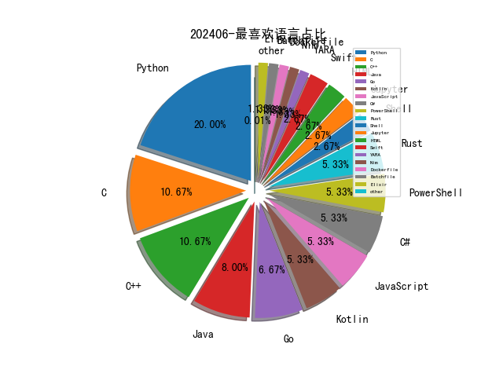

# [数据--所有](README_20.md)
# [数据--年度](README_2024.md)
# 202406 信息源与信息类型占比

# 网络安全书籍 推荐
| date_added | language | title | author | link | size| 
| --- | --- | --- | --- | --- | ---| 
| 2024-06-04 05:23:34 | English | The Reign of Botnets: Defending Against Abuses, Bots and Fraud on the Internet | unknown | https://www.wowebook.org/the-reign-of-botnets-defending-against-abuses-bots-and-fraud-on-the-internet/ | unknown| 
| 2024-06-03 11:35:22 | English | Fundamentals of Python: First Programs, 3rd Edition | unknown | https://www.wowebook.org/fundamentals-of-python-first-programs-3rd-edition/ | unknown| 
| 2024-06-02 08:17:27 | English | Windows Forensics: Understand Analysis Techniques for Your Windows | unknown | https://www.wowebook.org/windows-forensics-understand-analysis-techniques-for-your-windows/ | unknown| 
| 2024-06-02 09:05:12 | English | Mastering Knowledge Management Using Microsoft Technologies | unknown | https://www.wowebook.org/mastering-knowledge-management-using-microsoft-technologies/ | unknown| 
| 2024-06-01 18:47:39 | English | Think Python, 3rd Edition | unknown | https://www.wowebook.org/think-python-3rd-edition/ | unknown| 

# 微信公众号 推荐
| nickname_english | weixin_no | title | url| 
| --- | --- | --- | ---| 
| 3072 | gh_02e64d74f88d | 暗网再现IOS IMessage 零点击 漏洞 | https://mp.weixin.qq.com/s?__biz=MzU4OTk0NDMzOA==&mid=2247484654&idx=1&sn=871d895b4522d603799f08ef813dd9ac | 4| 
| AI与网安 | gh_c57275954216 | 五折发快递操作，五元起寄全国！ | https://mp.weixin.qq.com/s?__biz=MzU1ODQ2NTY3Ng==&mid=2247486881&idx=2&sn=4d5efe1b963544bc6c4f9244357c81fe | 3| 
| CISSP | wxxinchuangsec | 网络安全考证交流群 | https://mp.weixin.qq.com/s?__biz=Mzg4MTg0MjQ5OA==&mid=2247485237&idx=2&sn=ecf1615317f9b4a0e0072523685a83c5 | 2| 
| Docker中文社区 | dockerchina | 程序员必备：彻底弄懂常见的7种中文字符编码 | https://mp.weixin.qq.com/s?__biz=MzI1NzI5NDM4Mw==&mid=2247497439&idx=1&sn=5ce179f79309c9ee1dc8382c1728b30d | 1| 
| Eonian Sharp | Eonian_sharp | 基础速查 , Volatility2基础命令 | https://mp.weixin.qq.com/s?__biz=Mzg3NzUyMTM0NA==&mid=2247485861&idx=1&sn=042b5cc9faaa46e535fc3223ca8ddfc5 | 3| 
| E安全 | EAQapp | 近千名欧洲政客敏感信息出现在暗网市场 | https://mp.weixin.qq.com/s?__biz=MzI4MjA1MzkyNA==&mid=2655346015&idx=1&sn=b0196d9c0d942efc2c1cd8cbc11008df | 3| 
| F12sec | F12sec | 【亿赛通】SaveCDGPermissionFromGFOA SQL注入漏洞 | https://mp.weixin.qq.com/s?__biz=Mzg5NjU3NzE3OQ==&mid=2247488984&idx=1&sn=a270f0d90890f98463891f9430c0d3d9 | 2| 
| Gaobai文库 | HikC98799 | 宝藏网络安全社区 | https://mp.weixin.qq.com/s?__biz=MzkxNzIzNDExMA==&mid=2247486579&idx=1&sn=5ee1d114c2eccb97c6b6e601d32f7a2c | 1| 
| GoUpSec | GoUpSec | 美国海军高级女指挥官私搭WiFi热点被判有罪 | https://mp.weixin.qq.com/s?__biz=MzkxNTI2MTI1NA==&mid=2247499372&idx=2&sn=cd21158b019bb6b7cbdc9d52571babdd | 6| 
| HACK之道 | hacklearn | 自动化代码审计工具 | https://mp.weixin.qq.com/s?__biz=MzIwMzIyMjYzNA==&mid=2247514165&idx=1&sn=759e8c740e4e39d5af43b93040b39566 | 2| 
| HackSee | hacksee_com | Andariel APT利用DoraRAT和Nestdoor恶意软件监视韩国企业 | https://mp.weixin.qq.com/s?__biz=MzI5NTA0MTY2Mw==&mid=2247485230&idx=1&sn=a669b93c4b330e46e33edab3a7462cb3 | 3| 
| Hacking黑白红 | Hacking012 | 2024HW，哪些必备工具库？ | https://mp.weixin.qq.com/s?__biz=Mzg2NDYwMDA1NA==&mid=2247538921&idx=1&sn=3c66bf5b1e0e2d1a9e69836c8eb671f4 | 3| 
| Hack分享吧 | HackShareB | ShiroEXP！Shiro漏洞利用工具 | https://mp.weixin.qq.com/s?__biz=MzA4NzU1Mjk4Mw==&mid=2247490763&idx=1&sn=904e02a6ac7fa54e1dbde7a1a9ee3b87 | 2| 
| IoVSecurity | IoVSecurity | 从首席安全官的视角解码生成式人工智能的影响 | https://mp.weixin.qq.com/s?__biz=MzU2MDk1Nzg2MQ==&mid=2247609714&idx=3&sn=abecf147db5b346d2d26d0d3d6bf240f | 12| 
| Khan安全攻防实验室 | KhanCJSH | APT Operation Veles:针对全球科研教育领域长达十年的窃密活动 | https://mp.weixin.qq.com/s?__biz=MzAwMjQ2NTQ4Mg==&mid=2247493523&idx=1&sn=92d517fdd58c17d15d63cc30d2409d7e | 3| 
| Nil聊安全 | Sec_Nil | 标准化、信息化、数字化、智能化、智慧化与数智化 | https://mp.weixin.qq.com/s?__biz=MzkyMDY4MTc2Ng==&mid=2247483813&idx=1&sn=9de768aaa36ae502643957e057626b81 | 2| 
| OSINT情报分析师 | OSINT_LSD | 稀土震撼！澳洲战略能源公司镝铽探矿数据泄露 | https://mp.weixin.qq.com/s?__biz=MzkxNzU5MjE0OA==&mid=2247484609&idx=1&sn=4d7fce7eda65e5bf22031b39bae0465a | 2| 
| SCA御盾 | SCA_Magic | 【漏洞复现】广联达-GLODON-DataExchange-sql注入漏洞复现 | https://mp.weixin.qq.com/s?__biz=MzkzNjYwODg3Ng==&mid=2247485181&idx=1&sn=6d07880e34ad717e8b7f828e5ec4a27d | 2| 
| SecurityBug | gh_6621ef91ebe9 | Scope Discovery信息收集2（史上最全，进来查漏补缺） | https://mp.weixin.qq.com/s?__biz=Mzg3MzUxNDQwNg==&mid=2247483712&idx=1&sn=50e7b8a6cf4948d817584338aea88d50 | 1| 
| Sec探索者 | gh_46a14c338f91 | 万户漏洞综合利用工具v1.0 | https://mp.weixin.qq.com/s?__biz=MzkyNDYwNTcyNA==&mid=2247485194&idx=1&sn=3ade68d7579dd627f2f141ac02de353f | 2| 
| T0daySeeker | gh_26c54b2c64aa | 深度剖析AhMyth安卓远控工作原理 | https://mp.weixin.qq.com/s?__biz=MzAwNDUzNDExMQ==&mid=2247484690&idx=1&sn=156395a14e00149a2f5a4977d2286896 | 2| 
| TtTeam | gh_a0a1db78ea68 | 从 Chrome和 Edge 进程内存转储 cookie | https://mp.weixin.qq.com/s?__biz=Mzg2NTk4MTE1MQ==&mid=2247485036&idx=1&sn=81c17b70962ca9619b9e5601ccb2e375 | 3| 
| WIN哥学安全 | WIN-security | 太牛了！华为大佬编写的《Web安全攻防总结》火了！（PDF限时3天领取） | https://mp.weixin.qq.com/s?__biz=MzkwODM3NjIxOQ==&mid=2247500619&idx=1&sn=f9dab14e6f3774a8bf5ad24e837484d6 | 1| 
| XCTF联赛 | gh_3d7c7f90f79f | 第八届XCTF国际网络攻防联赛总决赛即将开启！ | https://mp.weixin.qq.com/s?__biz=MjM5NDU3MjExNw==&mid=2247515172&idx=1&sn=4fc670091f6fed547b3e691bd032d8fe | 1| 
| dotNet安全矩阵 | doNetSafety | 国内最大的.NET安全攻防知识社区 | https://mp.weixin.qq.com/s?__biz=MzUyOTc3NTQ5MA==&mid=2247492361&idx=2&sn=8b40cee1adec4d497ff3ecefef314c25 | 4| 
| e安在线 | ean-online | 今日芒种 , ”芒“有所获，”种“有所得 | https://mp.weixin.qq.com/s?__biz=MzI1OTA1MzQzNA==&mid=2651245824&idx=1&sn=9fedb95e0e244e2bd81807a52b4c9434 | 3| 
| imBobby的自留地 | imBobbySY | 全开源、零成本搭建 SOC：免费且好用的安全运营中心！ | https://mp.weixin.qq.com/s?__biz=MzI5MjI4ODU4Nw==&mid=2247490612&idx=1&sn=778b72f7a44735302c47e5e5927becbd | 2| 
| 一己之见安全团队 | gh_51d9e58684ee | 应急响应篇——Linux进程排查 | https://mp.weixin.qq.com/s?__biz=MzkzNzY3ODk4MQ==&mid=2247483932&idx=1&sn=7e370146f42388b1068486ad5e7bd7ba | 1| 
| 一起聊安全 | gh_589ffdaa31f9 | 附下载 , 100项能源领域网络与数据安全政策全集(2024版) | https://mp.weixin.qq.com/s?__biz=MzI3NjUzOTQ0NQ==&mid=2247511028&idx=1&sn=ecb424b443f072d21fdb9ef241a253cd | 3| 
| 丁爸 情报分析师的工具箱 | dingba2016 | 【转载】美“艾森豪威尔”号航母遭受胡塞武装打击真相 | https://mp.weixin.qq.com/s?__biz=MzI2MTE0NTE3Mw==&mid=2651144181&idx=2&sn=e7c34c6dd4e898c75470084898a1095b | 3| 
| 七芒星实验室 | HeptagramSec | 内网渗透之SSH隧道 | https://mp.weixin.qq.com/s?__biz=Mzg4MTU4NTc2Nw==&mid=2247491804&idx=2&sn=eb334c8bb0be9ea0a3baf21db6e8fd07 | 4| 
| 中国电信安全 | None | 今日芒种 | https://mp.weixin.qq.com/s?__biz=Mzg5NTU3Nzg3MQ==&mid=2247521237&idx=2&sn=0b2e119e1b00aaec98b5d82dad3c1921 | 3| 
| 中孚信息 | zfinfo | 中孚信息实力入围「2024年中国最佳信创厂商系列榜单」 | https://mp.weixin.qq.com/s?__biz=MzAxMjE1MDY0NA==&mid=2247508099&idx=1&sn=d64161283ba478683608f3732db8d3a5 | 1| 
| 中泊研安全应急响应中心 | gh_ee6d13a7ae1e | H2数据库漏洞（CVE-2022-23221）复现 | https://mp.weixin.qq.com/s?__biz=Mzg2NDc0MjUxMw==&mid=2247485750&idx=1&sn=a047f80690d3e8b3c7a86b07b66744c1 | 1| 
| 乌雲安全 | hackctf | 2024HW情报交流群 | https://mp.weixin.qq.com/s?__biz=MzAwMjA5OTY5Ng==&mid=2247522658&idx=2&sn=448e30ab4c59e8bf714c4a326770ea01 | 3| 
| 二进制空间安全 | suntiger_2023 | 将Windows BitLocker功能变成勒索软件 | https://mp.weixin.qq.com/s?__biz=MzkxOTUyOTc0NQ==&mid=2247490038&idx=1&sn=d92ac8e23cb95abd2f6c2906cfbd37cc | 3| 
| 京东安全应急响应中心 | jsrc_team | 【公告】JSRC三月英雄榜单揭晓 | https://mp.weixin.qq.com/s?__biz=MjM5OTk2MTMxOQ==&mid=2727836579&idx=1&sn=bc6bcd60c18d8eae784f0b2202b88993 | 1| 
| 京数安 | jsa20210329 | APP因强索用户隐私被网友起诉，法院：运营方删除信息并赔偿 | https://mp.weixin.qq.com/s?__biz=Mzg4OTY4MDA2MA==&mid=2247491416&idx=3&sn=690e1ded113f063c8c610cfe7b51fcc6 | 4| 
| 会杀毒的单反狗 | cmlitiejun | 病理学和诊断服务提供商 Synnovis 遭勒索软件攻击，影响伦敦多家医院 | https://mp.weixin.qq.com/s?__biz=MzI2NzAwOTg4NQ==&mid=2649791364&idx=2&sn=8d50b990b16bbd2918cd6664a8e4a253 | 4| 
| 伟大航路D | gh_c1fdc31f79ef | 【漏洞复现】飞企互联-FE企业运营管理平台 treeXml.jsp接口处存在SQL注入漏洞 | https://mp.weixin.qq.com/s?__biz=MzkwNzYzNTkzNA==&mid=2247486165&idx=1&sn=1a87e326dde21270413561d7c909f6bf | 3| 
| 信安404 | infosec404 | 碉堡了！327页Web安全学习笔记（附下载） | https://mp.weixin.qq.com/s?__biz=Mzk0NjQ5MTM1MA==&mid=2247490563&idx=1&sn=1774d1c8b83c585e0f28aa8fe5e78749 | 2| 
| 信安之路 | xazlsec | 穿越防火墙建立网络通道的新姿势 | https://mp.weixin.qq.com/s?__biz=MzI5MDQ2NjExOQ==&mid=2247499402&idx=1&sn=8c8c5a6a98d395f7c62b78d6b210cce9 | 1| 
| 信安路漫漫 | gh_96cdf0c3b4d5 | k8s系列3之kubectl常用命令 | https://mp.weixin.qq.com/s?__biz=Mzg2MzkwNDU1Mw==&mid=2247484770&idx=1&sn=c5ada4a13d527ac962668e3e3cd92660 | 2| 
| 兰花豆说网络安全 | SecuritySay | 网络安全售前人员必备的五种基础能力 | https://mp.weixin.qq.com/s?__biz=MzI3NzM5NDA0NA==&mid=2247487961&idx=1&sn=7d4802ce147e198aa5f0259ba67fa9f2 | 3| 
| 关键信息基础设施安全保护联盟 | CNCIIPA | 会员风采：中广核数字科技有限公司 | https://mp.weixin.qq.com/s?__biz=MzkxNjU2NjY5MQ==&mid=2247503142&idx=3&sn=0b07de00b9f991aa6b1985c06056457a | 7| 
| 冷漠安全 | gh_1c1d6111ce8f | 「漏洞复现」用友NC pagesServlet SQL注入漏洞(XVE-2024-13067) | https://mp.weixin.qq.com/s?__biz=MzkyNDY3MTY3MA==&mid=2247484481&idx=1&sn=dc75814aade7d92cabca79286fcd5500 | 4| 
| 创信华通 | cdcxht | 创信解读丨密评解析：什么是密评？ | https://mp.weixin.qq.com/s?__biz=MzUxNTQxMzUxMw==&mid=2247522611&idx=1&sn=ca0e094ec042d765dff0f88f3860f46d | 1| 
| 利刃信安 | DMXGFSYS | 如何把Windows的事件日志收集到Syslog日志服务器？ | https://mp.weixin.qq.com/s?__biz=MzU1Mjk3MDY1OA==&mid=2247513954&idx=1&sn=c1c1e8a27375e19f44d1ddd8e47868d3 | 2| 
| 吉祥在职场 | gh_370fbad7aec1 | 带癌上班：我的双重战斗！ | https://mp.weixin.qq.com/s?__biz=MzI1ODY3MTA3Nw==&mid=2247485420&idx=1&sn=e803fa8286e932c1a2c5edbd6bc74fc4 | 2| 
| 吉祥学安全 | gh_bf0dc85c3f99 | 高考线上报名系统要加固，保护学生信息很重要 | https://mp.weixin.qq.com/s?__biz=MzkwNjY1Mzc0Nw==&mid=2247484515&idx=1&sn=1fa7ee8749ea9fd00ca5416ca5827ec3 | 4| 
| 听风安全 | tingfengsec | 2024HVV知识库及面经整理 | https://mp.weixin.qq.com/s?__biz=Mzg3NzIxMDYxMw==&mid=2247500739&idx=1&sn=b0fc71db3bf2746d1dfad2827228e944 | 1| 
| 嘶吼专业版 | Pro4hou | 进一步夯实金融领域数据安全法治之基 浅谈《银行保险机构数据安全管理办法（公开征求意见稿）》 | https://mp.weixin.qq.com/s?__biz=MzI0MDY1MDU4MQ==&mid=2247575619&idx=2&sn=b085212fe41a3b56df72678e22027c41 | 4| 
| 国际云安全联盟CSA | gh_674820794ae8 | 2024上海“随申码”应用大赛报名ing，附大赛报名常见问题答疑 | https://mp.weixin.qq.com/s?__biz=MzkwMTM5MDUxMA==&mid=2247497457&idx=2&sn=9c59d7feaea69593607b96091f6eef5e | 2| 
| 墨雪飘影 | SG-CXZ | 【亿赛通】SaveCDGPermissionFromGFOA SQL注入漏洞 | https://mp.weixin.qq.com/s?__biz=MzI3NzI4OTkyNw==&mid=2247489271&idx=1&sn=16ede0a2b4d9dd6bfdd98c58657854f9 | 1| 
| 夜组安全 | NightCrawler_Team | 最新Struts2全版本漏洞检测工具 | https://mp.weixin.qq.com/s?__biz=Mzk0ODM0NDIxNQ==&mid=2247490954&idx=1&sn=a0d58217336d5bcd0523ad15d5db2c8d | 2| 
| 天唯信息安全 | TWtech2113189 | 《IPv6 地址分配和编码规则 接口标识符》（GB/T 43844-2024）将于今年11月1日起正式实施 | https://mp.weixin.qq.com/s?__biz=MzkzMjE5MTY5NQ==&mid=2247498172&idx=4&sn=d2a25104d8b01d527bdf78b2271a2c6e | 7| 
| 天地和兴 | bjtdhxkj | 数智新时代｜天地和兴受邀出席2024工业安全大会发表主题演讲 | https://mp.weixin.qq.com/s?__biz=MjM5Mzk0MDE2Ng==&mid=2649607514&idx=1&sn=25792f6a598056ffe5455b1dc6d85ac3 | 1| 
| 天极智库 | gh_90d775fd9c26 | 【国际视野】美国国土安全部发布《创新、研究与发展战略计划》 | https://mp.weixin.qq.com/s?__biz=MzIyMjQwMTQ3Ng==&mid=2247489968&idx=1&sn=ca905ee5dc60e0c7ec69cb7f203dc26a | 1| 
| 奇安信威胁情报中心 | gh_166784eae33e | 直播BCS2024 , 威胁情报多场景下的实战技术落地 | https://mp.weixin.qq.com/s?__biz=MzI2MDc2MDA4OA==&mid=2247510681&idx=1&sn=ee8f38adf2f6238692096d1f59b76ef4 | 1| 
| 威努特安全网络 | winicssec_bj | 数智赋能丨构建一体化高效稳定的智慧工厂融合通信网络 | https://mp.weixin.qq.com/s?__biz=MzAwNTgyODU3NQ==&mid=2651122423&idx=1&sn=4cb5abe61d77a50c61eb8d52cd715b4f | 2| 
| 安世加 | asjeiss | 安全聘 , 某Fintech 公司招人啦! | https://mp.weixin.qq.com/s?__biz=MzU2MTQwMzMxNA==&mid=2247538797&idx=1&sn=04699cd1651097067b34bdaf4cde7e7d | 1| 
| 安信安全 | gsaxns | 芒种丨风吹麦成浪  蝉鸣夏始忙 | https://mp.weixin.qq.com/s?__biz=MzAxNTYwOTU1Mw==&mid=2650090085&idx=1&sn=7dba2dda0b545ab5ad22b7a57ab326fe | 1| 
| 安全喵喵站 | CyberSecurityMew | u200b6个网安创业新思路｜Y Combinator 2024年冬季营网安初创分析 | https://mp.weixin.qq.com/s?__biz=MzkzNjE5NjQ4Mw==&mid=2247538645&idx=1&sn=6feddb4d743aba5997c325dac4d76759 | 2| 
| 安全学习那些事儿 | aqxxse | 《上海互联网企业社会责任和社会公益报告(2023)》发布 | https://mp.weixin.qq.com/s?__biz=MzkxNTI2NTQxOA==&mid=2247492392&idx=4&sn=d29508b8010715a74b58d88990822b5a | 6| 
| 安全洞察知识图谱 | gh_d9a3a4cfeeac | 记一次违法网站的渗透经历 | https://mp.weixin.qq.com/s?__biz=MzkyMDM4NDM5Ng==&mid=2247485865&idx=1&sn=5ef27197d9d71c7358e3db43e5007b6c | 3| 
| 安全牛 | aqniu-wx | 边缘服务正在成为黑客攻击的新目标；基于PDF的恶意软件威胁持续上升 , 牛览 | https://mp.weixin.qq.com/s?__biz=MjM5Njc3NjM4MA==&mid=2651130151&idx=2&sn=bbd10e640d2a55aaa50bef7b25b27341 | 4| 
| 安全笔记 | None | 后记：关于拿下BC站的细节答疑 | https://mp.weixin.qq.com/s?__biz=Mzg3NDc3NDQ3NA==&mid=2247484444&idx=1&sn=783e189c6667a84b4a9c39d5f7ccdba8 | 2| 
| 安恒信息 | AnHengCloudNews | 苏州工业园区管理委员会与安恒信息签署战略合作协议 | https://mp.weixin.qq.com/s?__biz=MjM5NTE0MjQyMg==&mid=2650609395&idx=1&sn=c3251f7ffd5a6548903a92d0bca3116d | 4| 
| 安易科技AneSec | anesec | 6月13日, CSA云原生研讨会，应对云原生安全新挑战 | https://mp.weixin.qq.com/s?__biz=MzkwMTI3ODUxOQ==&mid=2247485036&idx=1&sn=4a2d26dc83fb44c83bfa785d17137c0e | 1| 
| 实战安全研究 | gh_f390fc63c711 | 漏洞复现 , 智慧校园(安校易)管理系统 FileUpProductupdate.aspx 任意文件上传漏洞【附poc】 | https://mp.weixin.qq.com/s?__biz=MzU0MTc2NTExNg==&mid=2247490417&idx=1&sn=856500a62a9f28a8573d7901b4b11f11 | 3| 
| 小惜渗透 | xxshentou | 质量这么高还免费？ | https://mp.weixin.qq.com/s?__biz=Mzg3OTcxMjE2NQ==&mid=2247486862&idx=2&sn=d7253ba188f89213266cde7ed1fa1842 | 2| 
| 小明信安 | security-xm | 【漏洞复现 , 含批量POC】海康威视综合安防 download 任意文件读取漏洞 | https://mp.weixin.qq.com/s?__biz=Mzg4NjI0MDM5MA==&mid=2247485032&idx=1&sn=a36982d4628e8d0e6e7cbe01277459f5 | 1| 
| 小白安全工具 | gh_981785667bb3 | Hikvision综合漏洞利用工具 | https://mp.weixin.qq.com/s?__biz=MzkyMTQwNjA4NA==&mid=2247484921&idx=1&sn=16a875ccb4a103309005dadebd8ced72 | 1| 
| 小羊安全屋 | gh_431c125001cd | 【命令执行】Apache OFBi路径遍历 | https://mp.weixin.qq.com/s?__biz=MzkyMTY1NDc2OA==&mid=2247486192&idx=1&sn=cdbfefb5a6825edc916f3a8f81974cce | 1| 
| 小韩讲安全 | None | 《JAVA实习生》《2K》 | https://mp.weixin.qq.com/s?__biz=Mzg3NTY3NDA5MA==&mid=2247483886&idx=1&sn=94411bdc693659934180f937937f9ffa | 1| 
| 山石网科安全技术研究院 | HSN_LAB | 浅谈GraphQL API安全测试 | https://mp.weixin.qq.com/s?__biz=MzUzMDUxNTE1Mw==&mid=2247506565&idx=1&sn=6042c9a216a7659b698277aced18ad28 | 1| 
| 弥天安全实验室 | gh_41292c8e5379 | 【成功复现】海康威视综合安防平台任意文件读取漏洞 | https://mp.weixin.qq.com/s?__biz=MzU2NDgzOTQzNw==&mid=2247501765&idx=1&sn=3457529a66bc799e1af03a12cc7e9639 | 1| 
| 微步在线研究响应中心 | gh_280024a09930 | 漏洞通告 , 派网Panalog远程代码执行漏洞 | https://mp.weixin.qq.com/s?__biz=Mzg5MTc3ODY4Mw==&mid=2247506008&idx=1&sn=8809880121383761d9afdbfa4580fd00 | 2| 
| 情报分析师 | Intelligencer1 | u200b8大神秘技巧，轻松在开源照片中捕捉关键线索 | https://mp.weixin.qq.com/s?__biz=MzA3Mjc1MTkwOA==&mid=2650551043&idx=1&sn=9bb9956029ed73cd8f7c8c128e779c95 | 3| 
| 我吃你家米了 | None | 枚举HandleTypeValue（持续更新中） | https://mp.weixin.qq.com/s?__biz=MzkzNTA0NzgyMA==&mid=2247484221&idx=1&sn=09cb1e0071808d544d4b58cefc3406f3 | 1| 
| 技可达工作室 | ms016team | flipper zero样机 | https://mp.weixin.qq.com/s?__biz=MzU3NDY1NTYyOQ==&mid=2247485937&idx=1&sn=9342055d8741b397b61914f8839e981c | 1| 
| 技术修道场 | gh_fe3e6e63e435 | Linux系统问题及处理方法（硬件问题） | https://mp.weixin.qq.com/s?__biz=MzA4NTY4MjAyMQ==&mid=2447899055&idx=1&sn=2ddd5c3b8ae801860aa88a2177a493c6 | 2| 
| 掌控安全EDU | ZKAQEDU | 2024国家HW行动招募通知！ | https://mp.weixin.qq.com/s?__biz=MzUyODkwNDIyMg==&mid=2247540725&idx=3&sn=6f268c8bc5cb9a632e2595147658156f | 6| 
| 数据安全合规交流部落 | GD_DataSecurity | 互联网公开漏洞整理202309-202406 | https://mp.weixin.qq.com/s?__biz=MzU2MDQ0NzkyMw==&mid=2247484819&idx=1&sn=c615077aaa1519f51139b71e81a73715 | 1| 
| 数说安全 | csreviews | 一文读懂：绿盟视频安全交换系统（VES）能干啥 | https://mp.weixin.qq.com/s?__biz=MzkzMDE5MDI5Mg==&mid=2247506396&idx=2&sn=edb6b147aefe05721fb44cf5663a93bd | 2| 
| 斗象智能安全 | TophantAI | 2024攻防演练必修高危漏洞集合（2.0版） | https://mp.weixin.qq.com/s?__biz=MzIwMjcyNzA5Mw==&mid=2247494879&idx=1&sn=82e8e69ddb7f507d6c5bf3db46303ff7 | 2| 
| 无糖反网络犯罪研究中心 | gh_2ee7a9b17c0d | 老人被骗现金？一键寻找冒充亲属诈骗相关线索！ | https://mp.weixin.qq.com/s?__biz=MzAxMzkzNDA1Mg==&mid=2247511093&idx=1&sn=b79b805a4d40d954d79ae3b7542cde84 | 2| 
| 昊天信安 | cniaosec | 免杀生成与木马捆绑工具 -- rsmaker | https://mp.weixin.qq.com/s?__biz=MzkzNzI4NDQzMA==&mid=2247498107&idx=1&sn=2873c3d03cbb7dd46d7ee35d5e668f57 | 2| 
| 星盟安全 | XM_security | 矩阵杯 2024 Writeup | https://mp.weixin.qq.com/s?__biz=MzU3ODc2NTg1OA==&mid=2247489945&idx=1&sn=8a6ffb78ae936f35060875fd851b87bf | 1| 
| 李白你好 | libai_hello | 最新Hikvision海康威视综合漏洞利用工具 | https://mp.weixin.qq.com/s?__biz=MzkwMzMwODg2Mw==&mid=2247507166&idx=1&sn=88849634e11926f33936686aad3454a5 | 2| 
| 极客 Web3 | mingjingweb3 | 理论与实践：以太坊Rollup的抗审查交易如何触发？ | https://mp.weixin.qq.com/s/5h0TXPegnyzmPl3X-nnqlg | 1| 
| 柠檬赏金猎人 | nmlr3306 | HFS2.3m未授权命令执行漏洞 | https://mp.weixin.qq.com/s?__biz=Mzg2Mzg2NDM0NA==&mid=2247484557&idx=1&sn=840194a5b8cad798779d75f1113ca006 | 1| 
| 棉花糖网络安全圈 | hacker-mht | Awvs的windows一键破解程序 | https://mp.weixin.qq.com/s?__biz=Mzg5NTYwMDIyOA==&mid=2247504538&idx=1&sn=74141082a0235219efec2acacabd9fbe | 2| 
| 汇能云安全 | metech2005 | 巴菲特股票暴跌99%？纽交所IT系统出现重大技术故障 | https://mp.weixin.qq.com/s?__biz=MzIwNzAwOTQxMg==&mid=2652250053&idx=1&sn=e6a2a5198ad856a1ed80fd72d44d0b82 | 2| 
| 汽车电子嵌入式 | gh_c9d411042eab | 【OS】AUTOSAR OS如何实现Task抢占 | https://mp.weixin.qq.com/s?__biz=Mzg2NTYxOTcxMw==&mid=2247491873&idx=3&sn=b2a375d45fcfd744ac0ecab8f8103fb6 | 3| 
| 洞见网安 | doonsec | 网安简报【2024/6/4】 | https://mp.weixin.qq.com/s?__biz=MzAxNzg3NzMyNQ==&mid=2247488306&idx=1&sn=bcbc93f07b945a171974a8658e506652 | 6| 
| 浅安安全 | gh_758e256fcc72 | 工具 , OSSFileBrowse | https://mp.weixin.qq.com/s?__biz=MzkwMTQ0NDA1NQ==&mid=2247489116&idx=4&sn=c6a7984678b01aa5573c27b5a456d562 | 8| 
| 深信服科技 | sangfor_man | 深信服×菲特：一起用AI帮忙“造车” | https://mp.weixin.qq.com/s?__biz=MjM5MTAzNjYyMA==&mid=2650588002&idx=1&sn=233ae811f71df8fb6f778d22d391a02f | 2| 
| 渗透测试 | sql_sec | 0day  六一礼品到！ | https://mp.weixin.qq.com/s?__biz=Mzg2ODY3NDYxNA==&mid=2247485530&idx=2&sn=2ecdbf4a2eb1d006760bdf52e0e9fce8 | 7| 
| 漏洞猎人 | VulnHunter | CVE-2024-4358 | https://mp.weixin.qq.com/s?__biz=MzkwOTQ4NDMzOQ==&mid=2247484423&idx=1&sn=59196312cb9dbd8eda56e379a8c1889c | 1| 
| 潇湘信安 | xxxasec | 等保自查表，一文发现系统差距 | https://mp.weixin.qq.com/s?__biz=Mzg4NTUwMzM1Ng==&mid=2247510630&idx=1&sn=2e233b0b59790ba885424e69f8ace3b6 | 2| 
| 炼石网络CipherGateway | CipherGateway | 附下载 , 六大洲14国140项数据安全及跨境法规汇总分析(2024版) | https://mp.weixin.qq.com/s?__biz=MzkyNzE5MDUzMw==&mid=2247549386&idx=1&sn=a0f6824a25df5747555f6ad450804547 | 2| 
| 独眼情报 | cs_cti | Linux 内核漏洞CVE-2023-3390 POC代码发布 | https://mp.weixin.qq.com/s?__biz=MzkzNDIzNDUxOQ==&mid=2247485110&idx=1&sn=bde18265ce6ed9560eda5dd3d8253388 | 2| 
| 玄知安全实验室 | gh_2f49ecc78ed6 | 对于强制证书站的测试 | https://mp.weixin.qq.com/s?__biz=Mzk0MzYzMDI2OA==&mid=2247486790&idx=1&sn=5aa4ff7239fbf5a90701676f6f68ee54 | 1| 
| 玄道夜谈 | None | 分享图片 | https://mp.weixin.qq.com/s?__biz=MzI3Njc1MjcxMg==&mid=2247492255&idx=1&sn=a6e6729592afa0ddc9c5fff60e903146 | 3| 
| 珂技知识分享 | kezibei001 | 渗透某个贷款诈骗网站 | https://mp.weixin.qq.com/s?__biz=MzUzNDMyNjI3Mg==&mid=2247486788&idx=1&sn=0cb46678d6a29510c1e574f3b11c5d24 | 2| 
| 琴音安全 | Qinyinsafe | 一款好用的密码字典生成工具 | https://mp.weixin.qq.com/s?__biz=Mzg3NTk4MzY0MA==&mid=2247486645&idx=1&sn=63e904c32df8409e590de27e437a4ab4 | 2| 
| 白帽子左一 | HackRead | 2024国家HW行动招募通知！ | https://mp.weixin.qq.com/s?__biz=MzI4NTcxMjQ1MA==&mid=2247610526&idx=2&sn=b180eab052f24c01c0b8bef8e497a4be | 4| 
| 白帽子社区团队 | bmzsec | 护网知多少（二） | https://mp.weixin.qq.com/s?__biz=MzkzNDQ0MDcxMw==&mid=2247484656&idx=1&sn=e67ed53ba33f4f00f51aa9a94404b530 | 2| 
| 皓月当空w | hanaffectionl | 【2024年6月5日】 All In One 机器人新增早报推送内容 | https://mp.weixin.qq.com/s?__biz=Mzg4MDg5NzAxMQ==&mid=2247485659&idx=2&sn=bb0bdc093599563aaedb967b4684a0cb | 6| 
| 破壳平台 | TianGong_Lab | 某OA业务逻辑缺陷导致RCE的利用链解析 | https://mp.weixin.qq.com/s?__biz=Mzk0OTU2ODQ4Mw==&mid=2247485385&idx=1&sn=5c9d8b4706cbf990d2c946a757abcdc6 | 1| 
| 祺印说信安 | None | 网络安全等级保护：API安全要素详解 | https://mp.weixin.qq.com/s?__biz=MzA5MzU5MzQzMA==&mid=2652107348&idx=1&sn=3c77e248adccb9a2268fbe69d7f9c27d | 2| 
| 红日安全 | None | HVV时间已定，最后一波考试初筛截止今天20:00提交信息 | https://mp.weixin.qq.com/s?__biz=MzI4NjEyMDk0MA==&mid=2649851663&idx=1&sn=f8b7c3147d44b69d2ed6a1a8a715e3fc | 1| 
| 网空闲话plus | TheCyberExpress1 | 5th域安全微讯早报【20240605】135期 | https://mp.weixin.qq.com/s?__biz=MzkyMjQ5ODk5OA==&mid=2247499621&idx=2&sn=1f86f62003cfb933d97338b69aa56d2d | 5| 
| 网络安全与取证研究 | wangluoanquanquzheng | 各类工具镜像操作 | https://mp.weixin.qq.com/s?__biz=Mzg3NTU3NTY0Nw==&mid=2247488861&idx=1&sn=89b3b295cd7250cc40f180b85c5525f7 | 2| 
| 网络安全实验室 | wlaqyjs | 网络安全永久资料库 | https://mp.weixin.qq.com/s?__biz=MzU4OTg4Nzc4MQ==&mid=2247502554&idx=2&sn=f6992e5f1452b5eb7f881cf88783f068 | 4| 
| 网络安全等保与关保 | DJBH-CIIP | 附下载 , 六大洲14国140项数据安全及跨境法规汇总分析(2024版) | https://mp.weixin.qq.com/s?__biz=MzUyNjk2MDU4MQ==&mid=2247486206&idx=1&sn=12cc75e9540967965aea44f05beffe9b | 1| 
| 网络安全自修室 | gh_21e38c4b4ad1 | 提权辅助工具WindowsVulnScan使用! | https://mp.weixin.qq.com/s?__biz=MzI0NDYxMzk1Mg==&mid=2247501448&idx=1&sn=ef61e323fecbcf273787f0a043862d0e | 1| 
| 网络技术联盟站 | wljslmz | 网工掌握这些排障命令和工具，至少可覆盖90%以上日常工作 | https://mp.weixin.qq.com/s?__biz=MzIyMzIwNzAxMQ==&mid=2649458406&idx=1&sn=e8df0e5c5a0fc6c9bd45094519b4736b | 3| 
| 芳华绝代安全团队 | ifhsec | 玲珑安全第三期如约而至 | https://mp.weixin.qq.com/s?__biz=MzI4NTYwMzc5OQ==&mid=2247493447&idx=1&sn=04e4dfd799d0f22f5adfb1a50032d221 | 1| 
| 苏说安全 | sushuoanquan | 等级保护 , 如何完成等保的建设整改 | https://mp.weixin.qq.com/s?__biz=Mzg5OTg5OTI1NQ==&mid=2247487533&idx=1&sn=3946d3692b30970b2b76afcbcc1381d1 | 2| 
| 苏诺木安全团队 | None | 【nday】CraftCMS CVE-2023-41892 代码执行漏洞【附poc】 | https://mp.weixin.qq.com/s?__biz=MzkwMjYzNTE4MA==&mid=2247484476&idx=1&sn=d813d43689dbf4218ceb0d62f40532c4 | 3| 
| 草帽一只尔 | OSINTAnalyst | 急了！美国白宫新任命了3名总统情报顾问委员会成员 | https://mp.weixin.qq.com/s?__biz=Mzg2MTg3NzQ5OQ==&mid=2247484932&idx=1&sn=9843ebc490845d249ec87a8a9a724000 | 4| 
| 菜鸟学信安 | securitylearn | App渗透 , 人脸识别登录绕过 | https://mp.weixin.qq.com/s?__biz=MzU2NzY5MzI5Ng==&mid=2247501958&idx=1&sn=57cc4bd3a91b4264d62ab877b6339575 | 2| 
| 融云攻防实验室 | gh_0dba7ff3f653 | 漏洞预警 平升水库系统 simmaintainservice SQL注入漏洞 | https://mp.weixin.qq.com/s?__biz=MzkyMTMwNjU1Mg==&mid=2247491347&idx=1&sn=3d29e03d217ec5d6aa31771c3ada65ae | 1| 
| 计算机与网络安全 | C-CyberSecurity | 网络安全攻防作战PPT.rar | https://mp.weixin.qq.com/s?__biz=MjM5OTk4MDE2MA==&mid=2655242336&idx=8&sn=68d3126ae82b49d8150fadd4180d8ed8 | 16| 
| 贝雷帽SEC | Beret-Sec | 【OSCP】translator | https://mp.weixin.qq.com/s?__biz=Mzk0MDQzNzY5NQ==&mid=2247491839&idx=1&sn=cc37a115906cc53476a2314ab65bc165 | 1| 
| 赛宁网安 | Cyberpeace | 第八届XCTF国际网络攻防联赛总决赛即将开启！ | https://mp.weixin.qq.com/s?__biz=MzA4Mjk5NjU3MA==&mid=2455485157&idx=1&sn=c7e7b24c4c9012246e7630e47658a5fd | 1| 
| 赛欧思安全研究实验室 | gh_04596d590471 | 美国保险公司QuoteWizard 被攻击窃取了 2TB 压缩数据 | https://mp.weixin.qq.com/s?__biz=MzU0MjE2Mjk3Ng==&mid=2247487181&idx=1&sn=408680c222cfb8a37aaeeae53d9b114e | 3| 
| 迪普科技 | DPtechnology | 潮聚东湖 智启未来丨迪普科技与湖北电力行业合作伙伴赋能行业新发展 共谱未来新蓝图 | https://mp.weixin.qq.com/s?__biz=MzA4NzE5MzkzNA==&mid=2650354661&idx=1&sn=4cee333e2c900d27e9bad44853f8b8ac | 1| 
| 道一安全 | DaoYiSecurity | 互联网公开漏洞整理202309-202406 | https://mp.weixin.qq.com/s?__biz=MzU5OTMxNjkxMA==&mid=2247485541&idx=1&sn=7aa501147b8bd082ee1a7f39a875a153 | 4| 
| 道玄网安驿站 | gh_cb9a38436cdd | Linux最新提权漏洞 | https://mp.weixin.qq.com/s?__biz=Mzg4NTg5MDQ0OA==&mid=2247486331&idx=1&sn=bf15291e8cfee0d2b728651fd851e7e6 | 3| 
| 邑安全 | EansecD | CVE-2020-16040 Chrome v8 漏洞浅析 | https://mp.weixin.qq.com/s?__biz=MzUyMzczNzUyNQ==&mid=2247522151&idx=4&sn=9d361fa09c0c513e98b3456c43a103e2 | 8| 
| 释然IT杂谈 | ShiRan_IT | 终极Linux秘籍：这份资料带你快速成长！ | https://mp.weixin.qq.com/s?__biz=MzIxMTEyOTM2Ng==&mid=2247503100&idx=1&sn=0e2c0548d0d69bebe2c8feab955a75c7 | 1| 
| 银遁安全团队 | None | 【漏洞复现】天智云SAAS平台存在SQL注入漏洞 | https://mp.weixin.qq.com/s?__biz=MzU3MjU4MjM3MQ==&mid=2247485860&idx=2&sn=7d4c52b31e9953d5916e16c8ac55598d | 4| 
| 隐雾安全 | gh_9355275bad2a | 不干安全喽 做主播去了 | https://mp.weixin.qq.com/s?__biz=MzkyNzM2MjM0OQ==&mid=2247493574&idx=1&sn=8f54238549f443e8365592bdb7ac0e19 | 2| 
| 鱼影安全 | gh_c09563251189 | 【文末赠书】618精选网络安全书单：打造数字世界的钢铁长城！ | https://mp.weixin.qq.com/s?__biz=MzkyOTI4NTY4MQ==&mid=2247490077&idx=1&sn=191eb7f1c7f89572ef177f45f5c0258f | 1| 
| 黑客技术与网络安全 | HackerCoder | 真人视频开始冒充Sora，威尔·史密斯吃意大利面名场面 | https://mp.weixin.qq.com/s?__biz=MzIyMDEzMTA2MQ==&mid=2651166817&idx=1&sn=2fbc13723b1ab99f9faa8f0b37cb7bf8 | 3| 
| 黑客白帽子 | hackerwhitehat | 【免费资源】Excel可视化信息图表模板 | https://mp.weixin.qq.com/s?__biz=MzA5MzYzMzkzNg==&mid=2650952676&idx=4&sn=002ab39117cd6d47158ed22507fc9559 | 8| 
| 黑客驰 | HackerChi_Top | 中国主要朝代的年份对照表 | https://mp.weixin.qq.com/s?__biz=Mzg4MzgwMDE2Mw==&mid=2247487765&idx=1&sn=1d6d0b1f79af2d105d1557d111c401a1 | 2| 
| 黑猫安全 | Blackcat-Security | 勒索黑客组织RansomHub声称黑客入侵了电信巨头Frontier Communications | https://mp.weixin.qq.com/s?__biz=Mzg3OTc0NDcyNQ==&mid=2247491648&idx=5&sn=ecad5f1059162bdd4c6ee0915d181559 | 7| 
| 黑白之道 | i77169 | 渗透测试报告生成工具 | https://mp.weixin.qq.com/s?__biz=MzAxMjE3ODU3MQ==&mid=2650594097&idx=4&sn=cb79be6592c1f855cafb681bea7d058c | 12| 
| AtomsTeam | Atoms4Team | 上周漏洞周报(5月27---6月2号) | https://mp.weixin.qq.com/s?__biz=Mzg3ODgyMzMzNw==&mid=2247484306&idx=1&sn=d1324c789393fd2e44e77c5f2b4107a2 | 1| 
| Desync InfoSec | DesyncInfoSec | Linux 应急响应手册 | https://mp.weixin.qq.com/s?__biz=MzkzMDE3ODc1Mw==&mid=2247488029&idx=1&sn=d259badf401f5f2109288418c9776cc0 | 1| 
| NightmareV | Kobernet | Nacos未授权文件下载漏洞 | https://mp.weixin.qq.com/s?__biz=MzkxNDU2ODc0Nw==&mid=2247484054&idx=1&sn=b1845ce95e1d06b8ce10009700ad9003 | 1| 
| WebSec | gh_2914f5b10e8e | 【1day新接口】用友某接口存在任意文件下载漏洞 | https://mp.weixin.qq.com/s?__biz=MzkyMzYwNTEyNg==&mid=2247486469&idx=1&sn=91f86a79fddfad652cb75cf7118fe701 | 1| 
| crossoverJie | crossoverJie | 几个你或许并不知道 kubernetes 技巧 | https://mp.weixin.qq.com/s?__biz=MzIyMzgyODkxMQ==&mid=2247487221&idx=1&sn=2036133015a6077638ccfb4b8afe1ca2 | 1| 
| 七夜安全博客 | qiye_safe | 彻底解决微信apk1文件安装问题，传输个文件还给我重命名！！！ | https://mp.weixin.qq.com/s?__biz=MzIwODIxMjc4MQ==&mid=2651005539&idx=1&sn=643c449717915a5482b191b1e52e2758 | 3| 
| 亿人安全 | Yr-Sec | 2024HW注意事项及资料整理 | https://mp.weixin.qq.com/s?__biz=Mzk0MTIzNTgzMQ==&mid=2247515444&idx=1&sn=a58ca333bc8ec8d4b953e8e600a6e684 | 1| 
| 军机故阁 | gh_e57baf46bdf5 | 新增facebook泄露查询库 | https://mp.weixin.qq.com/s?__biz=MzU5Mjk3MDA5Ng==&mid=2247486084&idx=1&sn=d618b50bf0b9fa7c8b19cd545583193b | 1| 
| 前沿信安资讯阵地 | infosrc | 研究网络危机管理最佳做法 | https://mp.weixin.qq.com/s?__biz=MzA3MTM0NTQzNA==&mid=2455774939&idx=1&sn=baf9b65b7a60629ff474f308dffccb24 | 2| 
| 天驿安全 | tianyisec | hvv大批量的ip自动化溯源工具 | https://mp.weixin.qq.com/s?__biz=MzkxNjIxNDQyMQ==&mid=2247497076&idx=1&sn=e4cad7d0ed7350e9f003d96a7b10d636 | 2| 
| 安全小姿势 | www_sqlsec_com | 国光二期 WEB 课程之端口扫描靶场 WP | https://mp.weixin.qq.com/s?__biz=Mzk0MDI0OTQwNw==&mid=2247484604&idx=1&sn=c91b18bbc3484c91f31a7f3b819bbc47 | 1| 
| 安全村SecUN | sec-un | 出海·新加坡｜Cyber Security World Asia 2024，中国馆同行！ | https://mp.weixin.qq.com/s?__biz=MzkyODM5NzQwNQ==&mid=2247494994&idx=1&sn=8281571c43d9b49f3dde4dd38acc550c | 1| 
| 安全极客 | gh_23236568a71e | 第54期,GPTSecurity周报 | https://mp.weixin.qq.com/s?__biz=MzkzNDUxOTk2Mw==&mid=2247494013&idx=1&sn=5aef7ec0f3f9671c773579c8b3c2a8bd | 1| 
| 安全狗的自我修养 | haidragon_study | 第 0 集：制作微型操作系统的旅程简介 | https://mp.weixin.qq.com/s?__biz=MzkwOTE5MDY5NA==&mid=2247496447&idx=1&sn=342956f78a45f75cea6ddbad5131d365 | 2| 
| 小兵搞安全 | antian365sec | 批量下载学习图片 | https://mp.weixin.qq.com/s?__biz=MzA3NTc0MTA1Mg==&mid=2664711613&idx=1&sn=8589f1a79ff51b940775295e441e37df | 1| 
| 山石网科新视界 | hillstone-vision | 客户面对面 , 山石网科春华行动走进陕、皖、滇 | https://mp.weixin.qq.com/s?__biz=MzAxMDE4MTAzMQ==&mid=2661288615&idx=2&sn=d64a43815558297b9d34cbd9eccf1f41 | 2| 
| 极梦C | gh_2353880ae4d9 | Bypass某VPN-rce到内网横向 | https://mp.weixin.qq.com/s?__biz=MzU2NjgzMDM3Mg==&mid=2247491482&idx=1&sn=2639afc7b107615973ffe93fef00e231 | 1| 
| 沃克学安全 | walkerxuewangan | CVE-2024-2961：将php://filter任意文件读取提升为远程代码执行（RCE） | https://mp.weixin.qq.com/s?__biz=MzkzMjIxNjExNg==&mid=2247485234&idx=1&sn=b7660e38d866b424d1a2c09f2207c7a1 | 1| 
| 河南等级保护测评 | hndjbh | APT：网络威胁分类标准 | https://mp.weixin.qq.com/s?__biz=Mzg2NjY2MTI3Mg==&mid=2247495489&idx=2&sn=737f05a754532dba532697cf0e2e1cef | 5| 
| 混入安全圈的程序猿 | gh_b205effae10a | 美国国家安全局：每周至少重启一次你的手机。原因如下... | https://mp.weixin.qq.com/s?__biz=MzU3ODI3NDc4NA==&mid=2247484240&idx=1&sn=61e3a2818effb4400f561b06bc3fc893 | 1| 
| 渗透安全HackTwo | CB-Hack | (未公开)用友NC pagesServlet SQL注入致RCE漏洞,漏洞预警 | https://mp.weixin.qq.com/s?__biz=Mzg3ODE2MjkxMQ==&mid=2247487104&idx=1&sn=2387626529da4e6a5b345c8749f428f3 | 2| 
| 知攻善防实验室 | ChinaRan404 | 央企独家 名额有限 , 往期薪资8-30K，首次开放中国中车2个月项目实战 | https://mp.weixin.qq.com/s?__biz=MzkxMTUwOTY1MA==&mid=2247487748&idx=1&sn=379859a936edbb9aef600d62462fc491 | 2| 
| 网络个人修炼 | None | 一文读懂svchost：被黑客“玩坏”的神秘进程 | https://mp.weixin.qq.com/s?__biz=MzkzMDQ0NzQwNA==&mid=2247484953&idx=1&sn=b9e71dd3a040f302b48feb8cbccaa396 | 1| 
| 船山信安 | zghyxa | 数据安全——数据分类分级落地实践 | https://mp.weixin.qq.com/s?__biz=MzU2NDY2OTU4Nw==&mid=2247514220&idx=1&sn=8f6360b63aef25f0c7b4e7d149b74cef | 2| 
| 赛博研究院 | SICSI-cybersecurity | 全球人工智能监管框架洞察与合规指引 | https://mp.weixin.qq.com/s?__biz=MzUzODYyMDIzNw==&mid=2247509425&idx=1&sn=edb78edcc839b2a092fb2d55954a77c1 | 2| 
| 赛查查 | gh_fabaad32b9d1 | “复兴杯”第四届大学生网络安全精英赛总决赛公告 | https://mp.weixin.qq.com/s?__biz=Mzk0NTU0ODc0Nw==&mid=2247486877&idx=1&sn=0916e92893ef79bcbe87527239a3d692 | 1| 
| 鹏组安全 | Kris_Alex2 | 安全知识库 网安人必备！ | https://mp.weixin.qq.com/s?__biz=Mzg5NDU3NDA3OQ==&mid=2247490484&idx=1&sn=282288e3e52921e515c803277aa4f721 | 2| 
| 360数字安全 | gh_6db130c5163e | 360生态战略升级 携手合作伙伴共建数字中国 | https://mp.weixin.qq.com/s?__biz=MzA4MTg0MDQ4Nw==&mid=2247572083&idx=2&sn=51eba027589d5be25532e93131aaa94d | 2| 
| Adler学安全 | Acade- | 漏洞复现-CVE-2024-36428 | https://mp.weixin.qq.com/s?__biz=Mzg5NDU1MDc1OA==&mid=2247485673&idx=4&sn=b427c1978ee5c567f95a34b941d08cc5 | 4| 
| CatalyzeSec | gh_9dea37e0d7ad | 插件推荐-CS上线提醒 | https://mp.weixin.qq.com/s?__biz=MzkxNjY1MjY3OQ==&mid=2247485504&idx=1&sn=e4e4e718a0b8bff8322d329ebde55e35 | 1| 
| ChaMd5安全团队 | chamd5sec | 矩阵杯战队攻防对抗赛 writeup by Mini-Venom | https://mp.weixin.qq.com/s?__biz=MzIzMTc1MjExOQ==&mid=2247510434&idx=1&sn=862386c7b1a8d91429e1a3d4837441ee | 1| 
| DFIR蘇小沐 | DFIR00 | 【镜像仿真篇】特殊的Windows11系统镜像仿真之旅（长篇） | https://mp.weixin.qq.com/s?__biz=MzI2MTUwNjI4Mw==&mid=2247488454&idx=1&sn=8a9246bab116114af94e65a2a84c0047 | 1| 
| FreeBuf | freebuf | AzSubEnum：针对Azure服务的子域名枚举查询工具 | https://mp.weixin.qq.com/s?__biz=MjM5NjA0NjgyMA==&mid=2651283007&idx=4&sn=4612cf99e2b2a7f5c2ac46ba19b4689b | 4| 
| NGC660安全实验室 | NGC660_Team | 案例分享 , 记一次对大型国企Ruoyi系统曲折的打点测试But lucky~ | https://mp.weixin.qq.com/s?__biz=MzkyODMxODUwNQ==&mid=2247493472&idx=1&sn=1bc0e9ff875e2d99334ac383ba2e07ad | 1| 
| OSINT研习社 | OSINT_Club | 新的网络攻击活动利用虚假电子邮件和电话轰炸组织机构 | https://mp.weixin.qq.com/s?__biz=Mzg4MzA4NTM0OA==&mid=2247490498&idx=1&sn=eaeab3f3f8e2d6fe7040c1bf63741114 | 1| 
| Ots安全 | AnQuan7 | 将 N-day 漏洞链接以破坏所有内容：第 6 部分 — Windows 内核 LPE：获取SYSTEM | https://mp.weixin.qq.com/s?__biz=MzAxMjYyMzkwOA==&mid=2247508829&idx=6&sn=8783304ce44f1f40abec62390ac5d918 | 6| 
| Rock sec | gh_a129a168e0d4 | 内网渗透--轻松玩转多级代理 | https://mp.weixin.qq.com/s?__biz=Mzk0NzYyMTAwNw==&mid=2247484487&idx=1&sn=f1db3ea14a13f64cb1f4d632e27d18c9 | 1| 
| SecHub网络安全社区 | secevery0x01 | 禁用Windows Defender的有趣新方法 | https://mp.weixin.qq.com/s?__biz=MzI5NTUzNzY3Ng==&mid=2247488607&idx=1&sn=ddf2ed92c646363d374c69f500c48dd8 | 1| 
| TimeAxis Sec | TimeAxis_Sec | 新手上路之微信小程序反编译 | https://mp.weixin.qq.com/s?__biz=MzIxNzY1MTc1OA==&mid=2247483818&idx=1&sn=850d8181d933fecad06e1421eb4c9965 | 1| 
| Web安全工具库 | websec-tools | 60余个副业项目教程合集下载，总有适合你的一款 | https://mp.weixin.qq.com/s?__biz=MzI4MDQ5MjY1Mg==&mid=2247513084&idx=2&sn=6dd0402451d53a1b30b50f47f82a65a7 | 4| 
| kali笔记 | bbskali-cn | Nmap报告可视化 | https://mp.weixin.qq.com/s?__biz=MzkxMzIwNTY1OA==&mid=2247504719&idx=1&sn=3e19c39cecf90a6a8a7550823bb3d1d5 | 1| 
| 云下信安 | yunxiabiyu | Mimikatz_sam文件解密原理 | https://mp.weixin.qq.com/s?__biz=MzU2MzY1NjU3Ng==&mid=2247485717&idx=1&sn=394a9d6f3a7a765420687d7416d151b6 | 1| 
| 云计算和网络安全技术实践 | gh_34d6b0cb5633 | vulnhub之AI-Web-2的实践 | https://mp.weixin.qq.com/s?__biz=MzA3MjM5MDc2Nw==&mid=2650748473&idx=1&sn=6efed3d29cd87e3540c0458bfe277255 | 1| 
| 信息新安全 | XXxinanquan | 中央网信办等四部门发布《互联网政务应用安全管理规定》，要求落实密码应用管理要求 | https://mp.weixin.qq.com/s?__biz=MjM5NDA3ODY4Ng==&mid=2247488748&idx=2&sn=c4644fef957d72b6ccf0a9f3e3bec477 | 2| 
| 北京网络安全大会 | BCS-QAX | BCS即将启幕 嘉宾寄语 | https://mp.weixin.qq.com/s?__biz=Mzg4MjIyNjU4OQ==&mid=2247495242&idx=4&sn=f03e04ab86c81f1db04d2e79dba77284 | 4| 
| 南街老友 | gh_f9a38b1d58f0 | 大华DSS 安防新平台struts2远程代码执行 | https://mp.weixin.qq.com/s?__biz=MzA5OTA0MTU4Mg==&mid=2247485960&idx=1&sn=0a44bc0f970ea22246e98a439a200141 | 1| 
| 启明星辰集团 | venustech_weixin | 深化协同 四川移动与启明星辰携手筑牢网络安全基座 | https://mp.weixin.qq.com/s?__biz=MzA3NDQ0MzkzMA==&mid=2651725929&idx=1&sn=75adebe2a8a11d600b8f333d1aa466a2 | 1| 
| 哈拉少安全小队 | gh_b273ce95df95 | 从API接口信息泄露到挖掘出一个RCE | https://mp.weixin.qq.com/s?__biz=MzAxNzkyOTgxMw==&mid=2247492631&idx=1&sn=b1757942745d4fc3f2bdf3bdb950878a | 2| 
| 商密君 | shangmijun | 间谍软件在美泛滥，泄露高达17TB隐私数据 | https://mp.weixin.qq.com/s?__biz=MzI5NTM4OTQ5Mg==&mid=2247623837&idx=6&sn=4b4aba449f8c51eb7c4475cac385ed76 | 10| 
| 天际友盟 | gh_8833afc123ef | [0603]一周重点暗网情报｜天际友盟情报站 | https://mp.weixin.qq.com/s?__biz=MzIwNjQ4OTU3NA==&mid=2247508311&idx=1&sn=55c91a2cc62abcc7235f63c46ea15c6a | 1| 
| 奇安信 CERT | gh_64040028303e | 攻防演练收敛已知漏洞攻击面，请更新这些软件到最新版本！ | https://mp.weixin.qq.com/s?__biz=MzU5NDgxODU1MQ==&mid=2247501231&idx=1&sn=149d1942b6b9dc0a4a08fa5c0017d674 | 1| 
| 奇安信集团 | qianxin-keji | BCS2024倒计时2天 | https://mp.weixin.qq.com/s?__biz=MzU0NDk0NTAwMw==&mid=2247611804&idx=3&sn=edcdc3f272b1516029c1be70e105299e | 5| 
| 安全光圈 | None | 记一次某设备的授权p解 | https://mp.weixin.qq.com/s?__biz=Mzk0MDY2NTY5Mw==&mid=2247484460&idx=1&sn=ec6a0db5f5c8fac5e798dd7dcb107bdc | 1| 
| 安全内参 | anquanneican | 欧盟《人工智能法》如何看待“数据不动算法动”？ | https://mp.weixin.qq.com/s?__biz=MzI4NDY2MDMwMw==&mid=2247511754&idx=1&sn=c0b74306ac546d7f418875dcad8ffe4d | 1| 
| 安全圈 | ChinaAnQuan | 【安全圈】一天 300 台设备受害，僵尸网络 CatDDoS 向思科 / 华为等发起攻击 | https://mp.weixin.qq.com/s?__biz=MzIzMzE4NDU1OQ==&mid=2652061096&idx=4&sn=4c40f8ea670a8a9e06a0d0cb72ee9b4a | 8| 
| 安全研究GoSSIP | GoSSIPSJTU | G.O.S.S.I.P 阅读推荐 2024-06-03 PromptFuzz | https://mp.weixin.qq.com/s?__biz=Mzg5ODUxMzg0Ng==&mid=2247498183&idx=1&sn=e31518b3de845ef3d7b51fbffabc8f1b | 2| 
| 安全逐梦人 | gh_bdb40c30b1d4 | 矩阵杯战队攻防对抗赛writeup by 四五队 | https://mp.weixin.qq.com/s?__biz=MzkxNzUxMjU5OQ==&mid=2247484522&idx=1&sn=446eecdf5a280cb6a327c3877779bd12 | 1| 
| 安知讯 | dataanquan | 国家计算机网络与信息安全管理中心江苏分中心数据出境安全管理系统项目招标 | https://mp.weixin.qq.com/s?__biz=MzIxMDIwODM2MA==&mid=2653930015&idx=2&sn=12a8b05749cccad37339887e483ed41b | 3| 
| 工业互联网标识智库 | CAICT-bs | 中国信通院谢家贵：工业互联网标识解析体系已在众多行业开展规模化应用 | https://mp.weixin.qq.com/s?__biz=MzU1OTUxNTI1NA==&mid=2247584310&idx=1&sn=476bfc172c698158e56a20b6f1439cd1 | 1| 
| 工业安全产业联盟 | ICSISIA | 荐读丨简析自主SOC战略的关键流程与应用实例 | https://mp.weixin.qq.com/s?__biz=MzI2MDk2NDA0OA==&mid=2247527442&idx=2&sn=97b728cd608e6ec837b3134e0606f5b2 | 2| 
| 开源搬运工宋师傅 | gh_9e345a3a1074 | KVM+OpenvSwitch虚拟交换机 | https://mp.weixin.qq.com/s/mqIuk6_SfCdyPLB8CpAMlw | 1| 
| 影域实验室 | gh_342a62011dc0 | 免杀-Unhook | https://mp.weixin.qq.com/s?__biz=MzkzODU3MzA5OQ==&mid=2247484439&idx=1&sn=3f67c9554b9d4b94b09d8cdc13196f28 | 1| 
| 德斯克安全小课堂 | szdesk | 数据安全——数据分类分级落地实践 | https://mp.weixin.qq.com/s?__biz=MzA3MTUxNzQxMQ==&mid=2453885133&idx=1&sn=ef8fdd1f6dd3a30d9aa02b44175acd53 | 1| 
| 思极安全实验室 | gh_1fb130164fa3 | 1day-Nacos未授权下载配置信息 | https://mp.weixin.qq.com/s?__biz=MzAwOTQzMjMwOQ==&mid=2247483743&idx=1&sn=1c2d7611c64600adaf50fc6b721ed50f | 1| 
| 情报分析师Pro | globalpolice | 白宫最新发布巴以冲突三阶段停火计划 | https://mp.weixin.qq.com/s?__biz=MzkwNzM0NzA5MA==&mid=2247498424&idx=1&sn=41d9a88e7e0d4e41171a765a29f15b74 | 1| 
| 我的安全视界观 | CANI_Security | BCS2024 , 企业安全运营论坛 | https://mp.weixin.qq.com/s?__biz=MzI3Njk2OTIzOQ==&mid=2247486196&idx=1&sn=bb3dfbc5bedbbd2dea86e443e892777b | 1| 
| 教父爱分享 | jiaofutql | 安服能力要求自查 | https://mp.weixin.qq.com/s?__biz=MzI1Mjc3NTUwMQ==&mid=2247535165&idx=1&sn=f8a2b3aafe03aff7100f637db43b6168 | 1| 
| 极星信安 | gh_90d6a5c9b8d6 | SRC思路分享-JS逆向（jsrpc运用） | https://mp.weixin.qq.com/s?__biz=MzkyMzQ5NjYwMw==&mid=2247484597&idx=1&sn=e41c365fe49c033016e4bf686bb6eaeb | 1| 
| 永信至诚 | INT-GROUP | 「数字风洞」AI安全测评丨Llama2-7b全球使用最广泛的AI大模型开源基座发现613次安全错误 | https://mp.weixin.qq.com/s?__biz=MzAwNDUyMjk4MQ==&mid=2454825301&idx=1&sn=385df5c0a845ecb10d0bb043bc331e3c | 1| 
| 洞源实验室 | Official_InsBug | 监听蓝牙对话的BlueSpy技术 | https://mp.weixin.qq.com/s/iCeImLLPAwwKH1avLmqEpA | 1| 
| 深信服千里目安全技术中心 | gh_c644c6e98b08 | 【漏洞通告】Check Point Security Gateways任意文件读取漏洞CVE-2024-24919 | https://mp.weixin.qq.com/s?__biz=Mzg2NjgzNjA5NQ==&mid=2247523052&idx=2&sn=061da9e1d572420582e8cfb67d81b551 | 2| 
| 深圳市网络与信息安全行业协会 | SNISRI | 网络运维知识点大全 | https://mp.weixin.qq.com/s?__biz=MzU0Mzk0NDQyOA==&mid=2247517124&idx=1&sn=2b03127abd9fb8b6d544fa2b8a719763 | 1| 
| 清华大学智能法治研究院 | THUIAIL | 许瀚文 , 流量劫持罪名认定的困境与纾解——基于数据安全法益的视角 | https://mp.weixin.qq.com/s/XuEyec0UK2Td2LdM8XAQiA | 1| 
| 渗透攻击红队 | RedTeamHacker | 2024HW必看！360大佬安全学习笔记曝光，太牛了!(附完整版PDF) | https://mp.weixin.qq.com/s?__biz=MzkxNDEwMDA4Mw==&mid=2247492219&idx=1&sn=06d0ba9bb6381083a53e272ad67fa36f | 1| 
| 渗透测试知识学习 | stcszsxx | 一款网络破解嗅探工具Ettercap | https://mp.weixin.qq.com/s?__biz=MzI1MzQwNjEzNA==&mid=2247484125&idx=1&sn=1ce20a58074f541fd9ffd168916cd7c6 | 1| 
| 湘安无事 | xndsb-1234 | 【很深情的奇技淫巧】不一样的越权漏洞 | https://mp.weixin.qq.com/s?__biz=MzU3Mjk2NDU2Nw==&mid=2247491432&idx=1&sn=449beb0b46c405eb67bdd2ccd462e544 | 1| 
| 源鲁安全实验室 | gh_464e24bb7624 | 玄机应急响应靶场 - 内存马分析WP | https://mp.weixin.qq.com/s?__biz=Mzg5MDk3MTgxOQ==&mid=2247492409&idx=1&sn=bd26829181370b07cbc4e7895066527a | 1| 
| 爱加密 | zhiyouaijiami | 爱加密核心领域用户满意度第一，再次入选百强！ | https://mp.weixin.qq.com/s?__biz=MjM5NzU4NjkyMw==&mid=2650744199&idx=2&sn=f062934b716b5cffa6f230d2950099d8 | 2| 
| 电子取证wiki | forensicswiki | 雷池WAF 动态防护体验 | https://mp.weixin.qq.com/s?__biz=MzkzNTQzNTQzMQ==&mid=2247484839&idx=1&sn=8cfadfd354ea48f7dc2018b459d46396 | 1| 
| 百度安全实验室 | BaiduX_lab | 度安讲 , 第二期「安全左移·业务护航」技术沙龙成功举办 | https://mp.weixin.qq.com/s?__biz=MzA3NTQ3ODI0NA==&mid=2247487143&idx=1&sn=f8d470835a72bb681dea1ffab1120af0 | 1| 
| 看雪学苑 | ikanxue | 基于 Frida 对单字节加密验证程序侧信道爆破 | https://mp.weixin.qq.com/s/_oqzAuL9CYZUgHv1EFDjbA | 3| 
| 知机安全 | gh_ad3e7f23f43a | 俄罗斯黑客利用HeadLace恶意软件和凭据收集攻击欧洲 | https://mp.weixin.qq.com/s?__biz=MzIzNDU5NTI4OQ==&mid=2247486376&idx=1&sn=54c8ab218037ca32df1d0a7e4b37f270 | 1| 
| 秦安战略 | qinan1128 | 《诗词游记》第331期：秦安杏林田 | https://mp.weixin.qq.com/s?__biz=MzA5MDg1MDUyMA==&mid=2650470262&idx=3&sn=e1025c9acf1626193a4185cb0e04acf7 | 6| 
| 穿过丛林 | gh_f90eac70537b | ACM CSUR24：基于深度学习的代码智能综述 | https://mp.weixin.qq.com/s/XwhbffG85YglcrfYrg095w | 1| 
| 紫队安全研究 | ziduianquanyanjiu | 俄罗斯APT28 利用 HEADLACE 恶意软件攻击欧洲关键网络 | https://mp.weixin.qq.com/s?__biz=Mzg3OTYxODQxNg==&mid=2247484395&idx=1&sn=86a0b7f68cdcbefac0cff36d91e477ea | 1| 
| 网安守护 | None | 分享图片 | https://mp.weixin.qq.com/s?__biz=MzU4NDY3MTk2NQ==&mid=2247490195&idx=1&sn=721f69d1bc6e03756d9f87f4b6903c13 | 1| 
| 网络安全者 | close_3577673633 | 渗透测试靶场 -- Pilot-Web | https://mp.weixin.qq.com/s?__biz=MzU3NzY3MzYzMw==&mid=2247497648&idx=1&sn=497aa1db9b1953decc826dd3d68c477b | 1| 
| 网络空间信息安全学习 | gh_39213c5878aa | 不来数据都没了！Kindle 倒计时，还不赶快下载书，20 天后真没机会了！ | https://mp.weixin.qq.com/s?__biz=MzI2MjcwMTgwOQ==&mid=2247490954&idx=1&sn=7e14f345451f7fc18a096303ed19e64f | 1| 
| 腾讯安全应急响应中心 | tsrc_team | 腾讯元宝专项众测启动，多重奖励等你来拿！ | https://mp.weixin.qq.com/s?__biz=MjM5NzE1NjA0MQ==&mid=2651206589&idx=1&sn=f88e6fa813d649b5d36b14cac28f48e9 | 1| 
| 蓝胖子之家 | gh_fa158f2ae9b3 | 它可以做到定位弹窗广告找到流氓软件 | https://mp.weixin.qq.com/s?__biz=MzU1NDg4MjY1Mg==&mid=2247488011&idx=1&sn=57fe5573f187c5069c3ab6a5616e817c | 2| 
| 赛博游民营 | CyberGame101 | 202405国外网络安全产品发布情况 | https://mp.weixin.qq.com/s?__biz=MzIzNjI1OTY5Mw==&mid=2247486892&idx=1&sn=33084cbfa1038dff6c22b9f054d7bd39 | 1| 
| 进击的HACK | redteasec | 通过IDEA远程调试vulhub当中的Nexus镜像分析CVE-2024-4956 | https://mp.weixin.qq.com/s?__biz=MzkxNjMwNDUxNg==&mid=2247485575&idx=1&sn=0e3eb9ecb4477a67da022ff78b130ba9 | 2| 
| 迪哥讲事 | growing0101 | XML 相关漏洞风险研究 | https://mp.weixin.qq.com/s?__biz=MzIzMTIzNTM0MA==&mid=2247494861&idx=1&sn=79e37026c4eca3723b99344d177d0b54 | 2| 
| 追梦信安 | Dreamer-Sec | 【悬赏问答】复现疑问求解答：Microsoft Sharepoint XXE（CVE-2024-30043） | https://mp.weixin.qq.com/s?__biz=MzkwNTQxNDc1MQ==&mid=2247486772&idx=1&sn=be5758ab1554e773e2042f2c6fb64f4d | 1| 
| 透明魔方 | TransparentCube | 通保中门户综合网站就一定要定为2级以上吗？ | https://mp.weixin.qq.com/s?__biz=MzI4NzA1Nzg5OA==&mid=2247485011&idx=1&sn=1ba312d55f8fc87520b379ae663c680a | 1| 
| 重生之成为赛博女保安 | None | 新的大瓜已经出现 | https://mp.weixin.qq.com/s?__biz=MzIxOTQ1OTY4OQ==&mid=2247484978&idx=1&sn=0f440525b8aae6e5bdcccfdbf6206c76 | 1| 
| 锋刃科技 | None | 南京市互联网协会会员走访——江苏锋刃信息科技有限公司 | https://mp.weixin.qq.com/s?__biz=MzUxMjc0MTE3Mw==&mid=2247493345&idx=1&sn=3a64fe3981ff8fa429354405b921cc7b | 1| 
| 锐安全 | SecuritySharp | 2024北京网络安全大会开幕在即，三大顶会30年安全思想大碰撞 | https://mp.weixin.qq.com/s?__biz=MzAxOTk3NTg5OQ==&mid=2247490470&idx=1&sn=057f01ecf8885065075075c705bb94ba | 1| 
| 隼目安全 | SUNMU_WEB | 【相关分享】统一认证系统的挖掘方法 | https://mp.weixin.qq.com/s?__biz=Mzk0OTUwNTU5Nw==&mid=2247486298&idx=1&sn=4e953df2197fdfae3c0284460a9c50ab | 1| 
| 飓风网络安全 | gh_183f818a07dc | 【漏洞预警】Apache OFBiz 路径遍历漏洞 可导致远程代码执行CVE-2024-36104 | https://mp.weixin.qq.com/s?__biz=MzI3NzMzNzE5Ng==&mid=2247488294&idx=1&sn=a758fc94434dd846ec5510e1dc94c52b | 1| 
| 魔方安全 | cubesec | 安全卫士 , 魔方安全漏洞周报 | https://mp.weixin.qq.com/s?__biz=MzI3NzA5NDc0MA==&mid=2649291170&idx=1&sn=c1e86a3c676d32866c04bb9af1dd3fa2 | 1| 
| 黑伞安全 | hack_umbrella | Aj-report 二次就业 | https://mp.weixin.qq.com/s?__biz=MzU0MzkzOTYzOQ==&mid=2247489181&idx=1&sn=90737048c16b380b5d9ab88dfdf3a1da | 1| 
| 黑客技术家园 | hacker202403 | 2024年的iphone16 都有哪些更新，值得大家期待的。 | https://mp.weixin.qq.com/s?__biz=MzI2OTk4MTA3Ng==&mid=2247490963&idx=1&sn=ca23d8c6ff7d8be367d25efe6e85720c | 5| 
| 黑白天实验室 | HBT-SEC | SDL第一阶段的总结共发表了13篇文件 | https://mp.weixin.qq.com/s?__biz=MzU4NTY4MDEzMw==&mid=2247493966&idx=1&sn=f3af4531829661e9e001dd427694d963 | 1| 
| 默安逐日实验室 | gh_995a1a9f25b5 | 免杀杂谈 | https://mp.weixin.qq.com/s?__biz=MzkxMjI3MDgwOA==&mid=2247484768&idx=1&sn=c81e2f24dd19518da634fad93c77f33e | 1| 
| 鼎信安全 | HNDXCP | 鼎信安全 , 网络安全一周资讯 | https://mp.weixin.qq.com/s?__biz=MzIwOTc4MTE4Nw==&mid=2247499258&idx=1&sn=7b1e01c684ec05dfdc6157312328211f | 1| 
| CKCsec安全研究院 | ckcsec2022 | 【红队基础 武器开发】一篇文章上手JAVAGUI武器开发 | https://mp.weixin.qq.com/s?__biz=MzkxMTIyMjg0NQ==&mid=2247494449&idx=1&sn=90e14b9b4b80e0e6a3756c44798e5cac | 1| 
| Gat4by | gat4by2002 | 【红队基础 武器开发】一篇文章上手JAVAGUI武器开发 | https://mp.weixin.qq.com/s?__biz=MzkzNTY1MTg4Mg==&mid=2247484038&idx=1&sn=37818bc1a41ab82532d1fa75993d775e | 2| 
| Ting丶的安全笔记 | gh_59e3478608d5 | 【红队基础 武器开发】一篇文章上手JAVAGUI武器开发 | https://mp.weixin.qq.com/s?__biz=MzkyODY3NjkyNQ==&mid=2247484019&idx=1&sn=6c7a0a689b97c6f190e8bd49ad250369 | 2| 
| Z2O安全攻防 | Z2O_SEC | 红队安全攻防知识库 | https://mp.weixin.qq.com/s?__biz=Mzg2ODYxMzY3OQ==&mid=2247512477&idx=2&sn=49f653500b71ba55aa6dd314032290cb | 2| 
| wavecn | sender_is_sender | 国产化替代：资源有限的甲方如何选择操作系统？ | https://mp.weixin.qq.com/s?__biz=Mzg4Njc0Mjc3NQ==&mid=2247486077&idx=1&sn=8015d6f4b271f1d6d43f646c8a960557 | 1| 
| 全球技术地图 | drc_iite | 美国太空规划流程中的任务分析框架 | https://mp.weixin.qq.com/s?__biz=MzI1OTExNDY1NQ==&mid=2651613179&idx=1&sn=b74555632b494182a2ba7a11e7a9b0c5 | 1| 
| 呼啦啦安全 | gh_586ce4241b73 | 安卓逆向系列补充(二) | https://mp.weixin.qq.com/s?__biz=Mzg5OTg5NzkwNw==&mid=2247485063&idx=1&sn=34b1f1fd19aefab208f575ae178a04b0 | 1| 
| 天御攻防实验室 | TianyuLab | 美军网络战战略学说 | https://mp.weixin.qq.com/s?__biz=MzU0MzgyMzM2Nw==&mid=2247485769&idx=1&sn=221629b72e382034c63764487f4db515 | 1| 
| 安全学术圈 | secquan | 清华大学｜基于单向Mamba的高效网络流量分类预训练模型 | https://mp.weixin.qq.com/s/SAEHhdOgqM3_zaFfRFau8w | 2| 
| 安在 | AnZer_SH | 在Z｜翼支付高薪诚招安全架构师、数据安全专家、应用安全专家、基础安全工程师 | https://mp.weixin.qq.com/s?__biz=MzU5ODgzNTExOQ==&mid=2247623373&idx=2&sn=a01f55aff27b69b01a0641201141a535 | 2| 
| 小呆安全 | gh_c8cea8fc3c2d | LitCTF2024-WEB | https://mp.weixin.qq.com/s?__biz=MzkzNTUwNzIxNA==&mid=2247484272&idx=1&sn=65282c5abf76c67a00c94cbb8ae182d1 | 2| 
| 山海之关 | shg-sec | 矩阵杯战队攻防对抗赛 writeup by Arr3stY0u | https://mp.weixin.qq.com/s?__biz=Mzg4MjcxMTAwMQ==&mid=2247488298&idx=1&sn=8ba5167f3d587c6ccdb5f58d817405f4 | 1| 
| 有价值炮灰 | dust1337 | XML 相关漏洞风险研究 | https://mp.weixin.qq.com/s?__biz=MzA3MzU1MDQwOA==&mid=2247484988&idx=1&sn=0aeb2158b68b18db537c9694446cf052 | 1| 
| 渗透云记 | gh_31250237d569 | 渗透测试小技巧之绕过“请在微信客户端打开链接” | https://mp.weixin.qq.com/s?__biz=MzkxNDYxMTc0Mg==&mid=2247484107&idx=1&sn=756afcf489ef0c10e6764c538b10669f | 1| 
| 渗透安全团队 | GuYingLanQi | 干货 , SSH批量连接改密码 | https://mp.weixin.qq.com/s?__biz=MzkxNDAyNTY2NA==&mid=2247517016&idx=2&sn=8d0f1b84fa9d85791c6e042fa6a27720 | 4| 
| 狐狸说安全 | itseckpg | One-Fox工具箱V8公开版补丁包已发布！ | https://mp.weixin.qq.com/s?__biz=MzUzMDQ1MTY0MQ==&mid=2247505749&idx=1&sn=2d4f9787362c208398877f96bde86f75 | 1| 
| 白安全组 | bai-1152770445 | 属于安全行业人的项目群 | https://mp.weixin.qq.com/s?__biz=MzU4MjYxNTYwNA==&mid=2247487263&idx=1&sn=83481cf8146d013bb995cc3d9f0ea04e | 1| 
| 网络与信息法学会 | cyber-info-law | 【资讯】市场监管总局集中曝光一批侵害未成年人权益的广告违法典型案例 | https://mp.weixin.qq.com/s?__biz=MzU1NDY3NDgwMQ==&mid=2247541480&idx=2&sn=8697a34baa8c17060b0b9dd961f173fd | 2| 
| 网络安全资源库 | gh_e8a4866a67fe | 超全网络安全面试题汇总（2024版） | https://mp.weixin.qq.com/s?__biz=MzkxMzMyNzMyMA==&mid=2247557735&idx=2&sn=33628716e00f219806f175b0da2b28c5 | 2| 
| 谈思实验室 | gh_6446c19b4595 | RH850实践：中断入门 | https://mp.weixin.qq.com/s?__biz=MzIzOTc2OTAxMg==&mid=2247538426&idx=1&sn=2ac5a7f1b7ba6762a2b5064ff01a9e52 | 1| 
| 赤弋安全团队 | gh_532e7430f018 | Tomcat最新利用工具 | https://mp.weixin.qq.com/s?__biz=MzkzNzQyMDkxMQ==&mid=2247487577&idx=1&sn=a36ccc960e2872be3ad3e816e7550051 | 1| 
| 闪石星曜CyberSecurity | ShiningStone666666 | 有了这个超强助手，没人比你更懂网络安全攻防 | https://mp.weixin.qq.com/s?__biz=Mzg3MDU1MjgwNA==&mid=2247486717&idx=1&sn=191c0109d6aa558a97de7a2119d67ef6 | 1| 
| 骨哥说事 | guge_guge | ‘黑掉’NASA：SSRF、子域接管以及XSS | https://mp.weixin.qq.com/s?__biz=MjM5Mzc4MzUzMQ==&mid=2650258954&idx=1&sn=5cb7c334ffea57bcd8597d3e3166d3e8 | 1| 
| 鸿鹄实验室 | None | 每日一学：众所周知当系统安装了杀软时，windows defender会自动被你安装的杀软所接管，利用该特性有人逆向了该过程并武器化，项目地址\\n\\nhttps://github.com/es3n1n/no-defender\\n\\n关闭defender的方式又多了一种。 | https://mp.weixin.qq.com/s?__biz=MzU0MjUxNjgyOQ==&mid=2247492199&idx=1&sn=9291ee3b437d203b6810e96146bec49d | 1| 

# 私人github账号 推荐
| github_id | title | url | p_url | p_profile | p_loc | p_company | p_repositories | p_projects | p_stars | p_followers | p_following | repo_lang | repo_star | repo_forks | 
| --- | --- | --- | --- | --- | --- | --- | --- | --- | --- | --- | --- | --- | --- | ---| 
| De4dCr0w | CVE漏洞分析、CTF pwn、浏览器漏洞利用、AST注入和新的fuzz测试方法。内容涉及了多个知名软件，如Chrome、Firefox和V8引擎 | https://github.com/De4dCr0w/Browser-pwn | https://github.com/De4dCr0w?tab=followers |  | None | None | 45 | 0 | 113 | 0 | 0 | Python,C,C++ | 0 | 0 | 1| 
| Whitecat18 | 介绍了使用Rust进行恶意软件开发和低级任务处理，强调了Rust在恶意软件开发和低级任务处理方面的应用 | https://github.com/Whitecat18/Rust-for-Malware-Development | https://github.com/Whitecat18?tab=followers | Offensive code writer. 20 y/o. | 127.0.0.1 | 0.0.0.0 | 13 | 0 | 81 | 0 | 0 | C++,Python,Batchfile,PowerShell,Rust | 0 | 0 | 1| 
| X1r0z | 本文介绍了一种针对Nexus Repository 3目录穿越漏洞的简单测试工具，并提供了相关漏洞的详细分析和利用方法。 | https://github.com/X1r0z/JettyFuzz | https://github.com/X1cT34m | Web Security, @X1cT34m & @Nu1LCTF | Nanjing, China | NJUPT | 22 | 0 | 414 | 0 | 0 | Go,Java | 0 | 0 | 1| 
| carlos-al | 该文章介绍了在Windows 11上实现用户模式和内核模式系统调用hooking的技术，重点讨论了对ETW日志记录进行劫持的方法。 | https://github.com/carlos-al/user-kernel-syscall-hook | https://github.com/carlos-al?tab=followers |  | None | None | 2 | 0 | 32 | 0 | 0 | Rust | 0 | 0 | 1| 
| exd0tpy | 介绍了一系列浏览器挑战和CTF难度级别，涉及了与网络安全技术相关的内容，包括讨论了新的方法和工具用于浏览器挑战和模糊测试，以及来自知名CTF比赛的结果。 | https://github.com/exd0tpy/CTF-browser-challenges?tab=readme-ov-file | https://github.com/exd0tpy?tab=followers | Web3, Solidity, Audit | Republic of Korea | None | 35 | 0 | 86 | 0 | 0 | Python,JavaScript | 0 | 0 | 1| 
| seemoo-lab | VirtFuzz是一个基于VirtIO和LibAFL构建的Linux内核模糊测试工具，提供了关于其构建和使用的详细介绍。 | https://github.com/seemoo-lab/VirtFuzz | None | None | None | None | 0 | 0 | 0 | 0 | 0 | C,Jupyter,Python,Kotlin,JavaScript,Java,Swift,Rust | 0 | 0 | 1| 
| sinsinology | 介绍了对Telerik Report Server的漏洞利用链，包括CVE-2024-4358/CVE-2024-1800的漏洞细节和利用POC。 | https://github.com/sinsinology/CVE-2024-4358 | https://summoning.team/ | Vulnerability Researcher | None | None | 11 | 0 | 0 | 0 | 0 |  | 0 | 0 | 1| 

# 论坛 推荐
| title | url| 
| --- | ---| 
| 介绍了Joomla内容管理系统中的多个漏洞 | https://xz.aliyun.com/t/14661?time__1311=mqmx9QDtDQ0QD%3DeDsdoYK0%3Dgcwqfxuu7rD| 

# 日更新程序
`python update_daily.py`