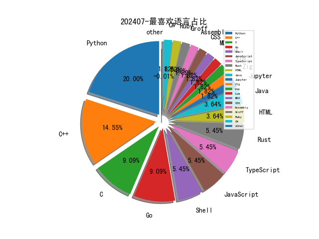

# [数据--所有](README_20.md)
# [数据--年度](README_2024.md)
# 202407 信息源与信息类型占比

# 网络安全书籍 推荐
| date_added | language | title | author | link | size| 
| --- | --- | --- | --- | --- | ---| 
| 2024-07-01 11:24:09 | English | The Big Book of Small Python Projects | Al Sweigart | http://libgen.rs/book/index.php?md5=5F4C3734F6718D71A6DE44228FA5C094 | 51 MB [PDF]| 

# 微信公众号 推荐
| nickname_english | weixin_no | title | url| 
| --- | --- | --- | ---| 
| Beacon Tower Lab | WebRAY_BTL | 漏洞预警丨OpenSSH 远程代码执行漏洞（CVE-2024-6387） | https://mp.weixin.qq.com/s?__biz=MzkyNzcxNTczNA==&mid=2247486390&idx=1&sn=77c7cea2378d96abb260adb6361df587 | 1| 
| CAICT可信安全 | CAICT_SECURITY | 【您有一份参会指南待领取】2024全球数字经济大会—云和软件安全论坛（7.3）明日召开！ | https://mp.weixin.qq.com/s?__biz=Mzk0MjM1MDg2Mg==&mid=2247499753&idx=1&sn=2e5158c4eb91bf070a7b41aa7b109bff | 2| 
| CNCERT国家工程研究中心 | NELCERT | PoC已出！高危漏洞CVE-2024-6387强势来袭 | https://mp.weixin.qq.com/s?__biz=MzUzNDYxOTA1NA==&mid=2247545642&idx=3&sn=03bae878bdc7eb64e62f2a406ece64d0 | 6| 
| Cyb3rES3c | Cyb3rES3c | 一文了解Base64编码 | https://mp.weixin.qq.com/s?__biz=Mzg2MTc1MjY5OQ==&mid=2247485695&idx=1&sn=b0bdc86dabda19aecc23918bfabe65e8 | 1| 
| DataCon大数据安全分析竞赛 | gh_a0316d342599 | 转发抽奖！InForSec2024夏令营报名倒计时，席位有限，欲报从速！ | https://mp.weixin.qq.com/s?__biz=MzU5Njg1NzMyNw==&mid=2247488128&idx=1&sn=2f6f21ad4100765ae16517faf2c505f2 | 1| 
| FreeBuf | freebuf | APKDeepLens：一款针对Android应用程序的安全扫描工具 | https://mp.weixin.qq.com/s?__biz=MjM5NjA0NjgyMA==&mid=2651289248&idx=4&sn=4aa49ef38ce0c410763463561b6812ed | 8| 
| Hack All Sec | PTIOVHA | 韩兴强和张孟超，叔叔找你 | https://mp.weixin.qq.com/s?__biz=MzkwMjQyMDA5Nw==&mid=2247485740&idx=1&sn=65e56006dfd031128ced494d4836da6c | 1| 
| HackSee | hacksee_com | 波兰将调查与俄罗斯有关的针对国家通讯社的网络攻击 | https://mp.weixin.qq.com/s?__biz=MzI5NTA0MTY2Mw==&mid=2247485399&idx=1&sn=317949958c5f0f0c67ae41f23022f6f0 | 2| 
| KCon 黑客大会 | KCon-knownsec | 大众评选开启 , KCon大会议题大PK！速来选出你的心仪议题 | https://mp.weixin.qq.com/s?__biz=MzIzOTAwNzc1OQ==&mid=2651137376&idx=1&sn=6e3f2c7081a7ac58323259d5d9ac4320 | 2| 
| KK安全说 | kksecurity | 再谈威胁建模 | https://mp.weixin.qq.com/s?__biz=Mzg4NzgyODEzNQ==&mid=2247487460&idx=1&sn=b6955aa6581cf651e9a3ce3ff2c37b12 | 1| 
| LK安全 | loudonglieren123 | HW来临！快来更新一波功防技术储备库吧！ | https://mp.weixin.qq.com/s?__biz=MzkxMzQyMzUwMg==&mid=2247486147&idx=1&sn=71099a2a902a94e66d9f2843def5669f | 1| 
| Ms08067安全实验室 | Ms08067_com | 暑假弯道超车！零基础网络安全渗透速成特训营限时99.9元...... | https://mp.weixin.qq.com/s?__biz=MzU1NjgzOTAyMg==&mid=2247520764&idx=1&sn=10020ec1ef17857b10e67adbf499a33d | 1| 
| Ots安全 | AnQuan7 | 5G NR攻击和5G OTA模糊测试 | https://mp.weixin.qq.com/s?__biz=MzAxMjYyMzkwOA==&mid=2247510278&idx=1&sn=e9b89078b2557671aea24a15d83156a7 | 1| 
| TtTeam | gh_a0a1db78ea68 | 蓝队思维图 | https://mp.weixin.qq.com/s?__biz=Mzg2NTk4MTE1MQ==&mid=2247485207&idx=1&sn=55e48d1d33388dc164f3a7c1fc9ed87b | 1| 
| XDsecurity | None | 招聘,深圳,初级安服工程师,7K-10K | https://mp.weixin.qq.com/s?__biz=Mzg2NTcyNjU4Nw==&mid=2247485269&idx=1&sn=7f57dbc256d9948a6bcce24b042d2d5a | 1| 
| 一个不正经的黑客 | None | 打工人，格局真不能小！ | https://mp.weixin.qq.com/s?__biz=MzkwODI1ODgzOA==&mid=2247505717&idx=1&sn=9c13da84098fa54b92ced8aa7e813621 | 1| 
| 中国信息安全 | chinainfosec | 关注 , “清朗·优化营商网络环境－整治涉企侵权信息乱象”专项行动公开曝光第二批典型案例 | https://mp.weixin.qq.com/s?__biz=MzA5MzE5MDAzOA==&mid=2664217965&idx=7&sn=8bd31e85a0e8982654f3941053a21cf9 | 14| 
| 中国电信安全 | gh_ea6109d37f13 | 公安部权威公布！当心当心！ | https://mp.weixin.qq.com/s?__biz=Mzg5NTU3Nzg3MQ==&mid=2247523405&idx=1&sn=5311cf66f73489a283ff0b5928606ea4 | 1| 
| 中国网络空间安全协会 | CSAC20160325 | 网络安全态势研判分析报告（第8期） | https://mp.weixin.qq.com/s?__biz=MzA3ODE0NDA4MA==&mid=2649399842&idx=1&sn=abc0ff6d0d867967857bd4ca1e6b0a36 | 2| 
| 中国软件评测中心 | None | 圆满闭幕！2024“三品”行河北——首届数字“三品”创新发展大赛闭幕式在邢台宁晋召开 | https://mp.weixin.qq.com/s?__biz=MjM5NzYwNDU0Mg==&mid=2649245682&idx=4&sn=1aa9e73b0827560f26c018d80b240736 | 6| 
| 二进制空间安全 | suntiger_2023 | 研究开发针对Golang程序的运行时钩子 | https://mp.weixin.qq.com/s?__biz=MzkxOTUyOTc0NQ==&mid=2247490762&idx=1&sn=f1c797bf9749fc143e78b759cff047c1 | 2| 
| 亚信安全 | yaxinanquan | 高危！OpenSSH远程代码执行漏洞风险通告 | https://mp.weixin.qq.com/s?__biz=MjM5NjY2MTIzMw==&mid=2650617407&idx=2&sn=28b223bf2f81dd3a768d0e5b36b7c9ba | 4| 
| 京东安全应急响应中心 | jsrc_team | 巅峰之夜，星光闪耀！第二届京麒CTF总决赛战队巡礼第一篇章！ | https://mp.weixin.qq.com/s?__biz=MjM5OTk2MTMxOQ==&mid=2727837170&idx=1&sn=b537bdbdbbde31ec335045b402f1d56a | 1| 
| 代码卫士 | codesafe | 谷歌推出新的KVM漏洞奖励计划，最高赏金25万美元 | https://mp.weixin.qq.com/s?__biz=MzI2NTg4OTc5Nw==&mid=2247519949&idx=3&sn=9ad23a7958936b34139856b555d79794 | 5| 
| 众智维安 | openxorg | 砥砺前行，笃行不怠 , 众智维科技Q2回顾 | https://mp.weixin.qq.com/s?__biz=MzU5Mjg0NzA5Mw==&mid=2247492593&idx=1&sn=d84968efa27bd908ab6eced628ca18f3 | 1| 
| 信息安全与通信保密杂志社 | cismag2013 | 加快释放数据要素价值 | https://mp.weixin.qq.com/s?__biz=MzkwMTMyMDQ3Mw==&mid=2247590363&idx=3&sn=825ada15083806f28abe74c602941128 | 6| 
| 信息安全最新论文技术交流 | gh_a7fb15b30ab3 | 中国科协：2024重大科学问题、工程技术难题和产业技术问题 | https://mp.weixin.qq.com/s?__biz=MzI2NDg5NjY0OA==&mid=2247491323&idx=1&sn=280bc6d046730abcc610bc0b51d22178 | 1| 
| 信息安全研究 | ISR2016 | 【业界动态】我国牵头提出的国际标准《网络安全 物联网安全与隐私 家庭物联网指南》正式发布 | https://mp.weixin.qq.com/s?__biz=MzA3NzgzNDM0OQ==&mid=2664987857&idx=3&sn=c2fc08e50db38d963033ec39ce090648 | 6| 
| 全球技术地图 | drc_iite | 美国国务院披露全球半导体网络启动一周年进展 | https://mp.weixin.qq.com/s?__biz=MzI1OTExNDY1NQ==&mid=2651613901&idx=2&sn=99cb22927d6386be00b658e5f7dc6661 | 4| 
| 关键基础设施安全应急响应中心 | CII-SRC | Windows 修复漏洞遭利用，推送恶意脚本 | https://mp.weixin.qq.com/s?__biz=MzkyMzAwMDEyNg==&mid=2247544704&idx=3&sn=a6156d6b4aefa04de16dcdaed046d91b | 6| 
| 内生安全联盟 | CCESS_CHINA | 美国众议院提出法案，旨在评估关键基础设施在网络攻击中的弹性 | https://mp.weixin.qq.com/s?__biz=Mzg4MDU0NTQ4Mw==&mid=2247520654&idx=2&sn=03645ee36af8951114c5a431bcf6ccb0 | 2| 
| 农夫安全团队 | gh_6d3f01673a87 | 关于今年HW的⼀些思考 | https://mp.weixin.qq.com/s?__biz=MzI0MzQ4NTI1OA==&mid=2247484836&idx=1&sn=42f211d0d04a1dd18d934d17e1f43450 | 1| 
| 农夫安全开源计划 | fsec-nongfu | 关于今年HW的⼀些思考 | https://mp.weixin.qq.com/s?__biz=MzkxOTMzNDkwOA==&mid=2247484169&idx=1&sn=7e7145f84131bb41499ee6143264d398 | 1| 
| 冠程科技 | bj_gctech | HIGC 微型百变服务器-HIGC数智园区平台使用手册 | https://mp.weixin.qq.com/s?__biz=MzUzNDc0NDcwOA==&mid=2247522944&idx=1&sn=dcaf9341edca01254989b968efc6026f | 1| 
| 冷漠安全 | gh_1c1d6111ce8f | 「漏洞复现」SolarWinds Serv-U 目录遍历漏洞(CVE-2024-28995) | https://mp.weixin.qq.com/s?__biz=MzkyNDY3MTY3MA==&mid=2247484749&idx=1&sn=4e6fe86ebd9d301eef3276a22df617a7 | 2| 
| 凝聚力安全团队 | gh_a94d677fa24f | 【漏洞复现】用友 NC-Cloud uploadChunk 任意文件上传漏洞 | https://mp.weixin.qq.com/s?__biz=MzkyMDUwOTU1MA==&mid=2247484321&idx=1&sn=2648b0af40afe9e29df785023ff082c6 | 1| 
| 创信华通 | cdcxht | 创信培训丨国家信息安全水平考试 (NISP)介绍 | https://mp.weixin.qq.com/s?__biz=MzUxNTQxMzUxMw==&mid=2247523047&idx=1&sn=65b74abf6b080987ba9766f2192eb411 | 1| 
| 利刃信安 | DMXGFSYS | 进群围观棉花糖道歉信 | https://mp.weixin.qq.com/s?__biz=MzU1Mjk3MDY1OA==&mid=2247514599&idx=1&sn=9a807e4691d322ff1d74bb6c06716325 | 1| 
| 华云安 | huaun_security | 从Cloud-Native到AI-Native，构建智能化的网络安全防御体系 | https://mp.weixin.qq.com/s?__biz=MzI1Njc5NTY1MQ==&mid=2247499880&idx=1&sn=5de1d6d19cb323da3b309a1a259d5ba0 | 1| 
| 取证者联盟 | F_I_United | 为啥取证厂商扎堆突破安卓12/13提权？来看看CVE-2024-0044高严重性漏洞 | https://mp.weixin.qq.com/s?__biz=Mzg4MzEwMDAyNw==&mid=2247485103&idx=1&sn=f4d14912f9151d55123e7fbf45311793 | 1| 
| 合天网安实验室 | hee_tian | 【免费领】全网稀缺硬货资料：家用路由器0day漏洞挖掘指南 | https://mp.weixin.qq.com/s?__biz=MjM5MTYxNjQxOA==&mid=2652905584&idx=2&sn=3fc583f6fad64a3462e8941d98558624 | 4| 
| 吉祥学安全 | gh_bf0dc85c3f99 | BAS（入侵与攻击模拟）正在替代红队测试？ | https://mp.weixin.qq.com/s?__biz=MzkwNjY1Mzc0Nw==&mid=2247485059&idx=1&sn=69ff3fff9b6facbcea5af928e6a50249 | 1| 
| 启明星辰安全简讯 | VitaminSecurity | 【漏洞通告】Apache HTTP Server Windows UNC SSRF漏洞（CVE-2024-38472） | https://mp.weixin.qq.com/s?__biz=MzkzNzY5OTg2Ng==&mid=2247499571&idx=3&sn=5e8f306e3879b2aa8d33476a5e01a26a | 5| 
| 启明星辰集团 | venustech_weixin | 《中国移动人工智能安全白皮书》正式发布，启明星辰助力构筑新一代AI基础设施安全底座 | https://mp.weixin.qq.com/s?__biz=MzA3NDQ0MzkzMA==&mid=2651726444&idx=1&sn=2a55ec4ef45a148fdd22a1a7e2f7c607 | 2| 
| 哔哩哔哩技术 | bilibili-TC | 基于Freetype的文字渲染流程以及缓存策略 | https://mp.weixin.qq.com/s?__biz=Mzg3Njc0NTgwMg==&mid=2247499796&idx=1&sn=887f76402a40fa2a98f05e997ffbbe4d | 1| 
| 啄木鸟软件测试 | iTestTrain | 一个google Test文件C++语言案例 | https://mp.weixin.qq.com/s?__biz=MzA5NDk4NTU3Mg==&mid=2649589633&idx=1&sn=6da7c30821198d9e07758670b6979ad1 | 1| 
| 嘶吼专业版 | Pro4hou | 博智安全深度参与2024年能源网络安全大赛暨能源网络安全和信息化大会，亮点纷呈 | https://mp.weixin.qq.com/s?__biz=MzI0MDY1MDU4MQ==&mid=2247576024&idx=2&sn=fc49996f224c1d2e53b858adab04929f | 2| 
| 国家互联网应急中心CNCERT | CNCERTCC | 上周关注度较高的产品安全漏洞(20240624-20240630) | https://mp.weixin.qq.com/s?__biz=MzIwNDk0MDgxMw==&mid=2247499211&idx=2&sn=a875fb3c01a3352444c7fab81aab55d5 | 2| 
| 天御攻防实验室 | TianyuLab | 防御任意SSH远程代码执行漏洞 | https://mp.weixin.qq.com/s?__biz=MzU0MzgyMzM2Nw==&mid=2247485842&idx=1&sn=6a462334aa94328aa7689f1ddf80be6a | 1| 
| 天融信 | TopsecPioneer | 标准盘点：2024上半年国内网络安全领域重要标准速览 | https://mp.weixin.qq.com/s?__biz=MzA3OTMxNTcxNA==&mid=2650927498&idx=2&sn=614d98f030f9fbbf7bc6845135d1f60c | 2| 
| 天融信教育 | TOPSEC-EDU | 每日安全提醒~ | https://mp.weixin.qq.com/s?__biz=MzU0MjEwNTM5Ng==&mid=2247518726&idx=2&sn=e386a5fb0f4b4fddbbc4485a4368216b | 4| 
| 天融信阿尔法实验室 | gh_0b0b1747bf15 | 【风险提示】天融信关于OpenSSH远程代码执行漏洞(CVE-2024-6387)的风险提示 | https://mp.weixin.qq.com/s?__biz=Mzg3MDAzMDQxNw==&mid=2247496648&idx=1&sn=34cf6111dc8ff2fca5fb1e2c2b2acd74 | 1| 
| 奇安信 CERT | gh_64040028303e | 【POC公开】OpenSSH 远程代码执行漏洞(CVE-2024-6387)安全风险通告第二次更新 | https://mp.weixin.qq.com/s?__biz=MzU5NDgxODU1MQ==&mid=2247501533&idx=1&sn=41f10403f24687361e445dd7db724d59 | 4| 
| 奇安信集团 | qianxin-keji | InForSec2024夏令营报名倒计时，席位有限，欲报从速！ | https://mp.weixin.qq.com/s?__biz=MzU0NDk0NTAwMw==&mid=2247612990&idx=3&sn=1ba2e41d7d9d4acd66e31ec132939f9b | 6| 
| 威胁猎人Threat Hunter | YongAnOnline | 2024年上半年，恶意IPv6已在部分风险场景中占比超过IPv4 | https://mp.weixin.qq.com/s?__biz=MzI3NDY3NDUxNg==&mid=2247497366&idx=1&sn=96fba95b4d98dc214ebb1f4b503572c4 | 1| 
| 字节跳动技术团队 | BytedanceTechBlog | 字节图数据库架构论文入选数据库顶会SIGMOD 2024 | https://mp.weixin.qq.com/s?__biz=MzI1MzYzMjE0MQ==&mid=2247508010&idx=1&sn=725cde183484561000bbbe255fa1203a | 1| 
| 安世加 | asjeiss | 6月Web3生态黑客攻击、钓鱼诈骗等造成的总损失金额达1.83亿美元 | https://mp.weixin.qq.com/s?__biz=MzU2MTQwMzMxNA==&mid=2247539007&idx=1&sn=3cca1a05563be648ff9794488671101a | 2| 
| 安信安全 | gsaxns | 2024年十二大顶级云安全认证 | https://mp.weixin.qq.com/s?__biz=MzAxNTYwOTU1Mw==&mid=2650090618&idx=1&sn=7b48c88c0a5bcb28fa3eb32b7eb9bb77 | 2| 
| 安全内参 | anquanneican | 长沙一培训学校不履行网络安全保护义务被罚1万元 | https://mp.weixin.qq.com/s?__biz=MzI4NDY2MDMwMw==&mid=2247512075&idx=2&sn=a91f82bda4d6a45b61bd977b98f0e6e4 | 4| 
| 安全圈 | ChinaAnQuan | 【安全圈】影响超六百万人！美国一企业遭 LockBit 勒索软件攻击 | https://mp.weixin.qq.com/s?__biz=MzIzMzE4NDU1OQ==&mid=2652062466&idx=4&sn=94a51092a4c2e8009cd101689599ee4b | 8| 
| 安全新说 | InSightNIS | 2024年上半年典型网络攻击事件盘点 | https://mp.weixin.qq.com/s?__biz=MzA3NDIwNTY5Mw==&mid=2247505260&idx=1&sn=a5f004f2fd412cb07ae2d87411883e44 | 2| 
| 安全牛 | aqniu-wx | 我国牵头提出的国际标准《网络安全 物联网安全与隐私 家庭物联网指南》正式发布 | https://mp.weixin.qq.com/s?__biz=MjM5Njc3NjM4MA==&mid=2651130879&idx=2&sn=7d011c88a1afd83f03e2f7fc4b0a0ca3 | 2| 
| 安在 | AnZer_SH | 百家说事 , 第四场：连年发布争议连年的网络安全“大众点评” | https://mp.weixin.qq.com/s?__biz=MzU5ODgzNTExOQ==&mid=2247624742&idx=3&sn=a3e3d63331e3a51f8421aa8aa3898150 | 6| 
| 安天移动安全 | AVLTeam | 【向网络赌球开炮】本周战报（6.24-6.30） | https://mp.weixin.qq.com/s?__biz=MjM5NTY4NzcyNg==&mid=2650249414&idx=1&sn=76f0f3e237745d6f784656b45c03b53e | 1| 
| 安天集团 | Antiylab | OpenSSH远程代码执行漏洞(CVE-2024-6387)风险提示 | https://mp.weixin.qq.com/s?__biz=MjM5MTA3Nzk4MQ==&mid=2650206176&idx=1&sn=87d5bd0288daf61bac58d6f38fee2b78 | 2| 
| 安恒信息CERT | gh_1c2b41c1abc7 | 【二次更新】OpenSSH存在远程代码执行漏洞（CVE-2024-6387） | https://mp.weixin.qq.com/s?__biz=MzUzOTE2OTM5Mg==&mid=2247489483&idx=1&sn=6b0b58561430fab2c0eb0950cf4d6c66 | 1| 
| 安知讯 | dataanquan | 浙江省通信管理局开展2024年电信和互联网行业网络和数据安全检查 | https://mp.weixin.qq.com/s?__biz=MzIxMDIwODM2MA==&mid=2653930247&idx=2&sn=209c27b4ea6b1ec18a64e7ac463fd472 | 4| 
| 实战安全研究 | gh_f390fc63c711 | Shiro有key但无回显利用链子-JRMP大法 | https://mp.weixin.qq.com/s?__biz=MzU0MTc2NTExNg==&mid=2247490462&idx=1&sn=eee6b681c53834954c83eb8ebb55b717 | 2| 
| 小C学安全 | V_MOG11 | 【渗透工具】远控工具Brute Ratel C4 1.4.5 --使用教程一（木马上线） | https://mp.weixin.qq.com/s?__biz=MzU5NTEwMTMxMw==&mid=2247485016&idx=1&sn=ea4bd364115a015ea163674041de5ff5 | 1| 
| 小明信安 | security-xm | 【漏洞复现】GeoServer开源地理服务 wfs 远程命令执行(CVE-2024-36401) | https://mp.weixin.qq.com/s?__biz=Mzg4NjI0MDM5MA==&mid=2247485596&idx=1&sn=aef6013b3b1d585ad0e15e98e4bcd5aa | 1| 
| 微步在线研究响应中心 | gh_280024a09930 | 关于OpenSSH RCE（CVE-2024-6387）高频关注的FAQ | https://mp.weixin.qq.com/s?__biz=Mzg5MTc3ODY4Mw==&mid=2247506182&idx=1&sn=e32c43c9bbdfb49cae905689f467cc73 | 1| 
| 德斯克安全小课堂 | szdesk | 中了勒索怎么办？？? | https://mp.weixin.qq.com/s?__biz=MzA3MTUxNzQxMQ==&mid=2453885223&idx=1&sn=8d8402081486bebb25bf77f3eff2c849 | 2| 
| 慢雾科技 | SlowMist | 慢雾：2024 Q2 MistTrack 被盗表单分析 | https://mp.weixin.qq.com/s?__biz=MzU4ODQ3NTM2OA==&mid=2247499939&idx=1&sn=9a19ea41c058d225c6ccbb21736f8923 | 2| 
| 掌控安全EDU | ZKAQEDU | 靶场上新：showdoc前台SQL注入+后台Phar反序列化 | https://mp.weixin.qq.com/s?__biz=MzUyODkwNDIyMg==&mid=2247541498&idx=3&sn=4eb5f124b397b2f3e9f7aa23ad5303d9 | 3| 
| 数世咨询 | dwconcn | 博智安全深度参与2024年能源网络安全大赛 | https://mp.weixin.qq.com/s?__biz=MzkxNzA3MTgyNg==&mid=2247513799&idx=3&sn=f9510dd264ef52cbb37e47c7a6b85769 | 5| 
| 无糖反网络犯罪研究中心 | gh_2ee7a9b17c0d | 丰台警方破获信用卡诈骗案 , 玛曲警方破获航班改签诈骗案——涉网犯罪每日情报 | https://mp.weixin.qq.com/s?__biz=MzAxMzkzNDA1Mg==&mid=2247511545&idx=1&sn=405567a54d8bf9a17bbd34061a0d5ecb | 2| 
| 暗影网安实验室 | mryp99 | CVE-2024-6387OpenSSH远程代码执行漏洞 , 带自写批量检测脚本 | https://mp.weixin.qq.com/s?__biz=MzIyNTIxNDA1Ng==&mid=2659209820&idx=1&sn=58b6484b51d9143059221eaf9f4e072a | 1| 
| 棉花糖网络安全圈 | hacker-mht | 棉花糖因传播BRC4公开给破解者道歉！对不起侵犯了您的版权！ | https://mp.weixin.qq.com/s?__biz=Mzg5NTYwMDIyOA==&mid=2247505251&idx=1&sn=ff744ee7fb15063c8bcd191c8510f601 | 1| 
| 深圳市网络与信息安全行业协会 | SNISRI | 关于对《视频安全防护系统》团体标准（征求意见稿）征求意见的函 | https://mp.weixin.qq.com/s?__biz=MzU0Mzk0NDQyOA==&mid=2247517548&idx=2&sn=b962bcbcba7a894b5d3acc4cbbc6548a | 2| 
| 混入安全圈的程序猿 | gh_b205effae10a | 11月开始，谷歌浏览器将不再信任这家CA机构，对我们有什么影响？ | https://mp.weixin.qq.com/s?__biz=MzU3ODI3NDc4NA==&mid=2247484356&idx=1&sn=5eeb97b8ae666af48fd7fe017d6ffcf3 | 1| 
| 湖南金盾评估中心 | JD83758161 | 湖南金盾软测服务：为用户提供全方位的软件质量保障 | https://mp.weixin.qq.com/s?__biz=MzIyNTI0ODcwMw==&mid=2662128619&idx=1&sn=8452f4507f0753465191b47bc5a01ebf | 1| 
| 漏洞文库 | gh_39e3d018b3d3 | 【漏洞复现】科荣AIO管理系统moffice存在SQL注入漏洞 | https://mp.weixin.qq.com/s?__biz=MzkwNTE4Mzc2Mg==&mid=2247485923&idx=2&sn=9192b1e1fef7953607d50b7d6e34d903 | 2| 
| 灵创科技安全服务 | linked360 | 喜讯,灵创科技荣膺HN省工业领域网络和数据安全技术服务支撑单位 | https://mp.weixin.qq.com/s?__biz=Mzg4MzEzOTEwMw==&mid=2247491946&idx=1&sn=ab4d14e3d7aa3fde94a656d3f44393c4 | 1| 
| 炼石网络CipherGateway | CipherGateway | 速下载 , 密评密改实施、移动新场景等25项密码新标准全文来了 | https://mp.weixin.qq.com/s?__biz=MzkyNzE5MDUzMw==&mid=2247551403&idx=1&sn=a608ce26d3e560dd7f44ea53022bba23 | 1| 
| 牵着蜗牛学安全 | snailsec | 提取浏览器数据的方法总结 | https://mp.weixin.qq.com/s?__biz=MzI4NjUyNzU0NA==&mid=2247483821&idx=1&sn=0dbe113992842907690b6fe4652d50d2 | 1| 
| 独眼情报 | cs_cti | CVE-2024-20399：思科NX-OS0day | https://mp.weixin.qq.com/s?__biz=MzkzNDIzNDUxOQ==&mid=2247486321&idx=3&sn=87e5fefdb336535be00a0736c43aafed | 3| 
| 独立观察员博客 | DLGCY_BLOG | 用WPF实现《英雄联盟》风格滑块｜深入剖析 | https://mp.weixin.qq.com/s?__biz=MzA3NDE0NTA0MA==&mid=2649212092&idx=1&sn=fc79bdc072d5b981d376507f687c8b48 | 1| 
| 猫鼠信安 | gh_b8b8c8961ead | 交换机的通信原理 | https://mp.weixin.qq.com/s?__biz=Mzg2NjUzNzg4Ng==&mid=2247484493&idx=1&sn=55fd1d7f849e8c28f006a76e3c4c524e | 1| 
| 珞安科技 | luoantechnology | 典型案例 ,某油田工控网络安全加固项目 | https://mp.weixin.qq.com/s?__biz=MzU2NjI5NzY1OA==&mid=2247510205&idx=1&sn=15ef96bac02ab5d55177909ff36625f5 | 1| 
| 生有可恋 | hyang0-1 | docx 转 markdown | https://mp.weixin.qq.com/s?__biz=Mzk0MTI4NTIzNQ==&mid=2247491549&idx=1&sn=eb5d70af7db3e31e3d66e6c5a3c6d9fb | 2| 
| 由由学习吧 | TNT-Anonymous | ctftools-all-in-one V3.0 | https://mp.weixin.qq.com/s?__biz=MzI1NzUxOTUzMA==&mid=2247485398&idx=1&sn=9f3b3fe50999c268f03820306f359f98 | 1| 
| 白帽子左一 | HackRead | 靶场上新：showdoc前台SQL注入+后台Phar反序列化 | https://mp.weixin.qq.com/s?__biz=MzI4NTcxMjQ1MA==&mid=2247611173&idx=3&sn=854e44696a67cfcf19b891d98892140e | 3| 
| 盛邦安全WebRAY | WebRay_weixin | 全球数字经济大会Day1亮点：盛邦安全卫星互联网安全技术，引安哥拉驻华大使馆参赞驻足关注 | https://mp.weixin.qq.com/s?__biz=MzAwNTAxMjUwNw==&mid=2650275844&idx=1&sn=d48da5baecfb3cf7937f2027fa0f3435 | 4| 
| 盛邦安全应急响应中心 | WebRAY_Sec | 漏洞预警丨OpenSSH 远程代码执行漏洞（CVE-2024-6387） | https://mp.weixin.qq.com/s?__biz=Mzk0NjMxNTgyOQ==&mid=2247484289&idx=1&sn=92805505335081882eb1f8b38954407b | 1| 
| 看雪学苑 | ikanxue | 日本动漫媒体巨头角川遭黑客攻击勒索，1.5TB敏感数据泄露 | https://mp.weixin.qq.com/s?__biz=MjM5NTc2MDYxMw==&mid=2458561802&idx=3&sn=fccd32da1daecc4bde2ba058f0b1ca8a | 6| 
| 矢安科技 | shanghaishiankeji | 漏洞预警｜OpenSSH 远程代码执行漏洞(CVE-2024-6387) | https://mp.weixin.qq.com/s?__biz=Mzg2Mjc3NTMxOA==&mid=2247510308&idx=1&sn=fb241daec3a07786225f2b6528791c92 | 1| 
| 知攻善防实验室 | ChinaRan404 | 护网在即，助力安服仔漏洞扫描~ | https://mp.weixin.qq.com/s?__biz=MzkxMTUwOTY1MA==&mid=2247487943&idx=1&sn=04d0d45ae9c85cb8739d15e47c05c779 | 1| 
| 知道创宇 | knownsec | 【知道创宇404实验室】建议关注 Apache 2.4.60 更新修复多个安全漏洞 | https://mp.weixin.qq.com/s?__biz=MjM5NzA3Nzg2MA==&mid=2649868723&idx=1&sn=9c9beeeb146c3535fded07ee0dc0999b | 2| 
| 知道创宇404实验室 | seebug_org | 【知道创宇404实验室】建议关注 Apache 2.4.60 更新修复多个安全漏洞 | https://mp.weixin.qq.com/s?__biz=MzAxNDY2MTQ2OQ==&mid=2650979086&idx=1&sn=d18d0320395ab76700da91330bb4c9da | 2| 
| 第59号 | malianwa59 | 漏洞通告｜OpenSSH远程代码执行漏洞（CVE-2024-6387） | https://mp.weixin.qq.com/s?__biz=MzI0NDgxMzgxNA==&mid=2247495989&idx=1&sn=a3749330fc81c97a59ab286dcca1c7d7 | 1| 
| 等级保护测评 | zgdjbh | 长沙市某培训学校不履行网络安全保护义务被罚款 | https://mp.weixin.qq.com/s?__biz=MzU1ODM1Njc1Ng==&mid=2247498060&idx=1&sn=439eadd3b207bdc572064728d0cab7c0 | 1| 
| 紫队安全研究 | ziduianquanyanjiu | 俄罗斯APT29 从未停止进攻脚步：新型恶意软件曝光 | https://mp.weixin.qq.com/s?__biz=Mzg3OTYxODQxNg==&mid=2247484572&idx=1&sn=a4ee46f9f37d5e64c67f7f69b95bee75 | 1| 
| 绿盟科技 | NSFOCUS-weixin | 绿盟科技2024年中特报｜技术成就每一次突破 | https://mp.weixin.qq.com/s?__biz=MjM5ODYyMTM4MA==&mid=2650454525&idx=1&sn=f3c2ba0fbdd311209d6c35bf9571f0ae | 3| 
| 绿盟科技研究通讯 | nsfocus_research | GPU机密计算——以NVIDIA H100为例 | https://mp.weixin.qq.com/s?__biz=MzIyODYzNTU2OA==&mid=2247497490&idx=1&sn=08e3711bf076d67599497ec33b2d6aa7 | 2| 
| 网安国际 | inforsec | 安全和可靠的大型语言模型（LLMs）全球挑战赛拉开帷幕，等你来战！ | https://mp.weixin.qq.com/s?__biz=MzA4ODYzMjU0NQ==&mid=2652314869&idx=1&sn=55c3c81f3f9262d2c4d8b75358f3bc72 | 1| 
| 网络安全和信息化 | ITyunwei_365master | 一图读懂《国家人工智能产业综合标准化体系建设指南（2024版）》 | https://mp.weixin.qq.com/s?__biz=MjM5MzMwMDU5NQ==&mid=2649165268&idx=3&sn=3c69a8057cca012325942ae58da0a9f3 | 6| 
| 网络安全资源库 | gh_e8a4866a67fe | 一款综合且强大的信息收集工具 | https://mp.weixin.qq.com/s?__biz=MzkxMzMyNzMyMA==&mid=2247559055&idx=2&sn=4aa2a680fdd9fb2ee0968e824b476533 | 4| 
| 网络技术干货圈 | wljsghq | OSPFv3与OSPFv2有啥不同，有哪些大的改进？ | https://mp.weixin.qq.com/s?__biz=MzUyNTExOTY1Nw==&mid=2247524318&idx=1&sn=9ba7220aec5b4622660d578a41fb2655 | 1| 
| 网络技术联盟站 | wljslmz | 网络工程师需要熟悉Docker吗？我觉得不需要精通，但是得懂基础 | https://mp.weixin.qq.com/s?__biz=MzIyMzIwNzAxMQ==&mid=2649459097&idx=1&sn=0d30b6796a9f02fa49d00caaca07039e | 1| 
| 网络空间安全与法治协同创新中心 | gh_53f81866942d | 现已修复！AirPods 最新固件曝出蓝牙漏洞，可能导致设备被窃听 | https://mp.weixin.qq.com/s?__biz=MzkwMTQyODI4Ng==&mid=2247492820&idx=3&sn=eeb55bca86e3eca3df4d6a04864c8f99 | 3| 
| 腾讯技术工程 | Tencent_TEG | Android Native内存泄漏检测方案详解 | https://mp.weixin.qq.com/s?__biz=MjM5ODYwMjI2MA==&mid=2649784368&idx=1&sn=387c3ecda352f1dff29c41a5edb4fd04 | 1| 
| 腾讯玄武实验室 | None | 每日安全动态推送(7-2) | https://mp.weixin.qq.com/s?__biz=MzA5NDYyNDI0MA==&mid=2651959719&idx=1&sn=bf33ea6a3116d3d5589fb310750191f0 | 1| 
| 虎符智库 | TT_Thinktank | 安全团队指南：如何创建网络安全的 \"谷歌地图\" | https://mp.weixin.qq.com/s?__biz=MzIwNjYwMTMyNQ==&mid=2247490239&idx=1&sn=ecd8dd3d792f3244a4a24c6d62f08122 | 1| 
| 蚁景网安 | yijing_168 | 瑞友天翼应用虚拟化系统SQL注入漏洞 | https://mp.weixin.qq.com/s?__biz=MzkyNTY3Nzc3Mg==&mid=2247486012&idx=1&sn=b000fd67f5fad01d9dd4217428bd8fc2 | 2| 
| 补天平台 | Patchingthesky | 现金奖励 , GROW计划漏洞挖掘实战第二期 | https://mp.weixin.qq.com/s?__biz=MzI2NzY5MDI3NQ==&mid=2247504105&idx=1&sn=8be3ac5a93373daad53d3c7736185cc7 | 1| 
| 谈思实验室 | gh_6446c19b4595 | 斯柯达调整全球规划：中国市场轻运营，发力越南、印度市场 | https://mp.weixin.qq.com/s?__biz=MzIzOTc2OTAxMg==&mid=2247539736&idx=3&sn=86477f3e019087cddd1344bf7cdce9df | 6| 
| 赛博游民营 | CyberGame101 | 202406国外网络安全产品发布情况 | https://mp.weixin.qq.com/s?__biz=MzIzNjI1OTY5Mw==&mid=2247486916&idx=1&sn=26ac50ef6586e29b5da32b47543d168e | 1| 
| 赛博研究院 | SICSI-cybersecurity | 第一期圆满结束,“浦江护航”2024年上海市电信和互联网行业数据安全专项行动公益培训 | https://mp.weixin.qq.com/s?__biz=MzUzODYyMDIzNw==&mid=2247509787&idx=1&sn=4984f5324d095844aefaf1df0f2ea310 | 1| 
| 赛宁网安 | Cyberpeace | AI加持，智启靶场 , 赛宁网安首创原生大模型数字靶场正式发布上线！ | https://mp.weixin.qq.com/s?__biz=MzA4Mjk5NjU3MA==&mid=2455485663&idx=1&sn=ae75bb40175f273da99c554f91f6e18e | 1| 
| 赛查查 | gh_fabaad32b9d1 | 赛事报名｜2024中国工业互联网安全大赛智能家电行业赛道选拔赛报名火热开启 | https://mp.weixin.qq.com/s?__biz=Mzk0NTU0ODc0Nw==&mid=2247487252&idx=1&sn=fcd95bfeef2d782c3ac09c5a5cc13fe3 | 2| 
| 透明魔方 | TransparentCube | 对2024年通保模板的一些评审点总结 | https://mp.weixin.qq.com/s?__biz=MzI4NzA1Nzg5OA==&mid=2247485120&idx=1&sn=a9632dead19315818f70765ae01d4ca6 | 1| 
| 道一安全 | DaoYiSecurity | OpenSSH远程代码执行漏洞分析及POC（CVE-2024-6387） | https://mp.weixin.qq.com/s?__biz=MzU5OTMxNjkxMA==&mid=2247485816&idx=1&sn=0fa6d1f852c9a7e2cc5065e1c1b52d8b | 1| 
| 金山办公安全应急响应中心 | wpssrc | WPS Office安全漏洞众测活动 | https://mp.weixin.qq.com/s?__biz=MzA4NDI3NzI2MQ==&mid=2247483736&idx=1&sn=6ffb271e3a04eb2cc77c88549ec42c49 | 1| 
| 金色钱江 | Golden-Qianjiang | HW&驻场，base北京海淀 | https://mp.weixin.qq.com/s?__biz=Mzg5NTY3NTMxMQ==&mid=2247484459&idx=1&sn=2313dcd9ecde8686058fb66bcc9ea98c | 1| 
| 长亭安全应急响应中心 | chaitin_cert | 【已复现】Geoserver表达式注入致远程代码执行漏洞（CVE-2024-36401） | https://mp.weixin.qq.com/s?__biz=MzIwMDk1MjMyMg==&mid=2247492594&idx=1&sn=c56a9f265ee403ab4c30a4843bf186d6 | 1| 
| 长亭安全观察 | Chaitin_Tech2 | 长亭科技X阿里云｜云上全流量安全，联合出击！ | https://mp.weixin.qq.com/s?__biz=MzkyNDUyNzU1MQ==&mid=2247484991&idx=1&sn=29c06017e672d2b33d75200232e4b0e2 | 2| 
| 隐雾安全 | gh_9355275bad2a | 本周直播通知 | https://mp.weixin.qq.com/s?__biz=MzkyNzM2MjM0OQ==&mid=2247493703&idx=1&sn=8f43019a3ea5513ee32cece0f4f4b073 | 2| 
| 零时科技 | noneage | 【安全月报】, 6月区块链安全事件持续增长，因黑客攻击等损失近2亿美元 | https://mp.weixin.qq.com/s?__biz=MzU1OTc2MzE2Mg==&mid=2247488815&idx=1&sn=15d78696ca9c419894ede54abe638972 | 1| 
| 零漏安全 | None | 《渡难关》 | https://mp.weixin.qq.com/s?__biz=MzkyMDUzMzY1MA==&mid=2247498842&idx=1&sn=7edb04b13986b7eb96c4dacf602f0d61 | 1| 
| 青春计协 | None | 各位同学不好意思，最近有其它事情需要处理，所以暂不更新公众号内容以及竞赛平台。 | https://mp.weixin.qq.com/s?__biz=Mzg4MzU3MTcwNg==&mid=2247485598&idx=1&sn=c08d1949816fea45cf0f84328792a88b | 1| 
| 飓风网络安全 | gh_183f818a07dc | 【漏洞预警】Apache HTTP Server 信息泄露漏洞 | https://mp.weixin.qq.com/s?__biz=MzI3NzMzNzE5Ng==&mid=2247488474&idx=2&sn=7767e45978a0b9d59238e70cab89ff67 | 4| 
| 鱼影安全 | gh_c09563251189 | 2023工业信息安全大赛--决赛溯源分析报告networ.pcapng | https://mp.weixin.qq.com/s?__biz=MzkyOTI4NTY4MQ==&mid=2247490259&idx=1&sn=f35c89534e005a487514ed52a620e225 | 1| 
| 黄公子学安全 | huang_Block | 实战,记一次java协同办公OA系统源码审计 | https://mp.weixin.qq.com/s?__biz=MzkzODQzNTU2NA==&mid=2247485843&idx=1&sn=b239861d37530be873dfbdcde76c891c | 1| 
| 黑客仓库 | hacker-depot | 暑假弯道超车！零基础网络安全渗透速成特训营限时99.9元...... | https://mp.weixin.qq.com/s?__biz=MzU0MDUxMDEzNQ==&mid=2247489497&idx=1&sn=c770a71710d2e6f4c05e1cb3e008b77c | 1| 
| 黑猫安全 | Blackcat-Security | 威胁参与者正在积极利用 D-Link DIR-859 路由器漏洞 CVE-2024-0769 | https://mp.weixin.qq.com/s?__biz=Mzg3OTc0NDcyNQ==&mid=2247491842&idx=3&sn=48b273ce7e923f782bb060ba37292b21 | 3| 
| 默安科技 | moresec | 中标中国移动集采项目，共谱高效安全运营新篇 | https://mp.weixin.qq.com/s?__biz=MzIzODQxMjM2NQ==&mid=2247498801&idx=1&sn=45921f8d13183b3ae1cd0b6e8a98f1f5 | 1| 
| 360数字安全 | gh_6db130c5163e | 3000名黑客巅峰较量，100+漏洞震撼突破！矩阵杯决赛落幕 | https://mp.weixin.qq.com/s?__biz=MzA4MTg0MDQ4Nw==&mid=2247572647&idx=3&sn=74126bea92b9fa3e7b8f2f51a69381d2 | 3| 
| BlockSec | None | 全球青年峰会圆桌实录：深度解析Web3安全、DePIN与AI | https://mp.weixin.qq.com/s?__biz=MzkyMzI2NzIyMw==&mid=2247487922&idx=1&sn=1e3194eaad2698e6227788e48ab868a6 | 1| 
| CISP | None | 5大举措，促进技能人才培养提质加速 | https://mp.weixin.qq.com/s?__biz=MzI1NzQ0NTMxMQ==&mid=2247489741&idx=2&sn=340a91a2af57c3e839405157cf5c8b6c | 2| 
| CISSP | None | 商汤科技招聘安全攻防架构师 | https://mp.weixin.qq.com/s?__biz=Mzg4MTg0MjQ5OA==&mid=2247485484&idx=1&sn=76226148fce848dae5d04bf138c84ec0 | 1| 
| CNVD漏洞平台 | CNVDTS | 上周关注度较高的产品安全漏洞(20240624-20240630) | https://mp.weixin.qq.com/s?__biz=MzU3ODM2NTg2Mg==&mid=2247494959&idx=2&sn=0320ca35f1b70fe13692b868354a82dc | 2| 
| CertiK | certikchina | CertiK亚洲区域云基础设施成功迁移至阿里云，持续强化Web3.0安全 | https://mp.weixin.qq.com/s?__biz=MzU5OTg4MTIxMw==&mid=2247503098&idx=1&sn=a65c50bb1efb14235d9dd54897c3ffb0 | 1| 
| FreeBuf安全咨询 | freebuf_ent | 新勒索软件 Shinra 与 Limpopo 浮出水面 | https://mp.weixin.qq.com/s?__biz=Mzg2MTAwNzg1Ng==&mid=2247494513&idx=1&sn=d121e4f2e20b5ccd61ecf0ad3d8c2106 | 1| 
| Hacking黑白红 | Hacking012 | 蓝队HW 实战应急响应-案例 | https://mp.weixin.qq.com/s?__biz=Mzg2NDYwMDA1NA==&mid=2247539285&idx=1&sn=da18f37b6763ce9a7bccaf19fa5a902b | 1| 
| NullError Sec | gh_34a2be56ee46 | Windows和Java环境下的redis未授权利用 | https://mp.weixin.qq.com/s?__biz=MzkyMjY4NzUwMw==&mid=2247483781&idx=1&sn=199122602e1161340ffc6c379baac92e | 1| 
| OPPO安珀实验室 | gh_c3e58b525224 | Parcelable和Bundle的爱恨情仇（二）——LazyValue | https://mp.weixin.qq.com/s?__biz=MjM5Njk1MDY5Ng==&mid=2247490911&idx=1&sn=41865a4a7b7ae6ec8eca54241da94ac6 | 1| 
| Tide安全团队 | TideSec | 山东省移动应用六月份安全态势 | https://mp.weixin.qq.com/s?__biz=Mzg2NTA4OTI5NA==&mid=2247515781&idx=1&sn=310d6ab2ffdb00e9d17dfc8693976eea | 1| 
| TimeAxis Sec | TimeAxis_Sec | 【IDEA插件分享】SecInspector | https://mp.weixin.qq.com/s?__biz=MzIxNzY1MTc1OA==&mid=2247484035&idx=1&sn=e5956592597bea477004e09305534a94 | 1| 
| Urkc安全 | None | 《红队实战宝典之内网渗透测试》特惠抽书活动 | https://mp.weixin.qq.com/s?__biz=MzkxNTU5NTI1Ng==&mid=2247485014&idx=1&sn=85aa15000ed5e53926b9e096b76f9c8e | 1| 
| 云众可信 | None | 建党节 ,  爱党敬业，不忘初心 | https://mp.weixin.qq.com/s?__biz=Mzg2NDU3Mzc5OA==&mid=2247489516&idx=1&sn=e22d96420f6e92ad88c6f4f16f5deb09 | 1| 
| 信安保密 | None | 我靠运气挣来的钱，靠实力全部亏完了（专业朗诵版） | https://mp.weixin.qq.com/s?__biz=MjM5MzUyMzM2NA==&mid=2652914174&idx=4&sn=7c998e6bce65654d8108b70f73fef833 | 4| 
| 信安王子 | gh_aa248fc3b5bb | xday预警-某云APP签名分发系统任意文件上传 | https://mp.weixin.qq.com/s?__biz=Mzg4MjY5MDE4NA==&mid=2247483910&idx=1&sn=d2c042414a857807402429f395a0fb3f | 1| 
| 信安百科 | gh_1a73db5eef37 | CVE-2024-36837｜CRMEB电商管理系统存在SQL 注入漏洞（POC） | https://mp.weixin.qq.com/s?__biz=Mzg2ODcxMjYzMA==&mid=2247485458&idx=2&sn=c25113b4a0ead82773652cae79323bf6 | 2| 
| 信息安全大事件 | xxaqdsj | 著名远控软件系统遭APT攻陷，安全专家建议暂时删除 | https://mp.weixin.qq.com/s?__biz=MzkzNjIzMjM5Ng==&mid=2247489448&idx=1&sn=2bfa12b635506622cad41970969144ed | 1| 
| 全频带阻塞干扰 | RFJamming | 商业安全必读 , 手机窃听的8种途径 | https://mp.weixin.qq.com/s/1gvxVPnEVxLLCyUp63knmA | 2| 
| 吾爱破解论坛 | pojie_52 | 吾爱破解安卓逆向入门教程《安卓逆向这档事》十九、表哥，你也不想你的Frida被检测吧!(下) | https://mp.weixin.qq.com/s?__biz=MjM5Mjc3MDM2Mw==&mid=2651140730&idx=1&sn=35c28447e545cfca350016102548d63b | 1| 
| 商密君 | None | 已抓获30余人！北京警方破获特大盗刷信用卡诈骗案 | https://mp.weixin.qq.com/s?__biz=MzI5NTM4OTQ5Mg==&mid=2247625497&idx=5&sn=7cc420cae65bebe9f43b1709cc519bf3 | 5| 
| 四叶草安全 | siyecaoanquan1 | 四叶草安全顺利通过陕西省知识产权保护中心主体备案 | https://mp.weixin.qq.com/s?__biz=MjM5MTI2NDQzNg==&mid=2654551575&idx=1&sn=4767cd72bfa7886d214edccef41dfccb | 1| 
| 国家信息安全服务资质 | gh_2e911008c3ff | 不忘初心 牢记使命，庆祝建党103周年 | https://mp.weixin.qq.com/s?__biz=MzI0NDg4MTIyNQ==&mid=2247485935&idx=1&sn=2c5b82acdb43db8be52e5e650e666702 | 1| 
| 国际云安全联盟CSA | gh_674820794ae8 | 被⽹络罪犯利⽤的5⼤ChatGPT越狱提⽰ | https://mp.weixin.qq.com/s?__biz=MzkwMTM5MDUxMA==&mid=2247497719&idx=1&sn=57455c7565049d9d279191a5f70ff7c2 | 1| 
| 墨瞳编程 | gh_58ed2d9a9b71 | 为什么说运维工程师做不长久，做两年就赶快转网络安全或者研发 | https://mp.weixin.qq.com/s?__biz=MzkxNDU0MTUyNw==&mid=2247488492&idx=1&sn=bc2b00630aa2c3b9db54619dbf273b1a | 1| 
| 大道简行 | lsof-i | 美国-国土安全部人工智能路线图 2024 | https://mp.weixin.qq.com/s/TU3LY4eHhvSfZQrpg1_VhA | 1| 
| 天启实验室 | NXKMKS | CVE-2024-6387｜OpenSSH远程代码执行漏洞 | https://mp.weixin.qq.com/s?__biz=Mzk0NzM4NzI1MA==&mid=2247486098&idx=1&sn=001f771b65fbb1dc2946d31287a06bc0 | 1| 
| 天启者安全 | gh_f40f7e422cdf | 吃瓜了兄弟们学神大瓜！ | https://mp.weixin.qq.com/s?__biz=MzkxNjY2MjY3NQ==&mid=2247483895&idx=1&sn=2b5d8efdabfc9b6e750f2fb28987abd6 | 1| 
| 奇安信安全应急响应中心 | gh_5c0c4dc97eb6 | 【周末读书日】终端安全运营新书震撼上线，速来抢购！ | https://mp.weixin.qq.com/s?__biz=Mzg5OTYwMTY5MA==&mid=2247506228&idx=1&sn=a43f0e665878f5824f1bac133b256a7b | 1| 
| 奉天安全团队 | FTsec-team | CNVD—由前端Js引发的SQL注入通用高危 | https://mp.weixin.qq.com/s?__biz=Mzk0NjQ2NzQ0Ng==&mid=2247484852&idx=1&sn=61b418d89a37fabfe014c84436d2aed7 | 1| 
| 字节跳动安全中心 | None | ByteSRC交流室｜云安全大佬Target1a在线解答弹幕问题 | https://mp.weixin.qq.com/s?__biz=MzUzMzcyMDYzMw==&mid=2247493604&idx=1&sn=72892a09a7db477757e729397048acb0 | 1| 
| 安全419 | None | 资料下载 , 大型互联网平台网络安全评估指南、安全大模型技术与市场研究报告 | https://mp.weixin.qq.com/s?__biz=MzUyMDQ4OTkyMg==&mid=2247540343&idx=3&sn=e4aa071473a00722936fefd7b6b6d51e | 3| 
| 安全威胁纵横 | gh_715fe2f8df0b | 勒索软件入侵儿童医院系统，黑客声称窃取 600GB 数据 | https://mp.weixin.qq.com/s?__biz=Mzk0MDYwMjE3OQ==&mid=2247485387&idx=1&sn=038bc03bde1c72b8de30ebe84098906a | 1| 
| 安全极客 | gh_23236568a71e | 第57期,GPTSecurity周报 | https://mp.weixin.qq.com/s?__biz=MzkzNDUxOTk2Mw==&mid=2247494170&idx=1&sn=ac1477ce95536524b55745c865d6d61a | 1| 
| 安全牛课堂 | aqniu_edu | 7月特别活动 , 强强联手，双课组合助您能力提升！ | https://mp.weixin.qq.com/s?__biz=MzIxNTM4NDY2MQ==&mid=2247511065&idx=1&sn=7a7230da1579a8dec51449b490c8845b | 1| 
| 安全狗 | safedog2013 | 喜报！亚信安全中标中国移动主机安全防护软件集采 | https://mp.weixin.qq.com/s?__biz=MjM5NTc2NDM4MQ==&mid=2650841242&idx=1&sn=b826999eb797e42848de5304663099ba | 1| 
| 安全狗的自我修养 | haidragon_study | 如何避免成为电子邮件诈骗的受害者 | https://mp.weixin.qq.com/s?__biz=MzkwOTE5MDY5NA==&mid=2247497244&idx=1&sn=a0ba4df83ac00400e45aae3cdb82b75e | 1| 
| 安全研究GoSSIP | GoSSIPSJTU | G.O.S.S.I.P 阅读推荐 2024-07-01 治Plugin App如烹小鲜 | https://mp.weixin.qq.com/s?__biz=Mzg5ODUxMzg0Ng==&mid=2247498342&idx=1&sn=b4327e707f16163a8045d446032f802e | 1| 
| 安全绘景 | gh_a4e19e42a2aa | DecryptTools综合加解密V2.4 最强版本更新！！！ | https://mp.weixin.qq.com/s?__biz=MzkyNzYxMDQ2MQ==&mid=2247484722&idx=1&sn=204382e24c3a4773f4b5ae10079d1a75 | 1| 
| 安全脉脉 | gh_6d21af7faacb | 为电磁故障注入（EMFI）去除芯片封装 | https://mp.weixin.qq.com/s?__biz=Mzk0MzQzNzMxOA==&mid=2247486961&idx=1&sn=fc14eab9800fc1530c0ef24d4e33dbb9 | 1| 
| 宸极实验室 | ChenJiLab | 『CTF』IO_FILE利用入门(2) | https://mp.weixin.qq.com/s?__biz=Mzg4NTA0MzgxNQ==&mid=2247489353&idx=1&sn=6ca1bc92cb1e990ed1085cddab445093 | 1| 
| 小杨学安全 | gh_23d7e9450391 | SQL注入之二次注入 | https://mp.weixin.qq.com/s?__biz=Mzk0NzM4OTQ5NQ==&mid=2247484416&idx=1&sn=62031a5d428a4fea80dfb1ec998f11e9 | 1| 
| 小白菜安全 | None | burpsuit最新破解版本2024-6 | https://mp.weixin.qq.com/s?__biz=MzIzOTM2MzczNQ==&mid=2247484514&idx=1&sn=7122fdd679f2e921ee23530ab3cb4f21 | 1| 
| 小羽网安 | None | Python很慢？这十个方法让你的代码执行速度提升3倍！ | https://mp.weixin.qq.com/s?__biz=Mzg2Nzk0NjA4Mg==&mid=2247486088&idx=2&sn=5428dcb551d1e33d1e6f8f725827f57f | 2| 
| 平航科技 | pinghangtechnology | 【绝对干货】TrueUpdate类变种-银狐木马实战详解 | https://mp.weixin.qq.com/s?__biz=MzI0OTEyMTk5OQ==&mid=2247493251&idx=1&sn=2ad2170a2093aef834a46a9e9f864401 | 1| 
| 快手技术 | gh_96fee918d420 | CVPR 2024 短视频质量评价学术竞赛收官，一文详解Top团队方案 | https://mp.weixin.qq.com/s?__biz=Mzg2NzU4MDM0MQ==&mid=2247487140&idx=2&sn=7dcd5d0ab57ce4e86b74e23907a8d3ae | 2| 
| 恒星EDU | None | 恒星实验室再创佳绩！荣获“矩阵杯”原创漏洞挖掘赛最佳利用奖、战队攻防对抗赛优胜奖 | https://mp.weixin.qq.com/s?__biz=MzU1MzE3Njg2Mw==&mid=2247508884&idx=1&sn=db58426f12d8d4b3022a0706965b5774 | 1| 
| 技可达工作室 | None | 为复杂之眼客户端安装哨兵反病毒引擎 | https://mp.weixin.qq.com/s?__biz=MzU3NDY1NTYyOQ==&mid=2247485953&idx=1&sn=1c6ecdf6164c2f1d33779449fa3c7a35 | 1| 
| 攻防实战指南 | gh_93a3ff373a24 | 某开源电商系统代码审计 | https://mp.weixin.qq.com/s?__biz=MzkwNzY4MzE3OQ==&mid=2247484007&idx=1&sn=a432aa4783311c36d7c23d4f1cd9779c | 1| 
| 梅苑安全 | None | 内网渗透信息搜集骚姿势 | https://mp.weixin.qq.com/s?__biz=MzkwMTU2NzMwOQ==&mid=2247484377&idx=1&sn=3491689b5b778a8d11fcc47ddd75b9c5 | 1| 
| 棉花糖fans | None | 假如我年少有为不自卑 | https://mp.weixin.qq.com/s?__biz=MzkyOTQzNjIwNw==&mid=2247485043&idx=1&sn=d8f87d1ed71c74c3fd9aa0ae2f124680 | 1| 
| 泾弦安全 | None | 招中级初级，初级常态化1w左右，中级常态化一天千把块钱 | https://mp.weixin.qq.com/s?__biz=Mzk0MzU5NTg1Ng==&mid=2247484690&idx=1&sn=d35ab6289bbc9d86c4f29a7fdc911ddc | 1| 
| 洞源实验室 | Official_InsBug | 监听蓝牙对话的BlueSpy技术复现 | https://mp.weixin.qq.com/s/CvDs26dQ9fKoUQoULRbv3w | 1| 
| 猫蛋儿安全 | None | 李X鸿！\"就是不想给了\"\"态度不行\" 哈哈哈 | https://mp.weixin.qq.com/s?__biz=MzkxMTUyMjUxMw==&mid=2247522625&idx=1&sn=4fe050ccfe40ad754ae03e78aaf98e63 | 1| 
| 珂技知识分享 | None | web选手入门pwn(16) ——house of husk | https://mp.weixin.qq.com/s?__biz=MzUzNDMyNjI3Mg==&mid=2247486850&idx=1&sn=46890b745c6643483601acab134c72b9 | 1| 
| 百度安全 | BaiduSD00 | Baidu Comate发布中文名“文心快码” ，版本升级至2.5 | https://mp.weixin.qq.com/s?__biz=MjM5MTAwNzUzNQ==&mid=2650509795&idx=2&sn=f791644903a22ea285320ec1916b353b | 2| 
| 百度安全实验室 | BaiduX_lab | Baidu Comate发布中文名“文心快码” ，版本升级至2.5 | https://mp.weixin.qq.com/s?__biz=MzA3NTQ3ODI0NA==&mid=2247487211&idx=2&sn=705da1883c07aa0375e403ef3f73aa68 | 2| 
| 百度安全应急响应中心 | baidu_sec | Baidu Comate发布中文名“文心快码” ，版本升级至2.5 | https://mp.weixin.qq.com/s?__biz=MzA4ODc0MTIwMw==&mid=2652540889&idx=2&sn=a179af3dfa9372cad86df96b1fec2017 | 2| 
| 瞌睡虫小K | gh_fd73ce9242f7 | 【喜报】Dozer战队取得第十七届全国大学生信息安全竞赛创新实践能力赛（华东北分区选拔赛）二等奖和三等奖 | https://mp.weixin.qq.com/s?__biz=MzI4MTIxMzkxMg==&mid=2247485329&idx=1&sn=598443391911369c32426c791a2f00ec | 1| 
| 红蓝公鸡队 | None | 未来可期 | https://mp.weixin.qq.com/s?__biz=Mzg5MDc1MjY5Ng==&mid=2247492965&idx=1&sn=49a3067dfe1f69c5dba27c56b0b9df5c | 1| 
| 红队蓝军 | None | S2-061 Struts2远程代码执行漏洞复现 （POC详解） | https://mp.weixin.qq.com/s?__biz=Mzg2NDY2MTQ1OQ==&mid=2247519329&idx=1&sn=4dd94fe655d3aa2aabbc81c8ed1abd1f | 1| 
| 网安寻路人 | None | 【赠书】逐条指导法律适用——《未成年人网络保护条例理解与适用》 | https://mp.weixin.qq.com/s?__biz=MzIxODM0NDU4MQ==&mid=2247503825&idx=1&sn=8f5f3ea1731a273e1971e4bdf7fceeed | 1| 
| 网安百色 | None | 当心太空中的“间谍之眼” | https://mp.weixin.qq.com/s?__biz=MzI0NzE4ODk1Mw==&mid=2652093097&idx=2&sn=e28945c1606d5af31957f4f08b68983a | 2| 
| 网易云音乐技术团队 | gh_e0a72742f973 | 云音乐2023年报前端大揭秘 | https://mp.weixin.qq.com/s?__biz=MzI1NTg3NzcwNQ==&mid=2247491669&idx=1&sn=f878ad514748074621c4c8c01ed91880 | 1| 
| 网络与信息法学会 | None | 【资讯】山东省工信厅发布《关于加快大模型产业高质量发展的指导意见》 | https://mp.weixin.qq.com/s?__biz=MzU1NDY3NDgwMQ==&mid=2247543029&idx=2&sn=64f5a4849816077dd0c50d67e5704bce | 2| 
| 网络普法 | wangluopufa | 中国网络法治三十年大事记（1994-2024） | https://mp.weixin.qq.com/s/Yw0YEo0Sz_QruMLgfHeOJQ | 1| 
| 老鑫安全 | studentSec | 瓜甜落地：2024hvv之耍猴记-粉丝投稿 | https://mp.weixin.qq.com/s?__biz=MzU0NDc0NTY3OQ==&mid=2247487278&idx=1&sn=0b6e30bc945fccd3858fb5b6cdf976e5 | 1| 
| 腾讯安全 | None | 科技圆桌 , 麦德龙对话腾讯：消费换挡期，系统性安全增长如何成为零售的新竞争力？ | https://mp.weixin.qq.com/s?__biz=Mzg5OTE4NTczMQ==&mid=2247521050&idx=1&sn=857d39b5c10c27a432f24304bc92bd67 | 1| 
| 葡萄不只会安全 | putao-m0l1 | hw 常态化两个月继续收简历 价格美丽 | https://mp.weixin.qq.com/s?__biz=Mzg5OTg1MDk0Mw==&mid=2247484814&idx=1&sn=00a010f3b117f25a0f0eb2ed474ae594 | 1| 
| 蓝胖子之家 | gh_fa158f2ae9b3 | 网站一键封装APP | https://mp.weixin.qq.com/s?__biz=MzU1NDg4MjY1Mg==&mid=2247488324&idx=1&sn=5df05af383ae0d024e3fb7eb2066cfb8 | 1| 
| 表哥带我 | gh_1c54009a0474 | 瓜甜落地：2024hvv之耍猴记-粉丝投稿 | https://mp.weixin.qq.com/s?__biz=Mzg4NDg2NTM3NQ==&mid=2247484287&idx=1&sn=adc5ab4a1d65803c72b734034f24531f | 1| 
| 赛博昆仑 | None | 赛博昆仑与金山办公达成战略合作，共建“漏洞实战攻防协同防御”体系 | https://mp.weixin.qq.com/s?__biz=MzkwMDI0ODkyMw==&mid=2247484471&idx=1&sn=e03aa81d622e04a46281debd4e9c6c65 | 1| 
| 道玄网安驿站 | gh_cb9a38436cdd | OpenSSH 远程代码执行漏洞(CVE-2024-6387)风险警告 | https://mp.weixin.qq.com/s?__biz=Mzg4NTg5MDQ0OA==&mid=2247486444&idx=1&sn=24bd338f5dc27f3c60183be9003e2864 | 1| 
| 重生之成为赛博女保安 | None | 吃大瓜之项目经理的自白 | https://mp.weixin.qq.com/s?__biz=MzIxOTQ1OTY4OQ==&mid=2247485229&idx=1&sn=9e4acde037a1a1d11e8a3ff5ec110885 | 1| 
| 金盾信安 | JD952401 | 工信部通报24款存在侵害用户权益行为的APP (SDK) | https://mp.weixin.qq.com/s?__biz=MjM5NjA2NzY3NA==&mid=2448664863&idx=4&sn=246ab64eee183f3e77da2b8e8b52947b | 4| 
| 雷神众测 | bounty_team | 雷神众测漏洞周报2024.06.24-2024.06.30 | https://mp.weixin.qq.com/s?__biz=MzI0NzEwOTM0MA==&mid=2652502969&idx=1&sn=b1c6510f73b076788e0d93dc8b589ca8 | 1| 
| 青藤云安全 | None | 青藤党支部荣获上地街道“先进基层党组织” | https://mp.weixin.qq.com/s?__biz=MzAwNDE4Mzc1NA==&mid=2650848908&idx=1&sn=15d7666f5e869022677b251b02ad80fd | 1| 
| 黑客技术家园 | hacker202403 | 只需一招就可以解决路由器延迟问题。 | https://mp.weixin.qq.com/s?__biz=MzI2OTk4MTA3Ng==&mid=2247492024&idx=4&sn=7da4b83508beb25c9b857617d04c125f | 4| 
| 黑盾云 | heiduncloud | 第一百八十三期【黑盾云】每周安全头条（2024.6.24-6.30） | https://mp.weixin.qq.com/s?__biz=MzUzMzE5MTQ0Mw==&mid=2247491161&idx=1&sn=2570dd704b0c2c75a872058e041bcb02 | 1| 
| 鼎信安全 | HNDXCP | 鼎信安全 , 网络安全一周资讯 | https://mp.weixin.qq.com/s?__biz=MzIwOTc4MTE4Nw==&mid=2247499573&idx=1&sn=1c2b9e7a18c5c99eb3c7470dcddcffef | 1| 

# 私人github账号 推荐
| github_id | title | url | p_url | p_profile | p_loc | p_company | p_repositories | p_projects | p_stars | p_followers | p_following | repo_lang | repo_star | repo_forks | 
| --- | --- | --- | --- | --- | --- | --- | --- | --- | --- | --- | --- | --- | --- | ---| 
| rainerzufalldererste | 一个易于修改的shellcode模板，用于加载LoadLibraryA和GetProcAddress，并暴露kernel32.dll的HMODULE。 | https://github.com/rainerzufalldererste/windows_x64_shellcode_template | https://github.com/rainerzufalldererste?tab=followers | Data Compression Connoisseur, Low-Level & Optimization Enthusiast , Ex Euclideon Head of R&D | Cologne, Germany | Six Impossible Things Before Breakfast | 45 | 0 | 41 | 0 | 0 | C,C++ | 0 | 0 | 1| 

# 日更新程序
`python update_daily.py`