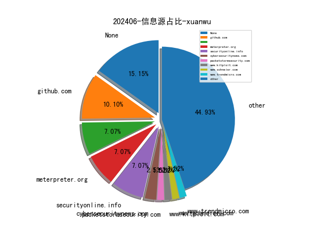

# [数据--所有](README_20.md)
# [数据--年度](README_2024.md)
# 202406 信息源与信息类型占比

# 政策 推荐
| title | url| 
| --- | ---| 
| 网络暴力信息治理规定 | https://www.cac.gov.cn/2024-06/14/c_1720043894161555.htm| 

# 网络安全书籍 推荐
| date_added | language | title | author | link | size| 
| --- | --- | --- | --- | --- | ---| 
| 2024-06-16 04:51:54 | English | Technology Fears and Scapegoats: 40 Myths About Privacy, Jobs, AI, and Today’s Innovation Economy | Robert D. Atkinson, David Moschella | http://libgen.rs/book/index.php?md5=B55D75D9479B52E8314F4E8FF1B76C02 | 8 MB [PDF]| 
| 2024-06-16 04:51:30 | English | Technology Fears and Scapegoats: 40 Myths About Privacy, Jobs, AI, and Today’s Innovation Economy | Robert D. Atkinson, David Moschella | http://libgen.rs/book/index.php?md5=EDE82BB694140FC9BA6ACBC9009BC39F | 940 kB [EPUB]| 
| 2024-06-14 07:20:41 | English | CompTIA Linux+ Certification Companion | unknown | https://www.wowebook.org/comptia-linux-certification-companion/ | unknown| 
| 2024-06-14 06:04:18 | English | The Business of Hacking | unknown | https://www.wowebook.org/the-business-of-hacking/ | unknown| 
| 2024-06-12 07:26:42 | English | Modern Graph Theory Algorithms with Python | unknown | https://www.wowebook.org/modern-graph-theory-algorithms-with-python/ | unknown| 
| 2024-06-11 06:10:26 | English | (1) No BS Guide to Crypto Investing | Harsh Strongman, Lifemathmoney | http://libgen.rs/book/index.php?md5=224C358713C180BAAD9AADD0D9BC10F3 | 2 MB [PDF]| 
| 2024-06-11 13:12:20 | English | An Age of Iron and Rust: Cassius Dio and the History of His Time (Historiography of Rome and Its Empire, 18) | Andrew G. Scott | http://libgen.rs/book/index.php?md5=AF5DCCF83993EFC5365C409DC99DBDD5 | 3 MB [PDF]| 
| 2024-06-08 09:54:29 | English | Exam Ref AZ-104 Microsoft Azure Administrator, 2nd Edition | unknown | https://www.wowebook.org/exam-ref-az-104-microsoft-azure-administrator-2nd-edition/ | unknown| 
| 2024-06-08 09:20:35 | English | Jump-start Your SOC Analyst Career, 2nd Edition | unknown | https://www.wowebook.org/jump-start-your-soc-analyst-career-2nd-edition/ | unknown| 
| 2024-06-07 05:05:08 | English | Jump-start Your SOC Analyst Career: A Roadmap to Cybersecurity Success | Tyler Wall; Jarrett Rodrick | http://libgen.rs/book/index.php?md5=2B62DA5CB586E083079FF73774B57478 | 34 MB [RAR]| 
| 2024-06-07 05:05:02 | English | Jump-start Your SOC Analyst Career: A Roadmap to Cybersecurity Success | Tyler Wall; Jarrett Rodrick | http://libgen.rs/book/index.php?md5=A7AF9DF907FF2E376890CE551F74CBB5 | 19 MB [EPUB]| 
| 2024-06-07 05:04:58 | English | Jump-start Your SOC Analyst Career: A Roadmap to Cybersecurity Success | Tyler Wall; Jarrett Rodrick | http://libgen.rs/book/index.php?md5=66B27DCF34971BB81B5F6DE9115CE6A3 | 13 MB [PDF]| 
| 2024-06-04 05:23:34 | English | The Reign of Botnets: Defending Against Abuses, Bots and Fraud on the Internet | unknown | https://www.wowebook.org/the-reign-of-botnets-defending-against-abuses-bots-and-fraud-on-the-internet/ | unknown| 
| 2024-06-03 11:35:22 | English | Fundamentals of Python: First Programs, 3rd Edition | unknown | https://www.wowebook.org/fundamentals-of-python-first-programs-3rd-edition/ | unknown| 
| 2024-06-02 08:17:27 | English | Windows Forensics: Understand Analysis Techniques for Your Windows | unknown | https://www.wowebook.org/windows-forensics-understand-analysis-techniques-for-your-windows/ | unknown| 
| 2024-06-02 09:05:12 | English | Mastering Knowledge Management Using Microsoft Technologies | unknown | https://www.wowebook.org/mastering-knowledge-management-using-microsoft-technologies/ | unknown| 
| 2024-06-01 18:47:39 | English | Think Python, 3rd Edition | unknown | https://www.wowebook.org/think-python-3rd-edition/ | unknown| 

# 微信公众号 推荐
| nickname_english | weixin_no | title | url| 
| --- | --- | --- | ---| 
| A9 Team | gh_533347fad180 | AI 安全运营的新篇章：Dify 的应用与实践（一） | https://mp.weixin.qq.com/s?__biz=MzkzNzI2Mzc0Ng==&mid=2247486251&idx=1&sn=c1a2f4a586c56ab6f28d879bbf420f9b | 1| 
| AI与网安 | gh_c57275954216 | 2024年有哪些好用划算的流量卡套餐推荐？（装机实测） | https://mp.weixin.qq.com/s?__biz=MzU1ODQ2NTY3Ng==&mid=2247486981&idx=2&sn=7caa81def8f57d8ba1db007ef977d22f | 8| 
| Art Of Hunting | gh_d3ebfd9e0148 | [AOH 030]免费停车-道闸权限绕过 | https://mp.weixin.qq.com/s?__biz=MzkzMTIyOTA1NA==&mid=2247484258&idx=1&sn=9ef8d74e526b435a9edbbd805b096efd | 1| 
| ChaMd5安全团队 | chamd5sec | DLink固件运行环境修复与调试 | https://mp.weixin.qq.com/s?__biz=MzIzMTc1MjExOQ==&mid=2247510531&idx=1&sn=9ec594e8907e44c115c8e96c1ff781fc | 3| 
| Docker中文社区 | dockerchina | Kubernetes 最佳实践之使用 sidecar 轮转日志 | https://mp.weixin.qq.com/s?__biz=MzI1NzI5NDM4Mw==&mid=2247497522&idx=1&sn=dabfa2723f1abaf4d12c6b3f615152c7 | 3| 
| Echo Reply | AA7ACE | TCP Analysis Flags 之 TCP Spurious Retransmission | https://mp.weixin.qq.com/s?__biz=MzA5NTUxODA0OA==&mid=2247492738&idx=1&sn=8d56e7750c5f8bf68b0734e26d08e90b | 3| 
| HACK之道 | hacklearn | 网络安全攻防人才紧缺，这样学才能抓住机会 | https://mp.weixin.qq.com/s?__biz=MzIwMzIyMjYzNA==&mid=2247514357&idx=1&sn=724f3567beffd0d609f0d07b238e1bf2 | 6| 
| Hack分享吧 | HackShareB | 师傅们，一个新方向爆了，80k很稳！ | https://mp.weixin.qq.com/s?__biz=MzA4NzU1Mjk4Mw==&mid=2247490867&idx=1&sn=3bbc132a686a44a20bad190343cb93bb | 8| 
| IoVSecurity | IoVSecurity | 在软件定义汽车中实现安全的全球时间同步 | https://mp.weixin.qq.com/s?__biz=MzU2MDk1Nzg2MQ==&mid=2247610166&idx=3&sn=bd47a13ad2e7f15d58af6523935a14cd | 36| 
| LK安全 | loudonglieren123 | 记录某次攻防演练中几个有趣的漏洞 | https://mp.weixin.qq.com/s?__biz=MzkxMzQyMzUwMg==&mid=2247486089&idx=1&sn=0cde63c765528fa0a3006e66fd657fc0 | 1| 
| Longwaer安全百晓堂 | gh_001bf84d0a18 | 【SRC业务逻辑漏洞】你的疑惑，我来为你解答 | https://mp.weixin.qq.com/s?__biz=MzkxODY0NjE5MA==&mid=2247484518&idx=1&sn=d50ad51623646b64499d1c918d124d8f | 1| 
| OSINT情报分析师 | None | 开源情报收集与分析技术讲义分享 | https://mp.weixin.qq.com/s?__biz=MzkxNzU5MjE0OA==&mid=2247484723&idx=3&sn=f8c3caceaec56ae73e65dedbe305111e | 9| 
| SCA御盾 | SCA_Magic | 【漏洞复现】某BI平台未授权信息泄露漏洞复现 | https://mp.weixin.qq.com/s?__biz=MzkzNjYwODg3Ng==&mid=2247485252&idx=1&sn=25574faa21edc5858cff4448005c0bcf | 4| 
| SecHub网络安全社区 | secevery0x01 | EDU实战-某系统垂直越权 | https://mp.weixin.qq.com/s?__biz=MzI5NTUzNzY3Ng==&mid=2247488656&idx=1&sn=7a4a4f9ee4338108dd7d20a6b3af08c4 | 2| 
| Sec探索者 | gh_46a14c338f91 | 【大白哥】python&安全小白新手课程 | https://mp.weixin.qq.com/s?__biz=MzkyNDYwNTcyNA==&mid=2247485463&idx=1&sn=e616439cc76b69d0bbc82899674d1661 | 5| 
| WebSec | gh_2914f5b10e8e | 【未公开新接口】某捷统一上网行为管理与审计系统某接口存在RCE | https://mp.weixin.qq.com/s?__biz=MzkyMzYwNTEyNg==&mid=2247486555&idx=1&sn=494fd70b576483655ad23c2b95889b54 | 4| 
| WgpSec狼组安全团队 | wgpsec | 记某次渗透测试中的0day挖掘 | https://mp.weixin.qq.com/s?__biz=MzIyMjkzMzY4Ng==&mid=2247505523&idx=1&sn=fbac1c69bfcada7fa9f2130d6cfd82ed | 1| 
| dotNet安全矩阵 | doNetSafety | 两个国内最专业的.NET安全知识库 | https://mp.weixin.qq.com/s?__biz=MzUyOTc3NTQ5MA==&mid=2247492700&idx=2&sn=f418a3e9a550100d8d95a9427279a267 | 14| 
| e安在线 | ean-online | 被裁 4 个月后，一名印度程序员的“复仇”：怒删前司 180 台虚拟服务器，造成 67.8 万美元损失，被判两年八个月监禁！ | https://mp.weixin.qq.com/s?__biz=MzI1OTA1MzQzNA==&mid=2651245895&idx=1&sn=a22e38e485a335e9e53e18f30b55695b | 6| 
| imBobby的自留地 | imBobbySY | 用 SAST 做好代码安全！附免费开源工具！ | https://mp.weixin.qq.com/s?__biz=MzI5MjI4ODU4Nw==&mid=2247491460&idx=1&sn=67307f175f8251d2ba29ac3f298d4140 | 8| 
| kali笔记 | bbskali-cn | Sea Moon 一款云平台网络工具集 | https://mp.weixin.qq.com/s?__biz=MzkxMzIwNTY1OA==&mid=2247504924&idx=1&sn=03d6e54a0d59bd36cc18b431ea9a21a1 | 4| 
| 一起聊安全 | gh_589ffdaa31f9 | 科技前瞻系列专题：国际巨头的端侧AI布局（6.18活动进行中） | https://mp.weixin.qq.com/s?__biz=MzI3NjUzOTQ0NQ==&mid=2247511380&idx=1&sn=561f01aa4b9babae1fe31c8dd4e16ba3 | 7| 
| 七芒星实验室 | HeptagramSec | 记某APP登录逆向解密过程 | https://mp.weixin.qq.com/s?__biz=Mzg4MTU4NTc2Nw==&mid=2247492087&idx=2&sn=023e5297321369577960f2303130f15d | 10| 
| 乌雲安全 | hackctf | 红队安全工具包 | https://mp.weixin.qq.com/s?__biz=MzAwMjA5OTY5Ng==&mid=2247522912&idx=1&sn=6fc56a2f65e3a3f7c6b947678cc2f4a4 | 9| 
| 二进制磨剑 | pyable | IDA 技巧（18） 结构体的全局交叉引用 | https://mp.weixin.qq.com/s?__biz=MzI1Mjk2MTM1OQ==&mid=2247484295&idx=1&sn=978b7662687c9228bbaaeaf3c2868cd5 | 2| 
| 云梦安全 | yxlmhtz | 深入了解GoPhish：初学者的完整指南 | https://mp.weixin.qq.com/s?__biz=MzU1NzczNTM1MQ==&mid=2247484738&idx=3&sn=2e6f6ebae26bef32479b4efbce3e4b94 | 6| 
| 云计算和网络安全技术实践 | gh_34d6b0cb5633 | vulnhub之West-Wild的实践 | https://mp.weixin.qq.com/s?__biz=MzA3MjM5MDc2Nw==&mid=2650748505&idx=1&sn=350bcd5c63fdd67a59e188f460e0fb9d | 2| 
| 云鸦安全 | gh_b1f7a29c8089 | 魔改哥斯拉 01：逆向破解 | https://mp.weixin.qq.com/s?__biz=Mzk0MTY5NzYyOA==&mid=2247484892&idx=1&sn=1b16dab3409367ec916b946bc880c98c | 5| 
| 亿人安全 | Yr-Sec | 记一次离谱的内存马 GetShell | https://mp.weixin.qq.com/s?__biz=Mzk0MTIzNTgzMQ==&mid=2247515622&idx=1&sn=f85069018e5024952f9de66cb9039feb | 7| 
| 会杀毒的单反狗 | cmlitiejun | 巴基斯坦黑客使用Linux恶意软件通过发送表情符号进行控制攻击印度目标 | https://mp.weixin.qq.com/s?__biz=MzI2NzAwOTg4NQ==&mid=2649791448&idx=1&sn=8fb6c21e341eaf058881424c7bb6d366 | 8| 
| 信息安全动态 | SecurityDynamics | 招聘网络工程师 | https://mp.weixin.qq.com/s?__biz=Mzg4NDc0Njk1MQ==&mid=2247486241&idx=1&sn=afe3872ac41bab65cd69ddb0f5982690 | 2| 
| 关键信息基础设施安全保护联盟 | CNCIIPA | 【公益译文】了解和应对分布式拒绝服务攻击 | https://mp.weixin.qq.com/s?__biz=MzkxNjU2NjY5MQ==&mid=2247503601&idx=3&sn=dfb98287dfc9ce8dcba498bccfcd5011 | 14| 
| 利刃信安 | DMXGFSYS | 【性能测试】性能测试软件 LoadRunner Professional 2024 安装+破解+使用一条龙 | https://mp.weixin.qq.com/s?__biz=MzU1Mjk3MDY1OA==&mid=2247514240&idx=1&sn=2995080f699eaac5693758b23d676943 | 10| 
| 前沿信安资讯阵地 | infosrc | 供应商关系中的网络安全指南（04） ,  信息技术外包流程之选择供应商 | https://mp.weixin.qq.com/s?__biz=MzA3MTM0NTQzNA==&mid=2455775179&idx=1&sn=1b1c2048784951a8b48771ea1e972cd1 | 5| 
| 君哥的体历 | jungedetili | 关于小程序安全解决方案及内部人员使用相关问题的探讨, 总第250周 | https://mp.weixin.qq.com/s?__biz=MzI2MjQ1NTA4MA==&mid=2247491317&idx=1&sn=35ef3bb810d399c0c9dfac4b6199e105 | 1| 
| 土拨鼠的安全屋 | gh_e6d57d016b6d | src案例 ｜ 二分法SQL注入绕过 | https://mp.weixin.qq.com/s?__biz=Mzk0ODY1NzEwMA==&mid=2247483976&idx=1&sn=383849aef184b43b37125b3457b81b02 | 2| 
| 夜组安全 | NightCrawler_Team | 一款免费开源的漏洞情报系统 | https://mp.weixin.qq.com/s?__biz=Mzk0ODM0NDIxNQ==&mid=2247491106&idx=1&sn=c3c3f1af2ee522426e5cba1fb24eb7fc | 5| 
| 天唯信息安全 | TWtech2113189 | 《智能工厂建设导则第4部分:智能工厂设计文件编制》（GB/T 43064.4-2024）将于今年10月1日起正式实施 | https://mp.weixin.qq.com/s?__biz=MzkzMjE5MTY5NQ==&mid=2247498430&idx=4&sn=201cb18988630c3d9a6b2ca396e22335 | 14| 
| 天际友盟 | gh_8833afc123ef | [0617]一周重点暗网情报｜天际友盟情报站 | https://mp.weixin.qq.com/s?__biz=MzIwNjQ4OTU3NA==&mid=2247508604&idx=1&sn=ee138d113ec764ba861dc8ef036022e7 | 4| 
| 威努特安全网络 | winicssec_bj | 揭秘智能制造行业数据备份秘籍 | https://mp.weixin.qq.com/s?__biz=MzAwNTgyODU3NQ==&mid=2651123789&idx=1&sn=4c537fcb2b9ac189425e3e3236927521 | 5| 
| 安全分析与研究 | MalwareAnalysis | 某黑产组织最新攻击样本利用BYVOD技术的详细分析 | https://mp.weixin.qq.com/s?__biz=MzA4ODEyODA3MQ==&mid=2247488345&idx=1&sn=7b51dc0213875aa7527351f294f69fdd | 2| 
| 安全喵喵站 | CyberSecurityMew | 拓展港澳｜V-Transform 2024盛会，不容错过！ | https://mp.weixin.qq.com/s?__biz=MzkzNjE5NjQ4Mw==&mid=2247538849&idx=1&sn=47143a274c62b842e2c40451d3c0b966 | 3| 
| 安全学习那些事儿 | aqxxse | 《云计算服务安全责任划分规则及实施指南》公开征求意见 | https://mp.weixin.qq.com/s?__biz=MzkxNTI2NTQxOA==&mid=2247492595&idx=4&sn=57d0cac0ab2820190715e6f4ee0dbd68 | 22| 
| 安全洞察知识图谱 | gh_d9a3a4cfeeac | 工具推荐,渗透必备悬剑武器库5.04版——悬剑5封装版+云武器库+移动安全包 | https://mp.weixin.qq.com/s?__biz=MzkyMDM4NDM5Ng==&mid=2247486008&idx=1&sn=35ed65bdf87d8223f5739968cfc889e5 | 4| 
| 安全笔记 | gh_20cf09f0438b | Fastadmin框架任意文件读取漏洞(附带扫描工具) | https://mp.weixin.qq.com/s?__biz=Mzg3NDc3NDQ3NA==&mid=2247484478&idx=1&sn=9061d1221726b44acaf6aad995fbf0bf | 5| 
| 安恒信息 | AnHengCloudNews | 数据安全十大经典案例⑨｜面对爆炸性激增的API攻击，如何见招拆招？ | https://mp.weixin.qq.com/s?__biz=MjM5NTE0MjQyMg==&mid=2650609708&idx=1&sn=017f825b994121a82aa91b96e54ba53a | 6| 
| 小明信安 | security-xm | 【漏洞复现 , 含批量POC】SolarWinds Serv-U FTP目录遍历漏洞(CVE-2024-28995) | https://mp.weixin.qq.com/s?__biz=Mzg4NjI0MDM5MA==&mid=2247485242&idx=1&sn=47c45b00906cee8a522712c7a6e025ae | 5| 
| 工业信息安全产业发展联盟 | Nisia_Gongxinanquan | 工控安全主题公益沙龙预告 | https://mp.weixin.qq.com/s?__biz=MzUyMzA1MTM2NA==&mid=2247497786&idx=1&sn=0c0220ea835a2791684bc80f9a393a82 | 8| 
| 幽荧安全 | Aianquan_hacker | SRC实战 接口未授权到任意用户登录 | https://mp.weixin.qq.com/s?__biz=Mzg3MTU1MTQ0MA==&mid=2247484694&idx=1&sn=6c801838b6e3f06cef223bd9109adafc | 1| 
| 德斯克安全小课堂 | szdesk | 案例分享——某公司企业服务器遭遇挖矿病毒侵袭事件 | https://mp.weixin.qq.com/s?__biz=MzA3MTUxNzQxMQ==&mid=2453885189&idx=1&sn=a6b0601271fa336030eda4dd6d150b7e | 3| 
| 我吃饼干 | gh_5054216df2ef | 【资源分享】BurpSuite插件—Spring漏洞 | https://mp.weixin.qq.com/s?__biz=MzkzODY2ODA0OA==&mid=2247484957&idx=1&sn=2253127c461313f55ee86019c3c30793 | 4| 
| 技术修道场 | gh_fe3e6e63e435 | 内网信息收集：知己知彼，百战不殆 | https://mp.weixin.qq.com/s?__biz=MzA4NTY4MjAyMQ==&mid=2447899114&idx=1&sn=4a633b7263e4188b0f7b626b0a03decc | 6| 
| 昊天信安 | cniaosec | 20款“小而美”的开源网络安全工具推荐（附下载地址） | https://mp.weixin.qq.com/s?__biz=MzkzNzI4NDQzMA==&mid=2247498233&idx=1&sn=34c9b34325da0487608b1f4ea126b7a4 | 3| 
| 李白你好 | libai_hello | 网络安全态势大屏&&资产测绘平台+漏洞扫描的前端UI | https://mp.weixin.qq.com/s?__biz=MzkwMzMwODg2Mw==&mid=2247507274&idx=1&sn=31fff70cc6cda9115f41da37ac7d551e | 3| 
| 格格巫和蓝精灵 | direnjie-sec | CodeQL结合GPT实现代码审计效率翻倍 | https://mp.weixin.qq.com/s?__biz=MzI5NDg0ODkwMQ==&mid=2247485948&idx=1&sn=e3f69c81231e39da32f7b55c52721180 | 1| 
| 棉花糖网络安全圈 | hacker-mht | Invicti最新版v24.6.0-windows破解版 | https://mp.weixin.qq.com/s?__biz=Mzg5NTYwMDIyOA==&mid=2247504881&idx=1&sn=fb45633aec187a19d891d3fd68588d07 | 5| 
| 汽车电子嵌入式 | gh_c9d411042eab | 【OS】AUTOSAR OS Resource实现原理 | https://mp.weixin.qq.com/s?__biz=Mzg2NTYxOTcxMw==&mid=2247491963&idx=2&sn=ac7dce4dc89e27c6a6a99db2c7cca432 | 5| 
| 河南等级保护测评 | hndjbh | 快速风险审计：在Excel中生成随机事件和影响的简介 | https://mp.weixin.qq.com/s?__biz=Mzg2NjY2MTI3Mg==&mid=2247495704&idx=2&sn=24588ee9acee052ae04aa9de8fa57167 | 14| 
| 洞见网安 | doonsec | 网安简报【2024/6/14】 | https://mp.weixin.qq.com/s?__biz=MzAxNzg3NzMyNQ==&mid=2247488428&idx=3&sn=9e3ec3bd919e8dceefedf8301bf5f363 | 10| 
| 浅安安全 | gh_758e256fcc72 | 工具 , Code-audit | https://mp.weixin.qq.com/s?__biz=MzkwMTQ0NDA1NQ==&mid=2247489259&idx=4&sn=dd1ec74f4543c791dce2dfd633b9dd03 | 16| 
| 混入安全圈的程序猿 | gh_b205effae10a | 权限类漏洞解析——功能权限篇 | https://mp.weixin.qq.com/s?__biz=MzU3ODI3NDc4NA==&mid=2247484312&idx=1&sn=0533a599b99dde57d566e0abe4503642 | 2| 
| 渗透安全HackTwo | CB-Hack | 分享几个有趣的bypass挖洞案例,挖洞技巧 | https://mp.weixin.qq.com/s?__biz=Mzg3ODE2MjkxMQ==&mid=2247487266&idx=1&sn=80eb2d49323b9a04fe2676d77e372cb2 | 3| 
| 漏洞404 | loud404 | 打造属于自己的AI小助手 | https://mp.weixin.qq.com/s?__biz=Mzg5NTcxODQ4OA==&mid=2247486009&idx=1&sn=200175df0009a1595e192f85d092f357 | 1| 
| 潇湘信安 | xxxasec | CVE-2024-26229提权复现测试记录 | https://mp.weixin.qq.com/s?__biz=Mzg4NTUwMzM1Ng==&mid=2247510932&idx=1&sn=201cd6af328b95dadc555ffc76b043fe | 4| 
| 狐狸说安全 | itseckpg | 80k！建议师傅们冲一冲这个前景被严重低估的方向！ | https://mp.weixin.qq.com/s?__biz=MzUzMDQ1MTY0MQ==&mid=2247505763&idx=1&sn=36674213e0492565614069ed68d90645 | 2| 
| 独眼情报 | cs_cti | 超越“Password123”：创建超级密码的 6 个步骤 | https://mp.weixin.qq.com/s?__biz=MzkzNDIzNDUxOQ==&mid=2247485683&idx=3&sn=f45e5050a7efd1eecc352d7ada8fa152 | 12| 
| 猫鼠信安 | gh_b8b8c8961ead | 猫鼠信安文库发布啦！ | https://mp.weixin.qq.com/s?__biz=Mzg2NjUzNzg4Ng==&mid=2247484412&idx=1&sn=b6092fce60c2e526a2d3305a009e6b8e | 1| 
| 玄道夜谈 | None | 分享图片 | https://mp.weixin.qq.com/s?__biz=MzI3Njc1MjcxMg==&mid=2247492345&idx=1&sn=b2fcd6761e06a43853ea60c9313cda17 | 7| 
| 生有可恋 | hyang0-1 | 住院能使用家里人的医保卡报销吗？ | https://mp.weixin.qq.com/s?__biz=Mzk0MTI4NTIzNQ==&mid=2247491529&idx=1&sn=ddd431a1f9a64305af00066d2982843e | 1| 
| 电科网安 | None | 常见的数据结构 | https://mp.weixin.qq.com/s?__biz=MzU3ODk0MzE4OA==&mid=2247487237&idx=3&sn=91ec30137a77a5a17efe7380c8d96cef | 6| 
| 白帽子 | NS-CTF | 记某次渗透测试中的0day挖掘 | https://mp.weixin.qq.com/s?__biz=MzAwMDQwNTE5MA==&mid=2650247552&idx=1&sn=3b94b9d1850f4e320efb319ea01bc914 | 3| 
| 白帽学子 | gh_4bda7b44c1e3 | 漏洞扫描系统 -- 临兵 | https://mp.weixin.qq.com/s?__biz=MzkyNzIxMjM3Mg==&mid=2247486903&idx=1&sn=145b2c53362cd43d363772b936f062ae | 1| 
| 皓月当空w | hanaffectionl | 【平台更新】 新增文章收藏功能 | https://mp.weixin.qq.com/s?__biz=Mzg4MDg5NzAxMQ==&mid=2247485681&idx=1&sn=10f46402926048a8d9132d3e30c5592f | 9| 
| 知机安全 | gh_ad3e7f23f43a | Google的隐私沙箱被奥地利非营利组织指控跟踪用户 | https://mp.weixin.qq.com/s?__biz=MzIzNDU5NTI4OQ==&mid=2247486425&idx=1&sn=ae0b39b3b1fda13151b71365bd484917 | 2| 
| 绿盟科技研究通讯 | nsfocus_research | 【公益译文】设计安全警报：消灭软件中的SQL注入漏洞 | https://mp.weixin.qq.com/s?__biz=MzIyODYzNTU2OA==&mid=2247497440&idx=1&sn=bd797f6a2fc78bab38df0eb935711750 | 2| 
| 网空闲话plus | TheCyberExpress1 | 5th域安全微讯早报【20240617】145期 | https://mp.weixin.qq.com/s?__biz=MzkyMjQ5ODk5OA==&mid=2247500247&idx=3&sn=17ded477350193f5708ffa14faf31e54 | 17| 
| 网络个人修炼 | gh_ab9a2fbd9bd9 | 恢复错误挂载导致的/root目录故障（解决-bash-4.2问题） | https://mp.weixin.qq.com/s?__biz=MzkzMDQ0NzQwNA==&mid=2247485015&idx=1&sn=2408ccd228c8233a2afe31493ff0b9cf | 2| 
| 网络安全与取证研究 | wangluoanquanquzheng | 电子数据取证每日一练-ios取证 | https://mp.weixin.qq.com/s?__biz=Mzg3NTU3NTY0Nw==&mid=2247488891&idx=1&sn=08a2e73ff9dbc36abae65a37943b2e05 | 6| 
| 网络安全实验室 | wlaqyjs | 360集团2024年安全服务实习生招聘专项开启,网络安全大厂 | https://mp.weixin.qq.com/s?__biz=MzU4OTg4Nzc4MQ==&mid=2247502628&idx=1&sn=c3bd8de8b2498842f9695b4a7f8571c7 | 10| 
| 网络技术联盟站 | wljslmz | 强的一批！华为《Linux学习笔记》火了！（附完整版PDF） | https://mp.weixin.qq.com/s?__biz=MzIyMzIwNzAxMQ==&mid=2649458584&idx=1&sn=2880b118510969bfd07b25b4816f50b8 | 8| 
| 船山信安 | zghyxa | 如何使用NoMore403在网络安全评估中绕过HTTP 40X错误 | https://mp.weixin.qq.com/s?__biz=MzU2NDY2OTU4Nw==&mid=2247514586&idx=1&sn=b1397705344b59e4de9760555338dc59 | 6| 
| 苏说安全 | sushuoanquan | 卫生健康行业医疗机构场景密码应用与安全性评估实施指南(附下载) | https://mp.weixin.qq.com/s?__biz=Mzg5OTg5OTI1NQ==&mid=2247487686&idx=1&sn=641e1cd7ee7564c6ea3907dd9bb57a4a | 7| 
| 苏诺木安全团队 | Ni-Caiqing | 【1day】悦库企业网盘 /user/login/.html SQL注入漏洞【附poc】 | https://mp.weixin.qq.com/s?__biz=MzkwMjYzNTE4MA==&mid=2247484533&idx=1&sn=2168a3b77be73ceffcc0cf93315bcd19 | 6| 
| 菜鸟学信安 | securitylearn | 摸鱼安服工具 | https://mp.weixin.qq.com/s?__biz=MzU2NzY5MzI5Ng==&mid=2247502041&idx=1&sn=9dcd7da9405d9345a378075a5c5b35a1 | 3| 
| 蓝胖子之家 | gh_fa158f2ae9b3 | 开源终端AI文件编辑助手 | https://mp.weixin.qq.com/s?__biz=MzU1NDg4MjY1Mg==&mid=2247488217&idx=1&sn=115658865ccd55702307027281470e03 | 7| 
| 蛙王工具库 | gh_219d2a00872f | 最强渗透集成环境 V 5.0（Windows10 Penetration Suite Toolkit V5.0） | https://mp.weixin.qq.com/s?__biz=MzkwNzM5NDk4Mw==&mid=2247484099&idx=1&sn=771f9e27eab5330eadc0521359c4d719 | 2| 
| 计算机与网络安全 | C-CyberSecurity | 1200+数字化资料（数字政府、数字化转型） | https://mp.weixin.qq.com/s?__biz=MjM5OTk4MDE2MA==&mid=2655243655&idx=8&sn=ed62be0869f784e7041e610b851a1fbd | 35| 
| 赛欧思安全研究实验室 | gh_04596d590471 | 联邦调查局攻陷僵尸网络：911 S5 感染设备达 1900 万台 | https://mp.weixin.qq.com/s?__biz=MzU0MjE2Mjk3Ng==&mid=2247487243&idx=1&sn=cd9e2bb7e4537056b0a26a420e3c1918 | 6| 
| 道一安全 | DaoYiSecurity | 从红队视角剖析实战案例 | https://mp.weixin.qq.com/s?__biz=MzU5OTMxNjkxMA==&mid=2247485664&idx=1&sn=908e1e55ebe0350929cb0cba68fcc37e | 8| 
| 道玄网安驿站 | gh_cb9a38436cdd | 【车联网】斯柯达大众Superb汽车漏洞挖掘 | https://mp.weixin.qq.com/s?__biz=Mzg4NTg5MDQ0OA==&mid=2247486400&idx=1&sn=47d81709306b195231f11e913abfba76 | 8| 
| 释然IT杂谈 | ShiRan_IT | 史上最强！华为交换机常用命令大全，网络工程师收藏！ | https://mp.weixin.qq.com/s?__biz=MzIxMTEyOTM2Ng==&mid=2247503208&idx=1&sn=4b20e15344d5d8cd953e6187fdb4c6c0 | 2| 
| 银遁安全团队 | gh_3e6002f59af7 | 【漏洞复现】契约锁add存在远程命令执行漏洞 | https://mp.weixin.qq.com/s?__biz=MzU3MjU4MjM3MQ==&mid=2247486263&idx=1&sn=c83b1d0745433069f1d80f413f96f7c3 | 10| 
| 骨哥说事 | guge_guge | 打造自己专属的漏洞赏金搜索引擎 | https://mp.weixin.qq.com/s?__biz=MjM5Mzc4MzUzMQ==&mid=2650259084&idx=1&sn=d375c8b5917909cfd5c868d7aefd5029 | 3| 
| 黑客仓库 | hacker-depot | 20款“小而美”的免费网络安全工具推荐 | https://mp.weixin.qq.com/s?__biz=MzU0MDUxMDEzNQ==&mid=2247489461&idx=1&sn=74c84b74477e8e2aadee2e769c3433df | 1| 
| 黑客白帽子 | hackerwhitehat | 【LSP专享】助眠视频隔壁的苏苏1V，含2个小剧场 | https://mp.weixin.qq.com/s?__biz=MzA5MzYzMzkzNg==&mid=2650953605&idx=3&sn=9b8f34c69d1e331b37394860d39621b3 | 29| 
| 黑客驰 | HackerChi_Top | 【逆向 - 从入门到放弃03】- 练习答案-JNE与破解 | https://mp.weixin.qq.com/s?__biz=Mzg4MzgwMDE2Mw==&mid=2247487904&idx=1&sn=78f6ee1ba81a34ef3fe8122816e7676e | 6| 
| 黑猫安全 | Blackcat-Security | 克利夫兰市仍在努力全面恢复受到网络攻击影响的系统 | https://mp.weixin.qq.com/s?__biz=Mzg3OTc0NDcyNQ==&mid=2247491716&idx=2&sn=b5f28f8ff49679fb68e3baff2f73584e | 11| 
| 黑白之道 | i77169 | 知名远程控制工具、TeamViewer开源替代——RustDesk已暂停国内服务 | https://mp.weixin.qq.com/s?__biz=MzAxMjE3ODU3MQ==&mid=2650595008&idx=4&sn=e4aa2b2e0e4c12ba9f65d25a85d8941f | 36| 
| CISSP | wxxinchuangsec | CVE-2024-29824  POC | https://mp.weixin.qq.com/s?__biz=Mzg4MTg0MjQ5OA==&mid=2247485314&idx=1&sn=f240ebd6f4993b28c5a1611304839471 | 6| 
| DFIR蘇小沐 | DFIR00 | 【父亲节】祝天下所有的父亲，节日快乐 | https://mp.weixin.qq.com/s?__biz=MzI2MTUwNjI4Mw==&mid=2247488479&idx=1&sn=09a91e4a8275052a7800c5a3a1ea50b8 | 3| 
| IoT物联网技术 | IoT-Tech-Expo | 国产基于Vue+Echarts 免费开源 AIoT 物联网可视化Web组态大屏解决方案 | https://mp.weixin.qq.com/s?__biz=MjM5OTA4MzA0MA==&mid=2454934347&idx=1&sn=d7844306d38d0fce74fc33681ade826f | 7| 
| KK安全说 | kksecurity | 【资源共享时刻】一些人工智能安全的资源共享 | https://mp.weixin.qq.com/s?__biz=Mzg4NzgyODEzNQ==&mid=2247487327&idx=1&sn=13fbab3ef7363bd57f1ea1fb3d65dc6b | 11| 
| Khan安全攻防实验室 | None | 就知道吃 | https://mp.weixin.qq.com/s?__biz=MzAwMjQ2NTQ4Mg==&mid=2247493744&idx=1&sn=4e4f5459dfd8ab918586375fab3d1d04 | 9| 
| OpenWrt | gh_0c676b3c6a77 | 百元京东亚瑟wifi6路由器真香，支持刷OpenWrt系统 | https://mp.weixin.qq.com/s?__biz=MzU4MTgxNDc2MQ==&mid=2247485740&idx=1&sn=a58da9de33d713baabef214fd77d9130 | 1| 
| QingScan | qingscan | CodeQL结合GPT实现代码审计效率翻倍 | https://mp.weixin.qq.com/s?__biz=MzA5NzEwOTUzMw==&mid=2447979958&idx=1&sn=e32efbbb06e463a4490b43a01ee820d9 | 1| 
| TtTeam | gh_a0a1db78ea68 | 记一次\"微信交流群\"内免杀木马分析以及溯源 | https://mp.weixin.qq.com/s?__biz=Mzg2NTk4MTE1MQ==&mid=2247485080&idx=1&sn=310207560aaa737c2dae507943b2d01d | 8| 
| XDsecurity | gh_a6965ae2a4f5 | 漏洞分析,PHP-CGI Windows平台远程代码执行漏洞（CVE-2024-4577） | https://mp.weixin.qq.com/s?__biz=Mzg2NTcyNjU4Nw==&mid=2247485250&idx=1&sn=42fadf4a40bab94ab8937b6ee9897a10 | 1| 
| Xsafe | r00t_t00r | 海康威视iSecure后渗透工具 | https://mp.weixin.qq.com/s?__biz=MzU5MjIzMDMzNg==&mid=2247484313&idx=1&sn=1322d43ebeebca8633d0f2ffdfd7b163 | 1| 
| YuanQiu安全 | gh_d211076084a9 | 工具 , RustScan一款3秒内可扫描65k个端口的探测 | https://mp.weixin.qq.com/s?__biz=MzkyNzQxMjQ4Ng==&mid=2247484042&idx=1&sn=b803111de727d524eab873027678806a | 1| 
| e0m安全屋 | e0mlja | php cgi 附加 | https://mp.weixin.qq.com/s?__biz=Mzg5MjY2NTU4Mw==&mid=2247486323&idx=1&sn=5766ca739379dfcdbbd4b89702d9cce9 | 1| 
| wavecn | sender_is_sender | 攻防演练在即：如何高效全面地排查信息系统用户状态和弱密码 | https://mp.weixin.qq.com/s?__biz=Mzg4Njc0Mjc3NQ==&mid=2247486120&idx=1&sn=6da4db3d92a374c13aa716e59d79e02b | 5| 
| 不懂安全的果仁 | GD_199911 | 从一个Potato插件看红队武器化开发 | https://mp.weixin.qq.com/s?__biz=Mzg4NDg3NjE5MQ==&mid=2247485057&idx=1&sn=0a478136eb9374b268e36c92ea7d140d | 1| 
| 与智慧做朋友 | qichelaba3 | 大平台，是网络安全（密码）快速走向平民化的重要保障！！ | https://mp.weixin.qq.com/s?__biz=MzA3OTg3Mjg3NA==&mid=2456976064&idx=1&sn=df92565d90234b3ef6abcb1a2704bcf3 | 2| 
| 中国信息安全 | chinainfosec | 观点 , 医疗健康数据资产化面临的问题和对策 | https://mp.weixin.qq.com/s?__biz=MzA5MzE5MDAzOA==&mid=2664216105&idx=4&sn=0326ca2b2be314338ddc75de7c4b90e9 | 42| 
| 中国软件评测中心 | china_testing | “机器人+”典型应用场景案例集--矿山领域机器人典型应用场景：井下辅运车辆自动驾驶 | https://mp.weixin.qq.com/s?__biz=MjM5NzYwNDU0Mg==&mid=2649245175&idx=8&sn=9f613daeb278d71de32cc03bf550d2a0 | 23| 
| 亚信安全 | None | 感恩父亲节 | https://mp.weixin.qq.com/s?__biz=MjM5NjY2MTIzMw==&mid=2650617006&idx=1&sn=0f5c3c620e3c138bbdd063127e456333 | 9| 
| 信睿网络 | xinruisec | 求职难题揭秘：应届生如何应对市场竞争？ | https://mp.weixin.qq.com/s?__biz=Mzg4MDA2NjExMA==&mid=2247489816&idx=1&sn=cf872431a76eb9a6d4517da3e5e59a25 | 1| 
| 儒道易行 | gh_ad128618f5e9 | 浅谈红队攻防之道-将exe文件指定ico图标上线 | https://mp.weixin.qq.com/s?__biz=Mzg5NTU2NjA1Mw==&mid=2247492180&idx=1&sn=ee0a0b302d7373d8d5f207e79b649b93 | 7| 
| 全球技术地图 | drc_iite | 生成式人工智能在美军指挥控制领域的发展现状研究 | https://mp.weixin.qq.com/s?__biz=MzI1OTExNDY1NQ==&mid=2651613524&idx=1&sn=295e6e8368a20cbc7e0fe7089b085d58 | 16| 
| 吉祥学安全 | gh_bf0dc85c3f99 | 星球更新汇报，派送优惠卷 | https://mp.weixin.qq.com/s?__biz=MzkwNjY1Mzc0Nw==&mid=2247484719&idx=2&sn=28457420d29f002cf564b9fa01769af7 | 13| 
| 呼啦啦安全 | gh_586ce4241b73 | 安卓系列学习(九)--静态函数式抽空 | https://mp.weixin.qq.com/s?__biz=Mzg5OTg5NzkwNw==&mid=2247485190&idx=1&sn=b0096c92427cc2692df32eb90ee88367 | 6| 
| 商密君 | shangmijun | 无法修复立即删除！谷歌 EmailGPT 曝零日漏洞 | https://mp.weixin.qq.com/s?__biz=MzI5NTM4OTQ5Mg==&mid=2247624279&idx=4&sn=68719e8165d9ffd771f56421c1e13513 | 42| 
| 安信安全 | gsaxns | 父亲节丨不动如山  延绵似水 | https://mp.weixin.qq.com/s?__biz=MzAxNTYwOTU1Mw==&mid=2650090242&idx=1&sn=702fba6f90c3fb3f93b3f9855c849125 | 7| 
| 安全Si语 | SecWhisper | Rust+LLVM相关问题是否单独讲一期公开课调查! | https://mp.weixin.qq.com/s?__biz=MzU4NTkwMzgzNQ==&mid=2247483859&idx=1&sn=01a7e7ada47e2ecf09cd6824e8108502 | 1| 
| 安全圈 | ChinaAnQuan | 【安全圈】两名乌克兰人因涉嫌帮助传播亲俄宣传、窃听军用电话被捕 | https://mp.weixin.qq.com/s?__biz=MzIzMzE4NDU1OQ==&mid=2652061675&idx=4&sn=d227901769fa1d7aa5ed99e44f813881 | 40| 
| 安全小姿势 | www_sqlsec_com | 国光二期 WEB 课程之目录扫描靶场 WP | https://mp.weixin.qq.com/s?__biz=Mzk0MDI0OTQwNw==&mid=2247484646&idx=1&sn=dddb7ba7071c694f9370183bb017fd34 | 3| 
| 安全攻防屋 | z6_debug | 【代码审计】RBAC权限管理系统-SQL注入漏洞 | https://mp.weixin.qq.com/s?__biz=MzkyNTU3MjA3OQ==&mid=2247484963&idx=1&sn=7907f50ae9f81d0405709d6263af37c4 | 4| 
| 安全研究GoSSIP | GoSSIPSJTU | 第 1 届ACM CCS AI大模型系统隐私与安全分析研讨会（LAMPS 2024）正在征稿 | https://mp.weixin.qq.com/s?__biz=Mzg5ODUxMzg0Ng==&mid=2247498249&idx=1&sn=ffcd03036dca16886b9cc79df5f72a82 | 6| 
| 安全绘景 | gh_a4e19e42a2aa | 华天动力OA登录绕过漏洞利用 | https://mp.weixin.qq.com/s?__biz=MzkyNzYxMDQ2MQ==&mid=2247484713&idx=2&sn=2a4c56295ed0d3975bb0ccafd3a57f9f | 2| 
| 安全脉脉 | None | 车联网安全比赛这样打 | https://mp.weixin.qq.com/s?__biz=Mzk0MzQzNzMxOA==&mid=2247486908&idx=1&sn=55823121c6fd6ad0cba1843037ae9853 | 3| 
| 小东安全日记 | SecRecord | 《零信任安全》网关部署场景和连接器组网（底部书籍抽奖） | https://mp.weixin.qq.com/s?__biz=MzIwNDI2NjAxOQ==&mid=2247483741&idx=1&sn=c3b23ceb5bb90621b6b7b96dd86326b2 | 1| 
| 小兵搞安全 | antian365sec | 内网端口扫描fscan&父亲节快乐 | https://mp.weixin.qq.com/s?__biz=MzA3NTc0MTA1Mg==&mid=2664711680&idx=1&sn=d99c34632cf736970943f99ddd7d1ebc | 2| 
| 小白菜安全 | xiaobaicaianquan | 29网课交单平台 epay.php SQL注入漏洞 | https://mp.weixin.qq.com/s?__biz=MzIzOTM2MzczNQ==&mid=2247484446&idx=1&sn=72c5dec36e505a211a50e97281f4329f | 5| 
| 巢安实验室 | safe-labs | XXL-JOB executor 未授权访问漏洞 | https://mp.weixin.qq.com/s?__biz=MzU2MjY1ODEwMA==&mid=2247491606&idx=1&sn=40a388ab639e5c8433fd78d09c24cc2d | 1| 
| 微步在线研究响应中心 | gh_280024a09930 | 安全威胁情报周报（6.10~6.16） | https://mp.weixin.qq.com/s?__biz=Mzg5MTc3ODY4Mw==&mid=2247506066&idx=1&sn=9d2f7ab3e21405b2427f1f44af7a2f54 | 5| 
| 扫地僧的茶饭日常 | gh_adce6a490378 | 【漏洞复现】SolarWinds Serv-U FTP 目录遍历文件读取漏洞（CVE-2024-28995） | https://mp.weixin.qq.com/s?__biz=Mzg5NTUyNTI5OA==&mid=2247485714&idx=1&sn=d5d18d42ff8dde934f28d4e0feb44500 | 2| 
| 爱加密 | None | 父亲节 , 时光荏苒，感恩相伴 | https://mp.weixin.qq.com/s?__biz=MjM5NzU4NjkyMw==&mid=2650744286&idx=1&sn=7796bd25dcb36e872ffbb9dda3021fa3 | 7| 
| 秦安战略 | qinan1128 | 《诗词游记》第334期：京郊杏李园 | https://mp.weixin.qq.com/s?__biz=MzA5MDg1MDUyMA==&mid=2650470517&idx=3&sn=39cd74d02ee5b6b15aba625f130d1ac9 | 18| 
| 网络与信息法学会 | cyber-info-law | 【资讯】陕西省知识产权局等九部门印发《陕西省数据知识产权登记管理办法（试行）》 | https://mp.weixin.qq.com/s?__biz=MzU1NDY3NDgwMQ==&mid=2247541918&idx=3&sn=0900ca65a277188f35334657a3450ab8 | 16| 
| 老鑫安全 | studentSec | Sleep反沙箱已死？MySleep万岁！ | https://mp.weixin.qq.com/s?__biz=MzU0NDc0NTY3OQ==&mid=2247487190&idx=1&sn=c64dd6a423c3af2a6521161682bbf0a4 | 3| 
| 葡萄不只会安全 | putao-m0l1 | 想上班先交钱[旺柴] | https://mp.weixin.qq.com/s?__biz=Mzg5OTg1MDk0Mw==&mid=2247484652&idx=1&sn=23e7817a5a22dd7e0b10b8dac4c1f919 | 3| 
| 迪哥讲事 | growing0101 | 实战:略微扎手的渗透测试 | https://mp.weixin.qq.com/s?__biz=MzIzMTIzNTM0MA==&mid=2247494977&idx=1&sn=b2687aa192c97b0fef505f95668ab5ab | 11| 
| 逆向成长日记 | bigger_spider | 自写面具模块导致zygisk next崩溃 | https://mp.weixin.qq.com/s?__biz=Mzg4NTg0MjMzNQ==&mid=2247483903&idx=1&sn=27eddd87deb1e6ce17ba25cc9686d13a | 1| 
| 逆向有你 | nixiangyouni | 逆向学习数据结构篇 -- 引用、哈希表、函数重载、指针以及链表的概念及用法 | https://mp.weixin.qq.com/s?__biz=MzA4MzgzNTU5MA==&mid=2652035179&idx=8&sn=d3e8aea6633417fde918c8d50616971d | 50| 
| 透明魔方 | TransparentCube | 试谈关键基础设施安全风险评估服务 | https://mp.weixin.qq.com/s?__biz=MzI4NzA1Nzg5OA==&mid=2247485096&idx=1&sn=4a6cb84761c6351b5a4e8dd78f4fe18b | 8| 
| 重生者安全 | Fighter-hackerone | 监控 GitHub实时搜索和查找不同在线服务的敏感数据工具 | https://mp.weixin.qq.com/s?__biz=Mzg4NTczMTMyMQ==&mid=2247486114&idx=1&sn=5c2ae61f43ba7ed66270d87d6065db16 | 1| 
| 锦行科技 | jeeseensec | 父亲节快乐！ | https://mp.weixin.qq.com/s?__biz=MzIxNTQxMjQyNg==&mid=2247492610&idx=1&sn=8324981176faabc2bc3e3a48042e7619 | 2| 
| 隐查查 | None | 父亲节 , 岁月无痕，父爱有迹 | https://mp.weixin.qq.com/s?__biz=MzkwODMxMjcyMQ==&mid=2247487463&idx=1&sn=9fef696b6d35e33bfe53b8e1e6ba3f91 | 2| 
| 隼目安全 | SUNMU_WEB | 【相关分享】记一次edusrc挖掘 | https://mp.weixin.qq.com/s?__biz=Mzk0OTUwNTU5Nw==&mid=2247486322&idx=1&sn=9151774cfeb45b104974e18c2c522c58 | 2| 
| 非尝咸鱼贩 | awkwardfish1 | 玩具项目：分析 XPC 通信的图形界面 | https://mp.weixin.qq.com/s?__biz=Mzk0NDE3MTkzNQ==&mid=2247485408&idx=1&sn=dbf63cc3cfbf33741c95ba67708b6e84 | 2| 
| 魔方安全 | None | 岁月常伴，父爱绵长 | https://mp.weixin.qq.com/s?__biz=MzI3NzA5NDc0MA==&mid=2649291238&idx=1&sn=a21726db6b36ca9d1e53afb445b14f00 | 4| 
| 3072 | None | CVE-2024-20693: Windows 缓存代码签名操作漏洞 | https://mp.weixin.qq.com/s?__biz=MzU4OTk0NDMzOA==&mid=2247488634&idx=1&sn=ca85f6342e06eb650a241fd096685435 | 12| 
| HackSee | None | 分散的蜘蛛黑客将注意力转向云应用程序以窃取数据 | https://mp.weixin.qq.com/s?__biz=MzI5NTA0MTY2Mw==&mid=2247485302&idx=1&sn=f0004b57d71db9ec566722552513c0a5 | 10| 
| OSINT研习社 | OSINT_Club | 全球 DDoS 攻击形势：2024 年第一季度 | https://mp.weixin.qq.com/s?__biz=Mzg4MzA4NTM0OA==&mid=2247490538&idx=1&sn=6bf1be77457cf9b4d95cb3a8812afbcb | 4| 
| Ots安全 | None | Oracle VirtualBox VirtIOCore 缓冲区溢出本地权限升级漏洞 | https://mp.weixin.qq.com/s?__biz=MzAxMjYyMzkwOA==&mid=2247509359&idx=4&sn=e8a5212be3ff302e52a6ed598f8a8faf | 25| 
| SecNL安全团队 | None | 物联网学习——totolink登陆绕过漏洞 | https://mp.weixin.qq.com/s?__biz=MzU2MDE2MjU1Mw==&mid=2247485513&idx=1&sn=fb7673f59b87f070106b73af7bce86aa | 1| 
| jacky安全 | Security55555 | 帮转 | https://mp.weixin.qq.com/s?__biz=MzkzMjQ0MTk1OQ==&mid=2247484030&idx=1&sn=24d0516f28f20d6e39baaac286b2dba4 | 1| 
| xsser的博客 | None | openai api和幻觉问题 | https://mp.weixin.qq.com/s?__biz=MzA4NzA5OTYzNw==&mid=2247484376&idx=1&sn=47f803f4a1f951cad0575777f4cf038a | 2| 
| 七夜安全博客 | qiye_safe | 一款开源Linux应急响应脚本，快速发现主机异常 | https://mp.weixin.qq.com/s?__biz=MzIwODIxMjc4MQ==&mid=2651005693&idx=1&sn=abf5b22dfaa0ef53d068fd3423fdc406 | 8| 
| 中关村SP | gh_b17df9a14c61 | iMessage通信加密协议安全性分析——EUROCRYPT 2020论文速览 | https://mp.weixin.qq.com/s/JqSz0qCqu43VKWK08z7RTA | 1| 
| 二进制空间安全 | suntiger_2023 | 将xz后门隐藏技术为我所用 | https://mp.weixin.qq.com/s/cAOf2PhQThtzNpaJaMGB8g | 8| 
| 人遁安全 | None | 有趣的命令行姿势 | https://mp.weixin.qq.com/s?__biz=Mzk0NDQwMDY1Nw==&mid=2247484268&idx=1&sn=bf010d11d48139a1d6877a6790bef747 | 2| 
| 从黑客到保安 | gh_1cbc1ee9a93e | 跟着大佬学渗透之高级篇05 | https://mp.weixin.qq.com/s?__biz=Mzg4MzYwMTU0Mw==&mid=2247484778&idx=1&sn=b8149c2e6224792d4f8ca05963c78739 | 1| 
| 伟大航路D | None | 【漏洞复现】Fastadmin框架 lang接口处存在任意文件读取漏洞 | https://mp.weixin.qq.com/s?__biz=MzkwNzYzNTkzNA==&mid=2247486282&idx=1&sn=13e87ea5bb2e99b82b71b78952f0ddbd | 8| 
| 内生安全联盟 | None | 简讯 , 美国希望提高关键基础设施的网络弹性 | https://mp.weixin.qq.com/s?__biz=Mzg4MDU0NTQ4Mw==&mid=2247520072&idx=2&sn=6f706558ce6ceea76635162e14eeb400 | 16| 
| 冷漠安全 | gh_1c1d6111ce8f | 「漏洞复现」用友 NC uploadControl/uploadFile 文件上传漏洞 | https://mp.weixin.qq.com/s?__biz=MzkyNDY3MTY3MA==&mid=2247484580&idx=1&sn=da818e6531e4354ab3b0591dd623cc2c | 12| 
| 凝聚力安全团队 | None | 【漏洞复现】亿赛通 电子文档安全管理系统 多个接口 存在远程命令执行漏洞 | https://mp.weixin.qq.com/s?__biz=MzkyMDUwOTU1MA==&mid=2247484147&idx=1&sn=6add9c712063d1fb9b7e5edb3a1d9d84 | 3| 
| 哈拉少安全小队 | None | 渗透某个贷款诈骗网站 | https://mp.weixin.qq.com/s?__biz=MzAxNzkyOTgxMw==&mid=2247492653&idx=1&sn=d4c89ef6f43cddf3867b7a60b72bdf02 | 5| 
| 安全帮 | anquanplus | 牛人总结黑客们“最爱”的10大系统安全缺陷 | https://mp.weixin.qq.com/s?__biz=MzkzNjQwOTc4MQ==&mid=2247489545&idx=1&sn=ede7def81f94702cb0b03a5ed97cc53b | 2| 
| 安在 | None | 在看 , 厂商：本周热门网络安全产业动态 | https://mp.weixin.qq.com/s?__biz=MzU5ODgzNTExOQ==&mid=2247623975&idx=2&sn=46451bb4454a74a109f13fd41dac3721 | 20| 
| 安天集团 | None | 安天AVL SDK反病毒引擎升级通告（20240615） | https://mp.weixin.qq.com/s?__biz=MjM5MTA3Nzk4MQ==&mid=2650205956&idx=1&sn=9b29141c55db7f3714f7b03ca5087758 | 4| 
| 安知讯 | None | 江西：到2026年基本建立工业领域数据安全保障体系 | https://mp.weixin.qq.com/s?__biz=MzIxMDIwODM2MA==&mid=2653930107&idx=2&sn=ac7090ed00ebdcdf6c54388f107da5f3 | 17| 
| 小毅安全阵地 | None | 全球卷-卷全球！70%的网络安全专家处于崩溃边缘，64%已经在寻找新工作 | https://mp.weixin.qq.com/s?__biz=Mzg4MDE0MzQzMw==&mid=2247487547&idx=1&sn=10ec9a08d3bdb8a5e2529e76a1748f4e | 1| 
| 张无瑕思密达 | kibana520 | 年轻人，睁眼看世界的第一眼，语言关卡 | https://mp.weixin.qq.com/s?__biz=MzkwMzI1ODUwNA==&mid=2247487230&idx=1&sn=81b6847e9cfd691d15d00fdb6e1780ae | 2| 
| 情报分析师 | None | 地缘信息知识星球（6月15日更新明细） | https://mp.weixin.qq.com/s?__biz=MzA3Mjc1MTkwOA==&mid=2650551279&idx=2&sn=0ad73e87e734149d5181c29e91e8305e | 10| 
| 情报分析师Pro | None | 估算俄罗斯冻结储备的未来利息收入 | https://mp.weixin.qq.com/s?__biz=MzkwNzM0NzA5MA==&mid=2247498560&idx=1&sn=74d6ec896704ce355df28fbf20981f9a | 6| 
| 我爱林 | CoderWin | 漏洞复现 ,, SolarWinds Serv-U 存在任意文件读取 | https://mp.weixin.qq.com/s?__biz=MzI2Mzc3OTg1Ng==&mid=2247492576&idx=1&sn=0bbd18f9ee4aa32912b027bb52d99c49 | 1| 
| 掌控安全EDU | None | 2024国家HW行动招募通知！ | https://mp.weixin.qq.com/s?__biz=MzUyODkwNDIyMg==&mid=2247541031&idx=3&sn=976f76b08b0fe9e31002bc62fc29df1f | 17| 
| 暗魂攻防实验室 | None | 【CTF比赛版】anhunsec_ctf_v2.0 比赛专属系统正式发布！ | https://mp.weixin.qq.com/s?__biz=MzkyMjE1NzQ2MA==&mid=2247489210&idx=1&sn=eba231358de23ea9400eb345ca21be16 | 2| 
| 有恒安全 | None | 微信小程序强制开启开发者工具推荐 | https://mp.weixin.qq.com/s?__biz=Mzk0NDU5NTc4OA==&mid=2247484025&idx=1&sn=973056dc66c0083f8ba3a51b4e725265 | 2| 
| 渗透安全团队 | GuYingLanQi | 内网渗透-kerberos原理详解 | https://mp.weixin.qq.com/s?__biz=MzkxNDAyNTY2NA==&mid=2247517287&idx=2&sn=bf5c17bff65dbe13b6732db852a158f3 | 9| 
| 白帽子安全笔记 | kalipentest | 大华摄像头暴破工具bruteforceCamera | https://mp.weixin.qq.com/s?__biz=Mzg2ODE5OTM5Nw==&mid=2247485698&idx=1&sn=d3ed0bf0aa985546999aef42a76e318e | 1| 
| 白帽子左一 | None | 2024国家HW行动招募通知！ | https://mp.weixin.qq.com/s?__biz=MzI4NTcxMjQ1MA==&mid=2247610712&idx=2&sn=f76a248d1d7f61d34a5142c1a19f9394 | 12| 
| 白帽子社区团队 | None | 红蓝队技术研究资料合集 | https://mp.weixin.qq.com/s?__biz=MzkzNDQ0MDcxMw==&mid=2247484794&idx=1&sn=06d6693dbae3a294360687d10b3338eb | 6| 
| 瞌睡虫小K | gh_fd73ce9242f7 | 【竞赛】Dozer战队成功晋级“矩阵杯”网络安全大赛战队攻防对抗赛决赛！ | https://mp.weixin.qq.com/s?__biz=MzI4MTIxMzkxMg==&mid=2247485321&idx=1&sn=b283a8fe6d989b0ad0a1feddf3efbbc7 | 3| 
| 紫队安全研究 | None | “Sticky Werewolf” APT组织定向攻击俄罗斯与白俄罗斯 | https://mp.weixin.qq.com/s?__biz=Mzg3OTYxODQxNg==&mid=2247484475&idx=1&sn=75202cee0335de19632888c5125806ae | 7| 
| 网安守护 | None | 妈妈最幸福的时光啊，就是陪你长大的日子了。 | https://mp.weixin.qq.com/s?__biz=MzU4NDY3MTk2NQ==&mid=2247490393&idx=1&sn=738a00c0d8ab1e5141acdbbca4d9fae8 | 8| 
| 网络安全和信息化 | None | 专家解读｜建章立制开启网络暴力信息治理法治化新篇章 | https://mp.weixin.qq.com/s?__biz=MjM5MzMwMDU5NQ==&mid=2649164720&idx=2&sn=73f8fd265f6f09d14059dab0bfa017c0 | 15| 
| 网络安全资源库 | None | 牛牛牛！再也不用担心记不住Linux命令了，Linux超全汇总，赶紧收藏方便以后参考！ | https://mp.weixin.qq.com/s?__biz=MzkxMzMyNzMyMA==&mid=2247558386&idx=2&sn=ded5a35f130be63750e1f64497db82a5 | 18| 
| 老烦的草根安全观 | linglan30 | 一种用于云原生应用的数据保护方法 | https://mp.weixin.qq.com/s?__biz=MzA5MTYyMDQ0OQ==&mid=2247492751&idx=1&sn=7ca6042d35fc65db420e6b14f5a3f9c5 | 2| 
| 谈思实验室 | gh_6446c19b4595 | 端到端的自动驾驶系统架构思考 | https://mp.weixin.qq.com/s?__biz=MzIzOTc2OTAxMg==&mid=2247538942&idx=2&sn=86e7915c0886035b2b0c3eb9fb078d7d | 19| 
| 起凡安全 | gh_734d2757a1f8 | EDU某大学办公系统sql注入挖掘绕过记录 | https://mp.weixin.qq.com/s?__biz=MzkzODUzMjA1MQ==&mid=2247483963&idx=1&sn=e888021185714cee5f2372494368e21f | 1| 
| 车小胖谈网络 | None | DH算法在混合加密中，到底起什么作用？ | https://mp.weixin.qq.com/s?__biz=MzIxNTM3NDE2Nw==&mid=2247490034&idx=1&sn=5a7c22060e6f5024b63731cb09ce7943 | 2| 
| 黑客技术家园 | hacker202403 | 手把手教大家如何用，苹果手机如何双开微信和其他app | https://mp.weixin.qq.com/s?__biz=MzI2OTk4MTA3Ng==&mid=2247491244&idx=2&sn=4367dcdf350e839044b6c1e6ea059ee3 | 9| 
| CNCERT国家工程研究中心 | NELCERT | 披露11起重大事件！美国政府发布2023网络安全年报 | https://mp.weixin.qq.com/s?__biz=MzUzNDYxOTA1NA==&mid=2247545346&idx=3&sn=6973ac50bebbdac6f4fd0cb235ec294d | 19| 
| CatalyzeSec | gh_9dea37e0d7ad | 工具推荐-文件捆绑工具 | https://mp.weixin.qq.com/s?__biz=MzkxNjY1MjY3OQ==&mid=2247485585&idx=1&sn=5db6b1b5f59673c9c3cc4c8390f3a24e | 3| 
| CyberOk | Cyber-Ok | 漏洞预警-CVE-2024-30080 | https://mp.weixin.qq.com/s?__biz=MzU3MDM2NzkwNg==&mid=2247486427&idx=1&sn=880590a809b3a3030e739f9dd3f49d24 | 3| 
| Devil安全 | gh_b35dd18ddc14 | 【漏洞复现】用友分析云存在druid未授权访问漏洞 | https://mp.weixin.qq.com/s?__biz=Mzg2MjkwMDY3OA==&mid=2247485066&idx=1&sn=f3ee0ffd2ac97fce1620c8a63484c3c0 | 1| 
| GoUpSec | GoUpSec | 2024年数字身份管理的三大趋势 | https://mp.weixin.qq.com/s?__biz=MzkxNTI2MTI1NA==&mid=2247499707&idx=2&sn=ab992b0c1852922882beaf965f6920b0 | 8| 
| Hacking黑白红 | Hacking012 | 2024HW，必备漏洞库 | https://mp.weixin.qq.com/s?__biz=Mzg2NDYwMDA1NA==&mid=2247539018&idx=2&sn=fb61dfc29dca0727f30739d557a83ad4 | 5| 
| ISEC安全e站 | ANSCEN-ISEC | 打破安全设备孤岛，多源威胁检测与响应（XDR）如何构建一体化安全防线 | https://mp.weixin.qq.com/s?__biz=MzIxNzU5NzYzNQ==&mid=2247489088&idx=1&sn=f52c4a23611bc33c25fe57399f62a211 | 1| 
| Ms08067安全实验室 | Ms08067_com | 最新JAVA代码审计学习指南 | https://mp.weixin.qq.com/s?__biz=MzU1NjgzOTAyMg==&mid=2247520611&idx=2&sn=3b5e1f552042c519471b798432103a25 | 4| 
| SecurityBug | gh_6621ef91ebe9 | s3桶+github+OSINT+指纹信息收集3 | https://mp.weixin.qq.com/s?__biz=Mzg3MzUxNDQwNg==&mid=2247483725&idx=1&sn=93e5b1be823b7c6263dcda56476004d7 | 2| 
| XCTF联赛 | gh_3d7c7f90f79f | 第八届XCTF国际联赛总决赛赛制解读 | https://mp.weixin.qq.com/s?__biz=MjM5NDU3MjExNw==&mid=2247515177&idx=1&sn=ee338f143a28779938863fcf4c2272dd | 2| 
| Yak Project | YakLanguage | 一种全新的代码审计技术：SyntaxFlow | https://mp.weixin.qq.com/s?__biz=Mzk0MTM4NzIxMQ==&mid=2247520544&idx=1&sn=64e96572b86f12ef1d307473e73cf760 | 1| 
| fullbug | xiejava1018 | 什么是基于风险的漏洞管理RBVM及其优势 | https://mp.weixin.qq.com/s?__biz=MjM5NDMwMjEwMg==&mid=2451851743&idx=1&sn=cba2032a7b1538e09f5fdc933b0d31ee | 1| 
| leveryd | None | 分享图片 | https://mp.weixin.qq.com/s?__biz=MzkyMDIxMjE5MA==&mid=2247485461&idx=1&sn=f4b682c479e4f0dc9a619a4b201a27f3 | 1| 
| 一己之见安全团队 | gh_51d9e58684ee | HVV篇——监测 | https://mp.weixin.qq.com/s?__biz=MzkzNzY3ODk4MQ==&mid=2247483951&idx=1&sn=166184bc0e887b0b40527d9528cc0520 | 3| 
| 中国电信SRC | yundi_src | 【漏洞预警】SolarWinds Serv-U FTP 目录遍历文件漏洞(CVE-2024-28995) | https://mp.weixin.qq.com/s?__biz=Mzg3MjY1NzI0NA==&mid=2247555202&idx=1&sn=a9228a0db6c8ef3a0d68f4522c1427db | 2| 
| 代码卫士 | codesafe | 奇安信再次入选全球《软件成分分析全景图》代表厂商 | https://mp.weixin.qq.com/s?__biz=MzI2NTg4OTc5Nw==&mid=2247519754&idx=1&sn=8ce296b4ab0366855cda55cddc4786e6 | 11| 
| 信安百科 | gh_1a73db5eef37 | CVE-2024-23692｜Rejetto HFS 2.x 远程代码执行漏洞（POC） | https://mp.weixin.qq.com/s?__biz=Mzg2ODcxMjYzMA==&mid=2247485428&idx=2&sn=62f294d16dfe1e70e0c39139416e633e | 5| 
| 信息安全研究 | ISR2016 | 透视镜 , 主流中文大模型评测报告分享（附报告下载链接） | https://mp.weixin.qq.com/s?__biz=MzA3NzgzNDM0OQ==&mid=2664987426&idx=3&sn=c9ea233f359ff34b7b7714db67540c12 | 12| 
| 关键基础设施安全应急响应中心 | CII-SRC | 美国削减国家漏洞库预算，或造成全球网络防御基础数据缺失 | https://mp.weixin.qq.com/s?__biz=MzkyMzAwMDEyNg==&mid=2247544408&idx=3&sn=6e4b374369f279667360a0f32ea9ebb4 | 19| 
| 刨洞之眼 | None | breachforums又重新上线了 | https://mp.weixin.qq.com/s?__biz=Mzk0MTQ4NTU5OA==&mid=2247485392&idx=1&sn=3b4a53f18b395d8875e0ea48ab155dfe | 1| 
| 合天网安实验室 | hee_tian | 【免费领】渗透硬核工具：Coablt Strike官方教程（中文版） | https://mp.weixin.qq.com/s?__biz=MjM5MTYxNjQxOA==&mid=2652905232&idx=2&sn=cb33d9a84f52f48aa25996744359b44e | 10| 
| 启明星辰安全简讯 | VitaminSecurity | 安全简讯（2024.06.14） | https://mp.weixin.qq.com/s?__biz=MzkzNzY5OTg2Ng==&mid=2247499489&idx=3&sn=47a62ac6a3a8e3527de56b990fa28f49 | 8| 
| 启明星辰集团 | venustech_weixin | 载誉前行！启明星辰密码服务管理平台荣获“优秀商用密码项目奖” | https://mp.weixin.qq.com/s?__biz=MzA3NDQ0MzkzMA==&mid=2651726171&idx=1&sn=af1dcce0e89a883a2fdfcfe83cdf4263 | 5| 
| 哔哩哔哩技术 | bilibili-TC | 门票福利丨2024K+全球软件研发行业创新峰会上海站 | https://mp.weixin.qq.com/s?__biz=Mzg3Njc0NTgwMg==&mid=2247499667&idx=2&sn=21f8f3c6a8d251df73fab6c4839be882 | 2| 
| 嘉诚安全 | jiachengsec | 【漏洞通告】JetBrains IntelliJ IDE信息泄露漏洞安全风险通告 | https://mp.weixin.qq.com/s?__biz=MzU4NjY4MDAyNQ==&mid=2247495672&idx=2&sn=4b9adf5639cf8b0622eeabde7aff3355 | 9| 
| 嘶吼专业版 | Pro4hou | 国家能源局印发《电力网络安全事件应急预案》（附全文） | https://mp.weixin.qq.com/s?__biz=MzI0MDY1MDU4MQ==&mid=2247575733&idx=2&sn=5d5e1c4278092bdb3aaac86d524e2c45 | 12| 
| 国际云安全联盟CSA | gh_674820794ae8 | CSA大中华区一行走访理事单位天融信，共促网络安全新未来 | https://mp.weixin.qq.com/s?__biz=MzkwMTM5MDUxMA==&mid=2247497538&idx=2&sn=54a28fdabef77c1e7b86825cfd164e77 | 5| 
| 塞讯安全验证 | Security-Validation | Sticky Werewolf 正在瞄准俄罗斯与白俄罗斯航空业 | https://mp.weixin.qq.com/s?__biz=Mzk0MTMzMDUyOA==&mid=2247496949&idx=1&sn=28c7a9d226af7a42c1352cac273859fd | 1| 
| 天融信教育 | TOPSEC-EDU | 每日安全提醒~ | https://mp.weixin.qq.com/s?__biz=MzU0MjEwNTM5Ng==&mid=2247518513&idx=2&sn=5e76de9592946c55ceadadbbcfc2cff7 | 8| 
| 天驿安全 | tianyisec | 安全运维工具包 | https://mp.weixin.qq.com/s?__biz=MzkxNjIxNDQyMQ==&mid=2247497117&idx=1&sn=cf28a439df10749cce33486582c1bb01 | 3| 
| 奇安信 CERT | gh_64040028303e | 【已复现】SolarWinds Serv-U 目录遍历漏洞(CVE-2024-28995)安全风险通告 | https://mp.weixin.qq.com/s?__biz=MzU5NDgxODU1MQ==&mid=2247501312&idx=1&sn=ed5fac2b7c395d524cdfc90d879c5f4c | 5| 
| 奇安信威胁情报中心 | gh_166784eae33e | 每周高级威胁情报解读(2024.06.07~06.13) | https://mp.weixin.qq.com/s?__biz=MzI2MDc2MDA4OA==&mid=2247510773&idx=2&sn=ba5f3a43f948134b8ed1210516b68236 | 3| 
| 奇安信病毒响应中心 | gh_416eb7efb780 | 每周勒索威胁摘要 | https://mp.weixin.qq.com/s?__biz=MzI5Mzg5MDM3NQ==&mid=2247494095&idx=1&sn=91dfcfe1cf4b42cf5b59dd5651a000b2 | 1| 
| 奇安网情局 | QACIA2020 | 美国防部利用陆军网络安全工具执行人工智能行政命令指令 | https://mp.weixin.qq.com/s?__biz=MzI4ODQzMzk3MA==&mid=2247488762&idx=1&sn=6ef9a9e572d83ca4d33d8bee8cf6b376 | 2| 
| 字节脉搏实验室 | zijiemaiboshiyanshi | Windows安全基线核查加固助手 更新1.2.3 | https://mp.weixin.qq.com/s?__biz=MzI2ODU2MjM0OA==&mid=2247491791&idx=1&sn=7acd397dc39ef969cde56d8b4220e918 | 1| 
| 字节跳动技术团队 | BytedanceTechBlog | 【CVPR 2024 活动邀请函】与字节跳动共同探讨视觉前沿技术 | https://mp.weixin.qq.com/s?__biz=MzI1MzYzMjE0MQ==&mid=2247507714&idx=1&sn=b1885b59dffb6696fc85c3d45c563ec3 | 1| 
| 安世加 | asjeiss | 安全聘 , 茄子科技招人啦 | https://mp.weixin.qq.com/s?__biz=MzU2MTQwMzMxNA==&mid=2247538841&idx=1&sn=a36116320c57d03cb6e4ae142f3fc6d3 | 5| 
| 安全419 | anquan-419 | 安全419《9问CEO》系列之：丈八网安王珩 | https://mp.weixin.qq.com/s?__biz=MzUyMDQ4OTkyMg==&mid=2247540065&idx=1&sn=9cb8cf3d20b6ac7d1ac1ad451239dd74 | 6| 
| 安全内参 | anquanneican | ODM：一种以结果为导向的网络安全建设度量指标体系 | https://mp.weixin.qq.com/s?__biz=MzI4NDY2MDMwMw==&mid=2247511942&idx=2&sn=e1620fd86bca0add56c0bdb6f8d15a6a | 11| 
| 安全客 | anquanbobao | 新型攻击技术“Sleepy Pickle”瞄准机器学习模型 | https://mp.weixin.qq.com/s?__biz=MzA5ODA0NDE2MA==&mid=2649786663&idx=1&sn=c160910f05387d615c611f68320c9df3 | 2| 
| 安全牛课堂 | aqniu_edu | 干货丨一图读懂CCRC-DSA数据安全评估师 | https://mp.weixin.qq.com/s?__biz=MzIxNTM4NDY2MQ==&mid=2247510906&idx=1&sn=7d625f55ee0483180d226816aacf1401 | 1| 
| 安天移动安全 | AVLTeam | 【欧洲杯特辑】“向网络赌球开炮！” | https://mp.weixin.qq.com/s?__biz=MjM5NTY4NzcyNg==&mid=2650249302&idx=1&sn=8ba3aa96eeb91ee4bba3356a0ef562fe | 3| 
| 安易科技AneSec | anesec | 2024 CSA云原生安全技术与发展研讨会在北京成功举办！ | https://mp.weixin.qq.com/s?__biz=MzkwMTI3ODUxOQ==&mid=2247485101&idx=1&sn=ec9ed26f4d18325c3c2f4a5c166aa37c | 3| 
| 小羊安全屋 | gh_431c125001cd | 【命令执行】电信网关配置管理系统 | https://mp.weixin.qq.com/s?__biz=MzkyMTY1NDc2OA==&mid=2247486293&idx=1&sn=412c99d79b084d00cd65f7775c813378 | 3| 
| 小菊花实验室 | zgsxxst | 应急响应-分级排查 | https://mp.weixin.qq.com/s?__biz=MzI3MTcwMjQzMQ==&mid=2247484195&idx=1&sn=70f16d18368a75e859d305add2d4909c | 1| 
| 工业安全产业联盟 | ICSISIA | 荐读丨为何身份准入管理对中型企业至关重要 | https://mp.weixin.qq.com/s?__biz=MzI2MDk2NDA0OA==&mid=2247527635&idx=2&sn=46e6bfe55f2594527acbcd3c3ac1108c | 8| 
| 工联安全众测 | None | 隋静：促进和规范工信领域数据跨境流动 构建高质量发展和高水平安全良性互动新格局 | https://mp.weixin.qq.com/s?__biz=MzkyMDMwNTkwNg==&mid=2247487134&idx=1&sn=f4c9ebe2b1ffc920c3bc88e51fa117c6 | 1| 
| 悬镜安全 | Anpro-tech | 灵脉SAST3.4｜新一代SAST携AI智能修复与供应链安全情报重磅升级！ | https://mp.weixin.qq.com/s?__biz=MzA3NzE2ODk1Mg==&mid=2647790982&idx=1&sn=36ece411a3b20638b30a5a661ba401d6 | 1| 
| 探险者安全团队 | gh_f5b2243c5277 | 小k梭靶场-HackTheBox-Lame | https://mp.weixin.qq.com/s?__biz=MzkwMzY2MTcwMw==&mid=2247484764&idx=1&sn=e97ba8dfb5354b7ee2873e11e0c6e47f | 2| 
| 携程技术 | None | 开源 , Canyon: 提升JavaScript代码质量的全面覆盖率分析工具 | https://mp.weixin.qq.com/s?__biz=MjM5MDI3MjA5MQ==&mid=2697276028&idx=1&sn=ae3fb9aa6e41fe08a5f6c590750fec87 | 1| 
| 数世咨询 | dwconcn | 揭秘 , 第四届数字安全大会最新议程亮相，你pick哪个议题? | https://mp.weixin.qq.com/s?__biz=MzkxNzA3MTgyNg==&mid=2247512660&idx=1&sn=e36e09626f2c083a909d72c78e3f5314 | 7| 
| 星网实验室 | dfmcrsc | 大华 DSS SQL注入以及struts2 OGNL表达式注入 | https://mp.weixin.qq.com/s?__biz=MjM5ODQzNTE3NA==&mid=2247485453&idx=1&sn=f023a583a9abfe8cf1c712a9f68ca456 | 1| 
| 春秋伽玛 | AWDGAME | WP , Python原型链污染赛题Sanic解析 | https://mp.weixin.qq.com/s?__biz=MzkyNDA5NjgyMg==&mid=2247497482&idx=1&sn=92aa2c62e83b824f3cd4e508e3e9ed2d | 2| 
| 极与黑 | None | 小米手机刷国际版+面具安装使用 | https://mp.weixin.qq.com/s?__biz=MzA3MzQzODg2Nw==&mid=2247486789&idx=1&sn=e17988b7db585b2912c5d6ff08ecab5b | 1| 
| 极星信安 | gh_90d6a5c9b8d6 | 文件上传思路学习 | https://mp.weixin.qq.com/s?__biz=MzkyMzQ5NjYwMw==&mid=2247484642&idx=1&sn=fd91f7e6a6d5a2a631799a9d5d201489 | 3| 
| 极梦C | gh_2353880ae4d9 | 版本更新-国密SM系列加解密图形化GUI工具 | https://mp.weixin.qq.com/s?__biz=MzU2NjgzMDM3Mg==&mid=2247491645&idx=1&sn=62985fe44f6f197423ba27fa12a450fb | 3| 
| 深信服千里目安全技术中心 | gh_c644c6e98b08 | 【漏洞通告】SolarWinds Serv-U FTP 目录遍历文件读取漏洞(CVE-2024-28995) | https://mp.weixin.qq.com/s?__biz=Mzg2NjgzNjA5NQ==&mid=2247523192&idx=1&sn=6ca1791527fa4182497473aa6b49fe78 | 6| 
| 深信服科技 | sangfor_man | 深信服发布制造业解决方案：为智能制造提供融合底座 | https://mp.weixin.qq.com/s?__biz=MjM5MTAzNjYyMA==&mid=2650588253&idx=1&sn=25eb58bfde9c6d282220f0958ec9e2de | 10| 
| 深圳市网络与信息安全行业协会 | SNISRI | 近期数据安全处罚案例汇总 | https://mp.weixin.qq.com/s?__biz=MzU0Mzk0NDQyOA==&mid=2247517241&idx=1&sn=5f70771f07aee0f774a8a260cf2baf33 | 5| 
| 渗透攻击红队 | RedTeamHacker | 安全运维工具包 | https://mp.weixin.qq.com/s?__biz=MzkxNDEwMDA4Mw==&mid=2247492225&idx=1&sn=deaa3feb071f76879dfa041fba71d35a | 2| 
| 爱奇艺技术产品团队 | iQIYI-TP | 春晚直播稳定性保障实践 | https://mp.weixin.qq.com/s?__biz=MzI0MjczMjM2NA==&mid=2247498203&idx=1&sn=6a975b65648605d7ff527aa10f6b5ee2 | 1| 
| 珂技知识分享 | kezibei001 | 炒冷饭之实战weblogic XMLDecoder反序列化 | https://mp.weixin.qq.com/s?__biz=MzUzNDMyNjI3Mg==&mid=2247486802&idx=1&sn=40d2a2584a1ac4428738cf914ad0fe13 | 3| 
| 白泽安全实验室 | baizelab | APT组织Kimsuky使用HWP和MSC恶意软件的攻击分析——每周威胁情报动态第179期（06.07-06.13） | https://mp.weixin.qq.com/s?__biz=MzI0MTE4ODY3Nw==&mid=2247492224&idx=1&sn=caaf768ea9d627a9d678a330922473fb | 1| 
| 矢安科技 | shanghaishiankeji | 漏洞通告｜SolarWinds Serv-U FTP 目录遍历文件读取漏洞(CVE-2024-28995) | https://mp.weixin.qq.com/s?__biz=Mzg2Mjc3NTMxOA==&mid=2247510250&idx=1&sn=b041fcc980705fb265b3c27a9067835e | 2| 
| 知攻善防实验室 | None | 网上很火的AI，VSCode补全代码，是怎么弄的？ | https://mp.weixin.qq.com/s?__biz=MzkxMTUwOTY1MA==&mid=2247487792&idx=1&sn=a47f02541e60b2a1371763b26f3d6755 | 6| 
| 知道创宇 | knownsec | 创宇盾——攻防演练中网站业务系统的护城河，即刻接入固若金汤！ | https://mp.weixin.qq.com/s?__biz=MjM5NzA3Nzg2MA==&mid=2649868582&idx=1&sn=180d9b339251687ba184553b5ce1eed7 | 8| 
| 第59号 | malianwa59 | 每周安全速递²⁹⁷,TellYouThePass勒索软件利用最新PHP RCE漏洞 | https://mp.weixin.qq.com/s?__biz=MzI0NDgxMzgxNA==&mid=2247495907&idx=1&sn=156c85967b2cb3b97588df70d28ecc3f | 1| 
| 紫金山实验室 | gh_c6641c63a118 | 紫金山实验室未来网络研究中心党总支部组织开展“党建领航聚合力，科研创新谱新章”主题党日活动 | https://mp.weixin.qq.com/s?__biz=MzU4NDc2MzcwNw==&mid=2247497771&idx=1&sn=c94056c7fb3ec530729f05055428e7e1 | 1| 
| 红蓝公鸡队 | None | 大佬 | https://mp.weixin.qq.com/s?__biz=Mzg5MDc1MjY5Ng==&mid=2247492918&idx=1&sn=90e1e561280879f35c2fb199d8f3a314 | 4| 
| 网安小趴菜 | holasecurity | 玄机靶场挑战【2023巅峰极客babyurl】，一个中等难度的题目，我居然用了200个小时，果然名副其实小趴菜。 | https://mp.weixin.qq.com/s?__biz=Mzg3ODk1MjI5NQ==&mid=2247484462&idx=1&sn=50411a23d5d7d455c4072a771d51a916 | 1| 
| 网络安全备忘录 | gh_860483bd4abf | (GB 17859-1999)《计算机信息系统安全保护等级划分准则》 | https://mp.weixin.qq.com/s?__biz=MzA3NDMyNDM0NQ==&mid=2247484356&idx=1&sn=f0fcacdca65666a0d1831cff497f93ff | 3| 
| 网络空间安全军民融合创新中心 | jmrh1226 | 2023年全球国防网络空间情况综述（武器技术篇-下） | https://mp.weixin.qq.com/s?__biz=MzU0ODg5Mjc2NA==&mid=2247489922&idx=1&sn=2651dd34bd33c399eedfc83ee99e3a4f | 2| 
| 腾讯玄武实验室 | XuanwuLab | 每日安全动态推送(6-14) | https://mp.weixin.qq.com/s?__biz=MzA5NDYyNDI0MA==&mid=2651959693&idx=1&sn=6a43edfca0da62c720b1d9ee83eb7963 | 6| 
| 草帽一只尔 | OSINTAnalyst | 利用开源情报（OSINT）挖掘数字足迹背后的秘密 | https://mp.weixin.qq.com/s?__biz=Mzg2MTg3NzQ5OQ==&mid=2247485051&idx=1&sn=1925fb86770e9a52402a51f00eb493d1 | 5| 
| 补天平台 | Patchingthesky | 补天5月榜单发布 , 恭喜各位白帽黑客！ | https://mp.weixin.qq.com/s?__biz=MzI2NzY5MDI3NQ==&mid=2247504027&idx=1&sn=a092e980c04a452701e83184566c58e7 | 2| 
| 赛博研究院 | SICSI-cybersecurity | 布鲁斯金学会：欧洲数字监管现状 | https://mp.weixin.qq.com/s?__biz=MzUzODYyMDIzNw==&mid=2247509565&idx=2&sn=ca59c71882d6f6d51ecc1e2bc7ef6f9e | 9| 
| 赛宁网安 | Cyberpeace | 引领创新,第八届XCTF总决赛全新赛制解读 | https://mp.weixin.qq.com/s?__biz=MzA4Mjk5NjU3MA==&mid=2455485261&idx=1&sn=72167f7bd91005f5e0161da1aa73007f | 5| 
| 赛查查 | gh_fabaad32b9d1 | 2024年能源网络安全大赛暨能源网络安全和信息化大会专题会议日程发布 | https://mp.weixin.qq.com/s?__biz=Mzk0NTU0ODc0Nw==&mid=2247487034&idx=1&sn=ee2edaf5a96afc8beb43f8488502856a | 4| 
| 邑安全 | None | 头部旅游类App乱象：未经允许收集数据，索取手机权限 | https://mp.weixin.qq.com/s?__biz=MzUyMzczNzUyNQ==&mid=2247522449&idx=4&sn=fdcae38290f652f2a1a6fbb3d6b4a958 | 16| 
| 金盾信安 | JD952401 | CNNVD关于PHP 操作系统命令注入漏洞的通报 | https://mp.weixin.qq.com/s?__biz=MjM5NjA2NzY3NA==&mid=2448663816&idx=3&sn=4f7022124f17c87e45b9179bc193c409 | 11| 
| 长亭安全应急响应中心 | chaitin_cert | 【已复现】SolarWinds Serv-U FTP 目录遍历致文件读取漏洞（CVE-2024-28995） | https://mp.weixin.qq.com/s?__biz=MzIwMDk1MjMyMg==&mid=2247492575&idx=1&sn=b68cc607e59366b79cdf49fd5582f40c | 2| 
| 长亭安全观察 | gh_4f6964d0d1e4 | 前沿 , 云计算服务数据安全风险及应对建议 | https://mp.weixin.qq.com/s?__biz=MzkyNDUyNzU1MQ==&mid=2247484877&idx=1&sn=ff104af62c78a7d0af234c3921ff9dd8 | 5| 
| 阿乐你好 | gh_cdf3717dded0 | 关于安全类证书 与 学历提升 | https://mp.weixin.qq.com/s?__biz=MzIxNTIzNTExMQ==&mid=2247489802&idx=2&sn=d9324e92f35719da5feba773fc6f9cbd | 2| 
| 青衣十三楼飞花堂 | scz------ | WebAssembly逆向工程简介 | https://mp.weixin.qq.com/s?__biz=MzUzMjQyMDE3Ng==&mid=2247487456&idx=1&sn=11709693979ce54fd6bca4995b3c17ef | 4| 
| 黑伞安全 | hack_umbrella | 【已复现】SolarWinds Serv-U FTP 目录遍历致文件读取漏洞（CVE-2024-28995） | https://mp.weixin.qq.com/s?__biz=MzU0MzkzOTYzOQ==&mid=2247489205&idx=1&sn=9ece8e646d1f64dfd5d16a16fd940f22 | 4| 
| 黑哥虾撩 | gh_67cfd5e45750 | 【知道创宇404实验室】CVE-2024-4577从漏洞广告到勒索攻击只用了2天 | https://mp.weixin.qq.com/s?__biz=Mzg5OTU1NTEwMg==&mid=2247484118&idx=1&sn=8a303d41e8af9d83a53fdee42c31d592 | 1| 
| 默安科技 | moresec | 攻防演练“三化”特征凸显，默安科技运营专家有话说 | https://mp.weixin.qq.com/s?__biz=MzIzODQxMjM2NQ==&mid=2247498702&idx=1&sn=53b7229ddda951f2ad669d799c413351 | 1| 
| 360数字安全 | gh_6db130c5163e | 燃爆数字安全与AI双赛道，ISC训练营开启报名！ | https://mp.weixin.qq.com/s?__biz=MzA4MTg0MDQ4Nw==&mid=2247572181&idx=2&sn=ca28ab087e7d46794f5af47c56e17fa7 | 7| 
| CNVD漏洞平台 | CNVDTS | Microsoft发布2024年6月安全更新 | https://mp.weixin.qq.com/s?__biz=MzU3ODM2NTg2Mg==&mid=2247494868&idx=1&sn=b8c82be70996a0738a7fad4a1361b6c4 | 3| 
| CertiK | certikchina | CertiK位列TON官方SAP首选：全面解析顶级安全审计合作 | https://mp.weixin.qq.com/s?__biz=MzU5OTg4MTIxMw==&mid=2247503056&idx=1&sn=322bebdf0ce1509fbba605a73128b97e | 2| 
| FreeBuf | freebuf | Dorkish：一款针对OSINT和网络侦查任务的Chrome扩展 | https://mp.weixin.qq.com/s?__biz=MjM5NjA0NjgyMA==&mid=2651285019&idx=4&sn=aeb7a9fceea876a970f2cf9f949e7b8f | 24| 
| Hack All Sec | PTIOVHA | 文件监控工具——inotify-tools使用 | https://mp.weixin.qq.com/s?__biz=MzkwMjQyMDA5Nw==&mid=2247485719&idx=1&sn=707943d5bd02aa8419f5f1e75e3d20fc | 2| 
| StudySec | StudySec | 红队混淆工具--OffensivePipeline | https://mp.weixin.qq.com/s?__biz=MzI0Mzc5NzM5Mw==&mid=2247483840&idx=2&sn=ea5f321c700d656f084990b4829ff667 | 2| 
| solar专业应急响应团队 | gh_60278a9f2272 | 【病毒分析】技术全面升级，勒索赎金翻倍，新版本TargetOwner勒索家族强势来袭？ | https://mp.weixin.qq.com/s?__biz=MzkyOTQ0MjE1NQ==&mid=2247487811&idx=1&sn=ae873838f1126e1cc5c3ad12a2840364 | 2| 
| 中国保密协会科学技术分会 | gh_be4f21d557c0 | 浅析美军对我国特种部队智能化的分析及应对 | https://mp.weixin.qq.com/s?__biz=MzIxMzI4ODI1MA==&mid=2247488391&idx=1&sn=c639e0a2451e4f061a27bd8e1a6d2a4d | 1| 
| 云起无垠 | Clouditera2021 | 一文简述AI自动化漏洞修复实践 | https://mp.weixin.qq.com/s?__biz=Mzg3Mjg4NTcyNg==&mid=2247489310&idx=1&sn=e771614e82f65a7d76b3b9d9571cb324 | 3| 
| 代码审计Study | emperorStudy | hw改版shiro更新更改密钥让别人打不了 | https://mp.weixin.qq.com/s?__biz=Mzg5ODgxMTIzMg==&mid=2247483813&idx=1&sn=eb953a95b074dfb5a136f8dced5903d0 | 2| 
| 信息安全D1net | D1Net18 | 犯罪分子也从AI中看到了生产力的提升 | https://mp.weixin.qq.com/s?__biz=MzA3NTIyNzgwNA==&mid=2650258713&idx=1&sn=1c589c1148a450f8553b8afe94e1b854 | 1| 
| 信息安全大事件 | xxaqdsj | 不止一家全球知名半导体公司出现新漏洞 | https://mp.weixin.qq.com/s?__biz=MzkzNjIzMjM5Ng==&mid=2247489353&idx=1&sn=781f0ca9c994925f31a829c45b12ce4b | 4| 
| 信息安全笔记 | infosecnote | 信息安全工作难找？或许只是你没有做出对的选择 | https://mp.weixin.qq.com/s?__biz=MjM5MzI3NzE4NA==&mid=2257484259&idx=1&sn=7be52c9a47c811e8a70c1fca076ecc54 | 1| 
| 创宇安全智脑 | websoc | 创宇安全智脑 , PHP CGI Windows 远程代码执行（CVE-2024-4577）等32个漏洞可检测 | https://mp.weixin.qq.com/s?__biz=MzIwNjU0NjAyNg==&mid=2247489006&idx=1&sn=b398d2e19a9c1ba4f2da1e82e1086772 | 1| 
| 华顺信安 | gh_f1578f14f8c2 | 华顺信安入选数世咨询《基于风险的脆弱性管理能力指南》 | https://mp.weixin.qq.com/s?__biz=MzUzNjg1OTY3Mg==&mid=2247491390&idx=1&sn=a123765dca0bd13b1da44969ff86496b | 1| 
| 南风漏洞复现文库 | gh_a9e9b8a80c70 | Rejetto HTTP File Server 存在远程命令执行漏洞CVE-2024-23692 附POC | https://mp.weixin.qq.com/s?__biz=MzIxMjEzMDkyMA==&mid=2247486551&idx=1&sn=1c2c8960ddcdd696338beedc9da53ad0 | 1| 
| 吉祥在职场 | gh_370fbad7aec1 | 觉醒吧，根本不存在向上社交！ | https://mp.weixin.qq.com/s?__biz=MzI1ODY3MTA3Nw==&mid=2247485509&idx=2&sn=7dcb497f3adff8a9c6b15fde2603208a | 5| 
| 喵苗安全 | miao2sec | 1.3 安全边界 | https://mp.weixin.qq.com/s?__biz=Mzg5MjkwODc4MA==&mid=2247484099&idx=1&sn=f92e6a0ee3e4775118b987db85418c48 | 2| 
| 墨云安全 | moyunsec | 震惊！AI能以53%的成功率入侵网站 | https://mp.weixin.qq.com/s?__biz=MzU5ODE2NDA3NA==&mid=2247496209&idx=1&sn=820ebd35659d0c500d5b6c94d76355ab | 3| 
| 天极智库 | gh_90d775fd9c26 | 【国际视野】美国问责局：网络安全方面统一法规的工作现已启动，但仍有很长的路要走 | https://mp.weixin.qq.com/s?__biz=MzIyMjQwMTQ3Ng==&mid=2247490032&idx=2&sn=a6eb9ae269d976ab66106cbd5ed8ea02 | 5| 
| 天融信 | TopsecPioneer | 坚持标准引领！天融信以创新之力探寻大网络安全工作格局发展之道 | https://mp.weixin.qq.com/s?__biz=MzA3OTMxNTcxNA==&mid=2650923228&idx=1&sn=2215042a578fb8f76cd4840f7c8c9d54 | 6| 
| 奇安信集团 | qianxin-keji | 奇安信态势感知与安全运营解决方案荣登“2024广东软件风云榜” | https://mp.weixin.qq.com/s?__biz=MzU0NDk0NTAwMw==&mid=2247612132&idx=3&sn=21d9e1a6d2d5da68f0001b9a7f503040 | 23| 
| 安全info | gh_28e797818f90 | 数据安全-个人信息及敏感个人信息说明 | https://mp.weixin.qq.com/s?__biz=Mzg2MTc0NTYyNg==&mid=2247485493&idx=1&sn=0c0467f826b3edb2d30006e064e3c820 | 1| 
| 安全极客 | gh_23236568a71e | 精彩回顾！圆桌讨论“大模型与网络空间安全前沿探索” | https://mp.weixin.qq.com/s?__biz=MzkzNDUxOTk2Mw==&mid=2247494080&idx=1&sn=96e09085048aa83efaeb6708e3aa2ca9 | 4| 
| 安全狗 | safedog2013 | 攻防演练“轻装上阵” , 亚信安全信舱ForCloud 打造全栈防护新策略 | https://mp.weixin.qq.com/s?__biz=MjM5NTc2NDM4MQ==&mid=2650841183&idx=1&sn=f19b5adddd3ee70f1d39551c46d3e237 | 2| 
| 安恒信息CERT | gh_1c2b41c1abc7 | 网络安全信息与动态周报2024年第23期（6月3日-6月9日） | https://mp.weixin.qq.com/s?__biz=MzUzOTE2OTM5Mg==&mid=2247489433&idx=2&sn=06f43f2e7e9ad6937cfef5ddfbc1e679 | 4| 
| 安迈信科应急响应中心 | gh_6b3e4cf2d589 | 【漏洞通告】WordPress Builder for WooCommerce 评论短代码访问控制漏洞 | https://mp.weixin.qq.com/s?__biz=Mzg2NjczMzc1NA==&mid=2247485961&idx=4&sn=0cb89d0cbb7c401abb323b6906ebafc9 | 4| 
| 实战安全研究 | gh_f390fc63c711 | 漏洞复现 , Rejetto HTTP 文件服务器未经身份验证的 RCE【附poc】 | https://mp.weixin.qq.com/s?__biz=MzU0MTc2NTExNg==&mid=2247490458&idx=1&sn=efd58b683fd26478419ae55b826f4a3b | 8| 
| 山石网科安全技术研究院 | HSN_LAB | 使用底层虚拟机LLVM PASS插入花指令 | https://mp.weixin.qq.com/s?__biz=MzUzMDUxNTE1Mw==&mid=2247506643&idx=1&sn=df33bcd5a7d7151778bf9770cdbfd44d | 5| 
| 工业互联网标识智库 | CAICT-bs | 工业互联网观察：“星火·链网”骨干节点（长沙经开区）正式上线；茅台获颁贵州首张工业互联网标识注册服务机构许可证 | https://mp.weixin.qq.com/s?__biz=MzU1OTUxNTI1NA==&mid=2247584923&idx=1&sn=71a85a12073a117d3d028e1b4eff5361 | 7| 
| 微步在线 | Threatbook | 啥？接下来每天都能“钓鱼”？ | https://mp.weixin.qq.com/s?__biz=MzI5NjA0NjI5MQ==&mid=2650181526&idx=1&sn=fdcc6f222896e23bbbba83fe3067c5b5 | 2| 
| 星悦安全 | None | 某仿新浪外汇余额宝时间交易所审计 | https://mp.weixin.qq.com/s?__biz=Mzg4MTkwMTI5Mw==&mid=2247484522&idx=1&sn=f4929d6037b32f37e5971bffa422f5d9 | 3| 
| 星禾团队 | lansjsbehdudbwiwo1 | 国家计算机入侵和防病毒研究中心——应急响应专项认证 可入选公安三所人才库 | https://mp.weixin.qq.com/s?__biz=MzkyNzY1NzEwMQ==&mid=2247484102&idx=1&sn=47b4b3e95f2248b203baafd2f1239141 | 1| 
| 暗影安全 | gh_4f0dabd0df69 | 【成功复现】用友NC系统JNDI 远程代码执行漏洞(JNDI) | https://mp.weixin.qq.com/s?__biz=MzI2MzA3OTgxOA==&mid=2657165502&idx=1&sn=b1f7b81f2d70c1710c362dfce554f245 | 1| 
| 浪飒sec | langsasec | 看来都喜欢脚本，那再来点CTF的 | https://mp.weixin.qq.com/s?__biz=MzI1ODM1MjUxMQ==&mid=2247494106&idx=1&sn=dcce005dfa623caad0529636d6f6806a | 2| 
| 漕河泾小黑屋 | gh_7e80ffdff03e | 分析了来自小飞机的20亿数据，最受欢迎的密码竟然是！？ | https://mp.weixin.qq.com/s?__biz=MzA4NzQwNzY3OQ==&mid=2247483966&idx=1&sn=32b930e60b0bea4d667487e1ca7ebebe | 2| 
| 火绒安全 | HuorongLab | 2024-06微软漏洞通告 | https://mp.weixin.qq.com/s?__biz=MzI3NjYzMDM1Mg==&mid=2247518930&idx=1&sn=6be6e3a2194a95b5199f1414a2f8107d | 4| 
| 猪猪谈安全 | zzt-anquan | 一个漏洞库 | https://mp.weixin.qq.com/s?__biz=MzIyMDAwMjkzNg==&mid=2247513279&idx=1&sn=8c0cd8aa921dd2d3b9a3640a0d301125 | 1| 
| 白帽子飙车路 | hack-by-txf | 【赠书抽奖】《深入浅出Kali Linux渗透测试》 | https://mp.weixin.qq.com/s?__biz=MzI1ODI0MTczNQ==&mid=2247490371&idx=1&sn=d37701575ed5664729953e05ee5e4500 | 1| 
| 盛邦安全WebRAY | WebRay_weixin | 星网安全产品线成立 引领卫星互联网解决方案创新 | https://mp.weixin.qq.com/s?__biz=MzAwNTAxMjUwNw==&mid=2650275656&idx=1&sn=95c08be46cd4749c8e7e9b11aa59913b | 3| 
| 知道创宇404实验室 | seebug_org | 原创 Paper , CVE-2024-2961 漏洞分析 | https://mp.weixin.qq.com/s?__biz=MzAxNDY2MTQ2OQ==&mid=2650979026&idx=1&sn=7aa8dce637a665cd7f929f18a665dd69 | 2| 
| 穿过丛林 | gh_f90eac70537b | ASE23：代码分类深度学习模型的鲁棒解释 | https://mp.weixin.qq.com/s/KITfS6IU2kyblVCvAfYuDg | 2| 
| 网络空间信息安全学习 | gh_39213c5878aa | 新电脑开荒必备！Win 软件 618 超大优惠，到手低至 1.4 元 | https://mp.weixin.qq.com/s?__biz=MzI2MjcwMTgwOQ==&mid=2247491004&idx=1&sn=8a1a6f79444d862f2a15f391ff0f1e6c | 5| 
| 网络空间安全与法治协同创新中心 | gh_53f81866942d | 云存储巨头Snowflake被黑，165家知名企业遭殃 | https://mp.weixin.qq.com/s?__biz=MzkwMTQyODI4Ng==&mid=2247492567&idx=3&sn=ffcba9db16f66fc4e0c7ffd632a72c8a | 9| 
| 美亚柏科 | MeiyaPico | 首航启程 , 人社部&美亚柏科第一期开源情报分析技术培训班邀您共启 | https://mp.weixin.qq.com/s?__biz=MjM5NTU4NjgzMg==&mid=2651411614&idx=2&sn=43cffde31a4faec6d42810f530d74124 | 5| 
| 美团技术团队 | meituantech | 美团2025届北斗计划正式启动 | https://mp.weixin.qq.com/s?__biz=MjM5NjQ5MTI5OA==&mid=2651778011&idx=2&sn=fb4e366e30e4c61c39577f337434f6f3 | 2| 
| 腾讯安全威胁情报中心 | Tencent_TIX | 情报速递20240613｜警惕以简历和人事调整为主题的钓鱼攻击 | https://mp.weixin.qq.com/s?__biz=MzI5ODk3OTM1Ng==&mid=2247508521&idx=1&sn=c3b59beee90534fb331a083409f12f60 | 1| 
| 腾讯技术工程 | Tencent_TEG | 手搓AI智能体实战经验 | https://mp.weixin.qq.com/s?__biz=MjM5ODYwMjI2MA==&mid=2649784031&idx=1&sn=9b01de078e4c8c5a8b763ece5ce4fd86 | 3| 
| 货拉拉安全应急响应中心 | lalasrc | 货拉拉信息安全文化体系建设的探索与实践 | https://mp.weixin.qq.com/s?__biz=Mzg2MDU5NjI0Mw==&mid=2247489835&idx=1&sn=1cd791c870af3d7503a372b0ff6559bd | 1| 
| 锐安全 | SecuritySharp | 边缘计算与雾计算：物联网环境下的“云计算” | https://mp.weixin.qq.com/s?__biz=MzAxOTk3NTg5OQ==&mid=2247490539&idx=1&sn=639026479bbd6fd3f8d55675fa3c03ee | 2| 
| 阿里云安全 | aliyunsec | 阿里云飞天企业版获最高等级安全认证！ | https://mp.weixin.qq.com/s?__biz=MzA4MTQ2MjI5OA==&mid=2664091029&idx=1&sn=d025ba63a72c7271cc902c18143791e4 | 1| 
| 零漏安全 | linglouAnQuan | 国家计算机入侵和防病毒研究中心——应急响应专项认证 可入选公安三所人才库 | https://mp.weixin.qq.com/s?__biz=MzkyMDUzMzY1MA==&mid=2247498803&idx=1&sn=1a9d7fcb89830f66647c75e4e716fe30 | 2| 
| 青春计协 | hxhchenzi | dnslog攻击流量简单分析 | https://mp.weixin.qq.com/s?__biz=Mzg4MzU3MTcwNg==&mid=2247485595&idx=1&sn=76b9cf4d9a7c0e233aac0b0e9d8686bf | 1| 
| 顺丰安全应急响应中心 | SFSRC- | 你存在，在我们的攻击画像里 | https://mp.weixin.qq.com/s/uvw90JMqE3ADTkUuQBck5A | 2| 
| 飓风网络安全 | gh_183f818a07dc | 【漏洞预警】Whoogle Search文件写入漏洞（CVE-2024-22204） | https://mp.weixin.qq.com/s?__biz=MzI3NzMzNzE5Ng==&mid=2247488365&idx=1&sn=2f8676f49acf784fb92ca2a50904b336 | 5| 
| 高等精灵实验室 | LHE_ERU | Cobalt：百万人都在使用的神器，一款几乎支持所有流媒体下载器，赶快收藏！ | https://mp.weixin.qq.com/s?__biz=MzA4MjkzMTcxMg==&mid=2449045213&idx=1&sn=d5d15c2187b6f432c422a97037821eee | 2| 
| 鱼影安全 | gh_c09563251189 | 【玄机-应急平台】第六章 流量特征分析-waf上的截获的黑客攻击流量 | https://mp.weixin.qq.com/s?__biz=MzkyOTI4NTY4MQ==&mid=2247490162&idx=1&sn=dbae92d9fc04302439a5b54cd526055e | 3| 
| 黑客技术与网络安全 | HackerCoder | 知名远程控制工具、TeamViewer开源替代——RustDesk已暂停国内服务 | https://mp.weixin.qq.com/s?__biz=MzIyMDEzMTA2MQ==&mid=2651166895&idx=1&sn=bd5897ae9d69583d2a057929d4895342 | 4| 
| 360威胁情报中心 | None | APT-C-55（Kimsuky）组织在RandomQuery活动中投递开源RAT的攻击活动分析 | https://mp.weixin.qq.com/s?__biz=MzUyMjk4NzExMA==&mid=2247498735&idx=1&sn=a0f713dddc2c2c69beca6137980dd27e | 1| 
| Adler学安全 | None | 漏洞复现-CVE-2024-2369 | https://mp.weixin.qq.com/s?__biz=Mzg5NDU1MDc1OA==&mid=2247485708&idx=1&sn=36f92abdb42bfa1cbaf038a27c4a7e7a | 6| 
| CISP | gh_a6a902006095 | 2024年7-12月CISP考试计划安排表 | https://mp.weixin.qq.com/s?__biz=MzI1NzQ0NTMxMQ==&mid=2247489516&idx=2&sn=163f198fc2019209138c2116f5f03efe | 2| 
| EBCloud | None | 自动化运维工具之Ansible安全运维 | https://mp.weixin.qq.com/s?__biz=Mzg4MTA2MTc4MA==&mid=2247493132&idx=1&sn=7abe1c04750259361631071d95ada7c2 | 1| 
| TimeAxis Sec | TimeAxis_Sec | 【代码审计工具】CodeQL搭建教程 | https://mp.weixin.qq.com/s?__biz=MzIxNzY1MTc1OA==&mid=2247483956&idx=1&sn=83bda54644f8ee23ad9553daa8a45412 | 4| 
| Web安全工具库 | websec-tools | 红队实战教学 -- 社会工程学（二） | https://mp.weixin.qq.com/s?__biz=MzI4MDQ5MjY1Mg==&mid=2247513145&idx=2&sn=2d2c0628ac272382715e74d72f11b6eb | 11| 
| Z2O安全攻防 | Z2O_SEC | 一名合格红队的成长之路 | https://mp.weixin.qq.com/s?__biz=Mzg2ODYxMzY3OQ==&mid=2247512974&idx=2&sn=c3ead4f9bb7fe5723a898aadc051fab1 | 9| 
| i春秋 | None | \"揭秘代码安全：甲方审计高手的心得与技巧大公开！\" | https://mp.weixin.qq.com/s?__biz=MzUzNTkyODI0OA==&mid=2247527067&idx=1&sn=956c04059f3c990c99aef4119f86974a | 2| 
| 中国网络空间安全协会 | None | 网安协会赴中兴通讯公司调研 | https://mp.weixin.qq.com/s?__biz=MzA3ODE0NDA4MA==&mid=2649399682&idx=1&sn=cad9a056f70480dc3b56a3fa24052321 | 4| 
| 像梦又似花 | gh_bdc0bf051f95 | 一张图弄清楚ERP和CRM、MRP、PLM各个系统关系 | https://mp.weixin.qq.com/s?__biz=MzkwMjQyNjAxMA==&mid=2247484213&idx=1&sn=e05a8715708b1b064d4b31a68b916e32 | 2| 
| 内蒙古等保测评 | gh_9cf911477f9a | 网络安全动态 , 安徽省某单位遭网络攻击3.54亿条个人信息被盗，公检联合督促整改！ | https://mp.weixin.qq.com/s?__biz=MzI4MjExMzAwNA==&mid=2247487205&idx=1&sn=6ece4533f259069a4abe24d51f2dc76a | 1| 
| 剁椒鱼头没剁椒 | gh_d007bd1f1c01 | 安装Windows版Nessus | https://mp.weixin.qq.com/s?__biz=Mzg3MDk0OTc1Nw==&mid=2247487555&idx=1&sn=4743641431a69d1e7e0e74b13cf600bf | 2| 
| 十九线菜鸟学安全 | gh_5d5696256f18 | 【红蓝/演练】-事中迎战(3)之情报处置 | https://mp.weixin.qq.com/s?__biz=MzI1OTUyMTI2MQ==&mid=2247484535&idx=1&sn=44ef643f629fd0b95e5a551ad6ec6312 | 2| 
| 听风安全 | tingfengsec | 记一次攻防从SQL注入到拿下域控 | https://mp.weixin.qq.com/s?__biz=Mzg3NzIxMDYxMw==&mid=2247500757&idx=1&sn=b543aba1223f352d4682019c8c505ff6 | 2| 
| 四叶草安全 | None | 2024-06 微软补丁日 , 漏洞预警 | https://mp.weixin.qq.com/s?__biz=MjM5MTI2NDQzNg==&mid=2654551547&idx=1&sn=30b1e99360b03d3381312bb9ed18f62b | 3| 
| 天融信阿尔法实验室 | gh_0b0b1747bf15 | 【风险提示】天融信关于微软2024年06月安全更新的风险提示 | https://mp.weixin.qq.com/s?__biz=Mzg3MDAzMDQxNw==&mid=2247496633&idx=1&sn=48aa313024aec20eeda560151222e620 | 1| 
| 奇安信高校合作中心 | gh_6cdcd4028542 | 【贵阳】关于举办全国高校网络安全“双师型”教师研修班（网络安全竞赛）的通知 | https://mp.weixin.qq.com/s?__biz=MzkwMTM1MTA4MQ==&mid=2247486885&idx=4&sn=2e8c4c97d34d9b78b2a8a4c99ff4b4a9 | 6| 
| 字节跳动安全中心 | None | 攻防演练场景下的漏洞挖掘与治理 , 安全范儿沙龙开启 | https://mp.weixin.qq.com/s?__biz=MzUzMzcyMDYzMw==&mid=2247493249&idx=1&sn=c2db28da34b33996a91c3624782ec82e | 1| 
| 安全之眼SecEye | Sec__Eye | 【内网渗透】Active Directory 侦查和利用工具 | https://mp.weixin.qq.com/s?__biz=MzkzOTY1MzcyOQ==&mid=2247488199&idx=1&sn=5189b1a55b6e41e7cfebf63ee4a08449 | 1| 
| 安全光圈 | None | 用友NC6.5版本oacoSchedulerEvents接口存在sql注入漏洞 | https://mp.weixin.qq.com/s?__biz=Mzk0MDY2NTY5Mw==&mid=2247484559&idx=1&sn=33cec2f981d2eedf40f9e44aac246a96 | 2| 
| 安全威胁纵横 | gh_715fe2f8df0b | 黑莓公司数据于暗网出售，黑客疑似已掌握 34 万亿文件 | https://mp.weixin.qq.com/s?__biz=Mzk0MDYwMjE3OQ==&mid=2247485299&idx=1&sn=f9839b9dc42e60a06dde9152917669a1 | 2| 
| 安全村SecUN | sec-un | 试与国内安全监管商榷二三事（2024版） | https://mp.weixin.qq.com/s?__biz=MzkyODM5NzQwNQ==&mid=2247495002&idx=1&sn=1bd6896208ae7e27d28f91837cd21a1b | 2| 
| 安恒信息服务平台 | DBAPP688023 | 2024年5月《安恒信息网络安全月报》出炉，文末扫码下载 | https://mp.weixin.qq.com/s?__biz=MzkwODE2OTU0NA==&mid=2247492830&idx=1&sn=82bfb23febe9fce466d8baa89a11c404 | 1| 
| 小杨学安全 | gh_23d7e9450391 | 自建Docker加速镜像服务 | https://mp.weixin.qq.com/s?__biz=Mzk0NzM4OTQ5NQ==&mid=2247484400&idx=1&sn=c5278cc615969440b06f32e172a6b0d4 | 1| 
| 小话安全 | gh_ab55c7254b24 | 2024数字中国创新大赛数字安全赛道数据安全产业人才积分争夺赛 Writeup | https://mp.weixin.qq.com/s?__biz=Mzg2MjgwMzIxMA==&mid=2247484589&idx=1&sn=e538bcb19535d738ae056baf926912d2 | 1| 
| 山石网科新视界 | hillstone-vision | 山石云景：企事业单位安全运维的得力助手 | https://mp.weixin.qq.com/s?__biz=MzAxMDE4MTAzMQ==&mid=2661288754&idx=2&sn=f7ba47e105604c9e5e22e86770e57828 | 5| 
| 开源安全研究院 | None | 外挂RAG知识库后原生Qwen1.5和Qwen2对于研发安全的理解会有提升吗？ | https://mp.weixin.qq.com/s?__biz=Mzg3NjU2NDEyMA==&mid=2247486051&idx=1&sn=9d6a5a1829c38cd9e8ddcac21ce914be | 1| 
| 弥天安全实验室 | gh_41292c8e5379 | 【成功复现】悟空CRM系统远程代码执行漏洞(CVE-2024-23052)(FastJson) | https://mp.weixin.qq.com/s?__biz=MzU2NDgzOTQzNw==&mid=2247501909&idx=1&sn=175465ec3138f5368a43707aa3ea8fb3 | 7| 
| 攻防SRC | None | CTF-Web_RCE的出题思路 | https://mp.weixin.qq.com/s?__biz=MzIyNDg2MDQ4Ng==&mid=2247484947&idx=1&sn=b5229e7b48172f07e651e913d33a5e8c | 1| 
| 教父爱分享 | jiaofutql | 【闲聊】一个国外回国+国内硕 | https://mp.weixin.qq.com/s?__biz=MzI1Mjc3NTUwMQ==&mid=2247535188&idx=1&sn=68293c2f535d61d03b956a9a2ca25093 | 2| 
| 月落安全 | gh_48da38d0bfb5 | 【新洞！】畅捷通TPlus keyEdit.aspx SQL注入漏洞 | https://mp.weixin.qq.com/s?__biz=Mzg4NDk4MTk5OA==&mid=2247485315&idx=1&sn=bfc6d4a13447f1f463d863f81440c020 | 1| 
| 沃克学安全 | walkerxuewangan | [翻译]No Way, PHP Strikes Again! (CVE-2024-4577) | https://mp.weixin.qq.com/s?__biz=MzkzMjIxNjExNg==&mid=2247485287&idx=2&sn=8f1916e6bc1ac59c8d6d7009a5a39ae2 | 3| 
| 珞安科技 | None | 典型案例｜西北某燃气供热网络安全建设项目 | https://mp.weixin.qq.com/s?__biz=MzU2NjI5NzY1OA==&mid=2247510004&idx=1&sn=d889b50286c2eeb001910dcedb9566f6 | 4| 
| 知黑守白 | gh_cfd31ff54692 | 【未公开】用友NC-SQL注入-oacoSchedulerEvents | https://mp.weixin.qq.com/s?__biz=MzkyNTU4MDc5Mw==&mid=2247485869&idx=1&sn=92a6ec076c6622e47f4f7a573b5f09f3 | 1| 
| 红队蓝军 | None | 记一次内网渗透过程 | https://mp.weixin.qq.com/s?__biz=Mzg2NDY2MTQ1OQ==&mid=2247518900&idx=1&sn=79187995447f88b6d5a686e4fdf6b54c | 3| 
| 网安培训 | None | 网数中心培训与人员认证业务推进会议在贵阳召开 | https://mp.weixin.qq.com/s?__biz=MzIzNTEzNzIyMA==&mid=2247486204&idx=1&sn=7f1964062ee7683b2239e3feca0d97d8 | 2| 
| 网新安服 | Insigma_Security | Microsoft 6 月 CVE 漏洞预警 | https://mp.weixin.qq.com/s?__biz=MzA5OTk2OTY5MA==&mid=2247485629&idx=1&sn=50f12de8927006e4aa4de64b34b6fa45 | 1| 
| 网络安全者 | close_3577673633 | 最新收集的32个漏洞POC（6月11日更新） | https://mp.weixin.qq.com/s?__biz=MzU3NzY3MzYzMw==&mid=2247497688&idx=1&sn=a5460fe24f2d06afe682465cf54d7900 | 2| 
| 蓝桥云课精选 | None | 【每日一题】蓝桥杯大学组历年真题及题解 - 抓娃娃 | https://mp.weixin.qq.com/s?__biz=MzkwODM4NDM5OA==&mid=2247518099&idx=2&sn=1b1a68d737db339e18271ef76f838a08 | 4| 
| 蜚语科技 | None | Corax社区版更新至v2.10 | https://mp.weixin.qq.com/s?__biz=MzI5NzI5NzY1MA==&mid=2247485590&idx=1&sn=74c1d81edb36fa494882a328c94d1ab7 | 1| 
| 赤弋安全团队 | None | 攻防利器-海康威视综合利用工具 | https://mp.weixin.qq.com/s?__biz=MzkzNzQyMDkxMQ==&mid=2247487592&idx=1&sn=03b4a93f07e6d52a32a6a6273890b87a | 2| 
| 锋刃科技 | None | PHP-CGI Windows平台存在远程代码执行漏洞（CVE-2024-4577） | https://mp.weixin.qq.com/s?__biz=MzUxMjc0MTE3Mw==&mid=2247493433&idx=1&sn=1e5def2e62bd0fdfb15af4f698a9e9a8 | 2| 
| 雷神众测 | None | 雷神众测漏洞周报2024.06.03-2024.06.10 | https://mp.weixin.qq.com/s?__biz=MzI0NzEwOTM0MA==&mid=2652502948&idx=1&sn=14418cbec5109a7481093e79db7673f2 | 2| 
| 鹰图平台 | None | 【年中福利】回馈老用户，开启新体验 | https://mp.weixin.qq.com/s?__biz=MzkzMDUxNzU3MQ==&mid=2247483832&idx=1&sn=e392231347bd20e2a83af603e9ec6ca4 | 1| 
| APP个人信息保护治理 | anceyun | 生成式人工智能产品和服务用户权益保护研讨会在京举行 | https://mp.weixin.qq.com/s?__biz=MzU3NzYzOTIwNg==&mid=2247486018&idx=1&sn=36e13842c67d341e56e3d4204fff464e | 1| 
| Dest0g3 Team | Dest0g3 | 春秋杯网络安全联赛震撼来袭，开启人才评价新纪元！ | https://mp.weixin.qq.com/s?__biz=Mzg5NDY4NTc4NQ==&mid=2247485703&idx=1&sn=f3c0914543cf5126e3eaca0e675dad95 | 1| 
| FreeBuf安全咨询 | None | AI与密码安全：利用机器学习提升密码安全性 | https://mp.weixin.qq.com/s?__biz=Mzg2MTAwNzg1Ng==&mid=2247493939&idx=1&sn=8c3abe1ec23e6fa5dc21cb8e0d1a4993 | 1| 
| FuzzWiki | None | 技术进展 , MINER：一种用于REST API模糊测试的混合数据驱动方法 | https://mp.weixin.qq.com/s?__biz=MzU1NTEzODc3MQ==&mid=2247486651&idx=1&sn=337ac9eef38e77262c05f8f708ed7ea0 | 1| 
| Guoxin 401 | None | 漏洞复现,ShowDoc在线文档未授权sql漏洞 | https://mp.weixin.qq.com/s?__biz=MzkzMzUwODY1OQ==&mid=2247488421&idx=1&sn=5462af5c96f8dff4e3fb5d3836d58479 | 3| 
| Jiyou too beautiful | zorejt-_- | HTB-Blurry笔记 | https://mp.weixin.qq.com/s?__biz=Mzk0MTQxOTA3Ng==&mid=2247488746&idx=1&sn=92a211510e8fbc008c00975887f6b48b | 1| 
| LHACK安全 | Lhack_1314 | 一次完整的实战域渗透 | https://mp.weixin.qq.com/s?__biz=MzkyMjU2Nzc1Mg==&mid=2247484268&idx=1&sn=2910f7e6b3c45205d4c81bf6f62c2e0d | 1| 
| M01N Team | None | 洞见RSAC 2024｜AI在自动化攻击模拟与规则检测的前沿探索 | https://mp.weixin.qq.com/s?__biz=MzkyMTI0NjA3OA==&mid=2247493579&idx=1&sn=6c30546c3fae953b125e8aefd81d4ef1 | 2| 
| NOP Team | yidalidemao | 生态合作伙伴招募 | https://mp.weixin.qq.com/s?__biz=MzU1NDkwMzAyMg==&mid=2247501936&idx=2&sn=f5674f2da9a54d90d430f0df09072963 | 2| 
| NullError Sec | None | 【漏洞复现】Rejetto HTTP 文件服务器中的未经身份验证的 RCE（CVE-2024-23692） | https://mp.weixin.qq.com/s?__biz=MzkyMjY4NzUwMw==&mid=2247483756&idx=1&sn=b9498d39a40e5422937aec2d1ebab3a0 | 1| 
| SSP安全研究 | Spe4r_sec | Windows权限提升方式总结 | https://mp.weixin.qq.com/s?__biz=Mzg5MzMzNTUzMA==&mid=2247485026&idx=1&sn=e065cf804e94d18a1ad4c874b8de58b8 | 1| 
| Tenable安全 | TenableChina | CVE-2024-4577: PHP-CGI参数注入漏洞的概念证明 | https://mp.weixin.qq.com/s?__biz=MzIyMTg0MTE3MA==&mid=2247487149&idx=1&sn=8064c48535bffa8ffe85a49128012d46 | 1| 
| YNsec安全实验室 | None | vscode插件市场存在安全漏洞 | https://mp.weixin.qq.com/s?__biz=Mzg4MzgxMDc5MA==&mid=2247486863&idx=1&sn=d488a9feb230858f861f8252c2ff066b | 1| 
| 中国电信安全 | None | 邀请函丨电信安全邀您共绘低空经济安全新蓝图 | https://mp.weixin.qq.com/s?__biz=Mzg5NTU3Nzg3MQ==&mid=2247522168&idx=1&sn=ddff174b8b15ee633520f136fc047c96 | 9| 
| 乌鸦安全 | None | 【勒索来袭】vulntarget-n靶场搭建& write up | https://mp.weixin.qq.com/s?__biz=MzI3NjA4MjMyMw==&mid=2647789705&idx=1&sn=8867996ee618d8c0cb1aec433aafdff4 | 1| 
| 代码小铺 | Java_Cpp_C_Python_MB | 打破美国封锁?中国也有自己的AI训练芯片啦！ | https://mp.weixin.qq.com/s?__biz=Mzg4NDY4Mzk3Mw==&mid=2247485360&idx=1&sn=1f05d3a3a4bbd28a0e1b2f20edeb719c | 3| 
| 众智维安 | None | 众智维科技携手丈八网安：推出新型网络靶场解决方案，助力企业防御体系建设 | https://mp.weixin.qq.com/s?__biz=MzU5Mjg0NzA5Mw==&mid=2247492469&idx=1&sn=4f4cec2d457dfa0e23c18aab533f69c9 | 1| 
| 信安404 | infosec404 | 一个高价值漏洞预警监控工具，果断收藏！ | https://mp.weixin.qq.com/s?__biz=Mzk0NjQ5MTM1MA==&mid=2247490706&idx=1&sn=a47d285f8bbd248fe3b834c45d333e89 | 4| 
| 信息安全国家工程研究中心 | None | 警惕勒索软件：数据安全的重大威胁 | https://mp.weixin.qq.com/s?__biz=MzU5OTQ0NzY3Ng==&mid=2247496804&idx=2&sn=86db32fc2a8c91fb9469024367f12ba6 | 3| 
| 农夫安全团队 | gh_6d3f01673a87 | 农夫十二期线下班招生指南 | https://mp.weixin.qq.com/s?__biz=MzI0MzQ4NTI1OA==&mid=2247484832&idx=1&sn=f25d9367ec2c35e5a934c1c7c1f507c2 | 1| 
| 农夫安全开源计划 | fsec-nongfu | 农夫十二期线下班招生指南 | https://mp.weixin.qq.com/s?__biz=MzkxOTMzNDkwOA==&mid=2247484165&idx=1&sn=d4708c88201d68f09bc9c6626a61b333 | 1| 
| 剁椒Muyou鱼头 | gh_aa4c4ca1e64c | 【漏洞预警】FastAdmin框架任意文件读取漏洞 | https://mp.weixin.qq.com/s?__biz=MzkxMTY1MTIzOA==&mid=2247484121&idx=1&sn=4dc7a561608d8e7d24116dbb6acad1f6 | 1| 
| 剑客古月的安全屋 | gh_90d1c5be986b | app攻防-frida+反编译+抓包环境 | https://mp.weixin.qq.com/s?__biz=MzkxNDY0NjY3MQ==&mid=2247484794&idx=1&sn=59c7b7d3eaaac28196545c0d113a225d | 1| 
| 娜璋AI安全之家 | gh_91f1fe28fc6e | [AI论文阅读] (33)NDSS2024 Summer系统安全和恶意代码分析方向相关论文汇总 | https://mp.weixin.qq.com/s?__biz=Mzg5MTM5ODU2Mg==&mid=2247500395&idx=1&sn=c5913a16bdde9fbbfcfddc3926296836 | 2| 
| 安全学术圈 | secquan | 北京交通大学 , 自动识别CVE受影响的版本与补丁和开发人员日志 | https://mp.weixin.qq.com/s/_XMs1tNE65TTkXZdEfyXzA | 9| 
| 安全小白 | Puzzle_00 | 杀软基本原理与异或加密 | https://mp.weixin.qq.com/s?__biz=MzI1NDU2MzAzNQ==&mid=2247486204&idx=1&sn=217f94171c6b709a06a0aa8f45a352df | 1| 
| 安全无界 | None | 认证缺陷到SQL注入 | https://mp.weixin.qq.com/s?__biz=Mzg2MjU2MjY4Mw==&mid=2247484764&idx=1&sn=56a76fb8ca8cfd36fb04bcc9ebe7368f | 1| 
| 安全红蓝紫 | None | 细粒度访问控制必须成为DSPM的基础 | https://mp.weixin.qq.com/s?__biz=MzI1NjQxMzIzMw==&mid=2247492292&idx=1&sn=c8849114ec7b9de4a2086f2d74a67b80 | 2| 
| 安第斯智能云 | None | 2024年C4智能交互创新赛报名截止在即！本期宣讲会为你揭晓作品规范、评审标准 | https://mp.weixin.qq.com/s?__biz=Mzg4MzE2MzY1OA==&mid=2247498607&idx=1&sn=973bd0f61597f49ac2822171b3c6bbf8 | 1| 
| 宸极实验室 | ChenJiLab | 『红蓝对抗』无文件落地攻击手法 | https://mp.weixin.qq.com/s?__biz=Mzg4NTA0MzgxNQ==&mid=2247489301&idx=1&sn=b6135de8987397c5f6253cb42f8136b3 | 1| 
| 小米安全中心 | misrc_team | 【悬赏计划】澎湃护航 - Xiaomi 14 手机守护计划 | https://mp.weixin.qq.com/s?__biz=MzI2NzI2OTExNA==&mid=2247516768&idx=1&sn=9ed7dce3c27da6585bec8d03525351a5 | 1| 
| 平航科技 | pinghangtechnology | 平航科技入股南京匠师品，布局司法鉴定业务板块！ | https://mp.weixin.qq.com/s?__biz=MzI0OTEyMTk5OQ==&mid=2247492995&idx=1&sn=1445fe358d91cab8a5d8161e2a232e7d | 2| 
| 影域实验室 | gh_342a62011dc0 | CVE-2024-4577 | https://mp.weixin.qq.com/s?__biz=MzkzODU3MzA5OQ==&mid=2247484449&idx=1&sn=2636f99e1163de66169c37fbc569605f | 2| 
| 慢雾科技 | SlowMist | 慢雾：UwU Lend 被黑分析 | https://mp.weixin.qq.com/s?__biz=MzU4ODQ3NTM2OA==&mid=2247499891&idx=1&sn=25f3885531c260de8c37ec6212fd5480 | 2| 
| 柠檬赏金猎人 | nmlr3306 | windows提权小能手SigmaPotato | https://mp.weixin.qq.com/s?__biz=Mzg2Mzg2NDM0NA==&mid=2247484620&idx=1&sn=b943ab2957a5bade628bf1b95832c578 | 4| 
| 洞源实验室 | Official_InsBug | CISA网络安全事件应急手册 | https://mp.weixin.qq.com/s/UJALYnYS6YeZZD3hTF5ONQ | 4| 
| 渗透学习日记 | jiusankj | 记一次SSRF到内网漫游 | https://mp.weixin.qq.com/s?__biz=MzIzNDQwMDI5NQ==&mid=2247484782&idx=1&sn=4c06a26625ba59affcae9da30a9cfcb6 | 1| 
| 篝火信安 | None | 应急工具 , Windows通用应急响应工具 | https://mp.weixin.qq.com/s?__biz=MzIyNzc3OTMzNw==&mid=2247484950&idx=1&sn=741ab324158673f675615bc95318aa12 | 1| 
| 网络安全自修室 | gh_21e38c4b4ad1 | [含POC]紧急测试!PHP CGI Windows平台远程代码执行漏洞爆发! | https://mp.weixin.qq.com/s?__biz=MzI0NDYxMzk1Mg==&mid=2247501673&idx=1&sn=e87631031ffd9fc060490f6042d30950 | 5| 
| 贝壳安全应急响应中心 | BeiKe_SRC | 活动｜log4j组件命令执行漏洞专项测试开启～～～ | https://mp.weixin.qq.com/s?__biz=MzA5MjA0OTAwOQ==&mid=2247485436&idx=1&sn=d89baa68707ff58d35f8b94f11dce889 | 1| 
| 零组攻防实验室 | None | 零组08期抽奖活动 | https://mp.weixin.qq.com/s?__biz=MzU5OTAzNTgzNQ==&mid=2247485279&idx=1&sn=ff3d656a8348cd54b4056dd3ac40307a | 2| 
| 鸿鹄空间安全实验室 | gh_5a62268ac42a | 急聘一个rt队长！！ | https://mp.weixin.qq.com/s?__biz=Mzg4MzU2Mzc1Mw==&mid=2247485524&idx=1&sn=5a49a2dbfed96d3d61ea297f3bda61d4 | 1| 
| 黑盾云 | heiduncloud | 第一百八十期【黑盾云】每周安全头条（2024.6.3-6.9） | https://mp.weixin.qq.com/s?__biz=MzUzMzE5MTQ0Mw==&mid=2247491095&idx=1&sn=11574e23411896251b282c51e9de172e | 1| 
| 鼎信安全 | HNDXCP | 鼎信安全 , 网络安全一周资讯 | https://mp.weixin.qq.com/s?__biz=MzIwOTc4MTE4Nw==&mid=2247499358&idx=1&sn=ac5686a40aae1e8195f2b8e7c40a3c2f | 3| 
| 360安全应急响应中心 | None | 一年一端午，一岁一安康 | https://mp.weixin.qq.com/s?__biz=MzkzOTIyMzYyMg==&mid=2247493672&idx=1&sn=56ff698ebefc1fe1dd2dcfcbfd6115a7 | 1| 
| APT250 | APT250_ming | [一] 解释自己思维判断与行为 - 《情报分析心理学》读后感 | https://mp.weixin.qq.com/s?__biz=MzkwODY2MzMyMA==&mid=2247483916&idx=1&sn=de7de54300d3195a099238856e1a2220 | 1| 
| CAPPVD漏洞库 | CAPPVD | 端午｜端午安康，喜乐心装！ | https://mp.weixin.qq.com/s?__biz=MzkyMjM4MzY5Ng==&mid=2247485669&idx=1&sn=06a15ea9f873200617ce1913548f559d | 1| 
| IMPERVA | IMPERVA | Imperva祝您端午安康 | https://mp.weixin.qq.com/s?__biz=MzI1OTYyOTUyOA==&mid=2247487626&idx=1&sn=db00c2b892ddbe0313687abb0764982e | 1| 
| TeamsSix | teamssix-com | 使用云函数限制存储桶上传类型 | https://mp.weixin.qq.com/s?__biz=MzI5Mzk5NTIwMg==&mid=2247487298&idx=1&sn=80d8c1a8471715e1eafa20f67be861f9 | 1| 
| 丁爸 情报分析师的工具箱 | dingba2016 | 【资料】2024加密货币犯罪报告 | https://mp.weixin.qq.com/s/rgRsyvki-MjIbpQxH3VEEg | 9| 
| 中国教育网络 | edu-info2004 | 高校攻击面管理思考与实践 | https://mp.weixin.qq.com/s/CrsWNPZUEg969T5twdsDDg | 1| 
| 中睿天下 | zorelworld | 向精而进  向新而行 | https://mp.weixin.qq.com/s?__biz=MzAwNjc0MDA1NA==&mid=2650141011&idx=1&sn=8965c84b37eba06f69af51a2d3f03e38 | 1| 
| 云众可信 | yunzhongkexin | 端午节 , 端午安康，威胁消散 | https://mp.weixin.qq.com/s?__biz=Mzg2NDU3Mzc5OA==&mid=2247489474&idx=1&sn=19f1d600dae0a0fef6f29d4e34b4e03f | 1| 
| 公安部网络安全等级保护中心 | gh_f5f6bf3d09af | 端午安康 | https://mp.weixin.qq.com/s?__biz=MzU3NTQwNDYyNA==&mid=2247487685&idx=1&sn=592862629b9506310a3875705d6616e9 | 1| 
| 吾爱破解论坛 | None | （图作者 , @Aoemax） | https://mp.weixin.qq.com/s?__biz=MjM5Mjc3MDM2Mw==&mid=2651140717&idx=1&sn=f1a947226a29eb845bbd1fdc054438f5 | 1| 
| 天启者安全 | gh_f40f7e422cdf | 天启者安全祝大家端午安康～ | https://mp.weixin.qq.com/s?__biz=MzkxNjY2MjY3NQ==&mid=2247483853&idx=1&sn=1110c1f5abcbf5a2e6b9b969cc9a8248 | 1| 
| 安全牛 | aqniu-wx | 20款“小而美”的免费网络安全工具推荐 | https://mp.weixin.qq.com/s/-PCb8Qir-W_mZ7Kk-mbaYQ | 13| 
| 度小满安全应急响应中心 | dxmsrc | DXMSRC｜祝白帽师傅们端午安康！ | https://mp.weixin.qq.com/s?__biz=Mzg2MjIzODI3Mw==&mid=2247492450&idx=1&sn=afaab876b27a11b201549655daeac2ba | 1| 
| 效率源 | xiaolvyuantech | 今日端午 , 效率源愿您岁岁安康！ | https://mp.weixin.qq.com/s?__biz=MjM5ODQ3NjAwNQ==&mid=2650548238&idx=1&sn=43fff4c515a178d8f8419a4850608bfb | 2| 
| 无限学习安全团队 | EverLearnTeam | 内网靶场月活动开始啦！送团队周边&安全书籍！ | https://mp.weixin.qq.com/s?__biz=MzkyNTYzMTg3OQ==&mid=2247485554&idx=1&sn=e42c9377b947028c1eb89ee730857ac6 | 1| 
| 漏洞战争 | vulwar | 人、科研与大模型：对现状与未来的思考 | https://mp.weixin.qq.com/s?__biz=MzU0MzgzNTU0Mw==&mid=2247485329&idx=1&sn=19f8ccce28ceb360f1c6ddbf07708c49 | 3| 
| 炼石网络CipherGateway | CipherGateway | 到中流击水，攻安全创新，守数字世界，护国泰民安！ | https://mp.weixin.qq.com/s?__biz=MzkyNzE5MDUzMw==&mid=2247549400&idx=1&sn=82f94e5ae515849b5445e5aa51901465 | 3| 
| 珞珈之戍 | luojiazhishu | 【论文推荐】通过稳健的流量表征颠覆网站指纹防御 | https://mp.weixin.qq.com/s/UHk3CNOLlPGXG60ZI1lRwQ | 1| 
| 看雪学苑 | ikanxue | F5 Shape最新版逆向分析-加解密和补环境 | https://mp.weixin.qq.com/s/-Qhxz_LD7XEEBESNStKr0A | 25| 
| 绿盟科技 | NSFOCUS-weixin | 洞见RSAC 2024｜AI在自动化攻击模拟与规则检测的前沿探索 | https://mp.weixin.qq.com/s/0T9DFTqLA95McgVeLS14rg | 8| 
| 防务快讯 | gh_828a167ef08d | 【网络安全】美军智能化网络漏洞挖掘系统Mayhem概览 | https://mp.weixin.qq.com/s/tvRIuFd-DAUi7fxf4dFpZw | 1| 
| Eonian Sharp | Eonian_sharp | 漏洞预警 , node-ip SSRF CVE-2024-29415 | https://mp.weixin.qq.com/s?__biz=Mzg3NzUyMTM0NA==&mid=2247486115&idx=1&sn=d3c64910be58aff3d88bcef954b419de | 5| 
| HackingWiki漏洞感知 | gh_2ceec265cb99 | CNVD漏洞代码审计 , 危险代码与漏洞成因分析 | https://mp.weixin.qq.com/s?__biz=MzkzMzE5OTQzMA==&mid=2247484578&idx=1&sn=14d1fbc9a20af09a7b469a6966d4c2ee | 1| 
| Nil聊安全 | Sec_Nil | [周末闲聊] 构建安全系统的核心原则！ | https://mp.weixin.qq.com/s?__biz=MzkyMDY4MTc2Ng==&mid=2247483819&idx=1&sn=396038adb277681e71a9ac6a9e821798 | 3| 
| Relay学安全 | gh_8d57319ec39c | 过360和编译选项有关系吗？？？ | https://mp.weixin.qq.com/s?__biz=Mzg5MDg3OTc0OA==&mid=2247487373&idx=1&sn=fa7f7b6f328646a67a6d4715dd75dc32 | 1| 
| night安全 | YGnight001 | 【漏洞复现】PHP CGI参数注入RCE漏洞(CVE-2024-4577) | https://mp.weixin.qq.com/s?__biz=MzU5MTc1NTE0Ng==&mid=2247485381&idx=1&sn=38e0fbe548073a19b093911895e96d30 | 1| 
| 东方隐侠安全团队 | dfyx_sec | 东方隐侠第一届内部对抗比赛之信息搜集（沙盘推演）总结 | https://mp.weixin.qq.com/s?__biz=Mzg2NTkwODU3Ng==&mid=2247510074&idx=2&sn=1b6bb9dd8a6cd137c1fac644397e5b04 | 2| 
| 天地和兴 | bjtdhxkj | 端午安康｜天地和兴端午放假安排 | https://mp.weixin.qq.com/s?__biz=MjM5Mzk0MDE2Ng==&mid=2649607534&idx=1&sn=2ff8eb6a03fdb4e7cb75f599138d11c3 | 2| 
| 安全狗的自我修养 | haidragon_study | 新课linux高级usb安全开发与源码分析视频教程更新到23节啦 | https://mp.weixin.qq.com/s?__biz=MzkwOTE5MDY5NA==&mid=2247496563&idx=1&sn=4fd29a222c0ace34b3491f59dc9d8cb1 | 4| 
| 小黑说安全 | X1ia0hei | 聊聊我眼中的“红队武器化” | https://mp.weixin.qq.com/s?__biz=MzkxNjQyMjcwMw==&mid=2247486306&idx=2&sn=a9399d47b8f25896d06384377e721e40 | 2| 
| 幻泉之洲 | gh_090dcc3712a3 | GPT4-o是否仍然存在奶奶漏洞？ | https://mp.weixin.qq.com/s?__biz=Mzg2NzY0MzM3Ng==&mid=2247484001&idx=1&sn=793f3aef8dea039e92acf9d161c63e79 | 1| 
| 技可达工作室 | ms016team | 演示复杂之眼抓CVE-2024-4577漏洞利用活动 | https://mp.weixin.qq.com/s?__biz=MzU3NDY1NTYyOQ==&mid=2247485945&idx=1&sn=b2ac1525b61300b215074426d8aabf41 | 2| 
| 明不可欺 | gh_1405d616adc7 | [技术中立于法无据】帮助信息网络犯罪活动罪的理解与适用 | https://mp.weixin.qq.com/s?__biz=MzI1NTI4OTE5OA==&mid=2247487408&idx=1&sn=3cbe2e306e15e344f15852e37d1fa987 | 1| 
| 竞远网络安全 | None | 端午安康 | https://mp.weixin.qq.com/s?__biz=MzAwMTU3NTcwMg==&mid=2650274349&idx=1&sn=9e645a717ac41ae0425406f353575713 | 1| 
| 网络安全透视镜 | gh_0111d52251cf | 从零开始的WebShell木马免杀—冰蝎篇 | https://mp.weixin.qq.com/s?__biz=MzIxMTg1ODAwNw==&mid=2247499887&idx=1&sn=ad0f17eee2b7da54b1bec3a6931f27a5 | 1| 
| 菜狗安全 | gh_70a0ab0dafa1 | JAVA安全-反序列化系列(基础篇)含URLDNS链分析 | https://mp.weixin.qq.com/s?__biz=Mzg4MzkwNzI1OQ==&mid=2247484598&idx=1&sn=9dbfb52a94e28fb9c6d86a89cf2b2f5e | 1| 
| 袁哥大话安全 | safer007 | 安全应急响应重点、难点以及解决方案 | https://mp.weixin.qq.com/s?__biz=MzkzNDU0NTc5MA==&mid=2247483962&idx=1&sn=ef7216471f438234aacc0873c789dd18 | 1| 
| ADLab | v_adlab | PHP CGI参数注入漏洞（CVE-2024-4577） 分析 | https://mp.weixin.qq.com/s?__biz=MzAwNTI1NDI3MQ==&mid=2649619453&idx=1&sn=63b2fc50c252461f42ca85a82d7ec730 | 1| 
| LoRexxar自留地 | lorexxars | PHP CGI Windows平台远程代码执行漏洞（CVE-2024-4577）分析与复现 | https://mp.weixin.qq.com/s?__biz=MzkwNzMyNjU0MQ==&mid=2247484228&idx=1&sn=b368709a61e270a6115c517b7acb28a5 | 1| 
| SQ安全渗透 | s17607161757 | 从一个Potato插件看红队武器化开发 | https://mp.weixin.qq.com/s?__biz=Mzg3OTE2MzM3OA==&mid=2247486452&idx=1&sn=e98ffd63d5f0be7b5592fefd55e4bd4e | 1| 
| fkalis | fkalis | PHP 最新RCE POC (nuclei文件) (内含抽奖) | https://mp.weixin.qq.com/s?__biz=MzkyODcwOTA4NA==&mid=2247484300&idx=1&sn=7498ece5b4c3c2c5a33e80d4a177033e | 1| 
| flower安全 | flowerx258 | 浓情端午，相约无问 | https://mp.weixin.qq.com/s?__biz=MzkxNjQyODY5MA==&mid=2247486492&idx=1&sn=4208901f4dce7d042df13cbd2612b4c8 | 1| 
| 信安路漫漫 | gh_96cdf0c3b4d5 | k8s系统4之k8s命令式应用编排简单使用 | https://mp.weixin.qq.com/s?__biz=Mzg2MzkwNDU1Mw==&mid=2247484780&idx=1&sn=76f9bb74108a082ec67ed3104258f7bd | 3| 
| 天空卫士SkyGuard | Sky--Guard | 端午之际，龙舟竞发，速度与安全并重 | https://mp.weixin.qq.com/s?__biz=MzA5MjQyODY1Mw==&mid=2648492181&idx=1&sn=763b7f3bbf531f12495f59dfd504a190 | 1| 
| 安全之道 | sec-way | PHP-CGI-Argument-Injection 默认配置打法[CVE-2024-4577] | https://mp.weixin.qq.com/s?__biz=Mzg5MzE4MjAxMw==&mid=2247484209&idx=1&sn=7f3d74d1fdcf19428c00170d9b8a1fa4 | 1| 
| 小谢取证 | gh_53103c48f28a | 新型网络犯罪之关于VOIP设备的全流程取证 | https://mp.weixin.qq.com/s?__biz=Mzg4MTcyMTc5Nw==&mid=2247484287&idx=1&sn=08a3fbca29da407496379cd860c8a6eb | 2| 
| 开源情报技术研究院 | gh_d1f65c3b3e5b | 网络安全资讯周报（6/3 - 6/7） | https://mp.weixin.qq.com/s?__biz=MzkwNjQxOTk1Mg==&mid=2247485811&idx=1&sn=50d9019634f3c5d1c0e97dd650b3e23e | 1| 
| 我吃你家米了 | None | 一种获取minifilter各种pre/post函数地址的方法 | https://mp.weixin.qq.com/s?__biz=MzkzNTA0NzgyMA==&mid=2247484225&idx=1&sn=021e8c5ae4fb61e9ed83a0c35ac594da | 3| 
| 永信至诚 | INT-GROUP | 保障数字健康，永信至诚再度入选“福建省网信系统2024年度网络安全技术支撑单位” | https://mp.weixin.qq.com/s?__biz=MzAwNDUyMjk4MQ==&mid=2454825413&idx=1&sn=562281a61bf97717f3bd3d02a1860ced | 2| 
| 百度安全实验室 | BaiduX_lab | BCS2024｜Baidu Comate：以研发提效为驱动实现“安全左移” | https://mp.weixin.qq.com/s?__biz=MzA3NTQ3ODI0NA==&mid=2247487167&idx=1&sn=5b9dbc09b3868ed1f979c1978a6acf50 | 3| 
| 网络与安全实验室 | Hohai_Network | 每周文章分享-163 | https://mp.weixin.qq.com/s?__biz=MzI1MTQwMjYwNA==&mid=2247500204&idx=2&sn=c6b0660dcc466673f40406ccef2fb878 | 2| 
| 重生之成为赛博女保安 | gh_9d7429503962 | 从一个Potato插件看红队武器化开发 | https://mp.weixin.qq.com/s?__biz=MzIxOTQ1OTY4OQ==&mid=2247485056&idx=1&sn=8a064994d89a1e3ec2c79ae8a29e84b6 | 3| 
| Beacon Tower Lab | WebRAY_BTL | 漏洞预警丨XAMPP在PHP-CGI模式下远程代码执行漏洞(CVE-2024-4577) | https://mp.weixin.qq.com/s?__biz=MzkzNjMxNDM0Mg==&mid=2247486535&idx=1&sn=378666b50360951d7c44d87ac7bc56d8 | 1| 
| GSDK安全团队 | gh_403a21e91f24 | 禅道最新身份认证绕过漏洞利用工具 - ZentaoExploitGUI | https://mp.weixin.qq.com/s?__biz=MzIzNTE0Mzc0OA==&mid=2247485723&idx=1&sn=7d3e33f939881ce9b221bd6d84b29e8b | 1| 
| TahirSec | gh_ea4772086043 | VMware , vSphere虚拟化平台取证分析 | https://mp.weixin.qq.com/s?__biz=MzkzNjIwMzM5Nw==&mid=2247488309&idx=1&sn=34a43dbe9f9df001f33e98baebc128f2 | 1| 
| Undoubted Security | Undoubtedly_Security | 玲珑安全第三期如约而至 | https://mp.weixin.qq.com/s?__biz=MzI0NjE1NDYyOA==&mid=2247484209&idx=2&sn=669aa8ab7d45472df6afdf326d4e6740 | 2| 
| 丁永博的成长日记 | gh_26cb3abead85 | 网络安全一次被淦经历 | https://mp.weixin.qq.com/s?__biz=MzkyOTMxNDM3Ng==&mid=2247488575&idx=1&sn=4e060cc049724fdeb536599eaec75c80 | 1| 
| 万径安全 | Mega_Vector | 万径安全祝您：端午安康，粽享安全 | https://mp.weixin.qq.com/s?__biz=MzIwMzI1MDg2Mg==&mid=2649944703&idx=1&sn=86dcd4a9c547dcfbbee9b90ac67a1a0b | 1| 
| 中孚安全技术研究 | zf_sec | 关于PHP CGI Windows平台远程代码执行漏洞（CVE-2024-4577）简要说明 | https://mp.weixin.qq.com/s?__biz=Mzg4Nzc3MTk3Mg==&mid=2247488613&idx=1&sn=398d222564f226ed9ea6603112180e76 | 1| 
| 云弈安全 | yunyisec | 云弈科技祝您端午安康，美好接“粽”而至 | https://mp.weixin.qq.com/s?__biz=MzU2ODY0ODk2Nw==&mid=2247488787&idx=1&sn=3214d37945829a5501eed3ad16ed6870 | 1| 
| 信安之路 | xazlsec | 网传 php 0day ？ | https://mp.weixin.qq.com/s?__biz=MzI5MDQ2NjExOQ==&mid=2247499408&idx=1&sn=882c74f007855753aaf601cd4b5872c6 | 2| 
| 信安王子 | gh_aa248fc3b5bb | php最新远程命令执行漏洞CVE-2024-4577 | https://mp.weixin.qq.com/s?__biz=Mzg4MjY5MDE4NA==&mid=2247483873&idx=1&sn=f5c797113a08782430ed7017b7d94ab7 | 1| 
| 奇安信技术研究院 | jishuyanjiuyuan001 | 筑牢智能时代网络安全基石——2024GDEC数字安全高层论坛暨BCS产业峰会开幕 | https://mp.weixin.qq.com/s?__biz=Mzg4OTU4MjQ4Mg==&mid=2247487525&idx=4&sn=b969fd6f902b55cd90716dd371613c75 | 4| 
| 安全产品人的赛博空间 | Security_Product | 再选一次专业，还会选网安吗？ | https://mp.weixin.qq.com/s?__biz=Mzg5NTUzODkxMw==&mid=2247483822&idx=1&sn=86398d4eec2ec1057cf5f9b549ce94da | 1| 
| 小草培养创研中心 | gh_a824093cc3ce | @2024高考生！欢迎了解网络安全相关专业 | https://mp.weixin.qq.com/s?__biz=MzIxMDAwNzM3MQ==&mid=2247520732&idx=1&sn=2b511bcf97bd727ec85681f15e5c5087 | 1| 
| 无糖反网络犯罪研究中心 | gh_2ee7a9b17c0d | 新密警方破获职称评审代评诈骗案 , 泰州警方破获多起取现洗钱案——涉网犯罪每日情报 | https://mp.weixin.qq.com/s?__biz=MzAxMzkzNDA1Mg==&mid=2247511125&idx=1&sn=72b8cd704f4f443b351a1453013b75a4 | 3| 
| 李姐姐的扫描器 | J2Scan | Swagger API 信息泄露利用工具 | https://mp.weixin.qq.com/s?__biz=MzkyNjM0MjQ2Mw==&mid=2247483738&idx=1&sn=4fee47f05fdf74f2620ab5eeca642809 | 1| 
| 泰晓科技 | TinyLab-Org | 安装软件很方便，教育数学科学覆盖全 - 国内首个面向儿童的 Linux 系统盘 | https://mp.weixin.qq.com/s?__biz=MzA5NDQzODQ3MQ==&mid=2648193669&idx=1&sn=e81c9f22d0fc2b2e8c62ed00d7ce7cd0 | 1| 
| 爱奇艺安全应急响应中心 | iqiyi_71src | 爱奇艺SRC2024年第一季度奖励公告&活动奖励公告 | https://mp.weixin.qq.com/s?__biz=MzI0OTIwMjE2NA==&mid=2247485757&idx=1&sn=00ef7adfab8ad08440b45868ccf8cb6e | 1| 
| 猎洞时刻 | Bug-hunter_A1xxNy | PHP爆出重大RCE漏洞！！！（附poc） | https://mp.weixin.qq.com/s?__biz=MzkyNTUyNTE5OA==&mid=2247485379&idx=1&sn=493e63ff8b33c59c9932d0986f9f1ecf | 1| 
| 盘古石取证 | Panguite_CN | 盘古石取证 - 端午节假期服务值班表 | https://mp.weixin.qq.com/s?__biz=Mzg3MjE1NjQ0NA==&mid=2247503497&idx=3&sn=b8a065e071c85b26f7729eb93736e1b7 | 3| 
| 盛邦安全应急响应中心 | WebRAY_Sec | 烽火狼烟丨暗网数据及攻击威胁情报分析周报（06/03-06/07） | https://mp.weixin.qq.com/s?__biz=Mzk0NjMxNTgyOQ==&mid=2247484266&idx=1&sn=1c8147b7a7eb3cf82aae1ffa3ce72d0c | 1| 
| 粵港澳大灣區網絡安全協會 | HKBACA | 湾Snews , 推动隐私计算规模化落地 业界呼吁建立通用的安全分级框架 | https://mp.weixin.qq.com/s?__biz=MzkwOTUyODE5Mg==&mid=2247485016&idx=1&sn=3c1d6c1e19784aced427890679756f98 | 1| 
| 网安之道 | jiusui6 | 浓情端午，相约无问 | https://mp.weixin.qq.com/s?__biz=MzIxMDI2ODM1OA==&mid=2651502843&idx=1&sn=13248c35a0b8231a07afaeac84bee319 | 1| 
| 网络与数据法律实务 | gh_daf0af303efa | 电商用户评价管理合规之20种常见违法违规情形 | https://mp.weixin.qq.com/s?__biz=MzAxOTk5NDY1MQ==&mid=2247486909&idx=1&sn=55705a4205a5431c6c5444380ec1ba57 | 1| 
| 虎符生态中心 | gh_a3351004bf7c | 2024GDEC数字安全高层论坛暨BCS大会在京召开 | https://mp.weixin.qq.com/s?__biz=MzUzMzcwNDgzMw==&mid=2247489187&idx=1&sn=1cc48321a169e69eb26a842eb1ebe2b8 | 1| 
| 补天漏洞响应平台 | butianqianxin | 补天众测Q1榜单发布,新增项目卓越贡献者奖励！ | https://mp.weixin.qq.com/s?__biz=MzU4MzgwODc3Ng==&mid=2247496169&idx=1&sn=aeaf3228bbb35ce027c909dc8f0cc95e | 1| 
| 赛博新经济 | gh_5c4abe1ee3a6 | 流量交互图上的未知加密攻击流量识别 | https://mp.weixin.qq.com/s?__biz=MzA3MTAwODc0NQ==&mid=2649891073&idx=1&sn=255febd1dbbd19328c15e01ce95b1665 | 1| 
| 赛博昆仑CERT | gh_9ec1e14521c3 | 【复现】PHP CGI Windows 平台远程代码执行漏洞(CVE-2024-4577)的风险通告 | https://mp.weixin.qq.com/s?__biz=MzkxMDQyMTIzMA==&mid=2247484610&idx=1&sn=6600bf5f9e75da56e1c85e3e7865e86a | 1| 
| 进击的HACK | redteasec | src挖掘-cors&jsonp详解 | https://mp.weixin.qq.com/s?__biz=MzkxNjMwNDUxNg==&mid=2247485584&idx=1&sn=456f6b9b05f8678ece524313d589f813 | 3| 
| 追梦信安 | Dreamer-Sec | 【复现踩坑】浅谈Microsoft Sharepoint鸡肋XXE新洞：CVE-2024-30043 | https://mp.weixin.qq.com/s?__biz=MzkwNTQxNDc1MQ==&mid=2247486826&idx=1&sn=943fa3190fde8fdb53ee80c8e95a442b | 2| 
| 长亭科技 | None | 长亭常相伴，提前道一声：端午安康！ | https://mp.weixin.qq.com/s?__biz=MzIwNDA2NDk5OQ==&mid=2651387770&idx=3&sn=eece638a33d856c087a8e7bc3f1fdc7d | 3| 
| 黑客在思考 | hackthink | 聊聊我眼中的“红队武器化” | https://mp.weixin.qq.com/s?__biz=MzI5NzU0MTc5Mg==&mid=2247485245&idx=2&sn=38a6d9bf63220e8316575233755367cc | 2| 
| 黑白天实验室 | HBT-SEC | CVE-2024-4577 PHP CGI 参数注入漏洞 | https://mp.weixin.qq.com/s?__biz=MzU4NTY4MDEzMw==&mid=2247493971&idx=1&sn=e2c2fe51eaffabdf41c177ac3427aff2 | 2| 
| 全频带阻塞干扰 | RFJamming | 谣言粉碎机 , 走近真实的测谎技术 | https://mp.weixin.qq.com/s/htV7gM0WfBMyjr-cmIuvGg | 3| 
| 计算机研究与发展 | J-CRAD | 专题视频 , 亦正亦邪：大模型与安全专题 | https://mp.weixin.qq.com/s/purLUqX3r6FYqmqZslbcCQ | 1| 
| E安全 | EAQapp | 近千名欧洲政客敏感信息出现在暗网市场 | https://mp.weixin.qq.com/s?__biz=MzI4MjA1MzkyNA==&mid=2655346015&idx=1&sn=b0196d9c0d942efc2c1cd8cbc11008df | 3| 
| F12sec | F12sec | 【亿赛通】SaveCDGPermissionFromGFOA SQL注入漏洞 | https://mp.weixin.qq.com/s?__biz=Mzg5NjU3NzE3OQ==&mid=2247488984&idx=1&sn=a270f0d90890f98463891f9430c0d3d9 | 2| 
| Gaobai文库 | HikC98799 | 宝藏网络安全社区 | https://mp.weixin.qq.com/s?__biz=MzkxNzIzNDExMA==&mid=2247486579&idx=1&sn=5ee1d114c2eccb97c6b6e601d32f7a2c | 1| 
| T0daySeeker | gh_26c54b2c64aa | 深度剖析AhMyth安卓远控工作原理 | https://mp.weixin.qq.com/s?__biz=MzAwNDUzNDExMQ==&mid=2247484690&idx=1&sn=156395a14e00149a2f5a4977d2286896 | 2| 
| WIN哥学安全 | WIN-security | 太牛了！华为大佬编写的《Web安全攻防总结》火了！（PDF限时3天领取） | https://mp.weixin.qq.com/s?__biz=MzkwODM3NjIxOQ==&mid=2247500619&idx=1&sn=f9dab14e6f3774a8bf5ad24e837484d6 | 1| 
| 中孚信息 | zfinfo | 中孚信息实力入围「2024年中国最佳信创厂商系列榜单」 | https://mp.weixin.qq.com/s?__biz=MzAxMjE1MDY0NA==&mid=2247508099&idx=1&sn=d64161283ba478683608f3732db8d3a5 | 1| 
| 中泊研安全应急响应中心 | gh_ee6d13a7ae1e | H2数据库漏洞（CVE-2022-23221）复现 | https://mp.weixin.qq.com/s?__biz=Mzg2NDc0MjUxMw==&mid=2247485750&idx=1&sn=a047f80690d3e8b3c7a86b07b66744c1 | 1| 
| 京东安全应急响应中心 | jsrc_team | 【公告】JSRC三月英雄榜单揭晓 | https://mp.weixin.qq.com/s?__biz=MjM5OTk2MTMxOQ==&mid=2727836579&idx=1&sn=bc6bcd60c18d8eae784f0b2202b88993 | 1| 
| 京数安 | jsa20210329 | APP因强索用户隐私被网友起诉，法院：运营方删除信息并赔偿 | https://mp.weixin.qq.com/s?__biz=Mzg4OTY4MDA2MA==&mid=2247491416&idx=3&sn=690e1ded113f063c8c610cfe7b51fcc6 | 4| 
| 兰花豆说网络安全 | SecuritySay | 网络安全售前人员必备的五种基础能力 | https://mp.weixin.qq.com/s?__biz=MzI3NzM5NDA0NA==&mid=2247487961&idx=1&sn=7d4802ce147e198aa5f0259ba67fa9f2 | 3| 
| 创信华通 | cdcxht | 创信解读丨密评解析：什么是密评？ | https://mp.weixin.qq.com/s?__biz=MzUxNTQxMzUxMw==&mid=2247522611&idx=1&sn=ca0e094ec042d765dff0f88f3860f46d | 1| 
| 墨雪飘影 | SG-CXZ | 【亿赛通】SaveCDGPermissionFromGFOA SQL注入漏洞 | https://mp.weixin.qq.com/s?__biz=MzI3NzI4OTkyNw==&mid=2247489271&idx=1&sn=16ede0a2b4d9dd6bfdd98c58657854f9 | 1| 
| 小惜渗透 | xxshentou | 质量这么高还免费？ | https://mp.weixin.qq.com/s?__biz=Mzg3OTcxMjE2NQ==&mid=2247486862&idx=2&sn=d7253ba188f89213266cde7ed1fa1842 | 2| 
| 小白安全工具 | gh_981785667bb3 | Hikvision综合漏洞利用工具 | https://mp.weixin.qq.com/s?__biz=MzkyMTQwNjA4NA==&mid=2247484921&idx=1&sn=16a875ccb4a103309005dadebd8ced72 | 1| 
| 小韩讲安全 | None | 《JAVA实习生》《2K》 | https://mp.weixin.qq.com/s?__biz=Mzg3NTY3NDA5MA==&mid=2247483886&idx=1&sn=94411bdc693659934180f937937f9ffa | 1| 
| 数据安全合规交流部落 | GD_DataSecurity | 互联网公开漏洞整理202309-202406 | https://mp.weixin.qq.com/s?__biz=MzU2MDQ0NzkyMw==&mid=2247484819&idx=1&sn=c615077aaa1519f51139b71e81a73715 | 1| 
| 数说安全 | csreviews | 一文读懂：绿盟视频安全交换系统（VES）能干啥 | https://mp.weixin.qq.com/s?__biz=MzkzMDE5MDI5Mg==&mid=2247506396&idx=2&sn=edb6b147aefe05721fb44cf5663a93bd | 2| 
| 斗象智能安全 | TophantAI | 2024攻防演练必修高危漏洞集合（2.0版） | https://mp.weixin.qq.com/s?__biz=MzIwMjcyNzA5Mw==&mid=2247494879&idx=1&sn=82e8e69ddb7f507d6c5bf3db46303ff7 | 2| 
| 星盟安全 | XM_security | 矩阵杯 2024 Writeup | https://mp.weixin.qq.com/s?__biz=MzU3ODc2NTg1OA==&mid=2247489945&idx=1&sn=8a6ffb78ae936f35060875fd851b87bf | 1| 
| 极客 Web3 | mingjingweb3 | 理论与实践：以太坊Rollup的抗审查交易如何触发？ | https://mp.weixin.qq.com/s/5h0TXPegnyzmPl3X-nnqlg | 1| 
| 汇能云安全 | metech2005 | 巴菲特股票暴跌99%？纽交所IT系统出现重大技术故障 | https://mp.weixin.qq.com/s?__biz=MzIwNzAwOTQxMg==&mid=2652250053&idx=1&sn=e6a2a5198ad856a1ed80fd72d44d0b82 | 2| 
| 渗透测试 | sql_sec | 0day  六一礼品到！ | https://mp.weixin.qq.com/s?__biz=Mzg2ODY3NDYxNA==&mid=2247485530&idx=2&sn=2ecdbf4a2eb1d006760bdf52e0e9fce8 | 7| 
| 漏洞猎人 | VulnHunter | CVE-2024-4358 | https://mp.weixin.qq.com/s?__biz=MzkwOTQ4NDMzOQ==&mid=2247484423&idx=1&sn=59196312cb9dbd8eda56e379a8c1889c | 1| 
| 玄知安全实验室 | gh_2f49ecc78ed6 | 对于强制证书站的测试 | https://mp.weixin.qq.com/s?__biz=Mzk0MzYzMDI2OA==&mid=2247486790&idx=1&sn=5aa4ff7239fbf5a90701676f6f68ee54 | 1| 
| 琴音安全 | Qinyinsafe | 一款好用的密码字典生成工具 | https://mp.weixin.qq.com/s?__biz=Mzg3NTk4MzY0MA==&mid=2247486645&idx=1&sn=63e904c32df8409e590de27e437a4ab4 | 2| 
| 破壳平台 | TianGong_Lab | 某OA业务逻辑缺陷导致RCE的利用链解析 | https://mp.weixin.qq.com/s?__biz=Mzk0OTU2ODQ4Mw==&mid=2247485385&idx=1&sn=5c9d8b4706cbf990d2c946a757abcdc6 | 1| 
| 祺印说信安 | None | 网络安全等级保护：API安全要素详解 | https://mp.weixin.qq.com/s?__biz=MzA5MzU5MzQzMA==&mid=2652107348&idx=1&sn=3c77e248adccb9a2268fbe69d7f9c27d | 2| 
| 红日安全 | None | HVV时间已定，最后一波考试初筛截止今天20:00提交信息 | https://mp.weixin.qq.com/s?__biz=MzI4NjEyMDk0MA==&mid=2649851663&idx=1&sn=f8b7c3147d44b69d2ed6a1a8a715e3fc | 1| 
| 网络安全等保与关保 | DJBH-CIIP | 附下载 , 六大洲14国140项数据安全及跨境法规汇总分析(2024版) | https://mp.weixin.qq.com/s?__biz=MzUyNjk2MDU4MQ==&mid=2247486206&idx=1&sn=12cc75e9540967965aea44f05beffe9b | 1| 
| 芳华绝代安全团队 | ifhsec | 玲珑安全第三期如约而至 | https://mp.weixin.qq.com/s?__biz=MzI4NTYwMzc5OQ==&mid=2247493447&idx=1&sn=04e4dfd799d0f22f5adfb1a50032d221 | 1| 
| 融云攻防实验室 | gh_0dba7ff3f653 | 漏洞预警 平升水库系统 simmaintainservice SQL注入漏洞 | https://mp.weixin.qq.com/s?__biz=MzkyMTMwNjU1Mg==&mid=2247491347&idx=1&sn=3d29e03d217ec5d6aa31771c3ada65ae | 1| 
| 贝雷帽SEC | Beret-Sec | 【OSCP】translator | https://mp.weixin.qq.com/s?__biz=Mzk0MDQzNzY5NQ==&mid=2247491839&idx=1&sn=cc37a115906cc53476a2314ab65bc165 | 1| 
| 迪普科技 | DPtechnology | 潮聚东湖 智启未来丨迪普科技与湖北电力行业合作伙伴赋能行业新发展 共谱未来新蓝图 | https://mp.weixin.qq.com/s?__biz=MzA4NzE5MzkzNA==&mid=2650354661&idx=1&sn=4cee333e2c900d27e9bad44853f8b8ac | 1| 
| 隐雾安全 | gh_9355275bad2a | 不干安全喽 做主播去了 | https://mp.weixin.qq.com/s?__biz=MzkyNzM2MjM0OQ==&mid=2247493574&idx=1&sn=8f54238549f443e8365592bdb7ac0e19 | 2| 
| AtomsTeam | Atoms4Team | 上周漏洞周报(5月27---6月2号) | https://mp.weixin.qq.com/s?__biz=Mzg3ODgyMzMzNw==&mid=2247484306&idx=1&sn=d1324c789393fd2e44e77c5f2b4107a2 | 1| 
| Desync InfoSec | DesyncInfoSec | Linux 应急响应手册 | https://mp.weixin.qq.com/s?__biz=MzkzMDE3ODc1Mw==&mid=2247488029&idx=1&sn=d259badf401f5f2109288418c9776cc0 | 1| 
| NightmareV | Kobernet | Nacos未授权文件下载漏洞 | https://mp.weixin.qq.com/s?__biz=MzkxNDU2ODc0Nw==&mid=2247484054&idx=1&sn=b1845ce95e1d06b8ce10009700ad9003 | 1| 
| crossoverJie | crossoverJie | 几个你或许并不知道 kubernetes 技巧 | https://mp.weixin.qq.com/s?__biz=MzIyMzgyODkxMQ==&mid=2247487221&idx=1&sn=2036133015a6077638ccfb4b8afe1ca2 | 1| 
| 军机故阁 | gh_e57baf46bdf5 | 新增facebook泄露查询库 | https://mp.weixin.qq.com/s?__biz=MzU5Mjk3MDA5Ng==&mid=2247486084&idx=1&sn=d618b50bf0b9fa7c8b19cd545583193b | 1| 
| 鹏组安全 | Kris_Alex2 | 安全知识库 网安人必备！ | https://mp.weixin.qq.com/s?__biz=Mzg5NDU3NDA3OQ==&mid=2247490484&idx=1&sn=282288e3e52921e515c803277aa4f721 | 2| 
| DARKNAVY | DarkNavyCom | 「AVSS研报」iOS•Android•鸿蒙安全对抗能力初评报告-内核篇 | https://mp.weixin.qq.com/s/QjXGDmnmvHyxWzoESsADLg | 1| 
| DataFunSummit | DataFunSummit | LLM 快速发展时代下图基础模型初探 | https://mp.weixin.qq.com/s/B62GXESrTQTz7g59WOPjSQ | 1| 
| NGC660安全实验室 | NGC660_Team | 案例分享 , 记一次对大型国企Ruoyi系统曲折的打点测试But lucky~ | https://mp.weixin.qq.com/s?__biz=MzkyODMxODUwNQ==&mid=2247493472&idx=1&sn=1bc0e9ff875e2d99334ac383ba2e07ad | 1| 
| PaperAgent | PaperAgent | 一篇大模型Agent工具使用全面研究综述 | https://mp.weixin.qq.com/s/pPkrHHkmVC29e_c2U8YEGg | 1| 
| Rock sec | gh_a129a168e0d4 | 内网渗透--轻松玩转多级代理 | https://mp.weixin.qq.com/s?__biz=Mzk0NzYyMTAwNw==&mid=2247484487&idx=1&sn=f1db3ea14a13f64cb1f4d632e27d18c9 | 1| 
| XiAnG学安全 | XiAnG_sec | 2024FIC第四届全国网络空间取证竞赛决赛参考wp | https://mp.weixin.qq.com/s/wW-aMUwtI6rHn0OnqBD3iQ | 1| 
| 云下信安 | yunxiabiyu | Mimikatz_sam文件解密原理 | https://mp.weixin.qq.com/s?__biz=MzU2MzY1NjU3Ng==&mid=2247485717&idx=1&sn=394a9d6f3a7a765420687d7416d151b6 | 1| 
| 信息新安全 | XXxinanquan | 中央网信办等四部门发布《互联网政务应用安全管理规定》，要求落实密码应用管理要求 | https://mp.weixin.qq.com/s?__biz=MjM5NDA3ODY4Ng==&mid=2247488748&idx=2&sn=c4644fef957d72b6ccf0a9f3e3bec477 | 2| 
| 北京网络安全大会 | BCS-QAX | BCS即将启幕 嘉宾寄语 | https://mp.weixin.qq.com/s?__biz=Mzg4MjIyNjU4OQ==&mid=2247495242&idx=4&sn=f03e04ab86c81f1db04d2e79dba77284 | 4| 
| 南街老友 | gh_f9a38b1d58f0 | 大华DSS 安防新平台struts2远程代码执行 | https://mp.weixin.qq.com/s?__biz=MzA5OTA0MTU4Mg==&mid=2247485960&idx=1&sn=0a44bc0f970ea22246e98a439a200141 | 1| 
| 安全逐梦人 | gh_bdb40c30b1d4 | 矩阵杯战队攻防对抗赛writeup by 四五队 | https://mp.weixin.qq.com/s?__biz=MzkxNzUxMjU5OQ==&mid=2247484522&idx=1&sn=446eecdf5a280cb6a327c3877779bd12 | 1| 
| 小贝说安全 | xiaobeisaq | 蚂蚁韦韬：网络空间维度战争与NbSP零越范式 | https://mp.weixin.qq.com/s/eUptrgqrJPrICEQAMw1Frw | 1| 
| 开发内功修炼 | kfngxl | 聊聊 Linux 上软件实现的“交换机” - Bridge！ | https://mp.weixin.qq.com/s/JnKz1fUgZmGdvfxOm2ehZg | 1| 
| 开源搬运工宋师傅 | gh_9e345a3a1074 | KVM+OpenvSwitch虚拟交换机 | https://mp.weixin.qq.com/s/mqIuk6_SfCdyPLB8CpAMlw | 1| 
| 思极安全实验室 | gh_1fb130164fa3 | 1day-Nacos未授权下载配置信息 | https://mp.weixin.qq.com/s?__biz=MzAwOTQzMjMwOQ==&mid=2247483743&idx=1&sn=1c2d7611c64600adaf50fc6b721ed50f | 1| 
| 我的安全视界观 | CANI_Security | BCS2024 , 企业安全运营论坛 | https://mp.weixin.qq.com/s?__biz=MzI3Njk2OTIzOQ==&mid=2247486196&idx=1&sn=bb3dfbc5bedbbd2dea86e443e892777b | 1| 
| 清华大学智能法治研究院 | THUIAIL | 许瀚文 , 流量劫持罪名认定的困境与纾解——基于数据安全法益的视角 | https://mp.weixin.qq.com/s/XuEyec0UK2Td2LdM8XAQiA | 1| 
| 渗透测试知识学习 | stcszsxx | 一款网络破解嗅探工具Ettercap | https://mp.weixin.qq.com/s?__biz=MzI1MzQwNjEzNA==&mid=2247484125&idx=1&sn=1ce20a58074f541fd9ffd168916cd7c6 | 1| 
| 湘安无事 | xndsb-1234 | 【很深情的奇技淫巧】不一样的越权漏洞 | https://mp.weixin.qq.com/s?__biz=MzU3Mjk2NDU2Nw==&mid=2247491432&idx=1&sn=449beb0b46c405eb67bdd2ccd462e544 | 1| 
| 源鲁安全实验室 | gh_464e24bb7624 | 玄机应急响应靶场 - 内存马分析WP | https://mp.weixin.qq.com/s?__biz=Mzg5MDk3MTgxOQ==&mid=2247492409&idx=1&sn=bd26829181370b07cbc4e7895066527a | 1| 
| 电子取证wiki | forensicswiki | 雷池WAF 动态防护体验 | https://mp.weixin.qq.com/s?__biz=MzkzNTQzNTQzMQ==&mid=2247484839&idx=1&sn=8cfadfd354ea48f7dc2018b459d46396 | 1| 
| 腾讯安全应急响应中心 | tsrc_team | 腾讯元宝专项众测启动，多重奖励等你来拿！ | https://mp.weixin.qq.com/s?__biz=MjM5NzE1NjA0MQ==&mid=2651206589&idx=1&sn=f88e6fa813d649b5d36b14cac28f48e9 | 1| 
| 赛博游民营 | CyberGame101 | 202405国外网络安全产品发布情况 | https://mp.weixin.qq.com/s?__biz=MzIzNjI1OTY5Mw==&mid=2247486892&idx=1&sn=33084cbfa1038dff6c22b9f054d7bd39 | 1| 
| 默安逐日实验室 | gh_995a1a9f25b5 | 免杀杂谈 | https://mp.weixin.qq.com/s?__biz=MzkxMjI3MDgwOA==&mid=2247484768&idx=1&sn=c81e2f24dd19518da634fad93c77f33e | 1| 
| CKCsec安全研究院 | ckcsec2022 | 【红队基础 武器开发】一篇文章上手JAVAGUI武器开发 | https://mp.weixin.qq.com/s?__biz=MzkxMTIyMjg0NQ==&mid=2247494449&idx=1&sn=90e14b9b4b80e0e6a3756c44798e5cac | 1| 
| Gat4by | gat4by2002 | 【红队基础 武器开发】一篇文章上手JAVAGUI武器开发 | https://mp.weixin.qq.com/s?__biz=MzkzNTY1MTg4Mg==&mid=2247484038&idx=1&sn=37818bc1a41ab82532d1fa75993d775e | 2| 
| Ting丶的安全笔记 | gh_59e3478608d5 | 【红队基础 武器开发】一篇文章上手JAVAGUI武器开发 | https://mp.weixin.qq.com/s?__biz=MzkyODY3NjkyNQ==&mid=2247484019&idx=1&sn=6c7a0a689b97c6f190e8bd49ad250369 | 2| 
| 天御攻防实验室 | TianyuLab | 美军网络战战略学说 | https://mp.weixin.qq.com/s?__biz=MzU0MzgyMzM2Nw==&mid=2247485769&idx=1&sn=221629b72e382034c63764487f4db515 | 1| 
| 小呆安全 | gh_c8cea8fc3c2d | LitCTF2024-WEB | https://mp.weixin.qq.com/s?__biz=MzkzNTUwNzIxNA==&mid=2247484272&idx=1&sn=65282c5abf76c67a00c94cbb8ae182d1 | 2| 
| 山海之关 | shg-sec | 矩阵杯战队攻防对抗赛 writeup by Arr3stY0u | https://mp.weixin.qq.com/s?__biz=Mzg4MjcxMTAwMQ==&mid=2247488298&idx=1&sn=8ba5167f3d587c6ccdb5f58d817405f4 | 1| 
| 有价值炮灰 | dust1337 | XML 相关漏洞风险研究 | https://mp.weixin.qq.com/s?__biz=MzA3MzU1MDQwOA==&mid=2247484988&idx=1&sn=0aeb2158b68b18db537c9694446cf052 | 1| 
| 渗透云记 | gh_31250237d569 | 渗透测试小技巧之绕过“请在微信客户端打开链接” | https://mp.weixin.qq.com/s?__biz=MzkxNDYxMTc0Mg==&mid=2247484107&idx=1&sn=756afcf489ef0c10e6764c538b10669f | 1| 
| 白安全组 | bai-1152770445 | 属于安全行业人的项目群 | https://mp.weixin.qq.com/s?__biz=MzU4MjYxNTYwNA==&mid=2247487263&idx=1&sn=83481cf8146d013bb995cc3d9f0ea04e | 1| 
| 闪石星曜CyberSecurity | ShiningStone666666 | 有了这个超强助手，没人比你更懂网络安全攻防 | https://mp.weixin.qq.com/s?__biz=Mzg3MDU1MjgwNA==&mid=2247486717&idx=1&sn=191c0109d6aa558a97de7a2119d67ef6 | 1| 
| 鸿鹄实验室 | None | 每日一学：众所周知当系统安装了杀软时，windows defender会自动被你安装的杀软所接管，利用该特性有人逆向了该过程并武器化，项目地址\\n\\nhttps://github.com/es3n1n/no-defender\\n\\n关闭defender的方式又多了一种。 | https://mp.weixin.qq.com/s?__biz=MzU0MjUxNjgyOQ==&mid=2247492199&idx=1&sn=9291ee3b437d203b6810e96146bec49d | 1| 

# 私人github账号 推荐
| github_id | title | url | p_url | p_profile | p_loc | p_company | p_repositories | p_projects | p_stars | p_followers | p_following | repo_lang | repo_star | repo_forks | 
| --- | --- | --- | --- | --- | --- | --- | --- | --- | --- | --- | --- | --- | --- | ---| 
| Autumn-27 | ScopeSentry-资产测绘、信息收集、漏洞扫描工具 | https://github.com/Autumn-27/ScopeSentry | https://github.com/Autumn-27?tab=followers |  | None | None | 6 | 0 | 84 | 0 | 0 | Python,Go | 0 | 0 | 1| 
| De4dCr0w | CVE漏洞分析、CTF pwn、浏览器漏洞利用、AST注入和新的fuzz测试方法。内容涉及了多个知名软件，如Chrome、Firefox和V8引擎 | https://github.com/De4dCr0w/Browser-pwn | https://github.com/De4dCr0w?tab=followers |  | None | None | 45 | 0 | 113 | 0 | 0 | Python,C,C++ | 0 | 0 | 1| 
| Whitecat18 | 介绍了使用Rust进行恶意软件开发和低级任务处理，强调了Rust在恶意软件开发和低级任务处理方面的应用 | https://github.com/Whitecat18/Rust-for-Malware-Development | https://github.com/Whitecat18?tab=followers | Offensive code writer. 20 y/o. | 127.0.0.1 | 0.0.0.0 | 13 | 0 | 81 | 0 | 0 | C++,Python,Batchfile,PowerShell,Rust | 0 | 0 | 1| 
| X1r0z | 本文介绍了一种针对Nexus Repository 3目录穿越漏洞的简单测试工具，并提供了相关漏洞的详细分析和利用方法。 | https://github.com/X1r0z/JettyFuzz | https://github.com/X1cT34m | Web Security, @X1cT34m & @Nu1LCTF | Nanjing, China | NJUPT | 22 | 0 | 414 | 0 | 0 | Go,Java | 0 | 0 | 1| 
| YuanchengJiang | GraphGenie是一个用于检测图数据库管理系统中逻辑漏洞和性能问题的漏洞发现工具。它利用图查询转换（GQT）构建语义等效或变体图查询模式，以便对其结果进行比较分析以揭示漏洞。该工具已经在流行的图数据库引擎如Neo4j上发现了以前未知的漏洞。 | https://github.com/YuanchengJiang/GraphGenie | https://github.com/YuanchengJiang?tab=followers | Ph.D. Candidate at NUS | Singapore | National University of Singapore | 4 | 0 | 31 | 0 | 0 | Python | 0 | 0 | 1| 
| carlos-al | 该文章介绍了在Windows 11上实现用户模式和内核模式系统调用hooking的技术，重点讨论了对ETW日志记录进行劫持的方法。 | https://github.com/carlos-al/user-kernel-syscall-hook | https://github.com/carlos-al?tab=followers |  | None | None | 2 | 0 | 32 | 0 | 0 | Rust | 0 | 0 | 1| 
| exd0tpy | 介绍了一系列浏览器挑战和CTF难度级别，涉及了与网络安全技术相关的内容，包括讨论了新的方法和工具用于浏览器挑战和模糊测试，以及来自知名CTF比赛的结果。 | https://github.com/exd0tpy/CTF-browser-challenges?tab=readme-ov-file | https://github.com/exd0tpy?tab=followers | Web3, Solidity, Audit | Republic of Korea | None | 35 | 0 | 86 | 0 | 0 | Python,JavaScript | 0 | 0 | 1| 
| google | GWPSan是一个低开销的基于采样的动态二进制仪器框架，用于实现适合生产使用的各种漏洞检测器。本文介绍了GWPSan的设计、实现以及如何使用该安全工具进行二进制漏洞检测。 | https://github.com/google/gwpsan | None | None | None | None | 0 | 0 | 0 | 0 | 0 | Java,Python,JavaScript,C++,HTML,Go | 0 | 0 | 1| 
| msoedov | 介绍了一个开源的漏洞扫描工具Agentic LLM Vulnerability Scanner，主要亮点在于其可定制的规则集、全面的模糊测试功能以及多种攻击技术。 | https://github.com/msoedov/agentic_security | https://github.com/msoedov?tab=followers | Software Engineer, FP and Machine learning enthusiast. LLM/Retrieval/RAG/Scalability | None | None | 46 | 0 | 1400 | 0 | 0 | Python,Go,Elixir | 0 | 0 | 1| 
| outflanknl | 用于分析EDR代理的新工具，包括针对macOS和Linux的工具，以及针对不同Linux syscalls的POC集合。 | https://github.com/outflanknl/edr-internals | None | None | None | None | 0 | 0 | 0 | 0 | 0 | Python,C#,C,PowerShell,C++ | 0 | 0 | 1| 
| seemoo-lab | VirtFuzz是一个基于VirtIO和LibAFL构建的Linux内核模糊测试工具，提供了关于其构建和使用的详细介绍。 | https://github.com/seemoo-lab/VirtFuzz | None | None | None | None | 0 | 0 | 0 | 0 | 0 | C,Jupyter,Python,Kotlin,JavaScript,Java,Swift,Rust | 0 | 0 | 1| 
| sinsinology | 介绍了对Telerik Report Server的漏洞利用链，包括CVE-2024-4358/CVE-2024-1800的漏洞细节和利用POC。 | https://github.com/sinsinology/CVE-2024-4358 | https://summoning.team/ | Vulnerability Researcher | None | None | 11 | 0 | 0 | 0 | 0 |  | 0 | 0 | 1| 

# medium 推荐
| title | url| 
| --- | ---| 
| VSCode扩展市场存在大量恶意和高风险的扩展，其中一些包含已知的恶意依赖项，尝试读取主机系统上的文件，与硬编码的IP地址通信，运行未知的可执行文件或DLL，并包含硬编码的秘密信息。 | https://medium.com/@amitassaraf/2-6-exposing-malicious-extensions-shocking-statistics-from-the-vs-code-marketplace-cf88b7a7f38f| 
| 绕过EDR保护以提取NTDS哈希的方法和工具，主要讨论了新的绕过EDR保护的方法和工具 | https://medium.com/@0xcc00/bypassing-edr-ntds-dit-protection-using-blueteam-tools-1d161a554f9f| 
| 从物联网设备中提取固件的多种方法，包括MITM攻击更新过程、通过漏洞转储固件以及发现固件之外的漏洞。 | https://slava-moskvin.medium.com/extracting-firmware-every-method-explained-e94aa094d0dd| 

# 论坛 推荐
| title | url| 
| --- | ---| 
| 介绍了Joomla内容管理系统中的多个漏洞 | https://xz.aliyun.com/t/14661?time__1311=mqmx9QDtDQ0QD%3DeDsdoYK0%3Dgcwqfxuu7rD| 

# 论坛 推荐
| title | url| 
| --- | ---| 
| App渗透 - 从SQL注入到人脸识别登录绕过 | https://xz.aliyun.com/t/8308| 

# 日更新程序
`python update_daily.py`