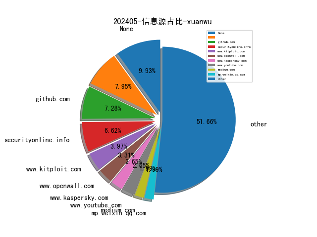

# [数据--所有](README_20.md)
# [数据--年度](README_2024.md)
# 202405 信息源与信息类型占比

# 网络安全书籍 推荐
| date_added | language | title | author | link | size| 
| --- | --- | --- | --- | --- | ---| 
| 2024-05-27 07:13:49 | English | Embracing DevOps Release Management | unknown | https://www.wowebook.org/embracing-devops-release-management/ | unknown| 
| 2024-05-24 05:38:23 | English | Understanding Generative AI Business Applications | unknown | https://www.wowebook.org/understanding-generative-ai-business-applications/ | unknown| 
| 2024-05-24 09:49:13 | English | AWS Certified Security – Specialty (SCS-C02) Exam Guide, Second Edition | unknown | https://www.wowebook.org/aws-certified-security-specialty-scs-c02-exam-guide-second-edition/ | unknown| 
| 2024-05-24 08:37:27 | English | Developing Solutions for Microsoft Azure AZ-204 Exam Guide, Second Edition | unknown | https://www.wowebook.org/developing-solutions-for-microsoft-azure-az-204-exam-guide-second-edition/ | unknown| 
| 2024-05-24 06:12:32 | English | Learning DevSecOps | unknown | https://www.wowebook.org/learning-devsecops/ | unknown| 
| 2024-05-22 13:30:15 | English | Visual Threat Intelligence: An Illustrated Guide For Threat Researchers | Thomas Roccia | http://libgen.rs/book/index.php?md5=F28F0AEA8819EDA633CEA64F905D5292 | 11 MB [PDF]| 
| 2024-05-20 06:53:02 | English | Pipeline as Code: Continuous Delivery with Jenkins, Kubernetes, and Terraform, Video Edition | unknown | https://www.wowebook.org/pipeline-as-code-continuous-delivery-with-jenkins-kubernetes-and-terraform-video-edition/ | unknown| 
| 2024-05-20 11:44:09 | English | Hands-On Ethical Hacking Tactics | unknown | https://www.wowebook.org/hands-on-ethical-hacking-tactics/ | unknown| 
| 2024-05-20 11:23:28 | English | Implementing Palo Alto Networks Prisma Access | unknown | https://www.wowebook.org/implementing-palo-alto-networks-prisma-access/ | unknown| 
| 2024-05-20 08:58:03 | English | Hands-On Differential Privacy | unknown | https://www.wowebook.org/hands-on-differential-privacy/ | unknown| 
| 2024-05-20 08:31:19 | English | Prompt Engineering for Generative AI | unknown | https://www.wowebook.org/prompt-engineering-for-generative-ai/ | unknown| 
| 2024-05-20 08:06:52 | English | Design and Deploy Microsoft Defender for IoT | unknown | https://www.wowebook.org/design-and-deploy-microsoft-defender-for-iot/ | unknown| 
| 2024-05-19 15:40:54 | English | Digital Transformation of SAP Supply Chain Processes | unknown | https://www.wowebook.org/digital-transformation-of-sap-supply-chain-processes/ | unknown| 
| 2024-05-18 15:55:22 | English | Monty Python and Philosophy: Nudge Nudge, Think Think! | Gary L. Hardcastle; George A. Reisch; William Irwin | http://libgen.rs/book/index.php?md5=DFB0543FE58DFA5976766ADCF4E940B3 | 3 MB [PDF]| 
| 2024-05-18 15:54:41 | English | Monty Python and Philosophy: Nudge Nudge, Think Think! | Gary L. Hardcastle; George A. Reisch; William Irwin | http://libgen.rs/book/index.php?md5=CFF08EE0894335FCB6953D33D9E6F711 | 641 kB [EPUB]| 
| 2024-05-17 06:55:38 | English | 2600 Magazine: The Hacker Quarterly Volume 24 Number 2 | 2600 Magazine | http://libgen.rs/book/index.php?md5=FA0E33E48074509B524B1D9DC55F3E4D | 44 MB [PDF]| 
| 2024-05-17 06:51:48 | English | 2600 Magazine: The Hacker Quarterly Volume 24 Number 1 | 2609 Magazine | http://libgen.rs/book/index.php?md5=8EEE975C1E87424CDE1A29E20C8D7D4E | 30 MB [PDF]| 
| 2024-05-17 06:47:56 | English | 2600 Magazine: The Hacker Quarterly Volume 23 Number 4 | 2600 Magazine | http://libgen.rs/book/index.php?md5=C70C7A3D313062C66E0E1048A8687FEB | 28 MB [PDF]| 
| 2024-05-17 06:38:00 | English | 2600 Magazine: The Hacker Quarterly Volume 23 Number 3 | 2600 Magazine | http://libgen.rs/book/index.php?md5=3722502E96329DF3A70282FC34D4A9C7 | 28 MB [PDF]| 
| 2024-05-17 06:32:10 | English | 2600 Magazine: The Hacker Quarterly Volume 23 Number 2 | 2600 Magazine | http://libgen.rs/book/index.php?md5=4E83352A1DF252CC3042CDF5AA0BFACA | 29 MB [PDF]| 
| 2024-05-17 06:19:26 | English | Windows Security Internals: A Deep Dive into Windows Authentication, Authorization, and Auditing | James Forshaw | http://libgen.rs/book/index.php?md5=8B397569A5B9CE34472155DBAF7F9D17 | 12 MB [PDF]| 
| 2024-05-17 06:13:12 | English | 2600 Magazine: The Hacker Quarterly Volume 17 Number 1 | 2600 Magazine | http://libgen.rs/book/index.php?md5=EF682162EA7E3C46A097B141E31555B7 | 28 MB [PDF]| 
| 2024-05-17 05:54:32 | English | 2600 Magazine: The Hacker Quarterly Volume 38 Number 1 | 2600 Magazine | http://libgen.rs/book/index.php?md5=8E6C2ECED7F1FED6D37DF0156E0F3BC2 | 767 kB [EPUB]| 
| 2024-05-17 05:51:33 | English | 2600 Magazine: The Hacker Quarterly Volune 37 Number 1 | 2600 Magazine | http://libgen.rs/book/index.php?md5=6767C80DAFC64EDA88B3F5E5D7216F57 | 693 kB [EPUB]| 
| 2024-05-17 05:49:16 | English | 2600 Magazine: The Hacker Quarterly Volume 37 Number 3 | 2600 Magazine | http://libgen.rs/book/index.php?md5=C3623E214EC34362BFA40FC86D656B26 | 804 kB [EPUB]| 
| 2024-05-17 05:43:30 | English | 2600 Magazine: The Hacker Quarterly Volume 36 Number 2 | 2600 Magazine | http://libgen.rs/book/index.php?md5=057266D05F68E0773BF8420BA563F964 | 436 kB [EPUB]| 
| 2024-05-17 10:27:57 | English | Excel Cookbook: Recipes for Mastering Microsoft Excel | unknown | https://www.wowebook.org/excel-cookbook-recipes-for-mastering-microsoft-excel/ | unknown| 
| 2024-05-16 18:36:14 | English | Adversary Emulation with MITRE ATT&CK | unknown | https://www.wowebook.org/adversary-emulation-with-mitre-attck/ | unknown| 
| 2024-05-15 08:10:31 | English | Building a Career in Cybersecurity (Video Training) | unknown | https://www.wowebook.org/building-a-career-in-cybersecurity-video-training/ | unknown| 
| 2024-05-14 11:29:11 | English | Learn Rust in a Month of Lunches, Video Edition | unknown | https://www.wowebook.org/learn-rust-in-a-month-of-lunches-video-edition/ | unknown| 
| 2024-05-14 14:32:35 | English | Introduction to Management of Reverse Logistics and Closed Loop Supply Chain Processes | Donald F. Blumberg | http://libgen.rs/book/index.php?md5=444ED72F20FC02FCE745B4B87527EB62 | 13 MB [PDF]| 
| 2024-05-13 10:33:18 | English | Rust Quickstart (Video Course) | unknown | https://www.wowebook.org/rust-quickstart-video-course/ | unknown| 
| 2024-05-13 11:23:47 | English | Data Analysis with Python and PySpark, Video Edition | unknown | https://www.wowebook.org/data-analysis-with-python-and-pyspark-video-edition/ | unknown| 
| 2024-05-09 12:13:25 | English | Beyond the Binary: Gender and Legal Personhood in Islamic Law | Saadia Yacoob | http://libgen.rs/book/index.php?md5=ED37E6FC1F549DF6BD20EDF463FAFD54 | 3 MB [PDF]| 
| 2024-05-09 09:47:37 | English | Python Pandas and Python Statements for Beginners: A Step-by-Step Guide to Data Analysis and Visualization and a Beginners Guide to IF, ELIF, and ELSE Statements - 2 Books in 1 | JP Parker | http://libgen.rs/book/index.php?md5=BB0459F9E15B3FDF8983F805B856903B | 257 kB [EPUB]| 
| 2024-05-09 09:37:25 | English | Python Powerhouse: A Developers Guide to Efficient Coding: Python + Flask + Docker + TKinter +ML + Deep Learning + NLP | Husn Ara | http://libgen.rs/book/index.php?md5=3557F869A28C57A5DA987C2E5427883D | 2 MB [EPUB]| 
| 2024-05-09 09:06:05 | English | Monte Carlo with Python | Van Der Post, Hayden | http://libgen.rs/book/index.php?md5=2A3E4245F16CE9D3897211158440F871 | 2 MB [EPUB]| 
| 2024-05-09 06:55:24 | English | Active Machine Learning with Python | unknown | https://www.wowebook.org/active-machine-learning-with-python/ | unknown| 
| 2024-05-08 07:31:11 | English | Unveiling the NIST Risk Management Framework (RMF) | unknown | https://www.wowebook.org/unveiling-the-nist-risk-management-framework-rmf/ | unknown| 
| 2024-05-08 08:33:10 | English | Mastering AWS Security, Second Edition | unknown | https://www.wowebook.org/mastering-aws-security-second-edition/ | unknown| 
| 2024-05-07 09:02:10 | English | Python Concurrency with asyncio, Video Edition | unknown | https://www.wowebook.org/python-concurrency-with-asyncio-video-edition/ | unknown| 
| 2024-05-06 14:26:54 | English | Unveiling the NIST Risk Management Framework (RMF): A practical guide to implementing RMF and managing risks in your organization | Thomas Marsland | http://libgen.rs/book/index.php?md5=D96BA2A974A9AD36F86B81DBC3E77960 | 4 MB [EPUB]| 
| 2024-05-05 16:12:22 | English | The Art of Cyber Warfare: Strategic and Tactical Approaches for Attack and Defense in the Digital Age | Peter Kestner | http://libgen.rs/book/index.php?md5=9A8BAF8694E3F79B83C11528069E372C | 10 MB [RAR]| 
| 2024-05-05 15:49:16 | English | The OSINT Handbook | unknown | https://www.wowebook.org/the-osint-handbook/ | unknown| 
| 2024-05-05 16:12:17 | English | The Art of Cyber Warfare: Strategic and Tactical Approaches for Attack and Defense in the Digital Age | Peter Kestner | http://libgen.rs/book/index.php?md5=3E77C81F8784372C4BC9E710A610C607 | 559 kB [EPUB]| 
| 2024-05-05 16:12:15 | English | The Art of Cyber Warfare: Strategic and Tactical Approaches for Attack and Defense in the Digital Age | Peter Kestner | http://libgen.rs/book/index.php?md5=5AB7C12AE5F07A32BC58F63165516528 | 1 MB [PDF]| 
| 2024-05-03 16:34:31 | English | Cybersecurity Architects Handbook: An end-to-end guide to implementing and maintaining robust security architecture | Lester Nichols | http://libgen.rs/book/index.php?md5=D8F1E01172D13BFE87D501BC6B757211 | 8 MB [EPUB]| 

# 微信公众号 推荐
| nickname_english | weixin_no | title | url| 
| --- | --- | --- | ---| 
| AI与网安 | gh_c57275954216 | 【1day】和丰多媒体信息发布系统 QH.aspx 任意文件上传漏洞 | https://mp.weixin.qq.com/s?__biz=MzU1ODQ2NTY3Ng==&mid=2247486779&idx=3&sn=79b32cd1881d629722498095238df6c1 | 8| 
| Attacker安全 | Attacker824 | 学会逆向，工作包分配！！！（终极版） | https://mp.weixin.qq.com/s?__biz=MzkyNzQ1NjI4OA==&mid=2247484233&idx=1&sn=a1676a4c13be385bb18b8c3f8fd8bdca | 2| 
| Day1安全团队 | gh_123cbbc95fc3 | 关于我的SRC漏洞挖掘成长经历 | https://mp.weixin.qq.com/s?__biz=MzU1NDU1NTI5Nw==&mid=2247487848&idx=1&sn=7f9eda26c80993b9a09c82617e802242 | 2| 
| EDI安全 | EDISEC | 第一届“长城杯”信息安全铁人三项赛线下决赛- WriteUp | https://mp.weixin.qq.com/s?__biz=MzIzMTQ4NzE2Ng==&mid=2247494846&idx=1&sn=5b8c95847d77d5bb457087aa76e51ded | 2| 
| Eonian Sharp | Eonian_sharp | 内网渗透 , 持久化隐藏技术之计划任务 | https://mp.weixin.qq.com/s?__biz=Mzg3NzUyMTM0NA==&mid=2247485728&idx=1&sn=e906d3f4e02c27ea7cbb4f040d543a73 | 5| 
| E安全 | EAQapp | 疑似泄露数据！美国政府部门遭起诉 | https://mp.weixin.qq.com/s?__biz=MzI4MjA1MzkyNA==&mid=2655345927&idx=1&sn=bbe16d817da96b9268f1fb911ddf929c | 3| 
| F12sec | F12sec | 【好用工具】小程序自动化辅助渗透工具 | https://mp.weixin.qq.com/s?__biz=Mzg5NjU3NzE3OQ==&mid=2247488963&idx=1&sn=530f1fce7e693bb8a48fc5584595fa61 | 7| 
| GoUpSec | GoUpSec | 两大知名VPN产品接连遭遇黑客攻击 | https://mp.weixin.qq.com/s?__biz=MzkxNTI2MTI1NA==&mid=2247499305&idx=2&sn=a736cdd5b3407f56e6b38c3fa053f8f3 | 11| 
| Hack分享吧 | HackShareB | PostExpKit插件 - 20240423更新 | https://mp.weixin.qq.com/s?__biz=MzA4NzU1Mjk4Mw==&mid=2247490691&idx=1&sn=487801942308fd4e611e6c706c464007 | 6| 
| IMPERVA | None | 魔术般的防护：泰雷兹对抗勒索软件 | https://mp.weixin.qq.com/s?__biz=MzI1OTYyOTUyOA==&mid=2247487621&idx=1&sn=37c2c150f3c743771058d9c5efa74d73 | 3| 
| IoT物联网技术 | IoT-Tech-Expo | 仅2800元，开源低代码WEB组态，快速搭建物联网大屏+管理后台，轻松交付项目！ | https://mp.weixin.qq.com/s?__biz=MjM5OTA4MzA0MA==&mid=2454934089&idx=1&sn=3e5543fe6b966801548ed05e50510a00 | 7| 
| IoVSecurity | IoVSecurity | 坚持不懈地推动实时合规 | https://mp.weixin.qq.com/s?__biz=MzU2MDk1Nzg2MQ==&mid=2247609435&idx=3&sn=b2a4996e408180ed117bbfb84f31e59f | 27| 
| KK安全说 | kksecurity | 如何使用ChatGPT改善网络安全现状 | https://mp.weixin.qq.com/s?__biz=Mzg4NzgyODEzNQ==&mid=2247487147&idx=2&sn=b4f31ea20595a5c498e65fa3b4861b14 | 17| 
| Khan安全攻防实验室 | None | 速成大法 | https://mp.weixin.qq.com/s?__biz=MzAwMjQ2NTQ4Mg==&mid=2247493021&idx=1&sn=e5cec4f18ed94ac99b0fa2f499abd43e | 7| 
| Nil聊安全 | None | 【网络安全】全面防御：攻击面管理的策略与实践（一） | https://mp.weixin.qq.com/s?__biz=MzkyMDY4MTc2Ng==&mid=2247483801&idx=1&sn=dea26f43aaad0773dced9e7e450200d8 | 4| 
| OSINT研习社 | None | Ransomhub 的最新攻击为工业控制系统 (ICS) 安全敲响警钟 | https://mp.weixin.qq.com/s?__biz=Mzg4MzA4NTM0OA==&mid=2247490432&idx=1&sn=fb935e31cbbc0ded75badcf397da9011 | 6| 
| SAINTSEC | SAINTSEC | 第九届XCTF国际联赛分站先导赛RCTF 2024WP WEB篇 | https://mp.weixin.qq.com/s?__biz=MjM5MjEyMTcyMQ==&mid=2651037060&idx=1&sn=c5092f41a970f3da99653d4380d73c4c | 2| 
| SheYin | gh_69e5cda3e27c | 万户协同办公平台 ezEIP success 反序列化漏洞（附POC） | https://mp.weixin.qq.com/s?__biz=MzkyOTQ1MjQwMw==&mid=2247484130&idx=1&sn=60dd7cc78a6fc44559e822723d1f07af | 1| 
| TimeAxis Sec | TimeAxis_Sec | OWASP TOP10之RCE | https://mp.weixin.qq.com/s?__biz=MzIxNzY1MTc1OA==&mid=2247483780&idx=1&sn=34cb9b30aa56310b0f336cba340ac53f | 2| 
| TtTeam | None | SSTI | https://mp.weixin.qq.com/s?__biz=Mzg2NTk4MTE1MQ==&mid=2247485024&idx=1&sn=e721c57cd58e027f9425e854abcae93e | 6| 
| Undoubted Security | Undoubtedly_Security | HW蓝队红队安全运营漏洞挖掘安服人员不容错过的宝藏知识星球【免费进入】 | https://mp.weixin.qq.com/s?__biz=MzI0NjE1NDYyOA==&mid=2247484193&idx=1&sn=68132d06a02ef75c94ad23ea599350a1 | 2| 
| WebSec | gh_2914f5b10e8e | (0day)六零导航页某接口存在敏感信息泄露 | https://mp.weixin.qq.com/s?__biz=MzkyMzYwNTEyNg==&mid=2247486380&idx=1&sn=3fb886f7770795c345364fb91c981ef1 | 5| 
| crossoverJie | crossoverJie | stack overflow 与 OpenAI 的合作引起了巨大争议 | https://mp.weixin.qq.com/s?__biz=MzIyMzgyODkxMQ==&mid=2247487205&idx=1&sn=14f5f0cf4c85c2f4460d80c34ccac2bf | 3| 
| dotNet安全矩阵 | doNetSafety | 国内最大的.NET安全攻防知识社区 | https://mp.weixin.qq.com/s?__biz=MzUyOTc3NTQ5MA==&mid=2247492175&idx=2&sn=dc53a958597f082c21bfb3ce25a4bf68 | 20| 
| imBobby的自留地 | imBobbySY | 从混沌到有序：标准化 SOC 协作流程 | https://mp.weixin.qq.com/s?__biz=MzI5MjI4ODU4Nw==&mid=2247489377&idx=1&sn=eadd28ec5acbe981d4f2152e0c949d9a | 15| 
| wavecn | sender_is_sender | 微软 AI PC 的新功能“回顾”一定是个大坑 | https://mp.weixin.qq.com/s?__biz=Mzg4Njc0Mjc3NQ==&mid=2247486073&idx=1&sn=2e89ce058a86d0f6637d49b92db245ff | 3| 
| 一起聊安全 | gh_589ffdaa31f9 | 标准汇总 , 历年来各类数据要素相关标准文件汇总 | https://mp.weixin.qq.com/s?__biz=MzI3NjUzOTQ0NQ==&mid=2247510863&idx=1&sn=918f6b43e8558371a8a393608fd5820d | 6| 
| 不务正业的网安人 | gh_6a110ce6ac22 | 易经六爻入门：经验总结笔记分享 | https://mp.weixin.qq.com/s?__biz=Mzg5OTg3MDI0Ng==&mid=2247489411&idx=1&sn=e1b680810771f900935efcc199b744a7 | 2| 
| 东方财富安全应急响应中心 | emsrc_team | 金币兑礼 , 艾叶粽飘香 咸甜皆相宜 | https://mp.weixin.qq.com/s?__biz=MzUzNDAxMjAyOQ==&mid=2247484423&idx=1&sn=f1a09a84682356cfdee2ee18c3ac3506 | 1| 
| 云梦安全 | yxlmhtz | 揭秘Sonatype Nexus目录穿越漏洞CVE-2024-4956：与CVE-2018-1271的惊人相似之处 | https://mp.weixin.qq.com/s?__biz=MzU1NzczNTM1MQ==&mid=2247484636&idx=2&sn=d18974533f3227a86cf5e46241bb4fcd | 4| 
| 会杀毒的单反狗 | cmlitiejun | 在最近的 MITRE 网络攻击中，黑客创建恶意虚拟机以逃避检测 | https://mp.weixin.qq.com/s?__biz=MzI2NzAwOTg4NQ==&mid=2649791280&idx=2&sn=693871513ee9e1adf6f25c39ec8a4d00 | 16| 
| 伟大航路D | gh_c1fdc31f79ef | 【漏洞复现】大华-智能物联综合管理平台 getReviewInfoByVisitorId 接口处存在信息泄露漏洞 | https://mp.weixin.qq.com/s?__biz=MzkwNzYzNTkzNA==&mid=2247486036&idx=1&sn=86292593fe8b24bc43ab275072f05daf | 6| 
| 信安路漫漫 | gh_96cdf0c3b4d5 | 安全的价值与安全度量 | https://mp.weixin.qq.com/s?__biz=Mzg2MzkwNDU1Mw==&mid=2247484730&idx=1&sn=461803a8f003ac4578637441c2d68bbe | 3| 
| 信睿网络 | xinruisec | 物联网安全：中韩差距与中国未来 | https://mp.weixin.qq.com/s?__biz=Mzg4MDA2NjExMA==&mid=2247489733&idx=1&sn=00d060259fa86c0a7e948fcedcff97d6 | 3| 
| 兰花豆说网络安全 | SecuritySay | 盛邦安全投资贝格通意欲何为？ | https://mp.weixin.qq.com/s?__biz=MzI3NzM5NDA0NA==&mid=2247487931&idx=1&sn=3b481d003235f1052735b3f11852f8ef | 11| 
| 关键信息基础设施安全保护联盟 | CNCIIPA | 中安云科招聘：职等你来 | https://mp.weixin.qq.com/s?__biz=MzkxNjU2NjY5MQ==&mid=2247502840&idx=3&sn=565683442d3ba4c66ab7936b87f56426 | 12| 
| 利刃信安 | DMXGFSYS | 【商密测评】国密局对新增通过材料审查的19家密评机构公示 | https://mp.weixin.qq.com/s?__biz=MzU1Mjk3MDY1OA==&mid=2247513883&idx=1&sn=1a6e63ec44d43f48e90faeeb14bf3fa8 | 9| 
| 前沿信安资讯阵地 | infosrc | 2024年中国大模型评测报告 | https://mp.weixin.qq.com/s?__biz=MzA3MTM0NTQzNA==&mid=2455774168&idx=1&sn=bb94edec2206a4714fe644ffd5b78b10 | 11| 
| 吉祥学安全 | gh_bf0dc85c3f99 | 护网主防资料库、护网设备讲解、护网初中高级别面试 | https://mp.weixin.qq.com/s?__biz=MzkwNjY1Mzc0Nw==&mid=2247484307&idx=1&sn=9e8e24e703e877301d43fcef94e36d0e | 13| 
| 嗨嗨安全 | natuerhi666 | 拒绝先涨后降套路，网安618开启，推荐即有好礼相赠~ | https://mp.weixin.qq.com/s?__biz=MzIzMjg0MjM5OQ==&mid=2247487393&idx=1&sn=a52d94efca37ee8444edfa1aa3c93ea0 | 3| 
| 夜组安全 | NightCrawler_Team | 月海 (Sea Moon) 是一款 FaaS/BaaS 实现的 Serverless 网络工具 | https://mp.weixin.qq.com/s?__biz=Mzk0ODM0NDIxNQ==&mid=2247490872&idx=1&sn=db372ce7fca64cc7cce4c7e700232e7a | 7| 
| 天唯信息安全 | TWtech2113189 | 行业报告 , 《数据要素流通标准化白皮书(2024版)》 | https://mp.weixin.qq.com/s?__biz=MzkzMjE5MTY5NQ==&mid=2247497746&idx=3&sn=7e9046af870298ee866344b07e82a972 | 17| 
| 奇安信司法鉴定 | qax-forensic | 品牌升级！奇安信司法鉴定将在电子取证论坛发布全新品牌“洞鉴” | https://mp.weixin.qq.com/s?__biz=Mzg4NDYzNzIzNQ==&mid=2247491186&idx=1&sn=a78d4a1bd13e3df523c5a9e308253d52 | 2| 
| 威努特安全网络 | winicssec_bj | 三步骤解困局！看威努特超融合破解制造业数字化转型难点 | https://mp.weixin.qq.com/s?__biz=MzAwNTgyODU3NQ==&mid=2651121704&idx=1&sn=430ac2abaf71a9add6227802a112beb8 | 6| 
| 安全喵喵站 | CyberSecurityMew | 限时免费下载！《研发数据安全传输管控实践精华》 | https://mp.weixin.qq.com/s?__biz=MzkzNjE5NjQ4Mw==&mid=2247538518&idx=2&sn=214c2a86a3b344e6d004e51c46e0b66c | 5| 
| 安全学习那些事儿 | aqxxse | 九部门印发《知识产权保护体系建设工程实施方案》 | https://mp.weixin.qq.com/s?__biz=MzkxNTI2NTQxOA==&mid=2247492293&idx=3&sn=6f8905162bbd861835510eba7b21312b | 23| 
| 安全小姿势 | www_sqlsec_com | Mac 下 MuMu 模拟器  Pro 安装 Magisk 面具 | https://mp.weixin.qq.com/s?__biz=Mzk0MDI0OTQwNw==&mid=2247484557&idx=1&sn=0a316a075055d0a7d41c4025467fe683 | 2| 
| 安全洞察知识图谱 | gh_d9a3a4cfeeac | 红队最常用的三大工具 | https://mp.weixin.qq.com/s?__biz=MzkyMDM4NDM5Ng==&mid=2247485714&idx=1&sn=f566eaf8c498e677579582e97fb3d90c | 5| 
| 安全狗的自我修养 | haidragon_study | 创建自己的内核：第 1 部分 | https://mp.weixin.qq.com/s?__biz=MzkwOTE5MDY5NA==&mid=2247496330&idx=1&sn=b320fce418ee0a124b914b7f57096d7c | 8| 
| 安恒信息 | AnHengCloudNews | 全国金奖！安恒信息这位高级安全咨询专家斩获双料大奖 | https://mp.weixin.qq.com/s?__biz=MjM5NTE0MjQyMg==&mid=2650608901&idx=3&sn=adf3f15d07eacc04d639e55109e281a5 | 16| 
| 寒鹭网络安全团队 | hanlu_security | TronCTF_2024 wp | https://mp.weixin.qq.com/s?__biz=MzkwNDQxODMzNg==&mid=2247484979&idx=1&sn=979923531bf7b4a1d91b7bd2b8e61581 | 1| 
| 小兵搞安全 | antian365sec | 《内网安全攻防》姊妹篇《红队之路》重磅上市！（文末赠书） | https://mp.weixin.qq.com/s?__biz=MzA3NTc0MTA1Mg==&mid=2664711602&idx=1&sn=1a00f8941971b11d39d5c2021f28155b | 1| 
| 小黑子安全 | xiaoheizi537981 | 代码审计-Java项目-SSTI模板注入 | https://mp.weixin.qq.com/s?__biz=Mzg5NDg4MzYzNQ==&mid=2247486499&idx=1&sn=f12efb935a29d726d2371d5013948b33 | 4| 
| 山海之关 | shg-sec | 2024 RCTF writeup by Arr3stY0u | https://mp.weixin.qq.com/s?__biz=Mzg4MjcxMTAwMQ==&mid=2247488247&idx=1&sn=5cef7eb44e8b9ceebc197915fbc18ca3 | 1| 
| 我吃饼干 | gh_5054216df2ef | 【未公开】用友U8+ CRM存在uploadfile.php文件上传漏洞 | https://mp.weixin.qq.com/s?__biz=MzkzODY2ODA0OA==&mid=2247484716&idx=1&sn=911b4e0487f955e30e8919f0d7a37985 | 9| 
| 技术修道场 | gh_fe3e6e63e435 | 数据链路层就像是网络通信中的“搬运工” | https://mp.weixin.qq.com/s?__biz=MzA4NTY4MjAyMQ==&mid=2447899022&idx=1&sn=f4db9bca791515b3b8d9acea8bd0764f | 13| 
| 昊天信安 | cniaosec | Crawl4AI：一款用于AI的开源爬虫工具 | https://mp.weixin.qq.com/s?__biz=MzkzNzI4NDQzMA==&mid=2247498032&idx=1&sn=1ec414a9177b679860a2f623fb562723 | 7| 
| 李白你好 | libai_hello | 实战 记一次linux应急响应 | https://mp.weixin.qq.com/s?__biz=MzkwMzMwODg2Mw==&mid=2247507006&idx=1&sn=d83454bbc14c26fdd78c259cb2e9180b | 6| 
| 河南等级保护测评 | hndjbh | 事关国家安全和发展，习近平总书记这样谈网信工作 | https://mp.weixin.qq.com/s?__biz=Mzg2NjY2MTI3Mg==&mid=2247495347&idx=2&sn=61d92341b0d74b8142b40c3b939bda36 | 22| 
| 洞见网安 | doonsec | 网安简报【2024/5/27】 | https://mp.weixin.qq.com/s?__biz=MzAxNzg3NzMyNQ==&mid=2247488217&idx=1&sn=e118b75119b3dc15e990489e371f3521 | 9| 
| 浅安安全 | gh_758e256fcc72 | 工具 , GoThief | https://mp.weixin.qq.com/s?__biz=MzkwMTQ0NDA1NQ==&mid=2247489006&idx=4&sn=31c8c710a40c6e39500bf6a17e1aed1a | 32| 
| 深信服千里目安全技术中心 | gh_c644c6e98b08 | 直播预告 , 《红队实战宝典之内网渗透测试》新书线上分享会 | https://mp.weixin.qq.com/s?__biz=Mzg2NjgzNjA5NQ==&mid=2247522998&idx=1&sn=b68b7ff60f984c05e480a931121f00b5 | 10| 
| 深信服安全应急响应中心 | SangforSRC | 直播预告 , 《红队实战宝典之内网渗透测试》新书线上分享会 | https://mp.weixin.qq.com/s?__biz=MzkxNDY5MDAwOQ==&mid=2247485323&idx=1&sn=d4867bae4c5d46947c1366ec33e1c7f3 | 2| 
| 渗透安全HackTwo | CB-Hack | 最新AWVS/Acunetix Premium V24.4.2404高级版漏洞扫描器Windows/Linux下载 | https://mp.weixin.qq.com/s?__biz=Mzg3ODE2MjkxMQ==&mid=2247487005&idx=1&sn=faa923c396c645f53941bed6d6500f57 | 7| 
| 潇湘信安 | xxxasec | 基于Linux应急响应全流程 | https://mp.weixin.qq.com/s?__biz=Mzg4NTUwMzM1Ng==&mid=2247510431&idx=1&sn=aa2f1a5536ac1203f31ab98443b6dec4 | 4| 
| 玄知安全实验室 | gh_2f49ecc78ed6 | AWVS  v24.4.240427095 最新起飞版教程 | https://mp.weixin.qq.com/s?__biz=Mzk0MzYzMDI2OA==&mid=2247486726&idx=1&sn=73e3dcdf8e8247ca2c9fe3e7e5835ae0 | 2| 
| 玄道夜谈 | None | 分享图片 | https://mp.weixin.qq.com/s?__biz=MzI3Njc1MjcxMg==&mid=2247492151&idx=1&sn=3f1a40b5a4e368c59b430f25612ed476 | 11| 
| 琴音安全 | Qinyinsafe | 有了它，再也不用害怕被log4j打了 | https://mp.weixin.qq.com/s?__biz=Mzg3NTk4MzY0MA==&mid=2247486587&idx=1&sn=ecd765ecfbc60d56c03896c0f2aeaa2c | 3| 
| 白帽学子 | gh_4bda7b44c1e3 | Bearer！SAST - 代码安全扫描工具 | https://mp.weixin.qq.com/s?__biz=MzkyNzIxMjM3Mg==&mid=2247486853&idx=1&sn=8d1fe3d418ea298aa776d55fd3e305bf | 1| 
| 知攻善防实验室 | None | 2024HVV面试题（四） | https://mp.weixin.qq.com/s?__biz=MzkxMTUwOTY1MA==&mid=2247487642&idx=1&sn=1a74a99298cac1761b3f847bd0e1585e | 5| 
| 等级保护测评 | zgdjbh | 国密局对新增通过材料审查的19家密评机构公示 | https://mp.weixin.qq.com/s?__biz=MzU1ODM1Njc1Ng==&mid=2247498029&idx=1&sn=f92ec2ddcc79642dcc18988fc92e4fb1 | 1| 
| 网络安全与取证研究 | None | Android设备使用降级备份方式固定数据 | https://mp.weixin.qq.com/s?__biz=Mzg3NTU3NTY0Nw==&mid=2247488836&idx=1&sn=4bebb7b631a54e2a849573441e901739 | 11| 
| 网络安全实验室 | wlaqyjs | 联通数科2024年暑期实习生招聘网络安全方向 | https://mp.weixin.qq.com/s?__biz=MzU4OTg4Nzc4MQ==&mid=2247502444&idx=4&sn=af55bbdaa1290899fd671e04bad842c7 | 8| 
| 网络技术联盟站 | wljslmz | 裁员了，很严重，大家做好准备吧！ | https://mp.weixin.qq.com/s?__biz=MzIyMzIwNzAxMQ==&mid=2649458288&idx=1&sn=d59f3ba164ac3d78a1046058179ed6a9 | 12| 
| 老五说网络 | YQ_share | 网络技能大赛试题-有线网络配置解析（五） | https://mp.weixin.qq.com/s?__biz=MzUxNzg5MzM2Mg==&mid=2247487002&idx=1&sn=cbc39983bf0b70315eeb745bd5912861 | 3| 
| 船山信安 | zghyxa | 原创 , 我对Web安全和Web漏洞的理解 | https://mp.weixin.qq.com/s?__biz=MzU2NDY2OTU4Nw==&mid=2247514115&idx=1&sn=4c218c98e9a5ea5edc1441dcc0006f29 | 10| 
| 苏说安全 | sushuoanquan | 一图读懂GB/T 43698-2024《网络安全技术 软件供应链安全要求》 | https://mp.weixin.qq.com/s?__biz=Mzg5OTg5OTI1NQ==&mid=2247487457&idx=1&sn=0fafda2a07d3f685b32cbdf877494a22 | 7| 
| 苏诺木安全团队 | Ni-Caiqing | 【nday】NextGen Mirth Connect XStream CVE-2023-43208 反序列化漏洞【附poc】 | https://mp.weixin.qq.com/s?__biz=MzkwMjYzNTE4MA==&mid=2247484427&idx=1&sn=b6b7f089b8eb5fd138367ee7a3b72140 | 3| 
| 菜鸟学信安 | securitylearn | 牛！华为《Web安全攻防总结》，太全面了，附免费下载！ | https://mp.weixin.qq.com/s?__biz=MzU2NzY5MzI5Ng==&mid=2247501867&idx=1&sn=ac94eb05082315c3289d25eab7f3f5d6 | 8| 
| 计算机与网络安全 | C-CyberSecurity | 云统一运营标准规范 | https://mp.weixin.qq.com/s?__biz=MjM5OTk4MDE2MA==&mid=2655240659&idx=8&sn=e0b0e0db57074f6e404c495c2a1f8e66 | 57| 
| 贝雷帽SEC | None | 【红队】云资产管理工具最新版本 | https://mp.weixin.qq.com/s?__biz=Mzk0MDQzNzY5NQ==&mid=2247491768&idx=1&sn=b8ff53f49b5880ad304e12d99e0e9bc5 | 5| 
| 赛查查 | gh_fabaad32b9d1 | 2024数字中国创新大赛数字安全赛道数据安全产业赛圆满落幕 | https://mp.weixin.qq.com/s?__biz=Mzk0NTU0ODc0Nw==&mid=2247486806&idx=1&sn=c850c3ead342e9921504bc50f7aabc61 | 7| 
| 赛欧思安全研究实验室 | gh_04596d590471 | 美国医疗系统大事件：约三分之一的公民信息泄露 | https://mp.weixin.qq.com/s?__biz=MzU0MjE2Mjk3Ng==&mid=2247487135&idx=1&sn=7212830d9e8d3d681d847cd32f33a4c6 | 7| 
| 迪普科技 | DPtechnology | 正青春 在路上丨迪普科技16周岁生日快乐！ | https://mp.weixin.qq.com/s?__biz=MzA4NzE5MzkzNA==&mid=2650354369&idx=1&sn=e3973807b0363464dc7907ea04e283c9 | 4| 
| 道玄网安驿站 | gh_cb9a38436cdd | Longwaer安全百晓堂SRC漏洞挖掘开课了！！！《史上最强性价比》 | https://mp.weixin.qq.com/s?__biz=Mzg4NTg5MDQ0OA==&mid=2247486285&idx=1&sn=91a2afdc56b06aa956edb387152e990d | 7| 
| 重生之成为赛博女保安 | gh_9d7429503962 | 对需要国密浏览器才能访问的网站进行Proxy抓包 | https://mp.weixin.qq.com/s?__biz=MzIxOTQ1OTY4OQ==&mid=2247484922&idx=1&sn=a7514be74ca0d50267720908c87544fe | 3| 
| 银遁安全团队 | gh_3e6002f59af7 | 【0day】智互联(深圳)科技有限公司SRM智联云采系统存在弱口令漏洞 | https://mp.weixin.qq.com/s?__biz=MzU3MjU4MjM3MQ==&mid=2247485560&idx=1&sn=5cbc908b9929bad95be5cd433f7a6d1e | 6| 
| 隐雾安全 | gh_9355275bad2a | Src第四期：突破传统让技术变现更容易 | https://mp.weixin.qq.com/s?__biz=MzkyNzM2MjM0OQ==&mid=2247493500&idx=1&sn=dbff5fd2688519c713a1619a42db6e93 | 2| 
| 骨哥说事 | guge_guge | AI黑客：使用 ChatGPT 在浏览器中挖掘 XXE | https://mp.weixin.qq.com/s?__biz=MjM5Mzc4MzUzMQ==&mid=2650258903&idx=1&sn=36762f07aa86b14791e9d29ea6ec404b | 4| 
| 黑客白帽子 | hackerwhitehat | 【免费资源】《Excel函数与公式实战技巧精》视频教程 | https://mp.weixin.qq.com/s?__biz=MzA5MzYzMzkzNg==&mid=2650951846&idx=4&sn=109ad0522f5a613e431f459f8fe8690a | 40| 
| 黑客驰 | HackerChi_Top | 清朝十二帝帝帝 帝帝帝 帝帝帝 帝帝帝 | https://mp.weixin.qq.com/s?__biz=Mzg4MzgwMDE2Mw==&mid=2247487672&idx=1&sn=0c65fc542dc8c7b3a478b591a26d0171 | 9| 
| 黑猫安全 | Blackcat-Security | 在威胁环境中出现了新的ATM恶意软件家族 | https://mp.weixin.qq.com/s?__biz=Mzg3OTc0NDcyNQ==&mid=2247491574&idx=3&sn=50cae56b256a1a8a9abe9c2c826b925c | 12| 
| 黑白之道 | i77169 | Windows安全基线核查加固助手 更新1.2.3 | https://mp.weixin.qq.com/s?__biz=MzAxMjE3ODU3MQ==&mid=2650593624&idx=4&sn=c1a58929f9d199d0206a60a04309cace | 40| 
| 0x6270安全团队 | None | 团队知识星球安利 | https://mp.weixin.qq.com/s?__biz=Mzg4Njc1MTIzMw==&mid=2247485535&idx=2&sn=d5d48eb56a6f1e3d3ef0304901522972 | 2| 
| 3072 | None | Longwaer安全百晓堂SRC漏洞挖掘开课了！！！《史上最强性价比》 | https://mp.weixin.qq.com/s?__biz=MzU4OTk0NDMzOA==&mid=2247484529&idx=1&sn=690a7837d0d5e3666cd779d0777d221c | 4| 
| Adler学安全 | Acade- | 漏洞复现-CVE-2024-3495 | https://mp.weixin.qq.com/s?__biz=Mzg5NDU1MDc1OA==&mid=2247485650&idx=1&sn=be8d37f762d991af2f8567e946dd5996 | 7| 
| BlackCat安全圈 | None | cissp学习笔记-(第一章-安全与风险管理) | https://mp.weixin.qq.com/s?__biz=Mzk0NzQ0NjQxNA==&mid=2247483936&idx=1&sn=4be1749749a89fed8f3f498cb10289b5 | 1| 
| CISSP | wxxinchuangsec | 公安部等保中心招聘！ | https://mp.weixin.qq.com/s?__biz=Mzg4MTg0MjQ5OA==&mid=2247485194&idx=1&sn=02dffcc73099dabdb84d3ded8fd25a3c | 7| 
| CNCERT国家工程研究中心 | NELCERT | 苹果WiFi定位系统漏洞可监控全球数亿设备 | https://mp.weixin.qq.com/s?__biz=MzUzNDYxOTA1NA==&mid=2247544959&idx=3&sn=9002550b4c54e11c879e639f9b58c92e | 26| 
| CatalyzeSec | gh_9dea37e0d7ad | 一文了解往年热门的漏洞-shiro | https://mp.weixin.qq.com/s?__biz=MzkxNjY1MjY3OQ==&mid=2247485431&idx=1&sn=088d6ef67eb97bb8876f159c3a74d992 | 4| 
| CertiK | certikchina | SkyInsights：合规更简单，运营更高效，成本减一半 | https://mp.weixin.qq.com/s?__biz=MzU5OTg4MTIxMw==&mid=2247503002&idx=1&sn=11fd08a667d9cc977069dd6612b9f751 | 3| 
| Docker中文社区 | None | 让你配置linux 路由，你该怎么配置 | https://mp.weixin.qq.com/s?__biz=MzI1NzI5NDM4Mw==&mid=2247497339&idx=1&sn=2de9b8a80761d48c70ff0e2ade131aa7 | 4| 
| Echo Reply | AA7ACE | Wireshark TS , 再谈虚假的 TCP Spurious Retransmission | https://mp.weixin.qq.com/s?__biz=MzA5NTUxODA0OA==&mid=2247492669&idx=1&sn=7e89cdc8994b6445df30687bac5fb8aa | 4| 
| FreeBuf | freebuf | SqliSniper：针对HTTP Header的基于时间SQL盲注模糊测试工具 | https://mp.weixin.qq.com/s?__biz=MjM5NjA0NjgyMA==&mid=2651281076&idx=4&sn=ee7f0d8e8a9ba209c71307dd9e9c0593 | 60| 
| HACK之道 | hacklearn | 70k，确实可以封神了！ | https://mp.weixin.qq.com/s?__biz=MzIwMzIyMjYzNA==&mid=2247514037&idx=1&sn=6c13eb7520898f717beeaa9d54cb15c1 | 7| 
| HackSee | None | 高级别GitLab漏洞允许攻击者接管帐户 | https://mp.weixin.qq.com/s?__biz=MzI5NTA0MTY2Mw==&mid=2247485186&idx=1&sn=45036f7ab09a6d1bc189a2dc9d6ca7f4 | 9| 
| Hacking黑白红 | Hacking012 | 网络安全学习路线（黑客白帽成长之路） | https://mp.weixin.qq.com/s?__biz=Mzg2NDYwMDA1NA==&mid=2247538883&idx=2&sn=c8b0f8c1648c0dc2cad71f85bff6cf8a | 3| 
| ISC2北京分会 | ISC2BJ | 欧盟人工智能法案中的人工智能网络安全 | https://mp.weixin.qq.com/s?__biz=MzAxMzEyMjQ4Mg==&mid=2688530994&idx=1&sn=3600c799001d35c61d0286d09f63aa3e | 1| 
| Jiyou too beautiful | None | HTB-BoardLight笔记 | https://mp.weixin.qq.com/s?__biz=Mzk0MTQxOTA3Ng==&mid=2247488670&idx=1&sn=fe0391182a5da292a543703a8b00425d | 4| 
| LHACK安全 | None | 【春秋云境.com】GreatWall震撼上线，邀你征战实战之巅！ | https://mp.weixin.qq.com/s?__biz=MzkyMjU2Nzc1Mg==&mid=2247484227&idx=1&sn=eea04b559065cf8b2daeb4722d6794b1 | 1| 
| Longwaer安全百晓堂 | gh_001bf84d0a18 | Longwaer安全百晓堂SRC漏洞挖掘开课了！！！《史上最强性价比》 | https://mp.weixin.qq.com/s?__biz=MzkxODY0NjE5MA==&mid=2247484126&idx=1&sn=e1a52d25feca0a2a955ce5bd01c5bab0 | 1| 
| Medi0cr1ty | None | 甲方安全建设系列之 HTTP 资产清洗 | https://mp.weixin.qq.com/s?__biz=Mzg5ODE3NTU1OQ==&mid=2247484362&idx=1&sn=f903fdd29cbbe10e60474da2bc707305 | 1| 
| Ots安全 | None | macOS 受到威胁：CVE-2024-27842 的 PoC 漏洞允许执行内核级代码 | https://mp.weixin.qq.com/s?__biz=MzAxMjYyMzkwOA==&mid=2247508410&idx=4&sn=26bcfb8559cc907e47a7b1c070a3bfc2 | 43| 
| SCA御盾 | None | 【漏洞复现】华智测控-slms-sql注入漏洞复现 | https://mp.weixin.qq.com/s?__biz=MzkzNjYwODg3Ng==&mid=2247485120&idx=1&sn=bf7f785e103eeff3d7d1c1aba8e6763d | 3| 
| SCUCTF | scuctf | Z3 教你学提权 | https://mp.weixin.qq.com/s/XO2tEzVijsnn7WuFgb-y3Q | 1| 
| SecHub网络安全社区 | None | CVE-2024-20767 Adobe ColdFusion 任意文件读取漏洞复现 | https://mp.weixin.qq.com/s?__biz=MzI5NTUzNzY3Ng==&mid=2247488577&idx=1&sn=3b3dfe0f9b7b36ef4f876e83adee8a0a | 5| 
| Sec探索者 | None | 【漏洞复现】泛微 E-Cology 8 BshServlet 远程代码执行漏洞 | https://mp.weixin.qq.com/s?__biz=MzkyNDYwNTcyNA==&mid=2247484940&idx=1&sn=45bdbd3cfa5a4345f323f49880461742 | 4| 
| TKing的安全圈 | None | OA漏洞利用工具目前集成281漏洞，包括nday、1day | https://mp.weixin.qq.com/s?__biz=MzIyNzU2NDIwOA==&mid=2247490058&idx=3&sn=1154813e861c4d38769fdbc497dbe8ea | 6| 
| VastSec | None | 【地图大师SRC漏洞挖掘新手课】第二期开课啦！（福利拉满！！！仅此一次） | https://mp.weixin.qq.com/s?__biz=Mzk0NjQ4OTA4Ng==&mid=2247484735&idx=1&sn=0afd48cbbf8712939e07c242eda14f09 | 1| 
| WIN哥学安全 | WIN-security | Git严重漏洞，远程执行代码，Mac和Windows通杀！ | https://mp.weixin.qq.com/s?__biz=MzkwODM3NjIxOQ==&mid=2247500389&idx=1&sn=f18fe80801301f26afb78fe6491b6d03 | 7| 
| Web安全工具库 | None | 2024HVV -- 初级中级高级都需要，速度来聊（国誉） | https://mp.weixin.qq.com/s?__biz=MzI4MDQ5MjY1Mg==&mid=2247513008&idx=2&sn=4a38ecf6ed49b9a5a1e6951d6862cbe5 | 5| 
| Z2O安全攻防 | Z2O_SEC | 红队安全攻防知识库 | https://mp.weixin.qq.com/s?__biz=Mzg2ODYxMzY3OQ==&mid=2247512453&idx=2&sn=9818cc80301352597572a0ae3edb054f | 15| 
| ZAC安全 | None | 某裸聊诈骗站点渗透实战 | https://mp.weixin.qq.com/s?__biz=MzkzMjIxMDU5OA==&mid=2247498447&idx=1&sn=bf60b0be8b0a8b1d2cd1c6e00e6abacb | 2| 
| Zacarx随笔 | Zacarx007 | 2024年ISCC竞赛之RE篇 | https://mp.weixin.qq.com/s?__biz=MzkxMDU5MzY0NQ==&mid=2247484190&idx=1&sn=2ca301e6b4d560d8bc8cb5d72b24772d | 1| 
| e安在线 | None | 人社部公示：增加网络安全等级保护测评师等19个新职业 | https://mp.weixin.qq.com/s?__biz=MzI1OTA1MzQzNA==&mid=2651245777&idx=1&sn=00b0bc14a99690b86329abb6affef113 | 3| 
| i春秋 | icqedu | i春秋助力丨平安SRC线上沙龙·第六期等你来参与！ | https://mp.weixin.qq.com/s?__biz=MzUzNTkyODI0OA==&mid=2247526234&idx=1&sn=b5a632079fff4350f18fd094c23e52fb | 1| 
| 一己之见安全团队 | gh_51d9e58684ee | 面试篇——某安全厂商外包安服工程师 | https://mp.weixin.qq.com/s?__biz=MzkzNzY3ODk4MQ==&mid=2247483888&idx=1&sn=d4c90437441d6b1bfce977ef0454b8f3 | 5| 
| 丁爸 情报分析师的工具箱 | dingba2016 | 【情报实战】加沙的“拆迁队” | https://mp.weixin.qq.com/s?__biz=MzI2MTE0NTE3Mw==&mid=2651144003&idx=1&sn=f25c06cad04f2b200170d543863d14fd | 9| 
| 七夜安全博客 | None | 推荐一款开源免费的浏览器网页嗅探插件，音频、视频、图片一网打尽 | https://mp.weixin.qq.com/s?__biz=MzIwODIxMjc4MQ==&mid=2651005322&idx=1&sn=1433954b672fc50c7b4d8a9be2f58dc1 | 6| 
| 不秃头的安全 | BTTDAQ | 推荐一些攻防武器知识库 | https://mp.weixin.qq.com/s?__biz=Mzg3NzkwMTYyOQ==&mid=2247486801&idx=1&sn=88c3e1b28d9812749b19564c94a16890 | 3| 
| 中国软件评测中心 | china_testing | 2024“赛迪·创安杯”智能汽车信息安全公开赛圆满收官 | https://mp.weixin.qq.com/s?__biz=MjM5NzYwNDU0Mg==&mid=2649244242&idx=3&sn=422b380381c245eb8f789686d5a3a9e5 | 5| 
| 中学生CTF | None | 完结！DragonKnight CTF今日完赛！ | https://mp.weixin.qq.com/s?__biz=MzU3MzEwMTQ3NQ==&mid=2247507351&idx=1&sn=96cddcd6e44038d904cab230ab3652e0 | 2| 
| 乌雲安全 | hackctf | 师傅们，这个新方向火了，70k很稳！ | https://mp.weixin.qq.com/s?__biz=MzAwMjA5OTY5Ng==&mid=2247522507&idx=1&sn=842adeced3c470f79d425f539c03e003 | 9| 
| 亿人安全 | None | 【实战】记一次linux应急响应 | https://mp.weixin.qq.com/s?__biz=Mzk0MTIzNTgzMQ==&mid=2247515369&idx=1&sn=67d4cd6046522b0d2052a28b225dfbde | 7| 
| 信安保密 | None | 努力做人生中的“奢侈品” | https://mp.weixin.qq.com/s?__biz=MjM5MzUyMzM2NA==&mid=2652914070&idx=4&sn=cb41621d8027381bee0cca2ac6bd9167 | 12| 
| 信息安全D1net | D1Net18 | 网络安全团队隐瞒安全事件使企业面临更严峻的网络安全挑战 | https://mp.weixin.qq.com/s?__biz=MzA3NTIyNzgwNA==&mid=2650258662&idx=1&sn=5d37eedead00ddd2556a77e99cd18d9a | 2| 
| 信息安全大事件 | None | 假冒防病毒网站正在传播 Android 和 Windows 恶意软件，注意防范！ | https://mp.weixin.qq.com/s?__biz=MzkzNjIzMjM5Ng==&mid=2247489280&idx=1&sn=25c0edf324be42c67d9229afd750a561 | 1| 
| 信息安全研究 | ISR2016 | 【业界动态】网安市场周度监测（2024-05-27） | https://mp.weixin.qq.com/s?__biz=MzA3NzgzNDM0OQ==&mid=2664987016&idx=4&sn=2c5326e4a2a1441a102734359b3a91f4 | 28| 
| 全球技术地图 | drc_iite | 美国扩大对应用材料公司涉华业务的调查 | https://mp.weixin.qq.com/s?__biz=MzI1OTExNDY1NQ==&mid=2651613036&idx=2&sn=a605428260a6b5cffa9e745f5fc7ab6e | 24| 
| 全频带阻塞干扰 | None | 谣言粉碎机 , 走近真实的测谎技术 | https://mp.weixin.qq.com/s?__biz=MzIzMzE2OTQyNA==&mid=2648957431&idx=1&sn=9c4a06f84fce96849a6c4915321a8fa6 | 2| 
| 公安部网络安全等级保护中心 | gh_f5f6bf3d09af | 等保中心（上海业务部）招聘启事 | https://mp.weixin.qq.com/s?__biz=MzU3NTQwNDYyNA==&mid=2247487679&idx=1&sn=b11226282a9a25a8472f5051672348ea | 4| 
| 关键基础设施安全应急响应中心 | CII-SRC | 黑客利用 VMware ESXi 漏洞进行勒索软件攻击 | https://mp.weixin.qq.com/s?__biz=MzkyMzAwMDEyNg==&mid=2247544039&idx=3&sn=276bb55d3ddfe272b7d4d230359ef41a | 26| 
| 内生安全联盟 | CCESS_CHINA | 发布 , 国家数据局发布《数字中国发展报告（2023年）》 | https://mp.weixin.qq.com/s?__biz=Mzg4MDU0NTQ4Mw==&mid=2247519502&idx=2&sn=e7035a2c3b28ab9744fd03830d226fb0 | 19| 
| 冷漠安全 | gh_1c1d6111ce8f | 『漏洞复现』用友GRP-U8 sqcxIndex.jsp SQL注入漏洞(XVE-2024-12560) | https://mp.weixin.qq.com/s?__biz=MzkyNDY3MTY3MA==&mid=2247484399&idx=1&sn=eea441368636fe22d94c6c6d1b83a011 | 2| 
| 北邮 GAMMA Lab | None | ICML 24 ｜过犹不及：揭示Graph Transformers 中的过全局化问题 | https://mp.weixin.qq.com/s?__biz=Mzg4MzE1MTQzNw==&mid=2247489732&idx=1&sn=28deb7917226b254625e6647019919b3 | 1| 
| 吉祥在职场 | gh_370fbad7aec1 | 职场风油精（一）：升到中高层又如何？还不是可随时替代的工具人！做到这两点才是成熟的职场人 | https://mp.weixin.qq.com/s?__biz=MzI1ODY3MTA3Nw==&mid=2247485374&idx=1&sn=35f80eebf37178fb8e6481615554f9de | 5| 
| 君哥的体历 | jungedetili | 员工电脑软件管控与数据库审计系统相关探讨 , 总第247周 | https://mp.weixin.qq.com/s?__biz=MzI2MjQ1NTA4MA==&mid=2247491295&idx=1&sn=37a4c0de8032fd5c5fc9ce6d8aa86c90 | 2| 
| 哈拉少安全小队 | None | HASH解密工具  pwcrack 和 toppwdhash | https://mp.weixin.qq.com/s?__biz=MzAxNzkyOTgxMw==&mid=2247492615&idx=1&sn=ec4e2430718d0b61dcb577abf3576495 | 9| 
| 商密君 | shangmijun | 因泄露用户数据，韩国互联网巨头Kakao被罚151亿韩元 | https://mp.weixin.qq.com/s?__biz=MzI5NTM4OTQ5Mg==&mid=2247623272&idx=4&sn=c2a7edfbac81fd34c3be07c7f9495443 | 43| 
| 喵星安全研究所 | None | 喵星安全研究所,漏洞复现Apache Flink | https://mp.weixin.qq.com/s?__biz=Mzg2MTg4NTMzNw==&mid=2247484092&idx=1&sn=5b05487e0305815ef9f1fb8a7f1ed459 | 1| 
| 嘶吼专业版 | None | 安全动态回顾 , 《互联网政务应用安全管理规定》印发  黑客正利用Chrome、EoL D-Link漏洞进行网络攻击 | https://mp.weixin.qq.com/s?__biz=MzI0MDY1MDU4MQ==&mid=2247575410&idx=2&sn=511f316a58c5a255ae3d9a2cdaad8cbe | 17| 
| 国际云安全联盟CSA | gh_674820794ae8 | CSA研讨会, 探索宇宙边界：航天数据的法律挑战与机遇 | https://mp.weixin.qq.com/s?__biz=MzkwMTM5MDUxMA==&mid=2247497251&idx=1&sn=598fb7e2eb68bd7f52b206198894a366 | 6| 
| 墨菲安全 | None | 百度安全沙龙预告 , 与墨菲安全CEO章华鹏共话软件供应链安全！ | https://mp.weixin.qq.com/s?__biz=MzkwOTM0MjI5NQ==&mid=2247487847&idx=1&sn=0972cbde4fdab49fcbc2c1d71282e656 | 1| 
| 复旦白泽战队 | None | 优秀！我实验室博士生施游堃获复旦大学第十五届“学术之星” | https://mp.weixin.qq.com/s?__biz=MzU4NzUxOTI0OQ==&mid=2247489742&idx=1&sn=5bc3f47094fcc1d1c3a055c090e93bb6 | 4| 
| 天空卫士SkyGuard | Sky--Guard | 数据安全之翼：天空卫士在汽车数据安全领域的卓越领航 | https://mp.weixin.qq.com/s?__biz=MzA5MjQyODY1Mw==&mid=2648489944&idx=1&sn=45073e109bb5c9398708bbf56b69ff74 | 4| 
| 天融信 | TopsecPioneer | 天融信6类20项细分领域入编“工控安全行业应用报告”，获五大行业推荐！ | https://mp.weixin.qq.com/s?__biz=MzA3OTMxNTcxNA==&mid=2650920176&idx=2&sn=2d95b9763f5f314ed3dc1f5c8362eac1 | 17| 
| 天融信教育 | TOPSEC-EDU | 每日安全提醒~ | https://mp.weixin.qq.com/s?__biz=MzU0MjEwNTM5Ng==&mid=2247518206&idx=2&sn=d7c6475bef106d845d9122f11742be4d | 19| 
| 天际友盟 | None | [0527]一周重点暗网情报｜天际友盟情报站 | https://mp.weixin.qq.com/s?__biz=MzIwNjQ4OTU3NA==&mid=2247508307&idx=1&sn=281b5e02ad704ca5eefe619b2c86c082 | 4| 
| 天驿安全 | None | 我想考个证，竟碰到了这种事…… | https://mp.weixin.qq.com/s?__biz=MzkxNjIxNDQyMQ==&mid=2247497031&idx=1&sn=a026322bd37aa81af0ad18c13ba0f54c | 4| 
| 奇安信集团 | qianxin-keji | 国开证券股份有限公司总裁蒋道振一行到访奇安信 | https://mp.weixin.qq.com/s?__biz=MzU0NDk0NTAwMw==&mid=2247611619&idx=2&sn=dc683d61db286729f880b06042634bdc | 22| 
| 奇安盘古 | PanguLab | 电子取证论坛即将启动！共探AI时代电子取证新技术、新场景、新趋势 | https://mp.weixin.qq.com/s?__biz=MzI2MDA0MTYyMQ==&mid=2654404274&idx=1&sn=14889a4c2880cf37408d4ad1dee198e1 | 1| 
| 娜璋AI安全之家 | None | [数智人文实战] 01.红楼梦主题演化分析——文献可视化分析软件CiteSpace入门 | https://mp.weixin.qq.com/s?__biz=Mzg5MTM5ODU2Mg==&mid=2247500171&idx=1&sn=d47a5bdc8348509a1682f74abd50be80 | 4| 
| 字节跳动安全中心 | None | 字节攻防保障、网络安全、飞连多岗位热招中！ | https://mp.weixin.qq.com/s?__biz=MzUzMzcyMDYzMw==&mid=2247493148&idx=1&sn=87a36619f13a5db9aa94bc77a46839e9 | 3| 
| 守护安全团队 | ZJ-jiezhi | 2023和2024攻防演练利器之必修高危漏洞合集 | https://mp.weixin.qq.com/s?__biz=MzIxMzE2NzI1MA==&mid=2648549385&idx=1&sn=f3b82f59ec7184bbc4ee88a52812d8b7 | 2| 
| 安世加 | asjeiss | 泄露超6万用户隐私！韩国即时通讯巨头被罚151亿韩元 | https://mp.weixin.qq.com/s?__biz=MzU2MTQwMzMxNA==&mid=2247538667&idx=1&sn=f990d18a749e8fcee958f255d667c07e | 12| 
| 安全之眼SecEye | None | GUI版资产搜集引擎，hvv必备 | https://mp.weixin.qq.com/s?__biz=MzkzOTY1MzcyOQ==&mid=2247488114&idx=1&sn=66407ac61dddcad320db659e206e5db6 | 7| 
| 安全光圈 | gh_a80864e85478 | 新版宝塔加密数据BT-0x解密 | https://mp.weixin.qq.com/s?__biz=Mzk0MDY2NTY5Mw==&mid=2247484438&idx=1&sn=c87af747552dc8569d0b0ea8464de532 | 1| 
| 安全圈 | ChinaAnQuan | 【安全圈】第一波黑客已经用大模型搞网络攻击了 | https://mp.weixin.qq.com/s?__biz=MzIzMzE4NDU1OQ==&mid=2652060631&idx=4&sn=53454804286dd89b9d2d496fcadae8ce | 56| 
| 安全牛 | None | 第一届“长城杯”信息安全铁人三项赛决赛成功举办 | https://mp.weixin.qq.com/s?__biz=MjM5Njc3NjM4MA==&mid=2651129944&idx=2&sn=6ab861adf7d07625d5cbbbb3f7fb8fd4 | 15| 
| 安全笔记 | gh_20cf09f0438b | CVE-2024-32002 Git远程代码执行漏洞分析 | https://mp.weixin.qq.com/s?__biz=Mzg3NDc3NDQ3NA==&mid=2247484378&idx=1&sn=e3e35e671302f137527c8eaea10b8e31 | 1| 
| 实战安全研究 | gh_f390fc63c711 | 漏洞复现 , Atlassian Confluence远程代码执行漏洞【附poc】 | https://mp.weixin.qq.com/s?__biz=MzU0MTc2NTExNg==&mid=2247490326&idx=1&sn=5022c6e0e8365d7822e417c7ffa1de5a | 5| 
| 小艾搞安全 | None | 在渗透的\"幽灵模式\"中开启\"透视\"外挂 | https://mp.weixin.qq.com/s?__biz=Mzg3MTY3NzUwMQ==&mid=2247489366&idx=1&sn=e7460d507608f31055cb080973534141 | 2| 
| 工业信息安全产业发展联盟 | None | 工业领域数据安全典型案例丨数据安全整体设计实施典型案例 | https://mp.weixin.qq.com/s?__biz=MzUyMzA1MTM2NA==&mid=2247497325&idx=2&sn=58d614f0bbe18cc7d1289e455f9854ba | 8| 
| 平安集团安全应急响应中心 | PSRC_Team | 提交漏洞就送奖品仅剩4天，新人白帽抓紧时间看过来 | https://mp.weixin.qq.com/s?__biz=MzIzODAwMTYxNQ==&mid=2652145036&idx=3&sn=1f874d181812a3d6e4cd0072e15bc31f | 5| 
| 平航科技 | pinghangtechnology | 【技术分享】远程终端连接工具的取证实战-以Finalshell为例 | https://mp.weixin.qq.com/s?__biz=MzI0OTEyMTk5OQ==&mid=2247492932&idx=1&sn=2f5f0fe62614a4f0ff7565fd78ac9848 | 4| 
| 德斯克安全小课堂 | None | 真实客户勒索病毒处置案例 | https://mp.weixin.qq.com/s?__biz=MzA3MTUxNzQxMQ==&mid=2453885040&idx=1&sn=4bf495fedda3d54ac9b836f4364836e4 | 3| 
| 快手安全应急响应中心 | None | 端午礼盒发放中，快手src邀您放“粽”挖洞！ | https://mp.weixin.qq.com/s?__biz=MzU5MDg0MDc2MQ==&mid=2247493806&idx=1&sn=69d84dd97f26d941be744c76b0947823 | 1| 
| 情报分析师 | Intelligencer1 | 美国情报融合中心——揭开情报界的超级大脑！ | https://mp.weixin.qq.com/s?__biz=MzA3Mjc1MTkwOA==&mid=2650550679&idx=2&sn=8d0aef5274408b2e240bda16567b6909 | 18| 
| 情报分析师Pro | globalpolice | 揭秘美国中央情报局的精神控制计划内幕 | https://mp.weixin.qq.com/s?__biz=MzkwNzM0NzA5MA==&mid=2247498333&idx=1&sn=b6dbee58835d2fc96540bed540d39000 | 8| 
| 掌控安全EDU | None | 2024国家HW行动招募通知！ | https://mp.weixin.qq.com/s?__biz=MzUyODkwNDIyMg==&mid=2247540251&idx=2&sn=85ef66fc9980de5f39dbc261e4b6d6db | 24| 
| 教父爱分享 | None | 女性安全从业者的尴尬 | https://mp.weixin.qq.com/s?__biz=MzI1Mjc3NTUwMQ==&mid=2247535141&idx=1&sn=56424113b830ee4a38d3e131d39986ec | 6| 
| 数世咨询 | None | 贝格通Pre-A轮近千万融资,聚焦助力医疗网络更安全 | https://mp.weixin.qq.com/s?__biz=MzkxNzA3MTgyNg==&mid=2247512053&idx=1&sn=365303506c63820db66b0433be5c2e73 | 14| 
| 数说安全 | None | 贝格通Pre-A轮近千万融资,聚焦助力医疗网络更安全 | https://mp.weixin.qq.com/s?__biz=MzkzMDE5MDI5Mg==&mid=2247506248&idx=2&sn=79dcb03c6ea5c9f3f7f3d4dfa5a13648 | 4| 
| 权说安全 | gh_cb3e71d34374 | 专家解读 , NIST网络安全框架（2）：核心功能 | https://mp.weixin.qq.com/s?__biz=MzU5NjEzNTY4NQ==&mid=2247485596&idx=1&sn=090d74f5566cad94fae3ce42fd8bfdb0 | 1| 
| 汇能云安全 | None | 新型网络钓鱼方式，黑客利用云存储进行短信钓鱼u200b | https://mp.weixin.qq.com/s?__biz=MzIwNzAwOTQxMg==&mid=2652250003&idx=1&sn=63155241cb961e17df867fbe2f53cec9 | 3| 
| 深信服科技 | sangfor_man | 深信服AICP算力平台，奖项+2！ | https://mp.weixin.qq.com/s?__biz=MjM5MTAzNjYyMA==&mid=2650587658&idx=1&sn=899a356ac19b5dc9b9b59b0e53009b0c | 6| 
| 渗透安全团队 | None | 实战 , 某x牛APP的渗透测试 | https://mp.weixin.qq.com/s?__biz=MzkxNDAyNTY2NA==&mid=2247516832&idx=2&sn=0b266334d5f2be780874b73f66884cbf | 12| 
| 滑板人之家 | gh_db0218d920fc | 智慧校园(安校易)FileUpProductupdate.aspx文件上传 | https://mp.weixin.qq.com/s?__biz=MzIyMDkxMTk4MQ==&mid=2247483939&idx=1&sn=cc136a1f38fbf64e8dfed1e883aa969c | 2| 
| 炼石网络CipherGateway | CipherGateway | 速下载｜200页幻灯片图解工信部数据安全风险评估实施细则 | https://mp.weixin.qq.com/s?__biz=MzkyNzE5MDUzMw==&mid=2247548160&idx=1&sn=61d48554e958dae2c2d7d499a52b4fe7 | 3| 
| 爱加密 | zhiyouaijiami | 补天计划 , 多款产品免费试用！ | https://mp.weixin.qq.com/s?__biz=MjM5NzU4NjkyMw==&mid=2650744093&idx=1&sn=83a89f7143219d279dcb409c8cc2260c | 2| 
| 独眼情报 | None | 今日0day 情报与数据泄露（2024-05-27） | https://mp.weixin.qq.com/s?__biz=MzkzNDIzNDUxOQ==&mid=2247484893&idx=2&sn=d9b06938219c5fc1e75758c23b26cff7 | 9| 
| 猪猪谈安全 | None | 内推 , 2024年HW红蓝工程师招聘 | https://mp.weixin.qq.com/s?__biz=MzIyMDAwMjkzNg==&mid=2247513271&idx=1&sn=02068f73540e5ee8d8b5afb38bc6da4d | 1| 
| 电子取证wiki | forensicswiki | [全解]2024盘古石初赛复盘参考wp | https://mp.weixin.qq.com/s?__biz=MzkzNTQzNTQzMQ==&mid=2247484746&idx=1&sn=3aa31036119c7b97e91e9522ec6c8253 | 1| 
| 白帽子左一 | None | 2024国家HW行动招募通知！ | https://mp.weixin.qq.com/s?__biz=MzI4NTcxMjQ1MA==&mid=2247610001&idx=2&sn=835584eba2fea6bad81ab7b34bfb3d90 | 19| 
| 百度安全应急响应中心 | baidu_sec | 叮！你有一封度安讲安全沙龙邀请函待查收！ | https://mp.weixin.qq.com/s?__biz=MzA4ODc0MTIwMw==&mid=2652540210&idx=1&sn=2d63c46bcbc31f017bd4b88b0cc28a78 | 3| 
| 皓月当空w | None | 【高危漏洞】用友政务A++V830系列（/bg/attach/FileDownload）任意文件下载 | https://mp.weixin.qq.com/s?__biz=Mzg4MDg5NzAxMQ==&mid=2247485635&idx=1&sn=b71b25a7ca2bcfe54ac560c5c8558874 | 12| 
| 盛邦安全WebRAY | WebRay_weixin | 盛邦安全出席第七届数字中国建设峰会主题会议活动并发表演讲 | https://mp.weixin.qq.com/s?__biz=MzAwNTAxMjUwNw==&mid=2650275570&idx=1&sn=1f0d1cb69d8f3dc849e2ca119c28a038 | 5| 
| 知机安全 | None | 警惕：假杀毒软件网站传播Android和Windows恶意软件 | https://mp.weixin.qq.com/s?__biz=MzIzNDU5NTI4OQ==&mid=2247486353&idx=1&sn=fe3fd05ae6016893f55d89cd68a9556e | 2| 
| 碳泽信息 | shanghaitanze | 上榜! 碳泽信息入围数说安全2024金融行业网络安全研究报告、全景图、案例集 | https://mp.weixin.qq.com/s?__biz=Mzk0ODI4MDI4Nw==&mid=2247494129&idx=1&sn=e079fac355e7d1369166da837523af1f | 1| 
| 秦安战略 | None | 《诗词游记》第324期：初识五月风 | https://mp.weixin.qq.com/s?__biz=MzA5MDg1MDUyMA==&mid=2650470059&idx=3&sn=1775190aab206152713c32e6bf46ae05 | 24| 
| 红蓝公鸡队 | None | 卷 | https://mp.weixin.qq.com/s?__biz=Mzg5MDc1MjY5Ng==&mid=2247492826&idx=1&sn=781b666efe3a5734657a0dc0942aeaed | 5| 
| 网安寻路人 | None | u200b欧盟法院在T-557/20（SRB v EDPS.）中对匿名化数据的一次澄清尝试 | https://mp.weixin.qq.com/s?__biz=MzIxODM0NDU4MQ==&mid=2247503498&idx=1&sn=db3bf13308fa2a40e43a18b3cbdbaff9 | 2| 
| 网安小趴菜 | None | 玄机靶场挑战【2024铁人三项决赛CTFMISC-aesweblog】，看到排第一的大佬，我的二血瞬间感觉不香了 | https://mp.weixin.qq.com/s?__biz=Mzg3ODk1MjI5NQ==&mid=2247484099&idx=1&sn=923f8c5721174574c19759fbb20bca71 | 1| 
| 网络空间安全科学学报 | None | 网安周报 , 中国国家互联网信息办公室与印尼国家网络与密码局续签网络安全领域合作备忘录 | https://mp.weixin.qq.com/s?__biz=MzI0NjU2NDMwNQ==&mid=2247500158&idx=2&sn=e2977e1f8f985644ebd8b53d85b0dd6b | 4| 
| 腾讯玄武实验室 | None | 每日安全动态推送(5-27) | https://mp.weixin.qq.com/s?__biz=MzA5NDYyNDI0MA==&mid=2651959652&idx=1&sn=f925a790f67f33a1e516f8e84fd03d7e | 7| 
| 芳华绝代安全团队 | None | JavaScript原链型污染详解 | https://mp.weixin.qq.com/s?__biz=MzI4NTYwMzc5OQ==&mid=2247492993&idx=1&sn=f84b6eba433f961f8597771d8e849797 | 2| 
| 菜鸟小新 | None | linux系统加固 | https://mp.weixin.qq.com/s?__biz=Mzg4OTI0MDk5MQ==&mid=2247491894&idx=1&sn=14710dfb5e103ea61a43c35bd709bc8b | 5| 
| 行长叠报 | None | 预约启动！BUGBANK助力平安SRC线上沙龙第六期 | https://mp.weixin.qq.com/s?__biz=MzAxODg1MDMwOQ==&mid=2247505329&idx=1&sn=20e56303b6b49b3fdf27715c319c392e | 3| 
| 赛博安全社团 | None | BUAACTF2024赛后总结 | https://mp.weixin.qq.com/s?__biz=MzkyNDIyNTE0OQ==&mid=2247484887&idx=1&sn=6723025b9f50dd495331d5047a9b5d5e | 1| 
| 赤弋安全团队 | None | ThinkPHP最新利用工具 | https://mp.weixin.qq.com/s?__biz=MzkzNzQyMDkxMQ==&mid=2247487563&idx=1&sn=5832ed150b597a94265ccbb75f25070c | 2| 
| 进击安全 | None | 某裸聊诈骗站点渗透实战 | https://mp.weixin.qq.com/s?__biz=MzkyMjM5NDM3NQ==&mid=2247485554&idx=1&sn=ba0b545c4535adabfadfb7ab5bc70d08 | 1| 
| 迪哥讲事 | None | SRC实战：指纹识别->代码执行 | https://mp.weixin.qq.com/s?__biz=MzIzMTIzNTM0MA==&mid=2247494788&idx=1&sn=41cd0629c255e0eca224f27fe8068bb8 | 10| 
| 透明魔方 | TransparentCube | 通保的风险评估报告审核要点 | https://mp.weixin.qq.com/s?__biz=MzI4NzA1Nzg5OA==&mid=2247485005&idx=1&sn=5d80a0470aa49d255f65dd9ca1f15076 | 4| 
| 重生信息安全 | csxxaq | 马上要开始了，赶着招波人 | https://mp.weixin.qq.com/s?__biz=MzU2MjM4NDYxOQ==&mid=2247489173&idx=1&sn=d2897ba09f901033b8c72b6e70fbbdbd | 1| 
| 重生者安全 | None | 【车联网】车载安卓应用攻击-自动化安全配置检查 | https://mp.weixin.qq.com/s?__biz=Mzg4NTczMTMyMQ==&mid=2247486086&idx=1&sn=e8e7cc504c08dace755339bf836a492d | 6| 
| 锐安全 | None | 网络安全的发展到底该不该靠税收？尼日利亚给了一个答案！ | https://mp.weixin.qq.com/s?__biz=MzAxOTk3NTg5OQ==&mid=2247490444&idx=1&sn=3b8599e99cee8295ad9ee699d0497a6a | 4| 
| 锐眼安全实验室 | gh_ac88e02e949f | 这类废话再说最后一次 | https://mp.weixin.qq.com/s?__biz=MzIyOTczMjI2MQ==&mid=2247486126&idx=1&sn=8295f4c433e3555605381c1e949d82cd | 3| 
| 青春计协 | None | 攻击行为类型判断？ | https://mp.weixin.qq.com/s?__biz=Mzg4MzU3MTcwNg==&mid=2247485594&idx=1&sn=7ffd1fc0ef2cc6c63d82dda7ad196488 | 1| 
| 飓风网络安全 | None | 看淡了很多，也放下了很多，释怀了很多，也过眼云烟般的时刻保持清醒 | https://mp.weixin.qq.com/s?__biz=MzI3NzMzNzE5Ng==&mid=2247488240&idx=2&sn=757732e7bc5b4aaff99e57a8ba9f9409 | 19| 
| 鼎信安全 | HNDXCP | 鼎信安全 , 网络安全一周资讯 | https://mp.weixin.qq.com/s?__biz=MzIwOTc4MTE4Nw==&mid=2247499229&idx=1&sn=04d6b117f5aee4f1dbf533334d3c1357 | 2| 
| A9 Team | gh_533347fad180 | 利用域控机器账户进行DCSync权限维持 | https://mp.weixin.qq.com/s?__biz=MzkzNzI2Mzc0Ng==&mid=2247486231&idx=1&sn=03c2f31b4428823e80e85da63bab9c86 | 1| 
| Devil安全 | gh_b35dd18ddc14 | 【漏洞复现】AJ-Report 认证绕过与远程代码执行漏洞 | https://mp.weixin.qq.com/s?__biz=Mzg2MjkwMDY3OA==&mid=2247485057&idx=1&sn=cc17bdef012259ce198346844403b7d2 | 1| 
| RainSec | RainSec111 | Firefly-SRC资产探测平台新版测试 | https://mp.weixin.qq.com/s?__biz=Mzg3NzczOTA3OQ==&mid=2247486045&idx=1&sn=4bb6e0bd1018da76af746fbb64755321 | 1| 
| Relay学安全 | gh_8d57319ec39c | 什么？你还不会CoblatStrike进行域渗透？ | https://mp.weixin.qq.com/s?__biz=Mzg5MDg3OTc0OA==&mid=2247487364&idx=1&sn=af96a226edf48b7d3ce927342609dae4 | 5| 
| XCTF联赛 | gh_3d7c7f90f79f | RCTF 2024｜倒计时1天！ | https://mp.weixin.qq.com/s?__biz=MjM5NDU3MjExNw==&mid=2247515114&idx=1&sn=75c30e6fb90986338c42bb7b19b0a9c6 | 3| 
| 中国网络安全产业公共服务平台 | caict-cpsci | 【证书和报告信息】北京神州绿盟科技有限公司-企业网络安全措施有效性验证平台 | https://mp.weixin.qq.com/s?__biz=Mzg5MzQ5NjQyNw==&mid=2247486077&idx=5&sn=967b8e0fb0462af6b4a41af84598604c | 5| 
| 中孚信息 | zfinfo | 守住钱袋子，护好幸福家——防范非法集资宣传 | https://mp.weixin.qq.com/s?__biz=MzAxMjE1MDY0NA==&mid=2247508064&idx=1&sn=19f136248d71b3f1d9c9ab848d0383c6 | 6| 
| 信安404 | infosec404 | 【工具更新】Windows安全基线核查加固助手 | https://mp.weixin.qq.com/s?__biz=Mzk0NjQ5MTM1MA==&mid=2247490384&idx=1&sn=744a6b398da9d38ae65bec3a466d9ab7 | 6| 
| 信安之路 | xazlsec | Nmap 结果也能可视化？效果还真不错！ | https://mp.weixin.qq.com/s?__biz=MzI5MDQ2NjExOQ==&mid=2247499387&idx=1&sn=54a5165f8550eeffd584009c12717ed7 | 1| 
| 军机故阁 | gh_e57baf46bdf5 | 怎么溯源比特币与真实案例细节分析流程 | https://mp.weixin.qq.com/s/bxJ3tSEOGnyTy-Ck7mRn0Q | 2| 
| 哔哩哔哩技术 | bilibili-TC | GPU集合通信库在B站的应用和改进 | https://mp.weixin.qq.com/s?__biz=Mzg3Njc0NTgwMg==&mid=2247499262&idx=1&sn=c38a34b21cda0bd7a704d26ef73fcb04 | 4| 
| 嘉诚安全 | jiachengsec | 【漏洞通告】Netflix Genie文件上传路径遍历漏洞安全风险通告 | https://mp.weixin.qq.com/s?__biz=MzU4NjY4MDAyNQ==&mid=2247495459&idx=2&sn=4de4379fe7498f1feba3fe99d6a3046c | 14| 
| 国舜股份 | guoshun-gs | 国舜XDR：升级智能防守，制胜攻防演练 | https://mp.weixin.qq.com/s?__biz=MzA3NjU5MTIxMg==&mid=2650574226&idx=1&sn=3797c064ff6ccfcb1bd4500847accd73 | 3| 
| 天地和兴 | bjtdhxkj | 12项第一！天地和兴入围《工控安全行业应用专题报告》20个细分领域 | https://mp.weixin.qq.com/s?__biz=MjM5Mzk0MDE2Ng==&mid=2649607471&idx=1&sn=ef28cb2f112c91242b5f065a0597ef10 | 2| 
| 天幕安全团队 | gh_084d2f0aca87 | SubDomainBrute更新 | https://mp.weixin.qq.com/s?__biz=Mzk0NDI2MTQzMw==&mid=2247484507&idx=1&sn=83206602d913196d9fc9cb819096b593 | 1| 
| 天御攻防实验室 | TianyuLab | 假定失陷 - 红队行动的演变 | https://mp.weixin.qq.com/s?__biz=MzU0MzgyMzM2Nw==&mid=2247485744&idx=1&sn=feb80f2c8b178df507a2c4cc99b80096 | 7| 
| 天澜实验室 | gh_c5fea27198a7 | 泛微 E-office10 atuh-file-phar 反序列化 | https://mp.weixin.qq.com/s?__biz=MzkyMzU3MzcyNQ==&mid=2247484455&idx=1&sn=faff2382a8f0eaccd81ef9de60732361 | 1| 
| 天禧信安 | txxa-385 | 【玄机】第二章-日志分析-Apache 日志分析 | https://mp.weixin.qq.com/s?__biz=MzUyMTE0MDQ0OA==&mid=2247493716&idx=1&sn=645f2c0e3946728b52e1ed0260154888 | 3| 
| 奇安信威胁情报中心 | gh_166784eae33e | 每周高级威胁情报解读(2024.05.17~05.23) | https://mp.weixin.qq.com/s?__biz=MzI2MDc2MDA4OA==&mid=2247510607&idx=1&sn=7a737967ad6120a24da4576b276493ed | 2| 
| 奇安信病毒响应中心 | gh_416eb7efb780 | 每周勒索威胁摘要 | https://mp.weixin.qq.com/s?__biz=MzI5Mzg5MDM3NQ==&mid=2247494062&idx=1&sn=ba0be346bb8c7305ea1637fafea92492 | 2| 
| 奇安网情局 | QACIA2020 | 美国空军发展战术性网络能力以确保空中优势 | https://mp.weixin.qq.com/s?__biz=MzI4ODQzMzk3MA==&mid=2247488728&idx=1&sn=9b3e16683887b48f103cdfbf59001c20 | 3| 
| 字节跳动技术团队 | BytedanceTechBlog | 2024 抖音欢笑中国年(六)：前端互动场景中的性能优化 | https://mp.weixin.qq.com/s?__biz=MzI1MzYzMjE0MQ==&mid=2247507560&idx=1&sn=c1fab91d0b60535cd797e477e60e1739 | 3| 
| 小羊安全屋 | gh_431c125001cd | 用友U8 Cloud Sql注入(CNVD-C-2023-708748) | https://mp.weixin.qq.com/s?__biz=MzkyMTY1NDc2OA==&mid=2247484823&idx=1&sn=b42566543d7eb29780dac44aed8a5044 | 1| 
| 小草培养创研中心 | gh_a824093cc3ce | 专题·网络安全人才培养 | https://mp.weixin.qq.com/s?__biz=MzIxMDAwNzM3MQ==&mid=2247520706&idx=1&sn=98720a57afbc19f6910596474a3d071b | 2| 
| 小韩讲安全 | None | 《带编培训网络安全人员》 | https://mp.weixin.qq.com/s?__biz=Mzg3NTY3NDA5MA==&mid=2247483868&idx=1&sn=508b1f7521c33b3782e2a7589719ac4b | 4| 
| 山石网科新视界 | hillstone-vision | 共筑数字盾牌｜山石网科助力苏州太仓市网络安全官培训 | https://mp.weixin.qq.com/s?__biz=MzAxMDE4MTAzMQ==&mid=2661288311&idx=1&sn=5f16c5106a1306e9c4af9067c08663b3 | 4| 
| 彼德研究院 | Smart_Institute | 2023年最值得关注的十大科技趋势，谁是下一个风口？ | https://mp.weixin.qq.com/s?__biz=MzA5NDM2MjQ3Mg==&mid=2247502365&idx=2&sn=7ff78041e1103a23188671b19b3d37d3 | 2| 
| 星悦安全 | None | 某四国语言微盘交易所审计(未公开漏洞) | https://mp.weixin.qq.com/s?__biz=Mzg4MTkwMTI5Mw==&mid=2247484362&idx=1&sn=7f35fe758c7cf598ad0783c0ea00ebf8 | 4| 
| 柠檬赏金猎人 | nmlr3306 | CVE-2024-4956Nexus未授权读取文件 | https://mp.weixin.qq.com/s?__biz=Mzg2Mzg2NDM0NA==&mid=2247484509&idx=1&sn=3aa9dd2b653c954f21c8b390523609a3 | 2| 
| 橘猫学安全 | gh_af700ee13397 | 一款Powershell免杀混淆器 | https://mp.weixin.qq.com/s?__biz=Mzg5OTY2NjUxMw==&mid=2247512156&idx=2&sn=fe97fc1fddd9deb6cfc8abf57a73ec3b | 10| 
| 汽车信息安全 | IcvSec | 青骥原创 l ChatGPT与网络安全（上） | https://mp.weixin.qq.com/s?__biz=Mzg3MTI0NDQwNg==&mid=2247488339&idx=2&sn=bb91041aeed87dcc4f15e592e909d4ad | 3| 
| 深网知识库 | Lidskool | “Khkhkhkhkhkh 团队成功入侵法国网站 ”。 | https://mp.weixin.qq.com/s?__biz=Mzg4OTAzMzU2OQ==&mid=2247486753&idx=1&sn=3f9c30c53e28c8038bf58ceaf5e05289 | 7| 
| 混入安全圈的程序猿 | gh_b205effae10a | 周五了，求求你们摸会鱼吧~ 方法都教给你们了！ | https://mp.weixin.qq.com/s?__biz=MzU3ODI3NDc4NA==&mid=2247484181&idx=1&sn=d2b90afd3caa0c949d64a56dd82a4d17 | 3| 
| 漏洞猎人 | VulnHunter | CVE-2023-48788 | https://mp.weixin.qq.com/s?__biz=MzkwOTQ4NDMzOQ==&mid=2247484416&idx=1&sn=a981bbd3e8bde095df8cd8c68b158326 | 6| 
| 灰枝大侠 | ChivalrousRabbit | 【免杀】规避卡巴-内存扫描逃不过？ | https://mp.weixin.qq.com/s?__biz=Mzg4MzkwMjk0MA==&mid=2247483710&idx=1&sn=633081aa95f69721672218e352d24f10 | 1| 
| 爬虫逆向小林哥 | xiaolinge-lucky | 【并发编程】通过生产-消费者了解协程 | https://mp.weixin.qq.com/s?__biz=MzU4MDY4ODU2MA==&mid=2247486122&idx=1&sn=1dc0b241f0bfb1fcdaee24d7b87af5f3 | 1| 
| 爱奇艺技术产品团队 | iQIYI-TP | 构建强韧：爱奇艺VRS系统可用性建设实践 | https://mp.weixin.qq.com/s?__biz=MzI0MjczMjM2NA==&mid=2247498098&idx=1&sn=2c040ffaf34036fbd1b83061970725f3 | 1| 
| 白泽安全实验室 | baizelab | 疑似俄罗斯APT组织Turla使用了两个新的后门木马针对欧洲展开攻击——每周威胁情报动态第176期（05.17-05.23） | https://mp.weixin.qq.com/s?__biz=MzI0MTE4ODY3Nw==&mid=2247492208&idx=1&sn=18bb6b74c4fefc4e0b20780dc892c954 | 2| 
| 知其安科技 | zhiqiansec | 知其安助力京东方网络安全运营水平再上新台阶 | https://mp.weixin.qq.com/s?__biz=MzkzNTI5NTgyMw==&mid=2247499550&idx=1&sn=7391d0f7783569d733dd91dae1b4f02d | 1| 
| 紫队安全研究 | ziduianquanyanjiu | 朝鲜APT Kimsuky利用Messenger定向攻击目标 | https://mp.weixin.qq.com/s?__biz=Mzg3OTYxODQxNg==&mid=2247484350&idx=1&sn=51819024ae68c5711117ef89ec9e0f1f | 6| 
| 编码安全 | bianma2021 | 推荐几个不错的知识库 | https://mp.weixin.qq.com/s?__biz=Mzk0MjIxNzgwNg==&mid=2247487621&idx=1&sn=27102b156c79689c24d8ccee62b131b6 | 1| 
| 网信中国 | cacweixin | 互联网政务应用安全管理规定 | https://mp.weixin.qq.com/s/TLDGo-a0DbWydob7LLP6-Q | 1| 
| 网络安全备忘录 | gh_860483bd4abf | 带内管理和带外管理介绍 | https://mp.weixin.qq.com/s?__biz=MzA3NDMyNDM0NQ==&mid=2247484310&idx=1&sn=bbe4444ef89e8f2b85befa31df14b385 | 2| 
| 自主创新如是说 | gh_d24ff23c5104 | 【精读】2023网信自主创新调研报告-工控安全 | https://mp.weixin.qq.com/s?__biz=MzkxMzI3MzMwMQ==&mid=2247530245&idx=1&sn=47cffc04f0cef847c11013f80c47f63e | 3| 
| 赛博研究院 | SICSI-cybersecurity | 关注 , 美国众议院立法规范加密数字货币体系 | https://mp.weixin.qq.com/s?__biz=MzUzODYyMDIzNw==&mid=2247509272&idx=2&sn=780e0b5dfe61f2cae8c4d31090556c84 | 14| 
| 赛博社工 | gh_dcbdb7831567 | 【免杀】规避卡巴-内存扫描逃不过？ | https://mp.weixin.qq.com/s?__biz=MzkzNjY3MTc1MA==&mid=2247484075&idx=1&sn=bae04cc8dcb6da782c9f14f79d6ec090 | 3| 
| 赤鸢安全 | gh_3fd0cbd825a6 | 红队针对特权的本地管理员网络钓鱼 | https://mp.weixin.qq.com/s?__biz=MzkyOTY0NTc1MQ==&mid=2247484836&idx=1&sn=34f0c3d0055fd7639468693a2052a4bf | 3| 
| 逆向OneByOne | Vsyyjy | 爬虫解析html之\"消失的她\" | https://mp.weixin.qq.com/s?__biz=MzU5NTcyMDc1Ng==&mid=2247491975&idx=1&sn=b51a0bc79b5ad9572121a3d5e921db57 | 1| 
| 长亭安全应急响应中心 | chaitin_cert | 【已复现】Nexus Repository 3 路径穿越漏洞（CVE-2024-4956） | https://mp.weixin.qq.com/s?__biz=MzIwMDk1MjMyMg==&mid=2247492545&idx=1&sn=cc3ff69cfd809437c6449e9e0bff364c | 3| 
| 零组攻防实验室 | Ling_GF | 零组04期抽奖活动 | https://mp.weixin.qq.com/s?__biz=MzU5OTAzNTgzNQ==&mid=2247485258&idx=1&sn=b346539350684c90802758a6cb91bbd8 | 3| 
| 靶场手记 | gh_b01702ed9a29 | 【玄机】第二章-日志分析-Apache 日志分析 | https://mp.weixin.qq.com/s?__biz=MzkzNTY0NzU3Mw==&mid=2247483820&idx=1&sn=c70eb4661e2bf842054ebca0a8f3fb2c | 3| 
| 一个不正经的黑客 | gh_ddeb734f0ee7 | PDF.js中任意JavaScript代码执行(小核弹) | https://mp.weixin.qq.com/s?__biz=MzkwODI1ODgzOA==&mid=2247505698&idx=1&sn=0bd0e0d4014a6c57ba354459a6fbef99 | 4| 
| 渗透测试安全攻防 | coleakandyueyiyi | Hidedump：dumplsass免杀工具 | https://mp.weixin.qq.com/s?__biz=MzkyNTUyNDMyOA==&mid=2247487133&idx=1&sn=814bb99d366f7db1d19c6ab8d72731cb | 1| 
| 网安守护 | security_fangxian | 不要随便社交场所发你照片，否则你的一张自拍照完全会泄露你的公司或个人位置 | https://mp.weixin.qq.com/s?__biz=MzU4NDY3MTk2NQ==&mid=2247489766&idx=1&sn=3c49a49c18019cfb9025ed6b806c44f9 | 6| 
| CAICT可信安全 | None | 倒计时一周！“安全守卫者计划”优秀案例火热征集中！ | https://mp.weixin.qq.com/s?__biz=Mzk0MjM1MDg2Mg==&mid=2247499125&idx=1&sn=f85b38fcbb8f4fef2f94dbb817930cd0 | 1| 
| CISP | None | 创新人才培养模式 加强网络安全实战型人才培养 | https://mp.weixin.qq.com/s?__biz=MzI1NzQ0NTMxMQ==&mid=2247489349&idx=2&sn=305e3f892b08ba236edb242bc1b5cba3 | 3| 
| CNNVD安全动态 | cnnvd_news | 信息安全漏洞周报（2024年第21期） | https://mp.weixin.qq.com/s?__biz=MzAxODY1OTM5OQ==&mid=2651444221&idx=1&sn=beafd4037c950c9591bcdc5f205180a1 | 2| 
| Cyb3rES3c | Cyb3rES3c | 支付漏洞零元购 | https://mp.weixin.qq.com/s?__biz=Mzg2MTc1MjY5OQ==&mid=2247485622&idx=1&sn=49424e3b1842630993639fd3617e1715 | 8| 
| FOFA | None | 对Log4j活动及其XMRig恶意软件的发现 | https://mp.weixin.qq.com/s?__biz=MzkyNzIwMzY4OQ==&mid=2247489439&idx=1&sn=fefa42cbf47da7a7eb517ac9311f9461 | 1| 
| vivo千镜 | gh_54ff3f871510 | 调用图的构建及其在代码安全扫描中的应用 | https://mp.weixin.qq.com/s?__biz=MzI0Njg4NzE3MQ==&mid=2247491621&idx=1&sn=e8edcd3dd9595f513835b896f08dfd57 | 1| 
| 中国信息安全 | chinainfosec | 专题·网安人才培养 , 网络安全实战型人才培养体系探索与实践 | https://mp.weixin.qq.com/s/NSTFPg6xkA6mVP4B3cMarA | 49| 
| 中泊研安全应急响应中心 | None | 命令执行漏洞复现 | https://mp.weixin.qq.com/s?__biz=Mzg2NDc0MjUxMw==&mid=2247485747&idx=1&sn=a5e182fb3571a0367553b0f26a1834b0 | 1| 
| 京数安 | jsa20210329 | 大模型产品内容安全能力提升技术方案 | https://mp.weixin.qq.com/s?__biz=Mzg4OTY4MDA2MA==&mid=2247491370&idx=1&sn=61c0340785181cef7288f4a298c231ae | 1| 
| 信安网络技术 | xinanwangluojishu | 英特尔为开源 Python 库 Neural Compressor 推出 2.5.0 版更新，修复 CVSS 满分提权漏洞 | https://mp.weixin.qq.com/s?__biz=MzkyNDUxNTQ2Mw==&mid=2247485205&idx=1&sn=4712530c3ab2bfb642f6a526b4dd1542 | 2| 
| 信息安全与网络安全 | open_wangann | 专题·网安人才培养 , 注册信息安全专业人员培训发展历程与展望 | https://mp.weixin.qq.com/s?__biz=Mzg4NTU3NjY2OQ==&mid=2247488084&idx=1&sn=1ed178f927ff4e2b43bd45657cacb5ce | 1| 
| 信息网络安全公安部重点实验室 | gh_9d32f5468ac5 | 公安部第三研究所网络安全技术研发中心2024年第二季度招聘启事 | https://mp.weixin.qq.com/s?__biz=MzI0NjM3MTY1MA==&mid=2247484373&idx=1&sn=3652509eb57ebe703ae74b96c73f939f | 1| 
| 全栈网络空间安全 | cyber_securlty | VPN 中的巨大安全漏洞显示了其作为防御措施的缺陷 | https://mp.weixin.qq.com/s?__biz=Mzg3NTUzOTg3NA==&mid=2247512411&idx=1&sn=bb528ecc6722cd9f0d60e90cb990fd55 | 1| 
| 刨洞之眼 | gh_d8f9af93f3da | 新的英国法律禁止智能设备默认密码，自 2024 年 4 月起生效 | https://mp.weixin.qq.com/s?__biz=Mzk0MTQ4NTU5OA==&mid=2247485358&idx=1&sn=045d69210eaa4385c93430489fef298a | 2| 
| 刨洞安全团队 | None | 记一次985证书站Oracle注入绕WAF | https://mp.weixin.qq.com/s?__biz=Mzk0OTM5MTk0OA==&mid=2247496143&idx=1&sn=0ec86f4ba779d56eb2645585903ef429 | 1| 
| 南阳网络空间安全研究院 | gh_206ce0a49692 | 一周网络安全速递 | https://mp.weixin.qq.com/s?__biz=Mzg5MjkxMDc4MA==&mid=2247483766&idx=1&sn=0e700b10c602390263f9bbfeea737ad6 | 3| 
| 南风网络安全 | gh_fec154dcc67a | 六零导航页file.php接口存在任意文件上传漏洞 | https://mp.weixin.qq.com/s?__biz=MzkxMzYzMTE5OA==&mid=2247484328&idx=1&sn=b24f21b025c16195ad101f6b4f202b9f | 1| 
| 呼啦啦安全 | gh_586ce4241b73 | 反序列化学习之路-Apache Commons Collections（CC1） | https://mp.weixin.qq.com/s?__biz=Mzg5OTg5NzkwNw==&mid=2247484994&idx=1&sn=48b5e50090b45b18221a729eb6484d8b | 1| 
| 天权信安 | None | 2023年度回顾：携手并进，共绘辉煌篇章 | https://mp.weixin.qq.com/s?__biz=Mzg5NzY0OTQ2Mg==&mid=2247494798&idx=2&sn=79eeb2b07c626d54259efe18da21fe93 | 2| 
| 奇安信 CERT | gh_64040028303e | Atlassian Confluence 远程代码执行漏洞(CVE-2024-21683)安全风险通告 | https://mp.weixin.qq.com/s?__biz=MzU5NDgxODU1MQ==&mid=2247501160&idx=1&sn=bbca83e44eca687fce84ed143277fe00 | 4| 
| 奇安信XLab | None | CatDDoS系团伙近期活动激增分析 | https://mp.weixin.qq.com/s?__biz=MzkxMDYzODQxNA==&mid=2247483715&idx=1&sn=6afe4254e49d6a80eb248244ed8ca7c2 | 1| 
| 安全牛课堂 | aqniu_edu | 预告篇,618钜惠狂欢，疯赔到底！优惠叠中叠，现金京东卡疯狂送！100%中奖 | https://mp.weixin.qq.com/s?__biz=MzIxNTM4NDY2MQ==&mid=2247510779&idx=1&sn=ba749f4ffda44cdf038ddc02484c6da1 | 7| 
| 小毅安全阵地 | None | ISO/IEC 27701隐私信息管理体系认证条件、流程及收益！ | https://mp.weixin.qq.com/s?__biz=Mzg4MDE0MzQzMw==&mid=2247487469&idx=1&sn=d69348139d7ca36d8d1888744ce059a8 | 4| 
| 张无瑕思密达 | kibana520 | 360杀毒官网推\"翻墙梯子\"广告，就问你抽象不抽象？ | https://mp.weixin.qq.com/s?__biz=MzkwMzI1ODUwNA==&mid=2247487133&idx=1&sn=fb965dbd32bc331d1f2c9ea9fe40c138 | 6| 
| 弥天安全实验室 | gh_41292c8e5379 | 【成功复现】用友NC系统JNDI 远程代码执行漏洞(JNDI) | https://mp.weixin.qq.com/s?__biz=MzU2NDgzOTQzNw==&mid=2247501653&idx=1&sn=d9cd9b525a878d679458b3a531f555aa | 1| 
| 教育网络信息安全 | gh_cf0acb6103bc | 招贤纳士 | https://mp.weixin.qq.com/s?__biz=MzI0ODI4Njk0Ng==&mid=2247491957&idx=2&sn=9b2c193771e02774afec3ab1cfdae391 | 2| 
| 明暗安全 | gh_808abf69ea32 | 白帽招募令，你行你就来 | https://mp.weixin.qq.com/s?__biz=MzkxMjYxODcyNA==&mid=2247484302&idx=1&sn=2e5f957d43825260fd509f8a6a4e5b77 | 1| 
| 极星信安 | gh_90d6a5c9b8d6 | Webshell免杀之php | https://mp.weixin.qq.com/s?__biz=MzkyMzQ5NjYwMw==&mid=2247484556&idx=1&sn=2edbca453ad5057c5bf8fa5fe2a14883 | 3| 
| 泰晓科技 | TinyLab-Org | 从零开始，徒手写一个 RISC-V 模拟器（2）——RISC-V 指令集与 CPU | https://mp.weixin.qq.com/s?__biz=MzA5NDQzODQ3MQ==&mid=2648193542&idx=1&sn=ddb9cfed978c636d93b1d02d49ae5eb4 | 5| 
| 深圳市网络与信息安全行业协会 | SNISRI | 107项数据安全标准清单（不完全统计） | https://mp.weixin.qq.com/s?__biz=MzU0Mzk0NDQyOA==&mid=2247517016&idx=1&sn=fa50d9260ac2a860bcd435dbf1f1a7f4 | 10| 
| 漏洞文库 | gh_39e3d018b3d3 | 【漏洞复现】安达通TPN-2G安全网关存在远程代码执行漏洞(XVE-2023-25574) | https://mp.weixin.qq.com/s?__biz=MzkwNTE4Mzc2Mg==&mid=2247485407&idx=1&sn=f293f888072bb6eb5ca081b6129af714 | 9| 
| 爱喝酒烫头的曹操 | gh_80ca437fa5e5 | 英飞达医学影像存档与通信系统任意文件上传 | https://mp.weixin.qq.com/s?__biz=MzkwOTIzODg0MA==&mid=2247490507&idx=1&sn=5d31212b5e35b6e220a23fc5b608748e | 2| 
| 白帽子 | None | “卷爹” | https://mp.weixin.qq.com/s?__biz=MzAwMDQwNTE5MA==&mid=2650247532&idx=1&sn=cc1cb42e4dbc6dbe44f81faa565c0a90 | 5| 
| 矢安科技 | shanghaishiankeji | 重磅推荐 , 矢安科技安全运营重保解决方案 | https://mp.weixin.qq.com/s?__biz=Mzg2Mjc3NTMxOA==&mid=2247510181&idx=1&sn=ddf2ff0622e466ebd0025fe852770596 | 3| 
| 破壳平台 | TianGong_Lab | Openfind Mail2000 认证前RCE漏洞分析 | https://mp.weixin.qq.com/s?__biz=Mzk0OTU2ODQ4Mw==&mid=2247485268&idx=1&sn=900ebe8577e0997a6e33655f77556f93 | 1| 
| 粵港澳大灣區網絡安全協會 | None | 湾Job , 蚂蚁、京东等多家大厂招聘安全技术人员 | https://mp.weixin.qq.com/s?__biz=MzkwOTUyODE5Mg==&mid=2247484969&idx=3&sn=1013ba110d73fe855a126d29e1a4df9b | 3| 
| 网络盾牌 | None | 0522-美国国民警卫队举行2024年度“网络扬基”演习-以太坊安全漏洞-美国国防部涉嫌泄露美国犯罪数据库7000万行 | https://mp.weixin.qq.com/s?__biz=MzkyNjMzMTcwOQ==&mid=2247495438&idx=1&sn=c96033f629b6183f2675e440ed150636 | 5| 
| 葡萄不只会安全 | putao-m0l1 | 短期渗透  不耽误hw 一个月两三万 深圳 | https://mp.weixin.qq.com/s?__biz=Mzg5OTg1MDk0Mw==&mid=2247484605&idx=1&sn=17b7b681feae8695c9bf287dec01ab11 | 6| 
| 融云攻防实验室 | None | 漏洞预警 平升水库系统 databaseservice SQL注入漏洞 | https://mp.weixin.qq.com/s?__biz=MzkyMTMwNjU1Mg==&mid=2247491331&idx=1&sn=df6ed3137095dbb2b5588bd238f434a4 | 2| 
| 诚殷网络 | CYWLTEAM | 割韭菜开始，学习群招人，提供指导 | https://mp.weixin.qq.com/s?__biz=MzU3MzE2ODAyNA==&mid=2247484846&idx=1&sn=98a2cb8bc8fe6f46551b355dc1fe3ffe | 1| 
| 贫僧法号云空 | gh_cf6b405797e0 | RuvarOA wf_office_file_history_show SQL注入漏洞 | https://mp.weixin.qq.com/s?__biz=Mzg4OTkwMDc1Mg==&mid=2247484800&idx=1&sn=ae738b2272abba9e7cecadb04531c92a | 3| 
| 道一安全 | DaoYiSecurity | 瑞数waf全版本绕过 | https://mp.weixin.qq.com/s?__biz=MzU5OTMxNjkxMA==&mid=2247485469&idx=1&sn=8f04741effbaaaf2f5e2e14641c18471 | 10| 
| 鹏组安全 | Kris_Alex2 | 鹏组安全社区VIP福利介绍V1.2版本-社区介绍 | https://mp.weixin.qq.com/s?__biz=Mzg5NDU3NDA3OQ==&mid=2247490425&idx=1&sn=25a8d41abbf66fd731cd18d6d1c359f0 | 2| 
| 黑客仓库 | hacker-depot | 网络空间指纹：新型网络犯罪研判的关键路径 | https://mp.weixin.qq.com/s?__biz=MzU0MDUxMDEzNQ==&mid=2247489410&idx=1&sn=8670c4a19008bffff4787ff9ead6aac4 | 3| 
| 黑客网络安全 | hackerTalk | 内网穿透原理总结与工具推荐 | https://mp.weixin.qq.com/s?__biz=MzIxODQzOTA5Mg==&mid=2247486671&idx=1&sn=1458c80e624305d60f5bb18c528d0b37 | 1| 
| 云巻云舒 | Cloud--Intelligence | 【信创】国产信创领域主流厂商汇总 | https://mp.weixin.qq.com/s/rtP2_vT6MZC9ictyY4-bOg | 1| 
| 蓝胖子之家 | gh_fa158f2ae9b3 | Mitmproxy作为瑞士军刀可拦截、检查、修改和重放网络流量可用于渗透测试。 | https://mp.weixin.qq.com/s?__biz=MzU1NDg4MjY1Mg==&mid=2247487887&idx=1&sn=1e83070e4909f3e0a384b27d3b1fc6a0 | 6| 
| DFIR蘇小沐 | DFIR00 | 【小满】物至于此，小得盈满 | https://mp.weixin.qq.com/s?__biz=MzI2MTUwNjI4Mw==&mid=2247488391&idx=1&sn=793c16ccda1649f19af043a096645158 | 3| 
| OSINT情报分析师 | OSINT_LSD | 【揭秘！】你离超级互联网用户还差多远？探索隐藏的Internet世界！ | https://mp.weixin.qq.com/s?__biz=MzkxNzU5MjE0OA==&mid=2247484558&idx=1&sn=5fea7c99eb430997b1ca57ba78bb4ddf | 2| 
| 信息安全ISecurity | GuardCyberSec | 【杂谈】“胖猫”事件终落幕，流量与真相的追逐 | https://mp.weixin.qq.com/s?__biz=MzI3MTk4Mjc3NA==&mid=2247485707&idx=1&sn=4957c1bcf5604e229ab67348659483b9 | 7| 
| 安全学术圈 | secquan | 深圳大学 , RPG：一种面向Rust库的模糊测试目标自动生成技术 | https://mp.weixin.qq.com/s/EimRZO2a8NJg8WOfzlQ-aw | 8| 
| 安全研究GoSSIP | GoSSIPSJTU | G.O.S.S.I.P 阅读推荐 2024-05-20 JDD | https://mp.weixin.qq.com/s/wfQjyxDare76Il8Rg7wBNQ | 11| 
| 我不懂安全 | say_ohno | JAVA-不安全的反射-RCE | https://mp.weixin.qq.com/s?__biz=Mzg2NDcwNjkzNw==&mid=2247487020&idx=1&sn=ccd0c0db0a6be0fcbf4c51d80435f344 | 2| 
| 汽车电子嵌入式 | gh_c9d411042eab | CAN网络管理（TJA1145如何实现MCU的休眠唤醒） | https://mp.weixin.qq.com/s?__biz=Mzg2NTYxOTcxMw==&mid=2247491601&idx=1&sn=4fc52391205c3b10016238cadbddc835 | 1| 
| 洞源实验室 | Official_InsBug | 详细的漏洞报告是怎样的 | https://mp.weixin.qq.com/s/dwviEmxMDGh7C7frFmvlcg | 5| 
| 网安杂谈 | sdpcwa | 当520遇到小满 《电子数据取证与网络犯罪调查》专刊（第七辑）启动！ | https://mp.weixin.qq.com/s?__biz=MzAwMTMzMDUwNg==&mid=2650888163&idx=1&sn=3db6015b4d90fe3a71426d970b48a277 | 1| 
| 赛博攻防悟道 | lookvul | 安全大数据运营分析核心思路 | https://mp.weixin.qq.com/s/UtBCEHQeuERCKQa1I6MNDA | 2| 
| 释然IT杂谈 | ShiRan_IT | 牛！华为《Linux 面试笔记大全》太赞了，完整版PDF 开放下载！ | https://mp.weixin.qq.com/s?__biz=MzIxMTEyOTM2Ng==&mid=2247502991&idx=1&sn=052621b8442ce627ab65ef06da77e059 | 2| 
| ACT Team | None | 第十七届全国大学生信息安全竞赛创新实践能力赛初赛Writeup | https://mp.weixin.qq.com/s?__biz=Mzg2OTcyODc1OA==&mid=2247488015&idx=1&sn=026964d78861b63a1b366f3a4db98fc3 | 2| 
| Jie安全 | gh_ca06d141f4e9 | 从Thinkphp报错到sql、短信验证码回显、XSS | https://mp.weixin.qq.com/s?__biz=Mzg2NDg2MDIxNQ==&mid=2247484850&idx=1&sn=a1ebfbe9c2d6d3bdce5ce1f1b7f6d9e5 | 2| 
| LK安全 | loudonglieren123 | 2024 HW马上来了？最后一波招人 抓紧时间！ | https://mp.weixin.qq.com/s?__biz=MzkxMzQyMzUwMg==&mid=2247486005&idx=1&sn=e0eb97387ae6cd06cd302e589407e259 | 2| 
| W啥都学 | gh_e911bdfdbe01 | 【万字总结】 NMAP 从 原理 到 全参数实践在 到 开发漏洞探测 | https://mp.weixin.qq.com/s?__biz=Mzg4NTgxNTc5Mg==&mid=2247485768&idx=1&sn=1fe6d3c9f18c1d915fa9f615d0cc8f91 | 1| 
| XDsecurity | gh_a6965ae2a4f5 | HW招聘,万码奔腾,初中高 | https://mp.weixin.qq.com/s?__biz=Mzg2NTcyNjU4Nw==&mid=2247485237&idx=1&sn=b62431d39e514aeaf7cd61e8243439b3 | 2| 
| goddemon的小屋 | gh_0383232a884d | JAVA自动化代码审计实战案例 | https://mp.weixin.qq.com/s?__biz=MzI2NTc1ODY0Mw==&mid=2247485960&idx=1&sn=f2db3c686d5e4693c1e3130aa7d0621d | 3| 
| 不够安全 | gh_72a34cefa21c | [漏洞复现] CVE-2024-5044 emlog 持久化和任意用户登录 | https://mp.weixin.qq.com/s?__biz=Mzg2OTYzNTExNQ==&mid=2247484992&idx=1&sn=212dc71959b621493e47f2faf8e50b48 | 2| 
| 初始安全 | initsec | 最新批量ICP备案查询域名方法 | https://mp.weixin.qq.com/s?__biz=MzkyNDMyNDI0NQ==&mid=2247485041&idx=1&sn=53463c957408ad788a37de01a610a9cf | 1| 
| 合天网安实验室 | hee_tian | 【赠书福利】即将下线，马上来领取 | https://mp.weixin.qq.com/s?__biz=MjM5MTYxNjQxOA==&mid=2652905049&idx=1&sn=e4045fce5370369118dc96ef8681be3d | 16| 
| 安全内参 | anquanneican | 联通数科涉嫌违规失信，痛失军队采购资格 | https://mp.weixin.qq.com/s?__biz=MzI4NDY2MDMwMw==&mid=2247511656&idx=1&sn=6a10a38ba4d7896c271b9c88b928032c | 20| 
| 安全帮 | anquanplus | 告别迷茫，初学黑客也能快速上手！集成化操作系统为你量身打造！ | https://mp.weixin.qq.com/s?__biz=MzkzNjQwOTc4MQ==&mid=2247489445&idx=1&sn=d3f78a25e0ab10647d5855b7a07498ea | 3| 
| 安全新说 | InSightNIS | 网络安全设备应用部署 | https://mp.weixin.qq.com/s?__biz=MzA3NDIwNTY5Mw==&mid=2247504616&idx=1&sn=32736c2c4dd1e35539c76dc55b6ab76d | 12| 
| 安在 | AnZer_SH | 在Z｜中国电信研究院高薪诚招软件开发工程师、后端开发工程师 | https://mp.weixin.qq.com/s?__biz=MzU5ODgzNTExOQ==&mid=2247621798&idx=2&sn=6b2b0f323dfd2cfc0047e5aeec7bc81a | 27| 
| 安知讯 | dataanquan | 清华大学教授：AIGC时代保障数据安全要靠算法而不是人 | https://mp.weixin.qq.com/s?__biz=MzIxMDIwODM2MA==&mid=2653929913&idx=2&sn=64eb2eec7571c157f9555ad3b12fe708 | 20| 
| 巢安实验室 | safe-labs | D-Link NAS 未授权RCE | https://mp.weixin.qq.com/s?__biz=MzU2MjY1ODEwMA==&mid=2247491526&idx=1&sn=0dee52f07a71b248c4d256400b6478ab | 2| 
| 工业互联网标识智库 | CAICT-bs | 全国节能宣传周特别策划 , 数绿协同地方我们在行动 | https://mp.weixin.qq.com/s?__biz=MzU1OTUxNTI1NA==&mid=2247583237&idx=1&sn=f30c4ce4c11545b7c19927d233b5427e | 17| 
| 星盟安全 | XM_security | CVE-2023-35001 - nf_tables - LPE - Pwn2Own Vancouver 2023 | https://mp.weixin.qq.com/s?__biz=MzU3ODc2NTg1OA==&mid=2247489845&idx=1&sn=e6293defce4d9ca341ed77fbffdae178 | 2| 
| 深白网安 | gh_c9fbc4fe8721 | Gradio component server 任意文件读取(CVE-2024-1561) | https://mp.weixin.qq.com/s?__biz=Mzk0MTUxNzAxMg==&mid=2247484042&idx=1&sn=032b8e5b40e31c66edf591673528810f | 2| 
| 狐狸说安全 | itseckpg | 师傅们！找到一个接私活的好地方！ | https://mp.weixin.qq.com/s?__biz=MzUzMDQ1MTY0MQ==&mid=2247505665&idx=1&sn=2d5100f5fb8573030852da6e2b1b04d8 | 1| 
| 看雪学苑 | ikanxue | 今晚7点直播 , 漏洞挖掘实战 | https://mp.weixin.qq.com/s?__biz=MjM5NTc2MDYxMw==&mid=2458555133&idx=2&sn=9866c17c47c3cc3d3d22ebca693d7a98 | 39| 
| 秦国商鞅 | None | 原创-结合中国传统文化谈精神病神经病的概念定义 | https://mp.weixin.qq.com/s?__biz=Mzg4NzAwNzA4NA==&mid=2247484743&idx=1&sn=cdb48d24856d136f2f4f5449611bfbfd | 3| 
| 网安鲲为帝 | gh_3ff12deacfe8 | 【漏洞复现】cockpit系统assetsmanager/upload接口存在文件上传漏洞 , 附poc | https://mp.weixin.qq.com/s?__biz=Mzk0OTY3OTc5Mw==&mid=2247484166&idx=1&sn=9ba9f53791b7d18fc195a096859dcacc | 2| 
| 网络与信息法学会 | cyber-info-law | 【资讯】内蒙古自治区工信厅就《内蒙古自治区数字化车间和智能工厂认定管理办法（征求意见稿）》公开征求意见 | https://mp.weixin.qq.com/s?__biz=MzU1NDY3NDgwMQ==&mid=2247540999&idx=3&sn=9c5b5e728724b16bb9dad509b5b63c50 | 33| 
| 网络安全自修室 | gh_21e38c4b4ad1 | 手机里的密码怎么设置才安全 | https://mp.weixin.qq.com/s?__biz=MzI0NDYxMzk1Mg==&mid=2247501196&idx=1&sn=d2f4faf2892c737b45e610c03895f685 | 2| 
| 网络安全资源库 | gh_e8a4866a67fe | 2024HW红队作战工具推荐 | https://mp.weixin.qq.com/s?__biz=MzkxMzMyNzMyMA==&mid=2247557188&idx=1&sn=2bbc70fcc5c3dd7c69d305df2c50a34d | 27| 
| 网络运维渗透 | afei_00and11 | 网络真的不能轻信！ | https://mp.weixin.qq.com/s?__biz=MzA3MjMxODUwNg==&mid=2247486538&idx=1&sn=8ca1b5db7a3e261d0648817706be43ba | 1| 
| 美亚柏科 | MeiyaPico | 【重磅发布】美亚柏科手机大师系列Wi-Fi取证新突破！ | https://mp.weixin.qq.com/s?__biz=MjM5NTU4NjgzMg==&mid=2651410546&idx=1&sn=2de5130ede0a3f2665f4359917f59524 | 8| 
| 老烦的草根安全观 | None | 如何阅读标准 | https://mp.weixin.qq.com/s?__biz=MzA5MTYyMDQ0OQ==&mid=2247492731&idx=1&sn=3452a1559fd43ea6b4ef1edce697d015 | 3| 
| 花果山讲安全 | gh_5d659d8e6a93 | 【0day漏洞复现】北京慧飒科技有限责任公司WEB VIDEO PLATFORM存在未授权访问漏洞 | https://mp.weixin.qq.com/s?__biz=MzkyMjYxMDM4MA==&mid=2247484021&idx=1&sn=81684080386042b9f3b0b1764d8e71c8 | 1| 
| 谈思实验室 | gh_6446c19b4595 | CAN/CAN FD接口的ESD防护 | https://mp.weixin.qq.com/s?__biz=MzIzOTc2OTAxMg==&mid=2247537914&idx=2&sn=18183b184625534c857c877cf1fd3c8e | 31| 
| 赛哈文 | SecHaven | 我看刑，运营商高危在野业务漏洞被利用到网络诈骗 | https://mp.weixin.qq.com/s?__biz=Mzg3ODkzNjU4NA==&mid=2247485354&idx=1&sn=9a7f4a0e3c7069f212b3afa3cbfc141f | 1| 
| 边界骇客 | no__root | 15%首付的一点思考 | https://mp.weixin.qq.com/s?__biz=MzU1NTkzMTYxOQ==&mid=2247485674&idx=1&sn=b2fb1a77eeb020b9041aca64b746e973 | 1| 
| 追梦信安 | Dreamer-Sec | 浅聊CVE-2024-22120：一个鸡肋的Zabbix SQL注入漏洞 | https://mp.weixin.qq.com/s?__biz=MzkwNTQxNDc1MQ==&mid=2247486561&idx=1&sn=6a10e6e0fbf9e40485827ec373445510 | 2| 
| 隼目安全 | SUNMU_WEB | 【奇闻趣事】警方通报“胖猫”事件！“胖猫”与谭某经济往来公布 | https://mp.weixin.qq.com/s?__biz=Mzk0OTUwNTU5Nw==&mid=2247486292&idx=1&sn=4e5de0d7f018eb273b8451b7b7fe1de0 | 1| 
| 零漏安全 | None | 我为网安尽心尽力薪资待遇又香又美 | https://mp.weixin.qq.com/s?__biz=MzkyMDUzMzY1MA==&mid=2247498767&idx=1&sn=852070acf2f4544d820108297f5b4352 | 5| 
| 青衣十三楼飞花堂 | scz------ | NSFOCUS旧友记--Python的伪科学(鬼)故事之钥匙扣事件 | https://mp.weixin.qq.com/s?__biz=MzUzMjQyMDE3Ng==&mid=2247487428&idx=1&sn=c94ecd9ab1fe27d0d8a04b42b74225cb | 8| 
| 黑客技术与网络安全 | HackerCoder | 邮件域名防止伪造的三种方式 | https://mp.weixin.qq.com/s?__biz=MzIyMDEzMTA2MQ==&mid=2651166732&idx=2&sn=2ae57fff9f8b0bfee3abbc791af77ede | 4| 
| 黑客技术家园 | hacker202403 | 最全的LBS手机定位技术，定位原理教程 | https://mp.weixin.qq.com/s?__biz=MzI2OTk4MTA3Ng==&mid=2247490514&idx=3&sn=a84c1f89a88ef937467755f7814f85dd | 7| 
| 487Donkey Sec | gh_d5f120aa138e | 开课啦！网络安全攻防实战演练(红队)培训正式招生 | https://mp.weixin.qq.com/s?__biz=MzkzOTYzMzY3MQ==&mid=2247483852&idx=1&sn=e27abf40404b2403f48f206cc0fe0de4 | 1| 
| CyberOk | Cyber-Ok | USDoD黑客挑衅FBI！新泄露论坛Breach Nation将在美国独立日上线！ | https://mp.weixin.qq.com/s?__biz=MzU3MDM2NzkwNg==&mid=2247486338&idx=1&sn=729e5f139a15c64b532bc49b55f66855 | 1| 
| LemonSec | lemon-sec | 常见漏洞的防御措施整理 | https://mp.weixin.qq.com/s?__biz=MzUyMTA0MjQ4NA==&mid=2247549866&idx=2&sn=07454489a4932882c47676b286750519 | 12| 
| OpenWrt | gh_0c676b3c6a77 | 诺基亚AX3000路由器刷机教程 | https://mp.weixin.qq.com/s?__biz=MzU4MTgxNDc2MQ==&mid=2247485719&idx=1&sn=4cb35171070a10cb4e711a1a4f75b715 | 1| 
| WalkingCloud | None | 在AlmaLinux 9.3下使用一键脚本安装最新GrayLog6.0.1版本 | https://mp.weixin.qq.com/s?__biz=MzU2MjU1OTE0MA==&mid=2247499087&idx=1&sn=f0bc74615495401123ff1bde3df4a3f5 | 1| 
| fly的渗透学习笔记 | Forever--Lfy- | JDBC反序列化漏洞 | https://mp.weixin.qq.com/s?__biz=MjM5MTg0Nzk5Nw==&mid=2247484681&idx=1&sn=94d380dea727d9f9dba7ef7b652e03e5 | 1| 
| vExpert | vArchitect | 伟仕佳杰接手VMware中国市场 | https://mp.weixin.qq.com/s?__biz=MzUyOTkzMjk1Ng==&mid=2247485719&idx=1&sn=56111cc3dd29c43ea36ca8f0a3686c80 | 4| 
| 中国电信安全 | gh_ea6109d37f13 | 2024智算云生态大会即将开幕！ | https://mp.weixin.qq.com/s?__biz=Mzg5NTU3Nzg3MQ==&mid=2247516950&idx=2&sn=b3c4cb5ebbe55e1b6d17020aa6b63b34 | 8| 
| 信息时代的犯罪侦查 | None | 期待张艺谋导演能拍《第十三条》：轻微违法犯罪人可以不再蒙受牢狱之灾！ | https://mp.weixin.qq.com/s?__biz=MzAxNTA4NDAwOQ==&mid=2650736939&idx=1&sn=260b34ed87cf9ccb4ae9c1db8e87a84b | 3| 
| 安天集团 | Antiylab | 安天AVL SDK反病毒引擎升级通告（20240518） | https://mp.weixin.qq.com/s?__biz=MjM5MTA3Nzk4MQ==&mid=2650205700&idx=2&sn=c1e66b4aa56ef1a915b5fcd04fff654b | 13| 
| 开源情报技术研究院 | gh_d1f65c3b3e5b | 网络安全资讯周报（05/13 - 05/17) | https://mp.weixin.qq.com/s?__biz=MzkwNjQxOTk1Mg==&mid=2247485783&idx=1&sn=a6a5160af715ec592b6541d61dc6324d | 2| 
| 数据安全合规交流部落 | GD_DataSecurity | 【小白指南】如何在国内使用微信/支付宝快速完成ChatGPT plus/GPT4会员充值订阅（附低价靠谱4.0购买渠道） | https://mp.weixin.qq.com/s?__biz=MzU2MDQ0NzkyMw==&mid=2247484817&idx=1&sn=3284c0b5a0d04875aab1cc5bcda482af | 2| 
| 泾弦安全 | gh_60939843fa4a | LNK钓鱼攻击揭秘：如何保护你的Windows系统？ | https://mp.weixin.qq.com/s?__biz=Mzk0MzU5NTg1Ng==&mid=2247484628&idx=1&sn=5ce8f7633960e778cb745f991b243c57 | 5| 
| 渗透测试知识学习 | stcszsxx | 高速易用端口扫描器RustScan | https://mp.weixin.qq.com/s?__biz=MzI1MzQwNjEzNA==&mid=2247484117&idx=1&sn=008848046f85513f604350012fde8d66 | 6| 
| 漏洞谷 | hack_2023 | 某一次PDF-XSS漏洞挖掘(安服系列) | https://mp.weixin.qq.com/s?__biz=Mzk0NTI2ODE1Nw==&mid=2247486099&idx=1&sn=6218afc12f10458ed243b9e9a8823ae6 | 1| 
| 独立观察员博客 | DLGCY_BLOG | 傲梅分区助手扩容 C 盘后进不了系统的解决方法 | https://mp.weixin.qq.com/s?__biz=MzA3NDE0NTA0MA==&mid=2649212090&idx=1&sn=644e798b32b410d0a5de6589f637d588 | 2| 
| 电子物证 | None | 【电子邮件证据真实性的司法实践分析】 | https://mp.weixin.qq.com/s?__biz=MzAwNDcwMDgzMA==&mid=2651047312&idx=2&sn=28921da9342770ec01447363fedde7c3 | 2| 
| 知黑守白 | gh_cfd31ff54692 | 【0day】方正全媒体采编系统 binary.do 接口处存在SQL注入漏洞 | https://mp.weixin.qq.com/s?__biz=MzkyNTU4MDc5Mw==&mid=2247485815&idx=1&sn=64af31c46d0bb0b2e8007467d0f425eb | 4| 
| 绿盟科技 | NSFOCUS-weixin | 厦门国际银行行长曹云川一行来访绿盟科技开展座谈交流 | https://mp.weixin.qq.com/s?__biz=MjM5ODYyMTM4MA==&mid=2650452371&idx=1&sn=bc5d30d8ae7715a3b6fe34fe6f13b81b | 21| 
| 网络与安全实验室 | None | 每周文章分享-160 | https://mp.weixin.qq.com/s?__biz=MzI1MTQwMjYwNA==&mid=2247500094&idx=1&sn=0faecc95d9d8beca96370fdf4813d56d | 3| 
| 腾讯技术工程 | None | 靠谱程序员修炼秘籍 | https://mp.weixin.qq.com/s?__biz=MjM5ODYwMjI2MA==&mid=2649783549&idx=1&sn=3b0b9f35b5a6506a9bc00df219534bc0 | 3| 
| 靶机狂魔 | hacktherange | 山东公司HW又出幺蛾子：压榨帕鲁们不给钱还玩失踪大法？？？？？？？ | https://mp.weixin.qq.com/s?__biz=MzI0NDI2MzgzNQ==&mid=2651186044&idx=1&sn=496cc4037cb6bca2c028922a6ef1c0f6 | 1| 
| 360数字安全 | gh_6db130c5163e | 360赋能国产操作系统，与统信软件携手打造全新信创浏览器 | https://mp.weixin.qq.com/s?__biz=MzA4MTg0MDQ4Nw==&mid=2247571489&idx=2&sn=885a6bb4e5fa3cbf647f190334a5cb59 | 8| 
| AtomsTeam | Atoms4Team | 应急响应常态化？ | https://mp.weixin.qq.com/s?__biz=Mzg3ODgyMzMzNw==&mid=2247484300&idx=1&sn=8b383dcbe02d3ea98e9ce876412e75f4 | 1| 
| M01N Team | m01nteam | 每周蓝军技术推送（2024.5.11-5.17） | https://mp.weixin.qq.com/s?__biz=MzkyMTI0NjA3OA==&mid=2247493539&idx=1&sn=074cdc4518eb722210e2fc11a0c89a82 | 2| 
| OnionSec | gh_8ab0e346e1df | PCHunter 授权过期更新 | https://mp.weixin.qq.com/s?__biz=MzUyMTUwMzI3Ng==&mid=2247485446&idx=1&sn=2f5b2f2d43aa6b36bac90737f803ad6d | 3| 
| Panda安全 | None | 招聘｜绿盟烈鹰战队｜攻防安全研究员 | https://mp.weixin.qq.com/s?__biz=MzkzMDQ5MzM1NA==&mid=2247484000&idx=1&sn=f2395c3c57dfb1b004f41fb0cba1fb34 | 1| 
| UKFC安全 | gh_f762e53fa5dd | AJ-REPORT全新鉴权及远程命令修复绕过分析 | https://mp.weixin.qq.com/s?__biz=MzkyNTU4OTc3MA==&mid=2247484853&idx=1&sn=2084f7b441a744a3dd97cd40a09958a3 | 2| 
| Yak Project | YakLanguage | Yakit：推动企业安全建设的“粘合剂” | https://mp.weixin.qq.com/s?__biz=Mzk0MTM4NzIxMQ==&mid=2247520202&idx=1&sn=4d8b587c4bb5a6874d0929448fe8f363 | 2| 
| 七芒星实验室 | HeptagramSec | 一种后渗透阶段权限维持方法 | https://mp.weixin.qq.com/s?__biz=Mzg4MTU4NTc2Nw==&mid=2247491566&idx=2&sn=c3356697ba92979f2d55e6ba9d7947b9 | 11| 
| 中国网络空间安全协会 | CSAC20160325 | 网安协会党支部赴李大钊故居开展“追寻红色足迹，传承革命精神”主题党日活动 | https://mp.weixin.qq.com/s?__biz=MzA3ODE0NDA4MA==&mid=2649399548&idx=1&sn=6bdc20fa31924eb67830667d861a8caf | 6| 
| 云弈安全 | yunyisec | 【漏洞复现】瑞友天翼应用虚拟化系统appsave SQL注入漏洞 | https://mp.weixin.qq.com/s?__biz=MzU2ODY0ODk2Nw==&mid=2247488627&idx=1&sn=d10d14a786e8e9b13d2772dc143b31c2 | 1| 
| 亚信安全 | yaxinanquan | 安全盛典1键触达！人民网C3直播间等您来~ | https://mp.weixin.qq.com/s?__biz=MjM5NjY2MTIzMw==&mid=2650615624&idx=3&sn=ee98beb3b73b795969fb346b0cd9f629 | 13| 
| 代码卫士 | codesafe | WiFi 标准中存在漏洞 可导致 SSID 混淆攻击 | https://mp.weixin.qq.com/s?__biz=MzI2NTg4OTc5Nw==&mid=2247519516&idx=2&sn=6d57caff04aeb615ccc68ff28c0abe53 | 16| 
| 信安百科 | None | CVE-2024-4367｜Mozilla PDF.js代码执行漏洞 | https://mp.weixin.qq.com/s?__biz=Mzg2ODcxMjYzMA==&mid=2247485311&idx=3&sn=9d17a645ca0614b8ff340d218594f7df | 5| 
| 华顺信安 | gh_f1578f14f8c2 | 用户洞察：华顺信安获媒体评“企业用户最满意新锐品牌TOP10” | https://mp.weixin.qq.com/s?__biz=MzUzNjg1OTY3Mg==&mid=2247491360&idx=1&sn=72395beb5de78620f5d37cab337005f3 | 1| 
| 启明星辰安全简讯 | VitaminSecurity | 安全简讯（2024.05.17） | https://mp.weixin.qq.com/s?__biz=MzUxMDQzNTMyNg==&mid=2247504340&idx=1&sn=50726ce108660f357ca2b792392ea6e4 | 19| 
| 启明星辰集团 | venustech_weixin | 天阗XDR在手，看防守方如何智擒红队 | https://mp.weixin.qq.com/s?__biz=MzA3NDQ0MzkzMA==&mid=2651725613&idx=1&sn=d4e0c247baf342e9f4ee2515d5d1e467 | 9| 
| 国信安全 | gh_aa0cfb9da03f | 2024年国家电子政务外网安全培训会（第一期）在南京成功举办 | https://mp.weixin.qq.com/s?__biz=MzU5MzYzMzU5NA==&mid=2247488984&idx=1&sn=a2d381944dd32ef3c12c56534f2809b1 | 3| 
| 墨云安全 | moyunsec | 这个免费的BAS工具，你还不知道吗！ | https://mp.weixin.qq.com/s?__biz=MzU5ODE2NDA3NA==&mid=2247496123&idx=1&sn=4d38523494b09cecaea9caa53044e6b4 | 2| 
| 天极智库 | gh_90d775fd9c26 | 【技术探索】《通用漏洞评分系统4.0版规范文档》解析 | https://mp.weixin.qq.com/s?__biz=MzIyMjQwMTQ3Ng==&mid=2247489908&idx=1&sn=80f552cc8709a7ef5db70b2c7a059ab8 | 3| 
| 安信安全 | gsaxns | RSAC 2024上的产业大咖们都在谈什么？ | https://mp.weixin.qq.com/s?__biz=MzAxNTYwOTU1Mw==&mid=2650089684&idx=1&sn=61a061e349edbd4e4d10ec850a0d0129 | 10| 
| 安全419 | anquan-419 | 网安招聘直通车 , 中电安科众多岗位诚聘英才！ | https://mp.weixin.qq.com/s?__biz=MzUyMDQ4OTkyMg==&mid=2247539617&idx=2&sn=8c9fff0f24df07f8c9be87a0cff67df1 | 6| 
| 安全堡垒 | gh_ccd3f3fbe3d3 | CTF实战特训营 | https://mp.weixin.qq.com/s?__biz=MzkwMzQyNjg1Ng==&mid=2247487028&idx=3&sn=7fb7de88fb43abd1fc0ab26a7142cce3 | 4| 
| 安全威胁纵横 | gh_715fe2f8df0b | 俄罗斯黑客使用新的 Lunar 恶意软件入侵欧洲政府机构 | https://mp.weixin.qq.com/s?__biz=Mzk0MDYwMjE3OQ==&mid=2247485155&idx=1&sn=92da46137e37f03974ce5385181bf790 | 4| 
| 安全客 | anquanbobao | 严重的 Git 漏洞！CVE-2024-32002允许在“克隆”操作期间远程执行代码 | https://mp.weixin.qq.com/s?__biz=MzA5ODA0NDE2MA==&mid=2649786537&idx=1&sn=63dcb4fb901d9668b26229d60339ffe7 | 2| 
| 安全极客 | gh_23236568a71e | 【论文速读】,探索ChatGPT在软件安全应用中的局限性 | https://mp.weixin.qq.com/s?__biz=MzkzNDUxOTk2Mw==&mid=2247493922&idx=1&sn=66bce9d58b67ff795aedc3200567a35a | 7| 
| 安全狗 | None | 安全盛典1键触达！人民网C3直播间等您来~ | https://mp.weixin.qq.com/s?__biz=MjM5NTc2NDM4MQ==&mid=2650841011&idx=1&sn=2509f6b1eb5856824748c790e7575eae | 1| 
| 山石网科安全技术研究院 | HSN_LAB | 微软2024年5月补丁日重点漏洞安全预警 | https://mp.weixin.qq.com/s?__biz=MzUzMDUxNTE1Mw==&mid=2247506029&idx=1&sn=16f520e893fd0c69a6985f56789aa123 | 3| 
| 工业安全产业联盟 | ICSISIA | 图解丨国标 GB/T 43698-2024《网络安全技术 软件供应链安全要求》 | https://mp.weixin.qq.com/s?__biz=MzI2MDk2NDA0OA==&mid=2247527268&idx=2&sn=bf283cf3142c6ddd8a072e77af1c25cc | 10| 
| 开放知识图谱 | OpenKG-CN | TOC专家谈 , 大模型范式下的知识检索增强实践 | https://mp.weixin.qq.com/s/KdhUQC3hKEEolJP-39kt2A | 2| 
| 慢雾科技 | SlowMist | Web3 安全入门避坑指南｜假钱包与私钥助记词泄露风险 | https://mp.weixin.qq.com/s?__biz=MzU4ODQ3NTM2OA==&mid=2247499789&idx=1&sn=917bed32d880d8e31998886371fd12ff | 3| 
| 我爱林 | CoderWin | 漏洞复现 ,, Palo Alto Networks PAN-OS GlobalProtect 命令注入 | https://mp.weixin.qq.com/s?__biz=MzI2Mzc3OTg1Ng==&mid=2247492543&idx=1&sn=bc5f9c5ac74d2b5948c63be9b2529959 | 3| 
| 携程技术 | ctriptech | 干货 , 解锁潜在价值，智行日志治理的实践之路 | https://mp.weixin.qq.com/s?__biz=MjM5MDI3MjA5MQ==&mid=2697275940&idx=1&sn=5756fdd941ef56d25aca3f2a0795a835 | 1| 
| 效率源 | xiaolvyuantech | 现场直击 , 效率源科技亮相2024第九届北京军博会，精彩纷呈~ | https://mp.weixin.qq.com/s?__biz=MjM5ODQ3NjAwNQ==&mid=2650547906&idx=1&sn=6977486072ff946093caa678399fc054 | 3| 
| 无糖反网络犯罪研究中心 | gh_2ee7a9b17c0d | 挖掘“跑分洗钱团伙”竟如此简单！！！ | https://mp.weixin.qq.com/s?__biz=MzAxMzkzNDA1Mg==&mid=2247510730&idx=1&sn=d4828818756c80c555a0c161f908739e | 6| 
| 暴暴的皮卡丘 | None | windows持久化之磁盘清理 | https://mp.weixin.qq.com/s?__biz=MzU0NDI5NTY4OQ==&mid=2247485321&idx=1&sn=b6b7b48f6710fa3e48450a69dc66ca99 | 2| 
| 李姐姐的扫描器 | J2Scan | Python中实现轮询raw_input和手机扫码动作 | https://mp.weixin.qq.com/s?__biz=MzkyNjM0MjQ2Mw==&mid=2247483726&idx=1&sn=b8c029d989e1a14b6c88be5484ad2689 | 1| 
| 渗透测试 | sql_sec | PC端远程管理工具 Venom RAT + HVNC + Stealer + Grabber v6.0.3 | https://mp.weixin.qq.com/s?__biz=Mzg2ODY3NDYxNA==&mid=2247485368&idx=1&sn=44ddd1d42500a760aff2dc9750a66335 | 1| 
| 源鲁安全实验室 | gh_464e24bb7624 | Weblogic T3协议反序列化漏洞分析（上） | https://mp.weixin.qq.com/s?__biz=Mzg5MDk3MTgxOQ==&mid=2247487652&idx=1&sn=4bd4a475be8d8c48ddd856ac6e6fb2c3 | 1| 
| 火绒安全 | HuorongLab | 【火绒安全周报】黑客技术威胁自动驾驶安全/银行巨头客户数据被泄露 | https://mp.weixin.qq.com/s?__biz=MzI3NjYzMDM1Mg==&mid=2247518535&idx=1&sn=8bfe4577d3d3b6ebfc10848f7dd9771b | 4| 
| 犀利猪安全 | XiLi-Pig | 包的包的 , 这个注入怎么回事？主打一个不听劝还叛逆 | https://mp.weixin.qq.com/s?__biz=Mzk0NzQxNzY2OQ==&mid=2247486378&idx=1&sn=cd1dbe7e62e328d0c66fb3e906631cb7 | 2| 
| 珞安科技 | luoantechnology | 浅谈防火墙的发展进化 | https://mp.weixin.qq.com/s?__biz=MzU2NjI5NzY1OA==&mid=2247509662&idx=1&sn=6ee67f69bd405d6fa79777a801f3b7e9 | 6| 
| 电科网安 | upsec0726 | 后端开发的最新趋势和技术 | https://mp.weixin.qq.com/s?__biz=MzU3ODk0MzE4OA==&mid=2247487147&idx=3&sn=e3f2fde56d5b08389905f1577153e48b | 3| 
| 白帽子程序员 | gh_21a2e58edc9a | 第三届广东省大学生网络攻防竞赛WriteUp | https://mp.weixin.qq.com/s?__biz=Mzg3Mjc0MDQ2Nw==&mid=2247494412&idx=2&sn=7c56bf9f61a53bedbdf45a832d464923 | 2| 
| 盛邦安全应急响应中心 | WebRAY_Sec | 烽火狼烟丨暗网数据及攻击威胁情报分析周报（05/13-05/17） | https://mp.weixin.qq.com/s?__biz=Mzk0NjMxNTgyOQ==&mid=2247484245&idx=1&sn=738f0475a9bc2354863527a65b03c746 | 2| 
| 第59号 | malianwa59 | 每周安全速递²⁹⁴,Singing River卫生系统遭遇勒索软件攻击导致895000条数据泄露 | https://mp.weixin.qq.com/s?__biz=MzI0NDgxMzgxNA==&mid=2247495835&idx=1&sn=9f70af4a43f01d2af60d42a1e6af6224 | 2| 
| 网络与数据法律实务 | gh_daf0af303efa | 上海版数据跨境一般数据清单政策解读 | https://mp.weixin.qq.com/s?__biz=MzAxOTk5NDY1MQ==&mid=2247486867&idx=1&sn=b31ab7a93a58c7a0901684aea409fd23 | 2| 
| 网络安全和信息化 | ITyunwei_365master | 《网络安全技术  软件物料清单数据格式》（征求意见稿）公开征求意见 | https://mp.weixin.qq.com/s?__biz=MjM5MzMwMDU5NQ==&mid=2649163601&idx=2&sn=ad3e2fadde54c9500b0dcab6ddec955c | 21| 
| 网络安全威胁和漏洞信息共享平台 | gh_bed93c51b75b | 关于调用安卓FileProvider组件的移动应用程序存在高危漏洞的风险提示 | https://mp.weixin.qq.com/s?__biz=MzA5Nzc4Njg1NA==&mid=2247489093&idx=1&sn=e58cfb2145a9148efeee31357c00074d | 1| 
| 网络空间信息安全学习 | gh_39213c5878aa | 上新日 , 文件内容快搜比较工具，Scherlokk 限时 6 折 | https://mp.weixin.qq.com/s?__biz=MzI2MjcwMTgwOQ==&mid=2247490866&idx=1&sn=e894c551835ee9e4f61d3daf1641ea2c | 5| 
| 网络空间安全军民融合创新中心 | jmrh1226 | 欧洲学者分析军事人工智能系统面临的网络安全风险 | https://mp.weixin.qq.com/s?__biz=MzU0ODg5Mjc2NA==&mid=2247489808&idx=1&sn=2cf19fad1d5ab1544ea2cc8d83061ecf | 2| 
| 美团安全应急响应中心 | gh_83d9bb3b8ed0 | 美团安全团队携议题亮相CSOP大会，共探网络安全高效运营之道 | https://mp.weixin.qq.com/s?__biz=MzI5MDc4MTM3Mg==&mid=2247493090&idx=1&sn=8b1c7315ef4ae4b2331c0f75d181825e | 2| 
| 腾讯安全 | TXAQ2019 | 腾讯云发布生成式AI安全解决方案，助力企业守好“数据”和“内容”安全关 | https://mp.weixin.qq.com/s?__biz=Mzg5OTE4NTczMQ==&mid=2247514075&idx=1&sn=b72d96224150c600356ab27de0e5dac3 | 3| 
| 舒克的freestyle | pipiluSec | AI+安全=？ | https://mp.weixin.qq.com/s?__biz=Mzg2MDYxOTQ1Mw==&mid=2247483973&idx=1&sn=6a4add78492f864c2e77b4efb71e086e | 1| 
| 蓝桥云课精选 | lanqiaoyunke01 | 第15届蓝桥杯大赛个人赛总决赛赛点公布啦~看看你在哪比赛 | https://mp.weixin.qq.com/s?__biz=MzkwODM4NDM5OA==&mid=2247517782&idx=2&sn=c6f280c37396695c8bea927e59e549d8 | 11| 
| 补天漏洞响应平台 | butianqianxin | 行业首家！补天平台深度参与《网络安全众测服务》国家标准制定工作 | https://mp.weixin.qq.com/s?__biz=MzU4MzgwODc3Ng==&mid=2247496139&idx=1&sn=8f15be6adb2080588d217cec971be443 | 1| 
| 赛博新经济 | gh_5c4abe1ee3a6 | Pencil高效隐私保护神经网络训练框架 | https://mp.weixin.qq.com/s?__biz=MzA3MTAwODc0NQ==&mid=2649891010&idx=1&sn=70df3ddf655961aec179420c8d95606f | 1| 
| 进击的HACK | None | Boom 是一款基于无头浏览器的智能 Web 弱口令（后台密码）爆破\\检测工具 | https://mp.weixin.qq.com/s?__biz=MzkxNjMwNDUxNg==&mid=2247485480&idx=1&sn=d27cc453768a5a09a7e29814ab3b0d2e | 6| 
| 魔方安全 | cubesec | 荣膺桂冠｜魔方安全被评为“企业用户最满意新锐厂商” | https://mp.weixin.qq.com/s?__biz=MzI3NzA5NDc0MA==&mid=2649291065&idx=1&sn=3836add6fd05b350caeff79e360f82dd | 4| 
| 黑武士狼Bww | None | 【漏洞复现】Online Fire Reporting System OFRS -sql注入 | https://mp.weixin.qq.com/s?__biz=MzI2NTQzMTU3NA==&mid=2247484626&idx=1&sn=0548ffc369c7f168153d9b4b22d46d90 | 1| 
| 360威胁情报中心 | CoreSec360 | APT-C-08（蔓灵花）组织利用Replit平台攻击活动分析 | https://mp.weixin.qq.com/s/wR7IgBmEuqqGQ9SCAV39Uw | 1| 
| 专注安管平台 | gh_48603b9bb05a | 从RSAC2024看SOC发展趋势 | https://mp.weixin.qq.com/s/28Py327MM1tCco0y-LhYUQ | 2| 
| 腾讯安全应急响应中心 | tsrc_team | Llama-Code Shield解读：大模型代码安全护盾解析 | https://mp.weixin.qq.com/s/IPLaYB6d8y21hMhLz1FCsw | 1| 
| Crush Sec | Crush_Sec | All-In-One—XXE | https://mp.weixin.qq.com/s?__biz=MzkxMjMwNTEwMg==&mid=2247485852&idx=1&sn=fe2cc3b81018e682f334b8707d5b5ce3 | 2| 
| EBCloud | KKHsuCheney | 你看到的“空”似乎有所不同-国产化OA问题排查过程 | https://mp.weixin.qq.com/s?__biz=Mzg4MTA2MTc4MA==&mid=2247493048&idx=1&sn=b6d429b0b0b8d58819c5fc0354f34fee | 2| 
| HexaGoners | gh_c9639f9a843e | 二维码防伪平台 | https://mp.weixin.qq.com/s?__biz=MzkxNTQ0MDA2NQ==&mid=2247484234&idx=1&sn=d111ae34a06894b3f6bf182ab69ce30b | 1| 
| NOP Team | yidalidemao | Electron安全篇告一段落 | https://mp.weixin.qq.com/s?__biz=MzU1NDkwMzAyMg==&mid=2247501921&idx=1&sn=78d36dec806d4c6fceb92eb4fe58a4c8 | 9| 
| Redus | None | 用友漏洞扫描工具（yoyoExploit）更新辣 | https://mp.weixin.qq.com/s?__biz=Mzg2MzYxODA1Mw==&mid=2247484486&idx=1&sn=8ddda53546f8b21ae9e868e923d959b9 | 1| 
| TIPFactory情报工厂 | TIPFactory | 不使用VirtualProtect且无需动内存绕过AMSI | https://mp.weixin.qq.com/s?__biz=MzkyMjM0ODAwNg==&mid=2247487873&idx=1&sn=60e91270121388f19c67ae01954fed64 | 2| 
| 亿赛通 | esafenet2003 | 叮~您有一份新补丁请查收 | https://mp.weixin.qq.com/s?__biz=MzA5MjE0OTQzMw==&mid=2666306574&idx=1&sn=d2f582402b99eed5c86d778261b0932a | 2| 
| 信息安全国家工程研究中心 | gh_1e0d1778d4b2 | “用魔法打败魔法” AI时代如何构建数据安全生态 | https://mp.weixin.qq.com/s?__biz=MzU5OTQ0NzY3Ng==&mid=2247496650&idx=2&sn=fd6301126f175b8381c1350f434804d9 | 5| 
| 四叶草安全 | None | 2024-05 微软补丁日 , 漏洞预警 | https://mp.weixin.qq.com/s?__biz=MjM5MTI2NDQzNg==&mid=2654551500&idx=1&sn=0000f416eb4ac4081568483330f98fda | 2| 
| 国家网络安全通报中心 | gh_8793d2a6176d | 太吓人，千台手机同时刷流量！ | https://mp.weixin.qq.com/s?__biz=MzU1MTE1MjU5Nw==&mid=2247485047&idx=1&sn=76fa20faaed70638333bdc1741a08af4 | 1| 
| 塞讯安全验证 | Security-Validation | RSAC 2024 趋势：基于AI的威胁情报分析将被广泛应用 | https://mp.weixin.qq.com/s?__biz=Mzk0MTMzMDUyOA==&mid=2247496752&idx=1&sn=0e957cc5f421a5183cd689fe2f73542c | 1| 
| 增益安全 | pbuff07 | 如何用ZoomEye助力小白挖到第一个漏洞 | https://mp.weixin.qq.com/s?__biz=MzI3ODk3ODE2OA==&mid=2247484285&idx=1&sn=3aaac48d48a2e19a2a202642feee0607 | 3| 
| 天融信阿尔法实验室 | gh_0b0b1747bf15 | 【风险提示】天融信关于微软2024年05月安全更新的风险提示 | https://mp.weixin.qq.com/s?__biz=Mzg3MDAzMDQxNw==&mid=2247496631&idx=1&sn=4607ecebf7ad7cb3470c8ec652863261 | 1| 
| 奇安信高校合作中心 | gh_6cdcd4028542 | 一天三场！奇安信支撑湖北高校网络安全攻防大赛 | https://mp.weixin.qq.com/s?__biz=MzkwMTM1MTA4MQ==&mid=2247486803&idx=1&sn=65fd77392fca02fb5c0efb47d40e789d | 1| 
| 安全后厨 | sanxingfengaa | 文章投稿 | https://mp.weixin.qq.com/s?__biz=MzI3MDQ1NDE2OA==&mid=2247491303&idx=2&sn=9ec5d2fbaac469c8decda42623ea5844 | 8| 
| 安迈信科应急响应中心 | None | 【漏洞通告】用友NC PaWfm/open SQL注入漏洞 | https://mp.weixin.qq.com/s?__biz=Mzg2NjczMzc1NA==&mid=2247485798&idx=8&sn=7dee9b387f3a1e06272c4f96d703cd9b | 22| 
| 悬镜安全 | Anpro-tech | 供应链投毒预警 , 开源供应链投毒202404月报发布（含投毒案例分析） | https://mp.weixin.qq.com/s?__biz=MzA3NzE2ODk1Mg==&mid=2647790714&idx=1&sn=837e57de9527798408f754c126f94348 | 1| 
| 春秋伽玛 | AWDGAME | 第十七届全国大学生信息安全竞赛 ——创新实践能力赛线上初赛参赛手册 | https://mp.weixin.qq.com/s?__biz=MzkyNDA5NjgyMg==&mid=2247497315&idx=1&sn=931993426c1e41cfda4e9f0603427cda | 2| 
| 灰度安全 | huidusec | 邀请函｜ 智能安全运营专家交流会，灰度安全与您不见不散 | https://mp.weixin.qq.com/s?__biz=Mzg2NjY1NzM3NQ==&mid=2247484339&idx=1&sn=48aec0bc0e364801b2e4feef914013f6 | 1| 
| 白安全组 | None | 通过一张图片定位到经纬度 | https://mp.weixin.qq.com/s?__biz=MzU4MjYxNTYwNA==&mid=2247487238&idx=1&sn=58034ab39bdc27837aed990fe9e08d7b | 5| 
| 网新安服 | Insigma_Security | Microsoft 5 月 CVE 漏洞预警 | https://mp.weixin.qq.com/s?__biz=MzA5OTk2OTY5MA==&mid=2247485627&idx=1&sn=00abcbedf7b9a403a39d7ac74a24d80c | 1| 
| 芸云虾扯蛋 | None | 博取流量不择手段 | https://mp.weixin.qq.com/s?__biz=MzkwMzI4NDU0MA==&mid=2247484388&idx=1&sn=83caec365e9b4d6dbbb2a7ce7bd72859 | 1| 
| 金盾信安 | JD952401 | CSTIS , 关于防范蠕虫病毒PlugX新变种攻击传播的风险提示 | https://mp.weixin.qq.com/s?__biz=MjM5NjA2NzY3NA==&mid=2448662506&idx=2&sn=a18ae665aa09a993e4328f70bce24189 | 17| 
| 长亭科技 | Chaitin_Tech | 数字化转型时代下，证券行业Web应用安全走向新路线｜证券行业专刊2·安全村 | https://mp.weixin.qq.com/s?__biz=MzIwNDA2NDk5OQ==&mid=2651387579&idx=2&sn=717f1e1b67f69e66249463dc038c4cf4 | 5| 
| 青藤实验室 | gh_151a64925040 | 【漏洞通告】微软2024年5月安全更新通告 | https://mp.weixin.qq.com/s?__biz=MzI1NDQxMDE0NQ==&mid=2247485013&idx=1&sn=dc7b4a05d388c2c682f027ce11cfb363 | 1| 
| 顺丰安全应急响应中心 | SFSRC- | 活动 , 3倍奖励+端午礼盒活动来袭！ | https://mp.weixin.qq.com/s?__biz=MzU3OTAyODk4MQ==&mid=2247488778&idx=1&sn=daa9448920a4492daa2ed9c411b7b159 | 1| 
| Bypass | Bypass-- | 《云原生安全攻防》-- 构建云原生攻防场景 | https://mp.weixin.qq.com/s?__biz=MzA3NzE2MjgwMg==&mid=2448909358&idx=1&sn=80758c0a093e9d056b28e9fe4d107d7a | 1| 
| CNVD漏洞平台 | CNVDTS | CNVD漏洞周报2024年第18、19期 | https://mp.weixin.qq.com/s?__biz=MzU3ODM2NTg2Mg==&mid=2247494740&idx=1&sn=1a40e7e45f9deeb5e4262e50bf0e0b74 | 3| 
| FreeBuf安全咨询 | freebuf_ent | 卡巴斯基：2024年Q1漏洞和利用报告 | https://mp.weixin.qq.com/s?__biz=Mzg2MTAwNzg1Ng==&mid=2247493743&idx=1&sn=2a3f519da5fa72beb3c1146867476b51 | 2| 
| ISEC安全e站 | ANSCEN-ISEC | 看得清理得顺！数据分类分级让资产管理“飞”起来！ | https://mp.weixin.qq.com/s?__biz=MzIxNzU5NzYzNQ==&mid=2247489022&idx=1&sn=0ced3a1f12bfb20ac28b032f21a5b5c4 | 1| 
| M姐 数据合规评论 | M_DigitalLawandLife | 国内资讯 , 各地受理生成式人工智能服务备案的公告汇总等（5.12-5.13） | https://mp.weixin.qq.com/s?__biz=MzU5NzUxNjg3Nw==&mid=2247499698&idx=1&sn=78bd0969de202d96737cccefdc5f6c56 | 7| 
| RedTeaming | RedTeamer | Marshal社区版 | https://mp.weixin.qq.com/s?__biz=MzUyMDgzMDMyMg==&mid=2247484458&idx=1&sn=f2004c4d4e13c3a432abe3f89ff4b474 | 1| 
| SecWiki | None | SecWiki周刊（第532期） | https://mp.weixin.qq.com/s?__biz=MjM5NDM1OTM0Mg==&mid=2651053219&idx=1&sn=91cb82d12a7e93c5c1d7d53db69d89f6 | 1| 
| Sec盾 | None | 解锁数字政府网络安全新篇章 | https://mp.weixin.qq.com/s?__biz=MzI2NzE4MTI0MQ==&mid=2247487544&idx=1&sn=f6abe648d4d469cb8523f09b52dc8b3e | 1| 
| TahirSec | gh_ea4772086043 | AI , LLM模型推理生成与采样解码策略(一) | https://mp.weixin.qq.com/s?__biz=MzkzNjIwMzM5Nw==&mid=2247488240&idx=1&sn=29f70f46f740d15f88029dc88bc36b52 | 1| 
| 丁永博的成长日记 | None | 应急响应工具篇 | https://mp.weixin.qq.com/s?__biz=MzkyOTMxNDM3Ng==&mid=2247488504&idx=1&sn=27ed42251b46ac70ce62b8a4ddcd1409 | 1| 
| 丈八网安 | gh_c9ca0655a9a7 | 丈八网安将亮相第九届北京军博会，期待与您相见！ | https://mp.weixin.qq.com/s?__biz=MzkwNzI1NDk0MQ==&mid=2247491714&idx=1&sn=6a513d960be3d49425ede262675df59a | 1| 
| 中国数据安全产业网 | gh_a30bfee064c9 | 重要通知 , 中国计算机行业协会数据安全专业委员会发布1项团体标准立项的通知 | https://mp.weixin.qq.com/s?__biz=Mzg2OTczNjMwNQ==&mid=2247489177&idx=1&sn=e10695e0ab221b50203fac3f2fd396a5 | 4| 
| 中国计算机学会 | ccfvoice | YEF2024开幕倒计时3天，大会日程及参会须知请收好 | https://mp.weixin.qq.com/s?__biz=MjM5MTY5ODE4OQ==&mid=2651572084&idx=1&sn=688eb1dda4aadc3ec6be0f08d2cc3de7 | 51| 
| 二进制空间安全 | None | 利用隐写术提升百倍分发效率 | https://mp.weixin.qq.com/s?__biz=MzkxOTUyOTc0NQ==&mid=2247489573&idx=1&sn=8267e232d8a8634fba5753fe7bb01cb8 | 2| 
| 创信华通 | None | 安全通告丨网络安全漏洞通告（2024年5月） | https://mp.weixin.qq.com/s?__biz=MzUxNTQxMzUxMw==&mid=2247522351&idx=1&sn=9ee207a277cc26c6c447723c93285f54 | 5| 
| 剁椒鱼头没剁椒 | None | POC&EXP编写—文件上传案例 | https://mp.weixin.qq.com/s?__biz=Mzg3MDk0OTc1Nw==&mid=2247487510&idx=1&sn=ea32d75894a765b21de64218dec5f966 | 2| 
| 勒索病毒头条 | gh_e2ebf868b29d | 拒付2亿美元勒索赎金！波音公司43GB数据泄露 | https://mp.weixin.qq.com/s?__biz=MzkwNTYyNDQ3MQ==&mid=2247484358&idx=1&sn=587eb06749fd9e8cbb4ff90d7c278be9 | 2| 
| 北京路劲科技有限公司 | gh_d97c073d1479 | 渗透利器—TangGo | https://mp.weixin.qq.com/s?__biz=MzUyMjAyODU1NA==&mid=2247491388&idx=1&sn=fd43247b79d1b88f0aa6640d3e76dd7d | 1| 
| 华为安全应急响应中心 | HUAWEI_PSIRT | 关于“520限时联合活动” 的温馨提示 | https://mp.weixin.qq.com/s?__biz=MzI0MTY5NDQyMw==&mid=2247514353&idx=1&sn=8be662c82506549e254322df8ac75db4 | 1| 
| 合规科技研究 | ComplianceTech | 中美将举行人工智能政府间对话首次会议 | https://mp.weixin.qq.com/s?__biz=MzkxMzIyNDg2Mg==&mid=2247496719&idx=1&sn=58d2787a1913c4a99aa22591764a51c1 | 6| 
| 大数据技术标准推进委员会 | gh_06f5ec229a80 | 沙龙回顾！大模型时代下的数据底座怎么建设 | https://mp.weixin.qq.com/s?__biz=MzU0NzczNjAwMw==&mid=2247510441&idx=1&sn=c0b80a4be3a396ab3d25bb38128a8922 | 6| 
| 天锐数据安全 | tipray | 天锐股份第八届质量服务月来袭！ | https://mp.weixin.qq.com/s?__biz=MjM5MTk0MzIzMQ==&mid=2652019967&idx=1&sn=bbd922fcd5e332eb1e56e5065cda6796 | 9| 
| 安天AVL威胁情报中心 | gh_ab84faa87e41 | 盘点：2024年3月移动设备威胁态势 | https://mp.weixin.qq.com/s?__biz=Mzk0NDM1MDkyNw==&mid=2247546253&idx=1&sn=cbfa8e6c9be9468535422ffa414dfea0 | 2| 
| 安第斯智能云 | AndesBrain | 首期技术宣讲会即将开播！OPPO智能体开发平台将如何赋能2024年C4智能交互创新赛？ | https://mp.weixin.qq.com/s?__biz=Mzg4MzE2MzY1OA==&mid=2247498494&idx=1&sn=084a5aa4ed3bcd2e4c2675c3edc7f6ab | 1| 
| 数据何规 | PIPL2021 | 网信上海更新已备案大模型&变更跨境咨询电话&开展咖啡个保指导 | https://mp.weixin.qq.com/s?__biz=MzU1MzAzNzcwNw==&mid=2247490822&idx=1&sn=c9321bbab683af9f3e91c8fc3e03f149 | 5| 
| 斗象智能安全 | TophantAI | 关于ARL资产灯塔开源项目生命周期的相关说明 | https://mp.weixin.qq.com/s?__biz=MzIwMjcyNzA5Mw==&mid=2247494739&idx=1&sn=b03ab246581b877ed91782880044b274 | 1| 
| 斗鱼安全应急响应中心 | None | DYSRC漏洞奖励标准及评分细则V1.4发布 | https://mp.weixin.qq.com/s?__biz=MzIxNjkwODg4OQ==&mid=2247486192&idx=1&sn=173c0ee78bb3167be87f957989f17156 | 1| 
| 无限学习安全团队 | EverLearnTeam | ARL灯塔已删库！附备份地址+指纹添加工具 | https://mp.weixin.qq.com/s?__biz=MzkyNTYzMTg3OQ==&mid=2247485505&idx=1&sn=2cd79ee4408b57b3af1ccfca98694693 | 2| 
| 棉花糖网络安全圈 | hacker-mht | ARL灯塔已删库！附备份地址+指纹添加工具 | https://mp.weixin.qq.com/s?__biz=Mzg5NTYwMDIyOA==&mid=2247504420&idx=1&sn=8c005000fed753b970f5e6487f846f8a | 4| 
| 渗透云笔记 | None | 等一下再下班  兄弟们 ARL 灯塔系统怎么没了 | https://mp.weixin.qq.com/s?__biz=MzU2NzkxMDUyNg==&mid=2247492087&idx=1&sn=402fd4d43d31ae388acae202bab0df62 | 1| 
| 生有可恋 | None | PL/SQL Developer 自带的数据导入工具 | https://mp.weixin.qq.com/s?__biz=Mzk0MTI4NTIzNQ==&mid=2247491510&idx=1&sn=0e91570a50f18f3281f68ae8de51965b | 6| 
| 系统安全运维 | Taurus-1314147 | Windows认证及抓密码总结 | https://mp.weixin.qq.com/s?__biz=Mzk0NjE0NDc5OQ==&mid=2247524179&idx=2&sn=e3bc1dcbcb7a63f625e4e9f77d409537 | 11| 
| 紫金山实验室 | gh_c6641c63a118 | 青春为中国式现代化挺膺担当主题团日活动圆满举办 | https://mp.weixin.qq.com/s?__biz=MzU4NDc2MzcwNw==&mid=2247497664&idx=1&sn=bc759a84b1111f89da367d928f12ae85 | 1| 
| 绿盟科技研究通讯 | nsfocus_research | ChatRule—基于LLM挖掘KG中的逻辑规则 | https://mp.weixin.qq.com/s/s7GrWdLkcROzkFZrulxkow | 3| 
| 编码安全研究 | hacker-0908 | 实战, 记一次src挖掘（学到了新姿势） | https://mp.weixin.qq.com/s?__biz=Mzg2NDY1MDc2Mg==&mid=2247505143&idx=2&sn=8a054f9c216e9f81042a2dd519a7aa3f | 2| 
| 菜狗安全 | gh_70a0ab0dafa1 | JAVA安全-FastJson1.2.24反序列化漏洞分析 | https://mp.weixin.qq.com/s?__biz=Mzg4MzkwNzI1OQ==&mid=2247484506&idx=1&sn=170d5b89e57fd5abc2371b873c3be3e1 | 1| 
| 虎符智库 | TT_Thinktank | RSAC 2024解读： AI、协作与平台化集成 | https://mp.weixin.qq.com/s/9EnoD-iz89SsxfO__OLZOQ | 2| 
| 蜚语科技 | feyshsec | 蜚语科技上榜“汽车网络与数据安全行业全图景首批入选单位” | https://mp.weixin.qq.com/s?__biz=MzI5NzI5NzY1MA==&mid=2247485517&idx=1&sn=b54bd121119270b4222a01e866a0ea76 | 2| 
| 表图 | CyberSecurityCircle | 网络安全上市公司年报分析之三：Runway | https://mp.weixin.qq.com/s?__biz=MzUzOTI4NDQ3NA==&mid=2247484569&idx=1&sn=f3bd1b5ef16bff111e1820635570645f | 2| 
| 讯飞安全 | None | 讯飞SRC,端午限定活动（礼盒发放预告） | https://mp.weixin.qq.com/s?__biz=MzIwMDE5NDg1MA==&mid=2247494063&idx=1&sn=ca936310aab0c9a2d896cf732a676e6b | 2| 
| 隐私护卫队 | shenduxinwen | 刘烈宏：全国各省已基本形成上下联动、横向协同数据工作体系 | https://mp.weixin.qq.com/s?__biz=MzkwODMxNjY5NA==&mid=2247518011&idx=2&sn=31c0fc1bedc699351e4de27e820c26bb | 5| 
| 零时科技 | None | 零时科技 ,, GPU攻击事件分析 | https://mp.weixin.qq.com/s?__biz=MzU1OTc2MzE2Mg==&mid=2247488754&idx=1&sn=055d53fe4d8840f4dab8fe02be14aec2 | 2| 
| 雷神众测 | None | 雷神众测漏洞周报2024.05.06-2024.05.12 | https://mp.weixin.qq.com/s?__biz=MzI0NzEwOTM0MA==&mid=2652502914&idx=1&sn=c7b8d610785521f700a7f26929575d31 | 3| 
| 青锋云盾 | qingfengyundun | 护网蓝队之应急响应(系统排查) | https://mp.weixin.qq.com/s?__biz=MzkwODU5NjA2OA==&mid=2247486036&idx=1&sn=0047fb149f1ed0319dab4f29e446a234 | 1| 
| 黑盾云 | None | 第一百七十六期【黑盾云】每周安全头条（2024.4.29-5.12） | https://mp.weixin.qq.com/s?__biz=MzUzMzE5MTQ0Mw==&mid=2247491080&idx=1&sn=3af55700a3a0966fe637e2a5e6f380c5 | 1| 
| GG安全 | gh_29eff9b30a53 | 钓鱼佬永不空军！！看我如何社g搞定学姐继而接管站点全部权限，“严重”漏洞横空出世 | https://mp.weixin.qq.com/s?__biz=MzIwMjE2NTM5Mg==&mid=2247484834&idx=1&sn=f5c5d3ca80704c6fcc466f7c24bd71d5 | 3| 
| Gh0xE9 | po7mn1 | 2024高校网络安全管理运维赛部分Writeup | https://mp.weixin.qq.com/s?__biz=MzAwNTc5MTMyNg==&mid=2247499439&idx=1&sn=1dbebadf31ef5c0be92eef922aba7220 | 1| 
| XiAnG学安全 | XiAnG_sec | 【全解】2024第二届“盘古石杯”全国电子数据取证大赛晋级赛参考WP | https://mp.weixin.qq.com/s?__biz=Mzk0MTQzNjIyNg==&mid=2247491487&idx=1&sn=7d5043c7b140d61d21e1180ae9839aeb | 2| 
| flower安全 | flowerx258 | 渗透测试,一次丝滑的渗透测试记录 | https://mp.weixin.qq.com/s?__biz=MzkxNjQyODY5MA==&mid=2247486471&idx=1&sn=051aa8ec67990880fc529af69c2e172c | 3| 
| kali笔记 | bbskali-cn | 待会删！请网安人低调浏览！ | https://mp.weixin.qq.com/s?__biz=MzkxMzIwNTY1OA==&mid=2247504537&idx=1&sn=6c80f8f2dad9f4279780589d727a166e | 1| 
| 十九线菜鸟学安全 | gh_5d5696256f18 | 【红蓝/演练】-事前准备(8)之蜜罐建设 | https://mp.weixin.qq.com/s?__biz=MzI1OTUyMTI2MQ==&mid=2247484494&idx=1&sn=a7c717a1c3196fd7de5048932cb74a92 | 3| 
| 土拨鼠的安全屋 | None | 林子大了什么鸟都有 | https://mp.weixin.qq.com/s?__biz=Mzk0ODY1NzEwMA==&mid=2247483914&idx=1&sn=fca438203874c9ef6fdc8da7e2050655 | 1| 
| 数安行 | None | 5月12日  母亲节 | https://mp.weixin.qq.com/s?__biz=Mzg5OTM0NTM2OQ==&mid=2247492247&idx=1&sn=b343ed2688624b5b2f86c10255f62421 | 3| 
| 数据取证杂谈 | DigitalForensic | 【全解】2024第二届“盘古石杯”全国电子数据取证大赛晋级赛参考WP | https://mp.weixin.qq.com/s?__biz=MzkwMzE4NDQ5MA==&mid=2247485549&idx=1&sn=4dd7840c32ddd5cf7abbdd9c139b7203 | 3| 
| 数据学堂 | data_school | 数据架构设计方法论及案例（51页PPT） | https://mp.weixin.qq.com/s?__biz=MzkyMDE5ODYwMw==&mid=2247524534&idx=1&sn=9a8916ff19bd6ca7a2186d484a1773fc | 2| 
| 数据安全矩阵 | gh_5d34ca8a20a1 | 财政部 国家网信办关于印发《会计师事务所数据安全管理暂行办法》的通知 | https://mp.weixin.qq.com/s?__biz=Mzg3OTg5MzAzNw==&mid=2247492717&idx=1&sn=cc04b2570e9c6c151033e0502ffbbab7 | 5| 
| 独语小栈 | gh_fdf661248b20 | c2研究项目 | https://mp.weixin.qq.com/s?__biz=Mzg5MTg1MjA2OA==&mid=2247483792&idx=1&sn=751da80c20dc0d75d58b10d627ff3d87 | 1| 
| 白帽子飙车路 | hack-by-txf | 白嫖DeepSeek+沉浸式翻译插件 | https://mp.weixin.qq.com/s?__biz=MzI1ODI0MTczNQ==&mid=2247490327&idx=1&sn=d154477f1a5ef7e3f6de5638b0cab5ce | 1| 
| 网络安全与数据治理 | gh_ddbdee0c5caf | 官宣！第七届数字中国建设峰会将于5月24日至25日举办 | https://mp.weixin.qq.com/s?__biz=MzIzODk1NzY5NA==&mid=2247497409&idx=1&sn=c3d695d6edeacf453ca227215165c7c7 | 7| 
| 网络法前哨 | cyberlawing | 时建中：规范网络竞争行为xa0护航数字经济持续健康发展——《网络反不正当竞争暂行规定》评介 | https://mp.weixin.qq.com/s?__biz=MzIzMTU2MzU3NQ==&mid=2247493648&idx=1&sn=aba80a4c69b7f834d208a5953b80a55c | 4| 
| 网络法理论与实务前沿 | gh_d1069c3872e2 | 祝福 , 以爱之名 致敬母亲 | https://mp.weixin.qq.com/s?__biz=MzUxNDMzOTAyOQ==&mid=2247492972&idx=1&sn=52ea8fc73896e1a9a962fc3e773912e5 | 5| 
| 谈数据 | learning-bigdata | 盘点 , 47张新质生产力产业链图谱 | https://mp.weixin.qq.com/s?__biz=MzI1NzYwNTMzNw==&mid=2247523112&idx=1&sn=14b06632cf594ff92a09392c63bcd324 | 3| 
| 走在网安路上的哥布林 | gh_830aed7d81d2 | TRX HW 二面 | https://mp.weixin.qq.com/s?__biz=MzU5NjYwNDIyOQ==&mid=2247484568&idx=1&sn=dbec64810ea8f117eebd8243a7c8c23b | 2| 
| 隐查查 | None | 母亲节 , 时光温柔，只因有你 | https://mp.weixin.qq.com/s?__biz=MzkwODMxMjcyMQ==&mid=2247487410&idx=1&sn=a12252da270c76ade55ba81de23e1835 | 1| 
| 飞羽技术工坊 | remex_sec | 写了一个面向开发者的日历 | https://mp.weixin.qq.com/s?__biz=MzkwODQyMjgwNg==&mid=2247485021&idx=1&sn=3120887d1c70a9f64551fc5db4c2b708 | 1| 
| CCIA数据安全工作委员会 | CCIA-DSC | 关于举办“2024年网络安全优秀创新成果大赛”的通知 | https://mp.weixin.qq.com/s?__biz=MzkyNzI3MzAxOA==&mid=2247531750&idx=1&sn=a4db6de523e024a1dfea3f0895c30459 | 1| 
| CT Stack 安全社区 | Ctstack-chaitin | xray社区平台功能再升级 单个PoC最高奖励提升40% | https://mp.weixin.qq.com/s?__biz=MzIzOTE1ODczMg==&mid=2247499063&idx=1&sn=2ab6cc91c1d912af75bf0cc10e49ba07 | 3| 
| Ms08067安全实验室 | Ms08067_com | Linux最新提权通杀五大绝招（下） | https://mp.weixin.qq.com/s?__biz=MzU1NjgzOTAyMg==&mid=2247519975&idx=1&sn=c26fb903aeadd27296ffdc21598f7d88 | 4| 
| echoabced | zzPDCA | 关于项目管理中的PDCA运用实践 | https://mp.weixin.qq.com/s?__biz=MzkxMzUyMzg1OQ==&mid=2247484438&idx=1&sn=d36fd709b98c65954caf73fb2a279a99 | 1| 
| i隐私圆桌派 | iappchina | [JobBoard] Privacy Compliance Specialist | https://mp.weixin.qq.com/s?__biz=MzI0NTE0ODA1MA==&mid=2247485038&idx=1&sn=1db5ead74bbc773748e2c2430d8c7746 | 1| 
| 云起无垠 | Clouditera2021 | 活动预告,“AI+Security”系列第1期：大模型&网络空间安全前沿探索活动火热报名中 | https://mp.weixin.qq.com/s?__biz=Mzg3Mjg4NTcyNg==&mid=2247489103&idx=1&sn=27a3a8e6369a63ce6463fdabe10cb829 | 1| 
| 互联网合规君 | gh_057ac073892c | 最新｜《网络反不正当竞争暂行规定》 | https://mp.weixin.qq.com/s?__biz=MzA5NjgwOTQyMA==&mid=2649322651&idx=1&sn=25baa67e0ad69ff471d88c3bec134a09 | 3| 
| 刑天攻防实验室 | XT-Lab | Web Socket安全测试 | https://mp.weixin.qq.com/s?__biz=Mzg5NDgzOTAxMQ==&mid=2247485585&idx=1&sn=380fd077cc887518f917d712c13c9f47 | 1| 
| 商业智能研究 | fr_research | 《供应链与物流数字化发展简析》.PDF下载 | https://mp.weixin.qq.com/s?__biz=MzIwMzg5MTI0OQ==&mid=2247546666&idx=2&sn=aa306c5bc15b79f1b3173784bff47544 | 7| 
| 奇安信安全监测与响应中心 | QAX-CERT | H3C-CAS虚拟化管理系统文件上传漏洞(QVD-2024-13294)安全风险通告 | https://mp.weixin.qq.com/s?__biz=MzUzODQ0ODkyNA==&mid=2247485054&idx=1&sn=bd9d245ae2d3a3b6089d774264b091b4 | 1| 
| 安恒信息CERT | gh_1c2b41c1abc7 | 【已复现】瑞友天翼应用虚拟化系统存在session反序列化漏洞 | https://mp.weixin.qq.com/s?__biz=MzUzOTE2OTM5Mg==&mid=2247489319&idx=1&sn=63bdc3f9dff15cf69d00ef439e1fe547 | 4| 
| 微步在线研究响应中心 | gh_280024a09930 | 【更新】H3C-CAS虚拟化管理系统文件上传漏洞 | https://mp.weixin.qq.com/s?__biz=Mzg5MTc3ODY4Mw==&mid=2247505762&idx=1&sn=42f58b5109a63fd7a453c861fa31434c | 2| 
| 数据保护官 | DPOHUB | 美国将对中国电动汽车征收四倍关税?! | https://mp.weixin.qq.com/s?__biz=MzU5NjA0OTQxOQ==&mid=2247519306&idx=1&sn=bbdcc531feb6f8dbc0987b928a160a22 | 11| 
| 数据合规与隐私设计 | gh_48918499d464 | AlphaFold,蛋白质结构预测模型初探 | https://mp.weixin.qq.com/s?__biz=Mzg5NDY2OTYyOQ==&mid=2247484945&idx=1&sn=faf59b0f402d3aa471f95fbc642fb922 | 1| 
| 昂楷资讯 | ankkinews | 出海进行时！昂楷科技发布数据库安全审计产品多语言版本，助力全球数据安全 | https://mp.weixin.qq.com/s?__biz=MzIyMTAwOTE5Mw==&mid=2651860103&idx=1&sn=1a94009d876de24d57a91426d3fc6195 | 1| 
| 暗影安全 | gh_4f0dabd0df69 | 记一次梦游渗透从jmx到rce | https://mp.weixin.qq.com/s?__biz=MzI2MzA3OTgxOA==&mid=2657165474&idx=1&sn=076b28cf8913b7e1034e1de3f7b0c25a | 1| 
| 格格巫和蓝精灵 | direnjie-sec | WEB3.0(下一代互联网)名词图文介绍 | https://mp.weixin.qq.com/s?__biz=MzI5NDg0ODkwMQ==&mid=2247485940&idx=1&sn=0fd9b1cfcc2837d48142f832ba134c4d | 2| 
| 电驭叛客 | langu_xyz | 招合伙人 | https://mp.weixin.qq.com/s?__biz=MzU3MDg0MDgwNw==&mid=2247484204&idx=1&sn=e88d2cfb68a66641a1f37f65e5158f99 | 1| 
| 白昼信安 | M9-xiaobai | 蓝凌OA漏洞-POC合集 | https://mp.weixin.qq.com/s?__biz=MzU1NzgyMzA0OA==&mid=2247490236&idx=1&sn=4f8050afc569c7baaba5b0e299bf1418 | 1| 
| 盘古石取证 | Panguite_CN | 第二届盘古石杯全国电子数据大赛火爆依旧，职业组参赛人数同比增加121% | https://mp.weixin.qq.com/s?__biz=Mzg3MjE1NjQ0NA==&mid=2247502831&idx=1&sn=5144f2f6a7e635ff14c439f25c4bd49f | 2| 
| 移动安全星球 | Andy02141225 | 知识征集令：「移动安全」专题 | https://mp.weixin.qq.com/s?__biz=MzI3Mzk2OTkxNg==&mid=2247486230&idx=1&sn=ecd57b6d42741e4c7991dfbf5f1d3914 | 1| 
| 红队蓝军 | Xx_Security | 红队武器开发初级第三期 | https://mp.weixin.qq.com/s?__biz=Mzg2NDY2MTQ1OQ==&mid=2247517771&idx=1&sn=b293ee847aff8c03071ce2a2f34a1ead | 2| 
| 网安培训 | ccrctraining | 信息安全保障人员认证（CISAW）2024年6月线上考试安排 | https://mp.weixin.qq.com/s?__biz=MzIzNTEzNzIyMA==&mid=2247486133&idx=1&sn=5801fcadfce66bbb576989331922f882 | 1| 
| 蛇矛实验室 | Cybersnaker | 开源渗透框架Havoc | https://mp.weixin.qq.com/s?__biz=MzkwMjI1NzY4Ng==&mid=2247524331&idx=1&sn=327e13e0e924462e7e40a3ffe0085b99 | 1| 
| 赛宁网安 | Cyberpeace | 莅临赛宁 , 区领导调研紫金山科技城建设发展工作 | https://mp.weixin.qq.com/s?__biz=MzA4Mjk5NjU3MA==&mid=2455484933&idx=1&sn=641c96aae701337aff97a720f90e1210 | 2| 
| 轩公子谈技术 | linux_hack | 某通用设备的二进制文件RCE逆向分析 | https://mp.weixin.qq.com/s?__biz=MzU3MDg2NDI4OA==&mid=2247489879&idx=1&sn=f1261a183c0355b9fd530d31aa2bd391 | 1| 
| 阿无安全 | gh_42ad55a11898 | CVE-2024-29269 RCE漏洞（附EXP） | https://mp.weixin.qq.com/s?__biz=MzkwMTUzNDgxOA==&mid=2247484414&idx=1&sn=d4c793f50d6941c8d9141d34ef28a7b2 | 1| 
| 黑客安全 | heikeanquan | 免费的电脑控制手机软件 | https://mp.weixin.qq.com/s?__biz=Mzg3NTAzMjQyNg==&mid=2247486734&idx=1&sn=3ebd7327ece68ba193f18f5fa0a44c56 | 2| 
| GSDK安全团队 | gh_403a21e91f24 | Tomcat综合漏洞利用工具 - AttackTomcat | https://mp.weixin.qq.com/s?__biz=MzIzNTE0Mzc0OA==&mid=2247485706&idx=1&sn=b6bb60b6a5409232512e2de38dde73f3 | 2| 
| 万径安全 | Mega_Vector | 还有这种事？我的工作全被Ta抢着做了！ | https://mp.weixin.qq.com/s?__biz=MzIwMzI1MDg2Mg==&mid=2649944604&idx=1&sn=b78e452cca04ea8882ab6fb0c9819c2e | 1| 
| 中伦文德网络安全与数据合规 | gh_4b33f9a2e329 | 【新闻速递】财政部、国家网信办发布《会计师事务所数据安全管理暂行办法》 | https://mp.weixin.qq.com/s?__biz=MzIxNDgyNTg0NQ==&mid=2247492630&idx=1&sn=ed0506f7f0597275b46dd440da2a872b | 3| 
| 云众可信 | yunzhongkexin | 云众可信深度参编的国家标准《网络安全众测服务》正式获批发布 | https://mp.weixin.qq.com/s?__biz=Mzg2NDU3Mzc5OA==&mid=2247489447&idx=1&sn=51fac61b08749cde2c353a3f16670b6e | 1| 
| 众智维安 | openxorg | 众智维科技荣耀加冕，斩获2024年江苏省首届工业互联网安全技能大赛二等奖！ | https://mp.weixin.qq.com/s?__biz=MzU5Mjg0NzA5Mw==&mid=2247492268&idx=1&sn=2d323b8be0335cdc213e273f2b91bca9 | 2| 
| 剑客古月的安全屋 | gh_90d1c5be986b | src挖掘-edu篇流程+思路总结 | https://mp.weixin.qq.com/s?__biz=MzkxNDY0NjY3MQ==&mid=2247484722&idx=1&sn=217264254f4d259fd6db20cf1887734c | 1| 
| 启明星辰泰合 | gh_ff488b0e98ad | 再获提名推荐，启明星辰NDR产品获得Gartner《2024 NDR市场指导报告》提名代表厂商 | https://mp.weixin.qq.com/s?__biz=MjM5NDI4ODU5OQ==&mid=2684314368&idx=1&sn=f7535d7748e31268a87464f20b08fb52 | 2| 
| 安全脉脉 | gh_6d21af7faacb | 某汽车检测机构 , 车联网安全面经分享 | https://mp.weixin.qq.com/s?__biz=Mzk0MzQzNzMxOA==&mid=2247486707&idx=1&sn=e23622fe945618cd08fd5dba56111408 | 2| 
| 小红书技术REDtech | gh_f510929429e3 | CVPR 2024｜多模态场景感知，小红书高保真人体运动预测方法来了！ | https://mp.weixin.qq.com/s?__biz=Mzg4OTc2MzczNg==&mid=2247490567&idx=1&sn=f0c75efc72b44fa8db8a1f6ad36d2229 | 1| 
| 影域实验室 | gh_342a62011dc0 | 对C2 Havoc的流量检测分析含检测脚本 | https://mp.weixin.qq.com/s?__biz=MzkzODU3MzA5OQ==&mid=2247484328&idx=1&sn=d7aef3a5c506fc7e27687638938dcd1a | 4| 
| 我吃你家米了 | gh_6e3d70a95c43 | windows file system filter driver && WPP tracing | https://mp.weixin.qq.com/s?__biz=MzkzNTA0NzgyMA==&mid=2247484211&idx=1&sn=54c6ddb46070408df7c75024dfb70f26 | 1| 
| 数字治理全球洞察 | cyberlaw2015 | 重磅,《会计师事务所数据安全管理暂行办法》(全文) | https://mp.weixin.qq.com/s?__biz=MzIyNjE0NTQ2OA==&mid=2651255463&idx=1&sn=1b666b9d0e3b640ab7b5d394480e92ee | 2| 
| 数据安全与数据要素化研究 | gh_287b260a46c9 | 数据要素市场动态观察第三十八期（2024.4.29-2024.5.5） | https://mp.weixin.qq.com/s?__biz=MzIwNzQyMTEyMQ==&mid=2247488447&idx=1&sn=63ff2eb52a74d25f878cf4fd6d9b9170 | 2| 
| 数据法律观察 | gh_907425b75d50 | 数据跨境动态,天津自贸试验区数据出境管理负面清单发布 | https://mp.weixin.qq.com/s?__biz=Mzg3ODA0MjA3OA==&mid=2247489082&idx=1&sn=b4f371deff691d8aff85c8bda36ac6fc | 3| 
| 星禾团队 | lansjsbehdudbwiwo1 | 招新重启中······ | https://mp.weixin.qq.com/s?__biz=MzkyNzY1NzEwMQ==&mid=2247484067&idx=1&sn=54caf1f45b91867cb64fa30bb2416a42 | 1| 
| 漏洞之星 | gh_3a1a61f67c00 | 包中包呗? | https://mp.weixin.qq.com/s?__biz=Mzg2ODc0Mjc0Mw==&mid=2247484047&idx=1&sn=ddef169cfc4edfbf0c104a6f2a0207d3 | 1| 
| 藏剑安全 | cangjiansafe | 内推,杭州得物急招-Java开发工程师，直推领导 | https://mp.weixin.qq.com/s?__biz=Mzg5MDA5NzUzNA==&mid=2247487731&idx=1&sn=3b9ddd6eaee3fefbe6a43c415f8e74a2 | 1| 
| 补天平台 | Patchingthesky | 端午第四趴 , 公益+专属SRC活动来啦！奖品超丰厚！ | https://mp.weixin.qq.com/s?__biz=MzI2NzY5MDI3NQ==&mid=2247503651&idx=2&sn=e83283b44afa7f323cac8bc2261be578 | 7| 
| 货拉拉安全应急响应中心 | lalasrc | 货拉拉信息安全资产库建设实践 | https://mp.weixin.qq.com/s/RR5YznWfqmKEg757425dgg | 3| 
| 隐私合规交流圈 | PrivacyStudy | 上海线下活动即将开始——《2024年ACFE全球职务舞弊调查报告》中文版上海首发 | https://mp.weixin.qq.com/s?__biz=Mzg4MTg3NDI0NQ==&mid=2247500164&idx=2&sn=8e81c873edf145827a310b79c99e2888 | 4| 
| 数据STUDIO | PyDataStudio | 时间序列概率预测的共形预测 | https://mp.weixin.qq.com/s/OuinaUwB--vRpogwEbVmhA | 1| 
| Nu1L Team | None | 第二届京麒CTF即刻开启报名 | https://mp.weixin.qq.com/s?__biz=MzU4MTg1NzAzMA==&mid=2247490325&idx=1&sn=87e6f0c9176e1055b8f8c0bec4a13fea | 1| 
| Red Teams | None | 一键解密，网络安全神器现已问世！ | https://mp.weixin.qq.com/s?__biz=Mzg5MjUyMTgyNg==&mid=2247485137&idx=1&sn=0760cfd3e23ca1d20bad3b0fb75253fc | 1| 
| Timeline Sec | TimelineSec | QVD-2024-15263：禅道身份认证绕过漏洞 | https://mp.weixin.qq.com/s?__biz=MzA4NzUwMzc3NQ==&mid=2247494423&idx=1&sn=e1d0e5b340ceffad6dad5ea1e1e9ad78 | 2| 
| 中国电信SRC | yundi_src | Apache ActiveMQ Jolokia 和 REST API 未授权访问漏洞 (CVE-2024-32114) | https://mp.weixin.qq.com/s?__biz=Mzg3MjY1NzI0NA==&mid=2247555011&idx=1&sn=73a3dd093545bc2b8540d716fe668f5f | 1| 
| 京东安全应急响应中心 | jsrc_team | 第二届京麒CTF挑战赛报名开启！ | https://mp.weixin.qq.com/s?__biz=MjM5OTk2MTMxOQ==&mid=2727836502&idx=1&sn=96752f8ecb91e99ea9b14eb7ccc2aa89 | 1| 
| 信息安全小助手 | gh_114c9ed5864b | 信息安全小提示（2024年第5期） | https://mp.weixin.qq.com/s?__biz=MzkyMjEwNjY5NQ==&mid=2247484982&idx=1&sn=c66fad3629e648f57525387a0987e3e4 | 1| 
| 吾爱破解论坛 | pojie_52 | 吾爱破解安卓逆向入门教程《安卓逆向这档事》十八、表哥，你也不想你的Frida被检测吧!(上) | https://mp.weixin.qq.com/s?__biz=MjM5Mjc3MDM2Mw==&mid=2651140642&idx=1&sn=cf8328f89aff48e3c338fee43e3a5d43 | 2| 
| 开源聚合网络空间安全研究院 | OSPtech_Cyberspace | 【实例剖析】记从逆向脱壳APP到写防炸群辅助工具 | https://mp.weixin.qq.com/s?__biz=MzI4NTE4NDAyNA==&mid=2650396623&idx=1&sn=eeb101f385de37607bbacb192634b08d | 1| 
| 弱口令安全实验室 | EzPassSec | 新手向的s2-046漏洞复现 | https://mp.weixin.qq.com/s?__biz=MzkyNzMyNjcwNQ==&mid=2247486715&idx=1&sn=ff2c9ac284920e85daa9bd13e8ca41d4 | 1| 
| 技可达工作室 | ms016team | 复杂之眼EDR产品申请试用 | https://mp.weixin.qq.com/s?__biz=MzU3NDY1NTYyOQ==&mid=2247485923&idx=1&sn=3bacd9003addeffdc42470e8fa78e5da | 2| 
| 摸鱼Sec | gh_e3d95d1a5b73 | 【0day】瑞友天翼应用虚拟化系统 | https://mp.weixin.qq.com/s?__biz=MzkwODUxMDUwMg==&mid=2247483793&idx=1&sn=42c68bd3acf0c13723704af42add1c96 | 1| 
| 数据法盟 | DPO_HUB | 最新 , TikTok“卖或禁”法案诉状摘要，附全文 | https://mp.weixin.qq.com/s?__biz=MzIyNjUxOTQ0MQ==&mid=2247561680&idx=1&sn=5f423d04b1a98024a0b603bcd50f0e7c | 4| 
| 月落安全 | gh_48da38d0bfb5 | 国内AI彻底爆了！全网独一份AI大模型资源...（待会删） | https://mp.weixin.qq.com/s?__biz=Mzg4NDk4MTk5OA==&mid=2247485284&idx=1&sn=1810bd9680a8e1854004e02663de2502 | 1| 
| 知道创宇 | knownsec | 哈工大研究员发布研究报告：政府网站安全仍面临严峻挑战！ | https://mp.weixin.qq.com/s?__biz=MjM5NzA3Nzg2MA==&mid=2649868263&idx=1&sn=fce28ece889bf1be7180a14f8d69e9c3 | 1| 
| 网易云音乐技术团队 | gh_e0a72742f973 | 云音乐桌面端 3.0 改版前端性能优化之旅 | https://mp.weixin.qq.com/s?__biz=MzI1NTg3NzcwNQ==&mid=2247491052&idx=1&sn=f0e35492c397f04c68c76619c5017d3f | 1| 
| 网络空间安全研究院UESTC | SecurityWeekly | 区块链安全与平台技术教育部工程研究中心、数字经济智能与安全川渝共建重点实验室获2023年中国电子学会科技进步二等奖 | https://mp.weixin.qq.com/s?__biz=Mzk0MDMwNjU3Ng==&mid=2247484205&idx=1&sn=abbf8ab135c51969baeeef7628fe3365 | 1| 
| 赛博大作战 | gh_808e29f219d4 | MSSQL注入利用工具更新速览 v1.5 | https://mp.weixin.qq.com/s?__biz=Mzk0NjYyNDI0Ng==&mid=2247483871&idx=1&sn=4c1a0b6b8094f49e60892b9b4d4ddd77 | 1| 
| 锋刃科技 | ahfengren | 登记测试：软件产品增值税即征即退流程 | https://mp.weixin.qq.com/s?__biz=MzUxMjc0MTE3Mw==&mid=2247493147&idx=1&sn=44209a52ae858cb2ccfdcb5f42fbcd67 | 2| 
| 阿呆攻防 | None | HVV了！这得来张免sm的动态IP的流量卡 | https://mp.weixin.qq.com/s?__biz=MzIzNDU5Mzk2OQ==&mid=2247485836&idx=1&sn=d9f81b93245084ccdb9140f169130520 | 2| 
| 阿里云安全 | aliyunsec | 首发！阿里云《安全运营工具用户体验调研报告》 | https://mp.weixin.qq.com/s?__biz=MzA4MTQ2MjI5OA==&mid=2664090896&idx=1&sn=611a956bc8fc47c0244a9c67d20a0747 | 1| 
| 默安科技 | moresec | 《芝士官来了》第二期要点提炼与下期精彩预告：继续讲透开发安全 | https://mp.weixin.qq.com/s?__biz=MzIzODQxMjM2NQ==&mid=2247498421&idx=1&sn=410a0cddaf82e8e07564ef934b019a67 | 2| 
| DX安全实验室 | gh_695e77d73020 | 一键解密，网络安全神器现已问世！ | https://mp.weixin.qq.com/s?__biz=Mzg3MDY2NDE0MQ==&mid=2247491400&idx=1&sn=51d0f52cc1e4e03b227f5b8472dc33fc | 1| 
| JOY的安全屋 | gh_99b4126d82ce | 【新接口】魔方网表 magicflue 任意文件上传漏洞 | https://mp.weixin.qq.com/s?__biz=Mzg2ODkyNjU4NQ==&mid=2247483758&idx=1&sn=a414cafd45cac90bbefa8396cb98bda4 | 2| 
| T00ls安全 | T00lsSec | 信息泄露漏-实战案例 | https://mp.weixin.qq.com/s?__biz=Mzg3NzYzODU5NQ==&mid=2247484623&idx=1&sn=7a70759d47d43421d28a818719cc8e81 | 1| 
| Tide安全团队 | TideSec | 无影(TscanPlus) v1.8发布：Poc模糊匹配 | https://mp.weixin.qq.com/s?__biz=Mzg2NTA4OTI5NA==&mid=2247515184&idx=1&sn=8c67f488099ec281f0560d2cfc354899 | 1| 
| 不懂安全的校长 | sectip | 漏洞挖掘 , 使用HaE与CaA组合挖掘高危漏洞 | https://mp.weixin.qq.com/s?__biz=MzkyMzI3OTY4Mg==&mid=2247486669&idx=1&sn=a57e8cce05df72bd31863f468f2338cb | 1| 
| 安全随笔 | SecNotes | 一篇文章搞懂隧道技术 | https://mp.weixin.qq.com/s?__biz=MzU1MTA4ODM4MQ==&mid=2247485375&idx=1&sn=0ae828a409dae3d304651f7e18bff7d7 | 1| 
| 安协小天使 | gh_e4ac6bc8fbfb | Vidar-Team两位00后荣登全球安全顶会Black hat | https://mp.weixin.qq.com/s?__biz=MzIxNDU2ODg3Mw==&mid=2247485796&idx=1&sn=53de99b68a63cf879062f0ac3d0098c7 | 1| 
| 小黑说安全 | X1ia0hei | 星梦计划——SRC漏洞猎人(文末现金抽奖) | https://mp.weixin.qq.com/s?__biz=MzkxNjQyMjcwMw==&mid=2247486185&idx=2&sn=8914741df4a1c20161299bff7c896883 | 3| 
| 州弟学安全 | gh_8440a0e647ba | 实战学习,保姆式实战等保测评Windows镜像(邀请码+全流程+未公开漏洞) | https://mp.weixin.qq.com/s?__biz=MzkzMDE5OTQyNQ==&mid=2247485344&idx=1&sn=9e513e2aab080c39541f8585299cd6df | 2| 
| 未言数据安全中心 | weyard_O | 中法两国关于人工智能和全球治理的联合声明 | https://mp.weixin.qq.com/s?__biz=MzkyMTMwMzc1Mw==&mid=2247484915&idx=1&sn=27fbac7cb3118cccb13c9ee1a22735fa | 1| 
| 杭州数据安全联盟 | gh_4959e361d8ba | 美国国防信息系统局发布未来五年战略计划 | https://mp.weixin.qq.com/s?__biz=MzkyMjI2MDE2Mg==&mid=2247502209&idx=1&sn=efa3f173760387e6189e423940428532 | 2| 
| 深圳大学合规研究院 | ICS-SZU | 深圳大学合规研究院合规实务论坛第三十五讲暨反洗钱与制裁高级研修班第三讲：《制裁趋势分享及案例分析》 | https://mp.weixin.qq.com/s?__biz=Mzg5NTMzMzI1MQ==&mid=2247502583&idx=1&sn=70320d9d41da768338d70e1470fcf92e | 1| 
| 编角料 | geekbyter | 移动安全之hook操作灵异现象并解决 | https://mp.weixin.qq.com/s?__biz=MzU0MjUwMTA2OQ==&mid=2247486530&idx=1&sn=79121d7eb214947f2b7b8d0f5662162e | 1| 
| 零度安全攻防实验室 | Zero-safety | 【2024HW】HW首批招聘-快来投简历！！ | https://mp.weixin.qq.com/s?__biz=MzI3MzUwMTQwNg==&mid=2247485862&idx=1&sn=934a4e381fbe83078d4e998105a95ebb | 1| 
| 青藤云安全 | qingtengyunanquan | 云攻击上升288%，CNAPP已经成为最后必选项 | https://mp.weixin.qq.com/s?__biz=MzAwNDE4Mzc1NA==&mid=2650848768&idx=1&sn=f3dec3245a8f09d57e10c0075616b5d2 | 2| 
| Rock sec | gh_a129a168e0d4 | Ncast高清智能录播系统存在任意文件读取漏洞 | https://mp.weixin.qq.com/s?__biz=Mzk0NzYyMTAwNw==&mid=2247484485&idx=1&sn=cd825856d1681e05b283928989e0b228 | 1| 
| T0daySeeker | gh_26c54b2c64aa | CIA组织MikroTik软路由攻击场景复现及后门加解密剖析 | https://mp.weixin.qq.com/s/azDzg3op0kqBUpakFtkTAw | 4| 
| 云鼎实验室 | YunDingLab | 安全验证 , 容器安全的验证度量实践 | https://mp.weixin.qq.com/s?__biz=MzU3ODAyMjg4OQ==&mid=2247496177&idx=1&sn=47e212d83e2a081b467e23c41dc3e677 | 1| 
| 众安天下Allsec | All_sec | “胖猫”事件揭下网恋“纱布”，且看安全专家如何发声 | https://mp.weixin.qq.com/s?__biz=MzIyOTUzODY5Ng==&mid=2247504079&idx=1&sn=e4d0b8529a63d7abcf183be4c03cdb1f | 1| 
| 信通合规 | xintonghegui | 合规周动态丨国务院反垄断反不正当竞争委员会发布《经营者反垄断合规指南》 | https://mp.weixin.qq.com/s?__biz=Mzg2NTY1NDk3Mg==&mid=2247496875&idx=1&sn=a30a9af1dafdebf8669b590ed677307f | 1| 
| 前进四安全团队 | gh_f1993e0472e9 | 【黑客揭秘】通过heapdump使用mat进行分析，解锁Spring Boot Admin后台隐藏的密码宝藏！ | https://mp.weixin.qq.com/s?__biz=MzkzMzI4MTY3OA==&mid=2247485222&idx=1&sn=a06a01f5845d264ba81a23d03c8b1414 | 1| 
| 安全无界 | gh_f49672a46883 | API未授权访问到进入系统 | https://mp.weixin.qq.com/s?__biz=Mzg2MjU2MjY4Mw==&mid=2247484724&idx=1&sn=ba7ec3eadc87719ab14bcbf6956a01b3 | 1| 
| 安恒信息服务平台 | DBAPP688023 | 安恒上新了｜明御防火墙信创新系列即将上新（扫码预约） | https://mp.weixin.qq.com/s?__biz=MzkwODE2OTU0NA==&mid=2247492777&idx=1&sn=1591641df43da1c7cee956c932334784 | 1| 
| 安易科技AneSec | anesec | 中国网安科技中东新篇章！ | https://mp.weixin.qq.com/s?__biz=MzkwMTI3ODUxOQ==&mid=2247484987&idx=1&sn=49fa403b79297ed4ffbbbe8bfc5fdfc9 | 1| 
| 宸极实验室 | ChenJiLab | 『杂项』如何对小程序进行反编译？ | https://mp.weixin.qq.com/s?__biz=Mzg4NTA0MzgxNQ==&mid=2247489124&idx=1&sn=ae1ae13461d410eefb5ee28627a56bd0 | 1| 
| 无名之 | gh_183ba3e9a2da | 关于ETW的这点，他错了 | https://mp.weixin.qq.com/s?__biz=Mzk0NTUwNzAyOA==&mid=2247484179&idx=1&sn=beab72f398b4152382dbf19d46f89c8a | 1| 
| 浙网安协数据安全治理专委会 | zwax-sjaqzlzwh | 中英双语 , 美国对全球网络空间安全与发展的威胁和破坏（全文） | https://mp.weixin.qq.com/s?__biz=Mzk0NjE5NjUxOA==&mid=2247485629&idx=1&sn=cc0ea081e88c5455fe82debdc1ec622b | 1| 
| 红蓝攻防研究实验室 | gh_17746ad81b52 | Cloudflare Tunnel+Cobalt Strike隐藏C2 | https://mp.weixin.qq.com/s?__biz=Mzg4NzkwMDA5NQ==&mid=2247484427&idx=1&sn=48c5f808509e1200d9553c2cc6f7628c | 1| 
| 网络安全等保与关保 | DJBH-CIIP | 关键信息基础设施安全保护的理论技术与实战 | https://mp.weixin.qq.com/s?__biz=MzUyNjk2MDU4MQ==&mid=2247486196&idx=1&sn=3a72be7838ed045c4b6ef7a787c73794 | 1| 
| 闲聊趣说 | xianliaoqushuo | Mitmproxy解密自签名证书加密流量 | https://mp.weixin.qq.com/s?__biz=MzIwODc2NjgxNA==&mid=2247484023&idx=1&sn=ca793fb62d450567b1dbe7bbdf2a60a7 | 1| 
| 鬼麦子 | gh_5e1b4049201f | win客户端黑盒挖掘 | https://mp.weixin.qq.com/s?__biz=Mzg4MzY3MTgyMw==&mid=2247483974&idx=1&sn=967a4f366018f0fe361002f918616a27 | 1| 
| 大模型与小场景 | gh_795892027e5c | 大模型安全 , 最新！大模型安全开源项目汇总（建议收藏） | https://mp.weixin.qq.com/s/ofMytXbFEhkaCDQWQy0KqA | 1| 
| ADLab | v_adlab | 青春挺膺 强国有我 , 启明星辰积极防御技术研究院荣获2023年度“海淀青年榜样”集体 | https://mp.weixin.qq.com/s?__biz=MzAwNTI1NDI3MQ==&mid=2649619412&idx=1&sn=7ba9ae46a48b3516b70021375ff69f58 | 1| 
| 启明星辰网络空间安全教育 | gh_310250868fd4 | 五四青年节丨为梦想不止步，征遍星辰大海，归来仍是少年！ | https://mp.weixin.qq.com/s?__biz=MzUzNDg0NTc1NA==&mid=2247508963&idx=1&sn=348bf2d95b1297588dd2dfec0cb9cafa | 2| 
| 安全逐梦人 | gh_bdb40c30b1d4 | AJ-Report代码执行漏洞分析 | https://mp.weixin.qq.com/s?__biz=MzkxNzUxMjU5OQ==&mid=2247484471&idx=1&sn=146c2c6d1ea2195b33157d5d7083afee | 1| 
| 梆梆安全 | BANGCLE | 五四青年节｜无所畏惧，肆意青春 | https://mp.weixin.qq.com/s?__biz=MjM5NzE0NTIxMg==&mid=2651132020&idx=1&sn=22c5ca8ca40e07b1a22920acbed00891 | 1| 
| 锦行科技 | None | 梦想向上而生，青春大有可为！祝你五四青年节快乐！ | https://mp.weixin.qq.com/s?__biz=MzIxNTQxMjQyNg==&mid=2247492189&idx=1&sn=f05dd6bd3fab36c13ef8056e5cd938e1 | 2| 
| Esn技术社区 | esnshequ | 黑客实验室创建完整版系列（四）资产整合,编程环境搭配 | https://mp.weixin.qq.com/s?__biz=MzU5Njg5NzUzMw==&mid=2247489902&idx=1&sn=3539d96efb545251a95830eeb1a671d2 | 4| 
| FTC安全 | FTC_sec | 抗沙箱方式列举 | https://mp.weixin.qq.com/s?__biz=MzkzODM0OTE4OA==&mid=2247484411&idx=1&sn=d1c8f115f5b9843b8482cc1ce9e5d9af | 1| 
| GR反窃密攻防实验室 | GR-TSCM-LAB | 【技术】反窃密技术检测中对电子设备的检测方法 | https://mp.weixin.qq.com/s?__biz=MzU5MTM4MTIxMA==&mid=2247485202&idx=1&sn=1afed455f361564c56bd326b9503ab8f | 2| 
| 不懂安全的果仁 | None | 盗版课培训课，你就卖吧。 | https://mp.weixin.qq.com/s?__biz=Mzg4NDg3NjE5MQ==&mid=2247485026&idx=1&sn=c1e2ad9ea092df8d37990816c5a4394b | 1| 
| 信息安全与通信保密杂志社 | cismag2013 | 2023全球十大网络安全演习 | https://mp.weixin.qq.com/s?__biz=MzkwMTMyMDQ3Mw==&mid=2247588085&idx=1&sn=c00ae77ecdf67a09b4dc7a198b8c1847 | 2| 
| 国家互联网应急中心CNCERT | CNCERTCC | 网络安全信息与动态周报2024年第17期（4月22日-4月27日） | https://mp.weixin.qq.com/s?__biz=MzIwNDk0MDgxMw==&mid=2247499123&idx=1&sn=a88380a3beed037470aab773ba7a9c50 | 1| 
| 大仙安全说 | gh_15500b9393d6 | 【2024 HW】第二批招聘进行中！ | https://mp.weixin.qq.com/s?__biz=MzkxMDYwODk2NQ==&mid=2247484518&idx=1&sn=cf3d78adfb351a17896291f57619f7e2 | 1| 
| 安全开发炒面 | Security_development | 一个基于Ring 3 的rootkit | https://mp.weixin.qq.com/s?__biz=MzU3MDU5ODg1Ng==&mid=2247485776&idx=1&sn=6ad39c74ad60406e90023d5e72c9efee | 2| 
| 有价值炮灰 | dust1337 | u200bJava 应用安全之 JEB Floating License 绕过 | https://mp.weixin.qq.com/s?__biz=MzA3MzU1MDQwOA==&mid=2247484875&idx=1&sn=d8aa9ec5ca06d57b131f61d7ba214bde | 1| 
| 皓月的笔记本 | gh_7340936b0779 | 【搭建合集】kkFileView 4.3.0搭建 | https://mp.weixin.qq.com/s?__biz=Mzk0ODM0NDExMg==&mid=2247484475&idx=1&sn=62d59f62324e355a7d6e89c1a678c5b2 | 2| 
| 祺印说信安 | qiyinshuoxinan | 国外专家探讨：网络安全领导力是否应该专业化问题 | https://mp.weixin.qq.com/s?__biz=MzA5MzU5MzQzMA==&mid=2652106370&idx=1&sn=cbb081103bd6721f60a8d48183dbf9d5 | 8| 
| 艾克sec | nimingak | 哥斯拉webshell管理工具二开小记(已上传至github) | https://mp.weixin.qq.com/s?__biz=MzkxNTUwNjgxOQ==&mid=2247484153&idx=1&sn=67d8b3932714ff0a0ee5745f7049a661 | 1| 
| 重生者安全团队 | Fighter-hackerone | 如何在50-100 米范围内的精确跟踪用户可以实时监控其他人的物流或安全？ | https://mp.weixin.qq.com/s?__biz=Mzg4NTczMTMyMQ==&mid=2247485284&idx=1&sn=b9aec6b384c4cdcd28041b58d1689eda | 4| 
| 长风安全 | gh_7a8fbb3fb79d | SpringBlade list SQL注入批量检测工具 | https://mp.weixin.qq.com/s?__biz=Mzg4MDkyMTE4OQ==&mid=2247484422&idx=1&sn=4bc9602641b6abcdfa48f66d5c6cead2 | 1| 
| 鸿鹄实验室 | None | 分享图片 | https://mp.weixin.qq.com/s?__biz=MzU0MjUxNjgyOQ==&mid=2247492197&idx=1&sn=78bc7570966446bdacc4599b0868b6eb | 1| 
| SwimSec | gh_4f6ba22a0158 | Crowdstrike不仅仅是SaaS EDR | https://mp.weixin.qq.com/s/i4of22TdWlSo7Xd4YDlyyA | 2| 
| 中国保密协会科学技术分会 | gh_be4f21d557c0 | “机器学习”在美国空军人力资源管理的应用分析 | https://mp.weixin.qq.com/s?__biz=MzIxMzI4ODI1MA==&mid=2247488294&idx=1&sn=3da83a26c2f3f1bda8b418d7ac0bd71e | 1| 
| 司南评测体系 | opencompass2024 | 实战解读：Llama 3 安全性对抗分析 | https://mp.weixin.qq.com/s/qLf5-HXG-WtS1LAQUD8pww | 1| 
| 安全红蓝紫 | RushForce2020 | 以身份优先的数据安全将成为业务的必需品 | https://mp.weixin.qq.com/s?__biz=MzI1NjQxMzIzMw==&mid=2247491741&idx=1&sn=f6be6033a72770647746419cc92e7e52 | 2| 
| 实战攻防安全 | gh_b2e3012c2c61 | SharpADWS - 滥用 ADWS 协议枚举 Active Directory | https://mp.weixin.qq.com/s?__biz=MzkxNjU2NjM4NA==&mid=2247483819&idx=1&sn=71cad13bc4470102dff0227acb1d5e01 | 1| 
| 山警网络空间安全实验室 | sdpcsec | 【邀请函】第二届黄河流域公安院校网络空间安全技能挑战赛 | https://mp.weixin.qq.com/s?__biz=MjM5Njc1OTYyNA==&mid=2450786711&idx=1&sn=db8f008fb92d57f913c33183fb059864 | 1| 
| 法克安全 | fucksafe | 快速获取Windows机器存在的杀软（1800+进程比对） | https://mp.weixin.qq.com/s?__biz=MzkwMjIzNTU2Mg==&mid=2247484194&idx=1&sn=048b28f3e13aceb43e43c06b99ee4931 | 2| 
| 湘安无事 | xndsb-1234 | SpringBlade error/list SQL 注入漏洞(附工具) | https://mp.weixin.qq.com/s?__biz=MzU3Mjk2NDU2Nw==&mid=2247491340&idx=1&sn=c7e31b9dd91546b01a0b10c76d196b42 | 1| 
| 漏洞战争 | vulwar | 网络安全顶刊——TDSC 2023 论文清单与摘要（1） | https://mp.weixin.qq.com/s?__biz=MzU0MzgzNTU0Mw==&mid=2247485276&idx=1&sn=3883d5e2a9cb9d33d656a7821271a039 | 4| 
| 网络安全自学 | gh_1d8521f5d38e | 侧信道攻击对数据安全的威胁(一)xa0 -----什么是侧信道攻击？ | https://mp.weixin.qq.com/s?__biz=MzI3NzQ3NzY4OA==&mid=2247484031&idx=1&sn=4c17e95fa2e7cfb1da498b5687c47412 | 1| 
| 老鑫安全 | studentSec | 让virustotal变的更绿 | https://mp.weixin.qq.com/s?__biz=MzU0NDc0NTY3OQ==&mid=2247487124&idx=1&sn=1e45125c999f86be7d36d7229e218972 | 1| 
| 认知独省 | cogniti0n | 金庸武侠-非线性理解的屌丝逆袭 | https://mp.weixin.qq.com/s?__biz=MzU0NTI4MDQwMQ==&mid=2247484090&idx=1&sn=0f7a105c1b221d0e3d2a496b6135598c | 1| 
| 黑熊安全 | gh_1735f5aa94ba | emo了，谁来骂醒我。 | https://mp.weixin.qq.com/s?__biz=Mzg2MTg2NzI5OA==&mid=2247484396&idx=1&sn=a341624ef9fdfb460fde3b59be8e5da5 | 1| 
| DataCon大数据安全分析竞赛 | None | 劳动节快乐！致敬为梦想奋斗的你 | https://mp.weixin.qq.com/s?__biz=MzU5Njg1NzMyNw==&mid=2247487942&idx=1&sn=696b19ccc14e54d68260218b179738de | 1| 
| Desync InfoSec | DesyncInfoSec | DesyncInfoSec 技术交流群 | https://mp.weixin.qq.com/s?__biz=MzkzMDE3ODc1Mw==&mid=2247487755&idx=2&sn=fac73f8b3946f8144f319c9e71edb5d6 | 2| 
| ISC平台 | CISC360 | ISC祝大家劳动节快乐！ | https://mp.weixin.qq.com/s?__biz=MjM5ODI2MTg3Mw==&mid=2649815173&idx=1&sn=2df6ea4d7401fb68e6092310d6fa2344 | 1| 
| OPPO安全中心 | opposrc | 【五月巨献】额外奖励/新人加成/出国游学，这个五月OSRC让你嗨翻天！ | https://mp.weixin.qq.com/s?__biz=MzUyNzc4Mzk3MQ==&mid=2247493405&idx=1&sn=e003c745b1c761f1d24b8c39220ea77e | 1| 
| yudays实验室 | yudays-safe | 加密请求的口令爆破 | https://mp.weixin.qq.com/s?__biz=MzU0NjU5NDE4Mg==&mid=2247485430&idx=1&sn=519713fbdf3c7cac4d9ed1fb7e686f0c | 1| 
| 中睿天下 | zorelworld | 尊重每一份努力 致敬每一份坚守 | https://mp.weixin.qq.com/s?__biz=MzAwNjc0MDA1NA==&mid=2650140984&idx=1&sn=8ae0084c99bea62242969b61d0f7c1b5 | 1| 
| 全知科技 | None | 致敬劳动者 | https://mp.weixin.qq.com/s?__biz=MzU0NDMxODY2Nw==&mid=2247521636&idx=1&sn=740e5158222fefdfea00fb25bc5c1a93 | 1| 
| 大山子雪人 | None | 四月书单推荐 | https://mp.weixin.qq.com/s?__biz=Mzg2MDc0NTIxOQ==&mid=2247484516&idx=1&sn=2ec8dfdb3a5dd2f716a8d10406292e6a | 1| 
| 奇安信技术研究院 | None | 奇安信技术研究院祝您劳动节快乐！ | https://mp.weixin.qq.com/s?__biz=Mzg4OTU4MjQ4Mg==&mid=2247487393&idx=1&sn=fbb71ba1ef4724105bb9791481c677a3 | 1| 
| 安全小将李坦然 | gh_b7be9b469f93 | 【红队】lnk钓鱼的奇思妙想(你应该没见过) | https://mp.weixin.qq.com/s?__biz=MzkwMDQ4MDU2MA==&mid=2247484283&idx=1&sn=be7c6281e48f263a49fee13be9f66096 | 1| 
| 安天移动安全 | AVLTeam | 五一 , 致敬劳动者，安全到万家 | https://mp.weixin.qq.com/s?__biz=MjM5NTY4NzcyNg==&mid=2650249130&idx=1&sn=59d75da08b3122458d72eec1616cde7e | 1| 
| 小杨时光智汇 | gh_c80141a39fbd | 精进之路：Python 框架实战心得与策略 | https://mp.weixin.qq.com/s?__biz=MzkzMDMyNzk5NQ==&mid=2247484869&idx=1&sn=cd1e0db7a8cc9a497fedfa626bc8528f | 1| 
| 工联安全众测 | gh_76781543558c | 工联众测平台祝您劳动节快乐 | https://mp.weixin.qq.com/s?__biz=MzkyMDMwNTkwNg==&mid=2247487119&idx=1&sn=6c84a65000ad50d480dbbbde26e16d8d | 1| 
| 度小满安全应急响应中心 | dxmsrc | DXMSRC｜祝白帽师傅们五一假期愉快～ | https://mp.weixin.qq.com/s?__biz=Mzg2MjIzODI3Mw==&mid=2247492429&idx=1&sn=bc20abb45f1a4bbd1844f752777bb609 | 1| 
| 异空间安全 | None | 五一老学员续杯活动 | https://mp.weixin.qq.com/s?__biz=MzIzOTUwMjI5MA==&mid=2247485522&idx=1&sn=b0cb729cdab3826c0086f1832e94c33f | 1| 
| 恒星EDU | None | 五一｜劳动节快乐 | https://mp.weixin.qq.com/s?__biz=MzU1MzE3Njg2Mw==&mid=2247507883&idx=1&sn=c801b0d3ead217b26469140d0c9baa3e | 1| 
| 成都链安 | None | 五一劳动节,向每一位努力奋斗的劳动者致敬 | https://mp.weixin.qq.com/s?__biz=MzU2NzUxMTM0Nw==&mid=2247510983&idx=1&sn=650113c94e50c2897a3d9932f0e5d6fe | 1| 
| 打代码的猫 | kitescat_666 | 【開山安全笔记】WAF略知一二 | https://mp.weixin.qq.com/s?__biz=MzU5MjMzMTI2MQ==&mid=2247484991&idx=1&sn=1b0115d100b04faa707ceaf7ad924317 | 1| 
| 数据安全共同体计划 | gh_385b203e9e03 | 五一快乐丨守护数据安全，致敬每一位劳动者 | https://mp.weixin.qq.com/s?__biz=Mzg5MDcxODc5NA==&mid=2247491236&idx=1&sn=63527a4ee322f74e45b5f9287ed426f6 | 1| 
| 朱厌安全 | AQ_F0R | 免杀的艺术：浅谈驱动对抗EDR | https://mp.weixin.qq.com/s?__biz=Mzg4Njg3MDk5Ng==&mid=2247486480&idx=1&sn=706ac8fe80bcc6fe3f02ce492992662f | 1| 
| 杭师大网安 | gh_cb6e613490cd | 杭州师范大学第五届网络与信息安全竞赛实践赛成功举办 | https://mp.weixin.qq.com/s?__biz=Mzg5MzA1MDIzMg==&mid=2247495388&idx=1&sn=329d20f41c7c04851d4ebd4ae44af425 | 1| 
| 联想全球安全实验室 | gh_bfd408ab01d7 | 联想全球安全实验室祝您劳动节快乐 | https://mp.weixin.qq.com/s?__biz=MzU1ODk1MzI1NQ==&mid=2247490144&idx=1&sn=8020837916900e333f3dafa752a113bb | 1| 
| 软件安全与逆向分析 | feicong_sec | 大家五一快乐，活动开奖了，再送星球优惠券 | https://mp.weixin.qq.com/s?__biz=MzU3MTY5MzQxMA==&mid=2247484637&idx=1&sn=64d7846ce3f3536e8d5cd626a2b825a8 | 1| 
| 锦岳智慧 | WatcherLAB | 五一快乐 , 致敬每一位辛勤付出的劳动者 | https://mp.weixin.qq.com/s?__biz=MzkxMzQwNDcxNg==&mid=2247486414&idx=1&sn=d8098da9ec4ee88326dc57adf789f58e | 1| 
| 雾都的猫 | wuducat404 | 盘点网络安全启蒙电影《我是谁：没有绝对安全的系统》中用到的信息安全技术 | https://mp.weixin.qq.com/s?__biz=Mzk0OTQ0MTI2MQ==&mid=2247484514&idx=1&sn=104df61a50b22fb0f152675f421e7c86 | 1| 
| 青澜安全团队 | gh_6d11e0d3a78e | 五一劳动节 , 致敬平凡 • 致敬奋斗者 | https://mp.weixin.qq.com/s?__biz=MzI1MDk3NDc5Mg==&mid=2247485266&idx=1&sn=e2adc0ff176dfc9cef6e936dc4792668 | 1| 

# 私人github账号 推荐
| github_id | title | url | p_url | p_profile | p_loc | p_company | p_repositories | p_projects | p_stars | p_followers | p_following | repo_lang | repo_star | repo_forks | 
| --- | --- | --- | --- | --- | --- | --- | --- | --- | --- | --- | --- | --- | --- | ---| 
| Diverto | 介绍了使用微软Windows打印机进行持久化和命令控制的概念验证，并提供了相应的POC。通过滥用操作系统的打印系统，攻击者可以建立完整的C2通信。 | https://github.com/Diverto/IPPrintC2 | None | None | None | None | 0 | 0 | 0 | 0 | 0 | SCSS,C,Java,Python,Lua,HTML,PowerShell | 0 | 0 | 1| 
| GJDuck | EFuzz是一种新型模糊测试工具，可以模糊测试几乎任何东西，包括网络服务器/客户端、图形用户界面应用程序、编辑器、编译器、数据库等。它基于全环境记录和重放(rr)以及模糊测试基础设施(RR+Fuzzing=RRFuzz)。EFuzz工作在环境交互的抽象层次上，可以模糊测试非常多样的主体，而不需要特殊处理。 | https://github.com/GJDuck/RRFuzz | https://github.com/GJDuck?tab=followers |  | None | National University of Singapore | 12 | 0 | 521 | 0 | 0 | C++ | 0 | 0 | 1| 
| Stuub | 披露了针对嵌入式Jetty服务器上运行的CData应用程序的新漏洞，并提供了用于自动化漏洞分析的原型PoC | https://github.com/Stuub/CVE-2024-31848-PoC | https://github.com/Stuub?tab=followers | Cyber Threat Intelligence Researcher | 15:44 (UTC +01:00) | Flare | 11 | 0 | 56 | 0 | 0 | Python,PHP | 0 | 0 | 1| 
| cybersectroll | 介绍了一个用于在远程机器上嵌入持久性的.NET库 | https://github.com/cybersectroll/SharpPersistSD | https://github.com/cybersectroll?tab=followers |  | None | None | 2 | 0 | 1 | 0 | 0 | C#,Batchfile | 0 | 0 | 2| 
| danialhalo | SqliSniper是一种用于检测HTTP请求头中的基于时间盲的SQL注入的Python工具。它通过多线程快速扫描和识别潜在的漏洞，实现了快速和高效的安全评估过程。该工具提供了多线程扫描、Discord通知、自定义载荷和头部支持等功能。 | https://github.com/danialhalo/SqliSniper | https://github.com/danialhalo?tab=followers | Security Expert, MS Cyber Security , CEH , Programmer, Geek | united kingdom | None | 3 | 0 | 4 | 0 | 0 | Python | 0 | 0 | 1| 
| fdx-xdf | darkPulse是一个用go编写的shellcode Packer，支持多种加密和加载方式，适用于各种shellcode的生成。 | https://github.com/fdx-xdf/darkPulse | https://github.com/fdx-xdf?tab=followers |  | China | None | 10 | 0 | 57 | 0 | 0 | Go | 0 | 0 | 1| 
| flipt-io | Reverst：基于QUIC协议和HTTP3的反向隧道工具 | https://github.com/flipt-io/reverst/ | None | None | None | None | 0 | 0 | 0 | 0 | 0 | TypeScript,Java,C#,Smarty,Python,MDX,Go,Ruby,Rust | 0 | 0 | 1| 
| googleprojectzero | 介绍了使用Jackalope发现macOS Sonoma中视频解码模块的15个漏洞，并讨论了视频解码fuzzer会话的新方法和工具 | https://github.com/googleprojectzero/Jackalope/tree/main/examples/VideoToolbox | None | None | None | None | 0 | 0 | 0 | 0 | 0 | C,C#,C++,Python,HTML,Swift,PowerShell | 0 | 0 | 1| 
| ivision-research | Burpscript为Burp Suite添加了动态脚本能力，允许使用Python或Javascript编写脚本来操作HTTP请求和响应。该工具支持Python 3和JavaScript，可用于操纵代理或其他工具的请求和响应，具有条件地丢弃请求和响应、快速启用/禁用脚本等特性 | https://github.com/ivision-research/burpscript | None | None | None | None | 0 | 0 | 0 | 0 | 0 | Python,Kotlin,Java,Go | 0 | 0 | 1| 
| kento996 | 基于先知社区知识构建的向量知识库 | https://github.com/kento996/xianzhi_assistant | https://github.com/kento996?tab=followers | I am a cybersecurity enthusiast. My main areas of research include: static program analysis, LLM security and APR. | None | None | 99 | 0 | 35 | 0 | 0 | Python | 0 | 0 | 1| 
| klecko | 使用KVM对x86_64二进制文件进行模拟和模糊测试，结合Intel Processor Trace进行代码覆盖 | https://github.com/klecko/kvm-fuzz | https://github.com/klecko?tab=followers | Pwn & rev | None | Hackiit | 19 | 0 | 18 | 0 | 0 | C,C++ | 0 | 0 | 1| 
| liuhuigmail | GrowingBugRepository: 公开缺陷基准数据集 | https://github.com/liuhuigmail/GrowingBugRepository | https://github.com/liuhuigmail?tab=followers | Professor of software engineering | None | Beijing Institute of Technology | 17 | 0 | 18 | 0 | 0 | Python,Perl | 0 | 0 | 1| 
| montysecurity | C2-Tracker: Live Feed of C2 servers, tools, and botnets | https://github.com/montysecurity/C2-Tracker | https://github.com/montysecurity?tab=followers | h[ack,unt]er | ~ | None | 20 | 0 | 27 | 0 | 0 | Python,Shell | 0 | 0 | 1| 
| singleghost2 | 介绍了一个新的IDA插件，用于改善IDA中的记事本功能，为每个函数提供单独的记事本空间，并增加了许多实用功能。 | https://github.com/singleghost2/IDA-Notepad-plus | https://github.com/singleghost2?tab=followers | loves binary security | None | None | 13 | 0 | 122 | 0 | 0 | Python,Go,JavaScript,C++ | 0 | 0 | 1| 
| tmylla | Awesome-LLM4Cybersecurity: An overview of LLMs for cyberse... | https://github.com/tmylla/Awesome-LLM4Cybersecurity | https://github.com/tmylla?tab=followers | Let there be light. | Beijing, China | University of Chinese Academy of Sciences | 16 | 0 | 168 | 0 | 0 | Python | 0 | 0 | 1| 

# medium 推荐
| title | url| 
| --- | ---| 
| WinRAR发布了更新补丁，修复了影响版本6.24及更早版本的控制台版本RAR和UnRAR的ANSI转义序列注入漏洞。该漏洞允许攻击者欺骗屏幕输出或导致拒绝服务，并提供了详细的漏洞分析和利用示例。 | https://sdushantha.medium.com/ansi-escape-injection-vulnerability-in-winrar-a2cbfac4b983| 
| 披露了绕过两步验证（2FA）和速率限制的新漏洞，以及讨论了使用 brute force 攻击来实现这一绕过的新方法。 | https://imwaiting18.medium.com/i-sent-1-000-000-requests-to-a-server-dcb6b41d5d7f| 
| 通过对恶意远程访问工具Android/Phoenix的逆向工程分析，揭示了其广泛监视受害者手机的恶意行为，包括窃取屏幕截图、解锁手势等 | https://cryptax.medium.com/reverse-engineering-of-android-phoenix-b59693c03bd3| 

# 日更新程序
`python update_daily.py`