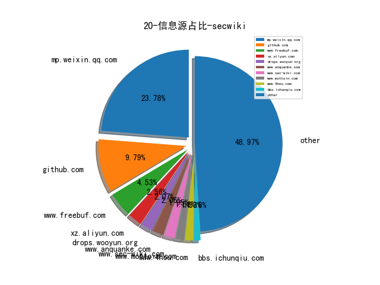

# [数据--所有](README_20.md)
# [数据--年度](README_20.md)
# 20 信息源与信息类型占比

# 政策 推荐
| title | url| 
| --- | ---| 
| 工业和信息化领域数据安全行政处罚裁量指引（试行）（征求意见... | https://www.miit.gov.cn/gzcy/yjzj/art/2023/art_2fb5b9dff755480284099f08eebdfa1e.html| 
| 规范和促进数据跨境流动规定（征求意见稿） | http://www.cac.gov.cn/2023-09/28/c_1697558914242877.htm| 
| 企业数据资源相关会计处理暂行规定 | http://kjs.mof.gov.cn/gongzuotongzhi/202212/P020221209412040514536.pdf| 
| 网站平台受理处置涉企网络侵权信息举报工作规范 | http://www.cac.gov.cn/2023-08/10/c_1693319212099907.htm| 
| 个人信息保护合规审计管理办法（征求意见稿） | http://www.cac.gov.cn/2023-08/03/c_1692628348448092.htm| 
| 中国人民银行业务领域数据安全管理办法（征求意见稿） | http://www.pbc.gov.cn/tiaofasi/144941/144979/3941920/4993510/2023071815593395156.pdf| 
| 铁路关键信息基础设施安全保护管理办法（征求意见稿） | http://www.moj.gov.cn/pub/sfbgw/lfyjzj/lflfyjzj/202307/t20230718_482844.html| 
| 生成式人工智能服务管理暂行办法 | http://www.cac.gov.cn/2023-07/13/c_1690898327029107.htm| 
| 关于调整《网络关键设备和网络安全专用产品目录》的公告 | http://www.cac.gov.cn/2023-07/03/c_1690034742530280.htm| 
| 商用密码管理条例 | http://www.gov.cn/zhengce/zhengceku/202305/content_6875928.htm| 
| 商用密码管理条例（修订草案征求意见稿） | http://www.sca.gov.cn/sca/hdjl/2020-08/20/content_1060779.shtml| 
| 生成式人工智能服务管理办法（征求意见稿） | http://www.cac.gov.cn/2023-04/11/c_1682854275475410.htm| 
| 密码工程技术人员国家职业标准 | http://www.mohrss.gov.cn/xxgk2020/fdzdgknr/qt/gztz/202303/t20230327_497435.html| 
| 2021广东省数字政府网络安全指数评估报告 | http://zfsg.gd.gov.cn/zwgk/wjk/content/post_3829200.html| 
| 证券期货业网络和信息安全管理办法 | http://www.gov.cn/zhengce/zhengceku/2023-03/04/content_5744506.htm| 
| 互联网跟帖评论服务管理规定 | http://www.cac.gov.cn/2022-11/16/c_1670253725725039.htm| 
| 2022上半年网络安全漏洞态势观察 | http://www.itsec.gov.cn/zxxw/202209/P020220902118368141314.pdf| 
| 数据出境安全评估申报指南（第一版） | http://www.cac.gov.cn/2022-08/31/c_1663568169996202.htm| 
| 移动互联网应用程序信息服务管理规定 | http://www.gov.cn/xinwen/2022-06/14/content_5695690.htm| 
| 电力行业网络安全管理办法（修订征求意见稿） | http://www.nea.gov.cn/2022-06/14/c_1310622577.htm| 
| 国资委：将网络安全纳入央企负责人经营业绩考核 | http://www.sasac.gov.cn/n2588035/n2588320/n2588335/c10652592/content.html| 
| 关于开展“清朗·2022年算法综合治理”专项行动 | http://www.cac.gov.cn/2022-04/08/c_1651028524542025.htm| 
| 互联网信息服务算法推荐管理规定 | http://www.gov.cn/zhengce/zhengceku/2022-01/04/content_5666429.htm| 
| 国家密码管理局规章制定程序规定（最新版） | http://www.scmgj.gov.cn/scsmmglj/c103235/2021/12/24/838569f2bbbe4d1fb1cb90e5c8d9dbdf.shtml| 
| “十四五”国家信息化规划 | http://www.cac.gov.cn/2021-12/27/c_1642205314518676.htm| 
| 《互联网用户账号名称信息管理规定（征求意见稿）》 | http://www.cac.gov.cn/2021-10/26/c_1636843202454310.htm| 
| 工业和信息化领域数据安全管理办法（试行）（征求意见稿） | https://wap.miit.gov.cn/gzcy/yjzj/art/2021/art_dcb6cc8d9f5c414eabd7070871996525.html| 
| 关键信息基础设施安全保护条例 | http://www.gov.cn/zhengce/content/2021-08/17/content_5631671.htm| 
| 一图读懂《网络产品安全漏洞管理规定》 | https://www.miit.gov.cn/zwgk/zcjd/art/2021/art_63fa55e09253499a9c3f1cd8266fbfa1.html| 
| 涉密信息系统集成资质管理办法 | http://www.gjbmj.gov.cn/n1/2021/0125/c409089-32010949.html| 
| 中华人民共和国个人信息保护法（草案） | http://www.npc.gov.cn/flcaw/flca/ff80808175265dd401754405c03f154c/attachment.pdf| 
| 关于运用大数据推进防范治理电信网络诈骗长效机制建设工作方案 | http://www.miit.gov.cn/n1146285/n1146352/n3054355/n3057724/n3057728/c8056526/content.html| 
| 公安部关于修改《公安机关办理刑事案件程序规定》的决定 | http://www.gov.cn/zhengce/zhengceku/2020-08/16/content_5535125.htm| 
| 网络信息内容生态治理规定 | http://www.cac.gov.cn/2019-12/20/c_1578375159509309.htm| 
| App违法违规收集使用个人信息行为认定方法 | http://www.cac.gov.cn/2019-12/27/c_1578986455686625.htm| 
| 中国信息安全从业人员现状调研报告（2018-2019年度） | http://www.itsec.gov.cn/zxxw/201909/t20190906_36022.html| 
| 关于印发加强工业互联网安全工作的指导意见的通知 | http://www.miit.gov.cn/n1146285/n1146352/n3054355/n3057724/n3057729/c7281215/content.html| 
| 儿童个人信息网络保护规定 | http://www.cac.gov.cn/2019-08/23/c_1124913903.htm| 
| 水利部印发水利网络安全管理办法（试行） | http://www.cac.gov.cn/2019-08/17/c_1124887757.htm| 
| 信息安全技术 移动互联网应用（App）收集个人信息基本规范（草... | http://www.cac.gov.cn/2019-08/08/c_1124853418.htm| 
| 网络安全漏洞管理规定（征求意见稿） | http://www.miit.gov.cn/n1146285/n1146352/n3054355/n3057724/n3057728/c7005976/content.html| 
| 个人信息出境安全评估办法（征求意见稿） | http://www.cac.gov.cn/2019-06/13/c_1124613618.htm| 
| 数据安全管理办法（征求意见稿） | http://www.cac.gov.cn/2019-05/28/c_1124546022.htm| 
| 关于《网络安全审查办法（征求意见稿）》公开征求意见 | http://www.cac.gov.cn/2019-05/24/c_1124532846.htm| 
| 互联网个人信息安全保护指南 | http://www.beian.gov.cn/portal/topicDetail?id=88| 
| 网络安全技术应用试点示范项目公示 | http://www.miit.gov.cn/n1146285/n1146352/n3054355/n3057724/n3057728/c6794942/content.html| 
| 中央企业负责人经营业绩考核办法 | http://www.sasac.gov.cn/n2588035/n2588320/n2588335/c8108632/content.html| 
| 中央网信办关于开展App安全认证工作的公告 | http://gkml.samr.gov.cn/nsjg/rzjgs/201903/t20190315_292035.html?from=timeline&isappinstalled=0| 

# 网络安全书籍 推荐
| date_added | language | title | author | link | size| 
| --- | --- | --- | --- | --- | ---| 
| 2023-11-29 09:23:22 | English | CompTIA Cybersecurity Analyst (CySA+) CS0-003 (Video Course) | unknown | https://www.wowebook.org/comptia-cybersecurity-analyst-cysa-cs0-003-video-course/ | unknown| 
| 2023-11-29 08:07:34 | English | Managing Cloud Native Data on Kubernetes | unknown | https://www.wowebook.org/managing-cloud-native-data-on-kubernetes/ | unknown| 
| 2023-11-27 08:35:44 | English | Learning Microsoft Azure | unknown | https://www.wowebook.org/learning-microsoft-azure/ | unknown| 
| 2023-11-24 19:05:09 | English | Data Literacy With Python | Oswald Campesato | http://libgen.rs/book/index.php?md5=90BED60B64BED943E245E467C7950AC9 | 15 MB [PDF]| 
| 2023-11-24 16:43:25 | English | Fundamentals of Supervised Machine Learning: With Applications in Python, R, and Stata (Statistics and Computing) | Giovanni Cerulli | http://libgen.rs/book/index.php?md5=733256EF8FB93EDF61A4EB76A06F6774 | 7 MB [PDF]| 
| 2023-11-21 17:27:28 | English | Exploring Microsoft Office - 2023 Edition: The Illustrated, Practical Guide to Using Office and Microsoft 365 | Kevin Wilson | http://libgen.rs/book/index.php?md5=5C07A77B2E01533A0722ABB15BBAB1D1 | 93 MB [EPUB]| 
| 2023-11-20 07:28:44 | English | SAP S/4HANA Asset Management | unknown | https://www.wowebook.org/sap-s-4hana-asset-management/ | unknown| 
| 2023-11-17 08:35:10 | English | Kubernetes Cookbook, 2nd Edition | unknown | https://www.wowebook.org/kubernetes-cookbook-2nd-edition/ | unknown| 
| 2023-11-15 06:27:32 | English | Hacker Culture A to Z | unknown | https://www.wowebook.org/hacker-culture-a-to-z/ | unknown| 
| 2023-11-15 08:27:19 | English | FastAPI: Modern Python Web Development | unknown | https://www.wowebook.org/fastapi-modern-python-web-development/ | unknown| 
| 2023-11-14 11:52:16 | English | Python Deep Learning, Third Edition | unknown | https://www.wowebook.org/python-deep-learning-third-edition/ | unknown| 
| 2023-11-13 18:28:50 | English | The Linux DevOps Handbook | unknown | https://www.wowebook.org/the-linux-devops-handbook/ | unknown| 
| 2023-11-10 12:21:43 | English | Kubernetes Fundamentals | unknown | https://www.wowebook.org/kubernetes-fundamentals/ | unknown| 
| 2023-11-09 15:55:09 | English | (Security Informatics and Law Enforcement) Cyber Malware : Offensive and Defensive Systems | Iman Almomani; Leandros A. Maglaras; Mohamed Amine Ferrag; Nick Ayres | http://libgen.rs/book/index.php?md5=EF13873566DFAF97195C6D48EF0077BF | 16 MB [EPUB]| 
| 2023-11-09 15:48:12 | English | Introduction to Computer Programming with Python | Harris Wang | http://libgen.rs/book/index.php?md5=8F2306D8690F4440447D39FFB66E31E1 | 4 MB [EPUB]| 
| 2023-11-08 11:53:41 | English | Cloud Penetration Testing for Red Teamers | unknown | https://www.wowebook.org/cloud-penetration-testing-for-red-teamers/ | unknown| 
| 2023-11-08 11:07:08 | English | Learning Geospatial Analysis with Python, Fourth Edition | unknown | https://www.wowebook.org/learning-geospatial-analysis-with-python-fourth-edition/ | unknown| 
| 2023-11-08 09:35:23 | English | Windows Forensics Analyst Field Guide | unknown | https://www.wowebook.org/windows-forensics-analyst-field-guide/ | unknown| 
| 2023-11-07 20:02:34 | English | Zero Trust Overview and Playbook Introduction | unknown | https://www.wowebook.org/zero-trust-overview-and-playbook-introduction/ | unknown| 
| 2023-11-05 04:35:56 | English | Functional Programming Projects with Python 3 (Video Course) | unknown | https://www.wowebook.org/functional-programming-projects-with-python-3-video-course/ | unknown| 
| 2023-11-04 11:40:25 | English | Interpretable Machine Learning with Python, Second Edition | unknown | https://www.wowebook.org/interpretable-machine-learning-with-python-second-edition/ | unknown| 
| 2023-11-04 15:43:37 | English | Big Beacon | Alan Partridge | http://libgen.rs/book/index.php?md5=24AD48BD378A10359DD18A560FB2FFAB | 21 MB [AZW3]| 
| 2023-11-03 17:00:33 | English | Linux Containers and Virtualization: Utilizing Rust for Linux Containers | Shashank Mohan Jain | http://libgen.rs/book/index.php?md5=929B078CD4B6DCCB744F359C0F53DCC5 | 3 MB [PDF]| 
| 2023-11-03 17:00:29 | English | Linux Containers and Virtualization: Utilizing Rust for Linux Containers | Shashank Mohan Jain | http://libgen.rs/book/index.php?md5=2CACAE35F62A286F85B636FCD2B849EC | 2 MB [EPUB]| 
| 2023-11-03 16:40:01 | English | A Pythonic Adventure: From Python basics to a working web app | Pavel Anni | http://libgen.rs/book/index.php?md5=EFD8081BD6E5D72940253F56E8F5D467 | 21 MB [PDF]| 
| 2023-11-01 06:06:38 | English | Kubernetes: From Basics to Guru (Video Course) | unknown | https://www.wowebook.org/kubernetes-from-basics-to-guru-video-course/ | unknown| 
| 2023-10-31 08:53:57 | English | Rust Programming Part 2: Rust Advanced Concepts and Real-World Projects (Video Course) | unknown | https://www.wowebook.org/rust-programming-part-2-rust-advanced-concepts-and-real-world-projects-video-course/ | unknown| 
| 2023-10-31 08:19:09 | English | Rust Programming Part 1: Rust Programming Foundations (Video Course) | unknown | https://www.wowebook.org/rust-programming-part-1-rust-programming-foundations-video-course/ | unknown| 
| 2023-10-31 07:40:02 | English | Rust Programming Essentials (Video Course) | unknown | https://www.wowebook.org/rust-programming-essentials-video-course/ | unknown| 
| 2023-10-27 17:19:22 | English | Operations Research for Social Good: A Practitioners Introduction Using SAS and Python | Natalia Summerville; Rob Pratt | http://libgen.rs/book/index.php?md5=D1F25080FF4AF5D5A15F7AF00AF2CB8C | 5 MB [EPUB]| 
| 2023-10-27 17:17:44 | English | Digital Money Demystified: Go From Cash to Crypto Safely, Legally, and Confidently | Tonya M. Evans | http://libgen.rs/book/index.php?md5=427307DE1C3B18F392992D6219DCF422 | 537 kB [EPUB]| 
| 2023-10-27 07:19:38 | English | Platform Engineering on Kubernetes | unknown | https://www.wowebook.org/platform-engineering-on-kubernetes/ | unknown| 
| 2023-10-25 16:54:46 | English | Python Mastery Unleashed: Advanced Programming Techniques | Jarrel E. | http://libgen.rs/book/index.php?md5=E93E9742ED7A78F82C65F049E63D466E | 7 MB [EPUB]| 
| 2023-10-25 16:44:20 | English | Python 3 Programming: An Advanced Guide | Educohack Press | http://libgen.rs/book/index.php?md5=FA2B0D9E2D33E59622E3F3F830D98B9E | 7 MB [EPUB]| 
| 2023-10-25 14:47:10 | English | Learning Microsoft Power BI: Transforming Data into Insights [Complete] | Jeremey Arnold | http://libgen.rs/book/index.php?md5=B0E76C97D198401B3769CE699E65EBF8 | 29 MB [PDF]| 
| 2023-10-24 05:55:23 | English | Kubernetes Best Practices, 2nd Edition | unknown | https://www.wowebook.org/kubernetes-best-practices-2nd-edition/ | unknown| 
| 2023-10-24 09:05:32 | English | Information Security Handbook, Second Edition | unknown | https://www.wowebook.org/information-security-handbook-second-edition/ | unknown| 
| 2023-10-24 08:44:52 | English | CompTIA A+ Practice Test Core 1 (220-1101) | unknown | https://www.wowebook.org/comptia-a-practice-test-core-1-220-1101/ | unknown| 
| 2023-10-23 17:03:05 | English | Python Automation Mastery: From Novice To Pro (4 Books In 1) | ROB BOTWRIGHT | http://libgen.rs/book/index.php?md5=B9EB14A9752AFDAD262F6C7E6CC6A5EC | 2 MB [EPUB]| 
| 2023-10-23 16:08:02 | English | Mastering Computer Programming: A Comprehensive Guide to Python, C, C++, C#, HTML Coding, and Ethical Hacking | Kameron Hussain; Frahaan Hussain | http://libgen.rs/book/index.php?md5=46585EAB44A7155954BDB16E4E2C6D5B | 2 MB [EPUB]| 
| 2023-10-22 17:13:58 | English | Rust In Practice: A Programmers Guide to Build Rust Programs, Test Applications and Create Cargo Packages | Rustacean Team | http://libgen.rs/book/index.php?md5=869DFD23AB0EF7D4F64A646199103470 | 426 kB [EPUB]| 
| 2023-10-22 17:12:56 | English | Practical Rust 1.x Cookbook: 100+ Solutions across Command Line, CI/CD, Kubernetes, Networking, Code Performance and Microservices | Rustacean Team | http://libgen.rs/book/index.php?md5=B766D2E409AE1A6365C011C65AFC1A50 | 669 kB [EPUB]| 
| 2023-10-19 14:39:26 | English | Head First Python: A Learners Guide to the Fundamentals of Python Programming, A Brain-Friendly Guide <[Early Release - RAW & UNEDITED]> | Paul Barry | http://libgen.rs/book/index.php?md5=1A85A06658A6E506E3CC18EDE8B625CC | 124 MB [PDF]| 
| 2023-10-12 15:07:33 | English | Artificial Intelligence & Blockchain in Cyber Physical Systems: Technologies & Applications | Muhammad Arif, Valentina Emilia Balas, Tabrez Nafis, Nawab Muhammad Faseeh Qureshi, Samar Wazir, Ibrar Hussain | http://libgen.rs/book/index.php?md5=998DF7DF613C96890EA2A8631844F1EB | 40 MB [PDF]| 
| 2023-10-11 18:01:39 | English | Ansible For Security by Examples | Luca Berton | http://libgen.rs/book/index.php?md5=0440BBACC6C24FFFC5D5307691D775B8 | 1 MB [EPUB]| 
| 2023-10-06 15:24:08 | English | The day of defense | McDonald, A. Melvin | http://libgen.rs/book/index.php?md5=38B739BA016B5369AECD5DB58A5B3D18 | 201 kB [EPUB]| 
| 2023-10-06 11:16:41 | English | Python for DevOps: Learn Ruthlessly Effective Automation | Noah Gift, Kennedy Behrman, Alfredo Deza, Grig Gheorghiu | http://libgen.rs/book/index.php?md5=D80589BD3C0804C795C7CE97138026F1 | 11 MB [PDF]| 
| 2023-10-06 17:18:06 | English | The Myth of Overpunishment: A Defense of the American Justice System and a Proposal to Reduce Incarceration While Protecting the Public | Barry Latzer | http://libgen.rs/book/index.php?md5=00E78F1753ED6F53879A53A0933302C0 | 2 MB [EPUB]| 
| 2023-10-05 16:02:41 | English | Hacking Kubernetes: Threat-Driven Analysis and Defense | Andrew Martin, Michael Hausenblas | http://libgen.rs/book/index.php?md5=492A742FF37EE73CE3591FB5FCBCE7BB | 9 MB [PDF]| 
| 2023-10-05 15:32:52 | English | (The Shelly Cashman Series) Technology for Success and The Shelly Cashman Series Microsoft 365 & Office 2021 (MindTap Course List) | Sandy Cable, Jennifer T. Campbell, Mark Ciampa, Barbara Clemens, Jennifer Duffy, Steven M. Freund, Mark Frydenberg, Ralph E. Hooper, Ellen Monk, Lisa Ruffolo, Susan Sebok, Misty Vermaat, Jill West | http://libgen.rs/book/index.php?md5=3EEE6D81FD0205B78E8DC017AB189526 | 80 MB [PDF]| 
| 2023-10-04 19:05:48 | English | Understanding Analog Side Channels Using Cryptography Algorithms | Alenka Zajić; Milos Prvulovic | http://libgen.rs/book/index.php?md5=7F1D0D6CD099D60E374B4108FB376D0C | 86 MB [EPUB]| 
| 2023-10-04 18:48:54 | English | Kubernetes Security and Observability: A Holistic Approach to Securing Containers and Cloud Native Applications | Brendan Creane, Amit Gupta | http://libgen.rs/book/index.php?md5=70C5393323FC76F1A4D7D9842F54D92D | 11 MB [PDF]| 
| 2023-10-04 18:48:53 | English | Identity-Native Infrastructure Access Management: Preventing Breaches by Eliminating Secrets and Adopting Zero Trust | Ev Kontsevoy, Sakshyam Shah, Peter Conrad | http://libgen.rs/book/index.php?md5=154B43B65DFEAECCEB00BD19957C20A2 | 2 MB [PDF]| 
| 2023-09-29 14:18:15 | English | (HBR Emotional Intelligence Series) Grit | Harvard Business Review, Angela L. Duckworth, Misty Copeland, Shannon Huffman Polson, Tomas Chamorro-Premuzic | http://libgen.rs/book/index.php?md5=43B3B9AD267EC42617A24B364146CBCC | 1 MB [EPUB]| 
| 2023-09-27 15:38:00 | English | Black Hat Python, 2nd Edition | Justin Seitz; Tim Arnold | http://libgen.rs/book/index.php?md5=93C0E3BF45AC2791B622BCAEC5D34E42 | 7 MB [EPUB]| 
| 2023-09-27 15:22:10 | English | RTFM: Red Team Field Manual v2 | Ben Clark; Nick Downer | http://libgen.rs/book/index.php?md5=5838E46065186A20D36FEF831EC36200 | 256 kB [EPUB]| 
| 2023-07-30 20:25:14 | English | Unlock the Vault: A Blueprint For Building Wealth With Fractional Ownership: Weather Market Storms and Enjoy Long-Term Security With An Emerging New Asset ... the Investments of the Ultra-Rich Book 2) | Michael Fox-Rabinovitz | http://libgen.rs/book/index.php?md5=D79049E60064147C58AA1B59D0636E27 | 513 kB [EPUB]| 
| 2023-07-21 03:05:45 | English | Fortinet FortiWeb Study Guide for FortiWeb 6.4 |  | http://libgen.rs/book/index.php?md5=07390EF2A9457416C4E6143A4872E225 | 50 MB [PDF]| 
| 2023-07-21 04:01:29 | English | Fortinet SD-WAN Lab Guide for FortiOS 7.2 |  | http://libgen.rs/book/index.php?md5=235FB171A721993D52DDB15CA2EFE608 | 6 MB [PDF]| 
| 2023-07-21 05:22:42 | English | The Art of Risk | Richard Harris | http://libgen.rs/book/index.php?md5=A9FEE5323D62BB4A0099FB9BC09C2005 | 6 MB [EPUB]| 
| 2023-07-21 04:16:48 | English | Fortinet Advanced Analytics Study Guide for FortiSIEM 6.3 |  | http://libgen.rs/book/index.php?md5=2A9B094EEC3F0DA4FFEB3725D4350D7F | 63 MB [PDF]| 
| 2023-07-21 04:16:42 | English | Fortinet Advanced Analytics Lab Guide for FortiSIEM 6.3 |  | http://libgen.rs/book/index.php?md5=E3582EFCEBB0AF288F1B5FC3468D64E9 | 13 MB [PDF]| 
| 2023-07-21 04:13:55 | English | Fortinet LAN Edge Study Guide for FortiGate 7.0 |  | http://libgen.rs/book/index.php?md5=EDAA5C2E25AD0BBEF185851B29B742E4 | 50 MB [PDF]| 
| 2023-07-21 04:11:30 | English | Fortinet OT Security Study Guide for FortiOS 7.2 |  | http://libgen.rs/book/index.php?md5=9063133974E42781E921976B957D6D48 | 31 MB [PDF]| 
| 2023-07-21 04:11:29 | English | Fortinet OT Security Lab Guide for FortiOS 7.2 |  | http://libgen.rs/book/index.php?md5=5B6ABB7215F265DC5C549EA990BAA9FB | 5 MB [PDF]| 
| 2023-07-21 04:07:51 | English | Fortinet Public Cloud Security Study Guide for FortiGate 7.2 |  | http://libgen.rs/book/index.php?md5=FB499E6726395D0F2E86BD3D6E1FD195 | 19 MB [PDF]| 
| 2023-07-21 04:05:02 | English | Fortinet Zero Trust Access Study Guide for FortiOS 7.2 |  | http://libgen.rs/book/index.php?md5=C4D0B5CB221B1C0EFAE1A1448E63C428 | 18 MB [PDF]| 
| 2023-07-21 04:04:58 | English | Fortinet Zero Trust Access Lab Guide for FortiOS 7.2 |  | http://libgen.rs/book/index.php?md5=39DCC1F3923F1727D600BD25C0EC5845 | 14 MB [PDF]| 
| 2023-07-21 04:01:31 | English | Fortinet SD-WAN Study Guide for FortiOS 7.2 |  | http://libgen.rs/book/index.php?md5=572D3F2160E003B689F9DFFE04638FF6 | 10 MB [PDF]| 
| 2023-07-21 03:58:33 | English | Fortinet Enterprise Firewall Lab Guide for FortiOS 7.2 |  | http://libgen.rs/book/index.php?md5=65BD7A0B33E6EA74C83C4F1CE0C5C06D | 6 MB [PDF]| 
| 2023-07-21 03:58:28 | English | Fortinet Enterprise Firewall Study Guide for FortiOS 7.2 |  | http://libgen.rs/book/index.php?md5=76992EDAB7C98447905A8E2E7952C445 | 35 MB [PDF]| 
| 2023-07-21 03:54:05 | English | Fortinet Network Security Support Engineer Study Guide for FortiOS 7.2 |  | http://libgen.rs/book/index.php?md5=CE444CC0FC8EE50F6461120BB06F321B | 54 MB [PDF]| 
| 2023-07-21 03:54:04 | English | Fortinet Network Security Support Engineer Lab Guide for FortiOS 7.2 |  | http://libgen.rs/book/index.php?md5=275931204DD5049E0BC233056083EFB2 | 2 MB [PDF]| 
| 2023-07-21 03:47:48 | English | Fortinet FortiVoice Lab Guide for FortiVoice 6.0 |  | http://libgen.rs/book/index.php?md5=09154B576D7A818E5FAF3022A0B393E0 | 3 MB [PDF]| 
| 2023-07-21 03:47:47 | English | Fortinet FortiVoice Study Guide for FortiVoice 6.0 |  | http://libgen.rs/book/index.php?md5=8341173B3FC2024366A0648939771E5F | 45 MB [PDF]| 
| 2023-07-20 19:15:33 | English | Developments in Managing and Exploiting Risk. Volume II Project Risk Management: Managing Software Development Risk | Kurt J. Engemann (editor); Rory V. OConnor (editor) | http://libgen.rs/book/index.php?md5=D2AC2FF481BD5C4246A6105BE218E798 | 3 MB [EPUB]| 
| 2023-07-20 19:15:27 | English | Developments in Managing and Exploiting Risk. Volume II Project Risk Management: Managing Software Development Risk | Kurt J. Engemann (editor); Rory V. OConnor (editor) | http://libgen.rs/book/index.php?md5=0828D4218A547DC540778B2AE88F4858 | 1 MB [PDF]| 
| 2023-07-19 01:39:56 | English | Reverse Engineering For Everyone! | mytechnotalent | http://libgen.rs/book/index.php?md5=4D8D5338D320406A630F5E8851B1E496 | 15 MB [PDF]| 
| 2023-07-19 00:37:07 | English | (Studies in Systems, Decision and Control, 475) Output Regulation and Cybersecurity of Networked Switched Systems | Lili Li, Jun Fu | http://libgen.rs/book/index.php?md5=40302C43F9E7F7920564A118E922297B | 8 MB [PDF]| 

# 学习视频 推荐
| title | url| 
| --- | ---| 
| InForSec 2023年网络空间安全国际学术研究成果分享及青年学者... | https://space.bilibili.com/631540223/video| 
| 静态程序分析框架“太阿”的设计之道 | https://www.bilibili.com/video/BV1XP4y1S7cP/| 
| 针对释放后重用漏洞的自动化分析和修复 | https://www.bilibili.com/video/BV1UK411671w/| 
| Web漏洞挖掘基础系列 | https://www.bilibili.com/video/BV1TG4y1V7xc/| 
| 隐私计算线上慕课 | https://space.bilibili.com/2073575923/channel/collectiondetail?sid=883666| 
| 科研与英文学术论文写作 | https://space.bilibili.com/301285406/channel/collectiondetail?sid=535567| 
| 《软件分析》完整版课程视频 | https://space.bilibili.com/2919428/channel/detail?cid=106434&ctype=0| 
| 现代化系统中的侧信道(side channel)攻击与防御 | https://www.bilibili.com/video/BV16q4y1B7gt| 
| Mining JavaScript Zero-day Vulnerabilities via Object Prop... | https://www.bilibili.com/video/BV1xL411M7wz| 
| 2020 南京大学 “操作系统：设计与实现” | https://www.bilibili.com/video/BV1N741177F5| 
| 计算机系统研究的一些体会 | https://www.bilibili.com/video/BV1Ap4y167w3?p=1| 
| 高质量科研论文写作 | https://www.bilibili.com/video/BV1hg4y1q7Ge| 
| 伯克利课程：深度强化学习 (2019) | https://www.bilibili.com/video/av69455099/| 

# 学习视频 推荐
| title | url| 
| --- | ---| 
| 车联网漏洞分析与挖掘技术（视频） | https://www.bilibili.com/video/BV15U4y1z7qK?vd_source=994e5741b72698fa42291f2582cd25c1| 

# 微信公众号 推荐
| nickname_english | weixin_no | title | url| 
| --- | --- | --- | ---| 
| 360数字安全 | gh_6db130c5163e | 360携手农业银行斩获2023 IDC中国20大杰出安全项目 | https://mp.weixin.qq.com/s?__biz=MzA4MTg0MDQ4Nw==&mid=2247567809&idx=1&sn=1af224b32ffcad5f1459906103fbba20 | 23| 
| CNCERT国家工程研究中心 | NELCERT | 龙芯上新！新一代国产CPU发布 | https://mp.weixin.qq.com/s?__biz=MzUzNDYxOTA1NA==&mid=2247541361&idx=1&sn=48732e66bdbb58511c75b80cf8e49052 | 50| 
| Eonian Sharp | Eonian_sharp | About Eonian Sharp , 永恒之锋安全 | https://mp.weixin.qq.com/s?__biz=Mzg3NzUyMTM0NA==&mid=2247485354&idx=1&sn=1c63d16f1e05b4bce157d83d44327559 | 3| 
| FreeBuf | freebuf | 给SIEM一个新的可能：斗象 XSIEM的第一个「X」 | https://mp.weixin.qq.com/s?__biz=MjM5NjA0NjgyMA==&mid=2651249374&idx=1&sn=076b70412541b72d0eea6afabca88f1a | 326| 
| HACK之道 | hacklearn | 【已复现】Apache ActiveMQ jolokia 远程代码执行漏洞 | https://mp.weixin.qq.com/s?__biz=MzIwMzIyMjYzNA==&mid=2247512129&idx=1&sn=c95f4092bb8effc120dc6ef9cec4dc87 | 58| 
| HashRun安全团队 | None | 记一次实战中的私有云渗透 | https://mp.weixin.qq.com/s?__biz=MzkxODMyNjQ2MQ==&mid=2247484924&idx=1&sn=17ef4574b357595da8911bd8e17f432f | 1| 
| IMPERVA | IMPERVA | 全球一周数据泄漏事件播报 | https://mp.weixin.qq.com/s?__biz=MzI1OTYyOTUyOA==&mid=2247487232&idx=1&sn=bfb688c4370f149c25c4e8b8b647a7f8 | 12| 
| IoT物联网技术 | IoT-Tech-Expo | IoT 物联网在新能源光伏电站场景中的智能运维实战 | https://mp.weixin.qq.com/s?__biz=MjM5OTA4MzA0MA==&mid=2454931859&idx=1&sn=4b4054a70d9e051198736de7aa3d1660 | 9| 
| IoVSecurity | IoVSecurity | 通过高效的 IDPS 实现 CAN 网络车辆安全 | https://mp.weixin.qq.com/s?__biz=MzU2MDk1Nzg2MQ==&mid=2247598324&idx=1&sn=d179d423279d4b543343216432c36c03 | 114| 
| KK安全说 | None | 张坤：基于“四相与十二宫”，解读供应链安全的科学框架 , CXO主笔团 | https://mp.weixin.qq.com/s?__biz=Mzg4NzgyODEzNQ==&mid=2247485692&idx=1&sn=373579af5cda7f04397b8a0085bd3736 | 6| 
| LemonSec | lemon-sec | ShellPhish：支持多种社交媒体的网络钓鱼工具 | https://mp.weixin.qq.com/s?__biz=MzUyMTA0MjQ4NA==&mid=2247548226&idx=1&sn=d3cbf568c98d1a6b72b4117932e3bd1e | 76| 
| M01N Team | m01nteam | 从ChatGPT代码执行逃逸到LLMs应用安全思考 | https://mp.weixin.qq.com/s?__biz=MzkyMTI0NjA3OA==&mid=2247492812&idx=1&sn=d653b00419d2b7e65d672540d9a2adaf | 31| 
| NISL实验室 | NISL_THU2020 | 【学术沙龙】NISL 11月30日活动预告 - TO BE ON AIR | https://mp.weixin.qq.com/s?__biz=MzUxMTEwOTA3OA==&mid=2247485524&idx=1&sn=29914e5cf3d6330e8fc948bbc80df8c9 | 13| 
| NOVASEC | None | 【实战】从SSRF到任意文件下载再到远程文件下载 | https://mp.weixin.qq.com/s?__biz=MzUzODU3ODA0MA==&mid=2247489198&idx=1&sn=32953b6d6a44b80abe964bb57376eca2 | 4| 
| Ots安全 | AnQuan7 | WPS Office 11.2.0.11537 处理 Excel 文件导致 RCE | https://mp.weixin.qq.com/s?__biz=MzAxMjYyMzkwOA==&mid=2247503111&idx=1&sn=88eab96d4dab30916089feaa22df5607 | 56| 
| SKSEC | gh_f932e6087f88 | 【表哥有话说 第104期】nmap+W1R3S | https://mp.weixin.qq.com/s?__biz=MzU1MjI5MDY3Nw==&mid=2247486464&idx=1&sn=6d149baba71ae0bc813e9286441d5b14 | 1| 
| T大4的小圈圈 | None | 记一次实战中的私有云渗透 | https://mp.weixin.qq.com/s?__biz=MzkyODI1MTgyNA==&mid=2247485100&idx=1&sn=0214f8f85cedaf384c1fffaded5ee2fd | 1| 
| Van1sh | gh_ba55e3f8405f | 密码学基础之Coppersmith | https://mp.weixin.qq.com/s?__biz=Mzg5OTkxMzM3NA==&mid=2247485333&idx=1&sn=a45493cc22602f3a778f2252bc5a74d4 | 4| 
| WIN哥学安全 | WIN-security | 【精选推荐】3款强大的API渗透测试工具 | https://mp.weixin.qq.com/s?__biz=MzkwODM3NjIxOQ==&mid=2247495116&idx=1&sn=43a09864506b8de97814c53e73d7536a | 19| 
| Web安全工具库 | websec-tools | 一款针对某友NC综合漏洞利用工具 -- NCTOOls（11月27日更新） | https://mp.weixin.qq.com/s?__biz=MzI4MDQ5MjY1Mg==&mid=2247511866&idx=1&sn=9b75b439b31fe24a9ca40671e9890795 | 20| 
| fly的渗透学习笔记 | Forever--Lfy- | sqlamp反制复现 | https://mp.weixin.qq.com/s?__biz=MjM5MTg0Nzk5Nw==&mid=2247484317&idx=1&sn=3eb7b8ffa9af8ef14d91b8c8d0ac2baa | 10| 
| i春秋 | icqedu | 资讯速递丨11月网络安全事件、政策法规回顾 | https://mp.weixin.qq.com/s?__biz=MzUzNTkyODI0OA==&mid=2247524598&idx=1&sn=227654543fe5b391404730773e97d126 | 25| 
| thelostworld | gh_3f2e5b9f028c | [漏洞复现-67]红*-ioffice wssrtfile sql注入漏洞 | https://mp.weixin.qq.com/s?__biz=MzIyNjk0ODYxMA==&mid=2247487291&idx=1&sn=d95ee73495cfdb934ee7f580e604b513 | 60| 
| 一个不正经的黑客 | gh_ddeb734f0ee7 | [实践精品] 新一代内网穿透工具 ligolo-ng | https://mp.weixin.qq.com/s?__biz=MzkwODI1ODgzOA==&mid=2247500720&idx=1&sn=7da34187db1a0d891e7c7b7e9da507b3 | 19| 
| 一起聊安全 | gh_589ffdaa31f9 | 【安全标准】《网络安全标准实践指南——网络安全产品互联互通 告警信息格式》发布 | https://mp.weixin.qq.com/s?__biz=MzI3NjUzOTQ0NQ==&mid=2247504583&idx=1&sn=d1477cb9b645335892e9118a9ce992ad | 6| 
| 三六零CERT | CERT-360 | CVE-2023-6345：Google Chrome skia整数溢出漏洞通告 | https://mp.weixin.qq.com/s?__biz=MzU5MjEzOTM3NA==&mid=2247499294&idx=1&sn=944be3804ed785284fe0890abdc5060f | 69| 
| 中国信息安全 | chinainfosec | 专题·关基保护 , 石油行业关键信息基础设施安全保护问题与对策研究 | https://mp.weixin.qq.com/s?__biz=MzA5MzE5MDAzOA==&mid=2664198560&idx=1&sn=3342ebcdb02085e25c28cfc840b303d5 | 218| 
| 中国计算机学会 | ccfvoice | 吴志林、陈厅、张殷乾汇聚直播间，CCF奖励获得者畅谈科研之路 | https://mp.weixin.qq.com/s?__biz=MjM5MTY5ODE4OQ==&mid=2651564357&idx=1&sn=abbb0e723dfa6ad1421c95594875e9c7 | 76| 
| 中学生CTF | zxsctf | 2023 “技能兴鲁” 网络安全赛项初赛 Crypto-【little_hnp】 | https://mp.weixin.qq.com/s?__biz=MzU3MzEwMTQ3NQ==&mid=2247507197&idx=1&sn=c183dc8d7b12d3ac98463fea085a25e3 | 6| 
| 五六七安全团队 | gh_d59f281cad29 | 时空智友 workflow.sqlResult SQL注入漏洞 | https://mp.weixin.qq.com/s?__biz=MzkwOTIyNjgwNw==&mid=2247485252&idx=1&sn=4cfc17b1c5ed8736feab1686dbd94ad8 | 15| 
| 亚信安全 | yaxinanquan | 终端安全新范式 , 未曾察觉的痛，终端非法外联成企业安全“内伤” | https://mp.weixin.qq.com/s?__biz=MjM5NjY2MTIzMw==&mid=2650610028&idx=1&sn=5edf4dc65041a5216db1e09298b87e0d | 9| 
| 代码卫士 | codesafe | 谷歌紧急修复2023年的第六个 0day | https://mp.weixin.qq.com/s?__biz=MzI2NTg4OTc5Nw==&mid=2247518238&idx=1&sn=5c52902fa6ddaf11504289e89f7e976f | 92| 
| 信息安全大事件 | xxaqdsj | 蓝牙曝底层安全漏洞，数十亿设备受影响 | https://mp.weixin.qq.com/s?__biz=MzkzNjIzMjM5Ng==&mid=2247489135&idx=1&sn=498cef836aefdb67c5446a532d810632 | 17| 
| 信息安全研究 | ISR2016 | 透视镜 , 工信数据行政处罚裁量的三大创新和两点思考 | https://mp.weixin.qq.com/s?__biz=MzA3NzgzNDM0OQ==&mid=2664982263&idx=2&sn=0d3fb89445e9642a446e77a577cb948b | 66| 
| 信息新安全 | XXxinanquan | 商用密码在城市建设及数字家庭领域的探索与研究 | https://mp.weixin.qq.com/s?__biz=MjM5NDA3ODY4Ng==&mid=2247488696&idx=1&sn=a1a6fcff88e49fde1e28173b6434855a | 6| 
| 全球技术地图 | drc_iite | 技经观察丨把握数字时代人才发展新逻辑 | https://mp.weixin.qq.com/s?__biz=MzI1OTExNDY1NQ==&mid=2651608642&idx=1&sn=03d0e6cd7f77e7a81d224e3661f1194d | 88| 
| 关键基础设施安全应急响应中心 | CII-SRC | 龙芯上新！新一代国产CPU发布 | https://mp.weixin.qq.com/s?__biz=MzkyMzAwMDEyNg==&mid=2247540924&idx=1&sn=d2952c1e686b6707bc3c45455f7cc0a1 | 127| 
| 内生安全联盟 | CCESS_CHINA | 这里有一场学术盛宴邀您“享用”！第三届网络空间内生安全发展大会报名通道开启 | https://mp.weixin.qq.com/s?__biz=Mzg4MDU0NTQ4Mw==&mid=2247513928&idx=1&sn=baf8bfc33430ada3e1e01ded7e5a1e6f | 21| 
| 合天网安实验室 | hee_tian | 开源项目CVE详细指南：从SQL注入到Shell的完整探索 | https://mp.weixin.qq.com/s?__biz=MjM5MTYxNjQxOA==&mid=2652902084&idx=1&sn=13a2d04285809125ed72336eb1f0613f | 81| 
| 吉祥同学学安全 | gh_370fbad7aec1 | 跳槽不过是换个地方受气罢了！ | https://mp.weixin.qq.com/s?__biz=MzI1ODY3MTA3Nw==&mid=2247484482&idx=1&sn=8eb2d788bb27752a5899f7ebfaaabce0 | 4| 
| 听雨安全 | LR_Sec | 2023香山杯决赛 easycache Django 缓存反序列化 | https://mp.weixin.qq.com/s?__biz=Mzg3OTUyMTM5Mw==&mid=2247488188&idx=1&sn=8954caae03c4b20b2b75920cdc2bfb86 | 2| 
| 启明星辰安全简讯 | VitaminSecurity | 安全简讯（2023.11.29） | https://mp.weixin.qq.com/s?__biz=MzUxMDQzNTMyNg==&mid=2247503431&idx=1&sn=3a86ef5d0aaebb075ba04f5e11acfecf | 11| 
| 启明星辰集团 | venustech_weixin | 安全新时代 护航新未来 , 山东移动联合启明星辰举办安全产品推介会 | https://mp.weixin.qq.com/s?__biz=MzA3NDQ0MzkzMA==&mid=2651721792&idx=1&sn=759f2240aa5dc66d669d4a0be171dcc2 | 11| 
| 嗨嗨安全 | gh_dc18c8a0e913 | 靶机实战系列之Cereal靶机 | https://mp.weixin.qq.com/s?__biz=MzIzMjg0MjM5OQ==&mid=2247486553&idx=1&sn=76955b91301d2effaee8dd2222bff279 | 11| 
| 嘶吼专业版 | Pro4hou | 商业航班遭遇新型“欺骗”攻击，导航系统接连失灵 | https://mp.weixin.qq.com/s?__biz=MzI0MDY1MDU4MQ==&mid=2247571583&idx=1&sn=dc3127419035fa2ab3d4ec9262535120 | 213| 
| 国信安全 | gh_aa0cfb9da03f | 北京市地方标准《用水定额第11部分：数据中心》顺利通过评审 | https://mp.weixin.qq.com/s?__biz=MzU5MzYzMzU5NA==&mid=2247488538&idx=1&sn=14ab9f03dd7ae200f6cc15dbb1cb453c | 4| 
| 天擎攻防实验室 | gh_2fb077348503 | 【漏洞复现】（1day）通达oa-moare-反序列化rce漏洞复现 | https://mp.weixin.qq.com/s?__biz=MzU2MzQyMjA1NA==&mid=2247484277&idx=1&sn=9797be2ff276eb2e1febab046996209d | 12| 
| 天融信 | TopsecPioneer | 践行网安初心使命！天融信获评“年度行业影响力”企业 | https://mp.weixin.qq.com/s?__biz=MzA3OTMxNTcxNA==&mid=2650887624&idx=1&sn=d2f10e5161c091ddea77507485c5ea85 | 16| 
| 天融信教育 | TOPSEC-EDU | 双12年终学习计划丨宠每一位网安人~ | https://mp.weixin.qq.com/s?__biz=MzU0MjEwNTM5Ng==&mid=2247514870&idx=1&sn=23fe6ef7c1068576bf3251c170d390b3 | 38| 
| 太白安全实验室 | gh_e100465543dd | 中国移动聚焦咸阳政企网络安全建设，焕新数字安全防御应用 | https://mp.weixin.qq.com/s?__biz=Mzg4MDU4MTE4Nw==&mid=2247485245&idx=1&sn=7d7f3740e986899facfb1be9a30760c6 | 1| 
| 奇安信集团 | qianxin-keji | 双细分领域第一！奇安信稳居国内安全服务市场头名 | https://mp.weixin.qq.com/s?__biz=MzU0NDk0NTAwMw==&mid=2247602898&idx=1&sn=f07f841aecdf695cb2077c356b3bff7e | 137| 
| 字节跳动技术团队 | BytedanceTechBlog | 使用火山引擎 APMPlus 解决抖音Top 1 Java 崩溃的通用优化方案 | https://mp.weixin.qq.com/s?__biz=MzI1MzYzMjE0MQ==&mid=2247504929&idx=1&sn=30af202393f347f0cbb3be868b76a40c | 29| 
| 安信安全 | gsaxns | 密评梳理 | https://mp.weixin.qq.com/s?__biz=MzAxNTYwOTU1Mw==&mid=2650085715&idx=1&sn=df495ce330a267a48ed4fff58fc97c8a | 21| 
| 安全419 | anquan-419 | 2023北京市科学技术协会院士专家圆桌会议在京举办 | https://mp.weixin.qq.com/s?__biz=MzUyMDQ4OTkyMg==&mid=2247535623&idx=1&sn=7aefa951e8853467a25645f435e68d11 | 39| 
| 安全内参 | anquanneican | 美国大型医院集团遭勒索攻击，多州急诊室紧急转移救护车 | https://mp.weixin.qq.com/s?__biz=MzI4NDY2MDMwMw==&mid=2247510411&idx=1&sn=e49b010786195edf197299a736939b6e | 37| 
| 安全圈 | ChinaAnQuan | 【安全圈】攻击了71个国家，这个勒索组织终于被摧毁！ | https://mp.weixin.qq.com/s?__biz=MzIzMzE4NDU1OQ==&mid=2652049574&idx=4&sn=e5baf5eac6e3232b7a920d2d11748060 | 196| 
| 安全牛 | aqniu-wx | 2024年值得关注的10大全球网络安全主题会议 | https://mp.weixin.qq.com/s?__biz=MjM5Njc3NjM4MA==&mid=2651126662&idx=1&sn=4e4fa8657f59030e20f22f482c230105 | 147| 
| 安全牛课堂 | aqniu_edu | 2023年最后一期CISP，双12年终全国报名中 | https://mp.weixin.qq.com/s?__biz=MzIxNTM4NDY2MQ==&mid=2247508531&idx=1&sn=d69b33e13e03e9ef44559f4a30a3ebda | 25| 
| 安全绘景 | gh_a4e19e42a2aa | 最新版雷池WAF文件上传绕过-jsp篇 | https://mp.weixin.qq.com/s?__biz=MzkyNzYxMDQ2MQ==&mid=2247484063&idx=1&sn=8363464c4986f243e34b541c9cd17f72 | 3| 
| 安全随笔 | SecNotes | 企业如何自动扫描对外域名资产 | https://mp.weixin.qq.com/s?__biz=MzU1MTA4ODM4MQ==&mid=2247484904&idx=1&sn=537030f1f31075f70758f62a1bf8469f | 1| 
| 安华金和 | DB-schina | 第四次获奖，安华金和数据库安全实验室再摘“2023网络安全金帽子” | https://mp.weixin.qq.com/s?__biz=MzA3MTQwNTQxMg==&mid=2650785822&idx=1&sn=335757e8787d5a533901ae20bc9368b6 | 7| 
| 安在 | AnZer_SH | 诸子云 , 活动：11.25厦门数据安全和个人信息保护实践 | https://mp.weixin.qq.com/s?__biz=MzU5ODgzNTExOQ==&mid=2247607539&idx=1&sn=1348d5930b45d23d1b1eda8362374956 | 177| 
| 安恒信息安全服务 | AHXXsecurityservice | 九维团队-红队（突破）, vulnhub靶场之prime1学习 | https://mp.weixin.qq.com/s?__biz=MzAwMDgyNTQzMQ==&mid=2247539397&idx=1&sn=cdee15f1067bd33ee71e11ccbbf70bdc | 11| 
| 小C学安全 | V_MOG11 | 【小程序测试】微信小程序测试解密与解包 | https://mp.weixin.qq.com/s?__biz=MzU5NTEwMTMxMw==&mid=2247484248&idx=1&sn=fc1bb445cffc1e746b9bc1a03d70d705 | 9| 
| 山石网科新视界 | hillstone-vision | 位列榜首！山石网科喜提2023网络安全“金帽子”年度优秀信创产品 | https://mp.weixin.qq.com/s?__biz=MzAxMDE4MTAzMQ==&mid=2661281821&idx=1&sn=e539d718772048abb880c1549d64680b | 12| 
| 工业安全产业联盟 | ICSISIA | CIEC 2023 , 3大看点抢“鲜”知！一文get大会全貌~ | https://mp.weixin.qq.com/s?__biz=MzI2MDk2NDA0OA==&mid=2247525188&idx=1&sn=cf89234e9d754eb62478fcd377dad696 | 6| 
| 工联安全众测 | gh_76781543558c | 【倒计时1天】工联安全大讲堂第二十四期即将开讲！ | https://mp.weixin.qq.com/s?__biz=MzkyMDMwNTkwNg==&mid=2247486989&idx=1&sn=de02da4dbc5f5aba9baa751998061ac3 | 3| 
| 平安集团安全应急响应中心 | PSRC_Team | 倒计时2天！锁定5大精彩议题，PSRC在成都等你 | https://mp.weixin.qq.com/s?__biz=MzIzODAwMTYxNQ==&mid=2652144553&idx=1&sn=d532e460570412483cfa19ea8b833240 | 17| 
| 微步在线 | Threatbook | 为什么黑客“青睐”企业分公司？ | https://mp.weixin.qq.com/s?__biz=MzI5NjA0NjI5MQ==&mid=2650179514&idx=1&sn=cb990bf01b1a57ee5f63108b2abfa690 | 21| 
| 快手安全应急响应中心 | kwaisec | 年末特别活动｜赏金加倍、数量奖励，还能收获小红花？ | https://mp.weixin.qq.com/s?__biz=MzU5MDg0MDc2MQ==&mid=2247487616&idx=1&sn=08e08e01034a143f33aba3925cba7def | 2| 
| 掌控安全EDU | ZKAQEDU | OSCP系列靶场-Esay-OnSystemShellDredd | https://mp.weixin.qq.com/s?__biz=MzUyODkwNDIyMg==&mid=2247533835&idx=1&sn=cdb1ed847f0d0ac2d213465de452ca17 | 45| 
| 数世咨询 | dwconcn | 网络安全预算中的成本陷阱 | https://mp.weixin.qq.com/s?__biz=MzkxNzA3MTgyNg==&mid=2247505270&idx=1&sn=64bc6d31361e6c9f87bf82358afeb693 | 48| 
| 数据安全与数据要素化研究 | gh_287b260a46c9 | 数据要素政策动态观察第十七期(2023.11.20-2023.11.26) | https://mp.weixin.qq.com/s?__biz=MzIwNzQyMTEyMQ==&mid=2247488209&idx=1&sn=838fdcd1c0f3f5333c2b2f14e4109136 | 3| 
| 数据安全推进计划 | gh_5e558917e916 | 2023数据资产管理大会议程公布（含数据安全论坛） | https://mp.weixin.qq.com/s?__biz=Mzg3NjY3MDE3MA==&mid=2247489737&idx=1&sn=a607dd51c806b43897d970c8339b6b99 | 3| 
| 数说安全 | csreviews | 国内首个基于密码定义的零信任全场景落地解决方案发布 | https://mp.weixin.qq.com/s?__biz=MzkzMDE5MDI5Mg==&mid=2247504715&idx=1&sn=1b3c2fd4a2c8a983c1fefe91948b5192 | 48| 
| 无糖反网络犯罪研究中心 | gh_2ee7a9b17c0d | 黔西警方打掉特大电信网络诈骗团伙 , 株洲警方打掉”买码“网络赌博团伙——涉网犯罪每日情报 | https://mp.weixin.qq.com/s?__biz=MzAxMzkzNDA1Mg==&mid=2247507512&idx=1&sn=bc218732d495de355add266bb4d117e0 | 20| 
| 智检安全 | gh_8aa925423f14 | 渗透测试神器 - CobaltStrike进阶用法 | https://mp.weixin.qq.com/s?__biz=MzkyNTUyOTk0NA==&mid=2247485729&idx=1&sn=10d9c1575ac8cc6e4f2dbe42dc6290f1 | 4| 
| 杭州数据安全联盟 | gh_4959e361d8ba | 附下载丨《2023全球隐私计算报告》在第二届全球数贸会上正式发布！ | https://mp.weixin.qq.com/s?__biz=MzkyMjI2MDE2Mg==&mid=2247501465&idx=1&sn=87db87392518fe82f4673a56837a9493 | 9| 
| 橘猫学安全 | gh_af700ee13397 | 记一次站库分离的内网渗透 | https://mp.weixin.qq.com/s?__biz=Mzg5OTY2NjUxMw==&mid=2247510732&idx=1&sn=6073bd72f3f7a7f5c1bec7d78be1b6c9 | 63| 
| 欧亚研究汇 | EurasianRC | 克里姆林宫警告称，芬兰在与俄罗斯边境毫无根据地集结军队可能会引发紧张局势 | https://mp.weixin.qq.com/s?__biz=MzkxOTI3ODI3NA==&mid=2247490371&idx=1&sn=ff9dc6139720d6f1e08b64224d0dbdf8 | 42| 
| 深信服科技 | sangfor_man | 我用4年追踪经验分享，Lockbit勒索家族该怎么防？（附排查加固策略） | https://mp.weixin.qq.com/s?__biz=MjM5MTAzNjYyMA==&mid=2650583046&idx=1&sn=3a080425798b5cb17104cf92bab74f9a | 34| 
| 深圳市网络与信息安全行业协会 | SNISRI | 网络安全对企业发展的影响和防范对策 | https://mp.weixin.qq.com/s?__biz=MzU0Mzk0NDQyOA==&mid=2247511885&idx=1&sn=f221e70fc27bb1b42fb9c77090cd6a9b | 13| 
| 漏洞盒子VulBox | Vulbox_ | 组队出击！加入帮会，组团众测“挖金” | https://mp.weixin.qq.com/s?__biz=MzIxODIzNzgwMw==&mid=2654066395&idx=1&sn=066827975363f2ba58dbb6e70108a76d | 7| 
| 火绒安全 | HuorongLab | 又一种后门病毒针对Linux系统，火绒可拦截 | https://mp.weixin.qq.com/s?__biz=MzI3NjYzMDM1Mg==&mid=2247516594&idx=1&sn=c366fee5cd3e1963119189789888979c | 12| 
| 狐狸说安全 | itseckpg | Vulnhub DomDom-1 | https://mp.weixin.qq.com/s?__biz=MzUzMDQ1MTY0MQ==&mid=2247503907&idx=1&sn=c26a1be69fcb0751f053403d17157c97 | 9| 
| 白帽子左一 | HackRead | 内网渗透之NTLM中继劫持 | https://mp.weixin.qq.com/s?__biz=MzI4NTcxMjQ1MA==&mid=2247603407&idx=1&sn=15480f62526f8ce06a297cb2a360e471 | 33| 
| 知攻善防实验室 | ChinaRan404 | 如何快速挖cnvd | https://mp.weixin.qq.com/s?__biz=MzkxMTUwOTY1MA==&mid=2247483963&idx=1&sn=72f0838b6fa5992d2fac1be036ad8dd5 | 16| 
| 知道创宇 | knownsec | 行行出状元｜“信息安全测试员”隋刚：知道创宇404实验室里的低调极客 | https://mp.weixin.qq.com/s?__biz=MjM5NzA3Nzg2MA==&mid=2649866872&idx=1&sn=04e1197abe03221033214d86b96cf2d7 | 56| 
| 石头的安全料理屋 | gh_1ab0a564103f | 云原生安全资讯 , Hack.lu 2023 k8s Writeup | https://mp.weixin.qq.com/s?__biz=MzA4NTAxMjA5Mg==&mid=2247484372&idx=1&sn=fd55ff2d00b5e142937f5e5cc4fc679e | 5| 
| 破壳平台 | TianGong_Lab | DataCon 2023漏洞分析赛题二官方题解 | https://mp.weixin.qq.com/s?__biz=Mzk0OTU2ODQ4Mw==&mid=2247484101&idx=1&sn=c8cc48eecdd68401e2d2953afe96c088 | 5| 
| 系统安全运维 | Taurus-1314147 | 某众测黑盒0day挖掘获得奖金上限 | https://mp.weixin.qq.com/s?__biz=Mzk0NjE0NDc5OQ==&mid=2247522353&idx=1&sn=856a20887ea97d7d61759c357d6be238 | 110| 
| 红队笔记录 | gh_0162f0882c95 | 二种方法让你跟踪任何 Telegram 用户的实时位置 | https://mp.weixin.qq.com/s?__biz=Mzg4Njc3NzM1OA==&mid=2247484838&idx=1&sn=d0de23e93397c65e6c43ac004892cbeb | 5| 
| 绿盟科技 | NSFOCUS-weixin | 绿盟科技亮相中国教育和科研计算机网CERNET第二十八/二十九届学术年会 | https://mp.weixin.qq.com/s?__biz=MjM5ODYyMTM4MA==&mid=2650445866&idx=1&sn=efb1c1a3c6fd9058d0c59fd2b7c0c0d9 | 101| 
| 网易云音乐技术团队 | gh_e0a72742f973 | 云音乐基于代码关系的API文档管理实践 | https://mp.weixin.qq.com/s?__biz=MzI1NTg3NzcwNQ==&mid=2247489760&idx=1&sn=e736b0ccfed1ffcec7fed80b4078f9e4 | 7| 
| 网络安全与数据治理 | gh_ddbdee0c5caf | 鄂维南院士系统讲述AI时代的交叉科学 | https://mp.weixin.qq.com/s?__biz=MzIzODk1NzY5NA==&mid=2247495698&idx=1&sn=65c5199fd236e0cd8a2e2a1333dd71d5 | 10| 
| 网络安全资源库 | gh_e8a4866a67fe | 25个网络安全等级保护相关文件、指南、要求等（文末附PDF）！ | https://mp.weixin.qq.com/s?__biz=MzkxMzMyNzMyMA==&mid=2247549633&idx=1&sn=5beb781bf8e3e2d22012b22d022a4987 | 41| 
| 网络技术联盟站 | wljslmz | 虚拟化技术：什么是vCPU？与物理CPU有啥联系？ | https://mp.weixin.qq.com/s?__biz=MzIyMzIwNzAxMQ==&mid=2649454976&idx=1&sn=b448c014e38c4d22f357e20ee5fe5d1e | 33| 
| 网络空间信息安全学习 | gh_39213c5878aa | 多显示器之间鼠标跳来跳去？Windows 用户的烦恼，这款工具解决！ | https://mp.weixin.qq.com/s?__biz=MzI2MjcwMTgwOQ==&mid=2247490311&idx=1&sn=6a3d6fca9f3e2d36a9f98894764a94bf | 18| 
| 老五说网络 | YQ_share | （二）使用VMworkstation安装VCSA-7.0实例 | https://mp.weixin.qq.com/s?__biz=MzUxNzg5MzM2Mg==&mid=2247486278&idx=1&sn=fd0d46167e392e8ec507fdd700d4275b | 2| 
| 腾讯安全 | TXAQ2019 | 腾讯安全两篇研究报告双双入选国际安全顶会！ | https://mp.weixin.qq.com/s?__biz=Mzg5OTE4NTczMQ==&mid=2247513370&idx=1&sn=577bf572b070f096cb398ea590f1522e | 7| 
| 腾讯安全联合实验室 | txaqlhsys | 距离“全自动”漏洞挖掘又近了一步！腾讯安全大数据实验室论文入选ACM CCS 2023 | https://mp.weixin.qq.com/s?__biz=MzI1NzM0MTMzMg==&mid=2247492763&idx=1&sn=cbe09d626bd9f9ce336b6816ba9633ed | 14| 
| 腾讯玄武实验室 | XuanwuLab | 每日安全动态推送(11-29) | https://mp.weixin.qq.com/s?__biz=MzA5NDYyNDI0MA==&mid=2651959440&idx=1&sn=e5603169a26695bf87a74cccf1f79496 | 33| 
| 蓝桥云课精选 | lanqiaoyunke01 | 【今晚7:30直播】算法0基础也能上岸蓝桥杯，这福气快收下！ | https://mp.weixin.qq.com/s?__biz=MzkwODM4NDM5OA==&mid=2247515394&idx=1&sn=973d0974db7b56772b89fb35faeefc7b | 44| 
| 补天平台 | Patchingthesky | 现金大奖, 2023补天通用型漏洞专项活动第五期来啦！ | https://mp.weixin.qq.com/s?__biz=MzI2NzY5MDI3NQ==&mid=2247500838&idx=1&sn=df846f3be9bd6eb6942c691c2b160b1e | 38| 
| 谈思实验室 | gh_6446c19b4595 | 信息安全~OTP | https://mp.weixin.qq.com/s?__biz=MzIzOTc2OTAxMg==&mid=2247529610&idx=1&sn=7ceaa6f6b8c2d2b3570579e54fa8c7a3 | 58| 
| 赛博新经济 | gh_5c4abe1ee3a6 | 寻找区块链中的“5G”技术 | https://mp.weixin.qq.com/s?__biz=MzA3MTAwODc0NQ==&mid=2649890884&idx=1&sn=60c2ddbe4ab1153002ff142a770478fd | 3| 
| 赛博研究院 | SICSI-cybersecurity | 财政部会计司专题讲解 , 《企业数据资源相关会计处理暂行规定》 | https://mp.weixin.qq.com/s?__biz=MzUzODYyMDIzNw==&mid=2247506974&idx=1&sn=4177fd1e5762bd689c29bd4adc10d7ad | 35| 
| 赛查查 | gh_fabaad32b9d1 | 赛事报名｜“复兴杯”2023年第四届大学生网络安全精英赛正式启动 | https://mp.weixin.qq.com/s?__biz=Mzk0NTU0ODc0Nw==&mid=2247485249&idx=1&sn=865968027822e70cf568034c409c2c83 | 4| 
| 运维帮 | yunweibang | 监控永远是上报比抓取效率高-u200bTelegraf | https://mp.weixin.qq.com/s?__biz=MzA3MzYwNjQ3NA==&mid=2651301040&idx=1&sn=f50247c5942c0505bfa69b3d4f3159f3 | 6| 
| 迪普科技 | DPtechnology | CERNET教育学术年会丨迪普科技：贴合校园环境需求 有力支撑教育数字化转型发展 | https://mp.weixin.qq.com/s?__biz=MzA4NzE5MzkzNA==&mid=2650349649&idx=1&sn=9a4aadec21255bed871a51d343d24d16 | 12| 
| 邑安全 | EansecD | 在针对阿富汗政府的 APT 攻击中检测到新的“HrServ.dll”Web Shell | https://mp.weixin.qq.com/s?__biz=MzUyMzczNzUyNQ==&mid=2247519190&idx=1&sn=b2563b40b18e4d7870fa65106040b373 | 116| 
| 阿里云应急响应 | gh_12f3517e40de | Apache ActiveMQ jolokia 代码执行漏洞（CVE-2022-41678） | https://mp.weixin.qq.com/s?__biz=MzI5MzY2MzM0Mw==&mid=2247486280&idx=1&sn=bdbf449e3858ce40d214e13b1219ac8e | 27| 
| 非攻安全实验室 | gh_9c3b7f864fba | 时空智友 workflow.sqlResult SQL注入漏洞 | https://mp.weixin.qq.com/s?__biz=Mzk0NDUzMDA1Mg==&mid=2247484589&idx=1&sn=beb113fb1de0a2347a5d28ee031639a7 | 19| 
| 飓风网络安全 | gh_183f818a07dc | 【漏洞预警】JumpServer 命令绕过漏洞CVE-2023-48193 | https://mp.weixin.qq.com/s?__biz=MzI3NzMzNzE5Ng==&mid=2247487143&idx=1&sn=183656b3817e031497388c34de6973d9 | 53| 
| 马赛克安全实验室 | mosaic-sec | [漏洞复现-67]红*-ioffice wssrtfile sql注入漏洞 | https://mp.weixin.qq.com/s?__biz=MzI5MzU4ODE5Mw==&mid=2247484639&idx=1&sn=3bf79a87313155f8ccd9c8380102b3c3 | 23| 
| 骨哥说事 | guge_guge | 加速访问Github | https://mp.weixin.qq.com/s?__biz=MjM5Mzc4MzUzMQ==&mid=2650257481&idx=1&sn=9b50bbd8b4a64f930045fad5c92aad02 | 19| 
| 鬼麦子 | gh_5e1b4049201f | 预测，并给自己明确方向 | https://mp.weixin.qq.com/s?__biz=Mzg4MzY3MTgyMw==&mid=2247483926&idx=1&sn=84c60c017fe133363c15535d5d8b0727 | 2| 
| 黑伞安全 | hack_umbrella | 【已复现】Apache ActiveMQ jolokia 远程代码执行漏洞 | https://mp.weixin.qq.com/s?__biz=MzU0MzkzOTYzOQ==&mid=2247488368&idx=1&sn=6d3a6e58e239cd816b689fdaeffec672 | 23| 
| 黑客白帽子 | hackerwhitehat | 某众测黑盒0day挖掘获得奖金上限 | https://mp.weixin.qq.com/s?__biz=MzA5MzYzMzkzNg==&mid=2650935506&idx=1&sn=95de65d240afed3130aa0d5640e48f33 | 67| 
| Devil安全 | gh_b35dd18ddc14 | 【工具配置】CobaltStrike的安装搭建 | https://mp.weixin.qq.com/s?__biz=Mzg2MjkwMDY3OA==&mid=2247484453&idx=1&sn=a030b7f8e92ab508c8a6eb364847787d | 12| 
| EDI安全 | EDISEC | 2023年江苏省信息通信行业网络与信息安全职业技能竞赛决赛--WriteUp | https://mp.weixin.qq.com/s?__biz=MzIzMTQ4NzE2Ng==&mid=2247494414&idx=1&sn=8af30a8376e8af639693c1bfb1f81918 | 3| 
| Enginge | somewhatme | OwnCloud graphapi CVE-2023-49103 漏洞POC暴露 | https://mp.weixin.qq.com/s?__biz=MzU1NTQ5MDEwNw==&mid=2247485033&idx=1&sn=3c0faf71988bd3e5509b00806b266912 | 8| 
| E安全 | EAQapp | 网络战再升级，针对以色列的恶意软件时隔7年再现！ | https://mp.weixin.qq.com/s?__biz=MzI4MjA1MzkyNA==&mid=2655341018&idx=1&sn=f93238012433eee8473530d9b264f38d | 79| 
| FuzzWiki | gh_fcf21e658324 | ItyFuzz：基于快照的智能合约模糊测试｜技术进展 | https://mp.weixin.qq.com/s/z5YERA_r0bsJWh9R1PdV_g | 18| 
| Guoxin 401 | gh_fa31805b5e16 | 漏洞复现,泛微移动管理平台 lang2sql接口任意文件上传 | https://mp.weixin.qq.com/s?__biz=MzkzMzUwODY1OQ==&mid=2247486094&idx=1&sn=75acc810ec7870f3cf521c57faabc10b | 1| 
| HACK学习呀 | Hacker1961X | 国内AI终于起飞了！全网独一份AI资源...（待会删） | https://mp.weixin.qq.com/s?__biz=MzI5MDU1NDk2MA==&mid=2247512854&idx=1&sn=9da60517f10e474930379b5afb6ecf80 | 50| 
| Hack分享吧 | HackShareB | 一款针对用友NC综合漏洞利用工具 | https://mp.weixin.qq.com/s?__biz=MzA4NzU1Mjk4Mw==&mid=2247488730&idx=1&sn=a4f47ad807d6fd1c3c9ff85c170c4c46 | 15| 
| Lambda小队 | LambdaTeam | 脚本小子，又逮到你啦 | https://mp.weixin.qq.com/s?__biz=Mzg5MDY1NTg3OQ==&mid=2247485177&idx=1&sn=7530b5d6e5368f2755dcfacdb55b7993 | 8| 
| Ms08067安全实验室 | Ms08067_com | Ms08067安全实验室针对某公司业务系统渗透测试项目顺利实施 | https://mp.weixin.qq.com/s?__biz=MzU1NjgzOTAyMg==&mid=2247516368&idx=1&sn=f5a38acab97463c493fd6a5dba7c3ae0 | 62| 
| NCVT CSTA | NCVT_WLAQJSXH | 网络安全技术协会举办Q4季度技术分享会 | https://mp.weixin.qq.com/s?__biz=Mzg4NjUzODYyNw==&mid=2247485132&idx=1&sn=77fe22815cbd3243907a23e36c06dcad | 5| 
| NLP工程化 | gh_f35fc487107d | SecGPT：网络安全大模型 | https://mp.weixin.qq.com/s/WsyuAWqyA185uyrQAaNzeQ | 1| 
| Relay学安全 | gh_8d57319ec39c | TryHackMe , Lateral Movement and Pivoting(翻译文) | https://mp.weixin.qq.com/s?__biz=Mzg5MDg3OTc0OA==&mid=2247485049&idx=1&sn=9c447b1851a6fedbc21ef1b223c1dbd0 | 6| 
| SCA御盾 | SCA_Magic | 【漏洞复现】（0day）Supabase-sql注入漏洞到rce复现 | https://mp.weixin.qq.com/s?__biz=MzkzNjYwODg3Ng==&mid=2247483855&idx=1&sn=71eba37d740313c7131f9b7486d41277 | 8| 
| SCUCTF | scuctf | 活动预告,CTF新生赛开始报名！亲爱的SCUers，你们准备好了吗？ | https://mp.weixin.qq.com/s?__biz=MzUxNDk1ODUxMw==&mid=2247486235&idx=1&sn=ffc56dd2fe919c29d54d869d652c9540 | 2| 
| TtTeam | gh_a0a1db78ea68 | MaccaroniC2 - 使用 AsyncSSH 增强命令和控制能力 | https://mp.weixin.qq.com/s?__biz=Mzg2NTk4MTE1MQ==&mid=2247484243&idx=1&sn=71bbe0eb3ee5f318fa95d2435983e2d1 | 5| 
| VirProxy不会搞安全 | VirProxy | [行动安全][1.1]匿名与网络威胁 | https://mp.weixin.qq.com/s?__biz=MzI3NzYwOTQ5MQ==&mid=2247483850&idx=1&sn=247e5037154f3095e3ce55e5f809ad7d | 3| 
| WK安全 | kai_wen_8 | 【漏洞复现】（0day）Supabase-sql注入漏洞到rce复现 | https://mp.weixin.qq.com/s?__biz=Mzg2ODg3NzExNw==&mid=2247487514&idx=1&sn=9ff7d4eea2aef129c847082b08f00475 | 18| 
| dotNet安全矩阵 | doNetSafety | .NET 分享一款用户权限提升工具 | https://mp.weixin.qq.com/s?__biz=MzUyOTc3NTQ5MA==&mid=2247489537&idx=1&sn=e26ec74c154a0449e9c268591cbe454f | 50| 
| e0m安全屋 | e0mlja | wordpress Easy Digital Downloads 插件 任意密码重置分析 | https://mp.weixin.qq.com/s?__biz=Mzg5MjY2NTU4Mw==&mid=2247486222&idx=1&sn=98e021cd75ba86f0fa2c2b457b90871a | 1| 
| fullbug | None | 浅析SIEM、态势感知平台、安全运营中心 | https://mp.weixin.qq.com/s?__biz=MjM5NDMwMjEwMg==&mid=2451851240&idx=1&sn=263ddfd288223f0bfef14df88c1172ac | 15| 
| sahx安全从业记 | gh_6a110ce6ac22 | 教你如何编写metasploit 远程代码执行利用模块 | https://mp.weixin.qq.com/s?__biz=Mzg5OTg3MDI0Ng==&mid=2247488812&idx=1&sn=5bce88e3551cdefb3dbe41f56431abb7 | 4| 
| 一知一讯 | Cybersec_News | 以色列空袭警报系统因网络攻击而瘫痪       （巴以冲突背后的网络江湖 ） | https://mp.weixin.qq.com/s?__biz=MzIwMjY1NTIzMg==&mid=2247496639&idx=1&sn=c83a87ee35392b45ad81fd195c826cd1 | 1| 
| 丁爸 情报分析师的工具箱 | dingba2016 | 【AI帮学】孙子兵法与英美战争艺术 | https://mp.weixin.qq.com/s?__biz=MzI2MTE0NTE3Mw==&mid=2651140706&idx=1&sn=1876e5a323d57a69162b52988f0e1642 | 92| 
| 中伦文德网络安全与数据合规 | gh_4b33f9a2e329 | 【新闻速递】浙江省网信办依法查处156款侵犯个人信息合法权益的违法违规App | https://mp.weixin.qq.com/s?__biz=MzIxNDgyNTg0NQ==&mid=2247491940&idx=1&sn=381333f4f607b39bab589d633de0d5bc | 6| 
| 云安全联盟CSA | csa_china | 第六届CSA认证年度集训全面启动！！ | https://mp.weixin.qq.com/s?__biz=MzA3NzM2MTQ3OA==&mid=2649818755&idx=1&sn=571bcc34b2cacced2fe2adda6594e7cf | 2| 
| 人遁安全 | Rendun-sec | 安全行业人员装逼指南 | https://mp.weixin.qq.com/s?__biz=Mzk0NDQwMDY1Nw==&mid=2247484044&idx=1&sn=69b463ec4adfeef35a8d54519626832b | 6| 
| 亿人安全 | Yr-Sec | 攻防,域渗透之Sunday | https://mp.weixin.qq.com/s?__biz=Mzk0MTIzNTgzMQ==&mid=2247511839&idx=1&sn=00888849b48c5d946da37184e557f50f | 36| 
| 会杀毒的单反狗 | cmlitiejun | 乌克兰情报机构成功入侵俄罗斯航空局，窃取的情报显示，俄民航几近崩溃 | https://mp.weixin.qq.com/s?__biz=MzI2NzAwOTg4NQ==&mid=2649789977&idx=1&sn=323050b33120ef90f0c3326555025091 | 22| 
| 信安404 | infosec404 | 【工具更新】内网大杀器Fscan | https://mp.weixin.qq.com/s?__biz=Mzk0NjQ5MTM1MA==&mid=2247485529&idx=1&sn=32275a42027e6abb4414dc49d4ac41e1 | 24| 
| 信安之路 | xazlsec | 反查 IP 自动化 | https://mp.weixin.qq.com/s?__biz=MzI5MDQ2NjExOQ==&mid=2247498860&idx=1&sn=e0fd2b60284e4dbabbddc058bc7cc368 | 245| 
| 信安网络技术 | xinanwangluojishu | 微软宣布11月共修复5个零日漏洞 | https://mp.weixin.qq.com/s?__biz=MzkyNDUxNTQ2Mw==&mid=2247484445&idx=1&sn=65622de90413b3e2aa57ce832cc4a825 | 1| 
| 信息安全D1net | D1Net18 | 在ChatGPT亮相一年后，GenAI是CISO的福音还是祸根？ | https://mp.weixin.qq.com/s?__biz=MzA3NTIyNzgwNA==&mid=2650258077&idx=1&sn=4cbd7dc243d380aa516f1ce24466593c | 13| 
| 信息安全国家工程研究中心 | gh_1e0d1778d4b2 | 国家数据局局长刘烈宏首论数据基础设施（附全文） | https://mp.weixin.qq.com/s?__biz=MzU5OTQ0NzY3Ng==&mid=2247495424&idx=1&sn=bf804a1cd6f03d3a854217f62d9b7c98 | 10| 
| 创信华通 | cdcxht | 创信视窗丨全球网络部队建设情况概览 | https://mp.weixin.qq.com/s?__biz=MzUxNTQxMzUxMw==&mid=2247519505&idx=1&sn=5c35536c8a0a9fe6332525e978e525a3 | 9| 
| 哔哩哔哩技术 | bilibili-TC | 大型直播活动保障S13的实践和思考 | https://mp.weixin.qq.com/s?__biz=Mzg3Njc0NTgwMg==&mid=2247497596&idx=1&sn=336b0f1c19d6314603f976d065dd6302 | 13| 
| 大数据技术标准推进委员会 | gh_06f5ec229a80 | 大会直击 , 2023数据资产管理大会议程公布 | https://mp.weixin.qq.com/s?__biz=MzU0NzczNjAwMw==&mid=2247506896&idx=1&sn=0eb0b4546b5ea659fa843fb8c927dee4 | 25| 
| 天极智库 | gh_90d775fd9c26 | 【国际视野】美国网络安全和基础设施安全局和英国国家网络安全中心联合发布《安全人工智能系统开发指南》 | https://mp.weixin.qq.com/s?__biz=MzIyMjQwMTQ3Ng==&mid=2247489221&idx=1&sn=33689bbb3ed72b7e37e230e7f30ab27e | 3| 
| 天澜实验室 | gh_c5fea27198a7 | I Doc View /html/2word 任意文件上传 | https://mp.weixin.qq.com/s?__biz=MzkyMzU3MzcyNQ==&mid=2247484013&idx=1&sn=7b933d0b1752f1db9ee232ddf8a3ed22 | 4| 
| 天锐数据安全 | tipray | 金融机构敏感数据防泄密【天锐绿盾解决方案】 | https://mp.weixin.qq.com/s?__biz=MjM5MTk0MzIzMQ==&mid=2652018082&idx=1&sn=130e78e95d9dc2daa5c200713e97c0e8 | 15| 
| 奇安信威胁情报中心 | gh_166784eae33e | 摩诃草组织（APT-Q-36）借Spyder下载器投递Remcos木马 | https://mp.weixin.qq.com/s?__biz=MzI2MDc2MDA4OA==&mid=2247508856&idx=1&sn=256ab2e8e63a406a37088f1b133eb6ff | 79| 
| 奇安网情局 | QACIA2020 | 美国公司秘密协调思科支持乌克兰加强电网网络安全防护 | https://mp.weixin.qq.com/s?__biz=MzI4ODQzMzk3MA==&mid=2247488028&idx=1&sn=38b9ff0940ff2552e98e1a5430952fd9 | 12| 
| 安全后厨 | sanxingfengaa | 每日新闻(301)——2023.11.28 | https://mp.weixin.qq.com/s?__biz=MzI3MDQ1NDE2OA==&mid=2247490226&idx=1&sn=0a9f092a3d15f0089a6d746e6b5db1d1 | 74| 
| 安全村SecUN | sec-un | 问题导向，实战指引，守护金融数据安全｜大湾区金融安全专刊·安全村 | https://mp.weixin.qq.com/s?__biz=MzkyODM5NzQwNQ==&mid=2247493808&idx=1&sn=21a2adf1853c2ca32d41eace35fede1d | 10| 
| 安全灭火器团队 | gh_34b44665f15a | 我发现工商银行一个漏洞？ | https://mp.weixin.qq.com/s?__biz=MzU3MjQ0NDQyMg==&mid=2247483783&idx=1&sn=5c36a2f36e6fd96ae4a94a7b126f6800 | 2| 
| 安全狗 | safedog2013 | 喜讯！安全狗入选《2024中国企业服务云图（精选版）》多个细分领域 | https://mp.weixin.qq.com/s?__biz=MjM5NTc2NDM4MQ==&mid=2650839838&idx=1&sn=5c610a21a1550ed2affb13767626cbb1 | 10| 
| 安恒信息 | AnHengCloudNews | 甘肃省委宣传部副部长、省委网信办主任梁洪涛一行莅临安恒信息调研走访 | https://mp.weixin.qq.com/s?__biz=MjM5NTE0MjQyMg==&mid=2650594945&idx=1&sn=5d94edc71d1102ebd086b5cc2f748ef5 | 83| 
| 安第斯智能云 | AndesBrain | OPPO Reno11热卖！安第斯智能云带来三大新能力 | https://mp.weixin.qq.com/s?__biz=Mzg4MzE2MzY1OA==&mid=2247497608&idx=1&sn=5a957d8cd92f2dc0dfb68ed082465b29 | 3| 
| 安芯网盾 | anxinsec | 内存安全周报第162期 , 美国核研究实验室员工数据遭黑客窃取 | https://mp.weixin.qq.com/s?__biz=MzU1Njk1NTYzOA==&mid=2247490999&idx=1&sn=5da15334e0e5b904a1ff140c5f4334c8 | 2| 
| 实战安全研究 | gh_f390fc63c711 | Web实战 , 一次空白页面的“妙手回春”嘎嘎出严重漏洞 | https://mp.weixin.qq.com/s?__biz=MzU0MTc2NTExNg==&mid=2247488875&idx=1&sn=05a46843c9f44a416acb77f23001c8a1 | 14| 
| 小明今天拿站了吗 | gh_e4fa4e7e7516 | WPS 想用用户文档“喂”AI | https://mp.weixin.qq.com/s?__biz=Mzg2Njg1OTYyOA==&mid=2247483749&idx=1&sn=4584f24c94747dc160ed546fb3c37351 | 3| 
| 小白安全工具 | gh_981785667bb3 | SpringBoot-Scan-GUI | https://mp.weixin.qq.com/s?__biz=MzkyMTQwNjA4NA==&mid=2247484613&idx=1&sn=9debc7a30deda38f43d32d640af80ca7 | 15| 
| 山石网科安全技术研究院 | HSN_LAB | 高危预警：警惕近期活跃的 Rhysida 勒索家族 | https://mp.weixin.qq.com/s?__biz=MzUzMDUxNTE1Mw==&mid=2247503100&idx=1&sn=cbc2c0e6c7d2cdc16ad2db8a3a518c3e | 54| 
| 微步在线研究响应中心 | gh_280024a09930 | 漏洞通告 , 泛微 e-office10 远程代码执行漏洞 | https://mp.weixin.qq.com/s?__biz=Mzg5MTc3ODY4Mw==&mid=2247503932&idx=1&sn=4e0ed6f6d82f763a645bb6a78b39a6fc | 41| 
| 快手技术团队 | gh_96fee918d420 | 数字人、编码硬件、AIGC 快手亮相第二届全球数字贸易博览会 | https://mp.weixin.qq.com/s?__biz=Mzg2NzU4MDM0MQ==&mid=2247485764&idx=1&sn=fa6cd27b30bb2d0ca3187f01599a673f | 4| 
| 恒星EDU | cyberslab | 长知识了！DASCTF X 0psu3 十一月挑战赛！官方WP发布 | https://mp.weixin.qq.com/s?__biz=MzU1MzE3Njg2Mw==&mid=2247506937&idx=1&sn=32cc7c07e0f68ab4a1c5e26b59ca0ab2 | 3| 
| 揽月安全团队 | gh_33eaab6ca696 | 大华智慧园区综合管理平台 deleteFtp 远程命令执行漏洞 | https://mp.weixin.qq.com/s?__biz=Mzg2OTk3ODYzOA==&mid=2247484785&idx=1&sn=cd804c41581a135127de31c7b907d961 | 11| 
| 极星信安 | gh_90d6a5c9b8d6 | 安全情报，X友NC存在任意文件上传漏洞！！ | https://mp.weixin.qq.com/s?__biz=MzkyMzQ5NjYwMw==&mid=2247484108&idx=1&sn=7ac5225f61569ac5d9b4d9d8a76751bb | 4| 
| 每天一个入狱小技巧 | gh_ba62997aff09 | Ubuntu18.04磁盘取证-中难度篇 | https://mp.weixin.qq.com/s?__biz=Mzg2MzYzNjEyMg==&mid=2247487149&idx=1&sn=52d4c10687e10d97698e1455e70f1330 | 16| 
| 汇能云安全 | metech2005 | 学生个人信息在境外社交平台被公开出售 南昌一高校\"内鬼\"被抓u200b | https://mp.weixin.qq.com/s?__biz=MzIwNzAwOTQxMg==&mid=2652249504&idx=1&sn=375cc7cf08806bd3f399f72dc96220bf | 29| 
| 泽鹿安全 | gh_fa953363d3b4 | 2023年山东省大学生电子设计大赛暨网络安全技能竞赛圆满举行 | https://mp.weixin.qq.com/s?__biz=Mzg5MjE1NzgzMw==&mid=2247487394&idx=1&sn=73d87d9096fed984f884cc2257b2587f | 2| 
| 湘安无事 | xndsb-1234 | 记一次小程序js逆向到越权修改密码 | https://mp.weixin.qq.com/s?__biz=MzU3Mjk2NDU2Nw==&mid=2247489906&idx=1&sn=2c469a2c556237ff5533e555e9b0690d | 29| 
| 潇湘信安 | xxxasec | 针对黑客的Windows文件传输总结 | https://mp.weixin.qq.com/s?__biz=Mzg4NTUwMzM1Ng==&mid=2247507555&idx=1&sn=0a8835c9bf3d1420bfadb6e0657c4b7b | 85| 
| 火线Zone | huoxian_zone | 火线安全 , 首届年夜饭盛典，邀你共度温馨时光 | https://mp.weixin.qq.com/s?__biz=MzI2NDQ5NTQzOQ==&mid=2247498714&idx=1&sn=d5d11341ae42902b16d202d4b4c0e3e7 | 37| 
| 猎洞时刻 | Bug-hunter_A1xxNy | powershell分离免杀的几种简单方式 | https://mp.weixin.qq.com/s?__biz=MzkyNTUyNTE5OA==&mid=2247484613&idx=1&sn=898f34e5774e7c934e1fe5c1f163e390 | 12| 
| 猫蛋儿安全 | MD_SEC | 【内网攻防】春秋云镜-Spoofing-WriteUp | https://mp.weixin.qq.com/s?__biz=MzkxMTUyMjUxMw==&mid=2247515592&idx=1&sn=8f2344ea10ba46bdb0789198685705d2 | 10| 
| 猫鼠信安 | None | 用友GRP xxe getshell分析(附exp) | https://mp.weixin.qq.com/s?__biz=Mzg2NjUzNzg4Ng==&mid=2247484342&idx=1&sn=8fd8d4587bc58dc30bd0f1f2f8650076 | 6| 
| 琴音安全 | Qinyinsafe | 记某次测试翻阅海量js语句黑盒出sql注入 | https://mp.weixin.qq.com/s?__biz=Mzg3NTk4MzY0MA==&mid=2247485724&idx=1&sn=d2afb5a2a89130b2cc5438be18e6ef2b | 9| 
| 电子物证 | ewuzheng | 【穿越时空 让模糊图像“开口说话” 】 | https://mp.weixin.qq.com/s?__biz=MzAwNDcwMDgzMA==&mid=2651046356&idx=1&sn=1ab1fa7773084e45d22974c20a97bab9 | 43| 
| 白帽学子 | gh_4bda7b44c1e3 | D-Eyes！自动化检测与响应工具 | https://mp.weixin.qq.com/s?__biz=MzkyNzIxMjM3Mg==&mid=2247485767&idx=1&sn=3bc2d07590dd22b9a6dca3173fd5025c | 1| 
| 皓月当空w | hanaffectionl | 【高危漏洞】【poc公开】OroPlatform存在路径遍历漏洞 | https://mp.weixin.qq.com/s?__biz=Mzg4MDg5NzAxMQ==&mid=2247485345&idx=1&sn=90e4f417799bf1a9e095105eb5cf91df | 42| 
| 看雪学苑 | ikanxue | 2023 SDC 议题回顾 , USB FUZZ 工具前沿探索 | https://mp.weixin.qq.com/s/uo8puZwh3gzqfen5ED1KgQ | 232| 
| 知黑守白 | gh_cfd31ff54692 | 「漏洞复现」新开普掌上校园服务管理平台service.action远程命令执行 | https://mp.weixin.qq.com/s?__biz=MzkyNTU4MDc5Mw==&mid=2247485000&idx=1&sn=44014c6aa1c0900a695f9258ae0423ee | 4| 
| 等保不好做啊 | gh_6767bc3f07d7 | 等保2.0测评 — WebSphere 中间件 | https://mp.weixin.qq.com/s?__biz=MzkzNjU3NTY5NQ==&mid=2247485009&idx=1&sn=8be560d5c446437d70d0993684f4f5d7 | 8| 
| 红蓝公鸡队 | LY_laboratory | 谁来赔我全勤奖 | https://mp.weixin.qq.com/s?__biz=Mzg5MDc1MjY5Ng==&mid=2247491955&idx=1&sn=8b4b324f4325c9512bb2278590426792 | 14| 
| 网络威胁数据联盟 | gh_4cdf96acbe40 | 【漏洞通告】CrushFTP 远程代码执行漏洞（CVE-2023-43177） | https://mp.weixin.qq.com/s?__biz=MzA3MzI5NzY0OA==&mid=2247495425&idx=1&sn=ef4c96e7068c9dda4ae523fd365c188d | 2| 
| 网络安全和信息化 | ITyunwei_365master | 征集｜2023年度“企业之星” “产品/解决方案之星”评选进行中 | https://mp.weixin.qq.com/s?__biz=MjM5MzMwMDU5NQ==&mid=2649159945&idx=1&sn=130f08878411c802539fc2dfdfed6b85 | 86| 
| 网络安全研究宅基地 | gh_684e6ad8d12c | Rhysida狮子大开口，大英图书馆确认被勒索 | https://mp.weixin.qq.com/s?__biz=MzUyMDEyNTkwNA==&mid=2247496045&idx=1&sn=086d558dbcc5b853b18bad2cac4191a2 | 6| 
| 网络安全研究所 | wlaqyjs | 网络安全实习岗位招聘合集 | https://mp.weixin.qq.com/s?__biz=MzU4OTg4Nzc4MQ==&mid=2247498450&idx=1&sn=c3f22542d25a60a4622bc09be5bb76f9 | 41| 
| 网络盾牌 | gh_6ef5650b8b89 | 专题·关基保护 , 电子政务外网中关键信息基础设施安全保护机制研究 | https://mp.weixin.qq.com/s?__biz=MzkyNjMzMTcwOQ==&mid=2247494734&idx=1&sn=9077d55b249e997703e4c2c8589f83c9 | 14| 
| 腾讯技术工程 | None | 腾讯云原生场景下内存多级卸载落地实践 | https://mp.weixin.qq.com/s?__biz=MjM5ODYwMjI2MA==&mid=2649781310&idx=1&sn=526341a5e131668264badadba143e162 | 13| 
| 藏剑安全 | cangjiansafe | 从0认识+识别+掌握nacos全漏洞(攻防常见洞)带指纹表和利用工具 | https://mp.weixin.qq.com/s?__biz=Mzg5MDA5NzUzNA==&mid=2247485512&idx=1&sn=bc3f911c641d29bae46596d8afdf9546 | 35| 
| 蚁剑安全实验室 | AntSwordSec | u200b【漏洞预警】SourceCodester免费开源库存管理系统SQL注入漏洞 | https://mp.weixin.qq.com/s?__biz=MzkxNTU5NjM5MQ==&mid=2247484353&idx=1&sn=5d2fd0e8287aed50ec8aa24d7ede28f6 | 10| 
| 融云攻防实验室 | gh_0dba7ff3f653 | 漏洞复现 云匣子堡垒机fastjson漏洞 | https://mp.weixin.qq.com/s?__biz=MzkyMTMwNjU1Mg==&mid=2247489803&idx=1&sn=d0d399ca9305dac25926e557e55e95d6 | 12| 
| 赛博安全狗 | gh_a838eda1ce70 | 【权限维持技术】PowerShell网络探测 | https://mp.weixin.qq.com/s?__biz=MzkyNjU3NDQ1MA==&mid=2247485752&idx=1&sn=01520e82f54b3c0c544f46c0cad45a09 | 13| 
| 赛博安全社团 | None | TPCTF2022 Writeup by or4nge | https://mp.weixin.qq.com/s?__biz=MzkyNDIyNTE0OQ==&mid=2247484821&idx=1&sn=2811eb791e3be8b98852838ec5bb3721 | 3| 
| 赛宁网安 | Cyberpeace | 卓越进行时 , 赛宁联合国家一流网络安全学院探索校企合作新模式 | https://mp.weixin.qq.com/s?__biz=MzA4Mjk5NjU3MA==&mid=2455482293&idx=1&sn=0548fc8f08a20843a89913a0fdc3b192 | 5| 
| 赛欧思安全研究实验室 | gh_04596d590471 | 国内某企业2000多万条地图数据遭数据公司盗取 | https://mp.weixin.qq.com/s?__biz=MzU0MjE2Mjk3Ng==&mid=2247486393&idx=1&sn=b2f10e062eb0dca1260b31aa96211e22 | 11| 
| 软件安全与逆向分析 | feicong_sec | eBPF基础入门课4k版mp4文件打包下载 | https://mp.weixin.qq.com/s?__biz=MzU3MTY5MzQxMA==&mid=2247484545&idx=1&sn=77f0c7a17ad331d13812693842e4ed6d | 7| 
| 边界无限 | BoundaryX | 跟着喵喵站看榜单 边界无限继续领航应用安全新技术 | https://mp.weixin.qq.com/s?__biz=MzAwNzk0NTkxNw==&mid=2247486627&idx=1&sn=17b19e6647aa8fc215b550ed6eca6684 | 8| 
| 长亭安全观察 | gh_4f6964d0d1e4 | 产品生态｜长亭科技携手深信服XDR实现兼容性互认证 | https://mp.weixin.qq.com/s?__biz=MzkyNDUyNzU1MQ==&mid=2247484298&idx=1&sn=b9b11891efd878e0db292dd830d5cb80 | 7| 
| 隐雾安全 | gh_9355275bad2a | 你能拿到她的VPN，但永远拿不了她的shell | https://mp.weixin.qq.com/s?__biz=MzkyNzM2MjM0OQ==&mid=2247489297&idx=1&sn=95322b8f9f913da22f2fa0bc76e487de | 15| 
| 黑白之道 | i77169 | “滴滴崩了”引发大量用户吐槽；50比特币！中国能源建设集团的相关数据正在暗网上被黑客拍卖 | https://mp.weixin.qq.com/s?__biz=MzAxMjE3ODU3MQ==&mid=2650582813&idx=1&sn=411f25db673520d72bdb02d1f18d45fc | 229| 
| 威胁棱镜 | THREAT_PRISM | 可扩展和语义保持的反病毒引擎标签挖掘 | https://mp.weixin.qq.com/s/_VPJuztJa3oGcRiLjpxUFg | 118| 
| F12sec | F12sec | 工具 ｜ 无回显变可回显rce | https://mp.weixin.qq.com/s?__biz=Mzg5NjU3NzE3OQ==&mid=2247488765&idx=1&sn=a3580e56af4445f031f958195eb84eeb | 5| 
| IT职场课 | gh_f524e5a0a1fb | 相亲相到自己的老师，该怎么办？ | https://mp.weixin.qq.com/s?__biz=MzU5NzQ3NzIwMA==&mid=2247484038&idx=1&sn=f2aa2c36c2dd33bf363b6c558863c39e | 6| 
| Jiyou too beautiful | zorejt-_- | HTB-Devvortex笔记 | https://mp.weixin.qq.com/s?__biz=Mzk0MTQxOTA3Ng==&mid=2247487635&idx=1&sn=e3fcb831d6df794f0bd9e5f1fd637c7e | 9| 
| MicroPest | gh_696c36c5382b | sqlmap的反制复现？求指点 | https://mp.weixin.qq.com/s?__biz=MjM5NDcxMDQzNA==&mid=2247488034&idx=1&sn=da90d8c3d4b626cd26d5dc34c612da9a | 6| 
| OneMoreThink | OneMoreThinkkk | 记一次真实的应急响应案例（1） | https://mp.weixin.qq.com/s?__biz=MzI0NjA3Mzk2NQ==&mid=2247487794&idx=1&sn=40371f2f8eadd28f4ba56e6c7740f5eb | 2| 
| kali笔记 | bbskali-cn | 地表最强神器IDM最新版安装 破解及卸载 | https://mp.weixin.qq.com/s?__biz=MzkxMzIwNTY1OA==&mid=2247501506&idx=1&sn=15992c5ec51853fa3a7eee2f0221fe5b | 21| 
| loochSec | gh_1fd37665f197 | 系统调用-SSDT HOOK | https://mp.weixin.qq.com/s?__biz=Mzg4NTg4MDAxMA==&mid=2247485974&idx=1&sn=e74af1619f955f7cdba33fce08ef84dc | 16| 
| 与智慧做朋友 | None | 分享一个可试用的【数据运营基础保障】实践！ | https://mp.weixin.qq.com/s?__biz=MzA3OTg3Mjg3NA==&mid=2456975552&idx=1&sn=da634056dd09af7e9c8ea19b35930338 | 5| 
| 中关村SP | gh_b17df9a14c61 | 对安全通信协议提供的密码学可否认性认可情况的调研——IEEE S&P 2023论文速览 | https://mp.weixin.qq.com/s/7N7xhwJUjLcXxRMqmJm5SA | 1| 
| 乌雲安全 | hackctf | 一个师傅们做私活的好地方... | https://mp.weixin.qq.com/s?__biz=MzAwMjA5OTY5Ng==&mid=2247520662&idx=1&sn=717de6cae89e8a8000238e5ee5d6e2b7 | 79| 
| 云下信安 | None | CISSP考过大佬分享 | https://mp.weixin.qq.com/s?__biz=MzU2MzY1NjU3Ng==&mid=2247485638&idx=1&sn=0c16f2ee317d044a28490cd6f9cb549a | 4| 
| 云鼎实验室 | YunDingLab | 每周云安全资讯-2023年第48周 | https://mp.weixin.qq.com/s?__biz=MzU3ODAyMjg4OQ==&mid=2247495018&idx=1&sn=aab7e391387c0dcf08f94b760b8756ba | 29| 
| 信安百科 | gh_1a73db5eef37 | CVE-2023-49103｜OwnCloud 敏感信息泄露漏洞 | https://mp.weixin.qq.com/s?__biz=Mzg2ODcxMjYzMA==&mid=2247484768&idx=1&sn=9ee377e7c7b4d7d492f783b080479108 | 13| 
| 兜哥带你学安全 | waf_ads_ids | 个人隐私、企业数据泄露事故频发，企业信息安全建设刻不容缓 | https://mp.weixin.qq.com/s?__biz=MzIwOTc0MDU3NA==&mid=2247485145&idx=1&sn=b26d5bd55c0b1f55e444fbbdf8de917d | 18| 
| 利刃信安攻防实验室 | LRXAGFSYS | 【渗透测试】前后台认证共享导致后台登录 | https://mp.weixin.qq.com/s?__biz=MzU1Mjk3MDY1OA==&mid=2247508128&idx=1&sn=e5d6ea43c40160d33acfb391da1f9bd5 | 32| 
| 前沿信安资讯阵地 | None | [即将连载] 信息安全手册 典藏版 | https://mp.weixin.qq.com/s?__biz=MzA3MTM0NTQzNA==&mid=2455767894&idx=1&sn=181246403ebd8f75b4e407385efbfdb0 | 35| 
| 各家兴 | gh_ad128618f5e9 | 红队攻防实战系列一之metasploit | https://mp.weixin.qq.com/s?__biz=Mzg5NTU2NjA1Mw==&mid=2247490655&idx=1&sn=e12aa70be165332cb64a5cecbfc78bb0 | 15| 
| 听风安全 | tingfengsec | 黑客通过MSSQL暴破远控电脑，并部署勒索和挖矿 | https://mp.weixin.qq.com/s?__biz=Mzg3NzIxMDYxMw==&mid=2247495032&idx=1&sn=82ee881e3b811c68491fcb1820913494 | 14| 
| 嘉诚安全 | jiachengsec | 第八届全国密码技术竞赛 , 嘉诚安全斩获一等奖！ | https://mp.weixin.qq.com/s?__biz=MzU4NjY4MDAyNQ==&mid=2247493978&idx=1&sn=2ab6dd25fd0704104f3443783bdfadaa | 19| 
| 国家网络安全通报中心 | None | 第五届国家通报机制中央企业网络安全大赛即将开启 | https://mp.weixin.qq.com/s?__biz=MzU1MTE1MjU5Nw==&mid=2247484929&idx=1&sn=3b230597968b6b138579eeae4a2b91a4 | 3| 
| 夜组安全 | NightCrawler_Team | JAVA 插件化漏洞扫描器，Gui基于javafx。POC 目前集成 Weblogic、Tomcat、Shiro、Spring等 | https://mp.weixin.qq.com/s?__biz=Mzk0ODM0NDIxNQ==&mid=2247489044&idx=1&sn=ef750eaa44c7666ed1e6cc12726f0203 | 17| 
| 天唯信息安全 | TWtech2113189 | 中山企业数据安全研讨沙龙圆满举行 | https://mp.weixin.qq.com/s?__biz=MzkzMjE5MTY5NQ==&mid=2247492277&idx=1&sn=d517d06d153d626be2e9174c930002c8 | 36| 
| 天盾信安 | Tiandun_yanshu0_0 | 我逐渐成为了“社会标准化工具” | https://mp.weixin.qq.com/s?__biz=MzkxMDYwNDI0MA==&mid=2247483862&idx=1&sn=dae83d37fcbc9bd40132825d3f23ca4b | 3| 
| 天驿安全 | tianyisec | 各大厂商常用的弱口令集合 | https://mp.weixin.qq.com/s?__biz=MzkxNjIxNDQyMQ==&mid=2247495887&idx=1&sn=0f255235b429ff1b8c3e01ed3face15c | 53| 
| 安全帮 | SafetyGuan | Vcenter综合渗透利用工具包 | https://mp.weixin.qq.com/s?__biz=MzkzNjQwOTc4MQ==&mid=2247488993&idx=1&sn=b519a5556aeaf3de705180ee92572b4a | 10| 
| 安全狗的自我修养 | haidragon_study | 二进制漏洞分析-11.华为TrustZone TEE_SERVICE_MULTIDRM漏洞(上) | https://mp.weixin.qq.com/s?__biz=MzkwOTE5MDY5NA==&mid=2247490062&idx=1&sn=f5b234a3a0223dca7d990362dceff5fa | 20| 
| 搁浅安全 | Geqian_CTF | HTB-Devvortex（Easy） | https://mp.weixin.qq.com/s?__biz=MzkwNTM5NTU1NA==&mid=2247485911&idx=1&sn=a949ffb444f9fbfac0d8fad06e0545cb | 8| 
| 数据学堂 | data_school | 图解华为LTC（从线索到回款）全流程及其运作体系（PPT） | https://mp.weixin.qq.com/s?__biz=MzkyMDE5ODYwMw==&mid=2247519325&idx=1&sn=6b460d6e45552cea9ea97a62c83a7778 | 19| 
| 数缘信安社区 | gh_91e7eb722058 | 如何检测加密软件中的缓存侧信道？ | https://mp.weixin.qq.com/s/qivAlm8g-1dllN36C1XArg | 2| 
| 昊天信安 | cniaosec | 工具 , 批量扫描网站备份文件利器 | https://mp.weixin.qq.com/s?__biz=MzkzNzI4NDQzMA==&mid=2247495467&idx=1&sn=db278d80f9e146fa0377e4c373f17120 | 20| 
| 朴实无华lake2 | lake20220220 | 我很好，谢谢 | https://mp.weixin.qq.com/s?__biz=Mzg4NTc0MjAwMg==&mid=2247484287&idx=1&sn=9634279959c8e7e386c7c2968f0b5df4 | 2| 
| 森柒柒 | gh_89d057f5542d | [高危漏洞分享] 神奇的协议文件 | https://mp.weixin.qq.com/s?__biz=MzU2MDkzMTk3Mg==&mid=2247484848&idx=1&sn=f3329603f40315699e7de02c8d0e946b | 1| 
| 河南等级保护测评 | hndjbh | 帮助赌场开发服务系统，这是犯罪！ | https://mp.weixin.qq.com/s?__biz=Mzg2NjY2MTI3Mg==&mid=2247493093&idx=1&sn=f3b1ba3db79f988671222579ab766c81 | 121| 
| 深网知识库 | Lidskool | 毁灭性 DDoS 攻击卷土重来或物联网的报复 | https://mp.weixin.qq.com/s?__biz=Mzg4OTAzMzU2OQ==&mid=2247486098&idx=1&sn=1ca74e4bd96a2534ef3e78b4f7b1483d | 16| 
| 由由学习吧 | liyoucqyc | 国际赛stdin攻击 | https://mp.weixin.qq.com/s?__biz=MzI1NzUxOTUzMA==&mid=2247485288&idx=1&sn=9dfb70ffe3e37f3fa224158c7e36946e | 1| 
| 白帽子 | NS-CTF | 【内网渗透】域渗透实战之Monteverde | https://mp.weixin.qq.com/s?__biz=MzAwMDQwNTE5MA==&mid=2650247157&idx=1&sn=cc9ffe94cfaca190aa9910f63a6c76c1 | 18| 
| 祺印说信安 | qiyinshuoxinan | 其实人类真的不善于评估风险 | https://mp.weixin.qq.com/s?__biz=MzA5MzU5MzQzMA==&mid=2652103145&idx=1&sn=62915294f258c8a15e60128f69e3cef2 | 138| 
| 网安百色 | www_xinbs_net | 涉黄“小卡片”！扫码后到底有什么“套路”？ | https://mp.weixin.qq.com/s?__biz=MzI0NzE4ODk1Mw==&mid=2652092495&idx=1&sn=5f15836d7ad7068c763fb0d83ce9e3cb | 16| 
| 网络安全与取证研究 | wangluoanquanquzheng | 【电子取证篇】电子数据取证标准合集（附下载） | https://mp.weixin.qq.com/s?__biz=Mzg3NTU3NTY0Nw==&mid=2247488251&idx=1&sn=2afb0e2d503b3c0861438e6f6bbf4755 | 26| 
| 菜鸟学信安 | securitylearn | 看完这位 14 岁初中生的 GitHub，我沉默了 | https://mp.weixin.qq.com/s?__biz=MzU2NzY5MzI5Ng==&mid=2247498902&idx=1&sn=5a29f7b72b8df8fcc8ed811e93c5aa17 | 42| 
| 蝰蛇信息安全实验室 | InfoSecLab | 第二届“铸剑杯”网络安全大赛 | https://mp.weixin.qq.com/s?__biz=MzA3NzgyNjUwNA==&mid=2247490773&idx=1&sn=ab4e84f433d72ccbf58294d3a2d65f05 | 2| 
| 衡阳信安 | zghyxa | 从FlexPaper 2.3.7 安全更新入手反推漏洞 | https://mp.weixin.qq.com/s?__biz=MzU2NDY2OTU4Nw==&mid=2247510860&idx=1&sn=647de2a12309c10a56d48f1057dbe7e3 | 81| 
| 计算机与网络安全 | C-CyberSecurity | 今日实施《电力行业网络安全等级保护基本要求》《电力行业网络安全等级保护测评指南》 | https://mp.weixin.qq.com/s?__biz=MjM5OTk4MDE2MA==&mid=2655214928&idx=1&sn=47d7bf0d0c42418c2767dae0c739b925 | 94| 
| 谈数据 | learning-bigdata | 全流程讲透数据分析和指标体系！ | https://mp.weixin.qq.com/s?__biz=MzI1NzYwNTMzNw==&mid=2247519310&idx=1&sn=0c0f03e0642d46f9628dc6d3a255e5c7 | 18| 
| 贝雷帽SEC | Beret-Sec | 【红队】一款端口转发 & 内网代理工具 | https://mp.weixin.qq.com/s?__biz=Mzk0MDQzNzY5NQ==&mid=2247488744&idx=1&sn=2e4c1ccce8c9890f787cb4ba45eb52e1 | 17| 
| 齐鲁师院网络安全社团 | qlnu_ctf | 2023年首届企校协同创新大赛网络安全领域专项赛线上初赛WP | https://mp.weixin.qq.com/s?__biz=MzU3MDU5NTA1MQ==&mid=2247497266&idx=1&sn=0e88c4df4a1e749c6fb77e5a230b9ff2 | 3| 
| AI与网安 | gh_c57275954216 | 致远M3-server反序列化RCE漏洞复现（附POC） | https://mp.weixin.qq.com/s?__biz=MzU1ODQ2NTY3Ng==&mid=2247484745&idx=1&sn=98c5d18f55ff883a186ce0a5527c2c64 | 14| 
| Bits | gh_ae416b2eb647 | [火热出炉] IDA Pro 8.3 破解版分享！！ | https://mp.weixin.qq.com/s?__biz=MzkzNDU5NTg5OQ==&mid=2247483687&idx=1&sn=8c3046a6fc6fac16cfd17ab46c508acb | 2| 
| OnionSec | gh_8ab0e346e1df | 思考生活的意义 | https://mp.weixin.qq.com/s?__biz=MzUyMTUwMzI3Ng==&mid=2247485388&idx=1&sn=28bfd59d75a728b6320efb41e90e5e31 | 10| 
| RASP安全技术 | gh_fdc868b0562f | jrasp 1.2.0 版本主要特性说明 | https://mp.weixin.qq.com/s?__biz=Mzg5MjQ1OTkwMg==&mid=2247484677&idx=1&sn=8551cada792f5945a054611bd4bc07b1 | 3| 
| 信安学习笔记 | Whoami_hello | 【Web渗透】SQL注入漏洞复现 | https://mp.weixin.qq.com/s?__biz=MzkzNDU5OTg3Mw==&mid=2247484340&idx=1&sn=e9263e44b124f988731dae1f9707bb11 | 3| 
| 信息安全笔记 | infosecnote | 老网安的面经-自我介绍篇 | https://mp.weixin.qq.com/s?__biz=MjM5MzI3NzE4NA==&mid=2257484148&idx=1&sn=cb9c95bad770bbc7345a61b32e446347 | 8| 
| 全栈网络空间安全 | cyber_securlty | 网络安全入侵未来会变得无害吗？ | https://mp.weixin.qq.com/s?__biz=Mzg3NTUzOTg3NA==&mid=2247510198&idx=1&sn=fbc54162f07e195a6d07c4df7e728d59 | 14| 
| 全频带阻塞干扰 | RFJamming | 喜贺 , RC2 • 深圳电磁安全联合实验室~成立 | https://mp.weixin.qq.com/s?__biz=MzIzMzE2OTQyNA==&mid=2648956555&idx=1&sn=05513e715db4efa315c7ed119dbc13f3 | 16| 
| 兰花豆说网络安全 | gh_0e9b2a5e2976 | 网络安全工程师必读的100本书籍 | https://mp.weixin.qq.com/s?__biz=MzI3NzM5NDA0NA==&mid=2247485091&idx=1&sn=76ee05fc41ced5aa595a068501a18d91 | 18| 
| 军机故阁 | gh_e57baf46bdf5 | 全职挖漏洞达人采访整理 | https://mp.weixin.qq.com/s?__biz=MzU5Mjk3MDA5Ng==&mid=2247485704&idx=1&sn=8eba18a368e94343c73fe70f09b668e2 | 16| 
| 刨洞之眼 | gh_d8f9af93f3da | IDA Pro 8.3 (x86, x86_64) Keygen! | https://mp.weixin.qq.com/s?__biz=Mzk0MTQ4NTU5OA==&mid=2247484683&idx=1&sn=71b5eb7aca257c47699b03eb0ddf416c | 10| 
| 北邮 GAMMA Lab | BUPT_GAMMA | （文末抽奖赠书）《机器学习高级实践： 计算广告、供需预测、智能营销、动态定价》 | https://mp.weixin.qq.com/s?__biz=Mzg4MzE1MTQzNw==&mid=2247488595&idx=1&sn=e8be1694cb596cc6d84a51005b1b5336 | 5| 
| 华云安 | huaun_security | 金智奖重磅揭晓 , 华云安荣获2022—2023年度创新企业奖 | https://mp.weixin.qq.com/s?__biz=MzI1Njc5NTY1MQ==&mid=2247498475&idx=1&sn=9197120c681c89ec688bab287f62f874 | 7| 
| 南风漏洞复现文库 | gh_a9e9b8a80c70 | 用友NC word.docx接口存在任意文件读取漏洞 附POC | https://mp.weixin.qq.com/s?__biz=MzIxMjEzMDkyMA==&mid=2247484647&idx=1&sn=ebb5271c84d60599929e37bb5ab8f939 | 14| 
| 可汗安全团队 | None | 为何物 | https://mp.weixin.qq.com/s?__biz=MzAwMjQ2NTQ4Mg==&mid=2247491990&idx=1&sn=37078aeea6e44f587835e9ee40172927 | 17| 
| 哆啦安全 | gmkj_dlaq | 三种方案实现Frida脚本持久化研究 | https://mp.weixin.qq.com/s?__biz=Mzg2NzUzNzk1Mw==&mid=2247496551&idx=1&sn=fd2f3918aa8aacab8b5139a7e52ff3e2 | 47| 
| 哈拉少安全小队 | gh_b273ce95df95 | (待会删）yyds！疯传全网的AI资源，请低调使用！ | https://mp.weixin.qq.com/s?__biz=MzAxNzkyOTgxMw==&mid=2247491725&idx=1&sn=b7bc8a6c4bbf8cc520e72d5121c4e8fb | 36| 
| 商密君 | shangmijun | 美国国防部2023《数据、分析和人工智能采用战略》全文及情况说明 | https://mp.weixin.qq.com/s?__biz=MzI5NTM4OTQ5Mg==&mid=2247616376&idx=3&sn=ff3f424ab2feaad3e32772d80a4d4196 | 111| 
| 天帷信息 | TWdengbao | 金秋团建 畅玩无限丨天帷信息研发中心欢乐团建来啦！ | https://mp.weixin.qq.com/s?__biz=Mzk0NDQ5MzIxOA==&mid=2247505196&idx=1&sn=b1eae69fa96ac53c53ac7923cbe7ce8f | 8| 
| 安全初心 | None | 诚聘 , 高级反入侵工程师 | https://mp.weixin.qq.com/s?__biz=MzU4NzU4MDg0Mw==&mid=2247489418&idx=1&sn=ad887d707e4dd90cf0b8ed78dbea3a7d | 7| 
| 安全小将李坦然 | gh_b7be9b469f93 | vArmor-eBPF 功能测试 | https://mp.weixin.qq.com/s?__biz=MzkwMDQ4MDU2MA==&mid=2247483965&idx=1&sn=f27cc31709eb93d09477683b284b6def | 3| 
| 安全无界 | gh_f49672a46883 | 一次项目中的渗透测试记录 | https://mp.weixin.qq.com/s?__biz=Mzg2MjU2MjY4Mw==&mid=2247484413&idx=1&sn=74d360e2c69d75869582c5edf1c21b4b | 7| 
| 安全架构 | gh_b85664ada8d0 | 谈谈几个高频的安全攻击 | https://mp.weixin.qq.com/s?__biz=Mzg5MjgxNTQ1MA==&mid=2247485710&idx=1&sn=2d5afec02fd5297e045fdce92accc7fb | 9| 
| 安全红蓝紫 | RushForce2020 | 美国NAVY发布首份网络战略 | https://mp.weixin.qq.com/s/zSkEpBUQ7pt0MscFm-XZBg | 3| 
| 安天集团 | Antiylab | 安天AVL SDK反病毒引擎升级通告（20231125） | https://mp.weixin.qq.com/s?__biz=MjM5MTA3Nzk4MQ==&mid=2650202721&idx=1&sn=a398f282ca5d502cd4f4df533bc57351 | 31| 
| 山海之关 | shg-sec | 有手就能捡到的0day漏洞 | https://mp.weixin.qq.com/s?__biz=Mzg4MjcxMTAwMQ==&mid=2247487732&idx=1&sn=2d33dfbfe0175bd0e90559ec0d5758ab | 6| 
| 州弟学安全 | gh_8440a0e647ba | CTF干货,babyserialize题目反序列化漏洞思路 | https://mp.weixin.qq.com/s?__biz=MzkzMDE5OTQyNQ==&mid=2247484283&idx=1&sn=6c04d846e173654d86ac295e4264c259 | 1| 
| 工业互联网标识智库 | CAICT-bs | 重磅官宣！大赛16强诞生了！ | https://mp.weixin.qq.com/s?__biz=MzU1OTUxNTI1NA==&mid=2247552879&idx=1&sn=040e783bbb7a54cc5295782985d64c3c | 12| 
| 希潭实验室 | abc123network | 第81篇：JSONP劫持漏洞获取敏感信息原理、复现与坑点总结 | https://mp.weixin.qq.com/s?__biz=MzkzMjI1NjI3Ng==&mid=2247486443&idx=1&sn=95a80045f81e76da6892da3bfacc5dbe | 8| 
| 慢雾科技 | SlowMist | 双重流动性之殇 —— KyberSwap 巨额被黑分析 | https://mp.weixin.qq.com/s?__biz=MzU4ODQ3NTM2OA==&mid=2247498958&idx=1&sn=5199607e0b131ddc60fa8f25d4732805 | 21| 
| 树树搞安全 | gh_295665d5b7a9 | 1s，精准定位加密算法。 | https://mp.weixin.qq.com/s?__biz=Mzg5MDk3NDE2Mw==&mid=2247483945&idx=1&sn=73c8ba6746ca7b4dfe110693b3b94bd7 | 2| 
| 梅苑安全学术 | gh_e291bf9d0869 | 一场跨越十年的超时空思维碰撞 | https://mp.weixin.qq.com/s?__biz=MzkwMTU2NzMwOQ==&mid=2247484113&idx=1&sn=501baa6a5cc7ce75a5689e3c1cdd2937 | 8| 
| 浅安安全 | gh_758e256fcc72 | 漏洞预警 , 大华智能物联综合管理平台任意文件读取漏洞 | https://mp.weixin.qq.com/s?__biz=MzkwMTQ0NDA1NQ==&mid=2247486844&idx=1&sn=ecd7d0a328fa09c3c25f397d504fa033 | 53| 
| 渊龙Sec安全团队 | Aabyss-Team | 一场跨越十年的超时空思维碰撞 | https://mp.weixin.qq.com/s?__biz=Mzg4NTY0MDg1Mg==&mid=2247485150&idx=1&sn=cf003589168fc524c70dfb69591b1864 | 7| 
| 渗透安全团队 | GuYingLanQi | 渗透测试之RCE无回显利用方式 | https://mp.weixin.qq.com/s?__biz=MzkxNDAyNTY2NA==&mid=2247512310&idx=2&sn=f4dc48358ab0edf521b80e57b4523766 | 77| 
| 渗透测试安全攻防 | coleakandyueyiyi | 浅谈dll劫持-白加黑免杀指南 | https://mp.weixin.qq.com/s?__biz=MzkyNTUyNDMyOA==&mid=2247486448&idx=1&sn=e2d50d2680b34911fc3302dda178aeeb | 5| 
| 狗头网络安全 | goutouanquan | 记一次对某国外购物网站的渗透 | https://mp.weixin.qq.com/s?__biz=Mzk0ODU4MjIyNQ==&mid=2247483810&idx=1&sn=a6f11c0d66ca19274fdf9d1397b2710e | 4| 
| 理想主义的Pythonista | gh_822bfba8a24c | JA4+网络指纹 | https://mp.weixin.qq.com/s/ELaSuYCfIE74sVMV19DH5Q | 1| 
| 皓月的笔记本 | gh_7340936b0779 | 【漏洞复现】通达OA SQL注入漏洞（CVE-2023-6276） | https://mp.weixin.qq.com/s?__biz=Mzk0ODM0NDExMg==&mid=2247484276&idx=1&sn=6bb53673c769095c8851b165cf9a2f27 | 16| 
| 知机安全 | gh_ad3e7f23f43a | 北朝鲜Konni组织最新攻击：俄语Word文档恶意利用 | https://mp.weixin.qq.com/s?__biz=MzIzNDU5NTI4OQ==&mid=2247484854&idx=1&sn=6a630fe1001a10dfc2f7b370d56f7d03 | 19| 
| 绿盟科技研究通讯 | nsfocus_research | 应对攻击面的未来之路：持续威胁暴露管理（CTEM） | https://mp.weixin.qq.com/s/e-WmasBS6XE3k09KKuM2zQ | 98| 
| 网安寻路人 | DataProtection101 | 支持西班牙主席国为基础模型建立的风险管理方法的公开信（全文翻译） | https://mp.weixin.qq.com/s?__biz=MzIxODM0NDU4MQ==&mid=2247500518&idx=1&sn=0143bf8948e7c57cc8e9176e31eee187 | 30| 
| 网络与安全实验室 | Hohai_Network | 每周文章分享-135 | https://mp.weixin.qq.com/s?__biz=MzI1MTQwMjYwNA==&mid=2247499204&idx=1&sn=6c6cdccc583229d77a19349ce5680d67 | 6| 
| 网络运维渗透 | afei_00and11 | 度小满SRC一年一度【10倍狂欢】OVER | https://mp.weixin.qq.com/s?__biz=MzA3MjMxODUwNg==&mid=2247486277&idx=1&sn=3d1507a8c15b7d2ebaac64d6c319af59 | 9| 
| 进击的HACK | redteasec | 实战, 接口未授权导致的信息泄露 | https://mp.weixin.qq.com/s?__biz=MzkxNjMwNDUxNg==&mid=2247485110&idx=1&sn=df61cb5a8b69b18707724607094cc9c5 | 19| 
| 迪哥讲事 | growing0101 | 突破Google的Bug跟踪系统，获得15,600美元赏金之旅 | https://mp.weixin.qq.com/s?__biz=MzIzMTIzNTM0MA==&mid=2247492762&idx=1&sn=b838c7973f17b0eb8d9e5ea5f3bb2f7c | 47| 
| 金盾检测股份 | jd365eval | 2024年高级威胁发展的9个预测 | https://mp.weixin.qq.com/s?__biz=MzI5NjA4NjA3OA==&mid=2652097477&idx=1&sn=fd6cdf938120b97f7ed8c6fa8442748d | 10| 
| 青衣十三楼飞花堂 | scz------ | 被迫指导医学生R语言的老砖家 | https://mp.weixin.qq.com/s?__biz=MzUzMjQyMDE3Ng==&mid=2247486977&idx=1&sn=0673502853c0f83b6c34fe5c2bca9ac7 | 57| 
| 鹏组安全 | Kris_Alex2 | 服务器入侵的再多,对你只有Guest。 | https://mp.weixin.qq.com/s?__biz=Mzg5NDU3NDA3OQ==&mid=2247490035&idx=1&sn=3fb0ed409f887fb7c3d6a9e8e0cfdfa4 | 28| 
| AlertSec | gh_0cebbe2c8bca | 内网用户凭证收集 | https://mp.weixin.qq.com/s?__biz=MzkwMjU5MzgzMQ==&mid=2247484248&idx=1&sn=3c22c6d49d13f5b48836925e59fa66a7 | 4| 
| CKCsec安全研究院 | None | 如果你听到这里，如果你依然放弃 | https://mp.weixin.qq.com/s?__biz=MzkxMTIyMjg0NQ==&mid=2247493912&idx=1&sn=a57eb5704a6db2a3251f48138f54218d | 11| 
| DFIR | DFIR00 | 【FTK Imager篇】FTK Imager单文件版共享 | https://mp.weixin.qq.com/s?__biz=MzI2MTUwNjI4Mw==&mid=2247486055&idx=1&sn=5aa6f42810e7bbbba7571da8e69a9145 | 5| 
| GobySec | gobysec | Goby新功能大揭秘：低感知扫描模式，让你的挖洞之旅更丝滑！ | https://mp.weixin.qq.com/s?__biz=MzI4MzcwNTAzOQ==&mid=2247536228&idx=1&sn=50b484ac3e27e9f549133e513f13772c | 16| 
| HACK学习君 | None | 痛，太痛了 | https://mp.weixin.qq.com/s?__biz=MzIzNzMxMDkxNw==&mid=2247493239&idx=1&sn=744224f223e3766a293f333d0be3387b | 9| 
| Hacking黑白红 | Hacking012 | 网络安全事故频发，做好防护与应急响应是关键！ | https://mp.weixin.qq.com/s?__biz=Mzg2NDYwMDA1NA==&mid=2247534142&idx=1&sn=43e0c49701e1c8635a5278d1b376fdb0 | 63| 
| LHACK安全 | Lhack_1314 | 记录一次渗透实战（一） | https://mp.weixin.qq.com/s?__biz=MzkyMjU2Nzc1Mg==&mid=2247483924&idx=1&sn=afe829af92f6ee69847cb015b746f053 | 4| 
| NightmareV | Kobernet | 从头像上传到阿里云服务器接管 | https://mp.weixin.qq.com/s?__biz=MzkxNDU2ODc0Nw==&mid=2247483916&idx=1&sn=74469dbe322e67e363d55723e600c29f | 1| 
| SecPulse安全脉搏 | SecPulse | 【漏洞预警】Splunk Enterprise远程代码执行漏洞威胁通告 | https://mp.weixin.qq.com/s?__biz=MzAxNDM3NTM0NQ==&mid=2657045597&idx=1&sn=533443c7574e2605ca54c888fd0c7b85 | 21| 
| V安全资讯 | v-safe-cn | 一人操作30部手机、直播间带节奏……网络水军，“水”有多深？ | https://mp.weixin.qq.com/s?__biz=MzI4MDQ1MzQ0NA==&mid=2247493349&idx=1&sn=2940d8a76dc62dabf4e6a2eb1ce84c95 | 27| 
| XG小刚 | XG_WEB | XG拟态1.4 | https://mp.weixin.qq.com/s?__biz=MzIwOTMzMzY0Ng==&mid=2247487505&idx=1&sn=c563ab1e1fdf14225ede416d14ada608 | 13| 
| e安在线 | ean-online | 警惕！小心谨防Google Ads诱导安装恶意软件陷阱 | https://mp.weixin.qq.com/s?__biz=MzI1OTA1MzQzNA==&mid=2651244854&idx=1&sn=752e5b1c1f580ef01eb616786a9c740c | 33| 
| night安全 | YGnight001 | 【漏洞复现】某客户资源管理系统CustomerAction接口任意文件上传漏洞 附POC | https://mp.weixin.qq.com/s?__biz=MzU5MTc1NTE0Ng==&mid=2247485333&idx=1&sn=d1974b4d9e8cff3ebfa8bca5ce60bbb8 | 17| 
| qingjiegong | gh_da9af7b08f61 | gitbook编写漏洞库 | https://mp.weixin.qq.com/s?__biz=MjM5MjcwODU5NA==&mid=2247483847&idx=1&sn=60c53c8dd291fd83a707d5c4c3c3e9e5 | 2| 
| vivo千镜 | gh_54ff3f871510 | vivo荣获多项国际级认证证书：CSA STAR、ISO/IEC27018及ioXt | https://mp.weixin.qq.com/s?__biz=MzI0Njg4NzE3MQ==&mid=2247491378&idx=1&sn=7c256e50b026d0ad538b195ea7e8ad86 | 5| 
| 丁永博的成长日记 | gh_26cb3abead85 | 利用境外资产测绘平台获取未授权摄像头权限 | https://mp.weixin.qq.com/s?__biz=MzkyOTMxNDM3Ng==&mid=2247488093&idx=1&sn=c2420f7da6e92771efc6a993ca153f8d | 6| 
| 中睿天下 | zorelworld | 感恩节生日趴 , 感恩有你 与睿同行 | https://mp.weixin.qq.com/s?__biz=MzAwNjc0MDA1NA==&mid=2650139482&idx=1&sn=c7b0a698af0b7ac32f07618c4e40d10e | 16| 
| 云起无垠 | Clouditera2021 | 喜讯！云起无垠成为国家信息安全漏洞库（CNNVD）技术支撑单位 | https://mp.weixin.qq.com/s?__biz=Mzg3Mjg4NTcyNg==&mid=2247488289&idx=1&sn=f68a09752a17be73c58171eff9cf1a84 | 7| 
| 信息安全与网络安全 | open_wangann | CISP,CISE和CISO有什么区别 | https://mp.weixin.qq.com/s?__biz=Mzg4NTU3NjY2OQ==&mid=2247487807&idx=1&sn=85725a5363c7fdf487de0422e3d0a8d1 | 2| 
| 刑天攻防实验室 | XT-Lab | Yonyou NC6.5 uapim文件上传漏洞分析复现 | https://mp.weixin.qq.com/s?__biz=Mzg5NDgzOTAxMQ==&mid=2247484867&idx=1&sn=ae6b5ab96a27d8703a66af97b159e46f | 4| 
| 划水但不摆烂 | gh_0ea5f4b417af | 【攻防小词条04 , 攻防技巧】探测虚拟环境与逃逸突破（一） | https://mp.weixin.qq.com/s?__biz=Mzk0NDUxMjAzNw==&mid=2247485058&idx=1&sn=526041fc5af7f031bf55ff1b72a22a5b | 6| 
| 华为安全 | HuaweiSecurity | 一图看懂｜华为政务终端一机两用安全解决方案 | https://mp.weixin.qq.com/s?__biz=MzAwODU5NzYxOA==&mid=2247502477&idx=1&sn=1d825936c303d3614fcf0383e174df22 | 9| 
| 华为安全应急响应中心 | HUAWEI_PSIRT | 难以想象的芯片UAF漏洞，Zenbleed漏洞分析 | https://mp.weixin.qq.com/s?__biz=MzI0MTY5NDQyMw==&mid=2247502591&idx=1&sn=d9286a42adf591926f1c72dfa7a6905c | 5| 
| 华顺信安 | gh_f1578f14f8c2 | 共筑网络安全产业生态 , 华顺信安受邀出席中国联通战新共创启航大会 | https://mp.weixin.qq.com/s?__biz=MzUzNjg1OTY3Mg==&mid=2247491027&idx=1&sn=f63776dc41ce592119752455ce4f847f | 7| 
| 卓码星球 | ZhiShiSpace | FD_01.三种方案实现Frida脚本持久化研究 | https://mp.weixin.qq.com/s?__biz=Mzg5MzU3NzkxOQ==&mid=2247484788&idx=1&sn=ea02f7299dce003d5b3639265775076a | 5| 
| 商业智能研究 | fr_research | 企业数据资产入表路径及方法完整解析 | https://mp.weixin.qq.com/s?__biz=MzIwMzg5MTI0OQ==&mid=2247534034&idx=1&sn=17ca3e8195b5beee672786f02c83b5d4 | 13| 
| 天际友盟 | gh_8833afc123ef | [1124] 一周重点威胁情报｜天际友盟情报站 | https://mp.weixin.qq.com/s?__biz=MzIwNjQ4OTU3NA==&mid=2247507329&idx=1&sn=29f344842d3925ba4d158fa5538c1252 | 9| 
| 奇安信安全服务 | gh_c3bad9ca2f7d | 奇安信圆满完成首届学青会网络安全保障任务 | https://mp.weixin.qq.com/s?__biz=MzI4MzA0ODUwNw==&mid=2247486988&idx=1&sn=c8cef43e864e8fdbd544b478d8bb64eb | 2| 
| 奇安信病毒响应中心 | gh_416eb7efb780 | 针对叙利亚军人的复合式攻击活动分析 | https://mp.weixin.qq.com/s?__biz=MzI5Mzg5MDM3NQ==&mid=2247493458&idx=1&sn=9a6e49d8f6954c692cc6a4f597ef08ac | 12| 
| 安世加 | asjeiss | 安全聘 , LAZADA诚招Cybersecurity办公安全治理 | https://mp.weixin.qq.com/s?__biz=MzU2MTQwMzMxNA==&mid=2247535922&idx=1&sn=6d4122c2d2d8bee0d5a3765fa552ebc3 | 62| 
| 安全攻防屋 | z6_debug | 浅析JWT攻击 | https://mp.weixin.qq.com/s?__biz=MzkyNTU3MjA3OQ==&mid=2247484443&idx=1&sn=0769e3c8ef0333c39ffbe5aac2ed41f9 | 5| 
| 安全研究GoSSIP | GoSSIPSJTU | G.O.S.S.I.P 阅读推荐 2023-11-24 挑哪个IoT漏洞呢？ | https://mp.weixin.qq.com/s?__biz=Mzg5ODUxMzg0Ng==&mid=2247496765&idx=1&sn=100666169fe6bc4403e941f224e58c18 | 38| 
| 安圈评 | gh_c9e26ce99897 | 主流笔记本电脑指纹识别曝出漏洞，可绕过Windows Hello身份验证 | https://mp.weixin.qq.com/s?__biz=MzkwNTI4MTA1MQ==&mid=2247500986&idx=1&sn=a7a6f88088ce0375de6e5d3f6f832d56 | 9| 
| 寒鹭网络安全团队 | hanlu_security | Ubuntu安装QT保姆级教程 | https://mp.weixin.qq.com/s?__biz=MzkwNDQxODMzNg==&mid=2247484422&idx=1&sn=cb43ff326cf8326632946028427b8f54 | 3| 
| 小草培养创研中心 | gh_a824093cc3ce | 洞演 , 网络攻防靶场平台 | https://mp.weixin.qq.com/s?__biz=MzIxMDAwNzM3MQ==&mid=2247520089&idx=1&sn=2a948480966ca71148f3df417f77672a | 1| 
| 小黑说安全 | Xxia0hei04 | 实战 , 万户GeneralWeb组合Bypass Rasp | https://mp.weixin.qq.com/s?__biz=MzkxNjQyMjcwMw==&mid=2247485339&idx=1&sn=628911ba79bd75d6e801ee5f2976d019 | 11| 
| 巢安实验室 | safe-labs | S2-005 远程代码执行漏洞 | https://mp.weixin.qq.com/s?__biz=MzU2MjY1ODEwMA==&mid=2247489770&idx=1&sn=c32fda6bc14ae6661ed3089ad0b98434 | 16| 
| 开源情报技术研究院 | None | 神州网云资讯周报（2023/11/20 - 2023/11/24） | https://mp.weixin.qq.com/s?__biz=MzkwNjQxOTk1Mg==&mid=2247485600&idx=1&sn=930a44de9d3eecaaa8be24f404c0f41a | 8| 
| 效率源 | xiaolvyuantech | 刑事案件电子数据审查判断超全要点，一文get！ | https://mp.weixin.qq.com/s?__biz=MjM5ODQ3NjAwNQ==&mid=2650544120&idx=1&sn=99b9ca6293eee926714599ca60f9776c | 9| 
| 数字人才创研院 | HD-Talent | 漏洞复现,用友NC存在任意文件上传漏洞[附POC] | https://mp.weixin.qq.com/s?__biz=MzkwODMzOTA2NA==&mid=2247492766&idx=1&sn=7addb708ca7b7adef37031493e6267c6 | 5| 
| 数安行 | gh_4a91b25696f1 | 数据安全每周观察 , 《工业和信息化领域数据安全行政处罚裁量指引（试行）（征求意见稿）》公开征求意见 | https://mp.weixin.qq.com/s?__biz=Mzg5OTM0NTM2OQ==&mid=2247490680&idx=1&sn=9314db37d00720fe7869c6bc3475d37e | 6| 
| 数据安全与取证 | Cflab_net | 没法确定卷版本和状态如何恢复？ | https://mp.weixin.qq.com/s?__biz=MzIyNzU0NjIyMg==&mid=2247488073&idx=1&sn=389c3d3d171d41a9cb814eb082d4cdb7 | 11| 
| 数据安全服务 | gh_4b08a9c66ef8 | 浙江数安携最新成果亮相 与您相约第二届全球数字贸易博览会 | https://mp.weixin.qq.com/s?__biz=MzIzMDM1MDgzNA==&mid=2247486918&idx=1&sn=d01ea53c7b2e53a8a957bd1a6b21957a | 1| 
| 无名之 | gh_183ba3e9a2da | 调用栈欺骗技术(番外篇) | https://mp.weixin.qq.com/s?__biz=Mzk0NTUwNzAyOA==&mid=2247484009&idx=1&sn=3f3b6b3b393ea4ae14c6925670544906 | 3| 
| 梆梆安全 | BANGCLE | 全国 Top3！梆梆安全凭借移动APP漏洞挖掘实力荣升「CAPPVD四星级技术支撑单位」 | https://mp.weixin.qq.com/s?__biz=MjM5NzE0NTIxMg==&mid=2651130244&idx=1&sn=41f3209e762ad966beda65ef0b07aed8 | 13| 
| 洞见网安 | doonsec | 洞见简报【2023/11/23】 | https://mp.weixin.qq.com/s?__biz=MzAxNzg3NzMyNQ==&mid=2247486929&idx=1&sn=5036f7db5a1564153382e7a92ade17a4 | 55| 
| 海底生残月 | xiaochi_730 | 常用弱口令合集 | https://mp.weixin.qq.com/s?__biz=MzkyOTQyOTk3Mg==&mid=2247484597&idx=1&sn=e790b4515dbf672af3fc34d165653b4c | 3| 
| 深信服千里目安全技术中心 | gh_c644c6e98b08 | 【勒索防护】Tellyouthepass利用国内知名视频监控厂商漏洞卷土重来 | https://mp.weixin.qq.com/s?__biz=Mzg2NjgzNjA5NQ==&mid=2247521535&idx=1&sn=d6c2acd7cb5778653cabec992a2cb59b | 19| 
| 渗透安全HackTwo | CB-Hack | CS4.9.1.1-CobaltStrike4.9.1.1破解版发布 | https://mp.weixin.qq.com/s?__biz=Mzg3ODE2MjkxMQ==&mid=2247484329&idx=1&sn=70847b31b078ac2dc93b4c16c607f955 | 6| 
| 白昼安全团队 | gh_0bd89cadb3c2 | 使用frps和frpc进行内网穿透 | https://mp.weixin.qq.com/s?__biz=Mzg3Mzg3OTU4OQ==&mid=2247489429&idx=1&sn=efe7173d5ce13345c516e58c2f2ab6c7 | 1| 
| 盛邦安全WebRAY | WebRay_weixin | 盛邦安全受邀出席广西教育系统网络安全攻防演习总结会暨网络安全技术论坛并发表主题演讲 | https://mp.weixin.qq.com/s?__biz=MzAwNTAxMjUwNw==&mid=2650274668&idx=1&sn=72078558c90b3f3aa175c70c9676533a | 41| 
| 盛邦安全应急响应中心 | WebRAY_Sec | 烽火狼烟丨暗网数据及攻击威胁情报分析周报（11/20-11/24) | https://mp.weixin.qq.com/s?__biz=Mzk0NjMxNTgyOQ==&mid=2247484074&idx=1&sn=768c284818a4e6ad964b1c51f2ad903b | 4| 
| 符符要努力 | gh_756c98b2003b | headump信息泄露利用（补充篇）（工具推荐使用mat） | https://mp.weixin.qq.com/s?__biz=Mzg3MTc2MjQzNg==&mid=2247484076&idx=1&sn=2b417f52dd30bcc7aadc11e87a6b32eb | 1| 
| 红队蓝军 | Xx_Security | TAOCMS文件上传 | https://mp.weixin.qq.com/s?__biz=Mzg2NDY2MTQ1OQ==&mid=2247516043&idx=1&sn=456ee6e3928cdd7e3b822e986c9eb947 | 26| 
| 网安国际 | inforsec | DataCon2023最终成绩揭晓，五大赛道冠军全部诞生！ | https://mp.weixin.qq.com/s?__biz=MzA4ODYzMjU0NQ==&mid=2652314362&idx=1&sn=bf1551ee372f102381747571e1437fa6 | 22| 
| 网络安全007 | wangluoanquan_007 | 某攻防演练心得之随笔记 | https://mp.weixin.qq.com/s?__biz=MzI1NTE2NzQ3NQ==&mid=2247485055&idx=1&sn=5e5ddee9ca8692b72a1797fe33ddb09a | 1| 
| 网络安全交流圈 | gh_6d11e0d3a78e | 华为Auth-Http Serve任意文件读取漏洞复现 | https://mp.weixin.qq.com/s?__biz=MzI1MDk3NDc5Mg==&mid=2247485130&idx=1&sn=8d0ec4f00a8f57bce5770816f1b394c3 | 3| 
| 蓝鸟安全 | gh_470e70686f5f | 安全通告｜I Doc View在线文档预览系统远程代码执行漏洞 | https://mp.weixin.qq.com/s?__biz=MzkwNDM4MjgzMA==&mid=2247494791&idx=1&sn=1ba403b4019f8b077803eafcc39df0ea | 4| 
| 蚂蚁安全响应中心 | antgroupsec | 新众测开启 , 国际英雄集结啦！ | https://mp.weixin.qq.com/s?__biz=MzI3NDEzNzIxMg==&mid=2650489226&idx=1&sn=be4729b0f2ea5eeca410b3675bc1215e | 4| 
| 蛇矛实验室 | Cybersnaker | PE 自注入 | https://mp.weixin.qq.com/s?__biz=MzkwMjI1NzY4Ng==&mid=2247523822&idx=1&sn=21d0c838f2bf6b830e4fe24cd93b1848 | 7| 
| 蝉蜕 | gh_eccc538cb3e5 | gitbook编写漏洞库 | https://mp.weixin.qq.com/s?__biz=Mzg5NTU4MjkyMQ==&mid=2247484018&idx=1&sn=d9fbce7438fe54ba288f131c3d44260d | 2| 
| 进击安全 | JinJiAnQuan_888 | h2oai/h2o-3 中的 核弹级xss | https://mp.weixin.qq.com/s?__biz=MzkyMjM5NDM3NQ==&mid=2247485350&idx=1&sn=f0079d79b1c5be36bc50e5197eb79c94 | 6| 
| 银天信息 | intian1996- | 重磅：刘烈宏首论数据基础设施（附全文） | https://mp.weixin.qq.com/s?__biz=MzA4MDk4NTIwMg==&mid=2454060394&idx=1&sn=a990893f8327ebbc717820bd0c518c57 | 1| 
| 银遁安全团队 | gh_3e6002f59af7 | 永失吾爱，举目破败（泪目） | https://mp.weixin.qq.com/s?__biz=MzU3MjU4MjM3MQ==&mid=2247484116&idx=1&sn=f792504f32b8dfe9a47264878c32d39f | 3| 
| 锦行科技 | jeeseensec | 锦行科技荣获第十二届中国创新创业大赛（国赛）“优秀企业” | https://mp.weixin.qq.com/s?__biz=MzIxNTQxMjQyNg==&mid=2247491856&idx=1&sn=77752126a1ceb63b5fefb82e918a107c | 5| 
| 阿无安全 | gh_42ad55a11898 | 0day , XVE-2023-23743 RCE漏洞（附EXP） | https://mp.weixin.qq.com/s?__biz=MzkwMTUzNDgxOA==&mid=2247484142&idx=1&sn=c1d0a8338093b459469dd83476b9daed | 3| 
| 隼目安全 | None | 如果你听到这里，如果你依然放弃 | https://mp.weixin.qq.com/s?__biz=Mzk0OTUwNTU5Nw==&mid=2247485143&idx=1&sn=915950a7c590685a3e65441160cce67b | 1| 
| 雾都的猫 | None | 【快速入门】只需30秒! nessus让你秒变网安高手! | https://mp.weixin.qq.com/s?__biz=Mzk0OTQ0MTI2MQ==&mid=2247484235&idx=1&sn=33d8b20b4c189217820c7ee752bac13a | 8| 
| 风眼实验室 | gh_aa426cddbf75 | 基于延迟的跨数据中心网络拥塞控制 | https://mp.weixin.qq.com/s?__biz=MzkzMzM0ODg2NA==&mid=2247489605&idx=1&sn=9e6e045d01ca84fe293ff6bc3ec70ff7 | 4| 
| 魔方安全 | cubesec | 魔方安全受邀参与2023年第八届IDC 数字化转型年度盛典 | https://mp.weixin.qq.com/s?__biz=MzI3NzA5NDc0MA==&mid=2649290316&idx=1&sn=800dbf9f7b855d7f6a18adafa9a70d16 | 13| 
| 黑客与极客 | None | 文档第一，会议第二 | https://mp.weixin.qq.com/s?__biz=MzAxNjM0MDA3NQ==&mid=2451412745&idx=1&sn=c711aded56176012a756b48c04ca561a | 2| 
| AerospaceDefense | aerospace-defense | DARPA之声第73期： 人工智能网络挑战赛--CTF、代码和关键基础设施 | https://mp.weixin.qq.com/s/Itad7Y-QBcr991JkF3SrIg | 2| 
| EBCloud | KKHsuCheney | 国产服务器操作系统如何选型 | https://mp.weixin.qq.com/s?__biz=Mzg4MTA2MTc4MA==&mid=2247492664&idx=1&sn=42e2996a628ec0475becc15f98713b5e | 1| 
| FOFA | gh_d79c8913fde8 | 用FOFA进行一场APT Bitter追踪的实战 | https://mp.weixin.qq.com/s?__biz=MzkyNzIwMzY4OQ==&mid=2247488902&idx=1&sn=338e959259d95e0e3b3dd16d9bc96e34 | 3| 
| Kokoxca安全 | gh_b130bebc48f2 | 昂捷ERP接口SQL注入（0day在野） | https://mp.weixin.qq.com/s?__biz=Mzg3ODkzNjkxMg==&mid=2247483887&idx=1&sn=58e07a10fae357c91ff2d2d6f7e21632 | 2| 
| Poker安全 | gh_72830b4e0631 | 阿里云手动接管云控制台（保姆级别教程不触发告警） | https://mp.weixin.qq.com/s?__biz=Mzg5NTgxMDg3Nw==&mid=2247484945&idx=1&sn=9ba8cb003a8168ef019db5207407bbaf | 1| 
| XDsecurity | gh_a6965ae2a4f5 | 威胁情报信息分享,俄罗斯APT29针对大使馆利用Ngrok和WinRAR漏洞进行攻击 | https://mp.weixin.qq.com/s?__biz=Mzg2NTcyNjU4Nw==&mid=2247484940&idx=1&sn=eacd98dd75fa42ff84dc50c609703f51 | 8| 
| YNsec安全实验室 | None | 火绒剑没了？ | https://mp.weixin.qq.com/s?__biz=Mzg4MzgxMDc5MA==&mid=2247486635&idx=1&sn=f1bb0288344a48aba0021549d34bd891 | 2| 
| Z2O安全攻防 | Z2O_SEC | Bypass , Windows通用下载绕过姿势总结 | https://mp.weixin.qq.com/s?__biz=Mzg2ODYxMzY3OQ==&mid=2247505428&idx=1&sn=f18d3a0d251a16281a6943a2fa04df5c | 33| 
| echoabced | aa1lecho | nuclei poc简单编写 | https://mp.weixin.qq.com/s?__biz=MzkxMzUyMzg1OQ==&mid=2247484310&idx=1&sn=57c010cdd87aec70116a615542895544 | 9| 
| flower安全混子 | flowerx258 | Likeshop 0day代码审计报告 | https://mp.weixin.qq.com/s?__biz=MzkxNjQyODY5MA==&mid=2247485712&idx=1&sn=b050f8cec460929af3474cc709adb8bc | 5| 
| kali linux渗透测试 | kalipentest | 【鱼饵】利用最新WinRAR漏洞钓鱼 | https://mp.weixin.qq.com/s?__biz=Mzg2ODE5OTM5Nw==&mid=2247485505&idx=1&sn=56bc0c9dceb12262f1f97abdaba235c3 | 2| 
| wavecn | sender_is_sender | 勒索软件团伙为了让受害者掏钱，居然直接报告给监管部门 | https://mp.weixin.qq.com/s?__biz=Mzg4Njc0Mjc3NQ==&mid=2247485765&idx=1&sn=e8239aaedbeb317b49e470065fabfb20 | 6| 
| 东方隐侠安全实验室 | dfyx_sec | MQTT安全性研究 | https://mp.weixin.qq.com/s?__biz=Mzg2NTkwODU3Ng==&mid=2247503997&idx=1&sn=ecaac83d7197e8bd0ea9ad9d23bc7543 | 10| 
| 中孚信息 | zfinfo | 密码上车 安全随行 , 中孚信息共话商用密码数字经济发展新生态 | https://mp.weixin.qq.com/s?__biz=MzAxMjE1MDY0NA==&mid=2247506964&idx=1&sn=8a88d42badff6a3f38d7944b3554c452 | 7| 
| 凯撒安全实验室 | SecueKaiser | 脸爱云一脸通智慧管理平台任意用户添加（1day） | https://mp.weixin.qq.com/s?__biz=Mzg2OTg5NjE5MQ==&mid=2247485138&idx=1&sn=e62e3dbf14fabce4b9c515aefee9fcbb | 3| 
| 启明星辰微招聘 | Venus_recruitment | 【预告】启明星辰校招补录——11月23日国聘直播专场 | https://mp.weixin.qq.com/s?__biz=MzAwNzQ1NTE1OQ==&mid=2247485826&idx=1&sn=aebd6a7437cb6e50b0aee16f36278e06 | 2| 
| 天御攻防实验室 | TianyuLab | 为什么说IOC不是威胁情报 | https://mp.weixin.qq.com/s?__biz=MzU0MzgyMzM2Nw==&mid=2247485150&idx=1&sn=f899dcba77f1218a7d138a6dc2c963a1 | 19| 
| 天才少女Alpha | gh_8b6b00bbd557 | 推荐几个高质量公众号 | https://mp.weixin.qq.com/s?__biz=MzkxMDQ3MTYxMA==&mid=2247483990&idx=1&sn=ece8ee1de28c0e1ce066b5414affc2f7 | 13| 
| 奇安信 CERT | gh_64040028303e | 【已复现】I Doc View在线文档预览系统代码执行漏洞(QVD-2023-45061)安全风险通告 | https://mp.weixin.qq.com/s?__biz=MzU5NDgxODU1MQ==&mid=2247500034&idx=1&sn=47dec7449a23732e435d69a07b30249d | 33| 
| 守护安全团队 | ZJ-jiezhi | 玩转HTB靶场系列之BroScience | https://mp.weixin.qq.com/s?__biz=MzIxMzE2NzI1MA==&mid=2648548900&idx=1&sn=262ecf51f82551461ce58c1f6b5f5051 | 6| 
| 安全喵喵站 | CyberSecurityMew | 追星？有诈！｜2023 黑客名人热榜·高司令荣登宝座 | https://mp.weixin.qq.com/s?__biz=MzkzNjE5NjQ4Mw==&mid=2247535661&idx=1&sn=ec9272dac86fcb690b7dda9de7eee62c | 22| 
| 安全宇宙 | knownsec818 | 岁末献礼：免费享受ScanV（云监测）服务，为业务系统安全护航！ | https://mp.weixin.qq.com/s?__biz=MzAxMDc5NzYwNQ==&mid=2652414778&idx=1&sn=f6e3707a120aa4b6b3d2d32e2f339df9 | 32| 
| 安全管理杂谈 | None | 好消息 | https://mp.weixin.qq.com/s?__biz=MzI5MjEyOTE4MA==&mid=2648519950&idx=1&sn=e25a253cb7c98f9e93eb4368ede50b40 | 2| 
| 弥天安全实验室 | gh_41292c8e5379 | 【成功复现】Splunk Enterprise XML Parsing 远程代码执行漏洞 (CVE-2023-46214) | https://mp.weixin.qq.com/s?__biz=MzU2NDgzOTQzNw==&mid=2247500066&idx=1&sn=4dcfe6fe4f3a09cc172f43d7664eebd8 | 31| 
| 悟空安全 | None | 科荣 AIO 管理系统 文件读取 | https://mp.weixin.qq.com/s?__biz=Mzg4Nzg4NDQwNA==&mid=2247484257&idx=1&sn=32026be9ce59e89fac0af52fa0d5166b | 5| 
| 无影安全实验室 | hacker-xc1 | 互联网各大API泄露的利用工具 | https://mp.weixin.qq.com/s?__biz=Mzg5NzUyNTI1Nw==&mid=2247486948&idx=1&sn=5f5c087fe8cd7fdc191febf3654d3a6a | 4| 
| 李白你好 | libai_hello | 一些攻防渗透中经常遇到的设备的默认口令【建议收藏】 | https://mp.weixin.qq.com/s?__biz=MzkwMzMwODg2Mw==&mid=2247502159&idx=1&sn=509ee39ceaca6ac474fe73402159f0a8 | 48| 
| 疯猫网络 | iloscat | 等保2.0测评：麒麟操作系统 | https://mp.weixin.qq.com/s?__biz=MzIyMzE5NTQ3Ng==&mid=2650627223&idx=1&sn=3b380a0a8638821eba4c13c85c8fbcd3 | 32| 
| 知道创宇404实验室 | None | 威胁情报 , 海莲花 APT 组织模仿 APT29 攻击活动分析 | https://mp.weixin.qq.com/s?__biz=MzAxNDY2MTQ2OQ==&mid=2650973774&idx=1&sn=30360e9755f73d7f5e5b07a0d2984119 | 2| 
| 紫金山实验室 | gh_c6641c63a118 | 聚焦制造侧网络安全  赋能数字经济健康发展——第三届网络空间内生安全发展大会暨第六届“强网”拟态防御国际精英挑战赛即将开幕 | https://mp.weixin.qq.com/s?__biz=MzU4NDc2MzcwNw==&mid=2247496594&idx=1&sn=c48aad9754b9f9f409c71ac3504b5f08 | 2| 
| 绿盟科技CERT | gh_ab56f0f84265 | 【安全事件】某综合安防管理平台勒索事件分析 | https://mp.weixin.qq.com/s?__biz=Mzk0MjE3ODkxNg==&mid=2247488547&idx=1&sn=9cdc6a29e30d00b22c299447f9ee73e9 | 4| 
| 网络空间安全科学与技术 | gh_d54d2c7cabd7 | 《信息安全学报》学术沙龙（第十八期）——“对称密码学（一）”学术报告会 | https://mp.weixin.qq.com/s?__biz=MzI5ODA1NjE5NQ==&mid=2652014436&idx=1&sn=fb0ff58bd5b7e14baaf7dc3524b7487f | 3| 
| 货拉拉安全应急响应中心 | lalasrc | 货拉拉信息安全2024校园招聘来袭！ | https://mp.weixin.qq.com/s?__biz=Mzg2MDU5NjI0Mw==&mid=2247489377&idx=1&sn=0f09499887bc98909128674688022b6d | 7| 
| 长亭安全应急响应中心 | chaitin_cert | 【已复现】iDocView /html/2word 远程代码执行漏洞 | https://mp.weixin.qq.com/s?__biz=MzIwMDk1MjMyMg==&mid=2247491979&idx=1&sn=0cdb3240d679b6b7b902b451de123728 | 9| 
| 阿呆攻防 | dai_attack | 昱子的工具箱,利用微步社区做天然白名单且免杀的远控C2（支持手机电脑） | https://mp.weixin.qq.com/s?__biz=MzIzNDU5Mzk2OQ==&mid=2247485575&idx=1&sn=50a807786f5ce6c56a4352ec9b25fd40 | 2| 
| 隐查查 | None | 小雪 , 云朵摇晃，撒下砂糖 | https://mp.weixin.qq.com/s?__biz=MzkwODMxMjcyMQ==&mid=2247487140&idx=1&sn=16977751ebb2520cd5d5c92c4956826e | 1| 
| 雁行安全团队 | YX_Security | 关于人的信息搜集 | https://mp.weixin.qq.com/s?__biz=MzIxNTIzMzM1Ng==&mid=2651107814&idx=1&sn=92a4577c185c0dcc9effc2a1d3c45c12 | 12| 
| 零漏安全 | linglouAnQuan | 常见几大漏洞 | https://mp.weixin.qq.com/s?__biz=MzkyMDUzMzY1MA==&mid=2247495562&idx=1&sn=d4f64c6fb17d9e5842f18db1f0f1b555 | 2| 
| 雷神众测 | bounty_team | 雷神众测漏洞周报2023.11.13-2023.11.19 | https://mp.weixin.qq.com/s?__biz=MzI0NzEwOTM0MA==&mid=2652502634&idx=1&sn=d4addad99358112d5cb6cbaacc7fcc29 | 32| 
| 飞羽技术工坊 | remex_sec | （超详细）双N卡尝试部署ChatGLM3 | https://mp.weixin.qq.com/s?__biz=MzkwODQyMjgwNg==&mid=2247484598&idx=1&sn=e624f62f83a12e004d4febda65392891 | 8| 
| 骏安检测 | jsjajc | 小雪｜霜染万物 雪落山河 | https://mp.weixin.qq.com/s?__biz=MzI4NTM3MzM0OA==&mid=2247493880&idx=1&sn=b43046ecca243a6435ad1993c2b3eff9 | 5| 
| BOSS直聘安全应急响应中心 | gh_8b1e1f6a89b7 | 议程与嘉宾公布！宁波沙龙，期待相见 | https://mp.weixin.qq.com/s?__biz=MzkyODIwNDI3NA==&mid=2247486046&idx=1&sn=45fc7e84d14fb8986e24e0fbb3144ecc | 3| 
| HexaGoners | None | MacCMS最新版本任意文件写入-新鲜0day出炉 | https://mp.weixin.qq.com/s?__biz=MzkxNTQ0MDA2NQ==&mid=2247484097&idx=1&sn=217bedff57e3a04355ce7c0c0184943d | 2| 
| LoRexxar自留地 | lorexxars | Joern In RealWorld (3) - 致远OA A8 SSRF2RCE | https://mp.weixin.qq.com/s?__biz=MzkwNzMyNjU0MQ==&mid=2247484214&idx=1&sn=bb2eb8ddb9a1ef223612eea0aa393bec | 2| 
| OPPO安全应急响应中心 | opposrc | 2023年10月奖励公告 | https://mp.weixin.qq.com/s?__biz=MzUyNzc4Mzk3MQ==&mid=2247492757&idx=1&sn=0857ee4acb3cc033da58db7922c7f978 | 6| 
| Panda安全 | gh_a198f0a0ba65 | 记一次docker逃逸接管k8s【经典打法】 | https://mp.weixin.qq.com/s?__biz=MzkzMDQ5MzM1NA==&mid=2247483944&idx=1&sn=03a93e27c29d3af748f9c4a5ec5bb0b7 | 1| 
| T00ls安全 | T00lsSec | 一次物联网设备app的渗透测试经历 | https://mp.weixin.qq.com/s?__biz=Mzg3NzYzODU5NQ==&mid=2247484306&idx=1&sn=e5bd1697c8600bb9ec55577e8a5b8c9a | 4| 
| YY的黑板报 | gh_a91bd497db44 | Excel常用函数基础 | https://mp.weixin.qq.com/s?__biz=Mzg5NzY5NjM5Mg==&mid=2247484627&idx=1&sn=25db0ccf679fa1310ed6c5087e0e19c3 | 5| 
| YongYe 安全实验室 | YongYe_Security | CVE-2023-25157__手工复现__GeoServer_SQL注入 | https://mp.weixin.qq.com/s?__biz=Mzg4MDk4MjM0Mw==&mid=2247484212&idx=1&sn=6df0b1db034ae2f45314bf0d0b8877ec | 3| 
| 一个安全研究员 | sec_tntaxin | 聊个天，做网络安全还有美好的明天吗？ | https://mp.weixin.qq.com/s?__biz=MzU5MDI0ODI5MQ==&mid=2247486484&idx=1&sn=188e07e2edc724661c476d6772fd351e | 2| 
| 中机博也车联网安全 | CMboye | 喜讯!中机认检荣获第二届全国工业和信息化技术技能大赛三等奖 | https://mp.weixin.qq.com/s?__biz=Mzk0NDQzODY4MA==&mid=2247484004&idx=1&sn=342320ac8757c81df500e2f500320c08 | 2| 
| 中泊研安全应急响应中心 | gh_ee6d13a7ae1e | 宝鸡市渭滨区公安局网络安全培训 | https://mp.weixin.qq.com/s?__biz=Mzg2NDc0MjUxMw==&mid=2247485401&idx=1&sn=1f277009340a4c4ed823218cdcf031eb | 3| 
| 信息安全最新论文技术交流 | gh_a7fb15b30ab3 | CCS 23：利用SSH签名错误提取RSA密钥 | https://mp.weixin.qq.com/s?__biz=MzI2NDg5NjY0OA==&mid=2247491041&idx=1&sn=06c8eb75cf2ea12eba52860430218a6b | 7| 
| 国家互联网应急中心CNCERT | CNCERTCC | CNVD漏洞周报2023年第46期 | https://mp.weixin.qq.com/s?__biz=MzIwNDk0MDgxMw==&mid=2247498817&idx=1&sn=c37bc5fe04ab8157dec3042f725572eb | 20| 
| 奇安盘古 | PanguLab | 电诈及关联犯罪惩戒办法公开征求意见，奇安盘古：重拳严惩诈骗活动 | https://mp.weixin.qq.com/s?__biz=MzI2MDA0MTYyMQ==&mid=2654404165&idx=1&sn=9276f86d7d9a0548a0d859cdf14b5436 | 4| 
| 字节跳动安全中心 | TouTiaoSec | 倒计时1天｜一起听听这场预测和分析 | https://mp.weixin.qq.com/s?__biz=MzUzMzcyMDYzMw==&mid=2247491800&idx=1&sn=f7ec7db3048ad716217849d5ec7e45e1 | 22| 
| 学术plus | caeit-e | 【DARPA】美国“内生认知安全”项目综述 | https://mp.weixin.qq.com/s/3ryPezdHitR4PBXWuRsl4g | 7| 
| 小白菜安全 | xiaobaicaianquan | 【新】大恩特客户资源管理系统任意文件上传 | https://mp.weixin.qq.com/s?__biz=MzIzOTM2MzczNQ==&mid=2247484062&idx=1&sn=eef08a18b103c046a3dc2fb33aea111a | 9| 
| 小米安全中心 | misrc_team | 议程与嘉宾公布！宁波沙龙，期待相见 | https://mp.weixin.qq.com/s?__biz=MzI2NzI2OTExNA==&mid=2247515947&idx=1&sn=60f509ca31bd239a2a0ea31c8732c8e2 | 13| 
| 开源聚合网络空间安全研究院 | OSPtech_Cyberspace | 域渗透之域控权限维持DSRM域后门 | https://mp.weixin.qq.com/s?__biz=MzI4NTE4NDAyNA==&mid=2650395839&idx=1&sn=f50c874b1cf411f4607106c1e7effd8f | 8| 
| 探幽安全 | gh_59b7bbf9870b | MacCMS最新版本任意文件写入-新鲜0day出炉 | https://mp.weixin.qq.com/s?__biz=MzkxNzQwNDc2OA==&mid=2247484189&idx=1&sn=6b28abacd27ec8019732929a93136ee0 | 1| 
| 携程安全应急响应中心 | csrc_team | 2023年携程信息安全沙龙圆满落幕，干货请戳这里查收！ | https://mp.weixin.qq.com/s?__biz=MzAwOTczODMxMw==&mid=2651017225&idx=1&sn=16840f3ab554460dae5a2d897f5c3207 | 3| 
| 斗象智能安全 | TophantAI | Reactor Netty HTTP Server 目录遍历漏洞(CVE-2023-34062) | https://mp.weixin.qq.com/s?__biz=MzIwMjcyNzA5Mw==&mid=2247494598&idx=1&sn=56c0c638fa8d90a6a45d871f8ad7b23c | 5| 
| 斗鱼安全应急响应中心 | DYSRC_ | 【DYSRC助力】议程与嘉宾公布！宁波沙龙，期待相见 | https://mp.weixin.qq.com/s?__biz=MzIxNjkwODg4OQ==&mid=2247486169&idx=1&sn=74930328b4d1f871f705b4c61dfd1230 | 2| 
| 无界信安 | Boundless_Sec | AV-Comparatives EPR 测试2023 | https://mp.weixin.qq.com/s?__biz=Mzk0MzI3OTAwMg==&mid=2247485567&idx=1&sn=64c17c5095a081d3f18b038f55e1a1cc | 10| 
| 明不可欺 | gh_1405d616adc7 | 免费福利｜首届《虚拟币和法币融合研判的破局之路》专题培训开放报名！ | https://mp.weixin.qq.com/s?__biz=MzI1NTI4OTE5OA==&mid=2247487237&idx=1&sn=c3753231a5f4c24ba3e0471b5ea3d6f0 | 8| 
| 杭师大网安 | gh_cb6e613490cd | 载誉归来 , 实验室学生在第六届浙江省大学生网络与信息安全竞赛再创斩获佳绩 | https://mp.weixin.qq.com/s?__biz=Mzg5MzA1MDIzMg==&mid=2247494830&idx=1&sn=9672f189970a9935fb21666850f478fb | 2| 
| 棉花糖网络安全圈 | hacker-mht | 免杀入门教程及新手常见问题解答（一） | https://mp.weixin.qq.com/s?__biz=Mzg5NTYwMDIyOA==&mid=2247498931&idx=1&sn=0a015611412c6f9865cff6e75c84284a | 13| 
| 程序员老朱 | coderzhuman | python操作PDF的几种常见方法 | https://mp.weixin.qq.com/s?__biz=MzAwNzk2OTQ4MQ==&mid=2247484494&idx=1&sn=642c9e29eadb432ea80a4efc5ea9270a | 6| 
| 网安培训 | ccrctraining | 用好数据资产是企业赢得未来竞争的关键所在 | https://mp.weixin.qq.com/s?__biz=MzIzNTEzNzIyMA==&mid=2247485256&idx=1&sn=2ebc421f3276d8f29366fe01ac73ca15 | 3| 
| 薯条机器猫 | gh_fe8eae7d8dce | 从登录界面到账号接管 | https://mp.weixin.qq.com/s?__biz=MzkzNzQwNTg3NA==&mid=2247483833&idx=1&sn=7f147ede6fd534856c269f11b0cfad09 | 1| 
| 赛特网络安全实验室 | CERT-LAB | 转载,近期网络安全事件盘点 | https://mp.weixin.qq.com/s?__biz=MzAwMzg5MjAwOQ==&mid=2247485596&idx=1&sn=683e588fafd89c7e457e9e1ae0f58e3e | 2| 
| 轩公子谈技术 | linux_hack | 记一次通杀的0day审计之路 | https://mp.weixin.qq.com/s?__biz=MzU3MDg2NDI4OA==&mid=2247489615&idx=1&sn=d8a97178c3334a47504bdb0d5a4f3bb8 | 7| 
| 逆向lin狗 | gh_fc6c78a6258d | 高级逆向招聘 | https://mp.weixin.qq.com/s?__biz=MzUxMjU3ODc1MA==&mid=2247485900&idx=1&sn=04f3e8966a5936d4545125b350f9adb0 | 1| 
| 饼干安全区 | gh_c5d6786ebe26 | 免杀入门教程及新手常见问题解答（一） | https://mp.weixin.qq.com/s?__biz=Mzg4Njk0NTgxNw==&mid=2247483976&idx=1&sn=6ca4a1ab4659320822d1e7d16835e026 | 2| 
| 鹰图平台 | gh_a88615abe278 | 鹰图平台v2.4.6版本更新啦~ | https://mp.weixin.qq.com/s?__biz=MzkzMDUxNzU3MQ==&mid=2247483760&idx=1&sn=b0ffce20d18b3c1b828773c499a7078b | 1| 
| 黑客驰 | None | 找到你爱的她/他 | https://mp.weixin.qq.com/s?__biz=Mzg4MzgwMDE2Mw==&mid=2247486176&idx=1&sn=97c3a6fb023d8530673b2c1afe71d091 | 18| 
| CE安全圈 | ce_wazx | 数智科技公司积极参加第二届全国工业和信息化技术技能大赛决赛 | https://mp.weixin.qq.com/s?__biz=MzI5ODA0NDUxNA==&mid=2247486594&idx=1&sn=c9aad795c59e734c91e4e2268b8bd34a | 1| 
| CNVD漏洞平台 | CNVDTS | CNVD漏洞周报2023年第46期 | https://mp.weixin.qq.com/s?__biz=MzU3ODM2NTg2Mg==&mid=2247494108&idx=1&sn=c9d63e31bafef25a82b2032f311a3f80 | 19| 
| CSJH网络安全团队 | CSJH20200606 | 算法的奥秘：种类、特性及应用详解（算法导论笔记1） | https://mp.weixin.qq.com/s?__biz=Mzg3MDYyNzY0MA==&mid=2247490761&idx=1&sn=63618e03fcfad70614f1e4438632d64c | 6| 
| Day1安全团队 | gh_123cbbc95fc3 | 报名开启 ,「安全同路人」平安SRC白帽子安全沙龙-成都站 | https://mp.weixin.qq.com/s?__biz=MzU1NDU1NTI5Nw==&mid=2247486607&idx=1&sn=dbe3229d597cd33a8ac9e1286f07949c | 5| 
| ElysiumSec | gh_72828cde3a3c | Android安全-抓包篇 | https://mp.weixin.qq.com/s?__biz=Mzg4MDg5ODIzNQ==&mid=2247483873&idx=1&sn=550bdd35017177f6803e11a2d8989273 | 2| 
| Gaobai文库 | HikC98799 | 及时修复 IP-guard WebServer RCE漏洞 | https://mp.weixin.qq.com/s?__biz=MzkxNzIzNDExMA==&mid=2247486311&idx=1&sn=aa7877d37346d4672523ae594a155c7a | 17| 
| Python之美 | None | Pycharm又双叒七折啦 | https://mp.weixin.qq.com/s?__biz=MzA3NDk1NjI0OQ==&mid=2247485220&idx=1&sn=8a7297e55842449c8a404a1e187da9c0 | 2| 
| Qaseem安全团队 | gh_32ad57ff2c27 | 公众号迁移说明 | https://mp.weixin.qq.com/s?__biz=Mzg5MTcwNzU4Nw==&mid=2247485356&idx=1&sn=db9a865baffffee775e2771a19a547c9 | 2| 
| T1安全团队 | gh_64396853b3db | 快、精准优雅的定位未授权服务 | https://mp.weixin.qq.com/s?__biz=MzkxNjYxNTU4Mg==&mid=2247483658&idx=1&sn=cfc2961006ece5112479c5f3dd169d3f | 19| 
| oldhand | gh_e62e7ac7fa98 | 让人才成为网络安全的“守护者” | https://mp.weixin.qq.com/s?__biz=MzI5MTUxOTMxMA==&mid=2247484819&idx=1&sn=148ec24cecaf1f0df417d88eb2fb2c48 | 1| 
| 云计算和网络安全技术实践 | gh_34d6b0cb5633 | 如何用python搭建简易的http/https服务器 | https://mp.weixin.qq.com/s?__biz=MzA3MjM5MDc2Nw==&mid=2650748049&idx=1&sn=4ad84d7cd94130848c3eb34a96c2d73e | 9| 
| 信安保密 | xinanbaomi | 积分制管理在绩效激励中的优势 | https://mp.weixin.qq.com/s?__biz=MjM5MzUyMzM2NA==&mid=2652913762&idx=2&sn=05f913bf00c169f20ae75cea1b0e4e67 | 4| 
| 信息安全与通信保密杂志社 | cismag2013 | 境外认知战作战力量及技术装备综述 | https://mp.weixin.qq.com/s/iDI5DhXKPUAIICb7RTAaFw | 96| 
| 十九线菜鸟学安全 | gh_5d5696256f18 | 【攻防演习】-事前准备(2)之防护体系建设 | https://mp.weixin.qq.com/s?__biz=MzI1OTUyMTI2MQ==&mid=2247484431&idx=1&sn=99055de8498c2670d1fa9d8ab23d4f21 | 2| 
| 国际云安全联盟CSA | gh_674820794ae8 | 一年一度,2023年云安全联盟大中华区奖项评选启动！ | https://mp.weixin.qq.com/s?__biz=MzkwMTM5MDUxMA==&mid=2247493963&idx=1&sn=22e07aa82e0d9f6c26e3321e40c02574 | 10| 
| 复旦白泽战队 | fdwhitzard | JADE DB v2.0来袭—复旦白泽智能发布大模型安全通用测试集 | https://mp.weixin.qq.com/s?__biz=MzU4NzUxOTI0OQ==&mid=2247488071&idx=1&sn=e1c67f8ffdc5eb4ad0527f933b33f77c | 12| 
| 大余安全 | dayuST123 | 大余安全-《安全审计开发》最后限时优惠 | https://mp.weixin.qq.com/s?__biz=Mzg3MDMxMTg3OQ==&mid=2247504506&idx=1&sn=231627f1c0de112f37f27cb0454a95ec | 24| 
| 安全攻防团队 | gh_983c1037a3f6 | 腾讯安全威胁情报中心推出2023年10月必修安全漏洞清单 | https://mp.weixin.qq.com/s?__biz=MzkzNTI4NjU1Mw==&mid=2247484774&idx=1&sn=f29b2476fdb5d00b3ffd454a22f22f5b | 10| 
| 安天移动安全 | AVLTeam | 安天集团与蚂蚁集团签署战略合作协议 助力互联网生态健康发展 | https://mp.weixin.qq.com/s?__biz=MjM5NTY4NzcyNg==&mid=2650248963&idx=1&sn=85e9c731136be013353d585ddc9fde74 | 7| 
| 宸极实验室 | ChenJiLab | 『CTF』堆入门 | https://mp.weixin.qq.com/s?__biz=Mzg4NTA0MzgxNQ==&mid=2247488629&idx=1&sn=be5545054c6663daabc88c647fb61a70 | 16| 
| 小杨学安全 | gh_23d7e9450391 | CVE-2023-4357，你的浏览器可能有隐患！ | https://mp.weixin.qq.com/s?__biz=Mzk0NzM4OTQ5NQ==&mid=2247484249&idx=1&sn=a30c596b86e707f31b9b73d5b3756872 | 1| 
| 强网竞赛 | qiangwangjingsai | 共筑强网，强国有我 , 第七届“强网杯”全国网络安全挑战赛报名盛大启动！ | https://mp.weixin.qq.com/s?__biz=Mzg4MjY3NDQ2Ng==&mid=2247486442&idx=1&sn=eb35b7d00e4cd58b1df0eab270bf5ad2 | 1| 
| 春秋伽玛 | AWDGAME | CTFCON·启示 , 议题大揭秘 | https://mp.weixin.qq.com/s?__biz=MzkyNDA5NjgyMg==&mid=2247496733&idx=1&sn=fa6e3bdc697be4dc3cc4c9aff860b708 | 6| 
| 洞源实验室 | gh_4929169c5e90 | 工商银行美国子公司勒索病毒事件分析 | https://mp.weixin.qq.com/s/FKmd5g9tKgznGgmdHB0jPA | 24| 
| 浙大网安 | gh_e603b55057e7 | 学术报告,Trustworthy AI for Systems Security | https://mp.weixin.qq.com/s?__biz=Mzg5NDczNDc4NA==&mid=2247494194&idx=1&sn=b8b4007c48146f348b22966835d5ca62 | 1| 
| 绿盟科技威胁情报 | NSFOCUS_NTI | 勒索威胁横行：威胁升级与防护之道 | https://mp.weixin.qq.com/s?__biz=Mzg2Nzg0NDkwMw==&mid=2247491882&idx=1&sn=d16c7c2ed611ccf3c998a8bc4b3db08b | 8| 
| 腾讯安全威胁情报中心 | gh_05a6c5ec3f78 | 腾讯安全威胁情报中心推出2023年10月必修安全漏洞清单 | https://mp.weixin.qq.com/s?__biz=MzI5ODk3OTM1Ng==&mid=2247501176&idx=1&sn=bd1c856f19961f2ec5a304c3462f076b | 18| 
| 菜鸟小新 | dsz-67 | CrossLinked-LinkedIn枚举工具 | https://mp.weixin.qq.com/s?__biz=Mzg4OTI0MDk5MQ==&mid=2247489550&idx=1&sn=0524fc4f6022b17252d1dbac4b47b2d8 | 27| 
| 车小胖谈网络 | chexiaopangnetwork | 路由器没有连接互联网，为什么就不能通信？ | https://mp.weixin.qq.com/s?__biz=MzIxNTM3NDE2Nw==&mid=2247489871&idx=1&sn=bb06a2367224b366a38b36b74f1825dd | 5| 
| 青藤云安全 | qingtengyunanquan | 青藤云安全入选“证券期货业网络和数据安全实验室”安全合作伙伴 | https://mp.weixin.qq.com/s?__biz=MzAwNDE4Mzc1NA==&mid=2650848024&idx=1&sn=6f22c0e53fe2311aaf61a803c7a06579 | 11| 
| 0x727开源安全团队 | gh_9d7b704c2282 | 论金融行业数字化人才 | https://mp.weixin.qq.com/s?__biz=MzkwNTI3MjIyOQ==&mid=2247483986&idx=1&sn=ff4d6b7c713b9e406ea8e9756e3475d6 | 4| 
| ADLab | v_adlab | Google WebP图像编解码库漏洞分析(CVE-2023-4863) | https://mp.weixin.qq.com/s/xy4SA9MDe5cPchoc8TJQ0w | 19| 
| Desync InfoSec | gh_1a0c9eea6b2a | 第十一课 收集威胁情报数据源——外部数据集（二） | https://mp.weixin.qq.com/s?__biz=MzkzMDE3ODc1Mw==&mid=2247487049&idx=1&sn=136e205b2aceb8d3a9fe0ad78aee7e3c | 9| 
| 太空安全 | SateSec | 爆： SpaceX 第二次测试星际飞船完成，期待下一次更成功得Testing！ | https://mp.weixin.qq.com/s?__biz=MzkwNjM4NTg4OQ==&mid=2247495084&idx=1&sn=254b6adc1b5fb76e65b86f7df68b706e | 43| 
| 安全孺子牛 | Sec_line | K8S靶场KubeGoat部署 | https://mp.weixin.qq.com/s?__biz=MzI2MDI0NTM2Nw==&mid=2247490041&idx=1&sn=7f322c9d7ea4923b91b06d487cbb601c | 7| 
| 干杯Security | gh_2a62a67bb642 | Defense Evasion(防御规避) | https://mp.weixin.qq.com/s/F0asRsaqOMvxHcu70kavZg | 1| 
| 开源安全研究院 | sec_lab | ThreatQuotient：安全自动化应用态势2023 | https://mp.weixin.qq.com/s?__biz=Mzg3NjU2NDEyMA==&mid=2247485058&idx=1&sn=5e5c54b06739f720a3a6099dda30c6c5 | 1| 
| 我的安全梦 | ms016team | 漏洞应急响应交流群 | https://mp.weixin.qq.com/s?__biz=MzU3NDY1NTYyOQ==&mid=2247485818&idx=1&sn=09853feca33cafa8049c73707a6c02d3 | 12| 
| 星悦安全 | XingYue404 | Chrome内核，重大漏洞!!! | https://mp.weixin.qq.com/s?__biz=Mzg4MTkwMTI5Mw==&mid=2247483907&idx=1&sn=411cf8ae3ce6d9e28a9d180df266fbd1 | 1| 
| 白安全组 | bai-1152770445 | Cobalt strike内网上线其他主机 | https://mp.weixin.qq.com/s?__biz=MzU4MjYxNTYwNA==&mid=2247486935&idx=1&sn=d46fb0dd3ac371c312c8c486bd14b0ed | 8| 
| 网络安全等保测评 | rxDJCP | 人工智能安全标准化 | https://mp.weixin.qq.com/s?__biz=MzI3MDY0Nzg1Nw==&mid=2247488457&idx=1&sn=dfa3f7f325493ef01fd5451711bef97b | 6| 
| 诗和远方和田野 | gh_1a38fa20e6a6 | 浏览器环境模拟之pjstealth | https://mp.weixin.qq.com/s?__biz=MzU3MjA1MzM4Mw==&mid=2247484126&idx=1&sn=9a9fe3b72d52be901ebda27b76d68bec | 1| 
| 赤弋安全团队 | gh_532e7430f018 | 这比赛打的！！！ | https://mp.weixin.qq.com/s?__biz=MzkzNzQyMDkxMQ==&mid=2247487051&idx=1&sn=1da180cd21419ae1377e4967d1de4e5d | 6| 
| 锐安全 | SecuritySharp | 如何看待OpenAI公司CEO被“放逐”？ | https://mp.weixin.qq.com/s?__biz=MzAxOTk3NTg5OQ==&mid=2247489608&idx=1&sn=8becb84d8d47188e0ffd7e64303ddfe3 | 1| 
| 锦鲤安全 | JinliSecure | 免杀入门教程及新手常见问题解答（一） | https://mp.weixin.qq.com/s?__biz=Mzg5MDg0NzUzMw==&mid=2247483873&idx=1&sn=e5812f93c22f1946582e9e193082ef8a | 1| 
| 零羊IT | gh_5fcaf0ac6b2f | 网安小白必备-批量搜索注入点的关键字 | https://mp.weixin.qq.com/s?__biz=MzkyMTQzNTM3Ng==&mid=2247483755&idx=1&sn=b9d1db2d364fe49f706b28f781f5e895 | 1| 
| 黑哥虾撩 | gh_67cfd5e45750 | Operation Triangulation 卡巴斯基被黑 - 续 | https://mp.weixin.qq.com/s/ESi0bWF_jQ4nS1-CwjxlEQ | 2| 
| A9 Team | gh_533347fad180 | 【A9】简单聊聊前端加密 | https://mp.weixin.qq.com/s?__biz=MzkzNzI2Mzc0Ng==&mid=2247485970&idx=1&sn=263b301223c971afa483e23d411a0a2d | 4| 
| HB网络安全探究实验室 | gh_db29c88c5c87 | XSSTRON安装教程 | https://mp.weixin.qq.com/s?__biz=MzkwMjI5MjgyMQ==&mid=2247484180&idx=1&sn=e572afa8e0e7540ab88cbad5e06fa7a4 | 1| 
| NGC660安全实验室 | NGC660_Team | 薅羊毛了！就怕你们错过这种省钱的机会！ | https://mp.weixin.qq.com/s?__biz=MzkyODMxODUwNQ==&mid=2247493180&idx=1&sn=6f0fda8abf7bb74e68ff8336e430368e | 8| 
| 从黑客到保安 | gh_1cbc1ee9a93e | 跟着大佬学渗透之高级篇01 | https://mp.weixin.qq.com/s?__biz=Mzg4MzYwMTU0Mw==&mid=2247484587&idx=1&sn=fcf869ce9f9d578fa476df197a178b6a | 1| 
| 信息安全动态 | SecurityDynamics | 企业如何有效地应对数据泄露 | https://mp.weixin.qq.com/s?__biz=Mzg4NDc0Njk1MQ==&mid=2247486151&idx=1&sn=2068f339624e010c39b1d3fa98bf6ead | 3| 
| 启明星辰网络空间安全教育 | gh_310250868fd4 | 一次考证，终身受用！高级NSACE第16期班火热招生中！ | https://mp.weixin.qq.com/s?__biz=MzUzNDg0NTc1NA==&mid=2247505173&idx=1&sn=b231fb8d769c74fb07669920d176f88d | 6| 
| 天禧信安 | txxa-385 | 初学网络安全者必须收藏的几个公众号 | https://mp.weixin.qq.com/s?__biz=MzUyMTE0MDQ0OA==&mid=2247492802&idx=1&sn=f0c8ce9b661bd94eeb001b0a4583fa69 | 15| 
| 奇安信技术研究院 | jishuyanjiuyuan001 | 今晚（11月18日）22:30，段海新教授与您相约央视一套《开讲啦》，一起走进白帽黑客的世界 | https://mp.weixin.qq.com/s?__biz=Mzg4OTU4MjQ4Mg==&mid=2247487146&idx=1&sn=2f9bf17d15706668f80b213b1cf2428d | 11| 
| 安全脉脉 | gh_6d21af7faacb | 只讲重点 , 《智能网联汽车准入和上路通行试点实施指南》 | https://mp.weixin.qq.com/s?__biz=Mzk0MzQzNzMxOA==&mid=2247485410&idx=1&sn=c2b1c3700b8fc7dd69bf47207c686bc2 | 5| 
| 小毅安全阵地 | anquanzhendi | 就怕你们错过这种省大钱的机会！ | https://mp.weixin.qq.com/s?__biz=Mzg4MDE0MzQzMw==&mid=2247486602&idx=1&sn=94e6ed05f131da255a5b7a5252aff221 | 5| 
| 知其安科技 | None | 技术实践｜容器安全攻击与防御 | https://mp.weixin.qq.com/s?__biz=MzkzNTI5NTgyMw==&mid=2247492786&idx=1&sn=366baa37ba9ce71845e724aae3bc97af | 4| 
| 紫队安全研究 | gh_62a18dcc2b4f | 揭秘APT组织 - 美国国安局NSA的TAO | https://mp.weixin.qq.com/s?__biz=Mzg3OTYxODQxNg==&mid=2247483811&idx=1&sn=567f03a9ad5d29b4b96da577c39db799 | 5| 
| 红云谈安全 | None | 无论大环境怎么变 该赚还是得赚呀 | https://mp.weixin.qq.com/s?__biz=MzI0MTUwMjQ5Nw==&mid=2247486092&idx=1&sn=ceffe25b3d24c531856efb790b87874b | 1| 
| 网安志异 | KnewSec | 暗网日记EP114, HD Moore访谈 | https://mp.weixin.qq.com/s?__biz=MzAxNzYyNzMyNg==&mid=2664232519&idx=1&sn=86a0eb3c164b87eb4b79009fc1969232 | 5| 
| 网络安全透视镜 | gh_0111d52251cf | 浙大恩特CRM最新0day 任意文件上传漏洞与SQL 注入漏洞 | https://mp.weixin.qq.com/s?__biz=MzIxMTg1ODAwNw==&mid=2247498352&idx=1&sn=e9f400047f382fce7e9637e32dd5a3a2 | 23| 
| 老烦的草根安全观 | linglan30 | 企业远程办公，远程访问和自带设备（BYOD）安全性解决方案 | https://mp.weixin.qq.com/s?__biz=MzA5MTYyMDQ0OQ==&mid=2247492123&idx=1&sn=689bba782b57ea9a258a56bdd1dc1f8a | 14| 
| 重生信息安全 | None | 缅甸逃回幸存者自述 | https://mp.weixin.qq.com/s?__biz=MzU2MjM4NDYxOQ==&mid=2247489167&idx=1&sn=2dc8e3f12b557714edb0a7d66e82b862 | 3| 
| 马户腾马犬马包子 | dig_exploit | 转载高级黑客入侵某小区入户门锁，谁家忘记锁了，省心花钱请开锁公司了 | https://mp.weixin.qq.com/s?__biz=Mzg4NzAwNzA4NA==&mid=2247484269&idx=1&sn=56a76e3b25b5cc1637a98113e4347cc0 | 5| 
| CNNVD安全动态 | cnnvd_news | CNNVD关于微软多个安全漏洞的通报 | https://mp.weixin.qq.com/s?__biz=MzAxODY1OTM5OQ==&mid=2651443458&idx=1&sn=0882a80c00fb015836ef4a73b5942a6b | 9| 
| DataCon大数据安全分析竞赛 | gh_a0316d342599 | DataCon2023 , 十天激烈角逐，线上赛排名正式公布 | https://mp.weixin.qq.com/s?__biz=MzU5Njg1NzMyNw==&mid=2247487616&idx=1&sn=4dac544e4776649c08b1db4a24f3bb65 | 11| 
| Evilc0de 安全团队 | asdasd_evilc0de_safe | Chromium 内核 1458911 Bug 文件读取研究利用 | https://mp.weixin.qq.com/s?__biz=MzkzMTM3OTA0NQ==&mid=2247484272&idx=1&sn=413eac8674bca040ee2d0bc4bb92f8bd | 2| 
| M78安全团队 | M78sec | 通知 , CISSP简体中文考试改版试点实行，切实考试减负！ | https://mp.weixin.qq.com/s?__biz=Mzk0NDE4MzE5MA==&mid=2247487019&idx=1&sn=1bded57f1bf43d867b549b79fb4d44d5 | 3| 
| MaLoSec | MaLoSec | chrome文件任意读取-复现 | https://mp.weixin.qq.com/s?__biz=Mzg3NTkxNTAzNA==&mid=2247484155&idx=1&sn=d4970347a60b2af198313e929c60bff5 | 1| 
| NOP Team | yidalidemao | 圆桌会议第一期 , NOP Team | https://mp.weixin.qq.com/s?__biz=MzU1NDkwMzAyMg==&mid=2247493851&idx=1&sn=074714338e68365f010aa05cec6a7b4b | 5| 
| Numen Cyber Labs | gh_06b147bc90bd | 招聘：拒绝996 一起4+1，16天超长带薪年假 | https://mp.weixin.qq.com/s?__biz=Mzg4MDcxNTc2NA==&mid=2247486152&idx=1&sn=433a21ba3af9498bafc2bcb96708bb4b | 3| 
| T0ngMystic工作站 | T0ngMystic | ADCS-域提权-ESC5-ESC6 | https://mp.weixin.qq.com/s?__biz=MzUyMDk3ODk5MA==&mid=2247484682&idx=1&sn=20ad25e6fbf0a9d34e746a4d4e233bf2 | 1| 
| UKFC安全 | gh_f762e53fa5dd | 关于格式化字符串 | https://mp.weixin.qq.com/s?__biz=MzkyNTU4OTc3MA==&mid=2247484141&idx=1&sn=39ac27b943e14b571aeef9f2f1cb16ea | 1| 
| Yak Project | YakLanguage | Web Fuzzer 进阶 | https://mp.weixin.qq.com/s?__biz=Mzk0MTM4NzIxMQ==&mid=2247516196&idx=1&sn=599eec95ed7febbfecf04f5f180e64ce | 6| 
| ZAC安全 | gh_90c8f13b19eb | 一次有趣的RCEbypass | https://mp.weixin.qq.com/s?__biz=MzkzMjIxMDU5OA==&mid=2247497754&idx=1&sn=bd95cab60469dee4808dbb936177b0f7 | 1| 
| crossoverJie | crossoverJie | 技术阅读周刊第第6️⃣期 | https://mp.weixin.qq.com/s?__biz=MzIyMzgyODkxMQ==&mid=2247486575&idx=1&sn=9cf6913c003908e9f79fb1994e9ef3a2 | 8| 
| web安全笔记 | gh_19563af1285e | app渗透---抓包突破限制 | https://mp.weixin.qq.com/s?__biz=MzkzMzQwNDkzMQ==&mid=2247484221&idx=1&sn=61949a62689372ff2fa3ad544df8df3c | 4| 
| 云梦安全实验室 | gh_bed17136296f | Android泡泡⼿游APP逆向Login & Sign 算法分析 | https://mp.weixin.qq.com/s?__biz=MzkzODMyOTEzOA==&mid=2247484200&idx=1&sn=82e8f231045bddb8a6ad35545204fef7 | 3| 
| 国舜股份 | guoshun-gs | 《广西数据要素市场化发展管理暂行办法》发布，强调数据安全 | https://mp.weixin.qq.com/s?__biz=MzA3NjU5MTIxMg==&mid=2650573092&idx=1&sn=439b419e1aa1dc43dd52a539f1880717 | 4| 
| 大学生网络安全尖锋训练营 | gh_b54960a6ea07 | 【干货】ISO IEC 13335-1 信息技术安全管理指南第 1 部分：IT 安全的概念和模型 | https://mp.weixin.qq.com/s?__biz=MzUzODkwMDMxNA==&mid=2247572317&idx=1&sn=a76797c900e7968fc96b95ac7f703548 | 8| 
| 安恒信息CERT | gh_1c2b41c1abc7 | 【风险通告】金蝶云星空ScpSupRegHandler任意文件上传漏洞 | https://mp.weixin.qq.com/s?__biz=MzUzOTE2OTM5Mg==&mid=2247488965&idx=1&sn=f27e707a0e3eb4f9fee50e16e57a8a76 | 1| 
| 安迈信科应急响应中心 | gh_6b3e4cf2d589 | 【漏洞通告】XXL-JOB AccessToken身份认证绕过漏洞 | https://mp.weixin.qq.com/s?__biz=Mzg2NjczMzc1NA==&mid=2247485010&idx=1&sn=66c5b1e77fb4b94aa252b5de4632f6d6 | 8| 
| 我不懂安全 | say_ohno | 关于WebKit引擎存在任意文件读取漏洞的漏洞预警 | https://mp.weixin.qq.com/s?__biz=Mzg2NDcwNjkzNw==&mid=2247486639&idx=1&sn=23bc898af43642ef706a265e24645bb7 | 2| 
| 无相实验室 | gh_dcd6d8edd12b | 安全威胁情报周报（2023/11/11-2023/11/17） | https://mp.weixin.qq.com/s?__biz=Mzg4NjYyMzUyNg==&mid=2247488221&idx=1&sn=ca363eef7e0c07436df8425cee4b4f4d | 2| 
| 暴暴的皮卡丘 | gh_3aa935a28263 | 数据安全（5）- 安全技术原理下篇 | https://mp.weixin.qq.com/s?__biz=MzU0NDI5NTY4OQ==&mid=2247484083&idx=1&sn=8445a896679141e516dc32fa8107cd32 | 2| 
| 深信服安全应急响应中心 | SangforSRC | @全体白帽 双十一结束了 还有哪些羊毛可以薅？ | https://mp.weixin.qq.com/s?__biz=Mzg3ODA1ODEzNw==&mid=2247485150&idx=1&sn=37438ebe926b582b2a19fd36a4ef3f62 | 1| 
| 深夜笔记本 | shenyebijiben | 117种提权手法 | https://mp.weixin.qq.com/s?__biz=MjM5Nzk3MjMzMA==&mid=2650570021&idx=1&sn=5b64e8b1b6dbb92ea3601c8b3fa640ec | 7| 
| 甲方叫我安服仔 | YiGeAnFuZai | Chrome<116 任意文件读取 几乎通杀！！！ | https://mp.weixin.qq.com/s?__biz=MzIxMTczNzM1Ng==&mid=2247485548&idx=1&sn=a32000108078f23245c3d46684cbc80b | 2| 
| 白帽子飙车路 | hack-by-txf | 通杀Chrome<116 任意文件读取 | https://mp.weixin.qq.com/s?__biz=MzI1ODI0MTczNQ==&mid=2247489420&idx=1&sn=e1775102475bd54a6e406dc46cf4f85d | 7| 
| 盘古石取证 | Panguite_CN | 【先锋技术】盘古石取证全新升级：全面支持小米澎湃OS系统 | https://mp.weixin.qq.com/s?__biz=Mzg3MjE1NjQ0NA==&mid=2247501063&idx=1&sn=2e25852ae480cca71cb5da3bd09e89ea | 11| 
| 网星安全 | netstarsec | 云原生攻防启示：行业领先解决方案的秘诀！ | https://mp.weixin.qq.com/s?__biz=MzkxNTEzMTA0Mw==&mid=2247494341&idx=1&sn=c9c72fd57340d180f8112bc684627256 | 6| 
| 网络安全威胁和漏洞信息共享平台 | gh_bed93c51b75b | 关于防范利用Confluence高危漏洞实施勒索攻击的风险提示 | https://mp.weixin.qq.com/s?__biz=MzA5Nzc4Njg1NA==&mid=2247489070&idx=1&sn=9f5724bd29a85d94bd02d9286ced3411 | 2| 
| 追梦信安 | Dreamer-Sec | 【漏洞复现，附exp】SysAid远程命令执行漏洞（CVE-2023-47246） | https://mp.weixin.qq.com/s?__biz=MzkwNTQxNDc1MQ==&mid=2247485386&idx=1&sn=b42b65fefa79dbe7f2c7fa4759da30e9 | 4| 
| 长亭科技 | Chaitin_Tech | 我们一起为「国家能源集团」做的这件事情，优秀到被盖章！ | https://mp.weixin.qq.com/s?__biz=MzIwNDA2NDk5OQ==&mid=2651386020&idx=1&sn=15598f11b12c2084a62089e9889aa30e | 5| 
| 黄师傅的赛博dojo | cyberdojo | ATT&CK到底有什么用？ | https://mp.weixin.qq.com/s?__biz=MzkxMzU4ODU2MQ==&mid=2247483894&idx=1&sn=2704bdb5680c58662d7d3e3c5b1091a0 | 2| 
| 黑客技术与网络安全 | HackerCoder | “阿里云崩了”原因曝光！网友评论绝了… | https://mp.weixin.qq.com/s?__biz=MzIyMDEzMTA2MQ==&mid=2651165781&idx=1&sn=3b1e32bdb50779b562e1e2ce892463c5 | 33| 
| 专注安管平台 | gh_48603b9bb05a | 美国爱因斯坦计划跟踪与解读（2023版） | https://mp.weixin.qq.com/s/zvgOqgGqmdO4BvYsFzDTGw | 16| 
| 安全学术圈 | secquan | 纽约大学 , 基于大语言模型的零样本漏洞修复研究 | https://mp.weixin.qq.com/s/Oc5WLqXBF_AvI6HAwZKPgA | 269| 
| CCIA数据安全工作委员会 | CCIA-DSC | \"《个人信息保护法》实施两周年观察报告\"分享（可下载查阅） | https://mp.weixin.qq.com/s?__biz=MzkyNzI3MzAxOA==&mid=2247513029&idx=1&sn=032275d76de8efb3cf1bb2650a893615 | 4| 
| DeadEye安全团队 | gh_fcf5d3d1e57d | 透视网络攻防：《ATT&CK视角下的红蓝对抗实战指南》免费赠送你的下一本必读书！ | https://mp.weixin.qq.com/s?__biz=MzA4MjMzMjU3Mg==&mid=2247484338&idx=1&sn=1e798489d0469a0f4cdba02c828d0321 | 3| 
| FXDSecurity | gh_7f0786f69d56 | Apache UIMA Java SDK <3.5.0 反序列化漏洞 | https://mp.weixin.qq.com/s?__biz=Mzg5ODYyMDI1Mw==&mid=2247483808&idx=1&sn=98573185d550e5d41ccbf5c2532e9c62 | 1| 
| Gh0xE9 | po7mn1 | 【算命】就是你偷了我的苦茶子 | https://mp.weixin.qq.com/s?__biz=MzAwNTc5MTMyNg==&mid=2247499193&idx=1&sn=bc2e62b5c00ddd98a8c670895a5532bf | 5| 
| SecHub网络安全社区 | secevery0x01 | 红队打靶 , vulnhub系列：DC-5 | https://mp.weixin.qq.com/s?__biz=MzI5NTUzNzY3Ng==&mid=2247487344&idx=1&sn=60aa591b01b4d3165be71bd09e636ba4 | 6| 
| VisActor | visactor-521 | 如何实现数据大屏-基于VChart | https://mp.weixin.qq.com/s?__biz=MzA4NDk5NTYwNw==&mid=2651430331&idx=1&sn=364556ca2803d5b43b57b7c594e01e3c | 3| 
| backdoor | ip-addr | 某地级市HW从SQL注入艰难拿下域控 | https://mp.weixin.qq.com/s?__biz=MzI5MzkwMzU1Nw==&mid=2247485096&idx=1&sn=0524eb12c44c6bc9431595558b6145cb | 4| 
| null安全团队 | NoneSec | 【代码审计】对某BC老盘子的代码审计 | https://mp.weixin.qq.com/s?__biz=MzIxOTk2Mjg1NA==&mid=2247487037&idx=1&sn=41468deda14032f78d22bdad990789eb | 4| 
| vExpert | vArchitect | 配置esxi 7.0 dump collector | https://mp.weixin.qq.com/s?__biz=MzUyOTkzMjk1Ng==&mid=2247485533&idx=1&sn=bd560ae2c1de37ced298c9a8198d4e67 | 3| 
| 不懂安全的校长 | None | 漏洞分析与复现｜Apache ActiveMQ RCE (CNVD-2023-69477) | https://mp.weixin.qq.com/s?__biz=MzkyMzI3OTY4Mg==&mid=2247486439&idx=1&sn=b50491cb8c4ae739d86c341999211007 | 12| 
| 中国网络安全产业公共服务平台 | caict-cpsci | 电信基础网络设施内生安全技术沙龙在京成功举办 | https://mp.weixin.qq.com/s?__biz=Mzg5MzQ5NjQyNw==&mid=2247485925&idx=1&sn=45f227420fedfa237b79c16799ada975 | 1| 
| 全知科技 | QUANZHI-TECH | 以“API安全”为核，构建政企数据接口安全体系 | https://mp.weixin.qq.com/s?__biz=MzU0NDMxODY2Nw==&mid=2247521165&idx=1&sn=1b437c264b3ef230b70e5663f57004e5 | 5| 
| 取证者联盟 | F_I_United | windows内存取证-简单 | https://mp.weixin.qq.com/s?__biz=Mzg4MzEwMDAyNw==&mid=2247485028&idx=1&sn=6740b1d4e69724fe0f0afa62dcef6f80 | 1| 
| 国家网络威胁情报共享开放平台 | CNTIC2017 | 探索BLOODALCHEMY后门 | https://mp.weixin.qq.com/s?__biz=MzU5MjEwNjQzNg==&mid=2247512945&idx=1&sn=69e8028d1a33c3471f4f9705e0c57665 | 13| 
| 大数据安全工程研究中心 | DSJAQGCYJZX | 贵州大数据安全工程研究中心主任杜跃进博士接受央视AMSP网站专访 | https://mp.weixin.qq.com/s?__biz=MjM5Nzg0NzUxOQ==&mid=2247486808&idx=1&sn=3970731f269515425f09d7715e874634 | 2| 
| 威零安全实验室 | WLAQTD | DC系列——DC1靶机渗透测试 | https://mp.weixin.qq.com/s?__biz=Mzg4Mzg4OTIyMA==&mid=2247485311&idx=1&sn=aa487785d8ef1634b9443cc5513dc50a | 7| 
| 指尖安全 | secfree_com | 黑客组织Lockbit称，中国工商银行的美国独资子公司当地时间上星期遭勒索软件攻击后，已支付了赎金 | https://mp.weixin.qq.com/s?__biz=MzkwMDU5NTE0OQ==&mid=2247488395&idx=1&sn=db7a9d7e910ae096ca240d990b1ce015 | 4| 
| 教育网络信息安全 | None | 转载丨习近平-让互联网更好造福世界各国人民 | https://mp.weixin.qq.com/s?__biz=MzI0ODI4Njk0Ng==&mid=2247491555&idx=1&sn=b3d6526d3e0a18c5ce4b31a84beef827 | 3| 
| 数据安全共同体计划 | gh_385b203e9e03 | 《个人信息保护法》实施两周年观察报告分享 | https://mp.weixin.qq.com/s?__biz=Mzg5MDcxODc5NA==&mid=2247489593&idx=1&sn=50ff0205892c027e0eba0af554280562 | 2| 
| 星盟安全 | XM_security | 强网拟态2023 Writeup --Polaris | https://mp.weixin.qq.com/s?__biz=MzU3ODc2NTg1OA==&mid=2247489161&idx=1&sn=8536e61da08aa979e6335f92172c1484 | 7| 
| 月落安全 | gh_48da38d0bfb5 | 保护隐私，从容应对网络安全风险 —— 密码管理工具大揭秘 | https://mp.weixin.qq.com/s?__biz=Mzg4NDk4MTk5OA==&mid=2247485088&idx=1&sn=1b4e1be0694fabc9a9c895150958eb64 | 2| 
| 朱雀先进攻防 | DigitalDefense | 重塑安全边界：AI系统安全与传统安全措施的深度对比 | https://mp.weixin.qq.com/s?__biz=Mzg4Njk4MDQ4MQ==&mid=2247483711&idx=1&sn=fe29c4d42c6abeacbbfae4c7088f4b32 | 1| 
| 爬虫逆向小林哥 | xiaolinge-lucky | 【逆向案例】某东合集m端h5st 4.1（二） | https://mp.weixin.qq.com/s?__biz=MzU4MDY4ODU2MA==&mid=2247485797&idx=1&sn=274b6a6fc498d47e937282b5e91fd349 | 3| 
| 竞远网络安全 | savegdn | 筑基数字安全,护航千行百业——竞远安全亮相2023数字科技生态展 | https://mp.weixin.qq.com/s?__biz=MzAwMTU3NTcwMg==&mid=2650274098&idx=1&sn=3a71ecb8a1f159a947bef6e5e43aa7dd | 2| 
| 维他命安全 | VitaminSecurity | 维他命每日安全简讯（2023.11.14） | https://mp.weixin.qq.com/s?__biz=MzUxMDQzNTMyNg==&mid=2247503358&idx=1&sn=8dead87b75d3010ae99f6e481cc185a5 | 92| 
| 编码安全研究 | None | 如何通过一张照片来获取ip地址？ | https://mp.weixin.qq.com/s?__biz=Mzg2NDY1MDc2Mg==&mid=2247504160&idx=1&sn=fe7ae286ef9b4d4684594b01072b69f0 | 36| 
| 轩辕实验室 | xuanyuanlab | 分享 , 基于大语言模型生成环境场景 | https://mp.weixin.qq.com/s?__biz=MzI1MTkwODMxMQ==&mid=2247487388&idx=1&sn=842a57154685c2b1eb08399e56dd0f61 | 6| 
| 零时科技 | noneage | 零时科技 ,, Hopenlend 攻击事件详细技术分析 | https://mp.weixin.qq.com/s?__biz=MzU1OTc2MzE2Mg==&mid=2247488366&idx=1&sn=26e2d31c5e0f4a38d80a93e048fe830d | 2| 
| 向量检索实验室 | VectorSearch | 利用LangChain和Neo4j向量索引，构建一个RAG应用程序 | https://mp.weixin.qq.com/s/2OTfM-Agr7hWg-JYY3aIXg | 1| 
| 芝士AI吃鱼 | zwwlsm | 幻觉解决常见方法合集 | https://mp.weixin.qq.com/s/_l9WfUZmQKLmK9Zr6E7ZWw | 1| 
| CISP | None | 公示 | https://mp.weixin.qq.com/s?__biz=MzI1NzQ0NTMxMQ==&mid=2247488812&idx=1&sn=7d6bebad9d01fa382652cfaf60baffc6 | 4| 
| K搞安全 | Kge8686888 | 关于Nacos身份认证绕过漏洞默认密钥和JWT的研究 && 复现Nacos 身份认证绕过（QVD-2023-6271） | https://mp.weixin.qq.com/s?__biz=Mzg5MzkwMzg4Mg==&mid=2247485003&idx=1&sn=7e5a54d3d3899d9e1b4c3b1befcb399c | 1| 
| RowTeam | RowTeam | JVM HSDB在后渗透中的利用 | https://mp.weixin.qq.com/s?__biz=Mzg4NTU5NjMxOQ==&mid=2247484218&idx=1&sn=4af06d487fd6dfcbbf67fd6daedcc42e | 1| 
| Xiaoyu安全服务 | gh_ccd3f3fbe3d3 | 双11 ,宠粉抽红包再送资料 | https://mp.weixin.qq.com/s?__biz=MzkwMzQyNjg1Ng==&mid=2247486374&idx=1&sn=16698e59e80cc103ddf43b74f9718f97 | 1| 
| here404 | gh_ef35f1b63a8e | 云图尝鲜初体验 | https://mp.weixin.qq.com/s?__biz=Mzg5MzUzMDQ1NA==&mid=2247484928&idx=1&sn=c01f83eb7c17cb361babac372b748679 | 1| 
| 乌鸦安全 | crowsec | 微信小程序漏洞之accesskey泄露 | https://mp.weixin.qq.com/s?__biz=MzI3NjA4MjMyMw==&mid=2647788773&idx=1&sn=33eb8195751c6f38ba4573d89393e4d7 | 14| 
| 合合安全应急响应中心 | gh_87c87d7ae6d5 | ISRC-2023感恩节众测，高额奖励等你来拿 ~ | https://mp.weixin.qq.com/s?__biz=MzUyOTI4MDQzMQ==&mid=2247488132&idx=1&sn=98ef700959dbcfd9e6568ac817f1ce34 | 1| 
| 娜璋AI安全之家 | gh_91f1fe28fc6e | [当人工智能遇上安全] 9.基于API序列和深度学习的恶意家族分类实例详解 | https://mp.weixin.qq.com/s?__biz=Mzg5MTM5ODU2Mg==&mid=2247498960&idx=1&sn=36d0309ddd769cdce2cc567fa58175ec | 21| 
| 安全客 | anquanbobao | C2基础设施威胁情报对抗策略 | https://mp.weixin.qq.com/s?__biz=MzA5ODA0NDE2MA==&mid=2649785872&idx=1&sn=2bab713ca9ce5019960cff35cbd98e58 | 103| 
| 安全的矛与盾 | gh_b4c853063b88 | JVM HSDB在后渗透中的利用 | https://mp.weixin.qq.com/s?__biz=Mzg5MDc4OTUyNg==&mid=2247484325&idx=1&sn=133af66db268e7326d0b4cd3d8807cd8 | 1| 
| 小兵搞安全 | antian365sec | 深入了解Volatility：开源内存取证工具的安装、使用和技巧 | https://mp.weixin.qq.com/s?__biz=MzA3NTc0MTA1Mg==&mid=2664710865&idx=1&sn=256f50f3f0117e8f4aef3862e26401f2 | 4| 
| 度小满安全应急响应中心 | dxmsrc | 一年一度，10倍狂欢来袭！ | https://mp.weixin.qq.com/s?__biz=Mzg2MjIzODI3Mw==&mid=2247492079&idx=1&sn=877fb57ad0c210ce5adcbf51032dbc99 | 1| 
| 念沉凡 | None | 当外国黑客尝试破解360时 | https://mp.weixin.qq.com/s?__biz=MzU5NjAxOTYyMw==&mid=2247483947&idx=1&sn=ae687e4265bee73d888f695fe9962ef3 | 1| 
| 数字暗影 | None | 白拿50块钱 让阿里云给我打工 | https://mp.weixin.qq.com/s?__biz=MjM5MDA2NDcxNw==&mid=2247484421&idx=1&sn=8fd4ad53e0a4eb43f8d012f0afb59cd4 | 2| 
| 数据安全合规交流部落 | None | 中国工商银行遭勒索软件攻击 | https://mp.weixin.qq.com/s?__biz=MzU2MDQ0NzkyMw==&mid=2247484700&idx=1&sn=910bc17bb451acb6af871d525f8ecf84 | 4| 
| 浅黑科技 | qianheikeji | 我在阿里造“军火” | https://mp.weixin.qq.com/s?__biz=MzU0NDEwMTc1MA==&mid=2247522861&idx=1&sn=89ebd1c900f1be0a5221ed53a1d057e0 | 15| 
| 漏洞404 | loud404 | java-命令执行(RCE) | https://mp.weixin.qq.com/s?__biz=Mzg5NTcxODQ4OA==&mid=2247484936&idx=1&sn=71f2dd24e86e8729ba9a0a541a1f6a33 | 2| 
| 犀利猪安全 | XiLi-Pig | 我嘞个豆 , 记录一次关于Burp抓包的问题 | https://mp.weixin.qq.com/s?__biz=Mzk0NzQxNzY2OQ==&mid=2247485694&idx=1&sn=4a039fcb0b071442c1af6a46892378ea | 2| 
| 瓜神学习网络安全 | god_mellon | 用友时空 KSOA 文件上传漏洞 | https://mp.weixin.qq.com/s?__biz=MzkwODE4ODUzMg==&mid=2247486604&idx=1&sn=ea174b5019aad13c27032ce4f5ddda91 | 7| 
| 生有可恋 | hyang0-1 | 执行 docker pull 时报错怎么办 | https://mp.weixin.qq.com/s?__biz=Mzk0MTI4NTIzNQ==&mid=2247490085&idx=1&sn=5fdc064c3188b059bf40616951f24727 | 5| 
| 白帽100安全攻防实验室 | whitecap100_team | 记一次分块传输绕WAF学习 | https://mp.weixin.qq.com/s?__biz=MzIxMDYyNTk3Nw==&mid=2247514568&idx=1&sn=bfd2372a0e408c53610ea1ed5195006c | 3| 
| 白给信安 | gh_7ab1751417f8 | H2数据库漏洞分析 | https://mp.weixin.qq.com/s?__biz=MzkzODQ0MDc2Mg==&mid=2247484704&idx=1&sn=1a86adb9f101e022e103ca2ddca6647d | 1| 
| 等级保护测评 | zgdjbh | 【突发】中国工商银行遭勒索软件攻击 | https://mp.weixin.qq.com/s?__biz=MzU1ODM1Njc1Ng==&mid=2247497522&idx=1&sn=501f43955d810f105327632b37a34b3f | 12| 
| 网络安全回收站 | gh_cd24c9599f5f | JVM HSDB在后渗透中的利用 | https://mp.weixin.qq.com/s?__biz=Mzg2MTc1NDAxMA==&mid=2247484031&idx=1&sn=654c051950c3561c01ed56ea2ca8b16f | 3| 
| 锐眼安全实验室 | gh_ac88e02e949f | 工商银行在美子公司工银金融服务遭勒索攻击，被质疑Lockbit所为 | https://mp.weixin.qq.com/s?__biz=MzIyOTczMjI2MQ==&mid=2247485856&idx=1&sn=754cac34a6e84634e8d6eb5bd1a0e8df | 5| 
| 阿乐你好 | gh_cdf3717dded0 | 漏洞复现 致远M1 usertokenservice 反序列化RCE漏洞 | https://mp.weixin.qq.com/s?__biz=MzIxNTIzNTExMQ==&mid=2247489688&idx=1&sn=a489e969425463b3529975cecf3aa87a | 43| 
| 顺丰安全应急响应中心 | SFSRC- | SFSRC , 十月英雄榜单公布 | https://mp.weixin.qq.com/s?__biz=MzU3OTAyODk4MQ==&mid=2247488547&idx=1&sn=45c1adfa8b1c35e1ad0dac5ee4c1da8a | 6| 
| 风信Purrs | whoamils | THOR APT Scanner | https://mp.weixin.qq.com/s?__biz=MzI1NDIwMTI0MA==&mid=2247484308&idx=1&sn=0e708df894898720e361e72c6fae44ee | 3| 
| 黑客在思考 | hackthink | 「内核对抗」gdrv.sys驱动漏洞分析 | https://mp.weixin.qq.com/s?__biz=MzI5NzU0MTc5Mg==&mid=2247484928&idx=1&sn=181f076697f8c90fd0c55e6907e76736 | 8| 
| 刨洞安全团队 | gh_55f3b3854b4b | NSA组织二次约会间谍软件功能复现及加解密分析 | https://mp.weixin.qq.com/s/pYGOLyiWde_eoPFBTD2NlA | 10| 
| 未来科技工作室 | pkuFutureTechiShop | Prompt的科学范式（上篇） | https://mp.weixin.qq.com/s/3BHcqTDIJyrvMVdAkm0yhQ | 1| 
| 穿过丛林 | gh_f90eac70537b | ICSE23：面向Java开源生态系统的跨项目漏洞安全威胁分析 | https://mp.weixin.qq.com/s/j583ttj0Lv-IdaY1N_KL5g | 22| 
| 3072 | gh_02e64d74f88d | 小米路由器漏洞分析 （一） | https://mp.weixin.qq.com/s?__biz=MzU4OTk0NDMzOA==&mid=2247484085&idx=1&sn=e820e7e10563a2521a8baf846e56e259 | 3| 
| 360威胁情报中心 | CoreSec360 | 疑似APT-C-36（盲眼鹰）组织投放Amadey僵尸网络木马活动分析 | https://mp.weixin.qq.com/s?__biz=MzUyMjk4NzExMA==&mid=2247493843&idx=1&sn=5e99672abf3d1547e53fff6c5f9ecd20&chksm=f9c1dbdaceb652cc0d95a61afc0ea62b351eb7fc206e978917b3cd3b0dbe807dc15f27f66149&scene=178&cur_album_id=1955835290309230595#rd | 22| 
| BeFun安全实验室 | BeFunSec | 鹏城杯CTF部分WP | https://mp.weixin.qq.com/s?__biz=MzI3NDEzMDgzNw==&mid=2247484790&idx=1&sn=e05cebaa801a0a0f119bcb06a20aa60e | 1| 
| ChaMd5安全团队 | chamd5sec | 2023鹏城杯 writeup by Mini-Venom | https://mp.weixin.qq.com/s?__biz=MzIzMTc1MjExOQ==&mid=2247509722&idx=1&sn=6ac4a2aaddbfb64b34f12cbe35053825 | 89| 
| Docker中文社区 | dockerchina | 容器轻松上阵，优雅下线才是胜负之道 | https://mp.weixin.qq.com/s?__biz=MzI1NzI5NDM4Mw==&mid=2247496212&idx=1&sn=53b1beb155ecf3019e3281c60cd9d305 | 23| 
| SecIN技术平台 | sec-in | 原创 , 深度剖析GadgetInspector执行逻辑(上) | https://mp.weixin.qq.com/s?__biz=MzI4Mzc0MTI0Mw==&mid=2247498840&idx=1&sn=4e883594ba6a783cb8ba7243099d1592 | 18| 
| moonsec | moon_sec | 【双11活动】暗月渗透测试培训 | https://mp.weixin.qq.com/s?__biz=MzAwMjc0NTEzMw==&mid=2653588236&idx=1&sn=0a60e95f8ee632807c3554187b5f35fc | 13| 
| 信安文摘 | share-for-life | 【Fastjson】- Fastjson多个版本补丁绕过 | https://mp.weixin.qq.com/s?__biz=Mzg3OTEwMzIzNA==&mid=2247484651&idx=1&sn=ff1c87e26b772137ccdad8249699f230 | 6| 
| 威努特工控安全 | winicssec_bj | 从VPN到ZTA：网络安全防护模式新思考 | https://mp.weixin.qq.com/s?__biz=MzAwNTgyODU3NQ==&mid=2651104801&idx=1&sn=7ae8d5dc8f9d62b97cacc926f634bd16 | 33| 
| 安全虫 | gh_c3b53949a88e | 【翻译】Excel上的XXE漏洞入门指南(024) | https://mp.weixin.qq.com/s?__biz=Mzg2NDk4MTg5NA==&mid=2247484136&idx=1&sn=d1040130547dc3f9c36c82733a9d1f68 | 7| 
| 小迪安全 | xiaodisec | 【双11活动】,小迪安全培训冲 | https://mp.weixin.qq.com/s?__biz=MzA5MzQ3MDE1NQ==&mid=2653940506&idx=1&sn=7665cb727a0bec6de0a7ce8f8e98d3b7 | 2| 
| 工业信息安全产业发展联盟 | Nisia_Gongxinanquan | 2023年工业信息安全大会 , 工业领域数据安全主题论坛成功举办 | https://mp.weixin.qq.com/s?__biz=MzUyMzA1MTM2NA==&mid=2247495025&idx=1&sn=986c9cda06e46346ac454475d4e8557f | 7| 
| 星云安全 | gh_dd2f48adc2e0 | 时隔多年\"红客\"已经完完全全变臭了！为了流量不择手段！ | https://mp.weixin.qq.com/s?__biz=MzkxODA4NjQwNQ==&mid=2247489442&idx=1&sn=feba50232751c1748a7dfe1943fb2646 | 2| 
| 杂七杂八聊安全 | gh_f68895bf7bcb | 安全工具 , Apache ActiveMQ RCE(CNVD-2023-69477)漏洞利用工具 | https://mp.weixin.qq.com/s?__biz=Mzg5Njg5ODM0OQ==&mid=2247485563&idx=1&sn=75874d75de1b5d9608b6fbd55fd6f6a5 | 1| 
| 极与黑 | JLBK11 | 一次SRC的漏洞挖掘分享 | https://mp.weixin.qq.com/s?__biz=MzA3MzQzODg2Nw==&mid=2247485008&idx=1&sn=00d0a68a56ac93357d0eaa4cf097ab71 | 2| 
| 浪飒sec | langsasec | 虚假的docx上线基操 | https://mp.weixin.qq.com/s?__biz=MzI1ODM1MjUxMQ==&mid=2247493932&idx=1&sn=65b2c13beb9929ad00274f6595b74873 | 4| 
| 渗透云笔记 | shentouyun | SRC挖个1.5W，不是简简单单？-APP的检查项 | https://mp.weixin.qq.com/s?__biz=MzU2NzkxMDUyNg==&mid=2247492051&idx=1&sn=91727a059439a393dbf19f5a9440ada6 | 9| 
| 珂技知识分享 | kezibei001 | 一次SQL注入到getshell | https://mp.weixin.qq.com/s?__biz=MzUzNDMyNjI3Mg==&mid=2247486583&idx=1&sn=14d8fa2066362f1fad7d8a2d242de352 | 2| 
| 白帽文库 | HackerOneBar | 【漏洞复现】泛微 e-Mobile 移动管理平台任意文件读取漏洞 | https://mp.weixin.qq.com/s?__biz=Mzg5MTgzNjAyMQ==&mid=2247484182&idx=1&sn=5f3cab5255b47da067cf57217ac69cb8 | 5| 
| 红日安全 | None | 寒风乍起 冬始立三冬有暖 春先至 | https://mp.weixin.qq.com/s?__biz=MzI4NjEyMDk0MA==&mid=2649851571&idx=1&sn=3939060a5da816e39481acd92239ad18 | 16| 
| 美团安全应急响应中心 | gh_83d9bb3b8ed0 | 福利 , 生日月×漏洞马拉松，N重福利嗨翻整月！ | https://mp.weixin.qq.com/s?__biz=MzI5MDc4MTM3Mg==&mid=2247492533&idx=1&sn=ddde0b45c7cfece954365d19e50cbf68 | 12| 
| 自主创新如是说 | gh_d24ff23c5104 | 【立冬】从不发声，却一直在，改变世界的颜色 | https://mp.weixin.qq.com/s?__biz=MzkxMzI3MzMwMQ==&mid=2247519458&idx=1&sn=e5bc426f7b676d1c6aabf50a02186758 | 4| 
| 软件测试培训 | iTestTrain | 软件测试过程中出现随机性缺陷，大家是如何处理的？ | https://mp.weixin.qq.com/s?__biz=MzA5NDk4NTU3Mg==&mid=2649586057&idx=2&sn=17da53d70aa892f7aea5e08205760a2c | 6| 
| 阿里云安全 | aliyunsec | 我们如何信任一朵云？ | https://mp.weixin.qq.com/s?__biz=MzA4MTQ2MjI5OA==&mid=2664090484&idx=1&sn=bb1862c03c1c1b91a359dbc61590a345 | 15| 
| 黑客街安全团队 | gh_5a73befc7598 | 经验分享｜记一次bc站实战 | https://mp.weixin.qq.com/s?__biz=Mzg5OTQzNTI4Nw==&mid=2247488735&idx=1&sn=28a73aa5ea5bd1f9cf3212b534323ebf | 3| 
| 黑白天实验室 | HBT-SEC | 代码审计｜NginxWebUI多处漏洞 | https://mp.weixin.qq.com/s?__biz=MzU4NTY4MDEzMw==&mid=2247493928&idx=1&sn=5b78c3adc09188f74812ac81b5cab9c5 | 10| 
| 默安科技 | moresec | 靠谱又能扛！默安MSS在日常安全运营下的实践 | https://mp.weixin.qq.com/s?__biz=MzIzODQxMjM2NQ==&mid=2247497609&idx=1&sn=cd1689c1a6182eae0b83997a9451f77e | 11| 
| Beacon Tower Lab | WebRAY_BTL | 从F5 BIG-IP RCE漏洞（CVE-2023-46747）来看请求走私的利用价值 | https://mp.weixin.qq.com/s?__biz=MzkzNjMxNDM0Mg==&mid=2247486225&idx=1&sn=2340f7d8c239d516ccb832b8f2630264 | 9| 
| GSDK安全团队 | gh_403a21e91f24 | 密码喷洒工具 - CredMaster | https://mp.weixin.qq.com/s?__biz=MzIzNTE0Mzc0OA==&mid=2247485357&idx=1&sn=9d63c242139ea383f4f7dba7aadb2089 | 5| 
| JC的安全之路 | csec527 | JAVA代码审计之XXL-Job默认token（XVE-2023-21328）分析 | https://mp.weixin.qq.com/s?__biz=Mzg3NDk3NzMwNw==&mid=2247484360&idx=1&sn=e6b5e18c00caffadd29a4bed9c3be474 | 2| 
| QingScan | qingscan | 企业网络安全架构设计—三层防护壁垒 | https://mp.weixin.qq.com/s?__biz=MzA5NzEwOTUzMw==&mid=2447979951&idx=1&sn=3fb92026b260365fa2ed811636b0bd61 | 3| 
| TIPFactory情报工厂 | TIPFactory | 起底“APT”挖矿组织——“小黄鸭”LemonDuck(1) | https://mp.weixin.qq.com/s?__biz=MzkyMjM0ODAwNg==&mid=2247487456&idx=1&sn=6c82bf325712ba0164067ccf338b9dc4 | 2| 
| goddemon的小屋 | gh_0383232a884d | 实战之巧用验证码校验接口 | https://mp.weixin.qq.com/s?__biz=MzI2NTc1ODY0Mw==&mid=2247485684&idx=1&sn=784405c9f8b9ffe2b054140038830b08 | 6| 
| 七芒星实验室 | HeptagramSec | 无文件落地攻击 | https://mp.weixin.qq.com/s/fzZGw-7EeKvx1qEUT-NXFA | 9| 
| 众亦信安 | gh_d0dab7f4b5ba | 记一次打点到通杀事件 | https://mp.weixin.qq.com/s?__biz=Mzg5NTkxNzg4MA==&mid=2247487387&idx=1&sn=35020eeefb5977964965fed2d982c397 | 1| 
| 信息安全小助手 | gh_114c9ed5864b | 信息安全小提示（十） | https://mp.weixin.qq.com/s?__biz=MzkyMjEwNjY5NQ==&mid=2247484949&idx=1&sn=552661b919c73a3b89cb6611547a06d9 | 2| 
| 反入侵实验室 | baiyeguimei | 0基础入门代码审计-9 变量覆盖 | https://mp.weixin.qq.com/s?__biz=MzIxODg1OTkzMg==&mid=2247487235&idx=1&sn=3b030069049048e40e877601d3c817fd | 2| 
| 吾爱破解论坛 | None | 未注册用户提前关注不迷路 | https://mp.weixin.qq.com/s?__biz=MjM5Mjc3MDM2Mw==&mid=2651139803&idx=1&sn=7461ad93443a195e53101e2158c8b1dc | 19| 
| 安全info | gh_28e797818f90 | gophish快速搭建使用及疑难杂症 | https://mp.weixin.qq.com/s?__biz=Mzg2MTc0NTYyNg==&mid=2247485307&idx=1&sn=fbc738886dbeae6fab527ee65f73fa89 | 1| 
| 安服仔的救赎 | ichengfeng8 | Linux应急之常见劫持类型 | https://mp.weixin.qq.com/s?__biz=MjM5ODkxMTEzOA==&mid=2247484098&idx=1&sn=bcb92a74a7a883ab7156d25f3f4423b7 | 1| 
| 小红书技术REDtech | gh_f510929429e3 | CNCC 2023 , 大模型全面革新推荐系统！产学界多位大咖精彩献言 | https://mp.weixin.qq.com/s?__biz=Mzg4OTc2MzczNg==&mid=2247489113&idx=1&sn=88f883b75a3f7820429b2e5a8a76e87c | 5| 
| 星阑科技 | StarCrossCN | 萤火V2.10功能更新快报 | https://mp.weixin.qq.com/s?__biz=Mzg5NjEyMjA5OQ==&mid=2247498929&idx=1&sn=d1ce3a695852dc7ec205e123cf92016a | 29| 
| 白帽子程序员 | gh_21a2e58edc9a | 电脑勒索大瓜，你叫黄泽斌吗？ | https://mp.weixin.qq.com/s?__biz=Mzg3Mjc0MDQ2Nw==&mid=2247493854&idx=1&sn=ff05519763ff4f902c3427659db26e5e | 7| 
| 草帽一只尔 | OSINTAnalyst | 聊聊通过开源情报调研竞争对手的思路和方法 | https://mp.weixin.qq.com/s?__biz=Mzg2MTg3NzQ5OQ==&mid=2247484677&idx=1&sn=8fd45a27cd5d090988e03c81b504f967 | 1| 
| 虎符网络 | HF_security | 亚运网络保镖丨虎符网络“黑科技”护航盛会 | https://mp.weixin.qq.com/s?__biz=MzUxODY3MDExMA==&mid=2247489057&idx=1&sn=3f5d6e2099d500d620d54294ceb61eff | 2| 
| 表图 | CyberSecurityCircle | 网络安全行业继续下探，Q3 收入同比萎缩 | https://mp.weixin.qq.com/s?__biz=MzUzOTI4NDQ3NA==&mid=2247484507&idx=1&sn=3c6cf1be920d5d1791d7f6c1e8090711 | 4| 
| 银河护卫队super | gh_47c3ed046111 | 安卓root检测常见手段 | https://mp.weixin.qq.com/s?__biz=MzkwNzI0MTQzOA==&mid=2247493552&idx=1&sn=6f33d490927aa155980e337f631c1c9f | 8| 
| 长亭百川云平台 | rivers0001 | 牧云·云原生安全平台 v3.1.0 版本正式发布 ｜ 文末有抽奖 | https://mp.weixin.qq.com/s?__biz=Mzg4MjgyNDIzOA==&mid=2247513075&idx=1&sn=eea0d78c4b07ba48c5b1cac84b2d8e74 | 1| 
| FTC安全 | FTC_sec | 记一次攻防演练利用微信公众号文件上传获取shell | https://mp.weixin.qq.com/s?__biz=MzkzODM0OTE4OA==&mid=2247484271&idx=1&sn=db4d3494d72803bbfce6fb5c5a8f173b | 1| 
| 关注安全技术 | None | 《云安全攻防入门》教材 | https://mp.weixin.qq.com/s?__biz=MzA4MDMwMjQ3Mg==&mid=2651868674&idx=1&sn=e07e68810c72085b97379a4ff5a02f19 | 6| 
| 芸芸众生的吹水号 | None | 网络安全=it届的窑子 | https://mp.weixin.qq.com/s?__biz=MzkwMzI4NDU0MA==&mid=2247483866&idx=1&sn=f4091545596e20d740c3c3f9cbcc7d86 | 1| 
| ACT Team | gh_c108b6f21f86 | 2023鹏程杯初赛Writeup | https://mp.weixin.qq.com/s?__biz=Mzg2OTcyODc1OA==&mid=2247486234&idx=1&sn=633501661b5f94e242bcd00bdc5dda50 | 2| 
| DARKNAVY | DarkNavyCom | 「 深蓝洞察」满分10分的libwebp漏洞利用技术研判报告 | https://mp.weixin.qq.com/s/hvn1rvMed3o05yB8opWiaQ | 1| 
| F1A4安全团队 | F1A4Security | [+]超危 ActiveMQ 0Click RCE预警 | https://mp.weixin.qq.com/s?__biz=MzA5MDE2ODI0NQ==&mid=2247487154&idx=1&sn=67828ef162c884dee88379f681da7460 | 1| 
| HACK安全 | aqhacker | 别贩卖焦虑了 | https://mp.weixin.qq.com/s?__biz=Mzg2NjU0MjA0Ng==&mid=2247487620&idx=1&sn=d13e081d9240f4776e33421a2558e87e | 4| 
| HackerTux | KALI_admin_CUI | 小白菜入门教育src挖掘的个人经验总结 | https://mp.weixin.qq.com/s?__biz=Mzk0MzQzMTc4OA==&mid=2247484321&idx=1&sn=f43fe90e2ceca26486a4097a2b284ed2 | 3| 
| K8实验室 | K8-lab | CVE-2023-46604 Apache ActiveMQ RCE Ladon漏洞复现 | https://mp.weixin.qq.com/s?__biz=Mzg3MTY4NjUyOQ==&mid=2247485514&idx=1&sn=ebe97b11bbd60da0a25361676294cf2c | 7| 
| PTEHub | gh_5aff651a75ac | 攻防实战策略剖析与对抗博弈 | https://mp.weixin.qq.com/s?__biz=Mzg4NzY5NjgyNw==&mid=2247484676&idx=1&sn=b5c90e578f9972a75532bb8b24bc020a | 7| 
| WalkingCloud | WalkingCloud2018 | CentOS7.9+MySQL8.0.35下安装Confluence7.20.3 | https://mp.weixin.qq.com/s?__biz=MzU2MjU1OTE0MA==&mid=2247498390&idx=1&sn=47eb32cddb18f05fe02d60e691d6f894 | 2| 
| WgpSec狼组安全团队 | wgpsec | Asp.net的反序列化攻击链分析 | https://mp.weixin.qq.com/s?__biz=MzIyMjkzMzY4Ng==&mid=2247502408&idx=1&sn=333015bf997cc46ef33cfb536e895619 | 4| 
| 和光同尘hugh | hughone1 | 漏洞情报 | https://mp.weixin.qq.com/s?__biz=MzkzNjM4OTM1Ng==&mid=2247483898&idx=1&sn=129eba064fec44332392c374272005b3 | 2| 
| 开放知识图谱 | OpenKG-CN | 论文浅尝 , ChatKBQA：基于微调大语言模型的知识图谱问答框架 | https://mp.weixin.qq.com/s/htoIZS6s-Uclv2gsVE1MNw | 9| 
| 扫地僧的茶饭日常 | gh_adce6a490378 | [漏洞复现] Atlassian Confluence权限提升漏洞（CVE-2023-22515） | https://mp.weixin.qq.com/s?__biz=Mzg5NTUyNTI5OA==&mid=2247485484&idx=1&sn=8b5836cd61b76dd871929b19d5dd3def | 7| 
| 数据安全治理技术 | coderzhuman | Python学习计划DAY02：标识符，保留字，注释，关键词，内置函数，运算符，运算符优先级 | https://mp.weixin.qq.com/s?__biz=MzAwNzk2OTQ4MQ==&mid=2247484260&idx=1&sn=de3f4c7145ad7f4334f59c9f5e2a8f47 | 8| 
| 柯基数据 | gh_fe99be0f2157 | ChatGLM3-6B大模型的部署与使用教程（保姆级） | https://mp.weixin.qq.com/s/Gbd_JYrM-2sY9rwFYm77jg | 1| 
| 认知独省 | cogniti0n | 攻防实战策略剖析与对抗博弈 | https://mp.weixin.qq.com/s/mbP6a1CPUDfUYxAadQw4NA | 4| 
| 赛博之眼CyberEye | gh_c4d78e298787 | 【每天一个面试题】安全开发篇（1）-XSS防护措施 | https://mp.weixin.qq.com/s?__biz=MzUxNzcxMzczMg==&mid=2247483976&idx=1&sn=f515f8bfb3ce20affcd77231a1df8f11 | 1| 
| 零威胁 | gh_494d3ed85514 | 记录某次内网渗透中everthing的妙用 | https://mp.weixin.qq.com/s?__biz=Mzg5MjgzMjE1Ng==&mid=2247486046&idx=1&sn=e7abb58b675db52242e21de16aa63138 | 1| 
| 黑客技术家园 | hacker202303 | 手机丢失不用担心，看完文章轻松帮你找回 | https://mp.weixin.qq.com/s?__biz=MzI2OTk4MTA3Ng==&mid=2247488352&idx=1&sn=a6e420e7bb5c2e86837e307c1cd85816 | 3| 
| Coder小Q | Litt1eQueen | 【工具箱】Cryptal测试版 | https://mp.weixin.qq.com/s?__biz=MzUwOTc3MTQyNg==&mid=2247488210&idx=1&sn=82d9c4491f6737613045e15d51299cab | 1| 
| 互联网安全大会 | CISC360 | 深耕产教融合，ISC安全课引领SaaS化人才培养新范式 | https://mp.weixin.qq.com/s?__biz=MjM5ODI2MTg3Mw==&mid=2649814592&idx=1&sn=8df8a0fb3c37b901391004290c35d41f | 3| 
| 京东安全应急响应中心 | jsrc_team | 【公告】JSRC九月英雄榜单揭晓 | https://mp.weixin.qq.com/s?__biz=MjM5OTk2MTMxOQ==&mid=2727836102&idx=1&sn=c2d02560b3fa140ca98ca773ccfb27bc | 15| 
| 伏宸区块链安全实验室 | future_blockchainsec | 网络风险的安全防护新模式 | https://mp.weixin.qq.com/s?__biz=MzU3NDczODcyMA==&mid=2247484487&idx=1&sn=2ab8123508f74a7e6ce1ddca6c9d3e49 | 1| 
| 星期五实验室 | Friday_LAB | XXL-JOB 默认 accessToken 身份绕过致RCE分析 | https://mp.weixin.qq.com/s?__biz=Mzg3NDYwNjQyMw==&mid=2247490856&idx=1&sn=b6488bb09c462832574bb522b1e54aa0 | 3| 
| 渝安全Sec | gh_cf5ae6200b20 | 零信任与传统安全 | https://mp.weixin.qq.com/s?__biz=Mzg2NDkwMDcxNA==&mid=2247485219&idx=1&sn=b4a4e4f429d40af41ed3510bd74080d2 | 2| 
| 猫头鹰安全团队 | MTYSecurity | [版本更新] ActiveMQ CVE-2023-46604 远程命令执行漏洞利用工具更新 | https://mp.weixin.qq.com/s?__biz=Mzg5NzcyNTk3OQ==&mid=2247484054&idx=1&sn=137d56c668df06e6d678e6b74a51579f | 3| 
| 等级保护那些事 | djbhnaxieshier | 重要个人信息如何判定？ | https://mp.weixin.qq.com/s?__biz=Mzg2OTA0NjIwNw==&mid=2247483951&idx=1&sn=503805a9941e3b59e56c757d9a5f15c8 | 1| 
| 边界骇客 | no__root | 急招:阿里安全部-Android安全研究工程师 | https://mp.weixin.qq.com/s?__biz=MzU1NTkzMTYxOQ==&mid=2247485611&idx=1&sn=2b27d4a01671406217740f61c31725e6 | 4| 
| 頭髪的特計 | gh_fdd5276103c5 | 从一道CTF初识Node Js | https://mp.weixin.qq.com/s?__biz=MzU0MjgyNzgxNw==&mid=2247483739&idx=1&sn=1af8806b4d842df4601077b5d6ff81ae | 1| 
| 麋鹿安全 | gh_76dddb79ae86 | 浅分析 Apache Confluence [CVE-2023-22515] | https://mp.weixin.qq.com/s?__biz=MzkwNjUwNTg0MA==&mid=2247487537&idx=1&sn=6feb1d8d69e6597cdc52e69019714223 | 2| 
| 0x00001 | gh_4c321b7106e6 | 漏洞复现｜XXL-JOB任务调度系统 ACCESS-TOKEN权限绕过漏洞 | https://mp.weixin.qq.com/s?__biz=MzI5Nzc3NDEyNA==&mid=2247485984&idx=1&sn=1acba7bfc53c95b3285ffe740643115e | 1| 
| EchoSec | gh_ae9ab8305da0 | CVE-2023-45852远程代码执行漏洞（附EXP） | https://mp.weixin.qq.com/s?__biz=MzU3MTU3NTY2NA==&mid=2247488302&idx=1&sn=5c50686bd09ad2cb4c034966d041fc22 | 6| 
| Hack All Sec | PTIOVHA | 禅道后台XSS漏洞(CVE-2023-46491) | https://mp.weixin.qq.com/s?__biz=MzkwMjQyMDA5Nw==&mid=2247485494&idx=1&sn=5fa9fa8f7e2a30214f5c910e793a5b7f | 1| 
| Medi0cr1ty | Medi0cr1ty | 利用Chat2DB溯源攻击者 | https://mp.weixin.qq.com/s?__biz=Mzg5ODE3NTU1OQ==&mid=2247484267&idx=1&sn=9f81297f5cb08cae0241dc2a4a099360 | 2| 
| Red Teams | Red_Teams | 【技术分享】Twiti：一种从社交网络中提取威胁情报IOC的工具 | https://mp.weixin.qq.com/s?__biz=Mzg5MjUyMTgyNg==&mid=2247484345&idx=1&sn=59937612f24c3eb84ed7b6d119568a40 | 2| 
| SecureSphere | dolphin19961226 | 等保必备！一站式解决弱口令、漏洞、端口扫描等问题，轻松实现自动化运维！ | https://mp.weixin.qq.com/s?__biz=MzU3OTIxNzk4Ng==&mid=2247487305&idx=1&sn=467943cb774d7fe34d4d0272c0489b6d | 4| 
| SkyMirror 穹镜 | gh_2065400058ac | SHCTF-Official WP | https://mp.weixin.qq.com/s?__biz=Mzk0NTE3ODI4Ng==&mid=2247484393&idx=1&sn=f679826c8b20f8b9f3485597a6f0d4af | 1| 
| Xsafe | r00t_t00r | 海康威视综合安防信息泄漏检测利用工具 | https://mp.weixin.qq.com/s?__biz=MzU5MjIzMDMzNg==&mid=2247484259&idx=1&sn=88d9f96b335a8d9a7e59cbe7ab80c884 | 1| 
| betasec | BetaSecLab | 神兵利器 , Windows11渗透测试工具包 | https://mp.weixin.qq.com/s?__biz=Mzg4MzA4Nzg4Ng==&mid=2247511745&idx=1&sn=b0f42a4c34bd7a9dd5f03f0ad8a76565 | 3| 
| wulala520 | zywulala520 | Shiro 550 CC链利用踩坑记录 | https://mp.weixin.qq.com/s?__biz=Mzg4MDgyNDU4NQ==&mid=2247484143&idx=1&sn=18cdb5e7e9b3b2d3615544ac959116b4 | 2| 
| 中国保密协会科学技术分会 | gh_be4f21d557c0 | 欧盟网络安全威胁之供应链攻击 | https://mp.weixin.qq.com/s?__biz=MzIxMzI4ODI1MA==&mid=2247487576&idx=1&sn=5e3c1ebb63b3b624930c268b55a9a4a6 | 20| 
| 信安协数据安全与隐私计算专委会 | gh_f595b3cec559 | “合规与安全－左右护法，分进合击”主题活动成功举办 | https://mp.weixin.qq.com/s?__biz=MzkzODMwODc0OA==&mid=2247483812&idx=1&sn=0834ee172fafab5e6f03efb70269c96f | 1| 
| 信安成长计划 | SecSource | CobaltStrike逆向学习系列(番外篇)-Hooks处理流程分析 | https://mp.weixin.qq.com/s?__biz=MzkxMTMxMjI2OQ==&mid=2247484385&idx=1&sn=03d3c4502459ab6028521b1f3540f1ba | 8| 
| 内蒙古等保测评 | gh_9cf911477f9a | 三分钟带你了解什么是网络安全等级保护测评？ | https://mp.weixin.qq.com/s?__biz=MzI4MjExMzAwNA==&mid=2247486739&idx=1&sn=1065c292efb99e96788c41d4ea069f33 | 1| 
| 冠程科技 | bj_gctech | 聚焦《未成年人网络保护条例》四大立法亮点 | https://mp.weixin.qq.com/s?__biz=MzUzNDc0NDcwOA==&mid=2247521043&idx=1&sn=b364c2a609a7ed12afe2fef3c4590898 | 2| 
| 创宇安全智脑 | websoc | 创宇安全智脑 , Atlassian Confluence 远程代码执行等34个漏洞可检测 | https://mp.weixin.qq.com/s?__biz=MzIwNjU0NjAyNg==&mid=2247487689&idx=1&sn=18789ec77305b602887eb9541d7ec8bc | 3| 
| 南街老友 | gh_f9a38b1d58f0 | XXL-JOB 默认 accessToken 身份绕过导致 RCE | https://mp.weixin.qq.com/s?__biz=MzA5OTA0MTU4Mg==&mid=2247485860&idx=1&sn=8049aa069e199373ce21b74cc841178f | 7| 
| 国家信息安全服务资质 | gh_2e911008c3ff | 2023年获得国家信息安全服务资质证书公告 | https://mp.weixin.qq.com/s?__biz=MzI0NDg4MTIyNQ==&mid=2247485550&idx=1&sn=c0b6fd3908d2a001f6dc60f3eb315344 | 2| 
| 夜安团队SEC | Night-Sec | 渗透技巧分享-常用数据库敏感字段查询语句 | https://mp.weixin.qq.com/s?__biz=MzkzODQxMDAzOQ==&mid=2247484282&idx=1&sn=17e3778042e88367926c0a72c9ac1e4d | 2| 
| 安全学习册 | A0WaQ4_ | XXL-JOB任务调度系统 ACCESSTOKEN硬编码RCE漏洞分析 | https://mp.weixin.qq.com/s?__biz=MzkyNTQ1MzQzOQ==&mid=2247483753&idx=1&sn=5dae612c2bca70814c8b85373bfa04fc | 1| 
| 小呆安全 | gh_c8cea8fc3c2d | edusrc系列（九）：证书站的挖掘 | https://mp.weixin.qq.com/s?__biz=MzkzNTUwNzIxNA==&mid=2247483948&idx=1&sn=30b12f9dce14d6ba81950025a290bbf2 | 1| 
| 德斯克安全小课堂 | szdesk | 技术分析：恶意广告投放活动如何通过时效性链接传播HTA脚本 | https://mp.weixin.qq.com/s?__biz=MzA3MTUxNzQxMQ==&mid=2453883973&idx=1&sn=6b6243cc2d1c3f3bf4c73f2517f02bd8 | 6| 
| 成都链安 | LiananTech | 击穿链上数据真相！链必追宝藏功能助力虚拟货币案件高效侦办 | https://mp.weixin.qq.com/s?__biz=MzU2NzUxMTM0Nw==&mid=2247510378&idx=1&sn=fd154cf63a4f962f1a46d1141c7ebd10 | 3| 
| 永信至诚 | INT-GROUP | 战略合作全球电驱龙头丨永信至诚与卧龙集团合作签约 | https://mp.weixin.qq.com/s?__biz=MzAwNDUyMjk4MQ==&mid=2454822643&idx=1&sn=77e32d6a033aacda830ab64485574249 | 9| 
| 洪椒攻防实验室 | gh_ce67936af655 | Apache ActiveMQ RCE漏洞复现（CNVD-2023-69477） | https://mp.weixin.qq.com/s?__biz=Mzg5ODkwMzA0MA==&mid=2247485570&idx=1&sn=3f32d959214645957e46b02dcd340f09 | 3| 
| 渗透Xiao白帽 | SuPejkj | 实战 , 记一次平平无奇的内网域渗透 | https://mp.weixin.qq.com/s?__biz=MzI1NTM4ODIxMw==&mid=2247500134&idx=1&sn=babe3b07b091803713a29974370e890a | 58| 
| 移动安全星球 | Andy02141225 | 新手逆向unity类型app入门 | https://mp.weixin.qq.com/s?__biz=MzI3Mzk2OTkxNg==&mid=2247486021&idx=1&sn=9b05df4b99021427ada403ccc67ddfee | 1| 
| 第59号 | malianwa59 | 【漏洞通告】Atlassian Confluence身份认证绕过漏洞（CVE-2023-22518） | https://mp.weixin.qq.com/s?__biz=MzI0NDgxMzgxNA==&mid=2247495424&idx=1&sn=76ef6e2d077f2389e1f18131c9f6bb70 | 5| 
| 金色钱江 | Golden-Qianjiang | 跌的太痛了，不是我的钱终究不是我的 | https://mp.weixin.qq.com/s?__biz=Mzg5NTY3NTMxMQ==&mid=2247484382&idx=1&sn=d209ae737273894cc7405e41584cf54c | 3| 
| 青藤实验室 | gh_151a64925040 | 【已复现】CVE-2023-22518 Atlassian Confluence权限验证不当漏洞二次通告 | https://mp.weixin.qq.com/s?__biz=MzI1NDQxMDE0NQ==&mid=2247484970&idx=1&sn=c324505a9fcdbbcf0df9e6ed1f23d610 | 6| 
| 鹰眼威胁情报中心 | cheetahsafe | \"物尽其用\"，新瓶装旧酒的套路 | https://mp.weixin.qq.com/s?__biz=MzU2OTcxNjE4Mw==&mid=2247485793&idx=1&sn=1cca702748cb4252229c5cc267730926 | 1| 
| 黑客网络安全 | hackerTalk | 神器 - HTTPCatcher 破解任意app | https://mp.weixin.qq.com/s?__biz=MzIxODQzOTA5Mg==&mid=2247486583&idx=1&sn=39b15e194c7cf3274e68df14b4d598bf | 3| 
| Pensecife | gh_e0b8db616040 | 银行业漏洞治理实践与展望--漏洞治理的道与术 | https://mp.weixin.qq.com/s/VgqTeRjsgQYiZSwz7soH1g | 1| 
| ZoomEye | ZoomEye_Team | 揭秘 VPN 背后的黑灰产组织 | https://mp.weixin.qq.com/s/p-3DNoajeauLs7ck98ZJ6w | 3| 
| 图灵人工智能 | TuringAI01 | 通俗解构语言大模型的工作原理 | https://mp.weixin.qq.com/s/f4-xjib33hkfyM5_8HcUUw | 10| 
| RainSec | RainSec111 | OpenWRT中的Flash简析 | https://mp.weixin.qq.com/s?__biz=Mzg3NzczOTA3OQ==&mid=2247486018&idx=1&sn=d1a2a1bccb2376cb7197423f8ebb788a | 3| 
| XCTF联赛 | gh_3d7c7f90f79f | 报名开启 , DataCon2023再度升级，全新挑战等你来战！ | https://mp.weixin.qq.com/s?__biz=MjM5NDU3MjExNw==&mid=2247514863&idx=1&sn=f1f290b55cafc32a8d743831781d5320 | 13| 
| 安全逐梦人 | gh_bdb40c30b1d4 | [漏洞复现] F5 BIG-IP 远程代码执行漏洞(CVE-2023-46747) | https://mp.weixin.qq.com/s?__biz=MzkxNzUxMjU5OQ==&mid=2247484185&idx=1&sn=437c26b84a1311805c29dc4fdc41b12e | 3| 
| 微众安全应急响应中心 | gh_2822ff51526d | 招聘,微众银行信息安全部海纳翘楚，赴征程 | https://mp.weixin.qq.com/s?__biz=Mzg4NjAyODc1NQ==&mid=2247486930&idx=1&sn=7fc068f48053f75a5a4a007c7f63fe78 | 1| 
| 摸鱼Sec | gh_e3d95d1a5b73 | Fe某组建造成文件上传 | https://mp.weixin.qq.com/s?__biz=MzkwODUxMDUwMg==&mid=2247483717&idx=1&sn=44a1c1c64aab68e80ee27e71ee420e89 | 2| 
| 滴滴技术 | didi_tech | 聊聊宿主机管理 | https://mp.weixin.qq.com/s?__biz=MzU1ODEzNjI2NA==&mid=2247566931&idx=1&sn=ea4b2a7c4601de9cb93e11c43d0a5a67 | 6| 
| 生态遥感监测笔记 | gh_1751b75ef961 | 数据分享_全球每日最高和最低近地表气温（2003-2020） | https://mp.weixin.qq.com/s?__biz=Mzg4MzgyMjM0NQ==&mid=2247484200&idx=1&sn=919ddafd3504d6c2e35c1435301ef8d2 | 1| 
| 聚锋实验室 | jufenglab | TOP5 , 头条：美国空军研究实验室授予诺·格公司创建JADC2卫星星座的合同 | https://mp.weixin.qq.com/s?__biz=MzI2NDE0NTM5Nw==&mid=2651975061&idx=1&sn=0c4c71ffd65de107cdb9fee3483448fd | 4| 
| 腾讯音乐技术团队 | gh_287053a877e6 | istio服务网格进阶最佳实践 | https://mp.weixin.qq.com/s?__biz=MzI1NjEwMTM4OA==&mid=2651234684&idx=1&sn=947f2958af56323e317ee0dc360cb207 | 1| 
| 人机与认知实验室 | twhlw1970618 | 态势感知与OODA的逆过程 | https://mp.weixin.qq.com/s/T4khgSQbkOvLjaX6BFcYTA | 2| 
| 小艾搞安全 | lxfcl_0827 | [攻防实战]外网突破 | https://mp.weixin.qq.com/s?__biz=Mzg3MTY3NzUwMQ==&mid=2247488089&idx=1&sn=f77fe408e2aeb978e634a77d34d9ffe2 | 25| 
| 数据助力 | shujuzl | 挖掘数据金矿，引领未来发展——数据资产运营的奥秘与策略 | https://mp.weixin.qq.com/s?__biz=MzIyMTc0NTc0OQ==&mid=2247484170&idx=1&sn=e1f8cd19d358bc548b9427e6a42b12eb | 8| 
| 炮炮安全 | DaTangBounty | SRC系列之edu篇2 | https://mp.weixin.qq.com/s?__biz=MzkwNjQ3NDM3OQ==&mid=2247483979&idx=1&sn=cd9579a051caed800a72e60cff58dd5c | 4| 
| 网安杂谈 | None | 《CTF那些事儿》中奖名单 | https://mp.weixin.qq.com/s?__biz=MzAwMTMzMDUwNg==&mid=2650887948&idx=1&sn=13e60cd78cc2c7cda1393dc6f06e1f8b | 16| 
| 谛听ditecting | gh_ce3e0df31e50 | 东北大学“谛听”团队受邀参加2023全球工业互联网大会 | https://mp.weixin.qq.com/s?__biz=MzU3MzQyOTU0Nw==&mid=2247490065&idx=1&sn=c0e0efd6366ed1fd24999fb6e57ec331 | 5| 
| 零信任攻防实验室 | Dream_sec_1 | SRC漏洞挖掘技巧之寻找网站的真实ip | https://mp.weixin.qq.com/s?__biz=Mzg4Njg5OTk5OQ==&mid=2247486776&idx=1&sn=7a5792e4a80c8e4dd301dd08cb7d829e | 9| 
| Drt安全战队 | gh_f51273998067 | 360及广电行业资深安全专家领衔撰写，一本书构建完整攻防知识体系 | https://mp.weixin.qq.com/s?__biz=MzkxNTM0OTQyMA==&mid=2247491838&idx=1&sn=4f63cf77489f06a9c314ca957b1c44fd | 3| 
| LK安全 | loudonglieren123 | 360及广电行业资深安全专家领衔撰写 一本实战好书 | https://mp.weixin.qq.com/s?__biz=MzkxMzQyMzUwMg==&mid=2247485311&idx=1&sn=c479dd0f11cb279fdc89e10e7c23b8e7 | 4| 
| TeamsSix | teamssix-com | 利用信任策略枚举云上用户与角色 | https://mp.weixin.qq.com/s?__biz=MzI5Mzk5NTIwMg==&mid=2247487217&idx=1&sn=9595efea3c3062e4eaecc9ad46022e8a | 9| 
| WhITECat安全团队 | WhITECat_007 | 这个ATT&CK实战指南千万别碰！ | https://mp.weixin.qq.com/s?__biz=MzAwMzc2MDQ3NQ==&mid=2247487353&idx=1&sn=7e06de96c9b49431eff86a9e0b7b1b00 | 11| 
| 云延网络攻防实验室 | XunYiWebSafe | 小白级CVE-2020-0796漏洞复现教程 | https://mp.weixin.qq.com/s?__biz=Mzg3MTU5NzQyNw==&mid=2247483837&idx=1&sn=6d1982b107a45f0c13e4ace28955f997 | 1| 
| 四叶草安全 | siyecaoanquan1 | SSC 2023创新成果展区呈现 | https://mp.weixin.qq.com/s?__biz=MjM5MTI2NDQzNg==&mid=2654550486&idx=1&sn=7621463e9d2c7ee273f23f60923376ad | 23| 
| 大土豆的菜栏 | Potat0Cat | 社会闲散人员的看雪SDC与GeekCon见闻 | https://mp.weixin.qq.com/s?__biz=MzU4NTgzMzQ4NQ==&mid=2247485075&idx=1&sn=de758b7fe2ebe7ac92055d269ecccfa2 | 1| 
| 法克安全 | fucksafe | 一款自写RSS订阅多渠道推送程序 | https://mp.weixin.qq.com/s?__biz=MzkwMjIzNTU2Mg==&mid=2247484039&idx=1&sn=d98bf0f2137979ab416c4626443a1d60 | 2| 
| 瞌睡虫小K | gh_fd73ce9242f7 | 【竞赛】2023Dozer新生赛考核wp | https://mp.weixin.qq.com/s?__biz=MzI4MTIxMzkxMg==&mid=2247485094&idx=1&sn=ef6029d0c337f7b3d54d785e0b66d8bd | 3| 
| 谢公子学安全 | xie_sec | 360及广电行业资深安全专家领衔撰写，一本书构建完整攻防知识体系 | https://mp.weixin.qq.com/s?__biz=MzI2NDQyNzg1OA==&mid=2247493087&idx=1&sn=1e33cc8500d8ca89dc9c1acc98e66014 | 10| 
| 赛博昆仑CERT | gh_9ec1e14521c3 | 【复现】F5 BIG-IP(CVE-2023-46747)远程代码执行漏洞风险通告 | https://mp.weixin.qq.com/s?__biz=MzkxMDQyMTIzMA==&mid=2247484418&idx=1&sn=50595cd522dfd66f90ffc0a7b81240ba | 3| 
| 随心记事 | Remember-Things | [小记] 突破TG下载限制 | https://mp.weixin.qq.com/s?__biz=Mzk0NTMyNzI4MQ==&mid=2247484543&idx=1&sn=897a992c1598723248d5a3d8a17d3d9d | 2| 
| 青青喵吟 悠悠网事 | gh_03f108fc105d | 2024年DISA网络安全方向预算概览 | https://mp.weixin.qq.com/s/6pogpM86KUZm_iX5KESd-g | 3| 
| VLab安全实验室 | gh_79bd49e6c134 | WebLogic 远程代码执行漏洞分析 | https://mp.weixin.qq.com/s?__biz=MzkwNzIxMDUyNg==&mid=2247485244&idx=1&sn=92e28f774000cc91d3ea8072316b9ed6 | 1| 
| 安全小圈 | gh_03c635669fc8 | 最新漏洞复现  Apache ActiveMQ远程代码执行漏洞 | https://mp.weixin.qq.com/s?__biz=Mzk0ODM0MjA0OA==&mid=2247483859&idx=1&sn=86ea9299fdcb809f059a0b80fb74180a | 2| 
| 安诺信安 | Unkn0wnSec | 【工具】微软产品激活工具(MAS) 2.4 - Microsoft-Activation-Scripts项目汉化版 | https://mp.weixin.qq.com/s?__biz=Mzg2NjI0MDk0OQ==&mid=2247483705&idx=1&sn=142821f1758566246ea2c014d3e1ebec | 1| 
| 待字闺中 | daiziguizhongren | 如何更好的使用 LLMs | https://mp.weixin.qq.com/s/2dwnwQGsqKWZQX8gEUV0Sw | 4| 
| 星网实验室 | dfmcrsc | Apache ActiveMQ 远程命令执行漏洞(超高危) | https://mp.weixin.qq.com/s?__biz=MjM5ODQzNTE3NA==&mid=2247485306&idx=1&sn=6618798000c215e27bd18f192c7afeaf | 1| 
| 白昼信安 | M9-xiaobai | IOT二进制漏洞挖掘小工具 | https://mp.weixin.qq.com/s?__biz=MzU1NzgyMzA0OA==&mid=2247490120&idx=1&sn=cf2e7136f7abb557dc9c02f6a43a02d3 | 1| 
| 网络空间安全科学学报 | wxjmrh | 学术论坛｜2023中国计算机大会数据安全治理论坛在沈阳成功举行 | https://mp.weixin.qq.com/s?__biz=MzI0NjU2NDMwNQ==&mid=2247495921&idx=1&sn=eef90126db860d73f66ac681b960fefc | 5| 
| 乌托邦安全团队 | AreYouOkDream | 去有风的地方Hack！HackDali 2023 AI黑客马拉松招募开启！ | https://mp.weixin.qq.com/s?__biz=MzI1MDM5MzI4Mw==&mid=2247484862&idx=1&sn=54ca9b5efaca8374d3885406a785b297 | 4| 
| 小白的备忘笔记 | KALI_admin_CUI | VMware 发布针对关键 vCenter Server RCE 漏洞的补丁 | https://mp.weixin.qq.com/s?__biz=Mzk0MzQzMTc4OA==&mid=2247484142&idx=1&sn=457c85bec4e53b626326185fa312c650 | 3| 
| 恒运安全 | hyun_sec | bks证书双向认证抓包 | https://mp.weixin.qq.com/s?__biz=Mzk0MjM0NDgwMw==&mid=2247484833&idx=1&sn=d9a90b237913e1af1ed4e37ca2749785 | 1| 
| 情报分析师Pro | globalpolice | 以色列对加沙城市地面作战的挑战（附城市战相关资料下载） | https://mp.weixin.qq.com/s?__biz=MzkwNzM0NzA5MA==&mid=2247494327&idx=1&sn=64191bcfa19311f503150a1ea17c487a | 9| 
| 承影安全团队ChengYingTeam | ChengYingSecTeam | 短信轰炸问题 | https://mp.weixin.qq.com/s?__biz=MzU3MTU3NDk4Mw==&mid=2247485205&idx=1&sn=d56ab19288c78b3f39cc49718727112b | 6| 
| 暗影安全 | gh_4f0dabd0df69 | 他们想搞我，却被我溯源了（末） | https://mp.weixin.qq.com/s?__biz=MzI2MzA3OTgxOA==&mid=2657164955&idx=1&sn=8d6f687a374ce77fa97e0a64c15a35b2 | 12| 
| 极氪安全应急响应中心 | gh_d96b0627cb93 | 一大波黑客围上来了……极氪接受行业首个“汽车数字安全碰撞”挑战 | https://mp.weixin.qq.com/s?__biz=Mzg4Nzg4MjMxMA==&mid=2247483846&idx=1&sn=6356c7577173fbadcffc4c5d13ff7f0e | 1| 
| 海青安全研究实验室 | gh_b8987af9fa8a | 【高危安全通告】Apache ActiveMQ远程代码执行漏洞 | https://mp.weixin.qq.com/s?__biz=MzUzMDgwNTA5Ng==&mid=2247487438&idx=1&sn=70421d40bac4b76232727b26d1acc5f2 | 1| 
| 炼石网络CipherGateway | CipherGateway | 图解《未成年人网络保护条例》来了 | https://mp.weixin.qq.com/s?__biz=MzkyNzE5MDUzMw==&mid=2247526684&idx=1&sn=2e2f6942f44d008849cb673805408628 | 9| 
| 爱喝酒烫头的曹操 | gh_80ca437fa5e5 | 用友GRP-U8 license_check.jsp sql注入漏洞 | https://mp.weixin.qq.com/s?__biz=MzkwOTIzODg0MA==&mid=2247490390&idx=1&sn=7b09af45cbd36ab352a6b327aad82b23 | 3| 
| 网络安全经济学 | Cybernomics | 态势感知技术：大型设施的安全 | https://mp.weixin.qq.com/s?__biz=Mzg2MTA4NTI4Ng==&mid=2247489915&idx=1&sn=3af0724c801f97c6a1e6699d05e46b20 | 2| 
| 英语学习经验 | hacknotes | 【推荐】英语六级翻译经验技巧+资料+工具 | https://mp.weixin.qq.com/s?__biz=Mzk0NDI1NTk0MQ==&mid=2247484299&idx=1&sn=56c92a6160e1474070cd21af2c065116 | 10| 
| 萌新学网络安全 | gh_94bc9c9e52de | 越入侵美官员手机背景下的越网络空间安全体系建设时间轴 | https://mp.weixin.qq.com/s?__biz=MzI0NDg5Nzk5MQ==&mid=2247484554&idx=1&sn=9cee2b299982cb76845432e32d645bf8 | 1| 
| 黑客的睡前一思 | thinkh4ck | 黑客的睡前一思part43 | https://mp.weixin.qq.com/s?__biz=Mzk0ODMxODEzMw==&mid=2247483905&idx=1&sn=d188aecafdceac88ec992b1318ca1f85 | 2| 
| 黑熊安全 | None | 漏洞挖掘-信息收集的技巧及相关工具推荐(入门向) | https://mp.weixin.qq.com/s?__biz=Mzg2MTg2NzI5OA==&mid=2247484018&idx=1&sn=f7ab215c830c7e099fe1c137be9d16ae | 3| 
| Ghost Wolf Lab | gh_f04eb9c9130b | 免杀规避Wiki上线啦~（文末福利） | https://mp.weixin.qq.com/s?__biz=MzI3OTM3OTAyNw==&mid=2247485660&idx=1&sn=bb6ec63f7b6efc74db5592102a186cc8 | 4| 
| Timeline Sec | TimelineSec | CVE-2023-22515：Confluence权限提升漏洞 | https://mp.weixin.qq.com/s?__biz=MzA4NzUwMzc3NQ==&mid=2247492841&idx=1&sn=8ea05eaa317ed8dae5701812fb5742a1 | 10| 
| Tokaye安全 | TokayeSec | 大型连续剧之通杀站点前期资产收集外网打点，全是手法~ | https://mp.weixin.qq.com/s?__biz=MzkzODMwOTE5NQ==&mid=2247483770&idx=1&sn=f2f0fd602c5268aea88d4b588dbf8b92 | 3| 
| White OWL | gh_bc9c63cfd98b | 招协议模糊测试人员 | https://mp.weixin.qq.com/s?__biz=MzI0Mzg0OTcxMA==&mid=2247484975&idx=1&sn=4a7931913db1a93617caca4a891d305f | 1| 
| XiAnG学安全 | XiAnG_sec | 警惕无形的威胁：专业解读木马病毒的侵入手段 | https://mp.weixin.qq.com/s?__biz=Mzk0MTQzNjIyNg==&mid=2247489416&idx=1&sn=15b9dda5dd7a7490f51fb568eed77f52 | 3| 
| 万径安全 | Mega_Vector | 未来可期，万径安全凭借“AI大模型”获奖！ | https://mp.weixin.qq.com/s?__biz=MzIwMzI1MDg2Mg==&mid=2649943578&idx=1&sn=5105eb80babaa5d3e2d009c75fb28582 | 2| 
| 从放弃到入门 | T-stzl | 11.11全网PK，击破底价，信安考证狂欢约！ | https://mp.weixin.qq.com/s?__biz=MzIzNDE0Mzk0NA==&mid=2649594941&idx=1&sn=3264aef1cdf9b3b2a3fb887f44d3d1eb | 1| 
| 公安部网络安全等级保护中心 | gh_f5f6bf3d09af | 团结合作 追求卓越——等保中心开展秋季团建拓展活动 | https://mp.weixin.qq.com/s?__biz=MzU3NTQwNDYyNA==&mid=2247486885&idx=1&sn=91587f696f06ef84881648c6bf9aaac7 | 5| 
| 君哥的体历 | jungedetili | 武鑫：奇安信的漏洞管理实践 | https://mp.weixin.qq.com/s/IwR3MR9AsMezEAE95QiuBA | 62| 
| 数据思考笔记 | ThinkofData | 零售行业数据分析方法及指标体系 | https://mp.weixin.qq.com/s?__biz=MzkzMzQxODU3Mg==&mid=2247485899&idx=1&sn=af15912f12d4e2be38c1cf9034ecb878 | 4| 
| 漕河泾小黑屋 | gh_7e80ffdff03e | 再谈 IP 伪造 | https://mp.weixin.qq.com/s?__biz=MzA4NzQwNzY3OQ==&mid=2247483950&idx=1&sn=1e84705b784da8e8cb108a96a9e91607 | 3| 
| 灵创科技安全服务 | linked360 | 【诚聘英才】灵创科技招聘简章 | https://mp.weixin.qq.com/s?__biz=Mzg4MzEzOTEwMw==&mid=2247491881&idx=1&sn=8ca5ef927d5c32fd2414593bf8bfcd89 | 1| 
| 电子取证wiki | forensicswiki | 警惕无形的威胁：专业解读木马病毒的侵入手段 | https://mp.weixin.qq.com/s?__biz=MzkzNTQzNTQzMQ==&mid=2247484446&idx=1&sn=fd922a2b18e12d71e9f1f563daf9926e | 3| 
| 网络安全者 | close_3577673633 | 信息收集工具 -- Fdoc（10月22日更新） | https://mp.weixin.qq.com/s?__biz=MzU3NzY3MzYzMw==&mid=2247497211&idx=1&sn=6a0a869d840d0b15a3b7521d4dab19fa | 9| 
| 航电科技圈 | gh_d814ea15711a | 机载系统的智能架构及功能分析 | https://mp.weixin.qq.com/s/NviHjW9P7T1QZtcKbck2rQ | 2| 
| 虚拟尽头 | None | 工作第一年就遇到这种事，河里嘛 | https://mp.weixin.qq.com/s?__biz=MzkxOTM1MTU0OQ==&mid=2247485146&idx=1&sn=76e2c3c111ac854cf94fee6c77ef68d4 | 1| 
| 黑糖安全 | HTangSec | u200b推荐几个高质量公众号 | https://mp.weixin.qq.com/s?__biz=Mzg3ODU2NjI1OA==&mid=2247486352&idx=1&sn=0e1864a1d683dac1a4bd214ecb322a4e | 1| 
| Aaron与安全的那些事 | wengchenmsile | 优质安全公众号分享 | https://mp.weixin.qq.com/s?__biz=MzI3MTk4NTcyNw==&mid=2247486599&idx=1&sn=1feef8b35a98f1fc1f1948fd0aec1420 | 5| 
| CTFPUNK | ctfpunk | CTFPUNK完美助力国际顶尖CTF赛事N1CTF！ | https://mp.weixin.qq.com/s?__biz=MzkzMTUxNTM4Mg==&mid=2247483679&idx=1&sn=cc5010c0a70a4d85a10df6ed0f74eec1 | 1| 
| Echo Reply | AA7ACE | Wireshark & Packetdrill , 理解时间模型之绝对时间 | https://mp.weixin.qq.com/s?__biz=MzA5NTUxODA0OA==&mid=2247490948&idx=1&sn=138a4072557bf9c27883f2c855daee1b | 3| 
| HackingClub | Hacking_Club | 极客精神不息，技术交流不止！HackingClub耀动全场！助力看雪第七届安全开发者峰会圆满落幕！ | https://mp.weixin.qq.com/s?__biz=MzkxMzE4MTc5Ng==&mid=2247498002&idx=1&sn=d1e95c9b1e6fb1f8dbf7c72aacb71e55 | 1| 
| Nu1L Team | Nu1L-Team | N1CTF 2023 pwn1OS writeup | https://mp.weixin.qq.com/s?__biz=MzU4MTg1NzAzMA==&mid=2247488035&idx=1&sn=89166c9ff1f740f2bc093042cefb86ff | 3| 
| ipasslab | gh_406bdd615bc1 | 2023-10-26学术活动预告 | https://mp.weixin.qq.com/s?__biz=MzIxNDUwMTY2NQ==&mid=2247484975&idx=1&sn=5eb4ab7692dafe865d658352700a00bb | 4| 
| 不懂安全 | the-avengers-5 | Adobe ColdFusion 反序列化漏洞 (CVE-2017-3066)漏洞复现 | https://mp.weixin.qq.com/s?__biz=Mzg3NzE4NzgzMA==&mid=2247484708&idx=1&sn=c22ea2d30ad6b8757274d6c1dfff6059 | 2| 
| 寻云安全团队 | None | 每一行代码，都是改变世界的力量 | https://mp.weixin.qq.com/s?__biz=MzkzMzEwNzIzNQ==&mid=2247506006&idx=1&sn=cd8a699fd88aa8fb187205524f5de629 | 3| 
| 情报分析师 | Intelligencer1 | 【荐书】芯片战争：为世界上最关键的技术而战 | https://mp.weixin.qq.com/s?__biz=MzA3Mjc1MTkwOA==&mid=2650541956&idx=1&sn=b43acd0bf1aa95445b9f257bb7c6bee8 | 122| 
| 数据安全域 | keyindata | 拿证有补贴！Web3.0赋能数字经济—从区块链出发培训班开启报名啦！ | https://mp.weixin.qq.com/s?__biz=MzkyNzM0NzA3Ng==&mid=2247518015&idx=1&sn=bd908cad1a4fb8b60f214e32a6e67224 | 17| 
| 星阑实验室 | StarCrossPortalLab | API用户行为分析监测 | https://mp.weixin.qq.com/s?__biz=Mzg3NDcwMDk3OA==&mid=2247484841&idx=1&sn=a32b8c500a98aaedbf501e7c50245abf | 1| 
| 榫卯江湖 | None | IP 伪造演示 | https://mp.weixin.qq.com/s?__biz=MzUyMDM0OTY5NA==&mid=2247484740&idx=1&sn=dc8db03fdc11f785e992429bfd4cd5be | 6| 
| 汽车电子嵌入式 | gh_c9d411042eab | 分享一篇DMA原理好文 | https://mp.weixin.qq.com/s?__biz=Mzg2NTYxOTcxMw==&mid=2247489532&idx=1&sn=939bc772145233208ad33d4080f5657a | 8| 
| 渗透测试 | sql_sec | 网络安全优质安全公众号力荐 | https://mp.weixin.qq.com/s?__biz=Mzg2ODY3NDYxNA==&mid=2247484973&idx=1&sn=df104b532169844222baa5be46c5bf71 | 1| 
| 爱奇艺技术产品团队 | iQIYI-TP | 桃厂Hack Day，开启未来娱乐世界！ | https://mp.weixin.qq.com/s?__biz=MzI0MjczMjM2NA==&mid=2247497625&idx=1&sn=8d0a211519922776e18bd9ab756ab35e | 10| 
| 猪猪谈安全 | zzt-anquan | 记两次内网入侵溯源 | https://mp.weixin.qq.com/s?__biz=MzIyMDAwMjkzNg==&mid=2247512468&idx=1&sn=2c20a2d9b88da30c8a6695fded118c76 | 38| 
| 米好信安 | mhxa-2016 | 米好信安助力“数字赋能 智慧职教”职业教育数字化转型发展研讨会顺利召开！ | https://mp.weixin.qq.com/s?__biz=MzU1NTYxMjA5MA==&mid=2247497324&idx=1&sn=6acd9b134df89ea8ff006aa49ca584cb | 2| 
| 网络安全学习圈 | qfwlaq | 狂野！利用 Fastjson注入内存马~ | https://mp.weixin.qq.com/s?__biz=MzIxMTcyMjg2MA==&mid=2247496778&idx=1&sn=ceae3560c4429cc751b233643e167e81 | 3| 
| 网络攻防创新实验室 | CyberADLab | 实验室举行秋季学期新生第一次技术学习活动 | https://mp.weixin.qq.com/s?__biz=MzIzNDcyMDM1MQ==&mid=2247483998&idx=1&sn=8ecd478655975c3384d3f9a91bf642ea | 1| 
| 美团技术团队 | meituantech | 1024程序员节 , 美团技术团队做了这样一件小事 | https://mp.weixin.qq.com/s?__biz=MjM5NjQ5MTI5OA==&mid=2651775523&idx=1&sn=a716759a3768b6afd7d83af5a3f0b76b | 19| 
| 虚拟框架 | twoyii | 今年这情况，我劝大家还是多留一手准备吧！ | https://mp.weixin.qq.com/s?__biz=MjM5Njg5ODU2NA==&mid=2257501880&idx=1&sn=7c6c806d079d3edeba062e3510e1c4e3 | 5| 
| 行云管家 | cloudbility | 1024，行云管家祝程序猿节日快乐！ | https://mp.weixin.qq.com/s?__biz=MzIzMzg3NDMyNg==&mid=2247487960&idx=1&sn=3aa132edd8facc863c41196ba6160ba4 | 1| 
| 0x6270安全团队 | gh_15054083100c | 优质安全公众号力荐 | https://mp.weixin.qq.com/s?__biz=Mzg4Njc1MTIzMw==&mid=2247485350&idx=1&sn=c15193d4e7923f1f374b302d1dc4d5f0 | 1| 
| TahirSec | gh_ea4772086043 | Linux , 揭秘SkidMap Rootkit复杂挖矿活动（一） | https://mp.weixin.qq.com/s?__biz=MzkzNjIwMzM5Nw==&mid=2247487348&idx=1&sn=f3274662c6b73e3ab5962b7ce1b12e30 | 4| 
| gakki的童养夫 | gh_5b1084d953c3 | NewStarCTF2023公开赛week3安卓wp | https://mp.weixin.qq.com/s?__biz=MzU0NjQ0MTA3Mg==&mid=2247484950&idx=1&sn=2fe047f6a65b46f25af0a0c0818bd627 | 2| 
| 天融信阿尔法实验室 | gh_0b0b1747bf15 | 每周安全动态精选（10.16-10.20） | https://mp.weixin.qq.com/s?__biz=Mzg3MDAzMDQxNw==&mid=2247496495&idx=1&sn=0ab20df761ecc517c7c4644940680aa9 | 19| 
| 权说安全 | gh_cb3e71d34374 | 访问控制中PIP的典型流程和关键点思考 | https://mp.weixin.qq.com/s?__biz=MzU5NjEzNTY4NQ==&mid=2247485306&idx=1&sn=e812e0a42b3992e48ef592eef08a0061 | 2| 
| 漏洞盒子 | vulbox | 漏洞马拉松2023 , 年少有为，纵横四海，白帽纵横榜“开榜封神” | https://mp.weixin.qq.com/s?__biz=MzA5NzQ0Mjc5NA==&mid=2649761781&idx=1&sn=11377da03f5b9322c2e0b836c62008e7 | 1| 
| 非尝咸鱼贩 | awkwardfish1 | “六边形”会议——Hexacon 2023 | https://mp.weixin.qq.com/s?__biz=Mzk0NDE3MTkzNQ==&mid=2247485160&idx=1&sn=08ec3be21110b5062039cf4b1786fbac | 5| 
| GEEKCON | GEEKCON-DarkNavy | 10·24 见｜GEEKCON 2023 伙伴集结  共赴极客之约 | https://mp.weixin.qq.com/s?__biz=Mzk0NzQ5MDYyNw==&mid=2247484909&idx=1&sn=0cb2e88c2ddfaa9427d932048cd22ca7 | 3| 
| Linux开源社区 | linuxkysq | CPU负载与CPU使用率可不是一回事 | https://mp.weixin.qq.com/s?__biz=Mzg2MDQzMjY4NQ==&mid=2247492042&idx=1&sn=04cfb5c4b2e7810d81cf9e5ce270ff18 | 11| 
| 儒道易行 | gh_ad128618f5e9 | H3C IMC dynamiccontent.properties.xhtm 远程命令执行 | https://mp.weixin.qq.com/s?__biz=Mzg5NTU2NjA1Mw==&mid=2247489966&idx=1&sn=7ee6e61eae9477a6eac88a8e0f4ed548 | 9| 
| 深白网安 | gh_c9fbc4fe8721 | X山终端安全系统V9.0 SQL注入复现(附POC) | https://mp.weixin.qq.com/s?__biz=Mzk0MTUxNzAxMg==&mid=2247483896&idx=1&sn=9bbc5a486f44475d23a9323293da468f | 1| 
| 漏洞猎人安全 | gh_24b45e14b87e | web安全卷不动了？快来试试汽车安全 | https://mp.weixin.qq.com/s?__biz=Mzk0MTQ4NzU5NQ==&mid=2247483826&idx=1&sn=e063636f982e866eeaa622f43f7e13ba | 1| 
| 独角鲸安全 | None | 匿名化概念与方案研究（下）— 技术与方案篇 | https://mp.weixin.qq.com/s?__biz=MzA4MzMzOTQ4Mw==&mid=2453663939&idx=1&sn=57c14edadb4eae469c37ed36aa5ff864 | 2| 
| AutoSrc | gh_d971b60db163 | 车联网安全相关工具 | https://mp.weixin.qq.com/s?__biz=MzkwNjQ5NzE2MQ==&mid=2247483898&idx=1&sn=c3f0572d7d2a9f00c35cccdb3ad45fdd | 1| 
| Feng随心而安 | gh_13bd5fd7a612 | \"红客们\"请别用\"爱国\"两字成为你吸引流量的关键字 | https://mp.weixin.qq.com/s?__biz=MzkzMjIwNzM1Ng==&mid=2247484713&idx=1&sn=4283b2a0f17ab53848b532b3dbfaaa2c | 1| 
| StepSnail | u_defined | Kali 安装Python2/3 pip | https://mp.weixin.qq.com/s?__biz=Mzg3ODQ1NzU4MA==&mid=2247484339&idx=1&sn=d336aa113eafaa01b2231288df19252d | 1| 
| X安全实验室 | None | 遥遥领先 | https://mp.weixin.qq.com/s?__biz=MzkzMDM5NzIwMw==&mid=2247484415&idx=1&sn=3fc79d8d3ed8958c6ae846f97fd79fab | 2| 
| xiaoliangliu | gh_15ec9af50d21 | APT分析之WizardSpiderAPT组织勒索攻击模拟、对抗 | https://mp.weixin.qq.com/s?__biz=Mzg3Mzk2MzA3Nw==&mid=2247483820&idx=1&sn=6723f831a83deb585163ecaa8796da4a | 1| 
| 学蚁致用 | sudo_i | As-Exploits 1.5更新 | https://mp.weixin.qq.com/s?__biz=MzI0MDI5MTQ3OQ==&mid=2247484603&idx=1&sn=7dfee9deb3909c29f30e35d9d90bb6ae | 7| 
| 编角料 | geekbyter | tls指纹之ja4发布！！！ | https://mp.weixin.qq.com/s/Vo57J6l7WEt7L2bF_EAfbA | 1| 
| KQsec | None | 北京大学长沙计算与数字经济研究院网络安全研究中心招聘 | https://mp.weixin.qq.com/s?__biz=MzIyNTU3MzQ5Nw==&mid=2247484552&idx=1&sn=622bd2217ca5b7b4f60e9337a40aa411 | 1| 
| 印券行外卖补助神器 | gh_c92ae2e243f9 | 印券行福利已发布，速来领取！！ | https://mp.weixin.qq.com/s?__biz=MzU0OTQyMDkzMQ==&mid=2247484512&idx=1&sn=830260994ff2c7ed8c8a59e9b56a5106 | 6| 
| 哪都通安全 | gh_b7951db6f28c | 叮～你有新的1day速递！某凌文件上传漏洞（附EXP） | https://mp.weixin.qq.com/s?__biz=Mzg4MjgxNjk2NQ==&mid=2247485889&idx=1&sn=a2b7bf507403697cc0085f987ca96e4a | 2| 
| 天幕安全团队 | gh_084d2f0aca87 | 威胁情报运营研究-工具环境搭建 | https://mp.weixin.qq.com/s?__biz=Mzk0NDI2MTQzMw==&mid=2247484440&idx=1&sn=7ec38a445993be5460999d9fd2c6991d | 2| 
| 天空卫士SkyGuard | Sky--Guard | 专利背后的故事 , 一种邮件安全控制方法 | https://mp.weixin.qq.com/s?__biz=MzA5MjQyODY1Mw==&mid=2648464731&idx=1&sn=4cc1b22efe63aefd4ffb77facff77a5b | 1| 
| 奇安信安全应急响应中心 | gh_5c0c4dc97eb6 | 中秋特别策划 , 周大福黄金获奖名单 | https://mp.weixin.qq.com/s?__biz=Mzg5OTYwMTY5MA==&mid=2247504217&idx=1&sn=baa4724a176493dc0936079410ec9ac6 | 3| 
| 字节脉搏实验室 | zijiemaiboshiyanshi | 报名倒计时15天！,补天破解大赛需要你关注三点！ | https://mp.weixin.qq.com/s?__biz=MzI2ODU2MjM0OA==&mid=2247491471&idx=1&sn=2c072175a862b5fbf4968ed6b32da8c1 | 2| 
| 湘雪尘奕 | gkaq_gkk | 报名倒计时15天！,补天杯破解大赛需要你关注的三点！ | https://mp.weixin.qq.com/s?__biz=MzI2MzE3NzczNQ==&mid=2650622939&idx=1&sn=ae813bc956a5451716fbcf18e5301420 | 3| 
| 白泽安全实验室 | baizelab | 警惕！针对Telegram和云用户的供应链攻击活动——每周威胁情报动态第148期（10.13-10.19） | https://mp.weixin.qq.com/s?__biz=MzI0MTE4ODY3Nw==&mid=2247491888&idx=1&sn=3f29d10d82385da8bb8cd514b378f560 | 3| 
| 红蓝攻防实验室 | web_black | 用友 GRP-U8 license_check.jsp 存在sql注入 | https://mp.weixin.qq.com/s?__biz=MzU2OTkwNzIxOA==&mid=2247484382&idx=1&sn=5bfb944859b72f64c41e97572ae5731b | 10| 
| 网络安全学习爱好者 | wlanxxahz_jianhao | 利用frp内网穿透实现反弹shell | https://mp.weixin.qq.com/s?__biz=Mzk0MzI2NzQ5MA==&mid=2247486440&idx=1&sn=5920819078af3a51a30f5415f9623425 | 8| 
| 补天漏洞响应平台 | butianqianxin | 报名倒计时15天！,补天杯破解大赛需要你关注的三点！ | https://mp.weixin.qq.com/s?__biz=MzU4MzgwODc3Ng==&mid=2247494981&idx=1&sn=ed35b58f8a58fa6f7c8732fc55ef814f | 4| 
| 360漏洞研究院 | gh_9dfd76b8e0c2 | 安全动态｜受邀参会、实力霸榜，360漏洞研究能力获谷歌、微软双料认证 | https://mp.weixin.qq.com/s?__biz=Mzk0ODM3NTU5MA==&mid=2247493435&idx=1&sn=05c023466cd61928c32180bfb538c896 | 3| 
| Hacker学习笔记 | gh_a18ba10719e2 | MSF后渗透meterpreter使用 | https://mp.weixin.qq.com/s?__biz=MzIzMTI5MTYwOQ==&mid=2247484093&idx=1&sn=e7ccfec631b9bcc4e6a7cb1ed12558a4 | 1| 
| 锋刃科技 | ahfengren | Oracle WebLogic Server 远程代码执行漏洞(CVE-2023-22072) | https://mp.weixin.qq.com/s?__biz=MzUxMjc0MTE3Mw==&mid=2247492039&idx=1&sn=8a2ae5b8add9de25556a09aa3184bfd1 | 8| 
| GR反窃密攻防实验室 | GR-TSCM-LAB | 【硬件】电磁无线信号长时监测系统 | https://mp.weixin.qq.com/s?__biz=MzU5MTM4MTIxMA==&mid=2247485092&idx=1&sn=e507e6ca7bdd4a4ce2f23e37b9ab6560 | 1| 
| N0wayBack | N0way_Back | ISCC2023分组对抗赛 WP | https://mp.weixin.qq.com/s?__biz=Mzg4MTg1MDY4MQ==&mid=2247485007&idx=1&sn=0838e38d39f1b9f412f0427e1db68714 | 4| 
| Sec盾 | Sec_Shield | 白嫖机会来了！网安认证、超级抵扣、免费礼品，直接领！ | https://mp.weixin.qq.com/s?__biz=MzI2NzE4MTI0MQ==&mid=2247487238&idx=1&sn=ba6545dc35c51380219abab8f846838b | 3| 
| Th0r安全 | gh_3ad192d9c87f | 白嫖机会来了！网安认证、超级抵扣、免费礼品，直接领！ | https://mp.weixin.qq.com/s?__biz=Mzg3ODY3MzcwMQ==&mid=2247492981&idx=1&sn=0cd8828379c1d2faa33ee1daee7aa5e1 | 22| 
| 世纪网安 | hainanshijiwangan | 世纪网安协助保亭黎族苗族自治县人民法院开展网络安全意识培训 | https://mp.weixin.qq.com/s?__biz=MzkzMDE4NTE5OA==&mid=2247486058&idx=1&sn=0bbadef049a238dea4a31455dc612d6d | 2| 
| 代码审计 | white-hat-note | 知识星球2023年10月PHP函数小挑战 | https://mp.weixin.qq.com/s?__biz=MzA4MDU0NzY4Ng==&mid=2459420574&idx=1&sn=e5f4e8c10ff3a8e218fea216713ba08c | 5| 
| 天億网络安全 | tywlaq | 网络堡垒：交换机加固，守护你的数据安全 | https://mp.weixin.qq.com/s?__biz=MzU4ODU1MzAyNg==&mid=2247512933&idx=1&sn=8215d9ddd33298fc052b04aeecbf9b91 | 20| 
| 安全小姿势 | www_sqlsec_com | Web 安全入门到进阶系列知识点脑图 | https://mp.weixin.qq.com/s?__biz=Mzk0MDI0OTQwNw==&mid=2247484284&idx=1&sn=6c20171795787e8e48818eacbae1c0c8 | 1| 
| 安全小白团 | noobsec | linWinPwn：自动化AD域枚举和漏洞检测脚本 | https://mp.weixin.qq.com/s?__biz=MzU2NzY5MjAwNQ==&mid=2247485823&idx=1&sn=11964e1017085ff65d26d361546e76a5 | 3| 
| 实战攻防安全 | gh_b2e3012c2c61 | 2023 中华武术杯 Web Writeup | https://mp.weixin.qq.com/s?__biz=MzkxNjU2NjM4NA==&mid=2247483786&idx=1&sn=457e4bed31d39e3d0f296424ef0505ba | 2| 
| 微步在线应急响应团队 | gh_59637109313f | 真相大揭秘！恶意软件如何入侵你的设备 | https://mp.weixin.qq.com/s?__biz=Mzg5ODc3NzMzMg==&mid=2247485696&idx=1&sn=9710ea39ada3e2a9adeeba7da9df07a4 | 1| 
| 酷酷信安 | gh_daa7e4d09140 | Godzilla流量解密工具 | https://mp.weixin.qq.com/s?__biz=Mzg2NTk3MjA2OQ==&mid=2247484192&idx=1&sn=ab5ff19ea3ffbb390160bb7365e67550 | 1| 
| 释然IT杂谈 | ShiRan_IT | 【实用】满足等保要求的基线核查脚本：linux&Windows | https://mp.weixin.qq.com/s?__biz=MzIxMTEyOTM2Ng==&mid=2247502381&idx=1&sn=b3c0cd5bbb102b064cc3d70652c0062e | 25| 
| 闪石星曜CyberSecurity | None | 志同道合的朋友，你在哪？ | https://mp.weixin.qq.com/s?__biz=Mzg3MDU1MjgwNA==&mid=2247485204&idx=1&sn=a5eca5de104276557affcd25c428b922 | 1| 
| 零幺sec | gh_5d8812573c60 | 2023各大安全厂商面试经验分享 | https://mp.weixin.qq.com/s?__biz=Mzk0NDM3MTU0OQ==&mid=2247484073&idx=1&sn=2e3068af8a154b1da4244a97c67ba8be | 1| 
| COMPASS Lab | gh_5f715fbda2b0 | 利用SEV的I/O漏洞进行攻击 | https://mp.weixin.qq.com/s/-qCcoIALocQKPhsbA7e5ag | 2| 
| 徐之 | innnovations | Efuse介绍及安全启动浅析 | https://mp.weixin.qq.com/s/PVItfdRvFPl144hTji2WvQ | 1| 
| 懒时小窝 | lazytime_site | 【HTTP】TLS1.3 初次解读 | https://mp.weixin.qq.com/s/FX79d7oQNrbgc73Sr0TB4w | 1| 
| 渗透测试网络安全 | STCSWLAQSEC | 【防溯源】\"一键登录\"是把双刃剑，如何关闭手机号码一键登录业务 | https://mp.weixin.qq.com/s?__biz=MzkwMTE4NDM5NA==&mid=2247486788&idx=1&sn=f91f4772e432271e6054bd9eda7ca88b | 2| 
| 渭南师院网络信息安全社 | wnu_cyber-security | 2023年网络安全宣传周系列活动 | https://mp.weixin.qq.com/s?__biz=Mzk0MjI1NzY1NQ==&mid=2247486363&idx=1&sn=c533342ffa9e66ad038e6db6175ca029 | 1| 
| ListSec | None | Flask SSTI靶场记录 | https://mp.weixin.qq.com/s?__biz=MzIwMjUyNDM0OA==&mid=2247485488&idx=1&sn=08da1db7a7d97e3083ed2cb2d1c6577b | 1| 
| NightTalk安全团队 | V13592886228 | 对API文档泄漏测试脚本的一点点修改 | https://mp.weixin.qq.com/s?__biz=MzA3NDM1MjI4NA==&mid=2247483978&idx=1&sn=044a83beac04f40ca1a8b000f51b029f | 2| 
| Skynet 安全团队 | Skynet_security999 | 深入分析 CVE-2023-44487 HTTP/2 快速重置攻击对 Nginx 的影响 | https://mp.weixin.qq.com/s?__biz=Mzg4MzU5MzU4OA==&mid=2247483943&idx=1&sn=8d1921e682b4ef311d2bc974632fe0e4 | 3| 
| 守望者实验室 | WatcherLAB | 巴以冲突网络战活动梳理及特点分析 | https://mp.weixin.qq.com/s?__biz=MzkxMzQwNDcxNg==&mid=2247486209&idx=1&sn=d82147796d20e8111f91a6de14e85166 | 3| 
| 安全防护 | gh_6d0797ffb439 | 42张图详解 NAT : 换个马甲就能上网 | https://mp.weixin.qq.com/s?__biz=MzAxNDM5NDEyMw==&mid=2247484105&idx=1&sn=ff082832c379069c281c2286456b6e9c | 3| 
| 鼎信安全 | HNDXCP | 鼎信安全 , 网络安全一周资讯 | https://mp.weixin.qq.com/s?__biz=MzIwOTc4MTE4Nw==&mid=2247496570&idx=1&sn=5bb3ad9f027c862f8fc17dcac4207f78 | 2| 
| 百度安全 | BaiduSD00 | 百度零信任架构落地经验分享——7层零信任方案 | https://mp.weixin.qq.com/s/5utSjmXrh5enrAvJmJLFvQ | 3| 
| JOY的安全屋 | gh_99b4126d82ce | 出新书咯！《AWD特训营》攻防双重视角详解 | https://mp.weixin.qq.com/s?__biz=Mzg2ODkyNjU4NQ==&mid=2247483700&idx=1&sn=4468f42116b0b46df96d4d189c70c783 | 1| 
| 兰云银河实验室 | gh_8812ef24ef15 | 近期热门网络安全事件 | https://mp.weixin.qq.com/s?__biz=MzUxNDc5NjA3OQ==&mid=2247491568&idx=1&sn=8c6ee0c1250835d3bf201b060144bb0d | 1| 
| 夏小芸sec | xiaxiaoyunyyds | AWD特训营--从业者竞赛必备 | https://mp.weixin.qq.com/s?__biz=Mzg4NDkwMDAyMQ==&mid=2247487326&idx=1&sn=a2fd7184b80ba5571375b3fe0bf2ac16 | 2| 
| 小阿辉谈安全 | hgschools | CobaltStrike 4.9 Cracked !!! | https://mp.weixin.qq.com/s?__biz=MzkyMDE4NzE1Mw==&mid=2247484659&idx=1&sn=997e43266dbb1aca976d25967e85c063 | 1| 
| 朱厌安全团队 | AQ_F0R | 新书到！《AWD特训营》攻防双重视角详解 | https://mp.weixin.qq.com/s?__biz=Mzg4Njg3MDk5Ng==&mid=2247486432&idx=1&sn=999d56a074015042fb841809794a9aae | 1| 
| 0到1渗透测试 | gh_46729a04c0cd | 活动周，低价考nisp，pte等 | https://mp.weixin.qq.com/s?__biz=MzkzNTQwNjQ4OA==&mid=2247483830&idx=1&sn=ad6fca9baeeb3f3dc98581c1cb5145c6 | 1| 
| CTIO威胁观测 | ctio-996 | 【采集、分析、分享】美军作者谈美国政府的开源情报问题及解决方案 | https://mp.weixin.qq.com/s?__biz=MzU4NzA5Nzg2Nw==&mid=2247484895&idx=1&sn=7e7b3c583e254aab3872fe653aae72d9 | 2| 
| Y1X1n安全 | yixinwsecurity | 对验证码的识别爆破 | https://mp.weixin.qq.com/s?__biz=MzI4MDcxODc4MQ==&mid=2247484594&idx=1&sn=bfb7a64c19d9272e6706a53bf58f1bdd | 1| 
| 上汽集团网络安全应急响应中心 | gh_3054190ba5e2 | 【霄享·安全】欺骗的艺术：社会工程学——2023年9月刊（总第43期） | https://mp.weixin.qq.com/s?__biz=MzA5NzQzNTc0Ng==&mid=2247498188&idx=1&sn=d5e70303238d84290c33fe4ec9604d4a | 4| 
| 二进制科学 | BinaryScience | 优化ida插件showcomments | https://mp.weixin.qq.com/s?__biz=MjM5NDMzMzAwNQ==&mid=2247485398&idx=1&sn=3ca489b76760f789380d6794ec02bec5 | 1| 
| 云众可信 | yunzhongkexin | 重磅 , 云众可信网络安全靶场入选《工业控制系统信息安全产品及服务指南》 | https://mp.weixin.qq.com/s?__biz=Mzg2NDU3Mzc5OA==&mid=2247489142&idx=1&sn=6e5f2128094e5db3b6a8422970eed765 | 17| 
| 大兵说安全 | dabingshuoanquan | 注意：发现针对医疗实验室的APT攻击 | https://mp.weixin.qq.com/s?__biz=MzI2MzM0NjcxNw==&mid=2247485390&idx=1&sn=41d1172ec39fcfbf853db37c18463b96 | 7| 
| 安恒信息资讯 | DBAPP688023 | 2023年9月《安恒信息网络安全月报》出炉，文末扫码下载 | https://mp.weixin.qq.com/s?__biz=MzkwODE2OTU0NA==&mid=2247492360&idx=1&sn=105e110484e7383cb761fe711b85bacf | 2| 
| 左逆安全攻防 | ZNAQ-Kedaya | 海康威视综合安防管理平台 poc合集  脚本在里面 | https://mp.weixin.qq.com/s?__biz=MzUyNjk0Njg5Nw==&mid=2247483811&idx=1&sn=34476f4e37bddb73a6834b448adc1c2c | 4| 
| 安全学习与分享 | gh_a56158c408ab | 用友NC uapjs RCE漏洞复现（实现文件写入） | https://mp.weixin.qq.com/s?__biz=Mzg5NTA2OTYzOA==&mid=2247484041&idx=1&sn=00f764039362d4e2e51ca3aefc876342 | 1| 
| 剁椒鱼头没剁椒 | gh_d007bd1f1c01 | Cobalt Strike 4.9 | https://mp.weixin.qq.com/s?__biz=Mzg3MDk0OTc1Nw==&mid=2247486542&idx=1&sn=7228da3e5bbe765bdde0de9c308e0bf7 | 3| 
| 墨菲安全实验室 | gh_e042bf9d205c | curl&libcurl高危漏洞CVE-2023-38545即将公开，如何应对？ | https://mp.weixin.qq.com/s?__biz=MzkxMDMxMjgxMg==&mid=2247484759&idx=1&sn=51ff573c0ea8892ab7e86afcba83918f | 2| 
| 安全行者老霍 | gh_c2b78e839fd7 | 数据安全成熟度模型2.0（DSMM 2.0） | https://mp.weixin.qq.com/s?__biz=Mzg3NjU4MDI4NQ==&mid=2247485693&idx=1&sn=3635b67852e59c3c2d2042b1f22cc0b0 | 19| 
| 杰哥的IT之旅 | Jake_Internet | 常用的570个Linux命令+280个Shell脚本，一定能帮到你，运维建议收藏！ | https://mp.weixin.qq.com/s?__biz=MzAwMjg1NjY3Nw==&mid=2247533158&idx=1&sn=2b40ed162e43f16541176ec75c40c995 | 1| 
| FreeBuf安全咨询 | freebuf_ent | 2023年美国网络攻防演练与政策分析 | https://mp.weixin.qq.com/s?__biz=Mzg2MTAwNzg1Ng==&mid=2247491351&idx=1&sn=07134e40b23213ca452fe119c2c769c6 | 1| 
| SecWiki | SecWiki | SecWiki周刊（第501期） | https://mp.weixin.qq.com/s?__biz=MjM5NDM1OTM0Mg==&mid=2651053030&idx=1&sn=c7aa8a53bfee916af067899ad88aca50 | 40| 
| She11ud0 安全团队 | gh_775f0c593214 | 记一次 PHP Zend Engine 5.6 源码解密 | https://mp.weixin.qq.com/s?__biz=Mzk0MDQ5MjYyNA==&mid=2247483952&idx=1&sn=1f14b3eff3b267c0f9ea55f093a61bf6 | 1| 
| 兰花豆说安全 | gh_0e9b2a5e2976 | 网络安全产品经理常用的23个分析理论 | https://mp.weixin.qq.com/s?__biz=MzI3NzM5NDA0NA==&mid=2247484851&idx=1&sn=ba0cf3a26ad912e2f11eceaa60317360 | 5| 
| 微言晓意 | WeYanXY | 个人信息保护评估的主要类型与相关合规要求 | https://mp.weixin.qq.com/s?__biz=MzI5MTEyMDUzMw==&mid=2650046690&idx=1&sn=eda5991e623d52c58d703a1930d1fa60 | 8| 
| 格格巫和蓝精灵 | direnjie-sec | Jumpserver安全一窥：Sep系列漏洞深度解析 | https://mp.weixin.qq.com/s?__biz=MzI5NDg0ODkwMQ==&mid=2247485645&idx=1&sn=8e1dc5d662b03cef96d57c8419cc8707 | 1| 
| RedTeaming | RedTeamer | Marshal用户手册 | https://mp.weixin.qq.com/s?__biz=MzUyMDgzMDMyMg==&mid=2247484431&idx=1&sn=38bfd60772a5035fe52de6048927f1fc | 2| 
| 乐枕迭代日志 | cdxy_011 | 碎片 #202309 | https://mp.weixin.qq.com/s?__biz=MzA3NTMyNDg3OQ==&mid=2652519624&idx=1&sn=73da449e2bf5bcc4a286d587873d5187 | 3| 
| 技术分享交流 | TPWKshare | CentOS搭建Bitbucket管理平台（下） | https://mp.weixin.qq.com/s?__biz=MzAxMDIwNjg2MA==&mid=2247485574&idx=1&sn=3eb81667a0def7b23f9cc7391e012cd7 | 1| 
| 珞珈大数据 | bigdatawhu | 论文阅读 , 基于超关系的知识图谱链接预测 | https://mp.weixin.qq.com/s?__biz=MzI4OTY2MzAzMA==&mid=2247485876&idx=1&sn=297425ec528c0e235ff485c031f166db | 1| 
| Matrix SEC | gh_d6c65ea376d7 | Matrix SEC每日安全简报（2023.10.04） | https://mp.weixin.qq.com/s?__biz=Mzk0NDUzMjU0NA==&mid=2247484919&idx=1&sn=8506d4f7e58c36600572cb858d7de610 | 11| 
| 网络安全自学 | gh_1d8521f5d38e | 光猫和路由器的区别和联系 | https://mp.weixin.qq.com/s?__biz=MzI3NzQ3NzY4OA==&mid=2247484015&idx=1&sn=1ad56945711f4c3f8b87230bbdf23479 | 1| 
| 两年半网安练习生 | taimei-jini | 记录小黑子的一个三分球（edusrc证书） | https://mp.weixin.qq.com/s?__biz=MzkyNDQ5NDM3OA==&mid=2247483841&idx=1&sn=b14e9b7fffe0448ecacafc7164690c35 | 1| 
| 赛博回忆录 | cybermemory | jumpserver最新re-auth复现（伪随机经典案例） | https://mp.weixin.qq.com/s/VShjaDI1McerX843YyOENw | 11| 
| Stanleyman | None | 生而为人，我很抱歉 | https://mp.weixin.qq.com/s?__biz=MzkwNzEzMTg3MQ==&mid=2247487428&idx=1&sn=f873c061277256c0d4610f587d1cf720 | 5| 
| 我真不会渗透 | rkabyss | PTT票据传递攻击 | https://mp.weixin.qq.com/s?__biz=MzI0NjIxMDU2Ng==&mid=2247484671&idx=1&sn=f8ab8c1ff10b630d7de97727a81d38aa | 3| 
| 清华大学智能法治研究院 | THUIAIL | 白宫生成式人工智能评估计划 | https://mp.weixin.qq.com/s/8rWfeLkC19NgILP5-lnoUg | 5| 
| 皮相 | OnTheSurface | 共济会最高揭秘 | https://mp.weixin.qq.com/s?__biz=MzI0NDA5MDYyNA==&mid=2648257217&idx=1&sn=7156ad9331f61b3471b4c4c2cfe95bba | 3| 
| 陈冠男的游戏人生 | CGN-115 | 对BLE中继攻击的探索 | https://mp.weixin.qq.com/s?__biz=MzU5OTU3NDEzOQ==&mid=2247491852&idx=1&sn=0bcdb66f15ed3b743979f22762f9ddae | 3| 
| Tide安全团队 | TideSec | 山东省移动应用九月份安全态势 | https://mp.weixin.qq.com/s?__biz=Mzg2NTA4OTI5NA==&mid=2247512396&idx=1&sn=613c719cc03eae1721130dd18300f658 | 97| 
| 沃克学安全 | walkerxuewangan | 国庆,2023只剩最后3个月了 | https://mp.weixin.qq.com/s?__biz=MzkzMjIxNjExNg==&mid=2247485137&idx=1&sn=a81b1e839d57eb7636f00b558f00c2ae | 1| 
| OPPO安珀实验室 | gh_c3e58b525224 | Android传感器安全分析 | https://mp.weixin.qq.com/s/9DM8Zbg98l_rcj8I2MU3Vg | 1| 
| 天启实验室 | NXKMKS | 中秋节快乐！！！ | https://mp.weixin.qq.com/s?__biz=Mzk0NzM4NzI1MA==&mid=2247485897&idx=1&sn=d63687bfa1a4491a0a3c79e29e259af1 | 1| 
| 白色安全 | SecAndDog | 中秋献礼，notec2 ,极简上线，开箱即用，免杀防溯源 | https://mp.weixin.qq.com/s?__biz=MzkwMzMxMTcyNw==&mid=2247510906&idx=1&sn=a724a4a6b5b52829e6b6e005364220d1 | 1| 
| Art Of Hunting | gh_d3ebfd9e0148 | [AOH 025][0day]dedecms任意Cookie伪造 | https://mp.weixin.qq.com/s?__biz=MzkzMTIyOTA1NA==&mid=2247484201&idx=1&sn=446c1868e0f8590cb552319711651584 | 2| 
| CTS纵横安全实验室 | CTS-Lab | 国家发展改革委 国家能源局印发《电力负荷管理办法（2023年版）》 | https://mp.weixin.qq.com/s?__biz=MzUxOTY3MjU3Ng==&mid=2247487552&idx=1&sn=43a67afb8ed77056128a0288d46b4dba | 1| 
| Seebug漏洞平台 | seebug_org | 知道创宇404实验室实习岗位招聘中！ | https://mp.weixin.qq.com/s?__biz=MzAxNDY2MTQ2OQ==&mid=2650972564&idx=1&sn=9ffe23c7232381d17906e44398c0416e | 16| 
| XRSec | xr-sec | u200bMac电脑安装iOS应用教程 | https://mp.weixin.qq.com/s?__biz=MzUyMzE1MzI3NA==&mid=2247486387&idx=1&sn=eb71007042a18d8dfc09e6a4b3737176 | 4| 
| pen4uin | gh_ffc9f5385230 | jEG - 高度自定义的 Java 回显生成工具 | https://mp.weixin.qq.com/s?__biz=MzU0MDg5MzIzMQ==&mid=2247486256&idx=1&sn=0160f9d7a0abd29baf1907c2a88cebf3 | 1| 
| 东软NetEye网络安全 | None | 东软NetEye祝您中秋团圆·国庆同庆·双节快乐！ | https://mp.weixin.qq.com/s?__biz=MjM5NTAyODkxNw==&mid=2649212802&idx=1&sn=fe49ee43666fe12492324df51c86e95f | 1| 
| 可信系统安全实验室 | gh_296c8139d7e6 | 凝聚团队力量 喜迎中秋国庆 | https://mp.weixin.qq.com/s?__biz=Mzg3ODU5NDU2Mw==&mid=2247484407&idx=1&sn=52d7b88f26e55aa2a057a3d2ed58a137 | 2| 
| 墨雪飘影 | SG-CXZ | 更新公告 | https://mp.weixin.qq.com/s?__biz=MzI3NzI4OTkyNw==&mid=2247488951&idx=1&sn=89d4cfe8bfc95c3e854039edb84472a9 | 5| 
| 天虞实验室 | gh_e3e55897d65f | 赛宁工控靶场场景实操：工控协议模糊测试 Modbus-TCP | https://mp.weixin.qq.com/s?__biz=MzkwNzMzMjIyNg==&mid=2247487490&idx=1&sn=a2ff21e30e15f7647f5f6e3f70215b02 | 1| 
| 安洵信息 | i-s00n | 双节同庆 , 安洵信息2023中秋国庆放假通知 | https://mp.weixin.qq.com/s?__biz=MzIyODE1NzEzNg==&mid=2650343541&idx=1&sn=276dde56400653f1c83fd890a847a7b3 | 1| 
| 弱口令验证机器人 | gh_4f1df697395d | 实战｜记某次红蓝对抗(内附小工具 NaturalTeeth v1.2) | https://mp.weixin.qq.com/s?__biz=MzkzNzM0OTcyOQ==&mid=2247484486&idx=1&sn=3392d38157abfce7c842438517bb0476 | 1| 
| 我的安全专家之路 | hackerzhuanjia | BChecks 自定义poc检测 - 把BurpSuite 打造成强大的漏洞扫描器 | https://mp.weixin.qq.com/s?__biz=MzI5MTA1ODk5NQ==&mid=2247485060&idx=1&sn=651d33b52ca8275212d6191da8f5553d | 1| 
| 贫僧法号云空 | gh_cf6b405797e0 | 用友时空 KSOA servletimagefield 文件 sKeyvalue 参数SQL注入 | https://mp.weixin.qq.com/s?__biz=Mzg4OTkwMDc1Mg==&mid=2247484649&idx=1&sn=14a1c1d7cee3c266516762588427b554 | 1| 
| 闪焰安全服务团队 | gh_9864513015c2 | 中秋遇国庆，双节同庆！ | https://mp.weixin.qq.com/s?__biz=MzkwOTMxNjcwMQ==&mid=2247489687&idx=1&sn=c7a9041fe47abf3cf8ab536395b1f65d | 1| 
| Clarmy吱声 | VoiceOfClarmy | 如何基于 DEM 和 LCZ 反向求解 DSM | https://mp.weixin.qq.com/s?__biz=MzI2MDQ0ODIzNg==&mid=2247484723&idx=1&sn=a53ac927ad78dbca1c220fce2b54c523 | 1| 
| LY01 | None | 惊喜 | https://mp.weixin.qq.com/s?__biz=Mzg3ODc2ODgxMg==&mid=2247483927&idx=1&sn=2ab78af00386aa2f97f86c697f3d4ade | 1| 
| NearSec | nearsec | 红队攻防之JumpServer未授权访问漏洞(CVE-2023-42442)后利用过程分享 | https://mp.weixin.qq.com/s?__biz=MzU5NjQ0NTE4NA==&mid=2247484732&idx=1&sn=da3c0ca8dee14a9c383f878def08a254 | 2| 
| Sec Online | Sec_Online | 【复现】JumpServer 任意密码重置(CVE-2023-42820)和目录穿越漏洞(CVE-2023-42819)风险通告 | https://mp.weixin.qq.com/s?__biz=MzIyMjU3MDg3Mw==&mid=2247488873&idx=1&sn=86ad2bb01e971dad3097f5fe7d324c86 | 1| 
| 北极熊安全情报中心 | None | 疑似某力数据已泄漏 | https://mp.weixin.qq.com/s?__biz=MzkxMzQ2MzEwNQ==&mid=2247484812&idx=1&sn=a56916603fee0df21036bf27bf138240 | 1| 
| 小道安全 | kdsafety | 软件开发设计安全性的检查 | https://mp.weixin.qq.com/s/IdNkQf4Y5xJECVZrlG2xjg | 6| 
| 我的安全视界观 | CANI_Security | 演习后认知外的见微知著 | https://mp.weixin.qq.com/s?__biz=MzI3Njk2OTIzOQ==&mid=2247485519&idx=1&sn=db6420a0c8f7bb81e5ae8554c1e2c5fd | 63| 
| 晴天组织 | gh_dee0523cd4e5 | 苹果ios17安全内容更新感谢晴天组织 | https://mp.weixin.qq.com/s?__biz=Mzg4NTU4OTYzMA==&mid=2247483881&idx=1&sn=8a213a7c1f2b695cf8308408de3010f7 | 1| 
| 有赞安全应急响应中心 | None | 有赞SRC国庆2023活动结果公开 | https://mp.weixin.qq.com/s?__biz=MjM5MzM2NzYzMw==&mid=2247484252&idx=1&sn=ba9206a061a1712409f51b92ed591e9e | 1| 
| 汽车信息安全 | IcvSec | 青骥外宣 l 2023 SAE汽车网络安全Workshop 数据安全合规篇 | https://mp.weixin.qq.com/s?__biz=Mzg3MTI0NDQwNg==&mid=2247487945&idx=1&sn=e936ac6d6af0edc0c580b16658ce62da | 2| 
| 漏洞之星 | gh_3a1a61f67c00 | 无题 | https://mp.weixin.qq.com/s?__biz=Mzg2ODc0Mjc0Mw==&mid=2247484022&idx=1&sn=969ac5d59a4306834c99bf8abe17a65f | 1| 
| 且听安全 | qtcyber | CVE-2022-29457 Zoho ManageEngine ADSelfService远程命令执行漏洞 | https://mp.weixin.qq.com/s?__biz=Mzg3MTU0MjkwNw==&mid=2247491482&idx=1&sn=8523b61d64a9895fbe93ecb5b90f1784 | 19| 
| 云息信安 | gh_ba973493e872 | 红队免杀木马自动生成器 | https://mp.weixin.qq.com/s?__biz=MzI3NzcxMDQwMg==&mid=2247486899&idx=1&sn=d5aeef97e90469de15357ef95cab8345 | 1| 
| 安全圈的翻译官 | ss_rce | 电子竞技正式获准列入 2022 杭州亚运会正式竞赛项目？ | https://mp.weixin.qq.com/s?__biz=Mzg5NjE4NjI1MA==&mid=2247483941&idx=1&sn=38d17d4ef6d8c8e86d56f98416ad09fe | 1| 
| 滑板人之家 | gh_db0218d920fc | 用友检测-方便安服仔快速写报告 | https://mp.weixin.qq.com/s?__biz=MzIyMDkxMTk4MQ==&mid=2247483771&idx=1&sn=7d4b7578a12ad72ab96bab5047c4524a | 1| 
| 编程语言Lab | HW-PLLab | 关于 IR 在程序分析和优化中应用的一些思考 | https://mp.weixin.qq.com/s/qqojOakSX7EyqX2DNn4HZQ | 3| 
| 蒋讲数据 | gh_7551cbbf43d9 | MSS如何评价？以MITRE最新评估方法为指引 | https://mp.weixin.qq.com/s/dTa7PvC_vW4nvj5FX3hYhg | 2| 
| SecNotes | gh_bd0b8f3e9dc7 | LLMs支持的通用fuzzing | https://mp.weixin.qq.com/s/tEM4k15x1pFAwhHjkDJsEA | 1| 
| NASP网络实验室 | gh_2f8abc5acea2 | NetEval: 大语言模型在网络领域的能力评测套件 | https://mp.weixin.qq.com/s/CVTGd3rxJ6OKbV2gWNr91A | 1| 
| Crypto Lab | cryptosystems | 基于公有链的隐匿通信技术 | https://mp.weixin.qq.com/s/So4uKfYypTGPd0gsRbGwZA | 1| 
| 卫星黑客 | Satellite_Hacker | 深入了解 Starlink 的用户终端固件 | https://mp.weixin.qq.com/s/g9vY8Zy5A3p92TcUYvjPPA | 6| 
| CodeWisdom | gh_2395906a410f | 智能化软件开发微访谈·第二十六期 软件模糊测试技术 | https://mp.weixin.qq.com/s/wy-FJSGfLQsAMx2ezGL27A | 7| 
| 周陆军 | zhoulujun_com | 浅谈QUIC/http3协议原理与性能分析及部署方案 | https://mp.weixin.qq.com/s/VqhUTIluaxX-_bXO3aPvLg | 1| 
| OpenHarmony TSC | OH_TSC | 峰会回顾第26期 , 知识驱动的智能辅助开发研究与实践 | https://mp.weixin.qq.com/s/VtJq9ucF5Px3b6yhSf2sgA | 3| 
| 稻香湖下午茶 | dxhxwc | 【深度】美国情报界技术创新模式In-Q-Tel的研究与思考｜上篇 | https://mp.weixin.qq.com/s/VIYvMuDjO2LRMJnlSFEfUA | 3| 
| DataFunSummit | DataFunSummit | 知识图谱和图计算在翼支付风控的应用 | https://mp.weixin.qq.com/s/x773i97jJegv2vL5CupMow | 1| 
| NebulaGraph 技术社区 | NebulaGraphCommunity | LLM：大模型下的知识图谱另类实践 | https://mp.weixin.qq.com/s/Tp6X0ADV5Yaya9Nu2F8XaA | 1| 
| Roc安全空间站 | gh_d076a0a3540b | 隐秘通信-使用dnscat2搭建DNS隧道实验 | https://mp.weixin.qq.com/s/H1nX9r3LamglXyaUxahXvQ | 1| 
| 交大评论 | BJTUreview | 关于高速铁路网络安全防护现状研究及思考建议 | https://mp.weixin.qq.com/s/NA2gt-YawaEqBWUsLiCzbg | 1| 
| 数观天下 | see_data | 数观解读 , 2023年密码上市企业中报业绩解读 | https://mp.weixin.qq.com/s/WGeoWMBi4tlhejgJ_ia0Qw | 1| 
| 中孚安全技术研究 | zf_sec | RealWorld,针对某特殊群体的供应链打击2 | https://mp.weixin.qq.com/s/4DkxsENujiYgpaOE071oOg | 1| 
| 隐私计算研习社 | ppcstudy | 笔记分享｜山东大学隐私计算暑期课：Encryption: Computational security 1-4 | https://mp.weixin.qq.com/s/Wem2iHJeMB6GDvHJP7JTZw | 1| 
| code秘密花园 | code_mmhy | JavaScript 和 Python 代码也能结合使用？ | https://mp.weixin.qq.com/s/NWcxo1a2xBT4yOMuV0P3OA | 5| 
| 观澜安全团队 | GlanSec | 微软 Amsi 反病毒接口逆向详解和绕过思路 | https://mp.weixin.qq.com/s/N7LXbOkxiq6jIo5MIbUw7A | 1| 
| 清河六点下班 | wugoulab | 数据库自动取样: DataMiner | https://mp.weixin.qq.com/s/EXYTCBk-8qO85qFEPkYNDQ | 5| 
| 纽创信安 | OSR_Shenzhen | 硬件安全闲话第一篇：硬件安全的基本概念 | https://mp.weixin.qq.com/s/Sp1SI_7qhzOYfCMVIgGmQA | 1| 
| 印说者也 | gh_5eca69297427 | 盗号攻击的横纵切分与攻防策略 | https://mp.weixin.qq.com/s/InrTwqdR2i7o-BZZrVti_Q | 1| 
| 安全小飞侠 | AvFisher | 一次安全项目中的机器学习探索 | https://mp.weixin.qq.com/s/uXtBSzTPco1OysVwIDAnlQ | 10| 
| 落水轩 | gh_c10ee4802699 | 一起APT对抗中的深度智能入侵检测算法 | https://mp.weixin.qq.com/s/A_eGoENqMY-U9hbXiFMa-A | 8| 
| 虎符智库 | TT_Thinktank | 深度：美军网络空间作战平台发展回顾与影响分析 | https://mp.weixin.qq.com/s/6LnKhmiWmfAUa2BTNGsp5A | 23| 
| AIBio爱生信 | AI4Bioinformatics | AAAI 2023 , 简单高效的异构图神经网络 | https://mp.weixin.qq.com/s/GpSZ5RMwo51BCSxWdUzgjA | 1| 
| 新华社 | xinhuashefabu1 | 加强自媒体管理，中央网信办出手！ | https://mp.weixin.qq.com/s/4QHdCXHq7md7MqW06SuN9w | 1| 
| huasec | ihuahua04 | 威胁狩猎-ICMP流量分析 | https://mp.weixin.qq.com/s/9tfwxjEyFw2WtxPTf8EXqQ | 2| 
| 机器之心 | almosthuman2014 | 大型语言模型与知识图谱协同研究综述：两大技术优势互补 | https://mp.weixin.qq.com/s/HMCMyT0FKV5fGo4NRKSa5g | 6| 
| RapidDNS | gh_6327c9075859 | 使用RapidDNS的数据自动化提交FOFA赚取F点 | https://mp.weixin.qq.com/s/KvMhVgCIXcgmM4D-ZHyeWQ | 11| 
| 懒人在思考 | lazy-thought | Web3 安全入门（重点智能合约安全） | https://mp.weixin.qq.com/s/jlJhqlfzhn13ZqmPChyhFw | 8| 
| 金融电子化 | fcmag1993 | 观点 , 关于银行业软件供应链安全治理的思考与实践 | https://mp.weixin.qq.com/s/QaVZMIELUGz7OZuYKAayGA | 9| 
| 黑战士 | heizhanshi1 | 近源渗透学习的二三感悟 | https://mp.weixin.qq.com/s/UznoRAena2b1VdlTtnW-Tw | 9| 
| leveryd | gh_8d7f6ed4daff | 浅谈云原生安全建设 | https://mp.weixin.qq.com/s/HA_w_gEe-GOFZXGsOg_Iog | 9| 
| vivo互联网技术 | vivoVMIC | vivo 游戏黑产反作弊实践 | https://mp.weixin.qq.com/s/7P36eYxCO6f7hrnx2PKW8g | 1| 
| 无限手套Infinity Gauntlet | gh_8d126cb22752 | 漏洞优先级（VPT）是怎么排序的 | https://mp.weixin.qq.com/s/2NCcXJjnfGBAUQM5JngCUQ | 2| 
| 有价值炮灰 | dust1337 | 针对二维码解析库的 Fuzzing 测试 | https://mp.weixin.qq.com/s/w6und9w0CAlcISrrJX4vnA | 3| 
| 海燕技术栈 | we_are_dreamer | 基于Cssom的暗链检测技术 | https://mp.weixin.qq.com/s/2n2QPkuChzTCezseMHIwMQ | 1| 
| SecUN安全村 | sec-un | 浅谈基于全景式画像构建终端安全防护体系的探索与实践｜大湾区金融安全专刊·安全村 | https://mp.weixin.qq.com/s/8G93W_3jJj8Hp7IZ9wGwLQ | 6| 
| 中国人工智能学会 | CAAI-1981 | AI研习丨信息驱动的电网安全态势知识图谱智能构建技术研究 | https://mp.weixin.qq.com/s/NZQpqD5jrZ2NLXZDBjCzcQ | 1| 
| 内构安全 | gh_def0974405fe | 每周论文讨论(17) , 自动利用生成 | https://mp.weixin.qq.com/s/pO2miaqlHZMSYial8rdfwA | 2| 
| 最高人民法院 | ch_zgrmfy | 《最高人民法院、最高人民检察院、公安部关于依法惩治网络暴力违法犯罪的指导意见（征求意见稿）》面向社会公开征求意见 | https://mp.weixin.qq.com/s/ZXlFRyuxCAB1m-iDpWqDNg | 2| 
| Qunar技术沙龙 | QunarTL | Qunar万亿级Elasticsearch集群节点迁移实战 | https://mp.weixin.qq.com/s/zpz6k4lXQlvvBx756hyWQA | 3| 
| 互联网后端架构 | fullstack888 | 作业帮在多云环境下的高可用双活架构优化实践 | https://mp.weixin.qq.com/s/oVxun0-2M9royJUWqi8k7Q | 2| 
| 中国网安 | zgwawatx | 【专题研究第013期】Palantir 大数据能力分析研究 | https://mp.weixin.qq.com/s/CIT3izspkz7_r6KpbnBtDg | 1| 
| 企业管理现代化创新成果 | QGGC1990 | 国家电网有限公司：特大型电网企业基于实战攻防的主动网络安全管理 | https://mp.weixin.qq.com/s/3Z3ZLfIJdjNgBNh-fayr5A | 1| 
| 珞珈之戍 | luojiazhishu | 【论文推荐】分析移动赌博诈骗的真实数据 | https://mp.weixin.qq.com/s/vrv4gk6xsJMqiz9bUtd59A | 1| 
| 赛博攻防悟道 | lookvul | 检测响应的保真度漏斗模型精解 | https://mp.weixin.qq.com/s/V5SCIgkV5xO57h860LTY2A | 4| 
| Web3天空之城 | Web3SkyCity | State of GPT：大神Andrej揭秘OpenAI大模型原理和训练过程 | https://mp.weixin.qq.com/s/zmEGzm1cdXupNoqZ65h7yg?from=timeline | 1| 
| Hugging Face | gh_504339124f0f | StarCoder: 最先进的代码大模型 | https://mp.weixin.qq.com/s/f-WwzLcEO-ZJczI-_bZh3Q | 1| 
| 中国指挥与控制学会 | c2_china | 美国陆军云计划2022 | https://mp.weixin.qq.com/s/53Vj7_t4NtPZKau1tXRVwg | 2| 
| Gcow安全团队 | Gcow666 | 基于Caddy实现的C2前置代理 - RedCaddy | https://mp.weixin.qq.com/s/usHrpgxCvGsu9vvf0SMSBQ | 6| 
| 安全杂谈 | close_3873219902 | Linux 系统安全机制及技术大观 | https://mp.weixin.qq.com/s/OrJ4wgbBrxnfrTaXlA0h7A | 1| 
| 极思 | WhoAmSven | 【极思】为什么必须做安全度量？ | https://mp.weixin.qq.com/s/8fvPXP8gCVxNLyhaadozNg | 2| 
| 刨洞技术交流 | gh_55f3b3854b4b | 关于GOIP设备的勘验和服务器渗透实战 | https://mp.weixin.qq.com/s/jGYO5cwGnMfJMenm7ZmLBg | 1| 
| 网络空间安全军民融合创新中心 | jmrh1226 | 美国网络司令部发布新版技术挑战问题指南 | https://mp.weixin.qq.com/s/yDO16j9M4KvX3IfJVxxwnA | 13| 
| 奇安信产业发展研究中心 | gh_1e73e218cf57 | RSAC2023丨从RSAC2023看ChatGPT如何用于网络攻击 | https://mp.weixin.qq.com/s/Ttda20-YfjI21vSfAKbdgg | 1| 
| 拨开云雾 | Under_Sakura | 图结构相似性度量 | https://mp.weixin.qq.com/s/KJvk5Eyqoa3Z9kvlcLxGtg | 5| 
| 蚂蚁技术AntTech | Ant-Techfin | IEEE S&P收录论文 , 基于程序分析和Fuzz融合的Java反序列化漏洞挖掘技术 | https://mp.weixin.qq.com/s/IEFxeXW8hkq7MR4yaRVmTg | 1| 
| 404 Not F0und | AI4Security | 从GPT-4、网络安全到大模型不扩散 | https://mp.weixin.qq.com/s/sbyIeWCvCA5IH7hJpB9rig | 10| 
| 腾讯开源 | tencentopen | 开源项目发布｜SessionAnalytics - 基于互联网用户Session会话的用户路径分析和挖掘系统 | https://mp.weixin.qq.com/s/xK0XNjQdF9fBRsT5FJvHbg | 1| 
| Bypass | Bypass-- | 一个AK/SK泄露检测的实现思路 | https://mp.weixin.qq.com/s/cplbL_TUKjCuGTpI7YCKQg | 57| 
| Hacking就是好玩 | gh_aed6cfc863ed | 自动化漏洞赏金(bugbounty)和xscan扫描器总结 | https://mp.weixin.qq.com/s/A6Kjej2pfcCjuY7qey5irw | 5| 
| 悬镜安全 | Anpro-tech | SCA技术进阶系列（二）：代码同源检测技术在供应链安全治理中的应用 | https://mp.weixin.qq.com/s/Tmw4xHGanVtR_9y-ow2zOg | 1| 
| 小贝说安全 | xiaobeisaq | 网络安全产品管理政策遇重大调整，什么情况？ | https://mp.weixin.qq.com/s/gzKbqCh5qvT3dUG7CyDvfA | 1| 
| Founder Park | Founder-Park | Sam Altman 的创业手册 , 周末长文 | https://mp.weixin.qq.com/s/HWz7CWjJwLm6FfwgMi37sA | 1| 
| Java知音 | Java_friends | Prometheus + Grafana，开源监控神器！ | https://mp.weixin.qq.com/s/SectHc6cA3hHi5yBAEHNBg | 2| 
| 老刘说NLP | Laoliushuo_NLP | ChatGPT谈开源大模型的风险与版权控制策略：从具体影响到不同角度的版权控制策略总结 | https://mp.weixin.qq.com/s/dI-bhaUb1Vre7UVyMqZSOg | 3| 
| ABC123安全研究实验室 | abc123network | 第56篇：美国安全局NSA入侵西北工业大学流程图梳理和分析（上篇） | https://mp.weixin.qq.com/s/Ba2NcOKGbpw9tj4ka6gaZA | 2| 
| 中央政法委长安剑 | changan-j | 国家安全机关公布一批危害国家安全典型案例 | https://mp.weixin.qq.com/s/OjyITQumPYtSBQ41EpNFqg | 1| 
| 千寻安服 | scaf_0123 | 机器学习检测Cobalt Strike流量 | https://mp.weixin.qq.com/s/BgTQ98yfLALrYkHbsh_Agw | 4| 
| 数据科学重点实验室 | sjkx2013- | 学术观点 , 从技术“玩具”到治理工具：将ChatGPT引入公共治理领域的风险与策略 | https://mp.weixin.qq.com/s/C4sjpxuIW4jl030ZTNKKXA | 1| 
| 知识产权那点事 | IPR888888 | 网络游戏黑灰产的反法规制探析 | https://mp.weixin.qq.com/s/-7abZY7xc04NLZIFwyQzaw | 1| 
| 小宝的安全学习笔记 | blackTechOfBaby | 快手应用安全演进之路 | https://mp.weixin.qq.com/s/6ra8myOLJPRtbEd2JrAiNA | 1| 
| Azure云科技 | MS_CEChina | CISO 聚焦 , AI驱动的微软安全防护：安全不仅仅是默认的，也是可以预测的 | https://mp.weixin.qq.com/s/lyHukb_LK0MASwhJT4baow | 1| 
| Fortinet防特网 | Fortinet_CN | 使用说明 I 使用 GWLB 和 FortiGate 作为流量镜像的替代方案 | https://mp.weixin.qq.com/s/83q9laF1LHWoSTdkwj3tnA | 1| 
| JetBrains | JetBrainsChina | 通过 Qodana 的污点分析保护 PHP 代码 | https://mp.weixin.qq.com/s/QbcLigLj_sUWx5awghX7qQ | 1| 
| Thoughtworks洞见 | TW-Insights | 浅谈基于深度学习的漏洞检测 | https://mp.weixin.qq.com/s/fM5qAnQxWXLfAofgVqcWvw | 2| 
| 一个人的安全笔记 | xjiek2015 | [HTB] GoodGames Writeup | https://mp.weixin.qq.com/s/WPnNpY6Tl-U58vsDGWQvBw | 51| 
| 深潜之眼 | sqzy_20000129 | rakshasa-跨平台、稳定、隐秘的多级代理内网穿透工具 | https://mp.weixin.qq.com/s/8Ul3SLIlyhHVF7R6ekciBw | 2| 
| 网信中国 | cacweixin | 网信部门行政执法程序规定 | https://mp.weixin.qq.com/s/_QtXvwbRgxV-Mk9dk3Q9xg | 7| 
| 安全分析与研究 | MalwareAnalysis | 分享一些常用的恶意软件分析工具 | https://mp.weixin.qq.com/s/X29iHBf3Qa5Jk4cwckrbrA | 9| 
| 海洋防务前沿 | maritime-defense | 美军太空战态势感知能力建设 | https://mp.weixin.qq.com/s/zqNOciFMCoFbNppYx0454g | 1| 
| 阿里安全响应中心 | alisrc | RASP攻防中的矛与盾 | https://mp.weixin.qq.com/s/ObMxPKXUBNvhRtav0uJpWQ | 13| 
| 老杨吃西瓜不吐葡萄皮 | HelloYangwg_20220222 | 从宏碁安全事件想到构建有韧性网络安全新范式 | https://mp.weixin.qq.com/s/5R4CWSFwFACxkAClwgxQRw | 1| 
| 在酒吧喝牛奶的牛仔 | gh_266f5cc317ca | 镜像扫描Layer分析对比 | https://mp.weixin.qq.com/s/GjMdGmPG7AH2ilzcJh08fw | 1| 
| 王小明的事 | Struggle_of_a_noob | Zabbix与Jumpserver后渗透小记 | https://mp.weixin.qq.com/s/OwSZWCshBKJW0b5du7Juhw | 2| 
| 薛定谔的猿 | yeapes | Nginx流量镜像(Mirror) | https://mp.weixin.qq.com/s/xdIKU-w4_eMxV265Qp4vQA | 1| 
| dada安全研究所 | CyberBugs | 上古版本panabit审计 | https://mp.weixin.qq.com/s/wODk1OgYmab_EM9f0Fi7Lg | 1| 
| 安全小子大杂烩 | hl666sec | 记一次从linux打进域控 | https://mp.weixin.qq.com/s/9ZUKARK1q0U5nSqM2bSbAw | 1| 
| 世界科技研究与发展 | globesci | 【优先发布】美国国防高级研究计划局近5年国防科研经费预算活动的趋势与特点 | https://mp.weixin.qq.com/s/WMdWdIOBwQJNoOi9wMvnrw | 1| 
| DarkNavy | DarkNavyCom | 「 深蓝洞察 」2022 年度最“不可赦”漏洞 | https://mp.weixin.qq.com/s/P_EYQxOEupqdU0BJMRqWsw | 1| 
| 数据治理体系 | DGsystem | 一起学习《数字中国建设整体布局规划》 | https://mp.weixin.qq.com/s/zUmy99B8wx7p8MrXVoYD1g | 3| 
| 王建硕 | gardendewalle | ChatGPT 中，G、P、T 分别是什么意思？ | https://mp.weixin.qq.com/s/vXoYeA7w6l_WiKmDHogdTA | 1| 
| 莫哥谈安全 | gh_247dfbdf3d43 | ChatGPT在MITREATT&CK落地中的应用 | https://mp.weixin.qq.com/s/hehFQbR6lqAABEDhrxtIBg | 6| 
| 计算机文艺复兴 | gh_111b1f3866f6 | 如何研究一家网络安全公司？, 国君计算机 | https://mp.weixin.qq.com/s/YNuzTwVrINd3eSWlHGVMFQ | 2| 
| 轻金融 | Qjinrong | 工行发布《2022网络金融黑产研究报告》 | https://mp.weixin.qq.com/s/tQE0BtclxX6McZRoO5MKVg | 2| 
| APTHunter | gh_5e5d0798abea | 程序执行痕迹进行取证的多种方式 | https://mp.weixin.qq.com/s/TQBPJr-g2FUbwYtX6JzHPg | 1| 
| 墨菲安全 | murphy_sec | 软件供应链安全 2022 年回顾 | https://mp.weixin.qq.com/s/RQDqv7GxCo2bQqnlfsXt8g | 1| 
| 4ra1n | sec-4ra1n | 分享Jar包分析工具：jar-analyzer | https://mp.weixin.qq.com/s/Rrx6x5M_28YRcQQCdxuEeQ | 1| 
| 云影实验室 | gh_d86289b99724 | php://filter过滤器利用之代码执行漏洞 | https://mp.weixin.qq.com/s/BvHzbgWA1alO7N2fkEfMYQ | 3| 
| 平猫的音乐 | gh_f6e103434039 | 大论文写作小技巧 | https://mp.weixin.qq.com/s/kYgU4YEAbxmemwytw9Ooig | 2| 
| 源影安全实验室 | MetaShadow | CVE-2022-41080_41082 Microsoft Exchange Server OWASSRF远程代码执行漏洞分析 | https://mp.weixin.qq.com/s/Fl7oz6VXI8k5Qn0MOk61aw | 2| 
| r3kapig | r3kapig-team | idek 2022* ctf MISC && OSINT && BlockChain Writeup by r3kapig | https://mp.weixin.qq.com/s/1xUncQ7CBht3q55T3rKl1w | 4| 
| 丁司图 | gh_ea35ef49ac14 | 顶会论文写作建议（上）：宏观布局，避免“hard to follow” | https://mp.weixin.qq.com/s/kberQa8ss7l2gh9PAx_cSQ | 1| 
| 摄星 | Vulinsight | 从CISA KEV看海量漏洞管理方法 | https://mp.weixin.qq.com/s/X5J4gYanCGrGMJ9Yp6J8tQ | 2| 
| 银针安全 | SilverNeedleLab | 一个高度可定制化的JNDI和Java反序列化利用工具 | https://mp.weixin.qq.com/s/-OE1MlqaCUl7gmSPVNBr7g | 1| 
| 长个新的脑袋 | gh_12ca60dcf67f | JDK-Xalan的XSLT整数截断漏洞利用构造 | https://mp.weixin.qq.com/s/xxAtjFvk9RxWiY-pwGf8Ow | 1| 
| 阿里开发者 | ali_tech | 一文梳理Code Review方法论与实践总结 | https://mp.weixin.qq.com/s/_4MFrQSYOIGYRdDGOJPDKQ | 2| 
| 长亭技术沙盒 | chaitintech_release | RWCTF 5th ShellFind Write-up | https://mp.weixin.qq.com/s/Wb7SMy8AHtiv71kroHEHsQ | 1| 
| Netlab 三六零 | Netlab_360 | 警惕：魔改后的CIA攻击套件Hive进入黑灰产领域 | https://mp.weixin.qq.com/s/gXAbrnqgXZDS_eUvsYNmZA | 9| 
| 网安罗盘 | SecurityCompass | 美国2023财年网络安全预算分析与思考 | https://mp.weixin.qq.com/s/4SKZHMLC24m0XNZIF6qkTg | 1| 
| 219攻防实验室 | gh_4576a36fa848 | 调教某数字杀软，权限维持so easy | https://mp.weixin.qq.com/s/IYGon3X4-cQwnwwb1WZWww | 3| 
| 电驭叛客 | langu_xyz | 面向实战的基础安全体系升级 | https://mp.weixin.qq.com/s/E1cDMfGRbF0hKlvnJ2PMFQ | 9| 
| 小强说 | xiaoqiangcall | MOSAICS 工业控制系统的扩展态势感知框架 | https://mp.weixin.qq.com/s/0OZh4TLYK_2aoyMf8hIEPA | 9| 
| 安全张之家 | zhang_informationSEC | 2022年网络安全四大顶会论文录用列表(中国大陆) | https://mp.weixin.qq.com/s/o69IzRCRqlGtACVeeC-aRA | 3| 
| 陌陌安全 | MomoSecurity | 越权漏洞自动化治理实践 | https://mp.weixin.qq.com/s/rI5r3KdMC0StA9kU5IErzg | 7| 
| 鸟哥谈安全 | cnbirdsecintel | 2022年安全架构总结以及2023安全方向展望 | https://mp.weixin.qq.com/s/D0mETMfF4wu_a3dSXoxIiQ | 1| 
| 白日放歌须纵9 | Day_Dreamer_BR | 产品管理方法论（上） | https://mp.weixin.qq.com/s/7FE2x2Wg6KmsTAGs1pyr2g | 12| 
| Coggle数据科学 | gh_8df601c10cb4 | Kaggle知识点：Sklearn异常检测方法 | https://mp.weixin.qq.com/s/JiZp0BodlTxHEKYYZXH2CQ | 6| 
| 星汉天箭 | gh_f46e25cfd752 | 机构财报中的开源情报挖掘 | https://mp.weixin.qq.com/s/nvVuQFPZKHgnQ-CL_yp9Mw | 1| 
| 军事文摘 | mildig | 首发 , 杀伤链视域下的算法战审思 | https://mp.weixin.qq.com/s/9rvZVolcyZ3R8-ZWQvRgAA | 1| 
| 狼蛛安全实验室 | LangzhuSec | 溯源专题 , 通过PDF文件信息进行攻击溯源 | https://mp.weixin.qq.com/s/yjCOCptJn_QcCpMs9CgBbQ | 1| 
| 时间之外沉浮事 | tasnrh | 【PPT】国内外网络靶场发展状态演进与分析 | https://mp.weixin.qq.com/s/K5Wiutcq3YKMAA8mQ2FOuA | 21| 
| 梦之光芒的电子梦 | monyer_mp | DSRE-数据安全风险枚举知识框架 | https://mp.weixin.qq.com/s/kWzh-bQHrcBu7wpmlkSNpw | 8| 
| Gartner公司 | GartnerChina | Gartner发布2022年中国安全技术成熟度曲线 | https://mp.weixin.qq.com/s/7nxdi3UlEcJXMi53gJOzSw | 1| 
| DataFunTalk | datafuntalk | 图视角下的信息抽取技术研究 | https://mp.weixin.qq.com/s/EnsnauMumycUFo_iSWoyXQ | 5| 
| 三正科技公司 | sanzhengkeji | 美国态势感知之CHARIOT物联网加密项目 | https://mp.weixin.qq.com/s/wtiZOHMDFOwP6fVokPBNLg | 1| 
| 靖安科技 | jing-an-tech | 乌克兰战场智能指挥系统 DELTA 深度分析报告 | https://mp.weixin.qq.com/s/dgCudvjhNBV3x75XX1OqEQ | 3| 
| 腾讯技术 | gh_6866e1848f15 | 如何成为优秀工程师之软技能篇 | https://mp.weixin.qq.com/s/pQqSHw-Gou8Sd70hvZWl8g | 2| 
| 天玄安全实验室 | TianXuan_SecurityLab | ​CVE-2021-44707 Adobe Reader越界写漏洞分析与利用 | https://mp.weixin.qq.com/s/elLI4YvJ0u9yYoyQpsv1og | 2| 
| 放之 | ECyberSecurity | 浅谈终端安全与DLP治理 | https://mp.weixin.qq.com/s/TOlDEeW4RbHufuP6CreWKQ | 3| 
| HaoDF技术团队 | haodf_tech | 好大夫数据安全分类分级实践探索 | https://mp.weixin.qq.com/s/wgbqXyDrsqZBeZZmseMwPw | 3| 
| 小侦探的书桌 | gh_249f9111a64c | 写在博士生涯的最后 | https://mp.weixin.qq.com/s/MAdWdQPBj_--gMZVjR0qOg | 1| 
| 天懋信息 | trustmoinfo | IDC权威发布,天懋信息位居视频物联安全管理平台市场领导者 | https://mp.weixin.qq.com/s/iKAwrofDV9Ei3X1cHkLQRg | 7| 
| 网络安全卓越验证示范中心 | CCCoE_CAICT | 一文看懂 , 美新版《国家安全战略》中的网络安全 | https://mp.weixin.qq.com/s/VZ0ofovRfJIUbxQuHvaLyQ | 1| 
| 碳基体 | tanjiti_security | 那些年我研发的无用模块——攻击样本回放模块 | https://mp.weixin.qq.com/s/zNTAGbM_Tjv9dWcjlsWkqg | 1| 
| 跳跳糖社区 | tttangsec | Python pickle反序列化浅析 | https://mp.weixin.qq.com/s/aZA47Y4MXhcZzhF-KA8xrg | 10| 
| 桥的断想 | TasteMiss | 车联网安全基础知识之USB SPH2.0线束制作 | https://mp.weixin.qq.com/s/01tV6GfK8L4hNEyn0suwdw | 2| 
| 电网智囊团 | gridthink | 一文搞懂电力系统调度数据网4+1+1区 | https://mp.weixin.qq.com/s/wcs0mWzBXh96Ds-qJ9H6xQ | 1| 
| 零部安全 | sec-services | 漏洞管理过程中的定量计算方法 | https://mp.weixin.qq.com/s/5C6NeiNb6pifrZZh1vR_cg | 1| 
| 关键信息基础设施安全保护联盟筹 | gh_1c74abeb39a6 | 专家观点, 网络空间战略预警体系的建设思考 | https://mp.weixin.qq.com/s/2z9ze6N4p2R_Tokbk0g-vA | 2| 
| 湛卢工作室 | xuehao_studio | 云原生安全系列（一） , Kubernetes云原生靶场搭建 | https://mp.weixin.qq.com/s/XmEhvrzwmcjW9lBIZMl2ag | 17| 
| 云图全景Snapano | yuntuzhuanlan | 云安全趋势分享（2022年底） | https://mp.weixin.qq.com/s/U3tQfZoLsJv_PoDAJmzcMg | 1| 
| 默安逐日实验室 | gh_995a1a9f25b5 | 红队视角下的AWS横向移动 | https://mp.weixin.qq.com/s/Q0iiRJ53BwuU4LHynR4qWQ | 4| 
| VLab Team | gh_79bd49e6c134 | 针对U盘文件的盗与防攻略 | https://mp.weixin.qq.com/s/LcgSc2lNBS6iQgHO88vmKg | 2| 
| 绝对防御局 | Absolute-Defense | 终端入侵检测及防御规避之旅 | https://mp.weixin.qq.com/s/hJlSZ4iZ5kSJNTGngD9zMg | 2| 
| BinSec | binsec010 | GoTestWAF: 自动化评估Web应用程序安全 | https://mp.weixin.qq.com/s/RZplLKYua6J-JQztxGXS6A | 1| 
| 渗透测试研究中心 | AdSecurity | JWT认证攻击详解总结 | https://mp.weixin.qq.com/s/kfB0ovlafuAcoI5yEEkDEQ | 2| 
| 中国政法大学数据合规研究中心 | CUPLDataCompliance | 一文区分个人信息、敏感个人信息和隐私信息 | https://mp.weixin.qq.com/s/7RKpZTC6421CUE6lj1scAQ | 1| 
| 民生运维人 | CMBCOPER | 民生银行-网络智能流量编排探索 | https://mp.weixin.qq.com/s/dd6KCmUfosEKpPkTF-rXRw | 1| 
| 网络安全观 | SecurityInsights | 网络安全的三大支柱和攻击向量 | https://mp.weixin.qq.com/s/BJ9XIncEI7O2NWPeTNk2uA | 18| 
| 安全防御 | anquanfangyu | 安全防御体系建设 | https://mp.weixin.qq.com/s/2sfIhibIVTghRk723x5eog | 2| 
| 酒仙桥六号部队 | anfu-360 | 代码审计之路之白盒挖掘机 , 技术精选0143 | https://mp.weixin.qq.com/s/jJ3iBNUnFFJOgJnf5mJ6TQ | 32| 
| 受益所有人 | bownercn | 2022半年度反洗钱处罚信息汇总及分析 | https://mp.weixin.qq.com/s/tx50eeAsJIIk6yfDf1qgjw | 1| 
| 安全小黄鸭 | sec-duck | 我与入侵检测的二三事儿 | https://mp.weixin.qq.com/s/ZBHY-R2E7bzV17-jhfj4hA | 1| 
| twt企业IT社区 | talkwithtrend | 某农信企业自主创新自动化安全基线检测平台建设实践 | https://mp.weixin.qq.com/s/-3ec660soSUFmngRjEvF8g | 1| 
| 北京大学前沿计算研究中心 | pku-cfcs | IJTCS-FAW 2022 , 机器学习与形式化方法分论坛精彩回顾 | https://mp.weixin.qq.com/s/KkpY8zURFj-WM7zD25lYrQ | 1| 
| 夏虫知冰 | sectistic | 论如何优雅的注入Java Agent内存马 | https://mp.weixin.qq.com/s/xxaOsJdRE5OoRkMLkIj3Lg | 1| 
| 深信服千里目安全实验室 | Further_eye | 【云攻防系列】从攻击者视角聊聊K8S集群安全（上） | https://mp.weixin.qq.com/s/dcCPx0ETiT2QlRTS1ToVAw | 29| 
| 网络安全游魂 | gh_190663b0fe76 | 安全运营中心能力成熟度模型专题【三】-金融行业能力安全运营能力成熟度模型（FCSO-CMM） | https://mp.weixin.qq.com/s/Hf3haBk1kxCk3uZnJ7FCCQ | 1| 
| ATEC | Alipay_SecurityLab | 【武汉大学王骞分享】从数据视角看，如何安全地实现更好的AI | https://mp.weixin.qq.com/s/u3lnWpACDETKBJfjxUq6RQ | 1| 
| 小晨说数据 | flink-spark | 数据治理宝典！从0-1搭建企业级数据治理体系 | https://mp.weixin.qq.com/s/YvH7V1vivriHRYYMlaj-xQ | 1| 
| PaperWeekly | paperweekly | 代码表征预训练语言模型学习指南：原理、分析和代码 | https://mp.weixin.qq.com/s/kQ3ARDM06mKnYdzEwuzVLg | 14| 
| 360Quake空间测绘 | Quake360 | 对全网上一些JSONP蜜罐探索与识别 | https://mp.weixin.qq.com/s/C0F1ywUcQ6MhgNZZIXlFbA | 4| 
| 可信区块链推进计划 | gh_0416fd0ec88a | Web3发展前瞻研究｜研究报告先导预告 | https://mp.weixin.qq.com/s/NdrE-lmTsIZC8XRKEAZjNw | 1| 
| 银弹实验室 | gh_47f9ea34adbb | 《物联网终端安全入门与实践之玩转物联网固件》上 | https://mp.weixin.qq.com/s/qXmx7NOnOh7mxHr16BkioA | 4| 
| 风炫安全 | fengxuansec | 一次曲折的代码审计+渗透+绕过WAF+提权实战 | https://mp.weixin.qq.com/s/hRwYtDZ-dqqznhS3LdSxUA | 1| 
| C位数据谈 | C-DATALAW | 深度解读,从知网被查看网络安全审查 | https://mp.weixin.qq.com/s/T63Clvf90JNbTqW_E96B-A | 1| 
| 火烈鸟的笔记本 | gh_518726335860 | websocket新型内存马的应急响应 | https://mp.weixin.qq.com/s/T3UfA1plrlG-e9lgfB4whg | 1| 
| 赵武的自留地 | gh_86033a4f818d | 我认为网络安全工具的未来：开篇 | https://mp.weixin.qq.com/s/imLgat7aQA-8NQoH-mxpYw | 15| 
| 信息通信软件供应链安全社区 | gh_1b92fdc1f223 | 软件供应链安全社区 标准规范组｜软件供应链安全风险分析研究 | https://mp.weixin.qq.com/s/54z2GzyblD3PTfu7mZjm7Q | 2| 
| 布鲁队 | sz_blueteam | 攻防演练之域控加固篇 | https://mp.weixin.qq.com/s/4-o7HzMn4Hsh2wZpyZYJAQ | 2| 
| 无线通信安全 | SateSec | 了解C4ISR，漂亮国在信息化作战还是要借鉴 | https://mp.weixin.qq.com/s/yoX5bBLWclitGvZl0n2EAw | 7| 
| CSDN | CSDNnews | 在软件工程领域，搞科研的这十年！ | https://mp.weixin.qq.com/s/mCJ2EJ_hzQOsrIVAhXiqpw | 1| 
| Web安全与前端 | sec_fe | 全国攻防演习的防守体系建设 | https://mp.weixin.qq.com/s/LjRArIoMVo0d1AKVBp4Irg | 3| 
| 神龙叫 | shen_long_jiao | 网空测绘--就是另一形态的Google | https://mp.weixin.qq.com/s/es1FvEA4970IEsdSmS6ARQ | 2| 
| 优主张 | yzhuzhang | 浅谈企业安全建设“道”与“术”--道篇 | https://mp.weixin.qq.com/s/6JMofN8KlLj03nFfFIKsxg | 1| 
| 俗事吧 | gh_2cbae9d23f6a | ysuserial 0.1 尝鲜 | https://mp.weixin.qq.com/s/05LOjys8XJhUxg8qKYuWtg | 1| 
| 天书奇坛TFT | gh_52ca0a568cdc | 电信网络诈骗黑灰产生态概览：基础设施 | https://mp.weixin.qq.com/s/N7ChFTCsDzfgQkL6J0ALow | 1| 
| 妄为写代码 | wwcoding6 | 当 Xiaomi 12 遇到 eBPF | https://mp.weixin.qq.com/s/h_ixxr1WZ8VqYt-zMrwSDA | 1| 
| 智能汽车设计 | qcznsj | 毕马威：2022车联网数据安全监管研究报告 | https://mp.weixin.qq.com/s/CaWLiMWO_fhbLWt3DVMXbA | 1| 
| 中国科学院网络数据重点实验室 | NDST_CAS | 一文读懂事件知识图谱 | https://mp.weixin.qq.com/s/W3oewKOH2IXzDFXRCY4W6Q | 1| 
| 思想花火 | ttfirework | 信息安全BP的能力模型 | https://mp.weixin.qq.com/s/qZ_uu58R418BltFaeVcWww | 3| 
| 薮猫科技 | CyberServal | CobaltStrike 流量分析与入侵检测 | https://mp.weixin.qq.com/s/CjsqWrm70HVEnolZrRD8oA | 1| 
| 全栈开发运维 | yellowleecn | SQL脚本自动化审核工具（MYSQL） | https://mp.weixin.qq.com/s/In-MdryQSdqFSA2fqdFHvg | 1| 
| 白帽兔 | xzu77058 | 溯源反制案例分享（二） | https://mp.weixin.qq.com/s/JXfNCIzZznn1UVXhYDzRIA | 1| 
| GoGoHack | gogohack-n-secure | ​C-V2X安全研究 | https://mp.weixin.qq.com/s/ExecszAuGDXPa1ySysZ5xg | 1| 
| 战略前沿技术 | Tech999 | 张驰：星链的军事化应用 | https://mp.weixin.qq.com/s/NQA3UvzDB0wnKY-0mJCB0g | 4| 
| 这里是河马 | gh_f779ec60843d | 利用Confluence漏洞攻击的WebShell，河马已支持查杀 | https://mp.weixin.qq.com/s/I0XOcfJF9vMlT7YuwnANHA | 11| 
| DJ的札记 | DJ_notes | RSAC 2022 – 创新沙盒观感 (1) | https://mp.weixin.qq.com/s/WRG25tuSEuGMHAZ6vfFjVg | 15| 
| JDArmy | gh_e9df6be6f498 | CobaltStrike WebServer特征分析 | https://mp.weixin.qq.com/s/hNFVTRINKbBiOQiOf0WTMA | 2| 
| 杨小时的杂货铺 | yxszahuopu | HTB-467-Noter | https://mp.weixin.qq.com/s?__biz=MzIzNDc4NzMxOQ==&mid=2247483660&idx=1&sn=2c882883f2e757207d57c1e36b1ed8c1&chksm=e8f05994df87d082d7ce2f944de5b91d6f3bb0f8613f325b824e9a3eaa71c9b2bdfb2f43c8dc#rd | 1| 
| QZ的安全悟道 | lookvul | 来自五眼联盟的全球最佳网络安全指导意见 | https://mp.weixin.qq.com/s/wANFsfKQ8HxxSMPMSOHxiA | 11| 
| Rancher | RancherLabs | 快速上手云原生安全平台 NeuVector | https://mp.weixin.qq.com/s/aXSA_opN-rV68rnrPO73PA | 1| 
| ISC2北京分会 | ISC2BJ | 网络安全创业从0到1-演讲实录 | https://mp.weixin.qq.com/s/0uTkCQHtCySO9ydEjUMU8g | 1| 
| 小生观察室 | huolangxiaosheng | 红队必备技能之隐蔽的技巧 | https://mp.weixin.qq.com/s/428TFr-dyK61y5dZSzGDUw | 11| 
| 大海里的废话集合 | sea2fly | 企业安全之浅谈红蓝对抗--上 | https://mp.weixin.qq.com/s/Ht_rJkzBO4HecjxCM-EYYg | 2| 
| 火线云安全研究团队 | gh_07bfe2dc3604 | WMI后门技术的攻击与检测 | https://mp.weixin.qq.com/s/l8OBAvYORhqxM5SlKBDIyw | 1| 
| 徐州市网络违法犯罪研究中心 | gh_9cdaf760c7b4 | 喻海松：网络犯罪形态的碎片化与刑事治理的体系化 | https://mp.weixin.qq.com/s/v6WJxNxU5aQCaZhkmif4zw | 1| 
| 公安三所网络安全法律研究中心 | gh_2544eebbd88a | 《数据安全法》实施以来，首例涉案数据被鉴定为情报的案件 | https://mp.weixin.qq.com/s/lj-ZDcORuW-8Svjm1hrhGA | 4| 
| 安全喷子 | gh_2a9c00f1d053 | ATT&CK 变成安全“元宇宙”？ | https://mp.weixin.qq.com/s/1pJo_b979rqqKP9ldC13Vg | 11| 
| 广东网络空间安全专委会 | gh_f5ab4f133df7 | 等保、分保、关保、密评四道防线守护网络信息安全 | https://mp.weixin.qq.com/s/zLBjiW9iLx83GjCNV07Utw | 2| 
| 大山子雪人 | gh_b9ecf4eee3a9 | 从DARPA项目学习如何做安全研究 | https://mp.weixin.qq.com/s/BkOIosI50NRqzz8Vsbm1Hg | 1| 
| 学术世界 | Academicworld | 沈蒙：加密数字货币合约交易的匿名性保护与对抗（内附PPT） | https://mp.weixin.qq.com/s/_QWBvf-zH_urvswRwpInaw | 2| 
| 鸟哥谈云安全 | cnbirdsecintel | 混合办公（Hybrid Work）安全的“三年”技术落地趋势推演 | https://mp.weixin.qq.com/s/sRYlS9BfdiM4NzdTpbenOw | 5| 
| 昆仑策研究院 | kunlunceyanjiuyuan | 牟承晋：俄乌网络战争的启示 | https://mp.weixin.qq.com/s/f2jFoaq8Yagmy2JwpHNCgQ | 1| 
| 赤旗情报站 | RedFlagIA | OpenCTI入门笔记（一）:搭建框架和导入数据 | https://mp.weixin.qq.com/s/O5g314Nc_fO_NsO3NX_ZJg | 2| 
| SecOps急行军 | SecOpsWithU | 编写信息安全规划的几点经验 | https://mp.weixin.qq.com/s/EjFZ2wr5ynzhiqttVAm8ng | 5| 
| 信安客 | xinanke_com | ATT&CK红队评估三套靶场渗透记录 | https://mp.weixin.qq.com/s/8s7l4TgcYb-CibfnQ6XhLA | 1| 
| 宽字节安全 | gh_2de2b9f7d076 | 浏览网页就能泄露手机号的小秘密 | https://mp.weixin.qq.com/s/_bTunF9TXBUze8ewCM--Fg | 21| 
| 阿肯的不惑之年 | kenzhou-2020 | 企业安全运营实践：四个阶段实现风险处置的快和准 | https://mp.weixin.qq.com/s/z-KDuUw9V5trLFZ849nswQ | 1| 
| aFa攻防实验室 | gzh_afagfsys | 常用的横向手法 | https://mp.weixin.qq.com/s?__biz=MzAxMjcxMjkyOA==&mid=2247485778&idx=1&sn=d6efcee84c10eca187f89227b92c1686 | 9| 
| 我不是Hacker | gh_aaed037e2267 | 【CVE官方暂未公开细节】KeyMouse RCE环境&复现(CVE-2022-24644) | https://mp.weixin.qq.com/s?__biz=MzkwNDI1NDUwMQ==&mid=2247485706&idx=1&sn=d87ffb2ea395e03f54df4d3d0fcde4fd | 26| 
| 渗透测试教程 | bzhack | FireEye红队武器库又被盗？ | https://mp.weixin.qq.com/s?__biz=MzI3OTIwNDkzNQ==&mid=2651836838&idx=1&sn=fa485d2b0177ffb5504b1257a7fe70c9 | 9| 
| 石头安全 | gh_bdb076c55582 | upload-labs 通关全write-up | https://mp.weixin.qq.com/s?__biz=MzkxNTIxOTkzMQ==&mid=2247484451&idx=1&sn=4d518cbba49989c00ecce37c4e5f0ba2 | 5| 
| 章老师说 | gh_dd8867689c3d | 软件工程能力漫谈(视频 & PPT) | https://mp.weixin.qq.com/s/NNfWyGUl6jHrzsqVw8-Eww | 2| 
| 安全族 | anquanzu666 | 国hvv招聘！ | https://mp.weixin.qq.com/s?__biz=Mzg2NjU0MjA0Ng==&mid=2247485702&idx=1&sn=4f59fec6c1551d74997316c740ac05c4 | 7| 
| 鸿鹄实验室 | gh_a2210090ba3f | 红队免杀培训第一章-不可执行的shellcode | https://mp.weixin.qq.com/s?__biz=MzU0MjUxNjgyOQ==&mid=2247489675&idx=2&sn=c76575b8faeb510a6c9dbc66a5cd95f1 | 20| 
| GoCN | golangchina | 「GoTeam 招聘时间」商汤科技 golang 开发工程师 (深圳） | https://mp.weixin.qq.com/s?__biz=MzA4ODg0NDkzOA==&mid=2247496028&idx=3&sn=d9b08fb6f8ae71ab03369ea538053d1e | 50| 
| IT牧场 | itmuch_com | 线上接口经常超时，我用线程池 + FutureTask解决了，YYDS | https://mp.weixin.qq.com/s?__biz=MzI4ODQ3NjE2OA==&mid=2247498108&idx=1&sn=5899cd3487b24a9ea2a3ea0bff9d50ed | 25| 
| Khan安全攻防实验室 | KhanCJSH | Xss 备忘单 | https://mp.weixin.qq.com/s?__biz=MzAwMjQ2NTQ4Mg==&mid=2247488740&idx=1&sn=eff49e25315a647f4622d4fb02b7d330 | 38| 
| Linux中国 | linux-cn | 用 Juk 在 Linux 上听你喜欢的音乐 , Linux 中国 | https://mp.weixin.qq.com/s?__biz=MjM5NjQ4MjYwMQ==&mid=2664649360&idx=3&sn=01b137dd436fc9dc8d9dbf5bc72f28eb | 92| 
| RedCode Team | RedCodetm | 论如何使用 WanLiScan 快速扫描目标资产拿捏SRC | https://mp.weixin.qq.com/s?__biz=Mzg5MjY3MTk2Mw==&mid=2247485391&idx=1&sn=e0ea934d69530b5472d8b401f02878e8 | 16| 
| web安全工具库 | websec-tools | JS逆向 -- 开发者工具介绍 | https://mp.weixin.qq.com/s?__biz=MzI4MDQ5MjY1Mg==&mid=2247495183&idx=2&sn=75eca3b13f90f057a9a7ad173b295394 | 56| 
| 互联网安全内参 | anquanneican | 俄乌冲突：混合战争新阶段 | https://mp.weixin.qq.com/s?__biz=MzI4NDY2MDMwMw==&mid=2247501733&idx=1&sn=b57fc83a74d5db84cdb13175d964ec80 | 101| 
| 分布式实验室 | dockerone | 俄罗斯开发者或因制裁无法访问开源代码？GitHub CEO发文否认 | https://mp.weixin.qq.com/s?__biz=MzA5OTAyNzQ2OA==&mid=2649753904&idx=1&sn=d0f629670360c408fcfed9989e432631 | 41| 
| 利刃信安 | LRXA3389 | 【快讯】反华反俄臭名昭著的突袭社区又来了 | https://mp.weixin.qq.com/s?__biz=MzU1Mjk3MDY1OA==&mid=2247494189&idx=1&sn=cc43509e6ec5c963f2bacbac2b53b570 | 26| 
| 渗透师老A | hackAno | 记某资产管理业务支撑平台渗透测试 | https://mp.weixin.qq.com/s?__biz=Mzg5NzU1MzM5Mw==&mid=2247501267&idx=1&sn=f24f36ea45de9cb812965926fe55e251 | 16| 
| 火绒安全实验室 | HuorongLab | 惊蛰 , 春雷响，万物长 | https://mp.weixin.qq.com/s?__biz=MzI3NjYzMDM1Mg==&mid=2247501858&idx=1&sn=dce748c2fe62240349eb9b78592e02c7 | 12| 
| 白帽子社区 | baimaoshequ | 2022 hvv报名开始 | https://mp.weixin.qq.com/s?__biz=MzUyMTAyODYwNg==&mid=2247497556&idx=2&sn=0019201ec8102cc483bd553e4648f173 | 25| 
| 程序员阿甘 | gh_a2e36d69d566 | 通报批评！985博导把审稿的文章拒了后当成自己的文章投！国家自然科学基金委通报批评 | https://mp.weixin.qq.com/s?__biz=MzI4MTkzNDIyMg==&mid=2247495782&idx=1&sn=daa895c4a12a3b7bb51d3129a930d70f | 33| 
| 稻草人安全团队 | scarecrowsec | 招收2-3名红队实习生 | https://mp.weixin.qq.com/s?__biz=Mzg2MzU2NDMzMA==&mid=2247487009&idx=1&sn=2e2e2262937569904b1ed772fd46110e | 3| 
| 红数位 | safetop | 乌克兰正式成为北约情报共享网络防御参与国 | https://mp.weixin.qq.com/s?__biz=Mzg3MjI1MDU4OA==&mid=2247499294&idx=1&sn=5b56e2658b35f873dae2a0f8123cad67 | 28| 
| 锦行信息安全 | jeeseensec | 从俄乌网络战中，我们可以得到什么启示？ | https://mp.weixin.qq.com/s?__biz=MzIxNTQxMjQyNg==&mid=2247489342&idx=1&sn=fb9a7b5c76496e3d164ef032555ca82a | 32| 
| 雾晓安全 | gh_79582f17fd5a | 最新BurpSuite2022.2.2破解版 | https://mp.weixin.qq.com/s?__biz=Mzg2NDM2MTE5Mw==&mid=2247487843&idx=1&sn=63cb5d09155b2971b25f84bca3723201 | 34| 
| 401SecNote | gh_430c078990a7 | SpringCloud Gateway spel RCE(CVE-2022-22947) , 附检测脚本 | https://mp.weixin.qq.com/s?__biz=MzU4NzAyMDM4Mw==&mid=2247483907&idx=1&sn=975c711a9e304ee51752f97a427400fa | 1| 
| GeekPwn | GeekPwn | IoMT报告 ｜ 75% 的联网医用输液泵存在安全风险 | https://mp.weixin.qq.com/s?__biz=MzA3Nzc2MjIxOA==&mid=2650343974&idx=1&sn=5562c68f79e61f1f0b11096f3c9d29ce | 8| 
| Linux学习 | LoveLinux1024 | 深入理解Cache工作原理 | https://mp.weixin.qq.com/s?__biz=MzI4MDEwNzAzNg==&mid=2649456370&idx=2&sn=4e40b4f01035f6653c22207e43464649 | 36| 
| Python编程 | LovePython | 决策树可视化，被惊艳到了！ | https://mp.weixin.qq.com/s?__biz=MzA5ODUzOTA0OQ==&mid=2651700035&idx=1&sn=6b8344811c9aefdcf753ecdf7aa9797d | 10| 
| Reset安全 | gh_a006697f54a9 | Spring Cloud Gateway 远程代码执行漏洞复现 CVE-2022-22947 | https://mp.weixin.qq.com/s?__biz=MzU3Mzg1NzMyNw==&mid=2247484400&idx=1&sn=8ff4301ed16107dd88c4ff87d3ea6b48 | 15| 
| bgbing安全 | bgbingsec | SRC挖掘思路（一） | https://mp.weixin.qq.com/s?__biz=MzkwNzEzMTg3MQ==&mid=2247485063&idx=1&sn=4a9cb9ccafb4aed20e502dad29779220 | 9| 
| lymmmx | gh_73cc1ccd9221 | 真相还在穿鞋的时候，谎言已经跑遍了全城。 | https://mp.weixin.qq.com/s?__biz=MzI3NTExMDc0OQ==&mid=2247484302&idx=1&sn=dcaed552fb3ff8941af98b1c6639c594 | 2| 
| only security | gh_8f063d2a5255 | 向日葵漏洞思考 | https://mp.weixin.qq.com/s?__biz=MzkzNzE4MTk4Nw==&mid=2247483932&idx=1&sn=2afb2462cb53aa93009791e83964e6b3 | 1| 
| safe6安全的成长日记 | safe6Sec | 分享个小技巧，两条命令解析提取cs凭证 | https://mp.weixin.qq.com/s?__biz=MzUxNjA5MDA3MA==&mid=2247484654&idx=1&sn=3a05ad1af610d66a359ef74025009b7d | 1| 
| 凌驭空间 | OVERSPACE_TEAM | 将Shikata ga nai带到前端 | https://mp.weixin.qq.com/s?__biz=MzkxNjI3MjI2OA==&mid=2247483717&idx=1&sn=b3741da2d0482bf5ff563ad9741eb5fe | 2| 
| 安恒威胁情报中心 | gh_e0f7c5e21306 | 安恒高级安全威胁情报周报（2022.2.26~3.4） | https://mp.weixin.qq.com/s?__biz=MzI1MDU5NjYwNg==&mid=2247494492&idx=2&sn=464be50962fea81c0db90c81d618f90a | 9| 
| 数据库开发 | DataBase1024 | 缓存和数据库到底先写哪个？这次整明白了！ | https://mp.weixin.qq.com/s?__biz=MzI3NDA4OTk1OQ==&mid=2649917567&idx=1&sn=0fffabdd221dfacc92c8d91ab7180248 | 19| 
| 白帽技术与网络安全 | zero_daynews | [安全工具] 未授权主机信息收集工具-RPCSCAN | https://mp.weixin.qq.com/s?__biz=MzU0MDI5ODgxMw==&mid=2247485053&idx=1&sn=23432dc775d0334134a40d4b50b6499b | 2| 
| 福韵 开源情报研究 | FuyunOsint | 【情报热点】美国千年挑战计划“发福利”，尼泊尔5亿美元不用还？ | https://mp.weixin.qq.com/s?__biz=MzU4NTg4Mzc0MA==&mid=2247534590&idx=1&sn=b04768aa740ae469c09faacd0e29df53 | 4| 
| 网络安全应急技术国家工程实验室 | NELCERT | 丰田因疑似遭受网络攻击计划关闭部分工厂 | https://mp.weixin.qq.com/s?__biz=MzUzNDYxOTA1NA==&mid=2247525744&idx=4&sn=b03c723436340c3f26a7a6842116b11c | 80| 
| 网络尖刀 | mcbang_com | 网络尖刀获京东JSRC年度No.1，黑色键盘获白帽No.1，白帽排行前六占五 | https://mp.weixin.qq.com/s?__biz=MjM5MDA3MzI0MA==&mid=2650090989&idx=1&sn=4e383d2e2c295421bbeb91b0a40e1c6f | 3| 
| 聚鼎安全 | gh_85ace59e0733 | 聚鼎22年Hw招聘 | https://mp.weixin.qq.com/s?__biz=Mzg4MTU1MjE5Mg==&mid=2247489207&idx=1&sn=0be117ccbea5900bd0a614ed6a5e4382 | 1| 
| 雷石安全实验室 | leishianquan1 | 多岗位招聘,杭州漠坦尼人才招募令来了！ | https://mp.weixin.qq.com/s?__biz=MzI5MDE0MjQ1NQ==&mid=2247513977&idx=2&sn=dc0e61729b58c04d89d735a57fbd8eb5 | 11| 
| Qingy之安全 | gh_6ddb4536cf39 | 解决Cobalt Strike登录慢的方法 | https://mp.weixin.qq.com/s?__biz=Mzg2OTU4OTM0Ng==&mid=2247487613&idx=1&sn=629fe071057f6537bcf15afa135e64d3 | 3| 
| bytecode11 | Not_Hacker | rebeyond-试运行 | https://mp.weixin.qq.com/s?__biz=MzI4NjU2MjM5Mw==&mid=2247487706&idx=1&sn=3deada05041dec6861e25f4e2906189d | 7| 
| 信安小屋 | CTF_Writeup | 高级红队与WEB安全外加代码审计“手册” | https://mp.weixin.qq.com/s?__biz=MzI3ODkyOTYxOA==&mid=2247485160&idx=2&sn=26566e549a4a8c62be1153da7c4501b8 | 2| 
| 小白学IT | xiaobaixueIT | CVE-2022-22947【漏洞预警】 | https://mp.weixin.qq.com/s?__biz=MzUxNDg3ODY2MQ==&mid=2247485079&idx=1&sn=d830d247870ff701b0e123deeefd30da | 2| 
| 山警网络空间安全实验室 | gh_544c8c38eeaf | 皮蛋厂的学习日记 2022.03.03  JAVA反序列化之 RMI & 不同模板引擎的SSTI（上） | https://mp.weixin.qq.com/s?__biz=MjM5Njc1OTYyNA==&mid=2450781126&idx=1&sn=a53f5a8fb9c05a8a71eb5dc485311c49 | 15| 
| 暗魂攻防实验室 | anhunsec-red | 【渗透测试】Vulnhub靶场之IMF | https://mp.weixin.qq.com/s?__biz=MzkyMjE1NzQ2MA==&mid=2247485637&idx=1&sn=8470aa1f074366b65711d7ccdb4a2284 | 4| 
| 永安在线情报平台 | YongAnOnline | 活动动态,【u200bASMC·API安全管理论坛】登陆上海 | https://mp.weixin.qq.com/s?__biz=MzI3NDY3NDUxNg==&mid=2247493025&idx=1&sn=6f7c6c31f251bd319698e6135da768ae | 11| 
| 泰阿安全实验室 | gh_d80f12be026a | 神的一串语言 | https://mp.weixin.qq.com/s?__biz=Mzg5MDQyMzg3NQ==&mid=2247483872&idx=1&sn=6a96697f9a3aa93295fc9f27e019bb32 | 3| 
| 渗透攻击红队 | RedTeamHacker | 高级红队与WEB安全外加代码审计“手册” | https://mp.weixin.qq.com/s?__biz=MzkxNDEwMDA4Mw==&mid=2247490201&idx=1&sn=d7a2332bcb377e23b271ad649499eb32 | 7| 
| 玄魂工作室 | xuanhun521 | 炼石计划之50套JavaWeb代码审计（二）：SpringBoot架构的OA系统代审之路 | https://mp.weixin.qq.com/s?__biz=MzA4NDk5NTYwNw==&mid=2651429212&idx=2&sn=681f6c02c53033c5f61db8c9b5d1a10a | 7| 
| 破军安全实验室 | gh_0a430ebdb179 | windows下微信小程序反编译 | https://mp.weixin.qq.com/s?__biz=MzkzMDMwNzk2Ng==&mid=2247495132&idx=1&sn=f5b9e72b00aad165ce17950844d1e8e9 | 10| 
| 网络侦查研究院 | PCpolicesir | 内网神器cobaltstrike 4.0使用教程 | https://mp.weixin.qq.com/s?__biz=MzIxOTM2MDYwNg==&mid=2247511230&idx=2&sn=54478b2d5fb3da3f1012dcea5458f6d4 | 46| 
| 长亭安全课堂 | chaitintech_release | 漏洞风险提示 , Spring Cloud Gateway 远程代码执行漏洞（CVE-2022-22947） | https://mp.weixin.qq.com/s?__biz=MzIwMDk1MjMyMg==&mid=2247488584&idx=1&sn=6d1c795d1772ef0ec83c49dd75166376 | 9| 
| 零维安全 | lx0sec | 高级红队与WEB安全外加代码审计“手册” | https://mp.weixin.qq.com/s?__biz=MzUzMjk0MTE1Mg==&mid=2247483781&idx=1&sn=dbdbc78b0f06018c251f6c25a9889893 | 1| 
| OWASP | OWASP_CHINA | 议题征集｜OWASP中国北京区域线上沙龙 | https://mp.weixin.qq.com/s?__biz=MjM5OTk5NDMyMw==&mid=2652097726&idx=1&sn=6451535cd6248c5113a2ce99324577cd | 4| 
| 中通安全应急响应中心 | ZTO_SRC | 中通宝盒—安全与业务深度融合实践 | https://mp.weixin.qq.com/s?__biz=MzUyMTcwNTY3Mg==&mid=2247485814&idx=1&sn=e03bb33e1fa0280303337b5bd821b1f8 | 11| 
| 开普勒安全团队 | kaipuleanquan | 反网络犯罪实验室首次对外招人 | https://mp.weixin.qq.com/s?__biz=Mzk0NjEyNjY5OQ==&mid=2247487027&idx=1&sn=b9e0edd719c1f09603f167670f0d12bf | 6| 
| 维度之眼 | ku_guo_1 | 郑州云智信安-招聘英雄帖【多岗位】 | https://mp.weixin.qq.com/s?__biz=MjM5MDA2NDcxNw==&mid=2247484157&idx=1&sn=0edf47631a8f4dd4995b88f3d828eb3d | 1| 
| 学安全在路上 | gh_c40eb977b2c4 | D盾防火墙安全防护绕过-[文件上传] | https://mp.weixin.qq.com/s?__biz=MzI3MjI0NDEzMg==&mid=2247484356&idx=2&sn=6a434a5ae5f2e081d8c264540424ef11 | 6| 
| 甲方安全建设 | blueteams | 译文 , 《基础设施即代码》的研究和趋势分析 | https://mp.weixin.qq.com/s?__biz=MzU0MDcyMTMxOQ==&mid=2247485822&idx=3&sn=6afb5c0025b1d4a1090391ed3b0ae32b | 34| 
| 黑云信息安全 | heiyunxinxi | 【福利】抽取网安共享社区邀请码 | https://mp.weixin.qq.com/s?__biz=Mzg5OTYxMjk0Mw==&mid=2247485601&idx=1&sn=f419e5a99959dc606aba43b7f13beae5 | 8| 
| Hx0战队 | HxOOZD | 著名芯片制造商英伟达遭遇网络攻击 | https://mp.weixin.qq.com/s?__biz=MzI3NzA3NDEwOQ==&mid=2247483906&idx=1&sn=a24bda64e5a8006d8cf9c5149a3834fc | 6| 
| 小黑的安全笔记 | x1a0heI | JSONP劫持 | https://mp.weixin.qq.com/s?__biz=MzI4Njk5NjY4OQ==&mid=2247485987&idx=1&sn=0bebdcffad9075594c6691c86537d0ae | 2| 
| 我真不是红队啊 | yeanxinmingi | Clash RCE 分析 | https://mp.weixin.qq.com/s?__biz=MzUzNjg5ODkxMA==&mid=2247483942&idx=1&sn=2a747c676247dc3f47f740efcc04ec9f | 1| 
| 洛米唯熊 | lmwx5320 | 沈阳深蓝国HW招聘 | https://mp.weixin.qq.com/s?__biz=MzIzODE0NDc3OQ==&mid=2247491651&idx=1&sn=08eb669e46b419fad3e178100b2afe28 | 8| 
| 猎户攻防实验室 | TassLiehu | 记一次简单计算验证码的识别过程 | https://mp.weixin.qq.com/s?__biz=MzI1NDg4MTIxMw==&mid=2247486047&idx=1&sn=fbbdcea5957b3d7dd531f7c94a90d522 | 18| 
| 红蓝游戏 | gh_653c97e6d0de | 2022年最热安全技术BAS详解 | https://mp.weixin.qq.com/s/Qxak0i3r3SWAA8-p3vu9Ow | 1| 
| 薄说安全 | gh_956e8befd9f9 | 安全分析中的人为因素 | https://mp.weixin.qq.com/s?__biz=Mzg2NzU3MzkyMg==&mid=2247484166&idx=1&sn=8237b8557469eac8ddd0362813c92ac1 | 3| 
| 蝰蛇安全实验室 | InfoSecLab | 信息收集——进阶版 | https://mp.weixin.qq.com/s?__biz=MzA3NzgyNjUwNA==&mid=2247488281&idx=1&sn=72d7419d3e960912188db1602576714e | 1| 
| 行长叠报 | BUG_BANK | 漏洞银行荣耀季丨2021年度表彰巡礼 | https://mp.weixin.qq.com/s?__biz=MzAxODg1MDMwOQ==&mid=2247495302&idx=1&sn=fa8633ce1001e5402933af3222273c01 | 4| 
| Top security | Top_security | 记一次EDU渗透 | https://mp.weixin.qq.com/s?__biz=Mzg3MDU0NjQyMg==&mid=2247487346&idx=1&sn=f8807e9c814480c4f273d7ab9edb6989 | 6| 
| 农夫安全团队 | gh_6d3f01673a87 | 与子携手 | https://mp.weixin.qq.com/s?__biz=MzI0MzQ4NTI1OA==&mid=2247484523&idx=1&sn=cdfef0ca29dcd8f32b5c9d479263d7ea | 1| 
| 北京路劲科技有限公司 | gh_d97c073d1479 | vulnhub - Lampiao靶场实战 | https://mp.weixin.qq.com/s?__biz=MzUyMjAyODU1NA==&mid=2247490733&idx=1&sn=9c5284cae1fcc8a82df4fbe0833c4d2e | 7| 
| IOTsec Zone | exploit-iot | 路由器TP-Link WR740后门漏洞 | https://mp.weixin.qq.com/s/SWFLV6H1zKWQyvnC0JGGhg | 12| 
| inn0team | inn0team | 猪场缺人，速来 | https://mp.weixin.qq.com/s?__biz=MzIyNTA1NzAxOA==&mid=2650474094&idx=1&sn=db59b910e5d9e87d3c59482ba010fe7d | 1| 
| 中安网星 | netstarsec | 身份威胁安全方案提供商「中安网星」完成战略融资，航行资本担任财务顾问 | https://mp.weixin.qq.com/s?__biz=MzkxNTEzMTA0Mw==&mid=2247490071&idx=1&sn=8e9d03a3afe9d253997c85300149b4ed | 1| 
| 凭阑安全 | ghrtest | 君墨篇绕过 SAML SSO 身份验证复现 | https://mp.weixin.qq.com/s?__biz=Mzg4NDA4MzE3Nw==&mid=2247483963&idx=1&sn=3b955380fdd8a53a8c41bdc2c6f27880 | 1| 
| 奇安盘古实验室 | gh_69eec19c5cd6 | Bvp47——来自美国国安局方程式组织的顶级后门 | https://mp.weixin.qq.com/s/WTlRPzUv3npV8xd9KRJoQw | 1| 
| 携程技术 | ctriptech | 干货 , 秒开率70%+，携程金融SSR应用性能监测与优化 | https://mp.weixin.qq.com/s?__biz=MjM5MDI3MjA5MQ==&mid=2697272519&idx=2&sn=1c10c101a236ee6ae6868869f498dbaf | 8| 
| 洞安之道 | dongansec | 【福利】抽取网安共享社区邀请码 | https://mp.weixin.qq.com/s?__biz=MzkzODI0MzMwNA==&mid=2247491656&idx=1&sn=7ec99ac3bd982db75d91c5ccaf5697c0 | 1| 
| 胖哈勃 | pwnhub | 2月公开赛writeup｜pwn-babyarm | https://mp.weixin.qq.com/s?__biz=MzI2OTUzMzg3Ng==&mid=2247487408&idx=4&sn=283e9f8f5e6723c13f1b7a60c84f8aa1 | 5| 
| web安全and一只狗 | SecAndDog | 有度安全-福建有度网络安全技术有限公司｜招聘～～多个岗位热招中！ | https://mp.weixin.qq.com/s?__biz=MzkwMzMxMTcyNw==&mid=2247484380&idx=1&sn=374c3c74a2307abf63055b1fe7f32df6 | 1| 
| 安协小天使 | gh_e4ac6bc8fbfb | 【D^3CTF】江湖征集令：英雄速来，酣战到底！ | https://mp.weixin.qq.com/s?__biz=MzIxNDU2ODg3Mw==&mid=2247484623&idx=1&sn=9cd809ebd59fc17d32ce23aac74f5388 | 2| 
| 汉客儿 | gh_418dfd27e592 | 小道消息：微软Windows 12计划3月份开始开发 | https://mp.weixin.qq.com/s?__biz=MzI1NTUzMjUzMQ==&mid=2247484555&idx=1&sn=da6145ccfdc9ae3acfebbfa55a4e5ceb | 15| 
| 漏洞推送 | gh_d45bcadf18d7 | 刚刚搞来的实战视频教程，送给大家！ | https://mp.weixin.qq.com/s?__biz=MzU5MTExMjYwMA==&mid=2247485403&idx=1&sn=826daed6a21988937a2eda37adb9e35f | 4| 
| 福韵 网络情报研究 | FuyunOsint | 转载 , 南宋人是如何打情报战的？ | https://mp.weixin.qq.com/s?__biz=MzU4NTg4Mzc0MA==&mid=2247534316&idx=1&sn=0131f3d999bf42e821a7286a7032a46a | 11| 
| 我是安服 | scaf_0123 | 安服笔记:花式玩转ctf的几个靶场 | https://mp.weixin.qq.com/s?__biz=MzkzMzI3OTczNA==&mid=2247484744&idx=1&sn=6c8e00a5db310b012388729fa0a1a464 | 4| 
| 秃头的逆向痴想 | gh_c08b6fb82c4b | Navicat Premium 投毒样本分析 | https://mp.weixin.qq.com/s?__biz=MzIzNDE3NjI0MQ==&mid=2247483912&idx=1&sn=da3c9218d8d0ec2a1f2716888f1d47cf | 1| 
| ArkTeam | gh_16875f8ce964 | 星星与NFT | https://mp.weixin.qq.com/s?__biz=MzA3Mjk4MDMzMQ==&mid=2648249429&idx=1&sn=411fcde0ddfddb72d5b1759a1c101ee7 | 5| 
| 米斯特安全团队 | acmesec | Yak基础插件案例——CDN检测 | https://mp.weixin.qq.com/s?__biz=MzU2NDc2NDYwMA==&mid=2247485443&idx=1&sn=b1f475d83c1ee4cb1751bb460959e7d3 | 5| 
| PeiQi文库 | PeiQi_wiki | 区块链安全 - Ethernaut 0-5 (一) | https://mp.weixin.qq.com/s?__biz=Mzg3NDU2MTg0Ng==&mid=2247491136&idx=1&sn=08be92bded05c1ea88bfcf1411b90260 | 4| 
| 白虎实验室 | hacker_root001 | 夜组安全团队招人啦! | https://mp.weixin.qq.com/s?__biz=Mzk0NTI2ODE1Nw==&mid=2247484281&idx=1&sn=4b53798579afaf08678f8a7d969cdb8f | 4| 
| 军哥系统集成号 | gx_junge | 重点,网络安全工作你必须懂的3保1评 | https://mp.weixin.qq.com/s/qGcii5iElYq9mwfSFPhfHg | 1| 
| 唯品会安全应急响应中心 | VIP_SRC | VSRC活动 , 澳门豪华酒店，一户一墩，挖洞人值得拥有！ | https://mp.weixin.qq.com/s?__biz=MzI5ODE0ODA5MQ==&mid=2652280926&idx=1&sn=dc01f28b9aec64acde4af07e161654f9 | 16| 
| 极客公园 | geekpark | 大众拟出资数十亿欧元，收购华为自动驾驶部门；小红书启动最严医美治理；浙江：大学生创业失败，10 万以下贷款政府代偿｜极客早知道 | https://mp.weixin.qq.com/s?__biz=MTMwNDMwODQ0MQ==&mid=2652944338&idx=1&sn=c7b4e898af7aa75347fb590f1a168b98 | 1| 
| 灰产圈 | huichanquan | 186人被刑拘！湖南警方摧毁一特大电诈团伙！ | https://mp.weixin.qq.com/s?__biz=MzIyMDYwMTk0Mw==&mid=2247529890&idx=3&sn=f47a8b58c3a0da3843e56d8d59838379 | 3| 
| 高效运维 | greatops | 百度可观测直播报名 ,「亿级监控数据、大规模服务治理」干货限免！ | https://mp.weixin.qq.com/s?__biz=MzA4Nzg5Nzc5OA==&mid=2651709639&idx=2&sn=0bdbdd96d2cb1f8c0a8b3014e33c9ccd | 24| 
| Gamma实验室 | HackerLearning | 年薪30万+，缺口高达95%，2022年网络安全火了？ | https://mp.weixin.qq.com/s?__biz=Mzg2NjQ2NzU3Ng==&mid=2247489735&idx=1&sn=262f68e848d7dd4968a32a0393f133a1 | 5| 
| GitHubDaily | GitHubDaily | 被无数白嫖党称为「女神」，她的网站终于更新了！ | https://mp.weixin.qq.com/s?__biz=MzAxOTcxNTIwNQ==&mid=2457970421&idx=1&sn=458ece0466579f4e031143b7b002756d | 1| 
| OSC开源社区 | oschina2013 | 「气」语言：系统。打印行（\"你好，世界\"） | https://mp.weixin.qq.com/s?__biz=MjM5NzM0MjcyMQ==&mid=2650139905&idx=1&sn=fb4e9d2282bd326310d5d69177d02210 | 1| 
| 中国政府网 | zhengfu | 习近平向中斯政党庆祝中斯建交65周年暨《米胶协定》签署70周年大会致贺信 | https://mp.weixin.qq.com/s?__biz=MzA4MDA0MzcwMA==&mid=2652601895&idx=1&sn=374cb1f099b10cd82f148ba4890ba9fc | 2| 
| 云技术 | aiyunjishu | 实现超一线城市全覆盖！百度“萝卜快跑”自动驾驶出行服务正式落地深圳 | https://mp.weixin.qq.com/s?__biz=MzU0NDEyODkzMQ==&mid=2247523576&idx=3&sn=6ebab0d334fd8144ebcdfcae7861817c | 3| 
| 君立渗透测试研究中心 | gh_13db991d0609 | 钉钉rce漏洞反弹shell复现 | https://mp.weixin.qq.com/s?__biz=Mzg5OTEzMjc4OA==&mid=2247487911&idx=1&sn=44c632bf905a5800a23cecd0727be4bf | 2| 
| 无级安全 | wujisec | 年薪30万+，缺口高达95%，2022年网络安全火了？ | https://mp.weixin.qq.com/s?__biz=MzI0Nzc0NTcwOQ==&mid=2247485360&idx=1&sn=32e093e3c7cf9dd3ee6869c9db0feb84 | 5| 
| 萝卜大杂烩 | luobodazahui | 玩爬虫不会登陆？这个工具拿走不谢！ | https://mp.weixin.qq.com/s?__biz=MzU5NDcyOTg4MA==&mid=2247492168&idx=1&sn=559a00e6e76ad687140bb2d177657e8e | 1| 
| 进击的Coder | FightingCoder | 好用且能兼职赚钱的自动化工具 - Hamibot! | https://mp.weixin.qq.com/s?__biz=Mzg3MjU3NzU1OA==&mid=2247507694&idx=1&sn=da3e0a40994fc1aa42394b5ac3df6053 | 7| 
| 郑州发布 | zzfabu | 锚定总目标 一起向未来——一论贯彻落实市委十二届二次全会暨市委经济工作会议精神 | https://mp.weixin.qq.com/s?__biz=MzA4NTgwMDIxMg==&mid=2651509287&idx=3&sn=1708037cd96244959b2d2a953e3fd7ef | 5| 
| 靶机狂魔 | hacktherange | 【HTB系列】Previse | https://mp.weixin.qq.com/s?__biz=MzI0NDI2MzgzNQ==&mid=2651185428&idx=1&sn=16f26316d0ddff56f019898b59c67007 | 4| 
| 马哥Linux运维 | magedu-Linux | 5059页Python3.10官方中文文档，限时领！ | https://mp.weixin.qq.com/s?__biz=MzAxMTkwODIyNA==&mid=2247550382&idx=2&sn=6f65d3499512792b2cdf88b07dccc2bb | 2| 
| 58安全应急响应中心 | wubasrc | 榜单 , 1月英雄榜及额外奖励名单公布 | https://mp.weixin.qq.com/s?__biz=MzU4NTMzNjU4Mw==&mid=2247488512&idx=1&sn=257ad6ccd585dc3c45a0f79078beefe0 | 4| 
| 天地和兴 | bjtdhxkj | 七分之一的勒索软件攻击泄露关键OT信息 | https://mp.weixin.qq.com/s?__biz=MjM5Mzk0MDE2Ng==&mid=2649603830&idx=1&sn=4087e4678ee53d04376b9f063134f4ad | 10| 
| 灼剑安全团队 | Tsojan | 2022大余百个项目全栈渗透教学通知 | https://mp.weixin.qq.com/s?__biz=Mzg5OTY1ODMxMg==&mid=2247489699&idx=1&sn=40e0f2cc6f8e106e352bbf724d6d6ffc | 19| 
| 盾山实验室 | DunShanRR | 应急响应笔记 | https://mp.weixin.qq.com/s?__biz=MzkzMjIwMDY4Nw==&mid=2247486154&idx=1&sn=cc65034dd1f747ccbd6d7439e8055939 | 18| 
| 自由的ZOR | gh_897545564b0a | 公众号已更换 | https://mp.weixin.qq.com/s?__biz=MzA5Njk3OTY5Mg==&mid=2247484022&idx=1&sn=8200884bca064ff11b43a0ce8c673536 | 4| 
| Admin Team | Amin_Bug | 【看直播领福利】未知攻焉知防——基于攻击视角攻防演练分析！ | https://mp.weixin.qq.com/s?__biz=MzI5NTQ1MTI3MQ==&mid=2247485859&idx=1&sn=b5781094463cb44e68025cfc401c9dfa | 1| 
| 三叶草小组Syclover | gh_962842f4917b | SYC博客推送（第四期） | https://mp.weixin.qq.com/s?__biz=MzIzOTg0NjYzNg==&mid=2247486134&idx=1&sn=b599020f95e75f026101014642b66559 | 2| 
| 众安天下Allsec | All_sec | 元宵佳节 , 守万家灯火，候春暖花开！ | https://mp.weixin.qq.com/s?__biz=MzIyOTUzODY5Ng==&mid=2247499229&idx=1&sn=71af7292a491e4d61db1136b6cf4484e | 2| 
| 火线安全平台 | huoxian_cn | 解构开源IAST 打造好大夫安全灰盒利器 | https://mp.weixin.qq.com/s?__biz=MzU4MjEwNzMzMg==&mid=2247486290&idx=3&sn=550e11a246dc9dc03d3703f281ff09f7 | 6| 
| 网络安全编程与黑客程序员 | gh_70d3f225d0bb | 红队攻防之解析漏洞总结 | https://mp.weixin.qq.com/s?__biz=Mzg5NDMzNjYxOA==&mid=2247495267&idx=1&sn=a55a987f3059dd6f7d74e983ee6ede29 | 16| 
| OPPO数智技术 | OPPO_tech | PendingIntent重定向：一种针对安卓系统和流行App的通用提权方法——BlackHat EU 2021议题详解（上） | https://mp.weixin.qq.com/s/lB3yV1-VE3X-CmqN2T5KCw | 1| 
| 无害实验室sec | WUHAISEC | 这个微信有毒！！！ | https://mp.weixin.qq.com/s?__biz=MzkwMTE4NDM5NA==&mid=2247485244&idx=2&sn=75af75db68d4e4a913d3681946e27414 | 3| 
| 百度安全应急响应中心 | baidu_sec | 百度杯白帽众测团战赛 , 勇于拼搏，团结协作，超越自我 | https://mp.weixin.qq.com/s?__biz=MzA4ODc0MTIwMw==&mid=2652537088&idx=1&sn=b79dff89ef695824719de3c8b5ea10a4 | 6| 
| 腾讯安全应急响应中心 | tsrc_team | 处理公告丨2022年1月腾讯外部安全报告处理公告 | https://mp.weixin.qq.com/s?__biz=MjM5NzE1NjA0MQ==&mid=2651205689&idx=1&sn=1f1c81acb1307314eca33dfa89cd8eee | 35| 
| 毕方安全实验室 | be4c0n | CobaltStrike 区块链网络上线方式及检测 | https://mp.weixin.qq.com/s/Vrd8hWgPnK1bh1Ggj33NtQ | 1| 
| 危险解除 | KingSeep | 我是凌云，不是田浩，人肉我干啥呢？ | https://mp.weixin.qq.com/s?__biz=MzU1NTMwNDEyNw==&mid=2247485642&idx=1&sn=636971275cdb21c8d380437c3b65f5b8 | 1| 
| 奇安信集团安全应急响应中心 | gh_5c0c4dc97eb6 | QAXSRC岁末挖洞活动，京东E卡获奖名单 | https://mp.weixin.qq.com/s?__biz=Mzg5OTYwMTY5MA==&mid=2247484539&idx=1&sn=996f5542866bd0c9c4e6b4fa5713c672 | 2| 
| Cyber Raider Sec | jspiweb | 利用lsass免杀窃取凭证 | https://mp.weixin.qq.com/s?__biz=MzkzMzIwMTE5OA==&mid=2247484727&idx=1&sn=c58f8961af66031d2451134ac6b9cb31 | 1| 
| IRT工业安全红队 | ICSRedTeam | 基于Yakit平台开发IRTeam插件exploit 西门子PLC | https://mp.weixin.qq.com/s?__biz=MzAwNDI0MDYwMw==&mid=2247484914&idx=1&sn=14ae250b81d8d9463e62bc91d0d56fca | 2| 
| NGC 3842 | NGC3842-safe | Bypass 30x | https://mp.weixin.qq.com/s?__biz=MzkzMzE0NDAwNA==&mid=2247484715&idx=1&sn=3e710145b71aefbb5b2925602aa0a4b5 | 1| 
| 君信安网络安全服务 | yiydao | 冬奥冠军谷爱凌在君信安的百日岁月 | https://mp.weixin.qq.com/s?__biz=MzU0MDcyNDI3MQ==&mid=2247483976&idx=1&sn=461bc8eaceda5b002b9e339976ee8bf7 | 1| 
| 安全帮Live | gh_499ac9d326f5 | Java安全log4j漏洞前置知识JNDI注入 | https://mp.weixin.qq.com/s?__biz=MzI3NTcwNTQ2Mg==&mid=2247484769&idx=1&sn=9fc384370c2b553b690ead41fde85dfa | 2| 
| 广软NSDA安全团队 | gh_72de97d4e162 | 2022/2/8 NSDA TEAM 网络安全推送 | https://mp.weixin.qq.com/s?__biz=MzUzMDg5NDQ0Nw==&mid=2247491497&idx=1&sn=b32014eb0a608f42e3d42fea8d796946 | 6| 
| 猪八戒网安全应急响应中心 | qiji_2014 | ZSRC六周年,虎跃新春·打响新年第一战 | https://mp.weixin.qq.com/s?__biz=MzA4MDMzODAxMQ==&mid=2247486349&idx=1&sn=c27f2f95073109f964a189f04a1ed793 | 2| 
| 8ypass | sec_in_guangdong | 初五学习记 | https://mp.weixin.qq.com/s?__biz=MzI0NDM5OTYxNg==&mid=2247484522&idx=1&sn=9c46bbf9fa7334a2e4a1059980a8c844 | 2| 
| 橘子杀手 | gh_8c63a14284df | SecMap - 反序列化（Python） | https://mp.weixin.qq.com/s?__biz=MzI3OTE4MTU5Mw==&mid=2247485287&idx=1&sn=466e957d8dc49206d2536b8dd36f900d | 2| 
| Fighter安全团队 | None |  | https://mp.weixin.qq.com/s?__biz=Mzg3NzU0NjU5OQ==&mid=2247484572&idx=1&sn=7b4df7b2f3c58083db9297e9aee4090e | 2| 
| 京盾安全响应中心 | gh_29303715e2b4 | 北京移动护航京东春晚安全保障 | https://mp.weixin.qq.com/s?__biz=Mzg2OTA4NTk2Nw==&mid=2247484092&idx=1&sn=9c8cb7a463a145668993f3b32291c08c | 1| 
| 360安全应急响应中心 | qihusrc | 恭贺新禧，爆竹声中一岁除！ | https://mp.weixin.qq.com/s?__biz=MzkzOTIyMzYyMg==&mid=2247488905&idx=1&sn=00a00860e4e98c2b7c0e477d2023d2fd | 2| 
| 花指令安全实验室 | junk-code | 攻防社区过年啦 , 新春投稿双倍稿费 | https://mp.weixin.qq.com/s?__biz=Mzg3MDUwMjE3Nw==&mid=2247484474&idx=1&sn=4926f6a6018938de04afa5db764609ca | 2| 
| 山丘安全攻防实验室 | hillsec | Clipboard Hijack遐想&联动Cobalt Strike上线 | https://mp.weixin.qq.com/s?__biz=Mzg3MjIyNjY3MA==&mid=2247484479&idx=1&sn=bcc87c776f95ae21589e5c368f9a4845 | 3| 
| 360漏洞响应平台 | gh_af66f3cef3ce | 360漏洞众包响应平台升级公告 | https://mp.weixin.qq.com/s?__biz=MzkzNjIyNjM1OA==&mid=2247484086&idx=1&sn=d93da9f96f05dfdb6d094c593a395a0b | 1| 
| 白鼠安全团队 | WhiteRatSec | “虎虎生威”信创主题 2022新年活动，更有大量职位虚左以待 | https://mp.weixin.qq.com/s?__biz=MzIwMjkxMTY5Mg==&mid=2247484358&idx=1&sn=b8ce7af79cd232db0d2330102c331cee | 1| 
| 零组攻防实验室 | Ling_GF | “虎虎生威”信创主题 2022新年活动，更有大量职位虚左以待 | https://mp.weixin.qq.com/s?__biz=MzU5OTAzNTgzNQ==&mid=2247484907&idx=1&sn=8655c6b066e154a1ece4afcc656745db | 1| 
| yudays实验室 | yudays-safe | CVE-2021-4034本地提权复现,附poc | https://mp.weixin.qq.com/s?__biz=MzU0NjU5NDE4Mg==&mid=2247484781&idx=1&sn=afd5c4e34b5886a75c9fd524847539d6 | 2| 
| 技术奇妙物语 | gh_cfee2fb349bc | 聊聊API安全的重要性及治理思路 | https://mp.weixin.qq.com/s/Q9fZrq51fLNf0itPj1p9Vw | 1| 
| 360漏洞云 | loudongyun360 | 小心！Apache Karaf反序列化漏洞 | https://mp.weixin.qq.com/s?__biz=MzI4NTUzNTc0MQ==&mid=2247495764&idx=2&sn=900448821e69608a36d15311a51b9048 | 2| 
| 安恒信息应急响应中心 | gh_1c2b41c1abc7 | Linux Polkit权限提升漏洞风险提示 | https://mp.weixin.qq.com/s?__biz=MzUzOTE2OTM5Mg==&mid=2247487011&idx=1&sn=76a8e20d8d837a50d1862dc47df6c998 | 8| 
| 数字治理全球洞察 | cyberlaw2015 | 互联网司法｜全国首例算法推荐案宣判（附判决书） | https://mp.weixin.qq.com/s/DcqVJDxtteHBzJVAyoNg5A | 4| 
| xsser的博客 | xsser_w | 几张图结构看懂CodeQL数据流 | https://mp.weixin.qq.com/s?__biz=MzA4NzA5OTYzNw==&mid=2247484201&idx=1&sn=465cd0594a9a6a25162780ef6b9e2f27 | 1| 
| 伟盾网络安全 | gh_75e869919a5f | ysoserial分析之MozillaRhino2利用链 | https://mp.weixin.qq.com/s?__biz=MzkwOTIxNzQ5OA==&mid=2247484200&idx=1&sn=dfd28aae274356467137184088ce7e2b | 1| 
| 安全档案 | secfile | 探索高版本 JDK 下 JNDI 漏洞的利用方法 | https://mp.weixin.qq.com/s?__biz=Mzg4OTExMjE2Mw==&mid=2247483980&idx=1&sn=4866c01168aebdb6cce4e469ebd256a9 | 3| 
| 贝壳产品技术 | beikeTC | 初识WebAssembly | https://mp.weixin.qq.com/s/IMbAujuFHzX3JO3PFE_vLg | 3| 
| 腾讯云防火墙 | gh_8b5f4467933a | 云防火墙产品的演进思路 | https://mp.weixin.qq.com/s/nKbUajOKuNjoCef-ZpgYfA | 1| 
| 字节跳动终端技术 | ClientInfra | 基于跨站跳转和文本数据异构图的GCN模型实现恶意网站识别 | https://mp.weixin.qq.com/s/sQxa7YrNybZnP1w5iZeceA | 1| 
| 金融犯罪辩护与实务研究 | gh_5826b3a9c36f | 网络爬虫公司可能触犯哪些罪名 | https://mp.weixin.qq.com/s/AI5Pa37dS4q1XRCbbZXBsA | 1| 
| 技术猫屋 | pandasec | 聊聊配置文件 RCE 这件事 | https://mp.weixin.qq.com/s/ckRnClp6a7LDQgCaSPR0qQ | 1| 
| 科岩成果 | talk_iot | 万字长文：物联网十年简史 | https://mp.weixin.qq.com/s/Qu0li5pss3mV870drxZFXQ | 1| 
| 网空闲话 | cyberspacechat | 透明度PK国家安全？美国的VEP政策改革呼声再起 | https://mp.weixin.qq.com/s/l0feyYA1xfpN1V3bnT3MNQ | 5| 
| 黑客与画家的笔记本 | gh_5325174bfa42 | gosint开源 | https://mp.weixin.qq.com/s/ljdIsj38GU_tVxKwM3AWpA | 1| 
| Moonlight Bug Hunter | gh_1ec00ecad45d | Codeql 挖洞？ | https://mp.weixin.qq.com/s/-4E08dNeCdsc51VLE9qMAQ | 1| 
| 安全乐观主义 | gh_d6239d0bb816 | 安全运营项目的工作方法 | https://mp.weixin.qq.com/s/UkOHsg5I6v8JJrsKucEewA | 17| 
| 海淀检察院 | hdpp1955 | 全文｜海淀区检察院发布《网络科技犯罪典型案例》 | https://mp.weixin.qq.com/s/GSod_Mbebfc5tIyNN7uusg | 1| 
| 数据法盟 | Datalaws | 重磅全文 ,《上海市数据条例》公布 | https://mp.weixin.qq.com/s/_sCL1FBQe3hJNhIZrnVdwQ | 1| 
| 工业技术软件化产业联盟 | gh_96ac3d272f58 | 【图解】《“十四五”软件和信息技术服务业发展规划》 | https://mp.weixin.qq.com/s/6nJ7tpo5qu8zVI8nYDQAnA | 1| 
| 数据派THU | DatapiTHU | ​causal-learn：基于Python的因果发现算法平台 | https://mp.weixin.qq.com/s/a-UBil7WYmxb6FQx0TAJbw | 18| 
| 涛动宏观 | jinrongjianghu123123 | 官方首次解读地下钱庄 | https://mp.weixin.qq.com/s/-JrUb49rnegnGzPMElSUFg | 1| 
| 清华五道口MBA | pbcsf-fmba | 政策研究｜关于金融科技安全的认识与思考 | https://mp.weixin.qq.com/s/n63l4LOiViv5p9I2ELI2gg | 1| 
| 路云天网络安全研究院 | gh_5237039d3db1 | 云天百家第5期：5G专网安全风险与技术方案 | https://mp.weixin.qq.com/s/6K3RQtjzAvtyYNkavuHuaw | 1| 
| 安全硬核 | THU-COOGLE | SiliFuzz：从软件角度发现处理器电路缺陷 | https://mp.weixin.qq.com/s/QPYTxin66lwCxZEphCOTew | 1| 
| 腾讯IT技术 | TencentITTech | AI系列（一）：换个思路检测隐蔽C2 | https://mp.weixin.qq.com/s/JsvxtiRg8fEq51iTgGfPwQ | 1| 
| 山城铁骑安服战队 | gh_152ec7aac209 | shellcode免杀初探！ | https://mp.weixin.qq.com/s/5BVxYS7HR0ndRQbSB49eBQ | 1| 
| Lycoris Security | gh_1a0c9eea6b2a | 利用统计方式检测beacon通信 | https://mp.weixin.qq.com/s/-oImqjZyYDiODYWg98xWZw | 1| 
| 大潘点点 | dapandiandian | 潘柱廷 , 从网安龙头视角解读“十四五”规划结构 | https://mp.weixin.qq.com/s/R42H1JbzF71TeirCWpitpg | 2| 
| 数据安全研究院 | gh_66f2d6fee2d3 | 阅读笔记 I 挖掘0day的新“姿势” | https://mp.weixin.qq.com/s/zHiBVe-1hVM-llC7S2ws4w | 1| 
| 白帽汇 | baimaohui888 | 如何打造一个网络扫描分析平台 - Part II | https://mp.weixin.qq.com/s/91U8tAItrhD1CrlmD7ovMQ | 6| 
| 黑哥说安全 | gh_67cfd5e45750 | 【行为测绘应用实战】使用ZoomEye 一网打尽 Trickbot C2 | https://mp.weixin.qq.com/s?__biz=Mzg5OTU1NTEwMg==&mid=2247483746&idx=1&sn=df5df2cbcdbf3ce71b18d5c3a93b774b | 3| 
| 5号黯区 | gh_b173573a25bb | 利用nim编写shellcode加载器bypass全家桶 | https://mp.weixin.qq.com/s?__biz=Mzg2NzIwMTM3NQ==&mid=2247484268&idx=1&sn=e4c12bf1a1c66cc8461c174c885a2c1b | 1| 
| 98KSec | AKA-98KSec | 浅析利用Tomcat ApplicationFilterChain类实现半通用回显 | https://mp.weixin.qq.com/s?__biz=Mzk0MTIxNzAyNw==&mid=2247483975&idx=1&sn=4239cabdab207f5af994bc2605349861 | 2| 
| 洋洋的小黑屋 | gh_20dd82f249d7 | Tomcat 内存马（一）Listener型 | https://mp.weixin.qq.com/s?__biz=MzkzOTI1NjI1MA==&mid=2247484688&idx=1&sn=b817c80f6f0c5fb800a864eb0e7ccb0d | 1| 
| WiFi安全应急响应中心 | WiFiSRC | frida-进程注入和server dbus通讯架构分析 | https://mp.weixin.qq.com/s?__biz=MzI1NTY2MTkwNw==&mid=2247486554&idx=1&sn=c8f786553aaaa488a4dec3b7a5a8d3e8 | 2| 
| LSCteam | gh_d97c073d1479 | 业务安全漏洞挖掘——身份认证安全 | https://mp.weixin.qq.com/s?__biz=MzUyMjAyODU1NA==&mid=2247489150&idx=1&sn=dd52a0dae6044d517adba9e47827d36c | 8| 
| 黑鸟 | blackorbird | 朝鲜APT组织使用带后门IDA软件攻击安全研究人员 | https://mp.weixin.qq.com/s/PGHxVr-RPB8fiMTD35oh1w | 6| 
| NightTeam | locozhou | 小菜花的frida-svc-interceptor | https://mp.weixin.qq.com/s?__biz=Mzg5NzIyMzkzNw==&mid=2247485919&idx=1&sn=ca1402591c1d37c3dc7958a84e2146ea | 1| 
| Pai Sec Team | huahuaSec | 【HTB系列】BountyHunter | https://mp.weixin.qq.com/s?__biz=MzU3MTU3NDk4Mw==&mid=2247484891&idx=1&sn=baeeaa55c05aaa4a93ecbf129c22924c | 2| 
| 互联网合规君 | gh_057ac073892c | 个保法生效后，各大平台“个人信息副本”的申请获取实践 | https://mp.weixin.qq.com/s/fsSHkumgON9DZe1awFTQ0g | 1| 
| 看雪学院 | ikanxue | 基于linker实现so加壳补充-------从dex中加载so | https://mp.weixin.qq.com/s?__biz=MjM5NTc2MDYxMw==&mid=2458402519&idx=1&sn=a42e81b669d38f9ff8ed1a8d941b3f2f | 66| 
| 电子与信息学报 | dzyxxxb | Top100密码学经典论文大盘点 | https://mp.weixin.qq.com/s/iZ7X9bC4yRutkYWiCxuApQ | 1| 
| 胖猴实验室 | gh_1623eeae8094 | 天府杯华硕会战的围剿与反围剿 | https://mp.weixin.qq.com/s/k1ouK1Gyxpped0ZK4H4h7g | 1| 
| 贝塔安全实验室 | BetaSecLab | 应急靶场 , 流量分析与溯源 | https://mp.weixin.qq.com/s?__biz=Mzg4MzA4Nzg4Ng==&mid=2247494569&idx=1&sn=b9848f152c09170331c68b4bfbefbc09 | 16| 
| 进德修业行道 | gh_ad128618f5e9 | xss挑战之旅 | https://mp.weixin.qq.com/s?__biz=Mzg5NTU2NjA1Mw==&mid=2247486229&idx=1&sn=c3af95ec1dcfa4dc2f53d20326a5c639 | 5| 
| 红队防线 | klionsec | 一文读懂Kerberos认证流程 | https://mp.weixin.qq.com/s?__biz=MzI0OTkzOTc2Nw==&mid=2247484879&idx=1&sn=bb0e0a65fb3f92141563d9d496ba82c3 | 2| 
| 科技锐新 | qimingyu_java | 一文彻底搞懂Spark | https://mp.weixin.qq.com/s/Uc-EaqL4Q9HchOH3JNQ53A | 1| 
| 安全威胁情报 | Threatbook | 警惕！这种新型免杀木马未来可能会在攻防对抗中广泛使用 | https://mp.weixin.qq.com/s?__biz=MzI5NjA0NjI5MQ==&mid=2650170293&idx=1&sn=4c7af7aae4642f0ec14aabd5ace0385d | 7| 
| 跟着石头学安全 | gh_bdb076c55582 | Writeup-Five86-1 | https://mp.weixin.qq.com/s?__biz=MzkxNTIxOTkzMQ==&mid=2247484289&idx=1&sn=f614b8a08980d3b1215f5d0e369f8c24 | 1| 
| SecTr安全团队 | gh_41aaad68661b | JSON Web令牌(JWT)及访问控制绕过 | https://mp.weixin.qq.com/s?__biz=Mzg3NDQzMDg0MQ==&mid=2247504808&idx=1&sn=090303f3ed609fdef8ef467723562763 | 2| 
| 安全龙 | safe443 | 企业网络安全建设-越权逻辑漏洞篇 | https://mp.weixin.qq.com/s?__biz=MzIwMTI4NDk2NA==&mid=2247487569&idx=1&sn=df5adb3c85ac7323f29e08e723a2a1bf | 2| 
| 漏洞战争 | vulwar | 洞察与思考Fuzzing技术发展趋势 | https://mp.weixin.qq.com/s/ofGIYXc8IYErg8SK3Q-PNw | 15| 
| 知识工场 | fudankw | 原创成果丨HacRED：面向复杂样本的关系抽取数据集 | https://mp.weixin.qq.com/s/x0aIQEPFaRScPP3mEl_mRw | 11| 
| 腾讯科恩实验室 | KeenSecurityLab | KeenLab Tech Talk（二）, 浅谈React框架的XSS及后利用 | https://mp.weixin.qq.com/s/1AU2TEePckzSWpHyuEGGJQ | 4| 
| 云剑侠心 | yunjianxx | 审计｜通读审计之信呼OA（附原创漏洞） | https://mp.weixin.qq.com/s?__biz=MzkzMzEwNzIzNQ==&mid=2247494274&idx=1&sn=f53fb79415f91350102692eadf86ff70 | 1| 
| 安天 | Antiylab | 对某单位投递FormBook窃密木马的分析报告 | https://mp.weixin.qq.com/s?__biz=MjM5MTA3Nzk4MQ==&mid=2650184532&idx=1&sn=3aaddf3e0445f8ba42fe308b4851ae0d | 20| 
| 特大牛 | ITtedaniu | 2021年中国信创产业研究报告（90页全本） | https://mp.weixin.qq.com/s/7-6d_IzuKr-1oFqvBEUBpQ | 1| 
| 面具与甲虫 | gh_f524e5a0a1fb | 供应链安全—组件漏洞和合规治理 | https://mp.weixin.qq.com/s/VkwU_wOUKAhT0Ec7OZ5RBw | 1| 
| 凌晨一点零三分 | gh_f2274e37fc2b | FreeRDP安全性思考 | https://mp.weixin.qq.com/s/VQ5JwOPHSJKyGRWcA4v2Dg | 1| 
| 觉学社 | WakerGroup | Rust生态安全漏洞总结系列 , Part 1 | https://mp.weixin.qq.com/s/qxTGZedX21izD60EH6-Q3A | 3| 
| 默安玄甲实验室 | gh_fb6fe2418513 | 小侃威胁情报（一） | https://mp.weixin.qq.com/s/zY1cCM7ysYzLpn0_5B7K1w | 1| 
| RCE TEAM | gh_3688f58729a9 | 文件上云 - 对象存储的攻击方式 | https://mp.weixin.qq.com/s/eZ8OAO5ELgUNvVricIStGA | 1| 
| 赛博英杰 | GeniusCyberTech | 谭晓生：网络空间安全产业如何助力数字化转型 | https://mp.weixin.qq.com/s/pFeEBd_kng7KSGMxSeMRcQ | 1| 
| 腾讯代码安全检查Xcheck | gh_177b81103e8d | 禅道开源版自动化安全审计 | https://mp.weixin.qq.com/s?__biz=Mzg2ODQ3ODE1NA==&mid=2247484357&idx=1&sn=5f4a693969a04d9d171582462e325231&chksm=ceaafe60f9dd77768e18b3f16e8b94108c56ceea2055444ddcdf5f7aae9aa2cf399309957864&token=2128201109&lang=zh_CN#rd | 7| 
| Red0 | gh_74f47275d982 | RASP关键技术与相关产品调研 | https://mp.weixin.qq.com/s/juEPju1Qx7Wdt0akDz9BsA | 1| 
| 赛博堡垒 | gh_099f3e462773 | VaultFuzzer: 针对Linux内核的状态导向模糊测试方案 | https://mp.weixin.qq.com/s/ZevJBJjANmBLPCG0RyC3eg | 1| 
| NGINX开源社区 | gh_0d2551f1bdb6 | NGINX速率限制原理及源码分析 | https://mp.weixin.qq.com/s/hj7DPoFevmRPdgMY9orilg | 1| 
| 安全营销喵喵站 | Z1-Businessweek | Gartner：2021年SIEM（安全信息与事件管理）市场分析 | https://mp.weixin.qq.com/s/2hiU8ko3N3duW0sI9JdNfA | 1| 
| 网安思考 | gh_e53abd003964 | 【专题研究第018期】DARPA近年网络空间安全领域主要项目梳理 | https://mp.weixin.qq.com/s/CwXqkHDSFK6XMFtvOpnsjw | 5| 
| 安全界 | feei_cn | GitHub Pull Request业务逻辑风险 | https://mp.weixin.qq.com/s/Fo0OhNb-MP-GqKM-ASCXsg | 2| 
| 机器学习研究组订阅 | gh_7ce29bea153b | 自动检索、修复Python代码bug，微软推出DeepDebug | https://mp.weixin.qq.com/s/jfgrIRQSb_gPwvYGs8b_Pw | 1| 
| 云头条 | YunTouTiao | 中央集采安全软件：17 家中标安全管理中心、9 家基线扫描、13 家漏洞扫描、16 家日志审计、5 家终端安全 | https://mp.weixin.qq.com/s/Yni5Yw6SOLOJEvRbiSSRVg | 4| 
| 信息通信技术与政策 | caict_dsc | 专题丨网络空间测绘技术的实践与思考 | https://mp.weixin.qq.com/s/sjHKGw6tZ7q-2HMnxLYpoQ | 3| 
| 元起资本 | YuanPartners | 从侠客到统帅——安全创业者Go to Market策略 | https://mp.weixin.qq.com/s/h3rzwBP1mCHDQubUBiTicw | 1| 
| SilverNeedleLab | SilverNeedle_Lab | Java内存攻击技术漫谈 | https://mp.weixin.qq.com/s/JIjBjULjFnKDjEhzVAtxhw | 1| 
| 我需要的是坚持 | MyPersistence2020 | 做红队你需要学习“如何挖掘战壕”（三） | https://mp.weixin.qq.com/s/OO_VZ8QB_J5UY88qkpLXDg | 5| 
| 中国教育网络 | cernet | 一场关于网络安全伦理审查的对话 | https://mp.weixin.qq.com/s/8NlY3I49UxDirA7Pe8h7Cw | 1| 
| 开放隐私计算 | openmpc | 【清流】经典中间人攻击教学案例-吃瓜吴某帆事件 | https://mp.weixin.qq.com/s/Z0OM-OCHOU68c8IbfpPmrg | 2| 
| 知帆科技 | chaindigg | 浅析利用虚拟货币洗钱 | https://mp.weixin.qq.com/s/hoXNYkaOF4SWNzK4W8l-8w | 1| 
| 汉堡爱好者 | burgerk1 | 探索建⽴API接⼝安全⻛险评分算法(参考 cvss3.1) | https://mp.weixin.qq.com/s/Ws4oGuPQJN4rHviazVqfAw | 2| 
| 灾难控制 局 | SecDamageControl | Elkeid-RASP 发布，易部署的RASP方案。 | https://mp.weixin.qq.com/s/o0rSOLQ34-Ph0aY-_5tfSA | 1| 
| 社媒派SMP | CIPS-SMP | THUIR司法类案检索技术研究进展 | https://mp.weixin.qq.com/s/VgOKXX0mJSWol0CKOUMJOA | 1| 
| AISeer | AISeer520 | AAAI 2021 , 基于图神经网络的多变量时间序列异常检测 | https://mp.weixin.qq.com/s/zizQnPTi_B6BqajrcJwKUg | 1| 
| RedTeam | RedTeams | 利用 CloudFront 中继 Cobalt Strike 流量 | https://mp.weixin.qq.com/s/NdR6XBFvhSOBsLVVQmTXJg | 4| 
| 360政企安全 | gh_6db130c5163e | 预见Win11“前顾之忧”：360全球首家发现Win11高危漏洞，推出热补丁解决方案！ | https://mp.weixin.qq.com/s/_PjO4_wpe2LQc4BMfg-FGg | 1| 
| 天问实验室 | tianwenlab | 常规智能设备动态调试思路 | https://mp.weixin.qq.com/s/E6R-39_UHxXPw4qxuIqNmA | 2| 
| 哔哩哔哩安全应急响应中心 | gh_951c3555f599 | 基于业务场景的漏洞挖掘 | https://mp.weixin.qq.com/s/a6QvgLFCO4rCS3FRYZ3lug | 2| 
| 开源情报研究所 | OSINTR | 【技巧】研究Twitter账户要寻找什么及工具 | https://mp.weixin.qq.com/s/L0VjmyXMg2p_KbSMl3NEIw | 4| 
| 代码审计SDL | gh_50d8f0e890be | 第三方组件安全评估指南 | https://mp.weixin.qq.com/s/45dF9lqnL2ByKgQNmKetyw | 1| 
| 神光的编程秘籍 | gh_831b7475367e | JavaScript 常见 AST 梳理 | https://mp.weixin.qq.com/s/biQt6cw05-4G-gkJS9fGTQ | 1| 
| 伏羲智库 | FUXIINSTITUTION | DNS-网络安全绕不过去的话题 | https://mp.weixin.qq.com/s/g5_RVxAFgXBIwSLiazsUpw | 1| 
| 面壁者与执剑人 | gh_eb146885b458 | 怎样系统地管理时间 | https://mp.weixin.qq.com/s/O7xGdZw669xJy3o17ghCbg | 1| 
| APISIX 云原生微服务网关 | gh_04aaf04b2fae | 开源 API 网关架构分析 | https://mp.weixin.qq.com/s/L3X3xfGggjf52a8GofFHEQ | 1| 
| 极光无限 | AuroraInfinity | 红蓝对抗 , 基于办公处理软件的控守方案研究 | https://mp.weixin.qq.com/s/cmgw08gtoY2XkLTcMniNVQ | 3| 
| Panabit订阅号 | gh_245ade47c8ad | 基于网络流量的网络安全分析与威胁狩猎漫谈（视频版） | https://mp.weixin.qq.com/s/IIrXnFBHde7JPg1samJX5g | 1| 
| 高级页面仔 | seeleland | Code Signing - iOS 代码段的校验机制分析 | https://mp.weixin.qq.com/s/msUwo3YUcfHXkuAp5wRfyQ | 1| 
| 蚂蚁安全实验室 | Alipay_SecurityLab | 智能合约安全系列 -- 举一反三总结篇 | https://mp.weixin.qq.com/s/ZxrBHgZ5a_IuU0nNySIlwA | 4| 
| MISAS国家工程实验室 | MISAS_189 | 大咖讲堂 , 靶场建设与攻防人才培养实践 | https://mp.weixin.qq.com/s/bWFv7xa1OCYqoKrvzzJkGg | 1| 
| Datawhale | Datawhale | 图神经网络的解释性综述！ | https://mp.weixin.qq.com/s/pI9xvY2MjcEiLFdO2WDGtA | 3| 
| AX科技圈 | axkjq2006 | 安信证券容器云平台落地实践 | https://mp.weixin.qq.com/s/cbCd_hXpHlJ_8DnoiHWi0g | 2| 
| Nebula Graph Community | NebulaGraph | 百亿级图数据在快手安全情报的应用与挑战 | https://mp.weixin.qq.com/s/lz2XPXGpIlP3YZIO6Xv4Ew | 1| 
| 大超的记事本 | Dachao_Dachao | 数据安全怎么做——数据跨境的思考 | https://mp.weixin.qq.com/s/tPKbHyMU54iARe4ojD7czg | 2| 
| Purpleroc的札记 | purpleroc_0xFA | 一些隧道搭建 | https://mp.weixin.qq.com/s/Lis8i6kwvDhd_TGYrioc1Q | 1| 
| 非攻安全 | gh_95fa33ba0a19 | 通过DNS协议探测Cobalt Strike服务器 | https://mp.weixin.qq.com/s/peIpPJLt4NuJI1a31S_qbQ | 1| 
| 反诈骗先锋 | fanzhapianxf | 关于反诈工作的几个问题及思考 | https://mp.weixin.qq.com/s/ps7GG2rKc5-J8J2Iybhi8Q | 1| 
| 合规科技研究 | ComplianceTech | 数据安全技术专题——数据分类分级的技术实践指南 | https://mp.weixin.qq.com/s/WknW2_lR4ryBLIgCma30Vw | 1| 
| 汽车电子与软件 | aestech | 基于数据分析特斯拉事故原因 | https://mp.weixin.qq.com/s/_72ibt7GzNRDhV_SEKU_9g | 1| 
| GuyoungStudio | guyoungnet | 可扩展跨平台网络安全工具套件 CaptfEncoder v2.0.0 发布 | https://mp.weixin.qq.com/s?__biz=MzI0ODU5Mzg0NA==&mid=2247483998&idx=1&sn=baaa69c5576a1e52b7d8aeb9482e1cf3&chksm=e99f2e85dee8a79304a5535dbf6c77e9f9def6b2a7438c73e28792ac5ea3c628a02204d116e6&token=1448493475&lang=zh_CN#rd | 1| 
| debugeeker | gh_ed0f7fa0bfe0 | 最后防线：三款开源HIDS功能对比评估 | https://mp.weixin.qq.com/s/6zLrq-jfkaQWBdeNO2RaYQ | 2| 
| 架构师技术联盟 | ICT_Architect | 深度分析：4种国产CPU架构和6大品牌 | https://mp.weixin.qq.com/s/FoAPSNW0LFKuerEPJfFmgw | 1| 
| NEO攻防队 | NEO_TEAM | 某VPN客户端远程下载文件执行挖掘（已修复） | https://mp.weixin.qq.com/s/XbsxziIFKx8VhGd-pv0Ghg | 2| 
| BlockSec Team | gh_57d94ebc8526 | 鸠占鹊巢: Furucombo 攻击事件分析 | https://mp.weixin.qq.com/s/jDQhFNEeIMT_cdjHkggYjw | 2| 
| 人民检察 | renminjiancha1956 | 郑新俭 赵 玮 纪敬玲：《人民检察院办理网络犯罪案件规定》的理解与适用 | https://mp.weixin.qq.com/s/VshK6oANVI_skfjuGEUHSw | 1| 
| caoz的梦呓 | caozsay | 浅谈风控的架构 | https://mp.weixin.qq.com/s/GAeau8TJEWZtrv5CHlSHNQ | 2| 
| Akamai | hotline4006091609 | 揭秘 , 新型僵尸网络隐匿方式 | https://mp.weixin.qq.com/s/OxLkZyvI2AASVrYUR4GPJg | 1| 
| FCC30+ | Fcc_198905 | 商业银行零信任安全架构研究 | https://mp.weixin.qq.com/s/vpXdOOKFlZDioXDQnn0GLg | 2| 
| 云网漫步 | gh_5d1c9da4b05e | 谈谈国外互联网公司的骨干网 | https://mp.weixin.qq.com/s/jET_vZUtYS8kQD8H-5j5KA | 1| 
| SECISLAND安全官 | SECSOSO | 资产管理的难点 | https://mp.weixin.qq.com/s/DqtIzNdDvB7pYjXmoP1quQ | 1| 
| 前端热点分析 | Web-2017 | JavaScript反调试技巧 | https://mp.weixin.qq.com/s/NMJd91AmuGEANz00sZELfw | 1| 
| 小面包的储物柜 | afubread | 浅谈如何有效落地DevSecOps（很浅很浅） | https://mp.weixin.qq.com/s/5eX3-SCfvFfRitb9_onjvw | 1| 
| 涛涛不帅 | gh_39db459d9552 | VMware vCenter RCE (CVE-2021-21972) 漏洞复现与 Exp 编写 | https://mp.weixin.qq.com/s/2pvaQborwMM8UHnWS_CeXA | 1| 
| 逐日实验室 | gh_093e54310392 | 红蓝对抗之邮件伪造 | https://mp.weixin.qq.com/s/tOOBZ1aC6SsjslCM70WKBQ | 2| 
| DevSecOps联盟 | idevsecops | 软件安全能力成熟度评估实践 | https://mp.weixin.qq.com/s/_s5m8WxlwnoI4-Ea8SJfCA | 2| 
| 我的安全学习笔记 | gh_3b8ed48b5c15 | 安利一款还不错的开源工具—Nuclei | https://mp.weixin.qq.com/s/C_-FRZMqF4ifzlx-ij4iIQ | 1| 
| 小迪随笔 | i-little-monster | 苹果隐私十年史：变与不变（3）产品与常识 | https://mp.weixin.qq.com/s/8-xZqAbgRCWcOSyY5x-OvA | 5| 
| vivo千镜安全实验室 | gh_54ff3f871510 | 智能终端隐私防跟踪技术实践 | https://mp.weixin.qq.com/s/II5q4tYyZ3JUD4vHy1Fx6A | 6| 
| 共创网安 | jsgcwa | “专家讲坛”第二期：互联网产品数据与隐私合规审查要点 | https://mp.weixin.qq.com/s/m_8Y3x-DzoWNwU8tBT-ENw | 1| 
| 信创咨询 | XConsultancy | 信创产业：操作系统深度研究（PPT原文） | https://mp.weixin.qq.com/s/fA1xDbQ9qbV1L2AgitFXdw | 1| 
| Flanker论安全 | ShowMeShell | Fuzzing战争系列之二：不畏浮云遮望眼 | https://mp.weixin.qq.com/s/G26MJOH4VPene1Sd_zjEQw | 2| 
| 启明星辰专家视野 | VenusExpertsVision | 自动化渗透测试系统技术路径分析 | https://mp.weixin.qq.com/s/gtXfPvT8Yatp3IMVdCID7Q | 1| 
| ENYA物語 | gh_9f583a318c52 | 技術型管理人的自我成長 | https://mp.weixin.qq.com/s/moARUZG3BNOJL7EAiXDMJA | 1| 
| 京麒 | jqanquan | 数据安全建设实践系列——数据资产平台建设 | https://mp.weixin.qq.com/s/oofMyBaS7EMnUMy61Y-5MQ | 1| 
| 数学人生 | gh_ea2ff522308b | 复杂网络中的节点相似性 | https://mp.weixin.qq.com/s/EGpjUVdjJlEjYbdbjbpR7A | 1| 
| 360技术 | qihoo_tech | 用DNS进行网络度量和安全分析 | https://mp.weixin.qq.com/s/L_wDNJtznQvrCyx1Kd1SlQ | 1| 
| b1ngz的笔记本 | gh_70bda0a9ced0 | 自动化安全工具平台 - 架构笔记 | https://mp.weixin.qq.com/s/OMhS9yFlcpI9KOQduSxq9g | 1| 
| 国网浙江信通公司 | gh_12020d981693 | 鲸蓝计划丨溯源反制基本思路与实战 | https://mp.weixin.qq.com/s/axNXFgyaD-5WSIkPwjkPrQ | 1| 
| 奇安信ATEAM | gh_266190cebfff | 从Solarwinds供应链攻击（金链熊）看APT行动中的隐蔽作战 | https://mp.weixin.qq.com/s/UqXC1vovKUu97569LkYm2Q | 2| 
| 公安部网安局 | gh_e406f4bcdf34 | 公安机关网安部门打击网络黑产犯罪工作取得显著成效 | https://mp.weixin.qq.com/s/h53qn-2vODsakiCxf9CvXQ | 1| 
| pirogue | p1r06u3 | 越权扫描器碎碎念 | https://mp.weixin.qq.com/s/yMpAiue7OT1I8E3C5Dkngw | 1| 
| qz安全情报分析 | lookvul | SolarWinds事件八卦解读 | https://mp.weixin.qq.com/s/aWZ0mrapJTpHwL0nBnGhmg | 5| 
| ATLAS Academy | atlas-cyber-academy | 2020网络安全大事记 - 监管判例篇 | https://mp.weixin.qq.com/s/60-O9GGYPNZZW6KVvY_c8w | 1| 
| 安小记 | AnSecNote | MITRE ATT&CK基本概念 | https://mp.weixin.qq.com/s/yOJNWazCeGKKMR8titj3cg | 1| 
| 图谱学苑 | gh_eb1997a4e380 | 论文导读 , 图数据流子图查询 | https://mp.weixin.qq.com/s/gPwWhlKsymu17kZPajyfqQ | 2| 
| 警笛 | asirhelper | 公安部最新通知！办理赌博犯罪案件新规（两高一部发布） | https://mp.weixin.qq.com/s/SPl3IXcvcYe3osAjqsswlg | 1| 
| 有赞coder | youzan_coder | 接口越权扫描平台初探 | https://mp.weixin.qq.com/s/epVb1Y4WQ-MWeRhRPlvofg | 1| 
| 伪架构师 | fake-architect | （译）云原生安全白皮书 | https://mp.weixin.qq.com/s/uH7M7vR1m0CJhoVfr-DisQ | 1| 
| 匠心独运维妙维效 | gh_54f52b20027d | 浅谈中间件安全漏洞修复体系建设 | https://mp.weixin.qq.com/s/6bJskpL_JLAEIXdGq5Hljw | 1| 
| 大数据猫 | kitten-talking-data | 阿里云ClickHouse海量数据分析分享 | https://mp.weixin.qq.com/s/MnirNdLxyvrCAPd51SiW6w | 1| 
| 阿里巴巴中间件 | Aliware_2018 | 我看技术人的成长路径 | https://mp.weixin.qq.com/s/m6NbHb9UUtiSOMPnKgId3g | 1| 
| 龙渊实验室 | LongYuanLab | 基于Flink的网络流量实时解析 | https://mp.weixin.qq.com/s/i7f7p9HBE-03YWNnl_NdPA | 1| 
| 安恒信息安全研究院 | gh_684e6ad8d12c | 2020西湖论剑IoT闯关赛回顾&Writeup（嵌入式Web部分）【附集赞获奖名单】 | https://mp.weixin.qq.com/s/IGZUIY2w8aRJZUbZa3UqHA | 4| 
| 360BugCloud | bugcloud360 | Python 源码混淆与加密 | https://mp.weixin.qq.com/s/LmxdXRjMCOIisQzCISBoGw | 1| 
| 合天智汇 | hee_tian | 细说php反序列化字符逃逸 | https://mp.weixin.qq.com/s/7jAS7R_GuBBz6M8U6lQv-w | 1| 
| 法制天平 | g_780216 | 帮助信息网络犯罪活动罪案例汇总 | https://mp.weixin.qq.com/s/RlFD6H-_4j5g2R49IE9ghw | 1| 
| 安全先师 | gh_d61f62dd440d | 蜜罐调研与内网安全 | https://mp.weixin.qq.com/s/-lJT3PNsj-VvMxalHb06AA | 1| 
| nmask | nmask-article | 黑客诱捕器—蜜罐的部署与使用 | https://mp.weixin.qq.com/s/TPb3E1fRszdEwp6Yyn8mQw | 5| 
| Fintech 安全之路 | gh_763c23cd3870 | 银行业安全运营平台的建设与思考 | https://mp.weixin.qq.com/s/UncU7f92p5Mlxt353Galrg | 1| 
| 国际电子战 | EW21cn | 欧洲反无人机系统的发展 | https://mp.weixin.qq.com/s/Hau6h-_HoMjFIzdi0YbLKA | 1| 
| 技术琐话 | TheoryPractice | 谷歌开源内部代码评审规范 | https://mp.weixin.qq.com/s/8vPXLxzD1iZ8E_emhruSHQ | 1| 
| 360天枢智库 | gh_b3c796a6a82c | 揭秘全球网络安全防护最高水准：美国国防部信息网DODIN | https://mp.weixin.qq.com/s/m4wvjk2w5J2ZrWcJhHdQNw | 1| 
| ACTBIGDATA | ACTBIGDATA | ML CLUB , 面向图数据的异常检测综述概述 | https://mp.weixin.qq.com/s/WBxmr_hCOVUbSk15ZPWsjw | 1| 
| 军事高科技在线 | jsgkjzx | 首发,美军红队评估体系建设现状及启示 | https://mp.weixin.qq.com/s/JZef789soLqK2SdskBV5WQ | 1| 
| 安全情报星球 | littlecola__ | 2020上半年出行行业黑灰产研究报告 | https://mp.weixin.qq.com/s/sQJRZZonTF7bjCs1jd_H9A | 1| 
| Godeye | GodEyeTeam | 红队遇蜜罐 莫慌 | https://mp.weixin.qq.com/s/YBge1xjpjQjQ-NoK4kK6RQ | 1| 
| 信息安全老骆驼 | gh_00db3382eac9 | 一部手机失窃而揭露的窃取个人信息实现资金盗取的黑色产业链 | https://mp.weixin.qq.com/s/3UeZzw2LmPsM3cU7Rhmb8w | 1| 
| 安全研究 | CH-AQYJ | 国家安全微电影《危爱》 | https://mp.weixin.qq.com/s/nrNfuVEx44lGTD8aLPQN2w | 1| 
| Piz0n | gh_339ee98cec1b | 从乙方到甲方 , 我所亲历的信息安全建设之变迁【2】 | https://mp.weixin.qq.com/s/5dpqVcYEEpz4K_45MUZwxg | 2| 
| 零队 | gh_a3bc6828636a | MySQL蜜罐获取攻击者微信ID | https://mp.weixin.qq.com/s/m4I_YDn98K_A2yGAhv67Gg | 4| 
| Python遇见机器学习 | Python_DL | 万字长文总结机器学习的模型评估与调参，附代码下载 | https://mp.weixin.qq.com/s/Uenwe66pwl4SzcW1P2B7Iw | 1| 
| Secquan圈子社区 | secquan_org | Jenkins的后门实现（密码窃取,命令执行） | https://mp.weixin.qq.com/s/C002y-fBZVFv-dQztdC6Bg | 1| 
| ChaBug | ChaBugSec | 护网礼盒：哥斯拉Godzilla shell管理工具 | https://mp.weixin.qq.com/s/_4ACLzaImDMQbZWfhSHnwg | 1| 
| Gorgias的一己之见 | GorgiasInsight | 固件提取系列(一)-固件载体 | https://mp.weixin.qq.com/s/xWUoAwilc6v_0BMZXpbZqA | 1| 
| 公务员与事业单位 | gwy-sydw | 警惕！2020年多名公务员因微信办公违规被处理，案例鲜活，教训惨痛 | https://mp.weixin.qq.com/s/QOUFyVa4c4xGO1v4FroLXw | 1| 
| 纸鱼AI | gh_5cb3929923da | 智源&计算所-互联网虚假新闻检测挑战赛（冠军）方案分享，代码已开源 | https://mp.weixin.qq.com/s/c8f0wDHigNQUlmxtFVG0aA | 1| 
| 跨越鸿沟 | gh_0bae97403201 | 信息安全：研究体系(220页) | https://mp.weixin.qq.com/s/WeBXUyP3-gbzrRrHmPyY9w | 1| 
| 安全鸭 | yliang53 | 横向渗透的常见方法 | https://mp.weixin.qq.com/s/eMXWYV-5sKR0HfcqMJOBWg | 1| 
| 中国科学院院刊 | CASbulletin | 实现网络空间的“挂图作战”：网络空间地理学+可视化技术 | https://mp.weixin.qq.com/s/53wDSOuSrvybTtHrh10i-Q | 1| 
| 红队攻防揭秘 | klionsec | 内外网资产对应关系定位 [ 补 ] | https://mp.weixin.qq.com/s/zrJ2yP6B64A-iFnBdea9PQ | 2| 
| AINLP | nlpjob | ​【特征工程】时序特征挖掘的奇技淫巧 | https://mp.weixin.qq.com/s/AennHGMpuoZTRo_4ud5m3w | 1| 
| 网易易盾 | yidun_163yun | 企业等保2.0的那些事儿 | https://mp.weixin.qq.com/s/LNIWi26YWjmp2mh9jO23iA | 1| 
| 七夜安全博客 | qiye_safe | 从沙盒逃逸看Python黑科技（上篇） | https://mp.weixin.qq.com/s/f5Ra8BtCyEoJmH0gwuvGXg | 15| 
| 夜暗心明 | yeanxinmingi | 嵌入式浏览器安全杂谈-electron框架 | https://mp.weixin.qq.com/s/J6eqcPPRp7wn06YQhue_Ug | 1| 
| AI公园 | AI_Paradise | 标签传播算法解读 | https://mp.weixin.qq.com/s/dX6CouK7LGNbXsRxRnS26w | 1| 
| 99所 | gh_4b0bd9f08b03 | 【视频】利用Twitter如何挖掘有价值的开源信息？——工具篇 | https://mp.weixin.qq.com/s/ukP2ASwXA8HDuDNYGHC-Sw | 1| 
| EnjoyHacking | zom3y3 | 基于ClickHouse + Redash + Python去做安全数据分析 | https://mp.weixin.qq.com/s/O7IuAZV1XuogKwsoLhx4Qw | 1| 
| MS509 | CSRC-MS509 | Subrion CMS 代码审计 | https://mp.weixin.qq.com/s/HX12VGVtJo3zc7XI8OVwpg | 2| 
| 中国白客联盟 | China_Baiker | 渗透中的内网渗透 | https://mp.weixin.qq.com/s/Mk5P_04SAitUjRztc9e-Rw | 2| 
| 老马玩工控安全 | gh_e41f6c29c07a | 工控安全事件汇总与分析 | https://mp.weixin.qq.com/s/rG1oG8nz07DtRKTRaJjM7A | 1| 
| 正阳能量场 | Sun-Energy-Field | 全面了解风控数据体系 | https://mp.weixin.qq.com/s/PCRzPGGBXG7cJAInylkCRg | 1| 
| 论文收割机 | paper_reader | 深度长文：图神经网络欺诈检测方法总结 | https://mp.weixin.qq.com/s/ewzsURiU7bfG3gObzIP2Mw | 1| 
| IMKP | TrustMatrix_KP | 用SASE加速零信任网络交付 | https://mp.weixin.qq.com/s/OjHgQGrJWfueu4AfxES9Hg | 1| 
| 电子商务电子支付国家工程实验室 | gjgcsys | 物联网场景下的白盒加密技术 | https://mp.weixin.qq.com/s/y8FNDtuJIIiYmZDLTxuL_g | 1| 
| heysec | bloodzer007 | SonarQube实现自动化代码扫描 | https://mp.weixin.qq.com/s/L5WeEFvu6etVTAigx6jjcQ | 20| 
| 人工智能架构 |  | 基于大数据的Uber数据实时监控（Part 2：Kafka和Spark Streaming） | https://mp.weixin.qq.com/s/GAHYECAWLvOob7TSQHHaiQ | 3| 
| 网信防务 | CyberDefense | COVID-19攻击手段与数据分析 | https://mp.weixin.qq.com/s/C_BN96qI9Wb96KcyqXb4_Q | 22| 
| 安全研究与实践 | secsky001 | 体系化的WAF安全运营实践 | https://mp.weixin.qq.com/s/BiH23k7xAeuwb5wwaOEKVw | 1| 
| 黑金笔谈 | heijinbitan | Windows域环境及域渗透知识分享 | https://mp.weixin.qq.com/s/gvDzKFIsdhtkOKRANscEJA | 2| 
| VMware中国研发中心 | vmwarechinard | 使用FATE进行图片识别的深度神经网络联邦学习 | https://mp.weixin.qq.com/s/wlB8Hz4nTgz9zEP3OEQDAQ | 1| 
| vessial的安全Trash Can | vx_security | 移动基带安全研究系列文章之概念与系统篇 | https://mp.weixin.qq.com/s/YYicKHHZuI4Hgyw25AvFsQ | 1| 
| 中国警察网 | zgjcwcpd | 公安部公布十起侵犯公民个人信息违法犯罪典型案件 | https://mp.weixin.qq.com/s/3P4zEOepOxBETOcvBYhpDA | 1| 
| 腾讯御见威胁情报中心 |  | 微软发布字体解析远程代码执行漏洞补丁，建议用户尽快修补 | https://mp.weixin.qq.com/s/RvTZWvcXiXsI7xB6L9RWIg | 5| 
| 永安在线反欺诈 | YongAnOnline | 永安在线 , 生鲜电商拉新场景业务安全测评报告 | https://mp.weixin.qq.com/s/oiSYOA-BDn9fUnb7EhO2vA | 2| 
| 腾讯安全智能 | TX_Security_AI | 基于SOC机器学习检测平台的行为分析建模---HTTP隐蔽通信检测 | https://mp.weixin.qq.com/s/ggFbaQvn8yUJOFi_-DPNOw | 3| 
| 360CERT | CERT-360 | “震网”三代和二代漏洞技术分析报告 | https://mp.weixin.qq.com/s/qc25c_nuUax6UoknAVLrAw | 1| 
| 小议安全 | xiaoyianquan | 零信任架构实战系列：干掉密码，无密码化方案落地 | https://mp.weixin.qq.com/s/xs-xybNs6Ha6_-Qr_EE-qw | 4| 
| 国防科技要闻 | CDSTIC | 2021财年DARPA预算概况及发展动向解析 | https://mp.weixin.qq.com/s/yEsrMmI0BpvllXaf3TBWkw | 2| 
| 大路咨询 | daluzixun | 中国工业网络安全厂商综合能力概览（2020年第1期） | https://mp.weixin.qq.com/s/6i17MV8T3rou8j0rY-ZbIQ | 1| 
| 深澜深蓝 |  | 漏洞分析视角下的CVE-2020-0796漏洞 | https://mp.weixin.qq.com/s/Cn0bF7xG6ESCP2iVYiaW2g | 1| 
| JohnDoe爱学习 |  | 俄罗斯情报部门代号一览(Top Secret) | https://mp.weixin.qq.com/s/2FnrR5qsm9BTlAS_SeKrzw | 1| 
| 冷渗透 |  | 黑产研究之秒拨IP | https://mp.weixin.qq.com/s/XL6XO-FBHq37H1h-iMwV4w | 1| 
| 白帽子的成长之路 | whitehat_day | 2020年开源情报（OSINT）TOP20 工具 | https://mp.weixin.qq.com/s?__biz=MzI2NDY1NDg0OA==&mid=2247484049&idx=1&sn=e6e716cfcfef01956c1acc7d684d44d1 | 4| 
| 盘古实验室 | PanguLab | 微信远程攻击面简单的研究与分析 | https://mp.weixin.qq.com/s/yMQN3MciI-0f3mzz_saiwQ | 2| 
| PolarisLab | PolarisLab | 追踪与新冠状病毒相关的安卓恶意软件 | https://mp.weixin.qq.com/s/fLDNLJIWwvrUUwt6Pi6T4A | 9| 
| AI科技评论 | aitechtalk | 如何以初学者角度写好一篇国际学术论文？ | https://mp.weixin.qq.com/s/zwTlXBrZiC88y9F5DDU0_g | 3| 
| PeckShield | PeckShield | 硬核：解密美国司法部起诉中国OTC承兑商洗钱案件 | https://mp.weixin.qq.com/s/wWrm3gwT72Pc8Nxw-1OiSw | 1| 
| 道法术 |  | 2020 IoT Threat Report (简单解读版) | https://mp.weixin.qq.com/s/AqUyHGLzlmrBSKfk-IxW6g | 3| 
| 哈工大SCIR | HIT_SCIR | 赛尔笔记 , 机器阅读理解简述 | https://mp.weixin.qq.com/s/Rm1uFunX9IRQaL_rUAZxfQ | 1| 
| 工业菜园 | gycy-2019 | 菜农观点 , 陆宝华：关于智慧城市安全的讨论 | https://mp.weixin.qq.com/s/1-xpgttndYIXGkyspTIp1w | 1| 
| 银河安全实验室 | Galaxy-Lab | 尝试利用Cython将Python项目转化为单个.so | https://mp.weixin.qq.com/s/YRKY7FgLFw-w4QIlrNd-FA | 6| 
| 物联网IOT安全 | IOTsafety | Cobalt Strike｜从入门到入狱 | https://mp.weixin.qq.com/s/WAqgHn0DrXerEeow131w4Q | 1| 
| 悬剑武器库 |  | WebShell免杀之JSP | https://mp.weixin.qq.com/s/YJtfQTvowVr2azqBWGla1Q | 1| 
| 360企业安全集团 |  | “美女与野兽”，Transparent Tribe启用新资产对印度空军发起特定攻击 | https://mp.weixin.qq.com/s/YY2h73A6KiFjnfjsJtWGNQ | 1| 
| 平凡路上 |  | 科恩面试与实习感想 | https://mp.weixin.qq.com/s/GiIIUZbzq2IOp5-arkUCfg | 1| 
| 鱼塘领路人 | KingofSaltedFish | 威胁情报系列（一）：什么是威胁情报 | https://mp.weixin.qq.com/s/f9G818SGijdfS13KjLnFoA | 1| 
| SudoNLP |  | 2019年NLP领域总结回顾 | https://mp.weixin.qq.com/s/7ROSm_wQNMAKLWUR0djVLQ | 1| 
| 新一代信息科技战略研究中心 | casitclic | DARPA发布战略框架文件《保障国家安全的突破性技术和新能力》 | https://mp.weixin.qq.com/s/D23I3qEpMs8eOFKy8w2RJg | 1| 
| 编程技术宇宙 | ProgramUniverse | 内核地址空间大冒险：系统调用 | https://mp.weixin.qq.com/s/esc9gWg42vyPkT58HCKNgg | 5| 
| 软件安全智能并行分析实验室 |  | 学术报告,针对物联网设备的模糊测试概述 | https://mp.weixin.qq.com/s/pbOOkxrV0HJFzQicJ0m6Cg | 2| 
| FEEI |  | 一个安全工程师的2019 | https://mp.weixin.qq.com/s/rr2f1RxFTjLSGlqxaG-aog | 1| 
| 安全祖师爷 |  | PowerShell渗透–Empire | https://mp.weixin.qq.com/s/giBR-rnpm51cDE4aude2tg | 1| 
| 飞虎行业观察 | flyingtiger018 | RSA和McAfee的2020年安全威胁预测 | https://mp.weixin.qq.com/s/gUOO1kDB_wuZ32nKAZjM0g | 1| 
| 继之宫 |  | 关于安全运营中心的几个问题 | https://mp.weixin.qq.com/s/w_kfBpkXU7WdfkwSl-KSnA | 2| 
| TideSec安全团队 | TideSec | 远控免杀专题文章(2)-msfvenom隐藏的参数 | https://mp.weixin.qq.com/s/1r0iakLpnLrjCrOp2gT10w | 22| 
| 国际安全智库 | guoji-anquanzhiku | “震网”十年谜底终浮水面, 伊朗核计划流产源于内鬼“间谍行动” | https://mp.weixin.qq.com/s/ORW8qWCpgQFJh8-bsaIg3w | 1| 
| 行业研究报告 | report88 | 2018-2019年网络安全行业深度报告 | https://mp.weixin.qq.com/s/z-LN2AlMezEmJVekbDndcw | 1| 
| Docker | dockerone | Kubernetes 下零信任安全架构分析 | https://mp.weixin.qq.com/s/WybnFRHiGy1joLFyQyba0g | 2| 
| 牵着蜗牛遛弯儿 | lau_cyun | 浅谈工控CTF中网络数据分析的思路 | https://mp.weixin.qq.com/s/bR1t53-YHSKWmFawT5t0Kg | 1| 
| 秦萧 |  | 记一次应急响应实战 | https://mp.weixin.qq.com/s/iIAPsEbHnywvL1l7YXA8sQ | 1| 
| 法学学术前沿 | frontiers-of-law | 前沿, 刘艳红：网络爬虫行为的刑事规制 | https://mp.weixin.qq.com/s/O9ue3cZjw5kfVFyFkoaeUg | 1| 
| 南方法治报 | nffzb1433 | 广东公安“净网2019”专项行动典型网络违法犯罪案例 | https://mp.weixin.qq.com/s/XIAaaZetvfLa5KO-7Q6rlg | 1| 
| 奇门遁甲安全 |  | 浅谈新手入门级红蓝对抗系列之——Sysmon攻防 | https://mp.weixin.qq.com/s/_RcHF1vXPp1cnzXvGWnGvQ | 1| 
| baronpan |  | 浅谈“归因” | https://mp.weixin.qq.com/s/WILKc7v_lJqoodiWCz9zog | 2| 
| 星维九州 |  | 流量加密也不怕！多种姿势检测冰蝎 | https://mp.weixin.qq.com/s/ciAQNdL1YJ9B1HX7TMEDzA | 1| 
| 现代服务产业技术创新战略联盟 |  | 深度学习实体关系抽取研究综述（中） | https://mp.weixin.qq.com/s/-_jSyABp6oti_PbILrHqtg | 3| 
| AD风险实验室 |  | 业务安全的资源层攻防时代 | https://mp.weixin.qq.com/s/nkf5yRrAw-IA5_ROD6Za4g | 1| 
| 深度传送门 | deep_deliver | RecSys 2019参会总结及推荐精读论文 | https://mp.weixin.qq.com/s/NrhIEcY0-76g88-GA01kww | 1| 
| jaxsec |  | Rodolfo Assis (Brute Logic) - XSS Cheat Sheet (2018)（中英对照） | https://mp.weixin.qq.com/s?__biz=MzI5OTYzMjU1OA==&mid=2247483714&idx=1&sn=9bf3542d52160c2dcae3a761ceb28875&chksm=ec92d383dbe55a95e12e698bcfbd10c5b086976c42b72d3aaa19eccb7f3c42122554a7811a59&mpshare=1&scene=23&srcid=&sharer_sharetime=1571485944735&sha | 3| 
| 川云安全团队 | cyunsec | Kibana < 6.6.1 代码执行漏洞复现笔记 | https://mp.weixin.qq.com/s/3r41HE3bnNHhWOw42uziTQ | 1| 
| App个人信息举报 | app_grxxjb | 专题研究 , 手机设备识别码类型分析 | https://mp.weixin.qq.com/s/Ly8XIfKanX3bgeZLe0QyeA | 1| 
| 暗影安全实验室 | Eversec_Lab | 反间谍之旅003 | https://mp.weixin.qq.com/s/ZxsyB4ELKdV84eHh6zn1iQ | 1| 
| 电网头条 | sgcctop | 刚刚，国家电网公司发布《泛在电力物联网白皮书2019》 | https://mp.weixin.qq.com/s/gWLm5KMfkSlhNr0ptmIYwQ | 1| 
| 军鹰资讯 | JoinInformation | 浅析DARPA的运作机制（内附报告下载链接） | https://mp.weixin.qq.com/s/T5EqLfqSCU8JRp6Ez4vdpg | 1| 
| 分类乐色桶 |  | [CVE-2019-9535] Iterm2命令执行的不完整复现 | https://mp.weixin.qq.com/s/4KcpS4eNGQ8bL6DTM4K0aQ | 1| 
| 90Sec Team | hk90sec | 域渗透总结 | https://mp.weixin.qq.com/s?__biz=Mzg3NzE5OTA5NQ==&mid=2247483807&idx=1&sn=59be50aa5cc735f055db596269a857ce&chksm=cf27ea07f8506311d1c421e48d17deeebc19d569b037e0eb6c83656fee30fd9d59cc8228e372&token=2130309421&lang=zh_CN#rd | 1| 
| 360智库 |  | 网络战的战术实践与战略思考 | https://mp.weixin.qq.com/s/NcpsTiVKaMj_NTzRydaSag | 1| 
| FreeBuf企业安全 | freebuf_ent | 全程带阻：记一次授权网络攻防演练 | https://mp.weixin.qq.com/s/BJlXOsBtPGVVU2cVs72TqQ | 1| 
| 威胁情报小屋 |  | 海莲花攻击手法概述 | https://mp.weixin.qq.com/s/IrM60hbB6dWdbWxpFbO1lA | 1| 
| 孟极实验室 | mengjiteam | 一条命令实现端口复用后门 | https://mp.weixin.qq.com/s/HDZUsTbffeGhgwu1FOWQNg | 1| 
| 半佛仙人 | banfoSB | 硬货-如何用风控拯救下架的小红书 | https://mp.weixin.qq.com/s/LchpngIIBqDwejWbFV3E8A | 2| 
| 安全回忆录 | Sec-Huiyilu | Commix命令注入靶场空格过滤的绕过测试 | https://mp.weixin.qq.com/s/81gI5nFHSVYR5w648Z2oJQ | 1| 
| 安比实验室 | secbitlabs | 初识「零知识」与「证明」 | https://mp.weixin.qq.com/s/XQL_taBhPkCHGZOBc24MyQ | 1| 
| 新兴产业研究中心 |  | CrowdStrike52页深度,快速进化的下一代终端安全平台 | https://mp.weixin.qq.com/s/9C94jzfD3M2zPVpQCfDppw | 1| 
| SDL安全实践 |  | 威胁建模系统教程-简介和工具（一） | https://mp.weixin.qq.com/s/kV2nXuBywUnkj_VWA7CftQ | 13| 
| 机器学习研究会 |  | 深度学习中的Normalization模型 | https://mp.weixin.qq.com/s/D1Qvh-kqcmtp6pkH-CwPmg | 1| 
| GartnerInc | GartnerChina | 自动化在现代安全中的运用 | https://mp.weixin.qq.com/s/HMvGOiUIwjMKBNE2j5qIBQ | 1| 
| 国科军通科技 | gkjtkj | 揭秘：中国自主可控行业全景图 | https://mp.weixin.qq.com/s/7_osWtZV3UZ5KuaoIzt7rA | 1| 
| 国科漏斗社区 | Goktech_Security | 线下赛AWD训练平台搭建手册 | https://mp.weixin.qq.com/s/VPaAYUu_W3MTOmfmgVxUjA | 1| 
| 勾陈安全实验室 | PolarisLab | Knife：一个将有用的小功能加入Burp Suite右键菜单的插件 | https://mp.weixin.qq.com/s/Y03VVF3sD9N0_H6TQlxYuQ | 1| 
| 安全泰式柑汁 | ts_sec | 2019HW行动防守总结 | https://mp.weixin.qq.com/s/q2KdfZ0Wa8rkGT9i6Vjh3g | 1| 
| 信息化协同创新专委会 | CF-ICI | 国内外颠覆性技术研究进展跟踪与研究方法总结 | https://mp.weixin.qq.com/s/riKGPdyu8ekOy-WuEkyVoQ | 1| 
| 国家电网报 | stategridnews | 阿根廷全国大停电 | https://mp.weixin.qq.com/s/0p_QrSpJuGSc3IaQB2NMMw | 1| 
| 新浪安全中心 |  | 自助安全扫描与代码审计系统架构实践 | https://mp.weixin.qq.com/s/3N3eJzTaMwbznL_aofOjnQ | 1| 
| 环球时报 | hqsbwx | 美国被爆料入侵俄罗斯电网，特朗普怒怼纽约时报叛国 | https://mp.weixin.qq.com/s/kfnlzwHbfNHgVXEiX2-1sg | 1| 
| 现代军事 | xiandaijunshi | 解读德国情报工作建设 | https://mp.weixin.qq.com/s/dW-k_LlWZt04pakFuvfX8A | 1| 
| 网安网事 |  | 网安独角兽CrowdStrike IPO分析（二） | https://mp.weixin.qq.com/s/sNyqz3infRfvS__1zc9wjQ | 2| 
| 网络与信息安全学报 | cjnis2015 | 网络空间安全学科简论 | https://mp.weixin.qq.com/s/mQYaX-WGDZIIW26koGxTzQ | 1| 
| HLB虎狼帮 | hlbhulangbang | ESET分析了Turla APT对武器化PowerShell的使用 | https://mp.weixin.qq.com/s/tNI54MlsN9bFKnm9kL6G-Q | 1| 
| 绿盟科技行业BG第一业务本部 |  | 军工行业工控安全防护思路 | https://mp.weixin.qq.com/s/AVRYyob-bQdRRQ8i15SK3w | 1| 
| 苹果资本 | Applefunds | 网络安全行业不会一家独大 | https://mp.weixin.qq.com/s/pyJYZZqrdiVjjtCdRaxkOw | 3| 
| SIGAI | SIGAICN | 深度学习算法地图 | https://mp.weixin.qq.com/s/fRBdRo8eI1N_bUqh7k7I3A | 2| 
| 阿里技术 | ali_tech | 异常检测的N种方法，阿里工程师都盘出来了 | https://mp.weixin.qq.com/s/w7SbAHxZsmHqFtTG8ZAXNg | 1| 
| 中关村杂志 | zgcmagazine | “网安卫士”刘文懋 | https://mp.weixin.qq.com/s/GryQEbF3wxAmT7e-76X-mw | 1| 
| 有无科技法 | youwulaw | 重磅！最新！网络存证未获取法院支持判决书全文！, 网络存证 | https://mp.weixin.qq.com/s/dqXA8KT_zFJWEx39RGd9Qg | 1| 
| DappReview | dappreview | 2600万TRX被盗背后的罗生门 - 第二集 | https://mp.weixin.qq.com/s/9Cl6-ZmAi-U3Qi6cPVZJxQ?from=timeline | 2| 
| 国际安全简报 | securitybrief | 赛门铁克公司加入美国防部的网络威胁情报共享项目 | https://mp.weixin.qq.com/s/tHjveTuc1bi0TxmJKwMoGw | 1| 
| 安全树洞 | treeholeofsec | 关于请教问题、一些圈子以及简历 | https://mp.weixin.qq.com/s?__biz=MzU2NzkwNTQxNg==&mid=2247483719&idx=1&sn=1f68582237b3ece6f07bdf3be60fc1ec&chksm=fc975ca0cbe0d5b65824d2ec0bf2b11a2d26d69f6935371c73114db689fc3a56a13eeb6eeefb&token=1697253642&lang=zh_CN#rd | 1| 
| 数字经济与社会 | gh_feb1819ed27c | 布拉格5G安全大会 “布拉格提案” | https://mp.weixin.qq.com/s/sktQAoNeE-3na9lBPm9nzg | 1| 
| APT攻击 | cncg_team | 从美国对APT10攻击的溯源看美国应急响应中心的追溯能力 | https://mp.weixin.qq.com/s/p53Vf4Xw0Zp03SvOmGTQxg | 6| 
| CAICT5G创新研究中心 |  |  | https://mp.weixin.qq.com/s/wL15_qP9iYae4J70XyncXw | 1| 
| 终结诈骗 | antifraud2 | 东南亚30万骗子，正在毁掉中国三代人！ | https://mp.weixin.qq.com/s/eDq-QpEHjZieX-pjmDQFCg | 1| 
| 逢人斗智斗勇 | xiaopigfly | 深入浅出略谈威胁情报 | https://mp.weixin.qq.com/s/qv3pYEzi08DMydqUj1dSRw | 2| 
| 集智俱乐部 | swarma_org | 从知识工程到知识图谱全面回顾 | https://mp.weixin.qq.com/s/N-DJjnUuQHg0FzAi-onZKg | 3| 
| InfoQ | infoqchina | 基于PaddlePaddle的业界首个开源视频识别工具集重磅发布 | https://mp.weixin.qq.com/s/f5n9HC6jIfWcTWNxqmyvQw | 17| 
| 人工智能头条 | AI_Thinker | 什么是语义角色标注？ | https://mp.weixin.qq.com/s/PVzVNI7jMzHPcUbL7UaCIQ | 2| 
| 情报杂志 | gh_a41bd02b1a24 | 美国高端智库的政策专家储备及其人才吸引机制研究———以兰德公司为例 | https://mp.weixin.qq.com/s/0N8vOoO2B6a79XGG5I-j0w | 1| 
| 浙大学报英文版 | zdxbywb | 研究生第一篇学术论文常犯问题总结 | https://mp.weixin.qq.com/s/4ue0JlvJNbSTjzUM9NDejA | 1| 
| 科奖在线 | kejijiangli | 牛！清华吴子牛教授浅谈论文写作，赶紧收藏！ | https://mp.weixin.qq.com/s/6vLwQ7PMwn0X2zzJlnhjaA | 1| 
| 自主可控新鲜事 | ZZKK-IT |  | https://mp.weixin.qq.com/s/1AMEdl_YMXt0jjHl5RYP3A | 1| 
| 象帕大人 | shanpasama |  | https://mp.weixin.qq.com/s/Q12ScpUctVqg7aC3BRVLeg | 2| 
| 信口杂谈 | gh_a0d1f3cbaefe | 乱弹网络空间X检索 | https://mp.weixin.qq.com/s/OvTHpWXCwCH-k0jf8cQBTg | 1| 
| 水滴安全实验室 | EversecLab | 2019年僵尸网络主动监测报告（第一期） | https://mp.weixin.qq.com/s/ptimjyH9wlamO83nPZMa-Q | 10| 
| 深度学习自然语言处理 | zenRRan | 刘知远：NLP研究入门之道（一） | https://mp.weixin.qq.com/s/PVoQI85YkDSzlA46FRU1OQ | 1| 
| 秘猿科技Cryptape | Cryptape | 隐私币应用全景观察 | https://mp.weixin.qq.com/s/bhWaKtVTqOLlJ1lj362rNA | 1| 
| 京东科技集团研究院 | jdkjjtyjy | 编译 , Palantir中标美国军方8亿美元人工智能系统研发采购计划 | https://mp.weixin.qq.com/s/2afk7pLqgzpUnXgmQgMNEw | 1| 
| 梅子酒的书札 | a960596293_book | 西湖论剑2019 WriteUp | https://mp.weixin.qq.com/s/rlSyABoulRKygPmwfcUuXA | 1| 
| 秦安战略 | qinan1128 | 中国网络安全产业发展报告 | https://mp.weixin.qq.com/s/VCG3QPP4dwcfNlZFC_nnSQ | 3| 
| 格友 | gh_b6fbc09b1f54 | 在调试器里看QQLive捉迷藏 | https://mp.weixin.qq.com/s/3Ft6205f8kUoCuGzB-hPtg | 1| 
| 枫林晚安全 | galesec | Druid拦截功能的配置与简单绕过 | https://mp.weixin.qq.com/s/lGalf63VXCva2I5BpmSMgQ | 3| 
| 51CTO技术栈 | blog51cto | 让Elasticsearch飞起来！百亿级实时查询优化实战 | https://mp.weixin.qq.com/s/UV6NoI6-Y3Zh4BR-m5jP8w | 1| 
| 中科院信息科技战略情报 | xxkjzlqb | 美公布2020财年预算 国防部96亿美元资助网络活动 | https://mp.weixin.qq.com/s/FHPhXYTeDlkAZ42N7-XVaQ | 2| 
| 二当家的12138 | gh_e826f23d42e9 | S&P 2019 （四）1~2月份议题速览 | https://mp.weixin.qq.com/s/z6Al0LT8Kqw_p_onhTyV2w | 6| 
| 数字观星 | shuziguanxing | 春分 , 宜驱退灰暗威胁，忌大意无动于衷 | https://mp.weixin.qq.com/s/ehO5UWBlGuLmFCSPef_oyw | 2| 
| 数据智能英文刊 | gh_aaa0c1cb93ec | 基于对抗生成式模仿学习的实体和事件的联合抽取 | https://mp.weixin.qq.com/s/z6Gfdp6ly0WdKjbrvhCACw | 1| 
| 爱奇艺安全应急响应中心 | iqiyi_71src | 堡垒机：爱奇艺海量服务器安全运维平台的建设 | https://mp.weixin.qq.com/s/TGswXl9cuwlRmaVsZs46hA | 3| 
| 阿里云开发者 | aliyun_developer | 异常检测的N种方法，阿里工程师都盘出来了 | https://mp.weixin.qq.com/s/kv-ZrOF4nnxXoQwFOodzjA | 1| 
| Alfred数据室 | Alfred_Lab | 用大数据扒一扒蔡徐坤的真假流量粉 , Alfred数据室 | https://mp.weixin.qq.com/s/j1kgf2RR7jssbWa7uWC-uA | 1| 
| 仙人掌情报站 | sec-cactus | 董祎铖：态势感知从入坑到重生 | https://mp.weixin.qq.com/s/vxQpnWKBYxzM4aZ3kFw4UA | 6| 
| 透雾 | wxWinder | 使用Keras和Tensorflow检测恶意url请求 | https://mp.weixin.qq.com/s/DCtKYK3Xw_pbdNCUF593Lg | 4| 
| 凌天实验室 | LT_labs | Cobalt Strike 证书修改 | https://mp.weixin.qq.com/s/59Bj4qk-ClV2eqLu8SKniQ | 5| 
| 网安一起行_上海网警 | shanghaiwangjing | 一图看懂网络安全执法检查 | https://mp.weixin.qq.com/s/gAS2cFaWMUdY0s6sT6ZtHw | 1| 
| Viola后花园 | Viola_deepblue | TTPs & IOCs & 痛苦金字塔 | https://mp.weixin.qq.com/s/rZ_XOrsWaFvl8xE2PFuZEg | 8| 
| 迷样人生 | iot-sec | C端安全产品的未来之路 | https://mp.weixin.qq.com/s/Sp15EkyNKBZvOZHrJ7zJ2w | 1| 
| 瀚思科技 | HanSight | 用于异常检测的几种图划分算法【瀚思安全知识小课堂】 | https://mp.weixin.qq.com/s/9CQn4qFd88MRU56xBvY_Pw | 4| 
| 鲸犀 | whalerhino | 如何利用开源威胁信息分析APT团伙 | https://mp.weixin.qq.com/s/HZJQD0jHj2ACkgtvGmtyPw | 12| 
| 有些鸟 | youxieniao | Presentation Skill: 从学术到商业 | https://mp.weixin.qq.com/s/Frge3EX8sEdOEuygHEJNkg | 1| 
| Go中国 | golangchina |  | https://mp.weixin.qq.com/s/YbaM-_vs_D2BS1lV6Z-u4g | 1| 
| 奇安信安全监测与响应中心 | QAX-CERT | [下篇]从补丁diff到EXP--CVE-2018-8453漏洞分析与利用 | https://mp.weixin.qq.com/s/dcbUeegM0BqErtDufOXfoQ | 5| 
| 安全博物馆 | security_museum | ISO/IEC 27000 系列 | https://mp.weixin.qq.com/s/F9oIpYvHB3FdAyjRSdUgRA | 1| 
| 宜信安全应急响应中心 | CreditEaseSec | 【须弥SUMERU】宜信分布式安全服务编排实践 | https://mp.weixin.qq.com/s/6CT1WX3q3WzT1ewxiFQnnA | 3| 
| 新智元 | AI_era | 机器学习新隐写术：伪装训练集，隐藏任务意图 | https://mp.weixin.qq.com/s/xUTf-OyOpn6HaPkIzvK-_w | 5| 
| 方行企业管理 | fangxingapp | 龙国东：从攻城狮到CEO的逆袭之路 | https://mp.weixin.qq.com/s/Cbdqfsnh3TJ1RrkbN1RTjA | 1| 
| 秘迹同学 | mijitongxue | 个人隐私保护大时代：至暗时刻将逝，一丝曙光在即 | https://mp.weixin.qq.com/s/Gzz7AtZgH0JuNa7U_9yb4w | 1| 
| 中新社广东发布 | CNS-gd | 用视频揭开骗局，让诈骗无所遁形！广东省反诈短视频创作大赛正式启动 | https://mp.weixin.qq.com/s/Kf0VzANEmBBWQkFu23dQRA | 1| 
| 深圳网信安协会服务中心 | SNISA-001 | 2018国内网络安全赛事排名 | https://mp.weixin.qq.com/s/OAqfstNEu0ns4l3aKJQ9oA | 1| 
| 软件工程研究与实践 | SE-China | 基于深度学习的 API 误用缺陷检测 | https://mp.weixin.qq.com/s/c3FqWiY6H4xdlZlmylnBkQ | 2| 
| 特大号 | ITXXXL | 2018安防监控、雪亮工程项目盘点！ | https://mp.weixin.qq.com/s/Sz8HguJ0X13nw4ajAhxOhg | 1| 
| 网易安全中心 | NetEaseSRC | 关于Shiro反序列化漏洞的延伸—升级shiro也能被shell | https://mp.weixin.qq.com/s/NRx-rDBEFEbZYrfnRw2iDw | 5| 
| 网络安全舆情研究 | gh_ae174f02a41b | 【原创 · 纵横】构建网络攻击响应框架的政治考量 | https://mp.weixin.qq.com/s/iOq84kVblAW5a2mK2GDJwA | 1| 
| 钱塘门外的互联网散修 | gh_c0f99b1c4d3f | 从传统安全转行风控领域的心路历程，兼谈黑产和风控行业趋势 | https://mp.weixin.qq.com/s/GWOjp1E2B4J0efUjFBnp8Q | 1| 
| 掮客酒馆 | SecurityPub | 知乎趣问：“拿钱做事”与“做事拿钱” | https://mp.weixin.qq.com/s/IJoJCERxSEj7ImXt97F_uA | 3| 
| 柯力士信息安全 | JW-assoc | 以色列神秘8200“军工厂”和它孵化的37家安全公司（上篇） | https://mp.weixin.qq.com/s/F6kmHw1x9GELXN7bgTOIHw | 1| 
| 点融安全应急响应中心 | dsrc_dianrong | 点融开源AgentSmith HIDS--- 一套轻量级的HIDS系统 | https://mp.weixin.qq.com/s/4saEV6fWimqfII2_7PUQ8Q | 1| 
| 量子位 | QbitAI | 一文看尽2018全年AI技术大突破 | https://mp.weixin.qq.com/s/gFGm_OcjpW8Z2LkzbX44Dg | 2| 
| 31QU | blockchain31 |  | https://mp.weixin.qq.com/s/I2gatFhkEs1GpGPHC97PnQ | 1| 
| VIPKID安全响应中心 | vk_src | VIPKID安全中心自研github安全监控系统开源啦 | https://mp.weixin.qq.com/s/4W42FLdfiO4cu7gykthe9A | 3| 
| ZLabs | gh_339ee98cec1b | 回看2018 , 区块链的安全与是非 | https://mp.weixin.qq.com/s/JG0fMLf4WcvSH5K0DHMBtw | 13| 
| 云加社区 | QcloudCommunity | 如何构建一个相对安全的账号体系？ | https://mp.weixin.qq.com/s/pNHthmCvRPFCNpOrMyyTPg | 1| 
| 信息时代的犯罪侦查 | infocrime | 伪造图像的检测方法 | https://mp.weixin.qq.com/s/SKsPxTbzFGNhCChg7o3tTA | 4| 
| 四维创智 | Cerberus-4X | 认识二进制安全与漏洞攻防技术（Windows平台） | https://mp.weixin.qq.com/s/10NEuo0z4SZ--qRZmgy5MQ | 1| 
| 守护者计划 | shzjh0401 | 投资养老，会员返利，揭露养老庄园的骗局！ | https://mp.weixin.qq.com/s/z9y1_Y9l0fpWy9v_Qpi4Fg | 1| 
| 青藤云安全实验室 | qt_lab | 如何排查常见挖矿木马 | https://mp.weixin.qq.com/s/FhcoPGXG_udkRCj3AFOmxA | 3| 
| 向日葵生活分享 | SunF-security-share | SANS新安全培训之一：SEC530可防御的安全架构 | https://mp.weixin.qq.com/s/g5wdMxKqnXpjjLF1kXK4NA | 26| 
| 郑海山dump | zhsdump | 从张焕杰的《校园网站安全防护之Nginx》说开 | https://mp.weixin.qq.com/s/oY8QMnfBO81xRuBxqOG_lg | 2| 
| DVPNET | DVPNET | 公链安全之亦来云多个远程DoS漏洞详解 | https://mp.weixin.qq.com/s/oACHhus9nvAiw13Yxy7zgA | 1| 
| 呼伦贝尔24小时警局 | hlbrga | 电信诈骗手法整理归纳图 | https://mp.weixin.qq.com/s/q8uaik170cDjLFzj2wbKrg | 1| 
| 知远战略与防务研究所 | knowfar2014 | 开源情报在网络战研究中的实践 | https://mp.weixin.qq.com/s/C-coVLE3BmwkRgyd4xIJug | 2| 
| FraudBoom | Madmanerss | 业务威胁之细说网盘泄露风险 | https://mp.weixin.qq.com/s/TeXdjDcWLmLi4iw8ff9XvA | 1| 
| 大数据文摘 | BigDataDigest | 学界 , 全流程！清华博导给出的学术论文写作方法和技巧（244页） | https://mp.weixin.qq.com/s/_TbySBSoS8uZj1r5mvkNbA | 4| 
| 网信军民融合 | wxjmrh | 以色列网络舆论攻防的发展历程及特点 | https://mp.weixin.qq.com/s/NDYOW0vDWRsIJS7pI7pK3g | 4| 
| 24氪金 | kingsof24 |  | https://mp.weixin.qq.com/s/1-Jugo6njEudoFlZWditHg | 1| 
| 安全引擎 | SecEngine | 内网渗透有它就够了，手把手教你破解CobaltStrike3.12 | https://mp.weixin.qq.com/s/SuVrMNhGiTfdOTY1CmGRbw | 2| 
| 机械科学与技术 | JXKXYJS | 关于博/硕士论文撰写，这是最好的一篇文章！ | https://mp.weixin.qq.com/s/KscXTyIOZAuvSYowJ_CK0g | 1| 
| 科学出版社 | sciencepress-cspm | 美国公布长达35页的《2016—2045年新兴科技趋势报告》 | https://mp.weixin.qq.com/s/okd_GK0-DzCDsuVB-yxoYQ | 1| 
| 双螺旋Sec团队 | double_helix_sec | 从ChimayRed漏洞看不同架构下的栈溢出利用实践 | https://mp.weixin.qq.com/s/q1zHgQ864u4t9QlzSIzoZw | 2| 
| 机器学习算法与自然语言处理 | yizhennotes | 最强数据集50个最佳机器学习公共数据，可以帮你验证idea！ | https://mp.weixin.qq.com/s/4jhtCUtv_szfMvyDCWKvoQ | 1| 
| 丰巢技术团队 | hivebox_tech | TiDB at 丰巢：尝鲜分布式数据库 | https://mp.weixin.qq.com/s/xFv90_VB7B9m2o6jvQ13Iw | 1| 
| 关键信息基础设施技术创新联盟 |  |  | https://mp.weixin.qq.com/s/FyqSNy7Up4vBbLrmRKFjbQ | 1| 
| 华屹观察 | huayineican | 美国网络安全体系架构简介 | https://mp.weixin.qq.com/s/Z1l286brHS_7zgTZHh3dDg | 1| 
| 南京刑事 | wangyingqinglawyer | 电信网络诈骗犯罪案件证据收集审查判断工作指引（浙江省） | https://mp.weixin.qq.com/s/lodWBnXkhAtCf4Rjv9liKA | 1| 
| 支付宝技术 | Ant-Techfin | CIKM 18 , 蚂蚁金服论文：基于异构图神经网络的恶意账户识别方法 | https://mp.weixin.qq.com/s/oMFLtEULvIeX5Nu0K33lGw | 1| 
| 腾讯防水墙 | tencent_fsq | 百万IP，千万暴利：追溯黑产最上游的掘金之地 | https://mp.weixin.qq.com/s/kiF-HPg_bfgd6RGFF3sBtw | 1| 
| 企业安全工作实录 | xiaohuangsec | 攻击面管理策略梳理 | https://mp.weixin.qq.com/s/q-5SeJZ9eV9qUXXvzsrSdw | 3| 
| 安智客 | china_safer | 2018年中国网络安全产业报告 | https://mp.weixin.qq.com/s/t54wFWBxA1iKr74LB_KFRg | 1| 
| 智能运维前沿 | AIOps_Tsinghua | 基于主动学习的异常检测 | https://mp.weixin.qq.com/s/wxarbgNuasxaPsZ3Dh4z6g | 1| 
| 电科防务 | CETC-ETDR | 【The Innovation Icon at 60】DARPA：60岁的“创新偶像” | https://mp.weixin.qq.com/s/xFRR5tJBc2C_SLxOIhlHaw | 2| 
| 装备参考 | Armament999 | 信息战部队：美国海军的新型作战力量 | https://mp.weixin.qq.com/s/xq2Yoba8UPvZG6Hlv51rNQ | 1| 
| 雷锋网 | leiphone-sz | 海康威视总裁胡扬忠：安防市场的虚与实 | https://mp.weixin.qq.com/s/7NfXcNC4bEtdT2RJ6vl3Ww | 3| 
| DWord | gh_d3505f95dd6c | 正解HTTPS与中间人攻击 | https://mp.weixin.qq.com/s/E0_NRjpsyCCZtNgzuXU5Jw | 1| 
| 安惞杂谈 | anxin_zatan | 基于DREAD模型的漏洞等级计算 | https://mp.weixin.qq.com/s/-gHMhj1Qdl1N5rCne61m4Q | 1| 
| APT观察 | APT_REVIEW | 网络归因溯源之误区刍议（一） | https://mp.weixin.qq.com/s/F-6EbrLSFj5QVsjMb4r5cA | 6| 
| 安云信息 | Anyuntec | Web安全实战系列：SQL注入漏洞 | https://mp.weixin.qq.com/s/m6bsWlJ3Yj1YMFZwz5uHIQ | 2| 
| MottoIN | mottoin |  | https://mp.weixin.qq.com/s/12BfVA1yNFJPF_9boZraVQ | 3| 
| 徐阿衡 | xu_a_heng | 知识抽取-实体及关系抽取 | https://mp.weixin.qq.com/s/I8TmSSQxJPG7KudHKqDrtA | 1| 
| 人民公安报 | rmgabs | 公安机关“净网2018”专项行动破刑案2.2万余起（附十大典型案例） | https://mp.weixin.qq.com/s/ZsI4LEmshKoppeeqM4nsrA | 3| 
| 铭毅天下Elasticsearch | elastic999 | 干货 , 论Elasticsearch数据建模的重要性 | https://mp.weixin.qq.com/s/LXhE-D0FlT_hOns1s1rBmg | 2| 
| 安全酷 | watsec | 企业数据安全建设的经历与实践 | https://mp.weixin.qq.com/s/ItvWWhC0iYOpG6nQ3WPfvg | 1| 
| 机器学习AI算法工程 | datayx | 大神总结的机器学习的数学基础，掌握这些足够 | https://mp.weixin.qq.com/s/Cm-DNNLMqgcp_DJqUeM-Tw | 1| 
| AI科技大本营 | rgznai100 |  | https://mp.weixin.qq.com/s/1Zj_pQDBqBJKSrtt9HsKXg | 3| 
| 卫星与网络 | satnetdy | NASA开源软件实践与思考 | https://mp.weixin.qq.com/s/-9BlAQqApaoGLfRgtJIn7Q | 1| 
| 平安科技金融安全研究院 | pinganfinsec | 会议 , BlackHat 2018：10大网络安全热点趋势pick一下 | https://mp.weixin.qq.com/s/cGg_1VNL0Yj2CcpcmvN_Dw | 2| 
| 百度安全实验室 | BaiduX_lab | MesaPy项目开源: 一个安全且快速的 Python | https://mp.weixin.qq.com/s/IVpij_eGCccI2I-V0FYfBQ | 9| 
| 京东数科安全 | JDJRsecurity |  | https://mp.weixin.qq.com/s/xe9xVOYKJkvkHGtJpwcWJw | 3| 
| 安全与生活 | HitCache | 金融业网络安全攻防比赛热身赛writeup | https://mp.weixin.qq.com/s/gwtdAeBy6dKViiZJbgKMSA | 1| 
| 力博睿生 | liberationers | 2018网络技术通识公开课合集&夺命作业题 | https://mp.weixin.qq.com/s/nFdq45k344JdEvy1T1tvgg | 3| 
| 极验 | geetest_jy | 极匠专访 , 猪八戒网安全负责人陈继安—理想的安全是人和技术的融合 | https://mp.weixin.qq.com/s/AHkevK0uizizWG8fIcXWMQ | 1| 
| 网络法实务圈 | cyberlaw2017 | 小米李昳婧 , GDPR的合规与实践 | https://mp.weixin.qq.com/s/Io1A2dlj8FT57sWSHTNvGQ | 1| 
| 该帐号已冻结 | close_3286883548 | 卡巴斯基：2018 Q2 DDoS攻击报告 | https://mp.weixin.qq.com/s/F-S0bVHxNzanNt35PQhcAw | 3| 
| 互联网安全实务 | SecPractice | 互联网反欺诈体系漫谈 | https://mp.weixin.qq.com/s/WAzCLk_6nkQ0Aap6Sx2lPw | 1| 
| 数据分析 | ecshujufenxi | 关于用户画像那些事，看这一文章就够了 | https://mp.weixin.qq.com/s/cHinmVC5o9DApFcI5odxNQ | 1| 
| 点融黑帮 | DianrongMafia | 数据库安全建设思路探索 | https://mp.weixin.qq.com/s/h-DGDGpvxXaMgLLtQlvajw | 1| 
| EMLab攻防实验室 | EM-Lab | 一款用于可视化分析恶意登录Windows系统的安全日志取证工具 | https://mp.weixin.qq.com/s/-NxWRMbCV_wLNssBwFkb4A | 1| 
| 逢魔安全实验室 | FormSec | 基于Chorme headless的xss检测实践 | https://mp.weixin.qq.com/s/FDb1bXblxUVD38FwjwABbQ | 6| 
| malwarebenchmark | gh_01202b41c2f7 | RANCOR: 针对东南亚的APT攻击 | https://mp.weixin.qq.com/s/n75EFy-2f_8FdxURzGU45g | 17| 
| 安全实践 | SecurityPractice | IoT安全测试之通信测试环境及方法 | https://mp.weixin.qq.com/s/yPNxqzQ0qHtQarNBUPBzQg | 1| 
| 瑶台视界 | worldview18 | 兰德报告《与中国开战》46000字全译本 | https://mp.weixin.qq.com/s/hKz9HNmt49av5I0teKIFHg | 1| 
| DoraHacks | dorahacks |  | https://mp.weixin.qq.com/s/aUS7qm6T7FT1fgj17oUR1A | 1| 
| JavaGuide | Java_Guide | 可能是把Docker的概念讲的最清楚的一篇文章 | https://mp.weixin.qq.com/s/xSbYTJmLuqsyYEDEIsndZw | 1| 
| iPolicyLaw | iPolicyLaw | 财政部关于《政府购买服务管理办法（征求意见稿）》公开征求意见的通知 | https://mp.weixin.qq.com/s/YEaEjBoRvvgeRuWoKSpbuA | 5| 
| 廖新喜 | gh_66d4bda5ddf2 | 先知议题 Java反序列化实战 解读 | https://mp.weixin.qq.com/s/ohga7Husc9ke5UYuqR92og | 3| 
| 敏信安全课堂 | mxaqkt | 敏信审计系列之EOS开发框架 | https://mp.weixin.qq.com/s/4Ejshk7x71L9INB0grj5mw | 1| 
| 未来技术站 | xingren-tech | 容器管理利器：Web Terminal 简介 | https://mp.weixin.qq.com/s/zlHJTxDeHgjn9A9XuYp9fQ | 1| 
| 论智 | jqr_AI | 一文概览机器学习面临的所有攻击类型 | https://mp.weixin.qq.com/s/ixdE3ld0qOOpj7F_kLmmSg | 1| 
| CNCERT风险评估 | cncertfengxianpinggu | 开源软件源代码安全缺陷分析报告——框架类软件专题 | https://mp.weixin.qq.com/s/9zldhnbPYJy_YHPVXXk8ag | 2| 
| TGO鲲鹏会 | tgo-kunpenghui | 打造高效研发团队 —— 组织架构篇 | https://mp.weixin.qq.com/s/P6bglKh7wsm483dPqXCjkQ | 1| 
| sosly菜鸟笔记 | sosly_me | 互联网安全小兵的日常：如何“体面”地与业务打交道 | https://mp.weixin.qq.com/s/eHpKq3IZIz0RugBubFgUww | 1| 
| 业务连续性+ | bcmplus | 每周阅读文摘20180613 | https://mp.weixin.qq.com/s/TlRghlJFeLA0ZUhh6Z38WA | 1| 
| 永安在线订阅号 | threathunter888 | 访谈｜在网络世界捕获威胁的猎人 | https://mp.weixin.qq.com/s/IfmKbGyW8gjWkBMtRM0aKw | 1| 
| 传媒观察杂志 | chuanmeiguancha | 国防大学教授周伟业：老一代黑客是“创造”的一代，新一代黑客是“破坏”的一代 | https://mp.weixin.qq.com/s/eHKG26GgCuG3gg6qkJdGHw | 1| 
| 矛盾实验室 | MDLab2017 | Cobalt Strike入门教程 | https://mp.weixin.qq.com/s/0imwEZ3KLnYAk_TScBJbOQ | 1| 
| 网络法学研究院 | wlfx2017 | “网络电子存证”模拟庭审成功举办 | https://mp.weixin.qq.com/s/nBZ8yeWDlnBMIZ05Srh-dQ | 1| 
| 菜鸟博客 | Cainiao_sec | 扫描不能停之Appscan批量扫描 | https://mp.weixin.qq.com/s/YkbQ4XAehLQW1VGps9uJAg | 3| 
| 晨星先生 | givemeshell | 利用网络测绘深挖博彩平台的产业链 | https://mp.weixin.qq.com/s/aOlZmdzzye2AsqGDa3hcbg | 1| 
| bigsec岂安科技 | bigsec | 初探新版 Elasticsearch 中的强悍插件 X-pack , 岂安低调分享 | https://mp.weixin.qq.com/s/2SFJUFgb_e3cKP6eOKS4jw | 4| 
| 进击的大熊 | JinJi_DaXiong | 图文教程：无限刷BEC币与漏洞分析（多图预警） | https://mp.weixin.qq.com/s/CLq9jkHon8QJgO_rnBA9Yw | 1| 
| crackershi | gh_6dcfa3e17ace | 欧洲最严合规GDPR影响众多企业 | https://mp.weixin.qq.com/s/nEMHu33qfO8GvDqStpVVuQ | 1| 
| 工控安全漫谈 | gh_1dfbb29f0308 | 黑客组织 Orangeworm 针对全球医疗保健行业发起间谍活动 | https://mp.weixin.qq.com/s/DhQAdkeXRW-22UPgB5iR6A | 2| 
| 大数据 | hzdashuju |  | https://mp.weixin.qq.com/s/s8VLWjXrVCrTt4v2d3MoIQ | 1| 
| 新华视点 | XHSXHSD | 习近平：加速推动信息领域核心技术突破 | https://mp.weixin.qq.com/s/S_HmemBo4wU22e6RJ_qDxw | 1| 
| IT桔子 | itjuzi521 | Google 布局的三家安全情报公司熟了，这个市场起飞了吗？ | https://mp.weixin.qq.com/s/oRpI7DwWZLfUprxwS0nOew | 1| 
| 占知智库 | zzzk-0001 | 美国国家网络空间靶场（NCR）建设概况 | https://mp.weixin.qq.com/s/GhuEu5-vQfKs25JFi2kDjw | 1| 
| 众视AsiaOTT | AsiaOTTcom | 关于5G网络安全需求和架构的白皮书《5G网络安全白皮书》 | https://mp.weixin.qq.com/s/ReymClMeHOmx1_EjqOUZUg | 1| 
| HenceTech | gh_75a8b5dd04be | QWB-2018 WEB partial solutions | https://mp.weixin.qq.com/s/xEBr7JxbSTt11oiBsgc3uw | 5| 
| 同程旅行安全应急响应中心 | lysrc_team | 利用插件对Chrome进行UXSS | https://mp.weixin.qq.com/s/2uYgr1hNbP_lUBYVREM6vg | 6| 
| 天黑说嘿话 | wintogether1 | 记一次爬虫批量爬取exp | https://mp.weixin.qq.com/s?__biz=MzI5NTQ5MTAzMA==&mid=2247483860&idx=1&sn=c773f70165f5a48be62acdf8e0217f2d&chksm=ec53856ddb240c7b372d85c3912456b236f9b37e399e30c687b4596892cf5c399ef4ea9aeb18&scene=38#wechat_redirect | 1| 
| DoSec容器安全 | dosecs | 配置一个安全的docker宿主机 | https://mp.weixin.qq.com/s/Q4a5dhCwe9503SI6-xqFuQ | 4| 
| 敏信云极安全监测平台 | gh_9d37130de7f6 | 敏信审计系列之Apache-solr框架 | https://mp.weixin.qq.com/s/6gsTTgl3AzfZF6h8wJ8INw | 4| 
| 2045加速器 | gh_9438f9d016a5 | 2018工业互联网红利爆发：政策战略、关键技术、典型案例深度解读！ | https://mp.weixin.qq.com/s/XGLhdAljXv2nAJ_XL7WBeA | 1| 
| CIO之家 | imciow | 京东海量运维的演进 | https://mp.weixin.qq.com/s/V0hGKMvgnp3dq7BsFLiNhg | 1| 
| LBS | lbs-sir | 嫌犯一露面系统就报警 —— 贵阳公安“人像大数据”系统 | https://mp.weixin.qq.com/s/R1Yw1sZxetiVEj0lBKbKQw | 2| 
| 1452 | C50768 | fineract v1.1.0 CVE三连爆 | https://mp.weixin.qq.com/s/g3qha-O4gdMZQrPmXEcy_A | 1| 
| 区块律动BlockBeats | BlockBeats | 3月7日这一夜，黑客耍了所有人 | https://mp.weixin.qq.com/s/z39hBMif1bQJeb4Ar_zRAw | 1| 
| 大国策智库 | statecraft | 美国2018年版《国防战略报告》概要(全文翻译) | https://mp.weixin.qq.com/s/m_aj7s3X0MtDK1ADpV5dGQ | 1| 
| 网络通信与经济 | ncel_cuhk | 我的时间管理之路（一） | https://mp.weixin.qq.com/s/v_Uw6XbK3ksecPOH2bcDfw | 1| 
| 英国那些事儿 | hereinuk | 直接接管暗网网站，钓出几十万毒品买卖家信息！荷兰这波行动，越看越燃！ | https://mp.weixin.qq.com/s/DqE9u4eSClAA7d1MFuUcBA | 2| 
| 闻道解惑 | wendao_jiehuo | Mozilla Rhino 反序列化漏洞 POC 分析 | https://mp.weixin.qq.com/s/qm3mS78r43IIOHgZ-6YyGw | 1| 
| n1nty | n1nty-talks | Tomcat CVE-2018-1305 分析 | https://mp.weixin.qq.com/s/PZsOQy2lpR1lHqLWmAXlbg | 5| 
| 密码学报 | gh_25df631b2be8 | 密码科学技术国家重点实验室2018年开放课题发布 | https://mp.weixin.qq.com/s/u1mDFINefmUEeeDsYrUsAw | 1| 
| 知识分子 | The-Intellectual | 学界与工业界的AI研究：有哪些重要不同？ | https://mp.weixin.qq.com/s/mWaHqfCQKm1eJrZZIcgibA | 1| 
| 美的金融科技 | MideaFintech | 【安全那些事儿】金融科技SDL安全设计checklist | https://mp.weixin.qq.com/s/MR3SmOLj834LK4RBMcZ2pg | 1| 
| CSecGroup | cSecGroup | 应用安全:JAVA反序列化漏洞之殇 | https://mp.weixin.qq.com/s?__biz=MzI3NzAzMjEyNg==&mid=2649530469&idx=1&sn=4a2ba687274aec2f44b29660b8567fcd&chksm=f3747db4c403f4a2c1fb3ac7cb869f347bfc74a838266ef55455d7b4495ab0481abef81e660f&scene=0&key=840d183eb8a3dbfa5f3f32cb8d30667e5030e61ccbe28114 | 1| 
| 娱阅信情 | Prof_WenchangShi | 网安学科知识体系正式发布 | https://mp.weixin.qq.com/s/uZFYl3xKT5-aWzvI3mmQ2A | 1| 
| 数据简化DataSimp | ChiefDataAnalyst | 欧盟GDPR《一般数据保护法案》2018年5月25日正式生效[附全文中文版] | https://mp.weixin.qq.com/s/JhylKtarrpvpZlP--ARBRw | 1| 
| 环球科学 | huanqiukexue | 中国白帽黑客成长记 , 专访清华“蓝莲花”战队 | https://mp.weixin.qq.com/s/jbJJyWjmW-h7SI0YmYkElg | 1| 
| 安全优佳 | securityjia | 2017年“信息安全”项目公开招标TOP榜 | https://mp.weixin.qq.com/s/ajDCSfVmw94GjPkuVSq_fw | 1| 
| 老高的互联网杂谈 | paulgao-net-talk | 全球云服务商 IP 地址分析报告 2H 2017 | https://mp.weixin.qq.com/s/5XRz-inuBpTn_IGQLTAXpg | 1| 
| 腾讯研究院 | cyberlawrc | 数据跨境流动政策认知与建议 , 网络法律评论 | https://mp.weixin.qq.com/s/97MFf8-ZtJzz_D6zkYGbrw | 1| 
| 麦洛克菲内核开发 | mallocfree001 | 这篇文章，可能会影响你未来十年甚至终身！ | https://mp.weixin.qq.com/s/NaGk6KdHBczvyI_mr_Tg6g | 1| 
| 湖南金盾评估中心 | JD83758161 | 等保2.0之如何确定信息系统安全保护等级 | https://mp.weixin.qq.com/s/VrVBE7I4pCOd5BOnwIAs9A | 1| 
| 物联网智库 | iot101 | 物联网全景动态图谱2.0,PaaS物联网平台汇总（上篇） | https://mp.weixin.qq.com/s/99W7NIR-fC7PF67oo2Ovlw | 2| 
| 百度公共政策研究院 | InternetPolicyReview | 易镁金：国家标准《信息安全技术 个人信息安全规范》评析 | https://mp.weixin.qq.com/s/v3lWLXgTFyBicWLJ7DK3nQ | 1| 
| 网络法前哨 | cyberlawing | 美国｜《涉外情报监控法修正案》第702条授权延长至2023年 | https://mp.weixin.qq.com/s/aimlLub6dwPFGtCfFyjFUQ | 2| 
| 匠道人 | ATech666 | 阿里安全归零实验室首度揭秘真实的“黄牛软件江湖” | https://mp.weixin.qq.com/s/QUe0N9Z4lkz3UsFbux-Dqg | 2| 
| 美亚柏科 | MeiyaPico | 信息量巨大，解读两办《关于推进城市安全发展的意见》! | https://mp.weixin.qq.com/s/rsrieCI2zItZBcHVn22Q5A | 2| 
| 软件定义世界（SDX） | SDx-SoftwareDefinedx | 今日头条算法原理 | https://mp.weixin.qq.com/s/GnuuzHedLCSWj-VanHDhdA | 1| 
| sh3ll | gh_55ebf8cb4031 | CVE-2018-5318：D-Link soap.cgi Stack Buffer Overflow | https://mp.weixin.qq.com/s/8C3jbfMy3sKCSdul4Y8Pcg | 3| 
| 安全测评联盟 | gh_50f915a9fd52 | 美国《主动网络防御确定法案》（全译文） | https://mp.weixin.qq.com/s/32EyXTDWJXflKGDSim1KtQ | 3| 
| Panabit | Panabit-Beijing | 路由器蠕虫触发的网络安全人工智能实战 | https://mp.weixin.qq.com/s/O3apmnZDDZt2TrEHtwekUg | 2| 
| Python中文社区 | python-china | 用Python对用户评论典型意见进行数据挖掘 | https://mp.weixin.qq.com/s/iytARh75EjYDnfxkBqnEOw | 3| 
| 信安标委 | SACTC260 | 23项信安标委归口国家标准获批发布 | https://mp.weixin.qq.com/s/vq4rr2bfcP0qCT-L5jTRyA | 1| 
| 工信微报 | gxwbwx | 干货满满！工信部司局详解2018年重点工作思路（网安局、无管局） | https://mp.weixin.qq.com/s/sMRtE5_GExWj6lIVcSqMBg | 2| 
| 工控参考 | gkongnews | 政策 , 工业控制系统信息安全行动计划发布 | https://mp.weixin.qq.com/s/TE-uWlKflUCMUDzLAeaXSA | 1| 
| AI前线 | ai-front | 开源DAWN，Spark和Mesos后Stanford的又一力作 | https://mp.weixin.qq.com/s/r951Iasr4dke6MPHsUO0TA | 1| 
| 首席安全官 | CIOCSO | 人工智能缘何成安全领域最受追捧技术 | https://mp.weixin.qq.com/s/s0pe4lkw5ygT71V9SIYwfg | 2| 
| 互联网企业安全 | corpsec | 行业风口上的安全人员职业规划 | https://mp.weixin.qq.com/s/icRTSbxjT-1Jf216u6F_pg | 1| 
| 青塔 | cingta-com | 新一轮竞争开启！2018年国家重点研发计划40个重点专项来了 | https://mp.weixin.qq.com/s/q2Inex4wgBLOMVJgFnDXuQ | 1| 
| 中国信通院CAICT | CAICT_CHINA | 刘多：网络安全产业发展现状与展望 , PPT | https://mp.weixin.qq.com/s/E7Iuri9G0RYOfv50yVLX_A | 1| 
| 北京经信局 | bjsjxw | 【网络安全】建设世界一流的网络安全高端产业集聚中心：国家网络安全产业园区建设总体思路介绍 | https://mp.weixin.qq.com/s/QBtI7uMuReItCRbliBFwrA | 1| 
| 工控安全竞赛 | gh_f661e36dce89 | 恒泰实达杯全国第三届工控系统信息安全攻防竞赛 鸣锣开赛 | https://mp.weixin.qq.com/s/QDdcrTw4nWf62-6__kCFuA | 1| 
| 阿尔法工场研究院 | alpworks | 本文由“资本实验室”授权 | https://mp.weixin.qq.com/s/XpymxwqqVPZZDRvY2CGSpg | 1| 
| 美丽联合集团安全应急响应中心 | ml_src | 福利 I 企业安全项目架构实践分享 | https://mp.weixin.qq.com/s/RlBTH9-xrY7Nd1ZJK3KjDQ | 3| 
| 虎嗅APP | huxiu_com | 远古黑客故事 | https://mp.weixin.qq.com/s/ViXiDSu-mZqBZCZ-4yOVFg | 3| 
| 电力系统自动化 | AEPS-1977 | 【主旨报告】中国科学院信息工程研究所 孙利民：对工控系统安全防护的思考与实践 | https://mp.weixin.qq.com/s/MzLeI17OeDqr2aFBNAidZQ | 1| 
| 国信安全研究院 | CSI_SIC |  | https://mp.weixin.qq.com/s/tE8p87ekOFStC5df5mVEEQ | 2| 
| 寒剑夜鸣 | HKT_1990 | Office漏洞利用大全 | https://mp.weixin.qq.com/s/Fb64DE0ThynWsjX5-qCTnA | 1| 
| 硬土壳安全 | InTUQCS | 快速构建基于BeEF的钓鱼平台 | https://mp.weixin.qq.com/s/dRHv_wq2pflfle6H5ugKiw | 1| 
| zjutcsa | gh_85adda091ed1 | 大润发骗局 | http://mp.weixin.qq.com/s/XDGGcJPkBrVHxlw_6o6t4g | 1| 
| 烽台科技 | fengtaisec | “PDCA”在工控安全运维管理中的应用（上） | https://mp.weixin.qq.com/s/CF8ryNerKG_aPu9n8iZoNA | 3| 
| CCF系统软件专委 | gh_2d938fe8ace0 | CCF NASAC 2017原型系统竞赛奖正式颁发 | https://mp.weixin.qq.com/s/6tj4lh0ej7aNkQy0DdfWjg | 1| 
| 网络安全社区悦信安 | yuexin_an | 【提莫】一个域名收集及枚举工具 | https://mp.weixin.qq.com/s/cakTgWlE-wQk10QGbg7E6Q | 1| 
| 视觉求索 | thevisionseeker | 浅谈人工智能：现状、任务、构架与统一 , 正本清源 | https://mp.weixin.qq.com/s/-wSYLu-XvOrsST8_KEUa-Q | 1| 
| Java面试那些事儿 | javatiku | Java安全之反序列化漏洞分析 | https://mp.weixin.qq.com/s?__biz=MzIzMzgxOTQ5NA==&mid=2247484200&idx=1&sn=8f3201f44e6374d65589d00d91f7148e&chksm=e8fe9f21df8916371a34dd7259a4e5315e4a09ef86c86ad4c778ab11d9ca56b4d5d040cb0803#rd | 6| 
| BeaconLab | gh_883a699986ec | 灯塔实验室·技术沙龙（第五期） | https://mp.weixin.qq.com/s/YyGiYORwk78SKRk_oLe0Xg | 5| 
| 大数据与法制研究中心 | gh_da5718f7d2fe | 干货丨我国网络信息安全产业概览（政策+产业链+挑战） | https://mp.weixin.qq.com/s/D2CxcifjuwvXixh_P2Z3pw | 1| 
| 未然安全实验室 | WeiRanLabs | American Fuzzy Lop实例-基础用法 | https://mp.weixin.qq.com/s/uBqz9UVcwlWQtpxlX1J2Gw | 1| 
| 电塔 | DiantaFM | 小城：我这一路的摸爬滚打 | https://mp.weixin.qq.com/s/FupWpgckJIzUKD0Edi1Dgw | 1| 
| 百姓网技术团队 | gh_0bd935cd0e1b | [第10期] 低成本实现百 Gbps DDoS/CC 攻击防护 | http://mp.weixin.qq.com/s/RgyPq9BA3XHJ8cW1CQD71Q | 1| 
| Ant说安全 | gh_5da8b5c62263 | 浅谈安全意识-从周鸿祎提到“大安全”想到的 | https://mp.weixin.qq.com/s/bi49FZyRRgJON8t5bf-A3A | 1| 
| 直言论难 | gh_ecbda7a340f8 | Gartner全球首发：2018年十大战略技术趋势 | https://mp.weixin.qq.com/s/krmqJc755kE_j7oTGSJCXg | 1| 
| 贴膜儿 | lvyoudashujuwang | PentesterLab渗透师养成计划 | https://mp.weixin.qq.com/s/bE_smPTR8yzB1ksvrcXEXw | 1| 
| 滴滴安全应急响应中心 | didisrc | 【知识库】浅谈企业内部安全漏洞的运营(一)——规范化 | https://mp.weixin.qq.com/s/eHB9zA0dZ-4Fv6ZpKzkHYA | 2| 
| 网安视界 | wangansj | 直击：2017国家网络安全宣传周盛大开幕（附最全参展企业盘点） | https://mp.weixin.qq.com/s/fNH-gfKMK7hjfUq7J6Y1-Q | 3| 
| 编码美丽 | jiangwei0910410003 | Android脱壳圣战---360加固宝加固分析和脱壳教程解析 | https://mp.weixin.qq.com/s/xSe2Zrv9Ev4qRaN99YmnRA | 1| 
| 赛博朔方 | chinamssp | 安全创业公司靠什么产品赢得市场？ | https://mp.weixin.qq.com/s/Y2TO8FcY8cXyyrh-nlgxVA | 2| 
| 二向箔安全 | twosecurity |  | https://mp.weixin.qq.com/s/JTZfaG6iG2XAmiCeBiKxwA | 1| 
| 本地生活安全响应中心 | ALSCSRC | 技术分享｜我的SRC之旅 | https://mp.weixin.qq.com/s/2ORHnywrxXPexviUYk7Ccg | 2| 
| 网络安全技能竞赛 | isgchina |  | https://mp.weixin.qq.com/s?__biz=MjM5NjkyMTk5Mg==&mid=2650597864&idx=1&sn=60a58436e65283ce404eb837404c31a1&scene=0#wechat_redirect | 1| 
| 计算广告 | Comp_Ad | 互联网广告作弊十八般武艺(下) | https://mp.weixin.qq.com/s/Ut0_yj2YoPMwEAokNDPv5g | 1| 
| 道哥的黑板报 | taosay | 弹性安全网络 -- 构建下一代安全的互联网 | https://mp.weixin.qq.com/s?__biz=MjM5NzA4ODc0MQ==&mid=2648628796&idx=1&sn=00a9a13e931024d5ebe62ba81e234a58&scene=0#wechat_redirect | 2| 
| 程序员在深圳 | studycode | 做到这一点，你也可以成为优秀的程序员 | https://mp.weixin.qq.com/s/8Bl105G8ZsE_jy5mbrIy_g | 1| 
| 玉树芝兰 | nkwangshuyi | 如何用Python做舆情时间序列可视化？ | http://mp.weixin.qq.com/s/JGHSH_TH25GBwGJdLBgnmA | 1| 
| 码农翻身 | coderising | 一个故事讲完https | https://mp.weixin.qq.com/s/StqqafHePlBkWAPQZg3NrA | 1| 
| 高可用架构 | ArchNotes | 基于Falcon的滴滴内部监控系统 | https://mp.weixin.qq.com/s?__biz=MzAwMDU1MTE1OQ==&mid=2653548916&idx=1&sn=ed50fae989b08eed3b9a5c754fa70b23&scene=0#wechat_redirect | 4| 
| 中测安华 | ZCAH_2013 | 网络安全专家与对手间的竞赛 | https://mp.weixin.qq.com/s?__biz=MzI0NDUyODU4MA==&mid=2247483960&idx=1&sn=b1ea929c773ed2d65270dfec1e3a5115&scene=0#wechat_redirect | 1| 
| 史中 | gh_41e7a570e203 | 百度首席安全科学家韦韬：我们的战斗，从“内存战争”到“黑产战争” | https://mp.weixin.qq.com/s?__biz=MzIwOTg5OTg3NA==&mid=2247483780&idx=1&sn=488ba332ec1fc868df101aae5ef97fbf&scene=0#wechat_redirect | 1| 
| 取证杂谈 | gh_3cc4dcce2d29 | 如何判断微信聊天记录被删除过？ | https://mp.weixin.qq.com/s?__biz=MzI3Mjc0MjkwMQ==&mid=2247483675&idx=1&sn=669c2fe44425310e86b003c6ac41acb7&scene=0#wechat_redirect | 1| 
| GitChat | GitChat |  | https://mp.weixin.qq.com/s/IN_JJhg_oG7ILVjNj-UexA | 1| 
| 人工智能学家 | AItists | Gartner公布2017年顶级安全技术 | https://mp.weixin.qq.com/s?__biz=MzIwOTA1MDAyNA==&mid=2649841199&idx=4&sn=0dcad94c5f9930866bff7bae6cc3ff68&scene=0#wechat_redirect | 1| 
| 凤凰牌老熊 | shamphone | 20170616-信用评分模型 | https://mp.weixin.qq.com/s?__biz=MzI4OTQ3MTI2NA==&mid=2247483810&idx=1&sn=7bc6d03ac221d74b850418747a8c8bdf&scene=0#wechat_redirect | 4| 
| 神探学院 | DetectiveAcademy | 电子数据取证技能树 (V1) | https://mp.weixin.qq.com/s?__biz=MzUyNTA2MTQ5Mw==&mid=2247483707&idx=1&sn=584d666fb85762354378d0919dad5ed5&scene=0#wechat_redirect | 1| 
| 算法与数学之美 | MathAndAlgorithm | 班主任之眼！——看穿验证码少女の薄纱 | https://mp.weixin.qq.com/s?__biz=MzA5ODUxOTA5Mg==&mid=2652553452&idx=1&sn=64488941360b6ecf39bd87692a2fbfc3&chksm=8b7e31b7bc09b8a1cfa12b807cd30f21f86f261587fab6ae9e6e96e4d9565cc8caf4de21a8de&mpshare=1&scene=1&srcid=0618wdfKfLDuFKYK6o4IQqPN&key=110a1ce | 1| 
| 茶码古刀 | wxcmgd | 维基解密揭露针对网闸设备和封闭网络的CIA工具 | https://mp.weixin.qq.com/s?__biz=MzI2NzM3MTQ1Mw==&mid=2247484066&idx=1&sn=a621127befdc3b9192e7066b63279531&scene=0#wechat_redirect | 1| 
| 赛博星人 | cyberspace_666 | 【干货】史上最强、最精简、最易懂《网络安全法》概要及企业应对介绍中文版 | https://mp.weixin.qq.com/s?__biz=MzIyODcxODI5MA==&mid=2247484302&idx=1&sn=dcb296a41955ea7e1cd38d55d949af10&scene=0#wechat_redirect | 2| 
| 宜人安全应急响应中心 | gh_8b77d9e3416d | 【YISRC】技术分享——HTTPS通信知多少？ | https://mp.weixin.qq.com/s/Ie1Oq0zRD6vM_70wpawpzg | 3| 
| 谛听 | ditecting | “谛听”网络安全团队：Industroyer全球威胁报告（IEC 60870-5-104篇） | https://mp.weixin.qq.com/s?__biz=MzIxMjI5MzQ3OA==&mid=2247483723&idx=1&sn=2ca8d5359adde75994f52a0475fbe5a1&scene=0#wechat_redirect | 1| 
| 赛尔网络市场动态 | Cernet_Marketing | 我国网络信息安全产业概览 | https://mp.weixin.qq.com/s?__biz=MzAxOTI5OTUwMw==&mid=2650744489&idx=1&sn=4b27b845c1d5ea4c005e41272ebc19c7 | 1| 
| 运维军团 | ywjtshare | MySQL如何利用ibd文件恢复数据？ | http://mp.weixin.qq.com/s/Iad4qT_vG9B3vBhvQ2p_2g | 2| 
| 铸剑网络安全实验室 | CSNS-Lab | RED_HAWK：信息收集工具 | http://mp.weixin.qq.com/s/xgJ6lq99pnL8mF39oo9duA | 2| 
| CTFer的魔法棒 | gh_6ab9613a0214 | 借助DynELF实现无libc的漏洞利用小结 | http://mp.weixin.qq.com/s/KV3Z40gZAOZ4-SUjTvT6NA | 1| 
| BZ的呓语 | SalesManBZ | 勒索软件这门生意 | https://mp.weixin.qq.com/s?__biz=MzI3OTcwNDIwOA==&mid=2247483744&idx=1&sn=8327a4825a254ecc7be8e0fdee4989cb&scene=0#wechat_redirect | 1| 
| 同程艺龙技术中心 | tcyanfa | 基于ElasticSearch的实时日志系统实践 | https://mp.weixin.qq.com/s?__biz=MzIyMDAzMzA5Mg==&mid=2650766899&idx=1&sn=4902b4eb8e6988e132d18dff36c95893&scene=0#wechat_redirect | 1| 
| 腾讯广告算法大赛 | TSA-Contest | 【干货】Kaggle 数据挖掘比赛经验分享 | https://mp.weixin.qq.com/s/BE1mfmKJTsDSwWi16mllNA | 1| 
| 雷科技 | leitech | 你可能看到的是假的苹果榜单，App Store 刷榜黑幕大揭秘 | https://mp.weixin.qq.com/s/vQv_a4eCP_-NHJPlevhKaw | 1| 
| SaviourTech | secbugs | 警惕Ubuntu APT源污染 | http://mp.weixin.qq.com/s/6aQlXRRgZJSLUVBisBGHvQ | 6| 
| 边界安全 | sssie95zz | phpcms_v9.6.0_sql注入与exp | https://mp.weixin.qq.com/s?__biz=MzI0MzQyNzI2OA==&mid=2247484286&idx=1&sn=9ff65a80e7e7231e5c9a0c7bc12cf913&chksm=e96c71d5de1bf8c33aa8b83238e6a5da967a19d03e5e6ef54bfce9782b564fbabd24d1891efa&mpshare=1&scene=1&srcid=0410Dmv30VrzIqq76nVnKaCH&key=23818ac | 1| 
| 亿级流量网站架构 | kaitao-1234567 | Nginx负载均衡与反向代理—《亿级流量网站架构核心技术》 | https://mp.weixin.qq.com/s?__biz=MzIwODA4NjMwNA==&mid=2652898369&idx=1&sn=046a197ca25668556a93bc8e003e7560&chksm=8cdcd00ebbab5918bd6ef7a462fe1d8c6c0d430e1a78cb1cf27efdec0214c17d92ae785900b3&scene=0&key=aeef07f20676c0a96ba632163a9bc2995b5de891661fae86 | 3| 
| 光翼通信 | hnguangyi | 伪基站那些事儿-专业版 | http://mp.weixin.qq.com/s?__biz=MzA4NTEwMzQ5OQ==&mid=2649250331&idx=1&sn=0dfdd9c09f73996d8e95014ffa9162f9&scene=0#wechat_redirect | 1| 
| 腾讯大数据 | tencentbigdata | 网卡收包流程 | http://mp.weixin.qq.com/s/UhF2KCASoIhTiKXPFOPiww | 1| 
| 上交所技术服务 | SSE-TechService | 【交易技术前沿】安全情报中心与红蓝军对抗演习 / 张嵩 | http://mp.weixin.qq.com/s?__biz=MzI0NTAwNjMwOA==&mid=2650685700&idx=3&sn=8cceaf131a280618abaff340c63a5079&scene=0#wechat_redirect | 2| 
| 运维之路 | HuashengPeng001 | python 自动化运维模块收集 | http://mp.weixin.qq.com/s?__biz=MzI2MjA5MjUwMQ==&mid=2650019678&idx=1&sn=ee1eb3d847553e4dbbea56b40516cb03&chksm=f250d4e4c5275df23dc139b8ac07301aea727ec76210de0415bb2ff71b342891b3a9a7def4df&mpshare=1&scene=23&srcid=0302uyBJiutYubn5JIUxm76F%23rd | 5| 
| 二手黑媒 | hackmedia | 梅姨勒姑脱欧忙，一女能顶三个郎 | http://mp.weixin.qq.com/s/1tCLq3LGTQOPLKmeDVRCgg | 1| 
| 互联网周刊 | ciweekly | 2016年度中国IDC分类排行榜 | http://mp.weixin.qq.com/s/iBVHSsWLHDhILpfF1EfWOw | 1| 
| 张铁蕾 | tielei-blog | 基于Redis的分布式锁到底安全吗（上）？ | http://mp.weixin.qq.com/s/JTsJCDuasgIJ0j95K8Ay8w | 1| 
| 阿里聚安全 | alijaq | 开发者福利：史上最全Android 开发和安全系列工具 | https://mp.weixin.qq.com/s?__biz=MzIwMTI4Nzk5Ng==&mid=2650219700&idx=1&sn=b0391c11e9ac599fffb8ada6860c2cb0&chksm=8ef3b4e7b9843df1ea4868fe41dc5059e9d5ee25a3778adc5794361dc0425076dd32ab23b1fc&mpshare=1&scene=1&srcid=02150dtv7LaWmbcINZZc1gYT&key=640f69b | 2| 
| WeMedia研究院 | WMyanjiuyuan | 冰点调查 , 揭秘微信里的暴力色流，日流水400万 | http://mp.weixin.qq.com/s/0i6VlEJjAXcYAsLrMF0JJA | 1| 
| 即刻安全 | gh_5b377f6748f8 | 环境搭建:Docker给你不一样的渗透体验 | http://mp.weixin.qq.com/s/Sv9l--OK7ADihDG9kUsarA | 1| 
| 安全学习那些事 | SECXUE | CISSP 知识体系权重和常见问题 | http://mp.weixin.qq.com/s/i-9p2KD15yXCxhfB8E6T0A | 1| 
| 张三丰的疯言疯语 | zsfnotes | 2017SANS网络威胁情报峰会 | http://mp.weixin.qq.com/s?__biz=MzA3MTUwMzI5Nw==&mid=2654431137&idx=1&sn=41a139286d511ba474a694b7f4ae4006&scene=0#wechat_redirect | 6| 
| PHP技术大全 | phpgod |  | http://mp.weixin.qq.com/s?__biz=MzAxNzMwOTQ0NA%3D%3D&mid=2653354832&idx=3&sn=a51b1cd27064b6fe12f6b3ff2fbc3b5e&chksm=8035d13bb742582df0d4f14a39692488098f3d8325db66090ec54a9bb801f5dc92f5292b480c | 1| 
| GitChat精品课 | CSDN_Tech | 机器学习算法线上部署方法 | http://mp.weixin.qq.com/s?__biz=MzA4Mzc0NjkwNA==&mid=2650782022&idx=3&sn=c38594bada73a365690390962fdbd6e9&chksm=87fad071b08d5967bb526d857a59143e44e2156d2c76eec668b8bb25c759882928f6851ffdd9&scene=0#rd | 2| 
| 峰瑞资本 | freesvc | 张矩：信息安全创业必知手册 | http://mp.weixin.qq.com/s/KKLThg2cgYqntb0nrfvLXg | 1| 
| 网路冷眼 | gh_37ca35f41890 | Google基础设施安全设计概述 | https://mp.weixin.qq.com/s?__biz=MzI4NjYwMjcxOQ==&mid=2247483720&idx=1&sn=1ef57e5ae8b4f2af05d9a31467703934&chksm=ebdb25f8dcacacee8b45df995e01f9c7f8496435c47d1cd8d771bd2677f367dba9d7a4bf6c0a | 1| 
| 互联网研究前沿 | CIS-SASS |  | https://mp.weixin.qq.com/s?__biz=MjM5Mzg0NTU0NQ==&mid=2649565440&idx=1&sn=15b2b507222c07f75360ddb236606a06&chksm=be89514689fed850917ad1ddba342143596080d09e5d62dd2b3291a79c59d508bff705be3c67 | 1| 
| IT信息安全顾问 | GSGSoft | Web应用防火墙竞品分析 | http://mp.weixin.qq.com/s/5ed8Cr_4GFdQZ7bW3u3wBw | 1| 
| 大数据应用 | Datalaus | XGBoost, LightGBM性能大对比 | https://mp.weixin.qq.com/s?__biz=MzIzMDA1MTM3Mg==&mid=2653077671&idx=2&sn=52242203da8cbcc007558d19bc79b1a6&chksm=f36f3be4c418b2f2b907a932703dab122327dd5519181429d10f9bf681cce6c1d921921ffc08&mpshare=1&scene=2&srcid=1221aPaK1shSu2ZBvdg6mfJ8&from=timeline&key=564c3e9811aee0ab0d4dc0f8db7071f8cba623eb13d | 1| 
| 新西兰研究中心 | NZRCXMU | 美国国家学术出版社所有PDF图书开放免费下载 | https://mp.weixin.qq.com/s?__biz=MjM5NTA2NDY5Mg==&mid=202072231&idx=3&sn=7347ed72a209f0395e82d49d5fef30d1&mpshare=1&scene=1&srcid=1222U2OLJ7LrcZoRl14R4ZBg&key=564c3e9811aee0ab98bf5d003b3d7a069520af0c239b90f87f34d074c9c7807a9d04e8c5c425a961134387b36e5e6f438ac541adcd5c15af7555e7aea969dd905bae153d2b0d7 | 1| 
| 网信陕西 | wangxinshaanxi | 【今日头条】西电与360公司合作共建网络安全创新研究院 | https://mp.weixin.qq.com/s?__biz=MzAwNDgwMTY5MQ==&mid=2657419072&idx=1&sn=cc6a86099eb599f18a7e97e3371879be&chksm=80b60ab4b7c183a25018aed376e018b68184ded3ae1f8f69bfefc9f65caec1347edbf687e331&mpshare=1&scene=2&srcid=1220joEa5ITjndEe1rwbNwzJ&from=timeline&key=564c3e9811aee0ab371db1b6d5d952f0d09a99457ec | 1| 
| 网络安全投资 | wangantou_com | 2016最酷物联网信安创企TOP5 | http://mp.weixin.qq.com/s?__biz=MzI3NTE3MjMxOQ==&mid=2649415977&idx=1&sn=2e0a0b597c7ae0d284537c0550ba337b&chksm=f3169f99c461168f6167c55c2f46bad07d0ff3a83660dbf55119d24784f9014a52ce0c4ca6bc&scene=0#rd | 3| 
| 微店安全应急响应中心 | wdsecurity | 高能慎入--技术干货PPT之微店安全沙龙第1期北京 | http://mp.weixin.qq.com/s?__biz=MzIzMjY3NzYwNA==&mid=2247483676&idx=1&sn=b38b3e9870717b13fdee9f8e96b4aca6&chksm=e8900897dfe7818143c1936256109262fdd7c4a0759a8d18527a38514c5ad3e5969fd791115c&mpshare=1&scene=1&srcid=1130nvZsugQ5Uu0q8Mm7DJod#rd | 1| 
| 皮书说 | pishushuo | 报告精读 , 网络空间安全蓝皮书：中国网络空间安全发展报告(2016) | http://mp.weixin.qq.com/s?__biz=MzA3OTA3NDkyNw==&mid=2653171023&idx=1&sn=d5721c33b9d6a4114c3dd0c033c33df7&chksm=84698e4fb31e0759ef220b21011a7c8d394fc63309bde44731bce4ef6230ec8a736a3a8e8f20&mpshare=1&scene=24&srcid=1130CIeqhSbOAk1q30hvuOqv#rd | 1| 
| 途牛安全应急响应中心 | gh_de79886be282 | 互联网业务安全的黑灰产业链的故事 - 【途牛风控】 | http://mp.weixin.qq.com/s?__biz=MzI4NTIxNjczMA==&mid=2247483766&idx=1&sn=9af29dae213d976a958ad471fdf566b4&chksm=ebeedbc3dc9952d51da18d2ed57d993370d60a0d6e2108ef528c756597d4894e86bcc87db5cc&mpshare=1&scene=1&srcid=1122KxR8gXNoYfNEr1VXj7KQ#wechat_redir | 1| 
| 基本实验室 | Chouma2016 | 黑客、情报与铁王座 | http://mp.weixin.qq.com/s?__biz=MzI0NDE0MTE3MQ==&mid=2653514860&idx=1&sn=22c2811253158c9caa9a809218dfe0ad&chksm=f2bf9170c5c81866b538c060d5e637c85c31e6f353b94875aa9a1adcc9c1db6f18d8593cd22f&mpshare=1&scene=2&srcid=11197z96K0odPQpzjmI304jK&from=timeline#rd | 1| 
| 泰格实验室 | gh_e1920cdfbf50 | IOT僵尸Mirai源码浅析 | http://mp.weixin.qq.com/s?__biz=MzAwMTk5MzEwNw==&mid=2247483716&idx=1&sn=e3053c732e724ba1aa3064234ca0de0d&chksm=9ad071b8ada7f8ae7e5ad1025909308145c38a96b60b77914b91282284af0b35909458ec69bf&mpshare=1&scene=1&srcid=1117DK0KzENwVkQ0YkhMuAMR#rd | 1| 
| 中智观察 | Hapiweb-soft6 | 启明星辰叶蓬：情报是一条产业链 | http://mp.weixin.qq.com/s?__biz=MjM5ODcxNTEzMw==&mid=2656244294&idx=1&sn=da3eb1da069d78930aec6ebc6ab04420&chksm=bd6139d48a16b0c286c4dc9586e880040a7b4d5add87b1643d2d829043628d594c0cf80b951a&mpshare=1&scene=2&srcid=1101wYb218aF9frLgmFKo9k9&from=timeline#rd | 1| 
| 网络舆情分析技术邀请赛 | gh_b581266b53b4 | 首届全国网络舆情（音视频）分析技术邀请赛开战 | http://mp.weixin.qq.com/s?__biz=MzI2MjQ3MzgxMQ==&mid=2247483733&idx=1&sn=9ae4564d027aa3c24d76480cf3ac2849&chksm=ea4bd069dd3c597fd4826f790df993e68b35f041d510eb4055c0226162a2775d5c44adb3b3c1&scene=0#rd | 1| 
| 金三板 | woshijinsanban | 南洋股份并购天融信成功过会，揭秘新三板最大“跨板”并购案 | http://mp.weixin.qq.com/s?__biz=MjM5MDk0NTA0OA==&mid=2650048551&idx=1&sn=5a33b4bb9874d74a77e069f4d4d3567d&chksm=bebd325089cabb46a2bae7eed126ae49c1981863bbe0cc82bd0bfe600883475fecb25f22243e&mpshare=1&scene=1&srcid=1104WSfNzjCqecfzeOu3DZ1z#rd | 1| 
| RoarTalk | roartalk | 幻盾：一个不一样的安全产品 | http://mp.weixin.qq.com/s?__biz=MzAxNTk5ODcxOQ==&mid=2247485063&idx=1&sn=2362b765028f222f68f429835aff774d&chksm=9bfacd17ac8d44017b228f5be4e6196877f049b6b3fa13efaa2698ff8c7a85a3954b0d5cdb8d&mpshare=1&scene=2&srcid=1026FSXsVoGuOdoEMOca0y1r&from=timeline&isappinstalled=0#rd | 3| 
| 微软研究院AI头条 | MSRAsia | 【开源】微软发布认知工具包：让机器学习更快、更大、更强 | https://mp.weixin.qq.com/s?__biz=MzAwMTA3MzM4Nw==&mid=2649439195&idx=1&sn=09afaeac1861e4175d9854796f96f19e&chksm=82c0d25fb5b75b49c6aa6700729421715a3da5236c7af711de9c747f4b30aeb2c90193c1e241&scene=0&key=&ascene=7&uin=&devicetype=android-19&version=26031b31&nettype=WIFI | 1| 
| 滩涂鱼 |  |  | http://mp.weixin.qq.com/s?__biz=MzI1MzUwNTM2MA==&mid=2247483660&idx=1&sn=47b4d4be661b6c9f326b7dce5d52aaef&chksm=e9d23b33dea5b225c1353e9c59f35773cef59ed87492de9fd8aaef3f43caa085f064f617b959&mpshare=1&scene=1&srcid=1027lpyYqo93ftwwr3EIXTA5#rd | 2| 
| 高校网络安全交流 | eduinfosec | 第4讲：高校安全管理运维挑战赛(实践赛)CTF入门 | http://mp.weixin.qq.com/s?__biz=MzI0NDM5MzY3NA==&mid=2247484791&idx=1&sn=464f7275aabcfc9dbdcae37f6c52bb82&chksm=e95f36d2de28bfc4bb562467cb31da879bcc5c75a110169847788d593891a025b099928ab2a3&mpshare=1&scene=1&srcid=1024aS8fQv7QS3mZnmp3H7dZ#rd | 1| 
| 月饼少年 | gh_f9291fa36938 | 金融反欺诈-交易基础介绍 | http://mp.weixin.qq.com/s?__biz=MzIzMDYwMDMxNA==&mid=2247483671&idx=1&sn=0760c5dfda874bb916d2ed6cf811d3d9&chksm=e8b1ba02dfc63314cbb64243a54bde60fdff85465f06e4ef31bd400f8a71567d8fb39635da81&mpshare=1&scene=2&srcid=1017IQyLDvcDhE604gfVNOc6 | 1| 
| 朝阳35处 | fintech_credoo | 朝阳35处,老王带你搞定社交网络分析II——多维宇宙行动 | http://mp.weixin.qq.com/s?__biz=MzIxMjUyODM3OQ==&mid=2247483783&idx=1&sn=44099744a51a74aceb13a586309b33bb&chksm=9745fc13a0327505a5cc8578c63bf221dd95b83b79f5496b4ffdc7d93a9ac3930085f53b9fa2&mpshare=1&scene=2&srcid=1019rmd4yUYMuYa1ZbmgiWjh | 1| 
| 网安工控安全事业部 | wagkaq | 【中国网安工控经典课程】PLC蠕虫病毒全解析 | http://mp.weixin.qq.com/s?__biz=MzA5NjE0NTA1Mw==&mid=2650966208&idx=1&sn=147487d0247e22c6e417b024e2b48ee5&chksm=8b42b332bc353a241d355deff2cf68f63fc12449390386f7a545ed50e0a7c15ca0f48c19db3f&mpshare=1&scene=2&srcid=0928XU6z0IeHMsRE56a4yIl7&from=timelin | 1| 
| 正信用征信服务 | myzxy-com | 上海数据交易中心发布《数据流通禁止清单》 保护数据流通安全 | http://mp.weixin.qq.com/s?__biz=MzAxNTU3ODMwNQ==&mid=2657680042&idx=2&sn=7f630d10fb7a917f9cced25b84b4ffd6&scene=2 | 1| 
| 孙维的信息安全札记 | sunw3i | G20网络安保新趋势：安全SaaS+MSS+TI成标配 | http://mp.weixin.qq.com/s?__biz=MzA5MDIwMjI4MQ==&mid=2688641790&idx=1&sn=58d1cf18feadad6534f4510cbbde8ccb&scene=1&srcid=0908RQHeUiCctcddtiS7koej#rd | 1| 
| 互联网实验室 | chinalabs1234 | 《G20国家互联网发展研究报告<总报告>》八大看点 | http://mp.weixin.qq.com/s?__biz=MzA3NjE0MjczMg==&mid=2654053801&idx=2&sn=7b3bd2ba1fe8bc76a433040d4ba5d1e7&scene=1&srcid=09010h7FCNNNiLXlznYzmh5V#rd | 1| 
| 大国重器高端电子元器件 | ElectronicComponent | 微系统,电磁频谱、新一代传感器、全球化，DARPA微系统技术办公室的三大关注点 | http://mp.weixin.qq.com/s?__biz=MzA5NjI5OTMxMg==&mid=2650786951&idx=1&sn=a409923af62fc050d9910c224715a362&scene=1&srcid=0903uR2S1RFwbr452ixu1XeH#rd | 1| 
| 网优老兵 | WhatsComm | 关于伪基站及网络安全的一点总结 | http://mp.weixin.qq.com/s?__biz=MzAwMTYzMDc3OQ==&mid=2650184342&idx=1&sn=5078805484a0decf4992ed055bfac95f&scene=1&srcid=0901GW6JTcRE6gZmzIlZlxHb#rd | 1| 
| 辛巴达历险记 | sinbadlxj | 黑客组织名称和排名 | http://mp.weixin.qq.com/s?__biz=MzA3NDk2MTgwMg==&mid=2650718125&idx=1&sn=e9e005b674e5668e3a013d6014ad608e&scene=1 | 1| 
| 青藤云安全资讯 | qingtengyun | 干货总是与你不期而遇—第三篇详解Gartner网络安全新趋势 | http://mp.weixin.qq.com/s?__biz=MzAwNDE4Mzc1NA==&mid=2650824605&idx=1&sn=5649ed17d65cdf307e7bea8d027bcf9c&scene=1&srcid=0823AdbdpY67oZ6bW03r0b9y#rd | 8| 
| 东巽科技 | nj_dongxun | 东巽科技2046Lab团队APT报告：“丰收行动” | https://mp.weixin.qq.com/s?__biz=MzA5Njk2MjQwNQ==&mid=2662971031&idx=1&sn=5e3ec5f92353d65758fc9e5dacd511f5&scene=1&srcid=0808xHpyGeoLW6D85Jqyjezg | 1| 
| 同程艺龙安全应急响应中心 | lysrc_team | 初探Windows Fuzzing神器----Winafl | https://mp.weixin.qq.com/s?__biz=MzI4MzI4MDg1NA==&mid=2247483695&idx=1&sn=1de5db39d6986560d80ab604aae88467&scene=1&srcid=0809LR0yEgkq6U2DLBdpRKAT | 1| 
| 爱分析ifenxi | ifenxicom | 公司调研 , Palantir：神秘的独角兽公司，做产品还是做服务？ | http://mp.weixin.qq.com/s?__biz=MzA4NzM3MTI1MQ==&mid=2247486010&idx=2&sn=7c8009fd5f6e56ed3f167b7053a72440 | 1| 
| 301在路上 | a301zls | 看我如何分析网站运营数据的真伪？ | http://mp.weixin.qq.com/s?__biz=MzIwMTQ2NzY4NA==&mid=2652520811&idx=2&sn=367330875bc3db2d3b8263ba3039b6a0&scene=23&srcid=0725exQCS0CssXl5ZKafj5at#rd | 5| 
| 云誉 | sec31415 | 设备指纹识别系统的实现-简介篇 | https://mp.weixin.qq.com/s?__biz=MzAxMzgwNTAxMQ==&mid=2650951544&idx=1&sn=380a95c2d93a42cc18d2ff44b2144e79&scene=0 | 2| 
| 安全智库sec |  |  | https://mp.weixin.qq.com/s?__biz=MzI0NjQxODg0Ng==&mid=2247484058&idx=1&sn=f0219faa17a93a1e12805ba4b6acd76f | 3| 
| Python程序员 | pythonbuluo | Python网站的漏洞检查 | http://mp.weixin.qq.com/s?__biz=MjM5NzU0MzU0Nw==&mid=2651371219&idx=1&sn=6403ae9e6e26208283bfc11539e793ec&scene=23&srcid=0724SeM1nPiyNItiOJKQqP3k#rd | 1| 
| 程序猿 | imkuqin | Web服务器在外网能裸奔多久？ | https://mp.weixin.qq.com/s?__biz=MjM5NzA1MTcyMA==&mid=2651161183&idx=3&sn=3552b18d23f8af71feee0fffe4305ce1 | 1| 
| 网络法治国际中心 | icrime2015 | 网络犯罪工作坊｜公安部发布侵犯个人信息网络犯罪案例 | http://mp.weixin.qq.com/s?__biz=MzIyNjE0NTQ2OA==&mid=2651229147&idx=1&sn=272dc975d41cddc3db5797434e6647e4 | 1| 
| 0c0c0f | DebugPwn | Build Your SSRF Exploit Framework | http://mp.weixin.qq.com/s?__biz=MzAwMzI0MTMwOQ==&mid=2650173687&idx=1&sn=81752cdb58fb8aa3608f6079116ad880 | 1| 
| 白帽汇安全 | baimaohui666 | WOT2016邓焕：利用开源工具整合威胁情报数据资源 | http://mp.weixin.qq.com/s?__biz=MzI5MzA1NjcyNw==&mid=2651766142&idx=1&sn=f8cf942692546e542512f95817eadcff&scene=23 | 1| 
| Spark技术日报 | SparkDaily | CSDN已推出30多个知识库 你所关注的技术领域在其中吗？ | http://mp.weixin.qq.com/s?__biz=MzAwNzIzMDY5OA==&mid=2651424080&idx=1&sn=1ff179fb92fd2aeb8efb2cd4c6d22674 | 1| 
| ThoughtWorks洞见 | TW-Insights | 內建安全的软件开发 , TW洞见 | https://mp.weixin.qq.com/s?__biz=MjM5MjY3OTgwMA==&mid=2652453481&idx=1&sn=c8caed739d83008a926e1cff7553cab6 | 1| 
| 正宗好PT | safept | 用Python的matplotlib来画全球的股票走势图（开源）~ | http://mp.weixin.qq.com/s?__biz=MzA4MjYwODg0OQ==&mid=2651817742&idx=1&sn=0a63d75dd6ba66285504040cde9eea61 | 2| 
| 波哥有话好说 |  | 简读爱因斯坦计划－美国的网络空间态势感知 | http://mp.weixin.qq.com/s?__biz=MzI3NDI3OTE2Ng==&mid=2247483659&idx=1&sn=14fc36d87915cfd1cd40b89139d32467 | 1| 
| 控制网 | KONGZHIWANG-AP | 工业控制系统信息安全产品标准及测评方法 | https://mp.weixin.qq.com/s?__biz=MjM5NzY2OTQ5NA==&mid=2677258544&idx=1&sn=cb5f07bb731635deddcc4d367151c462 | 1| 
| CNNS安全 |  | 当骗子遇上谦虚的大牛，结果是？ | http://mp.weixin.qq.com/s?__biz=MzIxNjA2OTYzNw==&mid=405029147&idx=1&sn=cf69c00765c5bb3f00333cea2e877b9b&scene=0#wechat_redirect | 1| 
| 网事研究 | cyber_kinetic | 【重磅】美国网络威慑战略 | http://mp.weixin.qq.com/s?__biz=MzI0ODA5OTQwOQ==&mid=401699198&idx=1&sn=b066eac836bbaeaab9475ddf502b9aef&scene=23 | 1| 
| Datartisan数据工匠 | shujugongjiang | 情感分析的新方法 | http://mp.weixin.qq.com/s?__biz=MzA5NDQ3MDI4NA==&mid=210183372&idx=1&sn=edb4998952082c0518a7c84b8ab8d1e0#rd | 1| 
| 川大信安 | chuandaxinan | 小黑视角：探秘钓鱼短信背后的那些事 | http://mp.weixin.qq.com/s?__biz=MzIzNzAxMDE5NA==&mid=208084923&idx=1&sn=3b22f92624a9d92ed7ab9f6b856aa794&scene=23&srcid=0911Ro0EpZNiLJzfodp1PCAP | 1| 
| 威观世界 | will-4 | 【创客】（PPT）信息安全产业与投资 | http://mp.weixin.qq.com/s?__biz=MzA3OTQxMzEzOA==&mid=203108534&idx=1&sn=40a95bf2379a526bfa18a3c26ae15421&scene=18&scene=5#rd | 1| 
| 市界 | ishijie2018 | 中国黑客｜封面报道 | http://mp.weixin.qq.com/s?__biz=MTA3NDI5ODU0MQ==&mid=210013213&idx=1&sn=5871afead96d9515c060c3bc140b7767 | 1| 
| T00ls | T00lsNet | 渗透XXX.LA, 爆MyPasteBox菊花, 为Fxxxxxx报仇!!!! | http://mp.weixin.qq.com/s?__biz=MjM5MDkwNjA2Nw==&mid=207127230&idx=4&sn=31cf9f24128063aceb22b29386a1414f&key=af154fdc40fed00344bc7138106964ec89f110774db68ac2c5471d4ed41c57cd6921677a45e312dc708a1bd532128d6f&ascene=0&uin=NjY5NjY5MDgw | 4| 
| TOMsInsight | TOMsInsight | 互联网黑市分析：DDoS 启示录 | http://mp.weixin.qq.com/s?__biz=MzA3NTcwOTIwNg==&mid=206803402&idx=1&sn=07072c12e61817f3403ee9b31ef9a979&scene=4#wechat_redirect | 1| 
| 一丁闲思路 | yd-think | 【精】华为内部的Web安全原则 | http://mp.weixin.qq.com/s?__biz=MzAxMjAwMjUxNQ==&mid=207881605&idx=1&sn=2fce890233828adaa90364e3c8633f4a&scene=1 | 1| 
| Trustdata大数据 | TrustData | 2015年1-4月中国移动互联网行业发展分析报告 | http://mp.weixin.qq.com/s?__biz=MzA4Nzc3MzA4OA==&mid=207253300&idx=1&sn=c3549aa82d3250261c60cf6b27c2429c | 1| 
| 北美工程师求职顾问 | office-hour | 目前硅谷最火最有名的高科技创业公司和技术都有哪些？ | http://mp.weixin.qq.com/s?__biz=MzA4MjQwNTExMA==&mid=205386787&idx=1&sn=04788f1dc8352ca32948460bd6e3fe31 | 1| 
| SAINTSEC | SAINTSEC | 火眼——比黑客更黑的抹黑中国之举 | http://mp.weixin.qq.com/s?__biz=MjM5MjEyMTcyMQ==&mid=208021695&idx=2&sn=9c6f579e7e819f797cfc023359698c51#rd | 1| 
| 大数据邦 | bigdatabang | 大数据分析与机器学习领域Python兵器谱 | http://mp.weixin.qq.com/s?__biz=MjM5MTQ4NzgwNA==&mid=202880218&idx=6&sn=6784f6074c5cb3f4d3880890cb0ca802&scene=2&key=79cf83ea5128c3e5a6321fe2b80da0a2f3ad9e27c6fd428c41fb23b425a82bff3aa2dd9aa7c902a3b22a35a041cfa814&ascene=1&uin=MjI2NDkwNDk2MA%3D%3D&de | 1| 
| 实验万事屋 | Whateverysearch | 国际学术期刊的四大巨头 | http://mp.weixin.qq.com/s?__biz=MzA3ODU1NjUyNw==&mid=203877137&idx=1&sn=298714542e7011ffe9fcc551f51d3169&scene=1 | 1| 
| 政治学与国际关系论坛 | sinozhuge | [网络安全]美国网络信息安全产业格局分析报告 | http://mp.weixin.qq.com/s?__biz=MjM5NDMzNTk2MA==&mid=202435694&idx=3&sn=2e67bdf66924b00507855140d2e02630&scene=2&from=timeline&isappinstalled=0%23rd | 1| 
| 机器学习之窗 | emachine_learning | 详细解剖百度大脑 | http://mp.weixin.qq.com/s?__biz=MjM5NDA4NjUxNw==&mid=200177301&idx=2&sn=c877b2d89ad3a87114e95524ca2eb188#rd | 1| 

# 组织github账号 推荐
| github_id | title | url | org_url | org_profile | org_geo | org_repositories | org_people | org_projects | repo_lang | repo_star | repo_forks| 
| --- | --- | --- | --- | --- | --- | --- | --- | --- | --- | --- | ---| 
| microsoft | lain - 微软这两天开源了一个 Rust 语言写的 Fuzz 框架 | https://github.com/microsoft/lain | https://opensource.microsoft.com | Open source, from Microsoft with love | Redmond, WA | 0 | 0 | 0 | TypeScript,Java,C#,JavaScript,SQLPL,C++,HTML,Rich,PowerShell | 79800 | 11200 | 5| 
| paypal | yurita: Anomaly detection framework @ PayPal | https://github.com/paypal/yurita | http://developer.paypal.com/ |  | San Jose, CA | 181 | 32 | 0 | Shell,Java,Clojure,Scala,C#,JavaScript,Python,Objective-C,Go,PHP,Ruby | 1800 | 938 | 1| 
| tianocore | Intel(r) Boot Guard 用于缓解 CVE-2019-11098 TOCTOU 漏洞的代码实现 | https://github.com/tianocore/edk2-staging/tree/BootGuardTocTouVulnerabilityMitigation | http://www.tianocore.org |  | http://www.tianocore.org | 0 | 0 | 0 | Python,C,HTML,Batchfile,C++ | 1200 | 796 | 2| 
| pywinauto | pywinauto - Python 实现的 Windows 平台 GUI 自动化测试工具，可以向 UI 组件发送鼠标和键盘事件 | https://github.com/pywinauto/pywinauto | http://pywinauto.github.io/ | Windows GUI Automation with Python | http://pywinauto.github.io/ | 0 | 0 | 0 | Python,CSS,C++ | 1600 | 337 | 1| 
| nccgroup | fuzzowski: the Network Protocol Fuzzer that we will want to use. | https://github.com/nccgroup/fuzzowski | https://www.nccgroup.trust | Please report all security issues to security at nccgroup dot com | Global | 0 | 0 | 0 | C,Shell,Java,Python,JavaScript,C++,C#,HTML,Elixir,Ruby,PowerShell,Rust | 760 | 104 | 40| 
| nowsecure | NowSecure 开源的一款用于剖析 iOS/macOS Apple AirDrop 协议的工具，基于 Frida 实现 | https://github.com/nowsecure/airspy | https://www.nowsecure.com | We secure Mobile Devices, Enterprises, & Mobile Apps | https://www.nowsecure.com | 0 | 0 | 0 | C,TypeScript,Java,Python,JavaScript,SaltStack,CSS | 435 | 99 | 4| 
| CTFTraining | CTFTraining: CTF Training 经典赛题复现环境 | https://github.com/CTFTraining/CTFTraining | https://CTFTraining.github.io | A platform to provide challenge for CTFer | China | 50 | 1 | 1 | TypeScript,Python,JavaScript,Perl,Shell,HTML,PHP,Dockerfile,CSS | 137 | 27 | 2| 
| ipasimulator | ipasim - Windows 平台的一款 iOS 模拟器 | https://github.com/ipasimulator/ipasim | None | iOS emulator for Windows | None | 0 | 0 | 0 | C,LLVM,Objective-C++,C++ | 104 | 16 | 1| 
| OpenCTI-Platform | Open Cyber Threat Intelligence Platform | https://github.com/OpenCTI-Platform/opencti | https://www.opencti.io | Open Cyber Threat Intelligence Platform, supported by @ANSSI-FR, @certeu and @LuatixHQ. | France | 0 | 0 | 0 | Python,JavaScript,HTML | 47 | 7 | 1| 
| PacktPublishing | Mastering Machine Learning for Penetration Testing | https://github.com/PacktPublishing/Mastering-Machine-Learning-for-Penetration-Testing | https://www.packt.com | Providing books, eBooks, video tutorials, and articles for IT developers, administrators, and users. | Birmingham, UK | 4260 | 32 | 0 | C,Jupyter,Scala,Python,Kotlin,JavaScript,C++,C#,ABAP,Java | 0 | 0 | 1| 
| Microsoft | Chakra 2019 年 2 月安全更新详情: | https://github.com/Microsoft/ChakraCore/pull/5936 | https://opensource.microsoft.com | Open source, from Microsoft with love | Redmond, WA | 2463 | 4258 | 0 | C,TypeScript,CMake,C#,JavaScript,Objective-C,C++,Python,Batchfile,HTML,Rich,Jupyter,Java,PowerShell | 0 | 0 | 37| 
| mozilla | MozDef - Mozilla 开源的一个企业级防御平台，用于安全事件和应急响应地自动化处理 | https://github.com/mozilla/MozDef | https://wiki.mozilla.org/Github | This technology could fall into the right hands. | Mountain View, California | 2041 | 283 | 35 | Shell,FreeMarker,Python,Kotlin,JavaScript,C++,TypeScript,HTML,CSS | 0 | 0 | 8| 
| MicrosoftDocs | 微软的文档中心( https://docs.microsoft.com/zh-cn/),其中保存中 GitHub 上的 WinDbg 文档: | https://github.com/MicrosoftDocs/windows-driver-docs/tree/staging/windows-driver-docs-pr/debugger | https://docs.microsoft.com | The modern documentation service for Microsoft | Redmond, WA | 1862 | 624 | 0 | C#,Python,HTML,JavaScript,PowerShell | 0 | 0 | 1| 
| openstack | #Python AST-based static analyzer from #OpenStack #Security Group | https://github.com/openstack/bandit | https://www.openstack.org/software/project-navigator/ | Read-only mirrors of a mix of official and unofficial projects hosted at https://git.openstack.org/cgit/openstack/ by the OpenStack community. | https://www.openstack.org/software/project-navigator/ | 1807 | 0 | 0 | Shell,Java,Python,JavaScript,Puppet,Ruby | 0 | 0 | 1| 
| 18F | domain-scan - 子域名扫描工具: | https://github.com/18F/domain-scan/blob/master/docs/lambda.md#using-domain-scan-with-amazon-lambda | https://18f.gov | 18F builds effective, user-centric digital services focused on the interaction between government & the people it serves. Provided by GSA. | United States | 1120 | 119 | 1 | TypeScript,HTML,Python,JavaScript,Shell,Go,Ruby,CSS | 0 | 0 | 1| 
| IBM | 使用 Apache Spark 和 Elasticsearch 构建一个推荐系统 | https://github.com/IBM/elasticsearch-spark-recommender/blob/master/README-cn.md | http://ibm.github.io |  | Armonk, New York, U.S. | 866 | 885 | 0 | TypeScript,Java,C++,Python,JavaScript,Julia,Shell,Smarty,Go,Jupyter,Swift,REXX | 0 | 0 | 1| 
| intel | xom-switch - 基于 Intel MPK 实现的 XOM 开关工具: | https://github.com/intel/xom-switch | mailto:webmaster@linux.intel.com |  | webmaster@linux.intel.com | 616 | 24 | 0 | C,Shell,Java,Python,JavaScript,C++,Rust | 0 | 0 | 2| 
| awslabs | git-secrets - 防止将敏感数据提交到 git 仓库的工具: | https://github.com/awslabs/git-secrets | http://amazon.com/aws/ | AWS Labs | Seattle, WA | 376 | 87 | 0 | C,TypeScript,Java,Python,JavaScript,C++,C#,Shell,Go,Jupyter,Swift,Rust | 0 | 0 | 1| 
| rancher | rancher OS : Tiny Linux distro that runs the entire OS as Docker containers : | https://github.com/rancher/os | http://www.rancher.com |  | http://www.rancher.com | 352 | 31 | 0 | Shell,Java,Python,JavaScript,Smarty,Go,CSS | 0 | 0 | 1| 
| elastic | Detect DNS Tunneling done by tools such as iodine with ELK stack + Packetbeat and Watcher | https://github.com/elastic/examples/tree/master/packetbeat_dns_tunnel_detection | https://www.elastic.co/ |  | https://www.elastic.co/ | 314 | 149 | 6 | TypeScript,Java,XSLT,Python,JavaScript,C++,C#,Go,Ruby | 0 | 0 | 1| 
| npm | npm 5.7.0 之前版本在执行 sudo npm --help 等命令时会随机修改 /etc /usr /boot 等目录的属主权限: | https://github.com/npm/npm/issues/19883 | https://www.npmjs.com |  | earth | 270 | 11 | 0 | Rust,Shell,JavaScript,HTML,CSS | 0 | 0 | 1| 
| alibaba | In Alibabas IPO day, Taobao app got crash on just released iOS 8. The bug was fixed via hot patch project | https://github.com/alibaba/wax | http://www.alibaba.com | Alibaba Open Source | Hangzhou, China | 263 | 141 | 0 | C,Shell,Java,Kotlin,JavaScript,C++,Dart,TypeScript,Go,Jupyter | 0 | 0 | 3| 
| cloudflare | WordPress 页面缓存插件: 1) https://blog.cloudflare.com/improving-html-time-to-first-byte/ 2) | https://github.com/cloudflare/worker-examples/tree/master/examples/edge-cache-html/WordPress%20Plugin | https://www.cloudflare.com |  | San Francisco, London, Austin, Singapore | 245 | 57 | 0 | C,Shell,Java,Python,JavaScript,Makefile,Lua,Go,PHP,Rust | 0 | 0 | 1| 
| square | Certigo -- user-friendly command-line utility to examine and validate certificates in a variety of formats | https://github.com/square/certigo | http://square.github.io |  | http://square.github.io | 237 | 22 | 0 | C,Shell,Java,Python,Kotlin,JavaScript,Dart,TypeScript,Objective-C,Swift,Go,Ruby,CSS | 0 | 0 | 1| 
| rapid7 | Metasploit 将 CVE-2018-8440 ALPC 漏洞添加到攻击模块中: | https://github.com/rapid7/metasploit-framework/pull/10643 | http://www.rapid7.com/ |  | Boston, MA | 234 | 0 | 0 | C,Java,Python,JavaScript,HTML,Go,Ruby | 0 | 0 | 15| 
| Dynatrace | superdump - 用于自动化分析崩溃内存转储的工具: | https://github.com/Dynatrace/superdump | http://www.dynatrace.com | Dynatrace | Waltham, Boston | 232 | 25 | 0 | Shell,Java,C#,Ruby,JavaScript,C++,TypeScript,Python,HTML,Puppet,Go,Swift,PowerShell | 0 | 0 | 1| 
| PortSwigger | hackability - 浏览器渲染引擎探测工具: | https://github.com/PortSwigger/hackability | https://portswigger.net/ |  | https://portswigger.net/ | 219 | 0 | 0 | Python,Kotlin,Ruby,Java,JavaScript | 0 | 0 | 3| 
| Yelp | detect-secrets - Yelp 密码探测器,防止源代码中的敏感信息泄露: https://engineeringblog.yelp.com/2018/06/yelps-secret-detector.htmlGitHub: | https://github.com/Yelp/detect-secrets | https://yelp.com/engineering |  | San Francisco | 218 | 65 | 1 | Java,Scala,Python,Kotlin,JavaScript,Lua,Objective-C,Swift,Puppet,Go,Ruby | 0 | 0 | 1| 
| Alfresco | Prowler: AWS CIS Benchmark Tool 亚马逊基线检测工具 | https://github.com/Alfresco/prowler | http://alfresco.com |  | http://alfresco.com | 199 | 8 | 0 | Shell,Java,HTML,XSLT,Python,JavaScript,Smarty,Objective-C,TypeScript,Ruby | 0 | 0 | 1| 
| dropbox | Dropbox releases Lepton - A new streaming image compression format, under the Apache license https://github.com/dropbox/lepton | https://github.com/dropbox/lepton | https://dropbox.com/ |  | San Francisco | 191 | 38 | 0 | TypeScript,Java,Python,JavaScript,C++,CoffeeScript,Go,Swift,C# | 0 | 0 | 2| 
| angular | Heads up: Im implementing context aware auto-escaping in Angular 2 to protect your apps from XSS bugs. See | https://github.com/angular/angular/issues/8511 | https://angular.io |  | https://angular.io | 188 | 58 | 0 | Python,TypeScript,JavaScript,HTML,Dart | 0 | 0 | 1| 
| wireapp | Wire messenger server code open-sourced : | https://github.com/wireapp/wire-server | https://wire.com | Wire open source secure messenger | https://wire.com | 178 | 18 | 0 | TypeScript,Java,HTML,Scala,Dockerfile,JavaScript,Smarty,Shell,Objective-C,Haskell,C++,Swift,Rust | 0 | 0 | 1| 
| dotnet | Fuzzlyn 项目可以生成随机的 C# 程序,通过优化和未优化代码之间的差异,找到了多个.NET JIT错误: https://twitter.com/i/web/status/1027224393217449986相关项目和漏洞的补丁链接: 1) https://github.com/jakobbotsch/Fuzzlyn 2) https://github.com/dotnet/roslyn 3) | https://github.com/dotnet/coreclr/issues?utf8=%E2%9C%93&q=is%3Aissue+author%3Ajakobbotsch | http://www.dotnetfoundation.org | Home of the .NET Foundation | http://www.dotnetfoundation.org | 176 | 381 | 2 | Shell,HTML,C#,Python,F#,Dockerfile,PowerShell | 0 | 0 | 6| 
| palantir | Palantir 开源了他们的一个应急预警与检测策略框架: https://medium.com/@palantir/alerting-and-detection-strategy-framework-52dc33722df2 | https://github.com/palantir/alerting-detection-strategy-framework | https://palantir.com |  | Palo Alto, CA | 176 | 30 | 0 | Groovy,Shell,Java,Scala,JavaScript,TypeScript,Go,Rust | 0 | 0 | 2| 
| airbnb | BinaryAlert: Serverless, Real-time & Retroactive Malware Detection | https://github.com/airbnb/binaryalert | https://airbnb.io |  | San Francisco | 170 | 26 | 0 | TypeScript,Java,Python,Ruby,JavaScript,Shell,HTML,Puppet,Swift | 0 | 0 | 1| 
| uber | RT @ libber: Releasing | https://github.com/uber/focuson | http://uber.github.io/ | Open Source Software at Uber | 70+ countries and counting. | 169 | 96 | 0 | C,Java,Python,JavaScript,C++,Go,Swift,Thrift | 0 | 0 | 2| 
| godaddy | Procfilter : A YARA-integrated process denial framework for Windows : | https://github.com/godaddy/procfilter | https://godaddy.github.io/ |  | https://godaddy.github.io/ | 168 | 42 | 0 | Python,JavaScript,HTML,PHP,Ruby,CSS | 0 | 0 | 1| 
| mirage | Google is launching a hosted free fuzzing service for OSS projects; tracking it for @ openmirage here | https://github.com/mirage/mirage/issues/642 | https://mirage.io |  | https://mirage.io | 166 | 19 | 0 | C,OCaml | 0 | 0 | 1| 
| facebook | Today we released Transform360, our next generation video encoding and transform techniques for 360 video and VR. | https://github.com/facebook/Transform360 | https://opensource.fb.com | We are working to build community through open source technology. NB: members must have two-factor auth. | Menlo Park, California | 160 | 179 | 0 | Java,Objective-C++,Python,JavaScript,OCaml,C++,Objective-C,Hack | 0 | 0 | 4| 
| OWASP | iGoat-Swift - iOS Swift 应用安全漏洞测试项目: | https://github.com/OWASP/iGoat-Swift | http://www.owasp.org | The OWASP Foundation | http://www.owasp.org | 151 | 27 | 0 | C,Shell,Java,Python,JavaScript,Perl,HTML,Go,CSS | 0 | 0 | 12| 
| mitre | CALDERA - 自动化网络攻击仿真系统: | https://github.com/mitre/caldera | http://mitre.github.io | Open Source Software from the MITRE Corporation | http://mitre.github.io | 145 | 11 | 0 | Java,Python,JavaScript,R,HCL,Ruby,PowerShell,CSS | 0 | 0 | 1| 
| brave | pretty happy that @ brave on iOS will be the first iOS browser to implement @ HTTPSEverywhere. | https://github.com/brave/browser-ios/commit/bf6e064d4d52782a8d4f144f59f0184b503d6e58 | https://www.brave.com | Were reinventing the browser as a user-first platform for speed, privacy, better ads, and beyond | San Francisco | 140 | 23 | 1 | C,TypeScript,Python,JavaScript,C++,HTML,Go,Swift,Rust | 0 | 0 | 1| 
| PowerShell | PowerShellEditorServices - PowerShell 编辑器功能加强模块: | https://github.com/PowerShell/PowerShellEditorServices | https://microsoft.com/powershell | https://microsoft.com/powershell | Redmond | 132 | 23 | 1 | C#,C,TypeScript,PowerShell,C++ | 0 | 0 | 4| 
| ncsa | ssh-auditor - ssh 弱密码探测工具: | https://github.com/ncsa/ssh-auditor | http://ncsa.illinois.edu | National Center for Supercomputing Applications | Urbana, IL | 119 | 16 | 0 | Shell,Java,Scala,Python,JavaScript,C++,HTML,Puppet,Go,R,Nextflow,Ruby | 0 | 0 | 2| 
| darlinghq | darling - 在 Linux 上模拟 macOS 的工具: | https://github.com/darlinghq/darling | http://www.darlinghq.org | macOS translation layer for Linux | http://www.darlinghq.org | 118 | 4 | 0 | C,Roff,Objective-C++,C++,Objective-C,HTML | 0 | 0 | 1| 
| salesforce | ja3 - 创建 SSL/TLS 客户端指纹协助威胁情报分析的脚本: | https://github.com/salesforce/ja3 | https://opensource.salesforce.com | A variety of vendor agnostic projects which power Salesforce | https://opensource.salesforce.com | 118 | 25 | 0 | Java,Scala,Python,Kotlin,JavaScript,HTML,Jupyter,Ruby,CSS | 0 | 0 | 3| 
| QubesOS | Qubes 安全公告: | https://github.com/QubesOS/qubes-secpack/blob/master/QSBs/qsb-037-2018.txt | https://www.qubes-os.org/ |  | https://www.qubes-os.org/ | 116 | 14 | 0 | C,Shell,Roff,Python,Makefile,Perl,HTML,Ruby,CSS | 0 | 0 | 3| 
| yhat | db.py: 数据库中数据分析助手 (结合 ipython 使用) | https://github.com/yhat/db.py | http://www.yhathq.com/ |  | New York, NY | 116 | 0 | 0 | Jupyter,HTML,Python,JavaScript,Vim,R,Go,CSS | 0 | 0 | 1| 
| GoogleChromeLabs | jsvu - Google Chrome Labs 开源的一个 JavaScript 引擎版本升级工具,有了 jsvu,就不用每次从头自己编译了。支持 Chakra、JavaScriptCore、SpiderMonkey、V8: | https://github.com/GoogleChromeLabs/jsvu | None | Experimental projects from the Chrome team | None | 115 | 18 | 0 | TypeScript,Java,HTML,JavaScript,C++,Shell,PHP | 0 | 0 | 1| 
| shimohq | 中国程序员容易发音错误的单词 | https://github.com/shimohq/chinese-programmer-wrong-pronunciation | https://shimo.im | 💻 A cloud-based productivity suite that combines documents, spreadsheets, slides and more in a simple interface. | China | 111 | 12 | 0 | TypeScript,Java,JavaScript,Perl,Objective-C,Go,CSS | 0 | 0 | 1| 
| monzo | response: Monzos real-time incident response and reporting tool | https://github.com/monzo/response | https://monzo.com/ | We’re building the best bank on the planet. | London, UK | 110 | 31 | 0 | Python,Ruby,JavaScript,C++,Objective-C,Swift,Go,Dockerfile | 0 | 0 | 1| 
| Kitware | BroThon! Processing and analysis of Bro IDS data with Python | https://github.com/Kitware/BroThon | https://www.kitware.com | Kitware develops software for web visualization, data storage, build system generation, infovis, media analysis, biomedical inquiry, cloud computing and more. | https://www.kitware.com | 106 | 18 | 0 | C,Vue,Python,JavaScript,C++,Terra,HTML,PHP,CSS | 0 | 0 | 1| 
| swisscom | PowerGRR - GRR 事件响应框架的 PowerShell 模块: | https://github.com/swisscom/PowerGRR/wiki/Use-registry-keys-from-Sigma-rules-as-input-for-PowerGRR-registry-flows | https://www.swisscom.com |  | Switzerland | 104 | 26 | 0 | Groovy,TypeScript,Java,Python,JavaScript,Shell,HTML,Go,Ruby,PowerShell | 0 | 0 | 1| 
| samsung | Android Dynamic Binary Instrumentation tool for tracing Android native layer: | https://github.com/samsung/adbi | None | Samsung Electronics Co.,Ltd. | None | 98 | 29 | 0 | C,Java,C#,JavaScript,C++,Python,HTML | 0 | 0 | 1| 
| gravitational | 检测环境是否容易受到 Kubernetes apiserver 漏洞(CVE-2018-1002105)攻击的工具 : | https://github.com/gravitational/cve-2018-1002105 | https://gravitational.com/ | Tooling for running cloud applications in on-prem environments where compliance matters | Oakland, CA | 92 | 2 | 0 | Shell,Python,JavaScript,TypeScript,HCL,Go,CSS | 0 | 0 | 1| 
| sensepost | gowitness - Golang 语言编写的一个基于 Chrome Headless 的网页快照图片生成工具,来自 SensePost: https://sensepost.com/blog/2017/gowitness-a-new-tool-for-an-old-idea/ | https://github.com/sensepost/gowitness | http://sensepost.com |  | South Africa | 92 | 2 | 0 | C,Shell,Java,Python,C++,Perl,C#,HTML,Go,CMake | 0 | 0 | 7| 
| trailofbits | rattle - 以太坊合约二进制文件静态分析框架: | https://github.com/trailofbits/rattle | https://www.trailofbits.com |  | New York, New York | 91 | 21 | 0 | C,Shell,CMake,Python,C++,Rust,HTML,CSS,HCL | 0 | 0 | 8| 
| flipkart-incubator | watchdog - 一款全面的安全扫描和漏洞管理工具: | https://github.com/flipkart-incubator/watchdog | http://flipkart.com |  | http://flipkart.com | 90 | 7 | 0 | TypeScript,Java,Python,JavaScript,Objective-C,HTML,Swift | 0 | 0 | 3| 
| kennethreitz | Requests-html: Pythonic HTML Parsing for Humans | https://github.com/kennethreitz/requests-html | https://kennethreitz.org/values | I wrote @requests: HTTP for Humans. The only thing I really care about is user experience. | Eden, Earth, Milky Way | 88 | 18 | 0 | Python,Shell,Batchfile,HTML,CSS | 0 | 0 | 1| 
| ElevenPaths | ibombshell - 基于 Powershell 实现的后渗透测试工具: | https://github.com/ElevenPaths/ibombshell | https://www.elevenpaths.com/ | @Telefonica Group’s global cybersecurity unit. | https://www.elevenpaths.com/ | 87 | 6 | 0 | Shell,Java,C#,JavaScript,Python,Objective-C,PHP,Ruby,PowerShell | 0 | 0 | 1| 
| coinbase | dexter - 可扩展的取证框架: | https://github.com/coinbase/dexter | https://coinbase.com |  | https://coinbase.com | 86 | 6 | 0 | TypeScript,Java,HTML,Python,Swift,JavaScript,Shell,Go,PHP,Ruby | 0 | 0 | 1| 
| redhawksdr | Redhawk - 软件定义无线电(SDR)的开发框架: | https://github.com/redhawksdr | http://redhawksdr.github.io |  | http://redhawksdr.github.io | 85 | 2 | 0 | Python,HTML,Java,JavaScript,C++ | 0 | 0 | 1| 
| m-labs | Ive released a new version of my Rust TCP/IP stack, now with TCP client support! | https://github.com/m-labs/smoltcp | https://m-labs.hk |  | Hong Kong / Anywhere / LEO | 84 | 5 | 0 | C,Python,C++,Perl,Nix,Batchfile,Verilog,Rust | 0 | 0 | 1| 
| apachecn | Kaggle 项目实战（教程） = 文档 + 代码 + 视频 | https://github.com/apachecn/kaggle | http://www.apachecn.org | 可能是东半球最大的 AI 社区 | China | 82 | 106 | 2 | Shell,Java,Python,JavaScript,HTML,Jupyter,CSS | 0 | 0 | 1| 
| zeromq | ZeroMQ libzmq 远程代码执行漏洞与利用: | https://github.com/zeromq/libzmq/issues/3351 | http://www.zeromq.org/ |  | http://www.zeromq.org/ | 79 | 50 | 0 | C,Shell,Java,C#,JavaScript,C++,Perl,Python,Go,Erlang | 0 | 0 | 1| 
| tensorflow | AlphaGoZero 机器学习算法的开源实现: | https://github.com/tensorflow/minigo | http://www.tensorflow.org |  | http://www.tensorflow.org | 78 | 213 | 2 | TypeScript,Jupyter,Python,JavaScript,C++,Swift | 0 | 0 | 3| 
| yandex | burp-molly-scanner - 将 BurpSuite 变成 Headless 的 Web 应用漏洞扫描器: | https://github.com/yandex/burp-molly-scanner/ | https://tech.yandex.com/ | Yandex open source projects and technologies | Moscow, Russia | 78 | 31 | 0 | C,Java,Python,JavaScript,C++,HTML,Go,PHP,Swift | 0 | 0 | 2| 
| cyberark | ketshash - 基于 Windows 事件日志检测 Hash 传递攻击的工具: | https://github.com/cyberark/ketshash | https://www.cyberark.com | CyberArk, the undisputed leader in Privileged Account Security, secures secrets used by machines and users to protect traditional and cloud-native apps. | Newton, MA and Petach Tikva, Israel | 76 | 14 | 0 | Shell,Java,Python,JavaScript,Smarty,HTML,Go,Ruby,PowerShell | 0 | 0 | 1| 
| CrowdStrike | Debug Java via Python! Both pyspresso and JavaJournal are now available for download via https://github.com/CrowdStrike/pyspresso and | https://github.com/CrowdStrike/pyspresso | http://www.crowdstrike.com |  | http://www.crowdstrike.com | 74 | 14 | 0 | C,Java,Python,JavaScript,HTML,Go | 0 | 0 | 1| 
| Tencent | bk-cmdb: 蓝鲸智云配置平台(blueking cmdb) | https://github.com/Tencent/bk-cmdb | https://opensource.tencent.com |  | Shenzhen, China | 74 | 3 | 0 | C,Java,Python,JavaScript,C++,Lua,Objective-C,Go,PHP,CSS | 0 | 0 | 4| 
| sparkfunX | Skimmer Scanner - A Gas Pump Skimmer Detection App: | https://github.com/sparkfunX/Skimmer_Scanner/ | None | The stable for SparkXs random bits | None | 73 | 0 | 0 | Mercury,C,Python,JavaScript,C++,Batchfile | 0 | 0 | 1| 
| paragonie | awesome-appsec - 应用安全方向优秀学习资源集合: | https://github.com/paragonie/awesome-appsec | https://paragonie.com | Technology should support your ambitions, not hinder them. We are a team of technology consultants that specialize in application security. | Florida, USA | 72 | 1 | 0 | C,JavaScript,C++,Nginx,HTML,PHP | 0 | 0 | 1| 
| baidu | rust-sgx-sdk - 一个为 Rust 编程语言开发英特尔 SGX 应用程序提供的 SDK: | https://github.com/baidu/rust-sgx-sdk | http://www.baidu.com | Baidu Open Source Projects | Beijing, China | 71 | 53 | 0 | GLSL,TypeScript,Java,Python,JavaScript,C++,Go,Jupyter,Rust | 0 | 0 | 3| 
| subgraph | Subgraphs sandboxing Oz looks very promising: | https://github.com/subgraph/oz | https://subgraph.com |  | Montreal | 70 | 0 | 0 | C,Shell,Java,Makefile,BitBake,C++,HTML,CSS,Go,Rust,QML | 0 | 0 | 1| 
| SpiderLabs | SharpCompile - Cobalt Strike的攻击脚本,提供实时编译和执行C#代码的功能: | https://github.com/SpiderLabs/SharpCompile | https://www.trustwave.com/Resources/SpiderLabs-Blog/ |  | Earth | 69 | 4 | 0 | C,Java,Python,C++,Perl,Lua,PHP,Ruby,C# | 0 | 0 | 6| 
| kubernetes | kubernetes 特权提升漏洞详情与缓解措施(CVE-2018-1002105): | https://github.com/kubernetes/kubernetes/issues/71411 | https://kubernetes.io | Kubernetes | https://kubernetes.io | 68 | 444 | 26 | Go,Python,Shell,HTML | 0 | 0 | 1| 
| MicrosoftEdge | Microsoft 及 Edge 团队发布准备使用 Chromium 开源内核的相关信息: | https://github.com/MicrosoftEdge/MSEdge | None | Microsoft Edge open source projects - demos, tools, data | None | 66 | 258 | 0 | C#,JavaScript,C++,Python,HTML,PowerShell,CSS | 0 | 0 | 4| 
| CIRCL | CIRCL 发布 IMAP 代理工具 IMAP-Proxy,用于检测邮件中的恶意附件: | https://github.com/CIRCL/IMAP-Proxy | https://www.circl.lu/ |  | Luxembourg | 65 | 14 | 0 | Python,C,Shell,C++,CSS | 0 | 0 | 3| 
| RUB-NDS | TLS-Attacker : A Java-based framework for analyzing TLS libraries : | https://github.com/RUB-NDS/TLS-Attacker | https://www.nds.ruhr-uni-bochum.de/ | Research and development at the Chair for Network and Data Security concentrates on cryptographic protocols, Internet and XML security. | Ruhr University Bochum | 65 | 6 | 0 | TeX,Python,JavaScript,Java,CoffeeScript | 0 | 0 | 4| 
| Polidea | SiriusObfuscator - Swift 源代码混淆工具: | https://github.com/Polidea/SiriusObfuscator | http://www.polidea.com |  | Warsaw | 64 | 3 | 0 | Groovy,Ruby,Java,Python,Kotlin,JavaScript,C++,TypeScript,C#,Objective-C,Shell,CMake,Swift | 0 | 0 | 1| 
| NetSPI | PESecurity - 检测 PE 文件是否开启漏洞环节保护的 Powershell 模块: | https://github.com/NetSPI/PESecurity | https://www.netspi.com |  | Minneapolis, MN | 63 | 7 | 0 | C,ASP,Java,C#,Python,HTML,Go,Ruby,PowerShell | 0 | 0 | 3| 
| pothosware | Bundled GNURadio + GrOsmoSDR For Windows Machine https://github.com/pothosware/PothosSDR/wiki/GNURadio #SDR #GNURadio | https://github.com/pothosware/PothosSDR/wiki/GNURadio | http://www.pothosware.com | The Pothos dataflow programming software suite | http://www.pothosware.com | 63 | 2 | 0 | C,CMake,VHDL,Python,C++,Go,Ruby | 0 | 0 | 1| 
| Programming-Systems-Lab | Phosphor: Dynamic Taint Tracking for the JVM | https://github.com/Programming-Systems-Lab/phosphor | http://psl.cs.columbia.edu |  | 6LE1 CEPSR, Columbia University, New York 10027 | 59 | 1 | 0 | C,Java,Python,C++,Perl,C# | 0 | 0 | 1| 
| facebookincubator | BOLT - 一款 Linux 下的二进制代码优化工具: | https://github.com/facebookincubator/BOLT | https://opensource.fb.com | We work hard to contribute our work back to the web, mobile, big data, & infrastructure communities. NB: members must have two-factor auth. | Menlo Park, California | 59 | 14 | 0 | C,TypeScript,Java,Python,JavaScript,C++,Go,PHP,Rust | 0 | 0 | 1| 
| x64dbg | x64dbgida - Official x64dbg plugin for IDA Pro. | https://github.com/x64dbg/x64dbgida | http://x64dbg.com | An open-source x64/x32 debugger for windows. | http://x64dbg.com | 59 | 6 | 0 | C,Python,C++,C#,Batchfile,HTML,CSS | 0 | 0 | 1| 
| frida | Comparison of function hooking libraries : | https://github.com/frida/frida/wiki/Comparison-of-function-hooking-libraries | None | Inject JavaScript to explore native apps on Windows, Mac, Linux, iOS, Android, and QNX. | None | 56 | 2 | 0 | C,Python,Vala,JavaScript,Makefile,C++,Swift,CSS | 0 | 0 | 2| 
| MISP | 恶意软件信息共享平台(MISP)中内置了多种信息列表,目的是降低情报信息的误报问题。这些列表包括 Alexa Top 1000 网站列表、公开 DNS 解析服务器列表、微软和 Google 域名列表等等: | https://github.com/MISP/misp-warninglists | https://www.misp-project.org | MISP Project - Open Source Threat Intelligence Platform & Open Standards For Threat Information Sharing | Worldwide | 55 | 12 | 0 | Shell,Python,JavaScript,TeX,HTML,PHP,Dockerfile,CSS | 0 | 0 | 3| 
| Qihoo360 | XLearning：一款支持多种机器学习、深度学习框架调度系统 | https://github.com/Qihoo360/XLearning/blob/master/README_CN.md | http://www.360.cn | 360 official github | Beijing, China | 55 | 7 | 0 | C,TypeScript,Java,Scala,JavaScript,C++,Go,CSS | 0 | 0 | 4| 
| CIFASIS | Nosy Newt - concolic execution tool for exploring the input space of a binary executable program. Based on Triton. | https://github.com/CIFASIS/nosy-newt | http://www.cifasis-conicet.gov.ar | Centro Internacional Franco Argentino de Ciencias de la Información y de Sistemas | Rosario, Argentina | 49 | 3 | 1 | C,Shell,Python,C++,Haskell,HTML | 0 | 0 | 1| 
| GDSSecurity | 无线后渗透的艺术:利用间接无线转发绕过基于端口的访问控制策略 : | https://github.com/GDSSecurity/Whitepapers/blob/master/GDS%20Labs%20-%20The%20Black%20Art%20of%20Wireless%20Post%20Exploitation%20-%20Bypassing%20Port%20Based%20Access%20Controls%20Using%20Indirect%20Wireless%20Pivots.pdf | https://www.aon.com/cyber-solutions |  | New York, NY | 49 | 3 | 0 | C,Shell,Java,XSLT,Python,JavaScript,Perl,C#,Objective-C,Lua,PHP,Ruby | 0 | 0 | 3| 
| ctxis | WSUSpendu - 2015 年 BlackHat 会议,有研究员提出了针对 WSUS(Windows Server 更新服务)的中间人攻击。而今天这个工具更进一步,向 WSUS 服务器注入一条新恶意更新包,然后分发至其他客户端: https://github.com/AlsidOfficial/WSUSpendu https://github.com/ctxis/wsuspect-proxy http://www.contextis.com/documents/162/WSUSpect_Presentation.pdf | https://github.com/ctxis/wsuspect-proxy | http://www.contextis.co.uk |  | London | 49 | 0 | 0 | C,Java,Python,JavaScript,C++,C#,HTML | 0 | 0 | 3| 
| CERT-Polska | mquery - 基于 Yara 规则快速查询恶意软件的工具: | https://github.com/CERT-Polska/mquery | http://www.cert.pl/ |  | Warsaw, Poland | 48 | 5 | 0 | C,Java,Python,JavaScript,C++,PHP | 0 | 0 | 3| 
| cloudipsp | All banks domains and IPs | https://github.com/cloudipsp/all_banks_ips | mailto:support@fondy.eu | CloudIPSP - Internet Payment Service Provider | support@fondy.eu | 48 | 0 | 0 | Java,C#,JavaScript,Python,Objective-C,HTML,PHP,CSS | 0 | 0 | 1| 
| dianping | CAT基于Java开发的实时应用监控平台，包括实时应用监控，业务监控 | https://github.com/dianping/cat | http://www.dianping.com/ | 原大众点评技术团队账号，美团点评技术团队账号请访问：https://github.com/Meituan-Dianping | Shanghai, China | 47 | 10 | 0 | C,Java,Scala,C#,JavaScript,Go,Ruby,CSS | 0 | 0 | 1| 
| dev-sec | ansible-os-hardening - Ansible 角色提供了许多与安全相关的配置,可以提供了全面的基本保护: | https://github.com/dev-sec/ansible-os-hardening | https://dev-sec.io | Security + DevOps: Automatic Server Hardening | https://twitter.com/devsecio | 46 | 15 | 0 | Puppet,Dockerfile,HTML,Ruby,CSS | 0 | 0 | 1| 
| quarkslab | 基于 LLVM 的动态二进制框架: | https://github.com/quarkslab/QBDI | http://www.quarkslab.com |  | http://www.quarkslab.com | 46 | 2 | 0 | C,Shell,Python,JavaScript,C++,TeX | 0 | 0 | 2| 
| mwrlabs | Safari Wasm Sections POC RCE Exploit(CVE-2018-4121) : | https://github.com/mwrlabs/CVE-2018-4121 | http://labs.mwrinfosecurity.com/ |  | Basingstoke, Johannesburg, London, Manchester, Singapore, New York | 45 | 0 | 0 | C,Java,Python,JavaScript,C++,C#,Objective-C,PowerShell,CSS | 0 | 0 | 9| 
| silentsignal | silentsignal/av-breaking: Bare Knuckled AV Breaking | https://github.com/silentsignal/av-breaking | https://silentsignal.eu/ |  | Budapest, Hungary | 44 | 0 | 0 | C,Java,Python,Kotlin,C++,Perl,Erlang | 0 | 0 | 2| 
| ANSSI-FR | audit-radius - radius 认证服务器审计工具: | https://github.com/ANSSI-FR/audit-radius | https://www.ssi.gouv.fr |  | Paris, France | 43 | 0 | 0 | Coq,C,Java,Python,JavaScript,OCaml,C++,Go,Assembly,PowerShell,Rust | 0 | 0 | 6| 
| intrigueio | intrigue-core: 基于扫描和接口的域名信息收集平台 | https://github.com/intrigueio/intrigue-core | http://intrigue.io | Discover your attack surface | http://intrigue.io | 43 | 1 | 0 | Go,Shell,JavaScript,Ruby,CoffeeScript | 0 | 0 | 1| 
| pownjs | pown - Node.js 上的安全测试与漏洞利用框架: | https://github.com/pownjs/pown | https://pownjs.com |  | https://pownjs.com | 43 | 1 | 0 | Shell,JavaScript | 0 | 0 | 1| 
| qunarcorp | OpenDnsdb: 去哪儿网OPS团队开源的DNS管理系统 | https://github.com/qunarcorp/open_dnsdb | http://open.qunar.com/ | Qunar.com open source projects | Beijing, China | 42 | 0 | 0 | Groovy,C,Java,Python,JavaScript,C++,Lua,Objective-C,Erlang,Ruby | 0 | 0 | 2| 
| IAIK | 关于 Rowhammer 攻击技术的又一篇 Paper《Another Flip in the Wall of Rowhammer Defenses》,这篇 Paper 中作者提出了一种新的攻击技术- one-location hammering,可以不再依赖之前触发 Row Hammer Bug 的苛刻条件: https://github.com/IAIK/flipfloyd | https://github.com/IAIK/flipfloyd | https://www.iaik.tugraz.at |  | Graz, Austria | 41 | 5 | 0 | C,Shell,Java,VHDL,Python,JavaScript,C++,HTML,Scilab | 0 | 0 | 5| 
| SecWiki | CMS-Hunter :Wordpress <= 4.9.6 任意文件删除漏洞 | https://github.com/SecWiki/CMS-Hunter/blob/master/WordPress/Wordpress%20%3C%3D%204.9.6%20%E4%BB%BB%E6%84%8F%E6%96%87%E4%BB%B6%E5%88%A0%E9%99%A4%E6%BC%8F%E6%B4%9E/Wordpress%20%3C%3D%204.9.6%20%E4%BB%BB%E6%84%8F%E6%96%87%E4%BB%B6%E5%88%A0%E9%99%A4%E6%BC%8F%E6%B4%9E.md | http://www.sec-wiki.com |  | http://www.sec-wiki.com | 41 | 2 | 0 | C,Python,JavaScript,HTML,PHP,CSS | 0 | 0 | 3| 
| gchq | CyberChef (The Cyber Swiss Army Knife) : a web app for encryption, encoding, compression and data analysis : | https://github.com/gchq/CyberChef | http://www.gchq.gov.uk |  | UK | 41 | 48 | 0 | Groovy,TypeScript,Java,XSLT,Python,JavaScript,Makefile,Shell | 0 | 0 | 1| 
| threatstream | mhn : Multi-snort and honeypot sensor management (Modern Honey Network) : | https://github.com/threatstream/mhn | http://www.anomali.com |  | Redwood City, CA | 40 | 0 | 0 | C,Shell,Scala,Python,JavaScript,CoffeeScript,HTML,Go,Ruby,CSS | 0 | 0 | 1| 
| beameio | Beame.io SDK provides you with easy-to-use tools access a device without a public ipaddress, with SSL. | https://github.com/beameio/beame-sdk | https://www.beame.io | Providing cryptographic identity as a service with beame-crypto-ID | Tel Aviv Israel | 39 | 1 | 0 | Shell,Python,JavaScript,C++,C#,Objective-C,HTML,Go,PHP | 0 | 0 | 1| 
| hackmdio | hackmd: 团队多人同时写作平台(Markdown) | https://github.com/hackmdio/hackmd | https://hackmd.io/ |  | Taipei, Taiwan | 39 | 4 | 0 | Go,TypeScript,JavaScript,Shell,HTML | 0 | 0 | 1| 
| hardenedlinux | 通过 CBMC 生成 Linux 内核函数测试用例的方法: | https://github.com/hardenedlinux/Debian-GNU-Linux-Profiles/blob/master/docs/harbian_qa/symexec/cbmc_kern.md | https://hardenedlinux.github.io/ | This is official repository of HardenedLinux community! | Kaer Morhen | 38 | 2 | 0 | C,Shell,Jupyter,Roff,JavaScript,C++,HTML,Assembly | 0 | 0 | 8| 
| seemoo-lab | Turning Broadcom Wi-Fi chips into SDRs: | https://github.com/seemoo-lab/mobisys2018_nexmon_software_defined_radio | https://seemoo.de |  | Darmstadt, Germany | 38 | 5 | 0 | C,Shell,Java,Python,JavaScript,C++,TeX,Objective-C,HTML,MATLAB,Jupyter | 0 | 0 | 1| 
| Argonne-National-Laboratory | nessus_compliance_generator - 为 Nessus 生成 Windows 和 SQL 服务的审计文件的 GUI 程序: | https://github.com/Argonne-National-Laboratory/nessus_compliance_generator | http://www.anl.gov |  | Argonne, IL | 37 | 0 | 0 | C,Java,Python,JavaScript,Julia,HTML,C++,Ruby,CSS | 0 | 0 | 1| 
| AzureAD | Microsoft Authentication Library (MSAL) - AzureAD 团队开源的用于 Azure Active Directory 认证的 Python 库 | https://github.com/AzureAD/microsoft-authentication-library-for-python | http://azure.microsoft.com/en-us/services/active-directory/ |  | Redmond, WA | 37 | 82 | 0 | C,TypeScript,Java,C#,JavaScript,Python,Objective-C,HTML,PHP,Ruby,PowerShell | 0 | 0 | 1| 
| mwsrc | Malware source code database | https://github.com/mwsrc | None | Malware source code database | None | 37 | 0 | 0 | C,Java,Python,Pascal,TeX,C#,Visual,PHP | 0 | 0 | 1| 
| Cisco-Talos | 基于 QEMU 的逆向分析沙箱 PyREBox 加入新的漏洞利用检测脚本: | https://github.com/Cisco-Talos/pyrebox/tree/master/exploit_detect | http://www.talosintelligence.com | The official Organizational account of the Talos Group at Cisco | http://www.talosintelligence.com | 36 | 0 | 0 | C,Shell,Python,JavaScript,C++,Lua,HTML,PHP | 0 | 0 | 4| 
| VerbalExpressions | VerbalExpression — regular expressions with normal wordshttps://github.com/VerbalExpressions/JSVerbalExpressions | https://github.com/VerbalExpressions/JSVerbalExpressions | http://verbalExpressions.github.io |  | http://verbalExpressions.github.io | 36 | 18 | 0 | Java,Scala,JavaScript,Haskell,Lua,Haxe,C#,Vala,Elm,Dart,Visual,HTML,Elixir,Swift,D,Kotlin,C++,Go,Objective-C,R,Perl,Rust,PureScript,Python,F#,Racket,PHP,PowerShell | 0 | 0 | 1| 
| bro | bro - 一款网络分析与安全监控框架: | https://github.com/bro/bro | https://github.com/zeek | Mirror of https://github.com/zeek | https://github.com/zeek | 36 | 0 | 0 | Bro,C,CMake,Roff,Python,Ruby,JavaScript,Makefile,C++,Yacc,Dockerfile | 0 | 0 | 1| 
| mongodb-labs | w0w, MongoDB has a nice web-based interactive disassembler built on top of Capstone!https://github.com/mongodb-labs/disasm | https://github.com/mongodb-labs/disasm | https://www.mongodb.com | Experimental projects from MongoDB, Inc. (None of these projects is a supported MongoDB product) | New York City | 36 | 6 | 0 | C,Shell,Java,Python,JavaScript,C++,HTML,Hack,Go,Swift,PowerShell,Rust | 0 | 0 | 1| 
| radareorg | 使用 radare2 工具进行虚拟化级别的调试: | https://github.com/radareorg/r2con2018/blob/3ff54b08735cba05beadf462315f4bdf3cc4539c/talks/10-hypervisor-level-debugger/r2con%202018%20-%20Hypervisor-Level-Debugger.pdf | http://www.radare.org/ |  | http://www.radare.org/ | 36 | 7 | 0 | CSS,C,Shell,Python,Makefile,C++,C#,HTML,HCL,Go,Rust | 0 | 0 | 7| 
| necst | Source code of #HelDroid, the #Android #Ransomware analysis tool I presented at @BlackHatEvents yesterday morning: | https://github.com/necst/heldroid | https://necst.it |  | Milan, Italy | 35 | 7 | 0 | C,Java,Python,JavaScript,C++,TeX,Tcl,HTML,Verilog,CSS | 0 | 0 | 1| 
| sslab-gatech | 文件系统Fuzz工具，相关工作已发表在Oakland19 | https://github.com/sslab-gatech/janus | https://gts3.org | https://gts3.org | School of Computer Science, Georgia Tech | 35 | 0 | 0 | C,Filebench,Python,Makefile,C++,HTML,Smali | 0 | 0 | 2| 
| Genymobile | gnirehtet - 通过 ADB 为安卓设备提供网络共享的工具: | https://github.com/Genymobile/gnirehtet | http://www.genymobile.com |  | Paris, Lyon, San Francisco | 34 | 0 | 0 | Groovy,C,Shell,Java,Python,Makefile,C++ | 0 | 0 | 2| 
| pmem | syscall_intercept - 在用户态 Hot Patch 进程内存实现劫持 Linux 系统调用的工具,Intel 开源的: | https://github.com/pmem/syscall_intercept | http://pmem.io | Libraries and Examples for Persistent Memory Programming | http://pmem.io | 34 | 15 | 0 | C,CMake,JavaScript,C++,Java,Ruby,CSS | 0 | 0 | 1| 
| kivy | python-for-android : Turn your Python application into an Android APK : | https://github.com/kivy/python-for-android | https://kivy.org |  | https://kivy.org | 33 | 16 | 1 | Python,Shell,C,HTML,JavaScript | 0 | 0 | 1| 
| cmu-sei | Pharos - CMU 开源的一个二进制静态分析工具,最近更新过,新增了用于分析面向对象类继承关系的 OOAnalyzer、新增了 IDA Pro 的插件 PyObjDigger、新增了用于分析函数调用信息的 CallAnalyzer: http://insights.sei.cmu.edu/sei_blog/2017/08/pharos-binary-static-analysis-tools-released-on-github.html Github: | https://github.com/cmu-sei/pharos | http://cmu-sei.github.io | The Carnegie Mellon SEI and its CERT Division advance acquisition, development, sustainment, and security of complex software systems. | Pittsburgh, PA | 33 | 1 | 0 | C,Shell,Java,HTML,Python,JavaScript,C++,C#,R,CSS | 0 | 0 | 1| 
| appsecco | using-docker-kubernetes-for-automating-appsec-and-osint-workflows | https://github.com/appsecco/using-docker-kubernetes-for-automating-appsec-and-osint-workflows | http://appsecco.com | PRAGMATIC SECURITY ADVICE. PRACTICAL HELP. KEEPING YOU SAFE. | London, Bangalore, Boston | 32 | 5 | 0 | Shell,Python,JavaScript,Visual,HTML,ActionScript,PHP,CSS | 0 | 0 | 2| 
| malwares | Windows 平台多个 Crypter 恶意软件样本的收集: | https://github.com/malwares/Crypter | https://malwares.github.io | Malware source code, sample database | https://malwares.github.io | 32 | 0 | 0 | C,Java,C#,Visual,C++,Python,Pascal,HTML,PHP,Ruby,CSS | 0 | 0 | 1| 
| nsacyber | Windows-Secure-Host-Baseline: Windows 主机安全基线 | https://github.com/nsacyber/Windows-Secure-Host-Baseline | https://nsacyber.github.io/ | Official GitHub account for NSAs Cybersecurity mission. This site was formerly branded as NSA Information Assurance & Information Assurance Directorate | Fort Meade, MD | 32 | 0 | 0 | YARA,C,Java,C#,JavaScript,Python,HTML,Jupyter,PowerShell | 0 | 0 | 1| 
| MozillaSecurity | MozillaSecurity/fuzzdata: Fuzzing resources for feeding various fuzzers with inp | https://github.com/MozillaSecurity/fuzzdata | https://wiki.mozilla.org/Security/ | Contains tinfoil, conspiracy theories, and nuts. | Mountain View, Ca | 31 | 3 | 0 | Shell,Python,JavaScript,C++,HTML,PowerShell | 0 | 0 | 1| 
| bugcrowd | HUNT - Burp Suite PRO 和 ZAProxy 的漏洞扫描插件: | https://github.com/bugcrowd/hunt | https://www.bugcrowd.com | A radical cybersecurity advantage. | San Francisco | 31 | 9 | 0 | Shell,Python,JavaScript,Makefile,Elixir,Ruby | 0 | 0 | 2| 
| chromium | Chrome 中实现顶级域过滤的源代码,进一步了解顶级域欺骗检测的工作原理及哪些 unicode 字符是危险的: | https://github.com/chromium/chromium/blob/998ff8fbb32cb0fdf1b6bdd9e885d2b1d7c48bbe/components/url_formatter/idn_spoof_checker.cc | https://chromium.org/ |  | Mountain View | 31 | 12 | 0 | TypeScript,Java,Python,JavaScript,C++,C#,HTML,Go | 0 | 0 | 1| 
| angr | CLE provides an abstraction of process memory the same way as if it was loader by the OSs loader. | https://github.com/angr/cle | http://angr.horse | Next-generation binary analysis framework! | http://angr.horse | 30 | 16 | 0 | C,Shell,Python,C++,HTML,POV-Ray | 0 | 0 | 2| 
| mit-ll | An automated NFC fuzzing framework for Android devices. | https://github.com/mit-ll/LL-Fuzzer | http://www.ll.mit.edu/ |  | Lexington, MA | 30 | 0 | 0 | C,Shell,Java,Python,JavaScript,C++,HTML,Verilog,Go,Julia,Ruby | 0 | 0 | 1| 
| preempt | MS-RDP 身份验证的远程代码执行漏洞(CVE-2018-0886) POC 放出: Code: https://github.com/preempt/credssp | https://github.com/preempt/credssp | https://www.preempt.com |  | https://www.preempt.com | 30 | 0 | 0 | C,Java,Python,JavaScript,C++,HTML | 0 | 0 | 1| 
| vidar-team | HCTF2017题目开源列表 | https://github.com/vidar-team/HCTF2017 | http://vidar.club/ |  | Hangzhou, China | 29 | 4 | 0 | C,Vue,Java,HTML,Python,JavaScript,C++,Perl,Batchfile,TypeScript,PHP,CSS | 0 | 0 | 1| 
| S2E | 基于 S2E 符号执行分析平台自动化地发现漏洞、生成 PoC: | https://github.com/S2E/docs/blob/master/src/Tutorials/pov.rst | http://s2e.systems | A Platform for In-Vivo Analysis of Software Systems | http://s2e.systems | 28 | 6 | 0 | Groovy,C,Shell,Python,Makefile,C++,CSS | 0 | 0 | 2| 
| Sentinel-One | The Minimalistic x86/x64 API Hooking Library for Windows: | https://github.com/Sentinel-One/minhook | http://sentinelone.com | Next Generation Endpoint Protection | http://sentinelone.com | 28 | 1 | 0 | C,CMake,Python,JavaScript,C++,C#,Objective-C | 0 | 0 | 1| 
| duo-labs | CloudTracker - 在 AWS 云中通过扫描 CloudTrail 日志,发现越权的 IAM 用户: https://github.com/duo-labs/cloudtracker | https://github.com/duo-labs/cloudtracker | https://labs.duosecurity.com | Duo Labs is the security research team at Duo Security. | Ann Arbor, MI | 28 | 0 | 0 | TypeScript,Java,Python,JavaScript,Objective-C,Go,CSS | 0 | 0 | 4| 
| intezer | inux-explorer - Linux 系统现场取证工具箱: | https://github.com/intezer/linux-explorer | http://www.intezer.com | The only solution replicating the concepts of the biological immune system into cyber-security. Intezer provides enterprises with unparalleled threat detection. | http://www.intezer.com | 28 | 0 | 0 | YARA,C,Shell,Python,HTML,Go,CSS | 0 | 0 | 2| 
| kudelskisecurity | check_all_apks - 检测已知的安卓恶意应用的脚本: | https://github.com/kudelskisecurity/check_all_apks | https://www.kudelskisecurity.com/ |  | Switzerland | 28 | 5 | 0 | Go,Python,C,Erlang | 0 | 0 | 3| 
| ludios | A list of publicly known but unfixed security bugs : | https://github.com/ludios/unfixed-security-bugs | https://ludios.org/ | See also @ludiosarchive for unmaintained repositories | https://ludios.org/ | 28 | 1 | 0 | Shell,Python,JavaScript,C++,Objective-C,Emacs,Rust,PLpgSQL | 0 | 0 | 1| 
| ouspg | Need something to hack with during summer? Try contributing some libFuzzer target functions for greater good: | https://github.com/ouspg/libfuzzerfication | https://www.ee.oulu.fi/research/ouspg/ |  | Oulu | 28 | 8 | 0 | Shell,Python,JavaScript,C++,TeX,Lua,Clojure,Scheme | 0 | 0 | 1| 
| CheckPointSW | CheckPoint 对其安卓应用解包工具 android_unpacker 的介绍: | https://github.com/CheckPointSW/android_unpacker/blob/master/unboxing_android_bashan_makkaveev.pdf | http://www.checkpoint.com | Worlds leading provider of cyber security solutions to governments and corporate enterprises. Visit our CloudGuard Dome9 account at https://github.com/Dome9 | http://www.checkpoint.com | 27 | 2 | 0 | C,TypeScript,Java,Python,JavaScript,C++,C#,HTML,Shell,ActionScript,CSS | 0 | 0 | 3| 
| MindPointGroup | cloudfrunt - 用于识别配置错误的 CloudFront 域名的工具: | https://github.com/MindPointGroup/cloudfrunt | https://www.mindpointgroup.com | We are a cybersecurity consulting firm that supports the public and private sector. | Springfield, VA | 27 | 4 | 0 | Shell,Python,Makefile,JavaScript,VCL,PowerShell | 0 | 0 | 1| 
| Security-Onion-Solutions | security-onion - 用于 IDS、NSM 以及日志管理的 Linux 发行版系统: | https://github.com/Security-Onion-Solutions/security-onion | https://securityonionsolutions.com |  | https://securityonionsolutions.com | 27 | 0 | 0 | Shell,Python,JavaScript,Bro,Tcl,PHP,Dockerfile,CSS | 0 | 0 | 2| 
| endgameinc | xori - 二进制反汇编和静态分析工具,来自 BlackHat USA 2018,介绍: https://sites.google.com/secured.org/malwareunicorn/xoriGitHub: | https://github.com/endgameinc/xori | https://www.endgame.com |  | Washington, DC | 27 | 0 | 0 | C,Jupyter,Python,JavaScript,C++,C#,Go,Java,Ruby,Rust | 0 | 0 | 4| 
| CyberGrandChallenge | DARPA Cyber Grand Challenge Sample Challenges | https://github.com/CyberGrandChallenge/samples | http://cybergrandchallenge.com | Event Corpus available at http://www.lungetech.com/cgc-corpus/ | http://cybergrandchallenge.com | 26 | 0 | 0 | Python,Assembly,C,Makefile,C++ | 0 | 0 | 1| 
| tenable | RouterOS 漏洞挖掘 : | https://github.com/tenable/routeros/blob/master/bug_hunting_in_routeros_derbycon_2018.pdf | http://www.tenable.com/ |  | Columbia, MD | 26 | 4 | 0 | C,Shell,Java,Python,C++,Vim,CoffeeScript,HTML,Emacs,Ruby,PowerShell | 0 | 0 | 2| 
| owtf | OWTF - Offensive Web测试框架: | https://github.com/owtf/owtf | http://owtf.org |  | Pwnageland | 25 | 4 | 0 | Shell,Java,Python,JavaScript,Makefile,HTML,Go | 0 | 0 | 2| 
| IOActive | 攻击 Windows NDIS 驱动: | https://github.com/IOActive/FuzzNDIS/blob/master/Attacking_Windows_NDIS_Drivers.pdf | http://blog.ioactive.com/ | IOActive Labs repository | http://blog.ioactive.com/ | 24 | 0 | 0 | C,Shell,Java,Python,JavaScript,C++,C# | 0 | 0 | 5| 
| comaeio | LiveCloudKd - 专注于内存取证的 Hyper-V 虚拟机程序 : | https://github.com/comaeio/LiveCloudKd | http://www.comae.io |  | Dubai, UAE | 24 | 0 | 0 | C,Java,JavaScript,C++,Nginx,Smarty,PowerShell | 0 | 0 | 7| 
| didi | kemon - 用于 macOS 内核监控的开源回调框架: | https://github.com/didi/kemon | https://didi.github.io/ | 滴滴出行 | Beijing, China | 24 | 6 | 0 | C,Vue,Java,Python,Kotlin,JavaScript,C++,HTML,Go,PHP,CSS | 0 | 0 | 2| 
| ernw | binninja 的 IPython 插件: | https://github.com/ernw/binja-ipython | https://www.ernw.de/ | Official ERNW development channel. | Heidelberg, Germany | 24 | 0 | 0 | C,Shell,Java,XSLT,Python,Erlang | 0 | 0 | 4| 
| genuinetools | binctr - 可以由非特权用户运行的静态容器: https://github.com/genuinetools/binctr | https://github.com/genuinetools/binctr | https://genuinetools.org | We are the home of quality software with a focus on simplicity, usability, security and minimalism. No bullshit, no politics, all genuine. | https://genuinetools.org | 24 | 0 | 0 | Go,JavaScript,Makefile,HTML | 0 | 0 | 1| 
| stampery | mongoaudit: MongoDB 审计与测试工具 | https://github.com/stampery/mongoaudit | https://stampery.com | We leverage blockchain technology to ensure existence, integrity and attribution of communications, processes and data. | The Blockchains | 24 | 1 | 0 | Shell,Java,Scala,Python,JavaScript,CoffeeScript,Objective-C,HTML,Elixir,Erlang | 0 | 0 | 1| 
| SekoiaLab | pe-tools - to analyse PE32/PE64 binaries and to extract VB 5/6 headers and Visual Basic p-code functions. | https://github.com/SekoiaLab/pe-tools | https://www.sekoia.fr |  | Paris | 23 | 0 | 0 | C,Shell,Python,C++,C#,Go,PHP,Dockerfile | 0 | 0 | 2| 
| TheTorProject | ooni-probe - 网络干扰检测工具: | https://github.com/TheTorProject/ooni-probe | https://www.torproject.org/ |  | https://www.torproject.org/ | 23 | 12 | 0 | Shell,Python,JavaScript,C++,HTML,Go | 0 | 0 | 1| 
| airbus-seclab | 静态二进制代码分析工具 BinCAT 1.1 发布,支持 AMD64: | https://github.com/airbus-seclab/bincat/releases/tag/v1.1 | https://airbus-seclab.github.io/ |  | https://airbus-seclab.github.io/ | 23 | 5 | 0 | C,Python,OCaml,C++,Ruby,PowerShell | 0 | 0 | 3| 
| nektra | Heres a cool Library:https://github.com/nektra/deviare2And you can use it with Registration Free COM Activation... #DFIR | https://github.com/nektra/deviare2And | http://www.nektra.com | We are a Software Development Company with a highly skilled team of engineers specialized in Microsoft technologies | http://www.nektra.com | 23 | 1 | 0 | C,Shell,Python,JavaScript,C++,C#,HTML,Dockerfile | 0 | 0 | 1| 
| CyberPoint | PowerShell Empire module for logging USB keystrokes via ETW : https://github.com/CyberPoint/ETWKeyLogger_PSE , KeyloggerPOC : | https://github.com/CyberPoint/Ruxcon2016ETW/tree/master/KeyloggerPOC | http://www.cyberpointllc.com |  | Baltimore, MD | 22 | 0 | 0 | Coq,C,Shell,Python,JavaScript,C++,Haskell,C#,HTML,PowerShell,CSS | 0 | 0 | 3| 
| android-hacker | VirtualXposed 是基于VirtualApp 和 epic 在非 ROOT 环境下运行 Xposed 模块的实现(支持5.0~8.1): | https://github.com/android-hacker/VirtualXposed/blob/exposed/CHINESE.md | https://vxp.app | A simple app that lets you use Xposed without root, unlock the bootloader, or flash any system images. | https://vxp.app | 22 | 1 | 0 | Kotlin,JavaScript,Java | 0 | 0 | 1| 
| armadito | armadito-av - Armadito antivirus main repository | https://github.com/armadito/armadito-av | https://armadito.com/ | Armadito antivirus | https://armadito.com/ | 22 | 3 | 0 | C,Python,JavaScript,Makefile,Perl,M4,PHP | 0 | 0 | 1| 
| librespacefoundation?query=upsat | Source code to the @ UPSat_gr cube satellite: | https://github.com/librespacefoundation?query=upsat | http://librespacefoundation.org/ | Claim space, the libre way! | http://librespacefoundation.org/ | 22 | 8 | 0 |  | 0 | 0 | 1| 
| teamnsrg | Erays - 用于以太坊智能合约逆向工程的工具: | https://github.com/teamnsrg/erays | https://nsrg.sprai.org |  | https://nsrg.sprai.org | 22 | 0 | 0 | Go,Python,JavaScript,Shell,Rust | 0 | 0 | 1| 
| NVISO-BE | Open-source framework to detect outliers in Elasticsearch events | https://github.com/NVISO-BE/ee-outliers | https://www.nviso.be |  | Belgium | 21 | 0 | 0 | Python,C,Shell,JavaScript,CSS | 0 | 0 | 1| 
| aliasrobotics | RSF 机器人安全框架,对机器人技术进行安全评估的标准化方法: https://aliasrobotics.com/research/rsf.htm | https://github.com/aliasrobotics/RSF | http://aliasrobotics.com | Robot cybersecurity. | Vitoria, Spain | 21 | 0 | 0 | Python,C,JavaScript,C++ | 0 | 0 | 1| 
| anbox | Anbox - 使用基于容器的方式在 Linux 系统上启动 Android 系统的工具: | https://github.com/anbox/anbox | http://anbox.io | Android in a Box | http://anbox.io | 21 | 1 | 0 | C,Shell,Java,Python,JavaScript,Makefile,C++ | 0 | 0 | 1| 
| explosion | spaCy: Industrial-strength Natural Language Processing (NLP) with Python | https://github.com/explosion/spaCy | https://explosion.ai | A digital studio specialising in Artificial Intelligence and Natural Language Processing. | Berlin, Germany | 21 | 2 | 0 | C,Jupyter,Python,JavaScript,C++,CSS | 0 | 0 | 1| 
| newaetech | chipwhisperer - 用于侧通道功耗分析和 glitching attacks 的开源工具链: | https://github.com/newaetech/chipwhisperer | https://www.newae.com | NewAE Technology Inc. is | https://www.newae.com | 21 | 0 | 0 | Python,C,HTML,C++ | 0 | 0 | 1| 
| phpstan | phpstan : PHP Static Analysis Tool - discover bugs in your code without running it! : | https://github.com/phpstan/phpstan | None | PHP Static Analysis Tool - discover bugs in your code without running it! | None | 21 | 5 | 0 | PHP,Dockerfile,HTML | 0 | 0 | 1| 
| rednaga | APKiD: Android Application Identifier for Packers, Protectors, Obfuscators | https://github.com/rednaga/APKiD | None |  | Oakland, Ca | 21 | 4 | 0 | YARA,C,Java,C++,Go,CSS | 0 | 0 | 1| 
| reswitched | CageTheUnicorn - 任天堂 Switch 游戏机代码的调试环境: | https://github.com/reswitched/CageTheUnicorn | https://reswitched.team |  | https://reswitched.team | 21 | 6 | 0 | C,Python,JavaScript,C++,C#,CSS | 0 | 0 | 1| 
| RiotGames | cloud-inquisitor - 在 AWS 中加强所有权和数据安全性的工具: | https://github.com/RiotGames/cloud-inquisitor | http://www.riotgames.com |  | http://www.riotgames.com | 19 | 23 | 0 | Python,JavaScript,HTML | 0 | 0 | 1| 
| eslint | NPM 模块 eslint-scope 的所有者账户被入侵,攻击者在模块中嵌入了恶意代码以感染该模块的用户: | https://github.com/eslint/eslint-scope/issues/39 | https://eslint.org |  | https://eslint.org | 19 | 25 | 0 | JavaScript | 0 | 0 | 1| 
| mushorg | snare: Super Next generation Advanced Reactive honEypot | https://github.com/mushorg/snare | http://mushmush.org |  | http://mushmush.org | 19 | 6 | 0 | Python,Go,C,PHP | 0 | 0 | 1| 
| openblockchains | 区块链(Block Chains)相关的资料收集: | https://github.com/openblockchains/awesome-blockchains | None | Open Public Distributed Databases / (Hyper) Ledger Books with Crypto Hashes - Revolutionize the World with Blockchains One Block at a Time | None | 19 | 1 | 0 | Go,Solidity,Ruby,JavaScript | 0 | 0 | 1| 
| pnfsoftware | JEB 的 Android JNI 辅助分析插件: | https://github.com/pnfsoftware/jnihelper | https://www.pnfsoftware.com | Sample scripts & plugins for JEB Decompiler - Twitter @jebdec | SF Bay Area | 19 | 3 | 0 | Python,Java | 0 | 0 | 1| 
| portcullislabs | linikatz - 在 UNIX 上攻击活动目录的工具: | https://github.com/portcullislabs/linikatz | http://cs.co/portcullislabs | Portcullis Labs is the R&D arm of @ciscos Security Advisory team in EMEAR. | UK, DE, GR, FR, ES, AE | 19 | 0 | 0 | C,XSLT,Python,JavaScript,Perl,HTML,ActionScript | 0 | 0 | 1| 
| shieldfy | API-Security-Checklist - 开发者的 API 安全检测清单: | https://github.com/shieldfy/API-Security-Checklist | https://shieldfy.io | Shieldfy Open Source | https://shieldfy.io | 19 | 2 | 0 | PHP,JavaScript,HTML | 0 | 0 | 2| 
| InQuest | awesome-yara - 优秀 YARA 规则及工具等资源收集仓库: | https://github.com/InQuest/awesome-yara | http://www.inquest.net |  | http://www.inquest.net | 18 | 1 | 0 | Python,AngelScript,C,JavaScript,YARA | 0 | 0 | 2| 
| MITRECND | MultiScanner - A file analysis framework for malware analysis : | https://github.com/MITRECND/multiscanner/ | http://www.mitre.org/work/cybersecurity/ |  | http://www.mitre.org/work/cybersecurity/ | 18 | 0 | 0 | Python,C,JavaScript,C++ | 0 | 0 | 1| 
| TKCERT | mail-security-tester - 邮件安全测试框架: | https://github.com/TKCERT/mail-security-tester | https://www.thyssenkrupp.com/ | Open Source contributions and projects from the thyssenkrupp CERT | https://www.thyssenkrupp.com/ | 18 | 2 | 0 | C,Shell,Python,Lua,HTML,Ruby | 0 | 0 | 1| 
| botpress | Botpress : an open-source bot creation tool written in JavaScript : | https://github.com/botpress/botpress | https://botpress.io | Enabling the conversational revolution | Québec City | 18 | 3 | 0 | TypeScript,JavaScript,Dockerfile,C++,Haskell | 0 | 0 | 1| 
| evait-security | envizon - 一款为红/蓝团队需求而开发的网络可视化工具: | https://github.com/evait-security/envizon | https://www.evait.de |  | Germany | 18 | 0 | 0 | C,Shell,Java,Python,Dockerfile,JavaScript,Ruby | 0 | 0 | 1| 
| fail0verflow | ShofEL2 - 任天堂 Tegra X1 Boot ROM 的漏洞利用程序和 Linux 加载器 : https://fail0verflow.com/blog/2018/shofel2/GitHub: | https://github.com/fail0verflow/shofel2 | https://fail0verflow.com |  | https://fail0verflow.com | 18 | 2 | 0 | Python,C,Shell,C++ | 0 | 0 | 2| 
| future-architect | Vulnerability scanner (Vuls v0.1.6 Released) - Scan speed 20x Faster on Ubuntu : | https://github.com/future-architect/vuls/releases/tag/v0.1.6 | None | https://www.future.co.jp/ | None | 18 | 4 | 0 | C,Java,Python,JavaScript,HTML,Go,CSS | 0 | 0 | 2| 
| iOSCheaters | Liberation, a new iOS engine uses Keystone assembler inside for code injection! | https://github.com/iOSCheaters/Liberation | http://ioscheaters.com | The official GitHub iOSCheaters organisation. Expect to see cheat source codes as well as a few projects worked on by members. | http://ioscheaters.com | 18 | 0 | 0 | Logos,Objective-C,C++,Objective-C++ | 0 | 0 | 1| 
| infobyte | Evilgrade - 专门用来攻击常用软件更新的框架,劫持常用软件的更新信道,替换为指定的二进制文件: | https://github.com/infobyte/evilgrade | https://www.faradaysec.com | Collaborative Penetration Test and Vulnerability Management Platform. We provide specialized services in offensive security. | Miami, FL | 18 | 0 | 0 | Shell,Java,Python,JavaScript,Perl,Erlang,Ruby | 0 | 0 | 1| 
| mseclab | Python JSON Fuzzer: | https://github.com/mseclab/PyJFuzz | http://www.mseclab.com | Mobile Security Lab, Business Unit of Consulthink S.p.A. | Rome | 18 | 4 | 0 | Python,Shell,Java | 0 | 0 | 2| 
| scipag | vulscan - Nmap 的漏洞探测脚本,根据版本信息判断是否存在漏洞: | https://github.com/scipag/vulscan | https://www.scip.ch | Security is our Business. | Zurich | 18 | 4 | 0 | Shell,Python,Lua,Visual,ASP,PHP,PowerShell | 0 | 0 | 1| 
| Coalfire-Research | Slackor - Go 语言写的一个 C&C 服务器，基于 Slack | https://github.com/Coalfire-Research/Slackor | http://www.coalfirelabs.com | Advancing the state of the Infosec industry by providing cutting-edge research, open-source tools and tradecraft | http://www.coalfirelabs.com | 17 | 0 | 0 | C,Python,JavaScript,Lua,Go,PowerShell,HCL | 0 | 0 | 7| 
| SecureSkyTechnology | S2-045, S2-055 分析报告 | https://github.com/SecureSkyTechnology/study-struts2-s2-054_055-jackson-cve-2017-7525_cve-2017-15095 | https://www.securesky-tech.com/ |  | https://www.securesky-tech.com/ | 17 | 3 | 0 | C,PHP,Java,JavaScript | 0 | 0 | 1| 
| chaitin | xray：HTTP 代理进行被动扫描 | https://github.com/chaitin/xray | http://chaitin.com | 长亭科技 | Beijing | 17 | 8 | 0 | TypeScript,Python,JavaScript,C++,Lua,HTML,Go | 0 | 0 | 4| 
| guardicore | Azure_password_harvesting - 从 Azure Windows 虚拟机中提取明文密码的工具: | https://github.com/guardicore/azure_password_harvesting | http://www.guardicore.com |  | The Internet | 17 | 0 | 0 | C,TypeScript,Java,Python,JavaScript,C++,CoffeeScript,C# | 0 | 0 | 1| 
| knownsec | 以太坊智能合约安全检查列表: | https://github.com/knownsec/Ethereum-Smart-Contracts-Security-CheckList | http://blog.knownsec.com |  | http://blog.knownsec.com | 17 | 2 | 0 | Python,Go,JavaScript | 0 | 0 | 18| 
| lsds | 针对 Intel SGX enclave 的 Spectre 漏洞 PoC: | https://github.com/lsds/spectre-attack-sgx | http://lsds.doc.ic.ac.uk/ |  | Department of Computing, Imperial College London | 17 | 2 | 0 | C,Java,Rust,C++ | 0 | 0 | 1| 
| oscarlab | Graphene - a library OS for Linux multi-process applications with Intel SGX support | https://github.com/oscarlab/graphene | http://oscarlab.github.io |  | United States | 17 | 8 | 0 | Python,C,HTML,Objective-C,C++ | 0 | 0 | 1| 
| sqlcollaborative | dbachecks - SQL Server 环境检查工具,可以用这个工具检查数据库备份的有效性: 介绍: http://jesspomfret.com/checking-backups-with-dbachecks/GitHub: | https://github.com/sqlcollaborative/dbachecks | None | For SQL Server Pros to collaborate and make great PowerShell modules for SQL Server. Home of dbatools, dbachecks, dbops and more | None | 17 | 7 | 0 | C#,HTML,PowerShell,SQLPL | 0 | 0 | 1| 
| ysrc | yulong-hids: 一款由 YSRC 开发的入侵检测系统 | https://github.com/ysrc/yulong-hids | None | 前同程安全应急响应中心，项目由离职同事业余时间维护。 | None | 17 | 0 | 0 | Java,Python,JavaScript,C++,HTML,Go,PHP | 0 | 0 | 5| 
| Neohapsis | bbqsql: SQL Injection Exploitation Tool | https://github.com/Neohapsis/bbqsql | http://labs.neohapsis.com |  | http://labs.neohapsis.com | 16 | 0 | 0 | Shell,Java,Python,JavaScript,CoffeeScript,Objective-C,Ruby,CSS | 0 | 0 | 1| 
| go-xorm | xorm - Go语言实现的 ORM 库,支持多种数据库: | https://github.com/go-xorm/xorm | http://xorm.io |  | Shanghai, CN | 16 | 7 | 0 | Go,JavaScript,HTML | 0 | 0 | 1| 
| logicalhacking | DVHMA - 一套 Android 漏洞学习、实战环境: | https://github.com/logicalhacking/DVHMA | https://logicalhacking.com | Git mirror of the Software Assurance & Security Research Team at The University of Sheffield. The team is headed by Achim D. Brucker (@adbrucker). | Sheffield, UK | 16 | 1 | 0 | Java,Isabelle,Python,Dockerfile,JavaScript,Standard,Ruby | 0 | 0 | 1| 
| nao-sec | tknk_scanner:Community-based integrated malware identification system | https://github.com/nao-sec/tknk_scanner | https://nao-sec.org | Cyber Security Research Team | https://nao-sec.org | 16 | 1 | 0 | Python,C#,PHP,Dockerfile,Vue | 0 | 0 | 4| 
| sektioneins | Suhosin for PHP7 progress: transparent cookie encryption, some input filtering and disable display_errors #suhosin7 | https://github.com/sektioneins/suhosin7 | https://sektioneins.de/ |  | Bonn, Germany | 16 | 1 | 0 | C,Shell,Python,C++,KiCad,PHP,Ruby | 0 | 0 | 3| 
| MooseDojo | apt2 - 自动化渗透测试工具集: | https://github.com/MooseDojo/apt2 | http://moosedojo.net | - | Terra Firma | 15 | 0 | 0 | Python,Ruby,Dockerfile | 0 | 0 | 1| 
| SECFORCE | sparta - Python GUI 应用,在扫描和枚举阶段协助渗透测试人员快速完成测试: | https://github.com/SECFORCE/sparta | http://www.secforce.com |  | London, UK | 15 | 0 | 0 | Python,HTML,Ruby | 0 | 0 | 1| 
| nettitude | IE 后渗透测试工具 Invoke-PowerThIEf 介绍: | https://github.com/nettitude/Invoke-PowerThIEf/blob/master/Steelcon-2018-com-powerthief-final.pdf | https://labs.nettitude.com |  | Leamington Spa | 15 | 0 | 0 | C,C#,C++,Python,PHP,Ruby,PowerShell | 0 | 0 | 1| 
| okTurtles | dnschain : A blockchain-based DNS + HTTP server that fixes HTTPS security, and more! : | https://github.com/okTurtles/dnschain | http://okturtles.com | Supporting beneficial decentralization technologies. | Some members not shown. | 15 | 9 | 0 | TypeScript,Python,JavaScript,CoffeeScript,HTML,CSS | 0 | 0 | 1| 
| outflanknl | 详细介绍了 Microsoft Office 中可以使用的各种攻击技巧: | https://github.com/outflanknl/Presentations/blob/master/DerbyCon_2018_The_MS_Office_Magic_Show.pdf | http://www.outflank.nl | Clear advice with a hacker mindset. Red Teaming - Digital Attack Simulation - Incident Detection and Response | Amsterdam, Netherlands, EU | 15 | 1 | 0 | C,Shell,C#,C++,Python,Visual,PowerShell,CSS | 0 | 0 | 4| 
| transmission | BT 下载客户端 Transmission 刚刚修复了一个 DNS Rebinding 远程代码执行漏洞: https://github.com/transmission/transmission/pull/468 | https://github.com/transmission/transmission/pull/468 | https://transmissionbt.com/ | A Fast, Easy, and Free BitTorrent Client | https://transmissionbt.com/ | 15 | 6 | 0 | C,HTML,PowerShell,C++,PHP | 0 | 0 | 1| 
| zyantific | x64dbg 调试器将用轻量级的 zydis 反汇编框架替换 Capstone: https://x64dbg.com/blog/2017/10/18/goodbye-capstone-hello-zydis.html | https://github.com/zyantific/zydis | https://zyantific.com/ | InfoSec and reverse engineering team | Germany | 15 | 2 | 0 | C,CMake,Python,C++,C#,Pascal,Rust | 0 | 0 | 1| 
| JPCERTCC | JPCERT/CC 开发了一款用于检测 Cobalt Strike Beacon 的 Volatility 插件: https://blog.jpcert.or.jp/2018/08/volatility-plugin-for-detecting-cobalt-strike-beacon.html GitHub: | https://github.com/JPCERTCC/aa-tools/blob/master/cobaltstrikescan.py | https://www.jpcert.or.jp/ | JPCERT/CCs official repositories maintained by staff and guests | Tokyo, Japan | 14 | 6 | 0 | Python,JavaScript,HTML | 0 | 0 | 2| 
| P0cL4bs | HanzoInjectioninjecting arbitrary codes in memory to bypass common antivirus solutions | https://github.com/P0cL4bs/hanzoInjection | http://p0cl4bs.org/ |  | Brasil | 14 | 6 | 0 | C,Python,JavaScript,C#,HTML,PHP | 0 | 0 | 1| 
| SQLab | SymGDB - 一款基于 Triton 的 GDB 符号执行插件: https://github.com/SQLab/symgdb | https://github.com/SQLab/symgdb | None |  | NCTU, Hsinchu, Taiwan | 14 | 4 | 0 | C,Python,JavaScript,C++,HTML,Puppet | 0 | 0 | 1| 
| SecarmaLabs | IoTChecklist: Baseline IoT security checklist 物联网安全基线检查 | https://github.com/SecarmaLabs/IoTChecklist | https://www.secarma.co.uk | Leaders in Cyber Security | United Kingdom | 14 | 0 | 0 | Python,HTML,Java | 0 | 0 | 1| 
| baidu-security | app-env-docker: 基于 Docker 的真实应用测试环境 | https://github.com/baidu-security/app-env-docker | https://oases.io/ | Just to be awesome :-) | https://oases.io/ | 14 | 1 | 0 | Go,JavaScript,Java,HTML,C++ | 0 | 0 | 2| 
| inversepath | U-Boot 的引导验证 bypass: | https://github.com/inversepath/usbarmory/blob/master/software/secure_boot/Security_Advisory-Ref_IPVR2018-0001.txt | https://inversepath.com | F-Secure Hardware Security Team | Trieste, Italy | 14 | 0 | 0 | C,JavaScript,Makefile,Perl,Verilog,Go,SaltStack,Ruby | 0 | 0 | 3| 
| redcanaryco | AtomicRedTeam 项目发布 YAML 规范和验证例程: | https://github.com/redcanaryco/atomic-red-team/blob/master/atomics/spec.yaml | http://www.redcanary.co |  | http://www.redcanary.co | 14 | 0 | 0 | Python,C#,JavaScript,Ruby,PowerShell | 0 | 0 | 1| 
| sysdream | Chashell: Go reverse shell that communicates over DNS | https://github.com/sysdream/chashell | https://sysdream.com |  | Paris | 14 | 1 | 0 | Go,Python,JavaScript,Java | 0 | 0 | 1| 
| titansec | OpenWAF: OpenWAF是基于openresty的Web应用防护系统（WAF） | https://github.com/titansec/OpenWAF | http://www.titansec.com.cn |  | China | 14 | 0 | 0 | Lua,C,TypeScript,Dockerfile | 0 | 0 | 1| 
| DefectDojo | django-DefectDojo - 一款开源的漏洞管理平台: | https://github.com/DefectDojo/django-DefectDojo | https://www.defectdojo.org/ | Open source vulnerability management and automation. | https://www.defectdojo.org/ | 13 | 0 | 0 | Python,Shell,HTML,JavaScript | 0 | 0 | 1| 
| McGill-DMaS | The IDA Pro plug-in for the Kam1n0 engine. Based on IDAPython. | https://github.com/McGill-DMaS/Kam1n0-Plugin-IDA-Pro | http://dmas.lab.mcgill.ca | @ McGill University | 3661 Peel St., Montreal, Quebec, Canada, H3A 1X1 | 13 | 0 | 0 | Python,C#,C,Java,C++ | 0 | 0 | 1| 
| RiskSense-Ops | Public repository for improvements to the EXTRABACON exploit | https://github.com/RiskSense-Ops/CVE-2016-6366 | https://www.risksense.com |  | https://www.risksense.com | 13 | 0 | 0 | C,Shell,Java,Python,Go,Ruby | 0 | 0 | 3| 
| SySS-Research | Seth - 对 RDP 服务实施中间人攻击的工具,可从 RDP 连接中提取明文密码: | https://github.com/SySS-Research/Seth | https://www.syss.de/ | Open source IT security software tools and information | Tübingen, Germany | 13 | 4 | 0 | Python,C#,Shell,Java,C++ | 0 | 0 | 1| 
| gy-games | shield: 基于Strom的日志实时流量分析主动防御(CCFirewall)系统 | https://github.com/gy-games/shield | http://www.gyyxol.cn | GuangYu Games Open Source | http://www.gyyxol.cn | 13 | 3 | 0 | C#,Python,Shell,Java,JavaScript | 0 | 0 | 1| 
| integrity-sa | 绕过安卓 SSL Pinning 以及 SSLCertificateChecker Phonegap 防御的 Frida 脚本: | https://github.com/integrity-sa/android/tree/master/frida/hooks/pinning | https://labs.integrity.pt |  | https://labs.integrity.pt | 13 | 0 | 0 | Java,Python,JavaScript,Perl,Objective-C,Ruby | 0 | 0 | 3| 
| programa-stic | Fix for CVE-2016-0815 Android stagefright RCE https://android.googlesource.com/platform/frameworks/av/+/5403587a74aee2fb57076528c3927851531c8afb%5E%21/#F0Looks exactly same bug as DRMfright Oct/2015 | https://github.com/programa-stic/security-advisories/tree/master/Android/Stagefright/CVE-2015-3873 | http://www.fundacionsadosky.org.ar |  | Buenos Aires, Argentina | 13 | 0 | 0 | Python,Ruby,C,Java | 0 | 0 | 2| 
| refractionPOINT | Limacharlie – Endpoint monitoring stack 终端安全 | https://github.com/refractionPOINT/limacharlie | http://www.refractionpoint.com |  | http://www.refractionpoint.com | 13 | 0 | 0 | Python,Go,C,Shell,JavaScript | 0 | 0 | 1| 
| 1Password | 1password-teams-open-source - 1Password 为开源项目免费提供 1Password Teams 账户: | https://github.com/1Password/1password-teams-open-source | https://1password.com | 1Password remembers all your passwords for you. It keeps your digital life secure and always available, safe behind the one password that only you know. | Toronto, Canada | 12 | 0 | 0 | Go,C,Makefile,Rust,HCL | 0 | 0 | 1| 
| AlienVault-OTX | A Yara rule generator for finding related samples and hunting | https://github.com/AlienVault-OTX/yabin | http://otx.alienvault.com | Open source SDKs and projects related with AlienVault Open Threat Exchange and ThreatCrowd. | http://otx.alienvault.com | 12 | 0 | 0 | C,Java,Python,JavaScript,Go,Jupyter | 0 | 0 | 1| 
| EnclaveConsulting | 比对文件列表 Hash 判断文件修改情况的 PowerShell 脚本: | https://github.com/EnclaveConsulting/Crypto-PKI/tree/master/Compare-File-Hashes-List | https://sans.org/sec505 | SANS Institute SEC505 course author Jason Fossen: Securing Windows and PowerShell Automation | United States | 12 | 0 | 0 | Visual,PowerShell | 0 | 0 | 1| 
| HikariObfuscator | Hikari - 一款对 Obfuscator-LLVM 的移植和优化,并提供多种自制的混淆及加固功能的工具 : https://naville.gitbooks.io/hikaricn/content/GitHub: | https://github.com/HikariObfuscator/Hikari | None | Let there be light | /dev/kmem | 12 | 1 | 0 | Python,Logos,Objective-C,Shell,C++ | 0 | 0 | 1| 
| KasperskyLab | ActionScript3 - 用于 ActionScript3 SWF 文件的静态和动态分析工具: | https://github.com/KasperskyLab/ActionScript3 | http://www.kaspersky.com | Kaspersky Lab is the world’s largest privately held vendor of Internet security solutions for businesses and consumers. | http://www.kaspersky.com | 12 | 7 | 0 | C,Shell,Java,Python,C++,PHP | 0 | 0 | 3| 
| MobSF | MobSF 0.9.5 releasedAndroid ARM Emulator for Dynamic Analysis. https://www.youtube.com/watch?v=hD2zK0agMJkThanks @ Matandobr Download: | https://github.com/MobSF/Mobile-Security-Framework-MobSF/releases/tag/v0.9.5.2 | https://mobsf.github.io/Mobile-Security-Framework-MobSF/ | Automated pentesting framework for Android, iOS and Windows Apps | Global | 12 | 4 | 0 | Shell,Java,Python,JavaScript,Makefile,CSS | 0 | 0 | 2| 
| SafeBreach-Labs | Backdooring Your Python Programs (THOTCON 0x8 Talk Slides + Src Code) : http://www.ikotler.org/InYourPythonPath.pdf (Slides) , Github : | https://github.com/SafeBreach-Labs/pyekaboo | http://www.safebreach.com | SafeBreach Labs | Worldwide | 12 | 2 | 0 | Python,Shell | 0 | 0 | 4| 
| VerSprite | NordVPN for Windows 提权漏洞披露(CVE-2018-10170): | https://github.com/VerSprite/research/blob/master/advisories/VS-2018-018.md | None |  | Atlanta, GA | 12 | 0 | 0 | C,Java,Python,JavaScript,HTML,PHP | 0 | 0 | 10| 
| doyensec | Electronegativity - 在基于 Electron 实现的应用中检查安全配置不当问题的工具 | https://github.com/doyensec/electronegativity | https://doyensec.com | Doyensec works at the intersection of software development and offensive engineering. We discover vulnerabilities others cannot, and help mitigate the risk. | San Francisco / Warsaw | 12 | 1 | 0 | Python,C,JavaScript,Java | 0 | 0 | 1| 
| embedi | Embedi 团队公开了 Office EQNEDT32.EXE 内存破坏漏洞(CVE-2017-11882)的 PoC: | https://github.com/embedi/CVE-2017-11882 | https://www.embedi.com | Protects against known and unknown attacks | 2001 Addison Street Berkeley, California 94704 | 12 | 0 | 0 | Python,C,Assembly | 0 | 0 | 3| 
| secdr | sec-ml: security machine learning 机器学习&网络安全资料 | https://github.com/secdr/sec-ml | http://secdr.github.io/ | Security Research Team | http://secdr.github.io/ | 12 | 1 | 0 | Python,TeX,HTML | 0 | 0 | 1| 
| theori-io | Building a 1-day Exploit for Google Chrome,Google Chrome V8 引擎 PropertyArray 整数溢出漏洞攻击链构造: | https://github.com/theori-io/zer0con2018_bpak/blob/master/Chrome_Analysis_Zer0Con_2018_Final.pdf | http://www.theori.io |  | Austin, TX | 12 | 1 | 0 | C,Python,JavaScript,Objective-C,HTML,CSS | 0 | 0 | 4| 
| Ebryx | AES-Killer - 用于解密移动应用 AES 加密流量的 Burp 插件: | https://github.com/Ebryx/AES-Killer | http://www.ebryx.com | Contributions from Ebryx to the open-source cybersecurity community. | Fremont, USA | 11 | 5 | 0 | Python,YARA,Java | 0 | 0 | 1| 
| Hack-with-Github | Awesome-Security-Gist - 一些安全方向 Gist 资源收集: | https://github.com/Hack-with-Github/Awesome-Security-Gists | https://twitter.com/hackwithgithub | An Open Source Hacking Tools database. | Bangalore, India | 11 | 2 | 0 |  | 0 | 0 | 3| 
| Kinoma | @ badd1e Check out the IDE Kinoma Code http://kinoma.com/develop/code/, and the KinomaJS open source software tree at | https://github.com/Kinoma/kinomajs. | http://kinoma.com/ | The Kinoma team at Marvell | http://kinoma.com/ | 11 | 1 | 0 | C,JavaScript,HTML,CSS | 0 | 0 | 1| 
| RhinoSecurityLabs | Rhino Security Labs 在 GitHub 发布的云安全相关 Repo，目前公开了 AWS 相关的一些工具 | https://github.com/RhinoSecurityLabs/Cloud-Security-Research | https://rhinosecuritylabs.com | A boutique penetration testing and security assessment firm in Seattle, WA. | Seattle, WA | 11 | 0 | 0 | Python,JavaScript,PowerShell,HCL | 0 | 0 | 9| 
| UndeadSec | SocialFish - 与 Ngrok 集成的社工钓鱼工具: | https://github.com/UndeadSec/SocialFish | https://www.youtube.com/c/UndeadSec | Telegram Group: https://t.me/UndeadSec | Brazil | 11 | 6 | 0 | Python,HTML,CSS,Dart | 0 | 0 | 2| 
| XiphosResearch | 无线投影设备 WePresent WiPG 1000/1500/2000 远程 Root Exploit: | https://github.com/XiphosResearch/exploits/tree/master/wipgpwn | http://www.xiphosresearch.com/ | UK and US based boutique security consultancy and software development company | United Kingdom | 11 | 1 | 0 | Python,C,Shell,Makefile | 0 | 0 | 5| 
| firmadyne | #NDSS2016 FIRMADYNE: Dynamic analysis of 23k embedded firmware https://www.internetsociety.org/sites/default/files/07_1-ndss2016-slides.pdf [git https://github.com/firmadyne | https://github.com/firmadyne | None | Towards Automated Dynamic Analysis for Linux-based Embedded Firmware | None | 11 | 0 | 0 | Python,C,Shell | 0 | 0 | 3| 
| iqiyi | xHook - 针对 Android 平台 ELF 的 PLT hook 库: | https://github.com/iqiyi/xHook | http://www.iqiyi.com | hosting open source projects in iQIYI, a provider of high-quality video and entertainment services in China | Beijing, China | 11 | 0 | 0 | Go,C,JavaScript,Java | 0 | 0 | 1| 
| linuxkit | Docker announces LinuxKit! https://github.com/linuxkit/linuxkit and see also the blog post | https://github.com/linuxkit/linuxkit | None | A toolkit for building secure, portable and lean operating systems for containers | None | 11 | 1 | 0 | C,Shell,OCaml,Go,Ruby,PowerShell | 0 | 0 | 1| 
| modzero | interestingFileScanner - 用于扫描敏感文件泄露的 BurpSuite 插件: | https://github.com/modzero/interestingFileScanner | https://www.modzero.ch | Information Security | Winterthur, Switzerland | 11 | 1 | 0 | C,Java,Python,JavaScript,C++,Perl,C#,HTML | 0 | 0 | 1| 
| nbs-system | NAXSI: 基于 Nginx的开源、高性能、低规则 WAF 防护模块 | https://github.com/nbs-system/naxsi | https://www.nbs-system.com |  | Paris, France | 11 | 2 | 0 | Python,C,PHP,JavaScript,CSS | 0 | 0 | 1| 
| projecthorus | radiosonde_auto_rx - 开源的无线电探空仪(radiosonde)的追踪软件: | https://github.com/projecthorus/radiosonde_auto_rx | http://projecthorus.org/ | Project Horus is a Amateur Radio High Altitude Ballooning project based in Adelaide, Australia | http://projecthorus.org/ | 11 | 3 | 0 | C,Shell,Java,Python,JavaScript,C++,CSS | 0 | 0 | 1| 
| shellphish | Rex, our automatic exploitation engine from @ mike_pizza and salls, made @ MechanicalPhish #1 in exploitation! | https://github.com/shellphish/rex | http://shellphish.net |  | Santa Barbara | 11 | 10 | 0 | Python,C,CSS | 0 | 0 | 1| 
| DigitalSecurity | btlejuice - 针对智能蓝牙设备的中间人攻击框架: | https://github.com/DigitalSecurity/btlejuice | http://www.digitalsecurity.fr |  | Paris, France | 10 | 2 | 0 | Python,C,JavaScript,C++ | 0 | 0 | 2| 
| LesMargoulins | Reverse of a Mifair Laundry card system (github) | https://github.com/LesMargoulins/Margoulineur2000 | http://margoulin.org/ |  | http://margoulin.org/ | 10 | 3 | 0 | Shell,JavaScript,PHP,C++,Arduino | 0 | 0 | 1| 
| OpenZeppelin | openzeppelin-solidity - 一个开源库,用于在 Ethereum 上编写安全的智能合约: | https://github.com/OpenZeppelin/openzeppelin-solidity | https://openzeppelin.org |  | https://openzeppelin.org | 10 | 4 | 0 | JavaScript,HTML | 0 | 0 | 1| 
| REhints | Betraying the BIOS: Where the Guardians of the BIOS are Failing,研究员 Alex Matrosov 对 Black Hat Vegas 2017 演讲做了更新,增加了 Intel BIOS Guard 和 Intel ACM 漏洞的内容 : | https://github.com/REhints/Publications/blob/master/Conferences/Betraying%20the%20BIOS/Offensivecon_18%5Bv2.0%5D.pdf | http://REhints.com |  | http://REhints.com | 10 | 2 | 0 | Python,C,Assembly,CSS,C++ | 0 | 0 | 10| 
| archerysec | archerysec: 开源的漏洞扫描和管理平台 | https://github.com/archerysec/archerysec | http://archerysec.com | Open Source Project | http://archerysec.com | 10 | 0 | 0 | Python,Shell,JavaScript,HTML | 0 | 0 | 1| 
| comsecuris | LuaQEMU - 基于 QEMU,将 QEMU 的内部 API 暴露给 LuaJIT 使用: | https://github.com/comsecuris/luaqemu | https://comsecuris.com |  | https://comsecuris.com | 10 | 1 | 0 | Python,C,Shell,Dockerfile,HLSL | 0 | 0 | 2| 
| devlinkcn | 2017 第三届PHP全球开发者大会PPT/Keynote（php安全开发） | https://github.com/devlinkcn/ppts_for_php2017 | http://devlink.cn | 帮助开发者持续成长 | Beijing | 10 | 0 | 0 | Go,HTML,Swift | 0 | 0 | 1| 
| libimobiledevice | In case anyone is using libplist to parse plist files for security scanning, here are some fun parser differentials. | https://github.com/libimobiledevice/libplist/issues/83 | http://libimobiledevice.org | A cross-platform protocol library to access iOS devices | Germany | 10 | 2 | 0 | C | 0 | 0 | 3| 
| secureworks | Dalton - IDS规则和PCAP测试系统 | https://github.com/secureworks/dalton | https://www.secureworks.com | Together, We Are Collectively Smarter. Exponentially Safer.™ Secureworks is 100% focused on cybersecurity. In fact, it’s all we do. | https://www.secureworks.com | 10 | 0 | 0 | Python,Shell,JavaScript,Ruby | 0 | 0 | 1| 
| slowmist | 已知攻击方法和常见防御模式综合列表 | https://github.com/slowmist/Knowledge-Base/blob/master/solidity-security-comprehensive-list-of-known-attack-vectors-and-common-anti-patterns-chinese.md | https://slowmist.com | Focusing on Blockchain Ecosystem Security | https://slowmist.com | 10 | 2 | 0 | Go,Ruby | 0 | 0 | 2| 
| staticafi | symbiotic - 基于插桩、静态程序切片(static program slicing)及符号执行的程序 Bug 发现工具: | https://github.com/staticafi/symbiotic | mailto:statica@fi.muni.cz | Statica - static analysis group at Faculty of Informatics at Masaryk University in Brno, Czech Republic | Brno, Czech Republic | 10 | 4 | 0 | Python,C,C++ | 0 | 0 | 1| 
| xsec-lab | x-waf: 适用于中小企业的云waf | https://github.com/xsec-lab/x-waf | https://xsec.io | sec.lu | beijing | 10 | 0 | 0 | Go,Lua,Shell,Makefile,CSS | 0 | 0 | 1| 
| CERTCC | keyfinder - 用于查找和分析文件系统以及 Android APK 文件中包含的私钥/公钥文件的工具: | https://github.com/CERTCC/keyfinder | https://vuls.cert.org | The CERT Coordination Center is part of the Software Engineering Institute at Carnegie Mellon University. | Pittsburgh, PA | 9 | 0 | 0 | Python,Shell,C++ | 0 | 0 | 2| 
| CISOfy | Lynis : Security auditing tool for Linux, macOS, and UNIX-based systems : | https://github.com/CISOfy/lynis | https://cisofy.com | Security solutions for Linux/Unix (Auditing, Hardening, Compliance) | The Netherlands | 9 | 1 | 0 | SaltStack,Shell | 0 | 0 | 1| 
| DigitalInterruption | cookie-monster - 自动化 Express.js cookie secrets 测试与重签名工具: | https://github.com/DigitalInterruption/cookie-monster | https://www.digitalinterruption.com |  | UK | 9 | 0 | 0 | PostScript,HTML,JavaScript | 0 | 0 | 3| 
| Invoke-IR | PowerShellScripts - PowerShell 编写的集成化磁盘数字取证平台: | https://github.com/Invoke-IR/PowerForensics | http://www.invoke-ir.com |  | http://www.invoke-ir.com | 9 | 1 | 0 | C#,PowerShell | 0 | 0 | 1| 
| MLEveryday | 100-Days-Of-ML-Code中文版 | https://github.com/MLEveryday/100-Days-Of-ML-Code | https://mleveryday.github.io/ | machine learning everyday | shanghai | 9 | 2 | 0 | Python,HTML,Jupyter | 0 | 0 | 1| 
| NLua | NLua - Bridge between Lua and the .NET | https://github.com/NLua/NLua | http://nlua.org |  | http://nlua.org | 9 | 1 | 0 | C#,Lua,C,Shell,Perl | 0 | 0 | 1| 
| Nothing2Hide | pcap_ioc: Python library to extract potential IOCs from a pcap file | https://github.com/Nothing2Hide/pcap_ioc | https://nothing2hide.org/ | Des outils pour protéger linformation | Internet | 9 | 0 | 0 | Python,Shell,PHP,CSS | 0 | 0 | 1| 
| droidsec | jsifenum - A drozer module for enumerating Javascript Interfaces and methods | https://github.com/droidsec/jsif-enumerator | http://www.droidsec.org/ | A group of security researchers looking at the Android platform. | All over the world | 9 | 3 | 0 | Ruby,C,HTML,Java,D | 0 | 0 | 1| 
| huntresslabs | evading-autoruns | https://github.com/huntresslabs/evading-autoruns | http://huntresslabs.com |  | United States | 9 | 0 | 0 | Batchfile,Ruby,PowerShell | 0 | 0 | 1| 
| lavabit | Lavabit code opensourced - | https://github.com/lavabit | https://lavabit.com |  | Dallas, TX | 9 | 1 | 0 | C,Shell,Objective-C,Arduino | 0 | 0 | 1| 
| nospaceships | raw-socket-sniffer - 不需要驱动程序的 Windows 上的抓包工具: | https://github.com/nospaceships/raw-socket-sniffer | https://nospaceships.com |  | https://nospaceships.com | 9 | 0 | 0 | C,JavaScript,C++ | 0 | 0 | 1| 
| ossec | ossec-hids : Open Source Host-based Intrusion Detection Sys(log analysis, file integrity, rootkit detection & more): | https://github.com/ossec/ossec-hids | http://ossec.github.io |  | http://ossec.github.io | 9 | 4 | 0 | Python,Shell,C,HTML,PHP | 0 | 0 | 1| 
| sodium-friends | learntocrypto - 通过循序渐进的练习来学习加密: | https://github.com/sodium-friends/learntocrypto | None | Javascript friends of libsodium. Join us at #sodium-friends on Freenode IRC | None | 9 | 2 | 0 | Shell,JavaScript | 0 | 0 | 1| 
| zxsecurity | My slides discussing GPS Spoofing to attack NTPd & consequences from @ BSidesCbr are up https://zxsecurity.co.nz/presentations/201703_BSidesCBR-ZXSecurity_Practical_GPS_Spoofing.pdf code: | https://github.com/zxsecurity/NMEAdesync | https://www.zxsecurity.co.nz/ | owning boxes since ages ago | Wellington, New Zealand | 9 | 0 | 0 | Go,Python,Shell,PHP | 0 | 0 | 2| 
| GhostPack | From Kekeo to Rubeus,及 Rubeus 工具详细介绍 : https://posts.specterops.io/from-kekeo-to-rubeus-86d2ec501c14Github : | https://github.com/GhostPack/Rubeus | None | A collection of security related toolsets. | None | 8 | 0 | 0 | C# | 0 | 0 | 2| 
| Intoli | Exodus - 用于 Linux 系统二进制程序重打包(relocation)的工具,解决将二进制程序拷贝到其他机器上运行时不兼容的问题: | https://github.com/Intoli/exodus | https://intoli.com |  | https://intoli.com | 8 | 1 | 0 | Python,C#,JavaScript | 0 | 0 | 1| 
| WiPi-Hunter | PiKarma - 检测 KARMA 无线攻击的工具: | https://github.com/WiPi-Hunter/PiKarma | None | The Swiss Army knife against Malicious WiFi activity | Monitor | 8 | 1 | 0 | Python | 0 | 0 | 1| 
| Xipiter | IoTInfographic | https://github.com/Xipiter/IoTInfographic | http://senr.io | SenrioLabs (formerly Xipiter) | http://senr.io | 8 | 0 | 0 | Python | 0 | 0 | 1| 
| corkami | 可以生成 PDF 和 PE 的 MD5 冲突的脚本: | https://github.com/corkami/pocs/blob/master/collisions/README.md#pdf---pe | None | Reverse engineering & visual documentation | None | 8 | 2 | 0 | TeX,Python,HTML,Assembly | 0 | 0 | 4| 
| dtag-dev-sec | t-pot-autoinstall: Autoinstall T-Pot on Ubuntu 16.04 | https://github.com/dtag-dev-sec/t-pot-autoinstall | None | Telekom Security on GitHub, home of T-Pot, PEBA, Explo and more. | None | 8 | 2 | 0 | Python,C,Shell,HTML | 0 | 0 | 1| 
| eset | Good morning. Ive fixed the IDA Pro console for everyone. Have a look: https://github.com/eset/ipyida | https://github.com/eset/ipyida | https://eset.com/ |  | https://eset.com/ | 8 | 4 | 0 | Python,YARA,HTML,JavaScript | 0 | 0 | 2| 
| klee | KLEE 1.3.0 Symbolic Virtual Machine released | https://github.com/klee/klee/releases/tag/v1.3.0 | http://klee.github.io/ | The KLEE Symbolic Virtual Machine and related projects | http://klee.github.io/ | 8 | 1 | 0 | C,Python,C++,HTML,Ruby,CSS | 0 | 0 | 1| 
| landscapeio | prospector - 类似 Pylint 的 Python 代码分析工具: | https://github.com/landscapeio/prospector | https://landscape.io |  | https://landscape.io | 8 | 2 | 0 | Python,Java | 0 | 0 | 1| 
| malwaremusings | unpacker - script to automate malware unpacking. Based on WinAppDbg. | https://github.com/malwaremusings/unpacker/ | http://malwaremusings.com/ | The musings of a malware analysis hobbyist. | Australia | 8 | 0 | 0 | C,Shell,Assembly,Python,Bro,HTML,QML | 0 | 0 | 1| 
| onx | #CIH Virus aka #Chernobyl source code | https://github.com/onx/CIH | None | yes im not | None | 8 | 0 | 0 | Assembly,C#,JavaScript,C++,Visual,HTML | 0 | 0 | 1| 
| twelvesec | passcat - 从本地计算机中提取密码的工具: | https://github.com/twelvesec/passcat | https://www.twelvesec.com | TwelveSec is an information security firm, specialising in assurance, security management, and InfoSec training services | Athens, Greece | 8 | 6 | 0 | Python,C,Java,C++ | 0 | 0 | 2| 
| x41sec | 平常在测试 Java 站点时经常能看到 500 错误所泄露出来的异常信息，为此该作者提供了一个网站输入异常信息即可展示出异常中所使用的 Java 组件的版本以及 CVE 编号，其做法是通过 类名、方法名、代码行数做Hash 之后存入数据库，最后通过检索数据库来确定版本信息。 | https://github.com/x41sec/slides/blob/master/2019-bsides-stuttgart/YourStackTracesAreLeakingCVEs.pdf | https://www.x41-dsec.de |  | https://www.x41-dsec.de | 8 | 0 | 0 | C#,C,Java | 0 | 0 | 4| 
| zboxfs | zbox - 专注隐私的嵌入式文件系统: | https://github.com/zboxfs/zbox | https://zbox.io | Zero-details, privacy-focused embeddable file system. | Worldwide | 8 | 0 | 0 | C,JavaScript,Java,Rust | 0 | 0 | 1| 
| CSecGroup | Wafid: WAF指纹识别工具 | https://github.com/CSecGroup/wafid | https://csecgroup.github.io/ | 专注代码安全审计、漏洞检测及安全修复方案研究 | beijing | 7 | 0 | 0 | Python,C,HTML,Java | 0 | 0 | 1| 
| CylanceVulnResearch | Our Vuln Research team (here at @ cylanceinc) disclosed some issues in the Crestron AM-100: https://github.com/CylanceVulnResearch/disclosures/blob/master/CLVA-2016-05-001.md | https://github.com/CylanceVulnResearch/disclosures/blob/master/CLVA-2016-05-002.md | https://www.cylance.com/ |  | https://www.cylance.com/ | 7 | 0 | 0 | C,Ruby | 0 | 0 | 2| 
| FallibleInc | A practical security guide for web developers : | https://github.com/FallibleInc/security-guide-for-developers | https://fallible.co | Security for your APIs | https://fallible.co | 7 | 2 | 0 | Python,HTML,C++,CSS | 0 | 0 | 2| 
| HatBashBR | HatCloud: Bypass CloudFlare with Ruby 真实 IP 查找 | https://github.com/HatBashBR/HatCloud | http://hatbashbr.com | Search Security, Programmers, Big Date | Brazil | 7 | 3 | 0 | Python,HTML,Ruby | 0 | 0 | 1| 
| NextronSystems | 工具介绍之 HELK vs APTSimulator:HELK 是 Elasticsearch、Logstash、Kibana 三个的组合,基于日志分析检测攻击。APTSimulator 是个模拟被渗透系统环境的工具:1): https://github.com/NextronSystems/APTSimulator 2): https://github.com/Cyb3rWard0g/HELK3): | https://github.com/NextronSystems/APTSimulator | https://www.nextron-systems.com/ | We Detect Hackers | Frankfurt, Germany | 7 | 0 | 0 | Go,Python,Batchfile | 0 | 0 | 1| 
| SideChannelMarvels | Deadpool - 收集公开的白盒加密算法实现及对应攻击方法的仓库: | https://github.com/SideChannelMarvels/Deadpool | None | SCA-related projects | None | 7 | 0 | 0 | Python,C,Shell,C++ | 0 | 0 | 3| 
| UnkL4b | GitMiner - 用于 Github 的高级敏感内容挖掘工具: | https://github.com/UnkL4b/GitMiner | http://unkl4b.github.io |  | http://unkl4b.github.io | 7 | 0 | 0 | Python,Shell,JavaScript,HTML | 0 | 0 | 2| 
| capsule8 | 通过监测 Last-Level Cache 的使用检测 Meltdown 和 Spectre 漏洞攻击的工具,来自 Capsule8 团队: https://capsule8.com/blog/detecting-meltdown-spectre-detecting-cache-side-channels/ | https://github.com/capsule8/capsule8/blob/master/examples/cache-side-channel/main.go | https://capsule8.com | Container-Aware Real-time Threat Protection for Linux | Brooklyn, NY | 7 | 5 | 0 | Go,Python,TypeScript,Smarty | 0 | 0 | 1| 
| eurecom-s3 | linux_screenshot_xwindows - 从内存转储中提取所有打开的 Xwindows 的屏幕截图: | https://github.com/eurecom-s3/linux_screenshot_xwindows | http://s3.eurecom.fr | Stand-alone projects developed by eurecom-s3. Make sure to also visit https://github.com/avatarone and https://github.com/avatartwo | http://s3.eurecom.fr | 7 | 1 | 0 | Python,C,Assembly,C++ | 0 | 0 | 1| 
| mindedsecurity | 基于 AST 和部分执行的方法实现 JavaScript 反混淆: http://blog.mindedsecurity.com/2015/10/advanced-js-deobfuscation-via-ast-and.html | https://github.com/mindedsecurity/JStillery | http://www.mindedsecurity.com |  | Italy, UK | 7 | 0 | 0 | Shell,JavaScript,HTML,CSS | 0 | 0 | 1| 
| true-systems | Open Mesh lock down exploit - true-systems/om5p-ac-v2-unlocker Wiki - GitHub | https://github.com/true-systems/om5p-ac-v2-unlocker/wiki/Open-Mesh-lock-down-exploit | http://www.true.cz |  | Worldwide | 7 | 0 | 0 | C,Makefile | 0 | 0 | 1| 
| wpscanteam | WordPress 漏洞扫描工具 wpscan 2.9.3发布: | https://github.com/wpscanteam/wpscan/releases/tag/2.9.3 | https://wpscan.org/ |  | Europe | 7 | 3 | 0 | Python,PHP,Ruby | 0 | 0 | 1| 
| BugScanTeam | DNSlog:监控 DNS 解析记录和 HTTP 访问记录 | https://github.com/BugScanTeam/DNSLog | https://www.bugscan.net/ |  | https://www.bugscan.net/ | 6 | 0 | 0 | Python,JavaScript | 0 | 0 | 1| 
| SpamScope | SpamScope - Fast spam analysts tool with Thug and VirusTotal integration by @ fedelemantuano | https://github.com/SpamScope/spamscope | None | Fast Advanced Spam Analysis Tool | None | 6 | 0 | 0 | Python,Dockerfile | 0 | 0 | 2| 
| biosbits | BIOS Implementation Test Suite - http://biosbits.org/ - | https://github.com/biosbits/bits | http://biosbits.org |  | http://biosbits.org | 6 | 2 | 0 | Python,C | 0 | 0 | 1| 
| droidefense | Droidefense - 高级安卓恶意软件分析框架: | https://github.com/droidefense/engine | https://droidefense.com | Advance Android Malware Analysis Framework | Bilbao | 6 | 1 | 0 | Shell,HTML,Java | 0 | 0 | 1| 
| firecracker-microvm | firecracker：Secure and fast microVMs for serverless computing | https://github.com/firecracker-microvm/firecracker | https://amazon.com/aws/ |  | https://amazon.com/aws/ | 6 | 6 | 0 | Go,Shell,Rust | 0 | 0 | 1| 
| firehol | netdata - 分布式实时性能和健康监测系统: | https://github.com/firehol/netdata/ | http://firehol.org/ | The FireHOL Project | http://firehol.org/ | 6 | 7 | 0 | Python,C,Shell,Ruby | 0 | 0 | 2| 
| housepower | olap2018: 易观第二届OLAP漏斗算法大赛 | https://github.com/housepower/olap2018 | None | Power your ClickHouse | None | 6 | 0 | 0 | Go,HTML,Java,C++ | 0 | 0 | 1| 
| llir | LLVM IR 汇编的 EBNF 语法 : | https://github.com/llir/grammar | None | Unofficial libraries for interacting with LLVM IR. | None | 6 | 2 | 0 | Go,Tcl,LLVM | 0 | 0 | 1| 
| mitre-attack | BZAR - 使用 Bro/Zeek 网络安全监控检测 ATT&CK 活动的项目 | https://github.com/mitre-attack/car/tree/master/implementations/bzar | mailto:attack@mitre.org |  | attack@mitre.org | 6 | 0 | 0 | Bro,TypeScript,HTML,Python,JavaScript | 0 | 0 | 1| 
| shodan-labs | iotdb: Nmap scans of Internet of Things devices | https://github.com/shodan-labs/iotdb | https://developer.shodan.io | The official repository of code released by Shodan. | Austin, TX | 6 | 0 | 0 | Python,JavaScript | 0 | 0 | 1| 
| sophoslabs | SophosLabs 公开了 Windows ActiveX Data Objects (ADO) UAF 漏洞（CVE-2019-0888）的 PoC | https://github.com/sophoslabs/CVE-2019-0888/ | https://www.sophos.com/en-us/labs.aspx |  | https://www.sophos.com/en-us/labs.aspx | 6 | 0 | 0 | Python,HTML | 0 | 0 | 2| 
| 504ensicsLabs | LiME (Linux Memory Extractor) : Allows acquisition of volatile memory from Linux and Linux-based devices : | https://github.com/504ensicsLabs/LiME | http://www.504ENSICS.com | Digital Forensics & Computer Security Research | New Orleans, LA | 5 | 1 | 0 | Python,C | 0 | 0 | 1| 
| Checkmarx | Go Secure Coding Practices guide v1.1.0 is out - | https://github.com/Checkmarx/Go-SCP | http://www.checkmarx.com |  | http://www.checkmarx.com | 5 | 0 | 0 | C#,JavaScript,Java | 0 | 0 | 1| 
| DynamoRIO | drmemory - 支持多平台的内存调试器: | https://github.com/DynamoRIO/drmemory | http://dynamorio.org | Dynamic Instrumentation Tool Platform | http://dynamorio.org | 5 | 0 | 0 | C,C++,CSS | 0 | 0 | 1| 
| EmpireProject | 后渗透阶段攻击框架 Empire 更新 2.1 版本: | https://github.com/EmpireProject/Empire/blob/master/changelog | None | The Empire project is a PowerShell and Python post-exploitation agent. | None | 5 | 0 | 0 | Python,JavaScript,Java,PowerShell | 0 | 0 | 1| 
| NetBSDfr | Sailor, a native and portable container system for NetBSD and Mac OS X | https://github.com/NetBSDfr/sailor | http://NetBSDfr.org |  | France | 5 | 1 | 0 | Python,C,ApacheConf | 0 | 0 | 1| 
| PAGalaxyLab | 路由器漏洞分析集合（PAGalaxyLab ） | https://github.com/PAGalaxyLab/VulInfo | http://galaxylab.org/ |  | http://galaxylab.org/ | 5 | 0 | 0 | Python,C,Java | 0 | 0 | 1| 
| PUNCH-Cyber | YaraGuardian: Django web interface for managing Yara rules | https://github.com/PUNCH-Cyber/YaraGuardian | https://www.punchcyber.com |  | https://www.punchcyber.com | 5 | 0 | 0 | Python,Scala | 0 | 0 | 1| 
| cuckoosandbox | Very critical 0day. | https://github.com/cuckoosandbox/cuckoo/issues/984 | http://www.cuckoosandbox.org | Cuckoo Sandbox is the leading open source dynamic malware analysis system. | Cyberspace | 5 | 4 | 0 | Python,C,JavaScript,PHP | 0 | 0 | 1| 
| phishai | phish-protect - 用于防御域名同形词攻击的 Chrome 插件: | https://github.com/phishai/phish-protect | https://www.phish.ai | making phishing a problem of the past | Tel-Aviv, Israel | 5 | 0 | 0 | Python,JavaScript | 0 | 0 | 1| 
| susers | Writeups: 国内各大CTF赛题及writeup整理 | https://github.com/susers/Writeups | https://susers.github.io | 东南大学网络安全联盟 | Nanjing, China | 5 | 1 | 0 | Python,PHP,HTML | 0 | 0 | 1| 
| thezdi | VMware Escapology - ZDI 研究员对 VMware 架构的简单剖析以及对 HGFS 和 Pwn2Own 2017 DnD 拖放逃逸漏洞的分析。来自 DerbyCon 2017 会议: | https://github.com/thezdi/derbycon2017/blob/master/VMware-Escapology.pdf | http://zerodayinitiative.com/ | The Zero Day Initiative, Trend Micro Inc., founded by TippingPoint, is a program for rewarding security researchers for responsibly disclosing vulnerabilities | Austin, TX | 5 | 0 | 0 | Python,HTML,Ruby,C++ | 0 | 0 | 1| 
| w-digital-scanner | w12scan: 网络资产发现引擎 | https://github.com/w-digital-scanner/w12scan | None | Network security products && w(\d+)scan | None | 5 | 1 | 0 | Python,CSS | 0 | 0 | 1| 
| wifiphisher | wifiphisher - 自动化 WiFi 钓鱼工具: | https://github.com/wifiphisher/wifiphisher | https://wifiphisher.org |  | https://wifiphisher.org | 5 | 2 | 0 | Python,C,HTML | 0 | 0 | 1| 
| BSidesSF | The sourcecode and deployment files for all of our @ BSidesSF #CTF challenges: | https://github.com/BSidesSF/ctf-2017-release | https://bsidessf.org | Security BSides San Francisco | San Francisco, CA | 4 | 4 | 0 | C,HTML,Ruby,CSS | 0 | 0 | 2| 
| Malshare | MalShare-Toolkit - 与 Malshare 进行交互的一系列工具集合: | https://github.com/Malshare/MalShare-Toolkit | http://www.MalShare.com | Collaborative, community driven public malware repository | http://www.MalShare.com | 4 | 1 | 0 | C#,Python | 0 | 0 | 1| 
| NaoTu | DesktopNaotu: 桌面版脑图（百度脑图离线版，思维导图工具） | https://github.com/NaoTu/DesktopNaotu | mailto:topcss@gmail.com | 桌面版脑图（百度脑图离线版，思维导图工具）开箱即用，跨平台支持 Windows/Linux/Mac OS | China | 4 | 1 | 0 | TypeScript,JavaScript | 0 | 0 | 1| 
| PreOS-Security | fwaudit - 一款固件审计工具: | https://github.com/PreOS-Security/fwaudit | https://preossec.com |  | Seattle, WA | 4 | 1 | 0 | Python | 0 | 0 | 2| 
| RPISEC | #Course materials for #Malware #Analysis by RPISEC | https://github.com/RPISEC/Malware | https://rpis.ec |  | Troy, NY | 4 | 22 | 0 | Python,C,PHP | 0 | 0 | 1| 
| RetireJS | retire.js - 一款用于检测 JavaScript 库是否存在已知漏洞的工具: | https://github.com/RetireJS/retire.js | None | What you require you must also retire | None | 4 | 1 | 0 | JavaScript,HTML | 0 | 0 | 1| 
| advanced-threat-research | Training: Security of BIOS/UEFI System Firmware from Attacker and Defender | https://github.com/advanced-threat-research/firmware-security-training | https://www.mcafee.com/enterprise/en-us/threat-center/advanced-threat-research.html |  | https://www.mcafee.com/enterprise/en-us/threat-center/advanced-threat-research.html | 4 | 0 | 0 | Python,YARA | 0 | 0 | 2| 
| asmjit | Database of a complete X86/X64 instruction set. | https://github.com/asmjit/asmdb?utm_content=buffer1f031&utm_medium=social&utm_source=twitter.com&utm_campaign=buffer | https://asmjit.com | AsmJit project. | https://asmjit.com | 4 | 1 | 0 | JavaScript,C++ | 0 | 0 | 3| 
| ciscocsirt | GOSINT - 一个开源的收集、处理威胁情报的框架: | https://github.com/ciscocsirt/GOSINT | None | Open Source Projects from Cisco CSIRT | None | 4 | 1 | 0 | Python,Go,JavaScript | 0 | 0 | 3| 
| code-tutorials | assembly-intro - x86 汇编语言简介系列视频教程的示例代码: https://github.com/code-tutorials/assembly-introVideo: | https://github.com/code-tutorials/assembly-introVideo: | https://www.youtube.com/channel/UC6tqFmkqznYJTzidBerHA8g/playlists | Learn to code by building things | https://www.youtube.com/channel/UC6tqFmkqznYJTzidBerHA8g/playlists | 4 | 1 | 0 | Python,Go,Assembly | 0 | 0 | 1| 
| cw-leia | 自定义的智能卡分析测试套件，包含软件和硬件 ，设备使用于Chipwhisperer | https://github.com/cw-leia | None | LEIA: the Lab Embedded ISO7816 Analyzer A Custom Smartcard Reader for the ChipWhisperer by @ANSSI-FR | None | 4 | 0 | 0 | C,Shell,HTML | 0 | 0 | 1| 
| emc-advanced-dev | Build and run your unikernel in python with unik. Great project : | https://github.com/emc-advanced-dev/unik/blob/master/docs/getting_started_python3.md | mailto:kelly.kanellakis@dell.com | Advanced Development Projects @ EMC. Focused on Cloud & Internet of Things | Cambridge, MA | 4 | 1 | 0 | Go,Java,Ruby | 0 | 0 | 2| 
| hashview | hashview : A web front-end for password cracking and analytics : https://github.com/hashview/hashview ,More : | https://github.com/hashview/hashview | http://www.hashview.io | Hashview is a project to help organize and automate the repetitious tasks related to password cracking. | http://www.hashview.io | 4 | 1 | 0 | JavaScript,Ruby,CSS | 0 | 0 | 1| 
| nullsecuritynet | dnsspider - 快速子域名收集工具: | https://github.com/nullsecuritynet/tools/tree/master/scanner/dnsspider | http://www.nullsecurity.net/ | From 0x00 till dawn! | In your systems memory | 4 | 0 | 0 | Python,HTML | 0 | 0 | 2| 
| openitsystem | itops: 基于Python + Django的AD\Exchange管理系统 | https://github.com/openitsystem/itops?from=timeline | https://www.opscaff.com | 为行业提供更好的开源IT系统 | https://www.opscaff.com | 4 | 0 | 0 | Python,Shell,JavaScript | 0 | 0 | 1| 
| openssl | new SSL test framework in OpenSSL | https://github.com/openssl/openssl/commit/453dfd8d5ee0893146e0fb61a5978ab59ba95c01 | https://www.openssl.org | OpenSSL | https://www.openssl.org | 4 | 9 | 0 | TeX,C,HTML,Perl | 0 | 0 | 1| 
| ostorlab | jniostorlab - Script to enumerate JNI methods in ELF files. | https://github.com/ostorlab/jniostorlab | https://www.ostorlab.co/ |  | https://www.ostorlab.co/ | 4 | 2 | 0 | Python,HTML,Java | 0 | 0 | 1| 
| psconfeu | 使用 JEA 保护基础设施(PSCONF.EU 2018): | https://github.com/psconfeu/2018/blob/master/Miriam%20Wiesner/SecuringYourInfrastructureWithJEA/SecuringYourInfrastructureWithJea.pdf | http://www.psconf.eu | PowerShell Conference Europe | http://www.psconf.eu | 4 | 4 | 0 | PowerShell | 0 | 0 | 2| 
| securitywithoutborders | Hardentools is an experimental utility in beta to harden certain Windows features. Looking for testing and code. | https://github.com/securitywithoutborders/hardentools | https://www.securitywithoutborders.org |  | Internet | 4 | 2 | 0 | Go,CSS | 0 | 0 | 1| 
| ssllabs | SSL and TLS Deployment Best Practices : | https://github.com/ssllabs/research/wiki/SSL-and-TLS-Deployment-Best-Practices | https://www.ssllabs.com |  | https://www.ssllabs.com | 4 | 1 | 0 | Go,C | 0 | 0 | 1| 
| AlsidOfficial | WSUSpendu - 2015 年 BlackHat 会议,有研究员提出了针对 WSUS(Windows Server 更新服务)的中间人攻击。而今天这个工具更进一步,向 WSUS 服务器注入一条新恶意更新包,然后分发至其他客户端: https://github.com/AlsidOfficial/WSUSpendu https://github.com/ctxis/wsuspect-proxy http://www.contextis.com/documents/162/WSUSpect_Presentation.pdf | https://github.com/AlsidOfficial/WSUSpendu | https://www.alsid.com | Alsid builds innovative solutions to help companies secure their directory infrastructures. | Paris, France | 3 | 0 | 0 | JavaScript,PowerShell | 0 | 0 | 1| 
| Antid0teCom | Apple Smart Keyboard 和 Apple Pencil 的安全研究研究: | https://github.com/Antid0teCom/ipad_accessory_research | https://www.antid0te.com |  | https://www.antid0te.com | 3 | 0 | 0 | Python,C++ | 0 | 0 | 1| 
| Cybellum | DoubleAgent | https://github.com/Cybellum/DoubleAgent | http://cybellum.com |  | Tel Aviv, Israel | 3 | 0 | 0 | Python,C,JavaScript | 0 | 0 | 1| 
| DataSploit | DataSploit - 用于搜集域名/邮箱/用户名等信息的工具: | https://github.com/DataSploit/datasploit | None |  | Bangalore, India | 3 | 2 | 0 | Python | 0 | 0 | 1| 
| FriedAppleTeam | FRAPL - framework created to simplify dynamic instrumentation with Frida. Based on IDAPython, Frida | https://github.com/FriedAppleTeam/FRAPL | http://friedapple.team | Hack, Breach, Penetrate | http://friedapple.team | 3 | 1 | 0 | Python,Objective-C | 0 | 0 | 1| 
| MiSecurity | x-patrol: github泄露扫描系统 | https://github.com/MiSecurity/x-patrol | None |  | Beijing, China | 3 | 0 | 0 | Go | 0 | 0 | 1| 
| NorthBit | Download all of Microsofts patches and symbols with our new tool | https://github.com/NorthBit/bulletin-scraper | http://north-bit.com/ | Advanced Software Research | Israel | 3 | 2 | 0 | Python | 0 | 0 | 2| 
| ZipArchive | 盘古实验室发现 ZipperDown 漏洞,约 10 %的 iOS 应用可能受影响,可造成应用数据破坏,一定条件下可任意执行代码: https://zipperdown.org/ | https://github.com/ZipArchive/ZipArchive/issues/453 | https://github.com/ziparchive |  | San Francisco, California | 3 | 2 | 0 | C | 0 | 0 | 1| 
| commixproject | @ Agarri_FR @ binitamshah You can also check the filter bypasses of @ commixproject | https://github.com/commixproject/commix/wiki/Filters-Bypasses | https://commixproject.com |  | Straight outta shellz | 3 | 1 | 0 | Python,PHP,CSS | 0 | 0 | 2| 
| ideaTouch | IoTNotes: Internet of Things Notes in Chinese(IoT 笔记) | https://github.com/ideaTouch/IoTNotes | mailto:info@ideatouch.cn |  | info@ideatouch.cn | 3 | 0 | 0 | JavaScript | 0 | 0 | 1| 
| intelxed | xed - x86 encoder decoder: | https://github.com/intelxed/xed | https://intelxed.github.io/ |  | Massachusetts | 3 | 1 | 0 | Python,HTML | 0 | 0 | 1| 
| leetchicken | DEF CON CTF is almost over! Releasing our tools: qemu+cgc https://github.com/leetchicken/qemu-cgc/; afl+cgc | https://github.com/leetchicken/afl | http://mslc.ctf.su/ | Leet More + Smoked Chicken pwn ctfs together | http://mslc.ctf.su/ | 3 | 0 | 0 | Python,C | 0 | 0 | 2| 
| mogwaisec | mjet: Mogwai Java Management Extensions (JMX) Exploitation Toolkit | https://github.com/mogwaisec/mjet | https://www.mogwaisecurity.de |  | Ulm, Germany | 3 | 0 | 0 | Python,HTML,Java | 0 | 0 | 1| 
| momosecurity | 陌陌开源的风控系统静态规则引擎 | https://github.com/momosecurity/aswan | https://security.immomo.com | 陌陌安全 | Beijing, China | 3 | 0 | 0 | Python,PHP,Java | 0 | 0 | 1| 
| novnc | Just opened a bug report for WebSockify Stack based Buffer Overflow (Interesting bug) | https://github.com/novnc/websockify/issues/274 | https://novnc.com | The HTML5 VNC Client | https://novnc.com | 3 | 4 | 0 | Python,JavaScript,HTML | 0 | 0 | 1| 
| openexr | HDR 图像格式的开源实现 OpenEXR 被发现越界写漏洞(Imf_2_2::copyIntoFrameBuffer): | https://github.com/openexr/openexr/issues/262 | http://openexr.org/ |  | http://openexr.org/ | 3 | 4 | 0 | C++ | 0 | 0 | 1| 
| opensec-cn | VTest - 漏洞测试辅助系统 | https://github.com/opensec-cn/vtest | https://opensec-cn.github.io |  | https://opensec-cn.github.io | 3 | 5 | 0 | Python,Go,HTML | 0 | 0 | 1| 
| privacyradius | gdpr-checklist: The GDPR Checklist Project | https://github.com/privacyradius/gdpr-checklist | https://www.privacyradius.com/ | Privacy x Security | https://www.privacyradius.com/ | 3 | 0 | 0 | JavaScript | 0 | 0 | 1| 
| redhuntlabs | RedHunt-OS - 用于对抗模拟和威胁狩猎的一款 Linux 虚拟机: | https://github.com/redhuntlabs/RedHunt-OS/ | http://redhuntlabs.com/ | Discover and Assess your Attack Surface | http://redhuntlabs.com/ | 3 | 2 | 0 | Python | 0 | 0 | 3| 
| sakurity | racer - 一键式应用,可用于测试条件竞争: | https://github.com/sakurity/racer | http://sakurity.com | We find bugs others cannot | http://sakurity.com | 3 | 1 | 0 | HTML,JavaScript | 0 | 0 | 1| 
| srsLTE | Now, It ́s time to play with #srsLTE https://github.com/srsLTE/srsLTE #LTE #4G #GSM | https://github.com/srsLTE/srsLTE | http://www.softwareradiosystems.com | Open Source LTE from Software Radio Systems (SRS) | Ireland | 3 | 3 | 0 | C++ | 0 | 0 | 1| 
| srslte | srsUE:Open source software radio 3GPP LTE UE | https://github.com/srslte/srsue | http://www.softwareradiosystems.com | Open Source LTE from Software Radio Systems (SRS) | Ireland | 3 | 3 | 0 | C++ | 0 | 0 | 1| 
| udark | Peer-to-peer networking library for Android, with Wi-Fi and Bluetooth support.: | https://github.com/udark/underdark-android | http://underdark.io | Mobile peer-to-peer mesh networking library. | http://underdark.io | 3 | 0 | 0 | Protocol,Objective-C,Java | 0 | 0 | 1| 
| unicorn-engine | Best news: Thanks to Zak Escano, Unicorn now supports MSVC, so you can build Unicorn with Visual Studio on Windows! | https://github.com/unicorn-engine/unicorn/tree/master/msvc | http://www.unicorn-engine.org | Multi-arch multi-platform CPU emulator framework | http://www.unicorn-engine.org | 3 | 6 | 0 | Python,C,HTML | 0 | 0 | 2| 
| CobaltFusion | DebugView++ | https://github.com/CobaltFusion/DebugViewPP | mailto:CobaltFusion@nullptr.nl |  | CobaltFusion@nullptr.nl | 2 | 1 | 0 | C++ | 0 | 0 | 1| 
| DGA-MI-SSI | YaCo - 一个 Hex-Rays IDA 插件,目的在于让多个用户在同一个二进制文件上同时工作,所有的用户修改都会使用 git 进行同步: | https://github.com/DGA-MI-SSI/YaCo | http://www.defense.gouv.fr/dga |  | http://www.defense.gouv.fr/dga | 2 | 0 | 0 | Python,C++ | 0 | 0 | 1| 
| NASA-SW-VnV | IKOS - 一款基于 Abstract Interpretation 理论的 C/C++ 静态分析器 : | https://github.com/NASA-SW-VnV/ikos | https://ti.arc.nasa.gov/tech/rse/ | NASA - Software Verification and Validation | NASA Ames Research Center, CA | 2 | 3 | 0 | Ruby,C++ | 0 | 0 | 1| 
| NetSecLab | Paper_for_Digital_Forensics: 数字取证相关的论文(摄像头特征) | https://github.com/NetSecLab/Paper_for_Digital_Forensics | http://seclab.hdu.edu.cn/ | Internet and Network Security Laboratory | Hangzhou, China | 2 | 2 | 0 | Java | 0 | 0 | 1| 
| QBDI | QBDI - QuarksLab 开源的一款二进制动态插桩框架，支持 Linux, macOS, Android, iOS 和 Windows。 | https://github.com/QBDI/QBDI | https://qbdi.quarkslab.com | QuarkslaB Dynamic binary Instrumentation | Quarkslab | 2 | 2 | 0 | HTML,C++ | 0 | 0 | 1| 
| TeamWalrus | Walrus - 用于在手机上调用门禁卡克隆设备的 Android 应用: | https://github.com/TeamWalrus/Walrus | https://walrus.app/ |  | https://walrus.app/ | 2 | 2 | 0 | C,Java | 0 | 0 | 1| 
| bugbountyforum | XSS-Radar - 用于快速 XSS Fuzz 测试的工具,当前仅支持 Chrome 浏览器扩展版本: | https://github.com/bugbountyforum/XSS-Radar | https://bugbountyforum.com/ |  | https://bugbountyforum.com/ | 2 | 0 | 0 | JavaScript | 0 | 0 | 1| 
| develbranch | w0w, a new Unicorn-based AntiVirus by @ quangnh89 with an interesting approach: scan for malware at emulation time! | https://github.com/develbranch/TinyAntivirus | https://develbranch.com/ |  | Hanoi, Vietnam | 2 | 1 | 0 | HTML,C++ | 0 | 0 | 1| 
| exacity | Deep Learning 中文翻译 | https://github.com/exacity/deeplearningbook-chinese | None |  | China | 2 | 0 | 0 | TeX,Jupyter | 0 | 0 | 1| 
| lightbulb-framework | lightbulb-framework: 一款WAF审计工具 | https://github.com/lightbulb-framework/lightbulb-framework | https://lightbulb-framework.github.io | Framework | https://lightbulb-framework.github.io | 2 | 0 | 0 | Python,CSS | 0 | 0 | 1| 
| pumasecurity | puma-scan - 实时进行源代码安全性扫描分析的 Visual Studio 扩展: | https://github.com/pumasecurity/puma-scan | https://www.pumascan.com/ |  | West Des Moines, IA | 2 | 2 | 0 | C#,JavaScript | 0 | 0 | 1| 
| quasar | QuasarRAT - Windows 远程控制软件: | https://github.com/quasar/QuasarRAT | https://quasar.github.io/ |  | https://quasar.github.io/ | 2 | 1 | 0 | C#,HTML | 0 | 0 | 1| 
| securego | gosec - Go 语言源码安全分析工具: | https://github.com/securego/gosec | None | Project devoted to secure programming in the Go language | None | 2 | 1 | 0 | Go,JavaScript | 0 | 0 | 2| 
| securitytxt | security-txt - 用于定义网站安全策略的标准文件: | https://github.com/securitytxt/security-txt | https://securitytxt.org | A proposed standard which allows websites to define security policies. | https://securitytxt.org | 2 | 1 | 0 | HTML | 0 | 0 | 1| 
| tearsecurity | firstorder - 用于使 Empire C2 通信逃避基于异常检测的 IDS 系统的工具工具: | https://github.com/tearsecurity/firstorder | https://tearsecurity.com/ |  | https://tearsecurity.com/ | 2 | 1 | 0 | Python | 0 | 0 | 1| 
| threat9 | routersploit - 嵌入式设备漏洞利用框架: | https://github.com/threat9/routersploit | https://www.threat9.com |  | https://www.threat9.com | 2 | 0 | 0 | Python | 0 | 0 | 1| 
| 01org | Another nice tool from Intel use Capstone: SATT to trace &amp; analyze Linux process on Intel Processor Trace hardware. | https://github.com/01org/satt | https://01.org | Intel Open Source Technology Center | Hillsboro, Oregon, USA | 1 | 25 | 0 | C++ | 0 | 0 | 2| 
| 360-A-Team | LuWu: 红队基础设施自动化部署工具 | https://github.com/360-A-Team/LuWu | None | 360 A-TEAM has been renamed to QAX A-TEAM, check out https://github.com/QAX-A-Team | None | 1 | 0 | 0 |  | 0 | 0 | 2| 
| AndroidHardening | hardened_malloc - 对 Android 提供多种安全功能的内存管理器: | https://github.com/AndroidHardening/hardened_malloc | https://grapheneos.org/ | Renamed to GrapheneOS. This name is kept to prevent anyone from taking the name and breaking the redirects, like what happened with the previous organization. | Toronto, Ontario, Canada | 1 | 1 | 0 |  | 0 | 0 | 1| 
| Cognosec | SecBee: ZigBee security testing tool | https://github.com/Cognosec/SecBee | http://www.cognosec.com |  | http://www.cognosec.com | 1 | 0 | 0 | Python | 0 | 0 | 1| 
| FluxionNetwork | fluxion - 无线网络钓鱼攻击工具: | https://github.com/FluxionNetwork/fluxion | http://github.com/FluxionNetwork | Offical repository for fluxion | http://github.com/FluxionNetwork | 1 | 2 | 0 | HTML | 0 | 0 | 1| 
| IDArlingTeam | IDArling - IDA Pro 和 Hex-Rays 的协同逆向插件,允许将多个 IDA Pro 的实例连接在一起,同时同步多个用户对数据库所做的修改: | https://github.com/IDArlingTeam/IDArling/ | None | The authors of IDArling | None | 1 | 1 | 0 | Python | 0 | 0 | 1| 
| Mi3Security | su-a-cyder - An Home-Brewed iOS Malware PoC Generator | https://github.com/Mi3Security/su-a-cyder | https://www.mi3security.com |  | https://www.mi3security.com | 1 | 0 | 0 |  | 0 | 0 | 1| 
| SecYouth | 信息安全实习和校招的面经、真题和资料 | https://github.com/SecYouth/sec-jobs | None | 有关安全的面经, 实习, etc | None | 1 | 0 | 0 |  | 0 | 0 | 1| 
| Synacktiv | iOS 11.4.1 和 MacOS 10.13 系统中 lio_listio 内核调用漏洞分析(CVE-2018-4344) : https://www.synacktiv.com/posts/exploit/lightspeed-a-race-for-an-iosmacos-sandbox-escape.html; | https://github.com/Synacktiv/lightspeed | http://www.synacktiv.ninja/en/ |  | Paris - France | 1 | 2 | 0 | Python | 0 | 0 | 3| 
| THIBER-ORG | UserLine - Windows 安全类日志的关联可视化工具: | https://github.com/THIBER-ORG/userline/blob/master/README.md | http://www.thiber.org | The cybersecurity think tank | http://www.thiber.org | 1 | 0 | 0 | Python | 0 | 0 | 1| 
| TophantTechnology | Osprey 鱼鹰开源漏洞检测框架 | https://github.com/TophantTechnology/osprey | https://www.tophant.com/ |  | Shanghai | 1 | 0 | 0 | Python | 0 | 0 | 1| 
| WebKit | The iOS 9.3.2 jailbreak exploit is publicly available. https://www.reddit.com/r/jailbreak/comments/4lfi2y/discussion_the_ios_932_jailbreak_exploit_is/Webkit exploit: | https://github.com/WebKit/webkit/commit/98845d940e30529098eea7e496af02e14301c704 | http://webkit.org/ |  | http://webkit.org/ | 1 | 5 | 0 |  | 0 | 0 | 1| 
| akaxincom | openzaly:私有聊天服务器源代码 | https://github.com/akaxincom/openzaly | https://www.akaxin.com | Akaxin 是一款开源免费的私有聊天软件，用以搭建自己的聊天服务器，供自己与朋友、用户使用。 | Beijing, China | 1 | 0 | 0 | PHP | 0 | 0 | 1| 
| chipsec | Using CHIPSEC with Kali Linux: | https://github.com/chipsec/chipsec/wiki/Using-CHIPSEC-with-Kali-Linux | mailto:chipsec@intel.com |  | chipsec@intel.com | 1 | 5 | 0 | C | 0 | 0 | 5| 
| iadgov | Defend against @ subTees AppLocker Bypass technique using EMETs ASR | https://github.com/iadgov/Secure-Host-Baseline/tree/master/EMET#blocking-the-regsvr32-application-whitelisting-bypass-technique | https://www.iad.gov | NSA Information Assurance is now NSA Cybersecurity | Fort Meade, MD | 1 | 0 | 0 |  | 0 | 0 | 2| 
| intelledger | Distributed ledgers - blockchain from Intel using Software Guard Extensions (SGX) - https://intelledger.github.io/introduction.html - source | https://github.com/intelledger | http://intelledger.github.io | See code at https://github.com/hyperledger/sawtooth-core | http://intelledger.github.io | 1 | 0 | 0 | JavaScript | 0 | 0 | 1| 
| phoenhex | Chakra 引擎中可以导致远程代码执行的 JIT 漏洞(CVE-2018-8629)PoC: | https://github.com/phoenhex/files/blob/master/pocs/cve-2018-8629-chakra.js | https://phoenhex.re/ | providing fine exploits & writeups to the world | your kernel | 1 | 0 | 0 | C | 0 | 0 | 3| 
| phpinternalsbook | phpinternals - 一本深入解析 PHP 内部架构的网络版书籍: | https://github.com/phpinternalsbook/PHP-Internals-Book | http://www.phpinternalsbook.com | PHP Internals Book | Worldwide | 1 | 0 | 0 | Python | 0 | 0 | 1| 
| sense-of-security | ADRecon 新版本功能介绍: https://speakerdeck.com/prashant3535/adrecon-detection-chcon-2018GitHub: | https://github.com/sense-of-security/ADRecon | http://www.senseofsecurity.com.au/ | IT Security and Risk Managment Experts. The leading independent provider of IT security and risk management solutions in Australia. | Sydney and Melbourne, Australia | 1 | 0 | 0 | HTML | 0 | 0 | 2| 
| synhack | Mercure - Python open-source phishing framework | https://github.com/synhack/mercure/ | https://atexio.fr/ | Sécurité informatique pour les petites et moyennes entreprises. Audit/Conseil, Sécurité, Formation en informatique, Services informatiques. | https://atexio.fr/ | 1 | 0 | 0 |  | 0 | 0 | 1| 
| v3n0m-Scanner | V3n0M-Scanner - 基于 Python 3.6 的渗透测试扫描器 : | https://github.com/v3n0m-Scanner/V3n0M-Scanner | None | Mass scanning of Vuln IPs, SQLi/LFI/XSS, and Metasploit Scans | None | 1 | 1 | 0 | Python | 0 | 0 | 1| 
| webarx-security | wpbullet: A static code analysis for WordPress (and PHP) | https://github.com/webarx-security/wpbullet | https://www.webarxsecurity.com/ | WebARX is a cyber security company focusing on web application security. | https://www.webarxsecurity.com/ | 1 | 0 | 0 | Python | 0 | 0 | 1| 
| yunjiweidian | TITAN: 云集分布式全链路压测军演系统 | https://github.com/yunjiweidian/TITAN | mailto:gaoxl@yunjiweidian.com |  | gaoxl@yunjiweidian.com | 1 | 0 | 0 | Java | 0 | 0 | 1| 
| BlueTeamLabs | 利用 Sysmon 和 MITRE ATT&CK 框架实现威胁检测的实践 | https://github.com/BlueTeamLabs/sentinel-attack | https://blueteamlabs.io |  | https://blueteamlabs.io | 0 | 0 | 0 | Jupyter | 0 | 0 | 1| 
| CENSUS | Windows 10 RS2/RS3 Bypass GDI pushlock Mitigation 的两个技巧 | https://github.com/CENSUS/windows_10_rs2_rs3_exploitation_primitives | http://census-labs.com/ |  | Greece | 0 | 0 | 0 | Python,C++ | 0 | 0 | 3| 
| HexHive | RetroWrite: 让闭源binary支持AFL和ASAN的Binary rewriting 工具 | https://github.com/HexHive/retrowrite/tree/master/docker | http://hexhive.github.io | Enforcing memory safety guarantees and type safety guarantees at the compiler and runtime level | http://hexhive.github.io | 0 | 0 | 0 | Python,C,HTML,Brainfuck,C++ | 0 | 0 | 3| 
| Netflix | Several DoS conditions in certain HTTP/2 implementations | https://github.com/Netflix/security-bulletins/blob/master/advisories/third-party/2019-002.md | http://netflix.github.io/ | Netflix Open Source Platform | Los Gatos, California | 0 | 0 | 0 | Groovy,TypeScript,Java,Scala,Python,JavaScript,C++,Shell,Go,Clojure,Ruby | 0 | 0 | 3| 
| PentestLtd | psychoPATH - a blind webroot file upload & LFI detection tool : https://github.com/PentestLtd/psychoPATH | https://github.com/PentestLtd/psychoPATH | https://pentest.co.uk/ | #PenetrationTesting & #RedTeam specialists. Our goal is to assist clients in protecting their business from cyber attack. Part of Shearwater Group plc. | Global | 0 | 0 | 0 |  | 0 | 0 | 1| 
| RFStorm | MouseJack : Injecting Keystrokes into Wireless mouse : | https://github.com/RFStorm/mousejack/blob/master/doc/pdf/MouseJack-whitepaper-v1.1.pdf | https://github.com/BastilleResearch/ | Moved to BastilleResearch | https://github.com/BastilleResearch/ | 0 | 0 | 0 |  | 0 | 0 | 1| 
| Riscure | 用AFL Fuzz OP-TEE的系统调用 | https://github.com/Riscure/optee_fuzzer | http://www.riscure.com | Riscure Security Lab | http://www.riscure.com | 0 | 0 | 0 | Python,C,Julia | 0 | 0 | 1| 
| avast-tl | retdec - Avast 团队开源的用于分析 ELF/PE/Mach-O 的静态分析工具: | https://github.com/avast-tl/retdec | https://github.com/avast | Moved to https://github.com/avast | Czech Republic | 0 | 0 | 0 |  | 0 | 0 | 1| 
| codvio | Sample Diffie Hellman Key Exchange usage in Java : | https://github.com/codvio/diffie-hellman-helloworld | http://codvio.com |  | ISTANBUL | 0 | 0 | 0 |  | 0 | 0 | 1| 
| emsec | 用于逆向门级网表的框架工具，主要是针对FPGA逻辑门电路的逆向。 | https://github.com/emsec/hal | http://emsec.rub.de |  | Germany | 0 | 0 | 0 | C,CMake,VHDL,AGS,C++,Ruby | 0 | 0 | 1| 
| fgsect | 用AFL-Unicorn来fuzz内核，集合了afl的覆盖率和unicorn的局部模拟执行 | https://github.com/fgsect/unicorefuzz | https://www.isti.tu-berlin.de/security_in_telecommunications/menue/overview/ | The Computer Security Group at Berlin University of Technology | Berlin, Germany | 0 | 0 | 0 | Python,JavaScript | 0 | 0 | 1| 
| fireeye | flare_emu-IDA的分析功能被进一步拓展，将Unicorn的仿真框架融入其中，增添了若干功能强大的指令，对多种类型的分析工作有着很大的帮助。 | https://github.com/fireeye/flare-emu | https://www.fireeye.com/blog.html |  | Milpitas, CA | 0 | 0 | 0 | C,Vue,Python,JavaScript,C++,C#,Go,PowerShell | 0 | 0 | 9| 
| fox-it | 针对 NTLM MIC 绕过的扫描工具，其思路为使用正确的账号密码信息然后修改 NTLM 认证过程中的 flag 信息来确定是否存在漏洞 | https://github.com/fox-it/cve-2019-1040-scanner | https://www.fox-it.com/ |  | https://www.fox-it.com/ | 0 | 0 | 0 | C,Shell,Python,Bro,HTML,Ruby,PowerShell | 0 | 0 | 4| 
| google | Google 建了一个 Fuzzing Repo，用来放 Fuzzing 相关的文档、教程等资源 | https://github.com/google/fuzzing | https://opensource.google.com/ | Google ❤️ Open Source | https://opensource.google.com/ | 0 | 0 | 0 | C,Java,Python,JavaScript,C++,HTML,Go,Jupyter | 0 | 0 | 40| 
| googleprojectzero | Project Zero 团队在 GitHub 上创建的用于记录文档和工具的 Repo | https://github.com/googleprojectzero/p0tools | https://googleprojectzero.blogspot.com | Projects by Google Project Zero | https://googleprojectzero.blogspot.com | 0 | 0 | 0 | C,C#,C++,Python,HTML,Swift | 0 | 0 | 5| 
| leviathan-framework | Leviathan Framework : wide range mass audit toolkit : | https://github.com/leviathan-framework/leviathan | None |  | Istanbul | 0 | 1 | 0 |  | 0 | 0 | 1| 
| praetorian-inc | Internetwache RE60 Writeup: Symbolic Execution Tramples CTF Challenge - | https://github.com/praetorian-inc/ctf-writeups/tree/master/internetwache-2015 | http://www.praetorian.com |  | Austin, TX | 0 | 1 | 0 |  | 0 | 0 | 2| 
| qilingframework | Qiling - 二进制模拟执行框架，可以以沙箱模式模拟执行多种架构的代码 | https://github.com/qilingframework/qiling | None | Cross Platform and Multi Architecture Lightweight Sandbox | qiling.io | 0 | 0 | 0 | Python | 0 | 0 | 1| 
| rrrfff | AndHook - 一个轻量级的 Android hook 框架: | https://github.com/rrrfff/AndHook | https://github.com/Rprop/ |  | https://github.com/Rprop/ | 0 | 0 | 0 |  | 0 | 0 | 1| 
| samdenty99 | injectify - 类似于 BeFF 的网站中间人攻击工具: | https://github.com/samdenty99/injectify | https://github.com/samdenty | Moved here -> https://github.com/samdenty | https://github.com/samdenty | 0 | 0 | 0 |  | 0 | 0 | 1| 
| ssd-secure-disclosure | 详细介绍了iOS安全缓解措施的一步步进化 | https://github.com/ssd-secure-disclosure/typhooncon2019/blob/master/Siguza%20-%20Mitigations.pdf | https://ssd-disclosure.com/ | SSD helps security researchers turn their skills in uncovering security vulnerabilities into a career. | https://ssd-disclosure.com/ | 0 | 0 | 0 | Python,C | 0 | 0 | 1| 
| ucsb-seclab | sasi：基于Angr来清除二进制中冗余代码的工具，相对已有工具的性能提高主要来源于它能更加准确完整地恢复CFG | https://github.com/ucsb-seclab/sasi | http://seclab.cs.ucsb.edu | The Computer Security Group at UC Santa Barbara | Santa Barbara | 0 | 0 | 0 | Python,C,Java,C++ | 0 | 0 | 4| 

# 私人github账号 推荐
| github_id | title | url | p_url | p_profile | p_loc | p_company | p_repositories | p_projects | p_stars | p_followers | p_following | repo_lang | repo_star | repo_forks | 
| --- | --- | --- | --- | --- | --- | --- | --- | --- | --- | --- | --- | --- | --- | ---| 
| torvalds | Linux kernel: ALSA: use-after-free in,kill_fasync http://seclists.org/oss-sec/2016/q4/575 | https://github.com/torvalds/linux/commit/3aa02cb664c5fb1042958c8d1aa8c35055a2ebc4 | None |  | Portland, OR | Linux Foundation | 6 | 0 | 2 | 94100 | 0 | C,C++ | 75300 | 26300 | 1| 
| phodal | 开源电子书：大前端修炼之道 | https://github.com/phodal/fe | https://github.com/ThoughtWorksInc | 待我代码编成，娶你为妻可好 | Shenzhen, China | @ThoughtWorksInc | 303 | 0 | 2000 | 14300 | 15 | TypeScript,JavaScript,HTML | 0 | 0 | 2| 
| breakwa11 | ShadowSocks协议的弱点分析和改进 | https://github.com/breakwa11/shadowsocks-rss/issues/38 | None | 二次元,喵星人,技術宅,學生,膜法少女,沒有威嚴的大小姐,黑長直，偶爾写写程式_(•̀ω•́ 」∠)__。最近壓力山大，因為天天被罵人品差和智障。喜歡玩遊戲、聊天。歡迎來撩，喜歡我请fo然后。。。 | 喵嗷污, China | None | 8 | 0 | 2 | 12000 | 0 | C | 0 | 0 | 1| 
| justjavac | 免费的计算机编程类中文书籍 | https://github.com/justjavac/free-programming-books-zh_CN | https://github.com/denoland | Creator of vscode-deno. Currently a contributor to Deno @denoland and author of @denodev. | Tianjin, China | None | 64 | 0 | 810 | 11800 | 128 | TypeScript,JavaScript,HTML | 0 | 0 | 1| 
| MorvanZhou | Python 机器学习教程 | https://github.com/MorvanZhou/tutorials/blob/master/README.md?hmsr=toutiao.io&utm_medium=toutiao.io&utm_source=toutiao.io | https://morvanzhou.github.io/ | Deep Learning Research & Development in Tencent | None | None | 17 | 0 | 28 | 11600 | 0 | Python,Jupyter | 0 | 0 | 1| 
| BYVoid | A language that compiles to Bash and Windows Batch : | https://github.com/BYVoid/Batsh | https://www.byvoid.com |  | Tokyo, Japan | None | 38 | 0 | 190 | 10900 | 126 | CSS,JavaScript,Java,OCaml,C++ | 3800 | 572 | 1| 
| fchollet | [书籍] Deep Learning with Python | https://github.com/fchollet/deep-learning-with-python-notebooks | https://twitter.com/fchollet |  | Mountain View | None | 8 | 0 | 120 | 8200 | 0 | Python | 0 | 0 | 1| 
| mathiasbynens | To create JavaScript regular expressions that match a list of......symbols, use https://github.com/mathiasbynens/regenerate...words, use | https://github.com/mathiasbynens/regenerate...words, | https://github.com/google | Web standards fanatic. JavaScript, HTML, CSS, HTTP, performance, security, Bash, Unicode, macOS. | Germany | @google | 506 | 0 | 1400 | 7700 | 152 | Shell,JavaScript,HTML | 0 | 0 | 1| 
| donnemartin | The System Design Primer : https://github.com/donnemartin/system-design-primer | https://github.com/donnemartin/system-design-primer | https://github.com/facebook | Engineering Manager @facebook. twitter.com/donne_martin | Washington, D.C. | @facebook | 27 | 0 | 1000 | 7200 | 3 | Python | 63400 | 9600 | 1| 
| tqchen | tinyflow:build your own Deep Learning System in 2k Lines | https://github.com/tqchen/tinyflow | https://tqchen.com/ | Large scale Machine Learning | None | University of Washington | 18 | 0 | 316 | 6600 | 114 | Python,C++ | 0 | 0 | 1| 
| offensive-security | exploit-database-papers - Exploit Databases Papers: | https://github.com/offensive-security/exploit-database-papers | https://www.offensive-security.com |  | None | Offensive Security | 28 | 0 | 0 | 6500 | 3 | Python,C,Shell | 4300 | 1200 | 2| 
| hehonghui | Code Review最佳实践 | https://github.com/hehonghui/android-tech-frontier/blob/master/issue-11/Code%20Review%E6%9C%80%E4%BD%B3%E5%AE%9E%E8%B7%B5.md | http://blog.csdn.net/bboyfeiyu | ┈╭━━━━━━━━━━━╮┈ ┈┃╭━━━╮┊╭━━━╮┃┈ ╭┫┃┈💕┈┃┃┈💕┈┃┣╮ ┃┃╰━━━╯┊╰━━━╯┃┃ ╰┫╭━╮╰━━━╯╭━╮┣╯ ┈┃┃┣┳┳┳┳┳┳┳┫┃┃┈ ┈┃┃╰┻┻┻┻┻┻┻╯┃┃┈ ┈╰━━━━━━━━━━━╯┈ | china | UIT | 267 | 0 | 309 | 4800 | 22 | Java | 10000 | 3400 | 1| 
| amitshekhariitbhu | Android-Debug-Database : A library for debugging android databases and shared preferences - Make Debugging Great : | https://github.com/amitshekhariitbhu/Android-Debug-Database | https://github.com/MindorksOpenSource | IIT , Co-Founder at MindOrks & AfterAcademy , Learner & Teacher at MindOrks & AfterAcademy , Open Source Contributor , #MakeEveryoneCode , Teaching Developers | New Delhi, India | @MindorksOpenSource | 37 | 0 | 41 | 4500 | 2 | Java | 0 | 0 | 1| 
| thelinuxchoice | 恶意Android apk生成器GetDroid v1.3发布(反向Shell)，请注意分析和防范。 | https://github.com/thelinuxchoice/getdroid | http://twitter.com/linux_choice | Twitter: @linux_choice | None | None | 112 | 0 | 38 | 4200 | 5 | Python,Shell,HTML | 1600 | 626 | 3| 
| davidfowl | MutliProtocolAspNetCore - 使用 ASP.NET Core 和 Kestrel 实现的多协议服务器: | https://github.com/davidfowl/MultiProtocolAspNetCore | http://davidfowl.com/ | Partner Software Architect at Microsoft on the ASP.NET team, Creator of SignalR | Bellevue, WA | Microsoft | 146 | 0 | 63 | 3900 | 8 | C# | 1500 | 143 | 1| 
| KrauseFx | 只需问一问,轻松获得 iOS 用户的 Apple ID 密码: | https://github.com/KrauseFx/steal.password | https://github.com/fastlane | Professional iOS Code Signing Issue Resolver - Developer of @fastlane at @google | https://whereisfelix.today | Unemployed | 119 | 0 | 1100 | 3700 | 10 | Swift,JavaScript,Ruby,HTML | 0 | 0 | 1| 
| junegunn | fzf - UNIX 命令行版本的模糊命令、文件、进程搜索工具: | https://github.com/junegunn/fzf | https://paypal.me/junegunn |  | None | None | 131 | 0 | 819 | 3700 | 0 | Go,Clojure,Ruby,Vim | 0 | 0 | 1| 
| asLody | VirtualApp：Android 双开沙箱 | https://github.com/asLody/VirtualApp/blob/master/CHINESE.md | None | Just a boy | China | None | 19 | 0 | 377 | 3600 | 9 | Java,C++ | 5700 | 1800 | 1| 
| TrustedSec | hate_crack - TrustedSec 团队发布的 Hashcat 自动化破解工具: | https://github.com/TrustedSec/hate_crack | https://www.trustedsec.com | Headquartered in Cleveland, Ohio, TrustedSec is an Information Security Consulting company, made up of researchers, hackers, advisors to help our customers. | Cleveland, Ohio | TrustedSec | 24 | 0 | 2 | 3100 | 8 | Python | 4400 | 1400 | 1| 
| trekhleb | homemade-machine-learning: 机器学习入门资料 | https://github.com/trekhleb/homemade-machine-learning | https://github.com/epam | Lead Software Engineer at @epam. Creating full-stack web-mobile projects. Interesting in machine learning. | Lviv, Ukraine | None | 9 | 0 | 59 | 3000 | 9 | Python,TypeScript,JavaScript,Jupyter,MATLAB | 0 | 0 | 1| 
| vhf | Free Programming Books : | https://github.com/vhf/free-programming-books/blob/master/free-programming-books.md | https://github.com/eXascaleInfolab | @eXascaleInfolab → @recursecenter → @scigility → @livingdocsIO → @zazuko | Switzerland | @zazuko | 118 | 0 | 711 | 3000 | 66 | Go,Python,JavaScript,HTML | 0 | 0 | 1| 
| yeasy | Docker — 从入门到实践 | https://github.com/yeasy/docker_practice | http://yeasy.github.com | Make the world better! Love Art, Math and Tech! | None | None | 74 | 0 | 116 | 3000 | 1 | Go,Python | 13300 | 3900 | 1| 
| dominictarr | 每周下载量达 200W 的 NPM 软件包 event-stream 被插入恶意代码 : | https://github.com/dominictarr/event-stream/issues/116 | http://protozoa.nz | antipodean wandering albatross | New Zealand | Protozoa | 880 | 0 | 358 | 2900 | 28 | JavaScript | 0 | 0 | 1| 
| xoreaxeaxeax | rosenbridge - x86 CPU 硬件后门项目: | https://github.com/xoreaxeaxeax/rosenbridge | None |  | None | None | 9 | 0 | 0 | 2900 | 0 | Python,C,Assembly | 0 | 0 | 3| 
| migueldeicaza | gui.cs - 用于 .NET 控制台应用程序的用户界面工具包: | https://github.com/migueldeicaza/gui.cs | http://tirania.org/blog |  | Boston, MA. | Microsoft | 111 | 0 | 263 | 2800 | 43 | C#,JavaScript | 2600 | 477 | 1| 
| FiloSottile | mkcert - 制作本地信任证书的工具: | https://github.com/FiloSottile/mkcert | https://github.com/google | Cryptogopher. RC F13, F217. | NYC | @google, Go team | 55 | 0 | 891 | 2700 | 30 | Go,Ruby | 0 | 0 | 1| 
| ogrisel | Slides for my presentation on predictive modeling ecosystem at @ pydataberlin: http://ogrisel.github.io/decks/2016_pydata_berlin/ / notebook: | https://github.com/ogrisel/docker-distributed | http://ogrisel.com | Machine Learning Engineer a Inria Saclay (Parietal team). | Paris, France | Inria | 155 | 0 | 238 | 2700 | 116 | Python,Java,Shell,Jupyter,PowerShell | 1500 | 585 | 1| 
| s0md3v | goop: Google Search Scraper | https://github.com/s0md3v/goop | https://github.com/s0md3v | I make things, I break things and I make things that break things. Twitter: @s0md3v | None | None | 31 | 0 | 0 | 2600 | 0 | Python,JavaScript | 6900 | 868 | 6| 
| x0rz | phishing_catcher 现已支持 Unicode 同形异义域名检测: | https://github.com/x0rz/phishing_catcher | https://0day.rocks | hacking things | France | None | 6 | 0 | 19 | 2600 | 0 | Python,C,Perl | 3500 | 2100 | 6| 
| 0xAX | Ive just fully rewrited eight part of the #linux #kernel initialization process about scheduler initialization - | https://github.com/0xAX/linux-insides/blob/master/Initialization/linux-initialization-8.md | https://github.com/travelping | Elixir developer at @travelping. | None | @travelping | 66 | 0 | 226 | 2300 | 7 | Python,Go,C,Erlang,C++ | 0 | 0 | 13| 
| hak5darren | Mac OSX - Unauthenticated Sudo access for all users (USB Rubber Ducky) @ hak5darren @ mubix | https://github.com/hak5darren/USB-Rubber-Ducky/wiki/Payload---OSX-Sudo-for-all-users-without-password | https://hak5.org | Darren Kitchen is the founder of Hak5, the award winning Internet television show inspiring hackers and enthusiasts since 2005. | San Francisco, CA | Hak5 LLC | 6 | 0 | 2 | 2300 | 4 | Python,C,Shell,HTML | 3100 | 1000 | 2| 
| jackfrued | jackfrued/Python-100-Days: Python | https://github.com/jackfrued/Python-100-Days | http://blog.csdn.net/jackfrued | 只有非常努力，才能看起来毫不费力！ | Chengdu Sichuan, China | http://www.qfedu.com | 48 | 0 | 210 | 2200 | 1 | Python,Shell,Jupyter,JavaScript | 31600 | 11000 | 1| 
| openbilibili | 哔哩哔哩（bilibili）站的源码疑似泄漏 | https://github.com/openbilibili/go-common | None |  | None | None | 0 | 0 | 0 | 2200 | 0 |  | 0 | 0 | 1| 
| zhengmin1989 | 对 iOS 上的 Apple 文件系统的攻击介绍,来自 Black hat EU 2018 : | https://github.com/zhengmin1989/MyArticles/blob/master/PPT/eu-18-Bai-The-Last-Line-Of-Defense-Understanding-And-Attacking-Apple-File-System-On-iOS.pdf | None | Android/iOS Senior Security Engineer @ Alibaba, CUHK PhD, a member of Blue-lotus and Insight-labs, worked in FireEye , Baidu and Tencent. | None | None | 22 | 0 | 39 | 2000 | 6 | Objective-C,HTML,Makefile | 0 | 0 | 3| 
| thedaviddias | Web 前端工程师资料整理: | https://github.com/thedaviddias/Resources-Front-End-Beginner | https://github.com/influitive | 👨🏽‍💻 Software Engineer with a Front-End & UX / UI passion 🤲 Open-source lover ❤️ code, meditation 🕵️‍♂️ human solver problems | Toronto, Canada | @influitive | 23 | 0 | 496 | 1900 | 247 | JavaScript,Ruby,HTML | 0 | 0 | 1| 
| Neo23x0 | 开源日志数据分析工具sigma更新了现有的ATT＆CK技术参考 | https://github.com/Neo23x0/sigma/pull/845 | https://github.com/NextronSystems | #DFIR #Python #YARA #Golang #SIEM #SOC #Sigma #Malware | None | @NextronSystems | 83 | 0 | 121 | 1800 | 15 | Python,Batchfile,Java | 2600 | 687 | 15| 
| spacehuhn | Deauth All Button,可以一键断开所有设备WiFi连接的小工具(Video): https://www.youtube.com/watch?v=HWZrBoIKacw&feature=youtu.beGitHub: | https://github.com/spacehuhn/esp8266_deauther | https://spacehuhn.com | Support me on patreon.com/spacehuhn | Germany | None | 18 | 0 | 260 | 1800 | 12 | C,C++,Arduino | 0 | 0 | 2| 
| 0xd4d | dnspy - .NET 调试与汇编编辑器: | https://github.com/0xd4d/dnSpy | None |  | None | None | 15 | 0 | 34 | 1700 | 0 | C# | 0 | 0 | 3| 
| LiveOverflow | PwnAdventure3 - 一款易受攻击的 MMORPG 游戏,目的在于提升游戏开发人员的安全编码能力: | https://github.com/LiveOverflow/PwnAdventure3/ | https://www.youtube.com/LiveOverflowCTF | wannabe hacker... | None | None | 10 | 0 | 3 | 1700 | 0 | Python,C,HTML,C++ | 324 | 98 | 2| 
| jedisct1 | dnscrypt-proxy - 一款 DNS 代理,支持加密的 DNS 协议: | https://github.com/jedisct1/dnscrypt-proxy | http://prettysimpleimages.com | Parisian fashion photographer with a knack for math, computer vision, opensource software and infosec. | Paris, France | None | 257 | 0 | 2000 | 1700 | 96 | Go,C,C++,Rust | 0 | 0 | 2| 
| 3gstudent | 利用 Python3 快速枚举 Active Directory 用户 | https://github.com/3gstudent/pyKerbrute// | https://3gstudent.github.io/ | good in study,attitude and health | None | None | 79 | 0 | 170 | 1600 | 14 | Python,Batchfile,PowerShell,C++ | 640 | 214 | 5| 
| ujjwalkarn | Machine Learning & Deep Learning Tutorials | https://github.com/ujjwalkarn/Machine-Learning-Tutorials | https://github.com/facebook | machine learning @ facebook | None | @facebook | 82 | 0 | 274 | 1600 | 224 | Python,R | 0 | 0 | 1| 
| xdite | 互联网资安风控实战 | https://github.com/xdite/internet-security | http://blog.xdite.net | CEO of OTCBTC | Taipei, Taiwan | OTCBTC | 177 | 0 | 214 | 1600 | 13 | Makefile,Ruby | 315 | 82 | 1| 
| gentilkiwi | Mimikatz 新版本发布,支持 Windows 10 1803 绕过 Credential Guard: | https://github.com/gentilkiwi/mimikatz/releases | http://blog.gentilkiwi.com |  | France | None | 11 | 0 | 18 | 1500 | 24 | C | 7700 | 1800 | 4| 
| misterch0c | firminator_backend : First open source vulnerability scanner for firmwares : | https://github.com/misterch0c/firminator_backend | https://github.com/misterch0c | Im a hacker not a slacker ~ twitter:@misterch0c | None | None | 65 | 0 | 811 | 1500 | 89 | Python,ASP | 3500 | 206 | 3| 
| orangetw | TSH - 一个开源的 Linux 后门: | https://github.com/orangetw/tsh | http://blog.orange.tw |  | Taiwan | None | 37 | 0 | 506 | 1500 | 61 | Python,C,PHP | 0 | 0 | 3| 
| taviso | Tavis Ormandy 开源了一个用于与 CEF Debugger 交互的工具 | https://github.com/taviso/cefdebug | None |  | None | None | 12 | 0 | 16 | 1500 | 1 | C | 2700 | 225 | 3| 
| 1N3 | ReverseAPK - 快速分析与逆向 Android Packages : | https://github.com/1N3/ReverseAPK | https://github.com/xer0dayz | Founder of @XeroSecurity. Creator of Sn1per. Hacking since 93. 20+ yrs. IT exp. Sr. Penetration Tester. OSCE/OSCP/CISSP @xer0dayz @XeroSecurity @CrowdShield | None | XeroSecurity | 19 | 0 | 671 | 1400 | 35 | Python,C,Shell,BitBake | 0 | 0 | 11| 
| CHEF-KOCH | KMS-activator - 关于 Windows 激活机制研究的一个项目 | https://github.com/CHEF-KOCH/KMS-activator | https://github.com/microsoft | Former @microsoft and @NVIDIA employee. Since 2018 NTT-Security. Interested in privacy/security, gaming & demoscene related topics. | Lausanne | CKs Technology News | 125 | 0 | 4100 | 1400 | 127 | Python,C,Batchfile,JavaScript,Pascal | 590 | 145 | 4| 
| Micropoor | Micro8: PHP安全新闻早8点全部文档 | https://github.com/Micropoor/Micro8 | None |  | None | None | 2 | 0 | 60 | 1400 | 20 |  | 14500 | 5700 | 1| 
| Screetsec | Vegile - Linux 后渗透测试工具,用于安装持久化后门: | https://github.com/Screetsec/Vegile | http://dracos-linux.org | Developer dracOs linux and Penetration Testing Tools , Join our community at https://t.me/bashidorg | INDONESIA | Dracos Linux ( Penetration OS from Indonesia ) | 14 | 0 | 148 | 1400 | 5 | Python,Shell,Java,C++ | 0 | 0 | 3| 
| cnlohr | Ethernet Connected Remote Wifi Sniffing Station with an ESP8266 Module : http://phasenoise.livejournal.com/4003.html , Github : | https://github.com/cnlohr/espthernet | http://youtube.com/c/cnlohr | Science is my verb. Christ is my light. | Bellevue, WA | None | 84 | 0 | 20 | 1400 | 15 | C | 711 | 105 | 1| 
| danluu | debugging stories: | https://github.com/danluu/debugging-stories | https://danluu.com |  | None | None | 63 | 0 | 59 | 1400 | 64 | TeX,Jupyter,Python,Assembly | 0 | 0 | 1| 
| k8gege | Ladon: 大型内网渗透扫描器&Cobalt Strike | https://github.com/k8gege/Ladon | https://k8gege.org |  | USA | FBI | 24 | 0 | 17 | 1400 | 1 | C#,Python,PowerShell | 2300 | 1100 | 2| 
| pwn20wndstuff | unc0ver - 适用于 iOS 11.0 - 11.4b3 的越狱: | https://github.com/pwn20wndstuff/Undecimus | https://twitter.com/Pwn20wnd | Hacker. | None | None | 54 | 0 | 30 | 1400 | 3 | C,Makefile,Objective-C | 0 | 0 | 2| 
| stamparm | maltrail - 恶意流量检测系统: | https://github.com/stamparm/maltrail | https://twitter.com/stamparm/ | 74 -> EB | Zagreb, Croatia | None | 19 | 0 | 148 | 1400 | 15 | Python | 0 | 0 | 2| 
| trimstray | Linux 安全加固配置手册 | https://github.com/trimstray/linux-hardening-checklist | https://trimstray.github.io/ | BIO_read(wbio, buf, 4096) | Poland | None | 15 | 0 | 892 | 1400 | 265 | Shell | 21500 | 2100 | 11| 
| kpwn | 935csbypass- bypassing code signatures in iOS 9.3.5 | https://github.com/kpwn/935csbypass | None |  | None | kjc research | 22 | 0 | 8 | 1300 | 3 | Objective-C,Shell,C | 1800 | 597 | 2| 
| riusksk | secbook: 信息安全从业者书单推荐 | https://github.com/riusksk/secbook | http://riusksk.me | 《漏洞战争》作者 | China | Tencent | 174 | 0 | 790 | 1300 | 1000 | Python,Objective-C,BlitzBasic,ActionScript | 952 | 148 | 1| 
| skeeto | endlessh - 一个伪造的 SSH 服务端，当攻击者连上后会不断收到 SSH Banner 信息以耗费时间 | https://github.com/skeeto/endlessh | https://nullprogram.com/ |  | Maryland | None | 217 | 0 | 175 | 1300 | 15 | C,Emacs,C++ | 864 | 60 | 1| 
| warmheartli | ChatBotCourse: 自己动手做聊天机器人教程 | https://github.com/warmheartli/ChatBotCourse | http://www.shareditor.com | 跟谁学架构师 原百度大搜资深研发 | Beijing | None | 13 | 0 | 14 | 1300 | 0 | Python,Go,Java,CSS | 3700 | 1300 | 1| 
| DrKLO | The source code of Telegram for iOS and Android is open and free. Enjoy! https://github.com/DrKLO/Telegram | https://github.com/DrKLO/Telegram | None |  | None | None | 2 | 0 | 1 | 1200 | 0 | Java | 11800 | 4600 | 1| 
| FuzzySecurity | BlueHat IL 会议的演讲《Staying # and Bringing Covert Injection Tradecraft to .NET》PPT | https://github.com/FuzzySecurity/BlueHatIL-2020 | http://www.fuzzysecurity.com/ |  | None | None | 19 | 0 | 0 | 1200 | 0 | C#,YARA,JavaScript,PowerShell | 1800 | 609 | 21| 
| devongovett | To create JavaScript regular expressions that match a list of......symbols, use https://github.com/mathiasbynens/regenerate...words, use | https://github.com/devongovett/regexgen | https://github.com/parcel-bundler | Author of @parcel-bundler. Audio hacker @audiocogs. Engineer @adobe. Previously @Livefyre and @storify. | San Francisco | Adobe | 158 | 0 | 885 | 1200 | 167 | CoffeeScript,JavaScript | 0 | 0 | 1| 
| dexteryy | Spellbook of Modern Web Dev,JavaScript Web 开发宝典(书): | https://github.com/dexteryy/spellbook-of-modern-webdev | https://twitter.com/dexteryy | JS Hacker, Archmage of GUI, Web App Dev, Virtual World Builder, Fictional World Enthusiast, SF/F Nerd, Hardcore PC Gamer, Anime/Comic Otaku | Beijing, China | ByteDance | 72 | 0 | 641 | 1200 | 108 | JavaScript | 0 | 0 | 1| 
| dylanaraps | pure-bash-bible - 通过 bash 实现其他常用功能的方式收集: | https://github.com/dylanaraps/pure-bash-bible | None |  | no | None | 64 | 0 | 290 | 1200 | 0 | Python,C,Shell | 0 | 0 | 1| 
| fatedier | frp:可用于内网穿透的高性能的反向代理应用 | https://github.com/fatedier/frp/blob/master/README_zh.md | https://blog.fatedier.com | To be yourself. | SH,China | None | 39 | 0 | 301 | 1200 | 9 | Go | 0 | 0 | 1| 
| iosre | #iOSREssence Ive open sourced SMSNinja on GitHub | https://github.com/iosre/SMSNinja, | http://iosre.com | Things about iOS Reverse Engineering | China | None | 18 | 0 | 0 | 1200 | 0 | Logos,Objective-C | 3800 | 420 | 1| 
| radare | IDA 项目文件转 radare2 的脚本发布: | https://github.com/radare/radare2ida/blob/master/ida2r2/ida2r2.py | http://www.radare.org/ |  | None | Radare | 139 | 0 | 115 | 1200 | 24 | TeX,Python,C,JavaScript | 10300 | 1900 | 1| 
| robertdavidgraham | 研究员 robertdavidgraham 基于 zerosum0x0 CVE-2019-0708 扫描器的代码和开源 rdesktop 项目，移植了一个可以在 macOS 和 Windows 编译的 CVE-2019-0708 扫描器 | https://github.com/robertdavidgraham/rdpscan | http://robertgraham.com |  | @ErrataRob | None | 37 | 0 | 0 | 1200 | 4 | C | 9900 | 1600 | 1| 
| smealum | butthax: lovense hush buttplug exploit chain | https://github.com/smealum/butthax | http://smealum.net |  | None | None | 38 | 0 | 15 | 1200 | 2 | C,Assembly | 468 | 137 | 2| 
| HarmJ0y | DAMP - 通过修改主机安全描述符实现在域内持久化控制的项目: | https://github.com/HarmJ0y/DAMP | http://blog.harmj0y.net | Co-founder of Empire, BloodHound, and the Veil-Framework , PowerSploit developer , krb lover , Microsoft PowerShell MVP , Security at the misfortune of others | Seattle, WA | None | 31 | 0 | 26 | 1100 | 4 | C#,Python,PowerShell | 593 | 134 | 2| 
| coolstar | Electra for iOS 11.0 - 11.3.1 现已开源: | https://github.com/coolstar/electra1131 | None | iOS developer and computer science student at UC Santa Barbara. | San Francisco, CA | None | 115 | 0 | 8 | 1100 | 1 | C,C++ | 774 | 217 | 2| 
| danistefanovic | build-your-own-x - Build your own 系列,各种环境的构建技术集合: | https://github.com/danistefanovic/build-your-own-x | http://twitter.com/danistefanovic | Bad at writing bios. | St. Gallen, Switzerland | None | 11 | 0 | 94 | 1100 | 2 | JavaScript,Scala | 0 | 0 | 1| 
| gdbinit | LLDBINIT - LLDB 调试器的个性化初始化配置脚本: | https://github.com/gdbinit/lldbinit/ | https://reverse.put.as | I break Macs! | None | None | 67 | 0 | 187 | 1100 | 23 | C,C++ | 1200 | 343 | 1| 
| ionescu007 | TpmTool - TPM NV Space Access Tool | https://github.com/ionescu007/tpmtool// | https://github.com/aionescu | VP of EDR Strategy at CrowdStrike President of Winsider Seminars & Solutions, Inc. Follow me at @aionescu on Twitter and http://www.alex-ionescu.com | None | Winsider Seminars & Solutions Inc. | 22 | 0 | 0 | 1100 | 1 | C,C++ | 1100 | 193 | 5| 
| janishar | MIT 的《深度学习》电子书: | https://github.com/janishar/mit-deep-learning-book-pdf | https://mindorks.com/ | Co-Founder Mindorks , Android & Full Stack Developer , UI/UX Designer , Writer , Philosopher , Open Source Contributor | Gurgaon, India | Mindorks | 14 | 0 | 57 | 1100 | 6 | Java | 0 | 0 | 1| 
| luyishisi | Anti-Anti-Spider: 反爬虫的技术攻关 | https://github.com/luyishisi/Anti-Anti-Spider | http://www.urlteam.org | myblog : www.urlteam.org @KCPClub | None | None | 21 | 0 | 51 | 1100 | 7 | Python,HTML | 0 | 0 | 1| 
| neonichu | trollface: AirDrop trollfaces to everyone. | https://github.com/neonichu/trolldrop | https://github.com/apple | Et tu, sabes? | San Francisco, USA | @apple | 372 | 0 | 4700 | 1100 | 288 | C,Ruby,Objective-C,C++ | 0 | 0 | 1| 
| philipperemy | tensorflow-1.4-billion-password-analysis - 使用深度学习和NLP分析14亿明文密码: | https://github.com/philipperemy/tensorflow-1.4-billion-password-analysis | https://github.com/cogentlabs | From Paris to Tokyo via London. Research Engineer @cogentlabs. Maths, Stats, Machine Learning. 🏄 🎲 🎱 | Tokyo, JP | Imperial College London | 93 | 0 | 341 | 1100 | 7 | Python,Jupyter | 0 | 0 | 1| 
| yenchenlin | Awesome Adversarial Machine Learning - 机器学习对抗相关的资料整理: | https://github.com/yenchenlin/awesome-adversarial-machine-learning | http://yclin.me | PhD student at MIT CSAIL | Cambridge, MA | MIT CSAIL | 91 | 0 | 315 | 1100 | 71 | Python,Emacs,Shell,Ruby,Jupyter | 0 | 0 | 1| 
| hdm | mac-ages - MAC 地址年龄跟踪项目,通过 MAC 地址寻找硬件的近似发布日期: | https://github.com/hdm/mac-ages | https://hdm.io/ | Security researcher, startup advisor, product developer, consultant. | Austin, TX | None | 36 | 0 | 0 | 1000 | 1 | Go,JavaScript,Ruby | 0 | 0 | 1| 
| jgamblin | CarHackingTools: Install and Configure Common Car Hacking Tools. | https://github.com/jgamblin/CarHackingTools | https://www.jerrygamblin.com | Researcher. Builder. Hacker. Traveler. Cedere Nescio. | United States | None | 65 | 0 | 0 | 1000 | 2 | C,Shell | 0 | 0 | 3| 
| jinfagang | weibo_terminater: 微博终结者爬虫 | https://github.com/jinfagang/weibo_terminater | http://jinfagang.github.io | I am the best! | Sanfancisco | Google | 123 | 0 | 882 | 1000 | 67 | Python,C++ | 0 | 0 | 1| 
| unixpickle | 一款针对 Go 二进制和包的混淆工具 | https://github.com/unixpickle/gobfuscate | https://aqnichol.com | Web developer, math geek, and AI enthusiast. | San Francisco, CA | None | 544 | 0 | 147 | 994 | 50 | Python,Go,Objective-C,JavaScript | 590 | 175 | 1| 
| mossmann | Updating #HackRF Firmware https://github.com/mossmann/hackrf/wiki/Updating-Firmware and install Spectrum Analyzer GUI for hackrf_sweep on Windows... | https://github.com/mossmann/hackrf/wiki/Updating-Firmware | http://greatscottgadgets.com/ |  | None | Great Scott Gadgets | 21 | 0 | 5 | 973 | 0 | Python,Eagle,C,C++,KiCad | 2700 | 797 | 2| 
| DennisYurichev | 使用 Z3 求解器自动确定在汇编器中使用长跳转抑或短跳转: | https://github.com/DennisYurichev/random_notes/blob/master/Z3/assembler_and_JMPs.py | http://www.yurichev.com |  | None | None | 30 | 0 | 57 | 972 | 72 | TeX,C,Mathematica | 0 | 0 | 1| 
| r00t-3xp10it | 恶意代码混淆技术集合: | https://github.com/r00t-3xp10it/hacking-material-books/blob/master/obfuscation/simple_obfuscation.md | https://github.com/Suspicious-Shell-Activity | Be a hacker not a criminal... Pentester , IT enthusiastic , blooger | Lisbon - portugal | @Suspicious-Shell-Activity | 27 | 0 | 30 | 970 | 37 | C#,Shell,HTML,Ruby | 0 | 0 | 5| 
| denysdovhan | wtfjs - JavaScript 的一些有趣的小技巧(Tricks)总结: | https://github.com/denysdovhan/wtfjs | https://github.com/wix | R&D Engineer at @wix, Speaker, Open Source addict, JS & Shell scripting fanboy, Founder of @chernivtsijs and @LambdaBooks | Kyiv, Ukraine | @wix | 89 | 0 | 767 | 967 | 89 | Shell,JavaScript | 0 | 0 | 1| 
| fs0c131y | CVE-2018-20555 - WordPress 插件 Social Network Tabs 泄漏 Twitter 账户配置的漏洞利用工具: | https://github.com/fs0c131y/CVE-2018-20555 | https://twitter.com/fs0c131y | French security researcher. Worst nightmare of Oneplus, Wiko, UIDAI, Kimbho, Donald Daters and others. Not completely schizophrenic. Not related to USANetwork. | None | None | 11 | 0 | 0 | 960 | 0 | Python,Kotlin | 543 | 118 | 2| 
| SwiftOnSecurity | Watching @markrussinovich at #RSAC2017 talk about Sysmon?Get my Sysmon config file for a jump-start at deployment! | https://github.com/SwiftOnSecurity/sysmon-config | None |  | None | None | 6 | 0 | 82 | 952 | 14 | PowerShell | 0 | 0 | 1| 
| Ridter | CVE-2019-1040 从普通域账号到域管理员权限的利用脚本，利用的是Exchange账号进行 NTLM Relay 到 LDAP 然后给普通权限账号添加DCSYNC权限。 | https://github.com/Ridter/CVE-2019-1040 | https://evi1cg.me |  | None | None | 106 | 0 | 425 | 944 | 20 | Python,C,C++ | 1900 | 404 | 5| 
| NullArray | AutoSploit - 从 Shodan.io 收集信息并自动化地大规模攻击远程主机的工具: | https://github.com/NullArray/AutoSploit | https://github.com/GreySec-Official | Cyber security enthusiast. Freedom advocate. I believe in sharing knowledge, tools, and value open source software development. | None | @GreySec-Official | 34 | 0 | 204 | 933 | 164 | Python,Shell | 0 | 0 | 3| 
| vanhauser-thc | 为 libfuzzer 生成一个直观的 HTML 格式的覆盖率报告 | https://github.com/vanhauser-thc/libfuzzer-coverage// | https://www.mh-sec.de/ | Security researcher since 1994 https://www.mh-sec.de/ https://www.thc.org/ https://twitter.com/hackerschoice | Berlin | The Hackers Choice , mh-sec , me , myself | 27 | 0 | 64 | 932 | 22 | C,Shell,HTML,Python,C++,Batchfile | 3700 | 1000 | 4| 
| D4Vinci | One-Lin3r - 类似于 Metasploit web-delivery 模块的轻量级攻击框架,将各种复杂攻击简化成一行命令: | https://github.com/D4Vinci/One-Lin3r | https://github.com/Seekurity | A hacker, high&low-level coder and a lot of things between. An extremely curious creature loves to learn. Break things or make things that break things. | Egypt | @Seekurity and @iSecur1ty | 32 | 0 | 367 | 927 | 82 | Python | 0 | 0 | 3| 
| txthinking | brook - Go 语言编写的一款跨平台代理应用: | https://github.com/txthinking/brook | https://www.txthinking.com | Keep it simple, stupid | The Mars | None | 24 | 0 | 174 | 926 | 0 | Go,Shell,JavaScript,HTML | 8700 | 1700 | 1| 
| verekia | Step-by-step tutorial to build a modern JavaScript stack from scratch : | https://github.com/verekia/js-stack-from-scratch | https://github.com/Yelp | French Freelance JS Developer and Digital Nomad, Ex-@Yelp | Chiang Mai, Thailand | Freelancer | 28 | 0 | 0 | 908 | 0 | JavaScript | 18000 | 1800 | 1| 
| mattgodbolt | compiler-explorer - 在 Web浏览器上交互方式运行的编译器: | https://github.com/mattgodbolt/compiler-explorer | https://xania.org/ | Husband, father, Compiler Explorer and jsbeeb creator, ex-Google, ex-games, ex-trading chap. | Chicago, IL | None | 56 | 0 | 112 | 904 | 66 | JavaScript,C++ | 0 | 0 | 2| 
| dthree | Cash : a cross-platform implementation of Unix shell commands in JavaScript : https://github.com/dthree/cash/ | https://github.com/dthree/cash/ | https://github.com/chalk | UX infatuate in devs clothing. Nonprofit. Vorpal, Cash, Mailit, @chalk. | Los Angeles | Nonprofit | 5 | 0 | 289 | 901 | 13 | JavaScript | 0 | 0 | 1| 
| HFTrader | MIT Deep Learning Book in PDF format (very good resource) | https://github.com/HFTrader/DeepLearningBook | None |  | Chicago, IL | None | 55 | 0 | 57 | 899 | 2 | Python,HTML,MATLAB,C++ | 296 | 127 | 1| 
| swisskyrepo | SSRFmap - 结合 BurpSuite 的 Request 文件进行 SSRF 漏洞挖掘的工具: | https://github.com/swisskyrepo/SSRFmap | https://twitter.com/pentest_swissky | Pentester & Bug Hunter | None | None | 7 | 0 | 5 | 896 | 12 | Python,Shell | 0 | 0 | 3| 
| vysecurity | DomainFrontingLists: A list of Domain Frontable Domains by CDN | https://github.com/vysecurity/DomainFrontingLists | https://github.com/vysecurity | @vysecurity | Hong Kong | SYON | 646 | 0 | 581 | 892 | 56 | Python,C#,PowerShell | 761 | 194 | 1| 
| devttys0 | Botox is a great tool from @devttyS0 which uses Keystone to statically-inject SIGSTOP to entry point of ELF file! | https://github.com/devttys0/botox | None |  | None | None | 25 | 0 | 0 | 884 | 0 | Python,C,Shell | 658 | 223 | 2| 
| xianhu | LearnPython: 以撸代码的形式学习Python | https://github.com/xianhu/LearnPython | https://zhuanlan.zhihu.com/pythoner | data miner | None | None | 6 | 0 | 18 | 880 | 1 | Python,Jupyter | 0 | 0 | 1| 
| jivoi | Awesome Machine Learning for Cyber Security | https://github.com/jivoi/awesome-ml-for-cybersecurity | https://jivoi.github.io | 😈 Totally not a hacker | Somewhere Out in Space | None | 45 | 0 | 3200 | 878 | 164 | Python,Shell | 2800 | 834 | 5| 
| k4m4 | A curated list of Terminal frameworks, plugins and resources for CLI lovers : | https://github.com/k4m4/terminals-are-sexy | https://nikolaskama.me/ | Student by day 👔. (Aspiring) Hacker by night ⚡️. | Athens, Greece | None | 60 | 0 | 1100 | 874 | 43 | Python,Shell,JavaScript,CSS | 0 | 0 | 3| 
| cirosantilli | x86-assembly-cheat - x86 汇编语言实现的多个用户态和系统级的组件源码收集,包括 ELF、linking、interrupt 等等: https://github.com/cirosantilli/x86-bare-metal-examples | https://github.com/cirosantilli/x86-bare-metal-examples | https://www.cirosantilli.com | 2018新疆改造中心，1989六四事件，1999法轮功 ，2019 996.ICU, 2018包子露宪，2015 710律师劫，2015巴拿马文件 邓家贵，2017低端人口，2008西藏骚乱 | 2018新疆改造中心，1989六四事件，1999法轮功 ，2019 996.ICU, 2018包子露宪，2015 710律师劫，2015巴拿马文件 邓家贵，2017低端人口，2008西藏骚乱 | 2018新疆改造中心，1989六四事件，1999法轮功 ，2019 996.ICU, 2018包子露宪，2015 710律师劫，2015巴拿马文件 邓家贵，2017低端人口，2008西藏骚乱 | 423 | 0 | 830 | 871 | 1 | Python,Makefile,C,Assembly | 0 | 0 | 2| 
| Urinx | browspy: 浏览器用户全部信息收集JavaScript | https://github.com/Urinx/browspy | https://urinx.github.io | ペットの元気子犬 | Wuhan, China | Huazhong Univ of Sci & Tech | 40 | 0 | 61 | 866 | 11 | Python,Swift | 0 | 0 | 1| 
| EtherDream | jsproxy: 一个基于浏览器端 JS 实现的在线代理 | https://github.com/EtherDream/jsproxy | None | [Geeker, Hacker) | Hangzhou, China | 0xA11BABA | 25 | 0 | 172 | 864 | 5 | Shell,JavaScript | 3400 | 614 | 1| 
| 0x90 | nrf24-arsenalHacking tools and scripts for nRF24LU1+Author: @090h #hardware #Transceiver #hacking #scripts | https://github.com/0x90/nrf24-arsenal | http://0x90.ru | 802.11 pwner, embedded devices hacker and just another security guy | None | None | 143 | 0 | 42 | 860 | 30 | Python,C,Shell,OpenEdge | 814 | 255 | 1| 
| zhuowei | 影响 Chromium 的 SQLite 漏洞 : 1) https://blade.tencent.com/magellan/index_en.html2) https://worthdoingbadly.com/sqlitebug/3) PoC : | https://github.com/zhuowei/worthdoingbadly.com/blob/master/_posts/2018-12-14-sqlitebug.html | https://zhuoweizhang.net | Software developer: Android, iOS, Web, Voice | None | None | 285 | 0 | 741 | 849 | 21 | C,Shell,Java,Python,C++,HTML | 478 | 156 | 2| 
| aemkei | You can do anything in Javascript using only six characters : http://jazcash.com/a-javascript-journey-with-only-six-characters/ ; Github : | https://github.com/aemkei/jsfuck | https://github.com/ubilabs | Mapper. Reducer. – Co-Founder of @ubilabs, GDE for the Google Maps API, Organizer of HHjs and @jsunconf, Code-Golfing at http://aem1k.com | Hamburg | Ubilabs | 58 | 0 | 80 | 843 | 28 | JavaScript,CSS | 0 | 0 | 1| 
| pirate | List of Sites affected by Cloudflares #Cloudbleed HTTPS Traffic Leak | https://github.com/pirate/sites-using-cloudflare | https://github.com/Monadical-SAS | Python ⑊ JS ⑊ Mac ⑊ web archiving ⑊ mesh networking ⑊ security ⑊ bicycles twitter.com/thesquashSH | Montréal, Canada | @Monadical-SAS | 78 | 0 | 1000 | 843 | 646 | Python,JavaScript | 0 | 0 | 1| 
| vanhoefm | 路由器 KRACK(CVE-2017-13082)测试脚本,检查路由器(AP)是否受 KRACK 攻击影响: | https://github.com/vanhoefm/krackattacks-test-ap-ft | http://www.mathyvanhoef.com |  | None | None | 50 | 0 | 10 | 827 | 1 | Python,Shell,C,HTML | 2700 | 680 | 1| 
| friendlyarm | Back door found in Allwinner Linux kernels : http://www.theregister.co.uk/2016/05/09/allwinners_allloser_custom_kernel_has_a_nasty_root_backdoor/ , Patch : | https://github.com/friendlyarm/h3_lichee/commit/5d4d02b1c8f336ba002eed4d97dee3a51ea76cdd | None |  | None | None | 160 | 0 | 7 | 818 | 0 | C,QML | 73 | 92 | 1| 
| boy-hack | w13scan: 被动扫描器 | https://github.com/boy-hack/w13scan?from=timeline | https://www.hacking8.com/ | Hacking tools just for fun ~ | china | None | 29 | 0 | 118 | 809 | 15 | Python,CSS | 797 | 287 | 9| 
| brannondorsey | whonow - 用于执行 DNS Rebinding 攻击的恶意 DNS 服务器: | https://github.com/brannondorsey/whonow | https://github.com/runwayml | Artist , Programmer , Researcher | Philadelphia, PA | @runwayml | 231 | 0 | 1700 | 804 | 102 | Python,C,TypeScript,JavaScript | 0 | 0 | 5| 
| wangyu- | udp2raw-tunnel - 将 UDP 流量放入其他协议隧道中传输的工具: | https://github.com/wangyu-/udp2raw-tunnel | https://twitter.com/wangyu0 | For questions about software usage, plz dont email me, post an issue instead, thx. | Suzhou | USTCsz | 58 | 0 | 131 | 799 | 58 | Python,C++ | 0 | 0 | 2| 
| ChrisTruncer | WMIOps - 通过网络使用 WMI 来实现各种渗透测试目的的工具: | https://github.com/ChrisTruncer/WMIOps | https://github.com/FortyNorthSecurity | A red teamer and tool developer | None | @FortyNorthSecurity | 22 | 0 | 22 | 793 | 8 | Python,Shell,Ruby | 378 | 119 | 2| 
| marcan | takeover.sh : Wipe and reinstall a running Linux system via SSH, without rebooting : | https://github.com/marcan/takeover.sh | https://marcan.st | If it aint broke, Ill fix it! | Shibuya, Tokyo, Japan | None | 53 | 0 | 6 | 793 | 0 | Python,C,Shell | 0 | 0 | 1| 
| EdOverflow | megplus - 自动化信息收集工具: | https://github.com/EdOverflow/megplus | https://edoverflow.com/ | Web developer & security researcher. | ::1 | None | 38 | 0 | 168 | 791 | 20 | Shell,HTML | 1600 | 497 | 3| 
| ethicalhack3r | Added some updates to the WordPress Plugin Security Testing Cheat Sheet - | https://github.com/ethicalhack3r/wordpress_plugin_security_testing_cheat_sheet | https://dewhurstsecurity.com |  | UK-FR-ES | Dewhurst Security | 18 | 0 | 105 | 788 | 9 | Shell,PHP,Ruby | 3100 | 913 | 1| 
| WangYihang | Platypus 反弹 Shell 构建僵尸网络 | https://github.com/WangYihang/Platypus | None | If you can read assembly language then everything is open source. | Harbin China | Harbin Institute of Technology | 103 | 0 | 1100 | 784 | 71 | Python,Go,Ruby,Rust | 0 | 0 | 5| 
| dionyziz | Rupture, A framework for BREACH and other compression-based crypto attacks https://github.com/dionyziz/rupture from BH Asia | https://github.com/dionyziz/rupture | https://dionyziz.com/ | Cryptography PhD student at the University of Athens. Cardano Research Scientist at IOHK. | Athens | University of Athens | 150 | 0 | 538 | 783 | 116 | HTML,JavaScript,PHP | 569 | 163 | 1| 
| feicong | Android&iOS&macOS安全工程师技能表 | https://github.com/feicong/sec_skills | https://zhuanlan.zhihu.com/android-sec | 《Android软件安全权威指南》已上市： https://item.jd.com/12522178.html http://product.dangdang.com/26485897.html 微信公众号：feicong_sec | None | None | 15 | 0 | 2400 | 776 | 82 | Python,Objective-C,Shell | 343 | 77 | 2| 
| asciimoo | wuzz : Interactive cli tool for HTTP inspection : https://github.com/asciimoo/wuzz | https://github.com/asciimoo/wuzz | None |  | Budapest, Hungary | None | 65 | 0 | 161 | 764 | 84 | Python,Go | 0 | 0 | 1| 
| rootkovska | Codehash.db : A public database of software and firmware hashes : | https://github.com/rootkovska/codehash.db | http://blog.invisiblethings.org/ | Golem Project, previously Qubes OS and Invisible Things Lab | Warsaw, Poland | None | 9 | 0 | 0 | 746 | 0 | TeX,HTML,Makefile,Standard | 219 | 21 | 1| 
| m4ll0k | Awesome-Hacking-Tools - 优秀黑客工具收集仓库: | https://github.com/m4ll0k/Awesome-Hacking-Tools | https://twitter.com/m4ll0k2 | 104,97,99,107,101,114,97,110,100&&112,114,111,103,114,97,109,109,101,114 | 127.0.0.1, Italy - Morocco | localhost | 14 | 0 | 13 | 743 | 20 | Python,Shell | 0 | 0 | 9| 
| stanzhai | 程序员路上用到的各种优秀资料、神器及框架 | https://github.com/stanzhai/be-a-professional-programmer | https://stanzhai.site | Like programming, focus on BigData | Beijing, China | Haizhi Holding Inc. | 79 | 0 | 1500 | 734 | 98 | C#,Objective-C,JavaScript,HTML,Scala | 0 | 0 | 1| 
| ismailtasdelen | Red Team Hardware Toolkit | https://github.com/ismailtasdelen/redteam-hardware-toolkit | http://ismailtasdelen.com | Hi, My name is Ismail Tasdelen. As a security researcher. Im working Penetration Tester at Ernst & Young. Remember to follow and support. Have a great day. 😇 | Istanbul | Ernst & Young | 97 | 0 | 783 | 733 | 467 | Python,Shell,HTML | 591 | 164 | 2| 
| aquynh | Fuzzing @ capstone_engine with LibFuzzer detected this issue in x86_64 affecting 3.0.4 | https://github.com/aquynh/capstone/commit/6b88d1d51eadf7175a8f8a11b690684443b11359 | http://www.capstone-engine.org | Reversing Trilogy: Capstone (capstone-engine.org), Unicorn (unicorn-engine.org) & Keystone (keystone-engine.org) | None | None | 9 | 0 | 1200 | 732 | 0 | C | 0 | 0 | 1| 
| LiuXingMing | QQSpider: QQ空间爬虫（日志、说说、个人信息） | https://github.com/LiuXingMing/QQSpider | http://blog.csdn.net/bone_ace |  | China.Guangzhou | NULL | 19 | 0 | 1 | 730 | 0 | Python,SAS,JavaScript | 0 | 0 | 1| 
| xairy | VMware 虚拟机逃逸相关的资料整理 | https://github.com/xairy/vmware-exploitation | https://andreyknvl.com/ |  | None | None | 29 | 0 | 0 | 727 | 14 | Python,C | 2600 | 621 | 6| 
| aozhimin | 第三届 MOSEC 移动安全技术峰会PPT下载: | https://github.com/aozhimin/MOSEC-2017 | https://twitter.com/aozhimin0811 | 📲 iOS Developer，🐍 Python Developer, 🔨 Reverse Engineer | Shanghai, China | None | 86 | 0 | 394 | 710 | 84 | CSS | 1600 | 274 | 3| 
| sunnyelf | cheetah-gui:基于字典的webshell密码爆破工具 | https://github.com/sunnyelf/cheetah-gui/blob/master/README_zh.md | https://github.com/Qihoo360 | Information security researcher, CTF enthusiast. | Beijing, China | @Qihoo360 | 105 | 0 | 893 | 710 | 98 | Python | 0 | 0 | 2| 
| jpillora | chisel : A fast TCP tunnel over HTTP : https://github.com/jpillora/chisel | https://github.com/jpillora/chisel | https://keybase.io/jpillora |  | Sydney, Australia | None | 241 | 0 | 1300 | 702 | 45 | Go,JavaScript | 0 | 0 | 1| 
| zerosum0x0 | 研究员 zerosum0x0 公开 Windows RDP RCE CVE-2019-0708 漏洞的扫描器 | https://github.com/zerosum0x0/CVE-2019-0708 | https://zerosum0x0.blogspot.com |  | USSA | None | 83 | 0 | 23 | 697 | 2 | Python,C#,C,C++ | 1300 | 362 | 2| 
| random-robbie | 一款用于检查SSRF漏洞的fuzz工具。 | https://github.com/random-robbie/ssrf-finder | https://www.what-security.co.uk | Bug Bounty Hunter that appears in your searches! Soz not Soz! Raise an Issue if you wish to contact me do not email me! | Wirral UK | None | 232 | 0 | 295 | 696 | 113 | Python | 554 | 212 | 2| 
| SandboxEscaper | SandboxEscaper公开了一个task scheduler服务未正确模拟client令牌导致LPE的0day。 | https://github.com/SandboxEscaper/polarbearrepo | None |  | None | None | 1 | 0 | 0 | 692 | 0 | C++ | 157 | 88 | 2| 
| caesar0301 | An awesome list of high-quality open datasets | https://github.com/caesar0301/awesome-public-datasets | https://github.com/tobecreated | PhD in behavioral informatics, data enthusiasts. 中国书法爱好者；自由研究者 | Shanghai | @tobecreated | 50 | 1 | 900 | 689 | 133 | Python,C,HTML | 1600 | 293 | 1| 
| vulnersCom | zabbix-threat-control - Zabbix 漏洞评估插件: | https://github.com/vulnersCom/zabbix-threat-control | https://vulners.com | New generation vulnerability intelligence database | None | Vulners | 15 | 0 | 6 | 687 | 0 | Python,Lua,Java | 0 | 0 | 3| 
| clone95 | Virgilio: Your new Mentor for Data Science E-Learning | https://github.com/clone95/Virgilio | None | I graduated in Italy in IT Engineering, and im currently having my internship in a shiny AI startup. | Bologna, Italy | None | 22 | 0 | 35 | 685 | 29 | Python,Jupyter,PowerShell | 0 | 0 | 1| 
| samratashok | ADModule - PowerShell Active Directory 模块备份: | https://github.com/samratashok/ADModule | https://www.labofapenetrationtester.com/ | Hacker, InfoSec Professional, PowerShell and AD pwner, Creator of Kautilya and Nishang :) https://labofapenetrationtester.com/ | None | None | 5 | 0 | 78 | 682 | 0 | Python,PowerShell | 2800 | 1100 | 1| 
| guillaume-chevalier | LSTM-Human-Activity-Recognition: 基于 LSTM 的人类活动行为识别 | https://github.com/guillaume-chevalier/LSTM-Human-Activity-Recognition | https://github.com/Neuraxio | e^(πi) + 1 = 0 | Canada | @Neuraxio | 78 | 0 | 508 | 681 | 132 | Python,Jupyter | 0 | 0 | 1| 
| MalwareTech | TIL about AppContainers on Windows from looking into the Chromium sandbox: | https://github.com/MalwareTech/AppContainerSandbox | http://www.malwaretech.com/ |  | None | None | 14 | 0 | 0 | 670 | 0 | Python,C,Batchfile,C++ | 139 | 58 | 1| 
| keith | Just released the Hopper plugin I wrote for demangling Swift symbols https://github.com/keith/hopper-swift-demangle | https://github.com/keith/hopper-swift-demangle | https://github.com/lyft | iOS @lyft | San Francisco, CA | Lyft | 136 | 0 | 1400 | 670 | 179 | Shell,Python,Kotlin,C++,Vim,Objective-C,Go,Swift | 652 | 39 | 1| 
| nixawk | Python poc for CVE-2017-5689 Intel AMT - | https://github.com/nixawk/labs/blob/master/CVE-2017-5689/CVE-2017-5689.py | None | /kernel/ | None | None | 20 | 0 | 391 | 666 | 101 | Python,Shell | 0 | 0 | 3| 
| divan | Just open-sourced gotrace. Try it, feedback is welcome. Particularly interested if README is clear enough. #golang | https://github.com/divan/gotrace | None | Block or report user. | Barcelona, Spain | None | 82 | 0 | 610 | 647 | 35 | Go,JavaScript | 2000 | 95 | 1| 
| infosecn1nja | SharpDoor - Patch termsrv.dll 实现 RDP (Remote Desktop) Multi-Session 的支持 | https://github.com/infosecn1nja/SharpDoor | None | Security Researcher/Red/Purple Teaming/Adversary Simulation/Threat Hunter. Contributors of Atomic Red Team, PS Empire, Mitre ATT&CK Framework, LOLBas, and more. | Jakarta, Indonesia | None | 32 | 0 | 656 | 643 | 71 | Python,C#,Shell | 2600 | 739 | 4| 
| Cryptogenic | PS4 5.05 BPF Double Free 内核漏洞详解: | https://github.com/Cryptogenic/Exploit-Writeups/blob/master/FreeBSD/PS4%205.05%20BPF%20Double%20Free%20Kernel%20Exploit%20Writeup.md | https://twitter.com/SpecterDev | PHP/C++ developer with an interest in user-land and web exploitation. | None | None | 28 | 0 | 38 | 642 | 5 | Go,C,JavaScript | 0 | 0 | 9| 
| vstinner | Python Security - 记录 Python 历史漏洞及补丁版本信息的 Repo | https://github.com/vstinner/python-security | https://github.com/python | I am paid by Red Hat to maintain Python upstream (python.org) and downstream (RHEL, Fedora). @python core-dev. | France | Red Hat | 32 | 0 | 7 | 642 | 0 | Python | 299 | 34 | 1| 
| 3xp10it | waf自动爆破(绕过)工具 | https://github.com/3xp10it/bypass_waf | http://3xp10it.cc |  | None | None | 143 | 0 | 278 | 637 | 391 | Python,PHP | 543 | 210 | 3| 
| Cyb3rWard0g | OSSEM - 开源安全事件元数据,旨在定义和共享公共信息模型以改进安全事件日志的数据标准化: | https://github.com/Cyb3rWard0g/OSSEM | https://github.com/Cyb3rWard0g | @Cyb3rWard0g | None | None | 10 | 0 | 19 | 636 | 2 | Jupyter,PowerShell | 1400 | 336 | 5| 
| lord | slate: Beautiful static documentation for your API 项目文档编写助手 | https://github.com/lord/slate | https://lord.io | Text input and editing for Fuchsia | San Francisco | Google | 93 | 0 | 291 | 635 | 58 | JavaScript,Ruby,CSS,Rust | 27000 | 16700 | 1| 
| rushter | Minimal and clean #Python implementations of #MachineLearning algorithms. #DataSciencehttps://github.com/rushter/MLAlgorithms | https://github.com/rushter/MLAlgorithms | https://rushter.com |  | Russia | None | 10 | 0 | 532 | 631 | 20 | Python | 0 | 0 | 1| 
| klionsec | RedTeamer: 红方人员作战执行手册 | https://github.com/klionsec/RedTeamer | https://huntingday.github.io |  | MITRE , ATT&CK 中文站 | klion@protonmail.com | 6 | 0 | 91 | 629 | 14 | Shell,HTML | 352 | 85 | 1| 
| mumuy | browser: 获取当前浏览器信息 | https://github.com/mumuy/browser | https://passer-by.com | Im just a passer-by | Xiamen,China | passer-by.com | 22 | 0 | 31 | 625 | 23 | JavaScript | 1700 | 421 | 1| 
| pwntester | Struts2 S2-046 PoC | https://github.com/pwntester/S2-046-PoC | http://www.pwntester.com |  | Madrid | None | 70 | 0 | 5 | 624 | 16 | C#,Java | 578 | 121 | 4| 
| lirantal | Awesome Node.js Security resources | https://github.com/lirantal/awesome-nodejs-security#static-code-analysis | https://github.com/snyksec | 🥑 Developer Advocate @snyksec , @nodejs Security WG , @jsheroes ambassador , Author of Essential Node.js Security , #opensource #web ❤ | Tel Aviv, Israel | @snyk | 240 | 0 | 695 | 621 | 271 | JavaScript | 2600 | 108 | 1| 
| peter-iakovlev | The source code of Telegram for iOS and Android is open and free. Enjoy! https://github.com/DrKLO/Telegram | https://github.com/peter-iakovlev/Telegram | None |  | None | None | 20 | 0 | 3 | 620 | 0 | Objective-C,Swift,C | 2700 | 773 | 1| 
| DhavalKapil | libdheap - 动态注入到其他进程,检测 glibc 堆内存破坏问题的动态库: | https://github.com/DhavalKapil/libdheap | https://github.com/sdslabs | Software Security Enthusiast & Software Developer; Past: GSoC 15 & 16, @sdslabs, @amzn, IIT Roorkee | Atlanta, GA | Georgia Tech | 43 | 0 | 255 | 619 | 95 | Lua,C,Shell,JavaScript | 2400 | 266 | 1| 
| DarthTon | HyperBone - Minimalistic VT-X hypervisor with hooks | https://github.com/DarthTon/HyperBone | None |  | None | None | 6 | 0 | 0 | 607 | 0 | C,C++ | 1700 | 633 | 1| 
| travisgoodspeed | 借助 IDA Pro 逆向 MD380 固件: | https://github.com/travisgoodspeed/md380tools/wiki/IDAPro | None |  | None | None | 31 | 0 | 36 | 606 | 24 | Python,C,C++ | 0 | 0 | 2| 
| lrlna | Garbage collection in V8, an illustrated guide: | https://github.com/lrlna/sketchin/blob/master/guides/garbage-collection-in-v8.md | https://github.com/mongodb |  | Berlin, Germany | @mongodb | 96 | 0 | 396 | 595 | 37 | JavaScript | 0 | 0 | 2| 
| niklasb | 对于多个 VirtualBox、Safari 及 Firefox 漏洞利用的整理: | https://github.com/niklasb/sploits | https://twitter.com/_niklasb |  | Karlsruhe, Germany | None | 100 | 0 | 143 | 592 | 3 | Python,TeX,Shell,JavaScript,C++ | 671 | 128 | 3| 
| grayddq | ScanCVE: 监控Github上CVE增量 | https://github.com/grayddq/ScanCVE | None | 一位喜欢原创的安全工作者！ | None | None | 17 | 0 | 0 | 587 | 0 | Python | 844 | 265 | 3| 
| c0ny1 | xxe-lab: 各种语言版本的XXE漏洞Demo | https://github.com/c0ny1/xxe-lab | http://gv7.me | 漏洞在牛角尖上 | None | None | 13 | 0 | 271 | 583 | 12 | Python,Shell,PHP,Java | 1200 | 307 | 4| 
| kailashahirwar | 机器学习与深度学习工程师的必备手册: https://medium.com/@kailashahirwar/essential-cheat-sheets-for-machine-learning-and-deep-learning-researchers-efb6a8ebd2e5 Github: | https://github.com/kailashahirwar/cheatsheets-ai | https://github.com/MateLabs | Co-founder at @MateLabs , Democratising Machine Learning and Deep Learning. | Bangalore India | @MateLabs | 10 | 0 | 229 | 577 | 18 | Python | 12200 | 2900 | 1| 
| ibotpeaches | Apktool - Android APK 文件逆向分析工具: | https://github.com/ibotpeaches/Apktool | https://github.com/sourcetoad | Senior Software Engineer @sourcetoad | Tampa | None | 57 | 0 | 71 | 572 | 20 | PHP,Java,JavaScript | 0 | 0 | 1| 
| coffeehb | struts2_check: 识别目标网站是否采用Struts2框架 | https://github.com/coffeehb/struts2_check | None | 爱生活，爱安全。 | None | None | 183 | 0 | 168 | 571 | 73 | Python,Objective-C | 982 | 623 | 2| 
| Medicean | VulApps: 快速搭建各种漏洞环境(Various vulnerability environment) | https://github.com/Medicean/VulApps | https://github.com/opensec-cn | @opensec-cn @AntSwordProject @AntSword-Store | None | None | 27 | 0 | 402 | 564 | 70 | Python,Shell,JavaScript | 0 | 0 | 2| 
| OsandaMalith | PESecInfo - 一款可以修改 ASLR 和 DEP 标志的简单工具: https://osandamalith.com/2018/10/24/pe-sec-info-a-simple-tool-to-manipulate-aslr-and-dep-flags/ GitHub: | https://github.com/OsandaMalith/PESecInfo/releases | https://github.com/ZeroDayLab | Love to break things, make things and make things that break things :) Just another security researcher interested in exploring new things. | London | @ZeroDayLab | 58 | 0 | 7 | 561 | 10 | Python,C | 171 | 63 | 1| 
| OJ | gobuster - Go 语言编写的收集网站 URI 和 DNS 子域名的工具: | https://github.com/OJ/gobuster | https://beyondbinary.io/ | NERD! Blogs at http://buffered.io/ | Australia | Beyond Binary Pty Ltd | 73 | 0 | 302 | 560 | 18 | Go,C,Ruby | 0 | 0 | 1| 
| eolinker | GoKu-API-Gateway:悟空API网关开源版 | https://github.com/eolinker/GoKu-API-Gateway | https://global.eolinker.com | A powerful All-in-one API management and testing platform, we devote to making APIs Management easier! | Zhong Huan,Hong Kong | EOLINKER Co., Ltd | 4 | 0 | 3 | 559 | 0 | Go,PHP | 0 | 0 | 1| 
| ResolveWang | weibospider: 新浪微博爬虫(分布式) | https://github.com/ResolveWang/weibospider | https://rookiefly.cn | infra | ChengDu | SiChuan University | 169 | 0 | 1700 | 558 | 118 | Python,C,Shell,Java | 0 | 0 | 1| 
| Chan9390 | Awesome-MitM - GitHub 上一些不错的网络中间人攻击框架收集: | https://github.com/Chan9390/Awesome-MitM | https://github.com/Hack-with-Github | On my path to attain nirvana in security ! | None | @Hack-with-Github | 150 | 0 | 3700 | 553 | 206 | Python,Go,HTML,CSS | 0 | 0 | 1| 
| Cn33liz | p0wnedShell - 不依赖 powershell.exe 执行 PowerShell 脚本代码的环境: | https://github.com/Cn33liz/p0wnedShell | https://twitter.com/Cneelis |  | Groningen, the Netherlands | None | 31 | 0 | 4 | 553 | 2 | C#,Visual,JavaScript,C++ | 1100 | 293 | 11| 
| lazywinadmin | AdsiPS - 使用 ADSI 和 System.DirectoryServices 命名空间与 Active Directory 交互的 PowerShell 模块: | https://github.com/lazywinadmin/AdsiPS | https://lazywinadmin.com |  | San Francisco Bay, CA | None | 69 | 0 | 578 | 553 | 164 | PowerShell | 738 | 273 | 1| 
| 0x09AL | A native backdoor module for Microsoft IIS | https://github.com/0x09AL/IIS-Raid | https://twitter.com/0x09AL |  | None | MDSec | 126 | 0 | 150 | 552 | 26 | Go,C#,Ruby,C++ | 679 | 149 | 8| 
| infosec-au | little-doctor : A JavaScript worm that can exfiltrate files, microphone, webcam, and other data : | https://github.com/infosec-au/little-doctor | https://shubs.io | halcyon | Australia | - | 35 | 0 | 398 | 551 | 112 | Python,Shell | 0 | 0 | 4| 
| dxa4481 | 结合 Oauth 进行 XSS 的高级利用以实现对目标的持久化访问: | https://github.com/dxa4481/XSSOauthPersistence | https://security.love | Full stack hacker | USA | None | 83 | 0 | 22 | 550 | 4 | Python,HTML,JavaScript | 3600 | 444 | 6| 
| qazbnm456 | awesome-web-security: List of Web Security materials and resources | https://github.com/qazbnm456/awesome-web-security | https://www.patreon.com/boik | https://www.boik.com.tw/ | Taiwan | None | 109 | 0 | 1100 | 550 | 20 | Python,JavaScript | 4700 | 907 | 3| 
| facert | awesome-spider: 各种爬虫实例集合，入门好帮手 | https://github.com/facert/awesome-spider | None | https://facert.github.io | None | zhihu | 46 | 0 | 297 | 548 | 44 | Python,CSS | 0 | 0 | 1| 
| fdiskyou | 用于枚举进程 Mitigation 状态的 WinDbg 调试器插件 | https://github.com/fdiskyou/iris | http://deniable.org | Shut Up and Hack. | London, UK | None | 65 | 0 | 125 | 547 | 28 | Python,C,C++ | 862 | 258 | 3| 
| sroberts | A collection of sources of indicators of compromise | https://github.com/sroberts/awesome-iocs | https://sroberts.io | Network Defender, developer, speaker, writer, author of OReillys Intelligence Driven Incident Response, & SANS instructor. Bad guy catcher. | Columbus, OH | None | 22 | 0 | 196 | 546 | 118 | Go,CoffeeScript,Python,Shell,Jupyter | 0 | 0 | 1| 
| codingo | Minesweeper - BurpSuite 的加密货币脚本检测插件: | https://github.com/codingo/Minesweeper | https://twitter.com/codingo_ | Penetration tester from Australia. Current maintainer of NoSQLMap, VHostScan, Reconnoitre. Co-contributor to subfinder. | Brisbane, Australia | None | 137 | 0 | 1000 | 544 | 239 | Python,Go | 0 | 0 | 3| 
| danielbohannon | Revoke-Obfuscation: PowerShell Obfuscation Detection Framework | https://github.com/danielbohannon/Revoke-Obfuscation | http://danielbohannon.com | Principal Applied Security Researcher (prev IR Consultant) | Washington, D.C. | Mandiant | 7 | 0 | 0 | 533 | 5 | PowerShell | 1300 | 345 | 4| 
| i0natan | nodebestpractices - Node.JS 最佳实践列表: | https://github.com/i0natan/nodebestpractices | None | An Independent software architect. Specializes in crafting advanced web applications using Node.js. http://goldbergyoni.com | None | None | 11 | 0 | 98 | 532 | 5 | JavaScript,HTML | 29500 | 2300 | 1| 
| macmade | dyld_cache_extract - 从 macOS/iOS dyld_shared_cache 中提取动态库的工具: | https://github.com/macmade/dyld_cache_extract | http://www.xs-labs.com/ | Lead Developer at imazing.com | Switzerland | XS-Labs | 178 | 0 | 89 | 527 | 52 | Swift,Objective-C,Makefile,C | 596 | 112 | 3| 
| EgeBalci | Amber - 一种新的 PE 壳 - 反射式 PE 壳: https://pentest.blog/introducing-new-packing-method-first-reflective-pe-packer/ | https://github.com/EgeBalci/Amber | https://pentest.blog | Cyber Security Researcher | İstanbul, Turkey | INVICTUS/PRODAFT | 80 | 0 | 953 | 526 | 115 | Go,Ruby,Assembly,C++ | 0 | 0 | 2| 
| mre | awesome-static-analysis: A curated list of static analysis tools | https://github.com/mre/awesome-static-analysis#python | https://matthias-endler.de | Interested in high-level architecture, low-level programming, and everything in between. Naturally curious. Running https://hello-rust.show | Düsseldorf, Germany | trivago N.V. | 257 | 0 | 907 | 524 | 221 | Python,Go,JavaScript,Rust | 0 | 0 | 1| 
| maldevel | canisrufus - 基于 Python 的 Windows 隐藏后门,使用 Github 作为命令和控制服务器: | https://github.com/maldevel | https://github.com/twelvesec | code, pentests, redteaming, research | Greece | @twelvesec | 46 | 0 | 1100 | 522 | 1 | Python,Shell | 340 | 122 | 2| 
| mvdan | sh - shell 解析器,格式化器和解释器,支持POSIX Shell,Bash 以及 mksh: | https://github.com/mvdan/sh | https://mvdan.cc | I work on stuff in Go. | Sheffield, United Kingdom | None | 61 | 0 | 73 | 512 | 24 | Go | 0 | 0 | 1| 
| nneonneo | Generate two PDFs with different contents but identical SHA1 hashes : | https://github.com/nneonneo/sha1collider/blob/master/collide.py | https://robertxiao.ca | HCI researcher, CTF player. | Vancouver, BC, Canada | University of British Columbia | 81 | 0 | 23 | 510 | 1 | Python | 752 | 440 | 1| 
| averagesecurityguy | Bypassing AntiVirus with Golang : https://averagesecurityguy.github.io/2017/01/06/bypassing-av-with-golang/ , Github : | https://github.com/averagesecurityguy/scripts/blob/master/stealth.go | http://averagesecurityguy.info |  | None | None | 43 | 0 | 9 | 509 | 3 | Python,Go,C,Shell | 0 | 0 | 1| 
| mame82 | Logitech Unifying Vulnerabilities | https://github.com/mame82/UnifyingVulnsDisclosureRepo/tree/master/vulnerability_reports | https://www.twitter.com/mame82 |  | None | None | 69 | 0 | 44 | 509 | 17 | Python,Go,C,JavaScript | 2500 | 517 | 1| 
| toolswatch | blackhat-arsenal-tools - BlackHat 会议军火库涉及到的工具: | https://github.com/toolswatch/blackhat-arsenal-tools | https://vfeed.io | Promoting security tools , Black Hat Arsenal Manager & Review Board Committee Chairman , Founder of @vfeed_io , Anti-conformist | cloud | vFeed IO | 7 | 0 | 15 | 506 | 4 | Python | 0 | 0 | 1| 
| pyn3rd | Apache Tomcat + MongoDB 远程代码执行Poc公布 | https://github.com/pyn3rd/Apache-Tomcat-MongoDB-Remote-Code-Execution | https://twitter.com/pyn3rd |  | Hangzhou | None | 10 | 0 | 0 | 505 | 3 | Python,Batchfile,Java | 172 | 60 | 4| 
| blendin | 3snake - 转储 sshd 和 sudo 明文密码的工具: | https://github.com/blendin/3snake | http://tiszka.com |  | None | None | 9 | 0 | 125 | 502 | 65 | Python,C | 322 | 60 | 1| 
| jaybosamiya | security-notes - jaybosamiya的安全学习笔记: | https://github.com/jaybosamiya/security-notes | https://www.jaybosamiya.com/ | 🦊 Software security researcher. PhD student at CMU. BTech (CSE) from IIT Roorkee. Open source dev. CTFer (PPP). Former president and editor of Geek Gazette. | Pittsburgh, PA | None | 58 | 0 | 599 | 501 | 148 | Python,C,C++ | 0 | 0 | 2| 
| unamer | 之前被用于 WizardOpium APT 攻击行动的 CVE-2019-1458 Windows LPE 漏洞的 Exploit | https://github.com/unamer/CVE-2019-1458 | http://127.0.0.1/phpMyAdmin |  | C:\Windows\ | None | 39 | 0 | 35 | 499 | 4 | Python,C,C++ | 748 | 359 | 2| 
| Ekultek | BlueKeep - Ekultek 研究员公开 Windows RDP CVE-2019-0708 RCE PoC | https://github.com/Ekultek/BlueKeep | None | U3VjY2VzcyBpcyBpbiB0aGUgZXllIG9mIHRoZSBiZWhvbGRlci4= | None | None | 89 | 0 | 122 | 497 | 11 | Python,C++ | 3700 | 952 | 2| 
| guillaumebort | Writing a dynamic x86_64 assembler in Scala : | https://github.com/guillaumebort/scasm | https://github.com/playframework | Creator of @playframework - Previously @INRIA, @zengularity, @lightbend, @prismicio - Now working on the petabytes of analytics data at @criteo | Paris | Criteo | 27 | 0 | 78 | 497 | 0 | Scala | 0 | 0 | 1| 
| kgretzky | evilginx2 - 一款用于网络钓鱼,窃取登陆凭证及 cookie 的中间人攻击框架 : | https://github.com/kgretzky/evilginx2 | https://breakdev.org | I do reverse engineering and C/C++ dev. A bit of blogging and mainly everything related to information security. | None | None | 11 | 0 | 56 | 494 | 0 | Go,Python,C++ | 2300 | 370 | 2| 
| jakeajames | rootlessJB - 一款针对iOS 11.2 到 11.3.1 版本的越狱工具 : https://github.com/jakeajames/rootlessJB/blob/master/writeup.pdf Github : | https://github.com/jakeajames/rootlessJB/blob/master/writeup.pdf | None | A random guy on the internet. | Antartica | None | 69 | 0 | 4 | 493 | 7 | Logos,C | 313 | 146 | 5| 
| richlander | dotnet-core-assembly-loading - 使用 .NET Core 加载程序集的示例项目: | https://github.com/richlander/dotnet-core-assembly-loading/blob/master/src/gutenapp/gutenapp/Program.cs | https://github.com/dotnet | .NET Team member, trail runner, Dad, Husband. He/him | Seattle / Toronto | @dotnet | 70 | 0 | 11 | 488 | 9 | C#,Shell,HTML,PowerShell | 0 | 0 | 1| 
| elfmaster | dsym_obfuscate - 一款加密动态符号表,并在运行时恢复的工具 : | https://github.com/elfmaster/dsym_obfuscate | http://www.bitlackeys.org | Order of operation: Consciousness/Meditation Family Creativity, coding, hacking, reversing, security | Seattle | Leviathan | 25 | 0 | 19 | 483 | 15 | C,Objective-C,C++ | 192 | 45 | 3| 
| andresriancho | websocket-fuzzer - WebSocket Fuzz 测试工具: | https://github.com/andresriancho/websocket-fuzzer | http://w3af.org | Hacker. | Buenos Aires | w3af.org | 99 | 0 | 27 | 478 | 13 | Python,JavaScript | 2600 | 821 | 1| 
| vit9696 | Lilu is a new MacOS kernel extension &amp; framework to support patching kext, library &amp; process. #CapstoneInside | https://github.com/vit9696/Lilu | None |  | None | None | 7 | 0 | 0 | 477 | 0 | C,C++ | 0 | 0 | 1| 
| brianwrf | NagaScan: 一个简单的分布式WEB扫描器的设计与实践 | https://github.com/brianwrf/NagaScan | http://avfisher.win/ | Security Researcher | None | None | 229 | 0 | 319 | 476 | 8 | Python,Shell,Batchfile,Perl | 407 | 219 | 1| 
| 0x27 | Cisco RV320 的 Dump 配置和远程 RCE 的漏洞利用: | https://github.com/0x27/CiscoRV320Dump | http://0x27.me/ |  | EIP | None | 77 | 0 | 3000 | 475 | 34 | Python,Go,C | 397 | 220 | 2| 
| bazad | 从崩溃到 Root:如何在 MacOS 和 iOS 系统中挖掘并利用漏洞,同时介绍了如何绕过 MacOS 的 SIP 保护机制 : | https://github.com/bazad/presentations/blob/master/Objective-by-the-Sea-2018-Crashing-to-root.pdf | https://bazad.github.io | iOS security research | None | None | 28 | 0 | 1 | 474 | 0 | Python,C | 194 | 31 | 6| 
| Manisso | Fsociety - 一款渗透测试框架: | https://github.com/Manisso/fsociety | https://github.com/Manisso | One day youll leave this world behind So live a life you will remember | Algiers, Algeria | @Manisso | 26 | 0 | 0 | 470 | 1 | Python | 0 | 0 | 1| 
| Tamicer | SkyMonitoring: Android Static FrameWork, 埋点统计SDK | https://github.com/Tamicer/SkyMonitoring | http://www.tamicer.com/ | 。。。。。。。。。。。 | shanghai | meituan | 69 | 0 | 111 | 470 | 32 | Java | 1400 | 271 | 1| 
| iMeiji | 开启TCP BBR拥塞控制算法 | https://github.com/iMeiji/shadowsocks_install/wiki/%E5%BC%80%E5%90%AFTCP-BBR%E6%8B%A5%E5%A1%9E%E6%8E%A7%E5%88%B6%E7%AE%97%E6%B3%95 | https://imeiji.github.io/ |  | None | None | 46 | 0 | 355 | 470 | 66 | Kotlin,Shell,Java | 0 | 0 | 1| 
| BrambleXu | pydata-notebook: 利用Python进行数据分析 第二版 (2017) 中文翻译笔记 | https://github.com/BrambleXu/pydata-notebook | https://medium.com/@bramblexu | An NLPer interested in Relation Extraction and Knowledge Graph Twitter: BrambleXu | Tokyo | None | 24 | 0 | 258 | 465 | 52 | Jupyter | 2900 | 1100 | 1| 
| moonbingbing | OpenResty 最佳实践 | https://github.com/moonbingbing/openresty-best-practices | None |  | None | 360 | 30 | 0 | 49 | 465 | 5 | Python,Lua,C,Perl | 2900 | 726 | 1| 
| opsxcq | Sweet, a first PHPMailer PoC: | https://github.com/opsxcq/exploit-CVE-2016-10033 | https://strm.sh | https://keybase.io/terminator https://twitter.com/opsxcq | None | None | 75 | 0 | 168 | 463 | 23 | Python,C,PHP,Java | 0 | 0 | 1| 
| Billy-Ellis | Great work @ bellis1000 A collection of vulnerable ARM binaries for practicing exploit development | https://github.com/Billy-Ellis/Exploit-Challenges | https://zygosec.com | iOS/ARM, Reverse Engineering, Exploit Development | UK | ZygoSec | 20 | 0 | 10 | 458 | 32 | Logos,C,Objective-C,CSS | 618 | 133 | 1| 
| joxeankoret | IDAMagicStrings - 一款可以通过字符串中的信息来推测函数名的 IDA 插件: | https://github.com/joxeankoret/idamagicstrings | http://www.joxeankoret.com |  | Basque Country | None | 30 | 0 | 87 | 458 | 2 | Python | 1300 | 207 | 5| 
| mrexodia | haxxmap - 代理 IMAP 服务获取密码的工具: | https://github.com/mrexodia/haxxmap | https://github.com/x64dbg | Passionate C++ developer and reverse engineer. Main developer of @x64dbg. Also familiar with C#, Haskell, Assembly, Python and a bunch of web-related languages. | Poland | None | 255 | 0 | 125 | 458 | 1 | C,C++ | 0 | 0 | 2| 
| kholia | 如何在 QEMU/KVM 虚拟机环境中安装 OS X El Capitan 和 macOS Sierra: | https://github.com/kholia/OSX-KVM | https://twitter.com/DhiruKholia |  | None | None | 75 | 0 | 2200 | 456 | 573 | Python,Go,C,Shell,C++ | 0 | 0 | 1| 
| williballenthin | python-registry - 读取 Windows 注册表信息的 Python 库: | https://github.com/williballenthin/python-registry | https://github.com/fireeye | /usr/bin/nethack | None | @fireeye | 62 | 0 | 206 | 451 | 47 | Python,Rust | 0 | 0 | 3| 
| xerub | voucher_swap - Exploit for P0 issue 1731 on iOS 12.1.2 | https://github.com/xerub/voucher_swap | None |  | None | None | 29 | 0 | 0 | 447 | 0 | Python,C | 191 | 86 | 1| 
| phunterlau | 写给白帽子的数据科学手册 | https://github.com/phunterlau/data_science_for_whitehat | None |  | North Korea | None | 35 | 0 | 526 | 445 | 3 | TeX,Python,Shell,OpenEdge | 232 | 65 | 1| 
| wtsxDev | Malware-Analysis - 恶意软件分析工具和资源列表: | https://github.com/wtsxDev/Malware-Analysis | http://www.kalitut.com | Penetration Testing | None | None | 18 | 0 | 2 | 444 | 0 | Python,JavaScript | 3800 | 460 | 2| 
| amaneureka | AtomOS : A new hobby OS from “scratch” in C# (Monolithic Kernel based x86) : https://github.com/amaneureka/AtomOS | https://github.com/amaneureka/AtomOS | https://github.com/reactos | Programmer , Hacker , GSoC16 @reactos , I ❤ Programming , Follow me on Twitter @amaneureka | India | AP | 16 | 0 | 27 | 442 | 3 | C#,Python,C,JavaScript,C++ | 0 | 0 | 1| 
| Maratyszcza | PeachPy : x86-64 assembler embedded in Python : | https://github.com/Maratyszcza/PeachPy | https://github.com/google |  | Silicon Valley, CA | @google | 31 | 0 | 139 | 441 | 1 | Python,WebAssembly,C,C++ | 1300 | 247 | 1| 
| dweinstein | awesome-frida - 由 Frida 提供的项目、库以及工具的列表: | https://github.com/dweinstein/awesome-frida | https://gitlab.com/dweinstein | Im focused on applied security research, mainly on mobile platforms. | @insitusec | NowSecure | 265 | 0 | 2300 | 435 | 1200 | Python,JavaScript,Java,Rust | 0 | 0 | 1| 
| laginimaineb | QSEE privilege escalation vulnerability & exploit : https://bits-please.blogspot.in/2016/05/qsee-privilege-escalation-vulnerability.html , Exploit : https://github.com/laginimaineb/cve-2015-6639 | https://github.com/laginimaineb/cve-2015-6639 | None |  | None | None | 17 | 0 | 0 | 432 | 0 | Python,C,C++ | 261 | 83 | 1| 
| epinna | weevely3 : Weaponized web shell : | https://github.com/epinna/weevely3 | http://disse.cting.org | Red teamer, loves coding offensive tools to exploit your favourite softwares. | London, United Kingdom | None | 18 | 0 | 1400 | 431 | 126 | Python,HTML | 0 | 0 | 2| 
| MarioVilas | WinAppDbg v1.6 is out! | https://github.com/MarioVilas/winappdbg/releases/tag/winappdbg_v1.6 | http://breakingcode.wordpress.com/ |  | Madrid, Spain | None | 27 | 0 | 1700 | 429 | 581 | Python,C | 557 | 313 | 1| 
| KirillOsenkov | pdb.exe 工具,用于下载 dll 的符号文件,在子文件夹中找到匹配的 .pdb : | https://github.com/KirillOsenkov/MetadataTools/releases/tag/v1.0.6 | https://github.com/microsoft | Working on developer tools at Microsoft. .NET, C#, Roslyn, Visual Studio, Visual Studio for Mac, MonoDevelop, VS Editor, WPF, MSBuild, MEF, CPS. | Redmond, WA | @microsoft | 98 | 0 | 425 | 428 | 661 | C#,C++ | 0 | 0 | 1| 
| jofpin | trape - 通过 OSINT 在互联网上追踪人员的工具: | https://github.com/jofpin/trape | https://twitter.com/jofpin | Hacker. Restless permanently by creating new things. | Colombia | None | 27 | 0 | 121 | 428 | 44 | Python,CSS | 3900 | 599 | 1| 
| We5ter | 开源powershell CMD bash命令混淆检测工具 | https://github.com/We5ter/Flerken | https://lightrains.org | You are being watched. Anywhere. Anytime. | Chengdu,China | None | 11 | 0 | 1200 | 426 | 108 | Python,CSS | 0 | 0 | 5| 
| hanc00l | 乌云公开漏洞、知识库爬虫和搜索 虚拟机 | https://github.com/hanc00l/wooyun_public | None |  | cn | None | 7 | 0 | 170 | 426 | 12 | Python,C,PHP | 3200 | 1600 | 1| 
| waruqi | itrace ios private methods | https://github.com/waruqi/itrace | https://github.com/tboox | Creator of @tboox and @xmake-io, Love C & Lua forever | Shanghai | @tboox & @xmake-io | 51 | 0 | 958 | 425 | 113 | Python,C | 0 | 0 | 1| 
| j00ru | windows-syscalls - 从 Windows NT 开始的所有 Windows 版本中的系统调用表收集仓库: | https://github.com/j00ru/windows-syscalls | https://j00ru.vexillium.org/ | Windows hacker & vulnerability researcher | None | Google | 2 | 0 | 1 | 424 | 0 | Python,HTML,C++ | 0 | 0 | 1| 
| Bo0oM | 使用 imap_open 绕过 php disable_functions 执行命令 : https://github.com/Bo0oM/PHP_imap_open_exploit; | https://github.com/Bo0oM/PHP_imap_open_exploit; | https://github.com/ONsec-Lab | https://twitter.com/i_bo0om | None | @ONsec-Lab @wallarm | 18 | 0 | 241 | 421 | 13 | Python,HTML,PHP | 0 | 0 | 2| 
| hwdsl2 | IPsec VPN 服务器一键安装脚本 | https://github.com/hwdsl2/setup-ipsec-vpn/blob/master/README-zh.md | https://github.com/IBM | Hi, Im Lin, a PhD graduate in Electrical and Computer Engineering. As a hobby, I love computers, Linux and programming. | Austin, TX | @IBM | 3 | 0 | 253 | 420 | 22 | Shell | 0 | 0 | 1| 
| pfalcon | ScratchABit (1.7) : Easily retargetable and hackable interactive disassembler with IDAPython-compatible plugin API : | https://github.com/pfalcon/ScratchABit | None |  | None | None | 156 | 0 | 1200 | 410 | 123 | Python,C,Makefile,C++ | 0 | 0 | 1| 
| k0keoyo | kDriver-Fuzzer：基于ioctlbf框架编写的驱动漏洞挖掘工具 | https://github.com/k0keoyo/kDriver-Fuzzer | https://whereisk0shl.top | Binary vulnerability researcher,focus on Windows & Linux kernel,VM escape and Fuzzing research | None | None | 87 | 0 | 83 | 401 | 27 | C,JavaScript,C++ | 358 | 135 | 1| 
| secmobi | The Underground Economy of AppleID : | https://github.com/secmobi/slides/blob/master/2017.UndergroundEconomyAppleID_BSidesSF.pdf | None |  | None | None | 11 | 0 | 1300 | 400 | 97 |  | 0 | 0 | 3| 
| wagoodman | dive - 一款按层分析 docker 镜像的工具,可以用于缩小 docker 镜像: | https://github.com/wagoodman/dive | None | twitter @alexgoodman87 www.linkedin.com/in/alexgoodman87 | Alexandria, VA | None | 58 | 0 | 653 | 399 | 9 | Go,Python,Shell,Java | 0 | 0 | 1| 
| ChALkeR | 收集 NPM 弱密码的多种方式介绍: | https://github.com/ChALkeR/notes/blob/master/Gathering-weak-npm-credentials.md | https://twitter.com/skovorodan |  | Moscow | None | 141 | 0 | 234 | 398 | 29 | JavaScript | 0 | 0 | 1| 
| Chyroc | JDong: 京东数据爬虫接口 | https://github.com/Chyroc/JDong | https://github.com/bytedance | go/go/go/go/go | China | @bytedance | 115 | 0 | 864 | 396 | 94 | Python,Go,HTML | 0 | 0 | 2| 
| shengqi158 | Weblogic反序列化漏洞(CVE-2018-2628) | https://github.com/shengqi158/CVE-2018-2628 | http://xxlegend.com | xxlegend.com | None | None | 89 | 0 | 297 | 395 | 31 | Python,Java | 200 | 78 | 1| 
| foxglovesec | @ vvalien1 and I released our new Windows Privilege escalation @ DerbyCon today - code is online at | https://github.com/foxglovesec/RottenPotato | None |  | None | None | 6 | 0 | 0 | 393 | 0 | C#,Python,C++ | 416 | 171 | 1| 
| secrary | Dr.Semu - Malware Detection and Classification Tool Based on Dynamic Behavior | https://github.com/secrary/DrSemu | https://secrary.com | @_qaz_qaz | https://keybase.io/khasaia | None | 19 | 0 | 200 | 393 | 20 | Python,C++ | 871 | 186 | 7| 
| bkimminich | juice-shop - Node.js 编写的 Web 安全漏洞测试项目: | https://github.com/bkimminich/juice-shop | https://github.com/kuehne-nagel | IT Architect @kuehne-nagel, Project Leader @OWASP Juice Shop, IT Security Lecturer @Nordakademie. | Hamburg, Germany | Kuehne+Nagel (AG & Co.) KG | 60 | 0 | 1000 | 392 | 216 | C,JavaScript | 0 | 0 | 1| 
| Arno0x | ReflectiveDnsExfiltrator - 利用 DNS 解析进行数据隐秘传输的工具: | https://github.com/Arno0x/ReflectiveDnsExfiltrator | None |  | None | None | 32 | 0 | 22 | 391 | 0 | Python,JavaScript,PowerShell,C++,HTML | 314 | 98 | 8| 
| tiimgreen | github-cheat-sheet : A list of cool features of Git and GitHub : | https://github.com/tiimgreen/github-cheat-sheet | None |  | London | None | 41 | 0 | 339 | 387 | 31 | Python,JavaScript,Ruby,CSS | 28200 | 4300 | 1| 
| Valve | Browser fingerprinting - take that Incognito Mode. https://github.com/Valve/fingerprintjs2 | https://github.com/Valve/fingerprintjs2 | https://fpjs.io | Founder & CTO at fpjs.io. Building a fraud-detection platform for modern web. | Chicago | fpjs.io | 57 | 0 | 68 | 386 | 9 | JavaScript,Ruby,Rust | 0 | 0 | 1| 
| hatRiot | 除了内核中的利用,Token Privileges 可以在攻击服务时被滥用实现本地提权: | https://github.com/hatRiot/token-priv/blob/master/abusing_token_eop_1.0.txt | http://hatriot.github.io |  | Seattle | FusionX | 22 | 0 | 42 | 382 | 1 | Python,C++ | 916 | 293 | 1| 
| sjvasquez | web-traffic-forecasting: Kaggle 网站流量预测比赛代码 | https://github.com/sjvasquez/web-traffic-forecasting | None | Undergraduate at MIT | Cambridge, MA | None | 6 | 0 | 0 | 381 | 0 | Python | 0 | 0 | 1| 
| sebastienros | Jint - Javascript interpreter for .NET，在 Javascript 中运行 .NET 平台的代码 | https://github.com/sebastienros/jint | http://about.me/sebastienros |  | Bellevue, WA | Microsoft | 61 | 0 | 10 | 378 | 0 | C# | 2600 | 902 | 1| 
| MachineLP | Tensorflow实战学习笔记 | https://github.com/MachineLP/Tensorflow- | http://blog.csdn.net/u014365862/article/details/78422372 | wechat: lp9628 | https://t.zsxq.com/e62RFub | MachineLP | 172 | 0 | 391 | 377 | 72 | Python,HTML,Jupyter,C++ | 0 | 0 | 1| 
| tengzhangchao | 网站物理路径搜索工具 | https://github.com/tengzhangchao/SearchWebPath | https://thief.one | Information Security Engineer | china | None | 62 | 0 | 437 | 377 | 36 | Python,Go,Java | 0 | 0 | 4| 
| fate0 | xmark:PHP hook 框架 | https://github.com/fate0/xmark | http://www.fatezero.org | time waits for no one | China | None | 15 | 0 | 4 | 376 | 5 | Python,C,PHP,HTML | 0 | 0 | 4| 
| argp | Heres an IDA script I wrote to help with iBoot64 RE; it goes well with @xerubs img4 &amp; the i5s keys he released ;) | https://github.com/argp/iBoot64helper | https://argp.github.io |  | None | None | 28 | 0 | 433 | 375 | 34 | Python,C,Shell,OCaml | 95 | 44 | 3| 
| rasta-mouse | Watson - 用于探测 Windows 环境缺失补丁枚举可利用本地提权漏洞的工具 | https://github.com/rasta-mouse/Watson/tree/2.0 | https://github.com/ZeroPointSecurity |  | None | @ZeroPointSecurity | 20 | 0 | 58 | 373 | 7 | C#,PowerShell | 0 | 0 | 4| 
| xdavidhu | lanGhost - 可通过 Telegram 控制的局域网后门: | https://github.com/xdavidhu/lanGhost | https://xdavidhu.me/ | Hacker & Web developer & Bug Hunter | Hungary | None | 14 | 0 | 201 | 373 | 4 | Python,HTML | 0 | 0 | 1| 
| Idnan | bash-guide : A guide to learn bash : | https://github.com/Idnan/bash-guide | http://adnanahmed.info/ | I write code, read code, talk about code, and other stuff that developers do with code. | Dubai, United Arab Emirates | tajawal | 31 | 0 | 621 | 370 | 32 | Shell,JavaScript,HTML | 0 | 0 | 1| 
| EricZimmerman | Windows Prefetch parser in C#. All OS from XP to Win10 supported. GUI and Cmdline tools to be released soon! | https://github.com/EricZimmerman/Prefetch | http://binaryforay.blogspot.com/ | I code stuff | Indianapolis | @EricRZimmerman | 40 | 0 | 80 | 369 | 16 | HTML | 0 | 0 | 1| 
| xorrior | RemoteRecon - 后渗透测试工具: | https://github.com/xorrior/RemoteRecon | https://www.xorrior.com | PowerShell, C#, Obj-C, macOS Security, Red Team Operator | None | SpecterOps | 53 | 0 | 93 | 369 | 9 | C#,Objective-C,PowerShell,C++ | 0 | 0 | 3| 
| stealth | RT @ steaIth: Updated my openssh alternative | https://github.com/stealth/crash | http://c-skills.blogspot.com |  | Switzerland | collect2: error: ld terminated with signal 11 [Segmentation fault] | 33 | 0 | 14 | 368 | 5 | C,C++ | 0 | 0 | 1| 
| angryziber | ipscan: Angry IP Scanner | https://github.com/angryziber/ipscan | http://photos.azib.net |  | Estonia | Codeborne | 23 | 0 | 13 | 366 | 0 | Kotlin,Java | 274 | 49 | 1| 
| mattiasgeniar | php-exploit-scripts - PHP 漏洞利用脚本收集: | https://github.com/mattiasgeniar/php-exploit-scripts | http://ma.ttias.be |  | Edegem, Antwerp | Nucleus | 84 | 0 | 323 | 366 | 105 | Shell,PHP,VCL,Perl | 609 | 265 | 1| 
| fulldecent | PoC for radio transmissions from air-gapped computers: | https://github.com/fulldecent/system-bus-radio | http://phor.net | EN/中文 entriken@phor.net | Philadelphia USA | paypal.me/fulldecent | 158 | 0 | 239 | 365 | 39 | Go,C,JavaScript,Swift,PHP | 4800 | 362 | 1| 
| jhao104 | proxy_pool: 简易爬虫代理池 | https://github.com/jhao104/proxy_pool | http://www.spiderpy.cn/blog | A busy hand is better than a good memory. | ChengDu | None | 12 | 0 | 102 | 365 | 2 | Python | 0 | 0 | 1| 
| Kevin-Robertson | Windows网络协议层攻击套件包括 SMB LLMNR NBNS mDNS DNS | https://github.com/Kevin-Robertson/InveighZero | https://github.com/NetSPI |  | None | @NetSPI | 7 | 0 | 226 | 364 | 8 | C#,PowerShell | 929 | 231 | 5| 
| pwnsdx | BadCode, a way to verify code safety with regex and detect them in opensource projects : https://github.com/pwnsdx/BadCode | https://github.com/pwnsdx/BadCode | https://github.com/wireapp | Developer, security researcher & privacy advocate. | None | @wireapp | 35 | 0 | 274 | 364 | 5 | C,Objective-C,TypeScript,JavaScript,HTML | 0 | 0 | 3| 
| bluscreenofjeff | Red-Team-Infrastructure-Wiki | https://github.com/bluscreenofjeff/Red-Team-Infrastructure-Wiki | https://bluescreenofjeff.com | Adversary Simulation Lead at SpecterOps. Focused on red team and pentest development. | None | https://specterops.io | 10 | 0 | 7 | 361 | 13 | Python,Shell | 1700 | 426 | 1| 
| humphd | An absolute beginners guide to Machine Learning and Image Classification with Neural Networks : | https://github.com/humphd/have-fun-with-machine-learning | http://twitter.com/humphd | CS prof in the Centre for Development of Open Technology (CDOT) at Seneca College. Developer with Mozilla. | Canada | None | 165 | 0 | 100 | 361 | 1 | Python,JavaScript,Dockerfile,HTML | 0 | 0 | 1| 
| goldshtn | #oredev CLRMD talk materials -- Slides: https://s.sashag.net/oredev1Demo: https://www.dropbox.com/s/6pvrh5ljq25uhm3/oredev-clrmd-demo.zip?dl=0msos (better demo): | https://github.com/goldshtn/msos | http://blog.sashag.net | CTO of Sela Group, Microsoft Regional Director and C# MVP, international consultant and trainer. | Kfar Saba, Israel | SELA Group | 50 | 0 | 9 | 359 | 0 | C#,C,HTML,C++ | 636 | 186 | 2| 
| mimoo | my Ephemeral Diffie-Hellman backdoor works!!!! ( https://github.com/mimoo/Diffie-Hellman_Backdoor ) | https://github.com/mimoo/Diffie-Hellman_Backdoor | https://github.com/facebook | Security Engineer @ Blockchain Facebook Previous: Cryptography Services @ NCC Group) | San Francisco | @facebook | 50 | 0 | 132 | 359 | 1 | Python,Go,TeX,C | 0 | 0 | 1| 
| mjg59 | I modified Intels sample AMT code to tell you whether AMT is provisioned on Linux systems: | https://github.com/mjg59/mei-amt-check | https://github.com/google |  | Oakland | @google | 74 | 0 | 2 | 359 | 0 | Python,C | 642 | 255 | 2| 
| beefproject | BeEF now supports persistent hooking in IE 11 using an invisible HTMLFile ActiveX object | https://github.com/beefproject/beef/pull/1364 | http://beefproject.com |  | None | None | 1 | 0 | 1 | 358 | 0 | JavaScript | 4300 | 1000 | 1| 
| rrbranco | 现代计算机防御技术的介绍: | https://github.com/rrbranco/Presentations/blob/master/Hacktivity_Keynote_October2018.pdf | https://twitter.com/bsdaemon | Chief Security Researcher (Personal Account) | United States | Intel Corporation | 28 | 0 | 8 | 355 | 10 | Python,C,Shell,C++ | 72 | 32 | 2| 
| secmob | 蝴蝶效应与程序错误 - 一个渣洞的利用之旅(CVE-2016-9651),介绍了 Gong Guang 如何利用 V8 对象私有属性的逻辑漏洞(利用对象赋值)->越界读(unescape)->越界写(堆风水)->任意地址读写(改写 JITted Code Buffer)->任意代码执行的过程,整个过程非常巧妙: | https://github.com/secmob/pwnfest2016 | https://github.com/OldFresher | twitter @OldFresher | None | None | 9 | 0 | 4 | 355 | 3 | HTML,C++ | 152 | 78 | 5| 
| certsocietegenerale | 恶意软件分析平台 FAME,来自 VirusTotal VB2017 会议的公开的一个分析系统: https://www.virusbulletin.com/uploads/pdf/magazine/2017/201710-FAME.pdf https://certsocietegenerale.github.io/fame/ | https://github.com/certsocietegenerale/fame | https://cert.societegenerale.com/en/contact.html |  | None | Société Générale | 10 | 0 | 3 | 354 | 0 | Python,C#,JavaScript | 1100 | 342 | 2| 
| cldrn | macphish - 生成 Office for Mac 宏 Payload 的工具: | https://github.com/cldrn/macphish | https://github.com/nmap | Network security specialist , Open Source contributor , @nmap NSE developer , OWASP IoT Goat Project Leader , Chapter leader of @owasp_riviera | Mexico city | Websec | 39 | 0 | 44 | 352 | 37 | Python,Lua,Batchfile,HTML | 0 | 0 | 2| 
| serhii-londar | open-source-mac-os-apps - macOS 上的优秀开源应用收集: | https://github.com/serhii-londar/open-source-mac-os-apps | https://www.patreon.com/serhiilondar |  | Lviv, Ukraine | None | 85 | 0 | 1900 | 352 | 314 | Objective-C,Swift | 0 | 0 | 1| 
| DamonMohammadbagher | 在内存中检测Meterpreter工具 : | https://github.com/DamonMohammadbagher/Meterpreter_Payload_Detection | https://www.linkedin.com/in/damon-mohammadbagher-2b154484 | Security Researcher 🇮🇷 https://twitter.com/_Damon_M_ | None | None | 18 | 0 | 43 | 351 | 0 | C#,Shell | 0 | 0 | 2| 
| owenliang | PHP-FPM源码分析 | https://github.com/owenliang/php-fpm-code-analysis | None | 精神>思想>技术 | china | www.baidu.com | 98 | 0 | 38 | 351 | 4 | Go,C | 0 | 0 | 1| 
| Moham3dRiahi | XBruteForcer - 自动化暴力破解 WordPress, Joomla, DruPal, OpenCart, Magento 等站点账户密码的脚本: | https://github.com/Moham3dRiahi/XBruteForcer | None | G33k 👤, programmer 💻, Pentester ⚠ , Defacer 👨‍💻, Crypto fan 🔒, Malware lover ☢, security researcher 🔎, open source fan ❤, AGE: 22 📧 ICQ : 712653075 | Tunisia | None | 4 | 0 | 0 | 349 | 0 | Perl | 0 | 0 | 1| 
| ecthros | uncaptcha - 对抗 Google 音频验证码的工具,介绍中称有 85% 的正确率: | https://github.com/ecthros/uncaptcha | None | University of Maryland | None | None | 27 | 0 | 86 | 349 | 113 | Python | 0 | 0 | 2| 
| Dliv3 | Venom - A Multi-hop Proxy for Penetration Testers | https://github.com/Dliv3/Venom | https://twitter.com/D1iv3 | BUPT , CTF , 天枢(Dubhe) , Tencent Security Xuanwu Lab | China, Beijing | BUPT | 59 | 0 | 1200 | 348 | 176 | Go,C,JavaScript,Java,PowerShell | 3200 | 1200 | 1| 
| GoSSIP-SJTU | TripleDoggy - 基于clang static analyzer的源码漏洞检测工具: | https://github.com/GoSSIP-SJTU/TripleDoggy | https://loccs.sjtu.edu.cn/wiki/doku.php?id=gossipwiki | Group of Software Security In Progress (GoSSIP) 小组，来自上海交通大学密码与计算机安全实验室（LoCCS）的活跃的学术安全团队 | Shanghai, China | Shanghai Jiao Tong University | 9 | 0 | 0 | 344 | 0 | TeX,C,Assembly,C++ | 491 | 130 | 2| 
| gossip-sjtu | K-Hunt工具 - 通过 Execution Traces 定位不安全的加密密钥: | https://github.com/gossip-sjtu/k-hunt | https://loccs.sjtu.edu.cn/wiki/doku.php?id=gossipwiki | Group of Software Security In Progress (GoSSIP) 小组，来自上海交通大学密码与计算机安全实验室（LoCCS）的活跃的学术安全团队 | Shanghai, China | Shanghai Jiao Tong University | 9 | 0 | 0 | 344 | 0 | TeX,C,Assembly,C++ | 491 | 130 | 1| 
| leebaird | 基于 Metasploit 写的一款自动化渗透测试工具 | https://github.com/leebaird/discover | None |  | None | None | 3 | 0 | 49 | 344 | 2 | Python,Shell,PHP | 1700 | 515 | 1| 
| adamdriscoll | Small #PowerShell Module for the Antimalware Scan Interface , | https://github.com/adamdriscoll/AMSI/ | https://ironmansoftware.com | Software Architect, Small Software Business Owner, Open Source Developer | Madison, WI | Ironman Software, LLC | 62 | 0 | 58 | 341 | 7 | C#,JavaScript,PowerShell | 0 | 0 | 1| 
| cujanovic | Open-Redirect-Payloads: Open Redirect Payloads | https://github.com/cujanovic/Open-Redirect-Payloads | https:/twitter.com/cujanovic |  | None | None | 27 | 0 | 146 | 341 | 0 | Python | 0 | 0 | 1| 
| xoofx | 基于 .NET 写的一个 C/C++ Parser 工具，可以得到 full AST、macros 信息 | https://github.com/xoofx/CppAst | https://github.com/Unity-Technologies |  | Grenoble - France | @Unity-Technologies | 58 | 0 | 209 | 339 | 19 | C# | 1500 | 417 | 2| 
| daeken | Reversing the Pepakura File Format | https://github.com/daeken/PepakuraReverse | http://daeken.com/ |  | Atlanta, GA | HackerOne | 152 | 0 | 85 | 337 | 24 | Python,Objective-C,JavaScript | 181 | 45 | 1| 
| sbilly | awesome-security - 网络安全方向的优秀资源收集仓库: | https://github.com/sbilly/awesome-security | http://sbilly.com/ |  | China | None | 349 | 0 | 2100 | 337 | 745 | C,Shell,Python,C++,HTML,Go,PHP | 4400 | 808 | 1| 
| veorq | merged HalfSipHash, 32-bit version of SipHash motivated by needs of the Linux kernel | https://github.com/veorq/SipHash | https://aumasson.jp | Cryptosecurity – https://blake2.net – https://aumasson.jp/siphash – https://cryptocoding.net – https://password-hashing.net – https://norx.io | Switzerland | Kudelski Security | 23 | 0 | 333 | 337 | 43 | Python,Go,C,Shell,Rust | 250 | 17 | 1| 
| cr0hn | “Docker security analysis tools” #docker #security #devops #devsecops | https://github.com/cr0hn/dockerscan?utm_content=buffer1bf02&utm_medium=social&utm_source=twitter.com&utm_campaign=buffer | https://es.linkedin.com/in/garciagarciadaniel | Security researcher, pentester, source code analyst & secure development, DevSecOps, Python developer and OWASP Madrid Chapter leader | Madrid | None | 95 | 0 | 30 | 336 | 9 | Python,JavaScript | 829 | 137 | 3| 
| lionsoul2014 | ip2region: 准确率99.9%的IP地址定位库 | https://github.com/lionsoul2014/ip2region | http://yuanyu.ai | Technology Enthusiasm Geek, Full Stack Developer. Web system architecture, NLP, Machine learning | shenzhen, China | @原语智能 | 5 | 0 | 90 | 336 | 6 | C,Java | 6400 | 1100 | 1| 
| vipstone | faceai：一款优秀的人脸检测、人脸识别、视频识别、文字识别等智能AI项目 | https://github.com/vipstone/faceai | None | 微信公众号：王磊的博客 | xian, china | Java | 32 | 0 | 122 | 336 | 14 | Python,JavaScript,Java | 0 | 0 | 1| 
| cyrus-and | mysql-unsha1 : Authenticate against a MySQL server without knowing the cleartext password : | https://github.com/cyrus-and/mysql-unsha1 | https://cardaci.xyz | uid=0(root) gid=0(root) groups=0(root) | Pisa / Tuscany / Italy | None | 31 | 0 | 163 | 335 | 7 | Python,C,HTML,JavaScript,PHP | 0 | 0 | 1| 
| 4w4k3 | A Reverse Engineering Tool for py2exe applications. | https://github.com/4w4k3/rePy2exe | https://twitter.com/4w4k3Official | Security Enthusiast, Python Coder, Lover of freedom. | None | None | 12 | 0 | 3 | 334 | 0 | Python,C++ | 435 | 246 | 1| 
| phil-opp | 用 Rust 来写一个 OS: | https://github.com/phil-opp/blog_os | http://phil-opp.com |  | Karlsruhe, Germany | None | 85 | 0 | 206 | 333 | 19 | HTML,Rust | 0 | 0 | 1| 
| regehr | if you happen to need examples of compilers crashing to support a research project, this repo is for you: | https://github.com/regehr/compiler-crashes | http://www.cs.utah.edu/~regehr/ | Computer science professor at the University of Utah. | Salt Lake City, UT, USA | University of Utah | 41 | 0 | 72 | 333 | 8 | Python,C,C++ | 0 | 0 | 1| 
| nihilus | IDA 的 GUID/UUID Finder 插件: | https://github.com/nihilus/GUID-Finder | http://www.unixrus.se |  | Sweden | None | 432 | 0 | 17 | 331 | 22 | Python,C,C++ | 173 | 47 | 1| 
| tailhook | Vagga — a userspace container engine for development envs inspired by Vagrant & Docker, written in @ rustlang | https://github.com/tailhook/vagga | None |  | Ukraine | ThinkGlobal | 224 | 0 | 448 | 331 | 5 | Python,Rust | 0 | 0 | 1| 
| tunz | JavaScript Engine (V8、ChakraCore、JavaScriptCore、SpiderMonkey、JScript) 多个漏洞的 POC 合集: | https://github.com/tunz/js-vuln-db | http://tunz.kr |  | South Korea | None | 11 | 0 | 68 | 331 | 61 | Python,Haskell,Rust | 0 | 0 | 3| 
| caseysmithrc | 在 Windows Script Hosts 的上下文中执行任意 .NET 汇编代码，来自 DerbyCon2019 | https://github.com/caseysmithrc/DerbyCon2019 | None |  | None | None | 234 | 0 | 7 | 330 | 0 | C,C#,C++,F#,Go,PHP,Ruby,PowerShell | 55 | 25 | 2| 
| derhuerst | Tunnel TCP Through WebSockets (CLI Tool) | https://github.com/derhuerst/tcp-over-websockets#tcp-over-websockets | https://github.com/Bahn-X | Making urban infrastructure more accessible & machine-readable using JavaScript. http://pronoun.is/he https://patreon.com/derhuerst | Berlin | @Bahn-X | 439 | 0 | 3900 | 330 | 128 | TypeScript,JavaScript | 0 | 0 | 1| 
| mbeaudru | Modern JavaScript Cheatsheet: | https://github.com/mbeaudru/modern-js-cheatsheet | https://twitter.com/mbeaudru | Javascript ecosystem, React and functionnal programming enthusiast | None | None | 32 | 0 | 341 | 329 | 9 | JavaScript,HTML | 0 | 0 | 1| 
| rvrsh3ll | OSGiScanner - 寻找 OSGi 控制台的扫描器: | https://github.com/rvrsh3ll/OSGiScanner | None | I hack code together and hope it works. | NOVA | None | 137 | 0 | 19 | 329 | 9 | Python,C#,HTML,PowerShell | 417 | 124 | 4| 
| anupcowkur | Frog lets you access the official Android documentation from the command line. Neat ?https://github.com/anupcowkur/frog | https://github.com/anupcowkur/frog | http://anupcowkur.com/ |  | None | None | 15 | 0 | 530 | 328 | 14 | Kotlin,Ruby,Java,HTML,Dart | 0 | 0 | 1| 
| moloch-- | CSP-Bypass : A Burp Plugin for Detecting Weaknesses in Content Security Policies : | https://github.com/moloch--/CSP-Bypass | None | I like computers. | Earth | Hacker / Programmer | 65 | 0 | 987 | 326 | 144 | Python,Go,HTML,JavaScript,C++ | 0 | 0 | 1| 
| opsnull | 和我一步步部署 kubernetes 集群 | https://github.com/opsnull/follow-me-install-kubernetes-cluster | https://blog.opsnull.com | Yet another hacker! | Beijing | 4paradigm | 60 | 0 | 892 | 325 | 152 | Go,Shell,Emacs,C++ | 0 | 0 | 1| 
| zachriggle | PwnDbg by @ ebeip90 is now using Unicorn inside for code emulation! | https://github.com/zachriggle/pwndbg | http://github.com/zachriggle |  | Austin, TX | Google | 107 | 0 | 246 | 325 | 161 | Python,Go | 0 | 0 | 1| 
| mdsecactivebreach | RDPInception: A proof of concept for the RDP Inception Attack | https://github.com/mdsecactivebreach/RDPInception | https://github.com/mdsecresearch | MDSecs ActiveBreach Team | Ring 0 | @mdsecresearch | 17 | 0 | 3 | 320 | 0 | Python,C#,Visual,Batchfile | 754 | 161 | 1| 
| cryptolok | GhostInTheNet - 使 Linux 变成网络中的幽灵主机,以防御 MITM/DOS/Scan 等攻击探测方式: | https://github.com/cryptolok/GhostInTheNet | https://twitter.com/cryptolok | trainer, hacker, OSCP, researcher, engineer, cypherpunk : #crypto #stegano #stealth #opsec #comsec #datasec #infosec #osint #pentest #redteam #unix #hardware | Paris, France | None | 20 | 0 | 0 | 319 | 0 | Python,Shell | 285 | 84 | 4| 
| amoffat | pykeylogger : A pure python keylogger for linux : | https://github.com/amoffat/pykeylogger | http://formconstantdance.org |  | None | None | 20 | 0 | 61 | 318 | 16 | Python,C,JavaScript | 0 | 0 | 1| 
| hannob | Apache 不准备修复的 UAF 漏洞公开: | https://github.com/hannob/apache-uaf/ | https://hboeck.de/ |  | Berlin | None | 79 | 0 | 2 | 318 | 2 | Python,Shell,PHP | 1400 | 150 | 3| 
| jobertabma | ground-control: 调试 SSRF / BLIND XSS / XXE 漏洞的脚本收集: | https://github.com/jobertabma/ground-control | None |  | San Francisco / Groningen | HackerOne | 12 | 0 | 2 | 318 | 0 | Shell,Ruby,JavaScript | 337 | 77 | 1| 
| Tuhinshubhra | RED_HAWK - 基于PHP编写的集信息收集、SQL漏洞扫描与爬虫于一体的渗透测试工具: | https://github.com/Tuhinshubhra/RED_HAWK | https://twitter.com/r3dhax0r | I code and hack for fun! | ... | None | 13 | 0 | 2 | 316 | 0 | Python,PHP,JavaScript,CSS | 0 | 0 | 3| 
| theopolis | UEFI Firmware Parser: set of scripts 4 parsing, extracting & recreating UEFI firmwa. volumeshttps://github.com/theopolis/uefi-firmware-parser | https://github.com/theopolis/uefi-firmware-parser | https://casualhacking.io |  | New York, NY | Facebook | 80 | 0 | 112 | 314 | 22 | Python,Go,C,JavaScript,C++ | 0 | 0 | 1| 
| re4lity | Hacking-With-Golang: Golang安全资源合集 | https://github.com/re4lity/Hacking-With-Golang | https://github.com/PolarisLab | @PolarisLab & MottoIN | ShangHai | PolarisLab | 710 | 0 | 2700 | 312 | 101 | C#,PowerShell,C++ | 0 | 0 | 7| 
| xtr4nge | FruityWifi - 无线网络安全审计工具,适用于多个 Linux 发行版系统: | https://github.com/xtr4nge/FruityWifi | None |  | None | None | 78 | 0 | 2 | 311 | 0 | Python,PHP,JavaScript,PowerShell,Perl | 1600 | 428 | 1| 
| LordNoteworthy | al-khaser - 恶意软件常用的虚拟机、模拟器、调试器、沙箱探测技术收集: | https://github.com/LordNoteworthy/al-khaser | https://twitter.com/LordNoteworthy | Khwi Rassek. | Morocco | None | 7 | 0 | 378 | 310 | 53 | C,CSS,C++ | 0 | 0 | 2| 
| lattera |  | https://github.com/lattera/presentations/blob/master/NYCBUG/2016/Adventures%20in%20HardenedBSD.pdf | https://github.com/HardenedBSD | Security engineer for and cofounder of HardenedBSD. | Columbia, MD | @HardenedBSD | 100 | 0 | 278 | 310 | 84 | C,PHP | 830 | 496 | 1| 
| tinysec | JSRT - 研究员 tinysec 开源的一个 JavaScript 运行时,利用 JSRT 可实现 JS 代码的执行以及与 Windows Native 代码的交互: | https://github.com/tinysec/jsrt | https://blog.tinysec.net | Windows Kernel Researcher | moon | you can guess | 8 | 0 | 4 | 310 | 0 | C,JavaScript,Assembly | 0 | 0 | 9| 
| api0cradle | LOLBAS - 使用 Windows 本地自带的可执行文件进行攻击的使用维基: | https://github.com/api0cradle/LOLBAS | https://oddvar.moe |  | None | None | 65 | 0 | 60 | 309 | 8 | PowerShell,C++,XSLT | 0 | 0 | 2| 
| ufrisk | MemProcFS - 基于内存的文件系统项目: | https://github.com/ufrisk/MemProcFS | None | IT-Security Minion , DMA Hacker , @UlfFrisk | Sweden | None | 15 | 0 | 68 | 308 | 15 | Python,C,Verilog | 0 | 0 | 6| 
| vrtadmin | LockyDump : A PE32 Windows binary app. used for extracting embedded configurations from the Locky malware family : | https://github.com/vrtadmin/Locky | https://github.com/Cisco-Talos | http://www.talosintelligence.com/about/ | None | @Cisco-Talos | 3 | 0 | 4 | 308 | 3 | Python,CSS | 66 | 16 | 2| 
| 0x4D31 | 大规模网络指纹探测与数据聚类分析，作者利用网络指纹信息追踪攻击者及攻击工具，同时发布了一个工具 FATT。来自 AusCERT 2019 会议 | https://github.com/0x4D31/Presentations | https://github.com/salesforce | Lead Threat Detection Engineer @salesforce | Sydney, Australia | None | 21 | 0 | 1100 | 307 | 77 | Python,Go | 793 | 164 | 7| 
| alphaSeclab | Android 安全方向的资料整理 | https://github.com/alphaSeclab/android-security// | None |  | None | None | 19 | 0 | 40 | 307 | 0 |  | 1600 | 274 | 3| 
| woj-ciech | LeakLooker X - 数据库/源码泄漏监控工具 | https://github.com/woj-ciech/LeakLooker-X | None |  | None | None | 15 | 0 | 0 | 306 | 0 | Python,Go,JavaScript,CSS | 1100 | 227 | 5| 
| rootm0s | WinPwnage - Windows 各种攻击工具与技术的整合: | https://github.com/rootm0s/WinPwnage | None |  | Unknown | Unknown | 5 | 0 | 164 | 305 | 0 | Python | 0 | 0 | 2| 
| s-rah | OnionScan has now been released: https://github.com/s-rah/onionscan - Start Fixing & Happy Hacking. | https://github.com/s-rah/onionscan | https://sarahjamielewis.com | Anonymity & Privacy Researcher / Executive Director @ Open Privacy Research Society. Vegan. Queer. ⚢. | Vancouver, Canada | Open Privacy Research Society | 15 | 0 | 65 | 305 | 4 | Go,C++ | 0 | 0 | 1| 
| teh-cmc | go-internals - 深入理解 Go 语言(网络书籍,编写中): | https://github.com/teh-cmc/go-internals | https://github.com/znly | Data Platform Engineering @znly. Programming, Climbing, Starcraft, Vim. | Paris, France | @znly | 19 | 0 | 1600 | 305 | 182 | Go,C | 0 | 0 | 1| 
| JnuSimba | Linux 二进制安全学习笔记 | https://github.com/JnuSimba/LinuxSecNotes | http://blog.csdn.net/jnu_simba | Security engineer and developer | ShenZhen, China | Tencent | 12 | 0 | 74 | 303 | 54 | C,C++ | 396 | 174 | 3| 
| berzerk0 | Probable-Wordlists 2.0 发布,一个通用密码字典收集仓库: | https://github.com/berzerk0/Probable-Wordlists | https://berzerk0.github.io/GitPage/ | Cyber/Infosec - Aspiring Red Teamer - EE - Convincing people password is not a good password - Iced Tea Expert - occasional blogger | New York City | Open to new Cybersec/Infosec/Hardware Opportunities | 11 | 0 | 149 | 301 | 6 | Python | 0 | 0 | 1| 
| piglei | Python 工匠 | https://github.com/piglei/one-python-craftsman | http://www.zlovezl.cn | A Python programmer who enjoys writing and reading beautiful codes. Also coding in Go, JavaScript. | ShenZhen, China | Tencent | 24 | 0 | 1400 | 301 | 93 | Python,Go,JavaScript | 730 | 106 | 1| 
| xyzz | rop-rpc - 在任天堂 Switch 上运行 ROP Payload 的工具: | https://github.com/xyzz/rop-rpc | https://blog.xyz.is/ | it is a mystery | None | None | 107 | 0 | 32 | 300 | 3 | Python,Kotlin,C,HTML,C++ | 300 | 80 | 1| 
| JoyChou93 | Java常见通用漏洞和修复的代码以及利用payload | https://github.com/JoyChou93/java-sec-code | https://github.com/alibaba | Syclover, Alibaba, Security Engineer, Full Stack Engineer | HangZhou | @alibaba | 18 | 0 | 209 | 299 | 50 | Python,Java | 0 | 0 | 1| 
| lefex | iWeChat: 勾勒出微信的设计，使用到的技术手段 | https://github.com/lefex/iWeChat | https://github.com/lefex/LefexWork | 移动端开发工程师，不断探索提高开发效率的捷径。喜欢我的，关注我的微博 Lefe_x | BeiJing | 百度 | 72 | 0 | 228 | 299 | 70 | Objective-C,HTML,CSS,C++ | 0 | 0 | 1| 
| bingohuang | docker-labs: Docker在线实验室 | https://github.com/bingohuang/docker-labs | https://bingohuang.com | Father - Gopher - Cloud | Hangzhou,China | @huawei-cloud | 50 | 0 | 491 | 298 | 76 | Go,Java,JavaScript,Ruby | 0 | 0 | 1| 
| oguzhaninan | Stacer - Linux 系统优化与监控工具: | https://github.com/oguzhaninan/Stacer | https://oguzhaninan.gitlab.io/ | KTU Computer Science and Statistics https://twitter.com/oguzaninan | Trabzon, Turkey | None | 6 | 0 | 1700 | 298 | 27 | TypeScript,JavaScript,C++ | 0 | 0 | 1| 
| CunningLogic | DUMLRacer - Root Exploit for DJI Drones and Controllers: | https://github.com/CunningLogic/DUMLRacer | None |  | None | None | 120 | 0 | 36 | 296 | 12 | Shell,Java,C++ | 85 | 39 | 1| 
| countercept | snake - 恶意软件样本存储工具: | https://github.com/countercept/snake | https://github.com/countercept |  | UK, New York, South Africa, Singapore | @countercept | 18 | 0 | 0 | 296 | 0 | Python,C,Shell | 922 | 321 | 2| 
| 0xInfection | TIDoS-Framework - Web 应用程序渗透测试框架: | https://github.com/0xInfection/TIDoS-Framework | https://twitter.com/0xInfection | I am just an Infected Geek... | None | CodeSploit | 4 | 0 | 64 | 295 | 0 | Python | 0 | 0 | 1| 
| worawit | Eternalchampion SMB 漏洞(MS17-010)的多个 PoC: | https://github.com/worawit/MS17-010 | None |  | Thailand | None | 3 | 0 | 6 | 295 | 0 | Python,Go,C | 1100 | 629 | 1| 
| BigNerd95 | Chimay-Blue - Mikrotik SMB 缓冲区溢出漏洞利用脚本(CVE-2018-7445): | https://github.com/BigNerd95/Chimay-Blue | https://bignerd95.blogspot.it/ | Computer Science Student at UniTo (University of Turin). I love reverse engineering of embedded systems. | Italy | None | 40 | 0 | 225 | 294 | 16 | Python,C,Shell | 0 | 0 | 2| 
| CalebFenton | 利用 dex-oracle 工具处理 Android 恶意软件的反混淆问题: https://rednaga.io/2017/10/28/hacking-with-dex-oracle-for-android-malware-deobfuscation/ | https://github.com/CalebFenton/dex-oracle | https://github.com/Sentinel-One | I break stuff to make it better. | Union City, CA | @Sentinel-One | 27 | 0 | 115 | 294 | 26 | YARA,Ruby,Java,Smali | 0 | 0 | 4| 
| alephsecurity | QEMU 的 Aleph Research fork 版本，用于运行 iOS 系统 | https://github.com/alephsecurity/xnu-qemu-arm64 | https://alephsecurity.com/ | Security Research | None | HCL Technologies | 14 | 0 | 0 | 292 | 0 | Python,C,Shell,Java | 419 | 49 | 1| 
| milo2012 | 从 Cisco ASA 设备中提取用户名的脚本(CVE-2018-0296) : | https://github.com/milo2012/CVE-2018-0296 | http://milo2012.wordpress.com |  | None | None | 65 | 0 | 131 | 292 | 5 | Python,Go,PowerShell | 381 | 179 | 2| 
| ClimbsRocks | auto_ml: Automated machine learning for analytics & production | https://github.com/ClimbsRocks/auto_ml | http://PrestonParry.com | Rock Climber, Biker, Community Builder, Teacher, data scientist & machine learning geek | Oakland | auto.ml | 120 | 0 | 311 | 290 | 111 | Python,JavaScript,C++ | 0 | 0 | 1| 
| ZephrFish | DockerAttack - 渗透测试用的 Docker 镜像: | https://github.com/ZephrFish/DockerAttack | https://blog.zsec.uk | I hack things, write things and break things. So my life is full of things. | None | None | 92 | 0 | 12 | 290 | 6 | Python,Shell,PowerShell | 0 | 0 | 2| 
| bnagy | gapstone - gapstone is a Go binding for the capstone disassembly library | https://github.com/bnagy/gapstone | None |  | None | None | 41 | 0 | 13 | 290 | 0 | Shell,C#,Python,HTML,Go,PLpgSQL | 275 | 35 | 2| 
| mhaskar | Python 编写的 C&C Server，可以通过 HTTP/S 控制 PowerShell Agent | https://github.com/mhaskar/Octopus | https://shells.systems | Hacker and Python developer , OSCP and OSCE certified. | Amman | iSecur1ty | 46 | 0 | 40 | 290 | 12 | Python,C | 269 | 61 | 1| 
| ExpLife0011 | CVE-2019-0803: Win32k Elevation of Privilege Poc | https://github.com/ExpLife0011/CVE-2019-0803 | None |  | None | None | 2800 | 0 | 3000 | 288 | 489 | Python,C#,C,Assembly,C++ | 672 | 227 | 3| 
| Te-k | Harpoon - 开源情报收集工具,介绍: https://www.randhome.io/blog/2018/02/23/harpoon-an-osint-/-threat-intelligence-tool/ GitHub: | https://github.com/Te-k/harpoon | https://www.randhome.io |  | None | None | 60 | 0 | 135 | 288 | 104 | Python,YARA,C | 785 | 769 | 2| 
| djhohnstein | SharpChromium - 用于从 Chromium 系列浏览器中获取 Cookie、访问历史、网站登录凭据等敏感信息的工具 | https://github.com/djhohnstein/SharpChromium | https://github.com/specterops | Operator at SpecterOps. Kali Contributor. | Seattle, WA | @specterops | 123 | 0 | 10 | 288 | 6 | C#,VBScript,C++ | 104 | 23 | 3| 
| CyberMonitor | APT_CyberCriminal_Campagin_Collections - 2006 年至今的几乎所有公开的 APT 攻击分析报告收集: | https://github.com/CyberMonitor/APT_CyberCriminal_Campagin_Collections | None |  | None | None | 238 | 0 | 40 | 286 | 5 | C,Shell,C#,JavaScript,C++,HTML,Go,PowerShell | 1000 | 305 | 1| 
| Ice3man543 | subfinder - 子域名枚举工具: | https://github.com/Ice3man543/subfinder | https://ice3man.me | Doing security stuff! Automating things because of my laziness to the fullest. | None | None | 39 | 0 | 329 | 283 | 82 | Go,Python,C | 0 | 0 | 1| 
| frewsxcv | Fuzzing Rust code with american-fuzzy-lop | https://github.com/frewsxcv/afl.rs | https://github.com/kickstarter |  | New York City | @kickstarter | 591 | 0 | 717 | 283 | 111 | Python,C,JavaScript,Rust | 0 | 0 | 1| 
| threathunterX | nebula: 星云业务风控系统 | https://github.com/threathunterX/nebula | https://www.threathunter.cn/ |  | Shenzhen | 威胁猎人 | 16 | 0 | 2 | 283 | 0 | Python,Lua,JavaScript,Java,CSS | 494 | 190 | 1| 
| TruthHun | DocHub: 使用Beego（Golang）开发的开源文库系统 | https://github.com/TruthHun/DocHub | https://www.bookstack.cn | 当你的知识再也支撑不起你的野心，该静下心来认真学习了。 | 深圳 | None | 370 | 0 | 1100 | 282 | 39 | TypeScript,Java,HTML,JavaScript,Shell,Go | 0 | 0 | 1| 
| m0nad | HellRaiser: 基于端口的漏洞扫描及CVE标识 | https://github.com/m0nad/HellRaiser | https://m0nadlabs.wordpress.com |  | Brazil | None | 17 | 0 | 117 | 280 | 104 | C,Ruby,Perl | 435 | 188 | 1| 
| vitalysim | Awesome-Hacking-Resources : | https://github.com/vitalysim/Awesome-Hacking-Resources | None |  | None | None | 13 | 0 | 59 | 280 | 8 | Go,JavaScript,HTML | 8100 | 1100 | 1| 
| wireghoul | graudit - Bash 实现的源代码安全漏洞扫描器,可自定义漏洞的判断规则: | https://github.com/wireghoul/graudit | http://www.justanotherhacker.com | www.justanotherhacker.com | Melbourne, Australia | None | 45 | 0 | 92 | 280 | 41 | C,Shell,Perl | 559 | 134 | 1| 
| phantom0301 | PTEye: 代理黑盒漏洞审计工具 | https://github.com/phantom0301/PTEye | http://phantom0301.github.io/ | Free and Share | Chengdu | None | 80 | 0 | 32 | 279 | 10 | Python,JavaScript,PowerShell | 81 | 9 | 2| 
| mpgn | Apache Solr RCE POC（CVE-2019-0192） | https://github.com/mpgn/CVE-2019-0192/ | https://github.com/QuokkaLight | ̿ ̿̿̿\̵͇̿̿\=(•̪●)=/̵͇̿̿/̿̿ ̿ ̿ ̿ | Paris | @QuokkaLight | 38 | 0 | 154 | 278 | 14 | Python,HTML,Ruby | 0 | 0 | 2| 
| QConChina | QConShanghai2016: QCon上海2016幻灯片 | https://github.com/QConChina/QConShanghai2016 | None |  | None | None | 3 | 0 | 0 | 277 | 0 |  | 445 | 248 | 1| 
| FanhuaandLuomu | geetest_break: 极验验证码破解-源码+手册 | https://github.com/FanhuaandLuomu/geetest_break | https://github.com/soochow | My research interest is Machine Learning, Deep Learning and NLP. | suzhou | @soochow University;@iqiyi | 103 | 0 | 201 | 276 | 20 | Python | 0 | 0 | 1| 
| tintinweb | scapy-ssl_tls - 基于 scapy 的 SSL / TLS 层交互式数据包操作工具: | https://github.com/tintinweb/scapy-ssl_tls | http://www.oststrom.com | breaks your things ❤ | None | None | 55 | 0 | 83 | 274 | 22 | Python,HTML,JavaScript | 0 | 0 | 2| 
| al0ne | Suricata安装部署&丢包优化&性能调优&规则调整&Pfring设置 | https://github.com/al0ne/suricata_optimize | None | Emergency response, security analysis | United States | None | 13 | 0 | 613 | 272 | 225 | Python,Dockerfile,Shell,Makefile | 793 | 230 | 4| 
| iBearcat | S2-055 反序列化漏洞Exploit CVE-2017-7525 | https://github.com/iBearcat/S2-055 | https://twitter.com/d9g3gg | Email: d9g3gg@gmail.com | China | Liberal profession | 48 | 0 | 2500 | 272 | 274 | C,PHP,Java | 0 | 0 | 1| 
| abbshr | 基于 Ansible 的项目自动化部署管理 | https://github.com/abbshr/abbshr.github.io/issues/57 | https://github.com/FoOTOo | classical music , puzzle game , google fun , linuxer, with 🐱🐱 @FoOTOo Lab | Hangzhou, China | @wacai @upyun | 109 | 0 | 1800 | 270 | 57 | CoffeeScript,JavaScript | 0 | 0 | 1| 
| nladuo | 淘宝文胸商品评论内容爬取与简单分析 | https://github.com/nladuo/taobao_bra_crawler | http://nladuo.github.io | A full-stack programer. Also a CS Ph.D candidate in Information Retrieval and Natural Language Processing. | BeiJing,China | ICT, UCAS. | 47 | 0 | 285 | 270 | 41 | C,Jupyter,Python,C++,Go,Java | 0 | 0 | 1| 
| irsdl | 历年Web hacking技巧大全 | https://github.com/irsdl/top10webseclist | https://soroush.me/ |  | @irsdl (Twitter), UK, The Contrived World of InfoSec ><b>abcd | @MDSecLabs (Twitter) | 27 | 0 | 43 | 269 | 0 | Python,C#,Java | 430 | 120 | 1| 
| juliocesarfort | i published on Github a curated list of public penetration testing reports released by several consulting firms: | https://github.com/juliocesarfort/public-pentesting-reports | https://github.com/blazeinfosec | Information security engineer at @blazeinfosec. I like computers, punk rock and ska. I passed the Voight-Kampff test a couple of years ago. | Krakow, Poland | @blazeinfosec | 18 | 0 | 11 | 269 | 15 | Python,C | 2500 | 740 | 1| 
| struct | 实用的内存安全缓解措施: | https://github.com/struct/research/blob/master/Effective_Memory_Safety_Mitigations.pdf | http://struct.github.io | I do security stuff | @chrisrohlf | None | 18 | 0 | 46 | 268 | 55 | C,HTML,Ruby,C++ | 0 | 0 | 3| 
| aalhour | awesome-compilers : A curated list of awesome resources on Compilers, Interpreters and Runtimes : | https://github.com/aalhour/awesome-compilers | https://github.com/trustyou | Software Author. Data Juggler. (Martial) Artist. A well-versed tinkerer in many digital crafts, currently hyped distributed systems and big data processing! | Munich, Germany | @trustyou | 157 | 0 | 1300 | 264 | 173 | C#,Python,Shell,Assembly | 0 | 0 | 1| 
| fritx | awesome-wechat: 微信个人号/公众号相关项目整理 | https://github.com/fritx/awesome-wechat | https://blog.fritx.me | 失去梦想ing | Shenzhen, China | None | 189 | 0 | 1300 | 264 | 343 | JavaScript,Vue | 0 | 0 | 1| 
| pasta-auto | 丰田公司开发了一套汽车ECU系统的测试工具，包含软件和硬件，repo里面有这套工具的相关介绍，目前应该是在售的状态。 | https://github.com/pasta-auto/PASTA1.0 | None |  | None | None | 1 | 0 | 0 | 262 | 0 | C | 49 | 11 | 1| 
| 7kbstorm | 7kbscan-WebPathBrute Web路径暴力探测工具 | https://github.com/7kbstorm/7kbscan-WebPathBrute | https://www.7kb.org | Red Team | None | None | 27 | 0 | 2 | 261 | 0 | C++,XSLT | 220 | 67 | 1| 
| 0x00-0x00 | ShellPop - 生成各种语言正向/反向 shell 的工具: | https://github.com/0x00-0x00/ShellPop | https://0x00-0x00.github.io | Penetration Tester, OSCP. | Assis-SP, Brazil | Morphus | 198 | 0 | 254 | 260 | 13 | Python,C#,C,Shell,PowerShell | 0 | 0 | 1| 
| bettenW | 2019腾讯广告算法大赛完整代码（冠军） | https://github.com/bettenW/Tencent2019_Finals_Rank1st | http://zhuanlan.zhihu.com/DataAI | 鱼遇雨欲语与余 | China, Beijing | 京东集团，算法工程师 | 12 | 0 | 46 | 260 | 6 | Python,Jupyter | 235 | 83 | 1| 
| wishstudio | Foreign LINUX - Linux system call interface emulator for the Windows platform - a` la WSL - | https://github.com/wishstudio/flinux | https://xysun.me | Learning@Home | Shanghai | None | 34 | 0 | 221 | 260 | 31 | Python,C,Shell,C++ | 3600 | 246 | 1| 
| graniet | Inspector : Privilege Escalation unix helper (Forensics, Kernel exploit list, process) : | https://github.com/graniet/Inspector | https://twitter.com/graniet75 | French security researcher, PoC terminator, coder of various tools,PHP Tokenizer, OSINT lover, creator of Operative Framework | \xFF\xFF\xFF\xFF | myAwakening | 23 | 0 | 143 | 259 | 9 | Go,Python,CSS | 0 | 0 | 3| 
| scanfsec | Drcomdecoder: Drcom 数据库账号密码加解密 | https://github.com/scanfsec/Drcomdecoder | http://www.scanfsec.com | Web Security Engineer | None | Nu1L & Symbo1 | 175 | 0 | 3200 | 259 | 899 | Python,C#,C,JavaScript,C++ | 21 | 11 | 1| 
| WebBreacher | yoga: Your OSINT Graphical Analyzer | https://github.com/WebBreacher/yoga | https://webbreacher.com |  | None | Spotlight Infosec | 27 | 0 | 9 | 255 | 0 | Python,JavaScript | 548 | 110 | 1| 
| anhkgg | PyRat: PyRat，a rat by python xmlrpc | https://github.com/anhkgg/PyRat | https://anhkgg.github.io | 微信公众号: 汉客儿 | USA | TY | 75 | 0 | 137 | 255 | 13 | Python,C,C++ | 0 | 0 | 1| 
| rxwx | CVE-2017-11882 漏洞利用脚本,无需使用 WebDAV: | https://github.com/rxwx/CVE-2017-11882/blob/master/packager_exec_CVE-2017-11882.py | https://twitter.com/buffaloverflow |  | UK | NCC Group | 19 | 0 | 1 | 255 | 0 | Python,C# | 0 | 0 | 1| 
| RUB-SysSec | Fuzz中一个常见问题是Checksum或者Magic Value，以前的方法大多是通过符号执行的方法去求解约束，但这样的方法比较复杂。Red­queen这篇文章提出了一种更为简单的思路，即基于VMI来获取比较指令或者函数调用指令的参数，用这个参数来指导变异。具体实现依赖Intel PT。 | https://github.com/RUB-SysSec/redqueen | https://syssec.rub.de |  | Bochum, Germany | Ruhr-University Bochum | 25 | 0 | 0 | 254 | 0 | Python,C,Rust | 390 | 105 | 7| 
| ScottyBauer | 蓝牙漏洞 CVE-2018-9355 POC: https://github.com/ScottyBauer/Android_Kernel_CVE_POCs/commit/2e2f6568701c6c064d5167a41a1c8bc18dfd837e 修复信息: | https://github.com/ScottyBauer/Android_Kernel_CVE_POCs/commit/2e2f6568701c6c064d5167a41a1c8bc18dfd837e | https://plzdonthack.me |  | Indiana | Qualcomm | 15 | 0 | 8 | 254 | 8 | TeX,C | 594 | 201 | 7| 
| brandonprry | wicked_cool_shellscripts_2e: PART DEUX!!! Full shell scripts for the 2nd edition of Wicked Cool Shell Scripts - | https://github.com/brandonprry/wicked_cool_shell_scripts_2e | https://volatileminds.net | Working so hard to make it easier | Austin, TX | None | 39 | 0 | 0 | 254 | 0 | C#,Shell,HTML | 234 | 145 | 2| 
| huntergregal | MimiPenguin - Dumping cleartext credentials from memory on Linux hosts | https://github.com/huntergregal/mimipenguin | http://huntergregal.com | Security Researcher | None | None | 41 | 0 | 173 | 254 | 40 | Python,C,Shell,PowerShell | 2400 | 480 | 2| 
| Z-0ne | SCADA-Rules: 工控网络通信协议中基于Snort构建报警规则 | https://github.com/Z-0ne/SCADA-Rules | http://plcscan.org/ | 专注于工控安全攻防技术研究 & ICS/SCADA Security, SCADA/PLC Scanning and Census & BeaconLab | China | BeaconLab | 6 | 0 | 584 | 253 | 261 | Python,Lua | 39 | 21 | 1| 
| WyAtu | Microsoft Exchange Server 特权提升漏洞(CVE-2018-8581)利用 : | https://github.com/WyAtu/CVE-2018-8581/ | None | Security Researcher | None | None | 12 | 0 | 14 | 251 | 8 | Python,C | 343 | 155 | 2| 
| hlldz | SpookFlare - Meterpreter, Empire, Koadic 等后门的生成器/加载器,用于协助绕过客户端防御与网络检测: | https://github.com/hlldz/SpookFlare | https://artofpwn.com | Pwner, Red Teamer | İstanbul, Türkiye | None | 5 | 0 | 186 | 249 | 23 | Python,PowerShell,C++ | 0 | 0 | 3| 
| dana-at-cp | backdoor-apk : a shell script that simplifies the process of adding a backdoor to any Android APK file : | https://github.com/dana-at-cp/backdoor-apk | http://blog.checkpoint.com |  | Boston, MA | Check Point Software Technologies, Ltd. | 6 | 0 | 4 | 248 | 17 | Python,C,Shell,Ruby | 1200 | 445 | 1| 
| rk700 | 之前推过AFL-Unicorn项目可以让AFL fuzz能用Unicorn模拟的闭源binary，这个uniFuzzer项目很类似，是要把libfuzzer应用在闭源binary上 | https://github.com/rk700/uniFuzzer// | http://rk700.github.io |  | None | None | 18 | 0 | 57 | 248 | 2 | Python,C,Java | 606 | 161 | 2| 
| bhdresh | Dejavu - 一款开源欺骗框架,通过部署诱饵检测攻击行为: | https://github.com/bhdresh/Dejavu | None | This is a personal repository. Tools/opinions/comments are my own and not of my employer. | None | Personal repository | 11 | 0 | 10 | 247 | 1 | Python,C#,CSS | 572 | 267 | 2| 
| DrizzleRisk | drizzleDumper: 一款基于内存搜索的Android脱壳工具 | https://github.com/DrizzleRisk/drizzleDumper | None |  | Beijing | None | 79 | 0 | 24 | 246 | 2 | Python,Makefile,C++ | 1400 | 368 | 1| 
| paranoidninja | Pandoras-Box - 创建网站的欺骗证书并为可执行文件签名以逃避杀软检测的工具: | https://github.com/paranoidninja/Pandoras-Box/blob/master/python/CarbonCopy.py | https://scriptdotsh.com/ | ,, OSCP ,, Security Researcher ,, Coding Enthusiast ,, Malware Developer ,, Threat Hunter ,, Ninja ,, I am a Ninja, and I slice Computers with my Katana | Last seen on Ring 0. Current Location Unknown | None | 13 | 0 | 0 | 241 | 0 | Python,C,C++ | 0 | 0 | 1| 
| johngrib | VimGameCodeBreak - VIM 编译器里也能玩游戏: | https://github.com/johngrib/vim-game-code-break | https://github.com/Artifriends-inc | 기계인간 John Grib, 이종립 | Seoul, South Korea | @Artifriends-inc | 85 | 0 | 68 | 240 | 9 | JavaScript,Vim | 1400 | 37 | 1| 
| meitar | Awesome Cybersecurity Blue Team - 蓝队防御相关的工具、文章资料收集 | https://github.com/meitar/awesome-cybersecurity-blueteam | https://web.archive.org/web/20190206200948/https://maymay.net/blog/2019/02/06/why-i-am-publicly-disassociating-myself-from-the-recurse-center/ | ⚑ Ⓐnti-capitalist Free Software developer, pro white genocide, abolish all prisons, 0xACAB ⚑ | https://cyberbusking.org/ | Code signing GPG key: C42F 2F04 C42D 489E 23DD 71CE 07EF AA28 AB94 BC85 | 196 | 0 | 48 | 240 | 0 | Shell,PHP,HTML | 398 | 44 | 2| 
| iGio90 | Dwarf - 一款用于对 Android 进行逆向分析和破解的调试器 : | https://github.com/iGio90/Dwarf | https://github.com/overwolfmobile | Developer @ StatsRoyale and Overwolf mobile team. Reverse engineering my life into something human readable. | Unknown | @overwolfmobile | 137 | 0 | 99 | 238 | 44 | Python,JavaScript,Java | 0 | 0 | 3| 
| r0oth3x49 | Xpath Automated SQL Injection | https://github.com/r0oth3x49/Xpath | https://r0oth3x49.herokuapp.com | Python & Info Sec lover. | Pakistan | None | 9 | 0 | 0 | 238 | 0 | Python | 0 | 0 | 1| 
| techgaun | github-dorks: Collection of github dorks and helper tool | https://github.com/techgaun/github-dorks | https://github.com/zegohome | Lead Technical Architect @zegohome Spoon feeding in the long run teaches nothing but just the shape of spoon. | Kansas City, United States of America | @zegohome @Brightergy @techgaun-np @nepalihackers | 380 | 0 | 1200 | 238 | 3 | Python,C,JavaScript,Elixir | 608 | 158 | 1| 
| emoon | ProDBG is a very cool debugger written in #Rust & uses Capstone inside!https://github.com/emoon/ProDBG (by @ daniel_collin) | https://github.com/emoon/ProDBG | https://twitter.com/daniel_collin | Demoscener in TBL. Does Rust at home and work at EA in the Frostbite Rendering Team. | Stockholm | The Black Lotus | 61 | 0 | 235 | 237 | 50 | C,Objective-C,Rust,C++ | 444 | 31 | 1| 
| eliangcs | pystock-data: US stock market data since 2009 | https://github.com/eliangcs/pystock-data | https://github.com/zapier |  | Taipei, Taiwan | @zapier | 48 | 0 | 231 | 236 | 119 | Python,HTML,JavaScript | 0 | 0 | 1| 
| staaldraad | Git Fetch 相关的漏洞利用研究(CVE-2018-11235 & CVE-2018-16873) | https://github.com/staaldraad/troopers19/ | https://github.com/heroku |  | None | @heroku | 38 | 0 | 5 | 236 | 4 | Go,Python,HTML | 1200 | 473 | 1| 
| tbodt | ish - Linux shell for iOS: | https://github.com/tbodt/ish | https://tbodt.com | I write lines of code that sometimes work and sometimes fail spectacularly. Its more fun when they fail spectacularly. | None | None | 150 | 0 | 166 | 236 | 23 | C,C++ | 0 | 0 | 1| 
| 0xZ0F | Windows x64 平台逆向分析教程 | https://github.com/0xZ0F/Z0FCourse_ReverseEngineering | https://0xz0f.github.io/ | Security Researcher & Exploit Dev. | United States of America | Z0F | 19 | 0 | 4 | 235 | 0 | C++ | 3500 | 244 | 1| 
| SkyLined | BugId - 用于检测、分析和识别应用程序错误的 Python 模块: | https://github.com/SkyLined/BugId | https://twitter.com/berendjanwever | ASCII art evangelist , motivational coder , full stack IoT blockchain machine learning cyber-cloud threat actor | The Netherlands | None | 55 | 0 | 0 | 234 | 0 | Python | 0 | 0 | 4| 
| adtac | autovpn : Automatically connect to a VPN in a country of your choice : | https://github.com/adtac/autovpn | https://adtac.in/ |  | None | None | 31 | 0 | 18 | 234 | 0 | Go,Zig | 0 | 0 | 2| 
| b-mueller | Android 应用安全检查清单: | https://github.com/b-mueller/android_app_security_checklist/blob/master/README.md | https://github.com/ConsenSys | Coder, researcher, security dude. | Chiang Mai, Thailand | @ConsenSys | 73 | 0 | 169 | 233 | 29 | Python,JavaScript,HTML | 0 | 0 | 2| 
| cherryljr | PanDownload: 网盘下载器，支持百度云不限速度 | https://github.com/cherryljr/PanDownload | None | 人生は、先の見えない航海です | Japan; China | None | 7 | 0 | 4 | 233 | 3 | Java | 0 | 0 | 1| 
| Und3rf10w | boblobblob - 从 Git 仓库中隐藏文件的方法及脚本 : | https://github.com/Und3rf10w/boblobblob | http://und3rf10w.blogspot.com/ |  | None | None | 40 | 0 | 713 | 232 | 7 | Python,Shell,PowerShell | 0 | 0 | 1| 
| jseidl | Babadook — PowerShell 编写的一个无连接弹性后门: | https://github.com/jseidl/Babadook | http://wroot.org |  | Rio de Janeiro - Brazil | None | 30 | 0 | 12 | 232 | 17 | Python,Shell,Java,PowerShell | 463 | 230 | 1| 
| zcgonvh | NTDSDumpEx: NTDS.dit offline dumper with non-elevated | https://github.com/zcgonvh/NTDSDumpEx | http://www.zcgonvh.com | Window and .net | None | None | 8 | 0 | 0 | 232 | 1 | C#,C,Ruby,C++ | 88 | 45 | 2| 
| anshumanbh | git-all-secrets - 通过利用多个开源 git 搜索工具来捕获所有 git 仓库中的敏感数据的工具: | https://github.com/anshumanbh/git-all-secrets | None | Automatically secure all the things! | None | None | 72 | 0 | 192 | 231 | 119 | Go,Python,Shell,HCL | 602 | 115 | 1| 
| tatsuyah | Udacity 学习平台上的一个自动驾驶课程 Demo:利用机器学习和计算机视觉技术检测车辆: | https://github.com/tatsuyah/vehicle-detection | https://github.com/OryLab | R&D Director at @OryLab Inc. Software Engineer/Machine Learning Engineer. Style matters. | Tokyo, Japan | @OryLab | 29 | 0 | 523 | 231 | 160 | Python,Jupyter | 0 | 0 | 1| 
| leonjza | GitHub - leonjza/qrxfer: Transfer files from Air gapped machines using QR codes | https://github.com/leonjza/qrxfer | https://github.com/sensepost | [Caffeine fueled, (╯°□°)╯︵ ┻━┻, Security guy, Metalhead, I saw your password, KOOBo+KXleKAv+KXlSnjgaM=] | South Africa | @sensepost | 34 | 0 | 332 | 230 | 0 | Python,Go | 0 | 0 | 1| 
| nullbind | Get Domain Admins (GDA) - 辅助攻击域环境的脚本: | https://github.com/nullbind/Other-Projects/tree/master/GDA | https://github.com/NetSPI | Twitter: @_nullbind http://www.netspi.com/blog/author/ssutherland/ http://www.slideshare.net/nullbind | None | @NetSPI | 56 | 0 | 832 | 230 | 46 | Shell,Batchfile,Ruby,PowerShell | 240 | 87 | 1| 
| paralax | i made a thing that helps people practice exploiting LFI, RFI and CMD injection vulns in web apps | https://github.com/paralax/lfi-labs | https://github.com/censys | security, cooking, biochemistry. a lot of internet scanning now. | ann arbor, mi | @censys | 264 | 0 | 491 | 230 | 1 | Python,PHP,F# | 3200 | 627 | 2| 
| UnaPibaGeek | ctfr - 滥用证书透明度日志获取HTTPS网站子域名的工具: | https://github.com/UnaPibaGeek/ctfr | https://github.com/UnaPibaGeek | Security Researcher / Reverse engineer / Exploit Writer / Im @UnaPibaGeek on Twitter. | None | http://www.semecayounexploit.com | 5 | 0 | 0 | 229 | 0 | Python,Ruby,C++ | 1200 | 177 | 1| 
| austin-taylor | VulnWhisperer - 漏洞数据和报告汇总工具: | https://github.com/austin-taylor/VulnWhisperer | http://www.austintaylor.io | https://twitter.com/HuntOperator | None | None | 63 | 0 | 94 | 229 | 40 | Python,HTML,Jupyter | 0 | 0 | 1| 
| gh0stkey | PoCBox - 漏洞测试验证辅助平台 | https://github.com/gh0stkey/PoCBox | https://gh0st.cn | 天行健，君子以自强不息；地势坤，君子以厚德载物。 | China | 米斯特安全团队 | 13 | 0 | 103 | 229 | 13 | Python,PHP,HTML | 358 | 98 | 2| 
| nh2 | 使用 strace 调试管道与套接字之间的通信: | https://github.com/nh2/strace-pipes-presentation/blob/master/presentation/Debugging%20across%20pipes%20and%20sockets%20with%20strace.pdf | https://github.com/tsurucapital | Bio: Imperial College London, @tsurucapital @google @fpco | Zürich | My own consultancy | 342 | 0 | 105 | 229 | 24 | Python,Nix,Haskell,C++ | 323 | 20 | 1| 
| HyperSine | QQ安全中心 - 动态口令的生成算法 | https://github.com/HyperSine/forensic-qqtoken | None |  | None | None | 19 | 0 | 1 | 228 | 0 | Python,C,C++ | 251 | 97 | 1| 
| Rootkitsmm | Cve-2016-0040 semi poc | https://github.com/Rootkitsmm/cve-2016-0040/blob/master/poc.cc | https://twitter.com/R00tkitSMM |  | Tehran Iran | None | 74 | 0 | 19 | 228 | 4 | C,C++ | 102 | 49 | 1| 
| Viralmaniar | PeekABoo - 渗透测试中，利用 PowerShell remoting 开启目标主机远程桌面的工具 | https://github.com/Viralmaniar/PeekABoo | https://twitter.com/maniarviral |  | Melbourne, Victoria, Australia | None | 37 | 0 | 223 | 228 | 93 | Python,Shell,JavaScript | 737 | 112 | 5| 
| frizb | Bypassing-Web-Application-Firewalls: A series of python scripts | https://github.com/frizb/Bypassing-Web-Application-Firewalls | None |  | None | None | 32 | 0 | 261 | 228 | 10 | Python,Batchfile,HTML | 355 | 96 | 1| 
| haidragon | haidragon/KiwiVM-1: virtualization encryption software for mobile applications | https://github.com/haidragon/KiwiVM-1 | http://weibo.com/haidragon | QQ交流群 : 826038086 | 中国 北京 | None | 1200 | 0 | 57 | 227 | 532 | C,JavaScript,C++ | 87 | 31 | 1| 
| superkojiman | pwnbox : Docker container with tools for binary reverse engineering and exploitation : | https://github.com/superkojiman/pwnbox | https://www.techorganic.com | Stand back! Im going to try hacking! 👨‍💻 | None | None | 33 | 0 | 11 | 227 | 7 | Python,Go,Shell | 430 | 101 | 1| 
| jvoisin | php-malware-finder – Detect Potentially Malicious PHP | https://github.com/jvoisin/php-malware-finder | https://dustri.org |  | None | None | 19 | 0 | 158 | 226 | 8 | C,PHP,C++ | 12600 | 2200 | 1| 
| maK- | parameth - GET / POST 参数暴力破解工具: | https://github.com/maK-/parameth | http://www.securit.ie | Funky skunky code junky | Dublin, Ireland | Securit Consulting | 42 | 0 | 59 | 225 | 47 | Python,C | 0 | 0 | 2| 
| mak- | 暴力发现GET/POST参数脚本 | https://github.com/mak-/parameth | http://www.securit.ie | Funky skunky code junky | Dublin, Ireland | Securit Consulting | 42 | 0 | 59 | 225 | 47 | Python,C | 0 | 0 | 1| 
| mgeeky | Stracciatella - Bypass AMSI 和 Script Block Logging 加载执行 PowerShell 脚本的工具 | https://github.com/mgeeky/Stracciatella | https://www.linkedin.com/in/mariuszban/ | Sencha-inspired Offensive Security engineer, doing heaps of penetration testings, packet craftings, reverse engineering and exploits/tools development. | None | None | 52 | 0 | 1100 | 225 | 77 | Python,C#,PowerShell,C++ | 225 | 66 | 2| 
| Shellntel | luckystrike - 恶意 Office 宏文档样本生成工具,PowerShell 代码编写: | https://github.com/Shellntel/luckystrike | None |  | None | None | 7 | 0 | 2 | 224 | 0 | Python,C,JavaScript,PowerShell,CSS | 379 | 147 | 2| 
| cw1997 | NATBypass: 一款lcx在golang下的实现 | https://github.com/cw1997/NATBypass | http://www.changwei.me | 热爱编程，热爱学习，喜欢交结朋友，对新生事物有着强烈的好奇心和求知欲。 | 台北市大安区基隆路4段43号 | 台湾科技大学 | 59 | 0 | 357 | 224 | 73 | Python,Go,JavaScript,PHP,Verilog | 0 | 0 | 1| 
| larsbrinkhoff | Awesome CPUs : Manuals/documentation & Datasheets for CPU & MCU : | https://github.com/larsbrinkhoff/awesome-cpus | None | Emacs, Lisp, Forth, 68000, PDP-10 | Gothenburg, Sweden | None | 98 | 0 | 506 | 224 | 79 | Forth,C,HTML,Emacs,Roff | 0 | 0 | 1| 
| lunixbochs | Awesome ELF patching kit, easily inject/modify/nerf ELF files with simple Python scripts; | https://github.com/lunixbochs/patchkit | https://github.com/talonvoice |  | None | @talonvoice | 188 | 0 | 116 | 224 | 3 | Python,Go,C | 0 | 0 | 2| 
| lennartkoopmann | Nzyme - 采集 802.11 管理数据帧,实现基于日志的 WiFi IDS: | https://github.com/lennartkoopmann/nzyme | https://github.com/Graylog2 | Started @Graylog2, doing this and that. | Houston, TX / Hamburg, GER | Graylog, Inc | 3 | 0 | 83 | 223 | 27 | Ruby,Java | 440 | 77 | 1| 
| pandazheng | Threat-Intelligence-Analyst: 威胁情报，恶意样本分析，开源Malware代码收集 | https://github.com/pandazheng/Threat-Intelligence-Analyst | http://pandazheng.blog.163.com | Malware Analyst | china | pandazhengzheng | 934 | 0 | 1900 | 223 | 299 | Objective-C | 502 | 195 | 1| 
| plutooo | Awesome presentation @ derrekr6 @ naehrwert @ NedWilliamson! :) Putting up my old wiiu notes | https://github.com/plutooo/wiiu | None |  | None | None | 19 | 0 | 23 | 223 | 2 | C,Assembly | 169 | 26 | 1| 
| yeyintminthuhtut | Awesome-Red-Teaming - 一份红队渗透测试资源列表: | https://github.com/yeyintminthuhtut/Awesome-Red-Teaming | http://pentest.space | Twitter @yeyint_mth | Singapore | None | 287 | 0 | 477 | 223 | 19 | Shell | 0 | 0 | 2| 
| hahwul | Powerfull XSS Scanning and Parameter analysis tool | https://github.com/hahwul/XSpear | https://www.hahwul.com | Security engineer, Rubyist, Gopher and... H4cker | Republic of Korea | None | 47 | 0 | 64 | 222 | 10 | Python,Go,Ruby | 396 | 115 | 1| 
| neal1991 | 2019年针对API安全的4点建议 | https://github.com/neal1991/articles-translator/blob/master/2019%E5%B9%B4%E9%92%88%E5%AF%B9API%E5%AE%89%E5%85%A8%E7%9A%844%E7%82%B9%E5%BB%BA%E8%AE%AE.md | https://madneal.com | Obviously, I am cool. | Shanghai | ECNU | 96 | 0 | 514 | 222 | 58 | Python,Shell,JavaScript,Java,HTML | 0 | 0 | 2| 
| troglobit | nemesis - 用于网络报文构造与注入的命令行工具: | https://github.com/troglobit/nemesis | http://troglobit.com | Elegance is not a dispensable luxury -- Edsger Wybe Dijkstra | Västerås, Sweden | Westermo R&D | 91 | 0 | 507 | 222 | 22 | C | 0 | 0 | 1| 
| RobinDavid | LSB-Steganography - 使用最低有效位将文件隐写到图像中的 Python 脚本: | https://github.com/RobinDavid/LSB-Steganography | http://www.robindavid.fr |  | Paris, France | None | 22 | 0 | 273 | 221 | 34 | Python | 462 | 178 | 2| 
| pmusolino | Wormholy - iOS 网络调试工具: | https://github.com/pmusolino/Wormholy | http://www.codeido.com | Im an iOS Software Engineer with 6 years of experience in the iOS platform, with extensive experience in building high-quality apps. Available to work remotely | Rome | None | 37 | 0 | 1000 | 220 | 106 | Swift | 0 | 0 | 1| 
| bcicen | grmon - goroutines 的命令行监视工具: | https://github.com/bcicen/grmon | https://bradley.codes | Prototyping from the corner deli. | New York | None | 114 | 0 | 894 | 219 | 16 | Go,Python,Vim | 0 | 0 | 1| 
| ngalongc | An automated script that download potential exploit for linux kernel from exploitdb, and compile them automatically | https://github.com/ngalongc/AutoLocalPrivilegeEscalation | None |  | Hong Kong | None | 47 | 0 | 38 | 219 | 4 | Python,JavaScript,C++ | 1500 | 481 | 1| 
| vesche | scanless - 调用在线扫描网站进行端口扫描的工具: | https://github.com/vesche/scanless | https://um.wtf | please dont turn down my music | USA | Swimlane | 35 | 0 | 689 | 219 | 93 | Python,C,Shell | 0 | 0 | 2| 
| wbenny | injdrv - 通过 APC 将 DLL 注入用户模式进程概念验证的 Windows 驱动程序: | https://github.com/wbenny/injdrv | https://twitter.com/PetrBenes |  | Brno, Czech Republic | None | 19 | 0 | 93 | 219 | 9 | C,C++ | 0 | 0 | 5| 
| andrewjkerr | Linux下常见命令及部分安全软件使用命令列表 | https://github.com/andrewjkerr/security-cheatsheets | https://github.com/tumblr | Currently @ Tumblr. Previously @ Blockscore. UF CISE alum. | New York, NY | @tumblr | 78 | 0 | 482 | 218 | 55 | Ruby,JavaScript,Java | 0 | 0 | 1| 
| hc0d3r | Sudohulk - 替换 sudo,利用 ptrace Hook execve 系统调用实现劫持: | https://github.com/hc0d3r/sudohulk | http://hc0d3r.github.io |  | Brasil | None | 20 | 0 | 261 | 218 | 31 | C | 0 | 0 | 1| 
| bcoles | bcoles 收集的 Linux 内核 Exploits | https://github.com/bcoles/kernel-exploits | https://itsecuritysolutions.org | ` rm -rf /* ` | ` rm -rf /* ` | ` rm -rf /* ` | 29 | 0 | 62 | 217 | 19 | Python,C,Shell,Ruby | 17100 | 8400 | 1| 
| hzqst | VmwareHardenedLoader - 一款对抗恶意代码的虚拟机检测工具 : | https://github.com/hzqst/VmwareHardenedLoader | None |  | China | None | 17 | 0 | 13 | 217 | 2 | C,C++,POV-Ray | 0 | 0 | 2| 
| caffix | amass - Go 语言编写的子域名收集工具: | https://github.com/caffix/amass | https://twitter.com/jeff_foley | Security Researcher, Red Team Manager, Gopher and Project Leader of OWASP Amass | New York, United States | None | 23 | 0 | 400 | 216 | 39 | Go,Ruby | 0 | 0 | 1| 
| DidierStevens | Do you know that @ DidierStevens’s toolbox is available on github (https://github.com/DidierStevens/DidierStevensSuite) or in a zip archive ( | https://github.com/DidierStevens/DidierStevensSuite) | https://didierstevens.com |  | None | None | 8 | 0 | 0 | 215 | 0 | Python,YARA,PowerShell,C++ | 511 | 151 | 1| 
| woanware | LogViewer v0.0.8 released. Added file lock checks, improved loading and also view line window. | https://github.com/woanware/LogViewer/releases/tag/v0.0.8 | http://www.woanware.co.uk | DFIR, threat hunting, application security, mainly golang, C# and maybe a little python | UK | @BSI_UK | 47 | 0 | 66 | 215 | 14 | C#,Python,Go | 0 | 0 | 2| 
| mac4n6 | Uploaded my iOS of Sauron: How iOS Tracks Everything You Do presentation from @ BSidesNOLA | https://github.com/mac4n6/Presentations/blob/master/iOS%20of%20Sauron%20-%20How%20iOS%20Tracks%20Everything%20You%20Do/iOS_of_Sauron_04162016.pdf | http://mac4n6.com |  | None | None | 6 | 0 | 2 | 213 | 0 | Python | 138 | 22 | 1| 
| rocky | python-uncompyle6: Python 反编译工具 | https://github.com/rocky/python-uncompyle6 | None |  | NYC | ConsenSys | 118 | 0 | 162 | 213 | 1 | Python,Ruby,C,Shell,Emacs | 1200 | 142 | 1| 
| wgliang | Logcool：开源的集日志和事件的轻量级数据采集系统 | https://github.com/wgliang/logcool | https://github.com/kubernetes | member of @kubernetes ⎈ author of @goreporter. | Beijing | @kubernetes @Meituan-Dianping | 59 | 0 | 331 | 213 | 64 | Go | 0 | 0 | 1| 
| xem | Mini x86: x86 decompiler and emulator : | https://github.com/xem/minix86 | None |  | None | None | 145 | 0 | 284 | 213 | 65 | Assembly,HTML,Makefile | 418 | 63 | 1| 
| chrisallenlane | novahot - A webshell framework for penetration testers : | https://github.com/chrisallenlane/novahot | https://chris-allen-lane.com | Programming and webapp pentesting. | Gainesville, FL | None | 35 | 0 | 293 | 211 | 30 | Python,JavaScript,Ruby,HTML | 0 | 0 | 1| 
| eteran | edb-debugger - 一款跨平台的 x86/x86-64 调试器: | https://github.com/eteran/edb-debugger | https://codef00.com |  | United States | Digital Operatives | 38 | 0 | 431 | 211 | 58 | C++ | 0 | 0 | 1| 
| f0rb1dd3n | Reptile - LKM Linux rootkit (支持 2.6.x/3.x/4.x 内核版本): | https://github.com/f0rb1dd3n/Reptile | None |  | None | None | 2 | 0 | 20 | 211 | 4 | C | 1000 | 253 | 1| 
| giMini | mimiDbg - 从内存中检索密码的 PowerShell 脚本: | https://github.com/giMini/mimiDbg | None |  | None | None | 16 | 0 | 3 | 210 | 0 | PowerShell | 677 | 185 | 2| 
| jamesroutley | 如何用 C 语言实现哈希表: | https://github.com/jamesroutley/write-a-hash-table | https://github.com/monzo | Backend engineer at Monzo. Recurse Center alum. Twitter: @james_routley | London | @monzo | 42 | 0 | 9 | 210 | 4 | Python,Vim | 0 | 0 | 1| 
| s0lst1c3 | Toolkit for performing targeted evil twin attacks against WPA2 by @ s0lst1c3 http://bit.ly/2pTxt4t #cybersecurity... | https://github.com/s0lst1c3/eaphammer | http://twitter.com/s0lst1c3 |  | Denver, CO | None | 87 | 0 | 72 | 209 | 62 | Python,C,Makefile,PowerShell | 0 | 0 | 1| 
| turbo | 利用 CPU 数据缓存侧信道漏洞实现任意虚拟内存读,这篇 Blog 来自 Project Zero,介绍的正是这两天爆出的 CPU 缓存侧信道漏洞的细节,受此漏洞影响的 CPU 包括 Intel、AMD 和 ARM: 1) https://googleprojectzero.blogspot.com/2018/01/reading-privileged-memory-with-side.html 2) https://security.googleblog.com/2018/01/todays-cpu-vulnerability-what-you-need.html 3) https://meltdownattack.com/ CPU 缓存侧信道漏洞 Meltdown/Spectre 的 PoC 代码: https://github.com/turbo/KPTI-PoC-Collection 漏洞的背景资料 - KPTI 是为了解决 KASLR bypass 问题而生基本上是个幌子,来自 hardenedlinux weibo: | https://github.com/turbo/KPTI-PoC-Collection | https://github.com/solarwinds | Turning PCs up to eleven by trade and passion. | Berlin, Germany | @solarwinds | 185 | 0 | 350 | 209 | 9 | Assembly,C#,JavaScript,C++,MoonScript,Lua,Batchfile,Common | 0 | 0 | 1| 
| gen0cide | gscript - 可脚本执行的恶意软件动态运行库: | https://github.com/gen0cide/gscript | https://github.com/uber | #InfoSec, #RedTeam, Golang Dev, FOSS advocate, hacker. Chaotic Good. | San Francisco, CA | Security Engineering @uber | 138 | 0 | 44 | 208 | 32 | Go,Java | 0 | 0 | 1| 
| nethunteros | Hunt domain names using DNSDumpster, WHOIS, Reverse WHOIS, (TODO: Shodan) | https://github.com/nethunteros/punter | None | I make Nethunter for Kali Linux. This account is to test Nethunter as a ROM (for now). | None | None | 72 | 0 | 311 | 207 | 2 | Go | 0 | 0 | 1| 
| pelya | android-keyboard-gadget - 将 Android 设备模拟为 USB 键盘、鼠标来操作电脑,目前支持 Nexus、Sony、小米等一些手机型号: | https://github.com/pelya/android-keyboard-gadget | https://libsdl-android.sf.net/ |  | Kiev | None | 62 | 0 | 47 | 207 | 0 | C,Java | 559 | 204 | 1| 
| Escapingbug | Awesome browsers exploits - 一些有关浏览器漏洞利用文章的分享: | https://github.com/Escapingbug/awesome-browser-exploit | https://github.com/Team-Eur3kA | My profile picture explains everything. Cheerleader of @Team-Eur3kA & @r3kapig | Azeroth | TJU/PKU | 50 | 0 | 251 | 205 | 60 | C,Shell,Java,Python,JavaScript,C++ | 0 | 0 | 1| 
| Souhardya | UBoat - HTTP 协议后门项目: | https://github.com/Souhardya/Uboat | https://github.com/SigBitsLabs | 17/ RE / Code / Pwn ? - Mercenary for hire ¯\_(ツ)_/¯ | Kolkata | @SigBitsLabs | 20 | 0 | 931 | 205 | 93 | Python,Assembly,C,Ruby,C++ | 0 | 0 | 1| 
| ac-pm | Android Xposed Module to bypass SSL certificate validation (Certificate Pinning) - | https://github.com/ac-pm/SSLUnpinning_Xposed | None |  | Recife | None | 7 | 0 | 8 | 205 | 3 | Java | 1400 | 320 | 1| 
| p8952 | #Docker replaced by 100 lines of shell script https://github.com/p8952/bocker (bwo @ parazyd) #VM #Virtualization... | https://github.com/p8952/bocker | https://p8952.info |  | Brighton, United Kingdom | Drum Technologies Ltd | 51 | 0 | 332 | 205 | 0 | Shell,Ruby,C++ | 0 | 0 | 1| 
| Nummer | Didnt know there was such a project.Destroy Windows 10 Spying - | https://github.com/Nummer/Destroy-Windows-10-Spying | None |  | None | None | 1 | 0 | 0 | 204 | 0 | C# | 3500 | 497 | 1| 
| artkond | Cisco IOS MIPS 设备系统的调试脚本: | https://github.com/artkond/ios_mips_gdb | None | Penetration Tester https://twitter.com/artkond | None | None | 5 | 0 | 38 | 204 | 3 | Python,C | 0 | 0 | 3| 
| Proteas | ZipArchive 2.1.4 目录遍历 0day 漏洞 POC 发布: | https://github.com/Proteas/ZipArchive-Dir-Traversal-PoC | None | Geek | China | None | 35 | 0 | 194 | 203 | 61 | C,Shell,C++ | 193 | 44 | 3| 
| h2hconference | Hackers to Hackers(H2HC) 2019 会议的议题 PPT 公开了 | https://github.com/h2hconference/2019 | https://www.h2hc.com.br | Hackers To Hackers Conference (H2HC) é uma conferência organizada por pessoas que trabalham ou que estão diretamente envolvidas com pesquisas e desenvolvimento | Brazil | H2HC | 18 | 0 | 0 | 203 | 0 | Python,HTML | 50 | 12 | 2| 
| thp | urlwatch: A tool for monitoring webpages for updates | https://github.com/thp/urlwatch | https://thp.io/ |  | Austria | None | 29 | 0 | 62 | 203 | 19 | Python,C,C++ | 1200 | 179 | 1| 
| ustayready | CredKing - 使用 AWS Lambda 轮换 IP 地址进行密码破解的工具: | https://github.com/ustayready/CredKing | None | divergent thinker/breaker and researcher of stuff | None | None | 39 | 0 | 7 | 203 | 7 | Python,C#,HTML | 724 | 155 | 3| 
| Raikia | CredNinja - 通过 SMB 协议检测账户可用性的工具: | https://github.com/Raikia/CredNinja | https://twitter.com/raikiasec |  | Dallas, TX | Mandiant | 16 | 0 | 80 | 202 | 4 | Python,Lua,PHP,PowerShell,Perl | 0 | 0 | 2| 
| alexhude | uEmu - 基于 Unicorn 实现的 IDA CPU 模拟器插件,之前还推送过一个类似的 idaemu: https://github.com/alexhude/uEmu | https://github.com/alexhude/uEmu | http://twitter.com/getorix | Security Researcher ❖ Hardware Hacker ❖ Quality tools writer | Melbourne, Australia | None | 9 | 0 | 0 | 202 | 0 | Python,C++ | 0 | 0 | 3| 
| codyd51 | AxleOS : a UNIX-like kernel + userspace : https://github.com/codyd51/axle | https://github.com/codyd51/axle | https://twitter.com/phillipten | I do a lot of reverse engineering on iOS, both the platform itself and first/third party apps. I also like to play with things in C. | Paris, France | None | 80 | 0 | 391 | 202 | 30 | Objective-C,HTML,Objective-C++ | 378 | 40 | 1| 
| rmusser01 | Cheatsheets - 渗透测试以及网络安全相关的秘籍收集: | https://github.com/rmusser01/Cheatsheets | http://rmusser.net/docs | Contact Me: email@domain.tld | None | None | 119 | 0 | 1700 | 202 | 30 | Python,Lua,C | 2000 | 496 | 3| 
| zjlywjh001 | 披露一种针对W-IFI WPA/WPA2协议的MOTS(Man-On-The-Side)的攻击方式 | https://github.com/zjlywjh001/CanSecWest19 | https://www.jarviswang.me/ |  | None | None | 52 | 0 | 5 | 202 | 0 | C,JavaScript,Java | 0 | 0 | 2| 
| anestisb | vdexExtractor - 从 Vdex 文件反编译和提取 Android Dex 字节码的工具: | https://github.com/anestisb/vdexExtractor | https://github.com/CENSUS |  | Greece | CENSUS S.A. - @CENSUS | 23 | 0 | 48 | 200 | 35 | C,Shell,C++,Perl | 374 | 101 | 1| 
| decalage2 | ViperMonkey : A VBA parser and emulation engine to analyze malicious macros : https://github.com/decalage2/ViperMonkey , Details :... | https://github.com/decalage2/ViperMonkey | http://www.decalage.info |  | None | None | 15 | 0 | 860 | 200 | 20 | Python,Rich | 846 | 236 | 2| 
| AndrewScheidecker | WAVM : Standalone WebAssembly VM prototype : | https://github.com/AndrewScheidecker/WAVM | http://www.scheidecker.net/ |  | None | None! | 7 | 0 | 4 | 199 | 0 | C#,WebAssembly,C++ | 0 | 0 | 1| 
| cseagle | sk3wldbg : Debugger plugin for IDA Pro backed by the Unicorn Engine : | https://github.com/cseagle/sk3wldbg | None |  | None | None | 12 | 0 | 0 | 199 | 0 | Python,C,PLpgSQL,C++ | 358 | 73 | 1| 
| joaomatosf | jexboss - Jboss 及 Java 反序列化漏洞利用工具: | https://github.com/joaomatosf/jexboss | http://twitter.com/joaomatosf | Im just a fisherman. | Brasil | joaomatosf.com | 4 | 0 | 59 | 199 | 5 | Python,C,PHP,Java | 1100 | 404 | 1| 
| wonderkun | CTFENV: 为应对CTF比赛而搭建的各种环境 | https://github.com/wonderkun/CTFENV | None |  | None | None | 70 | 0 | 410 | 199 | 152 | Python,C,PHP,Dockerfile | 454 | 150 | 1| 
| 1522402210 | 一套 webkit 完整 rce 的详细分析 (render rce+sbx) | https://github.com/1522402210/Issue-198327 | None | BlockChain Fans | None | None | 599 | 0 | 3800 | 198 | 1700 | Python,Go,PowerShell,C++ | 289 | 111 | 2| 
| SilentGhostX | HighTouch-WPS-Breaker#Bash script to extract the #WPS pin of many #vulnerable #routers and get the password | https://github.com/SilentGhostX/HT-WPS-Breaker | None |  | None | None | 1 | 0 | 1 | 198 | 0 | Shell | 514 | 230 | 1| 
| WeiChiaChang | stacks-cli - 用于一键分析网站所用技术栈的命令行工具: | https://github.com/WeiChiaChang/stacks-cli | https://lihi.cc/VQ4ZS | 🎹 X 📖 X 🏐 X 🏝 X 🌎 X 💻 My YouTube Channel https://lihi.cc/VQ4ZS | Tainan, Taiwan | Planet Earth | 156 | 0 | 1300 | 198 | 92 | JavaScript,Vue | 0 | 0 | 1| 
| David-Reguera-Garcia-Dreg | lsrootkit - UNIX Rootkit 检测工具: | https://github.com/David-Reguera-Garcia-Dreg/lsrootkit | http://www.fr33project.org | Senior Malware & Vulnerabillity Researcher ASM, C, C++, x86_64, Research & Development. | Spain | freelance | 66 | 0 | 28 | 197 | 55 | C | 0 | 0 | 2| 
| bkerler | exploit_me - 用于学习漏洞利用开发的一些存在漏洞的 ARM 应用程序集合: | https://github.com/bkerler/exploit_me | https://twitter.com/viperbjk | Reverse Engineer and Data/Crypto Analyst | Germany | RevSkills | 314 | 0 | 3 | 197 | 14 | Python,C,C++ | 530 | 94 | 5| 
| imWildCat | scylla:一款高质量的免费代理 IP 池工具 | https://github.com/imWildCat/scylla | https://github.com/outlook | Software Development Engineer @outlook Mobile team. MSc in Computer Science with Distinction at University of Birmingham. | PRC | @microsoft | 81 | 0 | 2100 | 197 | 56 | Python,JavaScript,Swift,Dart | 0 | 0 | 1| 
| sailay1996 | AMD User Experience Program Launcher 本地提权漏洞分析(CVE-2020-8950) | https://github.com/sailay1996/amd_eop_poc | https://heynowyouseeme.blogspot.com/ | Twitter: @404death , https://www.hackthebox.eu/profile/1467 | Myanmar | None | 177 | 0 | 4 | 197 | 0 | Python,C,Shell,Batchfile | 432 | 69 | 2| 
| Audi-1 | sqli-labs: SQLI labs to test error based, Blind boolean based, Time based. | https://github.com/Audi-1/sqli-labs | http://dummy2dummies.blogspot.com |  | Holland | none | 3 | 0 | 12 | 196 | 0 | Python,PHP | 2000 | 771 | 1| 
| drk1wi | Modlishka - 一款灵活且功能强大的反向代理工具 : | https://github.com/drk1wi/Modlishka | https://twitter.com/drk1wi |  | None | None | 37 | 0 | 87 | 196 | 3 | Go,Swift,Makefile | 0 | 0 | 1| 
| koth | kcws:深度学习中文分词（字嵌入+Bi-LSTM+CRF） | https://github.com/koth/kcws | None |  | None | None | 29 | 0 | 319 | 196 | 2 | Python,C,Java,C++ | 2000 | 674 | 1| 
| cs01 | A modern, browser-based frontend to gdb (gnu debugger). | https://github.com/cs01/gdbgui/ | https://github.com/grassfedcode | Engineer at Oculus/Facebook, creator of gdbgui and various tools, occasional blogger (https://medium.com/@grassfedcode) | Sunnyvale, California | facebook | 17 | 0 | 231 | 195 | 99 | Python,JavaScript | 0 | 0 | 1| 
| gaoyifan | china-operator-ip: 中国运营商IP地址库(每日更新) | https://github.com/gaoyifan/china-operator-ip | http://yfgao.com/ |  | None | USTC | 31 | 0 | 504 | 195 | 49 | Go,Shell | 0 | 0 | 1| 
| sam-b | windows_kernel_address_leaks - 从用户态泄露 Windows 内核地址的方法汇总: | https://github.com/sam-b/windows_kernel_address_leaks | https://twitter.com/_samdb_ |  | UK | None | 34 | 0 | 206 | 195 | 5 | Python,Go,HTML,C++ | 0 | 0 | 4| 
| smicallef | spiderfoot - 开源情报收集工具: | https://github.com/smicallef/spiderfoot | http://www.binarypool.com |  | @binarypool | None | 1 | 0 | 2 | 195 | 0 | Python | 2100 | 545 | 1| 
| wainshine | Chinese-Names-Corpus: 中文人名语料库 | https://github.com/wainshine/Chinese-Names-Corpus | None | 一只产品汪！ | beijing | None | 10 | 0 | 488 | 195 | 1100 |  | 0 | 0 | 1| 
| RolfRolles | SynesthesiaYS - Rolf Rolles 开源的一款 Shellcode 生成器: http://www.msreverseengineering.com/blog/2017/7/15/the-synesthesia-shellcode-generator-code-release-and-future-directions Github: | https://github.com/RolfRolles/SynesthesiaYS | None |  | None | None | 9 | 0 | 0 | 194 | 0 | Python,Java,C++ | 207 | 48 | 1| 
| maxchehab | CSS-Keylogging - 巧妙利用 CSS Selector,通过 CSS 偷用户输入的密码: | https://github.com/maxchehab/CSS-Keylogging | https://github.com/workos-inc |  | nyc | Intern @workos-inc. Person @gu-app-club | 88 | 0 | 68 | 194 | 52 | Go,C,JavaScript,CSS | 0 | 0 | 1| 
| emmericp | ixy - 在用户态实现的 Linux 数据包处理驱动: | https://github.com/emmericp/ixy | https://github.com/croit | PhD student at TUM, co-founder croit.io | Munich, Germany | @croit & Technical University of Munich | 35 | 0 | 307 | 193 | 55 | Lua,C,C++ | 0 | 0 | 1| 
| Metnew | uxss-db - UXSS 漏洞搜集仓库: | https://github.com/Metnew/uxss-db | https://twitter.com/vladimir_metnew |  | Ukraine, Kiev | None | 34 | 0 | 296 | 192 | 11 | Go,HTML,JavaScript | 0 | 0 | 1| 
| Wenzel | awesome-virtualization: Collection of resources about Virtualization | https://github.com/Wenzel/awesome-virtualization | None | Security Researcher , VMI hypervisor-level debugger | Paris, France | None | 110 | 0 | 363 | 192 | 104 | Python,Ruby,Rust | 517 | 103 | 2| 
| a0rtega | w0w, Metame, a new metamorphic engine using Keystone inside to inject code into binaries!https://github.com/a0rtega/metame | https://github.com/a0rtega/metame | http://aortega.badtrace.com/ |  | None | None | 15 | 0 | 45 | 192 | 15 | Python,C | 0 | 0 | 2| 
| b3mb4m | Shellsploit: generate customized shellcodes, backdoors, injectors for different OS: https://github.com/b3mb4m/shellsploit-framework | https://github.com/b3mb4m/shellsploit-framework | None | Page closed for next couple years. | None | None | 2 | 0 | 0 | 192 | 0 |  | 6 | 3 | 1| 
| jaredthecoder | awesome vehicle security : | https://github.com/jaredthecoder/awesome-vehicle-security | https://github.com/knxhx | Research Scientist at Oak Ridge National Lab. Chancellors PhD fellow at UT-Knoxville. Founder of @knxhx, @volhacks, @hackutk. | Knoxville, Tennessee | Oak Ridge National Laboratory | 73 | 0 | 2200 | 191 | 55 | Python,C | 0 | 0 | 1| 
| tsgates | rust.ko : A minimal Linux kernel module written in rust : | https://github.com/tsgates/rust.ko | http://taesoo.kim |  | Boston | MIT | 14 | 0 | 32 | 191 | 0 | Shell,C,JavaScript,Emacs,Rust | 595 | 57 | 1| 
| peewpw | Invoke-PSImage - 在 PNG 图片中藏一个 PowerShell 脚本: | https://github.com/peewpw/Invoke-PSImage | https://twitter.com/peewpw |  | Philadelphia, PA | None | 7 | 0 | 8 | 190 | 0 | Python,JavaScript,PowerShell,C++ | 1100 | 236 | 2| 
| xiaoxiaoleo | windows_pentest_tools: Windows 渗透测试工具集 | https://github.com/xiaoxiaoleo/windows_pentest_tools | http://www.cnblogs.com/xiaoxiaoleo/ | Be careful when execute my shit script. 🙃 | Zion | None | 48 | 0 | 1100 | 189 | 354 | C#,Python,Visual,PHP,JavaScript | 154 | 95 | 1| 
| drivendata | cookiecutter-data-science: 机器学习标准化模板生成工具 | https://github.com/drivendata/cookiecutter-data-science | http://www.drivendata.org |  | None | None | 10 | 0 | 5 | 188 | 1 | Python,HTML,Jupyter | 2100 | 715 | 1| 
| urbanadventurer | urbanadventurer：渗透中的用户名生成工具 | https://github.com/urbanadventurer/username-anarchy | http://www.MorningStarSecurity.com |  | Melbourne, Australia | None | 8 | 0 | 17 | 188 | 8 | Python,HTML,Ruby | 1700 | 445 | 1| 
| ropnop | windapsearch - 通过 LDAP 查询来从 Windows domain 中枚举用户、组信息等的 Python 脚本: | https://github.com/ropnop/windapsearch | None |  | None | None | 24 | 0 | 125 | 187 | 1 | Go,Python,JavaScript | 206 | 43 | 2| 
| TryCatchHCF | PacketWhisper - 通过 DNS 协议泄漏数据的工具: | https://github.com/TryCatchHCF/PacketWhisper | https://github.com/TryCatchHCF | Twitter: @TryCatchHCF | None | None | 3 | 0 | 5 | 186 | 0 | Python | 796 | 152 | 1| 
| ouqiang | gocron: 定时任务管理系统 | https://github.com/ouqiang/gocron | None | to be a better man | Xiamen, China | None | 12 | 0 | 106 | 186 | 1 | Go,PHP | 1900 | 433 | 1| 
| sorpaas | Rux - A hobbyist microkernel written in Rust - | https://github.com/sorpaas/rux | https://that.world |  | None | None | 186 | 0 | 481 | 186 | 172 | Julia,CSS,Rust | 0 | 0 | 1| 
| thesp0nge | owasp-orizon - Owasp Orizon 是一款源代码静态分析工具,用于发现 Java 应用中的安全问题: | https://github.com/thesp0nge/owasp-orizon | https://armoredcode.com |  | Gessate, Milan, Italy | codiceinsicuro.it | 108 | 0 | 229 | 186 | 89 | Java,Ruby | 0 | 0 | 2| 
| trycatchhcf | Cloakify Toolset : Data Exfiltration In Plain Sight; Evade DLP/MLS Devices & AV detection : | https://github.com/trycatchhcf/cloakify | https://github.com/TryCatchHCF | Twitter: @TryCatchHCF | None | None | 3 | 0 | 5 | 186 | 0 | Python | 796 | 152 | 1| 
| zeroSteiner | reflective-unloader - 将 ReflectiveDLLInjection 注入的 DLL 还原的工具: | https://github.com/zeroSteiner/reflective-unloader | https://zerosteiner.com/ |  | Cleveland, Ohio | None | 64 | 0 | 176 | 186 | 27 | Python,C,Ruby | 0 | 0 | 1| 
| 13o-bbr-bbq | 机器学习与安全相关的一些资料汇总 | https://github.com/13o-bbr-bbq/machine_learning_security | None | Im an engineer, Machine Learning hacker and CISSP. Speaker at Black Hat Arsenal, DEFCON Demo Labs/AI Village, Pycon, CODE BLUE etc., | Tokyo, Japan. | None | 9 | 0 | 25 | 185 | 1 | Python | 875 | 319 | 2| 
| GrrrDog | TLS-Redirection - TLS 重定向攻击介绍文档: | https://github.com/GrrrDog/TLS-Redirection | https://agrrrdog.blogspot.com/ |  | None | None | 20 | 0 | 219 | 185 | 36 | Python,Java | 1200 | 289 | 4| 
| kpcyrd | Sn0int - 半自动 OSINT 框架和包管理器: | https://github.com/kpcyrd/sn0int | None | /waɪrd/ | Hamburg, Germany | None | 220 | 0 | 660 | 185 | 180 | Ruby,Assembly,Rust | 0 | 0 | 2| 
| s-matyukevich | raspberry-pi-os - 使用 Linux 内核和 Raspberry Pi 进行操作系统开发的学习指南: | https://github.com/s-matyukevich/raspberry-pi-os | https://www.linkedin.com/in/sergey-matyukevich-340b4b68/ |  | Denver, CO | Altoros | 85 | 0 | 8 | 185 | 0 | Go,C,Shell,Vim | 6300 | 466 | 1| 
| 9b | chirp - 用于集中化管理 Google Alerts 信息的 GUI 工具: | https://github.com/9b/chirp | https://github.com/blockadeio | Founder of @blockadeio, PDF X-RAY, and @passivetotal. Partner and developer for @NinjaJobs. VP of product for @RiskIQ. Roaster at @splitkeycoffee. | Northern Virginia | 9b+ | 58 | 0 | 146 | 184 | 14 | Python | 223 | 18 | 1| 
| matteyeux | 用于加载 Apple SecureROM 的 IDA 插件 | https://github.com/matteyeux/srom64helper | https://github.com/alterway | Sysadmin. Sometimes I write code | Paris | @alterway | 107 | 0 | 115 | 184 | 136 | Python,C | 10 | 4 | 1| 
| JohnLaTwC | BlueHat 2018 Security workshop 议题公开 : | https://github.com/JohnLaTwC/Bluehat2018GraphWorkshop | https://github.com/JohnLaTwC | @JohnLaTwC Distinguished Engineer and General Manager, Microsoft Threat Intelligence Center | None | Microsoft Corporation | 16 | 0 | 3 | 182 | 1 | Python,Visual,HTML,Jupyter | 172 | 37 | 3| 
| SigPloiter | SigPloit - 移动电信网络中针对 SS7, GTP, Diameter & SIP 协议的安全测试框架: | https://github.com/SigPloiter/SigPloit | None |  | None | None | 6 | 0 | 65 | 182 | 108 | Python,Java,Perl | 528 | 224 | 2| 
| shack2 | SNETCracker: Windows平台的弱口令审计工具 | https://github.com/shack2/SNETCracker | None |  | None | None | 10 | 0 | 4 | 182 | 1 | C#,JavaScript,Java | 285 | 110 | 1| 
| euske | pyrexecd - Windows 系统上的独立 SSH 服务: | https://github.com/euske/pyrexecd | https://tabesugi.net/ | m33p. | Nagano, Japan | None | 88 | 0 | 12 | 181 | 4 | Python,TypeScript,Java | 0 | 0 | 1| 
| shipcod3 | mazda_getInfo - 攻击马自达汽车娱乐信息系统 USB 端口的 PoC: | https://github.com/shipcod3/mazda_getInfo | https://twitter.com/shipcod3 | security researcher and appsec professional | Philippines | Bugcrowd Inc. | 63 | 0 | 16 | 181 | 201 | C,Shell,Python,C++,HTML,Ruby | 116 | 44 | 1| 
| 5alt | emu - 基于 unicorn 引擎的代码模拟器: | https://github.com/5alt/emu | None |  | None | None | 32 | 0 | 10 | 180 | 3 | Python,JavaScript | 100 | 22 | 3| 
| DrDonk | Patch VMware ESXi 以支持 VMware 安装 macOS 系统的工具，支持 VMware ESXi 6.5 and 6.7 | https://github.com/DrDonk/esxi-unlocker | None |  | None | None | 14 | 0 | 0 | 180 | 0 | Python,C,Shell,JavaScript | 902 | 179 | 1| 
| henryboldi | Felony : an open-source pgp keychain built on the modern web : https://github.com/henryboldi/felony | https://github.com/henryboldi/felony | https://twitter.com/henryboldi |  | austin | None | 42 | 0 | 108 | 180 | 81 | JavaScript | 0 | 0 | 1| 
| m57 | DNS Exfiltration tool for stealthily sending files over DNS requests - | https://github.com/m57/dnsteal/via | https://twitter.com/@_g0dmode |  | None | None | 28 | 0 | 157 | 180 | 9 | Python,C | 932 | 148 | 1| 
| neoneggplant | EggShell - 命令行版的 iOS/macOS 远程管理工具,支持获得系统信息、设备控制、用户交互、定位信息等等: | https://github.com/neoneggplant/EggShell | None | Atlanta GA iOS/Web Developer I like to mess around with python, node, swift, and objective c | Atlanta, GA | None | 10 | 0 | 115 | 180 | 25 | Logos,Objective-C,Shell,Swift | 1000 | 271 | 1| 
| JusticeRage | FFM - 后渗透辅助工具,基于 Python 实现的 TTY Shell 后门: | https://github.com/JusticeRage/FFM | None |  | None | None | 12 | 0 | 14 | 179 | 8 | Python,YARA,Java | 0 | 0 | 3| 
| Ne0nd0g | merlin - 使用 HTTP 通信的跨平台后渗透测试工具,介绍: https://medium.com/@Ne0nd0g/introducing-merlin-645da3c635a GitHub: | https://github.com/Ne0nd0g/merlin | None |  | None | None | 19 | 0 | 11 | 179 | 6 | Go,Python | 2100 | 259 | 1| 
| linuz | Here is the tool @ NotMedic and I released at @ DEFCON. Scans for accessibility tools backdoors on Windows. | https://github.com/linuz/Sticky-Keys-Slayer | http://kernelmeltdown.org | Adversarial Engineer at Lares, Houston Locksport Founder, Houston Area Hackers Anonymous Founder. Twitter: @DennisMald | 127.0.0.1 | None | 22 | 0 | 12 | 179 | 2 | Python,Shell,PowerShell,HTML | 0 | 0 | 1| 
| roccomuso | kickthemout : Kick devices off your network by performing an ARP Spoof attack with Node.js : | https://github.com/roccomuso/kickthemout | https://twitter.com/roccomuso | Full Stack Developer - Linux, Iot, hacking, cryptos and Node.js enthusiast. Open Source addicted | Rome | None | 105 | 0 | 2900 | 179 | 125 | TypeScript,JavaScript | 275 | 41 | 1| 
| Leezj9671 | 渗透测试和安全面试的经验之谈 | https://github.com/Leezj9671/Pentest_Interview | http://neversec.top | 2018 newly graduated student. Web pentester/Python coder. 公众号: NeverSec | Shenzhen,CN | None | 45 | 0 | 95 | 178 | 0 | Python,JavaScript,Dockerfile | 891 | 207 | 1| 
| TunisianEagles | winspy - 一款可以创建 Windows 反向连接后门的工具 : | https://github.com/TunisianEagles/winspy | https://github.com/TunisianEagles | Feel Free in an open source world Pentesters / security researchers / Malware lovers ☢ / Tunisia ❤ | Tunisia | @TunisianEagles | 8 | 0 | 8 | 178 | 0 | Shell | 236 | 76 | 2| 
| breenmachine | 之前推送过 RottenPotato - 从本地服务用户提权至 SYSTEM 的工具,有研究员将 RottenPotato 封装成了一个独立 DLL 模块 - RottenPotatoNG: | https://github.com/breenmachine/RottenPotatoNG | None |  | United States | None | 16 | 0 | 2 | 178 | 0 | Python,C#,C++ | 359 | 226 | 1| 
| malchata | yall.js - 高效的 JavaScript Lazy Load 脚本: | https://github.com/malchata/yall.js | https://jeremy.codes | Web developer, speaker, and author. | Saint Paul, MN | None | 44 | 0 | 63 | 177 | 116 | HTML,JavaScript,CSS | 0 | 0 | 1| 
| BreakingMalware | AVulnerabilityChecker - check vulnerable to exploitable constant RWX addresses (AVs vulnerability).Based on wiappdbg | https://github.com/BreakingMalware/AVulnerabilityChecker | http://breakingmalware.com/ |  | None | enSilo | 3 | 0 | 0 | 176 | 5 | Python,C++ | 243 | 127 | 1| 
| Eloston | ungoogled-chromium - 一款增强隐私保护和透明度的定制版 Chromium 浏览器: | https://github.com/Eloston/ungoogled-chromium | None |  | None | None | 25 | 0 | 32 | 176 | 0 | Python,JavaScript,HTML | 7200 | 297 | 1| 
| Kelvinhack | ThreadSpy - 基于硬件实现的 Thread Hijacker | https://github.com/Kelvinhack/ThreadSpy | https://github.com/Tencent | @Tencent Ex Anti-Cheat Researcher @microsoft Security Researcher II | Vancouver | Microsoft | 40 | 0 | 18 | 176 | 1 | C,C++ | 229 | 85 | 1| 
| dhamaniasad | HeadlessBrowsers : A list of (almost) all headless web browsers in existence : | https://github.com/dhamaniasad/HeadlessBrowsers | http://www.asad.pw | 💻Freelance Full Stack Web Developer · 👔Entrepreneur · 🔭Astronomy and 🤖AI enthusiast | Bengaluru, India | None | 265 | 0 | 7000 | 176 | 11 | Python | 0 | 0 | 1| 
| yarrick | iodine: Official git repo for iodine dns tunnel | https://github.com/yarrick/iodine | http://code.kryo.se |  | Zürich, Switzerland | None | 9 | 0 | 13 | 176 | 6 | C,Shell | 0 | 0 | 1| 
| Prodesire | Python最佳实践指南 | https://github.com/Prodesire/Python-Guide-CN | https://github.com/aliyun | Pythonista | Hangzhou | @aliyun | 17 | 0 | 379 | 175 | 53 | Python,Batchfile,Makefile | 0 | 0 | 1| 
| jndok | Tool for statically reconstructing the IOKit classes hierarchy from iOS kernelcache dumps | https://github.com/jndok/iokit-dumper-arm64 | http://jndok.net | 18yo. I love poking around with Apple stuff :X | Italy | None | 23 | 0 | 23 | 175 | 8 | C | 120 | 28 | 2| 
| Rev3rseSecurity | WebMap - Nmap XML 报告的 Web 图表显示工具 : | https://github.com/Rev3rseSecurity/WebMap | https://www.youtube.com/rev3rsesecurity |  | None | None | 3 | 0 | 2 | 174 | 1 | Python,Dockerfile | 0 | 0 | 1| 
| Sliim | pentest-lab - 基于 OpenStack 的渗透测试实验环境: | https://github.com/Sliim/pentest-lab | None |  | None | None | 30 | 0 | 6000 | 174 | 110 | Python,Emacs,Ruby | 0 | 0 | 1| 
| ant4g0nist | Susanoo - 一个 REST API 安全测试框架: | https://github.com/ant4g0nist/Susanoo | https://twitter.com/ant4g0nist | Independent Security Researcher | Den Haag, Netherlands | None | 153 | 0 | 233 | 173 | 61 | Python,C,JavaScript | 0 | 0 | 1| 
| aguinet | #wannacry in-memory private RSA key recovery for Windows XP : | https://github.com/aguinet/wannakey | https://twitter.com/adriengnt |  | None | None | 46 | 0 | 34 | 172 | 6 | Python,C++ | 1000 | 154 | 1| 
| eldraco | Salamandra - 间谍麦克风检测工具: | https://github.com/eldraco/Salamandra | http://researchgate.net/profile/Sebastian_Garcia6 |  | None | CVUT University | 34 | 0 | 36 | 171 | 62 | Python,JavaScript,C++ | 1500 | 187 | 2| 
| guanchao | AppProtect: 整理一些app常见的加固方法 | https://github.com/guanchao/AppProtect | http://shuwoom.com | 专注。 | shenzhen | Tencent | 12 | 0 | 35 | 171 | 162 | Python,C,Java | 0 | 0 | 1| 
| martanne | Vis : A Vim Like Text Editor : https://github.com/martanne/vis ; | https://github.com/martanne/vis | http://www.brain-dump.org/ |  | None | ETH Zürich | 9 | 0 | 0 | 171 | 0 | C | 3100 | 155 | 1| 
| spaze | Ive built The Oprah Proxy, a Python script which will fetch credentials and list proxies for #Opera #VPN#proxy | https://github.com/spaze/oprah-proxy | https://www.michalspacek.cz | > | > | None | 41 | 0 | 156 | 171 | 0 | Python,Shell,HTML,PHP | 243 | 43 | 1| 
| benhoyt | inih : Simple .INI file parser in C, good for embedded systems : | https://github.com/benhoyt/inih | https://github.com/UrbanCompass | By day I’m a software engineer and manager at Compass, by night a Python hacker and husband/father. | New York City | @UrbanCompass | 47 | 0 | 87 | 169 | 1 | Python,Go,C,C++ | 0 | 0 | 1| 
| govolution | avet : AntiVirus Evasion Tool : https://github.com/govolution/avet , Details : | https://github.com/govolution/avet | https://danielsauder.com/ |  | None | None | 34 | 0 | 4 | 169 | 7 | Python,C,Assembly,C++ | 890 | 265 | 2| 
| jopohl | urh : Universal Radio Hacker - a software for investigating unknown wireless protocols : | https://github.com/jopohl/urh | None | Research Associate / PhD Student. Interests: Wireless Security, Infrastructure Automation (DevOps), Artificial Intelligence | Stralsund, Germany | University of Applied Sciences Stralsund | 2 | 0 | 4 | 169 | 0 | Python | 4000 | 379 | 1| 
| leechristensen | SpoolSample - 通过 MS-RPRN RPC 接口来强制到其他 Windows 主机的身份验证工具: | https://github.com/leechristensen/SpoolSample | http://twitter.com/tifkin_ | I like to make computers misbehave | Seattle | None | 32 | 0 | 37 | 169 | 0 | C#,Go,C,PowerShell | 241 | 75 | 1| 
| lifetyper | FreeRouter_V2: 一个适用于OpenWRT的全平台xx路由方案 | https://github.com/lifetyper/FreeRouter_V2 | http://www.lifetyper.com | Father-Husband-Son | None | None | 22 | 0 | 180 | 169 | 4 | Python,KiCad,C,Shell,HTML | 0 | 0 | 1| 
| tanprathan | Mobile Application Penetration Testing Cheat Sheet : | https://github.com/tanprathan/MobileApp-Pentest-Cheatsheet/ | https://github.com/tanprathan | Super Papa | None | @tanprathan | 8 | 0 | 86 | 169 | 19 | Python,Shell,PHP,Java | 0 | 0 | 2| 
| audibleblink | gorsh - go 语言编写的反弹 Shell: | https://github.com/audibleblink/gorsh | http://alexflor.es | 〉It is a truth universally acknowledged, that a single man in possession of an exploit must be in want of shellz. | New York City | None | 79 | 0 | 192 | 168 | 3 | C,Python,C++,Go,Ruby,PowerShell | 0 | 0 | 1| 
| incredibleindishell | 在 Windows 环境中使用 Responder 窃取 NTLMv2 哈希并利用: | https://github.com/incredibleindishell/Windows-AD-environment-related/tree/master/Responder | https://twitter.com/IndiShell1046 | Security enthusiast Love to learn Linux, PHP and exploit development | IndiShell Lab | None | 115 | 0 | 7 | 168 | 10 | PHP,Java | 0 | 0 | 3| 
| jeffzh3ng | Fuxi-Scanner: 开源的网络安全检测工具 | https://github.com/jeffzh3ng/Fuxi-Scanner | None | Security Engineer | Zhejiang Hangzhou | None | 8 | 0 | 91 | 168 | 5 | Python,Java | 0 | 0 | 2| 
| maestron | reverse-engineering-tutorials- 基于 OllyDbg 的逆向工程基础教程: | https://github.com/maestron/reverse-engineering-tutorials | None | Donations (BTC): 1FPZzkoUxe2uXzne4KML6TYzASCieWXS6E | None | None | 9 | 0 | 10 | 168 | 2 | C,HTML,PHP,C++ | 2100 | 439 | 2| 
| stanislaw | awesome-safety-critical : Resources about programming practices for writing safety-critical software : | https://github.com/stanislaw/awesome-safety-critical | https://stanislaw.github.io/ |  | Berlin, Germany | PTScientists GmbH | 114 | 0 | 1700 | 168 | 5 | Objective-C,Makefile,C++ | 0 | 0 | 1| 
| 0xSobky | Regaxor 正则表达式模糊测试工具介绍: | https://github.com/0xSobky/HackVault/wiki/Regaxor:-Fuzzing-Regexes-for-Fun-and-Not%E2%80%90So%E2%80%90Much-Profit | https://0xsobky.github.io | ([].map+0)[9]+([].keys+0)[9]+(top+0)[7]+(typeof!1)[0]+(!0+)[1]+(!1+)[4]+(-{}+)[1]+([].keys+0)[9]+(top+0)[7]+(.fixed+0).slice(9,12) | None | None | 12 | 0 | 9 | 167 | 13 | Python,JavaScript | 0 | 0 | 1| 
| 0xsobky | One XSS vector to rule them all: | https://github.com/0xsobky/HackVault/wiki/Unleashing-an-Ultimate-XSS-Polyglot | https://0xsobky.github.io | ([].map+0)[9]+([].keys+0)[9]+(top+0)[7]+(typeof!1)[0]+(!0+)[1]+(!1+)[4]+(-{}+)[1]+([].keys+0)[9]+(top+0)[7]+(.fixed+0).slice(9,12) | None | None | 12 | 0 | 9 | 167 | 13 | Python,JavaScript | 0 | 0 | 1| 
| whid-injector | WHID - WiFi HID Injector - An USB Rubberducky / BadUSB On Steroids: | https://github.com/whid-injector/WHID | None | An USB Rubberducky On Steroids | None | None | 17 | 0 | 1 | 167 | 0 | C,TypeScript | 743 | 120 | 1| 
| erevus-cn | scan_webshell: 简单的webshell扫描 | https://github.com/erevus-cn/scan_webshell | None |  | None | None | 18 | 0 | 20 | 165 | 7 | Python,Ruby | 466 | 258 | 1| 
| andoma | My latest hack: an LLVM bitcode interpreter + VM written in C with no external deps. | https://github.com/andoma/vmir | None |  | Palo Alto, California | None | 77 | 0 | 104 | 164 | 15 | C | 0 | 0 | 1| 
| peterpt | eternal_check - NSA 泄漏的 Eternal 系列漏洞的检测工具: | https://github.com/peterpt/eternal_check | None | This git account will be closed as soon as Microsoft acquire github . | Portugal | None | 261 | 0 | 26 | 164 | 7 | Python,Shell,C++,Rust | 218 | 84 | 1| 
| LeadroyaL | shadowsocks redirect attack exploit | https://github.com/LeadroyaL/ss-redirect-vuln-exp | https://www.leadroyal.cn | Android & Pwn. | ZJU | ZJU | 29 | 0 | 44 | 162 | 7 | Python,Java,C++ | 178 | 28 | 1| 
| LeonardoNve | edm - HTTP MitM 攻击中感染文件的 POC 项目: | https://github.com/LeonardoNve/edm | None |  | None | None | 26 | 0 | 3 | 162 | 1 | Python | 265 | 139 | 1| 
| PsychoTea | MeridianJB - iOS 10.x 64-bit 设备越狱项目: | https://github.com/PsychoTea/MeridianJB | https://sparkes.zone | I write a few plugins for Rust, and do some other random things. You might find some of them here. | United Kingdom | None | 34 | 0 | 0 | 162 | 1 | C#,Objective-C | 0 | 0 | 1| 
| skelsec | 可以让 Windows 活动目录崩溃的 POC 代码: | https://github.com/skelsec/windows_ad_dos_poc | https://twitter.com/SkelSec |  | None | None | 50 | 0 | 17 | 162 | 1 | Python,Objective-C | 0 | 0 | 4| 
| thomaspatzke | Ive added the slides from my OWASP Cologne Burp Session Handling Workshop to the NastyWebHackme repo | https://github.com/thomaspatzke/NastyWebHackme | http://patzke.org | Loves to build InfoSec-related tools. | Germany | Code published here is private and not affiliated with my employer. | 31 | 0 | 428 | 162 | 19 | Python,Shell | 0 | 0 | 2| 
| 710leo | web 可用性监控工具 Urlooker | https://github.com/710leo/urlooker | http://yening.me | 监控，部署，运维平台 | None | 滴滴 | 27 | 0 | 229 | 161 | 34 | Go,Python,CSS | 0 | 0 | 1| 
| DovAmir | awesome-design-patterns - 优秀软件与架构设计模式资源收集: | https://github.com/DovAmir/awesome-design-patterns | https://twitter.com/turaaaa | Cloud architect , developer, open source advocat | Israel | linkedin.com/in/dovamir | 15 | 0 | 61 | 161 | 4 | JavaScript,Java | 9400 | 626 | 1| 
| chrisk44 | Hijacker - Aircrack,Airodump,Aireplay,MDK3 以及 Reaver 的图形化 Android 应用: | https://github.com/chrisk44/Hijacker | None |  | Xanthi, Greece | None | 9 | 0 | 0 | 161 | 0 | Shell,Java | 0 | 0 | 1| 
| davehull | Kansa - 一个基于 Powershell 的事件响应框架: | https://github.com/davehull/Kansa | http://trustedsignal.blogspot.com/ |  | I am from enternetz | Various and sundry | 51 | 0 | 35 | 161 | 57 | C#,Python,PowerShell | 0 | 0 | 1| 
| upgoingstar | datasploit: A tool to perform various OSINT techniques | https://github.com/upgoingstar/datasploit | https://github.com/DataSploit | #SecurityConsultant #pentester Project Lead of @DataSploit Founder @ReconVillage | None | None | 35 | 0 | 14 | 161 | 2 | Python,PHP | 44 | 18 | 1| 
| fengxuangit | AutoFuck: 自动识别cms并且加载相关poc自动攻击 | https://github.com/fengxuangit/AutoFuck | https://www.fangpianz.com | The reason why a great man is great is that he resolves to be a great man. | China | None | 89 | 0 | 248 | 160 | 33 | Python,Shell,PHP,Java | 0 | 0 | 2| 
| koczkatamas | Just uploaded an EoP (SYSTEM) exploit for my CVE-2016-0051 (MS16-016): https://github.com/koczkatamas/CVE-2016-0051 | https://github.com/koczkatamas/CVE-2016-0051 | https://twitter.com/koczkatamas |  | Hungary | Tresorit | 54 | 0 | 14 | 160 | 2 | C#,Python,C,TypeScript,JavaScript | 0 | 0 | 1| 
| stevemk14ebr | UniHook - Intercept arbitrary functions at run-time, without knowing their typedefs | https://github.com/stevemk14ebr/UniHook | None | Computer science student at WVU. I do security work and build things for fun. | West Virginia University | None | 53 | 0 | 55 | 160 | 15 | C,C++ | 610 | 139 | 1| 
| w181496 | Web-CTF-Cheatsheet - CTF Web 方向的 CheatSheet: | https://github.com/w181496/Web-CTF-Cheatsheet | https://github.com/DoubleSigma | kaibro @DoubleSigma http://ⓀⒶⒾⒷⓇⓄ。ⓉⓌ | Taiwan | National Taiwan University | 27 | 0 | 591 | 160 | 37 | Python,Ruby,C++ | 652 | 142 | 1| 
| m1ghtym0 | browser-pwn - 针对浏览器漏洞利用的资源合集 : | https://github.com/m1ghtym0/browser-pwn | None |  | None | None | 17 | 0 | 85 | 159 | 12 | Python,C | 0 | 0 | 1| 
| rockbruno | swiftshield - Swift/OBJ-C 代码混淆工具 | https://github.com/rockbruno/swiftshield | https://github.com/ifood | Software Engineer (iOS) at @ifood, Writer https://swiftrocks.com | Brazil | @ifood | 41 | 0 | 15 | 159 | 0 | Java,Ruby,Swift,C++ | 48700 | 7800 | 1| 
| rockyzhengwu | FoolNLTK: 最准的开源中文分词 | https://github.com/rockyzhengwu/FoolNLTK | http://www.midday.me |  | None | None | 34 | 0 | 124 | 159 | 58 | Python,Java | 1300 | 324 | 1| 
| JLospinoso | memcachedump - 调用 Shodan API 快速导出暴露在公网的 memcached 服务器缓存的所有内容的脚本: | https://github.com/JLospinoso/memcachedump | https://lospi.net | entrepreneur, technologist | Washington, DC | None | 58 | 0 | 180 | 158 | 58 | C#,Python,C,C++ | 0 | 0 | 1| 
| ganlvtech | 吾爱破解论坛-爱盘源码 | https://github.com/ganlvtech/down_52pojie_cn | https://github.com/eeyes-net |  | None | @eeyes-net | 69 | 0 | 295 | 158 | 44 | TypeScript,AutoHotkey,JavaScript,HTML,Go,PHP | 0 | 0 | 1| 
| ivRodriguezCA | decrypt-ios-apps-script - 通过 SSH 到越狱设备的 Python 脚本,可以解密 iOS App 并将其传输到本地机器中: | https://github.com/ivRodriguezCA/decrypt-ios-apps-script | https://github.com/google | [SWE @google] Mobile Security Engineer, Cryptography Enthusiast, Reverse Engineering,  Developer | Mountain View, CA | None | 17 | 0 | 6 | 158 | 5 | Python,Objective-C,Ruby,C | 0 | 0 | 1| 
| jonluca | Anubis - 子域名枚举及信息收集工具: | https://github.com/jonluca/Anubis | https://github.com/google | Taking time off to travel. previously @google, @apple, @ElevateSecurity. Ex-Managing Director at @scopeusc. | San Francisco, CA | None | 61 | 0 | 211 | 158 | 98 | Python,Swift,Shell,JavaScript,Jupyter | 0 | 0 | 1| 
| OALabs | BlobRunner - 在恶意软件分析过程中快速调试 ShellCode 的工具: | https://github.com/OALabs/BlobRunner | https://github.com/herrcore | @herrcore @idiom | None | None | 7 | 0 | 0 | 157 | 0 | Python,C,JavaScript | 128 | 37 | 3| 
| cyberheartmi9 | Apache Tomcat < 9.0.1 (Beta) / < 8.5.23 / < 8.0.47 / < 7.0.8 - JSP Upload Bypass / Remote Code Execution Exploit: | https://github.com/cyberheartmi9/CVE-2017-12617 | https://intx0x80.blogspot.com/ | security Researcher ,Pwner CTFer , @intx0x80 | None | None | 63 | 0 | 757 | 157 | 24 | Python,HTML | 316 | 118 | 1| 
| secgroundzero | warberry - 为树莓派设计的渗透测试工具包: | https://github.com/secgroundzero/warberry | None |  | None | None | 10 | 0 | 4 | 157 | 7 | Python,C#,JavaScript,Shell | 2100 | 285 | 2| 
| Arturus | Kaggle网页流量时序预测比赛第一名方案 | https://github.com/Arturus/kaggle-web-traffic | http://suilin.me |  | Moscow | Yandex | 22 | 0 | 123 | 155 | 1 | Java,HTML,Jupyter | 1000 | 457 | 1| 
| DavexPro | PocHunter: 调用PoC框架(Beebeeto/PocSuite/TangScan/KsPoc)下的PoC. | https://github.com/DavexPro/PocHunter | https://www.davex.pw/ |  | None | None | 27 | 0 | 132 | 155 | 8 | Python,Jupyter | 0 | 0 | 1| 
| odzhan | propagate: PROPagate 代码注入技术示例: | https://github.com/odzhan/propagate | None |  | None | None | 10 | 0 | 296 | 155 | 0 | C,HTML,Assembly | 163 | 51 | 1| 
| secfigo | Awesome Fuzzing: A list of fuzzing resources - books, courses, videos, tools, tutorials.https://github.com/secfigo/Awesome-Fuzzing | https://github.com/secfigo/Awesome-Fuzzing | https://github.com/secfigo | Senior Security Engineer, loves all things security. Reachable on all social media accounts via @secfigo handle https://www.linkedin.com/in/secfigo | Singapore | Practical DevSecOps | 59 | 0 | 4 | 155 | 6 | Python,Shell,JavaScript,HTML | 2600 | 504 | 1| 
| MortenSchenk | Windows 10 Creators 内存写漏洞的利用,来自 MortenSchenk 在 BlackHat 2017 会议演讲,PPT 和 相关代码: | https://github.com/MortenSchenk/BHUSA2017 | None |  | None | None | 14 | 0 | 0 | 154 | 0 | HTML,Assembly,PowerShell,C++ | 163 | 56 | 1| 
| ZerBea | hcxdumptool - 从无线网络设备捕获数据包的小工具: | https://github.com/ZerBea/hcxdumptool | None |  | planet Earth (Solar System) | retired | 3 | 0 | 22 | 154 | 0 | C | 695 | 162 | 1| 
| amyhaber | cnki-downloader: 知网(CNKI)文献下载工具 | https://github.com/amyhaber/cnki-downloader | https://twitter.com/wind_lu | ( ゜- ゜)つロ | Orion Arm | None | 9 | 0 | 21 | 153 | 0 | C++,Dart | 0 | 0 | 1| 
| gleeda | memtriage - 一款 Windows 内存取证工具: | https://github.com/gleeda/memtriage | https://github.com/volatilityfoundation | Core Developer for the Volatility Project. DFIR enthusiast. | None | @volatilityfoundation | 29 | 0 | 121 | 153 | 38 | Python,C,HTML | 149 | 17 | 1| 
| initstring | linkedin2username - 通过 LinkedIn 获取一个公司的人员用户名列表 | https://github.com/initstring/linkedin2username | https://initblog.com | Security researcher. | Melbourne, Australia | None | 9 | 0 | 54 | 153 | 3 | Python | 0 | 0 | 1| 
| p3nt4 | Invoke-TmpDavFS - 用于创建内存运行的 Webdav 服务器的 PowerShell 模块: | https://github.com/p3nt4/Invoke-TmpDavFS | https://twitter.com/xP3nt4 |  | localhost | None | 25 | 0 | 259 | 153 | 28 | C#,JavaScript,PowerShell | 0 | 0 | 5| 
| Shiva108 | Mostly CTF notes | https://github.com/Shiva108/CTF-notes | http://cph-sec.github.io | Ethical Hacker, Penetration Tester, Founder CPH:SEC. | Copenhagen, Denmark | CPH:SEC | 31 | 0 | 1400 | 152 | 487 | Shell,HTML,PHP | 0 | 0 | 1| 
| emptymonkey | A tool for covert execution in Linux. | https://github.com/emptymonkey/mimic | https://twitter.com/emptymonkey |  | Water Curtain Cave | None | 17 | 0 | 105 | 152 | 53 | C | 0 | 0 | 2| 
| tiagorlampert | CHAOS - 生成远程控制 Windows Payload 的 Payload 生成器: | https://github.com/tiagorlampert/CHAOS | https://twitter.com/tiagorlampert | Open source enthusiast, Gopher and Coder. Exploring and learning new things to improve my skills. | Paraná, Brazil | None | 10 | 0 | 44 | 152 | 3 | Go,Java,Dart | 0 | 0 | 1| 
| exodusintel | CVE-2019-5786 FileReader Exploit | https://github.com/exodusintel/CVE-2019-5786/ | http://www.exodusintel.com |  | Austin, TX | Exodus Intelligence | 6 | 0 | 0 | 151 | 0 | Python,JavaScript | 220 | 65 | 1| 
| vngkv123 | Chrome V8 中类型错误导致的越界读写漏洞(CVE-2019-5782)与利用介绍: | https://github.com/vngkv123/aSiagaming/tree/master/Chrome-v8-906043 | https://twitter.com/vngkv123 | Browser Exploitation, iOS Jailbreak, Linux Kernel Exploitation :-) @@ Jusun-Lee in Korea, Republic of | None | ReverseLab, Aegis | 71 | 0 | 245 | 151 | 22 | Python,C,JavaScript | 0 | 0 | 1| 
| anbai-inc | AttackFilter: Logstash 日志安全攻击分析插件 | https://github.com/anbai-inc/AttackFilter | http://www.anbai.com | Hello world~ | Beijing | Anbai | 11 | 0 | 1 | 150 | 0 | Python,Ruby,Java | 708 | 242 | 1| 
| sevagas | swap_digger - 针对 Linux swap 进行取证分析的工具: | https://github.com/sevagas/swap_digger | http://blog.sevagas.com | I decided to create this Github along by blog to share my experimentations in the information security field. | None | None | 5 | 0 | 52 | 150 | 0 | Python,Shell | 554 | 152 | 2| 
| zcutlip | Here’s a CSRF PoC that levels up LAN-only vulns to WAN-exploitable on Netgear routers. | https://github.com/zcutlip/exploit-poc/tree/master/netgear/r6200/addportmapping-csrf | None |  | None | None | 38 | 0 | 5 | 150 | 1 | Python,C | 128 | 32 | 1| 
| entropy1337 | 自动化无线攻击工具 Infernal-Wireless 发布了第三版: | https://github.com/entropy1337/infernal-twin | None |  | None | None | 82 | 0 | 19 | 148 | 10 | Python,C,PHP,HTML | 969 | 237 | 1| 
| jesusprubio | bluebox-ng - 基于 Node.js 实现的 VoIP 渗透测试框架: | https://github.com/jesusprubio/bluebox-ng | https://github.com/IBMResearch |  | A Coruña | @IBMResearch | 37 | 0 | 2500 | 148 | 75 | TypeScript,JavaScript,Rust | 0 | 0 | 2| 
| michalmalik | osx-re-101 : A collection of resources for OSX/iOS reverse engineering : | https://github.com/michalmalik/osx-re-101 | https://github.com/michalmalik | @michalmalik | Bratislava, Slovakia | None | 22 | 0 | 10 | 148 | 0 |  | 0 | 0 | 2| 
| rianhunter | Wasmjit - 一款适用于 Linux 内核模式的 WebAssembly Runtime 工具: | https://github.com/rianhunter/wasmjit | http://thelig.ht/ |  | San Francisco | None | 24 | 0 | 0 | 148 | 16 | Python,C++ | 0 | 0 | 1| 
| v-p-b | 卡巴斯基本地提权 Exploit 代码 | https://github.com/v-p-b/kaspy_toolz/blob/master/virsli.py | http://blog.silentsignal.eu |  | None | Silent Signal | 49 | 0 | 123 | 148 | 43 | Python,Java,Ruby | 84 | 35 | 3| 
| w3h | icsmaster: 整合工控安全相关资源（ICS/SCADA Security Resource） | https://github.com/w3h/icsmaster | http://icsmaster.org | Focus On ICS/SCADA Network Security （专注于工控网络安全研究） | None | None | 20 | 0 | 175 | 148 | 15 | Python,Lua,HTML,Shell | 0 | 0 | 1| 
| saiprashanths | An All-In-one Docker Image for Deep Learning | https://github.com/saiprashanths/dl-docker | https://www.floydhub.com |  | San Francisco, CA | FloydHub | 20 | 0 | 31 | 147 | 2 | Python,JavaScript,Jupyter,CSS | 3 | 2 | 1| 
| toniblyx | my-arsenal-of-aws-security-tools - 开源 AWS 安全工具列表: | https://github.com/toniblyx/my-arsenal-of-aws-security-tools | https://github.com/toniblyx | Hardening for food. Twitter @toniblyx | Atlanta | None | 44 | 0 | 33 | 147 | 7 | Shell | 0 | 0 | 1| 
| Cryin | GitLab web hooks SSRF(CVE-2018-8801) Patch analysis and How to safely fix SSRF | https://github.com/Cryin/Paper/blob/master/GitLab%20web%20hooks%20SSRF(CVE-2018-8801)%20Patch%20analysis%20and%20How%20to%20safely%20fix%20SSRF.md | https://cryin.github.io/ | Enjoy programming. Write some interesting programs！ | None | None | 8 | 0 | 237 | 146 | 70 | Python,PHP,C++ | 253 | 90 | 2| 
| WalkingCat | SymDiff - 用于比较 PDB 文件中的符号不同的工具: | https://github.com/WalkingCat/SymDiff | None |  | None | None | 10 | 0 | 43 | 146 | 33 | C#,C++ | 56 | 8 | 1| 
| graphitemaster | Unlock up to an additional 4GB of system RAM : | https://github.com/graphitemaster/moreram | http://neothyne.org/~graphitemaster | Digital media specialist, graphics programmer and software engineer | None | Pebbles Digital Media, Inc & Buckeye Software, Inc. | 38 | 0 | 931 | 146 | 77 | C,C++ | 0 | 0 | 1| 
| monoxgas | BlackHat USA 会议上有一个关于 C&C（命令控制）技术的议题，作者最近将相关的工具也公开了 | https://github.com/monoxgas/FlyingAFalseFlag | None |  | Utah, United States | Silent Break Security | 16 | 0 | 31 | 145 | 1 | C#,Python,PowerShell,C++ | 488 | 143 | 2| 
| sh4hin | Mobile Application Testing Cheatsheet and Testing Checklist - | https://github.com/sh4hin/MobileApp-Pentest-Cheatsheet | None | Purple team researcher | None | None | 21 | 0 | 2200 | 145 | 155 |  | 0 | 0 | 2| 
| antelle | Argon2 compiled for browsers with asm.js and WebAssembly | https://github.com/antelle/argon2-browser | https://antelle.net |  | Amsterdam, The Netherlands | None | 29 | 0 | 50 | 144 | 9 | C,JavaScript | 0 | 0 | 1| 
| hiddenillusion | Grabbing key artifacts 1 by 1 off a mounted filesystem is tedious - this scripts been useful for others | https://github.com/hiddenillusion/IR/blob/master/Triage/WindowsTriage.py | https://hiddenillusion.github.io | Sleuthing my way through life | None | None | 31 | 0 | 749 | 144 | 27 | Python | 0 | 0 | 1| 
| isra17 | NRS is a set of Python librairies used to unpack and analysis NSIS installers data. Based on IDAPython. | https://github.com/isra17/nrs | None |  | None | None | 113 | 0 | 264 | 144 | 30 | Python,C,Rust | 0 | 0 | 1| 
| ryhanson | phishery : An SSL Enabled Basic Auth Credential Harvester with a Word Document Template URL Injector : | https://github.com/ryhanson/phishery | https://keybase.io/ryhanson | Security Researcher and Red Teamer | None | None | 15 | 0 | 33 | 144 | 5 | Go,C# | 0 | 0 | 1| 
| AnthonyCalandra | 新版本 C++ 语言(C++ 17/14/11)的新特性整理: | https://github.com/AnthonyCalandra/modern-cpp-features | https://anthony-calandra.com | University of Waterloo - Undergraduate CS | Waterloo, Ontario, Canada | None | 26 | 0 | 389 | 143 | 26 | C,Java,C++ | 0 | 0 | 1| 
| LinusHenze | KeySteal是一个针对macOS<=10.14.3 Keychain漏洞利用程序，允许在没有用户提示的情况下访问Keychain中的密码。 | https://github.com/LinusHenze/Keysteal | None |  | Germany | None | 5 | 0 | 0 | 143 | 0 | C,JavaScript,Objective-C,C++ | 321 | 86 | 2| 
| ddz | Decrypt WhatsApp encrypted media files | https://github.com/ddz/whatsapp-media-decrypt | https://github.com/cashapp | Securing @cashapp at @square. Prev: Co-founder/CTO @capsule8, @trailofbits. Co-author “The Mac Hacker’s Handbook,” “iOS Hacker’s Handbook,” etc. | Brooklyn, NY | @cashapp | 4 | 0 | 0 | 143 | 0 | Go,Nix,Shell | 423 | 44 | 1| 
| iSpring | WebGlobe: 基于HTML5原生WebGL实现的轻量级Google Earth三维地图引擎 | https://github.com/iSpring/WebGlobe | None |  | Beijing, China | None | 15 | 0 | 541 | 143 | 35 | TypeScript,Java,JavaScript | 0 | 0 | 1| 
| nshalabi | SysmonTools - 用于为 Sysmon 提供可视化 UI 和配置的工具套件 | https://github.com/nshalabi/SysmonTools | http://nosecurecode.com | #InfoSec Manager, #Programmer. Following the digital [chaos] and threats landscape. My opinions are my own. Follow me @nader_shalabi and http://nosecurecode.com | Australia | nosecurecode.com | 5 | 0 | 162 | 143 | 16 | C#,HTML,Java,C++ | 694 | 145 | 2| 
| tatanus | SPF - 一款社会工程学钓鱼框架: | https://github.com/tatanus/SPF | http://www.hillbillystorytime.com |  | Stanford, KY 40484 | None | 14 | 0 | 81 | 143 | 21 | Python,JavaScript,Perl | 335 | 102 | 1| 
| adi0x90 | AttifyOS - 针对 IoT 设备进行渗透测试的系统: | https://github.com/adi0x90/attifyos | https://github.com/attify |  | San Francisco | @attify - IoT and Mobile Security | 18 | 0 | 10 | 142 | 1 | Python,Shell | 413 | 81 | 2| 
| jvilk | BrowserFS : In-browser filesystem that emulates Node JS fs API & supports storing/retrieving files from var backend: | https://github.com/jvilk/BrowserFS | https://github.com/stripe | Software Engineer @stripe PhD graduate from UMass Amherst and former member of @plasma-umass | United States | University of Massachusetts | 72 | 0 | 29 | 142 | 8 | TypeScript,JavaScript | 0 | 0 | 1| 
| threedr3am | Java安全相关的漏洞和技术demo | https://github.com/threedr3am/learnjavabug | https://threedr3am.github.io |  | None | None | 30 | 0 | 159 | 142 | 27 | Java | 514 | 102 | 1| 
| D35m0nd142 | LFISuite - 本地文件包含漏洞的自动化扫描、攻击工具: | https://github.com/D35m0nd142/LFISuite | https://twitter.com/d35m0nd142 | Grey Hat Hacker and programmer. I love computer security, with particular interest to web vulns. Creator of automatized hacking tools and scripts. | None | None | 5 | 0 | 0 | 141 | 0 | Python,C++ | 663 | 209 | 1| 
| corna | Intel 第四代 CPU HasWell 新引入的 Intel Boot Guard 保护特性的防护机制与自身的安全性研究。Intel-Boot-Guard 用于确保 BIOS 启动过程中的安全性。来自研究员 Alex Matrosov,今年夏天他在 BlackHat 也演讲了一个相关的议题《Betraying the BIOS: Where the Guardians of the BIOS are Failing》: https://github.com/corna/me_cleaner/wiki/Intel-Boot-Guard https://medium.com/@matrosov/bypass-intel-boot-guard-cc05edfca3a9 | https://github.com/corna/me_cleaner/wiki/Intel-Boot-Guard | None |  | Bergamo, Italy | None | 25 | 0 | 14 | 141 | 1 | Python,C++ | 0 | 0 | 1| 
| thewhiteh4t | pwnedOrNot - 通过 haveibeenpwned API 查找邮件账户密码是否被泄漏的 Python 脚本: | https://github.com/thewhiteh4t/pwnedOrNot | https://www.linkedin.com/in/lohityapushkar | The Best Offense is a Great Defense... | New Delhi | None | 8 | 0 | 11 | 141 | 2 | Python,C++ | 0 | 0 | 2| 
| wetw0rk | Sickle - shellcode 辅助开发工具: | https://github.com/wetw0rk/Sickle | None | hax0r boi | None | None | 7 | 0 | 76 | 141 | 41 | Python,Assembly,Java | 404 | 68 | 1| 
| 8enet | Charles 破解工具 | https://github.com/8enet/Charles-Crack | https://blog.zzzmode.com | Android | Shanghai, China | None | 41 | 0 | 214 | 140 | 14 | Kotlin,Java | 0 | 0 | 1| 
| sailro | This is a pretty cool project: | https://github.com/sailro/BdtunnelBoutDuTunnel | http://sebastien.lebreton.free.fr | Software Engineer | Issaquah, WA | Microsoft | 20 | 0 | 15 | 140 | 16 | C# | 858 | 178 | 1| 
| tom0li | 安全list 收藏 | https://github.com/tom0li/collection-document | https://tom0li.github.io/ | Security Research | None | None | 8 | 0 | 222 | 140 | 172 | Python,HTML | 0 | 0 | 1| 
| wupco | weblogger: 针对ctf线下赛流量抓取(php)、真实环境流量抓取分析的工具 | https://github.com/wupco/weblogger | None | {{1+1}} | None | None | 19 | 0 | 184 | 140 | 87 | Python,Shell,PHP | 298 | 72 | 1| 
| gitpitch | Introducing GitPitch – Markdown Presentations for Devs on GitHub and GitLab : | https://github.com/gitpitch/gitpitch | https://gitpitch.com | Founder and developer of gitpitch.com - modern slide decks for developers. | None | None | 31 | 0 | 4 | 139 | 0 | Java,CSS | 4900 | 435 | 1| 
| huntcve | Android 内核 ASoC 驱动的安全性分析,来自趋势科技的 Seven Shen: | https://github.com/huntcve/slides/blob/master/seven_shen_shakacon.pdf | None | 深挖洞，广积粮，不称霸 | China, Nanjing | None | 15 | 0 | 2 | 139 | 3 | Python,C,HTML,Java | 50 | 25 | 2| 
| P1kachu | talking-with-cars - 汽车 CAN 总线分析工具: | https://github.com/P1kachu/talking-with-cars | http://p1kachu.github.io | I do low level programming, security and whatever looks fun to me. Currently working on cars. | None | None | 14 | 0 | 156 | 138 | 60 | Python,C,Java,C++ | 276 | 96 | 1| 
| aancw | Belati: The Traditional Swiss Army Knife for OSINT | https://github.com/aancw/Belati | https://petruknisme.com | Just a puppet lovers and Open Source Enthusiast. Interested in Research Development and Non-Profit Organization. Passionate with OSINT. | Indonesia | None | 245 | 0 | 1500 | 138 | 189 | Python,Shell,HTML | 0 | 0 | 1| 
| bkth | bkth在SSTIC 2019上演讲《A tale of Chakra bugs through the years》，详细讲解了微软Edge浏览器脚本引擎ChakraCore的各种漏洞。 | https://github.com/bkth/Tale-Of-Chakra-Bugs | https://twitter.com/bkth_ | Security Researcher, CTF player, I like JavaScript but probably not in the same way as most people ;) | France | None | 14 | 0 | 15 | 138 | 3 | Python,C,JavaScript | 76 | 14 | 2| 
| kshvmdn | fsql : Search through your filesystem with SQL-esque queries : https://github.com/kshvmdn/fsql | https://github.com/kshvmdn/fsql | https://kshvmdn.com | a friendly fellow | Toronto, Canada | None | 57 | 0 | 420 | 138 | 40 | Go,Shell,JavaScript | 0 | 0 | 1| 
| vletoux | SpoolerScanner - 检测 Windows 远程打印机服务是否开启的工具: | https://github.com/vletoux/SpoolerScanner | https://www.pingcastle.com | Security ninja trying to do on the CISO side what red teamers do for years (you know me for dcsync, setntlm, DCShadow & pingcastle) | France | Ping Castle | 22 | 0 | 2 | 138 | 0 | C#,PowerShell,C++ | 216 | 29 | 2| 
| bartblaze | Made a small tool to disable Intel AMT on Windows. Runs on both x86 and x64 Windows operating systems: | https://github.com/bartblaze/Disable-Intel-AMT | https://bartblaze.blogspot.com/ |  | None | None | 9 | 0 | 359 | 137 | 12 | Python,PHP | 0 | 0 | 2| 
| benlaurie | I Can Haz Fuzz? Fuzzing OpenSSL for fun and profit: | https://github.com/benlaurie/openssl/tree/fuzz/fuzzSend | None |  | UK | None | 62 | 0 | 24 | 137 | 0 | C,Java,JavaScript,Go,Ruby,Rust | 119 | 28 | 1| 
| jiayy | Android PoCs for October bulletin:cve-2016-3901cve-2016-3935cve-2016-3940cve-2016-6672cve-2016-6690 | https://github.com/jiayy/android_vuln_poc-exp | http://jiayy.me |  | BJ | 360 | 4 | 0 | 4 | 137 | 8 | C,HTML | 473 | 172 | 1| 
| jacobsoo | 研究员 Jacob Soo 分享的关于恶意软件分析的几篇笔记 | https://github.com/jacobsoo/Shared// | None |  | None | None | 63 | 0 | 0 | 136 | 23 | Python,HTML,Jupyter | 131 | 47 | 1| 
| M4cs | BabySploit Beginner Pentesting Framework Written in Python | https://github.com/M4cs/BabySploit | https://github.com/Reggora | QA Automation Engineer for @Reggora , Python Full Stack Developer | Boston, Massachusetts | @Reggora | 82 | 0 | 48 | 135 | 54 | Python,Objective-C,HTML,Perl | 0 | 0 | 1| 
| houjingyi233 | houjingyi233/CPU-vulnerabiility-collections | https://github.com/houjingyi233/CPU-vulnerabiility-collections | http://houjingyi233.com | security researcher wechat:aG91amluZ3lpMTU5 | None | None | 20 | 0 | 713 | 135 | 1 | Visual,Java,C++ | 124 | 56 | 2| 
| interference-security | Damn Vulnerable Web Sockets - vulnerable web application which works on web sockets for client-server communication: | https://github.com/interference-security/DVWS | https://twitter.com/xploresec |  | None | None | 46 | 0 | 233 | 135 | 9 | Python,C,PHP,JavaScript,Perl | 284 | 94 | 1| 
| xuechiyaobai | 360 研究员 BoAAAAA 新公开了几个 V8 近期修复漏洞的 PoC 和 Exploit(CVE-2017-15399/CVE-2017-15428/CVE-2017-5070): | https://github.com/xuechiyaobai/V8_November_2017 | None |  | None | None | 22 | 0 | 143 | 135 | 25 | C,HTML,JavaScript,C++ | 108 | 30 | 2| 
| WalterInSH | 风险控制笔记，适用于互联网企业 | https://github.com/WalterInSH/risk-management-note | http://walterinsh.github.io |  | Po Shanghai | None | 30 | 0 | 678 | 134 | 86 | Java | 489 | 211 | 1| 
| abhisek | Exploitation challenges for CTF | https://github.com/abhisek/pwnworks | https://github.com/appsecco | Technology enthusiast | Bangalore, India | @appsecco | 17 | 0 | 24 | 134 | 4 | C,Shell,Ruby,HCL,C++ | 98 | 60 | 1| 
| lazyparser | SpiderMonkey Internals - SpiderMonkey JavaScript 引擎学习相关的笔记 | https://github.com/lazyparser/spidermonkey-internals | http://lazyparser.com |  | None | None | 48 | 0 | 199 | 134 | 62 | HTML | 93 | 53 | 1| 
| m4b | bingrep - 专门搜索二进制文件的 Grep 工具: | https://github.com/m4b/bingrep/ | http://www.m4b.io |  | None | None | 63 | 0 | 85 | 134 | 13 | Rust | 1200 | 58 | 1| 
| caspartse | QQ-Groups-Spider: QQ Groups Spider（QQ 群爬虫） | https://github.com/caspartse/QQ-Groups-Spider | https://twitter.com/caspartse |  | Shenzhen, China | None | 12 | 0 | 396 | 133 | 13 | Python,JavaScript,CSS | 0 | 0 | 1| 
| dreadl0ck | dreadl0ck/netcap: A framework for secure and scalable network traffic analysis | https://github.com/dreadl0ck/netcap | https://github.com/desertbit | Tortures computers for fun and profit. Interested in network security monitoring, machine learning, Go and Rust. Shellscript ninja. $> Will debug for food | Amsterdam | @desertbit @bestbytes @foomo | 26 | 0 | 487 | 133 | 17 | Go,Python | 0 | 0 | 1| 
| 6IX7ine | certstreamcatcher - 通过观察证书透明度日志来捕获网络钓鱼的工具: | https://github.com/6IX7ine/certstreamcatcher | https://github.com/6IX7ine | Brazilian player. Cyber Security research, Infosec, Writer, Hacker / Full Stack Developer 🌌 | São Paulo, Brazil | @6IX7ine | 145 | 0 | 189 | 132 | 191 | Python,JavaScript | 0 | 0 | 2| 
| cookieY | Yearning: 基于Inception的可视化Web端SQL审核平台 | https://github.com/cookieY/Yearning | None | var me coder = Henry | Hangzhou | Closeli | 14 | 0 | 17 | 132 | 0 | Shell,Vue,HTML,Rust | 2100 | 814 | 1| 
| dayt0n | 64-bit iOS boot image patcher written in C | https://github.com/dayt0n/kairos | http://dayt0n.com | 19. iOS and OS X tinkerer. Computer Science at UAH. | United States | None | 37 | 0 | 43 | 132 | 47 | Python,C,Shell,C++ | 23 | 7 | 1| 
| cryptax | androidre - 一款用于安卓逆向工程的 Docker 镜像: | https://github.com/cryptax/androidre | None |  | None | None | 21 | 0 | 9 | 131 | 2 | Python,Dockerfile,CSS | 0 | 0 | 1| 
| ivanfratric | Ever wanted to fuzz Windows binaries with AFL? Now you can. | https://github.com/ivanfratric/winafl | None |  | None | None | 5 | 0 | 2 | 131 | 0 | Python,C,C++ | 282 | 63 | 1| 
| platomav | BIOSUtilities:用于修改和研究BIOS的各种工具 : | https://github.com/platomav/BIOSUtilities | None | Hardware & firmware hobbyist, developer of ME Analyzer & MC Extractor, admin of win-raid.com | None | None | 5 | 0 | 39 | 131 | 5 | Python | 0 | 0 | 2| 
| rezasp | joomscan - OWASP Joomla 漏洞扫描器: | https://github.com/rezasp/joomscan | https://github.com/OWASP | @OWASP Leader | Iran | @OWASP | 9 | 0 | 18 | 131 | 5 | Python,Perl | 0 | 0 | 1| 
| cbwang505 | Windows BITS 服务 RPC 接口任意文件移动提权漏洞 Exploit（CVE-2020-0787） | https://github.com/cbwang505/CVE-2020-0787-EXP-ALL-WINDOWS-VERSION | https://blog.csdn.net/oShuangYue12 | 始于C#，精于C&C++，醉心于Windows内核与Com组件安全研究 | China ZheJiang Ningbo | ZheJiang Guoli Security Technology | 41 | 0 | 20 | 130 | 5 | Python,C#,C,HTML,C++ | 121 | 30 | 2| 
| kkirsche | Weblogic wls-wsat 组件反序列化漏洞(CVE-2017-10271)的利用脚本: | https://github.com/kkirsche/CVE-2017-10271 | https://deceiveyour.team | Security Architect, Penetration Tester, and Exploit Developer #OSCP, #OSWP, #OSCE | ::1 | Verizon | 388 | 0 | 390 | 130 | 32 | Go,Python,JavaScript,Ruby | 0 | 0 | 1| 
| oddcod3 | Phantom-Evasion: Python AV evasion tool capable to generate FUD executable | https://github.com/oddcod3/Phantom-Evasion | None | Like Jon Snow I know nothing | Arezzo IT | None | 1 | 0 | 386 | 130 | 174 | Python | 0 | 0 | 1| 
| yadutaf | 使用 Linux tracepoints, perf and eBPF 跟踪网络数据包的流程: https://blog.yadutaf.fr/2017/07/28/tracing-a-packet-journey-using-linux-tracepoints-perf-ebpf/ Github: | https://github.com/yadutaf/tracepkt | https://github.com/EasyMile | I torture packets / containers. | Toulouse, FR | @EasyMile | 41 | 0 | 101 | 130 | 3 | Python,Go,C,Shell | 402 | 33 | 1| 
| Dor1s | 学习使用Clang Libfuzzer Fuzz C/Cpp代码 | https://github.com/Dor1s/libfuzzer-workshop/tree/master/lessons | https://github.com/google | Information Security Engineer @ Google Chrome | None | @google | 19 | 0 | 34 | 129 | 54 | C,Shell,C++,Hack | 0 | 0 | 1| 
| Gregwar | GitHub - Gregwar/fatcat: FAT filesystems explore, extract, repair, and forensic tool | https://github.com/Gregwar/fatcat | http://www.gregwar.com/ |  | Bordeaux, France | None | 69 | 0 | 85 | 129 | 11 | PHP,JavaScript,C++ | 1000 | 192 | 1| 
| asamy | ksm : A really simple and lightweight x64 hypervisor written in C : https://github.com/asamy/ksm ,Details : | https://github.com/asamy/ksm | https://github.com/doctype |  | None | @doctype | 28 | 0 | 315 | 129 | 14 | Python,Go,C,C++ | 0 | 0 | 1| 
| dor1s | libfuzzer-workshop - Repository for materials of Modern fuzzing of C/C++ Projects workshop. | https://github.com/dor1s/libfuzzer-workshop | https://github.com/google | Information Security Engineer @ Google Chrome | None | @google | 19 | 0 | 34 | 129 | 54 | C,Shell,C++,Hack | 0 | 0 | 1| 
| nongiach | arm_now - 基于 qume 环境快速搭建各种 CPU 架构虚拟机的工具: | https://github.com/nongiach/arm_now | None | @chaignc on twitter | None | None | 29 | 0 | 78 | 129 | 50 | Python,C,Assembly | 509 | 71 | 2| 
| prateek147 | Damn Vulnerable iOS App (DVIA) is an iOS application that is damn vulnerable. | https://github.com/prateek147/DVIA-v2 | http://highaltitudehacks.com |  | New Delhi, India | None | 26 | 0 | 12 | 129 | 6 | Python,Objective-C,Swift | 342 | 71 | 1| 
| szcf-weiya | 动态IP解决新浪的反爬虫机制 | https://github.com/szcf-weiya/SinaSpider | https://hohoweiya.xyz | Ph.D (Pre-candidacy) in Statistics | Hong Kong | The Chinese University of Hong Kong | 63 | 0 | 179 | 129 | 74 | Jupyter,Python,Julia,TeX,R,C++ | 0 | 0 | 1| 
| wilson9x1 | fenghuangscanner_v3:常见服务端口弱口令扫描器 | https://github.com/wilson9x1/fenghuangscanner_v3 | None | 看似慌的一逼，其实稳如老苟。 | None | None | 3 | 0 | 138 | 129 | 36 | Python,JavaScript | 14 | 10 | 1| 
| DormyMo | SpiderKeeper: scrapy爬虫框架的管理界面 | https://github.com/DormyMo/SpiderKeeper | http://www.7mdm.com |  | hangzhou | None | 29 | 0 | 595 | 128 | 27 | Python,HTML | 0 | 0 | 1| 
| Nekmo | dirhunt - 通过爬虫的方式收集 WEB 路径的工具: | https://github.com/Nekmo/dirhunt | http://nekmo.com | Creating software with love for more than 10 years | Málaga, Spain | Nekmo Com | 103 | 0 | 330 | 128 | 23 | Python,CSS | 0 | 0 | 1| 
| gobysec | Goby新一代安全测试工具 | https://github.com/gobysec/Goby | http://gobies.org | Goby - Make Cybersecurity More Effective The new generation of network security technology | None | Goby | 7 | 0 | 1 | 128 | 0 | Python,Go | 73 | 9 | 1| 
| kkamagui | Shadow-box - 基于虚拟化技术实现的一个轻量级的 Linux 操作系统监控框架 | https://github.com/kkamagui/shadow-box-for-x86 | http://kkamagui.github.io | Researcher. USENIX Security, HITBSecConf, Black Hat, beVX, KIMCHICON Speaker. Linux Kernel Contributor. Author of 64-bit multicore OS principles and structure. | South Korea | National Security Research Institute of South Korea | 34 | 0 | 32 | 128 | 2 | Python,C | 138 | 34 | 1| 
| ninjaprawn | async_awake-fun - 在 Ian Beer 上周公开的 async_awake Exploit 的基础上写的一个更完善的 Exploit: | https://github.com/ninjaprawn/async_awake-fun | http://ninjaprawn.com | 18yo. - Security | Australia | None | 32 | 0 | 134 | 128 | 51 | HTML,Shell,C,JavaScript,Objective-C | 0 | 0 | 1| 
| sashs | Exploitation on arm based systems, ARM 系统的漏洞利用开发: | https://github.com/sashs/arm_exploitation/blob/master/exploitation_on_arm_based_systems.pdf | https://scoding.de |  | None | None | 6 | 0 | 78 | 127 | 6 | Python,Ruby | 782 | 140 | 2| 
| endrazine | I missed Witchcraft Compiler Collection @ Defcon. Glad I found it now. Tool & slideshttps://github.com/endrazine/wcc/blob/master/doc/presentations/Jonathan_Brossard_Witchract_Compiler_Collection_Defcon24_2016.pdf | https://github.com/endrazine/wcc/blob/master/doc/presentations/Jonathan_Brossard_Witchract_Compiler_Collection_Defcon24_2016.pdf | https://moabi.com | Cybersecurity Engineer | San Francisco | Moabi | 2 | 0 | 10 | 126 | 71 | C,HTML | 1400 | 87 | 2| 
| exp-db | AI-Driven-WAF: Artificial intelligence-driven Web Firewall | https://github.com/exp-db/AI-Driven-WAF | http://www.evilclay.com | Web Security Development & Research | None | None | 12 | 0 | 168 | 125 | 17 | Python,PHP | 0 | 0 | 1| 
| guimaizi | testing_wave: 被动式web扫描器 | https://github.com/guimaizi/testing_wave | http://www.guimaizi.com/ |  | None | None | 5 | 0 | 31 | 125 | 2 | Python,HTML | 313 | 81 | 1| 
| rebeyond | Behinder: “冰蝎”动态二进制加密网站管理客户端 | https://github.com/rebeyond/Behinder/releases | None |  | None | None | 8 | 0 | 3 | 125 | 0 | Python,C,Java | 480 | 109 | 1| 
| RamadhanAmizudin | python-icap-yara: An ICAP Server with yara scanner for URL or content. | https://github.com/RamadhanAmizudin/python-icap-yara | http://blog.rz.my | Daydreamer | Malaysia | None | 49 | 0 | 1500 | 124 | 263 | Python,PHP,JavaScript | 0 | 0 | 1| 
| ihack4falafel | Capcom.sys 本地提权漏洞 EXP: | https://github.com/ihack4falafel/OSEE/tree/master/Kernel%20Exploitation/Capcom | http://ihack4falafel.github.io | Low level shenanigans... | EIP | None | 12 | 0 | 117 | 124 | 0 | Python,C#,C,Assembly | 0 | 0 | 1| 
| konstruktoid | Ubuntu Systemd 安全加固: | https://github.com/konstruktoid/hardening | https://www.linkedin.com/in/thosjo |  | Sweden | None | 40 | 0 | 0 | 124 | 3 | Python,Shell | 375 | 71 | 1| 
| nathanlopez | Stitch - a cross platform python RAT | https://github.com/nathanlopez/Stitch | None |  | None | None | 2 | 0 | 12 | 124 | 0 | Python | 1300 | 377 | 1| 
| MattPD | C++ 调试相关优秀资源收集: | https://github.com/MattPD/cpplinks/blob/master/debugging.md | None |  | None | None | 22 | 0 | 2100 | 123 | 124 | C,HTML,C++ | 1600 | 188 | 1| 
| changeofpace | VivienneVMM - 基于 VT-x HyperVisor的调试框架 ,可以在用户态设置被调试对象不可感知的硬件断点: | https://github.com/changeofpace/VivienneVMM | None | Reverse engineering, windows internals, and hypervisors. | None | None | 14 | 0 | 108 | 123 | 25 | C,C++ | 0 | 0 | 1| 
| khr0x40sh | As promised, MS16-032 MSF module: | https://github.com/khr0x40sh/metasploit-modules/blob/master/local/ms16_032_secondary_logon_handle_privesc.rb | None |  | None | None | 42 | 0 | 6 | 123 | 6 | C#,Python,Visual,Ruby,PowerShell | 306 | 102 | 1| 
| sgayou | 针对医疗设备 Smiths Medical Medfusion 4000 的远程代码执行漏洞分析: | https://github.com/sgayou/medfusion-4000-research/blob/master/doc/README.md | None | 8) | None | None | 6 | 0 | 2 | 123 | 9 | Python,Assembly | 0 | 0 | 2| 
| zricethezav | gitleaks - 从整个 git 仓库的历史中搜寻敏感数据的工具: | https://github.com/zricethezav/gitleaks | https://github.com/GannettDigital |  | None | @GannettDigital | 34 | 0 | 568 | 123 | 94 | Go,Python,Vim | 0 | 0 | 1| 
| athre0z | Python WebAssembly decoder & disassembler library | https://github.com/athre0z/wasm | None |  | Germany | None | 10 | 0 | 64 | 122 | 4 | Python,C,Rust | 0 | 0 | 1| 
| debasishm89 | dotNetFuzz - 针对 .NET 对象序列化和反序列化的 fuzz 工具: | https://github.com/debasishm89/dotNetFuzz | http://www.debasish.in/ | Information Security Enthusiast. https://twitter.com/debasishm89 | None | None | 18 | 0 | 8 | 122 | 0 | Python | 89 | 34 | 3| 
| masatokinugawa | 浏览器 XSS Filter 绕过速查表 : | https://github.com/masatokinugawa/filterbypass/wiki/Browsers-XSS-Filter-Bypass-Cheat-Sheet | http:///////////////////////////////////////////////////////////////////////////////////////////////////////////////////////////////////////////////////////////////////////////////////////////////////////////////////////////////////////twitter.com/kinugawamasato |  | None | None | 6 | 0 | 0 | 122 | 0 | Python,HTML,JavaScript,C++ | 616 | 120 | 2| 
| nebgnahz | awesome-iot-hacks: A Collection of Hacks in IoT Space | https://github.com/nebgnahz/awesome-iot-hacks | https://www.benzhang.name/ | Tell a little about yourself | Berkeley, California | UC Berkeley | 53 | 0 | 127 | 122 | 6 | TeX,Rust,C++ | 0 | 0 | 1| 
| clong | detect-responder - 用于检测 Responder 的 osquery 扩展组件: | https://github.com/clong/detect-responder | https://twitter.com/Centurion |  | United States | None | 15 | 0 | 20 | 121 | 2 | Python,HTML,PowerShell | 0 | 0 | 1| 
| dismantl | linux-injector : Utility for injecting executable code into a running process on x86/x64 Linux : | https://github.com/dismantl/linux-injector | https://github.com/AbortionFunds | security specialist and developer | Baltimore, USA | @AbortionFunds @openjusticebaltimore | 39 | 0 | 281 | 121 | 18 | Python,C,JavaScript,CMake | 0 | 0 | 1| 
| merrychap | shellen - 交互式 shellcode 开发环境: | https://github.com/merrychap/shellen | https://github.com/VoidHack | , Developer , CTF player (voidka / VoidHack) , Security enthusiast , Keen interest in RE and PWN | In the wires | @VoidHack | 20 | 0 | 917 | 121 | 99 | Python,C | 0 | 0 | 1| 
| MichielDerhaeg | Build yourself a Linux : | https://github.com/MichielDerhaeg/build-linux | https://derhaeg.be |  | Belgium | None | 17 | 0 | 19 | 120 | 2 | Go,Shell,Haskell | 4700 | 268 | 1| 
| azonenberg | #CHES2016 Antikernel slides: https://github.com/azonenberg/antikernel/raw/master/doc/publications/ches2016/ches2016-antikernel-2.pptx. CHES paper: http://eprint.iacr.org/2016/550. Full thesis: | https://github.com/azonenberg/antikernel/raw/master/doc/publications/ches2016/ches2016-antikernel-2.pptx. | http://siliconexposed.blogspot.com/ |  | Seattle, WA | IOActive | 30 | 0 | 0 | 120 | 0 | Verilog,C++,SystemVerilog | 0 | 0 | 3| 
| euphrat1ca | security_w1k1: 安全相关资源列表 | https://github.com/euphrat1ca/security_w1k1 | None | Thousands Times | polar | None | 79 | 0 | 498 | 120 | 40 | Python,Go,Ruby | 343 | 119 | 1| 
| ChaitanyaHaritash | CrisPY : A exploiter kit written in python w/ various latest exploits and tools written in python,perl,bash : | https://github.com/ChaitanyaHaritash/CrisPY | None | Im just someone, to whom it might take you time to understand :) | lost | None | 64 | 0 | 368 | 119 | 106 | Python | 0 | 0 | 2| 
| a13xp0p0v | Linux Kernel 防御地图: | https://github.com/a13xp0p0v/linux-kernel-defence-map | https://twitter.com/a13xp0p0v | Linux Kernel Developer & Security Researcher | None | None | 5 | 0 | 0 | 119 | 3 | Python,Go,C,HTML | 436 | 44 | 4| 
| dbohdan | structured-text-tools - 可用来操纵结构化文本(CSV, XML, HTML, JSON...)的命令行工具清单: | https://github.com/dbohdan/structured-text-tools | http://dbohdan.com/ |  | None | None | 35 | 0 | 699 | 119 | 1 | Go,Python,Tcl,Haskell,HTML | 0 | 0 | 1| 
| milabs | awesome-linux-rootkits - Linux 平台 Rootkits 相关的资料收集 | https://github.com/milabs/awesome-linux-rootkits | None | Linux kernel addict, security researcher, reverse engineer | Russia, Moscow | None | 27 | 0 | 440 | 119 | 71 | C | 282 | 48 | 1| 
| se55i0n | Emailscanner: 针对邮件协议POP3、SMTP、IMAP进行账户安全性测试 | https://github.com/se55i0n/Emailscanner | None | web security | None | None | 10 | 0 | 12 | 119 | 12 | Python | 0 | 0 | 2| 
| 0xbadjuju | Tokenvator - 操作 Windows Tokens 进行提权的工具: | https://github.com/0xbadjuju/Tokenvator | None |  | None | None | 22 | 0 | 28 | 118 | 0 | C#,PowerShell | 509 | 118 | 1| 
| NickstaDB | 用于漏洞概念验证的利用及工具: | https://github.com/NickstaDB/PoC | https://www.cognitous.co.uk/ | Security researcher, exploit developer, pentester, and founder of Cognitous Cyber Security. | United Kingdom | Cognitous Cyber Security | 16 | 0 | 14 | 118 | 3 | Python,Shell,Java | 327 | 62 | 2| 
| NikolajSchlej | Wrote a DXE driver for taking screenshots from UEFI apps (aimed for non-ugly Setup shots) and a blog post about it. | https://github.com/NikolajSchlej/CrScreenshotDxe | https://twitter.com/NikolajSchlej | Firmware Security Engineer | None | None | 3 | 0 | 114 | 118 | 0 | C,Prolog | 41 | 10 | 1| 
| admintony | SvnExploit支持SVN源代码泄露全版本Dump源码 | https://github.com/admintony/svnExploit | None |  | None | None | 34 | 0 | 22 | 118 | 0 | Python,C++ | 259 | 81 | 1| 
| billziss-gh | Windows File System Proxy - FUSE for Windows - | https://github.com/billziss-gh/winfsp | None | Founder and owner at Navimatics Corporation. Previously architect and manager at Netscape and Microsoft. Airplane, floatplane and helicopter pilot. Sailor. | Seattle, WA | None | 28 | 0 | 42 | 118 | 0 | Go,C,JavaScript,Objective-C | 0 | 0 | 1| 
| bitsadmin | nopowershell - C# 实现的类 PowerShell 工具: | https://github.com/bitsadmin/nopowershell | None |  | Netherlands | None | 9 | 0 | 4 | 118 | 0 | C#,Python,Visual,Batchfile | 0 | 0 | 2| 
| haccer | subjack: Hostile Subdomain Takeover tool written in Go | https://github.com/haccer/subjack | https://github.com/Hacker0x01 |  | Tampa, FL | @Hacker0x01 | 5 | 0 | 107 | 118 | 0 | Go,Python | 0 | 0 | 1| 
| bitwiseshiftleft | SJCL – Stanford JavaScript Crypto Library : | https://github.com/bitwiseshiftleft/sjcl | None |  | None | None | 5 | 0 | 2 | 117 | 0 | Python,C,JavaScript,C++ | 5400 | 735 | 2| 
| daniestevez | gr-satellites - 针对特定卫星的 GNU Radio 解码器集合: | https://github.com/daniestevez/gr-satellites | http://destevez.net |  | Madrid, Spain | None | 42 | 0 | 33 | 117 | 2 | Python,CMake,Jupyter,C++,OpenEdge | 0 | 0 | 1| 
| eth0izzle | bucket-stream - 通过检测证书透明报告日志监测 Amazon S3 Buckets: | https://github.com/eth0izzle/bucket-stream | http://www.darkport.co.uk | I make stuff, break stuff, and protect stuff from getting hacked. @darkp0rt | London | None | 8 | 0 | 18 | 117 | 7 | Python,C# | 0 | 0 | 1| 
| fuzzbunch | NSA/fuzzbunch | https://github.com/fuzzbunch/fuzzbunch | None |  | None | None | 1 | 0 | 0 | 117 | 0 | Python | 764 | 407 | 1| 
| stayliv3 | embedded-device-lab：利用qemu模拟物联网漏洞的测试环境 | https://github.com/stayliv3/embedded-device-lab | http://xdxd.love/ | http://xdxd.love | china | None | 104 | 0 | 619 | 117 | 296 | Python,Shell,Ruby,PHP | 63 | 31 | 1| 
| HiddenStrawberry | 中国爬虫违法违规案例汇总 | https://github.com/HiddenStrawberry/Crawler_Illegal_Cases_In_China | None | 资深前爬虫行业从业者 合作微信 hiddenstrawberry（备注Github） | Beijing/Shenyang/Tianjin | YiduCloud | 22 | 0 | 13 | 116 | 5 | Python,HTML | 914 | 151 | 1| 
| arkadiyt | aws_public_ips - 一款用于抓取所有与用户 AWS 账户相关的服务器公网 IP 地址的工具: | https://github.com/arkadiyt/aws_public_ips | https://arkadiyt.com |  | San Francisco, CA | None | 21 | 0 | 16 | 116 | 0 | Ruby | 0 | 0 | 2| 
| techbliss | Neat IDA Python editor. | https://github.com/techbliss/Python_editor | http://www.techbliss.org | Fanatic python programmer. Believes in open source projects. | None | None | 51 | 0 | 129 | 116 | 34 | Python | 162 | 42 | 2| 
| thundernet8 | StarCabinet: 开源的跨平台Github Stars管理分析工具 | https://github.com/thundernet8/StarCabinet | None | for(;;)Study; | Shanghai, China | None | 79 | 0 | 982 | 116 | 58 | TypeScript,JavaScript | 0 | 0 | 1| 
| christophetd | censys-subdomain-finder - 从 Censys 的证书透明日志中收集子域名的工具: | https://github.com/christophetd/censys-subdomain-finder | http://christophetd.fr |  | Switzerland | None | 64 | 0 | 402 | 115 | 38 | Python,Lua,Visual,Shell | 0 | 0 | 2| 
| 4B5F5F4B | 研究员 4B5F5F4B 为 Hyper-V RCE(CVE-2017-007) 漏洞写的 PoC | https://github.com/4B5F5F4B/HyperV | None |  | None | None | 20 | 0 | 508 | 114 | 80 | Shell,C,HTML,C++ | 125 | 51 | 4| 
| Igglybuff | awesome-piracy : A curated list of awesome warez and piracy links: | https://github.com/Igglybuff/awesome-piracy | None |  | None | None | 4 | 0 | 900 | 114 | 10 | Python,Shell,HTML | 6100 | 504 | 1| 
| ezelf | CVE-2018-9995_dvr_credentials: Get DVR Credentials | https://github.com/ezelf/CVE-2018-9995_dvr_credentials | http://misteralfa-hack.blogspot.com.ar |  | Buenos Aires | Alfa Security | 15 | 0 | 4 | 114 | 3 | Python,Lua | 357 | 140 | 1| 
| sebdraven | Python 与机器学习:恶意软件数据集的聚类,来自 Hack.Lu 2017 会议上的一个 Workshop | https://github.com/sebdraven/hack_lu_2017 | http://twitter.com/Sebdraven | CEO of SCTIF and Researcher at LSE (Epita) | Anywhere | None | 42 | 0 | 11 | 114 | 6 | Python,Jupyter | 0 | 0 | 1| 
| thehappydinoa | iOSRestrictionBruteForce - 基于 Python 实现的 iOS 访问限制密码破解工具: | https://github.com/thehappydinoa/iOSRestrictionBruteForce | https://aidan.davisholland.com/ | Student, Developer, Researcher, and Collaborator | Washington, DC | None | 85 | 0 | 727 | 113 | 75 | Python,Shell | 0 | 0 | 1| 
| K2 | EhTrace : a tool for tracing execution of binaries on Windows : | https://github.com/K2/EhTrace | https://twitter.com/ktwo_K2 | http://www.ktwo.ca | New York, NY | http://blockwatch.ioactive.com | 17 | 0 | 101 | 112 | 35 | C#,C,PowerShell,C++ | 0 | 0 | 1| 
| SycloverSecurity | 13th届Syclover承办的ctf比赛题解 | https://github.com/SycloverSecurity/ctf/tree/master/13th_cuit_game | http://www.sycsec.com/ |  | SiChuan, China | Syclover Security Team | 4 | 0 | 0 | 112 | 0 | C,HTML,Ruby | 49 | 15 | 2| 
| alulsh | Personal security checklist for securing your devices and accounts | https://github.com/alulsh/personal-security-checklist | https://github.com/mapbox | General Manager, On-Premises Location (Atlas) @mapbox , Infosec advocate , Member @womenwhocodedc @dcfemtech , she/her | Washington, D.C. | @mapbox | 22 | 0 | 225 | 112 | 51 | HTML,JavaScript,PowerShell | 0 | 0 | 1| 
| harleyQu1nn | AggressorScripts - Cobalt Strike 3.0+ 的 Aggressor 脚本收集仓库: | https://github.com/harleyQu1nn/AggressorScripts | http://harleyqu1nn.com | Red Teamer/Penetration Tester @r3dQu1nn | None | None | 26 | 0 | 66 | 112 | 11 | C#,Python,PowerShell | 0 | 0 | 1| 
| ion-storm | My Sysmon Threat Intelligence Dashboard for Graylog Available for Download: https://github.com/ion-storm/sysmon-config | https://github.com/ion-storm/sysmon-config | None |  | None | None | 95 | 0 | 697 | 112 | 138 | Go,Shell,C,Batchfile,Python | 394 | 74 | 1| 
| leeqwind | CVE-2018-8120 Windows 本地提权漏洞 POC: | https://github.com/leeqwind/HolicPOC/blob/master/windows/win32k/CVE-2018-8120/x86.cpp | https://xiaodaozhi.com | :)zZ | None | None | 14 | 0 | 744 | 112 | 147 | C,Assembly,C++ | 58 | 34 | 1| 
| raphaelsc | Am-I-affected-by-Meltdown - Meltdown 漏洞检测工具,目前只支持 Linux: | https://github.com/raphaelsc/Am-I-affected-by-Meltdown | http://raphaelsc.github.io/ | a.k.a. utroz | Brazil - Belo Horizonte | ScyllaDB | 36 | 0 | 78 | 112 | 48 | C,C++ | 0 | 0 | 1| 
| sigalor | whatsapp-web-reveng - WhatsApp Web 端的逆向分析结果,对 API 进行了完整的介绍: | https://github.com/sigalor/whatsapp-web-reveng | None |  | Munich, Germany | None | 11 | 0 | 24 | 112 | 0 | Python,JavaScript,C++ | 0 | 0 | 1| 
| snoopysecurity | awesome-burp-extensions - 优秀 Burp 扩展收集: | https://github.com/snoopysecurity/awesome-burp-extensions | None | Sam S | None | None | 14 | 0 | 121 | 112 | 20 | Python,PHP,PowerShell | 0 | 0 | 1| 
| withzombies | use computer vision to find deceptive IDNs | https://github.com/withzombies/deceptiveidn | None |  | New York, NY | None | 18 | 0 | 175 | 112 | 18 | Python,CMake,Swift,C++ | 26 | 4 | 1| 
| SadProcessor | 查询 MITRE ATT&CK 数据库的 PowerShell 脚本发布: | https://github.com/SadProcessor/SomeStuff/blob/master/PoSh_ATTCK.ps1 | None |  | None | None | 7 | 0 | 3 | 111 | 0 | PowerShell | 163 | 42 | 2| 
| imthenachoman | How-To-Secure-A-Linux-Server | https://github.com/imthenachoman/How-To-Secure-A-Linux-Server | None |  | None | None | 12 | 0 | 13 | 111 | 11 | Shell,JavaScript,HTML | 9100 | 492 | 1| 
| mschwager | dhcpwn - DHCP IP 资源耗尽攻击工具: | https://github.com/mschwager/dhcpwn | None |  | None | None | 36 | 0 | 248 | 111 | 48 | Python,Go | 811 | 101 | 3| 
| plajjan | Run virtual routers with docker | https://github.com/plajjan/vrnetlab | https://github.com/SpriteLink | Network Automation Ninja at Deutsche Telekom / TeraStream. | Stockholm, Sweden | Deutsche Telekom / Terastream, @SpriteLink | 73 | 0 | 186 | 111 | 17 | Python | 416 | 89 | 1| 
| t3ntman | Slides from my “Advanced Social Engineering for Red Teams” talk available here: | https://github.com/t3ntman/Conference-Talks@ | None |  | None | None | 4 | 0 | 14 | 111 | 26 | C#,Python | 216 | 57 | 2| 
| ChanChiChoi | 人脸识别相关的 Papers 收集 - Awesome Face Recognition | https://github.com/ChanChiChoi/awesome-Face_Recognition | http://www.cnblogs.com/shouhuxianjian/ |  | China | None | 21 | 0 | 184 | 110 | 51 | Python,Jupyter | 1800 | 495 | 1| 
| cisp | AccessLogAnylast: 支持Nginx、Apache、Tomcat等标准WEB日志的分析 | https://github.com/cisp/AccessLogAnylast | http://www.cnblogs.com/KevinGeorge/ | Information Security Engineer in a Number Security Company！ SCU Graduates！ | 四川成都 | None | 21 | 0 | 0 | 110 | 114 | Python | 0 | 0 | 1| 
| huku- | Intel CPU security features | https://github.com/huku-/research/wiki/Intel-CPU-security-features | https://github.com/CENSUS | Electrical Engineer and Kyokushin Karateka doing maths, RE and 0days for fun and profit. | Thessaloniki, Greece | @CENSUS | 6 | 0 | 17 | 110 | 66 | Python,C,Shell | 151 | 33 | 1| 
| kmkz | 渗透测试备忘清单分享: | https://github.com/kmkz/Pentesting?files=1 | http://www.linkedin.com/in/jean-marie-bourbon |  | Grevenmacher (LU) | None | 11 | 0 | 21 | 110 | 12 | Python,Assembly,PowerShell,Perl | 0 | 0 | 4| 
| purpleroc | Handle_Disk - 一个磁盘分区恢复软件,能够实现从被损坏了分区表的磁盘镜像中恢复出可能的分区表。 https://github.com/purpleroc/hand_disk | https://github.com/purpleroc/hand_disk | https://github.com/0xFA-Team | Security Researcher @0xFA-Team | None | @0xFA-Team | 19 | 0 | 455 | 110 | 104 | Python,C,C++ | 26 | 13 | 1| 
| talos-vulndev | Great work on Windows Intel PT driver, now support kernel mode tracing. Cool guys @richinseattle and @aall86 !. | https://github.com/talos-vulndev/WindowsIntelPT | None |  | None | None | 7 | 0 | 0 | 110 | 0 | Python,C,C++ | 124 | 35 | 3| 
| vah13 | extractTVpasswords - 使用 Frida 从 TeamViewer 内存提取明文密码的工具: | https://github.com/vah13/extractTVpasswords | None | https://twitter.com/vah_13 | Armenia, Yerevan | None | 65 | 0 | 117 | 110 | 1 | Python,Java,HTML,JavaScript,C++ | 384 | 113 | 2| 
| cchio | deep-pwning: Metasploit for machine learning. | https://github.com/cchio/deep-pwning | https://cchio.org/ | Stanford B.S./M.S. CS | San Francisco | Unit21 | 28 | 0 | 105 | 109 | 3 | Python,Shell,Jupyter,HCL | 429 | 107 | 1| 
| itm4n | PrivescCheck - 用于探测 Windows 是否存在可以被用于本地提权的错误配置 | https://github.com/itm4n/PrivescCheck | https://itm4n.github.io/ | Pentester | Paris | None | 8 | 0 | 27 | 109 | 11 | VBA,PowerShell,C++ | 321 | 87 | 3| 
| milostosic | MTuner - 一个可用于 Windows, PS4, PS3 上的 memory profiler、内存泄漏分析工具: | https://github.com/milostosic/MTuner | https://twitter.com/milostosic |  | Shenzhen, China | None | 14 | 0 | 30 | 109 | 12 | Lua,C,C++ | 1500 | 92 | 1| 
| richinseattle | Evolutionary Kernel Fuzzing,来自 Talos 团队研究员在 BlackHat 会议关于 Windows/Linux 内核 Fuzzing 技术的演讲: | https://github.com/richinseattle/EvolutionaryKernelFuzzing/blob/master/slides/Evolutionary%20Kernel%20Fuzzing-BH2017-rjohnson-FINAL.pdf | None |  | None | None | 185 | 0 | 921 | 109 | 26 | Python,C,Java,Rust | 61 | 11 | 1| 
| PyroTek3 | PowerShell-AD-Recon: PowerShell Scripts I find useful | https://github.com/PyroTek3/PowerShell-AD-Recon | None |  | None | None | 1 | 0 | 0 | 108 | 2 |  | 402 | 136 | 1| 
| hteso | iaito : A Qt and C++ GUI for radare2 reverse engineering framework : https://github.com/hteso/iaito cc @ hteso | https://github.com/hteso/iaito | http://www.commandercat.com |  | None | None | 14 | 0 | 14 | 108 | 1 | Python,C,C++ | 1500 | 137 | 1| 
| rodrigoalvesvieira | #SoundKeylogger - Open source #keylogger based on keystroke pattern analysis - | https://github.com/rodrigoalvesvieira/SoundKeylogger | https://rodrigovieira.org | Ruby, JavaScript, Elixir, Go | Recife | None | 52 | 0 | 125 | 108 | 24 | C,Java,JavaScript,C++,Go,Ruby | 0 | 0 | 1| 
| s1kr10s | Apache-Struts-v3 - ST2 漏洞利用工具: | https://github.com/s1kr10s/Apache-Struts-v3 | https://github.com/s1kr10s | Youtube: https://www.youtube.com/user/dthhack Twitter: @s1kr10s | anonima | Exploiting | 48 | 0 | 0 | 108 | 0 | Shell,Java,Python,PHP,PowerShell,HCL | 196 | 57 | 1| 
| unprovable | PentestHardware - 硬件渗透测试手册: | https://github.com/unprovable/PentestHardware | https://unprovable.github.io | Hacker and Mathematician Former Pentester (CTM) and now full time Ph.D. in Mathematical Logic in Leeds and Security Consultant and Researcher in Berlin | None | None | 47 | 0 | 353 | 108 | 30 | C,Shell,C++ | 359 | 58 | 1| 
| Ganapati | Crawlic: Web recon tool (扫描临时文件、目录和子域名查询) | https://github.com/Ganapati/Crawlic | https://twitter.com/G4N4P4T1 |  | None | None | 19 | 0 | 68 | 107 | 13 | Python | 0 | 0 | 1| 
| vallejocc | 用于解密 Cerber 勒索软件二进制文件中字符串的 IDA Pro 脚本: | https://github.com/vallejocc/ida_scripts/blob/master/malware_analysis_scripts/cerber_string_decryptor.py | http://www.vallejo.cc |  | None | None | 17 | 0 | 40 | 107 | 30 | Python,C# | 0 | 0 | 1| 
| ArmisSecurity | Armis 团队分享的 BlueBorne 蓝牙漏洞 Exploit PoC: | https://github.com/ArmisSecurity/blueborne | http://www.armis.com | Armis is the agentless IoT security platform that lets businesses discover, profile, and sanction the devices around them. | Palo Alto, CA | Armis, Inc. | 2 | 0 | 0 | 106 | 0 | Python,C | 456 | 183 | 1| 
| Kkevsterrr | Introducing Backdoorme - a powerful backdooring utility | https://github.com/Kkevsterrr/backdoorme | None |  | None | University of Maryland | 16 | 0 | 84 | 106 | 12 | Python,JavaScript | 0 | 0 | 1| 
| convisoappsec | firefox_tunnel - 使用 Firefox 做隐藏通信隧道绕过防火墙限制的POC : | https://github.com/convisoappsec/firefox_tunnel | https://www.conviso.com.br |  | Brazil, Curitiba-PR | Conviso Application Security S/A | 27 | 0 | 3 | 106 | 0 | C,Python,JavaScript,Perl,PHP,Ruby | 60 | 13 | 1| 
| deepzec | Win-PortFwd - 基于 netsh 实现的 Windows 端口转发脚本: | https://github.com/deepzec/Win-PortFwd | https://www.linkedin.com/in/deeputv/ | Sr Security Consultant/Security Architect/Security Researcher/Sr Security Analyst/Pentester | None | None | 26 | 0 | 42 | 106 | 46 | Python,Shell,PowerShell | 0 | 0 | 3| 
| deroko | SPPLUAObjectUacBypass: 通过 SPPLUAObject 设置注册表键值触发 UAC 绕过: | https://github.com/deroko/SPPLUAObjectUacBypass | http://deroko.phearless.org |  | None | None | 19 | 0 | 6 | 106 | 7 | Python,C,Assembly | 118 | 20 | 5| 
| emposha | PHP-Shell-Detector - 由 PHP 编写的识别php/cgi/asp/aspx webshell 的工具: | https://github.com/emposha/PHP-Shell-Detector | http://www.emposha.com |  | Israel | None | 14 | 0 | 24 | 106 | 10 | Python,PHP,JavaScript | 597 | 205 | 1| 
| enovella | APKiD - APK 样本自我防护（加壳、混淆）产品的识别，来自 NowSecure 研究员 Eduardo Novella | https://github.com/enovella/cve-bio-enovella/blob/master/slides/APKiD-NowSecure-Connect19-enovella.pdf | https://github.com/nowsecure | Mobile Security Researcher | London, UK | @nowsecure | 140 | 0 | 86 | 106 | 54 | Python,C,JavaScript,Java | 95 | 19 | 3| 
| lexborisov | 1st release of MyHTML, a fast HTML parser in pure C99, optional threads, no dependencies https://github.com/lexborisov/myhtml/releases/tag/v1.0.1 ru: | https://github.com/lexborisov/myhtml/releases/tag/v1.0.1 | http://lexbor.com |  | Russia | None | 11 | 0 | 38 | 106 | 32 | C | 1300 | 109 | 1| 
| maxmcd | WebTTY - 一款通过 WebRTC 共享终端会话的工具: | https://github.com/maxmcd/webtty | http://maxmcd.com |  | Brooklyn, NY | None | 136 | 0 | 235 | 106 | 44 | Go,JavaScript,Dockerfile,HCL,Rust | 0 | 0 | 1| 
| nikicat | Web Malware CollectionGithub Repo #Webshells & Flooderhttps://github.com/nikicat/web-malware-collection | https://github.com/nikicat/web-malware-collection | None |  | Moscow | Gosu.ai | 102 | 0 | 213 | 106 | 59 | Shell,Python,JavaScript,C++,PHP,Ruby | 358 | 226 | 1| 
| HatBoy | Pcap-Analyzer: Python编写的简单的离线数据包分析器 | https://github.com/HatBoy/Pcap-Analyzer | None |  | None | None | 24 | 0 | 302 | 105 | 29 | Python | 356 | 157 | 1| 
| SYWorks | waidps: Wireless Auditing, Intrusion Detection & Prevention System | https://github.com/SYWorks/waidps | https://www.facebook.com/syworks |  | None | SYWorks | 9 | 0 | 5 | 105 | 2 | Python,HTML | 387 | 159 | 1| 
| katjahahn | Added hints for code injection functions to #PortexAnalyzer. New version is online.https://github.com/katjahahn/PortEx/tree/master/progs | https://github.com/katjahahn/PortEx/tree/master/progs | None |  | None | None | 6 | 0 | 21 | 105 | 15 | Python,Java,Scala | 266 | 61 | 1| 
| shawarkhanethicalhacker | BruteXSS - Cross-Site Scripting Bruteforcer | https://github.com/shawarkhanethicalhacker/BruteXSS | https://www.shawarkhan.com | A Security Researcher acknowledged by over 100 companies including Google,Microsoft,Apple,PayPal and many more. | Lahore,Pakistan | None | 9 | 0 | 0 | 105 | 0 | Python,PHP | 19 | 16 | 1| 
| speed47 | Spectre & Meltdown 漏洞 Linux 操作系统检测工具: | https://github.com/speed47/spectre-meltdown-checker | None |  | None | None | 18 | 0 | 18 | 105 | 0 | C#,Shell,PHP,C++,Perl | 2800 | 378 | 1| 
| CvvT | Online analysis system for packed Android malware | https://github.com/CvvT/AppTroy | None |  | None | None | 34 | 0 | 49 | 104 | 6 | Python,C,Java | 134 | 89 | 1| 
| NoviceLive | LibZeroEvil & the Research Rootkit project. | https://github.com/NoviceLive/research-rootkit | None |  | China | None | 16 | 0 | 35 | 104 | 14 | Python,C,Shell,Assembly | 378 | 142 | 2| 
| a2u | Drupalgeddon 2 漏洞利用脚本(CVE-2018-7600): | https://github.com/a2u/CVE-2018-7600 | https://rudnkh.me |  | Russia | None | 15 | 0 | 125 | 104 | 11 | Python,CSS | 0 | 0 | 1| 
| brainsmoke | ptrace-burrito - 一款基于 ptrace 可以进行进程跟踪的工具: | https://github.com/brainsmoke/ptrace-burrito | None |  | None | None | 34 | 0 | 7 | 104 | 0 | Python,Go,C,Assembly | 0 | 0 | 2| 
| danigargu | heap-viewer - 用于检查 glibc 堆的 IDA Pro 插件: | https://github.com/danigargu/heap-viewer | https://twitter.com/danigargu |  | Spain | None | 14 | 0 | 183 | 104 | 27 | Python,JavaScript | 447 | 54 | 3| 
| prsecurity | Neutrino - Neutrino C2 源码: | https://github.com/prsecurity/Neutrino | http://www.prsecurity.org | Pentester, mostly. | Los Angeles, CA | None | 26 | 0 | 16 | 104 | 6 | Go,PHP,Jupyter,ActionScript | 47 | 16 | 1| 
| Lingerhk | 基于机器学习的分布式webshell检测系统-项目代码 | https://github.com/Lingerhk/fshell | https://www.s0nnet.com | s0nnet is on the way. | hangzhou | XiyouLinuxGroup | 35 | 0 | 13 | 103 | 27 | Python,PHP,JavaScript,C++ | 0 | 0 | 1| 
| alpha1e0 | kiwi：一款源代码安全审计工具 | https://github.com/alpha1e0/kiwi | http://alpha1e0.github.io | The quieter you become, the more you are able to hear. | Hangzhou. China | None | 9 | 0 | 123 | 103 | 6 | Python,JavaScript,Java,CSS | 377 | 216 | 1| 
| benjholla | JReFrameworker : A practical tool for creating Managed Code Rootkits (MCRs) in the Java Runtime Environment : | https://github.com/benjholla/JReFrameworker | https://ben-holland.com | Ben is a software security researcher looking to meet interesting people with interesting ideas. | None | None | 63 | 0 | 308 | 103 | 38 | JavaScript,Java,HTML,CSS | 0 | 0 | 1| 
| blacknbunny | mcreator - 一款可以绕过杀毒软件的回连 Shell 生成器: | https://github.com/blacknbunny/mcreator | https://blacknbunny.github.io/ | 筑路工人 17 y/o Youtube : http://tiny.cc/2y944y https://twitter.com/0DAYanc | None | None | 20 | 0 | 15 | 103 | 3 | Python,HTML | 0 | 0 | 5| 
| eoftedal | Istio/Envoy 目录穿越漏洞详情披露(CVE-2019-9901) | https://github.com/eoftedal/writings/blob/master/published/CVE-2019-9901-path-traversal.md | http://erlend.oftedal.no/blog |  | Oslo, Norway | None | 73 | 0 | 384 | 103 | 67 | C#,JavaScript,Java | 172 | 11 | 1| 
| n4xh4ck5 | CMSsc4n - 探测网站使用的 CMS 的工具: | https://github.com/n4xh4ck5/CMSsc4n | https://twitter.com/@n4xh4ck5 |  | fwhibbit.es | None | 30 | 0 | 0 | 103 | 9 | Python | 89 | 28 | 2| 
| p1r06u3 | opencanary_web: 基于opencanary的蜜罐web服务端 | https://github.com/p1r06u3/opencanary_web | http://pirogue.org |  | None | None | 35 | 0 | 210 | 103 | 5 | Python,HTML,PHP | 244 | 98 | 2| 
| smgorelik | Adobe Flash Player 远程代码执行漏洞(CVE-2018-15982)的POC : | https://github.com/smgorelik/Windows-RCE-exploits/blob/master/Documents/Office%2BFlash/CVE-2018-15982_%23PoC%23.zip | None |  | None | None | 9 | 0 | 3 | 103 | 3 | C#,Visual,C++ | 465 | 127 | 3| 
| luguanxing | Cheating-Plugin-Program: 从零开始研究外挂设计原理 | https://github.com/luguanxing/Cheating-Plugin-Program | http://luguanxing.online:8080 |  | None | None | 17 | 0 | 7 | 102 | 2 | C,JavaScript,HTML,C++ | 412 | 106 | 1| 
| rajeshmajumdar | BruteXSS is a tool written in python simply to find XSS vulnerabilities in web a | https://github.com/rajeshmajumdar/BruteXSS | https://github.com/SigBitsLabs | Founder & Security Researcher @SigBitsLabs | India | @SigBitsLabs | 34 | 0 | 6 | 102 | 3 | Python,JavaScript,Ruby | 175 | 74 | 1| 
| HanseSecure | credgrap_ie_edge - 从 Internet Explorer 和 Edge 中提取存储凭据的工具: | https://github.com/HanseSecure/credgrap_ie_edge | https://github.com/HanseSecure | Father, Hacker, Consultant, Pentester, Researcher, Student, Exploits, OffsecDev, InfoSec & CyberCyber - https://hansesecure.de/impressum/ | Germany | @HanseSecure | 27 | 0 | 7 | 101 | 4 | Shell,Assembly,Python,C++,Go,PowerShell | 133 | 36 | 2| 
| boywhp | FCN: 一款傻瓜式的一键接入私有网络的工具 | https://github.com/boywhp/fcn | None |  | None | None | 4 | 0 | 11 | 101 | 1 | Python,C,C++ | 1100 | 244 | 1| 
| mempodippy | Linux LD_PRELOAD rootkit (x86 and x86_64 architectures) | https://github.com/mempodippy/vlany | None | mem@xmpp.is | Edinburgh, Scotland | None | 5 | 0 | 5 | 101 | 3 | C,Shell | 684 | 161 | 2| 
| payatu | Foxit Reader CPDF_Parser::m_pCryptoHandler UAF 漏洞(CVE-2018-14442)PoC: | https://github.com/payatu/CVE-2018-14442 | None |  | None | None | 9 | 0 | 0 | 101 | 0 | Python,C,HTML,Java | 401 | 128 | 3| 
| doadam | Zimperium 发布 iOS <= 10.3.1 的内核漏洞利用: https://github.com/doadam/ziVA 为此,蒸米spark写了一篇《关于iOS 10.3.1 ziVA内核漏洞利用的简单分析》: | https://github.com/doadam/ziVA | None |  | None | None | 4 | 0 | 2 | 100 | 0 | Objective-C,C,C++ | 311 | 114 | 1| 
| dosomder | Fun! Open sourced CVE-2015-1805 for some Android devices (mainly Sony) | https://github.com/dosomder/iovyroot | None |  | Switzerland | None | 17 | 0 | 6 | 100 | 5 | C#,C,Shell | 244 | 140 | 1| 
| m0rtem | CloudFail - 利用 DNS 的配置错误以及旧数据记录,定位 CloudFlare CDN 背后的真实 IP: | https://github.com/m0rtem/CloudFail | https://sploit.io | Your friendly neighborhood hacker follow me: http://twitter.com/m0rtem | None | SPLOIT SECURITY | 5 | 0 | 65 | 100 | 5 | Python,PHP,HTML | 766 | 165 | 1| 
| mxmssh | drltrace - 用于 Windows 和 Linux 应用程序的库调用跟踪器: | https://github.com/mxmssh/drltrace | https://twitter.com/MShudrak | Senior Offensive Security Researcher | San Francisco | Salesforce | 19 | 0 | 68 | 100 | 4 | Python,C,HTML | 0 | 0 | 1| 
| scumjr | Another DirtyCow PoC which relies on ptrace and targets vDSO: | https://github.com/scumjr/dirtycow-vdso | https://scumjr.github.io/ |  | None | None | 10 | 0 | 0 | 100 | 0 | Python,C,Shell | 0 | 0 | 1| 
| shargon | Xploit : Open source exploit framework made in C# : | https://github.com/shargon/Xploit | https://github.com/Red4Sec |  | Spain | @Red4Sec @CityOfZion @neo-project | 27 | 0 | 127 | 100 | 42 | C#,PHP | 45 | 18 | 1| 
| tmr232 | IDA graphs in full resolution | https://github.com/tmr232/GraphGrabber | None |  | Israel | None | 95 | 0 | 282 | 100 | 5 | Python,Jupyter | 0 | 0 | 1| 
| wrlu | SecIoT-Web: IoT漏洞检测平台 | https://github.com/wrlu/SecIoT-Web | https://wrlu.cn | Mobile & IoT Security Researcher; Java & Python Developer. | Beijing, China | Huawei | 26 | 0 | 41 | 100 | 33 | Python,TSQL,JavaScript,Java | 20 | 9 | 1| 
| GraxCode | GraxCode/ReverseCrypt: Extract Crypted Jar Archives | https://github.com/GraxCode/ReverseCrypt | None | Computer Security Researcher | None | None | 10 | 0 | 4 | 99 | 0 | Java | 0 | 0 | 1| 
| Hyperparticle | 修改一个像素,迫使深度神经网络得出错误的图片分类结果,这个 Repo 是 One pixel attack for fooling deep neural networks Paper 的代码实现: | https://github.com/Hyperparticle/one-pixel-attack-keras | https://twitter.com/hyperparticle | Machine Learning, NLP, and Graph Databases. I love a fresh challenge—be it a math problem, a physics puzzle, or programming quandary. | Boise, Idaho, United States | Boise State University | 20 | 0 | 345 | 99 | 42 | Python,C#,Jupyter | 0 | 0 | 1| 
| Nhoya | MycroftAI-RCE - Mycroft AI 声音助理 RCE 漏洞 POC: | https://github.com/Nhoya/MycroftAI-RCE | https://bsod.dev | Security Researcher and Developer | Rome, Italy | None | 25 | 0 | 26 | 99 | 6 | Go,Python,Shell,CSS | 0 | 0 | 3| 
| PinkP4nther | Sutekh - Linux rootkit 样例,普通用户权限通过后门获取 root shell: | https://github.com/PinkP4nther/Sutekh | https://pinkysplanet.net/ | Break all the things! Twitter: @Pink_P4nther | None | None | 19 | 0 | 9 | 99 | 12 | Python,C,Assembly,Rust | 0 | 0 | 1| 
| RoliSoft | ReconScan - 一款网络侦察和漏洞评估工具: | https://github.com/RoliSoft/ReconScan | https://rolisoft.net |  | Târgu Mureș, Romania | None | 30 | 0 | 50 | 99 | 0 | Python,C#,Java,C++ | 1400 | 144 | 1| 
| depthsecurity | haveIbeenHarvested - Automated HaveIbeenPwned lookups using theharvester results | https://github.com/depthsecurity/haveIbeenHarvested | http://www.depthsecurity.com |  | Kansas City, MO | Depth Security | 12 | 0 | 1 | 99 | 1 | Python,Ruby | 316 | 40 | 1| 
| ewilded | psychoPATH - hunting file uploads & LFI in the dark | https://github.com/ewilded/psychoPATH | None | The Ministry of Health warns: programming seriously harms you and others around you. | Poland | hackingiscool | 47 | 0 | 858 | 99 | 42 | PHP,Java,C++,Perl | 245 | 74 | 2| 
| felixwilhelm | As promised in my last tweet: Using branch target buffer collisions to break hypervisor ASLR. PoC on github: | https://github.com/felixwilhelm/mario_baslr/ | None |  | Switzerland | None | 11 | 0 | 1 | 99 | 0 | C,Python,C++,C#,Go,Ruby | 143 | 40 | 1| 
| j0nathanj | From Zero to Zero Day ,介绍零基础挖掘 Chakra Core 漏洞的方法,来自 35C3 大会: | https://github.com/j0nathanj/Publications/tree/master/35C3_From_Zero_to_Zero_Day | https://twitter.com/j0nathanj | A teenager interested in computers, maths and physics :) | None | None | 3 | 0 | 74 | 99 | 46 | Python,JavaScript | 68 | 10 | 1| 
| CaiJiJi | VulScritp: 内网渗透脚本 | https://github.com/CaiJiJi/VulScritp | None |  | Earth | @Caijijijijijiji | 90 | 0 | 773 | 98 | 55 | Python,C,HTML,PowerShell,CSS | 106 | 210 | 1| 
| MyKings | Docker的漏洞测试环境 | https://github.com/MyKings/docker-vulnerability-environment | http://mykings.me/ | Security Researcher, Programmer | None | None | 13 | 0 | 959 | 98 | 56 | Python,Dockerfile | 0 | 0 | 1| 
| alevchuk | vim-clutch - 为提升 Vim 编码速度而生的 USB 电子脚踏板改造之旅: | https://github.com/alevchuk/vim-clutch | https://twitter.com/alevchuk |  | Menlo Park, CA | Facebook | 32 | 0 | 43 | 98 | 6 | Python,Shell,Ruby,Perl | 2800 | 55 | 1| 
| cloudburst | LibHeap - python library for examining the glibc heap | https://github.com/cloudburst/libheap | https://twitter.com/jmpesp |  | Austin, TX | None | 10 | 0 | 1500 | 98 | 363 | Python | 0 | 0 | 1| 
| j3ssie | Osmedeus - 渗透测试中的自动侦察和扫描工具: | https://github.com/j3ssie/Osmedeus | https://twitter.com/j3ssiejjj | I like abusing features | None | None | 19 | 0 | 7 | 98 | 0 | Python | 0 | 0 | 2| 
| theevilbit | 绕过驱动签名强制检测,来自 DEFCON 26: | https://github.com/theevilbit/workshops/blob/master/DSE%20Bypass%20Workshop/dc26%20-%20Csaba%20Fitzl%20-%20DSE%20Bypass%20Workshop%20-%20Presentation.pdf | None |  | None | None | 17 | 0 | 37 | 98 | 4 | Python,C,C++ | 144 | 54 | 4| 
| yassineaboukir | asnlookup.py - 用于搜索特定组织的 ASN 和拥有的 IP 地址工具: | https://github.com/yassineaboukir/asnlookup | https://www.yassineaboukir.com | Hacker | Airports | None | 14 | 0 | 29 | 98 | 1 | Python,Go,JavaScript,Java | 0 | 0 | 1| 
| federicodotta | HandyCollaborator: Burp Suite plugin created for using Collaborator tool | https://github.com/federicodotta/HandyCollaborator | None |  | None | None | 16 | 0 | 24 | 97 | 3 | Java | 0 | 0 | 1| 
| floyd-fuh | 破解 Java Key Store (JKS) 文件中存储的密钥信息,Java 和 Android 一直默认使用 JKS 文件存储密钥。这个项目来源于 POC,,GTFO 杂志的一篇文章《Nail in the Java Key Store Coffin》: | https://github.com/floyd-fuh/JKS-private-key-cracker-hashcat | http://www.floyd.ch | http://www.floyd.ch | None | None | 34 | 0 | 6 | 97 | 10 | Python,Shell,Java | 171 | 33 | 1| 
| ukanth | While working on something, found this article on Android kernel security — | https://github.com/ukanth/afwall/wiki/Kernel-security | None |  | None | None | 25 | 0 | 325 | 97 | 13 | C,Java,C++ | 1400 | 303 | 1| 
| Arvanaghi | CheckPlease - 通过 PowerShell、Python、Go、Ruby、C 和 Rust 等语言编写的对抗沙盒分析的模块 : | https://github.com/Arvanaghi/CheckPlease | http://twitter.com/arvanaghi | Blockchain security. | New York City | None | 12 | 0 | 35 | 96 | 9 | Go,Python,C,PowerShell | 0 | 0 | 1| 
| Plazmaz | LNKup - 利用 Windows 快捷方式窃取用户 NTLM Hash 以及环境变量的工具: | https://github.com/Plazmaz/LNKUp | https://github.com/pluralsight | Born 1998, been programming since age 9. I enjoy messing with things until they break/work. | Seattle, WA, USA | @pluralsight | 39 | 0 | 68 | 96 | 6 | Python,JavaScript | 0 | 0 | 2| 
| jollheef | LibreOffice 远程任意文件泄漏漏洞披露(CVE-2018-6871): | https://github.com/jollheef/libreoffice-remote-arbitrary-file-disclosure | https://seccomp.ru | read-write mirror for code.dumpstack.io | Saint Petersburg, Russia | None | 35 | 0 | 299 | 96 | 26 | Go,C,Java,CSS | 0 | 0 | 1| 
| oblivia-simplex | w0w Roper, a new exciting exploitation tool for ROP gadgets using genetic programming & Unicorn emulator inside! | https://github.com/oblivia-simplex/roper | None |  | Cyberia | None | 110 | 0 | 167 | 96 | 99 | Python,C,Common | 0 | 0 | 1| 
| MatthewPierson | 利用 OTA Blobs 实现 iOS 降级的工具 | https://github.com/MatthewPierson/Vieux | https://twitter.com/mosk_i | I downgrade iPhones =) | None | None | 10 | 0 | 0 | 95 | 1 | Python,Shell,Rich | 95 | 27 | 1| 
| SharadKumar97 | OSINT-SPY Search using OSINT(Open Source Intelligence) | https://github.com/SharadKumar97/OSINT-SPY | None |  | None | None | 1 | 0 | 0 | 95 | 0 | Python | 266 | 82 | 1| 
| carlosgprado | So, I just pushed this to GitHub (AS IS). A distributed fuzzer for Windows & Linux using PIN - | https://github.com/carlosgprado/BrundleFuzz/wiki | http://brundlelab.wordpress.com | Darn NERD | Munich, Germany | None | 49 | 0 | 170 | 95 | 25 | Python,C,C++ | 133 | 36 | 1| 
| chengdedeng | Web Application Firewall or API Gateway(应用防火墙/API网关) | https://github.com/chengdedeng/waf | https://www.yangguo.info | 知易行难 | Beijing/Shanghai china | None | 21 | 0 | 289 | 95 | 13 | Rust,TypeScript,Java,PHP,C++ | 0 | 0 | 1| 
| martinzhou2015 | Paper/富文本存储型XSS的模糊测试之道 | https://github.com/martinzhou2015/Paper/blob/master/%E5%AF%8C%E6%96%87%E6%9C%AC%E5%AD%98%E5%82%A8%E5%9E%8BXSS%E7%9A%84%E6%A8%A1%E7%B3%8A%E6%B5%8B%E8%AF%95%E4%B9%8B%E9%81%93.pdf | None | Web Developer | China | None | 5 | 0 | 100 | 95 | 17 | JavaScript,CSS | 219 | 159 | 1| 
| mbechler | serianalyzer: A static byte code analyzer for Java deserialization gadget | https://github.com/mbechler/serianalyzer | https://mbechler.github.io/ |  | Germany | None | 5 | 0 | 0 | 95 | 0 | HTML,Java | 0 | 0 | 2| 
| omg2hei | ReShellAAS: Reverse Shell as a Service 反弹shell即服务 | https://github.com/omg2hei/ReShellAAS | None |  | None | None | 49 | 0 | 918 | 95 | 185 | Python,HTML,JavaScript | 52 | 12 | 2| 
| r35tart | R3start 总结的一些日常渗透测试项目的案例 | https://github.com/r35tart/Penetration_Testing_Case | http://R3start.net | 人若无名，便可潜心练剑。 | None | None | 51 | 0 | 130 | 95 | 5 | Python | 307 | 113 | 1| 
| simevidas | My selection of new Chromium and Firefox intents: https://github.com/simevidas/browser-intents/blob/master/README.md | https://github.com/simevidas/browser-intents/blob/master/README.md | https://webplatform.news | I create free, daily content for web developers. | Zagreb, Croatia | Web Platform News | 53 | 0 | 117 | 95 | 0 | JavaScript | 230 | 49 | 1| 
| xtiankisutsa | MARA_Framework : A Mobile Application Reverse engineering and Analysis Framework : | https://github.com/xtiankisutsa/MARA_Framework | http://www.shadowinfosec.io | Im into DFIR, Network Security Monitoring, Malware analysis, Mobile Pentesting & Human Interaction Device (HID) hacking. Follow me on twitter at @xtian_kisutsa | Nairobi, Kenya | Euclid Consultancy | 152 | 0 | 18 | 95 | 5 | Python,Shell | 308 | 110 | 1| 
| ITAYC0HEN | A journey into Radare 2 – (Part 1) : Simple crackme : https://www.megabeets.net/a-journey-into-radare-2-part-1/ , Source-code : | https://github.com/ITAYC0HEN/A-journey-into-Radare2/blob/master/Part%201%20-%20Simple%20crackme/megabeets_0x1.c | https://github.com/radareorg | I am a security researcher, reverser, blogger, activist and a big fan of the open-source reverse engineering framework radare2. aka Megabeet | None | @radareorg , @CheckPointSW | 26 | 0 | 12 | 94 | 3 | C,Shell,Python,C++,HTML,PowerShell | 0 | 0 | 1| 
| Lcys | lcyscan:Python插件化漏洞扫描器 | https://github.com/Lcys/lcyscan | https://phpinfo.me |  | None | None | 3 | 0 | 327 | 94 | 21 | Python,PHP,Dockerfile | 0 | 0 | 1| 
| Paradoxis | The PHP module rootkit [CODE] | https://github.com/Paradoxis/PHP-Rootkit | https://github.com/DearBytes | Whats up, Im Luke Paris; a Dutch software engineer with a passion for penetration testing, my weapons of choice are Python and Linux. | The Netherlands | @DearBytes | 40 | 0 | 441 | 94 | 30 | Python,C,Shell,HTML | 0 | 0 | 1| 
| codewatchorg | sqlipy - Burp Suite 的 Python插件,使用SQLMap API 集成了 SQLMap: | https://github.com/codewatchorg/sqlipy | https://www.codewatch.org |  | None | None | 15 | 0 | 0 | 94 | 0 | Python,Java,PowerShell,C++,Perl | 237 | 78 | 2| 
| gabemarshall | microctfs - 小型 CTF 比赛的 docker 镜像: | https://github.com/gabemarshall/microctfs | http://gabemarshall.me | Red Teamer ,, Penetration Tester | Chapel Hill, NC | None | 40 | 0 | 41 | 94 | 7 | Python,JavaScript,Ruby,CSS | 326 | 92 | 2| 
| lanrat | certgraph - 爬取 SSL 证书中的 Alternate 名称并生成有向图的工具: | https://github.com/lanrat/certgraph | https://lanrat.com | Hacker, Programer, Student, Geek | None | /dev/null | 72 | 0 | 511 | 94 | 153 | Go,Python,C,SourcePawn,Java | 114 | 16 | 1| 
| lmy375 | PinVMP - 虚拟化代码辅助分析工具: | https://github.com/lmy375/pinvmp | None |  | None | None | 16 | 0 | 116 | 94 | 18 | Python,C++,CSS | 402 | 117 | 2| 
| takeshixx | The slides of our Lifting the Fog on RedStar OS talk from #32c3 are now online: | https://github.com/takeshixx/redstar-tools/raw/master/RedStar_OS_32c3.pdf | https://adversec.com/ |  | Germany | None | 35 | 0 | 15 | 94 | 1 | Python,Lua,Shell | 0 | 0 | 1| 
| dflemstr | Record Queryad-hoc exploration of data sets w/o having to use heavy-weight tools like SQLhttps://github.com/dflemstr/rq | https://github.com/dflemstr/rq | https://github.com/spotify |  | Stockholm, Sweden | @spotify | 139 | 0 | 68 | 93 | 4 | Shell,JavaScript,Rust | 1200 | 35 | 1| 
| parsiya | Golang for Security Professionals | https://github.com/parsiya/Hacking-with-Go | https://parsiya.net | Application security engineer, Gopher and n00b reverser. | 169.254.0.1 | Electronic Arts | 48 | 0 | 517 | 93 | 59 | Go,JavaScript,HTML,CSS | 0 | 0 | 1| 
| sagishahar | lpeworkshop - Windows / Linux 本地提权 Workshop: | https://github.com/sagishahar/lpeworkshop | None |  | None | None | 5 | 0 | 28 | 93 | 0 | Python,C#,Batchfile,PowerShell | 751 | 200 | 1| 
| DominicBreuker | pspy - 无需 root 权限的 linux 进程监视器: | https://github.com/DominicBreuker/pspy | None |  | Berlin | None | 61 | 0 | 98 | 92 | 16 | Python,Go,Shell,Java | 0 | 0 | 1| 
| FortuneC00kie | bug-monitor: Seebug、structs、cve漏洞实时监控推送系统 | https://github.com/FortuneC00kie/bug-monitor | https://github.com/alipay | May the Force be with you :) | Hangzhou, China | @alipay | 77 | 0 | 971 | 92 | 205 | Python,PHP,JavaScript,HTML | 0 | 0 | 1| 
| agustingianni | symrepl - 读取二进制文件符号信息的工具: | https://github.com/agustingianni/symrepl | https://gruba.blogspot.com | Programmer, vulnerability researcher, and what not. | San Marino | None | 27 | 0 | 376 | 92 | 201 | Python,C++ | 56 | 14 | 2| 
| argilo | Hack your garage door opener with a #HackRF or #RTLSDR. | https://github.com/argilo/secplus | http://www.irrational.net/ |  | None | None | 55 | 0 | 32 | 92 | 1 | Python,CMake,C++ | 252 | 70 | 2| 
| likexian | likexian/stathub-go: A smart Hub for holding server Stat | https://github.com/likexian/stathub-go | https://www.likexian.com/ | Hello World! | Shenzhen, China | None | 14 | 0 | 146 | 92 | 76 | Go,PHP | 574 | 114 | 1| 
| Mel0day | BCS 2019 红队行动会议重点内容 | https://github.com/Mel0day/RedTeam-BCS | None |  | None | None | 116 | 0 | 304 | 91 | 20 | Python,Ruby | 210 | 56 | 1| 
| ThomasTJdev | WMD (Weapon of Mass Destruction) : Python framework for IT security tools : | https://github.com/ThomasTJdev/WMD | http://ttj.dk | Nim & Arch | None | TTJ codefactory | 63 | 0 | 104 | 91 | 11 | Python,Nim | 0 | 0 | 1| 
| avlidienbrunn | BountyDash - 一款结合所有漏洞赏金平台奖励的工具,让使用者对进度和漏洞挖掘类型有更好的把握: | https://github.com/avlidienbrunn/bountydash | https://twitter.com/avlidienbrunn | addasdsasa %PDF adsdasdasdsadsa asdsdsa | o | %PDF <>test | 14 | 0 | 11 | 91 | 5 | Python,Shell,JavaScript | 94 | 16 | 1| 
| brompwnie | A HTTP PoC Endpoint for cve-2020-5260 | https://github.com/brompwnie/cve-2020-5260/ | https://twitter.com/brompwnie | Keyboard wrangler ⌨️ | None | None | 29 | 0 | 16 | 91 | 169 | Go,Shell | 269 | 25 | 3| 
| doridori | A reference guide that shows private notes of @ doriancussen about Android Security: | https://github.com/doridori/Android-Security-Reference | http://kodroid.com | Long time Android dev | Wales, UK | kodroid | 31 | 0 | 262 | 91 | 2 | Java | 632 | 91 | 2| 
| i3visio | OSRFramework: Open Sources Research Intelligence Framework | https://github.com/i3visio/osrframework | http://www.i3visio.com |  | España | i3visio | 32 | 0 | 21 | 91 | 0 | Python,JavaScript,CSS | 328 | 105 | 1| 
| lowleveldesign | 用于 trace .NET 程序网络通信流量的工具 | https://github.com/lowleveldesign/dotnet-netrace | https://lowleveldesign.org | System Engineer • Interested in profiling, security, and OS internals | Poland | None | 19 | 0 | 91 | 91 | 0 | C#,ASP,C++ | 489 | 44 | 2| 
| stevespringett | Dependency-Track：第三方库漏洞检测工具 | https://github.com/stevespringett/dependency-track | http://stevespringett.com/ | I build stuff, I break stuff, I develop stuff to protect stuff. | Chicago | None | 20 | 0 | 70 | 91 | 1 | Java,XSLT | 0 | 0 | 1| 
| 0xAlexei | WindowsDefenderTools - 对 Windows Defender mpengine.dll 进行逆向工程所开发的工具: | https://github.com/0xAlexei/WindowsDefenderTools | https://twitter.com/0xAlexei |  | None | None | 10 | 0 | 18 | 90 | 0 | Python,C,JavaScript,Java | 179 | 34 | 1| 
| ashutosh1206 | Crypton - 用于学习攻击/防御性密码学的项目: | https://github.com/ashutosh1206/Crypton | https://github.com/teambi0s | (s0rc3r3r) CTF player @teambi0s, interested in cryptography and system security, organising team InCTF and InCTFj, security enthusiast | None | None | 11 | 0 | 31 | 90 | 14 | Python | 0 | 0 | 1| 
| beader | 首届中文NL2SQL挑战赛决赛第3名方案+代码 | https://github.com/beader/tianchi_nl2sql | None |  | 上海 | None | 20 | 0 | 396 | 90 | 3 | Python,Shell,Jupyter | 148 | 57 | 1| 
| sneakerhax | Runbooks - 各个方向的安全技术收集: | https://github.com/sneakerhax/Runbooks | https://sneakerhax.com |  | None | None | 15 | 0 | 228 | 90 | 0 | Python,Dockerfile,Ruby | 0 | 0 | 1| 
| vy | hrrs : Record and replay HTTP requests in Java EE and Spring applications : | https://github.com/vy/hrrs | https://vlkan.com/ |  | The Netherlands | None | 58 | 0 | 66 | 90 | 0 | C,Java,Common | 60 | 15 | 1| 
| BuffaloWill | oxml_xxe - 将 XXE/XML 漏洞利用嵌入到不同文件类型的工具: | https://github.com/BuffaloWill/oxml_xxe | https://www.silentrobots.com |  | None | None | 12 | 0 | 36 | 89 | 1 | JavaScript,Ruby | 0 | 0 | 1| 
| DenizParlak | Zeus - AWS 安全审计与加固工具: | https://github.com/DenizParlak/Zeus | http://www.denizparlak.com/ | linux/unix ninja. RHCSA - RHCE - LFCS - OCA | Samsun | None | 15 | 0 | 4 | 89 | 1 | Shell,JavaScript | 542 | 65 | 1| 
| SilverMoonSecurity | My ppt Fuzzing and Exploit OSX Vulnerabilities for Fun and Profit on Pacsec2016 http://www.slideshare.net/PacSecJP/moony-li-pacsec18?qid=15552f01-6655-4555-9894-597d62fd803c&v=&b=&from_search=4 Github | https://github.com/SilverMoonSecurity | https://twitter.com/flyic | Moony Li @Flyic Vulnerability hunt and exploit Mac, Win, ios, Android, SandBox, Prsentate BlackHat EU/Pacsec/CodeBlue since2016 Buddist of 阿弥陀佛 | None | T | 13 | 0 | 0 | 89 | 25 | C | 196 | 56 | 2| 
| angelwhu | 基于JVM-Sandbox实现RASP安全监控防护 | https://github.com/angelwhu/jvm-rasp | http://www.angelwhu.com/ |  | wuhan | whu | 71 | 0 | 307 | 89 | 33 | Python,C,PHP,Java | 21 | 8 | 1| 
| attackercan | attackercan/regexp-security-cheatsheet | https://github.com/attackercan/regexp-security-cheatsheet | https://httpsonly.blogspot.com |  | None | Penetration tester | 8 | 0 | 32 | 89 | 4 | Python,PHP,Ruby | 0 | 0 | 1| 
| putterpanda | Mimikittenz - A post-exploitation powershell tool for extracting juicy info from memory | https://github.com/putterpanda/mimikittenz | https://au.linkedin.com/in/jamieson-o-reilly-13ab6470 |  | None | None | 3 | 0 | 2 | 89 | 0 | HTML,PowerShell | 1300 | 284 | 1| 
| rserota | Detect audio frequency using HTML5 (and more) - Web Audio DAW. Use HTML5 Web Audio API for dynamic sound synthesis : | https://github.com/rserota/wad | None |  | None | Uncorkd | 83 | 0 | 94 | 89 | 13 | C#,JavaScript,HTML | 0 | 0 | 1| 
| Marten4n6 | EvilOSX - macOS 系统远控木马: | https://github.com/Marten4n6/EvilOSX | None | In password reuse we trust.    Im compromised on failure to authenticate with the following key: 0xC24FF3269458716A | None | None | 3 | 0 | 17 | 88 | 2 | Python | 0 | 0 | 1| 
| MrSqar-Ye | wpCrack - wordpress hash 破解脚本: | https://github.com/MrSqar-Ye/wpCrack | http://sys-crashers.com | 17 Y/O Independent security researcher , Web developer , Linux lov3r ...and more | Yemen,Al Jawf | SysteM CrasherS | 8 | 0 | 7 | 88 | 1 | PHP | 233 | 85 | 1| 
| dineshshetty | iOS-SandBox-Dumper - iOS 中每个 APP 都运行在自己的 Sandbox 中,程序 Binary 文件、数据文件也都相应地存储在自己的隔离 GUID 文件夹,iOS-SandBox-Dumper 这个工具用于帮助研究员定位 Binary 和数据文件的路径: | https://github.com/dineshshetty/iOS-SandBox-Dumper | None |  | None | None | 13 | 0 | 6 | 88 | 7 | CMake,Objective-C,Java,C,Dockerfile | 600 | 199 | 1| 
| jethrogb | GitHub - jethrogb/uefireverse: Tools to help with Reverse Engineering UEFI-based firmware | https://github.com/jethrogb/uefireverse | None |  | None | None | 109 | 0 | 7 | 88 | 0 | C,Ruby,Rust,C++,RenderScript | 228 | 54 | 1| 
| trufae | forkless - 为 iOS 编写的第三方 fork 库: | https://github.com/trufae/forkless/ | http://www.radare.org/ |  | None | None | 55 | 0 | 19 | 88 | 2 | Objective-C,JavaScript,Makefile,C | 106 | 7 | 1| 
| Mattiwatti | EfiGuard - x64 UEFI bootkit，在启动时修补 Windows 启动管理器以禁用 PatchGuard 和驱动程序签名验证(DSE) | https://github.com/Mattiwatti/EfiGuard | None |  | The Netherlands | None | 19 | 0 | 13 | 87 | 3 | C,Assembly,C++ | 227 | 61 | 1| 
| MojtabaTajik | Robber - 用于查找易受 DLL 劫持的可执行文件的工具: | https://github.com/MojtabaTajik/Robber | http://mojtabatajik.github.io/ | Programmer and security researcher experienced in Delphi/C++/C#/Python, Reverse Engineering and hardware design | Tehran, Iran | None | 17 | 0 | 52 | 87 | 23 | C#,Pascal,PowerShell,C++ | 0 | 0 | 1| 
| fozavci | VIPROY - VoIP Pen-Test Kit for Metasploit Framework | https://github.com/fozavci/viproy-voipkit | http://viproy.com/fozavci |  | Australia | None | 6 | 0 | 8 | 87 | 13 | Ruby | 273 | 71 | 1| 
| melvinsh | Awesome tool to enable and disable the proxy in burp very fast. | https://github.com/melvinsh/BurpToggle | https://melvin.amsterdam | I became a Developer Program Member because it looks cool on my profile. | The Netherlands | None | 59 | 0 | 289 | 87 | 19 | Swift,Shell,Ruby,HTML | 0 | 0 | 1| 
| npubird | 东南大学《知识图谱》研究生课程 | https://github.com/npubird/KnowledgeGraphCourse | http://npubird.github.io |  | None | Southeast University | 68 | 0 | 56 | 87 | 2 | Python,HTML,Java,JavaScript | 1100 | 376 | 1| 
| pylerSM | git version of NoDeviceCheck Xposed module recently updated to effectively log and bypass SafetyNet checks - | https://github.com/pylerSM/NoDeviceCheck | None |  | Slovakia | None | 114 | 0 | 2 | 87 | 0 | Java | 284 | 82 | 1| 
| tlkh | Prowler - 一款基于 Raspberry Pi Cluster 的网络漏洞扫描工具: | https://github.com/tlkh/prowler | https://github.com/NVIDIA | I do code stuff @NVIDIA @NVAITC | Singapore | Singapore University of Technology and Design | 70 | 0 | 380 | 87 | 132 | Python,JavaScript,Jupyter,HTML | 0 | 0 | 1| 
| 0xa-saline | Logpara: 一个对常见的Web日志进行解析处理的粗糙DEMO | https://github.com/0xa-saline/Logpara | http://0cx.cc |  | None | http://0day5.com | 31 | 0 | 750 | 86 | 118 | Python,C,HTML,CSS | 38 | 19 | 1| 
| JavierOlmedo | Joplin markdown 笔记软件被发现 XSS 任意文件读漏洞（CVE-2020-9038） | https://github.com/JavierOlmedo/CVE-2020-9038// | https://hackpuntes.com | 👨‍💻 Security Researcher & Ethical Hacker | Toledo, Spain | None | 117 | 0 | 753 | 86 | 230 | Python,JavaScript,Visual,HTML,Go,CSS | 186 | 38 | 1| 
| ThunderCls | NEW Update for #xAnalyzer plugin for #x64dbg..automatic loops detection and generic arguments added...more at: | https://github.com/ThunderCls/xAnalyzer/releases | http://reversec0de.wordpress.com | Coder, Reverse Engineerer, Designer, Worker, Student, Gamer | None | None | 44 | 0 | 183 | 86 | 12 | C#,C,CSS | 361 | 64 | 1| 
| blazeinfosec | bt2 - 使用 Python 编写的一款利用 Telegram 通信平台作为 C&C 服务的后门工具: | https://github.com/blazeinfosec/bt2 | https://www.blazeinfosec.com |  | South America and Europe | Blaze Information Security | 12 | 0 | 4 | 86 | 7 | Python,Ruby | 152 | 54 | 1| 
| lachesis | scallion : GPU-based Onion Hash generator : | https://github.com/lachesis/scallion | https://alloscomp.com/ |  | San Francisco, CA | None | 54 | 0 | 35 | 86 | 0 | C#,Python,Shell | 0 | 0 | 1| 
| stuxuhai | HData: 一个支持多数据源的ETL数据导入/导出工具 | https://github.com/stuxuhai/HData | None |  | Hangzhou, Zhejiang, China | None | 0 | 0 | 222 | 86 | 2 |  | 0 | 0 | 1| 
| Naetw | CTF-pwn-tips - CTF PWN 方向的技巧总结: | https://github.com/Naetw/CTF-pwn-tips | None |  | Hsinchu/Taiwan | None | 17 | 0 | 133 | 85 | 34 | Python,HTML,C++ | 0 | 0 | 1| 
| Quitten | Autorize - BurpSuite 自动化认证测试插件: | https://github.com/Quitten/Autorize | None |  | None | None | 17 | 0 | 3 | 85 | 1 | Python,PHP | 242 | 88 | 1| 
| d30sa1 | RootKits-List-Download : This is the list of all rootkits found so far on github and other sites : | https://github.com/d30sa1/RootKits-List-Download | None | Dont Ask.. | None | None | 15 | 0 | 32 | 85 | 3 | Python | 515 | 230 | 1| 
| externalist | iOS 12.0.1 的 Webkit 远程代码执行漏洞利用 : 1) https://twitter.com/Yalujb/status/1058038352677625857 2) | https://github.com/externalist/exploit_playground/tree/master/jsc_prop_enum_uaf | None |  | None | None | 7 | 0 | 3 | 85 | 0 | Python,C,JavaScript | 556 | 98 | 3| 
| omergunal | Predict attacker groups from the techniques and software used | https://github.com/omergunal/Attacker-Group-Predictor | https://ogunal.com |  | Turkey | None | 18 | 0 | 52 | 85 | 17 | Python | 2000 | 229 | 3| 
| rand0m1ze | ezsploit - Metasploit 的 Linux 自动化脚本: | https://github.com/rand0m1ze/ezsploit | None |  | None | None | 9 | 0 | 3 | 85 | 2 | C#,Visual,Shell | 168 | 71 | 1| 
| Green-m | Green-hat-suite: meterpreter免杀工具 | https://github.com/Green-m/green-hat-suite | https://green-m.github.io/ | AV Evasion, Reverse, Metasploiter https://keybase.io/green_m | None | None | 21 | 0 | 236 | 84 | 38 | Python,C,Shell,Ruby | 0 | 0 | 1| 
| bitvijays | Execute Infra PenTest engagements faster! | https://github.com/bitvijays/Pentest-Scripts | None |  | None | None | 6 | 0 | 0 | 84 | 0 | Ruby,Shell,Puppet,HTML | 166 | 53 | 1| 
| enjoiz | XXEinjector : Tool for automatic exploitation of XXE vulnerability using direct and different out of band methods : | https://github.com/enjoiz/XXEinjector | None |  | None | None | 5 | 0 | 5 | 84 | 0 | Shell,Ruby,PowerShell | 775 | 202 | 1| 
| funkandwagnalls | Ranger - A tool to support security professionals to access and interact with remote Microsoft Windows based systems | https://github.com/funkandwagnalls/ranger | https://www.linkedin.com/in/duffychristopher |  | Here | There | 5 | 0 | 8 | 84 | 3 | Python,PowerShell | 374 | 82 | 1| 
| hgascon | Pulsarnetwork fuzzer with automatic protocol learning and simulation capabilites by @ hgascon | https://github.com/hgascon/pulsar | https://hugogascon.com |  | None | None | 21 | 0 | 185 | 84 | 68 | Python,JavaScript | 224 | 49 | 1| 
| keithjjones | visualize_logsInteractive log visualisation in Pythonby @ keithjjones https://github.com/keithjjones/visualize_logsDocs and Examples... | https://github.com/keithjjones/visualize_logsDocs | None |  | None | None | 47 | 0 | 1100 | 84 | 76 | Python,HTML,C++ | 170 | 35 | 1| 
| malcomvetter | CertCheck - 在 C++ 和 C# 语言中以编程方式访问 TLS 证书链的例子: | https://github.com/malcomvetter/CertCheck | http://medium.com/@malcomvetter |  | None | None | 37 | 0 | 81 | 84 | 0 | C#,C++ | 106 | 23 | 1| 
| skavanagh | KeyBox - a web-based SSH console that centrally manages administrative access to systems : https://github.com/skavanagh/KeyBox | https://github.com/skavanagh/KeyBox | https://twitter.com/spkavanagh6 |  | Cleveland, OH | None | 13 | 0 | 69 | 84 | 4 | JavaScript,Java | 63 | 10 | 1| 
| StrangerealIntel | DailyIOC: IOC from articles, tweets for archives | https://github.com/StrangerealIntel/DailyIOC | None |  | None | None | 2 | 0 | 2 | 83 | 0 | YARA,JavaScript | 280 | 44 | 2| 
| francisck | DanderSpritz_lab - 方程式组织的 DanderSpritz 工具研究测试环境: | https://github.com/francisck/DanderSpritz_lab | None |  | Denver, CO | None | 6 | 0 | 60 | 83 | 8 | Python,C,HTML | 321 | 72 | 1| 
| jandre | safe-commit-hook - Git pre-commit hook,在提交前检测本次提交是否包含敏感文件: | https://github.com/jandre/safe-commit-hook | http://jenpire.com |  | Boston, MA | None | 90 | 0 | 255 | 83 | 12 | Go,Python,JavaScript,C++ | 0 | 0 | 1| 
| nurupo | rootkit - 针对 Ubuntu 16.04 和 10.04 的 rootkit: | https://github.com/nurupo/rootkit | None | GPG: 0x6F5509774B1EF0C2 | nurupo at irc://chat.freenode.net | None | 64 | 0 | 301 | 83 | 13 | AutoIt,C,Assembly,C++ | 0 | 0 | 1| 
| tazjin | Reverse-engineering WatchGuard Mobile VPN : https://www.tazj.in/en/1486830338 , watchblob : | https://github.com/tazjin/watchblob | https://github.com/google | computers | London, UK | @google | 139 | 0 | 135 | 83 | 51 | Go,Nix,Emacs,Rust | 0 | 0 | 1| 
| Flangvik | BetterSafetyKatz: SafetyKatz dynamically fetches the lates... | https://github.com/Flangvik/BetterSafetyKatz | https://twitter.com/Flangvik | Nerd that spend way to much time at this stuff | Norway | None | 23 | 0 | 38 | 82 | 1 | C#,Python | 234 | 50 | 1| 
| kokjo | UniversalROP - 基于 Z3 求解器和 Unicorn 模拟器写的一个 Gadgets 搜索工具: | https://github.com/kokjo/universalrop | http://ebfe.dk | Matematician. Hacker with the Pwnies student organization from DIKU. | Denmark | None | 31 | 0 | 13 | 82 | 1 | Python,C,CSS | 0 | 0 | 1| 
| t94j0 | AIRMASTER: 红蓝对抗中对过期域名的利用 | https://github.com/t94j0/AIRMASTER | https://github.com/ireallydontcare | Wonderful, the Flatline said, I never did like to do anything simple when I could do it ass-backwards. ―Neuromancer | Charleston, SC | @ireallydontcare | 75 | 0 | 132 | 82 | 154 | Go,Python,Ruby,C# | 0 | 0 | 1| 
| yanxiu0614 | subdomain3:a simple and fast tool for bruting subdomains | https://github.com/yanxiu0614/subdomain3 | None | A person who can not do anything! | None | china | 3 | 0 | 111 | 82 | 12 | Python | 365 | 97 | 1| 
| BatchDrake | SigDigger - 基于 QT 编写的数字信号分析工具 | https://github.com/BatchDrake/SigDigger | http://actinid.org | I code for fun. Interested in reverse engineering, astronomy, microkernel design, radio and digital signal processing. EA1IYR | Madrid, Spain | None | 25 | 0 | 5 | 81 | 4 | C,CSS,C++ | 95 | 13 | 1| 
| NoorQureshi | Kali Linux 渗透测试手册 | https://github.com/NoorQureshi/kali-linux-cheatsheet | https://github.com/RocketChat | #Hackers Are Real, Monsters are real too. They live inside us, and sometimes, They Win. | None | @RocketChat | 187 | 0 | 106 | 81 | 37 | Python,Shell | 288 | 116 | 1| 
| k3170makan | PyMLProjects: Python 机器学习项目: | https://github.com/k3170makan/PyMLProjects | https://blog.k3170makan.com |  | Cape Town | None | 29 | 0 | 70 | 81 | 10 | Python,C,Shell | 128 | 29 | 1| 
| marin-m | pbtk: A toolset for reverse engineering and fuzzing Protobuf-based apps | https://github.com/marin-m/pbtk | https://medium.com/@marin_m |  | Paris, France | None | 3 | 0 | 0 | 81 | 0 | Python | 503 | 53 | 1| 
| Captainarash | X86架构圣经指南手册。 | https://github.com/Captainarash/The_Holy_Book_of_X86 | https://twitter.com/H4UL4 | Computing Offsets \x00 | Helsinki, Finland | None | 6 | 0 | 19 | 80 | 6 | JavaScript,C++ | 492 | 101 | 1| 
| Gbps | Gbhv - 一款简单的 x86-64 VT-x Hypervisor ,帮助学习使用和开发 VT-X 硬件虚拟化技术: | https://github.com/Gbps/gbhv | http://www.ctf.re/ | I do security things. | Carnegie Mellon University | None | 20 | 0 | 37 | 80 | 15 | Python,C,CSS,C++ | 0 | 0 | 1| 
| heibaiying | BigData-Notes: 大数据入门指南 | https://github.com/heibaiying/BigData-Notes | https://blog.csdn.net/m0_37809146 | 博客：https://blog.csdn.net/m0_37809146 | shanghai | None | 2 | 0 | 20 | 80 | 0 | Java | 2900 | 755 | 1| 
| jtesta | ssh-mitm : SSH MITM tool : | https://github.com/jtesta/ssh-mitm | https://www.positronsecurity.com/ | Senior penetration tester and founder of Positron Security. Board member & treasurer of B-Sides Rochester. @therealjoetesta | Rochester, NY | Positron Security | 20 | 0 | 21 | 80 | 7 | Python,C,Shell,Ruby | 0 | 0 | 1| 
| vincentcox | bypass-firewalls-by-DNS-history - 通过寻找 DNS 历史来绕过 WAF 直接访问真实 IP 地址的工具: | https://github.com/vincentcox/bypass-firewalls-by-DNS-history | https://www.linkedin.com/in/ivincentcox/ | vincentcox.com | Belgium | None | 7 | 0 | 145 | 80 | 15 | Shell,JavaScript,PowerShell | 0 | 0 | 2| 
| Voulnet | 昨天推送的 Microsoft Office RTF WSDL Parser 野外被利用 0Day 的 PoC: https://github.com/Voulnet/CVE-2017-8759-Exploit-sample | https://github.com/Voulnet/CVE-2017-8759-Exploit-sample | https://twitter.com/voulnet |  | Kuwait | None | 8 | 0 | 11 | 79 | 10 | Python | 251 | 107 | 1| 
| arthepsy | ssh-audit : SSH server auditing (banner, key exchange, encryption, mac, compression, compatibility, security, etc) : | https://github.com/arthepsy/ssh-audit | https://arthepsy.eu | 😈 InfoSec and BSD | Rīga, Latvia | Evolution Gaming | 54 | 0 | 1 | 79 | 4 | Python,JavaScript,C++ | 2300 | 195 | 1| 
| dirtyfilthy | freshonions-torscraper: TOR spider / hidden service onion crawler | https://github.com/dirtyfilthy/freshonions-torscraper | None |  | None | None | 26 | 0 | 18 | 79 | 1 | Python,Java,C,Ruby | 212 | 77 | 1| 
| hausec | ADAPE-Script - 活动目录自动化安全评估与权限提升脚本: | https://github.com/hausec/ADAPE-Script | https://hausec.com | script kiddie extraordinaire | None | @haus3c | 1 | 0 | 73 | 79 | 1 | PowerShell | 661 | 120 | 1| 
| pyllyukko | user.js - Firefox 配置安全加固脚本: | https://github.com/pyllyukko/user.js | https://twitter.com/pyllyukko |  | Finland | None | 31 | 0 | 152 | 79 | 17 | Shell,JavaScript,Ruby,PowerShell,Vim | 1600 | 152 | 1| 
| Fire30 | Very nice work by @ Fire30_! Thanks for sharing: | https://github.com/Fire30/PS4-3.55-Code-Execution-PoC | None |  | Ashburn Virigina | None | 27 | 0 | 15 | 78 | 9 | Python,C,Objective-C | 157 | 39 | 2| 
| aleenzz | MYSQL SQL 注入 Bypass 技巧总结 | https://github.com/aleenzz/MYSQL_SQL_BYPASS_WIKI | None | 发现问题,解决问题 | None | 404 | 11 | 0 | 24 | 78 | 31 | Python | 288 | 74 | 1| 
| mrash | afl-cov 0.6 released: | https://github.com/mrash/afl-cov | http://www.cipherdyne.org/ |  | None | CipherDyne Security | 14 | 0 | 16 | 78 | 6 | Python,Perl | 0 | 0 | 1| 
| sergey-pronin | Awesome-Vulnerability-Research: 漏洞研究技术资源 | https://github.com/sergey-pronin/Awesome-Vulnerability-Research | None |  | getCurrentPosition(); | None | 105 | 0 | 331 | 78 | 102 | Python | 0 | 0 | 1| 
| ssooking | CTFDefense: 一些CTF的离线工具 | https://github.com/ssooking/CTFDefense | http://www.cnblogs.com/ssooking | 征途漫漫，步履铿锵，无畏、无惧、无阻！ | None | None | 13 | 0 | 67 | 78 | 2 | Python,Shell,JavaScript | 222 | 70 | 1| 
| stanislav-web | OWASP Directory Access scanner | https://github.com/stanislav-web/OpenDoor | https://github.com/stanislav-web | Python & PHP & NodeJs developer | Kharkiv, Ukraine | Oracle & TOA Technologies | 44 | 0 | 58 | 78 | 5 | Python,HTML,JavaScript,PHP | 0 | 0 | 2| 
| tehnokv | 作者利用约 200 行 JS 代码实现面部识别: | https://github.com/tehnokv/picojs | https://tehnokv.com |  | None | None | 2 | 0 | 0 | 78 | 0 | C,HTML | 4700 | 321 | 1| 
| yadox666 | 硬件黑客的工具箱，里面涵盖了硬件安全各个领域中使用的软件和硬件工具的介绍和推荐。 | https://github.com/yadox666/The-Hackers-Hardware-Toolkit/blob/master/TheHackersHardwareToolkit.pdf | https://twitter.com/yadox | Yago Hansen is a recognized authority in IT security topics. He successfully managed projects related to the design of Security technologies and devices. | Madrid | Mundo Hacker | 8 | 0 | 1 | 78 | 1 | Python | 863 | 103 | 1| 
| HynekPetrak | javascript-malware-collection - JavaScript 恶意代码样本收集仓库: | https://github.com/HynekPetrak/javascript-malware-collection | None |  | Czech Republic | None | 15 | 0 | 1500 | 77 | 24 | C#,Python,C,JavaScript | 280 | 89 | 2| 
| OneLogicalMyth | Windows 提权 0day 漏洞的vPowerShell 例子: | https://github.com/OneLogicalMyth/zeroday-powershell | https://glanfield.co.uk |  | None | None | 27 | 0 | 55 | 77 | 11 | Python,Shell,PowerShell | 0 | 0 | 1| 
| bannsec | #Python application to reverse engineering | https://github.com/bannsec/pyThaw?utm_content=bufferfa48b&utm_medium=social&utm_source=twitter.com&utm_campaign=buffer | None |  | None | None | 116 | 0 | 157 | 77 | 12 | Python | 62 | 14 | 1| 
| bigric3 | Windows 本地提权漏洞利用程序(cve-2018-8120): | https://github.com/bigric3/cve-2018-8120 | None |  | None | None | 17 | 0 | 20 | 77 | 7 | C,HTML,C++ | 0 | 0 | 1| 
| cnlh | easyProxy: 内网穿透代理服务器 | https://github.com/cnlh/easyProxy | None |  | chengdu | none | 6 | 0 | 30 | 77 | 0 | Go | 0 | 0 | 1| 
| dark-lbp | ISF - 基于 Python 的工控漏洞利用框架: | https://github.com/dark-lbp/isf | https://dark-lbp.github.io/ |  | None | None | 47 | 0 | 211 | 77 | 22 | Python | 0 | 0 | 1| 
| denandz | fuzzotron - 一个基于 TCP/UDP 的 fuzz 工具: | https://github.com/denandz/fuzzotron | https://pulsesecurity.co.nz |  | Auckland, New Zealand | None | 11 | 0 | 0 | 77 | 0 | C,Python,C++,Verilog,Go,PowerShell | 750 | 119 | 1| 
| jianqiangzhao | The exploit for CVE-2016-2434 | https://github.com/jianqiangzhao/CVE-2016-2434 | None |  | None | None | 7 | 0 | 4 | 77 | 17 | Python,C | 51 | 28 | 2| 
| leoloobeek | LAPSToolkit - 对部署了 LAPS 解决方案的域环境的利用工具: | https://github.com/leoloobeek/LAPSToolkit | None |  | None | None | 22 | 0 | 36 | 77 | 0 | Go,C#,PowerShell | 0 | 0 | 1| 
| zacbrown | . 基于 Windows ETW(事件日志)的入侵检测,来自微软研究员在 DerbyCon 2017 会议的演讲。之前推送过他在微软 Blog 上写过的两篇相关文章: https://github.com/zacbrown/hiddentreasure-etw-demo/blob/master/zbrown-HiddenTreasureETW-DerbyCon7.pdf https://blogs.technet.microsoft.com/office365security/hidden-treasure-intrusion-detection-with-etw-part-1/ | https://github.com/zacbrown/hiddentreasure-etw-demo/blob/master/zbrown-HiddenTreasureETW-DerbyCon7.pdf | https://github.com/redcanaryco | Principal Software Engineer/Dev Lead at @redcanaryco. I like OSes, compilers, and security. Formerly with @microsoft Office 365 Security and Windows. | Seattle, WA | @redcanaryco | 42 | 0 | 198 | 77 | 15 | C#,Emacs,C++ | 77 | 19 | 1| 
| ChrisTheCoolHut | Easy-Pickings - 用于 Fuzz 交叉架构二进制文件的自动函数导出和链接工具: | https://github.com/ChrisTheCoolHut/Easy-Pickings | None |  | None | None | 14 | 0 | 96 | 76 | 4 | Python,C | 353 | 61 | 2| 
| Mosuan | FileScan: 敏感文件扫描 / 二次判断降低误报率 | https://github.com/Mosuan/FileScan | http://www.0aa.me/ | Huobi Security - SDL Team | BeiJing | None | 32 | 0 | 117 | 76 | 29 | Python,JavaScript | 132 | 36 | 1| 
| Quickbreach | ExchangeRelayX - 针对 Exchange EWS 接口的 NTLM relay 工具: | https://github.com/Quickbreach/ExchangeRelayX | https://github.com/quickbreach | An infosec security researcher & penetration tester. Reach me on twitter @quickbreach | None | None | 6 | 0 | 0 | 76 | 0 | Python,JavaScript,Dockerfile,PowerShell | 326 | 73 | 1| 
| choller | Extend #aflfuzz mutation routines with Python modules: | https://github.com/choller/afl/blob/master/docs/mozilla/python_modules.txt | None | Staff Security Engineer, Mozilla Corporation | None | Mozilla Corp. | 16 | 0 | 5 | 76 | 0 | Python,OpenSCAD,C | 36 | 14 | 1| 
| droope | 基于CMS插件的扫描器 | https://github.com/droope/droopescan | https://droope.org/ |  | New Zealand | Freelance Security Consultant | 53 | 0 | 50 | 76 | 16 | Python,C,Shell | 0 | 0 | 1| 
| lgeek | 在 ARM 平台上利用 Meltdown 漏洞从用户态 Dump SYSTEM 寄存器: | https://github.com/lgeek/spec_poc_arm | None |  | Manchester, UK | None | 57 | 0 | 13 | 76 | 8 | C,Shell | 222 | 65 | 1| 
| mk-fg | 通过 AppArmor Linux 内核安全模块限制应用程序访问权限 | https://github.com/mk-fg/apparmor-profiles | http://fraggod.net | Random foss user, tinkerer, dev and freelancer. Mirror: http://fraggod.net/code/git/ | Yekaterinburg, RU | None | 80 | 0 | 22 | 76 | 0 | Python | 201 | 35 | 1| 
| ron190 | jsql-injection - Java 编写的 SQL 注入工具: | https://github.com/ron190/jsql-injection | https://twitter.com/ron190jsql |  | None | None | 2 | 0 | 21 | 76 | 16 | Java | 608 | 226 | 1| 
| vnik5287 | Intel TSX/RTM (Restricted Transactional Memory) 缓存侧信道攻击 Bypass Linux kASLR PoC: | https://github.com/vnik5287/kaslr_tsx_bypass | http://cyseclabs.com |  | Sydney | None | 9 | 0 | 0 | 76 | 0 | Python,C,CSS | 58 | 26 | 1| 
| akayn | 研究员 akayn 整理的 HEVD Windows 内核驱动漏洞利用方面的资料和代码: | https://github.com/akayn/demos | http://rce.wtf |  | None | None | 14 | 0 | 23 | 75 | 0 | Python,C,HTML,C++ | 0 | 0 | 1| 
| ax330d | Published another IDA plugin — | https://github.com/ax330d/ida_pdb_loader. | http://twitter.com/ax330d |  | None | None | 10 | 0 | 1 | 75 | 4 | Python,C,C++ | 143 | 39 | 2| 
| drmpeg | A new GNU Radio OOT module. | https://github.com/drmpeg/gr-ule | http://www.w6rz.net |  | Silicon Valley | None | 23 | 0 | 0 | 75 | 0 | C,CMake,C++ | 72 | 18 | 1| 
| dschadow | Java-Web-Security 安全书籍 | https://github.com/dschadow/Java-Web-Security | https://github.com/bridgingIT | Senior Consultant @bridgingIT, author (Java-Web-Security book, articles), speaker, secure development advocate, @jcryptool project lead. | Stuttgart, Germany | @bridgingIT | 13 | 0 | 10 | 75 | 1 | Java | 0 | 0 | 1| 
| eastrd | HighAnonProxyPool:高匿代理池 ProxyPool | https://github.com/eastrd/HighAnonProxyPool | None | Mind Like Water~ | None | None | 44 | 0 | 208 | 75 | 47 | Go,Python | 0 | 0 | 1| 
| ls0f | gortcp: 内网穿透、远程文件上传下载、命令执行 | https://github.com/ls0f/gortcp | None |  | None | None | 27 | 0 | 673 | 75 | 72 | Python,Go,HTML | 0 | 0 | 1| 
| tarafans | XuWen在zer0con上关于js和DOM fuzz的议题，提出了一种Emulation-based generation的fuzz思路。 | https://github.com/tarafans/collections/blob/master/ZeroCon2019.pdf | https://gts3.org/~wen |  | Atlanta | Georgia Tech | 20 | 0 | 5 | 75 | 10 | Python,C,HTML | 17 | 4 | 1| 
| yellowbyte | The Return of Disassembly Desynchronization,反反汇编技术的进化: | https://github.com/yellowbyte/analysis-of-anti-analysis/blob/master/research/the_return_of_disassembly_desynchronization/the_return_of_disassembly_desynchronization.md | https://twitter.com/YellowbyteRE | Wannabe Reverse Engineer | Boston | None | 6 | 0 | 255 | 75 | 21 | Python | 0 | 0 | 3| 
| 0xdeadbeefJERKY | Office-DDE-Payloads - 生成嵌入 DDE 的 恶意 Office 文档的脚本: | https://github.com/0xdeadbeefJERKY/Office-DDE-Payloads | https://0xdeadbeefjerky.com | (Information,Cyber) security professional with particular interest in mobile security, red teaming and exploit development. | None | None | 15 | 0 | 132 | 74 | 30 | Python,PowerShell,HCL,CSS | 413 | 104 | 1| 
| aipengjie | sensitivefilescan: 目录遍历与敏感文件扫描工具 | https://github.com/aipengjie/sensitivefilescan | None | 社会主义接班人 | hangzhou china | None | 118 | 0 | 712 | 74 | 104 | Python,PHP,Java | 121 | 67 | 1| 
| darkarnium | Published Router vulnerabilities and associated information. | https://github.com/darkarnium/secpub | http://www.kernelpicnic.net | (Dev)*(Sec)*Ops and Security Research. | Guildford, UK | None | 29 | 0 | 3 | 74 | 3 | Python,HTML,Ruby | 126 | 34 | 1| 
| deralexxx | security-apis - 安全相关服务的公共 JSON API 收集列表: | https://github.com/deralexxx/security-apis | https://alexanderjaeger.de | Writes, bash, python, and some more. Interested in Security and APIs | None | None | 78 | 0 | 124 | 74 | 35 | Python | 0 | 0 | 1| 
| glinares | CSCGuard - 保护并记录 .NET CSC.exe 和运行时C# 编译的可疑以及恶意用法: | https://github.com/glinares/CSCGuard | None |  | None | None | 3 | 0 | 0 | 74 | 1 | C# | 104 | 25 | 1| 
| husthuke | awesome-knowledge-graph: 整理知识图谱相关学习资料 | https://github.com/husthuke/awesome-knowledge-graph | https://husthuke.github.io/ |  | beijing | VIPKID | 31 | 0 | 234 | 74 | 31 | Jupyter,HTML,Java,CSS | 282 | 62 | 1| 
| moneyDboat | 2018达观杯文本智能处理挑战赛 Top10解决方案 | https://github.com/moneyDboat/data_grand | None | NLP, Machine Learning | beijing, China | 字节跳动 ai lab | 17 | 0 | 229 | 74 | 22 | Python,HTML,Jupyter | 260 | 111 | 1| 
| nezza | scada-stuff - 用于对 SCADA/ICS 设备进行逆向分析与攻击的脚本工具集 : | https://github.com/nezza/scada-stuff | http://stacksmashing.net/ |  | Germany | None | 33 | 0 | 25 | 74 | 9 | Python,JavaScript,C++ | 0 | 0 | 3| 
| restran | web-proxy: 基于 Tornado 实现的 Web 站点反向代理 | https://github.com/restran/web-proxy | http://www.restran.net | 浩瀚山海，浪漫宇宙，伴着我行 Email: Z3Jlc3RyYW5AZ21haWwuY29t | China | None | 79 | 0 | 572 | 74 | 70 | Python,C#,C | 0 | 0 | 1| 
| smiegles | certs - 解析 X509 证书并从中提取子域名的工具: | https://github.com/smiegles/certs | https://www.zerocopter.com/ |  | Netherlands | Zerocopter | 7 | 0 | 211 | 74 | 7 | Go,JavaScript,Ruby,CSS | 0 | 0 | 1| 
| 411Hall | JAWS - Windows 渗透测试过程中提权之前用于收集系统信息的脚本,基于 PowerShell 编写: | https://github.com/411Hall/JAWS | http://www.ducktoolkit.com | Incident Responder and creator of the Duck Toolkit. | England | None | 4 | 0 | 33 | 73 | 1 | Python,PowerShell | 0 | 0 | 1| 
| WazeHell | PE-Linux - Linux 提权辅助脚本: | https://github.com/WazeHell/PE-Linux | https://wazehell.io | Hossam, researcher with pharaonic roots :) | Istanbul | None | 13 | 0 | 35 | 73 | 7 | Python,Lua,Shell,HTML | 0 | 0 | 1| 
| clr2of8 | SlackExtract - 用于下载用户 slack 的所有文件,消息和用户配置文件的 PowerShell 脚本: | https://github.com/clr2of8/SlackExtract | https://twitter.com/OrOneEqualsOne |  | None | None | 29 | 0 | 0 | 73 | 0 | Python,PowerShell | 0 | 0 | 2| 
| findneo | Newbie-Security-List-网络安全学习资料小合集 | https://github.com/findneo/Newbie-Security-List | http://findneo.github.io |  | None | None | 16 | 0 | 653 | 73 | 108 | Python | 0 | 0 | 2| 
| n3k | Slides of Windows SMEP Bypass U=S: | https://github.com/n3k/EKOParty2015_Windows_SMEP_Bypass | https://twitter.com/kiqueNissim |  | None | None | 41 | 0 | 45 | 73 | 14 | Python,C,C++ | 38 | 22 | 2| 
| Cybereason | Invoke-WMILM - 通过 WMI 实现认证后的远程命令执行的工具: | https://github.com/Cybereason/Invoke-WMILM | None |  | None | None | 4 | 0 | 0 | 72 | 0 | Python,C,Assembly,PowerShell | 184 | 50 | 2| 
| JiounDai | Android 蓝牙相关漏洞剖析,来自 360 Alpha team 的 jianjun dai & guang gong: | https://github.com/JiounDai/Bluedroid/blob/master/Dissect%20Android%20Bluetooth%20for%20Fun%20%26%20Profit.pdf | https://twitter.com/jioun_dai | twitter/weibo: @Jioun_dai | None | None | 13 | 0 | 0 | 72 | 0 | Python,Swift,C,Java | 150 | 35 | 4| 
| mateuszk87 | BadIntent - 使用 Burp Suite 拦截、修改、重放和攻击 Android 的 Binder 通信: | https://github.com/mateuszk87/BadIntent | https://ethermat.com | White-Hat Hacker , Founder | Berlin, DE | ETHΞRMAT GmbH | 5 | 0 | 339 | 72 | 20 | Python,Java | 0 | 0 | 1| 
| userlandkernel | 如何破解 iPhone 基带的详细介绍: | https://github.com/userlandkernel/baseband-research?files=1 | https://github.com/Fontys-Hogeschool-ICT | Im a Software Engineering and Cybersecurity student at @Fontys-Hogeschool-ICT I research MACH, Darwin and LowLevel System Security. Mainly intrested in iOS. | Eindhoven, Netherlands | @UKERN-Developers | 33 | 0 | 48 | 72 | 11 | HTML,C,Shell,Objective-C | 0 | 0 | 2| 
| zerokeeper | WebEye:识别WEB服务器类型、CMS类型、WAF类型、WHOIS信息 | https://github.com/zerokeeper/WebEye | http://www.zerokeeper.com/ |  | None | None | 8 | 0 | 367 | 72 | 28 | Python,PHP | 152 | 46 | 1| 
| TingGe | web-analytics: 监测分析、异常监测、广告验证、访客唯一标识 | https://github.com/TingGe/web-analytics | https://github.com/nefe | JS/DevOps/PMP/ Agile/WoT/ @nefe /@clientlabs / @uplaydotcc | None | Alibaba | 22 | 0 | 967 | 71 | 84 | Shell,JavaScript | 121 | 45 | 2| 
| beched | libpywebhack: Web hacking asstistance toolkit | https://github.com/beched/libpywebhack | https://github.com/Deteact |  | Moscow | @Deteact | 12 | 0 | 4 | 71 | 2 | Python,PHP,Java,HTML | 94 | 21 | 1| 
| chryzsh | DarthSidious - 域环境渗透测试实验室: | https://github.com/chryzsh/DarthSidious/ | None | hacking AD | None | None | 8 | 0 | 976 | 71 | 6 | C#,PowerShell,CSS | 301 | 82 | 1| 
| craigz28 | For ur #IoT sec research: firmwalker. a script for searching extracted/mounted firmware fs.https://github.com/craigz28/firmwalker | https://github.com/craigz28/firmwalker | https://craigsmith.net | Technology , Security , Life | Orlando, Florida | None | 4 | 0 | 18 | 71 | 3 | Shell | 397 | 101 | 1| 
| derrekr | fastboot3DS - Nintendo 3DS bootloader: | https://github.com/derrekr/fastboot3DS | None | http://twitter.com/derrekr6 | None | None | 8 | 0 | 11 | 71 | 9 | C,HTML | 178 | 21 | 2| 
| fjserna | Do you run Linux and perform DNS queries? Check this glibc RCE (CVE-2015-7547) https://googleonlinesecurity.blogspot.com/2016/02/cve-2015-7547-glibc-getaddrinfo-stack.html and PoC | https://github.com/fjserna/CVE-2015-7547 | None |  | None | None | 1 | 0 | 0 | 71 | 0 | Python | 541 | 172 | 1| 
| gdabah | Introducing diStormX! | https://github.com/gdabah/distormxCode | None |  | Israel | None | 2 | 0 | 3 | 71 | 3 | C | 541 | 135 | 1| 
| matiskay | html-similarity: Compare html similarity using structural and style metrics | https://github.com/matiskay/html-similarity | http://twitter.com/matiskay | Doing security things by day and doing things with data and crafty stuff by night. | Arequipa, Perú | None | 57 | 0 | 1100 | 71 | 209 | Python,HTML | 0 | 0 | 1| 
| mmyydd | Relative-Pattern is tool experimenting a formal method to recover CFG for code virtualization obfuscated binaries - | https://github.com/mmyydd/relative-pattern | None |  | None | None | 1100 | 0 | 652 | 71 | 345 | Python,Go,C,Java | 128 | 180 | 1| 
| romanzaikin | Check Point 安全团队对 WhatsApp 即时聊天应用的漏洞挖掘详情: https://research.checkpoint.com/fakesapp-a-vulnerability-in-whatsapp/BurpExtension-WhatsApp-Decryption-CheckPoint - BurpSuite WhatsApp 协议解密扩展: | https://github.com/romanzaikin/BurpExtension-WhatsApp-Decryption-CheckPoint | https://twitter.com/R0m4nZ41k1n | Cyber Security Researcher | Israel | Check Point Software Technologies | 11 | 0 | 18 | 71 | 0 | Shell,HTML,Python,JavaScript,Batchfile,PHP | 345 | 103 | 1| 
| tresacton | RF Signals - Automating the #Reverse Engineering Process https://github.com/tresacton/dspectrum http://ethicalhacker.io/post/150536211195/rf-signals-automating-the-reverse-engineering #SDR | https://github.com/tresacton/dspectrum | None |  | Sydney, Australia | None | 19 | 0 | 18 | 71 | 4 | C,Shell,Ruby | 0 | 0 | 1| 
| Twi1ight | TSpider: Yet Another Web Spider 动态Web爬虫 | https://github.com/Twi1ight/TSpider | http://twi1ight.com |  | None | None | 26 | 0 | 260 | 70 | 6 | Python,Visual | 0 | 0 | 1| 
| almandin | fuxploider - 文件上传漏洞扫描和利用工具: | https://github.com/almandin/fuxploider | https://github.com/Acceis |  | None | @Acceis | 1 | 0 | 8 | 70 | 3 | Python | 0 | 0 | 1| 
| cocoahuke | MacKextDump is a new tool to dump kernel extension information from MacOS kernel cache. #CapstoneInside | https://github.com/cocoahuke/mackextdump | None | Security researcher. | None | None | 23 | 0 | 105 | 70 | 17 | Objective-C,C | 78 | 15 | 3| 
| hvqzao | foolav : Pentest tool for antivirus evasion and running arbitrary payload on target Wintel host : | https://github.com/hvqzao/foolav | https://www.linkedin.com/in/marcin-woloszyn-a7b7802a |  | None | pentester | 25 | 0 | 158 | 70 | 24 | Python,C,Java | 0 | 0 | 1| 
| iceyhexman | onlinetools: 线上工具箱开源 | https://github.com/iceyhexman/onlinetools | https://www.hexlt.org | excited! | None | None | 21 | 0 | 87 | 70 | 10 | Python,JavaScript,Ruby | 499 | 159 | 1| 
| pinczakko | BIOS Disassembly Ninjutsu book. for free! | https://github.com/pinczakko/BIOS-Disassembly-Ninjutsu-Uncovered | https://sites.google.com/site/pinczakko/ | Coding some cross-platform application and libraries. [Legacy] BIOS-related stuff. Ports application to AS/400 (PASE). | None | None | 18 | 0 | 0 | 70 | 1 | C,Assembly | 0 | 0 | 1| 
| rabbitstack | Fibratus - Tool for exploration and tracing of the Windows kernel | https://github.com/rabbitstack/fibratus | https://github.com/sematext | The place where bunnies dwell, and bits become colossal | Spain | @sematext | 16 | 0 | 188 | 70 | 1 | Python,Ruby,Smarty,Rust | 0 | 0 | 1| 
| t00lsnet | T00ls.Net 沙龙第一期 2017上 PPT合集 | https://github.com/t00lsnet/Salon1 | https://www.t00ls.net |  | HongKong | None | 6 | 0 | 0 | 70 | 1 | HTML | 15 | 12 | 1| 
| DimitriFourny | macOS/iOS CVE-2019-6207 内核信息泄漏的 PoC 代码 | https://github.com/DimitriFourny/cve-2019-6207 | https://dimitrifourny.github.io | French security researcher. | None | None | 17 | 0 | 70 | 69 | 6 | Python,C,C++ | 62 | 13 | 1| 
| Xbalien | ADVDroid - statically vetting Android apps based soot. Based on Androguard. | https://github.com/Xbalien/ADVDroid | https://twitter.com/Xbalien29 |  | China | None | 95 | 0 | 408 | 69 | 81 | Python,Smali | 12 | 9 | 1| 
| xiamx | wesome-sentiment-analysis: A curated list of Sentiment Analysis methods | https://github.com/xiamx/awesome-sentiment-analysis | https://www.cs.mcgill.ca/~mxia3/ | Distributed System Engineer - Mobile/Web Full Stack - Devops. NLP researcher in progress. | Montreal | None | 92 | 0 | 215 | 69 | 27 | Python,TypeScript,HTML,Elixir | 0 | 0 | 1| 
| GerbenJavado | LinkFinder - 从 JavaScript 文件中提取 URL 及其参数的 Python 脚本: | https://github.com/GerbenJavado/LinkFinder | None |  | None | None | 3 | 0 | 18 | 68 | 0 | Python,HTML | 664 | 157 | 1| 
| ReddyyZ | GhostShell - 一款开源恶意软件，具有 Bypass AVs、VMs、以及 Sandboxes 的实现 | https://github.com/ReddyyZ/GhostShell | https://www.youtube.com/c/fantasmanosistema | Im a young programmer, 13 years old, and Im always looking for knowledge. | Brazil | None | 32 | 0 | 138 | 68 | 13 | Python,C,Shell | 160 | 58 | 1| 
| sowish | LNScan: A WebScanner to scan local network | https://github.com/sowish/LNScan | http://test.com | Strange Things | China | None | 23 | 0 | 194 | 68 | 18 | Python,PHP,HTML | 149 | 65 | 1| 
| 86hh | 利用 Control Flow Guard 实现对 PE32 文件 EntryPoint 混淆的恶意代码 PoC | https://github.com/86hh/POC-viruses/tree/master/Senshi.A | None |  | None | None | 10 | 0 | 1 | 67 | 1 | Assembly | 94 | 26 | 2| 
| abhi-r3v0 | Adhrit - Android APK 逆向分析工具: | https://github.com/abhi-r3v0/Adhrit/ | https://github.com/NeonSecOfficial | HawkSpawn , Android Security Enthusiast , Indian , Co-Founder @NeonSecOfficial , CTF @teambi0s , Amrita Viswa Vidyapeetham | Mysuru | @NeonSecOfficial @teambi0s | 66 | 0 | 212 | 67 | 15 | Python,Java,Erlang,CMake | 0 | 0 | 1| 
| anandtiwarics | archerysec - 开源漏洞评估和管理工具,以帮助开发人员和测试人员执行扫描和管理漏洞: | https://github.com/anandtiwarics/archerysec | https://github.com/archerysec | Information Security enthusiast Project Leading @archerysec | Bangalore | None | 36 | 0 | 95 | 67 | 14 | Python,JavaScript | 0 | 0 | 1| 
| m8r0wn | ldap_search - 用于枚举 Windows 域信息的工具: | https://github.com/m8r0wn/ldap_search | https://blog.m8r0wn.com | Pentester , Open-source developer , Bug bounty hunter | 127.0.0.1 | None | 11 | 0 | 35 | 67 | 11 | Python,HTML | 0 | 0 | 3| 
| paboldin | Meltdown Exploit PoC: | https://github.com/paboldin/meltdown-exploit | None |  | Ukraine | CloudLinux | 39 | 0 | 4 | 67 | 0 | Python,C | 0 | 0 | 1| 
| polymorf | IDA pro plugin to find crypto constants (and more) based on YARAhttps://github.com/polymorf/findcrypt-yara | https://github.com/polymorf/findcrypt-yara | http://www.davidberard.fr |  | france | polymorf.fr | 29 | 0 | 11 | 67 | 2 | Python,Perl | 341 | 89 | 1| 
| renatahodovan | fuzzinator - 模糊测试框架: | https://github.com/renatahodovan/fuzzinator | None |  | Szeged | SZTE | 15 | 0 | 194 | 67 | 7 | Python,ANTLR | 141 | 29 | 2| 
| seb-m | pyinotify：Linux文件系统监控工具 | https://github.com/seb-m/pyinotify | http://seb.dbzteam.org/ |  | Marseille, France, EU | None | 16 | 0 | 1200 | 67 | 0 | Python,C,Rust | 1900 | 323 | 1| 
| tarunkant | Gopherus - 利用 SSRF 漏洞攻击内部服务的 gopher 链接生成工具: | https://github.com/tarunkant/Gopherus | https://github.com/teambi0s | (SpyD3r) Web Security Enthusiast @teambi0s , CTF Player , B.Tech 3rd year CSE , Organiser of InCTF & InCTFj , Bug Hunter , | Amrita University, Amritapuri | None | 22 | 0 | 19 | 67 | 3 | Python,PHP | 0 | 0 | 1| 
| zMarch | Orc - Bash 开发的 Linux 后渗透测试框架 | https://github.com/zMarch/Orc | https://attribution.party | Pentester, hacker, forensicator. I write code, and sometimes I even publish it. Find me on twitter: https://twitter.com/_ta0 | None | None | 6 | 0 | 2 | 67 | 10 | Shell,Assembly,JavaScript | 258 | 34 | 1| 
| Jsitech | relayer - SMB 重放攻击脚本: | https://github.com/Jsitech/relayer | http://www.jasonsoto.com | IT Security Professional , Information Security Manager , Security+ , SSCP , Pentester | None | None | 24 | 0 | 12 | 66 | 3 | Shell,PHP | 0 | 0 | 2| 
| benoitjadinon | awesome-xamarin - 用于 Xamarin 移动项目的优秀资源收集仓库: | https://github.com/benoitjadinon/awesome-xamarin | https://earn.com/benoitjadinon/ | Xamarin & Flutter fanboi, xennial from Planet Earth | Belgium | RiseUp | 86 | 0 | 645 | 66 | 161 | Swift,Dart | 0 | 0 | 1| 
| bvernoux | HydraBus/HydraFW Wikihttps://github.com/bvernoux/hydrafw/wiki, by @ bvernoux | https://github.com/bvernoux/hydrafw/wiki, | http://hydrabus.com | Embedded Hardware & Software | France | None | 18 | 0 | 145 | 66 | 31 | Python,Eagle,C,Game | 0 | 0 | 1| 
| deadPix3l | CryptSky - 一个简单的,完全由 python 编写的勒索软件样本: | https://github.com/deadPix3l/CryptSky/ | None | A jack of all trades, master of none. Still oftentimes better than a master of one. | None | None | 12 | 0 | 105 | 66 | 30 | Python,Vim | 0 | 0 | 1| 
| dukebarman | awesome-radare2 - Radare2 提供支持的优秀项目、文章等资源收集仓库: | https://github.com/dukebarman/awesome-radare2 | https://twitter.com/dukebarman | Security REsearcher | None | None | 39 | 0 | 479 | 66 | 72 | C,Dockerfile | 0 | 0 | 1| 
| malwareinfosec | EKFiddle - 基于 Fiddler Web 调试器的框架,用于研究漏洞工具包 、恶意广告、流量: | https://github.com/malwareinfosec/EKFiddle | None |  | None | None | 1 | 0 | 0 | 66 | 0 | C# | 383 | 93 | 1| 
| oranav | Samsung GT-I9300 手机 eMMC 芯片研究相关的一些工具和 sboot Exploit 代码: | https://github.com/oranav/i9300_emmc_toolbox | https://oranav.me |  | Israel | None | 11 | 0 | 13 | 66 | 14 | C,JavaScript | 0 | 0 | 1| 
| rc0r | afl-utils v1.27a comes with yet another new tool: afl-sync! https://github.com/rc0r/afl-utils Happy syncing! #AmericanFuzzyLop | https://github.com/rc0r/afl-utils | https://twitter.com/_rc0r |  | Inda Woods | None | 4 | 0 | 149 | 66 | 37 | Python,C | 0 | 0 | 1| 
| s3inlc | hashtopolis - 一个多平台C/S架构工具,用于将 hashcat 任务分发给多台计算机进行密码破解: | https://github.com/s3inlc/hashtopolis | https://hashes.org | Computer Science Student, University of Basel | Switzerland | None | 20 | 0 | 21 | 66 | 2 | Python,PHP,C++ | 0 | 0 | 1| 
| v1cker | src_edu: edu站点及其对应的子域名 | https://github.com/v1cker/src_edu | None |  | cn | None | 471 | 0 | 751 | 66 | 249 | Python,C#,PHP,CSS | 65 | 22 | 1| 
| wizicer | 开源项目挣钱实用手册 | https://github.com/wizicer/FinancialSupportForOpenSource/blob/master/README.md | http://icerdesign.com | Software Architect | Shanghai, China | Honeywell | 50 | 0 | 377 | 66 | 41 | C#,TypeScript,HTML | 0 | 0 | 1| 
| 71src | 第一届爱奇艺安全沙龙 议题PPT | https://github.com/71src/iqiyi_security_conference_2018 | None | IQIYI Security Response Center | None | None | 2 | 0 | 0 | 65 | 0 | Python | 74 | 23 | 1| 
| A-mIn3 | Powershell-based Windows Security Auditing Toolbox | https://github.com/A-mIn3/WINspect | https://twitter.com/_A_mIn3 | If it is useful it can be abused | LSASS | None | 165 | 0 | 172 | 65 | 39 | C,Java,Python,C++,C#,PowerShell | 0 | 0 | 1| 
| AxtMueller | Windows-Kernel-Explorer - 一款 Windows 内核研究工具: | https://github.com/AxtMueller/Windows-Kernel-Explorer | https://www.aldi-sued.de | I am currently working in a grocery store, but I have been studying the Windows kernel for many years. | Dußlingen, Germany | ALDI SÜD | 1 | 0 | 0 | 65 | 0 |  | 0 | 0 | 1| 
| Microwave89 | 逃避内存扫描 | https://github.com/Microwave89/rtsectiontest | None |  | None | Stealth Enhancements Providers LLC | 24 | 0 | 7 | 65 | 4 | C | 62 | 41 | 1| 
| a0xnirudh | kurukshetra - 学习安全编码的 Web 框架: | https://github.com/a0xnirudh/kurukshetra | https://blog.0daylabs.com |  | India | https://blog.0daylabs.com | 44 | 0 | 54 | 65 | 23 | Python,PHP,JavaScript,HTML | 115 | 13 | 1| 
| bollwarm | sectoolset -- 搜集的Github关于安全工具集合 | https://github.com/bollwarm/sectoolset | http://ijz.me | Perl , OP and SEC | china | ijz.me | 340 | 0 | 189 | 65 | 38 | Python,Pascal,PHP,Perl | 0 | 0 | 1| 
| cfreal | Apache 本地提权漏洞 CVE-2019-0211 Exploit | https://github.com/cfreal/exploits/tree/master/CVE-2019-0211-apache | https://github.com/ambionics |  | None | @ambionics | 2 | 0 | 3 | 65 | 0 | PHP,HTML | 423 | 71 | 1| 
| erpscanteam | SAP NetWeaver AS JAVA CRM 的日志注入远程命令执行漏洞 PoC(CVE-2018-2380): | https://github.com/erpscanteam/CVE-2018-2380 | https://github.com/erpscan |  | None | @erpscan | 6 | 0 | 0 | 65 | 0 | Python,C | 44 | 16 | 1| 
| jakkdu | fuzzilli的quickjs patch, Happy hacking :) | https://github.com/jakkdu/fuzzilli-for-quickjs | http://jakkdu.github.io |  | Atlanta | Georgia Institute of Technology | 13 | 0 | 49 | 65 | 6 | Python,TeX,Ruby | 11 | 3 | 1| 
| leonnewton | Dalvik bytecode from tampering Principle and Implementation:http://drops.wooyun.org/mobile/16677 (Chinese) | https://github.com/leonnewton/selfmodify | http://www.wooyun.org/whitehats/leonnewton or http://leonnewton.github.io |  | Wuhan | Wuhan University | 38 | 0 | 124 | 65 | 44 | C,Java,Rust,C++ | 48 | 26 | 1| 
| louchaooo | CTF常见php猥琐小段代码审计 | https://github.com/louchaooo/louchaooo.github.io/issues/20 | None | 🐺Talk is cheap, show me the code | China | Hack | 10 | 0 | 994 | 65 | 38 | Python,Shell,HTML | 106 | 66 | 3| 
| ncrocfer | Whatportis, a command to search port names and numbers https://github.com/ncrocfer/whatportis #python #sysadmin #devops | https://github.com/ncrocfer/whatportis | https://github.com/ovh | Python dev | France, Lille | @ovh | 22 | 0 | 94 | 65 | 13 | Python,PHP | 591 | 64 | 1| 
| realoriginal | reflective-rewrite - Reflective DLL Injection 项目的二次开发,相比原项目更加隐蔽: | https://github.com/realoriginal/reflective-rewrite | http://twitter.com/ilove2pwn_ | Whelp, not sure what to put here, but, hello. i <3 windows. | None | None | 7 | 0 | 95 | 65 | 9 | C,PowerShell | 86 | 23 | 1| 
| 0xricksanchez | FI(le) SY(stem) - 针对 BSD 系统内核的 Fuzzer | https://github.com/0xricksanchez/fisy-fuzz | https://0x434b.dev | Trying to advance in the areas of IT-Sec, reversing and hacking. Also doing administrative jobs @ www.0x00sec.org | @0xricksanchez | None | 20 | 0 | 426 | 64 | 54 | Python,C,PLSQL | 35 | 7 | 2| 
| AviAvni | NativeLeakDetector - 调用 ETW 检测 Windows 内存泄漏: | https://github.com/AviAvni/NativeLeakDetector | https://twitter.com/AviAvni3 | Consultant at SELA Group .NET C# Spark F# Compiler Contributor Neo4j Certified Professional | Israel | SELA Group | 33 | 0 | 705 | 64 | 144 | C#,F# | 0 | 0 | 1| 
| IVMachiavelli | Links for the OSINT Team | https://github.com/IVMachiavelli/OSINT_Team_Links | https://openosint.signup.team | Techie who loves all things Linux, infosec, OSINT and admin of the Open OSINT Team, join us https://openosint.signup.team | Earth! | None | 31 | 0 | 82 | 64 | 25 | Go,JavaScript | 223 | 48 | 1| 
| Srinivas11789 | PcapXray - 网络取证工具,用于可视化展示网络通信详情: | https://github.com/Srinivas11789/PcapXray | http://srinivas11789.github.io | Love building/breaking things --> Code ,, Test, Plan, Break, Debug (Loop!) | City of Angels | None | 58 | 0 | 118 | 64 | 14 | Python | 0 | 0 | 1| 
| ZSShen | YADD - Yet another Android Dex bytecode Disassembler | https://github.com/ZSShen/YADD | https://www.slideshare.net/ZongShenShen | System Engineer and Cybersecurity Researcher | Taipei, Taiwan | None | 28 | 0 | 133 | 64 | 30 | C,Java,C++ | 0 | 0 | 2| 
| ak1t4 | open-redirect-scanner - 任意网址跳转漏洞扫描脚本: | https://github.com/ak1t4/open-redirect-scanner | http://hackerone.com/ak1t4 |  | None | None | 6 | 0 | 0 | 64 | 2 | Python,HTML | 170 | 54 | 1| 
| blue-bird1 | metasploit-cn-wiki: 一些metasploit的中文文档 | https://github.com/blue-bird1/metasploit-cn-wiki | https://github.com/Earth-Online | @Earth-Online | None | None | 7 | 0 | 906 | 64 | 165 | C | 0 | 0 | 1| 
| felixgr | secure-ios-app-dev - iOS 应用安全开发指南: | https://github.com/felixgr/secure-ios-app-dev | https://github.com/google | information security engineer | Switzerland | @google | 3 | 0 | 142 | 64 | 2 | Python | 0 | 0 | 1| 
| joe-shenouda | awesome-cyber-skills:黑客技术训练环境 | https://github.com/joe-shenouda/awesome-cyber-skills | https://nl.linkedin.com/in/josephshenouda | Principal Cyber Analyst at Verizon | The Netherlands | Verizon | 1 | 0 | 56 | 64 | 6 |  | 0 | 0 | 1| 
| jx-sec | JXWAF(锦衣盾)：基于openresty(nginx+lua)开发的下一代web应用防火墙 | https://github.com/jx-sec/jxwaf | None | 摸鱼 | None | None | 4 | 0 | 17 | 64 | 0 | Python,Lua,C,Shell | 468 | 135 | 1| 
| mikesart | GPUVis - 可视化的 GPU Trace 工具: | https://github.com/mikesart/gpuvis | None |  | Colorado Springs | None | 41 | 0 | 26 | 64 | 6 | Python,C,C++ | 0 | 0 | 1| 
| ring0lab | catphish - 用于网络钓鱼和企业间谍活动中的相似域名生成工具: | https://github.com/ring0lab/catphish | http://ring0lab.com |  | Matrix | None | 37 | 0 | 273 | 64 | 3 | C,Shell,Python,Go,Ruby,PowerShell | 459 | 106 | 1| 
| romanvm | Web-PDB - web-interface for Pythons built-in PDB debugger.It allows to debug Python scripts remotely in web-browser | https://github.com/romanvm/python-web-pdb | https://github.com/mwdnltd | Python developer | Kyiv, Ukraine | @mwdnltd | 48 | 0 | 28 | 64 | 0 | Python,JavaScript | 0 | 0 | 1| 
| 0xMJ | AI-Security-Learning: 安全检测与数据挖掘的学习资料 | https://github.com/0xMJ/AI-Security-Learning | http://mang0.me | CTF , Web Security , Data Analysis | SiChuan, China | None | 41 | 0 | 255 | 63 | 300 | Python,PHP,HTML | 145 | 34 | 1| 
| JacobReynolds | ssrfDetector: Server-side request forgery detector | https://github.com/JacobReynolds/ssrfDetector | https://github.com/NetSPI | Full-stack Web Developer and Security Enthusiast. Currently working as a Penetration Tester. | Minneapolis, Mn | @NetSPI | 45 | 0 | 140 | 63 | 39 | Python,Java,HTML,JavaScript | 0 | 0 | 1| 
| Kira-cxy | 科恩实验室 Kira-cxy 在 TenSec 2019 会议关于虚拟化以及 QEMU slirp:tcp_emu 堆溢出虚拟机逃逸漏洞（CVE-2019-6778）的分析 | https://github.com/Kira-cxy/qemu-vm-escape | None | baby security researcher | None | None | 4 | 0 | 337 | 63 | 97 | C,HTML,C++ | 101 | 18 | 1| 
| bee13oy | 攻击杀软的(Windows)内核驱动,来自 bee13oy 在 Zer0Con2017 会议的演讲: | https://github.com/bee13oy/AV_Kernel_Vulns/tree/master/Zer0Con2017 | None | Security Researcher & Bug Hunter | None | None | 1 | 0 | 5 | 63 | 1 | C++ | 211 | 70 | 2| 
| dlcowen | Our #FOSS FSEvents parser for OSX and IOS is now available on Github | https://github.com/dlcowen/FSEventsParser/tree/master | http://www.hecfblog.com | Loves Tacos | Plano, Tx | None | 5 | 0 | 1 | 63 | 2 | Python | 124 | 18 | 1| 
| fgeek | pyfiscan - Web 应用漏洞与版本扫描工具: | https://github.com/fgeek/pyfiscan | https://github.com/nixu-corp |  | Finland | @nixu-corp | 2 | 0 | 60 | 63 | 21 | Python | 313 | 74 | 1| 
| guitmz | virii - 远古计算机病毒源代码的收集: | https://github.com/guitmz/virii | https://github.com/relayr |  | Berlin | @relayr | 56 | 0 | 469 | 63 | 20 | Go,Assembly,Nim | 0 | 0 | 1| 
| knightmare2600 | ShadowBrokers 泄露的攻击工具,包括最近几个月的 monthlyleaks,有可能是最近的用户付费订阅服务中的那些攻击工具: | https://github.com/knightmare2600/ShadowBrokers/tree/master/monthlyleaks | None | knightmare@granada[~]$ vlc wia.avi -V aa && nmap -A 0.0.0.0/0 , tee http://nmap.report && vim http://nmap.report | The 80s | None | 59 | 0 | 22 | 63 | 5 | Python,C,Batchfile,Visual,Perl | 0 | 0 | 1| 
| lauixData | leakPasswd: Python 密码泄露查询模块 | https://github.com/lauixData/leakPasswd | https://5a8.org | In me the tiger sniffes the rose. | China | None | 2 | 0 | 60 | 63 | 9 | Python | 0 | 0 | 1| 
| scarvell | grandstream_exploits - Grandstream 设备中的 RCE 漏洞 EXPLOIT 集合 | https://github.com/scarvell/grandstream_exploits | None |  | Australia | None | 22 | 0 | 54 | 63 | 37 | Python,CoffeeScript,JavaScript,PHP | 50 | 24 | 1| 
| Andy10101 | ApkSecurityAnalysis - | https://github.com/Andy10101/ApkSecurityAnalysis | None |  | None | None | 255 | 0 | 17 | 62 | 56 | Python,C,C++ | 174 | 114 | 1| 
| Maksadbek | TCP implementation over ICMP protocol to bypass firewalls. | https://github.com/Maksadbek/tcpovericmp?platform=hootsuite | https://maksadbek.com |  | None | None | 20 | 0 | 1300 | 62 | 212 | Go,C++ | 0 | 0 | 1| 
| Sjord | Polymorphic Javascript malware : http://www.sjoerdlangkemper.nl/2016/02/18/polymorphic-javascript-malware/ ; encoded-js-trojan : | https://github.com/Sjord/encoded-js-trojan | https://www.sjoerdlangkemper.nl/ |  | Haarlem, The Netherlands | Qbit | 90 | 0 | 13 | 62 | 9 | Python,C,JavaScript,PHP | 66 | 19 | 1| 
| Varbaek | 从XSS到RCE2.5 - Black Hat Europe Arsenal 2016 | https://github.com/Varbaek/xsser | None |  | Copenhagen, Denmark | VarBITS | 83 | 0 | 31 | 62 | 0 | Python,JavaScript,PHP,PowerShell | 310 | 77 | 1| 
| antire-book | Programming Anti-Reversing Techniques for Linux | https://github.com/antire-book/dont_panic | None |  | None | None | 2 | 0 | 0 | 62 | 0 | C,C++ | 260 | 45 | 1| 
| cornerpirate | 一个在内存中下载,编译和执行 Java 文件的 POC : | https://github.com/cornerpirate/java-stager | https://www.twitter.com/cornerpirate | A penetration tester with a focus on collecting data, manipulating that, and generating kick ass reports. | None | Xcina Consulting | 19 | 0 | 15 | 62 | 18 | Python,Batchfile | 0 | 0 | 1| 
| gellin | TeamViewer_Permissions_Hook_V1 - 通过向 TeamViewer 注入 DLL 并改写内存的方式实现对特殊功能限制的破解,譬如特殊菜单的启用: https://github.com/gellin/TeamViewer_Permissions_Hook_V1TeamViewer 紧急推出了补丁,已修复这个问题: | https://github.com/gellin/TeamViewer_Permissions_Hook_V1TeamViewer | None | Integration Engineer, red/blue team hacker, avid AWS user | Denver, CO | None | 4 | 0 | 29 | 62 | 12 | C#,JavaScript,C++ | 248 | 71 | 1| 
| zsdlove | Hades - 静态代码脆弱性检测系统 | https://github.com/zsdlove/Hades | None |  | None | None | 126 | 0 | 193 | 62 | 16 | Python,Java,Smali | 163 | 41 | 1| 
| ALEXZZZ9 | 索尼 PS4 5.01 WebKit Exploit PoC: | https://github.com/ALEXZZZ9/PS4-5.01-WebKit-Exploit-PoC | https://ax9.me/ |  | None | None | 4 | 0 | 542 | 61 | 11 | C#,JavaScript | 0 | 0 | 1| 
| Charliedean | Winpayloads : Undetectable Windows Payload Generation : | https://github.com/Charliedean/Winpayloads | None |  | England | None | 13 | 0 | 6 | 61 | 1 | Python,C#,Shell,PowerShell | 47 | 16 | 1| 
| mtivadar | windows10_ntfs_crash_dos - 特殊构造的 NTFS 镜像可导致多个版本的 Windows 崩溃,POC: | https://github.com/mtivadar/windows10_ntfs_crash_dos | https://twitter.com/tivadarmmt |  | Romania | None | 5 | 0 | 53 | 61 | 6 | Python,TeX,Verilog | 581 | 144 | 2| 
| nopernik | mpDNS - Python 实现的多功能 DNS 服务器: | https://github.com/nopernik/mpDNS | http://www.korznikov.com |  | Israel | None | 28 | 0 | 6 | 61 | 0 | Python,C#,Ruby | 346 | 40 | 1| 
| wstart | DB_BaseLine: 数据库基线检查工具 | https://github.com/wstart/DB_BaseLine | https://github.com/wstart |  | GD | free | 51 | 0 | 277 | 61 | 54 | Python,Go,C,PHP | 93 | 26 | 1| 
| DavidXanatos | 一个细粒度管理 Windows 软件更新包的工具 | https://github.com/DavidXanatos/wumgr | None |  | None | None | 30 | 0 | 7 | 60 | 0 | C#,C,PowerShell,C++ | 405 | 57 | 1| 
| JeremyFetiveau | TurboFan String.lastIndexOf JSCall 节点输入错误漏洞的利用: | https://github.com/JeremyFetiveau/TurboFan-exploit-for-issue-762874 | None |  | None | None | 6 | 0 | 1 | 60 | 6 | JavaScript,C++ | 41 | 26 | 1| 
| MiniSafe | MicroScan 基于B/S架构微扫描器 | https://github.com/MiniSafe/microscan | None | 我系渣渣辉，快啦玩贪玩拦月 | None | None | 22 | 0 | 67 | 60 | 3 | Python,Shell,JavaScript | 74 | 30 | 1| 
| SoftwareGift | CVPR2019 面部识别欺骗检测比赛的代码 | https://github.com/SoftwareGift/FeatherNets_Face-Anti-spoofing-Attack-Detection-Challenge-CVPR2019 | None | I am a graduate student at Huazhong University of Science and Technology, focusing on mobile network design and face anti-spoofing. | None | None | 64 | 0 | 738 | 60 | 12 | Python,C++ | 563 | 194 | 1| 
| Song-Li | (Cross-)Browser Fingerprinting via OS and Hardware Level Features : http://yinzhicao.org/TrackingFree/crossbrowsertracking_NDSS17.pdf (pdf) ,Github : | https://github.com/Song-Li/cross_browser | http://www.songli.io | Ph.D. student at Johns Hopkins University, Keep Young, Keep Simple, Keep Naive. | None | The Johns Hopkins University | 57 | 0 | 13 | 60 | 6 | Python,CoffeeScript,JavaScript,C++ | 874 | 192 | 1| 
| anatolikalysch | VMAttack - 通过动静态分析,反混淆基于虚拟化实现的二进制加壳,papaer: https://www1.cs.fau.de/filepool/publications/unpacking-dynamic-static.pdfGitHub: | https://github.com/anatolikalysch/VMAttack | https://cs1.cms.rrze.uni-erlangen.de/person/anatoli-kalysch/ |  | Nuremberg | Friedrich-Alexander-Universität Erlangen-Nürnberg | 11 | 0 | 9 | 60 | 4 | Python,Java | 0 | 0 | 1| 
| cryps1s | DARKSURGEON - 用于事件响应,数字取证,恶意软件分析和网络防御的 Windows 虚拟机: https://medium.com/@cryps1s/darksurgeon-a-windows-10-packer-project-for-defenders-1a57759856b6GitHub: | https://github.com/cryps1s/DARKSURGEON | https://twitter.com/cryps1s | DFIR @ Palantir , Windows Security Fanboy , #Ethereum , All views are my own, not my employer | None | Palantir | 9 | 0 | 97 | 60 | 24 | HTML,PowerShell | 382 | 56 | 1| 
| dyjakan | Fuzzing results for various interpreters. | https://github.com/dyjakan/interpreter-bugs | https://dyjak.me | Application Security. Vulnerability Research. Fuzzing. Exploit Development. | Warsaw, Poland | None | 73 | 0 | 1200 | 60 | 107 | Python,DTrace,C,Ruby | 73 | 14 | 1| 
| ecx86 | tcpbin - 记录 TCP Socket 详细日志的工具: | https://github.com/ecx86/tcpbin | None | i do the static analysis | None | None | 28 | 0 | 90 | 60 | 43 | Python,Java,C++ | 0 | 0 | 1| 
| insanitybit | grapl: Graph platform for Detection and Response | https://github.com/insanitybit/grapl | http://insanitybit.com |  | New York | None | 69 | 0 | 27 | 60 | 0 | Rust | 275 | 21 | 1| 
| kacperszurek | GPGReaper - 从 gpg-agent 缓存/内存中获取/窃取/恢复 GPG 私钥的工具: | https://github.com/kacperszurek/gpg_reaper | None |  | None | None | 9 | 0 | 3 | 60 | 0 | Python,PHP,Ruby,PowerShell | 144 | 38 | 2| 
| mxcxvn | BurpUnlimited: EXTENDS BurpLoaders license | https://github.com/mxcxvn/BurpUnlimited | None |  | None | None | 3 | 0 | 1 | 60 | 0 | JavaScript,CSS | 60 | 8 | 1| 
| ntrippar | sekey - 使用 Touch ID / Secure Enclave 进行 SSH 身份验证: | https://github.com/ntrippar/sekey | None |  | New York, NY | None | 20 | 0 | 108 | 60 | 40 | Jupyter,Python,Perl,HTML,Rust,Swift,CSS | 78 | 21 | 1| 
| reinterpretcat | 用于构建 LFS(Linux From Scratch system)系统的 Docker 配置文件: | https://github.com/reinterpretcat/lfs | None |  | Berlin, Germany | None | 10 | 0 | 3 | 60 | 2 | Shell,C++ | 0 | 0 | 1| 
| vvalien | Running shellcode inside msbuild...https://github.com/vvalien/SharpMeter | https://github.com/vvalien/SharpMeter | None | Busy hacking all the things. | None | None | 29 | 0 | 16 | 60 | 8 | Python,C,Shell | 138 | 50 | 1| 
| wooyunwang | Fortify: 源代码漏洞の审计 | https://github.com/wooyunwang/Fortify | http://www.52pwn.club/ | A strange guy who will make the world a better place! | California | Google Inc. | 27 | 0 | 15 | 60 | 14 | Python,C#,Java,PowerShell | 322 | 104 | 1| 
| yrp604 | atc-sources -《A Guide To Kernel Exploitation: Attacking the Core》书籍相关源码: | https://github.com/yrp604/atc-sources | None |  | Vancouver, BC | None | 32 | 0 | 76 | 60 | 0 | C,C++ | 702 | 39 | 2| 
| Geluchat | 研究员Geluchat公开了若干针对Chrome V8引擎的1day漏洞和比赛题目的exploit。 | https://github.com/Geluchat/chrome_v8_exploit | https://www.dailysecurity.fr |  | France | None | 7 | 0 | 49 | 59 | 11 | Python,C,JavaScript,PHP | 31 | 5 | 1| 
| Rizer0 | Blind-Bash - bash 脚本混淆项目: | https://github.com/Rizer0/Blind-Bash | https://killshot-sec.com | Security Researcher / Developer From | Syria,Homs | System Crashers | 4 | 0 | 14 | 59 | 1 | PHP | 0 | 0 | 2| 
| b1ack0wl | Linux Mint 18.3-19.1 yelp 命令注入 Bug PoC | https://github.com/b1ack0wl/linux_mint_poc | None |  | None | None | 11 | 0 | 12 | 59 | 0 | Python,Shell,HTML,Ruby,Propeller | 20 | 3 | 1| 
| bohops | GhostBuild - MSBuild launchers for various GhostPack/.NET projects | https://github.com/bohops/GhostBuild | http://bohops.com |  | None | None | 9 | 0 | 31 | 59 | 2 | Python,PowerShell | 105 | 17 | 1| 
| diogo-fernan | malsub - 用于在线恶意软件分析和威胁情报服务的 Python RESTful API 框架: | https://github.com/diogo-fernan/malsub?utm_content=buffer51301&utm_medium=social&utm_source=twitter.com&utm_campaign=buffer | https://twitter.com/dfernan__ |  | Somewhere in Portugal | None | 17 | 0 | 448 | 59 | 21 | Python,TeX,C,Batchfile,PowerShell | 0 | 0 | 1| 
| gyoisamurai | GyoiThon - 基于机器学习的渗透测试工具: | https://github.com/gyoisamurai/GyoiThon | None | Were Black Hat Arsenal presenter. | None | None | 2 | 0 | 4 | 59 | 0 | Python | 449 | 176 | 1| 
| h4ck0ne | 安全技能树小密圈2017精选 | https://github.com/h4ck0ne/security_circle_2017/blob/master/SUMMARY.md | http://hackone.cc | http://hackone.cc | None | None | 247 | 0 | 2 | 59 | 20 | C,Java,Python,JavaScript,HTML,PowerShell | 74 | 79 | 1| 
| in7egral | TaiG patchfinder opensourced - | https://github.com/in7egral/taig8-ios-jailbreak-patchfinder | https://twitter.com/in7egral | reverser, coder | Moscow | FriedApple | 30 | 0 | 25 | 59 | 8 | Python,Objective-C,HTML,C | 48 | 12 | 1| 
| milesrichardson | docker-onion-nmap - 集成 Tor / proxychains / dnsmasq / nmap 等工具对 .onion 隐藏服务进行扫描的 Docker 容器: | https://github.com/milesrichardson/docker-onion-nmap | https://github.com/splitgraph | Startup founder and software consultant. Working on @splitgraph | Cambridge, UK | @splitgraph | 17 | 0 | 810 | 59 | 82 | Python,TeX,Shell,Ruby | 0 | 0 | 2| 
| siberas |  | https://github.com/siberas/IDA2Sym | https://www.siberas.de | Research Driven Security Consulting | Germany | siberas GmbH | 5 | 0 | 0 | 59 | 0 | Python,Ruby,C++ | 80 | 37 | 1| 
| vaguileradiaz | tinfoleak - 开源 Twitter 情报分析工具: | https://github.com/vaguileradiaz/tinfoleak | http://vicenteaguileradiaz.com |  | None | None | 1 | 0 | 1 | 59 | 0 | Python | 0 | 0 | 1| 
| BeetleChunks | ManageEngine OpManger 任意文件读漏洞 PoC（CVE-2020-12116） | https://github.com/BeetleChunks/CVE-2020-12116 | None | OSCP, Red Teamer, Pentester, Developer, Hacker | None | None | 11 | 0 | 62 | 58 | 3 | Python,C,PowerShell | 277 | 73 | 2| 
| V33RU | IoTSecurity101 - IoT 安全方向优秀资源索引: | https://github.com/V33RU/IoTSecurity101 | http://iotpentest.com/ | Keen Interested in IoT Penetration testing | bangalore | Independent | 64 | 0 | 14 | 58 | 8 | Python,Go | 707 | 151 | 1| 
| anfractuosity | CDitter – CD-ROM drive based data exfiltration : https://www.anfractuosity.com/projects/cditter/ , Github : | https://github.com/anfractuosity/cditter/ | http://www.anfractuosity.com/ |  | None | None | 29 | 0 | 227 | 58 | 6 | Python,C | 0 | 0 | 1| 
| ercoppa | symbolic-execution-tutorial - 基于 angr 框架的符号执行教程: | https://github.com/ercoppa/symbolic-execution-tutorial/blob/master/symbolic-execution.pdf | https://github.com/season-lab | PostDoc | Rome | Sapienza University of Rome, @season-lab | 17 | 0 | 16 | 58 | 1 | Python,Shell,C,HTML | 401 | 189 | 1| 
| eviltik | evilwaf: Web Application Firewall (WAF) Detection Tool | https://github.com/eviltik/evilwaf | None | nodejs & security tools addict | Sri Lanka (or not) | None | 19 | 0 | 35 | 58 | 21 | JavaScript | 375 | 48 | 1| 
| giovanifss | Gitmails - 收集 git commit 中 email 信息的工具: | https://github.com/giovanifss/Gitmails | https://twitter.com/g1ov4z | Infosec | None | None | 19 | 0 | 45 | 58 | 31 | Python,Shell,Haskell,Ruby | 0 | 0 | 1| 
| hellorocky | 运维书籍: Site-Reliability-Engineering | https://github.com/hellorocky/Site-Reliability-Engineering | https://github.com/hellorocky/blog | 能用自己所学的知识, 自己所总结的经验去帮助别人解决问题是一件很幸福, 很快乐的事情, 我很享受这个过程! | 北京 | 每日优鲜 | 12 | 0 | 232 | 58 | 70 | Python,Java | 18 | 5 | 1| 
| invictus1306 | ARM shellcode and exploit development, ARM 上的 ShellCode 编写与漏洞利用开发: | https://github.com/invictus1306/Workshop-BSidesMunich2018/blob/master/workshop_slides.pdf | https://twitter.com/invictus1306 |  | Italy | None | 12 | 0 | 0 | 58 | 0 | Python,C,CSS,C++ | 0 | 0 | 1| 
| joanbono | Snorter: Snort + Barnyard2 + Pulledpork → The easy way! | https://github.com/joanbono/Snorter | http://joanbono.github.io | IT Security Analyst / Pentester | Prague | ¯\_(ツ)_/¯ | 30 | 0 | 56 | 58 | 103 | Go,Shell | 0 | 0 | 1| 
| smodnix | This challenge is Inon Shkedys 31 days API Security Tips. | https://github.com/smodnix/31-days-of-API-Security-Tips | https://smodnix.codes | Experienced in Web related technologies and interested in security aspects as well. | None | None | 30 | 0 | 450 | 58 | 582 |  | 801 | 106 | 1| 
| FoxHex0ne | 作者开源了博客中提到的监控 Hyper Call 的工具 | https://github.com/FoxHex0ne/BlogHyperV | None |  | None | None | 8 | 0 | 0 | 57 | 0 | Python,Java,C++ | 98 | 25 | 1| 
| MRGEffitas | Ironsquirrel - 以加密的方式将浏览器漏洞利用代码发往受害者浏览器的工具: | https://github.com/MRGEffitas/Ironsquirrel | https://www.mrg-effitas.com |  | None | Effitas Ltd | 15 | 0 | 2 | 57 | 0 | Python,C#,C,JavaScript,HTML | 153 | 46 | 1| 
| RootUp | BFuzz - 一款基于 Domato 的浏览器 Fuzz 工具: | https://github.com/RootUp/BFuzz | http://www.inputzero.io | Tweet me @RandomDhiraj | Internet | None | 16 | 0 | 3 | 57 | 0 | Python,JavaScript,HTML,Ruby,PowerShell | 206 | 34 | 1| 
| jaredestroud | 如何通过 vim 来实现代码执行及持久化等攻击: | https://github.com/jaredestroud/WOTD/blob/master/%5BDARK%5D%20Weapons%20of%20%20Text%20Destruction.pdf | None |  | None | None | 17 | 0 | 208 | 57 | 37 | SaltStack,PHP,Shell,C++ | 0 | 0 | 1| 
| kevin2600 | Bluetooth that bites -SmartLock-Hacking 蓝牙开锁技术研究 | https://github.com/kevin2600/BTLE-SmartLock-Hacking/blob/master/Ozlockcon-2017-Bluetooth%20that%20bites.pdf | https://www.youtube.com/user/ReverseKevin |  | None | None | 3 | 0 | 0 | 57 | 11 | Python | 20 | 5 | 1| 
| llamakko | Firefox 42 SOP bypass PoC by @ llamakko | https://github.com/llamakko/CVE-2015-7214 | http://blog.vuln.jp | Security Researcher. ブラウザやWebサービスの脆弱性を探すことが好きです(,,Ծ‸Ծ,,) | Japan | None | 8 | 0 | 58 | 57 | 42 | C,Shell,C#,Makefile,HTML,Go | 12 | 7 | 1| 
| mai-lang-chai | CMS、中间件漏洞检测利用合集 | https://github.com/mai-lang-chai/Middleware-Vulnerability-detection | https://mai-lang-chai.github.io | 🗝 under Control😎 | None | None | 19 | 0 | 15 | 57 | 8 | Python | 93 | 32 | 1| 
| mcw0 | HiSilicon DVR 黑客笔记 | https://github.com/mcw0/pwn-hisilicon-dvr/blob/master/README.adoc | None |  | None | None | 5 | 0 | 3 | 57 | 2 | Python | 208 | 87 | 1| 
| mdhiggins | ESP8266 兼容的远红外控制器(IR Blaster): | https://github.com/mdhiggins/ESP8266-HTTP-IR-Blaster/ | None |  | None | None | 14 | 0 | 28 | 57 | 1 | Python,C#,C++,Perl | 877 | 181 | 1| 
| rexdex | 把 Xbox360 的可执行文件移植到 Windows 系统上运行: | https://github.com/rexdex/recompiler | None | A one happy programmer. | Warsaw, Poland | True Rebels | 3 | 0 | 12 | 57 | 1 | CSS,C++ | 1300 | 73 | 1| 
| srdja | Collections-C : A library of generic data structures for C : | https://github.com/srdja/Collections-C | https://panichs.com |  | Earth | None | 24 | 0 | 136 | 57 | 9 | C,Rust | 0 | 0 | 1| 
| tijme | graphwave - 用于检测相似 URL 路径的 BurpSuite 插件: | https://github.com/tijme/graphwave | https://tij.me/ | Information Security and Software Development. #Android, #iOS & #Web | The Netherlands | None | 15 | 0 | 83 | 57 | 6 | Python,Java,Objective-C,Swift,TeX | 0 | 0 | 1| 
| 1120362990 | vulnerability-list: 渗透测试中快速检测常见中间件、组件的高危漏洞 | https://github.com/1120362990/vulnerability-list | None | web安全-渗透测试-python | None | None | 5 | 0 | 193 | 56 | 58 | Python,Java | 269 | 61 | 1| 
| Nitr4x | whichCDN: 网站 CDN 服务商识别工具 | https://github.com/Nitr4x/whichCDN | None | Pentester / Hacker / Risk analyst | None | None | 11 | 0 | 28 | 56 | 10 | Python,Go,Shell,Dockerfile,Perl | 105 | 42 | 1| 
| TarlogicSecurity | 从 Linux 内存中 dump 出Kerberos 票据 | https://github.com/TarlogicSecurity/tickey | https://www.tarlogic.com/en/ | Cyber security, cyber intelligence, Red Team | None | Tarlogic | 11 | 0 | 0 | 56 | 0 | Go,Python,C,C++ | 87 | 19 | 1| 
| eladshamir | Internal-Monologue - 在不触碰 LSASS 的情况下抓取 NTLM Hashes 的攻击方式: | https://github.com/eladshamir/Internal-Monologue | https://eladshamir.com | Managing Security Consultant at The Missing Link , Co-founder of Shenanigans Labs | Sydney, Australia | The Missing Link Security | 3 | 0 | 1 | 56 | 2 | C#,Python | 666 | 147 | 1| 
| keesj | Android internals | https://github.com/keesj/gomo/wiki/ | None |  | None | None | 55 | 0 | 215 | 56 | 33 | C,Java,C++ | 228 | 71 | 1| 
| msuhanov | Excellent documentation on the Registry file format: | https://github.com/msuhanov/regf/blob/master/Windows%20registry%20file%20format%20specification.md | None |  | None | None | 14 | 0 | 0 | 56 | 0 | Python,C,Shell | 141 | 36 | 1| 
| nmulasmajic | CVE-2018-8897 - POP/MOV SS 漏洞检测工具: | https://github.com/nmulasmajic/CVE-2018-8897 | http://www.triplefault.io |  | None | None | 2 | 0 | 3 | 56 | 0 | C++ | 97 | 25 | 1| 
| r0hi7 | BinExp - Linux 二进制漏洞利用教程: | https://github.com/r0hi7/BinExp | https://github.com/walmartlabs | OSCP certified Security Enthusiast and a geeky python developer post graduated from IITK (System Security) | None | @walmartlabs | 37 | 0 | 86 | 56 | 13 | Python,C,Shell | 0 | 0 | 1| 
| shirosaidev | diskover - 基于 Elasticsearch 实现的文件系统搜索分析工具: | https://github.com/shirosaidev/diskover | https://www.linkedin.com/in/chris-park-shirosaidev/ | software developer , sysadmin | Kyoto, Japan | None | 12 | 0 | 17 | 56 | 0 | Python,PHP | 0 | 0 | 2| 
| starjun | openstar: 基于OpenResty的WAF功能 | https://github.com/starjun/openstar | None |  | None | None | 63 | 0 | 66 | 56 | 6 | Lua,C | 694 | 294 | 1| 
| walkerfuz | morph : an open source browser fuzzing framework for fun : | https://github.com/walkerfuz/morph | None | Study notes can persist for three years, you will be able to become a teacher. | 半人马星系 | 智子研究所 | 3 | 0 | 33 | 56 | 3 | Python | 151 | 56 | 1| 
| xxxyanchenxxx | SigKill: 一键绕过App签名验证 | https://github.com/xxxyanchenxxx/SigKill | None |  | None | None | 58 | 0 | 29 | 56 | 1 | C,Java,Smali | 0 | 0 | 1| 
| Biprodeep | wesome-ml-for-cybersecurity - 优秀的网络安全机器学习资源整合: | https://github.com/Biprodeep/awesome-ml-for-cybersecurity | None | Researcher on integrated logics,information security and artificial intelligence. | None | Virtually Unvoid Defensive | 61 | 0 | 28 | 55 | 50 | Python,C,Shell | 30 | 9 | 1| 
| Col-E | Recaf - 基于 Objectweb ASM 的易于使用的 Java 字节码编辑器: | https://github.com/Col-E/Recaf/tree/3599f7a077d1d0f24ce0a1414af3948555185b99 | None | Java enthusiast. Discord: Col-E#6255 | None | None | 18 | 0 | 252 | 55 | 15 | Java | 546 | 69 | 1| 
| Eun | ctf.tf - CTF 题目及其解决方案收集整理: https://t.co/ffhj5FNqy3,GitHub : | https://github.com/Eun/ctf.tf | https://salzmann.to |  | Berlin (Germany) | None | 150 | 0 | 583 | 55 | 0 | Go,JavaScript,C++ | 1000 | 81 | 1| 
| HA71 | WhatCMS - 依据 Whatcms.org 提供的 API 编写的 CMS 检测与利用工具: | https://github.com/HA71/WhatCMS | http://underc0de.org |  | Hagakure | None | 5 | 0 | 1100 | 55 | 103 | Python,Shell | 0 | 0 | 1| 
| LinXueyuanStdio | Python数据挖掘与实战 | https://github.com/LinXueyuanStdio/PythonDataMining | http://xichen.pub | He who thinks wins. | None | None | 78 | 0 | 329 | 55 | 32 | Java,Jupyter,Rust | 0 | 0 | 1| 
| ParsingTeam | RedLogin - SSH 暴力破解工具: | https://github.com/ParsingTeam/RedLogin/ | https://github.com/ParsingTeam | Email: research@parsing.ir Telegram: @ParsingTeam | Iran | None | 11 | 0 | 2 | 55 | 0 | C#,Python | 71 | 21 | 1| 
| V-E-O | libmpeg2 堆缓冲区越界写漏洞 POC (CVE-2018-9341): | https://github.com/V-E-O/PoC/tree/master/CVE-2018-9341 | None |  | None | None | 59 | 0 | 43 | 55 | 45 | C,Makefile | 0 | 0 | 2| 
| a7vinx | angr-doc-zh_CN: Angr-doc的中文翻译 (开源符号执行框架) | https://github.com/a7vinx/angr-doc-zh_CN | https://a7vinx.github.io |  | None | None | 20 | 0 | 1300 | 55 | 52 | Python,C,C++ | 0 | 0 | 1| 
| cuijianxiong | 基于Django 框架 Redis ElasticSearch Web指纹搜索引擎 | https://github.com/cuijianxiong/websearch | http://cuijianxiong.top | LVU | None | None | 49 | 0 | 122 | 55 | 44 | Python,JavaScript,Roff | 53 | 26 | 2| 
| jtpereyda | boofuzz - A fork and successor of the Sulley Fuzzing Framework. | https://github.com/jtpereyda/boofuzz?platform=hootsuite | None |  | None | None | 33 | 0 | 16 | 55 | 3 | Python,C | 601 | 135 | 1| 
| maxpl0it | IE 浏览器 JS 脚本引擎 CVE-2020-0674 漏洞的 Exploit | https://github.com/maxpl0it/CVE-2020-0674-Exploit | https://twitter.com/maxpl0it | Security researcher from the South East of England. | South East, England | None | 10 | 0 | 0 | 55 | 0 | Python,C,HTML | 84 | 24 | 1| 
| sa7mon | S3Scanner: Scan for open S3 buckets and dump | https://github.com/sa7mon/S3Scanner | https://github.com/mnsu-isso | Computer Science student - currently looking for a job! Contact info available at personal website. | USA | @mnsu-isso | 76 | 0 | 236 | 55 | 20 | Python | 0 | 0 | 1| 
| TheSecondSun | Bashark - 纯 Bash 实现的后渗透测试工具: | https://github.com/TheSecondSun/Bashark | None |  | Warsaw, Poland | None | 4 | 0 | 110 | 54 | 11 | Python,Shell | 370 | 57 | 1| 
| abaykan | CrawlBox - Web 目录暴力破解工具: | https://github.com/abaykan/crawlbox | https://github.com/c0delatte | Mukhammad Akbar , Indonesia | Indonesia | @c0delatte | 27 | 0 | 45 | 54 | 11 | Python,PHP,HTML | 0 | 0 | 1| 
| h-j-13 | Malicious_Domain_Whois: 非法域名挖掘与画像系统 | https://github.com/h-j-13/Malicious_Domain_Whois?from=timeline | http://houjie13.com/ | Student. | Weihai, China | Harbin Institute of Technology at Weihai | 58 | 0 | 323 | 54 | 56 | Python,C++ | 0 | 0 | 1| 
| its-a-feature | Apfell - macOS 后渗透测试工具: | https://github.com/its-a-feature/Apfell | None |  | None | None | 88 | 0 | 6 | 54 | 0 | JavaScript | 0 | 0 | 1| 
| l0ss | Grouper - 用于寻找活动目录组策略漏洞的 PowerShell 脚本: | https://github.com/l0ss/Grouper | None |  | None | None | 36 | 0 | 2 | 54 | 0 | C# | 0 | 0 | 1| 
| lucasg | 基于 IDA 脚本实现的枚举系统 RPC 接口的工具 | https://github.com/lucasg/findrpc | None |  | None | None | 24 | 0 | 33 | 54 | 3 | C#,Python,C,TeX,CSS | 1600 | 128 | 2| 
| maxking | linux-vulnerabilities-10-years - 一篇对 Linux 十年来的内核漏洞,缓解措施以及开放问题的研究论文 : | https://github.com/maxking/linux-vulnerabilities-10-years | https://asynchronous.in | I also have code over at https://gitlab.com/maxking | None | None | 109 | 0 | 170 | 54 | 26 | Python,TeX,Dockerfile,SaltStack | 0 | 0 | 1| 
| mike-goodwin | owasp-threat-dragon-desktop: 威胁建模工具 | https://github.com/mike-goodwin/owasp-threat-dragon-desktop | https://github.com/OWASP |  | UK | @OWASP | 24 | 0 | 1 | 54 | 1 | Shell,JavaScript,HTML,CSS | 398 | 88 | 1| 
| nvdv | vprof : Visual Python profiler : https://github.com/nvdv/vprof | https://github.com/nvdv/vprof | None |  | None | None | 8 | 0 | 3 | 54 | 0 | Python | 0 | 0 | 1| 
| pornin | CTTK - 常量执行时间代码片段收集,这些代码用来参考编写可以防御侧信道攻击的加解密代码: | https://github.com/pornin/CTTK | None |  | None | None | 5 | 0 | 0 | 54 | 0 | C#,C | 0 | 0 | 1| 
| samhaxr | hackbox - 优秀渗透测试技术与工具的整合: | https://github.com/samhaxr/hackbox | https://www.sulemanmalik.com |  | United Kingdom | None | 159 | 0 | 4 | 54 | 19 | Python,Shell,JavaScript | 0 | 0 | 1| 
| Dviros | RAT-via-Telegram - 利用 Telegram 进行 C&C 通信的 Windows 远程控制工具: | https://github.com/Dviros/RAT-via-Telegram | https://www.linkedin.com/in/dviros/ | alert(bio) | None | None | 122 | 0 | 108 | 53 | 31 | Shell,Python,JavaScript,C#,Go,PowerShell | 0 | 0 | 1| 
| jiansiting | Decryption-Tools: 勒索病毒解密工具的汇总 | https://github.com/jiansiting/Decryption-Tools | None | 剑思庭 | China | Industrial Control Security Researcher | 12 | 0 | 8 | 53 | 0 | Python | 90 | 49 | 1| 
| pventuzelo | WARF - WebAssembly Runtimes Fuzzing project | https://github.com/pventuzelo/wasm_runtimes_fuzzing | https://webassembly-security.com/ | Independent Security Researcher, Trainer of WebAssembly & Rust Security, mainly focused on Fuzzing, Vulnerability Research, Reversing & Binary analysis | Paris, France | Independent Security Researcher | 40 | 0 | 254 | 53 | 55 | Python,WebAssembly,JavaScript,HTML,Rust | 230 | 38 | 1| 
| rgcr | m-cli : Swiss Army Knife for Mac OS X : | https://github.com/rgcr/m-cli | None | :) | None | None | 14 | 0 | 76 | 53 | 10 | Shell,Vim | 0 | 0 | 1| 
| sapphirex00 | APT IOCs 收集整理: | https://github.com/sapphirex00/Threat-Hunting | None |  | None | None | 18 | 0 | 38 | 53 | 48 | Python,Shell | 0 | 0 | 1| 
| sirusdv | Just released my @ Peach_Fuzzer pit for the HTTP/2 protocol targeting Microsoft Edge! | https://github.com/sirusdv/EdgeHTTP2Fuzzer | https://twitter.com/sirus |  | Seattle, WA | Duo Security  | 26 | 0 | 53 | 53 | 31 | Python,C,Java,C++ | 50 | 17 | 1| 
| timest | goscan: 用Go开发可以内网活跃主机嗅探器 | https://github.com/timest/goscan | None |  | China | None | 9 | 0 | 145 | 53 | 7 | Go,JavaScript | 557 | 75 | 2| 
| 0xcpu | Windows 10 20H1 18999 新加了一个特性 AltSystemCallHandlers，可以实现 KiSystemCall 的 HOOK 回调 | https://github.com/0xcpu/WinAltSyscallHandler | None | nothing interesting | None | None | 16 | 0 | 1300 | 52 | 112 | Python,C,C++,Rust | 48 | 11 | 1| 
| DeepSpaceHarbor | 人工智能（AI）安全方向的资料整理 | https://github.com/DeepSpaceHarbor/Awesome-AI-Security | None |  | ¯\_(ツ)_/¯ | None | 8 | 0 | 15 | 52 | 1 | HTML | 882 | 134 | 1| 
| NolanZhao | 实时监控1000家中国企业的新闻动态 | https://github.com/NolanZhao/news_feed | None |  | Beijing.China | None | 51 | 0 | 104 | 52 | 63 | Python,Go,CSS | 0 | 0 | 1| 
| TestingPens | MalwarePersistenceScripts - 恶意软件持久化操作脚本: | https://github.com/TestingPens/MalwarePersistenceScripts | None | Pentest monkey, cryptocurrency enthusiast and malware researcher https://twitter.com/TestingPens | None | None | 8 | 0 | 3 | 52 | 1 | Go,Python,PowerShell,C++ | 94 | 13 | 1| 
| azizaltuntas | Camelishing - 一款社会工程学攻击辅助工具: | https://github.com/azizaltuntas/Camelishing | None | #Expl[]iting Human Vulnerability | TURKEY | Free | 8 | 0 | 0 | 52 | 0 | Python,CSS | 0 | 0 | 2| 
| bontchev | @ decalage2 @ DidierStevens Made a VBA p-code disassembler: | https://github.com/bontchev/pcodedmpAdded | https://bontchev.nlcv.bas.bg/ |  | Sofia, Bulgaria | NLCV - BAS | 4 | 0 | 218 | 52 | 0 | Python,Perl | 210 | 44 | 1| 
| nim4 | 数据库防火墙 | https://github.com/nim4/DBShield | None |  | Izmir, Turkey | None | 13 | 0 | 7 | 52 | 7 | Go,Python,PHP,HTML,C++ | 573 | 132 | 1| 
| qingxp9 | macOS Mojave 10.14.4 802.1X 组件网络流量劫持逻辑漏洞的 PoC | https://github.com/qingxp9/CVE-2019-6203-PoC | https://qingxp9.github.io/ | Wireless Security Researcher | None | 360 PegasusTeam | 18 | 0 | 118 | 52 | 22 | Python,C,Shell | 3800 | 859 | 1| 
| technion | 3652fa - 绕过 Office 365 多因素认证抓取密码: | https://github.com/technion/3652fa | https://lolware.net |  | Sydney, Australia | None | 73 | 0 | 30 | 52 | 1 | TypeScript,Shell,Ruby,Erlang | 0 | 0 | 1| 
| wzw19890321 | JSC漏洞(CVE-2018-4262)的Exploit: | https://github.com/wzw19890321/Exploits/tree/master/CVE-2018-4262 | None |  | BeiJing | Qihoo | 64 | 0 | 5 | 52 | 11 | C,C++ | 24 | 10 | 2| 
| xinali | Adobe Font Development Kit for OpenType 套件相关的漏洞分析 | https://github.com/xinali/AfdkoFuzz/ | None | Malware Analysis, Coder & Antiy Lab | Harbin,China | Jilin University | 14 | 0 | 121 | 52 | 56 | Python,HTML,Dockerfile,C++,Vue | 85 | 37 | 1| 
| EddieIvan01 | iox: 端口转发 & 内网代理工具 | https://github.com/EddieIvan01/iox/blob/master/docs/README_CN.md | http://iv4n.cc/ |  | 127.0.0.1 | None | 36 | 0 | 55 | 51 | 16 | Go,Python,Scheme | 115 | 23 | 1| 
| SnakeHacker | QA-Snake: 基于多搜索引擎和深度学习技术的自动问答 | https://github.com/SnakeHacker/QA-Snake | http://www.snakehacker.me | You cannot improve your past, but you can improve your future. Once time is wasted, life is wasted. | None | None | 66 | 0 | 315 | 51 | 52 | Python,JavaScript | 0 | 0 | 1| 
| biggiesmallsAG | nightHawkResponse - 事件响应取证框架: | https://github.com/biggiesmallsAG/nightHawkResponse | None |  | None | None | 4 | 0 | 1 | 51 | 0 | Go,JavaScript | 530 | 119 | 1| 
| chr4 | Using Vim? Configuring or programming SSL/TLS servers? You better use this | https://github.com/chr4/sslsecure.vim | https://chr4.org | Devops. Ive never asked for this. | None | None | 68 | 0 | 2 | 51 | 7 | Go,SaltStack,Shell,Rust,Vim | 0 | 0 | 1| 
| dustyfresh | PHP-vulnerability-audit-cheatsheet | https://github.com/dustyfresh/PHP-vulnerability-audit-cheatsheet | https://lol.systems/ | 🥑 | None | None | 28 | 0 | 160 | 51 | 33 | Shell,HTML,PHP | 83 | 19 | 1| 
| igogo-x86 | HexRaysPyTools : An IDAPython framework targeting Hex-Rays and classes/structures : | https://github.com/igogo-x86/HexRaysPyTools | None |  | None | None | 3 | 0 | 92 | 51 | 2 | Python,C++ | 560 | 114 | 1| 
| j91321 | rextRouter EXploitation ToolkitAuthor: @ j91321#router #exploit | https://github.com/j91321/rext | None |  | None | None | 10 | 0 | 75 | 51 | 1 | Python,Ruby,Java | 0 | 0 | 1| 
| ratty3697 | HackSpy-Trojan-Exploit : Creates almost undetectabe trojan virus to exploit windows machine : | https://github.com/ratty3697/HackSpy-Trojan-Exploit | None |  | None | None | 12 | 0 | 11 | 51 | 2 | Python,PHP,Java | 83 | 50 | 1| 
| vavkamil | Damn Vulnerable WordPress - 用于研究 Wordpress 漏洞的一个项目 | https://github.com/vavkamil/dvwp | https://vavkamil.cz |  | Czechia | None | 13 | 0 | 1100 | 51 | 22 | Python,PHP,TSQL | 56 | 9 | 1| 
| 55-AA | Use CVE-2016-3308 corrupt win32k desktop heap.https://github.com/55-AA/CVE-2016-3308 @ zeroSteiner @ FidgetingBits | https://github.com/55-AA/CVE-2016-3308 | None |  | None | None | 32 | 0 | 72 | 50 | 0 | Python,C,C++ | 0 | 0 | 1| 
| alexplaskett | Just pushed the #QNX security auditing scripts. | https://github.com/alexplaskett/QNXSecurity | None |  | None | MWR InfoSecurity | 3 | 0 | 1 | 50 | 11 | Python | 94 | 25 | 1| 
| apuigsech | Search secrets on Github; AWS keys, tokens, password, certificates, etc. | https://github.com/apuigsech/seekret | None |  | Barcelona, Spain | Schibsted | 27 | 0 | 23 | 50 | 9 | Go,Python,Shell | 0 | 0 | 1| 
| dagrz | aws_pwn : A collection of AWS penetration testing junk : | https://github.com/dagrz/aws_pwn | https://twitter.com/dagrz |  | Australia | None | 2 | 0 | 2 | 50 | 3 | Python,Ruby | 686 | 116 | 2| 
| darryllane | Bluto V2.0 comming | https://github.com/darryllane/Bluto | None |  | None | None | 71 | 0 | 12 | 50 | 5 | Python | 272 | 64 | 1| 
| jthuraisamy | Synaptics 音频 Windows 内核驱动 CxUtilSvc 本地提权漏洞（CVE-2019-9730） | https://github.com/jthuraisamy/CVE-2019-9730/ | http://jackson.thuraisamy.me |  | None | None | 22 | 0 | 37 | 50 | 8 | C#,Python,C,JavaScript,Java | 40 | 9 | 1| 
| kai5263499 | 一份关于 OSX 和 iOS 的安全资源集合: | https://github.com/kai5263499/osx-security-awesome | https://github.com/manwe-io |  | Atlanta, GA | @manwe-io | 193 | 0 | 1000 | 50 | 50 | Go,Java | 0 | 0 | 1| 
| needmorecowbell | sniff-paste - 针对 Pastebin 的开源情报收集工具: | https://github.com/needmorecowbell/sniff-paste | http://adammusciano.com | Sharing is a moral imperative | Pittsburgh, Pennsylvania | Inquest | 68 | 0 | 458 | 50 | 34 | Python,YARA,C++ | 0 | 0 | 2| 
| pstirparo | mac4n6 - Mac OS X 与 iOS 数字取证分析中的重点路径收集: | https://github.com/pstirparo/mac4n6 | None |  | None | None | 16 | 0 | 331 | 50 | 33 | Python | 174 | 27 | 1| 
| riverloopsec | tumblerf - RF 射频系统 fuzz 测试框架: | https://github.com/riverloopsec/tumblerf | http://riverloopsecurity.com |  | None | None | 6 | 0 | 1 | 50 | 0 | Python,C,IDL | 385 | 138 | 1| 
| 0x7ff | PoC for setting nonce without triggering KPP/KTRR/PAC | https://github.com/0x7ff/dimentio | None | Monero: 42XMRm2cADx8tN3FxA9i2n852PNUTS1JSaDrqdBnxKkiW44WTQMvawFHXmYwxJmhhoKruQHE8bFNjH9BsWH35BjeETyG8fE | None | None | 10 | 0 | 0 | 49 | 6 | C | 28 | 9 | 1| 
| Aptive | Penetration Testing tools 渗透测试相关工具 | https://github.com/Aptive/penetration-testing-tools | https://www.aptive.co.uk | UK based penetration testing & cyber security consultancy. | UK | Aptive | 1 | 0 | 0 | 49 | 0 |  | 402 | 143 | 1| 
| CS-Tao | GTD-Visualization: 全球恐怖袭击数据可视化系统 | https://github.com/CS-Tao/GTD-Visualization | https://home.cs-tao.cc/ | A student in School of Remote Sensing and Information Engineering, Wuhan University, working on GWModel and GIS. | Wuhan · China | Wuhan University | 25 | 1 | 95 | 49 | 19 | C#,Python,Vue,JavaScript | 74 | 14 | 1| 
| IgorKorkin | 基于 HyperPlatform / DdiMon 实现的驱动程序内核内存访问保护。作者举的实际应用例子是防止劫持其它驱动程序的 FILE_OBJECT 对象，但似乎有点大材小用。 | https://github.com/IgorKorkin/MemoryRanger | http://igorkorkin.blogspot.com | An expert in digital security, full of passion and curiosity Im focusing on protection the Windows OS Kernel. #MEPhI alumni | None | None | 16 | 0 | 3 | 49 | 29 | C++ | 53 | 14 | 1| 
| axt | angr-utils - angr 二进制分析框架的辅助程序,包含 CFG 可视化: | https://github.com/axt/angr-utils | None |  | None | None | 8 | 0 | 123 | 49 | 66 | Python,JavaScript,Java | 108 | 23 | 1| 
| chango77747 | Just released AdEnumerator PowerShell module thats awesome for enumerating Active Directory from non-domain systems | https://github.com/chango77747/AdEnumerator | None |  | None | None | 14 | 0 | 0 | 49 | 2 | C#,Python,PowerShell | 94 | 28 | 1| 
| kozmic | laravel-poc-CVE-2018-15133 - Laravel APP_KEY 泄露导致的远程代码执行 POC: | https://github.com/kozmic/laravel-poc-CVE-2018-15133 | https://twitter.com/kozmic/ | Software developer and security enthusiast. I enjoy football, beer and snowboarding. | Oslo, Norway | None | 49 | 0 | 1400 | 49 | 41 | JavaScript,Dockerfile | 136 | 11 | 1| 
| nbulischeck | tyton - Linux 内核模式下的 Rootkit 检测工具: | https://github.com/nbulischeck/tyton | https://github.com/CUCyber | Kernel-mode developer and CTF fanatic. Former President of Clemson University Cyber Security. | None | @CUCyber | 10 | 0 | 16 | 49 | 9 | Python,C | 0 | 0 | 1| 
| ollypwn | GitHub 出现疑似昨天微软修复的 CVE-2020-0601 证书验证欺骗漏洞的 PoC | https://github.com/ollypwn/cve-2020-0601 | None | https://twitter.com/ollypwn | Copenhagen, Denmark | None | 2 | 0 | 0 | 49 | 0 | C,Ruby | 574 | 149 | 1| 
| s3team | VMHunt - 用于分析虚拟化二进制代码的工具集: | https://github.com/s3team/VMHunt | None |  | None | None | 8 | 0 | 2 | 49 | 0 | OCaml,C++ | 124 | 39 | 1| 
| shirkdog | Xorg 提权漏洞(CVE-2018-14655)分析与利用: | https://github.com/shirkdog/CharmBUG/blob/master/Presentations/XorgandFunWithLocalRootPrivileges-112818.pdf | https://www.daemon-security.com | I work with open source security tools, network and host based intrusion detection and prevention systems, and network security monitoring (SIEM). | US | Daemon Security | 25 | 0 | 16 | 49 | 0 | Shell,Perl | 259 | 96 | 1| 
| shogunlab | Hyper-V 漏洞及利用相关的资料收集 | https://github.com/shogunlab/awesome-hyper-v-exploitation | http://www.shogunlab.com | Vulnerability Researcher at Shogun Lab. The lab was started to help organizations find security flaws in their software. | Canada | Shogun Lab | 8 | 0 | 395 | 49 | 24 | Python,Swift,Ruby | 114 | 27 | 1| 
| wsxarcher | Chimay-Red - 来自 Vault 7 CIA 泄漏的 Mikrotik 漏洞利用 POC: | https://github.com/wsxarcher/Chimay-Red | http://wsx.re | Security aficionado. | Berlin | *SECRET STARTUP* | 18 | 0 | 148 | 49 | 63 | Python,C,Shell,JavaScript | 22 | 10 | 1| 
| 51x | WHP - 攻击 Windows 环境的工具包: | https://github.com/51x/WHP | None | Unconditional. | interwebz | None | 20 | 0 | 11 | 48 | 3 | Python,Shell,HTML | 376 | 117 | 1| 
| BryanSharp | HiBeaver is an android plugin for modifying your library jars byte code. | https://github.com/BryanSharp/hibeaver | https://github.com/microsoft | Be creative | Beijing | @microsoft | 86 | 0 | 574 | 48 | 24 | Groovy,Python,Java | 0 | 0 | 1| 
| MarkPKCollier | 神经图灵机 NTM 的实现(Paper) : https://arxiv.org/abs/1807.08518Code: | https://github.com/MarkPKCollier/NeuralTuringMachine | https://www.linkedin.com/in/mark-collier-aa446032/ | Computer Science student at Trinity College Dublin. Interested in deep learning. | Dublin, Ireland | Mark Collier | 9 | 0 | 0 | 48 | 0 | Python | 0 | 0 | 1| 
| RanchoIce | 湛泸实验室 RanchoIce 在 ZeroNights 2018 会议演讲《From Graphic Mode To God Mode - Discovery Vulnerabilities of GPU Virtualization》的 PPT | https://github.com/RanchoIce/ZeroNights2018// | https://twitter.com/RanchoIce | Researcher of Tencent Security ZhanluLab | None | ZhanluLab | 61 | 0 | 0 | 48 | 11 | Ruby,PowerShell,C++ | 19 | 12 | 2| 
| ansenhuang | scrapy爬取知乎用户数据 | https://github.com/ansenhuang/scrapy-zhihu-users | None | frontend boy | None | None | 81 | 0 | 30 | 48 | 59 | Python,JavaScript,HTML | 141 | 77 | 1| 
| aramosf | So, today I released my old tool to recover deleted information from sqlite databases: | https://github.com/aramosf/recoversqlite/ | http://www.twitter.com/aramosf |  | None | None | 19 | 0 | 91 | 48 | 75 | Python | 64 | 77 | 1| 
| eik00d | Yet Another Car Hacking Tool : http://asintsov.blogspot.in/2016/03/yet-another-car-hacking-tool.html ,Slides : http://www.slideshare.net/AlexeySintsov/testing-can-network-with-help-of-cantoolz , https://github.com/eik00d/CANToolz | https://github.com/eik00d/CANToolz | http://www.defcon-russia.ru |  | Berlin | None | 3 | 0 | 16 | 48 | 1 | Python,Ruby | 280 | 8 | 1| 
| r3dxpl0it | Apache-Superset-Remote-Code-Execution-PoC-CVE-2018-8021 - Apache Superset pickle 库代码执行漏洞 POC: | https://github.com/r3dxpl0it/Apache-Superset-Remote-Code-Execution-PoC-CVE-2018-8021 | https://github.com/freelancer | New Git After Years In Bucket My public codes are about ❌ Exploits + PoC 🔒 Cyber Security 💻 ML and Deep-Learning, Computation and Python | Italy | @0day.today @freelancer | 24 | 0 | 11 | 48 | 30 | Python | 0 | 0 | 1| 
| ryanries | PassFiltEx - 活动目录环境下的密码过滤器,用于避免域用户使用弱密码: | https://github.com/ryanries/PassFiltEx | http://myotherpcisacloud.com | Escalation Engineer @ Microsoft But these are just my personal toys. | Texas | myotherpcisacloud.com | 22 | 0 | 8 | 48 | 3 | C#,C,C++ | 677 | 28 | 1| 
| vaioco | ARTDroid: Simple and easy to use library to intercept virtual-method calls under the Android ART runtime - | https://github.com/vaioco/art-hooking-vtable | None |  | None | None | 95 | 0 | 157 | 48 | 43 | C,Shell,Java,C++ | 21 | 20 | 1| 
| ydkhatri | macOS 全盘镜像(Image)文件静态解析工具: | https://github.com/ydkhatri/mac_apt | https://www.swiftforensics.com | Professor @ Champlain College | None | None | 19 | 0 | 9 | 48 | 1 | Python | 146 | 22 | 1| 
| zrax | Decompyle++ - Python 字节码反编译工具 | https://github.com/zrax/pycdc | None |  | None | None | 45 | 0 | 24 | 48 | 7 | C++ | 736 | 164 | 1| 
| InfectedPacket | Enoki - Wrapper class for IDAPython. Regroups various useful functions for reverse engineering of binaries. | https://github.com/InfectedPacket/Idacraft | http://thecyberrecce.net | Psytrance, Reverse Engineering, Python and Wine (the liquid) | Canada | None | 18 | 0 | 3 | 47 | 2 | Python,C++ | 20 | 6 | 1| 
| MichaelGrafnetter | New version of the #DSInternals PowerShell Module, now with Windows Server 2003 support. https://github.com/MichaelGrafnetter/DSInternals/releases | https://github.com/MichaelGrafnetter/DSInternals/releases | https://www.dsinternals.com | Security Researcher and Trainer, Twitter: @MGrafnetter | Prague, Czech Republic | None | 7 | 0 | 20 | 47 | 0 | C#,PowerShell | 0 | 0 | 1| 
| TheM4hd1 | Vayne-RaT - C# .NET 编写的远程控制软件: | https://github.com/TheM4hd1/Vayne-RaT | None | IOS Mobile Developement (Swift) / Desktop Application Developement (C#) / Web Application Pentester | Tehran, Iran | None | 8 | 0 | 101 | 47 | 3 | C#,Swift | 0 | 0 | 2| 
| UltimateHackers | Diggy - 从 Apk 文件中提取 URLs 的工具: | https://github.com/UltimateHackers/Diggy | None | This profile has been moved to: https://github.com/s0md3v | None | None | 0 | 0 | 0 | 47 | 0 |  | 0 | 0 | 10| 
| atmoner | atmoner/nodeCrypto: Ransomware written in NodeJs | https://github.com/atmoner/nodeCrypto | https://twitter.com/atmon3r |  | France | None | 50 | 0 | 58 | 47 | 23 | Python,PHP,HTML,C++ | 0 | 0 | 1| 
| attekett | mutation-based general purpose fuzzer, written in JavaScript | https://github.com/attekett/Surku | None |  | None | None | 5 | 0 | 1 | 47 | 0 | C,JavaScript | 99 | 48 | 1| 
| cliffe | Security Scenario Generator (SecGen) - 随机创建存在漏洞的虚拟机,方便学习渗透测试技术: | https://github.com/cliffe/SecGen | http://z.cliffe.schreuders.org |  | Most of my code is hosted elsewhere, but I am growing to like GitHub... | None | 9 | 0 | 1 | 47 | 0 | JavaScript,Ruby | 0 | 0 | 2| 
| codemayq | 中文公开聊天语料库 | https://github.com/codemayq/chaotbot_corpus_Chinese | None | new bird in nlp | Beijing China | Peking University | 7 | 0 | 234 | 47 | 12 | Python,TypeScript | 725 | 192 | 1| 
| crazywa1ker | 从0开始你的域渗透之旅 | https://github.com/crazywa1ker/DarthSidious-Chinese | None |  | None | None | 5 | 0 | 138 | 47 | 7 | C,JavaScript,Ruby | 267 | 47 | 1| 
| lightswitch05 | php-version-audit - 根据 PHP 版本检测已知漏洞 | https://github.com/lightswitch05/php-version-audit | None |  | None | None | 42 | 0 | 32 | 47 | 22 | Python,PHP | 82 | 13 | 1| 
| m0l1ce | wooyunallbugs: wooyun_all_bugs 历史存档数据和图片 | https://github.com/m0l1ce/wooyunallbugs | None |  | None | vipkid | 14 | 0 | 16 | 47 | 16 | Lua,Dockerfile,JavaScript,Shell,CSS | 353 | 138 | 1| 
| 1111joe1111 | 用于辅助 IDA 逆向的多个脚本工具: | https://github.com/1111joe1111/ida_ea | None |  | None | None | 2 | 0 | 13 | 46 | 0 | Python | 372 | 75 | 1| 
| Professor-plum | Just posted my source code to GitHub for reflectively loading a Windows kernel driver | https://github.com/Professor-plum/Reflective-Driver-Loader | None |  | None | None | 6 | 0 | 2 | 46 | 3 | HTML,Ruby,C++ | 252 | 114 | 1| 
| ewhitehats | InvisiblePersistence - 隐藏注册表中的启动项键值: | https://github.com/ewhitehats/InvisiblePersistence | None |  | None | None | 2 | 0 | 1 | 46 | 0 | C++ | 222 | 44 | 1| 
| f0rgetting | 《Make LoadLibrary Great Again》,来自绿盟科技张云海在 POC 2017 会议的演讲。介绍了如何 Bypass 各种缓解措施,实现 Windows 10 系统中 LoadLibrary 的再次利用: | https://github.com/f0rgetting/Presentations/blob/master/POC%202017%20-%20Make%20LoadLibrary%20Great%20Again.pdf | None |  | None | None | 1 | 0 | 0 | 46 | 0 |  | 76 | 22 | 1| 
| hegusung | RPCScan - 可与 RPC 服务通信并检查 NFS 共享错误配置的工具: | https://github.com/hegusung/RPCScan | https://twitter.com/hegusung |  | Behind you | None | 14 | 0 | 19 | 46 | 0 | Python,JavaScript | 264 | 54 | 2| 
| intelstormteam | 针对 CPU 分支预测侧信道攻击的一种 Mitigation 防御方法 | https://github.com/intelstormteam/Papers/blob/master/2019-Randpoline_A_Software_Mitigation_for_Branch_Target_Injection_Attacks_v1.42.pdf | https://twitter.com/intelstormteam | Intel STrategic Offensive Research & Mitigations Team (STORM) | None | Intel Corporation | 6 | 0 | 0 | 46 | 7 | C++ | 8 | 6 | 1| 
| marcnewlin | My wireless mouse hijacking NES controller is now open source. Build guide + firmware are on GitHub. Happy hacking! | https://github.com/marcnewlin/mousejack-nes-controller | None |  | Atlanta, GA | None | 7 | 0 | 2 | 46 | 1 | Python,C++ | 45 | 6 | 1| 
| mohuihui | antispy: Windows下手工杀毒辅助工具开源 | https://github.com/mohuihui/antispy | None | QQ & WeChat：454858525 | None | Alibaba | 9 | 0 | 5 | 46 | 2 | C,Java,Objective-C | 242 | 133 | 1| 
| pbiernat | ripr - 将二进制工具打包成 Python 软件包的工具,基于 Binary Ninja 和 Unicorn Engine 实现: | https://github.com/pbiernat/ripr | https://github.com/ret2 |  | New York | @ret2 | 6 | 0 | 28 | 46 | 0 | Python,C++ | 264 | 25 | 1| 
| r00tkillah | HorsePill: a New Type of Linux Rootkit : | https://github.com/r00tkillah/HORSEPILL | None |  | None | None | 7 | 0 | 2 | 46 | 0 | Python,Eagle,C,Ruby,CSS | 174 | 57 | 1| 
| securesocketfunneling | SSF - 在 TLS 隧道下提供 TCP/UDP 端口转发、SOCKS5 代理以及远程 Shell 的工具: | https://github.com/securesocketfunneling/ssf | None |  | None | None | 7 | 0 | 0 | 46 | 0 | C,CMake,C++ | 859 | 125 | 1| 
| securing | 使用 DumpsterDiver 寻找文件中的密钥泄露: https://medium.com/@rzepsky/hunting-for-secrets-with-the-dumpsterdiver-93d38a9cd4c1GitHub: | https://github.com/securing/DumpsterDiver | https://www.securing.pl |  | None | None | 7 | 0 | 3 | 46 | 0 | Python,JavaScript,Swift | 342 | 96 | 2| 
| sycurelab | DECAF - 基于 QEMU 的二进制分析平台: | https://github.com/sycurelab/DECAF | None |  | None | None | 2 | 0 | 0 | 46 | 0 | C | 377 | 128 | 1| 
| AlicanAkyol | Anti-Sandbox and Anti-Virtual Machine Tool, Sems | https://github.com/AlicanAkyol/sems | http://mobilkodakademi.com | Malware analyzer, researcher | Germany | @aliakyol_can | 5 | 0 | 11 | 45 | 1 | Python,Java,C++ | 293 | 102 | 1| 
| Eterna1 | Puszek - Linux kernel module rootkit: | https://github.com/Eterna1/puszek-rootkit | http://eternal.red |  | None | None | 12 | 0 | 252 | 45 | 51 | Python,C | 138 | 27 | 1| 
| GoFetchAD | BloodHound 是一个模拟攻击计划的应用,可以用它画出 Active Directory 环境中攻击步骤与关系。而 GoFetch 是 BloodHound 攻击计划的自动化实施工具: https://github.com/BloodHoundAD/BloodHound | https://github.com/GoFetchAD/GoFetch | None |  | None | None | 2 | 0 | 1 | 45 | 1 | C,PowerShell | 438 | 82 | 1| 
| OmerYa | Invisi-Shell - 绕过所有安全防护隐藏 PowerShell : | https://github.com/OmerYa/Invisi-Shell | None | Endpoint Team Lead at Symantec | None | Javelin Networks | 3 | 0 | 0 | 45 | 0 | C#,C,C++ | 370 | 57 | 1| 
| bowu678 | php_bugs: PHP代码审计分段讲解 | https://github.com/bowu678/php_bugs | http://www.bowu8.com | More efforts to more happiness. | None | None | 1 | 0 | 2 | 45 | 15 | PHP | 727 | 212 | 1| 
| crsftw | list of useful commands, shells and notes related to OSCP | https://github.com/crsftw/OSCP-cheat-sheet | None |  | None | None | 22 | 0 | 5 | 45 | 3 | Python,C,Shell,PHP | 8 | 8 | 1| 
| dchrastil | ScrapedIn：A tool to scrape LinkedIn without API restrictions for data reconnaiss | https://github.com/dchrastil/ScrapedIn | None | red-team hacker | None | None | 6 | 0 | 11 | 45 | 1 | Python,JavaScript,PowerShell | 428 | 62 | 1| 
| funoverip | mcafee-sitelist-pwd-decryption : Password decryption tool for the McAfee SiteList.xml file : | https://github.com/funoverip/mcafee-sitelist-pwd-decryption | http://funoverip.net |  | None | None | 5 | 0 | 0 | 45 | 1 | Python,Perl | 63 | 19 | 1| 
| gerhart01 | Hyper-V internals researches (2006-2019) | https://github.com/gerhart01/Hyper-V-Internals/blob/master/HyperResearchesHistory.md | https://hvinternals.blogspot.com/ |  | None | None | 6 | 0 | 124 | 45 | 0 | Python,C,HTML,C++ | 80 | 17 | 1| 
| jeanphorn | wordlist: 暴力破解字典库（IP摄像头默认密码） | https://github.com/jeanphorn/wordlist | None |  | Beijing | Tencent | 11 | 0 | 42 | 45 | 9 | Go,Python,C | 529 | 319 | 1| 
| lis912 | Evaluation_tools: 等级保护测评工具 | https://github.com/lis912/Evaluation_tools | None | 时不时拧巴的菜鸡一只。 | None | None | 9 | 0 | 16 | 45 | 0 | Go,Shell,HTML,CSS | 161 | 54 | 1| 
| toyakula | Luna: 开源的轻量级被动式扫描框架 | https://github.com/toyakula/luna | None |  | None | None | 1 | 0 | 2 | 45 | 0 | Python | 264 | 64 | 1| 
| ALSchwalm | dwarfexport - 从 IDA Pro 中导出 dwarf 调试信息的工具,dawrf 信息可以导入 gdb 等调试器: | https://github.com/ALSchwalm/dwarfexport | https://github.com/starlab-io | Im a software engineer and security researcher, mostly working with rust and C. Sometimes some elisp stuff too. | Huntsville, AL | @starlab-io | 95 | 0 | 162 | 44 | 5 | Python,C,Emacs,Rust,C++ | 0 | 0 | 1| 
| HackingThings | Just finished uploading all past publications, including code and demo videos. now available at | https://github.com/HackingThings/Publications | http://laplinker.com |  | None | None | 8 | 0 | 14 | 44 | 12 | C#,JavaScript,HTML | 48 | 16 | 1| 
| Markus-Go | bonesi - 在实验环境下模拟 DDoS 攻击流量的工具: | https://github.com/Markus-Go/bonesi | http://www.goldiges.de/ |  | None | None | 7 | 0 | 0 | 44 | 0 | C,Java,C++ | 339 | 112 | 1| 
| biggerwing | 绿盟科技漏洞扫描器(RSAS)漏洞知识库 | https://github.com/biggerwing/nsfocus-rsas-knowledge-base | None | YmlnZ2VyLndpbmdAZ21haWwuY29tCg== | None | None | 79 | 0 | 13 | 44 | 1 | Python,Lua,C,HTML | 141 | 42 | 1| 
| chris408 | ct-exposer: discovers sub-domains by searching Certificate Transparency logs | https://github.com/chris408/ct-exposer | https://linkedin.com/in/chris408 | chris408.com | None | None | 9 | 0 | 6 | 44 | 6 | Python,C | 0 | 0 | 1| 
| dekimir | RamFuzz - 基于深度神经网络、自动化生成单元测试用例的 C++ 代码 Fuzzing: | https://github.com/dekimir/RamFuzz/blob/master/sci/ramfuzz.md | https://github.com/google | @google 2014-16; Endeca 2004-14; ProfitLogic 2001-04; Sun Microsystems 1999-2001; @rice-university 1993-99 | Waterloo, Ontario | None | 7 | 0 | 3 | 44 | 4 | Jupyter,C++ | 269 | 36 | 1| 
| gpoguy | GetVulnerableGPO - 用于寻找不安全的 GPO 组策略配置的 PowerShell 脚本: | https://github.com/gpoguy/GetVulnerableGPO | https://sdmsoftware.com | Darren is CTO & Founder of SDM Software, Inc and the community site gpoguy.com, focused on Group Policy, DSC and config mgmt for Windows. | San Francisco Bay Area | SDM Software, Inc. | 3 | 0 | 0 | 44 | 0 | C#,PowerShell | 131 | 18 | 1| 
| mokhdzanifaeq | Pyflirt is a nice tool using Capstone & FLIRT signatures to detect lib functions in OllyDbg: https://github.com/mokhdzanifaeq/pyflirt | https://github.com/mokhdzanifaeq/pyflirt | None |  | None | None | 9 | 0 | 89 | 44 | 16 | Python,HTML,PHP,C++ | 80 | 13 | 1| 
| nafod | nafod 公开了自己 VMware UHCI ZDI-19-421 漏洞的 Exploit | https://github.com/nafod/advent-vmpwn// | None |  | None | None | 15 | 0 | 117 | 44 | 24 | C,JavaScript | 5 | 1 | 1| 
| numirias | 通过 VIM 对 modelines 特殊格式的支持可以实现任意代码执行。漏洞影响 Vim < 8.1.1365, Neovim < 0.3.6 版本 | https://github.com/numirias/security/blob/master/doc/2019-06-04_ace-vim-neovim.md | https://twitter.com/rawsec | Infosec fanboy | Europe | None | 18 | 0 | 40 | 44 | 5 | Python,JavaScript | 270 | 13 | 1| 
| vmiklos | 针对 Open Document Format(ODF) 的数字签名工具: | https://github.com/vmiklos/odfsig | https://vmiklos.hu/ |  | Budapest, Hungary | None | 70 | 0 | 41 | 44 | 3 | Python,C,C++ | 0 | 0 | 1| 
| 0xmachos | Every iOS security guide | https://github.com/0xmachos/iOS-Security-Guides | https://github.com/AbertayHackers | Security Engineer. Former @AbertayHackers Vice Gaffer. Purveyor of macOS security & rum. 🍎🐛 | Scotland | None | 23 | 0 | 61 | 43 | 20 | Python,Shell,Ruby,HTML | 0 | 0 | 1| 
| CapacitorSet | box-js : A tool for studying JavaScript malware : | https://github.com/CapacitorSet/box-js | https://keybase.io/CapacitorSet | I move electrons around. | None | None | 68 | 0 | 156 | 43 | 2 | Go,JavaScript,C++,Scala | 0 | 0 | 1| 
| JGillam | JGillam/burp-paramalyzer: Paramalyzer | https://github.com/JGillam/burp-paramalyzer | None |  | None | None | 18 | 0 | 20 | 43 | 4 | Shell | 0 | 0 | 1| 
| Mr5m1th | POC-Collect: 各种开源CMS的漏洞及EXP | https://github.com/Mr5m1th/POC-Collect | None |  | None | None | 2 | 0 | 5 | 43 | 0 | Java | 473 | 145 | 2| 
| andrewilyas | 关于对抗神经网络样本训练的一个 Repo: Circumventing the defense in Ensemble Adversarial Training: Attacks and Defenses: | https://github.com/andrewilyas/ens-adv-train-attack | http://andrewilyas.com | PhD student studying Machine Learning at MIT. | None | None | 10 | 0 | 11 | 43 | 0 | Python,JavaScript | 0 | 0 | 1| 
| exakat | Static analysis tools for PHP (PHP静态分析工具列表) | https://github.com/exakat/php-static-analysis-tools | http://www.exakat.io/ | Exakat is a static analysis engine for PHP. | Internet | Exakat | 14 | 0 | 3 | 43 | 0 | Shell,PHP,Makefile | 2000 | 200 | 1| 
| montyly | GUEB - Static analyzer of Use-After-Free on binary : | https://github.com/montyly/gueb | https://twitter.com/Montyly |  | None | None | 16 | 0 | 43 | 43 | 1 | Python,Go,Java,OCaml,C++ | 201 | 39 | 1| 
| mzet- | linux-exploit-suggester - Linux 本地提权审计工具: | https://github.com/mzet-/linux-exploit-suggester | https://z-labs.eu |  | Gdansk, Poland | Z-Labs, Software Security Labs | 8 | 0 | 3 | 43 | 1 | C,Shell,CSS,C++ | 1200 | 289 | 1| 
| ssl | ezXSS - 跨站漏洞辅助测试工具: | https://github.com/ssl/ezXSS | https://github.com/zaax |  | Netherlands | @zaax | 2 | 0 | 95 | 43 | 7 | HTML | 0 | 0 | 1| 
| vitaly-kamluk | Bitscout - 一款用于远程数字取证的工具: https://securelist.com/bitscout-the-free-remote-digital-forensics-tool-builder/78991/ Github: | https://github.com/vitaly-kamluk/bitscout | None |  | None | None | 5 | 0 | 1 | 43 | 1 | C,Shell,C++ | 285 | 66 | 1| 
| x1mdev | ReconPi - 树莓派上的轻量级信息收集工具: | https://github.com/x1mdev/ReconPi | https://www.x1m.nl | Hacker @ qbit.nl | Groningen | X1M IT Security | 48 | 0 | 180 | 43 | 39 | Python,Shell | 0 | 0 | 1| 
| xwings | The #HITB2018DXB CTF hardware hacking challenge simple write-up | https://github.com/xwings/ctf.hitb2018dxb  | http://theshepherdlab.io | theshepherdlab.io, Fouder. A Research Lab Fully 0wn3d by JD.COM | None | None | 8 | 0 | 10 | 43 | 2 | Python,C,Makefile | 14 | 12 | 1| 
| A3sal0n | CyberThreatHunting: A collection of resources for Threat Hunters | https://github.com/A3sal0n/CyberThreatHunting | None |  | None | None | 5 | 0 | 1 | 42 | 0 | Python | 293 | 73 | 1| 
| B3nac | Android-Reports-and-Resources - HackerOne 上披露的 Android 应用漏洞收集列表: | https://github.com/B3nac/Android-Reports-and-Resources | https://b3nac.com | Working on becoming a infosec professional. Independent Security Researcher via bug bounties. Contributing to the owasp-mstg. twitter.com/b3nac | California | None | 19 | 0 | 11 | 42 | 10 | Python,HTML,Java | 0 | 0 | 1| 
| Pepitoh | VBad : VBA Obfuscation Tools combined with an MS office document generator : | https://github.com/Pepitoh/VBad | None |  | None | None | 4 | 0 | 24 | 42 | 4 | Python,Lua | 304 | 91 | 1| 
| RealJTG | Meltdown - 从 Google Chrome 读取密码的 Meltdown PoC: | https://github.com/RealJTG/Meltdown | None | A bio. | None | None | 15 | 0 | 287 | 42 | 7 | Python,PHP | 0 | 0 | 1| 
| pgarba | Nintendo Switch Binary loader for IDA Pro 7.0 : | https://github.com/pgarba/SwitchIDAProLoader | https://twitter.com/Blips_and_Chitz | Reverse engineering and security is my passion | None | None | 9 | 0 | 11 | 42 | 2 | C,C++ | 99 | 16 | 1| 
| wolfpack1 | intel_collection_tools: 多个威胁情报分析的脚本文件 | https://github.com/wolfpack1/intel_collection_tools | http://wapacklabs.com/ |  | Manchester NH | Wapack Labs | 10 | 0 | 7 | 42 | 3 | Python,Shell,Ruby | 30 | 7 | 1| 
| yyhsong | iDataV: 大屏数据可视化示例 | https://github.com/yyhsong/iDataV | None | Just coding for fun. | None | None | 13 | 0 | 31 | 42 | 0 | JavaScript | 875 | 368 | 1| 
| 0xDezzy | 攻击 Pulse Secure Connect VPN 服务的 Exploit 代码 | https://github.com/0xDezzy/CVE-2019-11539 | None | Houston based Security Researcher and Red Teamer | Houston, Texas | EY | 93 | 0 | 124 | 41 | 52 | Python,KiCad,JavaScript,C++ | 68 | 15 | 1| 
| CERT-W | certitudePython-based tool which aims at assessing the compromised perimeter during IR assignments | https://github.com/CERT-W/certitude | http://wavestone-advisors.com/ |  | La Défense, Paris, France | Wavestone | 4 | 0 | 3 | 41 | 0 | Python | 106 | 27 | 1| 
| P3GLEG | 如何将 Docker 镜像反转为 Dockerfile: https://samaritan.ai/blog/reversing-docker-images-into-dockerfiles/ GitHub: | https://github.com/P3GLEG/WhaleTail | https://samaritan.ai |  | None | None | 21 | 0 | 114 | 41 | 6 | Go,Shell,JavaScript,Java,HTML | 494 | 36 | 1| 
| abazhaniuk | 给手机的一颗蓝色药丸,来自 BlackHat 会议的一篇,关于 ARM TrustZone 和 Hypervisor 的逆向和攻击: | https://github.com/abazhaniuk/Publications/blob/master/2017/BlackHat_USA_2017/us-17-Bazhaniuk-Bulygin-BluePill-for-Your-Phone.pdf | None | Independent Security Researcher | None | None | 61 | 0 | 4 | 41 | 1 | Python,Shell,Java,C++ | 60 | 8 | 1| 
| brunofacca | zen-rails-security-checklist: Ruby 程序基线检查列表 | https://github.com/brunofacca/zen-rails-security-checklist | https://github.com/toptal | Backend Developer (Ruby on Rails) at @toptal. | Brazil | @toptal | 6 | 0 | 82 | 41 | 55 | Ruby | 0 | 0 | 1| 
| davrodpin | mole - 建立基于 SSH 进行端口转发的命令行工具: | https://github.com/davrodpin/mole | http://davrodpin.github.io |  | None | Hewlett Packard Enterprise | 15 | 0 | 5 | 41 | 5 | Go,Ruby | 0 | 0 | 1| 
| leveryd | vulndocker: 漏洞靶场平台 | https://github.com/leveryd/vulndocker | None |  | None | None | 50 | 0 | 600 | 41 | 41 | Python,Visual,JavaScript,CSS | 41 | 14 | 1| 
| mkellerman | 一款用于替代 PsExec 远程执行命令的 PowerShell 模块 Invoke-CommandAs 介绍: https://mkellerman.github.io/Death_to_psexec/ GitHub: | https://github.com/mkellerman/Invoke-CommandAs | https://mkellerman.github.io/ | DevOps, CI/CD Automation, Windows Automation, PowerShell MacGyver. | Victoria, BC | None | 13 | 0 | 8 | 41 | 8 | PowerShell | 0 | 0 | 1| 
| phage-nz | ph0neutria - 恶意软件样本采集工具: | https://github.com/phage-nz/ph0neutria | https://phage.nz | Security Architect / Amateur Malware Hunter | New Zealand | None | 11 | 0 | 65 | 41 | 0 | Python,C#,PowerShell | 0 | 0 | 1| 
| yehgdotnet | S3Scanner - 扫描开放的 AWS S3 Buckets 并转储所有数据的工具: | https://github.com/yehgdotnet/S3Scanner | https://cybersecurityassessor.ninja | A Cyber Security Ninja | Yangon, Myanmar | None | 330 | 0 | 259 | 41 | 71 | Python,Java,Ruby | 0 | 0 | 1| 
| 36hours | uEmu - 基于 Unicorn 实现的 IDA CPU 模拟器插件,之前还推送过一个类似的 idaemu: https://github.com/alexhude/uEmu | https://github.com/36hours/idaemu | None |  | China,guangzhou | None | 6 | 0 | 177 | 40 | 0 | Python,JavaScript,HTML | 0 | 0 | 1| 
| Fplyth0ner-Combie | Bug-Project-Framework: 漏洞利用框架模块分享仓库 | https://github.com/Fplyth0ner-Combie/Bug-Project-Framework | None | 攻防无绝对，技术无黑白 | None | None | 3 | 0 | 8 | 40 | 6 | Python,PHP | 151 | 47 | 1| 
| NotMedic | rdp-tunnel: Pre-compiled tools to tunnel TCP over RDP Conn... | https://github.com/NotMedic/rdp-tunnel | None |  | None | None | 16 | 0 | 2 | 40 | 0 | HTML,C,JavaScript,PowerShell,C++ | 219 | 36 | 2| 
| allpaca | V8Harvest - V8 代码库近期回归测试样本的分析，方便分析 v8 的漏洞 | https://github.com/allpaca/V8Harvest | None |  | None | None | 46 | 0 | 37 | 40 | 4 | JavaScript,C++ | 96 | 20 | 1| 
| dsnezhkov | Typhoon 管理执行工具包介绍: https://www.slideshare.net/dimas050/typhoon-managed-execution-toolkit GitHub: | https://github.com/dsnezhkov/typhoon | None |  | None | None | 35 | 0 | 196 | 40 | 12 | C#,Python,C,Go,C++ | 85 | 17 | 2| 
| gdelugre | IDA ARM 指令解码与高亮的插件: | https://github.com/gdelugre/ida-arm-system-highlight | https://twitter.com/lapinhib0u |  | São Paulo | None | 14 | 0 | 17 | 40 | 0 | Python,C,Ruby,C++ | 0 | 0 | 2| 
| gymgle | 区块链资料 | https://github.com/gymgle/blockchain-reference | https://g2ex.github.io | Im nobody. | None | None | 30 | 0 | 424 | 40 | 15 | Python,Go,HTML | 180 | 59 | 1| 
| hillbrad | 从实现角度对几款 U2F 双因素认证 TOKEN 设备的比较: https://github.com/hillbrad/U2FReviews#implissues | https://github.com/hillbrad/U2FReviews#implissues | None |  | Seattle | Facebook | 33 | 0 | 14 | 40 | 6 | HTML,JavaScript | 362 | 22 | 1| 
| jovanbulck | Intel SGX enclave 侧通道攻击框架 SGX-Step v1.3 发布,现已支持 Foreshadow 瞬态执行攻击: | https://github.com/jovanbulck/sgx-step | https://distrinet.cs.kuleuven.be/people/jo | PhD student @KU_Leuven , Trusted Computing & Side-Channel Attacks , #IntelSGX #Sancus #Foreshadow | None | None | 16 | 0 | 64 | 40 | 0 | C,Verilog | 0 | 0 | 2| 
| ortegaalfredo | 将硬盘转换为特殊的麦克风设备: https://github.com/ortegaalfredo/kscope/blob/master/doc/HDD-microphones.pdf Video: | https://github.com/ortegaalfredo/kscope/blob/master/doc/HDD-microphones.pdf | None | bio #5 | Buenos Aires, Argentina | None | 13 | 0 | 3 | 40 | 5 | Python,TeX,C,Verilog | 149 | 23 | 2| 
| silverf0x | RpcView - powerfull RPC interface explorer (http://www.rpcview.org/features.html) now w/ source code - | https://github.com/silverf0x/RpcView | None |  | None | None | 8 | 0 | 6 | 40 | 1 | Python,C,C++ | 248 | 67 | 1| 
| subTee | No Blog. Just code ;-) | https://github.com/subTee/Shellcode-Via-HTAShellcode | None |  | None | None | 1 | 0 | 0 | 40 | 0 |  | 1 | 0 | 10| 
| tbarabosch | quincy - 内存取证工具,从内存转储中检测代码注入攻击: | https://github.com/tbarabosch/quincy | http://tbarabosch.de/ | I ❤️ everything that compiles down to machine code 🤓. | Bonn, Germany | Fraunhofer FKIE | 20 | 0 | 164 | 40 | 40 | Python,C,Emacs,OCaml | 0 | 0 | 1| 
| 0xffff0800 | MuddyWater 组织的 Muddyc3 C2 源码泄漏 | https://github.com/0xffff0800/muddyc3 | https://www.twitter.com/0xffff0800 | Security Researcher, Malware Analyst | Shenzhen Guangdong China | None | 1 | 0 | 0 | 39 | 0 | Python | 103 | 67 | 1| 
| Sab0tag3d | SIET - CISCO Smart Install Exploitation Tool. | https://github.com/Sab0tag3d/SIET/ | None |  | None | None | 5 | 0 | 68 | 39 | 0 | Python,HTML,XSLT | 339 | 109 | 1| 
| arnaudsoullie | ics-default-passwords:List of default passwords for Industrial Control Systems | https://github.com/arnaudsoullie/ics-default-passwords | None |  | None | None | 17 | 0 | 6 | 39 | 2 | Python,JavaScript,Ruby | 34 | 19 | 1| 
| cedowens | macOS 平台一款类似 Seatbelt 的工具，可以用于渗透阶段提取系统的各类信息 | https://github.com/cedowens/SwiftBelt | https://medium.com/red-teaming-with-a-blue-team-mentaility | offensive security engineer | None | None | 27 | 0 | 0 | 39 | 3 | Python,Swift | 52 | 12 | 1| 
| fboldewin | Operation Fast Cash - Hidden Cobra 使用的 AIX PowerPC 恶意软件解析: | https://github.com/fboldewin/FastCashMalwareDissected/blob/master/Operation%20Fast%20Cash%20-%20Hidden%20Cobra%E2%80%98s%20AIX%20PowerPC%20malware%20dissected.pdf | None |  | None | None | 3 | 0 | 0 | 39 | 0 | YARA | 67 | 17 | 1| 
| immunIT | drupwn - Drupal 信息收集与漏洞利用工具: | https://github.com/immunIT/drupwn | https://www.immunit.ch |  | Nyon, Switzerland | immunIT | 3 | 0 | 0 | 39 | 0 | Python,Dockerfile | 259 | 62 | 1| 
| jcesarstef | dotdotslash - 目录穿越漏洞辅助测试工具: | https://github.com/jcesarstef/dotdotslash | https://www.inseguro.com.br |  | São Paulo, Brazil | None | 19 | 0 | 364 | 39 | 31 | Python | 0 | 0 | 1| 
| linchaolong | 可视化的跨平台 apk 分析工具 | https://github.com/linchaolong/ApkToolPlus | http://www.jianshu.com/users/149dc6683cc7 |  | Guangzhou China | linchaolong | 9 | 0 | 201 | 39 | 1 | Java | 483 | 140 | 1| 
| michaelmacinnis | oh : A surprisingly powerful Unix shell : https://github.com/michaelmacinnis/oh | https://github.com/michaelmacinnis/oh | None |  | None | None | 4 | 0 | 149 | 39 | 6 | Go | 0 | 0 | 1| 
| pellegre | libcrafter: 用于网络数据包嗅探和制作的高等级 C++ 库: | https://github.com/pellegre/libcrafter | https://twitter.com/zesteban |  | None | None | 6 | 0 | 11 | 39 | 12 | JavaScript,C++ | 227 | 77 | 1| 
| rohanpadhye | 针对 Java 语言的基于覆盖率的 Fuzz 框架 | https://github.com/rohanpadhye/jqf | https://cs.berkeley.edu/~rohanpadhye | PhD student | Berkeley, CA | UC Berkeley | 29 | 0 | 50 | 39 | 6 | C,Java | 121 | 24 | 1| 
| steven-michaud | HookCase - macOS/OS X 上的逆向分析工具: | https://github.com/steven-michaud/HookCase | None |  | None | None | 3 | 0 | 12 | 39 | 0 | Objective-C++,C++ | 275 | 46 | 1| 
| wagiro | BurpBounty - 用于改善主动及被动式扫描的 BurpSuite 扩展插件: | https://github.com/wagiro/BurpBounty | http://www.wagiro.com |  | None | None | 4 | 0 | 6 | 39 | 5 | Python,Java | 357 | 74 | 1| 
| yannayl | GoogleCTF18 Finals - BOBNEEDSHELP | https://github.com/yannayl/ctf-writeups/blob/master/2018/google_finals/bobneedshelp/README.md | None |  | None | None | 36 | 0 | 13 | 39 | 6 | Python,Shell,C,JavaScript,CSS | 122 | 14 | 1| 
| youngyangyang04 | NoSQLAttack: Python编写的开源的mongoDB攻击工具 | https://github.com/youngyangyang04/NoSQLAttack | None | Software Engineer in Baidu/Tencent sunxiuyang04@gmail.com | Shenzhen | Baidu/Tencent | 24 | 0 | 76 | 39 | 31 | Python,C,C++,CSS,Vim | 119 | 49 | 1| 
| z00nx | Analyse SQL injection attempts in web server logs | https://github.com/z00nx/reversemap | https://z00nx.github.io |  | None | None | 51 | 0 | 428 | 39 | 149 | Python,PowerShell | 0 | 0 | 1| 
| Ptr32Void | Last week I released OSTrICa - #opensource #threat #intelligence collector on #github | https://github.com/Ptr32Void/OSTrICa | None |  | None | None | 3 | 0 | 0 | 38 | 0 | Python | 264 | 84 | 1| 
| dahall | Vanara - 方便从 .NET 调用 Windows Native API 而写的 .NET 字节码库 | https://github.com/dahall/Vanara | None | Ive been writing and designing code for over 20 years for both commercial and open source use. I work as a CTO for tech firm. | United States | None | 14 | 0 | 2 | 38 | 0 | C# | 304 | 69 | 1| 
| evilmog | ntlmv1-multi - 将 NTLMv1/NTLMv1-ESS/MSCHAPv2 Hash 转换成方便 Hashcat 破解的 DES 模式的工具: | https://github.com/evilmog/ntlmv1-multi/ | None |  | None | None | 20 | 0 | 3 | 38 | 0 | Python,Shell,PowerShell | 199 | 42 | 1| 
| f3d0x0 | GPON 家庭路由器远程代码执行漏洞利用脚本: | https://github.com/f3d0x0/GPON | https://twitter.com/f3d__ | Security researcher · hacking · pentesting · beat-making · sometimes teaching · crypto | Italy | None | 4 | 0 | 0 | 38 | 0 | Python,C,HTML | 183 | 61 | 1| 
| fei-ke | WeiboImageReverse: Chrome 插件，反查微博图片po主 | https://github.com/fei-ke/WeiboImageReverse | None |  | None | None | 48 | 0 | 435 | 38 | 9 | JavaScript,Java | 0 | 0 | 1| 
| jesuiscamille | AutoSQLi - 自动化 SQL 注入工具: | https://github.com/jesuiscamille/AutoSQLi | None |  | None | None | 37 | 0 | 272 | 38 | 39 | Python,Go | 0 | 0 | 1| 
| mboehme | Coverage-based Greybox Fuzzing as Markov Chain https://www.comp.nus.edu.sg/~mboehme/paper/CCS16.pdf && code | https://github.com/mboehme/aflfast | https://comp.nus.edu.sg/~mboehme |  | None | None | 11 | 0 | 7 | 38 | 0 | C,Shell,Jupyter | 268 | 50 | 1| 
| r4wd3r | Windows RID 劫持攻击介绍 : | https://github.com/r4wd3r/RID-Hijacking/blob/master/slides/derbycon-8.0/RID_HIJACKING_DERBYCON_2018.pdf | https://r4wsecurity.blogspot.com/ | Sometimes a tenor, sometimes a hacker. | None | None | 11 | 0 | 10 | 38 | 9 | Python,Ruby,PowerShell | 102 | 29 | 1| 
| rh0dev | From Assembly to JavaScript:从汇编到 JavaScript 与基于 ASM.JS JIT-Spray 的漏洞利用: | https://github.com/rh0dev/slides/blob/master/OffensiveCon2018_From_Assembly_to_JavaScript_and_back.pdf | https://rh0dev.github.io |  | None | None | 4 | 0 | 0 | 38 | 0 | HTML | 37 | 21 | 1| 
| s12v | Excellent Tool - Hasher (Chrome extension) | https://github.com/s12v/hasherThis | https://github.com/Scout24 |  | Berlin, Germany | @Scout24 | 51 | 0 | 232 | 38 | 29 | Go,JavaScript,Java,Scala | 0 | 0 | 1| 
| sahilmgandhi | IotShark - Monitoring and Analyzing IoT Traffic | https://github.com/sahilmgandhi/IotShark | http://www.sahilmgandhi.com | Distributed and Big Data Systems @ UCLA | UCLA | None | 29 | 0 | 21 | 38 | 31 | C,Java,Python,JavaScript,C++,HTML | 42 | 7 | 1| 
| t4d | StalkPhish - 追查钓鱼攻击的工具: | https://github.com/t4d/StalkPhish | http://www.tad0.org | - Hackito Ergo Sum - /tmp/lab - loop - BlackBoxe - Jack - FTBX - B70 - 421 - | None | None | 4 | 0 | 43 | 38 | 39 | Python,Perl | 129 | 39 | 1| 
| AbedAlqaderSwedan1 | ASWCrypter - 逃避杀软的 Payload 生成工具: | https://github.com/AbedAlqaderSwedan1/ASWCrypter | None |  | palestine | None | 4 | 0 | 0 | 37 | 1 | Shell,PHP | 257 | 75 | 1| 
| aurel26 | TS-Security-Editor: Windows 远程桌面服务安全配置工具: | https://github.com/aurel26/TS-Security-Editor | None |  | None | None | 5 | 0 | 1 | 37 | 0 | C,HTML,C++ | 40 | 8 | 2| 
| c0d3p1ut0s | Java反序列化漏洞自动挖掘方法 | https://github.com/c0d3p1ut0s/Conference | https://c0d3p1ut0s.github.io/ |  | Hangzhou China | None | 6 | 0 | 2 | 37 | 0 | Python,HTML,Java | 92 | 17 | 2| 
| eliasgranderubio | dagda: static analysis of known vulnerabilities in docker images/containers | https://github.com/eliasgranderubio/dagda | https://twitter.com/3grander |  | Spain | None | 9 | 0 | 8 | 37 | 4 | Python | 0 | 0 | 2| 
| gelim | 基于Censys API 的命令行搜索脚本 | https://github.com/gelim/censys | None | Insecurity researcher | None | None | 15 | 0 | 14 | 37 | 1 | Python | 0 | 0 | 1| 
| kam800 | macOS 平台的一款 Mach-O 混淆工具 | https://github.com/kam800/MachObfuscator | None |  | Poland | None | 9 | 0 | 467 | 37 | 11 | Ruby,Objective-C,Swift,C | 193 | 20 | 1| 
| maroueneboubakri | lscan : a library identification tool on statically linked/stripped binaries : | https://github.com/maroueneboubakri/lscan | None |  | Sophia-Antipolis France | Eurecom | 12 | 0 | 2 | 37 | 5 | Max,C,C++ | 0 | 0 | 1| 
| r3vn | badKarma - 高级网络信息收集工具包: | https://github.com/r3vn/badKarma | https://xfiltrated.com | Old school jedi Master and Ethical Hacker. I break security. | Italy | None | 2 | 0 | 35 | 37 | 17 | Python | 259 | 67 | 1| 
| JKO | nsearch: minimal script to help find script into the nse database | https://github.com/JKO/nsearch | None |  | Colombia | DragonJAR SAS | 37 | 0 | 29 | 36 | 33 | Python,Shell,JavaScript,PHP | 113 | 36 | 1| 
| Moonshile | ChineseWordSegmentation:无需语料库的中文分词 | https://github.com/Moonshile/ChineseWordSegmentation | http://www.moonshile.com |  | None | None | 19 | 0 | 68 | 36 | 2 | Python,Java,C++ | 350 | 107 | 1| 
| Sambor123 | 最全的中文版深度学习资源索引 | https://github.com/Sambor123/Awesome-Deep-Learning-for-Chinese | None | A deep spider interested in machine learning | Beijing Haidian | Beijing Jiaotong Univercity | 27 | 0 | 9 | 36 | 4 | Python,JavaScript,Java,HTML | 157 | 90 | 1| 
| alexandreborges | Malwoverview.py - 一款可以将恶意样本进行快速分类的简单工具: | https://github.com/alexandreborges/malwoverview | http://www.blackstormsecurity.com | Malware Researcher, Instructor, Consultant and Speaker. | None | Blackstorm Security | 3 | 0 | 2 | 36 | 2 | Python,C++ | 181 | 35 | 1| 
| maximehip | Safari-iOS10.3.2-macOS-10.12.4-exploit-Bugs,利用以下几个漏洞穿越 Safari 的沙箱(TOCTOU in diskarbitrationd/PID reuse logic bug in authd/Arbitrary dylib loading in speechsynthesisd/NULL ptr dereference in nsurlstoraged): | https://github.com/maximehip/Safari-iOS10.3.2-macOS-10.12.4-exploit-Bugs | None |  | None | None | 25 | 0 | 1 | 36 | 1 | Logos,C,JavaScript,Swift,Objective-C | 82 | 19 | 1| 
| nirizr | pytest-idapro - 用于交互式反汇编程序和 IDAPython 的 pytest 模块: | https://github.com/nirizr/pytest-idapro | None | Topics of interest include: security, reverse engineering, vulnerability analysis, fuzzing, data science, machine learning. @_nirizr on Twitter. | Mountain View, CA, USA | None | 24 | 0 | 113 | 36 | 3 | Python | 0 | 0 | 2| 
| romanking98 | 无需内存泄露,基于堆风水技术实现 libc-2.24 的 RCE: | https://github.com/romanking98/House-Of-Roman | None |  | None | None | 8 | 0 | 2 | 36 | 1 | Python,C,HTML | 0 | 0 | 1| 
| saucxs | watermark: 网站的水印组件 降低数据泄密风险 | https://github.com/saucxs/watermark | https://github.com/saubyte | 爱好折腾的工程师，喜欢前端开发，致力于以后全栈工程师的方向。 | 江苏南京 | @saubyte | 48 | 0 | 37 | 36 | 16 | JavaScript,HTML,Vue,Dart | 229 | 63 | 1| 
| simonclausen | dnscrypt-autoinstall - 自动安装和配置 DNSCrypt 的脚本: | https://github.com/simonclausen/dnscrypt-autoinstall | https://simonclausen.dk |  | Denmark | None | 33 | 0 | 42 | 36 | 2 | C#,Python,Shell,PHP,CSS | 228 | 83 | 1| 
| socprime | MuddyWater-APT - MuddyWater APT 检测指标: | https://github.com/socprime/MuddyWater-APT | https://socprime.com/en/ | SOC Prime engineers security software and services to defend organizations from future cyber attacks with maximum efficiency and effectiveness | None | None | 6 | 0 | 0 | 36 | 0 | Python,JavaScript | 58 | 10 | 1| 
| unknownv2 | CoreHook - 基于 .NET Core 运行时实现的 Windows HOOK 库 | https://github.com/unknownv2/CoreHook | https://thierrybiz.page | Software Engineer interested in data engineering and cloud computing. | None | None | 32 | 0 | 888 | 36 | 30 | C#,Java,C++,Scala | 75 | 11 | 1| 
| vishnudxb | automated-pentest-自动化扫描和生成渗透测试报告的 Parrot OS 系统容器 | https://github.com/vishnudxb/automated-pentest | http://www.vishnudxb.me | Vishnu Nair is working as a Technology Lead in Taylor & Francis | The Netherlands | None | 130 | 0 | 179 | 36 | 54 | Go,Shell,Ruby,PHP | 110 | 12 | 1| 
| zznop | bn-genesis - 协助分析 SEGA Genesis ROM 的 Binary Ninja 插件 | https://github.com/zznop/bn-genesis | None |  | Dayton, Ohio | None | 12 | 0 | 116 | 36 | 17 | Python,Java,C,Assembly | 71 | 12 | 1| 
| BusesCanFly | Automate discovering and dropping payloads on LAN Raspberry Pis via ssh | https://github.com/BusesCanFly/rpi-hunter | None | I make things, I break things. ¯\_(ツ)_/¯ ‮‮‮ | Somewhere in a linux server | None | 4 | 0 | 437 | 35 | 66 | Python | 0 | 0 | 1| 
| Den1al | JSShell - An interactive multi-user web JS shell written in #Python | https://github.com/Den1al/JSShell/ | http://blog.den1al.com |  | None | None | 9 | 0 | 7 | 35 | 4 | Python | 212 | 54 | 1| 
| Qftm | Handbook of information collection for penetration testing and src | https://github.com/Qftm/Information_Collection_Handbook | https://qftm.github.io/ | CTFer，Pentester，BugBountyHunter，Security Researcher，Mobile Security and Development | Internet | None | 7 | 0 | 53 | 35 | 35 | Python,HTML,JavaScript,PHP,C++ | 254 | 56 | 1| 
| abdsec | POC for remote Linux / Android kernel stack buffer overflow via WiFi | https://github.com/abdsec/CVE-2016-0801/blob/master/PoC.c | http://www.abdsec.com |  | Turkey | None | 1 | 0 | 0 | 35 | 0 | C | 81 | 37 | 1| 
| assafmo | xioc: Extract IOCs from text, including escaped ones. | https://github.com/assafmo/xioc | https://github.com/enigmampc |  | Israel | @enigmampc | 25 | 0 | 270 | 35 | 18 | Go,JavaScript | 140 | 12 | 2| 
| beahunt3r | Windows-Hunting - Windows 威胁狩猎中常用的检查点分析: | https://github.com/beahunt3r/Windows-Hunting | None | DFIR , Malware , OFFSEC , CSOC , SIEM | None | None | 3 | 0 | 0 | 35 | 1 | Python | 245 | 64 | 1| 
| c0d3z3r0 | 有研究者公开了一个前两周的 Linux Sudo get_process_ttyname()(CVE-2017-1000367) 漏洞的 Exploit: http://seclists.org/oss-sec/2017/q2/470 | https://github.com/c0d3z3r0/sudo-CVE-2017-1000367 | None |  | 3072R/22274CD17216A9FC | None | 63 | 0 | 19 | 35 | 5 | Python,C,Shell | 114 | 38 | 1| 
| fengyouchao | webzmap: Web方式管理运行Zmap扫描任务 | https://github.com/fengyouchao/webzmap | http://fengyouchao.github.io |  | None | None | 65 | 0 | 263 | 35 | 3 | Python,HTML,Java,JavaScript | 146 | 62 | 1| 
| open-cmdb | cmdb: CMDB 配置管理系统 资产管理系统 | https://github.com/open-cmdb/cmdb | None |  | Shanghai | None | 2 | 0 | 2 | 35 | 0 | Python,JavaScript | 413 | 166 | 1| 
| paulgclark | waveconverter : An Open Source tool for RF reverse engineering : https://github.com/paulgclark/waveconverter | https://github.com/paulgclark/waveconverter | http://www.factorialabs.com |  | Bellevue, WA | Factoria Labs | 13 | 0 | 62 | 35 | 2 | Python,C,Shell | 379 | 47 | 1| 
| sdhand | x11fs : A tool for manipulating X windows : | https://github.com/sdhand/x11fs | None |  | None | None | 7 | 0 | 7 | 35 | 24 | C,Shell,Haskell,Vala,Elm | 312 | 15 | 1| 
| securemode | Invoke-Apex - 基于 PowerShell 的后渗透测试工具包: | https://github.com/securemode/Invoke-Apex | https://securemode.io |  | None | None | 13 | 0 | 158 | 35 | 0 | Lua,Shell,PowerShell | 0 | 0 | 1| 
| yvesalexandre | Bandicoot - An Open-source Python Toolbox To Analyze Mobile Phone Metadata http://buff.ly/28L0W7f #metadata #phone | https://github.com/yvesalexandre/bandicoot | http://deMontjoye.com |  | None | None | 8 | 0 | 5 | 35 | 2 | Python,Java | 0 | 0 | 1| 
| AndreaOm | 小密圈备份-json版本 | https://github.com/AndreaOm/xiaomiquan_bak | None | Nothing | z | None | 18 | 0 | 901 | 34 | 26 | Python,HTML,JavaScript | 0 | 0 | 1| 
| Arrexel | phpbash - 模拟 PHP 半交互式终端的 webshell: | https://github.com/Arrexel/phpbash | https://devnauts.com/ |  | Canada | Devnauts | 7 | 0 | 0 | 34 | 0 | Python,Ruby,PHP,Java,Go | 389 | 79 | 1| 
| ShaneK2 | For Windows64 memory analysis. Native types reflected into Python. Nested hypervsior support etc... | https://github.com/ShaneK2/inVtero.net/blob/master/quickdumps/publish.zip | http://www.ktwo.ca |  | Seattle | http://blockwatch.ioactive.com | 2 | 0 | 8 | 34 | 1 | C#,CSS | 207 | 50 | 2| 
| brightiup | macOS AppleHV UAF 漏洞分析报告(CVE-2018-4242),来自 360 涅槃团队的 Zhuo Liang : https://brightiup.me/2018/06/11/AppleHV-Use-After-Free-CVE-2018-4242-Writeup/CVE-2018-4242.pdf ; PoC: | https://github.com/brightiup/research/blob/master/macOS/CVE-2018-4242/AppleHVUaF.c | https://brightiup.me | https://brightiup.me | None | None | 9 | 0 | 421 | 34 | 34 | Python,C,JavaScript | 9 | 3 | 1| 
| cyring | A Linux kernel module which monitors the true processor frequencies https://github.com/cyring/corefreq#corefreq | https://github.com/cyring/corefreq#corefreq | https://github.com/cyring |  | France | @cyring | 12 | 0 | 200 | 34 | 9 | C | 0 | 0 | 1| 
| dgiagio | warp - 可用于创建自包含的二进制应用程序的工具: | https://github.com/dgiagio/warp | None |  | Toronto, Canada | Amazon | 2 | 0 | 57 | 34 | 1 | C,Rust | 1300 | 44 | 1| 
| icchy | Windows API tracer with @ unicorn_engine | https://github.com/icchy/unitracer | https://github.com/TokyoWesterns | capturing the flag at @TokyoWesterns | Tokyo | None | 32 | 0 | 42 | 34 | 9 | Python,Go,C,Java | 0 | 0 | 1| 
| ilyash | NGS : Next generation UNIX shell : | https://github.com/ilyash/ngs/ | https://ilya-sher.org/ |  | None | Coding-Knight LTD | 28 | 0 | 41 | 34 | 4 | Python,C,Shell | 0 | 0 | 1| 
| kd8bny | LiMEaide - 基于 Python 实现的远程转储 Linux 客户端 RAM 工具: | https://github.com/kd8bny/LiMEaide | https://kd8bny.github.io/ | Information Engineer with past experience in security, mobile, hardware, and autonomous dev. | None | None | 35 | 0 | 174 | 34 | 28 | Python,C | 0 | 0 | 1| 
| lclevy | firepwd.py, an open source tool to decrypt Mozilla protected passwords | https://github.com/lclevy/firepwd | https://twitter.com/lorenzo2472 | interested in file formats, crypto and reverse engineering | France | None | 12 | 0 | 14 | 34 | 8 | Python,C,HTML | 160 | 49 | 1| 
| p1g3 | JSONP-Hunter: JSONP Hunter in Burpsuite | https://github.com/p1g3/JSONP-Hunter | None |  | None | None | 8 | 0 | 16 | 34 | 0 | Python,Shell,HTML | 60 | 11 | 1| 
| phillips321 | adaudit - 活动目录安全审计脚本: | https://github.com/phillips321/adaudit | http://www.phillips321.co.uk |  | UK | None | 15 | 0 | 7 | 34 | 5 | Python,Shell,Ruby,PowerShell,Perl | 78 | 22 | 1| 
| rmikehodges | hideNsneak - 渗透测试基础设施快速部署工具: | https://github.com/rmikehodges/hideNsneak | None |  | None | None | 19 | 0 | 23 | 34 | 3 | Go,Python | 213 | 34 | 1| 
| segment-srl | htcap - Web 应用扫描器,可扫描 SPA: | https://github.com/segment-srl/htcap | None |  | None | None | 0 | 0 | 1 | 34 | 0 |  | 0 | 0 | 1| 
| superhedgy | AttackSurfaceMapper - 一款开源的情报搜集工具 | https://github.com/superhedgy/AttackSurfaceMapper | https://github.com/SpiderLabs | Just another InfoSec Ninja! My Latest open source tool is HostHunter: github.com/SpiderLabs/HostHunter/ | United Kingdom | @SpiderLabs | 4 | 0 | 89 | 34 | 11 | Python,Shell | 292 | 41 | 1| 
| yaofeifly | Vub_ENV: 跟踪真实漏洞相关靶场环境搭建 | https://github.com/yaofeifly/Vub_ENV | https://yaofeifly.github.io/ |  | None | None | 24 | 0 | 74 | 34 | 10 | Python,PHP,CSS | 165 | 45 | 1| 
| CaijiOrz | Fastjson <= 1.2.47 远程命令执行漏洞利用工具及方法 | https://github.com/CaijiOrz/fastjson-1.2.47-RCE | https://www.sec.kim/ | A true master is an eternal student | Chongqing China | None | 11 | 0 | 216 | 33 | 108 | Python,Ruby,HTML,Java | 22 | 11 | 1| 
| angelkillah | zer0m0n v1.0 (compatible with cuckoo 2.0) : | https://github.com/angelkillah/zer0m0n | None |  | None | None | 7 | 0 | 274 | 33 | 153 | Python,C,HTML,C++ | 67 | 21 | 1| 
| freener | Exploit for CVE-2016-5342 | https://github.com/freener/exploits/tree/master/CVE-2016-5342. | http://freener.github.io | https://twitter.com/freener0 | None | None | 3 | 0 | 115 | 33 | 42 | C,HTML | 32 | 17 | 1| 
| imjdl | SearchApp: 小型网络空间搜索引擎 | https://github.com/imjdl/SearchApp | http://blog.blackarch.xyz | Read The Fucking Source Code 菜雞一個 | HK.China | undergraduate | 125 | 0 | 341 | 33 | 174 | Python | 0 | 0 | 1| 
| int0 | Decided to release my old Code Integrity bypass PoC | https://github.com/int0/ltmdm64_poc | None |  | None | None | 9 | 0 | 0 | 33 | 0 | C,Batchfile,C++ | 58 | 19 | 1| 
| peikexin9 | DeepXplore - 深度学习系统的自动化白盒测试: | https://github.com/peikexin9/deepxplore | https://sites.google.com/site/kexinpeisite/ | PhD student at Columbia CS | New York | Columbia University | 7 | 0 | 7 | 33 | 1 | Python,HTML,Jupyter,Pure,LLVM | 244 | 87 | 1| 
| shramos | polymorph - 实时网络数据包操作框架: | https://github.com/shramos/polymorph | None |  | None | None | 7 | 0 | 5 | 33 | 1 | Python | 303 | 44 | 1| 
| skorov | Ridrelay - 快捷简单获取域用户名的工具: | https://github.com/skorov/ridrelay | None |  | None | None | 16 | 0 | 121 | 33 | 28 | Python,Shell,JavaScript | 311 | 50 | 1| 
| A2nkF | 研究员 A2nkF 公开了一个 macOS 内核 0Day Exploit | https://github.com/A2nkF/macOS-Kernel-Exploit/ | https://twitter.com/A2nkF_ |  | None | None | 14 | 0 | 21 | 32 | 15 | Python,C,C++ | 106 | 18 | 1| 
| DownWithUp | 在 GEARAspiWDM.sys 中导致 DOS 漏洞(CVE-2018-16712)的POC: | https://github.com/DownWithUp/CVE-2018-16712/ | http://downwithup.github.io | Interested in security related software, malicious methods, how to stop them, Windows internals, and code exploitation. FASM, C, Pascal, and Python. Student. | Internet | None | 23 | 0 | 39 | 32 | 20 | C,Assembly | 0 | 0 | 1| 
| avishayil | 模拟 Capital One 数据泄露漏洞环境的云配置文件 | https://github.com/avishayil/caponeme | https://github.com/cyberark | Cloud & DevOps Engineer @ CyberArk | Israel | @cyberark | 23 | 0 | 52 | 32 | 0 | Java,Python,JavaScript,Objective-C,Dockerfile,CSS | 435 | 102 | 1| 
| cx9527 | Strongdb is a new GDB plugin using ARM assembler of Keystone for #Android debugging!https://github.com/cx9527/strongdb | https://github.com/cx9527/strongdb | None |  | None | None | 16 | 0 | 123 | 32 | 58 | Python,C,JavaScript | 0 | 0 | 1| 
| cytvictor | TrunPortForward: Web管理的、多节点、多端口、高度自定义定向转发工具 | https://github.com/cytvictor/TrunPortForward | https://i.urox.cn | A graduate from senior high. | Hunan Changsha, China | LightNetwork Computing Ltd | 11 | 0 | 79 | 32 | 25 | Python,Java,PHP,JavaScript | 105 | 18 | 1| 
| daniel-gallagher | Automated install scripts for Cuckoo sandbox 一键安装 Cuckoo | https://github.com/daniel-gallagher/cuckoo-autoinstall | None |  | None | None | 36 | 0 | 37 | 32 | 17 | Python,Shell,Jupyter | 0 | 0 | 1| 
| hakril | Added a Debugger with memoryBP and a VEH-based LocalDebugger to PythonForWindows. (samples:http://hakril.github.io/PythonForWindows/build/html/sample.html#debugging) | https://github.com/hakril/PythonForWindows/ | http://blog.hakril.net/ |  | None | None | 2 | 0 | 39 | 32 | 11 | Python | 0 | 0 | 2| 
| heeeeen | Android VoIP 的安全性研究,来自 POC 2018 大会: | https://github.com/heeeeen/MySlide/blob/master/POC2018-heen-jiashui-fortranslation.pdf | None | https://www.twitter.com/heeeeen4x | None | None | 43 | 0 | 322 | 32 | 41 | Python,C,Java | 9 | 3 | 1| 
| ksluckow | awesome-symbolic-execution - 优秀符号执行资源收集: | https://github.com/ksluckow/awesome-symbolic-execution | None |  | Mountain View | None | 20 | 0 | 78 | 32 | 9 | TeX,Python,Java | 393 | 62 | 1| 
| maxwellkoh | 2FAssassin - 双因素认证绕过工具: | https://github.com/maxwellkoh/2FAssassin | None |  | None | None | 10 | 0 | 0 | 32 | 0 | Python,Ruby | 0 | 0 | 1| 
| mrschyte | #Nmap Converter - Python script for converting nmap reports into XLS | https://github.com/mrschyte/nmap-converter | None |  | None | None | 32 | 0 | 11 | 32 | 2 | Python,C,Shell | 148 | 39 | 2| 
| niemand-sec | AntiCheat-Testing-Framework - 游戏反外挂测试框架，作者在 Recon2019 会议有一个关于这个工具的演讲 | https://github.com/niemand-sec/AntiCheat-Testing-Framework | None | Twitter: @niemand_sec | None | None | 23 | 0 | 21 | 32 | 4 | C#,Python,C++ | 102 | 21 | 1| 
| nsmfoo | Script to create templates to use with VirtualBox to make vm detection harder | https://github.com/nsmfoo/antivmdetection | http://blog.prowling.nu |  | Sweden | None | 19 | 0 | 24 | 32 | 15 | Python | 0 | 0 | 1| 
| utds3lab | Multiverse - 非启发式的静态二进制重写器: | https://github.com/utds3lab/multiverse | None |  | None | None | 15 | 0 | 0 | 32 | 2 | Python,C,Java | 219 | 20 | 1| 
| zyrikby | Releasing data related to the evolution of the Android permissions work | https://github.com/zyrikby/android_permission_evolution | https://zhauniarovich.com |  | Minsk, Belarus | Perfect Equanimity | 13 | 0 | 174 | 32 | 4 | Python,HTML,Java | 51 | 14 | 1| 
| Antelox | FOPO-PHP-Deobfuscator : A simple script to deobfuscate PHP file obfuscated with FOPO Obfuscator : | https://github.com/Antelox/FOPO-PHP-Deobfuscator | http://quequero.org | Threat Researcher - Malware Analyst - OSINT | None | None | 14 | 0 | 3 | 31 | 3 | Python,Shell,JavaScript | 66 | 37 | 2| 
| JonCooperWorks | judas - 钓鱼工具,可克隆网站和配置上级代理: | https://github.com/JonCooperWorks/judas | None |  | None | None | 35 | 0 | 8 | 31 | 5 | Go,Kotlin,JavaScript,Python,CSS | 204 | 50 | 1| 
| Kinimiwar | dns-rebind-toolkit - DNS 重绑定漏洞利用工具: | https://github.com/Kinimiwar/dns-rebind-toolkit | None |  | None | None | 2900 | 0 | 16 | 31 | 102 | C,Shell,HTML,Python,Kotlin,JavaScript,C++,Perl,C#,F#,Rich,Go,Ruby | 225 | 112 | 2| 
| MXi4oyu | DockerXScan—Docker镜像漏洞扫描器 | https://github.com/MXi4oyu/DockerXScan | http://www.secapi.net |  | None | None | 115 | 0 | 179 | 31 | 0 | Go,Jupyter | 86 | 52 | 1| 
| Macr0phag3 | GithubMonitor: 关键词监控GitHub泄漏 | https://github.com/Macr0phag3/GithubMonitor | https://www.tr0y.wang | hello hacker ! | None | None | 22 | 0 | 53 | 31 | 2 | Python,Shell | 0 | 0 | 1| 
| antoinet | valora - 发送随机 MAC 地址和 SSID 以迷惑 WiFi 追踪系统的工具: | https://github.com/antoinet/valora | http://ant0i.net |  | Zürich | None | 37 | 0 | 23 | 31 | 16 | C,Java,Python,JavaScript,Objective-C,CMake,PowerShell | 64 | 10 | 1| 
| cybermaggedon | cyberprobe: Capturing, analysing and responding to cyber attacks | https://github.com/cybermaggedon/cyberprobe | None |  | None | None | 53 | 0 | 9 | 31 | 1 | Python,Jsonnet,C,Shell,Makefile | 0 | 0 | 1| 
| icewall | BinDiffFilter - IDA Pro plugin | https://github.com/icewall/BinDiffFilter | http://www.icewall.pl |  | Poland | None | 17 | 0 | 165 | 31 | 7 | Python,C,PHP | 68 | 19 | 1| 
| jakobbotsch | Fuzzlyn 项目可以生成随机的 C# 程序,通过优化和未优化代码之间的差异,找到了多个.NET JIT错误: https://twitter.com/i/web/status/1027224393217449986相关项目和漏洞的补丁链接: 1) https://github.com/jakobbotsch/Fuzzlyn 2) https://github.com/dotnet/roslyn 3) | https://github.com/jakobbotsch/Fuzzlyn | None |  | Aarhus, Denmark | None | 28 | 0 | 19 | 31 | 5 | C#,LLVM,C++ | 0 | 0 | 1| 
| jasonwhite | A tool to make Windows builds reproducible : | https://github.com/jasonwhite/ducible | https://github.com/Esri | I came here to write code and chew bubblegum... and Im all out of bubblegum. | Portland, Oregon | @Esri | 32 | 0 | 65 | 31 | 5 | C,D,Rust | 0 | 0 | 1| 
| jjf012 | PassiveScanner: 基于Mitmproxy和Arachni的被动式扫描器 | https://github.com/jjf012/PassiveScanner | None |  | None | None | 80 | 0 | 349 | 31 | 4 | Python,Shell,PHP | 93 | 28 | 1| 
| julienbedard | browsersploit : Advanced browser exploit pack for doing internal and external pentesting : | https://github.com/julienbedard/browsersploit | https://www.upwork.com/freelancers/~01d2249087c907f120 |  | Quebec | None | 2 | 0 | 2 | 31 | 1 | Perl | 298 | 117 | 1| 
| samizzo | hexed - Windows 终端下的 hex 编辑器: | https://github.com/samizzo/hexed | http://www.horsedrawngames.com | Console, PC, mobile video games outsourcing and development. | Melbourne, Australia | Horse Drawn Games | 30 | 0 | 4 | 31 | 11 | C#,JavaScript,Assembly,C++ | 0 | 0 | 1| 
| teoseller | osquery-attck: Mapping the MITRE ATT&CK Matrix with Osquery | https://github.com/teoseller/osquery-attck | None |  | None | None | 3 | 0 | 481 | 31 | 130 |  | 189 | 29 | 1| 
| 0xM3R | cgPwn : A lightweight VM for hardware hacking, RE (fuzzing, symEx, exploiting etc) & wargaming tasks : | https://github.com/0xM3R/cgPwn | None | BSoD | None | None | 69 | 0 | 218 | 30 | 169 | C,Shell,Assembly,Python,C++,Vim | 314 | 63 | 1| 
| GradiusX | ArbitraryOverwrite exploit for Win10 x64 v1511 w/ SMEP bypass : https://github.com/GradiusX/HEVD-Python-Solutions/blob/master/Win10%20x64%20v1511/HEVD_arbitraryoverwrite.py cc @ GradiusX | https://github.com/GradiusX/HEVD-Python-Solutions/blob/master/Win10%20x64%20v1511/HEVD_arbitraryoverwrite.py | None |  | None | None | 3 | 0 | 1 | 30 | 0 | Python,CSS | 132 | 45 | 2| 
| SkypLabs | probequest - 用于嗅探并显示通过无线接口传输的Wi-Fi探测请求的工具: | https://github.com/SkypLabs/probequest | https://github.com/Workday | Self-educated since my childhood, I am a technology and science lover with a deep passion for IT, InfoSec and open-source software, and obsessed by automation. | Dublin, Ireland | @Workday | 35 | 2 | 135 | 30 | 7 | Python,C,Shell | 0 | 0 | 1| 
| bbbrumley | 超线程架构的侧信道漏洞 PortSmash(CVE-2018-5407)的 EXP : | https://github.com/bbbrumley/portsmash | None |  | None | None | 8 | 0 | 3 | 30 | 4 | TeX,CoffeeScript,C,JavaScript | 437 | 61 | 1| 
| cclabsInc | RFCrack - 一个 SDR 攻击工具: | https://github.com/cclabsInc/RFCrack | http://cclabs.io | Twitter: https://twitter.com/ficti0n http://consolecowboys.com http://console-cowboys.blogspot.com/ | None | cclabs | 2 | 0 | 0 | 30 | 0 | Python | 352 | 73 | 1| 
| enzet | 从时间轴的角度回顾符号执行(Symbolic execution)及其衍生技术/工具的发展: | https://github.com/enzet/symbolic-execution | http://enzet.ru |  | Moscow, Russia | Institute for System Programming RAS | 12 | 0 | 128 | 30 | 28 | TeX,Python | 0 | 0 | 1| 
| glen-mac | goGetBucket - 枚举并分析 Amazon S3 Buckets 安全性的渗透测试工具: | https://github.com/glen-mac/goGetBucket | http://glennmcgui.re |  | Australia | Independant | 32 | 0 | 181 | 30 | 77 | Python,C,Java,OpenEdge | 0 | 0 | 1| 
| highmeh | retrieve-osxhash.py - 脚本可以提取OSX Hash并且通过hashcat破解 : | https://github.com/highmeh/pentest_scripts/blob/master/retrieve-osxhash.py | None |  | Southern California | None | 8 | 0 | 3 | 30 | 2 | Python,Shell,HTML | 115 | 19 | 1| 
| johang | BTFS (bittorrent filesystem) | https://github.com/johang/btfs | https://johang.se/ |  | Lund, Sweden | None | 10 | 0 | 17 | 30 | 4 | C,PHP,C++ | 0 | 0 | 1| 
| m101 | hsploit - m101 的 HEVD 漏洞利用程序: | https://github.com/m101/hsploit | None |  | None | None | 11 | 0 | 7 | 30 | 0 | Python,C,Rust | 17 | 9 | 1| 
| nluedtke | linux_kernel_cves - Linux 内核 CVE 追踪: | https://github.com/nluedtke/linux_kernel_cves | https://github.com/fireeye | Security Engineer. | None | FireEye @fireeye | 8 | 0 | 19 | 30 | 6 | Python,C,Vue,CSS | 215 | 32 | 1| 
| pforemski | dingo : A caching DNS proxy for the Google DNS over HTTPS : | https://github.com/pforemski/dingo | https://github.com/iitis | Internet Scientist / Engineer. Currently @iitis + @farsightsec | Poland | IITiS PAN / Farsight Security, Inc. | 17 | 0 | 136 | 30 | 6 | Go,C,PHP | 725 | 67 | 1| 
| poizan42 | soswow64 : windbg extension for debugging 64-bit dumps of 32-bit .NET processes : | https://github.com/poizan42/soswow64 | https://github.com/cBrain-dk |  | Copenhagen, Denmark | @cBrain-dk | 71 | 0 | 20 | 30 | 10 | C,Java,Python,JavaScript,C++,PowerShell | 47 | 2 | 1| 
| quoscient | octopus - 区块链智能合约安全分析工具: | https://github.com/quoscient/octopus | https://quoscient.io/ |  | None | None | 10 | 0 | 1 | 30 | 0 | Python | 168 | 27 | 1| 
| retbandit | 微软威胁防护(ATP)平台的对抗技术研究,来自 BlackHat 2017 会议: | https://github.com/retbandit/BlackHat2017/blob/master/eu-17-Thompson-Red-Team-Techniques-for-Evading-Bypassing-and-Disabling-MS-Advanced-Threat-Protection-and-Advanced-Threat-Analytics.pptx | https://twitter.com/retBandit |  | None | None | 22 | 0 | 9 | 30 | 5 | Python,Shell,PowerShell | 23 | 5 | 1| 
| rudSarkar | crlf-injector: Auto CRLF Injector | https://github.com/rudSarkar/crlf-injector | https://proghub.net | Like To Break Things And Build.Just another security researcher interested in exploring new things. | Natore, Bangladesh | @GeekSoftBD | 49 | 0 | 46 | 30 | 40 | Python | 0 | 0 | 1| 
| AdrianVollmer | PowerHub - 辅助 PowerSploit 绕过杀毒软件检测和应用白名单的 Web 应用 | https://github.com/AdrianVollmer/PowerHub | https://github.com/SySS-Research | @mr_mitm | Tübingen, Germany | SySS GmbH @SySS-Research | 8 | 0 | 33 | 29 | 13 | Python,C,Ruby,PowerShell | 126 | 15 | 1| 
| B16f00t | whapa - whatsapp database parser: | https://github.com/B16f00t/whapa | None | Forensic and Cybercrime investigator | None | None | 1 | 0 | 56 | 29 | 2 | Python | 135 | 37 | 1| 
| Cherishao | APT-Sample Files | https://github.com/Cherishao/APT-Sample | https://cherishao.github.io/ | Malware researcher && APT Follow , Analyze threats,Blue/Red Team methodology, Networks, Malware Analysis,Reverse Engineering🕵️‍♂️ BTC:17iDHpUqe9XGpGJ2cMBUVciq | ChengDu | None | 68 | 1 | 346 | 29 | 31 | Python,HTML | 47 | 24 | 1| 
| Wangpeiyi9979 | IE-Bert-CNN: 百度2019语言与智能技术竞赛信息抽取模型 | https://github.com/Wangpeiyi9979/IE-Bert-CNN | None | 我可以做到，我必须做到，我做的最好。 | ChengDu,SiChuan,China | TianJin University | 22 | 0 | 27 | 29 | 18 | Python,Jupyter | 101 | 28 | 1| 
| echowei | DeepTraffic: Deep Learning models for network traffic classification | https://github.com/echowei/DeepTraffic | None |  | Beijing | None | 1 | 0 | 1 | 29 | 0 | Python | 153 | 117 | 1| 
| gdedrouas | Exchange-AD-Privesc - 利用 Microsoft Exchange 的 DACL 问题提升域内权限: | https://github.com/gdedrouas/Exchange-AD-Privesc | http://www.elysee.fr/ |  | None | Présidence de la République | 6 | 0 | 18 | 29 | 2 | C,JavaScript,PowerShell | 268 | 52 | 1| 
| koenbuyens | kalirouter - 将 Kali Linux 搭建成路由器,该路由可将所有 HTTP/HTTPS 请求发送到 Burpsuite 代理以便分析: | https://github.com/koenbuyens/kalirouter | http://koen.buyens.org/ | appsec for fun and profit | None | None | 5 | 0 | 118 | 29 | 36 | Python,Shell,JavaScript | 0 | 0 | 1| 
| lilang-wu | p-joker - 用于分析 iOS/macOS 内核 Kernelcache 与扩展的工具 | https://github.com/lilang-wu/p-joker | None |  | None | None | 32 | 0 | 11 | 29 | 13 | Python,C | 40 | 19 | 1| 
| matthewdunwoody | block-parser : Parser for Windows PowerShell script block logs : | https://github.com/matthewdunwoody/block-parser | https://github.com/matthewdunwoody | @matthewdunwoody | None | None | 4 | 0 | 2 | 29 | 0 | Python | 47 | 18 | 1| 
| mkorman90 | VolatilityBot – An automated memory analyzer for malware samples and memory dumps by @ MartinKorman | https://github.com/mkorman90/VolatilityBot | None | Forensic Investigator and Security Research. My personal research will be published from this account. | None | None | 5 | 0 | 3 | 29 | 0 | Python | 210 | 50 | 1| 
| sud0woodo | DCOMrade - 用于枚举 DCOM 应用程序的 Powershell 脚本 : | https://github.com/sud0woodo/DCOMrade | None | Binary enthusiast | None | None | 8 | 0 | 1 | 29 | 2 | Python,Go,PowerShell | 181 | 39 | 1| 
| tokyoneon | Armor - 用于创建在 macOS 上反弹 Shell 的加密 Payload 的 bash 脚本: | https://github.com/tokyoneon/Armor | https://creator.wonderhowto.com/tokyoneon | tokyoneon=$(printf Technical writer at WonderHowTo && $infosec_researcher;./hacker.sh &) | @tokyoneon_ | None | 5 | 0 | 0 | 29 | 0 | Shell | 0 | 0 | 1| 
| xd4rker | MinerBlock - 用于阻止基于 Web 页面的加密货币挖矿后门的浏览器扩展: | https://github.com/xd4rker/MinerBlock | https://twitter.com/xd4rker |  | Morocco | None | 15 | 0 | 594 | 29 | 13 | Python,JavaScript,PHP | 0 | 0 | 1| 
| ATpiu | asset-scan: 甲方企业的外网资产周期性扫描监控系统 | https://github.com/ATpiu/asset-scan | None | Penetration Test/Gopher/App Sec/ICS Sec | None | None | 100 | 0 | 292 | 28 | 119 | Go,Python | 40 | 6 | 1| 
| Abdulraheem30042 | Cl0neMast3r - 协助 penetration tester 和 bug hunter 更轻松的管理来自 Github 的工具: | https://github.com/Abdulraheem30042/Cl0neMast3r | https://twitter.com/abdulrah33mk | Python programmer && Bug hunter | Egypt | None | 1 | 0 | 0 | 28 | 0 | Python | 163 | 56 | 1| 
| Dongdongshe | neuzz - 基于神经网络的 fuzzer: | https://github.com/Dongdongshe/neuzz | None |  | None | None | 28 | 0 | 6 | 28 | 1 | Python,C,C++ | 171 | 31 | 1| 
| Ga-ryo | IDAFuzzy - 协助寻找命令/函数/结构等信息的 IDA Pro 插件: | https://github.com/Ga-ryo/IDAFuzzy | None | TokyoWesterns pwn 酒 | None | None | 17 | 0 | 136 | 28 | 0 | Python,C#,Shell | 142 | 21 | 1| 
| GlacierW | Developing Malware Behavior Analyzer, MBAtaint, forensics, VM-based hook, etc. supported.@ AndyZSShen @ bletchley13 | https://github.com/GlacierW/MBA | https://www.linkedin.com/in/chiawei-wang-517550a1 | Senior Engineer at Mediatek | Taiwan | DSNS Lab of National Chiao-Tung University | 8 | 0 | 34 | 28 | 2 | C,C++ | 117 | 34 | 1| 
| Graph-X | DAVScan: Fingerprints servers, finds exploits, scans WebDAV | https://github.com/Graph-X/davscan | None | Im the last person you should be taking advice from. | You can find me in the club | None | 10 | 0 | 0 | 28 | 3 | Python,Shell,PHP | 102 | 37 | 1| 
| Hopsken | SaaS 创业公司安全基础(security-101-for-saas-startups ) | https://github.com/Hopsken/security-101-for-saas-startups-zh_CN | https://hopsken.com |  | Shanghai, China | None | 20 | 0 | 465 | 28 | 17 | Swift,HTML,JavaScript,CSS | 93 | 18 | 1| 
| ION28 | BLUESPAWN - 用于辅助蓝队实现 Windows 系统主动防御的监控工具 | https://github.com/ION28/BLUESPAWN/blob/master/README.md | https://metactf.com |  | None | MetaCTF | 8 | 0 | 165 | 28 | 29 | JavaScript,C++ | 60 | 16 | 1| 
| MSG-maniac | mail_fishing: 甲方安全系统-内部钓鱼系统 | https://github.com/MSG-maniac/mail_fishing | None |  | None | None | 21 | 0 | 69 | 28 | 5 | Python,C,Vue | 1 | 3 | 1| 
| artsploit | solr-injection: Apache Solr Injection Research | https://github.com/artsploit/solr-injection | https://artsploit.blogspot.com/ |  | None | Veracode | 5 | 0 | 8 | 28 | 0 | PHP,Java | 191 | 16 | 1| 
| b4rtik | metasploit-execute-assembly - 通过 Meterpreter 会话执行 .NET 程序集的后渗透攻击模块: | https://github.com/b4rtik/metasploit-execute-assembly | None |  | None | None | 8 | 0 | 5 | 28 | 0 | C#,Batchfile,Ruby,PowerShell,C++ | 88 | 18 | 1| 
| bin2415 | 用于检测类型混淆类漏洞的技术: | https://github.com/bin2415/Bitype/blob/master/paper/Bitype.pdf | http://blog.binpang.me |  | None | NJU | 37 | 0 | 213 | 28 | 10 | Python,Assembly,Java,C++ | 72 | 26 | 1| 
| cboin | re_lab - 逆向工程环境的 Docker 镜像: | https://github.com/cboin/re_lab | None |  | Paris | Université Lille 1 | 17 | 0 | 79 | 28 | 9 | C,Shell,Java,Python,Go,Dockerfile | 177 | 20 | 1| 
| dongfangyuxiao | github_dis: 一款精简版github信息泄露搜集工具 | https://github.com/dongfangyuxiao/github_dis/ | None | 吾爱饭 | 上海 | None | 49 | 0 | 15 | 28 | 10 | Python,Shell,JavaScript | 0 | 0 | 1| 
| elcodigok | wphardening -WordPress 安全加固工具: | https://github.com/elcodigok/wphardening | http://caceriadespammers.com.ar | Ing. en Computación, Analista en Sistemas y Técnico Informático por la Universidad Católica de Santiago del Estero D.A.S.S. San Salvador de Jujuy - Argentina. | Jujuy - Argentina | Cacería de Spammers | 22 | 0 | 18 | 28 | 4 | Python,Shell,JavaScript | 141 | 28 | 1| 
| frranck | asm2c tool to convert 386-era TASM code to C https://github.com/frranck/asm2c used to convert old 8-players Bomberman clone... | https://github.com/frranck/asm2c | http://mumblecore.org |  | Berlin | None | 27 | 0 | 87 | 28 | 23 | Java,Assembly | 0 | 0 | 1| 
| iansus | hideproc-lkm - 用于隐藏进程的 Linux 4.9 内核模块: | https://github.com/iansus/hideproc-lkm | https://github.com/wavestone-cdt | Pentest @wavestone-cdt Incident Reponse @CERT-W | Paris | None | 19 | 0 | 5 | 28 | 3 | Python,C,PHP | 58 | 16 | 1| 
| jasonsheh | FingerScan:网站服务识别工具 | https://github.com/jasonsheh/FingerScan | http://octfive.cn |  | China | None | 11 | 0 | 9 | 28 | 8 | Python,JavaScript,HTML | 99 | 28 | 2| 
| leeberg | BlueCommand - PowerShell Empire 渗透工具的 DashBoard | https://github.com/leeberg/BlueCommand | http://www.leealanberg.com | Product Manager, Automation, Content Producer, EX Microsoft MVP, Nerd | Madison, Wisconsin, United States | None | 37 | 0 | 90 | 28 | 65 | C#,PowerShell | 92 | 10 | 2| 
| munmap | @ marcograss You can check my study on the Linux kernel. https://github.com/munmap/Linux-Kernel-Bugs-DB/blob/master/bugs.json | https://github.com/munmap/Linux-Kernel-Bugs-DB/blob/master/bugs.json | None |  | None | None | 3 | 0 | 181 | 28 | 51 | Python,C | 22 | 6 | 1| 
| pravic | Windows Kernel-Mode Drivers written in Rust | https://github.com/pravic/winapi-kmd-rs | None | C++/Rust/Python. Low-level, network, cross-platform software development. Reverse engineering as an option. | None | None | 23 | 0 | 104 | 28 | 2 | Python,Go,Rust | 0 | 0 | 1| 
| sie504 | Struts-S2-xxx: 整理收集Struts2漏洞环境 | https://github.com/sie504/Struts-S2-xxx | http://www.sec-note.com | Web Security | None | None | 29 | 0 | 274 | 28 | 45 | Python,PHP,Java,HTML | 0 | 0 | 1| 
| tang3 | 用机器学习玩转攻击检测 | https://github.com/tang3/CON-SLIDES/blob/master/%E7%94%A8%E6%9C%BA%E5%99%A8%E5%AD%A6%E4%B9%A0%E7%8E%A9%E8%BD%AC%E6%94%BB%E5%87%BB%E6%A3%80%E6%B5%8B.pdf | None |  | None | None | 25 | 0 | 9 | 28 | 2 | Python,Ruby,CSS | 6 | 4 | 1| 
| terjanq | 一款JS编码工具，可以将 JS 编码成仅含有 /[a-z().]/ 字符的代码 | https://github.com/terjanq/JS-Alpha/tree/master | None | Student of Informatics and Mathematics at University of Wroclaw | None | None | 21 | 0 | 17 | 28 | 7 | HTML,JavaScript,C++ | 166 | 7 | 1| 
| MohamedNourTN | Terminator - metasploit payload 生成器: | https://github.com/MohamedNourTN/Terminator | http://fsociety.tn | Because open-source is the future | Tunisia | None | 3 | 0 | 3 | 27 | 3 | Python | 129 | 50 | 1| 
| Sheisback | Win32k CreateWindowEx 函数 UAF Exploit | https://github.com/Sheisback/CVE-2019-0859-1day-Exploit | http://sheisback.xyz |  | None | None | 66 | 0 | 10 | 27 | 4 | Python,C#,C,JavaScript,C++ | 56 | 19 | 1| 
| TakahiroHaruyama | stackstring_static.py - 静态恢复在栈中构造的字符串的 IDAPython 脚本 : | https://github.com/TakahiroHaruyama/ida_haru/tree/master/stackstring_static | https://twitter.com/cci_forensics |  | 日本 | None | 6 | 0 | 18 | 27 | 0 | Python | 50 | 14 | 1| 
| cervoise | Abuse-bash-for-windows - Windows 上的 Bash 滥用工具: | https://github.com/cervoise/Abuse-bash-for-windows | None |  | Paris | None | 19 | 0 | 0 | 27 | 2 | Python,Batchfile,C++ | 33 | 16 | 1| 
| digital-missiles | 上周爆出 CVE-2019-0708 远程桌面服务的蠕虫级 RCE 漏洞，但是一只没有 PoC 公开出来。昨天 GitHub 上 digital-missiles 公开了一个可以触达漏洞函数路径的 PoC，不会引起拒绝服务。 | https://github.com/digital-missiles/CVE-2019-0708-PoC-Hitting-Path | None |  | None | None | 1 | 0 | 0 | 27 | 0 | Python | 183 | 67 | 1| 
| felixweyne | imaginaryC2 - 帮助分析恶意软件网络行为的模拟 C2 托管 HTTP 服务器: | https://github.com/felixweyne/imaginaryC2 | https://www.uperesia.com |  | United Kingdom | None | 2 | 0 | 17 | 27 | 0 | Python,PowerShell | 220 | 38 | 1| 
| hanbinglengyue | FART: ART环境下自动化脱壳方案 | https://github.com/hanbinglengyue/FART | None | 大成若缺，大道至简 | None | None | 78 | 0 | 3 | 27 | 20 | Python,Java,C,PHP,Ruby | 239 | 77 | 1| 
| kabeor | 有研究员总结的 Unicorn CPU 模拟器的非官方 API 文档 | https://github.com/kabeor/Micro-Unicorn-Engine-API-Documentation | https://kabeor.cn | Hello，Computers ! | SiChuan，China | SWUST | 11 | 0 | 79 | 27 | 0 | HTML,C++ | 41 | 16 | 1| 
| nsonaniya2010 | SubDomainizer - 用于查找隐藏在页面的内联和引用 Javascript 文件中的子域的工具: | https://github.com/nsonaniya2010/SubDomainizer | None | Bug Bounty hunter, Programmer | Bangalore, India | None | 12 | 0 | 29 | 27 | 0 | Python,C,HTML | 361 | 49 | 1| 
| prsyahmi | Create a virtual drive backed by GPU memory | https://github.com/prsyahmi/GpuRamDrive | None |  | None | None | 10 | 0 | 33 | 27 | 5 | C++ | 0 | 0 | 1| 
| scalys7 | Vulnerable-Driver : A sample vulnerable driver that emulates kernel mode vulnerabilities : | https://github.com/scalys7/Vulnerable-Driver | None | OS, Embedded and Vulnerability Researcher. Read my writings! OS & Exploitation Notebook https://1drv.ms/u/s!AqiuStAQmFgxhWnzIysmySzjSqMN | None | None | 14 | 0 | 16 | 27 | 2 | C,C++,HyPhy | 0 | 0 | 1| 
| sfakiana | References for CTI-EU 2018 | https://github.com/sfakiana/CTI-EU-2018 | https://threatintel.eu | CTI and DFIR Professional | None | None | 4 | 0 | 620 | 27 | 80 |  | 14 | 4 | 1| 
| shellster | DCSYNCMonitor -部署在域控上用于监视 DCSYNC 和 DCSHADOW 攻击的工具: | https://github.com/shellster/DCSYNCMonitor | None |  | None | None | 30 | 0 | 172 | 27 | 8 | Python,C,C++ | 126 | 23 | 1| 
| snooze6 | FiOS - 基于 objection 框架可视化地审计 iOS APP: | https://github.com/snooze6/FiOS | https://es.linkedin.com/in/armando-nogueira-rio-25ba67116 | The universe as we observe is a really vast place, fact that most people tend to ignore in order to have a quiet life... Not me! I like challenges! | None | None | 31 | 0 | 43 | 27 | 19 | Java,C,JavaScript,Swift,CSS | 146 | 15 | 1| 
| two06 | Inception - 为逃避 AV 查杀进行C#内存编译和反射加载的项目: | https://github.com/two06/Inception | None |  | None | None | 7 | 0 | 2 | 27 | 0 | Python,C#,PowerShell | 273 | 71 | 1| 
| zxgio | 用于 GDB 和 GEF 工具的命令备忘清单: | https://github.com/zxgio/gdb_gef-cheatsheet | None | Security enthusiast, CTF player, co-founder of ZenHack team | None | None | 79 | 0 | 215 | 27 | 6 | TeX,Python,Shell | 0 | 0 | 1| 
| Alexandre-Bartel | DOSBox 模拟器缓冲区溢出漏洞 CVE-2019-12594 Exploit | https://github.com/Alexandre-Bartel/CVE-2019-12594/ | https://www.abartel.net |  | None | None | 15 | 0 | 4 | 26 | 1 | Python,C,Java | 7 | 2 | 1| 
| Ascotbe | Medusa: 美杜莎扫描器 | https://github.com/Ascotbe/Medusa | https://www.ascotbe.com/ | 在？来个女朋友？喵喵喵？ | 一切都是命运石之门的选择 | None | 12 | 0 | 75 | 26 | 1 | Python,HTML,C++ | 125 | 24 | 1| 
| Asido | Looks like the original app is open source | https://github.com/Asido/SystemMonitor | None |  | None | None | 31 | 0 | 72 | 26 | 5 | C,C#,Vim,Objective-C,Emacs,Go | 371 | 108 | 1| 
| aedoo | Allscanner: 数据库和服务弱口令检测以及未授权访问检测 | https://github.com/aedoo/Allscanner | None | you are my sunshine | None | None | 11 | 0 | 26 | 26 | 11 | Python | 80 | 34 | 1| 
| bfuzzy | auditd-attack - 映射到 MITRE ATT&CK 框架中的 Linux 安全审计规则: | https://github.com/bfuzzy/auditd-attack | None |  | None | None | 27 | 0 | 16 | 26 | 2 |  | 0 | 0 | 1| 
| dotboris | vuejs serverside template xss: | https://github.com/dotboris/vuejs-serverside-template-xss | https://github.com/pmctire | Crazy person | Sherbrooke, QC, Canada | @pmctire | 37 | 0 | 78 | 26 | 23 | PHP,Ruby,CSS,Rust,Elixir | 0 | 0 | 1| 
| hwroot | 攻击 PS4 - 从 WebKit 到 FreeBSD 内核的漏洞利用: | https://github.com/hwroot/Presentations/blob/master/Mess%20with%20the%20best%20die%20like%20the%20rest%20mode%20by%20Volodymyr%20Pikhur%20-%20REcon%20Brussels%202018.pdf | None |  | None | None | 4 | 0 | 1 | 26 | 0 | Assembly,C++ | 26 | 7 | 1| 
| hyrathon | Android平台上NFC相关漏洞的研究，来自 HITCON 2019 会议的议题 | https://github.com/hyrathon/HITCON2019 | None | Android Security Researcher | Beijing, PRC | None | 59 | 0 | 341 | 26 | 35 | C,JavaScript,Java,C++ | 21 | 5 | 2| 
| linhaow | TextClassify: 基于预训练模型的文本分类模板 | https://github.com/linhaow/TextClassify | http://公众号：纸鱼AI | USTC | 上海-徐汇 | 南七技校&字节跳动intern | 3 | 0 | 5 | 26 | 359 | Python | 66 | 25 | 1| 
| mez0cc | Windows SMB Server 漏洞(MS17-010)支持回连 Shell 的利用 : | https://github.com/mez0cc/MS17-010_WORAWIT | https://github.com/mez0cc | @mez0cc | None | None | 5 | 0 | 162 | 26 | 12 | Python | 0 | 0 | 1| 
| qianniaoge | SecurityManageFramwork：企业内网安全管理平台 | https://github.com/qianniaoge/-SecurityManageFramwork | None |  | None | None | 249 | 0 | 158 | 26 | 220 | C,ASP,Java,HTML,Python,JavaScript,Shell,PHP,PowerShell | 23 | 30 | 1| 
| securifybv | ShellLink - 处理 ShellLink(LNK) 文件的 .Net 类库: https://github.com/securifybv/ShellLink... | https://github.com/securifybv/ShellLink... | https://securify.nl |  | Amsterdam | Software Security | 7 | 0 | 0 | 26 | 0 | C#,Python,PHP,Java,C++ | 55 | 20 | 1| 
| sidkshatriya | DontBug, a reverse-execution PHP debugger based on rr and Xdebug. | https://github.com/sidkshatriya/dontbugSome | None |  | None | None | 9 | 0 | 884 | 26 | 7 | Go,PHP,JavaScript,C++ | 0 | 0 | 1| 
| virqdroid | ZNIU - 趋势科技发现了一款利用 Linux 内核 Dirty COW 漏洞攻击 Android 手机的恶意软件。并且认为这是来源于国内的黑产组织的行为: http://blog.trendmicro.com/trendlabs-security-intelligence/zniu-first-android-malware-exploit-dirty-cow-vulnerability/ http://weibo.com/2255436844/FnHBwFWPb http://blog.tetrane.com/2017/09/dirtyc0w-1.html | https://github.com/virqdroid/Android_Malware/tree/master/DirtyCow-trj | http://virqdroid.com |  | None | None | 31 | 0 | 130 | 26 | 14 | Python | 0 | 0 | 1| 
| xluohome | phonedata: 手机号码归属地信息库 | https://github.com/xluohome/phonedata | None | 奶爸 | China | None | 42 | 0 | 189 | 26 | 0 | Go | 0 | 0 | 1| 
| yusufqk | SystemToken: Steal privileged token to obtain SYSTEM shell | https://github.com/yusufqk/SystemToken | None | Twitter: @ZupOctopus | None | None | 5 | 0 | 6 | 26 | 37 | Python,C,JavaScript | 112 | 24 | 1| 
| zerobyte-id | Bashter: Web Crawler, Scanner, and Analyzer Framework (Shell-Script based) | https://github.com/zerobyte-id/Bashter | https://zerobyte.id | Dumb Repo | None | None | 11 | 0 | 3 | 26 | 0 | Shell,JavaScript,PHP | 0 | 0 | 1| 
| 0xRadi | OWASP-Web-Checklist - OWASP Web 安全检测清单: | https://github.com/0xRadi/OWASP-Web-Checklist | http://0xRadi.me | As I learn, I do. As I do, I learn! | None | None | 6 | 0 | 59 | 25 | 2 | Python,HTML | 250 | 54 | 1| 
| HD421 | Monitoring-Systems-Cheat-Sheet: 各种监控系统的漏洞速查手册: | https://github.com/HD421/Monitoring-Systems-Cheat-Sheet | None |  | None | Digital Security | 9 | 0 | 286 | 25 | 26 |  | 0 | 0 | 1| 
| Monyer | xssee: A js encode/decode simple tool for XSS | https://github.com/Monyer/xssee | None |  | None | None | 5 | 0 | 72 | 25 | 0 | HTML,JavaScript,PHP,CSS | 11 | 4 | 1| 
| NomadCN112 | ATT&CK 框架图中文翻译版 | https://github.com/NomadCN112/Chinese-translation-ATT-CK-framework | None | 憨批独眼小子 (如果可以的话，谁愿意拿命去战斗呢) | None | None | 15 | 0 | 10 | 25 | 2 | Python,C# | 131 | 37 | 1| 
| Or3stis | apparatus - IoT 网络安全性分析与可视化工具: | https://github.com/Or3stis/apparatus | None |  | None | None | 11 | 0 | 212 | 25 | 4 | Python,JavaScript,Ruby | 190 | 76 | 1| 
| Phype | telnet-iot-honeypot: Python telnet honeypot for catching botnet binaries | https://github.com/Phype/telnet-iot-honeypot | https://github.com/fraunhoferSIT | Interested in security and networking research. | Darmstadt, Germany | @fraunhoferSIT / TU Darmstadt | 2 | 0 | 3 | 25 | 4 | Python | 168 | 56 | 1| 
| ampotos | dynStruct - tool for structure recovering and memory usage analysis based on DynamoRIO. Use capstone | https://github.com/ampotos/dynStruct | None |  | None | None | 13 | 0 | 34 | 25 | 5 | Python,C,Shell | 197 | 25 | 1| 
| ansjdnakjdnajkd | 最常用的 iOS 渗透测试工具集: | https://github.com/ansjdnakjdnajkd/iOS | https://github.com/ansjdnakjdnajkd | Redteam/PT https://medium.com/@ansjdnakjdnajkd | Singapore | None | 7 | 0 | 390 | 25 | 24 | JavaScript,Ruby,Perl | 272 | 71 | 1| 
| cneill | Resources for developers and security engineers to learn the ropes of application security | https://github.com/cneill/appsec-resources | https://techiavellian.com | Hacker | Austin, TX | None | 41 | 0 | 273 | 25 | 4 | Python,Shell,JavaScript | 82 | 15 | 1| 
| daddycocoaman | Bypass Python 3.8 版本新增的 Runtime Audit Hooks 安全审计特性 | https://github.com/daddycocoaman/SlidePresentations/blob/master/2019/BypassingPython38AuditHooks.pptx | None |  | None | None | 10 | 0 | 11 | 25 | 1 | Python,PowerShell,Boo | 43 | 9 | 1| 
| fcavallarin | domdig: DOM XSS scanner for Single Page Applications | https://github.com/fcavallarin/domdig | https://fcvl.net |  | None | None | 3 | 0 | 1 | 25 | 0 | Python,JavaScript | 492 | 104 | 2| 
| jzadeh | Aktaion - 用于研究 Exploit 和钓鱼检测的开源机器学习工具和样本 | https://github.com/jzadeh/Aktaion | None |  | None | None | 4 | 0 | 0 | 25 | 1 | Python | 132 | 41 | 1| 
| lloiser | go-debug: A Go Debugger for the Atom Editor - https://github.com/lloiser/go-debug | https://github.com/lloiser/go-debug | None |  | Vienna, Austria | None | 17 | 0 | 178 | 25 | 3 | TypeScript,JavaScript | 0 | 0 | 1| 
| magicming200 | tomcat后台弱口令扫描器，命令行版+图形界面版 | https://github.com/magicming200/tomcat-weak-password-scanner | None | Do or Die! | None | None | 10 | 0 | 29 | 25 | 22 | Python,PHP,Java | 64 | 33 | 1| 
| niallmcl | Code for Deep Android Malware Detection paper | https://github.com/niallmcl/Deep-Android-Malware-Detection | None |  | None | Queens University Belfast | 4 | 0 | 96 | 25 | 1 | Python,Lua,MATLAB | 87 | 49 | 1| 
| shadow-horse | CVE-2019-17571/Apache Log4j 1.2.X 存在反序列化远程代码执行漏洞 | https://github.com/shadow-horse/CVE-2019-17571 | None | Penetration, Vulnerability Research, SDL, STRIDE | None | None | 23 | 0 | 61 | 25 | 7 | Python,JavaScript,Java,HTML,CSS | 5 | 1 | 1| 
| threat-hunting | Awesome Threat Detection and Hunting library | https://github.com/threat-hunting/awesome_Threat-Hunting | None |  | Sweden | None | 42 | 0 | 5 | 25 | 16 | JavaScript,Java | 228 | 46 | 1| 
| vtky | Swizzler2 - 协助分析 MDM / EMS iOS 应用程序的工具: | https://github.com/vtky/Swizzler2 | None |  | None | None | 16 | 0 | 0 | 25 | 0 | Go,Objective-C,JavaScript | 0 | 0 | 1| 
| DanyL | 作者公开了iOS12.3中修复的漏洞CVE-2019-8637和CVE-2019-8593的exploits | https://github.com/DanyL/lockdownd_playground | None |  | None | None | 16 | 0 | 15 | 24 | 7 | Tcl,C,Shell,Ruby,Objective-C | 40 | 9 | 1| 
| bayotop | sink-logger - BurpSuite 扩展,用于记录所有传入 Javascript 接收器的数据: | https://github.com/bayotop/sink-logger | https://twitter.com/_bayotop |  | None | None | 22 | 0 | 18 | 24 | 1 | Python,Go,Shell | 148 | 15 | 1| 
| ch33kyf3ll0w | New Tool: Invoke-InstallUtilNSExec - InstallUtil + .NET 4.5 to load executables from network share. | https://github.com/ch33kyf3ll0w/Invoke-InstallUtilNSExec.ps1/blob/master/Invoke-InstallUtilNSExec.ps1 | https://twitter.com/ch33kyf3ll0w | OSCE/OSCP/OSWP | None | None | 20 | 0 | 3 | 24 | 0 | Ruby,PowerShell | 13 | 8 | 1| 
| chen-charles | PEDetour is a new tool using @capstone_engine &amp; @keystone_engine to inject code to hook export functions of PE file | https://github.com/chen-charles/PEDetour | None | uWaterloo CS | None | None | 13 | 0 | 45 | 24 | 5 | Python,C,C++ | 0 | 0 | 1| 
| cleverbao | WebRange: 一个Web版的docker管理程序 | https://github.com/cleverbao/WebRange | http://cleverbao.github.io |  | None | None | 6 | 0 | 427 | 24 | 98 | Python,HTML,JavaScript,PHP,CSS | 79 | 16 | 1| 
| d3sre | pushed my thesis documentation about understanding the ndis 6 stack to my github: | https://github.com/d3sre/Understanding_the_NDIS_6_stack | None |  | None | None | 16 | 0 | 8 | 24 | 5 | Awk | 0 | 0 | 1| 
| erbbysam | erbbysam/DNSGrep: Quickly Search Large DNS Datasets | https://github.com/erbbysam/dnsgrep/ | None |  | USA | None | 13 | 0 | 54 | 24 | 4 | Go,Shell,JavaScript,PHP | 250 | 43 | 1| 
| fdfalcon | Frida-cfg-hook - instrumentation script which leverages CFG to intercept indirect calls in CFG-enabled Win binaries | https://github.com/fdfalcon/frida-cfg-hook | http://sysexit.wordpress.com |  | None | None | 6 | 0 | 40 | 24 | 4 | Python,C,C++ | 25 | 9 | 1| 
| odensc | 利用前两天爆出的 Android APK 签名验证漏洞 Janus 生成 APK 样本的工具: | https://github.com/odensc/janus | https://odensc.me | Full-stack developer. | None | None | 57 | 0 | 6 | 24 | 0 | Python,TypeScript,JavaScript,CSS | 0 | 0 | 1| 
| rickey-g | Apparently theres Fancy Bear source code found during IR on github | https://github.com/rickey-g/fancybear | None |  | None | None | 3 | 0 | 0 | 24 | 22 | Python | 247 | 202 | 1| 
| russelltomkins | 活动目录账户权限安全审计脚本分享: | https://github.com/russelltomkins/Active-Directory/blob/master/Query-UserAccountControl.ps1 | None |  | Australia | Microsoft | 8 | 0 | 2 | 24 | 1 | PowerShell | 80 | 20 | 1| 
| schumilo | vUSBf:A KVM/QEMU based USB-fuzzing framework | https://github.com/schumilo/vUSBf | None |  | None | None | 1 | 0 | 34 | 24 | 6 | Python | 0 | 0 | 1| 
| t4mo | Http-Proxy-Scan: 利用censys.io快速爬取http代理 | https://github.com/t4mo/Http-Proxy-Scan | http://weibo.com/335407345 | javascript,phpcoder security | beijing | TS | 210 | 0 | 186 | 24 | 51 | Python,JavaScript | 61 | 18 | 1| 
| tiaotiaolong | TTLScan: 一款插件化的漏洞扫描器框架 | https://github.com/tiaotiaolong/TTLScan | http://www.tiaotiaolong.net | stuhackdent | Beijing | 猎豹 | 19 | 0 | 240 | 24 | 114 | Python,HTML,JavaScript,Vue | 59 | 12 | 1| 
| tikazyq | crawlab: 基于Celery的爬虫分布式爬虫管理平台 | https://github.com/tikazyq/crawlab/blob/master/README-zh.md | None |  | Chongqing, China | None | 35 | 0 | 98 | 24 | 19 | Python,Vue | 527 | 100 | 1| 
| twogood | unshield - 用于从 InstallShield 安装程序中提取 CAB 文件的工具和库: | https://github.com/twogood/unshield | https://activout.se/ | Coding Architect - committing to your success! | Ronneby, Sweden | Activout AB | 32 | 0 | 79 | 24 | 2 | C#,C | 0 | 0 | 1| 
| C-REMO | Obscure-IP-Obfuscator: obscure any IP address | https://github.com/C-REMO/Obscure-IP-Obfuscator | https://www.ramicomer.com/ | professor , pentester , coder | Bosnia & Herzegovina | Ramić Omer | 8 | 0 | 7 | 23 | 3 | Python,JavaScript | 98 | 25 | 1| 
| MalwareCantFly | Vba2Graph - 生成 VBA 调用图以协助分析恶意文档的工具: | https://github.com/MalwareCantFly/Vba2Graph | None |  | None | None | 1 | 0 | 2 | 23 | 0 | Python | 212 | 28 | 1| 
| S1lkys | XAMPP 本地提权漏洞分析（CVE-2020-11107） | https://github.com/S1lkys/CVE-2020-11107/ | None |  | None | None | 27 | 0 | 1 | 23 | 0 | Python,Shell | 12 | 3 | 1| 
| TonyPhipps | THRecon - 威胁狩猎侦察工具包: | https://github.com/TonyPhipps/THRecon | None | anthony.james.phipps@gmail.com | None | None | 6 | 0 | 158 | 23 | 4 | Lua,C,PowerShell | 174 | 40 | 1| 
| anarcheuz | Checkout @ anarcheuz poc for CVE-2014-0196 - | https://github.com/anarcheuz/Android-PoCs/tree/master/CVE-2014-0196 | https://anarcheuz.github.io/ |  | None | None | 9 | 0 | 0 | 23 | 1 | Python,C,Java | 26 | 8 | 1| 
| chenerlich | FCL - 常见无文件执行恶意命令收集项目: | https://github.com/chenerlich/FCL | None |  | None | None | 18 | 0 | 12 | 23 | 0 | Python,C,Shell,C++ | 345 | 58 | 1| 
| eastee | Breaking Google’s ReCaptcha v2 : https://east-ee.com/2017/02/28/rebreakcaptcha-breaking-googles-recaptcha-v2-using-google/ ,Github : | https://github.com/eastee/rebreakcaptcha | https://east-ee.com |  | None | None | 1 | 0 | 0 | 23 | 0 | Python | 735 | 139 | 1| 
| fbkcs | ThunderDNS - 一款通过 DNS 协议转发 TCP 流量的工具 : | https://github.com/fbkcs/ThunderDNS | https://fbkcs.ru/ | InfoSec company | Moscow | None | 3 | 0 | 0 | 23 | 0 | Python,Shell,Ruby | 318 | 37 | 2| 
| im-bug | BlockChain-Security-List Repo | https://github.com/im-bug/BlockChain-Security-List | None | BlockChain Security | None | None | 6 | 0 | 6 | 23 | 2 | Python,Solidity | 57 | 17 | 1| 
| linuxthor | uul - 让 uul ELF 二进制文件同时在多个 *nix 风格的系统上运行的项目: | https://github.com/linuxthor/uul | None |  | Yorkshire | None | 32 | 0 | 0 | 23 | 3 | C,Assembly | 0 | 0 | 1| 
| locoz666 | 手把手教你写爬虫 | https://github.com/locoz666/spider-article | None |  | ShenZhen | Midu(www.midu.com) | 3 | 0 | 42 | 23 | 2 | JavaScript | 0 | 0 | 1| 
| lyxhh | HTTPDecrypt: 利用HTTP协议 远程加解密数据包，实现Burp一条龙服务 | https://github.com/lyxhh/lxhToolHTTPDecrypt | None |  | None | None | 5 | 0 | 169 | 23 | 0 | Python,JavaScript,HTML | 354 | 112 | 1| 
| secfree | bcrpscan: 智能备份文件扫描工具 | https://github.com/secfree/bcrpscan | None |  | None | None | 8 | 0 | 22 | 23 | 1 | Python,HTML,Java | 64 | 31 | 1| 
| securisec | radare2 逆向框架的 wiki 文档整理: | https://github.com/securisec/radare2_wiki | None | Hapsidas repo | None | None | 23 | 0 | 0 | 23 | 0 | Python,TypeScript,JavaScript | 0 | 0 | 1| 
| stuhli | DFIRTrack - 用于跟踪事件响应和数字取证的工具: | https://github.com/stuhli/dfirtrack | None | Digital Forensics and Incident Response | Berlin | None | 2 | 0 | 67 | 23 | 13 | HTML | 127 | 31 | 1| 
| thom-s | 远程获取 BitLocker 加密类型的脚本,可用于帮助检测(CVE-2018-12038)漏洞: | https://github.com/thom-s/remote-bitlocker-encryption-report | None | Utilities, automation and cybersecurity in PowerShell and Python 🐍 | None | None | 4 | 0 | 117 | 23 | 26 | JavaScript,PowerShell | 91 | 13 | 2| 
| 0xcl | Clang 控制流程完整性(CFI)绕过技术: | https://github.com/0xcl/clang-cfi-bypass-techniques | https://www.trust.informatik.tu-darmstadt.de/people/christopher-liebchen/ |  | None | None | 2 | 0 | 0 | 22 | 0 | HTML,JavaScript | 85 | 20 | 1| 
| G4lB1t | SmoothCriminal - 从光标移动速度的角度检测沙盒: | https://github.com/G4lB1t/SmoothCriminal | https://twitter.com/Gal_B1t | Sr. Malware Psychologist | Tel-Aviv | None | 13 | 0 | 5 | 22 | 1 | Python,PowerShell,C++ | 43 | 13 | 1| 
| Gh05ter | Bank: 工控安全资料共享库 | https://github.com/Gh05ter/Bank | None | <%eval request(lubr)%> | China | None | 36 | 0 | 104 | 22 | 25 | Python,Lua,Java | 54 | 26 | 1| 
| Maktm | FLIRT database repository on GitHub: | https://github.com/Maktm/FLIRTDB | None |  | None | None | 18 | 0 | 14 | 22 | 1 | Max,C,C++ | 0 | 0 | 1| 
| atrosinenko | Linux内核快速模糊测试工具的集合 | https://github.com/atrosinenko/kbdysch | None |  | Saint-Petersburg, Russia | None | 33 | 0 | 78 | 22 | 1 | C,C++,Scala | 59 | 2 | 1| 
| blockadeio | Best way to integrate into @ blockadeio is the cloud node /admin/add-indicators call. Python script sample here - | https://github.com/blockadeio/cloud_node/blob/master/test-scripts/add-indicators.py | https://www.blockade.io | Built as a browser extension, Blockade blocks malicious resources from being viewed or loaded inside of Chrome. | Internet | None | 6 | 0 | 0 | 22 | 0 | Python,JavaScript,HTML | 47 | 15 | 1| 
| enzolovesbacon | inficere: Mac OS X rootkit - for learning purposes | https://github.com/enzolovesbacon/inficere | None |  | Florianopolis, SC - Brazil | None | 41 | 0 | 29 | 22 | 5 | C,Java,C++ | 89 | 40 | 1| 
| hannespayer | V8 Team在PLDI上办的v8讲座的资料 | https://github.com/hannespayer/v8-tutorial-pldi2019 | None |  | None | None | 4 | 0 | 0 | 22 | 0 | C++ | 12800 | 2500 | 1| 
| hitmoon | MyRop - Rop tool for ARM. Based on Capstone. | https://github.com/hitmoon/MyRop | None | A linux programmer | Beijing.China | None | 61 | 0 | 20 | 22 | 29 | Python,C,C++ | 0 | 0 | 1| 
| jeffball55 | An open source, multi-architecture ROP compiler using pyvex | https://github.com/jeffball55/rop_compiler/tree/master/pyrop | http://www.dc949.org | I do computer stuff. | None | None | 12 | 0 | 7 | 22 | 0 | Python,C,Assembly,C++ | 155 | 30 | 1| 
| jyao1 | A Tour Beyond BIOS Launching a STM to Monitor SMM - https://firmware.intel.com/sites/default/files/A_Tour_Beyond_BIOS_Launching_STM_to_Monitor_SMM_in_EFI_Developer_Kit_II.pdf and STM source code - | https://github.com/jyao1/STM | None |  | None | Intel | 15 | 0 | 1 | 22 | 0 | C | 45 | 18 | 1| 
| mikaelkall | Project to practice the basic at exploit bufferoverflow bugs. | https://github.com/mikaelkall/vuln | http://nighter.se | Security Specialist | None | None | 28 | 0 | 22 | 22 | 5 | Python,PowerShell | 0 | 0 | 1| 
| reoky | android crackme challenge 学习收集: | https://github.com/reoky/android-crackme-challenge | http://www.rit.edu/ | I want to make the world better with software. | (43.08731943912015, -77.67346858978271) | Rochester Institute of Technology | 15 | 0 | 11 | 22 | 10 | Python,Java,C++,Perl | 255 | 48 | 1| 
| si9int | Acamar - 一款子域名收集工具: | https://github.com/si9int/Acamar | https://si9int.sh | Whitehat in own definition | None | None | 7 | 0 | 11 | 22 | 0 | Python | 0 | 0 | 2| 
| ticarpi | jwt_tool - JSON Web Token 安全测试工具包: | https://github.com/ticarpi/jwt_tool | https://www.ticarpi.com | Pentester, Infosec Analyst, Security Researcher, GIAC Advisory Board Member | UK | None | 6 | 0 | 112 | 22 | 8 | Python,Shell,CSS | 259 | 50 | 1| 
| tnich | honssh - HonSSH 旨在记录客户端和服务器之间所有SSH通信的密罐: | https://github.com/tnich/honssh | None |  | United Kingdom | None | 1 | 0 | 1 | 22 | 6 | Python | 308 | 62 | 1| 
| webbju | Android++ (native development and debugging for Visual Studio) is now open-source | https://github.com/webbju/android-plus-plus | None |  | Stockholm, Sweden | None | 4 | 0 | 73 | 22 | 6 | Python,C++ | 0 | 0 | 1| 
| wylok | opsweb: 百合网运维综合管理平台（Python+Flask框架+cmdb+scheduler+salt) | https://github.com/wylok/opsweb | None |  | None | None | 1 | 0 | 3 | 22 | 0 | Python | 406 | 238 | 1| 
| yoava333 | Bug on the Windshield - Fuzzing the Windows kernel，来自 OffensiveCon 2020 会议 | https://github.com/yoava333/presentations/blob/master/Fuzzing%20the%20Windows%20Kernel%20-%20OffensiveCon%202020.pdf | None |  | None | None | 15 | 0 | 16 | 22 | 0 | Go,Java,Rust | 17 | 1 | 1| 
| Cl0udG0d | 碎遮SZhe_Scan Web漏洞扫描器 | https://github.com/Cl0udG0d/SZhe_Scan | None | 愿你在冷铁卷刃前，得以窥见天光 | 重庆 | CQUT | 10 | 0 | 5 | 21 | 2 | Python | 141 | 39 | 1| 
| DavidJacobson | SafeText - 用于删除同形字符和零宽字符的脚本,以便安全地分发匿名来源文档: | https://github.com/DavidJacobson/SafeText | https://www.davidej.com | Undergraduate at Binghamton University, studying Computer Science. Primarily focused on Cyber Security & Forensics - but really anything that grabs my attention | NYC && Binghamton | None | 28 | 0 | 94 | 21 | 20 | Python,Shell | 0 | 0 | 1| 
| Huseck | CTF线下赛思路总结手册 | https://github.com/Huseck/CTF/blob/master/CTF%E7%BA%BF%E4%B8%8B%E8%B5%9B%E6%80%9D%E8%B7%AF%E6%80%BB%E7%BB%93%E6%89%8B%E5%86%8C.pdf | http://www.xjseck.com |  | None | None | 17 | 0 | 4 | 21 | 4 | Python,HTML,Java,PHP | 17 | 6 | 2| 
| JonGates | jon: LINUX系统攻防工具箱 | https://github.com/JonGates/jon | http://blog.jongates.cn | birl | None | 597.com | 10 | 0 | 118 | 21 | 7 | Go,C,JavaScript | 104 | 28 | 1| 
| KibodWapon | Axis-1.4-RCE-Poc: Axis | https://github.com/KibodWapon/Axis-1.4-RCE-Poc | https://kibodwapon.github.io/ |  | None | None | 4 | 0 | 5 | 21 | 0 | Python,HTML | 97 | 59 | 1| 
| SolomonSklash | chomp-scan: 用于简化Bug Bounty/Penetration Test探测阶段的工具脚本 | https://github.com/SolomonSklash/chomp-scan | https://www.solomonsklash.io/ | Senior penetration tester at FIS Global. | None | FIS Global | 22 | 0 | 739 | 21 | 13 | Python,Go,Shell | 0 | 0 | 1| 
| bootleg | ret-sync is a set of plugins that helps to synchronize a debugging session (WinDbg/GDB/LLDB/Oldbg2/x64dbg) with IDA | https://github.com/bootleg/ret-sync | None |  | None | None | 1 | 0 | 0 | 21 | 0 | C | 285 | 60 | 1| 
| briterator | @ BruceDawson0xB drpdb is a SymbolSort based tool to convert PDBs to a MySQL database - worth a look? | https://github.com/briterator/drpdb | None |  | None | None | 6 | 0 | 0 | 21 | 0 | C++ | 31 | 7 | 1| 
| dekuan | VwFirewall: 微盾VirtualWall防火墙整套源代码 | https://github.com/dekuan/VwFirewall | http://www.dekuan.org/ |  | Beijing, China | DeKuan, Inc. | 53 | 0 | 17 | 21 | 0 | TypeScript,C,PHP,JavaScript | 139 | 57 | 1| 
| ekse | Just pushed my Rust bindings for @ unicorn_engine on crates.io : https://crates.io/crates/unicorn | https://github.com/ekse/unicorn-rs | None |  | None | None | 53 | 0 | 8 | 21 | 1 | C,CMake,Vim,HTML,PHP,Rust | 77 | 17 | 1| 
| felicitychou | MalAnalyzer: 基于docker虚拟化的恶意代码沙箱 | https://github.com/felicitychou/MalAnalyzer | None | Secruity | China, Shenzhen | None | 39 | 0 | 479 | 21 | 72 | Python,Perl | 0 | 0 | 1| 
| flothrone | 用于防护 RootKits,确保启动链安全的 Intel 项目 - Boot Guard: https://github.com/flothrone/bootguard | https://github.com/flothrone/bootguard | None |  | None | None | 1 | 0 | 2 | 21 | 0 |  | 95 | 21 | 1| 
| ody5sey | Voyager: 安全工具集合平台 | https://github.com/ody5sey/Voyager | None |  | None | None | 3 | 0 | 1 | 21 | 0 | Python,HTML | 147 | 61 | 1| 
| ptonewreckin | Blind-XXE: A basis for a Blind-Based XXE Exploitation Framework | https://github.com/ptonewreckin/Blind-XXE | None |  | None | None | 5 | 0 | 95 | 21 | 51 | Python,Go | 22 | 12 | 1| 
| smeso | 利用三星 USB MTP(媒体传输协议)任意读写三星手机存储设备 Exploit,同时可以 Bypass 锁屏和只充电模式(SVE-2017-10086): | https://github.com/smeso/MTPwn | https://smeso.it |  | None | None | 10 | 0 | 8 | 21 | 0 | Python,C | 0 | 0 | 1| 
| thomasjball | PyExZ3 - symbolic execution engine for Python, now using the Z3 theorem prover https://github.com/thomasjball/PyExZ3/ Paper | https://github.com/thomasjball/PyExZ3/ | http://research.microsoft.com/~tball/ |  | None | None | 4 | 0 | 2 | 21 | 1 | Python,Go,HTML,C++ | 200 | 44 | 1| 
| vigneshsrao | CVE-2019-11707 Firefox IonMonkey JIT类型混淆漏洞的完整exploit利用代码。 | https://github.com/vigneshsrao/CVE-2019-11707 | https://github.com/teambi0s | Cyber Security Enthusiast. Does pwning and forensics for Team bi0s. | None | @teambi0s | 24 | 0 | 4 | 21 | 5 | Python,JavaScript,Java | 22 | 4 | 1| 
| viperbluff | WAF_buster - 通过滥用 SSL/TLS 加密算法来打破 WAF 防御: | https://github.com/viperbluff/WAF_buster | https://github.com/payatu | I prefer to stay hungry so that i can stay foolish!! | /dev/null | @payatu | 11 | 0 | 8 | 21 | 0 | Python,Shell,Arduino | 68 | 16 | 2| 
| xrkk | 跟 IDA Pro 有关的资源收集，当前包括的工具个数 450 左右 | https://github.com/xrkk/awesome-ida | None |  | None | None | 7 | 0 | 1400 | 21 | 0 | Python,TypeScript | 403 | 69 | 1| 
| MagicZer0 | fastjson 1.2.46 版本 RCE Exploit | https://github.com/MagicZer0/fastjson-rce-exploit | None | web security researcher, like coding. | None | None | 8 | 0 | 6 | 20 | 4 | HTML,Java,PHP | 59 | 21 | 1| 
| MarkusTeufelberger | delta debugging on afl crashes https://github.com/MarkusTeufelberger/afl-ddmin-mod readings:Reducers are Fuzzers http://blog.regehr.org/archives/1284 paper | https://github.com/MarkusTeufelberger/afl-ddmin-mod | None |  | None | None | 41 | 0 | 265 | 20 | 0 | Python | 19 | 8 | 1| 
| PaoloMonti42 | salt - 用于追踪 Linux 内核 SLUB 分配器状态的工具: | https://github.com/PaoloMonti42/salt | None | Pursuing a double degree in Embedded Systems @ EURECOM and Polytechnic of Turin | None | None | 7 | 0 | 12 | 20 | 10 | Python,C,Makefile,Verilog,VHDL | 70 | 10 | 1| 
| ProAppleOS | 如何利用 SHSH Blobs 将越狱后的设备升级到 iOS 11.1.2: | https://github.com/ProAppleOS/Upgrade-from-any-Jailbroken-Device-to-iOS-11.1.2-with-Blobs/blob/master/README.md | https://twitter.com/ProAppleOS | Twitter: https://twitter.com/ProAppleOS | None | None | 6 | 0 | 5 | 20 | 2 |  | 0 | 0 | 1| 
| Rman0fCN | ML_Malware_detect: 阿里云安全恶意程序检测比赛 | https://github.com/Rman0fCN/ML_Malware_detect | None | Stu from HITsz | None | None | 48 | 0 | 76 | 20 | 67 | Python,PHP,JavaScript,Smarty | 43 | 10 | 1| 
| beaujeant | 逆向 MMORPG 游戏 Pwn Adventure 3: | https://github.com/beaujeant/PwnAdventure3/blob/master/Workshop/re-mmorpg-troopers18.pdf | https://twitter.com/beaujeant | IT Security , Pentester , Researcher | None | None | 6 | 0 | 1 | 20 | 0 | Python,Lua,HTML,CSS | 58 | 15 | 1| 
| cheetahsec | avmdbg - a lightweight debugger for android virtual machine. | https://github.com/cheetahsec/avmdbg | None |  | None | None | 2 | 0 | 1 | 20 | 0 | Python,C++ | 115 | 62 | 1| 
| crypto-cypher | 《Privacy for Identities: The Art of Pseudonymity》发布，主要探讨信息安全，隐私权和大规模监控 | https://github.com/crypto-cypher/privacy-for-identities/blob/master/PrivacyForIdentities%20-%20Prerelease.pdf | https://twitter.com/CryptoCypher | Networking. OpSec. Privacy. Coding. Just another paranoid cypherpunk whos terrible at calculus. Dreaming big. | None | None | 7 | 0 | 7 | 20 | 7 | Shell | 32 | 5 | 1| 
| dvur12 | 基带安全研究相关的资料整理 | https://github.com/dvur12/awesome-baseband-research | https://twitter.com/dvur12 |  | Israel | TroopsLabs | 36 | 0 | 81 | 20 | 15 | Python,C,C++ | 30 | 10 | 1| 
| feexd | runc 容器逃逸漏洞(CVE-2019-5736)及利用介绍 : 1) https://www.exploit-db.com/exploits/463592) https://github.com/feexd/pocs3) | https://github.com/feexd/pocs3) | https://www.twitter.com/poprdi |  | None | None | 3 | 0 | 30 | 20 | 2 | Python,C | 207 | 73 | 1| 
| finixbit | elf-parser - 轻量级 ELF 二进制头解析工具: | https://github.com/finixbit/elf-parser | https://github.com/andela | Python, DevOps, Security | 0x41414141, Accra | @andela | 10 | 0 | 260 | 20 | 0 | Python,Clojure,C++ | 0 | 0 | 1| 
| franccesco | Getaltname - 从 SSL 证书收集子域名的工具: | https://github.com/franccesco/getaltname | https://codingdose.info | Author of CodingDose a programming blog about snippets, testing and coding horror. A committed fan of learning and self improvement. Python and Ruby programmer. | Managua, Nicaragua | None | 16 | 0 | 39 | 20 | 5 | Python,HTML,CSS | 0 | 0 | 1| 
| gast04 | r4ge - 调用宏进行符号执行的 radare2 插件: | https://github.com/gast04/r4ge | https://twitter.com/NistelbergerK | I am a computer science student on TU Graz, favorite topics are about Reverse Engineering, IT-Security, AI and Logic. | None | None | 21 | 0 | 61 | 20 | 18 | Python,PHP,PowerShell,C++ | 85 | 11 | 1| 
| gnebbia | pdlist: A passive subdomain finder | https://github.com/gnebbia/pdlist | None |  | Italy | None | 231 | 0 | 225 | 20 | 5 | C,XSLT,Python,JavaScript,Makefile,Perl,HTML,Go,PowerShell | 104 | 14 | 1| 
| gregvish | L1TF(Foreshadow) VM guest虚拟机读取主机内存PoC(CVE-2018-3646): | https://github.com/gregvish/l1tf-poc/ | None |  | None | None | 8 | 0 | 7 | 20 | 2 | Python,Shell,C,JavaScript | 65 | 19 | 1| 
| guibacellar | DNCI - 将 .NET 代码远程注入到非托管进程中 | https://github.com/guibacellar/DNCI | https://theobservator.net | Security Researcher and Machine Learning Specialist, researching in fraud detection, cyber espionage and artificial intelligence areas. | Brazil | None | 11 | 0 | 10 | 20 | 0 | C#,Python,CSS | 74 | 30 | 1| 
| jamesbarlow | New tool release! icmptunnel, a tool for Pivoting with Ping :D writeup: https://labs.mwrinfosecurity.com/tools/pivot-with-ping/ & code: | https://github.com/jamesbarlow/icmptunnel | https://www.jamesbarlow.io |  | None | None | 4 | 0 | 0 | 20 | 0 | C,Shell,Ruby,Vim | 198 | 73 | 1| 
| jymcheong | AutoTTP - Python 实现的 Empire / Metasploit 等框架的 API 调用库,用于实现自动化攻击: | https://github.com/jymcheong/AutoTTP | https://jym.sg |  | Singapore | None | 243 | 0 | 26 | 20 | 21 | Python,C#,Shell,PowerShell,C++ | 0 | 0 | 1| 
| m4yfly | 基于正则的VSCode代码审计插件 | https://github.com/m4yfly/vscode-maudit | https://aiyo.xyz |  | None | None | 29 | 0 | 398 | 20 | 39 | Python,Dockerfile,TypeScript,JavaScript | 43 | 14 | 1| 
| malicialab | avclass - AVClass malware labeling tool | https://github.com/malicialab/avclass | None |  | Madrid, Spain | None | 3 | 0 | 1 | 20 | 0 | Python,C | 171 | 54 | 1| 
| qingyu1229 | XSExtractor: 提取新闻、博客等长文本网页的正文工具 | https://github.com/qingyu1229/XSExtractor | http://liangqingyu.com |  | 广东-深圳 | midea | 82 | 0 | 76 | 20 | 2 | C,JavaScript,Java | 33 | 18 | 1| 
| razmashat | multi_path-with-remount - iOS 11.3.X multi_path 漏洞利用: | https://github.com/razmashat/multi_path-with-remount | None |  | None | None | 15 | 0 | 2 | 20 | 1 | C#,C,Objective-C | 47 | 11 | 1| 
| romankh | GSM Assessment Toolkit - A security evaluation framework for GSM networks | https://github.com/romankh/gsm-assessment-toolkit | None |  | None | None | 19 | 0 | 46 | 20 | 2 | Python,Java | 0 | 0 | 1| 
| sisoc-tokyo | Real-time detection of high-risk attacks leveraging Kerber... | https://github.com/sisoc-tokyo/Real-timeDetectionAD_jornal | None |  | None | None | 23 | 0 | 2 | 20 | 0 | Python,HTML | 71 | 9 | 1| 
| stevenaldinger | stevenaldinger/decker: Declarative penetration testing orchestration framework | https://github.com/stevenaldinger/decker | https://www.linkedin.com/in/steven-aldinger-7a32a774/ |  | None | None | 51 | 0 | 54 | 20 | 8 | Go,Shell,HCL | 208 | 14 | 1| 
| streaak | Keyhacks - 逐个请求各公司 API 服务接口，用于检查泄漏的 API Keys 是否是主流公司的有效 API Key | https://github.com/streaak/keyhacks | None |  | None | None | 31 | 0 | 13 | 20 | 1 | Python,Shell,Ruby | 98 | 20 | 1| 
| sumanj | Frankencert - Adversarial Testing of Certificate Validation in SSL/TLS Implementations | https://github.com/sumanj/frankencert | http://sumanj.info | Security & privacy researcher at Columbia University | None | Columbia University | 3 | 0 | 13 | 20 | 0 | Python,HTML | 137 | 41 | 1| 
| violentlydave | mkhtaccess_red - 自动将来自沙盒的请求重定向到正常页面的 htacess 规则生成工具: | https://github.com/violentlydave/mkhtaccess_red | https://twitter.com/violentlydave |  | Tampa, Florida, United States of America | None | 7 | 0 | 12 | 20 | 5 | Python,Shell | 59 | 12 | 1| 
| vulmon | Vulmap: Vulmap Online Local Vulnerability Scanners Project | https://github.com/vulmon/Vulmap | https://github.com/yavuzatlas | Open source tools of Vulmon @yavuzatlas @ozelfatih | None | None | 1 | 0 | 1 | 20 | 0 | Python | 0 | 0 | 1| 
| Areizen | 一款基于 Android 模拟器和 Frida 实现的 Android 恶意软件分析的沙盒 | https://github.com/Areizen/Android-Malware-Sandbox | None |  | None | None | 16 | 0 | 2 | 19 | 2 | Python,Shell,JavaScript | 86 | 23 | 1| 
| Frky | scat - 动态分析二进制程序检索与函数相关信息的工具: | https://github.com/Frky/scat | None |  | None | None | 55 | 0 | 18 | 19 | 2 | Python,C | 0 | 0 | 1| 
| GuidoPaul | CAIL2019: 中国法研杯司法人工智能挑战赛之相似案例匹配第一名... | https://github.com/GuidoPaul/CAIL2019 | http://www.baosl.com/ |  | None | None | 20 | 0 | 124 | 19 | 12 | Python,Jupyter,Java,Vim | 68 | 24 | 1| 
| InfamousSYN | rogue - 无线网络攻击工具包: | https://github.com/InfamousSYN/rogue | https://infamoussyn.wordpress.com/ |  | None | InfamousSYN | 16 | 0 | 94 | 19 | 1 | Python,Shell,Ruby | 0 | 0 | 1| 
| JeffXue | web-log-parser: web日志分析工具 | https://github.com/JeffXue/web-log-parser | http://www.jeffxue.cn | Full Stack | ShenZhen | 77ircloud | 25 | 0 | 108 | 19 | 11 | Python,Shell,AGS,Vim | 160 | 48 | 1| 
| Skons | RDS hijacking again - this time start a process inside another RDP session, without SYSTEM rights | https://github.com/Skons/ms17-0100/blob/master/Start-ProcessInSession.ps1 | None | Twitter: @sk0ns | None | None | 14 | 0 | 1 | 19 | 1 | Python,C#,PowerShell | 23 | 13 | 1| 
| Spajed | ProcessRefund - 前两天推送了一种新的无文件恶意软件杀软逃逸技术 - Process Doppelgänging,今天研究员在 GitHub 上分享了一个 PoC 代码: | https://github.com/Spajed/processrefund | None |  | None | None | 2 | 0 | 2 | 19 | 0 | C,Java | 146 | 71 | 1| 
| chishaxie | BlindWaterMark: Python编程实现的盲水印 | https://github.com/chishaxie/BlindWaterMark | None |  | None | None | 14 | 0 | 11 | 19 | 1 | Python,C++ | 314 | 91 | 1| 
| codeexpress | respounder - 用于检测网络中是否存在 Responder 的工具: | https://github.com/codeexpress/respounder | None | Programming, offensive security, blue team tools etc. | None | None | 6 | 0 | 4 | 19 | 0 | Go,HTML,Ruby | 197 | 19 | 1| 
| elkokc | reflector - 在浏览网站时实时监测反射型 XSS 页面的 BurpSuite 插件: | https://github.com/elkokc/reflector/ | None |  | None | None | 7 | 0 | 5 | 19 | 0 | Python,Ruby,Java | 263 | 68 | 1| 
| ivildeed | Update your VMware instances: | https://github.com/ivildeed/vmw_vmx_overloader | None |  | None | None | 1 | 0 | 7 | 19 | 9 | C++ | 121 | 36 | 1| 
| ixty | mandibule - linux elf 进程注入工具: | https://github.com/ixty/mandibule | None |  | None | None | 8 | 0 | 8 | 19 | 0 | Shell,C,HTML | 141 | 36 | 2| 
| k4mpr3t | b4tm4n - PHP Webshell : | https://github.com/k4mpr3t/b4tm4n | https://k4mpr3t.000webhostapp.com/ | The Darkness Rises | None | None | 7 | 0 | 1 | 19 | 0 | PHP | 0 | 0 | 1| 
| leostat | rtfm - 以数据库形式存储常用工具的命令行参数的工具,比如记录 sqlmap 的命令行格式: | https://github.com/leostat/rtfm | https://necurity.co.uk |  | Yorkshire, UK | None | 6 | 0 | 3 | 19 | 0 | Python,C,HTML,Ruby,PowerShell | 558 | 61 | 1| 
| liulilittle | PaperAirplane: 一个类似于Proxifier的SOCKS5代理工具 | https://github.com/liulilittle/PaperAirplane | None | hope that one day in the meet. | None | None | 10 | 0 | 1 | 19 | 0 | C#,C++ | 69 | 39 | 1| 
| malerisch | Omnivista 8770 Unauthenticated Remote Code Execution : http://blog.malerisch.net/2016/12/alcatel-omnivista-8770-unauth-rce-giop-corba.html , Github : | https://github.com/malerisch/omnivista-8770-unauth-rce | http://blog.malerisch.net |  | None | None | 6 | 0 | 7 | 19 | 1 | Python,Ruby,JavaScript,Java,C++ | 32 | 12 | 1| 
| ncatlin | rgat : An instruction trace visualisation tool for dynamic program analysis : https://github.com/ncatlin/rgat | https://github.com/ncatlin/rgat | None |  | Cake-filled grey old island | None | 11 | 0 | 6 | 19 | 2 | Python,HTML,C++,QMake | 318 | 36 | 1| 
| paul-axe | paul-axe 公开的 WCTF 2019 P Door 赛题的 writeup | https://github.com/paul-axe/ctf/tree/master/wctf2019/p-door | None |  | None | None | 5 | 0 | 94 | 19 | 10 | Python,C,PHP,Haskell | 7 | 1 | 1| 
| trombastic | 基于 Django 实现的开源 SCADA 系统，支持多种工控协议 | https://github.com/trombastic/PyScada | http://martin-schroeder.net |  | Berlin | Technische Universität Berlin | 11 | 0 | 8 | 19 | 0 | Python,JavaScript | 138 | 52 | 1| 
| unassassinable | Privileged Access Workstation (PAW) - 企业管理员安全管理设备、防御密码窃取、防御摆渡攻击的一套工具集: | https://github.com/unassassinable/PAW | None |  | None | None | 6 | 0 | 0 | 19 | 0 | C,PowerShell | 170 | 29 | 1| 
| veramine | Mitre 组织创建了一个称作 ATT&CK 的项目,之前有过推送,这个项目整理了攻击和入侵者常用的一些技术和策略。看到这个项目之后,来自 Veramine 团队的研究员也创建了一个项目,用于总结和讨论如何检测和防御 ATT&CK 项目中涉及的攻击技术: https://attack.mitre.org/wiki/Main_Page | https://github.com/veramine/Detections/wiki | https://veramine.com |  | Seattle, Washington | Veramine | 4 | 0 | 32 | 19 | 1 | JavaScript,C++ | 96 | 12 | 1| 
| 3xp0rt | Sorano恶意软件加载器源代码泄漏 | https://github.com/3xp0rt/SoranoBot | https://twitter.com/3xp0rtblog |  | Ukraine | None | 10 | 0 | 10 | 18 | 3 | C#,C,HTML | 10 | 10 | 1| 
| Darkabode | zerokit - GAPZ Bootkit 源码 | https://github.com/Darkabode/zerokit | None |  | None | None | 6 | 0 | 0 | 18 | 0 | C,Java,C++ | 84 | 33 | 1| 
| S3Jensen | The iOS Reverse Engineering Toolkit is toolkit designed to automate common tasks with iOS penetration testing. | https://github.com/S3Jensen/iRET | None |  | None | None | 1 | 0 | 2 | 18 | 5 | Shell | 214 | 76 | 1| 
| arnaugamez | Introducing radare2 for humans,radare2 使用介绍: | https://github.com/arnaugamez/r2con2018-Introducing_r2_for_humans/blob/master/introducing-radare2-humans.pdf | https://github.com/HackingLliure |  | None | @HackingLliure | 14 | 0 | 21 | 18 | 3 | Python,Java | 16 | 1 | 1| 
| artemdinaburg | optimizevm - Make Windows VMs Faster | https://github.com/artemdinaburg/optimizevm | None |  | None | None | 12 | 0 | 3 | 18 | 0 | Python,Ruby,Shell,JavaScript | 47 | 9 | 1| 
| bshastry | Code coverage for crashing inputs triggered by AFL: | https://github.com/bshastry/afl-sancov | https://github.com/ethereum | Security Engineer @ethereum #solidity bshastry.github.io | None | None | 35 | 0 | 2 | 18 | 0 | C,Shell,Python,OCaml,C++,Ruby | 25 | 4 | 1| 
| chrisnas | DebuggingExtensions - 一款可以用于 Windows 和 Linux 的 .NET Core 控制台的调试工具 | https://github.com/chrisnas/DebuggingExtensions/releases/tag/v1.6 | None |  | None | None | 9 | 0 | 2 | 18 | 1 | C#,PowerShell | 102 | 13 | 1| 
| gymgit | A nice uptodate ptmalloc reference by @ SpamAndHex teammate GyM: | https://github.com/gymgit/glibc-2.23-tmp/blob/master/slides/heap_going.pdf | None |  | Europe | None | 25 | 0 | 12 | 18 | 3 | Shell,C,HTML | 17 | 7 | 1| 
| havysec | vulnerable-scene: 基于 Exploit-DB的漏洞环境 | https://github.com/havysec/vulnerable-scene | https://weibo.com/crypto1as |  | None | None | 67 | 0 | 5 | 18 | 1 | Python,Shell,PHP,JavaScript | 33 | 3 | 1| 
| hrbust86 | HookMsrBySVM - 通过 AMD SVM Hook msr 以监视 x64 中的系统调用: | https://github.com/hrbust86/HookMsrBySVM | None | a chinese anti virus worker. welcome those programers around all of the world make a friend to me . | None | None | 17 | 0 | 10 | 18 | 3 | C++ | 59 | 33 | 1| 
| hxp2k6 | Smart7ec:基于Linux c开发的插件式扫描器(Python/lua) | https://github.com/hxp2k6/smart7ec-scan-console | None |  | None | None | 321 | 0 | 0 | 18 | 4 | Python,C,JavaScript | 28 | 87 | 1| 
| jgilhutton | Pyxiewps python编写的爆破WPS PIN码的脚本 | https://github.com/jgilhutton/pyxiewps_WPShack-Python | https://twitter.com/jgilhutton | Estudiante de Ingeniería Electromecánica. Programo por diversión y necesidad. Actualmente, trabajo en un lector open source de archivos R32. | Far West - Argentina | None | 9 | 0 | 8 | 18 | 0 | Python | 0 | 0 | 1| 
| jlrodriguezf | WhatsPwn : Linux tool used to extract sensitive data, inject backdoor or drop remote shells on android devices : | https://github.com/jlrodriguezf/WhatsPwn | http://jlrodriguezf@gmail.com | Im a Mexico-based technoguy. Currently studying Technology in the Applied Physics and Advanced Technology Center in Mexico. I like computers and biochemistry. | México | None | 5 | 0 | 0 | 18 | 0 | Shell,Java,C++,CSS | 91 | 28 | 1| 
| merculite | BLE-Security#Hacking #Bluetooth Low Energy Locks#BTLE #IoT #Security | https://github.com/merculite/BLE-Security | None |  | None | None | 1 | 0 | 0 | 18 | 0 | Python | 94 | 25 | 1| 
| mrlnc | 禁用LTE网络安全性-商业网络中的配置错误安全研究分享。 | https://github.com/mrlnc/LTE-ciphercheck | None | Research Assistant & PhD student. Mobile Network Security at Ruhr-Universität Bochum. | Bochum, Germany | Ruhr-Universität Bochum | 15 | 0 | 26 | 18 | 30 | C++ | 36 | 13 | 1| 
| oxagast | An advanced fuzzing framework designed to find vulnerabilities in C/C++ code | https://github.com/oxagast/ansvif | http://maskster.site | I turn RedBull into code, parts into machines, and am an expert at being an amateur at all things. | Asheville, NC, USA | Dominos Pizza | 13 | 0 | 19 | 18 | 9 | Assembly,JavaScript,Java,C++,Perl | 0 | 0 | 1| 
| pgorczak | 通过 Docker 和共享内存运行 end-to-end srsLTE 系统的最小实例: | https://github.com/pgorczak/srslte-docker-emulated | None |  | Dortmund, Germany | TU Dortmund University | 33 | 0 | 137 | 18 | 24 | Python,Clojure,Dockerfile | 0 | 0 | 1| 
| pmarkowsky | Webasm is a web-based tool to encode/decode instructions using Keystone & @ capstone_engine!https://github.com/pmarkowsky/webasm | https://github.com/pmarkowsky/webasm | http://markowsky.us |  | New York, NY | None | 30 | 0 | 227 | 18 | 13 | Python | 80 | 8 | 1| 
| yangruiqiyr | 一个用Intel VT-X/EPT实现的类似Sysinternals Process Monitor的工具 | https://github.com/yangruiqiyr/Syscall-Monitor | None | Weak chicken in weak chicken | None | None | 74 | 0 | 57 | 18 | 34 | Python,C,PHP,Java,C++ | 1 | 0 | 1| 
| Flyteas | Struts2 S2-045 漏洞检测利用工具 Exp GUI 版 | https://github.com/Flyteas/Struts2-045-Exp | http://flyteas.com | Linux kernel ? Web security ? | Chongqing | CS,CQU | 20 | 0 | 20 | 17 | 7 | Pascal,Java,C++ | 59 | 26 | 1| 
| Ike-Clinton | AeroHive AP 340 路由器 Root Exploit: | https://github.com/Ike-Clinton/aerohive-ap340-root | None |  | None | None | 61 | 0 | 57 | 17 | 14 | Python,C,Shell,C++ | 0 | 0 | 1| 
| Mipu94 | w0w, a nice plugin for Bro IDS using Unicorn emulator to detect shellcode! | https://github.com/Mipu94/BroIDS_Unicorn | None | my pgp-key: https://keybase.io/mipu94 | Sài Gòn | None | 10 | 0 | 31 | 17 | 1 | Python,C,HTML,Java | 77 | 16 | 1| 
| P1CKLES | SharpBox - 一个基于 C# 的工具,通过 Dropbox API 对 Dropbox 进行压缩和加密: | https://github.com/P1CKLES/SharpBox | http://pickles.xyz |  | Charles Town, WV. | Specter Ops | 6 | 0 | 1 | 17 | 8 | C#,Swift | 59 | 18 | 1| 
| STEALTHbits | poshkatz - Mimikatz PowerShell 模块: | https://github.com/STEALTHbits/poshkatz | https://www.stealthbits.com/ | STEALTHbits Technologies is a cybersecurity software company focused on protecting an organization’s sensitive data and credentials | Hawthorne, NJ | STEALTHbits Technologies | 3 | 0 | 0 | 17 | 0 | PowerShell | 125 | 16 | 1| 
| baronpan | SysmonHunter：一个简单的基于ATT&CK的Sysmon日志狩猎工具 | https://github.com/baronpan/SysmonHunter | http://threatmobile.blogspot.com |  | None | None | 11 | 0 | 10 | 17 | 5 | Python,Batchfile,JavaScript,Java,PowerShell | 31 | 7 | 1| 
| binary1985 | Microsoft ADFS 服务中可基于时间来枚举用户的漏洞披露: 1) https://github.com/binary1985/VulnerabilityDisclosure/blob/master/ADFS-Timing-Attack; 2) | https://github.com/binary1985/VulnerabilityDisclosure/blob/master/ADFS-Timing-Attack; | None |  | None | None | 37 | 0 | 5 | 17 | 6 | Python,Ruby,Roff | 21 | 6 | 1| 
| egaus | MaliciousMacroBot: classify and cluster Microsoft office document | https://github.com/egaus/MaliciousMacroBot | None |  | None | None | 11 | 0 | 1 | 17 | 0 | Python,Bro,Jupyter | 102 | 18 | 1| 
| hi-WenR0 | MLCheckWebshell:机器学习检测Webshell | https://github.com/hi-WenR0/MLCheckWebshell | http://www.wenr0.me |  | None | None | 6 | 0 | 159 | 17 | 9 | C,Python,JavaScript,HTML,PHP,CSS | 75 | 26 | 1| 
| linhlhq | 微软 2 月份修复的 SharePoint RCE 漏洞的 PoC 代码（CVE-2019-0604） | https://github.com/linhlhq/CVE-2019-0604 | https://twitter.com/linhlhq |  | None | None | 53 | 0 | 2 | 17 | 3 | C,C#,C++,Python,Pascal,Go,PowerShell | 75 | 45 | 1| 
| matthastings | DSCompromised:利用 Windows DSC 进行横向渗透的利用脚本: | https://github.com/matthastings/DSCompromised | None |  | None | None | 4 | 0 | 0 | 17 | 0 | Python,PowerShell | 84 | 22 | 1| 
| mhelwig | APK-Anal - 基于 Radare2 的 Android APK 静态分析工具: | https://github.com/mhelwig/apk-anal | https://www.codemetrix.io | IT-Security Consultant (@c0dmtr1x on Twitter) | Germany | codemetrix.io | 17 | 0 | 3 | 17 | 0 | Python,JavaScript,Java | 147 | 25 | 1| 
| nashcontrol | Bounty Monitor | https://github.com/nashcontrol/bounty-monitor | None |  | None | None | 4 | 0 | 382 | 17 | 4 | Python,CSS | 0 | 0 | 1| 
| netwrkspider | 【利用脚本】McAfee Virus Scan Enterprise for Linux - Remote Code Execution | https://github.com/netwrkspider/dedsectools | http://www.netwrkspider.org | Security Researcher ,, Programmer ,, Gamer ,, FPV Drone Expert ,, You can visit my personal website at http://www.netwrkspider.org | India | None | 124 | 0 | 1 | 17 | 15 | TeX,Lua,C,Python | 0 | 0 | 1| 
| raz-varren | xsshell - XSS 反向 shell 框架: | https://github.com/raz-varren/xsshell | None | Professional person | None | Sad Happy Media :): | 10 | 0 | 14 | 17 | 0 | Go,JavaScript,PHP | 190 | 26 | 1| 
| santatic | web2attack : Web hacking framework with tools,exploits by python : | https://github.com/santatic/web2attack | None |  | None | None | 50 | 0 | 57 | 17 | 1 | Python,TypeScript,PHP,Java | 134 | 32 | 1| 
| sinfocol | KeePassLogger - KeePass Two-Channel Auto-Type Obfuscation (TCATO) Bypass http://www.sinfocol.org/2016/02/keepasslogger-keepass-two-channel-auto-type-obfuscation-bypass/ Source code | https://github.com/sinfocol/KeePassLogger | http://www.sinfocol.org/ |  | Colombia | None | 10 | 0 | 0 | 17 | 0 | Python,PHP,CSS,C++ | 0 | 0 | 1| 
| tehw0lf | airbash - 全自动的 WPA PSK 握手包捕获脚本: | https://github.com/tehw0lf/airbash | https://github.com/conciso | IT Consultant @conciso (Background: M. Sc. Biology @RUB-Bioinf) | None | None | 9 | 0 | 131 | 17 | 8 | Python,C,JavaScript,Objective-C | 0 | 0 | 1| 
| wesleyraptor | streamingphish - 使用监督机器学习从证书透明度日志网络中检测钓鱼域名的工具: | https://github.com/wesleyraptor/streamingphish | None | All things enterprise security and machine learning. | San Jose, CA | PatternEx | 4 | 0 | 22 | 17 | 1 | JavaScript,Jupyter | 198 | 34 | 1| 
| wish-i-was | femida: Automated blind-xss search for Burp Suite | https://github.com/wish-i-was/femida | None | Twitter https://twitter.com/wish_iwas | None | None | 1 | 0 | 1 | 17 | 4 | Python | 100 | 24 | 1| 
| 1lastBr3ath | 2ndOrder - 用于检测二级子域名的 chrome 插件: | https://github.com/1lastBr3ath/2ndOrder | http://㎠.㎺/ |  | Kathmandu, Nepal | None | 22 | 0 | 92 | 16 | 9 | Python,C,JavaScript,CSS | 30 | 45 | 2| 
| Busindre | dumpzilla - 从 Firefox / Iceweasel / Seamonkey 浏览器中提取数字取证资料的工具: | https://github.com/Busindre/dumpzilla | https://www.busindre.com | ლ(́◕◞Ѿ◟◕‵ლ) | Mêlée Island | FreeTSA | 32 | 0 | 3 | 16 | 4 | Python,Shell | 66 | 20 | 1| 
| KurapicaBS | The source code of x64_tracer (conditional tracer plugin) has been released! Star at | https://github.com/KurapicaBS/x64_tracer | None |  | None | None | 4 | 0 | 0 | 16 | 0 | C#,C,C++ | 33 | 14 | 1| 
| adamkusey | Detecting Malicious Requests Using Keras & Tensorflow | https://github.com/adamkusey/securitai-lstm-model | None |  | Chicago | None | 4 | 0 | 6 | 16 | 0 | Python,JavaScript | 41 | 27 | 1| 
| alexfrancow | A-Detector: An anomaly-based intrusion detection system. | https://github.com/alexfrancow/A-Detector | https://twitter.com/alexfrancow | SysAdmin, Pentester and Python developer. Future OSCP and computer engineer. | A Coruña, Spain | None | 22 | 0 | 52 | 16 | 13 | Python,Ruby,CSS | 0 | 0 | 1| 
| blaCCkHatHacEEkr | PENTESTING-BIBLE | https://github.com/blaCCkHatHacEEkr/PENTESTING-BIBLE | https://twitter.com/cry__pto | MalwareHacker,,OSPentester,,NetworkBreaker,,ForensicsExpert,,SocialEngineeringPro,,WebProtector,,: ::::::::::GPG:68E11CD1:::::::::: | syria | None | 2 | 0 | 21 | 16 | 13 |  | 85 | 19 | 1| 
| bridgeythegeek | Nice volatility plugin. parses the Ethernet packets stored by ndis.sys in Windows kernel space memory. | https://github.com/bridgeythegeek/ndispktscan/blob/master/README.md | None |  | None | None | 14 | 0 | 0 | 16 | 0 | Python | 18 | 3 | 1| 
| dwizzzle | 零信任方法是否能提供真正的安全性?来自 BlackHat USA 2018: | https://github.com/dwizzzle/Presentations/blob/master/David%20Weston%20-%20Zer0ing%20Trust%20-%20Do%20Zero%20Trust%20Approaches%20Deliver%20Real%20Security.pdf | None | I take naps, but i stay woke | None | None | 2 | 0 | 0 | 16 | 0 | C | 27 | 1 | 1| 
| fridgehead | Powershell-SSHTools - PowerShell 下的 SSH 工具集合: | https://github.com/fridgehead/Powershell-SSHTools | http://imakethin.gs |  | None | None | 31 | 0 | 20 | 16 | 1 | Python,C#,Java,PowerShell | 112 | 18 | 1| 
| gunnerstahl | JQShell - jQuery 文件上传插件漏洞利用工具: | https://github.com/gunnerstahl/JQShell | None |  | None | None | 11 | 0 | 7 | 16 | 5 | Python | 0 | 0 | 1| 
| magerx | Eagle: Eagle is a Web Application Attack and Audit Framework | https://github.com/magerx/Eagle | None | Everythings awesome! | None | None | 15 | 0 | 325 | 16 | 8 | Python,C,JavaScript,HTML | 24 | 8 | 1| 
| mbikovitsky | AssemblyBo, a fun Telegram bot to encode/decode assembly using Keystone & @ capstone_engine!https://github.com/mbikovitsky/AssemblyBot | https://github.com/mbikovitsky/AssemblyBot | None |  | None | None | 38 | 0 | 6 | 16 | 1 | C#,Python,C,C++ | 26 | 14 | 1| 
| mtharp | laureline-firmware: Firmware for the Laureline GPS NTP Server | https://github.com/mtharp/laureline-firmware | http://partiallystapled.com |  | None | None | 17 | 0 | 3 | 16 | 0 | Go,Makefile,C,Java | 28 | 6 | 1| 
| neithernut | Git-dit : A distributed issue tracker for git : | https://github.com/neithernut/git-dit | None |  | None | None | 14 | 0 | 39 | 16 | 10 | C,C++,Rust | 0 | 0 | 1| 
| peterjaric | archaeologit - 扫描指定 GitHub 仓库历史记录寻找敏感信息泄露的工具: | https://github.com/peterjaric/archaeologit | http://javahacker.com |  | None | None | 26 | 0 | 19 | 16 | 4 | Python,Shell,JavaScript | 0 | 0 | 1| 
| rndinfosecguy | Scavenger: Crawler searching for credential leaks on paste sites | https://github.com/rndinfosecguy/Scavenger | https://twitter.com/rnd_infosec_guy | Just an information security guy marching down his path. | /dev/null | None | 2 | 0 | 2 | 16 | 7 | Python,JavaScript | 114 | 27 | 1| 
| robertfisk | New USG Firewalls Protect USB Drives From Malicious Attacks : https://github.com/robertfisk/USG/wiki ,Technical Details :... | https://github.com/robertfisk/USG/wiki | None |  | None | None | 2 | 0 | 2 | 16 | 0 | C | 374 | 34 | 1| 
| shmuelyr | CaptainHook is a new x86/x64 hooking engine, which uses Capstone disassembler inside! | https://github.com/shmuelyr/CaptainHook | None |  | None | None | 11 | 0 | 6 | 16 | 6 | Python,C++ | 90 | 30 | 1| 
| xilun | Launch Windows programs from Bash on Ubuntu on Windows (WSL) - | https://github.com/xilun/cbwin | None |  | None | None | 2 | 0 | 4 | 16 | 0 | C++ | 331 | 26 | 1| 
| zwq0320 | 使用CNN进行样本恶意动态行为检测 | https://github.com/zwq0320/malicious_dynamic_behavior_detection_by_cnn | None |  | None | None | 1 | 0 | 0 | 16 | 0 | Python | 88 | 48 | 1| 
| 1tayH | noisy - DNS,HTTP/S 噪声数据生成器: | https://github.com/1tayH/noisy | https://huri.biz |  | Israel | Sndbox | 5 | 0 | 77 | 15 | 5 | Python,Vue | 0 | 0 | 1| 
| DimopoulosElias | alpc-mmc-uac-bypass - 通过 ALPC 绕过 UAC 的项目 | https://github.com/DimopoulosElias/alpc-mmc-uac-bypass | https://www.linkedin.com/in/dimopouloselias |  | None | None | 5 | 0 | 11 | 15 | 2 | Python,C,C++ | 43 | 10 | 1| 
| Hestat | minerchk - 检测 Linux 服务器上恶意挖矿程序的 Bash 脚本: | https://github.com/Hestat/minerchk | http://laskowski-tech.com | DFIR-orensicator, Sys-Admin and overall infosec learner | None | None | 16 | 0 | 102 | 15 | 2 | Python,YARA,Shell,PowerShell | 0 | 0 | 1| 
| Lopseg | Jsdir - 一个从 js 文件中提取隐藏 URL 并保存,为进一步分析提供支持的 Burp Suite 扩展: | https://github.com/Lopseg/Jspathextractor | https://lops3g.wordpress.com | Ethical Hacker, Security Consultant, Student of Computer engineering, Developer & Coffee lover. | Brazil | None | 29 | 0 | 33 | 15 | 1 | Python,Ruby | 0 | 0 | 1| 
| Vlad-tri | 6 月份被发现的野外 Win32k 0Day 提权漏洞（CVE-2019-1132）的 PoC | https://github.com/Vlad-tri/CVE-2019-1132/ | http://www.botnetarmy.wordpress.com | Learning Machine Learning and Malware Anlaysis | None | None | 16 | 0 | 1 | 15 | 1 | Python,C++ | 27 | 19 | 1| 
| ariccio | altWinDirStat - 非官方开源版本的 WinDirStat,用于实时展示磁盘的使用情况: | https://github.com/ariccio/altWinDirStat | http://about.me/ariccio |  | NYC | None | 45 | 0 | 112 | 15 | 28 | Python,C#,C++ | 251 | 24 | 1| 
| bend | Rar_crack: 开源RAR暴力破解工具 | https://github.com/bend/Rar_crack | http://benoitdaccache.me | Software engineer | Brussels | None | 43 | 0 | 72 | 15 | 8 | Python,C,HTML,Ruby,C++ | 0 | 0 | 1| 
| bfosterjr | ufgraph - script which parses the output of the uf (un-assemble) command in WinDBG & uses graphviz to generate CFG | https://github.com/bfosterjr/ufgraph | None |  | @bfosterjr | None | 13 | 0 | 1 | 15 | 2 | Python,C | 37 | 24 | 1| 
| cwellszhang | DetectMaliciousURL: Applying text model to Detection Task | https://github.com/cwellszhang/DetectMaliciousURL | None | SJTU | Shanghai | None | 9 | 0 | 195 | 15 | 2 | Python | 0 | 0 | 1| 
| dxwu | Very powerful and usable Android IPC firewall by @ Davidwuuuuuuuu presented at @ SummerC0n | https://github.com/dxwu/AndroidBinder, | None |  | None | None | 8 | 0 | 17 | 15 | 0 | Python,JavaScript,Java,MATLAB | 0 | 0 | 1| 
| gento | New SMB code release: open source honeypot Dionaea is capturing #WannaCry in the wild! | https://github.com/gento/dionaea | None |  | None | None | 6 | 0 | 0 | 15 | 0 | Python,Go,C | 71 | 18 | 1| 
| juhakivekas | multidiff - 用于逆向工程和二进制数据分析的 diff 工具: | https://github.com/juhakivekas/multidiff | None | An [organic automaton] pretending to know about cryptography, software security, and new media. | Helsinki | None | 15 | 0 | 86 | 15 | 24 | Python,C,Assembly | 0 | 0 | 1| 
| julieeen | KleeFL - Seeding fuzzers with symbolic execution,为 Fuzzer 增加符号执行的支持: | https://github.com/julieeen/kleefl | https://twitter.com/julieeen | Security Researcher @ SecT, TU Berlin & T-Labs | Potsdam - Berlin | SecT - TU Berlin | 15 | 0 | 11 | 15 | 12 | Python,C,C++ | 0 | 0 | 1| 
| kevlar1818 | is_my_password_pwned - 判断密码是否出现在被黑账户数据库中的脚本: | https://github.com/kevlar1818/is_my_password_pwned | None |  | Maine, USA | None | 23 | 0 | 192 | 15 | 14 | Python,Shell,Elixir | 0 | 0 | 1| 
| mattnotmax | cyber-chef-recipes - 包含大量编码解密等工具的项目收集: | https://github.com/mattnotmax/cyber-chef-recipes | https://bitofhex.com |  | None | None | 13 | 0 | 86 | 15 | 1 | Python | 0 | 0 | 1| 
| rutkai | pentest-bookmarks - 渗透测试相关的资料收集 | https://github.com/rutkai/pentest-bookmarks | http://rutkai.hu/ |  | Hungary | LogMeIn | 14 | 0 | 42 | 15 | 0 | HTML,JavaScript,PHP | 9 | 6 | 1| 
| shaded-enmity | r2-ropstats - A set of tools based on radare2 for analysis of ROP gadgets and payloads.. | https://github.com/shaded-enmity/r2-ropstats | None | 0, 0, 0, 0, 0, 0, 1, 0, 0, 0, 0, 0, 0, 1, 0, 0, 0, 0, 0, 1, 1, 0, 0, 0, 1, 0, 0, 0, 0, 1, 1, 0, 1, 0, 0, 0, 1, 1, 1, 1, 1, 1, 0, 0, 1, 0, 1, 1, 1, 0, 1, 1, 1 | Brno | Red Hat | 138 | 0 | 37 | 15 | 0 | Python | 0 | 0 | 1| 
| vspandan | IFuzzer : An evolutionary Interpreter fuzzer : | https://github.com/vspandan/IFuzzer | None |  | Hyderabad, Telangana, India | None | 19 | 0 | 2 | 15 | 0 | JavaScript,Java | 77 | 23 | 1| 
| CoreyD97 | Stepper: A natural evolution of Burp Suites Repeater tool | https://github.com/CoreyD97/Stepper | https://github.com/nccgroup | Security Consultant @nccgroup UK. | United Kingdom | NCC Group | 8 | 0 | 6 | 14 | 2 | JavaScript,Java | 29 | 4 | 1| 
| EyeOfRa | 上周推送过 FireEye 一篇监控 Windows Console 活动的 Blog,有位研究员根据 Blog 自己实现了一个工具: | https://github.com/EyeOfRa/WinConMon | http://eyeofrablog.wordpress.com | Reverse engineering, O/S security, security solution development. | HaNoi, VietNam | None | 5 | 0 | 0 | 14 | 0 | Go,PowerShell,C++ | 60 | 16 | 1| 
| Gnoxter | mountain_goat.c PoC of CVE-2016-5696 Off-Path TCP Exploits | https://github.com/Gnoxter/mountain_goat | None |  | None | None | 14 | 0 | 9 | 14 | 3 | Python,C,C++ | 38 | 21 | 1| 
| LakeVilladom | goSkylar: 基于Golang开发的企业级外网端口资产扫描 | https://github.com/LakeVilladom/goSkylar | None |  | None | None | 107 | 0 | 140 | 14 | 2 | Go,Shell,JavaScript | 38 | 21 | 1| 
| No-Github | Dork-Admin: 盘点近年来的数据泄露事件 | https://github.com/No-Github/Dork-Admin | None | 井底之蛙 | remote | None | 30 | 0 | 574 | 14 | 10 | HTML | 132 | 7 | 1| 
| anx1ang | anx1ang 收集的主流 Web 框架的漏洞攻击代码 | https://github.com/anx1ang/Poc_Pentest | None |  | None | None | 56 | 0 | 74 | 14 | 18 | Python,C,JavaScript | 62 | 15 | 1| 
| g-solaria | OSINTforPenTests: 渗透测试中的开源情报信息收集 | https://github.com/g-solaria/OSINTforPenTests | http://twitter.com/g_solaria |  | None | None | 3 | 0 | 0 | 14 | 0 | Python | 54 | 11 | 2| 
| gpoulios | Patching ROP-encoded shellcodes into PEs | https://github.com/gpoulios/ROPInjector | None |  | None | None | 2 | 0 | 0 | 14 | 1 | Ruby,C++ | 114 | 38 | 1| 
| jianpingjwang | Hypro - VMI on BitVisor to detect hidden rootkits. | https://github.com/jianpingjwang/Hypro?platform=hootsuite | None |  | None | None | 7 | 0 | 69 | 14 | 1 | Python,Go,C,Vue,Scala | 21 | 9 | 1| 
| k0retux | fuddly - 模糊测试和数据操作框架: | https://github.com/k0retux/fuddly | None |  | None | None | 1 | 0 | 4 | 14 | 0 | Python | 145 | 41 | 1| 
| manikantareddyd | ics-attack-detection: Detection of Cyber Attacks with Zone Dividing and PCA | https://github.com/manikantareddyd/ics-attack-detection | https://ManikantaReddyD.github.io |  | Atlanta, GA, USA | Graduate Researcher, Georgia Tech | 75 | 0 | 20 | 14 | 1 | Python,JavaScript | 0 | 0 | 1| 
| mogongtech | RansomDetection: 基于行为的Ransomware检测原型 | https://github.com/mogongtech/RansomDetection | None |  | None | None | 1 | 0 | 0 | 14 | 0 | C++ | 28 | 16 | 1| 
| omerporze | iOS 漏洞 CVE-2018-4330 的 POC: https://github.com/omerporze/toothfairy: | https://github.com/omerporze/toothfairy | None |  | None | None | 2 | 0 | 261 | 14 | 5 | Objective-C | 0 | 0 | 3| 
| paullj1 | A new application uses Capstone disassembler inside: W-SWFIT is a Software Fault Injection Tool for Windows 64bit. | https://github.com/paullj1/W-SWFIT | http://paullj1.com |  | San Antonio, TX, USA | None | 20 | 0 | 3 | 14 | 0 | C,Python,JavaScript,Objective-C,Ruby,PowerShell | 0 | 0 | 1| 
| phar | eyephish : PoC for computer vision phishing domain name generator : | https://github.com/phar/eyephish | None |  | None | None | 29 | 0 | 5 | 14 | 0 | Python,C | 36 | 10 | 1| 
| pythonran | Pcap_tools: 基于网络流量包的漏洞自动化分析 | https://github.com/pythonran/Pcap_tools | None |  | None | None | 15 | 0 | 6 | 14 | 5 | Python,JavaScript | 0 | 0 | 1| 
| sawzeeyy | Sanitiz3r - 子域名信息提取工具: | https://github.com/sawzeeyy/Sanitiz3r | None | 🕷 Bounty Hunter , InfoSec Newbie | Nigeria | None | 7 | 0 | 1 | 14 | 2 | Python,JavaScript | 70 | 12 | 1| 
| smythtech | sdnpwn - SDNs 安全性的工具: | https://github.com/smythtech/sdnpwn | https://www.smythtech.net | Security researcher | Ireland | None | 16 | 0 | 15 | 14 | 4 | Python,Shell,Java,HTML | 0 | 0 | 1| 
| sumas | OSCP-Cheatsheet-God - OSCP 考试备忘清单 | https://github.com/sumas/OSCP-Cheatsheet-God | None |  | None | None | 18 | 0 | 1 | 14 | 1 | Python,JavaScript,Java,PHP | 124 | 31 | 1| 
| 0xbadfca11 | EMET Mitigation test kit | https://github.com/0xbadfca11/mitigation_test— | https://twitter.com/0xbadfca11 |  | Japan | None | 7 | 0 | 0 | 13 | 0 | C++ | 19 | 4 | 1| 
| Baoqi | uni-trace - Universal Trace Debugger Engine. Based on pykd. | https://github.com/Baoqi/uni-trace | None |  | None | None | 11 | 0 | 426 | 13 | 10 | Java,JavaScript,Emacs,Scala | 10 | 9 | 1| 
| JonnyHightower | NEET - 网络枚举和利用工具 | https://github.com/JonnyHightower/neet | https://github.com/JonnyHightower |  | UK | None | 14 | 0 | 2 | 13 | 0 | Python,Shell,HTML,Scala,Perl | 156 | 40 | 1| 
| TheTwitchy | xxer - XXE 盲注辅助程序,使用 HTTP 和 FTP 来提取信息: | https://github.com/TheTwitchy/xxer | None |  | None | None | 15 | 0 | 34 | 13 | 1 | Python,C,Java | 194 | 33 | 1| 
| binarybird | Redress is a cool cross platform binary disassembler written in Java & based on Capstonehttps://github.com/binarybird/Redress-Disassembler | https://github.com/binarybird/Redress-Disassembler | None |  | None | None | 8 | 0 | 21 | 13 | 1 | C#,Objective-C,Java,C++ | 20 | 6 | 1| 
| bkup | SlackShell - 基于 Slack API 的 PowerShell 版本 C&C 命令控制实现: | https://github.com/bkup/SlackShell | None |  | Pittsburgh, PA | None | 4 | 0 | 3 | 13 | 0 | Python,Shell,PowerShell | 77 | 13 | 1| 
| blackwolfsec | BFscan: 基于python3实现规避防火墙的轻量级信息探测工具 | https://github.com/blackwolfsec/BFscan | http://blackwolfsec.cc |  | None | None | 6 | 0 | 183 | 13 | 3 | Python,HTML,JavaScript | 22 | 7 | 1| 
| blackzert | Linux ASLR and GNU Libc:地址空间布局的计算与 Stack Canary 的 Bypass: | https://github.com/blackzert/aslur/raw/master/offensivecon-talk.pdf | None |  | None | None | 2 | 0 | 1 | 13 | 0 | Python,C++ | 47 | 9 | 1| 
| bmax121 | BudHook - 基于 YAHFA 编写的类似 Xposed 的 Android hook 框架: | https://github.com/bmax121/BudHook | None |  | None | None | 2 | 0 | 136 | 13 | 11 | Java,C++ | 118 | 39 | 1| 
| bugsafe | WeReport: 渗透报告自动化生成平台 | https://github.com/bugsafe/WeReport | None |  | None | None | 4 | 0 | 2 | 13 | 0 | Python,PHP,Java | 74 | 16 | 1| 
| butterflyhack | linux蓝牙模块空指针引用漏洞PoC。 | https://github.com/butterflyhack/CVE-2019-10207/ | None |  | None | None | 129 | 0 | 19 | 13 | 28 | Python,C,Java | 15 | 7 | 1| 
| chrivers | 三星SSD固件文件解密工具Samsung Firmware Magic发布 | https://github.com/chrivers/samsung-firmware-magic | http://christianiversenit.dk |  | Denmark | Iversen IT | 23 | 0 | 15 | 13 | 6 | Python,HTML,Smarty | 135 | 20 | 1| 
| nathansizemore | hydrogen : Multithreaded, non-blocking Linux server framework in Rust : | https://github.com/nathansizemore/hydrogen | https://twitter.com/nathansizemore |  | Dayton, OH | None | 26 | 0 | 8 | 13 | 4 | Rust | 357 | 12 | 1| 
| open-source-rs | The-Cyber-Intelligence-Analyst-Cookbook | https://github.com/open-source-rs/The-Cyber-Intelligence-Analyst-Cookbook | None |  | None | None | 8 | 0 | 0 | 13 | 2 | Python,PHP | 34 | 7 | 1| 
| rootVIII | proxy_requests - 自动获取网络代理并配置 requests 库代理的脚本: | https://github.com/rootVIII/proxy_requests | None | hey SHIPMATE | None | None | 19 | 0 | 31 | 13 | 14 | Python | 0 | 0 | 1| 
| stuhirst | AWS 安全检测相关的项目列表: | https://github.com/stuhirst/awssecurity/blob/master/arsenal.md | https://twitter.com/StuHirstInfoSec | A Security Bloke. | None | None | 3 | 0 | 0 | 13 | 0 | HTML,JavaScript | 169 | 39 | 1| 
| vrasneur | randkit : Random number rootkit for the Linux kernel : | https://github.com/vrasneur/randkit | None |  | None | None | 21 | 0 | 58 | 13 | 2 | Python,C,Shell,Jupyter,C++ | 0 | 0 | 1| 
| xscorp | pingfisher: A ping detection tool for linux | https://github.com/xscorp/pingfisher | None | I am a computer science noob who loves programming and cyber security stuff. I believe in self learning and hard work rather than miracles :-) | None | None | 10 | 0 | 3 | 13 | 0 | Python,PHP,Hack | 18 | 2 | 1| 
| 0xR0 | shellver - 一句话反弹 Shell 生成工具: | https://github.com/0xR0/shellver | None |  | None | None | 11 | 0 | 1 | 12 | 0 | Python,PHP,HTML,C++ | 166 | 45 | 1| 
| 2young2simple | yispider: 一款分布式爬虫平台 | https://github.com/2young2simple/yispider | None |  | None | None | 32 | 0 | 134 | 12 | 9 | Go,Python,C,JavaScript | 101 | 21 | 1| 
| SVF-tools | SVF - 针对 C/C++ 程序的指针和过程依赖静态分析工具 | https://github.com/SVF-tools/SVF | None |  | None | None | 4 | 0 | 0 | 12 | 0 | C,C++ | 284 | 93 | 1| 
| anilyuk | Puny Domain Check - 用于检测 Punycode 域名的工具: | https://github.com/anilyuk/punydomaincheck | None |  | None | None | 6 | 0 | 60 | 12 | 2 | Python,TeX,Shell,PowerShell | 31 | 7 | 1| 
| dezhub | 内核模式威胁与实际防御,来自 BlackHat USA 2018: | https://github.com/dezhub/Slides/blob/master/Desimone-Landau-Kernel-Mode-Threats-and-Practical-Defenses.pdf | None |  | None | None | 11 | 0 | 0 | 12 | 0 | Python,C#,HTML,C++ | 7 | 2 | 1| 
| dxflatline | A TCP proxy over named pipes for maintaining a #meterpreter session over 445 for less network alarms #smb - | https://github.com/dxflatline/flatpipes | http://www.securityfiction.com/ (not working) | Wire: dcflatline (66BF47AC0B00E679 / 32F5EB8870BA4E81) | None | Obrela Security Industries | 9 | 0 | 34 | 12 | 30 | C#,C | 0 | 0 | 1| 
| ezarko | OpenDLP: 免费&开源的DLP 系统 | https://github.com/ezarko/opendlp | https://github.com/oracle |  | Marin County, California | @oracle | 38 | 0 | 24 | 12 | 9 | Objective-C,Perl | 38 | 29 | 1| 
| hongphipham95 | 研究员 hongphipham95 公开 KMPlayer 和 VirualBox 的很多漏洞分析文章，昨天新增一篇 VirtualBox Intel PRO 1000 设备模拟整数溢出漏洞的分析 | https://github.com/hongphipham95/Vulnerabilities | None |  | Viet Nam | None | 6 | 0 | 79 | 12 | 9 | Python,Java,C++ | 13 | 3 | 1| 
| james91b | New version of IDA IPython is out | https://github.com/james91b/ida_ipython/releases/tag/0.5Still | None |  | None | None | 4 | 0 | 1 | 12 | 0 | JavaScript,Jupyter,Elm | 226 | 33 | 1| 
| joarleymoraes | net_guard - 使用 ARP 协议探测网络中未知设备的工具: | https://github.com/joarleymoraes/net_guard | https://joarleymoraes.com/ | Building stuff | Brazil | None | 22 | 0 | 17 | 12 | 0 | Python,Shell | 0 | 0 | 1| 
| mharjac | bad_ducky - Rubber Ducky 的克隆项目,用于在 CJMCU BadUsb 开发板上实现 BadUSB 攻击,支持 Rubber Ducky 脚本: | https://github.com/mharjac/bad_ducky | None |  | None | None | 9 | 0 | 44 | 12 | 0 | Python,Shell,C++ | 131 | 37 | 1| 
| onSec-fr | 基于 HTTP 协议的异步反弹 Shell | https://github.com/onSec-fr/Http-Asynchronous-Reverse-Shell | None | Cybersecurity Enthusiast. | None | None | 4 | 0 | 7 | 12 | 1 | C#,Shell,PowerShell | 78 | 20 | 1| 
| redaelli | imago-forensics - Python 实现的图像数字取证工具 | https://github.com/redaelli/imago-forensics | None | I’m a cyber security enthusiast. blog: https://www.forensics-matters.com/ twitter: @solventred | None | None | 1 | 0 | 9 | 12 | 16 | Python | 66 | 12 | 1| 
| renzu0 | nw-tips: Win内网_域控安全 | https://github.com/renzu0/nw-tips | None |  | None | None | 31 | 0 | 2 | 12 | 2 | Python,TypeScript | 3 | 2 | 1| 
| sgxrop | SGX-ROP - 使用 Intel SGX 的 Enclave 恶意软件,paper: https://arxiv.org/abs/1902.03256 PoC: | https://github.com/sgxrop/sgxrop | None |  | None | None | 0 | 0 | 0 | 12 | 0 |  | 0 | 0 | 1| 
| troybowman | iOS Instruments Server 通信协议分析: | https://github.com/troybowman/dtxmsg/blob/master/slides.pdf | None |  | None | None | 8 | 0 | 2 | 12 | 1 | C,Assembly,C++ | 43 | 4 | 1| 
| yinzhixin | scanner: 网站漏洞扫描平台 | https://github.com/yinzhixin/scanner | None |  | None | None | 7 | 0 | 129 | 12 | 2 | Python,JavaScript | 0 | 0 | 1| 
| zayedaljaberi | urlfuzzing：高级的URL Fuzzing和whois信息查询python脚本 | https://github.com/zayedaljaberi/urlfuzzing | http://wesecure.ae/ | An Emirate project. Keeps you up-to-date with security news and vulnerbilities, zeroday attacks, practices and more. support@wesecure.ae | United Arab Emirates | wesecure | 8 | 0 | 1 | 12 | 6 | Python,HTML,PHP,CSS | 14 | 17 | 1| 
| 0xpwntester | Sysmon configuration and scripts | https://github.com/0xpwntester/Sysmon | None |  | None | None | 9 | 0 | 6 | 11 | 3 | Python,ASP,Batchfile,PowerShell,C++ | 48 | 11 | 1| 
| aatlasis | Chiron - 具有高级 IPv6 扩展头操作功能的 IPv6 安全评估框架: | https://github.com/aatlasis/Chiron | http://www.secfu.net | A security researcher and practitioner with a special interest in network protocols insecurities. | Europe | None | 3 | 0 | 1 | 11 | 0 | Python | 129 | 13 | 1| 
| alex91ar | Diamorphine - 适用于 Linux Kernels 2.6.x/3.x/4.x 内核的 LKM rootkit: | https://github.com/alex91ar/Diamorphine | None | Pentester. Currently working at Immunity Inc. | Ciudad Autonoma de Buenos Aires, Argentina | Immunity Inc. | 4 | 0 | 1 | 11 | 0 | Python,C,C++ | 30 | 9 | 1| 
| bcdannyboy | 缓冲区溢出如何通过 JIT Spray ROP 来进行利用详细介绍: | https://github.com/bcdannyboy/Research/blob/master/JIT-SprayedROP.pdf | None | Red Teamer, DFIR, Researcher, looking to learn and looking to earn. Opinions are my own. | None | None | 4 | 0 | 1 | 11 | 1 | Python,C | 28 | 5 | 1| 
| crazyquark | POC for Secure Enclave based crypto on iOS9 | https://github.com/crazyquark/KeySafe | None |  | None | None | 311 | 0 | 299 | 11 | 11 | C,JavaScript,Swift,C++ | 0 | 0 | 1| 
| d3f4ultt | PrincesOfPaypal A security write-up about the Paypal API & data leakage | https://github.com/d3f4ultt/PrincesOfPaypal | http://twitter.com/_d3f4ult |  | irc.land | None | 3 | 0 | 199 | 11 | 15 | Shell | 22 | 7 | 1| 
| dariosharp | SZpy - Z3 Symbolic Execution python. Based on z3. | https://github.com/dariosharp/SZpy | None | Pwner and reversing lover | None | None | 5 | 0 | 18 | 11 | 7 | Python,C,Shell,Cuda | 21 | 6 | 1| 
| kabachook | Kubernetes 容器管理系统安全相关的资料收集 | https://github.com/kabachook/k8s-security | None | Making coziness via tech. Fan of Docker🐋 and CTF🚩, do backend(Nodejs and Python), done a bit of ML, also DevOps | None | None | 11 | 0 | 160 | 11 | 5 | Jupyter,Shell,JavaScript,PHP | 10 | 1 | 1| 
| nael8r | How To Write An LLVM Register Allocator : | https://github.com/nael8r/How-To-Write-An-LLVM-Register-Allocator/blob/master/HowToWriteAnLLVMRegisterAllocator.rst | None |  | Brasil | None | 10 | 0 | 126 | 11 | 16 | Python,TeX,JavaScript,Java,C++ | 154 | 14 | 1| 
| rootbsd | fridump3 - 基于 Frida 实现的内存转储工具: | https://github.com/rootbsd/fridump3 | None |  | Europa | None | 19 | 0 | 3 | 11 | 0 | Python,Objective-C++ | 103 | 15 | 1| 
| scrapbird | sarlacc - 用于收集恶意垃圾邮件的 SMTP 服务器: | https://github.com/scrapbird/sarlacc | https://github.com/Roamltd | DevOps guy who enjoys malware analysis. @_scrapbird | New Zealand | @Roamltd | 22 | 0 | 42 | 11 | 6 | Python,Dockerfile,Perl | 0 | 0 | 1| 
| tomacwrt | Sword - 基于 Openwrt 的 Dropboxes 渗透测试用户操作界面: | https://github.com/tomacwrt/tomacwrt.github.io/blob/master/sword.pdf | None |  | None | None | 1 | 0 | 0 | 11 | 0 |  | 126 | 37 | 1| 
| Quikko | BuQuikker - 快速寻找错误配置的 AWS S3 Buckets 的工具: | https://github.com/Quikko/BuQuikker | None |  | None | None | 17 | 0 | 56 | 10 | 2 | Python,Go,PHP | 22 | 3 | 1| 
| ReAbout | datacon比赛方向三-攻击源与攻击者分析writeup | https://github.com/ReAbout/datacon | None | Re.About | Beijing | Tsinghua University | 4 | 0 | 124 | 10 | 2 | Python | 21 | 8 | 1| 
| ShikariSenpai | Leak-NTLM-hash-via-HTML - 可用于泄露 NTLM Hash 的 HTML 标签列表: | https://github.com/ShikariSenpai/Leak-NTLM-hash-via-HTML | None |  | None | None | 3 | 0 | 2 | 10 | 4 | Python,HTML | 26 | 5 | 1| 
| SuppenGeist | erebus : A reverse engineering tool suite for linux : | https://github.com/SuppenGeist/erebus | None |  | None | None | 5 | 0 | 7 | 10 | 0 | TeX,Python,C# | 2 | 0 | 1| 
| Waffles-2 | CVE-2017-7494 - Detection Scripts | https://github.com/Waffles-2/SambaCry | None | Daniel Perrie, focusing on malware analysis. | United Kingdom | None | 2 | 0 | 0 | 10 | 0 | Python,Lua | 61 | 21 | 1| 
| a118n | Powershell scripts useful for Windows enterprise administration | https://github.com/a118n/poweradmin | None |  | None | None | 6 | 0 | 35 | 10 | 0 | Shell,HTML,PowerShell | 0 | 0 | 1| 
| antonioCoco | 一款自带混淆的ASPX类型的Webshell | https://github.com/antonioCoco/SharPyShell | None | @splinter_code | Italy | None | 1 | 0 | 3 | 10 | 7 | Python | 103 | 16 | 1| 
| cwerling | 分析和解析AMD安全处理器的固件工具包 | https://github.com/cwerling/psptool | None |  | Berlin | None | 2 | 0 | 10 | 10 | 0 | Python | 27 | 1 | 1| 
| davidoren | CuckooSploit: automated analysis of web-based exploits, based on Cuckoobox | https://github.com/davidoren/CuckooSploit | None |  | None | None | 3 | 0 | 0 | 10 | 0 | Python,C,MATLAB | 123 | 35 | 1| 
| evilsocketbr | Shodanwave - 针对 Netwave IP 摄像头的信息获取及利用工具: | https://github.com/evilsocketbr/shodanwave | None |  | None | None | 3 | 0 | 5 | 10 | 1 | Python | 0 | 0 | 1| 
| kirillwow | ids_bypass - 绕过 Suricata IDS 规则注入恶意数据的 POC (CVE-2018-6794): | https://github.com/kirillwow/ids_bypass | None | https://t.me/kirill_wow https://twitter.com/kirill_wow | None | None | 3 | 0 | 1 | 10 | 0 | C,JavaScript,PHP | 85 | 20 | 1| 
| kirk-sayre-work | 恶意 VB 脚本样本的分析 | https://github.com/kirk-sayre-work/talks | None | I do cyber security work for Walmart. | None | Walmart | 7 | 0 | 3 | 10 | 0 | Python,C#,JavaScript | 39 | 6 | 1| 
| latonita | arduino-canbus-monitorhttps://github.com/latonita/arduino-canbus-monitor | https://github.com/latonita/arduino-canbus-monitor | None |  | St.Petersburg, Russia | None | 19 | 0 | 35 | 10 | 4 | JavaScript,C++,Arduino | 95 | 36 | 1| 
| luctalpe | WMIMon - 用于监控 Windows WMI 行为的工具: | https://github.com/luctalpe/WMIMon | https://github.com/microsoft |  | Paris | @microsoft | 3 | 0 | 1 | 10 | 0 | C++ | 0 | 0 | 1| 
| niloofarkheirkhah | Nili - 一款集网络扫描、中间人攻击、协议逆向与 Fuzz 为一体的工具: | https://github.com/niloofarkheirkhah/nili | None | niloofar.kheirkhah@gmail.com | None | None | 2 | 0 | 3 | 10 | 2 | Python | 164 | 34 | 1| 
| omererdem | Wondering if adversaries are scanning and abusing TR-069, here is a TR-069 honeypot | https://github.com/omererdem/honeything | None |  | None | None | 3 | 0 | 0 | 10 | 2 | Python,Bro,Ruby | 72 | 31 | 1| 
| phdphuc | mac-a-mal - 基于 Cuckoo 沙盒的 macOS 恶意软件分析工具的内核监控模块: | https://github.com/phdphuc/mac-a-mal/ | https://twitter.com/phd_phuc |  | None | None | 2 | 0 | 5 | 10 | 0 | Python,C | 49 | 13 | 1| 
| phocean | Metasploit Framework docker 版本 | https://github.com/phocean/dockerfile-msf | https://phocean.net |  | None | None | 23 | 0 | 235 | 10 | 2 | Python,JavaScript,Dockerfile | 480 | 85 | 1| 
| shinyke | Time-NLP: 中文语句中的时间语义识别 | https://github.com/shinyke/Time-NLP | https://github.com/shinyke |  | GuangZhou, China | uc | 2 | 0 | 14 | 10 | 2 | Java | 340 | 117 | 1| 
| tehsyntx | A nice tool using Capstone disassembler: Lazy Office Analyser (office) to detect APT malware inside MS Office docs. | https://github.com/tehsyntx/loffice | https://thembits.blogspot.com |  | None | None | 1 | 0 | 5 | 10 | 0 | Python | 90 | 24 | 1| 
| tthtlc | Awesome Source Code Analysis Via Machine Learning Techniques | https://github.com/tthtlc/awesome-source-analysis | None |  | None | None | 95 | 0 | 166 | 10 | 43 | Python,C,Shell,Assembly,C++ | 26 | 3 | 1| 
| vinigomescunha | An-Introduction-to-SQL-Injection-Attacks-for-Oracle-Developers : | https://github.com/vinigomescunha/An-Introduction-to-SQL-Injection-Attacks-for-Oracle-Developers | https://github.com/IBM | aqui coloco algumas coisas que acho interessante | Rio de Janeiro - Brazil | @IBM | 52 | 0 | 379 | 10 | 6 | Shell,PHP,JavaScript | 2 | 1 | 1| 
| D0g3-Lab | AXB-CTF: 2018 第一届安洵杯 题目环境/源码/WP | https://github.com/D0g3-Lab/AXB-CTF | https://www.d0g3.cn/ |  | Chengdu,China | D0g3 | 1 | 0 | 0 | 9 | 0 | JavaScript | 19 | 8 | 1| 
| DavidKorczynski | A new tool uses Capstone inside: RePEconstruct to auto unpack Windows binary &amp; rebuild the Import Address Table. | https://github.com/DavidKorczynski/RePEconstruct | None |  | None | None | 1 | 0 | 1 | 9 | 1 | Python | 76 | 24 | 1| 
| IoTsec | Z3sec: Penetration testing framework for ZigBee security research | https://github.com/IoTsec/Z3sec | None | Research resources on IoT security and privacy by the Friedrich-Alexander-Universität Erlangen-Nürnberg and the University of Mannheim. | None | None | 2 | 0 | 0 | 9 | 0 | Python | 56 | 7 | 1| 
| JannikArndt | E-Mail Tracker Blocker 禁止邮件跟踪(隐私保护) | https://github.com/JannikArndt/EMailTrackerBlocker | http://www.jannikarndt.de | Scala Dev | Hamburg | MOIA | 30 | 0 | 75 | 9 | 31 | C#,Scala | 0 | 0 | 1| 
| JuxhinDB | OOB-Server: A Bind9 server for pentesters to use for Out-of-Band vulnerabilities | https://github.com/JuxhinDB/OOB-Server | https://github.com/JuxhinDB | Twitter: @JuxhinDB | Malta | None | 12 | 0 | 58 | 9 | 4 | Python,Shell,Java,Rust | 0 | 0 | 1| 
| W00t3k | Awesome-Cellular-Hacking | https://github.com/W00t3k/Awesome-Cellular-Hacking | None | Wireless eap peap lootbooty | None | Lootb00ty Inc. | 601 | 0 | 85 | 9 | 3 | Python,C,HTML | 71 | 8 | 1| 
| WinHeapExplorer | WinHeap-Explorer - 检测 Windows 应用基于堆的错误的 POC 项目: | https://github.com/WinHeapExplorer/WinHeap-Explorer | None |  | None | None | 2 | 0 | 2 | 9 | 0 | Python,C++ | 118 | 18 | 1| 
| aforensics | HiddenVM — Use any desktop OS without leaving a trace. | https://github.com/aforensics/HiddenVM | None |  | None | None | 1 | 0 | 0 | 9 | 0 | Shell | 836 | 31 | 1| 
| alexvanmaele | ics-checklist: Industrial Security Checklist | https://github.com/alexvanmaele/ics-checklist | http://atlesque.com | Art and Open-Source aficionado Creative portfolio @ http://atlesque.com | Belgium | Alexander Atlesque | 20 | 0 | 0 | 9 | 5 | JavaScript,PHP,PLpgSQL | 8 | 4 | 1| 
| amolnaik4 | Bodhi - 专注于学习利用客户端 Web 漏洞的虚拟环境: | https://github.com/amolnaik4/bodhi | https://twitter.com/amolnaik4 |  | None | None | 1 | 0 | 0 | 9 | 0 | HTML | 75 | 19 | 1| 
| cdisselkoen | pitchfork - 基于 argr，利用符号执行的方式检测 CPU Spectre 漏洞 | https://github.com/cdisselkoen/pitchfork | https://cseweb.ucsd.edu/~cdisselk | PhD student at UC San Diego | None | None | 33 | 0 | 3 | 9 | 0 | C++ | 0 | 0 | 1| 
| ceh-tn | The-Axer - 使用 msfvenom 创建 payload 的辅助工具: | https://github.com/ceh-tn/The-Axer | None |  | None | None | 1 | 0 | 0 | 9 | 0 | Python | 99 | 30 | 1| 
| coala-analyzer | coala: Language Independent Code Analysis | https://github.com/coala-analyzer/coala | https://github.com/coala | The coala team moved to the github.com/coala namespace! | None | None | 0 | 0 | 0 | 9 | 0 |  | 0 | 0 | 1| 
| daikerSec | Windows 内网协议学习 | https://github.com/daikerSec/windows_protocol/blob/master/SUMMARY.md | None |  | None | None | 4 | 0 | 16 | 9 | 4 | Go,HTML,CSS | 9 | 2 | 1| 
| dungtv543 | UniAna - Analysis PE file or Shellcode (Only Windows x86). Based on Unicorn, Capstone, pefile. | https://github.com/dungtv543/Dutas | None | V29yayBoYXJkIGFueXdheTsgV29yayBoYXJkIGFueXdoZXJlIGFuZCB0cnkgaGFyZCBhbnltb3JlIQ== | None | None | 22 | 0 | 239 | 9 | 11 | Python,C#,C | 35 | 17 | 1| 
| flowztul | keyexec - 自动解锁磁盘加密 LUKS 设备的脚本(Ubuntu 16.04 LTS): | https://github.com/flowztul/keyexec | None |  | None | None | 21 | 0 | 1 | 9 | 0 | Shell,Java,Python,C++,Go,Ruby | 30 | 5 | 1| 
| gfek | Hunting Newly Registered Domains | https://github.com/gfek/Hunting-New-Registered-Domains | None |  | None | None | 8 | 0 | 0 | 9 | 5 | Python | 62 | 11 | 1| 
| n0dec | MalwLess - 通过规则直接生成 Sysmon 以及 PowerShell 事件日志的工具,旨在协助蓝队测试防御规则: | https://github.com/n0dec/MalwLess | https://twitter.com/n0dec | Security reseacher. Infosec. | Internet | None | 3 | 0 | 8 | 9 | 7 | C# | 0 | 0 | 1| 
| ofercas | Blocking #ransomware POC using mini-filter driver & honeyTokens | https://github.com/ofercas/ransomware_begone | None |  | @ShablolForce | None | 2 | 0 | 11 | 9 | 3 | C,HTML | 36 | 24 | 1| 
| stoyan-shopov | Troll - 针对 ARM Cortex-M 系统的 C 语言源码级调试器: | https://github.com/stoyan-shopov/troll#testing-the-troll | None |  | None | None | 42 | 0 | 16 | 9 | 1 | C,C++ | 0 | 0 | 1| 
| szimeus | evalyzer - 利用 WinDBG 来调试 JavaScript 的脚本: | https://github.com/szimeus/evalyzer | None |  | None | None | 5 | 0 | 0 | 9 | 0 | HTML,Java,CSS | 76 | 31 | 1| 
| tch1001 | A target specific wordlist generating tool for social engineers and security res | https://github.com/tch1001/pwdlogy | None |  | None | None | 15 | 0 | 1 | 9 | 3 | Python,HTML,Jupyter,JavaScript | 34 | 23 | 1| 
| whitehatnote | BlueShell: 红蓝对抗跨平台远控工具 | https://github.com/whitehatnote/BlueShell?from=timeline | None |  | None | None | 1 | 0 | 4 | 9 | 0 | Go | 71 | 10 | 1| 
| Magpol | 利用 FRiDA 爆破 Samsung S7 Edge FDE 全盘加密 | https://github.com/Magpol/fridafde | https://twitter.com/may_pol17 | All things Android - Forensics | None | None | 4 | 0 | 1 | 8 | 1 | Python,Shell | 21 | 3 | 1| 
| Mind0xP | Frida-Python-Binding - 用于协助 Android 自动化逆向分析的 Frida Python 绑定脚本: | https://github.com/Mind0xP/Frida-Python-Binding | None |  | None | None | 4 | 0 | 14 | 8 | 2 | Python | 87 | 15 | 1| 
| OYE93 | Chinese-NLP-Corpus: Collections of Chinese NLP corpus | https://github.com/OYE93/Chinese-NLP-Corpus | https://oyeblog.com/ |  | None | None | 16 | 0 | 2 | 8 | 0 | Python,HTML,Dockerfile,CSS | 110 | 18 | 1| 
| P4T12ICK | ypsilon - 自动化安全用例测试环境: | https://github.com/P4T12ICK/ypsilon | https://patrick-bareiss.com |  | None | None | 4 | 0 | 7 | 8 | 0 | TeX,Python | 87 | 12 | 1| 
| PyAna | PyAna - Analyzing the Windows shellcode : | https://github.com/PyAna/PyAna | None |  | None | None | 2 | 0 | 0 | 8 | 0 | Python | 223 | 58 | 1| 
| RedLectroid | Tool for easily generating sketches for Arduinos to deliver HID attacks via keyboard emulation | https://github.com/RedLectroid/OverThruster | None | Computer security enthusiast and martial artist. I like to find holes in defenses and exploit them. | None | None | 3 | 0 | 1 | 8 | 1 | Python | 99 | 29 | 1| 
| bsvineethiitg | malwaregan - 恶意软件行为可视化与主动防御工具: | https://github.com/bsvineethiitg/malwaregan | https://www.linkedin.com/in/bhaskaraiitg | Samsung AI Research Toronto , Grad Student in CS at University of Toronto , B.Tech., IIT Guwahati | Toronto, Canada | University of Toronto | 22 | 0 | 75 | 8 | 64 | Python,MATLAB,C++ | 0 | 0 | 1| 
| butteff | How to make your Ubuntu less shitty | https://github.com/butteff/Ubuntu-Telemetry-Free-Privacy-Secure | None |  | Moscow, Russia | None | 8 | 0 | 33 | 8 | 15 | Shell,PHP | 83 | 14 | 1| 
| coincoin7 | Wireless-Router-Vulnerability: 无线路由漏洞及利用代码 | https://github.com/coincoin7/Wireless-Router-Vulnerability | None |  | None | None | 2 | 0 | 2 | 8 | 0 | Python,JavaScript | 48 | 15 | 1| 
| cosine0 | amphitrite - 基于 triton、pintool 、elftool 的一款符号调试工具: | https://github.com/cosine0/amphitrite | None |  | None | None | 24 | 0 | 9 | 8 | 4 | Python,C++ | 23 | 7 | 1| 
| dkhuuthe | MADLIRA - 使用机器学习和信息检索进行 Android 恶意软件检测的工具: | https://github.com/dkhuuthe/MADLIRA | None |  | None | None | 5 | 0 | 0 | 8 | 0 | Java,C++ | 64 | 25 | 1| 
| ilovepp | A new Capstone user: Firminsight is a tool collection to crawl, gather, extract &amp; analyze firmwares from internet | https://github.com/ilovepp/firminsight | None |  | None | None | 5 | 0 | 11 | 8 | 1 | Python,Java,Assembly | 40 | 14 | 1| 
| jgegeny | Gootkit/Xswkit Javascript Malware Source Files | https://github.com/jgegeny/gootkit-xswkit-js | None |  | None | None | 2 | 0 | 0 | 8 | 0 | JavaScript | 26 | 19 | 1| 
| ondrejbudai | hidviz : Tool for in-depth analysis of USB HID devices communication : https://github.com/ondrejbudai/hidviz/ | https://github.com/ondrejbudai/hidviz/ | None |  | None | None | 34 | 0 | 11 | 8 | 0 | C++ | 0 | 0 | 1| 
| rotlogix | ARM Reverse Engineering Exercises : | https://github.com/rotlogix/arm_reverse_engineering_exercises/blob/master/README.md | None |  | None | None | 0 | 0 | 0 | 8 | 0 |  | 0 | 0 | 1| 
| violentshell | Automated WiFi time / data limit evasion using WPAD : | https://github.com/violentshell/Rollmac | None |  | None | None | 7 | 0 | 5 | 8 | 2 | Python,Shell | 117 | 38 | 2| 
| wizh | rop-chainer : static program analysis tool that generates return-oriented exploits for ELF binaries : | https://github.com/wizh/rop-chainer | None |  | Denmark | None | 18 | 0 | 44 | 8 | 0 | Python,JavaScript,Java,C++,Rust | 0 | 0 | 1| 
| yongchuan | msafe: 从底层分析PHP执行代码的安全性(混淆/审计) | https://github.com/yongchuan/msafe | None |  | None | None | 11 | 0 | 0 | 8 | 0 | C,PHP,C++ | 68 | 33 | 1| 
| ChrisAD | ads-payload - 通过执行 ADS 流文件以绕过端点防御的工具: | https://github.com/ChrisAD/ads-payload | None |  | None | None | 5 | 0 | 12 | 7 | 6 | Batchfile,JavaScript,PowerShell | 39 | 10 | 1| 
| HE-Wenjian | CVE-2019-14615 - Intel iGPU 信息泄露漏洞的分析文档和 Demo 代码 | https://github.com/HE-Wenjian/iGPU-Leak | None | PhD Candidate | Hong Kong | HKUST: Hong Kong Univ. of Science and Technology | 4 | 0 | 40 | 7 | 7 | C,HTML | 8 | 2 | 1| 
| LisonFan | china_ip_list: 中国 IP 地址列表( IPIP&APNIC ) | https://github.com/LisonFan/china_ip_list | None |  | None | None | 17 | 0 | 168 | 7 | 3 | HTML,Objective-C,Shell,Dockerfile,JavaScript | 233 | 56 | 1| 
| Microsvuln | AFL Fuzz 相关的资料整理 | https://github.com/Microsvuln/Awesome-AFL | None |  | None | None | 6 | 0 | 2 | 7 | 1 | C | 124 | 8 | 1| 
| PokemonGoTeam | CRYPTOPOKEMON: Simple C++ cryptolocker Blowfish CBC | https://github.com/PokemonGoTeam/CRYPTOPOKEMON | http://pokemongo.icu |  | Kiev, Ukraine | PokemonGo | 1 | 0 | 0 | 7 | 0 | C++ | 12 | 3 | 1| 
| SaulLawliet | watchdog: IF (网页某区域有变化) THEN (邮件提醒你) | https://github.com/SaulLawliet/watchdog | https://0111.studio/ | Everythings gonna be OK. | Earth ;) | None | 11 | 0 | 43 | 7 | 6 | Python,C,Shell,Ruby | 0 | 0 | 1| 
| Shallownight | DNS-Analysis: 非法域名挖掘与画像系统 | https://github.com/Shallownight/DNS-Analysis | None | https://shallownight.github.io/ | None | None | 12 | 0 | 7 | 7 | 1 | JavaScript,HTML,Vue | 0 | 0 | 1| 
| TheCyberGeek | rConfig 3.9.2 被发现提权漏洞（CVE-2019-19268） | https://github.com/TheCyberGeek/CVE-2019-19268 | https://TheCyberGeek.co.uk |  | Bournemouth, United Kingdom | None | 7 | 0 | 0 | 7 | 2 | CSS | 0 | 0 | 1| 
| XiaoXiaoGuaiXiaShi | OpenSource-HoneyPot: 对开源蜜罐的学习研究与理解 | https://github.com/XiaoXiaoGuaiXiaShi/OpenSource-HoneyPot | None | 信息安全学习者 | None | None | 3 | 0 | 80 | 7 | 38 | Python,JavaScript | 12 | 1 | 1| 
| afilipovich | 用于 Google Safe Browsing API 交互的 Python 库 | https://github.com/afilipovich/gglsbl | None |  | Olomouc | None | 10 | 0 | 31 | 7 | 4 | Python,JavaScript | 66 | 30 | 1| 
| ansionasc | 2019年哈尔滨ASC安全峰会的会议PPT | https://github.com/ansionasc/ASC/tree/master/2019 | https://www.ansion.cn | Ansion Security Conference | China | Ansion | 1 | 0 | 1 | 7 | 0 |  | 14 | 5 | 1| 
| avielw | kplugs - Linux 内核模块,提供在 Linux 内核中动态执行脚本的接口: | https://github.com/avielw/kplugs | None |  | None | None | 4 | 0 | 0 | 7 | 0 | C | 0 | 0 | 1| 
| bonkc | Tools to gather subdomains from Bug Bounty programs | https://github.com/bonkc/BugBountySubdomains | None |  | None | None | 6 | 0 | 17 | 7 | 0 | Python,C,Ruby | 53 | 12 | 1| 
| devonakerr | Proactive threat detection on Windows machines | https://github.com/devonakerr/Presentations/blob/master/Proactive%20Threat%20Detection%20-%20Windows.pdf | None |  | None | None | 1 | 0 | 44 | 7 | 5 |  | 8 | 3 | 1| 
| eclypsium | 远程攻击 BIOS ,来自 Blackhat USA 2018 : https://github.com/eclypsium/Publications/blob/master/2018/BlackHat_USA_2018/BH2018_REMOTELY_ATACKING_SYSTEM_FIRMWARE_FINAL.pdf Additional details 版本: | https://github.com/eclypsium/Publications/blob/master/2018/DEFCON26/DC26_UEFI_EXPLOITATION_MASSES_FINAL.pdf | None |  | None | None | 2 | 0 | 0 | 7 | 0 |  | 23 | 4 | 2| 
| grigoritchy | (browser exploit)Webkit JavascriptCore array unshift race condition, it leads to RCE. | https://github.com/grigoritchy/unshift-racy | None |  | None | None | 1 | 0 | 0 | 7 | 0 | JavaScript | 11 | 4 | 1| 
| jevalenciap | 获取IP相对应域名脚本 | https://github.com/jevalenciap/iptodomain | None |  | Colombia | None | 8 | 0 | 0 | 7 | 0 | Python | 37 | 47 | 1| 
| junliangliu | captcha: 基于CNN的验证码整体识别 | https://github.com/junliangliu/captcha | None | 机器学习、深度学习、量化投资 | None | None | 10 | 0 | 18 | 7 | 2 | Python,Jupyter | 85 | 27 | 1| 
| nbshelton | bitdump : A tool to extract database data from a blind SQL injection vulnerability : | https://github.com/nbshelton/bitdump | None |  | North Carolina | None | 6 | 0 | 1 | 7 | 0 | Python,C,PHP,Ruby,JavaScript | 27 | 7 | 1| 
| olegzhr | Altprobe - IDS events collector | https://github.com/olegzhr/altprobe | None |  | None | None | 5 | 0 | 46 | 7 | 0 | Shell,Java,C++ | 33 | 7 | 1| 
| pFarb | awesome-crypto-papers - 一份关于密码学相关论文、教程等的收集列表 : | https://github.com/pFarb/awesome-crypto-papers | https://github.com/cossacklabs | Pavlo. Ukrainian Armed Forces vet. Earn my living thinking about cryptographic and security problems. Have grumpy character and poor spelling skills. | Kyiv | @cossacklabs | 3 | 0 | 0 | 7 | 0 |  | 646 | 66 | 1| 
| paulmehta | Ablation - Augmenting Static Analysis Using Pintool. Output is IDAPython script. | https://github.com/paulmehta/Ablation | None |  | None | None | 1 | 0 | 2 | 7 | 0 | C++ | 36 | 16 | 1| 
| peacand | Burp extension to quickly and easily develop Python complex exploits based on Burp proxy requests. | https://github.com/peacand/burp-pyTemplate | None |  | None | None | 11 | 0 | 57 | 7 | 2 | Python,C,XSLT | 33 | 15 | 1| 
| skuep | Chameleon : Emulates Contactless Smart Cards ,read RFID tags and sniff RF data : https://github.com/skuep/ChameleonMini | https://github.com/skuep/ChameleonMini | None |  | Germany | None | 6 | 0 | 4 | 7 | 1 | Python,C,C++ | 35 | 3 | 1| 
| whitel1st | GP_Hijack - 组策略劫持攻击利用脚本: | https://github.com/whitel1st/GP_Hijack | None |  | None | None | 7 | 0 | 90 | 7 | 17 | Python | 0 | 0 | 1| 
| yogeshshe1ke | MobaTek MobaXterm 个人版 SSH 私钥泄漏漏洞（CVE-2019-7690） | https://github.com/yogeshshe1ke/CVE/ | https://twitter.com/yogesh_she1ke | Software Security , Binary Reversing , Exploitation | Bengaluru, India | None | 6 | 0 | 231 | 7 | 25 | Python,Ruby,PowerShell,C++ | 3 | 0 | 1| 
| yosriayed | GSM-scanner : Spectrum monitoring system for GSM providers : | https://github.com/yosriayed/GSM-scanner | None |  | None | None | 5 | 0 | 0 | 7 | 0 | Python,C,Java,C++ | 41 | 15 | 1| 
| A2kaid | Get-WeChat-DB: 获取目标机器的微信数据库和密钥 | https://github.com/A2kaid/Get-WeChat-DB | https://www.dongzt.cn/ | 二进制萌新 | 北京 | None | 33 | 0 | 134 | 6 | 14 | Python,C,C++ | 44 | 7 | 1| 
| AlanChou | unofficial PyTorch implementation of the paper Adversarial Training for Free! | https://github.com/AlanChou/Adversarial-Training-for-Free | None | My research interests lie in weakly supervised learning and adversarial attack/defense. Im also interested in optimization with imbalanced or noisy data. | Hsinchu City | None | 5 | 0 | 199 | 6 | 9 | Python | 13 | 9 | 1| 
| CboeSecurity | password_pwncheck - 企业账户密码质量检测工具: | https://github.com/CboeSecurity/password_pwncheck | None |  | None | None | 2 | 0 | 1 | 6 | 0 | Shell,C++ | 129 | 16 | 1| 
| KTN1990 | WordPress Ninja Forms File Uploads 插件任意文件上传漏洞 PoC（CVE-2019-10869） | https://github.com/KTN1990/CVE-2019-10869/blob/master/README.md | https://www.facebook.com/KtN.1990 | 𝖍𝖆𝖈𝖐 𝖙𝖔 𝖑𝖎𝖛𝖊 𝖆𝖓𝖉 𝖑𝖎𝖛𝖊 𝖙𝖔 𝖍𝖆𝖈𝖐 | DZ | ⓪ⓧ⑥⑥⑥ | 11 | 0 | 8 | 6 | 3 | Python,Perl | 7 | 0 | 1| 
| Kondara | CTF BlazeFox 的 Exploit 代码: | https://github.com/Kondara/BlazeFox | None |  | None | None | 4 | 0 | 0 | 6 | 0 | C#,JavaScript | 18 | 8 | 1| 
| Tera0017 | APT组织TA505所使用的SDBbot RAT解包工具发布，支持x86和x64 | https://github.com/Tera0017/SDBbot-Unpacker | None | I dont get it. | None | None | 3 | 0 | 0 | 6 | 0 | Python | 38 | 4 | 1| 
| UNCSecLab | XnR No-Execute-After-Read,Preventing Code Disclosure in Commodity Software - http://cs.unc.edu/~jjwerner/near-asiaccs.pdf code | https://github.com/UNCSecLab/VMXXNR | None |  | None | None | 2 | 0 | 0 | 6 | 0 | C,C++ | 35 | 9 | 1| 
| brandonasuncion | Reverse-Engineering-Bluetooth-Protocols (Reverse-Engineering a Bluetooth-Enabled Radar Detector) : | https://github.com/brandonasuncion/Reverse-Engineering-Bluetooth-Protocols | https://brandonasuncion.dev | Software Engineer // iOS Developer // Tech Enthusiast | California | None | 24 | 0 | 169 | 6 | 8 | Python,Pascal,JavaScript,Swift,C | 0 | 0 | 1| 
| darkw1z | Ps1jacker - 生成 COM 劫持 Payload 的工具: | https://github.com/darkw1z/Ps1jacker | None |  | Ljubljana, Slovenia | None | 9 | 0 | 1 | 6 | 0 | Python,Kotlin,JavaScript,Java,CSS | 0 | 0 | 1| 
| enddo | #Windows #Exploit interesting papers | https://github.com/enddo/awesome-windows-exploitation/blob/master/README.md | None |  | None | None | 0 | 0 | 0 | 6 | 1 |  | 0 | 0 | 4| 
| frank6696 | 第二届阿里云安全算法挑战赛 MJ_3DSUN 队解题方法 | https://github.com/frank6696/tianchi-aliyun-security-competition | None |  | None | None | 13 | 0 | 3 | 6 | 0 | Python,Jupyter,Java,C++ | 10 | 6 | 1| 
| karkason | PyWinSandbox - Python 实现的将进程放到 Sandbox 环境运行的工具 | https://github.com/karkason/pywinsandbox | None |  | None | None | 3 | 0 | 19 | 6 | 7 | Python,C++ | 61 | 3 | 1| 
| lucamassarelli | 二进制函数相似性比对工具，相关论文已公开。相比于之前使用机器学习方法解决此类问题的研究，其亮点是引入了 RNN 神经网络中的 Self-Attentive (自注意力) 技术，且仅使用了汇编指令的特征。论文中与 Gemini 做了实验对比，各项数据都优于 Gemini 。 | https://github.com/lucamassarelli/yarasafe | None | Phd Student @ Sapienza University of Rome | Rome | None | 7 | 0 | 7 | 6 | 0 | Python,C,CSS | 52 | 7 | 1| 
| mnrkbys | vss_carver - 提取和修改 Windows 磁盘镜像 VSS catalog 的工具: | https://github.com/mnrkbys/vss_carver | None |  | Tokyo, Japan | Internet Initiative Japan Inc. | 15 | 0 | 19 | 6 | 4 | Python | 0 | 0 | 1| 
| realparisi | Using WMI to monitor malicious activity https://www.fireeye.com/blog/threat-research/2016/08/wmi_vs_wmi_monitor.html #DFIR #windows #WMI #ThreatHunting (source: | https://github.com/realparisi/WMI_Monitor) | https://github.com/realparisi | Incident Responder Twitter: @realparisi | None | None | 2 | 0 | 1 | 6 | 0 | PowerShell | 0 | 0 | 1| 
| roastbeef | CompileShellCode.py : Embed up to 65KB of Shellcode into a x86 Windows exe for analysis : | https://github.com/roastbeef/compileShellCode/blob/master/compileShellCode.py | None |  | None | None | 0 | 0 | 0 | 6 | 0 |  | 0 | 0 | 1| 
| tkeetch | Iron-filings: An offline brute-force attack against Node.js authentication tokens (Iron, hapi-cookie-auth, Yar). | https://github.com/tkeetch/iron-filings | None |  | UK | None | 3 | 0 | 9 | 6 | 6 | C,JavaScript,Scala | 3 | 1 | 1| 
| vix597 | vulny : Vulnerable Linux socket game for educational purposes : | https://github.com/vix597/vulny | https://www.rustedbunions.com/crapdb/ |  | None | None | 16 | 0 | 7 | 6 | 3 | Python | 0 | 0 | 1| 
| wfh45678 | radar: 实时风控引擎(Risk Engine) | https://github.com/wfh45678/radar | http://radar.pgmmer.top | 它山之石，可以攻玉 | China/ShangHai | 票易通 | 2 | 0 | 18 | 6 | 1 | Java | 99 | 37 | 1| 
| yujokang | EPEx: Error Path Exploration for Finding Error Handling Bugs | https://github.com/yujokang/epex | None |  | None | None | 23 | 0 | 0 | 6 | 1 | Python,TeX,C,Java,C++ | 19 | 8 | 1| 
| 0x3d5157636b525761 | nice command injection on a Netgear router | https://github.com/0x3d5157636b525761/bezeq_netgear_exploit_poc_2016/blob/master/bezeq_poc.html | http://securitygodmode.blogspot.com |  | None | None | 5 | 0 | 0 | 5 | 0 | Python,C,HTML | 4 | 2 | 1| 
| Frint0 | email-enum - 通过搜索主流社交网站判断邮箱是否注册的工具 | https://github.com/Frint0/email-enum | https://pwnable.club | Pro Expert Elite Master Hacker | Los Angeles | None | 3 | 0 | 1 | 5 | 1 | Python,CSS | 167 | 27 | 1| 
| Kutim | docker-security: docker 安全基线规范 | https://github.com/Kutim/docker-security | None |  | None | None | 282 | 0 | 5 | 5 | 4 | Python,Jupyter,C++ | 58 | 17 | 1| 
| Martyx00 | Assistant plugin for vulnerability research | https://github.com/Martyx00/VulnFanatic | None |  | None | None | 4 | 0 | 2 | 5 | 0 | Python,Objective-C,Shell | 26 | 4 | 1| 
| ProjectRetroScope | RetroScope - Public release of the RetroScope Android memory forensics framework | https://github.com/ProjectRetroScope/RetroScope | None |  | None | None | 1 | 0 | 0 | 5 | 0 |  | 105 | 37 | 1| 
| Truneski | 使用 Dropbox 作为 Cobaltstrike 的 C2 传输通道: https://truneski.github.io/blog/2018/11/05/cobaltstrike-over-external-c2-via-dropbox/ GitHub: | https://github.com/Truneski/external_c2_framework | https://truneski.github.io/ |  | Nairobi, Kenya. | None | 10 | 0 | 25 | 5 | 0 | Python,PowerShell,CSS | 46 | 12 | 1| 
| c0demap | Codemap is a binary analysis tool for run-trace visualization provided as IDA plugin. | https://github.com/c0demap/codemap | None |  | None | None | 2 | 0 | 0 | 5 | 0 | Python | 101 | 18 | 1| 
| chame1eon | jni 函数调用 trace 模块，基于 frida | https://github.com/chame1eon/jnitrace | None |  | None | None | 3 | 0 | 0 | 5 | 0 | Python,Lua,JavaScript | 71 | 9 | 1| 
| chip-red-pill | 有研究员利用 Intel Atom CPU 的 Local Direct Access Test (LDAT) DFT 特性 Dump Microcode Sequencer ROM | https://github.com/chip-red-pill/glm-ucode | https://github.com/h0t | Research Team Members: Dmitry Sklyarov (@_Dmit), Mark Ermolov (@_markel___), Maxim Goryachy (@h0t) | Moscow | None | 2 | 0 | 0 | 5 | 0 | Python | 12 | 1 | 1| 
| dienuet | crossdomain - 一款自动检测跨域错误配置的工具: | https://github.com/dienuet/crossdomain | None | you can see me !!! | None | None | 11 | 0 | 9 | 5 | 1 | Python,PHP,CSS | 25 | 9 | 1| 
| gr4ym4ntx | attackintel - 查询 MITRE ATT&CK API 获取对应策略,技术的 Python 脚本: | https://github.com/gr4ym4ntx/attackintel | https://gr4ym4ntx.pythonanywhere.com/ |  | None | None | 3 | 0 | 3 | 5 | 11 | Python,Batchfile | 61 | 20 | 1| 
| jgrancell | malscan: A fully featured malware scanner for Linux desktops and servers. | https://github.com/jgrancell/malscan | https://www.joshgrancell.com |  | Dearborn, Michigan | Campbell Marketing and Communications | 9 | 0 | 6 | 5 | 1 | Go,Shell,HTML | 0 | 0 | 1| 
| jonwil | unlinker - A program for extracting functions from a PE file for later reuse | https://github.com/jonwil/unlinker | None |  | None | None | 7 | 0 | 0 | 5 | 0 | Objective-C,C,C++ | 82 | 22 | 1| 
| mikesiegel | ews-crack - Exchange ews 接口的暴力破解脚本: | https://github.com/mikesiegel/ews-crack | None |  | None | None | 6 | 0 | 139 | 5 | 29 | Python,Go | 111 | 26 | 1| 
| thomasbiege | 研究员 Thomas Biege 分享的一些关于安全编码的 PPT: | https://github.com/thomasbiege/slides/tree/master/Secure%20Programming | None | Cyber security research and management since the late 90s. | None | None | 3 | 0 | 0 | 5 | 0 | PostScript,C,HTML | 8 | 0 | 1| 
| zsenliao | shellMonitor: Linux 下基于 Bash 的文件和数据库监控及备份工具，微信报警 | https://github.com/zsenliao/shellMonitor | None |  | None | None | 4 | 0 | 89 | 5 | 0 | Shell,JavaScript | 72 | 23 | 1| 
| Equationliu | ImageNet 图像分类对抗攻击 No.3 solution | https://github.com/Equationliu/Attack-ImageNet | None |  | None | None | 9 | 0 | 19 | 4 | 1 | Python | 2 | 1 | 1| 
| Hack-Hut | Automatic remote/local file inclusion vulnerablity analysis and exploit tool | https://github.com/Hack-Hut/CrabStick | http://www.hackhut.co.uk |  | None | None | 17 | 0 | 8 | 4 | 0 | Python,C | 0 | 0 | 1| 
| ac-mercury | mercuryiss-kali:Kali Linux Docker 容器: | https://github.com/ac-mercury/mercuryiss-kali | None |  | None | None | 3 | 0 | 0 | 4 | 0 | Shell,HTML | 36 | 2 | 1| 
| attakercyebr | DVR 摄像头漏洞攻击脚本（CVE-2018-2019） | https://github.com/attakercyebr/hack4lx_CVE-2018-2019 | https://t.me/hack4lx | The black hat hacker team leader just came out for destruction M4nifest0 Cyber security team™ | Romania | @os20ir | 18 | 0 | 21 | 4 | 17 | Python,Visual,Shell | 6 | 3 | 1| 
| casperreverser | Reverse engineering a hypocritical private API! | https://github.com/casperreverser/CasperReverse/blob/master/writeup.md | None |  | None | None | 1 | 0 | 0 | 4 | 0 | Assembly | 53 | 12 | 1| 
| cmcmsec | dpia: GDPR个人数据合规评估 | https://github.com/cmcmsec/dpia | None |  | None | None | 3 | 0 | 0 | 4 | 0 | JavaScript,Ruby | 21 | 15 | 1| 
| jingchengyou | crawler_email: crawl email of BBS 论坛邮件地址获取 | https://github.com/jingchengyou/crawler_email | None | Tomorrow is better！ | None | None | 6 | 0 | 0 | 4 | 0 | Python,HTML | 8 | 6 | 1| 
| kR105 | PS4-dlclose : Fully implemented dlclose exploit for PS4 w/ included linux loader: https://github.com/kR105/PS4-dlclose ,Details : | https://github.com/kR105/PS4-dlclose | None |  | None | None | 11 | 0 | 4 | 4 | 2 | C,C#,C++,Perl,HTML,PHP | 0 | 0 | 1| 
| lukdog | backtolife - 内存取证工具,从转储的内存中重组进程信息: | https://github.com/lukdog/backtolife | http://lucadoglione.altervista.org | Masters Degree on Software Engineering at Politecnico di Torino. Software Developers in many fields, Im specialized in Web Development. | None | None | 4 | 0 | 6 | 4 | 6 | Python,C#,PHP | 0 | 0 | 1| 
| mfthomps | RESim - 基于 Simics 模拟器的全系统模拟动态分析工具。 | https://github.com/mfthomps/RESim | None |  | None | None | 6 | 0 | 0 | 4 | 1 | Python,C#,HTML | 21 | 9 | 1| 
| mudiyouyou | 外卖订单爬虫：美团，饿了么，百度 | https://github.com/mudiyouyou/waimai-crawler | None |  | Beijing | None | 9 | 0 | 6 | 4 | 1 | Python,HTML,Java,JavaScript | 116 | 54 | 1| 
| phroxvs | 【EXP】VMware vSphere Data Protection CVE-2016-7456 Authentication Bypass | https://github.com/phroxvs/metasploit-framework/blob/exploit_vdp_known_privkey/modules/exploits/linux/ssh/vmware_vdp_known_privkey.rb | None |  | Munich, Germany | HvS-Consulting AG | 2 | 0 | 0 | 4 | 1 | Ruby,PowerShell | 8 | 1 | 1| 
| reddelexc | Top disclosed reports from HackerOne | https://github.com/reddelexc/hackerone-reports | None |  | Russia | Kontur | 2 | 0 | 30 | 4 | 0 | Python | 89 | 21 | 1| 
| vysec | Office365TenantsList - 从 Project Sonar 提取的 Office365 客户列表: | https://github.com/vysec/Office365TenantsList | None |  | None | None | 0 | 0 | 0 | 4 | 0 |  | 0 | 0 | 7| 
| weizman | WhatsApp Desktop 0.3.9309 之前版本 XSS 漏洞分析 | https://github.com/weizman/CVE-2019-18426 | http://www.weizmangal.com | javascript expert and web security enthusiastic :) | Israel | https://www.perimeterx.com | 8 | 0 | 3 | 4 | 1 | JavaScript | 5 | 1 | 1| 
| yawuplus | weibo-api: 免登陆获取新浪微博数据的Python库 | https://github.com/yawuplus/weibo-api | http://yawujia.cn/ | Talk is cheap,show me the code. Contact me via 3013568147@qq.com | China | None | 29 | 0 | 139 | 4 | 57 | Python,JavaScript,Java,C++ | 0 | 0 | 1| 
| ydhcui | Scanver: 分布式在线资产漏洞扫描管理系统 | https://github.com/ydhcui/Scanver | None | biu biu biu | None | cn | 11 | 0 | 4 | 4 | 3 | Python,HTML,Java,JavaScript | 4 | 4 | 1| 
| 3rdbody | IoTSecurityNAT: IoT安全测试系统 | https://github.com/3rdbody/IoTSecurityNAT | None |  | None | None | 7 | 0 | 1 | 3 | 1 | Python,Ruby,JavaScript,Java | 0 | 0 | 1| 
| JarekMSFT | MSRC 成员对 Microsoft bug bounty 的介绍、如何 润色 报告及获得更高的奖金 | https://github.com/JarekMSFT/Presentations/blob/master/Getting%20to%2010K_Nullcon2019.pdf | None |  | None | None | 2 | 0 | 0 | 3 | 0 |  | 4 | 2 | 1| 
| aaronst | A new Python project macholibre could parse CodeSignature and symbols in Mach-O file: | https://github.com/aaronst/macholibre | None |  | None | None | 9 | 0 | 10 | 3 | 4 | Python | 0 | 0 | 1| 
| cksgf | ServerManagement: 服务器管理工具 | https://github.com/cksgf/ServerManagement | None | 找工作中.... | None | None | 8 | 0 | 6 | 3 | 0 | Python,JavaScript | 139 | 54 | 1| 
| destine21 | ZIPFileRaider - 自动化测试 Web 应用 ZIP 处理漏洞的 Burp 插件: | https://github.com/destine21/ZIPFileRaider | None |  | None | None | 11 | 0 | 2 | 3 | 0 | Python,Visual,JavaScript,HTML | 53 | 9 | 1| 
| dogangcr | vulnerable-sso: vulnerable single sign on | https://github.com/dogangcr/vulnerable-sso | None |  | None | None | 2 | 0 | 9 | 3 | 1 | Java | 80 | 11 | 1| 
| fs0c1ety | 前两周推送过 Android 平台模仿 WannaCry 的勒索软件 - SLocker,有研究员通过逆向的方式还原了它的源码: | https://github.com/fs0c1ety/SLocker | None |  | None | None | 1 | 0 | 0 | 3 | 0 | HTML | 0 | 0 | 1| 
| g4hsean | BinAuthor - IDA pro plugin developped through research at concordia in the area of binary authorship identification. | https://github.com/g4hsean/BinAuthor | None |  | None | None | 12 | 0 | 0 | 3 | 2 | Python,C#,C,JavaScript | 30 | 9 | 1| 
| jamieparfet | Apache OFBiz (version< 16.11.04) 的两个 XXE 注入漏洞利用( CVE-2018-8033、CVE-2011-3600): | https://github.com/jamieparfet/Apache-OFBiz-XXE/ | None |  | None | None | 6 | 0 | 97 | 3 | 4 | Python,Shell,HTML | 0 | 0 | 1| 
| juansacco | exploitpack: Exploit Pack - Penetration testing framework | https://github.com/juansacco/exploitpack | None |  | None | None | 1 | 0 | 0 | 3 | 0 |  | 0 | 0 | 2| 
| matthiasmaes | Development of an anomaly based web application firewall | https://github.com/matthiasmaes/AnomalyWebApplicationFirewall | http://matthiasmaes.me |  | Belgium | Odisee | 6 | 0 | 2 | 3 | 0 | Python,HTML,Java,CSS | 0 | 0 | 1| 
| mortedamos | 车辆 Hacking 设置指南 Part 0: | https://github.com/mortedamos/vehicle-hacking/wiki/Vehicle-Hacking-Setup-Guide:-Part-0:-Introduction | None |  | None | None | 3 | 0 | 1 | 3 | 4 | PHP | 32 | 6 | 1| 
| remyLucas | RansomwareDetector 勒索软件检测工具 | https://github.com/remyLucas/RansomwareDetector | None |  | None | None | 1 | 0 | 0 | 3 | 0 | C | 10 | 4 | 1| 
| sharepub | CheckVM-Sandbox | https://github.com/sharepub/CheckVM-Sandbox | None |  | None | None | 1 | 0 | 0 | 3 | 0 | C++ | 70 | 17 | 1| 
| tim124058 | 华硕智能家居 App 和 HG100 网关漏洞利用代码（ CVE-2019-11061、CVE-2019-11063） | https://github.com/tim124058/ASUS-SmartHome-Exploit/ | None |  | None | None | 27 | 0 | 3 | 3 | 3 | Python,HTML,C++ | 16 | 5 | 1| 
| x1125 | TorTrojan is a simple trojan-horse written in C# using tor to communicate | https://github.com/x1125/tor-trojan | https://1125.io/ |  | Germany | None | 31 | 0 | 30 | 3 | 0 | PHP,Java | 0 | 0 | 1| 
| xssfile | Attack-data: A collection of pentest and development tips | https://github.com/xssfile/Attack-data | None |  | None | None | 8 | 0 | 0 | 3 | 0 | Python,C,Shell | 17 | 4 | 1| 
| zj1244 | beholder:一款监控端口变化的系统 | https://github.com/zj1244/beholder_scanner | None |  |  | None | 10 | 0 | 60 | 3 | 3 | Python,C,HTML,Java | 6 | 5 | 1| 
| G-bdennour | Some Of Huawei Routers Exploits. | https://github.com/G-bdennour/Huawei | None |  | None | TITANS Sec | 1 | 0 | 0 | 2 | 0 | Python | 11 | 7 | 1| 
| S03D4-164 | A tool from @ jpcert_en to visualize APT campaign information and to visualize relations of IOC | https://github.com/S03D4-164/Hiryu | None |  | None | None | 15 | 0 | 65 | 2 | 2 | JavaScript | 0 | 0 | 1| 
| chipik | SAP Gateway ACL 错误配置漏洞的 Exploit | https://github.com/chipik/SAP_GW_RCE_exploit | None | https://twitter.com/_chipik | None | None | 5 | 0 | 2 | 2 | 1 | Python | 4 | 2 | 1| 
| codejanus | ToolSuite: 二进制安全工具集 | https://github.com/codejanus/ToolSuite | None |  | None | None | 3 | 0 | 0 | 2 | 0 | C | 50 | 27 | 1| 
| lion-gu | IOC Explorer：自动化关联失陷指标的工具 | https://github.com/lion-gu/ioc-explorer | None |  | None | None | 1 | 0 | 3 | 2 | 0 | Python | 22 | 2 | 1| 
| misteriouser | Nextkey : Free KeyLogger for Kali Linux ,Ubuntu & Debian : | https://github.com/misteriouser/NextKey | None |  | None | None | 2 | 0 | 2 | 2 | 0 | Python | 27 | 10 | 1| 
| mykter | aws-security-cert-service-notes - AWS 服务安全认证学习笔记 | https://github.com/mykter/aws-security-cert-service-notes | http://mykter.com |  | UK | None | 20 | 0 | 29 | 2 | 0 | Python,C,TypeScript | 272 | 52 | 1| 
| pwnagentsmith | IR_Tool : A simple BASH script for digital forensic on Linux/UNIX system : | https://github.com/pwnagentsmith/IR_Tool | None |  | None | None | 4 | 0 | 10 | 2 | 1 | Python,Shell | 36 | 14 | 1| 
| yt0ng | Dont push the button or I will Yara you down, VirusTotal 平台支持自定义 Yara 规则,实时检索或发现恶意软件以及企业相关的威胁向量: | https://github.com/yt0ng/SAS/blob/master/MNeis_dont_push_the_button_SAS2017_PUBLIC.pdf | None |  | None | None | 6 | 0 | 0 | 2 | 0 | Python,C | 11 | 1 | 1| 
| AzizMea | Exim 远程命令执行漏洞（CVE-2019-10149）Exploit | https://github.com/AzizMea/CVE-2019-10149-privilege-escalation | None |  | riyadh | None | 3 | 0 | 0 | 1 | 0 | Python,PowerShell | 1 | 2 | 1| 
| CoalfireLabs | Added two more Java deserialization exploits! 1 for Jenkins and 1 for WebLogic. Getem here | https://github.com/CoalfireLabs/java_deserialization_exploits. | None |  | None | None | 0 | 0 | 0 | 1 | 0 |  | 0 | 0 | 1| 
| IMcPwn | browser-backdoor : Cross platform WebSocket Remote Access Tool built with Electron which has Full access to the API: | https://github.com/IMcPwn/browser-backdoor | https://github.com/CarletonStuberg | New account: https://github.com/CarletonStuberg | None | None | 0 | 0 | 0 | 1 | 0 |  | 0 | 0 | 1| 
| MegadodoPublications | Mautic Remote Code Execution | https://github.com/MegadodoPublications/exploits/blob/master/mautic.md | None |  | Germany | None | 1 | 0 | 0 | 1 | 0 |  | 4 | 1 | 1| 
| MoonLight-SteinsGate | LearnAFL--knowledge-learn evolutionary fuzzer | https://github.com/MoonLight-SteinsGate/LearnAFL | None |  | None | None | 2 | 0 | 1 | 1 | 0 | C,C++ | 8 | 3 | 1| 
| PINGXcpost | F-NAScan-PLUS 安服资产搜集 | https://github.com/PINGXcpost/F-NAScan-PLUS | http://hackhat.net |  | None | None | 7 | 0 | 0 | 1 | 0 | Python,Shell,PowerShell | 19 | 8 | 1| 
| Phreak87 | Build your own Bad USB Stick for pentesting with wifi and dip switches http://bit.ly/2i8Xpko #infosec #hacking... | https://github.com/Phreak87/ESPeensy-and-Peensy-Payload-Generator-ESP8266-Teensy-3.5- | http://github.com/Phreak87 |  | Germany | NerdCoreWG | 17 | 0 | 16 | 1 | 11 | C#,Visual,JavaScript | 0 | 0 | 1| 
| Pl4gue | spectre meldown attack demo | https://github.com/Pl4gue/spectre-attack-demo | None | Learner | None | None | 1 | 0 | 0 | 1 | 1 | CSS | 0 | 0 | 1| 
| alerj78 | Obfuscated RCE backdoor via IRC in alternate blockchains lucky7coin and torcoin | https://github.com/alerj78/lucky7coin/issues/1 | None |  | None | None | 1 | 0 | 0 | 1 | 0 | C++ | 8 | 11 | 1| 
| bd249ce4 | QBAnalyzer: automates extracting artifacts and binaries | https://github.com/bd249ce4/QBAnalyzer | None |  | None | None | 2 | 0 | 0 | 1 | 0 | YARA,HTML | 3 | 1 | 1| 
| dplusec | 端对端加密的微信聊天插件 | https://github.com/dplusec/tgwechat | None |  | None | None | 2 | 0 | 0 | 1 | 0 | HTML | 15 | 4 | 1| 
| fredericopissarra | mixed packet injector tool | https://github.com/fredericopissarra/t50 | https://bitismyth.wordpress.com/ |  | None | None | 1 | 0 | 0 | 1 | 0 | C | 0 | 0 | 1| 
| kyurchenko | 用于辅助分析 UEFI 的 IDA Python 脚本: | https://github.com/kyurchenko/IDAPython-scripts-for-UEFI-analisys | None |  | St. Petersburg | None | 5 | 0 | 1 | 1 | 6 | Python,C,Makefile | 1 | 0 | 1| 
| llt4l | 从思科 Ciscos CUCM (Call Manager，呼叫管理软件)的 TFTP 服务器中提取手机配置文件并搜索密钥信息 | https://github.com/llt4l/iCULeak.py | https://twitter.com/llt4l | Infosec person.. | None | None | 5 | 0 | 0 | 1 | 0 | Python,HTML,CSS | 5 | 2 | 1| 
| pierrebarlet | qradar2thehive - 链接 QRadar SIEM 和 TheHive 项目的 Python 脚本: | https://github.com/pierrebarlet/qradar2thehive | None | Security engineer. @pierre_barlet Profile picture logo create from original snake logo by Lorc: http://lorcblog.blogspot.com/ | France | None | 1 | 0 | 7 | 1 | 2 | Python | 16 | 0 | 1| 
| sshsshy | ZeroTrace - 在支持 Intel-SGX 服务器设备上启用 Oblivious-RAM(ORAM)实例的系统: https://github.com/sshsshy/ZeroTrace Paper: | https://github.com/sshsshy/ZeroTrace | None |  | None | None | 1 | 0 | 0 | 1 | 0 | C++ | 23 | 2 | 1| 
| tfairane | McAfee privileged SiteList.xml leads to Active Directory domain privilege escalation : | https://github.com/tfairane/HackStory/blob/master/McAfeePrivesc.md | None |  | None | None | 1 | 0 | 0 | 1 | 0 | HTML | 0 | 1 | 1| 
| theInfectedDrake | TIDoS-Framework - Web 应用渗透测试框架: | https://github.com/theInfectedDrake/TIDoS-Framework | https://github.com/0xInfection | This profile has moved to @0xInfection. Youll find all repositories there. Sorry for any inconvenience and trouble. :( https://github.com/0xInfection | https://twitter.com/0xInfection | None | 0 | 0 | 0 | 1 | 0 |  | 0 | 0 | 1| 
| 0Kee-Team | 0Kee Team 开源的用于收集 URL 入口的爬虫，基于 Headless Chrome 编写 | https://github.com/0Kee-Team/crawlergo | None | None | None | None | 0 | 0 | 0 | 0 | 0 | Python,Vue,Java | 0 | 0 | 4| 
| 0Linchen | CTFCrackTools: 中国国内首个CTFcrack框架 | https://github.com/0Linchen/CTFCrackTools | None | None | None | None | 0 | 0 | 0 | 0 | 0 | None | 0 | 0 | 1| 
| 0ang3el | Smuggling HTTP requests over fake WebSocket connection | https://github.com/0ang3el/websocket-smuggle | https://github.com/0ang3el?tab=followers |  | None | None | 10 | 0 | 0 | 0 | 0 | Python,Java,Perl | 0 | 0 | 2| 
| 0e0w | 深入理解Java代码审计 | https://github.com/0e0w/HackJava | https://github.com/0e0w?tab=followers | 0 error(s),0 warning(s). | Hohhot | China | 60 | 0 | 0 | 0 | 0 |  | 0 | 0 | 1| 
| 0linlin0 | CyberBox: Java Exp FrameWork | https://github.com/0linlin0/CyberBox | https://github.com/0linlin0?tab=followers | I fell in love with my computer : ) | None | None | 7 | 0 | 0 | 0 | 0 | HTML,Java | 0 | 0 | 1| 
| 0neb1n | PoC of CVE-2020-16947 (Microsoft Outlook RCE vulnerablility) | https://github.com/0neb1n/CVE-2020-16947 | None | I wanner be the pwner. | None | None | 11 | 0 | 0 | 0 | 0 | Lua,CSS | 23 | 14 | 1| 
| 0vercl0k | Paracosme - Pwn2Own 比赛研究员利用 zero-click RCE 漏洞攻破 ICONICS Genesis64 工控软件的细节 | https://github.com/0vercl0k/paracosme | https://github.com/0vercl0k?tab=followers |  | US/FR | None | 35 | 0 | 4 | 0 | 0 | Python,C,JavaScript,Rich,C++ | 0 | 0 | 7| 
| 0x36 | kernel exploit for Apple iOS 13.X | https://github.com/0x36/oob_events | https://twitter.com/_simo36 |  | None | None | 7 | 0 | 0 | 0 | 0 | Python,C,Makefile | 171 | 46 | 3| 
| 0x3curity | PAVELOW - Kali 下的漏洞寻找与利用的辅助工具: | https://github.com/0x3curity/PAVELOW | None | None | None | None | 0 | 0 | 0 | 0 | 0 | None | 0 | 0 | 2| 
| 0x727 | 水泽-信息收集自动化工具 | https://github.com/0x727/ShuiZe_0x727 | None | None | None | None | 0 | 0 | 0 | 0 | 0 | Python | 0 | 0 | 1| 
| 0xADE1A1DE | 以其他已连接 USB 设备的身份注入击键指令，来自 USENIX 会议的 Paper：The Impostor Among US(B): Off-Path Injection Attacks on USB Communications | https://github.com/0xADE1A1DE/USB-Injection | None | None | None | None | 0 | 0 | 0 | 0 | 0 | C,TypeScript,Assembly,VHDL,C++ | 0 | 0 | 1| 
| 0xKayala | 一个基于 Nuclei 和 Paramspider的web应用fuzzer | https://github.com/0xKayala/NucleiFuzzer | https://github.com/0xKayala?tab=followers | Certified Ethical Hacker , Penetration Tester , Bug Hunter , Security Researcher | Remote | Vatins | 113 | 0 | 395 | 0 | 0 | Shell | 0 | 0 | 1| 
| 0xPugazh | 包含多种不同应用的fuzz字典汇总 | https://github.com/0xPugazh/fuzz4bounty | https://github.com/0xPugazh?tab=followers | Wannbe Hacker... | TamilNadu, India | Remote | 16 | 0 | 352 | 0 | 0 | Shell | 0 | 0 | 1| 
| 0xb11a1 | C# 程序混淆器 | https://github.com/0xb11a1/yetAnotherObfuscator | https://github.com/0xb11a1?tab=followers |  | None | None | 10 | 0 | 2 | 0 | 0 | C#,Python,Shell,HTML | 0 | 0 | 1| 
| 0xbug | OrangeScan: 在线子域名信息收集工具 | https://github.com/0xbug/OrangeScan | None | None | None | None | 0 | 0 | 0 | 0 | 0 | None | 0 | 0 | 5| 
| 0xdea | INFILTRATE20 会议研究员 0xdea 关于 Solaris 操作系统多个漏洞研究的分享 | https://github.com/0xdea/raptor_infiltrate20 | https://0xdeadbeef.info/ | You cant argue with a root shell. | Italy | None | 14 | 0 | 0 | 0 | 0 | Python,C,JavaScript,Assembly | 648 | 155 | 3| 
| 0xf4n9x | GoAnywhere MFT反序列化漏洞（CVE-2023-0669）利用工具 | https://github.com/0xf4n9x/CVE-2023-0669 | https://github.com/0xf4n9x?tab=followers | #InfoSec , #PenTest , #RedTeam , #SecResearch , #Student | /dev/null | None | 58 | 0 | 3100 | 0 | 0 | Go,Python,Java | 0 | 0 | 1| 
| 0xrawsec | 为 Windows 开发的开源版本 EDR | https://github.com/0xrawsec/whids | None | None | None | None | 0 | 0 | 0 | 0 | 0 | Go,Python,HTML,PowerShell,Rust | 0 | 0 | 1| 
| 0xspx | Another exploitation tool by @ 0xspx to find ROP gadgets for ARM using Capstone inside! | https://github.com/0xspx/armroper | None | None | None | None | 0 | 0 | 0 | 0 | 0 | None | 0 | 0 | 1| 
| 0xtyh | awesome reversing resources by @ 0xtyh | https://github.com/0xtyh/awesome-reversing | None | None | None | None | 0 | 0 | 0 | 0 | 0 | None | 0 | 0 | 1| 
| 0xwindows | VulScritp: 内网渗透脚本 | https://github.com/0xwindows/VulScritp | None | None | None | None | 0 | 0 | 0 | 0 | 0 | None | 0 | 0 | 1| 
| 10000Tigers | BlueHound-一款自研主机威胁狩猎工具 | https://github.com/10000Tigers/BlueHound | https://github.com/10000Tigers?tab=followers |  | None | None | 2 | 0 | 0 | 0 | 0 | Go | 0 | 0 | 1| 
| 1d8 | 用于分析移动应用程序的Android VM | https://github.com/1d8/Android-Analysis | None |  | None | None | 25 | 0 | 0 | 0 | 0 | Python,C | 27 | 8 | 1| 
| 1u4nx | Exploit-Exercises Nebula全攻略 | https://github.com/1u4nx/Exploit-Exercises-Nebula | None | None | None | None | 0 | 0 | 0 | 0 | 0 | None | 0 | 0 | 2| 
| 2freeman | POC 会议议题 《Three Dark clouds over the Android kernel》 | https://github.com/2freeman/Slides/blob/main/PoC-2020-Three%20Dark%20clouds%20over%20the%20Android%20kernel.pdf | None |  | None | None | 1 | 0 | 0 | 0 | 0 |  | 7 | 1 | 1| 
| 2shou | python-libshorttext:setup script for libshorttext | https://github.com/2shou/python-libshorttext | None | None | None | None | 0 | 0 | 0 | 0 | 0 | None | 0 | 0 | 1| 
| 2trill2spill | NextGen is a new Capstone-dependent genetic fuzzer for Unix file, syscall & network! | https://github.com/2trill2spill/nextgen | None | None | None | None | 0 | 0 | 0 | 0 | 0 | None | 0 | 0 | 1| 
| 360-Linton-Lab | WMIHACKER：免杀横向移动命令执行测试工具(无需445端口) | https://github.com/360-Linton-Lab/WMIHACKER/blob/master/README_zh.md | None | None | None | None | 0 | 0 | 0 | 0 | 0 | C#,VBScript | 0 | 0 | 1| 
| 360PegasusTeam | WiFi-Miner-Detector - 之前有报道 星巴克 WiFi 被用来劫持用户笔记本挖矿,这个工具用于检测这种恶意 WiFi: | https://github.com/360PegasusTeam/WiFi-Miner-Detector | None | None | None | None | 0 | 0 | 0 | 0 | 0 | Python,C,C++ | 0 | 0 | 1| 
| 3v4Si0N | HTTP-revshell: 用于Red team练习和渗透测试者的Powershell脚本工具，通过HTTP/S协议反向链接。 | https://github.com/3v4Si0N/HTTP-revshell | None | Security Analyst at @Deloitte | Spain | https://twitter.com/3v4Si0N | 10 | 0 | 0 | 0 | 0 | Python,C,PowerShell | 205 | 29 | 1| 
| 404notf0und | 企业级安全智能化实践指南 | https://github.com/404notf0und/AI-for-Security-Landing | https://github.com/404notf0und?tab=followers | 公众号：404 Not F0und，专注于安全智能化 | Hangzhou,China | Ant Group | 24 | 1 | 155 | 0 | 0 | Python,TSQL | 0 | 0 | 3| 
| 4ido10n | latest Burpsuite Pro v1.7.03 introduced and cracked version download | https://github.com/4ido10n/latest-Burpsuite-Pro-v1.7.03-cracked-version | None | None | None | None | 0 | 0 | 0 | 0 | 0 | None | 0 | 0 | 1| 
| 4ra1n | jar-analyzer 一个用于分析Jar包的GUI工具 | https://github.com/4ra1n/jar-analyzer | https://github.com/4ra1n?tab=followers | 寒蝉凄切 对长亭晚 骤雨初歇 | None | None | 20 | 0 | 69 | 0 | 0 | Go,Dockerfile,HTML,Java | 0 | 0 | 3| 
| 4x99 | 码小六 - GitHub 代码泄露监控系统 | https://github.com/4x99/code6 | None |  | None | None | 2 | 0 | 1 | 0 | 0 | PHP | 73 | 14 | 1| 
| 78778443 | QingScan: 漏洞扫描器粘合剂 | https://github.com/78778443/QingScan | None | None | None | None | 0 | 0 | 0 | 0 | 0 | None | 0 | 0 | 2| 
| 78ResearchLab | Windows IKE RCE 漏洞的 PoC（CVE-2022-34721） | https://github.com/78ResearchLab/PoC/tree/main/CVE-2022-34721 | None | None | None | None | 0 | 0 | 0 | 0 | 0 | Python | 0 | 0 | 1| 
| 7Hxz233 | Lilac 2020 暑期pwn培训课件 | https://github.com/7Hxz233/Lilac_2020_summer_pwn | None | None | None | None | 0 | 0 | 0 | 0 | 0 | PostScript,C,HTML,Ruby,PHP | 0 | 0 | 1| 
| 80vul | Use After Free Vulnerability in unserialize() with DateTime[CVE-2015-0273] | https://github.com/80vul/phpcodz/blob/master/research/pch-020.md | None | None | None | None | 0 | 0 | 0 | 0 | 0 | None | 0 | 0 | 1| 
| AFLplusplus | cargo-libafl - Fuzz Rust code with LibAFL | https://github.com/AFLplusplus/cargo-libafl | None | None | None | None | 0 | 0 | 0 | 0 | 0 | Python,C,HTML,C++,Rust | 0 | 0 | 1| 
| ASTTeam | 代码分析工具 CodeQL 相关的资料整理 | https://github.com/ASTTeam/CodeQL | None | None | None | None | 0 | 0 | 0 | 0 | 0 |  | 0 | 0 | 1| 
| AbstractClass | 利用 Boto3 等 SDK 的现有功能来暴力破解所有云服务的权限，以确定给定一组凭据存在哪些权限，从而确定权限升级 | https://github.com/AbstractClass/CloudPrivs | https://github.com/AbstractClass?tab=followers | Pentester, Red Teamer, Dev | Ontario, Canada | None | 15 | 0 | 3 | 0 | 0 | Python,HTML | 0 | 0 | 1| 
| Accenture | VulFi - 一款用于辅助在 IDA Pro 中挖掘漏洞的插件 | https://github.com/Accenture/VulFi | None | None | None | None | 0 | 0 | 0 | 0 | 0 | Python,Jupyter,TypeScript,Java,Elixir | 0 | 0 | 1| 
| AdaLogics | Software security paper list | https://github.com/AdaLogics/software-security-paper-list | https://adalogics.com | We do advanced software security. | Oxford, UK | Ada Logics | 3 | 0 | 0 | 0 | 0 | Python | 41 | 5 | 1| 
| AdamGreenhill | VirusShare-Search : Downloads VirusShare hashes and searches them for specified MD5 hashes : | https://github.com/AdamGreenhill/VirusShare-Search | None | None | None | None | 0 | 0 | 0 | 0 | 0 | None | 0 | 0 | 1| 
| Adrninistrator | Generate all call graph for Java Code | https://github.com/Adrninistrator/java-all-call-graph | https://github.com/Adrninistrator?tab=followers |  | None | None | 13 | 0 | 8 | 0 | 0 | Shell,Java | 0 | 0 | 1| 
| AeonDave | doork: Passive Vulnerability Auditor | https://github.com/AeonDave/doork | None | None | None | None | 0 | 0 | 0 | 0 | 0 | None | 0 | 0 | 1| 
| AlessandroZ | LaZagne:Credentials recovery project | https://github.com/AlessandroZ/LaZagne | None | None | None | None | 0 | 0 | 0 | 0 | 0 | None | 0 | 0 | 4| 
| Ali-Razmjoo | ZCR Shellcoder Generator | https://github.com/Ali-Razmjoo/ZCR-Shellcoder | https://github.com/OWASP | @OWASP Chapter/Project Leader | Stockholm | @OWASP, @zdresearch, @hivestreaming | 31 | 0 | 136 | 0 | 0 | Python,HTML,Raku,Perl | 0 | 0 | 1| 
| AlloyTeam | Pro:腾讯移动Web前端框架 | https://github.com/AlloyTeam/Pro | None | None | None | None | 0 | 0 | 0 | 0 | 0 | None | 0 | 0 | 1| 
| AltraMayor | gatekeeper: First open-source DDoS protection system | https://github.com/AltraMayor/gatekeeper | https://lnkd.in/dvGQusq |  | Boston, MA | Digirati | 8 | 0 | 0 | 0 | 0 | C | 1400 | 105 | 1| 
| AndroidHooker | Hooker: Automated Dynamic Analysis of Android Applications | https://github.com/AndroidHooker/hooker | None | None | None | None | 0 | 0 | 0 | 0 | 0 | None | 0 | 0 | 1| 
| AndroidVTS | Android漏洞测试套件 | https://github.com/AndroidVTS/android-vts | None | None | None | None | 0 | 0 | 0 | 0 | 0 | Java | 0 | 0 | 1| 
| Anemone95 | MLDetectVuln: AI算法解决大规模二进制程序函数相似性分析 | https://github.com/Anemone95/MLDetectVuln | http://anemone.top | Im very vegetable. | None | None | 0 | 0 | 0 | 0 | 0 | Python,JavaScript,PHP,Vim | 8 | 5 | 1| 
| AngelCtulhu | Wordpress Support Candy 插件的文件上传漏洞 | https://github.com/AngelCtulhu/CVE-2019-11223/ | http://cert.kalasag.com.ph |  | Pasig | 8Layer Technologies Inc. | 2 | 0 | 0 | 0 | 0 | Python | 0 | 0 | 1| 
| AngoraFuzzer | Angora - 基于突变的 Fuzz 工具,主要目标是在无符号执行的情况下通过解决路径约束增加分支覆盖率: | https://github.com/AngoraFuzzer/Angora | None | None | None | None | 0 | 0 | 0 | 0 | 0 | Shell,JavaScript,C++ | 0 | 0 | 1| 
| Anof-cyber | APTRS：一款功能强大的自动化渗透测试报告系统 | https://github.com/Anof-cyber/APTRS | https://github.com/Anof-cyber?tab=followers | Infosec , Hacker , Penetration Tester 👨‍💻 Cyber Security , Automation ⚡⏩ Code , Bash , Python , Django ❤️ Lead AnoF 🖤 | India | None | 19 | 0 | 254 | 0 | 0 | Python,HTML | 0 | 0 | 1| 
| Anugrahsr | Awesome-web3-Security: A curated list of web3Security mate... | https://github.com/Anugrahsr/Awesome-web3-Security | https://github.com/Anugrahsr?tab=followers | Hey! i am Anugrah SR A Biologist moving to the field of cybersecurity. #Biology #Bioinformatics #ML #hacking #bash #python | Kerala | None | 64 | 0 | 105 | 0 | 0 |  | 0 | 0 | 1| 
| Aqua-Nautilus | CVE Half-Day Watcher是一款安全工具，旨在突出公共领域中常见漏洞和曝光（CVE）的早期风险。它利用国家漏洞数据库（NVD）API，在官方补丁发布之前识别带有GitHub参考的最新发布的CVE。通过这样做，CVE Half-Day Watcher旨在强调攻击者“收集”此信息并开发利用的机会窗口。这个工具是一个概念验证，可以进一步构建和扩展 | https://github.com/Aqua-Nautilus/CVE-Half-Day-Watcher | None | None | None | None | 0 | 0 | 0 | 0 | 0 | Python | 0 | 0 | 1| 
| Astonex | Antox:Android client for Project Tox | https://github.com/Astonex/Antox | None | None | None | None | 0 | 0 | 0 | 0 | 0 | None | 0 | 0 | 1| 
| Azure | Stormspotter - 用图方式直观展示 Azure Active Directory 对象的工具 | https://github.com/Azure/Stormspotter | None | None | None | None | 0 | 0 | 0 | 0 | 0 | C,TypeScript,Jupyter,C#,Python,Go,PowerShell | 0 | 0 | 1| 
| BC-SECURITY | Starkiller: Starkiller is a Frontend for PowerShell Empire | https://github.com/BC-SECURITY/Starkiller | None | None | None | None | 0 | 0 | 0 | 0 | 0 | C,Vue,Python,VBA,C++,C#,PowerShell | 0 | 0 | 2| 
| BKreisel | CVE-2022-23935 的 Python Exp 。漏洞源自于 ExifTool ，一款开源软件，用于读取、写入和操作图像、音频、视频和 PDF 元数据，该漏洞错误地处理了 file 参数的检查，导致命令注入。 | https://github.com/BKreisel/CVE-2022-23935 | https://github.com/BKreisel?tab=followers |  | Golden, Colorado | None | 23 | 0 | 33 | 0 | 0 | Python,C,Rust | 0 | 0 | 1| 
| Bareflank | Bareflank Hypervisor - 一款轻量级的 Hypervisor SDK，用于快速在 64 位机器上快速构建 hypervisor | https://github.com/Bareflank/hypervisor | None | None | None | None | 0 | 0 | 0 | 0 | 0 | Python,C,C++ | 0 | 0 | 1| 
| Bashfuscator | Bashfuscator - 完全可配置和可扩展的 Bash 混淆框架: | https://github.com/Bashfuscator/Bashfuscator | None | None | None | None | 0 | 0 | 0 | 0 | 0 | Python | 0 | 0 | 1| 
| BechtelCIRT | Finally posted my @BSidesLV 2016 talk materials. Exposing the Neutrino EK: All the Naughty Bits, the files: | https://github.com/BechtelCIRT/ExposingNeutrino | None | None | None | None | 0 | 0 | 0 | 0 | 0 | Python,Shell,ActionScript | 0 | 0 | 1| 
| BinaryAnalysisPlatform | QEMU Interactive Runtime Analyser | https://github.com/BinaryAnalysisPlatform/qira | None | None | None | None | 0 | 0 | 0 | 0 | 0 | C,Shell,Python,OCaml,C++,TeX,HTML,Rust | 0 | 0 | 1| 
| BishopFox | Sliver - 攻击行为模拟框架 | https://github.com/BishopFox/sliver/releases/tag/v1.4.9 | None | None | None | None | 0 | 0 | 0 | 0 | 0 | Go,Python,Shell,Java,HCL | 0 | 0 | 2| 
| BlackHole1 | Fecm: 前端XSS防火墙及后台报警系统 | https://github.com/BlackHole1/Fecm | None | None | None | None | 0 | 0 | 0 | 0 | 0 | None | 0 | 0 | 4| 
| BlackINT3 | OpenArk - Windows 平台开源 anti-rootkit 工具 | https://github.com/BlackINT3/OpenArk | https://github.com/BlackINT3?tab=followers | Focus in crafting 2022 | None | None | 8 | 0 | 39 | 0 | 0 | C++ | 0 | 0 | 1| 
| BloodHoundAD | BloodHound：Six Degrees of Domain Admin | https://github.com/BloodHoundAD/BloodHound | None | None | None | None | 0 | 0 | 0 | 0 | 0 | None | 0 | 0 | 3| 
| Bonfee | 有研究员公开了 Linux 内核 watch_queue 越界写漏洞（CVE-2022-0995）Exploit | https://github.com/Bonfee/CVE-2022-0995 | https://github.com/Bonfee?tab=followers | Italian I.T. student at Ca Foscari University of Venice. | Venice, Italy | None | 7 | 0 | 20 | 0 | 0 | C | 0 | 0 | 1| 
| Bypass007 | 一份开源安全项目清单，以帮助甲方安全从业人员构建企业安全能力 | https://github.com/Bypass007/Safety-Project-Collection | https://github.com/Bypass007?tab=followers | 专注于网络安全 | Xiamen, China | None | 14 | 0 | 6 | 0 | 0 | Java | 0 | 0 | 3| 
| Bywalks | DarkAngel: 一款全自动白帽漏洞扫描器 | https://github.com/Bywalks/DarkAngel | https://github.com/Bywalks?tab=followers | 知行合一。 | shanghai | None | 20 | 0 | 87 | 0 | 0 | Python,Go | 0 | 0 | 1| 
| CERT-BDF | CERT-BDF/Cortex: Powerful Observable Analysis Engine | https://github.com/CERT-BDF/Cortex | None | None | None | None | 0 | 0 | 0 | 0 | 0 |  | 0 | 0 | 1| 
| CERT-Polska | DRAKVUF - Hypervisor 层面的恶意软件自动化分析系统 | https://github.com/CERT-Polska/drakvuf-sandbox | None | None | None | None | 0 | 0 | 0 | 0 | 0 | C,Java,Python,JavaScript,C++,PHP | 189 | 35 | 1| 
| CHYbeta | Apache APISIX uri-blocker 场景绕过之一：$request_uri | https://github.com/CHYbeta/OddProxyDemo/tree/master/apisix/demo1 | None | None | None | None | 0 | 0 | 0 | 0 | 0 | None | 0 | 0 | 12| 
| CIRCL | AIL framework - Analysis Information Leak framework | https://github.com/CIRCL/AIL-framework | None | None | None | None | 0 | 0 | 0 | 0 | 0 | None | 0 | 0 | 1| 
| CMEPW | 一个如何绕过Antivirus的知识思维导图。 | https://github.com/CMEPW/BypassAV | None | None | None | None | 0 | 0 | 0 | 0 | 0 | Python,Go,C,TypeScript | 0 | 0 | 1| 
| CN-Chrome-DevTools | Chrome 开发者工具中文手册 | https://github.com/CN-Chrome-DevTools/CN-Chrome-DevTools | None | None | None | None | 0 | 0 | 0 | 0 | 0 | None | 0 | 0 | 1| 
| CTF-MissFeng | GoScan: 分布式综合资产管理系统 | https://github.com/CTF-MissFeng/GoScan | None | None | None | None | 0 | 0 | 0 | 0 | 0 | None | 0 | 0 | 3| 
| CaledoniaProject | Jenkins CommonCollections Exploit | https://github.com/CaledoniaProject/jenkins-cli-exploit | None | None | None | None | 0 | 0 | 0 | 0 | 0 | None | 0 | 0 | 2| 
| Canbing007 | wukong: 悟空扫描器 | https://github.com/Canbing007/wukong | None | None | None | None | 0 | 0 | 0 | 0 | 0 | None | 0 | 0 | 1| 
| Ch0pin | medusa - 基于 FRIDA 实现的 Java 动态二进制插桩框架，目标场景是恶意软件 Trace | https://github.com/Ch0pin/medusa | None | None | None | None | 0 | 0 | 0 | 0 | 0 | None | 0 | 0 | 1| 
| Ch1ngg | WebLogicPasswordDecryptor - 解密 WebLogic 密文 | https://github.com/Ch1ngg/WebLogicPasswordDecryptorUi | https://www.ch1ng.com/ |  | no | no | 24 | 0 | 0 | 0 | 0 | Python,C#,ASP,Java | 118 | 21 | 8| 
| Charmve | Bluetooth-LE安全性：方法，工具和堆栈视频会议学习资源。 | https://github.com/Charmve/BLE-Security-Attack-Defence | https://charmve.github.io/ | Research SDE at the Future Security Labs in Qihoo 360, B.E. in Electronic Engineering & B.A. in Business English at Yangzhou University | Suzhou, Beijing, Shanghai, Hongkong | Qihoo 360 | 33 | 0 | 0 | 0 | 0 | Python,C,Java,C++ | 6 | 2 | 1| 
| ChatAFLndss | 由大型语言模型（LLMs）引导的协议模糊测试工具，它结合了三个具体组件：使用LLM提取用于结构感知变异的协议的机器可读语法；使用LLM增加记录消息序列中消息多样性作为初始种子；使用LLM打破覆盖率平台，生成消息以达到新状态。 | https://github.com/ChatAFLndss/ChatAFL | https://github.com/ChatAFLndss?tab=followers |  | None | None | 1 | 0 | 0 | 0 | 0 | C | 0 | 0 | 1| 
| ChendoChap | 利用 ROP gadgets 实现 PlayStation 5 用户态的代码执行 | https://github.com/ChendoChap/PS5-Webkit-Execution | https://github.com/ChendoChap?tab=followers | Sending me stuff is by no means an obligation but appreciated nonetheless. bc1qswmgpt7akstzrsudefjj88e7caxgmqfaxt59rf | None | None | 9 | 0 | 2 | 0 | 0 | C#,C,JavaScript | 0 | 0 | 1| 
| ChiChou | IDA-ObjCExplorer - 用于实现 Objective C classdump 的 IDA Pro 插件 | https://github.com/ChiChou/IDA-ObjCExplorer | https://github.com/alipay | 我要卖掉我的代码 浪迹天涯 | Beijing, China | @alipay | 68 | 0 | 0 | 0 | 0 | TypeScript,Objective-C,Vue,JavaScript,C | 489 | 109 | 4| 
| ChromeDevTools | Chrome Devtools的RFC，将允许用户本地覆写http reponse的header。 | https://github.com/ChromeDevTools/rfcs/discussions/4 | None | None | None | None | 0 | 0 | 0 | 0 | 0 | TypeScript,JavaScript | 0 | 0 | 1| 
| Ciphey | Ciphey - 基于人工智能与自然语言处理技术实现的一款自动化密... | https://github.com/Ciphey/Ciphey | None | None | None | None | 0 | 0 | 0 | 0 | 0 | TypeScript,Python,Dockerfile,C++,TeX,Ruby | 0 | 0 | 1| 
| CiscoCXSecurity | UDP 协议扫描器 - 用于识别远程主机上运行的 UDP 服务的工具。 | https://github.com/CiscoCXSecurity/udpy_proto_scanner | None | None | None | None | 0 | 0 | 0 | 0 | 0 | C,Shell,Python,JavaScript,Perl,HTML | 0 | 0 | 1| 
| ClickSecurity | data_hacking: Click Security Data Hacking Project | https://github.com/ClickSecurity/data_hacking | None | None | None | None | 0 | 0 | 0 | 0 | 0 | None | 0 | 0 | 1| 
| Cloud-Architekt | Azure Active Directory 方向的攻防对抗 | https://github.com/Cloud-Architekt/AzureAD-Attack-Defense | https://github.com/Cloud-Architekt?tab=followers | Cloud Security Architect, Microsoft MVP | Koblenz | None | 7 | 0 | 2 | 0 | 0 | JavaScript,PowerShell | 0 | 0 | 2| 
| CodeCracker-Tools | MegaDumper - 从内存中导出 .NET 程序的工具: | https://github.com/CodeCracker-Tools/MegaDumper | None | None | None | None | 0 | 0 | 0 | 0 | 0 | C# | 0 | 0 | 1| 
| CodeIntelligenceTesting | 基于 libFuzzer 实现的 JVM Fuzzer - Jazzer 一直在不断优化 | https://github.com/CodeIntelligenceTesting/jazzer | None | None | None | None | 0 | 0 | 0 | 0 | 0 | Shell,Java,Python,C++,TypeScript,HTML,Starlark,Go | 0 | 0 | 1| 
| ControlThings-io | 适用于Control Things Platform用户的样本文件与顶级研究项目。 | https://github.com/ControlThings-io/ct-samples | None | None | None | None | 0 | 0 | 0 | 0 | 0 | Python,C,PHP,Rich | 0 | 0 | 1| 
| CoolerVoid | CodeCat - 支持对用户输入 SINK 分析的静态代码分析工具 | https://github.com/CoolerVoid/codecat | https://github.com/CoolerVoid?tab=followers | Cybersecurity professional (appsec, pentest, reverse engineering) Computer programmer, Linux/windows drivers developer. | brazil - sao paulo | None | 84 | 0 | 351 | 0 | 0 | Python,C | 0 | 0 | 5| 
| CoreSecurity | SAP-Dissection-plug-in-for-Wireshark - Wireshark 的 SAP 常用协议分析插件: | https://github.com/CoreSecurity/SAP-Dissection-plug-in-for-Wireshark | None | None | None | None | 0 | 0 | 0 | 0 | 0 |  | 0 | 0 | 3| 
| CppCon | cpp con2015 | https://github.com/CppCon/CppCon2015 | None | None | None | None | 0 | 0 | 0 | 0 | 0 | None | 0 | 0 | 1| 
| Cr4sh | SmmBackdoor:System Management Mode backdoor for UEFI | https://github.com/Cr4sh/SmmBackdoor | None | None | None | None | 0 | 0 | 0 | 0 | 0 | None | 0 | 0 | 8| 
| CrySyS | Membrane : A Posteriori Detection of Malicious Code Loading by Memory Paging Analysis : | https://github.com/CrySyS/membrane/ | None | None | None | None | 0 | 0 | 0 | 0 | 0 | Python,C++ | 0 | 0 | 1| 
| CuanticoSec | I spent the weekend chasing details of the X.509 root CA cert used by the Pegasus spyware.My notes & results: | https://github.com/CuanticoSec/CuanticoSec.github.io/blob/master/posts/Pegasus_cert_research.md | None | None | None | None | 0 | 0 | 0 | 0 | 0 | CSS | 0 | 0 | 1| 
| Cyb3r-Monk | 检测网络上活跃的C&C活动的工具 | https://github.com/Cyb3r-Monk/ACCD | https://github.com/Cyb3r-Monk?tab=followers | Cyb3rMonk | Netherlands | None | 71 | 0 | 303 | 0 | 0 | Jupyter | 0 | 0 | 1| 
| Cyber-Buddy | 一个基于OWASP MASVS (Mobile Application Security Verification Standard) 的安卓应用安全检测工具。 | https://github.com/Cyber-Buddy/APKHunt | https://github.com/Cyber-Buddy?tab=followers |  | None | None | 1 | 0 | 1 | 0 | 0 | Go | 0 | 0 | 1| 
| CyberArkLabs | ACLight - 用于寻找域中高权限账户和隐藏管理员的 Powershell 脚本: | https://github.com/CyberArkLabs/ACLight | None | None | None | None | 0 | 0 | 0 | 0 | 0 | None | 0 | 0 | 1| 
| CyberCX-STA | PurpleOps：self-hosted purple team management web application | https://github.com/CyberCX-STA/PurpleOps | None | None | None | None | 0 | 0 | 0 | 0 | 0 | Python,JavaScript,Java,HTML | 0 | 0 | 1| 
| CymaticsCC | 恶意ELF二进制文件相似度比较及可视化 | https://github.com/CymaticsCC/elf_similarity | None |  | None | None | 55 | 0 | 0 | 0 | 0 | Python,HTML,Jupyter | 2 | 2 | 1| 
| Cymmetria | Struts Apache 2 based honeypot &amp; detection module by @nirkrakowksi @lorgandon https://t.co/oJzc8qnvFo [CVE 2017-5638 | https://github.com/Cymmetria/StrutsHoneypot | None | None | None | None | 0 | 0 | 0 | 0 | 0 | ASP,Python,JavaScript,Shell,HTML,PHP | 0 | 0 | 1| 
| D00MFist | 与 JXA 有关的用于实现 macOS 系统攻击常驻的方法收集 | https://github.com/D00MFist/PersistentJXA | https://medium.com/@D00MFist |  | None | None | 30 | 0 | 0 | 0 | 0 | Shell,Jupyter,JavaScript,Visual,Go,CSS | 109 | 10 | 1| 
| D1rkMtr | 劫持cscapi.dll以劫持explorer.exe来进行持久化驻留 | https://github.com/D1rkMtr/ExplorerPersist | https://github.com/D1rkMtr?tab=followers | Malware dev , C2 dev | None | None | 47 | 0 | 47 | 0 | 0 | C++ | 0 | 0 | 1| 
| D3VI5H4 | ANTIVURUS ARTIFACTS - 有研究员对杀软检测及其 Hook 点的分析 | https://github.com/D3VI5H4/Antivirus-Artifacts/blob/main/ANTIVURUS_ARTIFACTS.pdf | https://twitter.com/devisharochlani | ICAI , Malware , OSINT , INFJ , NERD @AXI4L , | None | None | 1 | 0 | 0 | 0 | 0 |  | 23 | 7 | 1| 
| DLACERT | ThreatHunting - 在 Windows 系统中寻找威胁的 PowerShell 脚本: | https://github.com/DLACERT/ThreatHunting | None | None | None | None | 0 | 0 | 0 | 0 | 0 | None | 0 | 0 | 1| 
| DNSPod | DNSPod 开放 Top-Domains-List 数据 | https://github.com/DNSPod/oh-my-free-data | None | None | None | None | 0 | 0 | 0 | 0 | 0 | None | 0 | 0 | 1| 
| DTolm | VkFFT-Vulkan快速傅立叶变换库 | https://github.com/DTolm/VkFFT | None |  | None | None | 2 | 0 | 0 | 0 | 0 | C,C++ | 213 | 6 | 1| 
| DallasFR | WalkerGate:通过查找ntdll的内存解析以进行系统调用 | https://github.com/DallasFR/WalkerGate | https://github.com/DallasFR?tab=followers |  | None | None | 14 | 0 | 2 | 0 | 0 | C | 0 | 0 | 1| 
| DanMcInerney | Inject code and spy on LAN users | https://github.com/DanMcInerney/LANs.py | None | None | None | None | 0 | 0 | 0 | 0 | 0 | None | 0 | 0 | 5| 
| DarkSpiritz | DarkSpiritz - 针对 UNIX 系统的渗透测试框架: | https://github.com/DarkSpiritz/DarkSpiritz | None | None | None | None | 0 | 0 | 0 | 0 | 0 | None | 0 | 0 | 1| 
| DasSecurity-Labs | AoiAWD: 专为比赛设计，便携性好，低权限运行的EDR系统 | https://github.com/DasSecurity-Labs/AoiAWD | None | None | None | None | 0 | 0 | 0 | 0 | 0 | Python,PHP,HTML | 0 | 0 | 1| 
| Dec0ne | KrbRelayUp - 不开启 LDAP signing 的条件下实现域环境提权 | https://github.com/Dec0ne/KrbRelayUp | https://github.com/Dec0ne?tab=followers |  | None | None | 4 | 0 | 0 | 0 | 0 | C#,Python,HTML,PowerShell | 0 | 0 | 1| 
| DependencyTrack | DependencyTrack: 开源软件成分分析平台 | https://github.com/DependencyTrack/dependency-track | None | None | None | None | 0 | 0 | 0 | 0 | 0 | Vue,Java,JavaScript,CSS | 595 | 192 | 1| 
| DeveloppSoft | Eli.Decode - tool to decode obfuscated shellcodes using the Unicorn engine | https://github.com/DeveloppSoft/Eli.Decode | None | None | None | None | 0 | 0 | 0 | 0 | 0 | None | 0 | 0 | 1| 
| DiabloHorn | undetected-meterpreter-stagers:Custom stagers with python encrypting proxy | https://github.com/DiabloHorn/undetected-meterpreter-stagers | None | None | None | None | 0 | 0 | 0 | 0 | 0 | None | 0 | 0 | 1| 
| DragoQCC | HardHat C2 - 用 C# 编写的跨平台、协作、命令和控制框架，专为红队和易用性而设计。旨在帮助红队参与和渗透测试。它包含三个主要组件，一个 ASP.NET teamserver，一个 blazor .NET 客户端和基于 c# 的植入程序 | https://github.com/DragoQCC/HardHatC2 | https://github.com/DragoQCC?tab=followers | DragoQCC personal projects | None | None | 7 | 0 | 4 | 0 | 0 | C# | 0 | 0 | 1| 
| Droidzzzio | 用于枚举子域wordlist，php文件路径，html文件路径和js文件路径的开源工具 | https://github.com/Droidzzzio/EnumerationList | https://twitter.com/ShMalav | Security Researcher Bug Bounty Hunter | INDIA | None | 44 | 0 | 0 | 0 | 0 | Python | 32 | 8 | 1| 
| Dump-GUY | 在调试器中 Trace fopen 函数的调用 | https://github.com/Dump-GUY/Malware-analysis-and-Reverse-engineering/blob/main/Tracing%20C%20function%20fopen/Tracing%20C%20function%20fopen.md | https://github.com/Dump-GUY?tab=followers | Forensic and Malware Analyst, RE - CERT | CZE | None | 21 | 0 | 0 | 0 | 0 | Python,YARA | 0 | 0 | 1| 
| DvorakDwarf | 该工具可以将任意文件以视频形式存储，将视频上传到视频网站进而使用其免费的云存储 | https://github.com/DvorakDwarf/Infinite-Storage-Glitch | https://github.com/DvorakDwarf?tab=followers | Contact over discord, preferably. Discord: HistidineDwarf#8927 | Nowhere | Middle of | 13 | 0 | 26 | 0 | 0 | Python,Shell,Rust | 0 | 0 | 1| 
| EXHades | 一些网络空间搜索引擎相关的资料 | https://github.com/EXHades/CyberSpaceSearchEngine-Research | https://github.com/OmenSec | Never stop Thinking! | World wide,Gensokyo | @OmenSec @Ouroboros-SEC | 35 | 0 | 0 | 0 | 0 |  | 0 | 0 | 1| 
| EdgeSecurityTeam | Edge Security Team 整理的各类服务、组件的安全漏洞库。 注：可能存在风险，建议在隔离的环境中运行、测试其中的相关工具、代码、脚本。 | https://github.com/EdgeSecurityTeam/Vulnerability | None | None | None | None | 0 | 0 | 0 | 0 | 0 | None | 0 | 0 | 1| 
| Eitenne | Fully undetected backdoor with RSA Encrypted shell | https://github.com/Eitenne/TopHat | None | None | None | None | 0 | 0 | 0 | 0 | 0 | None | 0 | 0 | 2| 
| EmYiQing | JSPKiller: 基于污点分析的JSP Webshell检测工具 | https://github.com/EmYiQing/JSPKiller | None | None | None | None | 0 | 0 | 0 | 0 | 0 | None | 0 | 0 | 2| 
| Esonhugh | 云安全入门材料 | https://github.com/Esonhugh/Attack_Code | https://github.com/Esonhugh?tab=followers | Esonhugh is computer noob. Su-Team member/Red Team?/`cloud` security?/(in)dependent security researcher/pentester?/evasion lover?/focus on TTP/INTP | in Cloud | Eson Network | 66 | 0 | 742 | 0 | 0 | Python,Go,Ruby | 0 | 0 | 1| 
| EtixLabs | Cameradar - 攻击 RTSP 监控摄像头的工具: | https://github.com/EtixLabs/cameradar | None | None | None | None | 0 | 0 | 0 | 0 | 0 | Python,JavaScript,OCaml,C++,CoffeeScript,Objective-C,HTML,Go,PHP,Swift | 0 | 0 | 1| 
| ExpLife | Analysis-Tools: 恶意软件分析套件 | https://github.com/ExpLife/Analysis-Tools | None | None | None | None | 0 | 0 | 0 | 0 | 0 | None | 0 | 0 | 1| 
| F-Secure | Sulo:Dynamic instrumentation tool for Adobe Flash Player built on Intel | https://github.com/F-Secure/Sulo | None | None | None | None | 0 | 0 | 0 | 0 | 0 | None | 0 | 0 | 1| 
| FGSect | FitM - 作为中间人，利用 snapshot-fuzzing Fuzz client 和 server 的工具 | https://github.com/FGSect/FitM | None | None | None | None | 0 | 0 | 0 | 0 | 0 | C,Jupyter,Python,JavaScript,C++,Dockerfile,Rust | 0 | 0 | 1| 
| FSecureLABS | leonidas: Automated Attack Simulation in the Cloud | https://github.com/FSecureLABS/leonidas | None | None | None | None | 0 | 0 | 0 | 0 | 0 | C,Shell,Java,Python,JavaScript,C++,C#,PowerShell | 2200 | 586 | 3| 
| FederatedAI | FATE: 联邦学习开源项目 | https://github.com/FederatedAI/FATE | None | None | None | None | 0 | 0 | 0 | 0 | 0 | Python,Java,CSS | 703 | 203 | 1| 
| FeeiCN | 近些年国内各个安全相关会议的 PPT 整理 | https://github.com/FeeiCN/Security-PPT | https://github.com/FeeiCN?tab=followers | 止介，Security Researcher | Hangzhou, China | Ant/MYBank | 13 | 0 | 1200 | 0 | 0 | Python | 0 | 0 | 3| 
| FelixBer | FindFunc - 根据汇编指令、Bytes 特征在 IDA Pro 中搜索函数的插件 | https://github.com/FelixBer/FindFunc | https://github.com/FelixBer?tab=followers |  | Germany | None | 10 | 0 | 126 | 0 | 0 | Python,C++ | 0 | 0 | 1| 
| Feysh-Group | corax-community: SAST产品Corax的免费社区版 | https://github.com/Feysh-Group/corax-community | None | None | None | None | 0 | 0 | 0 | 0 | 0 | Kotlin,Java | 0 | 0 | 1| 
| FirmWire | FirmWire - 基带固件分析平台，支持 Samsung 和 MediaTek | https://github.com/FirmWire/FirmWire | None | None | None | None | 0 | 0 | 0 | 0 | 0 | Python,C,Java | 0 | 0 | 1| 
| FlameOfIgnis | PWDB - New generation of Password Mass-Analysis | https://github.com/FlameOfIgnis/Pwdb-Public | https://github.com/EpicGames | Junior year computer engineering student at METU/NCC. | Turkey | @EpicGames @NVIDIAGameWorks | 0 | 0 | 0 | 0 | 0 | Python,TypeScript,JavaScript,Cuda | 835 | 325 | 1| 
| Fndroid | Windows 上的 clash_for_windows 在 0.20.12 在订阅一个恶意链接时存在远程命令执行漏洞。因为对订阅文件中 rule-providers 的 path 的不安全处理导致 cfw-setting.yaml 会被覆盖，cfw-setting.yaml 中 parsers 的 js代码将会被执行 | https://github.com/Fndroid/clash_for_windows_pkg/issues/3891 | https://github.com/Fndroid?tab=followers |  | China | None | 82 | 0 | 186 | 0 | 0 |  | 0 | 0 | 1| 
| FourCoreLabs | LollDriverScan 是一个 golang 工具，允许用户发现系统上易受攻击的驱动程序。该工具从 API 中获取 loldrivers.io 列表，并扫描系统中是否存在任何易受攻击的驱动程序 | https://github.com/FourCoreLabs/LolDriverScan | None | None | None | None | 0 | 0 | 0 | 0 | 0 | Go,Shell,PowerShell,C++ | 0 | 0 | 1| 
| FrenchYeti | interruptor - 对 Frida Stalker 封装，提供更加易用的 Hook 库 | https://github.com/FrenchYeti/interruptor | https://github.com/FrenchYeti?tab=followers | Software Security Researcher | France | None | 99 | 0 | 72 | 0 | 0 | TypeScript,Python,JavaScript | 0 | 0 | 1| 
| FunnyWolf | Viper: 图形化内网渗透工具 | https://github.com/FunnyWolf/Viper | None | hack for fun | None | None | 21 | 0 | 0 | 0 | 0 | Python,Go | 504 | 73 | 1| 
| Fuzion24 | An xposed module that disables SSL certificate checking | https://github.com/Fuzion24/JustTrustMe | None | None | None | None | 0 | 0 | 0 | 0 | 0 | None | 0 | 0 | 2| 
| G-E-N-E-S-I-S | loadlibrayy - x64 PE 注入工具: | https://github.com/G-E-N-E-S-I-S/loadlibrayy | None | None | None | None | 0 | 0 | 0 | 0 | 0 | None | 0 | 0 | 1| 
| G-Security-Team | GSLibrary: 轻量级知识库&POC管理平台 | https://github.com/G-Security-Team/GSLibrary | None | None | None | None | 0 | 0 | 0 | 0 | 0 | None | 0 | 0 | 1| 
| G4rb3n | Malbox: 恶意软件容器靶机 | https://github.com/G4rb3n/Malbox | https://github.com/G4rb3n?tab=followers |  | None | None | 15 | 0 | 120 | 0 | 0 | C,Shell | 0 | 0 | 1| 
| GDSSecurity | Windows-Exploit-Suggester | https://github.com/GDSSecurity/Windows-Exploit-Suggester | None | None | None | None | 0 | 0 | 0 | 0 | 0 | None | 0 | 0 | 1| 
| Gallopsled | pwntools:CTF framework used by Gallopsled in every CTF | https://github.com/Gallopsled/pwntools?v=2.2 | None | None | None | None | 0 | 0 | 0 | 0 | 0 | None | 0 | 0 | 1| 
| Ge0rg3 | 利用 AWS API Gateway 的大 IP 池构建代理解决 IP 限制的问题 | https://github.com/Ge0rg3/requests-ip-rotator | https://github.com/Ge0rg3?tab=followers |  | United Kingdom | @Accenture | 15 | 0 | 100 | 0 | 0 | TypeScript,Python,PHP | 0 | 0 | 1| 
| Genetic-Malware | Our #eko12 2016 Ebowla updates are posted! Includes slides and PowerShell payloads: | https://github.com/Genetic-Malware/Ebowla/blob/master/README.md. | None | None | None | None | 0 | 0 | 0 | 0 | 0 | Python | 0 | 0 | 2| 
| GhostPack | Koh - 通过 “Internal Monologue Attack” 窃取 Windows 认证凭据的工具 | https://github.com/GhostPack/Koh | None | None | None | None | 0 | 0 | 0 | 0 | 0 | C#,Jupyter,PowerShell | 0 | 0 | 2| 
| Go0s | LFIboomCTF: 本地文件包含漏洞&&PHP利用协议&&实践源码 | https://github.com/Go0s/LFIboomCTF | None | None | None | None | 0 | 0 | 0 | 0 | 0 | None | 0 | 0 | 1| 
| GoASTScanner | Go AST Scanner：Inspects source code for security problems | https://github.com/GoASTScanner/gas | None | None | None | None | 0 | 0 | 0 | 0 | 0 | None | 0 | 0 | 1| 
| GoogleChrome | Rendertron - Docker 化、headless 版本的 Chrome,Rendertron 作为一个独立的 HTTP Server 运行,目标是实现 Google 提出的 Web APP 新形态:PWA(Progressive Web Apps): | https://github.com/GoogleChrome/rendertron | None | None | None | None | 0 | 0 | 0 | 0 | 0 | TypeScript,Java,Python,JavaScript,HTML,CSS | 0 | 0 | 2| 
| Goqi | Banli板栗-高危资产识别和高危漏洞扫描 | https://github.com/Goqi/Banli | None | None | None | None | 0 | 0 | 0 | 0 | 0 | Go | 0 | 0 | 1| 
| GreatSCT | GreatSCT - 生成绕过 Windows 应用白名单限制的 Payload 工具: | https://github.com/GreatSCT/GreatSCT | None | None | None | None | 0 | 0 | 0 | 0 | 0 | Python | 0 | 0 | 1| 
| Grey-Noise-Intelligence | Grey-Noise-Intelligence: GreyNoise威胁情报接口使用说明 | https://github.com/Grey-Noise-Intelligence/api.greynoise.io | None | None | None | None | 0 | 0 | 0 | 0 | 0 | None | 0 | 0 | 1| 
| GreyDGL | PentestGPT: A GPT-empowered penetration testing tool | https://github.com/GreyDGL/PentestGPT | https://github.com/GreyDGL?tab=followers | Ph.D. student, NTU; Cybersecurity Enthusiastic | Singapore | None | 13 | 0 | 52 | 0 | 0 | HTML | 0 | 0 | 1| 
| Group3r | Group3r - AD 环境组策略配置探测工具 | https://github.com/Group3r/Group3r | None | None | None | None | 0 | 0 | 0 | 0 | 0 | C# | 0 | 0 | 1| 
| GuardianAudits | GMX合约的审计报告 | https://github.com/GuardianAudits/Audits/tree/main/GMX | https://github.com/GuardianAudits?tab=followers |  | None | None | 5 | 0 | 0 | 0 | 0 | JavaScript,Solidity | 0 | 0 | 1| 
| Gui774ume | KRIe - 基于 eBPF 实现的内核运行时保护组件 | https://github.com/Gui774ume/krie | https://github.com/Gui774ume?tab=followers | Security researcher @ Datadog | Paris | Datadog | 18 | 0 | 0 | 0 | 0 | Go,C | 0 | 0 | 1| 
| GuidoBartoli | sherloq - 一款开源的图片取证分析工具 | https://github.com/GuidoBartoli/sherloq | https://github.com/GuidoBartoli?tab=followers | My education is in software development as well as my current job, but my passion is photography. I love to code apps fusing the best of both worlds. | Tuscany, ITALY | www.zcscompany.com | 2 | 0 | 0 | 0 | 0 | Perl | 0 | 0 | 1| 
| GuoKerS | 利用字符集编码绕过waf的burp插件 | https://github.com/GuoKerS/Charset_encoding-Burp | None | None | None | None | 0 | 0 | 0 | 0 | 0 | None | 0 | 0 | 2| 
| HPE-AppliedSecurityResearch | Maltese (Malware Traffic Emulating Software) | https://github.com/HPE-AppliedSecurityResearch/maltese | None | None | None | None | 0 | 0 | 0 | 0 | 0 | Python | 0 | 0 | 1| 
| HXSecurity | DongTai: 开源的 IAST | https://github.com/HXSecurity/DongTai | None | None | None | None | 0 | 0 | 0 | 0 | 0 | Shell,Java,Python,HTML,PLpgSQL,CSS | 0 | 0 | 1| 
| Hack-with-Github | Awesome Hacking | https://github.com/Hack-with-Github/Awesome-Hacking | None | None | None | None | 0 | 0 | 0 | 0 | 0 | None | 0 | 0 | 1| 
| HackJava | Java 代码审计资源以及 Java 安全开发方向的资料 | https://github.com/HackJava/HackJava | None | None | None | None | 0 | 0 | 0 | 0 | 0 |  | 0 | 0 | 1| 
| HackerFantastic | keyscan.py: looking for prime factors | https://github.com/HackerFantastic/Public/blob/master/misc/keyscan.py | None | None | None | None | 0 | 0 | 0 | 0 | 0 | None | 0 | 0 | 6| 
| Hackndo | lsassy - 远程从 lsass dump 提取敏感凭据信息的工具 | https://github.com/Hackndo/lsassy | https://github.com/Hackndo?tab=followers | Security blog author https://hackndo.com | Paris | Hackndo Labs | 67 | 0 | 0 | 0 | 0 | Python | 0 | 0 | 1| 
| Hadesy2k | sqliv - 大范围 SQL 注入漏洞扫描器: | https://github.com/Hadesy2k/sqliv | None | None | None | None | 0 | 0 | 0 | 0 | 0 | None | 0 | 0 | 1| 
| HaifeiLi | HardenFlash:Flash binary to stop Flash exploits and zero-days | https://github.com/HaifeiLi/HardenFlash | None | None | None | None | 0 | 0 | 0 | 0 | 0 | None | 0 | 0 | 1| 
| HavocFramework | Havoc: 可延展的后渗透远控框架 | https://github.com/HavocFramework/Havoc | None | None | None | None | 0 | 0 | 0 | 0 | 0 | Go,Python,C | 0 | 0 | 1| 
| HerrSpace | CCNA学习总结目录表。 | https://github.com/HerrSpace/CCNA-Cheat-Sheet | https://noot.geheim.org |  | Hamburg, Germany, Earth | None | 34 | 0 | 0 | 0 | 0 | Python,Ruby,HTML,JavaScript,Shell | 59 | 25 | 1| 
| Hevienz | 基于nginx和lua的WAF系统 nginx-lua-ds-waf | https://github.com/Hevienz/nginx-lua-ds-waf | None | None | None | None | 0 | 0 | 0 | 0 | 0 | None | 0 | 0 | 1| 
| HexHive | FuzzGen: Automatic Fuzzer Generation | https://github.com/HexHive/FuzzGen | None | None | None | None | 0 | 0 | 0 | 0 | 0 | C,Python,C++,TeX,HTML,Brainfuck | 0 | 0 | 1| 
| HockeyInJune | Contemporary-Automatic-Program-Analysis | https://github.com/HockeyInJune/Contemporary-Automatic-Program-Analysis | None | None | None | None | 0 | 0 | 0 | 0 | 0 | None | 0 | 0 | 1| 
| Hood3dRob1n | SQLMAP-Web-GUI Online | https://github.com/Hood3dRob1n/SQLMAP-Web-GUI | None | None | None | None | 0 | 0 | 0 | 0 | 0 | None | 0 | 0 | 1| 
| Hzllaga | 宝塔面板Windows版提权方法 | https://github.com/Hzllaga/BT_Panel_Privilege_Escalation | None |  | None | None | 31 | 0 | 0 | 0 | 0 | C#,Python | 187 | 39 | 1| 
| ICSrepo | TRISIS/TRITON/HATMAN 恶意软件样本的原始和反编译样本: | https://github.com/ICSrepo/TRISIS-TRITON-HATMAN | None | None | None | None | 0 | 0 | 0 | 0 | 0 | None | 0 | 0 | 1| 
| ICT-BDA | EasyML: 中科院计算所开源的交互式图形化机器学习平台 | https://github.com/ICT-BDA/EasyML | None | None | None | None | 0 | 0 | 0 | 0 | 0 | Python,Java,C++ | 0 | 0 | 1| 
| IDAConnect | IDAConnect - 用于 IDA Pro 和 Hex-Rays 的逆向工程协同插件: | https://github.com/IDAConnect/IDAConnect | None | None | None | None | 0 | 0 | 0 | 0 | 0 | None | 0 | 0 | 1| 
| IKende | Log4Grid:分布式应用日志管理 | https://github.com/IKende/Log4Grid | None | None | None | None | 0 | 0 | 0 | 0 | 0 | None | 0 | 0 | 1| 
| IOActive | JDWP exploitation script | https://github.com/IOActive/jdwp-shellifier | None | None | None | None | 0 | 0 | 0 | 0 | 0 | None | 0 | 0 | 1| 
| ITI | ICS Security Tools, Tips, and Trade | https://github.com/ITI/ICS-Security-Tools | None | None | None | None | 0 | 0 | 0 | 0 | 0 | None | 0 | 0 | 1| 
| Idov31 | Jormungandr 是 COFF 加载程序的内核实现，允许内核开发人员在内核中加载和执行他们的 COFF。 | https://github.com/Idov31/Jormungandr | https://github.com/Idov31?tab=followers | Im a security researcher and using this platform to share my projects and research :) | mov eax, [ebp+location] | None | 14 | 0 | 303 | 0 | 0 | C#,C,Rust,C++ | 0 | 0 | 3| 
| ImageTragick | Proof of Concepts for CVE-2016–3714:ImageTragick | https://github.com/ImageTragick/PoCs | None | None | None | None | 0 | 0 | 0 | 0 | 0 | None | 0 | 0 | 1| 
| Impalabs | PD虚拟机逃逸漏洞（CVE-2023-27326）的EXP | https://github.com/Impalabs/CVE-2023-27326 | None | None | None | None | 0 | 0 | 0 | 0 | 0 | C,Rust | 0 | 0 | 2| 
| Integration-IT | Active Directory Exploitation Cheat Sheet | https://github.com/Integration-IT/Active-Directory-Exploitation-Cheat-Sheet | None |  | None | None | 0 | 0 | 0 | 0 | 0 | Ruby,PowerShell | 308 | 55 | 1| 
| JDArmy | 获取域控权限的几种思路总结 | https://github.com/JDArmy/GetDomainAdmin | None | None | None | None | 0 | 0 | 0 | 0 | 0 | C#,Python,C,JavaScript | 0 | 0 | 1| 
| Jewel591 | XSSMAP-一款快速检测Web应用程序中的XSS漏洞的开源工具 | https://github.com/Jewel591/xssmap | http://Jewel591.fun | Security operations engineer | United Kingdom | A security consulting firm | 15 | 0 | 0 | 0 | 0 | Python,C,Perl | 30 | 5 | 1| 
| JiaoXianjun | LTE-Cell-Scanner:An OpenCL accelerated TDD/FDD LTE Scanner | https://github.com/JiaoXianjun/LTE-Cell-Scanner | None | None | None | None | 0 | 0 | 0 | 0 | 0 | None | 0 | 0 | 1| 
| JonathanSalwan | Triton:Concolic execution framework based on Pin | https://github.com/JonathanSalwan/Triton | None | None | None | None | 0 | 0 | 0 | 0 | 0 | None | 0 | 0 | 5| 
| JustinTom | Packet-Sniffing-Backdoor | https://github.com/JustinTom/Packet-Sniffing-Backdoor | None | None | None | None | 0 | 0 | 0 | 0 | 0 | None | 0 | 0 | 1| 
| KULeuven-COSIC | 从硬件角度研究 SpaceX Starlink 终端的安全性，利用电压错误注入的技术实现任意代码执行 | https://github.com/KULeuven-COSIC/Starlink-FI | None | None | None | None | 0 | 0 | 0 | 0 | 0 | C,Jupyter,Sage,C++,HTML,Verilog,Assembly,MATLAB | 0 | 0 | 1| 
| Kart1keya | Hachi: This tool maps a files behavior on MITRE ATT&CK ma... | https://github.com/Kart1keya/Hachi | https://github.com/Kart1keya?tab=followers |  | None | None | 4 | 0 | 0 | 0 | 0 | Python,YARA | 0 | 0 | 1| 
| KasperskyLab | Apihashes - 卡巴斯基开源的用于识别 API 函数名已知 Hash 的插件 | https://github.com/KasperskyLab/Apihashes | None | None | None | None | 0 | 0 | 0 | 0 | 0 | C,Shell,Python,Kotlin,JavaScript,C++,C#,Go,PHP | 0 | 0 | 2| 
| KruDex | lan-monitor - 根据 NMAP 扫描结果在网页上显示 LAN 状态: | https://github.com/KruDex/lan-monitor | None | None | None | None | 0 | 0 | 0 | 0 | 0 | None | 0 | 0 | 1| 
| Kudaes | 可修改 Rust 编写的 dll 入口点的工具，以混淆代码的字符串文字，可用作自定义 dll 入口点 | https://github.com/Kudaes/CustomEntryPoint | https://github.com/Kudaes?tab=followers | nt authority\kurosh | Madrid | None | 14 | 0 | 280 | 0 | 0 | Rust,C++ | 0 | 0 | 2| 
| Kyuu-Ji | Azure渗透测试的绝佳工具和资源清单 | https://github.com/Kyuu-Ji/Awesome-Azure-Pentest | https://github.com/Kyuu-Ji?tab=followers |  | None | None | 4 | 0 | 9 | 0 | 0 | Python | 0 | 0 | 1| 
| LIJI32 | SnatchBox - macOS 沙箱逃逸漏洞的分析（CVE-2020-27935） | https://github.com/LIJI32/SnatchBox | None | I fiddle with macOS, iOS, and Nintendo consoles. | Israel | None | 21 | 0 | 0 | 0 | 0 | Python,C,Assembly,Objective-C | 657 | 91 | 1| 
| LOLBAS-Project | LOLBAS - 可以直接用作攻击工具的,系统自带的二进制文件和脚本(包括动态库): | https://github.com/LOLBAS-Project/LOLBAS | None | None | None | None | 0 | 0 | 0 | 0 | 0 | HTML,XSLT | 0 | 0 | 1| 
| LPK-Matt | SkidSuite2 - A set of projects focusing on java reverse engineering using ASM. CC: @ timstrazz @ caleb_fenton | https://github.com/LPK-Matt/SkidSuite2 | None | None | None | None | 0 | 0 | 0 | 0 | 0 | None | 0 | 0 | 1| 
| LSPosed | LSPosed - 基于 OG Xposed 提供 ART 的框架 | https://github.com/LSPosed/LSPosed | None | None | None | None | 0 | 0 | 0 | 0 | 0 | Kotlin,C,Shell,Java,C++ | 0 | 0 | 1| 
| LandGrey | Spring Boot 相关漏洞学习资料，利用方法和技巧合集 | https://github.com/LandGrey/SpringBootVulExploit | https://github.com/LandGrey?tab=followers | I learn cyber sec | Shanghai | None | 19 | 0 | 1500 | 0 | 0 | Python,Java | 0 | 0 | 4| 
| LasCC | The all-in-one Red Team browser extension for Web Pentesters | https://github.com/LasCC/Hack-Tools | https://ludovic-cyber-sec.netlify.app/ | Cyber Security Student at ESGI Paris 🇫🇷 | Paris | None | 45 | 0 | 0 | 0 | 0 | TypeScript,Python,JavaScript | 1900 | 197 | 1| 
| Le0nsec | SecCrawler: 每日安全日报的爬虫和推送程序 | https://github.com/Le0nsec/SecCrawler | https://github.com/Le0nsec?tab=followers | Web security researcher and CTFer, member of X1cT34m & SU. | Nanjing, China | @X1cT34m | 51 | 0 | 332 | 0 | 0 | Go,CSS,FreeMarker | 0 | 0 | 1| 
| LennyLeng | SOC_Sankey_Generator: 从SOC日志中进行数据ETL与数据可视化的工具 | https://github.com/LennyLeng/SOC_Sankey_Generator | None | None | None | None | 0 | 0 | 0 | 0 | 0 | None | 0 | 0 | 1| 
| LetheSec | ISASearch: 一个基于分布式爬虫的信安文章搜索引擎 | https://github.com/LetheSec/ISASearch | https://github.com/LetheSec?tab=followers |  | Hefei, Anhui, P.R.China | University of Science and Technology of China | 11 | 0 | 323 | 0 | 0 | Python,HTML | 0 | 0 | 1| 
| LifeForm-Labs | All of the presentation materials for the Android browser @ InfiltrateCon talk can be found here - | https://github.com/LifeForm-Labs/all_your_browsers_belong_to_us | None | None | None | None | 0 | 0 | 0 | 0 | 0 | None | 0 | 0 | 1| 
| LightWind | malusb : HID spoofing multi-OS payload for Teensy (Win* & Mac OSX) : https://github.com/LightWind/malusb ,Slides : | https://github.com/LightWind/malusb | None |  | None | None | 25 | 0 | 142 | 0 | 12 | C,JavaScript,Java | 1 | 0 | 1| 
| LittleBear4 | OA-EXPTOOL: OA综合利用工具 | https://github.com/LittleBear4/OA-EXPTOOL | https://github.com/LittleBear4?tab=followers | 一个练习时长两年半的代码练习生，喜欢网安，代码，逆向 | None | None | 2 | 0 | 2 | 0 | 0 | Python | 0 | 0 | 1| 
| LloydLabs | 使用NtQueueApcThreadEx向windows进程注入任意shellcode，可以用于bypass部分终端安全检测 | https://github.com/LloydLabs/ntqueueapcthreadex-ntdll-gadget-injection | https://github.com/LloydLabs?tab=followers | 🐶 | London | @CrowdStrike | 14 | 0 | 270 | 0 | 0 | Go,C | 0 | 0 | 3| 
| LoRexxar | Kunlun-Mirror - 源代码安全审计工具，支持检测多种开发语言的漏洞 | https://github.com/LoRexxar/Kunlun-M | https://lorexxar.cn | Vidar-Team/Knownsec 404-Team hacker or developer? | None | None | 52 | 0 | 0 | 0 | 0 | Python,Vue | 412 | 92 | 5| 
| LongSoft | ToshibaComExtractor - Toshiba .COM 固件提取工具: | https://github.com/LongSoft/ToshibaComExtractor | None | None | None | None | 0 | 0 | 0 | 0 | 0 | C,Shell,Rust,C++ | 0 | 0 | 2| 
| Loveforkeeps | 解密APT”小黄鸭“挖矿组织分析报告。 | https://github.com/Loveforkeeps/Lemon-Duck | http://loveforkeeps.top | Cyberspace Security Engineer/Threat Intelligence Scholar/Security Developer | Mars | None | 23 | 0 | 0 | 0 | 0 | Python | 1 | 1 | 1| 
| LubyRuffy | cheatsheet: 信安技术羊皮卷 | https://github.com/LubyRuffy/cheatsheet | https://github.com/LubyRuffy?tab=followers | Co-founder of BAIMAOHUI. | Beijing | baimaohui.net | 898 | 0 | 2 | 0 | 0 | Go,JavaScript,Ruby | 0 | 0 | 1| 
| LucasPDiniz | 了解如何绕过403禁止访问错误，通过更改HTTP头和URL路径等技术手段，成功访问被限制的资源。 | https://github.com/LucasPDiniz/403-Bypass | https://github.com/LucasPDiniz?tab=followers | https://tryhackme.com/p/Failure https://gitlab.com/LucasPD | Sao Paulo | AME Digital | 17 | 0 | 0 | 0 | 0 | Python | 0 | 0 | 1| 
| Lucifer1993 | SatanSword - 红队综合渗透框架 | https://github.com/Lucifer1993/SatanSword | https://github.com/Lucifer1993?tab=followers | 安全圈职业炮灰 | Chengdu,China | = = | 44 | 1 | 818 | 0 | 0 | Python,PowerShell | 0 | 0 | 4| 
| M01N-Team | HeaderLessPE是Icedid木马使用的内存PE加载技术。基于该技术，我们提出了一种使用 HVNC 进行无文件攻击的新方法 | https://github.com/M01N-Team/HeaderLessPE | None | None | None | None | 0 | 0 | 0 | 0 | 0 | C | 0 | 0 | 1| 
| M1ND-B3ND3R | BoopSuite : Wireless Sniffer Tool (in Python for wireless auditing/security testing) as alternative to airodump-ng : | https://github.com/M1ND-B3ND3R/BoopSuite | None | None | None | None | 0 | 0 | 0 | 0 | 0 | None | 0 | 0 | 1| 
| MHaggis | ShellSweep 是一个 PowerShell/Python/Lua 工具，旨在检测指定目录中潜在的 webshel​​l 文件。 ShellSheep 及其工具套件计算文件内容的熵，以估计文件是 Webshel​​l 文件的可能性 | https://github.com/MHaggis/ShellSweep | https://github.com/MHaggis?tab=followers |  | None | @splunk | 46 | 0 | 405 | 0 | 0 | YARA,JavaScript,PowerShell | 0 | 0 | 1| 
| MISP | MISP - 开源威胁情报和共享平台 | https://github.com/MISP/MISP | None | None | None | None | 0 | 0 | 0 | 0 | 0 | Python,TeX,PHP,Lua | 0 | 0 | 1| 
| MITRECND | chopshop:Protocol Analysis/Decoder Framework | https://github.com/MITRECND/chopshop | None | None | None | None | 0 | 0 | 0 | 0 | 0 | None | 0 | 0 | 1| 
| MWR-CyberSec | PXEThief - 利用 Windows 的终端部署功能 SCCM 导出密码 | https://github.com/MWR-CyberSec/PXEThief | None | None | None | None | 0 | 0 | 0 | 0 | 0 | Python,C,PowerShell | 0 | 0 | 1| 
| MalPhobic | Abbadon 远控工具使用 Discord 作为 C&C | https://github.com/MalPhobic/MalwareReports/blob/main/AbbadonRAT/Abbadon_RAT.pdf | None | None | None | None | 0 | 0 | 0 | 0 | 0 |  | 0 | 0 | 1| 
| MalwareReverseBrasil | malwaresearch: A command line tool to find malwares | https://github.com/MalwareReverseBrasil/malwaresearch | None | None | None | None | 0 | 0 | 0 | 0 | 0 | None | 0 | 0 | 1| 
| ManasHarsh | Web3 安全相关的资料收集 | https://github.com/ManasHarsh/Awesome-Web3-security | https://github.com/ManasHarsh?tab=followers | Cracking the web, a bit different than others | Bangalore | Netskope | 16 | 0 | 10 | 0 | 0 | Python,Shell | 0 | 0 | 1| 
| Metarget | Metarget：构建云原生基础设施靶场 | https://github.com/Metarget/metarget | None | None | None | None | 0 | 0 | 0 | 0 | 0 | Python,Shell | 0 | 0 | 1| 
| MiSecurity | 小米发布 《消费级物联网安全基线》2.0 版本 | https://github.com/MiSecurity/Cyber-Security-Baseline-for-Consumer-Internet-of-Things | None | None | None | None | 0 | 0 | 0 | 0 | 0 | Go | 0 | 0 | 2| 
| MichaelKoczwara | Awesome CobaltStrike Defence 资料整理 | https://github.com/MichaelKoczwara/Awesome-CobaltStrike-Defence | https://twitter.com/MichalKoczwara | Cyber Security | London | None | 32 | 0 | 0 | 0 | 0 | Go,C#,Ruby | 198 | 25 | 1| 
| Microsoft | pyright - 微软开源的 Python 代码静态 type checker | https://github.com/Microsoft/pyright | None | None | None | None | 0 | 0 | 0 | 0 | 0 | TypeScript,CMake,C#,JavaScript,C++,Python,Jupyter,PowerShell | 0 | 0 | 3| 
| MicrosoftDocs | 微软公开 Windows Driver Kit 相关的文档 | https://github.com/MicrosoftDocs/windows-driver-docs | None | None | None | None | 0 | 0 | 0 | 0 | 0 | TypeScript,HTML,C#,JavaScript,Python,Shell,PowerShell | 3100 | 8200 | 1| 
| MindMac | 基于Xposed的Hook工具-AndroidEagleEye | https://github.com/MindMac/AndroidEagleEye | None | None | None | None | 0 | 0 | 0 | 0 | 0 | None | 0 | 0 | 1| 
| MisakiKata | 基于inotify的Linux文件实时监控扫描 | https://github.com/MisakiKata/watchfile | https://misakikata.github.io | 在菜的路上一路狂奔，从不复返 | Shanghai | None | 19 | 0 | 0 | 0 | 0 | Python,Shell,Java,JavaScript | 92 | 24 | 4| 
| MotherFuzzers | 湾区一个关于Fuzzing的workshop的分享内容，三个议题涵盖了c/c++，web应用等不同目标的Fuzzing技巧 | https://github.com/MotherFuzzers/meetups/blob/master/README.md | None | None | None | None | 0 | 0 | 0 | 0 | 0 |  | 0 | 0 | 1| 
| Mr-Un1k0d3r | .NetConfigLoader是一款由Microsoft签名的.NET应用程序列表，可通过.config文件加载dll。非常适合EDR/AV规避和执行策略绕过。 | https://github.com/Mr-Un1k0d3r/.NetConfigLoader | https://github.com/Mr-Un1k0d3r?tab=followers | Mostly Red Team tools for penetration testing. My patreon https://patreon.com/MrUn1k0d3r | None | RingZer0 Team | 41 | 0 | 12 | 0 | 0 | Python,C,Visual,PowerShell | 0 | 0 | 4| 
| MrEmpy | 一种在 JavaScript 文件和 HTML 文件中搜索 API 密钥以查找与 API 密钥相同或相似的字符串的工具，可用于验证使用外部 API 的应用程序和网站是否充分保护了其密钥 | https://github.com/MrEmpy/Mantra | https://github.com/MrEmpy?tab=followers | 「🎩」Pentester & Bug Hunter 「🌕」White Hat 「👾」CTF Player 「🤖」Programador 「▶️」Youtuber | None | None | 39 | 0 | 67 | 0 | 0 | Rust | 0 | 0 | 1| 
| Muirey03 | iOS 15.6 昨天修复的 APFS CVE-2022-32832 漏洞的 PoC | https://github.com/Muirey03/CVE-2022-32832 | https://github.com/Muirey03?tab=followers |  | None | @Elementalsthegame | 56 | 0 | 16 | 0 | 0 | Objective-C,C | 0 | 0 | 1| 
| MythicAgents | 基于 .NET 6 写的跨平台 Mythic Agent | https://github.com/MythicAgents/Athena | None | None | None | None | 0 | 0 | 0 | 0 | 0 | C#,Go,Python,JavaScript,Swift | 0 | 0 | 2| 
| NLP-LOVE | 《自然语言处理入门》详细笔记 | https://github.com/NLP-LOVE/Introduction-NLP | http://mantchs.com/ | 邮箱：mantchs@163.com 博客：http://mantchs.com/ | None | None | 6 | 0 | 0 | 0 | 0 | Python,HTML,Jupyter | 6200 | 2000 | 1| 
| NVIDIA | NVIDIA 开源了 Linux 系统 GPU 的内核驱动 | https://github.com/NVIDIA/open-gpu-kernel-modules | None | None | None | None | 0 | 0 | 0 | 0 | 0 | C,Jupyter,Scala,Python,Makefile,C++,Cuda,Go | 0 | 0 | 2| 
| NVISO-BE | Windows OS Hardening with PowerShell DSC | https://github.com/NVISO-BE/posh-dsc-windowsserver-hardening | None | None | None | None | 0 | 0 | 0 | 0 | 0 | Python,Shell,JavaScript,PowerShell,C++ | 0 | 0 | 1| 
| Nakiami | Mellivora is a CTF engine written in PHP | https://github.com/Nakiami/mellivora | None | None | None | None | 0 | 0 | 0 | 0 | 0 | None | 0 | 0 | 1| 
| Nalen98 | Ghidra Native pcode 模拟器 | https://github.com/Nalen98/GhidraEmu | https://github.com/Nalen98?tab=followers |  | None | None | 13 | 0 | 22 | 0 | 0 | Python,C,Java,C++ | 0 | 0 | 1| 
| NationalSecurityAgency | NSA 发布 Ghidra 10.2 版本，Debugger、Decompiler 等组件均有更新 | https://github.com/NationalSecurityAgency/ghidra/releases/tag/Ghidra_10.2_build | None | None | None | None | 0 | 0 | 0 | 0 | 0 | Groovy,C,HTML,Java,JavaScript | 0 | 0 | 1| 
| NeatMonster | SlabDbg - 用于辅助调试 Linux 内核 SLUB 内存管理的脚本 | https://github.com/NeatMonster/slabdbg | https://neat.sh/ | well now I am not doing it https://twitter.com/NeatMonster_ | Toulouse, France | None | 17 | 0 | 0 | 0 | 0 | Python,Java | 558 | 81 | 2| 
| NetSPI | PowerShell script and Java code to decrypt WebLogic passwords | https://github.com/NetSPI/WebLogicPasswordDecryptor | None | None | None | None | 0 | 0 | 0 | 0 | 0 | None | 0 | 0 | 2| 
| Netflix | Sleepy Puppy XSS Payload Management Framework | https://github.com/Netflix/sleepy-puppy | None | None | None | None | 0 | 0 | 0 | 0 | 0 | None | 0 | 0 | 1| 
| Netflix-Skunkworks | diffy - 由 Netflix 的安全情报和响应团队(SIRT)开发的数字取证及事件响应(DFIR)工具: | https://github.com/Netflix-Skunkworks/diffy | None | None | None | None | 0 | 0 | 0 | 0 | 0 | Groovy,C,Shell,Java,Scala,Python,JavaScript,C++,Go,Ruby | 0 | 0 | 1| 
| Netis | packet-agent: 云环境网络流量镜像项目 | https://github.com/Netis/packet-agent/blob/master/README-zh-Hans.md | None | None | None | None | 0 | 0 | 0 | 0 | 0 | C,C++ | 0 | 0 | 1| 
| NielsLeenheer | WhichBrowser:User agent sniffing gone too far | https://github.com/NielsLeenheer/WhichBrowser | None | None | None | None | 0 | 0 | 0 | 0 | 0 | None | 0 | 0 | 1| 
| NiuTrans | 中文综述文章列表（自然语言处理&机器学习） | https://github.com/NiuTrans/CNSurvey | None | None | None | None | 0 | 0 | 0 | 0 | 0 | TeX,C++ | 1800 | 623 | 2| 
| NoneAge | 交易所安全测试系列指南文档 | https://github.com/NoneAge/BlockchainSecurityTutorial | None | None | None | None | 0 | 0 | 0 | 0 | 0 | Python,WebAssembly | 0 | 0 | 1| 
| NullHypothesis | exitmap:fast and extensible Python-based scanner for Tor exit relays | https://github.com/NullHypothesis/exitmap | None | None | None | None | 0 | 0 | 0 | 0 | 0 | None | 0 | 0 | 2| 
| NytroRST | NetRipper - Smart traffic sniffing for penetration testers | https://github.com/NytroRST/NetRipper | None | None | None | None | 0 | 0 | 0 | 0 | 0 | None | 0 | 0 | 2| 
| OISF | suricata-verify: Suricata Verification Tests | https://github.com/OISF/suricata-verify | None | None | None | None | 0 | 0 | 0 | 0 | 0 | Python,C,C++ | 0 | 0 | 1| 
| OWASP | OWASP 开源的一款 IoT 固件，故意集成了多个漏洞，方便开发者学习 IoT 固件漏洞 | https://github.com/OWASP/IoTGoat | None | None | None | None | 0 | 0 | 0 | 0 | 0 | Shell,Java,Python,JavaScript,HTML,Ruby,CSS | 0 | 0 | 2| 
| OffensivePython | Nscan: Fast internet-wide scanner | https://github.com/OffensivePython/Nscan | None | None | None | None | 0 | 0 | 0 | 0 | 0 | None | 0 | 0 | 1| 
| OneSourceCat | sqliscan: A sqli scanner | https://github.com/OneSourceCat/sqliscan | None | None | None | None | 0 | 0 | 0 | 0 | 0 | None | 0 | 0 | 2| 
| OpenSOC | OpenSOC Apache Hadoop Code | https://github.com/OpenSOC/opensoc | None | None | None | None | 0 | 0 | 0 | 0 | 0 | None | 0 | 0 | 1| 
| OrOneEqualsOne | Reconned - 用于搜集子域名的工具,之前叫 PyBrute: | https://github.com/OrOneEqualsOne/reconned | None | None | None | None | 0 | 0 | 0 | 0 | 0 | None | 0 | 0 | 1| 
| Orange-Cyberdefense | GOAD - Active Directory 渗透测试实验环境 | https://github.com/Orange-Cyberdefense/GOAD | None | None | None | None | 0 | 0 | 0 | 0 | 0 | Python,C,PHP,Ruby,PowerShell | 0 | 0 | 1| 
| Orbixx | Obfuscalp:suspicious/malicious code planted inside PHP | https://github.com/Orbixx/Obfuscalp | None | None | None | None | 0 | 0 | 0 | 0 | 0 | None | 0 | 0 | 1| 
| P0cL4bs | WiFi-Pumpkin: Framework for Rogue Wi-Fi Access Point Attack | https://github.com/P0cL4bs/WiFi-Pumpkin | None | None | None | None | 0 | 0 | 0 | 0 | 0 | Python,C#,C,PHP,CSS | 0 | 0 | 1| 
| P1sec | QCSuper - 与基于高通芯片手机通信的工具，支持抓取 2G/3G/4G无线帧数据 | https://github.com/P1sec/QCSuper | None | None | None | None | 0 | 0 | 0 | 0 | 0 | Python,Java,Rust | 0 | 0 | 1| 
| PKU-YuanGroup | ChatLaw: 中文法律大模型 | https://github.com/PKU-YuanGroup/ChatLaw | None | None | None | None | 0 | 0 | 0 | 0 | 0 |  | 0 | 0 | 1| 
| PLSysSec | haybale - 一款 Rust 语言编写的 LLVM IR 级别的符号执行引擎 | https://github.com/PLSysSec/haybale | None | None | None | None | 0 | 0 | 0 | 0 | 0 | C,LLVM,Assembly,HTML,Python,JavaScript,Makefile,C++,Haskell,Swift,Rust | 0 | 0 | 1| 
| PSGumshoe | 用于从 Windows 各类日志和缓存中收集取证信息的 PowerShell 模块 | https://github.com/PSGumshoe/PSGumshoe/releases/tag/v1.1 | None | None | None | None | 0 | 0 | 0 | 0 | 0 | PowerShell | 0 | 0 | 1| 
| PaloAltoNetworks | Palo Alto 安全团队的公开 Papers 与会议 PPT | https://github.com/PaloAltoNetworks/research-notes | None | None | None | None | 0 | 0 | 0 | 0 | 0 | C,TypeScript,Python,JavaScript,Shell,HTML,Go,PowerShell,HCL | 182 | 87 | 1| 
| PassingTheKnowledge | Ganxo - 开源 API Hook 框架: | https://github.com/PassingTheKnowledge/Ganxo | None | None | None | None | 0 | 0 | 0 | 0 | 0 | C,Batchfile | 0 | 0 | 1| 
| PaulNorman01 | Forensia:RedTeam后渗透阶段的痕迹清理工具 | https://github.com/PaulNorman01/Forensia | https://github.com/PaulNorman01?tab=followers | Cybersecurity researcher , Coder , Geek ! | None | None | 3 | 0 | 1 | 0 | 0 | C,C++ | 0 | 0 | 1| 
| PaulSec | Python API for dnsd | https://github.com/PaulSec/API-dnsdumpster.com | None | None | None | None | 0 | 0 | 0 | 0 | 0 | None | 0 | 0 | 5| 
| PayPal | lusca:Application security for express apps | https://github.com/PayPal/lusca | None | None | None | None | 0 | 0 | 0 | 0 | 0 | TypeScript,Java,Python,Ruby,JavaScript,C#,HTML,PHP,Swift | 0 | 0 | 1| 
| Pear1y | GitHub 有研究员公开了 Atlassian Bitbucket Data Center 反序列化漏洞(CVE-2022-26133) 的批量验证工具 | https://github.com/Pear1y/CVE-2022-26133 | https://github.com/Pear1y?tab=followers | There is a crack in everything，thats how the light gets in. | Bermuda | Cyber Security | 36 | 0 | 234 | 0 | 0 | Python,C,Java | 0 | 0 | 1| 
| PeiQi0 | PeiQi-WIKI-POC文库 | https://github.com/PeiQi0/PeiQi-WIKI-POC | None | None | None | None | 0 | 0 | 0 | 0 | 0 | None | 0 | 0 | 1| 
| PlagueScanner | PlagueScanner:Open source multiple AV scanner framework | https://github.com/PlagueScanner/PlagueScanner | None | None | None | None | 0 | 0 | 0 | 0 | 0 | Python | 0 | 0 | 1| 
| Porchetta-Industries | pyMalleableC2：用于解析 Cobalt Strike Malleable C2 配置文件的 Python 库。 | https://github.com/Porchetta-Industries/pyMalleableC2 | None | None | None | None | 0 | 0 | 0 | 0 | 0 | Python,SCSS | 0 | 0 | 1| 
| PowerLZY | Bold-Falcon: 开源的自动化恶意软件分析系统 | https://github.com/PowerLZY/Bold-Falcon | https://github.com/PowerLZY?tab=followers |  | None | None | 32 | 0 | 138 | 0 | 0 | Python | 0 | 0 | 1| 
| PowerShellMafia | 提取 BitLocker 磁盘加密密钥信息的 PowerShell 脚本: | https://github.com/PowerShellMafia/CimSweep/blob/master/CimSweep/Auditing/Bitlocker.ps1 | None | None | None | None | 0 | 0 | 0 | 0 | 0 | PowerShell | 0 | 0 | 2| 
| Prochainezo | xss2shell：abusing XSS vulnerabilities on Wordpress and Joomla | https://github.com/Prochainezo/xss2shell | None | None | None | None | 0 | 0 | 0 | 0 | 0 | None | 0 | 0 | 1| 
| ProjectorBUg | Double-Free BUG in WhatsApp exploit poc.[CVE-2020-11932] | https://github.com/ProjectorBUg/CVE-2020-11932 | None | None | None | None | 0 | 0 | 0 | 0 | 0 | C,Shell,Jupyter,Python,Visual,HTML,Go,PHP,Ruby,Prolog | 0 | 0 | 1| 
| Ptkatz | OrcaC2: 一款基于Websocket加密通信的多功能C&C框架 | https://github.com/Ptkatz/OrcaC2 | https://github.com/Ptkatz?tab=followers | ☔️ | None | None | 2 | 0 | 55 | 0 | 0 | Go | 0 | 0 | 1| 
| PythonJS | pypubjs:Integrated development environment for PythonJS using NodeWebkit | https://github.com/PythonJS/pypubjs | None | None | None | None | 0 | 0 | 0 | 0 | 0 | None | 0 | 0 | 1| 
| Q4n | Windows WalletService 本地提权漏洞分析及利用（CVE-2020-1362） | https://github.com/Q4n/CVE-2020-1362 | None | Professional bug writer | None | None | 18 | 0 | 0 | 0 | 0 | Python,C,C++ | 144 | 28 | 1| 
| QAX-A-Team | sharpwmi: 基于RPC的横向移动工具 | https://github.com/QAX-A-Team/sharpwmi | None | None | None | None | 0 | 0 | 0 | 0 | 0 | C,Shell,Java,C#,C++,Python,Go,PowerShell | 0 | 0 | 3| 
| QData | 自动生成对抗性文本序列攻击 NLP 预测模型 | https://github.com/QData/deepWordBug | None | None | None | None | 0 | 0 | 0 | 0 | 0 | Python,Ruby,HTML,Jupyter | 0 | 0 | 1| 
| Qihoo360 | Luwak: 利用预训练语言模型从非结构化威胁报告中提取 MITRE AT... | https://github.com/Qihoo360/Luwak/tree/master | None | None | None | None | 0 | 0 | 0 | 0 | 0 | TypeScript,Java,Scala,Python,JavaScript,C++,CSS | 0 | 0 | 2| 
| Quillhash | DeFi 的常见攻击向量列表，DeFi 是一种新兴的金融技术，挑战当前的中心化银行系统并促进点对点（P2P）交易的使用。 | https://github.com/Quillhash/DeFi-Attack-Vectors | None | None | None | None | 0 | 0 | 0 | 0 | 0 | Solidity | 0 | 0 | 1| 
| RASSec | WebExp: 2020年~2021年 网站CMS、中间件、框架系统漏洞集合 | https://github.com/RASSec/WebExp | https://github.com/RASSec?tab=followers | Bug Bounty Hunter | Beijing | None | 667 | 0 | 0 | 0 | 0 | C,Java,Classic,Python,JavaScript,C++,HTML,Go,PHP,Ruby | 0 | 0 | 4| 
| REhints | Attacking Hypervisors ZeroNights_0x5 | https://github.com/REhints/Publications/blob/master/Conferences/Zeronights2015/AttackingHypervisors_ZeroNights_0x5.pdf | None | None | None | None | 0 | 0 | 0 | 0 | 0 | None | 0 | 0 | 2| 
| RF-CTI | 2022 SANS 网络威胁情报峰会资料 | https://github.com/RF-CTI/SANS-summit/blob/master/01-2022%20SANS%20Cyber%20Threat%20Intelligence%20Summit/01-2022%20SANS%20Cyber%20Threat%20Intelligence%20Summit.md | None | None | None | None | 0 | 0 | 0 | 0 | 0 | Python,SCSS,HTML | 0 | 0 | 1| 
| RPwnage | iOS 14.5 WebKit/Safari based Jailbreak | https://github.com/RPwnage/pwn-my | https://github.com/RPwnage?tab=followers | German Security researcher and Developer. When i dont create stuff, i fix stuff. | Germany | Manticore | 35 | 1 | 0 | 0 | 0 | HTML,Shell,Objective-C,JavaScript,C | 0 | 0 | 1| 
| RUB-NDS | WS-Attacker:modular framework for web services penetration testing | https://github.com/RUB-NDS/WS-Attacker | None | None | None | None | 0 | 0 | 0 | 0 | 0 | None | 0 | 0 | 1| 
| Ramos-dev | graph4code: 基于图数据库的软件漏洞解析方法 | https://github.com/Ramos-dev/graph4code | https://github.com/Ramos-dev?tab=followers | Build a successful infrastructure. | Mount Carmel | None | 39 | 0 | 0 | 0 | 0 | TypeScript,Java | 0 | 0 | 1| 
| RandomStorm | Recon, Subdomain Bruting, Zone Transfers | https://github.com/RandomStorm/Bluto | None | None | None | None | 0 | 0 | 0 | 0 | 0 | None | 0 | 0 | 1| 
| RangeNetworks | OpenBTS-UMTS:3G UMTS Data Radio Access Network Node | https://github.com/RangeNetworks/OpenBTS-UMTS | None | None | None | None | 0 | 0 | 0 | 0 | 0 | None | 0 | 0 | 1| 
| RangerNJU | 静态程序分析入门教程 | https://github.com/RangerNJU/Static-Program-Analysis-Book | http://rangernju.github.io | A CS student in NJU. | China | NJU | 5 | 0 | 0 | 0 | 0 | SCSS,HTML | 117 | 11 | 1| 
| RawInfoSec | RiS-Egress-Test-Tool | https://github.com/RawInfoSec/RiS-Egress-Test-Tool | None | None | None | None | 0 | 0 | 0 | 0 | 0 | None | 0 | 0 | 1| 
| RedDrip7 | 使用 Apache Log4j RCE 漏洞发起攻击的源 IP 收集（IOC） | https://github.com/RedDrip7/Log4Shell_CVE-2021-44228_related_attacks_IOCs | https://github.com/RedDrip7?tab=followers | Technical Twitter of QiAnXin Technology, leading Chinese security vendor. It is operated by RedDrip Team which focuses on malware, APT and threat intelligence. | China | Qianxin | 7 | 0 | 0 | 0 | 0 | Python | 0 | 0 | 2| 
| RedTeamOperations | Re-casting EDR functions，滥用 McAfee EDR 加载执行 Shellcode | https://github.com/RedTeamOperations/Journey-to-McAfee/tree/main/EDR-Recasting | https://github.com/RedTeamOperations?tab=followers | CyberWarFare Labs | India | CyberWarFare Labs | 31 | 0 | 5 | 0 | 0 | C,C++ | 0 | 0 | 2| 
| RedTeamPentesting | Apache Tomcat WebSocket 漏洞 (CVE-2020-13935) Exploit | https://github.com/RedTeamPentesting/CVE-2020-13935 | None | None | None | None | 0 | 0 | 0 | 0 | 0 | Go | 0 | 0 | 1| 
| RhinoSecurityLabs | GCP IAM 提权相关的资料整理 | https://github.com/RhinoSecurityLabs/GCP-IAM-Privilege-Escalation | None | None | None | None | 0 | 0 | 0 | 0 | 0 | Python,Go | 0 | 0 | 1| 
| RiccardoAncarani | 基于 RPC 和 DCOM 的渗透测试横向渗透 | https://github.com/RiccardoAncarani/talks/blob/master/F-Secure/unorthodox-lateral-movement.pdf | https://github.com/RiccardoAncarani?tab=followers | Security Consultant @ F-Secure Corporation | London, United Kingdom | F-Secure Corporation | 56 | 0 | 465 | 0 | 0 | Python,C#,C | 0 | 0 | 1| 
| RickGray | cyberbot: A lightweight batch scanning framework based on gevent | https://github.com/RickGray/cyberbot | None | None | None | None | 0 | 0 | 0 | 0 | 0 | None | 0 | 0 | 2| 
| RicterZ | websocket-injection:WebSocket 中转注入工具 | https://github.com/RicterZ/websocket-injection | None | None | None | None | 0 | 0 | 0 | 0 | 0 | None | 0 | 0 | 1| 
| RischardV | 来自 DEFCON30 的 Hаdrien аrrаl 和 Georges-Axel Jaloyan 的 Emoji Shellcoding 幻灯片 | https://github.com/RischardV/emoji-shellcoding | None | None | None | None | 0 | 0 | 0 | 0 | 0 | C++ | 0 | 0 | 1| 
| Rivaill | 区块链安全攻击、漏洞事件的分析和重现 | https://github.com/Rivaill/CryptoVulhub | https://github.com/Rivaill?tab=followers |  | None | None | 13 | 0 | 49 | 0 | 0 | Python,Go,Solidity | 0 | 0 | 1| 
| Rog3rSm1th | Frelatage - a Coverage-based Python Fuzzing Library，Fuzz Python Applications | https://github.com/Rog3rSm1th/Frelatage | https://github.com/Rog3rSm1th?tab=followers | Fuzzing / OSINT / Low level stuffs | France | Rog3rSm1th | 11 | 0 | 109 | 0 | 0 | Python,Shell,JavaScript,HTML | 0 | 0 | 1| 
| RoseSecurity | 西门子 APOGEE PXC 自动化控制器认证绕过漏洞（CVE-2017-9947）扫描器 | https://github.com/RoseSecurity/APOLOGEE | https://github.com/RoseSecurity?tab=followers | Hobbyist Hacker , Lifetime Learner | None | None | 11 | 0 | 71 | 0 | 0 | Lua | 0 | 0 | 1| 
| Rvn0xsy | BadCode: 恶意代码逃逸源代码 | https://github.com/Rvn0xsy/BadCode | https://payloads.online | 知者不惑，仁者不忧，勇者不惧。 | None | None | 11 | 0 | 0 | 0 | 0 | Lua,C,C++ | 282 | 88 | 1| 
| Ryze-T | 基于向日葵 RCE 的 LPE 漏洞 PoC | https://github.com/Ryze-T/CNVD-2022-10270-LPE | https://github.com/Ryze-T?tab=followers | wx: Just_sudo_it | None | None | 19 | 0 | 48 | 0 | 0 | C#,Go,C | 0 | 0 | 1| 
| S1ckB0y1337 | Cobalt-Strike 相关的一些工具以及使用 Tips | https://github.com/S1ckB0y1337/Cobalt-Strike-CheatSheet | https://app.hackthebox.eu/profile/1109 | Penetration Tester , OSCP , Comp.Sci Student , CTF Player | Greece | None | 99 | 0 | 0 | 0 | 0 | Java,C++ | 1200 | 322 | 1| 
| S3cur3Th1sSh1t | MultiPotato - 一个改进版的 Potato，可以使用自己的漏洞作为 SYSTEM Auth Trigger | https://github.com/S3cur3Th1sSh1t/MultiPotato | None | None | None | None | 0 | 0 | 0 | 0 | 0 | None | 0 | 0 | 1| 
| SCUBSRGroup | SCUBSRGroup 整理的关于软件漏洞自动化利用（AEG）方向的技术资料 | https://github.com/SCUBSRGroup/Automatic-Exploit-Generation | None | None | None | None | 0 | 0 | 0 | 0 | 0 | Python,C,HTML,C++ | 28 | 13 | 2| 
| SEVulDet | SEVulDet：基于语义增强的系统漏洞挖掘器 | https://github.com/SEVulDet/SEVulDet | None |  | None | None | 1 | 0 | 0 | 0 | 0 | CSS | 0 | 0 | 1| 
| Safe3 | uuWAF: 免费、高性能、高扩展开源WAF | https://github.com/Safe3/uuWAF | https://github.com/Safe3?tab=followers |  | None | UUSEC Tech. | 438 | 0 | 7 | 0 | 0 | Go,Lua,Kotlin | 0 | 0 | 1| 
| SafeGroceryStore | MDAT - 综合数据库攻击利用工具 | https://github.com/SafeGroceryStore/MDAT | None | None | None | None | 0 | 0 | 0 | 0 | 0 | Java | 0 | 0 | 1| 
| Seba0691 | PINdemonium - A pintool in order to unpack malware | https://github.com/Seba0691/PINdemonium | None | None | None | None | 0 | 0 | 0 | 0 | 0 | None | 0 | 0 | 1| 
| SecGen | SecGen: Generate vulnerable virtual machines on the fly | https://github.com/SecGen/SecGen | None | None | None | None | 0 | 0 | 0 | 0 | 0 | Ruby | 0 | 0 | 1| 
| SecIdiot | 利用 NtUserHardErrorControl 实现 Windows 内核任意地址读写 | https://github.com/SecIdiot/ANGRYORCHARD | https://github.com/SecIdiot?tab=followers | Programmer. Focusing primarily in C, Assembly. I am @realoriginal / Mumbai | Florida | None | 7 | 0 | 148 | 0 | 0 | Python,C | 0 | 0 | 1| 
| SecUpwN | 伪基站开源检测项目 | https://github.com/SecUpwN/Android-IMSI-Catcher-Detector | None | None | None | None | 0 | 0 | 0 | 0 | 0 | None | 0 | 0 | 1| 
| SecWiki | 黑客相关的电视剧/电影 | https://github.com/SecWiki/hack-movie | None | None | None | None | 0 | 0 | 0 | 0 | 0 | None | 0 | 0 | 2| 
| SecureAuthCorp | RCE in any MS Exchange via Exchange Trusted Subsystem | https://github.com/SecureAuthCorp/impacket/pull/857 | None | None | None | None | 0 | 0 | 0 | 0 | 0 | C,Java,Python,JavaScript,C#,HTML,Go | 0 | 0 | 1| 
| SecurityFTW | Cloud Security Suite (cs-suite) - 亚马逊 AWS 云基础设施安全审计工具: | https://github.com/SecurityFTW/cs-suite | None | None | None | None | 0 | 0 | 0 | 0 | 0 | Shell,HTML | 0 | 0 | 1| 
| SecurityRiskAdvisors | PDBlaster - 批量从可执行文件中提取 PDB 文件路径的工具 | https://github.com/SecurityRiskAdvisors/PDBlaster | None | None | None | None | 0 | 0 | 0 | 0 | 0 | Shell,Java,Python,JavaScript,Perl,HTML,Ruby,PowerShell | 0 | 0 | 1| 
| Sentinel-One | peafl64: Windows 64位PE文件静态插桩工具 | https://github.com/Sentinel-One/peafl64 | None | None | None | None | 0 | 0 | 0 | 0 | 0 | C,TypeScript,Java,Python,Smarty,C#,C++,Go | 0 | 0 | 2| 
| SerpicoProject | Serpico - 渗透测试报告生成与协作工具: | https://github.com/SerpicoProject/Serpico | None | None | None | None | 0 | 0 | 0 | 0 | 0 | JavaScript,Ruby,HTML | 0 | 0 | 1| 
| SharkTeam | 通付盾开源第一代安全加固方案（dex文件整体加密） | https://github.com/SharkTeam | None | None | None | None | 0 | 0 | 0 | 0 | 0 | None | 0 | 0 | 1| 
| ShiHuang-ESec | EHole: (棱洞)-红队重点攻击系统指纹探测工具 | https://github.com/ShiHuang-ESec/EHole | None |  | None | None | 2 | 0 | 0 | 0 | 0 |  | 113 | 17 | 1| 
| ShiqiYu | libfacedetection:人脸检测库 | https://github.com/ShiqiYu/libfacedetection | None | None | None | None | 0 | 0 | 0 | 0 | 0 | None | 0 | 0 | 1| 
| SigmaHQ | Sigma - 用于 SIEM 系统通用地描述事件日志的开放格式 | https://github.com/SigmaHQ/sigma | None | None | None | None | 0 | 0 | 0 | 0 | 0 | Python | 0 | 0 | 1| 
| Siguza | libkrw - 为不同越狱工具提供一个 iOS kernel 读写 API 接口 | https://github.com/Siguza/libkrw | https://siguza.net |  | Switzerland | None | 50 | 0 | 0 | 0 | 0 | C,Assembly,Objective-C | 0 | 0 | 3| 
| SinaKarvandi | 从头构建一个 Hypervisor | https://github.com/SinaKarvandi/Hypervisor-From-Scratch | https://github.com/HyperDbg | Windows⁦ Internals Enthusiast. Interested in low-level programming. I work on @HyperDbg debugger. | None | None | 14 | 0 | 20 | 0 | 0 | C#,C,JavaScript,C++ | 0 | 0 | 1| 
| SkewwG | henggeFish: 自动化批量发送钓鱼邮件 | https://github.com/SkewwG/henggeFish | https://github.com/SkewwG?tab=followers |  | None | None | 26 | 0 | 0 | 0 | 0 | Python,Go,C,C++ | 0 | 0 | 2| 
| Skycrab | leakScan:在线漏洞扫描 | https://github.com/Skycrab/leakScan | None | None | None | None | 0 | 0 | 0 | 0 | 0 | None | 0 | 0 | 1| 
| SleepTheGod | 在 iPhone 上创建 SSH 后门的 Shell 脚本 | https://github.com/SleepTheGod/iPhone-SSH-Backdoor | https://github.com/SleepTheGod?tab=followers | Twitter.com/ClumsyLulz Pastebin.com/u/Sleep Youtube.com/Stripped Exploit Dev // Ethical Hacker | Georgia | Freelancer | 358 | 0 | 200 | 0 | 0 | C,Shell,Python,Kotlin,JavaScript,C++,PHP,PowerShell | 0 | 0 | 1| 
| SmoothHacker | 基于 KVM 实现的 Linux 内核快照 Fuzzer | https://github.com/SmoothHacker/LateRegistration | https://github.com/SmoothHacker?tab=followers |  | Chicago, USA | None | 8 | 0 | 0 | 0 | 0 | Python,C | 0 | 0 | 1| 
| SnaffCon | Snaffler - 渗透测试项目中帮助探测 Windows/AD 环境的工具 | https://github.com/SnaffCon/Snaffler | None | None | None | None | 0 | 0 | 0 | 0 | 0 | C#,Go,HTML | 0 | 0 | 1| 
| SparkSharly | Deep Learning for detection with XSS | https://github.com/SparkSharly/DL_for_xss | None | None | None | None | 0 | 0 | 0 | 0 | 0 | Python | 0 | 0 | 1| 
| SpiderLabs | Web Cache Deception Burp Extension - 用于测试应用程序是否易受 Web 缓存欺骗攻击（Cache deception）攻击的 Burp 扩展，攻击者可以利用它从受害者的 Web 缓存中获取敏感数据 | https://github.com/SpiderLabs/Airachnid-Burp-Extension | None | None | None | None | 0 | 0 | 0 | 0 | 0 | C,Python,C++,Perl,C#,Ruby,PowerShell | 0 | 0 | 1| 
| SpiralBL0CK | Chrome Pwning & V8 Pwning 入手 | https://github.com/SpiralBL0CK/Browser-Pwning-/blob/main/README.md | https://github.com/SpiralBL0CK?tab=followers | A simple beginner programmer. | None | None | 70 | 0 | 0 | 0 | 0 | Python,C,HTML,C++ | 0 | 0 | 1| 
| SpyGuard | SpyGuard - 增强版的 TinyCheck，通过网络流量检测主机是否已经被攻陷 | https://github.com/SpyGuard/SpyGuard | https://github.com/SpyGuard?tab=followers |  | None | None | 1 | 0 | 0 | 0 | 0 | Python | 0 | 0 | 1| 
| StarCrossPortal | Swallow-开源代码审计系统 | https://github.com/StarCrossPortal/swallow | None | None | None | None | 0 | 0 | 0 | 0 | 0 | PHP,Java,Rust,C++ | 0 | 0 | 2| 
| SummerSec | learning-codeql: CodeQL Java 全网最全的中文学习资料 | https://github.com/SummerSec/learning-codeql | https://github.com/SummerSec?tab=followers |  | None | None | 47 | 0 | 0 | 0 | 0 | Shell,Java,Python,BitBake,HTML,CSS | 0 | 0 | 1| 
| SunLab-GMU | PatchDB: A Large-Scale Security Patch Dataset | https://github.com/SunLab-GMU/PatchDataset | None | None | None | None | 0 | 0 | 0 | 0 | 0 | HTML,Rust | 0 | 0 | 1| 
| SunWeb3Sec | Web3 安全-链上威胁分析教学 | https://github.com/SunWeb3Sec/DeFiHackLabs#web3-cybersecurity-academy | https://github.com/SunWeb3Sec?tab=followers | Lets make Web3 more secure! | None | None | 9 | 0 | 8 | 0 | 0 | Solidity | 0 | 0 | 2| 
| SySS-Research | WireBug - 用于 VoIP 协议渗透测试的工具 | https://github.com/SySS-Research/WireBug | None | None | None | None | 0 | 0 | 0 | 0 | 0 | C,Shell,Java,Python,C++,Lua,Verilog,C# | 0 | 0 | 1| 
| T0pCyber | HAWK 工具项目。该工具为安全人员快速分析收集数据工具。 | https://github.com/T0pCyber/hawk | https://twitter.com/T0p_Cyber | Microsoft Cyber Security Consultant Cloud Forensics | Wake Forest NC | None | 3 | 0 | 0 | 0 | 0 | PowerShell | 203 | 42 | 1| 
| TROUBLE-1 | Vajra - Your Weapon To Cloud | https://github.com/TROUBLE-1/Vajra | https://github.com/TROUBLE-1?tab=followers | Raunak Parmar is an information security professional whose areas of interest include web penetration testing, Azure/AWS security, code review, and scripting. | India | None | 9 | 0 | 1 | 0 | 0 | Python,PHP,CSS | 0 | 0 | 2| 
| Tabll | gemnasium-db: GitLab 漏洞依赖项扫描的数据库 | https://github.com/Tabll/gemnasium-db | https://github.com/Tabll?tab=followers | a student 大部分项目都在自己的 https://gitlab.tabll.cn/Tabll 上，这里现在主要是用来放日志 | 杭州 | None | 45 | 1 | 0 | 0 | 0 | PHP | 0 | 0 | 1| 
| Tas9er | 冰蝎Java WebShell免杀生成工具. | https://github.com/Tas9er/ByPassBehinder4J | https://github.com/Tas9er?tab=followers | Code And Web Security | None | A.E.0.S | 27 | 0 | 6 | 0 | 0 |  | 0 | 0 | 1| 
| Tencent | CodeAnalysis: 腾讯 Static Code Analysis | https://github.com/Tencent/CodeAnalysis | None | None | None | None | 0 | 0 | 0 | 0 | 0 | None | 0 | 0 | 3| 
| TheBlupper | idek 2022* CTF Hardest Demon Bloodbath by Riot题目的writeup | https://github.com/TheBlupper/ctf_writeups/tree/main/idek2022/Hardest%20Demon%20Bloodbath%20by%20Riot | https://github.com/TheBlupper?tab=followers | git: gud is not a git command. See git --help. | None | None | 6 | 0 | 5 | 0 | 0 | Python,JavaScript | 0 | 0 | 1| 
| TheKingOfDuck | FileMonitor: 文件变化实时监控工具 | https://github.com/TheKingOfDuck/FileMonitor | https://blog.xxxxxxxxx/ | FIVE,,Infosec Researcher,,Security Developer | V1g6VGhlS2luZ09mR2FHYUdh | None | 43 | 0 | 0 | 0 | 0 | Python,C#,Shell | 2500 | 980 | 3| 
| TheOfficialFloW | 研究员 theflow0 公开了 PS5/PS4 BD-JB Exploits 的源码 | https://github.com/TheOfficialFloW/bd-jb | https://github.com/TheOfficialFloW?tab=followers | Information Security Engineer | Zurich | None | 36 | 0 | 48 | 0 | 0 | C | 0 | 0 | 2| 
| ThestaRY7 | supplier: 主流供应商的一些攻击性漏洞汇总 | https://github.com/ThestaRY7/supplier | https://github.com/ThestaRY7?tab=followers |  | None | None | 29 | 0 | 130 | 0 | 0 | Python,Vue,JavaScript | 0 | 0 | 1| 
| ThreatHuntingProject | Threat Huntinghttps://github.com/ThreatHuntingProject/ThreatHunting/tree/master/huntsMore Infohttp://www.threathunting.net/by @ ThreatHuntProj @ DavidJBianco | https://github.com/ThreatHuntingProject/ThreatHunting/tree/master/huntsMore | None | None | None | None | 0 | 0 | 0 | 0 | 0 | Jupyter | 0 | 0 | 1| 
| Threekiii | Awesome-Redteam: 一个红队知识仓库 | https://github.com/Threekiii/Awesome-Redteam | https://github.com/Threekiii?tab=followers |  | None | None | 9 | 0 | 3 | 0 | 0 | Python,C,HTML | 0 | 0 | 1| 
| Ticketmaster | metrilyx-2.0:Visualization and analytics interface for OpenTSDB | https://github.com/Ticketmaster/Metrilyx-2.0 | None | None | None | None | 0 | 0 | 0 | 0 | 0 | None | 0 | 0 | 1| 
| TideSec | TideFinger: 开源指纹工具 | https://github.com/TideSec/TideFinger | https://github.com/TideSec?tab=followers | 一心不动，大巧不工。 | China | Tide | 19 | 0 | 0 | 0 | 0 | Python,PHP,Ruby,XSLT | 0 | 0 | 2| 
| TophantTechnology | ARL: 资产侦察灯塔系统 | https://github.com/TophantTechnology/ARL | None | None | None | None | 0 | 0 | 0 | 0 | 0 | Python | 0 | 0 | 1| 
| TralahM | Go语言黑帽子系列教程资源。 | https://github.com/TralahM/blackhat-go | https://github.com/tralahtek | Math & C.S Major, Programmer(Lisp, Python), Data scientist, Cloud Solutions Architect, Sys Integration, Devops. Writer & Scholar, Pan-African. | Nairobi, KE | @tralahtek | 100 | 1 | 0 | 0 | 0 | Go,Python,Shell,Common | 13 | 6 | 1| 
| Tritlo | PropR: Property-based Program repair using GHC | https://github.com/Tritlo/PropR | https://github.com/Tritlo?tab=followers | A generalist functional programmer, currently doing research as a PhD student at Chalmers University of Technology. | Gothenburg, Sweden | Chalmers University of Technology | 120 | 0 | 296 | 0 | 0 | Haskell | 0 | 0 | 1| 
| Turr0n | Firebase - Exploiting Tool 攻击错误配置的 Firebase 数据的工具: | https://github.com/Turr0n/firebase | None |  | None | None | 9 | 0 | 28 | 0 | 0 | Python,CSS | 35 | 7 | 1| 
| Tycx2ry | docker_api_vul: docker 未授权访问漏洞利用脚本 | https://github.com/Tycx2ry/docker_api_vul | None | None | None | None | 0 | 0 | 0 | 0 | 0 | None | 0 | 0 | 2| 
| Tylous | SniffAir：一个开源的无线安全框架 | https://github.com/Tylous/SniffAir | https://github.com/Tylous?tab=followers |  | None | Optiv | 35 | 0 | 54 | 0 | 0 | Python,Go,C | 0 | 0 | 1| 
| UKHomeOffice | repo-security-scanner - 用于查找 Git 仓库中的敏感信息泄露的工具: | https://github.com/UKHomeOffice/repo-security-scanner | None | None | None | None | 0 | 0 | 0 | 0 | 0 | Shell,Java,Scala,Python,JavaScript,HTML,CSS,Go,Dockerfile,HCL | 0 | 0 | 1| 
| USArmyResearchLab | Dshell:a network forensic analysis framework. | https://github.com/USArmyResearchLab/Dshell | None | None | None | None | 0 | 0 | 0 | 0 | 0 | None | 0 | 0 | 1| 
| UbbeLoL | uRAT: Opensource modular Remote Administration Tool | https://github.com/UbbeLoL/uRAT | None | None | None | None | 0 | 0 | 0 | 0 | 0 | None | 0 | 0 | 1| 
| UlricQin | falcon-eye:linux monitor tool | https://github.com/UlricQin/falcon-eye | None | None | None | None | 0 | 0 | 0 | 0 | 0 | None | 0 | 0 | 1| 
| UltimateLabs | Zoom - 一个自动化的快速 Wordpress 漏洞扫描器: | https://github.com/UltimateLabs/Zoom | None | None | None | None | 0 | 0 | 0 | 0 | 0 | None | 0 | 0 | 1| 
| VVard0g | ThreatHuner-Playbook: 从Windows事件和Sysmon日志分析取证 | https://github.com/VVard0g/ThreatHunter-Playbook | None | None | None | None | 0 | 0 | 0 | 0 | 0 | None | 0 | 0 | 1| 
| VirusTotal | 使用yara公共特征库来检测内存模块中的恶意代码 | https://github.com/VirusTotal/yara/pull/1991 | None | None | None | None | 0 | 0 | 0 | 0 | 0 | Python,YARA,C,Go,Rust | 0 | 0 | 1| 
| W01fh4cker | VcenterKit: Vcenter综合渗透利用工具包 | https://github.com/W01fh4cker/VcenterKit | https://github.com/W01fh4cker?tab=followers | Doubt is the key to knowledge. | None | None | 39 | 0 | 364 | 0 | 0 | Python | 0 | 0 | 1| 
| WebKit | WebKit XSSAuditor source | https://github.com/WebKit/webkit/blob/master/Source/WebCore/html/parser/XSSAuditor.cpp | None | None | None | None | 0 | 0 | 0 | 0 | 0 | None | 0 | 0 | 2| 
| Weik1 | Artillery: JAVA 插件化漏洞扫描器 | https://github.com/Weik1/Artillery | https://github.com/Weik1?tab=followers | 这个人很懒，什么都没有留下 | None | None | 30 | 0 | 28 | 0 | 0 | Python,JavaScript,PHP,Java,HTML | 0 | 0 | 1| 
| Wh04m1001 | 容器管理器服务中的任意目录创建错误 | https://github.com/Wh04m1001/CVE-2023-36723 | https://github.com/Wh04m1001?tab=followers | OSCP,OSEP,CRTO,CRTP,CRTE,PACES | None | None | 49 | 0 | 174 | 0 | 0 | Python,C,C++ | 0 | 0 | 3| 
| WhitewidowScanner | whitewidow - SQL 漏洞扫描器: | https://github.com/WhitewidowScanner/whitewidow | None | None | None | None | 0 | 0 | 0 | 0 | 0 | Ruby | 0 | 0 | 1| 
| Wilfred | Difftastic - 支持语法格式的 Diff 工具 | https://github.com/Wilfred/difftastic | https://github.com/Wilfred?tab=followers | PL enthusiast, Emacs addict, and Hacklang contributor. | Bay Area, USA | None | 393 | 0 | 1700 | 0 | 0 | C,JavaScript,Emacs,Rust | 0 | 0 | 1| 
| WooYun | TangScan:唐朝Web漏洞扫描器框架 | https://github.com/WooYun/TangScan | None | None | None | None | 0 | 0 | 0 | 0 | 0 | None | 0 | 0 | 1| 
| XaFF-XaFF | Black Angel Rootkit 是一个 Windows 11/10 x64 内核模式 Rootkit，可以加载启用的 DSE，同时保持其全部功能。专为红队设计。 可以通过使用 kdmappe 加载来绕过 DSE | https://github.com/XaFF-XaFF/Black-Angel-Rootkit | https://github.com/XaFF-XaFF?tab=followers | 18y/o | Poland | None | 15 | 0 | 25 | 0 | 0 | C#,Assembly,C++ | 0 | 0 | 1| 
| XekriCorp | LeakVM - 针对 Android 系统的安全研究与渗透测试框架: | https://github.com/XekriCorp/LeakVM | None | None | None | None | 0 | 0 | 0 | 0 | 0 | None | 0 | 0 | 1| 
| XiphosResearch | Miscellaneous exploit code | https://github.com/XiphosResearch/exploits | None | None | None | None | 0 | 0 | 0 | 0 | 0 | None | 0 | 0 | 1| 
| Xyntax | POC-T: 简易并发框架 | https://github.com/Xyntax/POC-T | None | None | None | None | 0 | 0 | 0 | 0 | 0 | None | 0 | 0 | 6| 
| Xyrem | 一个允许您模拟 Hyper-V 并拦截 Windows 内核执行的内核调用的库 | https://github.com/Xyrem/HyperDeceit | https://github.com/Xyrem?tab=followers | I like exploring and breaking stuff 😂 Discord: Xyrem#1152 | None | None | 11 | 0 | 10 | 0 | 0 | C++ | 0 | 0 | 1| 
| YakindanEgitim | malwarez:Malware visualization on earth map | https://github.com/YakindanEgitim/malwarez | None | None | None | None | 0 | 0 | 0 | 0 | 0 | None | 0 | 0 | 1| 
| YalcinYolalan | WSSAT - Web Service Security Assessment Tool | https://github.com/YalcinYolalan/WSSAT | None | None | None | None | 0 | 0 | 0 | 0 | 0 | None | 0 | 0 | 1| 
| Yamato-Security | Hayabusa - 基于 Windows Event Log 的快速取证 Timeline 分析工具 | https://github.com/Yamato-Security/hayabusa | None | None | None | None | 0 | 0 | 0 | 0 | 0 | Python,Makefile,PowerShell,Rust | 0 | 0 | 2| 
| YanxinTang | Watermark: 网页添加水印的库 | https://github.com/YanxinTang/Watermark | https://yanx.in | Frontend Developer | None | None | 13 | 0 | 65 | 0 | 2 | JavaScript | 0 | 0 | 1| 
| Yavuzlar | VulnLab: Web Application Vulnerabilities Lab | https://github.com/Yavuzlar/VulnLab | None | None | None | None | 0 | 0 | 0 | 0 | 0 | Go,CSS | 0 | 0 | 1| 
| Yggdroot | LeaderF 一个高效的模糊查找器，有助于动态定位文件、缓冲区、mrus、gtag 等。 - 用Python编写。支持模糊和正则表达式搜索。 | https://github.com/Yggdroot/LeaderF | https://github.com/Yggdroot?tab=followers |  | Shanghai, China | None | 25 | 0 | 187 | 0 | 0 | Python,C++,Vim | 0 | 0 | 1| 
| ZhuriLab | Yi: 项目监控工具 以及 Codeql 自动运行 | https://github.com/ZhuriLab/Yi | None | None | None | None | 0 | 0 | 0 | 0 | 0 | Go,C | 0 | 0 | 1| 
| Zigrin-Security | 基于 CakePHP 框架的 Web 应用程序中漏洞发现的自动化过程 | https://github.com/Zigrin-Security/CakeFuzzer | None | None | None | None | 0 | 0 | 0 | 0 | 0 | Python,PHP | 0 | 0 | 1| 
| a232319779 | mmpi: 邮件快速检测库 | https://github.com/a232319779/mmpi | None | big pig. | None | None | 11 | 0 | 0 | 0 | 0 | Python,C | 28 | 12 | 1| 
| aWeiMiaoMiao | db_security:数据库安全审计工具 | https://github.com/aWeiMiaoMiao/db_security | None | None | None | None | 0 | 0 | 0 | 0 | 0 | None | 0 | 0 | 1| 
| aaaddress1 | 不依赖 DLL 注入的 UAC Bypass，支持 Windows 11 | https://github.com/aaaddress1/PR0CESS/tree/main/UACBypassJF_RpcALPC | https://github.com/aaaddress1?tab=followers | 30cm.tw/me | Taiwan | TXOne Networks, inc. | 197 | 0 | 541 | 0 | 0 | C#,C,C++ | 0 | 0 | 2| 
| aboul3la | Sublist3r: Fast subdomains enumeration tool for penetration testers | https://github.com/aboul3la/Sublist3r | None | None | None | None | 0 | 0 | 0 | 0 | 0 | None | 0 | 0 | 1| 
| abusech | ThreatFox：开源威胁情报共享平台 | https://github.com/abusech/ThreatFox | https://github.com/abusech?tab=followers | Fighting malware and botnets | Zurich | abuse.ch | 4 | 0 | 0 | 0 | 0 | Python | 0 | 0 | 1| 
| acama | xrop:Tool to generate ROP gadgets | https://github.com/acama/xrop | None | None | None | None | 0 | 0 | 0 | 0 | 0 | None | 0 | 0 | 2| 
| achuna33 | MYExploit: OAExploit一款基于产品的一键扫描工具。 | https://github.com/achuna33/MYExploit | https://github.com/achuna33?tab=followers |  | None | None | 13 | 1 | 35 | 0 | 0 | Python,Java | 0 | 0 | 1| 
| adamcaudill | Psychson:Custom Firmware & Existing Firmware Patches | https://github.com/adamcaudill/Psychson | None | None | None | None | 0 | 0 | 0 | 0 | 0 | None | 0 | 0 | 1| 
| adaptivethreat | BloodHound 1.2 is here!Changelog and download here - | https://github.com/adaptivethreat/BloodHound/releases/tag/1.2 | None | None | None | None | 0 | 0 | 0 | 0 | 0 |  | 0 | 0 | 3| 
| adhikara13 | OpenSSH Pre-Auth Double Free CVE-2023-25136 POC | https://github.com/adhikara13/CVE-2023-25136 | https://github.com/adhikara13?tab=followers | An indonesian student that currently studying in Moscow. | Moscow | None | 23 | 0 | 212 | 0 | 0 | Python,SCSS,JavaScript | 0 | 0 | 1| 
| adobe-research | spindle:Web日志分析查询 | https://github.com/adobe-research/spindle | None | None | None | None | 0 | 0 | 0 | 0 | 0 | None | 0 | 0 | 1| 
| adulau | ssldump - SSLv3/TLS 网络协议 Analyzer | https://github.com/adulau/ssldump | https://github.com/MISP | Enjoy when human are using machines in unexpected ways. I break stuff and I do stuff. | Europe | @MISP @CIRCL @cve-search and many others | 113 | 1 | 0 | 0 | 0 | Python,C,HTML | 127 | 54 | 1| 
| advanced-threat-research | McAfee ATR Capture the Flag Writeup | https://github.com/advanced-threat-research/ATR_HAX_CTF | None | None | None | None | 0 | 0 | 0 | 0 | 0 | Python,YARA,HTML,Lua | 0 | 0 | 2| 
| aemmitt-ns | radius - 基于 radare2 写的符号执行引擎 | https://github.com/aemmitt-ns/radius | https://github.com/aemmitt-ns?tab=followers | Mobile Security Researcher at NowSecure | None | @nowsecure | 16 | 0 | 0 | 0 | 0 | Python,C,JavaScript,Vala | 0 | 0 | 1| 
| agrawalsmart7 | SCodeScanner - 在源码中扫描漏洞的工具，目前支持 PHP 语言 | https://github.com/agrawalsmart7/scodescanner | https://github.com/agrawalsmart7?tab=followers |  | None | None | 25 | 0 | 57 | 0 | 0 | Python,PHP | 0 | 0 | 1| 
| ahmedkhlief | APT-Hunter: 紫色团队用于Windows事件日志的威胁搜寻工具项目。 | https://github.com/ahmedkhlief/APT-Hunter | https://shells.systems | @ahmed_khlief : Security Analyst , Purple Teamer , APT Hunter | None | None | 11 | 0 | 0 | 0 | 0 | Python,PowerShell,C++ | 250 | 70 | 1| 
| ail-project | AIL framework - Analysis Information Leak framework | https://github.com/ail-project/ail-framework | None | None | None | None | 0 | 0 | 0 | 0 | 0 | Python | 6 | 0 | 1| 
| aim4r | VolDiff: Malware Memory Footprint Analysis based on Volatility | https://github.com/aim4r/VolDiff | None | None | None | None | 0 | 0 | 0 | 0 | 0 | None | 0 | 0 | 1| 
| aind-containers | AinD: Android (Anbox) in Docker，在 Docker 中运行 Android apps | https://github.com/aind-containers/aind | None | None | None | None | 0 | 0 | 0 | 0 | 0 | Dockerfile | 0 | 0 | 1| 
| airbus-cert | 一款用于处理 Event Tracing for Windows（ETW）的IDA插件 | https://github.com/airbus-cert/etwbreaker | None | None | None | None | 0 | 0 | 0 | 0 | 0 | C,Lua,Python,C#,Go,PHP | 104 | 9 | 1| 
| airbus-seclab | AutoResolv - 用于解析导入函数详细信息的 IDA Pro 插件 | https://github.com/airbus-seclab/AutoResolv | None | None | None | None | 0 | 0 | 0 | 0 | 0 | Python,C,Ruby,OCaml,C++ | 0 | 0 | 2| 
| ajinabraham | Mobile-Security-Framework-MobSF | https://github.com/ajinabraham/Mobile-Security-Framework-MobSF | None | None | None | None | 0 | 0 | 0 | 0 | 0 | None | 0 | 0 | 4| 
| ajohnston9 | ciscorouter:Tool for scanning Cisco router products over SSH | https://github.com/ajohnston9/ciscorouter | None | None | None | None | 0 | 0 | 0 | 0 | 0 | None | 0 | 0 | 1| 
| akamai | 利用 Windows CryptoAPI 中的欺骗漏洞(CVE-2022-34689),Poc的攻击分为两种:一种利用 Chrome v48,另一种侧重于crypt32.dll中易受攻击的MD5 | https://github.com/akamai/akamai-security-research/tree/main/PoCs/CVE-2022-34689 | None | None | None | None | 0 | 0 | 0 | 0 | 0 | C,TypeScript,Java,Python,JavaScript,Go,Swift,PowerShell,Rust | 0 | 0 | 1| 
| aker-gateway | Aker - A python based ssh bastion/jump host : https://github.com/aker-gateway/Aker , Demo : https://www.youtube.com/watch?v=O-boM3LbVT4 cc @ kre80r | https://github.com/aker-gateway/Aker | None | None | None | None | 0 | 0 | 0 | 0 | 0 | Python,Shell | 0 | 0 | 1| 
| alexander-hanel | 解析Microsoft的win32 API和驱动程序文档，以在IDA中使用。 | https://github.com/alexander-hanel/msdocsviewer | https://github.com/alexander-hanel?tab=followers |  | Boulder, Colorado USA | None | 45 | 0 | 231 | 0 | 0 | Python,C | 0 | 0 | 2| 
| alfarom256 | HP Hardware Diagnostics 的 EtdSupp 驱动程序的 漏洞利用 CVE-2023-32673/PSR-2022-0209 | https://github.com/alfarom256/HPHardwareDiagnostics-PoC | https://github.com/alfarom256?tab=followers |  | None | None | 70 | 0 | 82 | 0 | 0 | C,PHP,Rust,C++ | 0 | 0 | 3| 
| alibaba | Fastjson 1.2.80 及以下版本存在绕过默认 autoType 关闭的限制，实现远程代码执行 | https://github.com/alibaba/fastjson/wiki/security_update_20220523 | None | None | None | None | 0 | 0 | 0 | 0 | 0 | C,TypeScript,Java,Python,JavaScript,C++,Go | 0 | 0 | 1| 
| aliyunav | Finger - IDA 插件，用于在指定的二进制文件中识别未命名的库函数 | https://github.com/aliyunav/Finger | None | None | None | None | 0 | 0 | 0 | 0 | 0 | None | 0 | 0 | 1| 
| allinurl | goaccess: real-time web log analyzer and interactive viewer | https://github.com/allinurl/goaccess | None | None | None | None | 0 | 0 | 0 | 0 | 0 | None | 0 | 0 | 1| 
| alsotang | 基于云计算的微博敏感信息挖掘系统 | https://github.com/alsotang/ciscn_docs | None | None | None | None | 0 | 0 | 0 | 0 | 0 | None | 0 | 0 | 1| 
| alt3kx | CVE-2023-24055:KeePass 配置文件具有写入权限的攻击者可以修改它并注入恶意触发器,可以泄露密码 | https://github.com/alt3kx/CVE-2023-24055_PoC | https://github.com/alt3kx?tab=followers | Red Teamer , PentTester , Bug Bounty , 0day guy! , Researcher , Lone Wolf...l opinions expressed are mine 🇪🇺 | France | None | 49 | 0 | 11 | 0 | 0 | C | 0 | 0 | 1| 
| alvarotrigo | fullPage.js:jQuery全屏滚动插件 | https://github.com/alvarotrigo/fullPage.js | None | None | None | None | 0 | 0 | 0 | 0 | 0 | None | 0 | 0 | 1| 
| amueller | word_cloud:A little word cloud generator in Python | https://github.com/amueller/word_cloud | None | None | None | None | 0 | 0 | 0 | 0 | 0 | None | 0 | 0 | 1| 
| anantshri | 研究员 Anant Shrivastava 关于 Android Security 培训的资料 | https://github.com/anantshri/Android_Security | http://blog.anantshri.info | Project Leader for @AndroidTamer and @CodeVigilant | Bhopal India | InfoSec Professional | 194 | 0 | 0 | 0 | 0 | Python,Shell,PHP | 245 | 96 | 1| 
| android-art-intel | Nice to see that Intel uses Capstone disassembler in their Android Runtime (ART) extension for #Android #Nougat | https://github.com/android-art-intel/Nougat | None | None | None | None | 0 | 0 | 0 | 0 | 0 | Python,Ruby,Java,C++ | 0 | 0 | 1| 
| android-hacker | 无 ROOT 版本 Xposed - VirtualXposed 新增对 Android 10 系统的支持 | https://github.com/android-hacker/VirtualXposed/releases/tag/0.18.0 | None | None | None | None | 0 | 0 | 0 | 0 | 0 | Kotlin,JavaScript,Java | 0 | 0 | 1| 
| animus-project | Animus Threat Data Repository | https://github.com/animus-project/threat_data | None | None | None | None | 0 | 0 | 0 | 0 | 0 | None | 0 | 0 | 1| 
| antonio-morales | Hackfest - Advanced Fuzzing Workshop 的资料 | https://github.com/antonio-morales/Hackfest_Advanced_Fuzzing_Workshop | https://twitter.com/Nosoynadiemas |  | None | None | 6 | 0 | 0 | 0 | 0 | C,JavaScript,Rich | 106 | 20 | 1| 
| antoor | antSword 远程命令执行 | https://github.com/antoor/antSword/issues/3 | None | None | None | None | 0 | 0 | 0 | 0 | 0 | None | 0 | 0 | 1| 
| antx-code | Oracle Access Manager Unauthenticated Attacker Vulnerability CVE-2021-35587 | https://github.com/antx-code/CVE-2021-35587 | https://github.com/antx-code?tab=followers | RCT(Reading, Coding and Trading) | Zhengzhou, China | None | 21 | 0 | 4800 | 0 | 0 | Python,C,Shell,Emacs | 0 | 0 | 1| 
| aol | moloch:网络数据收集与索引系统 | https://github.com/aol/moloch | None | None | None | None | 0 | 0 | 0 | 0 | 0 | None | 0 | 0 | 1| 
| aolofsson | 硬件研究相关的工具整理 | https://github.com/aolofsson/awesome-hardware-tools | https://github.com/aolofsson?tab=followers | Reducing the barrier to custom silicon at Zero ASIC. Formerly @ DARPA, Adapteva, Analog Devices, Texas Instruments. | Cambridge, MA, USA | Zero ASIC Corporation | 12 | 0 | 969 | 0 | 0 | Shell,Verilog | 0 | 0 | 1| 
| apache | Apache Teaclave - Apache 开源的通用安全计算平台 | https://github.com/apache/incubator-teaclave | None | None | None | None | 0 | 0 | 0 | 0 | 0 | TypeScript,Java,Scala,Python,JavaScript,C++,Shell,HTML | 0 | 0 | 1| 
| apachecn | 面向机器学习的特征工程 | https://github.com/apachecn/fe4ml-zh | None | None | None | None | 0 | 0 | 0 | 0 | 0 | Shell,Jupyter,Scala,Python,JavaScript,HTML,PHP,CSS | 22200 | 7800 | 1| 
| apg-intel | Hack all the IPV6 things... (H/T @ DaveMarcus) | https://github.com/apg-intel/ipv6tools | None | None | None | None | 0 | 0 | 0 | 0 | 0 | Python | 0 | 0 | 1| 
| aplura | Tango:Honeypot Intelligence with Splunk | https://github.com/aplura/Tango | None | None | None | None | 0 | 0 | 0 | 0 | 0 | None | 0 | 0 | 1| 
| apple | The Swift Programming Language(source code) | https://github.com/apple/swift | None | None | None | None | 0 | 0 | 0 | 0 | 0 | None | 0 | 0 | 1| 
| appsecco | Attacking and Auditing Docker Containers and Kubernetes Clusters | https://github.com/appsecco/attacking-and-auditing-docker-containers-and-kubernetes-clusters | None | None | None | None | 0 | 0 | 0 | 0 | 0 | Shell,Java,Python,JavaScript,C#,Visual,HTML,ActionScript,PHP,CSS | 540 | 150 | 2| 
| aquasecurity | Trivy - 在容器镜像、文件系统、Git Repo 中扫描漏洞的工具 | https://github.com/aquasecurity/trivy | None | None | None | None | 0 | 0 | 0 | 0 | 0 | Go,Python,Shell,Dockerfile,TypeScript | 0 | 0 | 1| 
| arbor-jjones | Loading Cuckoo Sandbox results in IDA Pro | https://github.com/arbor-jjones/idataco | None | None | None | None | 0 | 0 | 0 | 0 | 0 | None | 0 | 0 | 1| 
| aress31 | burpgpt 利用 AI 的强大功能来检测传统扫描仪可能遗漏的安全漏洞。通过利用 AI 和自然语言处理，该扩展程序简化了安全评估流程，并为安全专业人员提供了对扫描的应用程序或端点的更高级别的概览 | https://github.com/aress31/burpgpt | https://github.com/aress31?tab=followers | Keep calm and hack something, but remember to wear a ninja mask for added stealth. 🥷🏼😎 | Warrington, United Kingdom | @aegiscyber | 49 | 0 | 468 | 0 | 0 | Python,Shell,Java,Smali | 0 | 0 | 1| 
| arieljt | VT Code Similarity Yara Generator | https://github.com/arieljt/VTCodeSimilarity-YaraGen | https://twitter.com/arieljt |  | None | None | 3 | 0 | 0 | 0 | 0 | Python | 34 | 6 | 1| 
| ashemery | 香普兰学院的逆向和二进制漏洞利用课程相关的配套练习 | https://github.com/ashemery/exploitation-course/tree/master/labs | https://github.com/ashemery?tab=followers | [Between Teams of Red and Blue, Im with the Purple Team] | USA | https://www.cyber5w.com | 37 | 0 | 20 | 0 | 0 | Python,Shell,PowerShell | 0 | 0 | 1| 
| ashishb | Android Security Awesome，Android 安全方向的资料整理 | https://github.com/ashishb/android-security-awesome | https://ashishb.net | Software Engineer - SF Bay area https://ashishb.net/about/ | United States | None | 94 | 0 | 0 | 0 | 0 | Python,Go,Shell,Makefile | 4800 | 1200 | 1| 
| astarasikov | 有研究员公开了一个 Fuzz macOS GPU 相关模块的 Fuzzer | https://github.com/astarasikov/macos-gpu-fuzzing-public | https://allsoftwaresucks.blogspot.com |  | Moscow, Russia | None | 63 | 0 | 0 | 0 | 0 | Objective-C,Java,C | 41 | 14 | 1| 
| atimorin | scada-tools | https://github.com/atimorin/scada-tools | None | None | None | None | 0 | 0 | 0 | 0 | 0 | None | 0 | 0 | 1| 
| attackdebris | babel-sf:Babel Scripting Framework | https://github.com/attackdebris/babel-sf | None | None | None | None | 0 | 0 | 0 | 0 | 0 | None | 0 | 0 | 1| 
| autoguard | 汽车安全研究方向的 Paper 收集 | https://github.com/autoguard/awesome-vehicle-security-and-safety | http://autoguard-sec.com |  | china | autoguard | 11 | 0 | 0 | 0 | 0 | JavaScript | 24 | 7 | 1| 
| automayt | ICS-pcap: A collection of ICS/SCADA PCAPs | https://github.com/automayt/ICS-pcap | https://github.com/automayt?tab=followers | Information Security Specialist, Speed Freak, Junkyard Engineer. | None | None | 10 | 0 | 11 | 0 | 0 | Lua,HTML,Shell | 0 | 0 | 1| 
| avast | Radare2 插件，用于将 RetDec 反汇编工具集成进 Radare2 | https://github.com/avast/retdec-r2plugin | None | None | None | None | 0 | 0 | 0 | 0 | 0 | Groovy,LLVM,Java,Scala,Python,Kotlin,JavaScript,C++,HTML,Go | 5500 | 657 | 1| 
| avogabos | AI SecurityStarterkit - 一个脚本存储库，旨在通过 AI 实现安全各个方面的自动化。该存储库旨在帮助您测试和迭代，然后扩展并合并到更广泛的安全自动化工作流程中。 | https://github.com/avogabos/ai_security_starterkit | https://github.com/avogabos?tab=followers |  | None | None | 1 | 0 | 0 | 0 | 0 | Python | 0 | 0 | 1| 
| awake1t | HackReport: 渗透测试报告/资料文档/渗透经验文档/安全书籍 | https://github.com/awake1t/HackReport | https://github.com/awake1t?tab=followers | 我想戒烟 | None | None | 10 | 0 | 0 | 0 | 0 | Go,Python,Logos | 0 | 0 | 1| 
| awslabs | Sample applications built using Amazon Machine Learning | https://github.com/awslabs/machine-learning-samples | None | None | None | None | 0 | 0 | 0 | 0 | 0 | None | 0 | 0 | 1| 
| aymericdamien | TensorFlow tutorials and code examples for beginners | https://github.com/aymericdamien/TensorFlow-Examples | None | None | None | None | 0 | 0 | 0 | 0 | 0 | None | 0 | 0 | 1| 
| ayushman4 | Common Industrial Protocol based device scanner over the internet | https://github.com/ayushman4/SCADA-CIP-Discovery | None | None | None | None | 0 | 0 | 0 | 0 | 0 | None | 0 | 0 | 1| 
| az0ne | JBoss JMXInvokerServlet 漏洞批量检测 | https://github.com/az0ne/jboss_autoexploit | None | None | None | None | 0 | 0 | 0 | 0 | 0 | None | 0 | 0 | 4| 
| b0bac | ApolloScanner: 自动化巡航扫描框架 | https://github.com/b0bac/ApolloScanner | https://github.com/b0bac?tab=followers | Information Security Researcher Information Security Research Department Leader | None | None | 51 | 0 | 3 | 0 | 0 | Python,JavaScript | 0 | 0 | 1| 
| bAuh0lz | CVE-2023-0297:pyLoad中由于js2py的eval_js安全配置不当导致未授权RCE | https://github.com/bAuh0lz/CVE-2023-0297_Pre-auth_RCE_in_pyLoad | https://github.com/bAuh0lz?tab=followers |  | None | None | 8 | 0 | 5 | 0 | 0 | Python,PHP | 0 | 0 | 1| 
| ba0gu0 | wps-rce: WPS Office RCE On 2023-08-10 | https://github.com/ba0gu0/wps-rce | https://github.com/ba0gu0?tab=followers |  | None | None | 27 | 0 | 1700 | 0 | 0 | Python,Go,Vue,Java,CSS | 0 | 0 | 1| 
| baidu-security | openrasp-iast: IAST 灰盒扫描工具 | https://github.com/baidu-security/openrasp-iast | None | None | None | None | 0 | 0 | 0 | 0 | 0 | Java,Python,JavaScript,C++,HTML,Go,TSQL | 0 | 0 | 1| 
| batteryshark | 利用 QEMU + GDB 帮助魔改，逆向和理解嵌入式系统内核 | https://github.com/batteryshark/writeups/wiki/Go-to-Shell---Reverse-Engineering-Kernel-Modifications-with-QEMU-gdb | https://github.com/batteryshark?tab=followers |  | None | None | 65 | 0 | 13 | 0 | 0 | C#,C,C++ | 0 | 0 | 2| 
| bayandin | A curated list of awesome awesomeness | https://github.com/bayandin/awesome-awesomeness | None | None | None | None | 0 | 0 | 0 | 0 | 0 | None | 0 | 0 | 1| 
| bb1nfosec | Windows漏洞利用资源以及漏洞利用的网站参考列表总结。 | https://github.com/bb1nfosec/Information-Security-Tasks/blob/master/Post%20Exploitation/Windows%20Exploitation%2C%20post%20exploitation%20sites%20for%20reference | None | Just another guy whom loves to play 0 and 1 . | India | None | 0 | 0 | 0 | 0 | 0 | Python,Shell,HTML,CSS | 49 | 16 | 1| 
| beurtschipper | Depix - 从截屏马赛克处理后的图片中还原原始密码 | https://github.com/beurtschipper/Depix | https://www.graa.nl/ |  | None | None | 26 | 0 | 0 | 0 | 0 | Python,C | 5300 | 262 | 1| 
| bg6cq | 一次挖矿入侵处理记录 | https://github.com/bg6cq/ITTS/blob/master/security/mine/README.md | http://bg6cq.github.io |  | None | USTC | 116 | 0 | 0 | 0 | 0 | Lua,C,PHP | 110 | 45 | 1| 
| binarly-io | FwHunt Scanner - 在 UEFI 固件中扫描漏洞的工具 | https://github.com/binarly-io/fwhunt-scan | None | None | None | None | 0 | 0 | 0 | 0 | 0 | Python,Go,JavaScript,C++ | 0 | 0 | 3| 
| binsync | BinSync 是一个基于 Git 版本控制系统构建的反编译器协作工具，可实现与反编译器无关的细粒度逆向工程协作。 | https://github.com/binsync/binsync | None | None | None | None | 0 | 0 | 0 | 0 | 0 | Python,SCSS | 0 | 0 | 1| 
| binux | pyspider:A Powerful Spider(Web Crawler) System in Python | https://github.com/binux/pyspider | None | None | None | None | 0 | 0 | 0 | 0 | 0 | None | 0 | 0 | 1| 
| bit4woo | Fiora：漏洞PoC框架Nuclei的图形版 | https://github.com/bit4woo/Fiora | https://github.com/ossdao-org | Creating with coding,Learning by doing,Learning by sharing! @ossdao-org•AIRDROP-0x028f231db6db1ef2f6bdb7bbc2da41bac976cdcc | shenzhen | https://space.bilibili.com/527442393 | 108 | 0 | 912 | 0 | 0 | Python,Java | 0 | 0 | 5| 
| bitblaze-fuzzball | fuzzball: FuzzBALL: Vine-based Binary Symbolic Execution | https://github.com/bitblaze-fuzzball/fuzzball | None | None | None | None | 0 | 0 | 0 | 0 | 0 | None | 0 | 0 | 1| 
| bitterzzZZ | Java内存马学习成果分享和资料整理 | https://github.com/bitterzzZZ/MemoryShellLearn | https://github.com/bitterzzZZ?tab=followers | 一学习就不困了，真的zzZZ | None | None | 17 | 0 | 0 | 0 | 0 | Python,Jupyter,PHP,Java | 0 | 0 | 1| 
| blackberry | 使用python解析PE文件的开源工具PE Tree发布 | https://github.com/blackberry/pe_tree | None | None | None | None | 0 | 0 | 0 | 0 | 0 | C,TypeScript,Java,Python,JavaScript,C++,Objective-C,Go,Ruby | 22 | 24 | 1| 
| blacklanternsecurity | TREVORspray - 微软 Office 365 密码爆破工具 | https://github.com/blacklanternsecurity/TREVORspray | None | None | None | None | 0 | 0 | 0 | 0 | 0 | Shell,Python,JavaScript,Visual,Go,Ruby,PowerShell,CSS | 0 | 0 | 1| 
| blackorbird | Picus出版的2023年版APT攻击报告 | https://github.com/blackorbird/APT_REPORT/blob/master/summary/2023/RedReport2023-Picus.pdf | https://github.com/blackorbird?tab=followers | APT hunter threat analyst | https://twitter.com/blackorbird | https://twitter.com/blackorbird | 46 | 0 | 125 | 0 | 0 | Python,C | 0 | 0 | 5| 
| blacktop | malice:VirusTotal Wanna Be | https://github.com/blacktop/malice | None | None | None | None | 0 | 0 | 0 | 0 | 0 | None | 0 | 0 | 2| 
| blackye | BkScanner 分布式、插件化web漏洞扫描器 | https://github.com/blackye/BkScanner | None | None | None | None | 0 | 0 | 0 | 0 | 0 | None | 0 | 0 | 3| 
| blankwall | Python_Pin:Python bindings for pin | https://github.com/blankwall/Python_Pin | None | None | None | None | 0 | 0 | 0 | 0 | 0 | None | 0 | 0 | 4| 
| blastxiang | lucky-js-fuzz: 开源jsfuzzer | https://github.com/blastxiang/lucky-js-fuzz | None | None | None | None | 0 | 0 | 0 | 0 | 0 | None | 0 | 0 | 1| 
| blasty | blasty分享了关于其在Pwn2Own演示打印机漏洞的成功画面展示如何实现 | https://github.com/blasty/printer-cracktro | https://github.com/blasty?tab=followers |  | None | None | 19 | 0 | 5 | 0 | 0 | Python,C,Dockerfile | 0 | 0 | 1| 
| blechschmidt | massdns: A high-performance DNS stub resolver in C | https://github.com/blechschmidt/massdns | None | None | None | None | 0 | 0 | 0 | 0 | 0 | None | 0 | 0 | 1| 
| blockchain-university | databank: 区块链技术相关的论文、文档 | https://github.com/blockchain-university/databank | None | None | None | None | 0 | 0 | 0 | 0 | 0 | Shell,Java,Python,JavaScript,Haskell,TeX,HTML,Go,CSS | 0 | 0 | 1| 
| blog | Github 宣布移除匿名用户创建 gist 的功能: | https://github.com/blog/2503-deprecation-notice-removing-anonymous-gist-creation | None | None | None | None | 0 | 0 | 0 | 0 | 0 |  | 0 | 0 | 8| 
| bluesadi | Pluto-Obfuscator - 基于 LLVM 实现的代码混淆工具 | https://github.com/bluesadi/Pluto-Obfuscator | https://github.com/bluesadi?tab=followers | Keep moving, be enthusiastic, be patient. | Chengdu, Sichuan | Sichuan University | 12 | 0 | 88 | 0 | 0 | Python,LLVM,C++ | 0 | 0 | 1| 
| bobfuzzer | Linux kernel 5.0.0-rc7 f2fs 文件系统溢出漏洞 PoC | https://github.com/bobfuzzer/CVE/tree/master/CVE-2019-19927 | None | None | None | None | 0 | 0 | 0 | 0 | 0 | C | 21 | 13 | 1| 
| boku7 | Cobalt Strike BOF - Inject AMSI Bypass | https://github.com/boku7/injectAmsiBypass | https://github.com/boku7?tab=followers | SpiderLabs , OSWE , eWPTX , OSCE , eCXD , OSCP , SLAE32,64 | United States | Trustwave SpiderLabs | 42 | 0 | 0 | 0 | 0 | C,Assembly | 0 | 0 | 1| 
| borzacchiello | 基于 Ghidra PCode 的符号执行引擎 | https://github.com/borzacchiello/naaz | https://github.com/borzacchiello?tab=followers | PhD. Writing symbolic execution engines and program analysis related stuff | Rome | None | 31 | 0 | 190 | 0 | 0 | Python,C++ | 0 | 0 | 1| 
| botherder | detekt：Memory triaging tool | https://github.com/botherder/detekt | None | None | None | None | 0 | 0 | 0 | 0 | 0 | None | 0 | 0 | 3| 
| brandis-project | Brandis - Web 版的端到端加密应用: | https://github.com/brandis-project/brandis | None | None | None | None | 0 | 0 | 0 | 0 | 0 | HTML | 0 | 0 | 1| 
| brant-ruan | 2022云原生安全技术峰会议题Slide | https://github.com/brant-ruan/slides-and-papers/ | https://github.com/brant-ruan?tab=followers | IT Security Researcher | China | NSFOCUS Inc. | 58 | 0 | 515 | 0 | 0 | Python,Go,Shell | 0 | 0 | 1| 
| bsauce | Linux 内核漏洞利用集合 | https://github.com/bsauce/kernel-exploit-factory | https://github.com/bsauce?tab=followers | 3rd year Ph.D. student majoring in binary analysis. | None | None | 29 | 0 | 104 | 0 | 0 | Python,C | 0 | 0 | 3| 
| bsidesnyc | Beyond IDS - Practical Network Hunting : | https://github.com/bsidesnyc/BSidesNYC2016/blob/master/Presentations/Josh%20Liburdi%20-%20Beyond%20IDS.%20Practical%20Network%20Hunting.pdf | None | None | None | None | 0 | 0 | 0 | 0 | 0 | CSS | 0 | 0 | 3| 
| bulaza | 自动化动态恶意软件分析中的逃逸与反逃逸技术调查(Paper) | https://github.com/bulaza/Publications/blob/master/ROOTS2017/A%20Survey%20On%20Automated%20Dynamic%20Malware%20Analysis%20Evasion%20and%20Counter-Evasion.pdf | None | None | None | None | 0 | 0 | 0 | 0 | 0 | None | 0 | 0 | 1| 
| bunnyblue | DexExtractor - Android dex file extractor, anti-bangbang (Bangcle) - | https://github.com/bunnyblue/DexExtractor | None | None | None | None | 0 | 0 | 0 | 0 | 0 | None | 0 | 0 | 2| 
| bw3ll | SHAREM - Windows Shellcode 辅助分析和构造的工具 | https://github.com/bw3ll/sharem | https://github.com/Bw3ll?tab=followers |  | None | None | 3 | 0 | 0 | 0 | 0 | Python | 0 | 0 | 1| 
| byt3bl33d3r | MITMf:Framework for Man-In-The-Middle attacks | https://github.com/byt3bl33d3r/MITMf | None | None | None | None | 0 | 0 | 0 | 0 | 0 | None | 0 | 0 | 8| 
| bytedance | appshark：自动化漏洞及隐私合规检测工具 | https://github.com/bytedance/appshark | None | None | None | None | 0 | 0 | 0 | 0 | 0 | TypeScript,Assembly,Python,Kotlin,JavaScript,C++,Dart,Cuda,Go,Java,Rust | 0 | 0 | 3| 
| c3rb3ru5d3d53c | 从恶意软件中提取基本块和函数特征用于识别和检测的工具 | https://github.com/c3rb3ru5d3d53c/binlex | https://github.com/c3rb3ru5d3d53c?tab=followers | μηςεηsοяεδ мαℓωαяε яεsεαяςнεя sταηδιηg gμαяδ ατ τнε gατεs οƒ мαℓωαяε нεℓℓ | 66.66.66.66 | None | 19 | 0 | 0 | 0 | 0 | Python,C++ | 0 | 0 | 1| 
| c633 | malwaRE:malware repository framework | https://github.com/c633/malwaRE | None | None | None | None | 0 | 0 | 0 | 0 | 0 | None | 0 | 0 | 1| 
| cSploit | cSploit - 一款开源的 Android 网络分析及渗透测试套件: | https://github.com/cSploit/android | None | None | None | None | 0 | 0 | 0 | 0 | 0 | C,Java,JavaScript,C++,HTML,Go,Ruby | 0 | 0 | 1| 
| caioluders | XSS 2 RCE on flipper_zero | https://github.com/caioluders/pocs/blob/main/flipper_rce_xss.js | https://github.com/caioluders?tab=followers |  | Brazil | None | 43 | 0 | 204 | 0 | 0 | Python,C,HTML | 0 | 0 | 1| 
| can1357 | 在 Windows 内核中运行 Lua Coroutines | https://github.com/can1357/NtLua | https://can.ac/ | Security researcher and reverse engineer; mostly interested in Windows kernel development and low-level programming. | None | Verilave Inc. | 0 | 0 | 0 | 0 | 0 | C,C++ | 388 | 125 | 2| 
| carmaa | inception： FireWire physical memory manipulation and hacking tool | https://github.com/carmaa/inception | None | None | None | None | 0 | 0 | 0 | 0 | 0 | None | 0 | 0 | 1| 
| caspg | Datamaps.co: free and simple platform for creating visualizations with data maps | https://github.com/caspg/datamaps.co | None | None | None | None | 0 | 0 | 0 | 0 | 0 | None | 0 | 0 | 1| 
| cdk-team | 容器环境定制的渗透测试工具 | https://github.com/cdk-team/CDK/wiki/CDK-Home-CN | None | None | None | None | 0 | 0 | 0 | 0 | 0 | Go | 0 | 0 | 1| 
| cea-sec | usbsas - 从不受信任的 USB 存储设备读取数据的工具 | https://github.com/cea-sec/usbsas | None | None | None | None | 0 | 0 | 0 | 0 | 0 | Python,C,Rust | 0 | 0 | 2| 
| cellebrite-labs | 一种用于将 Apple 沙箱配置文件逆向（反编译）为其原始 SBPL 格式（Sandbox Profile Language，一种类似 Scheme 的语言）的工具 | https://github.com/cellebrite-labs/sandblaster | None | None | None | None | 0 | 0 | 0 | 0 | 0 | Python,C | 0 | 0 | 2| 
| center-for-threat-informed-defense | Attack Flow - 为攻击者攻击流程进行辅助建模的工具 | https://github.com/center-for-threat-informed-defense/attack-flow | None | None | None | None | 0 | 0 | 0 | 0 | 0 | C,TypeScript,Python,JavaScript,Vue,HTML,Ruby | 0 | 0 | 1| 
| certego | PcapMonkey - 用于分析 pcap 网络数据包并从中检测威胁的工具 | https://github.com/certego/PcapMonkey | None | None | None | None | 0 | 0 | 0 | 0 | 0 | C,Zeek,Java,Python,Dockerfile,JavaScript,Perl,Shell,Go,PHP,Ruby,PowerShell | 0 | 0 | 1| 
| chaitin | blazehttp: 可用于安全测试的非标准HTTP协议解析库 | https://github.com/chaitin/blazehttp | None | None | None | None | 0 | 0 | 0 | 0 | 0 | TypeScript,HTML,Python,JavaScript,C++,Perl,Lua,Vue,Go,Dockerfile | 0 | 0 | 3| 
| chamli | CyberCrowl is a python Web path scanner tool | https://github.com/chamli/CyberCrowl | None | None | None | None | 0 | 0 | 0 | 0 | 0 | None | 0 | 0 | 1| 
| charles2gan | 一款全新的 Android 反编译工具，支持 APK、DEX、ODEX、OAT、JAR、AAR、CLASS 文件格式的反编译 | https://github.com/charles2gan/GDA-android-reversing-Tool | https://www.zhihu.com/people/gjden | Leader of a Research Team, Senior security researcher. Malware Analysis, Vulnerability Analysis, Threat Intelligence etc. | None | adlab | 25 | 0 | 0 | 0 | 0 | Python,Makefile,Java,Ruby,C | 1100 | 152 | 1| 
| checkra1n | 基于 checkra1n 越狱实现的 Pre-Boot 执行环境 | https://github.com/checkra1n/pongoOS | None | None | None | None | 0 | 0 | 0 | 0 | 0 | Objective-C | 0 | 0 | 1| 
| checkyfuntime | iMessagesBackdoor - 利用 iMessage 支持的 AppleScript Handler 可以设置后门,发一条消息就可以触发后门被激活:: | https://github.com/checkyfuntime/iMessagesBackdoor | None | None | None | None | 0 | 0 | 0 | 0 | 0 | None | 0 | 0 | 1| 
| chenryn | Logstash 最佳实践 | https://github.com/chenryn/logstash-best-practice-cn | None | None | None | None | 0 | 0 | 0 | 0 | 0 | None | 0 | 0 | 1| 
| chineseocr | darknet-ocr: darknet text detect and darknet cnn ocr | https://github.com/chineseocr/darknet-ocr | None | None | None | None | 0 | 0 | 0 | 0 | 0 | Python,C,C++ | 0 | 0 | 1| 
| chompie1337 | Windows CVE-2023-36802 本地提权 EXP | https://github.com/chompie1337/Windows_MSKSSRV_LPE_CVE-2023-36802 | https://github.com/chompie1337?tab=followers |  | None | None | 9 | 0 | 3 | 0 | 0 | Python,C | 0 | 0 | 2| 
| chrisiaut | Simple proxy checking script | https://github.com/chrisiaut/proxycheck_script | None | None | None | None | 0 | 0 | 0 | 0 | 0 | None | 0 | 0 | 1| 
| chriskaliX | AD-Pentest-Notes: 用于记录内网渗透(域渗透)学习 | https://github.com/chriskaliX/AD-Pentest-Notes | https://github.com/Acmesec | Astray | Fin | @Acmesec | 10 | 0 | 0 | 0 | 0 | Python,Go | 318 | 25 | 1| 
| chtg | Php Codz Hacking | https://github.com/chtg/phpcodz | https://github.com/chtg?tab=followers |  | China | None | 2 | 0 | 2 | 0 | 0 | C | 0 | 0 | 1| 
| chuhades | CMS-Exploit-Framework | https://github.com/chuhades/CMS-Exploit-Framework | None | None | None | None | 0 | 0 | 0 | 0 | 0 | None | 0 | 0 | 1| 
| cider-security-research | 以 CTF 形式学习 CI/CD 安全的模拟环境 | https://github.com/cider-security-research/cicd-goat | None | None | None | None | 0 | 0 | 0 | 0 | 0 | Python | 0 | 0 | 2| 
| cisagov | 一个可能可以恢复ESXiArgs勒索病毒的脚本。 | https://github.com/cisagov/ESXiArgs-Recover | None | None | None | None | 0 | 0 | 0 | 0 | 0 | Shell,HTML,Python,Open,JavaScript,TypeScript,TSQL,HCL | 0 | 0 | 1| 
| cisco-config-analysis-tool | ccat - Cisco 配置分析工具: | https://github.com/cisco-config-analysis-tool/ccat | None | None | None | None | 0 | 0 | 0 | 0 | 0 | Python | 0 | 0 | 1| 
| cisco-sas | kitty : Fuzzing Framework written in python : | https://github.com/cisco-sas/kitty | None | None | None | None | 0 | 0 | 0 | 0 | 0 | Python | 0 | 0 | 1| 
| citronneur | pamspy - 利用 eBPF 技术 dump Linux 认证凭据 | https://github.com/citronneur/pamspy | https://github.com/citronneur?tab=followers |  | Toulouse, France | @airbus-cert | 32 | 0 | 723 | 0 | 0 | Python,C#,C,Rust | 0 | 0 | 4| 
| cjdd3b | Hands-on with machine learning | https://github.com/cjdd3b/nicar2015/tree/master/machine-learning | None | None | None | None | 0 | 0 | 0 | 0 | 0 | None | 0 | 0 | 1| 
| cjm00n | Visual Studio 项目的一种新的利用技术，提供无需使用项目根目录中的 .suo 文件进行编译即可执行代码的PoC | https://github.com/cjm00n/EvilSln | https://github.com/cjm00n?tab=followers | scuter, member of Kap0k | china | None | 8 | 0 | 63 | 0 | 0 | C#,HTML,Dockerfile,C++ | 0 | 0 | 1| 
| clearbluejar | Ghidra 二进制 diff 工具 | https://github.com/clearbluejar/ghidriff | https://github.com/clearbluejar?tab=followers |  | None | None | 36 | 0 | 84 | 0 | 0 | Python,HTML | 0 | 0 | 1| 
| click1 | uxss在线测试页面 | https://github.com/click1/uxss | None | None | None | None | 0 | 0 | 0 | 0 | 0 | None | 0 | 0 | 1| 
| client9 | ipcat:Categorization of IP Addresses | https://github.com/client9/ipcat | None | None | None | None | 0 | 0 | 0 | 0 | 0 | None | 0 | 0 | 2| 
| cloudsec | aioshell:A php webshell run under linux based webservers | https://github.com/cloudsec/aioshell | None | None | None | None | 0 | 0 | 0 | 0 | 0 | None | 0 | 0 | 2| 
| clymb3r | KdExploitMe:A kernel driver to practice writing exploits against | https://github.com/clymb3r/KdExploitMe | None | None | None | None | 0 | 0 | 0 | 0 | 0 | None | 0 | 0 | 1| 
| cn0xroot | 3G 版本的 Osmocom 蜂窝网络实现 | https://github.com/cn0xroot/osmocom_3G | https://twitter.com/cn0Xroot | null | 127.0.0.1 | null | 261 | 0 | 0 | 0 | 0 | Python,C,HTML,C++ | 1000 | 252 | 1| 
| cobbr | .NET 编写的一款 C&C 渗透框架 | https://github.com/cobbr/Covenant | https://cobbr.io |  | Dallas, TX | SpecterOps | 20 | 0 | 0 | 0 | 0 | C#,PowerShell | 1600 | 307 | 3| 
| code-scan | GourdScan:被动式注入检测工具 | https://github.com/code-scan/GourdScan | None | None | None | None | 0 | 0 | 0 | 0 | 0 | None | 0 | 0 | 2| 
| codeplutos | MySQL客户端jdbc反序列化漏洞payload | https://github.com/codeplutos/MySQL-JDBC-Deserialization-Payload | None | None | None | None | 0 | 0 | 0 | 0 | 0 | Java,C++ | 107 | 20 | 1| 
| coinspect | 收集了一些典型的以太坊智能合约漏洞和利用脚本 | https://github.com/coinspect/learn-evm-attacks | None | None | None | None | 0 | 0 | 0 | 0 | 0 | TypeScript,Stylus,Solidity,Java,Go | 0 | 0 | 1| 
| colental | BYOB - 打造你自己的 Botnet: | https://github.com/colental/byob | None | None | None | None | 0 | 0 | 0 | 0 | 0 | None | 0 | 0 | 1| 
| colind0pe | 一种常见的避免shellcode查杀的方法，达到绕过常见AV的效果 | https://github.com/colind0pe/AV-Bypass-Learning | https://github.com/colind0pe?tab=followers |  | None | None | 8 | 0 | 355 | 0 | 0 | Python,C++ | 0 | 0 | 1| 
| commial | Bindings for Microsoft WinDBG TTD，支持 diff WinDBG TTD Trace 的结果 | https://github.com/commial/ttd-bindings | https://github.com/commial?tab=followers |  | None | None | 30 | 0 | 30 | 0 | 0 | Python,PowerShell,Rust,C++ | 0 | 0 | 1| 
| commixproject | 自动检测命令注入类漏洞的工具 | https://github.com/commixproject/commix/blob/master/README.md | None | None | None | None | 0 | 0 | 0 | 0 | 0 | Python,PHP,CSS | 0 | 0 | 1| 
| commonexploits | sonijohn:extract usernames and hashes from Sonicwall | https://github.com/commonexploits/sonijohn | None | None | None | None | 0 | 0 | 0 | 0 | 0 | None | 0 | 0 | 2| 
| compsec-snu | Fuzz内核中条件竞争漏洞的工具，相关工作已经发表在Oakland19上 | https://github.com/compsec-snu/razzer | None | None | None | None | 0 | 0 | 0 | 0 | 0 | C | 0 | 0 | 1| 
| connormcgarr | Windows 虚拟化安全（VBS）研究 | https://github.com/connormcgarr/Presentations/blob/master/McGarr_BSidesKC2022.pdf | https://github.com/connormcgarr?tab=followers | OSCP, OSCE , Exploit Development, Vulnerability Research, and Red Teaming. | United States of America | @CrowdStrike | 14 | 0 | 0 | 0 | 0 | Python,C#,C | 0 | 0 | 1| 
| coodyer | fire_vulnerability_scanner: 一款http协议的漏洞扫描框架 | https://github.com/coodyer/fire_vulnerability_scanner | None |  | https://avatars3.githubusercontent.com/u/21119116?v=3&u=29f095a5e89411d5ca4cc7509c406280f095e658&s=400 | None | 19 | 0 | 0 | 0 | 0 | C#,Java | 27 | 10 | 1| 
| coreruleset | OWASP ModSecurity核心规则集（CRS）资源合集。 | https://github.com/coreruleset/coreruleset | None | None | None | None | 0 | 0 | 0 | 0 | 0 | Python,Shell,Dockerfile,Perl | 0 | 0 | 1| 
| cpandya2909 | OpenSSH 8.3p1 CVE-2020-15778 eval 注入漏洞分析 | https://github.com/cpandya2909/CVE-2020-15778 | None |  | None | None | 4 | 0 | 0 | 0 | 0 | Python,Shell,HTML | 15 | 0 | 1| 
| creditease-sec | insight: 洞察-应用系统资产/漏洞全生命周期/安全知识库平台 | https://github.com/creditease-sec/insight?from=timeline&isappinstalled=0 | None | None | None | None | 0 | 0 | 0 | 0 | 0 | JavaScript | 0 | 0 | 1| 
| cri-o | CRI-O 发布漏洞公告，修复近期的爆出的 root 代码执行漏洞 | https://github.com/cri-o/cri-o/security/advisories/GHSA-6x2m-w449-qwx7 | None | None | None | None | 0 | 0 | 0 | 0 | 0 | Go,SCSS,Python | 0 | 0 | 1| 
| crowdsecurity | Crowdsec - 一款开源的终端安全检测产品 | https://github.com/crowdsecurity/crowdsec | None | None | None | None | 0 | 0 | 0 | 0 | 0 | Go,Lua,Shell,PHP | 294 | 18 | 2| 
| cryfish2015 | 蜻蜓FM广告源代码剖析 | https://github.com/cryfish2015/QingTingCheat/blob/master/README.md | None | None | None | None | 0 | 0 | 0 | 0 | 0 | None | 0 | 0 | 1| 
| crytic | Optik 是一组符号执行工具，可协助智能合约 Fuzzer，使它们能够以混合模式运行。它基本上将 Echidna 与 Maat 符号执行器结合起来，该执行器重放模糊语料库，并通过新的输入来扩展它，以增加覆盖范围 | https://github.com/crytic/optik | None | None | None | None | 0 | 0 | 0 | 0 | 0 | TypeScript,Python,Cairo,Solidity,Shell,Starlark,Go,JavaScript | 0 | 0 | 1| 
| ctfs | plaidctf-2015-write-ups | https://github.com/ctfs/write-ups-2015/tree/master/plaidctf-2015 | None | None | None | None | 0 | 0 | 0 | 0 | 0 | None | 0 | 0 | 8| 
| ctripcorp | flybirds: 基于自然语言的，跨端跨框架 BDD UI 自动化测试方案 | https://github.com/ctripcorp/flybirds | None | None | None | None | 0 | 0 | 0 | 0 | 0 | Python,Kotlin,C,JavaScript,Java | 0 | 0 | 1| 
| ctxis | cvsslib: A library implementing CVSS v2 and v3 scores | https://github.com/ctxis/cvsslib | None | None | None | None | 0 | 0 | 0 | 0 | 0 | Python,C,Java,HCL,C++ | 0 | 0 | 3| 
| cudeso | OPML-Security-Feeds: A list of OPML Security Feeds | https://github.com/cudeso/OPML-Security-Feeds | None | None | None | None | 0 | 0 | 0 | 0 | 0 | None | 0 | 0 | 1| 
| cure53 | XSS Challenge Wiki | https://github.com/cure53/XSSChallengeWiki | None | None | None | None | 0 | 0 | 0 | 0 | 0 | None | 0 | 0 | 7| 
| cvandeplas | Monitoring tool for PasteBin-alike sites | https://github.com/cvandeplas/pystemon | None | None | None | None | 0 | 0 | 0 | 0 | 0 | None | 0 | 0 | 1| 
| cve-search | git-vuln-finder: Finding potential software vulnerabilitie... | https://github.com/cve-search/git-vuln-finder | None | None | None | None | 0 | 0 | 0 | 0 | 0 | Python,Shell,HTML | 0 | 0 | 1| 
| cxnder | MachO 文件编辑及分析工具，支持 ObjC Header Dump | https://github.com/cxnder/ktool | https://github.com/cxnder?tab=followers | macOS/iOS development @ reverse engineering chick. // maintainer of the iPhone Dev Wiki (https://iphonedev.wiki) | west lafayette | @}-,-`- | 115 | 0 | 103 | 0 | 0 | Python | 0 | 0 | 2| 
| cyber-defence-campus | 这个Python脚本可以通过Wifi欺骗无人机的远程ID，支持ASD-STAN格式，例如Parrot无人机使用。它可以欺骗单个或多个无人机，在随机位置或特定区域内。 | https://github.com/cyber-defence-campus/droneRemoteIDSpoofer | None | None | None | None | 0 | 0 | 0 | 0 | 0 | Python | 0 | 0 | 1| 
| cyber-research | 5个国家的APT恶意软件数据集。 | https://github.com/cyber-research/APTMalware | None |  | None | None | 2 | 0 | 0 | 0 | 0 | Python | 52 | 10 | 1| 
| cyprosecurity | API-SecurityEmpire | https://github.com/cyprosecurity/API-SecurityEmpire | https://github.com/cyprosecurity?tab=followers |  | Sweden | Cypro | 1 | 0 | 0 | 0 | 0 |  | 0 | 0 | 1| 
| cyware-labs | 威胁情报分析工具集的docker 镜像 | https://github.com/cyware-labs/Threat-Response-Docker | None | None | None | None | 0 | 0 | 0 | 0 | 0 | Python,YARA,Shell,Jupyter | 0 | 0 | 1| 
| d0c-s4vage | (browser narly) - browser exploitation/exploration tool | https://github.com/d0c-s4vage/bnarly | None | None | None | None | 0 | 0 | 0 | 0 | 0 | None | 0 | 0 | 2| 
| d0lph1n98 |  | https://github.com/d0lph1n98/Defeating-PHP-GD-imagecreatefromgif | None | None | None | None | 0 | 0 | 0 | 0 | 0 | None | 0 | 0 | 1| 
| d3ckx1 | OLa：一款CS后渗透模块插件 | https://github.com/d3ckx1/OLa | https://github.com/d3ckx1?tab=followers | penetration test | None | None | 25 | 0 | 5 | 0 | 0 | PowerShell | 0 | 0 | 2| 
| d4rckh | gorilla - 用于生成密码字段的工具 | https://github.com/d4rckh/gorilla | https://github.com/d4rckh?tab=followers | young man from romania with security as a hobby | Romania | None | 87 | 0 | 342 | 0 | 0 | Rust,Nim | 0 | 0 | 1| 
| d4rk-d4nph3 | 勒索软件相关的报告收集 | https://github.com/d4rk-d4nph3/Ransomware-Reports | https://twitter.com/bh4b3sh | Turing Complete | CVE-2020-9000+ | NT AUTHORITY\SYSTEM | 25 | 0 | 0 | 0 | 0 | C#,Python,Shell | 31 | 6 | 1| 
| daem0nc0re | 用于研究windows进程执行技术的工具包 | https://github.com/daem0nc0re/TangledWinExec/tree/main/ReflectiveDLLInjection | https://github.com/daem0nc0re?tab=followers |  | None | None | 10 | 0 | 0 | 0 | 0 | C#,Assembly | 0 | 0 | 1| 
| dafthack | CloudPentestCheatsheets: 云渗透的一些参考命令 | https://github.com/dafthack/CloudPentestCheatsheets | http://www.twitter.com/dafthack |  | None | None | 30 | 0 | 0 | 0 | 0 | Python,Go,PowerShell | 1500 | 333 | 3| 
| daniel-araujo | proctal : Manipulates the address space of a running program on Linux : | https://github.com/daniel-araujo/proctal | https://gitlab.com/daniel-araujo | Moved to GitLab | None | None | 0 | 0 | 0 | 0 | 0 |  | 0 | 0 | 1| 
| daniel-thompson | 基于MicroPython的智能手表开发环境手册指南（包括Pine64 PineTime）项目介绍。 | https://github.com/daniel-thompson/wasp-os | http://redfelineninja.org.uk/daniel/ |  | Bristol, UK | None | 70 | 0 | 0 | 0 | 0 | Python,C,Shell | 179 | 64 | 1| 
| danieleperera | 用于在网络上收集，抓取和监视洋葱站点的扩展工具 | https://github.com/danieleperera/OnionIngestor | None |  | None | None | 0 | 0 | 0 | 0 | 0 | Python,JavaScript | 25 | 5 | 1| 
| danielplohmann | MCRIT 是为简化 MinHash 算法在代码相似性上下文中的应用而创建的框架。它可用于快速实现“shinglers”，即对反汇编函数的属性进行编码的方法，然后用于相似性估计 | https://github.com/danielplohmann/mcrit | https://github.com/fkie | Malware Researcher. Working for Fraunhofer @fkie. | None | None | 16 | 0 | 118 | 0 | 0 | Python | 0 | 0 | 3| 
| darshakframework | darshak：Detecting any suspicious activity of being tracked | https://github.com/darshakframework/darshak | None | None | None | None | 0 | 0 | 0 | 0 | 0 | None | 0 | 0 | 1| 
| darvincisec | AntiDebugandMemoryDump - Anti-Debug and Anti-Memory Dump for Android | https://github.com/darvincisec/AntiDebugandMemoryDump | https://darvincitech.wordpress.com | Security Researcher | Singapore | None | 13 | 0 | 0 | 0 | 0 | C,Java,Smali | 135 | 36 | 2| 
| dc3l1ne | Weblogic-Weakpassword-Scnner | https://github.com/dc3l1ne/Weblogic-Weakpassword-Scnner | None | None | None | None | 0 | 0 | 0 | 0 | 0 | None | 0 | 0 | 1| 
| ddrown | Dockerfiles:Build files for android-cross-compile | https://github.com/ddrown/Dockerfiles | None | None | None | None | 0 | 0 | 0 | 0 | 0 | None | 0 | 0 | 1| 
| ddzy | 前端开发者学习资源。 | https://github.com/ddzy/fe-necessary-book | https://yyge.top | Working | Neusoft | FE | 87 | 0 | 0 | 0 | 0 | TypeScript,JavaScript | 1200 | 176 | 1| 
| deadbits | Vigil 是一个 Python 框架和 REST API，用于根据一组扫描仪评估大型语言模型 (LLM) 提示，以检测提示注入、越狱和其他潜在风险输入 | https://github.com/deadbits/vigil-llm | https://github.com/deadbits?tab=followers | threat intelligence, malware, python | None | None | 40 | 0 | 1200 | 0 | 0 | Python,YARA,C | 0 | 0 | 1| 
| decoder-it | Bluehat 2022 会议的议题，滥用 RPC/DCOM 协议实现本地提权 | https://github.com/decoder-it/bluehatil22/ | https://github.com/decoder-it?tab=followers |  | None | None | 17 | 0 | 1 | 0 | 0 | C#,C,PowerShell | 0 | 0 | 3| 
| decoymini | DecoyMini: 智能仿真与攻击诱捕工具 | https://github.com/decoymini/DecoyMini | https://github.com/decoymini?tab=followers |  | None | None | 2 | 0 | 10 | 0 | 0 | C++ | 0 | 0 | 1| 
| deepinstinct | 通过滥用 Windows 错误报告服务以dump LSASS 的方法,来自DC30议题LSASS Shtinkering Abusing Windows Error Reporting to Dump LSASS | https://github.com/deepinstinct/Lsass-Shtinkering | None | None | None | None | 0 | 0 | 0 | 0 | 0 | Python,PowerShell,C++ | 0 | 0 | 1| 
| defaultnamehere | 通过facebook的一个api，看是否在线 | https://github.com/defaultnamehere/zzzzz | None | None | None | None | 0 | 0 | 0 | 0 | 0 | None | 0 | 0 | 1| 
| defenxor | dsiem: Security event correlation engine for ELK stack | https://github.com/defenxor/dsiem?from=timeline | None | None | None | None | 0 | 0 | 0 | 0 | 0 | Go,HTML | 0 | 0 | 1| 
| demi6od | Smashing_The_Browser | https://github.com/demi6od/Smashing_The_Browser | None | None | None | None | 0 | 0 | 0 | 0 | 0 | None | 0 | 0 | 2| 
| depasonico | ByWaf: a web application penetration testing framework (WAPTF) | https://github.com/depasonico/OWASP-ByWaf | None | None | None | None | 0 | 0 | 0 | 0 | 0 | None | 0 | 0 | 1| 
| detuxsandbox | detux : Analyze linux malwares on x86, x86-64,ARM,MIPS ,MIPSEL cpu architecture - The Multiplatform Linux Sandbox : | https://github.com/detuxsandbox/detux | None | None | None | None | 0 | 0 | 0 | 0 | 0 | Python | 0 | 0 | 1| 
| diafygi | webrtc-ips:STUN IP Address requests for WebRTC | https://github.com/diafygi/webrtc-ips | None | None | None | None | 0 | 0 | 0 | 0 | 0 | None | 0 | 0 | 1| 
| dicegang | DiceCTF 2023 Offical sourcecode && env && sol | https://github.com/dicegang/dicectf-2023-challenges | None | None | None | None | 0 | 0 | 0 | 0 | 0 | Python,C,HTML,JavaScript | 0 | 0 | 1| 
| didi | 一站式Apache Kafka集群指标监控与运维管控平台 | https://github.com/didi/Logi-KafkaManager | None | None | None | None | 0 | 0 | 0 | 0 | 0 | None | 0 | 0 | 2| 
| dionach | CMSmap:a python open source CMS scanner | https://github.com/dionach/CMSmap | None | None | None | None | 0 | 0 | 0 | 0 | 0 | None | 0 | 0 | 1| 
| dipjyotimetia | HybridTestFramewrok: End to End testing of Web, API and Se... | https://github.com/dipjyotimetia/HybridTestFramewrok#setup--tools | https://github.com/dipjyotimetia?tab=followers | Software Engineer | Melbourne, Australia | anz | 435 | 0 | 0 | 0 | 0 | Go,TypeScript,Java | 0 | 0 | 1| 
| dirkjanm | Zerologon - Netlogon 被发现高危漏洞，成功利用可以攻破 Windows 域控服务器。PoC 代码已被公开 | https://github.com/dirkjanm/CVE-2020-1472 | http://dirkjanm.io |  | The Netherlands | None | 24 | 0 | 0 | 0 | 0 | Python | 804 | 144 | 2| 
| diversenok | RunAsS4U - 无需密码以其他用户身份执行代码的工具（Windows） | https://github.com/diversenok/NtTools/releases/tag/v1.0-RunAsS4U | https://github.com/diversenok?tab=followers | Aspiring Windows security researcher & system programmer; student. | Russia / The Netherlands | None | 22 | 0 | 0 | 0 | 0 | Pascal,C | 0 | 0 | 2| 
| djadmin | awesome-bug-bounty: Bug Bounty & Disclosure Programs and write-ups | https://github.com/djadmin/awesome-bug-bounty | None | None | None | None | 0 | 0 | 0 | 0 | 0 | None | 0 | 0 | 1| 
| djeada | Bash-Scripts,用于自动化日常任务和简化工作流程的 Bash 脚本集合 | https://github.com/djeada/Bash-Scripts | https://github.com/djeada?tab=followers | Software Engineer (C++/Python/Rust) | Berlin | None | 76 | 0 | 87 | 0 | 0 | Python,Jupyter,C++ | 0 | 0 | 1| 
| dloss | Python tools for penetration testers | https://github.com/dloss/python-pentest-tools | None | None | None | None | 0 | 0 | 0 | 0 | 0 | None | 0 | 0 | 1| 
| dmayer | idb: some common tasks for iOS pentesting and research | https://github.com/dmayer/idb | None | None | None | None | 0 | 0 | 0 | 0 | 0 | None | 0 | 0 | 1| 
| dn5 | Cyber-attack on cars over CAN protocol : http://dn5.ljuska.org/cyber-attacks-on-vehicles-2.html ,vircar : | https://github.com/dn5/vircar | None | None | None | None | 0 | 0 | 0 | 0 | 0 | None | 0 | 0 | 1| 
| docileninja | dress : add symbols back into a stripped ELF binary (~strip) : | https://github.com/docileninja/dress | None | None | None | None | 0 | 0 | 0 | 0 | 0 | None | 0 | 0 | 1| 
| dolevf | GraphQL Sever Fingerprinting | https://github.com/dolevf/graphw00f | https://github.com/dolevf?tab=followers | Curious by Design , Security Ninja , Black Hat GraphQL Author , Security Engineer | Canada | Inigo Labs | 25 | 0 | 9 | 0 | 0 | Python,JavaScript,CSS | 0 | 0 | 1| 
| dorneanu | smalisca:Static Code Analysis for Smali files | https://github.com/dorneanu/smalisca | None | None | None | None | 0 | 0 | 0 | 0 | 0 | None | 0 | 0 | 1| 
| doyensec | Electron.js Hacking 相关的资料收集整理 | https://github.com/doyensec/awesome-electronjs-hacking | None | None | None | None | 0 | 0 | 0 | 0 | 0 | Python,C,JavaScript,Java,C++ | 0 | 0 | 1| 
| drduh | OS-X-Security-and-Privacy-Guide | https://github.com/drduh/OS-X-Security-and-Privacy-Guide | None | None | None | None | 0 | 0 | 0 | 0 | 0 | None | 0 | 0 | 3| 
| droidsec | Android Whitepapers | https://github.com/droidsec/droidsec.github.io/wiki/Android-Whitepapers | None | None | None | None | 0 | 0 | 0 | 0 | 0 | Java,C,HTML,Ruby,D | 0 | 0 | 1| 
| dru1d-foofus | 使用 impacket 库和 LDAP 查询编写的支持 NTLM 和 Kerberos 身份验证的 LAPS dump 工具 | https://github.com/dru1d-foofus/GetLAPSPassword/ | https://github.com/dru1d-foofus?tab=followers | just hacking all the things, but doing a bad job at it | Roanoke, VA | CDW | 40 | 0 | 36 | 0 | 0 | Python,Go,C,PowerShell,C# | 0 | 0 | 1| 
| dsopas | MindAPI: Bringing order to API hacking chaos | https://github.com/dsopas/MindAPI | https://www.davidsopas.com | /me hacks! the webz | Portugal | Char49 | 14 | 0 | 0 | 0 | 0 | Go | 0 | 0 | 3| 
| duffelhq | Elixir Ecto Paginator 刚刚修复了一个 RCE 漏洞 | https://github.com/duffelhq/paginator/security/advisories/GHSA-w98m-2xqg-9cvj | None | None | None | None | 0 | 0 | 0 | 0 | 0 | Shell,Python,JavaScript,HTML,Elixir,Go,Erlang | 0 | 0 | 1| 
| dushixiang | Next Terminal:由Golang与React语言开发的一款HTML5的远程桌面网关终端项目，支持RDP、SSH、VNC和Telnet协议的连接和管理。 | https://github.com/dushixiang/next-terminal | https://www.typesafe.cn |  | beijing | None | 3 | 0 | 0 | 0 | 0 | Go,JavaScript | 490 | 43 | 1| 
| dwisiswant0 | apkleaks: Scanning APK file for URIs, endpoints & secrets | https://github.com/dwisiswant0/apkleaks | https://github.com/kitabisa | /lost+found | Indonesia | @kitabisa | 257 | 0 | 0 | 0 | 0 | Go,Python,Shell | 908 | 124 | 3| 
| dzonerzy | Acunetix 0day RCE - (SYSTEM) | https://github.com/dzonerzy/acunetix_0day | None | None | None | None | 0 | 0 | 0 | 0 | 0 | None | 0 | 0 | 2| 
| e-m-b-a | 固件分析工具EMBA现已支持AI辅助固件分析 | https://github.com/e-m-b-a/emba/releases/tag/1.3.0-AI-for-EMBA | None | None | None | None | 0 | 0 | 0 | 0 | 0 | Python,Shell,HTML | 0 | 0 | 2| 
| eastlakeside | 《Python进阶》 | https://github.com/eastlakeside/interpy-zh/blob/master/SUMMARY.md | None | None | None | None | 0 | 0 | 0 | 0 | 0 | None | 0 | 0 | 1| 
| edgelesssys | Constellation - 为云环境 Kubernetes 提供机密计算能力的工具 | https://github.com/edgelesssys/constellation | None | None | None | None | 0 | 0 | 0 | 0 | 0 | SCSS,Shell,Python,C++,HTML,Go | 0 | 0 | 1| 
| edix | MalwareResourceScanner | https://github.com/edix/MalwareResourceScanner | None | None | None | None | 0 | 0 | 0 | 0 | 0 | None | 0 | 0 | 2| 
| edwardsamuel | Injection Detector Plug-In for FindBugs | https://github.com/edwardsamuel/FindBugs-Injection-Detector | None | None | None | None | 0 | 0 | 0 | 0 | 0 | None | 0 | 0 | 1| 
| edwardz246003 | COMRACE Detecting Data Race Vulnerabilities in COM Objects | https://github.com/edwardz246003/presentations/blob/main/Usenix%20Security%202022/%E3%80%90Usenix%202022%20slides%E3%80%91COMRACE%20Detecting%20Data%20Race%20Vulnerabilities%20in%20COM%20Objects.pdf | https://github.com/edwardz246003?tab=followers | @edwardzpeng | None | None | 3 | 0 | 6 | 0 | 0 | Python | 0 | 0 | 3| 
| ehids | eCapture - 基于 eBPF 技术实现 TLS 加密的明文捕获 | https://github.com/ehids/ecapture | None | None | None | None | 0 | 0 | 0 | 0 | 0 | Go,C | 0 | 0 | 1| 
| elceef | Domain name permutation engine | https://github.com/elceef/dnstwist | None | None | None | None | 0 | 0 | 0 | 0 | 0 | None | 0 | 0 | 2| 
| enaqx | awesome pentest collection | https://github.com/enaqx/awesome-pentest | None | None | None | None | 0 | 0 | 0 | 0 | 0 | None | 0 | 0 | 3| 
| engn33r | 近些年蓝牙相关的安全研究资料整理 | https://github.com/engn33r/awesome-bluetooth-security | https://github.com/engn33r?tab=followers | https://twitter.com/bl4ckb1rd71 | None | None | 20 | 0 | 142 | 0 | 0 | Python | 0 | 0 | 1| 
| enigma0x3 | Powershell script to automatically generate a malicious Excel document | https://github.com/enigma0x3/Generate-Macro/blob/master/Generate-Macro.ps1 | None | None | None | None | 0 | 0 | 0 | 0 | 0 | None | 0 | 0 | 1| 
| enkomio | 一款支持在内存中执行 JS 脚本的 C2 Post-Exploitation 框架 | https://github.com/enkomio/AlanFramework | https://github.com/enkomio?tab=followers | Code Monk | Italy | enkomio-sponsor | 21 | 0 | 45 | 0 | 0 | C#,JavaScript,Assembly,F# | 0 | 0 | 6| 
| epi052 | FeroxFuzz - 基于 LibAFL 实现的 HTTP Fuzz 库 | https://github.com/epi052/feroxfuzz | https://github.com/epi052?tab=followers |  | None | None | 31 | 0 | 189 | 0 | 0 | Python,C,Rust | 0 | 0 | 1| 
| ergrelet | cpplumber - 用于从可执行文件中检测泄露的源码信息的工具 | https://github.com/ergrelet/cpplumber | https://github.com/ergrelet?tab=followers | Fond of reverse engineering and software development. | Oui | None | 10 | 0 | 31 | 0 | 0 | Python,C++,Rust | 0 | 0 | 1| 
| ernw | ERNW GmbH 公开了几篇关于 Windows WDAC 与 Code integrity 的研究 Paper | https://github.com/ernw/Windows-Insight/tree/master/articles/Device%20Guard/WDAC | None | None | None | None | 0 | 0 | 0 | 0 | 0 | C,Shell,Java,XSLT,Python,Erlang | 488 | 134 | 1| 
| eronnen | 用于解析 Procmon 内部文件格式（日志文件、配置文件）的 Python 库 | https://github.com/eronnen/procmon-parser | None |  | None | None | 0 | 0 | 0 | 0 | 0 | Python,JavaScript,C++ | 31 | 4 | 1| 
| erwanlr | Fingerprinter:Versions Fingerprinter | https://github.com/erwanlr/Fingerprinter | None | None | None | None | 0 | 0 | 0 | 0 | 0 | None | 0 | 0 | 1| 
| eset | ESET 对基于多层虚拟机实现的恶意软件 Loader - Wslink 的分析 | https://github.com/eset/wslink-vm-analyzer/blob/master/slides/WslinkVMREcon.pdf | None | None | None | None | 0 | 0 | 0 | 0 | 0 | Python,YARA,C,CSS,Go | 0 | 0 | 1| 
| espreto | WPSploit - Exploiting Wordpress With Metasploit | https://github.com/espreto/wpsploit | None | None | None | None | 0 | 0 | 0 | 0 | 0 | None | 0 | 0 | 1| 
| esrrhs | pingtunnel: ICMP流量伪装转发工具 | https://github.com/esrrhs/pingtunnel | None | None | None | None | 0 | 0 | 0 | 0 | 0 | None | 0 | 0 | 1| 
| eth-sri | 利用机器学习的方法还原（推测）被 strip 过的二进制程序的调试符号信息 | https://github.com/eth-sri/debin | None | None | None | None | 0 | 0 | 0 | 0 | 0 | C,TypeScript,Java,D,Python,Mathematica,C++,C#,HTML,SMT,JavaScript | 0 | 0 | 1| 
| eugenekolo | collection of tools for security research, CTFs | https://github.com/eugenekolo/sec-tools | None | None | None | None | 0 | 0 | 0 | 0 | 0 | None | 0 | 0 | 1| 
| eugeneyan | 面向产品的机器学习/数据科学相关资源 | https://github.com/eugeneyan/applied-ml#anomaly-detection | http://eugeneyan.com | Applied Machine Learning | Seattle x Singapore | None | 39 | 0 | 0 | 0 | 0 | Python,Jupyter | 819 | 85 | 1| 
| evilcos | 发现网络空间里的“暗物质”情报 | https://github.com/evilcos/papers/blob/master/%E5%8F%91%E7%8E%B0%E7%BD%91%E7%BB%9C%E7%A9%BA%E9%97%B4%E9%87%8C%E7%9A%84%E2%80%9C%E6%9A%97%E7%89%A9%E8%B4%A8%E2%80%9D%E6%83%85%E6%8A%A5.pptx | None | None | None | None | 0 | 0 | 0 | 0 | 0 | None | 0 | 0 | 3| 
| evilsocket | Legba是一个使用Rust和Tokio异步运行时构建的多协议凭证暴力破解/密码喷洒和枚举工具 | https://github.com/evilsocket/legba | https://github.com/evilsocket?tab=followers |  | Italy | None | 157 | 0 | 20 | 0 | 0 | Go,Python,JavaScript,Rust | 0 | 0 | 9| 
| ex0dus-0x | Fuzzable - 通过静态分析定位可 Fuzz 目标的工具 | https://github.com/ex0dus-0x/fuzzable | https://github.com/ex0dus-0x?tab=followers | Security Engineer | None | None | 19 | 0 | 3200 | 0 | 0 | Python,C,Rust | 0 | 0 | 2| 
| exp-sky | HitCon-2015-spartan-0day-exploit | https://github.com/exp-sky/HitCon-2015-spartan-0day-exploit | None | None | None | None | 0 | 0 | 0 | 0 | 0 | None | 0 | 0 | 4| 
| fabacab | 蓝队最好的学习资源项目。 | https://github.com/fabacab/awesome-cybersecurity-blueteam | None | ⚑ Ⓐnti-capitalist Free Software developer, Black Lives Matter, abolish all prisons, 0xACAB ⚑ | None | Code signing GPG key: 0x15FC01926CB6D75614790893B0303BF6BA36A560 | 197 | 0 | 0 | 0 | 0 | Shell,HTML,PHP | 1100 | 248 | 1| 
| facebook | fbctf: Platform to host Capture the Flag competitions | https://github.com/facebook/fbctf | None | None | None | None | 0 | 0 | 0 | 0 | 0 | None | 0 | 0 | 3| 
| facebookexperimental | Facebook 开发的一套 Rust 中间 IR 的 Interpreter | https://github.com/facebookexperimental/MIRAI | None | None | None | None | 0 | 0 | 0 | 0 | 0 | Java,Python,JavaScript,Makefile,C++,R,Rust | 0 | 0 | 1| 
| falexorr | Siofra - DLL 劫持漏洞扫描器、PE 感染工具: | https://github.com/falexorr/Siofra | None |  | None | None | 1 | 0 | 0 | 0 | 0 | Assembly | 2 | 0 | 1| 
| falstaff84 | Heartbleed test script for OpenVPN | https://github.com/falstaff84/heartbleed_test_openvpn | None | None | None | None | 0 | 0 | 0 | 0 | 0 | None | 0 | 0 | 1| 
| fanglingsu | Vimb- 一款Vim的web浏览器项目 | https://github.com/fanglingsu/vimb | https://fanglingsu.github.io/ |  | Jena, Germany | None | 9 | 0 | 0 | 0 | 0 | C,Shell | 911 | 82 | 1| 
| feliam | pysymemu:An intel 64 symbolic emulator | https://github.com/feliam/pysymemu | None | None | None | None | 0 | 0 | 0 | 0 | 0 | None | 0 | 0 | 1| 
| ffffffff0x | f8x: 红/蓝队环境自动化部署工具 | https://github.com/ffffffff0x/f8x | None | None | None | None | 0 | 0 | 0 | 0 | 0 | Shell,Java,HTML | 0 | 0 | 2| 
| ffuf | Fast web fuzzer written in Go | https://github.com/ffuf/ffuf | None | None | None | None | 0 | 0 | 0 | 0 | 0 | Go,Shell | 0 | 0 | 1| 
| fgrimme | Matroschka Python #steganography tool to hide images or text in imageshttps://github.com/fgrimme/Matroschka | https://github.com/fgrimme/Matroschka | None | None | None | None | 0 | 0 | 0 | 0 | 0 | None | 0 | 0 | 1| 
| fiht | educn-sqlScan: 对全国edu域名以及其二级域名进行的一次Sql注入 | https://github.com/fiht/educn-sqlScan | None | None | None | None | 0 | 0 | 0 | 0 | 0 | None | 0 | 0 | 1| 
| find-sec-bugs | 在 Java Web 以及 Android 项目中自动检测漏洞的插件 | https://github.com/find-sec-bugs/find-sec-bugs | None | None | None | None | 0 | 0 | 0 | 0 | 0 | Kotlin,HTML,Java,JavaScript | 0 | 0 | 1| 
| fingerprintjs | 设备指纹框架 FingerprintJS 的 Android 版本 | https://github.com/fingerprintjs/fingerprintjs-android | None | None | None | None | 0 | 0 | 0 | 0 | 0 | Kotlin,TypeScript,Swift,JavaScript,Dart | 0 | 0 | 2| 
| fireeye | flare-ida：IDA Pro utilities from FLARE team | https://github.com/fireeye/flare-ida | None | None | None | None | 0 | 0 | 0 | 0 | 0 | None | 0 | 0 | 5| 
| firesunCN | BlueLotus_XSSReceiver:XSS数据接收平台 | https://github.com/firesunCN/BlueLotus_XSSReceiver | None | None | None | None | 0 | 0 | 0 | 0 | 0 | None | 0 | 0 | 1| 
| firmianay | firmeye - IoT固件漏洞挖掘工具 | https://github.com/firmianay/firmeye | https://github.com/XDSEC | Security researcher & CTF Player & member of @XDSEC, @xdlinux, @LCTF | China | Xidian University | 24 | 0 | 0 | 0 | 0 | Python,C | 0 | 0 | 2| 
| fkie-cad | 在 Fuzz 网络应用的时候，将网络的接收和发送重定向到标准输入和输出，方便使用 AFL Fuzz 测试 | https://github.com/fkie-cad/libdesock | None | None | None | None | 0 | 0 | 0 | 0 | 0 | C,Shell,Python,C++,TypeScript,Dockerfile,Rust | 0 | 0 | 4| 
| flankerhqd | 高级 Android 应用程序安全案例谈 | https://github.com/flankerhqd/presentations/blob/master/geekpwn-session2015.6/main.pdf | None | None | None | None | 0 | 0 | 0 | 0 | 0 | None | 0 | 0 | 2| 
| flowerwind | 一款通过污点追踪发现Jsp webshell的工具 | https://github.com/flowerwind/JspFinder | None | None | None | None | 0 | 0 | 0 | 0 | 0 | None | 0 | 0 | 1| 
| fofapro | fapro: 协议模拟服务器 | https://github.com/fofapro/fapro | None | None | None | None | 0 | 0 | 0 | 0 | 0 | SCSS,C,Vue,Java,Python,Go | 0 | 0 | 2| 
| foospidy | payloads:A collection of web attack payloads | https://github.com/foospidy/payloads | None | None | None | None | 0 | 0 | 0 | 0 | 0 | None | 0 | 0 | 5| 
| forecho | Yii2 干货集 | https://github.com/forecho/awesome-yii2 | None | None | None | None | 0 | 0 | 0 | 0 | 0 | None | 0 | 0 | 1| 
| forest0 | 微信聊天记录导出工具 | https://github.com/forest0/wechat_history_export | None |  | None | None | 5 | 0 | 0 | 0 | 0 | Python,C,HTML,Jupyter,Vim | 28 | 7 | 1| 
| fouber | page-monitor: the dom change with phantomjs | https://github.com/fouber/page-monitor | None | None | None | None | 0 | 0 | 0 | 0 | 0 | None | 0 | 0 | 1| 
| fox-it | A Python based ingestor for BloodHound | https://github.com/fox-it/BloodHound.py | None | None | None | None | 0 | 0 | 0 | 0 | 0 | Python,Java,PowerShell | 0 | 0 | 1| 
| fr0gger | 用 OpenAI 的 GPT-3 模型来提供 Windows PE 文件导入函数的细节，并解释攻击者可能如何使用该 API | https://github.com/fr0gger/IATelligence | https://github.com/fr0gger?tab=followers |  | None | @microsoft | 82 | 0 | 57 | 0 | 0 | Python,HTML,C++ | 0 | 0 | 1| 
| fransr | 用于解码Burp中base64编码的“保存项目”内容，可以提取请求的特定部分，如从请求体中提取所有参数、获取响应头为X的所有请求体、收集浏览的JavaScript文件并在本地合并为一个大的JS文件进行美化，以及基于所有响应和/或请求参数/头创建字典列表。 | https://github.com/fransr/unpack-burp | https://github.com/fransr?tab=followers |  | None | None | 41 | 0 | 11 | 0 | 0 | Shell,JavaScript,PHP | 0 | 0 | 1| 
| freingruber | JavaScript Raider - JavaScript Fuzzing framework for v8 | https://github.com/freingruber/JavaScript-Raider | https://github.com/freingruber?tab=followers |  | None | None | 1 | 0 | 2 | 0 | 0 | Python | 0 | 0 | 1| 
| fullstorydev | grpcurl - 与 gRPC 服务交互的类 curl 命令行工具 | https://github.com/fullstorydev/grpcurl | None | None | None | None | 0 | 0 | 0 | 0 | 0 | TypeScript,Java,Python,JavaScript,Go,Swift | 0 | 0 | 1| 
| fuzzitdev | Jsfuzz: coverage-guided fuzz testing for Javascript | https://github.com/fuzzitdev/jsfuzz | None | None | None | None | 0 | 0 | 0 | 0 | 0 | C,TypeScript,CMake,Dockerfile,C++,Swift,HCL,Go,Java,Ruby,Rust | 234 | 11 | 1| 
| fuzzware-fuzzer | Fuzzware: Using Precise MMIO Modeling for Effective Firmware Fuzzing | https://github.com/fuzzware-fuzzer/fuzzware | None | None | None | None | 0 | 0 | 0 | 0 | 0 | Python,C,Shell | 0 | 0 | 1| 
| g-les | 解析一批 Macho 文件，尝试根据 dylib、导入或导出的哈希值以及基于签名的内容（例如名称或权利）挖掘它们的相似性 | https://github.com/g-les/macho_similarity/ | https://github.com/g-les?tab=followers |  | None | None | 10 | 0 | 15 | 0 | 0 | Python,YARA,Jupyter | 0 | 0 | 1| 
| g0ldencybersec | CloudRecon是一套用于红队和漏洞猎手的工具，通过检查SSL证书中的关键词，扫描IP地址或CIDR（例如云提供商IP），找到隐藏的开发资产和网站。 | https://github.com/g0ldencybersec/CloudRecon | https://github.com/g0ldencybersec?tab=followers | Offensive Security Bug Bounties Cyber Tools | None | None | 5 | 0 | 4 | 0 | 0 | Go,Python,Ruby | 0 | 0 | 1| 
| ga1ois | The Art of Leaks - read version - Yoyo | https://github.com/ga1ois/CanSecWest2014/blob/master/The%20Art%20of%20Leaks%20-%20read%20version%20-%20Yoyo.pdf | None | None | None | None | 0 | 0 | 0 | 0 | 0 | None | 0 | 0 | 1| 
| gaasedelen | Patching - 一款为 IDA Pro 提供交互式 Patch 功能的插件 | https://github.com/gaasedelen/patching | https://github.com/gaasedelen?tab=followers | turning over rocks and finding nothing is still progress. | None | None | 12 | 0 | 1 | 0 | 0 | Python,C | 0 | 0 | 3| 
| galkan | sees:Social Enginnering Email Sender | https://github.com/galkan/sees | None | None | None | None | 0 | 0 | 0 | 0 | 0 | None | 0 | 0 | 1| 
| gamelinux | passivedns：被动方式收集DNS记录 | https://github.com/gamelinux/passivedns | None | None | None | None | 0 | 0 | 0 | 0 | 0 | None | 0 | 0 | 1| 
| gamozolabs | mempeek - Linux 运行进程内存扫描命令行工具 | https://github.com/gamozolabs/mempeek | https://github.com/gamozolabs?tab=followers |  | None | None | 71 | 0 | 3 | 0 | 0 | Python,C++,Rust | 0 | 0 | 4| 
| ganliuzhuo | 作者在Sebug提交的漏洞详情和POC | https://github.com/ganliuzhuo/Sebug | None | None | None | None | 0 | 0 | 0 | 0 | 0 | None | 0 | 0 | 1| 
| gannimo | memTrace: a framework for lightweight memory tracing | https://github.com/gannimo/memTrace | None | None | None | None | 0 | 0 | 0 | 0 | 0 | None | 0 | 0 | 1| 
| gasgas4 | APT_CyberCriminal_Campagin | https://github.com/gasgas4/APT_CyberCriminal_Campagin | None | None | None | None | 0 | 0 | 0 | 0 | 0 | None | 0 | 0 | 1| 
| getActivity | 中国 Android 个人技术开源排行榜. | https://github.com/getActivity/AndroidGithubBoss | https://github.com/getActivity?tab=followers | 专业造轮子 | Guangzhou,China | None | 25 | 0 | 0 | 0 | 0 | Kotlin,Java | 0 | 0 | 1| 
| getify | You Dont Know JS | https://github.com/getify/You-Dont-Know-JS | None | None | None | None | 0 | 0 | 0 | 0 | 0 | None | 0 | 0 | 1| 
| getqujing | qtunnel:A secure socket tunnel | https://github.com/getqujing/qtunnel | None | None | None | None | 0 | 0 | 0 | 0 | 0 | None | 0 | 0 | 1| 
| ggerganov | Keytap2 - 通过机器学习训练键盘击键声音，通过侧信道的方式实现 Keylogger | https://github.com/ggerganov/kbd-audio/discussions/31 | https://github.com/viewray-inc |  | Sofia, Bulgaria | @viewray-inc | 34 | 0 | 0 | 0 | 0 | HTML,C++ | 3100 | 277 | 2| 
| ghaffarian | progex: extracting graphical program representations from ... | https://github.com/ghaffarian/progex/ | None | None | None | None | 0 | 0 | 0 | 0 | 0 | None | 0 | 0 | 1| 
| git | Git 修复了一个本地仓库 clone 过程中的符号链接 Following 问题，可以泄露用户敏感信息 | https://github.com/git/git/security/advisories/GHSA-3wp6-j8xr-qw85 | None | None | None | None | 0 | 0 | 0 | 0 | 0 | C,HTML,Ruby,CSS | 0 | 0 | 1| 
| github | Code QL library for Chrome | https://github.com/github/security-lab/tree/master/CodeQL_Queries/cpp/Chrome | None | None | None | None | 0 | 0 | 0 | 0 | 0 | C,Shell,Python,JavaScript,Haskell,TypeScript,HTML,Go,Ruby | 23100 | 3500 | 2| 
| gloxec | CrossC2 framework - 生成 CobaltStrike 的跨平台 beacon | https://github.com/gloxec/CrossC2 | None |  | None | None | 46 | 0 | 0 | 0 | 0 | Python,C,PLpgSQL | 586 | 127 | 1| 
| gmh5225 | 游戏安全方向的资料整理 | https://github.com/gmh5225/awesome-game-security | https://github.com/gmh5225?tab=followers | Im waiting for the new world to come | New World | Metaverse | 3500 | 0 | 1300 | 0 | 0 | Rebol,C,TypeScript,Java,Python,Kotlin,JavaScript,Papyrus,C++,C#,HTML,Go,Rust | 0 | 0 | 2| 
| golang | Go 语言社区计划在 1.17 版本增加对 Go Fuzz 测试的支持 | https://github.com/golang/go/issues/44551 | None | None | None | None | 0 | 0 | 0 | 0 | 0 | Go,Python,TypeScript,HTML | 0 | 0 | 1| 
| goodfeli | Exercises for my tutorials on Theano | https://github.com/goodfeli/theano_exercises | https://github.com/goodfeli?tab=followers |  | Mountain View | None | 18 | 0 | 6 | 0 | 0 | Python,TeX | 0 | 0 | 1| 
| google | 使用 CodeQL 静态分析工具查找 CPU 测信道的 Gadgets | https://github.com/google/security-research/tree/master/pocs/cpus/spectre-gadgets | None | None | None | None | 0 | 0 | 0 | 0 | 0 | Shell,Java,Python,Kotlin,JavaScript,C++,HTML,Go,Rust | 0 | 0 | 24| 
| google-research | Google 发起从训练模型中逆向还原出训练数据集的安全挑战 | https://github.com/google-research/lm-extraction-benchmark | None | None | None | None | 0 | 0 | 0 | 0 | 0 | Python,Haskell,Jupyter,C++ | 0 | 0 | 1| 
| googleprojectzero | Fuzzilli新增了一个用于将js代码转换成Fuzzili IR的工具。 | https://github.com/googleprojectzero/fuzzilli/commit/807625f0112df22bfe293aa4d36d67c31c4fb243 | None | None | None | None | 0 | 0 | 0 | 0 | 0 | C,C#,C++,Python,HTML,Swift,PowerShell | 0 | 0 | 5| 
| goretk | GoRE - 用于分析 Go 二进制文件的工具库 | https://github.com/goretk/gore | None | None | None | None | 0 | 0 | 0 | 0 | 0 | Python,Go,Shell,HTML | 0 | 0 | 1| 
| grapl-security | 用图的理论从日志中挖掘入侵的行为 | https://github.com/grapl-security/grapl | None | None | None | None | 0 | 0 | 0 | 0 | 0 | Python,Rust | 0 | 0 | 1| 
| greatghoul | 远程工作资料 | https://github.com/greatghoul/remote-working | None | None | None | None | 0 | 0 | 0 | 0 | 0 | None | 0 | 0 | 1| 
| grierforensics | OfficeDissector: parser library for static security analysis of Office | https://github.com/grierforensics/officedissector | None | None | None | None | 0 | 0 | 0 | 0 | 0 | None | 0 | 0 | 1| 
| grimm-co | 为 Ghidra 二进制分析工具编写脚本，辅助还原 stripped 二进制内的结构体 | https://github.com/grimm-co/GEARSHIFT | None | None | None | None | 0 | 0 | 0 | 0 | 0 | C,Shell,Java,Python,C++,Go | 0 | 0 | 1| 
| grissomsh | 麻袋理财之反爬虫实践 | https://github.com/grissomsh/antiwebcrawler/blob/master/antwebcrawler.md | None | None | None | None | 0 | 0 | 0 | 0 | 0 | None | 0 | 0 | 1| 
| guardicore | monkey: Infection Monkey - An automated pentest tool | https://github.com/guardicore/monkey | None | None | None | None | 0 | 0 | 0 | 0 | 0 | Python,Go,C,Java,C# | 0 | 0 | 2| 
| guedou | 一个包含了网络工具scapy很多典型使用案例的仓库 | https://github.com/guedou/scapy-handson | https://github.com/guedou?tab=followers |  | Paris, France | None | 49 | 0 | 134 | 0 | 0 | Python,C,OCaml | 0 | 0 | 2| 
| guelfoweb | peframe: static analysis on (portable executable) malware | https://github.com/guelfoweb/peframe | None | None | None | None | 0 | 0 | 0 | 0 | 0 | None | 0 | 0 | 1| 
| guhe120 | explib:JS写shellcode | https://github.com/guhe120/explib/blob/master/lib/explib.js | None | None | None | None | 0 | 0 | 0 | 0 | 0 | None | 0 | 0 | 2| 
| guidovranken | Cryptofuzz - 用于 Fuzz 加密库的工具 | https://github.com/guidovranken/cryptofuzz | https://github.com/guidovranken?tab=followers |  | Netherlands | None | 82 | 0 | 8 | 0 | 0 | C++ | 0 | 0 | 3| 
| guillotines | WebShell: Web端WebShell管理器 | https://github.com/guillotines/WebShell | None | None | None | None | 0 | 0 | 0 | 0 | 0 | None | 0 | 0 | 1| 
| guitarman0831 | Onyx:A simple Linux keylogger | https://github.com/guitarman0831/Onyx | None | None | None | None | 0 | 0 | 0 | 0 | 0 | None | 0 | 0 | 1| 
| gusmanb | 一款开源的 24 通道软硬件逻辑分析仪 | https://github.com/gusmanb/logicanalyzer | https://github.com/gusmanb?tab=followers |  | Spain | None | 54 | 0 | 26 | 0 | 0 | C#,Makefile | 0 | 0 | 1| 
| guyoung | CaptfEncoder: 一款跨平台网络安全工具套件 | https://github.com/guyoung/CaptfEncoder | https://github.com/guyoung?tab=followers |  | None | None | 15 | 0 | 0 | 0 | 0 | C#,JavaScript | 0 | 0 | 1| 
| h26forge | H26Forge是一个针对H.264视频文件的领域特定基础设施，可以分析、生成和操作语法正确但语义不符合规范的H.264视频文件，具有三个关键功能：随机突变语法元素、通过Python脚本编程性地修改语法元素以及生成带有随机语法元素的Annex B H.264文件，并可写入文件或通过RTP进行流式传输。 | https://github.com/h26forge/h26forge | None | None | None | None | 0 | 0 | 0 | 0 | 0 | Rust | 0 | 0 | 1| 
| h4ckdepy | SeveTools:多功能的网络安全实战工具项目库。 | https://github.com/h4ckdepy/SeveTools | https://blog.happysec.cn | 网络安全爱好者。 | None | None | 21 | 0 | 0 | 0 | 0 | Stylus,PHP,JavaScript,CSS | 118 | 66 | 1| 
| hackingintoyourheart | 本田雅阁、思域等多款车存在密钥重放攻击安全漏洞 | https://github.com/hackingintoyourheart/unoriginal-rice-patty | https://github.com/HackingIntoYourHeart?tab=followers | Computer Scientist... ㅤㅤㅤㅤㅤㅤㅤㅤ BTC: 3NqgZV8MaYDp6B6AJxSs7La9XuMZx8Nuxk ㅤㅤㅤㅤㅤㅤㅤㅤㅤㅤㅤㅤㅤ ETH: 0x65a3CC7D99139000B43EeAe33EdcdCACbaE98524 | Earth | Blake Berry | 17 | 0 | 0 | 0 | 0 | Python,C++ | 0 | 0 | 1| 
| hacksysteam | HackSys 极其脆弱的驱动 | https://github.com/hacksysteam/HackSysExtremeVulnerableDriver | None | None | None | None | 0 | 0 | 0 | 0 | 0 | None | 0 | 0 | 4| 
| hakivvi | WSO2 RCE (CVE-2022-29464) exploit and writeup. | https://github.com/hakivvi/CVE-2022-29464 | https://github.com/hakivvi?tab=followers | web pentesting and low level stuff. | Morocco | None | 7 | 0 | 236 | 0 | 0 | Python,C,C++ | 0 | 0 | 1| 
| hangtwenty | Dive into Machine Learning with Jupyter and scikit-learn | https://github.com/hangtwenty/dive-into-machine-learning | None | None | None | None | 0 | 0 | 0 | 0 | 0 | None | 0 | 0 | 1| 
| hardenedlinux | hardenedlinux 关于固件安全的一个开源项目 | https://github.com/hardenedlinux/firmware-anatomy | None | None | None | None | 0 | 0 | 0 | 0 | 0 | C,Shell,Assembly,Roff,Zeek,C++,Nix,HTML,Verilog,Go | 244 | 60 | 2| 
| hardenedvault | VED - Linux 内核威胁检测和防御系统 | https://github.com/hardenedvault/ved | None | None | None | None | 0 | 0 | 0 | 0 | 0 | Python,C,Shell | 0 | 0 | 1| 
| hardwaterhacker | Dig Dug 通过将字典中的单词附加到可执行文件来增加给定的可执行文件大小，从而帮助您逃避某些 AV/EDR 检测。 | https://github.com/hardwaterhacker/DigDug | https://github.com/hardwaterhacker?tab=followers |  | None | @RedSiege | 14 | 0 | 70 | 0 | 0 | Python,Ruby,PowerShell | 0 | 0 | 1| 
| hashcat | hashcat and oclHashcat have gone open source | https://github.com/hashcat/ | None | None | None | None | 0 | 0 | 0 | 0 | 0 | None | 0 | 0 | 1| 
| hasherezade | 可视化 PE 文件逆向工具 PE-bear 开源了 | https://github.com/hasherezade/pe-bear | https://github.com/hasherezade?tab=followers |  | Poland | None | 86 | 0 | 71 | 0 | 0 | C,Assembly,C++ | 0 | 0 | 11| 
| hashishrajan | 公有云漏洞相关的资料整理 | https://github.com/hashishrajan/cloud-security-vulnerabilities | https://github.com/hashishrajan | follow me @hashishrajan | Australia | @CloudSecurityPodcast @PageUpPeopleOrg | 41 | 0 | 126 | 0 | 0 |  | 0 | 0 | 1| 
| hayasec | 一键辅助抓取 360 安全浏览器密码的 CobaltStrike 脚本 | https://github.com/hayasec/360SafeBrowsergetpass | http://hayasec.me | Network Security Engineer | None | None | 72 | 0 | 0 | 0 | 0 | Python,C#,Java,C++ | 110 | 13 | 1| 
| hduisa | 2015 hctf7 all problems | https://github.com/hduisa/hctf2015-all-problems | None | None | None | None | 0 | 0 | 0 | 0 | 0 | None | 0 | 0 | 2| 
| he1m4n6a | easyPass:字典生成和整理工具 | https://github.com/he1m4n6a/easyPass | https://github.com/he1m4n6a?tab=followers | web security, security developer | None | None | 8 | 0 | 317 | 0 | 0 | Python,Go | 0 | 0 | 1| 
| heisecode | IOS & Mac Bug POCs | https://github.com/heisecode/Bug_POCs | https://github.com/heisecode?tab=followers |  | None | None | 2 | 0 | 1 | 0 | 0 |  | 0 | 0 | 1| 
| helios-decompiler | Helios - All-in-one Java reverse engineering tool | https://github.com/helios-decompiler/Helios | None | None | None | None | 0 | 0 | 0 | 0 | 0 | Python,Java | 0 | 0 | 1| 
| heybe | Heybe Toolkit:Penetration Testing Automation Toolkit | https://github.com/heybe | None | None | None | None | 0 | 0 | 0 | 0 | 0 | None | 0 | 0 | 1| 
| hfiref0x | WubbabooMark 调试器反检测基准旨在检测软件调试器或特殊软件的使用痕迹，这些软件旨在通过篡改程序环境的各个方面来向被调试者隐藏调试器的存在 | https://github.com/hfiref0x/WubbabooMark | https://github.com/hfiref0x?tab=followers |  | None | None | 30 | 0 | 29 | 0 | 0 | C | 0 | 0 | 12| 
| hgarrereyn | GraphFuzz: Library API Fuzzing with Lifetime-aware Dataflow Graphs | https://github.com/hgarrereyn/GraphFuzz | https://github.com/dicegang | Incoming PhD student at CMU / CTF player @dicegang / Fuzzing @ForAllSecure / VR at Margin Research | Chicago | None | 51 | 0 | 50 | 0 | 0 | Python,C,JavaScript,Verilog | 0 | 0 | 1| 
| hhatto | nude:Nudity detection with Python | https://github.com/hhatto/nude.py | None | None | None | None | 0 | 0 | 0 | 0 | 0 | None | 0 | 0 | 1| 
| hi-KK | ICS-Protocol-identify: 使用nmap的nse脚本对常见工控协议进行... | https://github.com/hi-KK/ICS-Protocol-identify | https://www.key1.top | Are you OK? :D | US | None | 0 | 0 | 0 | 0 | 0 | Python,Lua,Shell | 26 | 10 | 1| 
| hikerell | BFuzzer:A Browser Fuzzer for Vulnerbilities | https://github.com/hikerell/BFuzzer | None | None | None | None | 0 | 0 | 0 | 0 | 0 | None | 0 | 0 | 1| 
| hmgle | 将指定进程 TCP 连接重定向到 SOCKS5 或 HTTP 代理 | https://github.com/hmgle/graftcp | https://github.com/hmgle?tab=followers |  | China | None | 78 | 0 | 0 | 0 | 0 | Python,C,Erlang | 0 | 0 | 1| 
| honeynet | APKinspector: analyze the Android applications | https://github.com/honeynet/apkinspector/ | None | None | None | None | 0 | 0 | 0 | 0 | 0 | None | 0 | 0 | 1| 
| honeytrap | honeytrap - 一款蜜罐框架: | https://github.com/honeytrap/honeytrap | None | None | None | None | 0 | 0 | 0 | 0 | 0 | Shell,Lua,HTML,Go,Ruby,CSS | 0 | 0 | 1| 
| horizon3ai | Fortinet FortiNAC CVE-2022-39952的POC，未授权解压缩可导致任意文件写入，通过crontab实现RCE | https://github.com/horizon3ai/CVE-2022-39952 | None | None | None | None | 0 | 0 | 0 | 0 | 0 | Python | 0 | 0 | 2| 
| hslatman | A curated list of Awesome Threat Intelligence resources | https://github.com/hslatman/awesome-threat-intelligence | None | None | None | None | 0 | 0 | 0 | 0 | 0 | None | 0 | 0 | 3| 
| httpvoid | 在 Rails 找 Gadget 实现 Ruby Deserialization 漏洞的利用 | https://github.com/httpvoid/writeups/blob/main/Ruby-deserialization-gadget-on-rails.md | None | None | None | None | 0 | 0 | 0 | 0 | 0 | Python | 0 | 0 | 1| 
| hugsy | Multi-Architecture GDB Enhanced Features for Exploiters | https://github.com/hugsy/gef | None | None | None | None | 0 | 0 | 0 | 0 | 0 | None | 0 | 0 | 2| 
| humiaozuzu | awesome-flask: A curated list of awesome Flask resources and plugins | https://github.com/humiaozuzu/awesome-flask | None | None | None | None | 0 | 0 | 0 | 0 | 0 | None | 0 | 0 | 1| 
| hungryfoolou | CVE漏洞信息爬取 | https://github.com/hungryfoolou/Vulnerability_Mining/tree/master/craw | None |  | None | XiDian University | 6 | 0 | 10 | 0 | 3 | Python,C,HTML | 75 | 39 | 1| 
| huoji120 | DuckMemoryScan: 内存免杀马检测 | https://github.com/huoji120/DuckMemoryScan | https://key08.com | 网络安全工程师、游戏安全工程师、反病毒工程师、全栈开发程序员、黑客 | 北京 朝阳 | CTO | 84 | 0 | 0 | 0 | 0 | Python,C,C++ | 0 | 0 | 1| 
| husam212 | MITMer:Automated man-in-the-middle attack tool | https://github.com/husam212/MITMer | None | None | None | None | 0 | 0 | 0 | 0 | 0 | None | 0 | 0 | 1| 
| iSafeBlue | BCS 2022 会议探索JNDI攻击议题 PPT | https://github.com/iSafeBlue/presentation-slides/blob/main/BCS2022-%E6%8E%A2%E7%B4%A2JNDI%E6%94%BB%E5%87%BB.pdf | https://github.com/iSafeBlue?tab=followers | 浅蓝 b1u3r , Security Researcher , Java Development Engineer | None | None | 16 | 0 | 605 | 0 | 0 | Python,JavaScript,Java | 0 | 0 | 3| 
| iabem97 | iOS 11.3/15E5189f Security Server 服务(securityd)溢出漏洞 PoC: | https://github.com/iabem97/securityd-racer2 | None | None | None | None | 0 | 0 | 0 | 0 | 0 | None | 0 | 0 | 1| 
| ice-doom | EyeJo: 一款自动化资产风险评估平台 | https://github.com/ice-doom/EyeJo | https://github.com/ice-doom?tab=followers |  | None | None | 2 | 0 | 0 | 0 | 0 | Python,C++ | 0 | 0 | 1| 
| iczc | RealWorld CTF 5th 区块链挑战- realwrap Writeup | https://github.com/iczc/rwctf-5th-realwrap | https://github.com/iczc?tab=followers | Blockchain Security | Earth, Solar System | None | 20 | 0 | 1600 | 0 | 0 | Python,Go,JavaScript,Solidity | 0 | 0 | 1| 
| idaholab | Malcolm - 网络流量分析工具 | https://github.com/idaholab/Malcolm | None | None | None | None | 0 | 0 | 0 | 0 | 0 | C,TypeScript,Assembly,Python,SWIG,JavaScript,C++,HTML | 0 | 0 | 1| 
| idanr1986 | CuckooDroid - Automated Android Malware Analysis with Cuckoo Sandbox | https://github.com/idanr1986/cuckoo-droid | None | None | None | None | 0 | 0 | 0 | 0 | 0 | None | 0 | 0 | 2| 
| idapython | IDA Pro IDAPython 项目的源代码 | https://github.com/idapython/src | None | None | None | None | 0 | 0 | 0 | 0 | 0 | Python | 0 | 0 | 1| 
| ihebski | 渗透测试实战笔记 | https://github.com/ihebski/A-Red-Teamer-diaries | https://github.com/ihebski?tab=followers | Security Operations Engineer (⌐■_■) , Pentester , Bughunter | Error: Unable to resolve | None | 62 | 0 | 644 | 0 | 0 | Python,HTML,Jupyter | 0 | 0 | 2| 
| ilmila | J2EEScan - J2EE Security Scanner Burp Suite Plugin | https://github.com/ilmila/J2EEScan | None | None | None | None | 0 | 0 | 0 | 0 | 0 | None | 0 | 0 | 1| 
| immunityinc | Immunity 开源了一个用于进程调试和 Trace 的库 - libptrace | https://github.com/immunityinc/libptrace | None | None | None | None | 0 | 0 | 0 | 0 | 0 | C | 0 | 0 | 1| 
| inbug-team | InScan: 边界打点后的自动化渗透工具 | https://github.com/inbug-team/InScan/ | None |  | None | None | 1 | 0 | 0 | 0 | 0 | Go | 0 | 0 | 1| 
| inconshreveable | SQL profiling and introspection for applications using sqlalchemy | https://github.com/inconshreveable/sqltap | None | None | None | None | 0 | 0 | 0 | 0 | 0 | None | 0 | 0 | 1| 
| infoassure | Python script to speed up analysis of newer MS office docs. Uses officedissector library, dumps macros | https://github.com/infoassure/officefileinfo | None | None | None | None | 0 | 0 | 0 | 0 | 0 | None | 0 | 0 | 1| 
| infobyte | 利用 Realtek eCOS SDK 的漏洞攻破多款路由器 | https://github.com/infobyte/cve-2022-27255/blob/main/DEFCON/slides.pdf | None | None | None | None | 0 | 0 | 0 | 0 | 0 | Python,C,HTML,Java,Perl | 0 | 0 | 2| 
| infodox | Some exploits and exploit development stuff | https://github.com/infodox/exploits | None | None | None | None | 0 | 0 | 0 | 0 | 0 | None | 0 | 0 | 1| 
| inory009 | CTF-Web-Challenges:历届 CTF开源的Web 题源码 | https://github.com/inory009/CTF-Web-Challenges | None | None | None | None | 0 | 0 | 0 | 0 | 0 | None | 0 | 0 | 1| 
| inquisb | Shellcodeexec - essentially a payload stager. | https://github.com/inquisb/shellcodeexec | None | None | None | None | 0 | 0 | 0 | 0 | 0 | None | 0 | 0 | 1| 
| insightglacier | 渗透测试的一些字典收集 | https://github.com/insightglacier/Dictionary-Of-Pentesting | https://bacde.me | 劈柴喂马周游世界 | Beijing | Tiger Team | 90 | 0 | 0 | 0 | 0 | Python,Go,PHP,C++ | 173 | 70 | 3| 
| intel | 基于 Xen 和 AFL 实现的内核 Fuzzer，利用 Xen VM forks 实现 AFL 多实例并行支持，利用 Intel PT 实现 Coverage 收集 | https://github.com/intel/kernel-fuzzer-for-xen-project | None | None | None | None | 0 | 0 | 0 | 0 | 0 | C,Shell,Java,Roff,Python,JavaScript,BitBake,C++,HTML,Go | 0 | 0 | 2| 
| intellectualheaven | ceed : A tiny x86 compiler with ELF and PE target : https://github.com/intellectualheaven/ceed , Details : | https://github.com/intellectualheaven/ceed | None | None | None | None | 0 | 0 | 0 | 0 | 0 |  | 0 | 0 | 1| 
| intelpt | Just checked in Windows Intel PT Driver for Windows v0.5 from our presentation | https://github.com/intelpt/WindowsIntelPT | None | None | None | None | 0 | 0 | 0 | 0 | 0 | Python,C,C++ | 0 | 0 | 1| 
| ioncodes | 绕过 NTFS 的文件权限限制，实现任意文件读漏洞（CVE-2020-16938） | https://github.com/ioncodes/CVE-2020-16938 | https://twitter.com/layle_ctf | Hacker in the streets, reverse engineer in the sheets. Thats how it works, right? | Here | None | 272 | 0 | 0 | 0 | 0 | Python,C#,C,CSS,C++ | 624 | 74 | 3| 
| iovisor | bpftrace 使用教程: | https://github.com/iovisor/bpftrace/blob/master/docs/tutorial_one_liners.md | None | None | None | None | 0 | 0 | 0 | 0 | 0 | C,Shell,Python,JavaScript,C++,HTML,Go | 0 | 0 | 2| 
| ircmaxell | php-security-scanner | https://github.com/ircmaxell/php-security-scanner | None | None | None | None | 0 | 0 | 0 | 0 | 0 | None | 0 | 0 | 1| 
| irsl | Google ISC DHCP 软件随机数存在问题，导致攻击者可以通过网络攻击 Google Cloud Platform 虚拟机 | https://github.com/irsl/gcp-dhcp-takeover-code-exec | https://github.com/irsl?tab=followers |  | None | None | 56 | 0 | 0 | 0 | 0 | Go,Java,C++,Perl | 0 | 0 | 1| 
| islamTaha12 | Python Remote Administration Tool (RAT) to gain meterpreter session | https://github.com/islamTaha12/Python-Rootkit | None | None | None | None | 0 | 0 | 0 | 0 | 0 | None | 0 | 0 | 1| 
| itnihao | Ubuntu下搭建Zabbix | https://github.com/itnihao/zabbix-book/blob/master/03-chapter/zabbix_install_on_ubuntu.md | None | None | None | None | 0 | 0 | 0 | 0 | 0 | None | 0 | 0 | 1| 
| jackmasa | HTMLFuzzer | https://github.com/jackmasa/HTMLFuzzer | None | None | None | None | 0 | 0 | 0 | 0 | 0 | None | 0 | 0 | 1| 
| jafarlihi | modreveal 找出当前Linux机器的隐藏Linux内核模块的工具 | https://github.com/jafarlihi/modreveal | https://github.com/jafarlihi?tab=followers |  | Baku, Azerbaijan | None | 29 | 0 | 2 | 0 | 0 | Go,C,Java,C++ | 0 | 0 | 1| 
| jaiswalakshansh | Meta(Facebook) BugBounty-Writeups | https://github.com/jaiswalakshansh/Facebook-BugBounty-Writeups | https://github.com/jaiswalakshansh?tab=followers | Break the Code :) | Pune, Maharashta | None | 28 | 0 | 95 | 0 | 0 | Python,Java,CodeQL | 0 | 0 | 1| 
| jakevdp | Materials for my Pycon 2015 scikit-learn tutorial | https://github.com/jakevdp/sklearn_pycon2015 | None | None | None | None | 0 | 0 | 0 | 0 | 0 | None | 0 | 0 | 2| 
| janestreet | magic-trace - 基于 Intel PT 的进程 Trace 工具 | https://github.com/janestreet/magic-trace | None | None | None | None | 0 | 0 | 0 | 0 | 0 | C,Shell,Makefile,OCaml,C++ | 0 | 0 | 1| 
| jaredhaight | PSAttack:A framework for Powershell attack platfrom | https://github.com/jaredhaight/PSAttack | None | None | None | None | 0 | 0 | 0 | 0 | 0 | None | 0 | 0 | 2| 
| jaredmichaelsmith | awesome-vehicle-security: learning about vehicle security and car hacking | https://github.com/jaredmichaelsmith/awesome-vehicle-security | None | None | None | None | 0 | 0 | 0 | 0 | 0 | None | 0 | 0 | 1| 
| jas502n | CVE-2020–14882 Weblogic Unauthorized bypass RCE | https://github.com/jas502n/CVE-2020-14882 | https://twitter.com/jas502n | 1.misc 2.crypto 3. web 4. reverse 5. android 6. pwn 7. elf | 0.0.0.0/0 | None | 301 | 0 | 0 | 0 | 0 | Python,C,Shell,Java | 359 | 168 | 10| 
| jasondavies | d3-cloud:Create word clouds in JavaScript | https://github.com/jasondavies/d3-cloud | None | None | None | None | 0 | 0 | 0 | 0 | 0 | None | 0 | 0 | 1| 
| java-deobfuscator | Deobfuscator - all-in-one Java deobfuscator which will deobfuscate code obfuscated by most Android obfuscators | https://github.com/java-deobfuscator/deobfuscator | None | None | None | None | 0 | 0 | 0 | 0 | 0 | Java | 0 | 0 | 1| 
| jayeshchauhan | SSRF Exploitation Framework v0.1 | https://github.com/jayeshchauhan/SKANDA | None | None | None | None | 0 | 0 | 0 | 0 | 0 | None | 0 | 0 | 1| 
| jazwiecki | neo4j-cve: Graph database version of the CVE database | https://github.com/jazwiecki/neo4j-cve | None | None | None | None | 0 | 0 | 0 | 0 | 0 | None | 0 | 0 | 1| 
| jcrocholl | pep8:Simple Python style checker in one Python file | https://github.com/jcrocholl/pep8 | None | None | None | None | 0 | 0 | 0 | 0 | 0 | None | 0 | 0 | 1| 
| jduck | ASUS Router UDP Broadcast Command Execution | https://github.com/jduck/asus-cmd | None | None | None | None | 0 | 0 | 0 | 0 | 0 | None | 0 | 0 | 2| 
| jekyc | wig:WebApp Information Gatherer | https://github.com/jekyc/wig | None | None | None | None | 0 | 0 | 0 | 0 | 0 | None | 0 | 0 | 1| 
| jenson-shi | dnspod_inter_ddns:Dnspod International DDNS | https://github.com/jenson-shi/dnspod_inter_ddns | None | None | None | None | 0 | 0 | 0 | 0 | 0 | None | 0 | 0 | 1| 
| jeremylong | OWASP dependency-check | https://github.com/jeremylong/DependencyCheck | None | None | None | None | 0 | 0 | 0 | 0 | 0 | None | 0 | 0 | 2| 
| jfmaes | SharpZipRunner - 利用 D/Invokes 在内存中解密 ZIP 加密压缩的 bin 并提取 Shellcode 执行 | https://github.com/jfmaes/SharpZipRunner | None |  | None | None | 27 | 0 | 0 | 0 | 0 | C#,Python,C++ | 118 | 17 | 1| 
| jh00nbr | Scanner Routerhunter 2.0 | https://github.com/jh00nbr/Routerhunter-2.0 | None | None | None | None | 0 | 0 | 0 | 0 | 0 | None | 0 | 0 | 1| 
| jhaddix | pentest-bookmarks | https://github.com/jhaddix/pentest-bookmarks/blob/master/wiki/BookmarksList.wiki | None | None | None | None | 0 | 0 | 0 | 0 | 0 | None | 0 | 0 | 1| 
| jiangsir404 | 用于红蓝对抗中快速验证 Web 应用漏洞的工具 | https://github.com/jiangsir404/POC-S | https://github.com/jiangsir404?tab=followers | Talk is cheap, show me the code. | shenzhen | None | 22 | 0 | 302 | 0 | 0 | Python | 0 | 0 | 3| 
| jimtangshfx | MilenageTest - 验证 3G/4G/5G 鉴权验证过程是否正确的工具 | https://github.com/jimtangshfx/MilenageTest | None | Jim Tang | TX,US | None | 5 | 0 | 0 | 0 | 0 | Python,Shell,HTML,C++ | 28 | 11 | 1| 
| jipegit | OSXAuditor:Mac OS X计算机取证工具 | https://github.com/jipegit/OSXAuditor | None | None | None | None | 0 | 0 | 0 | 0 | 0 | None | 0 | 0 | 1| 
| jjshoots | ESP8266/NodeMCU 无人机 RemoteID 欺骗器。基于 sxjack 和 SpacehuhnTech 完成的工作构建。这产生了 16 种不同的假无人机广播 RemoteID，它们都围绕特定的 GPS 位置随机飞行 | https://github.com/jjshoots/RemoteIDSpoofer | https://github.com/jjshoots?tab=followers | Try hard hope for send. | Coventry, UK | None | 63 | 0 | 60 | 0 | 0 | Python,C | 0 | 0 | 1| 
| jkctech | 滥用 Telegram 的 People Near Me 特性实现位置跟踪 | https://github.com/jkctech/Telegram-Trilateration | https://github.com/jkctech?tab=followers | Student at Codam - 42 Network. Electrical Engineer | Netherlands | None | 15 | 0 | 76 | 0 | 0 | Python,C#,CSS | 0 | 0 | 1| 
| jlevy | the-art-of-command-line | https://github.com/jlevy/the-art-of-command-line | None | None | None | None | 0 | 0 | 0 | 0 | 0 | None | 0 | 0 | 1| 
| jmg | crawley: Pythonic Crawling / Scraping Framework | https://github.com/jmg/crawley/tree/0.2.x-stable | None | None | None | None | 0 | 0 | 0 | 0 | 0 | None | 0 | 0 | 1| 
| jmpsec | osctrl: Fast and efficient osquery management | https://github.com/jmpsec/osctrl | None | None | None | None | 0 | 0 | 0 | 0 | 0 | Go,CSS | 0 | 0 | 1| 
| jobbole | awesome-python-cn: Python资源大全中文版 | https://github.com/jobbole/awesome-python-cn | None | None | None | None | 0 | 0 | 0 | 0 | 0 | None | 0 | 0 | 1| 
| joelpx | Interactive disassembler for x86/ARM/MIPS. Generates indented pseudo-code with coloured syntax code. | https://github.com/joelpx/plasma | None |  | None | None | 0 | 0 | 0 | 0 | 0 |  | 0 | 0 | 1| 
| joinsec | BadDNS: 使用公共 DNS 服务器进行多层子域名探测的极速工具 | https://github.com/joinsec/BadDNS | None | None | None | None | 0 | 0 | 0 | 0 | 0 | Go,Python,Rust | 0 | 0 | 1| 
| jonasstrehle | supercookie: Browser fingerprinting via favicon! | https://github.com/jonasstrehle/supercookie | https://jonas.strehles.info | 20yo , Friedrichshafen | Germany | Working from home | 1 | 0 | 0 | 0 | 0 | HTML | 1300 | 64 | 1| 
| jonathandata1 | 有研究员公开了一个 iOS 15.0.1 RCE PoC 代码，不过该漏洞需要设备信任连接的 Host 才能触发 | https://github.com/jonathandata1/ios_15_rce | https://github.com/jonathandata1?tab=followers | Just a guy | Boerne, TX | Zroblack, LLC | 19 | 0 | 0 | 0 | 0 | Shell,JavaScript,Smali | 0 | 0 | 1| 
| jordan-wright | Open-Source Phishing Toolkit | https://github.com/jordan-wright/gophish | None | None | None | None | 0 | 0 | 0 | 0 | 0 | None | 0 | 0 | 1| 
| josephmisiti | awesome-machine-learning | https://github.com/josephmisiti/awesome-machine-learning | None | None | None | None | 0 | 0 | 0 | 0 | 0 | None | 0 | 0 | 1| 
| josevcm | 基于 SDR 分析 NFC 协议的工具 | https://github.com/josevcm/nfc-laboratory | https://github.com/josevcm?tab=followers |  | Madrid, Spain | None | 1 | 0 | 7 | 0 | 0 | C++ | 0 | 0 | 1| 
| joshDelta | Gloom-Framework - Linux 渗透测试框架: | https://github.com/joshDelta/Gloom-Framework | None | None | None | None | 0 | 0 | 0 | 0 | 0 | None | 0 | 0 | 1| 
| jpascualbeato | apd-reports:Second-Level Domains (SLDs) | https://github.com/jpascualbeato/apd-reports/ | None | None | None | None | 0 | 0 | 0 | 0 | 0 | None | 0 | 0 | 1| 
| jshaw87 | Penetration Testing/Security Cheatsheets | https://github.com/jshaw87/Cheatsheets | None | None | None | None | 0 | 0 | 0 | 0 | 0 | None | 0 | 0 | 1| 
| jsherman212 | XNU 内核 Hook 框架，基于 checkra1n pongoOS | https://github.com/jsherman212/xnuspy | https://twitter.com/jsherma100 | CS student, interested in security research & exploit dev | None | None | 14 | 0 | 0 | 0 | 0 | C | 206 | 21 | 1| 
| jumpserver | jumpserver: 开源跳板机(堡垒机):认证,授权,审计,自动化运维 | https://github.com/jumpserver/jumpserver | None | None | None | None | 0 | 0 | 0 | 0 | 0 | Python,Java,JavaScript,Dockerfile,HTML | 0 | 0 | 1| 
| justinsteven | GitHub 提供的拼写检查 workflow 被发现存在漏洞，可以泄露 GITHUB_TOKEN API Key | https://github.com/justinsteven/advisories/blob/master/2021_github_actions_checkspelling_token_leak_via_advice_symlink.md | https://github.com/justinsteven?tab=followers |  | Brisbane, Australia | None | 23 | 0 | 0 | 0 | 0 | C | 0 | 0 | 5| 
| jweny | pocassist: 开源漏洞测试框架 | https://github.com/jweny/pocassist | https://github.com/jweny?tab=followers | Qihoo360 CloudSec Team. Security Engineer or Developer | 北京 | Qihoo360 & 0-sec Team | 17 | 0 | 0 | 0 | 0 | Go,Python,Java,PLpgSQL,XSLT | 0 | 0 | 1| 
| k33nteam | CC-SHELLCODING framework | https://github.com/k33nteam/cc-shellcoding | None | None | None | None | 0 | 0 | 0 | 0 | 0 | None | 0 | 0 | 1| 
| k8scop | k8s-security-dashboard: A security monitoring solution for Kubernetes | https://github.com/k8scop/k8s-security-dashboard | None | None | None | None | 0 | 0 | 0 | 0 | 0 | Python | 0 | 0 | 1| 
| kahun | awesome-sysadmin | https://github.com/kahun/awesome-sysadmin | None | None | None | None | 0 | 0 | 0 | 0 | 0 | None | 0 | 0 | 1| 
| kasif-dekel | 有研究员向 OSR DeviceTree 提交了一个本地提权漏洞，OSR 直接从网站上移除了该工具 | https://github.com/kasif-dekel/OSR_DeviceTree_Vuln/blob/main/README.md | https://github.com/kasif-dekel?tab=followers |  | None | None | 23 | 0 | 8 | 0 | 0 | C | 0 | 0 | 1| 
| kbandla | APTnotes:Various public documents, whitepapers and articles | https://github.com/kbandla/APTnotes | None | None | None | None | 0 | 0 | 0 | 0 | 0 | None | 0 | 0 | 1| 
| kbdancer | smsweb: 一个使用python编写的sms短信嗅探程序 | https://github.com/kbdancer/smsweb | https://github.com/kbdancer?tab=followers |  | Fujian Fuzhou | None | 65 | 0 | 67 | 0 | 0 | Python,PowerShell | 0 | 0 | 1| 
| kean | 有开发者开源的一款 macOS、iOS 日志可视化和日志共享工具 | https://github.com/kean/Pulse | http://kean.blog | Software Engineer. Prev @mailru. Moscovite. Likes porridge with 🍓 | New York | None | 28 | 0 | 0 | 0 | 0 | Objective-C,Swift | 0 | 0 | 1| 
| keepwn | Altman:the webshell tool | https://github.com/keepwn/Altman | https://github.com/keepwn?tab=followers |  | None | None | 25 | 0 | 18 | 0 | 0 | C#,Go,Vue,Python,Rust | 0 | 0 | 1| 
| keonkim | awesome-nlp: A curated list of resources dedicated to NLP | https://github.com/keonkim/awesome-nlp | None | None | None | None | 0 | 0 | 0 | 0 | 0 | None | 0 | 0 | 1| 
| kesenhoo | Google Android官方培训课程中文版(v0.4) | https://github.com/kesenhoo/android-training-course-in-chinese | None | None | None | None | 0 | 0 | 0 | 0 | 0 | None | 0 | 0 | 1| 
| kevoreilly | CAPEv2: Malware Configuration And Payload Extraction | https://github.com/kevoreilly/CAPEv2 | https://twitter.com/CapeSandbox | CAPE developer | None | None | 8 | 0 | 0 | 0 | 0 | Python,C | 318 | 90 | 1| 
| kevthehermit | RATDecoders:Python Decoders for Common Remote Access Trojans | https://github.com/kevthehermit/RATDecoders | None | None | None | None | 0 | 0 | 0 | 0 | 0 | None | 0 | 0 | 2| 
| khalednassar | 前两天推送的 “Psychic Signatures” TLS 漏洞的 PoC | https://github.com/khalednassar/CVE-2022-21449-TLS-PoC | https://github.com/khalednassar?tab=followers |  | Netherlands | None | 30 | 0 | 16 | 0 | 0 | Python,Go,C | 0 | 0 | 1| 
| khalilbijjou | WAFNinja: a tool which contains two functions to attack WAF | https://github.com/khalilbijjou/WAFNinja | None | None | None | None | 0 | 0 | 0 | 0 | 0 | None | 0 | 0 | 1| 
| kisec | Kibana CVE-2019-7609 RCE Exploit 代码 | https://github.com/kisec/CVE-2019-7609?fbclid=IwAR02m1XrcGDleYn8KzrjBRuIFNXzwJumhrYi2n7zSFeq9fvPk39FxPyAyWY | http://www.kisec.com | Korea Information Security Education Center | None | 한국정보보호교육센터 | 25 | 0 | 0 | 0 | 0 | Python,Go,Shell | 13 | 2 | 1| 
| kitygraph | kityminder:在线脑图编辑器 | https://github.com/kitygraph/kityminder/ | https://github.com/kitygraph?tab=followers |  | None | None | 1 | 0 | 0 | 0 | 0 |  | 0 | 0 | 1| 
| klezVirus | CheeseTools: Self-developed tools for Lateral Movement/Cod... | https://github.com/klezVirus/CheeseTools | https://github.com/klezVirus?tab=followers | Lucky husband, proud father, and security researcher working for BSI | IT | BSI CSIR | 32 | 0 | 0 | 0 | 0 | C#,Python,JavaScript,C++ | 0 | 0 | 1| 
| klinix5 | Windows Installer 本地提权漏洞 PoC | https://github.com/klinix5/InstallerFileTakeOver | https://github.com/klinix5?tab=followers |  | None | None | 16 | 0 | 0 | 0 | 0 | C++ | 0 | 0 | 1| 
| kljunowsky | CVE-2023-36845是一种影响Juniper SRX防火墙和EX交换机的PHP环境变量操纵漏洞，可用于远程、未经身份验证的代码执行。 | https://github.com/kljunowsky/CVE-2023-36845 | https://github.com/kljunowsky?tab=followers | hacker 👨‍💻🏢 , bug bounty hunter 🐞🎯 , red teamer 🧧⚔️ | .* | None | 9 | 0 | 30 | 0 | 0 | Python | 0 | 0 | 1| 
| knownsec | KCon 2022 Slide | https://github.com/knownsec/KCon/tree/master/2022 | None | None | None | None | 0 | 0 | 0 | 0 | 0 | Python,Go,JavaScript,Rust,C++ | 0 | 0 | 5| 
| knrdl | yamot - 基于 Web 的 Linux/BSD 服务器监控工具: | https://github.com/knrdl/yamot | None |  | Berlin, Germany | None | 1 | 0 | 0 | 0 | 0 | HTML | 0 | 0 | 1| 
| koalaman | ShellCheck, a static analysis tool for shell scripts | https://github.com/koalaman/shellcheck | None | None | None | None | 0 | 0 | 0 | 0 | 0 | None | 0 | 0 | 1| 
| kotobukki | BigDataAudit: security vulns detector for Hadoop and Spark 大数据安全检测工具 | https://github.com/kotobukki/BigDataAudit | None | None | None | None | 0 | 0 | 0 | 0 | 0 | None | 0 | 0 | 1| 
| kov4l3nko | MEDUZA - 基于 Frida，针对越狱 iOS 系统编写的 SSL unpinning 工具 | https://github.com/kov4l3nko/MEDUZA | https://kov4l3nko.github.io/about/ | iOS/Android reverse engineer and security researcher | The country where cyberpunk won | None | 7 | 0 | 0 | 0 | 0 | Python,JavaScript,Java,HTML | 99 | 14 | 2| 
| kraken-ng | 模块化的、支持多语言的webshell | https://github.com/kraken-ng/Kraken | None | None | None | None | 0 | 0 | 0 | 0 | 0 | Python,C#,PHP | 0 | 0 | 1| 
| krol3 | Container Security Checklist: From the image to the workload | https://github.com/krol3/container-security-checklist | https://github.com/aquasecurity | Software Developer @aquasecurity / CKA / CKAD | Brazil | @aquasecurity | 100 | 0 | 71 | 0 | 0 | HTML,Dockerfile | 0 | 0 | 1| 
| kromtech | s3-inspector - 检测 AWS S3 Bucket 权限的工具: | https://github.com/kromtech/s3-inspector | None | None | None | None | 0 | 0 | 0 | 0 | 0 | Python,Objective-C,C | 0 | 0 | 1| 
| kubernetes | k8s CVE-2023-5044漏洞, 通过nginx.ingress.kubernetes.io/permanent-redirect注释进行代码注入 | https://github.com/kubernetes/ingress-nginx/issues/10572 | None | None | None | None | 0 | 0 | 0 | 0 | 0 | Shell,Jupyter,Python,Makefile,HTML,Go | 0 | 0 | 1| 
| kubesphere | KubeEye - 为 Kubernetes 设计的巡检工具，用于发现 Kubernetes 资源（使用 OPA ）、集群组件、集群节点（使用Node-Problem-Detector）等配置是否符合最佳实践 | https://github.com/kubesphere/kubeeye | None | None | None | None | 0 | 0 | 0 | 0 | 0 | SCSS,Shell,Java,Jinja,JavaScript,HTML,Go,Dockerfile,Mustache | 0 | 0 | 1| 
| kurogai | 100 Red Team Projects for Pentesters and Network Managers | https://github.com/kurogai/100-redteam-projects | https://github.com/kurogai?tab=followers | Web Developer and Penetration Tester (HackTheBox Competitive Player) | Luanda / Angola | None | 61 | 0 | 144 | 0 | 0 | Python,JavaScript,Java | 0 | 0 | 1| 
| kwart | jd-cli:是对Java Decompiler反编译器项目命令软件包，可在win与Linux运行使用。 | https://github.com/kwart/jd-cli | http://javlog.cacek.cz/ |  | Czech Republic | Contractor | 73 | 0 | 0 | 0 | 0 | Shell,Java | 318 | 80 | 1| 
| kz26 | PyExcelerate:Accelerated Excel XLSX Writing Library for Python | https://github.com/kz26/PyExcelerate | None | None | None | None | 0 | 0 | 0 | 0 | 0 | None | 0 | 0 | 1| 
| l0ggg | VMware vCenter 7.0.2.00100 版本任意文件读、SSRF、XSS 漏洞 | https://github.com/l0ggg/VMware_vCenter | https://github.com/l0ggg?tab=followers |  | None | None | 2 | 0 | 0 | 0 | 0 | Java | 0 | 0 | 1| 
| l3m0n | 域环境搭建 | https://github.com/l3m0n/pentest_study | None | None | None | None | 0 | 0 | 0 | 0 | 0 | None | 0 | 0 | 3| 
| laplinker | Use Wireshark to sniff CAN traffic in windows for under 20$ worth of hardware: | https://github.com/laplinker/CAN-pipe | None | None | None | None | 0 | 0 | 0 | 0 | 0 | None | 0 | 0 | 1| 
| laruence | PHP tainted analysis extension | https://github.com/laruence/php-taint | None | None | None | None | 0 | 0 | 0 | 0 | 0 | None | 0 | 0 | 1| 
| lastaudit | lastAudit: Local Area Security Audit Tool | https://github.com/lastaudit/lastAudit/ | None | None | None | None | 0 | 0 | 0 | 0 | 0 | None | 0 | 0 | 1| 
| latentgod | OpenSA: 运维自动化平台 | https://github.com/latentgod/OpenSA | None |  | None | None | 38 | 0 | 0 | 0 | 0 | Python,PHP,JavaScript,Vim | 6 | 10 | 1| 
| lavalamp- | password-lists: for use in penetration testing situations, broken | https://github.com/lavalamp-/password-lists | None | None | None | None | 0 | 0 | 0 | 0 | 0 | None | 0 | 0 | 2| 
| lazycatzh | news_feed: 实时监控1000家中国企业的新闻动态 | https://github.com/lazycatzh/news_feed | None | None | None | None | 0 | 0 | 0 | 0 | 0 | None | 0 | 0 | 1| 
| lcatro | 基于网络流量的后门检测项目 | https://github.com/lcatro/network_backdoor_scanner | None | None | None | None | 0 | 0 | 0 | 0 | 0 | None | 0 | 0 | 10| 
| lcvvvv | Kscan: 一款纯go开发的全方位扫描器 | https://github.com/lcvvvv/kscan/ | https://github.com/lcvvvv?tab=followers | Talk is cheap. Show me the code | Changsha | None | 7 | 1 | 91 | 0 | 0 | Go | 0 | 0 | 2| 
| lebinh | ngxtop:Real-time metrics for nginx server | https://github.com/lebinh/ngxtop | None | None | None | None | 0 | 0 | 0 | 0 | 0 | None | 0 | 0 | 1| 
| leftp | DPAPISnoop 是一种可用于使用 Hashcat / JtR 破解 DES3 哈希的工具。拥有管理员权限后，它可以在本地或远程上下文 (SMB) 中运行 | https://github.com/leftp/DPAPISnoop | https://github.com/leftp?tab=followers |  | GR | None | 405 | 0 | 404 | 0 | 0 | C#,C | 0 | 0 | 1| 
| lewangbtcc | anti-XSS: An open source XSS vulnerability scanner | https://github.com/lewangbtcc/anti-XSS | None | None | None | None | 0 | 0 | 0 | 0 | 0 | None | 0 | 0 | 1| 
| lfit | Linux workstation security checklist | https://github.com/lfit/itpol/blob/master/linux-workstation-security.md | None | None | None | None | 0 | 0 | 0 | 0 | 0 | None | 0 | 0 | 1| 
| lfzark | cookie-injecting-tools | https://github.com/lfzark/cookie-injecting-tools/ | None | None | None | None | 0 | 0 | 0 | 0 | 0 | None | 0 | 0 | 1| 
| lgandx | LLMNR/NBT-NS/mDNS 协议攻击工具 Responder 更新 3.0.2.0 版本 | https://github.com/lgandx/Responder/releases/tag/v3.0.2.0 | https://g-laurent.blogspot.com |  | None | None | 5 | 0 | 0 | 0 | 0 | Python | 2300 | 382 | 2| 
| liamg | Linux 自动化提权工具 | https://github.com/liamg/traitor | https://github.com/aquasecurity | Open Source at @aquasecurity | New Forest, UK | @aquasecurity | 114 | 0 | 246 | 0 | 0 | Go | 0 | 0 | 1| 
| lianfeng30 | githubscan: GitHub敏感信息扫描工具 | https://github.com/lianfeng30/githubscan | None | None | None | None | 0 | 0 | 0 | 0 | 0 | None | 0 | 0 | 1| 
| libusb | libusb - 跨平台的 USB 设备交互库 | https://github.com/libusb/libusb | None | None | None | None | 0 | 0 | 0 | 0 | 0 | C,HTML | 0 | 0 | 1| 
| light8lee | 2019 BDCI互联网金融新实体发现 | https://github.com/light8lee/2019-BDCI-FinancialEntityDiscovery | None |  | HITSZ | None | 16 | 0 | 0 | 0 | 0 | Python,QML,Vim | 15 | 1 | 1| 
| lijiejie | EasyPen: 图形化安全巡检与应急工具 | https://github.com/lijiejie/EasyPen | https://github.com/lijiejie?tab=followers | Just For Fun | None | None | 19 | 0 | 5 | 0 | 0 | Python,JavaScript | 0 | 0 | 4| 
| lindsey98 | Phishpedia - 利用深度学习的方案识别钓鱼 Web 页面 | https://github.com/lindsey98/Phishpedia | https://github.com/lindsey98?tab=followers |  | None | National University of Singapore | 98 | 0 | 181 | 0 | 0 | Python,Java,Jupyter | 0 | 0 | 1| 
| linkedin | qark:Quick Android Review Kit | https://github.com/linkedin/qark | None | None | None | None | 0 | 0 | 0 | 0 | 0 | None | 0 | 0 | 2| 
| liupuz | Statistics of acceptance rate for the top conferences | https://github.com/liupuz/Computer-Security-Conference-Acceptance-Rate | https://github.com/liupuz?tab=followers | Embedded Device Security | 08:56 (UTC +08:00) | None | 52 | 0 | 141 | 0 | 0 | Python | 0 | 0 | 1| 
| liuruoze | EasyPR:中文的开源车牌识别系统 | https://github.com/liuruoze/EasyPR | None | None | None | None | 0 | 0 | 0 | 0 | 0 | None | 0 | 0 | 1| 
| lkarlslund | 滥用 LDAP Ping requests 实现匿名爆破 Active Directory 用户名 | https://github.com/lkarlslund/ldapnomnom | https://github.com/lkarlslund?tab=followers | Curious Security Minded Octopus. Works as a freelance security consultant in Danmark. Loves Active Directory, finding the holes in the cheese and coding Golang. | Denmark | NetSection Security | 27 | 0 | 134 | 0 | 0 | Go,Shell | 0 | 0 | 1| 
| log2timeline | dftimewolf: A framework for orchestrating forensic | https://github.com/log2timeline/dftimewolf | None | None | None | None | 0 | 0 | 0 | 0 | 0 | Python,Shell | 0 | 0 | 1| 
| logentries | 日志管理平台 Logentries | https://github.com/logentries | None | None | None | None | 0 | 0 | 0 | 0 | 0 | None | 0 | 0 | 1| 
| loiclec | Fuzzcheck is a modular, structure-aware, and feedback-driven fuzzing engine for Rust functions. | https://github.com/loiclec/fuzzcheck-rs | https://github.com/loiclec?tab=followers |  | Utrecht, Netherlands | None | 14 | 0 | 20 | 0 | 0 | Rust | 0 | 0 | 1| 
| longld | PEDA - Python Exploit Development Assistance for GDB | https://github.com/longld/peda | None | None | None | None | 0 | 0 | 0 | 0 | 0 | None | 0 | 0 | 1| 
| looly | Elasticsearch权威指南中文版 | https://github.com/looly/elasticsearch-definitive-guide-cn | None | None | None | None | 0 | 0 | 0 | 0 | 0 | None | 0 | 0 | 1| 
| loov | Go 语言汇编和源码查看工具 | https://github.com/loov/lensm | None | None | None | None | 0 | 0 | 0 | 0 | 0 | Go,HTML | 0 | 0 | 1| 
| lostindark | Driver Store Explorer - 从 Driver Store 中枚举、安装、删除 Driver Package 的工具 | https://github.com/lostindark/DriverStoreExplorer | None | None | None | None | 3 | 0 | 0 | 0 | 0 | C# | 2000 | 173 | 1| 
| lovelydream | 小文在0ops的堆培训资料 | https://github.com/lovelydream/linux-heap-basics/blob/master/Linux%20Heap%20Internals.pdf | None | None | None | None | 0 | 0 | 0 | 0 | 0 | None | 0 | 0 | 1| 
| lpereira | HardInfos是Linux操作系统检测到大多数软件与硬件的开源项目。 | https://github.com/lpereira/hardinfo | https://github.com/microsoft |  | Seattle, WA | @microsoft | 74 | 0 | 0 | 0 | 0 | Go,C | 5300 | 2300 | 1| 
| luyg24 | 企业安全加固，持续完善ing | https://github.com/luyg24/IT_security | None | None | None | None | 0 | 0 | 0 | 0 | 0 | None | 0 | 0 | 1| 
| lxflxfcl | 漏洞监控平台——Monitor | https://github.com/lxflxfcl/monitor | https://github.com/lxflxfcl?tab=followers |  | None | None | 17 | 0 | 10 | 0 | 0 | Java,XSLT,Python,C#,Go,PowerShell | 0 | 0 | 1| 
| ly4k | Certipy - Python implementation for Active Directory certificate abuse | https://github.com/ly4k/Certipy | https://github.com/ly4k?tab=followers | Security Researcher | Copenhagen, Denmark | IFCR | 9 | 0 | 8 | 0 | 0 | Python,Ruby,C++ | 0 | 0 | 1| 
| m-dwyer | Packer templates for creating a basic malware analysis lab | https://github.com/m-dwyer/packer-malware | None | None | None | None | 0 | 0 | 0 | 0 | 0 | None | 0 | 0 | 1| 
| m-y-mo | 利用 libprotobuf-mutator Fuzz Android 设备的 NFC 模块 | https://github.com/m-y-mo/android_nfc_fuzzer | None |  | None | None | 20 | 0 | 0 | 0 | 0 | JavaScript,Java,HTML,C++ | 28 | 4 | 1| 
| m3liot | filewatcher - macOS 系统一款监控进程资源访问情况的工具,比如可以监控指定进程的文件访问操作: | https://github.com/m3liot/filewatcher | None |  | None | None | 1 | 0 | 0 | 0 | 0 | HTML | 0 | 0 | 1| 
| m417z | winapiexec - 命令行方式直接调用 win32 API 的工具 | https://github.com/m417z/winapiexec | https://github.com/m417z?tab=followers |  | None | None | 53 | 0 | 68 | 0 | 0 | C,HTML,C++ | 0 | 0 | 1| 
| m4n3dw0lf | PytheM: PytheM python Network/Pentesting tool | https://github.com/m4n3dw0lf/PytheM | None | None | None | None | 0 | 0 | 0 | 0 | 0 | None | 0 | 0 | 1| 
| m4rco- | dorothy2:A malware/botnet analysis framework written in Ruby | https://github.com/m4rco-/dorothy2 | None | None | None | None | 0 | 0 | 0 | 0 | 0 | None | 0 | 0 | 1| 
| maddiestone | Project Zero Maddie Stone 对 2020 年野外漏洞利用情况的综述 | https://github.com/maddiestone/ConPresentations/blob/master/Enigma2021.StateOf0day.pdf | http://twitter.com/maddiestone |  | None | None | 4 | 0 | 0 | 0 | 0 | Python | 949 | 122 | 7| 
| madmantm | ubuntu渗透测试工具 | https://github.com/madmantm/ubuntu-pentest-tools/blob/master/ubuntu-pentest-tools.sh | None | None | None | None | 0 | 0 | 0 | 0 | 0 | None | 0 | 0 | 1| 
| maltelligence | maltelligence:a Malware/Threat Analyst Desktop | https://github.com/maltelligence/maltelligence | None | None | None | None | 0 | 0 | 0 | 0 | 0 | None | 0 | 0 | 1| 
| malware-unicorn | Rust 语言编写的将内存中的 DLL 注入远程进程的工具 | https://github.com/malware-unicorn/rusty-memory-loadlibrary | https://github.com/malwareunicorn | MALWARE + FASHION = UNICORN Reverse Engineering Malware twitter: @malwareunicorn | San Francisco | None | 25 | 0 | 3 | 0 | 0 | Go,HTML,C++,Rust | 0 | 0 | 1| 
| mandatoryprogrammer | xsshunter: The XSS Hunter service | https://github.com/mandatoryprogrammer/xsshunter | None | None | None | None | 0 | 0 | 0 | 0 | 0 | None | 0 | 0 | 4| 
| mandiant | 利用污点分析技术在 .NET 汇编层面检测漏洞 | https://github.com/mandiant/route-sixty-sink | None | None | None | None | 0 | 0 | 0 | 0 | 0 | YARA,VBA,Vue,Python,Max,C,C++,C#,PowerShell | 0 | 0 | 2| 
| manning23 | Mspider 网页链接爬虫 | https://github.com/manning23/MSpider | https://github.com/manning23?tab=followers |  | Beijing,China | @alipay | 17 | 0 | 427 | 0 | 0 | Python | 0 | 0 | 1| 
| manwhoami | MMeTokenDecrypt：Decrypts and extracts iCloud and MMe authorization tokens | https://github.com/manwhoami/MMeTokenDecrypt | None | None | None | None | 0 | 0 | 0 | 0 | 0 | None | 0 | 0 | 2| 
| marcinguy | Chrome 浏览器 Freetype 字体处理溢出漏洞 PoC（CVE-2020-15999） | https://github.com/marcinguy/CVE-2020-15999// | https://twitter.com/marcinguy | IT | Berlin, Germany | None | 58 | 0 | 0 | 0 | 0 | Python,C | 310 | 97 | 2| 
| marcoramilli | malcontrol:Malware Control Monitor | https://github.com/marcoramilli/malcontrol | None | None | None | None | 0 | 0 | 0 | 0 | 0 | None | 0 | 0 | 1| 
| marijuanARM | iOS 降级工具 futurerestore 更新 v194 版本 | https://github.com/marijuanARM/futurerestore/releases/tag/194 | https://discord.gg/fAngssA | python developer , discord link below , avatar by @syns | None | None | 25 | 0 | 0 | 0 | 0 | Python | 0 | 0 | 1| 
| markakd | DirtyCred - 利用 Kernel Credentials Swap 实现提权的利用方法 | https://github.com/markakd/dirtycred | https://github.com/Markakd?tab=followers | PhD at Northwestern University | None | None | 12 | 0 | 350 | 0 | 0 | Python,C,LLVM | 0 | 0 | 1| 
| matanolabs | Matano - 基于 Apache Iceberg 等项目搭建的 PB 级 Security Lake 数据平台 | https://github.com/matanolabs/matano | None | None | None | None | 0 | 0 | 0 | 0 | 0 | Rust | 0 | 0 | 1| 
| matcmay | geoip-attack-map:Cyber Security GeoIP Attack Map Visualization | https://github.com/matcmay/geoip-attack-map | None | None | None | None | 0 | 0 | 0 | 0 | 0 | None | 0 | 0 | 1| 
| matthieu-hackwitharts | Win32平台下的一个关于入侵方面的知识库，既有注入PE格式之类的基础知识，也有一些EDR bypass这种攻击技巧 | https://github.com/matthieu-hackwitharts/Win32_Offensive_Cheatsheet | https://github.com/matthieu-hackwitharts?tab=followers |  | None | None | 9 | 0 | 7 | 0 | 0 | Python,C,PowerShell,C++ | 0 | 0 | 1| 
| mattifestation | AntimalwareBlight - 滥用 Windows Early Launch Antimalware (ELAM) 的防护功能 | https://github.com/mattifestation/AntimalwareBlight | https://github.com/mattifestation?tab=followers |  | None | None | 29 | 0 | 10 | 0 | 0 | PowerShell | 0 | 0 | 5| 
| maubot | 适用于maubot的GitLab客户端和Webhook接收器。 | https://github.com/maubot/gitlab | None | None | None | None | 0 | 0 | 0 | 0 | 0 | Python,HTML | 129 | 27 | 1| 
| maurosoria | dirs3arch:HTTP(S) directory/file brute forcer | https://github.com/maurosoria/dirs3arch | None | None | None | None | 0 | 0 | 0 | 0 | 0 | None | 0 | 0 | 2| 
| maxlabelle | WebMalwareScanner - A simple malware scanner | https://github.com/maxlabelle/WebMalwareScanner | None |  | None | None | 6 | 0 | 0 | 0 | 0 | Python,MQL4,JavaScript,PHP | 7 | 5 | 1| 
| mayank93 | Sentiment Analysis on Twitter | https://github.com/mayank93/Twitter-Sentiment-Analysis | None | None | None | None | 0 | 0 | 0 | 0 | 0 | None | 0 | 0 | 1| 
| mazen160 | 一个用于检测secrets的正则表达式集合，可以在各种文件中匹配secrets。 | https://github.com/mazen160/secrets-patterns-db | https://github.com/mazen160?tab=followers | Cyber Security Engineer (Offensive Security) | None | None | 31 | 0 | 7 | 0 | 0 | Python,Shell | 0 | 0 | 5| 
| mborgerson | Decompilation as a Service，多款反编译器处理同一个文件，方便对比结果 | https://github.com/mborgerson/mdec | https://github.com/mborgerson?tab=followers |  | None | None | 97 | 0 | 779 | 0 | 0 | Python,C,Shell,Objective-C,C++ | 0 | 0 | 1| 
| mcdulltii | 自动检测代码混淆情况的 IDA Pro 插件 | https://github.com/mcdulltii/obfDetect | https://github.com/mcdulltii?tab=followers | A programming enthusiast that does image synthesis on the side. | Singapore | None | 25 | 1 | 0 | 0 | 0 | Python,C,Shell,JavaScript | 0 | 0 | 1| 
| mdecrevoisier | 将 Windows EventID 映射到 MITRE [email protected] 攻击矩阵的工具 | https://github.com/mdecrevoisier/EVTX-to-MITRE-Attack | https://github.com/mdecrevoisier?tab=followers | IT Security Analyst / SOC | None | None | 7 | 0 | 1 | 0 | 0 | Roff,PowerShell | 0 | 0 | 1| 
| mdsecresearch | Post-Exploitation 工具如何躲避终端安全产品的检测 | https://github.com/mdsecresearch/Publications/blob/master/presentations/Offensive%20Development%20-%20Post-Exploitation%20Tradecraft%20in%20an%20EDR%20World%20-%20x33fcon%202020.pdf | https://www.mdsec.co.uk | Public research and tools from MDSec Consulting | UK | MDSec | 10 | 0 | 0 | 0 | 0 | Python,C,Objective-C,PowerShell,Arduino | 262 | 53 | 4| 
| meirwah | awesome-incident-response | https://github.com/meirwah/awesome-incident-response | None | None | None | None | 0 | 0 | 0 | 0 | 0 | None | 0 | 0 | 2| 
| memN0ps | 面向 Red Team 的 Rust 版 Windows 内核驱动 | https://github.com/memN0ps/eagle-rs/ | https://github.com/memN0ps?tab=followers | Pentester / Red Teamer interested in Rust, Windows Internals, and Reverse Engineering. | New Zealand | None | 5 | 0 | 77 | 0 | 0 | Rust | 0 | 0 | 1| 
| mengjian-github | 逆向分析Github Copilot | https://github.com/mengjian-github/copilot-analysis | https://github.com/mengjian-github?tab=followers | 微信公众号：frontend_cognitive | 深圳，中国 | 腾讯 | 23 | 0 | 25 | 0 | 0 | TypeScript,Shell,JavaScript,HTML | 0 | 0 | 1| 
| mertam | Check out Trishula - a spampot with a built-in machine learning phishing classifier | https://github.com/mertam/shiva | None |  | None | None | 5 | 0 | 3 | 0 | 0 | Python,PHP,Java | 10 | 3 | 1| 
| metac0rtex | GitHarvester:harvesting information from GitHub | https://github.com/metac0rtex/GitHarvester | None | None | None | None | 0 | 0 | 0 | 0 | 0 | None | 0 | 0 | 1| 
| mich01 | 短消息服务 SMS 安全加密的分析 | https://github.com/mich01/SpiderSMS/blob/master/BSidesNairobi%202022%20-Michael%20Kangethe.pdf | https://github.com/mich01?tab=followers |  | Kenya | None | 11 | 0 | 1 | 0 | 0 | Java | 0 | 0 | 1| 
| michalbednarski | CVE-2022-20452 的漏洞利用代码。可通过 LazyValue 将已安装的恶意 APP 提权至系统 APP | https://github.com/michalbednarski/LeakValue | https://github.com/michalbednarski?tab=followers |  | None | None | 16 | 0 | 2 | 0 | 0 | Java | 0 | 0 | 1| 
| michenriksen | Reconnaissance tool for GitHub organizations | https://github.com/michenriksen/gitrob | None | None | None | None | 0 | 0 | 0 | 0 | 0 | None | 0 | 0 | 1| 
| micle-fm | Parat - Python 实现的远程控制工具: | https://github.com/micle-fm/Parat | None | None | None | None | 0 | 0 | 0 | 0 | 0 | None | 0 | 0 | 1| 
| microsoft | 围绕开发的一款工业控制系统PLC的取证工具 | https://github.com/microsoft/ics-forensics-tools | None | None | None | None | 0 | 0 | 0 | 0 | 0 | SCSS,TypeScript,Java,C#,JavaScript,C++,Python,PowerShell | 0 | 0 | 10| 
| midisec | BypassAnti-Virus: 免杀技术学习资料. | https://github.com/midisec/BypassAnti-Virus | https://github.com/midisec?tab=followers | love life,love Internet | China | None | 11 | 0 | 14 | 0 | 0 | Python,Go,C,C++,CSS | 0 | 0 | 1| 
| mingyuan-xia | PATDroid (A Program Analysis Toolkit for Android) | https://github.com/mingyuan-xia/PATDroid | None | None | None | None | 0 | 0 | 0 | 0 | 0 | None | 0 | 0 | 1| 
| minisllc | Domain Hunter - 域名信誉对于攻击者从事钓鱼和 C&C 很重要,所以攻击者开始尝试注册一些过期的历史信誉良好的域名,用于躲避检测。Domain Hunter 这个工具用于识别这类域名: | https://github.com/minisllc/domainhunter | None | None | None | None | 0 | 0 | 0 | 0 | 0 | None | 0 | 0 | 1| 
| missDronio | MySQL盲注检测脚本 | https://github.com/missDronio/blindy | None | None | None | None | 0 | 0 | 0 | 0 | 0 | None | 0 | 0 | 1| 
| mitre-attack | 关于辅助实现自动化ATT＆CK归纳的python脚本 | https://github.com/mitre-attack/attack-scripts/tree/master/layers | None | None | None | None | 0 | 0 | 0 | 0 | 0 | TypeScript,Zeek,Python,JavaScript,HTML,PowerShell | 0 | 0 | 2| 
| mo-xiaoxi | GPTSecurity: 安全领域智能革命的知识库 | https://github.com/mo-xiaoxi/GPTSecurity | https://github.com/mo-xiaoxi?tab=followers | CTF Player of Tea-Deliverers, Blue-Lotus. Ph.D. Student at Tsinghua University. Research on Protocol Security. | China | Tsinghua University | 82 | 0 | 992 | 0 | 0 | Python,C#,PHP,CSS | 0 | 0 | 1| 
| modernizing | 代码分析与自动化重构 | https://github.com/modernizing/modernization | None | None | None | None | 0 | 0 | 0 | 0 | 0 | Go,Kotlin,TypeScript,Rust,C# | 0 | 0 | 1| 
| modzero | 趋势科技 Deep Security Agent Linux 版本 root 提权漏洞 PoC | https://github.com/modzero/MZ-21-02-Trendmicro | None | None | None | None | 0 | 0 | 0 | 0 | 0 | Shell,Java,Python,JavaScript,C++,Perl,C# | 0 | 0 | 1| 
| mogutt | mogutt:企业办公即时通信软件 | https://github.com/mogutt/README | None | None | None | None | 0 | 0 | 0 | 0 | 0 | None | 0 | 0 | 1| 
| momika233 | CVE-2022-3656:Google Chrome 和基于 Chromium 的浏览器由于对一些文件上传功能缺乏symlink的检查,从而导致通过滥用symlink可以盗取你本地的一些重要配置文件 | https://github.com/momika233/CVE-2022-3656 | https://github.com/momika233?tab=followers | momika233 | Korea | None | 60 | 0 | 8 | 0 | 0 | Python,HTML | 0 | 0 | 2| 
| momosecurity | momo-code-sec-inspector-java: IDEA静态代码安全审计插件 | https://github.com/momosecurity/momo-code-sec-inspector-java | None | None | None | None | 0 | 0 | 0 | 0 | 0 | Python,TypeScript,Vue,Java,PHP | 0 | 0 | 2| 
| moonD4rk | HackBrowserData: 全平台运行的浏览器数据导出解密工具 | https://github.com/moonD4rk/HackBrowserData | None | There is no dark side in the moon. really, matter of fact its all dark. | Pyongyang | None | 5 | 0 | 0 | 0 | 0 | Go,Python | 8400 | 1200 | 1| 
| moxie0 | sslsniff:A tool for automated MITM attacks on SSL connections | https://github.com/moxie0/sslsniff | None | None | None | None | 0 | 0 | 0 | 0 | 0 | None | 0 | 0 | 1| 
| moyix | 基于Ghidra和GPT-3的辅助逆向工具 | https://github.com/moyix/gpt-wpre | https://github.com/moyix?tab=followers | Assistant Professor in CSE at NYU Tandon School of Engineering, focusing on security, program analysis, and reverse engineering. | New York, NY | None | 74 | 0 | 30 | 0 | 0 | Python,C,C++ | 0 | 0 | 3| 
| mq1n | 一个可以借助有物理内存读写权限的驱动实现调用任意内核函数的库。 | https://github.com/mq1n/VDM// | None |  | Turkey | None | 1200 | 0 | 0 | 0 | 0 | C++ | 178 | 100 | 1| 
| mromnia | FB Event Map API | https://github.com/mromnia/fb_event_map | None | None | None | None | 0 | 0 | 0 | 0 | 0 | None | 0 | 0 | 1| 
| mrphrazer | Obfuscation Detection 一个用于自动检查二进制文件中的混淆代码和状态机的脚本/工具/Binary Ninja插件 | https://github.com/mrphrazer/obfuscation_detection | https://github.com/mrphrazer?tab=followers |  | None | None | 24 | 0 | 5 | 0 | 0 | Python | 0 | 0 | 1| 
| mrrrgn | simple-rootkit：attack against gcc and Python via kernel module | https://github.com/mrrrgn/simple-rootkit | None | None | None | None | 0 | 0 | 0 | 0 | 0 | None | 0 | 0 | 1| 
| mrwadams | AttackGen 是一款网络安全事件响应测试工具，利用大型语言模型和综合 MITRE ATT&CK 框架的强大功能。该工具根据用户选择的威胁参与者群体和组织的详细信息生成定制的事件响应场景 | https://github.com/mrwadams/attackgen | https://github.com/mrwadams?tab=followers |  | None | None | 16 | 0 | 5 | 0 | 0 | Python,HTML,Jupyter | 0 | 0 | 1| 
| mthbernardes | ARTLAS: Apache Real Time Logs Analyzer System | https://github.com/mthbernardes/ARTLAS | None | None | None | None | 0 | 0 | 0 | 0 | 0 | None | 0 | 0 | 5| 
| mttaggart | OffensiveNotion: Notion as a platform for offensive operat... | https://github.com/mttaggart/OffensiveNotion | https://github.com/mttaggart?tab=followers |  | None | None | 47 | 0 | 365 | 0 | 0 | Vue,JavaScript,Rust | 0 | 0 | 1| 
| mubix | Collection of Proof for #ShellShocker | https://github.com/mubix/shellshocker-pocs | None | None | None | None | 0 | 0 | 0 | 0 | 0 | None | 0 | 0 | 3| 
| mudongliang | Linux 平台的漏洞 PoC、Writeup 收集 | https://github.com/mudongliang/LinuxFlaw | https://github.com/mudongliang?tab=followers | Faculty/Researcher at HUST on Software & System Security | Wuhan, CN | Huazhong University of Science and Technology | 23 | 0 | 0 | 0 | 0 | SCSS,C,Shell,Dockerfile | 0 | 0 | 1| 
| mvt-project | MVT - 通过取证信息分析 iOS/Android 手机是否已被入侵的工具 | https://github.com/mvt-project/mvt | None | None | None | None | 0 | 0 | 0 | 0 | 0 | Python | 0 | 0 | 1| 
| mysql-inception | 去哪儿网 MySQL 语法审核工具 | https://github.com/mysql-inception/inception | None | None | None | None | 0 | 0 | 0 | 0 | 0 | None | 0 | 0 | 1| 
| mytechnotalent | Reverse Engineering For Everyone! | https://github.com/mytechnotalent/Reverse-Engineering-Tutorial | http://mytechnotalent.com | Senior Software Engineer in Test | Washington, DC | BluVector, A Comcast Company | 67 | 0 | 0 | 0 | 0 | Python,C,Zeek,C++ | 2500 | 181 | 1| 
| mzlogin | Awesome ADB（Android Debug Bridge） | https://github.com/mzlogin/awesome-adb | https://github.com/mzlogin?tab=followers | 微信公众号：闷骚的程序员 | Wuhan, China | None | 68 | 0 | 861 | 0 | 0 | CoffeeScript,HTML,Java,Vim | 0 | 0 | 1| 
| n0fate | chainbreaker:Mac OS X Keychain Forensic Tool | https://github.com/n0fate/chainbreaker | None | None | None | None | 0 | 0 | 0 | 0 | 0 | None | 0 | 0 | 1| 
| n0n5m1l3 | RF Hacking with a Flipper Zero | https://github.com/n0n5m1l3/Presentations | https://github.com/n0n5m1l3?tab=followers |  | None | None | 44 | 0 | 160 | 0 | 0 | Python,C#,C,C++ | 0 | 0 | 1| 
| n1nj4sec | Pupy: opensource RAT written in Python | https://github.com/n1nj4sec/pupy | None | None | None | None | 0 | 0 | 0 | 0 | 0 | None | 0 | 0 | 1| 
| nahamsec | 为 Bug Bounty Hunters 入门整理的资料 | https://github.com/nahamsec/Resources-for-Beginner-Bug-Bounty-Hunters | http://nahamsec.com |  | None | None | 16 | 0 | 0 | 0 | 0 | Python,Shell | 3500 | 645 | 2| 
| nanabingies | Dell dbutil_2_3.sys 驱动提权漏洞的exp | https://github.com/nanabingies/CVE-2021-21551 | https://github.com/nanabingies?tab=followers | if you base your expectations on what you see, you blind yourself to the possibilities of what could be | Accra, Ghana | None | 21 | 0 | 21 | 0 | 0 | Assembly,C++ | 0 | 0 | 1| 
| nanshihui | PocCollect: a plenty of poc based on python | https://github.com/nanshihui/PocCollect | None | None | None | None | 0 | 0 | 0 | 0 | 0 | None | 0 | 0 | 2| 
| naparuba | shinken:Flexible and scalable monitoring framework | https://github.com/naparuba/shinken | None | None | None | None | 0 | 0 | 0 | 0 | 0 | None | 0 | 0 | 1| 
| napocahv | Napoca - Bitdefender 开源的 Hypervisor，提供多个安全相关的功能 | https://github.com/napocahv/napoca | None | None | None | None | 0 | 0 | 0 | 0 | 0 | C | 87 | 22 | 1| 
| natevw | ipcalf:Gives back your public IP address | https://github.com/natevw/ipcalf/ | None | None | None | None | 0 | 0 | 0 | 0 | 0 | None | 0 | 0 | 1| 
| nautilus-fuzz | 基于 NDSS 2019 一篇 Paper 实现的一个基于 Grammar、Coverage Guided 的 Fuzzer | https://github.com/nautilus-fuzz/nautilus | None | None | None | None | 0 | 0 | 0 | 0 | 0 | Python | 0 | 0 | 1| 
| nbs-system | Detect potentially malicious PHP files | https://github.com/nbs-system/php-malware-finder | None | None | None | None | 0 | 0 | 0 | 0 | 0 | None | 0 | 0 | 1| 
| nccgroup | libslub 是一个 python 库，用于检查 Linux 内核堆实现的 SLUB 管理结构和对象分配（Linux 内核堆实现），可用于 GDB 调试器 | https://github.com/nccgroup/libslub | None | None | None | None | 0 | 0 | 0 | 0 | 0 | C,Shell,Java,Python,JavaScript,C#,Elixir,HCL | 0 | 0 | 5| 
| neargle | 从零开始的 Kubernetes 攻防 | https://github.com/neargle/my-re0-k8s-security | https://github.com/Tencent | 💭 高级安全从业焦虑研究员 @Tencent . Security of CloudNative、Kubernetes And Container... ACGer~ | Xiamen(Amoy) | Tencent | 64 | 0 | 1200 | 0 | 0 | Go,Python,Shell,TypeScript | 0 | 0 | 1| 
| net-ninja | A heap analysis tool for Immunity Debugger. | https://github.com/net-ninja/heaper | None | None | None | None | 0 | 0 | 0 | 0 | 0 | None | 0 | 0 | 1| 
| netxfly | 如何实现一个基于代理的web扫描器 | https://github.com/netxfly/passive_scan | https://github.com/netxfly?tab=followers | 微信：netxfly | beijing | xsec | 25 | 0 | 3700 | 0 | 0 | Go,Python | 0 | 0 | 5| 
| netzob | Netzob：用于协议逆向工程，建模与模糊测试项目脚本工具。 | https://github.com/netzob/netzob | None | None | None | None | 0 | 0 | 0 | 0 | 0 | Python | 0 | 0 | 1| 
| nezha-dt | nezha - 一款差分模糊测试工具: | https://github.com/nezha-dt/nezha | None | None | None | None | 0 | 0 | 0 | 0 | 0 | C++ | 0 | 0 | 1| 
| nforest | dumplib:Windows Kernel Dump Analyzer | https://github.com/nforest/dumplib | None | None | None | None | 0 | 0 | 0 | 0 | 0 | None | 0 | 0 | 1| 
| nghiadt1098 | Windows 内核 CVE-2020-16889 漏洞的 PoC | https://github.com/nghiadt1098/MyResearch/tree/main/CVE-2020-16889 | https://www.facebook.com/nghiadt1098 | Viettel Cyber Security | Ha Noi, Viet Nam | None | 31 | 0 | 0 | 0 | 0 | Java,Python,JavaScript,C++,Pascal,HTML | 0 | 2 | 1| 
| nikic | PHP-Parser:用PHP编写的PHP解析器来分析代码工作。 | https://github.com/nikic/PHP-Parser | https://nikic.github.io/ |  | Berlin, Germany | JetBrains | 75 | 0 | 0 | 0 | 0 | C,PHP | 29200 | 6500 | 2| 
| nikn0laty | pdfkit命令执行漏洞CVE-2022-25765 Exp | https://github.com/nikn0laty/PDFkit-CMD-Injection-CVE-2022-25765 | https://github.com/nikn0laty?tab=followers |  | None | None | 1 | 0 | 0 | 0 | 0 | Python | 0 | 0 | 1| 
| nil0x42 | phpsploit: Stealth post-exploitation framework | https://github.com/nil0x42/phpsploit | None | None | None | None | 0 | 0 | 0 | 0 | 0 | None | 0 | 0 | 1| 
| nimia | Scanner of DROWN attack against TLS | https://github.com/nimia/public_drown_scanner | None | None | None | None | 0 | 0 | 0 | 0 | 0 | None | 0 | 0 | 1| 
| nologic | idaref:IDA Pro Instruction Reference Plugin | https://github.com/nologic/idaref | None | None | None | None | 0 | 0 | 0 | 0 | 0 | None | 0 | 0 | 1| 
| nomi-sec | PoC auto collect from GitHub | https://github.com/nomi-sec/PoC-in-GitHub | None | None | None | None | 0 | 0 | 0 | 0 | 0 |  | 0 | 0 | 1| 
| nonamecoder | 有研究员发现本田思域汽车无钥匙系统存在漏洞，攻击者发射 RF 信号控制车门和启动发动机 | https://github.com/nonamecoder/CVE-2022-27254 | https://github.com/nonamecoder?tab=followers |  | None | None | 4 | 0 | 4 | 0 | 0 | Python | 0 | 0 | 1| 
| nonce-disrespect | Nonce-Disrespecting Adversaries: Practical Forgery Attacks on GCM in TLS | https://github.com/nonce-disrespect/nonce-disrespect | None | None | None | None | 0 | 0 | 0 | 0 | 0 | CSS | 0 | 0 | 1| 
| notfromstatefarm | nvflashk - 一款绕过GP BIOS的工具，允许用户绕过工厂BIOS的所有限制，使用户能够从他们所购买的硬件中获得最大性能 | https://github.com/notfromstatefarm/nvflashk | https://github.com/notfromstatefarm?tab=followers | beep beep | None | None | 11 | 0 | 8 | 0 | 0 | Go | 0 | 0 | 1| 
| nowsecure | android-vts:Android Vulnerability Test Suite | https://github.com/nowsecure/android-vts | None | None | None | None | 0 | 0 | 0 | 0 | 0 | None | 0 | 0 | 2| 
| nquinlan | 为什么 Math.random 不应该用于生产环境的编程 | https://github.com/nquinlan/better-random-numbers-for-javascript-mirror | https://github.com/MLH | COO @MLH | Seattle, WA | Major League Hacking | 95 | 0 | 80 | 0 | 0 | JavaScript,Ruby | 0 | 0 | 1| 
| nsecho | fuzz iOS URL schemes | https://github.com/nsecho/furlzz | https://github.com/NSEcho?tab=followers |  | @rpath/. | None | 86 | 0 | 262 | 0 | 0 | Go,Python,Objective-C,JavaScript | 0 | 0 | 1| 
| nviennot | playdrone:Google Play Crawler | https://github.com/nviennot/playdrone | None | None | None | None | 0 | 0 | 0 | 0 | 0 | None | 0 | 0 | 1| 
| nyxgeek | 渗透测试时枚举 OneDrive 合法用户的工具 | https://github.com/nyxgeek/onedrive_user_enum | None | rebel scum, nerfherder, starbuck | hacking gibsons | None | 29 | 0 | 0 | 0 | 0 | Python,Shell,PowerShell | 254 | 59 | 1| 
| o2sh | 一个可以显示Git仓库详细信息的工具，可以离线使用。 | https://github.com/o2sh/onefetch | https://github.com/o2sh?tab=followers |  | None | None | 15 | 0 | 1 | 0 | 0 | Shell,Rust | 0 | 0 | 1| 
| objective-see | 解析BackgroundItems-v4.btm中的启动项信息,可用于MacOS的取证 | https://github.com/objective-see/DumpBTM/ | https://github.com/objective-see?tab=followers |  | Hawaii, USA | Objective-See Foundation | 28 | 0 | 0 | 0 | 0 | Objective-C | 0 | 0 | 5| 
| occia | 自动生成 Fuzz Driver，Fuzz macOS 闭源 SDK | https://github.com/occia/apicraft | https://github.com/occia?tab=followers | poor in every aspect but desire : ( | The Earth | Nanyang Technological University | 18 | 0 | 242 | 0 | 0 | Go,Dockerfile,C++,Objective-C++ | 0 | 0 | 1| 
| odedshimon | BruteShark: Network Analysis Tool | https://github.com/odedshimon/BruteShark | http://www.linkedin.com/in/oded-shimon-6ba6721a8 | Software & Cyber Engineer | None | None | 3 | 0 | 0 | 0 | 0 | C#,Python | 992 | 126 | 1| 
| ohjeongwook | Duqu 2.0 Win32k Exploit Analysis | https://github.com/ohjeongwook/Publications/blob/master/Duqu%202.0%20Win32k%20Exploit%20Analysis.pdf | None | None | None | None | 0 | 0 | 0 | 0 | 0 | None | 0 | 0 | 2| 
| olacabs | JACKHAMMER - Security vulnerability assessment tool | https://github.com/olacabs/jackhammer | None | None | None | None | 0 | 0 | 0 | 0 | 0 | Python,JavaScript,Java,HTML | 0 | 0 | 1| 
| olafhartong | Windows Defender for Endpoint 版本的数据采集范围、防护机制研究 | https://github.com/olafhartong/Presentations/blob/master/Lifting-the-veil-a-look-at-MDE-under-the-hood.pdf | https://github.com/olafhartong?tab=followers |  | The Netherlands | @FalconForceTeam | 56 | 0 | 69 | 0 | 0 | Batchfile,PowerShell | 0 | 0 | 3| 
| omair2084 | Windows NFS CVE-2022-26937 PoC | https://github.com/omair2084/CVE-2022-26937 | https://github.com/omair2084?tab=followers |  | None | None | 13 | 0 | 0 | 0 | 0 | Python,Shell | 0 | 0 | 1| 
| omarrx024 | Show HN: xOS a 32-bit OS for the PC https://github.com/omarrx024/xos ( | https://github.com/omarrx024/xos | None | None | None | None | 0 | 0 | 0 | 0 | 0 | None | 0 | 0 | 1| 
| omriher | CapTipper:Malicious HTTP traffic explorer | https://github.com/omriher/CapTipper | None | None | None | None | 0 | 0 | 0 | 0 | 0 | None | 0 | 0 | 1| 
| onethawt | A list of IDA Plugins | https://github.com/onethawt/idaplugins-list | None | None | None | None | 0 | 0 | 0 | 0 | 0 | None | 0 | 0 | 3| 
| open-source-society | 计算机学科自学视频教程系列 | https://github.com/open-source-society/computer-science | None | None | None | None | 0 | 0 | 0 | 0 | 0 | None | 0 | 0 | 1| 
| openappsec | open-appsec (openappsec.io) 基于机器学习构建，提供针对 OWASP-Top-10 和零日攻击的先发式 Web 应用程序和 API 威胁防护。它可以作为 Kubernetes Ingress、NGINX、Envoy（即将）和 API Gateway 的附加组件进行部署 | https://github.com/openappsec/openappsec | None | None | None | None | 0 | 0 | 0 | 0 | 0 | Go,Python,C,C++ | 0 | 0 | 1| 
| opencve | opencve: CVE Alerting Platform | https://github.com/opencve/opencve | None | None | None | None | 0 | 0 | 0 | 0 | 0 | Python | 0 | 0 | 1| 
| openitsystem | anonymousmail: 临时邮箱搭建解决方案 | https://github.com/openitsystem/anonymousmail | None | None | None | None | 0 | 0 | 0 | 0 | 0 | Python,Shell,JavaScript,HTML,Vue | 0 | 0 | 1| 
| openworldoperations | 一种高级的网络钓鱼技术，可让攻击者设置有效的域和SSL证书，请注意防范 | https://github.com/openworldoperations/FISHY | None | None | None | None | 0 | 0 | 0 | 0 | 0 | Python,HTML | 15 | 4 | 1| 
| optiv | Freeze - 利用进程挂起、直接 Syscall 调用等方法实现 Shellcode 隐蔽执行，逃逸 EDR 检测 | https://github.com/optiv/Freeze | None | None | None | None | 0 | 0 | 0 | 0 | 0 | Go,Python,Kotlin | 0 | 0 | 1| 
| orppra | ropa - 基于 Ropper 实现的一个 GUI 版本的 ROP 链构造工具: | https://github.com/orppra/ropa | None | None | None | None | 0 | 0 | 0 | 0 | 0 | Python,JavaScript | 0 | 0 | 1| 
| osandov | drgn - 支持通过 Python 实现脚本化扩展的调试器 | https://github.com/osandov/drgn | https://github.com/osandov?tab=followers |  | Seattle, WA | @facebook | 50 | 0 | 15 | 0 | 0 | Python,C,Shell,C++,Vim | 0 | 0 | 1| 
| osixia | 运行 OpenLDAP 的 Docker 镜像环境 | https://github.com/osixia/docker-openldap | None | None | None | None | 0 | 0 | 0 | 0 | 0 | Shell,Dockerfile,JavaScript,Smarty,HTML,Go,PHP,Ruby,CSS | 2500 | 692 | 1| 
| ossf | Security Scorecards - 开源组件安全健康度衡量工具 | https://github.com/ossf/scorecard | None | None | None | None | 0 | 0 | 0 | 0 | 0 | Go,Python | 153 | 21 | 1| 
| oversecured | Oversecured Vulnerable iOS App，一款存在多个安全漏洞的 iOS App，可以用于漏洞安全研究或检测工具的基准测试 | https://github.com/oversecured/ovia | None | None | None | None | 0 | 0 | 0 | 0 | 0 | None | 0 | 0 | 1| 
| overtrue | 基于词库的中文转拼音优质解决方法 | https://github.com/overtrue/pinyin | None | None | None | None | 0 | 0 | 0 | 0 | 0 | None | 0 | 0 | 1| 
| p0dalirius | 一个 Python 脚本，用于根据客户城市半径的半径生成可能的密码列表 | https://github.com/p0dalirius/GeoWordlists | https://github.com/p0dalirius?tab=followers | Security Researcher and Speaker | https://podalirius.net/ | Podalirius Labs | 91 | 0 | 99 | 0 | 0 | Python,Dockerfile | 0 | 0 | 3| 
| p0larisdev | iOS 9.x 越狱工具 p0laris 开源 | https://github.com/p0larisdev/app | None | None | None | None | 0 | 0 | 0 | 0 | 0 | C | 0 | 0 | 1| 
| pacman128 | PC汇编语言书籍资源包。 | https://github.com/pacman128/pcasm | None |  | None | None | 4 | 0 | 0 | 0 | 0 | TeX,Python,C++,CSS | 90 | 20 | 1| 
| palantir | Windows Exploit Guard 相关的资料整理 | https://github.com/palantir/exploitguard | None | None | None | None | 0 | 0 | 0 | 0 | 0 | Groovy,TypeScript,Java,Scala,Python,JavaScript,Shell,Go,Rust | 0 | 0 | 1| 
| pan-unit42 | Powershell自动反混淆工具 | https://github.com/pan-unit42/public_tools/tree/master/powershellprofiler | None | None | None | None | 0 | 0 | 0 | 0 | 0 | Python,PHP,CSS | 0 | 0 | 1| 
| panda-re | panda: Platform for Architecture-Neutral Dynamic Analysis | https://github.com/panda-re/panda | None | None | None | None | 0 | 0 | 0 | 0 | 0 | C,Python,C++,HTML,Go,Rust | 0 | 0 | 1| 
| parsdefense | 高通骁龙平台 CVE-2021-1965 WiFi Zero Click RCE Trigger PoC | https://github.com/parsdefense/CVE-2021-1965 | None | None | None | None | 0 | 0 | 0 | 0 | 0 | C | 0 | 0 | 1| 
| pascal-lab | Tai-e：Java静态分析框架 | https://github.com/pascal-lab/Tai-e | None | None | None | None | 0 | 0 | 0 | 0 | 0 | Shell,Java | 0 | 0 | 1| 
| patois | 在 IDA Hexrays AST 级别搜索代码特征的工具 | https://github.com/patois/HexraysToolbox | https://twitter.com/pat0is | Yo, was github? | 127.0.0.1 | None | 43 | 0 | 0 | 0 | 0 | Python | 357 | 65 | 3| 
| pdbpp | pdb++ - Python debugger（pdb）的增强版 | https://github.com/pdbpp/pdbpp | None | None | None | None | 0 | 0 | 0 | 0 | 0 | Python | 0 | 0 | 1| 
| pedrib | Cisco RV340 SSL VPN Unauth root RCE 漏洞分析 | https://github.com/pedrib/PoC/blob/master/advisories/Pwn2Own/Austin_2021/flashback_connects/flashback_connects.md | https://github.com/pedrib?tab=followers | 1337 | London, United Kingdom | Agile Information Security | 14 | 0 | 93 | 0 | 0 | Java,HTML,Ruby,CSS,C++ | 0 | 0 | 2| 
| pentesteracademy | patoolkit: a collection of traffic analysis plugins focused on security | https://github.com/pentesteracademy/patoolkit | None | None | None | None | 0 | 0 | 0 | 0 | 0 | Lua,C,JavaScript,C++ | 0 | 0 | 1| 
| pentestgeek | phishing-frenzy: Ruby on Rails Phishing Framework | https://github.com/pentestgeek/phishing-frenzy | None | None | None | None | 0 | 0 | 0 | 0 | 0 | None | 0 | 0 | 1| 
| peter-cui1221 | sqlinjection-detect: C语言编写的基于语义分析的SQL注入检测... | https://github.com/peter-cui1221/sqlinjection-detect | None |  | None | None | 1 | 0 | 0 | 0 | 0 | C | 0 | 0 | 1| 
| ph4ntonn | Stowaway2.0来了～ | https://github.com/ph4ntonn/Stowaway/blob/master/README.md | None | None | None | None | 0 | 0 | 0 | 0 | 0 | None | 0 | 0 | 3| 
| phith0n | python-xss-filter | https://github.com/phith0n/python-xss-filter | None | None | None | None | 0 | 0 | 0 | 0 | 0 | None | 0 | 0 | 1| 
| phplaber | Yawf: 开源的 Web 漏洞自动化检测工具 | https://github.com/phplaber/yawf | https://github.com/phplaber?tab=followers | Security researcher | Nanjing, China | None | 7 | 0 | 384 | 0 | 0 | Python,Go,PHP | 0 | 0 | 1| 
| pianoboysai | pyInspector:python inspect rootkit tool | https://github.com/pianoboysai/pyInspector | None | None | None | None | 0 | 0 | 0 | 0 | 0 | None | 0 | 0 | 1| 
| pierre427 | es_email_intel: Extract IOCs from emails, store them in ElasticSearch | https://github.com/pierre427/es_email_intel | None | None | None | None | 0 | 0 | 0 | 0 | 0 | None | 0 | 0 | 1| 
| pikvm | 基于Raspberry Pi的开源性廉价DIY IP-KVM系统。 | https://github.com/pikvm/pikvm | None | None | None | None | 0 | 0 | 0 | 0 | 0 | Python,C,Shell,Makefile,Batchfile | 538 | 21 | 1| 
| pinauten | Fugu15 - 研究员 Linus Henze 放出了他的 iOS 15.4.1 越狱工具 | https://github.com/pinauten/Fugu15 | None | None | None | None | 0 | 0 | 0 | 0 | 0 | C,Swift | 0 | 0 | 1| 
| piskvorky | (Python)Gensim集成基于Textrank的文本摘要模块 | https://github.com/piskvorky/gensim/pull/324 | None | None | None | None | 0 | 0 | 0 | 0 | 0 | None | 0 | 0 | 1| 
| plasma-umass | SQLwrite 将 AI 集成到您的数据库中：自动将自然语言查询转换为 SQL，然后运行 ​​SQL 查询。据我们所知，这是首次将 LLM 集成到生产数据库管理中以实现自然语言查询 | https://github.com/plasma-umass/SQLwrite | None | None | None | None | 0 | 0 | 0 | 0 | 0 | C,TypeScript,Jupyter,Python,JavaScript,C++ | 0 | 0 | 1| 
| pleed | PyQemu - dynamic binary instrumentation based crypto detection framework. | https://github.com/pleed/pyqemu | None |  | None | None | 1 | 0 | 0 | 0 | 0 | C | 18 | 9 | 1| 
| plummm | SyzScope - 自动化评估 Bug 安全影响的工具（Paper） | https://github.com/plummm/SyzScope | https://github.com/plummm?tab=followers | 37 | California | University of California, Riverside | 33 | 0 | 115 | 0 | 0 | C#,Python,C,HTML | 0 | 0 | 1| 
| potmdehex | Hexacon 2022会议中《More Tales from the iOS/macOS Kernel Trenches》议题slide，其中提及了CVE-2022-22640、CVE-2022-32821漏洞的原理等详细信息及利用技术。 | https://github.com/potmdehex/slides/blob/main/Hexacon_2022_More_Tales_from_the_iOS_macOS_Kernel_Trenches.pdf | https://github.com/potmdehex?tab=followers | Reverse Engineer | None | None | 12 | 0 | 10 | 0 | 0 | C,Ruby | 0 | 0 | 3| 
| pr0me | 基于 linux 系统的 ARM 固件的高性能 fuzzer | https://github.com/pr0me/SAFIREFUZZ | https://github.com/pr0me?tab=followers | Information Security Researcher and PhD Student | Germany | Qwiet AI | 12 | 0 | 67 | 0 | 0 | Jupyter,Scala,Python,C++,Go,Dockerfile | 0 | 0 | 1| 
| praetorian-inc | 一款扫描文本数据中的敏感信息的工具，可用于扫描开源项目寻找是否包含secret key在内的敏感信息泄露 | https://github.com/praetorian-inc/noseyparker | None | None | None | None | 0 | 0 | 0 | 0 | 0 | None | 0 | 0 | 2| 
| prescience-data | dark-knowledge: 浏览器指纹与隐私安全相关论文 | https://github.com/prescience-data/dark-knowledge | https://github.com/prescience-data?tab=followers |  | None | @undetectio | 23 | 0 | 794 | 0 | 0 | TypeScript,JavaScript | 0 | 0 | 1| 
| programa-stic | BARF : open source Binary Analysis and Reverse Framework | https://github.com/programa-stic/barf-project | None | None | None | None | 0 | 0 | 0 | 0 | 0 | None | 0 | 0 | 1| 
| projectdiscovery | 社区整理的nuclei扫描器fuzz模版 | https://github.com/projectdiscovery/fuzzing-templates | None | None | None | None | 0 | 0 | 0 | 0 | 0 | None | 0 | 0 | 2| 
| promised-lu | Internet Explorer MemoryProtection Mitigation | https://github.com/promised-lu/MemoryProtection | None | None | None | None | 0 | 0 | 0 | 0 | 0 | None | 0 | 0 | 1| 
| prowler-cloud | Prowler: AWS security best practices 基线检查 | https://github.com/prowler-cloud/prowler | None | None | None | None | 0 | 0 | 0 | 0 | 0 | Shell,HCL | 0 | 0 | 1| 
| ptresearch | Positive Research 团队开源了他们为开源 IDS/IPS 引擎 Suricata 写的大量漏洞检测规则 | https://github.com/ptresearch/AttackDetection | https://github.com/ptresearch?tab=followers |  | None | Positive Research Team | 13 | 0 | 1 | 0 | 0 | Python | 0 | 0 | 7| 
| ptrkrysik | gr-gsm:Gnuradio blocks and tools for receiving GSM transmissions | https://github.com/ptrkrysik/gr-gsm | None | None | None | None | 0 | 0 | 0 | 0 | 0 | None | 0 | 0 | 1| 
| punk-security | dnsReaper - 基于多个不同的云 DNS 服务收集子域名信息 | https://github.com/punk-security/dnsReaper | None | None | None | None | 0 | 0 | 0 | 0 | 0 | Python,C#,HTML,JavaScript | 0 | 0 | 1| 
| pyphrb | fuckCoreMail爆破说明书 | https://github.com/pyphrb/fuckCoreMail | None | None | None | None | 0 | 0 | 0 | 0 | 0 | None | 0 | 0 | 1| 
| pyppeteer | pyppeteer2 - 用于控制 Headless Chrome 的 puppeteer 的 Python 移植版 | https://github.com/pyppeteer/pyppeteer2 | None | None | None | None | 0 | 0 | 0 | 0 | 0 | Python | 0 | 0 | 1| 
| python-security | pyt - 用于检测 Python Web 应用安全漏洞的静态扫描工具: | https://github.com/python-security/pyt | None | None | None | None | 0 | 0 | 0 | 0 | 0 | Python | 0 | 0 | 1| 
| qianshanhai | q-shell:Unix remote login tool, rootkit shell tool | https://github.com/qianshanhai/q-shell/ | None | None | None | None | 0 | 0 | 0 | 0 | 0 | None | 0 | 0 | 1| 
| qianxiao996 | FrameScan-GUI: 图形化界面的cms漏洞检测框架 | https://github.com/qianxiao996/FrameScan-GUI | https://github.com/qianxiao996?tab=followers |  | None | None | 46 | 0 | 237 | 0 | 0 | Python,Java | 0 | 0 | 2| 
| qilingframework | Collection of works, presentations, blogpost, etc for Qiling related projects | https://github.com/qilingframework/qiling/issues/134 | None | None | None | None | 0 | 0 | 0 | 0 | 0 | Python,JavaScript | 0 | 0 | 1| 
| qq4108863 | hihttps: 一款完整源码的高性能Web应用防火墙 | https://github.com/qq4108863/hihttps | None |  | None | None | 0 | 0 | 0 | 0 | 0 | C | 92 | 31 | 2| 
| quarkslab | 用于 Starlink 用户终端安全研究的工具集、用于用户终端运行时的基于 QEMU 的模拟器，以及一组用于检查、篡改和模糊 Runtime 进程间通信的工具 | https://github.com/quarkslab/starlink-tools | None | None | None | None | 0 | 0 | 0 | 0 | 0 | Python,C++ | 0 | 0 | 5| 
| quentinhardy | odat:Oracle Database Attacking Tool | https://github.com/quentinhardy/odat | None | None | None | None | 0 | 0 | 0 | 0 | 0 | None | 0 | 0 | 4| 
| quiet | TCP over sound on Android : | https://github.com/quiet/org.quietmodem.Quiet | None | None | None | None | 0 | 0 | 0 | 0 | 0 | C,Shell,CMake,Python,JavaScript,Objective-C,HTML,Rust | 0 | 0 | 1| 
| r00tSe7en | Mail-Probe: 邮箱探针后台管理系统 | https://github.com/r00tSe7en/Mail-Probe | https://www.se7ensec.cn/ | One China | China | NULL | 27 | 0 | 0 | 0 | 0 | Shell,HTML,PowerShell | 5 | 3 | 1| 
| r0eXpeR | 主流供应商的一些攻击性漏洞汇总 . | https://github.com/r0eXpeR/supplier | https://github.com/r0eXpeR?tab=followers | <scritp>alera(/xs‘/)</scritp> | China,ShangHai | None | 20 | 0 | 0 | 0 | 0 | Ruby | 0 | 0 | 2| 
| r0ysue | MobileCTF: 体系化、实战化的移动端CTF靶场 | https://github.com/r0ysue/MobileCTF | https://github.com/r0ysue?tab=followers | またあした | None | None | 30 | 0 | 135 | 0 | 0 | Python,JavaScript | 0 | 0 | 1| 
| r3nhat | GRAT2 C2 - 支持 DNS Listener，HTTPS Listener | https://github.com/r3nhat/GRAT2 | https://medium.com/@r3n_hat | Cyber Security Addicted. OSCE, OSCP, OSWP, eCPTX, eWPTX, CRTE, PACES, CEH Certified. | None | None | 7 | 0 | 0 | 0 | 0 | C#,Shell | 211 | 52 | 1| 
| r3x5ur | unveilr: 一款小程序安全评估工具 | https://github.com/r3x5ur/unveilr | https://github.com/r3x5ur?tab=followers | 一枚小菜蛋🥚 | Hangzhou | None | 9 | 0 | 55 | 0 | 0 | TypeScript,Java,PHP | 0 | 0 | 1| 
| r4j0x00 | 上周推送的 sudo 溢出漏洞的 Exploit | https://github.com/r4j0x00/exploits/tree/master/CVE-2021-3156 | https://github.com/r4j0x00 | I make exploits | None | None | 14 | 0 | 0 | 0 | 0 | Python,JavaScript,C++ | 228 | 68 | 2| 
| rabbitmask | Libra: 网站篡改、暗链、死链监测平台 | https://github.com/rabbitmask/Libra | https://github.com/rabbitmask?tab=followers | ＞﹏＜，俺超凶！ | In the wind | 米斯特安全/TideSec | 50 | 0 | 0 | 0 | 0 | Java,Python,JavaScript,C#,Go,Rust | 0 | 0 | 1| 
| rabobank-cdc | DeTTECT: Detect Tactics, Techniques & Combat Threats | https://github.com/rabobank-cdc/DeTTECT | None | None | None | None | 0 | 0 | 0 | 0 | 0 | Python,CSS | 0 | 0 | 1| 
| rackerlabs | scantron - 分布式 Nmap/Masscan 网络扫描框架 | https://github.com/rackerlabs/scantron | None | None | None | None | 0 | 0 | 0 | 0 | 0 | Groovy,TypeScript,Java,Python,JavaScript,Shell,HTML,HCL,Ruby,CSS | 0 | 0 | 1| 
| radareorg | 二进制逆向分析工具 radare2 更新 4.5.0 版本 | https://github.com/radareorg/radare2/releases/tag/4.5.0 | None | None | None | None | 0 | 0 | 0 | 0 | 0 | C,Shell,C#,JavaScript,Makefile,C++,TeX,Python,Rust,V,Go,PowerShell,CSS | 12800 | 2200 | 1| 
| raminfp | Fuzzer Development With Rust (Basic) - 介绍模糊测试工具和使用 Rust 进行模糊测试开发 | https://github.com/raminfp/fuzzer-development-with-rust | https://github.com/raminfp?tab=followers | Vulnerability Researcher (VR), | FilterNetLand | None | 222 | 0 | 132 | 0 | 0 | C,C++,Rust | 0 | 0 | 1| 
| rapid7 | 此模块利用了F5 BIG-IP Traffic Management User Interface（TMUI）中的一个漏洞，使得外部未经身份验证的攻击者可以创建管理员用户，并使用新账户执行命令负载。 | https://github.com/rapid7/metasploit-framework/pull/18497 | None | None | None | None | 0 | 0 | 0 | 0 | 0 | C,Java,Python,JavaScript,Perl,HTML,Ruby | 0 | 0 | 2| 
| rastating | joomlavs:Joomla vulnerability scanner | https://github.com/rastating/joomlavs | None | None | None | None | 0 | 0 | 0 | 0 | 0 | None | 0 | 0 | 3| 
| ray-cp | JSC JS 引擎 CVE-2020-9802 漏洞的 Exploit 代码 | https://github.com/ray-cp/browser_pwn/tree/master/jsc_pwn/cve-2020-9802 | https://ray-cp.github.io | DONT STOP UNTIL YOURE PROUD | None | None | 18 | 0 | 0 | 0 | 0 | Python,C,C++ | 263 | 73 | 1| 
| rebellionil | tornado: All in one MITM tool | https://github.com/rebellionil/tornado | None | None | None | None | 0 | 0 | 0 | 0 | 0 | None | 0 | 0 | 1| 
| recodeking | recodeking/MalwareAnalysis: 恶意软件分析工具和资源列表 | https://github.com/recodeking/MalwareAnalysis | None | None | None | None | 0 | 0 | 0 | 0 | 0 | None | 0 | 0 | 1| 
| redcanaryco | 渗透测试中的 Account 修改方法（Windows/域账户/AWS/Auzre） | https://github.com/redcanaryco/atomic-red-team/blob/master/atomics/T1098/T1098.md | None | None | None | None | 0 | 0 | 0 | 0 | 0 | C,TypeScript,Jupyter,Python,JavaScript,Ruby,PowerShell,Rust | 0 | 0 | 1| 
| rednaga | Offensive & Defensive Android Reverse Engineering | https://github.com/rednaga/training/tree/master/DEFCON23 | None | None | None | None | 0 | 0 | 0 | 0 | 0 | None | 0 | 0 | 1| 
| reecdeep | HiveV5勒索软件文件解密Poc和算法分析 | https://github.com/reecdeep/HiveV5_file_decryptor | https://github.com/reecdeep?tab=followers | Malware analyst, reverse engineer | Stack | None | 2 | 0 | 0 | 0 | 0 | C++ | 0 | 0 | 1| 
| repoog | InvoiceExtract: 发票数据提取小工具 | https://github.com/repoog/InvoiceExtract | https://github.com/repoog?tab=followers | Security specialist(CISSP/CyberSecurity+ Specialist), full stack developer and senior director. Enjoy DIY,Arduino/Raspberry Pi and reading/writing. | China | None | 17 | 0 | 54 | 0 | 0 | Python,Shell,PHP | 0 | 0 | 2| 
| retme7 | Huawei mate 7 TrustZone exploit | https://github.com/retme7/mate7_TZ_exploit | None | None | None | None | 0 | 0 | 0 | 0 | 0 | None | 0 | 0 | 1| 
| retrage | Ghidra analyzer for UEFI firmware | https://github.com/retrage/efiSeek/tree/efi-xplorer | https://github.com/retrage?tab=followers | UEFI firmware enthusiast | Tokyo, Japan | None | 40 | 0 | 2 | 0 | 0 | Java,C,HTML,Dockerfile | 0 | 0 | 1| 
| returntocorp | semgrep:Find bug variants with patterns that look like sou... | https://github.com/returntocorp/semgrep | None | None | None | None | 0 | 0 | 0 | 0 | 0 | C,TypeScript,Java,Python,JavaScript,OCaml,Go,Ruby | 0 | 0 | 1| 
| reverse-shell | routersploit: The Router Exploitation Framework | https://github.com/reverse-shell/routersploit | None | None | None | None | 0 | 0 | 0 | 0 | 0 | None | 0 | 0 | 1| 
| reviewdog | reviewdog: Automated code review tool integrated with any ... | https://github.com/reviewdog/reviewdog | None | None | None | None | 0 | 0 | 0 | 0 | 0 | TypeScript,Ruby,JavaScript,Shell,Go,Dockerfile | 0 | 0 | 1| 
| revng | Revng - 可将支持架构（目前为 i386、x86-64、MIPS、ARM、AArch64 和 s390x）的 ELF 二进制文件的 QEMU 中间表示（一系列 TCG 指令）翻译成 LLVM IR的静态二进制二进制翻译器 | https://github.com/revng/revng/tree/feature/llvm-16 | None | None | None | None | 0 | 0 | 0 | 0 | 0 | Python,C,TypeScript,C++ | 0 | 0 | 3| 
| rfunix | Pompem:Find exploit tool | https://github.com/rfunix/Pompem | None | None | None | None | 0 | 0 | 0 | 0 | 0 | None | 0 | 0 | 1| 
| ring04h | rtcp2udp: 反向端口转发工具 v 1.0 | https://github.com/ring04h/rtcp2udp | None | None | None | None | 0 | 0 | 0 | 0 | 0 | None | 0 | 0 | 7| 
| riramar | A security scanner for HTTP response headers. | https://github.com/riramar/hsecscan | None | None | None | None | 0 | 0 | 0 | 0 | 0 | None | 0 | 0 | 1| 
| riskawarrior | 渗透测试书签 | https://github.com/riskawarrior/pentest-bookmarks#forums | None | None | None | None | 0 | 0 | 0 | 0 | 0 | None | 0 | 0 | 1| 
| riskscanner | RiskScanner: 是开源的公有云安全合规扫描平台 | https://github.com/riskscanner/riskscanner | None | None | None | None | 0 | 0 | 0 | 0 | 0 | Python,Java,Shell,JavaScript | 0 | 0 | 1| 
| robotattackorg | robot-detect - ROBOT 漏洞检测脚本 : | https://github.com/robotattackorg/robot-detect | None | None | None | None | 0 | 0 | 0 | 0 | 0 | Python | 0 | 0 | 1| 
| romainthomas | 一款基于LIEF和LLVM的对Objective-C语言二进制文件中类成员分析的工具。 | https://github.com/romainthomas/iCDump | https://github.com/lief-project | Security Engineer working on mobile, obfuscation and file formats. Author & maintainer of @lief-project / @open-obfuscator | None | @lief-project @open-obfuscator | 50 | 0 | 331 | 0 | 0 | Java,C++ | 0 | 0 | 2| 
| root-tanishq | 一个专门fuzz User-Agent ， X-Forwarded-For， Referer的 SQLI Fuzzer | https://github.com/root-tanishq/userefuzz | https://github.com/root-tanishq?tab=followers | kuns Notebook OSCP , eWPTXv2 | None | None | 16 | 0 | 25 | 0 | 0 | Python,Shell | 0 | 0 | 1| 
| rootclay | NTLM-SSP: NTLM中高级进阶进阶 | https://github.com/rootclay/NTLM-SSP | None | A man who wants to be a ... | beijing | Syclover | 40 | 0 | 0 | 0 | 0 | VBScript,HTML | 460 | 135 | 2| 
| rootphantomer | hack_tools_for_me: 渗透小工具合集 | https://github.com/rootphantomer/hack_tools_for_me | None | None | None | None | 0 | 0 | 0 | 0 | 0 | None | 0 | 0 | 2| 
| rootsecdev | Azure 云环境安全测试相关的资料 | https://github.com/rootsecdev/Azure-Red-Team | https://github.com/rootsecdev?tab=followers |  | None | None | 40 | 0 | 2 | 0 | 0 | PowerShell | 0 | 0 | 2| 
| rosehgal | Linux 二进制开发学习资料. | https://github.com/rosehgal/BinExp | https://github.com/rosehgal?tab=followers | Working !! | India | Gojek | 55 | 0 | 163 | 0 | 0 | Python,Dockerfile,C,Shell,Java | 0 | 0 | 1| 
| rshipp | awesome-malware-analysis:恶意分析资料 | https://github.com/rshipp/awesome-malware-analysis | None | None | None | None | 0 | 0 | 0 | 0 | 0 | None | 0 | 0 | 3| 
| rtcatc | 一款针对Webpack等前端打包工具所构造的网站进行快速、高效安全检测的扫描工具 | https://github.com/rtcatc/Packer-Fuzzer | https://www.hackinn.com | 嗷呜 NJI12*3*%*2*M*R%* ç(-é$ùé&ù$$$éùù =$m$=$ | None | None | 16 | 0 | 0 | 0 | 0 | Python | 535 | 60 | 1| 
| ruanyf | ES6 标准入门教程资源。 | https://github.com/ruanyf/es6tutorial | https://twitter.com/ruanyf |  | Shanghai, China | None | 67 | 0 | 0 | 0 | 0 | JavaScript | 18900 | 8300 | 2| 
| rust-fuzz | honggfuzz-rs - 利用 Honggfuzz Fuzz Rust 代码 | https://github.com/rust-fuzz/honggfuzz-rs | None | None | None | None | 0 | 0 | 0 | 0 | 0 | HTML,Shell,C++,Rust | 0 | 0 | 1| 
| s0duku | VMware Workstation Heap OOB 漏洞POC。 | https://github.com/s0duku/cve-2022-31705 | https://github.com/s0duku?tab=followers | NJFU | None | None | 123 | 0 | 106 | 0 | 0 | Python,C,C++ | 0 | 0 | 1| 
| s4n7h0 | NSE: Some of my work on Nmap Scripts (NSE) | https://github.com/s4n7h0/NSE | None | None | None | None | 0 | 0 | 0 | 0 | 0 | None | 0 | 0 | 1| 
| saaramar | 刚刚举办的 Bluehat 会议关于 Intel MTE 的议题《Security Analysis of MTE Through Examples》 | https://github.com/saaramar/security_analysis_mte/blob/main/Security%20Analysis%20of%20MTE%20Through%20Examples.pdf | https://github.com/pastenctf | Reversing, exploits, Windows internals, virtualization, mitigations. @pastenctf team member. | None | None | 15 | 0 | 37 | 0 | 0 | Python,C,C++ | 0 | 0 | 5| 
| sachinchoolur | jQuery 内容滑块 jQuery lightSlider | https://github.com/sachinchoolur/lightslider | None | None | None | None | 0 | 0 | 0 | 0 | 0 | None | 0 | 0 | 1| 
| saeidshirazi | 智能合约安全相关的资料整理 | https://github.com/saeidshirazi/Awesome-Smart-Contract-Security | https://github.com/saeidshirazi?tab=followers | Cyber Security Researcher | canada | None | 37 | 0 | 17 | 0 | 0 | Python,Jupyter,CSS | 0 | 0 | 2| 
| saelo | armpwn:memory corruption on the ARM platform | https://github.com/saelo/armpwn | None | None | None | None | 0 | 0 | 0 | 0 | 0 | None | 0 | 0 | 4| 
| safe6Sec | 哥斯拉&冰蝎源码分析 | https://github.com/safe6Sec/ShellManageTool | https://github.com/safe6Sec?tab=followers | script kiddie | kunming,China | threatbook | 112 | 0 | 1200 | 0 | 0 | Go,Java,CodeQL | 0 | 0 | 1| 
| saferwall | saferwall: 下一代开源恶意软件分析平台 | https://github.com/saferwall/saferwall | None | None | None | None | 0 | 0 | 0 | 0 | 0 | Go | 0 | 0 | 1| 
| sairson | Yasso: 强大的内网渗透辅助工具集 | https://github.com/sairson/Yasso | https://github.com/sairson?tab=followers | #PenTest , #RedTeam , #Student | None | None | 243 | 0 | 276 | 0 | 0 | Vue,Java,Python,JavaScript,C++,C#,Smarty,Go,PowerShell,CSS | 0 | 0 | 1| 
| samgha | vipas: Vipasyin Webshell detector Go 语言编写的Webshell检测工具 | https://github.com/samgha/vipas | None | None | None | None | 0 | 0 | 0 | 0 | 0 | C,XSLT,Python,JavaScript,C++,Go | 0 | 0 | 1| 
| samsonpianofingers | RTTIDumper - 注入目标进程 Dump 虚函数表的工具 | https://github.com/samsonpianofingers/RTTIDumper | None | A Man-Geek Interested in reverse engineering, software and web development, computer architecture and computer security. | None | None | 15 | 0 | 0 | 0 | 0 | Python,Java,C++ | 3 | 1 | 1| 
| samuraictf | SHURIKEN: Exploit throwing framework | https://github.com/samuraictf/shuriken-framework | None | None | None | None | 0 | 0 | 0 | 0 | 0 | None | 0 | 0 | 1| 
| samyk | sql++: cross-database command line SQL client | https://github.com/samyk/sqlpp/ | None | None | None | None | 0 | 0 | 0 | 0 | 0 | None | 0 | 0 | 3| 
| sandrogauci | wafw00f: identify and fingerprint Web Application Firewall products | https://github.com/sandrogauci/wafw00f | None | None | None | None | 0 | 0 | 0 | 0 | 0 | None | 0 | 0 | 1| 
| sanvil | vsauditVOIP Security Audit Frameworkby @ SanvilSrl https://github.com/sanvil/vsaudit | https://github.com/sanvil/vsaudit | None |  | None | None | 0 | 0 | 0 | 0 | 0 |  | 0 | 0 | 1| 
| sarsko | CreuSAT - Rust 写的 SAT solver | https://github.com/sarsko/CreuSAT | https://github.com/sarsko | @sarsko | Oslo | None | 10 | 0 | 19 | 0 | 0 | C,JavaScript,Rust | 0 | 0 | 1| 
| satan1a | TheRoadOfSO: 学习安全运营的记录 | https://github.com/satan1a/TheRoadOfSO/ | https://github.com/satan1a?tab=followers | Hello from the end of the world :-) | None | None | 157 | 0 | 977 | 0 | 0 | Python,HTML | 0 | 0 | 1| 
| sbousseaden | PCAP-ATTACK: PCAP Samples for Different Post Exploitation Techniques | https://github.com/sbousseaden/PCAP-ATTACK | http://@SBousseaden | Threat Hunting & DFIR | None | None | 66 | 0 | 0 | 0 | 0 | YARA,PowerShell | 0 | 0 | 3| 
| scadastrangelove | SCADA StrangeLove Default/Hardcoded Passwords List | https://github.com/scadastrangelove/SCADAPASS | None | None | None | None | 0 | 0 | 0 | 0 | 0 | None | 0 | 0 | 2| 
| scanmem | scanmem - Linux 内存扫描工具: | https://github.com/scanmem/scanmem | None | None | None | None | 0 | 0 | 0 | 0 | 0 | C | 0 | 0 | 1| 
| scannells | 研究员 Simon Scannell 公开的几个 Exploits | https://github.com/scannells/exploits | None | Security Enthusiast interested in Fuzzing | Stuttgart, Germany | None | 5 | 0 | 0 | 0 | 0 | Python,Go,PHP,Rust | 29 | 7 | 1| 
| sch3m4 | Android Pattern Lock Cracker | https://github.com/sch3m4/androidpatternlock | None | None | None | None | 0 | 0 | 0 | 0 | 0 | None | 0 | 0 | 1| 
| sdnewhop | 针对 SD-WAN 的安全性研究: | https://github.com/sdnewhop/sdwannewhope/blob/master/sdwan-poc2018.pdf | None | None | None | None | 0 | 0 | 0 | 0 | 0 | Python,Lua,C,Go | 0 | 0 | 1| 
| sea-god | Gitscan:实时查询git最新上传有关邮箱账号密码信息 | https://github.com/sea-god/gitscan | None | None | None | None | 0 | 0 | 0 | 0 | 0 | None | 0 | 0 | 1| 
| search#search_cheatsheet_pane | GitHub supports advanced search operators much like Google | https://github.com/search#search_cheatsheet_pane | None | None | None | None | 0 | 0 | 0 | 0 | 0 | None | 0 | 0 | 1| 
| secabstraction | PowerCat - A PowerShell version of NetCat | https://github.com/secabstraction/PowerCat | None | None | None | None | 0 | 0 | 0 | 0 | 0 | None | 0 | 0 | 1| 
| seccome | Ehoney: 欺骗防御系统 | https://github.com/seccome/Ehoney | None | None | None | None | 0 | 0 | 0 | 0 | 0 | None | 0 | 0 | 1| 
| secdevops-cuse | CyberRange: The Open-Source AWS Cyber Range | https://github.com/secdevops-cuse/CyberRange | None | None | None | None | 0 | 0 | 0 | 0 | 0 | Python,C,Dockerfile,CSS,HCL | 0 | 0 | 1| 
| secdr | public database for security research | https://github.com/secdr/research-database | None | None | None | None | 0 | 0 | 0 | 0 | 0 | None | 0 | 0 | 2| 
| seclab-ucr | Paper Progressive Scrutiny: Incremental Detection of UBI bugs in the Linux Kernel，利用符号执行技术，在 Linux 代码仓库中扫描增量代码检测变量未初始化漏洞 | https://github.com/seclab-ucr/IncreLux | None | None | None | None | 0 | 0 | 0 | 0 | 0 | C,Python,JavaScript,C++,HTML,Go | 0 | 0 | 1| 
| secretsquirrel | the-backdoor-factory:Patch PE, ELF, Mach-O binaries with shellcode | https://github.com/secretsquirrel/the-backdoor-factory | None | None | None | None | 0 | 0 | 0 | 0 | 0 | None | 0 | 0 | 2| 
| securesystemslab | Agamotto: Accelerating Kernel Driver Fuzzing with Lightweight Virtual Machine Checkpoints | https://github.com/securesystemslab/agamotto | None | None | None | None | 0 | 0 | 0 | 0 | 0 | C,Shell,Java,Objective-C++,Python,C++,CMake,Rust | 0 | 0 | 1| 
| seecode-audit | seecode-audit: SeeCode Audit 代码审计管理系统 | https://github.com/seecode-audit/seecode-audit | None | None | None | None | 0 | 0 | 0 | 0 | 0 | Python | 0 | 0 | 1| 
| seed-labs | seed-emulator: A Python framework for creating emulation of the Internet. | https://github.com/seed-labs/seed-emulator | None | None | None | None | 0 | 0 | 0 | 0 | 0 | Python,TeX | 0 | 0 | 1| 
| seemoo-lab | 提取并修改 AirTag 的固件，定制自己的 AirTag | https://github.com/seemoo-lab/airtag/blob/main/woot22-paper.pdf | None | None | None | None | 0 | 0 | 0 | 0 | 0 | C,Jupyter,Python,Kotlin,JavaScript,Lua,HTML,Swift | 0 | 0 | 4| 
| sensepost | SPartan: Sharepoint pentest Tool | https://github.com/sensepost/SPartan | None | None | None | None | 0 | 0 | 0 | 0 | 0 | None | 0 | 0 | 3| 
| session-replay-tools | tcpcopy - TCP 流重放工具: | https://github.com/session-replay-tools/tcpcopy | None | None | None | None | 0 | 0 | 0 | 0 | 0 | C | 0 | 0 | 1| 
| shellphish | Shellphish 最近更新了 how2heap Repo，包含最新的各类堆利用技巧 | https://github.com/shellphish/how2heap | None | None | None | None | 0 | 0 | 0 | 0 | 0 | Python,C,CSS | 4100 | 855 | 1| 
| shmilylty | SharpHostInfo: 一款快速探测内网主机信息工具 | https://github.com/shmilylty/SharpHostInfo | https://github.com/shmilylty?tab=followers | Developer, pentester and bug hunter. | localhost | None | 86 | 0 | 2500 | 0 | 0 | Python,Go,Vue,C# | 0 | 0 | 3| 
| showcases | Data visualization tools for the web | https://github.com/showcases/data-visualization | None | None | None | None | 0 | 0 | 0 | 0 | 0 | None | 0 | 0 | 3| 
| shuai06 | Zyxel 防火墙远程命令注入漏洞（CVE-2022-30525）批量检测脚本. | https://github.com/shuai06/CVE-2022-30525 | https://github.com/shuai06?tab=followers | 侠之大者，为国为民。 | None | None | 26 | 0 | 956 | 0 | 0 | Python | 0 | 0 | 1| 
| sibears | 用于修改 IDA HexRays AST 的工具 | https://github.com/sibears/HRAST | None | None | None | None | 0 | 0 | 0 | 0 | 0 | Python,JavaScript,HTML,CSS | 0 | 0 | 1| 
| sjhilt | GasPot: honeypot for Veeder Root Gaurdian AST | https://github.com/sjhilt/GasPot | None | None | None | None | 0 | 0 | 0 | 0 | 0 | None | 0 | 0 | 1| 
| skydive-project | Skydive可用以对网络拓扑及协议进行实时分析，以图像的方式清晰展现。 | https://github.com/skydive-project/skydive | None | None | None | None | 0 | 0 | 0 | 0 | 0 | Go,Python,HTML,JavaScript,Puppet | 0 | 0 | 1| 
| skyline75489 | what-happens-when-input-google | https://github.com/skyline75489/what-happens-when-zh_CN | None | None | None | None | 0 | 0 | 0 | 0 | 0 | None | 0 | 0 | 1| 
| skylot | 反编译工具 jadx 更新 1.3.5 版本 | https://github.com/skylot/jadx/releases/tag/v1.3.5 | https://github.com/skylot?tab=followers |  | None | None | 3 | 0 | 43 | 0 | 0 | Java | 0 | 0 | 2| 
| sleeyax | 用于 Hook Burp 的 HTTP/TLS 栈以篡改浏览器指纹的扩展 | https://github.com/sleeyax/burp-awesome-tls | https://github.com/sleeyax?tab=followers | Using the right skills for the right job | Belgium | None | 118 | 0 | 450 | 0 | 0 | Go,C#,TypeScript,Rust | 0 | 0 | 1| 
| sleirsgoevy | PS4 6.72 版本固件的越狱利用代码 | https://github.com/sleirsgoevy/ps4jb | None |  | None | None | 38 | 0 | 0 | 0 | 0 | Python,C,JavaScript | 379 | 107 | 1| 
| slowmist | 总结了智能合约安全审计师所需的技能图谱，旨在列举智能合约安全审计所需的基本技能，并激励团队成员采用研究、创新和工程演进的思维方式。 | https://github.com/slowmist/SlowMist-Learning-Roadmap-for-Becoming-a-Smart-Contract-Auditor | None | None | None | None | 0 | 0 | 0 | 0 | 0 | Python,Go,HTML,Ruby | 0 | 0 | 3| 
| smallkirby | 借助 tty_struct 结构体的 Linux 内核漏洞的利用 | https://github.com/smallkirby/kernelpwn/blob/master/technique/tty_struct.md | https://github.com/smallkirby?tab=followers | a | Tokyo | None | 49 | 0 | 154 | 0 | 0 | C,Shell,Rust,Vue | 0 | 0 | 1| 
| smarttang | baseline_testing：Linux的配置检查工具 | https://github.com/smarttang/baseline_testing | None | None | None | None | 0 | 0 | 0 | 0 | 0 | None | 0 | 0 | 1| 
| snare | A hacky debugger UI | https://github.com/snare/voltron | None | None | None | None | 0 | 0 | 0 | 0 | 0 | None | 0 | 0 | 1| 
| snoopythesecuritydog | dvws : Damn Vulnerable Web Services (vulnerable testing environment) : https://github.com/snoopythesecuritydog/dvws | https://github.com/snoopythesecuritydog/dvws | None | None | None | None | 0 | 0 | 0 | 0 | 0 | None | 0 | 0 | 1| 
| snyff | Introduction to security code review for the web | https://github.com/snyff/stuff/blob/master/codereview.pdf | None | None | None | None | 0 | 0 | 0 | 0 | 0 | None | 0 | 0 | 1| 
| someus | TextRank4ZH:从中文文本中自动提取关键词和摘要 | https://github.com/someus/TextRank4ZH | None | None | None | None | 0 | 0 | 0 | 0 | 0 | None | 0 | 0 | 1| 
| sonarwhal | 微软开源扫描工具Sonar | https://github.com/sonarwhal/sonar | None | None | None | None | 0 | 0 | 0 | 0 | 0 | None | 0 | 0 | 1| 
| sooshie | Security Data Analysis | https://github.com/sooshie/Security-Data-Analysis | None | None | None | None | 0 | 0 | 0 | 0 | 0 | None | 0 | 0 | 1| 
| sophiabiancalatessa | FakeNewsDeepLearning: Opening the Black-Box of Deep Learning Based Detector | https://github.com/sophiabiancalatessa/FakeNewsDeepLearning | None |  | None | None | 2 | 0 | 0 | 0 | 0 | Python,C++ | 9 | 6 | 1| 
| sophos-ai | SOREL-20M: Sophos-ReversingLabs 20 million sample dataset | https://github.com/sophos-ai/SOREL-20M | None | None | None | None | 0 | 0 | 0 | 0 | 0 | YARA,Jupyter,Scala,Python,C++,CSS | 0 | 0 | 1| 
| sophron | wifiphisher:Fast automated phishing attacks against WPA networks | https://github.com/sophron/wifiphisher | None | None | None | None | 0 | 0 | 0 | 0 | 0 | None | 0 | 0 | 1| 
| sourque | 基于 eBPF 技术实现的 Linux EDR | https://github.com/sourque/louis | https://github.com/sourque?tab=followers |  | None | None | 4 | 0 | 11 | 0 | 0 | Go,Python,Shell | 0 | 0 | 1| 
| soxoj | maigret: Collect a dossier on a person by username from th... | https://github.com/soxoj/maigret | None | None | None | None | 0 | 0 | 0 | 0 | 0 | None | 0 | 0 | 1| 
| splunk | attack_range: Splunk Attack Range | https://github.com/splunk/attack_range | None | None | None | None | 0 | 0 | 0 | 0 | 0 | Shell,Java,Jinja,Python,JavaScript,CSS,Go,HCL | 0 | 0 | 1| 
| spring-projects | Spring Core 被发现反序列化相关的 RCE 漏洞 | https://github.com/spring-projects/spring-framework/commit/7f7fb58dd0dae86d22268a4b59ac7c72a6c22529 | None | None | None | None | 0 | 0 | 0 | 0 | 0 | Groovy,Shell,JavaScript,Java,TypeScript | 0 | 0 | 1| 
| spring2go | 一份硬核(hardcore)计算机科学CS自学计划 | https://github.com/spring2go/cs_study_plan | None | None | None | None | 0 | 0 | 0 | 0 | 0 | None | 0 | 0 | 1| 
| spyre-project | 基于Yara的简单IOC扫描器Spyre | https://github.com/spyre-project/spyre | None | None | None | None | 0 | 0 | 0 | 0 | 0 | Go | 0 | 0 | 1| 
| squiffy | Masochist:XNU Rootkit Framework | https://github.com/squiffy/Masochist | None | None | None | None | 0 | 0 | 0 | 0 | 0 | None | 0 | 0 | 1| 
| srg-imperial | SaBRe - Modular Selective Binary Rewriter | https://github.com/srg-imperial/SaBRe | None | None | None | None | 0 | 0 | 0 | 0 | 0 | Python,C,Shell,C++ | 0 | 0 | 1| 
| ssh-mitm | 用于测试 SSH 中间人劫持的工具 | https://github.com/ssh-mitm/ssh-mitm/blob/master/README.md | None | None | None | None | 0 | 0 | 0 | 0 | 0 | Python,C,HTML | 0 | 0 | 1| 
| sslab-gatech | QSYM - 为混合 Fuzz 定制的符号执行引擎 | https://github.com/sslab-gatech/qsym | None | None | None | None | 0 | 0 | 0 | 0 | 0 | C,Filebench,Python,Makefile,C++,HTML,HCL | 0 | 0 | 1| 
| ssssssss-team | spider-flow: 新一代图形化爬虫平台 | https://github.com/ssssssss-team/spider-flow | None | None | None | None | 0 | 0 | 0 | 0 | 0 | None | 0 | 0 | 1| 
| ssun125 | Lanmitm:Android中间人攻击测试工具 | https://github.com/ssun125/Lanmitm | None | None | None | None | 0 | 0 | 0 | 0 | 0 | None | 0 | 0 | 1| 
| stackforge | bandit:Python AST-based static analyzer from OpenStack Security Group | https://github.com/stackforge/bandit | None | None | None | None | 0 | 0 | 0 | 0 | 0 | None | 0 | 0 | 1| 
| star-sg | ZeroCon 会议议题 “A Journey Of Hunting macOS kernel” | https://github.com/star-sg/Presentations/blob/main/Zer0Con%202022/A%20Journey%20Of%20Hunting%20macOS%20kernel.pptx | None | None | None | None | 0 | 0 | 0 | 0 | 0 | Python,C,JavaScript,Rust | 0 | 0 | 1| 
| stasinopoulos | commix:Automated All-in-One OS Command Injection and Exploitation Tool | https://github.com/stasinopoulos/commix | None | None | None | None | 0 | 0 | 0 | 0 | 0 | None | 0 | 0 | 1| 
| stonexer | wechatBot: 面向个人的微信机器人平台 | https://github.com/stonexer/wechatBot | None | None | None | None | 0 | 0 | 0 | 0 | 0 | None | 0 | 0 | 1| 
| strazzere | Kisskiss - Unpacker for various Android packers/protectors | https://github.com/strazzere/android-unpacker/tree/master/native-unpacker | None | None | None | None | 0 | 0 | 0 | 0 | 0 | None | 0 | 0 | 3| 
| suraj-root | Shellcode mapper | https://github.com/suraj-root/smap/ | None | None | None | None | 0 | 0 | 0 | 0 | 0 | None | 0 | 0 | 1| 
| susam | UNIX命令语言（1976）资源。 | https://github.com/susam/tucl | https://susam.in/ |  | None | None | 29 | 0 | 0 | 0 | 0 | Python,C,JavaScript,Makefile,CSS | 1500 | 66 | 1| 
| switchbrew | nx-hbexploit300-obf - Homebrew exploit for 3.0.0: | https://github.com/switchbrew/nx-hbexploit300-obf | None | None | None | None | 0 | 0 | 0 | 0 | 0 | C,Python,JavaScript,Makefile,HTML,CSS | 0 | 0 | 1| 
| swwwolf | wdbgark:WinDBG Anti-RootKit Extension | https://github.com/swwwolf/wdbgark | None | None | None | None | 0 | 0 | 0 | 0 | 0 | None | 0 | 0 | 1| 
| synacktiv | Rooting 三星 Q60T 智能电视 | https://github.com/synacktiv/samsung-q60t-exploit/blob/main/slides/presentation.pdf | None | None | None | None | 0 | 0 | 0 | 0 | 0 | C,Java,Python,JavaScript,Haskell,PHP,Rust | 0 | 0 | 3| 
| syncwithali | 一项远程未经身份验证的Havoc DOS 漏洞利用，针对Havoc的身份验证实现，可导致服务器崩溃 | https://github.com/syncwithali/HavocExploit | https://github.com/syncwithali?tab=followers | Fullstack Software Engineer & Offensive Security Engineer! | United States | None | 2 | 0 | 0 | 0 | 0 | Python | 0 | 0 | 1| 
| tacnetsol | IOT Exploitation Ghidra Scripts | https://github.com/tacnetsol/ghidra_scripts | None | None | None | None | 0 | 0 | 0 | 0 | 0 | Python | 0 | 0 | 1| 
| taipan-scanner | Taipan: Web application security scanner | https://github.com/taipan-scanner/Taipan | None | None | None | None | 0 | 0 | 0 | 0 | 0 | None | 0 | 0 | 1| 
| taizilongxu | 关于Python的面试题 | https://github.com/taizilongxu/interview_python | None | None | None | None | 0 | 0 | 0 | 0 | 0 | None | 0 | 0 | 1| 
| talos-systems | Talos - 为 Kubernetes 环境准备的操作系统 | https://github.com/talos-systems/talos | None | None | None | None | 0 | 0 | 0 | 0 | 0 | Go,Dockerfile,Vue,Makefile | 1900 | 108 | 1| 
| tandasat | 这个仓库包含了CVE-2023-36427的报告和漏洞利用，该漏洞在Windows上导致根分区任意物理地址的内存损坏。 | https://github.com/tandasat/CVE-2023-36427 | https://github.com/tandasat?tab=followers | Engineer and trainer | Vancouver, Canada | None | 80 | 0 | 27 | 0 | 0 | C,C++,Rust | 0 | 0 | 11| 
| tanjiti | webshell sample for WebShell Log Analysis | https://github.com/tanjiti/webshellSample | None | None | None | None | 0 | 0 | 0 | 0 | 0 | None | 0 | 0 | 6| 
| taomujian | linbing: 临兵漏洞扫描系统 | https://github.com/taomujian/linbing | None |  | 以色列 | None | 14 | 0 | 0 | 0 | 0 | Python,C#,Java,HTML,Dockerfile | 139 | 48 | 1| 
| tarantula-team | 开源防火墙 fSense 2.4.4-p2 - 2.4.4-p3 XSS 漏洞 PoC（CVE-2019-12949） | https://github.com/tarantula-team/CVE-2019-12949/ | None | None | None | None | 0 | 0 | 0 | 0 | 0 |  | 0 | 0 | 1| 
| target | halogen: Automatically create YARA rules from malicious do... | https://github.com/target/halogen | None | None | None | None | 0 | 0 | 0 | 0 | 0 | Shell,FreeMarker,Scala,Python,JavaScript,C++,Haskell,CSS,Go,Ruby,Rust | 1100 | 101 | 1| 
| tea-deliverers | PlaidCTF 2019 比赛的 Writeup | https://github.com/tea-deliverers/ctf-writeups/blob/master/pctf2019/PlaidCTF2019_Writeup_Tea_Deliverers.pdf | None | None | None | None | 0 | 0 | 0 | 0 | 0 |  | 0 | 0 | 1| 
| team-s2 | AAA 战队2022年ctf_summer_courses培训课程资料 | https://github.com/team-s2/ctf_summer_courses/tree/main | None | None | None | None | 0 | 0 | 0 | 0 | 0 | Python,Solidity,Assembly,JavaScript | 0 | 0 | 1| 
| teambi0s | bi0sCTF 2022 Offical source code && env && sol | https://github.com/teambi0s/bi0sCTF/tree/main/2022 | None | None | None | None | 0 | 0 | 0 | 0 | 0 | C,Shell,Python,JavaScript,C++,HTML,CSS | 0 | 0 | 1| 
| teamssix | cf: 云环境利用框架 Cloud Exploitation Framework | https://github.com/teamssix/cf | https://github.com/teamssix?tab=followers | Personal WeChat Public Account: TeamsSix ,, Red Team ,, WgpSec Member ,, Cloud Security ,, HuoCorp | Beijing, China | @HuoCorp @wgpsec | 62 | 0 | 325 | 0 | 0 | Go,Shell,HCL | 0 | 0 | 2| 
| tech-srl | Neural Reverse Engineering of Stripped Binaries using Augmented Control Flow Graphs（Paper） | https://github.com/tech-srl/Nero | None | None | None | None | 0 | 0 | 0 | 0 | 0 | C,Assembly,Python,JavaScript,C#,Java,Jupyter | 0 | 0 | 1| 
| telspacesystems | 华硕 Windows 触摸板驱动 AsusPTPFilter.sys 存在拒绝服务漏洞（CVE-2019-10709） | https://github.com/telspacesystems/Asus-DOS/ | https://www.telspace.co.za |  | South Africa | Telspace Systems | 2 | 0 | 0 | 0 | 0 | Python | 0 | 1 | 1| 
| tenable | 用于从 IDL 接口文件中提取 RPC 接口定义的 IDA 插件 | https://github.com/tenable/mIDA | None | None | None | None | 0 | 0 | 0 | 0 | 0 | Java,Scala,Python,C++,Vim,HTML | 311 | 116 | 1| 
| tennc | webshell大集合 | https://github.com/tennc/webshell | None | None | None | None | 0 | 0 | 0 | 0 | 0 | None | 0 | 0 | 1| 
| tensorflow | TensorFlow: Large-scale machine learning on heterogeneous systems | https://github.com/tensorflow/tensorflow | None | None | None | None | 0 | 0 | 0 | 0 | 0 | None | 0 | 0 | 1| 
| theLSA | burpsuite插件：未授权访问漏洞检测 | https://github.com/theLSA/burp-unauth-checker | https://www.lsablog.com | Cyber Security , BugHunter , Penestration , Emergency Response , Programmer , CTF | China | None | 45 | 0 | 0 | 0 | 0 | Python,Java | 341 | 98 | 9| 
| thebinarysearchtree | Create regular expressions using chained methods. | https://github.com/thebinarysearchtree/regexpbuilderjs | None | None | None | None | 0 | 0 | 0 | 0 | 0 | None | 0 | 0 | 1| 
| theori-io | Safari WebGL XFB UAF 漏洞（CVE-2022-26717）PoC | https://github.com/theori-io/CVE-2022-26717-Safari-WebGL-Exploit | None | None | None | None | 0 | 0 | 0 | 0 | 0 | Python,C,JavaScript,Objective-C,HTML | 0 | 0 | 1| 
| theowni | 检测 Android 平台滥用 AccessibilityService 控制其他应用的恶意 App | https://github.com/theowni/Android-MaliciousAccessibilityServiceAppsDetector | https://github.com/theowni?tab=followers | Software engineer and security researcher | None | None | 12 | 0 | 0 | 0 | 0 | Python,JavaScript,Java | 0 | 0 | 1| 
| therealdreg | 用于实现基于 Bochs 的 Linux 内核调试的工具 | https://github.com/therealdreg/bochs_linux_kernel_debugging | https://github.com/therealdreg?tab=followers | Senior Malware Researcher, OS Internals, C/C++, x86 x64 ASM, reversing, forensics, hardware hacking, AVR, ARM Cortex | Spain | rootkit.es | 60 | 0 | 68 | 0 | 0 | Python,C,C++ | 0 | 0 | 1| 
| therealsaumil | EMUX Firmware Emulation Framework | https://github.com/therealsaumil/emux | https://github.com/therealsaumil?tab=followers |  | None | None | 10 | 0 | 0 | 0 | 0 | Python,C,JavaScript,Assembly,Arduino | 0 | 0 | 3| 
| threatstream | Deploying Dionaea on a Raspberry Pi using MHN | https://github.com/threatstream/mhn/wiki/Deploying-Dionaea-on-a-Raspberry-Pi | None | None | None | None | 0 | 0 | 0 | 0 | 0 | None | 0 | 0 | 1| 
| tihmstar | homepod越狱工具 | https://github.com/tihmstar/homepwn#3d-print-version | https://github.com/tihmstar?tab=followers | My PGP Key fingerprint can be found in my Twitter bio: https://twitter.com/tihmstar | None | None | 85 | 0 | 15 | 0 | 0 | OpenSCAD,C,Objective-C,C++ | 0 | 0 | 2| 
| tillmannw | prowler:Base Code for P2P Network Crawlers | https://github.com/tillmannw/prowler | None | None | None | None | 0 | 0 | 0 | 0 | 0 | None | 0 | 0 | 1| 
| timwr | CVE-2014-3153 aka towelroot | https://github.com/timwr/CVE-2014-3153 | None | None | None | None | 0 | 0 | 0 | 0 | 0 | None | 0 | 0 | 2| 
| tinymce | TinyMCE核心功能存在mXSS漏洞，影响undo/redo、getContent API、resetContent API和Autosave插件。 | https://github.com/tinymce/tinymce/security/advisories/GHSA-v65r-p3vv-jjfv | None | None | None | None | 0 | 0 | 0 | 0 | 0 | TypeScript,JavaScript,HTML,Haskell,PHP | 0 | 0 | 1| 
| tkmru | EDR 绕过 PoC合集 | https://github.com/tkmru/awesome-edr-bypass | https://github.com/tkmru?tab=followers | 電脳ケロちゃん / Co-Founder & CTO of Sterra Security Co.,Ltd. / Metasploit GSoC 2017 / Black Hat USA 2020-2021 Arsenal / Black Hat USA 2021-2022 Arsenal | Japan | None | 97 | 0 | 826 | 0 | 0 | Python,Go,Java | 0 | 0 | 1| 
| tmallfe | 跨终端实践-天猫试戴的解决方案 | https://github.com/tmallfe/tmallfe.github.io/issues/4 | None | None | None | None | 0 | 0 | 0 | 0 | 0 | None | 0 | 0 | 1| 
| tombkeeper | ROPs_are_for_the_99% | https://github.com/tombkeeper/Talks/blob/master/CanSecWest_2014/ROPs_are_for_the_99%25_%5BCSW2014%5D.pdf | None | None | None | None | 0 | 0 | 0 | 0 | 0 | None | 0 | 0 | 1| 
| tomchop | malcom：Malware Communications Analyzer | https://github.com/tomchop/malcom | None | None | None | None | 0 | 0 | 0 | 0 | 0 | None | 0 | 0 | 1| 
| tomer8007 | Chromium IPC Sniffer - 有研究员开发了一个监控 Chromium 浏览器命名管道通信消息的工具 | https://github.com/tomer8007/chromium-ipc-sniffer | None |  | None | None | 6 | 0 | 0 | 0 | 0 | Python,Lua,Objective-C,JavaScript,C# | 81 | 44 | 1| 
| tomsteele | Use burps JS static code analysis on code from your local system | https://github.com/tomsteele/burpstaticscan | None | None | None | None | 0 | 0 | 0 | 0 | 0 | None | 0 | 0 | 1| 
| tongcheng-security-team | 飞刃（NextScan）一款免费的企业级分布式安全评估系统 | https://github.com/tongcheng-security-team/NextScan | None | None | None | None | 0 | 0 | 0 | 0 | 0 | JavaScript | 0 | 0 | 2| 
| torque59 | nosqlpot:The NoSQL Honeypot Framework | https://github.com/torque59/nosqlpot | None | None | None | None | 0 | 0 | 0 | 0 | 0 | None | 0 | 0 | 2| 
| tothi | 如何利用DLL代理进行DLL劫持 | https://github.com/tothi/dll-hijack-by-proxying | https://twitter.com/an0n_r0 |  | None | None | 0 | 0 | 0 | 0 | 0 | Python,C#,C,HTML | 207 | 67 | 1| 
| tr3ee | Linux eBPF CVE-2022-23222 提权漏洞 Exploit | https://github.com/tr3ee/CVE-2022-23222 | http://tr3e.ee | tr3eee , Member of ROIS/SCSL , Security Researcher | None | None | 28 | 0 | 0 | 0 | 0 |  | 0 | 0 | 1| 
| trailofbits | VAST - 基于 MLIR 框架，为 C/C++ 语言实现的前端程序分析工具 | https://github.com/trailofbits/vast | None | None | None | None | 0 | 0 | 0 | 0 | 0 | C,Jinja,Python,C++,Go,Ruby,Rust | 0 | 0 | 6| 
| trustedsec | The PenTesters Framework (PTF) | https://github.com/trustedsec/ptf | None | None | None | None | 0 | 0 | 0 | 0 | 0 | None | 0 | 0 | 6| 
| ttonys | 获取每日最新的CVE和CNVD漏洞 | https://github.com/ttonys/Scrapy-CVE-CNVD | https://www.sys71m.top/ | 只见树木，不见森林 | None | None | 5 | 0 | 0 | 0 | 0 | Python,PHP,HTML,CSS | 15 | 1 | 1| 
| ttttmr | 检测浏览器是否存在代理 | https://github.com/ttttmr/checkproxy | https://github.com/ttttmr?tab=followers | Security & Development | None | Chaitin | 45 | 0 | 0 | 0 | 0 | Python,HTML,JavaScript | 0 | 0 | 1| 
| twosmi1e | 静态分析及代码审计自动化相关资料收集 | https://github.com/twosmi1e/Static-Analysis-and-Automated-Code-Audit | https://github.com/twosmi1e?tab=followers |  | None | None | 38 | 0 | 309 | 0 | 0 | JavaScript,Java,HTML | 0 | 0 | 1| 
| twostairs | paperwork:OpenSource note-taking & archiving | https://github.com/twostairs/paperwork | None | None | None | None | 0 | 0 | 0 | 0 | 0 | None | 0 | 0 | 1| 
| tylabs | QuickSand - 一款用于分析和检测恶意文档的开源 Python 工具 | https://github.com/tylabs/quicksand | https://github.com/tylabs?tab=followers | Tools to detect malware in common document formats. | Canada | tylabs | 13 | 0 | 0 | 0 | 0 | Python,YARA,C,Zeek | 0 | 0 | 4| 
| tylerhalfpop | awesome-reversingA curated list of #awesome #reversing resourcesAuthor: @ tylerhalfpop | https://github.com/tylerhalfpop/awesome-reversing | None | None | None | None | 0 | 0 | 0 | 0 | 0 | None | 0 | 0 | 2| 
| tyranid | IE11SandboxEscapes | https://github.com/tyranid/IE11SandboxEscapes | None | None | None | None | 0 | 0 | 0 | 0 | 0 | None | 0 | 0 | 11| 
| ucbrise | confluo: Real-time Monitoring and Analysis of Data Streams | https://github.com/ucbrise/confluo | None | None | None | None | 0 | 0 | 0 | 0 | 0 | Jupyter,Assembly,Python,JavaScript,Scala,C++,TeX,HTML,Go,Java,CSS | 0 | 0 | 1| 
| ucsb-seclab | KARONTE: Detecting Insecure Multi-binary Interactions in Embedded Firmware | https://github.com/ucsb-seclab/karonte?from=timeline | None | None | None | None | 0 | 0 | 0 | 0 | 0 | C,Java,Python,JavaScript,C++,Dockerfile | 0 | 0 | 2| 
| ud2 | Remote arbitrary file read on Huawei CPEs | https://github.com/ud2/advisories/tree/master/embedded/huawei/cve-2015-7254 | None | None | None | None | 0 | 0 | 0 | 0 | 0 | None | 0 | 0 | 3| 
| uds-se | 关于 Fuzz 的书《Generating Software Tests》的原始文件 | https://github.com/uds-se/fuzzingbook | None | None | None | None | 0 | 0 | 0 | 0 | 0 | C,LLVM,Java,Python,Kotlin,JavaScript,Shell,Objective-C,HTML,Jupyter,R,Dockerfile | 0 | 0 | 1| 
| uknowsec | TailorScan: 自用缝合怪内网扫描器 | https://github.com/uknowsec/TailorScan | http://uknowsec.cn | 不忘初心，方得始终 | Nanjing | None | 45 | 0 | 0 | 0 | 0 | C#,Python,Go | 976 | 226 | 3| 
| uxmal | Reko - 一款开源的反汇编工具，自动 GUI | https://github.com/uxmal/reko | https://github.com/uxmal?tab=followers | I like picking software apart and putting it back together. | Sweden | None | 64 | 0 | 0 | 0 | 0 | C# | 0 | 0 | 1| 
| vdohney | KeePass Master Password Dumper 是一个简单的概念验证工具，用于从 Keepass 的内存中转储主密码。除了第一个密码字符外，它大多能够恢复明文密码 | https://github.com/vdohney/keepass-password-dumper | https://github.com/vdohney?tab=followers |  | None | None | 1 | 0 | 1 | 0 | 0 | C# | 0 | 0 | 1| 
| vessial | 深度揭密高通4/5G移动基带消息系统和状态机 | https://github.com/vessial/baseband/blob/master/Qualcomm_BaseBand_Messaging_and_State_Machine.md | None | None | None | None | 0 | 0 | 0 | 0 | 0 | None | 0 | 0 | 2| 
| viaMover | Sherlock对Mover的合约审计报告，包含一个高危和一个中危漏洞。 | https://github.com/viaMover/contract-audit-reports/blob/main/Mover_Final_Report.pdf | None | None | None | None | 0 | 0 | 0 | 0 | 0 | TypeScript,Python,JavaScript,Solidity,TeX,HTML | 0 | 0 | 1| 
| vietor | dnsproxy:A simple DNS proxy server | https://github.com/vietor/dnsproxy | None | None | None | None | 0 | 0 | 0 | 0 | 0 | None | 0 | 0 | 1| 
| vim | 8.1.2136 补丁：释放window内存与fuzzer的 autocmd命令一起使用 | https://github.com/vim/vim/commit/ec66c41d84e574baf8009dbc0bd088d2bc5b2421 | None | None | None | None | 0 | 0 | 0 | 0 | 0 | Shell,C,Batchfile,Vim | 0 | 0 | 1| 
| vinta | awesome-python: 优秀库汇总 | https://github.com/vinta/awesome-python | None | None | None | None | 0 | 0 | 0 | 0 | 0 | None | 0 | 0 | 1| 
| viraintel | OWASP-Nettacker - 一款自动化的渗透测试框架: | https://github.com/viraintel/OWASP-Nettacker | None | None | None | None | 0 | 0 | 0 | 0 | 0 | None | 0 | 0 | 1| 
| virtualabs | BtleJack: a new Bluetooth Low Energy swiss-army knife | https://github.com/virtualabs/btlejack | https://github.com/virtualabs?tab=followers | Proud dad, happy geek, random hacker. | None | None | 51 | 0 | 0 | 0 | 0 | Python,C,Java,C++ | 0 | 0 | 1| 
| vivisect | @ mattifestation @ Carlos_Perez @ FixTheExchange @ Lee_Holmes It uses @ invisig0ths vivisect disassembler | https://github.com/vivisect/vivisect | None | None | None | None | 0 | 0 | 0 | 0 | 0 | Python,C | 0 | 0 | 1| 
| vivo | MoonBox: 无侵入的流量录制与回放平台 | https://github.com/vivo/MoonBox | None | None | None | None | 0 | 0 | 0 | 0 | 0 | Go,TypeScript,Java,C++ | 0 | 0 | 1| 
| voidz0r | ImageMagick 任意文件读的POC。漏洞存在于PNG的generator中。 | https://github.com/voidz0r/CVE-2022-44268 | https://github.com/voidz0r?tab=followers | Security Engineer, Security Researcher and Developer. I love to break things and I get mad at the 3rd nested loop. | Anywhere | DHL Express | 29 | 0 | 4 | 0 | 0 | Python,PHP,JavaScript,Rust | 0 | 0 | 1| 
| vusec | Finally! Vuzzer was open sourced | https://github.com/vusec/vuzzer | None | None | None | None | 0 | 0 | 0 | 0 | 0 | Python,C,Java,OCaml,C++ | 0 | 0 | 3| 
| vxunderground | vxunderground 按照不同语言收集的恶意软件源码 | https://github.com/vxunderground/MalwareSourceCode | https://vx-underground.org | The largest collection of malware source code, samples, and papers on the internet. | International | None | 2 | 0 | 0 | 0 | 0 | Go,Assembly | 2800 | 276 | 1| 
| wafpassproject | wafpassproject: 各种WAF 测试与 Bypass用例 | https://github.com/wafpassproject/wafpass | None | None | None | None | 0 | 0 | 0 | 0 | 0 | Python | 0 | 0 | 1| 
| wapiflapi | Villoc is a heap visualisation tool | https://github.com/wapiflapi/villoc | None | None | None | None | 0 | 0 | 0 | 0 | 0 | None | 0 | 0 | 1| 
| wavestone-cdt | EDR 检测机制以及用 EDRSandblast 工具逃逸 EDR 的检测 | https://github.com/wavestone-cdt/EDRSandblast/tree/DefCon30Release | https://github.com/wavestone-cdt?tab=followers | Projects from the auditors and consultants from Wavestones Cybersecurity & Digital Trust practice | None | Wavestone | 14 | 0 | 0 | 0 | 0 | Python,C | 0 | 0 | 2| 
| waydroid | Waydroid - 用容器的方案在 Linux 系统中启动完整 Android 系统 | https://github.com/waydroid/waydroid | None | None | None | None | 0 | 0 | 0 | 0 | 0 | None | 0 | 0 | 1| 
| wcventure | FuzzingPaper: Recent Fuzzing Paper | https://github.com/wcventure/FuzzingPaper | https://wcventure.github.io/ | I am a Ph.D. student at Shenzhen University. My research interest is in the area of Cyber Security(SEC), Programming Language(PL), and Software Engineering(SE). | Shenzhen, Guangdong Province, China, 518060 | Shenzhen University | 12 | 0 | 0 | 0 | 0 | Python,C | 684 | 117 | 2| 
| websploit | websploit is an advanced MITM framework | https://github.com/websploit/websploit | None | None | None | None | 0 | 0 | 0 | 0 | 0 | None | 0 | 0 | 1| 
| wecooperate | iMonitorSDK: 系统监控开发套件API | https://github.com/wecooperate/iMonitorSDK | https://github.com/wecooperate?tab=followers | 人因梦想而伟大 | None | None | 6 | 0 | 0 | 0 | 0 | C++ | 0 | 0 | 1| 
| weiboad | fiery: APM for PHP 基于PHP的分布式跟踪系统 | https://github.com/weiboad/fiery | None | None | None | None | 0 | 0 | 0 | 0 | 0 | Objective-C,PHP,Java,C++ | 0 | 0 | 1| 
| wgpsec | TIG 威胁情报收集 | https://github.com/wgpsec/tig | None | None | None | None | 0 | 0 | 0 | 0 | 0 | None | 0 | 0 | 1| 
| wh0amitz | 利用Kerberos讲本地权限提升至system的工具 | https://github.com/wh0amitz/S4UTomato | https://github.com/wh0amitz?tab=followers | Student & Pentesting & Security research | Beijing | None | 7 | 0 | 242 | 0 | 0 | C#,C,HTML,PowerShell,C++ | 0 | 0 | 1| 
| wh1t3p1g | Ysomap：一款适配于各类实际复杂环境的Java反序列化利用框架 | https://github.com/wh1t3p1g/ysomap | https://github.com/wh1t3p1g?tab=followers | Study On Web Security && Code review (semi-auto and manual) | None | Never Stop Exploiting | 29 | 0 | 1500 | 0 | 0 | PHP,Java | 0 | 0 | 2| 
| whitead | Paper QA，一个从 PDF 或文本文件中进行问答的最小包，它使用 OpenAI 嵌入和一个名为 FAISS 的矢量数据库来嵌入和搜索带有文本引用的文档 | https://github.com/whitead/paper-qa | https://github.com/whitead?tab=followers |  | Rochester, NY | University of Rochester | 62 | 0 | 414 | 0 | 0 | Python,JavaScript,Jupyter | 0 | 0 | 1| 
| winsiderss | System Informer - 一款开源的 Windows 资源监控和软件调试工具 | https://github.com/winsiderss/systeminformer | None | None | None | None | 0 | 0 | 0 | 0 | 0 | C | 0 | 0 | 1| 
| wireapp | 桌面版本 Wire 应用因使用 Electron 不当导致 RCE 漏洞 | https://github.com/wireapp/wire-desktop/security/advisories/GHSA-5gpx-9976-ggpm | None | None | None | None | 0 | 0 | 0 | 0 | 0 | Groovy,C,TypeScript,Java,HTML,Scala,JavaScript,Shell,Objective-C,Haskell,Swift,HCL | 2900 | 516 | 1| 
| withdk | Pulse Secure VPN 中间人劫持漏洞分析（CVE-2020-8241、CVE-2020-8239） | https://github.com/withdk/pulse-secure-vpn-mitm-research | None | Quant/technical enthusiast, infosec analyst, red teamer, researcher and search security award winner. @withdk on Twitter. | London | None | 17 | 0 | 0 | 0 | 0 | Python,C,PowerShell | 247 | 62 | 2| 
| wkz | kmemd - 利用 GDB 调试器查看 Linux 内核的运行时内存 | https://github.com/wkz/kmemd | https://github.com/wkz?tab=followers |  | Sweden | None | 37 | 0 | 54 | 0 | 0 | C,Shell | 0 | 0 | 1| 
| wonderqs | Blade:A webshell tool with customized WAF bypass payloads | https://github.com/wonderqs/Blade | None | None | None | None | 0 | 0 | 0 | 0 | 0 | None | 0 | 0 | 1| 
| woodpecker-framework | woodpecker-framwork-release: 高危漏洞精准检测与深度利用框... | https://github.com/woodpecker-framework/woodpecker-framwork-release | None | None | None | None | 0 | 0 | 0 | 0 | 0 | HTML,Java | 0 | 0 | 1| 
| writeups | iOS 安全资料收集: | https://github.com/writeups/iOS | None | None | None | None | 0 | 0 | 0 | 0 | 0 | Shell | 0 | 0 | 1| 
| wtdcode | 为 Unicorn 模拟器引擎提供 libfuzzer 的支持 | https://github.com/wtdcode/fuzzercorn | https://github.com/wtdcode?tab=followers | ETH Zurich Student. | Winterthur | None | 58 | 0 | 299 | 0 | 0 | Python,C#,C,C++,Rust | 0 | 0 | 1| 
| wuba | Antenna: 漏洞辅助验证存在与可利用性平台 | https://github.com/wuba/Antenna | None | None | None | None | 0 | 0 | 0 | 0 | 0 | TypeScript,Java,Python,JavaScript,Dart,Objective-C | 0 | 0 | 1| 
| wuhujun | Machine Learning for Hackers | https://github.com/wuhujun/git/raw/master/R/Machine%20Learning%20for%20Hackers.pdf | None | None | None | None | 0 | 0 | 0 | 0 | 0 | None | 0 | 0 | 1| 
| x0r1 | jellyfish:Linux based userland gpu rootkit | https://github.com/x0r1/jellyfish | None | None | None | None | 0 | 0 | 0 | 0 | 0 | None | 0 | 0 | 1| 
| x1tan | 用Rust编写的具有串行日志记录和调试支持的UEFI运行时驱动程序项目。 | https://github.com/x1tan/rust-uefi-runtime-driver | https://xitan.me | hypervisors, reverse engineering | None | None | 22 | 0 | 0 | 0 | 0 | Python,Rust | 29 | 6 | 1| 
| x73x61x6ex6ax61x79 | DomainRecon - 集成多种工具于一身的自动化子域名收集工具: | https://github.com/x73x61x6ex6ax61x79/DomainRecon | None | None | None | None | 0 | 0 | 0 | 0 | 0 | None | 0 | 0 | 1| 
| xaitax | PatchaPalooza是一款全面的工具，提供对Microsoft每月安全更新的深入分析。 | https://github.com/xaitax/PatchaPalooza | https://github.com/xaitax?tab=followers |  | None | None | 6 | 0 | 10 | 0 | 0 | Python,Ruby,C,HTML,Java | 0 | 0 | 1| 
| xander-wang | logvision: 分布式实时日志分析与入侵检测系统 | https://github.com/xander-wang/logvision | https://github.com/xander-wang?tab=followers | null | Nanjing | None | 9 | 0 | 22 | 0 | 0 | Python,C,JavaScript,CSS | 0 | 0 | 1| 
| xepor | Xepor - Web Routing 框架，利用 Flask API 劫持和篡改 HTTP 请求的工具 | https://github.com/xepor/xepor | None | None | None | None | 0 | 0 | 0 | 0 | 0 | Python | 0 | 0 | 1| 
| xfee | vbg - 通过 X11 转发会话在 SSH 客户端上注入 Keystrokes 的工具: | https://github.com/xfee/vbg | http://github.com/xfee | Bio是什么，帅算不算(｀・ω・´) | 北京市朝阳区 | None | 6 | 0 | 44 | 0 | 6 | HTML,Vim | 1 | 0 | 1| 
| xforcered | 远程判断目标系统是否运行 Web Client service (WebDAV) 的工具 | https://github.com/xforcered/GetWebDAVStatus | None | None | None | None | 0 | 0 | 0 | 0 | 0 | C#,Python,C,JavaScript | 0 | 0 | 2| 
| xiangpasama | 京东SRC小课堂系列文章 | https://github.com/xiangpasama/JDSRC-Small-Classroom | None |  | None | None | 1 | 0 | 0 | 0 | 0 |  | 34 | 9 | 1| 
| xiaojiaqi | 扛住100亿次红包请求的后端架构设计 | https://github.com/xiaojiaqi/10billionhongbaos | None | None | None | None | 0 | 0 | 0 | 0 | 0 | None | 0 | 0 | 1| 
| xiaoweiChen | 《Professional CMake - A Practical Guide》的中文翻译版资源。 | https://github.com/xiaoweiChen/Professional-CMake | None | Coder | China, Zhejiang, Hangzhou | None | 32 | 0 | 0 | 0 | 0 | JavaScript,C++ | 1300 | 447 | 1| 
| xiaoy-sec | Pentest_Note: 渗透测试常规操作记录 | https://github.com/xiaoy-sec/Pentest_Note | https://github.com/xiaoy-sec?tab=followers |  | None | None | 1 | 0 | 31 | 0 | 0 |  | 0 | 0 | 1| 
| xiaozhouwang | kaggle competition Microsoft malware classification | https://github.com/xiaozhouwang/kaggle_Microsoft_Malware | None | None | None | None | 0 | 0 | 0 | 0 | 0 | None | 0 | 0 | 1| 
| xibijj | Bugscan Web Vulnerability Scaner Online System | https://github.com/xibijj/Bugscan | None | None | None | None | 0 | 0 | 0 | 0 | 0 | None | 0 | 0 | 1| 
| xie19900123 | springboot系列教程资源。 | https://github.com/xie19900123/spring-boot-learning | https://blog.lqdev.cn/ | 一只没有故事的程序猿 | 福州, 中国 | None | 5 | 0 | 0 | 0 | 0 | Java | 182 | 154 | 1| 
| xiecat | Goblin - 一款适用于红蓝对抗中的仿真钓鱼系统 | https://github.com/xiecat/goblin | None | None | None | None | 0 | 0 | 0 | 0 | 0 | Go,Dockerfile | 0 | 0 | 1| 
| xing-xiao | 基于Flink实现实时冰蝎(Behinder)流量检测 | https://github.com/xing-xiao/Maneo-Detect-Behinder | None | None | None | None | 0 | 0 | 0 | 0 | 0 | None | 0 | 0 | 1| 
| xmendez | wfuzz:The Web Bruteforcer | https://github.com/xmendez/wfuzz | None | None | None | None | 0 | 0 | 0 | 0 | 0 | None | 0 | 0 | 2| 
| xsleaks | 一些可能导致跨域信息泄漏的 DOM API 收集 | https://github.com/xsleaks/xsleaks/wiki/Browser-Side-Channels | None | None | None | None | 0 | 0 | 0 | 0 | 0 |  | 0 | 0 | 1| 
| xtao | CODE-PyconCN2014 | https://github.com/xtao/CODE-PyconCN2014 | None | None | None | None | 0 | 0 | 0 | 0 | 0 | None | 0 | 0 | 1| 
| xufanghui | docker的安装及相关使用和说明文档 | https://github.com/xufanghui/docker-ua | None | None | None | None | 0 | 0 | 0 | 0 | 0 | None | 0 | 0 | 1| 
| yahoo | Yahoo结构化数据爬虫Anthelion(基于Nutch) | https://github.com/yahoo/anthelion | None | None | None | None | 0 | 0 | 0 | 0 | 0 | None | 0 | 0 | 2| 
| yaklang | yak gRPC Client GUI - 集成化单兵工具平台 | https://github.com/yaklang/yakit | None | None | None | None | 0 | 0 | 0 | 0 | 0 | Go,TypeScript,JavaScript | 0 | 0 | 1| 
| yangbh | Hammer:A web vulnnerability scanner | https://github.com/yangbh/Hammer | None | None | None | None | 0 | 0 | 0 | 0 | 0 | None | 0 | 0 | 1| 
| yangyangwithgnu | linux 下的惬意生活 | https://github.com/yangyangwithgnu/the_new_world_linux | None | None | None | None | 0 | 0 | 0 | 0 | 0 | None | 0 | 0 | 2| 
| yardenshafir | 从 nsi dll 生成 WNF 符号的工具 | https://github.com/yardenshafir/WinDbg_Scripts/blob/master/symbolBuilderWnf.js | https://github.com/yardenshafir?tab=followers | A circus artist with a visual studio license | None | https://windows-internals.com/ | 21 | 0 | 2 | 0 | 0 | C,JavaScript,C++ | 0 | 0 | 3| 
| yegord | Snowman: a native code to C/C++ decompiler | https://github.com/yegord/snowman | None | None | None | None | 0 | 0 | 0 | 0 | 0 | None | 0 | 0 | 1| 
| yehia-mamdouh | XSSYA-V-2.0 (XSS Vulnerability Confirmation ) | https://github.com/yehia-mamdouh/XSSYA-V-2.0 | None | None | None | None | 0 | 0 | 0 | 0 | 0 | None | 0 | 0 | 1| 
| yhy0 | 监控github上新增的cve编号项目漏洞 | https://github.com/yhy0/github-cve-monitor | None | None | None | None | 0 | 0 | 0 | 0 | 0 | None | 0 | 0 | 1| 
| yidao620c | Python Cookbook 第三版 中文版 | https://github.com/yidao620c/python3-cookbook | https://github.com/yidao620c?tab=followers | keep running | Xian China | Huawei Technologies Co., Ltd. | 12 | 0 | 69 | 0 | 0 | Python,Java,Jupyter,CSS | 0 | 0 | 1| 
| yifengyou | QEMU KVM学习笔记. | https://github.com/yifengyou/learn-kvm | https://github.com/yifengyou | 一天不科研，浑身都难受~ | ShenZhen | Tencent | 262 | 0 | 0 | 0 | 0 | C | 328 | 97 | 1| 
| yinwang0 | PySonar：精确、友好的 Python 静态分析器 | https://github.com/yinwang0/pysonar2 | https://github.com/yinwang0?tab=followers |  | None | None | 7 | 0 | 8 | 0 | 0 | Python,Emacs,Scheme,Java,HTML | 0 | 0 | 1| 
| yogeshojha | rengine: 自动化信息收集的平台 | https://github.com/yogeshojha/rengine | https://github.com/yogeshojha?tab=followers | Research Engineer @ TRG building solutions for Crime and Terror Builds and maintains reNgine | None | TRG Research and Development | 47 | 0 | 309 | 0 | 0 | Python,JavaScript,PHP | 0 | 0 | 1| 
| ytisf | theZoo:A repository of LIVE malwares | https://github.com/ytisf/theZoo | https://github.com/ytisf?tab=followers |  | None | None | 35 | 0 | 52 | 0 | 0 | Python,CSS | 0 | 0 | 2| 
| yunxu1 | FuzzerPwd: Fuzzer常见的弱口令作为字典 | https://github.com/yunxu1/FuzzerPwd | None | None | None | None | 0 | 0 | 0 | 0 | 0 | None | 0 | 0 | 1| 
| yuriisanin | CVE-2022-45025:在 Markdown Preview Enhanced（VSCode、Atom）中通过 PDF 导入进行命令注入 | https://github.com/yuriisanin/CVE-2022-45025 | https://github.com/yuriisanin?tab=followers | Security Engineer | Kyiv, Ukraine | Octal Security | 7 | 0 | 59 | 0 | 0 | Python | 0 | 0 | 1| 
| ywolf | 网络资产信息扫描工具 | https://github.com/ywolf/F-NAScan | None | None | None | None | 0 | 0 | 0 | 0 | 0 | None | 0 | 0 | 1| 
| yymax | x509test:x509 certificate fuzzer | https://github.com/yymax/x509test | None | None | None | None | 0 | 0 | 0 | 0 | 0 | None | 0 | 0 | 1| 
| zan8in | afrog 发布 Release 1.3.6 漫天星辰 | https://github.com/zan8in/afrog/releases/tag/v1.3.6 | https://github.com/zan8in?tab=followers | 美丽人生，享受生活！- life is fantastic. enjoy life. | None | None | 19 | 0 | 123 | 0 | 0 | Go | 0 | 0 | 2| 
| zaproxy | zaproxy - OWASP Zed Attack Proxy (ZAP)，一个用于辅助 Web 应用安全性测试的工具 | https://github.com/zaproxy/zaproxy | None | None | None | None | 0 | 0 | 0 | 0 | 0 | Java,C#,JavaScript,Python,HTML,Go,PHP,Rust | 6300 | 1200 | 1| 
| zardus | ctf-tools:Some setup scripts for security research tools | https://github.com/zardus/ctf-tools | None | None | None | None | 0 | 0 | 0 | 0 | 0 | None | 0 | 0 | 1| 
| zbetcheckin | Great security list for fun and profit | https://github.com/zbetcheckin/Security_list | None | None | None | None | 0 | 0 | 0 | 0 | 0 | None | 0 | 0 | 1| 
| zbnio | zbn: 安全编排与自动化响应平台 | https://github.com/zbnio/zbn | None | None | None | None | 0 | 0 | 0 | 0 | 0 | Python | 0 | 0 | 1| 
| ze0r | Windows Win32k CVE-2020-17057 漏洞 PoC | https://github.com/ze0r/cve-2020-17057// | None |  | None | None | 49 | 0 | 0 | 0 | 0 | PowerShell,C++ | 127 | 60 | 3| 
| zecure | Shadow Daemon:a web application firewall | https://github.com/zecure/shadowd_ui | None | None | None | None | 0 | 0 | 0 | 0 | 0 | None | 0 | 0 | 1| 
| zeek | Zeek - 一款开源的网络协议分析工具 | https://github.com/zeek/zeek | None | None | None | None | 0 | 0 | 0 | 0 | 0 | Bro,C,Zeek,CMake,Python,JavaScript,C++,Vim,Yacc,PHP,Dockerfile | 2800 | 728 | 1| 
| zer0fl4g | DD - DebugDetector | https://github.com/zer0fl4g/DebugDetector | None | None | None | None | 0 | 0 | 0 | 0 | 0 | None | 0 | 0 | 1| 
| zer0yu | Awesome CobaltStrike | https://github.com/zer0yu/Awesome-CobaltStrike | http://zeroyu.xyz/ | RedTeam@PolarisLab / CTFer@kn0ck | None | None | 40 | 0 | 0 | 0 | 0 | Python,HTML | 626 | 111 | 4| 
| zhihu | kids:Kids Is Data Stream | https://github.com/zhihu/kids | None | None | None | None | 0 | 0 | 0 | 0 | 0 | None | 0 | 0 | 1| 
| zhuangbiaowei | 借助开源项目，学习软件开发 | https://github.com/zhuangbiaowei/learn-with-open-source | None | None | None | None | 0 | 0 | 0 | 0 | 0 | None | 0 | 0 | 1| 
| zhutougg | 内网渗透测试常用工具收集 | https://github.com/zhutougg/Awesome-Intranet_pentest_tool | None |  | None | None | 69 | 0 | 0 | 0 | 0 | Python,C#,Java | 39 | 9 | 1| 
| zigoo0 | WebPwn3r - Web Applications Security Scanner | https://github.com/zigoo0/webpwn3r | None | None | None | None | 0 | 0 | 0 | 0 | 0 | None | 0 | 0 | 1| 
| zodiacon | zodiacon 开源的一个类似 Process Explorer 的工具 | https://github.com/zodiacon/SystemExplorer | https://scorpiosoftware.net |  | Israel | None | 72 | 0 | 0 | 0 | 0 | C#,C,C++ | 413 | 105 | 13| 
| ztosec | secscan-authcheck: 越权检测工具 | https://github.com/ztosec/secscan-authcheck | None | None | None | None | 0 | 0 | 0 | 0 | 0 | Python,Go,Java | 0 | 0 | 2| 

# medium 推荐
| title | url| 
| --- | ---| 
| FalconHound是一款为蓝队提供攻击路径管理的强大工具，通过实时更新来丰富BloodHound数据，帮助发现Active Directory和Azure中的配置问题，并支持多种API和目标 | https://medium.com/falconforce/falconhound-attack-path-management-for-blue-teams-42adedc9cae5| 
| 在RingHopper的领域中实现SMM代码执行的方法被揭示。该方法包括触发任意SMI、写入特定物理内存和生成DMA事务。 | https://medium.com/@RingHopper/conquering-the-user-land-achieving-code-execution-in-smm-in-the-dominion-of-ringhopper-7a38f5ec7faa| 
| Uncovering a ZK-EVM Soundness Bug in zkSync Era | https://medium.com/chainlight/uncovering-a-zk-evm-soundness-bug-in-zksync-era-f3bc1b2a66d8?source=social.tw| 
| 介绍了使用Wasm绕过最新Chrome v8sbx的方法，通过对PartitionAlloc进行研究，实现了任意读写操作 | https://medium.com/@numencyberlabs/use-wasm-to-bypass-latest-chrome-v8sbx-again-639c4c05b157| 
| ARM 64 汇编教程系列 — 数据处理（第 1 部分） | https://valsamaras.medium.com/arm-64-assembly-series-data-processing-part-1-b6f6f877c56b| 
| 本文介绍了Microsoft Defender平台的几个有趣的监控滥用功能 | https://medium.com/falconforce/microsoft-defender-for-endpoint-internals-0x05-telemetry-for-sensitive-actions-1b90439f5c25?source=friends_link&sk=8ac2d4a290f085f3edc870d235798af6| 
| PVS-Studio，静态代码分析器 | https://medium.com/@Code_Analysis/pvs-studio-static-code-analyzer-21e8af76ed47?source=social.tw| 
| Kangaroo 加壳器 | http://cryptax.medium.com/inside-kangapack-the-kangaroo-packer-with-native-decryption-3e7e054679c4| 
| 一个合约的形式化认证工具。 | https://medium.com/nethermind-eth/introduction-to-horus-part-1-fbc16af3ba67| 
| 微软MSRC官网的XSS漏洞的发现过程。 | http://m3ez.medium.com/how-i-found-dom-based-xss-on-microsoft-msrc-and-how-they-fixed-it-8b71a6020c82| 
| 一种使用VNC进行钓鱼等技术，该技术主要是通过引导受害者登陆一个由noVNC搭建的通向VNC的Web站点并进行登陆。由于受害者登陆的站是真实的站，因此这种钓鱼方法可以自然地直接绕过MFA。 | https://medium.com/@psychsecurity/mfa-phishing-using-novnc-and-aws-ebc781b4d093| 
| 介绍了一系列工具用来bug bountry自动化。内容比较初级。 | https://sn0xsharma.medium.com/automation-using-python-in-bug-bountys-full-practical-explanation-e1e694c43f78| 
| 介绍了一些简单的2FA的bypass方法。不过这类方法估计很难在实际中奏效。 | http://medium.com/m/global-identity-2?redirectUrl=https%3A%2F%2Fthegrayarea.tech%2Fbug-hunting-101-multi-factor-authentication-otp-bypass-79f03b554df6| 
| 入门级堆利用教学系列，目前共发布7篇 | http://medium.com/m/global-identity-2?redirectUrl=https%3A%2F%2Finfosecwriteups.com%2Fthe-toddlers-introduction-to-heap-exploitation-unsafe-unlink-part-4-3-75e00e1b0c68| 
| Bushwhackers关于rwctf的题目-hardened redis的Writeup | https://medium.com/@emil.lerner/hacking-redis-for-fun-and-ctf-points-3450c351bec1| 
| 盘点22年中11个在ATTCK Initial Access阶段使用的漏洞。基本是高质量通用漏洞的汇总。不过这个list有一些是本地提权和DOS漏洞。 | http://link.medium.com/ABT2zY8L2vb| 
| Jira配置错误导致还未修复的漏洞的报告内容被泄露 | http://medium.com/@mrd17x/power-of-recon-hacker-accessed-bugbounty-programs-triaged-reports-submitted-by-other-researchers-1c697aa7e877| 
| 如何在已root的手机上绕过Android SSL Pinning劫持HTTPS流量，以及如何修改APK以绕过Proxy Unaware劫持HTTP流量。 | https://kishorbalan.medium.com/its-all-about-android-ssl-pinning-bypass-and-intercepting-proxy-unaware-applications-91689c0763d8| 
| 在Discord中植入RCE后门的尝试，作者起初选择使用Python调用API与server通信，并通过Nuitka将其打包为PE，但会使得程序文件大小增加40+ MB，后续尝试通过SMB进行优化。 | https://medium.com/@lsecqt/weaponizing-discord-shell-via-smb-92375e730e26| 
| Havoc C2 绕过 Defender For Endpoint 横向移动实战 | https://assume-breach.medium.com/home-grown-red-team-lateral-movement-with-havoc-c2-and-microsoft-edr-300b7389b1f7?source=social.tw| 
| 动态分析Windows漏洞缓解技术之导入地址过滤 | https://wambui-ngige.medium.com/dynamic-analysis-of-windows-exploit-mitigations-import-address-filtering-16fc28029529| 
| 利用 Ptrace 的调试能力实现跨进程任意 syscall 调用 | https://medium.com/@0xFounders/using-rust-and-ptrace-to-invoke-syscalls-262dc585fcd3| 
| ManageEngine ADAudit Plus 任意文件写漏洞的分析和利用（CVE-2021–42847） | https://medium.com/@erik.wynter/pwning-manageengine-from-endpoint-to-exploit-bc5793836fd| 
| pGALA 关于被攻击事件的声明 | http://medium.com/pnetwork/pgala-post-mortem-measures-taken-to-safeguard-the-ecosystem-from-malicious-actors-and-recovery-6407048f4497| 
| 利用卡巴斯基终端安全软件的 KES Installer 组件提供的 “Features”可以执行任意命令 | http://nasbench.medium.com/lolbined-using-kaspersky-endpoint-security-kes-installer-to-execute-arbitrary-commands-1c999f1b7fea| 
| 硬件级木马技术研究 | http://ryancor.medium.com/hardware-trojans-under-a-microscope-bf542acbcc29| 
| Worldwide Server-side Cache Poisoning on All Akamai Edge Nodes | https://medium.com/@jacopotediosi/worldwide-server-side-cache-poisoning-on-all-akamai-edge-nodes-50k-bounty-earned-f97d80f3922b| 
| GateKeeper 实现机制以及在企业环境中的应用 | https://antman1p-30185.medium.com/jumping-over-the-gate-da555c075208| 
| From Leaking TheHole to Chrome Renderer RCE | https://medium.com/numen-cyber-labs/from-leaking-thehole-to-chrome-renderer-rce-183dcb6f3078| 
| 利用 Microsoft Teams 的 GIF 图片处理流程实现隐蔽的 C&C | https://medium.com/@bobbyrsec/gifshell-covert-attack-chain-and-c2-utilizing-microsoft-teams-gifs-1618c4e64ed7| 
| Inside JavaScript Engines 系列文章之代码生成与优化 | https://medium.com/@yanguly/inside-javascript-engines-part-2-code-generation-and-basic-optimizations-952bed02db62| 
| WMI Internals Part 1 | https://jsecurity101.medium.com/wmi-internals-part-1-41bb97e7f5eb| 
| Inside JavaScript Engines, Part 1: Parsing | https://medium.com/@yanguly/inside-javascript-engines-part-1-parsing-c519d75833d7| 
| 微软 Synapse Analytics 平台被发现提权漏洞 | https://medium.com/tenable-techblog/microsoft-azure-synapse-pwnalytics-87c99c036291| 
| Instagram 任意用户缩略图修改漏洞 | https://medium.com/@root.n33r4j/how-i-found-a-critical-bug-in-instagram-and-got-49500-bounty-from-facebook-626ff2c6a853| 
| Defeating Windows ASLR via 32-bit Share Library | https://medium.com/@mxmssh/defeating-windows-aslr-via-32-bit-shared-libraries-in-2-hours-1e225e182155?source=social.tw| 
| 组合多个漏洞实现俄罗斯社交网站 VK 的 RCE | https://medium.com/@byq/from-open-redirect-to-rce-in-one-week-66a7f73fd082| 
| Honeysploit - 在公开漏洞利用代码中嵌入恶意代码攻击 Exploiter | https://curtbraz.medium.com/exploiting-the-exploiters-46fd0d620fd8| 
| macOS ESF Framework 在攻击检测方面的实践 | https://cedowens.medium.com/taking-esf-for-a-nother-spin-6e1e6acd1b74| 
| SpiritSwap 发布公告，有攻击者社工 GoDaddy 员工修改域名配置导致 SpiritSwap DNS 被劫持 | https://spiritswap.medium.com/post-mortem-on-this-weekends-dns-event-cb61c11f5c2f| 
| 钓鱼时 MS Office VSTO 文件可以被用于植入宏代码 | http://medium.com/@airlockdigital/make-phishing-great-again-vsto-office-files-are-the-new-macro-nightmare-e09fcadef010| 
| Understanding and Defending Against Reflective Code Loading on macOS | https://slyd0g.medium.com/understanding-and-defending-against-reflective-code-loading-on-macos-e2e83211e48f| 
| Microsoft Defender for Endpoint 的调试方法以及身份伪造漏洞分析 | https://medium.com/falconforce/debugging-the-undebuggable-and-finding-a-cve-in-microsoft-defender-for-endpoint-ce36f50bb31| 
| Hacking 3CX电话系统 | https://medium.com/@frycos/pwning-3cx-phone-management-backends-from-the-internet-d0096339dd88| 
| Firewall bypass with CARP in Packet Filter | https://medium.com/sensorfu/firewall-bypass-with-carp-in-packet-filter-c4ed70fb7dd7| 
| NETGEAR 路由器命令注入漏洞(PSV-2022–0044)的发现过程 | https://flattsecurity.medium.com/finding-bugs-to-trigger-unauthenticated-command-injection-in-a-netgear-router-psv-2022-0044-2b394fb9edc| 
| Oracle Access Manager Pre-Auth RCE (CVE-2021–35587 Analysis) | https://testbnull.medium.com/oracle-access-manager-pre-auth-rce-cve-2021-35587-analysis-1302a4542316| 
| mysqljs/mysql 的 escape 实现导致的 SQL 注入 | https://flattsecurity.medium.com/finding-an-unseen-sql-injection-by-bypassing-escape-functions-in-mysqljs-mysql-90b27f6542b4| 
| Jenkins 默认的 Build Authorization 配置存在缺陷 | https://medium.com/cider-sec/exploiting-jenkins-build-authorization-22bf72926072| 
| How I made $31500 by submitting a bug to Facebook | https://medium.com/@win3zz/how-i-made-31500-by-submitting-a-bug-to-facebook-d31bb046e204| 
| 区块链 Hacking 终极指南 | https://medium.com/immunefi/hacking-the-blockchain-an-ultimate-guide-4f34b33c6e8b| 
| A story of leaking uninitialized memory from Fastly | http://medium.com/@emil.lerner/leaking-uninitialized-memory-from-fastly-83327bcbee1f| 
| 定向攻击乌克兰的 WhisperGate 恶意样本分析 | http://medium.com/s2wblog/analysis-of-destructive-malware-whispergate-targeting-ukraine-9d5d158f19f3| 
| Searching for Deserialization Protection Bypasses in Microsoft Exchange (CVE-2022–21969) | http://medium.com/@frycos/searching-for-deserialization-protection-bypasses-in-microsoft-exchange-cve-2022-21969-bfa38f63a62d| 
| HTTP 协议栈 RCE 漏洞 CVE-2022–21907 的补丁分析 | http://piffd0s.medium.com/patch-diffing-cve-2022-21907-b739f4108eee| 
| Azure Privilege Escalation via Azure API Permissions Abuse | http://medium.com/m/global-identity?redirectUrl=https%3A%2F%2Fposts.specterops.io%2Fazure-privilege-escalation-via-azure-api-permissions-abuse-74aee1006f48| 
| Abusing Location Services on macOS | http://medium.com/@slyd0g/where-in-the-world-is-carmen-sandiego-abusing-location-services-on-macos-10e9f4eefb71| 
| 通过设置 uchg flag 限制恶意软件对 /Library/LaunchDaemons 等路径的修改 | http://antman1p-30185.medium.com/defeating-malicious-launch-persistence-156e2b40fc67| 
| 微软 John Lambert 关于防御的一份 “Defender’s Mindset” | http://medium.com/@johnlatwc/defenders-mindset-319854d10aaa| 
| 利用 Python Selenium 绕过 Google 的 reCaptcha V3 的验证码 | http://medium.com/analytics-vidhya/how-to-bypass-recaptcha-v3-with-selenium-python-7e71c1b680fc| 
| 利用静态代码分析工具（SAST）的漏洞实现 RCE | http://medium.com/cider-sec/malicious-code-analysis-abusing-sast-mis-configurations-to-hack-ci-systems-13d5c1b37ffe| 
| 在手机充电器内植入一个 WiFi 路由器 | http://machinehum.medium.com/i-put-a-wifi-router-into-a-phone-charger-final-post-c4be866e1d34| 
| MITRE ATT&CK 框架更新 v10 版本 | http://medium.com/mitre-attack/introducing-attack-v10-7743870b37e3| 
| iCloud Drive 文件夹共享 XSS 漏洞分析 | http://bountyget.medium.com/how-i-got-9000-usd-by-hacking-into-icloud-80ed8816d3b5| 
| Bypassing required reviews using GitHub Actions | http://medium.com/cider-sec/bypassing-required-reviews-using-github-actions-6e1b29135cc7| 
| Azure Privilege Escalation via Service Principal Abuse | http://medium.com/m/global-identity?redirectUrl=https%3A%2F%2Fposts.specterops.io%2Fazure-privilege-escalation-via-service-principal-abuse-210ae2be2a5| 
| Attacking Azure, Azure AD, and Introducing PowerZure | http://medium.com/m/global-identity?redirectUrl=https%3A%2F%2Fposts.specterops.io%2Fattacking-azure-azure-ad-and-introducing-powerzure-ca70b330511a| 
| 用手机 Hacking LG 搭载基于 Linux 的 WebOS 智能电视 | http://medium.com/geekculture/hacking-lg-webos-smart-tvs-using-a-phone-3fedba5d6f50| 
| Monitoring Threat Actors Cobalt Strike C2 Infrastructure with Shodan | http://michaelkoczwara.medium.com/monitoring-threat-actors-c2-infrastructure-with-shodan-9be6f7aa1d41| 
| 汽车渗透测试 101：利用仪表板模拟器的CAN 总线的实用指南 - 第一部分：设置介绍 | http://medium.com/@yogeshojha/car-hacking-101-practical-guide-to-exploiting-can-bus-using-instrument-cluster-simulator-part-i-cd88d3eb4a53| 
| 利用静态扫描工具 Semgrep 检测 Flask 项目中的 XSS 漏洞 | http://michaelhidalgo.medium.com/on-flask-semgrep-and-secure-coding-26290fcdd960| 
| Oracle BI XML XXE 漏洞分析 | http://testbnull.medium.com/linh-tinh-v%E1%BB%81-oracle-business-intelligence-part-1-5a050b48a193| 
| Facebook 邮件泄露及账号接管漏洞分析 | http://rikeshbaniyaaa.medium.com/facebook-email-disclosure-and-account-takeover-ecdb44ee12e9| 
| 用深度学习的方案检测命令混淆的问题 | http://link.medium.com/bmZ51ncnZib| 
| Teradek 网络视频设备被发现 Root Shell 后门漏洞 | http://medium.com/m/global-identity?redirectUrl=https%3A%2F%2Finfosecwriteups.com%2Ffull-disclosure-0-day-rce-backdoor-in-teradek-ip-video-device-firmwares-85a16f346e15| 
| 利用 Trust Policy 访问模型的古老特性实现 AWS 的特权 | http://rzepsky.medium.com/aws-privilege-escalation-exploring-odd-features-of-the-trust-policy-7a970a32861| 
| 利用存储式 XSS 漏洞利用实现 ManageEngine ServiceDesk Plus RCE | http://medium.com/tenable-techblog/stored-xss-to-rce-chain-as-system-in-manageengine-servicedesk-plus-493c10f3e444| 
| 运维管理工具 ManageEngine 整数溢出漏洞到 RCE（CVE-2021–20082） | http://medium.com/tenable-techblog/integer-overflow-to-rce-manageengine-asset-explorer-agent-cve-2021-20082-7e54cb2caad5| 
| 1Password App 管理密码的实现细节 | http://medium.com/m/global-identity?redirectUrl=https%3A%2F%2Fposts.specterops.io%2F1password-secret-retrieval-methodology-and-implementation-6a9db3f3c709| 
| How to Hack Apple ID | http://zemnmez.medium.com/how-to-hack-apple-id-f3cc9b483a41| 
| Common GraphQL Misconceptions | http://securitygoat.medium.com/common-graphql-misconceptions-a-rant-489647167ca3| 
| Using ProxyCannon-NG to Create Unlimited Rotating Proxies | http://medium.com/@devinjaystokes/using-proxycannon-ng-to-create-unlimited-rotating-proxies-fccffa70a728| 
| 利用 Apple AWDL 协议从物理隔离的环境中向外渗透数据 | http://medium.com/sensorfu/escaping-from-a-truly-air-gapped-network-via-apple-awdl-6cf6f9ea3499| 
| 利用 CVE-2021-20090 漏洞绕过 Arcadyan 路由器的认证 | http://medium.com/tenable-techblog/bypassing-authentication-on-arcadyan-routers-with-cve-2021-20090-and-rooting-some-buffalo-ea1dd30980c2| 
| 利用浏览器 WebAssembly 端口扫描的结果实现用户指纹识别 | http://avi-lumelsky.medium.com/identify-website-users-by-client-port-scanning-using-webassembly-and-go-e9798b4aa05c| 
| Cobalt Strike Hunting — simple PCAP and Beacon Analysis | http://michaelkoczwara.medium.com/cobalt-strike-hunting-simple-pcap-and-beacon-analysis-f51c36ce6811| 
| 针对Turla APT团队恶意软件“SilentMoon“”分析溯源。 | http://0xthreatintel.medium.com/analyzing-silentmoon-turla-trojan-fc34b49fe726| 
| macOS TCC 隐私保护机制不限制对 Home 目录进行访问，SSH 密钥等其他一些敏感信息可被直接访问 | http://cedowens.medium.com/initial-access-checks-on-macos-531dd2d0cee6| 
| Part 2: Dive into Zoom Applications | http://rakesh-thodupunoori.medium.com/part-2-dive-into-zoom-applications-1b01091345c1| 
| 利用 Zoom 会议软件的 0Day 实施红队渗透测试 | http://medium.com/manomano-tech/a-red-team-operation-leveraging-a-zero-day-vulnerability-in-zoom-80f57fb0822e| 
| How to unpack UPX packed malware with a SINGLE breakpoint | http://medium.com/m/global-identity?redirectUrl=https%3A%2F%2Finfosecwriteups.com%2Fhow-to-unpack-upx-packed-malware-with-a-single-breakpoint-4d3a23e21332| 
| Hacking the dlink DIR-615 for fun and no profit | http://noob3xploiter.medium.com/hacking-the-dlink-dir-615-for-fun-and-no-profit-a2f1689f9920| 
| Chrome 浏览器 NAT Slipstreaming 漏洞分析（CVE-2021–21210） | http://vovohelo.medium.com/how-i-found-my-first-chrome-bug-cve-2021-21210-248a21272248| 
| Certified Pre-Owned: Abusing Active Directory Certificate Services | http://medium.com/m/global-identity?redirectUrl=https%3A%2F%2Fposts.specterops.io%2Fcertified-pre-owned-d95910965cd2| 
| 深入理解与检测 C2 框架 — BabyShark。 | http://nasbench.medium.com/understanding-detecting-c2-frameworks-babyshark-641be4595845| 
| Proxy Windows Tooling via SOCKS | http://medium.com/m/global-identity?redirectUrl=https%3A%2F%2Fposts.specterops.io%2Fproxy-windows-tooling-via-socks-c1af66daeef3| 
| 针对进程注入技术深入研究。 | http://medium.com/csg-govtech/process-injection-techniques-used-by-malware-1a34c078612c| 
| An Introduction to Manual Active Directory Querying with Dsquery and Ldapsearch | http://medium.com/m/global-identity?redirectUrl=https%3A%2F%2Fposts.specterops.io%2Fan-introduction-to-manual-active-directory-querying-with-dsquery-and-ldapsearch-84943c13d7eb| 
| 初学者内存分析技术：对Coreflood木马分析第 3 部分。 | http://medium.com/purple-team/memory-analysis-for-beginners-with-volatility-64298c8b186| 
| 在Google I / O 2021会议发布Flutter 2.2新版本工具。 | http://medium.com/flutter/announcing-flutter-2-2-at-google-i-o-2021-92f0fcbd7ef9| 
| 利用无监督的机器学习与 KQL 检测 C&C Beacon | http://mergene.medium.com/enterprise-scale-threat-hunting-network-beacon-detection-with-unsupervised-ml-and-kql-part-2-bff46cfc1e7e| 
| ESXi OpenSLP heap-overflow (CVE-2021–21974) 漏洞 PoC 的构造 | http://straightblast.medium.com/my-poc-walkthrough-for-cve-2021-21974-a266bcad14b9| 
| 探究Web缓存中毒漏洞方法。 | http://link.medium.com/Lp6n3qK9lgb| 
| Just Gopher It: Escalating a Blind SSRF to RCE for $15k | http://sirleeroyjenkins.medium.com/just-gopher-it-escalating-a-blind-ssrf-to-rce-for-15k-f5329a974530| 
| 渗透测试 ISP 101 ,如何渗透测试与修复ISP的建议。 | http://justm0rph3u5.medium.com/pentesting-isp-101-how-i-hacked-fixed-my-isp-643e9201f7e9| 
| The implications of neglecting IPv6 on your internet facing services | http://grimminck.medium.com/the-implications-of-neglecting-ipv6-on-your-internet-facing-services-538ebe3506fa| 
| 作者分享自己学习并参与 U.S. DoD Bounty 计划的经历 | http://medium.com/m/global-identity?redirectUrl=https%3A%2F%2Finfosecwriteups.com%2Fmy-bug-bounty-journey-ranking-1st-in-u-s-dod-achieving-top-100-hackers-in-1-year-f208c10144fc| 
| 追踪分析恶意 tor 中继出口。 | http://nusenu.medium.com/tracking-one-year-of-malicious-tor-exit-relay-activities-part-ii-85c80875c5df| 
| 收集和统计公网上的 Cobalt Strike 服务和配置信息。 | http://svch0st.medium.com/stats-from-hunting-cobalt-strike-beacons-c17e56255f9b| 
| JavaScript prototype 污染攻击的寻找和利用。 | http://medium.com/m/global-identity?redirectUrl=https%3A%2F%2Finfosecwriteups.com%2Fjavascript-prototype-pollution-practice-of-finding-and-exploitation-f97284333b2| 
| Justin Warner：Using Kaitai to Parse Cobalt Strike Beacon Configs | http://sixdub.medium.com/using-kaitai-to-parse-cobalt-strike-beacon-configs-f5f0552d5a6e| 
| AFINE：总结当前的 Java 反序列化的测试和利用方法。 | http://afinepl.medium.com/testing-and-exploiting-java-deserialization-in-2021-e762f3e43ca2| 
| Mikko Kenttälä：macOS Mail 的一个无交互的漏洞。由于符号连接未正确删除，通过自动解压附件，可以实现在 Mail.app 的沙箱环境中添加或修改任意文件。 | http://mikko-kenttala.medium.com/zero-click-vulnerability-in-apples-macos-mail-59e0c14b106c| 
| 挑战破解RSA加密算法。 | http://medium.com/asecuritysite-when-bob-met-alice/cracking-rsa-a-challenge-generator-2b64c4edb3e7| 
| 利用 Zoom App 的 SQL 注入漏洞修改用户的摄像头隐私设置 | http://medium.com/@keegan.ryan/patched-zoom-exploit-altering-camera-settings-via-remote-sql-injection-4fdf3de8a0d| 
| How I hacked Facebook: Part Two | http://alaa0x2.medium.com/how-i-hacked-facebook-part-two-ffab96d57b19| 
| 研究人员发现Android新型银行恶意软件“FluBot”并对样本进行分析。 | http://medium.com/csis-techblog/the-brief-glory-of-cabassous-flubot-a-private-android-banking-botnet-bc2ed7917027| 
| TikTok for Android 1-Click RCE | http://medium.com/@dPhoeniixx/tiktok-for-android-1-click-rce-240266e78105| 
| 利用 Differential Fuzzing 的方法挖掘正则表达式的漏洞 | http://defparam.medium.com/finding-issues-in-regular-expression-logic-using-differential-fuzzing-30d78d4cb1d5| 
| “ BootHole”-GNU GRUB安全漏洞概述。 | http://medium.com/ssd-secure-disclosure/boothole-a-look-at-gnu-grub-vulnerabilities-d15c66effe60?source=friends_link&sk=849dfc1dab516826c152cb6711192d0c| 
| RCE via war upload in Tomcat using path traversal. | http://medium.com/m/global-identity?redirectUrl=https%3A%2F%2Fblog.defmax.io%2Frce-via-war-upload-in-tomcat-using-path-traversal-e0f11898016e| 
| Hail Frida!! The Universal SSL pinning bypass for Android applications | http://medium.com/m/global-identity?redirectUrl=https%3A%2F%2Finfosecwriteups.com%2Fhail-frida-the-universal-ssl-pinning-bypass-for-android-e9e1d733d29%3Fsource%3Drss----7b722bfd1b8d---4| 
| 训练 Robust Trees 检测 Twitter spam | http://surrealyz.medium.com/robust-trees-for-security-577061177320| 
| 威胁情报自学指南 Part 1 | http://medium.com/katies-five-cents/a-cyber-threat-intelligence-self-study-plan-part-1-968b5a8daf9a| 
| Windows API IsDebuggerPresent 的实现分析 | http://medium.com/ax1al/isdebuggerpresent-internals-7be4ea642d33| 
| Facebook Messenger Desktop App Arbitrary File Read | http://medium.com/@renwa/facebook-messenger-desktop-app-arbitrary-file-read-db2374550f6d| 
| How I was able to Turn a XSS into a Account Takeover | http://pullerjsecu.medium.com/how-i-was-able-to-turn-a-xss-into-a-account-takeover-ae0c478640e7| 
| Detecting the Leverage of INF-SCT Fetch & Execute Techniques | http://0xbandar.medium.com/detecting-the-leverage-of-inf-sct-fetch-execute-techniques-beca55e24d50?source=social.tw| 
| Mitigating Abuse of Android Application Permissions and Special App Accesses | http://medium.com/mitre-attack/mobile-attack-mitigating-android-abuse-50516fb7de85| 
| 这两天黑客攻击安全研究员事件相关 C&C 通信机制的分析 | http://medium.com/s2wlab/analysis-of-threatneedle-c-c-communication-feat-google-tag-warning-to-researchers-782aa51cf74| 
| SSRF exploitation in Spreedsheet to PDF converter | http://medium.com/@r4id3n/ssrf-exploitation-in-spreedsheet-to-pdf-converter-2c7eacdac781| 
| Exploiting OAuth: Redirect_URI | http://gupta-bless.medium.com/exploiting-oauth-redirect-uri-3e27de6d7a70| 
| Windows Defender Application Control (WDAC) in 20H2 | http://mattifestation.medium.com/windows-defender-application-control-wdac-updates-in-20h2-and-building-a-simple-secure-4fd4ee86de4| 
| CVE-2020–35717 — RCE through XSS in zonote Electron App | http://medium.com/bugbountywriteup/remote-code-execution-through-cross-site-scripting-in-electron-f3b891ad637| 
| 利用数据分析与展示的方法研究 Windows RPC 的安全性 | http://medium.com/threat-hunters-forge/extending-the-exploration-and-analysis-of-windows-rpc-methods-calling-other-functions-with-ghidra-e4cdaa9555bd| 
| 利用 Windows 的 Native 二进制程序实现数据的向外渗透 | http://debugactiveprocess.medium.com/data-exfiltration-with-lolbins-20e5e9c1ed8e| 
| 使用Dexcalibur和JEB逆向工具分析Android恶意软件。 | http://link.medium.com/YFOeWtKMecb| 
| Attacking Unattended Installs on macOS | http://medium.com/tenable-techblog/attacking-unattended-installs-on-macos-dfc1f57984e0| 
| How I Found The Facebook Messenger Leaking Access Token Of Million Users | http://medium.com/bugbountywriteup/how-i-found-the-facebook-messenger-leaking-access-token-of-million-users-8ee4b3f1e5e3| 
| iOS 内核的地址随机化（ASLR）分析 | http://medium.com/@bellis1000/aslr-the-ios-kernel-how-virtual-address-spaces-are-randomised-d76d14dc7ebb| 
| Exploiting SIGRed (CVE-2020–1350) on Windows Server 2012/2016/2019 | http://datafarm-cybersecurity.medium.com/exploiting-sigred-cve-2020-1350-on-windows-server-2012-2016-2019-80dd88594228| 
| 勒索软件的体系结构研究（1/2） | http://medium.com/bugbountywriteup/architecture-of-a-ransomware-1-2-1b9fee757fcb| 
| 使用开放网络进行MITM WiFi攻击测试。 | http://medium.com/bugbountywriteup/mitm-wifi-attacks-using-open-networks-7c0cc283524c?source=rss----7b722bfd1b8d---4| 
| WP: 发现 SSTI 漏洞并绕过 WAF | http://cyc10n3.medium.com/rce-via-server-side-template-injection-ad46f8e0c2ae| 
| 在 Python 中调用 Objective C 代码 | http://medium.com/red-teaming-with-a-blue-team-mentaility/making-objective-c-calls-from-python-standard-libraries-550ed3a30a30| 
| TP-Link Takeover with a Flash Drive | http://medium.com/tenable-techblog/tp-link-takeover-with-a-flash-drive-d493666f6b39| 
| A Deep Dive Into Windows Scheduled Tasks and The Processes Running Them | http://nasbench.medium.com/a-deep-dive-into-windows-scheduled-tasks-and-the-processes-running-them-218d1eed4cce| 
| How I got hacked, lost crypto and what it says about Apple’s security. Part 1 | http://ksaitor.medium.com/how-i-got-hacked-lost-crypto-and-what-it-says-about-apples-security-part-1-83c107beae9| 
| IBM QRadar Java 反序列化漏洞分析（CVE-2020–4280） | http://medium.com/@testbnull/cve-2020-4280-ibm-qradar-java-deserialization-anlysis-and-bypass-c3fe57207057| 
| AssaultCube 射击游戏 RCE 漏洞分析 | http://medium.com/@elongl/assaultcube-rce-technical-analysis-e12dedf680e5| 
| Hacking HTTP CORS from inside out | http://medium.com/bugbountywriteup/hacking-http-cors-from-inside-out-512cb125c528| 
| Running JXA Payloads from macOS Office Macros | http://medium.com/red-teaming-with-a-blue-team-mentaility/a-look-at-python-less-office-macros-for-macos-b1bf5c1488f1| 
| Windows rundll32.exe 进程的深入分析 | http://medium.com/@nasbench/a-deep-dive-into-rundll32-exe-642344b41e90| 
| 1-click meterpreter exploit chain with BeEF and AV/AMSI bypass | http://medium.com/@bluedenkare/1-click-meterpreter-exploit-chain-with-beef-and-av-amsi-bypass-96b0eb61f1b6| 
| 利用不安全的 JSONP 调用接管 Kolesa 站点的任意账户 | http://medium.com/bugbountywriteup/taking-down-the-sso-account-takeover-in-3-websites-of-kolesa-due-to-insecure-jsonp-call-facd79732e45| 
| 高速以太网ASIC的内容摘要。 | http://medium.com/the-elegant-network/a-summary-of-high-speed-ethernet-asics-260637c50583| 
| How I hacked redbus | http://medium.com/bugbountywriteup/how-i-hacked-redbus-an-online-bus-ticketing-application-24ef5bb083cd?source=rss----7b722bfd1b8d---4| 
| Ubiquiti UniFi Cloud Key Gen2 Plus 设备调试接口搭建以及管理接口漏洞分析 | http://medium.com/tenable-techblog/exploring-the-ubiquiti-unifi-cloud-key-gen2-plus-f5b0f7ca688| 
| Vault 101：Samsung CTF App逆向工程挑战赛题目。 | http://medium.com/bugbountywriteup/vault-101-samsung-ctf-android-reverse-engineering-challenge-write-up-d5a2b16a9212| 
| DHCP starvation attack without making any DHCP requests - DHCP IP 资源耗尽攻击 | http://medium.com/bugbountywriteup/dhcp-starvation-attack-without-making-any-dhcp-requests-bef0022133c9| 
| wget缓存中毒 | http://medium.com/bugbountywriteup/cache-poisoning-of-wget-94a4d70104b1?source=rss----7b722bfd1b8d---4| 
| 常见的Linux权限提升手法 | http://medium.com/bugbountywriteup/write-up-11-common-linux-privilege-escalation-92528853b616?source=rss----7b722bfd1b8d---4| 
| 无括号的XSS | http://medium.com/@terjanq/arbitrary-parentheses-less-xss-e4a1cf37c13d| 
| 如何利用Kali下的神器Bloodhound 进行横向移动 | http://medium.com/@rootsecdev/bloodhound-part-1-a-walkthrough-in-lateral-movements-and-paths-to-domain-admin-870dd05abde6| 
| 关于2020年Tor网络的安全分析第一部分 | http://medium.com/@nusenu/how-malicious-tor-relays-are-exploiting-users-in-2020-part-i-1097575c0cac| 
| 利用 .terminal 终端配置文件 Bypass macOS GateKeeper 的检查 | http://medium.com/@metnew/exploiting-popular-macos-apps-with-a-single-terminal-file-f6c2efdfedaa| 
| GraphQL 工具的常见错误配置以及如何被利用 | http://link.medium.com/oiEg6EG6v5| 
| Exploiting Imported Libraries to Bypass Cloudflare WAF | http://medium.com/bugbountywriteup/exploiting-imported-libraries-to-bypass-cloudflare-waf-7aed99186c5a?source=rss----7b722bfd1b8d---4| 
| billboard.js 2.0发布！ 拥有更轻巧的体积和更高的性能。 | http://medium.com/@alberto.park/billboard-js-2-0-is-out-15e84b52ab11| 
| 用于为 Android 应用提供 BLE 设备连接的 Nordic 库被发现漏洞 | http://medium.com/bugbountywriteup/norec-attack-stripping-ble-encryption-from-nordics-library-cve-2020-15509-9798ab893b95| 
| Vulnserver —第2部分（TRUN — EIP覆盖） | http://medium.com/bugbountywriteup/expdev-vulnserver-part-2-46de4dd7bdde?source=rss----7b722bfd1b8d---4| 
| 介绍基于HTTP的Python脚本木马程序安全分析。 | http://medium.com/bugbountywriteup/python-http-based-trojan-for-remote-system-forensics-and-privilege-transfer-ae128891b4de?source=rss----7b722bfd1b8d---4| 
| 如何在Windows环境中限制基于SMB的横向移动 | http://medium.com/palantir/restricting-smb-based-lateral-movement-in-a-windows-environment-ed033b888721?source=friends_link&sk=a51a65b034ad9ef38e3c60eaeff7e331| 
| 基于Office的恶意软件分析-第二小节 | http://link.medium.com/32pqJC0KX7| 
| 如何利用Unicode字符进行SQL注入 | http://medium.com/bugbountywriteup/sql-injection-using-unicode-characters-8d360ead379c?source=rss----7b722bfd1b8d---4| 
| Microsoft Access的UNC路径注入 | http://medium.com/@rvrsh3ll/introduction-1d327afaf22d| 
| 请避免使用“特权”权限运行Docker | http://medium.com/better-programming/escaping-docker-privileged-containers-a7ae7d17f5a1| 
| 逆向工程学习资源收录，包括技术博客、工具/插件、研究报告等 | http://medium.com/@vignesh4303/reverse-engineering-resources-beginners-to-intermediate-guide-links-f64c207505ed| 
| JavaScript中的内存泄漏分析 | http://medium.com/walkme-engineering/memory-in-javascript-beyond-leaks-8c1d697c655c| 
| AMD 新发布的 Mini-PC 的 UEFI 镜像的漏洞挖掘与分析 | http://link.medium.com/pazvQdeuo7| 
| 红队：如何在C＃中嵌入Golang工具中的教程 | http://medium.com/@shantanukhande/red-team-how-to-embed-golang-tools-in-c-e269bf33876a| 
| 关于进程令牌的原理以及利用方式-第一部分 | http://medium.com/@seemant.bisht24/understanding-and-abusing-process-tokens-part-i-ee51671f2cfa| 
| Pwn2Own Schneider 路径穿越漏洞的分析 | http://medium.com/cognite/pwn2own-or-not2pwn-part-2-5-a-brief-tale-of-free-0days-e1df142eb815?source=friends_link&sk=42caecc5dc90e8ffc5c9aa394e41204d| 
| 索尼网站XSS漏洞 | http://link.medium.com/UhLfjkZeU6| 
| Car Hacking with Python  Part 1: 提取 GPS/OBDII/CAN Bus 的数据 | http://medium.com/bugbountywriteup/car-hacking-with-python-part-1-data-exfiltration-gps-and-obdii-can-bus-69bc6b101fd1| 
| 作者给Facebook的提bug挣了$31500，一个漫长而精彩的故事。 | http://link.medium.com/U0kbvLP1V6| 
| 如何开始搭建自己的网络安全实验室 | http://medium.com/@robertscocca/building-a-cyber-security-lab-4874bddd056b| 
| DOS系统文件路径魔法研究。 | http://medium.com/walmartlabs/dos-file-path-magic-tricks-5eda7a7a85fa| 
| PHP 序列化漏洞的利用 | http://link.medium.com/rkOjYq6Ny6| 
| 网络取证：渗透测试查找系统后门漏洞学习方法。 | http://medium.com/m/global-identity?redirectUrl=https%3A%2F%2Fblog.pentesteracademy.com%2Fnetwork-forensics-finding-backdoored-system-b0b88fc23b5c| 
| 从 PDF 文件下载到 SSRF 漏洞 | http://medium.com/m/global-identity?redirectUrl=https%3A%2F%2Fblog.appsecco.com%2Fserver-side-request-forgery-via-html-injection-in-pdf-download-90ee4053e911| 
| SpecterOps Team 关于纵深防御的系列 Blog | http://medium.com/m/global-identity?redirectUrl=https%3A%2F%2Fposts.specterops.io%2Fdetection-in-depth-a2392b3a7e94| 
| 从 iOS 设备越狱到应用静态分析 | http://link.medium.com/KogHw50ek6| 
| From fuzzing to remote code execution in Samsung Android | http://medium.com/@social_62682/from-fuzzing-to-remote-code-execution-in-samsung-android-56cbdebcfeca| 
| 安全策略（CSP）绕过技术内容介绍。 | http://medium.com/@bhaveshthakur2015/content-security-policy-csp-bypass-techniques-e3fa475bfe5d| 
| Windows 本地提权相关的技术总结 | http://medium.com/bugbountywriteup/privilege-escalation-in-windows-380bee3a2842?source=rss----7b722bfd1b8d---4| 
| Build your first LLVM Obfuscator | http://medium.com/@polarply/build-your-first-llvm-obfuscator-80d16583392b| 
| 写给入门者的 Web RCE 漏洞利用案例分析 | http://medium.com/bugbountywriteup/simple-remote-code-execution-vulnerability-examples-for-beginners-985867878311?source=rss----7b722bfd1b8d---4| 
| CVE-2020-0796 Windows SMBv3 LPE漏洞 POC详细分析 | http://medium.com/@knownsec404team/cve-2020-0796-windows-smbv3-lpe-exploit-poc-analysis-c77569124c87| 
| Remote Image Upload Leads to RCE (Inject Malicious Code to PHP-GD Image) | http://medium.com/@asdqwedev/remote-image-upload-leads-to-rce-inject-malicious-code-to-php-gd-image-90e1e8b2aada| 
| OWASP 中提到的最严重的 API 漏洞类型 - BOLA (Broken Object Level Authorization) 是怎么回事儿 | http://medium.com/@inonst/a-deep-dive-on-the-most-critical-api-vulnerability-bola-1342224ec3f2| 
| 滥用 hostPath 挂载逃逸 Kubernetes Namespace | http://medium.com/m/global-identity?redirectUrl=https%3A%2F%2Fblog.appsecco.com%2Fkubernetes-namespace-breakout-using-insecure-host-path-volume-part-1-b382f2a6e216| 
| Avast 安全浏览器可以被滥用 NTFS Hardlink 特性实现本地提权 | http://medium.com/m/global-identity?redirectUrl=https%3A%2F%2Fsidechannel.tempestsi.com%2Fvulnerability-in-avast-secure-browser-enables-escalation-of-privileges-on-windows-eb770d196c45%3F| 
| php博客平台Typecho代码执行漏洞详细分析 | http://medium.com/@knownsec404team/analysis-of-typecho-front-end-getshell-vulnerability-4c1ce43eaeaa| 
| AWS Document Signing Security Control Bypass | http://link.medium.com/4XnhSyUqo4| 
| iOS 越狱和应用渗透必备工具 | http://medium.com/@ved_wayal/jailbreak-and-stuff-kickstart-tools-and-techniques-for-ios-application-pentesting-6fa53a3987ab| 
| 详解 DeFi 协议 bZx 两次被黑始末 | http://link.medium.com/uOqzbT63c4| 
| Hacking Flask Applications，利用 Werkzeug Debugger 执行命令 | http://link.medium.com/fAb3m2Zkb4| 
| Hacking IoT devices with Focaccia-Board | http://medium.com/@LucaBongiorni/hacking-iot-devices-with-focaccia-board-8c4e009ed488| 
| 利用一个小技巧绕过 Windows 10 用户组策略 | http://medium.com/tenable-techblog/bypass-windows-10-user-group-policy-and-more-with-this-one-weird-trick-552d4bc5cc1b| 
| 战争永不改变：针对WPA3的“增强开放”的无线攻击-第1部分教程。 | http://medium.com/m/global-identity?redirectUrl=https%3A%2F%2Fposts.specterops.io%2Fwar-never-changes-attacks-against-wpa3s-enhanced-open-part-1-how-we-got-here-71f5a80e3be7| 
| iOS screen framebuffer 字符渲染机制研究 | http://medium.com/@bellis1000/exploring-the-ios-screen-frame-buffer-a-kernel-reversing-experiment-6cbf9847365| 
| Launching ATT&CK for ICS - 针对工控系统的 ATT&CK 框架 | http://medium.com/mitre-attack/launching-attack-for-ics-2be4d2fb9b8| 
| CyberTruck Challenge 2019中一例Android CTF题目详解 | http://medium.com/bugbountywriteup/cybertruck-challenge-2019-android-ctf-e39c7f796530| 
| 逆向 Web Assembly (WASM) 字节码 | http://medium.com/m/global-identity?redirectUrl=https%3A%2F%2Fanee.me%2Freversing-web-assembly-wasm-dd59eb2a52d4| 
| CVE-2019-17556: Unsafe deserialization in Apache Olingo | http://medium.com/bugbountywriteup/cve-2019-17556-unsafe-deserialization-in-apache-olingo-8ebb41b66817| 
| 双因素认证（2FA）绕过技术的总结 | http://medium.com/@surendirans7777/2fa-bypass-techniques-32ec135fb7fe| 
| 作者分析Apache Olingo中存在反序列化安全漏洞（CVE-2019-17556） | http://medium.com/bugbountywriteup/cve-2019-17556-unsafe-deserialization-in-apache-olingo-8ebb41b66817?source=rss----7b722bfd1b8d---4| 
| 作者介绍在Chrome中使用WebRTC ICE服务器进行对端口扫描的新技术。 | http://medium.com/tenable-techblog/using-webrtc-ice-servers-for-port-scanning-in-chrome-ce17b19dd474| 
| 威胁报告ATT＆CK映射器（TRAM）是基于Web的工具，可自动提取对手的行为进行分析，将其映射到ATT＆CK。 | http://medium.com/mitre-attack/automating-mapping-to-attack-tram-1bb1b44bda76| 
| 滥用 SourceMappingURL 实现 Javascript Anti Debugging | http://medium.com/@weizmangal/javascript-anti-debugging-some-next-level-sh-t-part-1-abusing-sourcemappingurl-da91ff948e66| 
| 一款新的恶意广告样本 macOS Bundlore Loader 分析 | http://medium.com/m/global-identity?redirectUrl=https%3A%2F%2Fblog.confiant.com%2Fnew-macos-bundlore-loader-analysis-ca16d19c058c| 
| 从LTE服务退回到3G-CSFB详解 | http://link.medium.com/3HOw2oexi2| 
| 利用 DeviceIoControl 清理 NTFS 的 meta data | http://medium.com/@grzegorztworek/cleaning-ntfs-artifacts-with-fsctl-clean-volume-metadata-bd29afef290c?source=friends_link&sk=6ef94fc3bdf764386990c6644905fcbb| 
| 入侵XML数据 -使用XPATH注入获得数据访问 | http://link.medium.com/WJD9QOxs91| 
| 调试Samsung Android内核 第三部分：如何为三星内核启用USB串行调试 | http://medium.com/@alex91ar/debugging-the-samsung-android-kernel-part-3-a6a7f762fcd6?source=friends_link&sk=635b789114be318db3b28e454b4069d7| 
| 利用红外线攻击 Android Smart TV 的细节 | http://medium.com/@drakkars/hacking-an-android-tv-in-2-minutes-7b6f29518ff3| 
| 在Node.JS中实现Steam API介绍 | http://medium.com/florence-development/working-with-node-js-stream-api-60c12437a1be| 
| wolfssl CVE-2019–18840 被发现堆溢出漏洞 | http://medium.com/@social_62682/heap-overflow-in-wolfssl-cve-2019-18840-185d233c27de| 
| Symantec 终端防护软件本地 SYSTEM 提权漏洞（CVE-2019–12757）的分析 | http://medium.com/m/global-identity?redirectUrl=https%3A%2F%2Fposts.specterops.io%2Fcve-2019-12757-local-privilege-escalation-in-symantec-endpoint-protection-1f7fd5c859c6| 
| 作者分析入侵JSON Web令牌(JWT)过程 | http://link.medium.com/2rXn12vA80| 
| Facebook Creator Studio Session 过期 Bypass 漏洞的分析 | http://medium.com/bugbountywriteup/session-expiration-bypass-in-facebook-creator-app-b4f65cc64ce4?source=rss----7b722bfd1b8d---4| 
| Understanding usbmux and the iOS lockdown service，了解 iTunes、Xcode 是如何与 iOS 设备交互的 | http://medium.com/@jon.gabilondo.angulo_7635/understanding-usbmux-and-the-ios-lockdown-service-7f2a1dfd07ae| 
| Proftpd 被发现缓冲区溢出漏洞（CVE-2019–18217），影响 1.3.6b 之前版本 | http://medium.com/@social_62682/proftpd-buffer-overflow-cve-2019-18217-281503c527e6| 
| Online WebAssembly Terminal - 一款在浏览器中直接执行 WebAssembly 模块的网站 | http://medium.com/wasmer/webassembly-sh-408b010c14db| 
| 如何用使用burp套件扩展插件（taborator）利用exploit远程文件包含/带外资源加载(HTTP)测试 | http://link.medium.com/RKQJyWPJSZ| 
| 入门教程-如何探索网络摄像的漏洞（固件） | http://medium.com/@knownsec404team/getting-started-tutorial-how-to-explore-the-camera-vulnerability-firmware-c405e25ed177| 
| XSS 高级技巧之 Bypass Uppercase filters | http://medium.com/@Master_SEC/bypass-uppercase-filters-like-a-pro-xss-advanced-methods-daf7a82673ce| 
| 对基于物联网的出勤设备进行渗透测试 | http://medium.com/bugbountywriteup/pentesting-an-iot-based-biometric-attendance-device-10c0efd69392| 
| 作者介绍了一种绕过 Microsoft-Windows-Threat-Intelligence 机制向线程注入 APC 的方法——借助 kenel APC 向线程注入 user APC | http://medium.com/@philiptsukerman/bypassing-the-microsoft-windows-threat-intelligence-kernel-apc-injection-sensor-92266433e0b0| 
| 一个 DLL 注入导致的本地提权漏洞 | http://medium.com/@bazyli.michal/more-than-a-penetration-test-cve-2019-1082-647ba2e59034| 
| 利用上传文件到服务器和服务器上传文件到Amazon S3的时间空隙，通过本地文件包含实现了RCE。 | http://medium.com/@YoKoKho/race-condition-that-could-result-to-rce-a-story-with-an-app-that-temporary-stored-an-uploaded-9a4065368ba3| 
| 作者介绍了用自己的工具 Shhmon 卸载 Sysmon 的相关技术分析 | http://medium.com/p/shhmon-silencing-sysmon-via-driver-unload-682b5be57650| 
| 利用 FireEye 开源的 SilkETW 工具实现基于 ETW Events 的威胁检测 | http://medium.com/threat-hunters-forge/threat-hunting-with-etw-events-and-helk-part-1-installing-silketw-6eb74815e4a0| 
| Process Reimaging 杀软逃逸行为的检测 | http://medium.com/m/global-identity?redirectUrl=https%3A%2F%2Fposts.specterops.io%2Fyou-can-run-but-you-cant-hide-detecting-process-reimaging-behavior-e6bb9a10c40b| 
| Qualcomm driver on the Dell XPS 本地提权漏洞披露 | http://medium.com/tenable-techblog/kernel-write-what-where-in-qualcomm-driver-lpe-f08389f6fce9| 
| 逃逸基于机器学习技术的恶意软件检测，这是作者今年参加 DEFCON AI Village 的 Writeup | http://medium.com/@william.fleshman/evading-machine-learning-malware-classifiers-ce52dabdb713| 
| 从 Windows 客户端漏洞利用到获取 Kubernetes Cluster 管理员权限 | http://medium.com/m/global-identity?redirectUrl=https%3A%2F%2Fblog.appsecco.com%2Ffrom-thick-client-exploitation-to-becoming-kubernetes-cluster-admin-the-story-of-a-fun-bug-we-fe92a7e70aa2| 
| 基于时间的侧信道攻击，实现准确识别请求是被WAF直接拦截or被WAF过滤后传递到服务器。 | http://medium.com/@0xInfection/fingerprinting-waf-rules-via-timing-based-side-channel-attacks-cd29c48fb56| 
| 来自 DEF CON 27 会议上针对 MikroTik RouterOS 系统的漏洞利用研究 | http://medium.com/tenable-techblog/routeros-post-exploitation-784c08044790| 
| 上周发生的 Capital One 数据泄漏事件的技术分析 | http://medium.com/m/global-identity?redirectUrl=https%3A%2F%2Fblog.cloudsploit.com%2Fa-technical-analysis-of-the-capital-one-hack-a9b43d7c8aea%3F| 
| Opera Android 浏览器地址栏欺骗（CVE-2019–12278）漏洞的分析 | http://medium.com/@justm0rph3u5/opera-android-address-bar-spoofing-cve-2019-12278-9ffcfd6c508c| 
| AI 与机器学习的安全性问题研究 | http://link.medium.com/5FVO5CWpAY| 
| Comodo杀毒软件存在安全漏洞，可以从其沙箱中直接获得SYSTEM权限 | http://medium.com/tenable-techblog/comodo-from-sandbox-to-system-cve-2019-3969-b6a34cc85e67| 
| Jira把联系管理员处的表单数据当成freemarker模板解析，导致前台RCE。 | http://medium.com/@ruvlol/rce-in-jira-cve-2019-11581-901b845f0f| 
| Citrix SD-WAN下三个漏洞及攻击手段介绍 | http://medium.com/tenable-techblog/an-exploit-chain-against-citrix-sd-wan-709db08fb4ac| 
| 视频会议系统Zoom的Mac客户端存在多个安全漏洞，可能导致拒绝服务和信息泄漏 | http://medium.com/@jonathan.leitschuh/zoom-zero-day-4-million-webcams-maybe-an-rce-just-get-them-to-visit-your-website-ac75c83f4ef5| 
| 编译、刷入、然后调试三星手机内核的系列的结尾篇。在这个系列中，作者非常详细列出了各类工具的使用方法、需要输入的命令和一些问题的解决方法，可以说很良心了，是调试三星手机内核很好的入门篇 | http://medium.com/@alex91ar/debugging-the-samsung-android-kernel-part-3-c27e916c9a7d| 
| Windows 系统雷蛇环绕音频服务 1.1.63.0 版本存在因文件/目录权限设置不当导致的本地提权漏洞 | http://medium.com/m/global-identity?redirectUrl=https%3A%2F%2Fposts.specterops.io%2Fcve-2019-13142-razer-surround-1-1-63-0-eop-f18c52b8be0c| 
| 利用“白”的程序执行“黑”的程序来绕过杀毒检测 | http://medium.com/@reegun/update-nuget-squirrel-uncontrolled-endpoints-leads-to-arbitrary-code-execution-b55295144b56| 
| 针对Arlo相机设备功能及安全性的一次深入分析 | http://medium.com/tenable-techblog/an-analysis-of-arlo-6f1b691236b5| 
| 文章详细介绍了从越狱手机中dump出app的二进制文件，获取class及method的方法，利用frida hook程序，最后注入了一个动态库到目标程序的过程。 | http://medium.com/@lerner98/skiptracing-part-2-ios-3c610205858b| 
| Windows SetThreadContext API 剖析 | http://medium.com/tenable-techblog/api-series-setthreadcontext-d08c9f84458d| 
| 在云上搭建一个 Burp Collaborator 服务器的方法 | http://medium.com/bugbountywriteup/deploy-a-private-burp-collaborator-server-in-azure-f0d932ae1d70| 
| Mybb 18.20 存储型 XSS 漏洞以及 RCE 利用过程分析 | http://medium.com/@knownsec404team/the-analysis-of-mybb-18-20-from-stored-xss-to-rce-7234d7cc0e72?postPublishedType=initial| 
| 作者详细介绍了逆向分析Spotify.app并hook其功能获取数据的过程。 | http://medium.com/@lerner98/skiptracing-reversing-spotify-app-3a6df367287d| 
| V8 Bug Hunting 之 JS 类型对象的内存布局 | http://medium.com/@stankoja/v8-bug-hunting-part-2-memory-representation-of-js-types-ea37571276b8| 
| ATT&CK 威胁建模方法在企业威胁感知方面的应用，分 3 个不同的级别针对不同规模的企业 | http://medium.com/mitre-attack/getting-started-with-attack-cti-4eb205be4b2f| 
| V8 引擎编译及调试环境的搭建 | http://medium.com/@stankoja/v8-bug-hunting-part-1-setting-up-the-debug-environment-7ef34dc6f2de| 
| 基于 Windows 渗透搭建的 CTF，包括了完整的域渗透流程，还是值得一看。 | http://medium.com/m/global-identity?redirectUrl=https%3A%2F%2Fblog.ettic.ca%2Fnorthsec-2019-windows-track-writeup-69d5bcf06abd| 
| 本地攻击三星手机 ContainerAgent APP 的导出组件，导致持久化的本地DOS | http://medium.com/@fs0c131y/how-to-brick-all-samsung-phones-6aae4389bea| 
| 搭建一个 Drupal Core RCE（CVE-2019–6340 ）漏洞的蜜罐 | http://medium.com/@SecurityBender/building-a-real-world-web-honeypot-for-cve-2019-6340-rce-in-drupal-core-f4240f989c3f| 
| CVE-2019–0708 Windows RDP RCE 漏洞的影响面有多大，以及如何利用 Sigma 规则、Elastic、ArcSight 检测这种攻击 | http://medium.com/@ab_65156/proactive-detection-content-cve-2019-0708-vs-mitre-att-ck-sigma-elastic-and-arcsight-22f9ebae7d82| 
| 利用 Slack Windows 版本客户端的漏洞窃取 Slack 用户下载的所有文件 | http://link.medium.com/eFLkuCEvLW| 
| WordPress 5.0.0 RCE(CVE-2019–6977) 漏洞的详细分析 | http://medium.com/@knownsec404team/the-detailed-analysis-of-wordpress-5-0-rce-a171ed719681| 
| CORS（跨域资源共享）错误配置漏洞的高级利用 | http://link.medium.com/UTKkk4wvGW| 
| 组合 4 个 CSRF 漏洞搞定公司的账户 | http://medium.com/a-bugz-life/4x-csrfs-chained-for-company-account-takeover-f9fada416986| 
| 如何利用 Confluence 未授权 RCE 漏洞（CVE-2019-3396）在6小时内黑掉 50+ 公司 | http://link.medium.com/l0IpOUJXeW| 
| Venator - SpecterOps 开发的一款用于 macOS 平台恶意软件行为检测的工具，这个工具会搜集可能会暴露恶意软件行为痕迹的信息，包括：launch_agents、browser extensions、bash_history 等等 | http://medium.com/m/global-identity?redirectUrl=https%3A%2F%2Fposts.specterops.io%2Fintroducing-venator-a-macos-tool-for-proactive-detection-34055a017e56%3Fsource%3Drss----f05f8696e3cc---4| 
| 我是如何在 OWASP ModSecurity Core Rule Set (CRS) 中发现 5 个正则表达式拒绝服务漏洞的 | http://medium.com/@somdevsangwan/how-i-found-5-redos-vulnerabilities-in-mod-security-crs-ce8474877e6e?sk=c64852245215d6fead387acbd394b7db| 
| 法国政府推出了一款通讯工具 Tchap，宣称比 Telegram 更加安全。研究员 Elliot Alderson 通过分析发了一个邮箱验证的漏洞，成功以 Tchap 雇员的身份登录了软件。 | http://medium.com/@fs0c131y/tchap-the-super-not-secure-app-of-the-french-government-84b31517d144?source=friends_link&sk=59e15e44ba75dd78d7248262a4c8f0b7| 
| 基于P4wnP1镜像将Raspberry Pi Zero W变成badUSB设备，最终实现逃脱杀毒软件检测的安全研究 | http://medium.com/@fbotes2/advance-av-evasion-symantec-and-p4wnp1-usb-c7899bcbc6af| 
| 作者发现阿里巴巴多个站点加载了 alipay 某个域名，该域名中返回的内容是可以通过 cookie 控制的，于是作者在 alipay 其他的子域名上找到了一处反射型 XSS(曲折的绕过了 WAF，cookie 设置的限制)，通过此 XSS 设置上恶意的 cookie 后来完成账号的窃取。 | http://link.medium.com/jNotfTcVSV| 
| Rootpipe Reborn - macOS TimeMachine diagnose 扩展 Root 命令注入漏洞分析 | http://medium.com/@CodeColorist/rootpipe-reborn-part-i-cve-2019-8513-timemachine-root-command-injection-47e056b3cb43?source=friends_link&sk=3970823f97714fac1d04d75325e3cbac| 
| 使用 SSH Tunnel 进行端口转发和搭建 Socks5 代理 | http://medium.com/tarkalabs/power-of-ssh-tunneling-cf82bc56da67| 
| 绕过域账户认证失败锁定次数限制的技巧 | http://medium.com/@markmotig/bypassing-ad-account-lockout-for-a-compromised-account-5c908d663de8| 
| 利用 HTML 注入漏洞泄漏用户数据 | http://medium.com/@d0nut/better-exfiltration-via-html-injection-31c72a2dae8b| 
| 使用 ATT&CK Datamap 可视化展示潜在威胁 | http://medium.com/@olafhartong/assess-your-data-potential-with-att-ck-datamap-f44884cfed11| 
| 滥用 macOS 的 Folder Actions 功能实现持久化控制 | http://medium.com/m/global-identity?redirectUrl=https%3A%2F%2Fposts.specterops.io%2Ffolder-actions-for-persistence-on-macos-8923f222343d| 
| 深入理解 Apple 的二进制属性列表 plist 格式 | http://medium.com/@karaiskc/understanding-apples-binary-property-list-format-281e6da00dbd| 
| 使用 Sboxr 自动发现并利用 DOM XSS 漏洞 -  Part 2 | http://medium.com/m/global-identity?redirectUrl=https%3A%2F%2Fblog.appsecco.com%2Fautomating-discovery-and-exploiting-dom-client-xss-vulnerabilities-using-sboxr-part-2-3b5c494148e0| 
| XPWN 2018 Safari sandbox escape 中文版：https://weibo.com/ttarticle/p/show?id=2309404354112320866984 | http://medium.com/p/one-liner-safari-sandbox-escape-exploit-91082ddbe6ef| 
| 使用 Sboxr 自动化发现和利用 DOM XSS - Part 1 | http://medium.com/m/global-identity?redirectUrl=https%3A%2F%2Fblog.appsecco.com%2Fautomating-discovery-and-exploiting-dom-client-xss-vulnerabilities-using-sboxr-part-1-2e55c120c9e1| 
| 使用 BadUSB 攻击路由设备控制目标网络 | http://medium.com/tenable-techblog/owning-the-network-with-badusb-72daa45d1b00| 
| PostgreSQL 从 9.3 到 11.2 版本的认证用户任意命令执行漏洞披露（CVE-2019–9193） | http://medium.com/greenwolf-security/authenticated-arbitrary-command-execution-on-postgresql-9-3-latest-cd18945914d5| 
| 跨站点内容和状态类型泄漏 | http://medium.com/@terjanq/cross-site-content-and-status-types-leakage-ef2dab0a492| 
| 从 RCE 到 LDAP 信息泄漏 | http://medium.com/@thbcn/from-rce-to-ldap-access-9ce4f9d2fd78| 
| 分析 Metasploit Linux/x64 reverse shell payload | http://medium.com/@0x0FFB347/analysis-of-some-metasploit-network-payloads-linux-x64-ab8a8d11bbae| 
| 如何为 WinDbg 和 LLDB 编写 ClrMD 扩展 | http://medium.com/@kevingosse/writing-clrmd-extensions-for-windbg-and-lldb-916427956f66| 
| 我是如何在 redacted.com 挖到 Blind XSS 的 | http://medium.com/@newp_th/how-i-find-blind-xss-vulnerability-in-redacted-com-33af18b56869| 
| 编写受密码保护的反弹 Shell (Linux/x64) | http://medium.com/@0x0FFB347/writing-a-password-protected-reverse-shell-linux-x64-5f4d3a28d91a| 
| Vimeo 从 SSRF 到 SSH Key 泄漏 | http://medium.com/@rootxharsh_90844/vimeo-ssrf-with-code-execution-potential-68c774ba7c1e| 
| 红队评估物理环境安全性常用的五种方式 | http://medium.com/@adam.toscher/top-5-ways-the-red-team-breached-and-assessed-the-physical-environment-fa567695b354| 
| MikroTik RouterOS SMB 服务无需认证的 RCE 漏洞挖掘与利用(CVE-2018–7445) | http://medium.com/@maxi./finding-and-exploiting-cve-2018-7445-f3103f163cc1| 
| 通过 Excel 文件执行命令以反弹 Meterpreter shell 的不同方法 | http://medium.com/@Bank_Security/ms-excel-weaponization-techniques-79ac51610bf5| 
| 微软针对云网络安全打造的 SIEM 解决方案 - Azure Sentinel 介绍 | http://medium.com/@maarten.goet/microsoft-azure-sentinel-not-your-daddys-splunk-3775bda28f39| 
| 从 Xceedium Xsuite 远程代码执行漏洞到域管权限的实际案例 | http://medium.com/@DanielC7/remote-code-execution-gaining-domain-admin-privileges-due-to-a-typo-dbf8773df767| 

# medium 推荐
| title | url| 
| --- | ---| 
| The Top 10 Most Common Vulnerabilities In Web3 | https://medium.com/immunefi/the-top-10-most-common-vulnerabilities-in-web3-bf7a921d489f| 
| Attack Flow — Beyond Atomic Behaviors | https://medium.com/mitre-engenuity/attack-flow-beyond-atomic-behaviors-c646675cc793| 
| A Cyber Threat Intelligence Self-Study Plan: Part 1 | https://medium.com/katies-five-cents/a-cyber-threat-intelligence-self-study-plan-part-1-968b5a8daf9a| 
| How to Look for Ideas in Computer Science Research | https://zhiyunq.medium.com/how-to-look-for-ideas-in-computer-science-research-7a3fa6f4696f| 
| Mapping ATT&CK Data Sources to Security Events via OSSEM | https://medium.com/threat-hunters-forge/mapping-att-ck-data-sources-to-security-events-via-ossem-%EF%B8%8F-b606d99e738c| 
| FAQs on Getting Started in Cyber Threat Intelligence | https://medium.com/katies-five-cents/faqs-on-getting-started-in-cyber-threat-intelligence-f567f267348e| 
| How Malicious Tor Relays are Exploiting Users in 2020 (Par... | https://medium.com/@nusenu/how-malicious-tor-relays-are-exploiting-users-in-2020-part-i-1097575c0cac| 
| Security Detections on Windows Events with Recurrent Neura... | https://medium.com/@ditrizna/security-detections-on-windows-events-with-recurrent-neural-networks-346d0b2738fe| 
| SSRF on Zimbra Led to Dump All Credentials in Clear Text | https://medium.com/bugbountywriteup/story-of-a-2-5k-bounty-ssrf-on-zimbra-led-to-dump-all-credentials-in-clear-text-6fe826005ccc| 
| Mining DNS MX Records for Fun and Profit | https://medium.com/@jason_trost/mining-dns-mx-records-for-fun-and-profit-7a069da9ee2d| 
| Lateral Movement: PowerShell Remoting | https://medium.com/@subhammisra45/lateral-movement-powershell-remoting-89da402a9885| 
| Everything You Need to Know About IDOR | https://medium.com/@aysebilgegunduz/everything-you-need-to-know-about-idor-insecure-direct-object-references-375f83e03a87| 
| CATBERT — Detecting malicious emails with a bleeding-edge... | https://medium.com/@sophos.ai/detecting-malicious-emails-with-a-bleeding-edge-neural-language-model-355b366d8940| 
| ATT&CK for ICS | https://medium.com/mitre-attack/launching-attack-for-ics-2be4d2fb9b8| 
| Blind SQL Injection without an “in” | https://medium.com/@terjanq/blind-sql-injection-without-an-in-1e14ba1d4952| 
| The Bug That Exposed Your PayPal Password | https://medium.com/@alex.birsan/the-bug-that-exposed-your-paypal-password-539fc2896da9| 
| Threat Hunter Playbook+Mordor Datasets+BinderHub=Infrastru... | https://medium.com/threat-hunters-forge/threat-hunter-playbook-mordor-datasets-binderhub-open-infrastructure-for-open-8c8aee3d8b4| 
| The Githubification of InfoSec | https://medium.com/@johnlatwc/the-githubification-of-infosec-afbdbfaad1d1| 
| Malicious document targets Vietnamese officials | https://medium.com/@Sebdraven/malicious-document-targets-vietnamese-officials-acb3b9d8b80a| 
| Top 10 Browser Extensions for Hackers & OSINT Researchers | https://medium.com/@NullByteWht/top-10-browser-extensions-for-hackers-osint-researchers-fca19b469158| 
| RouterOS Post Exploitation | https://medium.com/tenable-techblog/routeros-post-exploitation-784c08044790| 
| Meteor Blind NoSQL Injection | https://medium.com/rangeforce/meteor-blind-nosql-injection-29211775cd01| 
| Automating Firmware Security with FwAnalyzer | https://medium.com/cruise/firmware-security-fwanalyzer-dcbd95cef717| 
| Auxiliary Loss Optimization for Hypothesis Augmentation fo... | https://medium.com/@jason_trost/auxiliary-loss-optimization-for-hypothesis-augmentation-for-dga-domain-detection-98c382082514| 
| A Top 10 Reading List if You’re Getting Started in Cyber ... | https://medium.com/katies-five-cents/a-top-10-reading-list-if-youre-getting-started-in-cyber-threat-intelligence-c11a18fc9798| 
| CTI Reading List | https://medium.com/@sroberts/cti-reading-list-a93ccdd7469c| 
| Assess your data potential with ATT&CK Datamap | https://medium.com/@olafhartong/assess-your-data-potential-with-att-ck-datamap-f44884cfed11| 
| Getting Started with ATT&CK: Detection and Analytics | https://medium.com/mitre-attack/getting-started-with-attack-detection-a8e49e4960d0| 
| Getting Started with ATT&CK: Threat Intelligence | https://medium.com/mitre-attack/getting-started-with-attack-cti-4eb205be4b2f| 
| A Debugging Primer with CVE-2019–0708 | https://medium.com/@straightblast426/a-debugging-primer-with-cve-2019-0708-ccfa266682f6| 
| Detecting Patterns with Unsupervised Learning | https://medium.com/code-gin/detecting-patterns-with-unsupervised-learning-88ba737d4f34| 
| Details of SIM port hack | https://medium.com/coinmonks/the-most-expensive-lesson-of-my-life-details-of-sim-port-hack-35de11517124?sk=4c29b27bacb2eff038ec8fe4d40cd615| 
| Even more secret Telegrams | https://medium.com/@labunskya/secret-telegrams-bdd2035b6e84| 
| Stealing Downloads from Slack Users | https://medium.com/tenable-techblog/stealing-downloads-from-slack-users-be6829a55f63| 
| Reversing Golang Binaries: Part-2 | https://medium.com/@nishanmaharjan17/reversing-golang-binaries-part-2-26f522264d01| 
| Reversing Golang Binaries: Part-1 | https://medium.com/@nishanmaharjan17/reversing-golang-binaries-part-1-c273b2ca5333| 
| An Old Cisco OpenSSH Bug | https://medium.com/tenable-techblog/an-old-cisco-openssh-bug-342ce6679f61| 
| How to start learning Digital Forensics | https://medium.com/@a.alwashli/how-to-start-learning-digital-forensics-8038bcc9af6a| 
| Android Cloak and Dagger Attack | https://medium.com/@targetpractice/cloak-and-dagger-malware-techniques-demystified-c4d8a035b94e| 
| Multiple Vulnerabilities + WAF bypass to Account Takeover | https://medium.com/@y.shahinzadeh/chaining-multiple-vulnerabilities-waf-bypass-to-account-takeover-in-almost-all-alibabas-websites-f8643eaa2855| 
| 使用 BadUSB 攻击路由设备控制目标网络 | https://medium.com/tenable-techblog/owning-the-network-with-badusb-72daa45d1b00| 
| SigintOS: A Wireless Pentest Distro Review | https://medium.com/@tomac/sigintos-a-wireless-pentest-distro-review-a7ea93ee8f8b| 
| Reflected XSS in SolarWinds Database Performance Analyzer | https://medium.com/greenwolf-security/reflected-xss-in-solarwinds-database-performance-analyzer-988bd7a5cd5| 
| Writing a Custom Shellcode Encoder | https://medium.com/@0x0FFB347/writing-a-custom-shellcode-encoder-31816e767611| 
| Writing a Password Protected Reverse Shell (Linux/x64) | https://medium.com/@0x0FFB347/writing-a-password-protected-reverse-shell-linux-x64-5f4d3a28d91a| 
| 3 XSS in ProtonMail for iOS – Vladimir Metnew – Medium | https://medium.com/@vladimirmetnew/3-xss-in-protonmail-for-ios-95f8e4b17054| 
| SVG XLink SSRF fingerprinting libraries version – Arbaz H... | https://medium.com/@arbazhussain/svg-xlink-ssrf-fingerprinting-libraries-version-450ebecc2f3c| 
| Finding and exploiting CVE-2018–7445 | https://medium.com/@maxi./finding-and-exploiting-cve-2018-7445-f3103f163cc1| 
| Host Header Poisoning in IBM Websphere | https://medium.com/@x41x41x41/host-header-poisoning-in-ibm-websphere-3d459a990f00| 

# 知乎 推荐
| title | url| 
| --- | ---| 
| 有用户反馈在百度搜索中搜索 iterm2 排名第一的推广链接下载的 iterm2 是钓鱼版本 | https://zhuanlan.zhihu.com/p/408746101| 
| 白泽带你读论文 ,Favocado: Fuzzing the Binding Code of JavaScript Engines Using Semantically Correct Test Cases--该论文选取自NDSS 2021会议的研究对JS引擎进行模糊测试的文章。 | https://zhuanlan.zhihu.com/p/378952042| 
| 在Android11使用Scudo分配器介绍 | https://zhuanlan.zhihu.com/p/353784014| 
| 复旦白泽战队对《Dowsing for Overflows: A Guided Fuzzer to Find Buffer Boundary Violations》 Paper 的解读 | https://zhuanlan.zhihu.com/p/74947208| 
| 复旦白泽团队对 Paper《Flaws in Security-Focused Static Analysis Tools for Android using Systematic Mutation》的解读 | https://zhuanlan.zhihu.com/p/73982491| 
| 复旦白泽战队对 NDSS 2019 《REDQUEEN: Fuzzing with Input-to-State Correspondence》 Paper 的解读 | https://zhuanlan.zhihu.com/p/72839694| 
| 复旦白泽战队对《Protocol state machine fuzzing of TLS Implementations》 paper 的解读 | https://zhuanlan.zhihu.com/p/68058146| 

# 知乎 推荐
| title | url| 
| --- | ---| 
| 关于AI in Security，各个大厂都做了什么——Google篇 | https://zhuanlan.zhihu.com/p/654955997| 
| 最近研究安全有效性验证（Security Validation）的一些想法 | https://zhuanlan.zhihu.com/p/649771088| 
| 形式化方法的研究方向到底是干什么的？ | https://www.zhihu.com/question/37328298| 
| 一篇13页1.3万字的博士论文致谢 | https://zhuanlan.zhihu.com/p/625937937| 
| 在企业安全建设中真的需要SOAR么？ | https://zhuanlan.zhihu.com/p/622636229| 
| 隐私、安全和密码学的研究趋势 ——来自微软研究院的研究成果... | https://zhuanlan.zhihu.com/p/616161071| 
| ZKP in Hidden Order Group 未知阶群内的零知识证明 | https://zhuanlan.zhihu.com/p/603726514| 
| 如何写好一篇高质量的IEEE/ACM Transaction级别的计算机科学论... | https://www.zhihu.com/question/22790506/answer/990626321| 
| 推荐系统排序环节的特征Embedding建模 | https://zhuanlan.zhihu.com/p/573576653| 
| 基于语音数据的实体和关系抽取 | https://zhuanlan.zhihu.com/p/573667782| 
| Google数据安全自动化建设之路（白皮书） | https://zhuanlan.zhihu.com/p/564689012| 
| 图结构的相似度度量与分类 | https://zhuanlan.zhihu.com/p/63411717| 
| Google对于云安全未来的发展方向（CISO 云安全转型指南白皮书... | https://zhuanlan.zhihu.com/p/529772138| 
| Google对于未来SOC的建设思考（自动化安全运营白皮书） | https://zhuanlan.zhihu.com/p/528817905| 
| 在计算机领域的科研中，最初的创新点从何而来？ | https://www.zhihu.com/question/534444001| 
| Fuzzm: 针对WebAssembly内存错误的模糊测试 | https://zhuanlan.zhihu.com/p/523207785| 
| 基础架构安全弹性技术指南草案（固件安全篇） | https://zhuanlan.zhihu.com/p/515998950| 
| 情报的三大核心、四大要素、一个关键问题 | https://zhuanlan.zhihu.com/p/515570133| 
| （译）SLSA如何落地 | https://zhuanlan.zhihu.com/p/515363693| 
| 如何通过开源组件实现一套山寨版的 BAB 方案 | https://zhuanlan.zhihu.com/p/489791169| 
| CodeBERT: A Pre-Trained Model for Programming and Natural ... | https://zhuanlan.zhihu.com/p/476950957| 
| 2021 年终总结：记我在清华 Apache IoTDB 组的成长 | https://zhuanlan.zhihu.com/p/463317675| 
| 从Log4shell事件看资产风险运营工程化的困局与盲点 | https://zhuanlan.zhihu.com/p/445372045| 
| Automatic Feature Learning for Predicting Vulnerable Softw... | https://zhuanlan.zhihu.com/p/435957686| 
| 《Instructions for PhD Students》：Dimitris给PhD学生的忠告 | https://zhuanlan.zhihu.com/p/400248999| 
| Devign:基于GNN的源代码漏洞检测 | https://zhuanlan.zhihu.com/p/433608077| 
| 学习和使用知识图谱需要知道的一些事情 | https://zhuanlan.zhihu.com/p/433073550| 
| HFL：基于混合模糊测试的Linux内核漏洞挖掘 | https://zhuanlan.zhihu.com/p/123373175| 
| 图在异常流量识别中的应用和演进 | https://zhuanlan.zhihu.com/p/419340068| 
| 沉浸式《程序分析》教材 | https://zhuanlan.zhihu.com/p/417187798| 
| Survey: 基于机器学习和数据挖掘技术的软件漏洞检测 | https://zhuanlan.zhihu.com/p/405003793| 
| Microsoft对于信息安全建设与业务发展之间平衡的思考（上） | https://zhuanlan.zhihu.com/p/376562987| 
| 一个人怎么建立独立的思维框架和逻辑体系？ | https://www.zhihu.com/question/442047678/answer/1846239907| 
| 当可解释人工智能遇上知识图谱 | https://zhuanlan.zhihu.com/p/386458680| 
| 从邮件窃密活动探索新的文件加密传输方式 | https://zhuanlan.zhihu.com/p/389024302| 
| 从BAB到SLSA——谈Google的软件供应链风险治理 | https://zhuanlan.zhihu.com/p/382721804| 
| ChinaSys十周年感想 | https://zhuanlan.zhihu.com/p/374658103| 
| 不确定性知识图谱的表示和推理 | https://zhuanlan.zhihu.com/p/369068016| 
| 你关注了哪些关于网络安全技术分享的个人或团队 | https://www.zhihu.com/answer/1814752324| 
| Google内部开源组件的风险治理框架与工作流程窥探 | https://zhuanlan.zhihu.com/p/356415256| 
| 恶意代码检测的本质性思考 | https://zhuanlan.zhihu.com/p/352004681| 
| 用PyOD工具库进行「异常检测」 | https://zhuanlan.zhihu.com/p/58313521| 
| 实时态势数据驱动的平行仿真推演方法 | https://zhuanlan.zhihu.com/p/163628289| 
| 浅谈安全运营平台中数据分析交互逻辑的设计 | https://zhuanlan.zhihu.com/p/339629476| 
| 网络空间测绘技术之：协议识别（RDP篇） | https://zhuanlan.zhihu.com/p/336936793| 
| 自然语言处理的未来十年 | https://zhuanlan.zhihu.com/p/289716231| 
| 万字长文——信息安全职业生涯规划 | https://zhuanlan.zhihu.com/p/250905301| 
| Webshell研究综述：检测与对抗技术的动态博弈进展 | https://zhuanlan.zhihu.com/p/259985000?utm_oi=771453567763492864| 
| 南京大学《软件分析》课程 | https://zhuanlan.zhihu.com/p/136697432| 
| DataCon2020 僵尸网络追踪第三题writeup | https://zhuanlan.zhihu.com/p/186948840| 
| 有关Angr的正确学习路线 | https://zhuanlan.zhihu.com/p/102582636| 
| 攻防对抗的思考（2）21分钟学会网络攻防 | https://zhuanlan.zhihu.com/p/228478328| 
| 如何评价安全工作的好坏 | https://zhuanlan.zhihu.com/p/226493047| 
| 攻防对抗的思考（1）网络诈骗的拱心石 | https://zhuanlan.zhihu.com/p/223173210| 
| DataCon2020 僵尸网络追踪第一题writeup | https://zhuanlan.zhihu.com/p/186254809| 
| 写给技术创业者的创业思考框架 | https://zhuanlan.zhihu.com/p/84058442| 
| 从现状看威胁情报发展趋势 | https://zhuanlan.zhihu.com/p/183993203| 
| 人物图谱构建技术 | https://zhuanlan.zhihu.com/p/166587883| 
| 记 MOSEC 2020 及上海一游 (2) | https://zhuanlan.zhihu.com/p/164905986| 
| 记 MOSEC 2020 及上海一游 (1) | https://zhuanlan.zhihu.com/p/163528893| 
| 从开源组件安全现状浅谈开源组件安全运营 | https://zhuanlan.zhihu.com/p/164610491| 
| 多模态知识图谱 | https://zhuanlan.zhihu.com/p/163278672| 
| r3kapig：校园明星 CTF 战队的奇幻养成之旅 | https://zhuanlan.zhihu.com/p/163375485| 
| 知识图谱平台化助力知识图谱行业大发展 | https://zhuanlan.zhihu.com/p/159149955| 
| 方舟编译器环境支持的新浪新闻极速版APP分析 | https://zhuanlan.zhihu.com/p/154438363| 
| CTF实战特训营实训真题 | https://zhuanlan.zhihu.com/p/148384035| 
| 知识图谱之知识表示篇（一） | https://zhuanlan.zhihu.com/p/148785892| 
| 抱紧你的SIM卡—5G物理安全初探 | https://zhuanlan.zhihu.com/p/149614674| 
| 时间序列预测方法总结 | https://zhuanlan.zhihu.com/p/67832773| 
| 简单梳理一下机器学习可解释性（Interpretability） | https://zhuanlan.zhihu.com/p/141013178| 
| 从Google内部安全架构设计看威胁情报与威胁狩猎的应用场景 | https://zhuanlan.zhihu.com/p/129064940| 
| 谈谈蜜罐（调研）与内网安全 | https://zhuanlan.zhihu.com/p/110886405| 
| 信息安全风险评估与FAIR模型学习笔记 | https://zhuanlan.zhihu.com/p/108995767| 
| 多知识图谱的融合算法探索 | https://zhuanlan.zhihu.com/p/105203565| 
| 2020 后区块链世界及安全的一些思考 | https://zhuanlan.zhihu.com/p/102384263| 
| 知识图谱构建技术综述与实践 | https://zhuanlan.zhihu.com/p/69360094| 
| 作为个体如何做安全运营 | https://zhuanlan.zhihu.com/p/100610851| 
| 再谈安全运营 | https://zhuanlan.zhihu.com/p/84591095| 
| 机器学习科研的十年 | https://zhuanlan.zhihu.com/p/74249758| 
| 风控引擎的演进及设计思想 | https://zhuanlan.zhihu.com/p/73181470| 
| 安全分析中的威胁情报（二）：ATT&CK | https://zhuanlan.zhihu.com/p/73172883| 
| 针对机器学习模型的成员推理攻击 | https://zhuanlan.zhihu.com/p/70982640| 
| 基于攻防演练的社会工程案例猜想 | https://zhuanlan.zhihu.com/p/67953724| 
| 首届云安全挑战赛之线上热身赛解题分享 | https://zhuanlan.zhihu.com/p/68800032| 
| 安全分析中的威胁情报（一） | https://zhuanlan.zhihu.com/p/68780251| 
| 机器学习方法在二进制分析中的应用与思考 | https://zhuanlan.zhihu.com/p/68538874| 
| 知识图谱怎么入门 | https://zhuanlan.zhihu.com/p/65457826| 
| 使用Suricata和ELK进行流量检测 | https://zhuanlan.zhihu.com/p/64742715| 
| 风控对抗中的常规特征及处置选择 | https://zhuanlan.zhihu.com/p/62525083| 
| .NET CLR注入方法探讨 | https://zhuanlan.zhihu.com/p/61464591| 
| kaggle 首战拿金牌总结 | https://zhuanlan.zhihu.com/p/60953933| 
| ICS安全工具系列3.1：多功能安全工具 | https://zhuanlan.zhihu.com/p/60080122| 
| ICS安全工具系列3.2：攻击指标（IOC）检测工具 | https://zhuanlan.zhihu.com/p/60080388| 
| ICS安全工具系列3.3：网络流量检测工具 | https://zhuanlan.zhihu.com/p/60091755| 
| 控制系统设备：架构和供应渠道概述 | https://zhuanlan.zhihu.com/p/58878866| 
| 基于机器学习的攻击检测（二）下-lstm实现 | https://zhuanlan.zhihu.com/p/58732540| 
| 基于机器学习的攻击检测（二）上-理解lstm | https://zhuanlan.zhihu.com/p/58725390| 
| 基于机器学习的攻击检测（一） | https://zhuanlan.zhihu.com/p/58689080| 
| 基于深度学习的webshell检测（二） | https://zhuanlan.zhihu.com/p/58683374| 
| 基于机器学习的webshell检测（一） | https://zhuanlan.zhihu.com/p/58676764| 

# 论坛 推荐
| title | url| 
| --- | ---| 
| Mimikatz Bypass Credential Guard的记录 | https://xz.aliyun.com/t/12097| 
| 通过隐藏导入表的方式规避杀软 | https://xz.aliyun.com/t/12035| 
| Apache Archiva 任意目录删除/任意文件读取 | https://xz.aliyun.com/t/11979| 
| Apache Dubbo Hession反序列化漏洞的利用，引用了一篇使用ByteCodeDL寻找CTF题目利用链的文章，ByteCodeDL是一个类似CodeQL的声明式静态分析工具，优势是支持直接分析字节码 | https://xz.aliyun.com/t/11961| 
| Spring heapdump泄露shiro key造成RCE | https://xz.aliyun.com/t/11908| 
| 复现近期的 Apache Commons JXPath 远程代码执行(CVE-2022-41852)漏洞 | https://xz.aliyun.com/t/11813| 
| CVE-2022-22954 VMware Workspace ONE Access SSTI RCE | https://xz.aliyun.com/t/11196| 
| 基于 CodeQL 的 C/C++ 源码静态分析实践 | https://xz.aliyun.com/t/9275| 
| Django CVE-2020-9402 Geo SQL注入分析 | https://xz.aliyun.com/t/7403| 
| Django SQL 注入CVE-2020-7471 漏洞详细分析原理以及 POC | https://xz.aliyun.com/t/7218| 

# 论坛 推荐
| title | url| 
| --- | ---| 
| Pin动态二进制插桩技术详解 | https://xz.aliyun.com/t/13103| 
| 多款Java模板引擎对比与模板注入的安全之旅 | https://xz.aliyun.com/t/12969| 
| 利用特殊反序列化组件攻击原生反序列化入口 | https://xz.aliyun.com/t/12910| 
| 利用JSRPC协议实现任意用户登录 | https://xz.aliyun.com/t/12897| 
| 部分中间人攻击手法简介 | https://xz.aliyun.com/t/12880| 
| tvt固件加解密分析 | https://xz.aliyun.com/t/12850| 
| Metabase 高版本JDK下 嵌入式Jetty中的Customizer内存马实现 | https://xz.aliyun.com/t/12792| 
| 开源许可证保姆级入门手册 | https://xz.aliyun.com/t/12671| 
| 记一次四层内网攻防渗透测试大实验 | https://xz.aliyun.com/t/12614| 
| js引擎检测及热部署的OpenRASP学习 | https://xz.aliyun.com/t/12613| 
| 从模糊测试到源码定位：探索 Go 库中的 bug | https://xz.aliyun.com/t/12611| 
| 记对一次诈骗组织渗透的实例 | https://xz.aliyun.com/t/12523| 
| BadUsb实现免杀及插及上线C2服务器 | https://xz.aliyun.com/t/12505| 
| 网络隧道：突破内网的通行证 | https://xz.aliyun.com/t/12498| 
| Tomcat反序列化注入回显内存马 | https://xz.aliyun.com/t/12494| 
| 浅谈Docker逃逸 | https://xz.aliyun.com/t/12495| 
| JSP WebShell攻防(三)之动态代理类绕过 | https://ti.aliyun.com/#/log?id=32| 
| Python沙箱逃逸学习记录 | https://xz.aliyun.com/t/12303| 
| 探究公众号接口漏洞：从后台登录口到旁站getshell | https://xz.aliyun.com/t/12321| 
| Node.js些许漏洞 | https://xz.aliyun.com/t/12328| 
| 浅谈在数据包被加密和签名保护时的渗透方式 | https://xz.aliyun.com/t/12295| 
| Java反序列化预备全知 | https://xz.aliyun.com/t/12155| 
| Tailscale在内网渗透中利用的研究 | https://xz.aliyun.com/t/12151| 
| C2服务器隐藏与Linux上线 | https://xz.aliyun.com/t/12094| 
| 各种架构ELF后门生成工具 | https://xz.aliyun.com/t/12054| 
| 全方位了解CORS跨域资源共享漏洞 | https://xz.aliyun.com/t/12001| 
| 内网渗透从零到一之SMB协议 | https://xz.aliyun.com/t/11971| 
| WebSocket通信安全概览 | https://xz.aliyun.com/t/11962| 
| 红队Java代码审计生命周期 | https://xz.aliyun.com/t/11966| 
| Pentesting MSSQL - Microsoft SQL Server | https://xz.aliyun.com/t/11937| 
| GadgetInspector改造中反序列化三个source点的原理分析 | https://xz.aliyun.com/t/11915| 
| 企业级钓鱼演练平台搭建 | https://xz.aliyun.com/t/11898| 
| JAVA开发中涉及的基础安全问题和解决方法初探 | https://xz.aliyun.com/t/11890| 
| CVE-2022-42920 BCEL 任意文件写漏洞 | https://xz.aliyun.com/t/11866| 
| BAS那点事儿 | https://xz.aliyun.com/t/11880| 
| 最近碰到的 Python pickle 反序列化小总结 | https://xz.aliyun.com/t/11807| 
| jpress代码审计分享 | https://xz.aliyun.com/t/11832| 
| 浅析NodeJS | https://xz.aliyun.com/t/11791| 
| goby指纹提取与yara逆向.md | https://xz.aliyun.com/t/11701| 
| 某开源堡垒机历史漏洞分析 | https://xz.aliyun.com/t/11721| 
| Gitlab常见漏洞复现及后利用 | https://xz.aliyun.com/t/11690| 
| 关于那WebSocket劫持的二三事 | https://xz.aliyun.com/t/11684| 
| 利用Nginx、Tyk Gateway API和CloudFlare防火墙隐藏C2设施 | https://xz.aliyun.com/t/11662| 
| 对云函数隐藏C2技术的防御反制思路 | https://xz.aliyun.com/t/11625| 
| SnakeYaml反序列化 | https://xz.aliyun.com/t/11599| 
| Executor内存马的实现 | https://xz.aliyun.com/t/11593| 
| MSF多层内网渗透全过程 | https://xz.aliyun.com/t/11588| 
| 记一次授权非域环境下的大型内网横向渗透 | https://xz.aliyun.com/t/11579| 
| 基于开源工具实现软件成分分析SCA | https://xz.aliyun.com/t/11492| 
| 记一次Jira的搭建和相关利用 | https://xz.aliyun.com/t/11491| 
| ATT&CK矩阵的攻与防 | https://xz.aliyun.com/t/11347| 
| bandit工具分析 | https://xz.aliyun.com/t/11341| 
| 基于框架漏洞的代码审计实战 | https://xz.aliyun.com/t/11360| 
| 浅析SSRF的各种利用方式 | https://xz.aliyun.com/t/11215| 
| 半天打穿某高校 | https://xz.aliyun.com/t/11186| 
| 基于图查询的攻击溯源方法 | https://xz.aliyun.com/t/11147| 
| 对于挖矿的检测以及防御方案 | https://xz.aliyun.com/t/11102| 
| CDN及特征隐匿Cobalt Strike | https://xz.aliyun.com/t/11099| 
| 使用 CodeQL 分析 AOSP | https://xz.aliyun.com/t/11080| 
| Java内存马分析集合 | https://xz.aliyun.com/t/11084| 
| CVE-2021-29454—Smarty模板注入分析复现 | https://xz.aliyun.com/t/11085| 
| 利用抽象语法树挖掘Fastjson可用的Gadget | https://xz.aliyun.com/t/11001| 
| 高效挖掘反序列化漏洞——GadgetInspector改造 | https://xz.aliyun.com/t/10908| 
| 跟着三梦学Java安全：半自动挖洞 | https://xz.aliyun.com/t/10925| 
| 终极Java反序列化Payload缩小技术 | https://xz.aliyun.com/t/10824| 
| wJa (D&S&I)AST 工具 | https://xz.aliyun.com/t/10792| 
| 初探node.js相关之原型链污染 | https://xz.aliyun.com/t/10809| 
| XCTF2021-Final-Dubbo WriteUp: SSRF -> Dubbo Consumer RCE | https://xz.aliyun.com/t/9627| 
| JRE8u20 反序列化利用链及序列化流构造技术分析 | https://xz.aliyun.com/t/9566| 
| Fastcgi 协议分析与 PHP-FPM 攻击方法 | https://xz.aliyun.com/t/9544| 
| 基于算法的漏洞检测 | https://xz.aliyun.com/t/9539| 
| Java反序列化 — URLDNS利用链分析 | https://xz.aliyun.com/t/9417| 
| Yii2反序列化RCE 新POP链 | https://xz.aliyun.com/t/9420| 
| 主流WebShell工具流量层分析 | https://xz.aliyun.com/t/9404| 
| 记一次完整的内网渗透经历 | https://xz.aliyun.com/t/9374| 
| ELK在渗透测试中的利用与安全配置解析 | https://xz.aliyun.com/t/9370| 
| 内网渗透--对不出网目标的打法 | https://xz.aliyun.com/t/9372| 
| CVE-2016-0165 Win32k漏洞分析笔记 | https://xz.aliyun.com/t/9348| 
| 一些webshell免杀的技巧 | https://xz.aliyun.com/t/9290| 
| 蓝队溯源与反制 | https://xz.aliyun.com/t/9316| 
| 记一次跌宕起伏的白盒审计到RCE | https://xz.aliyun.com/t/9319| 
| C/C++源码扫描系列- Fortify 篇 | https://xz.aliyun.com/t/9276| 
| 自主搭建的三层网络域渗透靶场打靶记录 | https://xz.aliyun.com/t/9281| 
| C/C++源码扫描系列- Joern 篇 | https://xz.aliyun.com/t/9277| 
| CVE-2019-2215复现过程记录 | https://xz.aliyun.com/t/9273| 
| C/C++源码扫描系列- codeql 篇 | https://xz.aliyun.com/t/9275| 
| 某oa java代码审计2 | https://xz.aliyun.com/t/9226| 
| 某oa java代码审计1 | https://xz.aliyun.com/t/9225| 
| 两道CSP题目绕过分析 | https://xz.aliyun.com/t/9219| 
| 免杀/一句话木马(PHP) | https://xz.aliyun.com/t/9246| 
| PHP反序列化 — 字符逃逸 | https://xz.aliyun.com/t/9213| 
| JAVA安全基础（二）-- 反射机制 | https://xz.aliyun.com/t/9117| 
| DA14531芯片固件逆向系列（2）- 操作系统底层机制分析 | https://xz.aliyun.com/t/9186| 
| 菜菜鸡的初体验之内网渗透 | https://xz.aliyun.com/t/9190| 
| 一次内网挖矿病毒的应急响应 | https://xz.aliyun.com/t/9180| 
| BlackHat2020 议题 「When TLS Hacks You」 复现 | https://xz.aliyun.com/t/9177| 
| 两个有趣的DNS 安全问题研究 | https://xz.aliyun.com/t/9047| 
| Java安全02-从ClassLoader到冰蝎Java篇 | https://xz.aliyun.com/t/9050| 
| 细说APT之Rootkit自我保护 | https://xz.aliyun.com/t/8675| 
| SQL注入渗透PostgreSQL(bypass tricks) | https://xz.aliyun.com/t/8621| 
| 从mimikatz学Windows本地hash抓取 | https://xz.aliyun.com/t/8601| 
| 云安全威胁检测项 | https://help.aliyun.com/document_detail/191144.html| 
| 内网技巧-RDP劫持及利用hash登录 | https://xz.aliyun.com/t/8574| 
| As-Exploits: 中国蚁剑后渗透框架 | https://xz.aliyun.com/t/8591| 
| Java中js命令执行的攻与防 | https://xz.aliyun.com/t/8567| 
| 从sql注入到连接3389 | https://xz.aliyun.com/t/8561| 
| 记一次三层网络环境的靶场渗透 | https://xz.aliyun.com/t/8519| 
| 高级的MSSQL注入技巧 | https://xz.aliyun.com/t/8513| 
| 从0到tfp0第一部分：基础知识 | https://xz.aliyun.com/t/8509| 
| UEditor编辑器任意文件上传漏洞分析 | https://xz.aliyun.com/t/8488| 
| 某HW行动中的一次渗透测试 | https://xz.aliyun.com/t/8493| 
| 云上渗透-RDS数据库攻防 | https://xz.aliyun.com/t/8451| 
| XSS 实战攻击思路总结 | https://xz.aliyun.com/t/8459| 
| 一个文件上传靶场知识总结记录 | https://xz.aliyun.com/t/8435| 
| AKSK 命令执行到谷歌验证码劫持 | https://xz.aliyun.com/t/8429| 
| 实战讲解TP3框架下的渗透思路 | https://xz.aliyun.com/t/8417| 
| 一次简单的内网渗透靶场实验 | https://xz.aliyun.com/t/8394| 
| 利用不安全的JSONP绕过SSO实现账户接管（分析+实践） | https://xz.aliyun.com/t/8350| 
| Pickle反序列化源码分析与漏洞利用 | https://xz.aliyun.com/t/8342| 
| 《透视APT》读书笔记 | https://xz.aliyun.com/t/8335| 
| CVE-2020-15148 Yii2反序列化RCE POP链分析 | https://xz.aliyun.com/t/8307| 
| 记一次偶遇Adminer | https://xz.aliyun.com/t/8309| 
| bugbounty之我是如何侵入电信网络的 | https://xz.aliyun.com/t/8255| 
| 记一次对某非法站点从SQL注入到整站打包与本地搭建全过程 | https://xz.aliyun.com/t/8213| 
| 从剖析CS木马生成到开发免杀工具 | https://xz.aliyun.com/t/8103| 
| 以OpenRASP为基础-展开来港港RASP的类加载 | https://xz.aliyun.com/t/8148| 
| 针对学校内网的一次渗透测试 | https://xz.aliyun.com/t/8147| 
| TP5.0.xRCE&5.0.24反序列化分析 | https://xz.aliyun.com/t/8143| 
| 无字母数字webshell总结 | https://xz.aliyun.com/t/8107| 
| 浅探内网横向移动-Pass The Hash | https://xz.aliyun.com/t/8117| 
| 浅谈PHP无回显命令执行的利用 | https://xz.aliyun.com/t/8125| 
| OneThink前台注入分析 | https://xz.aliyun.com/t/8081| 
| 关于检测web蜜罐利用jsonp获取信息的一些想法 | https://xz.aliyun.com/t/8111| 
| 实战绕过双重waf结合sqlmap tamper获取数据 | https://xz.aliyun.com/t/8064| 
| Android渗透测试HTTPS证书校验绕过 | https://xz.aliyun.com/t/8047| 
| Redis数据库在渗透中的利用 | https://xz.aliyun.com/t/8018| 
| Oracle 注入 All in ONE | https://xz.aliyun.com/t/8020| 
| PHP代码审计之旅 | https://xz.aliyun.com/t/7992| 
| Metasploit & CobaltStrike 的shellcode分析 | https://xz.aliyun.com/t/7996| 
| wireshark和威胁分析 | https://xz.aliyun.com/t/7802| 
| 密码找回中的套路 | https://xz.aliyun.com/t/7977| 
| 使用 CodeQL 挖掘 CVE-2020-9297 | https://xz.aliyun.com/t/7979| 
| 内网渗透之应用层隧道技术 | https://xz.aliyun.com/t/7956| 
| Java代码审计 | https://xz.aliyun.com/t/7945| 
| 红队攻防系列之花式鱼竿钓鱼篇 | https://xz.aliyun.com/t/7958| 
| Windows/Linux文件下载方式汇总 | https://xz.aliyun.com/t/7937| 
| 浅谈短信验证码漏洞 | https://xz.aliyun.com/t/7926| 
| 对Linux 提权的简单总结 | https://xz.aliyun.com/t/7924| 
| 踩坑记录-DNS Beacon | https://xz.aliyun.com/t/7938| 
| 渗透经验分享之SQL注入思路拓展 | https://xz.aliyun.com/t/7919| 
| Java代码审计之Struts2-001 | https://xz.aliyun.com/t/7915| 
| Powershell免杀的探索 | https://xz.aliyun.com/t/7903| 
| Linux Pam后门总结拓展 | https://xz.aliyun.com/t/7902| 
| 内网渗透之ICMP隐藏隧道 | https://xz.aliyun.com/t/7875| 
| firefox-hackbar-2.2.9 自签名学习版全过程 | https://xz.aliyun.com/t/7857| 
| 某cms的一次审计 | https://xz.aliyun.com/t/7872| 
| Docker逃逸小结 第一版 | https://xz.aliyun.com/t/7881| 
| 记一次测试Gitlab | https://xz.aliyun.com/t/7870| 
| 初探PythonOpcode逃逸 | https://xz.aliyun.com/t/7828| 
| vBulletin 5.6.1 SQL注入漏洞 | https://xz.aliyun.com/t/7831| 
| D-Link DIR815路由器缓冲区溢出漏洞再分析 | https://xz.aliyun.com/t/7835| 
| Monstra CMS RCE漏洞分析（CVE-2020-13384） | https://xz.aliyun.com/t/7850| 
| LFCMS的一次审计 | https://xz.aliyun.com/t/7844| 
| nodejs沙箱与黑魔法 | https://xz.aliyun.com/t/7842| 
| Intigriti的2020年5月XSS挑战 | https://xz.aliyun.com/t/7800| 
| 基于机器学习的GitHub敏感信息泄露监控 | https://xz.aliyun.com/t/7805| 
| Django 初次尝试编写 Web 漏洞扫描器挖坑记录 | https://xz.aliyun.com/t/7816| 
| 浅析域渗透中的组策略利用 | https://xz.aliyun.com/t/7784| 
| Thinkphp5代码执行学习 | https://xz.aliyun.com/t/7792| 
| codeql学习——污点分析 | https://xz.aliyun.com/t/7789| 
| 红队-C2 Server基础构建 | https://xz.aliyun.com/t/7758| 
| 从0学习WebLogic CVE-2020-2551漏洞 | https://xz.aliyun.com/t/7725| 
| 域控提权合集 | https://xz.aliyun.com/t/7726| 
| 虎符杯两道NodeJS题目的分析 | https://xz.aliyun.com/t/7714| 
| 对缓存投毒的学习总结 | https://xz.aliyun.com/t/7696| 
| linux后渗透之收集登录凭证 | https://xz.aliyun.com/t/7698| 
| Rick教你写shellcode系列之邪恶的pdf | https://xz.aliyun.com/t/7684| 
| 短信身份验证的安全风险 | https://xz.aliyun.com/t/7638| 
| 一次Reverse出题手记 | https://xz.aliyun.com/t/7619| 
| 记一次对PUBG外挂病毒的反制过程 | https://xz.aliyun.com/t/7626| 
| 红队测评技巧：对公司发起OSINT | https://xz.aliyun.com/t/7610| 
| waf-bypass学习 | https://xz.aliyun.com/t/7578| 
| 详述一次拿shell后的单机信息搜集和贯穿整个内网的大型横向渗... | https://xz.aliyun.com/t/7538| 
| 百家cms代码审计 | https://xz.aliyun.com/t/7542| 
| CVE-2020-0796 SMB漏洞本地提权分析 | https://xz.aliyun.com/t/7550| 
| 浅析接口安全之WebService | https://xz.aliyun.com/t/7541| 
| 从0到1认识DNS重绑定攻击 | https://xz.aliyun.com/t/7495| 
| 记一次360众测仿真实战靶场考核WP | https://xz.aliyun.com/t/7547| 
| smbghost（CVE-2020-0796）漏洞POC汇总及简单分析 | https://xz.aliyun.com/t/7440| 
| 使用AFL挖掘libxml2 | https://xz.aliyun.com/t/7400| 
| Django CVE-2020-9402 Geo SQL注入分析 | https://xz.aliyun.com/t/7403| 
| Bug Bounty:绕过Google域检测 | https://xz.aliyun.com/t/7384| 
| 基于tomcat的内存 Webshell 无文件攻击技术 | https://xz.aliyun.com/t/7388| 
| Cobalt Strike折腾踩坑填坑记录 | https://xz.aliyun.com/t/7375| 
| 使用 Dom Clobbering 扩展 XSS | https://xz.aliyun.com/t/7329| 
| 从0到1的虚拟机逃逸三部曲 | https://xz.aliyun.com/t/7345| 
| 初探利用angr进行漏洞挖掘（下） | https://xz.aliyun.com/t/7275| 
| 初探利用angr进行漏洞挖掘（上） | https://xz.aliyun.com/t/7274| 
| 浅析CORS攻击及其挖洞思路 | https://xz.aliyun.com/t/7242| 
| SSH隧道技术在实战中的使用 | https://xz.aliyun.com/t/7245| 
| 使用Suricata和ELK进行流量检测 | https://xz.aliyun.com/t/7263| 
| zeratool：基于 angr 的CTF pwn 自动化利用工具介绍 | https://xz.aliyun.com/t/7224| 
| 钓鱼配合smb重放攻击 | https://xz.aliyun.com/t/7234| 
| 本人在2019年对一些NodeJS问题的研究 | https://xz.aliyun.com/t/7237| 
| 浅析javascript原型链污染攻击 | https://xz.aliyun.com/t/7182| 
| 基于 angr 的漏洞利用自动生成之缓冲区溢出案例分析 | https://xz.aliyun.com/t/7199| 
| Rex: 自动化利用引擎分析 | https://xz.aliyun.com/t/7179| 
| 那些shellcode免杀总结 | https://xz.aliyun.com/t/7170| 
| 如何利用AgentSmith-HIDS检测反弹shell | https://xz.aliyun.com/t/7158| 
| 记一次验签机制伪造绕过的继续渗透测试 | https://xz.aliyun.com/t/7143| 
| Stowaway--go语言编写的多级代理工具 | https://xz.aliyun.com/t/7119| 
| Empire的进攻性研究 | https://xz.aliyun.com/t/7071| 
| 代码审计zzcms | https://xz.aliyun.com/t/7006| 
| 国外某cms审计之文件删除漏洞 | https://xz.aliyun.com/t/6999| 
| 通过AST来手撕Pickle opcode | https://xz.aliyun.com/t/7012| 
| Log4j反序列化分析(CVE-2019-17571&CVE-2017-5645) | https://xz.aliyun.com/t/7010| 
| 挖洞神器之XRAY使用初体验 | https://xz.aliyun.com/t/6981| 
| blind-pwn系列总结+创新 | https://xz.aliyun.com/t/6984| 
| 记针对某单位一次相对完整的渗透测试 | https://xz.aliyun.com/t/6979| 
| 内网穿透及端口转发大合集 | https://xz.aliyun.com/t/6966| 
| PHP代码审计入门篇bluecms | https://xz.aliyun.com/t/6946| 
| Android内核漏洞学习——CVE-2014-3153分析（2） | https://xz.aliyun.com/t/6948| 
| H1ve--开源攻防训练平台 | https://xz.aliyun.com/t/6889| 
| Python中有潜在代码执行风险的函数(一) | https://xz.aliyun.com/t/6902| 
| Weblogic-T3-CVE-2019-2890-Analysis | https://xz.aliyun.com/t/6904| 
| Python模板注入(SSTI)深入学习 | https://xz.aliyun.com/t/6885| 
| Linux逆向之调试&反调试 | https://xz.aliyun.com/t/6882| 
| NJUPT CTF 天璇Writeup | https://xz.aliyun.com/t/6876| 
| 漏洞验证和利用代码编写指南 | https://xz.aliyun.com/t/6880| 
| 一篇文章带你读懂 HTTP Smuggling 攻击 | https://xz.aliyun.com/t/6878| 
| 持久化研究-Scheduled Tasks | https://xz.aliyun.com/t/6822| 
| 回调函数绕过D盾小套路 | https://xz.aliyun.com/t/6823| 
| 路由器破解初探之栈溢出漏洞利用 | https://xz.aliyun.com/t/6808| 
| Java反序列化漏洞原理解析 | https://xz.aliyun.com/t/6787| 
| Web中间件漏洞总结之Nginx漏洞 | https://xz.aliyun.com/t/6801| 
| Redhat 线下赛 WEB WP | https://xz.aliyun.com/t/6826| 
| iTerm2 任意命令执行漏洞分析（CVE-2019-9535） | https://xz.aliyun.com/t/6796| 
| 分析并使用python3编写meterpreter加载器绕过AV | https://xz.aliyun.com/t/6782| 
| 从锐捷某系统鸡肋XSS到通用WAF绕过 | https://xz.aliyun.com/t/6733| 
| 2019红帽杯 Writeup by X1cT34m | https://xz.aliyun.com/t/6746| 
| 从Kibana-RCE对nodejs子进程创建的思考 | https://xz.aliyun.com/t/6755| 
| 基于主机的反弹shell检测思路 | https://xz.aliyun.com/t/6727| 
| 从0到1打造一款堪称完美antSword(蚁剑) | https://xz.aliyun.com/t/6701| 
| 基于卷积神经网络的恶意代码家族标注 | https://xz.aliyun.com/t/6705| 
| PHP反序列化拓展攻击详解--phar | https://xz.aliyun.com/t/6699| 
| 关于子域名劫持的一些总结 | https://xz.aliyun.com/t/6683| 
| Shellcode编码技术 | https://xz.aliyun.com/t/6665| 
| 深入了解子域名挖掘tricks | https://xz.aliyun.com/t/6617| 
| angr 入门介绍（二） | https://xz.aliyun.com/t/6569| 
| angr 入门介绍（一） | https://xz.aliyun.com/t/6557| 
| 加密Webshell“冰蝎”攻防 | https://xz.aliyun.com/t/6550| 
| jsonp的一些安全问题 | https://xz.aliyun.com/t/6539| 
| v8 exploit - RealWorld CTF2019 accessible | https://xz.aliyun.com/t/6507| 
| Windows样本高级静态分析之识别汇编中C代码结构(switch) | https://xz.aliyun.com/t/6505| 
| eve-ng搭建攻防域环境 | https://xz.aliyun.com/t/6504| 
| “北极星杯”AWD线上赛复盘 | https://xz.aliyun.com/t/6477| 
| Hacking Windows 备忘录 | https://xz.aliyun.com/t/6498| 
| ThinkPHP5.1.X反序列化利用链 | https://xz.aliyun.com/t/6467| 
| 2019浙江省大学生网络与信息安全竞赛决赛部分WriteUp | https://xz.aliyun.com/t/6458| 
| 基于qemu和unicorn的Fuzz技术分析 | https://xz.aliyun.com/t/6457| 
| windows中常见后门持久化方法总结 | https://xz.aliyun.com/t/6461| 
| “第五空间”网络安全线下赛PWN部分WRITEUP | https://xz.aliyun.com/t/6431| 
| 建立加密socks5转发的两种方法 | https://xz.aliyun.com/t/6447| 
| 2019工业信息安全技能大赛个人线上赛第二场(5道) writeup | https://xz.aliyun.com/t/6445| 
| 内网渗透之端口转发、映射、代理 | https://xz.aliyun.com/t/6349| 
| 钓鱼邮件的投递和伪造 | https://xz.aliyun.com/t/6325| 
| QQ空间流氓转发分析 | https://xz.aliyun.com/t/6238| 
| 深度学习检测恶意PowerShell新方法 | https://xz.aliyun.com/t/6247| 
| 通过基于时间的侧信道攻击识别WAF规则 | https://xz.aliyun.com/t/6175| 
| TP Link SR20 ACE漏洞分析 | https://xz.aliyun.com/t/6073| 
| 固件修改及编译记录 | https://xz.aliyun.com/t/6053| 
| 华为路由器 H532G 漏洞分析 | https://xz.aliyun.com/t/6116| 
| 拦截Android Flutter应用程序流量的研究 | https://xz.aliyun.com/t/6149| 
| 基于访问日志的异常请求检测 | https://xz.aliyun.com/t/6117| 
| 单机日志分析工具-logC | https://xz.aliyun.com/t/5894| 
| web.config文件上传技术研究 | https://xz.aliyun.com/t/6037| 
| 拟态防御系列问题分析 | https://xz.aliyun.com/t/5953| 
| 基于机器学习的jsp/jspx webshell检测 | https://xz.aliyun.com/t/5994| 
| SURF路由器安全漏洞研究 | https://xz.aliyun.com/t/5884| 
| CobaltStrike插件开发官方指南 Part2 | https://xz.aliyun.com/t/5892| 
| CobaltStrike插件开发官方指南 Part1 | https://xz.aliyun.com/t/5887| 
| 一次真实axis2渗透测试 | https://xz.aliyun.com/t/5832| 
| 关于对antSword(蚁剑)进行流量混淆处理的解决方案 | https://xz.aliyun.com/t/5756| 
| 论菜鸡pwn手如何在无网环境下生存 | https://xz.aliyun.com/t/5749| 
| 2019年四川省大学生信息安全技术大赛AWD简单分析 | https://xz.aliyun.com/t/5793| 
| 国赛决赛laravel的另一种不完美做法 | https://xz.aliyun.com/t/5816| 
| 路由器漏洞分析系列(4):CVE-2019-7297 7298 D-Link DIR-823G ... | https://xz.aliyun.com/t/5705| 
| 路由器漏洞分析系列(3):CVE-2018-20057 DIR-619L&605L后门漏洞... | https://xz.aliyun.com/t/5702| 
| 反溯源-cs和msf域名上线 | https://xz.aliyun.com/t/5728| 
| FastJson最新反序列化漏洞分析 | https://xz.aliyun.com/t/5680| 
| 精简版SDL落地实践 | https://xz.aliyun.com/t/5656| 
| 赛博杯2019 Write Up | https://xz.aliyun.com/t/5648| 
| CVE-2019-0863漏洞分析 | https://xz.aliyun.com/t/5571| 
| Discuz!ML V3.X 代码注入分析 | https://xz.aliyun.com/t/5638| 
| phpMyAdmin 文件包含复现分析 | https://xz.aliyun.com/t/5534| 
| 拟态防御题型pwn&web初探 | https://xz.aliyun.com/t/5532| 
| 浅析PHP文件包含及其getshell的姿势 | https://xz.aliyun.com/t/5535| 
| 通过异常处理机制实现漏洞利用 | https://xz.aliyun.com/t/5480| 
| Laravel5.7反序列化漏洞之RCE链挖掘 | https://xz.aliyun.com/t/5483| 
| Google2019CTF web 解题思路 | https://xz.aliyun.com/t/5503| 
| macOS恶意软件驻留技术分析 | https://xz.aliyun.com/t/5463| 
| 强网杯线下Router-路由器漏洞挖掘 | https://xz.aliyun.com/t/5468| 
| 无监督异常检测模型原理与安全实践 | https://xz.aliyun.com/t/5378| 
| 基于污点分析的XSS漏洞辅助挖掘的一种方式 | https://xz.aliyun.com/t/5380| 
| 从外网到内网的渗透姿势分享 | https://xz.aliyun.com/t/5330| 
| 一次不完美的Jboss渗透 | https://xz.aliyun.com/t/5326| 
| 某CMS组合漏洞至Getshell | https://xz.aliyun.com/t/5277| 
| CVE-2018-12067及类似漏洞分析与相关思考 | https://xz.aliyun.com/t/5248| 
| 国赛-bbvvmm-SM4逆向分析，虚拟机指令分析 | https://xz.aliyun.com/t/5195| 
| APT28分析之CVE-2015-1641样本分析 | https://xz.aliyun.com/t/5198| 
| RCTF 2019 Web Writeup | https://xz.aliyun.com/t/5218| 
| 一次综合渗透测试 | https://xz.aliyun.com/t/5128| 
| 我的CSP绕过思路及总结 | https://xz.aliyun.com/t/5084| 
| Kerberos Security | https://xz.aliyun.com/t/5004| 
| Google搜索中的突变XSS | https://xz.aliyun.com/t/4865| 
| HiSilicon DVR 黑客笔记 | https://xz.aliyun.com/t/4840| 
| Windows常见backdoor、权限维持方法及排查技术 | https://xz.aliyun.com/t/4842| 
| 2019-DDCTF-WEB-WriteUp | https://xz.aliyun.com/t/4862| 
| Spring Cloud Config Server 路径穿越与任意文件读取漏洞分析 | https://xz.aliyun.com/t/4844| 
| 2019掘安杯web writeup | https://xz.aliyun.com/t/4741| 
| Ethereal 靶机渗透 | https://xz.aliyun.com/t/4672| 
| Java 反序列化过程深究 | https://xz.aliyun.com/t/4761| 
| MongoShake—基于MongoDB的跨数据中心的数据复制平台 | https://yq.aliyun.com/articles/603329| 
| 对某网的一次渗透测试纪实 | https://xz.aliyun.com/t/4694| 
| AFL源码分析笔记(一) | https://xz.aliyun.com/t/4628| 
| OSINT Primer：组织（第3部分） | https://xz.aliyun.com/t/4600| 
| OSINT Primer：人员（第2部分） | https://xz.aliyun.com/t/4599| 
| RemTeam攻击技巧和安全防御 | https://xz.aliyun.com/t/4602| 
| 从零开始Java代码审计系列(一) | https://xz.aliyun.com/t/4558| 
| CVE-2014-4113内核漏洞分析 | https://xz.aliyun.com/t/4456| 
| 跨域方式及其产生的安全问题 | https://xz.aliyun.com/t/4470| 
| 浅析MS Excel武器化 | https://xz.aliyun.com/t/4426| 
| .NET高级代码审计（第二课） Json.Net反序列化漏洞 | https://xz.aliyun.com/t/4464| 
| .NET高级代码审计（第一课）XmlSerializer反序列漏洞 | https://xz.aliyun.com/t/4374| 
| Kubernetes安全入门 | https://xz.aliyun.com/t/4276| 
| 一个威胁数万用户GPON家用路由器 的RCE | https://xz.aliyun.com/t/4242| 
| 探索CobaltStrike的External C2框架 | https://xz.aliyun.com/t/4220| 

# 日更新程序
`python update_daily.py`