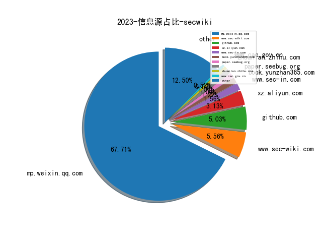
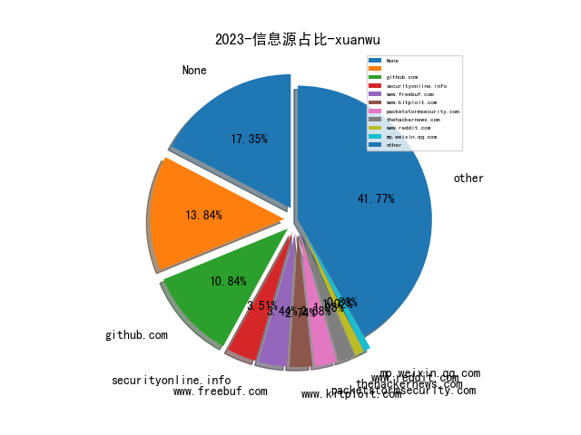
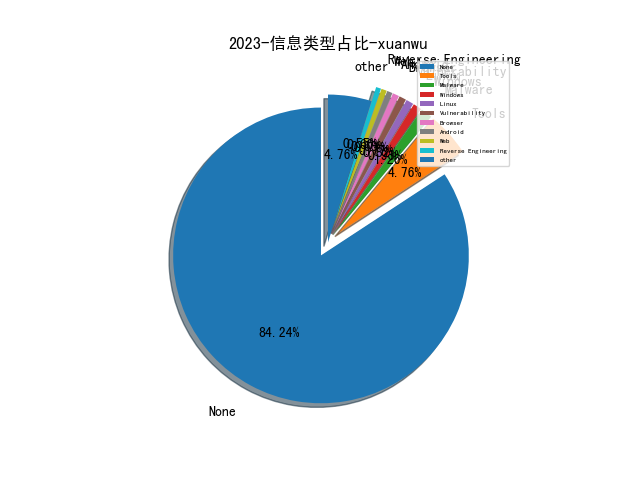
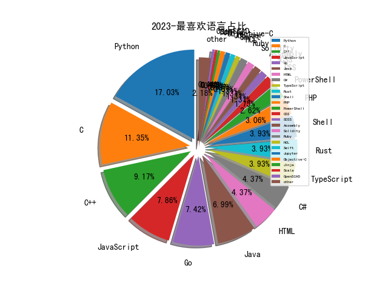

# [数据--所有](README_20.md)
# [数据--年度](README_2023.md)
# 2023 信息源与信息类型占比

# 微信公众号 推荐
| nickname_english | weixin_no | title | url| 
| --- | --- | --- | ---| 
| Java知音 | Java_friends | UUID的弊端以及雪花算法 | https://mp.weixin.qq.com/s/3L3DggJnShNRlF5kv6igiw | 1| 
| 海洋防务前沿 | maritime-defense | 美军太空战态势感知能力建设 | https://mp.weixin.qq.com/s/zqNOciFMCoFbNppYx0454g | 1| 
| 拨开云雾 | Under_Sakura | 百万级文件的Bug定位 | https://mp.weixin.qq.com/s/gUUuyJ84eU55UgcUdRcvmw | 1| 
| 阿里安全响应中心 | alisrc | RASP攻防中的矛与盾 | https://mp.weixin.qq.com/s/ObMxPKXUBNvhRtav0uJpWQ | 1| 
| 开源情报技术研究院 | gh_d1f65c3b3e5b | 2022年漏洞态势特点情况报告 | https://mp.weixin.qq.com/s/Up8f-Qb6niHa8MN0faT10g | 1| 
| 娜璋AI安全之家 | gh_91f1fe28fc6e | [系统安全] 四十三.Powershell恶意代码检测系列 (4)论文总结及抽象语法树（AST）提取 | https://mp.weixin.qq.com/s/puwgUeM0ftBzlvybUD9xkg | 1| 
| 国家互联网应急中心CNCERT | CNCERTCC | “地图导航类”App个人信息收集情况测试报告 | https://mp.weixin.qq.com/s/UerkjOkRkDWag5-FEM2OZA | 1| 
| 中国计算机学会 | ccfvoice | CCCF精选 , 密态对抗——网络空间高隐蔽威胁透视的发展方向 | https://mp.weixin.qq.com/s/5LnIoymYyySdaN-UynheJQ | 1| 
| M01N Team | m01nteam | ChatGPT在社工攻击和反钓鱼中的应用 | https://mp.weixin.qq.com/s/rCIS-J4jo1fBtcTuivj6PA | 1| 
| 榫卯江湖 | cnxct_coder | eCapture旁观者支持Golang tls/https加密明文捕获 | https://mp.weixin.qq.com/s/O7bxwa5wV1u785jOkJwh1Q | 1| 
| Bypass | Bypass-- | AD域安全攻防实践（附攻防矩阵图） | https://mp.weixin.qq.com/s/SvGz8mHOBlgEc9O2hBHCEQ | 1| 
| 老杨吃西瓜不吐葡萄皮 | HelloYangwg_20220222 | 从宏碁安全事件想到构建有韧性网络安全新范式 | https://mp.weixin.qq.com/s/5R4CWSFwFACxkAClwgxQRw | 1| 
| Tide安全团队 | TideSec | CTF中RSA常见攻击方法 | https://mp.weixin.qq.com/s/5UY-4SPHvPD8hS2Jy8jhgw | 1| 
| 虎符智库 | TT_Thinktank | 深度：美军“前出狩猎”网络作战行动与影响分析 | https://mp.weixin.qq.com/s/yb2VuHzagO3MTsO3Lv5LSA | 1| 
| 薛定谔的猿 | yeapes | Nginx流量镜像(Mirror) | https://mp.weixin.qq.com/s/xdIKU-w4_eMxV265Qp4vQA | 1| 
| 王小明的事 | Struggle_of_a_noob | Zabbix与Jumpserver后渗透小记 | https://mp.weixin.qq.com/s/OwSZWCshBKJW0b5du7Juhw | 1| 
| 微步在线研究响应中心 | gh_280024a09930 | PHP反混淆实战 , 手把手带你入门PHP-Parser | https://mp.weixin.qq.com/s/Qb2m6RAmr5Oy6TCvi9X-ow | 1| 
| 在酒吧喝牛奶的牛仔 | gh_266f5cc317ca | 镜像扫描Layer分析对比 | https://mp.weixin.qq.com/s/GjMdGmPG7AH2ilzcJh08fw | 1| 
| 小红书技术REDtech | gh_f510929429e3 | 小红书社区反作弊探索与实践 | https://mp.weixin.qq.com/s/05s4wkPkSnZ7vILNtgnu0w | 1| 
| dada安全研究所 | CyberBugs | 上古版本panabit审计 | https://mp.weixin.qq.com/s/wODk1OgYmab_EM9f0Fi7Lg | 1| 
| 安全小子大杂烩 | hl666sec | 记一次从linux打进域控 | https://mp.weixin.qq.com/s/9ZUKARK1q0U5nSqM2bSbAw | 1| 
| 顺丰安全应急响应中心 | SFSRC- | 容器行为异常自学习引擎 | https://mp.weixin.qq.com/s/LlTfNx1DbgS_dO7X9xVVAg | 1| 
| 世界科技研究与发展 | globesci | 【优先发布】美国国防高级研究计划局近5年国防科研经费预算活动的趋势与特点 | https://mp.weixin.qq.com/s/WMdWdIOBwQJNoOi9wMvnrw | 1| 
| Art Of Hunting | gh_d3ebfd9e0148 | [AOH 019]逆向分析微信本地数据库加密 | https://mp.weixin.qq.com/s/u0ZrxBYN-Shg2_e8mGIoaQ | 1| 
| 金融电子化 | fcmag1993 | 案例 , 中国农业银行企业级SaaS化脆弱性管理平台建设实践 | https://mp.weixin.qq.com/s/9WoNVqGmc-KMPlPHTn5kwg | 1| 
| 王建硕 | gardendewalle | ChatGPT 中，G、P、T 分别是什么意思？ | https://mp.weixin.qq.com/s/vXoYeA7w6l_WiKmDHogdTA | 1| 
| 深信服千里目安全技术中心 | gh_c644c6e98b08 | 【高级威胁追踪】伪造Cisco VPN证书更新程序的C3木马 | https://mp.weixin.qq.com/s/iKPm0T3aR3Shjiw_W6jTsw | 1| 
| 数据治理体系 | DGsystem | 一起学习《数字中国建设整体布局规划》 | https://mp.weixin.qq.com/s/zUmy99B8wx7p8MrXVoYD1g | 1| 
| 安天集团 | Antiylab | 活跃的hoze挖矿木马分析 | https://mp.weixin.qq.com/s/-mZD0pPbeIgxoTUNNFBnrw | 1| 
| 安全牛 | aqniu-wx | 网络靶场：划时代的新型网络安全基础设施 | https://mp.weixin.qq.com/s/EVrDJfoL2_I5_o4flRo3Kg | 1| 
| DarkNavy | DarkNavyCom | 「 深蓝洞察 」2022 年度最“不可赦”漏洞 | https://mp.weixin.qq.com/s/P_EYQxOEupqdU0BJMRqWsw | 1| 
| 青衣十三楼飞花堂 | scz------ | 加密SOCKS5信道中防DNS泄露 | https://mp.weixin.qq.com/s/SNu9SXFFT1xA6LH4r81YOw | 1| 
| 山石网科安全技术研究院 | HSN_LAB | ChatGPT在信息安全竞赛中出题与解题实践 | https://mp.weixin.qq.com/s/EIGuFDXojTazH3gDV8vkVg | 1| 
| 嘶吼专业版 | Pro4hou | 针对开发者的供应链攻击 | https://mp.weixin.qq.com/s/7lmd4jFM3UWIZRbXzf3TWA | 1| 
| T00ls安全 | T00lsSec | chatGPT生成webshell实践与探究 | https://mp.weixin.qq.com/s/CWWXLJyO_kv3C2L3djhbHg | 1| 
| NISL实验室 | NISL_THU2020 | 【论文分享】从用户视角评估俄乌冲突中乌克兰互联网稳定性 | https://mp.weixin.qq.com/s/gGpg1fKQTZqSHakyVrkTig | 3| 
| 网信中国 | cacweixin | 个人信息出境标准合同办法 | https://mp.weixin.qq.com/s/5T7pCReDif6tzCd56m3zKA | 1| 
| 一个人的安全笔记 | xjiek2015 | [HTB] NodeBlog Writeup | https://mp.weixin.qq.com/s/YHFuh42FvDWSx3j4kzwhqw | 3| 
| 轻金融 | Qjinrong | 工行发布《2022网络金融黑产研究报告》 | https://mp.weixin.qq.com/s/tQE0BtclxX6McZRoO5MKVg | 1| 
| 莫哥谈安全 | gh_247dfbdf3d43 | ChatGPT在MITREATT&CK落地中的应用 | https://mp.weixin.qq.com/s/hehFQbR6lqAABEDhrxtIBg | 1| 
| vivo千镜 | gh_54ff3f871510 | 浅谈应用分发平台标准动态 | https://mp.weixin.qq.com/s/8sN0OBkwveVDQu9aQMXDfg | 1| 
| 360数字安全 | gh_6db130c5163e | 《2022年度反诈报告》重磅发布！ | https://mp.weixin.qq.com/s/unvQR8lneWQVP3bHj3fOWA | 1| 
| 网络空间安全军民融合创新中心 | jmrh1226 | 2022年全球国防网络空间情况综述（网军建设篇-下） | https://mp.weixin.qq.com/s/wJttA6_73oMQsOGS2CIhlQ | 2| 
| CNCERT国家工程研究中心 | NELCERT | ChatGPT 对网络安全的影响 | https://mp.weixin.qq.com/s/oEddKCs1kXeyQBxUz5trEQ | 1| 
| APTHunter | gh_5e5d0798abea | 程序执行痕迹进行取证的多种方式 | https://mp.weixin.qq.com/s/TQBPJr-g2FUbwYtX6JzHPg | 1| 
| ABC123安全研究实验室 | abc123network | 第51篇：某运营商外网打点到内网横向渗透的全过程 | https://mp.weixin.qq.com/s/AVEydEVTWqcOMVcA7amBVA | 1| 
| 恒星EDU | cyberslab | MISC｜西湖论剑·2022中国杭州网络安全技能大赛初赛官方Write Up | https://mp.weixin.qq.com/s/t6z7VjlW09b9A3Fv2bt7dA | 1| 
| 计算机文艺复兴 | gh_111b1f3866f6 | ChatGPT研究框架（80页PPT）, 国君计算机 | https://mp.weixin.qq.com/s/YtJn2pfdS_on1nSATOylYw | 2| 
| 绿盟科技 | NSFOCUS-weixin | ChatGPT概念“狂飙”，你追了吗？ | https://mp.weixin.qq.com/s/sZstPhuQSHN85rP_3urOWw | 1| 
| 墨菲安全 | murphy_sec | 软件供应链安全 2022 年回顾 | https://mp.weixin.qq.com/s/RQDqv7GxCo2bQqnlfsXt8g | 1| 
| 404 Not F0und | AI4Security | 换种思路做入侵检测 | https://mp.weixin.qq.com/s/7AwMJQjH8_zWUT3bWkoEzQ | 1| 
| 赛博攻防悟道 | lookvul | 美国NSA安全运营关键原则 | https://mp.weixin.qq.com/s/uTjXfgYTP5ZHZpwPuFXNwA | 1| 
| 安全客 | anquanbobao | 【技术分享】开源软件供应链攻击回顾 | https://mp.weixin.qq.com/s/pAVrIQ0b66Y_YoSH3DLoIA | 1| 
| 4ra1n | sec-4ra1n | 分享Jar包分析工具：jar-analyzer | https://mp.weixin.qq.com/s/Rrx6x5M_28YRcQQCdxuEeQ | 1| 
| 有价值炮灰 | dust1337 | iptables 在 Android 抓包中的妙用 | https://mp.weixin.qq.com/s/P0ESUUXBmq2aQnrqDHsDaw | 1| 
| 太空安全 | SateSec | 九阶段太空攻击研究与战术分析框架和七层美国防太空架构 | https://mp.weixin.qq.com/s/TvEZKKzyRyb1_jVU1YeEMg | 3| 
| 信安文摘 | share-for-life | 【安全记录】- Nacos accessToken 权限认证绕过漏洞及思考 | https://mp.weixin.qq.com/s/vsdbYACk2ShI3tx0dnOxpA | 1| 
| 云影实验室 | gh_d86289b99724 | php://filter过滤器利用之代码执行漏洞 | https://mp.weixin.qq.com/s/BvHzbgWA1alO7N2fkEfMYQ | 1| 
| 平猫的音乐 | gh_f6e103434039 | 成体系：大论文的另一关键环节 | https://mp.weixin.qq.com/s/GK6VncT-WbHz0Euuf7drZA | 2| 
| 人机与认知实验室 | gh_9c3c1f805cb8 | DARPA的可解释人工智能程序 | https://mp.weixin.qq.com/s/F9Dtvrlu8AU15HhTVQQojQ | 1| 
| 看雪学苑 | ikanxue | 自动化提取恶意文档中的shellcode | https://mp.weixin.qq.com/s/xEHnaBmpH0zrhMKBvjxoGw | 1| 
| 源影安全实验室 | MetaShadow | CVE-2022-41080_41082 Microsoft Exchange Server OWASSRF远程代码执行漏洞分析 | https://mp.weixin.qq.com/s/Fl7oz6VXI8k5Qn0MOk61aw | 1| 
| 摄星 | Vulinsight | 从CISA KEV看海量漏洞管理方法 | https://mp.weixin.qq.com/s/X5J4gYanCGrGMJ9Yp6J8tQ | 1| 
| 丁司图 | gh_ea35ef49ac14 | 顶会论文写作建议（上）：宏观布局，避免“hard to follow” | https://mp.weixin.qq.com/s/kberQa8ss7l2gh9PAx_cSQ | 1| 
| 长个新的脑袋 | gh_12ca60dcf67f | JDK-Xalan的XSLT整数截断漏洞利用构造 | https://mp.weixin.qq.com/s/xxAtjFvk9RxWiY-pwGf8Ow | 1| 
| 银针安全 | SilverNeedleLab | 一个高度可定制化的JNDI和Java反序列化利用工具 | https://mp.weixin.qq.com/s/-OE1MlqaCUl7gmSPVNBr7g | 1| 
| 绿盟科技研究通讯 | nsfocus_research | 开源软件安全性分析 | https://mp.weixin.qq.com/s/dDHmQkWhSchnD7kTBtKymw | 2| 
| 奇安信威胁情报中心 | gh_166784eae33e | 疑似Kasablanka组织近期针对俄罗斯的攻击活动分析 | https://mp.weixin.qq.com/s/b0FSKQ6D3MvlA8yX3v4IUg | 1| 
| r3kapig | r3kapig-team | idek 2022* Forensics Writeup by r3kapig | https://mp.weixin.qq.com/s/sEk8lFgn8hP7RNapcqvb5Q | 3| 
| huasec | ihuahua04 | 利用空间测绘进行威胁分析 | https://mp.weixin.qq.com/s/b-rynWs2xX3ft48QFx8NBg | 1| 
| 阿里开发者 | ali_tech | 一文梳理Code Review方法论与实践总结 | https://mp.weixin.qq.com/s/_4MFrQSYOIGYRdDGOJPDKQ | 1| 
| 蛇矛实验室 | Cybersnaker | 安全开发之Pcshare流程分析 | https://mp.weixin.qq.com/s/R1Fgyj0pUCxFGq4-YFfMXw | 1| 
| CodeWisdom | gh_2395906a410f | 关于大模型时代软件智能化开发的一点展望 | https://mp.weixin.qq.com/s/UTcnFq53JjIMsShmKtQvDw | 1| 
| 迪哥讲事 | growing0101 | 赏金猎人系列-如何测试文件上传功能 | https://mp.weixin.qq.com/s?__biz=MzIzMTIzNTM0MA==&mid=2247487158&idx=1&sn=6373bf434deaaa6a9a055f9c0400b512&chksm=e8a604d5dfd18dc361addad111cb78a461baf4e6a3a954799b9c8ed8230fce6707f727f1f0ab&scene=21#wechat_redirect | 1| 
| 红队蓝军 | Xx_Security | 域内定位个人PC的三种方式 | https://mp.weixin.qq.com/s/uXTo2AbmvMeNesR8rAjImw | 2| 
| 华为安全 | HuaweiSecurity | 安全态势感知专家说第2期：人工智能技术在态势感知的应用 | https://mp.weixin.qq.com/s/AVlAoCPEJnNL_DuHGGD0Hg | 2| 
| 中国信息安全 | chinainfosec | 法治 , 网络爬虫犯罪的量刑问题及对策 | https://mp.weixin.qq.com/s/wLmhVB6Ch_hEjt3W90m_Og | 3| 
| 专注安管平台 | gh_48603b9bb05a | Forrester：2022年安全分析平台厂商评估 | https://mp.weixin.qq.com/s/p1U1M0UvzdaNccVqt7914g | 2| 
| FuzzWiki | gh_fcf21e658324 | 2022年CCF B级以上期刊fuzz论文汇总｜技术进展 | https://mp.weixin.qq.com/s/ex__TFMsWXtft83g677DTg | 1| 
| FOFA | gh_d79c8913fde8 | 最佳实践：如何固化IP画像流程 | https://mp.weixin.qq.com/s/nx0uomXnzBBJ6o66jWr2_g | 1| 
| DataCon大数据安全分析竞赛 | gh_a0316d342599 | 冠军Writeup大放送 , DataCon2022网络流量分析赛道之“见世面”战队 | https://mp.weixin.qq.com/s/uOB1kZ7YIJ27IlyXtaYPYA | 2| 
| 长亭技术沙盒 | chaitintech_release | RWCTF 5th ShellFind Write-up | https://mp.weixin.qq.com/s/Wb7SMy8AHtiv71kroHEHsQ | 1| 
| 认知独省 | cogniti0n | 攻防技术创新探究 | https://mp.weixin.qq.com/s/b2_I4udKrE6ERyWjT8f5hA | 1| 
| Netlab 三六零 | Netlab_360 | 警惕：魔改后的CIA攻击套件Hive进入黑灰产领域 | https://mp.weixin.qq.com/s/gXAbrnqgXZDS_eUvsYNmZA | 1| 
| Beacon Tower Lab | WebRAY_BTL | 玩转CodeQLpy之代码审计实战案例 | https://mp.weixin.qq.com/s/OJPhl17HS8EBC6GLEAPvDg | 2| 
| 安在 | AnZer_SH | 安在盘点 , 2022国内网络安全融资：我们不必妄自菲薄 | https://mp.weixin.qq.com/s/vnCdiOB1tsvkdgz5-5Z8ug | 1| 
| 网安罗盘 | SecurityCompass | 美国2023财年网络安全预算分析与思考 | https://mp.weixin.qq.com/s/4SKZHMLC24m0XNZIF6qkTg | 1| 
| Gcow安全团队 | Gcow666 | 赏金猎人:IChunQiu云境-Spoofing Writeup | https://mp.weixin.qq.com/s/wlnXFIoTbbi4V0p1TQPDrg | 1| 
| 电驭叛客 | langu_xyz | 面向实战的基础安全体系升级 | https://mp.weixin.qq.com/s/E1cDMfGRbF0hKlvnJ2PMFQ | 1| 
| 威胁棱镜 | THREAT_PRISM | 2022 年 GreyNoise 在野大规模漏洞利用报告 | https://mp.weixin.qq.com/s/lksZSS7RlkBiRUUfDvB0UA | 8| 
| 奇安信技术研究院 | jishuyanjiuyuan001 | 【天问】2022年PyPI恶意包年度回顾 | https://mp.weixin.qq.com/s/rQ2IkiDCc_NEjZUWXBE4YQ | 2| 
| 信息安全与通信保密杂志社 | cismag2013 | 美太空领域网络安全能力建设研究 | https://mp.weixin.qq.com/s/_8dBUet5BogjVEbpN6jfTg | 7| 
| 219攻防实验室 | gh_4576a36fa848 | 调教某数字杀软，权限维持so easy | https://mp.weixin.qq.com/s/IYGon3X4-cQwnwwb1WZWww | 1| 
| 安全内参 | anquanneican | 卡巴斯基深度报告：从俄乌战争重新评估网络战 | https://mp.weixin.qq.com/s/-qGn-mQBaptREToko3iC0Q | 2| 
| 卫星黑客 | Satellite_Hacker | 《2022太空安全报告》 | https://mp.weixin.qq.com/s/N8kTUz11C2aAsZyYk85r4g | 1| 
| 安全学术圈 | secquan | SLEUTH：基于COTS审计数据的实时攻击场景重构 | https://mp.weixin.qq.com/s/0zgoFUn1R3mS5m3UCOaYSg | 9| 

# 组织github账号 推荐
| github_id | title | url | org_url | org_profile | org_geo | org_repositories | org_people | org_projects | repo_lang | repo_star | repo_forks| 
| --- | --- | --- | --- | --- | --- | --- | --- | --- | --- | --- | ---| 

# 私人github账号 推荐
| github_id | title | url | p_url | p_profile | p_loc | p_company | p_repositories | p_projects | p_stars | p_followers | p_following | repo_lang | repo_star | repo_forks | 
| --- | --- | --- | --- | --- | --- | --- | --- | --- | --- | --- | --- | --- | --- | ---| 
| voidz0r | ImageMagick 任意文件读的POC。漏洞存在于PNG的generator中。 | https://github.com/voidz0r/CVE-2022-44268 | https://github.com/voidz0r?tab=followers | Security Engineer, Security Researcher and Developer. I love to break things and I get mad at the 3rd nested loop. | Anywhere | DHL Express | 29 | 0 | 4 | 0 | 0 | Python,PHP,JavaScript,Rust | 0 | 0 | 1| 
| tihmstar | homepod越狱工具 | https://github.com/tihmstar/homepwn#3d-print-version | https://github.com/tihmstar?tab=followers | My PGP Key fingerprint can be found in my Twitter bio: https://twitter.com/tihmstar | None | None | 85 | 0 | 15 | 0 | 0 | OpenSCAD,C,Objective-C,C++ | 0 | 0 | 1| 
| teambi0s | bi0sCTF 2022 Offical source code && env && sol | https://github.com/teambi0s/bi0sCTF/tree/main/2022 | None | None | None | None | 0 | 0 | 0 | 0 | 0 | C,Shell,Python,JavaScript,C++,HTML,CSS | 0 | 0 | 1| 
| slowmist | 区块链常见漏洞列表 | https://github.com/slowmist/Cryptocurrency-Security-Audit-Guide/blob/main/Blockchain-Common-Vulnerability-List_CN.md | None | None | None | None | 0 | 0 | 0 | 0 | 0 | Python,Go,HTML,Ruby | 0 | 0 | 1| 
| s0duku | VMware Workstation Heap OOB 漏洞POC。 | https://github.com/s0duku/cve-2022-31705 | https://github.com/s0duku?tab=followers | NJFU | None | None | 123 | 0 | 106 | 0 | 0 | Python,C,C++ | 0 | 0 | 1| 
| romainthomas | 一款基于LIEF和LLVM的对Objective-C语言二进制文件中类成员分析的工具。 | https://github.com/romainthomas/iCDump | https://github.com/lief-project | Security Engineer working on mobile, obfuscation and file formats. Author & maintainer of @lief-project / @open-obfuscator | None | @lief-project @open-obfuscator | 50 | 0 | 331 | 0 | 0 | Java,C++ | 0 | 0 | 1| 
| potmdehex | Hexacon 2022会议中《More Tales from the iOS/macOS Kernel Trenches》议题slide，其中提及了CVE-2022-22640、CVE-2022-32821漏洞的原理等详细信息及利用技术。 | https://github.com/potmdehex/slides/blob/main/Hexacon_2022_More_Tales_from_the_iOS_macOS_Kernel_Trenches.pdf | https://github.com/potmdehex?tab=followers | Reverse Engineer | None | None | 12 | 0 | 10 | 0 | 0 | C,Ruby | 0 | 0 | 1| 
| phplaber | Yawf: 开源的 Web 漏洞自动化检测工具 | https://github.com/phplaber/yawf | https://github.com/phplaber?tab=followers | Security researcher | Nanjing, China | None | 7 | 0 | 384 | 0 | 0 | Python,Go,PHP | 0 | 0 | 1| 
| objective-see | 解析BackgroundItems-v4.btm中的启动项信息,可用于MacOS的取证 | https://github.com/objective-see/DumpBTM/ | https://github.com/objective-see?tab=followers |  | Hawaii, USA | Objective-See Foundation | 28 | 0 | 0 | 0 | 0 | Objective-C | 0 | 0 | 1| 
| o2sh | 一个可以显示Git仓库详细信息的工具，可以离线使用。 | https://github.com/o2sh/onefetch | https://github.com/o2sh?tab=followers |  | None | None | 15 | 0 | 1 | 0 | 0 | Shell,Rust | 0 | 0 | 1| 
| nikn0laty | pdfkit命令执行漏洞CVE-2022-25765 Exp | https://github.com/nikn0laty/PDFkit-CMD-Injection-CVE-2022-25765 | https://github.com/nikn0laty?tab=followers |  | None | None | 1 | 0 | 0 | 0 | 0 | Python | 0 | 0 | 1| 
| nanabingies | Dell dbutil_2_3.sys 驱动提权漏洞的exp | https://github.com/nanabingies/CVE-2021-21551 | https://github.com/nanabingies?tab=followers | if you base your expectations on what you see, you blind yourself to the possibilities of what could be | Accra, Ghana | None | 21 | 0 | 21 | 0 | 0 | Assembly,C++ | 0 | 0 | 1| 
| mrphrazer | Obfuscation Detection 一个用于自动检查二进制文件中的混淆代码和状态机的脚本/工具/Binary Ninja插件 | https://github.com/mrphrazer/obfuscation_detection | https://github.com/mrphrazer?tab=followers |  | None | None | 24 | 0 | 5 | 0 | 0 | Python | 0 | 0 | 1| 
| moyix | 基于Ghidra和GPT-3的辅助逆向工具 | https://github.com/moyix/gpt-wpre | https://github.com/moyix?tab=followers | Assistant Professor in CSE at NYU Tandon School of Engineering, focusing on security, program analysis, and reverse engineering. | New York, NY | None | 74 | 0 | 30 | 0 | 0 | Python,C,C++ | 0 | 0 | 1| 
| momika233 | CVE-2022-3656:Google Chrome 和基于 Chromium 的浏览器由于对一些文件上传功能缺乏symlink的检查,从而导致通过滥用symlink可以盗取你本地的一些重要配置文件 | https://github.com/momika233/CVE-2022-3656 | https://github.com/momika233?tab=followers | momika233 | Korea | None | 60 | 0 | 8 | 0 | 0 | Python,HTML | 0 | 0 | 1| 
| michalbednarski | CVE-2022-20452 的漏洞利用代码。可通过 LazyValue 将已安装的恶意 APP 提权至系统 APP | https://github.com/michalbednarski/LeakValue | https://github.com/michalbednarski?tab=followers |  | None | None | 16 | 0 | 2 | 0 | 0 | Java | 0 | 0 | 1| 
| mazen160 | 一个用于检测secrets的正则表达式集合，可以在各种文件中匹配secrets。 | https://github.com/mazen160/secrets-patterns-db | https://github.com/mazen160?tab=followers | Cyber Security Engineer (Offensive Security) | None | None | 31 | 0 | 7 | 0 | 0 | Python,Shell | 0 | 0 | 1| 
| matthieu-hackwitharts | Win32平台下的一个关于入侵方面的知识库，既有注入PE格式之类的基础知识，也有一些EDR bypass这种攻击技巧 | https://github.com/matthieu-hackwitharts/Win32_Offensive_Cheatsheet | https://github.com/matthieu-hackwitharts?tab=followers |  | None | None | 9 | 0 | 7 | 0 | 0 | Python,C,PowerShell,C++ | 0 | 0 | 1| 
| kurogai | 100 Red Team Projects for Pentesters and Network Managers | https://github.com/kurogai/100-redteam-projects | https://github.com/kurogai?tab=followers | Web Developer and Penetration Tester (HackTheBox Competitive Player) | Luanda / Angola | None | 61 | 0 | 144 | 0 | 0 | Python,JavaScript,Java | 0 | 0 | 1| 
| kraken-ng | 模块化的、支持多语言的webshell | https://github.com/kraken-ng/Kraken | None | None | None | None | 0 | 0 | 0 | 0 | 0 | Python,C#,PHP | 0 | 0 | 1| 
| jafarlihi | modreveal 找出当前Linux机器的隐藏Linux内核模块的工具 | https://github.com/jafarlihi/modreveal | https://github.com/jafarlihi?tab=followers |  | Baku, Azerbaijan | None | 29 | 0 | 2 | 0 | 0 | Go,C,Java,C++ | 0 | 0 | 1| 
| iczc | RealWorld CTF 5th 区块链挑战- realwrap Writeup | https://github.com/iczc/rwctf-5th-realwrap | https://github.com/iczc?tab=followers | Blockchain Security | Earth, Solar System | None | 20 | 0 | 1600 | 0 | 0 | Python,Go,JavaScript,Solidity | 0 | 0 | 1| 
| horizon3ai | Fortinet FortiNAC CVE-2022-39952的POC，未授权解压缩可导致任意文件写入，通过crontab实现RCE | https://github.com/horizon3ai/CVE-2022-39952 | None | None | None | None | 0 | 0 | 0 | 0 | 0 | Python | 0 | 0 | 1| 
| googleprojectzero | Fuzzilli新增了一个用于将js代码转换成Fuzzili IR的工具。 | https://github.com/googleprojectzero/fuzzilli/commit/807625f0112df22bfe293aa4d36d67c31c4fb243 | None | None | None | None | 0 | 0 | 0 | 0 | 0 | C,C#,C++,Python,HTML,Swift,PowerShell | 0 | 0 | 1| 
| dicegang | DiceCTF 2023 Offical sourcecode && env && sol | https://github.com/dicegang/dicectf-2023-challenges | None | None | None | None | 0 | 0 | 0 | 0 | 0 | Python,C,HTML,JavaScript | 0 | 0 | 1| 
| daem0nc0re | 用于研究windows进程执行技术的工具包 | https://github.com/daem0nc0re/TangledWinExec/tree/main/ReflectiveDLLInjection | https://github.com/daem0nc0re?tab=followers |  | None | None | 10 | 0 | 0 | 0 | 0 | C#,Assembly | 0 | 0 | 1| 
| cisagov | 一个可能可以恢复ESXiArgs勒索病毒的脚本。 | https://github.com/cisagov/ESXiArgs-Recover | None | None | None | None | 0 | 0 | 0 | 0 | 0 | Shell,HTML,Python,Open,JavaScript,TypeScript,TSQL,HCL | 0 | 0 | 1| 
| blackorbird | 2022年APT组织分析年鉴 | https://github.com/blackorbird/APT_REPORT/blob/master/summary/2023/2022%20Yearbook%20of%20APT%20group%20Analysis.pdf | https://github.com/blackorbird?tab=followers | APT hunter threat analyst | https://twitter.com/blackorbird | https://twitter.com/blackorbird | 46 | 0 | 125 | 0 | 0 | Python,C | 0 | 0 | 2| 
| bit4woo | Fiora：漏洞PoC框架Nuclei的图形版 | https://github.com/bit4woo/Fiora | https://github.com/ossdao-org | Creating with coding,Learning by doing,Learning by sharing! @ossdao-org•AIRDROP-0x028f231db6db1ef2f6bdb7bbc2da41bac976cdcc | shenzhen | https://space.bilibili.com/527442393 | 108 | 0 | 912 | 0 | 0 | Python,Java | 0 | 0 | 1| 
| batteryshark | 利用 QEMU + GDB 帮助魔改，逆向和理解嵌入式系统内核 | https://github.com/batteryshark/writeups/wiki/Go-to-Shell---Reverse-Engineering-Kernel-Modifications-with-QEMU-gdb | https://github.com/batteryshark?tab=followers |  | None | None | 65 | 0 | 13 | 0 | 0 | C#,C,C++ | 0 | 0 | 1| 
| bAuh0lz | CVE-2023-0297:pyLoad中由于js2py的eval_js安全配置不当导致未授权RCE | https://github.com/bAuh0lz/CVE-2023-0297_Pre-auth_RCE_in_pyLoad | https://github.com/bAuh0lz?tab=followers |  | None | None | 8 | 0 | 5 | 0 | 0 | Python,PHP | 0 | 0 | 1| 
| ashemery | 香普兰学院的逆向和二进制漏洞利用课程相关的配套练习 | https://github.com/ashemery/exploitation-course/tree/master/labs | https://github.com/ashemery?tab=followers | [Between Teams of Red and Blue, Im with the Purple Team] | USA | https://www.cyber5w.com | 37 | 0 | 20 | 0 | 0 | Python,Shell,PowerShell | 0 | 0 | 1| 
| alt3kx | CVE-2023-24055:KeePass 配置文件具有写入权限的攻击者可以修改它并注入恶意触发器,可以泄露密码 | https://github.com/alt3kx/CVE-2023-24055_PoC | https://github.com/alt3kx?tab=followers | Red Teamer , PentTester , Bug Bounty , 0day guy! , Researcher , Lone Wolf...l opinions expressed are mine 🇪🇺 | France | None | 49 | 0 | 11 | 0 | 0 | C | 0 | 0 | 1| 
| akamai | 利用 Windows CryptoAPI 中的欺骗漏洞(CVE-2022-34689),Poc的攻击分为两种:一种利用 Chrome v48,另一种侧重于crypt32.dll中易受攻击的MD5 | https://github.com/akamai/akamai-security-research/tree/main/PoCs/CVE-2022-34689 | None | None | None | None | 0 | 0 | 0 | 0 | 0 | C,TypeScript,Java,Python,JavaScript,Go,Swift,PowerShell,Rust | 0 | 0 | 1| 
| Wh04m1001 | RazerEoP:Razer Synapse3 Macro模块中删除/移动任意文件的 PoC,可造成提权 | https://github.com/Wh04m1001/RazerEoP | https://github.com/Wh04m1001?tab=followers | OSCP,OSEP,CRTO,CRTP,CRTE,PACES | None | Infigo IS | 37 | 0 | 123 | 0 | 0 | Python,C,C++ | 0 | 0 | 1| 
| TheBlupper | idek 2022* CTF Hardest Demon Bloodbath by Riot题目的writeup | https://github.com/TheBlupper/ctf_writeups/tree/main/idek2022/Hardest%20Demon%20Bloodbath%20by%20Riot | https://github.com/TheBlupper?tab=followers | git: gud is not a git command. See git --help. | None | None | 6 | 0 | 5 | 0 | 0 | Python,JavaScript | 0 | 0 | 1| 
| SunWeb3Sec | Web3 安全-链上威胁分析教学 | https://github.com/SunWeb3Sec/DeFiHackLabs#web3-cybersecurity-academy | https://github.com/SunWeb3Sec?tab=followers | Lets make Web3 more secure! | None | None | 9 | 0 | 8 | 0 | 0 | Solidity | 0 | 0 | 1| 
| RF-CTI | 2022 SANS 网络威胁情报峰会资料 | https://github.com/RF-CTI/SANS-summit/blob/master/01-2022%20SANS%20Cyber%20Threat%20Intelligence%20Summit/01-2022%20SANS%20Cyber%20Threat%20Intelligence%20Summit.md | None | None | None | None | 0 | 0 | 0 | 0 | 0 | Python,SCSS,HTML | 0 | 0 | 1| 
| PaulNorman01 | Forensia:RedTeam后渗透阶段的痕迹清理工具 | https://github.com/PaulNorman01/Forensia | https://github.com/PaulNorman01?tab=followers | Cybersecurity researcher , Coder , Geek ! | None | None | 3 | 0 | 1 | 0 | 0 | C,C++ | 0 | 0 | 1| 
| LloydLabs | 使用NtQueueApcThreadEx向windows进程注入任意shellcode，可以用于bypass部分终端安全检测 | https://github.com/LloydLabs/ntqueueapcthreadex-ntdll-gadget-injection | https://github.com/LloydLabs?tab=followers | 🐶 | London | @CrowdStrike | 14 | 0 | 270 | 0 | 0 | Go,C | 0 | 0 | 1| 
| GuardianAudits | GMX合约的审计报告 | https://github.com/GuardianAudits/Audits/tree/main/GMX | https://github.com/GuardianAudits?tab=followers |  | None | None | 5 | 0 | 0 | 0 | 0 | JavaScript,Solidity | 0 | 0 | 1| 
| Fndroid | Windows 上的 clash_for_windows 在 0.20.12 在订阅一个恶意链接时存在远程命令执行漏洞。因为对订阅文件中 rule-providers 的 path 的不安全处理导致 cfw-setting.yaml 会被覆盖，cfw-setting.yaml 中 parsers 的 js代码将会被执行 | https://github.com/Fndroid/clash_for_windows_pkg/issues/3891 | https://github.com/Fndroid?tab=followers |  | China | None | 82 | 0 | 186 | 0 | 0 |  | 0 | 0 | 1| 
| DvorakDwarf | 该工具可以将任意文件以视频形式存储，将视频上传到视频网站进而使用其免费的云存储 | https://github.com/DvorakDwarf/Infinite-Storage-Glitch | https://github.com/DvorakDwarf?tab=followers | Contact over discord, preferably. Discord: HistidineDwarf#8927 | Nowhere | Middle of | 13 | 0 | 26 | 0 | 0 | Python,Shell,Rust | 0 | 0 | 1| 
| DallasFR | WalkerGate:通过查找ntdll的内存解析以进行系统调用 | https://github.com/DallasFR/WalkerGate | https://github.com/DallasFR?tab=followers |  | None | None | 14 | 0 | 2 | 0 | 0 | C | 0 | 0 | 1| 
| D1rkMtr | 劫持cscapi.dll以劫持explorer.exe来进行持久化驻留 | https://github.com/D1rkMtr/ExplorerPersist | https://github.com/D1rkMtr?tab=followers | Malware dev , C2 dev | None | None | 47 | 0 | 47 | 0 | 0 | C++ | 0 | 0 | 1| 
| Cyber-Buddy | 一个基于OWASP MASVS (Mobile Application Security Verification Standard) 的安卓应用安全检测工具。 | https://github.com/Cyber-Buddy/APKHunt | https://github.com/Cyber-Buddy?tab=followers |  | None | None | 1 | 0 | 1 | 0 | 0 | Go | 0 | 0 | 1| 
| ChromeDevTools | Chrome Devtools的RFC，将允许用户本地覆写http reponse的header。 | https://github.com/ChromeDevTools/rfcs/discussions/4 | None | None | None | None | 0 | 0 | 0 | 0 | 0 | TypeScript,JavaScript | 0 | 0 | 1| 
| CMEPW | 一个如何绕过Antivirus的知识思维导图。 | https://github.com/CMEPW/BypassAV | None | None | None | None | 0 | 0 | 0 | 0 | 0 | Python,Go,C,TypeScript | 0 | 0 | 1| 
| BKreisel | CVE-2022-23935 的 Python Exp 。漏洞源自于 ExifTool ，一款开源软件，用于读取、写入和操作图像、音频、视频和 PDF 元数据，该漏洞错误地处理了 file 参数的检查，导致命令注入。 | https://github.com/BKreisel/CVE-2022-23935 | https://github.com/BKreisel?tab=followers |  | Golden, Colorado | None | 23 | 0 | 33 | 0 | 0 | Python,C,Rust | 0 | 0 | 1| 
| 4ra1n | code-inspector: 基于字节码分析的Java代码审计工具 | https://github.com/4ra1n/code-inspector | https://github.com/4ra1n?tab=followers | 我是4ra1n，大家习惯叫我许少 | China | @chaitin | 9 | 0 | 15 | 0 | 0 | Go,Java | 0 | 0 | 1| 
| 0xf4n9x | GoAnywhere MFT反序列化漏洞（CVE-2023-0669）利用工具 | https://github.com/0xf4n9x/CVE-2023-0669 | https://github.com/0xf4n9x?tab=followers | #InfoSec , #PenTest , #RedTeam , #SecResearch , #Student | /dev/null | None | 58 | 0 | 3100 | 0 | 0 | Go,Python,Java | 0 | 0 | 1| 

# medium_xuanwu 推荐
| title | url| 
| --- | ---| 
| 一个合约的形式化认证工具。 | https://medium.com/nethermind-eth/introduction-to-horus-part-1-fbc16af3ba67| 
| 微软MSRC官网的XSS漏洞的发现过程。 | http://m3ez.medium.com/how-i-found-dom-based-xss-on-microsoft-msrc-and-how-they-fixed-it-8b71a6020c82| 
| 一种使用VNC进行钓鱼等技术，该技术主要是通过引导受害者登陆一个由noVNC搭建的通向VNC的Web站点并进行登陆。由于受害者登陆的站是真实的站，因此这种钓鱼方法可以自然地直接绕过MFA。 | https://medium.com/@psychsecurity/mfa-phishing-using-novnc-and-aws-ebc781b4d093| 
| 介绍了一系列工具用来bug bountry自动化。内容比较初级。 | https://sn0xsharma.medium.com/automation-using-python-in-bug-bountys-full-practical-explanation-e1e694c43f78| 
| 介绍了一些简单的2FA的bypass方法。不过这类方法估计很难在实际中奏效。 | http://medium.com/m/global-identity-2?redirectUrl=https%3A%2F%2Fthegrayarea.tech%2Fbug-hunting-101-multi-factor-authentication-otp-bypass-79f03b554df6| 
| 入门级堆利用教学系列，目前共发布7篇 | http://medium.com/m/global-identity-2?redirectUrl=https%3A%2F%2Finfosecwriteups.com%2Fthe-toddlers-introduction-to-heap-exploitation-unsafe-unlink-part-4-3-75e00e1b0c68| 
| Bushwhackers关于rwctf的题目-hardened redis的Writeup | https://medium.com/@emil.lerner/hacking-redis-for-fun-and-ctf-points-3450c351bec1| 

# medium_secwiki 推荐
| title | url| 
| --- | ---| 

# zhihu_xuanwu 推荐
| title | url| 
| --- | ---| 

# zhihu_secwiki 推荐
| title | url| 
| --- | ---| 
| ZKP in Hidden Order Group 未知阶群内的零知识证明 | https://zhuanlan.zhihu.com/p/603726514| 
| 如何写好一篇高质量的IEEE/ACM Transaction级别的计算机科学论... | https://www.zhihu.com/question/22790506/answer/990626321| 

# xz_xuanwu 推荐
| title | url| 
| --- | ---| 
| Mimikatz Bypass Credential Guard的记录 | https://xz.aliyun.com/t/12097| 
| 通过隐藏导入表的方式规避杀软 | https://xz.aliyun.com/t/12035| 

# xz_secwiki 推荐
| title | url| 
| --- | ---| 
| 浅谈在数据包被加密和签名保护时的渗透方式 | https://xz.aliyun.com/t/12295| 
| Java反序列化预备全知 | https://xz.aliyun.com/t/12155| 
| Tailscale在内网渗透中利用的研究 | https://xz.aliyun.com/t/12151| 
| C2服务器隐藏与Linux上线 | https://xz.aliyun.com/t/12094| 
| 各种架构ELF后门生成工具 | https://xz.aliyun.com/t/12054| 
| 全方位了解CORS跨域资源共享漏洞 | https://xz.aliyun.com/t/12001| 

# 日更新程序
`python update_daily.py`