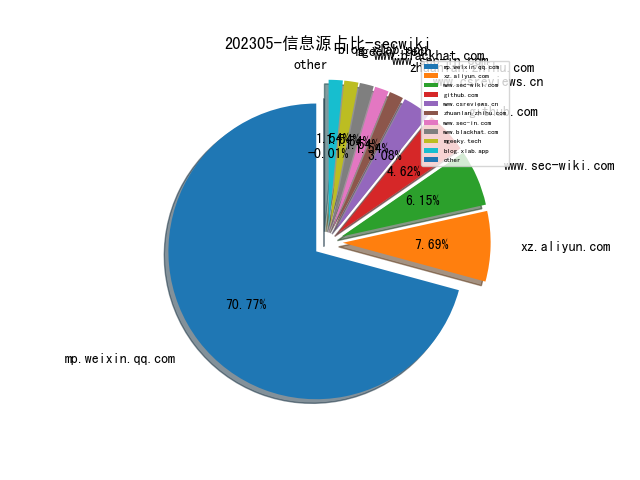
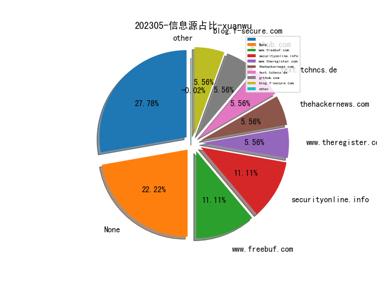
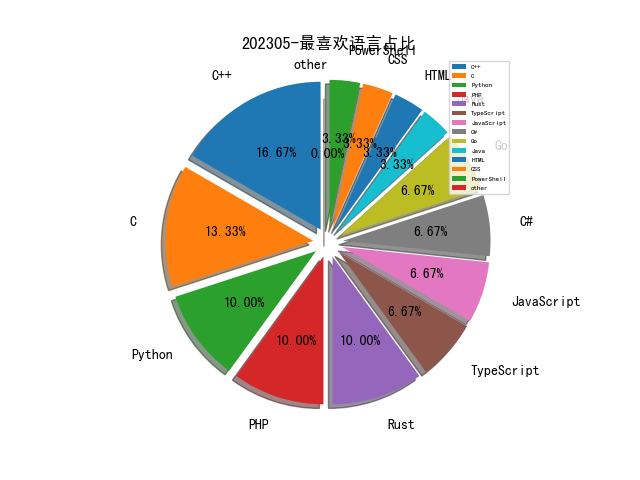

# [数据--所有](README_20.md)
# [数据--年度](README_2023.md)
# 202305 信息源与信息类型占比

# 微信公众号 推荐
| nickname_english | weixin_no | title | url| 
| --- | --- | --- | ---| 
| 404 Not F0und | AI4Security | 从GPT-4、网络安全到大模型不扩散 | https://mp.weixin.qq.com/s/sbyIeWCvCA5IH7hJpB9rig | 1| 
| 安全学术圈 | secquan | Java项目第三方库漏洞兼容修复 | https://mp.weixin.qq.com/s/VTC6kUVNItfwxq2RIQmc5g | 1| 

# 组织github账号 推荐
| github_id | title | url | org_url | org_profile | org_geo | org_repositories | org_people | org_projects | repo_lang | repo_star | repo_forks| 
| --- | --- | --- | --- | --- | --- | --- | --- | --- | --- | --- | ---| 

# 私人github账号 推荐
| github_id | title | url | p_url | p_profile | p_loc | p_company | p_repositories | p_projects | p_stars | p_followers | p_following | repo_lang | repo_star | repo_forks | 
| --- | --- | --- | --- | --- | --- | --- | --- | --- | --- | --- | --- | --- | --- | ---| 
| panda-re | panda: Platform for Architecture-Neutral Dynamic Analysis | https://github.com/panda-re/panda | None | None | None | None | 0 | 0 | 0 | 0 | 0 | C,Python,C++,HTML,Go,Rust | 0 | 0 | 1| 

# medium_xuanwu 推荐
| title | url| 
| --- | ---| 

# medium_secwiki 推荐
| title | url| 
| --- | ---| 

# zhihu_xuanwu 推荐
| title | url| 
| --- | ---| 

# zhihu_secwiki 推荐
| title | url| 
| --- | ---| 
| 一篇13页1.3万字的博士论文致谢 | https://zhuanlan.zhihu.com/p/625937937| 

# xz_xuanwu 推荐
| title | url| 
| --- | ---| 

# xz_secwiki 推荐
| title | url| 
| --- | ---| 
| Tomcat反序列化注入回显内存马 | https://xz.aliyun.com/t/12494| 
| 浅谈Docker逃逸 | https://xz.aliyun.com/t/12495| 

# 日更新程序
`python update_daily.py`