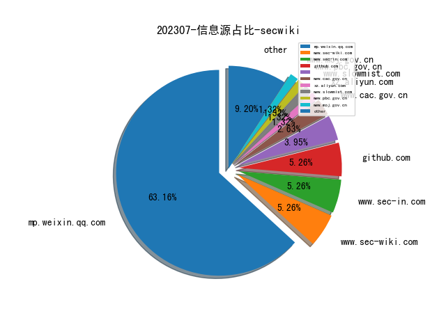
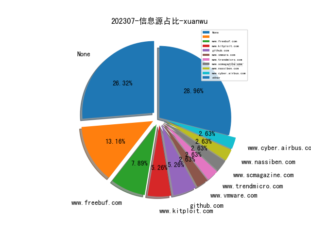

# [数据--所有](README_20.md)
# [数据--年度](README_2023.md)
# 202307 信息源与信息类型占比

# 微信公众号 推荐
| nickname_english | weixin_no | title | url| 
| --- | --- | --- | ---| 
| 潇湘信安 | xxxasec | [RedTeam] 轮换源IP - Cloud Proxy | https://mp.weixin.qq.com/s/HTH4YQVjyxngPn87wflJdg | 1| 
| 懒人在思考 | lazy-thought | Web3 安全入门（重点智能合约安全） | https://mp.weixin.qq.com/s/jlJhqlfzhn13ZqmPChyhFw | 1| 
| 安全学术圈 | secquan | 香港中文大学 , TChecker：用于检测PHP应用程序中的污点式漏洞的精确静态跨过程分析 | https://mp.weixin.qq.com/s/U4kdKVNwQxllQrxNh5y77Q | 1| 
| RapidDNS | gh_6327c9075859 | Afuzz 一款适用于自动化Bug Bounty的敏文文件或路径发现工具 | https://mp.weixin.qq.com/s/neBdaMtiqvwr-pPKYQvsfg | 1| 
| 金融电子化 | fcmag1993 | 观点 , 关于银行业软件供应链安全治理的思考与实践 | https://mp.weixin.qq.com/s/QaVZMIELUGz7OZuYKAayGA | 1| 
| 看雪学苑 | ikanxue | Qiling框架分析实战：从 QilingLab 详解到 Qiling 源码分析 | https://mp.weixin.qq.com/s/v9KRkhjnZ-f-PY9xjQjj5g | 1| 
| 希潭实验室 | abc123network | 第67篇：美国安全公司溯源分析Solarwinds供应链攻击事件全过程 | https://mp.weixin.qq.com/s/z0jREmXbIyHw_16rq8rNtw | 1| 

# 组织github账号 推荐
| github_id | title | url | org_url | org_profile | org_geo | org_repositories | org_people | org_projects | repo_lang | repo_star | repo_forks| 
| --- | --- | --- | --- | --- | --- | --- | --- | --- | --- | --- | ---| 

# 私人github账号 推荐
| github_id | title | url | p_url | p_profile | p_loc | p_company | p_repositories | p_projects | p_stars | p_followers | p_following | repo_lang | repo_star | repo_forks | 
| --- | --- | --- | --- | --- | --- | --- | --- | --- | --- | --- | --- | --- | --- | ---| 
| mengjian-github | 逆向分析Github Copilot | https://github.com/mengjian-github/copilot-analysis | https://github.com/mengjian-github?tab=followers | 微信公众号：frontend_cognitive | 深圳，中国 | 腾讯 | 23 | 0 | 25 | 0 | 0 | TypeScript,Shell,JavaScript,HTML | 0 | 0 | 1| 

# medium_xuanwu 推荐
| title | url| 
| --- | ---| 

# medium_secwiki 推荐
| title | url| 
| --- | ---| 

# zhihu_xuanwu 推荐
| title | url| 
| --- | ---| 

# zhihu_secwiki 推荐
| title | url| 
| --- | ---| 

# xz_xuanwu 推荐
| title | url| 
| --- | ---| 

# xz_secwiki 推荐
| title | url| 
| --- | ---| 

# 日更新程序
`python update_daily.py`