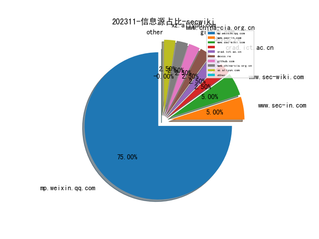
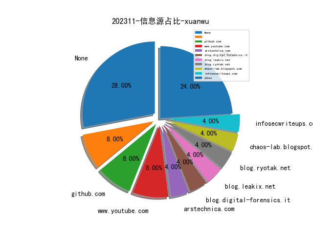

# [数据--所有](README_20.md)
# [数据--年度](README_2023.md)
# 202311 信息源与信息类型占比

# 网络安全书籍 推荐
| date_added | language | title | author | link | size| 
| --- | --- | --- | --- | --- | ---| 
| 2023-11-14 11:52:16 | English | Python Deep Learning, Third Edition | unknown | https://www.wowebook.org/python-deep-learning-third-edition/ | unknown| 
| 2023-11-13 18:28:50 | English | The Linux DevOps Handbook | unknown | https://www.wowebook.org/the-linux-devops-handbook/ | unknown| 
| 2023-11-10 12:21:43 | English | Kubernetes Fundamentals | unknown | https://www.wowebook.org/kubernetes-fundamentals/ | unknown| 
| 2023-11-09 15:55:09 | English | (Security Informatics and Law Enforcement) Cyber Malware : Offensive and Defensive Systems | Iman Almomani; Leandros A. Maglaras; Mohamed Amine Ferrag; Nick Ayres | http://libgen.rs/book/index.php?md5=EF13873566DFAF97195C6D48EF0077BF | 16 MB [EPUB]| 
| 2023-11-09 15:48:12 | English | Introduction to Computer Programming with Python | Harris Wang | http://libgen.rs/book/index.php?md5=8F2306D8690F4440447D39FFB66E31E1 | 4 MB [EPUB]| 
| 2023-11-08 11:53:41 | English | Cloud Penetration Testing for Red Teamers | unknown | https://www.wowebook.org/cloud-penetration-testing-for-red-teamers/ | unknown| 
| 2023-11-08 11:07:08 | English | Learning Geospatial Analysis with Python, Fourth Edition | unknown | https://www.wowebook.org/learning-geospatial-analysis-with-python-fourth-edition/ | unknown| 
| 2023-11-08 09:35:23 | English | Windows Forensics Analyst Field Guide | unknown | https://www.wowebook.org/windows-forensics-analyst-field-guide/ | unknown| 
| 2023-11-07 20:02:34 | English | Zero Trust Overview and Playbook Introduction | unknown | https://www.wowebook.org/zero-trust-overview-and-playbook-introduction/ | unknown| 
| 2023-11-05 04:35:56 | English | Functional Programming Projects with Python 3 (Video Course) | unknown | https://www.wowebook.org/functional-programming-projects-with-python-3-video-course/ | unknown| 
| 2023-11-04 11:40:25 | English | Interpretable Machine Learning with Python, Second Edition | unknown | https://www.wowebook.org/interpretable-machine-learning-with-python-second-edition/ | unknown| 
| 2023-11-04 15:43:37 | English | Big Beacon | Alan Partridge | http://libgen.rs/book/index.php?md5=24AD48BD378A10359DD18A560FB2FFAB | 21 MB [AZW3]| 
| 2023-11-03 17:00:33 | English | Linux Containers and Virtualization: Utilizing Rust for Linux Containers | Shashank Mohan Jain | http://libgen.rs/book/index.php?md5=929B078CD4B6DCCB744F359C0F53DCC5 | 3 MB [PDF]| 
| 2023-11-03 17:00:29 | English | Linux Containers and Virtualization: Utilizing Rust for Linux Containers | Shashank Mohan Jain | http://libgen.rs/book/index.php?md5=2CACAE35F62A286F85B636FCD2B849EC | 2 MB [EPUB]| 
| 2023-11-03 16:40:01 | English | A Pythonic Adventure: From Python basics to a working web app | Pavel Anni | http://libgen.rs/book/index.php?md5=EFD8081BD6E5D72940253F56E8F5D467 | 21 MB [PDF]| 
| 2023-11-01 06:06:38 | English | Kubernetes: From Basics to Guru (Video Course) | unknown | https://www.wowebook.org/kubernetes-from-basics-to-guru-video-course/ | unknown| 

# 微信公众号 推荐
| nickname_english | weixin_no | title | url| 
| --- | --- | --- | ---| 
| CCIA数据安全工作委员会 | CCIA-DSC | \"《个人信息保护法》实施两周年观察报告\"分享（可下载查阅） | https://mp.weixin.qq.com/s?__biz=MzkyNzI3MzAxOA==&mid=2247513029&idx=1&sn=032275d76de8efb3cf1bb2650a893615 | 3| 
| CNCERT国家工程研究中心 | NELCERT | 为何说XDR是对抗武器化人工智能的首道防线 | https://mp.weixin.qq.com/s?__biz=MzUzNDYxOTA1NA==&mid=2247541050&idx=1&sn=64bd7cd5ac4e1394978027cf8ee0f311 | 9| 
| DataCon大数据安全分析竞赛 | gh_a0316d342599 | DataCon2023 , 最新战队排名+软件安全赛道答疑会预告！ | https://mp.weixin.qq.com/s?__biz=MzU5Njg1NzMyNw==&mid=2247487583&idx=1&sn=af85c04566b1d45b1583fa2851e08ae1 | 5| 
| DeadEye安全团队 | gh_fcf5d3d1e57d | 透视网络攻防：《ATT&CK视角下的红蓝对抗实战指南》免费赠送你的下一本必读书！ | https://mp.weixin.qq.com/s?__biz=MzA4MjMzMjU3Mg==&mid=2247484338&idx=1&sn=1e798489d0469a0f4cdba02c828d0321 | 1| 
| Devil安全 | gh_b35dd18ddc14 | 【逃离计划】安全事件应急响应处置技术 | https://mp.weixin.qq.com/s?__biz=Mzg2MjkwMDY3OA==&mid=2247484374&idx=1&sn=02223c1f0f6635567fecf9fe6f16da78 | 2| 
| E安全 | EAQapp | 黑莓称：巴以冲突下，针对Windows 版本的擦除恶意软件发起猛烈攻击 | https://mp.weixin.qq.com/s?__biz=MzI4MjA1MzkyNA==&mid=2655339862&idx=1&sn=3a87b7351dc9ab368d3787de9b23f899 | 4| 
| FXDSecurity | gh_7f0786f69d56 | Apache UIMA Java SDK <3.5.0 反序列化漏洞 | https://mp.weixin.qq.com/s?__biz=Mzg5ODYyMDI1Mw==&mid=2247483808&idx=1&sn=98573185d550e5d41ccbf5c2532e9c62 | 1| 
| FreeBuf | freebuf | 高危险性后门入侵Python混淆包，已有数千名开发者中招 | https://mp.weixin.qq.com/s?__biz=MjM5NjA0NjgyMA==&mid=2651247966&idx=1&sn=769366ebd1d147e78c855368be955d58 | 32| 
| Gaobai文库 | HikC98799 | 高质量网络安全公众号 | https://mp.weixin.qq.com/s?__biz=MzkxNzIzNDExMA==&mid=2247486306&idx=1&sn=adc354f4be88be073a9b3fc5ac9f86ba | 1| 
| Gh0xE9 | po7mn1 | 【算命】就是你偷了我的苦茶子 | https://mp.weixin.qq.com/s?__biz=MzAwNTc5MTMyNg==&mid=2247499193&idx=1&sn=bc2e62b5c00ddd98a8c670895a5532bf | 2| 
| IMPERVA | None | 第18期：DRA是如何工作的？ | https://mp.weixin.qq.com/s?__biz=MzI1OTYyOTUyOA==&mid=2247487183&idx=1&sn=fdb60b8d102294efa3a5dd05fe47f30a | 3| 
| IoVSecurity | IoVSecurity | 汽车 SoC 安全 - 保护车载计算机以启用 SDV | https://mp.weixin.qq.com/s?__biz=MzU2MDk1Nzg2MQ==&mid=2247597205&idx=1&sn=349b82a88382853a5206fb0efa47d066 | 21| 
| NCVT CSTA | NCVT_WLAQJSXH | 安全产品那些事儿-H3C F1060防火墙透明模式典型组网配置案例1 | https://mp.weixin.qq.com/s?__biz=Mzg4NjUzODYyNw==&mid=2247484882&idx=1&sn=f0be6479da17a6e68a54697d5011c32f | 1| 
| SecHub网络安全社区 | secevery0x01 | 红队打靶 , vulnhub系列：DC-5 | https://mp.weixin.qq.com/s?__biz=MzI5NTUzNzY3Ng==&mid=2247487344&idx=1&sn=60aa591b01b4d3165be71bd09e636ba4 | 2| 
| TtTeam | gh_a0a1db78ea68 | Fuzz 403 Bypass | https://mp.weixin.qq.com/s?__biz=Mzg2NTk4MTE1MQ==&mid=2247484197&idx=1&sn=9bd57dd9e04ec07450a09474df865380 | 1| 
| VisActor | visactor-521 | 如何实现数据大屏-基于VChart | https://mp.weixin.qq.com/s?__biz=MzA4NDk5NTYwNw==&mid=2651430331&idx=1&sn=364556ca2803d5b43b57b7c594e01e3c | 2| 
| WK安全 | kai_wen_8 | 【工具分享】爱站权重批量查询脚本 | https://mp.weixin.qq.com/s?__biz=Mzg2ODg3NzExNw==&mid=2247487024&idx=1&sn=28c17c61fc6c4f7cd8cfda7df9e04c77 | 2| 
| XDsecurity | gh_a6965ae2a4f5 | 网络安全行业国际认证信息（不完全） | https://mp.weixin.qq.com/s?__biz=Mzg2NTcyNjU4Nw==&mid=2247484913&idx=1&sn=1a3abf1cbe35310e2d62544bb9bd4e3b | 1| 
| YY的黑板报 | gh_a91bd497db44 | 我所理解的研发安全 | https://mp.weixin.qq.com/s?__biz=Mzg5NzY5NjM5Mg==&mid=2247484600&idx=1&sn=e8ce7c36abac3aa0fded83beacb495b1 | 1| 
| YongYe 安全实验室 | YongYe_Security | 近源渗透__WIFI密码枚举 | https://mp.weixin.qq.com/s?__biz=Mzg4MDk4MjM0Mw==&mid=2247484169&idx=1&sn=c6db24ce91b73d45ab7c72ab146b9233 | 2| 
| Z2O安全攻防 | Z2O_SEC | u200b推荐几个高质量安全公众号 | https://mp.weixin.qq.com/s?__biz=Mzg2ODYxMzY3OQ==&mid=2247505132&idx=1&sn=785ade1b531856939de1c06a3ab19f74 | 4| 
| backdoor | ip-addr | 某地级市HW从SQL注入艰难拿下域控 | https://mp.weixin.qq.com/s?__biz=MzI5MzkwMzU1Nw==&mid=2247485096&idx=1&sn=0524eb12c44c6bc9431595558b6145cb | 1| 
| dotNet安全矩阵 | doNetSafety | .NET 分享一款内网横向移动的神器 | https://mp.weixin.qq.com/s?__biz=MzUyOTc3NTQ5MA==&mid=2247489379&idx=1&sn=df3de653c3632022f916a1c8c6712236 | 8| 
| e安在线 | ean-online | 黑莓称：巴以冲突下，针对Windows 版本的擦除恶意软件发起猛烈攻击 | https://mp.weixin.qq.com/s?__biz=MzI1OTA1MzQzNA==&mid=2651244801&idx=1&sn=c8b6ecc4cddca246522dd46985ad39ee | 5| 
| null安全团队 | NoneSec | 【代码审计】对某BC老盘子的代码审计 | https://mp.weixin.qq.com/s?__biz=MzIxOTk2Mjg1NA==&mid=2247487037&idx=1&sn=41468deda14032f78d22bdad990789eb | 2| 
| thelostworld | gh_3f2e5b9f028c | [漏洞复现-56]蓝凌-EIS-合集漏洞 | https://mp.weixin.qq.com/s?__biz=MzIyNjk0ODYxMA==&mid=2247487263&idx=1&sn=66e8cb1decf5aec3c7169bc2aac31ee2 | 8| 
| vExpert | vArchitect | 配置esxi 7.0 dump collector | https://mp.weixin.qq.com/s?__biz=MzUyOTkzMjk1Ng==&mid=2247485533&idx=1&sn=bd560ae2c1de37ced298c9a8198d4e67 | 1| 
| 不懂安全的校长 | None | 漏洞分析与复现｜Apache ActiveMQ RCE (CNVD-2023-69477) | https://mp.weixin.qq.com/s?__biz=MzkyMzI3OTY4Mg==&mid=2247486439&idx=1&sn=b50491cb8c4ae739d86c341999211007 | 2| 
| 中国网络安全产业公共服务平台 | caict-cpsci | 电信基础网络设施内生安全技术沙龙在京成功举办 | https://mp.weixin.qq.com/s?__biz=Mzg5MzQ5NjQyNw==&mid=2247485925&idx=1&sn=45f227420fedfa237b79c16799ada975 | 1| 
| 中国计算机学会 | ccfvoice | 第四次CCF PTA&中国科教工作者协会联合认证线下考试部分已结束 , T2考试即将开启 | https://mp.weixin.qq.com/s?__biz=MjM5MTY5ODE4OQ==&mid=2651563676&idx=1&sn=60cbafc8aa1eb3cebd6c38a2de14616c | 11| 
| 中学生CTF | zxsctf | C语言高阶知识之static的作用 | https://mp.weixin.qq.com/s?__biz=MzU3MzEwMTQ3NQ==&mid=2247507091&idx=1&sn=c555ed33159750c8f67a92a582533ea7 | 1| 
| 中睿天下 | zorelworld | 中睿天下加入中关村华安关键信息基础设施安全保护联盟 | https://mp.weixin.qq.com/s?__biz=MzAwNjc0MDA1NA==&mid=2650139408&idx=1&sn=cfa1892dcc0446403839ae62eb763a80 | 1| 
| 信安404 | infosec404 | 【渗透工具】D-Eyes一款绿盟科技检测与响应工具 | https://mp.weixin.qq.com/s?__biz=Mzk0NjQ5MTM1MA==&mid=2247485377&idx=1&sn=5b904f016049ca466bac00f17edcae8c | 4| 
| 信息安全动态 | SecurityDynamics | 事件响应计划（IRP）在加强企业网络安全中的关键作用 | https://mp.weixin.qq.com/s?__biz=Mzg4NDc0Njk1MQ==&mid=2247486139&idx=1&sn=602e25dc5f50740cab2c60fba2ab0f1f | 2| 
| 信息安全研究 | ISR2016 | 【业界动态】世界互联网大会发布发展负责任的生成式人工智能研究报告及共识文件 | https://mp.weixin.qq.com/s?__biz=MzA3NzgzNDM0OQ==&mid=2664981684&idx=1&sn=fd8c996d737d70b0c2bb6e297bc77386 | 16| 
| 信息新安全 | XXxinanquan | 国家密码管理局发布行政许可事项清单 | https://mp.weixin.qq.com/s?__biz=MjM5NDA3ODY4Ng==&mid=2247488670&idx=1&sn=ad30206544e9abfeb79651fe2d6b2bd1 | 3| 
| 全球技术地图 | drc_iite | 产业集群创新网络研究热点、演化与展望 | https://mp.weixin.qq.com/s?__biz=MzI1OTExNDY1NQ==&mid=2651608245&idx=1&sn=098179b3e693c3ee42ba7f1f1d950d48 | 12| 
| 全知科技 | QUANZHI-TECH | 以“API安全”为核，构建政企数据接口安全体系 | https://mp.weixin.qq.com/s?__biz=MzU0NDMxODY2Nw==&mid=2247521165&idx=1&sn=1b437c264b3ef230b70e5663f57004e5 | 3| 
| 兰花豆说网络安全 | gh_0e9b2a5e2976 | 资产识别：业务需求与技术实现的契合点 | https://mp.weixin.qq.com/s?__biz=MzI3NzM5NDA0NA==&mid=2247485036&idx=1&sn=6050745196f8389135065b6c412b5edc | 2| 
| 关键基础设施安全应急响应中心 | CII-SRC | 公安部就《电信网络诈骗及其关联违法犯罪联合惩戒办法（征求意见稿）》公开征求意见 | https://mp.weixin.qq.com/s?__biz=MzkyMzAwMDEyNg==&mid=2247540659&idx=1&sn=2a186039f2943777576541cf9718b242 | 10| 
| 凯撒安全实验室 | SecueKaiser | 某大型CRM前台任意文件上传（最新zero day） | https://mp.weixin.qq.com/s?__biz=Mzg2OTg5NjE5MQ==&mid=2247485118&idx=1&sn=07085b0b38a209e7f8786251c79322bb | 1| 
| 创信华通 | cdcxht | 创信看数安丨政策解读：工业和信息化领域数据安全风险评估实施细则（试行） | https://mp.weixin.qq.com/s?__biz=MzUxNTQxMzUxMw==&mid=2247519111&idx=1&sn=defb4e55da374e40ed5daeeb6df41ec2 | 3| 
| 利刃信安攻防实验室 | LRXAGFSYS | 【QQ群】新群禁止键政侠，禁止涉政言论，禁止赌毒 | https://mp.weixin.qq.com/s?__biz=MzU1Mjk3MDY1OA==&mid=2247507943&idx=1&sn=3c0359a0e03ae07d59d075d69f345462 | 4| 
| 取证者联盟 | F_I_United | windows内存取证-简单 | https://mp.weixin.qq.com/s?__biz=Mzg4MzEwMDAyNw==&mid=2247485028&idx=1&sn=6740b1d4e69724fe0f0afa62dcef6f80 | 1| 
| 可汗安全团队 | KhanCJSH | Fuzz 403 Bypass | https://mp.weixin.qq.com/s?__biz=MzAwMjQ2NTQ4Mg==&mid=2247491958&idx=1&sn=5c73c3fd99c3ae3c8bc473c96813de7f | 3| 
| 哈拉少安全小队 | gh_b273ce95df95 | 域环境中管理员密码还原：CPAU和lsrunase的破解分析 | https://mp.weixin.qq.com/s?__biz=MzAxNzkyOTgxMw==&mid=2247491666&idx=1&sn=c1e83dcee0bd95f64961d933ec5cf21b | 5| 
| 哔哩哔哩技术 | bilibili-TC | 语聊房架构演进实践 | https://mp.weixin.qq.com/s?__biz=Mzg3Njc0NTgwMg==&mid=2247497385&idx=1&sn=4732d7b5d077fe1afe2660d330e43ba6 | 2| 
| 嗨嗨安全 | gh_dc18c8a0e913 | 福利,CS渗透工具包！ | https://mp.weixin.qq.com/s?__biz=MzIzMjg0MjM5OQ==&mid=2247486343&idx=1&sn=f7487899646f30463a81461d7faae816 | 2| 
| 国家互联网应急中心CNCERT | CNCERTCC | 网络安全信息与动态周报2023年第46期（11月6日-11月12日） | https://mp.weixin.qq.com/s?__biz=MzIwNDk0MDgxMw==&mid=2247498815&idx=1&sn=71fb868e7c237de134bd7a4488e4fec1 | 4| 
| 国家网络威胁情报共享开放平台 | CNTIC2017 | 探索BLOODALCHEMY后门 | https://mp.weixin.qq.com/s?__biz=MzU5MjEwNjQzNg==&mid=2247512945&idx=1&sn=69e8028d1a33c3471f4f9705e0c57665 | 1| 
| 国舜股份 | guoshun-gs | 《会计师事务所数据安全管理暂行办法》面向社会征求意见 | https://mp.weixin.qq.com/s?__biz=MzA3NjU5MTIxMg==&mid=2650573042&idx=1&sn=9cd9559320fc8619cd8aaac8cf121163 | 2| 
| 国际云安全联盟CSA | gh_674820794ae8 | CSA研讨会,解密数字防御，洞察威胁情报技术趋势 | https://mp.weixin.qq.com/s?__biz=MzkwMTM5MDUxMA==&mid=2247493901&idx=1&sn=576a5ac6322caa1d7381833296708e4b | 2| 
| 大数据安全工程研究中心 | DSJAQGCYJZX | 贵州大数据安全工程研究中心主任杜跃进博士接受央视AMSP网站专访 | https://mp.weixin.qq.com/s?__biz=MjM5Nzg0NzUxOQ==&mid=2247486808&idx=1&sn=3970731f269515425f09d7715e874634 | 1| 
| 大数据技术标准推进委员会 | gh_06f5ec229a80 | 首批！联汇科技iBase向量数据库完成中国信通院向量数据库产品测试 | https://mp.weixin.qq.com/s?__biz=MzU0NzczNjAwMw==&mid=2247506328&idx=1&sn=8f10f3d1f73520c78e21dffc52737425 | 8| 
| 天唯信息安全 | TWtech2113189 | 波音公司拒绝支付赎金，LockBit直接公布43GB文件 | https://mp.weixin.qq.com/s?__biz=MzkzMjE5MTY5NQ==&mid=2247491914&idx=1&sn=33e4d293de8526166c87a79905a1745d | 9| 
| 天才少女Alpha | gh_8b6b00bbd557 | 审计工具之各种插件 | https://mp.weixin.qq.com/s?__biz=MzkxMDQ3MTYxMA==&mid=2247483980&idx=1&sn=694ed14847d857911074945617397650 | 4| 
| 天融信 | TopsecPioneer | “医”路同行！天融信EDR助力赤峰学院附属医院智慧医疗建设 | https://mp.weixin.qq.com/s?__biz=MzA3OTMxNTcxNA==&mid=2650886438&idx=1&sn=c29245b520dfeb26c87b8539975f8205 | 7| 
| 太空安全 | SateSec | 美太空军“先进极高频卫星”AEHF军事通信卫星星座简介 | https://mp.weixin.qq.com/s?__biz=MzkwNjM4NTg4OQ==&mid=2247494917&idx=1&sn=e5ad6be2773f26ee423dc3590e332803 | 6| 
| 奇安信集团 | qianxin-keji | 奇安信牵头项目荣获北京市科学技术奖 | https://mp.weixin.qq.com/s?__biz=MzU0NDk0NTAwMw==&mid=2247601793&idx=1&sn=eb325f29c15068d8941339844bd8c04c | 15| 
| 威零安全实验室 | WLAQTD | DC系列——DC1靶机渗透测试 | https://mp.weixin.qq.com/s?__biz=Mzg4Mzg4OTIyMA==&mid=2247485311&idx=1&sn=aa487785d8ef1634b9443cc5513dc50a | 1| 
| 安世加 | asjeiss | 安全聘 , 蚂蚁数据安全内推岗位 | https://mp.weixin.qq.com/s?__biz=MzU2MTQwMzMxNA==&mid=2247535800&idx=1&sn=a9f077606e0c4b04cb7b320f9a2873ed | 5| 
| 安信安全 | gsaxns | 数据屏蔽如何帮助确保数据安全性 | https://mp.weixin.qq.com/s?__biz=MzAxNTYwOTU1Mw==&mid=2650085284&idx=1&sn=ab6ababd8eceedfc73954c1d68f92f20 | 7| 
| 安全419 | anquan-419 | 供应商整合趋势之争 安全厂商包容策略推动甲乙双赢 | https://mp.weixin.qq.com/s?__biz=MzUyMDQ4OTkyMg==&mid=2247534685&idx=1&sn=417d3fe0e8a26d5f288c6753b59b6e9a | 3| 
| 安全内参 | anquanneican | 国际物流巨头遭网络攻击，数千集装箱滞留码头 | https://mp.weixin.qq.com/s?__biz=MzI4NDY2MDMwMw==&mid=2247510268&idx=1&sn=b147a673673474d2ef5176f8ce6bebd8 | 10| 
| 安全喵喵站 | CyberSecurityMew | 七张图读懂网络安全行业 | https://mp.weixin.qq.com/s?__biz=MzkzNjE5NjQ4Mw==&mid=2247535353&idx=1&sn=398e3b0bf6d9643dcbbd6be347d92c89 | 3| 
| 安全圈 | ChinaAnQuan | 【安全圈】涉案资金100余万元！警方抓获“网络美女”团伙 | https://mp.weixin.qq.com/s?__biz=MzIzMzE4NDU1OQ==&mid=2652048459&idx=1&sn=787e06e63559802797abfe88d6096f82 | 20| 
| 安全牛 | aqniu-wx | 5种更隐蔽、更危险的新型恶意软件 | https://mp.weixin.qq.com/s?__biz=MjM5Njc3NjM4MA==&mid=2651126428&idx=1&sn=7fd521ffa0ec05c0d4512d44d4ffed0d | 11| 
| 安全牛课堂 | aqniu_edu | 谷安双十一返场,考证狂欢继续，错过优惠的赶紧来！ | https://mp.weixin.qq.com/s?__biz=MzIxNTM4NDY2MQ==&mid=2247508303&idx=1&sn=341ccd459c749ebb3b73f936d53b75e6 | 4| 
| 安在 | AnZer_SH | 安全专家进董事会：企业走向成功的标配？ | https://mp.weixin.qq.com/s?__biz=MzU5ODgzNTExOQ==&mid=2247606183&idx=1&sn=47e4c8a457166fceedd1cb397eb69bed | 20| 
| 安天集团 | Antiylab | 网络安全建模辅助工具试运行絮语 | https://mp.weixin.qq.com/s?__biz=MjM5MTA3Nzk4MQ==&mid=2650202475&idx=1&sn=615c46bb78cefccf131578c2cbd05d47 | 3| 
| 实战安全研究 | gh_f390fc63c711 | 010-实战Java篇-颇为简单的一次审计getshell | https://mp.weixin.qq.com/s?__biz=MzU0MTc2NTExNg==&mid=2247488761&idx=1&sn=6b0624a7b05ff211bca7a197378a693b | 1| 
| 宸极实验室 | ChenJiLab | 『代码审计』ysoserial CB1 反序列化分析 | https://mp.weixin.qq.com/s?__biz=Mzg4NTA0MzgxNQ==&mid=2247488610&idx=1&sn=c378e6d1960c5028fb93bee399e1fbf3 | 2| 
| 小C学安全 | V_MOG11 | 【渗透工具】利用 EHole 进行红队快速批量打点 | https://mp.weixin.qq.com/s?__biz=MzU5NTEwMTMxMw==&mid=2247484182&idx=1&sn=285a2c387f3680a3b68e788bebde4e71 | 3| 
| 小毅安全阵地 | anquanzhendi | 北京昌平区网络安全事件典型案例及警示 | https://mp.weixin.qq.com/s?__biz=Mzg4MDE0MzQzMw==&mid=2247486593&idx=1&sn=cb06ee2fe887a2efdb1673623d70f861 | 1| 
| 小白安全工具 | gh_981785667bb3 | [数据库利用工具]oracleShell | https://mp.weixin.qq.com/s?__biz=MzkyMTQwNjA4NA==&mid=2247484570&idx=1&sn=992a563f2aab90ecb683b58f4d99c29a | 2| 
| 山石网科安全技术研究院 | HSN_LAB | 银狐黑产团队钓鱼攻击过程及样本详细分析 | https://mp.weixin.qq.com/s?__biz=MzUzMDUxNTE1Mw==&mid=2247502917&idx=1&sn=c70dc279f88cbb8a1f93935b98a5d578 | 3| 
| 弥天安全实验室 | gh_41292c8e5379 | 【成功复现】WordPress plugin SupportCandy SQL注入漏洞(CVE-2023-1730) | https://mp.weixin.qq.com/s?__biz=MzU2NDgzOTQzNw==&mid=2247499981&idx=1&sn=28e6db23cc8430c9d8aaa1bf92d6c28f | 3| 
| 微步在线 | Threatbook | EDR安心上云，微步OneSEC云服务获等保三级及信创云兼容性双认证 | https://mp.weixin.qq.com/s?__biz=MzI5NjA0NjI5MQ==&mid=2650179398&idx=1&sn=dc23d10b96b33b4e21a18f10d1b2af36 | 2| 
| 微步在线研究响应中心 | gh_280024a09930 | Confluence RCE 已引发一连串勒索，速修 | https://mp.weixin.qq.com/s?__biz=Mzg5MTc3ODY4Mw==&mid=2247503806&idx=1&sn=57ffae6c0616cd4baf1a563247bbbf08 | 2| 
| 我的安全梦 | ms016team | SHC-Update工具做渗透测试场景 | https://mp.weixin.qq.com/s?__biz=MzU3NDY1NTYyOQ==&mid=2247485812&idx=1&sn=fe8d3bc4322561aad4b67d21996c0376 | 3| 
| 指尖安全 | secfree_com | 黑客组织Lockbit称，中国工商银行的美国独资子公司当地时间上星期遭勒索软件攻击后，已支付了赎金 | https://mp.weixin.qq.com/s?__biz=MzkwMDU5NTE0OQ==&mid=2247488395&idx=1&sn=db7a9d7e910ae096ca240d990b1ce015 | 4| 
| 掌控安全EDU | ZKAQEDU | 任意注册漏洞 | https://mp.weixin.qq.com/s?__biz=MzUyODkwNDIyMg==&mid=2247533040&idx=1&sn=9d66dbbb59a4feff07848efb5189cf81 | 8| 
| 揽月安全团队 | gh_33eaab6ca696 | JeeSpringCloud uploadFile.jsp存在任意文件上传 | https://mp.weixin.qq.com/s?__biz=Mzg2OTk3ODYzOA==&mid=2247484707&idx=1&sn=7bb55bc986bd004a6f3d413e3ff814bb | 2| 
| 效率源 | xiaolvyuantech | RAID-5磁盘阵列如何快速重组提取恢复数据？ | https://mp.weixin.qq.com/s?__biz=MjM5ODQ3NjAwNQ==&mid=2650543652&idx=1&sn=6b88b45b8087c1a42a997d9e3434d583 | 3| 
| 教育网络信息安全 | None | 转载丨习近平-让互联网更好造福世界各国人民 | https://mp.weixin.qq.com/s?__biz=MzI0ODI4Njk0Ng==&mid=2247491555&idx=1&sn=b3d6526d3e0a18c5ce4b31a84beef827 | 2| 
| 数世咨询 | dwconcn | 数世咨询 , 全球数据泄露态势（2023.11） | https://mp.weixin.qq.com/s?__biz=MzkxNzA3MTgyNg==&mid=2247505001&idx=1&sn=356f70a0b529d54f71c424a973194c2d | 5| 
| 数据安全与数据要素化研究 | gh_287b260a46c9 | 数据要素政策动态观察第十四期(2023.10.30-2023.11.5) | https://mp.weixin.qq.com/s?__biz=MzIwNzQyMTEyMQ==&mid=2247488174&idx=1&sn=76068aaf228fd789779211da8ed5b873 | 1| 
| 数据安全共同体计划 | gh_385b203e9e03 | 《个人信息保护法》实施两周年观察报告分享 | https://mp.weixin.qq.com/s?__biz=Mzg5MDcxODc5NA==&mid=2247489593&idx=1&sn=50ff0205892c027e0eba0af554280562 | 1| 
| 数据安全推进计划 | gh_5e558917e916 | 大会预热｜数据安全论坛亮点抢先看！ | https://mp.weixin.qq.com/s?__biz=Mzg3NjY3MDE3MA==&mid=2247489700&idx=1&sn=a29e4d5516e2a42e522db0b9eebd13aa | 2| 
| 数说安全 | csreviews | 974.5元/人天 ，深信服、天融信、新华三入围2340万安服项目 | https://mp.weixin.qq.com/s?__biz=MzkzMDE5MDI5Mg==&mid=2247504225&idx=1&sn=c26ff713c303142354072c934f3cfd80 | 5| 
| 昊天信安 | cniaosec | 2023网安工具知识库 | https://mp.weixin.qq.com/s?__biz=MzkzNzI4NDQzMA==&mid=2247495391&idx=1&sn=e4023c9a98290430667d1d27ba7cb529 | 1| 
| 星盟安全 | XM_security | 强网拟态2023 Writeup --Polaris | https://mp.weixin.qq.com/s?__biz=MzU3ODc2NTg1OA==&mid=2247489161&idx=1&sn=8536e61da08aa979e6335f92172c1484 | 2| 
| 智检安全 | gh_8aa925423f14 | 常用测试工具-XCAP的使用 | https://mp.weixin.qq.com/s?__biz=MzkyNTUyOTk0NA==&mid=2247485591&idx=1&sn=6dc4850bb4cdc78d16f8cdc325de1786 | 1| 
| 月落安全 | gh_48da38d0bfb5 | 保护隐私，从容应对网络安全风险 —— 密码管理工具大揭秘 | https://mp.weixin.qq.com/s?__biz=Mzg4NDk4MTk5OA==&mid=2247485088&idx=1&sn=1b4e1be0694fabc9a9c895150958eb64 | 1| 
| 朱雀先进攻防 | DigitalDefense | 重塑安全边界：AI系统安全与传统安全措施的深度对比 | https://mp.weixin.qq.com/s?__biz=Mzg4Njk4MDQ4MQ==&mid=2247483711&idx=1&sn=fe29c4d42c6abeacbbfae4c7088f4b32 | 1| 
| 杭州数据安全联盟 | gh_4959e361d8ba | 数据主权、单一市场与共同空间：数据流通的欧盟战略及其镜鉴 | https://mp.weixin.qq.com/s?__biz=MzkyMjI2MDE2Mg==&mid=2247501349&idx=1&sn=aaa6536eb30ed6b806426d152502d871 | 3| 
| 橘猫学安全 | gh_af700ee13397 | SaiDict：弱口令/敏感目录/敏感文件等渗透测试常用字典 | https://mp.weixin.qq.com/s?__biz=Mzg5OTY2NjUxMw==&mid=2247510508&idx=1&sn=ff72fe2ffa48d838878df6c4db42d9ec | 4| 
| 欧亚研究汇 | EurasianRC | 政府总理主持召开会议 探讨与沙特阿拉伯联合投资项目 | https://mp.weixin.qq.com/s?__biz=MzkxOTI3ODI3NA==&mid=2247490186&idx=1&sn=8c9029ab44e00447ec29cf562b9ca02b | 20| 
| 汇能云安全 | metech2005 | 黑客又现！ChatGPT都被攻击 人工智能浪潮带来网络安全投资机遇 | https://mp.weixin.qq.com/s?__biz=MzIwNzAwOTQxMg==&mid=2652249469&idx=1&sn=09c5050875eef544939c3621478542c3 | 4| 
| 深信服科技 | sangfor_man | 深信服安全运营管理平台助力山西广播电视台获“王选新闻科学技术奖”二等奖 | https://mp.weixin.qq.com/s?__biz=MjM5MTAzNjYyMA==&mid=2650582281&idx=1&sn=ebd4e32de04eb02093feb282b4106d00 | 11| 
| 深圳市网络与信息安全行业协会 | SNISRI | 网络空间安全专业职称评定条件及材料要求 | https://mp.weixin.qq.com/s?__biz=MzU0Mzk0NDQyOA==&mid=2247511473&idx=1&sn=db90ac9570acf55cf8bde55a4dbc9f6d | 3| 
| 深网知识库 | Lidskool | SPF 电子邮件验证协议 | https://mp.weixin.qq.com/s?__biz=Mzg4OTAzMzU2OQ==&mid=2247485960&idx=1&sn=4359fae3d4a50269c1bc28d2994d46b3 | 5| 
| 潇湘信安 | xxxasec | 网安企业该如何杀出重围？ | https://mp.weixin.qq.com/s?__biz=Mzg4NTUwMzM1Ng==&mid=2247507390&idx=1&sn=834f1ef66896484582a27a14bdf56960 | 3| 
| 爬虫逆向小林哥 | xiaolinge-lucky | 【逆向案例】某东合集m端h5st 4.1（二） | https://mp.weixin.qq.com/s?__biz=MzU4MDY4ODU2MA==&mid=2247485797&idx=1&sn=274b6a6fc498d47e937282b5e91fd349 | 3| 
| 狗头网络安全 | goutouanquan | SaiDict：弱口令/敏感目录/敏感文件等渗透测试常用字典 | https://mp.weixin.qq.com/s?__biz=Mzk0ODU4MjIyNQ==&mid=2247483783&idx=1&sn=e41824980c2139e68e3be669bc56482b | 2| 
| 疯猫网络 | iloscat | [电子]MRaider (C51蓝牙HID攻击辅助) 工具 | https://mp.weixin.qq.com/s?__biz=MzIyMzE5NTQ3Ng==&mid=2650626815&idx=1&sn=4680e505abd4927fa3231010e1c47b1d | 5| 
| 皓月当空w | hanaffectionl | 【严重漏洞】用友GRP-U8内控管理软件存在SQL(u8qx\\bx_cxjk_session.jsp) | https://mp.weixin.qq.com/s?__biz=Mzg4MDg5NzAxMQ==&mid=2247485283&idx=1&sn=135db59b0a7b30ae16f4979e43638f3a | 6| 
| 知机安全 | gh_ad3e7f23f43a | BiBi-Windows：哈马斯网络攻击的新武器 | https://mp.weixin.qq.com/s?__biz=MzIzNDU5NTI4OQ==&mid=2247484718&idx=1&sn=7e2b54154530972106b69eddbfd94558 | 3| 
| 知道创宇404实验室 | seebug_org | 404星链计划 , HaE、GShark、afrog、JYso、vArmor、As-Exploits 项目版本更新 | https://mp.weixin.qq.com/s?__biz=MzAxNDY2MTQ2OQ==&mid=2650973687&idx=1&sn=ff313473debea3d08f4eb45325122156 | 1| 
| 程序员老朱 | coderzhuman | Python第三方库,pandas用途及常用代码示例 | https://mp.weixin.qq.com/s?__biz=MzAwNzk2OTQ4MQ==&mid=2247484376&idx=1&sn=4eb1b4fb392b306bba85645441b0851f | 2| 
| 竞远网络安全 | savegdn | 筑基数字安全,护航千行百业——竞远安全亮相2023数字科技生态展 | https://mp.weixin.qq.com/s?__biz=MzAwMTU3NTcwMg==&mid=2650274098&idx=1&sn=3a71ecb8a1f159a947bef6e5e43aa7dd | 1| 
| 系统安全运维 | Taurus-1314147 | 【Tools】内网综合扫描工具 fscan | https://mp.weixin.qq.com/s?__biz=Mzk0NjE0NDc5OQ==&mid=2247522132&idx=1&sn=339bddf3161cf7e7447eaa50e1e7bcc0 | 4| 
| 紫队安全研究 | gh_62a18dcc2b4f | 大国博弈之APT三角测量行动 | https://mp.weixin.qq.com/s?__biz=Mzg3OTYxODQxNg==&mid=2247483787&idx=1&sn=bc53b31a0a6d1ee850cece53bfc24aaa | 1| 
| 维他命安全 | VitaminSecurity | 维他命每日安全简讯（2023.11.14） | https://mp.weixin.qq.com/s?__biz=MzUxMDQzNTMyNg==&mid=2247503358&idx=1&sn=8dead87b75d3010ae99f6e481cc185a5 | 8| 
| 编码安全研究 | None | 如何通过一张照片来获取ip地址？ | https://mp.weixin.qq.com/s?__biz=Mzg2NDY1MDc2Mg==&mid=2247504160&idx=1&sn=fe7ae286ef9b4d4684594b01072b69f0 | 4| 
| 网安寻路人 | DataProtection101 | 欧盟AI法案中的标准化需求和制定流程简述 | https://mp.weixin.qq.com/s?__biz=MzIxODM0NDU4MQ==&mid=2247500505&idx=1&sn=1b00fcd099e2a4ef04c123e1a56a9338 | 1| 
| 网易云音乐技术团队 | gh_e0a72742f973 | 如何使用 Fin2.0 文生图登上云音乐首页 | https://mp.weixin.qq.com/s?__biz=MzI1NTg3NzcwNQ==&mid=2247489661&idx=1&sn=2a4e6c959fdc64aa327b3e08302176fb | 3| 
| 网络安全研究所 | wlaqyjs | 截止明天，南方电网数字电网招聘60名网络安全专业人员 | https://mp.weixin.qq.com/s?__biz=MzU4OTg4Nzc4MQ==&mid=2247497962&idx=1&sn=d89fe015712aecda275becf8b041ca6e | 9| 
| 网络安全资源库 | gh_e8a4866a67fe | 史上超全信息安全：研究体系（220页） | https://mp.weixin.qq.com/s?__biz=MzkxMzMyNzMyMA==&mid=2247548624&idx=1&sn=c169ee6adea4d84be14156f76d58acf3 | 11| 
| 网络安全透视镜 | gh_0111d52251cf | 【0 day】用友U8-cloud SQL注入漏洞 | https://mp.weixin.qq.com/s?__biz=MzIxMTg1ODAwNw==&mid=2247498266&idx=2&sn=b9df2bd550cb0aa1b8c20e884175808a | 4| 
| 网络空间信息安全学习 | gh_39213c5878aa | 这些软件即将涨价，蹭上双 11 末班车省下一大笔！ | https://mp.weixin.qq.com/s?__biz=MzI2MjcwMTgwOQ==&mid=2247490284&idx=1&sn=2da4d2f96102c2498d97563a7fbaaa2e | 6| 
| 腾讯玄武实验室 | XuanwuLab | 每日安全动态推送(11-14) | https://mp.weixin.qq.com/s?__biz=MzA5NDYyNDI0MA==&mid=2651959422&idx=1&sn=51cff61dc19fd7ac2a31c750915fb1ac | 4| 
| 菜鸟学信安 | securitylearn | 一条链接就能获取你的位置 | https://mp.weixin.qq.com/s?__biz=MzU2NzY5MzI5Ng==&mid=2247498873&idx=1&sn=3a1ea96f386658f710a1a588d90335b0 | 3| 
| 菜鸟小新 | dsz-67 | PureDNS –具有精确通配符过滤功能的快速域解析器和子域暴力破解 | https://mp.weixin.qq.com/s?__biz=Mzg4OTI0MDk5MQ==&mid=2247489522&idx=1&sn=115f077bc28fec066ade7282036f2bea | 3| 
| 藏剑安全 | cangjiansafe | 某小程序逻辑漏洞 | https://mp.weixin.qq.com/s?__biz=Mzg5MDA5NzUzNA==&mid=2247485478&idx=1&sn=3662b4a9ca4e0fa3b051450f8f1017e4 | 6| 
| 蚁剑安全实验室 | AntSwordSec | 【漏洞复现】浙大恩特客户资源管理系统 fileupload.jsp 任意文件上传 | https://mp.weixin.qq.com/s?__biz=MzkxNTU5NjM5MQ==&mid=2247484218&idx=1&sn=9cb9518272b86844254450d6c436523e | 4| 
| 蚂蚁安全响应中心 | antgroupsec | 蚂蚁安全实验室斩获天府杯2023国际网络安全大赛冠军及最具价值产品破解奖 | https://mp.weixin.qq.com/s?__biz=MzI3NDEzNzIxMg==&mid=2650489204&idx=1&sn=7e996ab83f58181bc4f843777ad6b999 | 1| 
| 补天平台 | Patchingthesky | 补天校园GROW计划 ,南华大学活动成功举办！ | https://mp.weixin.qq.com/s?__biz=MzI2NzY5MDI3NQ==&mid=2247500549&idx=1&sn=27fbbd3b760a20525a2b0ecb7df4a2fe | 9| 
| 货拉拉安全应急响应中心 | lalasrc | 货拉拉信息安全2024校园招聘火热进行中… | https://mp.weixin.qq.com/s?__biz=Mzg2MDU5NjI0Mw==&mid=2247489215&idx=1&sn=9a61f03ac23dfe01693961a664b84666 | 2| 
| 轩辕实验室 | xuanyuanlab | 分享 , 基于大语言模型生成环境场景 | https://mp.weixin.qq.com/s?__biz=MzI1MTkwODMxMQ==&mid=2247487388&idx=1&sn=842a57154685c2b1eb08399e56dd0f61 | 1| 
| 进击的HACK | redteasec | Word工程师的自我修养 | https://mp.weixin.qq.com/s?__biz=MzkxNjMwNDUxNg==&mid=2247485054&idx=1&sn=57d231a99f8890cf88c74e65d4c021a1 | 5| 
| 隐雾安全 | gh_9355275bad2a | 第一次众测经验总结 | https://mp.weixin.qq.com/s?__biz=MzkyNzM2MjM0OQ==&mid=2247489078&idx=1&sn=2d8a0f662515fc91353e2313b4e31dae | 2| 
| 零时科技 | noneage | 零时科技 ,, Hopenlend 攻击事件详细技术分析 | https://mp.weixin.qq.com/s?__biz=MzU1OTc2MzE2Mg==&mid=2247488366&idx=1&sn=26e2d31c5e0f4a38d80a93e048fe830d | 1| 
| 非攻安全实验室 | gh_9c3b7f864fba | XETUX软件 dynamiccontent.properties.xhtml 远程代码执行 | https://mp.weixin.qq.com/s?__biz=Mzk0NDUzMDA1Mg==&mid=2247484392&idx=1&sn=1e123f39fa06b826fee41e4190261c03 | 3| 
| 马赛克安全实验室 | mosaic-sec | [漏洞复现-56]蓝凌-EIS-合集漏洞 | https://mp.weixin.qq.com/s?__biz=MzI5MzU4ODE5Mw==&mid=2247484527&idx=1&sn=00786fde618a307fd79c48f0167bf110 | 3| 
| 骏安检测 | jsjajc | 骏安检测成功支撑2023年无锡市公共数据中心数据安全应急演练 | https://mp.weixin.qq.com/s?__biz=MzI4NTM3MzM0OA==&mid=2247493872&idx=1&sn=95ccd5e2e3f5e75565b721a871094dda | 1| 
| 黑客驰 | None | u200b10条建议改善您的睡眠 | https://mp.weixin.qq.com/s?__biz=Mzg4MzgwMDE2Mw==&mid=2247486085&idx=1&sn=e4fe4252d297aadbaa5785c6ac42799c | 6| 
| 黑白之道 | i77169 | 普通视频流量一夜新增300万？警方破获一起网络流量诈骗案；,多款仿冒网站平台实行诈骗案例，需仔细辨别！ | https://mp.weixin.qq.com/s?__biz=MzAxMjE3ODU3MQ==&mid=2650582103&idx=1&sn=ebfb0f98c8d6461c6c2405976f3afe1f | 20| 
| 向量检索实验室 | VectorSearch | 利用LangChain和Neo4j向量索引，构建一个RAG应用程序 | https://mp.weixin.qq.com/s/2OTfM-Agr7hWg-JYY3aIXg | 1| 
| 芝士AI吃鱼 | zwwlsm | 幻觉解决常见方法合集 | https://mp.weixin.qq.com/s/_l9WfUZmQKLmK9Zr6E7ZWw | 1| 
| CISP | None | 公示 | https://mp.weixin.qq.com/s?__biz=MzI1NzQ0NTMxMQ==&mid=2247488812&idx=1&sn=7d6bebad9d01fa382652cfaf60baffc6 | 2| 
| HACK学习呀 | None | 如何成为网络安全领域的专家！ | https://mp.weixin.qq.com/s?__biz=MzI5MDU1NDk2MA==&mid=2247512844&idx=1&sn=9ee7e512cd2d6d90aef83904287a62e4 | 2| 
| Hacking黑白红 | Hacking012 | 倒计时 ！,网安双十一大促火热进行中~ | https://mp.weixin.qq.com/s?__biz=Mzg2NDYwMDA1NA==&mid=2247533849&idx=1&sn=214c1ecbc8f38def31e98143b1944eac | 2| 
| KK安全说 | kksecurity | 简单分析对比国外常见的顶级SCA | https://mp.weixin.qq.com/s?__biz=Mzg4NzgyODEzNQ==&mid=2247485434&idx=1&sn=732f4915561728f76286c54a238b799d | 1| 
| K搞安全 | Kge8686888 | 关于Nacos身份认证绕过漏洞默认密钥和JWT的研究 && 复现Nacos 身份认证绕过（QVD-2023-6271） | https://mp.weixin.qq.com/s?__biz=Mzg5MzkwMzg4Mg==&mid=2247485003&idx=1&sn=7e5a54d3d3899d9e1b4c3b1befcb399c | 1| 
| M01N Team | m01nteam | 每周蓝军技术推送（2023.11.4-11.10） | https://mp.weixin.qq.com/s?__biz=MzkyMTI0NjA3OA==&mid=2247492616&idx=1&sn=a6eeb62b9a7c05429186a09eae420c3a | 2| 
| NGC660安全实验室 | None | 【震惊】交友需谨慎！安全圈内竟然有这种事情发生？ | https://mp.weixin.qq.com/s?__biz=MzkyODMxODUwNQ==&mid=2247493157&idx=1&sn=5ddc46b88bbbb07ee932521436fd6e1e | 1| 
| Relay学安全 | gh_8d57319ec39c | 微信提取聊天记录(水文) | https://mp.weixin.qq.com/s?__biz=Mzg5MDg3OTc0OA==&mid=2247484825&idx=1&sn=30d1496256202ac5ed311187ff4dd941 | 3| 
| RowTeam | RowTeam | JVM HSDB在后渗透中的利用 | https://mp.weixin.qq.com/s?__biz=Mzg4NTU5NjMxOQ==&mid=2247484218&idx=1&sn=4af06d487fd6dfcbbf67fd6daedcc42e | 1| 
| Xiaoyu安全服务 | gh_ccd3f3fbe3d3 | 双11 ,宠粉抽红包再送资料 | https://mp.weixin.qq.com/s?__biz=MzkwMzQyNjg1Ng==&mid=2247486374&idx=1&sn=16698e59e80cc103ddf43b74f9718f97 | 1| 
| Yak Project | YakLanguage | Yakit靶场通关教程,XSS多场景（一） | https://mp.weixin.qq.com/s?__biz=Mzk0MTM4NzIxMQ==&mid=2247515375&idx=1&sn=7fe542f04c9d5cb372af002d71b7a5aa | 2| 
| crossoverJie | crossoverJie | 技术阅读周刊第第5️⃣期 | https://mp.weixin.qq.com/s?__biz=MzIyMzgyODkxMQ==&mid=2247486548&idx=1&sn=90dc26c16149890fc542cf04055f7072 | 1| 
| fly的渗透学习笔记 | Forever--Lfy- | CHM电子书上线CS——钓鱼 | https://mp.weixin.qq.com/s?__biz=MjM5MTg0Nzk5Nw==&mid=2247484214&idx=1&sn=5ad460a41b2e26a1dd2f9b7da0a20d92 | 1| 
| fullbug | xiejava1018 | 安全评估之漏洞扫描、基线检查、渗透测试 | https://mp.weixin.qq.com/s?__biz=MjM5NDMwMjEwMg==&mid=2451851169&idx=1&sn=c3581c65d1eff9337b99fb4b947c948a | 5| 
| here404 | gh_ef35f1b63a8e | 云图尝鲜初体验 | https://mp.weixin.qq.com/s?__biz=Mzg5MzUzMDQ1NA==&mid=2247484928&idx=1&sn=c01f83eb7c17cb361babac372b748679 | 1| 
| kali笔记 | bbskali-cn | 再见了，百度网盘！！！ | https://mp.weixin.qq.com/s?__biz=MzkxMzIwNTY1OA==&mid=2247501034&idx=1&sn=6de730ea3f78dabce6f63ddab065cc21 | 3| 
| night安全 | YGnight001 | 【安全工具】burpsuite_pro_v2023.10.3.4 绿色版&汉化版 | https://mp.weixin.qq.com/s?__biz=MzU5MTc1NTE0Ng==&mid=2247485080&idx=1&sn=00437a446bd7dc6455a545e15c3bd39c | 2| 
| vivo千镜 | gh_54ff3f871510 | iQOO 12系列搭载千镜可信引擎+，全方位守护用户数据资产！ | https://mp.weixin.qq.com/s?__biz=MzI0Njg4NzE3MQ==&mid=2247491352&idx=1&sn=77b4574b388f81596b1d6a2493bbdb70 | 2| 
| 三六零CERT | CERT-360 | 安全日报（2023.11.10） | https://mp.weixin.qq.com/s?__biz=MzU5MjEzOTM3NA==&mid=2247498480&idx=1&sn=798d60b61d14bcc566d8cf2a03d59468 | 6| 
| 乌鸦安全 | crowsec | 微信小程序漏洞之accesskey泄露 | https://mp.weixin.qq.com/s?__biz=MzI3NjA4MjMyMw==&mid=2647788773&idx=1&sn=33eb8195751c6f38ba4573d89393e4d7 | 1| 
| 云起无垠 | Clouditera2021 | 聚力未来！云起无垠成为光合组织成员单位 | https://mp.weixin.qq.com/s?__biz=Mzg3Mjg4NTcyNg==&mid=2247488246&idx=1&sn=86368cc178fd24481513b1900c30a60b | 3| 
| 会杀毒的单反狗 | cmlitiejun | OpenAI 透露ChatGPT正在遭受DDoS攻击，次日Cloudflare网站也因 DDoS 攻击而瘫痪 | https://mp.weixin.qq.com/s?__biz=MzI2NzAwOTg4NQ==&mid=2649789874&idx=1&sn=133dda3d8a19b34b3ecf696c4bf1363c | 3| 
| 信息安全大事件 | xxaqdsj | 工商银行美国子公司遭勒索软件攻击，致部分系统中断 | https://mp.weixin.qq.com/s?__biz=MzkzNjIzMjM5Ng==&mid=2247489041&idx=1&sn=0744fde55d0f2162dee9b13c31baea8e | 4| 
| 刑天攻防实验室 | XT-Lab | 用友NC6.5 FileReceiveServlet.class 反序列化漏洞分析及复现 | https://mp.weixin.qq.com/s?__biz=Mzg5NDgzOTAxMQ==&mid=2247484827&idx=1&sn=bc39c9e75d7b29983fc488a233379a87 | 1| 
| 华顺信安 | gh_f1578f14f8c2 | CIC-FOEYE 获评2023网络安全“金帽子”年度优秀信创产品 | https://mp.weixin.qq.com/s?__biz=MzUzNjg1OTY3Mg==&mid=2247490955&idx=1&sn=65e6cd0ef790aabc1a5bdde9eb65b602 | 1| 
| 合合安全应急响应中心 | gh_87c87d7ae6d5 | ISRC-2023感恩节众测，高额奖励等你来拿 ~ | https://mp.weixin.qq.com/s?__biz=MzUyOTI4MDQzMQ==&mid=2247488132&idx=1&sn=98ef700959dbcfd9e6568ac817f1ce34 | 1| 
| 启明星辰网络空间安全教育 | gh_310250868fd4 | 最后一天！知白讲堂双11钜惠福利临近尾声，仅剩1天！ | https://mp.weixin.qq.com/s?__biz=MzUzNDg0NTc1NA==&mid=2247504940&idx=1&sn=3dfd47c291c0c14906fa0da51f1256d2 | 2| 
| 商业智能研究 | fr_research | 基于分布式数据仓库的数据中心数据平台落地实践 | https://mp.weixin.qq.com/s?__biz=MzIwMzg5MTI0OQ==&mid=2247532987&idx=1&sn=bf9571564bd0d29913072fa45dc6ed56 | 3| 
| 嘶吼专业版 | Pro4hou | AI VS 骗术大PK：揭开网络钓鱼策略新时代 | https://mp.weixin.qq.com/s?__biz=MzI0MDY1MDU4MQ==&mid=2247570929&idx=1&sn=51a0c7a996c5f287def345a17974a4d7 | 12| 
| 国信安全 | gh_aa0cfb9da03f | 2023年国家电子政务外网安全培训会（第四期）在长沙成功举办 | https://mp.weixin.qq.com/s?__biz=MzU5MzYzMzU5NA==&mid=2247488485&idx=1&sn=fd228861a6d43e7c732ad18e621d9c7f | 1| 
| 复旦白泽战队 | fdwhitzard | 我实验室本科生团队首创聚焦于互联网犯罪资产侦查的检测系统，斩获挑战杯全国特等奖！ | https://mp.weixin.qq.com/s?__biz=MzU4NzUxOTI0OQ==&mid=2247487875&idx=1&sn=e49df27af0d619baecb02e8d23f97567 | 4| 
| 大学生网络安全尖锋训练营 | gh_b54960a6ea07 | 【集结号】精英百强作品展-海军工程大学-《云环境下的智能监控与防御系统》 | https://mp.weixin.qq.com/s?__biz=MzUzODkwMDMxNA==&mid=2247571975&idx=1&sn=c8c85ed790be3277797a6b15f555fca2 | 3| 
| 天擎攻防实验室 | gh_2fb077348503 | 【0day!】用友NC系统的portal_docServlet任意文件读取漏洞 | https://mp.weixin.qq.com/s?__biz=MzU2MzQyMjA1NA==&mid=2247484256&idx=1&sn=ac0c4ad6284f90986f177325a2e11c4f | 2| 
| 天澜实验室 | gh_c5fea27198a7 | 深信服 NGAF下一代防火墙命令执行 | https://mp.weixin.qq.com/s?__biz=MzkyMzU3MzcyNQ==&mid=2247483926&idx=1&sn=b30011a5e61e88ca6413f0b0ca2a5c1d | 1| 
| 天际友盟 | gh_8833afc123ef | [1110] 一周重点威胁情报｜天际友盟情报站 | https://mp.weixin.qq.com/s?__biz=MzIwNjQ4OTU3NA==&mid=2247507178&idx=1&sn=bb802e146a60006c879f1670257e8fb8 | 2| 
| 奇安信威胁情报中心 | gh_166784eae33e | 每周高级威胁情报解读(2023.11.03~11.09) | https://mp.weixin.qq.com/s?__biz=MzI2MDc2MDA4OA==&mid=2247508688&idx=1&sn=b6832a381d8d49272c14488f2a33cc4d | 2| 
| 奇安信技术研究院 | jishuyanjiuyuan001 | 破壳平台助力DataCon选手高效漏挖 | https://mp.weixin.qq.com/s?__biz=Mzg4OTU4MjQ4Mg==&mid=2247487139&idx=1&sn=641f2ae45203f781a3c05baa0b49994c | 1| 
| 奇安信病毒响应中心 | gh_416eb7efb780 | 每周勒索威胁摘要 | https://mp.weixin.qq.com/s?__biz=MzI5Mzg5MDM3NQ==&mid=2247493413&idx=1&sn=b4762711183a1e0982c0ebaf809debbb | 1| 
| 奇安网情局 | QACIA2020 | 第三次网攻断电：配合俄罗斯大规模导弹袭击的乌克兰电网攻击 | https://mp.weixin.qq.com/s?__biz=MzI4ODQzMzk3MA==&mid=2247487990&idx=1&sn=793167b208553ca6a368d5760869b54a | 3| 
| 娜璋AI安全之家 | gh_91f1fe28fc6e | [当人工智能遇上安全] 9.基于API序列和深度学习的恶意家族分类实例详解 | https://mp.weixin.qq.com/s?__biz=Mzg5MTM5ODU2Mg==&mid=2247498960&idx=1&sn=36d0309ddd769cdce2cc567fa58175ec | 1| 
| 字节跳动安全中心 | TouTiaoSec | 邀约 , 某下午，上海，四场最佳安全实践，来听听？ | https://mp.weixin.qq.com/s?__biz=MzUzMzcyMDYzMw==&mid=2247491714&idx=1&sn=5f9e305e255a7ef2876b2a5290dade11 | 2| 
| 字节跳动技术团队 | BytedanceTechBlog | 空间重建和虚实融合，与德爷一起6DoF互动探险 | https://mp.weixin.qq.com/s?__biz=MzI1MzYzMjE0MQ==&mid=2247504716&idx=1&sn=d874066b281030c5c73eaae97a660341 | 2| 
| 安全宇宙 | knownsec818 | 解锁政务网络安全监测新标准，ScanV (云监测)助您全方位合规！ | https://mp.weixin.qq.com/s?__biz=MzAxMDc5NzYwNQ==&mid=2652414764&idx=1&sn=9be30a28c58040e37c98e6ae8e1252b5 | 1| 
| 安全客 | anquanbobao | C2基础设施威胁情报对抗策略 | https://mp.weixin.qq.com/s?__biz=MzA5ODA0NDE2MA==&mid=2649785872&idx=1&sn=2bab713ca9ce5019960cff35cbd98e58 | 6| 
| 安全无界 | gh_f49672a46883 | 不要太过于相信前端的敏感信息泄露 | https://mp.weixin.qq.com/s?__biz=Mzg2MjU2MjY4Mw==&mid=2247484382&idx=1&sn=aabfb3d902e71b5b6f394324c8f2c756 | 2| 
| 安全的矛与盾 | gh_b4c853063b88 | JVM HSDB在后渗透中的利用 | https://mp.weixin.qq.com/s?__biz=Mzg5MDc4OTUyNg==&mid=2247484325&idx=1&sn=133af66db268e7326d0b4cd3d8807cd8 | 1| 
| 安全研究GoSSIP | GoSSIPSJTU | G.O.S.S.I.P 阅读推荐 2023-11-10 基于Inotify的钓鱼攻击 | https://mp.weixin.qq.com/s?__biz=Mzg5ODUxMzg0Ng==&mid=2247496664&idx=1&sn=553268060f2760fb5434d715965c6eef | 6| 
| 安恒信息 | AnHengCloudNews | 正式揭牌！乌镇安恒书院举行专家聘任仪式 | https://mp.weixin.qq.com/s?__biz=MjM5NTE0MjQyMg==&mid=2650593273&idx=1&sn=8cc1e3bcc54314000d081b35d97fa83d | 11| 
| 安恒信息安全服务 | AHXXsecurityservice | 九维团队-青队（处置）, 《恶意样本分析实战》系列之手动分析技术（下） | https://mp.weixin.qq.com/s?__biz=MzAwMDgyNTQzMQ==&mid=2247537541&idx=1&sn=5f10b2c9209a365294d67e8f3d1ccdb7 | 4| 
| 小兵搞安全 | antian365sec | 深入了解Volatility：开源内存取证工具的安装、使用和技巧 | https://mp.weixin.qq.com/s?__biz=MzA3NTc0MTA1Mg==&mid=2664710865&idx=1&sn=256f50f3f0117e8f4aef3862e26401f2 | 3| 
| 小米安全中心 | misrc_team | 邀您参加小米第六届 IoT 安全峰会！ | https://mp.weixin.qq.com/s?__biz=MzI2NzI2OTExNA==&mid=2247515900&idx=1&sn=aa7228752227d134a4bc0e1605885875 | 1| 
| 度小满安全应急响应中心 | dxmsrc | 一年一度，10倍狂欢来袭！ | https://mp.weixin.qq.com/s?__biz=Mzg2MjIzODI3Mw==&mid=2247492079&idx=1&sn=877fb57ad0c210ce5adcbf51032dbc99 | 1| 
| 念沉凡 | None | 当外国黑客尝试破解360时 | https://mp.weixin.qq.com/s?__biz=MzU5NjAxOTYyMw==&mid=2247483947&idx=1&sn=ae687e4265bee73d888f695fe9962ef3 | 1| 
| 携程安全应急响应中心 | csrc_team | 2023年携程信息安全沙龙邀您相约上海 | https://mp.weixin.qq.com/s?__biz=MzAwOTczODMxMw==&mid=2651017183&idx=1&sn=e42d60292ff146b35591e27a52efd3d9 | 1| 
| 数字暗影 | None | 白拿50块钱 让阿里云给我打工 | https://mp.weixin.qq.com/s?__biz=MjM5MDA2NDcxNw==&mid=2247484421&idx=1&sn=8fd4ad53e0a4eb43f8d012f0afb59cd4 | 2| 
| 数据安全合规交流部落 | None | 中国工商银行遭勒索软件攻击 | https://mp.weixin.qq.com/s?__biz=MzU2MDQ0NzkyMw==&mid=2247484700&idx=1&sn=910bc17bb451acb6af871d525f8ecf84 | 2| 
| 浅黑科技 | qianheikeji | 我在阿里造“军火” | https://mp.weixin.qq.com/s?__biz=MzU0NDEwMTc1MA==&mid=2247522861&idx=1&sn=89ebd1c900f1be0a5221ed53a1d057e0 | 1| 
| 深信服千里目安全技术中心 | gh_c644c6e98b08 | 【高级持续威胁追踪(APT)】响尾蛇正在持续活跃中 | https://mp.weixin.qq.com/s?__biz=Mzg2NjgzNjA5NQ==&mid=2247521281&idx=1&sn=bf274416e9b963216d46602192ca41ae | 3| 
| 漏洞404 | loud404 | java-命令执行(RCE) | https://mp.weixin.qq.com/s?__biz=Mzg5NTcxODQ4OA==&mid=2247484936&idx=1&sn=71f2dd24e86e8729ba9a0a541a1f6a33 | 1| 
| 漏洞盒子VulBox | Vulbox_ | 漏洞盒子x度小满SRC , 一年一度，10倍狂欢来袭！ | https://mp.weixin.qq.com/s?__biz=MzIxODIzNzgwMw==&mid=2654066276&idx=1&sn=2037bf9b59ac1c0465ba294891b43ef7 | 1| 
| 火绒安全 | HuorongLab | 【火绒安全周报】斯坦福大学遭勒索软件攻击/某跨境电商暴露数百万用户数据 | https://mp.weixin.qq.com/s?__biz=MzI3NjYzMDM1Mg==&mid=2247516329&idx=1&sn=c8020af692a92d81b4c5e8a58400053b | 3| 
| 犀利猪安全 | XiLi-Pig | 我嘞个豆 , 记录一次关于Burp抓包的问题 | https://mp.weixin.qq.com/s?__biz=Mzk0NzQxNzY2OQ==&mid=2247485694&idx=1&sn=4a039fcb0b071442c1af6a46892378ea | 1| 
| 狐狸说安全 | itseckpg | 某小程序逻辑漏洞 | https://mp.weixin.qq.com/s?__biz=MzUzMDQ1MTY0MQ==&mid=2247503834&idx=1&sn=9dc87f788328294488a215bae60cc545 | 2| 
| 瓜神学习网络安全 | god_mellon | 用友时空 KSOA 文件上传漏洞 | https://mp.weixin.qq.com/s?__biz=MzkwODE4ODUzMg==&mid=2247486604&idx=1&sn=ea174b5019aad13c27032ce4f5ddda91 | 1| 
| 生有可恋 | hyang0-1 | 执行 docker pull 时报错怎么办 | https://mp.weixin.qq.com/s?__biz=Mzk0MTI4NTIzNQ==&mid=2247490085&idx=1&sn=5fdc064c3188b059bf40616951f24727 | 1| 
| 白帽100安全攻防实验室 | whitecap100_team | 记一次分块传输绕WAF学习 | https://mp.weixin.qq.com/s?__biz=MzIxMDYyNTk3Nw==&mid=2247514568&idx=1&sn=bfd2372a0e408c53610ea1ed5195006c | 1| 
| 白帽子左一 | HackRead | Windos应急响应与Linux应急响应总结与实战案例 | https://mp.weixin.qq.com/s?__biz=MzI4NTcxMjQ1MA==&mid=2247602630&idx=1&sn=4fa325704244ebcab1c949c018b54db2 | 5| 
| 白给信安 | gh_7ab1751417f8 | H2数据库漏洞分析 | https://mp.weixin.qq.com/s?__biz=MzkzODQ0MDc2Mg==&mid=2247484704&idx=1&sn=1a86adb9f101e022e103ca2ddca6647d | 1| 
| 皓月的笔记本 | gh_7340936b0779 | 【漏洞复现】NocoDB SQL注入漏洞（CVE-2023-43794） | https://mp.weixin.qq.com/s?__biz=Mzk0ODM0NDExMg==&mid=2247484244&idx=1&sn=d0671e11087b49aea811cc41391b37c0 | 2| 
| 盛邦安全WebRAY | WebRay_weixin | 一“查”破难，一“治”固防，共治医疗行业网络安全之“顽疾” | https://mp.weixin.qq.com/s?__biz=MzAwNTAxMjUwNw==&mid=2650274505&idx=1&sn=89a0b0df6ceba20c9945958af83213c3 | 5| 
| 看雪学苑 | ikanxue | 职位更新：简历来！简历从四面八方来 | https://mp.weixin.qq.com/s?__biz=MjM5NTc2MDYxMw==&mid=2458528170&idx=4&sn=d9f627441290213e90b92d650f249b98 | 19| 
| 知道创宇 | knownsec | 解锁政务网络安全监测新标准，ScanV (云监测)助您全方位合规！ | https://mp.weixin.qq.com/s?__biz=MjM5NzA3Nzg2MA==&mid=2649866704&idx=1&sn=b8843728bd1e41443fe69cf8dc96e6cc | 3| 
| 破壳平台 | TianGong_Lab | 破壳平台助力DataCon选手高效漏挖 | https://mp.weixin.qq.com/s?__biz=Mzk0OTU2ODQ4Mw==&mid=2247483926&idx=1&sn=d11ee8e47ea255152243ff9b5b0925ec | 2| 
| 等保不好做啊 | gh_6767bc3f07d7 | 等保合规 — 设备日志留存时间不满足法律法规要求 | https://mp.weixin.qq.com/s?__biz=MzkzNjU3NTY5NQ==&mid=2247484729&idx=1&sn=f124468ce38fbf3157f0cdadb8972d4a | 1| 
| 等级保护测评 | zgdjbh | 【突发】中国工商银行遭勒索软件攻击 | https://mp.weixin.qq.com/s?__biz=MzU1ODM1Njc1Ng==&mid=2247497522&idx=1&sn=501f43955d810f105327632b37a34b3f | 1| 
| 红蓝公鸡队 | LY_laboratory | 不是，兄弟你没事儿吧？ | https://mp.weixin.qq.com/s?__biz=Mzg5MDc1MjY5Ng==&mid=2247491815&idx=1&sn=583e586f2b86657bb7b94dac0797d819 | 5| 
| 红队蓝军 | Xx_Security | 双11活动，一年一次，课程低至0.01元 | https://mp.weixin.qq.com/s?__biz=Mzg2NDY2MTQ1OQ==&mid=2247515907&idx=1&sn=7dba90f3d782d373606938cf22e2eb16 | 1| 
| 绿盟科技 | NSFOCUS-weixin | 生物数据隐私计算平台被“2023年世界互联网大会领先科技奖成果集《科技之魅》”收录 | https://mp.weixin.qq.com/s?__biz=MjM5ODYyMTM4MA==&mid=2650445315&idx=1&sn=54ebadb47a46e04182280c96380c99f1 | 12| 
| 网星安全 | netstarsec | 内网渗透瑞士军刀-impacket工具解析（四） | https://mp.weixin.qq.com/s?__biz=MzkxNTEzMTA0Mw==&mid=2247494259&idx=1&sn=fabc3b5aa92e25b64e38dfd54468b70a | 1| 
| 网络安全与取证研究 | wangluoanquanquzheng | 美亚杯几点简单提示 | https://mp.weixin.qq.com/s?__biz=Mzg3NTU3NTY0Nw==&mid=2247488180&idx=1&sn=7fdc5eac4f67c63fee6bc3c785b60a3f | 4| 
| 网络安全与数据治理 | gh_ddbdee0c5caf | 北京数据基础制度先行区正式启动，国家数据局局长刘烈宏出席并发言 | https://mp.weixin.qq.com/s?__biz=MzIzODk1NzY5NA==&mid=2247495591&idx=1&sn=d559284a2fc53231a8b91f0408efed64 | 3| 
| 网络安全回收站 | gh_cd24c9599f5f | JVM HSDB在后渗透中的利用 | https://mp.weixin.qq.com/s?__biz=Mzg2MTc1NDAxMA==&mid=2247484031&idx=1&sn=654c051950c3561c01ed56ea2ca8b16f | 1| 
| 腾讯技术工程 | None | 写好一篇高质量技术文章的八个方法 | https://mp.weixin.qq.com/s?__biz=MjM5ODYwMjI2MA==&mid=2649781064&idx=1&sn=707c117dea0d21e293eb8b76318be0e5 | 1| 
| 蛇矛实验室 | Cybersnaker | 反调试技术-上 | https://mp.weixin.qq.com/s?__biz=MzkwMjI1NzY4Ng==&mid=2247523813&idx=1&sn=66a81844046b9a144ce7822214dbd98c | 2| 
| 谈思实验室 | gh_6446c19b4595 | 关于PHY、MAC及其通信接口 | https://mp.weixin.qq.com/s?__biz=MzIzOTc2OTAxMg==&mid=2247528797&idx=1&sn=812e3d55ab7654bb45c47fb98bff3d67 | 12| 
| 赛博安全狗 | gh_a838eda1ce70 | 【权限维持技术】Windows Bitsadmin命令 | https://mp.weixin.qq.com/s?__biz=MzkyNjU3NDQ1MA==&mid=2247485140&idx=1&sn=22b27ef04f8952228e5ac95a741798cb | 4| 
| 赛博研究院 | SICSI-cybersecurity | 麦肯锡报告 , 数据红利助力生成式人工智能，首席数据官（CDO）如何创造价值？ | https://mp.weixin.qq.com/s?__biz=MzUzODYyMDIzNw==&mid=2247506564&idx=1&sn=969c9551079a9f5b1be2b897d4c21b72 | 8| 
| 赛欧思安全研究实验室 | gh_04596d590471 | 现役美军信息1元条可买！美国数据交易产业失控引发国家安全漏洞 | https://mp.weixin.qq.com/s?__biz=MzU0MjE2Mjk3Ng==&mid=2247486363&idx=1&sn=9efac9f704f151d570f302077bab842d | 2| 
| 进击安全 | JinJiAnQuan_888 | 泛微E-Office信息泄露漏洞  [新]！ | https://mp.weixin.qq.com/s?__biz=MzkyMjM5NDM3NQ==&mid=2247485292&idx=1&sn=fe74f4085f799c9e0e61c6a5affae0ca | 1| 
| 迪哥讲事 | growing0101 | 一次通过Fuzz API发现漏洞的旅程 | https://mp.weixin.qq.com/s?__biz=MzIzMTIzNTM0MA==&mid=2247492538&idx=1&sn=4ac3205a7e58d7799288565c31a1e0c1 | 5| 
| 迪普科技 | DPtechnology | 2023豫粤金融系统交流会丨迪普科技信创能力为金融数字化转型按下加速键 | https://mp.weixin.qq.com/s?__biz=MzA4NzE5MzkzNA==&mid=2650349394&idx=1&sn=c8ee3926d37e8259b669c70329ee3df1 | 3| 
| 锐眼安全实验室 | gh_ac88e02e949f | 工商银行在美子公司工银金融服务遭勒索攻击，被质疑Lockbit所为 | https://mp.weixin.qq.com/s?__biz=MzIyOTczMjI2MQ==&mid=2247485856&idx=1&sn=754cac34a6e84634e8d6eb5bd1a0e8df | 1| 
| 阿乐你好 | gh_cdf3717dded0 | 漏洞复现 致远M1 usertokenservice 反序列化RCE漏洞 | https://mp.weixin.qq.com/s?__biz=MzIxNTIzNTExMQ==&mid=2247489688&idx=1&sn=a489e969425463b3529975cecf3aa87a | 3| 
| 零漏安全 | linglouAnQuan | 内网靶机红日 | https://mp.weixin.qq.com/s?__biz=MzkyMDUzMzY1MA==&mid=2247490930&idx=1&sn=fd78919cbae91088ba9ca45bbbeb758b | 1| 
| 顺丰安全应急响应中心 | SFSRC- | SFSRC , 十月英雄榜单公布 | https://mp.weixin.qq.com/s?__biz=MzU3OTAyODk4MQ==&mid=2247488547&idx=1&sn=45c1adfa8b1c35e1ad0dac5ee4c1da8a | 1| 
| 风信Purrs | whoamils | THOR APT Scanner | https://mp.weixin.qq.com/s?__biz=MzI1NDIwMTI0MA==&mid=2247484308&idx=1&sn=0e708df894898720e361e72c6fae44ee | 1| 
| 飓风网络安全 | gh_183f818a07dc | 【漏洞预警】sentry/nextjs <7.77.0 SSRF漏洞 CVE-2023-46729 | https://mp.weixin.qq.com/s?__biz=MzI3NzMzNzE5Ng==&mid=2247486994&idx=1&sn=972068dd835da43c2a1248dfcedb10f7 | 9| 
| 鹏组安全 | Kris_Alex2 | FscanMagic | https://mp.weixin.qq.com/s?__biz=Mzg5NDU3NDA3OQ==&mid=2247489978&idx=1&sn=a013ba652f195392ec32157f506d54c1 | 1| 
| 黑客在思考 | hackthink | 「内核对抗」gdrv.sys驱动漏洞分析 | https://mp.weixin.qq.com/s?__biz=MzI5NzU0MTc5Mg==&mid=2247484928&idx=1&sn=181f076697f8c90fd0c55e6907e76736 | 4| 
| 信息安全与通信保密杂志社 | cismag2013 | 美军“黑掉卫星”演习分析 | https://mp.weixin.qq.com/s/pkT5I7lO10zkxjXh7vt3nw | 10| 
| 刨洞安全团队 | gh_55f3b3854b4b | NSA组织二次约会间谍软件功能复现及加解密分析 | https://mp.weixin.qq.com/s/pYGOLyiWde_eoPFBTD2NlA | 2| 
| 安全村SecUN | sec-un | 攻击检测自动溯源分析技战法｜大湾区金融安全专刊·安全村 | https://mp.weixin.qq.com/s/mQo36_BjyM10ObMfcvpFig | 1| 
| 未来科技工作室 | pkuFutureTechiShop | Prompt的科学范式（上篇） | https://mp.weixin.qq.com/s/3BHcqTDIJyrvMVdAkm0yhQ | 1| 
| 洞源实验室 | gh_4929169c5e90 | Apache Commons Compress拒绝服务漏洞 CVE-2021-35515 | https://mp.weixin.qq.com/s/X63XHdVidnRvu41st6fEPg | 3| 
| 穿过丛林 | gh_f90eac70537b | ICSE23：面向Java开源生态系统的跨项目漏洞安全威胁分析 | https://mp.weixin.qq.com/s/j583ttj0Lv-IdaY1N_KL5g | 1| 
| 绿盟科技研究通讯 | nsfocus_research | 网络侦察建模及防御概述 | https://mp.weixin.qq.com/s/_Dnb6j6CdepepH7DnpQeQQ | 4| 
| 3072 | gh_02e64d74f88d | 小米路由器漏洞分析 （一） | https://mp.weixin.qq.com/s?__biz=MzU4OTk0NDMzOA==&mid=2247484085&idx=1&sn=e820e7e10563a2521a8baf846e56e259 | 1| 
| 360威胁情报中心 | CoreSec360 | 疑似APT-C-36（盲眼鹰）组织投放Amadey僵尸网络木马活动分析 | https://mp.weixin.qq.com/s?__biz=MzUyMjk4NzExMA==&mid=2247493843&idx=1&sn=5e99672abf3d1547e53fff6c5f9ecd20&chksm=f9c1dbdaceb652cc0d95a61afc0ea62b351eb7fc206e978917b3cd3b0dbe807dc15f27f66149&scene=178&cur_album_id=1955835290309230595#rd | 1| 
| 360数字安全 | gh_6db130c5163e | 周鸿祎乌镇峰会全体会议发言：安全要发展成为新型数字基础设施 | https://mp.weixin.qq.com/s?__biz=MzA4MTg0MDQ4Nw==&mid=2247567405&idx=1&sn=7027374e83bcee183ed6677eac37604e | 6| 
| BeFun安全实验室 | BeFunSec | 鹏城杯CTF部分WP | https://mp.weixin.qq.com/s?__biz=MzI3NDEzMDgzNw==&mid=2247484790&idx=1&sn=e05cebaa801a0a0f119bcb06a20aa60e | 1| 
| CKCsec安全研究院 | ckcsec2022 | 无公网云主机上线对方电脑 | https://mp.weixin.qq.com/s?__biz=MzkxMTIyMjg0NQ==&mid=2247493749&idx=1&sn=158883bda81f8594a3d7e200ce8a6d8e | 2| 
| ChaMd5安全团队 | chamd5sec | 2023鹏城杯 writeup by Mini-Venom | https://mp.weixin.qq.com/s?__biz=MzIzMTc1MjExOQ==&mid=2247509722&idx=1&sn=6ac4a2aaddbfb64b34f12cbe35053825 | 1| 
| Docker中文社区 | dockerchina | 容器轻松上阵，优雅下线才是胜负之道 | https://mp.weixin.qq.com/s?__biz=MzI1NzI5NDM4Mw==&mid=2247496212&idx=1&sn=53b1beb155ecf3019e3281c60cd9d305 | 1| 
| HACK学习君 | None | 要不是家庭困难，谁会来网络安全 | https://mp.weixin.qq.com/s?__biz=MzIzNzMxMDkxNw==&mid=2247493231&idx=1&sn=920773be19a0e66c66fd9d70b66c8af0 | 1| 
| Ots安全 | AnQuan7 | WinRAR中CVE-2023-38831零日漏洞分析 | https://mp.weixin.qq.com/s?__biz=MzAxMjYyMzkwOA==&mid=2247502755&idx=1&sn=35f1648d7e759f0f44402e90773ceb63 | 8| 
| SecIN技术平台 | sec-in | 原创 , 深度剖析GadgetInspector执行逻辑(上) | https://mp.weixin.qq.com/s?__biz=MzI4Mzc0MTI0Mw==&mid=2247498840&idx=1&sn=4e883594ba6a783cb8ba7243099d1592 | 1| 
| WIN哥学安全 | WIN-security | 果聊诈骗的前世与今生 | https://mp.weixin.qq.com/s?__biz=MzkwODM3NjIxOQ==&mid=2247495012&idx=1&sn=dec0f836061a39197c23add008d44a04 | 3| 
| moonsec | moon_sec | 【双11活动】暗月渗透测试培训 | https://mp.weixin.qq.com/s?__biz=MzAwMjc0NTEzMw==&mid=2653588236&idx=1&sn=0a60e95f8ee632807c3554187b5f35fc | 2| 
| 一个不正经的黑客 | gh_ddeb734f0ee7 | Burp抓包失败？关闭 Chromium 这个功能 | https://mp.weixin.qq.com/s?__biz=MzkwODI1ODgzOA==&mid=2247488152&idx=1&sn=0f15c34c6c91077fd79cf329ce7c2c6c | 4| 
| 一起聊安全 | gh_589ffdaa31f9 | 2024年全景图、星选证书、产品名录火热征集中！ | https://mp.weixin.qq.com/s?__biz=MzI3NjUzOTQ0NQ==&mid=2247504130&idx=1&sn=54c94c393ea58b0a3776a2089831066d | 1| 
| 丁永博的成长日记 | gh_26cb3abead85 | Confluence未授权管理用户添加-CVE-2023-22515 | https://mp.weixin.qq.com/s?__biz=MzkyOTMxNDM3Ng==&mid=2247488002&idx=1&sn=5bdd76ade81fdb8739486455d01d7977 | 1| 
| 东方隐侠安全实验室 | dfyx_sec | 某次信息泄露挖掘经验 | https://mp.weixin.qq.com/s?__biz=Mzg2NTkwODU3Ng==&mid=2247503643&idx=1&sn=2031c3d263077823ca0a911ff8467ba2 | 2| 
| 五六七安全团队 | gh_d59f281cad29 | 浙大恩特客户资源管理系统 fileupload.jsp 任意文件上传 | https://mp.weixin.qq.com/s?__biz=MzkwOTIyNjgwNw==&mid=2247485248&idx=1&sn=561790a69de2ab6495bbb6a20f97654c | 2| 
| 信安文摘 | share-for-life | 【Fastjson】- Fastjson多个版本补丁绕过 | https://mp.weixin.qq.com/s?__biz=Mzg3OTEwMzIzNA==&mid=2247484651&idx=1&sn=ff1c87e26b772137ccdad8249699f230 | 1| 
| 信息安全最新论文技术交流 | gh_a7fb15b30ab3 | 苹果Find My可被滥用于窃取密码 | https://mp.weixin.qq.com/s?__biz=MzI2NDg5NjY0OA==&mid=2247491035&idx=1&sn=b1a8cc2d00dc5a200a736f16ac47575f | 1| 
| 内生安全联盟 | CCESS_CHINA | 美国防部发布新版网络战略 | https://mp.weixin.qq.com/s?__biz=Mzg4MDU0NTQ4Mw==&mid=2247513589&idx=1&sn=32fc344f741a38946656fbc956807ccd | 4| 
| 刨洞之眼 | gh_d8f9af93f3da | 群晖QC国内版已停止IPv4直连功能，后续也会停掉IPv6直连 | https://mp.weixin.qq.com/s?__biz=Mzk0MTQ4NTU5OA==&mid=2247484597&idx=1&sn=ce2eae522cb1d6debf5906f91ba2ac23 | 2| 
| 南风漏洞复现文库 | gh_a9e9b8a80c70 | 用友NC Cloud accept.jsp接口存在任意文件上传漏洞 附POC | https://mp.weixin.qq.com/s?__biz=MzIxMjEzMDkyMA==&mid=2247484501&idx=1&sn=ef39e1cb9a924896718fa1ad52ebf6c8 | 2| 
| 吉祥同学学安全 | gh_370fbad7aec1 | 普遍亏损的现状出现在通常以高毛利著称的网安企业中，究竟是何原因导致的呢？ | https://mp.weixin.qq.com/s?__biz=MzI1ODY3MTA3Nw==&mid=2247484409&idx=1&sn=9131aea8334945112ce05874440e3f4d | 1| 
| 听风安全 | tingfengsec | 实战之巧用验证码校验接口 | https://mp.weixin.qq.com/s?__biz=Mzg3NzIxMDYxMw==&mid=2247494579&idx=1&sn=02791a7a5cbc74fe34fbbb34647fd8f9 | 2| 
| 哆啦安全 | gmkj_dlaq | Andrax搭建Android渗透测试环境 | https://mp.weixin.qq.com/s?__biz=Mzg2NzUzNzk1Mw==&mid=2247496426&idx=1&sn=f2fb3ba67c48ae42a9cc57a57317aa8a | 4| 
| 夜组安全 | NightCrawler_Team | 一款java漏洞集合工具 | https://mp.weixin.qq.com/s?__biz=Mzk0ODM0NDIxNQ==&mid=2247488743&idx=1&sn=7083a21dc70b933250b3d3f746805008 | 1| 
| 天驿安全 | tianyisec | 一个开箱即用的windows 11渗透测试工具箱 | https://mp.weixin.qq.com/s?__biz=MzkxNjIxNDQyMQ==&mid=2247495787&idx=1&sn=9ea4a88e9e3b2b73c98bb689b3574259 | 3| 
| 威努特工控安全 | winicssec_bj | 从VPN到ZTA：网络安全防护模式新思考 | https://mp.weixin.qq.com/s?__biz=MzAwNTgyODU3NQ==&mid=2651104801&idx=1&sn=7ae8d5dc8f9d62b97cacc926f634bd16 | 1| 
| 威胁棱镜 | THREAT_PRISM | Tor 服务的大规模爬取与分析 | https://mp.weixin.qq.com/s/3VuSxgEBwdh_JCNBX0Vakg | 3| 
| 安全后厨 | sanxingfengaa | 博客来咯！！！ | https://mp.weixin.qq.com/s?__biz=MzI3MDQ1NDE2OA==&mid=2247490151&idx=4&sn=7070c756ab64083723b16b94c5c10126 | 13| 
| 安全攻防屋 | z6_debug | (已复现) QQ钓鱼0day | https://mp.weixin.qq.com/s?__biz=MzkyNTU3MjA3OQ==&mid=2247484330&idx=1&sn=449ea0fe2871218216c8e0a00e3fed95 | 2| 
| 安全虫 | gh_c3b53949a88e | 【翻译】Excel上的XXE漏洞入门指南(024) | https://mp.weixin.qq.com/s?__biz=Mzg2NDk4MTg5NA==&mid=2247484136&idx=1&sn=d1040130547dc3f9c36c82733a9d1f68 | 1| 
| 安华金和 | DB-schina | 数据跨境流动相关法规及治理实践 | https://mp.weixin.qq.com/s?__biz=MzA3MTQwNTQxMg==&mid=2650785697&idx=1&sn=2a9cd15791d9f5963567d6199412c58a | 3| 
| 小明今天拿站了吗 | gh_e4fa4e7e7516 | 夸克/百度弹Xss咯 | https://mp.weixin.qq.com/s?__biz=Mzg2Njg1OTYyOA==&mid=2247483741&idx=1&sn=939d2d69b850ee3cce523e7e8d9dedcf | 1| 
| 小迪安全 | xiaodisec | 【双11活动】,小迪安全培训冲 | https://mp.weixin.qq.com/s?__biz=MzA5MzQ3MDE1NQ==&mid=2653940506&idx=1&sn=7665cb727a0bec6de0a7ce8f8e98d3b7 | 1| 
| 小黑说安全 | Xxia0hei04 | Confluence CommandExecutor插件Getshell | https://mp.weixin.qq.com/s?__biz=MzkxNjQyMjcwMw==&mid=2247485197&idx=1&sn=e00098b02a7f7ce0f522cbc944205bba | 4| 
| 山海之关 | shg-sec | 果聊诈骗的前世与今生 | https://mp.weixin.qq.com/s?__biz=Mzg4MjcxMTAwMQ==&mid=2247487676&idx=1&sn=c687b6ee13aafc9d1fdb35ace3a7790c | 1| 
| 山石网科新视界 | hillstone-vision | 以远见超越未见 , 山石网科亮相香港 PwC HackaDay网络安全峰会 | https://mp.weixin.qq.com/s?__biz=MzAxMDE4MTAzMQ==&mid=2661281592&idx=1&sn=a3bd979a8b815145ea3e1e88d77d09db | 3| 
| 工业信息安全产业发展联盟 | Nisia_Gongxinanquan | 2023年工业信息安全大会 , 工业领域数据安全主题论坛成功举办 | https://mp.weixin.qq.com/s?__biz=MzUyMzA1MTM2NA==&mid=2247495025&idx=1&sn=986c9cda06e46346ac454475d4e8557f | 2| 
| 平安集团安全应急响应中心 | PSRC_Team | 王子公主请上车：新人特别福利！提交漏洞有红包！ | https://mp.weixin.qq.com/s?__biz=MzIzODAwMTYxNQ==&mid=2652144486&idx=1&sn=d56eb0d54d57c0a4008b124da32bea2e | 1| 
| 开源情报技术研究院 | gh_d1f65c3b3e5b | 美日韩成立网络协商机构应对朝鲜黑客攻击 | https://mp.weixin.qq.com/s?__biz=MzkwNjQxOTk1Mg==&mid=2247485557&idx=1&sn=4b12f4825b086b224da848cc8f64862b | 2| 
| 数安行 | None | 今日立冬 | https://mp.weixin.qq.com/s?__biz=Mzg5OTM0NTM2OQ==&mid=2247490520&idx=1&sn=948940640df1d21efe2c9e3387d7b79f | 2| 
| 无糖反网络犯罪研究中心 | gh_2ee7a9b17c0d | 凉山警方破获帮助信息网络犯罪案 , u200b商丘警方破获掩饰隐瞒犯罪所得案——涉网犯罪每日情报 | https://mp.weixin.qq.com/s?__biz=MzAxMzkzNDA1Mg==&mid=2247507343&idx=1&sn=4f5104b21ddd038252dee769e9fd6798 | 2| 
| 星云安全 | gh_dd2f48adc2e0 | 时隔多年\"红客\"已经完完全全变臭了！为了流量不择手段！ | https://mp.weixin.qq.com/s?__biz=MzkxODA4NjQwNQ==&mid=2247489442&idx=1&sn=feba50232751c1748a7dfe1943fb2646 | 1| 
| 杂七杂八聊安全 | gh_f68895bf7bcb | 安全工具 , Apache ActiveMQ RCE(CNVD-2023-69477)漏洞利用工具 | https://mp.weixin.qq.com/s?__biz=Mzg5Njg5ODM0OQ==&mid=2247485563&idx=1&sn=75874d75de1b5d9608b6fbd55fd6f6a5 | 1| 
| 极与黑 | JLBK11 | 一次SRC的漏洞挖掘分享 | https://mp.weixin.qq.com/s?__biz=MzA3MzQzODg2Nw==&mid=2247485008&idx=1&sn=00d0a68a56ac93357d0eaa4cf097ab71 | 1| 
| 泽鹿安全 | gh_fa953363d3b4 | smart汽车“2023车联网网络安全众测活动”圆满落幕 | https://mp.weixin.qq.com/s?__biz=Mzg5MjE1NzgzMw==&mid=2247487324&idx=1&sn=432415252a9495323ec3856f241fcfd5 | 1| 
| 浅安安全 | gh_758e256fcc72 | 漏洞预警 , Apache ActiveMQ远程代码执行漏洞 | https://mp.weixin.qq.com/s?__biz=MzkwMTQ0NDA1NQ==&mid=2247486610&idx=1&sn=58791d8325b323dd3b9be027e00102af | 4| 
| 浪飒sec | langsasec | 虚假的docx上线基操 | https://mp.weixin.qq.com/s?__biz=MzI1ODM1MjUxMQ==&mid=2247493932&idx=1&sn=65b2c13beb9929ad00274f6595b74873 | 1| 
| 渗透云笔记 | shentouyun | SRC挖个1.5W，不是简简单单？-APP的检查项 | https://mp.weixin.qq.com/s?__biz=MzU2NzkxMDUyNg==&mid=2247492051&idx=1&sn=91727a059439a393dbf19f5a9440ada6 | 1| 
| 猎洞时刻 | Bug-hunter_A1xxNy | 浅分析 Apache Confluence [CVE-2023-22515] | https://mp.weixin.qq.com/s?__biz=MzkyNTUyNTE5OA==&mid=2247484460&idx=1&sn=a5a7bba0265cff77828cfe1390c13b54 | 1| 
| 珂技知识分享 | kezibei001 | 一次SQL注入到getshell | https://mp.weixin.qq.com/s?__biz=MzUzNDMyNjI3Mg==&mid=2247486583&idx=1&sn=14d8fa2066362f1fad7d8a2d242de352 | 1| 
| 琴音安全 | Qinyinsafe | 福利回馈,找到一个师傅们做私活的好地方！ | https://mp.weixin.qq.com/s?__biz=Mzg3NTk4MzY0MA==&mid=2247485605&idx=1&sn=b666f3403b473b58a6616636859bb799 | 1| 
| 白帽文库 | HackerOneBar | 【漏洞复现】泛微 e-Mobile 移动管理平台任意文件读取漏洞 | https://mp.weixin.qq.com/s?__biz=Mzg5MTgzNjAyMQ==&mid=2247484182&idx=1&sn=5f3cab5255b47da067cf57217ac69cb8 | 2| 
| 知黑守白 | gh_cfd31ff54692 | 「漏洞复现」大华智能物联综合管理平台readpic任意文件读取 | https://mp.weixin.qq.com/s?__biz=MzkyNTU4MDc5Mw==&mid=2247483912&idx=1&sn=1852baf47404a2cac61c65b7beb79005 | 1| 
| 红日安全 | None | 寒风乍起 冬始立三冬有暖 春先至 | https://mp.weixin.qq.com/s?__biz=MzI4NjEyMDk0MA==&mid=2649851571&idx=1&sn=3939060a5da816e39481acd92239ad18 | 1| 
| 网络运维渗透 | afei_00and11 | 【漏洞复现】Gerapy爬虫管理系统弱口令漏洞复现(CNVD-2023-77584) | https://mp.weixin.qq.com/s?__biz=MzA3MjMxODUwNg==&mid=2247486240&idx=1&sn=d8f89d429a53683189e1f5f640d44f06 | 2| 
| 美团安全应急响应中心 | gh_83d9bb3b8ed0 | 福利 , 生日月×漏洞马拉松，N重福利嗨翻整月！ | https://mp.weixin.qq.com/s?__biz=MzI5MDc4MTM3Mg==&mid=2247492533&idx=1&sn=ddde0b45c7cfece954365d19e50cbf68 | 2| 
| 自主创新如是说 | gh_d24ff23c5104 | 【立冬】从不发声，却一直在，改变世界的颜色 | https://mp.weixin.qq.com/s?__biz=MzkxMzI3MzMwMQ==&mid=2247519458&idx=1&sn=e5bc426f7b676d1c6aabf50a02186758 | 1| 
| 贝雷帽SEC | Beret-Sec | 【Tips+1】Windows持久化之计划任务 | https://mp.weixin.qq.com/s?__biz=Mzk0MDQzNzY5NQ==&mid=2247488314&idx=1&sn=0cb2914f0dc4dcd753ade824590719f1 | 4| 
| 赛宁网安 | Cyberpeace | 卓越进行时 , 赛宁助力职业院校实践“岗课赛证训创”育人模式 | https://mp.weixin.qq.com/s?__biz=MzA4Mjk5NjU3MA==&mid=2455481897&idx=1&sn=da48f592ed29d2582970cc1089aa6d83 | 2| 
| 软件测试培训 | iTestTrain | 软件测试过程中出现随机性缺陷，大家是如何处理的？ | https://mp.weixin.qq.com/s?__biz=MzA5NDk4NTU3Mg==&mid=2649586057&idx=2&sn=17da53d70aa892f7aea5e08205760a2c | 2| 
| 金盾检测股份 | jd365eval | 立冬 , 冬藏万物美 静候待新生 | https://mp.weixin.qq.com/s?__biz=MzI5NjA4NjA3OA==&mid=2652097435&idx=1&sn=e28886422db6998af387e04bf120c235 | 2| 
| 长亭安全观察 | gh_4f6964d0d1e4 | 长亭科技与统信软件达成战略合作，共同迎接信创安全挑战 | https://mp.weixin.qq.com/s?__biz=MzkyNDUyNzU1MQ==&mid=2247484144&idx=1&sn=a8d175cee5ce758ca5f28331a25ff30e | 1| 
| 阿里云安全 | aliyunsec | 我们如何信任一朵云？ | https://mp.weixin.qq.com/s?__biz=MzA4MTQ2MjI5OA==&mid=2664090484&idx=1&sn=bb1862c03c1c1b91a359dbc61590a345 | 2| 
| 雁行安全团队 | YX_Security | 记两次失败的域渗透 | https://mp.weixin.qq.com/s?__biz=MzIxNTIzMzM1Ng==&mid=2651107756&idx=1&sn=508c7956139bc65c0316df2b5e1b0e8f | 1| 
| 雾都的猫 | wuducat404 | 渗透测试--使用john破解密码 | https://mp.weixin.qq.com/s?__biz=Mzk0OTQ0MTI2MQ==&mid=2247484197&idx=1&sn=56f1f028ab824e72d7d219ce406ac59a | 1| 
| 飞羽技术工坊 | remex_sec | 解读！明年Chrome终于要对第三方cookie动手了 | https://mp.weixin.qq.com/s?__biz=MzkwODQyMjgwNg==&mid=2247484514&idx=1&sn=06b58cc3c6bff08efdc9f6046a63c454 | 3| 
| 黑客白帽子 | hackerwhitehat | Ppmap - XSS扫描器 | https://mp.weixin.qq.com/s?__biz=MzA5MzYzMzkzNg==&mid=2650933844&idx=1&sn=ae8482200a3e765cde3fcde26325d248 | 9| 
| 黑客街安全团队 | gh_5a73befc7598 | 经验分享｜记一次bc站实战 | https://mp.weixin.qq.com/s?__biz=Mzg5OTQzNTI4Nw==&mid=2247488735&idx=1&sn=28a73aa5ea5bd1f9cf3212b534323ebf | 1| 
| 黑白天实验室 | HBT-SEC | 代码审计｜NginxWebUI多处漏洞 | https://mp.weixin.qq.com/s?__biz=MzU4NTY4MDEzMw==&mid=2247493928&idx=1&sn=5b78c3adc09188f74812ac81b5cab9c5 | 1| 
| 默安科技 | moresec | 靠谱又能扛！默安MSS在日常安全运营下的实践 | https://mp.weixin.qq.com/s?__biz=MzIzODQxMjM2NQ==&mid=2247497609&idx=1&sn=cd1689c1a6182eae0b83997a9451f77e | 1| 
| 0x727开源安全团队 | gh_9d7b704c2282 | 大型闪电式红蓝对抗主流攻击行为的研判分析万字总结 | https://mp.weixin.qq.com/s/W2repoNPiuTGevv1dHc4DQ | 3| 
| 七芒星实验室 | HeptagramSec | 无文件落地攻击 | https://mp.weixin.qq.com/s/fzZGw-7EeKvx1qEUT-NXFA | 3| 
| 安全学术圈 | secquan | 悉尼科技大学 , 黑盒的图像深度学习模型训练数据重建攻击 | https://mp.weixin.qq.com/s/1fFRSBJk_jDNkTAsdCEkEw | 3| 
| 知其安科技 | zhiqiansec | 万字长文解读最新版ATT&CK V14（首发） | https://mp.weixin.qq.com/s/DIzVBNFtQr4741FOnKXHsg | 2| 
| ADLab | v_adlab | 再聚首~ 第八届启明星辰ADLab长老会如约而至 | https://mp.weixin.qq.com/s?__biz=MzAwNTI1NDI3MQ==&mid=2649619132&idx=1&sn=b1642af97e4572cc6f7c80bb0730afbb | 1| 
| AI与网安 | gh_c57275954216 | HFOffice医微云SQL注入漏洞复现 nuclei poc | https://mp.weixin.qq.com/s?__biz=MzU1ODQ2NTY3Ng==&mid=2247484599&idx=1&sn=3ab8fa6aa8be7bbfa34eaa5a5b33f0d1 | 1| 
| Beacon Tower Lab | WebRAY_BTL | 从F5 BIG-IP RCE漏洞（CVE-2023-46747）来看请求走私的利用价值 | https://mp.weixin.qq.com/s?__biz=MzkzNjMxNDM0Mg==&mid=2247486225&idx=1&sn=2340f7d8c239d516ccb832b8f2630264 | 1| 
| CSJH网络安全团队 | CSJH20200606 | wireshark使用 | https://mp.weixin.qq.com/s?__biz=Mzg3MDYyNzY0MA==&mid=2247490688&idx=1&sn=98703c27d26f15d11feb3f866b863f9a | 2| 
| ElysiumSec | gh_72828cde3a3c | EduSRC-起手弱口令的案例分享 | https://mp.weixin.qq.com/s?__biz=Mzg4MDg5ODIzNQ==&mid=2247483832&idx=1&sn=c517d51d630218321edeb01fda956f46 | 1| 
| GSDK安全团队 | gh_403a21e91f24 | 密码喷洒工具 - CredMaster | https://mp.weixin.qq.com/s?__biz=MzIzNTE0Mzc0OA==&mid=2247485357&idx=1&sn=9d63c242139ea383f4f7dba7aadb2089 | 2| 
| HACK之道 | hacklearn | 一款适用于勒索病毒应急演练的小工具 | https://mp.weixin.qq.com/s?__biz=MzIwMzIyMjYzNA==&mid=2247511879&idx=1&sn=7cae790ed0de408fcba7228dfc70ea46 | 2| 
| JC的安全之路 | csec527 | JAVA代码审计之XXL-Job默认token（XVE-2023-21328）分析 | https://mp.weixin.qq.com/s?__biz=Mzg3NDk3NzMwNw==&mid=2247484360&idx=1&sn=e6b5e18c00caffadd29a4bed9c3be474 | 1| 
| Jiyou too beautiful | zorejt-_- | HTB-Codify笔记 | https://mp.weixin.qq.com/s?__biz=Mzk0MTQxOTA3Ng==&mid=2247487451&idx=1&sn=821e73b687551abc5d53b8ca2caae24e | 1| 
| LHACK安全 | Lhack_1314 | 2023秋招如此惨淡，还有必要继续学安全吗？教你如何破局0offer | https://mp.weixin.qq.com/s?__biz=MzkyMjU2Nzc1Mg==&mid=2247483829&idx=1&sn=be371b50b44afde225878483d55fa7a7 | 1| 
| M78安全团队 | M78sec | CVE-2019-17621 D-Link漏洞复现 | https://mp.weixin.qq.com/s?__biz=Mzk0NDE4MzE5MA==&mid=2247487014&idx=1&sn=085d674142c726ddd54df47d8a53c1b2 | 1| 
| NOP Team | yidalidemao | 圆桌会议第一期 , NOP Team | https://mp.weixin.qq.com/s?__biz=MzU1NDkwMzAyMg==&mid=2247493848&idx=1&sn=f6b0d01ae30e7985e7bf7afc9799dfc8 | 1| 
| QingScan | qingscan | 企业网络安全架构设计—三层防护壁垒 | https://mp.weixin.qq.com/s?__biz=MzA5NzEwOTUzMw==&mid=2447979951&idx=1&sn=3fb92026b260365fa2ed811636b0bd61 | 1| 
| TIPFactory情报工厂 | TIPFactory | 起底“APT”挖矿组织——“小黄鸭”LemonDuck(1) | https://mp.weixin.qq.com/s?__biz=MzkyMjM0ODAwNg==&mid=2247487456&idx=1&sn=6c82bf325712ba0164067ccf338b9dc4 | 1| 
| goddemon的小屋 | gh_0383232a884d | 实战之巧用验证码校验接口 | https://mp.weixin.qq.com/s?__biz=MzI2NTc1ODY0Mw==&mid=2247485684&idx=1&sn=784405c9f8b9ffe2b054140038830b08 | 1| 
| i春秋 | icqedu | 双11无套路丨i春秋渗透测试就业班直降5000，全年仅此一次！ | https://mp.weixin.qq.com/s?__biz=MzUzNTkyODI0OA==&mid=2247524433&idx=1&sn=4fa8af98bfc15d22a89223fdd329828a | 1| 
| loochSec | gh_1fd37665f197 | 驱动-基础编程 | https://mp.weixin.qq.com/s?__biz=Mzg4NTg4MDAxMA==&mid=2247484578&idx=1&sn=92353422f3b568862c8be2c1aaf34c29 | 4| 
| 丁爸 情报分析师的工具箱 | dingba2016 | 【资料】国家情报机构的未来：新兴技术如何重塑情报界 | https://mp.weixin.qq.com/s?__biz=MzI2MTE0NTE3Mw==&mid=2651140447&idx=1&sn=8a630eebefe6b23030e02af14a220670 | 2| 
| 中伦文德网络安全与数据合规 | gh_4b33f9a2e329 | 【新闻速递】浙江省印发《浙江省汽车数据处理管理规定》 | https://mp.weixin.qq.com/s?__biz=MzIxNDgyNTg0NQ==&mid=2247491775&idx=1&sn=8884e7d1737eb2ae690bc63ca70913b8 | 1| 
| 众亦信安 | gh_d0dab7f4b5ba | 记一次打点到通杀事件 | https://mp.weixin.qq.com/s?__biz=Mzg5NTkxNzg4MA==&mid=2247487387&idx=1&sn=35020eeefb5977964965fed2d982c397 | 1| 
| 信息安全D1net | D1Net18 | CISO激励团队并赢得团队尊重的3种方式 | https://mp.weixin.qq.com/s?__biz=MzA3NTIyNzgwNA==&mid=2650257900&idx=1&sn=88ac2d3119c493f5edaf4c78ed06a378 | 2| 
| 信息安全小助手 | gh_114c9ed5864b | 信息安全小提示（十） | https://mp.weixin.qq.com/s?__biz=MzkyMjEwNjY5NQ==&mid=2247484949&idx=1&sn=552661b919c73a3b89cb6611547a06d9 | 1| 
| 军机故阁 | gh_e57baf46bdf5 | 累积超过10万美元的SSRF漏洞挖掘技巧 | https://mp.weixin.qq.com/s?__biz=MzU5Mjk3MDA5Ng==&mid=2247485657&idx=1&sn=5b0ec676f1a0fc91905db4abc2f155be | 2| 
| 反入侵实验室 | baiyeguimei | 0基础入门代码审计-9 变量覆盖 | https://mp.weixin.qq.com/s?__biz=MzIxODg1OTkzMg==&mid=2247487235&idx=1&sn=3b030069049048e40e877601d3c817fd | 1| 
| 启明星辰集团 | venustech_weixin | 再聚首~  第八届启明星辰ADLab长老会如约而至 | https://mp.weixin.qq.com/s?__biz=MzA3NDQ0MzkzMA==&mid=2651721484&idx=1&sn=237b07325047900e9b0c2b887697ec9e | 4| 
| 吾爱破解论坛 | None | 未注册用户提前关注不迷路 | https://mp.weixin.qq.com/s?__biz=MjM5Mjc3MDM2Mw==&mid=2651139803&idx=1&sn=7461ad93443a195e53101e2158c8b1dc | 2| 
| 天融信教育 | TOPSEC-EDU | 如约而至！天融信邀您共赴2023年世界互联网大会乌镇峰会 | https://mp.weixin.qq.com/s?__biz=MzU0MjEwNTM5Ng==&mid=2247513527&idx=1&sn=cc6a823431c00824ad18c16b58057c8d | 4| 
| 天锐数据安全 | tipray | 终端安全管控：如何确保远程终端的使用安全？ | https://mp.weixin.qq.com/s?__biz=MjM5MTk0MzIzMQ==&mid=2652017916&idx=1&sn=e14daf6bfeeba0edbd0eade1fd7e6333 | 3| 
| 奇安信 CERT | gh_64040028303e | 安全热点周报（2023.10.30-2023.11.5) | https://mp.weixin.qq.com/s?__biz=MzU5NDgxODU1MQ==&mid=2247499959&idx=1&sn=ad174be72b01d3b976cfe801b103f697 | 1| 
| 安全info | gh_28e797818f90 | gophish快速搭建使用及疑难杂症 | https://mp.weixin.qq.com/s?__biz=Mzg2MTc0NTYyNg==&mid=2247485307&idx=1&sn=fbc738886dbeae6fab527ee65f73fa89 | 1| 
| 安全攻防团队 | gh_983c1037a3f6 | u200b云安全风险情报（10.30-11.05） | https://mp.weixin.qq.com/s?__biz=MzkzNTI4NjU1Mw==&mid=2247484734&idx=1&sn=71352c6a3ffc2e71931880fa54b30b9d | 1| 
| 安全狗 | safedog2013 | “舞”动金鸡 , 安全狗连续5年零失误守护金鸡奖颁奖典礼安全 | https://mp.weixin.qq.com/s?__biz=MjM5NTc2NDM4MQ==&mid=2650839638&idx=1&sn=6a472ab53187f2bdbc1f9692317beffd | 1| 
| 安全脉脉 | gh_6d21af7faacb | 车联网安全面经分享 , **汽车创新研究院校招 | https://mp.weixin.qq.com/s?__biz=Mzk0MzQzNzMxOA==&mid=2247485382&idx=1&sn=e6577848e903836c14c884d0b486882e | 2| 
| 安圈评 | gh_c9e26ce99897 | 德国爆发大规模勒索软件攻击，超70个城市市政服务瘫痪 | https://mp.weixin.qq.com/s?__biz=MzkwNTI4MTA1MQ==&mid=2247500951&idx=1&sn=3f687602a994e9e794c6968f43f91772 | 1| 
| 安服仔的救赎 | ichengfeng8 | Linux应急之常见劫持类型 | https://mp.weixin.qq.com/s?__biz=MjM5ODkxMTEzOA==&mid=2247484098&idx=1&sn=bcb92a74a7a883ab7156d25f3f4423b7 | 1| 
| 小红书技术REDtech | gh_f510929429e3 | CNCC 2023 , 大模型全面革新推荐系统！产学界多位大咖精彩献言 | https://mp.weixin.qq.com/s?__biz=Mzg4OTc2MzczNg==&mid=2247489113&idx=1&sn=88f883b75a3f7820429b2e5a8a76e87c | 1| 
| 星阑科技 | StarCrossCN | 萤火V2.10功能更新快报 | https://mp.weixin.qq.com/s?__biz=Mzg5NjEyMjA5OQ==&mid=2247498929&idx=1&sn=d1ce3a695852dc7ec205e123cf92016a | 1| 
| 春秋伽玛 | AWDGAME | 官方WP , PyTorch手写识别模型训练赛题LeNet解析 | https://mp.weixin.qq.com/s?__biz=MzkyNDA5NjgyMg==&mid=2247496629&idx=1&sn=cb074f74b42783fb363ba665cf44b968 | 2| 
| 白帽子程序员 | gh_21a2e58edc9a | 电脑勒索大瓜，你叫黄泽斌吗？ | https://mp.weixin.qq.com/s?__biz=Mzg3Mjc0MDQ2Nw==&mid=2247493854&idx=1&sn=ff05519763ff4f902c3427659db26e5e | 2| 
| 绿盟科技威胁情报 | NSFOCUS_NTI | 绿盟威胁情报周报（2023.10.30-2023.11.05） | https://mp.weixin.qq.com/s?__biz=Mzg2Nzg0NDkwMw==&mid=2247491837&idx=1&sn=33bc753e80a4e89b80dc7fde5b3ce6e9 | 1| 
| 网安国际 | inforsec | 【论文分享】VD-Guard: DMA Guided Fuzzing for Hypervisor Virtual Device | https://mp.weixin.qq.com/s?__biz=MzA4ODYzMjU0NQ==&mid=2652314263&idx=1&sn=b561b2902441ebce8698cf4846da0f20 | 1| 
| 网络安全交流圈 | gh_6d11e0d3a78e | Glibc ld.so缓冲区溢出导致权限升级 (CVE-2023-4911) | https://mp.weixin.qq.com/s?__biz=MzI1MDk3NDc5Mg==&mid=2247485102&idx=1&sn=57df4e539441d94357c66d8a6afd389b | 1| 
| 网络安全和信息化 | ITyunwei_365master | 网络安全平台在医院网络数据保护和隐私管理中的应用 | https://mp.weixin.qq.com/s?__biz=MjM5MzMwMDU5NQ==&mid=2649159499&idx=1&sn=087cd2076172e4ad54e466a0d0415e07 | 10| 
| 网络技术联盟站 | wljslmz | 六千字详细图解网络时间协议（NTP），带你领略NTP的魅力！ | https://mp.weixin.qq.com/s?__biz=MzIyMzIwNzAxMQ==&mid=2649454582&idx=1&sn=162dc5a43dc31fc6c2f4982cc0e8a7f7 | 5| 
| 草帽一只尔 | OSINTAnalyst | 聊聊通过开源情报调研竞争对手的思路和方法 | https://mp.weixin.qq.com/s?__biz=Mzg2MTg3NzQ5OQ==&mid=2247484677&idx=1&sn=8fd45a27cd5d090988e03c81b504f967 | 1| 
| 虎符网络 | HF_security | 亚运网络保镖丨虎符网络“黑科技”护航盛会 | https://mp.weixin.qq.com/s?__biz=MzUxODY3MDExMA==&mid=2247489057&idx=1&sn=3f5d6e2099d500d620d54294ceb61eff | 1| 
| 融云攻防实验室 | gh_0dba7ff3f653 | 漏洞复现 JeeSpringCloud uploadFile.jsp存在任意文件上传漏洞 | https://mp.weixin.qq.com/s?__biz=MzkyMTMwNjU1Mg==&mid=2247489584&idx=1&sn=352e3f45382dcd3b38473e39219617db | 1| 
| 表图 | CyberSecurityCircle | 网络安全行业继续下探，Q3 收入同比萎缩 | https://mp.weixin.qq.com/s?__biz=MzUzOTI4NDQ3NA==&mid=2247484507&idx=1&sn=3c6cf1be920d5d1791d7f6c1e8090711 | 1| 
| 邑安全 | EansecD | 苹果“查找我的”网络可能被滥用来窃取键盘记录的密码 | https://mp.weixin.qq.com/s?__biz=MzUyMzczNzUyNQ==&mid=2247518953&idx=1&sn=ad2f50de28519949496f88c9cd20cce7 | 8| 
| 银河护卫队super | gh_47c3ed046111 | 安卓root检测常见手段 | https://mp.weixin.qq.com/s?__biz=MzkwNzI0MTQzOA==&mid=2247493552&idx=1&sn=6f33d490927aa155980e337f631c1c9f | 1| 
| 长亭百川云平台 | rivers0001 | 牧云·云原生安全平台 v3.1.0 版本正式发布 ｜ 文末有抽奖 | https://mp.weixin.qq.com/s?__biz=Mzg4MjgyNDIzOA==&mid=2247513075&idx=1&sn=eea0d78c4b07ba48c5b1cac84b2d8e74 | 1| 
| 青藤云安全 | qingtengyunanquan | 十年之约 , 青藤与您相约2023世界互联网大会 | https://mp.weixin.qq.com/s?__biz=MzAwNDE4Mzc1NA==&mid=2650847934&idx=1&sn=d02c29d8b2c4af15c68cbf82e6216b3a | 2| 
| 饼干安全区 | gh_c5d6786ebe26 | 【免杀工具】玛卡巴卡加载器 | https://mp.weixin.qq.com/s?__biz=Mzg4Njk0NTgxNw==&mid=2247483974&idx=1&sn=71d8fb4540da3b00cf9c1341881db63a | 1| 
| 魔方安全 | cubesec | 安全卫士 , 魔方安全漏洞周报 | https://mp.weixin.qq.com/s?__biz=MzI3NzA5NDc0MA==&mid=2649290185&idx=1&sn=dff63024ef70efb798ea457a8252ed0a | 1| 
| FTC安全 | FTC_sec | 记一次攻防演练利用微信公众号文件上传获取shell | https://mp.weixin.qq.com/s?__biz=MzkzODM0OTE4OA==&mid=2247484271&idx=1&sn=db4d3494d72803bbfce6fb5c5a8f173b | 1| 
| OnionSec | gh_8ab0e346e1df | 利用 Process Hacker 与 Dnspy 脱壳 .NET 恶意软件 | https://mp.weixin.qq.com/s?__biz=MzUyMTUwMzI3Ng==&mid=2247485380&idx=1&sn=deac202df27b25364b11d519eda555c1 | 1| 
| web安全笔记 | gh_19563af1285e | 渗透测试实战---市面果聊App分析与实战 | https://mp.weixin.qq.com/s?__biz=MzkzMzQwNDkzMQ==&mid=2247484195&idx=1&sn=13dc25f896df5103732db8e1aacd91d6 | 1| 
| 关注安全技术 | None | 《云安全攻防入门》教材 | https://mp.weixin.qq.com/s?__biz=MzA4MDMwMjQ3Mg==&mid=2651868674&idx=1&sn=e07e68810c72085b97379a4ff5a02f19 | 1| 
| 前沿信安资讯阵地 | infosrc | 5G网络安全运营思考与实践 | https://mp.weixin.qq.com/s?__biz=MzA3MTM0NTQzNA==&mid=2455766680&idx=1&sn=c1ab4ec326285bf8fa1251529e29bda0 | 2| 
| 巢安实验室 | safe-labs | Drupal XSS漏洞（CVE-2019-6341） | https://mp.weixin.qq.com/s?__biz=MzU2MjY1ODEwMA==&mid=2247489621&idx=1&sn=02a2655ff4fd31ff32d9b7dc09b829ff | 1| 
| 数据学堂 | data_school | 集团IT蓝图总体规划方案（320页PPT） | https://mp.weixin.qq.com/s?__biz=MzkyMDE5ODYwMw==&mid=2247518736&idx=1&sn=cee4e643deaf9256858281918b5a51a5 | 2| 
| 河南等级保护测评 | hndjbh | 网络安全保护不是儿戏，违法违规必被查处 | https://mp.weixin.qq.com/s?__biz=Mzg2NjY2MTI3Mg==&mid=2247492822&idx=1&sn=ecf7bcf9926fa3c34f4b076c4953f1a4 | 4| 
| 湘安无事 | xndsb-1234 | 记一次过滤jsp的文件上传 | https://mp.weixin.qq.com/s?__biz=MzU3Mjk2NDU2Nw==&mid=2247489000&idx=1&sn=011916cc2f33de6fc5424fda2a53c38b | 1| 
| 白帽子 | NS-CTF | 原创 , 内网安全之隧道代理 | https://mp.weixin.qq.com/s?__biz=MzAwMDQwNTE5MA==&mid=2650247102&idx=1&sn=b43fadffd5aeded407adde44229e3f4b | 1| 
| 祺印说信安 | qiyinshuoxinan | 国外：一周网络安全态势回顾 | https://mp.weixin.qq.com/s?__biz=MzA5MzU5MzQzMA==&mid=2652102604&idx=1&sn=4fcf5a90ce56acc30d59f314311dfeb5 | 6| 
| 芸芸众生的吹水号 | None | 网络安全=it届的窑子 | https://mp.weixin.qq.com/s?__biz=MzkwMzI4NDU0MA==&mid=2247483866&idx=1&sn=f4091545596e20d740c3c3f9cbcc7d86 | 1| 
| 衡阳信安 | zghyxa | 多款Java模板引擎对比与模板注入的安全之旅 | https://mp.weixin.qq.com/s?__biz=MzU2NDY2OTU4Nw==&mid=2247510543&idx=1&sn=0a033834ce8953c030fe69626d91ef84 | 2| 
| 谈数据 | learning-bigdata | 数据资产怎么入表？解读财政部《暂行规定》 | https://mp.weixin.qq.com/s?__biz=MzI1NzYwNTMzNw==&mid=2247518805&idx=1&sn=7782c586d5235367d704f1c105e8492b | 1| 
| 车小胖谈网络 | chexiaopangnetwork | 路由器、猫到底有什么区别？ | https://mp.weixin.qq.com/s?__biz=MzIxNTM3NDE2Nw==&mid=2247489859&idx=1&sn=676d9f8f8655b70dbbb85dbe602c2284 | 1| 
| ACT Team | gh_c108b6f21f86 | 2023鹏程杯初赛Writeup | https://mp.weixin.qq.com/s?__biz=Mzg2OTcyODc1OA==&mid=2247486234&idx=1&sn=633501661b5f94e242bcd00bdc5dda50 | 1| 
| DARKNAVY | DarkNavyCom | 「 深蓝洞察」满分10分的libwebp漏洞利用技术研判报告 | https://mp.weixin.qq.com/s/hvn1rvMed3o05yB8opWiaQ | 1| 
| F1A4安全团队 | F1A4Security | [+]超危 ActiveMQ 0Click RCE预警 | https://mp.weixin.qq.com/s?__biz=MzA5MDE2ODI0NQ==&mid=2247487154&idx=1&sn=67828ef162c884dee88379f681da7460 | 1| 
| HACK安全 | aqhacker | 别贩卖焦虑了 | https://mp.weixin.qq.com/s?__biz=Mzg2NjU0MjA0Ng==&mid=2247487620&idx=1&sn=d13e081d9240f4776e33421a2558e87e | 3| 
| HackerTux | KALI_admin_CUI | 小白菜入门教育src挖掘的个人经验总结 | https://mp.weixin.qq.com/s?__biz=Mzk0MzQzMTc4OA==&mid=2247484321&idx=1&sn=f43fe90e2ceca26486a4097a2b284ed2 | 1| 
| K8实验室 | K8-lab | CVE-2023-46604 Apache ActiveMQ RCE Ladon漏洞复现 | https://mp.weixin.qq.com/s?__biz=Mzg3MTY4NjUyOQ==&mid=2247485514&idx=1&sn=ebe97b11bbd60da0a25361676294cf2c | 1| 
| PTEHub | gh_5aff651a75ac | 攻防实战策略剖析与对抗博弈 | https://mp.weixin.qq.com/s?__biz=Mzg4NzY5NjgyNw==&mid=2247484676&idx=1&sn=b5c90e578f9972a75532bb8b24bc020a | 1| 
| WalkingCloud | WalkingCloud2018 | CentOS7.9+MySQL8.0.35下安装Confluence7.20.3 | https://mp.weixin.qq.com/s?__biz=MzU2MjU1OTE0MA==&mid=2247498390&idx=1&sn=47eb32cddb18f05fe02d60e691d6f894 | 2| 
| Web安全工具库 | websec-tools | 网络安全现在好卷啊，还是聊点实在的吧 | https://mp.weixin.qq.com/s?__biz=MzI4MDQ5MjY1Mg==&mid=2247511581&idx=1&sn=9067b028bf24f39bae19bd8860699291 | 1| 
| WgpSec狼组安全团队 | wgpsec | Asp.net的反序列化攻击链分析 | https://mp.weixin.qq.com/s?__biz=MzIyMjkzMzY4Ng==&mid=2247502408&idx=1&sn=333015bf997cc46ef33cfb536e895619 | 1| 
| wavecn | sender_is_sender | CIS 停止向中国区提供托管 CSAT 和 BIA 工具服务 | https://mp.weixin.qq.com/s?__biz=Mzg4Njc0Mjc3NQ==&mid=2247485743&idx=1&sn=357f6f7c4cfa975e4769c1b45ade7aa7 | 2| 
| 中国信息安全 | chinainfosec | 论坛·人工智能安全 , 人工智能的风险挑战、竞争与治理 | https://mp.weixin.qq.com/s/nuxcTw3uaux_rQiURc6KOg | 17| 
| 乌雲安全 | hackctf | Linux安全运维，搞定这本书前两章就够了？ | https://mp.weixin.qq.com/s?__biz=MzAwMjA5OTY5Ng==&mid=2247520471&idx=1&sn=8b7d1960d709ea1fe48bbd60921746e3 | 5| 
| 信安百科 | gh_1a73db5eef37 | CVE-2023-22518｜Atlassian Confluence 远程代码执行漏洞 | https://mp.weixin.qq.com/s?__biz=Mzg2ODcxMjYzMA==&mid=2247484706&idx=2&sn=1e4cc8b0fab03e030ff59f1f34d9343a | 3| 
| 各家兴 | gh_ad128618f5e9 | python工具三星路由器远程命令执行漏洞 | https://mp.weixin.qq.com/s?__biz=Mzg5NTU2NjA1Mw==&mid=2247490054&idx=1&sn=426a4021ec3dbf37d62ef2dee4b65191 | 1| 
| 听雨安全 | LR_Sec | 云原生安全资讯｜Falco检测K8S容器逃逸行为 | https://mp.weixin.qq.com/s?__biz=Mzg3OTUyMTM5Mw==&mid=2247488014&idx=1&sn=c94703f4011f86e060fc2eba404d8a64 | 1| 
| 和光同尘hugh | hughone1 | 漏洞情报 | https://mp.weixin.qq.com/s?__biz=MzkzNjM4OTM1Ng==&mid=2247483898&idx=1&sn=129eba064fec44332392c374272005b3 | 1| 
| 商密君 | shangmijun | 中国密码学会2023年密码测评学术会议第二轮通知暨会议日程安排 | https://mp.weixin.qq.com/s?__biz=MzI5NTM4OTQ5Mg==&mid=2247615405&idx=1&sn=93f7c0cbf957b529a76b4f7681fb35bb | 9| 
| 安全帮 | SafetyGuan | 企业攻击面管理的七个最佳实践 | https://mp.weixin.qq.com/s?__biz=MzkzNjQwOTc4MQ==&mid=2247488957&idx=1&sn=08361d620cc66665a8fb5c2239a632c3 | 1| 
| 安全狗的自我修养 | haidragon_study | 物联网安全 – 16 硬件攻击面 - UART | https://mp.weixin.qq.com/s?__biz=MzkwOTE5MDY5NA==&mid=2247489464&idx=1&sn=a2bd64e3216172cfcc231a2c72716090 | 1| 
| 开放知识图谱 | OpenKG-CN | 论文浅尝 , ChatKBQA：基于微调大语言模型的知识图谱问答框架 | https://mp.weixin.qq.com/s/htoIZS6s-Uclv2gsVE1MNw | 1| 
| 扫地僧的茶饭日常 | gh_adce6a490378 | [漏洞复现] Atlassian Confluence权限提升漏洞（CVE-2023-22515） | https://mp.weixin.qq.com/s?__biz=Mzg5NTUyNTI5OA==&mid=2247485484&idx=1&sn=8b5836cd61b76dd871929b19d5dd3def | 3| 
| 数据安全治理技术 | coderzhuman | Python学习计划DAY02：标识符，保留字，注释，关键词，内置函数，运算符，运算符优先级 | https://mp.weixin.qq.com/s?__biz=MzAwNzk2OTQ4MQ==&mid=2247484260&idx=1&sn=de3f4c7145ad7f4334f59c9f5e2a8f47 | 2| 
| 柯基数据 | gh_fe99be0f2157 | ChatGLM3-6B大模型的部署与使用教程（保姆级） | https://mp.weixin.qq.com/s/Gbd_JYrM-2sY9rwFYm77jg | 1| 
| 棉花糖网络安全圈 | None | 说真的，劝大家都做好一年内随时零收入的准备！ | https://mp.weixin.qq.com/s?__biz=Mzg5NTYwMDIyOA==&mid=2247498176&idx=1&sn=4b729ffe8e7665cf9f3d7be7f5fe6994 | 2| 
| 渗透安全团队 | GuYingLanQi | \"黑盒、白盒都试过了? 看看这个CNVD挖掘新思路！\" | https://mp.weixin.qq.com/s?__biz=MzkxNDAyNTY2NA==&mid=2247511666&idx=2&sn=dd6eeefcc7e57d7099070d2d04fc7f34 | 4| 
| 猫蛋儿安全 | MD_SEC | 【赠书】Kali Linux全流程渗透【仅粉丝参与】 | https://mp.weixin.qq.com/s?__biz=MzkxMTUyMjUxMw==&mid=2247506896&idx=2&sn=68c194addfd2ee7d701901951bfa3d3f | 2| 
| 电子物证 | None | 【刘权：大数据“工匠”屡破大案】 | https://mp.weixin.qq.com/s?__biz=MzAwNDcwMDgzMA==&mid=2651046155&idx=1&sn=b2c917f35285b3049802626ead0557e2 | 2| 
| 网络与安全实验室 | Hohai_Network | 每周文章分享-132 | https://mp.weixin.qq.com/s?__biz=MzI1MTQwMjYwNA==&mid=2247498985&idx=1&sn=483332eaeddde1b52b36222c0e56e40b | 1| 
| 计算机与网络安全 | C-CyberSecurity | GB∕T 32920-2023 信息安全技术 行业间和组织间通信的信息安全管理 | https://mp.weixin.qq.com/s?__biz=MjM5OTk4MDE2MA==&mid=2655212551&idx=1&sn=26e8cc4430c75d72abb814b3dd9ccf7d | 4| 
| 认知独省 | cogniti0n | 攻防实战策略剖析与对抗博弈 | https://mp.weixin.qq.com/s/mbP6a1CPUDfUYxAadQw4NA | 2| 
| 赛博之眼CyberEye | gh_c4d78e298787 | 【每天一个面试题】安全开发篇（1）-XSS防护措施 | https://mp.weixin.qq.com/s?__biz=MzUxNzcxMzczMg==&mid=2247483976&idx=1&sn=f515f8bfb3ce20affcd77231a1df8f11 | 1| 
| 零威胁 | gh_494d3ed85514 | 记录某次内网渗透中everthing的妙用 | https://mp.weixin.qq.com/s?__biz=Mzg5MjgzMjE1Ng==&mid=2247486046&idx=1&sn=e7abb58b675db52242e21de16aa63138 | 1| 
| 黑客技术家园 | hacker202303 | 手机丢失不用担心，看完文章轻松帮你找回 | https://mp.weixin.qq.com/s?__biz=MzI2OTk4MTA3Ng==&mid=2247488352&idx=1&sn=a6e420e7bb5c2e86837e307c1cd85816 | 3| 
| Coder小Q | Litt1eQueen | 【工具箱】Cryptal测试版 | https://mp.weixin.qq.com/s?__biz=MzUwOTc3MTQyNg==&mid=2247488210&idx=1&sn=82d9c4491f6737613045e15d51299cab | 1| 
| Ms08067安全实验室 | Ms08067_com | 攻击域控丝滑小连招~ | https://mp.weixin.qq.com/s?__biz=MzU1NjgzOTAyMg==&mid=2247515358&idx=1&sn=3b377762d58bb0c338a734710751a4e8 | 1| 
| 互联网安全大会 | CISC360 | 深耕产教融合，ISC安全课引领SaaS化人才培养新范式 | https://mp.weixin.qq.com/s?__biz=MjM5ODI2MTg3Mw==&mid=2649814592&idx=1&sn=8df8a0fb3c37b901391004290c35d41f | 1| 
| 京东安全应急响应中心 | jsrc_team | 【公告】JSRC九月英雄榜单揭晓 | https://mp.weixin.qq.com/s?__biz=MjM5OTk2MTMxOQ==&mid=2727836102&idx=1&sn=c2d02560b3fa140ca98ca773ccfb27bc | 2| 
| 伏宸区块链安全实验室 | future_blockchainsec | 网络风险的安全防护新模式 | https://mp.weixin.qq.com/s?__biz=MzU3NDczODcyMA==&mid=2247484487&idx=1&sn=2ab8123508f74a7e6ce1ddca6c9d3e49 | 1| 
| 合天网安实验室 | hee_tian | CVE-2023-34040 Kafka 反序列化RCE | https://mp.weixin.qq.com/s?__biz=MjM5MTYxNjQxOA==&mid=2652901526&idx=1&sn=8ca2956d87900b4822d9e48e20b85872 | 4| 
| 安全管理杂谈 | itiscissp | 感恩所有 | https://mp.weixin.qq.com/s?__biz=MzI5MjEyOTE4MA==&mid=2648519934&idx=1&sn=f51bec7bc3ec044e65c22c844b74e60f | 1| 
| 星期五实验室 | Friday_LAB | XXL-JOB 默认 accessToken 身份绕过致RCE分析 | https://mp.weixin.qq.com/s?__biz=Mzg3NDYwNjQyMw==&mid=2247490856&idx=1&sn=b6488bb09c462832574bb522b1e54aa0 | 1| 
| 渝安全Sec | gh_cf5ae6200b20 | 零信任与传统安全 | https://mp.weixin.qq.com/s?__biz=Mzg2NDkwMDcxNA==&mid=2247485219&idx=1&sn=b4a4e4f429d40af41ed3510bd74080d2 | 1| 
| 猫头鹰安全团队 | MTYSecurity | [版本更新] ActiveMQ CVE-2023-46604 远程命令执行漏洞利用工具更新 | https://mp.weixin.qq.com/s?__biz=Mzg5NzcyNTk3OQ==&mid=2247484054&idx=1&sn=137d56c668df06e6d678e6b74a51579f | 1| 
| 等级保护那些事 | djbhnaxieshier | 重要个人信息如何判定？ | https://mp.weixin.qq.com/s?__biz=Mzg2OTA0NjIwNw==&mid=2247483951&idx=1&sn=503805a9941e3b59e56c757d9a5f15c8 | 1| 
| 蓝桥云课精选 | lanqiaoyunke01 | @计算机专业大学生，你的最优惠学习攻略已送达 | https://mp.weixin.qq.com/s?__biz=MzkwODM4NDM5OA==&mid=2247514761&idx=1&sn=9a2b9a590129092ba4e2587096d7ef93 | 7| 
| 边界骇客 | no__root | 急招:阿里安全部-Android安全研究工程师 | https://mp.weixin.qq.com/s?__biz=MzU1NTkzMTYxOQ==&mid=2247485611&idx=1&sn=2b27d4a01671406217740f61c31725e6 | 1| 
| 頭髪的特計 | gh_fdd5276103c5 | 从一道CTF初识Node Js | https://mp.weixin.qq.com/s?__biz=MzU0MjgyNzgxNw==&mid=2247483739&idx=1&sn=1af8806b4d842df4601077b5d6ff81ae | 1| 
| 麋鹿安全 | gh_76dddb79ae86 | 浅分析 Apache Confluence [CVE-2023-22515] | https://mp.weixin.qq.com/s?__biz=MzkwNjUwNTg0MA==&mid=2247487537&idx=1&sn=6feb1d8d69e6597cdc52e69019714223 | 2| 
| 0x00001 | gh_4c321b7106e6 | 漏洞复现｜XXL-JOB任务调度系统 ACCESS-TOKEN权限绕过漏洞 | https://mp.weixin.qq.com/s?__biz=MzI5Nzc3NDEyNA==&mid=2247485984&idx=1&sn=1acba7bfc53c95b3285ffe740643115e | 1| 
| CNNVD安全动态 | cnnvd_news | 信息安全漏洞周报（2023年第43期） | https://mp.weixin.qq.com/s?__biz=MzAxODY1OTM5OQ==&mid=2651443419&idx=1&sn=b32693aea63183fd52976b73244d6890 | 1| 
| EchoSec | gh_ae9ab8305da0 | CVE-2023-45852远程代码执行漏洞（附EXP） | https://mp.weixin.qq.com/s?__biz=MzU3MTU3NTY2NA==&mid=2247488302&idx=1&sn=5c50686bd09ad2cb4c034966d041fc22 | 1| 
| Hack All Sec | PTIOVHA | 禅道后台XSS漏洞(CVE-2023-46491) | https://mp.weixin.qq.com/s?__biz=MzkwMjQyMDA5Nw==&mid=2247485494&idx=1&sn=5fa9fa8f7e2a30214f5c910e793a5b7f | 1| 
| IoT物联网技术 | IoT-Tech-Expo | 带你在微信中开发一个 MQTT 模拟器小程序 | https://mp.weixin.qq.com/s?__biz=MjM5OTA4MzA0MA==&mid=2454931800&idx=1&sn=4fe9cd830f7b8917c5f61f7a5375d764 | 1| 
| Medi0cr1ty | Medi0cr1ty | 利用Chat2DB溯源攻击者 | https://mp.weixin.qq.com/s?__biz=Mzg5ODE3NTU1OQ==&mid=2247484267&idx=1&sn=9f81297f5cb08cae0241dc2a4a099360 | 1| 
| MicroPest | gh_696c36c5382b | kali+cmake编译ELF程序 和 Windows+WSL(Ubuntu)+Vs2022编译ELF程序的踩坑记录 | https://mp.weixin.qq.com/s?__biz=MjM5NDcxMDQzNA==&mid=2247487924&idx=1&sn=34f9ebba94ca9364d2d910ba94fde5b8 | 1| 
| Red Teams | Red_Teams | 【技术分享】Twiti：一种从社交网络中提取威胁情报IOC的工具 | https://mp.weixin.qq.com/s?__biz=Mzg5MjUyMTgyNg==&mid=2247484345&idx=1&sn=59937612f24c3eb84ed7b6d119568a40 | 1| 
| SecureSphere | dolphin19961226 | 等保必备！一站式解决弱口令、漏洞、端口扫描等问题，轻松实现自动化运维！ | https://mp.weixin.qq.com/s?__biz=MzU3OTIxNzk4Ng==&mid=2247487305&idx=1&sn=467943cb774d7fe34d4d0272c0489b6d | 1| 
| SkyMirror 穹镜 | gh_2065400058ac | SHCTF-Official WP | https://mp.weixin.qq.com/s?__biz=Mzk0NTE3ODI4Ng==&mid=2247484393&idx=1&sn=f679826c8b20f8b9f3485597a6f0d4af | 1| 
| T00ls安全 | T00lsSec | 简书游戏广告分析 | https://mp.weixin.qq.com/s?__biz=Mzg3NzYzODU5NQ==&mid=2247484268&idx=1&sn=06a8d5e8e94d959994b5d3cf66359bac | 1| 
| Xsafe | r00t_t00r | 海康威视综合安防信息泄漏检测利用工具 | https://mp.weixin.qq.com/s?__biz=MzU5MjIzMDMzNg==&mid=2247484259&idx=1&sn=88d9f96b335a8d9a7e59cbe7ab80c884 | 1| 
| betasec | BetaSecLab | 神兵利器 , Windows11渗透测试工具包 | https://mp.weixin.qq.com/s?__biz=Mzg4MzA4Nzg4Ng==&mid=2247511745&idx=1&sn=b0f42a4c34bd7a9dd5f03f0ad8a76565 | 1| 
| sahx安全从业记 | gh_6a110ce6ac22 | CVE利用推送 | https://mp.weixin.qq.com/s?__biz=Mzg5OTg3MDI0Ng==&mid=2247488662&idx=1&sn=e28823bde78f9425a5b34bf5c6d235ca | 1| 
| wulala520 | zywulala520 | Shiro 550 CC链利用踩坑记录 | https://mp.weixin.qq.com/s?__biz=Mzg4MDgyNDU4NQ==&mid=2247484143&idx=1&sn=18cdb5e7e9b3b2d3615544ac959116b4 | 1| 
| 中国保密协会科学技术分会 | gh_be4f21d557c0 | 欧盟网络安全威胁之供应链攻击 | https://mp.weixin.qq.com/s?__biz=MzIxMzI4ODI1MA==&mid=2247487576&idx=1&sn=5e3c1ebb63b3b624930c268b55a9a4a6 | 1| 
| 亿人安全 | Yr-Sec | 双11特惠，助力网安从业人员学习，感恩让利贴心！ | https://mp.weixin.qq.com/s?__biz=Mzk0MTIzNTgzMQ==&mid=2247510669&idx=1&sn=b5b983fe2e74c34971f1d34c507551ca | 1| 
| 代码卫士 | codesafe | MITRE 发布 ATT&CK v14，改进检测、ICS和移动内容 | https://mp.weixin.qq.com/s?__biz=MzI2NTg4OTc5Nw==&mid=2247518049&idx=1&sn=7d78d83bf8f1ff46a0445859944e28e8 | 1| 
| 信安协数据安全与隐私计算专委会 | gh_f595b3cec559 | “合规与安全－左右护法，分进合击”主题活动成功举办 | https://mp.weixin.qq.com/s?__biz=MzkzODMwODc0OA==&mid=2247483812&idx=1&sn=0834ee172fafab5e6f03efb70269c96f | 1| 
| 信安成长计划 | SecSource | CobaltStrike逆向学习系列(番外篇)-Hooks处理流程分析 | https://mp.weixin.qq.com/s?__biz=MzkxMTMxMjI2OQ==&mid=2247484385&idx=1&sn=03d3c4502459ab6028521b1f3540f1ba | 1| 
| 信息安全与网络安全 | open_wangann | 开放500个考位 , CISSP简体中文考试改版试点实行 | https://mp.weixin.qq.com/s?__biz=Mzg4NTU3NjY2OQ==&mid=2247487773&idx=1&sn=c6761394a731797fbf3b137b9cb119ea | 1| 
| 信息安全国家工程研究中心 | gh_1e0d1778d4b2 | 数字金融发展中的数据安全思考 | https://mp.weixin.qq.com/s?__biz=MzU5OTQ0NzY3Ng==&mid=2247495277&idx=1&sn=df4b9dcd31316588dffc77a59634fdff | 2| 
| 内蒙古等保测评 | gh_9cf911477f9a | 三分钟带你了解什么是网络安全等级保护测评？ | https://mp.weixin.qq.com/s?__biz=MzI4MjExMzAwNA==&mid=2247486739&idx=1&sn=1065c292efb99e96788c41d4ea069f33 | 1| 
| 冠程科技 | bj_gctech | 聚焦《未成年人网络保护条例》四大立法亮点 | https://mp.weixin.qq.com/s?__biz=MzUzNDc0NDcwOA==&mid=2247521043&idx=1&sn=b364c2a609a7ed12afe2fef3c4590898 | 1| 
| 创宇安全智脑 | websoc | 创宇安全智脑 , Atlassian Confluence 远程代码执行等34个漏洞可检测 | https://mp.weixin.qq.com/s?__biz=MzIwNjU0NjAyNg==&mid=2247487689&idx=1&sn=18789ec77305b602887eb9541d7ec8bc | 1| 
| 北邮 GAMMA Lab | BUPT_GAMMA | 专题解读 , 从图泛化(Generalization)到图大小泛化(Size Generalization) | https://mp.weixin.qq.com/s?__biz=Mzg4MzE1MTQzNw==&mid=2247488426&idx=1&sn=4236ef275b2cb73aa80a92915e9c126c | 1| 
| 华为安全应急响应中心 | HUAWEI_PSIRT | [RSA议题分析]云上跨租户漏洞攻击面分析 | https://mp.weixin.qq.com/s?__biz=MzI0MTY5NDQyMw==&mid=2247500791&idx=1&sn=011b3033d5ba493cc29ae6c9bf4d8347 | 1| 
| 华云安 | huaun_security | 沈传宝：攻击者视角的漏洞治理实践 | https://mp.weixin.qq.com/s?__biz=MzI1Njc5NTY1MQ==&mid=2247498330&idx=1&sn=403255586b8e5e182581434e892719f7 | 1| 
| 南街老友 | gh_f9a38b1d58f0 | XXL-JOB 默认 accessToken 身份绕过导致 RCE | https://mp.weixin.qq.com/s?__biz=MzA5OTA0MTU4Mg==&mid=2247485860&idx=1&sn=8049aa069e199373ce21b74cc841178f | 1| 
| 嘉诚安全 | jiachengsec | 【漏洞通告】Atlassian Confluence 远程代码执行漏洞安全风险通告 | https://mp.weixin.qq.com/s?__biz=MzU4NjY4MDAyNQ==&mid=2247493844&idx=1&sn=44a2f53bc8f26886fff3ffd8366f5af1 | 3| 
| 国家信息安全服务资质 | gh_2e911008c3ff | 2023年获得国家信息安全服务资质证书公告 | https://mp.weixin.qq.com/s?__biz=MzI0NDg4MTIyNQ==&mid=2247485550&idx=1&sn=c0b6fd3908d2a001f6dc60f3eb315344 | 1| 
| 夜安团队SEC | Night-Sec | 渗透技巧分享-常用数据库敏感字段查询语句 | https://mp.weixin.qq.com/s?__biz=MzkzODQxMDAzOQ==&mid=2247484282&idx=1&sn=17e3778042e88367926c0a72c9ac1e4d | 1| 
| 天御攻防实验室 | TianyuLab | 俄罗斯网络部队 | https://mp.weixin.qq.com/s?__biz=MzU0MzgyMzM2Nw==&mid=2247485106&idx=1&sn=4676feb7f20f10ff06044cd794278197 | 1| 
| 安全学习册 | A0WaQ4_ | XXL-JOB任务调度系统 ACCESSTOKEN硬编码RCE漏洞分析 | https://mp.weixin.qq.com/s?__biz=MzkyNTQ1MzQzOQ==&mid=2247483753&idx=1&sn=5dae612c2bca70814c8b85373bfa04fc | 1| 
| 小呆安全 | gh_c8cea8fc3c2d | edusrc系列（九）：证书站的挖掘 | https://mp.weixin.qq.com/s?__biz=MzkzNTUwNzIxNA==&mid=2247483948&idx=1&sn=30b12f9dce14d6ba81950025a290bbf2 | 1| 
| 开源聚合网络空间安全研究院 | OSPtech_Cyberspace | 【重点收藏】一文梳理攻防演练流程 | https://mp.weixin.qq.com/s?__biz=MzI4NTE4NDAyNA==&mid=2650395786&idx=1&sn=91925db9aafe9a3f209ad471a0f59e3b | 1| 
| 德斯克安全小课堂 | szdesk | 技术分析：恶意广告投放活动如何通过时效性链接传播HTA脚本 | https://mp.weixin.qq.com/s?__biz=MzA3MTUxNzQxMQ==&mid=2453883973&idx=1&sn=6b6243cc2d1c3f3bf4c73f2517f02bd8 | 1| 
| 成都链安 | LiananTech | 击穿链上数据真相！链必追宝藏功能助力虚拟货币案件高效侦办 | https://mp.weixin.qq.com/s?__biz=MzU2NzUxMTM0Nw==&mid=2247510378&idx=1&sn=fd154cf63a4f962f1a46d1141c7ebd10 | 1| 
| 每天一个入狱小技巧 | gh_ba62997aff09 | windows内存取证-中等难度-下篇 | https://mp.weixin.qq.com/s?__biz=Mzg2MzYzNjEyMg==&mid=2247487134&idx=1&sn=874a22f205ba0591d869b2a217d94f4c | 1| 
| 永信至诚 | INT-GROUP | 战略合作全球电驱龙头丨永信至诚与卧龙集团合作签约 | https://mp.weixin.qq.com/s?__biz=MzAwNDUyMjk4MQ==&mid=2454822643&idx=1&sn=77e32d6a033aacda830ab64485574249 | 1| 
| 洪椒攻防实验室 | gh_ce67936af655 | Apache ActiveMQ RCE漏洞复现（CNVD-2023-69477） | https://mp.weixin.qq.com/s?__biz=Mzg5ODkwMzA0MA==&mid=2247485570&idx=1&sn=3f32d959214645957e46b02dcd340f09 | 1| 
| 海底生残月 | xiaochi_730 | Windows11渗透工具包镜像 | https://mp.weixin.qq.com/s?__biz=MzkyOTQyOTk3Mg==&mid=2247484592&idx=1&sn=f5d4b6311f658383e2e7760ed89740f8 | 1| 
| 渗透Xiao白帽 | SuPejkj | 实战 , 记一次平平无奇的内网域渗透 | https://mp.weixin.qq.com/s?__biz=MzI1NTM4ODIxMw==&mid=2247500134&idx=1&sn=babe3b07b091803713a29974370e890a | 1| 
| 渗透安全HackTwo | CB-Hack | 最新HCL AppScan Standard 10.3.328273破解版下载 | https://mp.weixin.qq.com/s?__biz=Mzg3ODE2MjkxMQ==&mid=2247484316&idx=1&sn=764b7af29d19ea0037654e9d8155e4d6 | 1| 
| 渗透测试安全攻防 | coleakandyueyiyi | 记一次绕过火绒的免杀探索 | https://mp.weixin.qq.com/s?__biz=MzkyNTUyNDMyOA==&mid=2247486328&idx=1&sn=36af01780ccaf5fae9f7290453eb69d4 | 1| 
| 移动安全星球 | Andy02141225 | 新手逆向unity类型app入门 | https://mp.weixin.qq.com/s?__biz=MzI3Mzk2OTkxNg==&mid=2247486021&idx=1&sn=9b05df4b99021427ada403ccc67ddfee | 1| 
| 第59号 | malianwa59 | 【漏洞通告】Atlassian Confluence身份认证绕过漏洞（CVE-2023-22518） | https://mp.weixin.qq.com/s?__biz=MzI0NDgxMzgxNA==&mid=2247495424&idx=1&sn=76ef6e2d077f2389e1f18131c9f6bb70 | 1| 
| 网络威胁数据联盟 | gh_4cdf96acbe40 | 【漏洞通告】Atlassian Confluence身份认证绕过漏洞（CVE-2023-22518） | https://mp.weixin.qq.com/s?__biz=MzA3MzI5NzY0OA==&mid=2247495397&idx=1&sn=0f3553070390f4e1b2b9cd491aeb097b | 1| 
| 蓝鸟安全 | gh_470e70686f5f | 安全通告｜XXL-JOB分布式调度平台默认AccessToken认证绕过漏洞 | https://mp.weixin.qq.com/s?__biz=MzkwNDM4MjgzMA==&mid=2247494782&idx=1&sn=c6d986deba10563c5dc2ffc95dd0ceeb | 1| 
| 轩公子谈技术 | linux_hack | 粉丝投稿-Kioptrix 3 靶场攻防 | https://mp.weixin.qq.com/s?__biz=MzU3MDg2NDI4OA==&mid=2247489577&idx=1&sn=9f3c46216835f9f2200f087c27ffd07c | 1| 
| 金色钱江 | Golden-Qianjiang | 跌的太痛了，不是我的钱终究不是我的 | https://mp.weixin.qq.com/s?__biz=Mzg5NTY3NTMxMQ==&mid=2247484382&idx=1&sn=d209ae737273894cc7405e41584cf54c | 1| 
| 青藤实验室 | gh_151a64925040 | 【已复现】CVE-2023-22518 Atlassian Confluence权限验证不当漏洞二次通告 | https://mp.weixin.qq.com/s?__biz=MzI1NDQxMDE0NQ==&mid=2247484970&idx=1&sn=c324505a9fcdbbcf0df9e6ed1f23d610 | 1| 
| 马户腾马犬马包子 | dig_exploit | 原创---为什么说人和人相遇是一种极端低概率的事件，为啥说百年修的同船渡，前年修得共枕眠，为什么说人心中不应该有仇恨二字 | https://mp.weixin.qq.com/s?__biz=Mzg4NzAwNzA4NA==&mid=2247484211&idx=1&sn=8a10066eb5e49b2a78dd9308c7a3b921 | 1| 
| 骨哥说事 | guge_guge | 查询背后：通过SQL注入挖掘NTLM哈希 | https://mp.weixin.qq.com/s?__biz=MjM5Mzc4MzUzMQ==&mid=2650257386&idx=1&sn=8cc6ae570f6361764aaf7b82274a0637 | 1| 
| 鹰眼威胁情报中心 | cheetahsafe | \"物尽其用\"，新瓶装旧酒的套路 | https://mp.weixin.qq.com/s?__biz=MzU2OTcxNjE4Mw==&mid=2247485793&idx=1&sn=1cca702748cb4252229c5cc267730926 | 1| 
| 黑客网络安全 | hackerTalk | 神器 - HTTPCatcher 破解任意app | https://mp.weixin.qq.com/s?__biz=MzIxODQzOTA5Mg==&mid=2247486583&idx=1&sn=39b15e194c7cf3274e68df14b4d598bf | 1| 
| Pensecife | gh_e0b8db616040 | 银行业漏洞治理实践与展望--漏洞治理的道与术 | https://mp.weixin.qq.com/s/VgqTeRjsgQYiZSwz7soH1g | 1| 
| ZoomEye | ZoomEye_Team | 揭秘 VPN 背后的黑灰产组织 | https://mp.weixin.qq.com/s/p-3DNoajeauLs7ck98ZJ6w | 1| 
| 图灵人工智能 | TuringAI01 | 通俗解构语言大模型的工作原理 | https://mp.weixin.qq.com/s/f4-xjib33hkfyM5_8HcUUw | 1| 

# 私人github账号 推荐
| github_id | title | url | p_url | p_profile | p_loc | p_company | p_repositories | p_projects | p_stars | p_followers | p_following | repo_lang | repo_star | repo_forks | 
| --- | --- | --- | --- | --- | --- | --- | --- | --- | --- | --- | --- | --- | --- | ---| 
| Aqua-Nautilus | CVE Half-Day Watcher是一款安全工具，旨在突出公共领域中常见漏洞和曝光（CVE）的早期风险。它利用国家漏洞数据库（NVD）API，在官方补丁发布之前识别带有GitHub参考的最新发布的CVE。通过这样做，CVE Half-Day Watcher旨在强调攻击者“收集”此信息并开发利用的机会窗口。这个工具是一个概念验证，可以进一步构建和扩展 | https://github.com/Aqua-Nautilus/CVE-Half-Day-Watcher | None | None | None | None | 0 | 0 | 0 | 0 | 0 | Python | 0 | 0 | 1| 
| LetheSec | ISASearch: 一个基于分布式爬虫的信安文章搜索引擎 | https://github.com/LetheSec/ISASearch | https://github.com/LetheSec?tab=followers |  | Hefei, Anhui, P.R.China | University of Science and Technology of China | 11 | 0 | 323 | 0 | 0 | Python,HTML | 0 | 0 | 1| 
| fransr | 用于解码Burp中base64编码的“保存项目”内容，可以提取请求的特定部分，如从请求体中提取所有参数、获取响应头为X的所有请求体、收集浏览的JavaScript文件并在本地合并为一个大的JS文件进行美化，以及基于所有响应和/或请求参数/头创建字典列表。 | https://github.com/fransr/unpack-burp | https://github.com/fransr?tab=followers |  | None | None | 41 | 0 | 11 | 0 | 0 | Shell,JavaScript,PHP | 0 | 0 | 1| 
| h26forge | H26Forge是一个针对H.264视频文件的领域特定基础设施，可以分析、生成和操作语法正确但语义不符合规范的H.264视频文件，具有三个关键功能：随机突变语法元素、通过Python脚本编程性地修改语法元素以及生成带有随机语法元素的Annex B H.264文件，并可写入文件或通过RTP进行流式传输。 | https://github.com/h26forge/h26forge | None | None | None | None | 0 | 0 | 0 | 0 | 0 | Rust | 0 | 0 | 1| 
| kljunowsky | CVE-2023-36845是一种影响Juniper SRX防火墙和EX交换机的PHP环境变量操纵漏洞，可用于远程、未经身份验证的代码执行。 | https://github.com/kljunowsky/CVE-2023-36845 | https://github.com/kljunowsky?tab=followers | hacker 👨‍💻🏢 , bug bounty hunter 🐞🎯 , red teamer 🧧⚔️ | .* | None | 9 | 0 | 30 | 0 | 0 | Python | 0 | 0 | 1| 
| kubernetes | k8s CVE-2023-5044漏洞, 通过nginx.ingress.kubernetes.io/permanent-redirect注释进行代码注入 | https://github.com/kubernetes/ingress-nginx/issues/10572 | None | None | None | None | 0 | 0 | 0 | 0 | 0 | Shell,Jupyter,Python,Makefile,HTML,Go | 0 | 0 | 1| 
| rapid7 | 此模块利用了F5 BIG-IP Traffic Management User Interface（TMUI）中的一个漏洞，使得外部未经身份验证的攻击者可以创建管理员用户，并使用新账户执行命令负载。 | https://github.com/rapid7/metasploit-framework/pull/18497 | None | None | None | None | 0 | 0 | 0 | 0 | 0 | C,Java,Python,JavaScript,Perl,HTML,Ruby | 0 | 0 | 1| 
| slowmist | 总结了智能合约安全审计师所需的技能图谱，旨在列举智能合约安全审计所需的基本技能，并激励团队成员采用研究、创新和工程演进的思维方式。 | https://github.com/slowmist/SlowMist-Learning-Roadmap-for-Becoming-a-Smart-Contract-Auditor | None | None | None | None | 0 | 0 | 0 | 0 | 0 | Python,Go,HTML,Ruby | 0 | 0 | 1| 
| xaitax | PatchaPalooza是一款全面的工具，提供对Microsoft每月安全更新的深入分析。 | https://github.com/xaitax/PatchaPalooza | https://github.com/xaitax?tab=followers |  | None | None | 6 | 0 | 10 | 0 | 0 | Python,Ruby,C,HTML,Java | 0 | 0 | 1| 

# medium 推荐
| title | url| 
| --- | ---| 
| 在RingHopper的领域中实现SMM代码执行的方法被揭示。该方法包括触发任意SMI、写入特定物理内存和生成DMA事务。 | https://medium.com/@RingHopper/conquering-the-user-land-achieving-code-execution-in-smm-in-the-dominion-of-ringhopper-7a38f5ec7faa| 
| Uncovering a ZK-EVM Soundness Bug in zkSync Era | https://medium.com/chainlight/uncovering-a-zk-evm-soundness-bug-in-zksync-era-f3bc1b2a66d8?source=social.tw| 
| 介绍了使用Wasm绕过最新Chrome v8sbx的方法，通过对PartitionAlloc进行研究，实现了任意读写操作 | https://medium.com/@numencyberlabs/use-wasm-to-bypass-latest-chrome-v8sbx-again-639c4c05b157| 

# 日更新程序
`python update_daily.py`