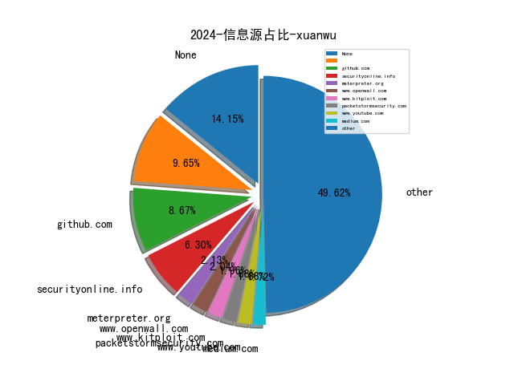

# [数据--所有](README_20.md)
# [数据--年度](README_2024.md)
# 2024 信息源与信息类型占比

# 网络安全书籍 推荐
| date_added | language | title | author | link | size| 
| --- | --- | --- | --- | --- | ---| 
| 2024-03-06 15:06:49 | English | Learn Rust in a Month of Lunches | unknown | https://www.wowebook.org/learn-rust-in-a-month-of-lunches/ | unknown| 
| 2024-03-06 11:08:45 | English | Code Like a Pro in Rust | unknown | https://www.wowebook.org/code-like-a-pro-in-rust/ | unknown| 
| 2024-03-04 06:17:12 | English | Prototyping Python Dashboards for Scientists and Engineers | unknown | https://www.wowebook.org/prototyping-python-dashboards-for-scientists-and-engineers/ | unknown| 
| 2024-03-04 15:30:54 | English | Introduction to Generative AI, Video Edition | unknown | https://www.wowebook.org/introduction-to-generative-ai-video-edition/ | unknown| 
| 2024-03-02 15:38:45 | English | Options Finance: Options Stratigies with Python | Bisette, Vincent; Van Der Post, Hayden | http://libgen.rs/book/index.php?md5=6CEF1671E9FF715643E3F028E2043F85 | 771 kB [EPUB]| 
| 2024-03-02 15:37:28 | English | Building Interactive Dashboards in Microsoft 365 Excel | Michael Olafusi | http://libgen.rs/book/index.php?md5=500B017390F2B8B6CE35BBDB8B439264 | 94 MB [EPUB]| 
| 2024-03-02 15:26:41 | English | PYTHON DATA ANALYTICS: Mastering Python for Effective Data Analysis and Visualization | Floyd Bax | http://libgen.rs/book/index.php?md5=07B11FEF430AF4E617BF0B393A86C8D7 | 4 MB [PDF]| 
| 2024-03-02 15:01:04 | English | Python Charmer: Learn Fundamental Python skills: Master Python Step by Step: A Beginners Guide to Coding | saravan krishna | http://libgen.rs/book/index.php?md5=F714167A8EBDBB568866CCA6BE8A7DD7 | 12 MB [EPUB]| 
| 2024-03-02 14:56:56 | English | Python Booleans Unveiled: A Beginners Guide to Mastering the Code Secrets for a Seamless Start | JP Parker | http://libgen.rs/book/index.php?md5=32A8275D0FE3BA52F0D1B8A2951411A4 | 177 kB [EPUB]| 
| 2024-03-02 14:40:37 | English | The Attack on Leviathan: Regionalism and Nationalism in the United States | Donald Davidson | http://libgen.rs/book/index.php?md5=2853C3916FA8066ECDC66BA34B032E53 | 18 MB [PDF]| 
| 2024-03-01 06:25:33 | English | Machine Learning Theory and Applications: Hands-on Use Cases with Python on Classical and Quantum Machines | unknown | https://www.wowebook.org/machine-learning-theory-and-applications-hands-on-use-cases-with-python-on-classical-and-quantum-machines/ | unknown| 
| 2024-03-01 16:26:47 | English | Cloud Forensics Demystified | unknown | https://www.wowebook.org/cloud-forensics-demystified/ | unknown| 
| 2024-03-01 10:48:40 | English | Mastering Microsoft Fabric | unknown | https://www.wowebook.org/mastering-microsoft-fabric/ | unknown| 
| 2024-02-24 16:57:14 | English | Asynchronous Programming in Rust | unknown | https://www.wowebook.org/asynchronous-programming-in-rust/ | unknown| 
| 2024-02-24 08:01:06 | English | Practical Guide to Applied Conformal Prediction in Python | unknown | https://www.wowebook.org/practical-guide-to-applied-conformal-prediction-in-python/ | unknown| 
| 2024-02-22 11:44:10 | English | Beyond the Algorithm: AI, Security, Privacy, and Ethics | unknown | https://www.wowebook.org/beyond-the-algorithm-ai-security-privacy-and-ethics/ | unknown| 
| 2024-02-22 11:22:47 | English | The AI Revolution in Networking, Cybersecurity, and Emerging Technologies | unknown | https://www.wowebook.org/the-ai-revolution-in-networking-cybersecurity-and-emerging-technologies/ | unknown| 
| 2024-02-22 05:42:57 | English | The Async-First Playbook: Remote Collaboration Techniques for Agile Software Teams | unknown | https://www.wowebook.org/the-async-first-playbook-remote-collaboration-techniques-for-agile-software-teams/ | unknown| 
| 2024-02-21 17:00:08 | English | Better Python Code: A Guide for Aspiring Experts | unknown | https://www.wowebook.org/better-python-code-a-guide-for-aspiring-experts/ | unknown| 
| 2024-02-19 16:03:09 | English | The Kubernetes Book | Nigel Poulton | http://libgen.rs/book/index.php?md5=6553E26B2508DFA32D7E395450212B2D | 16 MB [PDF]| 
| 2024-02-18 13:21:40 | English | Learn AI-Assisted Python Programming, Video Edition | unknown | https://www.wowebook.org/learn-ai-assisted-python-programming-video-edition/ | unknown| 
| 2024-02-16 07:33:56 | English | Skill Up with Python: Introduction (Video Course) | unknown | https://www.wowebook.org/skill-up-with-python-introduction-video-course/ | unknown| 
| 2024-02-16 20:48:10 | English | Skill Up with Python: Web Development Recipes (Video Course) | unknown | https://www.wowebook.org/skill-up-with-python-web-development-recipes-video-course/ | unknown| 
| 2024-02-16 16:35:11 | English | Skill Up with Python: Data Science and Machine Learning Recipes (Video Course) | unknown | https://www.wowebook.org/skill-up-with-python-data-science-and-machine-learning-recipes-video-course/ | unknown| 
| 2024-02-12 08:41:17 | English | Data Labeling in Machine Learning with Python | unknown | https://www.wowebook.org/data-labeling-in-machine-learning-with-python/ | unknown| 
| 2024-02-09 08:13:28 | English | Bayesian Analysis with Python, Third Edition | unknown | https://www.wowebook.org/bayesian-analysis-with-python-third-edition/ | unknown| 
| 2024-02-06 22:55:12 | English | NLP with Python: 3 Books in 1 - From Beginner to Advanced: The Future Frontier and Next-Gen Solutions | Watson, Jerome | http://libgen.rs/book/index.php?md5=CC3989E608E8EC9D612677039EC459BC | 1009 kB [EPUB]| 
| 2024-02-06 17:08:19 | English | Salesforce DevOps for Architects | unknown | https://www.wowebook.org/salesforce-devops-for-architects/ | unknown| 
| 2024-02-06 18:07:08 | English | Kubernetes Secrets Handbook | unknown | https://www.wowebook.org/kubernetes-secrets-handbook/ | unknown| 
| 2024-02-06 17:32:16 | English | Mastering Cloud Security Posture Management (CSPM) | unknown | https://www.wowebook.org/mastering-cloud-security-posture-management-cspm/ | unknown| 
| 2024-02-03 08:45:07 | English | CompTIA A+ Practice Test Core 2 (220-1102) | unknown | https://www.wowebook.org/comptia-a-practice-test-core-2-220-1102/ | unknown| 
| 2024-02-03 08:16:04 | English | CompTIA A+ Practice Tests Core 1 (220-1101) and Core 2 (220-1102) | unknown | https://www.wowebook.org/comptia-a-practice-tests-core-1-220-1101-and-core-2-220-1102/ | unknown| 
| 2024-02-03 13:27:07 | English | Microsoft Intune Cookbook | unknown | https://www.wowebook.org/microsoft-intune-cookbook/ | unknown| 
| 2024-02-02 15:49:58 | English | CompTIA Security+ SY0-701 Certification Guide, Third Edition | unknown | https://www.wowebook.org/comptia-security-sy0-701-certification-guide-third-edition/ | unknown| 
| 2024-01-26 07:57:01 | English | Covert Surveillance and Electronic Penetration | William B. Moran | http://libgen.rs/book/index.php?md5=56CDA28B35ECF30F62D313562E897175 | 19 MB [PDF]| 
| 2024-01-23 08:46:16 | English | Modern DevOps Practices, Second Edition | unknown | https://www.wowebook.org/modern-devops-practices-second-edition/ | unknown| 
| 2024-01-23 07:42:41 | English | Mastering Elastic Kubernetes Service on AWS | unknown | https://www.wowebook.org/mastering-elastic-kubernetes-service-on-aws/ | unknown| 
| 2024-01-23 06:38:47 | English | Observability with Grafana | unknown | https://www.wowebook.org/observability-with-grafana/ | unknown| 
| 2024-01-22 12:13:25 | English | CompTIA Security+ Get Certified Get Ahead: SY0-701 Study Guide | Joe Shelley & Darril Gibson | http://libgen.rs/book/index.php?md5=ECA24BD2B1640581057C4A8397983636 | 7 MB [PDF]| 
| 2024-01-20 14:46:09 | English | Descriptive Analytics: Describe with Python: A comprehensive guide to Descriptive Analytics with the use of python programming | Van Der Post, Hayden | http://libgen.rs/book/index.php?md5=24CBFE82A9C336ACD224F3BF5FBF9727 | 1 MB [EPUB]| 
| 2024-01-20 14:39:03 | English | Advances in Water Pollution Monitoring and Control: Select Proceedings from HSFEA 2018 (Springer Transactions in Civil and Environmental Engineering) | Nihal Anwar Siddiqui (editor), S. M. Tauseef (editor), Rajendra Dobhal (editor) | http://libgen.rs/book/index.php?md5=1247072896633D73F00F5B80932C1EE2 | 7 MB [PDF]| 
| 2024-01-20 14:29:46 | English | Adversary-Aware Learning Techniques and Trends in Cybersecurity | Prithviraj Dasgupta (editor), Joseph B. Collins (editor), Ranjeev Mittu (editor) | http://libgen.rs/book/index.php?md5=46515DF6A2A28FEF1538D3875A93952F | 5 MB [PDF]| 
| 2024-01-18 14:35:54 | English | Python for Healthcare & Medical Research: EXPLORING THE EXCITING WORLD OF POSSIBILITIES WITH PYTHON | Van Der Post, Hayden | http://libgen.rs/book/index.php?md5=43D5E1C54ED79E99FEC8DBC1FF9CEE1C | 1 MB [EPUB]| 
| 2024-01-16 13:38:43 | English | Kubernetes: A Comprehensive Step-by-Step Guide for Beginners to Master Kubernetes Efficiently | Chloe Annable | http://libgen.rs/book/index.php?md5=C505185882622858471B87F4EF031896 | 6 MB [EPUB]| 
| 2024-01-16 12:29:34 | English | The 2x2 Matrix: Contingency, Confusion and the Metrics of Binary Classification | A. J. Larner | http://libgen.rs/book/index.php?md5=698E9F50A4DB7AD0FE703D74CF41CE87 | 4 MB [PDF]| 
| 2024-01-15 09:06:06 | English | Applied Deep Learning with Python: Use scikit-learn, TensorFlow, and Keras to create intelligent systems | Alex Galea | http://libgen.rs/book/index.php?md5=5B683FC4060F22A413550C76ECD94246 | 34 MB [EPUB]| 
| 2024-01-15 07:27:02 | English | Automating Data Quality Monitoring | unknown | https://www.wowebook.org/automating-data-quality-monitoring/ | unknown| 
| 2024-01-13 20:16:46 | English | Machine Learning: A Guide to PyTorch, TensorFlow, and Scikit-Learn: Mastering Machine Learning With Python | Van Der Post, Hayden | http://libgen.rs/book/index.php?md5=8F932A1D4B435F1D840A6B0F11162D70 | 762 kB [EPUB]| 
| 2024-01-13 20:11:35 | English | Pythonomics: coding strategies to python in economics: A Comprehensive guide to the application of python programming in economics | Van Der Post, Hayden | http://libgen.rs/book/index.php?md5=A242AC92B08A3574F587109279778A54 | 1 MB [EPUB]| 
| 2024-01-13 20:05:14 | English | Python for Accounting: The comprehensive guide to introducing python into your accounting workflow | Van Der Post, Hayden | http://libgen.rs/book/index.php?md5=9FA1E2FEC28795D89518D4F928BA7C96 | 2 MB [EPUB]| 
| 2024-01-13 19:40:04 | English | Deep Learning for Finance: Creating Machine & Deep Learning Models for Trading in Python | Sofien Kaabar | http://libgen.rs/book/index.php?md5=A1E5C5D79EBA2ED48BE421425CF1555D | 9 MB [PDF]| 
| 2024-01-08 07:33:21 | English | Soar with Haskell | unknown | https://www.wowebook.org/soar-with-haskell/ | unknown| 
| 2024-01-08 07:21:27 | English | Data Observability for Data Engineering | unknown | https://www.wowebook.org/data-observability-for-data-engineering/ | unknown| 
| 2024-01-06 10:25:12 | English | Microsoft 365 Administrator MS-102 Exam Guide | unknown | https://www.wowebook.org/microsoft-365-administrator-ms-102-exam-guide/ | unknown| 
| 2024-01-05 11:43:32 | English | Applied Computational Thinking with Python, Second Edition | unknown | https://www.wowebook.org/applied-computational-thinking-with-python-second-edition/ | unknown| 
| 2024-01-05 18:25:08 | English | The Crypto Launderers: Crime and Cryptocurrencies from the Dark Web to DeFi and Beyond | David Carlisle | http://libgen.rs/book/index.php?md5=488EEE0AE318657F45AA60B24B85570F | 13 MB [EPUB]| 
| 2024-01-05 18:06:01 | English | (Springer Undergraduate Mathematics Series) A Course in Python: The Core of the Language | Roozbeh Hazrat | http://libgen.rs/book/index.php?md5=0F974EB1BA244B42A5114B9F484EDAD6 | 11 MB [PDF]| 
| 2024-01-03 14:38:56 | English | Security Orchestration, Automation, and Response for Security Analysts | unknown | https://www.wowebook.org/security-orchestration-automation-and-response-for-security-analysts/ | unknown| 
| 2024-01-03 13:43:09 | English | DevOps for Databases | unknown | https://www.wowebook.org/devops-for-databases/ | unknown| 
| 2024-01-03 19:06:28 | English | Think Python: How to Think Like a Computer Scientist | Allen B. Downey | http://libgen.rs/book/index.php?md5=D4ACD947DD464F477E332EAC4BD000CC | 900 kB [PDF]| 

# 微信公众号 推荐
| nickname_english | weixin_no | title | url| 
| --- | --- | --- | ---| 
| 360数字安全 | gh_6db130c5163e | 两会声音,周鸿祎两会提案：小切口大纵深，推动大模型垂直化产业化落地 | https://mp.weixin.qq.com/s?__biz=MzA4MTg0MDQ4Nw==&mid=2247569785&idx=2&sn=f4b1e9d4fbb7d7aff7d8f0b8fbc464a4 | 26| 
| 360漏洞研究院 | gh_9dfd76b8e0c2 | 行业资讯｜苹果针对被活跃利用的0day漏洞发布重要更新 | https://mp.weixin.qq.com/s?__biz=Mzk0ODM3NTU5MA==&mid=2247493772&idx=1&sn=25362131ecd7df998331619ac47c4ee3 | 1| 
| CNCERT国家工程研究中心 | NELCERT | 在中华民族伟大复兴进程过程中释放网络的澎湃力量 | https://mp.weixin.qq.com/s?__biz=MzUzNDYxOTA1NA==&mid=2247543299&idx=1&sn=c6a4f9c9d554d4ff30df3e1968ac12d4 | 55| 
| CNNVD安全动态 | cnnvd_news | 信息安全漏洞周报（2024年第10期） | https://mp.weixin.qq.com/s?__biz=MzAxODY1OTM5OQ==&mid=2651443686&idx=1&sn=3f0e6f9a6d5c55cd69ea421274370ddb | 10| 
| EBCloud | KKHsuCheney | 项目管理中的沟通管理 | https://mp.weixin.qq.com/s?__biz=Mzg4MTA2MTc4MA==&mid=2247492864&idx=1&sn=2322fa3e40aa005625dbf0b5d2dd47da | 6| 
| FreeBuf | freebuf | 招募令！最强白帽集合，阿里云CTF震撼来袭 | https://mp.weixin.qq.com/s?__biz=MjM5NjA0NjgyMA==&mid=2651260623&idx=2&sn=defd88c88f8fd1ef45749a526c4e69a4 | 133| 
| FuzzWiki | gh_fcf21e658324 | SGFuzz：基于枚举类型变量识别状态的模糊测试工具｜工具分析 | https://mp.weixin.qq.com/s/iZZrZ5du7TS_O08AfsohSg | 3| 
| IoT物联网技术 | IoT-Tech-Expo | 电信天翼 CTWing 物联网平台突发公告，单方面强制收费，你被伤到了吗？ | https://mp.weixin.qq.com/s?__biz=MjM5OTA4MzA0MA==&mid=2454933064&idx=1&sn=42525f103b1d45e18684b484f8dec575 | 25| 
| KK安全说 | kksecurity | 你的网络摄像头怎么沦为黑客的玩具 | https://mp.weixin.qq.com/s?__biz=Mzg4NzgyODEzNQ==&mid=2247486590&idx=2&sn=23cf13aac51295e536c670c0c5f8c42a | 36| 
| OSINT情报分析师 | None | 低级黑客主义在地缘冲突中存在的意义？ | https://mp.weixin.qq.com/s?__biz=MzkxNzU5MjE0OA==&mid=2247484040&idx=1&sn=3e9589f7282732e11f0c25139811fc1e | 7| 
| OneMoreThink | OneMoreThinkkk | 靶场实战(20)：OSCP备考之内网靶场红日7 | https://mp.weixin.qq.com/s?__biz=MzI0NjA3Mzk2NQ==&mid=2247493244&idx=1&sn=538b84daadec895d9324940bfca8c70c | 10| 
| SAINTSEC | None | Python沙箱环境逃匿技术详解 | https://mp.weixin.qq.com/s?__biz=MjM5MjEyMTcyMQ==&mid=2651036965&idx=1&sn=602a18781cdc7fc88d35021f6bfea92a | 5| 
| Tide安全团队 | TideSec | Synaptics蠕虫病毒：一名网络安全从业人员的感染与溯源分析 | https://mp.weixin.qq.com/s?__biz=Mzg2NTA4OTI5NA==&mid=2247515049&idx=1&sn=8436e5ac82a6db5c1b86534c563619e8 | 3| 
| Tokaye安全 | TokayeSec | SQLmap汉化图形化界面版--助力小白和日常渗透 | https://mp.weixin.qq.com/s?__biz=MzkzODMwOTE5NQ==&mid=2247483811&idx=1&sn=5689c6ab4342bdf76dd84b1a47edf568 | 2| 
| YY的黑板报 | gh_a91bd497db44 | 基于 BC 包实现国密 | https://mp.weixin.qq.com/s?__biz=Mzg5NzY5NjM5Mg==&mid=2247484733&idx=1&sn=d0823f3f22d12e90e85737630c6c7fd2 | 4| 
| Z2O安全攻防 | None | 【招贤纳士】350-700元/天，不用坐班，大量要人，待遇从优，时间自由可日结 | https://mp.weixin.qq.com/s?__biz=Mzg2ODYxMzY3OQ==&mid=2247509519&idx=1&sn=6d1bf96c7805100e3c4f8bb40b6706bc | 30| 
| e安在线 | None | 400万网络安全人才缺口背后的真相 | https://mp.weixin.qq.com/s?__biz=MzI1OTA1MzQzNA==&mid=2651245289&idx=1&sn=8b3e024e041128058b01e86fee799eb8 | 9| 
| kali linux渗透测试 | kalipentest | 自用红队加载器过主流杀软已免杀半年 | https://mp.weixin.qq.com/s?__biz=Mzg2ODE5OTM5Nw==&mid=2247485647&idx=1&sn=a7194f2083cc5ad38e9880c4191b935c | 4| 
| thelostworld | None | 求贤-招聘-360红队攻防专家base：北京、成都、广州；（IOS逆向）base：成都 | https://mp.weixin.qq.com/s?__biz=MzIyNjk0ODYxMA==&mid=2247487459&idx=1&sn=875dc3e7add3ae6dbd0b139427ae13de | 18| 
| 丁爸 情报分析师的工具箱 | dingba2016 | 【工具】免费并开源的网络监控工具-思通舆情 | https://mp.weixin.qq.com/s?__biz=MzI2MTE0NTE3Mw==&mid=2651142564&idx=1&sn=5b7bbb474831120a6d19bf306a33eedc | 31| 
| 三六零CERT | CERT-360 | 安全日报（2024.03.06） | https://mp.weixin.qq.com/s?__biz=MzU5MjEzOTM3NA==&mid=2247503694&idx=2&sn=9a5fa45985e52c1744344610ee7e58e3 | 29| 
| 中国保密协会科学技术分会 | None | 两会看安全 , 全国政协委员吴世忠：面对AI风险隐患 发展安全技术手段是当务之急 | https://mp.weixin.qq.com/s?__biz=MzIxMzI4ODI1MA==&mid=2247488079&idx=1&sn=f2a286bbe579d38d598a9e53a228cad2 | 7| 
| 中国信息安全 | chinainfosec | 中国工程院院士倪光南：生成式AI尚在初期，抢抓应用兼顾安全 | https://mp.weixin.qq.com/s?__biz=MzA5MzE5MDAzOA==&mid=2664206471&idx=2&sn=67d0d8141ff9d7da282c574fd237ccdd | 105| 
| 中国计算机学会 | ccfvoice | 刘云浩：感知智能 , CCCF精选 | https://mp.weixin.qq.com/s?__biz=MjM5MTY5ODE4OQ==&mid=2651568376&idx=1&sn=a99d79a406b156016ca737e0c4b99f2c | 82| 
| 中国软件评测中心 | china_testing | 全国人大代表、中国电子信息产业发展研究院院长张立：培育新质生产力关键在于以科技创新推动产业创新 | https://mp.weixin.qq.com/s?__biz=MjM5NzYwNDU0Mg==&mid=2649242926&idx=1&sn=d9e7a8234d230a0d2567cea366ede88e | 21| 
| 云众可信 | yunzhongkexin | 实力认证 , 成功入选2023年工业安全系统典型应用示范案例 | https://mp.weixin.qq.com/s?__biz=Mzg2NDU3Mzc5OA==&mid=2247489406&idx=1&sn=8e77a1bb8dabd25b8f04e8963575a417 | 5| 
| 亚信安全 | None | 免费体验重保利器！AI加持智胜攻防,企业安全巡查活动等你加入 | https://mp.weixin.qq.com/s?__biz=MjM5NjY2MTIzMw==&mid=2650612288&idx=1&sn=3eb8895cd92436f3ba04ba02bde8fe04 | 27| 
| 代码卫士 | codesafe | 苹果紧急修复已遭利用的两个新 iOS 0day漏洞 | https://mp.weixin.qq.com/s?__biz=MzI2NTg4OTc5Nw==&mid=2247519003&idx=1&sn=87b2f80deede9f2cb8e1092e9732820f | 28| 
| 信安404 | infosec404 | 逻辑漏洞测试系列-水平越权漏洞 | https://mp.weixin.qq.com/s?__biz=Mzk0NjQ5MTM1MA==&mid=2247487880&idx=2&sn=1b9c377ba1399ae4a871a92d8960501c | 30| 
| 信息安全研究 | None | 【专家观点】政协委员齐向东：培育新质生产力从关键、通用两方面发力 | https://mp.weixin.qq.com/s?__biz=MzA3NzgzNDM0OQ==&mid=2664985025&idx=3&sn=9e1465c8886aef1425cb48bab1637f24 | 69| 
| 儒道易行 | gh_ad128618f5e9 | 2024.03.06 健身打卡第 17 天 | https://mp.weixin.qq.com/s?__biz=Mzg5NTU2NjA1Mw==&mid=2247491672&idx=1&sn=db5fa078d62618563d45c8d5394ef958 | 21| 
| 全球技术地图 | drc_iite | 《2024年全球网络安全展望》 | https://mp.weixin.qq.com/s?__biz=MzI1OTExNDY1NQ==&mid=2651611034&idx=1&sn=32911809ebfb40f744c62febd9d17679 | 57| 
| 关键基础设施安全应急响应中心 | CII-SRC | 从网络大国到网络强国：数字发展绘就高质量发展新画卷 | https://mp.weixin.qq.com/s?__biz=MzkyMzAwMDEyNg==&mid=2247542596&idx=1&sn=4ef1e94cb8baadf5cc174a583d113814 | 57| 
| 内生安全联盟 | CCESS_CHINA | 提高网络、数据等安全保障能力等：今年哪些产业将迎来新机遇？政府工作报告要点速览 | https://mp.weixin.qq.com/s?__biz=Mzg4MDU0NTQ4Mw==&mid=2247516932&idx=1&sn=1dd248cc2c49adbd2ea6c71c6ea3d5e3 | 56| 
| 内蒙古等保测评 | gh_9cf911477f9a | 思沃科技 , 2024全国两会开幕！来看近年两会上网络安全“关键词”... | https://mp.weixin.qq.com/s?__biz=MzI4MjExMzAwNA==&mid=2247486977&idx=1&sn=567cadd560f4e72568706a01bad578da | 2| 
| 创信华通 | None | 创信看两会丨赋能经济发展，丰富人民生活，政府工作报告中的数据发展方向 | https://mp.weixin.qq.com/s?__biz=MzUxNTQxMzUxMw==&mid=2247521267&idx=1&sn=475d2f7a68c99c853b027ebae9d1d515 | 8| 
| 剁椒鱼头没剁椒 | gh_d007bd1f1c01 | CS4.9.1 | https://mp.weixin.qq.com/s?__biz=Mzg3MDk0OTc1Nw==&mid=2247487175&idx=1&sn=a40360ea1876493cc612b20a0c1313a9 | 1| 
| 华云安 | None | 基于“全准快易”特性赋能电力行业攻击面管理的实践分享 | https://mp.weixin.qq.com/s?__biz=MzI1Njc5NTY1MQ==&mid=2247499190&idx=1&sn=fbb7c97ea8228afc8d1f6d4839235a22 | 5| 
| 合天网安实验室 | hee_tian | java agent技术的注入利用与避坑点 | https://mp.weixin.qq.com/s?__biz=MjM5MTYxNjQxOA==&mid=2652904218&idx=1&sn=b454a42d466c5568f0e97c3f12207793 | 34| 
| 启明星辰安全简讯 | VitaminSecurity | 安全简讯（2024.03.06） | https://mp.weixin.qq.com/s?__biz=MzUxMDQzNTMyNg==&mid=2247503890&idx=1&sn=1f479537bb269e5a76c0b8528eec9f75 | 32| 
| 启明星辰集团 | venustech_weixin | 一起来看2024年政府工作报告中的“数据要素及安全”~ | https://mp.weixin.qq.com/s?__biz=MzA3NDQ0MzkzMA==&mid=2651723751&idx=1&sn=0c85616972e66e96705167d810551936 | 15| 
| 商密君 | shangmijun | 2024全国两会政府工作报告中的“数据安全” | https://mp.weixin.qq.com/s?__biz=MzI5NTM4OTQ5Mg==&mid=2247620049&idx=3&sn=8a101aac6e076addeae276bcd83b2c48 | 93| 
| 嗨嗨安全 | natuerhi666 | 想看小说只能充钱？充钱？不可能的 | https://mp.weixin.qq.com/s?__biz=MzIzMjg0MjM5OQ==&mid=2247487043&idx=1&sn=504357860fba32d32f8dec857c5554a6 | 11| 
| 嘉诚安全 | jiachengsec | 【漏洞通告】Apple iOS与iPadOS多个在野高危漏洞安全风险通告 | https://mp.weixin.qq.com/s?__biz=MzU4NjY4MDAyNQ==&mid=2247494781&idx=1&sn=d746b291e4563d9a071efa27bfc92b35 | 20| 
| 嘶吼专业版 | Pro4hou | 【新思想引领新征程】向着网络强国阔步迈进 | https://mp.weixin.qq.com/s?__biz=MzI0MDY1MDU4MQ==&mid=2247573993&idx=3&sn=a2422a6723be12c6abb4a93b54a1f273 | 44| 
| 国际云安全联盟CSA | gh_674820794ae8 | 专访,云安全攻防：从理论到应用的全面探索 | https://mp.weixin.qq.com/s?__biz=MzkwMTM5MDUxMA==&mid=2247496230&idx=1&sn=b4f78696834c5ba6781736178576ac26 | 12| 
| 大数据技术标准推进委员会 | gh_06f5ec229a80 | 主数据管理模式解析及选择策略 | https://mp.weixin.qq.com/s?__biz=MzU0NzczNjAwMw==&mid=2247508912&idx=1&sn=1fec360e1b107e2f09fdf08ce47f85ef | 25| 
| 天极智库 | gh_90d775fd9c26 | 【国际视野】欧盟发布《网络危机管理的最佳实践》 | https://mp.weixin.qq.com/s?__biz=MzIyMjQwMTQ3Ng==&mid=2247489488&idx=1&sn=24eba85b0e5e83926bf6604ecdc10d68 | 3| 
| 天融信 | TopsecPioneer | 以“人工智能+”行动为引领，天融信释放安全智慧新动能 | https://mp.weixin.qq.com/s?__biz=MzA3OTMxNTcxNA==&mid=2650908468&idx=1&sn=1e25fc353162107cd2ea181cb185b0c9 | 23| 
| 天融信教育 | None | 每日安全提醒~ | https://mp.weixin.qq.com/s?__biz=MzU0MjEwNTM5Ng==&mid=2247516785&idx=2&sn=f178c9f43b44c1db8bf5fe75fafca1f8 | 40| 
| 天驿安全 | tianyisec | CISP攻防领域顶流认证系列来袭—随报随学,滚动开班 | https://mp.weixin.qq.com/s?__biz=MzkxNjIxNDQyMQ==&mid=2247496451&idx=1&sn=10fc3d9409e524218caae99e9943f599 | 10| 
| 奇安信 CERT | None | 【在野利用】Apple iOS 与 iPadOS 多个在野高危漏洞安全风险通告 | https://mp.weixin.qq.com/s?__biz=MzU5NDgxODU1MQ==&mid=2247500578&idx=1&sn=f7f767f62adc6bdce5c6666e0137cb06 | 13| 
| 奇安信安全监测与响应中心 | QAX-CERT | 【在野利用】Apple iOS 与 iPadOS 多个在野高危漏洞安全风险通告 | https://mp.weixin.qq.com/s?__biz=MzUzODQ0ODkyNA==&mid=2247484956&idx=1&sn=3e378c6976e6f79f10d7837277eeb847 | 5| 
| 奇安信集团 | qianxin-keji | 两会聚焦 │ 齐向东委员参加民革、科技界、环境资源界联组会并接受央视专访谈人工智能 | https://mp.weixin.qq.com/s?__biz=MzU0NDk0NTAwMw==&mid=2247608822&idx=1&sn=da29ad0f80835cad3a8401c8cc57af78 | 48| 
| 奇安信高校合作中心 | gh_6cdcd4028542 | 投入100万！“古剑山”第一届全国大学生网络攻防大赛来了！ | https://mp.weixin.qq.com/s?__biz=MzkwMTM1MTA4MQ==&mid=2247486779&idx=1&sn=29c4ae3018b0968d78bbddfcb5a08725 | 1| 
| 安世加 | asjeiss | 系列活动 , 实战派技术沙龙 | https://mp.weixin.qq.com/s?__biz=MzU2MTQwMzMxNA==&mid=2247537384&idx=1&sn=81f5a38fa6b9cd081a5cd2810fb98b42 | 32| 
| 安信安全 | gsaxns | 简析6种典型的CISO安全管理风格 | https://mp.weixin.qq.com/s?__biz=MzAxNTYwOTU1Mw==&mid=2650087927&idx=1&sn=01b2becb4703e27478e93f1e39b01f30 | 23| 
| 安全419 | anquan-419 | 零信任案例分享——易安联通信行业的大规模应用实践 | https://mp.weixin.qq.com/s?__biz=MzUyMDQ4OTkyMg==&mid=2247538330&idx=1&sn=236e7502222a2545dcd405600901a190 | 23| 
| 安全内参 | anquanneican | 惊天勒索案！美国处方药市场中断超10天，受害企业疑支付1.5亿赎金 但或被骗 | https://mp.weixin.qq.com/s?__biz=MzI4NDY2MDMwMw==&mid=2247511131&idx=1&sn=a80a46a4b6219d4a22163553643fc643 | 36| 
| 安全圈 | ChinaAnQuan | 【安全圈】Group-IB调查显示，超225000个受损的GhatGPT账号在暗网 | https://mp.weixin.qq.com/s?__biz=MzIzMzE4NDU1OQ==&mid=2652055310&idx=3&sn=0abe0738349ded22d94e9271b571ccde | 112| 
| 安全威胁纵横 | None | 超过 225000 个被盗的 ChatGPT 凭证在暗网市场上出售 | https://mp.weixin.qq.com/s?__biz=Mzk0MDYwMjE3OQ==&mid=2247484471&idx=1&sn=a0d64886fa1502391084c844f300092f | 14| 
| 安全客 | anquanbobao | 【重磅】OpenAI通用人工智能（AGI）的计划被揭露 | https://mp.weixin.qq.com/s?__biz=MzA5ODA0NDE2MA==&mid=2649786231&idx=1&sn=daab6abd983fe768f7ba06e8790b2d82 | 7| 
| 安全小白团 | noobsec | 云攻防中常见未授权下的回显 SSRF | https://mp.weixin.qq.com/s?__biz=MzU2NzY5MjAwNQ==&mid=2247486018&idx=1&sn=5195dc23fbaa1d447ab771c8e2ba6025 | 1| 
| 安全极客 | gh_23236568a71e | 【论文速读】 , AI驱动修复：漏洞自动化修复的未来 | https://mp.weixin.qq.com/s?__biz=MzkzNDUxOTk2Mw==&mid=2247493477&idx=1&sn=e17c6ebffcea800822c3ccebc85f1107 | 3| 
| 安全牛 | None | 防范企业内部安全威胁的7种“武器” | https://mp.weixin.qq.com/s?__biz=MjM5Njc3NjM4MA==&mid=2651128324&idx=1&sn=c2910680f48e855b0d1d751ed37d3650 | 40| 
| 安全牛课堂 | aqniu_edu | 2024年软考高项重大改革！ | https://mp.weixin.qq.com/s?__biz=MzIxNTM4NDY2MQ==&mid=2247509696&idx=1&sn=dd47fb56d080834d92ec96091f57b1b8 | 15| 
| 安全狗 | safedog2013 | 聚焦两会 , 从2024年政府工作报告看网络安全新机 | https://mp.weixin.qq.com/s?__biz=MjM5NTc2NDM4MQ==&mid=2650840529&idx=1&sn=eb7fc3de7d2fbe5808519c7b4883b505 | 8| 
| 安全研究GoSSIP | GoSSIPSJTU | G.O.S.S.I.P 阅读推荐 2024-03-06 机器学习的暴胀理论 | https://mp.weixin.qq.com/s?__biz=Mzg5ODUxMzg0Ng==&mid=2247497464&idx=1&sn=ff9f04407704880d3c069628ff113cf3 | 12| 
| 安全行者老霍 | gh_c2b78e839fd7 | 业内专家对NIST 网络安全框架2.0的反响 | https://mp.weixin.qq.com/s/mwYC46iT_P1mS4taAjn6tw | 1| 
| 安在 | AnZer_SH | 盘点 , 2024年两会网络安全相关提案全面汇总 | https://mp.weixin.qq.com/s?__biz=MzU5ODgzNTExOQ==&mid=2247617471&idx=1&sn=5fa7ed9a2186d7e23525e87f2b9c3d28 | 66| 
| 安天集团 | Antiylab | 关于强化网络安全效能导向建设机制的提案 | https://mp.weixin.qq.com/s?__biz=MjM5MTA3Nzk4MQ==&mid=2650204544&idx=1&sn=b1fe7ee5ae11c799e0f55036934a2654 | 30| 
| 安恒信息资讯 | None | 2024年2月《安恒信息网络安全月报》出炉，文末扫码下载 | https://mp.weixin.qq.com/s?__biz=MzkwODE2OTU0NA==&mid=2247492561&idx=1&sn=60a5b50d6ac14c361d621de621782f41 | 2| 
| 安易科技AneSec | anesec | 会议邀请,Kubernetes 学习营第九期——云原生安全 | https://mp.weixin.qq.com/s?__biz=MzkwMTI3ODUxOQ==&mid=2247484859&idx=1&sn=7d7043759090d1714a4d93044277ab6d | 2| 
| 安芯网盾 | anxinsec | 内存安全周报第171期 , 新的WogRAT 滥用在线记事本服务 | https://mp.weixin.qq.com/s?__biz=MzU1Njk1NTYzOA==&mid=2247491114&idx=1&sn=3e545cc890678e909aca06204927a728 | 5| 
| 山石网科安全技术研究院 | None | RE新瓶装旧酒之printf虚拟机 | https://mp.weixin.qq.com/s?__biz=MzUzMDUxNTE1Mw==&mid=2247505119&idx=1&sn=11a231ff7b4ce9154357f3fa9588bc0b | 12| 
| 巢安实验室 | safe-labs | WordPress Bricks Builder RCE | https://mp.weixin.qq.com/s?__biz=MzU2MjY1ODEwMA==&mid=2247490508&idx=1&sn=80b5c7ef9077678813e5a9d0078c7065 | 11| 
| 工业互联网标识智库 | CAICT-bs | 两会专访丨全国政协委员、中国信通院院长余晓晖：加快推进算力互联互通，构建算力服务统一大市场 | https://mp.weixin.qq.com/s?__biz=MzU1OTUxNTI1NA==&mid=2247569435&idx=1&sn=16a89b9fc93d77a378a1b1887797718f | 38| 
| 工业安全产业联盟 | ICSISIA | 荐读丨仪综所副所长王麟琨：全面实施工业控制系统网络安全防护，夯实新型工业化发展安全根基 | https://mp.weixin.qq.com/s?__biz=MzI2MDk2NDA0OA==&mid=2247526567&idx=2&sn=24eae1394a6f7bbcddc5b3853644287d | 25| 
| 度小满安全应急响应中心 | dxmsrc | 直播预告｜DXMSRC 2023年度白帽颁奖典礼暨四周年盛典邀你共同见证！ | https://mp.weixin.qq.com/s?__biz=Mzg2MjIzODI3Mw==&mid=2247492294&idx=1&sn=99635675a26d22fdb2bd252f79a63afa | 4| 
| 开源聚合网络空间安全研究院 | OSPtech_Cyberspace | 【安全科普】Python之pickle反序列漏洞 | https://mp.weixin.qq.com/s?__biz=MzI4NTE4NDAyNA==&mid=2650396336&idx=1&sn=ad74929bae4d63d9b5ea4a96bfb69fb0 | 3| 
| 微步在线 | None | ______是检验安全运营的唯一标准 | https://mp.weixin.qq.com/s?__biz=MzI5NjA0NjI5MQ==&mid=2650180480&idx=1&sn=ddc18e49643eadbdaa6c1bf3612ce37c | 9| 
| 必火安全 | None | 快速制作钓鱼网站 | https://mp.weixin.qq.com/s?__biz=MzUzMjg0MTk5Mw==&mid=2247487616&idx=1&sn=48ef1cb050630643b6776d3a8bdc9ca5 | 3| 
| 快手技术团队 | gh_96fee918d420 | CVPR 2024 Workshop , 首届短视频质量评价学术竞赛已启动+大型数据集KVQ | https://mp.weixin.qq.com/s?__biz=Mzg2NzU4MDM0MQ==&mid=2247486168&idx=1&sn=d486bd0df68bd0f926e71eff7f412278 | 3| 
| 掌控安全EDU | None | 面试经验分享 , 某康安全开发工程师 | https://mp.weixin.qq.com/s?__biz=MzUyODkwNDIyMg==&mid=2247537124&idx=1&sn=1604cbe63c4d597b1b3f8471b9b9c9d0 | 42| 
| 数世咨询 | dwconcn | 商业电子邮件泄露（BEC）趋势报告中的5个重要发现 | https://mp.weixin.qq.com/s?__biz=MzkxNzA3MTgyNg==&mid=2247509259&idx=1&sn=6223b385e1c633aceffe24652d0944ae | 30| 
| 数缘信安社区 | gh_91e7eb722058 | 运营商底层协议的侧信道“漏洞” | https://mp.weixin.qq.com/s/xfP3Vx5vp328Uzldtdw8tw | 1| 
| 无糖反网络犯罪研究中心 | gh_2ee7a9b17c0d | TangGo测试平台,逻辑漏洞测试系列-水平越权漏洞 | https://mp.weixin.qq.com/s?__biz=MzAxMzkzNDA1Mg==&mid=2247509087&idx=1&sn=fbc1e2a2d4c53c467d781fcd58b3996c | 16| 
| 星光安全 | gh_b1de4b08dc1f | 你的23HVV结账了吗 | https://mp.weixin.qq.com/s?__biz=Mzg2OTkyNjU1MA==&mid=2247483962&idx=1&sn=3ba91435b3330646070b3fc3e71afa56 | 1| 
| 星冥安全 | xingmingsec | Jdbc Attack防护绕过浅析 | https://mp.weixin.qq.com/s?__biz=MzkxMDMwNDE2OQ==&mid=2247492014&idx=1&sn=786b21ca044e8c57083fac0502da5572 | 1| 
| 极星信安 | gh_90d6a5c9b8d6 | 安全情报，红帆iOffice ioDesktopData存在SQL注入漏洞！！！ | https://mp.weixin.qq.com/s?__biz=MzkyMzQ5NjYwMw==&mid=2247484235&idx=1&sn=6c5ad4f78ce23840048007f104b6e8e9 | 2| 
| 樱花庄的本间白猫 | gh_869fd1e771c2 | SQLmap汉化图形化界面版--助力小白和日常渗透 | https://mp.weixin.qq.com/s?__biz=Mzk0NDU1NTA5MA==&mid=2247483791&idx=1&sn=7b2986dc19d8243a74b0fc3704c3b93d | 3| 
| 洞见网安 | None | 网安简报【2024/3/5】 | https://mp.weixin.qq.com/s?__biz=MzAxNzg3NzMyNQ==&mid=2247487305&idx=1&sn=69aa1399bd5e3c7a4b17213fe58051d2 | 24| 
| 深圳市网络与信息安全行业协会 | SNISRI | 2024全国两会政府工作报告中的“数据安全” | https://mp.weixin.qq.com/s?__biz=MzU0Mzk0NDQyOA==&mid=2247515220&idx=1&sn=a9f0cc1d7d2cb82310b41eafa17c506e | 19| 
| 深白网安 | None | JetBrains TeamCity 身份验证绕过漏洞复现(CVE-2024-27198) | https://mp.weixin.qq.com/s?__biz=Mzk0MTUxNzAxMg==&mid=2247483972&idx=1&sn=17c6af08df0caff1a1d100e0d2311420 | 1| 
| 渗透测试 | sql_sec | 【神兵利器】CTF-OS 开箱即用的CTF系统！ | https://mp.weixin.qq.com/s?__biz=Mzg2ODY3NDYxNA==&mid=2247485085&idx=1&sn=7538961c560de618eadbf35d444d06bd | 3| 
| 渗透测试 网络安全技术学习 | gh_24ac528f97fa | nmap 详细介绍 | https://mp.weixin.qq.com/s?__biz=MzI1MzQwNjEzNA==&mid=2247483888&idx=1&sn=48e5d0fea6dba82e57c0e3e7ec733faa | 3| 
| 珞安科技 | luoantechnology | 两会观察 , 推进工业互联网规模化应用 加快发展新质生产力 | https://mp.weixin.qq.com/s?__biz=MzU2NjI5NzY1OA==&mid=2247508914&idx=1&sn=2f05f580c60c5b67e9d17643128fc806 | 9| 
| 白帽子左一 | None | 某次众测的加解密对抗 | https://mp.weixin.qq.com/s?__biz=MzI4NTcxMjQ1MA==&mid=2247606553&idx=1&sn=b30128bb4227748b1dbefaa89d2fb47b | 37| 
| 看雪学苑 | ikanxue | winrar(CVE-2023-38831)漏洞原理 | https://mp.weixin.qq.com/s?__biz=MjM5NTc2MDYxMw==&mid=2458544969&idx=1&sn=473822d99738dc8c20cf0c7df866adea | 89| 
| 矢安科技 | None | 漏洞通告｜JetBrains TeamCity 身份验证绕过漏洞(CVE-2024-27198) | https://mp.weixin.qq.com/s?__biz=Mzg2Mjc3NTMxOA==&mid=2247506138&idx=1&sn=0f29017959452a0970ca9bb21fa85663 | 2| 
| 知道创宇 | None | 标杆案例 , 创宇盾助力政数局系统集约化管理与安全防护（文末有惊喜） | https://mp.weixin.qq.com/s?__biz=MjM5NzA3Nzg2MA==&mid=2649868040&idx=1&sn=07845775f0254dbfc3158d309928e375 | 11| 
| 神狐说 | foxgod2024 | 《认知觉醒》读后感 | https://mp.weixin.qq.com/s?__biz=MzIwMTgyMzU4NA==&mid=2247484590&idx=1&sn=f7dfa55035b665d81cacfed615fbe915 | 2| 
| 秦安战略 | qinan1128 | 秦安：德军人被俄窃听，俄外长明确北约已参战，开战只等一声爆炸 | https://mp.weixin.qq.com/s?__biz=MzA5MDg1MDUyMA==&mid=2650467774&idx=1&sn=9d2398c828e114db31c924ea2936ffc2 | 55| 
| 等保不好做啊 | None | 网络安全基础技术扫盲篇名词解释之\"证书\" | https://mp.weixin.qq.com/s?__biz=MzkzNjU3NTY5NQ==&mid=2247486376&idx=1&sn=75337f485692e2eb99d6ffd8b91709a5 | 5| 
| 红蓝公鸡队 | None | 《SQL注入》 | https://mp.weixin.qq.com/s?__biz=Mzg5MDc1MjY5Ng==&mid=2247492547&idx=1&sn=5df1edc3354ee62c329fee566191f5ce | 19| 
| 红队蓝军 | Xx_Security | 第三期代码审计课程(php/java/.net) | https://mp.weixin.qq.com/s?__biz=Mzg2NDY2MTQ1OQ==&mid=2247516973&idx=1&sn=5f3ffec514e5ae2bedb03c733ac418cf | 11| 
| 绿盟科技 | NSFOCUS-weixin | 全新发布｜绿盟科技APP隐私合规评估服务 | https://mp.weixin.qq.com/s?__biz=MjM5ODYyMTM4MA==&mid=2650448350&idx=1&sn=25ab49cbc6c49d8daee6e9028bb372d7 | 29| 
| 网安百色 | www_xinbs_net | 信息安全漏洞周报（2024年第10期） | https://mp.weixin.qq.com/s?__biz=MzI0NzE4ODk1Mw==&mid=2652092596&idx=1&sn=f3425bb19517d429363113b19d99e885 | 26| 
| 网络威胁数据联盟 | None | 【漏洞通告】WordPress WPvivid Backup&Migration插件SQL注入漏洞（CVE-2024-1981） | https://mp.weixin.qq.com/s?__biz=MzA3MzI5NzY0OA==&mid=2247495549&idx=1&sn=0b053a9b71fd2695ab28d7b38bfaa92f | 6| 
| 网络安全与数据治理 | gh_ddbdee0c5caf | 实录来了！张玉卓在两会首场“部长通道”答记者问 | https://mp.weixin.qq.com/s?__biz=MzIzODk1NzY5NA==&mid=2247496949&idx=1&sn=19ec0e41b9fe850437fefb45780ab7bc | 20| 
| 网络安全和信息化 | ITyunwei_365master | 两会声音｜关于网络安全、人工智能的那些热点建议 | https://mp.weixin.qq.com/s?__biz=MjM5MzMwMDU5NQ==&mid=2649161815&idx=1&sn=ae280242a6eae1196f1198833fcc839e | 29| 
| 网络安全资源库 | None | 渗透高质量常用字典，提高渗透效率! | https://mp.weixin.qq.com/s?__biz=MzkxMzMyNzMyMA==&mid=2247552967&idx=2&sn=94eb4e8c05a9547f577f6cfeb407b1d1 | 43| 
| 网络空间信息安全学习 | gh_39213c5878aa | 微软砍刀部出狠招！Android 子系统凉了，谷歌平替工具来试试？ | https://mp.weixin.qq.com/s?__biz=MzI2MjcwMTgwOQ==&mid=2247490561&idx=1&sn=8d846179f2e48bb1b01e3db53537bdbf | 17| 
| 网络空间安全科学学报 | wxjmrh | 学术前沿 , 北京信息科技大学康海燕教授团队：自动化渗透测试应用研究综述 | https://mp.weixin.qq.com/s?__biz=MzI0NjU2NDMwNQ==&mid=2247497814&idx=1&sn=21717c87fd1d05ef8bc02020c0795782 | 13| 
| 腾讯玄武实验室 | XuanwuLab | 每日安全动态推送(3-6) | https://mp.weixin.qq.com/s?__biz=MzA5NDYyNDI0MA==&mid=2651959545&idx=1&sn=b936663aab703884164e9f8656c0853f | 12| 
| 菜鸟小新 | dsz-67 | 记录一次清除Linuxsysupdate, networkservice进程病毒的经历 | https://mp.weixin.qq.com/s?__biz=Mzg4OTI0MDk5MQ==&mid=2247491020&idx=1&sn=3c6ab5c898ff255e98d9ec965ec84768 | 21| 
| 蓝桥云课精选 | lanqiaoyunke01 | @蓝桥杯备赛选手，国奖学长的神仙笔记来啦！这份免费的冲省奖宝典，一定要薅到！ | https://mp.weixin.qq.com/s?__biz=MzkwODM4NDM5OA==&mid=2247516578&idx=1&sn=4187f24006a4b4b878d06774b9a70370 | 32| 
| 虫洞小窝安全团队 | gh_4ff06a3d617f | 一些云安全方向的攻防矩阵图 | https://mp.weixin.qq.com/s?__biz=Mzg4Mjg4NzE3Mw==&mid=2247484284&idx=1&sn=b4eb382ed04da69873762c60ea69175d | 1| 
| 谈思实验室 | gh_6446c19b4595 | 汽车安全之DoIP协议仿真靶场 | https://mp.weixin.qq.com/s?__biz=MzIzOTc2OTAxMg==&mid=2247534365&idx=1&sn=af77d107753bd141a71534ab418647ed | 67| 
| 赛博研究院 | SICSI-cybersecurity | ITI报告 , 2024 年美国技术焦点，涉及负责任 AI 、网络安全、数据跨境流动 | https://mp.weixin.qq.com/s?__biz=MzUzODYyMDIzNw==&mid=2247508069&idx=1&sn=01ca21b056e369f4d4728cd211ea632f | 28| 
| 赛查查 | None | 大赛预告｜“古剑山”第一届全国大学生网络攻防大赛 | https://mp.weixin.qq.com/s?__biz=Mzk0NTU0ODc0Nw==&mid=2247486099&idx=1&sn=690113b9035c04c8aa7ee63964e32ada | 12| 
| 走在网安路上的哥布林 | None | 汇编实现 MessageBox（X64） | https://mp.weixin.qq.com/s?__biz=MzU5NjYwNDIyOQ==&mid=2247484457&idx=1&sn=687b95936c6b2719672481fe3ea6e24f | 1| 
| 进击的HACK | redteasec | 工具｜小程序强制开启F12开发者工具 | https://mp.weixin.qq.com/s?__biz=MzkxNjMwNDUxNg==&mid=2247485212&idx=1&sn=29bbf49696176948f55602841709fd09 | 6| 
| 迪哥讲事 | growing0101 | 一次十分详细的漏洞挖掘记录,新思路+多个高危 | https://mp.weixin.qq.com/s?__biz=MzIzMTIzNTM0MA==&mid=2247493789&idx=1&sn=cadf3c5c97133e2c0e40d48f0875bd4f | 23| 
| 追梦信安 | None | 【CVE-2024-27198】JetBrains TeamCity Authentication Bypass to RCE | https://mp.weixin.qq.com/s?__biz=MzkwNTQxNDc1MQ==&mid=2247486419&idx=1&sn=a73a09164c37c58af84cb67ff45379f2 | 2| 
| 重生者安全团队 | None | 【赏金猎人】验证白名单以执行SSRF进行内部主机扫描 | https://mp.weixin.qq.com/s?__biz=Mzg4NTczMTMyMQ==&mid=2247484378&idx=1&sn=7ec62ad8be000b41b6e947e31db1152d | 15| 
| 长风安全 | None | 继续！多个赏金漏洞直播思路分享 | https://mp.weixin.qq.com/s?__biz=Mzg4MDkyMTE4OQ==&mid=2247484076&idx=1&sn=91edbb2ce6518cd4cc7fb299f6931287 | 2| 
| 闲聊趣说 | xianliaoqushuo | CVE-2023-46805&CVE-2024-21887 Ivanti connect secure RCE分析 | https://mp.weixin.qq.com/s?__biz=MzIwODc2NjgxNA==&mid=2247483998&idx=1&sn=458260eabdb4ebe9e3c9d30dfd288ee4 | 5| 
| 阿里云安全 | aliyunsec | 招募令！最强白帽集合 | https://mp.weixin.qq.com/s?__biz=MzA4MTQ2MjI5OA==&mid=2664090770&idx=1&sn=79b91363464e04265bb92e004a4b5541 | 4| 
| 阿里安全响应中心 | alisrc | 招募令！最强白帽集合 | https://mp.weixin.qq.com/s?__biz=MzIxMjEwNTc4NA==&mid=2652993696&idx=1&sn=2ecdc5adc63578c85ba9be06b4a8b239 | 6| 
| 雁行安全团队 | None | 翻滚吧！病毒君 | https://mp.weixin.qq.com/s?__biz=MzIxNTIzMzM1Ng==&mid=2651108153&idx=1&sn=a7cd2a777ba1a0c418852661cba00c45 | 2| 
| 飓风网络安全 | gh_183f818a07dc | 【漏洞预警】LangChain 远程代码执行漏洞（CVE-2024-28088） | https://mp.weixin.qq.com/s?__biz=MzI3NzMzNzE5Ng==&mid=2247487682&idx=2&sn=feff54b01e61188ffd725e7d0c5c52e7 | 28| 
| 骨哥说事 | None | 【工具推荐】服务器端原型污染检测插件 | https://mp.weixin.qq.com/s?__biz=MjM5Mzc4MzUzMQ==&mid=2650258094&idx=1&sn=addeba2b321606ed6856a2538315df1a | 8| 
| 黑客仓库 | hacker-depot | 手动检测是否被入侵 | https://mp.weixin.qq.com/s?__biz=MzU0MDUxMDEzNQ==&mid=2247488540&idx=1&sn=067ad433ae61e2a56854324711fb3792 | 4| 
| CISSP | wxxinchuangsec | 某成人app分析 | https://mp.weixin.qq.com/s?__biz=Mzg4MTg0MjQ5OA==&mid=2247484352&idx=1&sn=be7b4677a1f335ef0f0b79e5874f09b8 | 16| 
| Devil安全 | gh_b35dd18ddc14 | 【漏洞复现】思福迪 运维安全管理系统 test_qrcode_b 远程命令执行漏洞 | https://mp.weixin.qq.com/s?__biz=Mzg2MjkwMDY3OA==&mid=2247484786&idx=1&sn=d4915f64c6d91aec099403580d6bef9e | 14| 
| Hacking黑白红 | Hacking012 | 渗透实战-若依框架的杀猪交易所系统管理后台 | https://mp.weixin.qq.com/s?__biz=Mzg2NDYwMDA1NA==&mid=2247536941&idx=1&sn=76ca3d5a3fd538f1086f832b91867b21 | 11| 
| MaLoSec | MaLoSec | webshell检测引擎对抗思路 | https://mp.weixin.qq.com/s?__biz=Mzg3NTkxNTAzNA==&mid=2247484165&idx=1&sn=3cbdeb9f4886f838f9b721c8bd84e22d | 1| 
| PwnPigPig | gh_b623b2ac830c | 记一次从linux打进域控 | https://mp.weixin.qq.com/s?__biz=MzkyNDI2NjQzNg==&mid=2247492243&idx=1&sn=5646db5c2d955a58e7e70a080706d364 | 12| 
| 七芒星实验室 | HeptagramSec | Graphql安全问题概述 | https://mp.weixin.qq.com/s?__biz=Mzg4MTU4NTc2Nw==&mid=2247491129&idx=1&sn=4bdc526ccf9c8283c16f1ccbe931f486 | 11| 
| 不懂安全 | the-avengers-5 | 再怎么鸡肋也比吃瓜混日子强的 xxl-job 代码审计 | https://mp.weixin.qq.com/s?__biz=Mzg3NzE4NzgzMA==&mid=2247484873&idx=1&sn=1289b102605288efa1d3be4dc2b98012 | 3| 
| 中伦文德网络安全与数据合规 | gh_4b33f9a2e329 | 业绩丨中伦文德徐云飞律师团队协助客户通过个人信息出境标准合同备案 | https://mp.weixin.qq.com/s?__biz=MzIxNDgyNTg0NQ==&mid=2247492375&idx=1&sn=9842f5a43c849e1ad2877cf81d650abd | 11| 
| 中国电信SRC | yundi_src | JetBrains TeamCity 身份验证绕过预警 | https://mp.weixin.qq.com/s?__biz=Mzg3MjY1NzI0NA==&mid=2247554058&idx=1&sn=208599b0e93fd7f10ba8b6e37871b78a | 1| 
| 中孚信息 | zfinfo | 速览！两会政府工作报告极简版 | https://mp.weixin.qq.com/s?__biz=MzAxMjE1MDY0NA==&mid=2247507447&idx=1&sn=72289d1e271c7dd5d3d583a783200f75 | 7| 
| 中学生CTF | zxsctf | 青少年网络安全知识竞赛 2024 #Round 1 比赛结果 | https://mp.weixin.qq.com/s?__biz=MzU3MzEwMTQ3NQ==&mid=2247507262&idx=1&sn=f1194a4375505b32fccb2fe7281bfb5c | 2| 
| 中龙 红客突击队 | HSC-SEC | 第三届HSCCTF比赛通知 | https://mp.weixin.qq.com/s?__biz=Mzg3Mzg1OTYyMQ==&mid=2247487459&idx=1&sn=84615195e54273b95d3c854c2e780b32 | 4| 
| 云影实验室 | gh_d86289b99724 | 一种ysoserial.jar 反序列化Payload的解码 | https://mp.weixin.qq.com/s?__biz=Mzg4NjY1NDA4Ng==&mid=2247484006&idx=1&sn=373cee6fb2e87679aeaac263c799914f | 1| 
| 云起无垠 | Clouditera2021 | SecGPT-Mini，一个在CPU上可体验的开源网络安全大模型 | https://mp.weixin.qq.com/s?__biz=Mzg3Mjg4NTcyNg==&mid=2247488818&idx=1&sn=01b94ce1db52a7337f9ade65364d40e7 | 12| 
| 亿人安全 | Yr-Sec | 移动攻防,Android与iOS逆向理论与案例研究 | https://mp.weixin.qq.com/s?__biz=Mzk0MTIzNTgzMQ==&mid=2247513528&idx=1&sn=0de20efdff68f4de06ac6e1b86ad26b6 | 14| 
| 亿赛通 | esafenet2003 | 关于绿盟科技与亿赛通业务整合的说明 | https://mp.weixin.qq.com/s?__biz=MzA5MjE0OTQzMw==&mid=2666306435&idx=1&sn=f70e8deb0c7a72159b296cb6a8943a51 | 2| 
| 众智维安 | openxorg | 国家级入选 , 众智维科技再次荣膺CNCERT网络安全应急服务支撑单位 | https://mp.weixin.qq.com/s?__biz=MzU5Mjg0NzA5Mw==&mid=2247491990&idx=1&sn=5fb26869712c04dc0b3ff140e2152369 | 3| 
| 信息安全国家工程研究中心 | gh_1e0d1778d4b2 | 【聚焦】政府工作报告重磅！加快发展新质生产力 | https://mp.weixin.qq.com/s?__biz=MzU5OTQ0NzY3Ng==&mid=2247496179&idx=1&sn=e025508ea70d215ad202700bd2951088 | 8| 
| 利刃信安攻防实验室 | LRXAGFSYS | 【奇葩文章】现实里的女拳教学—教姐妹们如何要彩礼 | https://mp.weixin.qq.com/s?__biz=MzU1Mjk3MDY1OA==&mid=2247510761&idx=1&sn=d1d117a410f00c69c1dc27a086c4118b | 23| 
| 北邮 GAMMA Lab | BUPT_GAMMA | AAAI 2024 ｜ GCIL：因果视角下的图对比不变学习 | https://mp.weixin.qq.com/s?__biz=Mzg4MzE1MTQzNw==&mid=2247489025&idx=1&sn=ee9961ae323fd0a4ab1d4205fd26d01f | 4| 
| 华为安全 | HuaweiSecurity | MWC2024 , 一图看懂华为智能防勒索解决方案 | https://mp.weixin.qq.com/s?__biz=MzAwODU5NzYxOA==&mid=2247502992&idx=1&sn=511c432ac7167a1620a5ffdc44500594 | 7| 
| 合天网络安全 | hetian_waxy | 快来，2024hvv早鸟训练营开始了 | https://mp.weixin.qq.com/s?__biz=MzIyNzU3Mzg2NQ==&mid=2247487072&idx=1&sn=52c18d4f38618154baeae20f7578b84a | 1| 
| 吉祥在职场 | gh_370fbad7aec1 | 连招聘会都开始定向了，还有直播带岗，你准备好了吗？ | https://mp.weixin.qq.com/s?__biz=MzI1ODY3MTA3Nw==&mid=2247485054&idx=1&sn=14f445a250dc93bd81df3381ae43e3e2 | 3| 
| 吾爱破解论坛 | pojie_52 | 【2024春节】解题领红包之web题writeup | https://mp.weixin.qq.com/s?__biz=MjM5Mjc3MDM2Mw==&mid=2651140195&idx=1&sn=dfd66f351cc9e8608004f25b94b679cd | 10| 
| 哈拉少安全小队 | gh_b273ce95df95 | 达梦数据库手工注入笔记 | https://mp.weixin.qq.com/s?__biz=MzAxNzkyOTgxMw==&mid=2247492406&idx=1&sn=1256957d7fde84fbc24a224fa7355248 | 13| 
| 国家互联网应急中心CNCERT | CNCERTCC | CNVD漏洞周报2024年第9期 | https://mp.weixin.qq.com/s?__biz=MzIwNDk0MDgxMw==&mid=2247499000&idx=1&sn=70b6a8501fe6a45115c8fe82a92cba35 | 10| 
| 国家网络安全通报中心 | gh_8793d2a6176d | 北京网警通报5起不履行网络安全保护义务处罚案例 | https://mp.weixin.qq.com/s?__biz=MzU1MTE1MjU5Nw==&mid=2247485000&idx=1&sn=a50367e5dd3e9efd75d9652bef0dfffe | 3| 
| 国舜股份 | guoshun-gs | 财政部印发通知：加强行政事业单位数据资产管理 | https://mp.weixin.qq.com/s?__biz=MzA3NjU5MTIxMg==&mid=2650573690&idx=1&sn=72b4e5f1b68cddf048e21b29ce27c285 | 10| 
| 奇安信司法鉴定 | qax-forensic | 奇安信司法鉴定旗下机构2023年度能力验证全线满意，专业实力再获肯定！ | https://mp.weixin.qq.com/s?__biz=Mzg4NDYzNzIzNQ==&mid=2247490815&idx=2&sn=4d2408ca3e1a47fb427df93b9ffd46d2 | 4| 
| 奇安信威胁情报中心 | gh_166784eae33e | 赛迪报告：奇安信获威胁情报市场份额第一 | https://mp.weixin.qq.com/s?__biz=MzI2MDc2MDA4OA==&mid=2247509805&idx=1&sn=264cad42ad9711c050a5874ee6e73c63 | 4| 
| 娜璋AI安全之家 | gh_91f1fe28fc6e | 一本书讲透ChatGPT，实现从理论到实践的跨越！大模型技术工程师必读 | https://mp.weixin.qq.com/s?__biz=Mzg5MTM5ODU2Mg==&mid=2247499430&idx=1&sn=7d5874aaa5160480be2c2cfb83e9647f | 6| 
| 字节跳动技术团队 | BytedanceTechBlog | CVPR 2024 , CAMixerSR 动态注意力分配的超分辨率加速框架 | https://mp.weixin.qq.com/s?__biz=MzI1MzYzMjE0MQ==&mid=2247505902&idx=3&sn=0ae4d908818c9fe72568d1dd25de5241 | 16| 
| 安全攻防屋 | z6_debug | mod_ssl缓冲区溢出 | https://mp.weixin.qq.com/s?__biz=MzkyNTU3MjA3OQ==&mid=2247484757&idx=1&sn=160a85decac9fe9c0912842749724c3f | 4| 
| 安全狗的自我修养 | haidragon_study | 逆向分析实战-揭开 AsyncRAT 的复杂性 | https://mp.weixin.qq.com/s?__biz=MzkwOTE5MDY5NA==&mid=2247493184&idx=1&sn=d1e18bb47b1bd60bb6a86e7a168b0cf4 | 18| 
| 宸极实验室 | ChenJiLab | 『漏洞复现』Nacos 身份认证绕过漏洞 | https://mp.weixin.qq.com/s?__biz=Mzg4NTA0MzgxNQ==&mid=2247488920&idx=1&sn=a263d6e10ca703e2b2a13d41dd079cc5 | 6| 
| 小白菜安全 | xiaobaicaianquan | 用友GRP-U8 ufgovbank XXE漏洞复现 | https://mp.weixin.qq.com/s?__biz=MzIzOTM2MzczNQ==&mid=2247484292&idx=1&sn=a11da50b0d7c7249e9e72b4208472a79 | 12| 
| 小草培养创研中心 | gh_a824093cc3ce | 合作共赢｜四叶草安全加入粤港澳大湾区网络安全协会 | https://mp.weixin.qq.com/s?__biz=MzIxMDAwNzM3MQ==&mid=2247520418&idx=1&sn=d855dc6e893affc405d2be8eeab5ec45 | 4| 
| 山石网科新视界 | hillstone-vision | 战略签约丨山石网科携手华讯网络，共筑安全长城 | https://mp.weixin.qq.com/s?__biz=MzAxMDE4MTAzMQ==&mid=2661285679&idx=1&sn=42fe05cb647f75a39432a73a99637592 | 16| 
| 州弟学安全 | gh_8440a0e647ba | 漏洞挖掘,轻松挖掘某企业某友系统的多个漏洞 | https://mp.weixin.qq.com/s?__biz=MzkzMDE5OTQyNQ==&mid=2247484835&idx=1&sn=0639bdc47e6d8efdee0dd947f0e0c5c1 | 7| 
| 常行科技 | changxingkeji1 | 【漏洞通告】JetBrains TeamCity 身份验证绕过漏洞(CVE-2024-27198) | https://mp.weixin.qq.com/s?__biz=MzA4NjMwMzI3Mg==&mid=2247498768&idx=1&sn=301521e56dd970e683b20546f30a231e | 1| 
| 平安集团安全应急响应中心 | PSRC_Team | 一文带你了解PSRC 2024年度奖励！关键词“顶” | https://mp.weixin.qq.com/s?__biz=MzIzODAwMTYxNQ==&mid=2652144810&idx=1&sn=6e086ec17e18e1b02bb258d1c9c780e9 | 5| 
| 情报分析师 | Intelligencer1 | 疯狂级间谍装置大揭秘！ | https://mp.weixin.qq.com/s?__biz=MzA3Mjc1MTkwOA==&mid=2650546661&idx=1&sn=846b175052df18f1774d749993ba7950 | 52| 
| 情报分析师Pro | globalpolice | 美国揭秘俄罗斯军队的战略战术 | https://mp.weixin.qq.com/s?__biz=MzkwNzM0NzA5MA==&mid=2247496352&idx=1&sn=2b4701ba7d7a4ed8b062d844ac60c47d | 18| 
| 慢雾科技 | SlowMist | 钓鱼揭秘之谷歌虚假广告钓鱼 | https://mp.weixin.qq.com/s?__biz=MzU4ODQ3NTM2OA==&mid=2247499509&idx=1&sn=84a254ef20b7bcdc5443079efbc5d69b | 7| 
| 昂楷资讯 | ankkinews | 守好安全底线提升数据要素价值，助力“数据要素x”工作推进 | https://mp.weixin.qq.com/s?__biz=MzIyMTAwOTE5Mw==&mid=2651859623&idx=1&sn=d9b05e59181dae2b29427973814ea04e | 4| 
| 春秋伽玛 | AWDGAME | 叮咚！3月网安赛事速递来啦~ | https://mp.weixin.qq.com/s?__biz=MzkyNDA5NjgyMg==&mid=2247497156&idx=1&sn=d0c6f870742ad18b152d0426e14bee15 | 3| 
| 河马安全区 | HippoSec | Springboot未授权之httptrace和logfile的实战利用 | https://mp.weixin.qq.com/s?__biz=Mzk0NDM5MjczMw==&mid=2247484508&idx=1&sn=d0327c92fe5a81401a55b0318d20e015 | 3| 
| 泾弦安全 | gh_60939843fa4a | 常规APC注入 | https://mp.weixin.qq.com/s?__biz=Mzk0MzU5NTg1Ng==&mid=2247483868&idx=1&sn=ed50a72be22179d39c5e684e68345211 | 4| 
| 淮橘安全 | st_0-1 | EZ漏扫,高级漏洞扫描工具,可联动Burp,UI工具 | https://mp.weixin.qq.com/s?__biz=MzkxOTUyNTg2MA==&mid=2247483891&idx=1&sn=c527f475298ae5ae5061d7f7e771f97c | 5| 
| 深信服千里目安全技术中心 | gh_c644c6e98b08 | 【恶意文件】JSBot僵尸网络病毒在野攻击安全事件通告 | https://mp.weixin.qq.com/s?__biz=Mzg2NjgzNjA5NQ==&mid=2247522198&idx=1&sn=198e4936c03f92f35836439f43ada023 | 9| 
| 湘安无事 | xndsb-1234 | python安全之kfc50立马上车 | https://mp.weixin.qq.com/s?__biz=MzU3Mjk2NDU2Nw==&mid=2247490779&idx=1&sn=6d858fdfab64ca4667cd70a079f625e3 | 9| 
| 滴滴技术 | didi_tech | 滴滴基于 Clickhouse 构建新一代日志存储系统 | https://mp.weixin.qq.com/s?__biz=MzU1ODEzNjI2NA==&mid=2247568998&idx=1&sn=ea4a3f6749b2653e6ee3b828b6a2d566 | 4| 
| 猎聘安全应急响应中心 | gh_299d6364b0a0 | 【活动】3月-LPSRC积分翻倍活动正式开启！！！ | https://mp.weixin.qq.com/s?__biz=Mzg5MjY0MTEzMQ==&mid=2247483801&idx=1&sn=13147236f47bbadfb0c972ecbb34f26e | 2| 
| 瑞不可当 | gh_cea8be184d56 | 大模型简单入门及特定环境下的应用 | https://mp.weixin.qq.com/s?__biz=MzkzODI1NjMyNQ==&mid=2247484692&idx=1&sn=3e220710f66655a286e9cc97578a293d | 1| 
| 白帽子程序员 | gh_21a2e58edc9a | 浅析常见WEB安全漏洞及其防御措施 | https://mp.weixin.qq.com/s?__biz=Mzg3Mjc0MDQ2Nw==&mid=2247494359&idx=1&sn=6f2f982b9cfdf5bd1c41d52bc3438368 | 3| 
| 网安探险家 | BetaSecLab | 移动攻防,Android与iOS逆向理论与案例研究 | https://mp.weixin.qq.com/s?__biz=Mzg4MzA4Nzg4Ng==&mid=2247511811&idx=1&sn=fe72b7fad74ae2db7885dc65e504d055 | 1| 
| 网络技术联盟站 | wljslmz | IT知识百科：什么是蜂窝小区？ | https://mp.weixin.qq.com/s?__biz=MzIyMzIwNzAxMQ==&mid=2649456540&idx=1&sn=cd21f419c0b23512f8d595864a00c4bb | 23| 
| 网络盾牌 | gh_6ef5650b8b89 | 0305-俄罗斯国防部服务器被攻破-台湾机密数据被窃取了-ScreenConnect 漏洞正被恶意软件传播 | https://mp.weixin.qq.com/s?__biz=MzkyNjMzMTcwOQ==&mid=2247494954&idx=1&sn=c70d90fd4184c1d7fbdab1400d135ccb | 5| 
| 腾讯技术工程 | Tencent_TEG | 腾讯混元大模型在研发安全漏洞修复的实践 | https://mp.weixin.qq.com/s?__biz=MjM5ODYwMjI2MA==&mid=2649782785&idx=1&sn=a1a97750ab872612648ba590b43b8899 | 8| 
| 蛇矛实验室 | Cybersnaker | 第一届2024 VCTF 纳新赛 | https://mp.weixin.qq.com/s?__biz=MzkwMjI1NzY4Ng==&mid=2247524238&idx=1&sn=6a1e94fb41ec87b1c2ea5b2bf5392d34 | 5| 
| 行长叠报 | BUG_BANK | 连获三大荣誉认可 , 上海谋乐网络科技有限公司受邀出席2024年上海市网络安全产业创新大会 | https://mp.weixin.qq.com/s?__biz=MzAxODg1MDMwOQ==&mid=2247504839&idx=1&sn=bc6fb3b0b287889c40867bb09d85e690 | 3| 
| 赛博安全狗 | gh_a838eda1ce70 | 【eBPF】BCC实现DNS请求解析 | https://mp.weixin.qq.com/s?__biz=MzkyNjU3NDQ1MA==&mid=2247487470&idx=1&sn=bd68b5666fd199172aae9b22e9742f1b | 8| 
| 边界骇客 | no__root | 生产力工具 | https://mp.weixin.qq.com/s?__biz=MzU1NTkzMTYxOQ==&mid=2247485632&idx=1&sn=6a2900054f951c4e3e9cf57b17c2b6c7 | 1| 
| 默安科技 | moresec | 两会观察 , AI时代，如何构筑安全运营创新之道？ | https://mp.weixin.qq.com/s?__biz=MzIzODQxMjM2NQ==&mid=2247498115&idx=1&sn=f1549c0cf173e89f323280d764886dcc | 4| 
| AI与网安 | gh_c57275954216 | CVE-2024-25419 | https://mp.weixin.qq.com/s?__biz=MzU1ODQ2NTY3Ng==&mid=2247485764&idx=1&sn=59fff1505259c5f0c8af6e1e12bf582a | 20| 
| Desync InfoSec | DesyncInfoSec | 【DFIR报告翻译】SEO投毒到域渗透，Gootloader的传奇依然继续 | https://mp.weixin.qq.com/s?__biz=MzkzMDE3ODc1Mw==&mid=2247487483&idx=1&sn=c46edb281677b6018c17a5b702fe8954 | 5| 
| Hack分享吧 | HackShareB | 师傅们，昨天接了单私活，赚了2w！ | https://mp.weixin.qq.com/s?__biz=MzA4NzU1Mjk4Mw==&mid=2247489796&idx=1&sn=5287353ed3b039d852c89c278f425d6d | 13| 
| IoVSecurity | IoVSecurity | 汽车信息安全标准符合性测试研究 | https://mp.weixin.qq.com/s?__biz=MzU2MDk1Nzg2MQ==&mid=2247603918&idx=1&sn=ff2339d2c53ece8d2f9f1718ba877c67 | 88| 
| Khan安全攻防实验室 | None | 应聘入职记 | https://mp.weixin.qq.com/s?__biz=MzAwMjQ2NTQ4Mg==&mid=2247492536&idx=1&sn=a8452a8153a8fb88626c5d1b7c6dc934 | 18| 
| W啥都学 | gh_e911bdfdbe01 | 黑客无线安全理论篇万字总结！（非常重要） | https://mp.weixin.qq.com/s?__biz=Mzg4NTgxNTc5Mg==&mid=2247485578&idx=1&sn=274bc8f90e8647690659cd8cfcf03baf | 1| 
| Yi安全 | gh_b51111a0d6d3 | 宏景ehr-hcm-DisplayExcelCustomReport-文件读取 | https://mp.weixin.qq.com/s?__biz=Mzg3ODk2OTcxMw==&mid=2247484848&idx=1&sn=28ab69e7de137c44ea0691e3d3917ac6 | 7| 
| dotNet安全矩阵 | doNetSafety | .NET 文件上传漏洞在不同框架下的差异 | https://mp.weixin.qq.com/s?__biz=MzUyOTc3NTQ5MA==&mid=2247490905&idx=2&sn=00b75876f110369771f5cc64f7219135 | 45| 
| 一起聊安全 | gh_589ffdaa31f9 | 北京多家公司因不履行网络安全保护义务处罚案例 | https://mp.weixin.qq.com/s?__biz=MzI3NjUzOTQ0NQ==&mid=2247506854&idx=1&sn=20ff8083ebd011708026d3867e924bdf | 7| 
| 不秃头的安全 | BTTDAQ | 实战 , 若依前后端分离下的渗透测试 | https://mp.weixin.qq.com/s?__biz=Mzg3NzkwMTYyOQ==&mid=2247485538&idx=1&sn=a9f0f4325189d9526f4a1b66dd68c31c | 18| 
| 会杀毒的单反狗 | cmlitiejun | 研究人员发现可能用于 Predator （掠夺者）间谍软件的新基础设施 | https://mp.weixin.qq.com/s?__biz=MzI2NzAwOTg4NQ==&mid=2649790542&idx=1&sn=b92ba3c68502ddec789c5e4a7c4722b5 | 19| 
| 全栈网络空间安全 | cyber_securlty | 消除网络安全建设的“盲区”——暗网监控 | https://mp.weixin.qq.com/s?__biz=Mzg3NTUzOTg3NA==&mid=2247511234&idx=1&sn=6144f3fb5f330ff98eaf0c9e85476867 | 12| 
| 前沿信安资讯阵地 | None | 云原生安全威胁分析报告 | https://mp.weixin.qq.com/s?__biz=MzA3MTM0NTQzNA==&mid=2455771212&idx=1&sn=87c16c4e0357caf697d273e41e189e30 | 16| 
| 安全上春山 | h1info | 注意！WIFI不可乱连！ | https://mp.weixin.qq.com/s?__biz=MzU3MDE2NTU2Mw==&mid=2247484506&idx=1&sn=7921f01fbbf32e367aef26ad273a56ac | 1| 
| 小黑子安全 | xiaoheizi537981 | xss绕过及防护 | https://mp.weixin.qq.com/s?__biz=Mzg5NDg4MzYzNQ==&mid=2247486319&idx=1&sn=a9af782540b9fdd593618b7922eeeadd | 15| 
| 山海之关 | shg-sec | 【漏洞汇总】近十日漏洞汇总（已公布poc） | https://mp.weixin.qq.com/s?__biz=Mzg4MjcxMTAwMQ==&mid=2247488072&idx=1&sn=36b1340edb4d0ab3edbe7b2a16daf897 | 3| 
| 数据学堂 | data_school | 206页PPT , 工业大数据采集、处理、建模与应用 | https://mp.weixin.qq.com/s?__biz=MzkyMDE5ODYwMw==&mid=2247522325&idx=1&sn=b27c90e139237e90388caa8914bbaa95 | 14| 
| 河南等级保护测评 | hndjbh | 美国EIA可能要求在更长的时间内进行比特币电力使用调查 | https://mp.weixin.qq.com/s?__biz=Mzg2NjY2MTI3Mg==&mid=2247494258&idx=3&sn=340779b9876260fddcd9ceb46a35b87d | 34| 
| 渗透云记 | gh_31250237d569 | ASP.NET代码审计中常用的DLL反编译工具 | https://mp.weixin.qq.com/s?__biz=MzkxNDYxMTc0Mg==&mid=2247483919&idx=1&sn=346e1f5bf8abff736cca50aeb2cb151f | 1| 
| 潇湘信安 | xxxasec | 红队技术 - 隐藏上传的程序木马 | https://mp.weixin.qq.com/s?__biz=Mzg4NTUwMzM1Ng==&mid=2247508842&idx=1&sn=da943d7cf06a4a32a093aa6718e6411a | 12| 
| 狐狸说安全 | itseckpg | 一个师傅们接私活的好地方！ | https://mp.weixin.qq.com/s?__biz=MzUzMDQ1MTY0MQ==&mid=2247505194&idx=1&sn=17db68a993307e010c4ed2bd3f6fda9e | 8| 
| 玄道夜谈 | None | 分享图片 | https://mp.weixin.qq.com/s?__biz=MzI3Njc1MjcxMg==&mid=2247491227&idx=1&sn=20581dff883b4116911011c02adba48e | 13| 
| 生有可恋 | hyang0-1 | 个人所得税与退税 | https://mp.weixin.qq.com/s?__biz=Mzk0MTI4NTIzNQ==&mid=2247490838&idx=1&sn=7d3e5be5f91092d700bbfdf119283af1 | 22| 
| 电驭叛客 | langu_xyz | Four Short Memos (8): 自律/命格/入门/冒险 | https://mp.weixin.qq.com/s?__biz=MzU3MDg0MDgwNw==&mid=2247484187&idx=1&sn=ef59c5d2891330f8619df7da6b4b5020 | 1| 
| 白帽子 | NS-CTF | Villain C2 | https://mp.weixin.qq.com/s?__biz=MzAwMDQwNTE5MA==&mid=2650247398&idx=1&sn=29f2450b05591fb8fd8a4800f078be99 | 18| 
| 白帽黑客训练营 | hacker198511 | 找回微信聊天记录，最简单、最便捷的方法，两分钟教会你 | https://mp.weixin.qq.com/s?__biz=MzIzNjIwNTQ5MQ==&mid=2247484817&idx=1&sn=4ec46ca6dece7b3d76cf97768fdf14cd | 1| 
| 祺印说信安 | qiyinshuoxinan | 国外：一周网络安全态势回顾之第36期 | https://mp.weixin.qq.com/s?__biz=MzA5MzU5MzQzMA==&mid=2652105424&idx=1&sn=15e50f0d33defbfeb2a7e817f8c52fa6 | 52| 
| 船山信安 | zghyxa | Windows下SEHOP保护机制详解及其绕过 | https://mp.weixin.qq.com/s?__biz=MzU2NDY2OTU4Nw==&mid=2247512849&idx=1&sn=ad440f6806ea1e267823674d23ad921e | 15| 
| 苏说安全 | sushuoanquan | 培训认证 , CISSP中文版考试来啦 | https://mp.weixin.qq.com/s?__biz=Mzg5OTg5OTI1NQ==&mid=2247486665&idx=1&sn=3c3a2e87f5ec281d1b560af67d5a914b | 8| 
| 计算机与网络安全 | C-CyberSecurity | 2023年勒索软件攻击态势报告 | https://mp.weixin.qq.com/s?__biz=MjM5OTk4MDE2MA==&mid=2655228892&idx=1&sn=95a35e61b0d4f609286eea7ac08513a4 | 65| 
| 高等精灵实验室 | LHE_ERU | 在群晖上使用Bark搭建专属的消息推送服务 | https://mp.weixin.qq.com/s?__biz=MzA4MjkzMTcxMg==&mid=2449045019&idx=2&sn=c7d1a437eac7092988c497afeb8919ea | 8| 
| 黑客白帽子 | hackerwhitehat | CVE-2024-23897 Jenkins 未授权任意文件读取漏洞分析 | https://mp.weixin.qq.com/s?__biz=MzA5MzYzMzkzNg==&mid=2650944089&idx=1&sn=2e95782fd7bdd1429902fce4c47acdc5 | 68| 
| 黑客驰 | None | 80%的人都找不到！ | https://mp.weixin.qq.com/s?__biz=Mzg4MzgwMDE2Mw==&mid=2247486403&idx=1&sn=0f5bde53353f19fbe6e7afe8759e8759 | 4| 
| 黑白之道 | i77169 | 某次安全设备突破口的实战案例 | https://mp.weixin.qq.com/s?__biz=MzAxMjE3ODU3MQ==&mid=2650588155&idx=3&sn=d1f97a0b5f8527c57ca0c234fda8da35 | 105| 
| Clarmy吱声 | VoiceOfClarmy | 闪电是如何形成的？ | https://mp.weixin.qq.com/s?__biz=MzI2MDQ0ODIzNg==&mid=2247485087&idx=1&sn=928b8ef9b27804b232936ed8850c9eae | 13| 
| Esn技术社区 | esnshequ | 【盘点疫情三年数据泄露】在我更新的时候被一个“信息”突然就炸锅了！！老子上个月刚买东西这个月我就能查到我自己了！！ | https://mp.weixin.qq.com/s?__biz=MzU5Njg5NzUzMw==&mid=2247489479&idx=1&sn=cab77a9a106436716d95c3f4f1b4ccee | 11| 
| HACK之道 | hacklearn | 京东万家APP越权逻辑漏洞挖掘 | https://mp.weixin.qq.com/s?__biz=MzIwMzIyMjYzNA==&mid=2247512802&idx=1&sn=70f0404b706864a5a6390ee103a3ed3f | 18| 
| HackSee | hacksee_com | 泄露的数据库泄露了全球科技巨头的2FA代码 | https://mp.weixin.qq.com/s?__biz=MzI5NTA0MTY2Mw==&mid=2247484587&idx=1&sn=6202ad163b26e3dbb5036f904f3f9e51 | 19| 
| Hello CaptureTheFlag | Hello-CTF | 【CTF-OS】开箱即用的CTF系统！ | https://mp.weixin.qq.com/s?__biz=MzkyNzE2Nzc2OA==&mid=2247483757&idx=1&sn=b49a0cff5ea8816fb97661d721062daa | 1| 
| OSINT研习社 | OSINT_Club | 伊朗黑客冒充波音和大疆发布虚假工作机会实施鱼叉式钓鱼攻击 | https://mp.weixin.qq.com/s?__biz=Mzg4MzA4NTM0OA==&mid=2247489379&idx=1&sn=de634b93300652be1b88caa87a967a7e | 6| 
| Ots安全 | None | OTS威胁情报篇 - “生猪屠宰” | https://mp.weixin.qq.com/s?__biz=MzAxMjYyMzkwOA==&mid=2247504589&idx=1&sn=125011ce6c7e1b80e38c081976ade763 | 21| 
| Piusec | PiU_Sec | 应急响应靶机训练-Web1 | https://mp.weixin.qq.com/s?__biz=Mzg3Nzk1OTA1OQ==&mid=2247484307&idx=1&sn=878ffc31e8d7d76bc30355ec61e46cbc | 2| 
| Theloner安全团队 | lonersec | 一年一度的白帽赏金挑战赛  即将开赛 | https://mp.weixin.qq.com/s?__biz=MzI2Mzc4ODc1NQ==&mid=2247488699&idx=1&sn=c8f3c0d9a914c4cee07216e169e557f3 | 6| 
| WIN哥学安全 | WIN-security | dedecms之汗流浃背的审计1day | https://mp.weixin.qq.com/s?__biz=MzkwODM3NjIxOQ==&mid=2247498491&idx=1&sn=8464e1bf6541bd2423cb4822b9ab1bdd | 25| 
| WebSec | gh_2914f5b10e8e | 2024 想要 0day 多多？我这有份小秘籍！带你手把手挖掘Java系统漏洞。 | https://mp.weixin.qq.com/s?__biz=MzkyMzYwNTEyNg==&mid=2247485547&idx=1&sn=50abe494a9fb5ddf98843f2170a0c277 | 21| 
| here404 | gh_ef35f1b63a8e | 某流量躲避webshell诞生记 | https://mp.weixin.qq.com/s?__biz=Mzg5MzUzMDQ1NA==&mid=2247484942&idx=1&sn=149d22e2a258959c4352eadc2a184fc6 | 1| 
| 乌雲安全 | hackctf | Windows安全基线核查加固助手 | https://mp.weixin.qq.com/s?__biz=MzAwMjA5OTY5Ng==&mid=2247521311&idx=1&sn=7da7d421c0aa78a8500631c4a984133c | 20| 
| 信息安全与通信保密杂志社 | cismag2013 | 加密C2框架Covenant流量分析 | https://mp.weixin.qq.com/s?__biz=MzkwMTMyMDQ3Mw==&mid=2247585800&idx=1&sn=a4b2e01f6cd20409fb84d67309f95540 | 57| 
| 兰花豆说网络安全 | SecuritySay | 网络安全工程师必知的100+文件类型 | https://mp.weixin.qq.com/s?__biz=MzI3NzM5NDA0NA==&mid=2247485571&idx=1&sn=4611082157e8d0cc4eb9cea18ee795c3 | 15| 
| 听风安全 | tingfengsec | 漏洞没预测对，老板奖励我重新预测 | https://mp.weixin.qq.com/s?__biz=Mzg3NzIxMDYxMw==&mid=2247499543&idx=1&sn=d651a8b62674055e80135a51d4f43357 | 16| 
| 和光同尘hugh | hughone1 | 试着重复造个轮子 | https://mp.weixin.qq.com/s?__biz=MzkzNjM4OTM1Ng==&mid=2247483922&idx=1&sn=f87f7d2b7459710af2c035a370a8ba17 | 1| 
| 夜组安全 | NightCrawler_Team | 探测sql注入点的工具 | https://mp.weixin.qq.com/s?__biz=Mzk0ODM0NDIxNQ==&mid=2247490044&idx=1&sn=986917a904cd4dcf011d441f0f708ef8 | 13| 
| 天澜实验室 | gh_c5fea27198a7 | 用友 NC avatar 任意文件上传 | https://mp.weixin.qq.com/s?__biz=MzkyMzU3MzcyNQ==&mid=2247484396&idx=1&sn=b4fed385c360cbc5b677105d064517ff | 7| 
| 安全随笔 | None | 不得不说太真实了 | https://mp.weixin.qq.com/s?__biz=MzU1MTA4ODM4MQ==&mid=2247485107&idx=1&sn=d72cae86e81e101460329806718d231b | 4| 
| 安恒信息 | AnHengCloudNews | 院士大咖“云山论剑”，广州数字安全大会成果累累 | https://mp.weixin.qq.com/s?__biz=MjM5NTE0MjQyMg==&mid=2650602024&idx=1&sn=062b97f2e9c7c8a2f8624f852f6b1bad | 27| 
| 实战安全研究 | gh_f390fc63c711 | 某次安全设备突破口的实战案例 | https://mp.weixin.qq.com/s?__biz=MzU0MTc2NTExNg==&mid=2247489597&idx=1&sn=4de3bbd58bf476e9700fd8c5d16fbef5 | 21| 
| 小明今天拿站了吗 | gh_e4fa4e7e7516 | 一文搞懂CMD用法+Python Pip+Git使用方法（AI创作者必会） | https://mp.weixin.qq.com/s?__biz=Mzg2Njg1OTYyOA==&mid=2247483902&idx=1&sn=fdb89a2e855c1e29b23ccfb564722394 | 4| 
| 星尘安全 | stardust-sec | 数百万个GitHub仓库被发现感染恶意代码 | https://mp.weixin.qq.com/s?__biz=Mzg3NTY0MjIwNg==&mid=2247484329&idx=1&sn=8e85ecf275963a17eb62376d0eac4823 | 11| 
| 晴天安全 | gh_8d3e48eabcc6 | [未公开]用友NC系统某接口存在SQL注入漏洞 | https://mp.weixin.qq.com/s?__biz=MzkwNjYzMjc3OQ==&mid=2247484088&idx=1&sn=e7be4cfccf60278ca3dc1804ccfb5680 | 4| 
| 泰晓科技 | TinyLab-Org | OSDT Weekly 2024-02-28 第243期 | https://mp.weixin.qq.com/s?__biz=MzA5NDQzODQ3MQ==&mid=2648193173&idx=2&sn=9f87a699c23148ef635db0ef107a1784 | 3| 
| 漏洞文库 | gh_39e3d018b3d3 | 【漏洞复现】蓝凌EIS智慧协同平台rpt_listreport_definefield.aspx接口存在SQL注入漏洞 | https://mp.weixin.qq.com/s?__biz=MzkwNTE4Mzc2Mg==&mid=2247484557&idx=1&sn=a4dd42aa774738e2d04396975a868e77 | 19| 
| 爱折腾的三斤 | sanjincode | 关于粉丝迁移至本公众号的说明 | https://mp.weixin.qq.com/s?__biz=MzkwODU2ODA3Mg==&mid=2247484154&idx=1&sn=77caf350ed84025c3c12185e9ceae2a7 | 1| 
| 猎洞时刻 | Bug-hunter_A1xxNy | 2024护网收蓝队初中高简历，价格美丽! | https://mp.weixin.qq.com/s?__biz=MzkyNTUyNTE5OA==&mid=2247485004&idx=1&sn=a3bf3beeafe87fd76e3c7d5f7ec2d831 | 7| 
| 知攻善防实验室 | ChinaRan404 | 应急响应靶机训练-Web2【题解】 | https://mp.weixin.qq.com/s?__biz=MzkxMTUwOTY1MA==&mid=2247485236&idx=1&sn=d6d301a864a3243bc8692ccfe1e77815 | 22| 
| 知机安全 | gh_ad3e7f23f43a | 新型的网络钓鱼工具针对加密货币用户 | https://mp.weixin.qq.com/s?__biz=MzIzNDU5NTI4OQ==&mid=2247485621&idx=1&sn=3f50639b6bf08b77d191fb1016ad93a0 | 37| 
| 移动安全星球 | Andy02141225 | 安卓Cocos2dx-js游戏攻防 | https://mp.weixin.qq.com/s?__biz=MzI3Mzk2OTkxNg==&mid=2247486184&idx=1&sn=9d6db0ea37d2749268f3107fd5eebe22 | 3| 
| 系统安全运维 | Taurus-1314147 | nmap扫描特征分析 | https://mp.weixin.qq.com/s?__biz=Mzk0NjE0NDc5OQ==&mid=2247523040&idx=1&sn=cbe73931234313f8fcaf35e9c962bcfd | 5| 
| 紫队安全研究 | ziduianquanyanjiu | 勒索软件即服务在中东和非洲引发网络攻击浪潮 | https://mp.weixin.qq.com/s?__biz=Mzg3OTYxODQxNg==&mid=2247483984&idx=1&sn=f602a27de591641d78b42b29185a0fd3 | 9| 
| 网安寻路人 | DataProtection101 | 解读：关于防止受关注国家获取美国人大量敏感个人数据和美国政府相关数据的行政命令 | https://mp.weixin.qq.com/s?__biz=MzIxODM0NDU4MQ==&mid=2247501574&idx=1&sn=821c1bc255ec02d82c079c8cff608724 | 11| 
| 网络安全与取证研究 | wangluoanquanquzheng | 一图带你看懂硬盘常见故障及抢救数据方法 | https://mp.weixin.qq.com/s?__biz=Mzg3NTU3NTY0Nw==&mid=2247488598&idx=1&sn=b511618abcdf859e70af57b9ca8868ea | 20| 
| 网络安全自修室 | gh_21e38c4b4ad1 | 打靶归来-详解upload-labs靶场（下） | https://mp.weixin.qq.com/s?__biz=MzI0NDYxMzk1Mg==&mid=2247500468&idx=1&sn=6dfe48cb49cb89991de64d73bf1e9cd2 | 3| 
| 蓝胖子之家 | gh_fa158f2ae9b3 | httpbin免费提供IP地址服务 | https://mp.weixin.qq.com/s?__biz=MzU1NDg4MjY1Mg==&mid=2247487273&idx=1&sn=551b0bebcca3c74cdf97f5a836e6cc0c | 12| 
| 逆向OneByOne | Vsyyjy | 训练验证码-9、yolov8/孪生训练点选验证码 | https://mp.weixin.qq.com/s?__biz=MzU5NTcyMDc1Ng==&mid=2247491436&idx=1&sn=a7ee5cd9fe1d899a0686aab31eb68ee0 | 2| 
| 青衣十三楼飞花堂 | scz------ | cby的日常 | https://mp.weixin.qq.com/s?__biz=MzUzMjQyMDE3Ng==&mid=2247487194&idx=1&sn=68a912c0bfd5768da8c4d14195453258 | 13| 
| 顺丰安全应急响应中心 | SFSRC- | 关于顺丰SRC暂停漏洞测试活动的公告 | https://mp.weixin.qq.com/s?__biz=MzU3OTAyODk4MQ==&mid=2247488698&idx=1&sn=c4365aa1eae19c22294699ca68e9c0ce | 8| 
| 黑客技术家园 | hacker202403 | 短剧切片代理搞钱看过来！这辈子距离每月躺赚10W+最近的一次！ | https://mp.weixin.qq.com/s?__biz=MzI2OTk4MTA3Ng==&mid=2247488888&idx=1&sn=64c0126741ba5c250f4647c4986e08e6 | 19| 
| 黑战士 | heizhanshi1 | WordPress 插件存在漏洞，500 万网站面临严重安全风险 | https://mp.weixin.qq.com/s?__biz=MzUxMzQ2NTM2Nw==&mid=2247492399&idx=1&sn=19aaae05e06dcd966a812d9e6bc796d0 | 3| 
| 黑熊安全 | gh_1735f5aa94ba | 护网收蓝队初中高简历，价格美丽 | https://mp.weixin.qq.com/s?__biz=Mzg2MTg2NzI5OA==&mid=2247484241&idx=1&sn=011e070f1c1cd4e03ff2820964a36205 | 10| 
| BOSS直聘安全应急响应中心 | None | 春光无限好，挖洞正当时 , Boss直聘＆华为邀您来早春猎洞～ | https://mp.weixin.qq.com/s?__biz=MzkyODIwNDI3NA==&mid=2247486056&idx=1&sn=fbd28d9fc5f2e802eb4733b1b09562af | 1| 
| M01N Team | None | 每周蓝军技术推送（2024.2.24-3.1） | https://mp.weixin.qq.com/s?__biz=MzkyMTI0NjA3OA==&mid=2247493385&idx=1&sn=01b1c0c6697995854a87460b32482fcd | 4| 
| NOP Team | yidalidemao | 如何验证可执行文件是可靠的 ｜ Windows 应急响应 | https://mp.weixin.qq.com/s?__biz=MzU1NDkwMzAyMg==&mid=2247499399&idx=1&sn=378744184000af40053dea2367c8ac9b | 5| 
| OPPO安全应急响应中心 | opposrc | 2024年1月奖励公告 | https://mp.weixin.qq.com/s?__biz=MzUyNzc4Mzk3MQ==&mid=2247493130&idx=1&sn=5cc8cc4c5909695e87c7f6cd2da56aab | 7| 
| Web安全工具库 | websec-tools | ruoyi 后台定时任务注入哥斯拉内存马（3月1日更新） | https://mp.weixin.qq.com/s?__biz=MzI4MDQ5MjY1Mg==&mid=2247512385&idx=1&sn=5f55e74d8aa2965474010f1cdb897710 | 31| 
| Yak Project | YakLanguage | 已在工位（我是做什么的来着？） | https://mp.weixin.qq.com/s?__biz=Mzk0MTM4NzIxMQ==&mid=2247519428&idx=1&sn=55ddb23f6d876b5260cfa7590f1b03c7 | 6| 
| 万径安全 | Mega_Vector | 万径安全乔迁大吉，新篇章新起点，开启新征程！ | https://mp.weixin.qq.com/s?__biz=MzIwMzI1MDg2Mg==&mid=2649944029&idx=1&sn=5d08b753ccd4e59519a61e614bcb9547 | 4| 
| 丈八网安 | gh_c9ca0655a9a7 | 3周年 , 遇见丈八 向新同行 | https://mp.weixin.qq.com/s?__biz=MzkwNzI1NDk0MQ==&mid=2247491258&idx=1&sn=8103003a246d3fa2621146d0cd15e3b2 | 3| 
| 众安安全应急响应中心 | za_ZASRC | 速看！漏洞接收范围更新 | https://mp.weixin.qq.com/s?__biz=MzI5NTQwMjYxNg==&mid=2247483787&idx=1&sn=f75dc5a77109b481c972c38a2dc12a9b | 2| 
| 划水但不摆烂 | None | FindAll-应急响应自动化分析工具 | https://mp.weixin.qq.com/s?__biz=Mzk0NDUxMjAzNw==&mid=2247485790&idx=1&sn=53dbf6b86a6e33348bf5a3b753c53551 | 8| 
| 华为安全应急响应中心 | None | 春光无限好，挖洞正当时 , 华为＆Boss直聘邀您来早春猎洞～ | https://mp.weixin.qq.com/s?__biz=MzI0MTY5NDQyMw==&mid=2247509892&idx=1&sn=c4f0c7068e21312e77d021a6d35bc460 | 3| 
| 华顺信安 | None | 湖南网信办、中网投领导专家莅临华顺信安湖南分公司调研交流 | https://mp.weixin.qq.com/s?__biz=MzUzNjg1OTY3Mg==&mid=2247491275&idx=1&sn=f0ef5653b5a0af1e7b81e5b5cfb5e5ef | 4| 
| 天擎攻防实验室 | gh_2fb077348503 | 【漏洞复现】蓝凌OA wechatLoginHelper.do SQL注入漏洞 | https://mp.weixin.qq.com/s?__biz=MzU2MzQyMjA1NA==&mid=2247484338&idx=1&sn=5a9c086fc04c6c5e753b84881c8042fb | 15| 
| 安全脉脉 | gh_6d21af7faacb | 美国以安全风险为由对中国车辆展开调查 , 附：美国汽车数据安全要求 | https://mp.weixin.qq.com/s?__biz=Mzk0MzQzNzMxOA==&mid=2247486430&idx=1&sn=e96c9a960f3937ed5ca451440a3ba411 | 12| 
| 悬镜安全 | Anpro-tech | 权威认可 , 悬镜入选CNCERT数据与软件安全评测领域首批支撑单位 | https://mp.weixin.qq.com/s?__biz=MzA3NzE2ODk1Mg==&mid=2647789976&idx=1&sn=8b71a2ada186842c1728357912eed43d | 3| 
| 成都链安 | None | 【链看点】,2月区块链安全事件损失超4.2亿美元，越来越多犯罪涉及虚拟货币 | https://mp.weixin.qq.com/s?__biz=MzU2NzUxMTM0Nw==&mid=2247510584&idx=1&sn=f8d7e94a0f6793e3e29eb03b55b6dc1d | 3| 
| 效率源 | xiaolvyuantech | “闪电定位”“一键恢复”？「空壳」App敛财4700余万 | https://mp.weixin.qq.com/s?__biz=MjM5ODQ3NjAwNQ==&mid=2650546104&idx=1&sn=9caef0382dc2da7fec531281c03aa160 | 10| 
| 数安行 | None | 数据安全每周观察 , 中华人民共和国主席令（第二十号）《中华人民共和国保守国家秘密法》修订通过 | https://mp.weixin.qq.com/s?__biz=Mzg5OTM0NTM2OQ==&mid=2247491291&idx=1&sn=977dcdff554cee455aac23a5a4809712 | 10| 
| 梆梆安全 | None | 洞见安全 , 央视报道“AI换脸”安全事件，人脸识别攻击怎么防？ | https://mp.weixin.qq.com/s?__biz=MjM5NzE0NTIxMg==&mid=2651130939&idx=1&sn=d8c8bcfce81540cff15ef0b2a5d38a24 | 10| 
| 滑板人之家 | gh_db0218d920fc | 宏景-DisplayExcelCustomReport文件读取 | https://mp.weixin.qq.com/s?__biz=MzIyMDkxMTk4MQ==&mid=2247483923&idx=1&sn=7df60b85a76cef935af11c3d60c71465 | 10| 
| 火绒安全 | None | 【火绒安全周报】黑客利用谷歌云运行服务传播木马 / 二十多万网约车司机信息被卖 | https://mp.weixin.qq.com/s?__biz=MzI3NjYzMDM1Mg==&mid=2247517765&idx=1&sn=6971fd1f6e53bec3c075a56fec018ff7 | 8| 
| 盛邦安全应急响应中心 | None | 烽火狼烟丨暗网数据及攻击威胁情报分析周报（02/26-03/01） | https://mp.weixin.qq.com/s?__biz=Mzk0NjMxNTgyOQ==&mid=2247484169&idx=1&sn=ae46c5e3c1f1cacc3d7ad834e6a18fd7 | 2| 
| 绿盟科技研究通讯 | nsfocus_research | 网络侦察的反溯源技术研究 | https://mp.weixin.qq.com/s/OrIliK1y9ZBKJAnohTYfkg | 7| 
| 网安培训 | ccrctraining | 个人信息保护专业人员（CCRC-PIPP）助力企业数据要素合规有序流通 | https://mp.weixin.qq.com/s?__biz=MzIzNTEzNzIyMA==&mid=2247486021&idx=1&sn=0357ed37ba595aa2c812d3f3e57fe98b | 4| 
| 网星安全 | None | 内网渗透瑞士军刀-impacket工具解析（九） | https://mp.weixin.qq.com/s?__biz=MzkxNTEzMTA0Mw==&mid=2247494969&idx=1&sn=213bbb5d3f100d9d8cda153823cdb7a8 | 7| 
| 虎符智库 | None | 观察：“人为因素风险管理”兴起，安全意识进入2.0时代 | https://mp.weixin.qq.com/s?__biz=MzIwNjYwMTMyNQ==&mid=2247489953&idx=1&sn=5338c8cd5b01363355a23f83ab4fdde2 | 4| 
| 边界无限 | None | 边界无限强势加入粤港澳大湾区网络安全协会，共筑安全新里程碑 | https://mp.weixin.qq.com/s?__biz=MzAwNzk0NTkxNw==&mid=2247486782&idx=1&sn=96896401e189fac6a18f85c2877eda98 | 5| 
| 长亭科技 | None | 实网攻防82h，410000+条攻击日志惊现长亭 | https://mp.weixin.qq.com/s?__biz=MzIwNDA2NDk5OQ==&mid=2651387133&idx=1&sn=a74c874947bed2c113218be6583e6ede | 10| 
| T0daySeeker | gh_26c54b2c64aa | 逆向开发Turla组织TinyTurla-NG新后门C&C站点 | https://mp.weixin.qq.com/s/fZVCC2SpwD8a9aYF00H5Qg | 7| 
| 威胁棱镜 | THREAT_PRISM | Cronos 行动始末：世界上最成功的勒索软件团伙与执法机构的猫鼠游戏 | https://mp.weixin.qq.com/s/bXYYjvX7mN8MVNEYKCrYgQ | 13| 
| 学术plus | caeit-e | 【RAND】人工智能系统用于作战的局限性——网络安全 | https://mp.weixin.qq.com/s/Xoi4nboA5NNSyylGJ6ZKBQ | 1| 
| 淡看安全路 | gh_8a1e908fc8ab | 请求数据包加签的分析 | https://mp.weixin.qq.com/s/5DoPqc2ljrv23VHTpEk_0A | 2| 
| 洞源实验室 | Official_InsBug | PNG图片中植入PHP代码 | https://mp.weixin.qq.com/s/k3o9mb_EBGdIuRw6m6XSTg | 14| 
| 奇点威胁 | gh_a2963a32c260 | 不当瓜田里乱窜的猹 LockBit勒索组织查封事件要点梳理 | https://mp.weixin.qq.com/s/IYDdXlZnyiPwD8SOdMkPPw | 3| 
| AY长歌 | None | CMS Made Simple (CMSMS) < 2.2.10 前台SQL注入漏洞（CVE-2019-9053） | https://mp.weixin.qq.com/s?__biz=MzkzMjI1MDQwMg==&mid=2247484224&idx=1&sn=58af2718a28599e994051bac6f7242fc | 15| 
| IRTeam工业安全 | None | 如何保护本特利3500监测与保护系统 | https://mp.weixin.qq.com/s?__biz=MzAwNDI0MDYwMw==&mid=2247485640&idx=1&sn=859ea16f49bfaf736feb77dedd529a84 | 3| 
| Kokoxca安全 | gh_b130bebc48f2 | JAVA代码审计之SSRF | https://mp.weixin.qq.com/s?__biz=Mzg3ODkzNjkxMg==&mid=2247483933&idx=1&sn=444e91dbae62b3ccc738f8f7edd3bd33 | 1| 
| LK安全 | None | 记一次实战中的代码审计 | https://mp.weixin.qq.com/s?__biz=MzkxMzQyMzUwMg==&mid=2247485805&idx=1&sn=1155cb896010b8c53d0f9371f56b5598 | 4| 
| Poker安全 | None | 年薪96w！真心建议大家冲一冲新兴领域，工资高前景好 | https://mp.weixin.qq.com/s?__biz=Mzg5NTgxMDg3Nw==&mid=2247485192&idx=1&sn=66a53a699944ab75342c78a189068751 | 2| 
| Relay学安全 | None | 域渗透之SPN | https://mp.weixin.qq.com/s?__biz=Mzg5MDg3OTc0OA==&mid=2247486273&idx=1&sn=cfee1329e685c25766730c71a935b6c8 | 16| 
| X1aoYa0 | None | 你已经染上与毒品无异的瘾。 | https://mp.weixin.qq.com/s?__biz=MzkyNTA4NDk1Ng==&mid=2247484582&idx=1&sn=539b55ccd33f9d9d00b7e6bac2644aa1 | 1| 
| only security | onlysecurity | fastjson之各个版本payload测试 | https://mp.weixin.qq.com/s?__biz=MzkzNzE4MTk4Nw==&mid=2247486380&idx=1&sn=92811610a6407c5f11bd75ab20eb772c | 1| 
| 国家信息安全服务资质 | None | 安全运营类二级服务资质正式发布 | https://mp.weixin.qq.com/s?__biz=MzI0NDg4MTIyNQ==&mid=2247485593&idx=1&sn=77e58dec4ba6d673b495d96a641e75f6 | 2| 
| 天億网络安全 | None | 安全运营中心和态势感知 | https://mp.weixin.qq.com/s?__biz=MzU4ODU1MzAyNg==&mid=2247513032&idx=1&sn=c032d2b8acb6dae238da2e7ee3533359 | 1| 
| 小兵搞安全 | None | Windows安全基线核查加固助手 | https://mp.weixin.qq.com/s?__biz=MzA3NTc0MTA1Mg==&mid=2664710980&idx=1&sn=4616076381ff34eebb9bc9bb8f0d99d5 | 5| 
| 开源安全研究院 | None | 5种低成本的网络安全措施，中小型企业一定要试试 | https://mp.weixin.qq.com/s?__biz=Mzg3NjU2NDEyMA==&mid=2247485109&idx=1&sn=a05f59f4c97c78f8280e3da9b389ffd4 | 1| 
| 李白你好 | libai_hello | 实战中遇到的一些莫名奇妙的逻辑漏洞 | https://mp.weixin.qq.com/s?__biz=MzkwMzMwODg2Mw==&mid=2247503657&idx=1&sn=00ede5a44477fdd1805ee19552c5cb4b | 11| 
| 榫卯江湖 | ecapture | eCapture v0.7.4发布，支持Pcap Filter包过滤语法 | https://mp.weixin.qq.com/s?__biz=MzUyMDM0OTY5NA==&mid=2247484939&idx=1&sn=fa70027221febf662f1554be0844f15e | 3| 
| 独立观察员博客 | None | 推荐一款WIFI7路由器（中兴问天 BE7200 Pro+） | https://mp.weixin.qq.com/s?__biz=MzA3NDE0NTA0MA==&mid=2649211962&idx=1&sn=132d1353865a84be61a504d7ca62f103 | 1| 
| 皓月当空w | None | 【高危】浙江大华技术城市安防监控DSS系统存在信息泄露漏洞 | https://mp.weixin.qq.com/s?__biz=Mzg4MDg5NzAxMQ==&mid=2247485519&idx=1&sn=80832a0520e64e299927733bbdfe503d | 9| 
| 谈数据 | learning-bigdata | 国家数据局：关于开展全国数据资源调查的通知 | https://mp.weixin.qq.com/s?__biz=MzI1NzYwNTMzNw==&mid=2247521255&idx=1&sn=47eff7fcf955b02ef4ab5dc1c9eaeaa9 | 16| 
| 豆豆咨询 | None | 四、在多波与多光纤下的QKD弹性光网络多周期分析 | https://mp.weixin.qq.com/s?__biz=MzU3MzAzMzk3OA==&mid=2247484987&idx=1&sn=d9daa7dfe5bc9230fed33111aee57e8a | 5| 
| Adler学安全 | Acade- | HTTP 协议与 URL 的深入解析 | https://mp.weixin.qq.com/s?__biz=Mzg5NDU1MDc1OA==&mid=2247484770&idx=1&sn=9ce163704215853c11fbb98338c34ab4 | 1| 
| AlertSec | AlertSec | HackTheBox-Ignition | https://mp.weixin.qq.com/s?__biz=MzkwMjU5MzgzMQ==&mid=2247484830&idx=1&sn=57a84ad47cc3e9187324b4fa71b0abff | 7| 
| CAPPVD漏洞库 | CAPPVD | 元宵节快乐｜月圆向吉，花开向喜！ | https://mp.weixin.qq.com/s?__biz=MzkyMjM4MzY5Ng==&mid=2247485615&idx=1&sn=1e2fc47c403e1184386fad9e15f59730 | 1| 
| Fighter 安全 | Fighter_sec_team | Frida + IDA 开启小程序 devtools | https://mp.weixin.qq.com/s?__biz=Mzg3NzU0NjU5OQ==&mid=2247485510&idx=1&sn=67efc8437774d492c4938010d77c6b56 | 1| 
| GEEKCON | GEEKCON-DarkNavy | GEEKCON 2024 国际站 , 新加坡，我们来了！ | https://mp.weixin.qq.com/s?__biz=Mzk0NzQ5MDYyNw==&mid=2247485339&idx=1&sn=132abeb2dd0a27ddc0fe1ceca1c737d4 | 2| 
| GSDK安全团队 | gh_403a21e91f24 | Web模糊测试字典 - Web-Fuzzing-Box | https://mp.weixin.qq.com/s?__biz=MzIzNTE0Mzc0OA==&mid=2247485647&idx=1&sn=3ef10a5eecc70a9119025a92eb33bec8 | 9| 
| Hacking庆尘 | gh_0bd89cadb3c2 | “虚拟号码\"场景下的逻辑漏洞挖掘（全网原创首发） | https://mp.weixin.qq.com/s?__biz=Mzg3Mzg3OTU4OQ==&mid=2247489795&idx=1&sn=986afe445585dec512cbe585fff2863c | 1| 
| RJ45实验室 | gh_ea78328aed13 | 通过ton.twitter.com和upload.twitter.com对推特XSS和缓存投毒 | https://mp.weixin.qq.com/s?__biz=Mzg4MDc2MDcyOQ==&mid=2247483900&idx=1&sn=f579129c6c837e83a01539d73eb1c0cf | 1| 
| TD安全实验室 | TCNST_admin | ChatGPT4.0永久使用资格！HuluAI即将更新涨价，有需要的来！ | https://mp.weixin.qq.com/s?__biz=MzIwNDI0MTI3NA==&mid=2650421353&idx=1&sn=286eba73b98b3f0d142bbb34c9e4fe96 | 1| 
| Web安全 | hacker_cor0ps | 今日推荐 - 2024-02-24 | https://mp.weixin.qq.com/s?__biz=MzAwMjE5MzI0OA==&mid=2247485005&idx=1&sn=7233dd9806a1a1004500d1b96c9da97e | 6| 
| WgpSec狼组安全团队 | wgpsec | Frida + IDA 开启小程序 devtools | https://mp.weixin.qq.com/s?__biz=MzIyMjkzMzY4Ng==&mid=2247503720&idx=1&sn=e4c09f756d311b4cd703587fc29c7e33 | 7| 
| 一个不正经的黑客 | gh_ddeb734f0ee7 | 从CRLF注入到XSS：评估苹果iTunes安全风险 | https://mp.weixin.qq.com/s?__biz=MzkwODI1ODgzOA==&mid=2247503216&idx=1&sn=d1fb1585260b7a61e1290b8fc55fe508 | 14| 
| 中国数据安全产业网 | gh_a30bfee064c9 | 中国数据安全产业网祝大家元宵节快乐 | https://mp.weixin.qq.com/s?__biz=Mzg2OTczNjMwNQ==&mid=2247488190&idx=1&sn=68ef4d91e33223311fb0b787a1c96bed | 4| 
| 入特安全 | gh_8eb916949c74 | vulnhub-wp DC-9 | https://mp.weixin.qq.com/s?__biz=MzkyNTU3MzA2Mw==&mid=2247483866&idx=1&sn=99cb62a5bf9dd82de54c6b349dc8943f | 2| 
| 南风漏洞复现文库 | gh_a9e9b8a80c70 | Edusoho网络课堂cms存在任意文件读取漏洞 附POC软件 | https://mp.weixin.qq.com/s?__biz=MzIxMjEzMDkyMA==&mid=2247485379&idx=1&sn=cad3f569bd587a121cc02e29c1307a9e | 8| 
| 安全红蓝紫 | RushForce2020 | 良宵佳节，团圆美满 | https://mp.weixin.qq.com/s?__biz=MzI1NjQxMzIzMw==&mid=2247491614&idx=1&sn=d4f259923576d84ce9173905cf0fa7b9 | 5| 
| 小生观察室 | huolangxiaosheng | 快速搭建谷歌Gemini Pro Chat | https://mp.weixin.qq.com/s?__biz=MzIxODQ1OTg5NQ==&mid=2247485356&idx=1&sn=f0a5e0f42a38e26e3e0023ee30f68979 | 1| 
| 渗透安全团队 | GuYingLanQi | 天哪！还有这些逆天的fofau200b语句？ | https://mp.weixin.qq.com/s?__biz=MzkxNDAyNTY2NA==&mid=2247514913&idx=2&sn=0d608e3f672fa7578e1144a1831f0caa | 24| 
| 火线安全平台 | huoxian_cn | 火线安全祝您元宵节快乐 | https://mp.weixin.qq.com/s?__biz=MzU4MjEwNzMzMg==&mid=2247493983&idx=1&sn=d675d914da0b62143ec7d28a0968526c | 1| 
| 知其安科技 | None | 知其安科技祝大家元宵节快乐🏮 | https://mp.weixin.qq.com/s?__biz=MzkzNTI5NTgyMw==&mid=2247494325&idx=1&sn=7968e0ea4aa953e5cfd758e0f1089476 | 5| 
| 陈冠男的游戏人生 | CGN-115 | 玩转Flipper Zero：iButton探索与操作指南 | https://mp.weixin.qq.com/s?__biz=MzU5OTU3NDEzOQ==&mid=2247492190&idx=1&sn=12206262ba3307b0b2a91c550a79baea | 2| 
| 马赛克安全实验室 | mosaic-sec | [漏洞复现-101] 免费星球它来了-马赛克安全情报共享（限免） | https://mp.weixin.qq.com/s?__biz=MzI5MzU4ODE5Mw==&mid=2247485083&idx=1&sn=c48dda5dc6293eeeaf88dcc818d93ba2 | 12| 
| CCIA数据安全工作委员会 | CCIA-DSC | 深度分析 , 苹果隐私新规发布后，SDK和APP该如何合规 | https://mp.weixin.qq.com/s?__biz=MzkyNzI3MzAxOA==&mid=2247519715&idx=1&sn=fe8772b7a74df771c29eb6b34d7e63d2 | 2| 
| CT Stack 安全社区 | Ctstack-chaitin | 长亭珂兰寺招生简章 | https://mp.weixin.qq.com/s?__biz=MzIzOTE1ODczMg==&mid=2247498961&idx=1&sn=065ab085b557080268c56e68f5b2709c | 3| 
| CertiK | certikchina | xKingdom“跑路”计划大揭秘 | https://mp.weixin.qq.com/s?__biz=MzU5OTg4MTIxMw==&mid=2247502255&idx=1&sn=de2b8e9630286b5a26c4f0cce317e15d | 4| 
| Crush Sec | Crush_Sec | js 逆向系列05-浏览器和 js 的关系 | https://mp.weixin.qq.com/s?__biz=MzkxMjMwNTEwMg==&mid=2247485387&idx=1&sn=2b6e9bd813ce23fce1ea769e2a4a7e7e | 4| 
| Docker中文社区 | dockerchina | 引入动态挂载卷，实现工作负载运行时的存储灵活性 | https://mp.weixin.qq.com/s?__biz=MzI1NzI5NDM4Mw==&mid=2247496888&idx=1&sn=20dc5cc8dff61a4345040f8b679dd82d | 2| 
| E安全 | EAQapp | Microsoft Exchange缺陷可能影响多达97000台服务器 | https://mp.weixin.qq.com/s?__biz=MzI4MjA1MzkyNA==&mid=2655344836&idx=1&sn=dc1dd9acb2a847d53e521a0fd03c84ca | 10| 
| HACK学习呀 | Hacker1961X | 趁早转行，安全没有未来 | https://mp.weixin.qq.com/s?__biz=MzI5MDU1NDk2MA==&mid=2247512944&idx=1&sn=769db33084682a0cfa1732dbe403de26 | 2| 
| SCA御盾 | SCA_Magic | 【漏洞复现】主动安全监控云-StandardLoginAction_getAllUser-信息泄露漏洞复现 | https://mp.weixin.qq.com/s?__biz=MzkzNjYwODg3Ng==&mid=2247484572&idx=1&sn=cad62fbdd78c60fe61f96da4efd98b27 | 17| 
| SecHub网络安全社区 | secevery0x01 | 某次Edu校友会通用型漏洞 | https://mp.weixin.qq.com/s?__biz=MzI5NTUzNzY3Ng==&mid=2247487950&idx=1&sn=b0c991b23942679b9a8c6ab598a7eb18 | 6| 
| TtTeam | gh_a0a1db78ea68 | Bricks WordPress RCE CVE-2024-25600 | https://mp.weixin.qq.com/s?__biz=Mzg2NTk4MTE1MQ==&mid=2247484629&idx=1&sn=6fec70c4fe3e7da12b5348abe43f64d0 | 13| 
| echoabced | aa1lecho | Bark通知监控 | https://mp.weixin.qq.com/s?__biz=MzkxMzUyMzg1OQ==&mid=2247484355&idx=1&sn=42f8b951d8f0fa5a02a20e55ff1953dd | 1| 
| fullbug | xiejava1018 | Selenium安装与配置 | https://mp.weixin.qq.com/s?__biz=MjM5NDMwMjEwMg==&mid=2451851508&idx=1&sn=c1ce67e389288b9e5ec3ac8810bed212 | 13| 
| kali笔记 | bbskali-cn | 一款强悍大气的运维管理平台wgcloud | https://mp.weixin.qq.com/s?__biz=MzkxMzIwNTY1OA==&mid=2247503297&idx=1&sn=8599719179b38c1d812ac976b7edbbfe | 13| 
| wavecn | sender_is_sender | 开源杀毒软件 ClamAV 1.3.0 新版释出，支持解析检查 Microsoft OneNote 附件 | https://mp.weixin.qq.com/s?__biz=Mzg4Njc0Mjc3NQ==&mid=2247485877&idx=1&sn=fabb143a3783de4078fe337e008cc03f | 5| 
| 中睿天下 | zorelworld | 名列前茅 , 中睿天下入选数世咨询《NDR能力指南》 | https://mp.weixin.qq.com/s?__biz=MzAwNjc0MDA1NA==&mid=2650139980&idx=1&sn=95595b77ae905c628c5c95e6f6f13417 | 4| 
| 代码审计战士CodeWarrior | gh_8d3e48eabcc6 | [1day]用友NC-Cloud系统某接口存在信息泄露漏洞 | https://mp.weixin.qq.com/s?__biz=MzkwNjYzMjc3OQ==&mid=2247484031&idx=1&sn=072878e7add35f59becc37d3fbbdcfe6 | 5| 
| 信安路漫漫 | gh_96cdf0c3b4d5 | JumpServer3.10.0以下版本存在开放重定向漏洞CVE-2024-24763 | https://mp.weixin.qq.com/s?__biz=Mzg2MzkwNDU1Mw==&mid=2247484363&idx=1&sn=52961785a23383320b29da5e1ccaf205 | 1| 
| 信息安全小助手 | gh_114c9ed5864b | 信息安全小提示（2024年第3期） | https://mp.weixin.qq.com/s?__biz=MzkyMjEwNjY5NQ==&mid=2247484972&idx=1&sn=a8ae2a268a8d39be7edb44b74e66b345 | 1| 
| 关键信息基础设施安全保护联盟 | CNCIIPA | “事件处置”活动18条要求内容的落地措施 | https://mp.weixin.qq.com/s?__biz=MzkxNjU2NjY5MQ==&mid=2247499447&idx=1&sn=405dfbd2fec3c1ef96a52620c02c6b22 | 14| 
| 凯撒安全实验室 | SecueKaiser | 关于火绒误杀explorer.exe事件的简要分析 | https://mp.weixin.qq.com/s?__biz=Mzg2OTg5NjE5MQ==&mid=2247485222&idx=1&sn=4908c341d71b9d9a5f9e26f2e85e4ded | 1| 
| 取证与溯源 | None |  | https://mp.weixin.qq.com/s?__biz=MzUyOTcyNDg1OA==&mid=2247484051&idx=1&sn=347dcb755231d7be54aff1740730b044 | 2| 
| 吉祥同学学安全 | gh_370fbad7aec1 | 中国邮政领导层年薪均超过100万！我承认我嫉妒了！ | https://mp.weixin.qq.com/s?__biz=MzI1ODY3MTA3Nw==&mid=2247484988&idx=1&sn=daefae2667fcb95af5316b2e8cac0340 | 14| 
| 哔哩哔哩技术 | bilibili-TC | WebGL高质量实时角色渲染 | https://mp.weixin.qq.com/s?__biz=Mzg3Njc0NTgwMg==&mid=2247498417&idx=1&sn=f2c196d6224d8273fdcd42498429ce43 | 9| 
| 塞讯安全验证 | secvision_cn | 为什么优秀的安全团队都在引入紫队 | https://mp.weixin.qq.com/s?__biz=Mzk0MTMzMDUyOA==&mid=2247495711&idx=1&sn=9f84219d41024f0b38be12370fbfb09b | 7| 
| 天禧信安 | txxa-385 | 最近我在学 Java 代码审计，可以一起来交流探讨 | https://mp.weixin.qq.com/s?__biz=MzUyMTE0MDQ0OA==&mid=2247493445&idx=1&sn=96cb5116b4d0b2bd6e50de89a43d328b | 6| 
| 天际友盟 | gh_8833afc123ef | [0223] 一周重点威胁情报｜天际友盟情报站 | https://mp.weixin.qq.com/s?__biz=MzIwNjQ4OTU3NA==&mid=2247507742&idx=1&sn=dfa823d4849e4962e3ee85adde8b8ebe | 9| 
| 威努特工控安全 | winicssec_bj | 万字长文详细介绍Linux内存管理 | https://mp.weixin.qq.com/s?__biz=MzAwNTgyODU3NQ==&mid=2651114267&idx=1&sn=defad51593453dde9da5806a26855e3d | 11| 
| 安全喵喵站 | CyberSecurityMew | 网络安全平台化？！不存在的！ | https://mp.weixin.qq.com/s?__biz=MzkzNjE5NjQ4Mw==&mid=2247537159&idx=2&sn=4e1a8703cda49becdc974953f4274253 | 5| 
| 安全架构 | gh_b85664ada8d0 | 网络安全产品审计技术要求规范 | https://mp.weixin.qq.com/s?__biz=Mzg5MjgxNTQ1MA==&mid=2247486243&idx=1&sn=6d0f10d2d6148480c1ea271c2642ff3e | 4| 
| 揽月安全团队 | gh_33eaab6ca696 | Panalog 日志审计系统RCE漏洞 | https://mp.weixin.qq.com/s?__biz=Mzg2OTk3ODYzOA==&mid=2247485094&idx=1&sn=f9be83fb300b4bc3c5abbe785b3831c3 | 7| 
| 数据安全推进计划 | gh_5e558917e916 | 揭秘数据安全风险评估①—企业为何要开展风险评估？ | https://mp.weixin.qq.com/s?__biz=Mzg3NjY3MDE3MA==&mid=2247490170&idx=1&sn=7197f36a5c3bf599fdb85a60bb69e309 | 7| 
| 昊天信安 | cniaosec | Nemesida！适用于Nginx的免费WAF | https://mp.weixin.qq.com/s?__biz=MzkzNzI4NDQzMA==&mid=2247496241&idx=1&sn=35bf966f67e71dc01246a492d3acd051 | 11| 
| 星网实验室 | dfmcrsc | 网络安全行业将再次进入黑灰时代？ | https://mp.weixin.qq.com/s?__biz=MjM5ODQzNTE3NA==&mid=2247485329&idx=1&sn=0728422d1f97983cf915d6f5425dab73 | 1| 
| 汇能云安全 | metech2005 | 安全医保：提升运行安全性，增强群众安全感 | https://mp.weixin.qq.com/s?__biz=MzIwNzAwOTQxMg==&mid=2652249597&idx=1&sn=902976fa63cbfcc8cddc71156b559ae9 | 1| 
| 渗透安全HackTwo | CB-Hack | 记一次攻防演练挖到多个洞并拿下站点-攻防演练 | https://mp.weixin.qq.com/s?__biz=Mzg3ODE2MjkxMQ==&mid=2247485790&idx=1&sn=fa2be143d47dc2ad1f1448eee5b0afd9 | 15| 
| 玄知安全实验室 | gh_2f49ecc78ed6 | 瑞友天翼2024SQL注入漏洞 | https://mp.weixin.qq.com/s?__biz=Mzk0MzYzMDI2OA==&mid=2247485650&idx=1&sn=8df5f721a8b78d3c62efde98fadb0d59 | 1| 
| 琴音安全 | Qinyinsafe | 2024HW招聘早班车发车！ | https://mp.weixin.qq.com/s?__biz=Mzg3NTk4MzY0MA==&mid=2247486107&idx=1&sn=9f8410b19195a66d927c01285bdefbe3 | 4| 
| 白帽学子 | gh_4bda7b44c1e3 | apk2url - APK 中快速提取 IP 和 URL | https://mp.weixin.qq.com/s?__biz=MzkyNzIxMjM3Mg==&mid=2247486313&idx=1&sn=6f7fdd87cbf238186109da130ad8f1df | 6| 
| 白泽安全实验室 | baizelab | GoldFactory组织开发针对iOS系统的GoldPickaxe木马病毒——每周威胁情报动态第165期（2.9-2.22） | https://mp.weixin.qq.com/s?__biz=MzI0MTE4ODY3Nw==&mid=2247492108&idx=1&sn=9a94a877d19aae993613beabfed515b9 | 3| 
| 红蓝攻防实验室 | web_black | Saber企业级开发平台存在登录绕过 | https://mp.weixin.qq.com/s?__biz=MzU2OTkwNzIxOA==&mid=2247484461&idx=1&sn=04965b7529e5977a6b834528ac70b272 | 2| 
| 网易云音乐技术团队 | gh_e0a72742f973 | 云音乐技术团队 , 2023年度文章汇总：AIGC、云原生、前端、跨端、Android、iOS、后台/系统、算法…… | https://mp.weixin.qq.com/s?__biz=MzI1NTg3NzcwNQ==&mid=2247490589&idx=1&sn=b28ec9ff9f3b35ddd46f425df32929e2 | 8| 
| 网络安全实验室 | wlaqyjs | 广西公安机关招聘66名网络安全岗 | https://mp.weixin.qq.com/s?__biz=MzU4OTg4Nzc4MQ==&mid=2247500290&idx=1&sn=8f4f3157781c3cd5633162b12675050e | 10| 
| 菜鸟学信安 | securitylearn | 红队最常用的三大工具 | https://mp.weixin.qq.com/s?__biz=MzU2NzY5MzI5Ng==&mid=2247500026&idx=1&sn=35c41e82eaffe880346eda770b9dd550 | 9| 
| 虚拟尽头 | En_shu0 | ！币安广场高仿钓鱼链接 | https://mp.weixin.qq.com/s?__biz=MzkxOTM1MTU0OQ==&mid=2247485285&idx=1&sn=cb07b6801aad262f4b3363fadc1e6cde | 1| 
| 诚殷网络 | CYWLTEAM | 今年的国护合同提前签订是好是坏？签合同注意事项！防踩坑！ | https://mp.weixin.qq.com/s?__biz=MzU3MzE2ODAyNA==&mid=2247484831&idx=1&sn=e2661d67ef2ab5550af8686f6c0ea84d | 1| 
| 赛欧思安全研究实验室 | gh_04596d590471 | 俄罗斯黑客利用 Roundcube 缺陷（CVE-2023-5631）攻击欧洲政府 | https://mp.weixin.qq.com/s?__biz=MzU0MjE2Mjk3Ng==&mid=2247486693&idx=1&sn=05c45461f86aab73bbf1029b0792f375 | 10| 
| 邑安全 | EansecD | 黑客利用谷歌云运行服务传播三大银行木马 | https://mp.weixin.qq.com/s?__biz=MzUyMzczNzUyNQ==&mid=2247520224&idx=1&sn=7d2dbc477feff945ed97db6f8e1a88c3 | 23| 
| 锐眼安全实验室 | gh_ac88e02e949f | 无题 | https://mp.weixin.qq.com/s?__biz=MzIyOTczMjI2MQ==&mid=2247486040&idx=1&sn=7f1a5087285a4f1e9454dccc93aa1139 | 5| 
| 隐雾安全 | gh_9355275bad2a | 一篇文章学会文件上传 | https://mp.weixin.qq.com/s?__biz=MzkyNzM2MjM0OQ==&mid=2247492058&idx=1&sn=90227c636f3409956fe30586e61dffb7 | 4| 
| 隼目安全 | None | 【漏洞情报】某学院无回显SSRF漏洞利用 | https://mp.weixin.qq.com/s?__biz=Mzk0OTUwNTU5Nw==&mid=2247485979&idx=1&sn=641d6a6f17ed4cc09b48c74586496b16 | 4| 
| 零漏安全 | linglouAnQuan | 岗位来袭第二弹!免费帮助发布招聘信息 | https://mp.weixin.qq.com/s?__biz=MzkyMDUzMzY1MA==&mid=2247497851&idx=1&sn=bd26776332d207681a7d12000304046b | 18| 
| 非攻安全实验室 | gh_9c3b7f864fba | Saber企业级开发平台存在登录绕过 | https://mp.weixin.qq.com/s?__biz=Mzk0NDUzMDA1Mg==&mid=2247485143&idx=1&sn=94d3045952f3ffe28913331b1c157562 | 10| 
| Amica安全攻防 | Acade- | 窥探Windows 7:密码破解 | https://mp.weixin.qq.com/s?__biz=Mzg5NDU1MDc1OA==&mid=2247484741&idx=1&sn=db4d3fc114ed6671d5a4ce01e66c84ef | 4| 
| 君哥的体历 | jungedetili | 一个网络安全创业者的2023 年总结 | https://mp.weixin.qq.com/s/mQu-_M8LVHj67lmnMpzGIA | 6| 
| 工业信息安全产业发展联盟 | Nisia_Gongxinanquan | 2024年第一期工业数据安全工程师职业能力培训开始报名 | https://mp.weixin.qq.com/s?__biz=MzUyMzA1MTM2NA==&mid=2247495349&idx=1&sn=76603988f07327d231d0317154383888 | 9| 
| 锐安全 | SecuritySharp | 安全方法论总论：安全方法论到底有什么用？ | https://mp.weixin.qq.com/s?__biz=MzAxOTk3NTg5OQ==&mid=2247490079&idx=1&sn=ca49ad76cb6648ef708660e6bd234afa | 4| 
| CISP | gh_a6a902006095 | 2023年12月攻防考试成绩 | https://mp.weixin.qq.com/s?__biz=MzI1NzQ0NTMxMQ==&mid=2247489024&idx=1&sn=3de2e133f5112840805cf857eee2835a | 15| 
| Echo Reply | None | 悟了 ,, 令人费解的 != 和 !== | https://mp.weixin.qq.com/s?__biz=MzA5NTUxODA0OA==&mid=2247492159&idx=1&sn=231499345193b75ad9eb1345578bcee2 | 2| 
| 乐枕迭代日志 | cdxy_011 | 「网络安全产品情报」知识星球试运营 | https://mp.weixin.qq.com/s?__biz=MzA3NTMyNDg3OQ==&mid=2652519659&idx=1&sn=4f0690b4bb437e912e81a3de1536924b | 1| 
| 二进制磨剑 | pyable | 一键集成神器！将Ghidra超能力注入IDA的Yagi插件！ | https://mp.weixin.qq.com/s?__biz=MzI1Mjk2MTM1OQ==&mid=2247484122&idx=1&sn=d3f15511b1eacd9fd6a564ddfda84549 | 13| 
| 二进制科学 | BinaryScience | 第 1 章：Kaleidoscope和词法分析器 | https://mp.weixin.qq.com/s?__biz=MjM5NDMzMzAwNQ==&mid=2247485433&idx=1&sn=867fac53d1168ef78d7812e145868536 | 1| 
| 信安之路 | xazlsec | 记一次加密数据的解密分析过程 | https://mp.weixin.qq.com/s?__biz=MzI5MDQ2NjExOQ==&mid=2247499186&idx=1&sn=7f65188cc63b1785185668e250afc141 | 7| 
| 刨洞之眼 | None | 警方逮捕LockBit勒索软件成员，发布解密器 | https://mp.weixin.qq.com/s?__biz=Mzk0MTQ4NTU5OA==&mid=2247484947&idx=1&sn=92a2bd13e5360741971d50d9c5291669 | 3| 
| 刨洞安全团队 | None | 解决扫描器让打印机吐纸的问题 | https://mp.weixin.qq.com/s?__biz=Mzk0OTM5MTk0OA==&mid=2247495849&idx=1&sn=e93da05ce8b253727fc5aacf5ba95398 | 6| 
| 复旦白泽战队 | fdwhitzard | 人物访谈｜施游堃：砥砺研路念师恩，乾坤浩荡任遨游 | https://mp.weixin.qq.com/s?__biz=MzU4NzUxOTI0OQ==&mid=2247488777&idx=1&sn=e48c1fc48fabc05357ea2c9b3f715418 | 4| 
| 天唯信息安全 | TWtech2113189 | 2024 年个人隐私数据安全预测 | https://mp.weixin.qq.com/s?__biz=MzkzMjE5MTY5NQ==&mid=2247495162&idx=2&sn=01a5c7547c758aaf5ffd5cc7afe7eb96 | 39| 
| 太空安全 | SateSec | 美SDA完成PWSA架构Tranche 0跟踪层卫星部署20240214 | https://mp.weixin.qq.com/s?__biz=MzkwNjM4NTg4OQ==&mid=2247495588&idx=1&sn=f4d918c86fc010649aad1df05cedef7a | 9| 
| 安洵信息 | i-s00n | 2024安洵信息开工大吉 | https://mp.weixin.qq.com/s?__biz=MzIyODE1NzEzNg==&mid=2650343765&idx=1&sn=a5fb404645d865dd086146ba9497f7be | 3| 
| 攻防学堂 | gongfangxuetang | OSCP之SkyTower | https://mp.weixin.qq.com/s?__biz=Mzk0NDU2ODgzMg==&mid=2247484261&idx=1&sn=a0c5ec2ceb8d64eefc0f94e2cb828cb2 | 2| 
| 数据安全共同体计划 | gh_385b203e9e03 | 数据安全“星熠”案例, 防护场景安全、护航价值释放的数据安全合规体系 | https://mp.weixin.qq.com/s?__biz=Mzg5MDcxODc5NA==&mid=2247489979&idx=1&sn=ef7c08fe3d7b2eaeefcf8ef83aafa582 | 5| 
| 数据安全合规交流部落 | GD_DataSecurity | 【信息泄露情报】广州20万网约车司机信息遭公开售卖 | https://mp.weixin.qq.com/s?__biz=MzU2MDQ0NzkyMw==&mid=2247484720&idx=1&sn=76489f4db780f67c44499b15ac6659eb | 1| 
| 星悦安全 | None | 记一次渗透东欧某国人民身体健康中心 | https://mp.weixin.qq.com/s?__biz=Mzg4MTkwMTI5Mw==&mid=2247484046&idx=1&sn=344cf8983d2e1c46d12f93e8d672bfc7 | 3| 
| 杭州数据安全联盟 | gh_4959e361d8ba | 国家数据局等四部门关于开展全国数据资源调查的通知 | https://mp.weixin.qq.com/s?__biz=MzkyMjI2MDE2Mg==&mid=2247501941&idx=1&sn=0031ae2dc22c562609bcfa63eb98fa25 | 10| 
| 棉花糖网络安全圈 | None | 年度大瓜！15岁舔狗失恋传播大量公民隐私数据！ | https://mp.weixin.qq.com/s?__biz=Mzg5NTYwMDIyOA==&mid=2247502220&idx=1&sn=fc201a27cbff430553a589c71372fcf9 | 23| 
| 泽鹿安全 | gh_fa953363d3b4 | 【招贤纳士】招聘大客户销售经理/车联网安全研究员中高级/车联网安全研究员实习生 | https://mp.weixin.qq.com/s?__biz=Mzg5MjE1NzgzMw==&mid=2247488106&idx=1&sn=6f55fc9c4884e145f9a2885545305a6e | 3| 
| 融云攻防实验室 | gh_0dba7ff3f653 | 漏洞预警 东胜物流cms tcodevoynoadapter.aspx sql注入漏洞 | https://mp.weixin.qq.com/s?__biz=MzkyMTMwNjU1Mg==&mid=2247490484&idx=1&sn=fbfbbdec2eb0542e93f4792f4ff5f98f | 7| 
| 释然IT杂谈 | None | 【Tools】Windows安全基线核查加固助手V1.2 | https://mp.weixin.qq.com/s?__biz=MzIxMTEyOTM2Ng==&mid=2247502617&idx=1&sn=99beed37735e699efb2d28a593c5da58 | 3| 
| 黑客技术与网络安全 | None | 为什么我强烈建议大家入局AI？ | https://mp.weixin.qq.com/s?__biz=MzIyMDEzMTA2MQ==&mid=2651166166&idx=1&sn=702b1a6fe89b801fee2ec1c1f7d6f2d9 | 2| 
| 黑猫安全 | Blackcat-Security | ConnectWise修复了ScreenConnect远程访问工具中的关键漏洞 | https://mp.weixin.qq.com/s?__biz=Mzg3OTc0NDcyNQ==&mid=2247490895&idx=1&sn=17bf0fead1bb6de39cedf5d8c9971eb6 | 34| 
| 0x6270安全团队 | gh_15054083100c | 团队知识星球安利 | https://mp.weixin.qq.com/s?__biz=Mzg4Njc1MTIzMw==&mid=2247485480&idx=2&sn=767d017144afe33d278fffbb98a09880 | 9| 
| 360漏洞云 | loudongyun360 | 新年新征程！360漏洞云开工攒劲，百万奖金到账，真金白银等你来战！ | https://mp.weixin.qq.com/s?__biz=Mzg5MTc5Mzk2OA==&mid=2247499219&idx=1&sn=11f120ec24ec9c72a9827ab5e53b2385 | 2| 
| Cyb3rES3c | Cyb3rES3c | 记一次由设计缺陷导致的敏感信息泄露 | https://mp.weixin.qq.com/s?__biz=Mzg2MTc1MjY5OQ==&mid=2247485147&idx=1&sn=21a31596bab9ef53680f30254f8db966 | 2| 
| IMPERVA | IMPERVA | 全球一周数据泄漏事件播报 | https://mp.weixin.qq.com/s?__biz=MzI1OTYyOTUyOA==&mid=2247487429&idx=1&sn=0ccbb9c7d64cccb9fd3adc8af6eccb87 | 11| 
| Jiyou too beautiful | zorejt-_- | HTB-Office笔记 | https://mp.weixin.qq.com/s?__biz=Mzk0MTQxOTA3Ng==&mid=2247488079&idx=1&sn=49fc32c41a05a209459ecf9ae0b2d81f | 5| 
| MicroPest | gh_696c36c5382b | 对AES/SM4的逆向代码的学习有感 | https://mp.weixin.qq.com/s?__biz=MjM5NDcxMDQzNA==&mid=2247488341&idx=1&sn=c21839b6cc466841aecb148103789456 | 11| 
| OnionSec | gh_8ab0e346e1df | 2023年教训与经验 | https://mp.weixin.qq.com/s?__biz=MzUyMTUwMzI3Ng==&mid=2247485397&idx=1&sn=b608e95eb6351a2751631ce06de03e16 | 1| 
| TIPFactory情报工厂 | None | 持续更新 , 一百多套大厂真实面经助力金三银四 | https://mp.weixin.qq.com/s?__biz=MzkyMjM0ODAwNg==&mid=2247487528&idx=1&sn=5d423b75a6453696c4950b404cc17d22 | 3| 
| 伞神安全 | None |  | https://mp.weixin.qq.com/s?__biz=MzkyOTU4NzE0Nw==&mid=2247484103&idx=1&sn=974e156246cc363b9e3b14a50ea77092 | 6| 
| 前进四安全团队 | gh_f1993e0472e9 | Vulntarget-a | https://mp.weixin.qq.com/s?__biz=MzkzMzI4MTY3OA==&mid=2247485215&idx=1&sn=6c3829d2227d03c317d8266432dc9747 | 1| 
| 剑外思归客 | Hex_70776a6377 | SMK WALISONGO 2 GEMPOL网络安全竞赛 | https://mp.weixin.qq.com/s?__biz=Mzg3MDY0NjA5MQ==&mid=2247484146&idx=1&sn=bbc4d464467f26193a36ee7f29503ab6 | 1| 
| 启明星辰网络空间安全教育 | gh_310250868fd4 | CSA数据安全认证专家CDSP年度集训开班—启明星辰知白学院独家承办，多重福利，欢迎报名！ | https://mp.weixin.qq.com/s?__biz=MzUzNDg0NTc1NA==&mid=2247508576&idx=1&sn=e644e9a3e420eed7febb4c5c298ead14 | 11| 
| 奇安网情局 | QACIA2020 | 英国陆军举行西欧最大规模的网络演习“国防网络奇迹” | https://mp.weixin.qq.com/s?__biz=MzI4ODQzMzk3MA==&mid=2247488270&idx=1&sn=9eaaadf1566abfa4c033b497d920803f | 4| 
| 安全分析与研究 | MalwareAnalysis | 黑产组织攻击样本的一些对抗技术 | https://mp.weixin.qq.com/s?__biz=MzA4ODEyODA3MQ==&mid=2247488022&idx=1&sn=a4614850a2eb9138a2e280e1e6be088e | 1| 
| 安全学术圈 | secquan | 2024年CCF-深信服“远望”科研基金（第一期） | https://mp.weixin.qq.com/s?__biz=MzU5MTM5MTQ2MA==&mid=2247490345&idx=1&sn=8e0b4a151407c34d4e970d913f20d139 | 7| 
| 安恒信息CERT | gh_1c2b41c1abc7 | 【风险通告】Spring Security身份验证绕过漏洞（CVE-2024-22234） | https://mp.weixin.qq.com/s?__biz=MzUzOTE2OTM5Mg==&mid=2247489168&idx=1&sn=62ec74275a62a5427d6251b9a8da872f | 11| 
| 小黑说安全 | Xxia0hei04 | 从解析器的角度探究绕WAF姿势 | https://mp.weixin.qq.com/s?__biz=MzkxNjQyMjcwMw==&mid=2247485897&idx=1&sn=e2ef5dc3e691f10d49617b1894ff4744 | 4| 
| 数据助力 | shujuzl | 打通智能之路：信息科技领域的新视角 | https://mp.weixin.qq.com/s?__biz=MzIyMTc0NTc0OQ==&mid=2247484369&idx=1&sn=af166955224fcdedecb873068d3c633f | 6| 
| 橘猫学安全 | gh_af700ee13397 | 实战 , 关于一次弱口令的BC渗透 | https://mp.weixin.qq.com/s?__biz=Mzg5OTY2NjUxMw==&mid=2247511091&idx=2&sn=06796dfa57242924fe346db5ad395991 | 6| 
| 浅安安全 | gh_758e256fcc72 | 漏洞预警 , Ivanti Pulse Connect Secure VPN XXE漏洞 | https://mp.weixin.qq.com/s?__biz=MzkwMTQ0NDA1NQ==&mid=2247487734&idx=2&sn=1159f3e66f91a165261c40937df23908 | 32| 
| 浙大网安 | gh_e603b55057e7 | 国际信息安全顶会ACM CCS 2024，区块链与数据安全全国重点实验室9位教师担任程序委员会委员 | https://mp.weixin.qq.com/s?__biz=Mzg5NDczNDc4NA==&mid=2247494562&idx=1&sn=cbd6f80a237a4440e86cb01eb72e8f48 | 2| 
| 浪飒sec | langsasec | 让Web渗透测试完全面向浏览器u200b！ | https://mp.weixin.qq.com/s?__biz=MzI1ODM1MjUxMQ==&mid=2247494008&idx=1&sn=15eeec54961b74b2f1875840aed633af | 2| 
| 渝安全Sec | gh_cf5ae6200b20 | 挖矿木马应急响应 | https://mp.weixin.qq.com/s?__biz=Mzg2NDkwMDcxNA==&mid=2247485318&idx=1&sn=7d57447474cfff53145c54f154cf0c9d | 1| 
| 电子取证及可信应用协创中心 | DF-HB-xtcx | iOS统一日志-拨打电话 | https://mp.weixin.qq.com/s?__biz=MzAxODA3NDc3NA==&mid=2247485559&idx=1&sn=77ea30b1718fa9e729e17960ba3cc7e4 | 4| 
| 美亚柏科 | MeiyaPico | 小小的身体大大的智慧！国投智能（美亚柏科）网红员工“小安”瘦身成功 | https://mp.weixin.qq.com/s?__biz=MjM5NTU4NjgzMg==&mid=2651408248&idx=1&sn=3802cfd13d79703e9dbcc120d052374e | 31| 
| 补天漏洞响应平台 | butianqianxin | 补天众测Q4萌新榜单发布,快来加入我们！ | https://mp.weixin.qq.com/s?__biz=MzU4MzgwODc3Ng==&mid=2247495706&idx=2&sn=dce21c3ae776261b2c08a1db064b33eb | 2| 
| 贝雷帽SEC | Beret-Sec | icmp协议隧道穿透之pingtunnel | https://mp.weixin.qq.com/s?__biz=Mzk0MDQzNzY5NQ==&mid=2247489916&idx=1&sn=a8ab540b296eaaa1ad8c046cc4ee435d | 6| 
| 车小胖谈网络 | chexiaopangnetwork | 任何密码都算出来，只是时间问题，不是很不安全吗？ | https://mp.weixin.qq.com/s?__biz=MzIxNTM3NDE2Nw==&mid=2247489956&idx=1&sn=5ca3918f9d66994ccba8a06f2fb6533e | 6| 
| 迪普科技 | DPtechnology | 高新区（滨江）区委副书记、区长郑迪一行莅临迪普科技，助推新春开门红！ | https://mp.weixin.qq.com/s?__biz=MzA4NzE5MzkzNA==&mid=2650351538&idx=1&sn=0646a6880325dcd2a52d259fccf23592 | 10| 
| 锋刃科技 | ahfengren | 微软Exchange Server 特权提升漏洞（CVE-2024-21410） | https://mp.weixin.qq.com/s?__biz=MzUxMjc0MTE3Mw==&mid=2247492918&idx=1&sn=115781ff74d068a252451eb54c3e4356 | 5| 
| 黑伞安全 | hack_umbrella | 容器、容器编排组件 API 配置不当或未鉴权-SRC真的能遇到 | https://mp.weixin.qq.com/s?__biz=MzU0MzkzOTYzOQ==&mid=2247488780&idx=1&sn=8042b185e65260dd5dd16339d72c7828 | 16| 
| 洪椒攻防实验室 | gh_ce67936af655 | 浅谈微信小程序测试技巧 | https://mp.weixin.qq.com/s/nLHEBRSAupAinpBHZG-Ebg | 1| 
| 破壳平台 | TianGong_Lab | WebAssembly安全研究总结 | https://mp.weixin.qq.com/s/cPUaDQaCWpZiBEgZqbqvPg | 7| 
| 赛博攻防悟道 | lookvul | 浅谈侧信道流量检测技术【补】 | https://mp.weixin.qq.com/s/vuOhn_LNVANRBl1DOCMLNQ | 4| 
| 3072 | gh_02e64d74f88d | 0xL4ughctf pwn01分析 | https://mp.weixin.qq.com/s?__biz=MzU4OTk0NDMzOA==&mid=2247484318&idx=1&sn=611c3d1f5311a1384bda3c8e3d551a63 | 4| 
| CISSP Learning | CisspLearning | 一点计算机化自适应考试(CAT)技巧分析 | https://mp.weixin.qq.com/s?__biz=MzIyMjYzNDgzMg==&mid=2247487243&idx=1&sn=20752aa9de41ac0e13f7a5b42264a487 | 1| 
| DFIR蘇小沐 | DFIR00 | 【视频图像篇】MP4受损视频修复方法（一） | https://mp.weixin.qq.com/s?__biz=MzI2MTUwNjI4Mw==&mid=2247487558&idx=1&sn=6fda33fe276ccb2463a9ef39a7745a6e | 3| 
| DX安全实验室 | gh_695e77d73020 | 2024HVV行动招聘已开启，心动不如行动，赶快加入我们吧！ | https://mp.weixin.qq.com/s?__biz=Mzg3MDY2NDE0MQ==&mid=2247491072&idx=1&sn=07891939f9295d932e66a82b4aa844a8 | 3| 
| RowTeam | RowTeam | 震惊！市面最先进的 ViewState 利用工具 | https://mp.weixin.qq.com/s?__biz=Mzg4NTU5NjMxOQ==&mid=2247484288&idx=1&sn=5ad6ffca70738bfa4a59718313bade3a | 2| 
| Sec探索者 | gh_46a14c338f91 | 2024\"探索未知世界，发现身边的美好\"，一些宝藏网安公众号 | https://mp.weixin.qq.com/s?__biz=MzkyNDYwNTcyNA==&mid=2247483835&idx=1&sn=6b526d14fdb19a1c83fdd6e04446ab8a | 1| 
| goddemon的小屋 | gh_0383232a884d | 关于笔者?一篇广告文 | https://mp.weixin.qq.com/s?__biz=MzI2NTc1ODY0Mw==&mid=2247485802&idx=1&sn=dbe4160ac6c3132a01886a460c7a2ef0 | 3| 
| 三斤爱折腾 | sanjincode | Thief 摸鱼神器 v6.8，新增桌面女友，更多玩法等你探索 | https://mp.weixin.qq.com/s?__biz=MzA5NDMxMTk0Nw==&mid=2648373441&idx=1&sn=54a3f9d5750a8ea74c5b7d173dbf1b9e | 1| 
| 中泊研安全应急响应中心 | gh_ee6d13a7ae1e | 中泊研开工大吉！ | https://mp.weixin.qq.com/s?__biz=Mzg2NDc0MjUxMw==&mid=2247485605&idx=1&sn=504f639e811e8c5b3dffa7096fe632a1 | 2| 
| 代码小铺 | Java_Cpp_C_Python_MB | 降本增效还是降本增\"笑\" | https://mp.weixin.qq.com/s?__biz=Mzg4NDY4Mzk3Mw==&mid=2247485298&idx=1&sn=8e44f9b16aa9f8c3eabab259ede54df8 | 6| 
| 全知科技 | None | 龙行大运，开工大吉！ | https://mp.weixin.qq.com/s?__biz=MzU0NDMxODY2Nw==&mid=2247521460&idx=1&sn=38f0b59bc6983ccf99ea03a309fb9265 | 5| 
| 四八七驴安全历险记 | gh_d5f120aa138e | 新型webshell查杀平台绕过思路分享 | https://mp.weixin.qq.com/s?__biz=MzkzOTYzMzY3MQ==&mid=2247483772&idx=1&sn=45b04a13eebf217fc05d8dc925e5dd37 | 1| 
| 天空卫士SkyGuard | Sky--Guard | 开工大吉！新的一年，新的开始，诸事顺遂，蒸蒸日上！ | https://mp.weixin.qq.com/s?__biz=MzA5MjQyODY1Mw==&mid=2648479293&idx=1&sn=ba4fcac7340b28bca1710f2fc6113fa8 | 5| 
| 小强说 | xiaoqiangcall | OCA框架系列文章之Kestrel威胁狩猎语言 详细介绍和分析（四） | https://mp.weixin.qq.com/s?__biz=MzIwOTE5MDc4Mg==&mid=2247484431&idx=1&sn=e3f059e9fe1dd49fddbc939ea5b03b43 | 1| 
| 小毅安全阵地 | anquanzhendi | 张雪峰：如果你现在是计算机专业，一定要优先报网络安全,它是未来国家发展的大方向 | https://mp.weixin.qq.com/s?__biz=Mzg4MDE0MzQzMw==&mid=2247486968&idx=1&sn=c7e1b002ba164c103e3a1bb2c3efb6a8 | 5| 
| 德斯克安全小课堂 | szdesk | 针对macOS盗版UltraEdit恶意软件的深度技术解析 | https://mp.weixin.qq.com/s?__biz=MzA3MTUxNzQxMQ==&mid=2453884757&idx=1&sn=96f5f79837494c3b886bae5fcbe478f6 | 4| 
| 数字人才创研院 | HD-Talent | 开工大吉 | https://mp.weixin.qq.com/s?__biz=MzkwODMzOTA2NA==&mid=2247494042&idx=1&sn=68f3670e3ec34207bdf6b11e114be156 | 2| 
| 数据安全与取证 | Cflab_net | 第1期 , 电子数据取证分析师培训通知 | https://mp.weixin.qq.com/s?__biz=MzIyNzU0NjIyMg==&mid=2247488276&idx=1&sn=c2824f34b973e7fe3c652c3fc8f7b948 | 3| 
| 有度安全 | gh_e9bab6cc5861 | 蓄势起航 乘龙而上！2024开工大吉 | https://mp.weixin.qq.com/s?__biz=Mzg3NTEyMzU4OA==&mid=2247513078&idx=1&sn=9d1cb18aa1b983c6402ebd464758c568 | 2| 
| 电子物证 | ewuzheng | 【毒品犯罪案件中电子数据的收集和运用】 | https://mp.weixin.qq.com/s?__biz=MzAwNDcwMDgzMA==&mid=2651046920&idx=2&sn=563972db9411ac7985389b7c8ba4b1b3 | 7| 
| 登峰造Geek | WF-Security | 以山东省产业大脑建设为鉴，探讨数据资源开放与共享体系建设方式 | https://mp.weixin.qq.com/s?__biz=Mzg3ODQ0NzgwNw==&mid=2247483812&idx=1&sn=f696e2fb10f6eea7ec2ee701b88c59a5 | 1| 
| 盛邦安全WebRAY | None | 大年初九丨盛邦安全祝您龙年大吉，天公赐福！ | https://mp.weixin.qq.com/s?__biz=MzAwNTAxMjUwNw==&mid=2650275170&idx=1&sn=cb93e4e51ba2f97f368cd538b028133d | 13| 
| 竞远网络安全 | None | 开工大吉 | https://mp.weixin.qq.com/s?__biz=MzAwMTU3NTcwMg==&mid=2650274178&idx=1&sn=2f740db155b42b0dd269f0b76548bd81 | 3| 
| 红云谈安全 | None | 开工大吉 | https://mp.weixin.qq.com/s?__biz=MzI0MTUwMjQ5Nw==&mid=2247486232&idx=1&sn=a3295aba3b52f4b18225c1d4bf1c0c72 | 6| 
| 网络安全透视镜 | None | 开工大吉 | https://mp.weixin.qq.com/s?__biz=MzIxMTg1ODAwNw==&mid=2247499384&idx=1&sn=d9d9b192c6ecc7a18a9410866d223061 | 5| 
| 芯安信息安全服务号 | gh_8bda64db5af3 | 芯安信息安全正月初九开工大吉！ | https://mp.weixin.qq.com/s?__biz=Mzk0MTQ5NDgwNg==&mid=2247484414&idx=1&sn=a35482e95049c0daec2590a153e6ddbc | 2| 
| 草帽一只尔 | None | 龙年开工大吉！ | https://mp.weixin.qq.com/s?__biz=Mzg2MTg3NzQ5OQ==&mid=2247484722&idx=1&sn=64e9a64dc60c49d148aba2c427d51225 | 1| 
| 蒋讲数据 | gh_7551cbbf43d9 | AI与网络安全：从传统到生成式 | https://mp.weixin.qq.com/s/CgJA2CKjScrDgYz0-XDNSQ | 1| 
| 藏剑安全 | cangjiansafe | 记录一次涩涩情侣飞行棋密码破解 | https://mp.weixin.qq.com/s?__biz=Mzg5MDA5NzUzNA==&mid=2247486393&idx=1&sn=0e1ff89743ab89c7ccb59b666455427e | 8| 
| 警戒线安全 | Hack_alert | 更新! Windows安全基线核查加固助手V1.2 | https://mp.weixin.qq.com/s?__biz=MzU3Mzg4NTI3MA==&mid=2247484521&idx=1&sn=2ee8693135d1d3baf6a8909598a7b0f0 | 1| 
| 赛宁网安 | Cyberpeace | 瑞气盈门 开班大吉 , 赛宁网安祝大家前程似锦 | https://mp.weixin.qq.com/s?__biz=MzA4Mjk5NjU3MA==&mid=2455484335&idx=1&sn=07add4b7af8abfecbff0191d370429dd | 3| 
| 赤弋安全团队 | gh_532e7430f018 | 教育edusrc-证书站挖掘-逻辑漏洞篇 | https://mp.weixin.qq.com/s?__biz=MzkzNzQyMDkxMQ==&mid=2247487239&idx=1&sn=eb77695d18cda93f07c880701cd7dd55 | 5| 
| 运维帮 | None | 开工大吉，共赴山海 | https://mp.weixin.qq.com/s?__biz=MzA3MzYwNjQ3NA==&mid=2651301313&idx=1&sn=968508c3084bed86c1b0c8d4bce6a3a1 | 6| 
| 进击安全 | JinJiAnQuan_888 | Panalog日志代码审计（0Day） | https://mp.weixin.qq.com/s?__biz=MzkyMjM5NDM3NQ==&mid=2247485473&idx=1&sn=5a49234687dd0d4c9728762e144c5cd9 | 6| 
| 锦行科技 | None | 龙行大运，财运兴龙 | https://mp.weixin.qq.com/s?__biz=MzIxNTQxMjQyNg==&mid=2247492088&idx=1&sn=15f997157e8b09578fed459955d8b19c | 7| 
| 靖安科技 | jing-an-tech | 《2023太空安全报告》 | https://mp.weixin.qq.com/s?__biz=Mzk0NjIzOTgzNw==&mid=2247497036&idx=1&sn=579b6c33b19b533e5aec065a0b193d05 | 2| 
| 魔方安全 | None | 龙行鸿运，开工大吉 | https://mp.weixin.qq.com/s?__biz=MzI3NzA5NDc0MA==&mid=2649290758&idx=1&sn=8f72fde49215bb68009b486bdafc59d7 | 5| 
| 麋鹿安全 | gh_76dddb79ae86 | 服务器端模板注入（SSTI）--hackmyvm之ephemera续篇 | https://mp.weixin.qq.com/s?__biz=MzkwNjUwNTg0MA==&mid=2247492442&idx=1&sn=f777e28bd984108c617e0121b2d4e153 | 10| 
| JC的安全之路 | csec527 | 聊聊攻防渗透中的一些技巧和打法（一） | https://mp.weixin.qq.com/s?__biz=Mzg3NDk3NzMwNw==&mid=2247484413&idx=1&sn=bf8f146866cbd8ba5c37c4a2f8d4ff32 | 1| 
| 信息安全最新论文技术交流 | gh_a7fb15b30ab3 | 2023泰晤士世界大学声誉排名发布 | https://mp.weixin.qq.com/s?__biz=MzI2NDg5NjY0OA==&mid=2247491183&idx=1&sn=602be4e99605a9331cb5a84b7916049d | 3| 
| 才疏学浅的H6 | None | 到哪里都是保卫一方平安 | https://mp.weixin.qq.com/s?__biz=MzkyMjE3MjEyNQ==&mid=2247486323&idx=1&sn=52c61cb1f834745d0672dfd47d60655c | 1| 
| 有价值炮灰 | dust1337 | 国内开发者的网络超时日常 | https://mp.weixin.qq.com/s?__biz=MzA3MzU1MDQwOA==&mid=2247484834&idx=1&sn=67a4e624d382ebb6529fa227301084c3 | 2| 
| 皮相 | OnTheSurface | 三仙归洞 | https://mp.weixin.qq.com/s?__biz=MzI0NDA5MDYyNA==&mid=2648257262&idx=1&sn=136fe8d6fbe67a36c74ada5500f01962 | 1| 
| 老烦的草根安全观 | linglan30 | 一些可能有用的模型图和结构图 | https://mp.weixin.qq.com/s?__biz=MzA5MTYyMDQ0OQ==&mid=2247492429&idx=1&sn=8d985e9ad04e9255b7a4fdb5b57cb313 | 2| 
| Crystal Equation | CrystalEquation | 浅谈云安全之反向获取dockerfile | https://mp.weixin.qq.com/s?__biz=MzkzMzU5OTI3OQ==&mid=2247483918&idx=1&sn=4b27d28eccd66aa821beeab330be4a0f | 5| 
| Rock sec | gh_a129a168e0d4 | 内网渗透--轻松玩转多级代理 | https://mp.weixin.qq.com/s?__biz=Mzk0NzYyMTAwNw==&mid=2247484368&idx=1&sn=d465a0a31466a28abd4a18f7636629b9 | 1| 
| XxSec | None | 新年快乐 | https://mp.weixin.qq.com/s?__biz=MzkwNDAwMDc2NA==&mid=2247487367&idx=1&sn=0acdd056a20d6515c8870814bf19d12e | 2| 
| 信安网络技术 | xinanwangluojishu | 三羊开泰 | https://mp.weixin.qq.com/s?__biz=MzkyNDUxNTQ2Mw==&mid=2247484820&idx=1&sn=d15cbc6d3dcf03abc6fafd823a23dac7 | 7| 
| 北京路劲科技有限公司 | gh_d97c073d1479 | 初三 | https://mp.weixin.qq.com/s?__biz=MzUyMjAyODU1NA==&mid=2247491356&idx=1&sn=a153cd2439e81b1a3c6304934fda35aa | 4| 
| 天才少女Alpha | gh_8b6b00bbd557 | 网络安全书籍-恶意代码分析 | https://mp.weixin.qq.com/s?__biz=MzkxMDQ3MTYxMA==&mid=2247484125&idx=1&sn=a9c64a348723e16f768225d770715626 | 3| 
| 天盾信安 | None | 哈哈哈哈哈哈 | https://mp.weixin.qq.com/s?__biz=MzkxMDYwNDI0MA==&mid=2247484213&idx=1&sn=54d0ca82f89b9c580207ddbfd79d99ed | 12| 
| 安全小子大杂烩 | hl666sec | 内网渗透--轻松玩转多级代理 | https://mp.weixin.qq.com/s?__biz=MzkzMjQzNjg1Nw==&mid=2247484682&idx=1&sn=d2129e34f3a98bd163e75f0e473616a5 | 3| 
| 恒星EDU | None | 初三｜福禄双全 岁岁年年 | https://mp.weixin.qq.com/s?__biz=MzU1MzE3Njg2Mw==&mid=2247507393&idx=1&sn=31fd69287ec2c37efaa8c412338f74d9 | 6| 
| 网络靖安司CSIZ | None | 初三：抬头见禧 福寿安康 | https://mp.weixin.qq.com/s?__biz=Mzg2MTU5ODQ2Mg==&mid=2247506623&idx=1&sn=59afb03c171c191b0f19b4c3828da5e5 | 6| 
| 花果山讲安全 | None | 【漏洞复现】用友NC-Cloud系统uploadChunk存在任意文件上传漏洞 | https://mp.weixin.qq.com/s?__biz=MzkyMjYxMDM4MA==&mid=2247483998&idx=1&sn=e9bb0f7ddb39574a6248d80dc6662833 | 2| 
| 钱塘门外的互联网散修 | gh_c0f99b1c4d3f | 甲辰随笔：关于策略性思考 | https://mp.weixin.qq.com/s?__biz=MzUxMjkxMzY2OA==&mid=2247483793&idx=1&sn=2ae46d1d5336f7a9fbf9e17649562093 | 2| 
| YongYe 安全实验室 | YongYe_Security | 权限维持二、Telemetry维权技术 | https://mp.weixin.qq.com/s?__biz=Mzg4MDk4MjM0Mw==&mid=2247484470&idx=1&sn=aded4de2da7fdf4b667f9d1f3b732ef5 | 3| 
| loochSec | gh_1fd37665f197 | 免杀学习-基础-一 | https://mp.weixin.qq.com/s?__biz=Mzg4NTg4MDAxMA==&mid=2247488172&idx=1&sn=1c4e8119b5a8a9d461e2cc9fb029dbe4 | 1| 
| 东方隐侠安全团队 | dfyx_sec | 最终章：容器安全自动化工具 | https://mp.weixin.qq.com/s?__biz=Mzg2NTkwODU3Ng==&mid=2247508975&idx=1&sn=576fb2b695575101d0ca07941f86f72c | 9| 
| 深夜笔记本 | shenyebijiben | 记一次身份验证绕过 | https://mp.weixin.qq.com/s?__biz=MjM5Nzk3MjMzMA==&mid=2650570144&idx=1&sn=f99ff1fdd7ccae757353a0f395e1e7f3 | 4| 
| 阿原茶庄 | gh_fc7f76bca63f | 【开源情报搜集-OSINT】学习记录：第一篇 | https://mp.weixin.qq.com/s?__biz=MzkxMzQ5Mjc5Mw==&mid=2247484081&idx=1&sn=c2b91ae43c4f1bde81b44bdd01231d52 | 2| 
| DataCon大数据安全分析竞赛 | gh_a0316d342599 | 新春快乐 ,  u200b福龙高照，步步无畏！ | https://mp.weixin.qq.com/s?__biz=MzU5Njg1NzMyNw==&mid=2247487906&idx=1&sn=ce6c4308503411464dd77d11b3896591 | 1| 
| Eonian Sharp | Eonian_sharp | ES祝大家龙年大吉！ | https://mp.weixin.qq.com/s?__biz=Mzg3NzUyMTM0NA==&mid=2247485530&idx=1&sn=9ae29cc5231ef78ffe3d1bd350a8a6e1 | 2| 
| HACK学习君 | None | 想学习网络安全，以下途径足以 | https://mp.weixin.qq.com/s?__biz=MzIzNzMxMDkxNw==&mid=2247493344&idx=1&sn=90d4104a8c2e60b14b996f02734efd42 | 3| 
| LHACK安全 | None | 祝大家新年快乐 龙年大吉！ | https://mp.weixin.qq.com/s?__biz=MzkyMjU2Nzc1Mg==&mid=2247484205&idx=1&sn=f5988ddc32f52516a36721344f90e1b0 | 3| 
| SecIN技术平台 | sec-in | 初一 , 新春祥安，前程朤朤 | https://mp.weixin.qq.com/s?__biz=MzI4Mzc0MTI0Mw==&mid=2247499013&idx=1&sn=9c341bc8868714bd3363e3d6acd6a1e9 | 2| 
| ZackSecurity | ZackSecurity | 【IoT安全】H3C新华三路由器命令执行0day漏洞挖掘 | https://mp.weixin.qq.com/s?__biz=Mzg3NjkxNTE4Mg==&mid=2247484485&idx=1&sn=15539d3dce4a8864919e84f1b836e544 | 1| 
| moonsec | moon_sec | 【春节快乐】暗月渗透测试培训 | https://mp.weixin.qq.com/s?__biz=MzAwMjc0NTEzMw==&mid=2653588345&idx=1&sn=4ded22cc9e53ff5544e1cbee108bfa10 | 3| 
| 一个人的安全笔记 | xjiek2015 | 2024加油共勉共强 | https://mp.weixin.qq.com/s?__biz=MzIwOTA4NTg4MA==&mid=2652491337&idx=1&sn=991b9740a48c51495a399e7435e90914 | 1| 
| 众安天下Allsec | All_sec | 众安天下恭祝大家新春快乐，龙年大吉！ | https://mp.weixin.qq.com/s?__biz=MzIyOTUzODY5Ng==&mid=2247503772&idx=1&sn=060356ffa9d2beb08dccf470e84a358c | 3| 
| 卫星黑客 | Satellite_Hacker | 《2023太空安全报告》 | https://mp.weixin.qq.com/s/SnP1ABStv3FGW3PXse6tzQ | 2| 
| 四叶草安全 | siyecaoanquan1 | 大年初一｜玉兔辞旧岁，金龙迎吉祥 | https://mp.weixin.qq.com/s?__biz=MjM5MTI2NDQzNg==&mid=2654551258&idx=1&sn=f0a89f104548621a3a21b23e4c1554b1 | 7| 
| 大学生网络安全尖锋训练营 | gh_b54960a6ea07 | 大学生网络安全尖锋训练营给您拜年 | https://mp.weixin.qq.com/s?__biz=MzUzODkwMDMxNA==&mid=2247574802&idx=1&sn=6b7a7dcebea4bb7fa3189a8bca27c133 | 5| 
| 奇安信技术研究院 | jishuyanjiuyuan001 | 龙年贺岁 , 去岁千般皆如愿，今年万事定称心！ | https://mp.weixin.qq.com/s?__biz=Mzg4OTU4MjQ4Mg==&mid=2247487218&idx=1&sn=cd3d1fab924a9b3e4bd403f23554db4a | 2| 
| 威胁猎人Threat Hunter | None | 新春快乐，万事胜意 | https://mp.weixin.qq.com/s?__biz=MzI3NDY3NDUxNg==&mid=2247497138&idx=1&sn=70f7ac06f77e8534b4f1d127d96e22d7 | 3| 
| 安天移动安全 | AVLTeam | 春节 , 福龙贺岁 | https://mp.weixin.qq.com/s?__biz=MjM5NTY4NzcyNg==&mid=2650249036&idx=1&sn=3a8112cdae4cfb59cb734f0e24ed0e99 | 4| 
| 小艾搞安全 | None | 新年第一发？ | https://mp.weixin.qq.com/s?__biz=Mzg3MTY3NzUwMQ==&mid=2247489249&idx=1&sn=270746a138af0a47da17ded6cd18e5ad | 11| 
| 数据安全 | None | 龙年大吉，万事顺意！ | https://mp.weixin.qq.com/s?__biz=MzAxOTc4MjY3MQ==&mid=2247483807&idx=1&sn=217d78caa8b460e34f7dc94188541fa3 | 3| 
| 格格巫和蓝精灵 | direnjie-sec | 新年寄语 | https://mp.weixin.qq.com/s?__biz=MzI5NDg0ODkwMQ==&mid=2247485796&idx=1&sn=b972f35ed34c71817d1e3c6523046334 | 9| 
| 湖南金盾评估中心 | JD83758161 | 金龙贺岁 万事顺遂 | https://mp.weixin.qq.com/s?__biz=MzIyNTI0ODcwMw==&mid=2662128344&idx=1&sn=e1664458b31781ec08ecb7e1c1520d20 | 3| 
| 灰度安全 | huidusec | 灰度安全恭祝您龙年大吉 | https://mp.weixin.qq.com/s?__biz=Mzg2NjY1NzM3NQ==&mid=2247484331&idx=1&sn=3fa4a56bb96c6107acd8c8d962763161 | 1| 
| 白帽100安全攻防实验室 | None | 白帽100给大家拜年了~ | https://mp.weixin.qq.com/s?__biz=MzIxMDYyNTk3Nw==&mid=2247514826&idx=1&sn=b6264429eb95a98583989964baf61588 | 4| 
| 碳泽信息 | shanghaitanze | 春节抽好签，龙年行大运！ | https://mp.weixin.qq.com/s?__biz=Mzk0ODI4MDI4Nw==&mid=2247494076&idx=1&sn=339ac247bddf1758a8b2a25bdd3d8d6e | 1| 
| 秦国商鞅 | dig_exploit | 原创-为啥说信息也是病，信息有利有害，如何抵御信息病? | https://mp.weixin.qq.com/s?__biz=Mzg4NzAwNzA4NA==&mid=2247484480&idx=1&sn=f3b71d62c40850ffe7d275757a6b70f0 | 6| 
| 紫金山实验室 | gh_c6641c63a118 | 恭祝广大员工和关心支持紫金山实验室的各界人士新年快乐 | https://mp.weixin.qq.com/s?__biz=MzU4NDc2MzcwNw==&mid=2247497184&idx=1&sn=02ea649e404a1744d40192b2e883f76d | 3| 
| 联想全球安全实验室 | gh_bfd408ab01d7 | 联想全球安全实验室恭祝大家春节快乐 | https://mp.weixin.qq.com/s?__biz=MzU1ODk1MzI1NQ==&mid=2247489638&idx=1&sn=cb023895cb5d9011afa3e312098c6c96 | 2| 
| 自主创新如是说 | gh_d24ff23c5104 | 《网信自主创新调研报告》编委会给您拜年 | https://mp.weixin.qq.com/s?__biz=MzkxMzI3MzMwMQ==&mid=2247519641&idx=1&sn=97f46dcdab59c76d957f1b0fc318ee5c | 5| 
| 芸云虾扯蛋 | YYZSGOGOGO2 | 新年快乐兄弟们 | https://mp.weixin.qq.com/s?__biz=MzkwMzI4NDU0MA==&mid=2247484250&idx=1&sn=33846e749d71432c2fce53451256e572 | 10| 
| 零时科技 | None | 2024 零时科技祝大家龙年大吉！ | https://mp.weixin.qq.com/s?__biz=MzU1OTc2MzE2Mg==&mid=2247488506&idx=1&sn=c4232ef187e06799409bd49f5dfd97b7 | 4| 
| 零羊IT | gh_5fcaf0ac6b2f | 【游戏数据安全】反作弊分析分类 | https://mp.weixin.qq.com/s?__biz=MzkyMTQzNTM3Ng==&mid=2247483801&idx=1&sn=518e398fcdd288cb0bdf015f402300a1 | 1| 
| CKCsec安全研究院 | ckcsec2022 | 回首2023，展望2024！文末福利！ | https://mp.weixin.qq.com/s?__biz=MzkxMTIyMjg0NQ==&mid=2247494254&idx=1&sn=9ee020152bd6ce7198446f506e3e10d4 | 3| 
| Gaobai文库 | None | 许个愿｜祝大家2024年快快乐乐的渡过！ | https://mp.weixin.qq.com/s?__biz=MzkxNzIzNDExMA==&mid=2247486418&idx=1&sn=58bd32db11edb953c59e1060a12c2aa7 | 5| 
| Ms08067安全实验室 | None | Ms08067安全实验室祝大家新年快乐！ | https://mp.weixin.qq.com/s?__biz=MzU1NjgzOTAyMg==&mid=2247517771&idx=1&sn=5458bd1c1357f861b6a08b79f9f05aab | 19| 
| Nu1L Team | Nu1L-Team | Nu1L Team祝大家龙年快乐～ | https://mp.weixin.qq.com/s?__biz=MzU4MTg1NzAzMA==&mid=2247489442&idx=1&sn=a15e3fba55c5b679ee3d916dd5a86dca | 4| 
| R10Lab | R10Laboratory | 新年快乐！ | https://mp.weixin.qq.com/s?__biz=MzkxMzQzMDY3MQ==&mid=2247483953&idx=1&sn=ad4f04f42c773411b23c382d03464ef6 | 1| 
| T0ngMystic工作站 | T0ngMystic | 红包封面限量发放-龙年大吉，新年快乐！ | https://mp.weixin.qq.com/s?__biz=MzUyMDk3ODk5MA==&mid=2247485052&idx=1&sn=bbd2b542553df20d06b96cbd562cd8aa | 1| 
| Timeline Sec | TimelineSec | 喜迎除夕，龙年大吉！第二款红包封面来了！ | https://mp.weixin.qq.com/s?__biz=MzA4NzUwMzc3NQ==&mid=2247493569&idx=1&sn=8375b5c4e9587fba725c4875e7d521af | 5| 
| VisActor | visactor-521 | 迎新春，告别千篇一律的祝福语——借力AI，“词云魔方”助您龙年行大运！ | https://mp.weixin.qq.com/s?__biz=MzA4NDk5NTYwNw==&mid=2651430540&idx=1&sn=3f7b634754014dfa8d10a7a224eefcf0 | 1| 
| XDsecurity | gh_a6965ae2a4f5 | HACKTHEBOX通关笔记——mango（退役） | https://mp.weixin.qq.com/s?__biz=Mzg2NTcyNjU4Nw==&mid=2247485130&idx=1&sn=5e500eab4c5966e7cd0095cab08ba859 | 5| 
| backdoor | None | 入选T00ls名人堂，开心！ | https://mp.weixin.qq.com/s?__biz=MzI5MzkwMzU1Nw==&mid=2247485114&idx=1&sn=597d9132271df33242bbb3e3687a78a9 | 2| 
| zyliang | gh_ce629f5b6843 | 稀里糊涂又一年 | https://mp.weixin.qq.com/s?__biz=Mzk0MDMyNjUxNw==&mid=2247484429&idx=1&sn=eb35f8b35ad3483a1bfc0e8d044e17a3 | 1| 
| 互联网安全大会 | CISC360 | 福龙贺岁！恭贺新春 | https://mp.weixin.qq.com/s?__biz=MjM5ODI2MTg3Mw==&mid=2649815142&idx=1&sn=390d864792ee4ca15ade274050556f27 | 1| 
| 军机故阁 | gh_e57baf46bdf5 | google删除缓存 | https://mp.weixin.qq.com/s?__biz=MzU5Mjk3MDA5Ng==&mid=2247485892&idx=1&sn=8ee2b01bef02c1a5203063d8c8b3f8bf | 6| 
| 启明星辰泰合 | None | 迎新春，过大年! | https://mp.weixin.qq.com/s?__biz=MjM5NDI4ODU5OQ==&mid=2684314317&idx=1&sn=1def5ef904fb46bd7d497e753378cf71 | 1| 
| 嗜心 | gh_f0e258c2d27c | xss-lab2-3 | https://mp.weixin.qq.com/s?__biz=MzkzMDU3MjIzMA==&mid=2247483889&idx=1&sn=745b336b8f423143fbfaade6c4dcffc5 | 3| 
| 墨云安全 | moyunsec | 墨云科技 , 烟火年年，新年胜旧年 | https://mp.weixin.qq.com/s?__biz=MzU5ODE2NDA3NA==&mid=2247495926&idx=1&sn=082b93e29d8f0383fbc306a6602129ef | 2| 
| 大数据安全工程研究中心 | DSJAQGCYJZX | 龙贺新春,贵州大数据安全工程研究中心祝大家新春快乐！ | https://mp.weixin.qq.com/s?__biz=MjM5Nzg0NzUxOQ==&mid=2247486919&idx=1&sn=d417b54b80206261603abe1aacae1b7d | 11| 
| 天锐数据安全 | None | 祥龙在天 锐甲辰年 , 祝大家新春快乐！ | https://mp.weixin.qq.com/s?__biz=MjM5MTk0MzIzMQ==&mid=2652018779&idx=1&sn=96eec32b8f91e586ce2bc31ab9d1a61d | 17| 
| 小红书技术REDtech | gh_f510929429e3 | 你的新春照小红书包了！速来定制新春头像，技术让年味更浓 | https://mp.weixin.qq.com/s?__biz=Mzg4OTc2MzczNg==&mid=2247490129&idx=1&sn=90efa1f899a0595c1f5b90c6148b880c | 6| 
| 工联安全众测 | None | 工联众测祝您新春愉快！ | https://mp.weixin.qq.com/s?__biz=MzkyMDMwNTkwNg==&mid=2247487039&idx=1&sn=68ca7b950e23a42eacb5695134085211 | 2| 
| 数据取证杂谈 | None | 数据取证杂谈祝大家新年快乐！ | https://mp.weixin.qq.com/s?__biz=MzkwMzE4NDQ5MA==&mid=2247485495&idx=1&sn=772c2c0b0eaaeb37b3471f8e86317c4e | 6| 
| 无相实验室 | gh_dcd6d8edd12b | 安全威胁情报周报（2024/02/03-2024/02/09） | https://mp.weixin.qq.com/s?__biz=Mzg4NjYyMzUyNg==&mid=2247488994&idx=1&sn=1a4093044064c8a144fe2d3b0eabd93b | 3| 
| 晨曦安全团队 | Whoami_hello | 晨曦安全团队祝大家除夕快乐 , 龙年大吉~ | https://mp.weixin.qq.com/s?__biz=MzkzNDU5OTg3Mw==&mid=2247485329&idx=1&sn=27f98dfb02a06afa3620c3333506f6a1 | 1| 
| 永信至诚 | INT-GROUP | 祥龙纳福，安全万家丨永信至诚祝您新春快乐！ | https://mp.weixin.qq.com/s?__biz=MzAwNDUyMjk4MQ==&mid=2454823270&idx=1&sn=42b846a2519b99877913c0f9dc0a8272 | 2| 
| 深圳网安培训学院 | None | 夜将寒色去，年其晓光新。深圳市网安计算机网络安全培训中心祝您阖家团圆，万事胜意！ | https://mp.weixin.qq.com/s?__biz=Mzg3MDYzMjAyNA==&mid=2247485489&idx=1&sn=fb7b5ab2185bf1e1d0765cc5943a6857 | 2| 
| 炼石网络CipherGateway | CipherGateway | 除夕｜龙腾四海辞旧岁，数据安全启新程 | https://mp.weixin.qq.com/s?__biz=MzkyNzE5MDUzMw==&mid=2247539324&idx=1&sn=bc1d46f903ca981a62b31bac76f9f8e0 | 4| 
| 皓月的笔记本 | gh_7340936b0779 | 【知识整理】内网渗透之目标不出网上线思路（2） | https://mp.weixin.qq.com/s?__biz=Mzk0ODM0NDExMg==&mid=2247484421&idx=1&sn=62d0d62bebc69bf272de19e93f004a61 | 5| 
| 米好信安 | mhxa-2016 | 米好信安祝您除夕快乐！（内含红包封面） | https://mp.weixin.qq.com/s?__biz=MzU1NTYxMjA5MA==&mid=2247500417&idx=1&sn=f544a62784b70cce6baf2b0c936b5bee | 5| 
| 网安国际 | inforsec | InForSec祝大家春节愉快！ | https://mp.weixin.qq.com/s?__biz=MzA4ODYzMjU0NQ==&mid=2652314682&idx=1&sn=e4459961ea78b3e78a939082d014d4d2 | 3| 
| 蚂蚁安全响应中心 | None | u200b蚂蚁SRC祝您新春快乐 | https://mp.weixin.qq.com/s?__biz=MzI3NDEzNzIxMg==&mid=2650490035&idx=1&sn=35880fc1ce0c1af290c75b9e649bfd14 | 4| 
| 银联安全应急响应中心 | None | USRC祝大家新春快乐！ | https://mp.weixin.qq.com/s?__biz=MzI4Njc3NjczNg==&mid=2247485347&idx=1&sn=91b71198dd58c8745fa13d212ad72492 | 2| 
| 风眼实验室 | gh_aa426cddbf75 | 龙腾虎跃·瑞气盈门｜风眼实验室祝大家新春快乐！ | https://mp.weixin.qq.com/s?__biz=MzkzMzM0ODg2NA==&mid=2247489719&idx=1&sn=63124cbb3f9b16a9e968dddf316d4172 | 2| 
| 黑客与极客 | None | 除夕快乐，龙年大吉！ | https://mp.weixin.qq.com/s?__biz=MzAxNjM0MDA3NQ==&mid=2451412979&idx=1&sn=e030acdd831ef27ee5d27976a73a08cc | 2| 
| 360安全应急响应中心 | qihusrc | 360SRC龙年限定红包封面免费领取 | https://mp.weixin.qq.com/s?__biz=MzkzOTIyMzYyMg==&mid=2247492602&idx=1&sn=318d11de28860be749b029ea30d7e6a5 | 1| 
| ChaMd5安全团队 | chamd5sec | L3HCTF 2024  WriteUp By Mini-Venom | https://mp.weixin.qq.com/s?__biz=MzIzMTc1MjExOQ==&mid=2247510018&idx=1&sn=8920c2a5616a4e544c8b0ef1183452e9 | 4| 
| F12sec | F12sec | 工具 ｜ Windows应急响应本地日志分析工具 | https://mp.weixin.qq.com/s?__biz=Mzg5NjU3NzE3OQ==&mid=2247488812&idx=1&sn=d2dbfd48963f2fe917abc2ea313ee919 | 11| 
| Ghost Wolf Lab | gh_f04eb9c9130b | Burp Suite 插件开发（一） | https://mp.weixin.qq.com/s?__biz=MzI3OTM3OTAyNw==&mid=2247485775&idx=1&sn=fdfda883b6e49656053f576ca0756a8e | 1| 
| LemonSec | lemon-sec | 安全从业者推荐收藏的开源工具 | https://mp.weixin.qq.com/s?__biz=MzUyMTA0MjQ4NA==&mid=2247548533&idx=1&sn=bd79eed15cd86793f903bcda1b7e8d10 | 1| 
| ListSec | None | 祝大家新年快乐 | https://mp.weixin.qq.com/s?__biz=MzIwMjUyNDM0OA==&mid=2247485609&idx=1&sn=9c7ee28c9083fc2849395191b6170984 | 1| 
| T00ls安全 | T00lsSec | T00ls「龙年专属红包封面」来了，错过等一年！ | https://mp.weixin.qq.com/s?__biz=Mzg3NzYzODU5NQ==&mid=2247484512&idx=1&sn=6bb883d51099ffe3bbee5d4cab04aa6d | 3| 
| 中孚安全技术研究 | zf_sec | 速抢！手慢无~元亨实验室龙年定制微信红包封面来喽！ | https://mp.weixin.qq.com/s?__biz=Mzg4Nzc3MTk3Mg==&mid=2247488469&idx=1&sn=2b6f21d67c527a661e45b9b4250af346 | 1| 
| 供应链安全 | gh_eba8c5077d2a | 供应链投毒预警 , 开源供应链投毒202401最新月报来啦！ | https://mp.weixin.qq.com/s?__biz=Mzg2ODc0ODc5NQ==&mid=2247484679&idx=1&sn=806be98623c8787c5d2a6f5332ed0df0 | 1| 
| 喜马拉雅安全响应平台 | XimalayaSecurity | 2023年度XMSRC年终致谢公告 | https://mp.weixin.qq.com/s?__biz=MzI3Mzk4MDQ5NQ==&mid=2247483859&idx=1&sn=70ce17d4a88a361c49d54219f7c459e7 | 1| 
| 明不可欺 | gh_1405d616adc7 | 网络违法分散化探究之前奏 | https://mp.weixin.qq.com/s?__biz=MzI1NTI4OTE5OA==&mid=2247487301&idx=1&sn=d30ebe5e0858963052bc6fca17e51542 | 1| 
| 明暗安全 | gh_808abf69ea32 | 2024大事件？快来关注！！！ | https://mp.weixin.qq.com/s?__biz=MzkxMjYxODcyNA==&mid=2247484190&idx=1&sn=9979765e451c679989471de8f45a849a | 6| 
| 汽车电子嵌入式 | gh_c9d411042eab | 编译链接专题第4篇-变量和变量的不同赋值方式 | https://mp.weixin.qq.com/s?__biz=Mzg2NTYxOTcxMw==&mid=2247490878&idx=1&sn=2bca11cf8a68f5bbc20a10eadaf8b72a | 1| 
| 浅黑科技 | qianheikeji | 360想拯救与黑客作战的100000个“帕鲁” | https://mp.weixin.qq.com/s?__biz=MzU0NDEwMTc1MA==&mid=2247523376&idx=1&sn=23c6b02e3444a8d0993b55f4111c05dd | 2| 
| 深信服科技 | sangfor_man | 《再让老孙赢一次》，深信服贺岁片正式上映！ | https://mp.weixin.qq.com/s?__biz=MjM5MTAzNjYyMA==&mid=2650584822&idx=1&sn=d883b48cae659bb644cb702bbde6759e | 10| 
| 渊龙Sec安全团队 | Aabyss-Team | [红包封面] 渊龙Sec安全团队祝您新春快乐！ | https://mp.weixin.qq.com/s?__biz=Mzg4NTY0MDg1Mg==&mid=2247485333&idx=1&sn=101604dbff99a106aa029a35385c9f1b | 1| 
| 漏洞挖掘之路 | DYHapp520 | 只限一个，500出一个号，看下图 | https://mp.weixin.qq.com/s?__biz=MzA5ODgwMjk3Mw==&mid=2247485096&idx=1&sn=91ea49413888625ed04dc429ed204593 | 1| 
| 爱奇艺安全应急响应中心 | iqiyi_71src | 工信部发布2023移动互联网应用服务能力优秀案例 爱奇艺两项目入选 | https://mp.weixin.qq.com/s?__biz=MzI0OTIwMjE2NA==&mid=2247485708&idx=1&sn=7effd67e05faf1c04c86721f81a72f81 | 1| 
| 爱奇艺技术产品团队 | iQIYI-TP | 爱奇艺图片格式演进 | https://mp.weixin.qq.com/s?__biz=MzI0MjczMjM2NA==&mid=2247497778&idx=1&sn=15c3595337503e288c540362bb2ba903 | 2| 
| Rot5pider安全团队 | Rot5pider-Team | 红队重点攻击系统指纹探测工具-EHole3.0 | https://mp.weixin.qq.com/s?__biz=Mzg5OTYxMjk0Mw==&mid=2247489591&idx=1&sn=1c560978cdfb39d95a8b8e764d98097f | 8| 
| XK Team | gh_99c29b36f837 | 祝大家新年快乐，最重要的是要身体健康 | https://mp.weixin.qq.com/s?__biz=Mzk0ODMwNjQzMA==&mid=2247485691&idx=1&sn=36707f9fe87f7760f2571715c8ac5f59 | 1| 
| i春秋 | icqedu | 【Js逆向】某博反爬机制的逆向分析 | https://mp.weixin.qq.com/s?__biz=MzUzNTkyODI0OA==&mid=2247525628&idx=1&sn=b6b6d1d986a9a68404e2c028fd9d56bb | 6| 
| 东软NetEye网络安全 | None | 春节服务通知 | https://mp.weixin.qq.com/s?__biz=MjM5NTAyODkxNw==&mid=2649212809&idx=1&sn=2d5d870847d08e5c3463a99837f7889a | 1| 
| 创宇安全智脑 | websoc | 创宇安全智脑 , Ivanti 多产品 SAML 组件服务端请求伪造（CVE-2024-21893）等62个漏洞可检测 | https://mp.weixin.qq.com/s?__biz=MzIwNjU0NjAyNg==&mid=2247488329&idx=1&sn=af5563222c67d44fc1fac3abe45c91cc | 1| 
| 奇安盘古 | PanguLab | 龙行龘龘：奇安盘古为您送上新春祝福 | https://mp.weixin.qq.com/s?__biz=MzI2MDA0MTYyMQ==&mid=2654404237&idx=1&sn=a96f6944abf5a9a42f0ac1f0d4e99893 | 2| 
| 安全后厨 | sanxingfengaa | 每日新闻(348)——2024.02.07 | https://mp.weixin.qq.com/s?__biz=MzI3MDQ1NDE2OA==&mid=2247490453&idx=1&sn=51c0108687b5948311f64beed5849ac5 | 52| 
| 安全艺术 | SecurityArt | 【平安喜乐】 | https://mp.weixin.qq.com/s?__biz=MzI4MjI2NDI1Ng==&mid=2247484710&idx=1&sn=d91d664cef16526889ce317055035284 | 1| 
| 希潭实验室 | abc123network | 2023年ABC123公众号年刊下载(PDF电子书) | https://mp.weixin.qq.com/s?__biz=MzkzMjI1NjI3Ng==&mid=2247486613&idx=1&sn=4fc371de2979605ce6ee5f22c4b50371 | 3| 
| 弥天安全实验室 | gh_41292c8e5379 | 【成功复现】Rebuild服务器端请求伪造漏洞(CVE-2024-1021) | https://mp.weixin.qq.com/s?__biz=MzU2NDgzOTQzNw==&mid=2247500901&idx=1&sn=65118a36ed11ad835a2f99384839a59a | 8| 
| 沃克学安全 | walkerxuewangan | 看到大佬的总结，我对行业和自身又产生了一些思考... | https://mp.weixin.qq.com/s?__biz=MzkzMjIxNjExNg==&mid=2247485189&idx=1&sn=e0d97c68019d050877b26d07fc6e8d62 | 1| 
| 漏洞盒子VulBox | Vulbox_ | 喜报！多个白帽帮会一周收入过万元，私域收益再创新高 | https://mp.weixin.qq.com/s?__biz=MzIxODIzNzgwMw==&mid=2654067745&idx=1&sn=39acf00dec4a6951ed867ee3a92943a7 | 2| 
| 网络安全等保与关保 | DJBH-CIIP | 自己动手 , 从零开始证书类密评工具开发（三） | https://mp.weixin.qq.com/s?__biz=MzUyNjk2MDU4MQ==&mid=2247486149&idx=1&sn=e3595961f691c705df56bb749d6a460a | 10| 
| 虎符网络 | HF_security | 虎符网络2024年春节假期服务不打烊！ | https://mp.weixin.qq.com/s?__biz=MzUxODY3MDExMA==&mid=2247489241&idx=1&sn=2dd5eeeccfe9b2991c93bf47469a9fed | 2| 
| 螣龙Vision | TalentVision_TV | 龙行龘龘，前程朤朤，生活䲜䲜！ | https://mp.weixin.qq.com/s?__biz=MzkyMDIyNTAzMA==&mid=2247487766&idx=1&sn=c1b28f70626f6ac571efc794e6975abf | 1| 
| 阿无安全 | gh_42ad55a11898 | CVE-2024-0939 任意文件上传漏洞（附EXP） | https://mp.weixin.qq.com/s?__biz=MzkwMTUzNDgxOA==&mid=2247484361&idx=1&sn=56fbad5c58e50b4cdc1206975c31ec7a | 2| 
| 雷神众测 | bounty_team | 雷神众测春节放假通知！ | https://mp.weixin.qq.com/s?__biz=MzI0NzEwOTM0MA==&mid=2652502799&idx=1&sn=264c4e1ea4a9c76befaadb9c7760c3a3 | 7| 
| HackingWiki漏洞感知 | gh_2ceec265cb99 | SRC实战 , 从弱口令到getshell的一例（不过实话实说一般系统的弱口令基本是shell不了的） | https://mp.weixin.qq.com/s?__biz=MzkzMzE5OTQzMA==&mid=2247484046&idx=1&sn=e638cbdd794d6af07dad5ab9a85a0223 | 2| 
| Lambda小队 | LambdaTeam | 金龙贺岁，祝大家新年快乐！ | https://mp.weixin.qq.com/s?__biz=Mzg5MDY1NTg3OQ==&mid=2247485525&idx=1&sn=99a54bbd659704a94233a0dd216275db | 4| 
| SKSEC | gh_f932e6087f88 | 【表哥有话说 第106期】DASCTF web总结 | https://mp.weixin.qq.com/s?__biz=MzU1MjI5MDY3Nw==&mid=2247486485&idx=1&sn=87b003c4e6643697f9ff41cb5c493699 | 1| 
| UKFC安全 | gh_f762e53fa5dd | UKFC2024 L3HCTF WP | https://mp.weixin.qq.com/s?__biz=MzkyNTU4OTc3MA==&mid=2247484742&idx=1&sn=d4e9e85e31e762ffb33a6a43230b189b | 2| 
| aFa攻防实验室 | gzh_afagfsys | 微信红包封面领取 | https://mp.weixin.qq.com/s?__biz=MzAxMjcxMjkyOA==&mid=2247486173&idx=1&sn=4bace49b53f787bd939a0235a82cdfcc | 1| 
| 不懂安全的果仁 | None | 所以安服仔的悲哀又是什么呢？ | https://mp.weixin.qq.com/s?__biz=Mzg4NDg3NjE5MQ==&mid=2247484805&idx=1&sn=9beac427d4f1b0f653422f503763825a | 3| 
| 中机博也车联网安全 | CMboye | 汽车安全之DoIP协议仿真靶场 | https://mp.weixin.qq.com/s?__biz=Mzk0NDQzODY4MA==&mid=2247484124&idx=1&sn=e9532f2d3f9c1ee814fe582f3d79cca7 | 1| 
| 从放弃到入门 | T-stzl | 感恩回馈,限时领取！龙年卡通微信红包封面皮肤，领到就是赚到~！ | https://mp.weixin.qq.com/s?__biz=MzIzNDE0Mzk0NA==&mid=2649595126&idx=1&sn=19eda3df734bfcaa3447cd7283702dd5 | 2| 
| 公安部网络安全等级保护中心 | gh_f5f6bf3d09af | 公安部网络安全等级保护评估中心2023年年终盘点 | https://mp.weixin.qq.com/s?__biz=MzU3NTQwNDYyNA==&mid=2247487010&idx=1&sn=dfbec08e768b20322fab1f32f1ad3247 | 2| 
| 合合安全应急响应中心 | gh_87c87d7ae6d5 | ISRC,2024年春节放假通知 | https://mp.weixin.qq.com/s?__biz=MzUyOTI4MDQzMQ==&mid=2247488444&idx=1&sn=6592db48c7850585d0884267de5ce8fc | 1| 
| 夜安团队SEC | Night-Sec | HVV实战-一次有意思的打点突破 | https://mp.weixin.qq.com/s?__biz=MzkzODQxMDAzOQ==&mid=2247484739&idx=1&sn=3e2bb72fb3b0e2eca3509d96174cf637 | 1| 
| 天御攻防实验室 | TianyuLab | 美国两党内卷和网络防御局 | https://mp.weixin.qq.com/s?__biz=MzU0MzgyMzM2Nw==&mid=2247485390&idx=1&sn=8c5706a5ea2d9332f917c9ce5f132ec4 | 8| 
| 小米安全中心 | misrc_team | MiSRC拍了拍你，请收下龙年限定红包封面！ | https://mp.weixin.qq.com/s?__biz=MzI2NzI2OTExNA==&mid=2247516418&idx=1&sn=f96125bc45bf84d431c3a245c482931c | 3| 
| 小迪安全 | xiaodisec | 【新春快乐】, 小迪安全培训冲 | https://mp.weixin.qq.com/s?__biz=MzA5MzQ3MDE1NQ==&mid=2653940540&idx=1&sn=ba9cb9e4bbd675099336df5456b9708a | 1| 
| 快手安全应急响应中心 | kwaisec | 送您一个龍年专属红包封面！ | https://mp.weixin.qq.com/s?__biz=MzU5MDg0MDc2MQ==&mid=2247489906&idx=1&sn=9e51f9ec6e78de60b7f612fec9d4a591 | 1| 
| 数说安全 | None | 启明星辰涨停，中国网安市场格局是否已经产生巨变？ | https://mp.weixin.qq.com/s?__biz=MzkzMDE5MDI5Mg==&mid=2247505374&idx=1&sn=c5c714804844461d6e4ae1e3b823a9aa | 4| 
| 白安全组 | bai-1152770445 | 三分钟幻兽帕鲁私服搭建（脑残都会款） | https://mp.weixin.qq.com/s?__biz=MzU4MjYxNTYwNA==&mid=2247487100&idx=1&sn=a1ea40c3eebef9c8086fb7a353195fcb | 6| 
| 百度安全应急响应中心 | baidu_sec | 手慢无！速领！2024龙年限定红包来了～ | https://mp.weixin.qq.com/s?__biz=MzA4ODc0MTIwMw==&mid=2652538508&idx=1&sn=c3d13e3a09c48e249225f0d69fe7083c | 2| 
| 盘古石取证 | Panguite_CN | 龙行龘龘：盘古石取证为您送上新春贺礼！ | https://mp.weixin.qq.com/s?__biz=Mzg3MjE1NjQ0NA==&mid=2247502387&idx=1&sn=1822f376657b7816ead45623ddb7fc26 | 4| 
| 道哥的黑板报 | taosay | 《西游记》里提到了孙悟空多少次？ | https://mp.weixin.qq.com/s?__biz=MjM5NzA4ODc0MQ==&mid=2648629104&idx=1&sn=2b93de4a1a209980485c1675b7a679ae | 1| 
| 锦岳智慧 | WatcherLAB | 一年一度，风雨同舟，锦岳智慧，做数字经济的安全守护者！ | https://mp.weixin.qq.com/s?__biz=MzkxMzQwNDcxNg==&mid=2247486318&idx=1&sn=a06974322c279f2b211f519a3e748053 | 1| 
| 鼎信安全 | HNDXCP | ▌敢 ▌敬过去•看今朝•赢未来—鼎信安全2023年度总结2024年度计划暨优秀员工表彰大会圆满落幕！ | https://mp.weixin.qq.com/s?__biz=MzIwOTc4MTE4Nw==&mid=2247498349&idx=1&sn=22a24d652ceac4776ecab33e74bb968c | 4| 
| CNVD漏洞平台 | CNVDTS | CNVD漏洞周报2024年第5期 | https://mp.weixin.qq.com/s?__biz=MzU3ODM2NTg2Mg==&mid=2247494406&idx=1&sn=403b1ac9bb23c387c57d66751e7c5157 | 7| 
| FOFA | None | 叮！您有一份FOFA新年福利待领取！ | https://mp.weixin.qq.com/s?__biz=MzkyNzIwMzY4OQ==&mid=2247489324&idx=1&sn=e72a8dbe3c98c47a4b45297aa9012008 | 2| 
| Seraph安全实验室 | Seraph_Security | 重生第九篇之梦境中的越权漏洞分析 | https://mp.weixin.qq.com/s?__biz=MzI0MTY3ODQwNw==&mid=2247491233&idx=1&sn=418a7f758b434af4f17c1f6a90b8d6e2 | 5| 
| WalkingCloud | WalkingCloud2018 | 这是我见过最强的AI大模型教程！可以上车！！ | https://mp.weixin.qq.com/s?__biz=MzU2MjU1OTE0MA==&mid=2247498605&idx=1&sn=8e072a8b084a1381e690bc486028bd46 | 4| 
| XCTF联赛 | gh_3d7c7f90f79f | L3HCTF 2024圆满落幕，Lilac战队夺冠！ | https://mp.weixin.qq.com/s?__biz=MjM5NDU3MjExNw==&mid=2247515029&idx=1&sn=4e053c4da2dd7222b7ef0f7e9f31c2a1 | 2| 
| 云弈安全 | yunyisec | 春节不打烊！云弈科技放假值班通知 | https://mp.weixin.qq.com/s?__biz=MzU2ODY0ODk2Nw==&mid=2247488221&idx=1&sn=f1b4b20bb028c4d8526cb2d8ee229ab7 | 1| 
| 威零安全实验室 | None | 【工具推荐】比Everything弱一点的自动化白加黑工具（灰梭子） | https://mp.weixin.qq.com/s?__biz=Mzg4Mzg4OTIyMA==&mid=2247485425&idx=1&sn=041372f5f5dbb9e1d7d3b87c66eca475 | 2| 
| 暗影安全 | None | Vulnhub-IMF-1 | https://mp.weixin.qq.com/s?__biz=MzI2MzA3OTgxOA==&mid=2657165409&idx=1&sn=ba808aaafde35a4c9c36155f948b681d | 3| 
| 犀利猪安全 | XiLi-Pig | 新春活动 , 2024龙年新春打靶有礼活动 | https://mp.weixin.qq.com/s?__biz=Mzk0NzQxNzY2OQ==&mid=2247485993&idx=1&sn=bb0f96c7510ed6312cb759d173ed8a59 | 3| 
| 网络安全研究宅基地 | None | 恒脑·体验中心小程序注册邀请开放啦！（文末领定制红包封面U0001f9e7） | https://mp.weixin.qq.com/s?__biz=MzUyMDEyNTkwNA==&mid=2247496414&idx=1&sn=73ea42c233aee54378851f34c41f82da | 2| 
| 腾讯安全 | None | 干货get！腾讯安全2023年报告合集 | https://mp.weixin.qq.com/s?__biz=Mzg5OTE4NTczMQ==&mid=2247513759&idx=1&sn=3e6ef0667554f90f76235c80e4df7c41 | 5| 
| 长亭安全观察 | gh_4f6964d0d1e4 | 【Real World CTF 6th Writeup】RIPTC Write-up | https://mp.weixin.qq.com/s?__biz=MzkyNDUyNzU1MQ==&mid=2247484561&idx=1&sn=c06bc9f70528774ce8463dd8f3b4b1b9 | 4| 
| 阿呆攻防 | dai_attack | 代审分析,Bootdo框架通用型漏洞SQL注入+越权+信息泄露+存储XSS（一文全审） | https://mp.weixin.qq.com/s?__biz=MzIzNDU5Mzk2OQ==&mid=2247485722&idx=1&sn=e0f81af77b51b98ad771c52eb142ee8c | 2| 
| 黑盾云 | None | 第一百六十四期【黑盾云】每周安全头条（2024.1.29-2.4） | https://mp.weixin.qq.com/s?__biz=MzUzMzE5MTQ0Mw==&mid=2247491029&idx=1&sn=0243c2b875bb82bbb22520cf1a3287d9 | 2| 
| EchoSec | gh_ae9ab8305da0 | CVE-2024-0882 漏洞（附EXP） | https://mp.weixin.qq.com/s?__biz=MzU3MTU3NTY2NA==&mid=2247488403&idx=1&sn=9a2e3785485a84e5f1f674ba92c06ba1 | 2| 
| 云计算和网络安全技术实践 | gh_34d6b0cb5633 | vulnhub之EVM的实践 | https://mp.weixin.qq.com/s?__biz=MzA3MjM5MDc2Nw==&mid=2650748225&idx=1&sn=fb503f3cb358760547dc3e3984d62888 | 1| 
| 帅仔回忆录 | gh_c06a4d65143b | 入侵检测之流量分析--识别常见恶意行为 | https://mp.weixin.qq.com/s/ij_4NtN_IH4DHgzUThYVEQ | 1| 
| 猪猪谈安全 | zzt-anquan | 【三万字原创长文】完全零基础从0到1掌握Java内存马（1） | https://mp.weixin.qq.com/s?__biz=MzIyMDAwMjkzNg==&mid=2247513032&idx=1&sn=ea27c6da38dc51173fcc46a496204f93 | 5| 
| 赛博大作战 | gh_808e29f219d4 | 数据库注入工具 SqlmapXPlus ！增强MSSQL后渗透利用方式！ | https://mp.weixin.qq.com/s?__biz=Mzk0NjYyNDI0Ng==&mid=2247483828&idx=1&sn=5735814837f8e58376187668714e4605 | 1| 
| 零攻防 | None | 【工具推荐】比Everything弱一点的自动化白加黑工具（灰梭子） | https://mp.weixin.qq.com/s?__biz=MzkyNDUzNjk4MQ==&mid=2247483925&idx=1&sn=7424113417378915f17155260bdeef67 | 3| 
| 鹏组安全 | Kris_Alex2 | XSS挑战之旅--游戏通攻略 | https://mp.weixin.qq.com/s?__biz=Mzg5NDU3NDA3OQ==&mid=2247490204&idx=1&sn=9b4d30b76a0ca8755f6d2cf82da9a352 | 2| 
| NightmareV | None | 万户 ezoffice wf_printnum.jsp SQL注入漏洞 | https://mp.weixin.qq.com/s?__biz=MzkxNDU2ODc0Nw==&mid=2247484012&idx=1&sn=34d21e97a318bce49b3c9381dcbdb25b | 3| 
| 信安百科 | None | CVE-2024-24747｜MinIO权限提升漏洞 | https://mp.weixin.qq.com/s?__biz=Mzg2ODcxMjYzMA==&mid=2247484886&idx=2&sn=35809354aeea3d950a85758daf0b157a | 7| 
| 安全小将李坦然 | None | 利用共享 PID 中符号链接逃逸 | https://mp.weixin.qq.com/s?__biz=MzkwMDQ4MDU2MA==&mid=2247484148&idx=1&sn=a9974bc5710f291c9a7e6269d4df9eae | 4| 
| 安全逐梦人 | None | 记录第一次申请CVE编号过程 | https://mp.weixin.qq.com/s?__biz=MzkxNzUxMjU5OQ==&mid=2247484328&idx=1&sn=307f1c1a279e7fd60151cb4b6a96177c | 3| 
| 攻防训练营 | None | awd_v2.8-awd比赛一键提交flag有手就行 | https://mp.weixin.qq.com/s?__biz=Mzk0MTQ5MjIwNg==&mid=2247483969&idx=1&sn=d5bf92469ddf27dc09eaf98624d489da | 3| 
| 无名之 | None | 内存休眠时混淆技术二：相知 | https://mp.weixin.qq.com/s?__biz=Mzk0NTUwNzAyOA==&mid=2247484099&idx=1&sn=710682677dc3fe0e8588ca9d4dea6cce | 1| 
| 火炬木攻防实验室 | None | 学习记录之栈迁移(stack pivoting) | https://mp.weixin.qq.com/s?__biz=Mzg4NzcxOTI0OQ==&mid=2247486004&idx=1&sn=f6716cbdb7b83265b7a1e85090fadc41 | 3| 
| 白给信安 | None | JAVA代码审计-任意文件上传漏洞(配套视频) | https://mp.weixin.qq.com/s?__biz=MzkzODQ0MDc2Mg==&mid=2247484797&idx=1&sn=d85fbf2503c89a7cd5f20061459f4a9e | 3| 
| 网络与安全实验室 | None | 每周文章分享-145 | https://mp.weixin.qq.com/s?__biz=MzI1MTQwMjYwNA==&mid=2247499664&idx=1&sn=0961657e557edc775642b3b29a12e637 | 7| 
| 老鑫安全 | None | 免杀-无迹可寻：掌握WMI技法，打破进程链的枷锁 | https://mp.weixin.qq.com/s?__biz=MzU0NDc0NTY3OQ==&mid=2247486640&idx=1&sn=f95e502c005cf07d062c8f8aa5a570c2 | 2| 
| 薯条机器猫 | None | 知名白帽NahamSec推荐的11款安全工具 | https://mp.weixin.qq.com/s?__biz=MzkzNzQwNTg3NA==&mid=2247484037&idx=1&sn=b2c8e498b89d1169d87fbafbce373da9 | 3| 
| 软件安全与逆向分析 | None | eBPF公开课-使用eBPF实现selinux状态反检测 | https://mp.weixin.qq.com/s?__biz=MzU3MTY5MzQxMA==&mid=2247484587&idx=1&sn=f335fab85c65a16e8afc58321570d065 | 2| 
| 清华大学智能法治研究院 | THUIAIL | 基于本体论的信息抽取：用于自动化法律论证 | https://mp.weixin.qq.com/s/7t5ttWN3JtmzZTQC95m4oA | 1| 
| 知道创宇404实验室 | seebug_org | 原创 Paper , 从 0 开始学习 VxWorks | https://mp.weixin.qq.com/s/GC2zwT9SNs2PGLBvQhiN8w | 7| 
| ACT Team | None | 第七届西湖论剑·中国杭州网络安全技能大赛初赛Writeup | https://mp.weixin.qq.com/s?__biz=Mzg2OTcyODc1OA==&mid=2247487688&idx=1&sn=c9f5a6f0448e4ff669152c9a0a7ef386 | 3| 
| Bypass | Bypass-- | 《云原生安全攻防》-- 云原生安全概述 | https://mp.weixin.qq.com/s?__biz=MzA3NzE2MjgwMg==&mid=2448909304&idx=1&sn=05ac3412fbca1287ce90be9ac0cb7bc4 | 2| 
| Day1安全团队 | gh_123cbbc95fc3 | Day1安全团队2023年度总结 | https://mp.weixin.qq.com/s?__biz=MzU1NDU1NTI5Nw==&mid=2247486928&idx=1&sn=99f7e492a9b6e1c6d9c67eaafa91accf | 5| 
| V安全资讯 | None | 白所成、白应苍、魏怀仁、刘正祥、刘正茂、徐老发等10名缅北重大犯罪嫌疑人被成功押解回国 | https://mp.weixin.qq.com/s?__biz=MzI4MDQ1MzQ0NA==&mid=2247493681&idx=1&sn=4b63e2efe9a10c1d04639e5b1062348a | 3| 
| XiAnG学安全 | XiAnG_sec | 2024-“獬豸杯”【获奖名单&WP】 | https://mp.weixin.qq.com/s?__biz=Mzk0MTQzNjIyNg==&mid=2247490631&idx=1&sn=2b11c9bb046ca7282364b0a82d38b0fc | 5| 
| wulala520 | zywulala520 | .NET ORM 注入 审计-FreeSql中直接使用 SQL 片段的问题 | https://mp.weixin.qq.com/s?__biz=Mzg4MDgyNDU4NQ==&mid=2247484161&idx=1&sn=8027f61793482dee435040b656af21a2 | 1| 
| 商业智能研究 | fr_research | 鹏鼎控股：BI平台应用历程分享 | https://mp.weixin.qq.com/s?__biz=MzIwMzg5MTI0OQ==&mid=2247539447&idx=1&sn=696d251c71ad3fcde3d03ef2ffc00d9b | 8| 
| 山警网络空间安全实验室 | sdpcsec | 2024-“獬豸杯”【获奖名单&WP】 | https://mp.weixin.qq.com/s?__biz=MjM5Njc1OTYyNA==&mid=2450786669&idx=1&sn=2f6340097d5021efbff3881461bbce63 | 1| 
| 开普勒安全团队 | kaipuleanquan | 星轨武器漏洞库职业版终身会员限时特惠 | https://mp.weixin.qq.com/s?__biz=Mzk0NjEyNjY5OQ==&mid=2247487973&idx=1&sn=fbb826132287a8e2a6e3893b182f2776 | 1| 
| 我不懂安全 | None | 溯源取证-iphone取证-高难度篇 | https://mp.weixin.qq.com/s?__biz=Mzg2NDcwNjkzNw==&mid=2247486779&idx=1&sn=87e0349e4597af4101421ec429128f8d | 2| 
| 承影安全团队ChengYingTeam | None | 某头部安全公司招聘网络安全分析师 | https://mp.weixin.qq.com/s?__biz=MzU3MTU3NDk4Mw==&mid=2247485216&idx=1&sn=f9948dff75d70a248a9bcd6200515296 | 1| 
| 数据安全与数据要素化研究 | None | 数据要素政策动态观察第二十六期(2024.1.22-2024.1.28) | https://mp.weixin.qq.com/s?__biz=MzIwNzQyMTEyMQ==&mid=2247488333&idx=1&sn=c25cfc9247d28b4bdfe8f7006d99560a | 5| 
| 暴暴的皮卡丘 | gh_3aa935a28263 | NIDS开源Suricata体验 | https://mp.weixin.qq.com/s?__biz=MzU0NDI5NTY4OQ==&mid=2247484968&idx=1&sn=da645029248a7b88128f01532d3788c2 | 8| 
| 电子取证wiki | forensicswiki | 2024-“獬豸杯”【获奖名单&WP】 | https://mp.weixin.qq.com/s?__biz=MzkzNTQzNTQzMQ==&mid=2247484615&idx=1&sn=8e5c6ba36748acf0635c0957942b1b9a | 3| 
| 红紫蓝攻防实验室 | gh_d8be83d728b1 | 2023 年年度业绩 | https://mp.weixin.qq.com/s?__biz=MzkyNjQ0NTQ2NA==&mid=2247492829&idx=1&sn=197c047f888471d34e0e960551b8cfa0 | 2| 
| 蚁剑安全实验室 | None | 【漏洞复现】瑞友天翼应用虚拟化系统RCE漏洞复现 | https://mp.weixin.qq.com/s?__biz=MzkxNTU5NjM5MQ==&mid=2247485313&idx=1&sn=81b62627e95b6eb9414e9108c1f8547a | 7| 
| 飞羽技术工坊 | remex_sec | 获得@所有GPTs的体验资格，我先分析了一波股市 | https://mp.weixin.qq.com/s?__biz=MzkwODQyMjgwNg==&mid=2247484827&idx=1&sn=aad0a75dc5f77398aa60ad94e9b108af | 6| 
| 鹅城县长 | None | 月神实战班强势来袭-文末1000京东卡抽奖 | https://mp.weixin.qq.com/s?__biz=MzkzMTI3OTMyMw==&mid=2247483851&idx=1&sn=2600ea9fbd7ba8c66c31181e09edb07d | 1| 
| 360威胁情报中心 | CoreSec360 | 《2023全球高级持续性威胁（APT）研究报告》 | https://mp.weixin.qq.com/s?__biz=MzUyMjk4NzExMA==&mid=2247495233&idx=1&sn=f80d94da517e4adc33f3e2d87f11730e | 3| 
| ElysiumSec | gh_72828cde3a3c | 记一次多业务多入口的打点方式 | https://mp.weixin.qq.com/s?__biz=Mzg4MDg5ODIzNQ==&mid=2247483930&idx=1&sn=37957f67f7c935b483a02c0bf1f72397 | 1| 
| Evilc0de 安全团队 | asdasd_evilc0de_safe | 应急响应/痕迹取证 -Windows历史运行程序信息提取 | https://mp.weixin.qq.com/s?__biz=MzkzMTM3OTA0NQ==&mid=2247484338&idx=1&sn=81fca228e05ca89c7df24b2cef2532ba | 1| 
| fly的渗透学习笔记 | None | U9 PatchFile文件上传 | https://mp.weixin.qq.com/s?__biz=MjM5MTg0Nzk5Nw==&mid=2247484523&idx=1&sn=93882d3396835d31163e686d86f72377 | 4| 
| 云息信安 | gh_ba973493e872 | SRC挖掘思路及方法 | https://mp.weixin.qq.com/s?__biz=MzI3NzcxMDQwMg==&mid=2247487050&idx=1&sn=a9fad3b7d1d5bf9ccbe3d75a97b5c879 | 4| 
| 京东安全应急响应中心 | jsrc_team | 【致谢信】 | https://mp.weixin.qq.com/s?__biz=MjM5OTk2MTMxOQ==&mid=2727836238&idx=1&sn=daceaad3ff2ed692266396b84056225f | 5| 
| 信息安全D1net | D1Net18 | 第三方风险管理最佳实践及其重要性 | https://mp.weixin.qq.com/s?__biz=MzA3NTIyNzgwNA==&mid=2650258378&idx=1&sn=95f99069d7695c127028d6ceeb23a7f2 | 5| 
| 夏小芸sec | xiaxiaoyunyyds | 分享一些网安的宝藏级公众号！ | https://mp.weixin.qq.com/s?__biz=Mzg4NDkwMDAyMQ==&mid=2247487527&idx=1&sn=f54daed6c9faf22b6189080c782c7397 | 1| 
| 奇安信病毒响应中心 | gh_416eb7efb780 | 透明部落针对印度军方新近攻击活动分析 | https://mp.weixin.qq.com/s?__biz=MzI5Mzg5MDM3NQ==&mid=2247493717&idx=1&sn=993e7e14ebeb19754d7b3e72641f7240 | 1| 
| 字节跳动安全中心 | TouTiaoSec | 火山引擎“抗DDoS”“容器安全”等30余项安全能力获 FreeBuf 《2023 网安全景册》收录 | https://mp.weixin.qq.com/s?__biz=MzUzMzcyMDYzMw==&mid=2247492320&idx=1&sn=ae5920b643cb17823cc35ce32d67e7aa | 3| 
| 安全小姿势 | www_sqlsec_com | Tiny RDM - 美观易用的Redis桌面客户端 | https://mp.weixin.qq.com/s?__biz=Mzk0MDI0OTQwNw==&mid=2247484382&idx=1&sn=2f2bb285dc76e2d5800add2a69f0cf8d | 2| 
| 安全帮 | SafetyGuan | 瑞星发布《2023年中国网络安全报告》 病毒数量上涨15% | https://mp.weixin.qq.com/s?__biz=MzkzNjQwOTc4MQ==&mid=2247489128&idx=1&sn=977157c9ff7a39df6e0777a1ff6a02e9 | 6| 
| 小惜渗透 | xxshentou | bypass 1-初识and静态处理 | https://mp.weixin.qq.com/s?__biz=Mzg3OTcxMjE2NQ==&mid=2247486724&idx=1&sn=761c2ed637c6e8e7fbbcb66e37bc3deb | 3| 
| 小白学黑客 | None | 太牛了！大神把Windows 11 压缩到 100MB！ | https://mp.weixin.qq.com/s?__biz=MzkxNjE3NTAyNQ==&mid=2247486390&idx=1&sn=157ad045f132d362264c5b4aca839ed2 | 1| 
| 工信微报 | gxwbwx | 工信部印发《工业控制系统网络安全防护指南》 | https://mp.weixin.qq.com/s/R_QxlJ3zMQ3R_qC74UMPjA | 1| 
| 开放知识图谱 | OpenKG-CN | 论文浅尝 , QA-GNN: 使用语言模型和知识图谱的推理问答 | https://mp.weixin.qq.com/s/33PW_fDMp_HT4yKARsacQA | 1| 
| 无界信安 | Boundless_Sec | 打造安全平台工程团队 | https://mp.weixin.qq.com/s?__biz=Mzk0MzI3OTAwMg==&mid=2247485767&idx=1&sn=4441b466349d15a917646f2bd2774582 | 3| 
| 智联招聘安全应急响应中心 | None | ZPSRC 2023年度白帽 | https://mp.weixin.qq.com/s?__biz=Mzg2NDA0OTIyNQ==&mid=2247486712&idx=1&sn=ab47fd805e72a4dfc45a2dbe3e1dc9af | 1| 
| 网络尖刀 | mcbang_com | 网络尖刀获美团SRC团队年度No.1，凡客测试获白帽No.1 | https://mp.weixin.qq.com/s?__biz=MjM5MDA3MzI0MA==&mid=2650091196&idx=1&sn=81ccdd1a17d42524814cde5f94186e59 | 1| 
| 美团安全应急响应中心 | gh_83d9bb3b8ed0 | 新春礼品派送中，预祝新年快乐！ | https://mp.weixin.qq.com/s?__biz=MzI5MDc4MTM3Mg==&mid=2247493002&idx=2&sn=2503b6d6d06440e9930d8d646fdf7a79 | 2| 
| GR反窃密攻防实验室 | GR-TSCM-LAB | 【实训】2024年第一期（总第32期）反窃密技术提升实训通知 | https://mp.weixin.qq.com/s?__biz=MzU5MTM4MTIxMA==&mid=2247485129&idx=1&sn=84b92a9c4aef1b2f26bc4a331d963b94 | 2| 
| GobySec | gobysec | 从漏洞扫描到利用，告别手工复现！Goby插件市场等你来大展拳脚！ | https://mp.weixin.qq.com/s?__biz=MzI4MzcwNTAzOQ==&mid=2247542433&idx=1&sn=505cb001701d7adb122205a82fd03d9c | 1| 
| M78安全团队 | M78sec | 互联网厂商-应用安全工程师/基础安全开发工程师内推 | https://mp.weixin.qq.com/s?__biz=Mzk0NDE4MzE5MA==&mid=2247487029&idx=1&sn=2fa021d912d53191a92a899380647cd5 | 1| 
| POH Team | POH_Team | 互联网厂商-应用安全工程师/基础安全开发工程师内推 | https://mp.weixin.qq.com/s?__biz=Mzk0NzI5MjkyNg==&mid=2247483972&idx=1&sn=c1bc56cbd0e4318839394167a973c56e | 1| 
| 中国网络安全产业公共服务平台 | caict-cpsci | 关于开展企业网络安全措施有效性验证及其产品能力评测专题的通知 | https://mp.weixin.qq.com/s?__biz=Mzg5MzQ5NjQyNw==&mid=2247486033&idx=1&sn=6ec7fe0d45c920031cb727003a91b450 | 1| 
| 二进制空间安全 | suntiger_2023 | 利用Hydra高效率猜解服务交互密码 | https://mp.weixin.qq.com/s?__biz=MzkxOTUyOTc0NQ==&mid=2247487068&idx=1&sn=bdee647092f3fcc5e54a0044be2dcf0b | 3| 
| 代码审计 | white-hat-note | Jenkins文件读取漏洞拾遗（CVE-2024-23897） | https://mp.weixin.qq.com/s?__biz=MzA4MDU0NzY4Ng==&mid=2459420636&idx=1&sn=e7a782bfbc5eb8686d51015a3885a755 | 1| 
| 众亦信安 | gh_d0dab7f4b5ba | 记一次M的众测 | https://mp.weixin.qq.com/s?__biz=Mzg5NTkxNzg4MA==&mid=2247487643&idx=1&sn=660df9d9963fb3349c72db129b13823b | 1| 
| 安全攻防团队 | gh_983c1037a3f6 | u200b云安全风险情报（1.15-1.28） | https://mp.weixin.qq.com/s?__biz=MzkzNTI4NjU1Mw==&mid=2247484905&idx=1&sn=29a0904dfd382712e27bce8ef7b7313e | 2| 
| 微步在线研究响应中心 | gh_280024a09930 | 这个春节，X漏洞奖励计划承包你的“龙”华富贵 | https://mp.weixin.qq.com/s?__biz=Mzg5MTc3ODY4Mw==&mid=2247504665&idx=1&sn=979801225aa34eb9d183d22dbe0d9eaa | 3| 
| 极梦C | gh_2353880ae4d9 | 实战Android逆向破解某加速器 | https://mp.weixin.qq.com/s?__biz=MzU2NjgzMDM3Mg==&mid=2247490798&idx=1&sn=89a0aa159ca208c0586012403ba11abc | 3| 
| 红队笔记录 | gh_0162f0882c95 | 揭秘黑色产业链：裸聊敲诈盘的技术手段与犯罪流程(二) | https://mp.weixin.qq.com/s?__biz=Mzg4Njc3NzM1OA==&mid=2247484895&idx=1&sn=85872c3aee5d5f67417f00f9c262322c | 1| 
| 网络安全者 | close_3577673633 | Confluence CVE 2021，2022，2023 利用工具，支持命令执行，哥斯拉，冰蝎 内存马注入 | https://mp.weixin.qq.com/s?__biz=MzU3NzY3MzYzMw==&mid=2247497442&idx=1&sn=a078eecbb9b0d30b92ddcfda46bd4a36 | 4| 
| 虚拟框架 | twoyii | 最近小米用户千万不要直接在淘宝买东西了！ | https://mp.weixin.qq.com/s?__biz=MjM5Njg5ODU2NA==&mid=2257502500&idx=1&sn=4840fe7f362acb1cfc3703fd3428b8ec | 1| 
| 贝壳产品技术 | beikeTC | 技术分享｜Kubernetes 安全风险加固手册 | https://mp.weixin.qq.com/s?__biz=MzIyMTg0OTExOQ==&mid=2247488658&idx=1&sn=61c65242e8b79d0e923dc513b9aedf2d | 2| 
| 赛博游民营 | CyberGame101 | 运营视角下的威胁情报 | https://mp.weixin.qq.com/s?__biz=MzIzNjI1OTY5Mw==&mid=2247486768&idx=1&sn=095ac5ff816e0e3fafcc97625a56fb42 | 1| 
| 黑客茶话会 | LaimrSec | 低代码Flow平台免费免服务器部署企业微信机器人后台 | https://mp.weixin.qq.com/s?__biz=MzIwNzU2ODQwMQ==&mid=2247485304&idx=1&sn=6aa6cb0e380254540a6fb48e18d7863c | 1| 
| 人遁安全 | Rendun-sec | 黑客尽头，晚年不详，满身长满红毛 | https://mp.weixin.qq.com/s?__biz=Mzk0NDQwMDY1Nw==&mid=2247484206&idx=1&sn=b6934bf16a75ff8ce2d2a7346061f6b7 | 3| 
| 企业安全实践 | None |  | https://mp.weixin.qq.com/s?__biz=Mzg3NjU0OTQyMg==&mid=2247484140&idx=1&sn=871fbc8948f7da77c9dd59a6a15b1e46 | 2| 
| 0x727开源安全团队 | gh_9d7b704c2282 | 基于全景数据流转论金融行业供应链安全方法论 | https://mp.weixin.qq.com/s?__biz=MzkwNTI3MjIyOQ==&mid=2247483995&idx=1&sn=0b94ce36e984228db4211f94083aacce | 1| 
| Coder小Q | Litt1eQueen | 【鸿蒙(HarmonyOS)开发】native层开发日志显示的问题解决方案 | https://mp.weixin.qq.com/s?__biz=MzUwOTc3MTQyNg==&mid=2247488407&idx=1&sn=a33890790a63c20f85ce68a8ec4e4849 | 1| 
| qingjiegong | gh_da9af7b08f61 | rust：sha1解码器 | https://mp.weixin.qq.com/s?__biz=MjM5MjcwODU5NA==&mid=2247484012&idx=1&sn=f4557553210b9d7c5b101ccb44aa2a3f | 4| 
| 不够安全 | gh_72a34cefa21c | [漏洞复现] CVE-2024-23897 jenkins 任意文件读取 | https://mp.weixin.qq.com/s?__biz=Mzg2OTYzNTExNQ==&mid=2247484746&idx=1&sn=e13f9a03988733a4664578bb0be8e6ec | 3| 
| 哆啦安全 | None | 鸿蒙(HarmonyOS)APP开发环境搭建和语言介绍 | https://mp.weixin.qq.com/s?__biz=Mzg2NzUzNzk1Mw==&mid=2247496694&idx=1&sn=aae2ef6fcf60dd221bd21eaaddb14d83 | 3| 
| 安全的矛与盾 | gh_b4c853063b88 | 使用direct syscall进行反调试 | https://mp.weixin.qq.com/s?__biz=Mzg5MDc4OTUyNg==&mid=2247484355&idx=1&sn=f4f7c37ce87c6119b6b170db299664ce | 2| 
| 开源情报技术研究院 | gh_d1f65c3b3e5b | 网络安全资讯周报（01/22 - 01/26) | https://mp.weixin.qq.com/s?__biz=MzkwNjQxOTk1Mg==&mid=2247485696&idx=1&sn=d8c1e708abc04ed0c06c7cbc30b14d3f | 3| 
| 洛米唯熊 | lmwx5320 | Jenkins CVE-2024-23897任意文件读取漏洞导致RCE | https://mp.weixin.qq.com/s?__biz=MzIzODE0NDc3OQ==&mid=2247492608&idx=1&sn=02005ae1a54871508d2f14b9f5d64e8f | 1| 
| 笑谈安全阁 | LaughEon | 【漏洞复现】Jenkins 任意文件读取漏洞CVE-2024-23897(附POC) | https://mp.weixin.qq.com/s?__biz=MzkxMTQyNDM5MQ==&mid=2247483878&idx=1&sn=5d7f06bff999c4295c4f1dcdf6c8bb19 | 1| 
| 蝉蜕 | None |  | https://mp.weixin.qq.com/s?__biz=Mzg5NTU4MjkyMQ==&mid=2247484026&idx=1&sn=307f260d365f9da838955309a8f86fea | 1| 
| OPPO安珀实验室 | gh_c3e58b525224 | 蓝牙安全漏洞BLUFFS的原理解析及影响范围 | https://mp.weixin.qq.com/s?__biz=MjM5Njk1MDY5Ng==&mid=2247490727&idx=1&sn=d1dcdb4e5d2358669113fc34cb91ccb6 | 2| 
| XG小刚 | XG_WEB | 助你弯道超车,《域渗透攻防》培训课程来啦！ | https://mp.weixin.qq.com/s?__biz=MzIwOTMzMzY0Ng==&mid=2247487579&idx=1&sn=29759db962c94500b55214ddb1fa658f | 1| 
| pentest | gh_b3fe67ebab22 | Jenkins任意文件读取漏洞（CVE-2024-23897） | https://mp.weixin.qq.com/s?__biz=Mzg3NDk1MDczOQ==&mid=2247484739&idx=1&sn=5fd6288f2389c8e097e33e24f293a96e | 2| 
| 中国工程院院刊 | CAE-Engineering | 多视角下的网络空间安全模型与体系化发展丨中国工程科学 | https://mp.weixin.qq.com/s/4XVuuDTtLOgIxzkpQ2hCuw | 1| 
| 云安全联盟CSA | csa_china | CSA大中华区发布《数据安全平台神兽方阵报告（2023）》，揭晓神兽企业与行业发展新趋势 | https://mp.weixin.qq.com/s?__biz=MzA3NzM2MTQ3OA==&mid=2649818774&idx=1&sn=80b80838574025002856d3f96067b95c | 1| 
| 寻云安全团队 | xunyunsec | 【文末赠书】网商银行官方出品，行业新作重磅发布！ | https://mp.weixin.qq.com/s?__biz=MzkzMzEwNzIzNQ==&mid=2247506693&idx=1&sn=dbbcd602c172c1dde26bc7e3f77bbd82 | 1| 
| 携程技术 | ctriptech | 干货 , 大语言模型插件功能在携程的python实践 | https://mp.weixin.qq.com/s?__biz=MjM5MDI3MjA5MQ==&mid=2697275741&idx=1&sn=911c8309ca1ca13baec7e71229faea05 | 1| 
| 浙网安协数据安全治理专委会 | zwax-sjaqzlzwh | 会员动态｜ 美创数据库安全审计国内市场份额前五、专精创新型厂商稳居首位！ | https://mp.weixin.qq.com/s?__biz=Mzk0NjE5NjUxOA==&mid=2247485529&idx=1&sn=ef95a881b492e143f1c6114a872d705b | 2| 
| 渗透Xiao白帽 | SuPejkj | 【原创0day速递】用友YonBIP ServiceDispatcher远程代码执行漏洞（已复现） | https://mp.weixin.qq.com/s?__biz=MzI1NTM4ODIxMw==&mid=2247500497&idx=1&sn=37c4fc7cda900875513520cef8ac9976 | 2| 
| 渗透测试研究中心 | AdSecurity | 记一次经典未授权下载案列 | https://mp.weixin.qq.com/s?__biz=MzU5ODMzMzc5MQ==&mid=2247486065&idx=1&sn=cfb6b889990bdadd93c946b315abdc49 | 3| 
| 红蓝安全 | gh_d8371a85b031 | 【热点漏洞资讯】Jenkins CLI 任意文件读取漏洞[CVE-2024-23897] | https://mp.weixin.qq.com/s?__biz=MzA3NTc4MTM4NQ==&mid=2247484578&idx=1&sn=c66272b76434d74acfdf00addfb9cbee | 1| 
| 网络安全007 | wangluoanquan_007 | 【1day】EduSoho配置文件泄露，获取数据库账号密码 | https://mp.weixin.qq.com/s?__biz=MzI1NTE2NzQ3NQ==&mid=2247485114&idx=1&sn=c8adbc4e3801984d6d9b84a82d897ac2 | 2| 
| 网络安全研究所 | wlaqyjs | 你还没有自己的靶场吗？来，自己建一个吧 | https://mp.weixin.qq.com/s?__biz=MzU4OTg4Nzc4MQ==&mid=2247500024&idx=1&sn=be5f1857e226ff7cd57fd184e9bf0580 | 14| 
| 胖哈勃 | pwnhub | 今晚开赛｜最强大脑入局RWCTF，CTFer「贴脸开大」 | https://mp.weixin.qq.com/s?__biz=MzI2OTUzMzg3Ng==&mid=2247501512&idx=1&sn=3618406259020aa9a3a52f6db70dbf7d | 2| 
| 腾讯安全战略研究 | tencentCCC | 今天15：30，与您相约直播间！ | https://mp.weixin.qq.com/s?__biz=MjM5MTA0NjU3Ng==&mid=2652720025&idx=1&sn=c12574bd1251e4f4dbf31c7959ff2544 | 1| 
| 芳华绝代安全团队 | ifhsec | HTTP解析器不一致性攻击精讲 | https://mp.weixin.qq.com/s?__biz=MzI4NTYwMzc5OQ==&mid=2247484178&idx=1&sn=df1a1a3c0b3ac468ed28c542f087328d | 2| 
| 菜狗安全 | gh_70a0ab0dafa1 | 权限提升(入门篇) | https://mp.weixin.qq.com/s?__biz=Mzg4MzkwNzI1OQ==&mid=2247484415&idx=1&sn=a87e189652b4ab3d57d084bdb3d4f695 | 1| 
| 长个新的脑袋 | gh_12ca60dcf67f | CVE-2024-23897&&CVE-2024-23898分析 | https://mp.weixin.qq.com/s?__biz=Mzg4MzY5NjIyMg==&mid=2247483817&idx=1&sn=a72d19d197f379218a8bcc0bc944158a | 1| 
| 长亭安全应急响应中心 | chaitin_cert | 【已复现】Jenkins 任意文件读取漏洞（CVE-2024-23897） | https://mp.weixin.qq.com/s?__biz=MzIwMDk1MjMyMg==&mid=2247492272&idx=1&sn=4fc83897cc32ee2df76eb5e33e9bf007 | 1| 
| 闪石星曜CyberSecurity | ShiningStone666666 | 【CodeQL 教程】第二篇：CodeQL 语法竟如此简单（开始 0day 大门的钥匙）！ | https://mp.weixin.qq.com/s?__biz=Mzg3MDU1MjgwNA==&mid=2247486438&idx=1&sn=4caafb635ed207b247075ed5fc68d5a7 | 5| 
| 青藤实验室 | gh_151a64925040 | 【已复现】CVE-2024-23897 Jenkins 任意文件读取漏洞 | https://mp.weixin.qq.com/s?__biz=MzI1NDQxMDE0NQ==&mid=2247484998&idx=1&sn=c505d969496cb4b44189a4b837064624 | 1| 
| 鬼麦子 | gh_5e1b4049201f | 什么是黑客 | https://mp.weixin.qq.com/s?__biz=Mzg4MzY3MTgyMw==&mid=2247483952&idx=1&sn=696bed39fd909cd817629a466e7b16d3 | 1| 
| 鹰眼威胁情报中心 | cheetahsafe | \"树狼\"来袭，针对企事业单位的新攻击 | https://mp.weixin.qq.com/s?__biz=MzU2OTcxNjE4Mw==&mid=2247485828&idx=1&sn=97f30a445529ff70c72371fac89080fa | 1| 
| 我的安全视界观 | CANI_Security | 软件供应商面临的攻防实战风险 | https://mp.weixin.qq.com/s/X6hzmGathXkg11Bs0ohD2Q | 3| 
| Reset安全 | None | 关键信息基础设施安全保护的挑战与策略 | https://mp.weixin.qq.com/s?__biz=MzU3Mzg1NzMyNw==&mid=2247484867&idx=1&sn=c7f066b17d1f49c2fa540da0d15756a8 | 8| 
| SecWiki | SecWiki | SecWiki周刊（第516期） | https://mp.weixin.qq.com/s?__biz=MjM5NDM1OTM0Mg==&mid=2651053122&idx=1&sn=125884983efa9c9f90fccfcfe99e34dc | 2| 
| Xiaoyu安全服务 | None | 新春黑卡VIP活动来袭~ | https://mp.weixin.qq.com/s?__biz=MzkwMzQyNjg1Ng==&mid=2247486522&idx=1&sn=f978b91361574a9849d0011654647205 | 1| 
| 不懂安全的校长 | None | 红队评估｜非域内网深入详解 | https://mp.weixin.qq.com/s?__biz=MzkyMzI3OTY4Mg==&mid=2247486549&idx=1&sn=19b1d8556002b8ae9c55882d88d04680 | 1| 
| 国信安全 | gh_aa0cfb9da03f | “数启未来，智汇南湖”数据产业发展座谈会顺利召开 | https://mp.weixin.qq.com/s?__biz=MzU5MzYzMzU5NA==&mid=2247488759&idx=1&sn=a808d31f184787e111cf397934c4b163 | 3| 
| 守望者实验室 | WatcherLAB | “LLM+EM”—大语言模型赋能的暴露面管理系统思考 | https://mp.weixin.qq.com/s/mu7HUCPURtk6_4BAKwOeSw | 4| 
| 有赞安全应急响应中心 | gh_03b5be0f99b1 | 有赞SRC报告处理标准升级！留言点赞领福利！ | https://mp.weixin.qq.com/s?__biz=MjM5MzM2NzYzMw==&mid=2247484354&idx=1&sn=df3c09c42c3d6ddd2bd8dc5ce25b09be | 1| 
| 糖果的实验室 | mycandylab | AI大模型与安全运营 | https://mp.weixin.qq.com/s?__biz=MjM5NjEzNzU5OQ==&mid=2247485432&idx=1&sn=f332f9a6a166dd904261d7ba5f266782 | 1| 
| 补天平台 | Patchingthesky | 「心动的橱窗」, 补天11周年新品好物上线啦！ | https://mp.weixin.qq.com/s?__biz=MzI2NzY5MDI3NQ==&mid=2247502794&idx=1&sn=62628d0bdd2c96e9c2df05f9a15a1f0c | 5| 
| 黑客前沿 | nt_authority_system | 关于SQL注入的面试题及经验分享（附视频教程） | https://mp.weixin.qq.com/s?__biz=MzA3MjIxNzk4OQ==&mid=2247484682&idx=1&sn=b94e74360155cb35f08e34088d35d4f0 | 1| 
| 拨开云雾 | Under_Sakura | 检测程序代码和文档中的错误 | https://mp.weixin.qq.com/s/1pRJSOm77CCK1Wi8IG-KNA | 4| 
| Th0r安全 | gh_3ad192d9c87f | 金榜题名 , 11月CISP攻防领域认证考试通过名单 | https://mp.weixin.qq.com/s?__biz=Mzg3ODY3MzcwMQ==&mid=2247493093&idx=1&sn=563a3b1bba4b451b151d5853cee3e0b6 | 1| 
| WK安全 | kai_wen_8 | 哥斯拉Godzilla , 基于tomcat webshell的有效通杀混淆方式&通用的java代码混淆 | https://mp.weixin.qq.com/s?__biz=Mzg2ODg3NzExNw==&mid=2247487948&idx=1&sn=00aaa4158cbec757f03a60315dbeff59 | 8| 
| 安全无界 | gh_f49672a46883 | 未授权访问到连接SSH | https://mp.weixin.qq.com/s?__biz=Mzg2MjU2MjY4Mw==&mid=2247484565&idx=1&sn=db939d0769b580ee34ef4c1f7a721302 | 2| 
| 安全绘景 | gh_a4e19e42a2aa | （此文价值极大）ChatGPT搞钱来了，网安人抓紧进！！！ | https://mp.weixin.qq.com/s?__biz=MzkyNzYxMDQ2MQ==&mid=2247484358&idx=1&sn=07dcc69a211e908c6275330e49d1597d | 2| 
| 森柒柒 | gh_89d057f5542d | [逆向Tips]Webpack加密算法细抠 | https://mp.weixin.qq.com/s?__biz=MzU2MDkzMTk3Mg==&mid=2247485214&idx=1&sn=17feb5d0073e9c307ca1764c5c5278a1 | 1| 
| 零度安全攻防实验室 | Zero-safety | 重生第五篇之弱网环境下业务逻辑漏洞挖掘思路 | https://mp.weixin.qq.com/s?__biz=MzI3MzUwMTQwNg==&mid=2247485847&idx=1&sn=d48e9542bea32076760fed6cf06c3da8 | 4| 
| 风信Purrs | whoamils | 请入局AI大模型，现在！立刻！马上！！ | https://mp.weixin.qq.com/s?__biz=MzI1NDIwMTI0MA==&mid=2247484361&idx=1&sn=54d3cbfad5a7448d5e8811606c02c875 | 1| 
| Flanker论安全 | None | 下一代IDA/Source Insight，不必是IDA/Source Insight？ | https://mp.weixin.qq.com/s?__biz=MzI3ODI4NDM2MA==&mid=2247483865&idx=1&sn=a1a652106de5a0a0466f82f8f8587675 | 1| 
| flower安全 | flowerx258 | 中国石油、中国石化、中国海油、国家管网、国家能源、中国中化等能源企业数字化转型高峰论坛定于4月23-25日在北京召开（文末福利） | https://mp.weixin.qq.com/s?__biz=MzkxNjQyODY5MA==&mid=2247486123&idx=1&sn=9a6ed77bfe3913ec11bc86fdb7d319c6 | 3| 
| 哪都通安全 | gh_b7951db6f28c | 叮～你有新的速递！CVE-2024-0305 RCE漏洞（附EXP） | https://mp.weixin.qq.com/s?__biz=Mzg4MjgxNjk2NQ==&mid=2247485978&idx=1&sn=7848b370ea79a04ab439ccc88076e454 | 3| 
| 搁浅安全 | Geqian_CTF | HTB-Monitored（Medium） | https://mp.weixin.qq.com/s?__biz=MzkwNTM5NTU1NA==&mid=2247485993&idx=1&sn=66e6b0a2aaca5596f64280903acf0e2d | 1| 
| 渗透测试安全攻防 | coleakandyueyiyi | 降本增效式免杀指南（一） | https://mp.weixin.qq.com/s?__biz=MzkyNTUyNDMyOA==&mid=2247486568&idx=1&sn=44951390a1f29bfb3901a36f3e190fd9 | 1| 
| 漏洞战争 | None | 随时随地读论文的一点经验 | https://mp.weixin.qq.com/s?__biz=MzU0MzgzNTU0Mw==&mid=2247485193&idx=1&sn=13f396aa520b334083037f738a470b04 | 3| 
| 狗头网络安全 | goutouanquan | Fluxion伪造wifi热点钓鱼密码 | https://mp.weixin.qq.com/s?__biz=Mzk0ODU4MjIyNQ==&mid=2247483924&idx=1&sn=3521726364e6c08a1e565a823e5ebb34 | 1| 
| 瘾大技术差 | None | 小海豚牌萝卜刀，阁下如何应对 | https://mp.weixin.qq.com/s?__biz=MzkyOTU5MTQwMg==&mid=2247483795&idx=1&sn=7a5aaca7dcaaa48ed72fd2d287e0923c | 1| 
| 瞌睡虫小K | gh_fd73ce9242f7 | 【喜报】   Dozer战队获得“金砖”二等奖！ | https://mp.weixin.qq.com/s?__biz=MzI4MTIxMzkxMg==&mid=2247485205&idx=1&sn=cf3d7f4ab90ebd0d0622335c1c681927 | 2| 
| 网信河南 | gh_5d36d8c3779a | 习近平在“国家工程师奖”首次评选表彰之际作出重要指示 | https://mp.weixin.qq.com/s?__biz=MzI3NjE1NDYzOA==&mid=2652986156&idx=1&sn=ceb5e158e753c259790779b99a06f584 | 1| 
| 赛博搬砖工 | gh_177b52a6b2a9 | 关于我在梦里在EDUSRC刷屏的事 | https://mp.weixin.qq.com/s?__biz=Mzg3MzYwNDYzNA==&mid=2247484274&idx=1&sn=0ba3c1c922cdde831024bd0da9cb5e01 | 1| 
| 赛博昆仑CERT | gh_9ec1e14521c3 | 【复现】Confluence Data Center & Server 远程代码执行漏洞（CVE-2023-22527）风险通告 | https://mp.weixin.qq.com/s?__biz=MzkxMDQyMTIzMA==&mid=2247484513&idx=1&sn=7347c6f5e544e86059272113c40443a5 | 2| 
| 钟毓安全 | None | Acunetix Premium - v24.1.240111130 | https://mp.weixin.qq.com/s?__biz=MzkzNjM5NDU0OA==&mid=2247485947&idx=1&sn=726c7428373ad0d8849239c58f886f49 | 2| 
| ADLab | None | 关于近期俄乌网络攻击活动追踪分析报告 | https://mp.weixin.qq.com/s?__biz=MzAwNTI1NDI3MQ==&mid=2649619252&idx=1&sn=271b4383d46172c9f85d7c3f321c8c98 | 2| 
| CyberTorres | gh_bdc0bf051f95 | 2024广东软考通过后如何直邮证书 | https://mp.weixin.qq.com/s?__biz=MzkwMjQyNjAxMA==&mid=2247484051&idx=1&sn=5f2799fd82079ef2008fbd6010e980cd | 1| 
| Drt安全战队 | gh_f51273998067 | 首发+赠书 , 《奇安信攻防社区·2023专刊》成刊！ | https://mp.weixin.qq.com/s?__biz=MzkxNTM0OTQyMA==&mid=2247491976&idx=1&sn=5974d5cd243b4135a2ecb37bdb2d26e5 | 1| 
| jacky安全 | Security55555 | 你不会还没关注这些安全公众号吧！！干货满满～ | https://mp.weixin.qq.com/s?__biz=MzkzMjQ0MTk1OQ==&mid=2247483906&idx=1&sn=1aeffe6043a5ac6eeede78a76c458690 | 1| 
| 同程艺龙技术中心 | tcyanfa | 如何基于原生Kibana+Clickhouse构建日志平台 | https://mp.weixin.qq.com/s/T3tKYn6zE464bqTkoIa3dg | 1| 
| 唯品会安全应急响应中心 | VIP_SRC | 2024！把年货带回家 | https://mp.weixin.qq.com/s?__biz=MzI5ODE0ODA5MQ==&mid=2652281632&idx=1&sn=17920b21468af05f9aa45ea11f97b9bb | 1| 
| 安全村SecUN | sec-un | 关于专刊文章《基于Trim机制的固态硬盘数据恢复取证技术研究》作者调整的声明 | https://mp.weixin.qq.com/s?__biz=MzkyODM5NzQwNQ==&mid=2247494380&idx=1&sn=96c11d5474e6fd42f7d3070d4975db00 | 1| 
| 安迈信科应急响应中心 | None | 【漏洞通告】Atlassian Confluence 远程代码执行漏洞 | https://mp.weixin.qq.com/s?__biz=Mzg2NjczMzc1NA==&mid=2247485283&idx=1&sn=1eea2ad4f84ffadb085622be4ca97a89 | 7| 
| 探幽安全 | None | 继续谈维权手法之监控记录ssh su sudo账号密码 | https://mp.weixin.qq.com/s?__biz=MzkxNzQwNDc2OA==&mid=2247484226&idx=1&sn=fecdd27ace845711f5fae07b3c5b2aa8 | 1| 
| 星盟安全 | XM_security | NCTF 2023 Writeup --Polaris战队 | https://mp.weixin.qq.com/s?__biz=MzU3ODc2NTg1OA==&mid=2247489536&idx=1&sn=d988f254f78f45371c35530546b40487 | 3| 
| 杂七杂八聊安全 | gh_f68895bf7bcb | 安全工具 , FindAll史诗级最强应急响应工具(你敢来，我就敢抓到你！！！！) | https://mp.weixin.qq.com/s?__biz=Mzg5Njg5ODM0OQ==&mid=2247485623&idx=1&sn=13ea59a52ec20495a1d96d48fe8f0959 | 1| 
| 枫叶信安 | wangshao403 | 董宇辉一句话引起无数人共鸣，网友提醒：小心当被告 | https://mp.weixin.qq.com/s?__biz=Mzg5NDcyNjQyMw==&mid=2247484167&idx=1&sn=a48f0f12ed21ef2adebbba421320b87c | 1| 
| 梅苑安全学术 | mei______yuan | 某微信小程序未授权漏洞挖掘（置空查询思路） | https://mp.weixin.qq.com/s?__biz=MzkwMTU2NzMwOQ==&mid=2247484202&idx=1&sn=ed55bec1a356115bc899c7bc9d6c88eb | 2| 
| 绿盟科技CERT | gh_ab56f0f84265 | 【安全事件】年关将至，警惕以税务稽查名义的微信蠕虫钓鱼 | https://mp.weixin.qq.com/s?__biz=Mzk0MjE3ODkxNg==&mid=2247488637&idx=1&sn=e76cc4cee4ae8c1a5473b793d93807df | 2| 
| 腾讯安全应急响应中心 | tsrc_team | SecBench：首个网络安全大模型评测平台发布 | https://mp.weixin.qq.com/s?__biz=MjM5NzE1NjA0MQ==&mid=2651206513&idx=1&sn=f5b43cbca016a2810121196ad9538039 | 1| 
| 腾讯安全联合实验室 | txaqlhsys | SecBench：首个网络安全大模型评测平台发布 | https://mp.weixin.qq.com/s?__biz=MzI1NzM0MTMzMg==&mid=2247492849&idx=1&sn=507a1201150e1e9b379f163814922ca4 | 1| 
| 腾讯科恩实验室 | KeenSecurityLab | SecBench：首个网络安全大模型评测平台发布 | https://mp.weixin.qq.com/s?__biz=MzU1MjgwNzc4Ng==&mid=2247509282&idx=1&sn=e4057c540483776c716492b62a1c1b76 | 1| 
| 轩公子谈技术 | linux_hack | API安全 从0到精通 | https://mp.weixin.qq.com/s?__biz=MzU3MDg2NDI4OA==&mid=2247489734&idx=1&sn=6e8559b89b7f68f07ef991f091e265cc | 1| 
| 银针安全 | SilverNeedleLab | 任意 GPTs 资源文件泄露问题探讨 | https://mp.weixin.qq.com/s/Bklnu0RhF8bnK1Irx14S5g | 1| 
| ISC2北京分会 | ISC2BJ | 数据安全合规话题讨论 | https://mp.weixin.qq.com/s?__biz=MzAxMzEyMjQ4Mg==&mid=2688530976&idx=1&sn=7b4a9f93cf300833e5eb006f35e4d404 | 1| 
| Wax Today | Wax_Today | Confluence Server && Confluence Data Center 远程代码执行漏洞预警 | https://mp.weixin.qq.com/s?__biz=MzkyMDM5Nzk4MQ==&mid=2247483985&idx=1&sn=c87f8bc5c61de138c0242e49c1c87779 | 1| 
| vivo千镜 | gh_54ff3f871510 | 您有一份2023vivo安全年报待查收！ | https://mp.weixin.qq.com/s?__biz=MzI0Njg4NzE3MQ==&mid=2247491410&idx=1&sn=51ab23a73d6f21807adb65d1fdfe3bf9 | 1| 
| 信安保密 | xinanbaomi | GJB9001C《质量管理体系要求》解读（四十）谈谈国军标质量管理中的运行（二十四） | https://mp.weixin.qq.com/s?__biz=MjM5MzUyMzM2NA==&mid=2652913878&idx=2&sn=bf9f00743282455ddc42b4a41665f816 | 4| 
| 智检安全 | gh_8aa925423f14 | 红日ATT&CK实战系列七(上) | https://mp.weixin.qq.com/s?__biz=MzkyNTUyOTk0NA==&mid=2247487133&idx=1&sn=0595a225837bc5c023ecdbb62cb40f29 | 6| 
| 知黑守白 | gh_cfd31ff54692 | 【漏洞复现】浙大恩特客户资源管理系统 crmbasicaction 任意文件上传 | https://mp.weixin.qq.com/s?__biz=MzkyNTU4MDc5Mw==&mid=2247485137&idx=1&sn=9f2309dd046cb5eaa9e84aae29ef04f9 | 5| 
| 等级保护测评 | zgdjbh | 2023年网络安全优秀评选获奖名录 | https://mp.weixin.qq.com/s?__biz=MzU1ODM1Njc1Ng==&mid=2247497633&idx=1&sn=e7022a73a863bb455aa1436f1c40e3f4 | 2| 
| 网安杂谈 | sdpcwa | 【福利赠书2本】安全高手养成宝典《内网渗透实战攻略》 | https://mp.weixin.qq.com/s?__biz=MzAwMTMzMDUwNg==&mid=2650888036&idx=1&sn=b5bd87e9c2e9e26557dded5bc86e0002 | 2| 
| 阿里云应急响应 | gh_12f3517e40de | 【风险通告】Atlassian Confluence 模板注入代码执行漏洞（CVE-2023-22527） | https://mp.weixin.qq.com/s?__biz=MzI5MzY2MzM0Mw==&mid=2247486305&idx=1&sn=316ea47dcf8434ea110893a983c107bd | 1| 
| 魅族安全应急响应中心 | gh_37a848a69257 | “净网2024”专项行动暨打击网络谣言 | https://mp.weixin.qq.com/s?__biz=MzI0Mzg2NjM3NQ==&mid=2247499412&idx=1&sn=419fe8d75849348d4b61e08c1411c48f | 1| 
| A9 Team | gh_533347fad180 | 初探威胁情报平台 | https://mp.weixin.qq.com/s?__biz=MzkzNzI2Mzc0Ng==&mid=2247486113&idx=1&sn=46478c6b19269d96d1138bb8cc5cee23 | 2| 
| CodeWisdom | gh_2395906a410f | 智能化软件开发微访谈·第二十九期：开源软件供应链风险分析与治理 | https://mp.weixin.qq.com/s/u3UEBjiMT1pSQiDNzkD4Kg | 1| 
| Gcow安全团队 | Gcow666 | 第84篇：顶级加密勒索组织LockBit的深度剖析与技战法分析（上篇） | https://mp.weixin.qq.com/s?__biz=MzUyNzk2NDcwMw==&mid=2247488578&idx=2&sn=78a0f0f062207ba88ae75927326e4ed0 | 2| 
| 与智慧做朋友 | qichelaba3 | 数据工作：如何解决【驱动力】不足的问题？ | https://mp.weixin.qq.com/s?__biz=MzA3OTg3Mjg3NA==&mid=2456975703&idx=1&sn=3fc35d4f1b865a302fd4dfe9d91af1ef | 1| 
| 东方财富安全应急响应中心 | emsrc_team | 2024年福利首发 , 积分暴涨与新春好礼常在 | https://mp.weixin.qq.com/s?__biz=MzUzNDAxMjAyOQ==&mid=2247484371&idx=1&sn=56fc5ebd22a518964fa657783b2dbde4 | 1| 
| 安圈评 | gh_c9e26ce99897 | 荷兰媒体曝光震网病毒成本超过10亿美元 | https://mp.weixin.qq.com/s?__biz=MzkwNTI4MTA1MQ==&mid=2247501097&idx=1&sn=e886c09e376272d49439c7683320941a | 4| 
| 小白安全工具 | gh_981785667bb3 | [信息收集利器]TscanPlus | https://mp.weixin.qq.com/s?__biz=MzkyMTQwNjA4NA==&mid=2247484686&idx=1&sn=f43f2a6f62e17f73fa87a5af24e3aa9d | 2| 
| 幸福的味道 | d716-716 | 建了个学习群，欢迎小伙伴们加入 | https://mp.weixin.qq.com/s?__biz=MzA5NDk3NTUwNw==&mid=2651753813&idx=1&sn=32066c24eb16182560fe84535f73906b | 6| 
| 强网竞赛 | qiangwangjingsai | 实战强网，燃爆中原！第七届“强网杯”线下赛圆满落幕 | https://mp.weixin.qq.com/s?__biz=Mzg4MjY3NDQ2Ng==&mid=2247486908&idx=1&sn=c9422ada270ba37086d9f3930e3f41dd | 2| 
| 极思 | WhoAmSven | 【极思】五年安全运营实践总结与未来思考 | https://mp.weixin.qq.com/s/ViXzcMo3p1jukzdVPVXlNw | 1| 
| 绿盟科技威胁情报 | NSFOCUS_NTI | 绿盟威胁情报周报（2024.01.08-2024.01.14） | https://mp.weixin.qq.com/s?__biz=Mzg2Nzg0NDkwMw==&mid=2247491951&idx=1&sn=7818d1c6641dcd17d568beb342f713d7 | 1| 
| 网络安全交流圈 | gh_6d11e0d3a78e | Cookie提取-SharpCookieMonster | https://mp.weixin.qq.com/s?__biz=MzI1MDk3NDc5Mg==&mid=2247485189&idx=1&sn=532ff94256532affaa4e90fec4f1fd98 | 1| 
| 赛博新经济 | gh_5c4abe1ee3a6 | 大语言模型系统安全综述 | https://mp.weixin.qq.com/s/wtJ8CPem_EQG1MnvbQdfJw | 2| 
| 软件质量报道 | QualityReport | 使用大模型进行软件测试：调查、现状和展望 | https://mp.weixin.qq.com/s/uUAIHhH5PqfGCxVA1xwFuw | 1| 
| 陌陌安全 | MomoSecurity | 冬日计划：吃“洞”人锦标赛，袭来！ | https://mp.weixin.qq.com/s?__biz=MzI2OTYzOTQzNw==&mid=2247488230&idx=1&sn=007bea87f37346f1a3f40bacd7b3993f | 1| 
| 云鼎实验室 | YunDingLab | 每周云安全资讯-2024年第2周 | https://mp.weixin.qq.com/s?__biz=MzU3ODAyMjg4OQ==&mid=2247496028&idx=1&sn=b32ee9b76628d2ffe4284f94b3bec8b6 | 2| 
| 溪琉安全录 | gh_e1ff7c735f30 | 【漏洞复现】Gitlab任意用户密码重置 | https://mp.weixin.qq.com/s?__biz=MzIwNjkxMDM4Mg==&mid=2247484480&idx=1&sn=b2d97351fe47b99fdb20e44f418128ab | 1| 
| 赛哈文 | SecHaven | GitLab任意用户密码重置漏洞验证脚本 CVE-2023-7028 | https://mp.weixin.qq.com/s?__biz=Mzg3ODkzNjU4NA==&mid=2247485307&idx=1&sn=6ab01704ba47cefea8a8506a7fe473f8 | 1| 
| Hacking就是好玩 | gh_aed6cfc863ed | 在内存中玩贪吃蛇.md | https://mp.weixin.qq.com/s?__biz=MzU2NzcwNTY3Mg==&mid=2247484897&idx=1&sn=4dc72b47670445a742becd87c8717087 | 1| 
| StepSnail | u_defined | RCE bypass的一些小技巧## | https://mp.weixin.qq.com/s?__biz=Mzg3ODQ1NzU4MA==&mid=2247484380&idx=1&sn=08f639e90344678441a9d83382a12dd6 | 1| 
| Zacarx随笔 | Zacarx007 | ciscn2019_华北赛区_web1_phar反序列化_php代码审计 | https://mp.weixin.qq.com/s?__biz=MzkxMDU5MzY0NQ==&mid=2247483807&idx=1&sn=9f574339bd9c274df03477f790061236 | 1| 
| 信息时代的犯罪侦查 | infocrime | 从影视剧里学习如何躲避跟踪 | https://mp.weixin.qq.com/s?__biz=MzAxNTA4NDAwOQ==&mid=2650736904&idx=1&sn=21aa687a3d86201d7d79401d1c44df3d | 1| 
| 墨雪飘影 | SG-CXZ | 元旦解题游戏第三题write up | https://mp.weixin.qq.com/s?__biz=MzI3NzI4OTkyNw==&mid=2247489106&idx=1&sn=13ca8434f3ef13020889ae4ceba8790a | 3| 
| 技可达工作室 | ms016team | 看EDR如何抓APT活动 | https://mp.weixin.qq.com/s?__biz=MzU3NDY1NTYyOQ==&mid=2247485853&idx=1&sn=77098b5c52d1fe19709e2ef9ad02e1e0 | 1| 
| 渭南师院网络信息安全社 | wnu_cyber-security | 信息安全专业概要介绍 | https://mp.weixin.qq.com/s?__biz=Mzk0MjI1NzY1NQ==&mid=2247486601&idx=1&sn=3f49ebc0c2c29afff31b668d5bfc63bb | 1| 
| 雾都的猫 | None | 感谢一路相伴，粉丝福利大放送！ | https://mp.weixin.qq.com/s?__biz=Mzk0OTQ0MTI2MQ==&mid=2247484492&idx=1&sn=0a0ce97304d28c876c68fe5aa03f695b | 3| 
| 猪八戒网安全应急响应中心 | qiji_2014 | 活动,感恩有你，ZSRC答谢活动 | https://mp.weixin.qq.com/s?__biz=MzA4MDMzODAxMQ==&mid=2247486653&idx=1&sn=d5554f1dd2ba0cf5e689af88cc5058f6 | 1| 
| 第59号 | malianwa59 | 实力见证 , 美创科技第59号实验室发现多个知名数据库漏洞！ | https://mp.weixin.qq.com/s?__biz=MzI0NDgxMzgxNA==&mid=2247495773&idx=1&sn=abc840328a3b8ada328ea3b1ef5e24b3 | 4| 
| 编码安全 | bianma2021 | 聊聊电商风控的那些事 | https://mp.weixin.qq.com/s?__biz=Mzk0MjIxNzgwNg==&mid=2247487484&idx=1&sn=28ed3bc7e5ffc53a9316369510ed1d12 | 2| 
| 雷石安全实验室 | leishianquan1 | 雷石｜病毒样本分析 | https://mp.weixin.qq.com/s?__biz=MzI5MDE0MjQ1NQ==&mid=2247525920&idx=1&sn=d757b7c9ba3250357503cdeef42ab684 | 1| 
| Red Teams | Red_Teams | DC-9 | https://mp.weixin.qq.com/s?__biz=Mzg5MjUyMTgyNg==&mid=2247484960&idx=1&sn=8b44a7b4309feb55334313836ae06da7 | 3| 
| Sq1Map | None | 转载数据安全能力框架 | https://mp.weixin.qq.com/s?__biz=MzU0NDg1MjQ0Nw==&mid=2247484508&idx=1&sn=a71fdcac936d05b3fe9ce9191cb33b6b | 1| 
| TKing的安全圈 | MrKingfile | 仿蓝奏云网盘 /file/list SQL注入漏洞复现 | https://mp.weixin.qq.com/s?__biz=MzIyNzU2NDIwOA==&mid=2247488578&idx=3&sn=fa2a0b06215980fe34f6f3aad4e39a9b | 2| 
| null安全团队 | NoneSec | 顺丰SRC第二届白帽技术沙龙预约开启！ | https://mp.weixin.qq.com/s?__biz=MzIxOTk2Mjg1NA==&mid=2247487062&idx=1&sn=26c1b00060d3c2a332d16c2eeaedbd90 | 1| 
| vExpert | vArchitect | 一个中规中矩的vSAN案例 | https://mp.weixin.qq.com/s?__biz=MzUyOTkzMjk1Ng==&mid=2247485569&idx=1&sn=9664a8eb9b3726e00e92d65c706c312f | 1| 
| 墨菲安全 | None | 墨菲安全实力入选信息通信软件供应链安全社区“2023软件供应链优秀成果” | https://mp.weixin.qq.com/s?__biz=MzkwOTM0MjI5NQ==&mid=2247487784&idx=1&sn=7b5e37da0f0db5cd7f82bfe289592e41 | 1| 
| 安全社 | Sec-Boss | 404蜜罐2.0高交互版 | https://mp.weixin.qq.com/s?__biz=MzkwMzUyNDIwMA==&mid=2247483936&idx=1&sn=85a6aff876133413f1921d7f8bd3e9ff | 1| 
| 小C学安全 | V_MOG11 | 【渗透工具】生成Nuclei POC模版的Burp插件 仅自己可见 | https://mp.weixin.qq.com/s?__biz=MzU5NTEwMTMxMw==&mid=2247484504&idx=1&sn=fd879500eb068fde1171dae170fd11ba | 7| 
| 悬镜安全说 | xmirror-anpro | 行业认可,悬镜获评2023年度通信行业优秀解决方案 | https://mp.weixin.qq.com/s?__biz=MzAwODc2NjgwMg==&mid=2649111856&idx=1&sn=c613d15224437e248e31938f152e1c80 | 1| 
| 无影安全实验室 | hacker-xc1 | 记一次简单的实战攻防演练，拿下大量数据！！！ | https://mp.weixin.qq.com/s?__biz=Mzg5NzUyNTI1Nw==&mid=2247489812&idx=1&sn=4b19f5bbe151770f78e61b36216ccf6f | 3| 
| 横戈安全团队 | HengGeSec | 顺丰SRC第二届白帽技术沙龙预约开启！ | https://mp.weixin.qq.com/s?__biz=Mzk0NDIwMTgzMQ==&mid=2247484943&idx=1&sn=2c9c5fd6ca910bfb05e456a2db016a57 | 1| 
| 法克安全 | fucksafe | 【漏洞复现】Panabit-Panalog日志审计系统前台代码执行漏洞 | https://mp.weixin.qq.com/s?__biz=MzkwMjIzNTU2Mg==&mid=2247484125&idx=1&sn=06e594c3637fbec2933add649f2168ed | 1| 
| 海底生残月 | xiaochi_730 | 某CMS的RCE漏洞分析&思路扩展（新手学习） | https://mp.weixin.qq.com/s?__biz=MzkyOTQyOTk3Mg==&mid=2247484799&idx=1&sn=42edb279ac63cb10c6524914e4a1d570 | 6| 
| 深网知识库 | Lidskool | DeepWeb DarkFantasy 网络术语表与 LIONCUBE | https://mp.weixin.qq.com/s?__biz=Mzg4OTAzMzU2OQ==&mid=2247486328&idx=1&sn=af438cf1935585d6d7a067e8a25f2323 | 2| 
| 猫鼠信安 | gh_b8b8c8961ead | 应急响应常用工具推送 | https://mp.weixin.qq.com/s?__biz=Mzg2NjUzNzg4Ng==&mid=2247484355&idx=1&sn=37b7426d625a8331fdc71b847a3d0a73 | 1| 
| 网新安服 | Insigma_Security | Microsoft 1 月 CVE 漏洞预警 | https://mp.weixin.qq.com/s?__biz=MzA5OTk2OTY5MA==&mid=2247485618&idx=1&sn=7117008e298c6ad0d7b258c25ae123c5 | 2| 
| 网络运维渗透 | afei_00and11 | 某邦通信股份有限公司IP网络对讲广播系统挖矿检测脚本 | https://mp.weixin.qq.com/s?__biz=MzA3MjMxODUwNg==&mid=2247486338&idx=1&sn=a3c369eb24d1c8e08490f3942159dd64 | 1| 
| 美团技术团队 | meituantech | 2023美团技术沙龙盘点：21个视频揭秘复杂业务场景背后的技术实践 , 内含福利 | https://mp.weixin.qq.com/s?__biz=MjM5NjQ5MTI5OA==&mid=2651776778&idx=1&sn=088a5c28b357501e37f4c3e7cdbdab4d | 1| 
| 贝壳安全应急响应中心 | BeiKe_SRC | 技术分享｜基于图实现 Kubernetes 异常权限检测 | https://mp.weixin.qq.com/s?__biz=MzA5MjA0OTAwOQ==&mid=2247485318&idx=1&sn=9dff5dd85b39c9a96ffbd8a0b8f14c63 | 1| 
| 青藤智库 | qingtengzhiku | 向上汇报：将安全与企业绩效关联起来的5个技巧 | https://mp.weixin.qq.com/s?__biz=MzUyOTkwNTQ5Mg==&mid=2247488783&idx=1&sn=d9ab19527d84f68deffac166a39c14b3 | 1| 
| 黑白天实验室 | HBT-SEC | 加入唯品会一起成长吧 | https://mp.weixin.qq.com/s?__biz=MzU4NTY4MDEzMw==&mid=2247493949&idx=1&sn=eeef3381c69b0dcd28c3d2c7d1d675c7 | 2| 
| NISL实验室 | NISL_THU2020 | 【学术沙龙】NISL 1月11日活动预告 - TO BE ON AIR | https://mp.weixin.qq.com/s?__biz=MzUxMTEwOTA3OA==&mid=2247485636&idx=1&sn=813a0447153173a511540f577c5c02e3 | 2| 
| 取证者联盟 | None | 【更新 】《电子数据取证与网络犯罪调查专刊》（第六辑）来了！ | https://mp.weixin.qq.com/s?__biz=Mzg4MzEwMDAyNw==&mid=2247485084&idx=1&sn=d3069cb3107d130dc6135184355f1806 | 2| 
| 天融信阿尔法实验室 | None | 【风险提示】天融信关于微软2024年01月安全更新的风险提示 | https://mp.weixin.qq.com/s?__biz=Mzg3MDAzMDQxNw==&mid=2247496572&idx=1&sn=dbc76b07c4bcede6a35207d0acf42678 | 1| 
| 安全info | gh_28e797818f90 | 网站监测工具测评之功能强大的Uptime Kuma | https://mp.weixin.qq.com/s?__biz=Mzg2MTc0NTYyNg==&mid=2247485417&idx=1&sn=1890e10f7ef23cbcb63a2477c5e0574b | 1| 
| 安全管理杂谈 | itiscissp | 感谢各位朋友 | https://mp.weixin.qq.com/s?__biz=MzI5MjEyOTE4MA==&mid=2648519981&idx=1&sn=3ae489eafc3210fc1c152e2727036923 | 1| 
| 白帽子飙车路 | hack-by-txf | 【赠书抽奖】《内网渗透实战攻略》 | https://mp.weixin.qq.com/s?__biz=MzI1ODI0MTczNQ==&mid=2247489892&idx=1&sn=c5c470a68847f3eca710628207a7888d | 1| 
| 硅步security | Gsecurity | 狩猎 - 银狐网络侧基础设施实践 | https://mp.weixin.qq.com/s?__biz=MzkwMjI2OTc3MQ==&mid=2247487844&idx=1&sn=ed9779f245571550951cf42356179c78 | 1| 
| 菜鸟的渗透测试之路 | KRookieSec | 安卓机圈大事件——LSPosed、ZygiskNext等宣布停更 | https://mp.weixin.qq.com/s?__biz=MzkwMTQxNDc3OQ==&mid=2247484030&idx=1&sn=7b4e81ccc1e2c96a16119e02507a85db | 1| 
| 青藤云安全 | qingtengyunanquan | 厦门银行主机安全运营体系建设实践 | https://mp.weixin.qq.com/s?__biz=MzAwNDE4Mzc1NA==&mid=2650848419&idx=1&sn=164c43f455d4966f7cff808f9acd742b | 1| 
| 黑客网络安全 | hackerTalk | telegram 电报小飞机避坑 | https://mp.weixin.qq.com/s?__biz=MzIxODQzOTA5Mg==&mid=2247486629&idx=1&sn=403758d0c334fedea5366235e500f27b | 1| 
| Guoxin 401 | gh_fa31805b5e16 | 漏洞复现,用友GRP-U8ufgovbank接口XXE | https://mp.weixin.qq.com/s?__biz=MzkzMzUwODY1OQ==&mid=2247486577&idx=1&sn=3580cecb137345394a051264a64dc4b2 | 1| 
| ISEC安全e站 | ANSCEN-ISEC | 人工智能 , 探索大语言模型的安全和隐私挑战 | https://mp.weixin.qq.com/s?__biz=MzIxNzU5NzYzNQ==&mid=2247488927&idx=1&sn=9abb2f26d73c3677dbd142c872836c3b | 1| 
| RainSec | RainSec111 | CTF之ContainerEscape | https://mp.weixin.qq.com/s?__biz=Mzg3NzczOTA3OQ==&mid=2247486028&idx=1&sn=5f30970a81e990fe5a71228cec1cd403 | 1| 
| ipasslab | gh_406bdd615bc1 | 2024-01-10学术活动预告 | https://mp.weixin.qq.com/s?__biz=MzIxNDUwMTY2NQ==&mid=2247485011&idx=1&sn=97d868a9bb7830d6f85133db32fe7e0b | 1| 
| sahx安全从业记 | gh_6a110ce6ac22 | CVE利用推送 | https://mp.weixin.qq.com/s?__biz=Mzg5OTg3MDI0Ng==&mid=2247488837&idx=1&sn=7a8a60e1bd46fa56477ed43742799e2f | 2| 
| 大仙安全说 | gh_15500b9393d6 | 隐影追踪：获取用户设备IP和GPS位置，抓取目标照片 | https://mp.weixin.qq.com/s?__biz=MzkxMDYwODk2NQ==&mid=2247484433&idx=1&sn=9a056671d6df0486ff708f603c0bcd4b | 2| 
| 货拉拉安全应急响应中心 | lalasrc | 迎新春，LLSRC倾情献礼，双重福利宠爱你！ | https://mp.weixin.qq.com/s?__biz=Mzg2MDU5NjI0Mw==&mid=2247489449&idx=1&sn=a48d5600cc6f641be2416c0bc7d36c7c | 1| 
| 时间之外沉浮事 | tasnrh | 跨域协同网络作战：现代战争的新形势 | https://mp.weixin.qq.com/s/xcRElPpnK7CkKjZdYPDEPA | 1| 
| 中国网安 | zgwawatx | 网安周讯：一周网络安全大事件盘点（一月第1期） | https://mp.weixin.qq.com/s?__biz=MzAxMjYxNDkwNA==&mid=2656153982&idx=1&sn=0ba1c0b2b3fc83543ac97ce461d3c68d | 1| 
| 小白摸坑学网安 | None | 分享图片 | https://mp.weixin.qq.com/s?__biz=MzkyMDUwNzMxMw==&mid=2247484407&idx=1&sn=4f88f53fbde3001f7a2810f2b3a6d03f | 1| 
| 彼德研究院 | Smart_Institute | CDSP-高级-首席数据安全官招生介绍 | https://mp.weixin.qq.com/s?__biz=MzA5NDM2MjQ3Mg==&mid=2247499980&idx=1&sn=4d1d2e93da30aef0bffc68ac4306d0d5 | 4| 
| 摸鱼Sec | gh_e3d95d1a5b73 | 深xx日志审计rce | https://mp.weixin.qq.com/s?__biz=MzkwODUxMDUwMg==&mid=2247483775&idx=1&sn=33e195e59fd5d9d2e5c851e93d220022 | 1| 
| 网络安全与等级保护 | SM1SM2SM3 | 解读来了！《“数据要素×”三年行动计划》正式稿与征求意见稿变化有点大 | https://mp.weixin.qq.com/s?__biz=MzI5NDM2MzM4Nw==&mid=2247484625&idx=1&sn=705bc39f329ba733c2dbae5c620b15f9 | 1| 
| 黄公子学安全 | None | 文件上传之条件竞争 | https://mp.weixin.qq.com/s?__biz=MzkzODQzNTU2NA==&mid=2247485726&idx=1&sn=683ab002ab85ca7ab17d2168f3ddaad8 | 2| 
| 齐鲁师院网络安全社团 | qlnu_ctf | 2023网络安全社团年度工作总结 | https://mp.weixin.qq.com/s?__biz=MzU3MDU5NTA1MQ==&mid=2247498047&idx=1&sn=7c0854d296c31fa08df9943fa30d3860 | 1| 
| 0day态势感知跳板 | gh_b7d5a2ae2fba | 【通用/事件-第4期】给管理系统后台打孔的最后一天，这个安服当不了…… | https://mp.weixin.qq.com/s?__biz=Mzg3Mjg3Mzc3OA==&mid=2247498828&idx=1&sn=fbc5e5fc40e455f2e6db67e40c7fca39 | 2| 
| OpenWrt | gh_0c676b3c6a77 | 寒假给小孩安排一个防沉迷路由器，控制游戏和视频时间 | https://mp.weixin.qq.com/s?__biz=MzU4MTgxNDc2MQ==&mid=2247485556&idx=1&sn=57301d2d591e1c4a10921543e04eb035 | 1| 
| Stack0verf1ow | gh_1bd2b188f17d | 【PWN】ctfshow元旦水友赛题目解析 | https://mp.weixin.qq.com/s?__biz=MzkwODAzMTExOA==&mid=2247484105&idx=1&sn=ef5ffee9bbc45916857138dd2735a921 | 1| 
| crossoverJie | crossoverJie | 技术阅读周刊第十三期：一些提高生产力工具的终端命令 | https://mp.weixin.qq.com/s?__biz=MzIyMzgyODkxMQ==&mid=2247486838&idx=1&sn=4b4f4b5684d4e784611849647c316921 | 1| 
| leveryd | gh_8d7f6ed4daff | 超级实用的思维工具-5W1H | https://mp.weixin.qq.com/s?__biz=MzkyMDIxMjE5MA==&mid=2247485449&idx=1&sn=8a3d66ba14b55a8036558a949214e473 | 1| 
| 仙友道 | None | 今日更新 | https://mp.weixin.qq.com/s?__biz=Mzg3NjYwNDgzMQ==&mid=2247485969&idx=1&sn=9244d0636eab3761a53e593b81775cca | 1| 
| 伟盾网络安全 | gh_75e869919a5f | MySQL反序列化学习 | https://mp.weixin.qq.com/s?__biz=MzkwOTIxNzQ5OA==&mid=2247484710&idx=1&sn=9ec2ea429de29701afa112bec1993ac6 | 1| 
| 信安学习笔记 | None | 【Web渗透】利用frp实现内网端口转发 | https://mp.weixin.qq.com/s?__biz=MzkzNDU5OTg3Mw==&mid=2247485074&idx=1&sn=97da30c200ab99b5dcbd6022da2286e9 | 3| 
| 安第斯智能云 | AndesBrain | 安第斯智能云助力一加 Ace 3发布，三大功能亮眼 | https://mp.weixin.qq.com/s?__biz=Mzg4MzE2MzY1OA==&mid=2247498182&idx=1&sn=6c9c95c3ce85f2c6d9c7eae203f8c2a6 | 1| 
| 放之 | ECyberSecurity | 当我们在谈安全默认时我们在谈什么 | https://mp.weixin.qq.com/s?__biz=Mzg3ODAzNjg5OA==&mid=2247485234&idx=1&sn=21fecfd63f6dba5b67ab64898087cb77 | 1| 
| 爱喝酒烫头的曹操 | gh_80ca437fa5e5 | (0day) 用友u8-crm存在信息泄露漏洞 | https://mp.weixin.qq.com/s?__biz=MzkwOTIzODg0MA==&mid=2247490418&idx=1&sn=22288449d4fa10f7c2ec3d4d4ce56bc7 | 2| 
| 猫头鹰安全团队 | MTYSecurity | Apache Ofbiz CVE-2023-51467 图形化利用工具 | https://mp.weixin.qq.com/s?__biz=Mzg5NzcyNTk3OQ==&mid=2247484061&idx=1&sn=168a14c5ce0e7004e8deea4debd2e0ec | 1| 
| 红蓝攻防研究实验室 | gh_17746ad81b52 | ATT&CK框架更新跟踪-凭据访问之Network Provider DLL | https://mp.weixin.qq.com/s?__biz=Mzg4NzkwMDA5NQ==&mid=2247484342&idx=1&sn=b4fd90cd682a6377b934e6e6c7645021 | 1| 
| 艾克sec | ekkoosec | Java反序列化利用：commons-beanutils（cb链）简单分析 | https://mp.weixin.qq.com/s?__biz=MzkxNTUwNjgxOQ==&mid=2247484024&idx=1&sn=29fa8aec6b3f24f25755e6b008cb25aa | 1| 
| 芸芸众生的吹水号 | YYZSGOGOGO2 | 你不是黑客吗？ | https://mp.weixin.qq.com/s?__biz=MzkwMzI4NDU0MA==&mid=2247483918&idx=1&sn=00bcf98954369f099554385c4ee69b6b | 2| 
| 谛听ditecting | gh_ce3e0df31e50 | 谛听 工控安全月报 , 12月 | https://mp.weixin.qq.com/s?__biz=MzU3MzQyOTU0Nw==&mid=2247490407&idx=1&sn=6ecd5f7f168623fc38555d2b20756f3c | 1| 
| Geek小黑板 | SanqiSecurity | SQL Injection的前世今生浅谈 | https://mp.weixin.qq.com/s?__biz=MzIzNjAwMTkyMw==&mid=2247484913&idx=1&sn=f12400cc1bab43fa63b88b0896777bf1 | 1| 
| OSNT研习社 | None | OnlyFans 在开源情报工作中的作用 | https://mp.weixin.qq.com/s?__biz=Mzg4MzA4NTM0OA==&mid=2247488429&idx=1&sn=d1e106e305c67da99fc0ec69a0ff74c1 | 1| 
| 墨菲安全实验室 | gh_e042bf9d205c | NPM投毒导致所有公开NPM包无法删除 | https://mp.weixin.qq.com/s?__biz=MzkxMDMxMjgxMg==&mid=2247484943&idx=1&sn=bee3761bd98b1323c43c9163db03cc6d | 1| 
| 天虞实验室 | gh_e3e55897d65f | 获取vCenter锁屏主机hash | https://mp.weixin.qq.com/s/XomBcHD9G1zvLhDjihdHxw | 1| 
| 安全鸭 | yliang53 | SQL Injection的前世今生浅谈 | https://mp.weixin.qq.com/s?__biz=MjM5NDUxMTI2NA==&mid=2247485106&idx=1&sn=cd8a24513282b6cd698678d4ab6c5a2e | 1| 
| 每天一个入狱小技巧 | gh_ba62997aff09 | 前端JS加密对抗由浅入深-1 | https://mp.weixin.qq.com/s?__biz=Mzg2MzYzNjEyMg==&mid=2247487151&idx=1&sn=f6e3e8821291178d27f62c76235ab64f | 1| 
| 猫蛋儿安全 | MD_SEC | 用友NCCLOUD smartweb2.RPC.d XML外部实体注入 | https://mp.weixin.qq.com/s?__biz=MzkxMTUyMjUxMw==&mid=2247521058&idx=1&sn=5fcfbf383255248b1973562f08b6750c | 2| 
| Art Of Hunting | gh_d3ebfd9e0148 | [AOH 029]YEARMIX 2023 | https://mp.weixin.qq.com/s?__biz=MzkzMTIyOTA1NA==&mid=2247484247&idx=1&sn=84929e35df6760f09850569e710f8061 | 1| 
| KQsec | M1debug | [AOH 029]YEARMIX 2023 | https://mp.weixin.qq.com/s?__biz=MzIyNTU3MzQ5Nw==&mid=2247484570&idx=1&sn=a5fa7ecefc61a0f9466593baab435817 | 1| 
| NOVASEC | NOVA_SEC | 攻击面管理ASM介绍及长亭云图试用 | https://mp.weixin.qq.com/s?__biz=MzUzODU3ODA0MA==&mid=2247489377&idx=1&sn=07a103dd7372dbba7c641521c267fb7b | 1| 
| Python之美 | python_cn | u200b推荐系统课程《打开引擎盖》 | https://mp.weixin.qq.com/s?__biz=MzA3NDk1NjI0OQ==&mid=2247485231&idx=1&sn=1bf632f436e470eda97c8c91c538c61d | 1| 
| 全频带阻塞干扰 | RFJamming | 谣言粉碎机 , 人体内安装窃听器的五种可能 | https://mp.weixin.qq.com/s?__biz=MzIzMzE2OTQyNA==&mid=2648956761&idx=1&sn=590f259d950019608144b96728d96a04 | 1| 
| 千寻安服 | None | 千寻笔记：有关安卓渗透的几个案例分享 | https://mp.weixin.qq.com/s?__biz=MzkzMzI3OTczNA==&mid=2247486961&idx=1&sn=483fea366d83825bd8d6367077502d5b | 1| 
| 安全学习之路 | gh_c48fe6464b52 | web测试用例逻辑漏洞瞎扯系列 | https://mp.weixin.qq.com/s?__biz=Mzg4MTUwODQxMw==&mid=2247483989&idx=1&sn=54e5bf83224ef59fcd9c99a740b38bbf | 1| 
| 安全宇宙 | knownsec818 | ScanV（云监测）助力金融适应科技变革，满足《金融信息系统网络安全风险评估规范》 | https://mp.weixin.qq.com/s?__biz=MzAxMDc5NzYwNQ==&mid=2652414851&idx=1&sn=ffed538926a2b03062b171efa3740dea | 1| 
| 安全虫 | gh_c3b53949a88e | 【翻译】首次发现漏洞并获得了100美元的赏金，是关于子域劫持的(032) | https://mp.weixin.qq.com/s?__biz=Mzg2NDk4MTg5NA==&mid=2247484292&idx=1&sn=172088d35481ad271a42c6ff2ce9b543 | 1| 
| 左逆安全攻防 | ZNAQ-Kedaya | 用友 NC ActionHandlerServlet 反序列化 | https://mp.weixin.qq.com/s?__biz=MzUyNjk0Njg5Nw==&mid=2247483898&idx=1&sn=b7eb89d22270d640bb2e305c3c2aefcb | 1| 
| 暗魂攻防实验室 | anhunsec-red | 记一次银狐病毒样本简单分析 | https://mp.weixin.qq.com/s?__biz=MzkyMjE1NzQ2MA==&mid=2247488812&idx=1&sn=006bdf43320c88f6c3c5d7fca4b43a57 | 1| 
| 欧亚研究汇 | EurasianRC | 国家元首：哈中关系进入新的“黄金三十年”，将得到进一步加强 | https://mp.weixin.qq.com/s?__biz=MzkxOTI3ODI3NA==&mid=2247490552&idx=1&sn=e303ff389e793c415f00689603e8acf4 | 3| 
| 焦点安全应急响应中心 | None | 龙翔虎跃送祝福——FSRC2023年度祝福开启啦 | https://mp.weixin.qq.com/s?__biz=MzI2ODY3MzcyMA==&mid=2247505904&idx=1&sn=29b6a83721cc226ca77bf19b7c044724 | 1| 
| 编码安全研究 | hacker-0908 | 文件上传漏洞知识总结 | https://mp.weixin.qq.com/s?__biz=Mzg2NDY1MDc2Mg==&mid=2247504393&idx=1&sn=9a2125f1d8d34a40bf613c478c65b4a3 | 1| 
| 腾讯音乐技术团队 | gh_287053a877e6 | 基于AST技术的Taro框架升级方案 | https://mp.weixin.qq.com/s?__biz=MzI1NjEwMTM4OA==&mid=2651236669&idx=1&sn=ec7fcd39b15c31e110d039a1590535f3 | 1| 
| 轩辕实验室 | xuanyuanlab | 分享 , 基于区块链的自动驾驶车辆电池寿命预测方法 | https://mp.weixin.qq.com/s?__biz=MzI1MTkwODMxMQ==&mid=2247487493&idx=1&sn=e76731cdfa585f1c598e6896431751f2 | 1| 
| 遮天实验室 | None | 分享一批文库私钥 | https://mp.weixin.qq.com/s?__biz=MzIxMDkzMzc5MA==&mid=2247486894&idx=1&sn=72f7aca9e4a6d8f487825448f2ed3398 | 1| 
| 非尝咸鱼贩 | awkwardfish1 | 堪比 left-pad 2.0 事件，又有无聊人士玩坏 npm，求组队投诉 | https://mp.weixin.qq.com/s?__biz=Mzk0NDE3MTkzNQ==&mid=2247485265&idx=1&sn=937e9b860afdf597126b5886f322896d | 1| 
| 湛卢工作室 | xuehao_studio | 说说安全验证 | https://mp.weixin.qq.com/s/GT8vPM-y45aWXcXIqOAvEQ | 1| 
| 稻香湖下午茶 | dxhxwc | 【喜讯】《一体化智能技术体系构想》免费下载，探索无尽智慧之源！ | https://mp.weixin.qq.com/s/UMDhqjWkvRi5JlIoyFLkMQ | 1| 
| 随看随记随说 | gh_44c85152ddc7 | 卡巴三角行动演讲几个有意思的点 | https://mp.weixin.qq.com/s/mOUrub6FZsWzpUordwIFeA | 1| 

# 私人github账号 推荐
| github_id | title | url | p_url | p_profile | p_loc | p_company | p_repositories | p_projects | p_stars | p_followers | p_following | repo_lang | repo_star | repo_forks | 
| --- | --- | --- | --- | --- | --- | --- | --- | --- | --- | --- | --- | --- | --- | ---| 
| 0xsha | 介绍了一种新的安全测试工具，Multi-Chain EVM代理检测工具 | https://github.com/0xsha/EVMProxyInspect | https://github.com/0xsha?tab=followers | software engineer, security researcher, currently on building and breaking dApps. | None | None | 18 | 0 | 0 | 0 | 0 | Go,TypeScript,Vue | 0 | 0 | 1| 
| AashiqRamachandran | 该文章介绍了一种基于Multi-Modal LLM的代理程序，用于自动解决验证码 | https://github.com/AashiqRamachandran/i-am-a-bot | https://github.com/AashiqRamachandran?tab=followers | I enjoy designing and automating security processes, building solutions that add visibility into processes and research & development | Chennai | Cyware Labs | 51 | 0 | 345 | 0 | 0 | Python,HTML | 0 | 0 | 1| 
| Moopinger | 一个针对HTTP/1.1 CL.0请求走私攻击向量的模糊测试项目，涉及核心的网络安全技术和潜在的漏洞研究。 | https://github.com/Moopinger/CLZero | https://github.com/Moopinger?tab=followers |  | South Africa | None | 5 | 0 | 18 | 0 | 0 | Python,Go,HTML | 0 | 0 | 1| 
| MultSec | MultCheck是一款开源的恶意软件分析工具，可以用于测试文件被多个杀毒引擎检测的情况。它易于使用，可以测试多个杀毒引擎，并且易于扩展，可以添加自定义杀毒引擎。 | https://github.com/MultSec/MultCheck | None | None | None | None | 0 | 0 | 0 | 0 | 0 | Go | 0 | 0 | 1| 
| XboxDev | 此文介绍了针对原始Xbox的新型漏洞利用，通过新的EXP利用方式，使得软破解变得更加容易，并且可以通过简单地插入内存卡来启动自制XBE。此EXP利用了Xbox原始仪表盘对存档图像的处理中的整数溢出，进而实现任意代码执行。 | https://github.com/XboxDev/endgame-exploit | None | None | None | None | 0 | 0 | 0 | 0 | 0 | C,Shell,Java,Python,C++,PHP,Dockerfile | 0 | 0 | 1| 
| anasfik | Flutter Spy是一款Bash命令行工具，旨在提供对构建的Flutter应用进行深入代码分析和数据提取的能力。它支持从安卓应用（APK文件）中收集信息，并提供数据提取和导出报告的功能。 | https://github.com/anasfik/flutter-spy | https://github.com/anasfik?tab=followers | Obsessed | Marrakesh, Morocco | None | 47 | 0 | 207 | 0 | 0 | Shell,Dart | 0 | 0 | 1| 
| byinarie | 使用此PoC代码从最新版本的Microsoft Teams中获取和解密cookie | https://github.com/byinarie/teams_dump | https://github.com/byinarie?tab=followers | the hacker known as 4channel | None | None | 104 | 0 | 573 | 0 | 0 | Python,PowerShell | 0 | 0 | 1| 
| chainreactors | gogo: 面向红队的高度可控可拓展的自动化引擎 | https://github.com/chainreactors/gogo | None | None | None | None | 0 | 0 | 0 | 0 | 0 | Go,Python | 0 | 0 | 1| 
| chip-red-pill | 深入讨论了CPU架构的细节，介绍了如何访问低级CPU安全特性，对于低级系统分析和Fuzz测试具有重要意义。 | https://github.com/chip-red-pill/uCodeDisasm/commit/ffc9070233a6e7a26dbabe723289259f087ee20b | https://github.com/h0t | Research Team Members: Dmitry Sklyarov (@_Dmit), Mark Ermolov (@_markel___), Maxim Goryachy (@h0t) | Moscow | None | 9 | 0 | 0 | 0 | 0 | Python,C++ | 0 | 0 | 1| 
| e-m-b-a | EMBA发布了最新版本v1.4.0，增加了许多新功能，包括通过semgrep进行扩展的二进制分析，通过zarn进行新的静态perl分析，工具链识别，改进的更新检查，新的扫描界面等。 | https://github.com/e-m-b-a/emba/releases/tag/1.4.0-ICS-testing-edt | None | None | None | None | 0 | 0 | 0 | 0 | 0 | Python,Shell,HTML | 0 | 0 | 1| 
| google | magika: Detect file content types with deep learning | https://github.com/google/magika | None | None | None | None | 0 | 0 | 0 | 0 | 0 | Shell,Java,Python,JavaScript,C++,Dart,HTML,Go,Jupyter,Rust | 0 | 0 | 2| 
| h2-stack | Low-level RASP: Protecting Applications Implemented in High-level Languages | https://github.com/h2-stack/LL-RASP | https://github.com/h2-stack?tab=followers |  | None | None | 4 | 0 | 0 | 0 | 0 | C,JavaScript | 0 | 0 | 1| 
| labesterOct | 微软Outlook存在远程代码执行漏洞CVE-2024-21413 | https://github.com/labesterOct/CVE-2024-21413 | https://github.com/labesterOct?tab=followers |  | None | None | 4 | 0 | 0 | 0 | 0 | Python,Shell | 0 | 0 | 1| 
| malsearchs | 介绍了一个用于对PE文件进行静态分析的命令行工具，该工具旨在从恶意软件样本和可疑可执行文件中提取有价值的数据，而无需执行这些文件。它提供了广泛的分析技术，用于识别恶意基础架构、库等，并生成文本文件作为结果输出，这些文件对于进一步的自定义深入分析或撰写详细的技术报告非常有用。 | https://github.com/malsearchs/Static-Reverse-Engineering-SRE | https://github.com/malsearchs?tab=followers | < Penetration Test , Red Team , Malware Research , Exploit Development > | between 0s & 1s | None | 3 | 0 | 0 | 0 | 0 | Python | 0 | 0 | 1| 
| netero1010 | 该文章介绍了一个名为EDRSilencer的安全工具，其主要亮点是能够阻止运行的EDR进程的出站流量。该工具支持多种EDR，并提供了使用方法、编译和示例。 | https://github.com/netero1010/EDRSilencer | https://github.com/netero1010?tab=followers |  | Hong Kong | None | 13 | 0 | 85 | 0 | 0 | C#,C | 0 | 0 | 1| 
| nischalaryal | 介绍了如何使用OpenAirInterface和Magma Core搭建LTE蜂窝网络测试平台，涉及到了特定硬件和软件的设置过程。 | https://github.com/nischalaryal/cellular-network-testbed-setup | https://github.com/nischalaryal?tab=followers | Dual degree Masters student Computer Engineering Passionate about coding | None | None | 3 | 0 | 2 | 0 | 0 | JavaScript | 0 | 0 | 1| 
| nowak0x01 | 介绍了一个脚本，旨在将WordPress中的跨站脚本（XSS）漏洞升级为远程代码执行（RCE）或其他关键漏洞。该脚本提供了支持WordPress 6.X.X、5.X.X和4.X.X版本，并具有提权、用户创建、自定义插件上传、内置插件和主题编辑等关键功能。 | https://github.com/nowak0x01/WPXStrike | https://github.com/nowak0x01?tab=followers |  | None | None | 15 | 0 | 40 | 0 | 0 | Shell,JavaScript | 0 | 0 | 1| 
| rapid7 | 该文章介绍了针对JetBrains TeamCity的新漏洞（CVE-2024-27198），并提供了详细的漏洞分析和利用示例 | https://github.com/rapid7/metasploit-framework/pull/18922 | None | None | None | None | 0 | 0 | 0 | 0 | 0 | YARA,C,Java,Python,JavaScript,Perl,HTML,Go,Ruby | 0 | 0 | 1| 
| zer0yu | ghtracker is a tool for tracking dependents repositories a... | https://github.com/zer0yu/ghtracker | https://github.com/zer0yu?tab=followers | BugHunter@OverSpace / Penetration Tester@PolarisLab / CTFer@kn0ck | Singapore | None | 78 | 0 | 5000 | 0 | 0 | Go,Python,Rust | 0 | 0 | 1| 

# medium 推荐
| title | url| 
| --- | ---| 
| 通过使用Shodan和dirsearch工具，作者发现了一个基于默认凭据登录的漏洞，并最终通过提交报告获得了bug赏金。这篇文章强调了对漏洞的持续发现和报告的重要性。 | https://medium.com/bug-bounty-writeups/how-i-got-300-for-default-credential-login-at-bugcrowd-30368eb698f7| 
| 这篇文章介绍了作者在Facebook上发现多个漏洞的经历，以及所使用的方法和工具。文章包含了新的漏洞信息披露，包括服务器端模板注入、SQL注入、认证绕过和权限提升。同时讨论了新的模糊测试方法和工具，并提供了用于利用漏洞的漏洞利用或概念验证。 | https://orwaatyat.medium.com/how-i-found-multiple-bugs-on-facebook-in-1-month-and-a-part-for-my-methodology-tools-58a677a9040c| 
| 文章深入分析了利用Jiffle脚本和Janino编译器导致的远程代码执行漏洞(CVE-2022–24816)，并提供了利用漏洞的实施和POC。 | https://medium.com/@mukundbhuva/how-i-hacked-the-dutch-government-exploiting-an-innocent-image-for-remote-code-execution-df1fa936e46a| 
| 介绍了两种追踪Telegram用户实时位置的方法 | https://x-it.medium.com/how-to-track-realtime-location-of-any-telegram-user-2-methods-ec09d873b839| 
| 该文章主要介绍了作者如何通过DOM Clobbering和Prototype Pollution等技术成功绕过Intigriti 0124 XSS挑战。文章详细分析了漏洞的根本原因，并提供了利用漏洞所需的Exploit和POC | https://medium.com/@rodriguezjorgex/how-i-passed-the-intigriti-0124-challenge-b6c2d1cd1b7b| 
| 介绍了Inductive Automation Ignition的漏洞，详细分析了利用XML反序列化实现远程代码执行（RCE）的根本原因 | https://petrusviet.medium.com/cve-2023-50220-inductive-automation-ignition-xml-deserialization-to-rce-7b395412c6cf| 
| 对恶意iOS应用进行静态分析的技术细节 | https://medium.com/@icebre4ker/analysis-of-an-info-stealer-chapter-2-the-ios-app-0529e7b45405| 
| 该文章介绍了Flutter应用中SSL pinning绕过的技术，并详细分析了使用reFlutter框架绕过SSL pinning的过程。通过介绍新的绕过SSL pinning的方法和工具，为SSL pinning绕过提供了实用的指南。 | https://medium.com/@prasad508/bypass-ssl-pinning-for-flutter-a2f9ae85762e| 

# 知乎 推荐
| title | url| 
| --- | ---| 
| 被低估的Prompt | https://zhuanlan.zhihu.com/p/676543080| 

# 论坛 推荐
| title | url| 
| --- | ---| 
| 针对Apache Dolphinscheduler 中存在远程代码执行漏洞分析 (CVE-2023-49109) | https://xz.aliyun.com/t/13913?time__1311=mqmxnQ0%3D3eqQqGNDQiFbFD9Q7fCKAKx| 
| 该文章详细介绍了cJSON库中的一个新漏洞及其利用技巧，包括漏洞成因、利用难点和完整的利用脚本。通过介绍堆利用技巧house of orange，展示了如何构造fastbin attack并完成利用。 | https://xz.aliyun.com/t/13473?time__1311=mqmxnDBQq4uD0DBT4%2BxCuq7qAIP2IrrrYD&alichlgref=https%3A%2F%2Fxz.aliyun.com%2Ftab%2F4| 
| 本文深入分析了Zoho ManageEngine Opmanager中的CVE-2023-31099漏洞，提供了详细的漏洞分析、利用演示和POC代码。 | https://xz.aliyun.com/t/13216| 

# 论坛 推荐
| title | url| 
| --- | ---| 
| 一次有趣的锐捷EG易网关代码审计 | https://xz.aliyun.com/t/13759| 
| Agent Tesla内存邮箱取证 | https://xz.aliyun.com/t/13726| 
| CTF中原型链污染位点探究 | https://xz.aliyun.com/t/13617| 
| 大模型攻防实践 | https://xz.aliyun.com/t/13189| 
| 基于QEMU的通用化模糊测试框架探索与实践 | https://xz.aliyun.com/t/13190| 

# 日更新程序
`python update_daily.py`