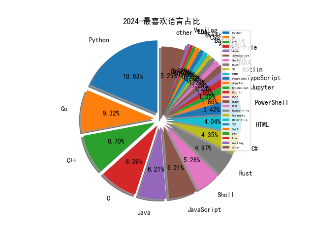

# [数据--所有](README_20.md)
# [数据--年度](README_2024.md)
# 2024 信息源与信息类型占比

# 网络安全书籍 推荐
| date_added | language | title | author | link | size| 
| --- | --- | --- | --- | --- | ---| 
| 2024-03-30 09:09:28 | English | Microsoft 365 Security and Compliance for Administrators | Sasha Kranjac, Omar Kudović | http://libgen.rs/book/index.php?md5=64EF856396ABADB0921FAC19116C2173 | 38 MB [EPUB]| 
| 2024-03-30 09:07:40 | English | Artificial Intelligence for Robotics: Build intelligent robots using ROS 2, Python, OpenCV, and AI/ML techniques, 2nd Edition | Francis X. Govers III | http://libgen.rs/book/index.php?md5=05E803B985C0AA9C73A9374FCA010716 | 17 MB [EPUB]| 
| 2024-03-30 09:05:10 | English | ChatGPT for Cybersecurity Cookbook: Learn practical generative AI recipes to supercharge your cyber skills | Clint Bodungen | http://libgen.rs/book/index.php?md5=6B2705E0D6D24D8C113752F67B42D7D8 | 17 MB [EPUB]| 
| 2024-03-30 08:56:03 | English | Mastering Time Series Analysis and Forecasting with Python: Bridging Theory and Practice Through Insights, Techniques, and Tools for Effective Time Series Analysis in Python | Sulekha Aloorravi | http://libgen.rs/book/index.php?md5=BF40896A6797F1F44EB4EBF4F39BC305 | 8 MB [EPUB]| 
| 2024-03-30 08:51:38 | English | PYTHON PROGRAMMIN A to Z: A Comprehensive Guide to Programming Excellence | Wong, Wilson | http://libgen.rs/book/index.php?md5=3E809CDAF01A0E8D1971422CA02988A9 | 18 MB [EPUB]| 
| 2024-03-30 08:47:49 | English | The OSINT Handbook: A practical guide to analyzing and gathering online information | Dale Meredith | http://libgen.rs/book/index.php?md5=81679340AD2B15CF358687852DD17E6B | 18 MB [EPUB]| 
| 2024-03-28 12:45:45 | English | Theory of Cryptography: 21st International Conference, TCC 2023, Taipei, Taiwan, November 29 – December 2, 2023, Proceedings, Part II (Lecture Notes in Computer Science) | Guy Rothblum (editor), Hoeteck Wee (editor) | http://libgen.rs/book/index.php?md5=5D6354BED1449B403FCE135AA7F8D758 | 12 MB [PDF]| 
| 2024-03-27 14:55:07 | English | Vapor Intrusion Simulations and Risk Assessments | Yijun Yao, Qiang Chen | http://libgen.rs/book/index.php?md5=A54947F01445DDE26AD050B08D904B8E | 6 MB [PDF]| 
| 2024-03-27 14:54:15 | English | Quality Assurance Implementation in Research Labs | Akshay Anand (editor) | http://libgen.rs/book/index.php?md5=F3880E3615B904E4585AE61BD4E43E6D | 6 MB [PDF]| 
| 2024-03-24 10:08:15 | English | A Developers Guide to Cloud Apps Using Microsoft Azure: Migrate and modernize your cloud-native applications with containers on Azure using real-world case studies | Hamida Rebai Trabelsi | http://libgen.rs/book/index.php?md5=8E724534BB84AF84F4BF045DE56A4D28 | 15 MB [PDF]| 
| 2024-03-24 10:01:53 | English | Microsoft Azure Compute: The Definitive Guide (IT Best Practices - Microsoft Press) | Avinash Valiramani | http://libgen.rs/book/index.php?md5=FD2BC2A40C0A86775758E7229780561B | 38 MB [EPUB]| 
| 2024-03-24 11:18:04 | English | Building Generative AI-Powered Apps : A Hands-on Guide for Developers | Aarushi Kansal | http://libgen.rs/book/index.php?md5=7DFEACCDC74C344494D3ED12A2483382 | 8 MB [EPUB]| 
| 2024-03-24 11:06:22 | English | Generative Art with JavaScript and SVG: Utilizing Scalable Vector Graphics and Algorithms for Creative Coding and Design | David Matthew | http://libgen.rs/book/index.php?md5=3C1468F86D9A8EB59E526A4636E99AB3 | 26 MB [MOBI]| 
| 2024-03-24 11:02:21 | English | Multi-Cloud Automation with Ansible : Automate, orchestrate, and scale in a multi-cloud world | Sabharwal, Pankaj; | http://libgen.rs/book/index.php?md5=0D4C218F0C4DF573D0AA89D948076001 | 10 MB [EPUB]| 
| 2024-03-24 10:58:50 | English | Mastering Functional Programming with Python | Brett Neutreon | http://libgen.rs/book/index.php?md5=DD37726C1B6E1FB045B7996DD7F9E358 | 49 MB [PDF]| 
| 2024-03-24 10:53:06 | English | Python Advanced Programming: The guide to learn pyhton programming | Marcus Richards | http://libgen.rs/book/index.php?md5=64BC566B203C78D80F92DDCB5705E6E1 | 707 kB [EPUB]| 
| 2024-03-24 10:50:21 | English | Google Gemini for Python: Coding with Bard | Oswald Campesato | http://libgen.rs/book/index.php?md5=7A9C7C6B91B8611DC3E8996DE66F0B2F | 2 MB [PDF]| 
| 2024-03-22 03:38:55 | English | Trust.: Responsible AI, Innovation, Privacy and Data Leadership | Leipzig, Dominique Shelton | http://libgen.rs/book/index.php?md5=756B6F9F77D26BA16F77DC974F46E221 | 1 MB [EPUB]| 
| 2024-03-22 11:22:19 | English | (Routledge Studies in Conservation and the Environment) Is CITES Protecting Wildlife? Assessing Implementation and Compliance | Tanya Wyatt | http://libgen.rs/book/index.php?md5=8880F08208B5E48CD5084C2CA729BCA1 | 3 MB [EPUB]| 
| 2024-03-21 04:15:54 | English | Differential Privacy for Dynamic Data (SpringerBriefs in Control, Automation and Robotics) | Jerome Le Ny | http://libgen.rs/book/index.php?md5=D134F93E27DF526B754E11109FCC75A1 | 3 MB [PDF]| 
| 2024-03-21 04:09:48 | English | Discrete Cuckoo Search for Combinatorial Optimization (Springer Tracts in Nature-Inspired Computing) | Aziz Ouaarab | http://libgen.rs/book/index.php?md5=5252EB5FAD29A09BD8EE65A7AB69E604 | 3 MB [PDF]| 
| 2024-03-20 04:32:50 | English | Computer Vision Using Local Binary Patterns (Computational Imaging and Vision, 40) | Matti Pietikäinen, Abdenour Hadid, Guoying Zhao, Timo Ahonen | http://libgen.rs/book/index.php?md5=5AC9326720B8B325123F9A98D5D0A2FE | 8 MB [PDF]| 
| 2024-03-20 04:15:47 | English | Comparative Perspectives on the Right to Privacy: Pakistani and European Experiences (Ius Gentium: Comparative Perspectives on Law and Justice, 109) | Sohail Aftab | http://libgen.rs/book/index.php?md5=64036428219A751E1FD982BFA4C3965C | 8 MB [PDF]| 
| 2024-03-20 05:54:36 | English | Cyber Security Impact on Digitalization and Business Intelligence: Big Cyber Security for Information Management: Opportunities and Challenges (Studies in Big Data, 117) | Haitham M. Alzoubi (editor), Muhammad Turki Alshurideh (editor), Taher M. Ghazal (editor) | http://libgen.rs/book/index.php?md5=3F957452AC5243293746C585DFB2890A | 14 MB [PDF]| 
| 2024-03-20 05:32:40 | English | Cybersecurity Vigilance and Security Engineering of Internet of Everything (Internet of Things) | Kashif Naseer Qureshi (editor), Thomas Newe (editor), Gwanggil Jeon (editor), Abdellah Chehri (editor) | http://libgen.rs/book/index.php?md5=E34E3DAD75FCEE487EAEA5348B51AC1D | 11 MB [PDF]| 
| 2024-03-20 05:32:06 | English | Data Privacy Management, Cryptocurrencies and Blockchain Technology: ESORICS 2021 International Workshops, DPM 2021 and CBT 2021, Darmstadt, Germany, ... Selected Papers (Security and Cryptology) | Joaquin Garcia-Alfaro (editor), Jose Luis Muñoz-Tapia (editor), Guillermo Navarro-Arribas (editor), Miguel Soriano (editor) | http://libgen.rs/book/index.php?md5=0ECE41E2569CF41FB9038F3D5ED4E5CB | 11 MB [PDF]| 
| 2024-03-18 17:12:09 | English | Chaos-based Cryptography: Theory, Algorithms and Applications (Studies in Computational Intelligence, 354) | Ljupco Kocarev (editor), Shiguo Lian (editor) | http://libgen.rs/book/index.php?md5=FE3DD9D5320CBC529ABD356C1DB85020 | 12 MB [PDF]| 
| 2024-03-18 16:40:53 | English | Cryptography: Lecture Notes in Computer Science | Thomas Beth | http://libgen.rs/book/index.php?md5=820FA67A1A08F5E0242D6BB5FCF608AE | 12 MB [PDF]| 
| 2024-03-18 16:36:08 | English | Design and Deploy Azure VMware Solutions: Build and Run VMware Workloads Natively on Microsoft Azure | Puthiyavan Udayakumar | http://libgen.rs/book/index.php?md5=9B011594D9D394DFBB5C43251B394755 | 12 MB [PDF]| 
| 2024-03-17 07:46:18 | English | (International Screen Industries) Supply Chain Cinema: Producing Global Film Workers | Kay Dickinson | http://libgen.rs/book/index.php?md5=5ED8F84B0DE6E219F92C907C2D7EF777 | 3 MB [PDF]| 
| 2024-03-17 12:44:20 | English | Learning OpenTelemetry | unknown | https://www.wowebook.org/learning-opentelemetry/ | unknown| 
| 2024-03-15 08:46:17 | English | AWS Security Essentials (Video Course) | unknown | https://www.wowebook.org/aws-security-essentials-video-course/ | unknown| 
| 2024-03-13 18:10:27 | English | Real-World Bug Hunting - A Field Guide to Web Hacking | Peter Yaworski | http://libgen.rs/book/index.php?md5=0E0C482EB94DBA4B95528B396562DD10 | 7 MB [PDF]| 
| 2024-03-13 17:36:33 | English | Python Tricks: The Book | Dan Bader | http://libgen.rs/book/index.php?md5=7E2CB40B4730D1DAD806D5E6C8F442E4 | 643 kB [PDF]| 
| 2024-03-13 17:35:46 | English | Python One-Liners: Write Concise, Eloquent Python Like a Professional | Christian Mayer | http://libgen.rs/book/index.php?md5=801944C47B2BE553A2ABD0B896ED25C4 | 7 MB [PDF]| 
| 2024-03-13 16:29:31 | English | Python Made Simple: Full Beginner’s Guide to Mastering Python | unknown | http://libgen.rs/book/index.php?md5=EE00BAFE1E80458CBF95072FAB7ABC2B | 3 MB [PDF]| 
| 2024-03-12 16:45:56 | English | New Perspectives Collection, Microsoft 365 & Excel 2021 Comprehensive | Patrick Carey | http://libgen.rs/book/index.php?md5=88F54B3A2E2F1A39EB7B80677CB10064 | 45 MB [PDF]| 
| 2024-03-12 16:44:18 | English | Microsoft Word Legal and Corporate – Working With All Types of Tables | Louis Ellman | http://libgen.rs/book/index.php?md5=0B596E7A07BD349265084051804162BF | 6 MB [EPUB]| 
| 2024-03-12 16:38:57 | English | Google Gemini for Python: Coding with BARD | Oswald Campesato | http://libgen.rs/book/index.php?md5=B0B6423023E7EA84D09C021A80933750 | 5 MB [EPUB]| 
| 2024-03-12 16:32:16 | English | Microsoft Office 365 Bible 10 Books in 1 , The Best Crash Course to Takes You from Beginner to Advanced to learn OneNote | Milo Rowse | http://libgen.rs/book/index.php?md5=3797B9CDEE71C4A5B84F0A8C7317280E | 20 MB [EPUB]| 
| 2024-03-12 17:44:47 | English | Data-Centric Machine Learning with Python | unknown | https://www.wowebook.org/data-centric-machine-learning-with-python/ | unknown| 
| 2024-03-11 18:32:17 | English | Learn Microsoft Fabric | unknown | https://www.wowebook.org/learn-microsoft-fabric/ | unknown| 
| 2024-03-10 21:56:17 | English | 150+ Python Pattern Programs: Top Python exercises to feed your creativity with if statements and loops (150+ Pattern Programs) | Abella, Hernando | http://libgen.rs/book/index.php?md5=6A1DCAFC92F55108871A2D641A004A55 | 308 kB [EPUB]| 
| 2024-03-10 20:48:59 | English | Python for Finance: A Crash Course Modern Guide: Learn Python Fast | Bisette, Vincent; Van Der Post, Hayden | http://libgen.rs/book/index.php?md5=5B4A53A9127A640CE7FDC989D04DDA24 | 2 MB [EPUB]| 
| 2024-03-10 16:37:17 | English | Web Scraping with Python, 3rd Edition | unknown | https://www.wowebook.org/web-scraping-with-python-3rd-edition/ | unknown| 
| 2024-03-08 08:55:20 | English | Kubernetes for Developers | unknown | https://www.wowebook.org/kubernetes-for-developers/ | unknown| 
| 2024-03-07 22:59:02 | English | Writing In-House Medical Device Software in Compliance with EU, UK, and US Regulations | Philip S. Cosgriff, Matthew J. Memmott | http://libgen.rs/book/index.php?md5=813665EAC4134CBDD127FCC84AD38BB6 | 4 MB [PDF]| 
| 2024-03-06 11:08:45 | English | Code Like a Pro in Rust | unknown | https://www.wowebook.org/code-like-a-pro-in-rust/ | unknown| 
| 2024-03-06 15:06:49 | English | Learn Rust in a Month of Lunches | unknown | https://www.wowebook.org/learn-rust-in-a-month-of-lunches/ | unknown| 
| 2024-03-04 06:17:12 | English | Prototyping Python Dashboards for Scientists and Engineers | unknown | https://www.wowebook.org/prototyping-python-dashboards-for-scientists-and-engineers/ | unknown| 
| 2024-03-04 15:30:54 | English | Introduction to Generative AI, Video Edition | unknown | https://www.wowebook.org/introduction-to-generative-ai-video-edition/ | unknown| 
| 2024-03-02 15:38:45 | English | Options Finance: Options Stratigies with Python | Bisette, Vincent; Van Der Post, Hayden | http://libgen.rs/book/index.php?md5=6CEF1671E9FF715643E3F028E2043F85 | 771 kB [EPUB]| 
| 2024-03-02 15:37:28 | English | Building Interactive Dashboards in Microsoft 365 Excel | Michael Olafusi | http://libgen.rs/book/index.php?md5=500B017390F2B8B6CE35BBDB8B439264 | 94 MB [EPUB]| 
| 2024-03-02 15:26:41 | English | PYTHON DATA ANALYTICS: Mastering Python for Effective Data Analysis and Visualization | Floyd Bax | http://libgen.rs/book/index.php?md5=07B11FEF430AF4E617BF0B393A86C8D7 | 4 MB [PDF]| 
| 2024-03-02 15:01:04 | English | Python Charmer: Learn Fundamental Python skills: Master Python Step by Step: A Beginners Guide to Coding | saravan krishna | http://libgen.rs/book/index.php?md5=F714167A8EBDBB568866CCA6BE8A7DD7 | 12 MB [EPUB]| 
| 2024-03-02 14:56:56 | English | Python Booleans Unveiled: A Beginners Guide to Mastering the Code Secrets for a Seamless Start | JP Parker | http://libgen.rs/book/index.php?md5=32A8275D0FE3BA52F0D1B8A2951411A4 | 177 kB [EPUB]| 
| 2024-03-02 14:40:37 | English | The Attack on Leviathan: Regionalism and Nationalism in the United States | Donald Davidson | http://libgen.rs/book/index.php?md5=2853C3916FA8066ECDC66BA34B032E53 | 18 MB [PDF]| 
| 2024-03-01 06:25:33 | English | Machine Learning Theory and Applications: Hands-on Use Cases with Python on Classical and Quantum Machines | unknown | https://www.wowebook.org/machine-learning-theory-and-applications-hands-on-use-cases-with-python-on-classical-and-quantum-machines/ | unknown| 
| 2024-03-01 16:26:47 | English | Cloud Forensics Demystified | unknown | https://www.wowebook.org/cloud-forensics-demystified/ | unknown| 
| 2024-03-01 10:48:40 | English | Mastering Microsoft Fabric | unknown | https://www.wowebook.org/mastering-microsoft-fabric/ | unknown| 
| 2024-02-24 16:57:14 | English | Asynchronous Programming in Rust | unknown | https://www.wowebook.org/asynchronous-programming-in-rust/ | unknown| 
| 2024-02-24 08:01:06 | English | Practical Guide to Applied Conformal Prediction in Python | unknown | https://www.wowebook.org/practical-guide-to-applied-conformal-prediction-in-python/ | unknown| 
| 2024-02-22 11:44:10 | English | Beyond the Algorithm: AI, Security, Privacy, and Ethics | unknown | https://www.wowebook.org/beyond-the-algorithm-ai-security-privacy-and-ethics/ | unknown| 
| 2024-02-22 11:22:47 | English | The AI Revolution in Networking, Cybersecurity, and Emerging Technologies | unknown | https://www.wowebook.org/the-ai-revolution-in-networking-cybersecurity-and-emerging-technologies/ | unknown| 
| 2024-02-22 05:42:57 | English | The Async-First Playbook: Remote Collaboration Techniques for Agile Software Teams | unknown | https://www.wowebook.org/the-async-first-playbook-remote-collaboration-techniques-for-agile-software-teams/ | unknown| 
| 2024-02-21 17:00:08 | English | Better Python Code: A Guide for Aspiring Experts | unknown | https://www.wowebook.org/better-python-code-a-guide-for-aspiring-experts/ | unknown| 
| 2024-02-19 16:03:09 | English | The Kubernetes Book | Nigel Poulton | http://libgen.rs/book/index.php?md5=6553E26B2508DFA32D7E395450212B2D | 16 MB [PDF]| 
| 2024-02-18 13:21:40 | English | Learn AI-Assisted Python Programming, Video Edition | unknown | https://www.wowebook.org/learn-ai-assisted-python-programming-video-edition/ | unknown| 
| 2024-02-16 07:33:56 | English | Skill Up with Python: Introduction (Video Course) | unknown | https://www.wowebook.org/skill-up-with-python-introduction-video-course/ | unknown| 
| 2024-02-16 20:48:10 | English | Skill Up with Python: Web Development Recipes (Video Course) | unknown | https://www.wowebook.org/skill-up-with-python-web-development-recipes-video-course/ | unknown| 
| 2024-02-16 16:35:11 | English | Skill Up with Python: Data Science and Machine Learning Recipes (Video Course) | unknown | https://www.wowebook.org/skill-up-with-python-data-science-and-machine-learning-recipes-video-course/ | unknown| 
| 2024-02-12 08:41:17 | English | Data Labeling in Machine Learning with Python | unknown | https://www.wowebook.org/data-labeling-in-machine-learning-with-python/ | unknown| 
| 2024-02-09 08:13:28 | English | Bayesian Analysis with Python, Third Edition | unknown | https://www.wowebook.org/bayesian-analysis-with-python-third-edition/ | unknown| 
| 2024-02-06 22:55:12 | English | NLP with Python: 3 Books in 1 - From Beginner to Advanced: The Future Frontier and Next-Gen Solutions | Watson, Jerome | http://libgen.rs/book/index.php?md5=CC3989E608E8EC9D612677039EC459BC | 1009 kB [EPUB]| 
| 2024-02-06 17:08:19 | English | Salesforce DevOps for Architects | unknown | https://www.wowebook.org/salesforce-devops-for-architects/ | unknown| 
| 2024-02-06 18:07:08 | English | Kubernetes Secrets Handbook | unknown | https://www.wowebook.org/kubernetes-secrets-handbook/ | unknown| 
| 2024-02-06 17:32:16 | English | Mastering Cloud Security Posture Management (CSPM) | unknown | https://www.wowebook.org/mastering-cloud-security-posture-management-cspm/ | unknown| 
| 2024-02-03 08:45:07 | English | CompTIA A+ Practice Test Core 2 (220-1102) | unknown | https://www.wowebook.org/comptia-a-practice-test-core-2-220-1102/ | unknown| 
| 2024-02-03 08:16:04 | English | CompTIA A+ Practice Tests Core 1 (220-1101) and Core 2 (220-1102) | unknown | https://www.wowebook.org/comptia-a-practice-tests-core-1-220-1101-and-core-2-220-1102/ | unknown| 
| 2024-02-03 13:27:07 | English | Microsoft Intune Cookbook | unknown | https://www.wowebook.org/microsoft-intune-cookbook/ | unknown| 
| 2024-02-02 15:49:58 | English | CompTIA Security+ SY0-701 Certification Guide, Third Edition | unknown | https://www.wowebook.org/comptia-security-sy0-701-certification-guide-third-edition/ | unknown| 
| 2024-01-26 07:57:01 | English | Covert Surveillance and Electronic Penetration | William B. Moran | http://libgen.rs/book/index.php?md5=56CDA28B35ECF30F62D313562E897175 | 19 MB [PDF]| 
| 2024-01-23 08:46:16 | English | Modern DevOps Practices, Second Edition | unknown | https://www.wowebook.org/modern-devops-practices-second-edition/ | unknown| 
| 2024-01-23 07:42:41 | English | Mastering Elastic Kubernetes Service on AWS | unknown | https://www.wowebook.org/mastering-elastic-kubernetes-service-on-aws/ | unknown| 
| 2024-01-23 06:38:47 | English | Observability with Grafana | unknown | https://www.wowebook.org/observability-with-grafana/ | unknown| 
| 2024-01-22 12:13:25 | English | CompTIA Security+ Get Certified Get Ahead: SY0-701 Study Guide | Joe Shelley & Darril Gibson | http://libgen.rs/book/index.php?md5=ECA24BD2B1640581057C4A8397983636 | 7 MB [PDF]| 
| 2024-01-20 14:46:09 | English | Descriptive Analytics: Describe with Python: A comprehensive guide to Descriptive Analytics with the use of python programming | Van Der Post, Hayden | http://libgen.rs/book/index.php?md5=24CBFE82A9C336ACD224F3BF5FBF9727 | 1 MB [EPUB]| 
| 2024-01-20 14:39:03 | English | Advances in Water Pollution Monitoring and Control: Select Proceedings from HSFEA 2018 (Springer Transactions in Civil and Environmental Engineering) | Nihal Anwar Siddiqui (editor), S. M. Tauseef (editor), Rajendra Dobhal (editor) | http://libgen.rs/book/index.php?md5=1247072896633D73F00F5B80932C1EE2 | 7 MB [PDF]| 
| 2024-01-20 14:29:46 | English | Adversary-Aware Learning Techniques and Trends in Cybersecurity | Prithviraj Dasgupta (editor), Joseph B. Collins (editor), Ranjeev Mittu (editor) | http://libgen.rs/book/index.php?md5=46515DF6A2A28FEF1538D3875A93952F | 5 MB [PDF]| 
| 2024-01-18 14:35:54 | English | Python for Healthcare & Medical Research: EXPLORING THE EXCITING WORLD OF POSSIBILITIES WITH PYTHON | Van Der Post, Hayden | http://libgen.rs/book/index.php?md5=43D5E1C54ED79E99FEC8DBC1FF9CEE1C | 1 MB [EPUB]| 
| 2024-01-16 13:38:43 | English | Kubernetes: A Comprehensive Step-by-Step Guide for Beginners to Master Kubernetes Efficiently | Chloe Annable | http://libgen.rs/book/index.php?md5=C505185882622858471B87F4EF031896 | 6 MB [EPUB]| 
| 2024-01-16 12:29:34 | English | The 2x2 Matrix: Contingency, Confusion and the Metrics of Binary Classification | A. J. Larner | http://libgen.rs/book/index.php?md5=698E9F50A4DB7AD0FE703D74CF41CE87 | 4 MB [PDF]| 
| 2024-01-15 09:06:06 | English | Applied Deep Learning with Python: Use scikit-learn, TensorFlow, and Keras to create intelligent systems | Alex Galea | http://libgen.rs/book/index.php?md5=5B683FC4060F22A413550C76ECD94246 | 34 MB [EPUB]| 
| 2024-01-15 07:27:02 | English | Automating Data Quality Monitoring | unknown | https://www.wowebook.org/automating-data-quality-monitoring/ | unknown| 
| 2024-01-13 20:16:46 | English | Machine Learning: A Guide to PyTorch, TensorFlow, and Scikit-Learn: Mastering Machine Learning With Python | Van Der Post, Hayden | http://libgen.rs/book/index.php?md5=8F932A1D4B435F1D840A6B0F11162D70 | 762 kB [EPUB]| 
| 2024-01-13 20:11:35 | English | Pythonomics: coding strategies to python in economics: A Comprehensive guide to the application of python programming in economics | Van Der Post, Hayden | http://libgen.rs/book/index.php?md5=A242AC92B08A3574F587109279778A54 | 1 MB [EPUB]| 
| 2024-01-13 20:05:14 | English | Python for Accounting: The comprehensive guide to introducing python into your accounting workflow | Van Der Post, Hayden | http://libgen.rs/book/index.php?md5=9FA1E2FEC28795D89518D4F928BA7C96 | 2 MB [EPUB]| 
| 2024-01-13 19:40:04 | English | Deep Learning for Finance: Creating Machine & Deep Learning Models for Trading in Python | Sofien Kaabar | http://libgen.rs/book/index.php?md5=A1E5C5D79EBA2ED48BE421425CF1555D | 9 MB [PDF]| 
| 2024-01-08 07:33:21 | English | Soar with Haskell | unknown | https://www.wowebook.org/soar-with-haskell/ | unknown| 
| 2024-01-08 07:21:27 | English | Data Observability for Data Engineering | unknown | https://www.wowebook.org/data-observability-for-data-engineering/ | unknown| 
| 2024-01-06 10:25:12 | English | Microsoft 365 Administrator MS-102 Exam Guide | unknown | https://www.wowebook.org/microsoft-365-administrator-ms-102-exam-guide/ | unknown| 
| 2024-01-05 11:43:32 | English | Applied Computational Thinking with Python, Second Edition | unknown | https://www.wowebook.org/applied-computational-thinking-with-python-second-edition/ | unknown| 
| 2024-01-05 18:25:08 | English | The Crypto Launderers: Crime and Cryptocurrencies from the Dark Web to DeFi and Beyond | David Carlisle | http://libgen.rs/book/index.php?md5=488EEE0AE318657F45AA60B24B85570F | 13 MB [EPUB]| 
| 2024-01-05 18:06:01 | English | (Springer Undergraduate Mathematics Series) A Course in Python: The Core of the Language | Roozbeh Hazrat | http://libgen.rs/book/index.php?md5=0F974EB1BA244B42A5114B9F484EDAD6 | 11 MB [PDF]| 
| 2024-01-03 14:38:56 | English | Security Orchestration, Automation, and Response for Security Analysts | unknown | https://www.wowebook.org/security-orchestration-automation-and-response-for-security-analysts/ | unknown| 
| 2024-01-03 13:43:09 | English | DevOps for Databases | unknown | https://www.wowebook.org/devops-for-databases/ | unknown| 
| 2024-01-03 19:06:28 | English | Think Python: How to Think Like a Computer Scientist | Allen B. Downey | http://libgen.rs/book/index.php?md5=D4ACD947DD464F477E332EAC4BD000CC | 900 kB [PDF]| 

# 微信公众号 推荐
| nickname_english | weixin_no | title | url| 
| --- | --- | --- | ---| 
| AI与网安 | gh_c57275954216 | 2024年3月有哪些好用的流量卡？套餐降费指南 | https://mp.weixin.qq.com/s?__biz=MzU1ODQ2NTY3Ng==&mid=2247486253&idx=1&sn=aaeb146b5484f1769e0b95cd647544d6 | 30| 
| Adler学安全 | Acade- | 漏洞复现-CVE-2024-29666 | https://mp.weixin.qq.com/s?__biz=Mzg5NDU1MDc1OA==&mid=2247485331&idx=1&sn=deb2314b55c8152a6673eee7a4aa6514 | 14| 
| DFIR蘇小沐 | DFIR00 | 【电子取证篇】微信2群正式开放 | https://mp.weixin.qq.com/s?__biz=MzI2MTUwNjI4Mw==&mid=2247488111&idx=1&sn=4d2d4e62e9a9a84b1e48d24cf9bebc45 | 8| 
| FreeBuf | freebuf | 紧急提醒！Xz/liblzma 被植入源码级后门 | https://mp.weixin.qq.com/s?__biz=MjM5NjA0NjgyMA==&mid=2651265745&idx=1&sn=3c88d6cc2041f230384e68a51eb43818 | 185| 
| Hack分享吧 | HackShareB | 自动化收集XSS易受攻击参数工具 | https://mp.weixin.qq.com/s?__biz=MzA4NzU1Mjk4Mw==&mid=2247490250&idx=1&sn=10c4e68b9aa9b9d84e86dc908ad2d444 | 20| 
| LHACK安全 | Lhack_1314 | 沈阳深蓝24年国HW招聘 | https://mp.weixin.qq.com/s?__biz=MzkyMjU2Nzc1Mg==&mid=2247484219&idx=1&sn=781c45e908fe5172c5afe6b5a01609cd | 4| 
| Piusec | PiU_Sec | CMS代码审计-SQL入门（二） | https://mp.weixin.qq.com/s?__biz=Mzg3Nzk1OTA1OQ==&mid=2247484690&idx=1&sn=5fe8b0304d7eb7616aa1f04cdc94a267 | 7| 
| Yi安全 | gh_b51111a0d6d3 | 某友U8-nc.bs.sm.login2.RegisterServlet sql附py | https://mp.weixin.qq.com/s?__biz=Mzg3ODk2OTcxMw==&mid=2247484968&idx=1&sn=659dc55b86d6245e7fa76cfa1d778ea5 | 12| 
| dotNet安全矩阵 | doNetSafety | .NET 矩阵3月份增量红队工具集合 | https://mp.weixin.qq.com/s?__biz=MzUyOTc3NTQ5MA==&mid=2247491221&idx=1&sn=dc1eda08e83ac9038797ad935ff9c8bb | 65| 
| 一起聊安全 | gh_589ffdaa31f9 | T/CBA 221—2024 银行业数据资产估值指南发布（福利最后1天！！！） | https://mp.weixin.qq.com/s?__biz=MzI3NjUzOTQ0NQ==&mid=2247508393&idx=1&sn=1a9b7084aefc17f50c324787239b4411 | 19| 
| 不秃头的安全 | BTTDAQ | 漏洞挖掘  ,  JFinalCMS v5.0.0存在多种类型漏洞 | https://mp.weixin.qq.com/s?__biz=Mzg3NzkwMTYyOQ==&mid=2247486066&idx=1&sn=9e6518ef2b3d4054ade27d937f808127 | 26| 
| 中国计算机学会 | ccfvoice | CCF理事说 , 太原科大教授郭银章：全力推动CCF会员活动中心内部治理结构改革，持续打造CCF黄河产业技术论坛 | https://mp.weixin.qq.com/s?__biz=MjM5MTY5ODE4OQ==&mid=2651569722&idx=1&sn=67629d801b37c1a687197d09df9dac1c | 130| 
| 亚信安全 | yaxinanquan | 极危！XZ Utils 5.6.0/5.6.1版本恶意后门植入漏洞风险通告 | https://mp.weixin.qq.com/s?__biz=MjM5NjY2MTIzMw==&mid=2650613070&idx=1&sn=592ba5c28e79e06a055e0fa6b367040f | 38| 
| 亿人安全 | Yr-Sec | 师傅们，这个新方向爆了！70k很稳 | https://mp.weixin.qq.com/s?__biz=Mzk0MTIzNTgzMQ==&mid=2247514309&idx=1&sn=d823eb4a608cb11653ac16cdac88bf43 | 21| 
| 会杀毒的单反狗 | cmlitiejun | 德国政府警告称，该国1.7万台 Microsoft Exchange 服务器容易受到严重漏洞的影响 | https://mp.weixin.qq.com/s?__biz=MzI2NzAwOTg4NQ==&mid=2649790755&idx=1&sn=51caf70d99164ff28844578e8fa8b678 | 26| 
| 关键信息基础设施安全保护联盟 | CNCIIPA | 专家观点 , 人工智能飞速发展，如何平衡人工智能产业创新发展与法律风险防范？ | https://mp.weixin.qq.com/s?__biz=MzkxNjU2NjY5MQ==&mid=2247500413&idx=1&sn=83561e7aa708e62bb7de86933d0dd213 | 22| 
| 内生安全联盟 | CCESS_CHINA | S&S专刊征稿 , 云计算场景下的数据安全与隐私保护 | https://mp.weixin.qq.com/s?__biz=Mzg4MDU0NTQ4Mw==&mid=2247517763&idx=1&sn=afbcee8ae463188249476f358ef20bb0 | 78| 
| 利刃信安 | None | 【电子政务】大模型在电子政务场景中的应用 | https://mp.weixin.qq.com/s?__biz=MzU1Mjk3MDY1OA==&mid=2247512563&idx=1&sn=97521be3bab61f01c404599291fb1968 | 51| 
| 前沿信安资讯阵地 | infosrc | 2024年网络威胁概览（00）,  开篇序言 | https://mp.weixin.qq.com/s?__biz=MzA3MTM0NTQzNA==&mid=2455772348&idx=1&sn=0c78456df2972034022860c7c0d7afb9 | 24| 
| 南街老友 | gh_f9a38b1d58f0 | 顶讯OA 漏洞 | https://mp.weixin.qq.com/s?__biz=MzA5OTA0MTU4Mg==&mid=2247485890&idx=1&sn=6658fc2da163fb06624bad43a5716346 | 1| 
| 听风安全 | tingfengsec | 聊一聊红队打点那些事 | https://mp.weixin.qq.com/s?__biz=Mzg3NzIxMDYxMw==&mid=2247500035&idx=1&sn=8e91628851608866fcd32fc8c4da91cc | 18| 
| 嘉诚安全 | jiachengsec | 【漏洞通告】XZ Utilѕ工具库恶意后门植入漏洞安全风险通告 | https://mp.weixin.qq.com/s?__biz=MzU4NjY4MDAyNQ==&mid=2247494975&idx=1&sn=439dad73fb45d14d2fe2339273d1096e | 33| 
| 墨雪飘影 | SG-CXZ | 99元服务器+20G SCU=？ | https://mp.weixin.qq.com/s?__biz=MzI3NzI4OTkyNw==&mid=2247489167&idx=1&sn=780944ec05ce31767948e89a520be83f | 4| 
| 复旦白泽战队 | fdwhitzard | 成果分享 , 探索图神经网络模型的“指纹” | https://mp.weixin.qq.com/s?__biz=MzU4NzUxOTI0OQ==&mid=2247489018&idx=1&sn=a40991223df4e7d51afcabcbd5e7b5c0 | 6| 
| 夜组安全 | NightCrawler_Team | SRC挖掘思路之逻辑洞在企业商城中的危害扩大化 , 公开课今晚7点限时100人 | https://mp.weixin.qq.com/s?__biz=Mzk0ODM0NDIxNQ==&mid=2247490252&idx=1&sn=446c88137ca1f9e2459d8455edf8f55c | 24| 
| 天盾信安 | Tiandun_yanshu0_0 | 一次很精彩的溯源（鼹鼠社工库实战案例） | https://mp.weixin.qq.com/s?__biz=MzkxMDYwNDI0MA==&mid=2247484439&idx=1&sn=568d89d511c6aee0f6d145564e56438b | 15| 
| 奇安信 CERT | gh_64040028303e | 【IOC增补】XZ Utilѕ 工具库恶意后门植入漏洞(CVE-2024-3094)安全风险通告 | https://mp.weixin.qq.com/s?__biz=MzU5NDgxODU1MQ==&mid=2247500688&idx=1&sn=59946de3e8b6875bc0165949685d369a | 18| 
| 奇安信集团 | qianxin-keji | xz/liblzma后门影响全网软件测绘分析 | https://mp.weixin.qq.com/s?__biz=MzU0NDk0NTAwMw==&mid=2247609954&idx=1&sn=53ce3e199e8c32525b44d8ca39682e49 | 68| 
| 安全狗的自我修养 | haidragon_study | 免费课程大全-新课cpp高级开发更新到了155节啦 | https://mp.weixin.qq.com/s?__biz=MzkwOTE5MDY5NA==&mid=2247494757&idx=1&sn=7ebd8100d618f8ffb6e360b925e710a0 | 27| 
| 安在 | None | 知识星球 , 使用钉钉或企业微信数据安全如何做？政企机构数据安全风险有哪些？ | https://mp.weixin.qq.com/s?__biz=MzU5ODgzNTExOQ==&mid=2247619004&idx=1&sn=83b582c7d3ec7c92f6b17b999f8baca5 | 96| 
| 安天集团 | Antiylab | 安天网络行为检测能力升级通告（20240331） | https://mp.weixin.qq.com/s?__biz=MjM5MTA3Nzk4MQ==&mid=2650205002&idx=1&sn=a44aec13fcf8d7f2a2b050c8f856e326 | 52| 
| 实战安全研究 | gh_f390fc63c711 | 记一次某开源OA代码审计 | https://mp.weixin.qq.com/s?__biz=MzU0MTc2NTExNg==&mid=2247489793&idx=1&sn=2f58481293886c24d4ca6be63a44ec23 | 32| 
| 小呆安全 | gh_c8cea8fc3c2d | 记一些CTF（WEB） | https://mp.weixin.qq.com/s?__biz=MzkzNTUwNzIxNA==&mid=2247484177&idx=1&sn=6e4d4abd7a0631394eb3d6bb0be936aa | 2| 
| 小黑子安全 | xiaoheizi537981 | 通用漏洞-跨域CORS+JSONP回调+域名接管 | https://mp.weixin.qq.com/s?__biz=Mzg5NDg4MzYzNQ==&mid=2247486385&idx=1&sn=f3dbd7571707e257d44e02cbd4d66318 | 22| 
| 异空间安全 | yikongjiananquan | 2024Web安全就业班第十六期春季招生通知 | https://mp.weixin.qq.com/s?__biz=MzIzOTUwMjI5MA==&mid=2247485512&idx=1&sn=1cb106ef854626fab29f8fce23a6cbc7 | 1| 
| 微步在线研究响应中心 | gh_280024a09930 | 支持样本检测！六问xz后门完整攻击过程最新进展 | https://mp.weixin.qq.com/s?__biz=Mzg5MTc3ODY4Mw==&mid=2247505289&idx=1&sn=aba384480f6d13889ed0f48b9fff132a | 6| 
| 技术修道场 | gh_fe3e6e63e435 | 八大技术趋势案例（云计算&大数据） | https://mp.weixin.qq.com/s?__biz=MzA4NTY4MjAyMQ==&mid=2447898657&idx=1&sn=2eabbc11154e028a03dfe3b1aeed42d6 | 6| 
| 掌控安全EDU | ZKAQEDU | 漏洞挖掘 , ruoyi框架管理系统漏洞 | https://mp.weixin.qq.com/s?__biz=MzUyODkwNDIyMg==&mid=2247538563&idx=1&sn=d55187ab92543e40f6f7af3d8cd79546 | 62| 
| 数据学堂 | data_school | 75页PPT , 企业架构规划方法培训材料 | https://mp.weixin.qq.com/s?__biz=MzkyMDE5ODYwMw==&mid=2247523484&idx=1&sn=9bcf02dd99cc403bf27e9ed21325f180 | 22| 
| 星禾团队 | lansjsbehdudbwiwo1 | 2024HVV最新动态 | https://mp.weixin.qq.com/s?__biz=MzkyNzY1NzEwMQ==&mid=2247483982&idx=1&sn=769134de426a54a79299c9db16029fe2 | 1| 
| 李白你好 | libai_hello | SRC挖掘思路之逻辑洞在企业商城中的危害扩大化 , 公开课欢迎学习干货 | https://mp.weixin.qq.com/s?__biz=MzkwMzMwODg2Mw==&mid=2247504157&idx=1&sn=df50f13eb43a19ee20406e35acb56031 | 19| 
| 河南等级保护测评 | hndjbh | Ray AI 框架漏洞被利用来攻击数百个集群 | https://mp.weixin.qq.com/s?__biz=Mzg2NjY2MTI3Mg==&mid=2247494600&idx=1&sn=e27891765ea22cbc9fc3077d5a45db57 | 55| 
| 泰晓科技 | TinyLab-Org | RISC-V Linux 内核 UEFI 启动过程分析（Part1）：构建、加载与启动内核 | https://mp.weixin.qq.com/s?__biz=MzA5NDQzODQ3MQ==&mid=2648193286&idx=1&sn=9a5a19e790dd6ef30ea9233e3df8c5c2 | 8| 
| 泾弦安全 | gh_60939843fa4a | 2024蓝队护网HW面试全攻略概览：经验与技巧先行看<一> | https://mp.weixin.qq.com/s?__biz=Mzk0MzU5NTg1Ng==&mid=2247484039&idx=1&sn=78a61e181bf43c336d55f5fe2f209364 | 9| 
| 洞见网安 | doonsec | 网安简报【2024/3/30】 | https://mp.weixin.qq.com/s?__biz=MzAxNzg3NzMyNQ==&mid=2247487596&idx=1&sn=9a5f813224511352d5326a80c75d6731 | 34| 
| 深信服科技 | None | 致世界备份日丨数据无价，早有准备！ | https://mp.weixin.qq.com/s?__biz=MjM5MTAzNjYyMA==&mid=2650585448&idx=1&sn=083e90eff4df3f2fdc9e04cc7a6cf053 | 15| 
| 玄道夜谈 | None | 分享图片 | https://mp.weixin.qq.com/s?__biz=MzI3Njc1MjcxMg==&mid=2247491655&idx=1&sn=381c528215b72af43a6adfd676bdda95 | 22| 
| 生有可恋 | hyang0-1 | 拍卖中的博弈论 | https://mp.weixin.qq.com/s?__biz=Mzk0MTI4NTIzNQ==&mid=2247491098&idx=1&sn=c290a0b2a2ccc9c4e01ff5dd487aa6d6 | 30| 
| 白帽子 | NS-CTF | Frida入门之靶场练习（续写） | https://mp.weixin.qq.com/s?__biz=MzAwMDQwNTE5MA==&mid=2650247464&idx=1&sn=bdab1a42fb9911150e8d4dd1c6bbd81c | 27| 
| 白帽子左一 | HackRead | YXcms后台插马拿shell | https://mp.weixin.qq.com/s?__biz=MzI4NTcxMjQ1MA==&mid=2247607418&idx=1&sn=30ffac03bd8dc0f2e5d8929971ffc115 | 51| 
| 白帽黑客训练营 | hacker198511 | 黑客为什么不攻击赌博网站? | https://mp.weixin.qq.com/s?__biz=MzIzNjIwNTQ5MQ==&mid=2247484839&idx=1&sn=ab6fb6cfec39880389511084308cdb69 | 2| 
| 秦安战略 | qinan1128 | 秦安：这是一场生死之战，警惕暴恐行为与“金融恐怖袭击”的苟合 | https://mp.weixin.qq.com/s?__biz=MzA5MDg1MDUyMA==&mid=2650468499&idx=1&sn=ea666f84a82a63f44b9cf6e383914761 | 103| 
| 红紫蓝攻防实验室 | gh_d8be83d728b1 | 多场白帽大会顺利举办 | https://mp.weixin.qq.com/s?__biz=MzkyNjQ0NTQ2NA==&mid=2247493246&idx=1&sn=dc4b881610ac4380561a5c82577688c5 | 4| 
| 网络安全与取证研究 | wangluoanquanquzheng | 绕过CDN查找真实IP的方法盘点 | https://mp.weixin.qq.com/s?__biz=Mzg3NTU3NTY0Nw==&mid=2247488678&idx=1&sn=77ed9ba5aaa44b52d6495fbc46ad797c | 28| 
| 网络安全经济学 | Cybernomics | 缅怀计算机安全工程先驱 Ross Anderson | https://mp.weixin.qq.com/s?__biz=Mzg2MTA4NTI4Ng==&mid=2247489937&idx=1&sn=6edc53d763df500332842feef6d9bb1e | 1| 
| 芳华绝代安全团队 | ifhsec | 2024阿里白帽大会，芳华绝代锦上添花。 | https://mp.weixin.qq.com/s?__biz=MzI4NTYwMzc5OQ==&mid=2247484498&idx=1&sn=4521d7e80dc5ed6faaf18c2db50f7ee0 | 4| 
| 苏说安全 | sushuoanquan | 超值网络安全意识培训宣教包来啦~ | https://mp.weixin.qq.com/s?__biz=Mzg5OTg5OTI1NQ==&mid=2247486935&idx=1&sn=3f35852919efc25c6311bb64b37f550c | 16| 
| 蓝胖子之家 | gh_fa158f2ae9b3 | 一款开源的跨文件全文搜索神器 | https://mp.weixin.qq.com/s?__biz=MzU1NDg4MjY1Mg==&mid=2247487481&idx=1&sn=0ebeeaa82b3f77b947d2d165944037f0 | 18| 
| 计算机与网络安全 | C-CyberSecurity | 终端安全防护框架 | https://mp.weixin.qq.com/s?__biz=MjM5OTk4MDE2MA==&mid=2655232447&idx=1&sn=a350939eddab508d1998a0209da5a8c0 | 91| 
| 贝雷帽SEC | Beret-Sec | 【OSCP】preload | https://mp.weixin.qq.com/s?__biz=Mzk0MDQzNzY5NQ==&mid=2247490573&idx=1&sn=a6af1da6f8c375b3283dc43e6a7bf796 | 16| 
| 赛博昆仑 | CyberKunlun | XZ开源项目的漏洞分析与应急 | https://mp.weixin.qq.com/s?__biz=MzkwMDI0ODkyMw==&mid=2247484440&idx=1&sn=2bbcb69ed6ddb7a879479a864dee02c4 | 1| 
| 银遁安全团队 | gh_3e6002f59af7 | 西软云XMS FoxLookupInvoker接口存在反序列化漏洞 | https://mp.weixin.qq.com/s?__biz=MzU3MjU4MjM3MQ==&mid=2247484623&idx=1&sn=bb3566ca05e2d05a675be21cce07d8e0 | 6| 
| 长歌安全 | gh_8ae79cd3109b | Weblogic JNDI命令执行漏洞(CVE-2024-20931) | https://mp.weixin.qq.com/s?__biz=MzkzMjI1MDQwMg==&mid=2247484284&idx=1&sn=f0b814f0c58fb4bd8a915be6dbd1ebc4 | 2| 
| 飞羽技术工坊 | remex_sec | 另一种用代码启动应用程序的方式 | https://mp.weixin.qq.com/s?__biz=MzkwODQyMjgwNg==&mid=2247484925&idx=1&sn=90775fb2c0416f1e94ceac26106b9da1 | 7| 
| 黑客技术家园 | hacker202403 | 通过一个软件即可找到QQ好友位置，不相信大家可以试一下 | https://mp.weixin.qq.com/s?__biz=MzI2OTk4MTA3Ng==&mid=2247489662&idx=1&sn=5e44054d9f6c7e600b1a7142f1500a32 | 33| 
| 黑客白帽子 | hackerwhitehat | 摄像头漏洞渗透和利用工具 | https://mp.weixin.qq.com/s?__biz=MzA5MzYzMzkzNg==&mid=2650946511&idx=1&sn=7234064a27ce4ea6b657f95ae80b16d5 | 98| 
| 黑客驰 | HyphenTech | 核弹级xz-utils 软件包供应链攻击 | https://mp.weixin.qq.com/s?__biz=Mzg4MzgwMDE2Mw==&mid=2247486628&idx=1&sn=0d0edb412e61a9905599de24d60a84a7 | 13| 
| 黑白之道 | i77169 | 赶紧卸载，这些免费VPN黑客用来传播恶意软件；虚拟货币可不能碰！8人落网，涉案金额900余万元 | https://mp.weixin.qq.com/s?__biz=MzAxMjE3ODU3MQ==&mid=2650590043&idx=1&sn=31620392994e4002da9723c022037a5c | 143| 
| CodeAnalyzer Ultra | CodeAnalyzer | SAST-数据流分析方法-理论 | https://mp.weixin.qq.com/s/JfBbtUC0_ShIfCyQVNs2qQ | 1| 
| GR反窃密攻防实验室 | GR-TSCM-LAB | 【月报】山东知行2-3月份活动汇报 | https://mp.weixin.qq.com/s?__biz=MzU5MTM4MTIxMA==&mid=2247485167&idx=1&sn=71d0f701a74e1e49c67cf709b4e6f990 | 3| 
| IoVSecurity | IoVSecurity | 2024 跨境数据合规白皮书-径硕科技 | https://mp.weixin.qq.com/s?__biz=MzU2MDk1Nzg2MQ==&mid=2247605690&idx=1&sn=693745a3d6029c8dd1d2e09710795108 | 112| 
| LemonSec | lemon-sec | 赏金猎人｜挖SRC漏洞的技巧 | https://mp.weixin.qq.com/s?__biz=MzUyMTA0MjQ4NA==&mid=2247549196&idx=1&sn=dd4aa0feccbef478bb8bf2ed7a3d7a7e | 21| 
| Ms08067安全实验室 | Ms08067_com | CVE-2024-3094:Linux生态供应链攻击 | https://mp.weixin.qq.com/s?__biz=MzU1NjgzOTAyMg==&mid=2247519147&idx=1&sn=a2fb9df40f6c1a653b833bbe80f4a9c3 | 32| 
| OSINT研习社 | None | xz后门事件的相关信息 | https://mp.weixin.qq.com/s?__biz=Mzg4MzA4NTM0OA==&mid=2247489874&idx=1&sn=02e1659ffa0972a861932401d87a2918 | 13| 
| Ots安全 | AnQuan7 | 寻找 Linux 内核中的远程代码执行错误 | https://mp.weixin.qq.com/s?__biz=MzAxMjYyMzkwOA==&mid=2247505637&idx=1&sn=a8fa9d8a69d3cc52004c3b611f0025d9 | 46| 
| PwnPigPig | gh_b623b2ac830c | 命令注入漏洞挖掘 | https://mp.weixin.qq.com/s?__biz=MzkyNDI2NjQzNg==&mid=2247492957&idx=1&sn=8cc103bd0847b35d04d91ac51308fa0f | 17| 
| XiAnG学安全 | XiAnG_sec | 内网靶场 , 渗透攻击红队APT域渗透靶场 | https://mp.weixin.qq.com/s?__biz=Mzk0MTQzNjIyNg==&mid=2247490918&idx=1&sn=66022756585f7aa1b74a2606981f673b | 8| 
| Z2O安全攻防 | None | 入行安全？ | https://mp.weixin.qq.com/s?__biz=Mzg2ODYxMzY3OQ==&mid=2247510132&idx=1&sn=c7a4ff8dfed690e4923f1282c3fcfaae | 41| 
| 乌雲安全 | hackctf | 紧急排查！liblzma/xz官方库被植入后门（附排查脚本） | https://mp.weixin.qq.com/s?__biz=MzAwMjA5OTY5Ng==&mid=2247521612&idx=1&sn=2f8199b9fb963982cdde344e11961536 | 31| 
| 从黑客到保安 | gh_1cbc1ee9a93e | 跟着大佬学渗透之高级篇04 | https://mp.weixin.qq.com/s?__biz=Mzg4MzYwMTU0Mw==&mid=2247484738&idx=1&sn=cc7efd008c81eb5c80417efd3d8c0f4d | 2| 
| 众智维安 | openxorg | 紧急预警｜CVE-2024-3094 Liblzma/XZ官方库存在后门导致无授权访问漏洞 | https://mp.weixin.qq.com/s?__biz=MzU5Mjg0NzA5Mw==&mid=2247492095&idx=1&sn=48dd8659a99260dcbf110cebcb4e83a5 | 4| 
| 信安404 | infosec404 | 【核弹漏洞？】XZ Utils供应链投毒事件分析 | https://mp.weixin.qq.com/s?__biz=Mzk0NjQ5MTM1MA==&mid=2247488435&idx=1&sn=e27199139906a0ba0e87f04297da1a62 | 38| 
| 信安之路 | xazlsec | 潜伏三年，只为注入后门，差点通杀 | https://mp.weixin.qq.com/s?__biz=MzI5MDQ2NjExOQ==&mid=2247499253&idx=1&sn=d1c065d074f52bb7b79e7de0cdd9ee77 | 9| 
| 儒道易行 | gh_ad128618f5e9 | 2024.03.30 健身打卡第 40 天 | https://mp.weixin.qq.com/s?__biz=Mzg5NTU2NjA1Mw==&mid=2247491874&idx=1&sn=483fc8c56030d358aea9c06766274300 | 40| 
| 全球技术地图 | drc_iite | 《美国科学与工程现状分析》（2024） | https://mp.weixin.qq.com/s?__biz=MzI1OTExNDY1NQ==&mid=2651611670&idx=1&sn=0abd0170d7507e544fcecc52d8ebf3ed | 81| 
| 兰花豆说网络安全 | SecuritySay | 由XZ Utils中恶意代码看开源组件风险 | https://mp.weixin.qq.com/s?__biz=MzI3NzM5NDA0NA==&mid=2247485697&idx=1&sn=d28afc7179a94a9269f07e5567cf1880 | 24| 
| 合天网安实验室 | hee_tian | liblzma/xz被植入后门，过程堪比谍战片！ | https://mp.weixin.qq.com/s?__biz=MjM5MTYxNjQxOA==&mid=2652904617&idx=1&sn=7016c6a9714d75e0f9aa792cf6a824ba | 52| 
| 吉祥在职场 | gh_370fbad7aec1 | 揭秘！你的个人信息可能正在被银行保险机构“悄悄”泄露，千万要警惕！ | https://mp.weixin.qq.com/s?__biz=MzI1ODY3MTA3Nw==&mid=2247485107&idx=1&sn=6f75faab0fa662ee5a7b4126a76fc39c | 8| 
| 启明星辰安全简讯 | VitaminSecurity | 【漏洞通告】XZ-Utils供应链后门漏洞（CVE-2024-3094） | https://mp.weixin.qq.com/s?__biz=MzUxMDQzNTMyNg==&mid=2247504074&idx=1&sn=39d65f4cad9dc26c392b19d9e4036ab7 | 49| 
| 商密君 | shangmijun | 中国电子副总陆志鹏博士：探索数据流通新路径，构建产业发展新引擎 | https://mp.weixin.qq.com/s?__biz=MzI5NTM4OTQ5Mg==&mid=2247620975&idx=2&sn=1e76629d24059c9f9f7753b713a22da4 | 150| 
| 墨菲安全实验室 | gh_e042bf9d205c | 要重视但别慌，XZ-Utils被植入后门投毒事件分析 | https://mp.weixin.qq.com/s?__biz=MzkxMDMxMjgxMg==&mid=2247484959&idx=1&sn=e3878a9c1a2802f93f9a17338945cb18 | 2| 
| 大山子雪人 | None | 三月书单推荐 | https://mp.weixin.qq.com/s?__biz=Mzg2MDc0NTIxOQ==&mid=2247484485&idx=1&sn=ec5af8ee9c20d08cbc629a0c6ec9dce9 | 2| 
| 天融信 | TopsecPioneer | 凝心聚力 笃行致远 I 天融信2023年度优秀表彰颁奖典礼荣耀时刻~ | https://mp.weixin.qq.com/s?__biz=MzA3OTMxNTcxNA==&mid=2650911960&idx=1&sn=bb211d785e3a6c18c36f5dad32ea7aed | 39| 
| 天融信阿尔法实验室 | gh_0b0b1747bf15 | 【风险提示】天融信关于liblzma/xz库5.6.0、5.6.1版本后门事件（CVE-2024-3094）的风险提示 | https://mp.weixin.qq.com/s?__biz=Mzg3MDAzMDQxNw==&mid=2247496594&idx=1&sn=e09266aaa54a6ad0e8188a288084ef7f | 2| 
| 安全圈 | ChinaAnQuan | 【安全圈】虚拟货币可不能碰！8人落网，涉案金额900余万元 | https://mp.weixin.qq.com/s?__biz=MzIzMzE4NDU1OQ==&mid=2652056919&idx=1&sn=6a9a46b9fa8d07f4f0dfe664fe4f99a8 | 168| 
| 安全学术圈 | secquan | Elsevier 2023年网络空间安全学科高被引作者分析 | https://mp.weixin.qq.com/s/oZm2fTmHvcLu1_yAg-ZUvg | 14| 
| 安全研究GoSSIP | GoSSIPSJTU | G.O.S.S.I.P 广而告之——新加坡管理大学David Lo教授招生 | https://mp.weixin.qq.com/s?__biz=Mzg5ODUxMzg0Ng==&mid=2247497667&idx=1&sn=35e624121c310d079a82d85c43a3b7d8 | 19| 
| 安全逐梦人 | gh_bdb40c30b1d4 | 记一次攻防中分析排查 | https://mp.weixin.qq.com/s?__biz=MzkxNzUxMjU5OQ==&mid=2247484365&idx=1&sn=8d9c7d983a5badddc5b89c689adeeee3 | 5| 
| 安恒信息CERT | gh_1c2b41c1abc7 | 【风险通告】libzma / xz库存在后门（CVE-2024-3094） | https://mp.weixin.qq.com/s?__biz=MzUzOTE2OTM5Mg==&mid=2247489231&idx=1&sn=f5bc4e069c7bea8bd4e745e2f4b30b4c | 13| 
| 寒鹭网络安全团队 | hanlu_security | java学习之异常处理 | https://mp.weixin.qq.com/s?__biz=MzkwNDQxODMzNg==&mid=2247484603&idx=1&sn=2232575e287cdd51e48098845451b82d | 1| 
| 开普勒安全团队 | kaipuleanquan | 沈阳深蓝24年国HW招聘 | https://mp.weixin.qq.com/s?__biz=Mzk0NjEyNjY5OQ==&mid=2247487980&idx=1&sn=284057b922f6367eb5bd5ffb6e1d83ad | 3| 
| 情报分析师 | Intelligencer1 | 美国总统大选关键事件时间线 | https://mp.weixin.qq.com/s?__biz=MzA3Mjc1MTkwOA==&mid=2650547548&idx=1&sn=5734afd24bf4c1b2f57f563e8ae90466 | 68| 
| 昂楷资讯 | ankkinews | 解读丨国家网信办数据跨境流通新政策中的“变”与“不变” | https://mp.weixin.qq.com/s?__biz=MzIyMTAwOTE5Mw==&mid=2651859912&idx=1&sn=5abcd7a90a35f0de895e1bac54aaf320 | 8| 
| 星悦安全 | XingYue404 | 锐捷-EG易网关设备审计 | https://mp.weixin.qq.com/s?__biz=Mzg4MTkwMTI5Mw==&mid=2247484149&idx=1&sn=908ffc3473735cf909dfb721f96ce893 | 7| 
| 暗影网安实验室 | mryp99 | 致远OA ucpcLogin密码重置（可组合拳GetShell） | https://mp.weixin.qq.com/s?__biz=MzIyNTIxNDA1Ng==&mid=2659209577&idx=1&sn=d9f2948f975d4c0a736c54719ab16015 | 3| 
| 暴暴的皮卡丘 | gh_3aa935a28263 | 探索大模型LLM识别数据安全中的敏感信息 | https://mp.weixin.qq.com/s?__biz=MzU0NDI5NTY4OQ==&mid=2247485103&idx=1&sn=261799c30861abe298239f99aa0249c1 | 10| 
| 未言数据安全中心 | weyard_O | 域外数据立法动态（3.1—3.28） | https://mp.weixin.qq.com/s?__biz=MzkyMTMwMzc1Mw==&mid=2247484909&idx=1&sn=c04e8f0867899f6d811a0782e7f19fce | 1| 
| 橘猫学安全 | gh_af700ee13397 | 实战,记一次某系统的渗透测试 | https://mp.weixin.qq.com/s?__biz=Mzg5OTY2NjUxMw==&mid=2247511497&idx=1&sn=3db74951e973a0b7a7f21f5a3c733a7c | 27| 
| 深信服千里目安全技术中心 | gh_c644c6e98b08 | 【事件预警】XZ Utils供应链投毒事件分析 | https://mp.weixin.qq.com/s?__biz=Mzg2NjgzNjA5NQ==&mid=2247522415&idx=1&sn=c443195a1a9e1c08196bd8053f88424f | 13| 
| 渗透测试 网络安全技术学习 | gh_24ac528f97fa | John 一款常用的密码破解工具 | https://mp.weixin.qq.com/s?__biz=MzI1MzQwNjEzNA==&mid=2247483977&idx=1&sn=4b1bd23b9b02361f3f648ed2bc2354d8 | 16| 
| 漏洞猎人 | VulnHunter | CVE-2024-27515 | https://mp.weixin.qq.com/s?__biz=MzkwOTQ4NDMzOQ==&mid=2247483977&idx=1&sn=d86d375c69141e9135d5e1f7869df617 | 4| 
| 火绒安全 | None | 【火绒安全周报】抖音治理利用AI不当行为/iphone用户警惕被钓鱼风险 | https://mp.weixin.qq.com/s?__biz=MzI3NjYzMDM1Mg==&mid=2247518069&idx=1&sn=2584aad344bc2d6f8e183c125da04bcd | 11| 
| 猎洞时刻 | Bug-hunter_A1xxNy | 漏洞扫描神器AWVS-V24.2版本免费获取 | https://mp.weixin.qq.com/s?__biz=MzkyNTUyNTE5OA==&mid=2247485160&idx=1&sn=300fddf4096e32de80d38091fc8e4bc0 | 14| 
| 白帽子程序员 | gh_21a2e58edc9a | 小米汽车2024届校招薪资 | https://mp.weixin.qq.com/s?__biz=Mzg3Mjc0MDQ2Nw==&mid=2247494375&idx=1&sn=dc8266d32fbd8b09261fcb629df5c8a6 | 5| 
| 知攻善防实验室 | None | \"6年开发经验\" | https://mp.weixin.qq.com/s?__biz=MzkxMTUwOTY1MA==&mid=2247485710&idx=1&sn=81850a88988ca2d6b5e216125b7414ff | 28| 
| 知道创宇 | knownsec | 【知道创宇404实验室】警惕Linux生态xz-utils软件包被攻击并植入后门（CVE-2024-3094） | https://mp.weixin.qq.com/s?__biz=MjM5NzA3Nzg2MA==&mid=2649868155&idx=1&sn=841db5dd3d871225e21985841a2ac0c9 | 15| 
| 秦国商鞅 | dig_exploit | 原创-棋逢对手遇到当年砍helen的gai溜子了 | https://mp.weixin.qq.com/s?__biz=Mzg4NzAwNzA4NA==&mid=2247484531&idx=1&sn=c8fa6eddba04209bd4d039d21bd48050 | 7| 
| 系统安全运维 | Taurus-1314147 | 实战｜一次反诈骗的渗透测试 | https://mp.weixin.qq.com/s?__biz=Mzk0NjE0NDc5OQ==&mid=2247523380&idx=1&sn=80b867c1541cba2d1e389f54150711ad | 20| 
| 绿盟科技CERT | gh_ab56f0f84265 | 【漏洞通告】XZ-Utils供应链后门漏洞（CVE-2024-3094） | https://mp.weixin.qq.com/s?__biz=Mzk0MjE3ODkxNg==&mid=2247488647&idx=1&sn=f2a10f535769b3453789cbc2bf07b706 | 3| 
| 编码安全研究 | hacker-0908 | 工具｜检测内网当中存在的漏洞（快、准、狠） | https://mp.weixin.qq.com/s?__biz=Mzg2NDY1MDc2Mg==&mid=2247504706&idx=1&sn=70a34b267e9072b7e40a78fdf7b55958 | 9| 
| 网安杂谈 | sdpcwa | 【抽奖赠书2本】渗透测试宝典《内网安全攻防：红队之路》 | https://mp.weixin.qq.com/s?__biz=MzAwMTMzMDUwNg==&mid=2650888144&idx=1&sn=67e917719c4bdeacfc35ff38827ab1f6 | 4| 
| 网络技术联盟站 | wljslmz | 有状态防火墙和无状态防火墙到底有啥区别？ | https://mp.weixin.qq.com/s?__biz=MzIyMzIwNzAxMQ==&mid=2649457095&idx=1&sn=1abf28f7ec3223b59e3bfeb4c95365da | 37| 
| 菜鸟小新 | dsz-67 | linux日志怎么看？ | https://mp.weixin.qq.com/s?__biz=Mzg4OTI0MDk5MQ==&mid=2247491129&idx=1&sn=732537cbaf3455dec048cd6372084bdf | 30| 
| 菜鸟的渗透测试之路 | None | 供应链投毒—liblzma/xz官方库被植入后门 | https://mp.weixin.qq.com/s?__biz=MzkwMTQxNDc3OQ==&mid=2247484064&idx=1&sn=94ea94cfa9933a9be4753ae6b22ae0ba | 2| 
| 落水轩 | gh_c10ee4802699 | xz xz-utils供应链攻击CVE-2024-3094初步分析 | https://mp.weixin.qq.com/s?__biz=MzI1MjQwMTAyOQ==&mid=2247483855&idx=1&sn=13a48a1e2c31decad06367213547f917 | 1| 
| 谈思实验室 | gh_6446c19b4595 | E2E 系统，软件，测试人员需要了解 | https://mp.weixin.qq.com/s?__biz=MzIzOTc2OTAxMg==&mid=2247535922&idx=1&sn=de2e0ba5f54344008fe7a9321e8df543 | 107| 
| 迪哥讲事 | growing0101 | 在一网站中获得$7000赏金奖励 | https://mp.weixin.qq.com/s?__biz=MzIzMTIzNTM0MA==&mid=2247493995&idx=1&sn=9c916e3a8c1d19325a514d2a5fbbbb3b | 34| 
| 长亭安全应急响应中心 | chaitin_cert | 【正在深入调查】XZ Utils供应链投毒事件的真实影响：可能并不严重？ | https://mp.weixin.qq.com/s?__biz=MzIwMDk1MjMyMg==&mid=2247492437&idx=1&sn=19151b015d21808766e877e164590aff | 3| 
| 长风安全 | gh_7a8fbb3fb79d | 第1篇：了解车联网概要--协议篇 | https://mp.weixin.qq.com/s?__biz=Mzg4MDkyMTE4OQ==&mid=2247484184&idx=1&sn=1b011f3e7e7d5a989d49badcf6435420 | 4| 
| 青衣十三楼飞花堂 | scz------ | cby的日常 | https://mp.weixin.qq.com/s?__biz=MzUzMjQyMDE3Ng==&mid=2247487237&idx=1&sn=e74adeb1af76257875a918ddc87de8d1 | 19| 
| 鸿鹄实验室 | None | mimikatz另类模块拆分 | https://mp.weixin.qq.com/s?__biz=MzU0MjUxNjgyOQ==&mid=2247492184&idx=1&sn=31c993945d10cbc96b6bbf2e65622349 | 1| 
| 360数字安全 | gh_6db130c5163e | 工信部点赞360，让我看看还有谁不懂“风险转移” | https://mp.weixin.qq.com/s?__biz=MzA4MTg0MDQ4Nw==&mid=2247570136&idx=1&sn=ae5c76c7f8a040b502e3b67059dc6c4b | 31| 
| BeFun安全实验室 | BeFunSec | CVE-2024-2856 Tenda AC10栈溢出 | https://mp.weixin.qq.com/s?__biz=MzI3NDEzMDgzNw==&mid=2247484856&idx=1&sn=da4ecc259b78153485fc03a839d30e90 | 1| 
| CISP | gh_a6a902006095 | 明日开赛！超1000支队伍打响首届“长城杯”信息安全铁人三项赛第一枪 | https://mp.weixin.qq.com/s?__biz=MzI1NzQ0NTMxMQ==&mid=2247489071&idx=1&sn=51868cd1b78656f28db9c6ebad6a1534 | 17| 
| CNCERT国家工程研究中心 | NELCERT | 72小时内报告！美国发布关键基础设施网络攻击通报新规草案 | https://mp.weixin.qq.com/s?__biz=MzUzNDYxOTA1NA==&mid=2247543799&idx=1&sn=7e0df767477a68758937f5df45237313 | 93| 
| EchoSec | gh_ae9ab8305da0 | 高薪招聘 , 诚招Hvv“攻防演练”工程师！ | https://mp.weixin.qq.com/s?__biz=MzU3MTU3NTY2NA==&mid=2247488441&idx=1&sn=dcd02cea3c176ae7b7e2518e513f6cbd | 3| 
| FuzzWiki | gh_fcf21e658324 | 大模型与模糊测试进行结合的研究论文汇总｜技术进展 | https://mp.weixin.qq.com/s/DL4pGH-7nPi3eSRD-rlD-w | 5| 
| GoUpSec | GoUpSec | 72小时内报告！美国发布关键基础设施网络攻击通报新规草案 | https://mp.weixin.qq.com/s?__biz=MzkxNTI2MTI1NA==&mid=2247498882&idx=1&sn=8e77e98323b999cc534766d09c314f33 | 12| 
| HackSee | hacksee_com | 在勒索软件攻击后，德克萨斯州和乔治亚州的市政当局看到服务中断 | https://mp.weixin.qq.com/s?__biz=MzI5NTA0MTY2Mw==&mid=2247484767&idx=1&sn=8e446541054e4533ae96fb0e01534f0a | 27| 
| Hacking黑白红 | Hacking012 | 小米汽车27分钟突破5万台进账120亿，雷军为何如此成功？    40岁明白，一定要和自己和解 | https://mp.weixin.qq.com/s?__biz=Mzg2NDYwMDA1NA==&mid=2247537333&idx=1&sn=438b07414c66df4876c940c5543cb6f2 | 13| 
| IMPERVA | IMPERVA | 全球一周数据泄漏事件播报 | https://mp.weixin.qq.com/s?__biz=MzI1OTYyOTUyOA==&mid=2247487505&idx=1&sn=0f22de9a33f758f354cfc6def0a9b611 | 16| 
| Khan安全攻防实验室 | KhanCJSH | 沈阳深蓝24年国HW招聘 | https://mp.weixin.qq.com/s?__biz=MzAwMjQ2NTQ4Mg==&mid=2247492731&idx=1&sn=8b8298d63267320351ba10144c1c449c | 30| 
| M01N Team | m01nteam | 每周蓝军技术推送（2024.3.23-3.29） | https://mp.weixin.qq.com/s?__biz=MzkyMTI0NjA3OA==&mid=2247493448&idx=1&sn=5f8b502a152e33c9f21af2c2d0240525 | 7| 
| OPPO安全应急响应中心 | opposrc | 【招人啦！】OPPO安全校园招聘正式开启 | https://mp.weixin.qq.com/s?__biz=MzUyNzc4Mzk3MQ==&mid=2247493240&idx=1&sn=e1fcc5dbd828cb6359d8ef7677f10f8b | 13| 
| OPPO安珀实验室 | gh_c3e58b525224 | Android Notification从发送到显示的流程简析 | https://mp.weixin.qq.com/s?__biz=MjM5Njk1MDY5Ng==&mid=2247490864&idx=1&sn=7259181a47c9f6fa083e91ec088ec22d | 3| 
| Relay学安全 | gh_8d57319ec39c | Frida入门之靶场练习（续写） | https://mp.weixin.qq.com/s?__biz=Mzg5MDg3OTc0OA==&mid=2247486519&idx=1&sn=f226e8ad9987bf75de0a4374bc7e1652 | 19| 
| SCA御盾 | SCA_Magic | 【漏洞复现】浙大恩特-CompInfoAction-sql注入漏洞复现 | https://mp.weixin.qq.com/s?__biz=MzkzNjYwODg3Ng==&mid=2247484773&idx=1&sn=f1ed3af5eb90ca6a08d186f125c338bd | 23| 
| SecHub网络安全社区 | secevery0x01 | 一周年活动开奖~ | https://mp.weixin.qq.com/s?__biz=MzI5NTUzNzY3Ng==&mid=2247488289&idx=1&sn=cc67aaacac1c15a59fcaec068b3211f1 | 10| 
| Timeline Sec | TimelineSec | CVE-2023-22527：Confluence远程代码执行漏洞 | https://mp.weixin.qq.com/s?__biz=MzA4NzUwMzc3NQ==&mid=2247493886&idx=1&sn=5017675ae43c9df2c3527de1750857db | 12| 
| WebSec | gh_2914f5b10e8e | 【0day】卡号极团管理系统某接口存在SQL注入漏洞 | https://mp.weixin.qq.com/s?__biz=MzkyMzYwNTEyNg==&mid=2247485779&idx=1&sn=48233514f34f7d103a401ae1c50fa7c9 | 28| 
| XDsecurity | gh_a6965ae2a4f5 | 招聘,信息安全工程师,上海 | https://mp.weixin.qq.com/s?__biz=Mzg2NTcyNjU4Nw==&mid=2247485193&idx=1&sn=0200648151868bed8aaf82f1f9ddac67 | 9| 
| crossoverJie | crossoverJie | 在 kubernetes 环境下如何优雅扩缩容 Pulsar | https://mp.weixin.qq.com/s?__biz=MzIyMzgyODkxMQ==&mid=2247486993&idx=1&sn=3628cc9bd30e60481d49e6f21f1a07de | 3| 
| e安在线 | ean-online | 印度多个政府单位遭到黑客攻击 | https://mp.weixin.qq.com/s?__biz=MzI1OTA1MzQzNA==&mid=2651245440&idx=1&sn=e7347fa7d2792dad6ee1c1aaabcda2c2 | 13| 
| fullbug | xiejava1018 | 网络安全产品之认识4A统一安全管理平台 | https://mp.weixin.qq.com/s?__biz=MjM5NDMwMjEwMg==&mid=2451851617&idx=1&sn=45f24220e06cbabcb6cbdad5ffe45808 | 18| 
| kali笔记 | bbskali-cn | 哪些常见的信息收集手段 | https://mp.weixin.qq.com/s?__biz=MzkxMzIwNTY1OA==&mid=2247503973&idx=1&sn=0f1059e87199980e468b7f06a745eb13 | 15| 
| 中国信息安全 | chinainfosec | 明日开赛！超1000支队伍打响首届“长城杯”信息安全铁人三项赛第一枪 | https://mp.weixin.qq.com/s?__biz=MzA5MzE5MDAzOA==&mid=2664209338&idx=1&sn=93ee3b704cc62f991a04f025d61a1f03 | 179| 
| 中国安防协会 | cspmag | 智慧停车又一国家标准发布 10月1日起实施 | https://mp.weixin.qq.com/s?__biz=MjM5NTY4NTM1OQ==&mid=2650675545&idx=1&sn=a56d2e043aeafa4b8f4634a7b417eac1 | 2| 
| 中孚信息 | zfinfo | 保密工作 , 制定和使用保密事项范围应把握的主要问题 | https://mp.weixin.qq.com/s?__biz=MzAxMjE1MDY0NA==&mid=2247507540&idx=1&sn=3d3e8929eb97b27bd8d9c71fcfb9aadf | 9| 
| 中尔安全实验室 | gh_47b5586b260a | javaFX图形化安全工具开发 | https://mp.weixin.qq.com/s?__biz=Mzg2NDYzNDM2NQ==&mid=2247484839&idx=1&sn=6d55323787bcdb10f9ad5fa8813fd064 | 1| 
| 二进制空间安全 | suntiger_2023 | Windows中的父进程欺骗技术实现 | https://mp.weixin.qq.com/s?__biz=MzkxOTUyOTc0NQ==&mid=2247488369&idx=1&sn=f8e2f12c41c162300969d45c128d41e6 | 8| 
| 云鼎实验室 | YunDingLab | TellYouThePass勒索病毒入侵手法揭秘 | https://mp.weixin.qq.com/s/XhZ_cJwbVizll1nQruQqhw | 3| 
| 京东安全应急响应中心 | jsrc_team | 京东安全獬豸实验室获评——华为终端安全优秀合作伙伴奖 | https://mp.weixin.qq.com/s?__biz=MjM5OTk2MTMxOQ==&mid=2727836366&idx=1&sn=0b086f476bfa41eff0df33c0837f9f14 | 8| 
| 代码卫士 | codesafe | Linux “wall” 漏洞已存在十年之久，可制造虚假的SUDO 提示并窃取密码 | https://mp.weixin.qq.com/s?__biz=MzI2NTg4OTc5Nw==&mid=2247519178&idx=1&sn=e03416d8382a0192cc080f67a6f30691 | 46| 
| 信息安全国家工程研究中心 | gh_1e0d1778d4b2 | 近期网安资讯动态盘点(2024-3下) | https://mp.weixin.qq.com/s?__biz=MzU5OTQ0NzY3Ng==&mid=2247496381&idx=1&sn=cb364a68cf08d0617bfc9f015529a5c7 | 13| 
| 兜哥带你学安全 | waf_ads_ids | 好书推荐,《内网安全攻防》姊妹篇重磅来袭！内网渗透测试中，有哪些红队技术和技巧？ | https://mp.weixin.qq.com/s?__biz=MzIwOTc0MDU3NA==&mid=2247485167&idx=1&sn=b485928064965bb65bd876c73d2c2d5b | 1| 
| 兰云银河实验室 | gh_8812ef24ef15 | 近期热门网络安全事件 | https://mp.weixin.qq.com/s?__biz=MzUxNDc5NjA3OQ==&mid=2247491735&idx=1&sn=641c45a2fb85e818e599b584c73905c1 | 1| 
| 关注安全技术 | heresecurity | 《权限提升技术》海报发布，文末抽奖 | https://mp.weixin.qq.com/s?__biz=MzA4MDMwMjQ3Mg==&mid=2651868735&idx=1&sn=3308dacc2231a5c67516a93b34270067 | 2| 
| 华为安全应急响应中心 | HUAWEI_PSIRT | 华为终端安全奖励计划翻倍活动即日开启，点击踏上您的寻漏征程！ | https://mp.weixin.qq.com/s?__biz=MzI0MTY5NDQyMw==&mid=2247510062&idx=1&sn=c06c2a7a94795021248d7c898ec4a7e4 | 4| 
| 启明星辰集团 | venustech_weixin | 把脉安全趋势  启明星辰护航金融信创环境下的安全与运维建设 | https://mp.weixin.qq.com/s?__biz=MzA3NDQ0MzkzMA==&mid=2651724200&idx=1&sn=6cd77d843c900c370f216c4427c715d5 | 20| 
| 哔哩哔哩技术 | bilibili-TC | 开放平台 - 互动玩法演进之路 | https://mp.weixin.qq.com/s?__biz=Mzg3Njc0NTgwMg==&mid=2247498858&idx=1&sn=9cd3c1b8b0b1921f951f8e0174b9c343 | 13| 
| 哪都通安全 | gh_b7951db6f28c | 沈阳深蓝24年国HW招聘 | https://mp.weixin.qq.com/s?__biz=Mzg4MjgxNjk2NQ==&mid=2247486021&idx=1&sn=67facc5f01945a6d504f0465aa6d5cfe | 4| 
| 国家工业信息安全发展研究中心 | gh_7e84abaaf12d | 决赛在即 , 第七届工业信息安全技能大赛全国总决赛倒计时1天！ | https://mp.weixin.qq.com/s?__biz=MzU0MDc2MzQ2Ng==&mid=2247527341&idx=1&sn=7e729042ec8b7c8c317425c36273e6b6 | 2| 
| 大数据技术标准推进委员会 | gh_06f5ec229a80 | 数智融合驱动应用创新 , TC601 WG10数据智能应用工作组组会在扬州召开 | https://mp.weixin.qq.com/s?__biz=MzU0NzczNjAwMw==&mid=2247509574&idx=1&sn=ef0b4af8831bd21ed3cabdf3d84583cf | 34| 
| 天唯信息安全 | TWtech2113189 | 自然资源部u200b发布《自然资源领域数据安全管理办法》 | https://mp.weixin.qq.com/s?__biz=MzkzMjE5MTY5NQ==&mid=2247496424&idx=1&sn=d8b809a39fc77af67a01e6c67c02c93f | 56| 
| 天极智库 | gh_90d775fd9c26 | 【国际视野】美国土安全部发布部门《人工智能路线图》 | https://mp.weixin.qq.com/s?__biz=MzIyMjQwMTQ3Ng==&mid=2247489594&idx=1&sn=d4a5279d20617d500fc8ae5e2a74ab96 | 6| 
| 天空卫士SkyGuard | Sky--Guard | 天空卫士SASE 2.0：赋能您的数智安全 | https://mp.weixin.qq.com/s?__biz=MzA5MjQyODY1Mw==&mid=2648485383&idx=1&sn=3a866c9f5edf6723cfd9091299963f45 | 8| 
| 天融信教育 | TOPSEC-EDU | 雄安速度，融信担当！天融信雄安数字城市安全总部正式成立 | https://mp.weixin.qq.com/s?__biz=MzU0MjEwNTM5Ng==&mid=2247517022&idx=1&sn=95d1e8a0ebfb2562d9b864ae80a11a08 | 56| 
| 天锐数据安全 | tipray | 坦白局！公司买它的理由居然是... | https://mp.weixin.qq.com/s?__biz=MjM5MTk0MzIzMQ==&mid=2652019237&idx=1&sn=322dc20d9034647c5a275e4e9dc1448f | 36| 
| 奇安信威胁情报中心 | gh_166784eae33e | 每周高级威胁情报解读(2024.03.22~03.28) | https://mp.weixin.qq.com/s?__biz=MzI2MDc2MDA4OA==&mid=2247510102&idx=1&sn=2d7ad8ca0e7dc765db25d06fed68719f | 7| 
| 奇安信病毒响应中心 | gh_416eb7efb780 | 每周勒索威胁摘要 | https://mp.weixin.qq.com/s?__biz=MzI5Mzg5MDM3NQ==&mid=2247493998&idx=1&sn=50cda16409eb3c1f82994baa321e5214 | 3| 
| 奇安网情局 | QACIA2020 | 美国防部发布《2024年国防工业基础网络安全战略》 | https://mp.weixin.qq.com/s?__biz=MzI4ODQzMzk3MA==&mid=2247488500&idx=1&sn=aa2920c747d8718798d4f2f419104255 | 7| 
| 安世加 | asjeiss | 零信任×可视化：构建安全无界的新范式 | https://mp.weixin.qq.com/s?__biz=MzU2MTQwMzMxNA==&mid=2247537915&idx=1&sn=edf8ddd3c32a8f0105c9b1de15778ab5 | 47| 
| 安全419 | anquan-419 | 关键领域数据安全建设观察——教育领域 | https://mp.weixin.qq.com/s?__biz=MzUyMDQ4OTkyMg==&mid=2247538785&idx=1&sn=a46a730397614959fb347eeba08980be | 38| 
| 安全内参 | anquanneican | 首个公开针对AI工作负载的大规模攻击：数千台服务器被黑 | https://mp.weixin.qq.com/s?__biz=MzI4NDY2MDMwMw==&mid=2247511333&idx=1&sn=9f701e06cae6f2b08e2a39fb543ca95c | 55| 
| 安全客 | anquanbobao | NIST 成立新联盟来运营美国家漏洞数据库（NVD） | https://mp.weixin.qq.com/s?__biz=MzA5ODA0NDE2MA==&mid=2649786425&idx=1&sn=5830cf62482d6bfc335629be5b0f6606 | 14| 
| 安全牛 | aqniu-wx | 让网络安全人“夜不能寐”的20个统计数据 | https://mp.weixin.qq.com/s?__biz=MjM5Njc3NjM4MA==&mid=2651128870&idx=1&sn=00d49c5a202e8fe36af8710a342bece0 | 51| 
| 安华金和 | DB-schina | 推动数据资源开发利用，应用安全审计保驾护航 | https://mp.weixin.qq.com/s?__biz=MzA3MTQwNTQxMg==&mid=2650786195&idx=1&sn=fdcaa62ae4877e3ac3082fcfea418d61 | 2| 
| 安圈评 | gh_c9e26ce99897 | 越南头部券商遭黑后服务中断，当地股市交易量骤降10% | https://mp.weixin.qq.com/s?__biz=MzkwNTI4MTA1MQ==&mid=2247501185&idx=1&sn=061f16ac4899e7c9e99cebb9e44562be | 5| 
| 安天移动安全 | AVLTeam | 安天移动安全获评华为终端安全2023年度“杰出生态伙伴” | https://mp.weixin.qq.com/s?__biz=MjM5NTY4NzcyNg==&mid=2650249105&idx=1&sn=a0eff5048f581587debfe969c590710a | 6| 
| 安恒信息 | AnHengCloudNews | 决战在即！第七届西湖论剑·中国杭州网络安全技能大赛决赛明日打响 | https://mp.weixin.qq.com/s?__biz=MjM5NTE0MjQyMg==&mid=2650604115&idx=1&sn=f62c5d49cd75a76d5ede6319cb34ab25 | 33| 
| 安易科技AneSec | anesec | 主流AI基础设施漏洞威胁全球数千大模型 | https://mp.weixin.qq.com/s?__biz=MzkwMTI3ODUxOQ==&mid=2247484941&idx=1&sn=f7416526c2defed72888c3af86880f7d | 5| 
| 工业信息安全产业发展联盟 | Nisia_Gongxinanquan | 决赛在即 , 第七届工业信息安全技能大赛全国总决赛倒计时1天！ | https://mp.weixin.qq.com/s?__biz=MzUyMzA1MTM2NA==&mid=2247496022&idx=1&sn=2e85cb58756f0c7ee53a003303838494 | 23| 
| 工业安全产业联盟 | ICSISIA | 国标丨GB/T 43697-2024《数据安全技术 数据分类分级规则》（附下载+图解） | https://mp.weixin.qq.com/s?__biz=MzI2MDk2NDA0OA==&mid=2247526836&idx=1&sn=2b71adba18e394fd77711a2bb9af4c7f | 36| 
| 幻泉之洲 | None | 《钓鱼检测：大语言模型VS小人类模型》中文语音版 | https://mp.weixin.qq.com/s?__biz=Mzg2NzY0MzM3Ng==&mid=2247483946&idx=1&sn=b8f7e823bc78d719a29047b5ed95bb7c | 4| 
| 开源聚合网络空间安全研究院 | OSPtech_Cyberspace | 【网安科普】近源渗透之badusb上线CS(免杀) | https://mp.weixin.qq.com/s?__biz=MzI4NTE4NDAyNA==&mid=2650396400&idx=1&sn=330383aefdca430c892d4be3d77271d4 | 4| 
| 弱口令安全实验室 | EzPassSec | 春秋云境-Time打靶记录 | https://mp.weixin.qq.com/s?__biz=MzkyNzMyNjcwNQ==&mid=2247486508&idx=1&sn=945a8ab672cc1843a083d3ef4f4768b2 | 4| 
| 微步在线 | Threatbook | 这防火墙咋不防火啊？ | https://mp.weixin.qq.com/s?__biz=MzI5NjA0NjI5MQ==&mid=2650180832&idx=1&sn=c8712ff6c8b46b2fc8188fd403bc090f | 12| 
| 技可达工作室 | None | 币圈用户学习防盗币保护电脑安全 | https://mp.weixin.qq.com/s?__biz=MzU3NDY1NTYyOQ==&mid=2247485895&idx=1&sn=c4dff9acb57cf4da7272d256cc31024c | 2| 
| 效率源 | xiaolvyuantech | 现实版《周处除三害》：精神控制3600余人，以“灵魂塑造”为幌子实施诈骗 | https://mp.weixin.qq.com/s?__biz=MjM5ODQ3NjAwNQ==&mid=2650546620&idx=1&sn=21c91539d50777928545ec9e51c8e640 | 12| 
| 数世咨询 | dwconcn | “新质•真能力” 2024数字安全大会主题正式发布 | https://mp.weixin.qq.com/s?__biz=MzkxNzA3MTgyNg==&mid=2247509803&idx=1&sn=8667153c73ba5d75b09b0fb8f6392454 | 40| 
| 数安行 | gh_4a91b25696f1 | 数据安全每周观察,自然资源部印发《自然资源领域数据安全管理办法》 | https://mp.weixin.qq.com/s?__biz=Mzg5OTM0NTM2OQ==&mid=2247491556&idx=1&sn=c2e791507b754775dc8ecd304e47320f | 13| 
| 数据安全推进计划 | gh_5e558917e916 | 落实响应 , 工业领域数据安全能力提升实施方案 | https://mp.weixin.qq.com/s?__biz=Mzg3NjY3MDE3MA==&mid=2247490405&idx=1&sn=fa101c3acbdd9774e12687541146025a | 11| 
| 数据派THU | DatapiTHU | 深度学习图论(Graph Theory) | https://mp.weixin.qq.com/s?__biz=MzI1MjQ2OTQ3Ng==&mid=2247633580&idx=1&sn=27d6bbcd75b73e3d12d7286908f9e7d2 | 4| 
| 无界信安 | None | 网络安全证书之间的关系 | https://mp.weixin.qq.com/s?__biz=Mzk0MzI3OTAwMg==&mid=2247485791&idx=1&sn=158a851588260190611c73aaf2f47cc8 | 4| 
| 无相实验室 | gh_dcd6d8edd12b | 安全威胁情报周报（2024/03/23-2024/03/29） | https://mp.weixin.qq.com/s?__biz=Mzg4NjYyMzUyNg==&mid=2247489392&idx=1&sn=ee76ec4e4ca7788640c23c0c375dfecd | 4| 
| 暗影安全 | gh_4f0dabd0df69 | AI安全｜LLM 01 提示词注入 | https://mp.weixin.qq.com/s?__biz=MzI2MzA3OTgxOA==&mid=2657165457&idx=1&sn=3159f19c10c37781cfc5f3a0edbef143 | 5| 
| 极客公园 | geekpark | 基础模型、长文本、数据库、应用落地……一篇文章读懂今天大模型行业的关键问题丨2024 GDC | https://mp.weixin.qq.com/s?__biz=MTMwNDMwODQ0MQ==&mid=2653037794&idx=1&sn=93ccc5f5a5ac06b78d3651f24009fd6c | 1| 
| 梆梆安全 | BANGCLE | 风险监测新思路！梆梆安全为一卡通业务建立“全渠道”的安全城墙 | https://mp.weixin.qq.com/s?__biz=MjM5NzE0NTIxMg==&mid=2651131332&idx=1&sn=1ee68fba58a5b67dd2faf8643ae23a0b | 12| 
| 棉花糖网络安全圈 | hacker-mht | Pwn3更新Awvs24.2.240226破解版 | https://mp.weixin.qq.com/s?__biz=Mzg5NTYwMDIyOA==&mid=2247502607&idx=1&sn=5197ecc7957e4ea3e00439026354d43a | 25| 
| 沈阳深蓝安全信息科技有限公司 | SYSL_sit | 沈阳深蓝24年国HW招聘 | https://mp.weixin.qq.com/s?__biz=Mzg3Nzc0ODMzNg==&mid=2247483766&idx=1&sn=f4eeba399400b17c34be7d7636828206 | 1| 
| 洪椒攻防实验室 | gh_ce67936af655 | 云安全之K8s攻击实践 | https://mp.weixin.qq.com/s/fq46pubjKvXjzusWdIl62w | 4| 
| 深圳市网络与信息安全行业协会 | SNISRI | 36份数字化转型系列PPT 附下载 | https://mp.weixin.qq.com/s?__biz=MzU0Mzk0NDQyOA==&mid=2247515814&idx=1&sn=1837f8a8ff2e8c5f669849142a1faa03 | 27| 
| 渗透Xiao白帽 | SuPejkj | 沈阳深蓝24年国HW招聘 | https://mp.weixin.qq.com/s?__biz=MzI1NTM4ODIxMw==&mid=2247500631&idx=1&sn=ab733aff0137e03fd42a533ad6b12ad6 | 4| 
| 渗透安全团队 | GuYingLanQi | 沈阳深蓝24年国HW招聘 | https://mp.weixin.qq.com/s?__biz=MzkxNDAyNTY2NA==&mid=2247515401&idx=1&sn=cd3dd980ab5c46fa5f555e2d4eb29acb | 33| 
| 渗透测试 | sql_sec | PC端远程管理工具 Async RAT V0.5.8 土耳其语版 | https://mp.weixin.qq.com/s?__biz=Mzg2ODY3NDYxNA==&mid=2247485265&idx=1&sn=bb45dd8711bacd2b8cd36d13135d74ae | 6| 
| 湖南金盾评估中心 | JD83758161 | 湖南金盾助力长沙市网安工匠培训体系建设 | https://mp.weixin.qq.com/s?__biz=MzIyNTI0ODcwMw==&mid=2662128400&idx=1&sn=59120afa53857620388a19f71b7b7232 | 5| 
| 漏洞盒子VulBox | Vulbox_ | 19:00直播, 就在今晚，“月入一万”的副业秘籍公开了！ | https://mp.weixin.qq.com/s?__biz=MzIxODIzNzgwMw==&mid=2654068497&idx=1&sn=55127747b6f97b72aa0d92403082271e | 3| 
| 珞安科技 | luoantechnology | 深度丨工控网络安全新兴理念及发展态势分析 | https://mp.weixin.qq.com/s?__biz=MzU2NjI5NzY1OA==&mid=2247509149&idx=1&sn=c7878a2591340a47ff7b13431537eace | 14| 
| 电子取证wiki | None | 第五届 平航杯 浙江警察学院电子数据取证邀请赛 | https://mp.weixin.qq.com/s?__biz=MzkzNTQzNTQzMQ==&mid=2247484627&idx=1&sn=7feecc4b9f6a9ed120ba4e85c89dd4d1 | 4| 
| 电科网安 | upsec0726 | 市监总局等18部门：开展6G、区块链等核心标准研究 | https://mp.weixin.qq.com/s?__biz=MzU3ODk0MzE4OA==&mid=2247486944&idx=1&sn=1cda59297faae7c1f7a5b7858ac748fc | 6| 
| 白帽子飙车路 | hack-by-txf | 金三银四的安全招聘市场 | https://mp.weixin.qq.com/s?__biz=MzI1ODI0MTczNQ==&mid=2247490155&idx=1&sn=918c7146622f1cd7a11e7b0f0d09e6d1 | 2| 
| 白给信安 | gh_7ab1751417f8 | JAVA代码审计-XXE漏洞 | https://mp.weixin.qq.com/s?__biz=MzkzODQ0MDc2Mg==&mid=2247484841&idx=1&sn=c495b0cef702c23dfa10d77b0e0dd2c5 | 4| 
| 矢安科技 | shanghaishiankeji | 权威发布｜《上海市电信和互联网行业发展白皮书（2023）》发布，矢安科技入选行业优秀共治单位！ | https://mp.weixin.qq.com/s?__biz=Mzg2Mjc3NTMxOA==&mid=2247507390&idx=1&sn=cdd6488db14c106ce30e8e15ed86fbfd | 6| 
| 知道创宇404实验室 | seebug_org | 原创 Paper , 探秘 Zyxel 设备：固件提取分析 | https://mp.weixin.qq.com/s/7MAYQEbv4KlSnehJLd8GqQ | 9| 
| 破晓信安 | AdvancedThreat | MAC电脑微信小程序抓包等 | https://mp.weixin.qq.com/s?__biz=MzU0NDk4MTM0OA==&mid=2247487994&idx=1&sn=eba12ba76d944edc10233ad5307c6132 | 2| 
| 米好信安 | mhxa-2016 | 米好信安成功助力2024年陕西省职业院校技能大赛（高职组）司法技术赛项！ | https://mp.weixin.qq.com/s?__biz=MzU1NTYxMjA5MA==&mid=2247500924&idx=1&sn=b807947df704473dd4f97779671e6e75 | 6| 
| 紫队安全研究 | ziduianquanyanjiu | 朝鲜APT LAZARUS 在供应链攻击中使用 MAGICLINE4NX 零日漏洞 | https://mp.weixin.qq.com/s?__biz=Mzg3OTYxODQxNg==&mid=2247484084&idx=1&sn=ce0de6a8b814b5f9b568f55c83e70f0e | 15| 
| 红蓝公鸡队 | None | 通知通知 | https://mp.weixin.qq.com/s?__biz=Mzg5MDc1MjY5Ng==&mid=2247492634&idx=1&sn=875f6015963db72b81786890fa67b956 | 24| 
| 网络安全和信息化 | ITyunwei_365master | 大数据中心数据安全监管与合规性研究 | https://mp.weixin.qq.com/s?__biz=MjM5MzMwMDU5NQ==&mid=2649162386&idx=1&sn=19e9a7fe85515a2f88719d9d49aadeeb | 52| 
| 网络安全等保测评 | rxDJCP | GB/T42981人脸识别系统测试方法 | https://mp.weixin.qq.com/s?__biz=MzI3MDY0Nzg1Nw==&mid=2247488918&idx=1&sn=ff110be915530a0edc3af5eda00cc076 | 1| 
| 网络安全资源库 | gh_e8a4866a67fe | 若依框架的杀猪交易所系统管理后台渗透 | https://mp.weixin.qq.com/s?__biz=MzkxMzMyNzMyMA==&mid=2247554670&idx=1&sn=d2ee2becad0e2a529b9230d860711ea8 | 60| 
| 网络空间信息安全学习 | gh_39213c5878aa | 上新日 , 桌面文件整理工具酷呆桌面，剪贴板管理工具 CleanClip | https://mp.weixin.qq.com/s?__biz=MzI2MjcwMTgwOQ==&mid=2247490629&idx=1&sn=978233949ba6d433f953235d75fa75ce | 26| 
| 腾讯玄武实验室 | XuanwuLab | 每日安全动态推送(3-29) | https://mp.weixin.qq.com/s?__biz=MzA5NDYyNDI0MA==&mid=2651959580&idx=1&sn=ff2e91fd3255513fd0978488b2cc1cb0 | 18| 
| 虎符智库 | TT_Thinktank | 深度：为什么 XDR是网络安全的未来 | https://mp.weixin.qq.com/s?__biz=MzIwNjYwMTMyNQ==&mid=2247490030&idx=1&sn=7dbe527cadefc2a617961639357e386b | 6| 
| 融云攻防实验室 | gh_0dba7ff3f653 | 漏洞预警 XETUX 系统 dynamiccontent.properties.xhtml 远程代码执行漏洞 | https://mp.weixin.qq.com/s?__biz=MzkyMTMwNjU1Mg==&mid=2247490861&idx=1&sn=abbe0d8a887a29d4a3452eec9cf735d4 | 11| 
| 补天平台 | Patchingthesky | 倒计时1天！补天白帽城市沙龙成都站即将开幕！ | https://mp.weixin.qq.com/s?__biz=MzI2NzY5MDI3NQ==&mid=2247503113&idx=1&sn=e37791b3b156e311bf38652e49dce004 | 7| 
| 赛宁网安 | Cyberpeace | 针对性防御！赛宁勒索病毒演练解决方案，提升企业网络安全综合防护力 | https://mp.weixin.qq.com/s?__biz=MzA4Mjk5NjU3MA==&mid=2455484569&idx=1&sn=a34f5a367f348e13e7e3990e60db2088 | 6| 
| 赛查查 | gh_fabaad32b9d1 | 决战在即！第七届西湖论剑·中国杭州网络安全技能大赛决赛明日打响 | https://mp.weixin.qq.com/s?__biz=Mzk0NTU0ODc0Nw==&mid=2247486274&idx=1&sn=444f2335100a498d461cf10dd96e2ac9 | 16| 
| 赛欧思安全研究实验室 | gh_04596d590471 | 【安全/科技】互联网情报资讯03.29 | https://mp.weixin.qq.com/s?__biz=MzU0MjE2Mjk3Ng==&mid=2247486852&idx=1&sn=61d18d5e756d16e6fdd1c9504b9b2001 | 18| 
| 边界骇客 | no__root | 护网有招人的嘛 | https://mp.weixin.qq.com/s?__biz=MzU1NTkzMTYxOQ==&mid=2247485636&idx=1&sn=4cf66616632bf7f4185019c0ab197a5a | 2| 
| 逆熵重生 | minnanalee | 软件供应链安全: 学术洞见与产业方案的双向奔赴 | https://mp.weixin.qq.com/s/NyJlRjLHU5nkbho44hhCrQ | 1| 
| 道一安全 | gh_69f64210f9f6 | cc链子之cc6分析 | https://mp.weixin.qq.com/s?__biz=MzU5OTMxNjkxMA==&mid=2247484406&idx=1&sn=b18492a0b7b8baca15ec1954b47a48e6 | 1| 
| 重生者安全团队 | Fighter-hackerone | 分享一个在线密码免费哈希破解工具网站 | https://mp.weixin.qq.com/s?__biz=Mzg4NTczMTMyMQ==&mid=2247484652&idx=1&sn=bdf0b665221a7f09ef47bc92f42da8ac | 27| 
| 阿乐你好 | gh_cdf3717dded0 | 沈阳深蓝24年国HW招聘 | https://mp.weixin.qq.com/s?__biz=MzIxNTIzNTExMQ==&mid=2247489788&idx=1&sn=602763d2a203be2361be9c6277c7418e | 1| 
| 阿呆攻防 | None | 免费的指纹浏览器,非软广,以为咸鱼给源码买的学习的坑 | https://mp.weixin.qq.com/s?__biz=MzIzNDU5Mzk2OQ==&mid=2247485789&idx=1&sn=87b375698f043ef62e0820588fc31088 | 6| 
| 黑猫安全 | Blackcat-Security | CISCO解决了IOS和IOS XE软件中的高严重性漏洞 | https://mp.weixin.qq.com/s?__biz=Mzg3OTc0NDcyNQ==&mid=2247491136&idx=1&sn=94a0d7c83d147a659c8b7fbb8f5d1176 | 48| 
| 奇安信技术研究院 | jishuyanjiuyuan001 | 天穹 , Linux内核劫持：深入分析内核rootkit入侵威胁 | https://mp.weixin.qq.com/s/Cpyk-xC0Ii-M5NMi9ueazA | 5| 
| 威胁棱镜 | THREAT_PRISM | 重估现实中的恶意大模型服务 | https://mp.weixin.qq.com/s/nu2dYmJzecKiPe88_jKraA | 15| 
| 5号黯区 | gh_b173573a25bb | 2024 国hvv 蓝队招人（少侠请留步） | https://mp.weixin.qq.com/s?__biz=Mzg2NzIwMTM3NQ==&mid=2247484583&idx=1&sn=40e919506de884a6c610909b3495533f | 1| 
| CNNVD安全动态 | cnnvd_news | 信息安全漏洞周报（2024年第13期） | https://mp.weixin.qq.com/s?__biz=MzAxODY1OTM5OQ==&mid=2651443774&idx=1&sn=b75a1c62670d34a775e168e7178e6945 | 11| 
| CyberTorres | None | 苹果将与谷歌AI合作？带你入门如何训练使用谷歌AI大模型 | https://mp.weixin.qq.com/s?__biz=MzkwMjQyNjAxMA==&mid=2247484095&idx=1&sn=c6b3e9bccd347787b55d5b3e35140ff5 | 2| 
| EBCloud | KKHsuCheney | 开放应用模型OAM | https://mp.weixin.qq.com/s?__biz=Mzg4MTA2MTc4MA==&mid=2247492926&idx=1&sn=11c3d612a0817604566cbf01898df5c7 | 7| 
| Esn技术社区 | esnshequ | （1）科学实验室之数据库管理（导入导出） | https://mp.weixin.qq.com/s?__biz=MzU5Njg5NzUzMw==&mid=2247489638&idx=1&sn=f5b26ffa606613e4f6321f40f13d17fb | 14| 
| HACK之道 | hacklearn | 内推,2024年HW红蓝工程师招聘 | https://mp.weixin.qq.com/s?__biz=MzIwMzIyMjYzNA==&mid=2247513092&idx=1&sn=80a2a196ac424b2961f9a1606208c00d | 26| 
| HackingClub | Hacking_Club | 议程公布&报名启动 , 线下城市沙龙系列专场吹响集结号！ | https://mp.weixin.qq.com/s?__biz=MzkxMzE4MTc5Ng==&mid=2247498979&idx=1&sn=15b66183a18ec99488bce261080861f2 | 1| 
| ISEC安全e站 | ANSCEN-ISEC | 重磅！国标版“参考答案”来了，《数据安全技术数据分类分级规则》正式发布！ | https://mp.weixin.qq.com/s?__biz=MzIxNzU5NzYzNQ==&mid=2247488960&idx=1&sn=32a7e4f0df089c0dd3a08326ea06c591 | 3| 
| KK安全说 | kksecurity | 为什么应该远离暗网？ | https://mp.weixin.qq.com/s?__biz=Mzg4NzgyODEzNQ==&mid=2247486680&idx=1&sn=4605f049df102dfc67043a976d395635 | 56| 
| Nu1L Team | Nu1L-Team | CTFPUNK·印记  , 体系化平台助力内部人才培养！ | https://mp.weixin.qq.com/s?__biz=MzU4MTg1NzAzMA==&mid=2247489467&idx=1&sn=0068c18e98231b81aec6f4bd559ac8cc | 5| 
| Panda安全 | gh_a198f0a0ba65 | 招聘｜绿盟烈鹰战队｜Java安全研究 | https://mp.weixin.qq.com/s?__biz=MzkzMDQ5MzM1NA==&mid=2247483997&idx=1&sn=2a8392b9da28d1d04602d97d3d68ab05 | 1| 
| Sec探索者 | gh_46a14c338f91 | 全网最强：泛微漏洞综合检测工具 | https://mp.weixin.qq.com/s?__biz=MzkyNDYwNTcyNA==&mid=2247484111&idx=1&sn=93ce6884634f8e8774bc7c0e3ef6b5ea | 3| 
| TtTeam | gh_a0a1db78ea68 | 安服神器 - 恶意软件分析库 | https://mp.weixin.qq.com/s?__biz=Mzg2NTk4MTE1MQ==&mid=2247484742&idx=1&sn=c24ea90969ba14515a1d057e2e03ad62 | 16| 
| echoabced | aa1lecho | 购买ios美区礼品卡教程 | https://mp.weixin.qq.com/s?__biz=MzkxMzUyMzg1OQ==&mid=2247484379&idx=1&sn=3a364bc8503399b7192ed588738131ac | 2| 
| fly的渗透学习笔记 | Forever--Lfy- | PTS靶机内网练习 | https://mp.weixin.qq.com/s?__biz=MjM5MTg0Nzk5Nw==&mid=2247484604&idx=1&sn=2f476e3cbc01b41147a8d9f49f9d6868 | 6| 
| i春秋 | icqedu | 4月开班计划丨持续培养网络安全稀缺人才 | https://mp.weixin.qq.com/s?__biz=MzUzNTkyODI0OA==&mid=2247525890&idx=2&sn=f253e3a19befc13e57531cf96f489e8b | 9| 
| moonsec | moon_sec | 【2024更新】暗月渗透测试培训课程 | https://mp.weixin.qq.com/s?__biz=MzAwMjc0NTEzMw==&mid=2653588359&idx=1&sn=f4c5d332a775a0cbba2304889115cd4a | 5| 
| 一个不正经的黑客 | None | 面试: HTTP 顶级理解 | https://mp.weixin.qq.com/s?__biz=MzkwODI1ODgzOA==&mid=2247503830&idx=1&sn=e8d38eee7a00e65a012de1e1c8543d61 | 20| 
| 中国数据安全产业网 | gh_a30bfee064c9 | 重磅！关于开展大模型安全测评“磐石·X”榜单计划的通知 | https://mp.weixin.qq.com/s?__biz=Mzg2OTczNjMwNQ==&mid=2247488458&idx=1&sn=ddd677cd62e765e708ba9692ca7e1de9 | 8| 
| 中国电信SRC | yundi_src | Adobe ColdFusion 任意文件读取漏洞（CVE-2024-20767） | https://mp.weixin.qq.com/s?__biz=Mzg3MjY1NzI0NA==&mid=2247554082&idx=1&sn=82c8a298e0a47a71c575ee59ef89126a | 2| 
| 伤心的金毛 | CNbaimao | 对飞书产品的建议 | https://mp.weixin.qq.com/s?__biz=MzU2NDM2OTQxMw==&mid=2247484101&idx=1&sn=4dfb30914bb39532e29d78f1a12bdd54 | 2| 
| 信息安全D1net | D1Net18 | 八个塑造网络防御未来的网络安全预测 | https://mp.weixin.qq.com/s?__biz=MzA3NTIyNzgwNA==&mid=2650258515&idx=1&sn=6cc2fdaf6666bde1916cf95270df5a95 | 8| 
| 信息安全与通信保密杂志社 | cismag2013 | 2023年网络安全十大项目 | https://mp.weixin.qq.com/s/brPvVSABkeCRiIGs8oS56w | 67| 
| 信息安全研究 | ISR2016 | 预告 , 关基设施骤发、偶发性异常卡顿，背后隐患不容忽视。今晚19点网安公开课，还原真实现场的排查处置过程 | https://mp.weixin.qq.com/s?__biz=MzA3NzgzNDM0OQ==&mid=2664985568&idx=1&sn=a6cc7640145553ef481f4c74c08210db | 89| 
| 全栈网络空间安全 | None | 终端设备的网络安全防护方案 | https://mp.weixin.qq.com/s?__biz=Mzg3NTUzOTg3NA==&mid=2247511832&idx=1&sn=4859fd5edc74befb8634303c1a960730 | 15| 
| 全知科技 | QUANZHI-TECH | 数据安全推进计划“2024年度第一次全体会议”成功召开,全知科技获高度认可 | https://mp.weixin.qq.com/s?__biz=MzU0NDMxODY2Nw==&mid=2247521490&idx=1&sn=5818bee268aa588b813606309358bfb2 | 6| 
| 关键基础设施安全应急响应中心 | CII-SRC | 深入贯彻落实《未成年人网络保护条例》促进新时代青少年健康成长 | https://mp.weixin.qq.com/s?__biz=MzkyMzAwMDEyNg==&mid=2247543039&idx=1&sn=2354aace4a05882c4255a81086179cd3 | 87| 
| 吾爱破解论坛 | pojie_52 | [验证码识别]某盾滑块验证码增强版的识别 | https://mp.weixin.qq.com/s?__biz=MjM5Mjc3MDM2Mw==&mid=2651140373&idx=1&sn=83e93cad7c5a97819f3ba2cf98f4ea03 | 18| 
| 嘶吼专业版 | Pro4hou | 2024 年 ICS 和 OT 网络攻击预测 | https://mp.weixin.qq.com/s?__biz=MzI0MDY1MDU4MQ==&mid=2247574391&idx=1&sn=35beb10ca421d2eed63ac0e06581e843 | 58| 
| 国信安全 | gh_aa0cfb9da03f | 国家信息中心一行赴新疆调研交流 | https://mp.weixin.qq.com/s?__biz=MzU5MzYzMzU5NA==&mid=2247488874&idx=1&sn=6ae46197c70a0749a041cd5a84ada8bf | 5| 
| 天启实验室 | NXKMKS | 取证闲谈_ | https://mp.weixin.qq.com/s?__biz=Mzk0NzM4NzI1MA==&mid=2247486076&idx=1&sn=e70b011b367c0095858dcfcd071581c8 | 5| 
| 天御攻防实验室 | TianyuLab | 资深红队专家谈EDR的工作原理与规避 | https://mp.weixin.qq.com/s?__biz=MzU0MzgyMzM2Nw==&mid=2247485494&idx=1&sn=f45125e76dd412a291cfa3bccd5943c5 | 12| 
| 奇安信安全应急响应中心 | gh_5c0c4dc97eb6 | 倒计时3天！补天白帽城市沙龙成都站议程来啦！ | https://mp.weixin.qq.com/s?__biz=Mzg5OTYwMTY5MA==&mid=2247504329&idx=1&sn=7ea4226fb96ddff74f555721f5c2a9e9 | 1| 
| 奇点威胁 | gh_a2963a32c260 | 推陈出新！Kimsuky组织最新远控组件攻击场景复现 | https://mp.weixin.qq.com/s?__biz=MzkyNDUwNDY4MQ==&mid=2247486067&idx=1&sn=9b70ef32b12b7d299d0e9a93f2ad0ab2 | 6| 
| 字节跳动技术团队 | BytedanceTechBlog | 2024 抖音欢笑中国年(一)：招财神龙互动技术揭秘 | https://mp.weixin.qq.com/s?__biz=MzI1MzYzMjE0MQ==&mid=2247506375&idx=1&sn=5077240db28896399abd612a8faf79a5 | 21| 
| 安全威胁纵横 | gh_715fe2f8df0b | 游戏平台 Minecraft  14GB 数据遭泄露 | https://mp.weixin.qq.com/s?__biz=Mzk0MDYwMjE3OQ==&mid=2247484694&idx=1&sn=ed5e9fea2f750e79fdc632ff9d2499a0 | 17| 
| 安全牛课堂 | aqniu_edu | 网络安全技能差距：是时候加强OffSec的红队和物联网学习路径了 | https://mp.weixin.qq.com/s?__biz=MzIxNTM4NDY2MQ==&mid=2247510049&idx=1&sn=d4a644f947723bf7a6ca6ad83f25c8d9 | 24| 
| 安全绘景 | gh_a4e19e42a2aa | 100个EDUSRC邀请码 速抢！！！ | https://mp.weixin.qq.com/s?__biz=MzkyNzYxMDQ2MQ==&mid=2247484588&idx=1&sn=53d32753b29a99fec6f76f7cb85dda3a | 4| 
| 安协小天使 | gh_e4ac6bc8fbfb | “凌武杯” HGAME 2024 完结总结 | https://mp.weixin.qq.com/s?__biz=MzIxNDU2ODg3Mw==&mid=2247485756&idx=1&sn=a3a859096f9da70b3cd8d763c52b6a62 | 1| 
| 小惜渗透 | xxshentou | bypass3 - 白加黑挖掘 | https://mp.weixin.qq.com/s?__biz=Mzg3OTcxMjE2NQ==&mid=2247486778&idx=1&sn=341c3a1aba4f3179b0ab7f5e0830085f | 5| 
| 山石网科新视界 | hillstone-vision | 山石有信 · 共创未来丨山石网科港澳客户及合作伙伴峰会成功举办 | https://mp.weixin.qq.com/s?__biz=MzAxMDE4MTAzMQ==&mid=2661286082&idx=1&sn=8faf889a4a005f2ad04948ab741a9a61 | 18| 
| 弥天安全实验室 | gh_41292c8e5379 | 【成功复现】ChatGPT服务器端请求伪造漏洞(CVE-2024-27564) | https://mp.weixin.qq.com/s?__biz=MzU2NDgzOTQzNw==&mid=2247501236&idx=1&sn=1c9683c13129179f53098b55aa10946b | 10| 
| 德斯克安全小课堂 | szdesk | 企业安全建设 , 安全度量 | https://mp.weixin.qq.com/s?__biz=MzA3MTUxNzQxMQ==&mid=2453884920&idx=1&sn=5beba59ade70902a28c17df093ea25d0 | 7| 
| 数说安全 | csreviews | 网安市场本月直接中标项目精选 | https://mp.weixin.qq.com/s?__biz=MzkzMDE5MDI5Mg==&mid=2247505538&idx=1&sn=7021b4c745f9829df7c8b2f356704dac | 5| 
| 星尘安全 | stardust-sec | 温哥华 Pwn2Own 结束，黑客通过29个0day赚取100w+美元 | https://mp.weixin.qq.com/s?__biz=Mzg3NTY0MjIwNg==&mid=2247484418&idx=1&sn=d91b583997944cc17b8b052deafcd1d9 | 15| 
| 浙网安协数据安全治理专委会 | zwax-sjaqzlzwh | 一图读懂国家标准 GB/T 43697-2024《数据安全技术 数据分类分级规则》 | https://mp.weixin.qq.com/s?__biz=Mzk0NjE5NjUxOA==&mid=2247485603&idx=1&sn=1b5ae5c3aa2877823bccb29d44c0cfaf | 3| 
| 淮橘安全 | st_0-1 | 【漏洞复现】[0day推送] 宏脉医美行业管理系统  存在中危漏洞 | https://mp.weixin.qq.com/s?__biz=MzkxOTUyNTg2MA==&mid=2247483944&idx=1&sn=fd75a1aa06d7a456a690cc52fe951ddf | 7| 
| 渗透攻防笔记 | bufanbiji | [招聘]热爱游戏行业的安全开发工程师 | https://mp.weixin.qq.com/s?__biz=MzU1OTUwMTA4Mg==&mid=2247483938&idx=1&sn=c3b0e27d40cab83e34a5924105e9ed45 | 1| 
| 渝安服 | gh_6f701c7c730c | 高级蜜罐 | https://mp.weixin.qq.com/s?__biz=MzU4NzUzNTcyNA==&mid=2247484231&idx=1&sn=72bbdcf21d71dd5601707f5bd68fde88 | 1| 
| 独眼情报 | cs_cti | 超过 17 万用户受到使用假 Python 基础设施的攻击影响 | https://mp.weixin.qq.com/s/Sdmgi1jCwqeMoxTwWAU25w | 2| 
| 瘾大技术差 | gh_78366d6a90e0 | 秃头第三天 | https://mp.weixin.qq.com/s?__biz=MzkyOTU5MTQwMg==&mid=2247483893&idx=1&sn=ec12709acf0c523cd2588dd1e1c1cfbd | 3| 
| 皓月当空w | hanaffectionl | 【高危漏洞】 Wireshark存在拒绝服务漏洞 | https://mp.weixin.qq.com/s?__biz=Mzg4MDg5NzAxMQ==&mid=2247485557&idx=1&sn=a03d310564d425a3fff41a6d6a92feb8 | 13| 
| 看雪学苑 | ikanxue | Frida-Hook-Java层操作大全 | https://mp.weixin.qq.com/s/Tef03zO_tgbuqYWng9sz2A | 128| 
| 知黑守白 | gh_cfd31ff54692 | 【漏洞复现】通天星-CMSV6-inspect_file-upload-文件上传 | https://mp.weixin.qq.com/s?__biz=MzkyNTU4MDc5Mw==&mid=2247485451&idx=1&sn=ad924c025b4b7b14a5a184b365bb32d8 | 8| 
| 破壳平台 | TianGong_Lab | 探索 D-Bus 跨进程消息传递中的安全风险 | https://mp.weixin.qq.com/s?__biz=Mzk0OTU2ODQ4Mw==&mid=2247484862&idx=1&sn=679fcde9bcd407548872e81202288bb1 | 10| 
| 等级保护测评 | zgdjbh | 国密局对通过材料审查150余家密评机构公示 | https://mp.weixin.qq.com/s?__biz=MzU1ODM1Njc1Ng==&mid=2247497863&idx=1&sn=dc27799197418e2f59ce26a11705c8b5 | 3| 
| 绿盟科技 | NSFOCUS-weixin | 产教协同育人丨绿盟科技走进清华大学，分享安防“攻守道” | https://mp.weixin.qq.com/s?__biz=MjM5ODYyMTM4MA==&mid=2650449870&idx=1&sn=f3d7daf11e3c6a2664f233fce39b2ffd | 50| 
| 绿盟科技研究通讯 | nsfocus_research | VL-Trojan：针对多模态模型的后门攻击 | https://mp.weixin.qq.com/s?__biz=MzIyODYzNTU2OA==&mid=2247496888&idx=1&sn=4f66650bc0241bf2cdd9e2f68fc7d950 | 9| 
| 网安寻路人 | DataProtection101 | 中国数据出境安全管理制度的“再平衡”——基于国家间数据竞争战略的视角 | https://mp.weixin.qq.com/s?__biz=MzIxODM0NDU4MQ==&mid=2247502261&idx=1&sn=a8dfda03d0c8287e4beabccea42862d1 | 16| 
| 网络威胁数据联盟 | gh_4cdf96acbe40 | 漏洞预警 , 用友UFIDA-NC任意文件下载漏洞 | https://mp.weixin.qq.com/s?__biz=MzA3MzI5NzY0OA==&mid=2247495581&idx=1&sn=c4d0144166aa907f162ffcecda20cbbd | 8| 
| 网络安全实验室 | wlaqyjs | HW基础知识、防守思路、溯源反制手册 | https://mp.weixin.qq.com/s?__biz=MzU4OTg4Nzc4MQ==&mid=2247501380&idx=1&sn=3e8653c543d3f1f050050bbc750480f2 | 28| 
| 网络安全等保与关保 | DJBH-CIIP | 网络攻防智能推导挂图作战解决方案 | https://mp.weixin.qq.com/s?__biz=MzUyNjk2MDU4MQ==&mid=2247486163&idx=1&sn=ac24f880b749bc2bac2c8a37f2febdad | 12| 
| 网络盾牌 | gh_6ef5650b8b89 | 0327-发现 40,000 个僵尸网络-大选之年的非洲亟需安全解决方案-欧美100多家组织遭恶意软件攻击 | https://mp.weixin.qq.com/s?__biz=MzkyNjMzMTcwOQ==&mid=2247495094&idx=1&sn=cc57fdc6bbd488bd52114eb02867ce28 | 11| 
| 美团安全应急响应中心 | gh_83d9bb3b8ed0 | 特别漏洞奖励，祝你挖洞把把都超神~ | https://mp.weixin.qq.com/s?__biz=MzI5MDc4MTM3Mg==&mid=2247493024&idx=1&sn=c0b762ef29c35ece879f1fdb7560c710 | 4| 
| 老烦的草根安全观 | linglan30 | 数据安全风险评估 | https://mp.weixin.qq.com/s?__biz=MzA5MTYyMDQ0OQ==&mid=2247492608&idx=1&sn=a365b83ee3534291a915d9739ddfd6ef | 5| 
| 芸云虾扯蛋 | YYZSGOGOGO2 | 北京磐石安科技2024HW开始招募 | https://mp.weixin.qq.com/s?__biz=MzkwMzI4NDU0MA==&mid=2247484287&idx=1&sn=464c908bd3c416251bb1b94ddae1d1eb | 15| 
| 蓝桥云课精选 | lanqiaoyunke01 | 15届蓝桥杯省赛，临时抱佛脚杀手锏！ | https://mp.weixin.qq.com/s?__biz=MzkwODM4NDM5OA==&mid=2247516942&idx=1&sn=f0e4fc86348cf1ef45e28fcd23aad8be | 52| 
| 表哥带我 | gh_1c54009a0474 | 2024红蓝对抗招募预筛 | https://mp.weixin.qq.com/s?__biz=Mzg4NDg2NTM3NQ==&mid=2247484132&idx=1&sn=8e9cda82e92e42d9264d1a25dbe3667f | 5| 
| 赛博研究院 | SICSI-cybersecurity | 《网络安全标准实践指南——网络安全产品互联互通 资产信息格式》发布 | https://mp.weixin.qq.com/s?__biz=MzUzODYyMDIzNw==&mid=2247508439&idx=1&sn=55409ce9f6d35f5b7d374d107705bbb7 | 41| 
| 赤弋安全团队 | gh_532e7430f018 | PHP无框架代码审计 | https://mp.weixin.qq.com/s?__biz=MzkzNzQyMDkxMQ==&mid=2247487336&idx=1&sn=6bd2f113d37722bc713613041851c49a | 6| 
| 软件安全与逆向分析 | feicong_sec | 全部耗时16个月，eBPF系列第五季下周完结 | https://mp.weixin.qq.com/s?__biz=MzU3MTY5MzQxMA==&mid=2247484612&idx=1&sn=dc04495765a93596dc31d4a99fa0cd2e | 4| 
| 闲聊趣说 | xianliaoqushuo | 【更新】Ivanti connect secure RCE 补丁分析 | https://mp.weixin.qq.com/s?__biz=MzIwODc2NjgxNA==&mid=2247484004&idx=1&sn=072a102fa5f979693faaa03d19421aa1 | 6| 
| 顺丰安全应急响应中心 | SFSRC- | SFSRC , 二月英雄榜单公布 | https://mp.weixin.qq.com/s?__biz=MzU3OTAyODk4MQ==&mid=2247488727&idx=1&sn=cba7e9eff347b2919fffcf7f3b3626b9 | 9| 
| 骨哥说事 | guge_guge | 在一个Web网站中获得$7000赏金奖励 | https://mp.weixin.qq.com/s?__biz=MjM5Mzc4MzUzMQ==&mid=2650258342&idx=1&sn=5fed8795a21ead4e9a792137c9aa0f3d | 11| 
| 黑客仓库 | hacker-depot | 神兵利器 - XiebroC2 | https://mp.weixin.qq.com/s?__biz=MzU0MDUxMDEzNQ==&mid=2247488759&idx=1&sn=d51f16c87cdc7b4cd3611fcd07913154 | 9| 
| 360威胁情报中心 | CoreSec360 | APT-C-43（Machete）组织疑向更多元化演变 | https://mp.weixin.qq.com/s?__biz=MzUyMjk4NzExMA==&mid=2247496869&idx=1&sn=83d0878c1a3aaf4e38c76c937d7bfdb0 | 5| 
| CISSP Learning | CisspLearning | 在不断发展的 SaaS 环境中保护您的组织的 8 个技巧 | https://mp.weixin.qq.com/s?__biz=MzIyMjYzNDgzMg==&mid=2247487281&idx=1&sn=c72c2160a086d99c1b9daf46487d416c | 3| 
| Day1安全团队 | gh_123cbbc95fc3 | 【内推】京东安全2024校招（数据安全方向）岗位招人啦 | https://mp.weixin.qq.com/s?__biz=MzU1NDU1NTI5Nw==&mid=2247487654&idx=1&sn=31ee902c35fa73f2b2159c3b782756e5 | 8| 
| GG安全 | gh_29eff9b30a53 | 震惊！某安全团队成立居然自掏腰包！！！ | https://mp.weixin.qq.com/s?__biz=MzIwMjE2NTM5Mg==&mid=2247484544&idx=1&sn=e8350cda77fe8f6a64dd2edb54c484b4 | 1| 
| HackingWiki漏洞感知 | gh_2ceec265cb99 | 金和oa协同管理平台历史漏洞分析三则 | https://mp.weixin.qq.com/s?__biz=MzkzMzE5OTQzMA==&mid=2247484223&idx=1&sn=ca87cfd364ac1db85cd2101bc7fa814b | 3| 
| IoT物联网技术 | IoT-Tech-Expo | 裁员了，很严重，大家做好准备吧！ | https://mp.weixin.qq.com/s?__biz=MjM5OTA4MzA0MA==&mid=2454933432&idx=1&sn=9707d7abbfdc732e8ad8a90727a274c3 | 33| 
| Lambda小队 | LambdaTeam | Frida环境搭建和简单调试 | https://mp.weixin.qq.com/s?__biz=Mzg5MDY1NTg3OQ==&mid=2247485610&idx=1&sn=47c476700670332879d7c3e595ea0ba3 | 6| 
| OSINT情报分析师 | None | ATT&CK的14种战术 | https://mp.weixin.qq.com/s?__biz=MzkxNzU5MjE0OA==&mid=2247484059&idx=1&sn=1102fd66c0ee7e2ee2aa97437a112d35 | 9| 
| OnionSec | gh_8ab0e346e1df | Python逆向的简单笔记 | https://mp.weixin.qq.com/s?__biz=MzUyMTUwMzI3Ng==&mid=2247485412&idx=1&sn=04b3daa19b0d3f75d17b17252161a3e8 | 2| 
| Zacarx随笔 | Zacarx007 | VM/VM2沙箱逃逸笔记 | https://mp.weixin.qq.com/s?__biz=MzkxMDU5MzY0NQ==&mid=2247484177&idx=1&sn=5c26483ce18b413091b9d6e0651d1d8f | 5| 
| jacky安全 | Security55555 | 真正的黑客 | https://mp.weixin.qq.com/s?__biz=MzkzMjQ0MTk1OQ==&mid=2247483965&idx=1&sn=eb2fc435fd61bb093fedb23f7b1bab05 | 2| 
| wavecn | sender_is_sender | 信息化项目甲方避坑指东之一 | https://mp.weixin.qq.com/s?__biz=Mzg4Njc0Mjc3NQ==&mid=2247485964&idx=1&sn=1f7adbffc27c583b5459c7803c2c112c | 6| 
| 三六零CERT | CERT-360 | 安全日报（2024.03.26） | https://mp.weixin.qq.com/s?__biz=MzU5MjEzOTM3NA==&mid=2247505657&idx=1&sn=4a6d8e4e20cce11b11d274c0bfd22859 | 38| 
| 中伦文德网络安全与数据合规 | gh_4b33f9a2e329 | 业绩丨中伦文德继续协助客户通过个人信息出境标准合同备案 | https://mp.weixin.qq.com/s?__biz=MzIxNDgyNTg0NQ==&mid=2247492488&idx=1&sn=f905e58c9f32c62374756252d8e3db0d | 16| 
| 中国软件评测中心 | china_testing | 智能网联汽车软件检测中心专家委员会会议顺利召开 | https://mp.weixin.qq.com/s?__biz=MjM5NzYwNDU0Mg==&mid=2649243210&idx=1&sn=86b2d828a9575b555d8e2d4968fa96cd | 27| 
| 从放弃到入门 | T-stzl | 【漏洞复现】Apache httpd Server CVE-2021-41773 路径穿越 | https://mp.weixin.qq.com/s?__biz=MzIzNDE0Mzk0NA==&mid=2649595302&idx=1&sn=64d7764782ebf3436bccbe22e1434091 | 4| 
| 信息安全笔记 | infosecnote | 老家稳定月薪3000工作和互联网企业3万怎么选？ | https://mp.weixin.qq.com/s?__biz=MjM5MzI3NzE4NA==&mid=2257484207&idx=1&sn=2d53ecd251e7a6d4ca460fa13d6ead75 | 2| 
| 信息网络安全公安部重点实验室 | gh_9d32f5468ac5 | 公安部第三研究所供应链安全能力中心启动运营 | https://mp.weixin.qq.com/s?__biz=MzI0NjM3MTY1MA==&mid=2247484326&idx=1&sn=2b911427952903ed53e3c6661e148622 | 1| 
| 创信华通 | cdcxht | 创信关注丨一图读懂国家标准 GB/T 43697-2024《数据安全技术 数据分类分级规则》 | https://mp.weixin.qq.com/s?__biz=MzUxNTQxMzUxMw==&mid=2247521588&idx=2&sn=086120068b8bcaa56fac2fc19bc6cd16 | 14| 
| 北邮 GAMMA Lab | BUPT_GAMMA | 2024年3月图神经网络标准提案专题讨论会于深圳顺利举行 | https://mp.weixin.qq.com/s?__biz=Mzg4MzE1MTQzNw==&mid=2247489473&idx=1&sn=3440fa5370363f85675e9646074f41e7 | 7| 
| 吉祥学安全 | gh_bf0dc85c3f99 | 大学生逆袭契机：揭秘护网行动兼职路，日薪破千不是梦 | https://mp.weixin.qq.com/s?__biz=MzkwNjY1Mzc0Nw==&mid=2247483759&idx=1&sn=afbfbed0b0780157c11d7dfda6adc819 | 4| 
| 哈拉少安全小队 | gh_b273ce95df95 | 溯源反制-自搭建蜜罐到反制攻击队 | https://mp.weixin.qq.com/s?__biz=MzAxNzkyOTgxMw==&mid=2247492441&idx=1&sn=5b234b388715c92d8bc95376cc7e8b39 | 19| 
| 四八七驴安全历险记 | gh_d5f120aa138e | Apache ActiveMQ 远程代码执行漏洞（CVE-2023-46604） | https://mp.weixin.qq.com/s?__biz=MzkzOTYzMzY3MQ==&mid=2247483845&idx=1&sn=9803e76b6beaf4f8220eff36ce7b37ef | 3| 
| 字节跳动安全中心 | TouTiaoSec | 文末有奖｜「漏洞攻防安全」PPT、回放来啦 | https://mp.weixin.qq.com/s?__biz=MzUzMzcyMDYzMw==&mid=2247492591&idx=1&sn=6eb38827f25aa04aebd0869a6928299d | 8| 
| 安信安全 | gsaxns | 6种典型的商业间谍软件实例分析 | https://mp.weixin.qq.com/s?__biz=MzAxNTYwOTU1Mw==&mid=2650088471&idx=1&sn=52bc353c20000557800e1296b831ff77 | 30| 
| 安全攻防团队 | gh_983c1037a3f6 | 安全研究实习生｜腾讯安全招聘火热进行中 | https://mp.weixin.qq.com/s?__biz=MzkzNTI4NjU1Mw==&mid=2247484936&idx=1&sn=0b80e0e721b573461e9e16a894b5694e | 4| 
| 安全极客 | gh_23236568a71e | 【论文速读】, 对大语言模型解决攻击性安全挑战的实证评估 | https://mp.weixin.qq.com/s?__biz=MzkzNDUxOTk2Mw==&mid=2247493619&idx=1&sn=df4ab0696a95f9987bd835e43cba9218 | 9| 
| 安恒信息资讯 | DBAPP688023 | 直播预告丨有效备战：网络攻防战前策略指南 | https://mp.weixin.qq.com/s?__biz=MzkwODE2OTU0NA==&mid=2247492596&idx=1&sn=6d204495910d47b055e19efd84bc77ce | 3| 
| 左逆安全攻防 | ZNAQ-Kedaya | 海康运行管理中心rce | https://mp.weixin.qq.com/s?__biz=MzUyNjk0Njg5Nw==&mid=2247483986&idx=1&sn=0cf0c10719043cefd131728e7d7499f8 | 2| 
| 平航科技 | pinghangtechnology | 【技术分享】裸聊敲诈涉案APP中多级跳转链接技术的取证分析 | https://mp.weixin.qq.com/s?__biz=MzI0OTEyMTk5OQ==&mid=2247492468&idx=1&sn=44cc6ca26b6e2820c12f4b8bb871a7c8 | 2| 
| 情报分析师Pro | globalpolice | 莫斯科音乐厅袭击事件信息汇总 | https://mp.weixin.qq.com/s?__biz=MzkwNzM0NzA5MA==&mid=2247497294&idx=1&sn=a4abbe393287904467f1648c30ce61d7 | 25| 
| 攻防训练营 | gh_0c0623da04c6 | HTB 靶场使用简介 | https://mp.weixin.qq.com/s?__biz=Mzk0MTQ5MjIwNg==&mid=2247484010&idx=1&sn=3de894362641e215bc58e5c5399ed1e1 | 4| 
| 无糖反网络犯罪研究中心 | gh_2ee7a9b17c0d | 府谷警方破获涉诈洗钱案 , 永昌警方破获刷单返利诈骗案——涉网犯罪每日情报 | https://mp.weixin.qq.com/s?__biz=MzAxMzkzNDA1Mg==&mid=2247509557&idx=2&sn=23fbdea61154652374dc78d5e24e0afb | 29| 
| 极与黑 | JLBK11 | 价值3k的漏洞挖掘分享（漏洞已修复） | https://mp.weixin.qq.com/s?__biz=MzA3MzQzODg2Nw==&mid=2247485162&idx=1&sn=c734506fd43ddf6af271eda7cb76ad2b | 1| 
| 棉花糖fans | None | ？啊 | https://mp.weixin.qq.com/s?__biz=MzkyOTQzNjIwNw==&mid=2247484196&idx=1&sn=d585c3044e8e125acb2aadb9e438e99d | 1| 
| 洞源实验室 | Official_InsBug | ReDoS漏洞的原理、示例与应对 | https://mp.weixin.qq.com/s/KARxIDoNg-Eo80ebZnkHtQ | 20| 
| 炼石网络CipherGateway | CipherGateway | 幻灯片图解国家网信办新规《促进和规范数据跨境流动规定》 | https://mp.weixin.qq.com/s?__biz=MzkyNzE5MDUzMw==&mid=2247543908&idx=1&sn=f653284e712939afbf30e50baed6f777 | 7| 
| 狐狸说安全 | itseckpg | 承制网络安全意识周边产品大更新，你中意哪个？ | https://mp.weixin.qq.com/s?__biz=MzUzMDQ1MTY0MQ==&mid=2247505439&idx=1&sn=5b44e6a426f9b32fcfa4a786604f1b23 | 11| 
| 白安全组 | None | 春耕某运营商0元购实战 | https://mp.weixin.qq.com/s?__biz=MzU4MjYxNTYwNA==&mid=2247487152&idx=1&sn=9e8aafb698b896f290b3678ab0d4d549 | 8| 
| 白帽100安全攻防实验室 | whitecap100_team | AliYunCTF By W&M x V&N | https://mp.weixin.qq.com/s?__biz=MzIxMDYyNTk3Nw==&mid=2247514853&idx=1&sn=00a0046b93eb054b671b01b812bb056c | 5| 
| 白帽子之路 | gh_a8e94639137b | 漏洞挖掘脚本——绕过403 | https://mp.weixin.qq.com/s?__biz=MzUxOTE3ODg4OA==&mid=2247483846&idx=1&sn=0512470362273cbbfc149d479fc13b44 | 1| 
| 白帽文库 | HackerOneBar | 躺着无人直播带货，新手24小时必出单（新）自动化 | https://mp.weixin.qq.com/s?__biz=Mzg5MTgzNjAyMQ==&mid=2247484211&idx=1&sn=0524217256389461eb1d525867ccf0d7 | 1| 
| 百度安全应急响应中心 | baidu_sec | 28+岗位！百度安全2025届实习生招聘火热进行中 | https://mp.weixin.qq.com/s?__biz=MzA4ODc0MTIwMw==&mid=2652539081&idx=1&sn=45a9a6803ca75de7b13971e8350a49f8 | 4| 
| 粵港澳大灣區網絡安全協會 | HKBACA | 精彩回顾 , 协会香港湾区网络安全峰会圆满落幕，行业翘楚共铸湾区安全新里程碑！ | https://mp.weixin.qq.com/s?__biz=MzkwOTUyODE5Mg==&mid=2247484567&idx=1&sn=22b92fde15c8c8ea9d5399a4c5c6cfc0 | 5| 
| 网络安全与数据治理 | gh_ddbdee0c5caf | 关于发布《网络安全标准实践指南——网络安全产品互联互通 资产信息格式》的通知 | https://mp.weixin.qq.com/s?__biz=MzIzODk1NzY5NA==&mid=2247497153&idx=1&sn=2167c84a48fb89248a52ea6b143a5d55 | 23| 
| 网络空间安全科学学报 | wxjmrh | 学术前沿 , 北京航空航天大学刘祥龙教授团队：面向无人机群多智能体强化学习的对抗仿真平台与攻防验证 | https://mp.weixin.qq.com/s?__biz=MzI0NjU2NDMwNQ==&mid=2247498420&idx=1&sn=5b5e947783ea39e58a665e0081a27e38 | 23| 
| 腾讯技术工程 | Tencent_TEG | 腾讯云单元化架构体系介绍 | https://mp.weixin.qq.com/s?__biz=MjM5ODYwMjI2MA==&mid=2649783012&idx=1&sn=0df6fa9b0b92150e80b246d728efc885 | 10| 
| 蜚语科技 | feyshsec | 蜚语科技亮相2024全球开发者先锋大会，探索大模型无限可能 | https://mp.weixin.qq.com/s?__biz=MzI5NzI5NzY1MA==&mid=2247485289&idx=1&sn=a9967750efa2dfd9363c5157280e14ee | 1| 
| 行长叠报 | BUG_BANK | BUGBANK荣耀季丨2023年度表彰巡礼 | https://mp.weixin.qq.com/s?__biz=MzAxODg1MDMwOQ==&mid=2247504947&idx=1&sn=d49aa00cb941c76b459fd37248b88c5f | 5| 
| 迪普科技 | DPtechnology | 标准解读丨数据分类分级国家标准发布，迪普科技让数据使用更安全 | https://mp.weixin.qq.com/s?__biz=MzA4NzE5MzkzNA==&mid=2650352579&idx=1&sn=d64fdde1e210f8ddfb3a30c81bf51985 | 13| 
| 重生之成为赛博女保安 | None | 分享图片 | https://mp.weixin.qq.com/s?__biz=MzIxOTQ1OTY4OQ==&mid=2247484203&idx=1&sn=717d57eba41783b3767caeebe829967b | 2| 
| 雷神众测 | bounty_team | 雷神众测漏洞周报2024.3.18-2024.3.24 | https://mp.weixin.qq.com/s?__biz=MzI0NzEwOTM0MA==&mid=2652502840&idx=1&sn=d74c5314f0cfdb74edb0d60961c35995 | 9| 
| 飓风网络安全 | gh_183f818a07dc | 【漏洞预警】checkemail Check & Log Email代码执行漏洞(CVE-2024-0866) | https://mp.weixin.qq.com/s?__biz=MzI3NzMzNzE5Ng==&mid=2247487809&idx=1&sn=fe1ec3bf919d15673c15fa587b285345 | 41| 
| 鹰图平台 | gh_a88615abe278 | 【鹰图平台】2024年3月30日-31日 升级维护通知 | https://mp.weixin.qq.com/s?__biz=MzkzMDUxNzU3MQ==&mid=2247483810&idx=1&sn=43b08cfe89de85bc764b7c2022b0f1b9 | 1| 
| 黑白天实验室 | None | 【信息安全人才招聘】某深圳知名通信设备公司+北京深圳南京+春招启动！ | https://mp.weixin.qq.com/s?__biz=MzU4NTY4MDEzMw==&mid=2247493962&idx=1&sn=aa80a8e7686c45041888d2b87954c174 | 3| 
| 306Safe | Safe306 | 渗透面试分享(含答案)-长期更新 | https://mp.weixin.qq.com/s?__biz=MzkwMzI5MzMxNA==&mid=2247484227&idx=1&sn=679b393725de981252d6d080f897d2fc | 1| 
| 3072 | gh_02e64d74f88d | 探寻Icecream僵尸网络接管的可行性 | https://mp.weixin.qq.com/s?__biz=MzU4OTk0NDMzOA==&mid=2247484419&idx=1&sn=a8f15f384333add6c14e779d78ee47be | 5| 
| CNVD漏洞平台 | CNVDTS | CNVD漏洞周报2024年第12期 | https://mp.weixin.qq.com/s?__biz=MzU3ODM2NTg2Mg==&mid=2247494563&idx=1&sn=9fc26454f6e7a9261890e06b35582738 | 13| 
| CT Stack 安全社区 | Ctstack-chaitin | 长亭雷池 WAF 专业版体验小记 | https://mp.weixin.qq.com/s?__biz=MzIzOTE1ODczMg==&mid=2247499006&idx=1&sn=cf825fb1ba37a43d8bee48e3e92277ac | 4| 
| FreeBuf安全咨询 | freebuf_ent | 大语言模型安全指南：如何提升LLM安全抵御Prompt Injection | https://mp.weixin.qq.com/s?__biz=Mzg2MTAwNzg1Ng==&mid=2247492995&idx=1&sn=cd4660fdf363a0173e2e8fa7f3879710 | 3| 
| Jiyou too beautiful | zorejt-_- | HTB-Headless笔记 | https://mp.weixin.qq.com/s?__biz=Mzk0MTQxOTA3Ng==&mid=2247488216&idx=1&sn=46a75ab62a85732b4a151193306fab30 | 7| 
| SecWiki | SecWiki | SecWiki周刊（第525期） | https://mp.weixin.qq.com/s?__biz=MjM5NDM1OTM0Mg==&mid=2651053177&idx=1&sn=d7316ae8be8ba77744e78d6c5fdcd80f | 3| 
| WgpSec狼组安全团队 | wgpsec | JerseyCTF Writeup | https://mp.weixin.qq.com/s?__biz=MzIyMjkzMzY4Ng==&mid=2247504003&idx=1&sn=78177dafc0e5491342f39ded115ac30d | 8| 
| YNsec安全实验室 | YNsecStudio | 聪明的攻击者永远在寻找攻防不对称 | https://mp.weixin.qq.com/s?__biz=Mzg4MzgxMDc5MA==&mid=2247486861&idx=1&sn=81817d29e463666122bab92a23c59dba | 2| 
| 丁爸 情报分析师的工具箱 | dingba2016 | 【技巧】利用ollama、docker和Anything LLM构建个人知识库 | https://mp.weixin.qq.com/s/hmJKSaHzSB_JtRJNH7QR8Q | 44| 
| 中机博也车联网安全 | CMboye | 蓝牙通杀漏洞 cve-2023-45866 分析 | https://mp.weixin.qq.com/s?__biz=Mzk0NDQzODY4MA==&mid=2247484171&idx=1&sn=9e80a7ad90184b0ee080b8dc5bfc9151 | 2| 
| 共时读书会 | gongshidushuhui | 共时分享 , 社交媒体可解释事实验证 | https://mp.weixin.qq.com/s/Wk7-bCYZFrv5MSXH5ImV9w | 2| 
| 华顺信安 | gh_f1578f14f8c2 | 华顺信安技术专家比赛中再获佳绩！ | https://mp.weixin.qq.com/s?__biz=MzUzNjg1OTY3Mg==&mid=2247491313&idx=1&sn=6be6c0311b88b2d20c4030f268bf0653 | 6| 
| 南风漏洞复现文库 | gh_a9e9b8a80c70 | 飞企互联-FE企业运营管理平台uploadAttachmentServlet接口存在任意文件上传漏洞 | https://mp.weixin.qq.com/s?__biz=MzIxMjEzMDkyMA==&mid=2247485902&idx=1&sn=b34df5bc28f8eff5109e4b674751fbcf | 18| 
| 合天网络安全 | None | 实战记录，从0到1漏洞挖掘 | https://mp.weixin.qq.com/s?__biz=MzIyNzU3Mzg2NQ==&mid=2247487113&idx=1&sn=d044cdcb931085a3b16c3f1803dba70c | 2| 
| 墨云安全 | moyunsec | 自动化 or 人工，如何实现高效的渗透测试？ | https://mp.weixin.qq.com/s?__biz=MzU5ODE2NDA3NA==&mid=2247496009&idx=1&sn=cdfcaa9ad02d710b407ed778464a46d7 | 4| 
| 威胁猎人Threat Hunter | YongAnOnline | 【API安全】威胁猎人发布关联情报引擎，风险识别准确率稳定在98%+ | https://mp.weixin.qq.com/s?__biz=MzI3NDY3NDUxNg==&mid=2247497230&idx=1&sn=513a46ea6c6193a0a854854c0aa923d8 | 4| 
| 安全小将李坦然 | gh_b7be9b469f93 | 伪造 Kubernetes 审计日志 | https://mp.weixin.qq.com/s?__biz=MzkwMDQ4MDU2MA==&mid=2247484236&idx=1&sn=ef2286a979edb5f6e206f017e5c32531 | 5| 
| 安全狗 | safedog2013 | 聚焦智慧教育 , 如何在数字化发展中安全释放教育数据要素的价值？ | https://mp.weixin.qq.com/s?__biz=MjM5NTc2NDM4MQ==&mid=2650840683&idx=1&sn=3c8807bf107514a50d24adf281a9a1d4 | 12| 
| 安全脉脉 | gh_6d21af7faacb | SONY XAV-AX5500主机攻击面一览 | https://mp.weixin.qq.com/s?__biz=Mzk0MzQzNzMxOA==&mid=2247486518&idx=1&sn=c1f2a2a464a67aa950878815e2bd5454 | 16| 
| 安天AVL威胁情报中心 | gh_ab84faa87e41 | 安天移动一周威胁情报盘点（3月18日-3月25日） | https://mp.weixin.qq.com/s?__biz=Mzk0NDM1MDkyNw==&mid=2247545739&idx=2&sn=7c732b52c863e0170f7fbd792aea01a4 | 2| 
| 宸极实验室 | ChenJiLab | 『漏洞复现』Docker 未授权漏洞 | https://mp.weixin.qq.com/s?__biz=Mzg4NTA0MzgxNQ==&mid=2247488977&idx=1&sn=6745f9e1dcd11dbcd3b4517253ee9c42 | 9| 
| 小白菜安全 | xiaobaicaianquan | 网神SecGate 3600防火墙index任意文件上传漏洞 | https://mp.weixin.qq.com/s?__biz=MzIzOTM2MzczNQ==&mid=2247484325&idx=1&sn=46520f16a2f9f7a047180e643fa90682 | 13| 
| 州弟学安全 | gh_8440a0e647ba | 赏金猎人,SRC简单拿下某公交后台系统多个高危漏洞思路及试探通用型漏洞 | https://mp.weixin.qq.com/s?__biz=MzkzMDE5OTQyNQ==&mid=2247484928&idx=1&sn=27a66ae01ff4594ce19221c29be80ef9 | 10| 
| 巢安实验室 | safe-labs | Shadowsocks协议重定向攻击 | https://mp.weixin.qq.com/s?__biz=MzU2MjY1ODEwMA==&mid=2247491009&idx=1&sn=41cdd157a2e3726358705984366a8d15 | 16| 
| 常行科技 | changxingkeji1 | 招聘,寻找网络安全的未来之星，共同打造安全防线 | https://mp.weixin.qq.com/s?__biz=MzA4NjMwMzI3Mg==&mid=2247499067&idx=1&sn=bd2ada76dff81c539c7fbc668cb5da2b | 2| 
| 平安集团安全应急响应中心 | PSRC_Team | PSRC 攻略：3月奖励活动大集锦，一网打尽 | https://mp.weixin.qq.com/s?__biz=MzIzODAwMTYxNQ==&mid=2652144877&idx=1&sn=0c770923a3c1b209320301cd06e3178b | 7| 
| 快手安全应急响应中心 | kwaisec | 【新业务】回森app等你来挑战！ | https://mp.weixin.qq.com/s?__biz=MzU5MDg0MDc2MQ==&mid=2247490079&idx=1&sn=25495f68e4a774b679a2137449a27feb | 3| 
| 慢雾科技 | SlowMist | 慢雾(SlowMist) 作为白金赞助商，与您相约 2024 香港 Web3 嘉年华！ | https://mp.weixin.qq.com/s?__biz=MzU4ODQ3NTM2OA==&mid=2247499582&idx=1&sn=461ec4675471ce158de4d0717de03873 | 8| 
| 数据何规 | PIPL2021 | 一文读懂我国数据跨境监管新框架 | https://mp.weixin.qq.com/s/McOPgBfVPEnqPk8UsMTutg | 1| 
| 月落安全 | gh_48da38d0bfb5 | 推荐工具：一款AI补全命令，高颜值，跨平台的SSH工具 | https://mp.weixin.qq.com/s?__biz=Mzg4NDk4MTk5OA==&mid=2247485261&idx=1&sn=71239b1df862a541b663f3300e1a414e | 3| 
| 游戏安全实验室 | gh_31a45b5aa137 | 第九届腾讯游戏安全技术竞赛报名开始！ | https://mp.weixin.qq.com/s?__biz=MzIyMzc0NDU0Ng==&mid=2247485900&idx=1&sn=6bff4339493b862f485b4baf20071f31 | 1| 
| 爬虫逆向小林哥 | xiaolinge-lucky | 【安卓逆向】某音海外版tiktok抓包 | https://mp.weixin.qq.com/s?__biz=MzU4MDY4ODU2MA==&mid=2247485968&idx=1&sn=ba2d11b82b1efcb2403d2e89e69b2771 | 2| 
| 玄月调查小组 | gh_97c811dc5dfe | C2、C4ISR、C5ISR和C6ISR：军事指挥控制系统的演变与区别 | https://mp.weixin.qq.com/s/zp466emtb-7BzLsyae35xQ | 1| 
| 网络安全007 | wangluoanquan_007 | 百卓_smart管理平台importexport.php_SQL注入 | https://mp.weixin.qq.com/s?__biz=MzI1NTE2NzQ3NQ==&mid=2247485165&idx=1&sn=c245a551c7c5d835402377b34433870a | 4| 
| 网络安全罗盘 | SecurityCompass | 对美国防部《2025财年国防预算申请报告》分析和解读 | https://mp.weixin.qq.com/s/OcjnpwJvwvwoq1LynSm2wg | 1| 
| 美亚柏科 | MeiyaPico | 美亚柏科首期“电子数据取证新产品和新技术” 沙龙成功举办 | https://mp.weixin.qq.com/s?__biz=MjM5NTU4NjgzMg==&mid=2651409233&idx=1&sn=11315c5d21c0c65875dd32b27034a9bc | 49| 
| 老五说网络 | YQ_share | DHCP的工作流程 | https://mp.weixin.qq.com/s?__biz=MzUxNzg5MzM2Mg==&mid=2247486827&idx=1&sn=06c0ec161b9f0995c22f3cadd4f69f03 | 2| 
| 蚁剑安全实验室 | AntSwordSec | 【漏洞复现】飞鱼星上网行为管理系统send_order.cgi 前台RCE漏洞 | https://mp.weixin.qq.com/s?__biz=MzkxNTU5NjM5MQ==&mid=2247485335&idx=1&sn=48f52ee7c10e5ae7b65f6cbf39e2c3cd | 8| 
| 谈数据 | learning-bigdata | 全国25个数据资产入表案例 | https://mp.weixin.qq.com/s?__biz=MzI1NzYwNTMzNw==&mid=2247522451&idx=1&sn=33aa1edf3d9dc458f075ee92a6da4560 | 23| 
| 银联安全应急响应中心 | unionpay_usrc | 公告 , USRC 新年活动奖励公告 | https://mp.weixin.qq.com/s?__biz=MzI4Njc3NjczNg==&mid=2247485390&idx=1&sn=7cc37a483d1f47bde6ef27daaa8b7b7c | 3| 
| 锋刃科技 | ahfengren | 重磅！国家标准GB/T 43697-2024《数据安全技术数据分类分级规则》正式发布 | https://mp.weixin.qq.com/s?__biz=MzUxMjc0MTE3Mw==&mid=2247493048&idx=1&sn=ba8fcee5f8e8f98e3c6fa6e71a65caa3 | 8| 
| 非尝咸鱼贩 | awkwardfish1 | 布加勒斯特：不“危险”之旅 | https://mp.weixin.qq.com/s?__biz=Mzk0NDE3MTkzNQ==&mid=2247485335&idx=1&sn=b924e5c00dfe33e14e92bab2788d5577 | 2| 
| 馗安社 | gh_5eca69297427 | 私有大模型不是安全管理的银弹 | https://mp.weixin.qq.com/s?__biz=MzkzMzUwNTM5MA==&mid=2247483800&idx=1&sn=f77168ae08e0047f2de7bb8942dd59fc | 1| 
| 魔方安全 | cubesec | 魔方安全荣获武汉市网络安全协会双项表彰 | https://mp.weixin.qq.com/s?__biz=MzI3NzA5NDc0MA==&mid=2649290855&idx=1&sn=3e080f714772d786518366e295571949 | 10| 
| 鸿鹄空间安全实验室 | gh_5a62268ac42a | hvv招聘，强势回归！我们来了！！！ | https://mp.weixin.qq.com/s?__biz=Mzg4MzU2Mzc1Mw==&mid=2247485490&idx=1&sn=3233404224efafa8d2e2ac48db6d26d9 | 1| 
| 黑盾云 | heiduncloud | 第一百七十期【黑盾云】每周安全头条（2024.3.18-3.24） | https://mp.weixin.qq.com/s?__biz=MzUzMzE5MTQ0Mw==&mid=2247491062&idx=1&sn=00860855359043e3819495a2d76f8a53 | 4| 
| Clarmy吱声 | VoiceOfClarmy | 分析校园霸凌事件屡禁不止的原因并提出几点建议 | https://mp.weixin.qq.com/s?__biz=MzI2MDQ0ODIzNg==&mid=2247485136&idx=1&sn=6eb0977b60f0b9e8f77896c59b785dfe | 15| 
| TKing的安全圈 | MrKingfile | 大华 DSS 数字监控系统 attachment_clearTempFile.action SQL注入漏洞复现 | https://mp.weixin.qq.com/s?__biz=MzIyNzU2NDIwOA==&mid=2247489481&idx=2&sn=a506513b114dd96db830cf2fe207aeb3 | 9| 
| 刨洞安全团队 | gh_55f3b3854b4b | VPN的误解：保证安全、提供匿名、保护隐私 | https://mp.weixin.qq.com/s?__biz=Mzk0OTM5MTk0OA==&mid=2247496042&idx=1&sn=d4c1fc7f46208971e0568d3c77f97231 | 9| 
| 哆啦安全 | gmkj_dlaq | 汽车传感器知识点梳理 | https://mp.weixin.qq.com/s?__biz=Mzg2NzUzNzk1Mw==&mid=2247496739&idx=2&sn=06fb170038c9eaf933a82fd371f25166 | 6| 
| 数据助力 | shujuzl | 数字化转型：拉通数据，实现全局最优的必经之路 | https://mp.weixin.qq.com/s?__biz=MzIyMTc0NTc0OQ==&mid=2247484437&idx=1&sn=eb4c86f079831ed02311f1ede9a0d1b2 | 7| 
| 潇湘信安 | xxxasec | 解决渗透测试信息收集任务的工具 | https://mp.weixin.qq.com/s?__biz=Mzg4NTUwMzM1Ng==&mid=2247509307&idx=1&sn=3e7eeebced9a7abcbb1d6e7f5450c8f2 | 16| 
| 绿帽子安全团队 | hkxinba1997 | 黑客马丁是谁的部将？怎的如此大胆 | https://mp.weixin.qq.com/s?__biz=MzIxNDQxMzYzMA==&mid=2247486767&idx=1&sn=50ce6264093f38cb27ecb88e77e90776 | 1| 
| 船山信安 | zghyxa | 新的网络钓鱼攻击使用聪明的 Microsoft Office 技巧来部署 NetSupport RAT | https://mp.weixin.qq.com/s?__biz=MzU2NDY2OTU4Nw==&mid=2247513156&idx=1&sn=50ee1e22a6925a5c0e1012900e2b2431 | 25| 
| 豆豆咨询 | douAsk | NP问题及证明 | https://mp.weixin.qq.com/s?__biz=MzU3MzAzMzk3OA==&mid=2247485011&idx=1&sn=3a3b96be672a658c8fc9d84135405d1a | 6| 
| 赛博安全狗 | gh_a838eda1ce70 | 【漏洞复现】CVE-2024-24747：MinIO权限提升 | https://mp.weixin.qq.com/s?__biz=MzkyNjU3NDQ1MA==&mid=2247487815&idx=1&sn=c937b495aeb6e6815e5513c4e4c326f8 | 13| 
| A9 Team | gh_533347fad180 | Windows日志一把梭 | https://mp.weixin.qq.com/s?__biz=MzkzNzI2Mzc0Ng==&mid=2247486151&idx=1&sn=22629f772ef7c9d1efb2bfa59aad46cf | 3| 
| CISSP | None | CISP-PTE/CISP-DSG/CISP-PTS 等安全认证开班 | https://mp.weixin.qq.com/s?__biz=Mzg4MTg0MjQ5OA==&mid=2247484604&idx=1&sn=646d11b3e75b788e065c2e320c2d65d6 | 24| 
| RASP安全技术 | gh_fdc868b0562f | JRASP内存泄漏检测与清除实践 | https://mp.weixin.qq.com/s?__biz=Mzg5MjQ1OTkwMg==&mid=2247484693&idx=1&sn=d20162cc9237788b8b087bbf1563c449 | 1| 
| 天驿安全 | tianyisec | 安全加固规范/基线检查脚本合集 | https://mp.weixin.qq.com/s?__biz=MzkxNjIxNDQyMQ==&mid=2247496643&idx=1&sn=582a981254aeea23b4a65b62becb7a82 | 14| 
| 威努特工控安全 | winicssec_bj | 一周全球重大网络安全事件速递（第十五期） | https://mp.weixin.qq.com/s?__biz=MzAwNTgyODU3NQ==&mid=2651116662&idx=1&sn=813dfa103b8d1d4ace23c3902ea103d8 | 17| 
| 开源情报技术研究院 | gh_d1f65c3b3e5b | 网络安全资讯周报（03/18- 03/22 | https://mp.weixin.qq.com/s?__biz=MzkwNjQxOTk1Mg==&mid=2247485755&idx=1&sn=0efc908ad6e6660814edc314fda39df3 | 7| 
| 数字人才创研院 | HD-Talent | 一款开箱即用的CTF系统，值得拥有！ | https://mp.weixin.qq.com/s?__biz=MzkwODMzOTA2NA==&mid=2247494208&idx=1&sn=d33989ff98b87cfb1301e8723ecc1cb2 | 3| 
| 数据安全合规交流部落 | GD_DataSecurity | 《促进和规范数据跨境流动规定》正式稿与征求意见稿的对比 | https://mp.weixin.qq.com/s?__biz=MzU2MDQ0NzkyMw==&mid=2247484755&idx=1&sn=9c1ef58eb58c319e0563a291080a5ade | 4| 
| 明暗安全 | gh_808abf69ea32 | API权限控制不严泄露敏感信息 | https://mp.weixin.qq.com/s?__biz=MzkxMjYxODcyNA==&mid=2247484255&idx=1&sn=5d9acb825aa36a9d1ed8ad8ff1a6becd | 7| 
| 浅安安全 | gh_758e256fcc72 | 漏洞预警 , Spring Security访问控制不当漏洞 | https://mp.weixin.qq.com/s?__biz=MzkwMTQ0NDA1NQ==&mid=2247488103&idx=1&sn=d5711d14dfd282e1fdaaa09ffc0a67f6 | 54| 
| 深网知识库 | Lidskool | “AnonyvietTrojan v1.1 – 更新 RAT 加密以绕过 Windows Defender。” | https://mp.weixin.qq.com/s?__biz=Mzg4OTAzMzU2OQ==&mid=2247486522&idx=1&sn=e636389261e023e2ad7eca69eb64c94b | 13| 
| 知机安全 | gh_ad3e7f23f43a | 美国司法部正式对苹果提起反垄断诉讼 | https://mp.weixin.qq.com/s?__biz=MzIzNDU5NTI4OQ==&mid=2247486085&idx=1&sn=9d96636dc9e55a021455e3b2ce48da8d | 48| 
| 网络与安全实验室 | Hohai_Network | 每周文章分享-152 | https://mp.weixin.qq.com/s?__biz=MzI1MTQwMjYwNA==&mid=2247499920&idx=1&sn=5d1955096ae78097c4ea98e68cff2b62 | 10| 
| 赤鸢安全 | gh_3fd0cbd825a6 | 【免杀】DumpHash如何躲避杀软？ | https://mp.weixin.qq.com/s?__biz=MzkyOTY0NTc1MQ==&mid=2247484454&idx=1&sn=fcb8a41a6fccccf57c904009e361187b | 2| 
| 走在网安路上的哥布林 | gh_830aed7d81d2 | x64 汇编 - Windows 平台输出 Hello World! | https://mp.weixin.qq.com/s?__biz=MzU5NjYwNDIyOQ==&mid=2247484472&idx=1&sn=77e007796af5784da8e43ca51d4cb3be | 2| 
| 高等精灵实验室 | LHE_ERU | 纯干货：i茅台app自动预约工具搭建完整教程，支持NAS部署 | https://mp.weixin.qq.com/s?__biz=MzA4MjkzMTcxMg==&mid=2449045115&idx=1&sn=321fa68a0b5b2fcd3462675247d3ee7d | 12| 
| Poker安全 | gh_72830b4e0631 | JS加解密之mitmproxy联动Burp全自动加解密数据包 | https://mp.weixin.qq.com/s?__biz=Mzg5NTgxMDg3Nw==&mid=2247485238&idx=1&sn=bece5bf428486a884e265a9962f95825 | 4| 
| Sec Online | Sec_Online | 国家互联网信息办公室发布《数据出境安全评估申报指南（第二版）》和《个人信息出境标准合同备案指南（第二版）》 | https://mp.weixin.qq.com/s?__biz=MzIyMjU3MDg3Mw==&mid=2247488902&idx=1&sn=8a7512000e224df2461ef47f368b20ec | 2| 
| WIN哥学安全 | WIN-security | 针对微信小程序的渗透测试实战 | https://mp.weixin.qq.com/s?__biz=MzkwODM3NjIxOQ==&mid=2247498935&idx=1&sn=3b1f85c555665777be8322e7039722ad | 31| 
| Yak Project | YakLanguage | Java 脏数据填充探索 | https://mp.weixin.qq.com/s?__biz=Mzk0MTM4NzIxMQ==&mid=2247519648&idx=1&sn=7341d1c6824acdac843311eed6965851 | 7| 
| 中国网络安全产业公共服务平台 | caict-cpsci | 【证书和报告信息】天翼安全科技有限公司-主机安全产品 | https://mp.weixin.qq.com/s?__biz=Mzg5MzQ5NjQyNw==&mid=2247486058&idx=1&sn=1336c479e7617d5f03c9993a7bd336f8 | 6| 
| 取证与溯源 | QuZheng_SuYuan | 电脑中了勒索病毒如何自救 | https://mp.weixin.qq.com/s?__biz=MzUyOTcyNDg1OA==&mid=2247484077&idx=1&sn=cc7e0ba2416502cd55a79e6a18b0769a | 3| 
| 呼啦啦安全 | gh_586ce4241b73 | 记一次SRC测试 | https://mp.weixin.qq.com/s?__biz=Mzg5OTg5NzkwNw==&mid=2247484826&idx=1&sn=960f86e93b531adcccb3b34e411bf2b2 | 1| 
| 商业智能研究 | fr_research | 近500家央国企数科公司，对传统IT企业是降维打击吗？ | https://mp.weixin.qq.com/s?__biz=MzIwMzg5MTI0OQ==&mid=2247542703&idx=1&sn=da3b3b8496a767e4fee2ee34216e0eaf | 11| 
| 塞讯安全验证 | secvision_cn | 黑客利用Windows SmartScreen漏洞投放DarkGate恶意软件 | https://mp.weixin.qq.com/s?__biz=Mzk0MTMzMDUyOA==&mid=2247496440&idx=1&sn=4c508a648920bafe2a626d326365163f | 8| 
| 天际友盟 | gh_8833afc123ef | [0322] 一周重点威胁情报｜天际友盟情报站 | https://mp.weixin.qq.com/s?__biz=MzIwNjQ4OTU3NA==&mid=2247508043&idx=1&sn=1f07d4fcac919308bf77a08516bbb947 | 11| 
| 威零安全实验室 | WLAQTD | 腾讯xSRC开源版存在多个逻辑缺陷 | https://mp.weixin.qq.com/s?__biz=Mzg4Mzg4OTIyMA==&mid=2247485519&idx=1&sn=35d089f78295eb535239c852df8c87d0 | 3| 
| 悬镜安全 | Anpro-tech | 镜视界 , DevSecOps CI/CD 管道中数字供应链安全的集成策略 | https://mp.weixin.qq.com/s?__biz=MzA3NzE2ODk1Mg==&mid=2647790116&idx=1&sn=fcaa8cb8685f93abf65e2f403d54da21 | 4| 
| 数据安全与数据要素化研究 | gh_287b260a46c9 | 数据要素市场动态观察第三十一期（2024.3.11-2024.3.17） | https://mp.weixin.qq.com/s?__biz=MzIwNzQyMTEyMQ==&mid=2247488374&idx=1&sn=de536bf29fe7786bee77e9f8fc52075e | 6| 
| 杭州数据安全联盟 | gh_4959e361d8ba | 重磅！GB/T 43697-2024《数据安全技术 数据分类分级规则》发布 | https://mp.weixin.qq.com/s?__biz=MzkyMjI2MDE2Mg==&mid=2247502114&idx=1&sn=7a769708093b5d6dce23c0d571700878 | 13| 
| 盛邦安全应急响应中心 | WebRAY_Sec | 烽火狼烟丨暗网数据及攻击威胁情报分析周报（03/18-03/22） | https://mp.weixin.qq.com/s?__biz=Mzk0NjMxNTgyOQ==&mid=2247484192&idx=1&sn=352b705fecb2c3692385413b630dddc5 | 3| 
| 网络空间安全军民融合创新中心 | jmrh1226 | 美军“雷穹”零信任网安项目进展分析与启示建议 | https://mp.weixin.qq.com/s?__biz=MzU0ODg5Mjc2NA==&mid=2247489702&idx=1&sn=de5845b3bdfd1db0613fabfe625e6db6 | 1| 
| 网络空间安全科学与技术 | gh_d54d2c7cabd7 | Cybersecurity Award 2024——Call for Nominations | https://mp.weixin.qq.com/s?__biz=MzI5ODA1NjE5NQ==&mid=2652014519&idx=1&sn=91cee224102ceb4ff7fdff5c8c755be4 | 1| 
| 网络靖安司CSIZ | gh_46cccf54f25e | 2024亚太经合组织电信工作组“数字经济下的网络安全实践分享”项目研讨会在京召开 | https://mp.weixin.qq.com/s?__biz=Mzg2MTU5ODQ2Mg==&mid=2247506722&idx=1&sn=52ce8099127c91152470ec4f200d63f5 | 10| 
| 腾讯安全 | TXAQ2019 | 《新兴科技：预防数字欺诈五大技术》研究报告发布，腾讯云为国内唯一被推荐厂商！ | https://mp.weixin.qq.com/s?__biz=Mzg5OTE4NTczMQ==&mid=2247513826&idx=1&sn=e930be3daeb41d2658cc22de30035535 | 7| 
| 腾讯安全威胁情报中心 | Tencent_TIX | 24年2月必修安全漏洞清单｜腾讯安全威胁情报中心 | https://mp.weixin.qq.com/s?__biz=MzI5ODk3OTM1Ng==&mid=2247502423&idx=1&sn=b267e37126c3c1551584fb2918328564 | 1| 
| 蛇矛实验室 | Cybersnaker | ModuleStomping | https://mp.weixin.qq.com/s?__biz=MzkwMjI1NzY4Ng==&mid=2247524278&idx=1&sn=9f3bfd2943fcfc4a85c4b80b6016c8fd | 6| 
| 补天漏洞响应平台 | butianqianxin | 倒计时8天！补天白帽城市沙龙成都站议程来啦！ | https://mp.weixin.qq.com/s?__biz=MzU4MzgwODc3Ng==&mid=2247495836&idx=1&sn=be89a5e64d60f457706e76eaa561eccf | 3| 
| 讯飞安全 | iflyteksec | 活动加时,再延长一周！这场活动还可以继续参加 | https://mp.weixin.qq.com/s?__biz=MzIwMDE5NDg1MA==&mid=2247494010&idx=1&sn=135363520179f7180717d7fe42b8e15b | 1| 
| 长亭科技 | Chaitin_Tech | 实用！网安圈反PUA指南，内含技术干货+活动福利 | https://mp.weixin.qq.com/s?__biz=MzIwNDA2NDk5OQ==&mid=2651387245&idx=1&sn=e342ea0279f269c51c08143df47e9b3f | 11| 
| 阿里安全响应中心 | alisrc | 洞见风险，先知先行｜2024阿里白帽大会议程发布 | https://mp.weixin.qq.com/s?__biz=MzIxMjEwNTc4NA==&mid=2652993923&idx=1&sn=dda50a5aff3698a0d4d6b2ae6eb46b36 | 7| 
| 零漏安全 | linglouAnQuan | 【恭喜你】获得抽奖机会 | https://mp.weixin.qq.com/s?__biz=MzkyMDUzMzY1MA==&mid=2247498197&idx=1&sn=fb6e61ae31b95541c44df4b3e2de0d69 | 22| 
| 青澜安全团队 | gh_6d11e0d3a78e | 来啦！来啦！全网寻找最会的你！ | https://mp.weixin.qq.com/s?__biz=MzI1MDk3NDc5Mg==&mid=2247485260&idx=1&sn=4ddec86a15b654c7c86d8dd83f92dc20 | 1| 
| 风眼实验室 | gh_aa426cddbf75 | 2023基于自治域BGP路由分析的地区网络抗毁性测量报告 | https://mp.weixin.qq.com/s?__biz=MzkzMzM0ODg2NA==&mid=2247489868&idx=1&sn=d43991eadd45921030303a49a3e7b951 | 3| 
| 麋鹿安全 | gh_76dddb79ae86 | 【2024】国hvv招聘开始咯！ | https://mp.weixin.qq.com/s?__biz=MzkwNjUwNTg0MA==&mid=2247492473&idx=1&sn=8a7dbadb7a99ab3ca6aecb287561a9e9 | 11| 
| 黑伞安全 | hack_umbrella | 感谢ASRC，感谢师傅们！ | https://mp.weixin.qq.com/s?__biz=MzU0MzkzOTYzOQ==&mid=2247488958&idx=1&sn=9850925b38292bcd62b0408e933fc234 | 21| 
| 黑域之路 | gh_6d67144d6283 | 广州银行信用卡中心安全防护技术体系建设探索与实践 | https://mp.weixin.qq.com/s?__biz=Mzg3Mzc2MjMyNw==&mid=2247483977&idx=1&sn=2c3c829acbe146cf8265fa2ccf07dc13 | 1| 
| 黑熊安全 | gh_1735f5aa94ba | jdwp漏洞利用命令回显工具 | https://mp.weixin.qq.com/s?__biz=Mzg2MTg2NzI5OA==&mid=2247484336&idx=1&sn=c926d46f80dd6667d4a3fb727294ea39 | 13| 
| 默安逐日实验室 | gh_995a1a9f25b5 | 利用CoreDNS枚举集群Service & Port & 解决方案 | https://mp.weixin.qq.com/s?__biz=MzkxMjI3MDgwOA==&mid=2247484747&idx=1&sn=f4e4490e76a2db19e588788629b2823d | 1| 
| 龙湖集团安全应急响应中心 | gh_35ac4098aa14 | 春日活动来袭，漏洞奖励大幅提升，搞起来！ | https://mp.weixin.qq.com/s?__biz=MzkwNTQ4MzMxMg==&mid=2247483721&idx=1&sn=a186f2bd91dfeeb0ecc32023bf0bd2c9 | 1| 
| 360Quake空间测绘 | Quake360 | Quake网络空间测绘系统在红蓝对抗当中的应用 | https://mp.weixin.qq.com/s?__biz=Mzk0NzE4MDE2NA==&mid=2247487764&idx=1&sn=9b4c840db237d3e47570ad0c06ec1aaa | 1| 
| Devil安全 | gh_b35dd18ddc14 | 鬼才设计！这个背包厂，出了款多用途单肩包，高颜值，时尚轻盈，几乎满足了我对随身包的所有想象！ | https://mp.weixin.qq.com/s?__biz=Mzg2MjkwMDY3OA==&mid=2247484896&idx=2&sn=ee0489c0de68188c15a64da5b5b98b6e | 18| 
| FOFA | gh_d79c8913fde8 | 大模型竟成为犯罪帮凶？ | https://mp.weixin.qq.com/s?__biz=MzkyNzIwMzY4OQ==&mid=2247489425&idx=1&sn=549bb5479227462f2bd27e24f53f37ce | 3| 
| web安全初心实验室 | HackIng16075 | 2024护网招聘 | https://mp.weixin.qq.com/s?__biz=MzkwMTM1MjkxNg==&mid=2247486076&idx=1&sn=4879b2f8c2b4d3d98f7e93e805bd4486 | 1| 
| 万径安全 | Mega_Vector | 这篇推文，我们写了11年 | https://mp.weixin.qq.com/s?__biz=MzIwMzI1MDg2Mg==&mid=2649944133&idx=2&sn=74abdbca2d1efc435b871a483618e607 | 6| 
| 云起无垠 | Clouditera2021 | 安全419《9问CEO》系列之：云起无垠沈凯文 | https://mp.weixin.qq.com/s?__biz=Mzg3Mjg4NTcyNg==&mid=2247488953&idx=1&sn=41d4d67fcd47b7c16edf73c8c8c27d05 | 14| 
| 凯撒安全实验室 | SecueKaiser | 项目来啦！！攻防挖洞能者速来dd | https://mp.weixin.qq.com/s?__biz=Mzg2OTg5NjE5MQ==&mid=2247485244&idx=1&sn=90a8afe29c8c6b46511be4fa8739ad51 | 2| 
| 凹陷外壳 | gh_d777bcc9e90e | Break Package(.pkg) | https://mp.weixin.qq.com/s?__biz=Mzg5NzkwNDAxMA==&mid=2247483838&idx=1&sn=5b6d5f2e7c299f60b889c311fff96474 | 1| 
| 创宇安全智脑 | websoc | 创宇安全智脑 , 通天星 CMSV6 delete.do SQL 注入等51个漏洞可检测 | https://mp.weixin.qq.com/s?__biz=MzIwNjU0NjAyNg==&mid=2247488544&idx=1&sn=239ae8d1c3895c305ad8b1e210d24d78 | 2| 
| 刨洞之眼 | gh_d8f9af93f3da | 加拿大计划禁售黑客工具Flipper Zero | https://mp.weixin.qq.com/s?__biz=Mzk0MTQ4NTU5OA==&mid=2247485193&idx=1&sn=f0ca4cfd6fd8375d9ccacfcac5f35e21 | 5| 
| 华云安 | huaun_security | 华云安漏洞安全周报【第178期】 | https://mp.weixin.qq.com/s?__biz=MzI1Njc5NTY1MQ==&mid=2247499288&idx=1&sn=824da5c001c61242ecd940fa7de41174 | 6| 
| 奇安信司法鉴定 | qax-forensic | 揭秘远程服务器攻击：混淆代码解密与恶意功能分析 | https://mp.weixin.qq.com/s?__biz=Mzg4NDYzNzIzNQ==&mid=2247490871&idx=1&sn=eed570eefbba0f5371cf9e0d303a3868 | 6| 
| 娜璋AI安全之家 | gh_91f1fe28fc6e | [网络安全] 四十六.Powershell和PowerSploit脚本攻防万字详解 | https://mp.weixin.qq.com/s?__biz=Mzg5MTM5ODU2Mg==&mid=2247499620&idx=1&sn=b5b2569b4ce52d7b423586fd5cbc7c80 | 7| 
| 宁雪 | gh_884e1c52a30d | Rust：闭包和迭代器 | https://mp.weixin.qq.com/s?__biz=MzU3MzE1MzA3Nw==&mid=2247485607&idx=1&sn=d612c1f9ffa8c071cb4163fb6510b765 | 2| 
| 安心落意 | Y1513490318 | 一次通用漏洞挖掘分析+对线审核技巧 | https://mp.weixin.qq.com/s?__biz=MzkzMTYzNjExNg==&mid=2247483757&idx=1&sn=7846d7c06f64ca4ec8b3c8c1fadace8b | 1| 
| 小白安全工具 | gh_981785667bb3 | 微信防撤回神器，告别信息撤回的尴尬！ | https://mp.weixin.qq.com/s?__biz=MzkyMTQwNjA4NA==&mid=2247484832&idx=1&sn=0af8a0945d0e309c45de640ffa5e5b88 | 4| 
| 数据取证杂谈 | DigitalForensic | 特邀专家分享：\"冒充企业老板诈骗\"案件分析研判思路 | https://mp.weixin.qq.com/s?__biz=MzkwMzE4NDQ5MA==&mid=2247485507&idx=1&sn=11a499b22d87bda35fc970150b2b4a88 | 7| 
| 星盟安全 | XM_security | DubheCTF2024 Writeup --Polaris战队 | https://mp.weixin.qq.com/s?__biz=MzU3ODc2NTg1OA==&mid=2247489666&idx=1&sn=1d29b0c6e256ffcc06d8a61cab54d7fe | 4| 
| 梅苑安全学术 | mei______yuan | 一次通用漏洞挖掘分析+对线审核技巧 | https://mp.weixin.qq.com/s?__biz=MzkwMTU2NzMwOQ==&mid=2247484260&idx=1&sn=24abadb25bd22177b4f69981fa030b75 | 4| 
| 水湾实验室 | gh_b07fc26f6d89 | 水湾编译,《安全开发生命周期》第五篇 | https://mp.weixin.qq.com/s?__biz=MzkwNTY1NTY0NQ==&mid=2247483823&idx=1&sn=bb38f69e5c488cf9b75a97c431fd391e | 2| 
| 漏洞之星 | gh_3a1a61f67c00 | EDUSRC邀请码 | https://mp.weixin.qq.com/s?__biz=Mzg2ODc0Mjc0Mw==&mid=2247484035&idx=1&sn=fda8de3616e2a825effd1143daa16488 | 1| 
| 美团技术团队 | meituantech | 美团自动配送车2024春季招聘 , 社招专场 | https://mp.weixin.qq.com/s?__biz=MjM5NjQ5MTI5OA==&mid=2651777203&idx=2&sn=c5b64106ae14b34cb1fc0bc2a8f51428 | 3| 
| 英语学习经验 | hacknotes | 推荐一个雅思作文批改网站! | https://mp.weixin.qq.com/s?__biz=Mzk0NDI1NTk0MQ==&mid=2247484483&idx=1&sn=62dd2fad55466c1e31fb6daadf81db52 | 1| 
| 青藤云安全 | qingtengyunanquan | 高级免杀系列之白加黑免杀 | https://mp.weixin.qq.com/s?__biz=MzAwNDE4Mzc1NA==&mid=2650848582&idx=1&sn=f09dae216ac66dd191c1929336ce909f | 3| 
| 默安科技 | moresec | 关于你的睡前忧思  这些为“官”者们都懂 | https://mp.weixin.qq.com/s?__biz=MzIzODQxMjM2NQ==&mid=2247498153&idx=1&sn=6dcedc64609362da89e68b729dd78a18 | 7| 
| 404 Not F0und | AI4Security | 用发展的眼光看AIGC问题 | https://mp.weixin.qq.com/s/KNHxfreMaE5qovz9ScS4LQ | 2| 
| CertiK | certikchina | 诚邀｜香港Web3.0嘉年华：CertiK赋能HK，探寻传统行业的Web3.0安全革命 | https://mp.weixin.qq.com/s?__biz=MzU5OTg4MTIxMw==&mid=2247502396&idx=1&sn=6448da85cbd1f4eae8cc45bd70486559 | 5| 
| E安全 | EAQapp | 国际货币基金组织（IMF）遭到网络入侵 | https://mp.weixin.qq.com/s?__biz=MzI4MjA1MzkyNA==&mid=2655345205&idx=1&sn=3aa1942a176e9898c5747f7e48d3d6ef | 13| 
| Hacking就是好玩 | gh_aed6cfc863ed | Hacking8自动化就是好玩 知识星球 2023年终总结.md | https://mp.weixin.qq.com/s?__biz=MzU2NzcwNTY3Mg==&mid=2247484972&idx=1&sn=ceb3c486344f03f7278249efcb77889d | 2| 
| NOP Team | yidalidemao | RCE 遇到受限 shell 的突破 | https://mp.weixin.qq.com/s?__biz=MzU1NDkwMzAyMg==&mid=2247499721&idx=1&sn=da2aedbf59cfe147ccc8729e623138cb | 6| 
| OneMoreThink | OneMoreThinkkk | 漏洞实战(2)：XXL-JOB默认密钥漏洞 | https://mp.weixin.qq.com/s?__biz=MzI0NjA3Mzk2NQ==&mid=2247493431&idx=1&sn=05ac9b4fe382935cd2de4003060603d2 | 12| 
| VastSec | uleafour_sec | 不是，真有人能日入4k哇？！HVV国护招募 | https://mp.weixin.qq.com/s?__biz=Mzk0NjQ4OTA4Ng==&mid=2247484443&idx=1&sn=c767c365e6a2cd10620d10a495455230 | 2| 
| Web安全工具库 | websec-tools | 输入网址一键漏扫工具 -- Netsparker（3月18日更新） | https://mp.weixin.qq.com/s?__biz=MzI4MDQ5MjY1Mg==&mid=2247512534&idx=1&sn=fbb8a57472728c683793605c0ccb4342 | 43| 
| XK Team | gh_99c29b36f837 | [0Day]-FLIR-FLIR-AX8系统代码审计 | https://mp.weixin.qq.com/s?__biz=Mzk0ODMwNjQzMA==&mid=2247485700&idx=1&sn=3bfc5cfeecc6712cc375d26210e6f9b1 | 3| 
| 上汽集团网络安全应急响应中心 | gh_3054190ba5e2 | 【霄享·安全】红蓝对抗中的那些事：防守篇——2024年2月刊（总第48期） | https://mp.weixin.qq.com/s?__biz=MzA5NzQzNTc0Ng==&mid=2247499481&idx=1&sn=fbaa2d8c9cdca2034dd162ce47e87c7a | 4| 
| 信安网络技术 | xinanwangluojishu | 春分 | https://mp.weixin.qq.com/s?__biz=MzkyNDUxNTQ2Mw==&mid=2247484935&idx=1&sn=53fdd3568dfce38bfdd7103841b3665a | 8| 
| 元战略 | gh_0e2a82607c86 | 美国发布！《2024-2026年情报界开源情报战略》 | https://mp.weixin.qq.com/s/eV5JUPmi0RcXfFqcl71wNw | 1| 
| 安全info | gh_28e797818f90 | GPT、文心一言微信 AI 机器人的时代已经来临！ | https://mp.weixin.qq.com/s?__biz=Mzg2MTc0NTYyNg==&mid=2247485446&idx=1&sn=1537a3e5f6b34224e260bb8452b2cc0b | 2| 
| 安全喵喵站 | CyberSecurityMew | Fortinet的愿景——超越SASE | https://mp.weixin.qq.com/s?__biz=MzkzNjE5NjQ4Mw==&mid=2247537504&idx=1&sn=2210f2acfae668c3b47355e10b2b70bb | 9| 
| 安全有术 | Sec_Artful | 聊一聊网络安全的数字化转型 | https://mp.weixin.qq.com/s/r7FBjDIuFNMi3lHlXHaOyg | 1| 
| 安全行者老霍 | gh_c2b78e839fd7 | NIST 网络安全框架（CSF）2.0 | https://mp.weixin.qq.com/s/FK2WZtkzzbDHd8kgsI3-AA | 3| 
| 安全随笔 | SecNotes | 远程执行windows命令的几种姿势 | https://mp.weixin.qq.com/s?__biz=MzU1MTA4ODM4MQ==&mid=2247485230&idx=1&sn=a2f75344450545661cc16ca44edf5345 | 6| 
| 小兵搞安全 | antian365sec | Google验证器验证及安全防御研究 | https://mp.weixin.qq.com/s/8uKnbKD23hBwtDo2DptsyQ | 15| 
| 小毅安全阵地 | anquanzhendi | 史诗级钜惠！承制超值网安意识宣教包来啦~ | https://mp.weixin.qq.com/s?__biz=Mzg4MDE0MzQzMw==&mid=2247487219&idx=1&sn=44d5c26b088ee13083dce506d703971a | 9| 
| 小艾搞安全 | lxfcl_0827 | 从解析器的角度探究绕WAF姿势 | https://mp.weixin.qq.com/s?__biz=Mzg3MTY3NzUwMQ==&mid=2247489295&idx=1&sn=e046de8ccf5fc799bd66f1098ceec00e | 12| 
| 小草培养创研中心 | gh_a824093cc3ce | 重磅推荐丨《信息安全法研究》第二版 | https://mp.weixin.qq.com/s?__biz=MzIxMDAwNzM3MQ==&mid=2247520462&idx=1&sn=505a6ea0d34d938b2eb1a247cbc8ccd0 | 6| 
| 工业互联网标识智库 | CAICT-bs | 胶东供应链张钰：工业互联网标识助力提升中国供应链韧性 | https://mp.weixin.qq.com/s?__biz=MzU1OTUxNTI1NA==&mid=2247570333&idx=1&sn=91446af416bc39f2755b22af4fae49fe | 44| 
| 成都链安 | LiananTech | 助力科技兴警,成都链安受邀在广西全区刑事情报研判培训班上开展授课分享 | https://mp.weixin.qq.com/s?__biz=MzU2NzUxMTM0Nw==&mid=2247510628&idx=1&sn=ad61ada71791ce3d74366837afdd460c | 4| 
| 数据安全共同体计划 | gh_385b203e9e03 | 聚焦315 , 人脸数据安全关系人民群众切身利益与行业健康发展 | https://mp.weixin.qq.com/s?__biz=Mzg5MDcxODc5NA==&mid=2247490256&idx=1&sn=300cd69ca6e87f360ae18616d65b103b | 7| 
| 浙大网安 | gh_e603b55057e7 | 全国网安标委发布TC260-003，任奎教授受邀解读：深化推进生成式人工智能服务安全治理 | https://mp.weixin.qq.com/s?__biz=Mzg5NDczNDc4NA==&mid=2247494599&idx=1&sn=fbbff2491e680672521a4c636a415049 | 3| 
| 漏洞文库 | gh_39e3d018b3d3 | 【漏洞复现】用友NC Cloud系统runScript存在SQL注入漏洞 | https://mp.weixin.qq.com/s?__biz=MzkwNTE4Mzc2Mg==&mid=2247484738&idx=1&sn=92e515b83cca4aeeb094a9b3f4053352 | 22| 
| 白帽学子 | gh_4bda7b44c1e3 | Jenkins的综合漏洞利用工具 | https://mp.weixin.qq.com/s?__biz=MzkyNzIxMjM3Mg==&mid=2247486490&idx=1&sn=a713ce439f9cb0e2fb63529c20aba8cc | 9| 
| 盘古石取证 | None | WIFI痕迹深度挖掘：电子数据取证新突破 | https://mp.weixin.qq.com/s?__biz=Mzg3MjE1NjQ0NA==&mid=2247502513&idx=1&sn=e440f43f4c5aa15900bbfec1c749d2bd | 5| 
| 网安百色 | www_xinbs_net | 全球知名游戏竞赛选手电脑遭漏洞攻击，总决赛被迫中断 | https://mp.weixin.qq.com/s?__biz=MzI0NzE4ODk1Mw==&mid=2652092616&idx=1&sn=3891e1692d582efbd1674e2d553698ff | 28| 
| 网易云音乐技术团队 | None | 云音乐会员支付链路优化实践 | https://mp.weixin.qq.com/s?__biz=MzI1NTg3NzcwNQ==&mid=2247490695&idx=1&sn=e2c4f5138558cfd9d91988b6df061a52 | 9| 
| 网络安全者 | close_3577673633 | ARM汇编与逆向工程学习 | https://mp.weixin.qq.com/s?__biz=MzU3NzY3MzYzMw==&mid=2247497498&idx=1&sn=a1231d8880888a37bce8b2f5716f0af8 | 6| 
| 菜鸟学信安 | securitylearn | 内网渗透命令大全 | https://mp.weixin.qq.com/s?__biz=MzU2NzY5MzI5Ng==&mid=2247500262&idx=1&sn=4afa2965e58d9743008f0b4289f14d77 | 12| 
| 赛博攻防悟道 | lookvul | 思考下一代安全数据 | https://mp.weixin.qq.com/s/nXTWEXzW82SxmBXrPdVcKA | 6| 
| 逆向与爬虫的故事 | ReverseCrawler | 安全圈必知的几个知识库 | https://mp.weixin.qq.com/s?__biz=Mzg5ODA3OTM1NA==&mid=2247492630&idx=1&sn=b04fbb4464128978b2454fec951d895e | 1| 
| 邑安全 | EansecD | 日本科技巨头富士通遭遇网络攻击，客户数据被窃 | https://mp.weixin.qq.com/s?__biz=MzUyMzczNzUyNQ==&mid=2247520708&idx=1&sn=fee7bc690d8756242d88be51c1cc8a4d | 35| 
| 邪灵工作室 | gh_0399d1b10d23 | 揭秘：网络安全新手如何通过PicoCTF平台快速升级？ | https://mp.weixin.qq.com/s?__biz=MzA3ODIwNjc2Mw==&mid=2247483939&idx=1&sn=2f7f8fc3e602347427dcfb615ca19825 | 1| 
| 释然IT杂谈 | ShiRan_IT | 【Tools】揭秘一个贴近实战的Web漏洞靶场pyhackme | https://mp.weixin.qq.com/s?__biz=MzIxMTEyOTM2Ng==&mid=2247502644&idx=1&sn=f3737b923e2fcfd5651a10d3267b600e | 6| 
| 长亭安全观察 | None | 技术说｜挑战0解薛定谔！RWCTF6th PyGhost——symlink提权 | https://mp.weixin.qq.com/s?__biz=MzkyNDUyNzU1MQ==&mid=2247484574&idx=1&sn=254be46faf9dd12874bc5aef156bd4d6 | 5| 
| 靖安科技 | jing-an-tech | [情报分析] 德军金牛座窃听事件深度分析报告 | https://mp.weixin.qq.com/s?__biz=Mzk0NjIzOTgzNw==&mid=2247497753&idx=1&sn=a4e4fbb896a92bfafbcb16177a433cfc | 3| 
| 黑战士 | heizhanshi1 | 从蓝初小白到蓝中猴子（面试经验） | https://mp.weixin.qq.com/s?__biz=MzUxMzQ2NTM2Nw==&mid=2247492456&idx=1&sn=803db0214f5c16b95c43cb6a81f387c9 | 4| 
| 58安全应急响应中心 | wubasrc | 来挖转转漏洞啦！ | https://mp.weixin.qq.com/s?__biz=MzU4NTMzNjU4Mw==&mid=2247490144&idx=1&sn=d5906664dff8e3fba57963cc6e7203b2 | 1| 
| GEEKCON | GEEKCON-DarkNavy | GEEKCON 2024 预告 , 走进新加坡国立、南洋理工、新加坡理工大学 | https://mp.weixin.qq.com/s?__biz=Mzk0NzQ5MDYyNw==&mid=2247485371&idx=1&sn=a10dd886cc195f1adf397aad89442415 | 3| 
| Kokoxca安全 | gh_b130bebc48f2 | 通天星CMSV6车载定位监控平台存在SQL注入 | https://mp.weixin.qq.com/s?__biz=Mzg3ODkzNjkxMg==&mid=2247483949&idx=1&sn=1252ea03a1f582ec708526fbfdff51fe | 2| 
| N0wayBack | N0way_Back | NKCTF 2024 开赛！ | https://mp.weixin.qq.com/s?__biz=Mzg4MTg1MDY4MQ==&mid=2247485017&idx=1&sn=ef37afd426cdc7e342ef7a5cd36df15e | 1| 
| XCTF联赛 | gh_3d7c7f90f79f | DubheCTF 2024完结｜W&M战队夺冠！ | https://mp.weixin.qq.com/s?__biz=MjM5NDU3MjExNw==&mid=2247515071&idx=1&sn=943679b5ad8c87ad46c8dfca032c5659 | 4| 
| XINYU2428 | gh_65c38df19d17 | FEOA代码审计-前台任意文件上传 | https://mp.weixin.qq.com/s?__biz=MzI4OTQ5Njc2Mw==&mid=2247484679&idx=1&sn=27b597897e4e122f01be75c25eee54af | 1| 
| goddemon的小屋 | gh_0383232a884d | PHP SQL快速审计思路 | https://mp.weixin.qq.com/s?__biz=MzI2NTc1ODY0Mw==&mid=2247485864&idx=1&sn=397a410ccf102af63e21d95f1bab9acd | 4| 
| thelostworld | gh_3f2e5b9f028c | 求贤-招聘-360红队攻防专家base：北京、成都、广州；（IOS逆向）base：成都 | https://mp.weixin.qq.com/s?__biz=MzIyNjk0ODYxMA==&mid=2247487469&idx=1&sn=f59df9f4a70383caf7623235a78f8813 | 22| 
| 七芒星实验室 | HeptagramSec | WireShark网络取证分析第四集 | https://mp.weixin.qq.com/s?__biz=Mzg4MTU4NTc2Nw==&mid=2247491357&idx=1&sn=159acbd1de201c65e41334f1f2d21910 | 16| 
| 划水但不摆烂 | None | 【漏洞情报,新】泛微e-cology getE9DevelopAllNameValue2任意文件读取漏洞 | https://mp.weixin.qq.com/s?__biz=Mzk0NDUxMjAzNw==&mid=2247486316&idx=1&sn=19bd9e314cb37f9652a7d6f174eceb94 | 10| 
| 安全帮 | anquanplus | 10款热门的漏洞管理工具及特点分析 | https://mp.weixin.qq.com/s?__biz=MzkzNjQwOTc4MQ==&mid=2247489164&idx=1&sn=f8b54987fa15dec4c26ec9b87d617470 | 7| 
| 小红书技术REDtech | gh_f510929429e3 | 小红书离线数仓提效新思路，提升百倍回刷性能 | https://mp.weixin.qq.com/s?__biz=Mzg4OTc2MzczNg==&mid=2247490201&idx=1&sn=d23d1e6f237e51e9336fc5a36267065c | 7| 
| 放之 | ECyberSecurity | 网络与云安全架构 | https://mp.weixin.qq.com/s/7GGZAhzmn7_KLlLaySgHYA | 2| 
| 星冥安全 | xingmingsec | CVE-2024-22243与Java中常见获取host的方式 | https://mp.weixin.qq.com/s?__biz=MzkxMDMwNDE2OQ==&mid=2247492101&idx=1&sn=472dc3c901c96e0bfc9928503b5c6350 | 2| 
| 极星信安 | gh_90d6a5c9b8d6 | 安全情报｜Milesight VPN server.js 任意文件读取漏洞【文末附HW面经】 | https://mp.weixin.qq.com/s?__biz=MzkyMzQ5NjYwMw==&mid=2247484258&idx=1&sn=fa10025cc685e61703c8eb27bafdd1a5 | 3| 
| 渗透测试安全攻防 | coleakandyueyiyi | 免杀的艺术：浅谈驱动对抗EDR | https://mp.weixin.qq.com/s?__biz=MzkyNTUyNDMyOA==&mid=2247487018&idx=1&sn=5efedd3ccd8bb9d5f2703849c42dd87c | 2| 
| 湘安无事 | xndsb-1234 | 威信存在昵称bug!!! | https://mp.weixin.qq.com/s?__biz=MzU3Mjk2NDU2Nw==&mid=2247490869&idx=1&sn=0815addc2d9b7406139d823a73f96e40 | 11| 
| 赛博安全社团 | gh_ac1289a6ef60 | 【百团预热】科技类,赛博安全协会-2024春季 | https://mp.weixin.qq.com/s?__biz=MzkyNDIyNTE0OQ==&mid=2247484854&idx=1&sn=d721eee65323d58e685156a7d0b41ce9 | 1| 
| 进击安全 | JinJiAnQuan_888 | 泛微E-Office前台任意文件上传新接口漏洞分析 | https://mp.weixin.qq.com/s?__biz=MzkyMjM5NDM3NQ==&mid=2247485509&idx=1&sn=321cc11f24573b54bb5b7fcdad7a40b0 | 8| 
| 锐安全 | SecuritySharp | 安全，始于三种人生、终于两类思考 | https://mp.weixin.qq.com/s?__biz=MzAxOTk3NTg5OQ==&mid=2247490153&idx=1&sn=f0a9b953890aa319ccbe24936430aafd | 5| 
| Gaobai文库 | HikC98799 | 免杀技术探讨之过主流杀软：360&火绒&tx电脑管家 | https://mp.weixin.qq.com/s?__biz=MzkxNzIzNDExMA==&mid=2247486515&idx=1&sn=d07e8ae2f1dea760d8a71c9ec094834d | 6| 
| JC的安全之路 | csec527 | 聊聊那些攻防渗透场景下的红线 | https://mp.weixin.qq.com/s?__biz=Mzg3NDk3NzMwNw==&mid=2247484593&idx=1&sn=e4d6bedf8483ff7ca3d756055e8fdf94 | 2| 
| SQ安全渗透 | s17607161757 | 记录一下pyqt6的一些功能操作的代码 | https://mp.weixin.qq.com/s?__biz=Mzg3OTE2MzM3OA==&mid=2247486287&idx=1&sn=4d5941579aa7c8d236291597b017e29f | 2| 
| flower安全 | flowerx258 | 学逆向，看它！ | https://mp.weixin.qq.com/s?__biz=MzkxNjQyODY5MA==&mid=2247486213&idx=1&sn=1b9d01f084f742cf12bdef08a3427816 | 4| 
| 与智慧做朋友 | qichelaba3 | 实训与仿真，正在成为网络安全工作的重要内容！ | https://mp.weixin.qq.com/s?__biz=MzA3OTg3Mjg3NA==&mid=2456975906&idx=1&sn=659edf575d25c6429e6df881cf9ce5ba | 2| 
| 东南COIN | gh_d7d1f56ff1b9 | 学术科普 , Sora的前世今生及未来展望 | https://mp.weixin.qq.com/s/5V07DVeK-r6ywYtumyDGww | 1| 
| 信安百科 | gh_1a73db5eef37 | CVE-2023-48788｜Fortinet FortiClientEMS SQL注入漏洞 | https://mp.weixin.qq.com/s?__biz=Mzg2ODcxMjYzMA==&mid=2247485078&idx=1&sn=5e8e640c5cc88c4742ff0a2d1f7214a9 | 13| 
| 暗魂攻防实验室 | anhunsec-red | 【渗透测试】API批量分配漏洞学习与实战 | https://mp.weixin.qq.com/s?__biz=MzkyMjE1NzQ2MA==&mid=2247489011&idx=1&sn=0f6db6f32559b30a7c1ac6a3a38d5db8 | 3| 
| 河马安全区 | HippoSec | 防止被抓取Chrome等浏览器密码的思路 | https://mp.weixin.qq.com/s?__biz=Mzk0NDM5MjczMw==&mid=2247484523&idx=1&sn=21916c20fe751ca15896c267d9dfa165 | 4| 
| 渗透云记 | gh_31250237d569 | 从实战的角度分析渗透测试究竟需要学习了解的知识点 | https://mp.weixin.qq.com/s?__biz=MzkxNDYxMTc0Mg==&mid=2247483934&idx=1&sn=39380e6d524a48f76b5f3e0bc744cd25 | 2| 
| 渗透安全HackTwo | None | 通天星CMSV6车载定位监控平台 SQL注入漏洞 | https://mp.weixin.qq.com/s?__biz=Mzg3ODE2MjkxMQ==&mid=2247486139&idx=1&sn=735fa42bab2bf06646a78ee1a688062d | 18| 
| 白泽安全实验室 | baizelab | 警惕！黑客利用使用虚假Notepad++和VNote安装程序针对中国用户展开攻击 | https://mp.weixin.qq.com/s?__biz=MzI0MTE4ODY3Nw==&mid=2247492143&idx=1&sn=39963b5529ddf26378d8b04dfc30ca69 | 4| 
| 隐雾安全 | gh_9355275bad2a | 本周java代码审计直播通知 | https://mp.weixin.qq.com/s?__biz=MzkyNzM2MjM0OQ==&mid=2247492255&idx=1&sn=a091abb973bad929b22e9c5c53831596 | 6| 
| CKCsec安全研究院 | ckcsec2022 | 方程式工具包远程溢出漏洞图形界面版V0.3（内置永恒之蓝、永恒冠军、永恒浪漫等） | https://mp.weixin.qq.com/s?__biz=MzkxMTIyMjg0NQ==&mid=2247494318&idx=1&sn=bc3ee5634fc0913755f52db584b4af09 | 4| 
| Desync InfoSec | DesyncInfoSec | 第十五课 竞争性假设分析 | https://mp.weixin.qq.com/s?__biz=MzkzMDE3ODc1Mw==&mid=2247487528&idx=2&sn=3144e429accde097ecc54a2a50a45295 | 7| 
| GSDK安全团队 | gh_403a21e91f24 | 自动化进行目标资产探测 - FuYao-Go | https://mp.weixin.qq.com/s?__biz=MzIzNTE0Mzc0OA==&mid=2247485660&idx=1&sn=51904d22f0e8f7d3a5dd7402cd28444d | 11| 
| Kali渗透测试教程 | gh_2379a99931b6 | 开源SOC实现（十二）-告警通知工具Praeco | https://mp.weixin.qq.com/s?__biz=MzI3NDYwMzI4Mg==&mid=2247486622&idx=1&sn=25033a80c9437a1f3bb36b6b92a38d50 | 2| 
| MicroPest | gh_696c36c5382b | 端口碰撞：Hackable3靶机 | https://mp.weixin.qq.com/s?__biz=MjM5NDcxMDQzNA==&mid=2247488525&idx=1&sn=ebc6bbf88336178eaa3cf36b6d92a9df | 13| 
| SKSEC | gh_f932e6087f88 | 【表哥有话说 第109期】Neo4j基础 | https://mp.weixin.qq.com/s?__biz=MzU1MjI5MDY3Nw==&mid=2247486523&idx=1&sn=cc8ae8d510065821098348837bf9f4e3 | 2| 
| WalkingCloud | WalkingCloud2018 | 在AlmaLinux 9.3下使用一键脚本安装最新GrayLog5.2.5版本 | https://mp.weixin.qq.com/s?__biz=MzU2MjU1OTE0MA==&mid=2247498718&idx=1&sn=af92b70ac2f1d599bbd866cdb8dbf78a | 5| 
| 代码小铺 | Java_Cpp_C_Python_MB | 从315晚会到香农信息论 | https://mp.weixin.qq.com/s?__biz=Mzg4NDY4Mzk3Mw==&mid=2247485303&idx=1&sn=64e8f7277db22ec77ff972c7549d91c6 | 7| 
| 众亦信安 | gh_d0dab7f4b5ba | 【2024】-国HVV招聘-提前批2 | https://mp.weixin.qq.com/s?__biz=Mzg5NTkxNzg4MA==&mid=2247488330&idx=1&sn=2b3729e1219445039a17d10da60fd970 | 2| 
| 安全圈子我最菜 | gh_69f64210f9f6 | 2024新书免费送 | https://mp.weixin.qq.com/s?__biz=MzU5OTMxNjkxMA==&mid=2247484286&idx=1&sn=b19c5a5a524b4a1df39987d349245333 | 3| 
| 小白摸坑学网安 | None | 网安行业互助表（吃瓜，凑个热闹） | https://mp.weixin.qq.com/s?__biz=MzkyMDUwNzMxMw==&mid=2247484413&idx=1&sn=086283fa76267c4c7836327806cd120d | 2| 
| 开放知识图谱 | OpenKG-CN | 论文浅尝 , GPT-RE：基于大语言模型针对关系抽取的上下文学习 | https://mp.weixin.qq.com/s/uvwruN43P-aUpD0UI9Edpg | 2| 
| 无知名安全 | Dq21_1004 | 冰蝎（behinder）魔改 | https://mp.weixin.qq.com/s?__biz=MzkwNDQwNTc3Mg==&mid=2247483934&idx=1&sn=58593edbc90db978c5dc981dd2c45de2 | 1| 
| 网络安全透视镜 | gh_0111d52251cf | 【网络安全行业3●15】来看看上班中的那些坑 | https://mp.weixin.qq.com/s?__biz=MzIxMTg1ODAwNw==&mid=2247499554&idx=1&sn=2ed3252b037fb0fab115fae3c3d73962 | 6| 
| 赛博新经济 | gh_5c4abe1ee3a6 | 基于硬件指纹的嵌入式设备认证框架 | https://mp.weixin.qq.com/s?__biz=MzA3MTAwODc0NQ==&mid=2649890977&idx=1&sn=f38c08bb20e4000456288c5b70ecdd35 | 4| 
| 黄师傅的赛博dojo | cyberdojo | 6k元体验大模型核心技术 | https://mp.weixin.qq.com/s?__biz=MzkxMzU4ODU2MQ==&mid=2247483943&idx=1&sn=84922c7b074ee93638bebea5d4ad2fc8 | 1| 
| 401SecNote | gh_430c078990a7 | ChatGPT提升效率提示词 | https://mp.weixin.qq.com/s?__biz=MzU4NzAyMDM4Mw==&mid=2247484177&idx=1&sn=d60a68c7d6566bdc9300d573769851f2 | 1| 
| 众安天下Allsec | None | 网络安全新战场：从3·15看未来挑战！ | https://mp.weixin.qq.com/s?__biz=MzIyOTUzODY5Ng==&mid=2247503895&idx=1&sn=9d4950c6e2a3f5f505d3ecbff2bd3579 | 4| 
| 无影安全实验室 | hacker-xc1 | 一款Spring综合漏洞的利用工具，工具支持多个Spring相关漏洞的检测以及利用 | https://mp.weixin.qq.com/s?__biz=Mzg5NzUyNTI1Nw==&mid=2247491493&idx=1&sn=d30548547320bc0924639b8897d34ff1 | 4| 
| 春秋伽玛 | AWDGAME | 2024数字中国创新大赛卫星应用数据安全赛道暨第四届“红明谷”杯大赛正式启动 | https://mp.weixin.qq.com/s?__biz=MzkyNDA5NjgyMg==&mid=2247497201&idx=1&sn=0a355815f9224a60d87b1d20d5d64690 | 4| 
| 表图 | CyberSecurityCircle | 网络安全上市公司的 Rule of 40 指标分析 | https://mp.weixin.qq.com/s?__biz=MzUzOTI4NDQ3NA==&mid=2247484540&idx=1&sn=91f5f202d744ceb3870fce12efb8867c | 1| 
| 赛博堡垒 | gh_099f3e462773 | 超微服务器主板x11ssh-f的OpenBMC移植 (WIP) | https://mp.weixin.qq.com/s?__biz=MzkxMTI4MDI3NQ==&mid=2247484212&idx=1&sn=ccff5b9196e761740e5c9277a2d6da69 | 1| 
| 进击的HACK | redteasec | fastjson-BCEL不出网打法原理分析 | https://mp.weixin.qq.com/s?__biz=MzkxNjMwNDUxNg==&mid=2247485242&idx=1&sn=a68db8e8df012ee604830d8ae6a0e6a6 | 9| 
| 鹏组安全 | Kris_Alex2 | 网安热评--图一乐 ！ | https://mp.weixin.qq.com/s?__biz=Mzg5NDU3NDA3OQ==&mid=2247490272&idx=1&sn=ab5437053504e61e11c40641319105ff | 3| 
| 滴滴技术 | didi_tech | 滴滴基于 Clickhouse 构建新一代日志存储系统 | https://mp.weixin.qq.com/s/7zUYmQ2jjPNTjTKqnPcRcg | 6| 
| Docker中文社区 | dockerchina | 如何使用Docker本地搭建Traefik服务并实现公网访问管理界面 | https://mp.weixin.qq.com/s?__biz=MzI1NzI5NDM4Mw==&mid=2247497013&idx=1&sn=b229ecda3deab592f88e32b6b16ea4cc | 3| 
| Evilc0de 安全团队 | asdasd_evilc0de_safe | 安全运营-Suricata规则学习 | https://mp.weixin.qq.com/s?__biz=MzkzMTM3OTA0NQ==&mid=2247484475&idx=1&sn=c45e187e860630686a3a6e26f87eb189 | 2| 
| 军机故阁 | gh_e57baf46bdf5 | GIJN推出了一本战争向调查指南 | https://mp.weixin.qq.com/s?__biz=MzU5Mjk3MDA5Ng==&mid=2247485926&idx=1&sn=ef9e95ddd2c0321c83664e9d0300cf9a | 9| 
| 君哥的体历 | jungedetili | 美团RASP大规模研发部署实践总结 | https://mp.weixin.qq.com/s?__biz=MzI2MjQ1NTA4MA==&mid=2247491012&idx=1&sn=c611ebbd0c737bffe984049b429c1847 | 7| 
| 天权信安 | globalcrisis | 《2024年网络与信息安全行业全景图》正式发布 | https://mp.weixin.qq.com/s?__biz=Mzg5NzY0OTQ2Mg==&mid=2247494480&idx=2&sn=dcdc92ccada1b63325d43cf11cd20645 | 2| 
| 奇安信安全监测与响应中心 | QAX-CERT | 微软2024年3月补丁日多个产品安全漏洞风险通告 | https://mp.weixin.qq.com/s?__biz=MzUzODQ0ODkyNA==&mid=2247484965&idx=1&sn=912868ec5c95a7c5646070ccabdeeebb | 6| 
| 安全小白团 | noobsec | CVE-2024-21413：Microsoft Outlook远程代码执行漏洞 | https://mp.weixin.qq.com/s?__biz=MzU2NzY5MjAwNQ==&mid=2247486321&idx=1&sn=2d732fc4485abeee8c1cd43fc8355ea4 | 2| 
| 我的安全视界观 | None | SDL 3/100问：SAST误报太高，如何解决？ | https://mp.weixin.qq.com/s?__biz=MzI3Njk2OTIzOQ==&mid=2247485724&idx=1&sn=1d9fedf471d58919a2b0ddf99d10c9d0 | 5| 
| 揽月安全团队 | gh_33eaab6ca696 | weiphp5.0 scan_callback 代码执行漏洞 | https://mp.weixin.qq.com/s?__biz=Mzg2OTk3ODYzOA==&mid=2247485270&idx=1&sn=336d7d5b0a04c8cc8e08956022823281 | 9| 
| 数据安全研究院 | gh_66f2d6fee2d3 | 研究院成果HSMConn正式通过开放原子开源基金会TOC投票，成为基金会孵化筹备项目 | https://mp.weixin.qq.com/s?__biz=Mzk0ODIxNjA1MA==&mid=2247487097&idx=1&sn=48644a25b54c12a0c3286f211dac2579 | 1| 
| 昊天信安 | cniaosec | Thinkphp综合利用工具 | https://mp.weixin.qq.com/s?__biz=MzkzNzI4NDQzMA==&mid=2247496563&idx=1&sn=17acb10ad6bf16b9c6dd738e98bb26b5 | 13| 
| 晴天安全 | gh_8d3e48eabcc6 | [0day]FLIR-FLIR-AX8某接口存在任意文件读取 | https://mp.weixin.qq.com/s?__biz=MzkwNjYzMjc3OQ==&mid=2247484134&idx=1&sn=b5aa55c8bddc6ad74aa0e43766ea7b8c | 5| 
| 汇能云安全 | metech2005 | 全球首个汽车隐私与网络安全测评体系发布 | https://mp.weixin.qq.com/s?__biz=MzIwNzAwOTQxMg==&mid=2652249657&idx=1&sn=4e8ffdd2f3602defa681f4f7ce75cd09 | 2| 
| 等保不好做啊 | gh_6767bc3f07d7 | 网络安全基础技术扫盲篇名词解释之\"对称加密\" | https://mp.weixin.qq.com/s?__biz=MzkzNjU3NTY5NQ==&mid=2247486387&idx=1&sn=b112c5b0e4831de2111c2dfa1793d210 | 6| 
| 网络安全自修室 | gh_21e38c4b4ad1 | 干货 , Linux之渗透测试常用文件传输方法 | https://mp.weixin.qq.com/s?__biz=MzI0NDYxMzk1Mg==&mid=2247500862&idx=1&sn=239b54fcd03b5c0196ead8f7ede1ebd3 | 5| 
| 赛博昆仑CERT | gh_9ec1e14521c3 | 【补丁日速递】2024年3月微软补丁日安全风险通告 | https://mp.weixin.qq.com/s?__biz=MzkxMDQyMTIzMA==&mid=2247484531&idx=1&sn=2551f5bdedc3e7df4612ba5828d43f97 | 3| 
| 钟毓安全 | gh_07bf225aafa5 | 《2023年网络与信息安全行业全景图》正式发布 (附下载） | https://mp.weixin.qq.com/s?__biz=MzkzNjM5NDU0OA==&mid=2247486004&idx=1&sn=02ee0b21b6a753e411983f7abccfa5fa | 3| 
| 513 Sec | StudySec | 《2024年网络与信息安全行业全景图》正式发布 | https://mp.weixin.qq.com/s?__biz=MzI0Mzc5NzM5Mw==&mid=2247483827&idx=1&sn=f5ca348d8f740d2b1d8275eb4753d200 | 2| 
| Beacon Tower Lab | WebRAY_BTL | 漏洞预警丨Fortinet FortiOS & FortiProxy越界写入漏洞（CVE-2024-21762） | https://mp.weixin.qq.com/s?__biz=MzkzNjMxNDM0Mg==&mid=2247486415&idx=1&sn=2a38835a88b719e7062c72064cb244da | 1| 
| CodeA聊安全 | gh_177b52a6b2a9 | JAVA安全JNDI注入之dnslog数据外带 | https://mp.weixin.qq.com/s?__biz=Mzg3MzYwNDYzNA==&mid=2247484325&idx=1&sn=64b49f410863116d81ee97712659f35f | 1| 
| Gh0xE9 | po7mn1 | 不知道CTF题怎么出？快看这里！多平台兼容的 CTF 动态靶机模板 | https://mp.weixin.qq.com/s?__biz=MzAwNTc5MTMyNg==&mid=2247499274&idx=1&sn=5e6f4b302be89fa67c5122c5a5f011b0 | 1| 
| Hello CaptureTheFlag | Hello-CTF | 【CTF-Docker-Template】多平台兼容的 CTF 动态靶机模板 | https://mp.weixin.qq.com/s?__biz=MzkyNzE2Nzc2OA==&mid=2247483818&idx=1&sn=a5d93ee247840164206cfcb531e89198 | 2| 
| WK安全 | kai_wen_8 | 湘安无事&SCA御盾共建内部平台 | https://mp.weixin.qq.com/s?__biz=Mzg2ODg3NzExNw==&mid=2247488103&idx=1&sn=2f22abcbf9a2e41b204fc51052713acf | 9| 
| Web安全 | hacker_cor0ps | 今日推荐 - 2024-03-12 | https://mp.weixin.qq.com/s?__biz=MzAwMjE5MzI0OA==&mid=2247485277&idx=1&sn=e2979c32366eab090d7d28ca7089bac8 | 8| 
| 一颗好韭菜 | AnSec_Fnc | 三年了，还是VT全绿，它到底凭什么？ | https://mp.weixin.qq.com/s?__biz=MzUyMTc5NjI4NA==&mid=2247484723&idx=1&sn=73697ed616cc8e182dd78c29a92cf1d1 | 1| 
| 不懂安全的果仁 | GD_199911 | 资料分享,beizeng的学习资料 | https://mp.weixin.qq.com/s?__biz=Mzg4NDg3NjE5MQ==&mid=2247484933&idx=1&sn=7d164df526a5099d604fdafefd1bece2 | 4| 
| 乐枕迭代日志 | cdxy_011 | 战争中的以色列企业 | https://mp.weixin.qq.com/s?__biz=MzA3NTMyNDg3OQ==&mid=2652519663&idx=1&sn=ebc53f7c4bd0bb3090aa5d3e4b273ca4 | 2| 
| 信安保密 | xinanbaomi | 关于开展“2024版国家保密法12处修订内容解读”培训的通知 | https://mp.weixin.qq.com/s?__biz=MjM5MzUyMzM2NA==&mid=2652913940&idx=1&sn=2da35bdd89f2be58e4b667e58acab3da | 8| 
| 前进四安全团队 | gh_f1993e0472e9 | GFYL文件上传跨目录突破技巧 | https://mp.weixin.qq.com/s?__biz=MzkzMzI4MTY3OA==&mid=2247485220&idx=1&sn=da1cd45c8942b7c1a10a3e0afabb36ae | 2| 
| 天禧信安 | txxa-385 | 《2024年网络与信息安全行业全景图》正式发布 | https://mp.weixin.qq.com/s?__biz=MzUyMTE0MDQ0OA==&mid=2247493686&idx=1&sn=98640233a4eedc13d412857b04f5667f | 8| 
| 字节脉搏实验室 | zijiemaiboshiyanshi | 《2024年网络与信息安全行业全景图》正式发布 | https://mp.weixin.qq.com/s?__biz=MzI2ODU2MjM0OA==&mid=2247491631&idx=1&sn=38d86df7c8747fc98c9c47f91d1fa050 | 1| 
| 安全村SecUN | sec-un | 金融企业CMDB建设实践｜证券行业专刊2·安全村 | https://mp.weixin.qq.com/s?__biz=MzkyODM5NzQwNQ==&mid=2247494642&idx=1&sn=8fdbee0fc7125148ce1dfcd954f9dc65 | 3| 
| 安全的矛与盾 | gh_b4c853063b88 | 三年了，还是VT全绿，它到底凭什么？ | https://mp.weixin.qq.com/s?__biz=Mzg5MDc4OTUyNg==&mid=2247484385&idx=1&sn=974ff1fe9c6bb121282248073e504236 | 3| 
| 漏洞404 | loud404 | Windows 访问控制脚本 | https://mp.weixin.qq.com/s?__biz=Mzg5NTcxODQ4OA==&mid=2247485511&idx=2&sn=90c3c7ab0d8e8a5753b6dccdaafbf219 | 2| 
| 猪猪谈安全 | zzt-anquan | WatchVuln 高价值漏洞采集与推送 | https://mp.weixin.qq.com/s?__biz=MzIyMDAwMjkzNg==&mid=2247513094&idx=1&sn=ff09422e025d8e81a9918f9332b6a819 | 6| 
| 猫蛋儿安全 | MD_SEC | 【内网渗透】DCSync&DCshadow原理与应用 | https://mp.weixin.qq.com/s?__biz=MzkxMTUyMjUxMw==&mid=2247522115&idx=1&sn=e42a380a0690353c664d3728ed27d607 | 4| 
| 盛邦安全WebRAY | WebRay_weixin | “网络空间测绘技术”专题研讨会在盛邦安全总部成功召开 | https://mp.weixin.qq.com/s?__biz=MzAwNTAxMjUwNw==&mid=2650275259&idx=1&sn=fc03432fb59d18a3db5a86753e964fa4 | 14| 
| 笑谈安全阁 | LaughEon | 实战ActiveMQ服务CVE-2023-46604漏洞获取webshell | https://mp.weixin.qq.com/s?__biz=MzkxMTQyNDM5MQ==&mid=2247483900&idx=1&sn=827098a9d8bff409d9e99e95e09ec04d | 2| 
| 网安探险家 | BetaSecLab | 神兵利器 , 一款APK漏洞扫描工具！ | https://mp.weixin.qq.com/s?__biz=Mzg4MzA4Nzg4Ng==&mid=2247511818&idx=1&sn=f7e29f0cdbf3397ba7a10d0d505af359 | 2| 
| 网络运维渗透 | None | 聚焦全国两*会 | https://mp.weixin.qq.com/s?__biz=MzA3MjMxODUwNg==&mid=2247486469&idx=1&sn=0f64454d78aa556c32577a3fba163766 | 2| 
| 航行笔记 | sailingnotes | 企业开展开源安全治理必要性及可行性详细分析 | https://mp.weixin.qq.com/s?__biz=MzIyOTAxOTYwMw==&mid=2650236658&idx=1&sn=8bcb671d4767394f8a73d23e0eda02f8 | 1| 
| 追梦信安 | Dreamer-Sec | JetBrains TeamCity权限绕过（CVE-2024-27198）分析与利用 | https://mp.weixin.qq.com/s?__biz=MzkwNTQxNDc1MQ==&mid=2247486469&idx=1&sn=a106a6e05dadfdd866cb025a7170bc34 | 4| 
| 锐眼安全实验室 | gh_ac88e02e949f | 一个木马在VT上绿了三年，走这项反病毒引擎技术的小路还会活见鬼多久？ | https://mp.weixin.qq.com/s?__biz=MzIyOTczMjI2MQ==&mid=2247486067&idx=1&sn=990166580b6a05eda6599d26d87047dc | 6| 
| 阿里云安全 | aliyunsec | AI驱动 , 阿里云安全运营主题客户沙龙最新探索与实践 | https://mp.weixin.qq.com/s?__biz=MzA4MTQ2MjI5OA==&mid=2664090800&idx=1&sn=048b5064e412b4ebbebeec493cf6b8bc | 5| 
| 隐查查 | None | 植树节 , 万物向新，手植春光 | https://mp.weixin.qq.com/s?__biz=MzkwODMxMjcyMQ==&mid=2247487340&idx=1&sn=7bebfb4af2f2391e645e1ef9ba5ea786 | 1| 
| 隼目安全 | CN-Fifth-Network | 【重要通知】来资源共享吗师傅们？ | https://mp.weixin.qq.com/s?__biz=Mzk0OTUwNTU5Nw==&mid=2247486119&idx=1&sn=259775418e8deabf6b4b16b756b28065 | 5| 
| 非安全 | onisec | 【万字解析】SQL注入精粹：从0到1的注入之路 | https://mp.weixin.qq.com/s?__biz=MzkyMTQzODgxOA==&mid=2247487299&idx=1&sn=b8bfe469df72b6b23bf35772864a0838 | 2| 
| 黑客在思考 | hackthink | 三年了，还是VT全绿，它到底凭什么？ | https://mp.weixin.qq.com/s?__biz=MzI5NzU0MTc5Mg==&mid=2247485159&idx=1&sn=037d54da36f6249bb9bf0bd5959002f0 | 2| 
| 黑客街安全团队 | gh_5a73befc7598 | “帮信罪”正式成为我国第三大罪名，大量学生涉案！ | https://mp.weixin.qq.com/s?__biz=Mzg5OTQzNTI4Nw==&mid=2247488772&idx=1&sn=efd463f8f709b0babc452875391ca11d | 1| 
| NS Demon团队 | gh_c8365c8b06e5 | 【工具推荐】一款非常好用的Thinkphp漏洞利用工具 | https://mp.weixin.qq.com/s?__biz=Mzg4ODYyMDMzOA==&mid=2247488688&idx=1&sn=7ac9b8b86d577b86e02538e450e20f56 | 1| 
| 丈八网安 | gh_c9ca0655a9a7 | 丈八网安荣获第七届中关村国际前沿科技大赛互联网3.0领域赛TOP10 | https://mp.weixin.qq.com/s?__biz=MzkwNzI1NDk0MQ==&mid=2247491274&idx=1&sn=8a91152b797eb992cd05cdbd8f1719b5 | 4| 
| 中泊研安全应急响应中心 | gh_ee6d13a7ae1e | 热烈欢迎西安市创新工业互联网研究院党支部书记李小民一行莅临中泊研参观交流 | https://mp.weixin.qq.com/s?__biz=Mzg2NDc0MjUxMw==&mid=2247485656&idx=1&sn=fa470320cfdbcad39be668a73ecf1d6d | 3| 
| 信息安全等级保护测评中心 | gh_66e787c0938c | 两会网安之声｜产业发展、数据安全、AI安全、网络治理最受关注 | https://mp.weixin.qq.com/s?__biz=MzIxODQ0NDEyNg==&mid=2247483888&idx=1&sn=f2a0c84cece21d04d44213467c0c66d5 | 1| 
| 公安部网络安全等级保护中心 | gh_f5f6bf3d09af | 浅谈攻击面管理在关基保护中的重要性 | https://mp.weixin.qq.com/s?__biz=MzU3NTQwNDYyNA==&mid=2247487046&idx=1&sn=48bc95e193398cc8887994fb34f6378f | 3| 
| 启明星辰微招聘 | Venus_recruitment | 启明星辰,2024校招面试通关指南来啦~ | https://mp.weixin.qq.com/s?__biz=MzAwNzQ1NTE1OQ==&mid=2247485912&idx=1&sn=516d6d068e336a3421071c91d591a98c | 1| 
| 唯品会安全应急响应中心 | VIP_SRC | VSRC-老友回归计划！ | https://mp.weixin.qq.com/s?__biz=MzI5ODE0ODA5MQ==&mid=2652281639&idx=1&sn=f789e6cb5e36bcfcc9a55ac746172542 | 2| 
| 嗨嗨安全 | natuerhi666 | 最快速最有效的redis未授权getshell方法 | https://mp.weixin.qq.com/s?__biz=MzIzMjg0MjM5OQ==&mid=2247487101&idx=1&sn=2f5644b16f8edadefe30258b02847133 | 12| 
| 大数据安全工程研究中心 | DSJAQGCYJZX | 刘东昊先生治丧委员会答谢公告 | https://mp.weixin.qq.com/s?__biz=MjM5Nzg0NzUxOQ==&mid=2247486946&idx=1&sn=869199bc3f44a4395716d0a543deede9 | 13| 
| 安全后厨 | sanxingfengaa | Android 010工具读取elf文件头部数据与分析 | https://mp.weixin.qq.com/s?__biz=MzI3MDQ1NDE2OA==&mid=2247490531&idx=1&sn=5711930da579c7164a653300e2ed4d40 | 56| 
| 安全孺子牛 | Sec_line | OpenSSH升级到9.6P1以修复CVE-2023-51385漏洞 | https://mp.weixin.qq.com/s?__biz=MzI2MDI0NTM2Nw==&mid=2247490054&idx=1&sn=17ac77bb053303b46f5eb7c030cf6587 | 1| 
| 山海之关 | shg-sec | 【漏洞汇总】近一周3.04-3.11漏洞汇总（已公布poc） | https://mp.weixin.qq.com/s?__biz=Mzg4MjcxMTAwMQ==&mid=2247488078&idx=1&sn=a2442fac668f7b0ecf774419685097b1 | 4| 
| 明不可欺 | gh_1405d616adc7 | 帮助信息网络犯罪的理解与“举证倒置”的探索 | https://mp.weixin.qq.com/s?__biz=MzI1NTI4OTE5OA==&mid=2247487314&idx=1&sn=f89af6aad9b57f6dcc0bdf8ac8638d85 | 2| 
| 电子取证及可信应用协创中心 | DF-HB-xtcx | 逐梦未来：DarkLightning社团培训启动 | https://mp.weixin.qq.com/s?__biz=MzAxODA3NDc3NA==&mid=2247485570&idx=1&sn=35365eb811c76abdc0dd3910c08aa455 | 5| 
| 神狐说 | foxgod2024 | 付费上班，了解一下. | https://mp.weixin.qq.com/s?__biz=MzIwMTgyMzU4NA==&mid=2247484601&idx=1&sn=4c56dd457cd049e359e4b695018615df | 4| 
| 稻香湖下午茶 | dxhxwc | 杀伤链 | https://mp.weixin.qq.com/s/iouFYDQgYe9QOo-uGjZUaQ | 2| 
| 紫金山实验室 | gh_c6641c63a118 | 2024全球6G技术大会召开在即 全球先锋共聚金陵 | https://mp.weixin.qq.com/s?__biz=MzU4NDc2MzcwNw==&mid=2247497253&idx=1&sn=08af1dd7ad30ecfb79cb4bba755a00ec | 4| 
| 警戒线安全 | Hack_alert | HideNimMain-隐藏Dll中的NimMain | https://mp.weixin.qq.com/s?__biz=MzU3Mzg4NTI3MA==&mid=2247484535&idx=1&sn=6c4650d17682cd5bda328064d6fe346d | 2| 
| 车小胖谈网络 | chexiaopangnetwork | 互联网与电信网络到底是什么关系？ | https://mp.weixin.qq.com/s?__biz=MzIxNTM3NDE2Nw==&mid=2247489967&idx=1&sn=ef83b2f3df910e344ec5e88233bad1f1 | 7| 
| 鼎信安全 | HNDXCP | 鼎信安全 , 网络安全一周资讯 | https://mp.weixin.qq.com/s?__biz=MzIwOTc4MTE4Nw==&mid=2247498544&idx=1&sn=90dad0a85040a34c96b17a7d1e760ee5 | 5| 
| 十九线菜鸟学安全 | gh_5d5696256f18 | 网络安全行业的寒冬来了吗？ | https://mp.weixin.qq.com/s?__biz=MzI1OTUyMTI2MQ==&mid=2247484465&idx=1&sn=c30f73c3f45ef93c8be20d4d9c7237ef | 1| 
| 安全管理杂谈 | itiscissp | 聊聊漏洞管理那点事儿 | https://mp.weixin.qq.com/s?__biz=MzI5MjEyOTE4MA==&mid=2648519998&idx=1&sn=c7cc8284186fd8b5ac08895b43635471 | 2| 
| 希潭实验室 | abc123network | 第89篇：方程式工具包远程溢出漏洞图形界面版V0.3（内置永恒之蓝、永恒冠军、永恒浪漫等） | https://mp.weixin.qq.com/s?__biz=MzkzMjI1NjI3Ng==&mid=2247486631&idx=1&sn=cfc3a59792191fcc5ad2d86992bc7b20 | 4| 
| 渗透攻击红队 | RedTeamHacker | 内网渗透一些痕迹清理小技巧 | https://mp.weixin.qq.com/s?__biz=MzkxNDEwMDA4Mw==&mid=2247492117&idx=1&sn=5da6e69b7212f35fabb22a5c2ec2cb08 | 1| 
| 猫头鹰安全团队 | MTYSecurity | DoublePulsar 分析 | https://mp.weixin.qq.com/s?__biz=Mzg5NzcyNTk3OQ==&mid=2247484101&idx=1&sn=56cc60b91da602fd5cf9751224cceb76 | 2| 
| 祺印说信安 | qiyinshuoxinan | 数据安全知识：什么是数据安全态势管理？ | https://mp.weixin.qq.com/s?__biz=MzA5MzU5MzQzMA==&mid=2652105525&idx=1&sn=8625752fb73b4da258b7df177ff8709d | 55| 
| 逆向OneByOne | Vsyyjy | 一个爬虫自动化数据采集的故事~ | https://mp.weixin.qq.com/s?__biz=MzU5NTcyMDc1Ng==&mid=2247491786&idx=1&sn=e5e06deccdc85d6f7566f35b3f1bd1ce | 3| 
| AY长歌 | None | Webmin 命令执行漏洞 （CVE-2020-35606） | https://mp.weixin.qq.com/s?__biz=MzkzMjI1MDQwMg==&mid=2247484266&idx=1&sn=77f0c2f124a01d0d7d60892259be3330 | 17| 
| T0daySeeker | gh_26c54b2c64aa | 携带恶意rootkit的github项目通过SeroXen RAT木马攻击github项目使用人员 | https://mp.weixin.qq.com/s/NfbkwMJn6QU2Y-80iaH2Yw | 8| 
| XxSec | Xxsec_FancyBear | 万事顺利、撤退了 | https://mp.weixin.qq.com/s?__biz=MzkwNDAwMDc2NA==&mid=2247487371&idx=1&sn=15a22174b05f6bbb89752fffc82b72dc | 3| 
| 陈冠男的游戏人生 | CGN-115 | 玩转Flipper Zero：RFID全功能介绍 | https://mp.weixin.qq.com/s?__biz=MzU5OTU3NDEzOQ==&mid=2247492257&idx=1&sn=a8fa49319cfc06f3390378ab12312513 | 3| 
| 頭髪的特計 | gh_fdd5276103c5 | 简单学习.net反序列化ViewState利用 | https://mp.weixin.qq.com/s?__biz=MzU0MjgyNzgxNw==&mid=2247483743&idx=1&sn=5d280d2bfd66eb342ad32a8361ca00db | 1| 
| 360漏洞研究院 | gh_9dfd76b8e0c2 | 行业资讯｜苹果针对被活跃利用的0day漏洞发布重要更新 | https://mp.weixin.qq.com/s?__biz=Mzk0ODM3NTU5MA==&mid=2247493772&idx=1&sn=25362131ecd7df998331619ac47c4ee3 | 1| 
| SAINTSEC | None | Python沙箱环境逃匿技术详解 | https://mp.weixin.qq.com/s?__biz=MjM5MjEyMTcyMQ==&mid=2651036965&idx=1&sn=602a18781cdc7fc88d35021f6bfea92a | 5| 
| Tide安全团队 | TideSec | Synaptics蠕虫病毒：一名网络安全从业人员的感染与溯源分析 | https://mp.weixin.qq.com/s?__biz=Mzg2NTA4OTI5NA==&mid=2247515049&idx=1&sn=8436e5ac82a6db5c1b86534c563619e8 | 3| 
| Tokaye安全 | TokayeSec | SQLmap汉化图形化界面版--助力小白和日常渗透 | https://mp.weixin.qq.com/s?__biz=MzkzODMwOTE5NQ==&mid=2247483811&idx=1&sn=5689c6ab4342bdf76dd84b1a47edf568 | 2| 
| YY的黑板报 | gh_a91bd497db44 | 基于 BC 包实现国密 | https://mp.weixin.qq.com/s?__biz=Mzg5NzY5NjM5Mg==&mid=2247484733&idx=1&sn=d0823f3f22d12e90e85737630c6c7fd2 | 4| 
| kali linux渗透测试 | kalipentest | 自用红队加载器过主流杀软已免杀半年 | https://mp.weixin.qq.com/s?__biz=Mzg2ODE5OTM5Nw==&mid=2247485647&idx=1&sn=a7194f2083cc5ad38e9880c4191b935c | 4| 
| 中国保密协会科学技术分会 | None | 两会看安全 , 全国政协委员吴世忠：面对AI风险隐患 发展安全技术手段是当务之急 | https://mp.weixin.qq.com/s?__biz=MzIxMzI4ODI1MA==&mid=2247488079&idx=1&sn=f2a286bbe579d38d598a9e53a228cad2 | 7| 
| 云众可信 | yunzhongkexin | 实力认证 , 成功入选2023年工业安全系统典型应用示范案例 | https://mp.weixin.qq.com/s?__biz=Mzg2NDU3Mzc5OA==&mid=2247489406&idx=1&sn=8e77a1bb8dabd25b8f04e8963575a417 | 5| 
| 内蒙古等保测评 | gh_9cf911477f9a | 思沃科技 , 2024全国两会开幕！来看近年两会上网络安全“关键词”... | https://mp.weixin.qq.com/s?__biz=MzI4MjExMzAwNA==&mid=2247486977&idx=1&sn=567cadd560f4e72568706a01bad578da | 2| 
| 剁椒鱼头没剁椒 | gh_d007bd1f1c01 | CS4.9.1 | https://mp.weixin.qq.com/s?__biz=Mzg3MDk0OTc1Nw==&mid=2247487175&idx=1&sn=a40360ea1876493cc612b20a0c1313a9 | 1| 
| 国际云安全联盟CSA | gh_674820794ae8 | 专访,云安全攻防：从理论到应用的全面探索 | https://mp.weixin.qq.com/s?__biz=MzkwMTM5MDUxMA==&mid=2247496230&idx=1&sn=b4f78696834c5ba6781736178576ac26 | 12| 
| 奇安信高校合作中心 | gh_6cdcd4028542 | 投入100万！“古剑山”第一届全国大学生网络攻防大赛来了！ | https://mp.weixin.qq.com/s?__biz=MzkwMTM1MTA4MQ==&mid=2247486779&idx=1&sn=29c4ae3018b0968d78bbddfcb5a08725 | 1| 
| 安芯网盾 | anxinsec | 内存安全周报第171期 , 新的WogRAT 滥用在线记事本服务 | https://mp.weixin.qq.com/s?__biz=MzU1Njk1NTYzOA==&mid=2247491114&idx=1&sn=3e545cc890678e909aca06204927a728 | 5| 
| 山石网科安全技术研究院 | None | RE新瓶装旧酒之printf虚拟机 | https://mp.weixin.qq.com/s?__biz=MzUzMDUxNTE1Mw==&mid=2247505119&idx=1&sn=11a231ff7b4ce9154357f3fa9588bc0b | 12| 
| 度小满安全应急响应中心 | dxmsrc | 直播预告｜DXMSRC 2023年度白帽颁奖典礼暨四周年盛典邀你共同见证！ | https://mp.weixin.qq.com/s?__biz=Mzg2MjIzODI3Mw==&mid=2247492294&idx=1&sn=99635675a26d22fdb2bd252f79a63afa | 4| 
| 必火安全 | None | 快速制作钓鱼网站 | https://mp.weixin.qq.com/s?__biz=MzUzMjg0MTk5Mw==&mid=2247487616&idx=1&sn=48ef1cb050630643b6776d3a8bdc9ca5 | 3| 
| 快手技术团队 | gh_96fee918d420 | CVPR 2024 Workshop , 首届短视频质量评价学术竞赛已启动+大型数据集KVQ | https://mp.weixin.qq.com/s?__biz=Mzg2NzU4MDM0MQ==&mid=2247486168&idx=1&sn=d486bd0df68bd0f926e71eff7f412278 | 3| 
| 数缘信安社区 | gh_91e7eb722058 | 运营商底层协议的侧信道“漏洞” | https://mp.weixin.qq.com/s/xfP3Vx5vp328Uzldtdw8tw | 1| 
| 星光安全 | gh_b1de4b08dc1f | 你的23HVV结账了吗 | https://mp.weixin.qq.com/s?__biz=Mzg2OTkyNjU1MA==&mid=2247483962&idx=1&sn=3ba91435b3330646070b3fc3e71afa56 | 1| 
| 樱花庄的本间白猫 | gh_869fd1e771c2 | SQLmap汉化图形化界面版--助力小白和日常渗透 | https://mp.weixin.qq.com/s?__biz=Mzk0NDU1NTA5MA==&mid=2247483791&idx=1&sn=7b2986dc19d8243a74b0fc3704c3b93d | 3| 
| 深白网安 | None | JetBrains TeamCity 身份验证绕过漏洞复现(CVE-2024-27198) | https://mp.weixin.qq.com/s?__biz=Mzk0MTUxNzAxMg==&mid=2247483972&idx=1&sn=17c6af08df0caff1a1d100e0d2311420 | 1| 
| 红队蓝军 | Xx_Security | 第三期代码审计课程(php/java/.net) | https://mp.weixin.qq.com/s?__biz=Mzg2NDY2MTQ1OQ==&mid=2247516973&idx=1&sn=5f3ffec514e5ae2bedb03c733ac418cf | 11| 
| 虫洞小窝安全团队 | gh_4ff06a3d617f | 一些云安全方向的攻防矩阵图 | https://mp.weixin.qq.com/s?__biz=Mzg4Mjg4NzE3Mw==&mid=2247484284&idx=1&sn=b4eb382ed04da69873762c60ea69175d | 1| 
| 雁行安全团队 | None | 翻滚吧！病毒君 | https://mp.weixin.qq.com/s?__biz=MzIxNTIzMzM1Ng==&mid=2651108153&idx=1&sn=a7cd2a777ba1a0c418852661cba00c45 | 2| 
| MaLoSec | MaLoSec | webshell检测引擎对抗思路 | https://mp.weixin.qq.com/s?__biz=Mzg3NTkxNTAzNA==&mid=2247484165&idx=1&sn=3cbdeb9f4886f838f9b721c8bd84e22d | 1| 
| 不懂安全 | the-avengers-5 | 再怎么鸡肋也比吃瓜混日子强的 xxl-job 代码审计 | https://mp.weixin.qq.com/s?__biz=Mzg3NzE4NzgzMA==&mid=2247484873&idx=1&sn=1289b102605288efa1d3be4dc2b98012 | 3| 
| 中学生CTF | zxsctf | 青少年网络安全知识竞赛 2024 #Round 1 比赛结果 | https://mp.weixin.qq.com/s?__biz=MzU3MzEwMTQ3NQ==&mid=2247507262&idx=1&sn=f1194a4375505b32fccb2fe7281bfb5c | 2| 
| 中龙 红客突击队 | HSC-SEC | 第三届HSCCTF比赛通知 | https://mp.weixin.qq.com/s?__biz=Mzg3Mzg1OTYyMQ==&mid=2247487459&idx=1&sn=84615195e54273b95d3c854c2e780b32 | 4| 
| 云影实验室 | gh_d86289b99724 | 一种ysoserial.jar 反序列化Payload的解码 | https://mp.weixin.qq.com/s?__biz=Mzg4NjY1NDA4Ng==&mid=2247484006&idx=1&sn=373cee6fb2e87679aeaac263c799914f | 1| 
| 亿赛通 | esafenet2003 | 关于绿盟科技与亿赛通业务整合的说明 | https://mp.weixin.qq.com/s?__biz=MzA5MjE0OTQzMw==&mid=2666306435&idx=1&sn=f70e8deb0c7a72159b296cb6a8943a51 | 2| 
| 利刃信安攻防实验室 | LRXAGFSYS | 【奇葩文章】现实里的女拳教学—教姐妹们如何要彩礼 | https://mp.weixin.qq.com/s?__biz=MzU1Mjk3MDY1OA==&mid=2247510761&idx=1&sn=d1d117a410f00c69c1dc27a086c4118b | 23| 
| 华为安全 | HuaweiSecurity | MWC2024 , 一图看懂华为智能防勒索解决方案 | https://mp.weixin.qq.com/s?__biz=MzAwODU5NzYxOA==&mid=2247502992&idx=1&sn=511c432ac7167a1620a5ffdc44500594 | 7| 
| 国家互联网应急中心CNCERT | CNCERTCC | CNVD漏洞周报2024年第9期 | https://mp.weixin.qq.com/s?__biz=MzIwNDk0MDgxMw==&mid=2247499000&idx=1&sn=70b6a8501fe6a45115c8fe82a92cba35 | 10| 
| 国家网络安全通报中心 | gh_8793d2a6176d | 北京网警通报5起不履行网络安全保护义务处罚案例 | https://mp.weixin.qq.com/s?__biz=MzU1MTE1MjU5Nw==&mid=2247485000&idx=1&sn=a50367e5dd3e9efd75d9652bef0dfffe | 3| 
| 国舜股份 | guoshun-gs | 财政部印发通知：加强行政事业单位数据资产管理 | https://mp.weixin.qq.com/s?__biz=MzA3NjU5MTIxMg==&mid=2650573690&idx=1&sn=72b4e5f1b68cddf048e21b29ce27c285 | 10| 
| 安全攻防屋 | z6_debug | mod_ssl缓冲区溢出 | https://mp.weixin.qq.com/s?__biz=MzkyNTU3MjA3OQ==&mid=2247484757&idx=1&sn=160a85decac9fe9c0912842749724c3f | 4| 
| 猎聘安全应急响应中心 | gh_299d6364b0a0 | 【活动】3月-LPSRC积分翻倍活动正式开启！！！ | https://mp.weixin.qq.com/s?__biz=Mzg5MjY0MTEzMQ==&mid=2247483801&idx=1&sn=13147236f47bbadfb0c972ecbb34f26e | 2| 
| 瑞不可当 | gh_cea8be184d56 | 大模型简单入门及特定环境下的应用 | https://mp.weixin.qq.com/s?__biz=MzkzODI1NjMyNQ==&mid=2247484692&idx=1&sn=3e220710f66655a286e9cc97578a293d | 1| 
| W啥都学 | gh_e911bdfdbe01 | 黑客无线安全理论篇万字总结！（非常重要） | https://mp.weixin.qq.com/s?__biz=Mzg4NTgxNTc5Mg==&mid=2247485578&idx=1&sn=274bc8f90e8647690659cd8cfcf03baf | 1| 
| 安全上春山 | h1info | 注意！WIFI不可乱连！ | https://mp.weixin.qq.com/s?__biz=MzU3MDE2NTU2Mw==&mid=2247484506&idx=1&sn=7921f01fbbf32e367aef26ad273a56ac | 1| 
| 电驭叛客 | langu_xyz | Four Short Memos (8): 自律/命格/入门/冒险 | https://mp.weixin.qq.com/s?__biz=MzU3MDg0MDgwNw==&mid=2247484187&idx=1&sn=ef59c5d2891330f8619df7da6b4b5020 | 1| 
| Theloner安全团队 | lonersec | 一年一度的白帽赏金挑战赛  即将开赛 | https://mp.weixin.qq.com/s?__biz=MzI2Mzc4ODc1NQ==&mid=2247488699&idx=1&sn=c8f3c0d9a914c4cee07216e169e557f3 | 6| 
| here404 | gh_ef35f1b63a8e | 某流量躲避webshell诞生记 | https://mp.weixin.qq.com/s?__biz=Mzg5MzUzMDQ1NA==&mid=2247484942&idx=1&sn=149d22e2a258959c4352eadc2a184fc6 | 1| 
| 和光同尘hugh | hughone1 | 试着重复造个轮子 | https://mp.weixin.qq.com/s?__biz=MzkzNjM4OTM1Ng==&mid=2247483922&idx=1&sn=f87f7d2b7459710af2c035a370a8ba17 | 1| 
| 天澜实验室 | gh_c5fea27198a7 | 用友 NC avatar 任意文件上传 | https://mp.weixin.qq.com/s?__biz=MzkyMzU3MzcyNQ==&mid=2247484396&idx=1&sn=b4fed385c360cbc5b677105d064517ff | 7| 
| 小明今天拿站了吗 | gh_e4fa4e7e7516 | 一文搞懂CMD用法+Python Pip+Git使用方法（AI创作者必会） | https://mp.weixin.qq.com/s?__biz=Mzg2Njg1OTYyOA==&mid=2247483902&idx=1&sn=fdb89a2e855c1e29b23ccfb564722394 | 4| 
| 爱折腾的三斤 | sanjincode | 关于粉丝迁移至本公众号的说明 | https://mp.weixin.qq.com/s?__biz=MzkwODU2ODA3Mg==&mid=2247484154&idx=1&sn=77caf350ed84025c3c12185e9ceae2a7 | 1| 
| 移动安全星球 | Andy02141225 | 安卓Cocos2dx-js游戏攻防 | https://mp.weixin.qq.com/s?__biz=MzI3Mzk2OTkxNg==&mid=2247486184&idx=1&sn=9d6db0ea37d2749268f3107fd5eebe22 | 3| 
| BOSS直聘安全应急响应中心 | None | 春光无限好，挖洞正当时 , Boss直聘＆华为邀您来早春猎洞～ | https://mp.weixin.qq.com/s?__biz=MzkyODIwNDI3NA==&mid=2247486056&idx=1&sn=fbd28d9fc5f2e802eb4733b1b09562af | 1| 
| 众安安全应急响应中心 | za_ZASRC | 速看！漏洞接收范围更新 | https://mp.weixin.qq.com/s?__biz=MzI5NTQwMjYxNg==&mid=2247483787&idx=1&sn=f75dc5a77109b481c972c38a2dc12a9b | 2| 
| 天擎攻防实验室 | gh_2fb077348503 | 【漏洞复现】蓝凌OA wechatLoginHelper.do SQL注入漏洞 | https://mp.weixin.qq.com/s?__biz=MzU2MzQyMjA1NA==&mid=2247484338&idx=1&sn=5a9c086fc04c6c5e753b84881c8042fb | 15| 
| 滑板人之家 | gh_db0218d920fc | 宏景-DisplayExcelCustomReport文件读取 | https://mp.weixin.qq.com/s?__biz=MzIyMDkxMTk4MQ==&mid=2247483923&idx=1&sn=7df60b85a76cef935af11c3d60c71465 | 10| 
| 网安培训 | ccrctraining | 个人信息保护专业人员（CCRC-PIPP）助力企业数据要素合规有序流通 | https://mp.weixin.qq.com/s?__biz=MzIzNTEzNzIyMA==&mid=2247486021&idx=1&sn=0357ed37ba595aa2c812d3f3e57fe98b | 4| 
| 网星安全 | None | 内网渗透瑞士军刀-impacket工具解析（九） | https://mp.weixin.qq.com/s?__biz=MzkxNTEzMTA0Mw==&mid=2247494969&idx=1&sn=213bbb5d3f100d9d8cda153823cdb7a8 | 7| 
| 边界无限 | None | 边界无限强势加入粤港澳大湾区网络安全协会，共筑安全新里程碑 | https://mp.weixin.qq.com/s?__biz=MzAwNzk0NTkxNw==&mid=2247486782&idx=1&sn=96896401e189fac6a18f85c2877eda98 | 5| 
| 学术plus | caeit-e | 【RAND】人工智能系统用于作战的局限性——网络安全 | https://mp.weixin.qq.com/s/Xoi4nboA5NNSyylGJ6ZKBQ | 1| 
| 淡看安全路 | gh_8a1e908fc8ab | 请求数据包加签的分析 | https://mp.weixin.qq.com/s/5DoPqc2ljrv23VHTpEk_0A | 2| 
| IRTeam工业安全 | None | 如何保护本特利3500监测与保护系统 | https://mp.weixin.qq.com/s?__biz=MzAwNDI0MDYwMw==&mid=2247485640&idx=1&sn=859ea16f49bfaf736feb77dedd529a84 | 3| 
| LK安全 | None | 记一次实战中的代码审计 | https://mp.weixin.qq.com/s?__biz=MzkxMzQyMzUwMg==&mid=2247485805&idx=1&sn=1155cb896010b8c53d0f9371f56b5598 | 4| 
| X1aoYa0 | None | 你已经染上与毒品无异的瘾。 | https://mp.weixin.qq.com/s?__biz=MzkyNTA4NDk1Ng==&mid=2247484582&idx=1&sn=539b55ccd33f9d9d00b7e6bac2644aa1 | 1| 
| only security | onlysecurity | fastjson之各个版本payload测试 | https://mp.weixin.qq.com/s?__biz=MzkzNzE4MTk4Nw==&mid=2247486380&idx=1&sn=92811610a6407c5f11bd75ab20eb772c | 1| 
| 国家信息安全服务资质 | None | 安全运营类二级服务资质正式发布 | https://mp.weixin.qq.com/s?__biz=MzI0NDg4MTIyNQ==&mid=2247485593&idx=1&sn=77e58dec4ba6d673b495d96a641e75f6 | 2| 
| 天億网络安全 | None | 安全运营中心和态势感知 | https://mp.weixin.qq.com/s?__biz=MzU4ODU1MzAyNg==&mid=2247513032&idx=1&sn=c032d2b8acb6dae238da2e7ee3533359 | 1| 
| 开源安全研究院 | None | 5种低成本的网络安全措施，中小型企业一定要试试 | https://mp.weixin.qq.com/s?__biz=Mzg3NjU2NDEyMA==&mid=2247485109&idx=1&sn=a05f59f4c97c78f8280e3da9b389ffd4 | 1| 
| 榫卯江湖 | ecapture | eCapture v0.7.4发布，支持Pcap Filter包过滤语法 | https://mp.weixin.qq.com/s?__biz=MzUyMDM0OTY5NA==&mid=2247484939&idx=1&sn=fa70027221febf662f1554be0844f15e | 3| 
| 独立观察员博客 | None | 推荐一款WIFI7路由器（中兴问天 BE7200 Pro+） | https://mp.weixin.qq.com/s?__biz=MzA3NDE0NTA0MA==&mid=2649211962&idx=1&sn=132d1353865a84be61a504d7ca62f103 | 1| 
| AlertSec | AlertSec | HackTheBox-Ignition | https://mp.weixin.qq.com/s?__biz=MzkwMjU5MzgzMQ==&mid=2247484830&idx=1&sn=57a84ad47cc3e9187324b4fa71b0abff | 7| 
| CAPPVD漏洞库 | CAPPVD | 元宵节快乐｜月圆向吉，花开向喜！ | https://mp.weixin.qq.com/s?__biz=MzkyMjM4MzY5Ng==&mid=2247485615&idx=1&sn=1e2fc47c403e1184386fad9e15f59730 | 1| 
| Fighter 安全 | Fighter_sec_team | Frida + IDA 开启小程序 devtools | https://mp.weixin.qq.com/s?__biz=Mzg3NzU0NjU5OQ==&mid=2247485510&idx=1&sn=67efc8437774d492c4938010d77c6b56 | 1| 
| Hacking庆尘 | gh_0bd89cadb3c2 | “虚拟号码\"场景下的逻辑漏洞挖掘（全网原创首发） | https://mp.weixin.qq.com/s?__biz=Mzg3Mzg3OTU4OQ==&mid=2247489795&idx=1&sn=986afe445585dec512cbe585fff2863c | 1| 
| RJ45实验室 | gh_ea78328aed13 | 通过ton.twitter.com和upload.twitter.com对推特XSS和缓存投毒 | https://mp.weixin.qq.com/s?__biz=Mzg4MDc2MDcyOQ==&mid=2247483900&idx=1&sn=f579129c6c837e83a01539d73eb1c0cf | 1| 
| TD安全实验室 | TCNST_admin | ChatGPT4.0永久使用资格！HuluAI即将更新涨价，有需要的来！ | https://mp.weixin.qq.com/s?__biz=MzIwNDI0MTI3NA==&mid=2650421353&idx=1&sn=286eba73b98b3f0d142bbb34c9e4fe96 | 1| 
| 入特安全 | gh_8eb916949c74 | vulnhub-wp DC-9 | https://mp.weixin.qq.com/s?__biz=MzkyNTU3MzA2Mw==&mid=2247483866&idx=1&sn=99cb62a5bf9dd82de54c6b349dc8943f | 2| 
| 安全红蓝紫 | RushForce2020 | 良宵佳节，团圆美满 | https://mp.weixin.qq.com/s?__biz=MzI1NjQxMzIzMw==&mid=2247491614&idx=1&sn=d4f259923576d84ce9173905cf0fa7b9 | 5| 
| 小生观察室 | huolangxiaosheng | 快速搭建谷歌Gemini Pro Chat | https://mp.weixin.qq.com/s?__biz=MzIxODQ1OTg5NQ==&mid=2247485356&idx=1&sn=f0a5e0f42a38e26e3e0023ee30f68979 | 1| 
| 火线安全平台 | huoxian_cn | 火线安全祝您元宵节快乐 | https://mp.weixin.qq.com/s?__biz=MzU4MjEwNzMzMg==&mid=2247493983&idx=1&sn=d675d914da0b62143ec7d28a0968526c | 1| 
| 知其安科技 | None | 知其安科技祝大家元宵节快乐🏮 | https://mp.weixin.qq.com/s?__biz=MzkzNTI5NTgyMw==&mid=2247494325&idx=1&sn=7968e0ea4aa953e5cfd758e0f1089476 | 5| 
| 马赛克安全实验室 | mosaic-sec | [漏洞复现-101] 免费星球它来了-马赛克安全情报共享（限免） | https://mp.weixin.qq.com/s?__biz=MzI5MzU4ODE5Mw==&mid=2247485083&idx=1&sn=c48dda5dc6293eeeaf88dcc818d93ba2 | 12| 
| CCIA数据安全工作委员会 | CCIA-DSC | 深度分析 , 苹果隐私新规发布后，SDK和APP该如何合规 | https://mp.weixin.qq.com/s?__biz=MzkyNzI3MzAxOA==&mid=2247519715&idx=1&sn=fe8772b7a74df771c29eb6b34d7e63d2 | 2| 
| Crush Sec | Crush_Sec | js 逆向系列05-浏览器和 js 的关系 | https://mp.weixin.qq.com/s?__biz=MzkxMjMwNTEwMg==&mid=2247485387&idx=1&sn=2b6e9bd813ce23fce1ea769e2a4a7e7e | 4| 
| HACK学习呀 | Hacker1961X | 趁早转行，安全没有未来 | https://mp.weixin.qq.com/s?__biz=MzI5MDU1NDk2MA==&mid=2247512944&idx=1&sn=769db33084682a0cfa1732dbe403de26 | 2| 
| 中睿天下 | zorelworld | 名列前茅 , 中睿天下入选数世咨询《NDR能力指南》 | https://mp.weixin.qq.com/s?__biz=MzAwNjc0MDA1NA==&mid=2650139980&idx=1&sn=95595b77ae905c628c5c95e6f6f13417 | 4| 
| 代码审计战士CodeWarrior | gh_8d3e48eabcc6 | [1day]用友NC-Cloud系统某接口存在信息泄露漏洞 | https://mp.weixin.qq.com/s?__biz=MzkwNjYzMjc3OQ==&mid=2247484031&idx=1&sn=072878e7add35f59becc37d3fbbdcfe6 | 5| 
| 信安路漫漫 | gh_96cdf0c3b4d5 | JumpServer3.10.0以下版本存在开放重定向漏洞CVE-2024-24763 | https://mp.weixin.qq.com/s?__biz=Mzg2MzkwNDU1Mw==&mid=2247484363&idx=1&sn=52961785a23383320b29da5e1ccaf205 | 1| 
| 信息安全小助手 | gh_114c9ed5864b | 信息安全小提示（2024年第3期） | https://mp.weixin.qq.com/s?__biz=MzkyMjEwNjY5NQ==&mid=2247484972&idx=1&sn=a8ae2a268a8d39be7edb44b74e66b345 | 1| 
| 吉祥同学学安全 | gh_370fbad7aec1 | 中国邮政领导层年薪均超过100万！我承认我嫉妒了！ | https://mp.weixin.qq.com/s?__biz=MzI1ODY3MTA3Nw==&mid=2247484988&idx=1&sn=daefae2667fcb95af5316b2e8cac0340 | 14| 
| 安全架构 | gh_b85664ada8d0 | 网络安全产品审计技术要求规范 | https://mp.weixin.qq.com/s?__biz=Mzg5MjgxNTQ1MA==&mid=2247486243&idx=1&sn=6d0f10d2d6148480c1ea271c2642ff3e | 4| 
| 星网实验室 | dfmcrsc | 网络安全行业将再次进入黑灰时代？ | https://mp.weixin.qq.com/s?__biz=MjM5ODQzNTE3NA==&mid=2247485329&idx=1&sn=0728422d1f97983cf915d6f5425dab73 | 1| 
| 玄知安全实验室 | gh_2f49ecc78ed6 | 瑞友天翼2024SQL注入漏洞 | https://mp.weixin.qq.com/s?__biz=Mzk0MzYzMDI2OA==&mid=2247485650&idx=1&sn=8df5f721a8b78d3c62efde98fadb0d59 | 1| 
| 琴音安全 | Qinyinsafe | 2024HW招聘早班车发车！ | https://mp.weixin.qq.com/s?__biz=Mzg3NTk4MzY0MA==&mid=2247486107&idx=1&sn=9f8410b19195a66d927c01285bdefbe3 | 4| 
| 红蓝攻防实验室 | web_black | Saber企业级开发平台存在登录绕过 | https://mp.weixin.qq.com/s?__biz=MzU2OTkwNzIxOA==&mid=2247484461&idx=1&sn=04965b7529e5977a6b834528ac70b272 | 2| 
| 虚拟尽头 | En_shu0 | ！币安广场高仿钓鱼链接 | https://mp.weixin.qq.com/s?__biz=MzkxOTM1MTU0OQ==&mid=2247485285&idx=1&sn=cb07b6801aad262f4b3363fadc1e6cde | 1| 
| 诚殷网络 | CYWLTEAM | 今年的国护合同提前签订是好是坏？签合同注意事项！防踩坑！ | https://mp.weixin.qq.com/s?__biz=MzU3MzE2ODAyNA==&mid=2247484831&idx=1&sn=e2661d67ef2ab5550af8686f6c0ea84d | 1| 
| 非攻安全实验室 | gh_9c3b7f864fba | Saber企业级开发平台存在登录绕过 | https://mp.weixin.qq.com/s?__biz=Mzk0NDUzMDA1Mg==&mid=2247485143&idx=1&sn=94d3045952f3ffe28913331b1c157562 | 10| 
| Amica安全攻防 | Acade- | 窥探Windows 7:密码破解 | https://mp.weixin.qq.com/s?__biz=Mzg5NDU1MDc1OA==&mid=2247484741&idx=1&sn=db4d3fc114ed6671d5a4ce01e66c84ef | 4| 
| Echo Reply | None | 悟了 ,, 令人费解的 != 和 !== | https://mp.weixin.qq.com/s?__biz=MzA5NTUxODA0OA==&mid=2247492159&idx=1&sn=231499345193b75ad9eb1345578bcee2 | 2| 
| 二进制磨剑 | pyable | 一键集成神器！将Ghidra超能力注入IDA的Yagi插件！ | https://mp.weixin.qq.com/s?__biz=MzI1Mjk2MTM1OQ==&mid=2247484122&idx=1&sn=d3f15511b1eacd9fd6a564ddfda84549 | 13| 
| 二进制科学 | BinaryScience | 第 1 章：Kaleidoscope和词法分析器 | https://mp.weixin.qq.com/s?__biz=MjM5NDMzMzAwNQ==&mid=2247485433&idx=1&sn=867fac53d1168ef78d7812e145868536 | 1| 
| 太空安全 | SateSec | 美SDA完成PWSA架构Tranche 0跟踪层卫星部署20240214 | https://mp.weixin.qq.com/s?__biz=MzkwNjM4NTg4OQ==&mid=2247495588&idx=1&sn=f4d918c86fc010649aad1df05cedef7a | 9| 
| 安洵信息 | i-s00n | 2024安洵信息开工大吉 | https://mp.weixin.qq.com/s?__biz=MzIyODE1NzEzNg==&mid=2650343765&idx=1&sn=a5fb404645d865dd086146ba9497f7be | 3| 
| 攻防学堂 | gongfangxuetang | OSCP之SkyTower | https://mp.weixin.qq.com/s?__biz=Mzk0NDU2ODgzMg==&mid=2247484261&idx=1&sn=a0c5ec2ceb8d64eefc0f94e2cb828cb2 | 2| 
| 泽鹿安全 | gh_fa953363d3b4 | 【招贤纳士】招聘大客户销售经理/车联网安全研究员中高级/车联网安全研究员实习生 | https://mp.weixin.qq.com/s?__biz=Mzg5MjE1NzgzMw==&mid=2247488106&idx=1&sn=6f55fc9c4884e145f9a2885545305a6e | 3| 
| 黑客技术与网络安全 | None | 为什么我强烈建议大家入局AI？ | https://mp.weixin.qq.com/s?__biz=MzIyMDEzMTA2MQ==&mid=2651166166&idx=1&sn=702b1a6fe89b801fee2ec1c1f7d6f2d9 | 2| 
| 0x6270安全团队 | gh_15054083100c | 团队知识星球安利 | https://mp.weixin.qq.com/s?__biz=Mzg4Njc1MTIzMw==&mid=2247485480&idx=2&sn=767d017144afe33d278fffbb98a09880 | 9| 
| 360漏洞云 | loudongyun360 | 新年新征程！360漏洞云开工攒劲，百万奖金到账，真金白银等你来战！ | https://mp.weixin.qq.com/s?__biz=Mzg5MTc5Mzk2OA==&mid=2247499219&idx=1&sn=11f120ec24ec9c72a9827ab5e53b2385 | 2| 
| Cyb3rES3c | Cyb3rES3c | 记一次由设计缺陷导致的敏感信息泄露 | https://mp.weixin.qq.com/s?__biz=Mzg2MTc1MjY5OQ==&mid=2247485147&idx=1&sn=21a31596bab9ef53680f30254f8db966 | 2| 
| TIPFactory情报工厂 | None | 持续更新 , 一百多套大厂真实面经助力金三银四 | https://mp.weixin.qq.com/s?__biz=MzkyMjM0ODAwNg==&mid=2247487528&idx=1&sn=5d423b75a6453696c4950b404cc17d22 | 3| 
| 伞神安全 | None |  | https://mp.weixin.qq.com/s?__biz=MzkyOTU4NzE0Nw==&mid=2247484103&idx=1&sn=974e156246cc363b9e3b14a50ea77092 | 6| 
| 剑外思归客 | Hex_70776a6377 | SMK WALISONGO 2 GEMPOL网络安全竞赛 | https://mp.weixin.qq.com/s?__biz=Mzg3MDY0NjA5MQ==&mid=2247484146&idx=1&sn=bbc4d464467f26193a36ee7f29503ab6 | 1| 
| 启明星辰网络空间安全教育 | gh_310250868fd4 | CSA数据安全认证专家CDSP年度集训开班—启明星辰知白学院独家承办，多重福利，欢迎报名！ | https://mp.weixin.qq.com/s?__biz=MzUzNDg0NTc1NA==&mid=2247508576&idx=1&sn=e644e9a3e420eed7febb4c5c298ead14 | 11| 
| 安全分析与研究 | MalwareAnalysis | 黑产组织攻击样本的一些对抗技术 | https://mp.weixin.qq.com/s?__biz=MzA4ODEyODA3MQ==&mid=2247488022&idx=1&sn=a4614850a2eb9138a2e280e1e6be088e | 1| 
| 小黑说安全 | Xxia0hei04 | 从解析器的角度探究绕WAF姿势 | https://mp.weixin.qq.com/s?__biz=MzkxNjQyMjcwMw==&mid=2247485897&idx=1&sn=e2ef5dc3e691f10d49617b1894ff4744 | 4| 
| 浪飒sec | langsasec | 让Web渗透测试完全面向浏览器u200b！ | https://mp.weixin.qq.com/s?__biz=MzI1ODM1MjUxMQ==&mid=2247494008&idx=1&sn=15eeec54961b74b2f1875840aed633af | 2| 
| 渝安全Sec | gh_cf5ae6200b20 | 挖矿木马应急响应 | https://mp.weixin.qq.com/s?__biz=Mzg2NDkwMDcxNA==&mid=2247485318&idx=1&sn=7d57447474cfff53145c54f154cf0c9d | 1| 
| DX安全实验室 | gh_695e77d73020 | 2024HVV行动招聘已开启，心动不如行动，赶快加入我们吧！ | https://mp.weixin.qq.com/s?__biz=Mzg3MDY2NDE0MQ==&mid=2247491072&idx=1&sn=07891939f9295d932e66a82b4aa844a8 | 3| 
| RowTeam | RowTeam | 震惊！市面最先进的 ViewState 利用工具 | https://mp.weixin.qq.com/s?__biz=Mzg4NTU5NjMxOQ==&mid=2247484288&idx=1&sn=5ad6ffca70738bfa4a59718313bade3a | 2| 
| 三斤爱折腾 | sanjincode | Thief 摸鱼神器 v6.8，新增桌面女友，更多玩法等你探索 | https://mp.weixin.qq.com/s?__biz=MzA5NDMxMTk0Nw==&mid=2648373441&idx=1&sn=54a3f9d5750a8ea74c5b7d173dbf1b9e | 1| 
| 小强说 | xiaoqiangcall | OCA框架系列文章之Kestrel威胁狩猎语言 详细介绍和分析（四） | https://mp.weixin.qq.com/s?__biz=MzIwOTE5MDc4Mg==&mid=2247484431&idx=1&sn=e3f059e9fe1dd49fddbc939ea5b03b43 | 1| 
| 数据安全与取证 | Cflab_net | 第1期 , 电子数据取证分析师培训通知 | https://mp.weixin.qq.com/s?__biz=MzIyNzU0NjIyMg==&mid=2247488276&idx=1&sn=c2824f34b973e7fe3c652c3fc8f7b948 | 3| 
| 有度安全 | gh_e9bab6cc5861 | 蓄势起航 乘龙而上！2024开工大吉 | https://mp.weixin.qq.com/s?__biz=Mzg3NTEyMzU4OA==&mid=2247513078&idx=1&sn=9d1cb18aa1b983c6402ebd464758c568 | 2| 
| 电子物证 | ewuzheng | 【毒品犯罪案件中电子数据的收集和运用】 | https://mp.weixin.qq.com/s?__biz=MzAwNDcwMDgzMA==&mid=2651046920&idx=2&sn=563972db9411ac7985389b7c8ba4b1b3 | 7| 
| 登峰造Geek | WF-Security | 以山东省产业大脑建设为鉴，探讨数据资源开放与共享体系建设方式 | https://mp.weixin.qq.com/s?__biz=Mzg3ODQ0NzgwNw==&mid=2247483812&idx=1&sn=f696e2fb10f6eea7ec2ee701b88c59a5 | 1| 
| 竞远网络安全 | None | 开工大吉 | https://mp.weixin.qq.com/s?__biz=MzAwMTU3NTcwMg==&mid=2650274178&idx=1&sn=2f740db155b42b0dd269f0b76548bd81 | 3| 
| 红云谈安全 | None | 开工大吉 | https://mp.weixin.qq.com/s?__biz=MzI0MTUwMjQ5Nw==&mid=2247486232&idx=1&sn=a3295aba3b52f4b18225c1d4bf1c0c72 | 6| 
| 芯安信息安全服务号 | gh_8bda64db5af3 | 芯安信息安全正月初九开工大吉！ | https://mp.weixin.qq.com/s?__biz=Mzk0MTQ5NDgwNg==&mid=2247484414&idx=1&sn=a35482e95049c0daec2590a153e6ddbc | 2| 
| 草帽一只尔 | None | 龙年开工大吉！ | https://mp.weixin.qq.com/s?__biz=Mzg2MTg3NzQ5OQ==&mid=2247484722&idx=1&sn=64e9a64dc60c49d148aba2c427d51225 | 1| 
| 蒋讲数据 | gh_7551cbbf43d9 | AI与网络安全：从传统到生成式 | https://mp.weixin.qq.com/s/CgJA2CKjScrDgYz0-XDNSQ | 1| 
| 藏剑安全 | cangjiansafe | 记录一次涩涩情侣飞行棋密码破解 | https://mp.weixin.qq.com/s?__biz=Mzg5MDA5NzUzNA==&mid=2247486393&idx=1&sn=0e1ff89743ab89c7ccb59b666455427e | 8| 
| 运维帮 | None | 开工大吉，共赴山海 | https://mp.weixin.qq.com/s?__biz=MzA3MzYwNjQ3NA==&mid=2651301313&idx=1&sn=968508c3084bed86c1b0c8d4bce6a3a1 | 6| 
| 锦行科技 | None | 龙行大运，财运兴龙 | https://mp.weixin.qq.com/s?__biz=MzIxNTQxMjQyNg==&mid=2247492088&idx=1&sn=15f997157e8b09578fed459955d8b19c | 7| 
| 信息安全最新论文技术交流 | gh_a7fb15b30ab3 | 2023泰晤士世界大学声誉排名发布 | https://mp.weixin.qq.com/s?__biz=MzI2NDg5NjY0OA==&mid=2247491183&idx=1&sn=602be4e99605a9331cb5a84b7916049d | 3| 
| 才疏学浅的H6 | None | 到哪里都是保卫一方平安 | https://mp.weixin.qq.com/s?__biz=MzkyMjE3MjEyNQ==&mid=2247486323&idx=1&sn=52c61cb1f834745d0672dfd47d60655c | 1| 
| 有价值炮灰 | dust1337 | 国内开发者的网络超时日常 | https://mp.weixin.qq.com/s?__biz=MzA3MzU1MDQwOA==&mid=2247484834&idx=1&sn=67a4e624d382ebb6529fa227301084c3 | 2| 
| 皮相 | OnTheSurface | 三仙归洞 | https://mp.weixin.qq.com/s?__biz=MzI0NDA5MDYyNA==&mid=2648257262&idx=1&sn=136fe8d6fbe67a36c74ada5500f01962 | 1| 
| Crystal Equation | CrystalEquation | 浅谈云安全之反向获取dockerfile | https://mp.weixin.qq.com/s?__biz=MzkzMzU5OTI3OQ==&mid=2247483918&idx=1&sn=4b27d28eccd66aa821beeab330be4a0f | 5| 
| Rock sec | gh_a129a168e0d4 | 内网渗透--轻松玩转多级代理 | https://mp.weixin.qq.com/s?__biz=Mzk0NzYyMTAwNw==&mid=2247484368&idx=1&sn=d465a0a31466a28abd4a18f7636629b9 | 1| 
| 北京路劲科技有限公司 | gh_d97c073d1479 | 初三 | https://mp.weixin.qq.com/s?__biz=MzUyMjAyODU1NA==&mid=2247491356&idx=1&sn=a153cd2439e81b1a3c6304934fda35aa | 4| 
| 天才少女Alpha | gh_8b6b00bbd557 | 网络安全书籍-恶意代码分析 | https://mp.weixin.qq.com/s?__biz=MzkxMDQ3MTYxMA==&mid=2247484125&idx=1&sn=a9c64a348723e16f768225d770715626 | 3| 
| 安全小子大杂烩 | hl666sec | 内网渗透--轻松玩转多级代理 | https://mp.weixin.qq.com/s?__biz=MzkzMjQzNjg1Nw==&mid=2247484682&idx=1&sn=d2129e34f3a98bd163e75f0e473616a5 | 3| 
| 恒星EDU | None | 初三｜福禄双全 岁岁年年 | https://mp.weixin.qq.com/s?__biz=MzU1MzE3Njg2Mw==&mid=2247507393&idx=1&sn=31fd69287ec2c37efaa8c412338f74d9 | 6| 
| 花果山讲安全 | None | 【漏洞复现】用友NC-Cloud系统uploadChunk存在任意文件上传漏洞 | https://mp.weixin.qq.com/s?__biz=MzkyMjYxMDM4MA==&mid=2247483998&idx=1&sn=e9bb0f7ddb39574a6248d80dc6662833 | 2| 
| 钱塘门外的互联网散修 | gh_c0f99b1c4d3f | 甲辰随笔：关于策略性思考 | https://mp.weixin.qq.com/s?__biz=MzUxMjkxMzY2OA==&mid=2247483793&idx=1&sn=2ae46d1d5336f7a9fbf9e17649562093 | 2| 
| YongYe 安全实验室 | YongYe_Security | 权限维持二、Telemetry维权技术 | https://mp.weixin.qq.com/s?__biz=Mzg4MDk4MjM0Mw==&mid=2247484470&idx=1&sn=aded4de2da7fdf4b667f9d1f3b732ef5 | 3| 
| loochSec | gh_1fd37665f197 | 免杀学习-基础-一 | https://mp.weixin.qq.com/s?__biz=Mzg4NTg4MDAxMA==&mid=2247488172&idx=1&sn=1c4e8119b5a8a9d461e2cc9fb029dbe4 | 1| 
| 东方隐侠安全团队 | dfyx_sec | 最终章：容器安全自动化工具 | https://mp.weixin.qq.com/s?__biz=Mzg2NTkwODU3Ng==&mid=2247508975&idx=1&sn=576fb2b695575101d0ca07941f86f72c | 9| 
| 深夜笔记本 | shenyebijiben | 记一次身份验证绕过 | https://mp.weixin.qq.com/s?__biz=MjM5Nzk3MjMzMA==&mid=2650570144&idx=1&sn=f99ff1fdd7ccae757353a0f395e1e7f3 | 4| 
| 阿原茶庄 | gh_fc7f76bca63f | 【开源情报搜集-OSINT】学习记录：第一篇 | https://mp.weixin.qq.com/s?__biz=MzkxMzQ5Mjc5Mw==&mid=2247484081&idx=1&sn=c2b91ae43c4f1bde81b44bdd01231d52 | 2| 
| DataCon大数据安全分析竞赛 | gh_a0316d342599 | 新春快乐 ,  u200b福龙高照，步步无畏！ | https://mp.weixin.qq.com/s?__biz=MzU5Njg1NzMyNw==&mid=2247487906&idx=1&sn=ce6c4308503411464dd77d11b3896591 | 1| 
| Eonian Sharp | Eonian_sharp | ES祝大家龙年大吉！ | https://mp.weixin.qq.com/s?__biz=Mzg3NzUyMTM0NA==&mid=2247485530&idx=1&sn=9ae29cc5231ef78ffe3d1bd350a8a6e1 | 2| 
| HACK学习君 | None | 想学习网络安全，以下途径足以 | https://mp.weixin.qq.com/s?__biz=MzIzNzMxMDkxNw==&mid=2247493344&idx=1&sn=90d4104a8c2e60b14b996f02734efd42 | 3| 
| SecIN技术平台 | sec-in | 初一 , 新春祥安，前程朤朤 | https://mp.weixin.qq.com/s?__biz=MzI4Mzc0MTI0Mw==&mid=2247499013&idx=1&sn=9c341bc8868714bd3363e3d6acd6a1e9 | 2| 
| ZackSecurity | ZackSecurity | 【IoT安全】H3C新华三路由器命令执行0day漏洞挖掘 | https://mp.weixin.qq.com/s?__biz=Mzg3NjkxNTE4Mg==&mid=2247484485&idx=1&sn=15539d3dce4a8864919e84f1b836e544 | 1| 
| 一个人的安全笔记 | xjiek2015 | 2024加油共勉共强 | https://mp.weixin.qq.com/s?__biz=MzIwOTA4NTg4MA==&mid=2652491337&idx=1&sn=991b9740a48c51495a399e7435e90914 | 1| 
| 卫星黑客 | Satellite_Hacker | 《2023太空安全报告》 | https://mp.weixin.qq.com/s/SnP1ABStv3FGW3PXse6tzQ | 2| 
| 四叶草安全 | siyecaoanquan1 | 大年初一｜玉兔辞旧岁，金龙迎吉祥 | https://mp.weixin.qq.com/s?__biz=MjM5MTI2NDQzNg==&mid=2654551258&idx=1&sn=f0a89f104548621a3a21b23e4c1554b1 | 7| 
| 大学生网络安全尖锋训练营 | gh_b54960a6ea07 | 大学生网络安全尖锋训练营给您拜年 | https://mp.weixin.qq.com/s?__biz=MzUzODkwMDMxNA==&mid=2247574802&idx=1&sn=6b7a7dcebea4bb7fa3189a8bca27c133 | 5| 
| 数据安全 | None | 龙年大吉，万事顺意！ | https://mp.weixin.qq.com/s?__biz=MzAxOTc4MjY3MQ==&mid=2247483807&idx=1&sn=217d78caa8b460e34f7dc94188541fa3 | 3| 
| 格格巫和蓝精灵 | direnjie-sec | 新年寄语 | https://mp.weixin.qq.com/s?__biz=MzI5NDg0ODkwMQ==&mid=2247485796&idx=1&sn=b972f35ed34c71817d1e3c6523046334 | 9| 
| 灰度安全 | huidusec | 灰度安全恭祝您龙年大吉 | https://mp.weixin.qq.com/s?__biz=Mzg2NjY1NzM3NQ==&mid=2247484331&idx=1&sn=3fa4a56bb96c6107acd8c8d962763161 | 1| 
| 碳泽信息 | shanghaitanze | 春节抽好签，龙年行大运！ | https://mp.weixin.qq.com/s?__biz=Mzk0ODI4MDI4Nw==&mid=2247494076&idx=1&sn=339ac247bddf1758a8b2a25bdd3d8d6e | 1| 
| 联想全球安全实验室 | gh_bfd408ab01d7 | 联想全球安全实验室恭祝大家春节快乐 | https://mp.weixin.qq.com/s?__biz=MzU1ODk1MzI1NQ==&mid=2247489638&idx=1&sn=cb023895cb5d9011afa3e312098c6c96 | 2| 
| 自主创新如是说 | gh_d24ff23c5104 | 《网信自主创新调研报告》编委会给您拜年 | https://mp.weixin.qq.com/s?__biz=MzkxMzI3MzMwMQ==&mid=2247519641&idx=1&sn=97f46dcdab59c76d957f1b0fc318ee5c | 5| 
| 零时科技 | None | 2024 零时科技祝大家龙年大吉！ | https://mp.weixin.qq.com/s?__biz=MzU1OTc2MzE2Mg==&mid=2247488506&idx=1&sn=c4232ef187e06799409bd49f5dfd97b7 | 4| 
| 零羊IT | gh_5fcaf0ac6b2f | 【游戏数据安全】反作弊分析分类 | https://mp.weixin.qq.com/s?__biz=MzkyMTQzNTM3Ng==&mid=2247483801&idx=1&sn=518e398fcdd288cb0bdf015f402300a1 | 1| 
| R10Lab | R10Laboratory | 新年快乐！ | https://mp.weixin.qq.com/s?__biz=MzkxMzQzMDY3MQ==&mid=2247483953&idx=1&sn=ad4f04f42c773411b23c382d03464ef6 | 1| 
| T0ngMystic工作站 | T0ngMystic | 红包封面限量发放-龙年大吉，新年快乐！ | https://mp.weixin.qq.com/s?__biz=MzUyMDk3ODk5MA==&mid=2247485052&idx=1&sn=bbd2b542553df20d06b96cbd562cd8aa | 1| 
| VisActor | visactor-521 | 迎新春，告别千篇一律的祝福语——借力AI，“词云魔方”助您龙年行大运！ | https://mp.weixin.qq.com/s?__biz=MzA4NDk5NTYwNw==&mid=2651430540&idx=1&sn=3f7b634754014dfa8d10a7a224eefcf0 | 1| 
| backdoor | None | 入选T00ls名人堂，开心！ | https://mp.weixin.qq.com/s?__biz=MzI5MzkwMzU1Nw==&mid=2247485114&idx=1&sn=597d9132271df33242bbb3e3687a78a9 | 2| 
| zyliang | gh_ce629f5b6843 | 稀里糊涂又一年 | https://mp.weixin.qq.com/s?__biz=Mzk0MDMyNjUxNw==&mid=2247484429&idx=1&sn=eb35f8b35ad3483a1bfc0e8d044e17a3 | 1| 
| 互联网安全大会 | CISC360 | 福龙贺岁！恭贺新春 | https://mp.weixin.qq.com/s?__biz=MjM5ODI2MTg3Mw==&mid=2649815142&idx=1&sn=390d864792ee4ca15ade274050556f27 | 1| 
| 启明星辰泰合 | None | 迎新春，过大年! | https://mp.weixin.qq.com/s?__biz=MjM5NDI4ODU5OQ==&mid=2684314317&idx=1&sn=1def5ef904fb46bd7d497e753378cf71 | 1| 
| 嗜心 | gh_f0e258c2d27c | xss-lab2-3 | https://mp.weixin.qq.com/s?__biz=MzkzMDU3MjIzMA==&mid=2247483889&idx=1&sn=745b336b8f423143fbfaade6c4dcffc5 | 3| 
| 工联安全众测 | None | 工联众测祝您新春愉快！ | https://mp.weixin.qq.com/s?__biz=MzkyMDMwNTkwNg==&mid=2247487039&idx=1&sn=68ca7b950e23a42eacb5695134085211 | 2| 
| 晨曦安全团队 | Whoami_hello | 晨曦安全团队祝大家除夕快乐 , 龙年大吉~ | https://mp.weixin.qq.com/s?__biz=MzkzNDU5OTg3Mw==&mid=2247485329&idx=1&sn=27f98dfb02a06afa3620c3333506f6a1 | 1| 
| 永信至诚 | INT-GROUP | 祥龙纳福，安全万家丨永信至诚祝您新春快乐！ | https://mp.weixin.qq.com/s?__biz=MzAwNDUyMjk4MQ==&mid=2454823270&idx=1&sn=42b846a2519b99877913c0f9dc0a8272 | 2| 
| 深圳网安培训学院 | None | 夜将寒色去，年其晓光新。深圳市网安计算机网络安全培训中心祝您阖家团圆，万事胜意！ | https://mp.weixin.qq.com/s?__biz=Mzg3MDYzMjAyNA==&mid=2247485489&idx=1&sn=fb7b5ab2185bf1e1d0765cc5943a6857 | 2| 
| 皓月的笔记本 | gh_7340936b0779 | 【知识整理】内网渗透之目标不出网上线思路（2） | https://mp.weixin.qq.com/s?__biz=Mzk0ODM0NDExMg==&mid=2247484421&idx=1&sn=62d0d62bebc69bf272de19e93f004a61 | 5| 
| 网安国际 | inforsec | InForSec祝大家春节愉快！ | https://mp.weixin.qq.com/s?__biz=MzA4ODYzMjU0NQ==&mid=2652314682&idx=1&sn=e4459961ea78b3e78a939082d014d4d2 | 3| 
| 蚂蚁安全响应中心 | None | u200b蚂蚁SRC祝您新春快乐 | https://mp.weixin.qq.com/s?__biz=MzI3NDEzNzIxMg==&mid=2650490035&idx=1&sn=35880fc1ce0c1af290c75b9e649bfd14 | 4| 
| 黑客与极客 | None | 除夕快乐，龙年大吉！ | https://mp.weixin.qq.com/s?__biz=MzAxNjM0MDA3NQ==&mid=2451412979&idx=1&sn=e030acdd831ef27ee5d27976a73a08cc | 2| 
| 360安全应急响应中心 | qihusrc | 360SRC龙年限定红包封面免费领取 | https://mp.weixin.qq.com/s?__biz=MzkzOTIyMzYyMg==&mid=2247492602&idx=1&sn=318d11de28860be749b029ea30d7e6a5 | 1| 
| ChaMd5安全团队 | chamd5sec | L3HCTF 2024  WriteUp By Mini-Venom | https://mp.weixin.qq.com/s?__biz=MzIzMTc1MjExOQ==&mid=2247510018&idx=1&sn=8920c2a5616a4e544c8b0ef1183452e9 | 4| 
| F12sec | F12sec | 工具 ｜ Windows应急响应本地日志分析工具 | https://mp.weixin.qq.com/s?__biz=Mzg5NjU3NzE3OQ==&mid=2247488812&idx=1&sn=d2dbfd48963f2fe917abc2ea313ee919 | 11| 
| Ghost Wolf Lab | gh_f04eb9c9130b | Burp Suite 插件开发（一） | https://mp.weixin.qq.com/s?__biz=MzI3OTM3OTAyNw==&mid=2247485775&idx=1&sn=fdfda883b6e49656053f576ca0756a8e | 1| 
| ListSec | None | 祝大家新年快乐 | https://mp.weixin.qq.com/s?__biz=MzIwMjUyNDM0OA==&mid=2247485609&idx=1&sn=9c7ee28c9083fc2849395191b6170984 | 1| 
| T00ls安全 | T00lsSec | T00ls「龙年专属红包封面」来了，错过等一年！ | https://mp.weixin.qq.com/s?__biz=Mzg3NzYzODU5NQ==&mid=2247484512&idx=1&sn=6bb883d51099ffe3bbee5d4cab04aa6d | 3| 
| 中孚安全技术研究 | zf_sec | 速抢！手慢无~元亨实验室龙年定制微信红包封面来喽！ | https://mp.weixin.qq.com/s?__biz=Mzg4Nzc3MTk3Mg==&mid=2247488469&idx=1&sn=2b6f21d67c527a661e45b9b4250af346 | 1| 
| 供应链安全 | gh_eba8c5077d2a | 供应链投毒预警 , 开源供应链投毒202401最新月报来啦！ | https://mp.weixin.qq.com/s?__biz=Mzg2ODc0ODc5NQ==&mid=2247484679&idx=1&sn=806be98623c8787c5d2a6f5332ed0df0 | 1| 
| 喜马拉雅安全响应平台 | XimalayaSecurity | 2023年度XMSRC年终致谢公告 | https://mp.weixin.qq.com/s?__biz=MzI3Mzk4MDQ5NQ==&mid=2247483859&idx=1&sn=70ce17d4a88a361c49d54219f7c459e7 | 1| 
| 汽车电子嵌入式 | gh_c9d411042eab | 编译链接专题第4篇-变量和变量的不同赋值方式 | https://mp.weixin.qq.com/s?__biz=Mzg2NTYxOTcxMw==&mid=2247490878&idx=1&sn=2bca11cf8a68f5bbc20a10eadaf8b72a | 1| 
| 浅黑科技 | qianheikeji | 360想拯救与黑客作战的100000个“帕鲁” | https://mp.weixin.qq.com/s?__biz=MzU0NDEwMTc1MA==&mid=2247523376&idx=1&sn=23c6b02e3444a8d0993b55f4111c05dd | 2| 
| 渊龙Sec安全团队 | Aabyss-Team | [红包封面] 渊龙Sec安全团队祝您新春快乐！ | https://mp.weixin.qq.com/s?__biz=Mzg4NTY0MDg1Mg==&mid=2247485333&idx=1&sn=101604dbff99a106aa029a35385c9f1b | 1| 
| 漏洞挖掘之路 | DYHapp520 | 只限一个，500出一个号，看下图 | https://mp.weixin.qq.com/s?__biz=MzA5ODgwMjk3Mw==&mid=2247485096&idx=1&sn=91ea49413888625ed04dc429ed204593 | 1| 
| 爱奇艺安全应急响应中心 | iqiyi_71src | 工信部发布2023移动互联网应用服务能力优秀案例 爱奇艺两项目入选 | https://mp.weixin.qq.com/s?__biz=MzI0OTIwMjE2NA==&mid=2247485708&idx=1&sn=7effd67e05faf1c04c86721f81a72f81 | 1| 
| 爱奇艺技术产品团队 | iQIYI-TP | 爱奇艺图片格式演进 | https://mp.weixin.qq.com/s?__biz=MzI0MjczMjM2NA==&mid=2247497778&idx=1&sn=15c3595337503e288c540362bb2ba903 | 2| 
| Rot5pider安全团队 | Rot5pider-Team | 红队重点攻击系统指纹探测工具-EHole3.0 | https://mp.weixin.qq.com/s?__biz=Mzg5OTYxMjk0Mw==&mid=2247489591&idx=1&sn=1c560978cdfb39d95a8b8e764d98097f | 8| 
| 东软NetEye网络安全 | None | 春节服务通知 | https://mp.weixin.qq.com/s?__biz=MjM5NTAyODkxNw==&mid=2649212809&idx=1&sn=2d5d870847d08e5c3463a99837f7889a | 1| 
| 奇安盘古 | PanguLab | 龙行龘龘：奇安盘古为您送上新春祝福 | https://mp.weixin.qq.com/s?__biz=MzI2MDA0MTYyMQ==&mid=2654404237&idx=1&sn=a96f6944abf5a9a42f0ac1f0d4e99893 | 2| 
| 安全艺术 | SecurityArt | 【平安喜乐】 | https://mp.weixin.qq.com/s?__biz=MzI4MjI2NDI1Ng==&mid=2247484710&idx=1&sn=d91d664cef16526889ce317055035284 | 1| 
| 沃克学安全 | walkerxuewangan | 看到大佬的总结，我对行业和自身又产生了一些思考... | https://mp.weixin.qq.com/s?__biz=MzkzMjIxNjExNg==&mid=2247485189&idx=1&sn=e0d97c68019d050877b26d07fc6e8d62 | 1| 
| 虎符网络 | HF_security | 虎符网络2024年春节假期服务不打烊！ | https://mp.weixin.qq.com/s?__biz=MzUxODY3MDExMA==&mid=2247489241&idx=1&sn=2dd5eeeccfe9b2991c93bf47469a9fed | 2| 
| 螣龙Vision | TalentVision_TV | 龙行龘龘，前程朤朤，生活䲜䲜！ | https://mp.weixin.qq.com/s?__biz=MzkyMDIyNTAzMA==&mid=2247487766&idx=1&sn=c1b28f70626f6ac571efc794e6975abf | 1| 
| 阿无安全 | gh_42ad55a11898 | CVE-2024-0939 任意文件上传漏洞（附EXP） | https://mp.weixin.qq.com/s?__biz=MzkwMTUzNDgxOA==&mid=2247484361&idx=1&sn=56fbad5c58e50b4cdc1206975c31ec7a | 2| 
| UKFC安全 | gh_f762e53fa5dd | UKFC2024 L3HCTF WP | https://mp.weixin.qq.com/s?__biz=MzkyNTU4OTc3MA==&mid=2247484742&idx=1&sn=d4e9e85e31e762ffb33a6a43230b189b | 2| 
| aFa攻防实验室 | gzh_afagfsys | 微信红包封面领取 | https://mp.weixin.qq.com/s?__biz=MzAxMjcxMjkyOA==&mid=2247486173&idx=1&sn=4bace49b53f787bd939a0235a82cdfcc | 1| 
| 合合安全应急响应中心 | gh_87c87d7ae6d5 | ISRC,2024年春节放假通知 | https://mp.weixin.qq.com/s?__biz=MzUyOTI4MDQzMQ==&mid=2247488444&idx=1&sn=6592db48c7850585d0884267de5ce8fc | 1| 
| 夜安团队SEC | Night-Sec | HVV实战-一次有意思的打点突破 | https://mp.weixin.qq.com/s?__biz=MzkzODQxMDAzOQ==&mid=2247484739&idx=1&sn=3e2bb72fb3b0e2eca3509d96174cf637 | 1| 
| 小米安全中心 | misrc_team | MiSRC拍了拍你，请收下龙年限定红包封面！ | https://mp.weixin.qq.com/s?__biz=MzI2NzI2OTExNA==&mid=2247516418&idx=1&sn=f96125bc45bf84d431c3a245c482931c | 3| 
| 小迪安全 | xiaodisec | 【新春快乐】, 小迪安全培训冲 | https://mp.weixin.qq.com/s?__biz=MzA5MzQ3MDE1NQ==&mid=2653940540&idx=1&sn=ba9cb9e4bbd675099336df5456b9708a | 1| 
| 道哥的黑板报 | taosay | 《西游记》里提到了孙悟空多少次？ | https://mp.weixin.qq.com/s?__biz=MjM5NzA4ODc0MQ==&mid=2648629104&idx=1&sn=2b93de4a1a209980485c1675b7a679ae | 1| 
| 锦岳智慧 | WatcherLAB | 一年一度，风雨同舟，锦岳智慧，做数字经济的安全守护者！ | https://mp.weixin.qq.com/s?__biz=MzkxMzQwNDcxNg==&mid=2247486318&idx=1&sn=a06974322c279f2b211f519a3e748053 | 1| 
| Seraph安全实验室 | Seraph_Security | 重生第九篇之梦境中的越权漏洞分析 | https://mp.weixin.qq.com/s?__biz=MzI0MTY3ODQwNw==&mid=2247491233&idx=1&sn=418a7f758b434af4f17c1f6a90b8d6e2 | 5| 
| 云弈安全 | yunyisec | 春节不打烊！云弈科技放假值班通知 | https://mp.weixin.qq.com/s?__biz=MzU2ODY0ODk2Nw==&mid=2247488221&idx=1&sn=f1b4b20bb028c4d8526cb2d8ee229ab7 | 1| 
| 犀利猪安全 | XiLi-Pig | 新春活动 , 2024龙年新春打靶有礼活动 | https://mp.weixin.qq.com/s?__biz=Mzk0NzQxNzY2OQ==&mid=2247485993&idx=1&sn=bb0f96c7510ed6312cb759d173ed8a59 | 3| 
| 网络安全研究宅基地 | None | 恒脑·体验中心小程序注册邀请开放啦！（文末领定制红包封面U0001f9e7） | https://mp.weixin.qq.com/s?__biz=MzUyMDEyNTkwNA==&mid=2247496414&idx=1&sn=73ea42c233aee54378851f34c41f82da | 2| 
| 云计算和网络安全技术实践 | gh_34d6b0cb5633 | vulnhub之EVM的实践 | https://mp.weixin.qq.com/s?__biz=MzA3MjM5MDc2Nw==&mid=2650748225&idx=1&sn=fb503f3cb358760547dc3e3984d62888 | 1| 
| 帅仔回忆录 | gh_c06a4d65143b | 入侵检测之流量分析--识别常见恶意行为 | https://mp.weixin.qq.com/s/ij_4NtN_IH4DHgzUThYVEQ | 1| 
| 赛博大作战 | gh_808e29f219d4 | 数据库注入工具 SqlmapXPlus ！增强MSSQL后渗透利用方式！ | https://mp.weixin.qq.com/s?__biz=Mzk0NjYyNDI0Ng==&mid=2247483828&idx=1&sn=5735814837f8e58376187668714e4605 | 1| 
| 零攻防 | None | 【工具推荐】比Everything弱一点的自动化白加黑工具（灰梭子） | https://mp.weixin.qq.com/s?__biz=MzkyNDUzNjk4MQ==&mid=2247483925&idx=1&sn=7424113417378915f17155260bdeef67 | 3| 
| NightmareV | None | 万户 ezoffice wf_printnum.jsp SQL注入漏洞 | https://mp.weixin.qq.com/s?__biz=MzkxNDU2ODc0Nw==&mid=2247484012&idx=1&sn=34d21e97a318bce49b3c9381dcbdb25b | 3| 
| 无名之 | None | 内存休眠时混淆技术二：相知 | https://mp.weixin.qq.com/s?__biz=Mzk0NTUwNzAyOA==&mid=2247484099&idx=1&sn=710682677dc3fe0e8588ca9d4dea6cce | 1| 
| 火炬木攻防实验室 | None | 学习记录之栈迁移(stack pivoting) | https://mp.weixin.qq.com/s?__biz=Mzg4NzcxOTI0OQ==&mid=2247486004&idx=1&sn=f6716cbdb7b83265b7a1e85090fadc41 | 3| 
| 老鑫安全 | None | 免杀-无迹可寻：掌握WMI技法，打破进程链的枷锁 | https://mp.weixin.qq.com/s?__biz=MzU0NDc0NTY3OQ==&mid=2247486640&idx=1&sn=f95e502c005cf07d062c8f8aa5a570c2 | 2| 
| 薯条机器猫 | None | 知名白帽NahamSec推荐的11款安全工具 | https://mp.weixin.qq.com/s?__biz=MzkzNzQwNTg3NA==&mid=2247484037&idx=1&sn=b2c8e498b89d1169d87fbafbce373da9 | 3| 
| 清华大学智能法治研究院 | THUIAIL | 基于本体论的信息抽取：用于自动化法律论证 | https://mp.weixin.qq.com/s/7t5ttWN3JtmzZTQC95m4oA | 1| 
| ACT Team | None | 第七届西湖论剑·中国杭州网络安全技能大赛初赛Writeup | https://mp.weixin.qq.com/s?__biz=Mzg2OTcyODc1OA==&mid=2247487688&idx=1&sn=c9f5a6f0448e4ff669152c9a0a7ef386 | 3| 
| Bypass | Bypass-- | 《云原生安全攻防》-- 云原生安全概述 | https://mp.weixin.qq.com/s?__biz=MzA3NzE2MjgwMg==&mid=2448909304&idx=1&sn=05ac3412fbca1287ce90be9ac0cb7bc4 | 2| 
| V安全资讯 | None | 白所成、白应苍、魏怀仁、刘正祥、刘正茂、徐老发等10名缅北重大犯罪嫌疑人被成功押解回国 | https://mp.weixin.qq.com/s?__biz=MzI4MDQ1MzQ0NA==&mid=2247493681&idx=1&sn=4b63e2efe9a10c1d04639e5b1062348a | 3| 
| wulala520 | zywulala520 | .NET ORM 注入 审计-FreeSql中直接使用 SQL 片段的问题 | https://mp.weixin.qq.com/s?__biz=Mzg4MDgyNDU4NQ==&mid=2247484161&idx=1&sn=8027f61793482dee435040b656af21a2 | 1| 
| 山警网络空间安全实验室 | sdpcsec | 2024-“獬豸杯”【获奖名单&WP】 | https://mp.weixin.qq.com/s?__biz=MjM5Njc1OTYyNA==&mid=2450786669&idx=1&sn=2f6340097d5021efbff3881461bbce63 | 1| 
| 我不懂安全 | None | 溯源取证-iphone取证-高难度篇 | https://mp.weixin.qq.com/s?__biz=Mzg2NDcwNjkzNw==&mid=2247486779&idx=1&sn=87e0349e4597af4101421ec429128f8d | 2| 
| 承影安全团队ChengYingTeam | None | 某头部安全公司招聘网络安全分析师 | https://mp.weixin.qq.com/s?__biz=MzU3MTU3NDk4Mw==&mid=2247485216&idx=1&sn=f9948dff75d70a248a9bcd6200515296 | 1| 
| 鹅城县长 | None | 月神实战班强势来袭-文末1000京东卡抽奖 | https://mp.weixin.qq.com/s?__biz=MzkzMTI3OTMyMw==&mid=2247483851&idx=1&sn=2600ea9fbd7ba8c66c31181e09edb07d | 1| 
| ElysiumSec | gh_72828cde3a3c | 记一次多业务多入口的打点方式 | https://mp.weixin.qq.com/s?__biz=Mzg4MDg5ODIzNQ==&mid=2247483930&idx=1&sn=37957f67f7c935b483a02c0bf1f72397 | 1| 
| 云息信安 | gh_ba973493e872 | SRC挖掘思路及方法 | https://mp.weixin.qq.com/s?__biz=MzI3NzcxMDQwMg==&mid=2247487050&idx=1&sn=a9fad3b7d1d5bf9ccbe3d75a97b5c879 | 4| 
| 夏小芸sec | xiaxiaoyunyyds | 分享一些网安的宝藏级公众号！ | https://mp.weixin.qq.com/s?__biz=Mzg4NDkwMDAyMQ==&mid=2247487527&idx=1&sn=f54daed6c9faf22b6189080c782c7397 | 1| 
| 安全小姿势 | www_sqlsec_com | Tiny RDM - 美观易用的Redis桌面客户端 | https://mp.weixin.qq.com/s?__biz=Mzk0MDI0OTQwNw==&mid=2247484382&idx=1&sn=2f2bb285dc76e2d5800add2a69f0cf8d | 2| 
| 小白学黑客 | None | 太牛了！大神把Windows 11 压缩到 100MB！ | https://mp.weixin.qq.com/s?__biz=MzkxNjE3NTAyNQ==&mid=2247486390&idx=1&sn=157ad045f132d362264c5b4aca839ed2 | 1| 
| 工信微报 | gxwbwx | 工信部印发《工业控制系统网络安全防护指南》 | https://mp.weixin.qq.com/s/R_QxlJ3zMQ3R_qC74UMPjA | 1| 
| 智联招聘安全应急响应中心 | None | ZPSRC 2023年度白帽 | https://mp.weixin.qq.com/s?__biz=Mzg2NDA0OTIyNQ==&mid=2247486712&idx=1&sn=ab47fd805e72a4dfc45a2dbe3e1dc9af | 1| 
| 网络尖刀 | mcbang_com | 网络尖刀获美团SRC团队年度No.1，凡客测试获白帽No.1 | https://mp.weixin.qq.com/s?__biz=MjM5MDA3MzI0MA==&mid=2650091196&idx=1&sn=81ccdd1a17d42524814cde5f94186e59 | 1| 
| GobySec | gobysec | 从漏洞扫描到利用，告别手工复现！Goby插件市场等你来大展拳脚！ | https://mp.weixin.qq.com/s?__biz=MzI4MzcwNTAzOQ==&mid=2247542433&idx=1&sn=505cb001701d7adb122205a82fd03d9c | 1| 
| M78安全团队 | M78sec | 互联网厂商-应用安全工程师/基础安全开发工程师内推 | https://mp.weixin.qq.com/s?__biz=Mzk0NDE4MzE5MA==&mid=2247487029&idx=1&sn=2fa021d912d53191a92a899380647cd5 | 1| 
| POH Team | POH_Team | 互联网厂商-应用安全工程师/基础安全开发工程师内推 | https://mp.weixin.qq.com/s?__biz=Mzk0NzI5MjkyNg==&mid=2247483972&idx=1&sn=c1bc56cbd0e4318839394167a973c56e | 1| 
| 代码审计 | white-hat-note | Jenkins文件读取漏洞拾遗（CVE-2024-23897） | https://mp.weixin.qq.com/s?__biz=MzA4MDU0NzY4Ng==&mid=2459420636&idx=1&sn=e7a782bfbc5eb8686d51015a3885a755 | 1| 
| 极梦C | gh_2353880ae4d9 | 实战Android逆向破解某加速器 | https://mp.weixin.qq.com/s?__biz=MzU2NjgzMDM3Mg==&mid=2247490798&idx=1&sn=89a0aa159ca208c0586012403ba11abc | 3| 
| 红队笔记录 | gh_0162f0882c95 | 揭秘黑色产业链：裸聊敲诈盘的技术手段与犯罪流程(二) | https://mp.weixin.qq.com/s?__biz=Mzg4Njc3NzM1OA==&mid=2247484895&idx=1&sn=85872c3aee5d5f67417f00f9c262322c | 1| 
| 虚拟框架 | twoyii | 最近小米用户千万不要直接在淘宝买东西了！ | https://mp.weixin.qq.com/s?__biz=MjM5Njg5ODU2NA==&mid=2257502500&idx=1&sn=4840fe7f362acb1cfc3703fd3428b8ec | 1| 
| 贝壳产品技术 | beikeTC | 技术分享｜Kubernetes 安全风险加固手册 | https://mp.weixin.qq.com/s?__biz=MzIyMTg0OTExOQ==&mid=2247488658&idx=1&sn=61c65242e8b79d0e923dc513b9aedf2d | 2| 
| 赛博游民营 | CyberGame101 | 运营视角下的威胁情报 | https://mp.weixin.qq.com/s?__biz=MzIzNjI1OTY5Mw==&mid=2247486768&idx=1&sn=095ac5ff816e0e3fafcc97625a56fb42 | 1| 
| 黑客茶话会 | LaimrSec | 低代码Flow平台免费免服务器部署企业微信机器人后台 | https://mp.weixin.qq.com/s?__biz=MzIwNzU2ODQwMQ==&mid=2247485304&idx=1&sn=6aa6cb0e380254540a6fb48e18d7863c | 1| 
| 人遁安全 | Rendun-sec | 黑客尽头，晚年不详，满身长满红毛 | https://mp.weixin.qq.com/s?__biz=Mzk0NDQwMDY1Nw==&mid=2247484206&idx=1&sn=b6934bf16a75ff8ce2d2a7346061f6b7 | 3| 
| 企业安全实践 | None |  | https://mp.weixin.qq.com/s?__biz=Mzg3NjU0OTQyMg==&mid=2247484140&idx=1&sn=871fbc8948f7da77c9dd59a6a15b1e46 | 2| 
| 0x727开源安全团队 | gh_9d7b704c2282 | 基于全景数据流转论金融行业供应链安全方法论 | https://mp.weixin.qq.com/s?__biz=MzkwNTI3MjIyOQ==&mid=2247483995&idx=1&sn=0b94ce36e984228db4211f94083aacce | 1| 
| Coder小Q | Litt1eQueen | 【鸿蒙(HarmonyOS)开发】native层开发日志显示的问题解决方案 | https://mp.weixin.qq.com/s?__biz=MzUwOTc3MTQyNg==&mid=2247488407&idx=1&sn=a33890790a63c20f85ce68a8ec4e4849 | 1| 
| qingjiegong | gh_da9af7b08f61 | rust：sha1解码器 | https://mp.weixin.qq.com/s?__biz=MjM5MjcwODU5NA==&mid=2247484012&idx=1&sn=f4557553210b9d7c5b101ccb44aa2a3f | 4| 
| 不够安全 | gh_72a34cefa21c | [漏洞复现] CVE-2024-23897 jenkins 任意文件读取 | https://mp.weixin.qq.com/s?__biz=Mzg2OTYzNTExNQ==&mid=2247484746&idx=1&sn=e13f9a03988733a4664578bb0be8e6ec | 3| 
| 洛米唯熊 | lmwx5320 | Jenkins CVE-2024-23897任意文件读取漏洞导致RCE | https://mp.weixin.qq.com/s?__biz=MzIzODE0NDc3OQ==&mid=2247492608&idx=1&sn=02005ae1a54871508d2f14b9f5d64e8f | 1| 
| 蝉蜕 | None |  | https://mp.weixin.qq.com/s?__biz=Mzg5NTU4MjkyMQ==&mid=2247484026&idx=1&sn=307f260d365f9da838955309a8f86fea | 1| 
| XG小刚 | XG_WEB | 助你弯道超车,《域渗透攻防》培训课程来啦！ | https://mp.weixin.qq.com/s?__biz=MzIwOTMzMzY0Ng==&mid=2247487579&idx=1&sn=29759db962c94500b55214ddb1fa658f | 1| 
| pentest | gh_b3fe67ebab22 | Jenkins任意文件读取漏洞（CVE-2024-23897） | https://mp.weixin.qq.com/s?__biz=Mzg3NDk1MDczOQ==&mid=2247484739&idx=1&sn=5fd6288f2389c8e097e33e24f293a96e | 2| 
| 中国工程院院刊 | CAE-Engineering | 多视角下的网络空间安全模型与体系化发展丨中国工程科学 | https://mp.weixin.qq.com/s/4XVuuDTtLOgIxzkpQ2hCuw | 1| 
| 云安全联盟CSA | csa_china | CSA大中华区发布《数据安全平台神兽方阵报告（2023）》，揭晓神兽企业与行业发展新趋势 | https://mp.weixin.qq.com/s?__biz=MzA3NzM2MTQ3OA==&mid=2649818774&idx=1&sn=80b80838574025002856d3f96067b95c | 1| 
| 寻云安全团队 | xunyunsec | 【文末赠书】网商银行官方出品，行业新作重磅发布！ | https://mp.weixin.qq.com/s?__biz=MzkzMzEwNzIzNQ==&mid=2247506693&idx=1&sn=dbbcd602c172c1dde26bc7e3f77bbd82 | 1| 
| 携程技术 | ctriptech | 干货 , 大语言模型插件功能在携程的python实践 | https://mp.weixin.qq.com/s?__biz=MjM5MDI3MjA5MQ==&mid=2697275741&idx=1&sn=911c8309ca1ca13baec7e71229faea05 | 1| 
| 渗透测试研究中心 | AdSecurity | 记一次经典未授权下载案列 | https://mp.weixin.qq.com/s?__biz=MzU5ODMzMzc5MQ==&mid=2247486065&idx=1&sn=cfb6b889990bdadd93c946b315abdc49 | 3| 
| 红蓝安全 | gh_d8371a85b031 | 【热点漏洞资讯】Jenkins CLI 任意文件读取漏洞[CVE-2024-23897] | https://mp.weixin.qq.com/s?__biz=MzA3NTc4MTM4NQ==&mid=2247484578&idx=1&sn=c66272b76434d74acfdf00addfb9cbee | 1| 
| 网络安全研究所 | wlaqyjs | 你还没有自己的靶场吗？来，自己建一个吧 | https://mp.weixin.qq.com/s?__biz=MzU4OTg4Nzc4MQ==&mid=2247500024&idx=1&sn=be5f1857e226ff7cd57fd184e9bf0580 | 14| 
| 胖哈勃 | pwnhub | 今晚开赛｜最强大脑入局RWCTF，CTFer「贴脸开大」 | https://mp.weixin.qq.com/s?__biz=MzI2OTUzMzg3Ng==&mid=2247501512&idx=1&sn=3618406259020aa9a3a52f6db70dbf7d | 2| 
| 腾讯安全战略研究 | tencentCCC | 今天15：30，与您相约直播间！ | https://mp.weixin.qq.com/s?__biz=MjM5MTA0NjU3Ng==&mid=2652720025&idx=1&sn=c12574bd1251e4f4dbf31c7959ff2544 | 1| 
| 菜狗安全 | gh_70a0ab0dafa1 | 权限提升(入门篇) | https://mp.weixin.qq.com/s?__biz=Mzg4MzkwNzI1OQ==&mid=2247484415&idx=1&sn=a87e189652b4ab3d57d084bdb3d4f695 | 1| 
| 长个新的脑袋 | gh_12ca60dcf67f | CVE-2024-23897&&CVE-2024-23898分析 | https://mp.weixin.qq.com/s?__biz=Mzg4MzY5NjIyMg==&mid=2247483817&idx=1&sn=a72d19d197f379218a8bcc0bc944158a | 1| 
| 闪石星曜CyberSecurity | ShiningStone666666 | 【CodeQL 教程】第二篇：CodeQL 语法竟如此简单（开始 0day 大门的钥匙）！ | https://mp.weixin.qq.com/s?__biz=Mzg3MDU1MjgwNA==&mid=2247486438&idx=1&sn=4caafb635ed207b247075ed5fc68d5a7 | 5| 
| 青藤实验室 | gh_151a64925040 | 【已复现】CVE-2024-23897 Jenkins 任意文件读取漏洞 | https://mp.weixin.qq.com/s?__biz=MzI1NDQxMDE0NQ==&mid=2247484998&idx=1&sn=c505d969496cb4b44189a4b837064624 | 1| 
| 鬼麦子 | gh_5e1b4049201f | 什么是黑客 | https://mp.weixin.qq.com/s?__biz=Mzg4MzY3MTgyMw==&mid=2247483952&idx=1&sn=696bed39fd909cd817629a466e7b16d3 | 1| 
| 鹰眼威胁情报中心 | cheetahsafe | \"树狼\"来袭，针对企事业单位的新攻击 | https://mp.weixin.qq.com/s?__biz=MzU2OTcxNjE4Mw==&mid=2247485828&idx=1&sn=97f30a445529ff70c72371fac89080fa | 1| 
| Reset安全 | None | 关键信息基础设施安全保护的挑战与策略 | https://mp.weixin.qq.com/s?__biz=MzU3Mzg1NzMyNw==&mid=2247484867&idx=1&sn=c7f066b17d1f49c2fa540da0d15756a8 | 8| 
| Xiaoyu安全服务 | None | 新春黑卡VIP活动来袭~ | https://mp.weixin.qq.com/s?__biz=MzkwMzQyNjg1Ng==&mid=2247486522&idx=1&sn=f978b91361574a9849d0011654647205 | 1| 
| 不懂安全的校长 | None | 红队评估｜非域内网深入详解 | https://mp.weixin.qq.com/s?__biz=MzkyMzI3OTY4Mg==&mid=2247486549&idx=1&sn=19b1d8556002b8ae9c55882d88d04680 | 1| 
| 守望者实验室 | WatcherLAB | “LLM+EM”—大语言模型赋能的暴露面管理系统思考 | https://mp.weixin.qq.com/s/mu7HUCPURtk6_4BAKwOeSw | 4| 
| 有赞安全应急响应中心 | gh_03b5be0f99b1 | 有赞SRC报告处理标准升级！留言点赞领福利！ | https://mp.weixin.qq.com/s?__biz=MjM5MzM2NzYzMw==&mid=2247484354&idx=1&sn=df3c09c42c3d6ddd2bd8dc5ce25b09be | 1| 
| 糖果的实验室 | mycandylab | AI大模型与安全运营 | https://mp.weixin.qq.com/s?__biz=MjM5NjEzNzU5OQ==&mid=2247485432&idx=1&sn=f332f9a6a166dd904261d7ba5f266782 | 1| 
| 黑客前沿 | nt_authority_system | 关于SQL注入的面试题及经验分享（附视频教程） | https://mp.weixin.qq.com/s?__biz=MzA3MjIxNzk4OQ==&mid=2247484682&idx=1&sn=b94e74360155cb35f08e34088d35d4f0 | 1| 
| 拨开云雾 | Under_Sakura | 检测程序代码和文档中的错误 | https://mp.weixin.qq.com/s/1pRJSOm77CCK1Wi8IG-KNA | 4| 
| Th0r安全 | gh_3ad192d9c87f | 金榜题名 , 11月CISP攻防领域认证考试通过名单 | https://mp.weixin.qq.com/s?__biz=Mzg3ODY3MzcwMQ==&mid=2247493093&idx=1&sn=563a3b1bba4b451b151d5853cee3e0b6 | 1| 
| 安全无界 | gh_f49672a46883 | 未授权访问到连接SSH | https://mp.weixin.qq.com/s?__biz=Mzg2MjU2MjY4Mw==&mid=2247484565&idx=1&sn=db939d0769b580ee34ef4c1f7a721302 | 2| 
| 森柒柒 | gh_89d057f5542d | [逆向Tips]Webpack加密算法细抠 | https://mp.weixin.qq.com/s?__biz=MzU2MDkzMTk3Mg==&mid=2247485214&idx=1&sn=17feb5d0073e9c307ca1764c5c5278a1 | 1| 
| 零度安全攻防实验室 | Zero-safety | 重生第五篇之弱网环境下业务逻辑漏洞挖掘思路 | https://mp.weixin.qq.com/s?__biz=MzI3MzUwMTQwNg==&mid=2247485847&idx=1&sn=d48e9542bea32076760fed6cf06c3da8 | 4| 
| 风信Purrs | whoamils | 请入局AI大模型，现在！立刻！马上！！ | https://mp.weixin.qq.com/s?__biz=MzI1NDIwMTI0MA==&mid=2247484361&idx=1&sn=54d3cbfad5a7448d5e8811606c02c875 | 1| 
| Flanker论安全 | None | 下一代IDA/Source Insight，不必是IDA/Source Insight？ | https://mp.weixin.qq.com/s?__biz=MzI3ODI4NDM2MA==&mid=2247483865&idx=1&sn=a1a652106de5a0a0466f82f8f8587675 | 1| 
| 搁浅安全 | Geqian_CTF | HTB-Monitored（Medium） | https://mp.weixin.qq.com/s?__biz=MzkwNTM5NTU1NA==&mid=2247485993&idx=1&sn=66e6b0a2aaca5596f64280903acf0e2d | 1| 
| 漏洞战争 | None | 随时随地读论文的一点经验 | https://mp.weixin.qq.com/s?__biz=MzU0MzgzNTU0Mw==&mid=2247485193&idx=1&sn=13f396aa520b334083037f738a470b04 | 3| 
| 狗头网络安全 | goutouanquan | Fluxion伪造wifi热点钓鱼密码 | https://mp.weixin.qq.com/s?__biz=Mzk0ODU4MjIyNQ==&mid=2247483924&idx=1&sn=3521726364e6c08a1e565a823e5ebb34 | 1| 
| 瞌睡虫小K | gh_fd73ce9242f7 | 【喜报】   Dozer战队获得“金砖”二等奖！ | https://mp.weixin.qq.com/s?__biz=MzI4MTIxMzkxMg==&mid=2247485205&idx=1&sn=cf3d7f4ab90ebd0d0622335c1c681927 | 2| 
| 网信河南 | gh_5d36d8c3779a | 习近平在“国家工程师奖”首次评选表彰之际作出重要指示 | https://mp.weixin.qq.com/s?__biz=MzI3NjE1NDYzOA==&mid=2652986156&idx=1&sn=ceb5e158e753c259790779b99a06f584 | 1| 
| 赛博搬砖工 | gh_177b52a6b2a9 | 关于我在梦里在EDUSRC刷屏的事 | https://mp.weixin.qq.com/s?__biz=Mzg3MzYwNDYzNA==&mid=2247484274&idx=1&sn=0ba3c1c922cdde831024bd0da9cb5e01 | 1| 
| ADLab | None | 关于近期俄乌网络攻击活动追踪分析报告 | https://mp.weixin.qq.com/s?__biz=MzAwNTI1NDI3MQ==&mid=2649619252&idx=1&sn=271b4383d46172c9f85d7c3f321c8c98 | 2| 
| Drt安全战队 | gh_f51273998067 | 首发+赠书 , 《奇安信攻防社区·2023专刊》成刊！ | https://mp.weixin.qq.com/s?__biz=MzkxNTM0OTQyMA==&mid=2247491976&idx=1&sn=5974d5cd243b4135a2ecb37bdb2d26e5 | 1| 
| 同程艺龙技术中心 | tcyanfa | 如何基于原生Kibana+Clickhouse构建日志平台 | https://mp.weixin.qq.com/s/T3tKYn6zE464bqTkoIa3dg | 1| 
| 安迈信科应急响应中心 | None | 【漏洞通告】Atlassian Confluence 远程代码执行漏洞 | https://mp.weixin.qq.com/s?__biz=Mzg2NjczMzc1NA==&mid=2247485283&idx=1&sn=1eea2ad4f84ffadb085622be4ca97a89 | 7| 
| 探幽安全 | None | 继续谈维权手法之监控记录ssh su sudo账号密码 | https://mp.weixin.qq.com/s?__biz=MzkxNzQwNDc2OA==&mid=2247484226&idx=1&sn=fecdd27ace845711f5fae07b3c5b2aa8 | 1| 
| 杂七杂八聊安全 | gh_f68895bf7bcb | 安全工具 , FindAll史诗级最强应急响应工具(你敢来，我就敢抓到你！！！！) | https://mp.weixin.qq.com/s?__biz=Mzg5Njg5ODM0OQ==&mid=2247485623&idx=1&sn=13ea59a52ec20495a1d96d48fe8f0959 | 1| 
| 枫叶信安 | wangshao403 | 董宇辉一句话引起无数人共鸣，网友提醒：小心当被告 | https://mp.weixin.qq.com/s?__biz=Mzg5NDcyNjQyMw==&mid=2247484167&idx=1&sn=a48f0f12ed21ef2adebbba421320b87c | 1| 
| 腾讯安全应急响应中心 | tsrc_team | SecBench：首个网络安全大模型评测平台发布 | https://mp.weixin.qq.com/s?__biz=MjM5NzE1NjA0MQ==&mid=2651206513&idx=1&sn=f5b43cbca016a2810121196ad9538039 | 1| 
| 腾讯安全联合实验室 | txaqlhsys | SecBench：首个网络安全大模型评测平台发布 | https://mp.weixin.qq.com/s?__biz=MzI1NzM0MTMzMg==&mid=2247492849&idx=1&sn=507a1201150e1e9b379f163814922ca4 | 1| 
| 腾讯科恩实验室 | KeenSecurityLab | SecBench：首个网络安全大模型评测平台发布 | https://mp.weixin.qq.com/s?__biz=MzU1MjgwNzc4Ng==&mid=2247509282&idx=1&sn=e4057c540483776c716492b62a1c1b76 | 1| 
| 轩公子谈技术 | linux_hack | API安全 从0到精通 | https://mp.weixin.qq.com/s?__biz=MzU3MDg2NDI4OA==&mid=2247489734&idx=1&sn=6e8559b89b7f68f07ef991f091e265cc | 1| 
| 银针安全 | SilverNeedleLab | 任意 GPTs 资源文件泄露问题探讨 | https://mp.weixin.qq.com/s/Bklnu0RhF8bnK1Irx14S5g | 1| 
| ISC2北京分会 | ISC2BJ | 数据安全合规话题讨论 | https://mp.weixin.qq.com/s?__biz=MzAxMzEyMjQ4Mg==&mid=2688530976&idx=1&sn=7b4a9f93cf300833e5eb006f35e4d404 | 1| 
| Wax Today | Wax_Today | Confluence Server && Confluence Data Center 远程代码执行漏洞预警 | https://mp.weixin.qq.com/s?__biz=MzkyMDM5Nzk4MQ==&mid=2247483985&idx=1&sn=c87f8bc5c61de138c0242e49c1c87779 | 1| 
| vivo千镜 | gh_54ff3f871510 | 您有一份2023vivo安全年报待查收！ | https://mp.weixin.qq.com/s?__biz=MzI0Njg4NzE3MQ==&mid=2247491410&idx=1&sn=51ab23a73d6f21807adb65d1fdfe3bf9 | 1| 
| 智检安全 | gh_8aa925423f14 | 红日ATT&CK实战系列七(上) | https://mp.weixin.qq.com/s?__biz=MzkyNTUyOTk0NA==&mid=2247487133&idx=1&sn=0595a225837bc5c023ecdbb62cb40f29 | 6| 
| 阿里云应急响应 | gh_12f3517e40de | 【风险通告】Atlassian Confluence 模板注入代码执行漏洞（CVE-2023-22527） | https://mp.weixin.qq.com/s?__biz=MzI5MzY2MzM0Mw==&mid=2247486305&idx=1&sn=316ea47dcf8434ea110893a983c107bd | 1| 
| 魅族安全应急响应中心 | gh_37a848a69257 | “净网2024”专项行动暨打击网络谣言 | https://mp.weixin.qq.com/s?__biz=MzI0Mzg2NjM3NQ==&mid=2247499412&idx=1&sn=419fe8d75849348d4b61e08c1411c48f | 1| 
| CodeWisdom | gh_2395906a410f | 智能化软件开发微访谈·第二十九期：开源软件供应链风险分析与治理 | https://mp.weixin.qq.com/s/u3UEBjiMT1pSQiDNzkD4Kg | 1| 
| Gcow安全团队 | Gcow666 | 第84篇：顶级加密勒索组织LockBit的深度剖析与技战法分析（上篇） | https://mp.weixin.qq.com/s?__biz=MzUyNzk2NDcwMw==&mid=2247488578&idx=2&sn=78a0f0f062207ba88ae75927326e4ed0 | 2| 
| 东方财富安全应急响应中心 | emsrc_team | 2024年福利首发 , 积分暴涨与新春好礼常在 | https://mp.weixin.qq.com/s?__biz=MzUzNDAxMjAyOQ==&mid=2247484371&idx=1&sn=56fc5ebd22a518964fa657783b2dbde4 | 1| 
| 幸福的味道 | d716-716 | 建了个学习群，欢迎小伙伴们加入 | https://mp.weixin.qq.com/s?__biz=MzA5NDk3NTUwNw==&mid=2651753813&idx=1&sn=32066c24eb16182560fe84535f73906b | 6| 
| 强网竞赛 | qiangwangjingsai | 实战强网，燃爆中原！第七届“强网杯”线下赛圆满落幕 | https://mp.weixin.qq.com/s?__biz=Mzg4MjY3NDQ2Ng==&mid=2247486908&idx=1&sn=c9422ada270ba37086d9f3930e3f41dd | 2| 
| 极思 | WhoAmSven | 【极思】五年安全运营实践总结与未来思考 | https://mp.weixin.qq.com/s/ViXzcMo3p1jukzdVPVXlNw | 1| 
| 绿盟科技威胁情报 | NSFOCUS_NTI | 绿盟威胁情报周报（2024.01.08-2024.01.14） | https://mp.weixin.qq.com/s?__biz=Mzg2Nzg0NDkwMw==&mid=2247491951&idx=1&sn=7818d1c6641dcd17d568beb342f713d7 | 1| 
| 网络安全交流圈 | gh_6d11e0d3a78e | Cookie提取-SharpCookieMonster | https://mp.weixin.qq.com/s?__biz=MzI1MDk3NDc5Mg==&mid=2247485189&idx=1&sn=532ff94256532affaa4e90fec4f1fd98 | 1| 
| 软件质量报道 | QualityReport | 使用大模型进行软件测试：调查、现状和展望 | https://mp.weixin.qq.com/s/uUAIHhH5PqfGCxVA1xwFuw | 1| 
| 陌陌安全 | MomoSecurity | 冬日计划：吃“洞”人锦标赛，袭来！ | https://mp.weixin.qq.com/s?__biz=MzI2OTYzOTQzNw==&mid=2247488230&idx=1&sn=007bea87f37346f1a3f40bacd7b3993f | 1| 
| 溪琉安全录 | gh_e1ff7c735f30 | 【漏洞复现】Gitlab任意用户密码重置 | https://mp.weixin.qq.com/s?__biz=MzIwNjkxMDM4Mg==&mid=2247484480&idx=1&sn=b2d97351fe47b99fdb20e44f418128ab | 1| 
| 赛哈文 | SecHaven | GitLab任意用户密码重置漏洞验证脚本 CVE-2023-7028 | https://mp.weixin.qq.com/s?__biz=Mzg3ODkzNjU4NA==&mid=2247485307&idx=1&sn=6ab01704ba47cefea8a8506a7fe473f8 | 1| 
| StepSnail | u_defined | RCE bypass的一些小技巧## | https://mp.weixin.qq.com/s?__biz=Mzg3ODQ1NzU4MA==&mid=2247484380&idx=1&sn=08f639e90344678441a9d83382a12dd6 | 1| 
| 信息时代的犯罪侦查 | infocrime | 从影视剧里学习如何躲避跟踪 | https://mp.weixin.qq.com/s?__biz=MzAxNTA4NDAwOQ==&mid=2650736904&idx=1&sn=21aa687a3d86201d7d79401d1c44df3d | 1| 
| 渭南师院网络信息安全社 | wnu_cyber-security | 信息安全专业概要介绍 | https://mp.weixin.qq.com/s?__biz=Mzk0MjI1NzY1NQ==&mid=2247486601&idx=1&sn=3f49ebc0c2c29afff31b668d5bfc63bb | 1| 
| 雾都的猫 | None | 感谢一路相伴，粉丝福利大放送！ | https://mp.weixin.qq.com/s?__biz=Mzk0OTQ0MTI2MQ==&mid=2247484492&idx=1&sn=0a0ce97304d28c876c68fe5aa03f695b | 3| 
| 猪八戒网安全应急响应中心 | qiji_2014 | 活动,感恩有你，ZSRC答谢活动 | https://mp.weixin.qq.com/s?__biz=MzA4MDMzODAxMQ==&mid=2247486653&idx=1&sn=d5554f1dd2ba0cf5e689af88cc5058f6 | 1| 
| 第59号 | malianwa59 | 实力见证 , 美创科技第59号实验室发现多个知名数据库漏洞！ | https://mp.weixin.qq.com/s?__biz=MzI0NDgxMzgxNA==&mid=2247495773&idx=1&sn=abc840328a3b8ada328ea3b1ef5e24b3 | 4| 
| 编码安全 | bianma2021 | 聊聊电商风控的那些事 | https://mp.weixin.qq.com/s?__biz=Mzk0MjIxNzgwNg==&mid=2247487484&idx=1&sn=28ed3bc7e5ffc53a9316369510ed1d12 | 2| 
| 雷石安全实验室 | leishianquan1 | 雷石｜病毒样本分析 | https://mp.weixin.qq.com/s?__biz=MzI5MDE0MjQ1NQ==&mid=2247525920&idx=1&sn=d757b7c9ba3250357503cdeef42ab684 | 1| 
| Red Teams | Red_Teams | DC-9 | https://mp.weixin.qq.com/s?__biz=Mzg5MjUyMTgyNg==&mid=2247484960&idx=1&sn=8b44a7b4309feb55334313836ae06da7 | 3| 
| Sq1Map | None | 转载数据安全能力框架 | https://mp.weixin.qq.com/s?__biz=MzU0NDg1MjQ0Nw==&mid=2247484508&idx=1&sn=a71fdcac936d05b3fe9ce9191cb33b6b | 1| 
| null安全团队 | NoneSec | 顺丰SRC第二届白帽技术沙龙预约开启！ | https://mp.weixin.qq.com/s?__biz=MzIxOTk2Mjg1NA==&mid=2247487062&idx=1&sn=26c1b00060d3c2a332d16c2eeaedbd90 | 1| 
| vExpert | vArchitect | 一个中规中矩的vSAN案例 | https://mp.weixin.qq.com/s?__biz=MzUyOTkzMjk1Ng==&mid=2247485569&idx=1&sn=9664a8eb9b3726e00e92d65c706c312f | 1| 
| 墨菲安全 | None | 墨菲安全实力入选信息通信软件供应链安全社区“2023软件供应链优秀成果” | https://mp.weixin.qq.com/s?__biz=MzkwOTM0MjI5NQ==&mid=2247487784&idx=1&sn=7b5e37da0f0db5cd7f82bfe289592e41 | 1| 
| 安全社 | Sec-Boss | 404蜜罐2.0高交互版 | https://mp.weixin.qq.com/s?__biz=MzkwMzUyNDIwMA==&mid=2247483936&idx=1&sn=85a6aff876133413f1921d7f8bd3e9ff | 1| 
| 小C学安全 | V_MOG11 | 【渗透工具】生成Nuclei POC模版的Burp插件 仅自己可见 | https://mp.weixin.qq.com/s?__biz=MzU5NTEwMTMxMw==&mid=2247484504&idx=1&sn=fd879500eb068fde1171dae170fd11ba | 7| 
| 悬镜安全说 | xmirror-anpro | 行业认可,悬镜获评2023年度通信行业优秀解决方案 | https://mp.weixin.qq.com/s?__biz=MzAwODc2NjgwMg==&mid=2649111856&idx=1&sn=c613d15224437e248e31938f152e1c80 | 1| 
| 横戈安全团队 | HengGeSec | 顺丰SRC第二届白帽技术沙龙预约开启！ | https://mp.weixin.qq.com/s?__biz=Mzk0NDIwMTgzMQ==&mid=2247484943&idx=1&sn=2c9c5fd6ca910bfb05e456a2db016a57 | 1| 
| 法克安全 | fucksafe | 【漏洞复现】Panabit-Panalog日志审计系统前台代码执行漏洞 | https://mp.weixin.qq.com/s?__biz=MzkwMjIzNTU2Mg==&mid=2247484125&idx=1&sn=06e594c3637fbec2933add649f2168ed | 1| 
| 海底生残月 | xiaochi_730 | 某CMS的RCE漏洞分析&思路扩展（新手学习） | https://mp.weixin.qq.com/s?__biz=MzkyOTQyOTk3Mg==&mid=2247484799&idx=1&sn=42edb279ac63cb10c6524914e4a1d570 | 6| 
| 猫鼠信安 | gh_b8b8c8961ead | 应急响应常用工具推送 | https://mp.weixin.qq.com/s?__biz=Mzg2NjUzNzg4Ng==&mid=2247484355&idx=1&sn=37b7426d625a8331fdc71b847a3d0a73 | 1| 
| 网新安服 | Insigma_Security | Microsoft 1 月 CVE 漏洞预警 | https://mp.weixin.qq.com/s?__biz=MzA5OTk2OTY5MA==&mid=2247485618&idx=1&sn=7117008e298c6ad0d7b258c25ae123c5 | 2| 
| 贝壳安全应急响应中心 | BeiKe_SRC | 技术分享｜基于图实现 Kubernetes 异常权限检测 | https://mp.weixin.qq.com/s?__biz=MzA5MjA0OTAwOQ==&mid=2247485318&idx=1&sn=9dff5dd85b39c9a96ffbd8a0b8f14c63 | 1| 
| 青藤智库 | qingtengzhiku | 向上汇报：将安全与企业绩效关联起来的5个技巧 | https://mp.weixin.qq.com/s?__biz=MzUyOTkwNTQ5Mg==&mid=2247488783&idx=1&sn=d9ab19527d84f68deffac166a39c14b3 | 1| 
| NISL实验室 | NISL_THU2020 | 【学术沙龙】NISL 1月11日活动预告 - TO BE ON AIR | https://mp.weixin.qq.com/s?__biz=MzUxMTEwOTA3OA==&mid=2247485636&idx=1&sn=813a0447153173a511540f577c5c02e3 | 2| 
| 取证者联盟 | None | 【更新 】《电子数据取证与网络犯罪调查专刊》（第六辑）来了！ | https://mp.weixin.qq.com/s?__biz=Mzg4MzEwMDAyNw==&mid=2247485084&idx=1&sn=d3069cb3107d130dc6135184355f1806 | 2| 
| 硅步security | Gsecurity | 狩猎 - 银狐网络侧基础设施实践 | https://mp.weixin.qq.com/s?__biz=MzkwMjI2OTc3MQ==&mid=2247487844&idx=1&sn=ed9779f245571550951cf42356179c78 | 1| 
| 黑客网络安全 | hackerTalk | telegram 电报小飞机避坑 | https://mp.weixin.qq.com/s?__biz=MzIxODQzOTA5Mg==&mid=2247486629&idx=1&sn=403758d0c334fedea5366235e500f27b | 1| 
| Guoxin 401 | gh_fa31805b5e16 | 漏洞复现,用友GRP-U8ufgovbank接口XXE | https://mp.weixin.qq.com/s?__biz=MzkzMzUwODY1OQ==&mid=2247486577&idx=1&sn=3580cecb137345394a051264a64dc4b2 | 1| 
| RainSec | RainSec111 | CTF之ContainerEscape | https://mp.weixin.qq.com/s?__biz=Mzg3NzczOTA3OQ==&mid=2247486028&idx=1&sn=5f30970a81e990fe5a71228cec1cd403 | 1| 
| ipasslab | gh_406bdd615bc1 | 2024-01-10学术活动预告 | https://mp.weixin.qq.com/s?__biz=MzIxNDUwMTY2NQ==&mid=2247485011&idx=1&sn=97d868a9bb7830d6f85133db32fe7e0b | 1| 
| sahx安全从业记 | gh_6a110ce6ac22 | CVE利用推送 | https://mp.weixin.qq.com/s?__biz=Mzg5OTg3MDI0Ng==&mid=2247488837&idx=1&sn=7a8a60e1bd46fa56477ed43742799e2f | 2| 
| 大仙安全说 | gh_15500b9393d6 | 隐影追踪：获取用户设备IP和GPS位置，抓取目标照片 | https://mp.weixin.qq.com/s?__biz=MzkxMDYwODk2NQ==&mid=2247484433&idx=1&sn=9a056671d6df0486ff708f603c0bcd4b | 2| 
| 货拉拉安全应急响应中心 | lalasrc | 迎新春，LLSRC倾情献礼，双重福利宠爱你！ | https://mp.weixin.qq.com/s?__biz=Mzg2MDU5NjI0Mw==&mid=2247489449&idx=1&sn=a48d5600cc6f641be2416c0bc7d36c7c | 1| 
| 时间之外沉浮事 | tasnrh | 跨域协同网络作战：现代战争的新形势 | https://mp.weixin.qq.com/s/xcRElPpnK7CkKjZdYPDEPA | 1| 
| 中国网安 | zgwawatx | 网安周讯：一周网络安全大事件盘点（一月第1期） | https://mp.weixin.qq.com/s?__biz=MzAxMjYxNDkwNA==&mid=2656153982&idx=1&sn=0ba1c0b2b3fc83543ac97ce461d3c68d | 1| 
| 彼德研究院 | Smart_Institute | CDSP-高级-首席数据安全官招生介绍 | https://mp.weixin.qq.com/s?__biz=MzA5NDM2MjQ3Mg==&mid=2247499980&idx=1&sn=4d1d2e93da30aef0bffc68ac4306d0d5 | 4| 
| 摸鱼Sec | gh_e3d95d1a5b73 | 深xx日志审计rce | https://mp.weixin.qq.com/s?__biz=MzkwODUxMDUwMg==&mid=2247483775&idx=1&sn=33e195e59fd5d9d2e5c851e93d220022 | 1| 
| 网络安全与等级保护 | SM1SM2SM3 | 解读来了！《“数据要素×”三年行动计划》正式稿与征求意见稿变化有点大 | https://mp.weixin.qq.com/s?__biz=MzI5NDM2MzM4Nw==&mid=2247484625&idx=1&sn=705bc39f329ba733c2dbae5c620b15f9 | 1| 
| 黄公子学安全 | None | 文件上传之条件竞争 | https://mp.weixin.qq.com/s?__biz=MzkzODQzNTU2NA==&mid=2247485726&idx=1&sn=683ab002ab85ca7ab17d2168f3ddaad8 | 2| 
| 齐鲁师院网络安全社团 | qlnu_ctf | 2023网络安全社团年度工作总结 | https://mp.weixin.qq.com/s?__biz=MzU3MDU5NTA1MQ==&mid=2247498047&idx=1&sn=7c0854d296c31fa08df9943fa30d3860 | 1| 
| 0day态势感知跳板 | gh_b7d5a2ae2fba | 【通用/事件-第4期】给管理系统后台打孔的最后一天，这个安服当不了…… | https://mp.weixin.qq.com/s?__biz=Mzg3Mjg3Mzc3OA==&mid=2247498828&idx=1&sn=fbc5e5fc40e455f2e6db67e40c7fca39 | 2| 
| OpenWrt | gh_0c676b3c6a77 | 寒假给小孩安排一个防沉迷路由器，控制游戏和视频时间 | https://mp.weixin.qq.com/s?__biz=MzU4MTgxNDc2MQ==&mid=2247485556&idx=1&sn=57301d2d591e1c4a10921543e04eb035 | 1| 
| Stack0verf1ow | gh_1bd2b188f17d | 【PWN】ctfshow元旦水友赛题目解析 | https://mp.weixin.qq.com/s?__biz=MzkwODAzMTExOA==&mid=2247484105&idx=1&sn=ef5ffee9bbc45916857138dd2735a921 | 1| 
| leveryd | gh_8d7f6ed4daff | 超级实用的思维工具-5W1H | https://mp.weixin.qq.com/s?__biz=MzkyMDIxMjE5MA==&mid=2247485449&idx=1&sn=8a3d66ba14b55a8036558a949214e473 | 1| 
| 仙友道 | None | 今日更新 | https://mp.weixin.qq.com/s?__biz=Mzg3NjYwNDgzMQ==&mid=2247485969&idx=1&sn=9244d0636eab3761a53e593b81775cca | 1| 
| 伟盾网络安全 | gh_75e869919a5f | MySQL反序列化学习 | https://mp.weixin.qq.com/s?__biz=MzkwOTIxNzQ5OA==&mid=2247484710&idx=1&sn=9ec2ea429de29701afa112bec1993ac6 | 1| 
| 信安学习笔记 | None | 【Web渗透】利用frp实现内网端口转发 | https://mp.weixin.qq.com/s?__biz=MzkzNDU5OTg3Mw==&mid=2247485074&idx=1&sn=97da30c200ab99b5dcbd6022da2286e9 | 3| 
| 安第斯智能云 | AndesBrain | 安第斯智能云助力一加 Ace 3发布，三大功能亮眼 | https://mp.weixin.qq.com/s?__biz=Mzg4MzE2MzY1OA==&mid=2247498182&idx=1&sn=6c9c95c3ce85f2c6d9c7eae203f8c2a6 | 1| 
| 爱喝酒烫头的曹操 | gh_80ca437fa5e5 | (0day) 用友u8-crm存在信息泄露漏洞 | https://mp.weixin.qq.com/s?__biz=MzkwOTIzODg0MA==&mid=2247490418&idx=1&sn=22288449d4fa10f7c2ec3d4d4ce56bc7 | 2| 
| 红蓝攻防研究实验室 | gh_17746ad81b52 | ATT&CK框架更新跟踪-凭据访问之Network Provider DLL | https://mp.weixin.qq.com/s?__biz=Mzg4NzkwMDA5NQ==&mid=2247484342&idx=1&sn=b4fd90cd682a6377b934e6e6c7645021 | 1| 
| 艾克sec | ekkoosec | Java反序列化利用：commons-beanutils（cb链）简单分析 | https://mp.weixin.qq.com/s?__biz=MzkxNTUwNjgxOQ==&mid=2247484024&idx=1&sn=29fa8aec6b3f24f25755e6b008cb25aa | 1| 
| 芸芸众生的吹水号 | YYZSGOGOGO2 | 你不是黑客吗？ | https://mp.weixin.qq.com/s?__biz=MzkwMzI4NDU0MA==&mid=2247483918&idx=1&sn=00bcf98954369f099554385c4ee69b6b | 2| 
| 谛听ditecting | gh_ce3e0df31e50 | 谛听 工控安全月报 , 12月 | https://mp.weixin.qq.com/s?__biz=MzU3MzQyOTU0Nw==&mid=2247490407&idx=1&sn=6ecd5f7f168623fc38555d2b20756f3c | 1| 
| Geek小黑板 | SanqiSecurity | SQL Injection的前世今生浅谈 | https://mp.weixin.qq.com/s?__biz=MzIzNjAwMTkyMw==&mid=2247484913&idx=1&sn=f12400cc1bab43fa63b88b0896777bf1 | 1| 
| OSNT研习社 | None | OnlyFans 在开源情报工作中的作用 | https://mp.weixin.qq.com/s?__biz=Mzg4MzA4NTM0OA==&mid=2247488429&idx=1&sn=d1e106e305c67da99fc0ec69a0ff74c1 | 1| 
| 天虞实验室 | gh_e3e55897d65f | 获取vCenter锁屏主机hash | https://mp.weixin.qq.com/s/XomBcHD9G1zvLhDjihdHxw | 1| 
| 安全鸭 | yliang53 | SQL Injection的前世今生浅谈 | https://mp.weixin.qq.com/s?__biz=MjM5NDUxMTI2NA==&mid=2247485106&idx=1&sn=cd8a24513282b6cd698678d4ab6c5a2e | 1| 
| 每天一个入狱小技巧 | gh_ba62997aff09 | 前端JS加密对抗由浅入深-1 | https://mp.weixin.qq.com/s?__biz=Mzg2MzYzNjEyMg==&mid=2247487151&idx=1&sn=f6e3e8821291178d27f62c76235ab64f | 1| 
| Art Of Hunting | gh_d3ebfd9e0148 | [AOH 029]YEARMIX 2023 | https://mp.weixin.qq.com/s?__biz=MzkzMTIyOTA1NA==&mid=2247484247&idx=1&sn=84929e35df6760f09850569e710f8061 | 1| 
| KQsec | M1debug | [AOH 029]YEARMIX 2023 | https://mp.weixin.qq.com/s?__biz=MzIyNTU3MzQ5Nw==&mid=2247484570&idx=1&sn=a5fa7ecefc61a0f9466593baab435817 | 1| 
| NOVASEC | NOVA_SEC | 攻击面管理ASM介绍及长亭云图试用 | https://mp.weixin.qq.com/s?__biz=MzUzODU3ODA0MA==&mid=2247489377&idx=1&sn=07a103dd7372dbba7c641521c267fb7b | 1| 
| Python之美 | python_cn | u200b推荐系统课程《打开引擎盖》 | https://mp.weixin.qq.com/s?__biz=MzA3NDk1NjI0OQ==&mid=2247485231&idx=1&sn=1bf632f436e470eda97c8c91c538c61d | 1| 
| 全频带阻塞干扰 | RFJamming | 谣言粉碎机 , 人体内安装窃听器的五种可能 | https://mp.weixin.qq.com/s?__biz=MzIzMzE2OTQyNA==&mid=2648956761&idx=1&sn=590f259d950019608144b96728d96a04 | 1| 
| 千寻安服 | None | 千寻笔记：有关安卓渗透的几个案例分享 | https://mp.weixin.qq.com/s?__biz=MzkzMzI3OTczNA==&mid=2247486961&idx=1&sn=483fea366d83825bd8d6367077502d5b | 1| 
| 安全学习之路 | gh_c48fe6464b52 | web测试用例逻辑漏洞瞎扯系列 | https://mp.weixin.qq.com/s?__biz=Mzg4MTUwODQxMw==&mid=2247483989&idx=1&sn=54e5bf83224ef59fcd9c99a740b38bbf | 1| 
| 安全宇宙 | knownsec818 | ScanV（云监测）助力金融适应科技变革，满足《金融信息系统网络安全风险评估规范》 | https://mp.weixin.qq.com/s?__biz=MzAxMDc5NzYwNQ==&mid=2652414851&idx=1&sn=ffed538926a2b03062b171efa3740dea | 1| 
| 安全虫 | gh_c3b53949a88e | 【翻译】首次发现漏洞并获得了100美元的赏金，是关于子域劫持的(032) | https://mp.weixin.qq.com/s?__biz=Mzg2NDk4MTg5NA==&mid=2247484292&idx=1&sn=172088d35481ad271a42c6ff2ce9b543 | 1| 
| 欧亚研究汇 | EurasianRC | 国家元首：哈中关系进入新的“黄金三十年”，将得到进一步加强 | https://mp.weixin.qq.com/s?__biz=MzkxOTI3ODI3NA==&mid=2247490552&idx=1&sn=e303ff389e793c415f00689603e8acf4 | 3| 
| 焦点安全应急响应中心 | None | 龙翔虎跃送祝福——FSRC2023年度祝福开启啦 | https://mp.weixin.qq.com/s?__biz=MzI2ODY3MzcyMA==&mid=2247505904&idx=1&sn=29b6a83721cc226ca77bf19b7c044724 | 1| 
| 腾讯音乐技术团队 | gh_287053a877e6 | 基于AST技术的Taro框架升级方案 | https://mp.weixin.qq.com/s?__biz=MzI1NjEwMTM4OA==&mid=2651236669&idx=1&sn=ec7fcd39b15c31e110d039a1590535f3 | 1| 
| 轩辕实验室 | xuanyuanlab | 分享 , 基于区块链的自动驾驶车辆电池寿命预测方法 | https://mp.weixin.qq.com/s?__biz=MzI1MTkwODMxMQ==&mid=2247487493&idx=1&sn=e76731cdfa585f1c598e6896431751f2 | 1| 
| 遮天实验室 | None | 分享一批文库私钥 | https://mp.weixin.qq.com/s?__biz=MzIxMDkzMzc5MA==&mid=2247486894&idx=1&sn=72f7aca9e4a6d8f487825448f2ed3398 | 1| 
| 湛卢工作室 | xuehao_studio | 说说安全验证 | https://mp.weixin.qq.com/s/GT8vPM-y45aWXcXIqOAvEQ | 1| 
| 随看随记随说 | gh_44c85152ddc7 | 卡巴三角行动演讲几个有意思的点 | https://mp.weixin.qq.com/s/mOUrub6FZsWzpUordwIFeA | 1| 

# 私人github账号 推荐
| github_id | title | url | p_url | p_profile | p_loc | p_company | p_repositories | p_projects | p_stars | p_followers | p_following | repo_lang | repo_star | repo_forks | 
| --- | --- | --- | --- | --- | --- | --- | --- | --- | --- | --- | --- | --- | --- | ---| 
| 0xNslabs | 介绍了一种用于检测Microsoft Office文件和Zip档案潜在威胁的Python脚本 | https://github.com/0xNslabs/CanaryTokenScanner | None | None | None | None | 0 | 0 | 0 | 0 | 0 | Python | 0 | 0 | 1| 
| 0xsha | 介绍了一种新的安全测试工具，Multi-Chain EVM代理检测工具 | https://github.com/0xsha/EVMProxyInspect | https://github.com/0xsha?tab=followers | software engineer, security researcher, currently on building and breaking dApps. | None | None | 18 | 0 | 0 | 0 | 0 | Go,TypeScript,Vue | 0 | 0 | 1| 
| AashiqRamachandran | 该文章介绍了一种基于Multi-Modal LLM的代理程序，用于自动解决验证码 | https://github.com/AashiqRamachandran/i-am-a-bot | https://github.com/AashiqRamachandran?tab=followers | I enjoy designing and automating security processes, building solutions that add visibility into processes and research & development | Chennai | Cyware Labs | 51 | 0 | 345 | 0 | 0 | Python,HTML | 0 | 0 | 1| 
| Chocapikk | 针对Kemp LoadMaster的新漏洞CVE-2024-1212的利用方法，提供了相关的Python脚本作为PoC，并介绍了多线程扫描工具 | https://github.com/Chocapikk/CVE-2024-1212 | https://github.com/Chocapikk?tab=followers |  | France | None | 92 | 0 | 33 | 0 | 0 | Python,Dockerfile | 0 | 0 | 2| 
| IOActive | 介绍了针对KMDF驱动程序的逆向工程和漏洞挖掘 | https://github.com/IOActive/kmdf_re | None | None | None | None | 0 | 0 | 0 | 0 | 0 | C,Shell,Java,Python,JavaScript,C++ | 0 | 0 | 1| 
| Moopinger | 一个针对HTTP/1.1 CL.0请求走私攻击向量的模糊测试项目，涉及核心的网络安全技术和潜在的漏洞研究。 | https://github.com/Moopinger/CLZero | https://github.com/Moopinger?tab=followers |  | South Africa | None | 5 | 0 | 18 | 0 | 0 | Python,Go,HTML | 0 | 0 | 1| 
| MultSec | MultCheck是一款开源的恶意软件分析工具，可以用于测试文件被多个杀毒引擎检测的情况。它易于使用，可以测试多个杀毒引擎，并且易于扩展，可以添加自定义杀毒引擎。 | https://github.com/MultSec/MultCheck | None | None | None | None | 0 | 0 | 0 | 0 | 0 | Go | 0 | 0 | 1| 
| SySS-Research | 用于枚举Azure AD信息的新工具 | https://github.com/SySS-Research/azurenum | None | None | None | None | 0 | 0 | 0 | 0 | 0 | Python,Shell,JavaScript,Java,Verilog | 0 | 0 | 1| 
| XboxDev | 此文介绍了针对原始Xbox的新型漏洞利用，通过新的EXP利用方式，使得软破解变得更加容易，并且可以通过简单地插入内存卡来启动自制XBE。此EXP利用了Xbox原始仪表盘对存档图像的处理中的整数溢出，进而实现任意代码执行。 | https://github.com/XboxDev/endgame-exploit | None | None | None | None | 0 | 0 | 0 | 0 | 0 | C,Shell,Java,Python,C++,PHP,Dockerfile | 0 | 0 | 1| 
| ZephrFish | DynamicVars项目，其中包含一个自定义的MSBuild任务，用于对.NET项目的AssemblyInfo.cs文件进行更新，从而对C#二进制文件进行混淆。它是一个动态的MSBuild任务，用于帮助对C#二进制文件进行轻微混淆，以躲避每次编译时的静态签名。 | https://github.com/ZephrFish/DynamicMSBuilder | https://github.com/ZephrFish?tab=followers | Hacker, Builder, Leader, Thinker, FAFO Engineer | Scotland | None | 222 | 0 | 298 | 0 | 0 | Python,Shell,PowerShell | 0 | 0 | 1| 
| anasfik | Flutter Spy是一款Bash命令行工具，旨在提供对构建的Flutter应用进行深入代码分析和数据提取的能力。它支持从安卓应用（APK文件）中收集信息，并提供数据提取和导出报告的功能。 | https://github.com/anasfik/flutter-spy | https://github.com/anasfik?tab=followers | Obsessed | Marrakesh, Morocco | None | 47 | 0 | 207 | 0 | 0 | Shell,Dart | 0 | 0 | 1| 
| axios | 重点介绍了axios URL解析的SSRF安全漏洞 | https://github.com/axios/axios/issues/6295 | None | None | None | None | 0 | 0 | 0 | 0 | 0 | JavaScript | 0 | 0 | 1| 
| bartblaze | 使用Yara规则和Python脚本来分析和分类恶意软件 | https://github.com/bartblaze/DotNet-MetaData | https://github.com/bartblaze?tab=followers | Threat Intelligence, Malware Analysis, Reverse Engineering, Incident Response, ... Blue teamer (mainly). | None | None | 10 | 0 | 1100 | 0 | 0 | Python,YARA,C,PHP | 0 | 0 | 1| 
| byinarie | 使用此PoC代码从最新版本的Microsoft Teams中获取和解密cookie | https://github.com/byinarie/teams_dump | https://github.com/byinarie?tab=followers | the hacker known as 4channel | None | None | 104 | 0 | 573 | 0 | 0 | Python,PowerShell | 0 | 0 | 1| 
| chainreactors | gogo: 面向红队的高度可控可拓展的自动化引擎 | https://github.com/chainreactors/gogo | None | None | None | None | 0 | 0 | 0 | 0 | 0 | Go,Python | 0 | 0 | 1| 
| chip-red-pill | 深入讨论了CPU架构的细节，介绍了如何访问低级CPU安全特性，对于低级系统分析和Fuzz测试具有重要意义。 | https://github.com/chip-red-pill/uCodeDisasm/commit/ffc9070233a6e7a26dbabe723289259f087ee20b | https://github.com/h0t | Research Team Members: Dmitry Sklyarov (@_Dmit), Mark Ermolov (@_markel___), Maxim Goryachy (@h0t) | Moscow | None | 9 | 0 | 0 | 0 | 0 | Python,C++ | 0 | 0 | 1| 
| e-m-b-a | EMBA发布了最新版本v1.4.0，增加了许多新功能，包括通过semgrep进行扩展的二进制分析，通过zarn进行新的静态perl分析，工具链识别，改进的更新检查，新的扫描界面等。 | https://github.com/e-m-b-a/emba/releases/tag/1.4.0-ICS-testing-edt | None | None | None | None | 0 | 0 | 0 | 0 | 0 | Python,Shell,HTML | 0 | 0 | 1| 
| gobysec | 重点讨论了Weblogic序列化漏洞和IIOP协议，提供了CVE-2023-21839漏洞的详细分析和利用POC。 | https://github.com/gobysec/Weblogic/blob/main/Weblogic_Serialization_Vulnerability_and_IIOP_Protocol_en_US.md | https://github.com/gobysec?tab=followers | Goby - Make Cybersecurity More Effective The new generation of network security technology | Singapore | Goby | 15 | 0 | 16 | 0 | 0 | Go | 0 | 0 | 1| 
| google | magika: Detect file content types with deep learning | https://github.com/google/magika | None | None | None | None | 0 | 0 | 0 | 0 | 0 | Shell,Java,Python,JavaScript,C++,Dart,HTML,Go,Jupyter,Rust | 0 | 0 | 2| 
| h2-stack | Low-level RASP: Protecting Applications Implemented in High-level Languages | https://github.com/h2-stack/LL-RASP | https://github.com/h2-stack?tab=followers |  | None | None | 4 | 0 | 0 | 0 | 0 | C,JavaScript | 0 | 0 | 1| 
| k1nd0ne | VolWeb是一款数字取证内存分析平台，旨在提高内存收集和取证分析的效率，并通过提供集中式、可视化和增强的Web应用程序来支持调查和事件响应。 | https://github.com/k1nd0ne/VolWeb | https://github.com/k1nd0ne?tab=followers | I do digitial forensics. | None | None | 14 | 0 | 27 | 0 | 0 | Shell,Python,JavaScript,C++,PowerShell,Rust | 0 | 0 | 1| 
| kleiton0x00 | Todesstern是一个新的模糊测试工具引擎，可以用于发现注入漏洞。 | https://github.com/kleiton0x00/Todesstern | https://github.com/kleiton0x00?tab=followers | Yet another infosec guy. | Austria | None | 13 | 0 | 381 | 0 | 0 | Go,Python,Assembly | 0 | 0 | 1| 
| labesterOct | 微软Outlook存在远程代码执行漏洞CVE-2024-21413 | https://github.com/labesterOct/CVE-2024-21413 | https://github.com/labesterOct?tab=followers |  | None | None | 4 | 0 | 0 | 0 | 0 | Python,Shell | 0 | 0 | 1| 
| malsearchs | 介绍了一个用于对PE文件进行静态分析的命令行工具，该工具旨在从恶意软件样本和可疑可执行文件中提取有价值的数据，而无需执行这些文件。它提供了广泛的分析技术，用于识别恶意基础架构、库等，并生成文本文件作为结果输出，这些文件对于进一步的自定义深入分析或撰写详细的技术报告非常有用。 | https://github.com/malsearchs/Static-Reverse-Engineering-SRE | https://github.com/malsearchs?tab=followers | < Penetration Test , Red Team , Malware Research , Exploit Development > | between 0s & 1s | None | 3 | 0 | 0 | 0 | 0 | Python | 0 | 0 | 1| 
| netero1010 | 该文章介绍了一个名为EDRSilencer的安全工具，其主要亮点是能够阻止运行的EDR进程的出站流量。该工具支持多种EDR，并提供了使用方法、编译和示例。 | https://github.com/netero1010/EDRSilencer | https://github.com/netero1010?tab=followers |  | Hong Kong | None | 13 | 0 | 85 | 0 | 0 | C#,C | 0 | 0 | 1| 
| nischalaryal | 介绍了如何使用OpenAirInterface和Magma Core搭建LTE蜂窝网络测试平台，涉及到了特定硬件和软件的设置过程。 | https://github.com/nischalaryal/cellular-network-testbed-setup | https://github.com/nischalaryal?tab=followers | Dual degree Masters student Computer Engineering Passionate about coding | None | None | 3 | 0 | 2 | 0 | 0 | JavaScript | 0 | 0 | 1| 
| notpidgey | 一个虚拟机保护和代码虚拟化项目 | https://github.com/notpidgey/EagleVM | https://github.com/notpidgey?tab=followers | Seeking internship opportunities! | 10:13 (UTC -04:00) | None | 16 | 0 | 189 | 0 | 0 | C#,C++ | 0 | 0 | 1| 
| nowak0x01 | 介绍了一个脚本，旨在将WordPress中的跨站脚本（XSS）漏洞升级为远程代码执行（RCE）或其他关键漏洞。该脚本提供了支持WordPress 6.X.X、5.X.X和4.X.X版本，并具有提权、用户创建、自定义插件上传、内置插件和主题编辑等关键功能。 | https://github.com/nowak0x01/WPXStrike | https://github.com/nowak0x01?tab=followers |  | None | None | 15 | 0 | 40 | 0 | 0 | Shell,JavaScript | 0 | 0 | 1| 
| rapid7 | 该文章介绍了针对JetBrains TeamCity的新漏洞（CVE-2024-27198），并提供了详细的漏洞分析和利用示例 | https://github.com/rapid7/metasploit-framework/pull/18922 | None | None | None | None | 0 | 0 | 0 | 0 | 0 | YARA,C,Java,Python,JavaScript,Perl,HTML,Go,Ruby | 0 | 0 | 1| 
| sspsec | 介绍了一个名为ssp的工具，用于探测和利用Spring框架中常见漏洞。 | https://github.com/sspsec/Scan-Spring-GO | https://github.com/sspsec?tab=followers | Try Harder | China | None | 10 | 0 | 8 | 0 | 0 | Go,Python,PHP | 0 | 0 | 1| 
| thiagopeixoto | 利用WinSxS文件夹中的可执行文件，威胁行为者可以在Windows应用程序中执行恶意代码，而无需提升特权。这一新技术简化了经典的DLL搜索顺序劫持，利用了本地Windows功能，而不是直接利用操作系统问题。 | https://github.com/thiagopeixoto/winsos-poc | https://github.com/thiagopeixoto?tab=followers |  | None | None | 9 | 0 | 1 | 0 | 0 | C,Assembly,C++,Rust | 0 | 0 | 1| 
| xai-org | xai-org发布了史上最大的开源大模型 | https://github.com/xai-org/grok-1 | None | None | None | None | 0 | 0 | 0 | 0 | 0 | Python,Rust | 0 | 0 | 1| 
| zer0yu | ghtracker is a tool for tracking dependents repositories a... | https://github.com/zer0yu/ghtracker | https://github.com/zer0yu?tab=followers | BugHunter@OverSpace / Penetration Tester@PolarisLab / CTFer@kn0ck | Singapore | None | 78 | 0 | 5000 | 0 | 0 | Go,Python,Rust | 0 | 0 | 1| 

# medium 推荐
| title | url| 
| --- | ---| 
| 通过对混淆恶意软件代码的跟踪和分析，介绍了Fake-SMS项目，并讨论了代码混淆技术的方法 | https://medium.com/@aleksamajkic/fake-sms-how-deep-does-the-rabbit-hole-really-go-17e25c42f986| 
| 介绍了 Jinja 模板注入漏洞在 Web 应用程序中的利用方法 | https://medium.com/@hacking-lab/rce-web-application-vulnerability-jinja-template-injection-751f8e08c496| 
| 通过子域模糊测试发现漏洞并成功利用获取高额赏金的经历。 | https://medium.com/@HX007/subdomain-fuzzing-worth-35k-bounty-daebcb56d9bc| 
| 披露了对admin.redacted.org子域进行漏洞利用以获得远程代码执行权限的经历，介绍了使用Dirsearch等工具进行子域枚举和fuzz测试的方法。同时还披露了通过在npmjs.com发布恶意软件包以获得反向shell访问权限的实施过程。 | https://medium.com/@shivpratapsingh777.2/how-i-got-rce-on-403-admin-redacted-org-2ebb303541a5| 
| 通过使用Shodan和dirsearch工具，作者发现了一个基于默认凭据登录的漏洞，并最终通过提交报告获得了bug赏金。这篇文章强调了对漏洞的持续发现和报告的重要性。 | https://medium.com/bug-bounty-writeups/how-i-got-300-for-default-credential-login-at-bugcrowd-30368eb698f7| 
| 这篇文章介绍了作者在Facebook上发现多个漏洞的经历，以及所使用的方法和工具。文章包含了新的漏洞信息披露，包括服务器端模板注入、SQL注入、认证绕过和权限提升。同时讨论了新的模糊测试方法和工具，并提供了用于利用漏洞的漏洞利用或概念验证。 | https://orwaatyat.medium.com/how-i-found-multiple-bugs-on-facebook-in-1-month-and-a-part-for-my-methodology-tools-58a677a9040c| 
| 文章深入分析了利用Jiffle脚本和Janino编译器导致的远程代码执行漏洞(CVE-2022–24816)，并提供了利用漏洞的实施和POC。 | https://medium.com/@mukundbhuva/how-i-hacked-the-dutch-government-exploiting-an-innocent-image-for-remote-code-execution-df1fa936e46a| 
| 介绍了两种追踪Telegram用户实时位置的方法 | https://x-it.medium.com/how-to-track-realtime-location-of-any-telegram-user-2-methods-ec09d873b839| 
| 该文章主要介绍了作者如何通过DOM Clobbering和Prototype Pollution等技术成功绕过Intigriti 0124 XSS挑战。文章详细分析了漏洞的根本原因，并提供了利用漏洞所需的Exploit和POC | https://medium.com/@rodriguezjorgex/how-i-passed-the-intigriti-0124-challenge-b6c2d1cd1b7b| 
| 介绍了Inductive Automation Ignition的漏洞，详细分析了利用XML反序列化实现远程代码执行（RCE）的根本原因 | https://petrusviet.medium.com/cve-2023-50220-inductive-automation-ignition-xml-deserialization-to-rce-7b395412c6cf| 
| 对恶意iOS应用进行静态分析的技术细节 | https://medium.com/@icebre4ker/analysis-of-an-info-stealer-chapter-2-the-ios-app-0529e7b45405| 
| 该文章介绍了Flutter应用中SSL pinning绕过的技术，并详细分析了使用reFlutter框架绕过SSL pinning的过程。通过介绍新的绕过SSL pinning的方法和工具，为SSL pinning绕过提供了实用的指南。 | https://medium.com/@prasad508/bypass-ssl-pinning-for-flutter-a2f9ae85762e| 

# 知乎 推荐
| title | url| 
| --- | ---| 
| 被低估的Prompt | https://zhuanlan.zhihu.com/p/676543080| 

# 论坛 推荐
| title | url| 
| --- | ---| 
| 针对Apache Dolphinscheduler 中存在远程代码执行漏洞分析 (CVE-2023-49109) | https://xz.aliyun.com/t/13913?time__1311=mqmxnQ0%3D3eqQqGNDQiFbFD9Q7fCKAKx| 
| 该文章详细介绍了cJSON库中的一个新漏洞及其利用技巧，包括漏洞成因、利用难点和完整的利用脚本。通过介绍堆利用技巧house of orange，展示了如何构造fastbin attack并完成利用。 | https://xz.aliyun.com/t/13473?time__1311=mqmxnDBQq4uD0DBT4%2BxCuq7qAIP2IrrrYD&alichlgref=https%3A%2F%2Fxz.aliyun.com%2Ftab%2F4| 
| 本文深入分析了Zoho ManageEngine Opmanager中的CVE-2023-31099漏洞，提供了详细的漏洞分析、利用演示和POC代码。 | https://xz.aliyun.com/t/13216| 

# 论坛 推荐
| title | url| 
| --- | ---| 
| APT28组织最新攻击手法分析 | https://xz.aliyun.com/t/14123| 
| 一次有趣的锐捷EG易网关代码审计 | https://xz.aliyun.com/t/13759| 
| Agent Tesla内存邮箱取证 | https://xz.aliyun.com/t/13726| 
| CTF中原型链污染位点探究 | https://xz.aliyun.com/t/13617| 
| 大模型攻防实践 | https://xz.aliyun.com/t/13189| 
| 基于QEMU的通用化模糊测试框架探索与实践 | https://xz.aliyun.com/t/13190| 

# 日更新程序
`python update_daily.py`