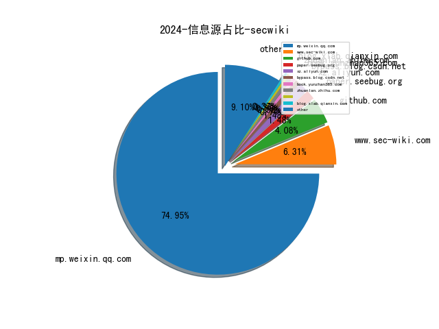

# [数据--所有](README_20.md)
# [数据--年度](README_2024.md)
# 2024 信息源与信息类型占比

# 政策 推荐
| title | url| 
| --- | ---| 
| 网络暴力信息治理规定 | https://www.cac.gov.cn/2024-06/14/c_1720043894161555.htm| 
| 信息化标准建设行动计划（2024—2027年） | https://www.cac.gov.cn/2024-05/29/c_1718573626118437.htm| 

# 网络安全书籍 推荐
| date_added | language | title | author | link | size| 
| --- | --- | --- | --- | --- | ---| 
| 2024-06-21 11:32:17 | English | Hypermodern Python Tooling | unknown | https://www.wowebook.org/hypermodern-python-tooling/ | unknown| 
| 2024-06-19 07:34:14 | English | Django 5 By Example: Build powerful and reliable Python web applications from scratch | Antonio Melé | http://libgen.rs/book/index.php?md5=C12877136C4B77A61242CE94E14D757D | 28 MB [PDF]| 
| 2024-06-18 19:48:27 | English | Advanced Python Scripting for ArcGIS Pro | Paul A. Zandbergen | http://libgen.rs/book/index.php?md5=15F1543AB5D617944762A7E4C23B4565 | 2 MB [EPUB]| 
| 2024-06-18 08:27:17 | English | Data Modeling with Microsoft Power BI | unknown | https://www.wowebook.org/data-modeling-with-microsoft-power-bi/ | unknown| 
| 2024-06-17 19:37:22 | English | ISC2 CISSP Certified Information Systems Security Professional Official Practice Tests | Mike Chapple, David Seidl | http://libgen.rs/book/index.php?md5=3439CF267CA13156C3DE5DA6D388431D | 21 MB [RAR]| 
| 2024-06-17 19:37:19 | English | ISC2 CISSP Certified Information Systems Security Professional Official Practice Tests | Mike Chapple, David Seidl | http://libgen.rs/book/index.php?md5=03FE6298F8192C96246AEDF274BEDC0A | 20 MB [EPUB]| 
| 2024-06-17 17:55:13 | English | Certified Kubernetes Application Developer (CKAD) Study Guide, 2nd Edition | unknown | https://www.wowebook.org/certified-kubernetes-application-developer-ckad-study-guide-2nd-edition/ | unknown| 
| 2024-06-17 10:55:48 | English | Kubernetes and Cloud Native Associate (KCNA) Study Guide | unknown | https://www.wowebook.org/kubernetes-and-cloud-native-associate-kcna-study-guide/ | unknown| 
| 2024-06-17 07:43:55 | English | Google Cloud Platform (GCP) Professional Cloud Security Engineer Certification Companion | unknown | https://www.wowebook.org/google-cloud-platform-gcp-professional-cloud-security-engineer-certification-companion/ | unknown| 
| 2024-06-16 04:51:54 | English | Technology Fears and Scapegoats: 40 Myths About Privacy, Jobs, AI, and Today’s Innovation Economy | Robert D. Atkinson, David Moschella | http://libgen.rs/book/index.php?md5=B55D75D9479B52E8314F4E8FF1B76C02 | 8 MB [PDF]| 
| 2024-06-16 04:51:30 | English | Technology Fears and Scapegoats: 40 Myths About Privacy, Jobs, AI, and Today’s Innovation Economy | Robert D. Atkinson, David Moschella | http://libgen.rs/book/index.php?md5=EDE82BB694140FC9BA6ACBC9009BC39F | 940 kB [EPUB]| 
| 2024-06-14 07:20:41 | English | CompTIA Linux+ Certification Companion | unknown | https://www.wowebook.org/comptia-linux-certification-companion/ | unknown| 
| 2024-06-14 06:04:18 | English | The Business of Hacking | unknown | https://www.wowebook.org/the-business-of-hacking/ | unknown| 
| 2024-06-12 07:26:42 | English | Modern Graph Theory Algorithms with Python | unknown | https://www.wowebook.org/modern-graph-theory-algorithms-with-python/ | unknown| 
| 2024-06-11 06:10:26 | English | (1) No BS Guide to Crypto Investing | Harsh Strongman, Lifemathmoney | http://libgen.rs/book/index.php?md5=224C358713C180BAAD9AADD0D9BC10F3 | 2 MB [PDF]| 
| 2024-06-11 13:12:20 | English | An Age of Iron and Rust: Cassius Dio and the History of His Time (Historiography of Rome and Its Empire, 18) | Andrew G. Scott | http://libgen.rs/book/index.php?md5=AF5DCCF83993EFC5365C409DC99DBDD5 | 3 MB [PDF]| 
| 2024-06-08 09:54:29 | English | Exam Ref AZ-104 Microsoft Azure Administrator, 2nd Edition | unknown | https://www.wowebook.org/exam-ref-az-104-microsoft-azure-administrator-2nd-edition/ | unknown| 
| 2024-06-08 09:20:35 | English | Jump-start Your SOC Analyst Career, 2nd Edition | unknown | https://www.wowebook.org/jump-start-your-soc-analyst-career-2nd-edition/ | unknown| 
| 2024-06-07 05:05:08 | English | Jump-start Your SOC Analyst Career: A Roadmap to Cybersecurity Success | Tyler Wall; Jarrett Rodrick | http://libgen.rs/book/index.php?md5=2B62DA5CB586E083079FF73774B57478 | 34 MB [RAR]| 
| 2024-06-07 05:05:02 | English | Jump-start Your SOC Analyst Career: A Roadmap to Cybersecurity Success | Tyler Wall; Jarrett Rodrick | http://libgen.rs/book/index.php?md5=A7AF9DF907FF2E376890CE551F74CBB5 | 19 MB [EPUB]| 
| 2024-06-07 05:04:58 | English | Jump-start Your SOC Analyst Career: A Roadmap to Cybersecurity Success | Tyler Wall; Jarrett Rodrick | http://libgen.rs/book/index.php?md5=66B27DCF34971BB81B5F6DE9115CE6A3 | 13 MB [PDF]| 
| 2024-06-04 05:23:34 | English | The Reign of Botnets: Defending Against Abuses, Bots and Fraud on the Internet | unknown | https://www.wowebook.org/the-reign-of-botnets-defending-against-abuses-bots-and-fraud-on-the-internet/ | unknown| 
| 2024-06-03 11:35:22 | English | Fundamentals of Python: First Programs, 3rd Edition | unknown | https://www.wowebook.org/fundamentals-of-python-first-programs-3rd-edition/ | unknown| 
| 2024-06-02 08:17:27 | English | Windows Forensics: Understand Analysis Techniques for Your Windows | unknown | https://www.wowebook.org/windows-forensics-understand-analysis-techniques-for-your-windows/ | unknown| 
| 2024-06-02 09:05:12 | English | Mastering Knowledge Management Using Microsoft Technologies | unknown | https://www.wowebook.org/mastering-knowledge-management-using-microsoft-technologies/ | unknown| 
| 2024-06-01 18:47:39 | English | Think Python, 3rd Edition | unknown | https://www.wowebook.org/think-python-3rd-edition/ | unknown| 
| 2024-05-31 17:53:53 | English | Monitoring Threatened Species and Ecological Communities | Sarah M. Legge, David B. Lindenmayer, Natasha Robinson, Benjamin Scheele, Darren Southwell, Brendan A. Wintle | http://libgen.rs/book/index.php?md5=734574132AE7AB93C4EF8FC45B856E71 | 40 MB [PDF]| 
| 2024-05-30 07:02:03 | English | PowerShell for Penetration Testing | unknown | https://www.wowebook.org/powershell-for-penetration-testing/ | unknown| 
| 2024-05-30 06:23:37 | English | Endpoint Detection and Response Essentials | unknown | https://www.wowebook.org/endpoint-detection-and-response-essentials/ | unknown| 
| 2024-05-29 07:02:40 | English | Rust for Blockchain Application Development | unknown | https://www.wowebook.org/rust-for-blockchain-application-development/ | unknown| 
| 2024-05-29 18:23:27 | English | Cybersecurity Strategies and Best Practices | unknown | https://www.wowebook.org/cybersecurity-strategies-and-best-practices/ | unknown| 
| 2024-05-27 07:13:49 | English | Embracing DevOps Release Management | unknown | https://www.wowebook.org/embracing-devops-release-management/ | unknown| 
| 2024-05-24 05:38:23 | English | Understanding Generative AI Business Applications | unknown | https://www.wowebook.org/understanding-generative-ai-business-applications/ | unknown| 
| 2024-05-24 09:49:13 | English | AWS Certified Security – Specialty (SCS-C02) Exam Guide, Second Edition | unknown | https://www.wowebook.org/aws-certified-security-specialty-scs-c02-exam-guide-second-edition/ | unknown| 
| 2024-05-24 08:37:27 | English | Developing Solutions for Microsoft Azure AZ-204 Exam Guide, Second Edition | unknown | https://www.wowebook.org/developing-solutions-for-microsoft-azure-az-204-exam-guide-second-edition/ | unknown| 
| 2024-05-24 06:12:32 | English | Learning DevSecOps | unknown | https://www.wowebook.org/learning-devsecops/ | unknown| 
| 2024-05-22 13:30:15 | English | Visual Threat Intelligence: An Illustrated Guide For Threat Researchers | Thomas Roccia | http://libgen.rs/book/index.php?md5=F28F0AEA8819EDA633CEA64F905D5292 | 11 MB [PDF]| 
| 2024-05-20 06:53:02 | English | Pipeline as Code: Continuous Delivery with Jenkins, Kubernetes, and Terraform, Video Edition | unknown | https://www.wowebook.org/pipeline-as-code-continuous-delivery-with-jenkins-kubernetes-and-terraform-video-edition/ | unknown| 
| 2024-05-20 11:44:09 | English | Hands-On Ethical Hacking Tactics | unknown | https://www.wowebook.org/hands-on-ethical-hacking-tactics/ | unknown| 
| 2024-05-20 11:23:28 | English | Implementing Palo Alto Networks Prisma Access | unknown | https://www.wowebook.org/implementing-palo-alto-networks-prisma-access/ | unknown| 
| 2024-05-20 08:58:03 | English | Hands-On Differential Privacy | unknown | https://www.wowebook.org/hands-on-differential-privacy/ | unknown| 
| 2024-05-20 08:31:19 | English | Prompt Engineering for Generative AI | unknown | https://www.wowebook.org/prompt-engineering-for-generative-ai/ | unknown| 
| 2024-05-20 08:06:52 | English | Design and Deploy Microsoft Defender for IoT | unknown | https://www.wowebook.org/design-and-deploy-microsoft-defender-for-iot/ | unknown| 
| 2024-05-19 15:40:54 | English | Digital Transformation of SAP Supply Chain Processes | unknown | https://www.wowebook.org/digital-transformation-of-sap-supply-chain-processes/ | unknown| 
| 2024-05-18 15:55:22 | English | Monty Python and Philosophy: Nudge Nudge, Think Think! | Gary L. Hardcastle; George A. Reisch; William Irwin | http://libgen.rs/book/index.php?md5=DFB0543FE58DFA5976766ADCF4E940B3 | 3 MB [PDF]| 
| 2024-05-18 15:54:41 | English | Monty Python and Philosophy: Nudge Nudge, Think Think! | Gary L. Hardcastle; George A. Reisch; William Irwin | http://libgen.rs/book/index.php?md5=CFF08EE0894335FCB6953D33D9E6F711 | 641 kB [EPUB]| 
| 2024-05-17 06:55:38 | English | 2600 Magazine: The Hacker Quarterly Volume 24 Number 2 | 2600 Magazine | http://libgen.rs/book/index.php?md5=FA0E33E48074509B524B1D9DC55F3E4D | 44 MB [PDF]| 
| 2024-05-17 06:51:48 | English | 2600 Magazine: The Hacker Quarterly Volume 24 Number 1 | 2609 Magazine | http://libgen.rs/book/index.php?md5=8EEE975C1E87424CDE1A29E20C8D7D4E | 30 MB [PDF]| 
| 2024-05-17 06:47:56 | English | 2600 Magazine: The Hacker Quarterly Volume 23 Number 4 | 2600 Magazine | http://libgen.rs/book/index.php?md5=C70C7A3D313062C66E0E1048A8687FEB | 28 MB [PDF]| 
| 2024-05-17 06:38:00 | English | 2600 Magazine: The Hacker Quarterly Volume 23 Number 3 | 2600 Magazine | http://libgen.rs/book/index.php?md5=3722502E96329DF3A70282FC34D4A9C7 | 28 MB [PDF]| 
| 2024-05-17 06:32:10 | English | 2600 Magazine: The Hacker Quarterly Volume 23 Number 2 | 2600 Magazine | http://libgen.rs/book/index.php?md5=4E83352A1DF252CC3042CDF5AA0BFACA | 29 MB [PDF]| 
| 2024-05-17 06:19:26 | English | Windows Security Internals: A Deep Dive into Windows Authentication, Authorization, and Auditing | James Forshaw | http://libgen.rs/book/index.php?md5=8B397569A5B9CE34472155DBAF7F9D17 | 12 MB [PDF]| 
| 2024-05-17 06:13:12 | English | 2600 Magazine: The Hacker Quarterly Volume 17 Number 1 | 2600 Magazine | http://libgen.rs/book/index.php?md5=EF682162EA7E3C46A097B141E31555B7 | 28 MB [PDF]| 
| 2024-05-17 05:54:32 | English | 2600 Magazine: The Hacker Quarterly Volume 38 Number 1 | 2600 Magazine | http://libgen.rs/book/index.php?md5=8E6C2ECED7F1FED6D37DF0156E0F3BC2 | 767 kB [EPUB]| 
| 2024-05-17 05:51:33 | English | 2600 Magazine: The Hacker Quarterly Volune 37 Number 1 | 2600 Magazine | http://libgen.rs/book/index.php?md5=6767C80DAFC64EDA88B3F5E5D7216F57 | 693 kB [EPUB]| 
| 2024-05-17 05:49:16 | English | 2600 Magazine: The Hacker Quarterly Volume 37 Number 3 | 2600 Magazine | http://libgen.rs/book/index.php?md5=C3623E214EC34362BFA40FC86D656B26 | 804 kB [EPUB]| 
| 2024-05-17 05:43:30 | English | 2600 Magazine: The Hacker Quarterly Volume 36 Number 2 | 2600 Magazine | http://libgen.rs/book/index.php?md5=057266D05F68E0773BF8420BA563F964 | 436 kB [EPUB]| 
| 2024-05-17 10:27:57 | English | Excel Cookbook: Recipes for Mastering Microsoft Excel | unknown | https://www.wowebook.org/excel-cookbook-recipes-for-mastering-microsoft-excel/ | unknown| 
| 2024-05-16 18:36:14 | English | Adversary Emulation with MITRE ATT&CK | unknown | https://www.wowebook.org/adversary-emulation-with-mitre-attck/ | unknown| 
| 2024-05-15 08:10:31 | English | Building a Career in Cybersecurity (Video Training) | unknown | https://www.wowebook.org/building-a-career-in-cybersecurity-video-training/ | unknown| 
| 2024-05-14 11:29:11 | English | Learn Rust in a Month of Lunches, Video Edition | unknown | https://www.wowebook.org/learn-rust-in-a-month-of-lunches-video-edition/ | unknown| 
| 2024-05-14 14:32:35 | English | Introduction to Management of Reverse Logistics and Closed Loop Supply Chain Processes | Donald F. Blumberg | http://libgen.rs/book/index.php?md5=444ED72F20FC02FCE745B4B87527EB62 | 13 MB [PDF]| 
| 2024-05-13 10:33:18 | English | Rust Quickstart (Video Course) | unknown | https://www.wowebook.org/rust-quickstart-video-course/ | unknown| 
| 2024-05-13 11:23:47 | English | Data Analysis with Python and PySpark, Video Edition | unknown | https://www.wowebook.org/data-analysis-with-python-and-pyspark-video-edition/ | unknown| 
| 2024-05-09 12:13:25 | English | Beyond the Binary: Gender and Legal Personhood in Islamic Law | Saadia Yacoob | http://libgen.rs/book/index.php?md5=ED37E6FC1F549DF6BD20EDF463FAFD54 | 3 MB [PDF]| 
| 2024-05-09 09:47:37 | English | Python Pandas and Python Statements for Beginners: A Step-by-Step Guide to Data Analysis and Visualization and a Beginners Guide to IF, ELIF, and ELSE Statements - 2 Books in 1 | JP Parker | http://libgen.rs/book/index.php?md5=BB0459F9E15B3FDF8983F805B856903B | 257 kB [EPUB]| 
| 2024-05-09 09:37:25 | English | Python Powerhouse: A Developers Guide to Efficient Coding: Python + Flask + Docker + TKinter +ML + Deep Learning + NLP | Husn Ara | http://libgen.rs/book/index.php?md5=3557F869A28C57A5DA987C2E5427883D | 2 MB [EPUB]| 
| 2024-05-09 09:06:05 | English | Monte Carlo with Python | Van Der Post, Hayden | http://libgen.rs/book/index.php?md5=2A3E4245F16CE9D3897211158440F871 | 2 MB [EPUB]| 
| 2024-05-09 06:55:24 | English | Active Machine Learning with Python | unknown | https://www.wowebook.org/active-machine-learning-with-python/ | unknown| 
| 2024-05-08 07:31:11 | English | Unveiling the NIST Risk Management Framework (RMF) | unknown | https://www.wowebook.org/unveiling-the-nist-risk-management-framework-rmf/ | unknown| 
| 2024-05-08 08:33:10 | English | Mastering AWS Security, Second Edition | unknown | https://www.wowebook.org/mastering-aws-security-second-edition/ | unknown| 
| 2024-05-07 09:02:10 | English | Python Concurrency with asyncio, Video Edition | unknown | https://www.wowebook.org/python-concurrency-with-asyncio-video-edition/ | unknown| 
| 2024-05-06 14:26:54 | English | Unveiling the NIST Risk Management Framework (RMF): A practical guide to implementing RMF and managing risks in your organization | Thomas Marsland | http://libgen.rs/book/index.php?md5=D96BA2A974A9AD36F86B81DBC3E77960 | 4 MB [EPUB]| 
| 2024-05-05 16:12:22 | English | The Art of Cyber Warfare: Strategic and Tactical Approaches for Attack and Defense in the Digital Age | Peter Kestner | http://libgen.rs/book/index.php?md5=9A8BAF8694E3F79B83C11528069E372C | 10 MB [RAR]| 
| 2024-05-05 15:49:16 | English | The OSINT Handbook | unknown | https://www.wowebook.org/the-osint-handbook/ | unknown| 
| 2024-05-05 16:12:17 | English | The Art of Cyber Warfare: Strategic and Tactical Approaches for Attack and Defense in the Digital Age | Peter Kestner | http://libgen.rs/book/index.php?md5=3E77C81F8784372C4BC9E710A610C607 | 559 kB [EPUB]| 
| 2024-05-05 16:12:15 | English | The Art of Cyber Warfare: Strategic and Tactical Approaches for Attack and Defense in the Digital Age | Peter Kestner | http://libgen.rs/book/index.php?md5=5AB7C12AE5F07A32BC58F63165516528 | 1 MB [PDF]| 
| 2024-05-03 16:34:31 | English | Cybersecurity Architects Handbook: An end-to-end guide to implementing and maintaining robust security architecture | Lester Nichols | http://libgen.rs/book/index.php?md5=D8F1E01172D13BFE87D501BC6B757211 | 8 MB [EPUB]| 
| 2024-04-30 04:50:58 | English | Information and Communications Security: 21st International Conference, ICICS 2019, Beijing, China, December 15–17, 2019, Revised Selected Papers (Lecture Notes in Computer Science, 11999) | Jianying Zhou (editor), Xiapu Luo (editor), Qingni Shen (editor), Zhen Xu (editor) | http://libgen.rs/book/index.php?md5=C2318D125B07E23E66C9A520955AE427 | 51 MB [PDF]| 
| 2024-04-30 04:25:43 | English | Information and Communications Security: 25th International Conference, ICICS 2023, Tianjin, China, November 18–20, 2023, Proceedings (Lecture Notes in Computer Science) | Ding Wang (editor), Moti Yung (editor), Zheli Liu (editor), Xiaofeng Chen (editor) | http://libgen.rs/book/index.php?md5=8732AF2A97C25FD07C831936BDFBBBA8 | 51 MB [PDF]| 
| 2024-04-29 13:26:28 | English | Effective Strategy Execution: Business Intelligence Using Microsoft Power BI (Management for Professionals) | Bernd Heesen | http://libgen.rs/book/index.php?md5=275E7DBB732F8E09E9976D534FA157EB | 115 MB [EPUB]| 
| 2024-04-29 13:03:49 | English | Intraspecific Genetic Diversity: Monitoring, Conservation, and Management | Yuri Petrovich Altukhov | http://libgen.rs/book/index.php?md5=3A5A7B4A442FF4E68DBFC8D1ADC4A1DD | 11 MB [PDF]| 
| 2024-04-29 12:55:30 | English | Intracranial Pressure and Brain Monitoring XII (Acta Neurochirurgica Supplement, 95) | Wai S. Poon (editor), Cees J.J. Avezaat (editor), Matthew Chan (editor), Marek Czosnyka (editor), Keith Goh (editor), Peter J.A. Hutchinson (editor), Yoichi Katayama (editor), J.M.K. Lam (editor), Anthony Marmarou (editor), S.C.P. Ng (editor), John D. Pickard (editor) | http://libgen.rs/book/index.php?md5=B90B0CED6A2D88DD4A1CEC990CF290D5 | 10 MB [PDF]| 
| 2024-04-25 13:41:20 | English | Proceedings of the 6th International Conference on Smart Monitoring, Assessment and Rehabilitation of Civil Structures (Lecture Notes in Civil Engineering, 259) | Xiang-Lin Gu (editor), Masoud Motavalli (editor), Alper Ilki (editor), Qian-Qian Yu (editor) | http://libgen.rs/book/index.php?md5=8F3080BF07CA77568ABAD365596A6C6A | 42 MB [PDF]| 
| 2024-04-24 14:26:31 | English | Privacy and Technologies of Identity: A Cross-Disciplinary Conversation | Katherine J. Strandburg (editor), Daniela Stan Raicu (editor) | http://libgen.rs/book/index.php?md5=DA476523FAB3D1C94020526FBC1E48CB | 21 MB [PDF]| 
| 2024-04-23 15:37:10 | English | Security, Privacy, and Applied Cryptography Engineering: 11th International Conference, SPACE 2021, Kolkata, India, December 10–13, 2021, Proceedings (Security and Cryptology) | Lejla Batina (editor), Stjepan Picek (editor), Mainack Mondal (editor) | http://libgen.rs/book/index.php?md5=A6358282D5C7A973B67359997151722B | 13 MB [PDF]| 
| 2024-04-23 15:18:32 | English | Security and Privacy in Social Networks and Big Data: 7th International Symposium, SocialSec 2021, Fuzhou, China, November 19–21, 2021, Proceedings (Communications in Computer and Information Science) | Limei Lin (editor), Yuhong Liu (editor), Chia-Wei Lee (editor) | http://libgen.rs/book/index.php?md5=144074BD6FCB3519823E9EA758FCC2B5 | 12 MB [PDF]| 
| 2024-04-23 00:33:42 | English | (Lecture Notes in Electrical Engineering; 1049) Security, Privacy and Data Analytics: Select Proceedings of the 2nd International Conference, ISPDA 2022 | Udai Pratap Rao (editor), Mamoun Alazab (editor), Bhavesh N. Gohil (editor), Pethuru Raj Chelliah (editor) | http://libgen.rs/book/index.php?md5=002914E602CC8B6D1112A87B64BCED84 | 9 MB [PDF]| 
| 2024-04-22 14:45:47 | English | Pro Cloud Native Java EE Apps: DevOps with MicroProfile, Jakarta EE 10 APIs, and Kubernetes | Luqman Saeed, Ghazy Abdallah | http://libgen.rs/book/index.php?md5=3DD6A02EE74EBCC5319305296CFDC179 | 7 MB [PDF]| 
| 2024-04-22 14:27:06 | English | Public Key Cryptography - PKC 2006: 9th International Conference on Theory and Practice in Public-Key Cryptography, New York, NY, USA, April 24-26, ... (Lecture Notes in Computer Science, 3958) | Moti Yung (editor), Yevgeniy Dodis (editor), Aggelos Kiayias (editor), Tal Malkin (editor) | http://libgen.rs/book/index.php?md5=8A920BE053E00421900F8EC20DFF5D34 | 7 MB [PDF]| 
| 2024-04-22 13:28:55 | English | Security and Cryptography for Networks: 6th International Conference, SCN 2008, Amalfi, Italy, September 10-12, 2008, Proceedings (Lecture Notes in Computer Science, 5229) | Rafail Ostrovsky (editor), Roberto de Prisco (editor), Ivan Visconti (editor) | http://libgen.rs/book/index.php?md5=061DADF7338C97EB5A219F932D958C7B | 7 MB [PDF]| 
| 2024-04-21 14:55:45 | English | Selected Areas in Cryptography: 12th International Workshop, SAC 2005, Kingston, ON, Canada, August 11-12, 2005, Revised Selected Papers (Lecture Notes in Computer Science, 3897) | Bart Preneel (editor), Stafford Tavares (editor) | http://libgen.rs/book/index.php?md5=D98D21962524E1D9847FF486A633A2A4 | 4 MB [PDF]| 
| 2024-04-21 14:00:41 | English | Responsibility, Privileged Irresponsibility and Response-ability: Higher Education, Coloniality and Ecological Damage (Palgrave Critical University Studies) | Vivienne Bozalek, Michalinos Zembylas | http://libgen.rs/book/index.php?md5=FDDB663787A21B214D46DED692478EC6 | 3 MB [PDF]| 
| 2024-04-21 13:29:53 | English | Privacy Symposium 2022: Data Protection Law International Convergence and Compliance with Innovative Technologies (DPLICIT) | Stefan Schiffner (editor), Sebastien Ziegler (editor), Adrian Quesada Rodriguez (editor) | http://libgen.rs/book/index.php?md5=9D549A655807AA2F0C199A9AD4B960B3 | 3 MB [PDF]| 
| 2024-04-20 19:49:43 | English | Blockchain Technology in Supply Chain Management for Society 5.0 (Smart and Intelligent Computing in Engineering) | K Mathiyazhagan (editor), Atour Taghipour (editor), Vernika Agarwal (editor) | http://libgen.rs/book/index.php?md5=965A11303F603F548896D97C31D2231A | 6 MB [EPUB]| 
| 2024-04-19 14:34:48 | English | Planning and Operation of Active Distribution Networks: Technical, Social and Environmental Aspects (Lecture Notes in Electrical Engineering, 826) | Antonio Carlos Zambroni de Souza (editor), Bala Venkatesh (editor) | http://libgen.rs/book/index.php?md5=75749AB4C59810FBCFEB3912AC3E8328 | 15 MB [PDF]| 
| 2024-04-19 14:13:37 | English | Post-Quantum Cryptography: 13th International Workshop, PQCrypto 2022, Virtual Event, September 28–30, 2022, Proceedings (Lecture Notes in Computer Science) | Jung Hee Cheon (editor), Thomas Johansson (editor) | http://libgen.rs/book/index.php?md5=0488B677420EF7B8ABB2681B10D826C2 | 14 MB [PDF]| 
| 2024-04-17 09:37:36 | English | Effective Rust: 35 Specific Ways to Improve Your Rust Code | unknown | https://www.wowebook.org/effective-rust-35-specific-ways-to-improve-your-rust-code/ | unknown| 
| 2024-04-17 08:55:33 | English | Software Supply Chain Security | unknown | https://www.wowebook.org/software-supply-chain-security/ | unknown| 
| 2024-04-16 08:39:40 | English | Learn Python the Hard Way, 5th Edition | unknown | https://www.wowebook.org/learn-python-the-hard-way-5th-edition/ | unknown| 
| 2024-04-15 20:04:08 | English | Science Fictions: Exposing Fraud, Bias, Negligence and Hype in Science, UK Edition | Stuart Ritchie | http://libgen.rs/book/index.php?md5=45CD90D127EA12A7105FBB52D4DE2B29 | 6 MB [EPUB]| 
| 2024-04-15 19:50:49 | English | New Approaches to CSR, Sustainability and Accountability, Volume IV (Accounting, Finance, Sustainability, Governance & Fraud: Theory and Application) | M. Abu Naser (editor) | http://libgen.rs/book/index.php?md5=79DF0F3C17E22ED3AD8605CDEA1D340A | 4 MB [PDF]| 
| 2024-04-14 10:19:58 | English | Extending Power BI with Python and R, Second Edition | unknown | https://www.wowebook.org/extending-power-bi-with-python-and-r-second-edition/ | unknown| 
| 2024-04-13 03:09:41 | English | The New China Playbook: Beyond Socialism and Capitalism | Keyu Jin | http://libgen.rs/book/index.php?md5=6C8917CA5D0BA36791790E67944BD5A3 | 1 MB [EPUB]| 
| 2024-04-13 13:22:15 | English | Introduction to Cryptography: Principles and Applications (Information Security and Cryptography) | Helmut Knebl Hans Delfs | http://libgen.rs/book/index.php?md5=48E9A483416BFAB0D82C56E77E8F028A | 4 MB [PDF]| 
| 2024-04-12 20:37:20 | English | Stepping Through Cybersecurity Risk Management: A Systems Thinking Approach | Jennifer L. Bayuk | http://libgen.rs/book/index.php?md5=B77F4B8D6D76A0FD05CF46673DDADFDD | 29 MB [RAR]| 
| 2024-04-12 20:37:17 | English | Stepping Through Cybersecurity Risk Management : A Systems Thinking Approach | Jennifer L. Bayuk | http://libgen.rs/book/index.php?md5=941699B7040077250D6F7843BEA914D7 | 18 MB [EPUB]| 
| 2024-04-12 20:37:13 | English | Stepping Through Cybersecurity Risk Management: A Systems Thinking Approach | Jennifer L. Bayuk | http://libgen.rs/book/index.php?md5=2513941CEB782BD567D66D534D6689B2 | 10 MB [PDF]| 
| 2024-04-11 11:48:50 | English | Structural Health Monitoring by Time Series Analysis and Statistical Distance Measures (PoliMI SpringerBriefs) | Alireza Entezami | http://libgen.rs/book/index.php?md5=A1D42C18E96699148401F8AF611F8CC0 | 5 MB [PDF]| 
| 2024-04-11 08:58:26 | English | Python All-in-One For Dummies, 3rd Edition | unknown | https://www.wowebook.org/python-all-in-one-for-dummies-3rd-edition/ | unknown| 
| 2024-04-10 14:58:04 | English | Information Security Planning: A Practical Approach | Susan Lincke | http://libgen.rs/book/index.php?md5=D519F0ADCC9A7A60ABD8BCE0CFB3FC6E | 13 MB [PDF]| 
| 2024-04-10 14:57:13 | English | Increasing Climate Variability and Change: Reducing the Vulnerability of Agriculture and Forestry | James Salinger (editor), Mannava VK Sivakumar (editor), Raymond P. Motha (editor) | http://libgen.rs/book/index.php?md5=C181250C9E89658CDEDCBB36D6E8B6EA | 13 MB [PDF]| 
| 2024-04-10 14:54:34 | English | Information and Cyber Security: 18th International Conference, ISSA 2019, Johannesburg, South Africa, August 15, 2019, Proceedings (Communications in Computer and Information Science, 1166) | Hein Venter (editor), Marianne Loock (editor), Marijke Coetzee (editor), Mariki Eloff (editor), Jan Eloff (editor) | http://libgen.rs/book/index.php?md5=35D0A71758EF69DF6C2BC58AC7777FED | 12 MB [PDF]| 
| 2024-04-08 13:41:36 | English | Financial Cryptography and Data Security: 25th International Conference, FC 2021, Virtual Event, March 1–5, 2021, Revised Selected Papers, Part II (Security and Cryptology) | Nikita Borisov (editor), Claudia Diaz (editor) | http://libgen.rs/book/index.php?md5=40ABFFD1B525794BA01CEBE7BA881BB9 | 25 MB [PDF]| 
| 2024-04-07 11:50:34 | English | Synthetic Data and Generative AI | unknown | https://www.wowebook.org/synthetic-data-and-generative-ai/ | unknown| 
| 2024-04-07 13:47:25 | English | Large Language Model-Based Solutions: How to Deliver Value with Cost-Effective Generative AI Applications | unknown | https://www.wowebook.org/large-language-model-based-solutions-how-to-deliver-value-with-cost-effective-generative-ai-applications/ | unknown| 
| 2024-04-07 13:06:55 | English | Microsoft SharePoint Premium in the Real World: Bringing Practical Cloud AI to Content Management | unknown | https://www.wowebook.org/microsoft-sharepoint-premium-in-the-real-world-bringing-practical-cloud-ai-to-content-management/ | unknown| 
| 2024-04-06 18:55:16 | English | ChatGPT for Cybersecurity Cookbook | unknown | https://www.wowebook.org/chatgpt-for-cybersecurity-cookbook/ | unknown| 
| 2024-04-05 10:17:18 | English | Microsoft 365 Administrator MS-102 Exam Guide | Aaron Guilmette | http://libgen.rs/book/index.php?md5=E30324C59A2DD3FB90ACDA853F701DD2 | 39 MB [PDF]| 
| 2024-04-04 15:29:46 | English | Python Pandas and Python Data Structures for Beginners | JP Parker | http://libgen.rs/book/index.php?md5=849215ADC33344BF08AADFB0FC6860B3 | 71 MB [PDF]| 
| 2024-04-04 15:19:07 | English | Emerging Technologies in Data Mining and Information Security: Proceedings of IEMIS 2022, Volume 1 (Lecture Notes in Networks and Systems, 491) | Paramartha Dutta (editor), Satyajit Chakrabarti (editor), Abhishek Bhattacharya (editor), Soumi Dutta (editor), Vincenzo Piuri (editor) | http://libgen.rs/book/index.php?md5=A6C83A88BFC79A0F7FB44CB8658C664D | 24 MB [PDF]| 
| 2024-04-04 15:05:04 | English | Emerging Technologies in Data Mining and Information Security: Proceedings of IEMIS 2022, Volume 2 (Lecture Notes in Networks and Systems, 490) | Paramartha Dutta (editor), Satyajit Chakrabarti (editor), Abhishek Bhattacharya (editor), Soumi Dutta (editor), Celia Shahnaz (editor) | http://libgen.rs/book/index.php?md5=7AAFDB868B4CDE2F7A7715D23A137273 | 23 MB [PDF]| 
| 2024-04-04 15:02:33 | English | Emerging Technologies in Data Mining and Information Security: Proceedings of IEMIS 2022, Volume 3 (Advances in Intelligent Systems and Computing, 1348) | Paramartha Dutta (editor), Abhishek Bhattacharya (editor), Soumi Dutta (editor), Wen-Cheng Lai (editor) | http://libgen.rs/book/index.php?md5=2ABD51FFCB92C4E43D4D330183146D12 | 23 MB [PDF]| 
| 2024-04-04 17:40:45 | English | Electronic Fetal Monitoring | Xiaohui Guo (editor) | http://libgen.rs/book/index.php?md5=AA4518522270C37690C19A22D0E37B79 | 35 MB [PDF]| 
| 2024-04-04 14:58:13 | English | EcoDesign and Sustainability II: Social Perspectives and Sustainability Assessment (Sustainable Production, Life Cycle Engineering and Management) | Yusuke Kishita (editor), Mitsutaka Matsumoto (editor), Masato Inoue (editor), Shinichi Fukushige (editor) | http://libgen.rs/book/index.php?md5=1712B759CF72ADFC3F5655A38A098B99 | 22 MB [PDF]| 
| 2024-04-04 14:24:26 | English | Emerging Trends in Cybersecurity Applications | Kevin Daimi (editor), Abeer Alsadoon (editor), Cathryn Peoples (editor), Nour El Madhoun (editor) | http://libgen.rs/book/index.php?md5=DFF3ECF1983BECFFAA2CFD7B8F7125F5 | 21 MB [PDF]| 
| 2024-03-30 09:09:28 | English | Microsoft 365 Security and Compliance for Administrators | Sasha Kranjac, Omar Kudović | http://libgen.rs/book/index.php?md5=64EF856396ABADB0921FAC19116C2173 | 38 MB [EPUB]| 
| 2024-03-30 09:07:40 | English | Artificial Intelligence for Robotics: Build intelligent robots using ROS 2, Python, OpenCV, and AI/ML techniques, 2nd Edition | Francis X. Govers III | http://libgen.rs/book/index.php?md5=05E803B985C0AA9C73A9374FCA010716 | 17 MB [EPUB]| 
| 2024-03-30 09:05:10 | English | ChatGPT for Cybersecurity Cookbook: Learn practical generative AI recipes to supercharge your cyber skills | Clint Bodungen | http://libgen.rs/book/index.php?md5=6B2705E0D6D24D8C113752F67B42D7D8 | 17 MB [EPUB]| 
| 2024-03-30 08:56:03 | English | Mastering Time Series Analysis and Forecasting with Python: Bridging Theory and Practice Through Insights, Techniques, and Tools for Effective Time Series Analysis in Python | Sulekha Aloorravi | http://libgen.rs/book/index.php?md5=BF40896A6797F1F44EB4EBF4F39BC305 | 8 MB [EPUB]| 
| 2024-03-30 08:51:38 | English | PYTHON PROGRAMMIN A to Z: A Comprehensive Guide to Programming Excellence | Wong, Wilson | http://libgen.rs/book/index.php?md5=3E809CDAF01A0E8D1971422CA02988A9 | 18 MB [EPUB]| 
| 2024-03-30 08:47:49 | English | The OSINT Handbook: A practical guide to analyzing and gathering online information | Dale Meredith | http://libgen.rs/book/index.php?md5=81679340AD2B15CF358687852DD17E6B | 18 MB [EPUB]| 
| 2024-03-28 12:45:45 | English | Theory of Cryptography: 21st International Conference, TCC 2023, Taipei, Taiwan, November 29 – December 2, 2023, Proceedings, Part II (Lecture Notes in Computer Science) | Guy Rothblum (editor), Hoeteck Wee (editor) | http://libgen.rs/book/index.php?md5=5D6354BED1449B403FCE135AA7F8D758 | 12 MB [PDF]| 
| 2024-03-27 14:55:07 | English | Vapor Intrusion Simulations and Risk Assessments | Yijun Yao, Qiang Chen | http://libgen.rs/book/index.php?md5=A54947F01445DDE26AD050B08D904B8E | 6 MB [PDF]| 
| 2024-03-27 14:54:15 | English | Quality Assurance Implementation in Research Labs | Akshay Anand (editor) | http://libgen.rs/book/index.php?md5=F3880E3615B904E4585AE61BD4E43E6D | 6 MB [PDF]| 
| 2024-03-24 10:08:15 | English | A Developers Guide to Cloud Apps Using Microsoft Azure: Migrate and modernize your cloud-native applications with containers on Azure using real-world case studies | Hamida Rebai Trabelsi | http://libgen.rs/book/index.php?md5=8E724534BB84AF84F4BF045DE56A4D28 | 15 MB [PDF]| 
| 2024-03-24 10:01:53 | English | Microsoft Azure Compute: The Definitive Guide (IT Best Practices - Microsoft Press) | Avinash Valiramani | http://libgen.rs/book/index.php?md5=FD2BC2A40C0A86775758E7229780561B | 38 MB [EPUB]| 
| 2024-03-24 11:18:04 | English | Building Generative AI-Powered Apps : A Hands-on Guide for Developers | Aarushi Kansal | http://libgen.rs/book/index.php?md5=7DFEACCDC74C344494D3ED12A2483382 | 8 MB [EPUB]| 
| 2024-03-24 11:06:22 | English | Generative Art with JavaScript and SVG: Utilizing Scalable Vector Graphics and Algorithms for Creative Coding and Design | David Matthew | http://libgen.rs/book/index.php?md5=3C1468F86D9A8EB59E526A4636E99AB3 | 26 MB [MOBI]| 
| 2024-03-24 11:02:21 | English | Multi-Cloud Automation with Ansible : Automate, orchestrate, and scale in a multi-cloud world | Sabharwal, Pankaj; | http://libgen.rs/book/index.php?md5=0D4C218F0C4DF573D0AA89D948076001 | 10 MB [EPUB]| 
| 2024-03-24 10:58:50 | English | Mastering Functional Programming with Python | Brett Neutreon | http://libgen.rs/book/index.php?md5=DD37726C1B6E1FB045B7996DD7F9E358 | 49 MB [PDF]| 
| 2024-03-24 10:53:06 | English | Python Advanced Programming: The guide to learn pyhton programming | Marcus Richards | http://libgen.rs/book/index.php?md5=64BC566B203C78D80F92DDCB5705E6E1 | 707 kB [EPUB]| 
| 2024-03-24 10:50:21 | English | Google Gemini for Python: Coding with Bard | Oswald Campesato | http://libgen.rs/book/index.php?md5=7A9C7C6B91B8611DC3E8996DE66F0B2F | 2 MB [PDF]| 
| 2024-03-22 03:38:55 | English | Trust.: Responsible AI, Innovation, Privacy and Data Leadership | Leipzig, Dominique Shelton | http://libgen.rs/book/index.php?md5=756B6F9F77D26BA16F77DC974F46E221 | 1 MB [EPUB]| 
| 2024-03-22 11:22:19 | English | (Routledge Studies in Conservation and the Environment) Is CITES Protecting Wildlife? Assessing Implementation and Compliance | Tanya Wyatt | http://libgen.rs/book/index.php?md5=8880F08208B5E48CD5084C2CA729BCA1 | 3 MB [EPUB]| 
| 2024-03-21 04:15:54 | English | Differential Privacy for Dynamic Data (SpringerBriefs in Control, Automation and Robotics) | Jerome Le Ny | http://libgen.rs/book/index.php?md5=D134F93E27DF526B754E11109FCC75A1 | 3 MB [PDF]| 
| 2024-03-21 04:09:48 | English | Discrete Cuckoo Search for Combinatorial Optimization (Springer Tracts in Nature-Inspired Computing) | Aziz Ouaarab | http://libgen.rs/book/index.php?md5=5252EB5FAD29A09BD8EE65A7AB69E604 | 3 MB [PDF]| 
| 2024-03-20 04:32:50 | English | Computer Vision Using Local Binary Patterns (Computational Imaging and Vision, 40) | Matti Pietikäinen, Abdenour Hadid, Guoying Zhao, Timo Ahonen | http://libgen.rs/book/index.php?md5=5AC9326720B8B325123F9A98D5D0A2FE | 8 MB [PDF]| 
| 2024-03-20 04:15:47 | English | Comparative Perspectives on the Right to Privacy: Pakistani and European Experiences (Ius Gentium: Comparative Perspectives on Law and Justice, 109) | Sohail Aftab | http://libgen.rs/book/index.php?md5=64036428219A751E1FD982BFA4C3965C | 8 MB [PDF]| 
| 2024-03-20 05:54:36 | English | Cyber Security Impact on Digitalization and Business Intelligence: Big Cyber Security for Information Management: Opportunities and Challenges (Studies in Big Data, 117) | Haitham M. Alzoubi (editor), Muhammad Turki Alshurideh (editor), Taher M. Ghazal (editor) | http://libgen.rs/book/index.php?md5=3F957452AC5243293746C585DFB2890A | 14 MB [PDF]| 
| 2024-03-20 05:32:40 | English | Cybersecurity Vigilance and Security Engineering of Internet of Everything (Internet of Things) | Kashif Naseer Qureshi (editor), Thomas Newe (editor), Gwanggil Jeon (editor), Abdellah Chehri (editor) | http://libgen.rs/book/index.php?md5=E34E3DAD75FCEE487EAEA5348B51AC1D | 11 MB [PDF]| 
| 2024-03-20 05:32:06 | English | Data Privacy Management, Cryptocurrencies and Blockchain Technology: ESORICS 2021 International Workshops, DPM 2021 and CBT 2021, Darmstadt, Germany, ... Selected Papers (Security and Cryptology) | Joaquin Garcia-Alfaro (editor), Jose Luis Muñoz-Tapia (editor), Guillermo Navarro-Arribas (editor), Miguel Soriano (editor) | http://libgen.rs/book/index.php?md5=0ECE41E2569CF41FB9038F3D5ED4E5CB | 11 MB [PDF]| 
| 2024-03-18 17:12:09 | English | Chaos-based Cryptography: Theory, Algorithms and Applications (Studies in Computational Intelligence, 354) | Ljupco Kocarev (editor), Shiguo Lian (editor) | http://libgen.rs/book/index.php?md5=FE3DD9D5320CBC529ABD356C1DB85020 | 12 MB [PDF]| 
| 2024-03-18 16:40:53 | English | Cryptography: Lecture Notes in Computer Science | Thomas Beth | http://libgen.rs/book/index.php?md5=820FA67A1A08F5E0242D6BB5FCF608AE | 12 MB [PDF]| 
| 2024-03-18 16:36:08 | English | Design and Deploy Azure VMware Solutions: Build and Run VMware Workloads Natively on Microsoft Azure | Puthiyavan Udayakumar | http://libgen.rs/book/index.php?md5=9B011594D9D394DFBB5C43251B394755 | 12 MB [PDF]| 
| 2024-03-17 07:46:18 | English | (International Screen Industries) Supply Chain Cinema: Producing Global Film Workers | Kay Dickinson | http://libgen.rs/book/index.php?md5=5ED8F84B0DE6E219F92C907C2D7EF777 | 3 MB [PDF]| 
| 2024-03-17 12:44:20 | English | Learning OpenTelemetry | unknown | https://www.wowebook.org/learning-opentelemetry/ | unknown| 
| 2024-03-15 08:46:17 | English | AWS Security Essentials (Video Course) | unknown | https://www.wowebook.org/aws-security-essentials-video-course/ | unknown| 
| 2024-03-13 18:10:27 | English | Real-World Bug Hunting - A Field Guide to Web Hacking | Peter Yaworski | http://libgen.rs/book/index.php?md5=0E0C482EB94DBA4B95528B396562DD10 | 7 MB [PDF]| 
| 2024-03-13 17:36:33 | English | Python Tricks: The Book | Dan Bader | http://libgen.rs/book/index.php?md5=7E2CB40B4730D1DAD806D5E6C8F442E4 | 643 kB [PDF]| 
| 2024-03-13 17:35:46 | English | Python One-Liners: Write Concise, Eloquent Python Like a Professional | Christian Mayer | http://libgen.rs/book/index.php?md5=801944C47B2BE553A2ABD0B896ED25C4 | 7 MB [PDF]| 
| 2024-03-13 16:29:31 | English | Python Made Simple: Full Beginner’s Guide to Mastering Python | unknown | http://libgen.rs/book/index.php?md5=EE00BAFE1E80458CBF95072FAB7ABC2B | 3 MB [PDF]| 
| 2024-03-12 16:45:56 | English | New Perspectives Collection, Microsoft 365 & Excel 2021 Comprehensive | Patrick Carey | http://libgen.rs/book/index.php?md5=88F54B3A2E2F1A39EB7B80677CB10064 | 45 MB [PDF]| 
| 2024-03-12 16:44:18 | English | Microsoft Word Legal and Corporate – Working With All Types of Tables | Louis Ellman | http://libgen.rs/book/index.php?md5=0B596E7A07BD349265084051804162BF | 6 MB [EPUB]| 
| 2024-03-12 16:38:57 | English | Google Gemini for Python: Coding with BARD | Oswald Campesato | http://libgen.rs/book/index.php?md5=B0B6423023E7EA84D09C021A80933750 | 5 MB [EPUB]| 
| 2024-03-12 16:32:16 | English | Microsoft Office 365 Bible 10 Books in 1 , The Best Crash Course to Takes You from Beginner to Advanced to learn OneNote | Milo Rowse | http://libgen.rs/book/index.php?md5=3797B9CDEE71C4A5B84F0A8C7317280E | 20 MB [EPUB]| 
| 2024-03-12 17:44:47 | English | Data-Centric Machine Learning with Python | unknown | https://www.wowebook.org/data-centric-machine-learning-with-python/ | unknown| 
| 2024-03-11 18:32:17 | English | Learn Microsoft Fabric | unknown | https://www.wowebook.org/learn-microsoft-fabric/ | unknown| 
| 2024-03-10 21:56:17 | English | 150+ Python Pattern Programs: Top Python exercises to feed your creativity with if statements and loops (150+ Pattern Programs) | Abella, Hernando | http://libgen.rs/book/index.php?md5=6A1DCAFC92F55108871A2D641A004A55 | 308 kB [EPUB]| 
| 2024-03-10 20:48:59 | English | Python for Finance: A Crash Course Modern Guide: Learn Python Fast | Bisette, Vincent; Van Der Post, Hayden | http://libgen.rs/book/index.php?md5=5B4A53A9127A640CE7FDC989D04DDA24 | 2 MB [EPUB]| 
| 2024-03-10 16:37:17 | English | Web Scraping with Python, 3rd Edition | unknown | https://www.wowebook.org/web-scraping-with-python-3rd-edition/ | unknown| 
| 2024-03-08 08:55:20 | English | Kubernetes for Developers | unknown | https://www.wowebook.org/kubernetes-for-developers/ | unknown| 
| 2024-03-07 22:59:02 | English | Writing In-House Medical Device Software in Compliance with EU, UK, and US Regulations | Philip S. Cosgriff, Matthew J. Memmott | http://libgen.rs/book/index.php?md5=813665EAC4134CBDD127FCC84AD38BB6 | 4 MB [PDF]| 
| 2024-03-06 11:08:45 | English | Code Like a Pro in Rust | unknown | https://www.wowebook.org/code-like-a-pro-in-rust/ | unknown| 
| 2024-03-06 15:06:49 | English | Learn Rust in a Month of Lunches | unknown | https://www.wowebook.org/learn-rust-in-a-month-of-lunches/ | unknown| 
| 2024-03-04 06:17:12 | English | Prototyping Python Dashboards for Scientists and Engineers | unknown | https://www.wowebook.org/prototyping-python-dashboards-for-scientists-and-engineers/ | unknown| 
| 2024-03-04 15:30:54 | English | Introduction to Generative AI, Video Edition | unknown | https://www.wowebook.org/introduction-to-generative-ai-video-edition/ | unknown| 
| 2024-03-02 15:38:45 | English | Options Finance: Options Stratigies with Python | Bisette, Vincent; Van Der Post, Hayden | http://libgen.rs/book/index.php?md5=6CEF1671E9FF715643E3F028E2043F85 | 771 kB [EPUB]| 
| 2024-03-02 15:37:28 | English | Building Interactive Dashboards in Microsoft 365 Excel | Michael Olafusi | http://libgen.rs/book/index.php?md5=500B017390F2B8B6CE35BBDB8B439264 | 94 MB [EPUB]| 
| 2024-03-02 15:26:41 | English | PYTHON DATA ANALYTICS: Mastering Python for Effective Data Analysis and Visualization | Floyd Bax | http://libgen.rs/book/index.php?md5=07B11FEF430AF4E617BF0B393A86C8D7 | 4 MB [PDF]| 
| 2024-03-02 15:01:04 | English | Python Charmer: Learn Fundamental Python skills: Master Python Step by Step: A Beginners Guide to Coding | saravan krishna | http://libgen.rs/book/index.php?md5=F714167A8EBDBB568866CCA6BE8A7DD7 | 12 MB [EPUB]| 
| 2024-03-02 14:56:56 | English | Python Booleans Unveiled: A Beginners Guide to Mastering the Code Secrets for a Seamless Start | JP Parker | http://libgen.rs/book/index.php?md5=32A8275D0FE3BA52F0D1B8A2951411A4 | 177 kB [EPUB]| 
| 2024-03-02 14:40:37 | English | The Attack on Leviathan: Regionalism and Nationalism in the United States | Donald Davidson | http://libgen.rs/book/index.php?md5=2853C3916FA8066ECDC66BA34B032E53 | 18 MB [PDF]| 
| 2024-03-01 06:25:33 | English | Machine Learning Theory and Applications: Hands-on Use Cases with Python on Classical and Quantum Machines | unknown | https://www.wowebook.org/machine-learning-theory-and-applications-hands-on-use-cases-with-python-on-classical-and-quantum-machines/ | unknown| 
| 2024-03-01 16:26:47 | English | Cloud Forensics Demystified | unknown | https://www.wowebook.org/cloud-forensics-demystified/ | unknown| 
| 2024-03-01 10:48:40 | English | Mastering Microsoft Fabric | unknown | https://www.wowebook.org/mastering-microsoft-fabric/ | unknown| 
| 2024-02-24 16:57:14 | English | Asynchronous Programming in Rust | unknown | https://www.wowebook.org/asynchronous-programming-in-rust/ | unknown| 
| 2024-02-24 08:01:06 | English | Practical Guide to Applied Conformal Prediction in Python | unknown | https://www.wowebook.org/practical-guide-to-applied-conformal-prediction-in-python/ | unknown| 
| 2024-02-22 11:44:10 | English | Beyond the Algorithm: AI, Security, Privacy, and Ethics | unknown | https://www.wowebook.org/beyond-the-algorithm-ai-security-privacy-and-ethics/ | unknown| 
| 2024-02-22 11:22:47 | English | The AI Revolution in Networking, Cybersecurity, and Emerging Technologies | unknown | https://www.wowebook.org/the-ai-revolution-in-networking-cybersecurity-and-emerging-technologies/ | unknown| 
| 2024-02-22 05:42:57 | English | The Async-First Playbook: Remote Collaboration Techniques for Agile Software Teams | unknown | https://www.wowebook.org/the-async-first-playbook-remote-collaboration-techniques-for-agile-software-teams/ | unknown| 
| 2024-02-21 17:00:08 | English | Better Python Code: A Guide for Aspiring Experts | unknown | https://www.wowebook.org/better-python-code-a-guide-for-aspiring-experts/ | unknown| 
| 2024-02-19 16:03:09 | English | The Kubernetes Book | Nigel Poulton | http://libgen.rs/book/index.php?md5=6553E26B2508DFA32D7E395450212B2D | 16 MB [PDF]| 
| 2024-02-18 13:21:40 | English | Learn AI-Assisted Python Programming, Video Edition | unknown | https://www.wowebook.org/learn-ai-assisted-python-programming-video-edition/ | unknown| 
| 2024-02-16 07:33:56 | English | Skill Up with Python: Introduction (Video Course) | unknown | https://www.wowebook.org/skill-up-with-python-introduction-video-course/ | unknown| 
| 2024-02-16 20:48:10 | English | Skill Up with Python: Web Development Recipes (Video Course) | unknown | https://www.wowebook.org/skill-up-with-python-web-development-recipes-video-course/ | unknown| 
| 2024-02-16 16:35:11 | English | Skill Up with Python: Data Science and Machine Learning Recipes (Video Course) | unknown | https://www.wowebook.org/skill-up-with-python-data-science-and-machine-learning-recipes-video-course/ | unknown| 
| 2024-02-12 08:41:17 | English | Data Labeling in Machine Learning with Python | unknown | https://www.wowebook.org/data-labeling-in-machine-learning-with-python/ | unknown| 
| 2024-02-09 08:13:28 | English | Bayesian Analysis with Python, Third Edition | unknown | https://www.wowebook.org/bayesian-analysis-with-python-third-edition/ | unknown| 
| 2024-02-06 22:55:12 | English | NLP with Python: 3 Books in 1 - From Beginner to Advanced: The Future Frontier and Next-Gen Solutions | Watson, Jerome | http://libgen.rs/book/index.php?md5=CC3989E608E8EC9D612677039EC459BC | 1009 kB [EPUB]| 
| 2024-02-06 17:08:19 | English | Salesforce DevOps for Architects | unknown | https://www.wowebook.org/salesforce-devops-for-architects/ | unknown| 
| 2024-02-06 18:07:08 | English | Kubernetes Secrets Handbook | unknown | https://www.wowebook.org/kubernetes-secrets-handbook/ | unknown| 
| 2024-02-06 17:32:16 | English | Mastering Cloud Security Posture Management (CSPM) | unknown | https://www.wowebook.org/mastering-cloud-security-posture-management-cspm/ | unknown| 
| 2024-02-03 08:45:07 | English | CompTIA A+ Practice Test Core 2 (220-1102) | unknown | https://www.wowebook.org/comptia-a-practice-test-core-2-220-1102/ | unknown| 
| 2024-02-03 08:16:04 | English | CompTIA A+ Practice Tests Core 1 (220-1101) and Core 2 (220-1102) | unknown | https://www.wowebook.org/comptia-a-practice-tests-core-1-220-1101-and-core-2-220-1102/ | unknown| 
| 2024-02-03 13:27:07 | English | Microsoft Intune Cookbook | unknown | https://www.wowebook.org/microsoft-intune-cookbook/ | unknown| 
| 2024-02-02 15:49:58 | English | CompTIA Security+ SY0-701 Certification Guide, Third Edition | unknown | https://www.wowebook.org/comptia-security-sy0-701-certification-guide-third-edition/ | unknown| 
| 2024-01-26 07:57:01 | English | Covert Surveillance and Electronic Penetration | William B. Moran | http://libgen.rs/book/index.php?md5=56CDA28B35ECF30F62D313562E897175 | 19 MB [PDF]| 
| 2024-01-23 08:46:16 | English | Modern DevOps Practices, Second Edition | unknown | https://www.wowebook.org/modern-devops-practices-second-edition/ | unknown| 
| 2024-01-23 07:42:41 | English | Mastering Elastic Kubernetes Service on AWS | unknown | https://www.wowebook.org/mastering-elastic-kubernetes-service-on-aws/ | unknown| 
| 2024-01-23 06:38:47 | English | Observability with Grafana | unknown | https://www.wowebook.org/observability-with-grafana/ | unknown| 
| 2024-01-22 12:13:25 | English | CompTIA Security+ Get Certified Get Ahead: SY0-701 Study Guide | Joe Shelley & Darril Gibson | http://libgen.rs/book/index.php?md5=ECA24BD2B1640581057C4A8397983636 | 7 MB [PDF]| 
| 2024-01-20 14:46:09 | English | Descriptive Analytics: Describe with Python: A comprehensive guide to Descriptive Analytics with the use of python programming | Van Der Post, Hayden | http://libgen.rs/book/index.php?md5=24CBFE82A9C336ACD224F3BF5FBF9727 | 1 MB [EPUB]| 
| 2024-01-20 14:39:03 | English | Advances in Water Pollution Monitoring and Control: Select Proceedings from HSFEA 2018 (Springer Transactions in Civil and Environmental Engineering) | Nihal Anwar Siddiqui (editor), S. M. Tauseef (editor), Rajendra Dobhal (editor) | http://libgen.rs/book/index.php?md5=1247072896633D73F00F5B80932C1EE2 | 7 MB [PDF]| 
| 2024-01-20 14:29:46 | English | Adversary-Aware Learning Techniques and Trends in Cybersecurity | Prithviraj Dasgupta (editor), Joseph B. Collins (editor), Ranjeev Mittu (editor) | http://libgen.rs/book/index.php?md5=46515DF6A2A28FEF1538D3875A93952F | 5 MB [PDF]| 
| 2024-01-18 14:35:54 | English | Python for Healthcare & Medical Research: EXPLORING THE EXCITING WORLD OF POSSIBILITIES WITH PYTHON | Van Der Post, Hayden | http://libgen.rs/book/index.php?md5=43D5E1C54ED79E99FEC8DBC1FF9CEE1C | 1 MB [EPUB]| 
| 2024-01-16 13:38:43 | English | Kubernetes: A Comprehensive Step-by-Step Guide for Beginners to Master Kubernetes Efficiently | Chloe Annable | http://libgen.rs/book/index.php?md5=C505185882622858471B87F4EF031896 | 6 MB [EPUB]| 
| 2024-01-16 12:29:34 | English | The 2x2 Matrix: Contingency, Confusion and the Metrics of Binary Classification | A. J. Larner | http://libgen.rs/book/index.php?md5=698E9F50A4DB7AD0FE703D74CF41CE87 | 4 MB [PDF]| 
| 2024-01-15 09:06:06 | English | Applied Deep Learning with Python: Use scikit-learn, TensorFlow, and Keras to create intelligent systems | Alex Galea | http://libgen.rs/book/index.php?md5=5B683FC4060F22A413550C76ECD94246 | 34 MB [EPUB]| 
| 2024-01-15 07:27:02 | English | Automating Data Quality Monitoring | unknown | https://www.wowebook.org/automating-data-quality-monitoring/ | unknown| 
| 2024-01-13 20:16:46 | English | Machine Learning: A Guide to PyTorch, TensorFlow, and Scikit-Learn: Mastering Machine Learning With Python | Van Der Post, Hayden | http://libgen.rs/book/index.php?md5=8F932A1D4B435F1D840A6B0F11162D70 | 762 kB [EPUB]| 
| 2024-01-13 20:11:35 | English | Pythonomics: coding strategies to python in economics: A Comprehensive guide to the application of python programming in economics | Van Der Post, Hayden | http://libgen.rs/book/index.php?md5=A242AC92B08A3574F587109279778A54 | 1 MB [EPUB]| 
| 2024-01-13 20:05:14 | English | Python for Accounting: The comprehensive guide to introducing python into your accounting workflow | Van Der Post, Hayden | http://libgen.rs/book/index.php?md5=9FA1E2FEC28795D89518D4F928BA7C96 | 2 MB [EPUB]| 
| 2024-01-13 19:40:04 | English | Deep Learning for Finance: Creating Machine & Deep Learning Models for Trading in Python | Sofien Kaabar | http://libgen.rs/book/index.php?md5=A1E5C5D79EBA2ED48BE421425CF1555D | 9 MB [PDF]| 
| 2024-01-08 07:33:21 | English | Soar with Haskell | unknown | https://www.wowebook.org/soar-with-haskell/ | unknown| 
| 2024-01-08 07:21:27 | English | Data Observability for Data Engineering | unknown | https://www.wowebook.org/data-observability-for-data-engineering/ | unknown| 
| 2024-01-06 10:25:12 | English | Microsoft 365 Administrator MS-102 Exam Guide | unknown | https://www.wowebook.org/microsoft-365-administrator-ms-102-exam-guide/ | unknown| 
| 2024-01-05 11:43:32 | English | Applied Computational Thinking with Python, Second Edition | unknown | https://www.wowebook.org/applied-computational-thinking-with-python-second-edition/ | unknown| 
| 2024-01-05 18:25:08 | English | The Crypto Launderers: Crime and Cryptocurrencies from the Dark Web to DeFi and Beyond | David Carlisle | http://libgen.rs/book/index.php?md5=488EEE0AE318657F45AA60B24B85570F | 13 MB [EPUB]| 
| 2024-01-05 18:06:01 | English | (Springer Undergraduate Mathematics Series) A Course in Python: The Core of the Language | Roozbeh Hazrat | http://libgen.rs/book/index.php?md5=0F974EB1BA244B42A5114B9F484EDAD6 | 11 MB [PDF]| 
| 2024-01-03 14:38:56 | English | Security Orchestration, Automation, and Response for Security Analysts | unknown | https://www.wowebook.org/security-orchestration-automation-and-response-for-security-analysts/ | unknown| 
| 2024-01-03 13:43:09 | English | DevOps for Databases | unknown | https://www.wowebook.org/devops-for-databases/ | unknown| 
| 2024-01-03 19:06:28 | English | Think Python: How to Think Like a Computer Scientist | Allen B. Downey | http://libgen.rs/book/index.php?md5=D4ACD947DD464F477E332EAC4BD000CC | 900 kB [PDF]| 

# 微信公众号 推荐
| nickname_english | weixin_no | title | url| 
| --- | --- | --- | ---| 
| Khan安全攻防实验室 | None | 真像 | https://mp.weixin.qq.com/s?__biz=MzAwMjQ2NTQ4Mg==&mid=2247493817&idx=1&sn=86160de0ce6dc0a4040617718d8fe1f9 | 53| 
| OSINT研习社 | OSINT_Club | OSINT知识星球+答疑群重磅推出 | https://mp.weixin.qq.com/s?__biz=Mzg4MzA4NTM0OA==&mid=2247490583&idx=1&sn=733f9ab1dadbce878738d8add86b3830 | 27| 
| Sec探索者 | gh_46a14c338f91 | 【漏洞复现】锐捷 NBR 路由器 fileupload.php 任意文件上传漏洞 | https://mp.weixin.qq.com/s?__biz=MzkyNDYwNTcyNA==&mid=2247485610&idx=1&sn=7c7ee6b3dbfe5dea4b3d04ff658b7394 | 16| 
| WIN哥学安全 | WIN-security | 如果之前的log4j是核弹，这个漏洞算是中子弹？ | https://mp.weixin.qq.com/s?__biz=MzkwODM3NjIxOQ==&mid=2247500832&idx=1&sn=613d9e2d911de71e4fc1694bf8bc39f3 | 50| 
| 七芒星实验室 | HeptagramSec | 【漏洞利用】最新大华综合漏洞利用工具 | https://mp.weixin.qq.com/s?__biz=Mzg4MTU4NTc2Nw==&mid=2247492207&idx=2&sn=e96c0101a9276e004d3ce4ba558166b9 | 51| 
| 伟大航路D | gh_c1fdc31f79ef | 【漏洞复现】XWiki  DatabaseSearch接口处存在RCE漏洞（CVE-2024-31982） | https://mp.weixin.qq.com/s?__biz=MzkwNzYzNTkzNA==&mid=2247486361&idx=1&sn=7b5f7aa0ea5169a3010224b9342281ee | 18| 
| 兰花豆说网络安全 | SecuritySay | 网络安全从业人员必会的metasploit渗透测试框架 | https://mp.weixin.qq.com/s?__biz=MzI3NzM5NDA0NA==&mid=2247488158&idx=1&sn=5e57cb82e74b1097d8537276c5ade905 | 46| 
| 关键信息基础设施安全保护联盟 | CNCIIPA | 会员风采：奇安信揽获8项CNNVD重磅大奖 | https://mp.weixin.qq.com/s?__biz=MzkxNjU2NjY5MQ==&mid=2247503933&idx=3&sn=b1cf0421012647f75f0bacdf8e34413a | 58| 
| 前沿信安资讯阵地 | infosrc | 2024年网络威胁概览（14）,  云安全：揭开神秘面纱 | https://mp.weixin.qq.com/s?__biz=MzA3MTM0NTQzNA==&mid=2455775183&idx=1&sn=42116b8d545e51ec7f3e45806723c8f1 | 52| 
| 四月安全 | gh_030486dc6e87 | CRMEB电商系统存在SQL注入漏洞【附POC】 | https://mp.weixin.qq.com/s?__biz=Mzg3MTcxNDUwOQ==&mid=2247484031&idx=1&sn=347e7f53e0043ed277157889796d0084 | 1| 
| 如棠安全 | gh_98ade392c230 | 【渗透干货-移动端】APP应用渗透测试思路--上篇（保姆级教程） | https://mp.weixin.qq.com/s?__biz=MzIxOTk0ODY0NQ==&mid=2247484174&idx=1&sn=6100cedb96f9f9e6d522d20d8e00ff7d | 2| 
| 安全学习那些事儿 | aqxxse | 苹果公司三款内部工具据称在6月服务器遭入侵后被盗 | https://mp.weixin.qq.com/s?__biz=MzkxNTI2NTQxOA==&mid=2247492667&idx=5&sn=d6bb17405afc49f78af8a630290ea0e8 | 74| 
| 安全狗的自我修养 | haidragon_study | 躲避守护者：恶意软件如何逃避 EDR 检测 | https://mp.weixin.qq.com/s?__biz=MzkwOTE5MDY5NA==&mid=2247496958&idx=1&sn=5317fcfee17832f1049c8e89b33947f1 | 49| 
| 小C学安全 | V_MOG11 | 【靶场实战】vulntarget-b漏洞靶场实战 | https://mp.weixin.qq.com/s?__biz=MzU5NTEwMTMxMw==&mid=2247484700&idx=1&sn=5d9e5603fee2115f33a1524c5a0accb6 | 10| 
| 我吃饼干 | gh_5054216df2ef | 【漏洞复现】申瓯通信在线录音管理系统存在download任意文件读取漏洞 | https://mp.weixin.qq.com/s?__biz=MzkzODY2ODA0OA==&mid=2247485098&idx=3&sn=a63a00548f2ec19f848ee446b2aa108f | 16| 
| 李白你好 | libai_hello | ChatGPT加持的多人协同渗透测试报告编写/导出平台，大大提升工作效率！目前支持的报告类型：渗透测试报告，APP隐私合规报告。 | https://mp.weixin.qq.com/s?__biz=MzkwMzMwODg2Mw==&mid=2247507361&idx=1&sn=508c02bb26f761872145cf241f092e1f | 35| 
| 河南等级保护测评 | hndjbh | 探索 2024 年全球托管检测和响应供应商评估 | https://mp.weixin.qq.com/s?__biz=Mzg2NjY2MTI3Mg==&mid=2247495788&idx=2&sn=670fae8773a8d7fbad61ad9ba759ef7e | 115| 
| 深圳市网络与信息安全行业协会 | SNISRI | 12份安全意识培训材料及测试题 | https://mp.weixin.qq.com/s?__biz=MzU0Mzk0NDQyOA==&mid=2247517355&idx=1&sn=7d17a0a312873efcba81d163d1a7d872 | 58| 
| 渗透安全HackTwo | CB-Hack | pppscan漏洞指纹管理扫描工具,漏洞探测 | https://mp.weixin.qq.com/s?__biz=Mzg3ODE2MjkxMQ==&mid=2247487318&idx=1&sn=1f332117aec5c57fb4691c32047483aa | 34| 
| 玄道夜谈 | None | 分享图片 | https://mp.weixin.qq.com/s?__biz=MzI3Njc1MjcxMg==&mid=2247492388&idx=1&sn=1ac1526f3db65d4dcebc662c9bf309b6 | 52| 
| 电子物证 | None | 【MySQL使用binlog日志恢复误删的数据】 | https://mp.weixin.qq.com/s?__biz=MzAwNDcwMDgzMA==&mid=2651047594&idx=2&sn=b154d0654ee3a5e81fa07f6f39eb11cf | 15| 
| 网空闲话plus | TheCyberExpress1 | 5th域安全微讯早报【20240621】149期 | https://mp.weixin.qq.com/s?__biz=MzkyMjQ5ODk5OA==&mid=2247500342&idx=2&sn=d22bf92eac0077e6f9934ef3253e63e8 | 22| 
| 网络安全与取证研究 | wangluoanquanquzheng | 夏至 | https://mp.weixin.qq.com/s?__biz=Mzg3NTU3NTY0Nw==&mid=2247488901&idx=1&sn=8277f6ac05587190f740c0278dc8e56c | 56| 
| 网络研究观 | gh_509c2c9c9245 | 密码没有未来 | https://mp.weixin.qq.com/s?__biz=MzkxNDM4OTM3OQ==&mid=2247490503&idx=5&sn=1d570cb03ba933a8b8995bb250451c16 | 10| 
| 船山信安 | zghyxa | ThinkPHP 的老漏洞仍然被攻击者钟情 | https://mp.weixin.qq.com/s?__biz=MzU2NDY2OTU4Nw==&mid=2247514636&idx=1&sn=3d4831d479e062c093babc4244fc30bb | 53| 
| 苏说安全 | sushuoanquan | 教育 , 首个信创生态解决方案白皮书发布（附下载） | https://mp.weixin.qq.com/s?__biz=Mzg5OTg5OTI1NQ==&mid=2247487738&idx=1&sn=cc8345538487c75f38a2680f562a4eea | 39| 
| 苏诺木安全团队 | Ni-Caiqing | 【1day】致远互联FE协作办公平台 ncsubjass SQL注入漏洞【附poc】 | https://mp.weixin.qq.com/s?__biz=MzkwMjYzNTE4MA==&mid=2247484557&idx=1&sn=4c94b7c497be02f95e2e4d543843425d | 12| 
| 道一安全 | DaoYiSecurity | 【在野1day】在线录音管理系统 前台RCE漏洞 | https://mp.weixin.qq.com/s?__biz=MzU5OTMxNjkxMA==&mid=2247485718&idx=1&sn=3929d1d9595d55bc209b75dbff4bfde2 | 30| 
| 银遁安全团队 | gh_3e6002f59af7 | 【0day】医药信息管理系统GetLshByTj存在SQL注入漏洞 | https://mp.weixin.qq.com/s?__biz=MzU3MjU4MjM3MQ==&mid=2247486299&idx=1&sn=79bae743207ac898209ed6eb037d63dd | 33| 
| 零漏安全 | linglouAnQuan | Windows核弹级漏洞，Win7-Win11全部沦陷，最新情况来了！ | https://mp.weixin.qq.com/s?__biz=MzkyMDUzMzY1MA==&mid=2247498814&idx=1&sn=167ef2d6b50e09003771678babdc30fc | 36| 
| 360数字安全 | None | 聚焦安全和AI双域，ISC.AI 2024早鸟票618限量发售！ | https://mp.weixin.qq.com/s?__biz=MzA4MTg0MDQ4Nw==&mid=2247572382&idx=2&sn=2dea4a394c65019ae4cf8d0f8132f283 | 67| 
| BlockSec | None | Phalcon Explorer 全面支持 Solana！ | https://mp.weixin.qq.com/s?__biz=MzkyMzI2NzIyMw==&mid=2247487795&idx=1&sn=ab531fd3279179736d6ac57e221c2fa2 | 2| 
| Bypass | None | 《云原生安全攻防》-- 容器环境下的攻击行为 | https://mp.weixin.qq.com/s?__biz=MzA3NzE2MjgwMg==&mid=2448909378&idx=1&sn=657f87e160baa5cbf1a5988da6a92f9b | 5| 
| FreeBuf | None | r2frida：基于Frida的远程进程安全检测和通信工具 | https://mp.weixin.qq.com/s?__biz=MjM5NjA0NjgyMA==&mid=2651286863&idx=4&sn=fc8d25cde11763ecd9628752007d38c9 | 373| 
| HackSee | hacksee_com | 报告:四分之一的公司遭受与api相关的泄露 | https://mp.weixin.qq.com/s?__biz=MzI5NTA0MTY2Mw==&mid=2247485330&idx=1&sn=c49713922062a86d985b52aaf45d9312 | 57| 
| HackTips | HackTips | Ai帮读 | https://mp.weixin.qq.com/s?__biz=Mzg3MTE0NTg4OQ==&mid=2247483959&idx=1&sn=5a33a8b396d8efbda00c488818cdea30 | 2| 
| ISEC安全e站 | ANSCEN-ISEC | 数据量大、类型多！数据资产管理如何确保安全合规“不掉队”？ | https://mp.weixin.qq.com/s?__biz=MzIxNzU5NzYzNQ==&mid=2247489101&idx=1&sn=112fd3f5ab08be5c63ba67fc3bfe59ea | 10| 
| WH0sec | gh_7bd356b58263 | PentestGPT：由GPT驱动的AI渗透测试工具 | https://mp.weixin.qq.com/s?__biz=MzkyNzQzNzc3OQ==&mid=2247484295&idx=1&sn=358572777b8696e356614788c48dc969 | 1| 
| Web安全工具库 | websec-tools | 红队实战教学 -- 如何通过自动化POC检测来识别软件中的漏洞 | https://mp.weixin.qq.com/s?__biz=MzI4MDQ5MjY1Mg==&mid=2247513223&idx=2&sn=deec9d24456e35ee9dec41f7f4a9e8d0 | 85| 
| simple学安全 | gh_0bf41368d3ca | 解决VulnHub靶机分配不到IP | https://mp.weixin.qq.com/s?__biz=Mzk0NTY5Nzc1OA==&mid=2247483723&idx=1&sn=a646dcfd22150c4b069eaf9e2c63ead0 | 2| 
| 一起聊安全 | None | 人工智能开源大模型生态体系研究报告（附下载） | https://mp.weixin.qq.com/s?__biz=MzI3NjUzOTQ0NQ==&mid=2247511602&idx=1&sn=f400446639858f7a931642a0ed7af33c | 40| 
| 中国信息安全 | None | 注意 , 自查！卸载！这15款违规移动应用被通报！ | https://mp.weixin.qq.com/s?__biz=MzA5MzE5MDAzOA==&mid=2664216776&idx=8&sn=8cbae84dc2bfd679e97113c62c32780c | 418| 
| 中国白客联盟 | China_Baiker | 甲方安全建设-利用AI大模型协助安全运营 | https://mp.weixin.qq.com/s?__biz=MzA4NjQxMDcxNA==&mid=2709355161&idx=1&sn=6da9a00ded3327f07e78b2717c2cba4c | 1| 
| 中国软件评测中心 | china_testing | 首届数字“三品”创新发展大赛决赛评审会在京举行 | https://mp.weixin.qq.com/s?__biz=MjM5NzYwNDU0Mg==&mid=2649245427&idx=2&sn=30dbdce3f3f9546675c18d25f06dd472 | 77| 
| 乌雲安全 | hackctf | 阿里集团安全部招聘多个安全岗位 | https://mp.weixin.qq.com/s?__biz=MzAwMjA5OTY5Ng==&mid=2247523159&idx=2&sn=c36f10f437b6a37b8f04a3a9fd6629d9 | 66| 
| 亚信安全 | None | XDR领跑！亚信安全位居IDC MarketScape中国扩展检测与响应平台领导者类别 | https://mp.weixin.qq.com/s?__biz=MjM5NjY2MTIzMw==&mid=2650617116&idx=1&sn=76b69f8a5fd23f72d46d31fc36ba1326 | 91| 
| 代码卫士 | None | 研究员利用0day盗取密币交易所300万美元并拒绝归还 | https://mp.weixin.qq.com/s?__biz=MzI2NTg4OTc5Nw==&mid=2247519815&idx=2&sn=8ccc1def97250d7b5e8afb50ba39079d | 113| 
| 众智维安 | openxorg | 众智维科技助力四川省城市银行协会举办信息安全进阶培训，强化金融网络安全防线 | https://mp.weixin.qq.com/s?__biz=MzU5Mjg0NzA5Mw==&mid=2247492517&idx=1&sn=a7e0e02080a1b3eda20a0d271b9e76cd | 16| 
| 信息安全与通信保密杂志社 | None | 基于端口属性的交换机级联端口识别技术浅析 | https://mp.weixin.qq.com/s?__biz=MzkwMTMyMDQ3Mw==&mid=2247589980&idx=3&sn=e7b26ae0d8e40a1a93248edf54d71366 | 103| 
| 信息安全大事件 | xxaqdsj | 新的基于 Rust 的善变恶意软件使用 PowerShell 进行 UAC 绕过和数据泄露 | https://mp.weixin.qq.com/s?__biz=MzkzNjIzMjM5Ng==&mid=2247489389&idx=1&sn=6b03654b51f567b11c8cbe9891360a25 | 10| 
| 全球技术地图 | drc_iite | G7国家同意建立有关运营技术的集体网络安全框架 | https://mp.weixin.qq.com/s?__biz=MzI1OTExNDY1NQ==&mid=2651613624&idx=2&sn=a19a0ec121081249d86462ab4c119210 | 168| 
| 创宇安全智脑 | websoc | 创宇安全智脑 , 用友 NC saveProDefServlet SQL注入等176个漏洞可检测 | https://mp.weixin.qq.com/s?__biz=MzIwNjU0NjAyNg==&mid=2247489034&idx=1&sn=8e5378dccdfe7d61b9fe150386b9afb7 | 6| 
| 华为安全应急响应中心 | None | 揭秘OAuth 2.0：协议背后的安全隐患 | https://mp.weixin.qq.com/s?__biz=MzI0MTY5NDQyMw==&mid=2247517262&idx=1&sn=08e9887e1cdf92b8e9d65ec0f952840b | 6| 
| 南风漏洞复现文库 | None | Hikvision海康综合安防管理平台applyAutoLoginTicket接口存在远程命令执行漏洞 附POC | https://mp.weixin.qq.com/s?__biz=MzIxMjEzMDkyMA==&mid=2247486614&idx=1&sn=59b11180ff49c681b6eaa049e27549aa | 29| 
| 启明星辰安全简讯 | None | 安全简讯（2024.06.20） | https://mp.weixin.qq.com/s?__biz=MzkzNzY5OTg2Ng==&mid=2247499514&idx=1&sn=dbb83deed348b4fb94bc7b5132bfeb2a | 124| 
| 商密君 | shangmijun | IntelBroker黑客入侵苹果公司，窃取多个工具源代码 | https://mp.weixin.qq.com/s?__biz=MzI5NTM4OTQ5Mg==&mid=2247624939&idx=5&sn=4baedd797b6c413e1b5093c8cba5d75d | 329| 
| 复旦白泽战队 | None | 讲座回顾｜上海科技大学助理教授陈宇奇：自动驾驶汽车事故记录因果分析框架 | https://mp.weixin.qq.com/s?__biz=MzU4NzUxOTI0OQ==&mid=2247490217&idx=1&sn=0bc62dff118069d802e1b7d5000de5d1 | 13| 
| 天融信教育 | None | 每日安全提醒~ | https://mp.weixin.qq.com/s?__biz=MzU0MjEwNTM5Ng==&mid=2247518540&idx=2&sn=a8553a54b4b1583493e75a28cd5ba76a | 118| 
| 天驿安全 | None | 2024HW红蓝情报交流群 | https://mp.weixin.qq.com/s?__biz=MzkxNjIxNDQyMQ==&mid=2247497152&idx=2&sn=ea3628a8e9a64285fdd9a2e5af79fabb | 28| 
| 奇安信集团 | None | 2024年第五期CCSC-DF电子数据取证方向认证培训开启报名！暑期特惠 | https://mp.weixin.qq.com/s?__biz=MzU0NDk0NTAwMw==&mid=2247612400&idx=3&sn=19c955ca880bb9d0c7954cb59e04b1b3 | 168| 
| 娜璋AI安全之家 | gh_91f1fe28fc6e | [BUUCTF从零单排] Web方向 01.Web入门篇之粗心的小李解题思路 | https://mp.weixin.qq.com/s?__biz=Mzg5MTM5ODU2Mg==&mid=2247500477&idx=1&sn=9af4359206f3c58e3950258934c5a00f | 17| 
| 字节跳动安全中心 | None | 倒计时1天｜一图了解沙龙议程 | https://mp.weixin.qq.com/s?__biz=MzUzMzcyMDYzMw==&mid=2247493492&idx=1&sn=d4eab8df2a715a6efe12c259a8a6f1ed | 17| 
| 安世加 | None | 黑客声称本月成功入侵苹果服务器，并曝光 3 款内部工具源代码 | https://mp.weixin.qq.com/s?__biz=MzU2MTQwMzMxNA==&mid=2247538885&idx=1&sn=bb88d6bc3166545675ea79b86995c8d2 | 87| 
| 安信安全 | None | 人工智能在网络安全中的新应用 | https://mp.weixin.qq.com/s?__biz=MzAxNTYwOTU1Mw==&mid=2650090443&idx=1&sn=523ea6e33a992c7cdc35532a7c41468d | 67| 
| 安全419 | anquan-419 | 第四届极客少年挑战赛于6月20日正式开启报名 | https://mp.weixin.qq.com/s?__biz=MzUyMDQ4OTkyMg==&mid=2247540173&idx=2&sn=216a03b82e13da93e243ba27fb909f66 | 82| 
| 安全圈 | None | 【安全圈】UNC3886 使用 Fortinet、VMware 0-Day 和隐身战术进行长期监视 | https://mp.weixin.qq.com/s?__biz=MzIzMzE4NDU1OQ==&mid=2652061875&idx=4&sn=e35f7d4c82c469cf0f06f8cb32b9576b | 365| 
| 安全极客 | None | 【论文速读】,利用大语言模型实现现实世界代码的翻译：一项针对翻译到Rust语言的研究 | https://mp.weixin.qq.com/s?__biz=MzkzNDUxOTk2Mw==&mid=2247494122&idx=1&sn=452abb1f50c9b4a5cf484960d98f9442 | 36| 
| 安天集团 | None | 安天API雷达在线直播 , 来看产品经理怎么说？ | https://mp.weixin.qq.com/s?__biz=MjM5MTA3Nzk4MQ==&mid=2650206088&idx=1&sn=ad2475449820a58b231139dfe9402b19 | 93| 
| 安知讯 | None | 江门农商银行数字银行部招募多个数据相关岗位 | https://mp.weixin.qq.com/s?__biz=MzIxMDIwODM2MA==&mid=2653930143&idx=2&sn=23d30aed8136ad78a58dcefc6d5a26ba | 66| 
| 安第斯智能云 | None | CVPR 2024 , 开展啦，来OPPO展位体验移动AI最新技术！ | https://mp.weixin.qq.com/s?__biz=Mzg4MzE2MzY1OA==&mid=2247498644&idx=1&sn=f3cddb65af2f40f043c35b8bc476054f | 7| 
| 小红书技术REDtech | None | 小红书 2024 大模型论文分享会来啦，与多位顶会作者在线畅聊！ | https://mp.weixin.qq.com/s?__biz=Mzg4OTc2MzczNg==&mid=2247490876&idx=1&sn=cf27e7890deecb22152376ccdd6e44c6 | 11| 
| 小羽网安 | xiaoyus_cc | 揭秘PHP反序列化漏洞-入门：黑客是如何入侵你的网站的？ | https://mp.weixin.qq.com/s?__biz=Mzg2Nzk0NjA4Mg==&mid=2247485564&idx=1&sn=01ab46c46d2f4688b09971959cb5d265 | 1| 
| 工业互联网标识智库 | None | 星火阵地｜北京市经济和信息化局总经济师唐建国一行到工业互联网数字化转型促进中心（北京）参观调研 | https://mp.weixin.qq.com/s?__biz=MzU1OTUxNTI1NA==&mid=2247585604&idx=1&sn=f7116ac0f4afee6d7311c3d389515d9f | 107| 
| 工业信息安全产业发展联盟 | None | 研讨沙龙, 关于组织召开人工智能安全研讨沙龙的通知 | https://mp.weixin.qq.com/s?__biz=MzUyMzA1MTM2NA==&mid=2247497859&idx=1&sn=c73a5a3a3f36ccf7371a57029484313f | 54| 
| 常行科技 | None | 免费 , 长沙市网络安全工匠之渗透测试工匠班开班啦！ | https://mp.weixin.qq.com/s?__biz=MzA4NjMwMzI3Mg==&mid=2247499749&idx=1&sn=d2882348516a1d2fe4a4a9d8c0a7b0ee | 7| 
| 张无瑕思密达 | kibana520 | 免费下载，麒麟软件开源：安全编码文档和编码规范文档 | https://mp.weixin.qq.com/s?__biz=MzkwMzI1ODUwNA==&mid=2247487252&idx=1&sn=060b4a0ac8aa7bd7400a449f110e35c6 | 13| 
| 携程技术 | ctriptech | 干货｜携程注册中心整体架构与设计取舍 | https://mp.weixin.qq.com/s?__biz=MjM5MDI3MjA5MQ==&mid=2697276050&idx=1&sn=8468e65150695716193846df9d1ef725 | 6| 
| 星盟安全 | XM_security | R3CTF 2024 Writeup --Polaris | https://mp.weixin.qq.com/s?__biz=MzU3ODc2NTg1OA==&mid=2247489966&idx=1&sn=07c78bd8bb36e6a479843dff4115239c | 10| 
| 滑板人之家 | gh_db0218d920fc | 华测监测预警系统2.2 UserEdit.aspx sql注入 | https://mp.weixin.qq.com/s?__biz=MzIyMDkxMTk4MQ==&mid=2247483955&idx=1&sn=8843c605d0aa84d3c932b80841960f71 | 14| 
| 潇湘信安 | xxxasec | 国密SM系列加解密图形化工具 | https://mp.weixin.qq.com/s?__biz=Mzg4NTUwMzM1Ng==&mid=2247510972&idx=1&sn=3b86076f634717ee3aa04b83e1eb8f2c | 28| 
| 灵创科技安全服务 | None | 灵创科技荣膺CNNVD2023年度高质量通报优秀贡献奖，网络安全实力再获权威认可 | https://mp.weixin.qq.com/s?__biz=Mzg4MzEzOTEwMw==&mid=2247491913&idx=1&sn=50b4ef918bad588e2f545fd20d18f5f3 | 1| 
| 白安全组 | bai-1152770445 | 国外赏金赛道，hackerone中国榜第三教你们如何赚取赏金 | https://mp.weixin.qq.com/s?__biz=MzU4MjYxNTYwNA==&mid=2247487310&idx=1&sn=b05b1596df3b768dcd494a6df8964970 | 19| 
| 百度安全 | None | 百度安全X盈科全球数据合规服务中心：共绘“人工智能+法律服务”创新蓝图 | https://mp.weixin.qq.com/s?__biz=MjM5MTAwNzUzNQ==&mid=2650509723&idx=1&sn=903d9ec4966c2efdc864a1bfd00618a3 | 3| 
| 百度安全实验室 | None | 百度安全X盈科全球数据合规服务中心：共绘“人工智能+法律服务”创新蓝图 | https://mp.weixin.qq.com/s?__biz=MzA3NTQ3ODI0NA==&mid=2247487193&idx=1&sn=01aabe8ea519e1bc74863344e4453dbe | 8| 
| 盛邦安全WebRAY | None | 五年蝉联！盛邦安全荣登中国Web应用防火墙市场领军榜TOP5 | https://mp.weixin.qq.com/s?__biz=MzAwNTAxMjUwNw==&mid=2650275689&idx=1&sn=b7bc94c7c6e7c0cc03dd4edb47619bfa | 31| 
| 看雪学苑 | None | 已完结！eBPF 安全开发与攻防对抗 | https://mp.weixin.qq.com/s?__biz=MjM5NTc2MDYxMw==&mid=2458559406&idx=3&sn=54fcdc186e728ba65bf2f0a81b84d6fe | 268| 
| 篝火信安 | gh_75c8e97e32b7 | 【工具分享】一款用于收集敏感API的Burp插件 | https://mp.weixin.qq.com/s?__biz=MzIyNzc3OTMzNw==&mid=2247484966&idx=1&sn=d86c6544af2bd3975f834c15b797b8ff | 2| 
| 红蓝攻防实验室 | web_black | 两千多人的内部圈子，诚邀您的加入！ | https://mp.weixin.qq.com/s?__biz=MzU2OTkwNzIxOA==&mid=2247484487&idx=1&sn=4354ee86367aeabb887410382d881240 | 3| 
| 网安守护 | security_fangxian | 别睡太晚 别爱太满 别想太多 | https://mp.weixin.qq.com/s?__biz=MzU4NDY3MTk2NQ==&mid=2247490445&idx=1&sn=6ff9170a3c5a2240039435f8d65ada28 | 20| 
| 网络与信息法学会 | None | 【资讯】湖南省工信厅公布《湖南省工业和信息化领域网络安全和数据安全管理支撑机构名单》 | https://mp.weixin.qq.com/s?__biz=MzU1NDY3NDgwMQ==&mid=2247542095&idx=2&sn=f86df11a366ca58b9135a88d7207ba6d | 92| 
| 网络安全和信息化 | ITyunwei_365master | 首届数字“三品”创新发展大赛决赛评审会在京举行 | https://mp.weixin.qq.com/s?__biz=MjM5MzMwMDU5NQ==&mid=2649164952&idx=3&sn=11c862fa6abc91af285d9a0b93674352 | 140| 
| 网络安全资源库 | gh_e8a4866a67fe | 2024年考CISP认证，你需要了解这些！ | https://mp.weixin.qq.com/s?__biz=MzkxMzMyNzMyMA==&mid=2247558598&idx=2&sn=cf02b88322a87102c83ede088e866b00 | 151| 
| 网络空间信息安全学习 | None | 618 倒计时 , 大促捡漏，120+ 软件超值低价错过等半年！ | https://mp.weixin.qq.com/s?__biz=MzI2MjcwMTgwOQ==&mid=2247491032&idx=1&sn=96b750a13f5a0f26605ee542b89db7e9 | 51| 
| 网络空间安全科学与技术 | gh_d54d2c7cabd7 | 喜讯：《Cybersecurity》JCR影响因子首进Q1区 | https://mp.weixin.qq.com/s?__biz=MzI5ODA1NjE5NQ==&mid=2652014551&idx=1&sn=b7b8da9ef88efa0df286122a05644eb3 | 2| 
| 美亚柏科 | None | 国投智能高级副总经理、CTO吴鸿伟入选2023年享受国务院政府特殊津贴人员名单 | https://mp.weixin.qq.com/s?__biz=MjM5NTU4NjgzMg==&mid=2651412092&idx=1&sn=053d1f68f9613a156fd0a3a941970f3f | 86| 
| 美团技术团队 | meituantech | 回顾 , MARS TALK 第01&02期：无人机安全可靠性分析与实践、机器人多模感知技术分享 | https://mp.weixin.qq.com/s?__biz=MjM5NjQ5MTI5OA==&mid=2651778181&idx=3&sn=f6e9118cecf33d6a9600aa59f37bcfe7 | 13| 
| 腾讯安全 | TXAQ2019 | 重保季 , 供应链攻击持续高发，腾讯软件供应链安全方案一键护航 | https://mp.weixin.qq.com/s?__biz=Mzg5OTE4NTczMQ==&mid=2247518874&idx=1&sn=37184a5041af2e12852310f86222ae91 | 21| 
| 蓝桥云课精选 | lanqiaoyunke01 | 【每日一题】蓝桥杯大学组历年真题及题解 - 齿轮 | https://mp.weixin.qq.com/s?__biz=MzkwODM4NDM5OA==&mid=2247518164&idx=3&sn=213d19a71e86fa203796eb4dc075ea88 | 101| 
| 蓝胖子之家 | gh_fa158f2ae9b3 | 他可以做到配合AI模型自动翻译视频和生成字幕 | https://mp.weixin.qq.com/s?__biz=MzU1NDg4MjY1Mg==&mid=2247488241&idx=1&sn=7a7ccd02a3a02b7ffe7832237031099a | 41| 
| 虚拟尽头 | None | 盗洞空间-交流群 | https://mp.weixin.qq.com/s?__biz=MzkxOTM1MTU0OQ==&mid=2247485310&idx=1&sn=b9713132315e8fdfb726759afb8604f6 | 2| 
| 蚁景网安 | yijing_168 | 【赠书福利】拯救网安人，谁看谁知道！ | https://mp.weixin.qq.com/s?__biz=MzkyNTY3Nzc3Mg==&mid=2247485853&idx=1&sn=3f8224b9f84ce70a34806ca4d502e712 | 2| 
| 谈思实验室 | None | 深度解析汽车微电机执行器 | https://mp.weixin.qq.com/s?__biz=MzIzOTc2OTAxMg==&mid=2247539169&idx=2&sn=f44bd192e0adae91069766c7249d39ab | 215| 
| 贝雷帽SEC | Beret-Sec | 【OSCP】university | https://mp.weixin.qq.com/s?__biz=Mzk0MDQzNzY5NQ==&mid=2247491886&idx=1&sn=fbbc4d5dfc84a31168cab8b12e95e215 | 31| 
| 车联网攻防日记 | heiyu_sec | 【车联网】现代汽车Ioniq SEL渗透测试（5） | https://mp.weixin.qq.com/s?__biz=Mzg5MjY0MzU0Nw==&mid=2247484457&idx=1&sn=2ebb07d9c809a920684ba21057c84557 | 2| 
| 迪哥讲事 | growing0101 | 重定向跳转 -> XSS漏洞 -> 升级高危 | https://mp.weixin.qq.com/s?__biz=MzIzMTIzNTM0MA==&mid=2247495011&idx=1&sn=9cef8ce1aba44f3c87899de5413be4c7 | 80| 
| 逆向有你 | nixiangyouni | 逆向学习Windows篇 -- 如何配置项目目录属性 | https://mp.weixin.qq.com/s?__biz=MzA4MzgzNTU5MA==&mid=2652035258&idx=8&sn=700cb6498ee4c867afe67fa57ecd2f07 | 66| 
| 透明魔方 | None | 《通信网络安全防护管理办法》对通保的指导作用 | https://mp.weixin.qq.com/s?__biz=MzI4NzA1Nzg5OA==&mid=2247485105&idx=1&sn=c1a888f21ddc37b93351bbfd86c1eb4b | 13| 
| 重生者安全 | Fighter-hackerone | 【车联网】现代汽车Ioniq SEL渗透测试（5） | https://mp.weixin.qq.com/s?__biz=Mzg4NTczMTMyMQ==&mid=2247486122&idx=1&sn=906210672df03cddfe414f176614d5fb | 9| 
| 锋刃科技 | ahfengren | VMware vCenter Server 关键 RCE 漏洞 (CVE-2024-37079, CVE-2024-37080) | https://mp.weixin.qq.com/s?__biz=MzUxMjc0MTE3Mw==&mid=2247493488&idx=1&sn=993c8e4e00db6834ce5d90ea71d0a5dd | 16| 
| 锐安全 | SecuritySharp | 做为五大安全架构之首的零信任，到底能解决什么问题？ | https://mp.weixin.qq.com/s?__biz=MzAxOTk3NTg5OQ==&mid=2247490575&idx=1&sn=75b9c067dc1d2e66d7d94e24fccd22fa | 16| 
| 锐眼安全实验室 | gh_ac88e02e949f | 写几句废话 | https://mp.weixin.qq.com/s?__biz=MzIyOTczMjI2MQ==&mid=2247486169&idx=1&sn=ff7a7769f40df882d8abbc46d5c99aea | 11| 
| 锦行科技 | None | 【喜报】锦行科技荣获国家信息安全漏洞库“年度漏洞消控优秀贡献奖” | https://mp.weixin.qq.com/s?__biz=MzIxNTQxMjQyNg==&mid=2247492662&idx=1&sn=d4396450c3e49ec4a93a6b1f46abe5bc | 15| 
| 长亭安全观察 | gh_4f6964d0d1e4 | 国家计算机病毒应急处理中心监测发现15款违规移动应用 | https://mp.weixin.qq.com/s?__biz=MzkyNDUyNzU1MQ==&mid=2247484909&idx=1&sn=31fdbb98937db360da97d4db64589d21 | 17| 
| 非攻安全实验室 | gh_9c3b7f864fba | 两千多人的内部圈子，诚邀您的加入！ | https://mp.weixin.qq.com/s?__biz=Mzk0NDUzMDA1Mg==&mid=2247485342&idx=1&sn=5ed43bf2baff25550a700b86dd4a5c22 | 11| 
| 飓风网络安全 | gh_183f818a07dc | 【漏洞预警】Apache ServiceComb Service-Center服务器端请求伪造漏洞CVE-2023-44313 | https://mp.weixin.qq.com/s?__biz=MzI3NzMzNzE5Ng==&mid=2247488412&idx=3&sn=caefe634ebb6f512f68d648865db748e | 101| 
| 黑客仓库 | hacker-depot | 微信小程序自动化辅助渗透工具 | https://mp.weixin.qq.com/s?__biz=MzU0MDUxMDEzNQ==&mid=2247489487&idx=1&sn=ba38555767281d9a0e14718f034b6b5e | 17| 
| 3072 | gh_02e64d74f88d | Chunk大小限制下的池溢出漏洞利用 | https://mp.weixin.qq.com/s?__biz=MzU4OTk0NDMzOA==&mid=2247488713&idx=1&sn=94bfe80b659f18eab0985fe640b3a612 | 27| 
| 370Sec | Sec-370 | 漏洞挖掘,从实战中学习漏洞挖掘与渗透测试流程 | https://mp.weixin.qq.com/s?__biz=Mzg5NDk3NzI5MQ==&mid=2247484069&idx=1&sn=244403f216918e6dd9139433ce8a4550 | 1| 
| AI与网安 | gh_c57275954216 | 【半价福利】杯多多窄x香奈，超jin致赛道，等你来探！现领取大鹅优惠，到手只需半价！名额有限，先到先得 | https://mp.weixin.qq.com/s?__biz=MzU1ODQ2NTY3Ng==&mid=2247487003&idx=2&sn=1e217d5c063f836fe98735b8cf7f0372 | 54| 
| Art Of Hunting | None | [AOH 031][0day]AI场景下一种新型攻击视角 | https://mp.weixin.qq.com/s?__biz=MzkzMTIyOTA1NA==&mid=2247484283&idx=1&sn=a493d4b3f420569a0f5658fe0e21a70e | 3| 
| CISSP | wxxinchuangsec | CVE-2024-28995  POC | https://mp.weixin.qq.com/s?__biz=Mzg4MTg0MjQ5OA==&mid=2247485329&idx=1&sn=8bf54d483609a4323357b9bf44f2118f | 49| 
| Crush Sec | None | SRC挖掘日常4 | https://mp.weixin.qq.com/s?__biz=MzkxMjMwNTEwMg==&mid=2247485994&idx=1&sn=37ac8e11475561067798e6f0e2d0b6dd | 13| 
| EDI安全 | None | 2024护网行动人才招募计划 | https://mp.weixin.qq.com/s?__biz=MzIzMTQ4NzE2Ng==&mid=2247494860&idx=1&sn=dc4cf5f6863f16eb059e2ad2a757fc08 | 6| 
| Echo Reply | None | Wireshark 快速显示过滤 TCP 三次握手 | https://mp.weixin.qq.com/s?__biz=MzA5NTUxODA0OA==&mid=2247492741&idx=1&sn=a2488677e3c34d9d564dcb62cf9812f7 | 10| 
| E安全 | None | 美国第二大市政卫生系统—洛杉矶县卫生服务部：超20万人个人信息被泄露 | https://mp.weixin.qq.com/s?__biz=MzI4MjA1MzkyNA==&mid=2655346123&idx=1&sn=28107674885c722f75e8a6ca5719baa6 | 21| 
| GoUpSec | GoUpSec | 导致CSO丢饭碗的九大致命错误 | https://mp.weixin.qq.com/s?__biz=MzkxNTI2MTI1NA==&mid=2247499756&idx=2&sn=1534e2ce6953d4cc4fae5c53c635b084 | 41| 
| HACK之道 | None | 改造版HVV小脚本 v1.1 | https://mp.weixin.qq.com/s?__biz=MzIwMzIyMjYzNA==&mid=2247514368&idx=2&sn=352ed973486f106786b50f663c097c23 | 56| 
| Hack分享吧 | HackShareB | 从mstsc.exe中提取明文密码工具 | https://mp.weixin.qq.com/s?__biz=MzA4NzU1Mjk4Mw==&mid=2247490882&idx=1&sn=3263388618b7059a3ea1b6190d99cf49 | 38| 
| IoT物联网技术 | IoT-Tech-Expo | 国产开源、免费、多主题模版，Vue3 简洁优雅 IoT 物联网 Web 前端大屏解决方案 | https://mp.weixin.qq.com/s?__biz=MjM5OTA4MzA0MA==&mid=2454934461&idx=1&sn=3b23d1e2ec2f6d5c13b3b6b5369bed42 | 55| 
| IoVSecurity | IoVSecurity | GRCC会员网站grcc.vip无限年卡开通业务年中大促销活动! | https://mp.weixin.qq.com/s?__biz=MzU2MDk1Nzg2MQ==&mid=2247610240&idx=3&sn=0fddb9bfcb61b1af0a893fbebfa56827 | 219| 
| KK安全说 | None | Flipper Zero 的终极指南：物理安全测试的瑞士军刀 | https://mp.weixin.qq.com/s?__biz=Mzg4NzgyODEzNQ==&mid=2247487330&idx=1&sn=85e844ad499013b981cc63a3510d2af1 | 105| 
| KQsec | M1debug | [0day]AI场景下一种新型攻击视角 | https://mp.weixin.qq.com/s?__biz=MzIyNTU3MzQ5Nw==&mid=2247484598&idx=1&sn=db072a8610bd35e2433c41873fcbd6a6 | 2| 
| Nil聊安全 | Sec_Nil | 2024如何成为一名专业的数据资产管理专家 | https://mp.weixin.qq.com/s?__biz=MzkyMDY4MTc2Ng==&mid=2247483833&idx=1&sn=ef753fbd8b5139485ea35a88e18182fe | 10| 
| OSINT情报分析师 | OSINT_LSD | 臭名昭著的勒索组织LockBit对美国FBI 的公开信 | https://mp.weixin.qq.com/s?__biz=MzkxNzU5MjE0OA==&mid=2247484760&idx=1&sn=c72edf9ea3641714f1c9fb1d23ccc783 | 24| 
| Ots安全 | AnQuan7 | Windows 进程、恶意异常和您：内存区域 | https://mp.weixin.qq.com/s?__biz=MzAxMjYyMzkwOA==&mid=2247509520&idx=4&sn=6da77be5a3d1396f6802bec58b28e02c | 182| 
| QingScan | qingscan | CodeQL结合GPT实现代码审计效率翻倍 | https://mp.weixin.qq.com/s/x1gZ01-jWwKiC8zbhYAE0g | 2| 
| R10Lab | None | Acunetix-v24.4.240514098-Windows、Linux | https://mp.weixin.qq.com/s?__biz=MzkxMzQzMDY3MQ==&mid=2247483995&idx=1&sn=9eeedbecc0d96fd4b97bce8b873a6034 | 2| 
| SCA御盾 | SCA_Magic | 【漏洞复现】某国产化平台-preview-read-file-任意文件读取漏洞复现 | https://mp.weixin.qq.com/s?__biz=MzkzNjYwODg3Ng==&mid=2247485268&idx=1&sn=1cf6ce918001b57fd9717d00e60875c6 | 36| 
| SecHub网络安全社区 | None | GUI版本SpringBoot漏洞扫描器 | https://mp.weixin.qq.com/s?__biz=MzI5NTUzNzY3Ng==&mid=2247488685&idx=1&sn=a11f6d4acdf34b10e79e462bd8f540fd | 19| 
| SecurityBug | gh_6621ef91ebe9 | 侦察脚本编写(正则+getopts)2 | https://mp.weixin.qq.com/s?__biz=Mzg3MzUxNDQwNg==&mid=2247483754&idx=1&sn=4933204579ab0989b528ea3523b99988 | 3| 
| TKing的安全圈 | MrKingfile | 37 个离线破解接口，支持 60 种算法破解 | https://mp.weixin.qq.com/s?__biz=MzIyNzU2NDIwOA==&mid=2247490259&idx=2&sn=515e81e6b5521c33c9f39a9be51211d6 | 20| 
| Tenable安全 | None | 云工作负载保护:降低云安全风险的关键 | https://mp.weixin.qq.com/s?__biz=MzIyMTg0MTE3MA==&mid=2247487154&idx=1&sn=0143662721fca6bcaed161e10fd9aa70 | 2| 
| TtTeam | None | 钓鱼攻击 - EvilSlackbot | https://mp.weixin.qq.com/s?__biz=Mzg2NTk4MTE1MQ==&mid=2247485103&idx=1&sn=573d55e8fa2e6a400b789223d04e3716 | 34| 
| UT Four安全团队 | gh_115b5b2a490d | 记一次SRC漏洞挖掘系列-1 | https://mp.weixin.qq.com/s?__biz=Mzk0MjcwMTcwNw==&mid=2247483781&idx=1&sn=5fbdd1be7346317e792023c64434225e | 1| 
| dotNet安全矩阵 | doNetSafety | 两个国内最专业的.NET安全知识库 | https://mp.weixin.qq.com/s?__biz=MzUyOTc3NTQ5MA==&mid=2247492744&idx=2&sn=2161bf6cfcedf2f6f72443e8c32c1cf9 | 118| 
| e安在线 | ean-online | 美国第二大市政卫生系统—洛杉矶县卫生服务部：超20万人个人信息被泄露 | https://mp.weixin.qq.com/s?__biz=MzI1OTA1MzQzNA==&mid=2651245907&idx=1&sn=4dcd07565823f05e386161575b129e79 | 27| 
| solar专业应急响应团队 | gh_60278a9f2272 | 【病毒分析】Steloj勒索病毒分析 | https://mp.weixin.qq.com/s?__biz=MzkyOTQ0MjE1NQ==&mid=2247488435&idx=1&sn=390e308b0532c2e709fb98ac9c8bae97 | 4| 
| vivo安全应急响应中心 | vivoSRC | vivo招聘安全工程师、安全开发工程师、安全产品经理 | https://mp.weixin.qq.com/s?__biz=MzU4NzU1MjE4OQ==&mid=2247487720&idx=2&sn=5aa1f9c457bf083c74953e87d5befd55 | 2| 
| xsser的博客 | xsser_w | 一个有趣的prompt注入 | https://mp.weixin.qq.com/s?__biz=MzA4NzA5OTYzNw==&mid=2247484380&idx=1&sn=eb7c9c30189aa7d2e50eb51bd47ccef2 | 5| 
| 一己之见安全团队 | gh_51d9e58684ee | 安全设备篇——蜜罐 | https://mp.weixin.qq.com/s?__biz=MzkzNzY3ODk4MQ==&mid=2247483958&idx=1&sn=ac214b1c3d5a39e644346c634a2faf37 | 9| 
| 丁爸 情报分析师的工具箱 | dingba2016 | 【AI速读】情报研究指南 | https://mp.weixin.qq.com/s?__biz=MzI2MTE0NTE3Mw==&mid=2651144403&idx=2&sn=921240022417ec234ce09ce5e0264bee | 78| 
| 中泊研安全应急响应中心 | None | 用友NC BeanShell远程命令执行(CNVD-2021-30167)漏洞复现 | https://mp.weixin.qq.com/s?__biz=Mzg2NDc0MjUxMw==&mid=2247485781&idx=1&sn=baf4b963b28cc3c0351c31bb8085666e | 8| 
| 中睿天下 | zorelworld | 喜报！中睿天下荣获2023年度CNNVD最佳新秀奖 | https://mp.weixin.qq.com/s?__biz=MzAwNjc0MDA1NA==&mid=2650141023&idx=1&sn=1dea2efe68c1d2c4499d44890ed607bd | 10| 
| 云鸦安全 | gh_b1f7a29c8089 | 黑客：谢谢你，D-Link | https://mp.weixin.qq.com/s?__biz=Mzk0MTY5NzYyOA==&mid=2247484987&idx=1&sn=f927bfaf9eec075075ab55beca873949 | 6| 
| 人人安全 | None | 【网络安全】信息化与网络安全：从起源到现代的综合发展历程 | https://mp.weixin.qq.com/s?__biz=Mzk0MjQwNjQ3MA==&mid=2247483918&idx=1&sn=f35d0c0f7f03040067c6a014e4b10fdd | 1| 
| 亿人安全 | Yr-Sec | 记一次磕磕绊绊的sql注入漏洞挖掘 | https://mp.weixin.qq.com/s?__biz=Mzk0MTIzNTgzMQ==&mid=2247515649&idx=1&sn=7db4b248459453652153898cf38a15be | 47| 
| 会杀毒的单反狗 | None | 黑客利用旧版 F5 BIG-IP 设备实现持久性 | https://mp.weixin.qq.com/s?__biz=MzI2NzAwOTg4NQ==&mid=2649791471&idx=2&sn=44b9accb8a7e3c401b47f6de07b89a49 | 61| 
| 信安404 | None | 白帽子的海外第一单，750刀 | https://mp.weixin.qq.com/s?__biz=Mzk0NjQ5MTM1MA==&mid=2247490844&idx=1&sn=3a43c172e877fc634fd51b04779e761e | 59| 
| 信息安全研究 | ISR2016 | 【业界动态】“数据要素×”典型案例之十四 , “一网统管”风险防控与应急指挥体系——以高质量数据要素推动应急管理能力提升 | https://mp.weixin.qq.com/s?__biz=MzA3NzgzNDM0OQ==&mid=2664987514&idx=3&sn=ada80200fcecc14dc0b33e0e475dc1a3 | 187| 
| 信息时代的犯罪侦查 | None | 最新丨《虚拟货币调证指南》发布，一册在手涉币案件调证难题不再发愁！（100份纸质版免费领） | https://mp.weixin.qq.com/s?__biz=MzAxNTA4NDAwOQ==&mid=2650736964&idx=1&sn=075cdfae2a9082524bd2fdb7966f125d | 5| 
| 冷漠安全 | gh_1c1d6111ce8f | 「漏洞复现」CRMEB开源电商系统 /api/products SQL注入漏洞(CVE-2024-36837) | https://mp.weixin.qq.com/s?__biz=MzkyNDY3MTY3MA==&mid=2247484618&idx=1&sn=5eeb6d68fdc1bf877cf8664cdf5707fd | 19| 
| 凝聚力安全团队 | gh_a94d677fa24f | 【漏洞复现】亿赛通 电子文档安全管理系统 downloadfromfile 任意文件读取 | https://mp.weixin.qq.com/s?__biz=MzkyMDUwOTU1MA==&mid=2247484226&idx=1&sn=ccc3abcf050212711a118de8667c8d2c | 5| 
| 创信华通 | None | 喜报丨创信华通荣获CNNVD“2023年度优秀技术支撑单位” | https://mp.weixin.qq.com/s?__biz=MzUxNTQxMzUxMw==&mid=2247522788&idx=1&sn=7010039787118e31aae99cd1ce0d86d9 | 31| 
| 吉祥在职场 | gh_370fbad7aec1 | 俞莉：停诊背后的职场博弈！央广网采访遭拒！ | https://mp.weixin.qq.com/s?__biz=MzI1ODY3MTA3Nw==&mid=2247485564&idx=1&sn=5da0c427329d9d22f47ead36b3db4d37 | 25| 
| 呼啦啦安全 | gh_586ce4241b73 | 安卓逆向系列(十)--整体梳理 | https://mp.weixin.qq.com/s?__biz=Mzg5OTg5NzkwNw==&mid=2247485208&idx=1&sn=33c819b8e97e88610578d1917c57fd7e | 17| 
| 嘶吼专业版 | Pro4hou | 国家计算机病毒应急处理中心监测发现15款违规移动应用 | https://mp.weixin.qq.com/s?__biz=MzI0MDY1MDU4MQ==&mid=2247575796&idx=2&sn=a185d70cce8039078a1b5e6840b663ec | 107| 
| 土拨鼠的安全屋 | gh_e6d57d016b6d | SRC案例 ｜ 高危思路-2 | https://mp.weixin.qq.com/s?__biz=Mzk0ODY1NzEwMA==&mid=2247484049&idx=1&sn=da8b1829c061f681617f1b4c9e9a85d5 | 6| 
| 夜组安全 | NightCrawler_Team | 红队安全工具包 | https://mp.weixin.qq.com/s?__biz=Mzk0ODM0NDIxNQ==&mid=2247491157&idx=1&sn=4a1ddef9eae14797e0f5eea29159b33a | 44| 
| 天唯信息安全 | None | 《网络安全技术 应用商店的移动互联网应用程序(App)个信息处理规范性审核与管理指南》将于今年11月1日起正式实施 | https://mp.weixin.qq.com/s?__biz=MzkzMjE5MTY5NQ==&mid=2247498491&idx=3&sn=ccea702469f402a7e78da74e5facbd3e | 96| 
| 奇安信XLab | gh_ba5c364a0a3e | 虫潮降临：Zergeca僵尸网络分析报告 | https://mp.weixin.qq.com/s?__biz=MzkxMDYzODQxNA==&mid=2247483735&idx=1&sn=b881440c98cd3d0e4b78a2f60338e792 | 2| 
| 威努特安全网络 | winicssec_bj | 威努特工业交换机护航地下综合管廊网络稳定运行 | https://mp.weixin.qq.com/s?__biz=MzAwNTgyODU3NQ==&mid=2651123840&idx=1&sn=e37db422c67009ef6480398fec8cfc4f | 12| 
| 字节跳动技术团队 | BytedanceTechBlog | ICDE 2024 , 服务调用延迟降低10%-70%，字节跳动做了什么？ | https://mp.weixin.qq.com/s?__biz=MzI1MzYzMjE0MQ==&mid=2247507808&idx=1&sn=cb6fccf76864cdc238e591acb0b87fa2 | 30| 
| 安全光圈 | gh_a80864e85478 | docker镜像拉取指南-测试可用镜像源 | https://mp.weixin.qq.com/s?__biz=Mzk0MDY2NTY5Mw==&mid=2247484679&idx=1&sn=4a1d0cd438155b12d88891c3afb3b6e2 | 5| 
| 安全喵喵站 | CyberSecurityMew | 新！Forrester CRR，这个赛道你了解吗？(3家明星厂商解析) | https://mp.weixin.qq.com/s?__biz=MzkzNjE5NjQ4Mw==&mid=2247538872&idx=1&sn=41618a3184416a0f409cd1698ebdc8f2 | 24| 
| 安全客 | anquanbobao | 小心！中国公民正在成为二维码网络钓鱼攻击目标！ | https://mp.weixin.qq.com/s?__biz=MzA5ODA0NDE2MA==&mid=2649786671&idx=1&sn=eaf3b9c2cf2b735f71a66c8bd44d8f53 | 25| 
| 安全洞察知识图谱 | gh_d9a3a4cfeeac | 摸鱼安服工具,果断收藏 | https://mp.weixin.qq.com/s?__biz=MzkyMDM4NDM5Ng==&mid=2247486043&idx=1&sn=5ac6c4a4b5cd4e4662e38c0357b8da29 | 12| 
| 安恒信息 | None | 安恒信息成为浙江省网空协会首批党建联建合作共建单位！ | https://mp.weixin.qq.com/s?__biz=MjM5NTE0MjQyMg==&mid=2650609922&idx=2&sn=8f650f8b5831ce1ae3c4b9139fe8cb4a | 62| 
| 小兵搞安全 | antian365sec | Masscan端口扫描技术探索 | https://mp.weixin.qq.com/s?__biz=MzA3NTc0MTA1Mg==&mid=2664711687&idx=1&sn=0ba48568501de1d8a88ca76c6abcd5e7 | 26| 
| 小呆安全 | gh_c8cea8fc3c2d | 原神糕手对人社挖掘的奇思妙想 | https://mp.weixin.qq.com/s?__biz=MzkzNTUwNzIxNA==&mid=2247484395&idx=1&sn=ba9b7fcc20a9545d9b3f416c00b21dd8 | 7| 
| 小明信安 | security-xm | 【漏洞复现 , 含批量POC】FastAdmin 开源后台框架 任意文件读取漏洞 | https://mp.weixin.qq.com/s?__biz=Mzg4NjI0MDM5MA==&mid=2247485273&idx=1&sn=1647f1391b487350fc012d7bab274c93 | 6| 
| 小草培养创研中心 | gh_a824093cc3ce | 公布  ▎四叶草安全获批教育部第三期供需对接就业育人项目32个 | https://mp.weixin.qq.com/s?__biz=MzIxMDAwNzM3MQ==&mid=2247520763&idx=1&sn=4fcbb9e428cd87f182c3827921726267 | 11| 
| 山石网科新视界 | hillstone-vision | 客户面对面｜山石网科春华行动走进广东 | https://mp.weixin.qq.com/s?__biz=MzAxMDE4MTAzMQ==&mid=2661289310&idx=1&sn=c3a58375f6c2d7ca4c2b1709f7d1b03c | 34| 
| 开放知识图谱 | OpenKG-CN | 论文浅尝 , Better Together：利用语言模型和邻域信息增强生成式知识图谱的完备性 | https://mp.weixin.qq.com/s/6vUSrFUEwp5qgWS-WAPatA | 5| 
| 弥天安全实验室 | gh_41292c8e5379 | 【成功复现】海康威视综合安防管理平台远程命令执行漏洞（Fastjson） | https://mp.weixin.qq.com/s?__biz=MzU2NDgzOTQzNw==&mid=2247501969&idx=1&sn=2543d1d0c1d6b0482a39c53e54c44ff4 | 24| 
| 微步在线 | Threatbook | 年度唯一！微步又多了一个最具价值漏洞奖项 | https://mp.weixin.qq.com/s?__biz=MzI5NjA0NjI5MQ==&mid=2650181560&idx=1&sn=5ca397ac9a58a540e049439ffcab9316 | 18| 
| 思极安全实验室 | gh_1fb130164fa3 | SRC-奇怪的短信轰炸 | https://mp.weixin.qq.com/s?__biz=MzAwOTQzMjMwOQ==&mid=2247483755&idx=2&sn=6c6494852974370ade23d671b27dec92 | 3| 
| 情报分析师 | None | 【情报报告】美国在中亚的神秘生物实验室（附下载） | https://mp.weixin.qq.com/s?__biz=MzA3Mjc1MTkwOA==&mid=2650551468&idx=1&sn=dc771dce75dcc04f46d157ff616755f0 | 122| 
| 情报分析师Pro | globalpolice | 普老板抵达朝鲜后，双方如何重新定义俄朝关系？！ | https://mp.weixin.qq.com/s?__biz=MzkwNzM0NzA5MA==&mid=2247498765&idx=1&sn=425cfb7195687e3d55078904e88a677f | 54| 
| 技术修道场 | gh_fe3e6e63e435 | 内网横向渗透思路解析 | https://mp.weixin.qq.com/s?__biz=MzA4NTY4MjAyMQ==&mid=2447899116&idx=1&sn=d3fc0b8a0d9a8d6d6537a4a64d5a2972 | 38| 
| 掌控安全EDU | ZKAQEDU | 虚假的 Chrome 浏览器错误诱骗用户运行恶意PowerShell 脚本 | https://mp.weixin.qq.com/s?__biz=MzUyODkwNDIyMg==&mid=2247541135&idx=2&sn=d643ad7aefce9d4e48debddb94375511 | 130| 
| 数观天下 | gh_93413ef16fe3 | 上交会数观独家访谈 , 安恒信息从云上密码解决方案到应用监管 | https://mp.weixin.qq.com/s?__biz=MzkxMTYzMjIwNQ==&mid=2247496741&idx=1&sn=2738ef8c6c6ee8463762974d9ed86440 | 2| 
| 数说安全 | csreviews | 数说安全2024网安百强、优秀初创企业调研开启 | https://mp.weixin.qq.com/s?__biz=MzkzMDE5MDI5Mg==&mid=2247506460&idx=1&sn=01b0c4ff105eb3647adad8ef2a9b1de5 | 23| 
| 昊天信安 | cniaosec | 图形界面的WiFi密码破解工具 -- wifi-crack-tool（6月13日更新） | https://mp.weixin.qq.com/s?__biz=MzkzNzI4NDQzMA==&mid=2247498260&idx=1&sn=6e03ee5889eafb1edd8b77a2bd3ff2f5 | 30| 
| 格格巫和蓝精灵 | direnjie-sec | 最简单的白嫖GPT 4o方法 | https://mp.weixin.qq.com/s?__biz=MzI5NDg0ODkwMQ==&mid=2247485959&idx=1&sn=2ac320edce8046855189ef0bf161f328 | 15| 
| 汇能云安全 | metech2005 | 美国众议院通过大疆禁令法案 | https://mp.weixin.qq.com/s?__biz=MzIwNzAwOTQxMg==&mid=2652250088&idx=1&sn=a6698f95688b5b909a637e1715330ce3 | 12| 
| 洞见网安 | doonsec | 网安简报【2024/6/18】 | https://mp.weixin.qq.com/s?__biz=MzAxNzg3NzMyNQ==&mid=2247488448&idx=1&sn=beef7d959477b92e0275c085fbd8565b | 60| 
| 浅安安全 | gh_758e256fcc72 | 工具 , rsmaker | https://mp.weixin.qq.com/s?__biz=MzkwMTQ0NDA1NQ==&mid=2247489281&idx=4&sn=b7ac5d5db67357547c93ba8e78d3861f | 131| 
| 混入安全圈的程序猿 | gh_b205effae10a | 如果我的钓鱼邮件长这样，你又该如何应对？ | https://mp.weixin.qq.com/s?__biz=MzU3ODI3NDc4NA==&mid=2247484321&idx=1&sn=c6dfd696facbd13c68f0cd1e41abaf73 | 8| 
| 渗透学习日记 | jiusankj | 记某项目渗透测试(二) | https://mp.weixin.qq.com/s?__biz=MzIzNDQwMDI5NQ==&mid=2247484818&idx=1&sn=f18f857933bdab40d7fd48f210d518a3 | 2| 
| 炼石网络CipherGateway | CipherGateway | 喜报! 炼石入选中国网安行业《数据安全产品及服务购买决策参考》 | https://mp.weixin.qq.com/s?__biz=MzkyNzE5MDUzMw==&mid=2247549974&idx=1&sn=9fcb8fac3390241d92042c4f114d5e84 | 19| 
| 独眼情报 | cs_cti | CVE-2023-32191 (CVSS 10)Rancher Kubernetes Engine 漏洞导致敏感凭证泄露 | https://mp.weixin.qq.com/s?__biz=MzkzNDIzNDUxOQ==&mid=2247485757&idx=2&sn=11f64789ea5fc72400e699074426a37d | 32| 
| 琴音安全 | None | 一款好用的渗透测试自动化生成报告工具 | https://mp.weixin.qq.com/s?__biz=Mzg3NTk4MzY0MA==&mid=2247486662&idx=1&sn=aaea822d8e51ba9327ccad1b36078553 | 12| 
| 白帽子左一 | HackRead | 记一次有趣的逻辑漏洞挖洞经历 | https://mp.weixin.qq.com/s?__biz=MzI4NTcxMjQ1MA==&mid=2247610790&idx=1&sn=3f236c71f90d2147fbc08a7fd6b6caff | 98| 
| 皓月当空w | None | 【高危漏洞】【有poc】Dolibarr任意文件上传漏洞 | https://mp.weixin.qq.com/s?__biz=Mzg4MDg5NzAxMQ==&mid=2247485685&idx=1&sn=802d49879bf7ff0fef5e3ccf2bc81565 | 35| 
| 知攻善防实验室 | ChinaRan404 | ALE-灯塔限定版 | https://mp.weixin.qq.com/s?__biz=MzkxMTUwOTY1MA==&mid=2247487825&idx=1&sn=4293b8d6adcaad57537d0f4d3a2ee55a | 45| 
| 知机安全 | gh_ad3e7f23f43a | 新恶意软件瞄准暴露的Docker API进行加密货币挖矿 | https://mp.weixin.qq.com/s?__biz=MzIzNDU5NTI4OQ==&mid=2247486445&idx=1&sn=a86b6cdbec3379fa387a07215a938b5b | 61| 
| 知黑守白 | gh_cfd31ff54692 | 【未公开】SolarWinds Serv-U-目录遍历-InternalDir(CVE-2024-28995) | https://mp.weixin.qq.com/s?__biz=MzkyNTU4MDc5Mw==&mid=2247485879&idx=1&sn=076ee94b713d4fca8ab757c6aaaca650 | 16| 
| 破壳平台 | TianGong_Lab | 阿里云WebShell伏魔挑战赛新思路挖掘 | https://mp.weixin.qq.com/s/66NxqxEXUqw-Q-4Tj1idQQ | 17| 
| 秦国商鞅 | dig_exploit | 原创-人活着就应该学习易经的蒙卦师卦谦卦，学不好没法上路 | https://mp.weixin.qq.com/s?__biz=Mzg4NzAwNzA4NA==&mid=2247484749&idx=1&sn=e65575d6d1d19d8b915eaca185f45fd6 | 16| 
| 紫队安全研究 | ziduianquanyanjiu | 朝鲜APT Lazarus 利用新 LinkedIn 骗局瞄准加密货币公司 | https://mp.weixin.qq.com/s?__biz=Mzg3OTYxODQxNg==&mid=2247484487&idx=1&sn=d79f0b138f31acbe9fe1c9896b468c1b | 37| 
| 红蓝公鸡队 | None | 直接第九步 | https://mp.weixin.qq.com/s?__biz=Mzg5MDc1MjY5Ng==&mid=2247492936&idx=1&sn=9ea54e197ad789d306e97266af1d0f47 | 45| 
| 绿盟科技 | NSFOCUS-weixin | ChatRule—基于LLM挖掘KG中的逻辑规则 | https://mp.weixin.qq.com/s/3od69ompzCDxCtZ7wvn7qA | 125| 
| 网络个人修炼 | None | Windows 应急响应指南 | https://mp.weixin.qq.com/s?__biz=MzkzMDQ0NzQwNA==&mid=2247485038&idx=1&sn=4ff7460d3652348d330bc4aab14d1082 | 3| 
| 网络安全实验室 | None | 网络安全永久资料库 | https://mp.weixin.qq.com/s?__biz=MzU4OTg4Nzc4MQ==&mid=2247502672&idx=2&sn=17cb8c9195df82de118871bb75a1c7f8 | 55| 
| 网络技术联盟站 | None | 离谱！一边裁员，一边高薪招人！ | https://mp.weixin.qq.com/s?__biz=MzIyMzIwNzAxMQ==&mid=2649458613&idx=1&sn=0f2ebf3d2739ef3d6ad9323fec0cc2ef | 77| 
| 老烦的草根安全观 | None | 对大模型在安全领域应用中的几点预测 | https://mp.weixin.qq.com/s?__biz=MzA5MTYyMDQ0OQ==&mid=2247492755&idx=1&sn=537c2b457f83fe2fd76ca20298b7a0f3 | 14| 
| 老鑫安全 | studentSec | 网安边界：探索、学习、分享 | https://mp.weixin.qq.com/s?__biz=MzU0NDc0NTY3OQ==&mid=2247487195&idx=1&sn=587b66e0304826ab429a680390c422d1 | 14| 
| 菜鸟学信安 | securitylearn | 记一次安服薅洞实战 | https://mp.weixin.qq.com/s?__biz=MzU2NzY5MzI5Ng==&mid=2247502043&idx=1&sn=ecba2b12f417bd7d1889c12b5e841776 | 30| 
| 蛙王工具库 | gh_219d2a00872f | 【BlueTeamToolsV1.08】蓝队分析研判工具箱（6月15日更新），工具齐全、功能强大，hvv蓝队必备神器！ | https://mp.weixin.qq.com/s?__biz=MzkwNzM5NDk4Mw==&mid=2247484154&idx=1&sn=4c049c4e9cdca563c0803c62d4da713e | 3| 
| 表哥带我 | gh_1c54009a0474 | 网安边界：探索、学习、分享 | https://mp.weixin.qq.com/s?__biz=Mzg4NDg2NTM3NQ==&mid=2247484285&idx=1&sn=e22d298f072efecb42cdf280f64280ee | 11| 
| 计算机与网络安全 | C-CyberSecurity | 1600+数据安全资料（数据治理、数据资产、数据要素） | https://mp.weixin.qq.com/s?__biz=MjM5OTk4MDE2MA==&mid=2655244018&idx=8&sn=8c0bae6c62af64aaf8367ed790140eff | 228| 
| 赛欧思安全研究实验室 | None | 漏洞披露不到48小时便被勒索攻击者利用，全球约76.2%的网站受影响 | https://mp.weixin.qq.com/s?__biz=MzU0MjE2Mjk3Ng==&mid=2247487254&idx=1&sn=8866f18fd4c37c85873779d04fe9c143 | 39| 
| 道玄网安驿站 | gh_cb9a38436cdd | 【车联网】现代汽车Ioniq SEL渗透测试（2） | https://mp.weixin.qq.com/s?__biz=Mzg4NTg5MDQ0OA==&mid=2247486404&idx=1&sn=f0f9fa8e93f93752ab18f09747328fca | 17| 
| 释然IT杂谈 | ShiRan_IT | 哇噻，Zabbix7.0 LTS！功能又进化了！ | https://mp.weixin.qq.com/s?__biz=MzIxMTEyOTM2Ng==&mid=2247503240&idx=1&sn=2ef90cc7cf08b301eaa0b3f910762844 | 14| 
| 阿乐你好 | gh_cdf3717dded0 | 关于安全类证书 与 学历提升 | https://mp.weixin.qq.com/s?__biz=MzIxNTIzNTExMQ==&mid=2247489807&idx=2&sn=326448ea81fccb954288e5d4210af24f | 5| 
| 阿里安全响应中心 | alisrc | 阿里集团安全部招聘多个安全岗位 | https://mp.weixin.qq.com/s?__biz=MzIxMjEwNTc4NA==&mid=2652994890&idx=1&sn=ed8d9f01896ec40363d0cb7b2c5f488b | 10| 
| 高等精灵实验室 | LHE_ERU | 这么吊？小爱音箱可以接入AI大模型啦！ | https://mp.weixin.qq.com/s?__biz=MzA4MjkzMTcxMg==&mid=2449045225&idx=1&sn=38f956f5ebad75da8f973c6e18b7cbb3 | 15| 
| 黑客技术与网络安全 | HackerCoder | 《纽约时报》5000多个GitHub repo的源代码被泄露 | https://mp.weixin.qq.com/s?__biz=MzIyMDEzMTA2MQ==&mid=2651166922&idx=1&sn=f303cd9c014674c59946e4bf85fcbde7 | 13| 
| 黑客白帽子 | hackerwhitehat | 【LSP专享】助眠视频小一熟了1V，含2个小剧场 | https://mp.weixin.qq.com/s?__biz=MzA5MzYzMzkzNg==&mid=2650953713&idx=3&sn=790348a59b745977ee94013ece5710f9 | 198| 
| 黑客驰 | HackerChi_Top | 中国古代科技脑图 | https://mp.weixin.qq.com/s?__biz=Mzg4MzgwMDE2Mw==&mid=2247487957&idx=1&sn=90ca989d64e7b90709256ebce6cefa94 | 40| 
| 黑猫安全 | Blackcat-Security | 帝国市场所有者被指控运营43000万美元的暗网市场 | https://mp.weixin.qq.com/s?__biz=Mzg3OTc0NDcyNQ==&mid=2247491732&idx=4&sn=cc627e8c608872ddbf0b94d2fbf1395b | 89| 
| 黑白之道 | i77169 | 一款后渗透免杀工具 | https://mp.weixin.qq.com/s?__biz=MzAxMjE3ODU3MQ==&mid=2650595101&idx=4&sn=5eb711f2ae79b8d7c69ba29f55c9c32c | 263| 
| CISP | gh_a6a902006095 | 国家信息安全漏洞库（CNNVD）2023年度工作总结暨优秀表彰大会成功举办 | https://mp.weixin.qq.com/s?__biz=MzI1NzQ0NTMxMQ==&mid=2247489669&idx=1&sn=0c04c98a07002689ac802ace2beae6e0 | 32| 
| CNNVD安全动态 | cnnvd_news | 国家信息安全漏洞库（CNNVD）2023年度工作总结暨优秀表彰大会成功举办 | https://mp.weixin.qq.com/s?__biz=MzAxODY1OTM5OQ==&mid=2651448689&idx=1&sn=78a473e376f0aeee3c066c693200d6f8 | 19| 
| CertiK | certikchina | 技术详解 , Solana资金漩涡：Rug Puller为何在努力亏钱？ | https://mp.weixin.qq.com/s?__biz=MzU5OTg4MTIxMw==&mid=2247503084&idx=1&sn=bf987f1b00866e6d54c490c3048231c2 | 17| 
| Devil安全 | None | 【漏洞复现】Fastadmin框架存在任意文件读取漏洞 | https://mp.weixin.qq.com/s?__biz=Mzg2MjkwMDY3OA==&mid=2247485082&idx=1&sn=755fe1de032eba88ac4c30859498ccc0 | 23| 
| TIPFactory情报工厂 | TIPFactory | 无需反射或修补绕过Powershell日志记录功能和AMSI | https://mp.weixin.qq.com/s?__biz=MzkyMjM0ODAwNg==&mid=2247487903&idx=1&sn=960b760ede4c6e32bc36c1654846dea2 | 6| 
| Timeline Sec | TimelineSec | 活动 , 618 狂欢来袭，知识盛宴等你开启！ | https://mp.weixin.qq.com/s?__biz=MzA4NzUwMzc3NQ==&mid=2247494646&idx=1&sn=739acbd139b73fd2fa339537c0268695 | 24| 
| Undoubted Security | Undoubtedly_Security | 当代国内SRC赏金猎人就是小丑（五） | https://mp.weixin.qq.com/s?__biz=MzI0NjE1NDYyOA==&mid=2247484248&idx=1&sn=898831b811fa81471338cf1d210a4641 | 6| 
| Z2O安全攻防 | Z2O_SEC | 一名合格红队的成长之路 | https://mp.weixin.qq.com/s?__biz=Mzg2ODYxMzY3OQ==&mid=2247513044&idx=2&sn=7f7badc113134cd503e79cc49d16706a | 96| 
| 丁永博的成长日记 | gh_26cb3abead85 | 攻防红队必备技能-搭建境外跳板以及实现动态代理池功能 | https://mp.weixin.qq.com/s?__biz=MzkyOTMxNDM3Ng==&mid=2247488603&idx=1&sn=dfa8cb45516333b409c8164d8054590a | 4| 
| 不秃头的安全 | BTTDAQ | 漏洞挖掘,从实战中学习漏洞挖掘与渗透测试流程 | https://mp.weixin.qq.com/s?__biz=Mzg3NzkwMTYyOQ==&mid=2247486892&idx=1&sn=9fdaaf95ec97f48a853a0868eb6c9647 | 39| 
| 两年半网安练习生 | taimei-jini | 记录一下自己第一个贡献值破百的漏洞（小米src) | https://mp.weixin.qq.com/s?__biz=MzkyNDQ5NDM3OA==&mid=2247483903&idx=1&sn=a9135a04fb0226a937bc2b46420d4f6b | 2| 
| 中国网络空间安全协会 | None | 热解读｜从这八个字理解人工智能治理中国方案 | https://mp.weixin.qq.com/s?__biz=MzA3ODE0NDA4MA==&mid=2649399722&idx=1&sn=3d952d51691338b7f6d144a78ac74686 | 19| 
| 京东安全应急响应中心 | jsrc_team | 【公告】JSRC四月英雄榜单揭晓 | https://mp.weixin.qq.com/s?__biz=MjM5OTk2MTMxOQ==&mid=2727836639&idx=1&sn=a5d64c78435b94d77eaaa2450b6e6c28 | 17| 
| 人遁安全 | Rendun-sec | 值得尝试的终端命令行技巧 | https://mp.weixin.qq.com/s?__biz=Mzk0NDQwMDY1Nw==&mid=2247484302&idx=1&sn=d30de29bb1b30dcc1eb3bc43d2a93d1e | 8| 
| 信息安全国家工程研究中心 | gh_1e0d1778d4b2 | 专家观点 , 数据流通环节如何规避安全风险 | https://mp.weixin.qq.com/s?__biz=MzU5OTQ0NzY3Ng==&mid=2247496875&idx=2&sn=a2d25b9d211175581586addf45714cd8 | 31| 
| 内生安全联盟 | None | “最危险联网设备资产”榜单发布 | https://mp.weixin.qq.com/s?__biz=Mzg4MDU0NTQ4Mw==&mid=2247520123&idx=1&sn=b58d48e0f56a9a73e9110564aa180196 | 153| 
| 华为安全 | HuaweiSecurity | 华为星河AI网络安全大模型亮相数字信任大会，驱动安全行业变更，引领安全体系演进 | https://mp.weixin.qq.com/s?__biz=MzAwODU5NzYxOA==&mid=2247504165&idx=1&sn=220cafb4c4b36ddcdbc0d993c7d68486 | 14| 
| 华顺信安 | gh_f1578f14f8c2 | 华顺信安入选湖南省网络安全和数据安全管理支撑机构 | https://mp.weixin.qq.com/s?__biz=MzUzNjg1OTY3Mg==&mid=2247491400&idx=1&sn=69e5d483c2b5b3656580110c899d4c3e | 10| 
| 合天网安实验室 | None | 【免费领】尖端黑客工具：kali linux最优渗透测试思路及方法 | https://mp.weixin.qq.com/s?__biz=MjM5MTYxNjQxOA==&mid=2652905250&idx=2&sn=da95d0ffcce10ef84d4315e69acf55be | 114| 
| 启明星辰集团 | venustech_weixin | AI+WAF实战笔记：0day漏洞，搞定！ | https://mp.weixin.qq.com/s?__biz=MzA3NDQ0MzkzMA==&mid=2651726207&idx=1&sn=f433c18998e99901056b3c90e1284084 | 53| 
| 哔哩哔哩技术 | bilibili-TC | 门票福利丨来SECon深圳站了解B站最新架构实践！ | https://mp.weixin.qq.com/s?__biz=Mzg3Njc0NTgwMg==&mid=2247499686&idx=2&sn=0c78e67ce63f62ea9da5a3a6f9cf658f | 24| 
| 喵苗安全 | miao2sec | 1.5 安全原则 | https://mp.weixin.qq.com/s?__biz=Mzg5MjkwODc4MA==&mid=2247484131&idx=1&sn=c23cef53f37a225f41babf4524dad0f3 | 3| 
| 天融信 | TopsecPioneer | 包揽CNNVD五大奖项，晒晒天融信的成绩单！ | https://mp.weixin.qq.com/s?__biz=MzA3OTMxNTcxNA==&mid=2650924225&idx=1&sn=adae053a558050789c58a69498f6b96c | 88| 
| 奇安信 CERT | None | VMware vCenter Server 多个堆溢出漏洞安全风险通告 | https://mp.weixin.qq.com/s?__biz=MzU5NDgxODU1MQ==&mid=2247501336&idx=1&sn=436cd3c5a82834808f73b22aafbf5b2d | 38| 
| 奇安信司法鉴定 | qax-forensic | 以科技促进法律正义，奇证云助力网暴信息治理 | https://mp.weixin.qq.com/s?__biz=Mzg4NDYzNzIzNQ==&mid=2247491231&idx=1&sn=397fb1c54d4a9d9df759ed15f84cbbac | 10| 
| 威胁猎人Threat Hunter | YongAnOnline | 解密：看不见的广告 | https://mp.weixin.qq.com/s?__biz=MzI3NDY3NDUxNg==&mid=2247497324&idx=1&sn=8153ff5ddf682568d9a4d70c62b2ed07 | 6| 
| 安全之眼SecEye | Sec__Eye | 全面兼容的nginx 内存马，无需临时编译 | https://mp.weixin.qq.com/s?__biz=MzkzOTY1MzcyOQ==&mid=2247488234&idx=1&sn=390565c62e273b9113d3326722dc5f10 | 16| 
| 安全内参 | anquanneican | 美国众议院通过大疆禁令法案 | https://mp.weixin.qq.com/s?__biz=MzI4NDY2MDMwMw==&mid=2247511964&idx=2&sn=8cc3912d28ad64814912918b80d87f5d | 124| 
| 安全攻防团队 | gh_983c1037a3f6 | 腾讯安全威胁情报中心推出2024年5月必修安全漏洞清单 | https://mp.weixin.qq.com/s?__biz=MzkzNTI4NjU1Mw==&mid=2247484998&idx=1&sn=a2de9bef55ae2bf0b6661b13b46158b4 | 7| 
| 安全牛 | aqniu-wx | “618”网络购物防骗指南；第三届数字信任大会成功举办；华硕多款路由器被曝存在远程身份验证绕过缺陷 , 牛览 | https://mp.weixin.qq.com/s?__biz=MjM5Njc3NjM4MA==&mid=2651130546&idx=2&sn=bff622238b7c0eae231d7c26cb9aa458 | 99| 
| 安在 | AnZer_SH | 2023年，美国政府所经历的11次黑客攻击 | https://mp.weixin.qq.com/s?__biz=MzU5ODgzNTExOQ==&mid=2247624059&idx=2&sn=420dff46c4d70fc2fb6b811d3c9ec283 | 196| 
| 安恒信息CERT | gh_1c2b41c1abc7 | 【风险通告】Roundcube Webmail存在远程代码执行漏洞 | https://mp.weixin.qq.com/s?__biz=MzUzOTE2OTM5Mg==&mid=2247489447&idx=1&sn=2eac4781d84b84a06aa584fc6c2d01b6 | 29| 
| 安羽安全 | gh_350e6688648a | 【漏洞复现】海康威视综合安防管理平台keepAlive接口命令执行漏洞 | https://mp.weixin.qq.com/s?__biz=MzkwMzY5NTg0Mg==&mid=2247483816&idx=1&sn=da6efc1fc9edf4787c5575fc3c22ab53 | 1| 
| 小白菜安全 | xiaobaicaianquan | Fastadmin框架存在任意文件读取漏洞复现 | https://mp.weixin.qq.com/s?__biz=MzIzOTM2MzczNQ==&mid=2247484461&idx=1&sn=30da93b6266037b1607352f5bf314eab | 23| 
| 小迪安全 | xiaodisec | 【618得卷啊】, 小迪安全培训 | https://mp.weixin.qq.com/s?__biz=MzA5MzQ3MDE1NQ==&mid=2653940584&idx=1&sn=2d498955f4c43b73ee0193d48ab7e9bd | 3| 
| 州弟学安全 | gh_8440a0e647ba | 漏洞挖掘,从实战中学习漏洞挖掘与渗透测试流程 | https://mp.weixin.qq.com/s?__biz=MzkzMDE5OTQyNQ==&mid=2247485634&idx=1&sn=10c33a3774de425f368ebabad782137b | 20| 
| 巢安实验室 | safe-labs | 揭露投票助手软件的潜在逻辑缺陷 | https://mp.weixin.qq.com/s?__biz=MzU2MjY1ODEwMA==&mid=2247491628&idx=1&sn=6661c06f65c74e6f6982f604a340a79c | 25| 
| 开源情报技术研究院 | gh_d1f65c3b3e5b | 公共（LED）大屏发布内容如何保障安全？ | https://mp.weixin.qq.com/s?__biz=MzkwNjQxOTk1Mg==&mid=2247485864&idx=1&sn=4df592a07bcf153398775da919087242 | 13| 
| 教父爱分享 | jiaofutql | 不打工爽 一直不打工一直爽 | https://mp.weixin.qq.com/s?__biz=MzI1Mjc3NTUwMQ==&mid=2247535200&idx=1&sn=7c9a9a5f974cc94dd1d029bc7e9df8a2 | 16| 
| 无糖反网络犯罪研究中心 | gh_2ee7a9b17c0d | 冷水江警方破获开发运维电诈网站案 , 台山警方破获架设Goip设备案——涉网犯罪每日情报 | https://mp.weixin.qq.com/s?__biz=MzAxMzkzNDA1Mg==&mid=2247511312&idx=1&sn=9886d248fa74eb0f6db1c779e15052e8 | 61| 
| 暗影安全 | gh_4f0dabd0df69 | 实测免费-为你量身定做的HW主机 | https://mp.weixin.qq.com/s?__biz=MzI2MzA3OTgxOA==&mid=2657165514&idx=1&sn=8cb3c32caa3f850d7e72c602af5e4592 | 9| 
| 暴暴的皮卡丘 | gh_3aa935a28263 | 与君共勉 | https://mp.weixin.qq.com/s?__biz=MzU0NDI5NTY4OQ==&mid=2247485661&idx=1&sn=d9a6cf9d54f46520038d50c9970bf465 | 17| 
| 有恒安全 | None | 攻防演练中登录凭据可复用漏洞及原理分析 | https://mp.weixin.qq.com/s?__biz=Mzk0NDU5NTc4OA==&mid=2247484046&idx=1&sn=54678b15e296bd68d38c7766d32252ab | 4| 
| 柠檬赏金猎人 | nmlr3306 | Apache OFBiz 目录遍历致代码执行漏洞（CVE-2024-36104） | https://mp.weixin.qq.com/s?__biz=Mzg2Mzg2NDM0NA==&mid=2247484649&idx=1&sn=57745f0af7b68905c05deeec652272b3 | 8| 
| 洪椒攻防实验室 | None | 如何让你的dddd扫描工具有更多的POC | https://mp.weixin.qq.com/s?__biz=Mzg5ODkwMzA0MA==&mid=2247486151&idx=1&sn=02abc4750d7cbe0dc7f97e6d332d961f | 5| 
| 猎洞时刻 | Bug-hunter_A1xxNy | 企业SRC实战案例-时间校验漏洞 | https://mp.weixin.qq.com/s?__biz=MzkyNTUyNTE5OA==&mid=2247485440&idx=2&sn=2ac45be14b71980266050889d8b0f0b0 | 19| 
| 盘古石取证 | Panguite_CN | 北京市首届电子数据取证分析师职业技能大赛由奇安信承办 | https://mp.weixin.qq.com/s?__biz=Mzg3MjE1NjQ0NA==&mid=2247503548&idx=1&sn=ee373dc508b68694e0f208dc005707b0 | 15| 
| 知道创宇 | knownsec | 一夫当关，万夫莫开 , 威胁情报网关助力2024攻防演练 | https://mp.weixin.qq.com/s?__biz=MjM5NzA3Nzg2MA==&mid=2649868632&idx=1&sn=3bc2f91cd53df1a4966c8278718ac069 | 32| 
| 秦安战略 | qinan1128 | 《诗词游记》第337期：网络强国走征途 | https://mp.weixin.qq.com/s?__biz=MzA5MDg1MDUyMA==&mid=2650470571&idx=2&sn=20f182938116505a258b1d79825e0981 | 183| 
| 绿盟科技研究通讯 | None | 【公益译文】数字孪生基础研究差距和未来方向 | https://mp.weixin.qq.com/s?__biz=MzIyODYzNTU2OA==&mid=2247497449&idx=1&sn=056fd483b47eae28e3f737ff3cfbde37 | 32| 
| 网络安全聚集地 | WASRC2024 | 一个网络安全法律法规、安全政策、国家标准、行业标准知识库。建议收藏 | https://mp.weixin.qq.com/s?__biz=MzU0MTcyMjQ3Ng==&mid=2247484807&idx=2&sn=b205d76f55b19b70d8d7158a53bb7006 | 2| 
| 腾讯安全威胁情报中心 | Tencent_TIX | 24年5月必修安全漏洞清单｜腾讯安全威胁情报中心 | https://mp.weixin.qq.com/s?__biz=MzI5ODk3OTM1Ng==&mid=2247508523&idx=1&sn=e7642016ffa5df4aa9beaebeb2101030 | 7| 
| 腾讯技术工程 | Tencent_TEG | Git最佳实践，这样用就对了 | https://mp.weixin.qq.com/s?__biz=MjM5ODYwMjI2MA==&mid=2649784032&idx=1&sn=9e1a8a40a3af373dfae0ff008474df0c | 26| 
| 芯安信息安全 | gh_8bda64db5af3 | 芯安助力华东某晶圆厂落地全场景文件交换系统 | https://mp.weixin.qq.com/s?__biz=Mzk0MTQ5NDgwNg==&mid=2247484479&idx=1&sn=7ee459c40c2cfedbd000a0f7facebdf5 | 3| 
| 葡萄不只会安全 | putao-m0l1 | 攻防演练之免杀与实战对抗 公开课 来白嫖 | https://mp.weixin.qq.com/s?__biz=Mzg5OTg1MDk0Mw==&mid=2247484660&idx=1&sn=892de141bff58dfb90cedf73dd89bc67 | 15| 
| 藏剑安全 | cangjiansafe | [ 下单助手 ] 商品管理，商家版小店申请开通！ | https://mp.weixin.qq.com/s?__biz=Mzg5MDA5NzUzNA==&mid=2247487837&idx=1&sn=402b7a9d4a7d788138c5de44181bbcc5 | 15| 
| 补天平台 | Patchingthesky | 暑季大礼包已备好 , 新人福利请速速领取 | https://mp.weixin.qq.com/s?__biz=MzI2NzY5MDI3NQ==&mid=2247504080&idx=2&sn=1e56e3888fd83be7a384e5fb89460ea4 | 22| 
| 认知独省 | cogniti0n | TLG潜龙会正式成立：攻防共创新境界，技术聚能共前行 | https://mp.weixin.qq.com/s?__biz=MzU0NTI4MDQwMQ==&mid=2247484096&idx=1&sn=93d935cb972e55dd95110fc9f821372b | 2| 
| 赛宁网安 | None | 构筑网络安全新防线 , 赛宁信创靶场引领信创新时代 | https://mp.weixin.qq.com/s?__biz=MzA4Mjk5NjU3MA==&mid=2455485343&idx=1&sn=1c9300865727977e5cec64fd56b9849f | 20| 
| 进击的HACK | redteasec | 记一次离谱的内存马 GetShell | https://mp.weixin.qq.com/s?__biz=MzkxNjMwNDUxNg==&mid=2247485594&idx=1&sn=326d676021f081ffe8685df32b60db07 | 34| 
| 闪石星曜CyberSecurity | ShiningStone666666 | u200b为什么说现在是学习代码审计最好的时候呢？ | https://mp.weixin.qq.com/s?__biz=Mzg3MDU1MjgwNA==&mid=2247486732&idx=1&sn=32012543473b62e4092eaf6882ff9398 | 11| 
| 隼目安全 | None | 【相关分享】htb—ctf-blockchain/Distract_and Destroy | https://mp.weixin.qq.com/s?__biz=Mzk0OTUwNTU5Nw==&mid=2247486346&idx=1&sn=1767767dd0456db6119a0b887f3e48da | 13| 
| 青藤云安全 | qingtengyunanquan | 青藤成功获批“2024年度北京市中小企业公共服务示范平台” | https://mp.weixin.qq.com/s?__biz=MzAwNDE4Mzc1NA==&mid=2650848848&idx=2&sn=d5c4abb3e87a03e4973d747c82119699 | 11| 
| 青衣十三楼飞花堂 | scz------ | 求甚解的精神 | https://mp.weixin.qq.com/s?__biz=MzUzMjQyMDE3Ng==&mid=2247487463&idx=1&sn=c5eb78d61cc0569d07bc389e29f5a565 | 41| 
| A9 Team | gh_533347fad180 | AI 安全运营的新篇章：Dify 的应用与实践（一） | https://mp.weixin.qq.com/s?__biz=MzkzNzI2Mzc0Ng==&mid=2247486251&idx=1&sn=c1a2f4a586c56ab6f28d879bbf420f9b | 6| 
| ChaMd5安全团队 | chamd5sec | DLink固件运行环境修复与调试 | https://mp.weixin.qq.com/s?__biz=MzIzMTc1MjExOQ==&mid=2247510531&idx=1&sn=9ec594e8907e44c115c8e96c1ff781fc | 8| 
| Docker中文社区 | dockerchina | Kubernetes 最佳实践之使用 sidecar 轮转日志 | https://mp.weixin.qq.com/s?__biz=MzI1NzI5NDM4Mw==&mid=2247497522&idx=1&sn=dabfa2723f1abaf4d12c6b3f615152c7 | 12| 
| LK安全 | loudonglieren123 | 记录某次攻防演练中几个有趣的漏洞 | https://mp.weixin.qq.com/s?__biz=MzkxMzQyMzUwMg==&mid=2247486089&idx=1&sn=0cde63c765528fa0a3006e66fd657fc0 | 9| 
| Longwaer安全百晓堂 | gh_001bf84d0a18 | 【SRC业务逻辑漏洞】你的疑惑，我来为你解答 | https://mp.weixin.qq.com/s?__biz=MzkxODY0NjE5MA==&mid=2247484518&idx=1&sn=d50ad51623646b64499d1c918d124d8f | 3| 
| WebSec | gh_2914f5b10e8e | 【未公开新接口】某捷统一上网行为管理与审计系统某接口存在RCE | https://mp.weixin.qq.com/s?__biz=MzkyMzYwNTEyNg==&mid=2247486555&idx=1&sn=494fd70b576483655ad23c2b95889b54 | 40| 
| WgpSec狼组安全团队 | wgpsec | 记某次渗透测试中的0day挖掘 | https://mp.weixin.qq.com/s?__biz=MzIyMjkzMzY4Ng==&mid=2247505523&idx=1&sn=fbac1c69bfcada7fa9f2130d6cfd82ed | 13| 
| imBobby的自留地 | imBobbySY | 用 SAST 做好代码安全！附免费开源工具！ | https://mp.weixin.qq.com/s?__biz=MzI5MjI4ODU4Nw==&mid=2247491460&idx=1&sn=67307f175f8251d2ba29ac3f298d4140 | 27| 
| kali笔记 | bbskali-cn | Sea Moon 一款云平台网络工具集 | https://mp.weixin.qq.com/s?__biz=MzkxMzIwNTY1OA==&mid=2247504924&idx=1&sn=03d6e54a0d59bd36cc18b431ea9a21a1 | 26| 
| 二进制磨剑 | pyable | IDA 技巧（18） 结构体的全局交叉引用 | https://mp.weixin.qq.com/s?__biz=MzI1Mjk2MTM1OQ==&mid=2247484295&idx=1&sn=978b7662687c9228bbaaeaf3c2868cd5 | 19| 
| 云梦安全 | yxlmhtz | 深入了解GoPhish：初学者的完整指南 | https://mp.weixin.qq.com/s?__biz=MzU1NzczNTM1MQ==&mid=2247484738&idx=3&sn=2e6f6ebae26bef32479b4efbce3e4b94 | 10| 
| 云计算和网络安全技术实践 | gh_34d6b0cb5633 | vulnhub之West-Wild的实践 | https://mp.weixin.qq.com/s?__biz=MzA3MjM5MDc2Nw==&mid=2650748505&idx=1&sn=350bcd5c63fdd67a59e188f460e0fb9d | 3| 
| 信息安全动态 | SecurityDynamics | 招聘网络工程师 | https://mp.weixin.qq.com/s?__biz=Mzg4NDc0Njk1MQ==&mid=2247486241&idx=1&sn=afe3872ac41bab65cd69ddb0f5982690 | 2| 
| 利刃信安 | DMXGFSYS | 【性能测试】性能测试软件 LoadRunner Professional 2024 安装+破解+使用一条龙 | https://mp.weixin.qq.com/s?__biz=MzU1Mjk3MDY1OA==&mid=2247514240&idx=1&sn=2995080f699eaac5693758b23d676943 | 88| 
| 君哥的体历 | jungedetili | 关于小程序安全解决方案及内部人员使用相关问题的探讨, 总第250周 | https://mp.weixin.qq.com/s?__biz=MzI2MjQ1NTA4MA==&mid=2247491317&idx=1&sn=35ef3bb810d399c0c9dfac4b6199e105 | 12| 
| 天际友盟 | gh_8833afc123ef | [0617]一周重点暗网情报｜天际友盟情报站 | https://mp.weixin.qq.com/s?__biz=MzIwNjQ4OTU3NA==&mid=2247508604&idx=1&sn=ee138d113ec764ba861dc8ef036022e7 | 23| 
| 安全分析与研究 | MalwareAnalysis | 某黑产组织最新攻击样本利用BYVOD技术的详细分析 | https://mp.weixin.qq.com/s?__biz=MzA4ODEyODA3MQ==&mid=2247488345&idx=1&sn=7b51dc0213875aa7527351f294f69fdd | 3| 
| 安全笔记 | gh_20cf09f0438b | Fastadmin框架任意文件读取漏洞(附带扫描工具) | https://mp.weixin.qq.com/s?__biz=Mzg3NDc3NDQ3NA==&mid=2247484478&idx=1&sn=9061d1221726b44acaf6aad995fbf0bf | 8| 
| 幽荧安全 | Aianquan_hacker | SRC实战 接口未授权到任意用户登录 | https://mp.weixin.qq.com/s?__biz=Mzg3MTU1MTQ0MA==&mid=2247484694&idx=1&sn=6c801838b6e3f06cef223bd9109adafc | 1| 
| 德斯克安全小课堂 | szdesk | 案例分享——某公司企业服务器遭遇挖矿病毒侵袭事件 | https://mp.weixin.qq.com/s?__biz=MzA3MTUxNzQxMQ==&mid=2453885189&idx=1&sn=a6b0601271fa336030eda4dd6d150b7e | 17| 
| 棉花糖网络安全圈 | hacker-mht | Invicti最新版v24.6.0-windows破解版 | https://mp.weixin.qq.com/s?__biz=Mzg5NTYwMDIyOA==&mid=2247504881&idx=1&sn=fb45633aec187a19d891d3fd68588d07 | 38| 
| 汽车电子嵌入式 | gh_c9d411042eab | 【OS】AUTOSAR OS Resource实现原理 | https://mp.weixin.qq.com/s?__biz=Mzg2NTYxOTcxMw==&mid=2247491963&idx=2&sn=ac7dce4dc89e27c6a6a99db2c7cca432 | 7| 
| 洞源实验室 | Official_InsBug | CVE-2024-4577 PHP CGI 远程代码执行漏洞分析 | https://mp.weixin.qq.com/s/UYOFJW2aTpvo2KEkHU19MA | 35| 
| 漏洞404 | loud404 | 打造属于自己的AI小助手 | https://mp.weixin.qq.com/s?__biz=Mzg5NTcxODQ4OA==&mid=2247486009&idx=1&sn=200175df0009a1595e192f85d092f357 | 3| 
| 狐狸说安全 | itseckpg | 80k！建议师傅们冲一冲这个前景被严重低估的方向！ | https://mp.weixin.qq.com/s?__biz=MzUzMDQ1MTY0MQ==&mid=2247505763&idx=1&sn=36674213e0492565614069ed68d90645 | 18| 
| 猫鼠信安 | gh_b8b8c8961ead | 猫鼠信安文库发布啦！ | https://mp.weixin.qq.com/s?__biz=Mzg2NjUzNzg4Ng==&mid=2247484412&idx=1&sn=b6092fce60c2e526a2d3305a009e6b8e | 2| 
| 生有可恋 | hyang0-1 | 住院能使用家里人的医保卡报销吗？ | https://mp.weixin.qq.com/s?__biz=Mzk0MTI4NTIzNQ==&mid=2247491529&idx=1&sn=ddd431a1f9a64305af00066d2982843e | 56| 
| 电科网安 | None | 常见的数据结构 | https://mp.weixin.qq.com/s?__biz=MzU3ODk0MzE4OA==&mid=2247487237&idx=3&sn=91ec30137a77a5a17efe7380c8d96cef | 24| 
| 白帽子 | NS-CTF | 记某次渗透测试中的0day挖掘 | https://mp.weixin.qq.com/s?__biz=MzAwMDQwNTE5MA==&mid=2650247552&idx=1&sn=3b94b9d1850f4e320efb319ea01bc914 | 44| 
| 白帽学子 | gh_4bda7b44c1e3 | 漏洞扫描系统 -- 临兵 | https://mp.weixin.qq.com/s?__biz=MzkyNzIxMjM3Mg==&mid=2247486903&idx=1&sn=145b2c53362cd43d363772b936f062ae | 14| 
| 骨哥说事 | guge_guge | 打造自己专属的漏洞赏金搜索引擎 | https://mp.weixin.qq.com/s?__biz=MjM5Mzc4MzUzMQ==&mid=2650259084&idx=1&sn=d375c8b5917909cfd5c868d7aefd5029 | 24| 
| DFIR蘇小沐 | DFIR00 | 【父亲节】祝天下所有的父亲，节日快乐 | https://mp.weixin.qq.com/s?__biz=MzI2MTUwNjI4Mw==&mid=2247488479&idx=1&sn=09a91e4a8275052a7800c5a3a1ea50b8 | 19| 
| OpenWrt | gh_0c676b3c6a77 | 百元京东亚瑟wifi6路由器真香，支持刷OpenWrt系统 | https://mp.weixin.qq.com/s?__biz=MzU4MTgxNDc2MQ==&mid=2247485740&idx=1&sn=a58da9de33d713baabef214fd77d9130 | 6| 
| XDsecurity | gh_a6965ae2a4f5 | 漏洞分析,PHP-CGI Windows平台远程代码执行漏洞（CVE-2024-4577） | https://mp.weixin.qq.com/s?__biz=Mzg2NTcyNjU4Nw==&mid=2247485250&idx=1&sn=42fadf4a40bab94ab8937b6ee9897a10 | 17| 
| Xsafe | r00t_t00r | 海康威视iSecure后渗透工具 | https://mp.weixin.qq.com/s?__biz=MzU5MjIzMDMzNg==&mid=2247484313&idx=1&sn=1322d43ebeebca8633d0f2ffdfd7b163 | 1| 
| YuanQiu安全 | gh_d211076084a9 | 工具 , RustScan一款3秒内可扫描65k个端口的探测 | https://mp.weixin.qq.com/s?__biz=MzkyNzQxMjQ4Ng==&mid=2247484042&idx=1&sn=b803111de727d524eab873027678806a | 1| 
| e0m安全屋 | e0mlja | php cgi 附加 | https://mp.weixin.qq.com/s?__biz=Mzg5MjY2NTU4Mw==&mid=2247486323&idx=1&sn=5766ca739379dfcdbbd4b89702d9cce9 | 1| 
| wavecn | sender_is_sender | 攻防演练在即：如何高效全面地排查信息系统用户状态和弱密码 | https://mp.weixin.qq.com/s?__biz=Mzg4Njc0Mjc3NQ==&mid=2247486120&idx=1&sn=6da4db3d92a374c13aa716e59d79e02b | 17| 
| 不懂安全的果仁 | GD_199911 | 从一个Potato插件看红队武器化开发 | https://mp.weixin.qq.com/s?__biz=Mzg4NDg3NjE5MQ==&mid=2247485057&idx=1&sn=0a478136eb9374b268e36c92ea7d140d | 8| 
| 与智慧做朋友 | qichelaba3 | 大平台，是网络安全（密码）快速走向平民化的重要保障！！ | https://mp.weixin.qq.com/s?__biz=MzA3OTg3Mjg3NA==&mid=2456976064&idx=1&sn=df92565d90234b3ef6abcb1a2704bcf3 | 5| 
| 信睿网络 | xinruisec | 求职难题揭秘：应届生如何应对市场竞争？ | https://mp.weixin.qq.com/s?__biz=Mzg4MDA2NjExMA==&mid=2247489816&idx=1&sn=cf872431a76eb9a6d4517da3e5e59a25 | 4| 
| 儒道易行 | gh_ad128618f5e9 | 浅谈红队攻防之道-将exe文件指定ico图标上线 | https://mp.weixin.qq.com/s?__biz=Mzg5NTU2NjA1Mw==&mid=2247492180&idx=1&sn=ee0a0b302d7373d8d5f207e79b649b93 | 55| 
| 吉祥学安全 | gh_bf0dc85c3f99 | 星球更新汇报，派送优惠卷 | https://mp.weixin.qq.com/s?__biz=MzkwNjY1Mzc0Nw==&mid=2247484719&idx=2&sn=28457420d29f002cf564b9fa01769af7 | 40| 
| 安全Si语 | SecWhisper | Rust+LLVM相关问题是否单独讲一期公开课调查! | https://mp.weixin.qq.com/s?__biz=MzU4NTkwMzgzNQ==&mid=2247483859&idx=1&sn=01a7e7ada47e2ecf09cd6824e8108502 | 2| 
| 安全小姿势 | www_sqlsec_com | 国光二期 WEB 课程之目录扫描靶场 WP | https://mp.weixin.qq.com/s?__biz=Mzk0MDI0OTQwNw==&mid=2247484646&idx=1&sn=dddb7ba7071c694f9370183bb017fd34 | 7| 
| 安全攻防屋 | z6_debug | 【代码审计】RBAC权限管理系统-SQL注入漏洞 | https://mp.weixin.qq.com/s?__biz=MzkyNTU3MjA3OQ==&mid=2247484963&idx=1&sn=7907f50ae9f81d0405709d6263af37c4 | 9| 
| 安全研究GoSSIP | GoSSIPSJTU | 第 1 届ACM CCS AI大模型系统隐私与安全分析研讨会（LAMPS 2024）正在征稿 | https://mp.weixin.qq.com/s?__biz=Mzg5ODUxMzg0Ng==&mid=2247498249&idx=1&sn=ffcd03036dca16886b9cc79df5f72a82 | 52| 
| 安全绘景 | gh_a4e19e42a2aa | 华天动力OA登录绕过漏洞利用 | https://mp.weixin.qq.com/s?__biz=MzkyNzYxMDQ2MQ==&mid=2247484713&idx=2&sn=2a4c56295ed0d3975bb0ccafd3a57f9f | 8| 
| 安全脉脉 | None | 车联网安全比赛这样打 | https://mp.weixin.qq.com/s?__biz=Mzk0MzQzNzMxOA==&mid=2247486908&idx=1&sn=55823121c6fd6ad0cba1843037ae9853 | 28| 
| 小东安全日记 | SecRecord | 《零信任安全》网关部署场景和连接器组网（底部书籍抽奖） | https://mp.weixin.qq.com/s?__biz=MzIwNDI2NjAxOQ==&mid=2247483741&idx=1&sn=c3b23ceb5bb90621b6b7b96dd86326b2 | 1| 
| 微步在线研究响应中心 | gh_280024a09930 | 安全威胁情报周报（6.10~6.16） | https://mp.weixin.qq.com/s?__biz=Mzg5MTc3ODY4Mw==&mid=2247506066&idx=1&sn=9d2f7ab3e21405b2427f1f44af7a2f54 | 19| 
| 扫地僧的茶饭日常 | gh_adce6a490378 | 【漏洞复现】SolarWinds Serv-U FTP 目录遍历文件读取漏洞（CVE-2024-28995） | https://mp.weixin.qq.com/s?__biz=Mzg5NTUyNTI5OA==&mid=2247485714&idx=1&sn=d5d18d42ff8dde934f28d4e0feb44500 | 3| 
| 爱加密 | None | 父亲节 , 时光荏苒，感恩相伴 | https://mp.weixin.qq.com/s?__biz=MjM5NzU4NjkyMw==&mid=2650744286&idx=1&sn=7796bd25dcb36e872ffbb9dda3021fa3 | 16| 
| 逆向成长日记 | bigger_spider | 自写面具模块导致zygisk next崩溃 | https://mp.weixin.qq.com/s?__biz=Mzg4NTg0MjMzNQ==&mid=2247483903&idx=1&sn=27eddd87deb1e6ce17ba25cc9686d13a | 4| 
| 隐查查 | None | 父亲节 , 岁月无痕，父爱有迹 | https://mp.weixin.qq.com/s?__biz=MzkwODMxMjcyMQ==&mid=2247487463&idx=1&sn=9fef696b6d35e33bfe53b8e1e6ba3f91 | 5| 
| 非尝咸鱼贩 | awkwardfish1 | 玩具项目：分析 XPC 通信的图形界面 | https://mp.weixin.qq.com/s?__biz=Mzk0NDE3MTkzNQ==&mid=2247485408&idx=1&sn=dbf63cc3cfbf33741c95ba67708b6e84 | 4| 
| 魔方安全 | None | 岁月常伴，父爱绵长 | https://mp.weixin.qq.com/s?__biz=MzI3NzA5NDc0MA==&mid=2649291238&idx=1&sn=a21726db6b36ca9d1e53afb445b14f00 | 25| 
| SecNL安全团队 | None | 物联网学习——totolink登陆绕过漏洞 | https://mp.weixin.qq.com/s?__biz=MzU2MDE2MjU1Mw==&mid=2247485513&idx=1&sn=fb7673f59b87f070106b73af7bce86aa | 2| 
| jacky安全 | Security55555 | 帮转 | https://mp.weixin.qq.com/s?__biz=MzkzMjQ0MTk1OQ==&mid=2247484030&idx=1&sn=24d0516f28f20d6e39baaac286b2dba4 | 4| 
| 七夜安全博客 | qiye_safe | 一款开源Linux应急响应脚本，快速发现主机异常 | https://mp.weixin.qq.com/s?__biz=MzIwODIxMjc4MQ==&mid=2651005693&idx=1&sn=abf5b22dfaa0ef53d068fd3423fdc406 | 18| 
| 中关村SP | gh_b17df9a14c61 | iMessage通信加密协议安全性分析——EUROCRYPT 2020论文速览 | https://mp.weixin.qq.com/s/JqSz0qCqu43VKWK08z7RTA | 1| 
| 二进制空间安全 | suntiger_2023 | 将xz后门隐藏技术为我所用 | https://mp.weixin.qq.com/s/cAOf2PhQThtzNpaJaMGB8g | 24| 
| 从黑客到保安 | gh_1cbc1ee9a93e | 跟着大佬学渗透之高级篇05 | https://mp.weixin.qq.com/s?__biz=Mzg4MzYwMTU0Mw==&mid=2247484778&idx=1&sn=b8149c2e6224792d4f8ca05963c78739 | 3| 
| 哈拉少安全小队 | None | 渗透某个贷款诈骗网站 | https://mp.weixin.qq.com/s?__biz=MzAxNzkyOTgxMw==&mid=2247492653&idx=1&sn=d4c89ef6f43cddf3867b7a60b72bdf02 | 45| 
| 安全帮 | anquanplus | 牛人总结黑客们“最爱”的10大系统安全缺陷 | https://mp.weixin.qq.com/s?__biz=MzkzNjQwOTc4MQ==&mid=2247489545&idx=1&sn=ede7def81f94702cb0b03a5ed97cc53b | 19| 
| 小毅安全阵地 | None | 全球卷-卷全球！70%的网络安全专家处于崩溃边缘，64%已经在寻找新工作 | https://mp.weixin.qq.com/s?__biz=Mzg4MDE0MzQzMw==&mid=2247487547&idx=1&sn=10ec9a08d3bdb8a5e2529e76a1748f4e | 22| 
| 我爱林 | CoderWin | 漏洞复现 ,, SolarWinds Serv-U 存在任意文件读取 | https://mp.weixin.qq.com/s?__biz=MzI2Mzc3OTg1Ng==&mid=2247492576&idx=1&sn=0bbd18f9ee4aa32912b027bb52d99c49 | 6| 
| 暗魂攻防实验室 | None | 【CTF比赛版】anhunsec_ctf_v2.0 比赛专属系统正式发布！ | https://mp.weixin.qq.com/s?__biz=MzkyMjE1NzQ2MA==&mid=2247489210&idx=1&sn=eba231358de23ea9400eb345ca21be16 | 6| 
| 渗透安全团队 | GuYingLanQi | 内网渗透-kerberos原理详解 | https://mp.weixin.qq.com/s?__biz=MzkxNDAyNTY2NA==&mid=2247517287&idx=2&sn=bf5c17bff65dbe13b6732db852a158f3 | 72| 
| 白帽子安全笔记 | kalipentest | 大华摄像头暴破工具bruteforceCamera | https://mp.weixin.qq.com/s?__biz=Mzg2ODE5OTM5Nw==&mid=2247485698&idx=1&sn=d3ed0bf0aa985546999aef42a76e318e | 1| 
| 白帽子社区团队 | None | 红蓝队技术研究资料合集 | https://mp.weixin.qq.com/s?__biz=MzkzNDQ0MDcxMw==&mid=2247484794&idx=1&sn=06d6693dbae3a294360687d10b3338eb | 6| 
| 瞌睡虫小K | gh_fd73ce9242f7 | 【竞赛】Dozer战队成功晋级“矩阵杯”网络安全大赛战队攻防对抗赛决赛！ | https://mp.weixin.qq.com/s?__biz=MzI4MTIxMzkxMg==&mid=2247485321&idx=1&sn=b283a8fe6d989b0ad0a1feddf3efbbc7 | 5| 
| 起凡安全 | gh_734d2757a1f8 | EDU某大学办公系统sql注入挖掘绕过记录 | https://mp.weixin.qq.com/s?__biz=MzkzODUzMjA1MQ==&mid=2247483963&idx=1&sn=e888021185714cee5f2372494368e21f | 1| 
| 车小胖谈网络 | None | DH算法在混合加密中，到底起什么作用？ | https://mp.weixin.qq.com/s?__biz=MzIxNTM3NDE2Nw==&mid=2247490034&idx=1&sn=5a7c22060e6f5024b63731cb09ce7943 | 12| 
| 黑客技术家园 | hacker202403 | 手把手教大家如何用，苹果手机如何双开微信和其他app | https://mp.weixin.qq.com/s?__biz=MzI2OTk4MTA3Ng==&mid=2247491244&idx=2&sn=4367dcdf350e839044b6c1e6ea059ee3 | 62| 
| CNCERT国家工程研究中心 | NELCERT | 披露11起重大事件！美国政府发布2023网络安全年报 | https://mp.weixin.qq.com/s?__biz=MzUzNDYxOTA1NA==&mid=2247545346&idx=3&sn=6973ac50bebbdac6f4fd0cb235ec294d | 204| 
| CatalyzeSec | gh_9dea37e0d7ad | 工具推荐-文件捆绑工具 | https://mp.weixin.qq.com/s?__biz=MzkxNjY1MjY3OQ==&mid=2247485585&idx=1&sn=5db6b1b5f59673c9c3cc4c8390f3a24e | 12| 
| CyberOk | Cyber-Ok | 漏洞预警-CVE-2024-30080 | https://mp.weixin.qq.com/s?__biz=MzU3MDM2NzkwNg==&mid=2247486427&idx=1&sn=880590a809b3a3030e739f9dd3f49d24 | 5| 
| Hacking黑白红 | Hacking012 | 2024HW，必备漏洞库 | https://mp.weixin.qq.com/s?__biz=Mzg2NDYwMDA1NA==&mid=2247539018&idx=2&sn=fb61dfc29dca0727f30739d557a83ad4 | 25| 
| Ms08067安全实验室 | Ms08067_com | 最新JAVA代码审计学习指南 | https://mp.weixin.qq.com/s?__biz=MzU1NjgzOTAyMg==&mid=2247520611&idx=2&sn=3b5e1f552042c519471b798432103a25 | 55| 
| XCTF联赛 | gh_3d7c7f90f79f | 第八届XCTF国际联赛总决赛赛制解读 | https://mp.weixin.qq.com/s?__biz=MjM5NDU3MjExNw==&mid=2247515177&idx=1&sn=ee338f143a28779938863fcf4c2272dd | 10| 
| Yak Project | YakLanguage | 一种全新的代码审计技术：SyntaxFlow | https://mp.weixin.qq.com/s?__biz=Mzk0MTM4NzIxMQ==&mid=2247520544&idx=1&sn=64e96572b86f12ef1d307473e73cf760 | 15| 
| fullbug | xiejava1018 | 什么是基于风险的漏洞管理RBVM及其优势 | https://mp.weixin.qq.com/s?__biz=MjM5NDMwMjEwMg==&mid=2451851743&idx=1&sn=cba2032a7b1538e09f5fdc933b0d31ee | 23| 
| leveryd | None | 分享图片 | https://mp.weixin.qq.com/s?__biz=MzkyMDIxMjE5MA==&mid=2247485461&idx=1&sn=f4b682c479e4f0dc9a619a4b201a27f3 | 2| 
| 中国电信SRC | yundi_src | 【漏洞预警】SolarWinds Serv-U FTP 目录遍历文件漏洞(CVE-2024-28995) | https://mp.weixin.qq.com/s?__biz=Mzg3MjY1NzI0NA==&mid=2247555202&idx=1&sn=a9228a0db6c8ef3a0d68f4522c1427db | 9| 
| 信安百科 | gh_1a73db5eef37 | CVE-2024-23692｜Rejetto HFS 2.x 远程代码执行漏洞（POC） | https://mp.weixin.qq.com/s?__biz=Mzg2ODcxMjYzMA==&mid=2247485428&idx=2&sn=62f294d16dfe1e70e0c39139416e633e | 35| 
| 关键基础设施安全应急响应中心 | CII-SRC | 美国削减国家漏洞库预算，或造成全球网络防御基础数据缺失 | https://mp.weixin.qq.com/s?__biz=MzkyMzAwMDEyNg==&mid=2247544408&idx=3&sn=6e4b374369f279667360a0f32ea9ebb4 | 198| 
| 刨洞之眼 | None | breachforums又重新上线了 | https://mp.weixin.qq.com/s?__biz=Mzk0MTQ4NTU5OA==&mid=2247485392&idx=1&sn=3b4a53f18b395d8875e0ea48ab155dfe | 10| 
| 嘉诚安全 | jiachengsec | 【漏洞通告】JetBrains IntelliJ IDE信息泄露漏洞安全风险通告 | https://mp.weixin.qq.com/s?__biz=MzU4NjY4MDAyNQ==&mid=2247495672&idx=2&sn=4b9adf5639cf8b0622eeabde7aff3355 | 69| 
| 国际云安全联盟CSA | gh_674820794ae8 | CSA大中华区一行走访理事单位天融信，共促网络安全新未来 | https://mp.weixin.qq.com/s?__biz=MzkwMTM5MDUxMA==&mid=2247497538&idx=2&sn=54a28fdabef77c1e7b86825cfd164e77 | 30| 
| 塞讯安全验证 | Security-Validation | Sticky Werewolf 正在瞄准俄罗斯与白俄罗斯航空业 | https://mp.weixin.qq.com/s?__biz=Mzk0MTMzMDUyOA==&mid=2247496949&idx=1&sn=28c7a9d226af7a42c1352cac273859fd | 12| 
| 奇安信威胁情报中心 | gh_166784eae33e | 每周高级威胁情报解读(2024.06.07~06.13) | https://mp.weixin.qq.com/s?__biz=MzI2MDc2MDA4OA==&mid=2247510773&idx=2&sn=ba5f3a43f948134b8ed1210516b68236 | 16| 
| 奇安信病毒响应中心 | gh_416eb7efb780 | 每周勒索威胁摘要 | https://mp.weixin.qq.com/s?__biz=MzI5Mzg5MDM3NQ==&mid=2247494095&idx=1&sn=91dfcfe1cf4b42cf5b59dd5651a000b2 | 9| 
| 奇安网情局 | QACIA2020 | 美国防部利用陆军网络安全工具执行人工智能行政命令指令 | https://mp.weixin.qq.com/s?__biz=MzI4ODQzMzk3MA==&mid=2247488762&idx=1&sn=6ef9a9e572d83ca4d33d8bee8cf6b376 | 17| 
| 字节脉搏实验室 | zijiemaiboshiyanshi | Windows安全基线核查加固助手 更新1.2.3 | https://mp.weixin.qq.com/s?__biz=MzI2ODU2MjM0OA==&mid=2247491791&idx=1&sn=7acd397dc39ef969cde56d8b4220e918 | 3| 
| 安全牛课堂 | aqniu_edu | 干货丨一图读懂CCRC-DSA数据安全评估师 | https://mp.weixin.qq.com/s?__biz=MzIxNTM4NDY2MQ==&mid=2247510906&idx=1&sn=7d625f55ee0483180d226816aacf1401 | 49| 
| 安天移动安全 | AVLTeam | 【欧洲杯特辑】“向网络赌球开炮！” | https://mp.weixin.qq.com/s?__biz=MjM5NTY4NzcyNg==&mid=2650249302&idx=1&sn=8ba3aa96eeb91ee4bba3356a0ef562fe | 11| 
| 安易科技AneSec | anesec | 2024 CSA云原生安全技术与发展研讨会在北京成功举办！ | https://mp.weixin.qq.com/s?__biz=MzkwMTI3ODUxOQ==&mid=2247485101&idx=1&sn=ec9ed26f4d18325c3c2f4a5c166aa37c | 12| 
| 小羊安全屋 | gh_431c125001cd | 【命令执行】电信网关配置管理系统 | https://mp.weixin.qq.com/s?__biz=MzkyMTY1NDc2OA==&mid=2247486293&idx=1&sn=412c99d79b084d00cd65f7775c813378 | 6| 
| 小菊花实验室 | zgsxxst | 应急响应-分级排查 | https://mp.weixin.qq.com/s?__biz=MzI3MTcwMjQzMQ==&mid=2247484195&idx=1&sn=70f16d18368a75e859d305add2d4909c | 1| 
| 工业安全产业联盟 | ICSISIA | 荐读丨为何身份准入管理对中型企业至关重要 | https://mp.weixin.qq.com/s?__biz=MzI2MDk2NDA0OA==&mid=2247527635&idx=2&sn=46e6bfe55f2594527acbcd3c3ac1108c | 77| 
| 工联安全众测 | None | 隋静：促进和规范工信领域数据跨境流动 构建高质量发展和高水平安全良性互动新格局 | https://mp.weixin.qq.com/s?__biz=MzkyMDMwNTkwNg==&mid=2247487134&idx=1&sn=f4c9ebe2b1ffc920c3bc88e51fa117c6 | 8| 
| 悬镜安全 | Anpro-tech | 灵脉SAST3.4｜新一代SAST携AI智能修复与供应链安全情报重磅升级！ | https://mp.weixin.qq.com/s?__biz=MzA3NzE2ODk1Mg==&mid=2647790982&idx=1&sn=36ece411a3b20638b30a5a661ba401d6 | 8| 
| 探险者安全团队 | gh_f5b2243c5277 | 小k梭靶场-HackTheBox-Lame | https://mp.weixin.qq.com/s?__biz=MzkwMzY2MTcwMw==&mid=2247484764&idx=1&sn=e97ba8dfb5354b7ee2873e11e0c6e47f | 2| 
| 数世咨询 | dwconcn | 揭秘 , 第四届数字安全大会最新议程亮相，你pick哪个议题? | https://mp.weixin.qq.com/s?__biz=MzkxNzA3MTgyNg==&mid=2247512660&idx=1&sn=e36e09626f2c083a909d72c78e3f5314 | 89| 
| 星网实验室 | dfmcrsc | 大华 DSS SQL注入以及struts2 OGNL表达式注入 | https://mp.weixin.qq.com/s?__biz=MjM5ODQzNTE3NA==&mid=2247485453&idx=1&sn=f023a583a9abfe8cf1c712a9f68ca456 | 3| 
| 春秋伽玛 | AWDGAME | WP , Python原型链污染赛题Sanic解析 | https://mp.weixin.qq.com/s?__biz=MzkyNDA5NjgyMg==&mid=2247497482&idx=1&sn=92aa2c62e83b824f3cd4e508e3e9ed2d | 8| 
| 极与黑 | None | 小米手机刷国际版+面具安装使用 | https://mp.weixin.qq.com/s?__biz=MzA3MzQzODg2Nw==&mid=2247486789&idx=1&sn=e17988b7db585b2912c5d6ff08ecab5b | 2| 
| 极星信安 | gh_90d6a5c9b8d6 | 文件上传思路学习 | https://mp.weixin.qq.com/s?__biz=MzkyMzQ5NjYwMw==&mid=2247484642&idx=1&sn=fd91f7e6a6d5a2a631799a9d5d201489 | 11| 
| 极梦C | gh_2353880ae4d9 | 版本更新-国密SM系列加解密图形化GUI工具 | https://mp.weixin.qq.com/s?__biz=MzU2NjgzMDM3Mg==&mid=2247491645&idx=1&sn=62985fe44f6f197423ba27fa12a450fb | 7| 
| 深信服千里目安全技术中心 | gh_c644c6e98b08 | 【漏洞通告】SolarWinds Serv-U FTP 目录遍历文件读取漏洞(CVE-2024-28995) | https://mp.weixin.qq.com/s?__biz=Mzg2NjgzNjA5NQ==&mid=2247523192&idx=1&sn=6ca1791527fa4182497473aa6b49fe78 | 44| 
| 深信服科技 | sangfor_man | 深信服发布制造业解决方案：为智能制造提供融合底座 | https://mp.weixin.qq.com/s?__biz=MjM5MTAzNjYyMA==&mid=2650588253&idx=1&sn=25eb58bfde9c6d282220f0958ec9e2de | 42| 
| 渗透攻击红队 | RedTeamHacker | 安全运维工具包 | https://mp.weixin.qq.com/s?__biz=MzkxNDEwMDA4Mw==&mid=2247492225&idx=1&sn=deaa3feb071f76879dfa041fba71d35a | 5| 
| 爱奇艺技术产品团队 | iQIYI-TP | 春晚直播稳定性保障实践 | https://mp.weixin.qq.com/s?__biz=MzI0MjczMjM2NA==&mid=2247498203&idx=1&sn=6a975b65648605d7ff527aa10f6b5ee2 | 5| 
| 珂技知识分享 | kezibei001 | 炒冷饭之实战weblogic XMLDecoder反序列化 | https://mp.weixin.qq.com/s?__biz=MzUzNDMyNjI3Mg==&mid=2247486802&idx=1&sn=40d2a2584a1ac4428738cf914ad0fe13 | 4| 
| 白泽安全实验室 | baizelab | APT组织Kimsuky使用HWP和MSC恶意软件的攻击分析——每周威胁情报动态第179期（06.07-06.13） | https://mp.weixin.qq.com/s?__biz=MzI0MTE4ODY3Nw==&mid=2247492224&idx=1&sn=caaf768ea9d627a9d678a330922473fb | 8| 
| 矢安科技 | shanghaishiankeji | 漏洞通告｜SolarWinds Serv-U FTP 目录遍历文件读取漏洞(CVE-2024-28995) | https://mp.weixin.qq.com/s?__biz=Mzg2Mjc3NTMxOA==&mid=2247510250&idx=1&sn=b041fcc980705fb265b3c27a9067835e | 15| 
| 第59号 | malianwa59 | 每周安全速递²⁹⁷,TellYouThePass勒索软件利用最新PHP RCE漏洞 | https://mp.weixin.qq.com/s?__biz=MzI0NDgxMzgxNA==&mid=2247495907&idx=1&sn=156c85967b2cb3b97588df70d28ecc3f | 8| 
| 紫金山实验室 | gh_c6641c63a118 | 紫金山实验室未来网络研究中心党总支部组织开展“党建领航聚合力，科研创新谱新章”主题党日活动 | https://mp.weixin.qq.com/s?__biz=MzU4NDc2MzcwNw==&mid=2247497771&idx=1&sn=c94056c7fb3ec530729f05055428e7e1 | 13| 
| 网安小趴菜 | holasecurity | 玄机靶场挑战【2023巅峰极客babyurl】，一个中等难度的题目，我居然用了200个小时，果然名副其实小趴菜。 | https://mp.weixin.qq.com/s?__biz=Mzg3ODk1MjI5NQ==&mid=2247484462&idx=1&sn=50411a23d5d7d455c4072a771d51a916 | 3| 
| 网络安全备忘录 | gh_860483bd4abf | (GB 17859-1999)《计算机信息系统安全保护等级划分准则》 | https://mp.weixin.qq.com/s?__biz=MzA3NDMyNDM0NQ==&mid=2247484356&idx=1&sn=f0fcacdca65666a0d1831cff497f93ff | 5| 
| 网络空间安全军民融合创新中心 | jmrh1226 | 2023年全球国防网络空间情况综述（武器技术篇-下） | https://mp.weixin.qq.com/s?__biz=MzU0ODg5Mjc2NA==&mid=2247489922&idx=1&sn=2651dd34bd33c399eedfc83ee99e3a4f | 7| 
| 腾讯玄武实验室 | XuanwuLab | 每日安全动态推送(6-14) | https://mp.weixin.qq.com/s?__biz=MzA5NDYyNDI0MA==&mid=2651959693&idx=1&sn=6a43edfca0da62c720b1d9ee83eb7963 | 43| 
| 草帽一只尔 | OSINTAnalyst | 利用开源情报（OSINT）挖掘数字足迹背后的秘密 | https://mp.weixin.qq.com/s?__biz=Mzg2MTg3NzQ5OQ==&mid=2247485051&idx=1&sn=1925fb86770e9a52402a51f00eb493d1 | 6| 
| 赛博研究院 | SICSI-cybersecurity | 布鲁斯金学会：欧洲数字监管现状 | https://mp.weixin.qq.com/s?__biz=MzUzODYyMDIzNw==&mid=2247509565&idx=2&sn=ca59c71882d6f6d51ecc1e2bc7ef6f9e | 77| 
| 赛查查 | gh_fabaad32b9d1 | 2024年能源网络安全大赛暨能源网络安全和信息化大会专题会议日程发布 | https://mp.weixin.qq.com/s?__biz=Mzk0NTU0ODc0Nw==&mid=2247487034&idx=1&sn=ee2edaf5a96afc8beb43f8488502856a | 42| 
| 邑安全 | None | 头部旅游类App乱象：未经允许收集数据，索取手机权限 | https://mp.weixin.qq.com/s?__biz=MzUyMzczNzUyNQ==&mid=2247522449&idx=4&sn=fdcae38290f652f2a1a6fbb3d6b4a958 | 59| 
| 金盾信安 | JD952401 | CNNVD关于PHP 操作系统命令注入漏洞的通报 | https://mp.weixin.qq.com/s?__biz=MjM5NjA2NzY3NA==&mid=2448663816&idx=3&sn=4f7022124f17c87e45b9179bc193c409 | 40| 
| 长亭安全应急响应中心 | chaitin_cert | 【已复现】SolarWinds Serv-U FTP 目录遍历致文件读取漏洞（CVE-2024-28995） | https://mp.weixin.qq.com/s?__biz=MzIwMDk1MjMyMg==&mid=2247492575&idx=1&sn=b68cc607e59366b79cdf49fd5582f40c | 10| 
| 黑伞安全 | hack_umbrella | 【已复现】SolarWinds Serv-U FTP 目录遍历致文件读取漏洞（CVE-2024-28995） | https://mp.weixin.qq.com/s?__biz=MzU0MzkzOTYzOQ==&mid=2247489205&idx=1&sn=9ece8e646d1f64dfd5d16a16fd940f22 | 34| 
| 黑哥虾撩 | gh_67cfd5e45750 | 【知道创宇404实验室】CVE-2024-4577从漏洞广告到勒索攻击只用了2天 | https://mp.weixin.qq.com/s?__biz=Mzg5OTU1NTEwMg==&mid=2247484118&idx=1&sn=8a303d41e8af9d83a53fdee42c31d592 | 1| 
| 默安科技 | moresec | 攻防演练“三化”特征凸显，默安科技运营专家有话说 | https://mp.weixin.qq.com/s?__biz=MzIzODQxMjM2NQ==&mid=2247498702&idx=1&sn=53b7229ddda951f2ad669d799c413351 | 15| 
| CNVD漏洞平台 | CNVDTS | Microsoft发布2024年6月安全更新 | https://mp.weixin.qq.com/s?__biz=MzU3ODM2NTg2Mg==&mid=2247494868&idx=1&sn=b8c82be70996a0738a7fad4a1361b6c4 | 26| 
| Hack All Sec | PTIOVHA | 文件监控工具——inotify-tools使用 | https://mp.weixin.qq.com/s?__biz=MzkwMjQyMDA5Nw==&mid=2247485719&idx=1&sn=707943d5bd02aa8419f5f1e75e3d20fc | 3| 
| StudySec | StudySec | 红队混淆工具--OffensivePipeline | https://mp.weixin.qq.com/s?__biz=MzI0Mzc5NzM5Mw==&mid=2247483840&idx=2&sn=ea5f321c700d656f084990b4829ff667 | 4| 
| 中国保密协会科学技术分会 | gh_be4f21d557c0 | 浅析美军对我国特种部队智能化的分析及应对 | https://mp.weixin.qq.com/s?__biz=MzIxMzI4ODI1MA==&mid=2247488391&idx=1&sn=c639e0a2451e4f061a27bd8e1a6d2a4d | 13| 
| 云起无垠 | Clouditera2021 | 一文简述AI自动化漏洞修复实践 | https://mp.weixin.qq.com/s?__biz=Mzg3Mjg4NTcyNg==&mid=2247489310&idx=1&sn=e771614e82f65a7d76b3b9d9571cb324 | 25| 
| 代码审计Study | emperorStudy | hw改版shiro更新更改密钥让别人打不了 | https://mp.weixin.qq.com/s?__biz=Mzg5ODgxMTIzMg==&mid=2247483813&idx=1&sn=eb953a95b074dfb5a136f8dced5903d0 | 2| 
| 信息安全D1net | D1Net18 | 犯罪分子也从AI中看到了生产力的提升 | https://mp.weixin.qq.com/s?__biz=MzA3NTIyNzgwNA==&mid=2650258713&idx=1&sn=1c589c1148a450f8553b8afe94e1b854 | 23| 
| 信息安全笔记 | infosecnote | 信息安全工作难找？或许只是你没有做出对的选择 | https://mp.weixin.qq.com/s?__biz=MjM5MzI3NzE4NA==&mid=2257484259&idx=1&sn=7be52c9a47c811e8a70c1fca076ecc54 | 4| 
| 墨云安全 | moyunsec | 震惊！AI能以53%的成功率入侵网站 | https://mp.weixin.qq.com/s?__biz=MzU5ODE2NDA3NA==&mid=2247496209&idx=1&sn=820ebd35659d0c500d5b6c94d76355ab | 10| 
| 天极智库 | gh_90d775fd9c26 | 【国际视野】美国问责局：网络安全方面统一法规的工作现已启动，但仍有很长的路要走 | https://mp.weixin.qq.com/s?__biz=MzIyMjQwMTQ3Ng==&mid=2247490032&idx=2&sn=a6eb9ae269d976ab66106cbd5ed8ea02 | 20| 
| 安全info | gh_28e797818f90 | 数据安全-个人信息及敏感个人信息说明 | https://mp.weixin.qq.com/s?__biz=Mzg2MTc0NTYyNg==&mid=2247485493&idx=1&sn=0c0467f826b3edb2d30006e064e3c820 | 3| 
| 安全狗 | safedog2013 | 攻防演练“轻装上阵” , 亚信安全信舱ForCloud 打造全栈防护新策略 | https://mp.weixin.qq.com/s?__biz=MjM5NTc2NDM4MQ==&mid=2650841183&idx=1&sn=f19b5adddd3ee70f1d39551c46d3e237 | 21| 
| 安迈信科应急响应中心 | gh_6b3e4cf2d589 | 【漏洞通告】WordPress Builder for WooCommerce 评论短代码访问控制漏洞 | https://mp.weixin.qq.com/s?__biz=Mzg2NjczMzc1NA==&mid=2247485961&idx=4&sn=0cb89d0cbb7c401abb323b6906ebafc9 | 58| 
| 实战安全研究 | gh_f390fc63c711 | 漏洞复现 , Rejetto HTTP 文件服务器未经身份验证的 RCE【附poc】 | https://mp.weixin.qq.com/s?__biz=MzU0MTc2NTExNg==&mid=2247490458&idx=1&sn=efd58b683fd26478419ae55b826f4a3b | 55| 
| 山石网科安全技术研究院 | HSN_LAB | 使用底层虚拟机LLVM PASS插入花指令 | https://mp.weixin.qq.com/s?__biz=MzUzMDUxNTE1Mw==&mid=2247506643&idx=1&sn=df33bcd5a7d7151778bf9770cdbfd44d | 29| 
| 星悦安全 | None | 某仿新浪外汇余额宝时间交易所审计 | https://mp.weixin.qq.com/s?__biz=Mzg4MTkwMTI5Mw==&mid=2247484522&idx=1&sn=f4929d6037b32f37e5971bffa422f5d9 | 18| 
| 星禾团队 | lansjsbehdudbwiwo1 | 国家计算机入侵和防病毒研究中心——应急响应专项认证 可入选公安三所人才库 | https://mp.weixin.qq.com/s?__biz=MzkyNzY1NzEwMQ==&mid=2247484102&idx=1&sn=47b4b3e95f2248b203baafd2f1239141 | 3| 
| 浪飒sec | langsasec | 看来都喜欢脚本，那再来点CTF的 | https://mp.weixin.qq.com/s?__biz=MzI1ODM1MjUxMQ==&mid=2247494106&idx=1&sn=dcce005dfa623caad0529636d6f6806a | 4| 
| 漕河泾小黑屋 | gh_7e80ffdff03e | 分析了来自小飞机的20亿数据，最受欢迎的密码竟然是！？ | https://mp.weixin.qq.com/s?__biz=MzA4NzQwNzY3OQ==&mid=2247483966&idx=1&sn=32b930e60b0bea4d667487e1ca7ebebe | 2| 
| 火绒安全 | HuorongLab | 2024-06微软漏洞通告 | https://mp.weixin.qq.com/s?__biz=MzI3NjYzMDM1Mg==&mid=2247518930&idx=1&sn=6be6e3a2194a95b5199f1414a2f8107d | 27| 
| 猪猪谈安全 | zzt-anquan | 一个漏洞库 | https://mp.weixin.qq.com/s?__biz=MzIyMDAwMjkzNg==&mid=2247513279&idx=1&sn=8c0cd8aa921dd2d3b9a3640a0d301125 | 9| 
| 白帽子飙车路 | hack-by-txf | 【赠书抽奖】《深入浅出Kali Linux渗透测试》 | https://mp.weixin.qq.com/s?__biz=MzI1ODI0MTczNQ==&mid=2247490371&idx=1&sn=d37701575ed5664729953e05ee5e4500 | 5| 
| 知道创宇404实验室 | seebug_org | 原创 Paper , CVE-2024-2961 漏洞分析 | https://mp.weixin.qq.com/s?__biz=MzAxNDY2MTQ2OQ==&mid=2650979026&idx=1&sn=7aa8dce637a665cd7f929f18a665dd69 | 11| 
| 穿过丛林 | gh_f90eac70537b | ASE23：代码分类深度学习模型的鲁棒解释 | https://mp.weixin.qq.com/s/KITfS6IU2kyblVCvAfYuDg | 3| 
| 网络空间安全与法治协同创新中心 | gh_53f81866942d | 云存储巨头Snowflake被黑，165家知名企业遭殃 | https://mp.weixin.qq.com/s?__biz=MzkwMTQyODI4Ng==&mid=2247492567&idx=3&sn=ffcba9db16f66fc4e0c7ffd632a72c8a | 9| 
| 货拉拉安全应急响应中心 | lalasrc | 货拉拉信息安全文化体系建设的探索与实践 | https://mp.weixin.qq.com/s?__biz=Mzg2MDU5NjI0Mw==&mid=2247489835&idx=1&sn=1cd791c870af3d7503a372b0ff6559bd | 8| 
| 阿里云安全 | aliyunsec | 阿里云飞天企业版获最高等级安全认证！ | https://mp.weixin.qq.com/s?__biz=MzA4MTQ2MjI5OA==&mid=2664091029&idx=1&sn=d025ba63a72c7271cc902c18143791e4 | 8| 
| 青春计协 | hxhchenzi | dnslog攻击流量简单分析 | https://mp.weixin.qq.com/s?__biz=Mzg4MzU3MTcwNg==&mid=2247485595&idx=1&sn=76b9cf4d9a7c0e233aac0b0e9d8686bf | 2| 
| 顺丰安全应急响应中心 | SFSRC- | 你存在，在我们的攻击画像里 | https://mp.weixin.qq.com/s/uvw90JMqE3ADTkUuQBck5A | 14| 
| 鱼影安全 | gh_c09563251189 | 【玄机-应急平台】第六章 流量特征分析-waf上的截获的黑客攻击流量 | https://mp.weixin.qq.com/s?__biz=MzkyOTI4NTY4MQ==&mid=2247490162&idx=1&sn=dbae92d9fc04302439a5b54cd526055e | 3| 
| 360威胁情报中心 | None | APT-C-55（Kimsuky）组织在RandomQuery活动中投递开源RAT的攻击活动分析 | https://mp.weixin.qq.com/s?__biz=MzUyMjk4NzExMA==&mid=2247498735&idx=1&sn=a0f713dddc2c2c69beca6137980dd27e | 11| 
| Adler学安全 | None | 漏洞复现-CVE-2024-2369 | https://mp.weixin.qq.com/s?__biz=Mzg5NDU1MDc1OA==&mid=2247485708&idx=1&sn=36f92abdb42bfa1cbaf038a27c4a7e7a | 33| 
| EBCloud | None | 自动化运维工具之Ansible安全运维 | https://mp.weixin.qq.com/s?__biz=Mzg4MTA2MTc4MA==&mid=2247493132&idx=1&sn=7abe1c04750259361631071d95ada7c2 | 13| 
| TimeAxis Sec | TimeAxis_Sec | 【代码审计工具】CodeQL搭建教程 | https://mp.weixin.qq.com/s?__biz=MzIxNzY1MTc1OA==&mid=2247483956&idx=1&sn=83bda54644f8ee23ad9553daa8a45412 | 6| 
| i春秋 | None | \"揭秘代码安全：甲方审计高手的心得与技巧大公开！\" | https://mp.weixin.qq.com/s?__biz=MzUzNTkyODI0OA==&mid=2247527067&idx=1&sn=956c04059f3c990c99aef4119f86974a | 17| 
| 像梦又似花 | gh_bdc0bf051f95 | 一张图弄清楚ERP和CRM、MRP、PLM各个系统关系 | https://mp.weixin.qq.com/s?__biz=MzkwMjQyNjAxMA==&mid=2247484213&idx=1&sn=e05a8715708b1b064d4b31a68b916e32 | 2| 
| 内蒙古等保测评 | gh_9cf911477f9a | 网络安全动态 , 安徽省某单位遭网络攻击3.54亿条个人信息被盗，公检联合督促整改！ | https://mp.weixin.qq.com/s?__biz=MzI4MjExMzAwNA==&mid=2247487205&idx=1&sn=6ece4533f259069a4abe24d51f2dc76a | 5| 
| 剁椒鱼头没剁椒 | gh_d007bd1f1c01 | 安装Windows版Nessus | https://mp.weixin.qq.com/s?__biz=Mzg3MDk0OTc1Nw==&mid=2247487555&idx=1&sn=4743641431a69d1e7e0e74b13cf600bf | 7| 
| 十九线菜鸟学安全 | gh_5d5696256f18 | 【红蓝/演练】-事中迎战(3)之情报处置 | https://mp.weixin.qq.com/s?__biz=MzI1OTUyMTI2MQ==&mid=2247484535&idx=1&sn=44ef643f629fd0b95e5a551ad6ec6312 | 8| 
| 听风安全 | tingfengsec | 记一次攻防从SQL注入到拿下域控 | https://mp.weixin.qq.com/s?__biz=Mzg3NzIxMDYxMw==&mid=2247500757&idx=1&sn=b543aba1223f352d4682019c8c505ff6 | 24| 
| 四叶草安全 | None | 2024-06 微软补丁日 , 漏洞预警 | https://mp.weixin.qq.com/s?__biz=MjM5MTI2NDQzNg==&mid=2654551547&idx=1&sn=30b1e99360b03d3381312bb9ed18f62b | 18| 
| 天融信阿尔法实验室 | gh_0b0b1747bf15 | 【风险提示】天融信关于微软2024年06月安全更新的风险提示 | https://mp.weixin.qq.com/s?__biz=Mzg3MDAzMDQxNw==&mid=2247496633&idx=1&sn=48aa313024aec20eeda560151222e620 | 4| 
| 奇安信高校合作中心 | gh_6cdcd4028542 | 【贵阳】关于举办全国高校网络安全“双师型”教师研修班（网络安全竞赛）的通知 | https://mp.weixin.qq.com/s?__biz=MzkwMTM1MTA4MQ==&mid=2247486885&idx=4&sn=2e8c4c97d34d9b78b2a8a4c99ff4b4a9 | 8| 
| 安全威胁纵横 | gh_715fe2f8df0b | 黑莓公司数据于暗网出售，黑客疑似已掌握 34 万亿文件 | https://mp.weixin.qq.com/s?__biz=Mzk0MDYwMjE3OQ==&mid=2247485299&idx=1&sn=f9839b9dc42e60a06dde9152917669a1 | 36| 
| 安全学术圈 | secquan | 亥姆霍兹信息安全中心 , 大模型语音模式越狱攻击 (Jailbreak Attack) | https://mp.weixin.qq.com/s/XD2e6gH4B2amJhnjd5ytGg | 43| 
| 安全村SecUN | sec-un | 试与国内安全监管商榷二三事（2024版） | https://mp.weixin.qq.com/s?__biz=MzkyODM5NzQwNQ==&mid=2247495002&idx=1&sn=1bd6896208ae7e27d28f91837cd21a1b | 5| 
| 安恒信息服务平台 | DBAPP688023 | 2024年5月《安恒信息网络安全月报》出炉，文末扫码下载 | https://mp.weixin.qq.com/s?__biz=MzkwODE2OTU0NA==&mid=2247492830&idx=1&sn=82bfb23febe9fce466d8baa89a11c404 | 5| 
| 小杨学安全 | gh_23d7e9450391 | 自建Docker加速镜像服务 | https://mp.weixin.qq.com/s?__biz=Mzk0NzM4OTQ5NQ==&mid=2247484400&idx=1&sn=c5278cc615969440b06f32e172a6b0d4 | 1| 
| 小话安全 | gh_ab55c7254b24 | 2024数字中国创新大赛数字安全赛道数据安全产业人才积分争夺赛 Writeup | https://mp.weixin.qq.com/s?__biz=Mzg2MjgwMzIxMA==&mid=2247484589&idx=1&sn=e538bcb19535d738ae056baf926912d2 | 1| 
| 开源安全研究院 | None | 外挂RAG知识库后原生Qwen1.5和Qwen2对于研发安全的理解会有提升吗？ | https://mp.weixin.qq.com/s?__biz=Mzg3NjU2NDEyMA==&mid=2247486051&idx=1&sn=9d6a5a1829c38cd9e8ddcac21ce914be | 5| 
| 攻防SRC | None | CTF-Web_RCE的出题思路 | https://mp.weixin.qq.com/s?__biz=MzIyNDg2MDQ4Ng==&mid=2247484947&idx=1&sn=b5229e7b48172f07e651e913d33a5e8c | 1| 
| 月落安全 | gh_48da38d0bfb5 | 【新洞！】畅捷通TPlus keyEdit.aspx SQL注入漏洞 | https://mp.weixin.qq.com/s?__biz=Mzg4NDk4MTk5OA==&mid=2247485315&idx=1&sn=bfc6d4a13447f1f463d863f81440c020 | 5| 
| 沃克学安全 | walkerxuewangan | [翻译]No Way, PHP Strikes Again! (CVE-2024-4577) | https://mp.weixin.qq.com/s?__biz=MzkzMjIxNjExNg==&mid=2247485287&idx=2&sn=8f1916e6bc1ac59c8d6d7009a5a39ae2 | 4| 
| 珞安科技 | None | 典型案例｜西北某燃气供热网络安全建设项目 | https://mp.weixin.qq.com/s?__biz=MzU2NjI5NzY1OA==&mid=2247510004&idx=1&sn=d889b50286c2eeb001910dcedb9566f6 | 35| 
| 红队蓝军 | None | 记一次内网渗透过程 | https://mp.weixin.qq.com/s?__biz=Mzg2NDY2MTQ1OQ==&mid=2247518900&idx=1&sn=79187995447f88b6d5a686e4fdf6b54c | 20| 
| 网安培训 | None | 网数中心培训与人员认证业务推进会议在贵阳召开 | https://mp.weixin.qq.com/s?__biz=MzIzNTEzNzIyMA==&mid=2247486204&idx=1&sn=7f1964062ee7683b2239e3feca0d97d8 | 7| 
| 网新安服 | Insigma_Security | Microsoft 6 月 CVE 漏洞预警 | https://mp.weixin.qq.com/s?__biz=MzA5OTk2OTY5MA==&mid=2247485629&idx=1&sn=50f12de8927006e4aa4de64b34b6fa45 | 5| 
| 网络安全者 | close_3577673633 | 最新收集的32个漏洞POC（6月11日更新） | https://mp.weixin.qq.com/s?__biz=MzU3NzY3MzYzMw==&mid=2247497688&idx=1&sn=a5460fe24f2d06afe682465cf54d7900 | 16| 
| 蜚语科技 | None | Corax社区版更新至v2.10 | https://mp.weixin.qq.com/s?__biz=MzI5NzI5NzY1MA==&mid=2247485590&idx=1&sn=74c1d81edb36fa494882a328c94d1ab7 | 6| 
| 赤弋安全团队 | None | 攻防利器-海康威视综合利用工具 | https://mp.weixin.qq.com/s?__biz=MzkzNzQyMDkxMQ==&mid=2247487592&idx=1&sn=03b4a93f07e6d52a32a6a6273890b87a | 11| 
| 雷神众测 | None | 雷神众测漏洞周报2024.06.03-2024.06.10 | https://mp.weixin.qq.com/s?__biz=MzI0NzEwOTM0MA==&mid=2652502948&idx=1&sn=14418cbec5109a7481093e79db7673f2 | 17| 
| 鹰图平台 | None | 【年中福利】回馈老用户，开启新体验 | https://mp.weixin.qq.com/s?__biz=MzkzMDUxNzU3MQ==&mid=2247483832&idx=1&sn=e392231347bd20e2a83af603e9ec6ca4 | 2| 
| APP个人信息保护治理 | anceyun | 生成式人工智能产品和服务用户权益保护研讨会在京举行 | https://mp.weixin.qq.com/s?__biz=MzU3NzYzOTIwNg==&mid=2247486018&idx=1&sn=36e13842c67d341e56e3d4204fff464e | 2| 
| Dest0g3 Team | Dest0g3 | 春秋杯网络安全联赛震撼来袭，开启人才评价新纪元！ | https://mp.weixin.qq.com/s?__biz=Mzg5NDY4NTc4NQ==&mid=2247485703&idx=1&sn=f3c0914543cf5126e3eaca0e675dad95 | 1| 
| FreeBuf安全咨询 | None | AI与密码安全：利用机器学习提升密码安全性 | https://mp.weixin.qq.com/s?__biz=Mzg2MTAwNzg1Ng==&mid=2247493939&idx=1&sn=8c3abe1ec23e6fa5dc21cb8e0d1a4993 | 9| 
| FuzzWiki | None | 技术进展 , MINER：一种用于REST API模糊测试的混合数据驱动方法 | https://mp.weixin.qq.com/s?__biz=MzU1NTEzODc3MQ==&mid=2247486651&idx=1&sn=337ac9eef38e77262c05f8f708ed7ea0 | 6| 
| Guoxin 401 | None | 漏洞复现,ShowDoc在线文档未授权sql漏洞 | https://mp.weixin.qq.com/s?__biz=MzkzMzUwODY1OQ==&mid=2247488421&idx=1&sn=5462af5c96f8dff4e3fb5d3836d58479 | 4| 
| Jiyou too beautiful | zorejt-_- | HTB-Blurry笔记 | https://mp.weixin.qq.com/s?__biz=Mzk0MTQxOTA3Ng==&mid=2247488746&idx=1&sn=92a211510e8fbc008c00975887f6b48b | 13| 
| LHACK安全 | Lhack_1314 | 一次完整的实战域渗透 | https://mp.weixin.qq.com/s?__biz=MzkyMjU2Nzc1Mg==&mid=2247484268&idx=1&sn=2910f7e6b3c45205d4c81bf6f62c2e0d | 7| 
| M01N Team | None | 洞见RSAC 2024｜AI在自动化攻击模拟与规则检测的前沿探索 | https://mp.weixin.qq.com/s?__biz=MzkyMTI0NjA3OA==&mid=2247493579&idx=1&sn=6c30546c3fae953b125e8aefd81d4ef1 | 16| 
| NOP Team | yidalidemao | 生态合作伙伴招募 | https://mp.weixin.qq.com/s?__biz=MzU1NDkwMzAyMg==&mid=2247501936&idx=2&sn=f5674f2da9a54d90d430f0df09072963 | 21| 
| NullError Sec | None | 【漏洞复现】Rejetto HTTP 文件服务器中的未经身份验证的 RCE（CVE-2024-23692） | https://mp.weixin.qq.com/s?__biz=MzkyMjY4NzUwMw==&mid=2247483756&idx=1&sn=b9498d39a40e5422937aec2d1ebab3a0 | 1| 
| SSP安全研究 | Spe4r_sec | Windows权限提升方式总结 | https://mp.weixin.qq.com/s?__biz=Mzg5MzMzNTUzMA==&mid=2247485026&idx=1&sn=e065cf804e94d18a1ad4c874b8de58b8 | 1| 
| YNsec安全实验室 | None | vscode插件市场存在安全漏洞 | https://mp.weixin.qq.com/s?__biz=Mzg4MzgxMDc5MA==&mid=2247486863&idx=1&sn=d488a9feb230858f861f8252c2ff066b | 3| 
| 中国电信安全 | None | 邀请函丨电信安全邀您共绘低空经济安全新蓝图 | https://mp.weixin.qq.com/s?__biz=Mzg5NTU3Nzg3MQ==&mid=2247522168&idx=1&sn=ddff174b8b15ee633520f136fc047c96 | 35| 
| 乌鸦安全 | None | 【勒索来袭】vulntarget-n靶场搭建& write up | https://mp.weixin.qq.com/s?__biz=MzI3NjA4MjMyMw==&mid=2647789705&idx=1&sn=8867996ee618d8c0cb1aec433aafdff4 | 2| 
| 代码小铺 | Java_Cpp_C_Python_MB | 打破美国封锁?中国也有自己的AI训练芯片啦！ | https://mp.weixin.qq.com/s?__biz=Mzg4NDY4Mzk3Mw==&mid=2247485360&idx=1&sn=1f05d3a3a4bbd28a0e1b2f20edeb719c | 10| 
| 农夫安全团队 | gh_6d3f01673a87 | 农夫十二期线下班招生指南 | https://mp.weixin.qq.com/s?__biz=MzI0MzQ4NTI1OA==&mid=2247484832&idx=1&sn=f25d9367ec2c35e5a934c1c7c1f507c2 | 2| 
| 农夫安全开源计划 | fsec-nongfu | 农夫十二期线下班招生指南 | https://mp.weixin.qq.com/s?__biz=MzkxOTMzNDkwOA==&mid=2247484165&idx=1&sn=d4708c88201d68f09bc9c6626a61b333 | 2| 
| 剁椒Muyou鱼头 | gh_aa4c4ca1e64c | 【漏洞预警】FastAdmin框架任意文件读取漏洞 | https://mp.weixin.qq.com/s?__biz=MzkxMTY1MTIzOA==&mid=2247484121&idx=1&sn=4dc7a561608d8e7d24116dbb6acad1f6 | 1| 
| 剑客古月的安全屋 | gh_90d1c5be986b | app攻防-frida+反编译+抓包环境 | https://mp.weixin.qq.com/s?__biz=MzkxNDY0NjY3MQ==&mid=2247484794&idx=1&sn=59c7b7d3eaaac28196545c0d113a225d | 3| 
| 安全小白 | Puzzle_00 | 杀软基本原理与异或加密 | https://mp.weixin.qq.com/s?__biz=MzI1NDU2MzAzNQ==&mid=2247486204&idx=1&sn=217f94171c6b709a06a0aa8f45a352df | 4| 
| 安全无界 | None | 认证缺陷到SQL注入 | https://mp.weixin.qq.com/s?__biz=Mzg2MjU2MjY4Mw==&mid=2247484764&idx=1&sn=56a76fb8ca8cfd36fb04bcc9ebe7368f | 4| 
| 安全红蓝紫 | None | 细粒度访问控制必须成为DSPM的基础 | https://mp.weixin.qq.com/s?__biz=MzI1NjQxMzIzMw==&mid=2247492292&idx=1&sn=c8849114ec7b9de4a2086f2d74a67b80 | 10| 
| 宸极实验室 | ChenJiLab | 『红蓝对抗』无文件落地攻击手法 | https://mp.weixin.qq.com/s?__biz=Mzg4NTA0MzgxNQ==&mid=2247489301&idx=1&sn=b6135de8987397c5f6253cb42f8136b3 | 16| 
| 小米安全中心 | misrc_team | 【悬赏计划】澎湃护航 - Xiaomi 14 手机守护计划 | https://mp.weixin.qq.com/s?__biz=MzI2NzI2OTExNA==&mid=2247516768&idx=1&sn=9ed7dce3c27da6585bec8d03525351a5 | 5| 
| 平航科技 | pinghangtechnology | 平航科技入股南京匠师品，布局司法鉴定业务板块！ | https://mp.weixin.qq.com/s?__biz=MzI0OTEyMTk5OQ==&mid=2247492995&idx=1&sn=1445fe358d91cab8a5d8161e2a232e7d | 12| 
| 影域实验室 | gh_342a62011dc0 | CVE-2024-4577 | https://mp.weixin.qq.com/s?__biz=MzkzODU3MzA5OQ==&mid=2247484449&idx=1&sn=2636f99e1163de66169c37fbc569605f | 12| 
| 慢雾科技 | SlowMist | 慢雾：UwU Lend 被黑分析 | https://mp.weixin.qq.com/s?__biz=MzU4ODQ3NTM2OA==&mid=2247499891&idx=1&sn=25f3885531c260de8c37ec6212fd5480 | 22| 
| 网络安全自修室 | gh_21e38c4b4ad1 | [含POC]紧急测试!PHP CGI Windows平台远程代码执行漏洞爆发! | https://mp.weixin.qq.com/s?__biz=MzI0NDYxMzk1Mg==&mid=2247501673&idx=1&sn=e87631031ffd9fc060490f6042d30950 | 12| 
| 贝壳安全应急响应中心 | BeiKe_SRC | 活动｜log4j组件命令执行漏洞专项测试开启～～～ | https://mp.weixin.qq.com/s?__biz=MzA5MjA0OTAwOQ==&mid=2247485436&idx=1&sn=d89baa68707ff58d35f8b94f11dce889 | 2| 
| 零组攻防实验室 | None | 零组08期抽奖活动 | https://mp.weixin.qq.com/s?__biz=MzU5OTAzNTgzNQ==&mid=2247485279&idx=1&sn=ff3d656a8348cd54b4056dd3ac40307a | 5| 
| 鸿鹄空间安全实验室 | gh_5a62268ac42a | 急聘一个rt队长！！ | https://mp.weixin.qq.com/s?__biz=Mzg4MzU2Mzc1Mw==&mid=2247485524&idx=1&sn=5a49a2dbfed96d3d61ea297f3bda61d4 | 3| 
| 黑盾云 | heiduncloud | 第一百八十期【黑盾云】每周安全头条（2024.6.3-6.9） | https://mp.weixin.qq.com/s?__biz=MzUzMzE5MTQ0Mw==&mid=2247491095&idx=1&sn=11574e23411896251b282c51e9de172e | 9| 
| 鼎信安全 | HNDXCP | 鼎信安全 , 网络安全一周资讯 | https://mp.weixin.qq.com/s?__biz=MzIwOTc4MTE4Nw==&mid=2247499358&idx=1&sn=ac5686a40aae1e8195f2b8e7c40a3c2f | 12| 
| 360安全应急响应中心 | None | 一年一端午，一岁一安康 | https://mp.weixin.qq.com/s?__biz=MzkzOTIyMzYyMg==&mid=2247493672&idx=1&sn=56ff698ebefc1fe1dd2dcfcbfd6115a7 | 2| 
| APT250 | APT250_ming | [一] 解释自己思维判断与行为 - 《情报分析心理学》读后感 | https://mp.weixin.qq.com/s?__biz=MzkwODY2MzMyMA==&mid=2247483916&idx=1&sn=de7de54300d3195a099238856e1a2220 | 1| 
| CAPPVD漏洞库 | CAPPVD | 端午｜端午安康，喜乐心装！ | https://mp.weixin.qq.com/s?__biz=MzkyMjM4MzY5Ng==&mid=2247485669&idx=1&sn=06a15ea9f873200617ce1913548f559d | 2| 
| IMPERVA | IMPERVA | Imperva祝您端午安康 | https://mp.weixin.qq.com/s?__biz=MzI1OTYyOTUyOA==&mid=2247487626&idx=1&sn=db00c2b892ddbe0313687abb0764982e | 21| 
| TeamsSix | teamssix-com | 使用云函数限制存储桶上传类型 | https://mp.weixin.qq.com/s?__biz=MzI5Mzk5NTIwMg==&mid=2247487298&idx=1&sn=80d8c1a8471715e1eafa20f67be861f9 | 2| 
| 中国教育网络 | edu-info2004 | 高校攻击面管理思考与实践 | https://mp.weixin.qq.com/s/CrsWNPZUEg969T5twdsDDg | 1| 
| 云众可信 | yunzhongkexin | 端午节 , 端午安康，威胁消散 | https://mp.weixin.qq.com/s?__biz=Mzg2NDU3Mzc5OA==&mid=2247489474&idx=1&sn=19f1d600dae0a0fef6f29d4e34b4e03f | 9| 
| 公安部网络安全等级保护中心 | gh_f5f6bf3d09af | 端午安康 | https://mp.weixin.qq.com/s?__biz=MzU3NTQwNDYyNA==&mid=2247487685&idx=1&sn=592862629b9506310a3875705d6616e9 | 9| 
| 吾爱破解论坛 | None | （图作者 , @Aoemax） | https://mp.weixin.qq.com/s?__biz=MjM5Mjc3MDM2Mw==&mid=2651140717&idx=1&sn=f1a947226a29eb845bbd1fdc054438f5 | 24| 
| 天启者安全 | gh_f40f7e422cdf | 天启者安全祝大家端午安康～ | https://mp.weixin.qq.com/s?__biz=MzkxNjY2MjY3NQ==&mid=2247483853&idx=1&sn=1110c1f5abcbf5a2e6b9b969cc9a8248 | 2| 
| 度小满安全应急响应中心 | dxmsrc | DXMSRC｜祝白帽师傅们端午安康！ | https://mp.weixin.qq.com/s?__biz=Mzg2MjIzODI3Mw==&mid=2247492450&idx=1&sn=afaab876b27a11b201549655daeac2ba | 6| 
| 效率源 | xiaolvyuantech | 今日端午 , 效率源愿您岁岁安康！ | https://mp.weixin.qq.com/s?__biz=MjM5ODQ3NjAwNQ==&mid=2650548238&idx=1&sn=43fff4c515a178d8f8419a4850608bfb | 19| 
| 无限学习安全团队 | EverLearnTeam | 内网靶场月活动开始啦！送团队周边&安全书籍！ | https://mp.weixin.qq.com/s?__biz=MzkyNTYzMTg3OQ==&mid=2247485554&idx=1&sn=e42c9377b947028c1eb89ee730857ac6 | 3| 
| 漏洞战争 | vulwar | 人、科研与大模型：对现状与未来的思考 | https://mp.weixin.qq.com/s?__biz=MzU0MzgzNTU0Mw==&mid=2247485329&idx=1&sn=19f8ccce28ceb360f1c6ddbf07708c49 | 11| 
| 珞珈之戍 | luojiazhishu | 【论文推荐】通过稳健的流量表征颠覆网站指纹防御 | https://mp.weixin.qq.com/s/UHk3CNOLlPGXG60ZI1lRwQ | 1| 
| 防务快讯 | gh_828a167ef08d | 【网络安全】美军智能化网络漏洞挖掘系统Mayhem概览 | https://mp.weixin.qq.com/s/tvRIuFd-DAUi7fxf4dFpZw | 1| 
| Eonian Sharp | Eonian_sharp | 漏洞预警 , node-ip SSRF CVE-2024-29415 | https://mp.weixin.qq.com/s?__biz=Mzg3NzUyMTM0NA==&mid=2247486115&idx=1&sn=d3c64910be58aff3d88bcef954b419de | 13| 
| HackingWiki漏洞感知 | gh_2ceec265cb99 | CNVD漏洞代码审计 , 危险代码与漏洞成因分析 | https://mp.weixin.qq.com/s?__biz=MzkzMzE5OTQzMA==&mid=2247484578&idx=1&sn=14d1fbc9a20af09a7b469a6966d4c2ee | 6| 
| Relay学安全 | gh_8d57319ec39c | 过360和编译选项有关系吗？？？ | https://mp.weixin.qq.com/s?__biz=Mzg5MDg3OTc0OA==&mid=2247487373&idx=1&sn=fa7f7b6f328646a67a6d4715dd75dc32 | 28| 
| night安全 | YGnight001 | 【漏洞复现】PHP CGI参数注入RCE漏洞(CVE-2024-4577) | https://mp.weixin.qq.com/s?__biz=MzU5MTc1NTE0Ng==&mid=2247485381&idx=1&sn=38e0fbe548073a19b093911895e96d30 | 1| 
| 东方隐侠安全团队 | dfyx_sec | 东方隐侠第一届内部对抗比赛之信息搜集（沙盘推演）总结 | https://mp.weixin.qq.com/s?__biz=Mzg2NTkwODU3Ng==&mid=2247510074&idx=2&sn=1b6bb9dd8a6cd137c1fac644397e5b04 | 11| 
| 天地和兴 | bjtdhxkj | 端午安康｜天地和兴端午放假安排 | https://mp.weixin.qq.com/s?__biz=MjM5Mzk0MDE2Ng==&mid=2649607534&idx=1&sn=2ff8eb6a03fdb4e7cb75f599138d11c3 | 5| 
| 小黑说安全 | X1ia0hei | 聊聊我眼中的“红队武器化” | https://mp.weixin.qq.com/s?__biz=MzkxNjQyMjcwMw==&mid=2247486306&idx=2&sn=a9399d47b8f25896d06384377e721e40 | 13| 
| 幻泉之洲 | gh_090dcc3712a3 | GPT4-o是否仍然存在奶奶漏洞？ | https://mp.weixin.qq.com/s?__biz=Mzg2NzY0MzM3Ng==&mid=2247484001&idx=1&sn=793f3aef8dea039e92acf9d161c63e79 | 5| 
| 技可达工作室 | ms016team | 演示复杂之眼抓CVE-2024-4577漏洞利用活动 | https://mp.weixin.qq.com/s?__biz=MzU3NDY1NTYyOQ==&mid=2247485945&idx=1&sn=b2ac1525b61300b215074426d8aabf41 | 7| 
| 明不可欺 | gh_1405d616adc7 | [技术中立于法无据】帮助信息网络犯罪活动罪的理解与适用 | https://mp.weixin.qq.com/s?__biz=MzI1NTI4OTE5OA==&mid=2247487408&idx=1&sn=3cbe2e306e15e344f15852e37d1fa987 | 4| 
| 竞远网络安全 | None | 端午安康 | https://mp.weixin.qq.com/s?__biz=MzAwMTU3NTcwMg==&mid=2650274349&idx=1&sn=9e645a717ac41ae0425406f353575713 | 5| 
| 网络安全透视镜 | gh_0111d52251cf | 从零开始的WebShell木马免杀—冰蝎篇 | https://mp.weixin.qq.com/s?__biz=MzIxMTg1ODAwNw==&mid=2247499887&idx=1&sn=ad0f17eee2b7da54b1bec3a6931f27a5 | 8| 
| 菜狗安全 | gh_70a0ab0dafa1 | JAVA安全-反序列化系列(基础篇)含URLDNS链分析 | https://mp.weixin.qq.com/s?__biz=Mzg4MzkwNzI1OQ==&mid=2247484598&idx=1&sn=9dbfb52a94e28fb9c6d86a89cf2b2f5e | 3| 
| 袁哥大话安全 | safer007 | 安全应急响应重点、难点以及解决方案 | https://mp.weixin.qq.com/s?__biz=MzkzNDU0NTc5MA==&mid=2247483962&idx=1&sn=ef7216471f438234aacc0873c789dd18 | 1| 
| ADLab | v_adlab | PHP CGI参数注入漏洞（CVE-2024-4577） 分析 | https://mp.weixin.qq.com/s?__biz=MzAwNTI1NDI3MQ==&mid=2649619453&idx=1&sn=63b2fc50c252461f42ca85a82d7ec730 | 4| 
| LoRexxar自留地 | lorexxars | PHP CGI Windows平台远程代码执行漏洞（CVE-2024-4577）分析与复现 | https://mp.weixin.qq.com/s?__biz=MzkwNzMyNjU0MQ==&mid=2247484228&idx=1&sn=b368709a61e270a6115c517b7acb28a5 | 1| 
| SQ安全渗透 | s17607161757 | 从一个Potato插件看红队武器化开发 | https://mp.weixin.qq.com/s?__biz=Mzg3OTE2MzM3OA==&mid=2247486452&idx=1&sn=e98ffd63d5f0be7b5592fefd55e4bd4e | 5| 
| fkalis | fkalis | PHP 最新RCE POC (nuclei文件) (内含抽奖) | https://mp.weixin.qq.com/s?__biz=MzkyODcwOTA4NA==&mid=2247484300&idx=1&sn=7498ece5b4c3c2c5a33e80d4a177033e | 1| 
| flower安全 | flowerx258 | 浓情端午，相约无问 | https://mp.weixin.qq.com/s?__biz=MzkxNjQyODY5MA==&mid=2247486492&idx=1&sn=4208901f4dce7d042df13cbd2612b4c8 | 10| 
| 信安路漫漫 | gh_96cdf0c3b4d5 | k8s系统4之k8s命令式应用编排简单使用 | https://mp.weixin.qq.com/s?__biz=Mzg2MzkwNDU1Mw==&mid=2247484780&idx=1&sn=76f9bb74108a082ec67ed3104258f7bd | 9| 
| 天空卫士SkyGuard | Sky--Guard | 端午之际，龙舟竞发，速度与安全并重 | https://mp.weixin.qq.com/s?__biz=MzA5MjQyODY1Mw==&mid=2648492181&idx=1&sn=763b7f3bbf531f12495f59dfd504a190 | 17| 
| 安全之道 | sec-way | PHP-CGI-Argument-Injection 默认配置打法[CVE-2024-4577] | https://mp.weixin.qq.com/s?__biz=Mzg5MzE4MjAxMw==&mid=2247484209&idx=1&sn=7f3d74d1fdcf19428c00170d9b8a1fa4 | 2| 
| 小谢取证 | gh_53103c48f28a | 新型网络犯罪之关于VOIP设备的全流程取证 | https://mp.weixin.qq.com/s?__biz=Mzg4MTcyMTc5Nw==&mid=2247484287&idx=1&sn=08a3fbca29da407496379cd860c8a6eb | 3| 
| 我吃你家米了 | None | 一种获取minifilter各种pre/post函数地址的方法 | https://mp.weixin.qq.com/s?__biz=MzkzNTA0NzgyMA==&mid=2247484225&idx=1&sn=021e8c5ae4fb61e9ed83a0c35ac594da | 5| 
| 永信至诚 | INT-GROUP | 保障数字健康，永信至诚再度入选“福建省网信系统2024年度网络安全技术支撑单位” | https://mp.weixin.qq.com/s?__biz=MzAwNDUyMjk4MQ==&mid=2454825413&idx=1&sn=562281a61bf97717f3bd3d02a1860ced | 4| 
| 网络与安全实验室 | Hohai_Network | 每周文章分享-163 | https://mp.weixin.qq.com/s?__biz=MzI1MTQwMjYwNA==&mid=2247500204&idx=2&sn=c6b0660dcc466673f40406ccef2fb878 | 18| 
| 重生之成为赛博女保安 | gh_9d7429503962 | 从一个Potato插件看红队武器化开发 | https://mp.weixin.qq.com/s?__biz=MzIxOTQ1OTY4OQ==&mid=2247485056&idx=1&sn=8a064994d89a1e3ec2c79ae8a29e84b6 | 15| 
| Beacon Tower Lab | WebRAY_BTL | 漏洞预警丨XAMPP在PHP-CGI模式下远程代码执行漏洞(CVE-2024-4577) | https://mp.weixin.qq.com/s?__biz=MzkzNjMxNDM0Mg==&mid=2247486535&idx=1&sn=378666b50360951d7c44d87ac7bc56d8 | 3| 
| GSDK安全团队 | gh_403a21e91f24 | 禅道最新身份认证绕过漏洞利用工具 - ZentaoExploitGUI | https://mp.weixin.qq.com/s?__biz=MzIzNTE0Mzc0OA==&mid=2247485723&idx=1&sn=7d3e33f939881ce9b221bd6d84b29e8b | 15| 
| TahirSec | gh_ea4772086043 | VMware , vSphere虚拟化平台取证分析 | https://mp.weixin.qq.com/s?__biz=MzkzNjIwMzM5Nw==&mid=2247488309&idx=1&sn=34a43dbe9f9df001f33e98baebc128f2 | 5| 
| 万径安全 | Mega_Vector | 万径安全祝您：端午安康，粽享安全 | https://mp.weixin.qq.com/s?__biz=MzIwMzI1MDg2Mg==&mid=2649944703&idx=1&sn=86dcd4a9c547dcfbbee9b90ac67a1a0b | 14| 
| 中孚安全技术研究 | zf_sec | 关于PHP CGI Windows平台远程代码执行漏洞（CVE-2024-4577）简要说明 | https://mp.weixin.qq.com/s?__biz=Mzg4Nzc3MTk3Mg==&mid=2247488613&idx=1&sn=398d222564f226ed9ea6603112180e76 | 2| 
| 云弈安全 | yunyisec | 云弈科技祝您端午安康，美好接“粽”而至 | https://mp.weixin.qq.com/s?__biz=MzU2ODY0ODk2Nw==&mid=2247488787&idx=1&sn=3214d37945829a5501eed3ad16ed6870 | 7| 
| 信安之路 | xazlsec | 网传 php 0day ？ | https://mp.weixin.qq.com/s?__biz=MzI5MDQ2NjExOQ==&mid=2247499408&idx=1&sn=882c74f007855753aaf601cd4b5872c6 | 13| 
| 信安王子 | gh_aa248fc3b5bb | php最新远程命令执行漏洞CVE-2024-4577 | https://mp.weixin.qq.com/s?__biz=Mzg4MjY5MDE4NA==&mid=2247483873&idx=1&sn=f5c797113a08782430ed7017b7d94ab7 | 1| 
| 安全产品人的赛博空间 | Security_Product | 再选一次专业，还会选网安吗？ | https://mp.weixin.qq.com/s?__biz=Mzg5NTUzODkxMw==&mid=2247483822&idx=1&sn=86398d4eec2ec1057cf5f9b549ce94da | 1| 
| 李姐姐的扫描器 | J2Scan | Swagger API 信息泄露利用工具 | https://mp.weixin.qq.com/s?__biz=MzkyNjM0MjQ2Mw==&mid=2247483738&idx=1&sn=4fee47f05fdf74f2620ab5eeca642809 | 2| 
| 泰晓科技 | TinyLab-Org | 安装软件很方便，教育数学科学覆盖全 - 国内首个面向儿童的 Linux 系统盘 | https://mp.weixin.qq.com/s?__biz=MzA5NDQzODQ3MQ==&mid=2648193669&idx=1&sn=e81c9f22d0fc2b2e8c62ed00d7ce7cd0 | 17| 
| 爱奇艺安全应急响应中心 | iqiyi_71src | 爱奇艺SRC2024年第一季度奖励公告&活动奖励公告 | https://mp.weixin.qq.com/s?__biz=MzI0OTIwMjE2NA==&mid=2247485757&idx=1&sn=00ef7adfab8ad08440b45868ccf8cb6e | 2| 
| 盛邦安全应急响应中心 | WebRAY_Sec | 烽火狼烟丨暗网数据及攻击威胁情报分析周报（06/03-06/07） | https://mp.weixin.qq.com/s?__biz=Mzk0NjMxNTgyOQ==&mid=2247484266&idx=1&sn=1c8147b7a7eb3cf82aae1ffa3ce72d0c | 8| 
| 粵港澳大灣區網絡安全協會 | HKBACA | 湾Snews , 推动隐私计算规模化落地 业界呼吁建立通用的安全分级框架 | https://mp.weixin.qq.com/s?__biz=MzkwOTUyODE5Mg==&mid=2247485016&idx=1&sn=3c1d6c1e19784aced427890679756f98 | 15| 
| 网安之道 | jiusui6 | 浓情端午，相约无问 | https://mp.weixin.qq.com/s?__biz=MzIxMDI2ODM1OA==&mid=2651502843&idx=1&sn=13248c35a0b8231a07afaeac84bee319 | 1| 
| 网络与数据法律实务 | gh_daf0af303efa | 电商用户评价管理合规之20种常见违法违规情形 | https://mp.weixin.qq.com/s?__biz=MzAxOTk5NDY1MQ==&mid=2247486909&idx=1&sn=55705a4205a5431c6c5444380ec1ba57 | 7| 
| 虎符生态中心 | gh_a3351004bf7c | 2024GDEC数字安全高层论坛暨BCS大会在京召开 | https://mp.weixin.qq.com/s?__biz=MzUzMzcwNDgzMw==&mid=2247489187&idx=1&sn=1cc48321a169e69eb26a842eb1ebe2b8 | 1| 
| 补天漏洞响应平台 | butianqianxin | 补天众测Q1榜单发布,新增项目卓越贡献者奖励！ | https://mp.weixin.qq.com/s?__biz=MzU4MzgwODc3Ng==&mid=2247496169&idx=1&sn=aeaf3228bbb35ce027c909dc8f0cc95e | 6| 
| 赛博新经济 | gh_5c4abe1ee3a6 | 流量交互图上的未知加密攻击流量识别 | https://mp.weixin.qq.com/s?__biz=MzA3MTAwODc0NQ==&mid=2649891073&idx=1&sn=255febd1dbbd19328c15e01ce95b1665 | 6| 
| 赛博昆仑CERT | gh_9ec1e14521c3 | 【复现】PHP CGI Windows 平台远程代码执行漏洞(CVE-2024-4577)的风险通告 | https://mp.weixin.qq.com/s?__biz=MzkxMDQyMTIzMA==&mid=2247484610&idx=1&sn=6600bf5f9e75da56e1c85e3e7865e86a | 5| 
| 追梦信安 | Dreamer-Sec | 【复现踩坑】浅谈Microsoft Sharepoint鸡肋XXE新洞：CVE-2024-30043 | https://mp.weixin.qq.com/s?__biz=MzkwNTQxNDc1MQ==&mid=2247486826&idx=1&sn=943fa3190fde8fdb53ee80c8e95a442b | 10| 
| 长亭科技 | None | 长亭常相伴，提前道一声：端午安康！ | https://mp.weixin.qq.com/s?__biz=MzIwNDA2NDk5OQ==&mid=2651387770&idx=3&sn=eece638a33d856c087a8e7bc3f1fdc7d | 24| 
| 黑客在思考 | hackthink | 聊聊我眼中的“红队武器化” | https://mp.weixin.qq.com/s?__biz=MzI5NzU0MTc5Mg==&mid=2247485245&idx=2&sn=38a6d9bf63220e8316575233755367cc | 4| 
| 黑白天实验室 | HBT-SEC | CVE-2024-4577 PHP CGI 参数注入漏洞 | https://mp.weixin.qq.com/s?__biz=MzU4NTY4MDEzMw==&mid=2247493971&idx=1&sn=e2c2fe51eaffabdf41c177ac3427aff2 | 5| 
| 全频带阻塞干扰 | RFJamming | 谣言粉碎机 , 走近真实的测谎技术 | https://mp.weixin.qq.com/s/htV7gM0WfBMyjr-cmIuvGg | 10| 
| 计算机研究与发展 | J-CRAD | 专题视频 , 亦正亦邪：大模型与安全专题 | https://mp.weixin.qq.com/s/purLUqX3r6FYqmqZslbcCQ | 1| 
| F12sec | F12sec | 【亿赛通】SaveCDGPermissionFromGFOA SQL注入漏洞 | https://mp.weixin.qq.com/s?__biz=Mzg5NjU3NzE3OQ==&mid=2247488984&idx=1&sn=a270f0d90890f98463891f9430c0d3d9 | 21| 
| Gaobai文库 | HikC98799 | 宝藏网络安全社区 | https://mp.weixin.qq.com/s?__biz=MzkxNzIzNDExMA==&mid=2247486579&idx=1&sn=5ee1d114c2eccb97c6b6e601d32f7a2c | 9| 
| T0daySeeker | gh_26c54b2c64aa | 深度剖析AhMyth安卓远控工作原理 | https://mp.weixin.qq.com/s?__biz=MzAwNDUzNDExMQ==&mid=2247484690&idx=1&sn=156395a14e00149a2f5a4977d2286896 | 17| 
| 中孚信息 | zfinfo | 中孚信息实力入围「2024年中国最佳信创厂商系列榜单」 | https://mp.weixin.qq.com/s?__biz=MzAxMjE1MDY0NA==&mid=2247508099&idx=1&sn=d64161283ba478683608f3732db8d3a5 | 20| 
| 京数安 | jsa20210329 | APP因强索用户隐私被网友起诉，法院：运营方删除信息并赔偿 | https://mp.weixin.qq.com/s?__biz=Mzg4OTY4MDA2MA==&mid=2247491416&idx=3&sn=690e1ded113f063c8c610cfe7b51fcc6 | 7| 
| 墨雪飘影 | SG-CXZ | 【亿赛通】SaveCDGPermissionFromGFOA SQL注入漏洞 | https://mp.weixin.qq.com/s?__biz=MzI3NzI4OTkyNw==&mid=2247489271&idx=1&sn=16ede0a2b4d9dd6bfdd98c58657854f9 | 8| 
| 小惜渗透 | xxshentou | 质量这么高还免费？ | https://mp.weixin.qq.com/s?__biz=Mzg3OTcxMjE2NQ==&mid=2247486862&idx=2&sn=d7253ba188f89213266cde7ed1fa1842 | 9| 
| 小白安全工具 | gh_981785667bb3 | Hikvision综合漏洞利用工具 | https://mp.weixin.qq.com/s?__biz=MzkyMTQwNjA4NA==&mid=2247484921&idx=1&sn=16a875ccb4a103309005dadebd8ced72 | 7| 
| 小韩讲安全 | None | 《JAVA实习生》《2K》 | https://mp.weixin.qq.com/s?__biz=Mzg3NTY3NDA5MA==&mid=2247483886&idx=1&sn=94411bdc693659934180f937937f9ffa | 7| 
| 数据安全合规交流部落 | GD_DataSecurity | 互联网公开漏洞整理202309-202406 | https://mp.weixin.qq.com/s?__biz=MzU2MDQ0NzkyMw==&mid=2247484819&idx=1&sn=c615077aaa1519f51139b71e81a73715 | 9| 
| 斗象智能安全 | TophantAI | 2024攻防演练必修高危漏洞集合（2.0版） | https://mp.weixin.qq.com/s?__biz=MzIwMjcyNzA5Mw==&mid=2247494879&idx=1&sn=82e8e69ddb7f507d6c5bf3db46303ff7 | 6| 
| 极客 Web3 | mingjingweb3 | 理论与实践：以太坊Rollup的抗审查交易如何触发？ | https://mp.weixin.qq.com/s/5h0TXPegnyzmPl3X-nnqlg | 1| 
| 渗透测试 | sql_sec | 0day  六一礼品到！ | https://mp.weixin.qq.com/s?__biz=Mzg2ODY3NDYxNA==&mid=2247485530&idx=2&sn=2ecdbf4a2eb1d006760bdf52e0e9fce8 | 16| 
| 漏洞猎人 | VulnHunter | CVE-2024-4358 | https://mp.weixin.qq.com/s?__biz=MzkwOTQ4NDMzOQ==&mid=2247484423&idx=1&sn=59196312cb9dbd8eda56e379a8c1889c | 18| 
| 玄知安全实验室 | gh_2f49ecc78ed6 | 对于强制证书站的测试 | https://mp.weixin.qq.com/s?__biz=Mzk0MzYzMDI2OA==&mid=2247486790&idx=1&sn=5aa4ff7239fbf5a90701676f6f68ee54 | 6| 
| 祺印说信安 | None | 网络安全等级保护：API安全要素详解 | https://mp.weixin.qq.com/s?__biz=MzA5MzU5MzQzMA==&mid=2652107348&idx=1&sn=3c77e248adccb9a2268fbe69d7f9c27d | 77| 
| 红日安全 | None | HVV时间已定，最后一波考试初筛截止今天20:00提交信息 | https://mp.weixin.qq.com/s?__biz=MzI4NjEyMDk0MA==&mid=2649851663&idx=1&sn=f8b7c3147d44b69d2ed6a1a8a715e3fc | 2| 
| 网络安全等保与关保 | DJBH-CIIP | 附下载 , 六大洲14国140项数据安全及跨境法规汇总分析(2024版) | https://mp.weixin.qq.com/s?__biz=MzUyNjk2MDU4MQ==&mid=2247486206&idx=1&sn=12cc75e9540967965aea44f05beffe9b | 16| 
| 芳华绝代安全团队 | ifhsec | 玲珑安全第三期如约而至 | https://mp.weixin.qq.com/s?__biz=MzI4NTYwMzc5OQ==&mid=2247493447&idx=1&sn=04e4dfd799d0f22f5adfb1a50032d221 | 10| 
| 融云攻防实验室 | gh_0dba7ff3f653 | 漏洞预警 平升水库系统 simmaintainservice SQL注入漏洞 | https://mp.weixin.qq.com/s?__biz=MzkyMTMwNjU1Mg==&mid=2247491347&idx=1&sn=3d29e03d217ec5d6aa31771c3ada65ae | 25| 
| 迪普科技 | DPtechnology | 潮聚东湖 智启未来丨迪普科技与湖北电力行业合作伙伴赋能行业新发展 共谱未来新蓝图 | https://mp.weixin.qq.com/s?__biz=MzA4NzE5MzkzNA==&mid=2650354661&idx=1&sn=4cee333e2c900d27e9bad44853f8b8ac | 20| 
| 隐雾安全 | gh_9355275bad2a | 不干安全喽 做主播去了 | https://mp.weixin.qq.com/s?__biz=MzkyNzM2MjM0OQ==&mid=2247493574&idx=1&sn=8f54238549f443e8365592bdb7ac0e19 | 12| 
| AtomsTeam | Atoms4Team | 上周漏洞周报(5月27---6月2号) | https://mp.weixin.qq.com/s?__biz=Mzg3ODgyMzMzNw==&mid=2247484306&idx=1&sn=d1324c789393fd2e44e77c5f2b4107a2 | 4| 
| Desync InfoSec | DesyncInfoSec | Linux 应急响应手册 | https://mp.weixin.qq.com/s?__biz=MzkzMDE3ODc1Mw==&mid=2247488029&idx=1&sn=d259badf401f5f2109288418c9776cc0 | 14| 
| NightmareV | Kobernet | Nacos未授权文件下载漏洞 | https://mp.weixin.qq.com/s?__biz=MzkxNDU2ODc0Nw==&mid=2247484054&idx=1&sn=b1845ce95e1d06b8ce10009700ad9003 | 4| 
| crossoverJie | crossoverJie | 几个你或许并不知道 kubernetes 技巧 | https://mp.weixin.qq.com/s?__biz=MzIyMzgyODkxMQ==&mid=2247487221&idx=1&sn=2036133015a6077638ccfb4b8afe1ca2 | 9| 
| 军机故阁 | gh_e57baf46bdf5 | 新增facebook泄露查询库 | https://mp.weixin.qq.com/s?__biz=MzU5Mjk3MDA5Ng==&mid=2247486084&idx=1&sn=d618b50bf0b9fa7c8b19cd545583193b | 13| 
| 鹏组安全 | Kris_Alex2 | 安全知识库 网安人必备！ | https://mp.weixin.qq.com/s?__biz=Mzg5NDU3NDA3OQ==&mid=2247490484&idx=1&sn=282288e3e52921e515c803277aa4f721 | 7| 
| DARKNAVY | DarkNavyCom | 「AVSS研报」iOS•Android•鸿蒙安全对抗能力初评报告-内核篇 | https://mp.weixin.qq.com/s/QjXGDmnmvHyxWzoESsADLg | 1| 
| DataFunSummit | DataFunSummit | LLM 快速发展时代下图基础模型初探 | https://mp.weixin.qq.com/s/B62GXESrTQTz7g59WOPjSQ | 1| 
| NGC660安全实验室 | NGC660_Team | 案例分享 , 记一次对大型国企Ruoyi系统曲折的打点测试But lucky~ | https://mp.weixin.qq.com/s?__biz=MzkyODMxODUwNQ==&mid=2247493472&idx=1&sn=1bc0e9ff875e2d99334ac383ba2e07ad | 3| 
| PaperAgent | PaperAgent | 一篇大模型Agent工具使用全面研究综述 | https://mp.weixin.qq.com/s/pPkrHHkmVC29e_c2U8YEGg | 1| 
| Rock sec | gh_a129a168e0d4 | 内网渗透--轻松玩转多级代理 | https://mp.weixin.qq.com/s?__biz=Mzk0NzYyMTAwNw==&mid=2247484487&idx=1&sn=f1db3ea14a13f64cb1f4d632e27d18c9 | 4| 
| XiAnG学安全 | XiAnG_sec | 2024FIC第四届全国网络空间取证竞赛决赛参考wp | https://mp.weixin.qq.com/s/wW-aMUwtI6rHn0OnqBD3iQ | 13| 
| 云下信安 | yunxiabiyu | Mimikatz_sam文件解密原理 | https://mp.weixin.qq.com/s?__biz=MzU2MzY1NjU3Ng==&mid=2247485717&idx=1&sn=394a9d6f3a7a765420687d7416d151b6 | 1| 
| 信息新安全 | XXxinanquan | 中央网信办等四部门发布《互联网政务应用安全管理规定》，要求落实密码应用管理要求 | https://mp.weixin.qq.com/s?__biz=MjM5NDA3ODY4Ng==&mid=2247488748&idx=2&sn=c4644fef957d72b6ccf0a9f3e3bec477 | 2| 
| 北京网络安全大会 | BCS-QAX | BCS即将启幕 嘉宾寄语 | https://mp.weixin.qq.com/s?__biz=Mzg4MjIyNjU4OQ==&mid=2247495242&idx=4&sn=f03e04ab86c81f1db04d2e79dba77284 | 4| 
| 南街老友 | gh_f9a38b1d58f0 | 大华DSS 安防新平台struts2远程代码执行 | https://mp.weixin.qq.com/s?__biz=MzA5OTA0MTU4Mg==&mid=2247485960&idx=1&sn=0a44bc0f970ea22246e98a439a200141 | 5| 
| 安全逐梦人 | gh_bdb40c30b1d4 | 矩阵杯战队攻防对抗赛writeup by 四五队 | https://mp.weixin.qq.com/s?__biz=MzkxNzUxMjU5OQ==&mid=2247484522&idx=1&sn=446eecdf5a280cb6a327c3877779bd12 | 9| 
| 小贝说安全 | xiaobeisaq | 蚂蚁韦韬：网络空间维度战争与NbSP零越范式 | https://mp.weixin.qq.com/s/eUptrgqrJPrICEQAMw1Frw | 1| 
| 开发内功修炼 | kfngxl | 聊聊 Linux 上软件实现的“交换机” - Bridge！ | https://mp.weixin.qq.com/s/JnKz1fUgZmGdvfxOm2ehZg | 1| 
| 开源搬运工宋师傅 | gh_9e345a3a1074 | KVM+OpenvSwitch虚拟交换机 | https://mp.weixin.qq.com/s/mqIuk6_SfCdyPLB8CpAMlw | 1| 
| 我的安全视界观 | CANI_Security | BCS2024 , 企业安全运营论坛 | https://mp.weixin.qq.com/s?__biz=MzI3Njk2OTIzOQ==&mid=2247486196&idx=1&sn=bb3dfbc5bedbbd2dea86e443e892777b | 9| 
| 清华大学智能法治研究院 | THUIAIL | 许瀚文 , 流量劫持罪名认定的困境与纾解——基于数据安全法益的视角 | https://mp.weixin.qq.com/s/XuEyec0UK2Td2LdM8XAQiA | 3| 
| 渗透测试知识学习 | stcszsxx | 一款网络破解嗅探工具Ettercap | https://mp.weixin.qq.com/s?__biz=MzI1MzQwNjEzNA==&mid=2247484125&idx=1&sn=1ce20a58074f541fd9ffd168916cd7c6 | 16| 
| 湘安无事 | xndsb-1234 | 【很深情的奇技淫巧】不一样的越权漏洞 | https://mp.weixin.qq.com/s?__biz=MzU3Mjk2NDU2Nw==&mid=2247491432&idx=1&sn=449beb0b46c405eb67bdd2ccd462e544 | 19| 
| 源鲁安全实验室 | gh_464e24bb7624 | 玄机应急响应靶场 - 内存马分析WP | https://mp.weixin.qq.com/s?__biz=Mzg5MDk3MTgxOQ==&mid=2247492409&idx=1&sn=bd26829181370b07cbc4e7895066527a | 2| 
| 电子取证wiki | forensicswiki | 雷池WAF 动态防护体验 | https://mp.weixin.qq.com/s?__biz=MzkzNTQzNTQzMQ==&mid=2247484839&idx=1&sn=8cfadfd354ea48f7dc2018b459d46396 | 7| 
| 腾讯安全应急响应中心 | tsrc_team | 腾讯元宝专项众测启动，多重奖励等你来拿！ | https://mp.weixin.qq.com/s?__biz=MjM5NzE1NjA0MQ==&mid=2651206589&idx=1&sn=f88e6fa813d649b5d36b14cac28f48e9 | 4| 
| 赛博游民营 | CyberGame101 | 202405国外网络安全产品发布情况 | https://mp.weixin.qq.com/s?__biz=MzIzNjI1OTY5Mw==&mid=2247486892&idx=1&sn=33084cbfa1038dff6c22b9f054d7bd39 | 4| 
| 默安逐日实验室 | gh_995a1a9f25b5 | 免杀杂谈 | https://mp.weixin.qq.com/s?__biz=MzkxMjI3MDgwOA==&mid=2247484768&idx=1&sn=c81e2f24dd19518da634fad93c77f33e | 2| 
| CKCsec安全研究院 | ckcsec2022 | 【红队基础 武器开发】一篇文章上手JAVAGUI武器开发 | https://mp.weixin.qq.com/s?__biz=MzkxMTIyMjg0NQ==&mid=2247494449&idx=1&sn=90e14b9b4b80e0e6a3756c44798e5cac | 6| 
| Gat4by | gat4by2002 | 【红队基础 武器开发】一篇文章上手JAVAGUI武器开发 | https://mp.weixin.qq.com/s?__biz=MzkzNTY1MTg4Mg==&mid=2247484038&idx=1&sn=37818bc1a41ab82532d1fa75993d775e | 2| 
| Ting丶的安全笔记 | gh_59e3478608d5 | 【红队基础 武器开发】一篇文章上手JAVAGUI武器开发 | https://mp.weixin.qq.com/s?__biz=MzkyODY3NjkyNQ==&mid=2247484019&idx=1&sn=6c7a0a689b97c6f190e8bd49ad250369 | 2| 
| 天御攻防实验室 | TianyuLab | 美军网络战战略学说 | https://mp.weixin.qq.com/s?__biz=MzU0MzgyMzM2Nw==&mid=2247485769&idx=1&sn=221629b72e382034c63764487f4db515 | 25| 
| 山海之关 | shg-sec | 矩阵杯战队攻防对抗赛 writeup by Arr3stY0u | https://mp.weixin.qq.com/s?__biz=Mzg4MjcxMTAwMQ==&mid=2247488298&idx=1&sn=8ba5167f3d587c6ccdb5f58d817405f4 | 9| 
| 有价值炮灰 | dust1337 | XML 相关漏洞风险研究 | https://mp.weixin.qq.com/s?__biz=MzA3MzU1MDQwOA==&mid=2247484988&idx=1&sn=0aeb2158b68b18db537c9694446cf052 | 4| 
| 渗透云记 | gh_31250237d569 | 渗透测试小技巧之绕过“请在微信客户端打开链接” | https://mp.weixin.qq.com/s?__biz=MzkxNDYxMTc0Mg==&mid=2247484107&idx=1&sn=756afcf489ef0c10e6764c538b10669f | 7| 
| 鸿鹄实验室 | None | 每日一学：众所周知当系统安装了杀软时，windows defender会自动被你安装的杀软所接管，利用该特性有人逆向了该过程并武器化，项目地址\\n\\nhttps://github.com/es3n1n/no-defender\\n\\n关闭defender的方式又多了一种。 | https://mp.weixin.qq.com/s?__biz=MzU0MjUxNjgyOQ==&mid=2247492199&idx=1&sn=9291ee3b437d203b6810e96146bec49d | 3| 
| CT Stack 安全社区 | Ctstack-chaitin | 雷池社区版发布动态防护能力 | https://mp.weixin.qq.com/s?__biz=MzIzOTE1ODczMg==&mid=2247499073&idx=1&sn=49bdd01c49deea4500c664325dee424d | 8| 
| KCon 黑客大会 | KCon-knownsec | KCon大会议题招募火热进行中！最后30天冲刺，等你来燃爆全场！ | https://mp.weixin.qq.com/s?__biz=MzIzOTAwNzc1OQ==&mid=2651137344&idx=1&sn=cc5c0459c552724049e6834798fc60c8 | 1| 
| OPPO安全中心 | opposrc | 【众测挑战赛2402】喜迎六一！AI 大模型全新上线，单个漏洞奖励最高可达8w！ | https://mp.weixin.qq.com/s?__biz=MzUyNzc4Mzk3MQ==&mid=2247493497&idx=1&sn=22a0cad8aa0351e5e38cad6d0a59bf7f | 4| 
| Tide安全团队 | TideSec | 山东省移动应用五月份安全态势 | https://mp.weixin.qq.com/s?__biz=Mzg2NTA4OTI5NA==&mid=2247515204&idx=1&sn=49629dfe46a8e86c753935229cd927ea | 6| 
| 亿赛通 | esafenet2003 | 数据之盾 共赢之道｜绿盟科技·亿赛通CDG渠道交流会（深圳站）成功举办 | https://mp.weixin.qq.com/s?__biz=MzA5MjE0OTQzMw==&mid=2666306617&idx=1&sn=f82528b7c812111b03a7ac45443925cb | 10| 
| 嗨嗨安全 | natuerhi666 | 靶机实战系列之Presidential靶机 | https://mp.weixin.qq.com/s?__biz=MzIzMjg0MjM5OQ==&mid=2247487509&idx=1&sn=256b4a863e39932cf108f4d0bc289a4f | 18| 
| 安全新说 | InSightNIS | 《中华人民共和国保守国家秘密法实施条例（修订草案送审稿）》公开征求意见 | https://mp.weixin.qq.com/s?__biz=MzA3NDIwNTY5Mw==&mid=2247505093&idx=2&sn=8167e8504289b797df8c7f11d44eabf6 | 37| 
| 湖南金盾评估中心 | JD83758161 | 暖心六一，请查收你的儿童节礼物~ | https://mp.weixin.qq.com/s?__biz=MzIyNTI0ODcwMw==&mid=2662128485&idx=1&sn=78634bbd0014a1753c03f0eeb654a0a5 | 10| 
| 百度安全应急响应中心 | baidu_sec | 端午有礼｜BSRC拍了拍你！ | https://mp.weixin.qq.com/s?__biz=MzA4ODc0MTIwMw==&mid=2652540699&idx=1&sn=bacdcb1159813bcdd23fef13d8408044 | 16| 
| 红队攻防 | opin_joamq125 | 招聘！招聘！招聘！ | https://mp.weixin.qq.com/s?__biz=Mzg2MjYxODY2Mw==&mid=2247484332&idx=1&sn=52cbf51dd1e767fd556d34e3b585dbba | 1| 
| 网络空间安全科学学报 | wxjmrh | 学术前沿 , 南京信息工程大学智能网络与信息系统团队：基于时频分析和图卷积神经网络的Tor网络流量关联方法 | https://mp.weixin.qq.com/s?__biz=MzI0NjU2NDMwNQ==&mid=2247500247&idx=2&sn=b5f735474dbc772a7da250e82b915548 | 45| 
| 蛇矛实验室 | Cybersnaker | 软件无线电安全之GNU Radio基础(下) | https://mp.weixin.qq.com/s?__biz=MzkwMjI1NzY4Ng==&mid=2247524363&idx=1&sn=d7b715aa5fb2637b341517dccff47d8d | 9| 
| 阿肯的不惑之年 | kenzhou-2020 | （修正上一篇的排版错误）企业CIO和CSO如何看待安全大模型？ | https://mp.weixin.qq.com/s?__biz=MzIyMjUzNzYyNA==&mid=2247484502&idx=1&sn=781af449410e915f99c373be49591ffd | 1| 
| 零时科技 | noneage | 【安全月报】, 5月区块链安全事件增长，因黑客攻击等损失金额达1.54亿美元 | https://mp.weixin.qq.com/s?__biz=MzU1OTc2MzE2Mg==&mid=2247488772&idx=1&sn=ce241db0bf6a4701b2c59752412e1f5f | 9| 
| Day1安全团队 | gh_123cbbc95fc3 | 我是地图大师：一个普通网络安全工程师的五年 | https://mp.weixin.qq.com/s?__biz=MzU1NDU1NTI5Nw==&mid=2247487853&idx=1&sn=12f7e53fc3fd408fbb4559305cee6a8b | 12| 
| HACK学习呀 | None | HVV推荐 , HVV与CISP攻防领域认证 | https://mp.weixin.qq.com/s?__biz=MzI5MDU1NDk2MA==&mid=2247513065&idx=1&sn=d60d98dff3babb62c16f549febc4b2a7 | 6| 
| moonsec | moon_sec | 大白哥免杀公开课第二节: 免杀x60, 我行你也行 | https://mp.weixin.qq.com/s?__biz=MzAwMjc0NTEzMw==&mid=2653588390&idx=1&sn=da43158ee9061e3be1ecf2bdd7cae436 | 8| 
| 凹陷外壳 | gh_d777bcc9e90e | macOS远程进程注入Shellcode | https://mp.weixin.qq.com/s/BKT0iwO7JhxPC4W1e9uZqQ | 3| 
| 国信安全 | gh_aa0cfb9da03f | 国家信息中心信息与网络安全部参加智能安全运营服务专家交流会 | https://mp.weixin.qq.com/s?__biz=MzU5MzYzMzU5NA==&mid=2247488998&idx=1&sn=fed1b46d86c426b18807b54425c821b3 | 9| 
| 奇安信技术研究院 | jishuyanjiuyuan001 | 【论文分享】持续集成服务（CI）缓存安全问题研究 | https://mp.weixin.qq.com/s/NKAT8qAvbtKM-Uc0nn5F5w | 13| 
| 平安集团安全应急响应中心 | PSRC_Team | 各位超级英雄们，平安众测挑战等你来参加！ | https://mp.weixin.qq.com/s?__biz=MzIzODAwMTYxNQ==&mid=2652145051&idx=2&sn=c5d636d5879d9472f6604cf1b8b5c835 | 17| 
| 微众安全应急响应中心 | gh_2822ff51526d | 活动,六一挖洞呀，最高13.2万 | https://mp.weixin.qq.com/s?__biz=Mzg4NjAyODc1NQ==&mid=2247487064&idx=1&sn=296c1b15136e8df62f5c7cbeff8282c9 | 2| 
| 我真不会渗透 | None | 社区 | https://mp.weixin.qq.com/s?__biz=MzI0NjIxMDU2Ng==&mid=2247484682&idx=1&sn=c1cabe70396b0e4f0f4d3ff73f6fa44c | 1| 
| 深白网安 | None | AWD离线-Jar文件冷补丁 | https://mp.weixin.qq.com/s?__biz=Mzk0MTUxNzAxMg==&mid=2247484059&idx=1&sn=c22d3dee8985346ddc417111cce4451a | 4| 
| 清醒的疯子impdx | None | 我是地图大师：一个普通网络安全工程师的五年 | https://mp.weixin.qq.com/s?__biz=MzkzMjMyNTY4NQ==&mid=2247483716&idx=1&sn=003b1bfb6fb58e31a944f93aa2bf51de | 2| 
| 犀利猪安全 | XiLi-Pig | 《跳槽》 | https://mp.weixin.qq.com/s?__biz=Mzk0NzQxNzY2OQ==&mid=2247486462&idx=1&sn=db515f4c259f526065e5046db3893a3a | 12| 
| 碳泽信息 | None | 碳泽解读 , 开启SOC自动化之旅 | https://mp.weixin.qq.com/s?__biz=Mzk0ODI4MDI4Nw==&mid=2247494141&idx=1&sn=0bfeb6c3f2f09cdeaeac1cf5f9750ce3 | 3| 
| 网安寻路人 | None | 英国ICO《匿名化、假名化和隐私增强技术指南》（全文翻译） | https://mp.weixin.qq.com/s?__biz=MzIxODM0NDU4MQ==&mid=2247503645&idx=1&sn=9381f2a811bcaec549d41ae7a4270e0c | 21| 
| 网安百色 | www_xinbs_net | 动真格！盐池公安开出涉网络安全“罚单” | https://mp.weixin.qq.com/s?__biz=MzI0NzE4ODk1Mw==&mid=2652092893&idx=1&sn=3eaf7cc937ae701ec7c551966c60037d | 47| 
| 豆豆咨询 | douAsk | 一道组合优化题 | https://mp.weixin.qq.com/s?__biz=MzU3MzAzMzk3OA==&mid=2247485044&idx=1&sn=e350f31af001970242c601937e9d2b5e | 8| 
| 金色钱江 | Golden-Qianjiang | 我不知道我是不是疯了，又来了17年投资btc的感觉 | https://mp.weixin.qq.com/s?__biz=Mzg5NTY3NTMxMQ==&mid=2247484440&idx=1&sn=b4a0a03417d33012e85179cf3dcf57cf | 1| 
| 黑鸟智库 | ChineseBlackbird | 网络隐匿传播“三暗”之一：隐秘传播（暗网） | https://mp.weixin.qq.com/s/NmCYP81A6Tc9G-eKcMM4qQ | 1| 
| MicroPest | gh_696c36c5382b | 这些年用过的远程连接工具 | https://mp.weixin.qq.com/s?__biz=MjM5NDcxMDQzNA==&mid=2247489013&idx=1&sn=75b88ae184e13aa337fe172be77a5870 | 16| 
| UKFC安全 | gh_f762e53fa5dd | UKFC2024 RCTF WP | https://mp.weixin.qq.com/s?__biz=MzkyNTU4OTc3MA==&mid=2247484993&idx=1&sn=754a3113100f149a993c03fc5f4bf4ce | 5| 
| Van1sh | gh_ba55e3f8405f | 2024 数字中国积分争夺赛 线下 | https://mp.weixin.qq.com/s?__biz=Mzg5OTkxMzM3NA==&mid=2247485651&idx=1&sn=e04fc2ace59d943ddc1e9037382d0eb8 | 1| 
| 一个不正经的黑客 | None | 听说蓝队串起来了哦？ | https://mp.weixin.qq.com/s?__biz=MzkwODI1ODgzOA==&mid=2247505704&idx=1&sn=b3dcf1a207d5d52fa207db6436817172 | 32| 
| 中学生CTF | zxsctf | 完结！DragonKnight CTF今日完赛！ | https://mp.weixin.qq.com/s?__biz=MzU3MzEwMTQ3NQ==&mid=2247507370&idx=1&sn=1932717ceb62ca9b00dcd694509c210c | 5| 
| 信息安全ISecurity | GuardCyberSec | 【安全资讯】DU Emirates 涉嫌网络攻击：据称超过 360 GB 的数据被盗并待售 | https://mp.weixin.qq.com/s?__biz=MzI3MTk4Mjc3NA==&mid=2247485868&idx=3&sn=54990895600be55bf1d7d58d059b27a4 | 10| 
| 北京路劲科技有限公司 | None | 90 多个恶意应用程序潜伏在 Google Play 上，下载量总计 550 万次 | https://mp.weixin.qq.com/s?__biz=MzUyMjAyODU1NA==&mid=2247491423&idx=1&sn=f7b26e5fbb29ade0b381b98be8beb542 | 6| 
| 子非AI | you_are_not_ai | DB-GPT：蚂蚁开源的Text-to-SQL利器 | https://mp.weixin.qq.com/s/tP1iLkI5-tcUwmtUqelBKQ | 1| 
| 小陈的Life | gh_0a33e5d02fe0 | 关于BlackHat2023上JWT三个新攻击方式的学习笔记 | https://mp.weixin.qq.com/s?__biz=MzAxNDk0MDU2MA==&mid=2247484497&idx=1&sn=6d1cf4a0436c463b952305dd80c61327 | 1| 
| 希潭实验室 | abc123network | 第93篇：记一次国护零失分的防守经验总结（上篇） | https://mp.weixin.qq.com/s?__biz=MzkzMjI1NjI3Ng==&mid=2247486704&idx=1&sn=889a55352fa713a0f8c320f1dc25e614 | 7| 
| 开源聚合网络空间安全研究院 | OSPtech_Cyberspace | 【安全科普】一文读懂文件上传漏洞（附实战详解） | https://mp.weixin.qq.com/s?__biz=MzI4NTE4NDAyNA==&mid=2650396686&idx=1&sn=0dd5b780834b2b0439fb03b48acc3907 | 9| 
| 攻防实战指南 | gh_93a3ff373a24 | 【攻防实战】某行业hw-如何利用nday拿下n个靶标 | https://mp.weixin.qq.com/s?__biz=MzkwNzY4MzE3OQ==&mid=2247483976&idx=1&sn=d9c3495c5209b32cdf443035e9d04b8c | 1| 
| 村长的鱼塘 | gh_6be3001cd812 | 网络安全从业者：你下了牌桌没？ | https://mp.weixin.qq.com/s?__biz=MzA5NTc2MzQ2Ng==&mid=2247484057&idx=1&sn=e35996d3af118ba71e37afc90ce6bb08 | 1| 
| 梅苑安全 | mei______yuan | 学习干货,HVV必学远控工具及Webshell流量合集分析(建议收藏+附面试题) | https://mp.weixin.qq.com/s?__biz=MzkwMTU2NzMwOQ==&mid=2247484375&idx=1&sn=7f242a4172e75108ec6d2fcdf4e3d99c | 2| 
| 漏洞之星 | gh_3a1a61f67c00 | Hvv前排查分析浅谈 | https://mp.weixin.qq.com/s?__biz=Mzg2ODc0Mjc0Mw==&mid=2247484074&idx=1&sn=402f9bd46ba240783ad49429d2119f7a | 3| 
| 米好信安 | mhxa-2016 | 2024筑网计划第五期,师资培训通知 | https://mp.weixin.qq.com/s?__biz=MzU1NTYxMjA5MA==&mid=2247501497&idx=4&sn=f1da02928de7c7a124eb4b0822b1e2e3 | 10| 
| 网星安全 | netstarsec | 网星安全：快速攻击已成现实 聚焦集权设施有效布防 | https://mp.weixin.qq.com/s?__biz=MzkxNTEzMTA0Mw==&mid=2247495268&idx=1&sn=7c429727755350dec1258c56e5bd8bde | 8| 
| 网络安全007 | wangluoanquan_007 | ChatGPT传来战报之2024HW时间 | https://mp.weixin.qq.com/s?__biz=MzI1NTE2NzQ3NQ==&mid=2247485221&idx=1&sn=5ad5e6a3df7edffd4e457df7bad6830d | 5| 
| 黑客安全 | heikeanquan | 金融巨头陨落！白天辉受贿超11亿，一审被判死刑！金融腐败何时休？ | https://mp.weixin.qq.com/s?__biz=Mzg3NTAzMjQyNg==&mid=2247486760&idx=2&sn=fff8a39dd41f50c8d7e3ee3e846d5e47 | 5| 
| Aaron与安全的那些事 | wengchenmsile | 今年我想考个证->文末有免费课程 | https://mp.weixin.qq.com/s?__biz=MzI3MTk4NTcyNw==&mid=2247486683&idx=1&sn=bc159b6da1c9361ec6d3878536dab9c4 | 2| 
| Attacker安全 | Attacker824 | 学会逆向，工作包分配！！！（终极版） | https://mp.weixin.qq.com/s?__biz=MzkyNzQ1NjI4OA==&mid=2247484233&idx=1&sn=a1676a4c13be385bb18b8c3f8fd8bdca | 2| 
| N0wayBack | N0way_Back | XCTF x RCTF2024 WP | https://mp.weixin.qq.com/s?__biz=Mzg4MTg1MDY4MQ==&mid=2247485777&idx=1&sn=1dda78d5a2020511252e48723374ec08 | 4| 
| OnionSec | gh_8ab0e346e1df | 让ChatGPT帮忙输出恶意文件分析报告 | https://mp.weixin.qq.com/s?__biz=MzUyMTUwMzI3Ng==&mid=2247485479&idx=1&sn=98f1d7c6ffdf3586818054e5f702e300 | 7| 
| SAINTSEC | SAINTSEC | 第九届XCTF国际联赛分站先导赛RCTF 2024WP WEB篇 | https://mp.weixin.qq.com/s?__biz=MjM5MjEyMTcyMQ==&mid=2651037060&idx=1&sn=c5092f41a970f3da99653d4380d73c4c | 7| 
| SheYin | gh_69e5cda3e27c | 万户协同办公平台 ezEIP success 反序列化漏洞（附POC） | https://mp.weixin.qq.com/s?__biz=MzkyOTQ1MjQwMw==&mid=2247484130&idx=1&sn=60dd7cc78a6fc44559e822723d1f07af | 2| 
| 不务正业的网安人 | gh_6a110ce6ac22 | 易经六爻入门：经验总结笔记分享 | https://mp.weixin.qq.com/s?__biz=Mzg5OTg3MDI0Ng==&mid=2247489411&idx=1&sn=e1b680810771f900935efcc199b744a7 | 3| 
| 东方财富安全应急响应中心 | emsrc_team | 金币兑礼 , 艾叶粽飘香 咸甜皆相宜 | https://mp.weixin.qq.com/s?__biz=MzUzNDAxMjAyOQ==&mid=2247484423&idx=1&sn=f1a09a84682356cfdee2ee18c3ac3506 | 2| 
| 安全社 | Sec-Boss | CVE-2024-4367 PDF.js + RCE | https://mp.weixin.qq.com/s?__biz=MzkwMzUyNDIwMA==&mid=2247483973&idx=1&sn=114de270de833ce80475e3cdb7bf3a93 | 2| 
| 寒鹭网络安全团队 | hanlu_security | TronCTF_2024 wp | https://mp.weixin.qq.com/s?__biz=MzkwNDQxODMzNg==&mid=2247484979&idx=1&sn=979923531bf7b4a1d91b7bd2b8e61581 | 4| 
| 小白逆向之旅 | g_xiaobai666 | 某音乐app ollvm算法分析 | https://mp.weixin.qq.com/s?__biz=Mzg5NTY3MTc2Mg==&mid=2247483959&idx=1&sn=f6e44ecc271e98b58b53c37ac07a2f90 | 1| 
| 小艾搞安全 | lxfcl_0827 | 内存马即学即用 | https://mp.weixin.qq.com/s?__biz=Mzg3MTY3NzUwMQ==&mid=2247489397&idx=1&sn=23505e04a62c4fc9107ae6f28eb7ce38 | 17| 
| 小黑子安全 | xiaoheizi537981 | 代码审计-Java项目-SSTI模板注入 | https://mp.weixin.qq.com/s?__biz=Mzg5NDg4MzYzNQ==&mid=2247486499&idx=1&sn=f12efb935a29d726d2371d5013948b33 | 32| 
| 无名之 | gh_183ba3e9a2da | UC五月之星：模块隐藏 | https://mp.weixin.qq.com/s?__biz=Mzk0NTUwNzAyOA==&mid=2247484208&idx=1&sn=4bd0f097110f03784411899fdda1d84d | 3| 
| 深信服安全应急响应中心 | SangforSRC | 直播预告 , 《红队实战宝典之内网渗透测试》新书线上分享会 | https://mp.weixin.qq.com/s?__biz=MzkxNDY5MDAwOQ==&mid=2247485323&idx=1&sn=d4867bae4c5d46947c1366ec33e1c7f3 | 2| 
| 渗透Xiao白帽 | SuPejkj | CVE-2024-21683 RCE漏洞复现（附EXP） | https://mp.weixin.qq.com/s?__biz=MzI1NTM4ODIxMw==&mid=2247500742&idx=1&sn=be01cf6cfe7fb8ae7a89e3b44482fcc4 | 10| 
| 白帽100安全攻防实验室 | whitecap100_team | RCTF 2024 By W&M | https://mp.weixin.qq.com/s?__biz=MzIxMDYyNTk3Nw==&mid=2247514871&idx=2&sn=cac29d2e6f915971397c8092e4c3a040 | 7| 
| 等级保护测评 | zgdjbh | 国密局对新增通过材料审查的19家密评机构公示 | https://mp.weixin.qq.com/s?__biz=MzU1ODM1Njc1Ng==&mid=2247498029&idx=1&sn=f92ec2ddcc79642dcc18988fc92e4fb1 | 5| 
| 老五说网络 | YQ_share | 网络技能大赛试题-有线网络配置解析（五） | https://mp.weixin.qq.com/s?__biz=MzUxNzg5MzM2Mg==&mid=2247487002&idx=1&sn=cbc39983bf0b70315eeb745bd5912861 | 8| 
| 菜鸟小新 | dsz-67 | 病毒WannaMine4.0 | https://mp.weixin.qq.com/s?__biz=Mzg4OTI0MDk5MQ==&mid=2247491895&idx=1&sn=a56f4c1630e893d82637a30756116ff6 | 45| 
| 赛博安全社团 | gh_ac1289a6ef60 | 赛博安全协会年度总结 | https://mp.weixin.qq.com/s?__biz=MzkyNDIyNTE0OQ==&mid=2247484903&idx=1&sn=24fa22dc8865fea033a3f8edc146421f | 4| 
| 0x6270安全团队 | None | 团队知识星球安利 | https://mp.weixin.qq.com/s?__biz=Mzg4Njc1MTIzMw==&mid=2247485535&idx=2&sn=d5d48eb56a6f1e3d3ef0304901522972 | 11| 
| BlackCat安全圈 | None | cissp学习笔记-(第一章-安全与风险管理) | https://mp.weixin.qq.com/s?__biz=Mzk0NzQ0NjQxNA==&mid=2247483936&idx=1&sn=4be1749749a89fed8f3f498cb10289b5 | 1| 
| ISC2北京分会 | ISC2BJ | 欧盟人工智能法案中的人工智能网络安全 | https://mp.weixin.qq.com/s?__biz=MzAxMzEyMjQ4Mg==&mid=2688530994&idx=1&sn=3600c799001d35c61d0286d09f63aa3e | 3| 
| Medi0cr1ty | None | 甲方安全建设系列之 HTTP 资产清洗 | https://mp.weixin.qq.com/s?__biz=Mzg5ODE3NTU1OQ==&mid=2247484362&idx=1&sn=f903fdd29cbbe10e60474da2bc707305 | 1| 
| SCUCTF | scuctf | Z3 教你学提权 | https://mp.weixin.qq.com/s/XO2tEzVijsnn7WuFgb-y3Q | 1| 
| VastSec | None | 【地图大师SRC漏洞挖掘新手课】第二期开课啦！（福利拉满！！！仅此一次） | https://mp.weixin.qq.com/s?__biz=Mzk0NjQ4OTA4Ng==&mid=2247484735&idx=1&sn=0afd48cbbf8712939e07c242eda14f09 | 3| 
| ZAC安全 | None | 某裸聊诈骗站点渗透实战 | https://mp.weixin.qq.com/s?__biz=MzkzMjIxMDU5OA==&mid=2247498447&idx=1&sn=bf60b0be8b0a8b1d2cd1c6e00e6abacb | 2| 
| Zacarx随笔 | Zacarx007 | 2024年ISCC竞赛之RE篇 | https://mp.weixin.qq.com/s?__biz=MzkxMDU5MzY0NQ==&mid=2247484190&idx=1&sn=2ca301e6b4d560d8bc8cb5d72b24772d | 7| 
| 中国信息化周报 | cio360 | 中国工程院院士孙凝晖给正国级、副国级讲课的万字长稿《人工智能与智能计算的发展》 | https://mp.weixin.qq.com/s/zJZ85rWJtDyIKLNY77g7_g | 1| 
| 信安保密 | None | 努力做人生中的“奢侈品” | https://mp.weixin.qq.com/s?__biz=MjM5MzUyMzM2NA==&mid=2652914070&idx=4&sn=cb41621d8027381bee0cca2ac6bd9167 | 28| 
| 北邮 GAMMA Lab | None | ICML 24 ｜过犹不及：揭示Graph Transformers 中的过全局化问题 | https://mp.weixin.qq.com/s?__biz=Mzg4MzE1MTQzNw==&mid=2247489732&idx=1&sn=28deb7917226b254625e6647019919b3 | 10| 
| 喵星安全研究所 | None | 喵星安全研究所,漏洞复现Apache Flink | https://mp.weixin.qq.com/s?__biz=Mzg2MTg4NTMzNw==&mid=2247484092&idx=1&sn=5b05487e0305815ef9f1fb8a7f1ed459 | 1| 
| 墨菲安全 | None | 百度安全沙龙预告 , 与墨菲安全CEO章华鹏共话软件供应链安全！ | https://mp.weixin.qq.com/s?__biz=MzkwOTM0MjI5NQ==&mid=2247487847&idx=1&sn=0972cbde4fdab49fcbc2c1d71282e656 | 2| 
| 奇安盘古 | PanguLab | 电子取证论坛即将启动！共探AI时代电子取证新技术、新场景、新趋势 | https://mp.weixin.qq.com/s?__biz=MzI2MDA0MTYyMQ==&mid=2654404274&idx=1&sn=14889a4c2880cf37408d4ad1dee198e1 | 4| 
| 守护安全团队 | ZJ-jiezhi | 2023和2024攻防演练利器之必修高危漏洞合集 | https://mp.weixin.qq.com/s?__biz=MzIxMzE2NzI1MA==&mid=2648549385&idx=1&sn=f3b82f59ec7184bbc4ee88a52812d8b7 | 3| 
| 快手安全应急响应中心 | None | 端午礼盒发放中，快手src邀您放“粽”挖洞！ | https://mp.weixin.qq.com/s?__biz=MzU5MDg0MDc2MQ==&mid=2247493806&idx=1&sn=69d84dd97f26d941be744c76b0947823 | 4| 
| 权说安全 | gh_cb3e71d34374 | 专家解读 , NIST网络安全框架（2）：核心功能 | https://mp.weixin.qq.com/s?__biz=MzU5NjEzNTY4NQ==&mid=2247485596&idx=1&sn=090d74f5566cad94fae3ce42fd8bfdb0 | 1| 
| 行长叠报 | None | 预约启动！BUGBANK助力平安SRC线上沙龙第六期 | https://mp.weixin.qq.com/s?__biz=MzAxODg1MDMwOQ==&mid=2247505329&idx=1&sn=20e56303b6b49b3fdf27715c319c392e | 10| 
| 进击安全 | None | 某裸聊诈骗站点渗透实战 | https://mp.weixin.qq.com/s?__biz=MzkyMjM5NDM3NQ==&mid=2247485554&idx=1&sn=ba0b545c4535adabfadfb7ab5bc70d08 | 9| 
| 重生信息安全 | csxxaq | 马上要开始了，赶着招波人 | https://mp.weixin.qq.com/s?__biz=MzU2MjM4NDYxOQ==&mid=2247489173&idx=1&sn=d2897ba09f901033b8c72b6e70fbbdbd | 1| 
| RainSec | RainSec111 | Firefly-SRC资产探测平台新版测试 | https://mp.weixin.qq.com/s?__biz=Mzg3NzczOTA3OQ==&mid=2247486045&idx=1&sn=4bb6e0bd1018da76af746fbb64755321 | 2| 
| 中国网络安全产业公共服务平台 | caict-cpsci | 【证书和报告信息】北京神州绿盟科技有限公司-企业网络安全措施有效性验证平台 | https://mp.weixin.qq.com/s?__biz=Mzg5MzQ5NjQyNw==&mid=2247486077&idx=5&sn=967b8e0fb0462af6b4a41af84598604c | 11| 
| 国舜股份 | guoshun-gs | 国舜XDR：升级智能防守，制胜攻防演练 | https://mp.weixin.qq.com/s?__biz=MzA3NjU5MTIxMg==&mid=2650574226&idx=1&sn=3797c064ff6ccfcb1bd4500847accd73 | 26| 
| 天幕安全团队 | gh_084d2f0aca87 | SubDomainBrute更新 | https://mp.weixin.qq.com/s?__biz=Mzk0NDI2MTQzMw==&mid=2247484507&idx=1&sn=83206602d913196d9fc9cb819096b593 | 2| 
| 天澜实验室 | gh_c5fea27198a7 | 泛微 E-office10 atuh-file-phar 反序列化 | https://mp.weixin.qq.com/s?__biz=MzkyMzU3MzcyNQ==&mid=2247484455&idx=1&sn=faff2382a8f0eaccd81ef9de60732361 | 8| 
| 天禧信安 | txxa-385 | 【玄机】第二章-日志分析-Apache 日志分析 | https://mp.weixin.qq.com/s?__biz=MzUyMTE0MDQ0OA==&mid=2247493716&idx=1&sn=645f2c0e3946728b52e1ed0260154888 | 12| 
| 彼德研究院 | Smart_Institute | 2023年最值得关注的十大科技趋势，谁是下一个风口？ | https://mp.weixin.qq.com/s?__biz=MzA5NDM2MjQ3Mg==&mid=2247502365&idx=2&sn=7ff78041e1103a23188671b19b3d37d3 | 6| 
| 橘猫学安全 | gh_af700ee13397 | 一款Powershell免杀混淆器 | https://mp.weixin.qq.com/s?__biz=Mzg5OTY2NjUxMw==&mid=2247512156&idx=2&sn=fe97fc1fddd9deb6cfc8abf57a73ec3b | 45| 
| 汽车信息安全 | IcvSec | 青骥原创 l ChatGPT与网络安全（上） | https://mp.weixin.qq.com/s?__biz=Mzg3MTI0NDQwNg==&mid=2247488339&idx=2&sn=bb91041aeed87dcc4f15e592e909d4ad | 3| 
| 深网知识库 | Lidskool | “Khkhkhkhkhkh 团队成功入侵法国网站 ”。 | https://mp.weixin.qq.com/s?__biz=Mzg4OTAzMzU2OQ==&mid=2247486753&idx=1&sn=3f9c30c53e28c8038bf58ceaf5e05289 | 24| 
| 灰枝大侠 | ChivalrousRabbit | 【免杀】规避卡巴-内存扫描逃不过？ | https://mp.weixin.qq.com/s?__biz=Mzg4MzkwMjk0MA==&mid=2247483710&idx=1&sn=633081aa95f69721672218e352d24f10 | 1| 
| 爬虫逆向小林哥 | xiaolinge-lucky | 【并发编程】通过生产-消费者了解协程 | https://mp.weixin.qq.com/s?__biz=MzU4MDY4ODU2MA==&mid=2247486122&idx=1&sn=1dc0b241f0bfb1fcdaee24d7b87af5f3 | 5| 
| 知其安科技 | zhiqiansec | 知其安助力京东方网络安全运营水平再上新台阶 | https://mp.weixin.qq.com/s?__biz=MzkzNTI5NTgyMw==&mid=2247499550&idx=1&sn=7391d0f7783569d733dd91dae1b4f02d | 9| 
| 编码安全 | bianma2021 | 推荐几个不错的知识库 | https://mp.weixin.qq.com/s?__biz=Mzk0MjIxNzgwNg==&mid=2247487621&idx=1&sn=27102b156c79689c24d8ccee62b131b6 | 3| 
| 网信中国 | cacweixin | 互联网政务应用安全管理规定 | https://mp.weixin.qq.com/s/TLDGo-a0DbWydob7LLP6-Q | 1| 
| 自主创新如是说 | gh_d24ff23c5104 | 【精读】2023网信自主创新调研报告-工控安全 | https://mp.weixin.qq.com/s?__biz=MzkxMzI3MzMwMQ==&mid=2247530245&idx=1&sn=47cffc04f0cef847c11013f80c47f63e | 16| 
| 赛博社工 | gh_dcbdb7831567 | 【免杀】规避卡巴-内存扫描逃不过？ | https://mp.weixin.qq.com/s?__biz=MzkzNjY3MTc1MA==&mid=2247484075&idx=1&sn=bae04cc8dcb6da782c9f14f79d6ec090 | 3| 
| 赤鸢安全 | gh_3fd0cbd825a6 | 红队针对特权的本地管理员网络钓鱼 | https://mp.weixin.qq.com/s?__biz=MzkyOTY0NTc1MQ==&mid=2247484836&idx=1&sn=34f0c3d0055fd7639468693a2052a4bf | 9| 
| 逆向OneByOne | Vsyyjy | 爬虫解析html之\"消失的她\" | https://mp.weixin.qq.com/s?__biz=MzU5NTcyMDc1Ng==&mid=2247491975&idx=1&sn=b51a0bc79b5ad9572121a3d5e921db57 | 5| 
| 靶场手记 | gh_b01702ed9a29 | 【玄机】第二章-日志分析-Apache 日志分析 | https://mp.weixin.qq.com/s?__biz=MzkzNTY0NzU3Mw==&mid=2247483820&idx=1&sn=c70eb4661e2bf842054ebca0a8f3fb2c | 3| 
| 渗透测试安全攻防 | coleakandyueyiyi | Hidedump：dumplsass免杀工具 | https://mp.weixin.qq.com/s?__biz=MzkyNTUyNDMyOA==&mid=2247487133&idx=1&sn=814bb99d366f7db1d19c6ab8d72731cb | 4| 
| CAICT可信安全 | None | 倒计时一周！“安全守卫者计划”优秀案例火热征集中！ | https://mp.weixin.qq.com/s?__biz=Mzk0MjM1MDg2Mg==&mid=2247499125&idx=1&sn=f85b38fcbb8f4fef2f94dbb817930cd0 | 4| 
| Cyb3rES3c | Cyb3rES3c | 支付漏洞零元购 | https://mp.weixin.qq.com/s?__biz=Mzg2MTc1MjY5OQ==&mid=2247485622&idx=1&sn=49424e3b1842630993639fd3617e1715 | 10| 
| FOFA | None | 对Log4j活动及其XMRig恶意软件的发现 | https://mp.weixin.qq.com/s?__biz=MzkyNzIwMzY4OQ==&mid=2247489439&idx=1&sn=fefa42cbf47da7a7eb517ac9311f9461 | 4| 
| vivo千镜 | gh_54ff3f871510 | 调用图的构建及其在代码安全扫描中的应用 | https://mp.weixin.qq.com/s?__biz=MzI0Njg4NzE3MQ==&mid=2247491621&idx=1&sn=e8edcd3dd9595f513835b896f08dfd57 | 3| 
| 信安网络技术 | xinanwangluojishu | 英特尔为开源 Python 库 Neural Compressor 推出 2.5.0 版更新，修复 CVSS 满分提权漏洞 | https://mp.weixin.qq.com/s?__biz=MzkyNDUxNTQ2Mw==&mid=2247485205&idx=1&sn=4712530c3ab2bfb642f6a526b4dd1542 | 12| 
| 信息安全与网络安全 | open_wangann | 专题·网安人才培养 , 注册信息安全专业人员培训发展历程与展望 | https://mp.weixin.qq.com/s?__biz=Mzg4NTU3NjY2OQ==&mid=2247488084&idx=1&sn=1ed178f927ff4e2b43bd45657cacb5ce | 4| 
| 信息网络安全公安部重点实验室 | gh_9d32f5468ac5 | 公安部第三研究所网络安全技术研发中心2024年第二季度招聘启事 | https://mp.weixin.qq.com/s?__biz=MzI0NjM3MTY1MA==&mid=2247484373&idx=1&sn=3652509eb57ebe703ae74b96c73f939f | 2| 
| 全栈网络空间安全 | cyber_securlty | VPN 中的巨大安全漏洞显示了其作为防御措施的缺陷 | https://mp.weixin.qq.com/s?__biz=Mzg3NTUzOTg3NA==&mid=2247512411&idx=1&sn=bb528ecc6722cd9f0d60e90cb990fd55 | 19| 
| 刨洞安全团队 | None | 记一次985证书站Oracle注入绕WAF | https://mp.weixin.qq.com/s?__biz=Mzk0OTM5MTk0OA==&mid=2247496143&idx=1&sn=0ec86f4ba779d56eb2645585903ef429 | 10| 
| 南阳网络空间安全研究院 | gh_206ce0a49692 | 一周网络安全速递 | https://mp.weixin.qq.com/s?__biz=Mzg5MjkxMDc4MA==&mid=2247483766&idx=1&sn=0e700b10c602390263f9bbfeea737ad6 | 4| 
| 南风网络安全 | gh_fec154dcc67a | 六零导航页file.php接口存在任意文件上传漏洞 | https://mp.weixin.qq.com/s?__biz=MzkxMzYzMTE5OA==&mid=2247484328&idx=1&sn=b24f21b025c16195ad101f6b4f202b9f | 1| 
| 天权信安 | None | 2023年度回顾：携手并进，共绘辉煌篇章 | https://mp.weixin.qq.com/s?__biz=Mzg5NzY0OTQ2Mg==&mid=2247494798&idx=2&sn=79eeb2b07c626d54259efe18da21fe93 | 5| 
| 教育网络信息安全 | gh_cf0acb6103bc | 招贤纳士 | https://mp.weixin.qq.com/s?__biz=MzI0ODI4Njk0Ng==&mid=2247491957&idx=2&sn=9b2c193771e02774afec3ab1cfdae391 | 6| 
| 明暗安全 | gh_808abf69ea32 | 白帽招募令，你行你就来 | https://mp.weixin.qq.com/s?__biz=MzkxMjYxODcyNA==&mid=2247484302&idx=1&sn=2e5f957d43825260fd509f8a6a4e5b77 | 11| 
| 漏洞文库 | gh_39e3d018b3d3 | 【漏洞复现】安达通TPN-2G安全网关存在远程代码执行漏洞(XVE-2023-25574) | https://mp.weixin.qq.com/s?__biz=MzkwNTE4Mzc2Mg==&mid=2247485407&idx=1&sn=f293f888072bb6eb5ca081b6129af714 | 39| 
| 爱喝酒烫头的曹操 | gh_80ca437fa5e5 | 英飞达医学影像存档与通信系统任意文件上传 | https://mp.weixin.qq.com/s?__biz=MzkwOTIzODg0MA==&mid=2247490507&idx=1&sn=5d31212b5e35b6e220a23fc5b608748e | 5| 
| 网络盾牌 | None | 0522-美国国民警卫队举行2024年度“网络扬基”演习-以太坊安全漏洞-美国国防部涉嫌泄露美国犯罪数据库7000万行 | https://mp.weixin.qq.com/s?__biz=MzkyNjMzMTcwOQ==&mid=2247495438&idx=1&sn=c96033f629b6183f2675e440ed150636 | 24| 
| 诚殷网络 | CYWLTEAM | 割韭菜开始，学习群招人，提供指导 | https://mp.weixin.qq.com/s?__biz=MzU3MzE2ODAyNA==&mid=2247484846&idx=1&sn=98a2cb8bc8fe6f46551b355dc1fe3ffe | 2| 
| 贫僧法号云空 | gh_cf6b405797e0 | RuvarOA wf_office_file_history_show SQL注入漏洞 | https://mp.weixin.qq.com/s?__biz=Mzg4OTkwMDc1Mg==&mid=2247484800&idx=1&sn=ae738b2272abba9e7cecadb04531c92a | 8| 
| 黑客网络安全 | hackerTalk | 内网穿透原理总结与工具推荐 | https://mp.weixin.qq.com/s?__biz=MzIxODQzOTA5Mg==&mid=2247486671&idx=1&sn=1458c80e624305d60f5bb18c528d0b37 | 2| 
| 云巻云舒 | Cloud--Intelligence | 【信创】国产信创领域主流厂商汇总 | https://mp.weixin.qq.com/s/rtP2_vT6MZC9ictyY4-bOg | 1| 
| 我不懂安全 | say_ohno | JAVA-不安全的反射-RCE | https://mp.weixin.qq.com/s?__biz=Mzg2NDcwNjkzNw==&mid=2247487020&idx=1&sn=ccd0c0db0a6be0fcbf4c51d80435f344 | 4| 
| 网安杂谈 | sdpcwa | 当520遇到小满 《电子数据取证与网络犯罪调查》专刊（第七辑）启动！ | https://mp.weixin.qq.com/s?__biz=MzAwMTMzMDUwNg==&mid=2650888163&idx=1&sn=3db6015b4d90fe3a71426d970b48a277 | 6| 
| 赛博攻防悟道 | lookvul | 安全大数据运营分析核心思路 | https://mp.weixin.qq.com/s/UtBCEHQeuERCKQa1I6MNDA | 10| 
| ACT Team | None | 第十七届全国大学生信息安全竞赛创新实践能力赛初赛Writeup | https://mp.weixin.qq.com/s?__biz=Mzg2OTcyODc1OA==&mid=2247488015&idx=1&sn=026964d78861b63a1b366f3a4db98fc3 | 5| 
| Jie安全 | gh_ca06d141f4e9 | 从Thinkphp报错到sql、短信验证码回显、XSS | https://mp.weixin.qq.com/s?__biz=Mzg2NDg2MDIxNQ==&mid=2247484850&idx=1&sn=a1ebfbe9c2d6d3bdce5ce1f1b7f6d9e5 | 2| 
| W啥都学 | gh_e911bdfdbe01 | 【万字总结】 NMAP 从 原理 到 全参数实践在 到 开发漏洞探测 | https://mp.weixin.qq.com/s?__biz=Mzg4NTgxNTc5Mg==&mid=2247485768&idx=1&sn=1fe6d3c9f18c1d915fa9f615d0cc8f91 | 2| 
| goddemon的小屋 | gh_0383232a884d | JAVA自动化代码审计实战案例 | https://mp.weixin.qq.com/s?__biz=MzI2NTc1ODY0Mw==&mid=2247485960&idx=1&sn=f2db3c686d5e4693c1e3130aa7d0621d | 8| 
| 不够安全 | gh_72a34cefa21c | [漏洞复现] CVE-2024-5044 emlog 持久化和任意用户登录 | https://mp.weixin.qq.com/s?__biz=Mzg2OTYzNTExNQ==&mid=2247484992&idx=1&sn=212dc71959b621493e47f2faf8e50b48 | 7| 
| 初始安全 | initsec | 最新批量ICP备案查询域名方法 | https://mp.weixin.qq.com/s?__biz=MzkyNDMyNDI0NQ==&mid=2247485041&idx=1&sn=53463c957408ad788a37de01a610a9cf | 1| 
| 网安鲲为帝 | gh_3ff12deacfe8 | 【漏洞复现】cockpit系统assetsmanager/upload接口存在文件上传漏洞 , 附poc | https://mp.weixin.qq.com/s?__biz=Mzk0OTY3OTc5Mw==&mid=2247484166&idx=1&sn=9ba9f53791b7d18fc195a096859dcacc | 3| 
| 网络运维渗透 | afei_00and11 | 网络真的不能轻信！ | https://mp.weixin.qq.com/s?__biz=MzA3MjMxODUwNg==&mid=2247486538&idx=1&sn=8ca1b5db7a3e261d0648817706be43ba | 5| 
| 花果山讲安全 | gh_5d659d8e6a93 | 【0day漏洞复现】北京慧飒科技有限责任公司WEB VIDEO PLATFORM存在未授权访问漏洞 | https://mp.weixin.qq.com/s?__biz=MzkyMjYxMDM4MA==&mid=2247484021&idx=1&sn=81684080386042b9f3b0b1764d8e71c8 | 3| 
| 赛哈文 | SecHaven | 我看刑，运营商高危在野业务漏洞被利用到网络诈骗 | https://mp.weixin.qq.com/s?__biz=Mzg3ODkzNjU4NA==&mid=2247485354&idx=1&sn=9a7f4a0e3c7069f212b3afa3cbfc141f | 2| 
| 边界骇客 | no__root | 15%首付的一点思考 | https://mp.weixin.qq.com/s?__biz=MzU1NTkzMTYxOQ==&mid=2247485674&idx=1&sn=b2fb1a77eeb020b9041aca64b746e973 | 5| 
| 487Donkey Sec | gh_d5f120aa138e | 开课啦！网络安全攻防实战演练(红队)培训正式招生 | https://mp.weixin.qq.com/s?__biz=MzkzOTYzMzY3MQ==&mid=2247483852&idx=1&sn=e27abf40404b2403f48f206cc0fe0de4 | 1| 
| LemonSec | lemon-sec | 常见漏洞的防御措施整理 | https://mp.weixin.qq.com/s?__biz=MzUyMTA0MjQ4NA==&mid=2247549866&idx=2&sn=07454489a4932882c47676b286750519 | 45| 
| WalkingCloud | None | 在AlmaLinux 9.3下使用一键脚本安装最新GrayLog6.0.1版本 | https://mp.weixin.qq.com/s?__biz=MzU2MjU1OTE0MA==&mid=2247499087&idx=1&sn=f0bc74615495401123ff1bde3df4a3f5 | 11| 
| fly的渗透学习笔记 | Forever--Lfy- | JDBC反序列化漏洞 | https://mp.weixin.qq.com/s?__biz=MjM5MTg0Nzk5Nw==&mid=2247484681&idx=1&sn=94d380dea727d9f9dba7ef7b652e03e5 | 7| 
| vExpert | vArchitect | 伟仕佳杰接手VMware中国市场 | https://mp.weixin.qq.com/s?__biz=MzUyOTkzMjk1Ng==&mid=2247485719&idx=1&sn=56111cc3dd29c43ea36ca8f0a3686c80 | 5| 
| 泾弦安全 | gh_60939843fa4a | LNK钓鱼攻击揭秘：如何保护你的Windows系统？ | https://mp.weixin.qq.com/s?__biz=Mzk0MzU5NTg1Ng==&mid=2247484628&idx=1&sn=5ce8f7633960e778cb745f991b243c57 | 19| 
| 漏洞谷 | hack_2023 | 某一次PDF-XSS漏洞挖掘(安服系列) | https://mp.weixin.qq.com/s?__biz=Mzk0NTI2ODE1Nw==&mid=2247486099&idx=1&sn=6218afc12f10458ed243b9e9a8823ae6 | 2| 
| 独立观察员博客 | DLGCY_BLOG | 傲梅分区助手扩容 C 盘后进不了系统的解决方法 | https://mp.weixin.qq.com/s?__biz=MzA3NDE0NTA0MA==&mid=2649212090&idx=1&sn=644e798b32b410d0a5de6589f637d588 | 3| 
| 靶机狂魔 | hacktherange | 山东公司HW又出幺蛾子：压榨帕鲁们不给钱还玩失踪大法？？？？？？？ | https://mp.weixin.qq.com/s?__biz=MzI0NDI2MzgzNQ==&mid=2651186044&idx=1&sn=496cc4037cb6bca2c028922a6ef1c0f6 | 1| 
| Panda安全 | None | 招聘｜绿盟烈鹰战队｜攻防安全研究员 | https://mp.weixin.qq.com/s?__biz=MzkzMDQ5MzM1NA==&mid=2247484000&idx=1&sn=f2395c3c57dfb1b004f41fb0cba1fb34 | 2| 
| 安全堡垒 | gh_ccd3f3fbe3d3 | CTF实战特训营 | https://mp.weixin.qq.com/s?__biz=MzkwMzQyNjg1Ng==&mid=2247487028&idx=3&sn=7fb7de88fb43abd1fc0ab26a7142cce3 | 4| 
| 白帽子程序员 | gh_21a2e58edc9a | 第三届广东省大学生网络攻防竞赛WriteUp | https://mp.weixin.qq.com/s?__biz=Mzg3Mjc0MDQ2Nw==&mid=2247494412&idx=2&sn=7c56bf9f61a53bedbdf45a832d464923 | 8| 
| 网络安全威胁和漏洞信息共享平台 | gh_bed93c51b75b | 关于调用安卓FileProvider组件的移动应用程序存在高危漏洞的风险提示 | https://mp.weixin.qq.com/s?__biz=MzA5Nzc4Njg1NA==&mid=2247489093&idx=1&sn=e58cfb2145a9148efeee31357c00074d | 1| 
| 美团安全应急响应中心 | gh_83d9bb3b8ed0 | 美团安全团队携议题亮相CSOP大会，共探网络安全高效运营之道 | https://mp.weixin.qq.com/s?__biz=MzI5MDc4MTM3Mg==&mid=2247493090&idx=1&sn=8b1c7315ef4ae4b2331c0f75d181825e | 6| 
| 舒克的freestyle | pipiluSec | AI+安全=？ | https://mp.weixin.qq.com/s?__biz=Mzg2MDYxOTQ1Mw==&mid=2247483973&idx=1&sn=6a4add78492f864c2e77b4efb71e086e | 1| 
| 黑武士狼Bww | None | 【漏洞复现】Online Fire Reporting System OFRS -sql注入 | https://mp.weixin.qq.com/s?__biz=MzI2NTQzMTU3NA==&mid=2247484626&idx=1&sn=0548ffc369c7f168153d9b4b22d46d90 | 1| 
| 专注安管平台 | gh_48603b9bb05a | 从RSAC2024看SOC发展趋势 | https://mp.weixin.qq.com/s/28Py327MM1tCco0y-LhYUQ | 3| 
| HexaGoners | gh_c9639f9a843e | 二维码防伪平台 | https://mp.weixin.qq.com/s?__biz=MzkxNTQ0MDA2NQ==&mid=2247484234&idx=1&sn=d111ae34a06894b3f6bf182ab69ce30b | 1| 
| Redus | None | 用友漏洞扫描工具（yoyoExploit）更新辣 | https://mp.weixin.qq.com/s?__biz=Mzg2MzYxODA1Mw==&mid=2247484486&idx=1&sn=8ddda53546f8b21ae9e868e923d959b9 | 1| 
| 国家网络安全通报中心 | gh_8793d2a6176d | 太吓人，千台手机同时刷流量！ | https://mp.weixin.qq.com/s?__biz=MzU1MTE1MjU5Nw==&mid=2247485047&idx=1&sn=76fa20faaed70638333bdc1741a08af4 | 7| 
| 增益安全 | pbuff07 | 如何用ZoomEye助力小白挖到第一个漏洞 | https://mp.weixin.qq.com/s?__biz=MzI3ODk3ODE2OA==&mid=2247484285&idx=1&sn=3aaac48d48a2e19a2a202642feee0607 | 3| 
| 安全后厨 | sanxingfengaa | 文章投稿 | https://mp.weixin.qq.com/s?__biz=MzI3MDQ1NDE2OA==&mid=2247491303&idx=2&sn=9ec5d2fbaac469c8decda42623ea5844 | 70| 
| 灰度安全 | huidusec | 邀请函｜ 智能安全运营专家交流会，灰度安全与您不见不散 | https://mp.weixin.qq.com/s?__biz=Mzg2NjY1NzM3NQ==&mid=2247484339&idx=1&sn=48aec0bc0e364801b2e4feef914013f6 | 2| 
| 芸云虾扯蛋 | None | 博取流量不择手段 | https://mp.weixin.qq.com/s?__biz=MzkwMzI4NDU0MA==&mid=2247484388&idx=1&sn=83caec365e9b4d6dbbb2a7ce7bd72859 | 21| 
| 青藤实验室 | gh_151a64925040 | 【漏洞通告】微软2024年5月安全更新通告 | https://mp.weixin.qq.com/s?__biz=MzI1NDQxMDE0NQ==&mid=2247485013&idx=1&sn=dc7b4a05d388c2c682f027ce11cfb363 | 2| 
| M姐 数据合规评论 | M_DigitalLawandLife | 国内资讯 , 各地受理生成式人工智能服务备案的公告汇总等（5.12-5.13） | https://mp.weixin.qq.com/s?__biz=MzU5NzUxNjg3Nw==&mid=2247499698&idx=1&sn=78bd0969de202d96737cccefdc5f6c56 | 16| 
| RedTeaming | RedTeamer | Marshal社区版 | https://mp.weixin.qq.com/s?__biz=MzUyMDgzMDMyMg==&mid=2247484458&idx=1&sn=f2004c4d4e13c3a432abe3f89ff4b474 | 1| 
| SecWiki | None | SecWiki周刊（第532期） | https://mp.weixin.qq.com/s?__biz=MjM5NDM1OTM0Mg==&mid=2651053219&idx=1&sn=91cb82d12a7e93c5c1d7d53db69d89f6 | 7| 
| Sec盾 | None | 解锁数字政府网络安全新篇章 | https://mp.weixin.qq.com/s?__biz=MzI2NzE4MTI0MQ==&mid=2247487544&idx=1&sn=f6abe648d4d469cb8523f09b52dc8b3e | 1| 
| 丈八网安 | gh_c9ca0655a9a7 | 丈八网安将亮相第九届北京军博会，期待与您相见！ | https://mp.weixin.qq.com/s?__biz=MzkwNzI1NDk0MQ==&mid=2247491714&idx=1&sn=6a513d960be3d49425ede262675df59a | 9| 
| 中国数据安全产业网 | gh_a30bfee064c9 | 重要通知 , 中国计算机行业协会数据安全专业委员会发布1项团体标准立项的通知 | https://mp.weixin.qq.com/s?__biz=Mzg2OTczNjMwNQ==&mid=2247489177&idx=1&sn=e10695e0ab221b50203fac3f2fd396a5 | 23| 
| 中国计算机学会 | ccfvoice | YEF2024开幕倒计时3天，大会日程及参会须知请收好 | https://mp.weixin.qq.com/s?__biz=MjM5MTY5ODE4OQ==&mid=2651572084&idx=1&sn=688eb1dda4aadc3ec6be0f08d2cc3de7 | 246| 
| 勒索病毒头条 | gh_e2ebf868b29d | 拒付2亿美元勒索赎金！波音公司43GB数据泄露 | https://mp.weixin.qq.com/s?__biz=MzkwNTYyNDQ3MQ==&mid=2247484358&idx=1&sn=587eb06749fd9e8cbb4ff90d7c278be9 | 6| 
| 合规科技研究 | ComplianceTech | 中美将举行人工智能政府间对话首次会议 | https://mp.weixin.qq.com/s?__biz=MzkxMzIyNDg2Mg==&mid=2247496719&idx=1&sn=58d2787a1913c4a99aa22591764a51c1 | 13| 
| 大数据技术标准推进委员会 | gh_06f5ec229a80 | 沙龙回顾！大模型时代下的数据底座怎么建设 | https://mp.weixin.qq.com/s?__biz=MzU0NzczNjAwMw==&mid=2247510441&idx=1&sn=c0b80a4be3a396ab3d25bb38128a8922 | 55| 
| 天锐数据安全 | tipray | 天锐股份第八届质量服务月来袭！ | https://mp.weixin.qq.com/s?__biz=MjM5MTk0MzIzMQ==&mid=2652019967&idx=1&sn=bbd922fcd5e332eb1e56e5065cda6796 | 55| 
| 安天AVL威胁情报中心 | gh_ab84faa87e41 | 盘点：2024年3月移动设备威胁态势 | https://mp.weixin.qq.com/s?__biz=Mzk0NDM1MDkyNw==&mid=2247546253&idx=1&sn=cbfa8e6c9be9468535422ffa414dfea0 | 6| 
| 数据何规 | PIPL2021 | 网信上海更新已备案大模型&变更跨境咨询电话&开展咖啡个保指导 | https://mp.weixin.qq.com/s?__biz=MzU1MzAzNzcwNw==&mid=2247490822&idx=1&sn=c9321bbab683af9f3e91c8fc3e03f149 | 20| 
| 斗鱼安全应急响应中心 | None | DYSRC漏洞奖励标准及评分细则V1.4发布 | https://mp.weixin.qq.com/s?__biz=MzIxNjkwODg4OQ==&mid=2247486192&idx=1&sn=173c0ee78bb3167be87f957989f17156 | 1| 
| 渗透云笔记 | None | 等一下再下班  兄弟们 ARL 灯塔系统怎么没了 | https://mp.weixin.qq.com/s?__biz=MzU2NzkxMDUyNg==&mid=2247492087&idx=1&sn=402fd4d43d31ae388acae202bab0df62 | 1| 
| 系统安全运维 | Taurus-1314147 | Windows认证及抓密码总结 | https://mp.weixin.qq.com/s?__biz=Mzk0NjE0NDc5OQ==&mid=2247524179&idx=2&sn=e3bc1dcbcb7a63f625e4e9f77d409537 | 41| 
| 编码安全研究 | hacker-0908 | 实战, 记一次src挖掘（学到了新姿势） | https://mp.weixin.qq.com/s?__biz=Mzg2NDY1MDc2Mg==&mid=2247505143&idx=2&sn=8a054f9c216e9f81042a2dd519a7aa3f | 17| 
| 虎符智库 | TT_Thinktank | RSAC 2024解读： AI、协作与平台化集成 | https://mp.weixin.qq.com/s/9EnoD-iz89SsxfO__OLZOQ | 9| 
| 表图 | CyberSecurityCircle | 网络安全上市公司年报分析之三：Runway | https://mp.weixin.qq.com/s?__biz=MzUzOTI4NDQ3NA==&mid=2247484569&idx=1&sn=f3bd1b5ef16bff111e1820635570645f | 3| 
| 讯飞安全 | None | 讯飞SRC,端午限定活动（礼盒发放预告） | https://mp.weixin.qq.com/s?__biz=MzIwMDE5NDg1MA==&mid=2247494063&idx=1&sn=ca936310aab0c9a2d896cf732a676e6b | 3| 
| 隐私护卫队 | shenduxinwen | 刘烈宏：全国各省已基本形成上下联动、横向协同数据工作体系 | https://mp.weixin.qq.com/s?__biz=MzkwODMxNjY5NA==&mid=2247518011&idx=2&sn=31c0fc1bedc699351e4de27e820c26bb | 12| 
| 青锋云盾 | qingfengyundun | 护网蓝队之应急响应(系统排查) | https://mp.weixin.qq.com/s?__biz=MzkwODU5NjA2OA==&mid=2247486036&idx=1&sn=0047fb149f1ed0319dab4f29e446a234 | 2| 
| GG安全 | gh_29eff9b30a53 | 钓鱼佬永不空军！！看我如何社g搞定学姐继而接管站点全部权限，“严重”漏洞横空出世 | https://mp.weixin.qq.com/s?__biz=MzIwMjE2NTM5Mg==&mid=2247484834&idx=1&sn=f5c5d3ca80704c6fcc466f7c24bd71d5 | 4| 
| Gh0xE9 | po7mn1 | 2024高校网络安全管理运维赛部分Writeup | https://mp.weixin.qq.com/s?__biz=MzAwNTc5MTMyNg==&mid=2247499439&idx=1&sn=1dbebadf31ef5c0be92eef922aba7220 | 5| 
| 数安行 | None | 5月12日  母亲节 | https://mp.weixin.qq.com/s?__biz=Mzg5OTM0NTM2OQ==&mid=2247492247&idx=1&sn=b343ed2688624b5b2f86c10255f62421 | 26| 
| 数据取证杂谈 | DigitalForensic | 【全解】2024第二届“盘古石杯”全国电子数据取证大赛晋级赛参考WP | https://mp.weixin.qq.com/s?__biz=MzkwMzE4NDQ5MA==&mid=2247485549&idx=1&sn=4dd7840c32ddd5cf7abbdd9c139b7203 | 15| 
| 数据学堂 | data_school | 数据架构设计方法论及案例（51页PPT） | https://mp.weixin.qq.com/s?__biz=MzkyMDE5ODYwMw==&mid=2247524534&idx=1&sn=9a8916ff19bd6ca7a2186d484a1773fc | 34| 
| 数据安全矩阵 | gh_5d34ca8a20a1 | 财政部 国家网信办关于印发《会计师事务所数据安全管理暂行办法》的通知 | https://mp.weixin.qq.com/s?__biz=Mzg3OTg5MzAzNw==&mid=2247492717&idx=1&sn=cc04b2570e9c6c151033e0502ffbbab7 | 15| 
| 独语小栈 | gh_fdf661248b20 | c2研究项目 | https://mp.weixin.qq.com/s?__biz=Mzg5MTg1MjA2OA==&mid=2247483792&idx=1&sn=751da80c20dc0d75d58b10d627ff3d87 | 1| 
| 网络安全与数据治理 | gh_ddbdee0c5caf | 官宣！第七届数字中国建设峰会将于5月24日至25日举办 | https://mp.weixin.qq.com/s?__biz=MzIzODk1NzY5NA==&mid=2247497409&idx=1&sn=c3d695d6edeacf453ca227215165c7c7 | 52| 
| 网络法前哨 | cyberlawing | 时建中：规范网络竞争行为xa0护航数字经济持续健康发展——《网络反不正当竞争暂行规定》评介 | https://mp.weixin.qq.com/s?__biz=MzIzMTU2MzU3NQ==&mid=2247493648&idx=1&sn=aba80a4c69b7f834d208a5953b80a55c | 5| 
| 网络法理论与实务前沿 | gh_d1069c3872e2 | 祝福 , 以爱之名 致敬母亲 | https://mp.weixin.qq.com/s?__biz=MzUxNDMzOTAyOQ==&mid=2247492972&idx=1&sn=52ea8fc73896e1a9a962fc3e773912e5 | 8| 
| 谈数据 | learning-bigdata | 盘点 , 47张新质生产力产业链图谱 | https://mp.weixin.qq.com/s?__biz=MzI1NzYwNTMzNw==&mid=2247523112&idx=1&sn=14b06632cf594ff92a09392c63bcd324 | 37| 
| 走在网安路上的哥布林 | gh_830aed7d81d2 | TRX HW 二面 | https://mp.weixin.qq.com/s?__biz=MzU5NjYwNDIyOQ==&mid=2247484568&idx=1&sn=dbec64810ea8f117eebd8243a7c8c23b | 6| 
| 飞羽技术工坊 | remex_sec | 写了一个面向开发者的日历 | https://mp.weixin.qq.com/s?__biz=MzkwODQyMjgwNg==&mid=2247485021&idx=1&sn=3120887d1c70a9f64551fc5db4c2b708 | 10| 
| CCIA数据安全工作委员会 | CCIA-DSC | 关于举办“2024年网络安全优秀创新成果大赛”的通知 | https://mp.weixin.qq.com/s?__biz=MzkyNzI3MzAxOA==&mid=2247531750&idx=1&sn=a4db6de523e024a1dfea3f0895c30459 | 5| 
| echoabced | zzPDCA | 关于项目管理中的PDCA运用实践 | https://mp.weixin.qq.com/s?__biz=MzkxMzUyMzg1OQ==&mid=2247484438&idx=1&sn=d36fd709b98c65954caf73fb2a279a99 | 6| 
| i隐私圆桌派 | iappchina | [JobBoard] Privacy Compliance Specialist | https://mp.weixin.qq.com/s?__biz=MzI0NTE0ODA1MA==&mid=2247485038&idx=1&sn=1db5ead74bbc773748e2c2430d8c7746 | 3| 
| 互联网合规君 | gh_057ac073892c | 最新｜《网络反不正当竞争暂行规定》 | https://mp.weixin.qq.com/s?__biz=MzA5NjgwOTQyMA==&mid=2649322651&idx=1&sn=25baa67e0ad69ff471d88c3bec134a09 | 3| 
| 刑天攻防实验室 | XT-Lab | Web Socket安全测试 | https://mp.weixin.qq.com/s?__biz=Mzg5NDgzOTAxMQ==&mid=2247485585&idx=1&sn=380fd077cc887518f917d712c13c9f47 | 2| 
| 商业智能研究 | fr_research | 《供应链与物流数字化发展简析》.PDF下载 | https://mp.weixin.qq.com/s?__biz=MzIwMzg5MTI0OQ==&mid=2247546666&idx=2&sn=aa306c5bc15b79f1b3173784bff47544 | 27| 
| 奇安信安全监测与响应中心 | QAX-CERT | H3C-CAS虚拟化管理系统文件上传漏洞(QVD-2024-13294)安全风险通告 | https://mp.weixin.qq.com/s?__biz=MzUzODQ0ODkyNA==&mid=2247485054&idx=1&sn=bd9d245ae2d3a3b6089d774264b091b4 | 7| 
| 数据保护官 | DPOHUB | 美国将对中国电动汽车征收四倍关税?! | https://mp.weixin.qq.com/s?__biz=MzU5NjA0OTQxOQ==&mid=2247519306&idx=1&sn=bbdcc531feb6f8dbc0987b928a160a22 | 33| 
| 数据合规与隐私设计 | gh_48918499d464 | AlphaFold,蛋白质结构预测模型初探 | https://mp.weixin.qq.com/s?__biz=Mzg5NDY2OTYyOQ==&mid=2247484945&idx=1&sn=faf59b0f402d3aa471f95fbc642fb922 | 1| 
| 昂楷资讯 | ankkinews | 出海进行时！昂楷科技发布数据库安全审计产品多语言版本，助力全球数据安全 | https://mp.weixin.qq.com/s?__biz=MzIyMTAwOTE5Mw==&mid=2651860103&idx=1&sn=1a94009d876de24d57a91426d3fc6195 | 14| 
| 电驭叛客 | langu_xyz | 招合伙人 | https://mp.weixin.qq.com/s?__biz=MzU3MDg0MDgwNw==&mid=2247484204&idx=1&sn=e88d2cfb68a66641a1f37f65e5158f99 | 2| 
| 白昼信安 | M9-xiaobai | 蓝凌OA漏洞-POC合集 | https://mp.weixin.qq.com/s?__biz=MzU1NzgyMzA0OA==&mid=2247490236&idx=1&sn=4f8050afc569c7baaba5b0e299bf1418 | 1| 
| 移动安全星球 | Andy02141225 | 知识征集令：「移动安全」专题 | https://mp.weixin.qq.com/s?__biz=MzI3Mzk2OTkxNg==&mid=2247486230&idx=1&sn=ecd57b6d42741e4c7991dfbf5f1d3914 | 4| 
| 轩公子谈技术 | linux_hack | 某通用设备的二进制文件RCE逆向分析 | https://mp.weixin.qq.com/s?__biz=MzU3MDg2NDI4OA==&mid=2247489879&idx=1&sn=f1261a183c0355b9fd530d31aa2bd391 | 4| 
| 阿无安全 | gh_42ad55a11898 | CVE-2024-29269 RCE漏洞（附EXP） | https://mp.weixin.qq.com/s?__biz=MzkwMTUzNDgxOA==&mid=2247484414&idx=1&sn=d4c793f50d6941c8d9141d34ef28a7b2 | 5| 
| 中伦文德网络安全与数据合规 | gh_4b33f9a2e329 | 【新闻速递】财政部、国家网信办发布《会计师事务所数据安全管理暂行办法》 | https://mp.weixin.qq.com/s?__biz=MzIxNDgyNTg0NQ==&mid=2247492630&idx=1&sn=ed0506f7f0597275b46dd440da2a872b | 23| 
| 启明星辰泰合 | gh_ff488b0e98ad | 再获提名推荐，启明星辰NDR产品获得Gartner《2024 NDR市场指导报告》提名代表厂商 | https://mp.weixin.qq.com/s?__biz=MjM5NDI4ODU5OQ==&mid=2684314368&idx=1&sn=f7535d7748e31268a87464f20b08fb52 | 4| 
| 数字治理全球洞察 | cyberlaw2015 | 重磅,《会计师事务所数据安全管理暂行办法》(全文) | https://mp.weixin.qq.com/s?__biz=MzIyNjE0NTQ2OA==&mid=2651255463&idx=1&sn=1b666b9d0e3b640ab7b5d394480e92ee | 8| 
| 数据安全与数据要素化研究 | gh_287b260a46c9 | 数据要素市场动态观察第三十八期（2024.4.29-2024.5.5） | https://mp.weixin.qq.com/s?__biz=MzIwNzQyMTEyMQ==&mid=2247488447&idx=1&sn=63ff2eb52a74d25f878cf4fd6d9b9170 | 9| 
| 数据法律观察 | gh_907425b75d50 | 数据跨境动态,天津自贸试验区数据出境管理负面清单发布 | https://mp.weixin.qq.com/s?__biz=Mzg3ODA0MjA3OA==&mid=2247489082&idx=1&sn=b4f371deff691d8aff85c8bda36ac6fc | 7| 
| 隐私合规交流圈 | PrivacyStudy | 上海线下活动即将开始——《2024年ACFE全球职务舞弊调查报告》中文版上海首发 | https://mp.weixin.qq.com/s?__biz=Mzg4MTg3NDI0NQ==&mid=2247500164&idx=2&sn=8e81c873edf145827a310b79c99e2888 | 14| 
| 数据STUDIO | PyDataStudio | 时间序列概率预测的共形预测 | https://mp.weixin.qq.com/s/OuinaUwB--vRpogwEbVmhA | 1| 
| Nu1L Team | None | 第二届京麒CTF即刻开启报名 | https://mp.weixin.qq.com/s?__biz=MzU4MTg1NzAzMA==&mid=2247490325&idx=1&sn=87e6f0c9176e1055b8f8c0bec4a13fea | 9| 
| Red Teams | None | 一键解密，网络安全神器现已问世！ | https://mp.weixin.qq.com/s?__biz=Mzg5MjUyMTgyNg==&mid=2247485137&idx=1&sn=0760cfd3e23ca1d20bad3b0fb75253fc | 4| 
| 信息安全小助手 | gh_114c9ed5864b | 信息安全小提示（2024年第5期） | https://mp.weixin.qq.com/s?__biz=MzkyMjEwNjY5NQ==&mid=2247484982&idx=1&sn=c66fad3629e648f57525387a0987e3e4 | 2| 
| 弱口令安全实验室 | EzPassSec | 新手向的s2-046漏洞复现 | https://mp.weixin.qq.com/s?__biz=MzkyNzMyNjcwNQ==&mid=2247486715&idx=1&sn=ff2c9ac284920e85daa9bd13e8ca41d4 | 6| 
| 摸鱼Sec | gh_e3d95d1a5b73 | 【0day】瑞友天翼应用虚拟化系统 | https://mp.weixin.qq.com/s?__biz=MzkwODUxMDUwMg==&mid=2247483793&idx=1&sn=42c68bd3acf0c13723704af42add1c96 | 2| 
| 数据法盟 | DPO_HUB | 最新 , TikTok“卖或禁”法案诉状摘要，附全文 | https://mp.weixin.qq.com/s?__biz=MzIyNjUxOTQ0MQ==&mid=2247561680&idx=1&sn=5f423d04b1a98024a0b603bcd50f0e7c | 15| 
| 网易云音乐技术团队 | gh_e0a72742f973 | 云音乐桌面端 3.0 改版前端性能优化之旅 | https://mp.weixin.qq.com/s?__biz=MzI1NTg3NzcwNQ==&mid=2247491052&idx=1&sn=f0e35492c397f04c68c76619c5017d3f | 11| 
| 网络空间安全研究院UESTC | SecurityWeekly | 区块链安全与平台技术教育部工程研究中心、数字经济智能与安全川渝共建重点实验室获2023年中国电子学会科技进步二等奖 | https://mp.weixin.qq.com/s?__biz=Mzk0MDMwNjU3Ng==&mid=2247484205&idx=1&sn=abbf8ab135c51969baeeef7628fe3365 | 3| 
| 赛博大作战 | gh_808e29f219d4 | MSSQL注入利用工具更新速览 v1.5 | https://mp.weixin.qq.com/s?__biz=Mzk0NjYyNDI0Ng==&mid=2247483871&idx=1&sn=4c1a0b6b8094f49e60892b9b4d4ddd77 | 2| 
| 阿呆攻防 | None | HVV了！这得来张免sm的动态IP的流量卡 | https://mp.weixin.qq.com/s?__biz=MzIzNDU5Mzk2OQ==&mid=2247485836&idx=1&sn=d9f81b93245084ccdb9140f169130520 | 10| 
| DX安全实验室 | gh_695e77d73020 | 一键解密，网络安全神器现已问世！ | https://mp.weixin.qq.com/s?__biz=Mzg3MDY2NDE0MQ==&mid=2247491400&idx=1&sn=51d0f52cc1e4e03b227f5b8472dc33fc | 10| 
| JOY的安全屋 | gh_99b4126d82ce | 【新接口】魔方网表 magicflue 任意文件上传漏洞 | https://mp.weixin.qq.com/s?__biz=Mzg2ODkyNjU4NQ==&mid=2247483758&idx=1&sn=a414cafd45cac90bbefa8396cb98bda4 | 4| 
| T00ls安全 | T00lsSec | 信息泄露漏-实战案例 | https://mp.weixin.qq.com/s?__biz=Mzg3NzYzODU5NQ==&mid=2247484623&idx=1&sn=7a70759d47d43421d28a818719cc8e81 | 5| 
| 不懂安全的校长 | sectip | 漏洞挖掘 , 使用HaE与CaA组合挖掘高危漏洞 | https://mp.weixin.qq.com/s?__biz=MzkyMzI3OTY4Mg==&mid=2247486669&idx=1&sn=a57e8cce05df72bd31863f468f2338cb | 2| 
| 安全随笔 | SecNotes | 一篇文章搞懂隧道技术 | https://mp.weixin.qq.com/s?__biz=MzU1MTA4ODM4MQ==&mid=2247485375&idx=1&sn=0ae828a409dae3d304651f7e18bff7d7 | 8| 
| 安协小天使 | gh_e4ac6bc8fbfb | Vidar-Team两位00后荣登全球安全顶会Black hat | https://mp.weixin.qq.com/s?__biz=MzIxNDU2ODg3Mw==&mid=2247485796&idx=1&sn=53de99b68a63cf879062f0ac3d0098c7 | 3| 
| 未言数据安全中心 | weyard_O | 中法两国关于人工智能和全球治理的联合声明 | https://mp.weixin.qq.com/s?__biz=MzkyMTMwMzc1Mw==&mid=2247484915&idx=1&sn=27fbac7cb3118cccb13c9ee1a22735fa | 2| 
| 杭州数据安全联盟 | gh_4959e361d8ba | 美国国防信息系统局发布未来五年战略计划 | https://mp.weixin.qq.com/s?__biz=MzkyMjI2MDE2Mg==&mid=2247502209&idx=1&sn=efa3f173760387e6189e423940428532 | 22| 
| 深圳大学合规研究院 | ICS-SZU | 深圳大学合规研究院合规实务论坛第三十五讲暨反洗钱与制裁高级研修班第三讲：《制裁趋势分享及案例分析》 | https://mp.weixin.qq.com/s?__biz=Mzg5NTMzMzI1MQ==&mid=2247502583&idx=1&sn=70320d9d41da768338d70e1470fcf92e | 4| 
| 编角料 | geekbyter | 移动安全之hook操作灵异现象并解决 | https://mp.weixin.qq.com/s?__biz=MzU0MjUwMTA2OQ==&mid=2247486530&idx=1&sn=79121d7eb214947f2b7b8d0f5662162e | 1| 
| 零度安全攻防实验室 | Zero-safety | 【2024HW】HW首批招聘-快来投简历！！ | https://mp.weixin.qq.com/s?__biz=MzI3MzUwMTQwNg==&mid=2247485862&idx=1&sn=934a4e381fbe83078d4e998105a95ebb | 5| 
| 云鼎实验室 | YunDingLab | 安全验证 , 容器安全的验证度量实践 | https://mp.weixin.qq.com/s?__biz=MzU3ODAyMjg4OQ==&mid=2247496177&idx=1&sn=47e212d83e2a081b467e23c41dc3e677 | 4| 
| 众安天下Allsec | All_sec | “胖猫”事件揭下网恋“纱布”，且看安全专家如何发声 | https://mp.weixin.qq.com/s?__biz=MzIyOTUzODY5Ng==&mid=2247504079&idx=1&sn=e4d0b8529a63d7abcf183be4c03cdb1f | 5| 
| 信通合规 | xintonghegui | 合规周动态丨国务院反垄断反不正当竞争委员会发布《经营者反垄断合规指南》 | https://mp.weixin.qq.com/s?__biz=Mzg2NTY1NDk3Mg==&mid=2247496875&idx=1&sn=a30a9af1dafdebf8669b590ed677307f | 5| 
| 前进四安全团队 | gh_f1993e0472e9 | 【黑客揭秘】通过heapdump使用mat进行分析，解锁Spring Boot Admin后台隐藏的密码宝藏！ | https://mp.weixin.qq.com/s?__biz=MzkzMzI4MTY3OA==&mid=2247485222&idx=1&sn=a06a01f5845d264ba81a23d03c8b1414 | 3| 
| 浙网安协数据安全治理专委会 | zwax-sjaqzlzwh | 中英双语 , 美国对全球网络空间安全与发展的威胁和破坏（全文） | https://mp.weixin.qq.com/s?__biz=Mzk0NjE5NjUxOA==&mid=2247485629&idx=1&sn=cc0ea081e88c5455fe82debdc1ec622b | 5| 
| 红蓝攻防研究实验室 | gh_17746ad81b52 | Cloudflare Tunnel+Cobalt Strike隐藏C2 | https://mp.weixin.qq.com/s?__biz=Mzg4NzkwMDA5NQ==&mid=2247484427&idx=1&sn=48c5f808509e1200d9553c2cc6f7628c | 2| 
| 闲聊趣说 | xianliaoqushuo | Mitmproxy解密自签名证书加密流量 | https://mp.weixin.qq.com/s?__biz=MzIwODc2NjgxNA==&mid=2247484023&idx=1&sn=ca793fb62d450567b1dbe7bbdf2a60a7 | 9| 
| 鬼麦子 | gh_5e1b4049201f | win客户端黑盒挖掘 | https://mp.weixin.qq.com/s?__biz=Mzg4MzY3MTgyMw==&mid=2247483974&idx=1&sn=967a4f366018f0fe361002f918616a27 | 2| 
| 大模型与小场景 | gh_795892027e5c | 大模型安全 , 最新！大模型安全开源项目汇总（建议收藏） | https://mp.weixin.qq.com/s/ofMytXbFEhkaCDQWQy0KqA | 1| 
| 启明星辰网络空间安全教育 | gh_310250868fd4 | 五四青年节丨为梦想不止步，征遍星辰大海，归来仍是少年！ | https://mp.weixin.qq.com/s?__biz=MzUzNDg0NTc1NA==&mid=2247508963&idx=1&sn=348bf2d95b1297588dd2dfec0cb9cafa | 17| 
| 梆梆安全 | BANGCLE | 五四青年节｜无所畏惧，肆意青春 | https://mp.weixin.qq.com/s?__biz=MjM5NzE0NTIxMg==&mid=2651132020&idx=1&sn=22c5ca8ca40e07b1a22920acbed00891 | 25| 
| Esn技术社区 | esnshequ | 黑客实验室创建完整版系列（四）资产整合,编程环境搭配 | https://mp.weixin.qq.com/s?__biz=MzU5Njg5NzUzMw==&mid=2247489902&idx=1&sn=3539d96efb545251a95830eeb1a671d2 | 22| 
| FTC安全 | FTC_sec | 抗沙箱方式列举 | https://mp.weixin.qq.com/s?__biz=MzkzODM0OTE4OA==&mid=2247484411&idx=1&sn=d1c8f115f5b9843b8482cc1ce9e5d9af | 1| 
| GR反窃密攻防实验室 | GR-TSCM-LAB | 【技术】反窃密技术检测中对电子设备的检测方法 | https://mp.weixin.qq.com/s?__biz=MzU5MTM4MTIxMA==&mid=2247485202&idx=1&sn=1afed455f361564c56bd326b9503ab8f | 5| 
| 国家互联网应急中心CNCERT | CNCERTCC | 网络安全信息与动态周报2024年第17期（4月22日-4月27日） | https://mp.weixin.qq.com/s?__biz=MzIwNDk0MDgxMw==&mid=2247499123&idx=1&sn=a88380a3beed037470aab773ba7a9c50 | 14| 
| 大仙安全说 | gh_15500b9393d6 | 【2024 HW】第二批招聘进行中！ | https://mp.weixin.qq.com/s?__biz=MzkxMDYwODk2NQ==&mid=2247484518&idx=1&sn=cf3d78adfb351a17896291f57619f7e2 | 4| 
| 安全开发炒面 | Security_development | 一个基于Ring 3 的rootkit | https://mp.weixin.qq.com/s?__biz=MzU3MDU5ODg1Ng==&mid=2247485776&idx=1&sn=6ad39c74ad60406e90023d5e72c9efee | 2| 
| 皓月的笔记本 | gh_7340936b0779 | 【搭建合集】kkFileView 4.3.0搭建 | https://mp.weixin.qq.com/s?__biz=Mzk0ODM0NDExMg==&mid=2247484475&idx=1&sn=62d59f62324e355a7d6e89c1a678c5b2 | 7| 
| 艾克sec | nimingak | 哥斯拉webshell管理工具二开小记(已上传至github) | https://mp.weixin.qq.com/s?__biz=MzkxNTUwNjgxOQ==&mid=2247484153&idx=1&sn=67d8b3932714ff0a0ee5745f7049a661 | 2| 
| 重生者安全团队 | Fighter-hackerone | 如何在50-100 米范围内的精确跟踪用户可以实时监控其他人的物流或安全？ | https://mp.weixin.qq.com/s?__biz=Mzg4NTczMTMyMQ==&mid=2247485284&idx=1&sn=b9aec6b384c4cdcd28041b58d1689eda | 40| 
| 长风安全 | gh_7a8fbb3fb79d | SpringBlade list SQL注入批量检测工具 | https://mp.weixin.qq.com/s?__biz=Mzg4MDkyMTE4OQ==&mid=2247484422&idx=1&sn=4bc9602641b6abcdfa48f66d5c6cead2 | 12| 
| SwimSec | gh_4f6ba22a0158 | Crowdstrike不仅仅是SaaS EDR | https://mp.weixin.qq.com/s/i4of22TdWlSo7Xd4YDlyyA | 4| 
| 司南评测体系 | opencompass2024 | 实战解读：Llama 3 安全性对抗分析 | https://mp.weixin.qq.com/s/qLf5-HXG-WtS1LAQUD8pww | 2| 
| 实战攻防安全 | gh_b2e3012c2c61 | SharpADWS - 滥用 ADWS 协议枚举 Active Directory | https://mp.weixin.qq.com/s?__biz=MzkxNjU2NjM4NA==&mid=2247483819&idx=1&sn=71cad13bc4470102dff0227acb1d5e01 | 1| 
| 山警网络空间安全实验室 | sdpcsec | 【邀请函】第二届黄河流域公安院校网络空间安全技能挑战赛 | https://mp.weixin.qq.com/s?__biz=MjM5Njc1OTYyNA==&mid=2450786711&idx=1&sn=db8f008fb92d57f913c33183fb059864 | 2| 
| 法克安全 | fucksafe | 快速获取Windows机器存在的杀软（1800+进程比对） | https://mp.weixin.qq.com/s?__biz=MzkwMjIzNTU2Mg==&mid=2247484194&idx=1&sn=048b28f3e13aceb43e43c06b99ee4931 | 3| 
| 网络安全自学 | gh_1d8521f5d38e | 侧信道攻击对数据安全的威胁(一)xa0 -----什么是侧信道攻击？ | https://mp.weixin.qq.com/s?__biz=MzI3NzQ3NzY4OA==&mid=2247484031&idx=1&sn=4c17e95fa2e7cfb1da498b5687c47412 | 1| 
| 黑熊安全 | gh_1735f5aa94ba | emo了，谁来骂醒我。 | https://mp.weixin.qq.com/s?__biz=Mzg2MTg2NzI5OA==&mid=2247484396&idx=1&sn=a341624ef9fdfb460fde3b59be8e5da5 | 15| 
| DataCon大数据安全分析竞赛 | None | 劳动节快乐！致敬为梦想奋斗的你 | https://mp.weixin.qq.com/s?__biz=MzU5Njg1NzMyNw==&mid=2247487942&idx=1&sn=696b19ccc14e54d68260218b179738de | 3| 
| ISC平台 | CISC360 | ISC祝大家劳动节快乐！ | https://mp.weixin.qq.com/s?__biz=MjM5ODI2MTg3Mw==&mid=2649815173&idx=1&sn=2df6ea4d7401fb68e6092310d6fa2344 | 3| 
| yudays实验室 | yudays-safe | 加密请求的口令爆破 | https://mp.weixin.qq.com/s?__biz=MzU0NjU5NDE4Mg==&mid=2247485430&idx=1&sn=519713fbdf3c7cac4d9ed1fb7e686f0c | 1| 
| 全知科技 | None | 致敬劳动者 | https://mp.weixin.qq.com/s?__biz=MzU0NDMxODY2Nw==&mid=2247521636&idx=1&sn=740e5158222fefdfea00fb25bc5c1a93 | 14| 
| 大山子雪人 | None | 四月书单推荐 | https://mp.weixin.qq.com/s?__biz=Mzg2MDc0NTIxOQ==&mid=2247484516&idx=1&sn=2ec8dfdb3a5dd2f716a8d10406292e6a | 5| 
| 小杨时光智汇 | gh_c80141a39fbd | 精进之路：Python 框架实战心得与策略 | https://mp.weixin.qq.com/s?__biz=MzkzMDMyNzk5NQ==&mid=2247484869&idx=1&sn=cd1e0db7a8cc9a497fedfa626bc8528f | 2| 
| 异空间安全 | None | 五一老学员续杯活动 | https://mp.weixin.qq.com/s?__biz=MzIzOTUwMjI5MA==&mid=2247485522&idx=1&sn=b0cb729cdab3826c0086f1832e94c33f | 3| 
| 恒星EDU | None | 五一｜劳动节快乐 | https://mp.weixin.qq.com/s?__biz=MzU1MzE3Njg2Mw==&mid=2247507883&idx=1&sn=c801b0d3ead217b26469140d0c9baa3e | 8| 
| 成都链安 | None | 五一劳动节,向每一位努力奋斗的劳动者致敬 | https://mp.weixin.qq.com/s?__biz=MzU2NzUxMTM0Nw==&mid=2247510983&idx=1&sn=650113c94e50c2897a3d9932f0e5d6fe | 8| 
| 打代码的猫 | kitescat_666 | 【開山安全笔记】WAF略知一二 | https://mp.weixin.qq.com/s?__biz=MzU5MjMzMTI2MQ==&mid=2247484991&idx=1&sn=1b0115d100b04faa707ceaf7ad924317 | 1| 
| 数据安全共同体计划 | gh_385b203e9e03 | 五一快乐丨守护数据安全，致敬每一位劳动者 | https://mp.weixin.qq.com/s?__biz=Mzg5MDcxODc5NA==&mid=2247491236&idx=1&sn=63527a4ee322f74e45b5f9287ed426f6 | 12| 
| 朱厌安全 | AQ_F0R | 免杀的艺术：浅谈驱动对抗EDR | https://mp.weixin.qq.com/s?__biz=Mzg4Njg3MDk5Ng==&mid=2247486480&idx=1&sn=706ac8fe80bcc6fe3f02ce492992662f | 1| 
| 杭师大网安 | gh_cb6e613490cd | 杭州师范大学第五届网络与信息安全竞赛实践赛成功举办 | https://mp.weixin.qq.com/s?__biz=Mzg5MzA1MDIzMg==&mid=2247495388&idx=1&sn=329d20f41c7c04851d4ebd4ae44af425 | 2| 
| 联想全球安全实验室 | gh_bfd408ab01d7 | 联想全球安全实验室祝您劳动节快乐 | https://mp.weixin.qq.com/s?__biz=MzU1ODk1MzI1NQ==&mid=2247490144&idx=1&sn=8020837916900e333f3dafa752a113bb | 4| 
| 软件安全与逆向分析 | feicong_sec | 大家五一快乐，活动开奖了，再送星球优惠券 | https://mp.weixin.qq.com/s?__biz=MzU3MTY5MzQxMA==&mid=2247484637&idx=1&sn=64d7846ce3f3536e8d5cd626a2b825a8 | 5| 
| 锦岳智慧 | WatcherLAB | 五一快乐 , 致敬每一位辛勤付出的劳动者 | https://mp.weixin.qq.com/s?__biz=MzkxMzQwNDcxNg==&mid=2247486414&idx=1&sn=d8098da9ec4ee88326dc57adf789f58e | 2| 
| 雾都的猫 | wuducat404 | 盘点网络安全启蒙电影《我是谁：没有绝对安全的系统》中用到的信息安全技术 | https://mp.weixin.qq.com/s?__biz=Mzk0OTQ0MTI2MQ==&mid=2247484514&idx=1&sn=104df61a50b22fb0f152675f421e7c86 | 4| 
| 青澜安全团队 | gh_6d11e0d3a78e | 五一劳动节 , 致敬平凡 • 致敬奋斗者 | https://mp.weixin.qq.com/s?__biz=MzI1MDk3NDc5Mg==&mid=2247485266&idx=1&sn=e2adc0ff176dfc9cef6e936dc4792668 | 2| 
| GEEKCON | GEEKCON-DarkNavy | 官方赛题解析 , “对抗研判 AVSS 挑战赛 ” 2024 线上选拔赛 | https://mp.weixin.qq.com/s?__biz=Mzk0NzQ5MDYyNw==&mid=2247485495&idx=1&sn=bb2698ede3b62f1de1506b1b7466a53f | 5| 
| X安全实验室 | H4ckMe | Rez | https://mp.weixin.qq.com/s?__biz=MzkzMDM5NzIwMw==&mid=2247484494&idx=1&sn=1cca9ec1830e45636f6eb52c805dba32 | 3| 
| 乌托邦安全团队 | AreYouOkDream | 网络安全应急响应技术实战指南读书笔记之数据泄露安全应急响应 | https://mp.weixin.qq.com/s?__biz=MzI1MDM5MzI4Mw==&mid=2247484906&idx=1&sn=2d446a8f0b6c5a7ea875587bcb59bec5 | 2| 
| 伤心的金毛 | CNbaimao | 绕过某服上网管控 | https://mp.weixin.qq.com/s?__biz=MzU2NDM2OTQxMw==&mid=2247484117&idx=1&sn=ad5655656c23202695f653238ed173e8 | 4| 
| 凯撒安全实验室 | SecueKaiser | 【2024】3-5K/天，招募HW中高级人员！！！ | https://mp.weixin.qq.com/s?__biz=Mzg2OTg5NjE5MQ==&mid=2247485279&idx=1&sn=4380c3477537464b69006dab329dd399 | 6| 
| 奇安信安全服务 | gh_c3bad9ca2f7d | 奇安信圆满完成2024年中关村论坛年会网络安全保障任务 | https://mp.weixin.qq.com/s?__biz=MzI4MzA0ODUwNw==&mid=2247487055&idx=1&sn=c1085c37317c693cc9504a18a4af9f54 | 1| 
| 安全小将李坦然 | None | 【红队】lnk钓鱼的奇思妙想(你应该没见过) | https://mp.weixin.qq.com/s?__biz=MzkwMDQ4MDU2MA==&mid=2247484278&idx=1&sn=b3478e42a7bc4e98d611f70b80a3c6d8 | 7| 
| 弱口令验证机器人 | gh_4f1df697395d | 记一次对抗中的钓鱼 | https://mp.weixin.qq.com/s?__biz=MzkzNzM0OTcyOQ==&mid=2247484575&idx=1&sn=812801179fa3f54d9305a804ca9f5723 | 1| 
| 探幽安全 | gh_59b7bbf9870b | SRC中低危漏洞的挖掘实例 | https://mp.weixin.qq.com/s?__biz=MzkxNzQwNDc2OA==&mid=2247484367&idx=1&sn=36adf3a1dec89a9b62e5dd084c9e052f | 2| 
| 星期天不睡懒觉 | gh_5f980ad30e7f | 游戏DLC破解-Dnspy反编译Unity | https://mp.weixin.qq.com/s?__biz=MzkxNjUxODEzNA==&mid=2247483742&idx=1&sn=3e4292be7e7828cb44d3f132f308363e | 1| 
| 泽鹿安全 | gh_fa953363d3b4 | 五一劳动节丨致敬不凡的你们 | https://mp.weixin.qq.com/s?__biz=Mzg5MjE1NzgzMw==&mid=2247488656&idx=1&sn=5f3ff857d5a2130fbd6fbdd39239ed52 | 9| 
| 渗透测试教程 | bzhack | 分享一个新的微信机器人 | https://mp.weixin.qq.com/s?__biz=MzI3OTIwNDkzNQ==&mid=2651838846&idx=1&sn=ee4c50ba4eb669a5795db6e6d463324d | 1| 
| 渝安全Sec | gh_cf5ae6200b20 | 某银行因涉数据安全管理不到位等被罚290万元 | https://mp.weixin.qq.com/s?__biz=Mzg2NDkwMDcxNA==&mid=2247485352&idx=1&sn=f9605dd3de199b65df31e7b59f2cb4cb | 2| 
| 焦点安全应急响应中心 | focus_security | 怎么挖到SRC年度冠军？他们来分享经验了！ | https://mp.weixin.qq.com/s?__biz=MzI2ODY3MzcyMA==&mid=2247505921&idx=1&sn=538e536611bddaf9dcb6f9d9e3e50177 | 3| 
| 网络威胁数据联盟 | gh_4cdf96acbe40 | 漏洞预警 , Primeton EOS Platform反序列化漏洞 | https://mp.weixin.qq.com/s?__biz=MzA3MzI5NzY0OA==&mid=2247495627&idx=1&sn=4f333e5ae9bcbff8fbed0e1b974cbdee | 13| 
| 运维帮 | yunweibang | 终于有人将大模型可视化了！ | https://mp.weixin.qq.com/s?__biz=MzA3MzYwNjQ3NA==&mid=2651301330&idx=1&sn=f05454e4d7b1bf6ab51fe1155b7a3a50 | 8| 
| 中国科学院网络数据重点实验室 | NDST_CAS | 知码大模型（KnowCoder）发布：通过代码统一表示结构化知识，知识抽取性能大幅提升！ | https://mp.weixin.qq.com/s/lcSCAUQQrHSVblyNgtSO-g | 1| 
| 知识图谱科技 | kgdata_cognitive | 知识图谱使LLM能够真正理解 | https://mp.weixin.qq.com/s/6Yxo8Hiip-ikTK73J3hA4g | 1| 
| EchoSec | gh_ae9ab8305da0 | CVE-2024-2389 命令执行漏洞(附EXP) | https://mp.weixin.qq.com/s?__biz=MzU3MTU3NTY2NA==&mid=2247488541&idx=1&sn=017145d2339f900d70e349ca0bdc9eb7 | 5| 
| iLaw合规 | None | 附导读 , 非银行支付机构监管新规实施细则公开征求意见｜iLaw | https://mp.weixin.qq.com/s?__biz=MzkxNjY0OTA3Mw==&mid=2247524013&idx=1&sn=3dab7faaf2417378698d9979db414907 | 3| 
| 云安全联盟CSA | csa_china | CSA发布, 务实的DevSecOps实施解读（上） 之 DevSecOps黄金流水线与关键角色 | https://mp.weixin.qq.com/s?__biz=MzA3NzM2MTQ3OA==&mid=2649818786&idx=1&sn=a3e8798e33a2360cc6b89c2ef63cb922 | 3| 
| 众亦信安 | gh_d0dab7f4b5ba | 新瓜速递--微软最新RCE?! | https://mp.weixin.qq.com/s?__biz=Mzg5NTkxNzg4MA==&mid=2247488794&idx=1&sn=72a28179c13cd108a0d48db70f503b91 | 3| 
| 剑外思归客 | Hex_70776a6377 | 微软最新版RCE？别被钓鱼了！！！ | https://mp.weixin.qq.com/s?__biz=Mzg3MDY0NjA5MQ==&mid=2247484244&idx=1&sn=a883334dfa0626ee7cef8e9af29d44b5 | 3| 
| 威努特工控安全 | None | 美国多地水务工控系统疑遭攻击 | https://mp.weixin.qq.com/s?__biz=MzAwNTgyODU3NQ==&mid=2651118676&idx=1&sn=a64d71874b16b0ce5dbbcd624352b207 | 22| 
| 安全孺子牛 | Sec_line | 开源SIEM和XDR平台-Wazuh入门课程发布 | https://mp.weixin.qq.com/s?__biz=MzI2MDI0NTM2Nw==&mid=2247490061&idx=1&sn=8fe070e4f589797ffd82b1419390ccfe | 2| 
| 安圈评 | gh_c9e26ce99897 | 蠕虫爆发，PlugX新变种感染250万主机 | https://mp.weixin.qq.com/s?__biz=MzkwNTI4MTA1MQ==&mid=2247501216&idx=1&sn=ce9e5cdaef09776925022e074edae1bb | 8| 
| 每天一个入狱小技巧 | gh_ba62997aff09 | 微软的蜜罐，你们踩得得劲吗？？ | https://mp.weixin.qq.com/s?__biz=Mzg2MzYzNjEyMg==&mid=2247487175&idx=1&sn=ad02f21b81b416a48748e9a63ba40609 | 2| 
| 硅步security | Gsecurity | 歪脖子技能树 - DY直播工具V1.0 | https://mp.weixin.qq.com/s?__biz=MzkwMjI2OTc3MQ==&mid=2247487948&idx=1&sn=8db519efeccf52949277d5b82ed31304 | 2| 
| 谢公子学安全 | xie_sec | 2024 HW蓝队招人,报名开始！！ | https://mp.weixin.qq.com/s?__biz=MzI2NDQyNzg1OA==&mid=2247493601&idx=1&sn=b17c52dfe10268d8cb37942cd293bf0a | 2| 
| FlawFind安全 | gh_406b91200ff9 | 【0Day复现】MM文档管理器存在未授权访问漏洞 | https://mp.weixin.qq.com/s?__biz=MzkyMzY4NjQwNg==&mid=2247483710&idx=1&sn=4ce3c84d12f6ca97053edc1b188b21a7 | 3| 
| 上堵吟 | AlexGin-xiejin | 手机输入法是最危险的隐私黑洞——深度解读Citizen Lab最新云输入法安全研究报告 | https://mp.weixin.qq.com/s/d-iuw9YzYJ65JZ1aihw3-g | 1| 
| 划水但不摆烂 | gh_0ea5f4b417af | 【实景挑战 , 题解】应急靶机02: Where-1S-tHe-Hacker-P2 | https://mp.weixin.qq.com/s?__biz=Mzk0NDUxMjAzNw==&mid=2247486451&idx=2&sn=33b4c45224d1c00bcbd4cf099c15b149 | 13| 
| 奇安信安全应急响应中心 | gh_5c0c4dc97eb6 | 2024年Q1排名榜单发布！ | https://mp.weixin.qq.com/s?__biz=Mzg5OTYwMTY5MA==&mid=2247504474&idx=1&sn=836ef751cd7cd92b1ea3031458435180 | 2| 
| 威零安全实验室 | WLAQTD | 【IOS逆向】萌新Objeciton工具使用指南 | https://mp.weixin.qq.com/s?__biz=Mzg4Mzg4OTIyMA==&mid=2247485535&idx=1&sn=3a0b1bc475a120d1686b389ca61cf41a | 5| 
| 暗影网安实验室 | mryp99 | 玩烂的DVWA靶场，红岸基地这里，又燃起了激情 | https://mp.weixin.qq.com/s?__biz=MzIyNTIxNDA1Ng==&mid=2659209750&idx=1&sn=0090b6ec8c3d2a14a17f33b487f4f0a7 | 7| 
| 棉花糖fans | None | 青春没有售价，单车蹬到拉萨 | https://mp.weixin.qq.com/s?__biz=MzkyOTQzNjIwNw==&mid=2247484215&idx=1&sn=2365077871353ef566a98d1b6579dd15 | 2| 
| 森柒柒 | gh_89d057f5542d | 一张掰不开的嘴——某东src | https://mp.weixin.qq.com/s?__biz=MzU2MDkzMTk3Mg==&mid=2247485223&idx=1&sn=dce0fdb74b910098080edc59697de4e0 | 2| 
| 网数法合规圈 | DataLegal | 中国网络安全审查认证和市场监管大数据中心、众研社与盈科开展专题座谈会 | https://mp.weixin.qq.com/s?__biz=Mzg5NDgzNTEyNw==&mid=2247490054&idx=1&sn=4d6aa198975c0c71e704ecb7185f6c44 | 4| 
| Coder小Q | Litt1eQueen | 数字守护之光：揭秘代理签名技术的艺术与智慧 | https://mp.weixin.qq.com/s?__biz=MzUwOTc3MTQyNg==&mid=2247488682&idx=1&sn=7c559b67292744a08329ab48bdace973 | 6| 
| OneFox安全团队 | One-Fox_Security | 第一届“帕鲁杯”线上赛获奖队伍名单公告 | https://mp.weixin.qq.com/s?__biz=MzkzMjQ4NTQwNw==&mid=2247483825&idx=1&sn=f59f5af8dc848f2b8abe9ecb5299929f | 1| 
| VisActor | visactor-521 | 某车辆智能监控系统 VTable与地图结合的轨迹跟踪可视化 实践总结 | https://mp.weixin.qq.com/s?__biz=MzA4NDk5NTYwNw==&mid=2651430652&idx=1&sn=b5f972151e65fb9248f8036bfa5228fa | 2| 
| Xiaoyu安全服务 | gh_ccd3f3fbe3d3 | 2024年1-6月NISP二级考试计划安排表 | https://mp.weixin.qq.com/s?__biz=MzkwMzQyNjg1Ng==&mid=2247486832&idx=1&sn=67e48ded8fecee4404b463268bd8450a | 5| 
| 威胁棱镜 | THREAT_PRISM | SANS 2024 年威胁狩猎调查报告 | https://mp.weixin.qq.com/s/A-Y06f_VyhIPYlzZDLrYzA | 17| 
| 腾讯科恩实验室 | KeenSecurityLab | 科恩BinaryAI@ICSE2024论文解读｜基于大模型的二进制软件成分分析 | https://mp.weixin.qq.com/s?__biz=MzU1MjgwNzc4Ng==&mid=2247511406&idx=1&sn=95c3abbd7c897be62c1593b8b5b7d33b | 2| 
| 蓝极战队 | bluegeekteam | 一个神一般的win取证神器 | https://mp.weixin.qq.com/s?__biz=MzkwMDMyOTA1OA==&mid=2247484226&idx=1&sn=87a453b00e333ccebe435459bb0867a2 | 1| 
| 麋鹿安全 | gh_76dddb79ae86 | 滥⽤分叉完成代码注⼊对抗EDR | https://mp.weixin.qq.com/s?__biz=MzkwNjUwNTg0MA==&mid=2247492498&idx=1&sn=0cc48e47deb7b55206aa688d29e72e69 | 12| 
| CyberTorres | gh_bdc0bf051f95 | 保姆级教学:如何在阿里云创建个人网盘(使用ECS和OSS) | https://mp.weixin.qq.com/s?__biz=MzkwMjQyNjAxMA==&mid=2247484144&idx=1&sn=c8ea1ce59d9faca33631aa5cbdefec83 | 3| 
| DC1安全实验室 | bcb2eb507547c1ff | 2024国HW，招募蓝队啦！ | https://mp.weixin.qq.com/s?__biz=MzkwNDUxNjg4MA==&mid=2247483946&idx=1&sn=eeeacc173e83fca59c4a135176eb2eaf | 2| 
| Hacking就是好玩 | gh_aed6cfc863ed | 网络安全类任务大模型微调个人推荐 | https://mp.weixin.qq.com/s/a2rKE4cL7cPSUJqKdsvDZg | 3| 
| Lambda小队 | LambdaTeam | 一个不看会后悔一生的捡洞技巧 | https://mp.weixin.qq.com/s?__biz=Mzg5MDY1NTg3OQ==&mid=2247485695&idx=1&sn=69c8bd75836e2fe1450f12cb98c26da5 | 7| 
| Poker安全 | None | 2024 HW蓝队收人 | https://mp.weixin.qq.com/s?__biz=Mzg5NTgxMDg3Nw==&mid=2247485294&idx=1&sn=f49a60d729451de7ed977e8d8b45bde4 | 5| 
| V安全资讯 | v-safe-cn | 250名实施跨境裸聊敲诈和电信网络诈骗的犯罪嫌疑人被移交我国警方 | https://mp.weixin.qq.com/s?__biz=MzI4MDQ1MzQ0NA==&mid=2247493750&idx=1&sn=8f8fb5f6bb707a520e63b9ca40c89007 | 8| 
| XINYU2428 | gh_65c38df19d17 | 记一次Jenkins后台注入内存马测试 | https://mp.weixin.qq.com/s?__biz=MzI4OTQ5Njc2Mw==&mid=2247484711&idx=1&sn=b7888d61c79ea47fa0956194bbc974fb | 2| 
| 白小帽 | bug_bounty | SRC礼品鉴赏｜服装、箱包类 | https://mp.weixin.qq.com/s?__biz=Mzg5Mzc0MTg1NQ==&mid=2247483863&idx=1&sn=44f395bc7ed2cb3ccbb803ab2b83c49c | 2| 
| 芯安信息安全服务号 | gh_8bda64db5af3 | 芯安信息安全邀您相聚第16届重庆国际电池技术交流会/展览会（CIBF2024） | https://mp.weixin.qq.com/s?__biz=Mzk0MTQ5NDgwNg==&mid=2247484458&idx=1&sn=ac484ae15972da462a7cfb7123fe958a | 5| 
| 虎符网络 | HF_security | 2024未来数商大会重磅首发《无菌实验室2.0安全解决方案》 | https://mp.weixin.qq.com/s?__biz=MzUxODY3MDExMA==&mid=2247489647&idx=1&sn=03a40d91531e1ab187c5f420cc51be02 | 3| 
| BOSS直聘安全应急响应中心 | gh_8b1e1f6a89b7 | 【BSSRC助力】直播预告 , 2023-2024 货拉拉SRC白帽子安全沙龙暨年度颁奖典礼~ | https://mp.weixin.qq.com/s?__biz=MzkyODIwNDI3NA==&mid=2247486059&idx=1&sn=495974f82c50e4c781040810fdf7807b | 2| 
| gakki的童养夫 | None | AOSP源码定制-内核驱动编写 | https://mp.weixin.qq.com/s?__biz=MzU0NjQ0MTA3Mg==&mid=2247485088&idx=1&sn=f29ba91e8972b7ab0253f75f1c2f8ab9 | 1| 
| 代码审计SDL | None | Nvtop-适用于NVIDIA、AMD和英特尔GPU的Linux任务监视器 | https://mp.weixin.qq.com/s?__biz=MzI2NTExNzcxNQ==&mid=2247484271&idx=1&sn=94b85a14e991e8253db3d113006f33ef | 1| 
| 华云安 | huaun_security | 华云安漏洞安全周报【第182期】 | https://mp.weixin.qq.com/s?__biz=MzI1Njc5NTY1MQ==&mid=2247499441&idx=1&sn=ffab976ed64b397d56877f0032034e22 | 8| 
| 同程旅行安全应急响应中心 | lysrc_team | 近3000款APP被下架！莫慌，AppScan保障企业合规... | https://mp.weixin.qq.com/s?__biz=MzI4MzI4MDg1NA==&mid=2247484964&idx=1&sn=6a20dfe5470bd71fb053dfca0bcb488c | 1| 
| 技术分享交流 | None | Centos搭建Spug自动化运维平台 | https://mp.weixin.qq.com/s?__biz=MzAxMDIwNjg2MA==&mid=2247485741&idx=1&sn=ba6ca1d3c565a95d7660724e9d5d6949 | 3| 
| 数据安全推进计划 | None | DSG贯标案例 , 企业数据安全治理的联通思考与实践 | https://mp.weixin.qq.com/s?__biz=Mzg3NjY3MDE3MA==&mid=2247490554&idx=1&sn=e4d887caeab265d7ae3da01ef9d47162 | 15| 
| 朱雀先进攻防 | DigitalDefense | 使用零信任掌控 LLM 人工智能 | https://mp.weixin.qq.com/s?__biz=Mzg4Njk4MDQ4MQ==&mid=2247483823&idx=1&sn=a5b8876f6264250caef098848e2931bc | 1| 
| HACK安全 | aqhacker | 了解一下？ | https://mp.weixin.qq.com/s?__biz=Mzg2NjU0MjA0Ng==&mid=2247487688&idx=1&sn=20eb8eddc248c0aabd44afbc0e69b68e | 1| 
| JC的安全之路 | csec527 | 聊聊攻防渗透中的一些技巧和打法（三） | https://mp.weixin.qq.com/s?__biz=Mzg3NDk3NzMwNw==&mid=2247484611&idx=1&sn=2fde3977073981d59895f0c110f1fa54 | 3| 
| WK安全 | kai_wen_8 | 【代码审计】某综合管理系统漏洞分析 | https://mp.weixin.qq.com/s?__biz=Mzg2ODg3NzExNw==&mid=2247488198&idx=1&sn=3483255efb76046f253a31269164e2c5 | 11| 
| 云计算随笔 | CloudBigDataTalk | 多年社畜，竟搞不清数据库 Database 和大数据 BigData 的区别，难怪老板要你来背锅！ | https://mp.weixin.qq.com/s?__biz=MzI2MTUyNjkxNw==&mid=2247483715&idx=1&sn=cf53d0e0150fc82be612ef76a2b9ba6f | 1| 
| 安全小子大杂烩 | hl666sec | kkfileview远程代码执行漏洞复现--保姆级复现 | https://mp.weixin.qq.com/s?__biz=MzkzMjQzNjg1Nw==&mid=2247484792&idx=1&sn=23729250b7d04fee5ab227abade943dc | 5| 
| 安全引擎 | SecEngine | 快速上手：轻松部署 Llama 3 | https://mp.weixin.qq.com/s?__biz=MzAxNTg0ODU4OQ==&mid=2650358557&idx=1&sn=a565d588b7fe54f2cea645256771c602 | 1| 
| 百灵鸟安全团队 | RedTeamSite | 代理(ATT&CK篇) | https://mp.weixin.qq.com/s?__biz=MzU0NzczMDg4Mg==&mid=2247483915&idx=1&sn=2e9ab487b6168e80acdf3a0249c71b63 | 1| 
| PwnPigPig | gh_b623b2ac830c | 2024护网招聘！！！！！ | https://mp.weixin.qq.com/s?__biz=MzkyNDI2NjQzNg==&mid=2247493049&idx=1&sn=4960fa07f69b4e85e248651a6d2a0e20 | 18| 
| SCERT网络安全实验室 | SCERT-LAB | 中国人民解放军信息支援部队成立！ | https://mp.weixin.qq.com/s?__biz=MzAwMzg5MjAwOQ==&mid=2247485628&idx=1&sn=df48beb64063e3d13897dc383f85a3ff | 2| 
| loochSec | gh_1fd37665f197 | 手脱TMD壳 | https://mp.weixin.qq.com/s?__biz=Mzg4NTg4MDAxMA==&mid=2247488216&idx=1&sn=94e607a5021412269f2ec826f6d7bcd0 | 2| 
| 数据信任与治理 | Datacfiec123 | 数据跨境政策宣讲会成功举办，助力企业合规发展 | https://mp.weixin.qq.com/s?__biz=MzkyODMxNzk1Nw==&mid=2247493629&idx=1&sn=69285db612a7e84cd2f117c56d22e97b | 1| 
| 白给信安 | gh_7ab1751417f8 | JAVA代码审计-EL表达式注入漏洞(配套视频) | https://mp.weixin.qq.com/s?__biz=MzkzODQ0MDc2Mg==&mid=2247484872&idx=1&sn=1832bb5729cda6692b4bfe6b4d48c50c | 6| 
| 黄公子学安全 | huang_Block | 关于PE文件的内存加载分享 | https://mp.weixin.qq.com/s?__biz=MzkzODQzNTU2NA==&mid=2247485759&idx=1&sn=9dade4d0b63dbb5ef818d2a8e0e0299f | 4| 
| Max安全研究院 | baosec404 | 实战｜记一次shiro有key无常规链的打法 | https://mp.weixin.qq.com/s?__biz=MzUzNjk3NDc2Ng==&mid=2247484229&idx=1&sn=19bc96d2198431105d773ded81c6a89f | 2| 
| wulala520 | zywulala520 | Cookieless security | https://mp.weixin.qq.com/s?__biz=Mzg4MDgyNDU4NQ==&mid=2247484221&idx=1&sn=31c11f4a6d592e7f2ddde6e049b4f700 | 4| 
| 嗜心 | None | 渗透测试中如何查找真实ip | https://mp.weixin.qq.com/s?__biz=MzkzMDU3MjIzMA==&mid=2247483918&idx=1&sn=08dc169d9ee936feacea3fccca16f08b | 5| 
| 天盾信安 | Tiandun_yanshu0_0 | 停更通知 | https://mp.weixin.qq.com/s?__biz=MzkxMDYwNDI0MA==&mid=2247484519&idx=1&sn=9def779a856710ef146b45b65d0c16d8 | 18| 
| 无相实验室 | gh_dcd6d8edd12b | 安全威胁情报周报（2024/04/13-2024/04/19） | https://mp.weixin.qq.com/s?__biz=Mzg4NjYyMzUyNg==&mid=2247489483&idx=1&sn=f04c93d5e098fae436835ac3318d0bf2 | 6| 
| 欧亚研究汇 | EurasianRC | 哈吉总统共同出席最高国家间委员会会议 | https://mp.weixin.qq.com/s?__biz=MzkxOTI3ODI3NA==&mid=2247490583&idx=1&sn=67be7bc5de86e886c5f51a70151d3dd8 | 7| 
| 浙大网安 | gh_e603b55057e7 | 喜报！任奎教授当选美国科学促进会会士（AAAS Fellow） | https://mp.weixin.qq.com/s?__biz=Mzg5NDczNDc4NA==&mid=2247494658&idx=1&sn=4ba89da8ac632eb4bd2a5c2cb06c4f96 | 7| 
| 漏洞更新 | gh_423db11c354f | Microsoft Edge   漏洞 | https://mp.weixin.qq.com/s?__biz=Mzg4MzY2NjEyMQ==&mid=2247485931&idx=1&sn=6abcf5dfe3ce41f62d3fc66bed802a92 | 2| 
| 白帽子之路 | gh_a8e94639137b | 漏洞探索/挖掘--绕过双因素身份验证 | https://mp.weixin.qq.com/s?__biz=MzUxOTE3ODg4OA==&mid=2247483868&idx=1&sn=a18ca02bcc20e8b4dcf07734429e41fb | 3| 
| 网络靖安司CSIZ | gh_46cccf54f25e | 原创丨欧盟《人工智能法案》关键条款解读 | https://mp.weixin.qq.com/s?__biz=Mzg2MTU5ODQ2Mg==&mid=2247506765&idx=2&sn=1a432e61fd487cce3de497d2209ce6f5 | 13| 
| 赛博昆仑 | CyberKunlun | 昆仑实验室研究员亮相Black Hat Asia 2024大会，解读VMware Workstation逃逸漏洞 | https://mp.weixin.qq.com/s?__biz=MzkwMDI0ODkyMw==&mid=2247484454&idx=1&sn=f96055b453bc9af815b429ff48b5d15e | 2| 
| 零幺sec | gh_5d8812573c60 | 阿里云无法绕过的某地市级红队攻防 | https://mp.weixin.qq.com/s?__biz=Mzk0NDM3MTU0OQ==&mid=2247484092&idx=1&sn=5f0bc599bcc08d4b3faf9262957e6a16 | 1| 
| 风眼实验室 | gh_aa426cddbf75 | BGPWatch — BGP路由分析和诊断平台 | https://mp.weixin.qq.com/s?__biz=MzkzMzM0ODg2NA==&mid=2247489886&idx=1&sn=fcf9865f9fadedb6be1b6ee0dd35d12e | 4| 
| Geek小黑板 | SanqiSecurity | 开源SOAR的初探 | https://mp.weixin.qq.com/s?__biz=MzIzNjAwMTkyMw==&mid=2247485030&idx=1&sn=31745a2e767136dd93acf2f329a76eb2 | 2| 
| 大数据安全工程研究中心 | DSJAQGCYJZX | 2024年数据安全人才专场培训 | https://mp.weixin.qq.com/s?__biz=MjM5Nzg0NzUxOQ==&mid=2247486963&idx=1&sn=43af4f74437791910b1c7c388adb8f3a | 14| 
| 落水轩 | gh_c10ee4802699 | 供应链后门检测方式以xz xz-utils为例（CVE-2024-3094） | https://mp.weixin.qq.com/s?__biz=MzI1MjQwMTAyOQ==&mid=2247483860&idx=1&sn=3de40d5aa7f864b87631eff73283563d | 2| 
| 大土豆的菜栏 | Potat0Cat | 招鸿蒙手机操作系统安全研究实习生 | https://mp.weixin.qq.com/s?__biz=MzU4NTgzMzQ4NQ==&mid=2247485083&idx=1&sn=5acde2b07d8903c897061d8105056046 | 1| 
| 安全喷子 | gh_2a9c00f1d053 | 勒索软件的防御手段和检测技术 | https://mp.weixin.qq.com/s/CAwdQK_ivZcim05s0IFdFw | 1| 
| 快手技术团队 | gh_96fee918d420 | AAAI 2024 , 基于由粗到细的视觉表征实现的高效匹配且兼顾性能的跨模态检索 | https://mp.weixin.qq.com/s?__biz=Mzg2NzU4MDM0MQ==&mid=2247486295&idx=1&sn=03c88cf6cf4c8e70179ab8e5792ca90e | 4| 
| 火线Zone | huoxian_zone | 火线安全2024年Q1精英榜：致敬网络安全守护者 | https://mp.weixin.qq.com/s?__biz=MzI2NDQ5NTQzOQ==&mid=2247499025&idx=1&sn=05c35d7659dadd0b14a89dbddb50b796 | 3| 
| 蚂蚁安全响应中心 | antgroupsec | 聚焦大模型 48小时极限挑战《燃烧吧！天才程序员4》4月19日全网直播 | https://mp.weixin.qq.com/s?__biz=MzI3NDEzNzIxMg==&mid=2650490041&idx=1&sn=d7f49e4f75bcf58fbf38c055dd2720cd | 5| 
| 赛博星人 | cyberspace_666 | 团队获得2024年度汽车出海安全及合规服务领域两项殊荣！ | https://mp.weixin.qq.com/s?__biz=MzIyODcxODI5MA==&mid=2247486808&idx=1&sn=d3935a9bc070b0deb9edd2f5dffa22fd | 1| 
| 黄师傅的赛博dojo | cyberdojo | rag市场新锐ragflow初测 | https://mp.weixin.qq.com/s?__biz=MzkxMzU4ODU2MQ==&mid=2247483973&idx=1&sn=44ec870562c75d0982d6f5e3fc4fb810 | 2| 
| 水湾实验室 | gh_b07fc26f6d89 | 水湾编译,《车载电气控制单元网络安全评估框架》第三篇 | https://mp.weixin.qq.com/s?__biz=MzkwNTY1NTY0NQ==&mid=2247483860&idx=1&sn=2f1e6dc4ff81f66487c0f3250d56bbe8 | 4| 
| 滴滴技术 | didi_tech | 突破深度模型线上耗时瓶颈，我们做了什么？ | https://mp.weixin.qq.com/s?__biz=MzU1ODEzNjI2NA==&mid=2247570279&idx=1&sn=e089cdf6011927cae3119c21f285427e | 7| 
| 独角鲸安全 | narwhal_sec | 容器魔法：Docker原理与实战的幽默航程 | https://mp.weixin.qq.com/s?__biz=MzA4MzMzOTQ4Mw==&mid=2453671937&idx=1&sn=5d0743e23bbd7a4516688360b53e11f6 | 1| 
| BeFun安全实验室 | BeFunSec | “数信杯”数据安全大赛数据安全积分争夺赛西区部分WP | https://mp.weixin.qq.com/s?__biz=MzI3NDEzMDgzNw==&mid=2247484913&idx=1&sn=82bbb95de406b4e6dd4ffa36c3b92d48 | 2| 
| 企业安全实践 | disciplinesec | 自动化溯源思考实践 | https://mp.weixin.qq.com/s?__biz=Mzg3NjU0OTQyMg==&mid=2247484164&idx=1&sn=203bbd7d952660e7de0afcd744f162e9 | 3| 
| 凌驭空间 | None | 国家安全，你我共筑 | https://mp.weixin.qq.com/s?__biz=MzkxNjI3MjI2OA==&mid=2247483894&idx=1&sn=794896d2eed71952eaa19fe3fdc147d7 | 1| 
| 安全灭火器团队 | gh_34b44665f15a | Cobalt Strike特征隐藏 | https://mp.weixin.qq.com/s?__biz=MzU3MjQ0NDQyMg==&mid=2247483811&idx=1&sn=2b675a276dcbccd4bd9475213af756d5 | 1| 
| 数据安全与取证 | Cflab_net | 2024年度CISAW电子数据取证基础级开始招生啦！ | https://mp.weixin.qq.com/s?__biz=MzIyNzU0NjIyMg==&mid=2247488348&idx=1&sn=9cb4d396e35d14841abb16e98c77d436 | 4| 
| 边界无限 | BoundaryX | 实力认证！边界无限再次上榜安全牛《中国网络安全行业全景图》多项领域 | https://mp.weixin.qq.com/s?__biz=MzAwNzk0NTkxNw==&mid=2247486817&idx=1&sn=d633db612d6c19d87e5ad1303864f167 | 7| 
| 银针安全 | SilverNeedleLab | 纯鸿蒙应用安全开发指南-ServiceExtensionAbility | https://mp.weixin.qq.com/s?__biz=Mzg2MDY2ODc5MA==&mid=2247483867&idx=1&sn=5872c31f9ab8b4a8c337e853b78d9c44 | 2| 
| 阿里云应急响应 | gh_12f3517e40de | Palo Alto Networks PAN-OS GlobalProtect 命令注入漏洞（CVE-2024-3400） | https://mp.weixin.qq.com/s?__biz=MzI5MzY2MzM0Mw==&mid=2247486326&idx=1&sn=8c1ae944f8944dd4d5df1d7f3805805e | 2| 
| RushB安全小队 | gh_49a3570aec26 | Pixel刷机教程 | https://mp.weixin.qq.com/s?__biz=MzkxMzUwODkwNw==&mid=2247483857&idx=1&sn=2a7785b0d3605ce9b2d5c19b1202e5bc | 1| 
| Theloner安全团队 | lonersec | 白帽赏金赛晋级名单公布 | https://mp.weixin.qq.com/s?__biz=MzI2Mzc4ODc1NQ==&mid=2247488992&idx=1&sn=454842b2d4c167e5eb66074c67aa0b16 | 7| 
| thelostworld | gh_3f2e5b9f028c | 求贤-招聘-360红队攻防专家base：成都、广州 | https://mp.weixin.qq.com/s?__biz=MzIyNjk0ODYxMA==&mid=2247487485&idx=1&sn=b0e441252f6ea553bb9b13f027fe9593 | 24| 
| 银天信息 | intian1996- | 网络攻击离你有多近？这场模拟实验告诉你 | https://mp.weixin.qq.com/s?__biz=MzA4MDk4NTIwMg==&mid=2454060488&idx=1&sn=45c6ba58753f60f12180fc87b0c18649 | 1| 
| YongYe 安全实验室 | YongYe_Security | CVE-2024-29269__TLR-2005KSH_RCE复现 附批量扫描 | https://mp.weixin.qq.com/s?__biz=Mzg4MDk4MjM0Mw==&mid=2247484546&idx=1&sn=e0124f1823e34c8d90dcdd6d5256014b | 5| 
| 星尘安全 | stardust-sec | 数据安全是一个奢侈品，大型企业过度建设，中小企业无人问津 | https://mp.weixin.qq.com/s?__biz=Mzg3NTY0MjIwNg==&mid=2247484438&idx=1&sn=ba6441337716e0c9cc9077e5750a26b1 | 16| 
| 赛博安全狗 | gh_a838eda1ce70 | 2024-04-13 安全日报 | https://mp.weixin.qq.com/s?__biz=MzkyNjU3NDQ1MA==&mid=2247488129&idx=2&sn=f723b1bde09d7810230e7aee0ee19a28 | 24| 
| 郑州市网络安全协会 | gh_cfae138acd38 | 坚持总体国家安全观 筑牢网络安全防线 | https://mp.weixin.qq.com/s?__biz=MzUyNzk1NjExMw==&mid=2247487068&idx=1&sn=8a7e240ff18ee51e174d2b7d817bbca1 | 1| 
| 长歌安全 | gh_8ae79cd3109b | 易宝OA-ExecuteQueryForDataSetBinary处sql注入 | https://mp.weixin.qq.com/s?__biz=MzkzMjI1MDQwMg==&mid=2247484346&idx=1&sn=84128ae44f6797d7e65a43fe49e2673e | 4| 
| 陈冠男的游戏人生 | CGN-115 | 玩转Flipper Zero：Sub-GHz功能使用指南 | https://mp.weixin.qq.com/s?__biz=MzU5OTU3NDEzOQ==&mid=2247492355&idx=1&sn=ca618ab3dcc3f9b2c958c08998808d27 | 4| 
| Clarmy吱声 | VoiceOfClarmy | NOAA 版 Graphcast 来了 | https://mp.weixin.qq.com/s?__biz=MzI2MDQ0ODIzNg==&mid=2247485149&idx=1&sn=0fd79d9bd4adf173ff0fe922dc8b588f | 16| 
| CodeAnalyzer Ultra | CodeAnalyzer | 抽丝剥茧代码属性图CPG-第三弹：CPG中的DFG-2 | https://mp.weixin.qq.com/s/x7cAdgn6qx13vw_ODQNb7g | 2| 
| Tokaye安全 | TokayeSec | 过瑞数WAF动态验证，简易版！ | https://mp.weixin.qq.com/s?__biz=MzkzODMwOTE5NQ==&mid=2247483836&idx=1&sn=cf746c3ad30d5c23d84a78ae9db90d6d | 3| 
| 大淘宝技术 | AlibabaMTT | Agent调研--19类Agent框架对比 | https://mp.weixin.qq.com/s/rogMCoS1zDN0mAAC5EKhFQ | 1| 
| 极道安全 | None | 2024年hvv的一些小道消息 | https://mp.weixin.qq.com/s?__biz=Mzg5Mjk0NzI2Mg==&mid=2247483735&idx=1&sn=75f07dd6b756e8b411efb4f037c4dfeb | 1| 
| 渊龙Sec安全团队 | Aabyss-Team | 记一次敏感文件权限维持 | https://mp.weixin.qq.com/s?__biz=Mzg4NTY0MDg1Mg==&mid=2247485475&idx=1&sn=5a5d9a903aa8467e9cb7fd7dcb5de0c1 | 2| 
| 知否智否 | PC13661319144 | PPT分享 , 邬江兴院士：网络内生安全理论研究现状与尚需证明的问题 | https://mp.weixin.qq.com/s/i8HdMy4Oq0HSlkqI0TElgA | 1| 
| 等保不好做啊 | gh_6767bc3f07d7 | 中国网络安全行业全景图（第十一版）发布 | https://mp.weixin.qq.com/s?__biz=MzkzNjU3NTY5NQ==&mid=2247486515&idx=1&sn=b26bb2bf987a94fc695fc1711432c965 | 8| 
| 随风四千里 | gh_3cef5033d787 | 得终端者得天下 | https://mp.weixin.qq.com/s?__biz=MzkyMzY1NDYxMQ==&mid=2247483723&idx=1&sn=29e1c9cdaa74cbb2fdce678e10d7d550 | 1| 
| 韭要学安全 | oupendedu0 | 韭要聊聊hvv如何挑选中介机构 | https://mp.weixin.qq.com/s?__biz=MzkzNDMxMzcxNQ==&mid=2247484008&idx=1&sn=499be7257a36519a68e4e0aba7574ce4 | 1| 
| SecOps急行军 | SecOpsWithU | 创业一周年随笔 | https://mp.weixin.qq.com/s?__biz=MjM5Mjc5MDQ3NA==&mid=2652056314&idx=1&sn=a2ee13839fed3b4d3c1eaba3a1357256 | 1| 
| 灰帽安全 | HUIMSEC | CVE-2024-28255 RCE漏洞（附EXP） | https://mp.weixin.qq.com/s?__biz=Mzg2MjYxODQ4Mw==&mid=2247484972&idx=1&sn=cfa9f7e367425e2ecd111de8573dfb6e | 1| 
| 米瑞尔信安 | MiruierSafe | 2024内网攻防特训班第一期报名 | https://mp.weixin.qq.com/s?__biz=MzkxODM5MzYzNg==&mid=2247485476&idx=1&sn=068df30f88dc34b76c21871c19199581 | 2| 
| 黑战士 | None | 渗透入门靶场大盘点 | https://mp.weixin.qq.com/s?__biz=MzUxMzQ2NTM2Nw==&mid=2247492953&idx=1&sn=e6050c8133167e06479da42a8562e955 | 5| 
| pentest | gh_b3fe67ebab22 | [已复现]新视窗新一代物业管理系统任意文件上传漏洞 | https://mp.weixin.qq.com/s?__biz=Mzg3NDk1MDczOQ==&mid=2247484796&idx=1&sn=e73164cc96f9e27da353ab7f6908bf01 | 3| 
| 和光同尘hugh | hughone1 | 自定义BurpSuite漏洞扫描——BChecks | https://mp.weixin.qq.com/s?__biz=MzkzNjM4OTM1Ng==&mid=2247483937&idx=1&sn=c7d9672aa29113677f5568c2fd754db8 | 2| 
| 天启实验室 | NXKMKS | RCE 遇到受限 shell 的突破 | https://mp.weixin.qq.com/s?__biz=Mzk0NzM4NzI1MA==&mid=2247486080&idx=1&sn=683d1626ce23f2c41030bd1d7476165a | 6| 
| 河马安全区 | HippoSec | Electron 安全与你我息息相关 | https://mp.weixin.qq.com/s?__biz=Mzk0NDM5MjczMw==&mid=2247484529&idx=1&sn=6ae41bc1b31645cd10207b8d27be2772 | 5| 
| 银联安全应急响应中心 | unionpay_usrc | USRC春日破冰挖洞寻宝计划｜春耕有成，安全同行 | https://mp.weixin.qq.com/s?__biz=MzI4Njc3NjczNg==&mid=2247485474&idx=1&sn=19a739e54e10b712edcac47d261ee34a | 4| 
| 随心记事 | None | [笔记] HTB-IClean 靶场实战 | https://mp.weixin.qq.com/s?__biz=Mzk0NTMyNzI4MQ==&mid=2247484685&idx=1&sn=65b052772b0e40d9633211b2dc18b1ab | 1| 
| T大4的小圈圈 | T4x0rhhhhh | 能不能支持一波 | https://mp.weixin.qq.com/s?__biz=MzkyODI1MTgyNA==&mid=2247485146&idx=1&sn=58741622d2f84431dfb7f74d504f82ec | 2| 
| 佛波勒攻防实验室 | FbiSafe | pgAdmin4 <= 8.4 后台远程命令执行漏洞 (CVE-2024-3116) | https://mp.weixin.qq.com/s?__biz=Mzg3Nzg2Mzg3NQ==&mid=2247484570&idx=1&sn=ce2e68e195fed5202030f65bdeb7ee17 | 1| 
| 合天网络安全 | hetian_waxy | 从网络基础到渗透测试的无尽探索 | https://mp.weixin.qq.com/s?__biz=MzIyNzU3Mzg2NQ==&mid=2247487136&idx=1&sn=bacd636fb6dbf83ff60ece5175c55cb5 | 3| 
| 帅仔回忆录 | gh_c06a4d65143b | 恶意通讯流量案例分析，钓鱼邮件附件链路执行，导致Cobalt Strike、IcedID木马受控等多种威胁行为 | https://mp.weixin.qq.com/s?__biz=Mzg2NTczNDg1MQ==&mid=2247485225&idx=1&sn=0d4f5aff6c6173e64ef10e9153864a0b | 2| 
| 洛米唯熊 | lmwx5320 | PoW 验证机制漏洞攻击 | https://mp.weixin.qq.com/s?__biz=MzIzODE0NDc3OQ==&mid=2247492646&idx=1&sn=5df684aac71c03e06dd1696e9991b2b2 | 2| 
| 漏洞盒子VulBox | Vulbox_ | 【护网指南】倒计时：1小时带你玩转红队必备技能 | https://mp.weixin.qq.com/s?__biz=MzIxODIzNzgwMw==&mid=2654068931&idx=1&sn=6956c21a19744ecbc20c5c29a0f51102 | 6| 
| 白帽黑客训练营 | hacker198511 | 黑客题材的电影有哪些，黑客电影大全2024 | https://mp.weixin.qq.com/s?__biz=MzIzNjIwNTQ5MQ==&mid=2247484850&idx=1&sn=8b22c51d3b9f51947ed1d87e9f6f9a29 | 3| 
| GobySec | gobysec | 技术分享｜某办公系统代码执行漏洞分析及检测优化 | https://mp.weixin.qq.com/s?__biz=MzI4MzcwNTAzOQ==&mid=2247545610&idx=1&sn=fc68572f3dac32cb743ebd68f5f855b8 | 2| 
| 安华金和 | DB-schina | 安华金和联合南开大学推出NKDBsec开源框架，推动开源生态中的隐私计算技术高速发展 | https://mp.weixin.qq.com/s?__biz=MzA3MTQwNTQxMg==&mid=2650786236&idx=1&sn=7a78e8be28af1aa9e20b1e8573f96749 | 3| 
| 猪八戒网安全应急响应中心 | qiji_2014 | 【活动】ZSRC八周年，生日快乐！ | https://mp.weixin.qq.com/s?__biz=MzA4MDMzODAxMQ==&mid=2247486684&idx=1&sn=176e774529b9b355df97f8bfac2c8f85 | 2| 
| 陌陌安全 | None | 待到山花烂漫时，季度抽奖来预告！ | https://mp.weixin.qq.com/s?__biz=MzI2OTYzOTQzNw==&mid=2247488280&idx=1&sn=79726f121ec281807eab2669cb44532d | 2| 
| XxSec | Xxsec_FancyBear | 大病初愈 | https://mp.weixin.qq.com/s?__biz=MzkwNDAwMDc2NA==&mid=2247487379&idx=1&sn=051001c8fb705f51be3d21fa18239427 | 4| 
| YaYaLiou | gh_1fb0344012e3 | 网络安全面试面经 | https://mp.weixin.qq.com/s?__biz=MzkwOTUzMDk4OA==&mid=2247483786&idx=1&sn=b5a2a8f76a5923d5b9e2017a277fb9c2 | 1| 
| 乐枕迭代日志 | cdxy_011 | AI x Security创新者观察（一）：AI安全赛道厂商 | https://mp.weixin.qq.com/s?__biz=MzA3NTMyNDg3OQ==&mid=2652519684&idx=1&sn=0b3639c12135e41907b3b9ca61adfcd2 | 3| 
| 二进制科学 | None | 使用proguard混淆自己的java代码 | https://mp.weixin.qq.com/s?__biz=MjM5NDMzMzAwNQ==&mid=2247485484&idx=1&sn=5e0321e61db2f33317827fadedc77af0 | 2| 
| 安全架构 | gh_b85664ada8d0 | XZ开源项目投毒事件深入解析 | https://mp.weixin.qq.com/s?__biz=Mzg5MjgxNTQ1MA==&mid=2247487201&idx=1&sn=533a803590010ad71ce1824878e74643 | 5| 
| 糖果的实验室 | mycandylab | 《数字风控体系--设计与实践》 | https://mp.weixin.qq.com/s?__biz=MjM5NjEzNzU5OQ==&mid=2247485440&idx=1&sn=7be86a3362200a0dad3eec4326b92ebd | 2| 
| 零攻防 | ZeroDefense | 免杀实战·Defender的完整项目 | https://mp.weixin.qq.com/s?__biz=MzkyNDUzNjk4MQ==&mid=2247484571&idx=1&sn=ffc8ec6a5fefa4a2f6d6b07ed20e5fcf | 4| 
| 大数据杂货铺 | bigdataGrocery | 知识图谱和 LLM：多跳问答 | https://mp.weixin.qq.com/s/FRtsS9UKSU9Z6yEQ3aDoZg | 1| 
| 安全上春山 | None | 安全没有未来，成人娱乐才有 | https://mp.weixin.qq.com/s?__biz=MzU3MDE2NTU2Mw==&mid=2247484528&idx=1&sn=08504ee0a5fb777afd6df3b2028ea870 | 2| 
| 有度安全 | gh_e9bab6cc5861 | 今日清明，缅怀、承志！ | https://mp.weixin.qq.com/s?__biz=Mzg3NTEyMzU4OA==&mid=2247513259&idx=1&sn=690ab563be81b003310386a7108b238f | 3| 
| F5安全团队 | gh_0bded17f22af | 攻防实战技巧《权限提升技术》由两位数十年的网安大佬作者写的，看完你也能够像他们一样牛逼！！ | https://mp.weixin.qq.com/s?__biz=Mzk0NDYxMjk5Nw==&mid=2247484010&idx=1&sn=d6b7a1d78095a3f827a503a1901a93c4 | 1| 
| PTEHub | gh_5aff651a75ac | 招聘：实习生，坐标北京！ | https://mp.weixin.qq.com/s?__biz=Mzg4NzY5NjgyNw==&mid=2247484694&idx=1&sn=7bdd78c8920542edf9312d501f9437c3 | 1| 
| SKSEC | gh_f932e6087f88 | 【表哥有话说 第110期】软件安全 | https://mp.weixin.qq.com/s?__biz=MzU1MjI5MDY3Nw==&mid=2247486533&idx=1&sn=238ffa51f1c2cb32a822bab79e50bf5d | 3| 
| YY的黑板报 | gh_a91bd497db44 | 玩玩AI生成歌曲 | https://mp.weixin.qq.com/s?__biz=Mzg5NzY5NjM5Mg==&mid=2247484745&idx=1&sn=c03ed1ca4b8eb3d09e349f09fcb09e31 | 5| 
| 从放弃到入门 | T-stzl | what？拿到wordpress，你还不会反弹shell？ | https://mp.weixin.qq.com/s?__biz=MzIzNDE0Mzk0NA==&mid=2649595353&idx=1&sn=91e3f2e875d580ed87f85b503b7b0640 | 5| 
| 攻防学堂 | gongfangxuetang | 2024:DIGITALWORLD.LOCAL DEVELOPMENT靶场复现 | https://mp.weixin.qq.com/s?__biz=Mzk0NDU2ODgzMg==&mid=2247484342&idx=1&sn=1a44af2e699086f2a1bbfe2e68cf1ca3 | 3| 
| 渗透测试 网络安全技术学习 | gh_24ac528f97fa | 无线网络破解工具Reaver | https://mp.weixin.qq.com/s?__biz=MzI1MzQwNjEzNA==&mid=2247483995&idx=1&sn=dd1788b116d4a5fedcf8763c068733ca | 17| 
| 火山信安实验室 | gh_34cab30bba54 | 【漏洞通报】用友NC多个RCE漏洞 | https://mp.weixin.qq.com/s?__biz=Mzg2NDIxOTM4NA==&mid=2247513999&idx=2&sn=b600d35adef1911bbff484ae8dbdbd14 | 3| 
| 绿盟科技威胁情报 | NSFOCUS_NTI | TransparentTribe针对印度政府部门的鱼叉式钓鱼邮件攻击 | https://mp.weixin.qq.com/s?__biz=Mzg2Nzg0NDkwMw==&mid=2247491970&idx=1&sn=82a6da22e5abcf937178b75f0e6e0bd2 | 2| 
| Piusec | PiU_Sec | CMS代码审计-SQL入门（二） | https://mp.weixin.qq.com/s?__biz=Mzg3Nzk1OTA1OQ==&mid=2247484690&idx=1&sn=5fe8b0304d7eb7616aa1f04cdc94a267 | 7| 
| Yi安全 | gh_b51111a0d6d3 | 某友U8-nc.bs.sm.login2.RegisterServlet sql附py | https://mp.weixin.qq.com/s?__biz=Mzg3ODk2OTcxMw==&mid=2247484968&idx=1&sn=659dc55b86d6245e7fa76cfa1d778ea5 | 12| 
| 红紫蓝攻防实验室 | gh_d8be83d728b1 | 多场白帽大会顺利举办 | https://mp.weixin.qq.com/s?__biz=MzkyNjQ0NTQ2NA==&mid=2247493246&idx=1&sn=dc4b881610ac4380561a5c82577688c5 | 4| 
| 网络安全经济学 | Cybernomics | 缅怀计算机安全工程先驱 Ross Anderson | https://mp.weixin.qq.com/s?__biz=Mzg2MTA4NTI4Ng==&mid=2247489937&idx=1&sn=6edc53d763df500332842feef6d9bb1e | 1| 
| 墨菲安全实验室 | gh_e042bf9d205c | 要重视但别慌，XZ-Utils被植入后门投毒事件分析 | https://mp.weixin.qq.com/s?__biz=MzkxMDMxMjgxMg==&mid=2247484959&idx=1&sn=e3878a9c1a2802f93f9a17338945cb18 | 2| 
| 开普勒安全团队 | kaipuleanquan | 沈阳深蓝24年国HW招聘 | https://mp.weixin.qq.com/s?__biz=Mzk0NjEyNjY5OQ==&mid=2247487980&idx=1&sn=284057b922f6367eb5bd5ffb6e1d83ad | 3| 
| 绿盟科技CERT | gh_ab56f0f84265 | 【漏洞通告】XZ-Utils供应链后门漏洞（CVE-2024-3094） | https://mp.weixin.qq.com/s?__biz=Mzk0MjE3ODkxNg==&mid=2247488647&idx=1&sn=f2a10f535769b3453789cbc2bf07b706 | 3| 
| 菜鸟的渗透测试之路 | None | 供应链投毒—liblzma/xz官方库被植入后门 | https://mp.weixin.qq.com/s?__biz=MzkwMTQxNDc3OQ==&mid=2247484064&idx=1&sn=94ea94cfa9933a9be4753ae6b22ae0ba | 2| 
| OPPO安全应急响应中心 | opposrc | 【招人啦！】OPPO安全校园招聘正式开启 | https://mp.weixin.qq.com/s?__biz=MzUyNzc4Mzk3MQ==&mid=2247493240&idx=1&sn=e1fcc5dbd828cb6359d8ef7677f10f8b | 13| 
| OPPO安珀实验室 | gh_c3e58b525224 | Android Notification从发送到显示的流程简析 | https://mp.weixin.qq.com/s?__biz=MjM5Njk1MDY5Ng==&mid=2247490864&idx=1&sn=7259181a47c9f6fa083e91ec088ec22d | 3| 
| 中国安防协会 | cspmag | 智慧停车又一国家标准发布 10月1日起实施 | https://mp.weixin.qq.com/s?__biz=MjM5NTY4NTM1OQ==&mid=2650675545&idx=1&sn=a56d2e043aeafa4b8f4634a7b417eac1 | 2| 
| 中尔安全实验室 | gh_47b5586b260a | javaFX图形化安全工具开发 | https://mp.weixin.qq.com/s?__biz=Mzg2NDYzNDM2NQ==&mid=2247484839&idx=1&sn=6d55323787bcdb10f9ad5fa8813fd064 | 1| 
| 兜哥带你学安全 | waf_ads_ids | 好书推荐,《内网安全攻防》姊妹篇重磅来袭！内网渗透测试中，有哪些红队技术和技巧？ | https://mp.weixin.qq.com/s?__biz=MzIwOTc0MDU3NA==&mid=2247485167&idx=1&sn=b485928064965bb65bd876c73d2c2d5b | 1| 
| 兰云银河实验室 | gh_8812ef24ef15 | 近期热门网络安全事件 | https://mp.weixin.qq.com/s?__biz=MzUxNDc5NjA3OQ==&mid=2247491735&idx=1&sn=641c45a2fb85e818e599b584c73905c1 | 1| 
| 关注安全技术 | heresecurity | 《权限提升技术》海报发布，文末抽奖 | https://mp.weixin.qq.com/s?__biz=MzA4MDMwMjQ3Mg==&mid=2651868735&idx=1&sn=3308dacc2231a5c67516a93b34270067 | 2| 
| 哪都通安全 | gh_b7951db6f28c | 沈阳深蓝24年国HW招聘 | https://mp.weixin.qq.com/s?__biz=Mzg4MjgxNjk2NQ==&mid=2247486021&idx=1&sn=67facc5f01945a6d504f0465aa6d5cfe | 4| 
| 国家工业信息安全发展研究中心 | gh_7e84abaaf12d | 决赛在即 , 第七届工业信息安全技能大赛全国总决赛倒计时1天！ | https://mp.weixin.qq.com/s?__biz=MzU0MDc2MzQ2Ng==&mid=2247527341&idx=1&sn=7e729042ec8b7c8c317425c36273e6b6 | 2| 
| 数据派THU | DatapiTHU | 深度学习图论(Graph Theory) | https://mp.weixin.qq.com/s?__biz=MzI1MjQ2OTQ3Ng==&mid=2247633580&idx=1&sn=27d6bbcd75b73e3d12d7286908f9e7d2 | 4| 
| 无界信安 | None | 网络安全证书之间的关系 | https://mp.weixin.qq.com/s?__biz=Mzk0MzI3OTAwMg==&mid=2247485791&idx=1&sn=158a851588260190611c73aaf2f47cc8 | 4| 
| 极客公园 | geekpark | 基础模型、长文本、数据库、应用落地……一篇文章读懂今天大模型行业的关键问题丨2024 GDC | https://mp.weixin.qq.com/s?__biz=MTMwNDMwODQ0MQ==&mid=2653037794&idx=1&sn=93ccc5f5a5ac06b78d3651f24009fd6c | 1| 
| 沈阳深蓝安全信息科技有限公司 | SYSL_sit | 沈阳深蓝24年国HW招聘 | https://mp.weixin.qq.com/s?__biz=Mzg3Nzc0ODMzNg==&mid=2247483766&idx=1&sn=f4eeba399400b17c34be7d7636828206 | 1| 
| 破晓信安 | AdvancedThreat | MAC电脑微信小程序抓包等 | https://mp.weixin.qq.com/s?__biz=MzU0NDk4MTM0OA==&mid=2247487994&idx=1&sn=eba12ba76d944edc10233ad5307c6132 | 2| 
| 网络安全等保测评 | rxDJCP | GB/T42981人脸识别系统测试方法 | https://mp.weixin.qq.com/s?__biz=MzI3MDY0Nzg1Nw==&mid=2247488918&idx=1&sn=ff110be915530a0edc3af5eda00cc076 | 1| 
| 逆熵重生 | minnanalee | 软件供应链安全: 学术洞见与产业方案的双向奔赴 | https://mp.weixin.qq.com/s/NyJlRjLHU5nkbho44hhCrQ | 1| 
| 5号黯区 | gh_b173573a25bb | 2024 国hvv 蓝队招人（少侠请留步） | https://mp.weixin.qq.com/s?__biz=Mzg2NzIwMTM3NQ==&mid=2247484583&idx=1&sn=40e919506de884a6c610909b3495533f | 1| 
| HackingClub | Hacking_Club | 议程公布&报名启动 , 线下城市沙龙系列专场吹响集结号！ | https://mp.weixin.qq.com/s?__biz=MzkxMzE4MTc5Ng==&mid=2247498979&idx=1&sn=15b66183a18ec99488bce261080861f2 | 1| 
| 奇点威胁 | gh_a2963a32c260 | 推陈出新！Kimsuky组织最新远控组件攻击场景复现 | https://mp.weixin.qq.com/s?__biz=MzkyNDUwNDY4MQ==&mid=2247486067&idx=1&sn=9b70ef32b12b7d299d0e9a93f2ad0ab2 | 6| 
| 淮橘安全 | st_0-1 | 【漏洞复现】[0day推送] 宏脉医美行业管理系统  存在中危漏洞 | https://mp.weixin.qq.com/s?__biz=MzkxOTUyNTg2MA==&mid=2247483944&idx=1&sn=fd75a1aa06d7a456a690cc52fe951ddf | 7| 
| 渗透攻防笔记 | bufanbiji | [招聘]热爱游戏行业的安全开发工程师 | https://mp.weixin.qq.com/s?__biz=MzU1OTUwMTA4Mg==&mid=2247483938&idx=1&sn=c3b0e27d40cab83e34a5924105e9ed45 | 1| 
| 渝安服 | gh_6f701c7c730c | 高级蜜罐 | https://mp.weixin.qq.com/s?__biz=MzU4NzUzNTcyNA==&mid=2247484231&idx=1&sn=72bbdcf21d71dd5601707f5bd68fde88 | 1| 
| 瘾大技术差 | gh_78366d6a90e0 | 秃头第三天 | https://mp.weixin.qq.com/s?__biz=MzkyOTU5MTQwMg==&mid=2247483893&idx=1&sn=ec12709acf0c523cd2588dd1e1c1cfbd | 3| 
| CISSP Learning | CisspLearning | 在不断发展的 SaaS 环境中保护您的组织的 8 个技巧 | https://mp.weixin.qq.com/s?__biz=MzIyMjYzNDgzMg==&mid=2247487281&idx=1&sn=c72c2160a086d99c1b9daf46487d416c | 3| 
| 三六零CERT | CERT-360 | 安全日报（2024.03.26） | https://mp.weixin.qq.com/s?__biz=MzU5MjEzOTM3NA==&mid=2247505657&idx=1&sn=4a6d8e4e20cce11b11d274c0bfd22859 | 38| 
| 四八七驴安全历险记 | gh_d5f120aa138e | Apache ActiveMQ 远程代码执行漏洞（CVE-2023-46604） | https://mp.weixin.qq.com/s?__biz=MzkzOTYzMzY3MQ==&mid=2247483845&idx=1&sn=9803e76b6beaf4f8220eff36ce7b37ef | 3| 
| 安恒信息资讯 | DBAPP688023 | 直播预告丨有效备战：网络攻防战前策略指南 | https://mp.weixin.qq.com/s?__biz=MzkwODE2OTU0NA==&mid=2247492596&idx=1&sn=6d204495910d47b055e19efd84bc77ce | 3| 
| 左逆安全攻防 | ZNAQ-Kedaya | 海康运行管理中心rce | https://mp.weixin.qq.com/s?__biz=MzUyNjk0Njg5Nw==&mid=2247483986&idx=1&sn=0cf0c10719043cefd131728e7d7499f8 | 2| 
| 攻防训练营 | gh_0c0623da04c6 | HTB 靶场使用简介 | https://mp.weixin.qq.com/s?__biz=Mzk0MTQ5MjIwNg==&mid=2247484010&idx=1&sn=3de894362641e215bc58e5c5399ed1e1 | 4| 
| 白帽文库 | HackerOneBar | 躺着无人直播带货，新手24小时必出单（新）自动化 | https://mp.weixin.qq.com/s?__biz=Mzg5MTgzNjAyMQ==&mid=2247484211&idx=1&sn=0524217256389461eb1d525867ccf0d7 | 1| 
| 306Safe | Safe306 | 渗透面试分享(含答案)-长期更新 | https://mp.weixin.qq.com/s?__biz=MzkwMzI5MzMxNA==&mid=2247484227&idx=1&sn=679b393725de981252d6d080f897d2fc | 1| 
| 中机博也车联网安全 | CMboye | 蓝牙通杀漏洞 cve-2023-45866 分析 | https://mp.weixin.qq.com/s?__biz=Mzk0NDQzODY4MA==&mid=2247484171&idx=1&sn=9e80a7ad90184b0ee080b8dc5bfc9151 | 2| 
| 共时读书会 | gongshidushuhui | 共时分享 , 社交媒体可解释事实验证 | https://mp.weixin.qq.com/s/Wk7-bCYZFrv5MSXH5ImV9w | 2| 
| 游戏安全实验室 | gh_31a45b5aa137 | 第九届腾讯游戏安全技术竞赛报名开始！ | https://mp.weixin.qq.com/s?__biz=MzIyMzc0NDU0Ng==&mid=2247485900&idx=1&sn=6bff4339493b862f485b4baf20071f31 | 1| 
| 玄月调查小组 | gh_97c811dc5dfe | C2、C4ISR、C5ISR和C6ISR：军事指挥控制系统的演变与区别 | https://mp.weixin.qq.com/s/zp466emtb-7BzLsyae35xQ | 1| 
| 网络安全罗盘 | SecurityCompass | 对美国防部《2025财年国防预算申请报告》分析和解读 | https://mp.weixin.qq.com/s/OcjnpwJvwvwoq1LynSm2wg | 1| 
| 蚁剑安全实验室 | AntSwordSec | 【漏洞复现】飞鱼星上网行为管理系统send_order.cgi 前台RCE漏洞 | https://mp.weixin.qq.com/s?__biz=MzkxNTU5NjM5MQ==&mid=2247485335&idx=1&sn=48f52ee7c10e5ae7b65f6cbf39e2c3cd | 8| 
| 馗安社 | gh_5eca69297427 | 私有大模型不是安全管理的银弹 | https://mp.weixin.qq.com/s?__biz=MzkzMzUwNTM5MA==&mid=2247483800&idx=1&sn=f77168ae08e0047f2de7bb8942dd59fc | 1| 
| 哆啦安全 | gmkj_dlaq | 汽车传感器知识点梳理 | https://mp.weixin.qq.com/s?__biz=Mzg2NzUzNzk1Mw==&mid=2247496739&idx=2&sn=06fb170038c9eaf933a82fd371f25166 | 6| 
| 数据助力 | shujuzl | 数字化转型：拉通数据，实现全局最优的必经之路 | https://mp.weixin.qq.com/s?__biz=MzIyMTc0NTc0OQ==&mid=2247484437&idx=1&sn=eb4c86f079831ed02311f1ede9a0d1b2 | 7| 
| 绿帽子安全团队 | hkxinba1997 | 黑客马丁是谁的部将？怎的如此大胆 | https://mp.weixin.qq.com/s?__biz=MzIxNDQxMzYzMA==&mid=2247486767&idx=1&sn=50ce6264093f38cb27ecb88e77e90776 | 1| 
| RASP安全技术 | gh_fdc868b0562f | JRASP内存泄漏检测与清除实践 | https://mp.weixin.qq.com/s?__biz=Mzg5MjQ1OTkwMg==&mid=2247484693&idx=1&sn=d20162cc9237788b8b087bbf1563c449 | 1| 
| 数字人才创研院 | HD-Talent | 一款开箱即用的CTF系统，值得拥有！ | https://mp.weixin.qq.com/s?__biz=MzkwODMzOTA2NA==&mid=2247494208&idx=1&sn=d33989ff98b87cfb1301e8723ecc1cb2 | 3| 
| Sec Online | Sec_Online | 国家互联网信息办公室发布《数据出境安全评估申报指南（第二版）》和《个人信息出境标准合同备案指南（第二版）》 | https://mp.weixin.qq.com/s?__biz=MzIyMjU3MDg3Mw==&mid=2247488902&idx=1&sn=8a7512000e224df2461ef47f368b20ec | 2| 
| 取证与溯源 | QuZheng_SuYuan | 电脑中了勒索病毒如何自救 | https://mp.weixin.qq.com/s?__biz=MzUyOTcyNDg1OA==&mid=2247484077&idx=1&sn=cc7e0ba2416502cd55a79e6a18b0769a | 3| 
| 黑域之路 | gh_6d67144d6283 | 广州银行信用卡中心安全防护技术体系建设探索与实践 | https://mp.weixin.qq.com/s?__biz=Mzg3Mzc2MjMyNw==&mid=2247483977&idx=1&sn=2c3c829acbe146cf8265fa2ccf07dc13 | 1| 
| 龙湖集团安全应急响应中心 | gh_35ac4098aa14 | 春日活动来袭，漏洞奖励大幅提升，搞起来！ | https://mp.weixin.qq.com/s?__biz=MzkwNTQ4MzMxMg==&mid=2247483721&idx=1&sn=a186f2bd91dfeeb0ecc32023bf0bd2c9 | 1| 
| 360Quake空间测绘 | Quake360 | Quake网络空间测绘系统在红蓝对抗当中的应用 | https://mp.weixin.qq.com/s?__biz=Mzk0NzE4MDE2NA==&mid=2247487764&idx=1&sn=9b4c840db237d3e47570ad0c06ec1aaa | 1| 
| web安全初心实验室 | HackIng16075 | 2024护网招聘 | https://mp.weixin.qq.com/s?__biz=MzkwMTM1MjkxNg==&mid=2247486076&idx=1&sn=4879b2f8c2b4d3d98f7e93e805bd4486 | 1| 
| 宁雪 | gh_884e1c52a30d | Rust：闭包和迭代器 | https://mp.weixin.qq.com/s?__biz=MzU3MzE1MzA3Nw==&mid=2247485607&idx=1&sn=d612c1f9ffa8c071cb4163fb6510b765 | 2| 
| 安心落意 | Y1513490318 | 一次通用漏洞挖掘分析+对线审核技巧 | https://mp.weixin.qq.com/s?__biz=MzkzMTYzNjExNg==&mid=2247483757&idx=1&sn=7846d7c06f64ca4ec8b3c8c1fadace8b | 1| 
| 梅苑安全学术 | mei______yuan | 一次通用漏洞挖掘分析+对线审核技巧 | https://mp.weixin.qq.com/s?__biz=MzkwMTU2NzMwOQ==&mid=2247484260&idx=1&sn=24abadb25bd22177b4f69981fa030b75 | 4| 
| 英语学习经验 | hacknotes | 推荐一个雅思作文批改网站! | https://mp.weixin.qq.com/s?__biz=Mzk0NDI1NTk0MQ==&mid=2247484483&idx=1&sn=62dd2fad55466c1e31fb6daadf81db52 | 1| 
| 404 Not F0und | AI4Security | 用发展的眼光看AIGC问题 | https://mp.weixin.qq.com/s/KNHxfreMaE5qovz9ScS4LQ | 2| 
| OneMoreThink | OneMoreThinkkk | 漏洞实战(2)：XXL-JOB默认密钥漏洞 | https://mp.weixin.qq.com/s?__biz=MzI0NjA3Mzk2NQ==&mid=2247493431&idx=1&sn=05ac9b4fe382935cd2de4003060603d2 | 12| 
| XK Team | gh_99c29b36f837 | [0Day]-FLIR-FLIR-AX8系统代码审计 | https://mp.weixin.qq.com/s?__biz=Mzk0ODMwNjQzMA==&mid=2247485700&idx=1&sn=3bfc5cfeecc6712cc375d26210e6f9b1 | 3| 
| 上汽集团网络安全应急响应中心 | gh_3054190ba5e2 | 【霄享·安全】红蓝对抗中的那些事：防守篇——2024年2月刊（总第48期） | https://mp.weixin.qq.com/s?__biz=MzA5NzQzNTc0Ng==&mid=2247499481&idx=1&sn=fbaa2d8c9cdca2034dd162ce47e87c7a | 4| 
| 元战略 | gh_0e2a82607c86 | 美国发布！《2024-2026年情报界开源情报战略》 | https://mp.weixin.qq.com/s/eV5JUPmi0RcXfFqcl71wNw | 1| 
| 安全有术 | Sec_Artful | 聊一聊网络安全的数字化转型 | https://mp.weixin.qq.com/s/r7FBjDIuFNMi3lHlXHaOyg | 1| 
| 安全行者老霍 | gh_c2b78e839fd7 | NIST 网络安全框架（CSF）2.0 | https://mp.weixin.qq.com/s/FK2WZtkzzbDHd8kgsI3-AA | 3| 
| 逆向与爬虫的故事 | ReverseCrawler | 安全圈必知的几个知识库 | https://mp.weixin.qq.com/s?__biz=Mzg5ODA3OTM1NA==&mid=2247492630&idx=1&sn=b04fbb4464128978b2454fec951d895e | 1| 
| 邪灵工作室 | gh_0399d1b10d23 | 揭秘：网络安全新手如何通过PicoCTF平台快速升级？ | https://mp.weixin.qq.com/s?__biz=MzA3ODIwNjc2Mw==&mid=2247483939&idx=1&sn=2f7f8fc3e602347427dcfb615ca19825 | 1| 
| 靖安科技 | jing-an-tech | [情报分析] 德军金牛座窃听事件深度分析报告 | https://mp.weixin.qq.com/s?__biz=Mzk0NjIzOTgzNw==&mid=2247497753&idx=1&sn=a4e4fbb896a92bfafbcb16177a433cfc | 3| 
| 58安全应急响应中心 | wubasrc | 来挖转转漏洞啦！ | https://mp.weixin.qq.com/s?__biz=MzU4NTMzNjU4Mw==&mid=2247490144&idx=1&sn=d5906664dff8e3fba57963cc6e7203b2 | 1| 
| Kokoxca安全 | gh_b130bebc48f2 | 通天星CMSV6车载定位监控平台存在SQL注入 | https://mp.weixin.qq.com/s?__biz=Mzg3ODkzNjkxMg==&mid=2247483949&idx=1&sn=1252ea03a1f582ec708526fbfdff51fe | 2| 
| 放之 | ECyberSecurity | 网络与云安全架构 | https://mp.weixin.qq.com/s/7GGZAhzmn7_KLlLaySgHYA | 2| 
| 星冥安全 | xingmingsec | CVE-2024-22243与Java中常见获取host的方式 | https://mp.weixin.qq.com/s?__biz=MzkxMDMwNDE2OQ==&mid=2247492101&idx=1&sn=472dc3c901c96e0bfc9928503b5c6350 | 2| 
| 东南COIN | gh_d7d1f56ff1b9 | 学术科普 , Sora的前世今生及未来展望 | https://mp.weixin.qq.com/s/5V07DVeK-r6ywYtumyDGww | 1| 
| Kali渗透测试教程 | gh_2379a99931b6 | 开源SOC实现（十二）-告警通知工具Praeco | https://mp.weixin.qq.com/s?__biz=MzI3NDYwMzI4Mg==&mid=2247486622&idx=1&sn=25033a80c9437a1f3bb36b6b92a38d50 | 2| 
| 安全圈子我最菜 | gh_69f64210f9f6 | 2024新书免费送 | https://mp.weixin.qq.com/s?__biz=MzU5OTMxNjkxMA==&mid=2247484286&idx=1&sn=b19c5a5a524b4a1df39987d349245333 | 3| 
| 小白摸坑学网安 | None | 网安行业互助表（吃瓜，凑个热闹） | https://mp.weixin.qq.com/s?__biz=MzkyMDUwNzMxMw==&mid=2247484413&idx=1&sn=086283fa76267c4c7836327806cd120d | 2| 
| 无知名安全 | Dq21_1004 | 冰蝎（behinder）魔改 | https://mp.weixin.qq.com/s?__biz=MzkwNDQwNTc3Mg==&mid=2247483934&idx=1&sn=58593edbc90db978c5dc981dd2c45de2 | 1| 
| 401SecNote | gh_430c078990a7 | ChatGPT提升效率提示词 | https://mp.weixin.qq.com/s?__biz=MzU4NzAyMDM4Mw==&mid=2247484177&idx=1&sn=d60a68c7d6566bdc9300d573769851f2 | 1| 
| 无影安全实验室 | hacker-xc1 | 一款Spring综合漏洞的利用工具，工具支持多个Spring相关漏洞的检测以及利用 | https://mp.weixin.qq.com/s?__biz=Mzg5NzUyNTI1Nw==&mid=2247491493&idx=1&sn=d30548547320bc0924639b8897d34ff1 | 4| 
| 赛博堡垒 | gh_099f3e462773 | 超微服务器主板x11ssh-f的OpenBMC移植 (WIP) | https://mp.weixin.qq.com/s?__biz=MzkxMTI4MDI3NQ==&mid=2247484212&idx=1&sn=ccff5b9196e761740e5c9277a2d6da69 | 1| 
| Evilc0de 安全团队 | asdasd_evilc0de_safe | 安全运营-Suricata规则学习 | https://mp.weixin.qq.com/s?__biz=MzkzMTM3OTA0NQ==&mid=2247484475&idx=1&sn=c45e187e860630686a3a6e26f87eb189 | 2| 
| 安全小白团 | noobsec | CVE-2024-21413：Microsoft Outlook远程代码执行漏洞 | https://mp.weixin.qq.com/s?__biz=MzU2NzY5MjAwNQ==&mid=2247486321&idx=1&sn=2d732fc4485abeee8c1cd43fc8355ea4 | 2| 
| 揽月安全团队 | gh_33eaab6ca696 | weiphp5.0 scan_callback 代码执行漏洞 | https://mp.weixin.qq.com/s?__biz=Mzg2OTk3ODYzOA==&mid=2247485270&idx=1&sn=336d7d5b0a04c8cc8e08956022823281 | 9| 
| 数据安全研究院 | gh_66f2d6fee2d3 | 研究院成果HSMConn正式通过开放原子开源基金会TOC投票，成为基金会孵化筹备项目 | https://mp.weixin.qq.com/s?__biz=Mzk0ODIxNjA1MA==&mid=2247487097&idx=1&sn=48644a25b54c12a0c3286f211dac2579 | 1| 
| 晴天安全 | gh_8d3e48eabcc6 | [0day]FLIR-FLIR-AX8某接口存在任意文件读取 | https://mp.weixin.qq.com/s?__biz=MzkwNjYzMjc3OQ==&mid=2247484134&idx=1&sn=b5aa55c8bddc6ad74aa0e43766ea7b8c | 5| 
| 钟毓安全 | gh_07bf225aafa5 | 《2023年网络与信息安全行业全景图》正式发布 (附下载） | https://mp.weixin.qq.com/s?__biz=MzkzNjM5NDU0OA==&mid=2247486004&idx=1&sn=02ee0b21b6a753e411983f7abccfa5fa | 3| 
| 513 Sec | StudySec | 《2024年网络与信息安全行业全景图》正式发布 | https://mp.weixin.qq.com/s?__biz=MzI0Mzc5NzM5Mw==&mid=2247483827&idx=1&sn=f5ca348d8f740d2b1d8275eb4753d200 | 2| 
| CodeA聊安全 | gh_177b52a6b2a9 | JAVA安全JNDI注入之dnslog数据外带 | https://mp.weixin.qq.com/s?__biz=Mzg3MzYwNDYzNA==&mid=2247484325&idx=1&sn=64b49f410863116d81ee97712659f35f | 1| 
| Hello CaptureTheFlag | Hello-CTF | 【CTF-Docker-Template】多平台兼容的 CTF 动态靶机模板 | https://mp.weixin.qq.com/s?__biz=MzkyNzE2Nzc2OA==&mid=2247483818&idx=1&sn=a5d93ee247840164206cfcb531e89198 | 2| 
| Web安全 | hacker_cor0ps | 今日推荐 - 2024-03-12 | https://mp.weixin.qq.com/s?__biz=MzAwMjE5MzI0OA==&mid=2247485277&idx=1&sn=e2979c32366eab090d7d28ca7089bac8 | 8| 
| 一颗好韭菜 | AnSec_Fnc | 三年了，还是VT全绿，它到底凭什么？ | https://mp.weixin.qq.com/s?__biz=MzUyMTc5NjI4NA==&mid=2247484723&idx=1&sn=73697ed616cc8e182dd78c29a92cf1d1 | 1| 
| 安全的矛与盾 | gh_b4c853063b88 | 三年了，还是VT全绿，它到底凭什么？ | https://mp.weixin.qq.com/s?__biz=Mzg5MDc4OTUyNg==&mid=2247484385&idx=1&sn=974ff1fe9c6bb121282248073e504236 | 3| 
| 猫蛋儿安全 | MD_SEC | 【内网渗透】DCSync&DCshadow原理与应用 | https://mp.weixin.qq.com/s?__biz=MzkxMTUyMjUxMw==&mid=2247522115&idx=1&sn=e42a380a0690353c664d3728ed27d607 | 4| 
| 笑谈安全阁 | LaughEon | 实战ActiveMQ服务CVE-2023-46604漏洞获取webshell | https://mp.weixin.qq.com/s?__biz=MzkxMTQyNDM5MQ==&mid=2247483900&idx=1&sn=827098a9d8bff409d9e99e95e09ec04d | 2| 
| 网安探险家 | BetaSecLab | 神兵利器 , 一款APK漏洞扫描工具！ | https://mp.weixin.qq.com/s?__biz=Mzg4MzA4Nzg4Ng==&mid=2247511818&idx=1&sn=f7e29f0cdbf3397ba7a10d0d505af359 | 2| 
| 航行笔记 | sailingnotes | 企业开展开源安全治理必要性及可行性详细分析 | https://mp.weixin.qq.com/s?__biz=MzIyOTAxOTYwMw==&mid=2650236658&idx=1&sn=8bcb671d4767394f8a73d23e0eda02f8 | 1| 
| 非安全 | onisec | 【万字解析】SQL注入精粹：从0到1的注入之路 | https://mp.weixin.qq.com/s?__biz=MzkyMTQzODgxOA==&mid=2247487299&idx=1&sn=b8bfe469df72b6b23bf35772864a0838 | 2| 
| 黑客街安全团队 | gh_5a73befc7598 | “帮信罪”正式成为我国第三大罪名，大量学生涉案！ | https://mp.weixin.qq.com/s?__biz=Mzg5OTQzNTI4Nw==&mid=2247488772&idx=1&sn=efd463f8f709b0babc452875391ca11d | 1| 
| NS Demon团队 | gh_c8365c8b06e5 | 【工具推荐】一款非常好用的Thinkphp漏洞利用工具 | https://mp.weixin.qq.com/s?__biz=Mzg4ODYyMDMzOA==&mid=2247488688&idx=1&sn=7ac9b8b86d577b86e02538e450e20f56 | 1| 
| 信息安全等级保护测评中心 | gh_66e787c0938c | 两会网安之声｜产业发展、数据安全、AI安全、网络治理最受关注 | https://mp.weixin.qq.com/s?__biz=MzIxODQ0NDEyNg==&mid=2247483888&idx=1&sn=f2a0c84cece21d04d44213467c0c66d5 | 1| 
| 启明星辰微招聘 | Venus_recruitment | 启明星辰,2024校招面试通关指南来啦~ | https://mp.weixin.qq.com/s?__biz=MzAwNzQ1NTE1OQ==&mid=2247485912&idx=1&sn=516d6d068e336a3421071c91d591a98c | 1| 
| 唯品会安全应急响应中心 | VIP_SRC | VSRC-老友回归计划！ | https://mp.weixin.qq.com/s?__biz=MzI5ODE0ODA5MQ==&mid=2652281639&idx=1&sn=f789e6cb5e36bcfcc9a55ac746172542 | 2| 
| 电子取证及可信应用协创中心 | DF-HB-xtcx | 逐梦未来：DarkLightning社团培训启动 | https://mp.weixin.qq.com/s?__biz=MzAxODA3NDc3NA==&mid=2247485570&idx=1&sn=35365eb811c76abdc0dd3910c08aa455 | 5| 
| 神狐说 | foxgod2024 | 付费上班，了解一下. | https://mp.weixin.qq.com/s?__biz=MzIwMTgyMzU4NA==&mid=2247484601&idx=1&sn=4c56dd457cd049e359e4b695018615df | 4| 
| 稻香湖下午茶 | dxhxwc | 杀伤链 | https://mp.weixin.qq.com/s/iouFYDQgYe9QOo-uGjZUaQ | 2| 
| 警戒线安全 | Hack_alert | HideNimMain-隐藏Dll中的NimMain | https://mp.weixin.qq.com/s?__biz=MzU3Mzg4NTI3MA==&mid=2247484535&idx=1&sn=6c4650d17682cd5bda328064d6fe346d | 2| 
| 安全管理杂谈 | itiscissp | 聊聊漏洞管理那点事儿 | https://mp.weixin.qq.com/s?__biz=MzI5MjEyOTE4MA==&mid=2648519998&idx=1&sn=c7cc8284186fd8b5ac08895b43635471 | 2| 
| 猫头鹰安全团队 | MTYSecurity | DoublePulsar 分析 | https://mp.weixin.qq.com/s?__biz=Mzg5NzcyNTk3OQ==&mid=2247484101&idx=1&sn=56cc60b91da602fd5cf9751224cceb76 | 2| 
| AY长歌 | None | Webmin 命令执行漏洞 （CVE-2020-35606） | https://mp.weixin.qq.com/s?__biz=MzkzMjI1MDQwMg==&mid=2247484266&idx=1&sn=77f0c2f124a01d0d7d60892259be3330 | 17| 
| 頭髪的特計 | gh_fdd5276103c5 | 简单学习.net反序列化ViewState利用 | https://mp.weixin.qq.com/s?__biz=MzU0MjgyNzgxNw==&mid=2247483743&idx=1&sn=5d280d2bfd66eb342ad32a8361ca00db | 1| 
| 360漏洞研究院 | gh_9dfd76b8e0c2 | 行业资讯｜苹果针对被活跃利用的0day漏洞发布重要更新 | https://mp.weixin.qq.com/s?__biz=Mzk0ODM3NTU5MA==&mid=2247493772&idx=1&sn=25362131ecd7df998331619ac47c4ee3 | 1| 
| kali linux渗透测试 | kalipentest | 自用红队加载器过主流杀软已免杀半年 | https://mp.weixin.qq.com/s?__biz=Mzg2ODE5OTM5Nw==&mid=2247485647&idx=1&sn=a7194f2083cc5ad38e9880c4191b935c | 4| 
| 安芯网盾 | anxinsec | 内存安全周报第171期 , 新的WogRAT 滥用在线记事本服务 | https://mp.weixin.qq.com/s?__biz=MzU1Njk1NTYzOA==&mid=2247491114&idx=1&sn=3e545cc890678e909aca06204927a728 | 5| 
| 必火安全 | None | 快速制作钓鱼网站 | https://mp.weixin.qq.com/s?__biz=MzUzMjg0MTk5Mw==&mid=2247487616&idx=1&sn=48ef1cb050630643b6776d3a8bdc9ca5 | 3| 
| 数缘信安社区 | gh_91e7eb722058 | 运营商底层协议的侧信道“漏洞” | https://mp.weixin.qq.com/s/xfP3Vx5vp328Uzldtdw8tw | 1| 
| 星光安全 | gh_b1de4b08dc1f | 你的23HVV结账了吗 | https://mp.weixin.qq.com/s?__biz=Mzg2OTkyNjU1MA==&mid=2247483962&idx=1&sn=3ba91435b3330646070b3fc3e71afa56 | 1| 
| 樱花庄的本间白猫 | gh_869fd1e771c2 | SQLmap汉化图形化界面版--助力小白和日常渗透 | https://mp.weixin.qq.com/s?__biz=Mzk0NDU1NTA5MA==&mid=2247483791&idx=1&sn=7b2986dc19d8243a74b0fc3704c3b93d | 3| 
| 虫洞小窝安全团队 | gh_4ff06a3d617f | 一些云安全方向的攻防矩阵图 | https://mp.weixin.qq.com/s?__biz=Mzg4Mjg4NzE3Mw==&mid=2247484284&idx=1&sn=b4eb382ed04da69873762c60ea69175d | 1| 
| 雁行安全团队 | None | 翻滚吧！病毒君 | https://mp.weixin.qq.com/s?__biz=MzIxNTIzMzM1Ng==&mid=2651108153&idx=1&sn=a7cd2a777ba1a0c418852661cba00c45 | 2| 
| MaLoSec | MaLoSec | webshell检测引擎对抗思路 | https://mp.weixin.qq.com/s?__biz=Mzg3NTkxNTAzNA==&mid=2247484165&idx=1&sn=3cbdeb9f4886f838f9b721c8bd84e22d | 1| 
| 不懂安全 | the-avengers-5 | 再怎么鸡肋也比吃瓜混日子强的 xxl-job 代码审计 | https://mp.weixin.qq.com/s?__biz=Mzg3NzE4NzgzMA==&mid=2247484873&idx=1&sn=1289b102605288efa1d3be4dc2b98012 | 3| 
| 中龙 红客突击队 | HSC-SEC | 第三届HSCCTF比赛通知 | https://mp.weixin.qq.com/s?__biz=Mzg3Mzg1OTYyMQ==&mid=2247487459&idx=1&sn=84615195e54273b95d3c854c2e780b32 | 4| 
| 云影实验室 | gh_d86289b99724 | 一种ysoserial.jar 反序列化Payload的解码 | https://mp.weixin.qq.com/s?__biz=Mzg4NjY1NDA4Ng==&mid=2247484006&idx=1&sn=373cee6fb2e87679aeaac263c799914f | 1| 
| 利刃信安攻防实验室 | LRXAGFSYS | 【奇葩文章】现实里的女拳教学—教姐妹们如何要彩礼 | https://mp.weixin.qq.com/s?__biz=MzU1Mjk3MDY1OA==&mid=2247510761&idx=1&sn=d1d117a410f00c69c1dc27a086c4118b | 23| 
| 猎聘安全应急响应中心 | gh_299d6364b0a0 | 【活动】3月-LPSRC积分翻倍活动正式开启！！！ | https://mp.weixin.qq.com/s?__biz=Mzg5MjY0MTEzMQ==&mid=2247483801&idx=1&sn=13147236f47bbadfb0c972ecbb34f26e | 2| 
| 瑞不可当 | gh_cea8be184d56 | 大模型简单入门及特定环境下的应用 | https://mp.weixin.qq.com/s?__biz=MzkzODI1NjMyNQ==&mid=2247484692&idx=1&sn=3e220710f66655a286e9cc97578a293d | 1| 
| here404 | gh_ef35f1b63a8e | 某流量躲避webshell诞生记 | https://mp.weixin.qq.com/s?__biz=Mzg5MzUzMDQ1NA==&mid=2247484942&idx=1&sn=149d22e2a258959c4352eadc2a184fc6 | 1| 
| 小明今天拿站了吗 | gh_e4fa4e7e7516 | 一文搞懂CMD用法+Python Pip+Git使用方法（AI创作者必会） | https://mp.weixin.qq.com/s?__biz=Mzg2Njg1OTYyOA==&mid=2247483902&idx=1&sn=fdb89a2e855c1e29b23ccfb564722394 | 4| 
| 爱折腾的三斤 | sanjincode | 关于粉丝迁移至本公众号的说明 | https://mp.weixin.qq.com/s?__biz=MzkwODU2ODA3Mg==&mid=2247484154&idx=1&sn=77caf350ed84025c3c12185e9ceae2a7 | 1| 
| 众安安全应急响应中心 | za_ZASRC | 速看！漏洞接收范围更新 | https://mp.weixin.qq.com/s?__biz=MzI5NTQwMjYxNg==&mid=2247483787&idx=1&sn=f75dc5a77109b481c972c38a2dc12a9b | 2| 
| 天擎攻防实验室 | gh_2fb077348503 | 【漏洞复现】蓝凌OA wechatLoginHelper.do SQL注入漏洞 | https://mp.weixin.qq.com/s?__biz=MzU2MzQyMjA1NA==&mid=2247484338&idx=1&sn=5a9c086fc04c6c5e753b84881c8042fb | 15| 
| 学术plus | caeit-e | 【RAND】人工智能系统用于作战的局限性——网络安全 | https://mp.weixin.qq.com/s/Xoi4nboA5NNSyylGJ6ZKBQ | 1| 
| 淡看安全路 | gh_8a1e908fc8ab | 请求数据包加签的分析 | https://mp.weixin.qq.com/s/5DoPqc2ljrv23VHTpEk_0A | 2| 
| IRTeam工业安全 | None | 如何保护本特利3500监测与保护系统 | https://mp.weixin.qq.com/s?__biz=MzAwNDI0MDYwMw==&mid=2247485640&idx=1&sn=859ea16f49bfaf736feb77dedd529a84 | 3| 
| X1aoYa0 | None | 你已经染上与毒品无异的瘾。 | https://mp.weixin.qq.com/s?__biz=MzkyNTA4NDk1Ng==&mid=2247484582&idx=1&sn=539b55ccd33f9d9d00b7e6bac2644aa1 | 1| 
| only security | onlysecurity | fastjson之各个版本payload测试 | https://mp.weixin.qq.com/s?__biz=MzkzNzE4MTk4Nw==&mid=2247486380&idx=1&sn=92811610a6407c5f11bd75ab20eb772c | 1| 
| 国家信息安全服务资质 | None | 安全运营类二级服务资质正式发布 | https://mp.weixin.qq.com/s?__biz=MzI0NDg4MTIyNQ==&mid=2247485593&idx=1&sn=77e58dec4ba6d673b495d96a641e75f6 | 2| 
| 天億网络安全 | None | 安全运营中心和态势感知 | https://mp.weixin.qq.com/s?__biz=MzU4ODU1MzAyNg==&mid=2247513032&idx=1&sn=c032d2b8acb6dae238da2e7ee3533359 | 1| 
| 榫卯江湖 | ecapture | eCapture v0.7.4发布，支持Pcap Filter包过滤语法 | https://mp.weixin.qq.com/s?__biz=MzUyMDM0OTY5NA==&mid=2247484939&idx=1&sn=fa70027221febf662f1554be0844f15e | 3| 
| AlertSec | AlertSec | HackTheBox-Ignition | https://mp.weixin.qq.com/s?__biz=MzkwMjU5MzgzMQ==&mid=2247484830&idx=1&sn=57a84ad47cc3e9187324b4fa71b0abff | 7| 
| Fighter 安全 | Fighter_sec_team | Frida + IDA 开启小程序 devtools | https://mp.weixin.qq.com/s?__biz=Mzg3NzU0NjU5OQ==&mid=2247485510&idx=1&sn=67efc8437774d492c4938010d77c6b56 | 1| 
| Hacking庆尘 | gh_0bd89cadb3c2 | “虚拟号码\"场景下的逻辑漏洞挖掘（全网原创首发） | https://mp.weixin.qq.com/s?__biz=Mzg3Mzg3OTU4OQ==&mid=2247489795&idx=1&sn=986afe445585dec512cbe585fff2863c | 1| 
| RJ45实验室 | gh_ea78328aed13 | 通过ton.twitter.com和upload.twitter.com对推特XSS和缓存投毒 | https://mp.weixin.qq.com/s?__biz=Mzg4MDc2MDcyOQ==&mid=2247483900&idx=1&sn=f579129c6c837e83a01539d73eb1c0cf | 1| 
| TD安全实验室 | TCNST_admin | ChatGPT4.0永久使用资格！HuluAI即将更新涨价，有需要的来！ | https://mp.weixin.qq.com/s?__biz=MzIwNDI0MTI3NA==&mid=2650421353&idx=1&sn=286eba73b98b3f0d142bbb34c9e4fe96 | 1| 
| 入特安全 | gh_8eb916949c74 | vulnhub-wp DC-9 | https://mp.weixin.qq.com/s?__biz=MzkyNTU3MzA2Mw==&mid=2247483866&idx=1&sn=99cb62a5bf9dd82de54c6b349dc8943f | 2| 
| 小生观察室 | huolangxiaosheng | 快速搭建谷歌Gemini Pro Chat | https://mp.weixin.qq.com/s?__biz=MzIxODQ1OTg5NQ==&mid=2247485356&idx=1&sn=f0a5e0f42a38e26e3e0023ee30f68979 | 1| 
| 火线安全平台 | huoxian_cn | 火线安全祝您元宵节快乐 | https://mp.weixin.qq.com/s?__biz=MzU4MjEwNzMzMg==&mid=2247493983&idx=1&sn=d675d914da0b62143ec7d28a0968526c | 1| 
| 马赛克安全实验室 | mosaic-sec | [漏洞复现-101] 免费星球它来了-马赛克安全情报共享（限免） | https://mp.weixin.qq.com/s?__biz=MzI5MzU4ODE5Mw==&mid=2247485083&idx=1&sn=c48dda5dc6293eeeaf88dcc818d93ba2 | 12| 
| 代码审计战士CodeWarrior | gh_8d3e48eabcc6 | [1day]用友NC-Cloud系统某接口存在信息泄露漏洞 | https://mp.weixin.qq.com/s?__biz=MzkwNjYzMjc3OQ==&mid=2247484031&idx=1&sn=072878e7add35f59becc37d3fbbdcfe6 | 5| 
| 吉祥同学学安全 | gh_370fbad7aec1 | 中国邮政领导层年薪均超过100万！我承认我嫉妒了！ | https://mp.weixin.qq.com/s?__biz=MzI1ODY3MTA3Nw==&mid=2247484988&idx=1&sn=daefae2667fcb95af5316b2e8cac0340 | 14| 
| Amica安全攻防 | Acade- | 窥探Windows 7:密码破解 | https://mp.weixin.qq.com/s?__biz=Mzg5NDU1MDc1OA==&mid=2247484741&idx=1&sn=db4d3fc114ed6671d5a4ce01e66c84ef | 4| 
| 太空安全 | SateSec | 美SDA完成PWSA架构Tranche 0跟踪层卫星部署20240214 | https://mp.weixin.qq.com/s?__biz=MzkwNjM4NTg4OQ==&mid=2247495588&idx=1&sn=f4d918c86fc010649aad1df05cedef7a | 9| 
| 安洵信息 | i-s00n | 2024安洵信息开工大吉 | https://mp.weixin.qq.com/s?__biz=MzIyODE1NzEzNg==&mid=2650343765&idx=1&sn=a5fb404645d865dd086146ba9497f7be | 3| 
| 360漏洞云 | loudongyun360 | 新年新征程！360漏洞云开工攒劲，百万奖金到账，真金白银等你来战！ | https://mp.weixin.qq.com/s?__biz=Mzg5MTc5Mzk2OA==&mid=2247499219&idx=1&sn=11f120ec24ec9c72a9827ab5e53b2385 | 2| 
| 伞神安全 | None |  | https://mp.weixin.qq.com/s?__biz=MzkyOTU4NzE0Nw==&mid=2247484103&idx=1&sn=974e156246cc363b9e3b14a50ea77092 | 6| 
| RowTeam | RowTeam | 震惊！市面最先进的 ViewState 利用工具 | https://mp.weixin.qq.com/s?__biz=Mzg4NTU5NjMxOQ==&mid=2247484288&idx=1&sn=5ad6ffca70738bfa4a59718313bade3a | 2| 
| 三斤爱折腾 | sanjincode | Thief 摸鱼神器 v6.8，新增桌面女友，更多玩法等你探索 | https://mp.weixin.qq.com/s?__biz=MzA5NDMxMTk0Nw==&mid=2648373441&idx=1&sn=54a3f9d5750a8ea74c5b7d173dbf1b9e | 1| 
| 小强说 | xiaoqiangcall | OCA框架系列文章之Kestrel威胁狩猎语言 详细介绍和分析（四） | https://mp.weixin.qq.com/s?__biz=MzIwOTE5MDc4Mg==&mid=2247484431&idx=1&sn=e3f059e9fe1dd49fddbc939ea5b03b43 | 1| 
| 登峰造Geek | WF-Security | 以山东省产业大脑建设为鉴，探讨数据资源开放与共享体系建设方式 | https://mp.weixin.qq.com/s?__biz=Mzg3ODQ0NzgwNw==&mid=2247483812&idx=1&sn=f696e2fb10f6eea7ec2ee701b88c59a5 | 1| 
| 红云谈安全 | None | 开工大吉 | https://mp.weixin.qq.com/s?__biz=MzI0MTUwMjQ5Nw==&mid=2247486232&idx=1&sn=a3295aba3b52f4b18225c1d4bf1c0c72 | 6| 
| 蒋讲数据 | gh_7551cbbf43d9 | AI与网络安全：从传统到生成式 | https://mp.weixin.qq.com/s/CgJA2CKjScrDgYz0-XDNSQ | 1| 
| 信息安全最新论文技术交流 | gh_a7fb15b30ab3 | 2023泰晤士世界大学声誉排名发布 | https://mp.weixin.qq.com/s?__biz=MzI2NDg5NjY0OA==&mid=2247491183&idx=1&sn=602be4e99605a9331cb5a84b7916049d | 3| 
| 才疏学浅的H6 | None | 到哪里都是保卫一方平安 | https://mp.weixin.qq.com/s?__biz=MzkyMjE3MjEyNQ==&mid=2247486323&idx=1&sn=52c61cb1f834745d0672dfd47d60655c | 1| 
| 皮相 | OnTheSurface | 三仙归洞 | https://mp.weixin.qq.com/s?__biz=MzI0NDA5MDYyNA==&mid=2648257262&idx=1&sn=136fe8d6fbe67a36c74ada5500f01962 | 1| 
| Crystal Equation | CrystalEquation | 浅谈云安全之反向获取dockerfile | https://mp.weixin.qq.com/s?__biz=MzkzMzU5OTI3OQ==&mid=2247483918&idx=1&sn=4b27d28eccd66aa821beeab330be4a0f | 5| 
| 天才少女Alpha | gh_8b6b00bbd557 | 网络安全书籍-恶意代码分析 | https://mp.weixin.qq.com/s?__biz=MzkxMDQ3MTYxMA==&mid=2247484125&idx=1&sn=a9c64a348723e16f768225d770715626 | 3| 
| 钱塘门外的互联网散修 | gh_c0f99b1c4d3f | 甲辰随笔：关于策略性思考 | https://mp.weixin.qq.com/s?__biz=MzUxMjkxMzY2OA==&mid=2247483793&idx=1&sn=2ae46d1d5336f7a9fbf9e17649562093 | 2| 
| 深夜笔记本 | shenyebijiben | 记一次身份验证绕过 | https://mp.weixin.qq.com/s?__biz=MjM5Nzk3MjMzMA==&mid=2650570144&idx=1&sn=f99ff1fdd7ccae757353a0f395e1e7f3 | 4| 
| 阿原茶庄 | gh_fc7f76bca63f | 【开源情报搜集-OSINT】学习记录：第一篇 | https://mp.weixin.qq.com/s?__biz=MzkxMzQ5Mjc5Mw==&mid=2247484081&idx=1&sn=c2b91ae43c4f1bde81b44bdd01231d52 | 2| 
| HACK学习君 | None | 想学习网络安全，以下途径足以 | https://mp.weixin.qq.com/s?__biz=MzIzNzMxMDkxNw==&mid=2247493344&idx=1&sn=90d4104a8c2e60b14b996f02734efd42 | 3| 
| SecIN技术平台 | sec-in | 初一 , 新春祥安，前程朤朤 | https://mp.weixin.qq.com/s?__biz=MzI4Mzc0MTI0Mw==&mid=2247499013&idx=1&sn=9c341bc8868714bd3363e3d6acd6a1e9 | 2| 
| ZackSecurity | ZackSecurity | 【IoT安全】H3C新华三路由器命令执行0day漏洞挖掘 | https://mp.weixin.qq.com/s?__biz=Mzg3NjkxNTE4Mg==&mid=2247484485&idx=1&sn=15539d3dce4a8864919e84f1b836e544 | 1| 
| 一个人的安全笔记 | xjiek2015 | 2024加油共勉共强 | https://mp.weixin.qq.com/s?__biz=MzIwOTA4NTg4MA==&mid=2652491337&idx=1&sn=991b9740a48c51495a399e7435e90914 | 1| 
| 卫星黑客 | Satellite_Hacker | 《2023太空安全报告》 | https://mp.weixin.qq.com/s/SnP1ABStv3FGW3PXse6tzQ | 2| 
| 大学生网络安全尖锋训练营 | gh_b54960a6ea07 | 大学生网络安全尖锋训练营给您拜年 | https://mp.weixin.qq.com/s?__biz=MzUzODkwMDMxNA==&mid=2247574802&idx=1&sn=6b7a7dcebea4bb7fa3189a8bca27c133 | 5| 
| 数据安全 | None | 龙年大吉，万事顺意！ | https://mp.weixin.qq.com/s?__biz=MzAxOTc4MjY3MQ==&mid=2247483807&idx=1&sn=217d78caa8b460e34f7dc94188541fa3 | 3| 
| 零羊IT | gh_5fcaf0ac6b2f | 【游戏数据安全】反作弊分析分类 | https://mp.weixin.qq.com/s?__biz=MzkyMTQzNTM3Ng==&mid=2247483801&idx=1&sn=518e398fcdd288cb0bdf015f402300a1 | 1| 
| T0ngMystic工作站 | T0ngMystic | 红包封面限量发放-龙年大吉，新年快乐！ | https://mp.weixin.qq.com/s?__biz=MzUyMDk3ODk5MA==&mid=2247485052&idx=1&sn=bbd2b542553df20d06b96cbd562cd8aa | 1| 
| backdoor | None | 入选T00ls名人堂，开心！ | https://mp.weixin.qq.com/s?__biz=MzI5MzkwMzU1Nw==&mid=2247485114&idx=1&sn=597d9132271df33242bbb3e3687a78a9 | 2| 
| zyliang | gh_ce629f5b6843 | 稀里糊涂又一年 | https://mp.weixin.qq.com/s?__biz=Mzk0MDMyNjUxNw==&mid=2247484429&idx=1&sn=eb35f8b35ad3483a1bfc0e8d044e17a3 | 1| 
| 互联网安全大会 | CISC360 | 福龙贺岁！恭贺新春 | https://mp.weixin.qq.com/s?__biz=MjM5ODI2MTg3Mw==&mid=2649815142&idx=1&sn=390d864792ee4ca15ade274050556f27 | 1| 
| 晨曦安全团队 | Whoami_hello | 晨曦安全团队祝大家除夕快乐 , 龙年大吉~ | https://mp.weixin.qq.com/s?__biz=MzkzNDU5OTg3Mw==&mid=2247485329&idx=1&sn=27f98dfb02a06afa3620c3333506f6a1 | 1| 
| 深圳网安培训学院 | None | 夜将寒色去，年其晓光新。深圳市网安计算机网络安全培训中心祝您阖家团圆，万事胜意！ | https://mp.weixin.qq.com/s?__biz=Mzg3MDYzMjAyNA==&mid=2247485489&idx=1&sn=fb7b5ab2185bf1e1d0765cc5943a6857 | 2| 
| 网安国际 | inforsec | InForSec祝大家春节愉快！ | https://mp.weixin.qq.com/s?__biz=MzA4ODYzMjU0NQ==&mid=2652314682&idx=1&sn=e4459961ea78b3e78a939082d014d4d2 | 3| 
| 黑客与极客 | None | 除夕快乐，龙年大吉！ | https://mp.weixin.qq.com/s?__biz=MzAxNjM0MDA3NQ==&mid=2451412979&idx=1&sn=e030acdd831ef27ee5d27976a73a08cc | 2| 
| Ghost Wolf Lab | gh_f04eb9c9130b | Burp Suite 插件开发（一） | https://mp.weixin.qq.com/s?__biz=MzI3OTM3OTAyNw==&mid=2247485775&idx=1&sn=fdfda883b6e49656053f576ca0756a8e | 1| 
| ListSec | None | 祝大家新年快乐 | https://mp.weixin.qq.com/s?__biz=MzIwMjUyNDM0OA==&mid=2247485609&idx=1&sn=9c7ee28c9083fc2849395191b6170984 | 1| 
| 供应链安全 | gh_eba8c5077d2a | 供应链投毒预警 , 开源供应链投毒202401最新月报来啦！ | https://mp.weixin.qq.com/s?__biz=Mzg2ODc0ODc5NQ==&mid=2247484679&idx=1&sn=806be98623c8787c5d2a6f5332ed0df0 | 1| 
| 喜马拉雅安全响应平台 | XimalayaSecurity | 2023年度XMSRC年终致谢公告 | https://mp.weixin.qq.com/s?__biz=MzI3Mzk4MDQ5NQ==&mid=2247483859&idx=1&sn=70ce17d4a88a361c49d54219f7c459e7 | 1| 
| 浅黑科技 | qianheikeji | 360想拯救与黑客作战的100000个“帕鲁” | https://mp.weixin.qq.com/s?__biz=MzU0NDEwMTc1MA==&mid=2247523376&idx=1&sn=23c6b02e3444a8d0993b55f4111c05dd | 2| 
| 漏洞挖掘之路 | DYHapp520 | 只限一个，500出一个号，看下图 | https://mp.weixin.qq.com/s?__biz=MzA5ODgwMjk3Mw==&mid=2247485096&idx=1&sn=91ea49413888625ed04dc429ed204593 | 1| 
| Rot5pider安全团队 | Rot5pider-Team | 红队重点攻击系统指纹探测工具-EHole3.0 | https://mp.weixin.qq.com/s?__biz=Mzg5OTYxMjk0Mw==&mid=2247489591&idx=1&sn=1c560978cdfb39d95a8b8e764d98097f | 8| 
| 东软NetEye网络安全 | None | 春节服务通知 | https://mp.weixin.qq.com/s?__biz=MjM5NTAyODkxNw==&mid=2649212809&idx=1&sn=2d5d870847d08e5c3463a99837f7889a | 1| 
| 安全艺术 | SecurityArt | 【平安喜乐】 | https://mp.weixin.qq.com/s?__biz=MzI4MjI2NDI1Ng==&mid=2247484710&idx=1&sn=d91d664cef16526889ce317055035284 | 1| 
| 螣龙Vision | TalentVision_TV | 龙行龘龘，前程朤朤，生活䲜䲜！ | https://mp.weixin.qq.com/s?__biz=MzkyMDIyNTAzMA==&mid=2247487766&idx=1&sn=c1b28f70626f6ac571efc794e6975abf | 1| 
| aFa攻防实验室 | gzh_afagfsys | 微信红包封面领取 | https://mp.weixin.qq.com/s?__biz=MzAxMjcxMjkyOA==&mid=2247486173&idx=1&sn=4bace49b53f787bd939a0235a82cdfcc | 1| 
| 合合安全应急响应中心 | gh_87c87d7ae6d5 | ISRC,2024年春节放假通知 | https://mp.weixin.qq.com/s?__biz=MzUyOTI4MDQzMQ==&mid=2247488444&idx=1&sn=6592db48c7850585d0884267de5ce8fc | 1| 
| 夜安团队SEC | Night-Sec | HVV实战-一次有意思的打点突破 | https://mp.weixin.qq.com/s?__biz=MzkzODQxMDAzOQ==&mid=2247484739&idx=1&sn=3e2bb72fb3b0e2eca3509d96174cf637 | 1| 
| 道哥的黑板报 | taosay | 《西游记》里提到了孙悟空多少次？ | https://mp.weixin.qq.com/s?__biz=MjM5NzA4ODc0MQ==&mid=2648629104&idx=1&sn=2b93de4a1a209980485c1675b7a679ae | 1| 
| Seraph安全实验室 | Seraph_Security | 重生第九篇之梦境中的越权漏洞分析 | https://mp.weixin.qq.com/s?__biz=MzI0MTY3ODQwNw==&mid=2247491233&idx=1&sn=418a7f758b434af4f17c1f6a90b8d6e2 | 5| 
| 网络安全研究宅基地 | None | 恒脑·体验中心小程序注册邀请开放啦！（文末领定制红包封面U0001f9e7） | https://mp.weixin.qq.com/s?__biz=MzUyMDEyNTkwNA==&mid=2247496414&idx=1&sn=73ea42c233aee54378851f34c41f82da | 2| 
| 火炬木攻防实验室 | None | 学习记录之栈迁移(stack pivoting) | https://mp.weixin.qq.com/s?__biz=Mzg4NzcxOTI0OQ==&mid=2247486004&idx=1&sn=f6716cbdb7b83265b7a1e85090fadc41 | 3| 
| 薯条机器猫 | None | 知名白帽NahamSec推荐的11款安全工具 | https://mp.weixin.qq.com/s?__biz=MzkzNzQwNTg3NA==&mid=2247484037&idx=1&sn=b2c8e498b89d1169d87fbafbce373da9 | 3| 
| 承影安全团队ChengYingTeam | None | 某头部安全公司招聘网络安全分析师 | https://mp.weixin.qq.com/s?__biz=MzU3MTU3NDk4Mw==&mid=2247485216&idx=1&sn=f9948dff75d70a248a9bcd6200515296 | 1| 
| 鹅城县长 | None | 月神实战班强势来袭-文末1000京东卡抽奖 | https://mp.weixin.qq.com/s?__biz=MzkzMTI3OTMyMw==&mid=2247483851&idx=1&sn=2600ea9fbd7ba8c66c31181e09edb07d | 1| 
| ElysiumSec | gh_72828cde3a3c | 记一次多业务多入口的打点方式 | https://mp.weixin.qq.com/s?__biz=Mzg4MDg5ODIzNQ==&mid=2247483930&idx=1&sn=37957f67f7c935b483a02c0bf1f72397 | 1| 
| 云息信安 | gh_ba973493e872 | SRC挖掘思路及方法 | https://mp.weixin.qq.com/s?__biz=MzI3NzcxMDQwMg==&mid=2247487050&idx=1&sn=a9fad3b7d1d5bf9ccbe3d75a97b5c879 | 4| 
| 夏小芸sec | xiaxiaoyunyyds | 分享一些网安的宝藏级公众号！ | https://mp.weixin.qq.com/s?__biz=Mzg4NDkwMDAyMQ==&mid=2247487527&idx=1&sn=f54daed6c9faf22b6189080c782c7397 | 1| 
| 小白学黑客 | None | 太牛了！大神把Windows 11 压缩到 100MB！ | https://mp.weixin.qq.com/s?__biz=MzkxNjE3NTAyNQ==&mid=2247486390&idx=1&sn=157ad045f132d362264c5b4aca839ed2 | 1| 
| 工信微报 | gxwbwx | 工信部印发《工业控制系统网络安全防护指南》 | https://mp.weixin.qq.com/s/R_QxlJ3zMQ3R_qC74UMPjA | 1| 
| 智联招聘安全应急响应中心 | None | ZPSRC 2023年度白帽 | https://mp.weixin.qq.com/s?__biz=Mzg2NDA0OTIyNQ==&mid=2247486712&idx=1&sn=ab47fd805e72a4dfc45a2dbe3e1dc9af | 1| 
| 网络尖刀 | mcbang_com | 网络尖刀获美团SRC团队年度No.1，凡客测试获白帽No.1 | https://mp.weixin.qq.com/s?__biz=MjM5MDA3MzI0MA==&mid=2650091196&idx=1&sn=81ccdd1a17d42524814cde5f94186e59 | 1| 
| M78安全团队 | M78sec | 互联网厂商-应用安全工程师/基础安全开发工程师内推 | https://mp.weixin.qq.com/s?__biz=Mzk0NDE4MzE5MA==&mid=2247487029&idx=1&sn=2fa021d912d53191a92a899380647cd5 | 1| 
| POH Team | POH_Team | 互联网厂商-应用安全工程师/基础安全开发工程师内推 | https://mp.weixin.qq.com/s?__biz=Mzk0NzI5MjkyNg==&mid=2247483972&idx=1&sn=c1bc56cbd0e4318839394167a973c56e | 1| 
| 代码审计 | white-hat-note | Jenkins文件读取漏洞拾遗（CVE-2024-23897） | https://mp.weixin.qq.com/s?__biz=MzA4MDU0NzY4Ng==&mid=2459420636&idx=1&sn=e7a782bfbc5eb8686d51015a3885a755 | 1| 
| 红队笔记录 | gh_0162f0882c95 | 揭秘黑色产业链：裸聊敲诈盘的技术手段与犯罪流程(二) | https://mp.weixin.qq.com/s?__biz=Mzg4Njc3NzM1OA==&mid=2247484895&idx=1&sn=85872c3aee5d5f67417f00f9c262322c | 1| 
| 虚拟框架 | twoyii | 最近小米用户千万不要直接在淘宝买东西了！ | https://mp.weixin.qq.com/s?__biz=MjM5Njg5ODU2NA==&mid=2257502500&idx=1&sn=4840fe7f362acb1cfc3703fd3428b8ec | 1| 
| 贝壳产品技术 | beikeTC | 技术分享｜Kubernetes 安全风险加固手册 | https://mp.weixin.qq.com/s?__biz=MzIyMTg0OTExOQ==&mid=2247488658&idx=1&sn=61c65242e8b79d0e923dc513b9aedf2d | 2| 
| 黑客茶话会 | LaimrSec | 低代码Flow平台免费免服务器部署企业微信机器人后台 | https://mp.weixin.qq.com/s?__biz=MzIwNzU2ODQwMQ==&mid=2247485304&idx=1&sn=6aa6cb0e380254540a6fb48e18d7863c | 1| 
| 0x727开源安全团队 | gh_9d7b704c2282 | 基于全景数据流转论金融行业供应链安全方法论 | https://mp.weixin.qq.com/s?__biz=MzkwNTI3MjIyOQ==&mid=2247483995&idx=1&sn=0b94ce36e984228db4211f94083aacce | 1| 
| qingjiegong | gh_da9af7b08f61 | rust：sha1解码器 | https://mp.weixin.qq.com/s?__biz=MjM5MjcwODU5NA==&mid=2247484012&idx=1&sn=f4557553210b9d7c5b101ccb44aa2a3f | 4| 
| 蝉蜕 | None |  | https://mp.weixin.qq.com/s?__biz=Mzg5NTU4MjkyMQ==&mid=2247484026&idx=1&sn=307f260d365f9da838955309a8f86fea | 1| 
| XG小刚 | XG_WEB | 助你弯道超车,《域渗透攻防》培训课程来啦！ | https://mp.weixin.qq.com/s?__biz=MzIwOTMzMzY0Ng==&mid=2247487579&idx=1&sn=29759db962c94500b55214ddb1fa658f | 1| 
| 中国工程院院刊 | CAE-Engineering | 多视角下的网络空间安全模型与体系化发展丨中国工程科学 | https://mp.weixin.qq.com/s/4XVuuDTtLOgIxzkpQ2hCuw | 1| 
| 寻云安全团队 | xunyunsec | 【文末赠书】网商银行官方出品，行业新作重磅发布！ | https://mp.weixin.qq.com/s?__biz=MzkzMzEwNzIzNQ==&mid=2247506693&idx=1&sn=dbbcd602c172c1dde26bc7e3f77bbd82 | 1| 
| 渗透测试研究中心 | AdSecurity | 记一次经典未授权下载案列 | https://mp.weixin.qq.com/s?__biz=MzU5ODMzMzc5MQ==&mid=2247486065&idx=1&sn=cfb6b889990bdadd93c946b315abdc49 | 3| 
| 红蓝安全 | gh_d8371a85b031 | 【热点漏洞资讯】Jenkins CLI 任意文件读取漏洞[CVE-2024-23897] | https://mp.weixin.qq.com/s?__biz=MzA3NTc4MTM4NQ==&mid=2247484578&idx=1&sn=c66272b76434d74acfdf00addfb9cbee | 1| 
| 网络安全研究所 | wlaqyjs | 你还没有自己的靶场吗？来，自己建一个吧 | https://mp.weixin.qq.com/s?__biz=MzU4OTg4Nzc4MQ==&mid=2247500024&idx=1&sn=be5f1857e226ff7cd57fd184e9bf0580 | 14| 
| 胖哈勃 | pwnhub | 今晚开赛｜最强大脑入局RWCTF，CTFer「贴脸开大」 | https://mp.weixin.qq.com/s?__biz=MzI2OTUzMzg3Ng==&mid=2247501512&idx=1&sn=3618406259020aa9a3a52f6db70dbf7d | 2| 
| 腾讯安全战略研究 | tencentCCC | 今天15：30，与您相约直播间！ | https://mp.weixin.qq.com/s?__biz=MjM5MTA0NjU3Ng==&mid=2652720025&idx=1&sn=c12574bd1251e4f4dbf31c7959ff2544 | 1| 
| 长个新的脑袋 | gh_12ca60dcf67f | CVE-2024-23897&&CVE-2024-23898分析 | https://mp.weixin.qq.com/s?__biz=Mzg4MzY5NjIyMg==&mid=2247483817&idx=1&sn=a72d19d197f379218a8bcc0bc944158a | 1| 
| 鹰眼威胁情报中心 | cheetahsafe | \"树狼\"来袭，针对企事业单位的新攻击 | https://mp.weixin.qq.com/s?__biz=MzU2OTcxNjE4Mw==&mid=2247485828&idx=1&sn=97f30a445529ff70c72371fac89080fa | 1| 
| Reset安全 | None | 关键信息基础设施安全保护的挑战与策略 | https://mp.weixin.qq.com/s?__biz=MzU3Mzg1NzMyNw==&mid=2247484867&idx=1&sn=c7f066b17d1f49c2fa540da0d15756a8 | 8| 
| 守望者实验室 | WatcherLAB | “LLM+EM”—大语言模型赋能的暴露面管理系统思考 | https://mp.weixin.qq.com/s/mu7HUCPURtk6_4BAKwOeSw | 4| 
| 有赞安全应急响应中心 | gh_03b5be0f99b1 | 有赞SRC报告处理标准升级！留言点赞领福利！ | https://mp.weixin.qq.com/s?__biz=MjM5MzM2NzYzMw==&mid=2247484354&idx=1&sn=df3c09c42c3d6ddd2bd8dc5ce25b09be | 1| 
| 黑客前沿 | nt_authority_system | 关于SQL注入的面试题及经验分享（附视频教程） | https://mp.weixin.qq.com/s?__biz=MzA3MjIxNzk4OQ==&mid=2247484682&idx=1&sn=b94e74360155cb35f08e34088d35d4f0 | 1| 
| 拨开云雾 | Under_Sakura | 检测程序代码和文档中的错误 | https://mp.weixin.qq.com/s/1pRJSOm77CCK1Wi8IG-KNA | 4| 
| Th0r安全 | gh_3ad192d9c87f | 金榜题名 , 11月CISP攻防领域认证考试通过名单 | https://mp.weixin.qq.com/s?__biz=Mzg3ODY3MzcwMQ==&mid=2247493093&idx=1&sn=563a3b1bba4b451b151d5853cee3e0b6 | 1| 
| 风信Purrs | whoamils | 请入局AI大模型，现在！立刻！马上！！ | https://mp.weixin.qq.com/s?__biz=MzI1NDIwMTI0MA==&mid=2247484361&idx=1&sn=54d3cbfad5a7448d5e8811606c02c875 | 1| 
| Flanker论安全 | None | 下一代IDA/Source Insight，不必是IDA/Source Insight？ | https://mp.weixin.qq.com/s?__biz=MzI3ODI4NDM2MA==&mid=2247483865&idx=1&sn=a1a652106de5a0a0466f82f8f8587675 | 1| 
| 搁浅安全 | Geqian_CTF | HTB-Monitored（Medium） | https://mp.weixin.qq.com/s?__biz=MzkwNTM5NTU1NA==&mid=2247485993&idx=1&sn=66e6b0a2aaca5596f64280903acf0e2d | 1| 
| 狗头网络安全 | goutouanquan | Fluxion伪造wifi热点钓鱼密码 | https://mp.weixin.qq.com/s?__biz=Mzk0ODU4MjIyNQ==&mid=2247483924&idx=1&sn=3521726364e6c08a1e565a823e5ebb34 | 1| 
| 网信河南 | gh_5d36d8c3779a | 习近平在“国家工程师奖”首次评选表彰之际作出重要指示 | https://mp.weixin.qq.com/s?__biz=MzI3NjE1NDYzOA==&mid=2652986156&idx=1&sn=ceb5e158e753c259790779b99a06f584 | 1| 
| 赛博搬砖工 | gh_177b52a6b2a9 | 关于我在梦里在EDUSRC刷屏的事 | https://mp.weixin.qq.com/s?__biz=Mzg3MzYwNDYzNA==&mid=2247484274&idx=1&sn=0ba3c1c922cdde831024bd0da9cb5e01 | 1| 
| Drt安全战队 | gh_f51273998067 | 首发+赠书 , 《奇安信攻防社区·2023专刊》成刊！ | https://mp.weixin.qq.com/s?__biz=MzkxNTM0OTQyMA==&mid=2247491976&idx=1&sn=5974d5cd243b4135a2ecb37bdb2d26e5 | 1| 
| 同程艺龙技术中心 | tcyanfa | 如何基于原生Kibana+Clickhouse构建日志平台 | https://mp.weixin.qq.com/s/T3tKYn6zE464bqTkoIa3dg | 1| 
| 杂七杂八聊安全 | gh_f68895bf7bcb | 安全工具 , FindAll史诗级最强应急响应工具(你敢来，我就敢抓到你！！！！) | https://mp.weixin.qq.com/s?__biz=Mzg5Njg5ODM0OQ==&mid=2247485623&idx=1&sn=13ea59a52ec20495a1d96d48fe8f0959 | 1| 
| 枫叶信安 | wangshao403 | 董宇辉一句话引起无数人共鸣，网友提醒：小心当被告 | https://mp.weixin.qq.com/s?__biz=Mzg5NDcyNjQyMw==&mid=2247484167&idx=1&sn=a48f0f12ed21ef2adebbba421320b87c | 1| 
| 腾讯安全联合实验室 | txaqlhsys | SecBench：首个网络安全大模型评测平台发布 | https://mp.weixin.qq.com/s?__biz=MzI1NzM0MTMzMg==&mid=2247492849&idx=1&sn=507a1201150e1e9b379f163814922ca4 | 1| 
| Wax Today | Wax_Today | Confluence Server && Confluence Data Center 远程代码执行漏洞预警 | https://mp.weixin.qq.com/s?__biz=MzkyMDM5Nzk4MQ==&mid=2247483985&idx=1&sn=c87f8bc5c61de138c0242e49c1c87779 | 1| 
| 智检安全 | gh_8aa925423f14 | 红日ATT&CK实战系列七(上) | https://mp.weixin.qq.com/s?__biz=MzkyNTUyOTk0NA==&mid=2247487133&idx=1&sn=0595a225837bc5c023ecdbb62cb40f29 | 6| 
| 魅族安全应急响应中心 | gh_37a848a69257 | “净网2024”专项行动暨打击网络谣言 | https://mp.weixin.qq.com/s?__biz=MzI0Mzg2NjM3NQ==&mid=2247499412&idx=1&sn=419fe8d75849348d4b61e08c1411c48f | 1| 
| CodeWisdom | gh_2395906a410f | 智能化软件开发微访谈·第二十九期：开源软件供应链风险分析与治理 | https://mp.weixin.qq.com/s/u3UEBjiMT1pSQiDNzkD4Kg | 1| 
| Gcow安全团队 | Gcow666 | 第84篇：顶级加密勒索组织LockBit的深度剖析与技战法分析（上篇） | https://mp.weixin.qq.com/s?__biz=MzUyNzk2NDcwMw==&mid=2247488578&idx=2&sn=78a0f0f062207ba88ae75927326e4ed0 | 2| 
| 幸福的味道 | d716-716 | 建了个学习群，欢迎小伙伴们加入 | https://mp.weixin.qq.com/s?__biz=MzA5NDk3NTUwNw==&mid=2651753813&idx=1&sn=32066c24eb16182560fe84535f73906b | 6| 
| 强网竞赛 | qiangwangjingsai | 实战强网，燃爆中原！第七届“强网杯”线下赛圆满落幕 | https://mp.weixin.qq.com/s?__biz=Mzg4MjY3NDQ2Ng==&mid=2247486908&idx=1&sn=c9422ada270ba37086d9f3930e3f41dd | 2| 
| 极思 | WhoAmSven | 【极思】五年安全运营实践总结与未来思考 | https://mp.weixin.qq.com/s/ViXzcMo3p1jukzdVPVXlNw | 1| 
| 网络安全交流圈 | gh_6d11e0d3a78e | Cookie提取-SharpCookieMonster | https://mp.weixin.qq.com/s?__biz=MzI1MDk3NDc5Mg==&mid=2247485189&idx=1&sn=532ff94256532affaa4e90fec4f1fd98 | 1| 
| 软件质量报道 | QualityReport | 使用大模型进行软件测试：调查、现状和展望 | https://mp.weixin.qq.com/s/uUAIHhH5PqfGCxVA1xwFuw | 1| 
| 溪琉安全录 | gh_e1ff7c735f30 | 【漏洞复现】Gitlab任意用户密码重置 | https://mp.weixin.qq.com/s?__biz=MzIwNjkxMDM4Mg==&mid=2247484480&idx=1&sn=b2d97351fe47b99fdb20e44f418128ab | 1| 
| StepSnail | u_defined | RCE bypass的一些小技巧## | https://mp.weixin.qq.com/s?__biz=Mzg3ODQ1NzU4MA==&mid=2247484380&idx=1&sn=08f639e90344678441a9d83382a12dd6 | 1| 
| 渭南师院网络信息安全社 | wnu_cyber-security | 信息安全专业概要介绍 | https://mp.weixin.qq.com/s?__biz=Mzk0MjI1NzY1NQ==&mid=2247486601&idx=1&sn=3f49ebc0c2c29afff31b668d5bfc63bb | 1| 
| 雷石安全实验室 | leishianquan1 | 雷石｜病毒样本分析 | https://mp.weixin.qq.com/s?__biz=MzI5MDE0MjQ1NQ==&mid=2247525920&idx=1&sn=d757b7c9ba3250357503cdeef42ab684 | 1| 
| Sq1Map | None | 转载数据安全能力框架 | https://mp.weixin.qq.com/s?__biz=MzU0NDg1MjQ0Nw==&mid=2247484508&idx=1&sn=a71fdcac936d05b3fe9ce9191cb33b6b | 1| 
| null安全团队 | NoneSec | 顺丰SRC第二届白帽技术沙龙预约开启！ | https://mp.weixin.qq.com/s?__biz=MzIxOTk2Mjg1NA==&mid=2247487062&idx=1&sn=26c1b00060d3c2a332d16c2eeaedbd90 | 1| 
| 悬镜安全说 | xmirror-anpro | 行业认可,悬镜获评2023年度通信行业优秀解决方案 | https://mp.weixin.qq.com/s?__biz=MzAwODc2NjgwMg==&mid=2649111856&idx=1&sn=c613d15224437e248e31938f152e1c80 | 1| 
| 横戈安全团队 | HengGeSec | 顺丰SRC第二届白帽技术沙龙预约开启！ | https://mp.weixin.qq.com/s?__biz=Mzk0NDIwMTgzMQ==&mid=2247484943&idx=1&sn=2c9c5fd6ca910bfb05e456a2db016a57 | 1| 
| 海底生残月 | xiaochi_730 | 某CMS的RCE漏洞分析&思路扩展（新手学习） | https://mp.weixin.qq.com/s?__biz=MzkyOTQyOTk3Mg==&mid=2247484799&idx=1&sn=42edb279ac63cb10c6524914e4a1d570 | 6| 
| 青藤智库 | qingtengzhiku | 向上汇报：将安全与企业绩效关联起来的5个技巧 | https://mp.weixin.qq.com/s?__biz=MzUyOTkwNTQ5Mg==&mid=2247488783&idx=1&sn=d9ab19527d84f68deffac166a39c14b3 | 1| 
| NISL实验室 | NISL_THU2020 | 【学术沙龙】NISL 1月11日活动预告 - TO BE ON AIR | https://mp.weixin.qq.com/s?__biz=MzUxMTEwOTA3OA==&mid=2247485636&idx=1&sn=813a0447153173a511540f577c5c02e3 | 2| 
| 取证者联盟 | None | 【更新 】《电子数据取证与网络犯罪调查专刊》（第六辑）来了！ | https://mp.weixin.qq.com/s?__biz=Mzg4MzEwMDAyNw==&mid=2247485084&idx=1&sn=d3069cb3107d130dc6135184355f1806 | 2| 
| ipasslab | gh_406bdd615bc1 | 2024-01-10学术活动预告 | https://mp.weixin.qq.com/s?__biz=MzIxNDUwMTY2NQ==&mid=2247485011&idx=1&sn=97d868a9bb7830d6f85133db32fe7e0b | 1| 
| sahx安全从业记 | gh_6a110ce6ac22 | CVE利用推送 | https://mp.weixin.qq.com/s?__biz=Mzg5OTg3MDI0Ng==&mid=2247488837&idx=1&sn=7a8a60e1bd46fa56477ed43742799e2f | 2| 
| 时间之外沉浮事 | tasnrh | 跨域协同网络作战：现代战争的新形势 | https://mp.weixin.qq.com/s/xcRElPpnK7CkKjZdYPDEPA | 1| 
| 中国网安 | zgwawatx | 网安周讯：一周网络安全大事件盘点（一月第1期） | https://mp.weixin.qq.com/s?__biz=MzAxMjYxNDkwNA==&mid=2656153982&idx=1&sn=0ba1c0b2b3fc83543ac97ce461d3c68d | 1| 
| 网络安全与等级保护 | SM1SM2SM3 | 解读来了！《“数据要素×”三年行动计划》正式稿与征求意见稿变化有点大 | https://mp.weixin.qq.com/s?__biz=MzI5NDM2MzM4Nw==&mid=2247484625&idx=1&sn=705bc39f329ba733c2dbae5c620b15f9 | 1| 
| 齐鲁师院网络安全社团 | qlnu_ctf | 2023网络安全社团年度工作总结 | https://mp.weixin.qq.com/s?__biz=MzU3MDU5NTA1MQ==&mid=2247498047&idx=1&sn=7c0854d296c31fa08df9943fa30d3860 | 1| 
| 0day态势感知跳板 | gh_b7d5a2ae2fba | 【通用/事件-第4期】给管理系统后台打孔的最后一天，这个安服当不了…… | https://mp.weixin.qq.com/s?__biz=Mzg3Mjg3Mzc3OA==&mid=2247498828&idx=1&sn=fbc5e5fc40e455f2e6db67e40c7fca39 | 2| 
| Stack0verf1ow | gh_1bd2b188f17d | 【PWN】ctfshow元旦水友赛题目解析 | https://mp.weixin.qq.com/s?__biz=MzkwODAzMTExOA==&mid=2247484105&idx=1&sn=ef5ffee9bbc45916857138dd2735a921 | 1| 
| 仙友道 | None | 今日更新 | https://mp.weixin.qq.com/s?__biz=Mzg3NjYwNDgzMQ==&mid=2247485969&idx=1&sn=9244d0636eab3761a53e593b81775cca | 1| 
| 伟盾网络安全 | gh_75e869919a5f | MySQL反序列化学习 | https://mp.weixin.qq.com/s?__biz=MzkwOTIxNzQ5OA==&mid=2247484710&idx=1&sn=9ec2ea429de29701afa112bec1993ac6 | 1| 
| 信安学习笔记 | None | 【Web渗透】利用frp实现内网端口转发 | https://mp.weixin.qq.com/s?__biz=MzkzNDU5OTg3Mw==&mid=2247485074&idx=1&sn=97da30c200ab99b5dcbd6022da2286e9 | 3| 
| 芸芸众生的吹水号 | YYZSGOGOGO2 | 你不是黑客吗？ | https://mp.weixin.qq.com/s?__biz=MzkwMzI4NDU0MA==&mid=2247483918&idx=1&sn=00bcf98954369f099554385c4ee69b6b | 2| 
| 谛听ditecting | gh_ce3e0df31e50 | 谛听 工控安全月报 , 12月 | https://mp.weixin.qq.com/s?__biz=MzU3MzQyOTU0Nw==&mid=2247490407&idx=1&sn=6ecd5f7f168623fc38555d2b20756f3c | 1| 
| OSNT研习社 | None | OnlyFans 在开源情报工作中的作用 | https://mp.weixin.qq.com/s?__biz=Mzg4MzA4NTM0OA==&mid=2247488429&idx=1&sn=d1e106e305c67da99fc0ec69a0ff74c1 | 1| 
| 天虞实验室 | gh_e3e55897d65f | 获取vCenter锁屏主机hash | https://mp.weixin.qq.com/s/XomBcHD9G1zvLhDjihdHxw | 1| 
| 安全鸭 | yliang53 | SQL Injection的前世今生浅谈 | https://mp.weixin.qq.com/s?__biz=MjM5NDUxMTI2NA==&mid=2247485106&idx=1&sn=cd8a24513282b6cd698678d4ab6c5a2e | 1| 
| NOVASEC | NOVA_SEC | 攻击面管理ASM介绍及长亭云图试用 | https://mp.weixin.qq.com/s?__biz=MzUzODU3ODA0MA==&mid=2247489377&idx=1&sn=07a103dd7372dbba7c641521c267fb7b | 1| 
| Python之美 | python_cn | u200b推荐系统课程《打开引擎盖》 | https://mp.weixin.qq.com/s?__biz=MzA3NDk1NjI0OQ==&mid=2247485231&idx=1&sn=1bf632f436e470eda97c8c91c538c61d | 1| 
| 千寻安服 | None | 千寻笔记：有关安卓渗透的几个案例分享 | https://mp.weixin.qq.com/s?__biz=MzkzMzI3OTczNA==&mid=2247486961&idx=1&sn=483fea366d83825bd8d6367077502d5b | 1| 
| 安全学习之路 | gh_c48fe6464b52 | web测试用例逻辑漏洞瞎扯系列 | https://mp.weixin.qq.com/s?__biz=Mzg4MTUwODQxMw==&mid=2247483989&idx=1&sn=54e5bf83224ef59fcd9c99a740b38bbf | 1| 
| 安全宇宙 | knownsec818 | ScanV（云监测）助力金融适应科技变革，满足《金融信息系统网络安全风险评估规范》 | https://mp.weixin.qq.com/s?__biz=MzAxMDc5NzYwNQ==&mid=2652414851&idx=1&sn=ffed538926a2b03062b171efa3740dea | 1| 
| 安全虫 | gh_c3b53949a88e | 【翻译】首次发现漏洞并获得了100美元的赏金，是关于子域劫持的(032) | https://mp.weixin.qq.com/s?__biz=Mzg2NDk4MTg5NA==&mid=2247484292&idx=1&sn=172088d35481ad271a42c6ff2ce9b543 | 1| 
| 腾讯音乐技术团队 | gh_287053a877e6 | 基于AST技术的Taro框架升级方案 | https://mp.weixin.qq.com/s?__biz=MzI1NjEwMTM4OA==&mid=2651236669&idx=1&sn=ec7fcd39b15c31e110d039a1590535f3 | 1| 
| 轩辕实验室 | xuanyuanlab | 分享 , 基于区块链的自动驾驶车辆电池寿命预测方法 | https://mp.weixin.qq.com/s?__biz=MzI1MTkwODMxMQ==&mid=2247487493&idx=1&sn=e76731cdfa585f1c598e6896431751f2 | 1| 
| 遮天实验室 | None | 分享一批文库私钥 | https://mp.weixin.qq.com/s?__biz=MzIxMDkzMzc5MA==&mid=2247486894&idx=1&sn=72f7aca9e4a6d8f487825448f2ed3398 | 1| 
| 湛卢工作室 | xuehao_studio | 说说安全验证 | https://mp.weixin.qq.com/s/GT8vPM-y45aWXcXIqOAvEQ | 1| 
| 随看随记随说 | gh_44c85152ddc7 | 卡巴三角行动演讲几个有意思的点 | https://mp.weixin.qq.com/s/mOUrub6FZsWzpUordwIFeA | 1| 

# 私人github账号 推荐
| github_id | title | url | p_url | p_profile | p_loc | p_company | p_repositories | p_projects | p_stars | p_followers | p_following | repo_lang | repo_star | repo_forks | 
| --- | --- | --- | --- | --- | --- | --- | --- | --- | --- | --- | --- | --- | --- | ---| 
| 0mWindyBug | 介绍了一种利用漏洞的技术，可以将未签名的驱动程序映射到已签名的内存中。 | https://github.com/0mWindyBug/GhostMapperUM | https://github.com/0mWindyBug?tab=followers | driver dev ish | None | None | 15 | 0 | 135 | 0 | 0 | C,C++ | 0 | 0 | 1| 
| 0xNslabs | 介绍了一种用于检测Microsoft Office文件和Zip档案潜在威胁的Python脚本 | https://github.com/0xNslabs/CanaryTokenScanner | None | None | None | None | 0 | 0 | 0 | 0 | 0 | Python | 0 | 0 | 1| 
| 0xsha | 介绍了一种新的安全测试工具，Multi-Chain EVM代理检测工具 | https://github.com/0xsha/EVMProxyInspect | https://github.com/0xsha?tab=followers | software engineer, security researcher, currently on building and breaking dApps. | None | None | 18 | 0 | 0 | 0 | 0 | Go,TypeScript,Vue | 0 | 0 | 1| 
| AashiqRamachandran | 该文章介绍了一种基于Multi-Modal LLM的代理程序，用于自动解决验证码 | https://github.com/AashiqRamachandran/i-am-a-bot | https://github.com/AashiqRamachandran?tab=followers | I enjoy designing and automating security processes, building solutions that add visibility into processes and research & development | Chennai | Cyware Labs | 51 | 0 | 345 | 0 | 0 | Python,HTML | 0 | 0 | 1| 
| Autumn-27 | ScopeSentry-资产测绘、信息收集、漏洞扫描工具 | https://github.com/Autumn-27/ScopeSentry | https://github.com/Autumn-27?tab=followers |  | None | None | 6 | 0 | 84 | 0 | 0 | Python,Go | 0 | 0 | 1| 
| Chocapikk | 针对Kemp LoadMaster的新漏洞CVE-2024-1212的利用方法，提供了相关的Python脚本作为PoC，并介绍了多线程扫描工具 | https://github.com/Chocapikk/CVE-2024-1212 | https://github.com/Chocapikk?tab=followers |  | France | None | 92 | 0 | 33 | 0 | 0 | Python,Dockerfile | 0 | 0 | 2| 
| De4dCr0w | CVE漏洞分析、CTF pwn、浏览器漏洞利用、AST注入和新的fuzz测试方法。内容涉及了多个知名软件，如Chrome、Firefox和V8引擎 | https://github.com/De4dCr0w/Browser-pwn | https://github.com/De4dCr0w?tab=followers |  | None | None | 45 | 0 | 113 | 0 | 0 | Python,C,C++ | 0 | 0 | 1| 
| Diverto | 介绍了使用微软Windows打印机进行持久化和命令控制的概念验证，并提供了相应的POC。通过滥用操作系统的打印系统，攻击者可以建立完整的C2通信。 | https://github.com/Diverto/IPPrintC2 | None | None | None | None | 0 | 0 | 0 | 0 | 0 | SCSS,C,Java,Python,Lua,HTML,PowerShell | 0 | 0 | 1| 
| GJDuck | EFuzz是一种新型模糊测试工具，可以模糊测试几乎任何东西，包括网络服务器/客户端、图形用户界面应用程序、编辑器、编译器、数据库等。它基于全环境记录和重放(rr)以及模糊测试基础设施(RR+Fuzzing=RRFuzz)。EFuzz工作在环境交互的抽象层次上，可以模糊测试非常多样的主体，而不需要特殊处理。 | https://github.com/GJDuck/RRFuzz | https://github.com/GJDuck?tab=followers |  | None | National University of Singapore | 12 | 0 | 521 | 0 | 0 | C++ | 0 | 0 | 1| 
| IOActive | 介绍了针对KMDF驱动程序的逆向工程和漏洞挖掘 | https://github.com/IOActive/kmdf_re | None | None | None | None | 0 | 0 | 0 | 0 | 0 | C,Shell,Java,Python,JavaScript,C++ | 0 | 0 | 1| 
| Moopinger | 一个针对HTTP/1.1 CL.0请求走私攻击向量的模糊测试项目，涉及核心的网络安全技术和潜在的漏洞研究。 | https://github.com/Moopinger/CLZero | https://github.com/Moopinger?tab=followers |  | South Africa | None | 5 | 0 | 18 | 0 | 0 | Python,Go,HTML | 0 | 0 | 1| 
| MultSec | MultCheck是一款开源的恶意软件分析工具，可以用于测试文件被多个杀毒引擎检测的情况。它易于使用，可以测试多个杀毒引擎，并且易于扩展，可以添加自定义杀毒引擎。 | https://github.com/MultSec/MultCheck | None | None | None | None | 0 | 0 | 0 | 0 | 0 | Go | 0 | 0 | 1| 
| NVISOsecurity | 对Cobalt Strike和BruteRatel的Beacon Object File（BOF）漏洞利用实现 | https://github.com/NVISOsecurity/CVE-2024-26229-BOF | None | None | None | None | 0 | 0 | 0 | 0 | 0 | YARA,C,Shell,Jupyter,Python,C++,C#,Go,PowerShell | 0 | 0 | 1| 
| ReconInfoSec | 介绍了一个用于模拟网络防御的Python脚本，旨在生成真实用户浏览网络时的有机流量 | https://github.com/ReconInfoSec/web-traffic-generator | None | None | None | None | 0 | 0 | 0 | 0 | 0 | Python,Go,Shell,PowerShell,SCSS | 0 | 0 | 1| 
| Stuub | 披露了针对嵌入式Jetty服务器上运行的CData应用程序的新漏洞，并提供了用于自动化漏洞分析的原型PoC | https://github.com/Stuub/CVE-2024-31848-PoC | https://github.com/Stuub?tab=followers | Cyber Threat Intelligence Researcher | 15:44 (UTC +01:00) | Flare | 11 | 0 | 56 | 0 | 0 | Python,PHP | 0 | 0 | 1| 
| SySS-Research | 用于枚举Azure AD信息的新工具 | https://github.com/SySS-Research/azurenum | None | None | None | None | 0 | 0 | 0 | 0 | 0 | Python,Shell,JavaScript,Java,Verilog | 0 | 0 | 1| 
| TheCruZ | KDMapper是一个利用iqvw64e.sys Intel驱动程序手动映射非签名驱动程序到内存的工具。 | https://github.com/TheCruZ/kdmapper | https://github.com/TheCruZ?tab=followers | Developer 😉 Do you need help? Ask me! 🙌 | España/Madrid | None | 14 | 0 | 33 | 0 | 0 | C,C++ | 0 | 0 | 1| 
| Whitecat18 | 介绍了使用Rust进行恶意软件开发和低级任务处理，强调了Rust在恶意软件开发和低级任务处理方面的应用 | https://github.com/Whitecat18/Rust-for-Malware-Development | https://github.com/Whitecat18?tab=followers | Offensive code writer. 20 y/o. | 127.0.0.1 | 0.0.0.0 | 13 | 0 | 81 | 0 | 0 | C++,Python,Batchfile,PowerShell,Rust | 0 | 0 | 1| 
| X1r0z | 本文介绍了一种针对Nexus Repository 3目录穿越漏洞的简单测试工具，并提供了相关漏洞的详细分析和利用方法。 | https://github.com/X1r0z/JettyFuzz | https://github.com/X1cT34m | Web Security, @X1cT34m & @Nu1LCTF | Nanjing, China | NJUPT | 22 | 0 | 414 | 0 | 0 | Go,Java | 0 | 0 | 1| 
| XboxDev | 此文介绍了针对原始Xbox的新型漏洞利用，通过新的EXP利用方式，使得软破解变得更加容易，并且可以通过简单地插入内存卡来启动自制XBE。此EXP利用了Xbox原始仪表盘对存档图像的处理中的整数溢出，进而实现任意代码执行。 | https://github.com/XboxDev/endgame-exploit | None | None | None | None | 0 | 0 | 0 | 0 | 0 | C,Shell,Java,Python,C++,PHP,Dockerfile | 0 | 0 | 1| 
| YuanchengJiang | GraphGenie是一个用于检测图数据库管理系统中逻辑漏洞和性能问题的漏洞发现工具。它利用图查询转换（GQT）构建语义等效或变体图查询模式，以便对其结果进行比较分析以揭示漏洞。该工具已经在流行的图数据库引擎如Neo4j上发现了以前未知的漏洞。 | https://github.com/YuanchengJiang/GraphGenie | https://github.com/YuanchengJiang?tab=followers | Ph.D. Candidate at NUS | Singapore | National University of Singapore | 4 | 0 | 31 | 0 | 0 | Python | 0 | 0 | 1| 
| ZephrFish | DynamicVars项目，其中包含一个自定义的MSBuild任务，用于对.NET项目的AssemblyInfo.cs文件进行更新，从而对C#二进制文件进行混淆。它是一个动态的MSBuild任务，用于帮助对C#二进制文件进行轻微混淆，以躲避每次编译时的静态签名。 | https://github.com/ZephrFish/DynamicMSBuilder | https://github.com/ZephrFish?tab=followers | Hacker, Builder, Leader, Thinker, FAFO Engineer | Scotland | None | 222 | 0 | 298 | 0 | 0 | Python,Shell,PowerShell | 0 | 0 | 1| 
| al0ne | cloud-audit （云安全审计助手）检测公有云厂商AK/SK泄漏 | https://github.com/al0ne/cloud-audit | https://github.com/al0ne?tab=followers | 专注反入侵/安全建设/应急溯源 | China | None | 18 | 0 | 1700 | 0 | 0 | Python,Shell | 0 | 0 | 1| 
| anasfik | Flutter Spy是一款Bash命令行工具，旨在提供对构建的Flutter应用进行深入代码分析和数据提取的能力。它支持从安卓应用（APK文件）中收集信息，并提供数据提取和导出报告的功能。 | https://github.com/anasfik/flutter-spy | https://github.com/anasfik?tab=followers | Obsessed | Marrakesh, Morocco | None | 47 | 0 | 207 | 0 | 0 | Shell,Dart | 0 | 0 | 1| 
| asset-group | 一个新的5G DoS漏洞家族，包括了用于测试的Fuzzer和攻击的POC。同时提供了5Ghoul容器的使用介绍和命令。 | https://github.com/asset-group/5ghoul-5g-nr-attacks | None | None | None | None | 0 | 0 | 0 | 0 | 0 | Python,C,HTML,C++ | 0 | 0 | 1| 
| axios | 重点介绍了axios URL解析的SSRF安全漏洞 | https://github.com/axios/axios/issues/6295 | None | None | None | None | 0 | 0 | 0 | 0 | 0 | JavaScript | 0 | 0 | 1| 
| bartblaze | 使用Yara规则和Python脚本来分析和分类恶意软件 | https://github.com/bartblaze/DotNet-MetaData | https://github.com/bartblaze?tab=followers | Threat Intelligence, Malware Analysis, Reverse Engineering, Incident Response, ... Blue teamer (mainly). | None | None | 10 | 0 | 1100 | 0 | 0 | Python,YARA,C,PHP | 0 | 0 | 1| 
| byinarie | 使用此PoC代码从最新版本的Microsoft Teams中获取和解密cookie | https://github.com/byinarie/teams_dump | https://github.com/byinarie?tab=followers | the hacker known as 4channel | None | None | 104 | 0 | 573 | 0 | 0 | Python,PowerShell | 0 | 0 | 1| 
| carlos-al | 该文章介绍了在Windows 11上实现用户模式和内核模式系统调用hooking的技术，重点讨论了对ETW日志记录进行劫持的方法。 | https://github.com/carlos-al/user-kernel-syscall-hook | https://github.com/carlos-al?tab=followers |  | None | None | 2 | 0 | 32 | 0 | 0 | Rust | 0 | 0 | 1| 
| chainreactors | gogo: 面向红队的高度可控可拓展的自动化引擎 | https://github.com/chainreactors/gogo | None | None | None | None | 0 | 0 | 0 | 0 | 0 | Go,Python | 0 | 0 | 1| 
| chip-red-pill | 深入讨论了CPU架构的细节，介绍了如何访问低级CPU安全特性，对于低级系统分析和Fuzz测试具有重要意义。 | https://github.com/chip-red-pill/uCodeDisasm/commit/ffc9070233a6e7a26dbabe723289259f087ee20b | https://github.com/h0t | Research Team Members: Dmitry Sklyarov (@_Dmit), Mark Ermolov (@_markel___), Maxim Goryachy (@h0t) | Moscow | None | 9 | 0 | 0 | 0 | 0 | Python,C++ | 0 | 0 | 1| 
| cybersectroll | 介绍了一个用于在远程机器上嵌入持久性的.NET库 | https://github.com/cybersectroll/SharpPersistSD | https://github.com/cybersectroll?tab=followers |  | None | None | 2 | 0 | 1 | 0 | 0 | C#,Batchfile | 0 | 0 | 2| 
| danialhalo | SqliSniper是一种用于检测HTTP请求头中的基于时间盲的SQL注入的Python工具。它通过多线程快速扫描和识别潜在的漏洞，实现了快速和高效的安全评估过程。该工具提供了多线程扫描、Discord通知、自定义载荷和头部支持等功能。 | https://github.com/danialhalo/SqliSniper | https://github.com/danialhalo?tab=followers | Security Expert, MS Cyber Security , CEH , Programmer, Geek | united kingdom | None | 3 | 0 | 4 | 0 | 0 | Python | 0 | 0 | 1| 
| e-m-b-a | EMBA发布了最新版本v1.4.0，增加了许多新功能，包括通过semgrep进行扩展的二进制分析，通过zarn进行新的静态perl分析，工具链识别，改进的更新检查，新的扫描界面等。 | https://github.com/e-m-b-a/emba/releases/tag/1.4.0-ICS-testing-edt | None | None | None | None | 0 | 0 | 0 | 0 | 0 | Python,Shell,HTML | 0 | 0 | 1| 
| exd0tpy | 介绍了一系列浏览器挑战和CTF难度级别，涉及了与网络安全技术相关的内容，包括讨论了新的方法和工具用于浏览器挑战和模糊测试，以及来自知名CTF比赛的结果。 | https://github.com/exd0tpy/CTF-browser-challenges?tab=readme-ov-file | https://github.com/exd0tpy?tab=followers | Web3, Solidity, Audit | Republic of Korea | None | 35 | 0 | 86 | 0 | 0 | Python,JavaScript | 0 | 0 | 1| 
| fdx-xdf | darkPulse是一个用go编写的shellcode Packer，支持多种加密和加载方式，适用于各种shellcode的生成。 | https://github.com/fdx-xdf/darkPulse | https://github.com/fdx-xdf?tab=followers |  | China | None | 10 | 0 | 57 | 0 | 0 | Go | 0 | 0 | 1| 
| flipt-io | Reverst：基于QUIC协议和HTTP3的反向隧道工具 | https://github.com/flipt-io/reverst/ | None | None | None | None | 0 | 0 | 0 | 0 | 0 | TypeScript,Java,C#,Smarty,Python,MDX,Go,Ruby,Rust | 0 | 0 | 1| 
| gobysec | 重点讨论了Weblogic序列化漏洞和IIOP协议，提供了CVE-2023-21839漏洞的详细分析和利用POC。 | https://github.com/gobysec/Weblogic/blob/main/Weblogic_Serialization_Vulnerability_and_IIOP_Protocol_en_US.md | https://github.com/gobysec?tab=followers | Goby - Make Cybersecurity More Effective The new generation of network security technology | Singapore | Goby | 15 | 0 | 16 | 0 | 0 | Go | 0 | 0 | 1| 
| google | GWPSan是一个低开销的基于采样的动态二进制仪器框架，用于实现适合生产使用的各种漏洞检测器。本文介绍了GWPSan的设计、实现以及如何使用该安全工具进行二进制漏洞检测。 | https://github.com/google/gwpsan | None | None | None | None | 0 | 0 | 0 | 0 | 0 | Java,Python,JavaScript,C++,HTML,Go | 0 | 0 | 3| 
| googleprojectzero | 介绍了使用Jackalope发现macOS Sonoma中视频解码模块的15个漏洞，并讨论了视频解码fuzzer会话的新方法和工具 | https://github.com/googleprojectzero/Jackalope/tree/main/examples/VideoToolbox | None | None | None | None | 0 | 0 | 0 | 0 | 0 | C,C#,C++,Python,HTML,Swift,PowerShell | 0 | 0 | 1| 
| h2-stack | Low-level RASP: Protecting Applications Implemented in High-level Languages | https://github.com/h2-stack/LL-RASP | https://github.com/h2-stack?tab=followers |  | None | None | 4 | 0 | 0 | 0 | 0 | C,JavaScript | 0 | 0 | 1| 
| ivision-research | Burpscript为Burp Suite添加了动态脚本能力，允许使用Python或Javascript编写脚本来操作HTTP请求和响应。该工具支持Python 3和JavaScript，可用于操纵代理或其他工具的请求和响应，具有条件地丢弃请求和响应、快速启用/禁用脚本等特性 | https://github.com/ivision-research/burpscript | None | None | None | None | 0 | 0 | 0 | 0 | 0 | Python,Kotlin,Java,Go | 0 | 0 | 1| 
| k1nd0ne | VolWeb是一款数字取证内存分析平台，旨在提高内存收集和取证分析的效率，并通过提供集中式、可视化和增强的Web应用程序来支持调查和事件响应。 | https://github.com/k1nd0ne/VolWeb | https://github.com/k1nd0ne?tab=followers | I do digitial forensics. | None | None | 14 | 0 | 27 | 0 | 0 | Shell,Python,JavaScript,C++,PowerShell,Rust | 0 | 0 | 1| 
| kento996 | 基于先知社区知识构建的向量知识库 | https://github.com/kento996/xianzhi_assistant | https://github.com/kento996?tab=followers | I am a cybersecurity enthusiast. My main areas of research include: static program analysis, LLM security and APR. | None | None | 99 | 0 | 35 | 0 | 0 | Python | 0 | 0 | 1| 
| klecko | 使用KVM对x86_64二进制文件进行模拟和模糊测试，结合Intel Processor Trace进行代码覆盖 | https://github.com/klecko/kvm-fuzz | https://github.com/klecko?tab=followers | Pwn & rev | None | Hackiit | 19 | 0 | 18 | 0 | 0 | C,C++ | 0 | 0 | 1| 
| kleiton0x00 | Todesstern是一个新的模糊测试工具引擎，可以用于发现注入漏洞。 | https://github.com/kleiton0x00/Todesstern | https://github.com/kleiton0x00?tab=followers | Yet another infosec guy. | Austria | None | 13 | 0 | 381 | 0 | 0 | Go,Python,Assembly | 0 | 0 | 1| 
| labesterOct | 微软Outlook存在远程代码执行漏洞CVE-2024-21413 | https://github.com/labesterOct/CVE-2024-21413 | https://github.com/labesterOct?tab=followers |  | None | None | 4 | 0 | 0 | 0 | 0 | Python,Shell | 0 | 0 | 1| 
| liuhuigmail | GrowingBugRepository: 公开缺陷基准数据集 | https://github.com/liuhuigmail/GrowingBugRepository | https://github.com/liuhuigmail?tab=followers | Professor of software engineering | None | Beijing Institute of Technology | 17 | 0 | 18 | 0 | 0 | Python,Perl | 0 | 0 | 1| 
| login-securite | 该文章介绍了一种名为lsassy的Python工具，用于远程提取一组主机上的凭据。 | https://github.com/login-securite/lsassy | https://github.com/login-securite?tab=followers |  | Paris | Login Securite | 7 | 0 | 3 | 0 | 0 | Python,C# | 0 | 0 | 1| 
| malsearchs | 介绍了一个用于对PE文件进行静态分析的命令行工具，该工具旨在从恶意软件样本和可疑可执行文件中提取有价值的数据，而无需执行这些文件。它提供了广泛的分析技术，用于识别恶意基础架构、库等，并生成文本文件作为结果输出，这些文件对于进一步的自定义深入分析或撰写详细的技术报告非常有用。 | https://github.com/malsearchs/Static-Reverse-Engineering-SRE | https://github.com/malsearchs?tab=followers | < Penetration Test , Red Team , Malware Research , Exploit Development > | between 0s & 1s | None | 3 | 0 | 0 | 0 | 0 | Python | 0 | 0 | 1| 
| montysecurity | C2-Tracker: Live Feed of C2 servers, tools, and botnets | https://github.com/montysecurity/C2-Tracker | https://github.com/montysecurity?tab=followers | h[ack,unt]er | ~ | None | 20 | 0 | 27 | 0 | 0 | Python,Shell | 0 | 0 | 1| 
| msoedov | 介绍了一个开源的漏洞扫描工具Agentic LLM Vulnerability Scanner，主要亮点在于其可定制的规则集、全面的模糊测试功能以及多种攻击技术。 | https://github.com/msoedov/agentic_security | https://github.com/msoedov?tab=followers | Software Engineer, FP and Machine learning enthusiast. LLM/Retrieval/RAG/Scalability | None | None | 46 | 0 | 1400 | 0 | 0 | Python,Go,Elixir | 0 | 0 | 1| 
| netero1010 | 该文章介绍了一个名为EDRSilencer的安全工具，其主要亮点是能够阻止运行的EDR进程的出站流量。该工具支持多种EDR，并提供了使用方法、编译和示例。 | https://github.com/netero1010/EDRSilencer | https://github.com/netero1010?tab=followers |  | Hong Kong | None | 13 | 0 | 85 | 0 | 0 | C#,C | 0 | 0 | 1| 
| nischalaryal | 介绍了如何使用OpenAirInterface和Magma Core搭建LTE蜂窝网络测试平台，涉及到了特定硬件和软件的设置过程。 | https://github.com/nischalaryal/cellular-network-testbed-setup | https://github.com/nischalaryal?tab=followers | Dual degree Masters student Computer Engineering Passionate about coding | None | None | 3 | 0 | 2 | 0 | 0 | JavaScript | 0 | 0 | 1| 
| notpidgey | 一个虚拟机保护和代码虚拟化项目 | https://github.com/notpidgey/EagleVM | https://github.com/notpidgey?tab=followers | Seeking internship opportunities! | 10:13 (UTC -04:00) | None | 16 | 0 | 189 | 0 | 0 | C#,C++ | 0 | 0 | 1| 
| nowak0x01 | 介绍了一个脚本，旨在将WordPress中的跨站脚本（XSS）漏洞升级为远程代码执行（RCE）或其他关键漏洞。该脚本提供了支持WordPress 6.X.X、5.X.X和4.X.X版本，并具有提权、用户创建、自定义插件上传、内置插件和主题编辑等关键功能。 | https://github.com/nowak0x01/WPXStrike | https://github.com/nowak0x01?tab=followers |  | None | None | 15 | 0 | 40 | 0 | 0 | Shell,JavaScript | 0 | 0 | 1| 
| osintmatter | ShortEm All是一个用于URL扫描和安全风险评估的新工具，它自动化了URL扫描的过程，提供了多种功能和定制选项，可以帮助用户聚焦于结果分析 | https://github.com/osintmatter/shortemall | https://github.com/osintmatter?tab=followers |  | None | None | 2 | 0 | 9 | 0 | 0 | Python | 0 | 0 | 1| 
| outflanknl | 用于分析EDR代理的新工具，包括针对macOS和Linux的工具，以及针对不同Linux syscalls的POC集合。 | https://github.com/outflanknl/edr-internals | None | None | None | None | 0 | 0 | 0 | 0 | 0 | Python,C#,C,PowerShell,C++ | 0 | 0 | 1| 
| pl4int3xt | 影响Android 12和13版本的高危漏洞CVE-2024-0044的POC | https://github.com/pl4int3xt/cve_2024_0044 | https://github.com/p3rf3ctr00t | Android Dev and Hacking , CTF player @p3rf3ctr00t , Binary exploitation | None | None | 21 | 0 | 118 | 0 | 0 | Python,Kotlin,Rust | 0 | 0 | 1| 
| rapid7 | 该文章介绍了针对JetBrains TeamCity的新漏洞（CVE-2024-27198），并提供了详细的漏洞分析和利用示例 | https://github.com/rapid7/metasploit-framework/pull/18922 | None | None | None | None | 0 | 0 | 0 | 0 | 0 | YARA,C,Java,Python,JavaScript,Perl,HTML,Go,Ruby | 0 | 0 | 1| 
| reveng007 | 介绍了针对Linux Kernel 5.11.0-49-generic的Loadable Kernel模块的rootkit，提供了与该rootkit交互的POC，并介绍了如何隐藏/显示运行中的进程。 | https://github.com/reveng007/reveng_rtkit | https://github.com/reveng007?tab=followers |  | Seed | None | 43 | 0 | 1200 | 0 | 0 | C#,C,C++ | 0 | 0 | 1| 
| seemoo-lab | VirtFuzz是一个基于VirtIO和LibAFL构建的Linux内核模糊测试工具，提供了关于其构建和使用的详细介绍。 | https://github.com/seemoo-lab/VirtFuzz | None | None | None | None | 0 | 0 | 0 | 0 | 0 | C,Jupyter,Python,Kotlin,JavaScript,Java,Swift,Rust | 0 | 0 | 1| 
| singleghost2 | 介绍了一个新的IDA插件，用于改善IDA中的记事本功能，为每个函数提供单独的记事本空间，并增加了许多实用功能。 | https://github.com/singleghost2/IDA-Notepad-plus | https://github.com/singleghost2?tab=followers | loves binary security | None | None | 13 | 0 | 122 | 0 | 0 | Python,Go,JavaScript,C++ | 0 | 0 | 1| 
| sinsinology | 介绍了对Telerik Report Server的漏洞利用链，包括CVE-2024-4358/CVE-2024-1800的漏洞细节和利用POC。 | https://github.com/sinsinology/CVE-2024-4358 | https://summoning.team/ | Vulnerability Researcher | None | None | 11 | 0 | 0 | 0 | 0 |  | 0 | 0 | 1| 
| sspsec | 介绍了一个名为ssp的工具，用于探测和利用Spring框架中常见漏洞。 | https://github.com/sspsec/Scan-Spring-GO | https://github.com/sspsec?tab=followers | Try Harder | China | None | 10 | 0 | 8 | 0 | 0 | Go,Python,PHP | 0 | 0 | 1| 
| thiagopeixoto | 利用WinSxS文件夹中的可执行文件，威胁行为者可以在Windows应用程序中执行恶意代码，而无需提升特权。这一新技术简化了经典的DLL搜索顺序劫持，利用了本地Windows功能，而不是直接利用操作系统问题。 | https://github.com/thiagopeixoto/winsos-poc | https://github.com/thiagopeixoto?tab=followers |  | None | None | 9 | 0 | 1 | 0 | 0 | C,Assembly,C++,Rust | 0 | 0 | 1| 
| tmylla | Awesome-LLM4Cybersecurity: An overview of LLMs for cyberse... | https://github.com/tmylla/Awesome-LLM4Cybersecurity | https://github.com/tmylla?tab=followers | Let there be light. | Beijing, China | University of Chinese Academy of Sciences | 16 | 0 | 168 | 0 | 0 | Python | 0 | 0 | 1| 
| umair9747 | 该文章介绍了一个新的物联网安全工具包，能够识别物联网产品并扫描其中的潜在漏洞和默认密码问题，适用于多种物联网设备 | https://github.com/umair9747/Genzai | https://github.com/umair9747?tab=followers | Someone who can break stuff as good as he can make it. | India | None | 27 | 0 | 16 | 0 | 0 | Shell,JavaScript,CSS,YARA | 0 | 0 | 1| 
| vxCrypt0r | 介绍了一种可以绕过AV/EDR内存扫描器的技术，通过在运行时对单个加密的程序集指令进行解密，从而使特定内存页面对内存扫描器无效。该技术可以用于隐藏已知和检测到的shellcode，并且可以作为绕过内存扫描器的新方法。 | https://github.com/vxCrypt0r/Voidgate | https://github.com/vxCrypt0r?tab=followers |  | None | None | 2 | 0 | 2 | 0 | 0 | C++ | 0 | 0 | 1| 
| wudijun | Catcher是一个用于系统指纹漏洞验证和资产梳理的工具，可以进行指纹识别、漏洞验证、cdn判断和端口扫描。 | https://github.com/wudijun/Catcher?tab=readme-ov-file | https://github.com/wudijun?tab=followers |  | None | None | 9 | 0 | 4 | 0 | 0 |  | 0 | 0 | 1| 
| xai-org | xai-org发布了史上最大的开源大模型 | https://github.com/xai-org/grok-1 | None | None | None | None | 0 | 0 | 0 | 0 | 0 | Python,Rust | 0 | 0 | 1| 
| zer0yu | ghtracker is a tool for tracking dependents repositories a... | https://github.com/zer0yu/ghtracker | https://github.com/zer0yu?tab=followers | BugHunter@OverSpace / Penetration Tester@PolarisLab / CTFer@kn0ck | Singapore | None | 78 | 0 | 5000 | 0 | 0 | Go,Python,Rust | 0 | 0 | 1| 

# medium 推荐
| title | url| 
| --- | ---| 
| VSCode扩展市场存在大量恶意和高风险的扩展，其中一些包含已知的恶意依赖项，尝试读取主机系统上的文件，与硬编码的IP地址通信，运行未知的可执行文件或DLL，并包含硬编码的秘密信息。 | https://medium.com/@amitassaraf/2-6-exposing-malicious-extensions-shocking-statistics-from-the-vs-code-marketplace-cf88b7a7f38f| 
| 绕过EDR保护以提取NTDS哈希的方法和工具，主要讨论了新的绕过EDR保护的方法和工具 | https://medium.com/@0xcc00/bypassing-edr-ntds-dit-protection-using-blueteam-tools-1d161a554f9f| 
| 从物联网设备中提取固件的多种方法，包括MITM攻击更新过程、通过漏洞转储固件以及发现固件之外的漏洞。 | https://slava-moskvin.medium.com/extracting-firmware-every-method-explained-e94aa094d0dd| 
| 介绍了如何配置Ghidra以自动从公共符号服务器下载符号 | https://medium.com/@clearbluejar/everyday-ghidra-symbols-automatic-symbol-acquisition-with-ghidra-part-2-bf9033a35b39| 
| 安卓SSL Pinning Bypass的基本技术和工具，重点讨论了通过滥用network_security_config.xml文件来绕过SSL pinning的方法。 | https://medium.com/@osamaavvan/android-ssl-pinning-bypass-part-1-ddd8e93bbd5d| 
| 介绍了如何使用Laurel工具结合AuditD事件以更好地进行威胁检测 | https://medium.com/@truvis.thornton/part-2-threat-detection-engineering-and-incident-response-with-auditd-and-sentinel-combine-a3384e1164e6| 
| WinRAR发布了更新补丁，修复了影响版本6.24及更早版本的控制台版本RAR和UnRAR的ANSI转义序列注入漏洞。该漏洞允许攻击者欺骗屏幕输出或导致拒绝服务，并提供了详细的漏洞分析和利用示例。 | https://sdushantha.medium.com/ansi-escape-injection-vulnerability-in-winrar-a2cbfac4b983| 
| 披露了绕过两步验证（2FA）和速率限制的新漏洞，以及讨论了使用 brute force 攻击来实现这一绕过的新方法。 | https://imwaiting18.medium.com/i-sent-1-000-000-requests-to-a-server-dcb6b41d5d7f| 
| 通过对恶意远程访问工具Android/Phoenix的逆向工程分析，揭示了其广泛监视受害者手机的恶意行为，包括窃取屏幕截图、解锁手势等 | https://cryptax.medium.com/reverse-engineering-of-android-phoenix-b59693c03bd3| 
| 如何将恶意可执行文件嵌入普通PDF或EXE文件中，从而在不引起用户怀疑的情况下执行恶意代码。 | https://medium.com/@sam.rothlisberger/embed-a-malicious-executable-in-a-normal-pdf-or-exe-81ee5339707e| 
| 讨论了编程语言中的内存安全性对安全性的重要性以及其影响 | https://medium.com/@john_25313/c-isnt-a-hangover-rust-isn-t-a-hangover-cure-580c9b35b5ce| 
| 文章揭示了在苹果服务中发现的存储型跨站脚本（XSS）漏洞，包含了利用漏洞的示例和攻击载荷。 | https://medium.com/@xrypt0/how-did-i-easily-find-stored-xss-at-apple-and-earn-5000-3aadbae054b2| 
| 讲述了作者在Tesla发现并报告了一个CVE-2023–46747的远程代码执行漏洞，文章详细介绍了漏洞的发现过程、利用方法和时间线 | https://medium.com/@sahul1996l/how-i-discovered-an-rce-vulnerability-in-tesla-securing-a-10-000-bounty-62e725c2a6bd| 
| 披露了一个新的漏洞，通过使用Google Dorking和Wayback Machine发现并分析了漏洞的根本原因，以及对其进行利用的方法。漏洞可能导致敏感信息泄露，涉及300万人的个人信息。 | https://bxmbn.medium.com/how-i-prevented-a-mass-data-breach-15-000-bounty-bxmbn-1096e6400e3d| 
| 披露了Delinea Secret Server特权访问管理解决方案的新漏洞，通过详细的代码分析发现了漏洞的根本原因，涉及到了反序列化 | https://straightblast.medium.com/all-your-secrets-are-belong-to-us-a-delinea-secret-server-authn-authz-bypass-adc26c800ad3?source=rss-4bd9d210b6d1------2| 
| 介绍了使用Ghidra分析ARM固件的方法 | https://medium.com/@datacompboy/katwalk-c2-p-5-overclocking-and-bugfixing-0ff1fd853e49| 
| 介绍了网页缓存中的漏洞和攻击技术，详细分析了Web缓存中的毒化和欺骗漏洞 | https://anasbetis023.medium.com/dont-trust-the-cache-exposing-web-cache-poisoning-and-deception-vulnerabilities-3a829f221f52| 
| 本文介绍了如何伪造git提交，并讨论了如何使用GPG密钥进行提交签名 | https://medium.com/@pjbgf/spoofing-git-commits-7bef357d72f0| 
| 通过对混淆恶意软件代码的跟踪和分析，介绍了Fake-SMS项目，并讨论了代码混淆技术的方法 | https://medium.com/@aleksamajkic/fake-sms-how-deep-does-the-rabbit-hole-really-go-17e25c42f986| 
| 介绍了 Jinja 模板注入漏洞在 Web 应用程序中的利用方法 | https://medium.com/@hacking-lab/rce-web-application-vulnerability-jinja-template-injection-751f8e08c496| 
| 通过子域模糊测试发现漏洞并成功利用获取高额赏金的经历。 | https://medium.com/@HX007/subdomain-fuzzing-worth-35k-bounty-daebcb56d9bc| 
| 披露了对admin.redacted.org子域进行漏洞利用以获得远程代码执行权限的经历，介绍了使用Dirsearch等工具进行子域枚举和fuzz测试的方法。同时还披露了通过在npmjs.com发布恶意软件包以获得反向shell访问权限的实施过程。 | https://medium.com/@shivpratapsingh777.2/how-i-got-rce-on-403-admin-redacted-org-2ebb303541a5| 
| 通过使用Shodan和dirsearch工具，作者发现了一个基于默认凭据登录的漏洞，并最终通过提交报告获得了bug赏金。这篇文章强调了对漏洞的持续发现和报告的重要性。 | https://medium.com/bug-bounty-writeups/how-i-got-300-for-default-credential-login-at-bugcrowd-30368eb698f7| 
| 这篇文章介绍了作者在Facebook上发现多个漏洞的经历，以及所使用的方法和工具。文章包含了新的漏洞信息披露，包括服务器端模板注入、SQL注入、认证绕过和权限提升。同时讨论了新的模糊测试方法和工具，并提供了用于利用漏洞的漏洞利用或概念验证。 | https://orwaatyat.medium.com/how-i-found-multiple-bugs-on-facebook-in-1-month-and-a-part-for-my-methodology-tools-58a677a9040c| 
| 文章深入分析了利用Jiffle脚本和Janino编译器导致的远程代码执行漏洞(CVE-2022–24816)，并提供了利用漏洞的实施和POC。 | https://medium.com/@mukundbhuva/how-i-hacked-the-dutch-government-exploiting-an-innocent-image-for-remote-code-execution-df1fa936e46a| 
| 介绍了两种追踪Telegram用户实时位置的方法 | https://x-it.medium.com/how-to-track-realtime-location-of-any-telegram-user-2-methods-ec09d873b839| 
| 该文章主要介绍了作者如何通过DOM Clobbering和Prototype Pollution等技术成功绕过Intigriti 0124 XSS挑战。文章详细分析了漏洞的根本原因，并提供了利用漏洞所需的Exploit和POC | https://medium.com/@rodriguezjorgex/how-i-passed-the-intigriti-0124-challenge-b6c2d1cd1b7b| 
| 介绍了Inductive Automation Ignition的漏洞，详细分析了利用XML反序列化实现远程代码执行（RCE）的根本原因 | https://petrusviet.medium.com/cve-2023-50220-inductive-automation-ignition-xml-deserialization-to-rce-7b395412c6cf| 
| 对恶意iOS应用进行静态分析的技术细节 | https://medium.com/@icebre4ker/analysis-of-an-info-stealer-chapter-2-the-ios-app-0529e7b45405| 
| 该文章介绍了Flutter应用中SSL pinning绕过的技术，并详细分析了使用reFlutter框架绕过SSL pinning的过程。通过介绍新的绕过SSL pinning的方法和工具，为SSL pinning绕过提供了实用的指南。 | https://medium.com/@prasad508/bypass-ssl-pinning-for-flutter-a2f9ae85762e| 

# 知乎 推荐
| title | url| 
| --- | ---| 
| 如何有效的量化入侵检测与响应能力 | https://zhuanlan.zhihu.com/p/700161786| 
| 被低估的Prompt | https://zhuanlan.zhihu.com/p/676543080| 

# 论坛 推荐
| title | url| 
| --- | ---| 
| 介绍了Joomla内容管理系统中的多个漏洞 | https://xz.aliyun.com/t/14661?time__1311=mqmx9QDtDQ0QD%3DeDsdoYK0%3Dgcwqfxuu7rD| 
| 通过对JumpServer漏洞CVE-2024-29201的分析，详细阐述了漏洞成因、利用方法及补丁更新情况，展现了对漏洞利用的深入研究和分析。 | https://xz.aliyun.com/t/14238?time__1311=mqmx9QiQi%3DD%3Ddx05DI74CT%2BnUfO47I5x| 
| 针对Apache Dolphinscheduler 中存在远程代码执行漏洞分析 (CVE-2023-49109) | https://xz.aliyun.com/t/13913?time__1311=mqmxnQ0%3D3eqQqGNDQiFbFD9Q7fCKAKx| 
| 该文章详细介绍了cJSON库中的一个新漏洞及其利用技巧，包括漏洞成因、利用难点和完整的利用脚本。通过介绍堆利用技巧house of orange，展示了如何构造fastbin attack并完成利用。 | https://xz.aliyun.com/t/13473?time__1311=mqmxnDBQq4uD0DBT4%2BxCuq7qAIP2IrrrYD&alichlgref=https%3A%2F%2Fxz.aliyun.com%2Ftab%2F4| 
| 本文深入分析了Zoho ManageEngine Opmanager中的CVE-2023-31099漏洞，提供了详细的漏洞分析、利用演示和POC代码。 | https://xz.aliyun.com/t/13216| 

# 论坛 推荐
| title | url| 
| --- | ---| 
| App渗透 - 从SQL注入到人脸识别登录绕过 | https://xz.aliyun.com/t/8308| 
| APT28组织最新攻击手法分析 | https://xz.aliyun.com/t/14123| 
| 一次有趣的锐捷EG易网关代码审计 | https://xz.aliyun.com/t/13759| 
| Agent Tesla内存邮箱取证 | https://xz.aliyun.com/t/13726| 
| CTF中原型链污染位点探究 | https://xz.aliyun.com/t/13617| 
| 大模型攻防实践 | https://xz.aliyun.com/t/13189| 
| 基于QEMU的通用化模糊测试框架探索与实践 | https://xz.aliyun.com/t/13190| 

# 日更新程序
`python update_daily.py`