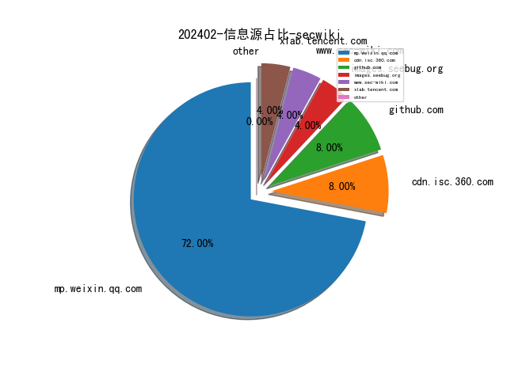
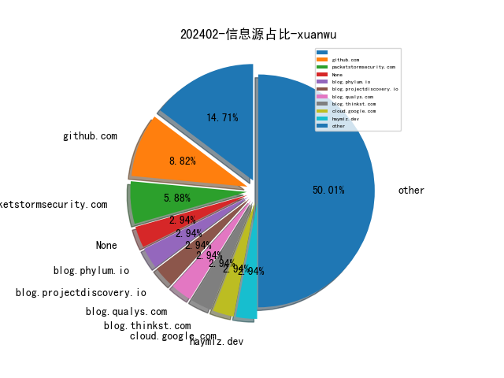
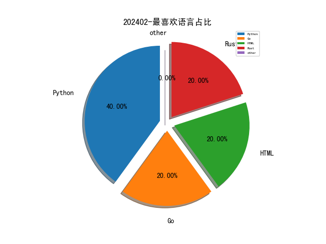

# [数据--所有](README_20.md)
# [数据--年度](README_2024.md)
# 202402 信息源与信息类型占比

# 网络安全书籍 推荐
| date_added | language | title | author | link | size| 
| --- | --- | --- | --- | --- | ---| 
| 2024-02-06 22:55:12 | English | NLP with Python: 3 Books in 1 - From Beginner to Advanced: The Future Frontier and Next-Gen Solutions | Watson, Jerome | http://libgen.rs/book/index.php?md5=CC3989E608E8EC9D612677039EC459BC | 1009 kB [EPUB]| 
| 2024-02-06 18:07:08 | English | Kubernetes Secrets Handbook | unknown | https://www.wowebook.org/kubernetes-secrets-handbook/ | unknown| 
| 2024-02-06 17:32:16 | English | Mastering Cloud Security Posture Management (CSPM) | unknown | https://www.wowebook.org/mastering-cloud-security-posture-management-cspm/ | unknown| 
| 2024-02-06 17:08:19 | English | Salesforce DevOps for Architects | unknown | https://www.wowebook.org/salesforce-devops-for-architects/ | unknown| 
| 2024-02-03 08:45:07 | English | CompTIA A+ Practice Test Core 2 (220-1102) | unknown | https://www.wowebook.org/comptia-a-practice-test-core-2-220-1102/ | unknown| 
| 2024-02-03 08:16:04 | English | CompTIA A+ Practice Tests Core 1 (220-1101) and Core 2 (220-1102) | unknown | https://www.wowebook.org/comptia-a-practice-tests-core-1-220-1101-and-core-2-220-1102/ | unknown| 
| 2024-02-03 13:27:07 | English | Microsoft Intune Cookbook | unknown | https://www.wowebook.org/microsoft-intune-cookbook/ | unknown| 
| 2024-02-02 15:49:58 | English | CompTIA Security+ SY0-701 Certification Guide, Third Edition | unknown | https://www.wowebook.org/comptia-security-sy0-701-certification-guide-third-edition/ | unknown| 

# 微信公众号 推荐
| nickname_english | weixin_no | title | url| 
| --- | --- | --- | ---| 
| 360安全应急响应中心 | qihusrc | 360SRC龙年限定红包封面免费领取 | https://mp.weixin.qq.com/s?__biz=MzkzOTIyMzYyMg==&mid=2247492602&idx=1&sn=318d11de28860be749b029ea30d7e6a5 | 1| 
| 360数字安全 | gh_6db130c5163e | 安全“不打烊” 春节有保障！ | https://mp.weixin.qq.com/s?__biz=MzA4MTg0MDQ4Nw==&mid=2247569492&idx=1&sn=df296637cab669e7e82788286620b93b | 6| 
| AI与网安 | gh_c57275954216 | 推荐一款免费音乐软件34.8K Star | https://mp.weixin.qq.com/s?__biz=MzU1ODQ2NTY3Ng==&mid=2247485517&idx=1&sn=23ce442b9b6460678f540308df96091f | 2| 
| AY长歌 | gh_8ae79cd3109b | 教育培训Edushow任意文件读取 | https://mp.weixin.qq.com/s?__biz=MzkzMjI1MDQwMg==&mid=2247484117&idx=1&sn=2d53a3c35213ea9ac0b520055e583399 | 4| 
| ChaMd5安全团队 | chamd5sec | L3HCTF 2024  WriteUp By Mini-Venom | https://mp.weixin.qq.com/s?__biz=MzIzMTc1MjExOQ==&mid=2247510018&idx=1&sn=8920c2a5616a4e544c8b0ef1183452e9 | 1| 
| Eonian Sharp | Eonian_sharp | Eonian Sharp 红包封面来啦 | https://mp.weixin.qq.com/s?__biz=Mzg3NzUyMTM0NA==&mid=2247485523&idx=1&sn=4e1901e52305acecd279143280edb820 | 1| 
| F12sec | F12sec | 工具 ｜ Windows应急响应本地日志分析工具 | https://mp.weixin.qq.com/s?__biz=Mzg5NjU3NzE3OQ==&mid=2247488812&idx=1&sn=d2dbfd48963f2fe917abc2ea313ee919 | 3| 
| FreeBuf | freebuf | 如何使用CLZero对HTTP1.1的请求走私攻击向量进行模糊测试 | https://mp.weixin.qq.com/s?__biz=MjM5NjA0NjgyMA==&mid=2651258683&idx=4&sn=2e0538a17510af35efc778dc74c97b8f | 20| 
| Ghost Wolf Lab | gh_f04eb9c9130b | Burp Suite 插件开发（一） | https://mp.weixin.qq.com/s?__biz=MzI3OTM3OTAyNw==&mid=2247485775&idx=1&sn=fdfda883b6e49656053f576ca0756a8e | 1| 
| HACK之道 | hacklearn | JNDI 注入利用工具 | https://mp.weixin.qq.com/s?__biz=MzIwMzIyMjYzNA==&mid=2247512716&idx=1&sn=389aacc9d7833fd8a4aa019462bde69f | 2| 
| HackSee | hacksee_com | 证书报名开始啦 | https://mp.weixin.qq.com/s?__biz=MzI5NTA0MTY2Mw==&mid=2247484465&idx=1&sn=1f7df412c7472e1ae1dbb4f77a4e8198 | 5| 
| IoT物联网技术 | IoT-Tech-Expo | 铱塔 (iita) 开源 IoT 物联网开发平台，基于 SpringBoot + TDEngine +Vue3 | https://mp.weixin.qq.com/s?__biz=MjM5OTA4MzA0MA==&mid=2454932641&idx=1&sn=5b80c5201b855710d536171ae6559416 | 4| 
| IoVSecurity | IoVSecurity | 2024年3月 在线证书课程-自动驾驶汽车仿真 | https://mp.weixin.qq.com/s?__biz=MzU2MDk1Nzg2MQ==&mid=2247602530&idx=2&sn=9a5eb11d462354dc70661f5687f4f917 | 15| 
| Khan安全攻防实验室 | None | 三不 | https://mp.weixin.qq.com/s?__biz=MzAwMjQ2NTQ4Mg==&mid=2247492389&idx=1&sn=8a94d2314be9a78e271cd2ac5a4debaa | 5| 
| LHACK安全 | Lhack_1314 | 2024第一弹，重点不错过~ | https://mp.weixin.qq.com/s?__biz=MzkyMjU2Nzc1Mg==&mid=2247484196&idx=1&sn=c007a699bee4ec75d2f1d5e524dbed82 | 1| 
| LemonSec | lemon-sec | 安全从业者推荐收藏的开源工具 | https://mp.weixin.qq.com/s?__biz=MzUyMTA0MjQ4NA==&mid=2247548533&idx=1&sn=bd79eed15cd86793f903bcda1b7e8d10 | 1| 
| ListSec | None | 祝大家新年快乐 | https://mp.weixin.qq.com/s?__biz=MzIwMjUyNDM0OA==&mid=2247485609&idx=1&sn=9c7ee28c9083fc2849395191b6170984 | 1| 
| OPPO安全应急响应中心 | opposrc | 2024年OSRC春节放假通知 | https://mp.weixin.qq.com/s?__biz=MzUyNzc4Mzk3MQ==&mid=2247493117&idx=1&sn=d304a9b059c48573061344d43f1a2a38 | 1| 
| T00ls安全 | T00lsSec | T00ls「龙年专属红包封面」来了，错过等一年！ | https://mp.weixin.qq.com/s?__biz=Mzg3NzYzODU5NQ==&mid=2247484512&idx=1&sn=6bb883d51099ffe3bbee5d4cab04aa6d | 2| 
| TtTeam | gh_a0a1db78ea68 | runc 工作目录突破 (CVE-2024-21626) | https://mp.weixin.qq.com/s?__biz=Mzg2NTk4MTE1MQ==&mid=2247484559&idx=1&sn=aff84d90c441906bac2ebc4d2554e91f | 3| 
| WIN哥学安全 | WIN-security | 【工具推荐】渗透测试工具箱 -- AutoRedTools | https://mp.weixin.qq.com/s?__biz=MzkwODM3NjIxOQ==&mid=2247497838&idx=1&sn=bb215e03914f60ca73e8058e280165d5 | 3| 
| Web安全工具库 | websec-tools | Spring综合漏洞的利用工具 -- SpringExploitGUI（2月6日更新） | https://mp.weixin.qq.com/s?__biz=MzI4MDQ5MjY1Mg==&mid=2247512212&idx=1&sn=7624875ea345fa3b43e6e737c2a0f726 | 5| 
| XDsecurity | gh_a6965ae2a4f5 | 招聘,多岗位,广东、江苏、北京,薪资60W总包起步 | https://mp.weixin.qq.com/s?__biz=Mzg2NTcyNjU4Nw==&mid=2247485121&idx=1&sn=b4abd60c6d3395572b26b1f4941e1282 | 1| 
| YY的黑板报 | gh_a91bd497db44 | 安全开发组件ESAPI简介 | https://mp.weixin.qq.com/s?__biz=Mzg5NzY5NjM5Mg==&mid=2247484692&idx=1&sn=3857aca030eb13328e041d1420357540 | 1| 
| dotNet安全矩阵 | doNetSafety | .NET安全矩阵知识库优惠持续进行 | https://mp.weixin.qq.com/s?__biz=MzUyOTc3NTQ5MA==&mid=2247490658&idx=2&sn=b44dc8707b8c53658f964d552772be63 | 6| 
| fullbug | xiejava1018 | 2023年我都干了啥？ | https://mp.weixin.qq.com/s?__biz=MjM5NDMwMjEwMg==&mid=2451851473&idx=1&sn=4055f805ec939b05a79c14244875fb94 | 3| 
| 一个不正经的黑客 | None | 男人，为什么要努力搞钱？速进 | https://mp.weixin.qq.com/s?__biz=MzkwODI1ODgzOA==&mid=2247502475&idx=1&sn=eab3affe623918d9392b92e43b6e3f34 | 2| 
| 丁爸 情报分析师的工具箱 | dingba2016 | 【工具】开源情报要点 | https://mp.weixin.qq.com/s?__biz=MzI2MTE0NTE3Mw==&mid=2651142038&idx=1&sn=bc7911e4d6ecbb9fae2b3305996ca256 | 4| 
| 三六零CERT | CERT-360 | 安全日报（2024.02.08） | https://mp.weixin.qq.com/s?__biz=MzU5MjEzOTM3NA==&mid=2247502497&idx=1&sn=e89551aad7af640a891180d591d85fd7 | 5| 
| 中国保密协会科学技术分会 | gh_be4f21d557c0 | 主编寄语暨2024年新春特辑 | https://mp.weixin.qq.com/s?__biz=MzIxMzI4ODI1MA==&mid=2247487903&idx=1&sn=11428e1869605a9d48760b0889997b0f | 3| 
| 中国计算机学会 | ccfvoice | CCF理事说 , 山东科大赵建立：全面提升区域会员服务，积极助力青岛工业互联网之都建设 | https://mp.weixin.qq.com/s?__biz=MjM5MTY5ODE4OQ==&mid=2651567694&idx=1&sn=dee1925146cd90c18d8f4f65fb790970 | 18| 
| 中孚安全技术研究 | zf_sec | 速抢！手慢无~元亨实验室龙年定制微信红包封面来喽！ | https://mp.weixin.qq.com/s?__biz=Mzg4Nzc3MTk3Mg==&mid=2247488469&idx=1&sn=2b6f21d67c527a661e45b9b4250af346 | 1| 
| 乌雲安全 | hackctf | 24个已知403绕过方法的利用脚本 | https://mp.weixin.qq.com/s?__biz=MzAwMjA5OTY5Ng==&mid=2247521204&idx=1&sn=d51bd689127d091fdfb5998e37d9cb4c | 2| 
| 云起无垠 | Clouditera2021 | 年会庆典 , AI之翼，高翔云端；云起无垠，乘风破浪！ | https://mp.weixin.qq.com/s?__biz=Mzg3Mjg4NTcyNg==&mid=2247488746&idx=1&sn=1d79d9183f795a169393af3811e00a55 | 2| 
| 会杀毒的单反狗 | cmlitiejun | Shim 引导加载程序的严重缺陷影响主要 Linux 发行版 | https://mp.weixin.qq.com/s?__biz=MzI2NzAwOTg4NQ==&mid=2649790412&idx=1&sn=db49e8b20dc2413a778adc2dde6c0de8 | 2| 
| 伞神安全 | gh_4f203aeb4f56 | 2024第一弹，重点不错过~ | https://mp.weixin.qq.com/s?__biz=MzkyOTU4NzE0Nw==&mid=2247484101&idx=1&sn=337c9f2ab7d865e6408fe9d4c588b2ce | 1| 
| 供应链安全 | gh_eba8c5077d2a | 供应链投毒预警 , 开源供应链投毒202401最新月报来啦！ | https://mp.weixin.qq.com/s?__biz=Mzg2ODc0ODc5NQ==&mid=2247484679&idx=1&sn=806be98623c8787c5d2a6f5332ed0df0 | 1| 
| 信息安全研究 | ISR2016 | 【业界动态】全国网安标委公布2023年网络安全国家标准优秀实践案例获奖名单 | https://mp.weixin.qq.com/s?__biz=MzA3NzgzNDM0OQ==&mid=2664984340&idx=1&sn=ff9a01822a502347ddfd382f297aa3fa | 13| 
| 全球技术地图 | drc_iite | 美国安全与新兴技术中心发布：《美国如何为人工智能的军事使用制定国际标准?》 | https://mp.weixin.qq.com/s?__biz=MzI1OTExNDY1NQ==&mid=2651610488&idx=1&sn=108e20df94548264d5dbb729286412ff | 9| 
| 兰花豆说网络安全 | SecuritySay | 暗网能被搜索吗？ | https://mp.weixin.qq.com/s?__biz=MzI3NzM5NDA0NA==&mid=2247485514&idx=1&sn=2d478f61a23a728d89238e6418a38cc9 | 2| 
| 关键信息基础设施安全保护联盟 | CNCIIPA | 伴随生成式AI的发展，2024年将出现十大网络安全风险威胁 | https://mp.weixin.qq.com/s?__biz=MzkxNjU2NjY5MQ==&mid=2247499272&idx=1&sn=2c70d01545ed699719b8d364ba2b4669 | 3| 
| 内生安全联盟 | CCESS_CHINA | 2023年国家网络安全十件大事 | https://mp.weixin.qq.com/s?__biz=Mzg4MDU0NTQ4Mw==&mid=2247516445&idx=1&sn=52100f655cc721cede5c7df548a961a7 | 9| 
| 前沿信安资讯阵地 | infosrc | 2024年重要战略技术趋势 | https://mp.weixin.qq.com/s?__biz=MzA3MTM0NTQzNA==&mid=2455770806&idx=1&sn=c4339d0555730e3a6d72243a88fd8993 | 4| 
| 君哥的体历 | jungedetili | 终端安全产品立项理由及终端安全一体化方案讨论 , 总第232周 | https://mp.weixin.qq.com/s?__biz=MzI2MjQ1NTA4MA==&mid=2247490939&idx=1&sn=e0fc4cce16f88b98405404f9c022e99d | 1| 
| 听风安全 | tingfengsec | 一篇文章让你秒会Electron投毒攻击 | https://mp.weixin.qq.com/s?__biz=Mzg3NzIxMDYxMw==&mid=2247499329&idx=1&sn=1e658583d78aa6aad74796d4a6f00d0f | 3| 
| 商密君 | shangmijun | 首期“贺兰山密话·商用密码应用与创新发展大讲堂”圆满闭幕 | https://mp.weixin.qq.com/s?__biz=MzI5NTM4OTQ5Mg==&mid=2247619298&idx=1&sn=5a275a70694fe4fccdb555150907e926 | 22| 
| 喜马拉雅安全响应平台 | XimalayaSecurity | 2023年度XMSRC年终致谢公告 | https://mp.weixin.qq.com/s?__biz=MzI3Mzk4MDQ5NQ==&mid=2247483859&idx=1&sn=70ce17d4a88a361c49d54219f7c459e7 | 1| 
| 嗨嗨安全 | natuerhi666 | 人手必备的 逆向分析专用虚拟机！ | https://mp.weixin.qq.com/s?__biz=MzIzMjg0MjM5OQ==&mid=2247487016&idx=1&sn=11270cd9f4ae0e6c3e876e91130f8aa1 | 1| 
| 嘶吼专业版 | Pro4hou | Microsoft Teams 中断导致出现消息延迟等问题 | https://mp.weixin.qq.com/s?__biz=MzI0MDY1MDU4MQ==&mid=2247573572&idx=2&sn=05b68e02be9a721081c57db5c25559bb | 8| 
| 国家互联网应急中心CNCERT | CNCERTCC | 网络安全信息与动态周报2024年第5期（1月29日-2月4日） | https://mp.weixin.qq.com/s?__biz=MzIwNDk0MDgxMw==&mid=2247498955&idx=1&sn=b1d526b030b651348ea44398b5bb808e | 1| 
| 国际云安全联盟CSA | gh_674820794ae8 | 新春祝福 , 2024共筑数字安全未来 | https://mp.weixin.qq.com/s?__biz=MzkwMTM5MDUxMA==&mid=2247496141&idx=1&sn=08c3ea1345a3b59a8272b5a424db779d | 4| 
| 夜组安全 | NightCrawler_Team | 一款综合性网络安全检测和运维工具 | https://mp.weixin.qq.com/s?__biz=Mzk0ODM0NDIxNQ==&mid=2247489842&idx=1&sn=4bd581e9923ad3014e69f628ff00ade9 | 3| 
| 大数据技术标准推进委员会 | gh_06f5ec229a80 | 中国联通海量网络数据治理实践 | https://mp.weixin.qq.com/s?__biz=MzU0NzczNjAwMw==&mid=2247508485&idx=1&sn=81085401eac0cb1a6277582a24b48848 | 5| 
| 天唯信息安全 | TWtech2113189 | 外交部：美国可谓是网络空间风险挑战的“万恶之源” | https://mp.weixin.qq.com/s?__biz=MzkzMjE5MTY5NQ==&mid=2247494963&idx=1&sn=90ec4ca7eecf1930f76c31d9e38310f5 | 7| 
| 天融信 | TopsecPioneer | 请查收除夕十二时辰攻略，迎接龙年好运气！ | https://mp.weixin.qq.com/s?__biz=MzA3OTMxNTcxNA==&mid=2650906164&idx=1&sn=8f46f0650025af6d021a31b1f1733bf7 | 4| 
| 天锐数据安全 | tipray | 逐梦十八载，安全赋未来！ | https://mp.weixin.qq.com/s?__biz=MjM5MTk0MzIzMQ==&mid=2652018774&idx=1&sn=045ff5616b8b4f43bdc5c5b53f2b8a46 | 4| 
| 太空安全 | SateSec | SDA 选择 Rocket Lab建造另外 18 颗传输层卫星(T2TL) | https://mp.weixin.qq.com/s?__biz=MzkwNjM4NTg4OQ==&mid=2247495272&idx=1&sn=d1a728cb67f51cff72264911e44ba244 | 1| 
| 威努特工控安全 | winicssec_bj | 特特祝您龙腾四海！龙年限定红包封面来啦！ | https://mp.weixin.qq.com/s?__biz=MzAwNTgyODU3NQ==&mid=2651113990&idx=1&sn=d7fe2e3cb768bbc346656c5e8938193f | 2| 
| 娜璋AI安全之家 | gh_91f1fe28fc6e | 预祝大家龙年大吉，感恩同行！“娜璋之家”公众号文章全年汇总 | https://mp.weixin.qq.com/s?__biz=Mzg5MTM5ODU2Mg==&mid=2247499325&idx=1&sn=05df4611b38baa9f108ac83080505ce5 | 2| 
| 字节跳动技术团队 | BytedanceTechBlog | 字节跳动网络工程团队三篇论文入选 DesignCon 2024 | https://mp.weixin.qq.com/s?__biz=MzI1MzYzMjE0MQ==&mid=2247505683&idx=1&sn=088a0556c4103e08f0f6c55e9601214e | 3| 
| 安世加 | asjeiss | 2023年三七互娱主动打击私服、外挂、黑客盗刷、恶意拉人等网络违法行为 | https://mp.weixin.qq.com/s?__biz=MzU2MTQwMzMxNA==&mid=2247536990&idx=1&sn=f0556f0cb0873c6cc9e20deb82c5c4f5 | 6| 
| 安全圈 | ChinaAnQuan | 【安全圈】63000名员工信息遭泄露，原因竟是内部员工的不恰当处理 | https://mp.weixin.qq.com/s?__biz=MzIzMzE4NDU1OQ==&mid=2652053917&idx=2&sn=55039ce05c9dc9befd05f930606c6ff1 | 20| 
| 安全牛 | aqniu-wx | 新年快乐，龙年大吉 , 春节假期停更通知 | https://mp.weixin.qq.com/s?__biz=MjM5Njc3NjM4MA==&mid=2651127800&idx=1&sn=0659b0361b53bceb954d8c8cc680fe7b | 7| 
| 安在 | AnZer_SH | 43位甲方亲述网络安全的收入、预算和焦虑 | https://mp.weixin.qq.com/s?__biz=MzU5ODgzNTExOQ==&mid=2247614250&idx=1&sn=a62aa6a30362fe44573881eff75035b5 | 14| 
| 安天集团 | Antiylab | 2023网络安全威胁的回顾与展望（开放征求修订意见版） | https://mp.weixin.qq.com/s?__biz=MjM5MTA3Nzk4MQ==&mid=2650204066&idx=1&sn=2dd220634969a51f20c757c404bbe4cf | 3| 
| 安恒信息 | AnHengCloudNews | 再获部委级表彰！安恒信息荣获“杭州亚运会、亚残运会先进集体”称号 | https://mp.weixin.qq.com/s?__biz=MjM5NTE0MjQyMg==&mid=2650601153&idx=1&sn=fea46252a34a8c91384cae7fe3958a63 | 4| 
| 安芯网盾 | None | 龙年春节放假值班公告 | https://mp.weixin.qq.com/s?__biz=MzU1Njk1NTYzOA==&mid=2247491110&idx=1&sn=a2cea082116e67542aed10126bfa7c41 | 1| 
| 实战安全研究 | gh_f390fc63c711 | 某网盘逻辑缺陷GetShell0day | https://mp.weixin.qq.com/s?__biz=MzU0MTc2NTExNg==&mid=2247489452&idx=1&sn=bd753d7d75b471b653bd9c863152589e | 3| 
| 山海之关 | None | 中奖用户请尽快来兑奖 | https://mp.weixin.qq.com/s?__biz=Mzg4MjcxMTAwMQ==&mid=2247488067&idx=1&sn=387af37eb83d7b371448b6c15658db3f | 1| 
| 巢安实验室 | safe-labs | 断更通知（祝大家新春快乐~） | https://mp.weixin.qq.com/s?__biz=MzU2MjY1ODEwMA==&mid=2247490334&idx=1&sn=296fb13456df0b3f92cce9aa93c6c6a3 | 1| 
| 工业互联网标识智库 | CAICT-bs | 236个！工信部：2023年工业互联网试点示范名单的公示 | https://mp.weixin.qq.com/s?__biz=MzU1OTUxNTI1NA==&mid=2247568902&idx=2&sn=0bb9d22b6dbeb98a08e1f966331f25fb | 11| 
| 掌控安全EDU | ZKAQEDU | 菜刀HTTP&TCP后门分析+防范 | https://mp.weixin.qq.com/s?__biz=MzUyODkwNDIyMg==&mid=2247536513&idx=1&sn=d2e4ec7f79f420c34580cf34e62536bd | 5| 
| 数世咨询 | dwconcn | 2024数字安全十大技术趋势预测！ | https://mp.weixin.qq.com/s?__biz=MzkxNzA3MTgyNg==&mid=2247508823&idx=1&sn=2bd1a5a955c12938723181bdbd78ceec | 5| 
| 昊天信安 | cniaosec | 神器！实现内网穿透的几款工具 | https://mp.weixin.qq.com/s?__biz=MzkzNzI4NDQzMA==&mid=2247496189&idx=1&sn=89f972297f999449766a297cbb1b96e4 | 3| 
| 明不可欺 | gh_1405d616adc7 | 网络违法分散化探究之前奏 | https://mp.weixin.qq.com/s?__biz=MzI1NTI4OTE5OA==&mid=2247487301&idx=1&sn=d30ebe5e0858963052bc6fca17e51542 | 1| 
| 明暗安全 | gh_808abf69ea32 | 2024大事件？快来关注！！！ | https://mp.weixin.qq.com/s?__biz=MzkxMjYxODcyNA==&mid=2247484190&idx=1&sn=9979765e451c679989471de8f45a849a | 1| 
| 格格巫和蓝精灵 | None |  | https://mp.weixin.qq.com/s?__biz=MzI5NDg0ODkwMQ==&mid=2247485792&idx=1&sn=1bd140f5505218b15e93cf5f7e59307c | 2| 
| 棉花糖网络安全圈 | hacker-mht | 【资料分享】200+信息安全技术导图.png | https://mp.weixin.qq.com/s?__biz=Mzg5NTYwMDIyOA==&mid=2247501424&idx=1&sn=825de054580158c3bdb738a75c78531f | 3| 
| 橘猫学安全 | gh_af700ee13397 | 渗透必备：使用Proxifier玩转代理 | https://mp.weixin.qq.com/s?__biz=Mzg5OTY2NjUxMw==&mid=2247511047&idx=1&sn=0ae37327b551d944b287a0802b08a2cc | 2| 
| 汽车电子嵌入式 | gh_c9d411042eab | 编译链接专题第4篇-变量和变量的不同赋值方式 | https://mp.weixin.qq.com/s?__biz=Mzg2NTYxOTcxMw==&mid=2247490878&idx=1&sn=2bca11cf8a68f5bbc20a10eadaf8b72a | 1| 
| 河南等级保护测评 | hndjbh | 美国国家安全局和网络司令部换将 | https://mp.weixin.qq.com/s?__biz=Mzg2NjY2MTI3Mg==&mid=2247494023&idx=1&sn=90bc908da9f422f30cf7c37f2a15c788 | 3| 
| 洞见网安 | doonsec | 2023洞见微信年终总结 | https://mp.weixin.qq.com/s?__biz=MzAxNzg3NzMyNQ==&mid=2247487171&idx=1&sn=1af27e3fb6c6a94a39f426cf7f6ecd06 | 2| 
| 浅黑科技 | qianheikeji | 360想拯救与黑客作战的100000个“帕鲁” | https://mp.weixin.qq.com/s?__biz=MzU0NDEwMTc1MA==&mid=2247523376&idx=1&sn=23c6b02e3444a8d0993b55f4111c05dd | 1| 
| 深信服科技 | sangfor_man | 《再让老孙赢一次》，深信服贺岁片正式上映！ | https://mp.weixin.qq.com/s?__biz=MjM5MTAzNjYyMA==&mid=2650584822&idx=1&sn=d883b48cae659bb644cb702bbde6759e | 3| 
| 深圳市网络与信息安全行业协会 | SNISRI | PPT下载 ,商用密码体系简介 | https://mp.weixin.qq.com/s?__biz=MzU0Mzk0NDQyOA==&mid=2247513937&idx=1&sn=c50cbfcc1df8bb954d1abfcd4ca8c522 | 5| 
| 渊龙Sec安全团队 | Aabyss-Team | [红包封面] 渊龙Sec安全团队祝您新春快乐！ | https://mp.weixin.qq.com/s?__biz=Mzg4NTY0MDg1Mg==&mid=2247485333&idx=1&sn=101604dbff99a106aa029a35385c9f1b | 1| 
| 渗透安全HackTwo | CB-Hack | 记一次从注入到任意文件上传成功GetShell的授权测试-漏洞挖掘 | https://mp.weixin.qq.com/s?__biz=Mzg3ODE2MjkxMQ==&mid=2247485419&idx=1&sn=9db7dcf7bc8252f022785d9677c8e329 | 2| 
| 渗透安全团队 | GuYingLanQi | 干货 , 内网入侵溯源实战案例 | https://mp.weixin.qq.com/s?__biz=MzkxNDAyNTY2NA==&mid=2247514720&idx=1&sn=11c1b2f4bcbe6d3bfeae777395d5347b | 4| 
| 滑板人之家 | gh_db0218d920fc | 用友GRP-U8-forgetPassword_old.jsp-SQL注入 | https://mp.weixin.qq.com/s?__biz=MzIyMDkxMTk4MQ==&mid=2247483865&idx=1&sn=816b9f52a8653850488b059e1fa2a12a | 4| 
| 火绒安全 | HuorongLab | .LIVE勒索病毒正在传播，火绒可拦截查杀（附勒索解密代码） | https://mp.weixin.qq.com/s?__biz=MzI3NjYzMDM1Mg==&mid=2247517493&idx=2&sn=ddfdd8821310aff9bac664a5ae1b0fb3 | 3| 
| 爱奇艺安全应急响应中心 | iqiyi_71src | 工信部发布2023移动互联网应用服务能力优秀案例 爱奇艺两项目入选 | https://mp.weixin.qq.com/s?__biz=MzI0OTIwMjE2NA==&mid=2247485708&idx=1&sn=7effd67e05faf1c04c86721f81a72f81 | 1| 
| 爱奇艺技术产品团队 | iQIYI-TP | 爱奇艺图片格式演进 | https://mp.weixin.qq.com/s?__biz=MzI0MjczMjM2NA==&mid=2247497778&idx=1&sn=15c3595337503e288c540362bb2ba903 | 2| 
| 猎洞时刻 | Bug-hunter_A1xxNy | 2024年最新重磅漏洞，Windows通杀漏洞！！！！！ | https://mp.weixin.qq.com/s?__biz=MzkyNTUyNTE5OA==&mid=2247484958&idx=1&sn=f6b785e72f0a05519726b2fe1cc3bfa4 | 1| 
| 玄道夜谈 | None | 分享图片 | https://mp.weixin.qq.com/s?__biz=MzI3Njc1MjcxMg==&mid=2247490822&idx=1&sn=c67b475dc16d4f27bfc33fa936d2ee74 | 2| 
| 珞安科技 | luoantechnology | 安全不放假 保障不离岗 ,珞安科技春节假期安全保障服务通知 | https://mp.weixin.qq.com/s?__biz=MzU2NjI5NzY1OA==&mid=2247508612&idx=1&sn=d378f0c995246128727279133970ea5a | 3| 
| 生有可恋 | hyang0-1 | Docker runlike 命令行查看工具 | https://mp.weixin.qq.com/s?__biz=Mzk0MTI4NTIzNQ==&mid=2247490598&idx=1&sn=530735332fd9895e4fcabc520d0e824f | 2| 
| 电子物证 | ewuzheng | 【电脑版微信的照片视频文件位置变化】 | https://mp.weixin.qq.com/s?__biz=MzAwNDcwMDgzMA==&mid=2651046890&idx=1&sn=c20e91b1d2c21a39c8c32c458843f790 | 5| 
| 白帽100安全攻防实验室 | whitecap100_team | 赛事 , 来咯！VNCTF2024 来袭~（文末附新年定制红包封面） | https://mp.weixin.qq.com/s?__biz=MzIxMDYyNTk3Nw==&mid=2247514814&idx=1&sn=1fd86fdf4cab91308564798f655e8134 | 2| 
| 白帽子 | NS-CTF | 红包封面限量发放，限量速戳→ | https://mp.weixin.qq.com/s?__biz=MzAwMDQwNTE5MA==&mid=2650247354&idx=1&sn=6cec1b58916f40caceba8a799f9ea7bf | 2| 
| 白帽子左一 | HackRead | 渗透测试学习-实战某高校 | https://mp.weixin.qq.com/s?__biz=MzI4NTcxMjQ1MA==&mid=2247606068&idx=1&sn=ab7a7704ae729b3ed3e04cb17b6cc30d | 5| 
| 白泽安全实验室 | baizelab | u200b新APT组织APT-LY-1009针对亚美尼亚政府投递VenomRAT——每周威胁情报动态第164期（02.02-02.07） | https://mp.weixin.qq.com/s?__biz=MzI0MTE4ODY3Nw==&mid=2247492097&idx=1&sn=53ec18ecbac467ab6dddeef971e8630f | 1| 
| 皓月的笔记本 | gh_7340936b0779 | 【知识整理】内网渗透之目标不出网上线思路（1） | https://mp.weixin.qq.com/s?__biz=Mzk0ODM0NDExMg==&mid=2247484410&idx=1&sn=ab02db32883f0d4863f2bb19f362eb6e | 1| 
| 盛邦安全WebRAY | WebRay_weixin | 荣誉丨盛邦安全上榜海淀区两新组织“红领”党建示范项目名单，获评2023年度两新组织“党建挚友” | https://mp.weixin.qq.com/s?__biz=MzAwNTAxMjUwNw==&mid=2650275087&idx=1&sn=c4d59a38884e9ecebfb1b62652363647 | 2| 
| 看雪学苑 | ikanxue | 【2024春季班】看雪安卓高级研修班（月薪一万计划），开启新学期 | https://mp.weixin.qq.com/s?__biz=MjM5NTc2MDYxMw==&mid=2458542029&idx=2&sn=72d546e8eb0f87655ced18ba426086d0 | 13| 
| 知攻善防实验室 | ChinaRan404 | AWVS 2024最新版破解教程 | https://mp.weixin.qq.com/s?__biz=MzkxMTUwOTY1MA==&mid=2247484935&idx=1&sn=7432b04e10d698186fa2067d6e6ef3b6 | 3| 
| 知机安全 | gh_ad3e7f23f43a | FBI打击KV僵尸网络后，威胁行为者调整策略 | https://mp.weixin.qq.com/s?__biz=MzIzNDU5NTI4OQ==&mid=2247485280&idx=1&sn=896a70b7b63082b51d59e139aaf54381 | 8| 
| 祺印说信安 | qiyinshuoxinan | 国外安全供应商 Okta、Proofpoint、Netography 加入裁员行列 | https://mp.weixin.qq.com/s?__biz=MzA5MzU5MzQzMA==&mid=2652104763&idx=1&sn=a9a56771834bb7b73f7dcc242d8caa2c | 6| 
| 秦安战略 | qinan1128 | 秦安：为何适得其反？证监会半夜发文说狠话、最高检也网络访谈了 | https://mp.weixin.qq.com/s?__biz=MzA5MDg1MDUyMA==&mid=2650466863&idx=1&sn=68dfca5f5884c6350b1348ee5e84a40b | 5| 
| 系统安全运维 | Taurus-1314147 | 数据安全风险的评估 | https://mp.weixin.qq.com/s?__biz=Mzk0NjE0NDc5OQ==&mid=2247522812&idx=1&sn=87f73b68b28e51927c771e3e92b22cc6 | 1| 
| 紫队安全研究 | ziduianquanyanjiu | 美国APT破窗效应——揭示“影子经纪人”和维基解密事件对网络安全的迭代影响 | https://mp.weixin.qq.com/s?__biz=Mzg3OTYxODQxNg==&mid=2247483969&idx=1&sn=a28353f0f0593c1851f041d491f16289 | 1| 
| 红蓝公鸡队 | None | 《套路》 | https://mp.weixin.qq.com/s?__biz=Mzg5MDc1MjY5Ng==&mid=2247492430&idx=1&sn=4ac64c04ad67d5241be959a9160090bc | 4| 
| 网安寻路人 | DataProtection101 | 《数字服务法》对超大平台和搜索引擎的审计规则 | https://mp.weixin.qq.com/s?__biz=MzIxODM0NDU4MQ==&mid=2247501053&idx=1&sn=e89b6598670807e9124c6b566ee21295 | 2| 
| 网星安全 | netstarsec | 持续守护，春节不停歇！【U0001f9e7龙年限定红包封面】 | https://mp.weixin.qq.com/s?__biz=MzkxNTEzMTA0Mw==&mid=2247494851&idx=1&sn=c04f258f2aaa19238f94d52423c65d77 | 1| 
| 网络安全与取证研究 | wangluoanquanquzheng | 对backdoor-factory的研究 | https://mp.weixin.qq.com/s?__biz=Mzg3NTU3NTY0Nw==&mid=2247488521&idx=1&sn=b2dc0e847dd15a8ee29545427fbf3505 | 2| 
| 网络安全实验室 | wlaqyjs | 三款红包封面免费送！不用抽奖直接领 | https://mp.weixin.qq.com/s?__biz=MzU4OTg4Nzc4MQ==&mid=2247500150&idx=1&sn=f63d3fbc8f79482f3ff4a84b388724f9 | 5| 
| 网络安全透视镜 | gh_0111d52251cf | 一个不是漏洞但又发不了的漏洞 | https://mp.weixin.qq.com/s?__biz=MzIxMTg1ODAwNw==&mid=2247499378&idx=1&sn=377cd6b408fda9eb3256e27ba0425546 | 2| 
| 网络技术联盟站 | wljslmz | 云计算与边缘计算：有什么区别？ | https://mp.weixin.qq.com/s?__biz=MzIyMzIwNzAxMQ==&mid=2649456232&idx=1&sn=23b20c7da4916ce2746f05227ec0e359 | 3| 
| 网络空间信息安全学习 | gh_39213c5878aa | 最后一波券 , Directory Opus 13、Eagle、FlowUs 息流，难得优惠快买！ | https://mp.weixin.qq.com/s?__biz=MzI2MjcwMTgwOQ==&mid=2247490508&idx=1&sn=11617faba24e246f467c4f32687cc9f3 | 3| 
| 苏说安全 | sushuoanquan | 2023网安业务谁亏得最多？ | https://mp.weixin.qq.com/s?__biz=Mzg5OTg5OTI1NQ==&mid=2247486489&idx=1&sn=f1f89d3e9e4cbc368f9a25bed3f47e36 | 2| 
| 菜鸟学信安 | securitylearn | Fofa绕过查询限制分析 | https://mp.weixin.qq.com/s?__biz=MzU2NzY5MzI5Ng==&mid=2247499928&idx=1&sn=d607a636f31cf283eb8c997e4bfb6bd8 | 2| 
| 菜鸟小新 | dsz-67 | 如何快速判断客户端是否存在恶意连接 | https://mp.weixin.qq.com/s?__biz=Mzg4OTI0MDk5MQ==&mid=2247490982&idx=1&sn=553e535d0a8b829a33a822329ce610ce | 2| 
| 蓝胖子之家 | gh_fa158f2ae9b3 | “为你的网站增添新年喜庆氛围——2024新年快乐灯笼HTML代码” | https://mp.weixin.qq.com/s?__biz=MzU1NDg4MjY1Mg==&mid=2247486997&idx=1&sn=a105ca7b88aefbf56ed88c57bd9c70d4 | 3| 
| 蚂蚁安全响应中心 | antgroupsec | 喜迎龙年，红包来啦 | https://mp.weixin.qq.com/s?__biz=MzI3NDEzNzIxMg==&mid=2650490028&idx=1&sn=35493ab3a9f8c8b0ad40a593227cb682 | 1| 
| 计算机与网络安全 | C-CyberSecurity | 2024年人工智能政策预测 | https://mp.weixin.qq.com/s?__biz=MjM5OTk4MDE2MA==&mid=2655226699&idx=1&sn=ea3e58d80e9b3379a2f91935153a7ace | 18| 
| 谈思实验室 | gh_6446c19b4595 | CAN基础知识介绍 | https://mp.weixin.qq.com/s?__biz=MzIzOTc2OTAxMg==&mid=2247533197&idx=1&sn=dd23368a99a50e21b72a4ad3ecfe90df | 10| 
| 赛博安全狗 | gh_a838eda1ce70 | 【ebpf】初探ebpf,用BCC写一个系统调用追踪Demo | https://mp.weixin.qq.com/s?__biz=MzkyNjU3NDQ1MA==&mid=2247486266&idx=1&sn=c0c001090ade972db0ebdaa7775566c3 | 2| 
| 赛博攻防悟道 | None | 浅谈侧信道流量检测技术 | https://mp.weixin.qq.com/s?__biz=MzI1MDA1MjcxMw==&mid=2649908147&idx=1&sn=ac48fde3f02212a399e0b2f800568a8c | 1| 
| 进击安全 | JinJiAnQuan_888 | 一次项目上的渗透测试 | https://mp.weixin.qq.com/s?__biz=MzkyMjM5NDM3NQ==&mid=2247485455&idx=1&sn=b7cd44a0361146b7334f2181cc110526 | 1| 
| 迪哥讲事 | growing0101 | 快速挖掘技巧+某学校实战案例分享 | https://mp.weixin.qq.com/s?__biz=MzIzMTIzNTM0MA==&mid=2247493504&idx=1&sn=169e1dc109ae0c6d9d2b0b977570aa4b | 3| 
| 重生者安全团队 | Fighter-hackerone | 【赏金猎人】在线编辑器存储XSS 300$ | https://mp.weixin.qq.com/s?__biz=Mzg4NTczMTMyMQ==&mid=2247484073&idx=1&sn=7372b2543160ad563a3c8b73e3a3341c | 4| 
| 锐安全 | SecuritySharp | 安全行业到底有多少种范式？跟现有安全体系到底是什么关系？ | https://mp.weixin.qq.com/s?__biz=MzAxOTk3NTg5OQ==&mid=2247490015&idx=1&sn=d8b3eff375d05a262a7cf5fcdba8dea4 | 1| 
| 零漏安全 | None | 红客？他要召唤外星人! | https://mp.weixin.qq.com/s?__biz=MzkyMDUzMzY1MA==&mid=2247497663&idx=1&sn=887d961f99c261b7a8eecc5bfaab7131 | 5| 
| 非攻安全实验室 | gh_9c3b7f864fba | 大华 DSS 数字监控系统 attachment_getAttList.action SQL 注入 | https://mp.weixin.qq.com/s?__biz=Mzk0NDUzMDA1Mg==&mid=2247485021&idx=1&sn=cef5dbd3d680e85c3e8ea76bdef9001a | 1| 
| 顺丰安全应急响应中心 | SFSRC- | 活动 , 顺丰SRC第二届白帽技术沙龙圆满落幕！ | https://mp.weixin.qq.com/s?__biz=MzU3OTAyODk4MQ==&mid=2247488627&idx=1&sn=b2e207c97b6e8091539ead3ca63a4183 | 1| 
| 高等精灵实验室 | LHE_ERU | Loom：一款轻量级的新生代快捷工具，速度杠杠滴！ | https://mp.weixin.qq.com/s?__biz=MzA4MjkzMTcxMg==&mid=2449044934&idx=1&sn=e250fecdd4ae123c90182ffb3fadf8cf | 2| 
| 麋鹿安全 | gh_76dddb79ae86 | 打靶手记之hackmyvm--Registry（文件包含  缓冲区溢出 原理与利用） | https://mp.weixin.qq.com/s?__biz=MzkwNjUwNTg0MA==&mid=2247492373&idx=1&sn=d60015b0dfc21f33bfe965746efc974d | 2| 
| 黑客白帽子 | hackerwhitehat | 【渗透测试】实战渗透！我是如何一个破站日一天的 | https://mp.weixin.qq.com/s?__biz=MzA5MzYzMzkzNg==&mid=2650942183&idx=1&sn=373e0fcdc6f3b4998c1f495548a7f741 | 8| 
| 黑白之道 | i77169 | 汪文斌：美国是网络空间风险挑战的“万恶之源”；泄露数据达19.1GB！某软件公司因开发系统测试阶段未加密被罚 | https://mp.weixin.qq.com/s?__biz=MzAxMjE3ODU3MQ==&mid=2650587245&idx=1&sn=cbaab1d827e57e89722fe6e2f0c43ef5 | 16| 
| AlertSec | AlertSec | HackTheBox-Crocodile | https://mp.weixin.qq.com/s?__biz=MzkwMjU5MzgzMQ==&mid=2247484753&idx=1&sn=0508f5c786b6da8afc0a0779c228c26b | 1| 
| CISSP | None | 网络安全认证近期开课表 | https://mp.weixin.qq.com/s?__biz=Mzg4MTg0MjQ5OA==&mid=2247484227&idx=1&sn=5a564bf072b24dbac35c99e672891f45 | 3| 
| CKCsec安全研究院 | ckcsec2022 | 实战 , 记一次域内AD横向 | https://mp.weixin.qq.com/s?__biz=MzkxMTIyMjg0NQ==&mid=2247494212&idx=1&sn=b930663eac4d9c06b5b43d61fcabb6fe | 1| 
| CNCERT国家工程研究中心 | NELCERT | 最新的 Ivanti SSRF 零日漏洞正在被大规模利用 | https://mp.weixin.qq.com/s?__biz=MzUzNDYxOTA1NA==&mid=2247542932&idx=1&sn=557fa2997c1992306ee492755f0af0e1 | 9| 
| CNNVD安全动态 | cnnvd_news | 信息安全漏洞周报（2024年第6期） | https://mp.weixin.qq.com/s?__biz=MzAxODY1OTM5OQ==&mid=2651443626&idx=2&sn=349e341292f2436419318fae8269d8f6 | 2| 
| CertiK | certikchina | 什么是“社会工程学攻击”？解构 Concentric.Fi 安全事件 | https://mp.weixin.qq.com/s?__biz=MzU5OTg4MTIxMw==&mid=2247502222&idx=1&sn=10d99b754d273b01235f74a15401ce7e | 1| 
| EBCloud | KKHsuCheney | 搞定Prompt,让AI成为得力写作助手 | https://mp.weixin.qq.com/s?__biz=Mzg4MTA2MTc4MA==&mid=2247492829&idx=1&sn=8eab9ca0002b3a06db3745e3dbb5ba14 | 1| 
| HACK学习君 | None | 老师，我太想进步了 | https://mp.weixin.qq.com/s?__biz=MzIzNzMxMDkxNw==&mid=2247493338&idx=1&sn=14c4a365755ba055e9777b480b382f9e | 1| 
| IMPERVA | IMPERVA | 全球一周应用安全事件播报 | https://mp.weixin.qq.com/s?__biz=MzI1OTYyOTUyOA==&mid=2247487407&idx=1&sn=05c6b65d56e6f6c3dad1aed3ca426509 | 2| 
| Ms08067安全实验室 | None | 春节大促来袭~ | https://mp.weixin.qq.com/s?__biz=MzU1NjgzOTAyMg==&mid=2247517770&idx=1&sn=1b41adb4e9726b3a044bf8c13d20f837 | 1| 
| PwnPigPig | gh_b623b2ac830c | 内网知识体系之远程凭据获取 | https://mp.weixin.qq.com/s?__biz=MzkyNDI2NjQzNg==&mid=2247489773&idx=1&sn=aaaa51a3eec2f7c8220fd8ff8542a6c7 | 1| 
| Relay学安全 | gh_8d57319ec39c | Rebuild代码审计 | https://mp.weixin.qq.com/s?__biz=Mzg5MDg3OTc0OA==&mid=2247485700&idx=1&sn=8c2ec891700037b1179992b6eb652a3f | 3| 
| Rot5pider安全团队 | Rot5pider-Team | 红队重点攻击系统指纹探测工具-EHole3.0 | https://mp.weixin.qq.com/s?__biz=Mzg5OTYxMjk0Mw==&mid=2247489591&idx=1&sn=1c560978cdfb39d95a8b8e764d98097f | 3| 
| Timeline Sec | TimelineSec | 春节三大福利齐放送，回馈数万粉丝免费领！ | https://mp.weixin.qq.com/s?__biz=MzA4NzUwMzc3NQ==&mid=2247493567&idx=1&sn=eaf13d0437eb104339a9a2822a40930f | 3| 
| XK Team | gh_99c29b36f837 | 祝大家新年快乐，最重要的是要身体健康 | https://mp.weixin.qq.com/s?__biz=Mzk0ODMwNjQzMA==&mid=2247485691&idx=1&sn=36707f9fe87f7760f2571715c8ac5f59 | 1| 
| Yi安全 | gh_b51111a0d6d3 | 漏洞复现-万户 OA 存在11处sql注入 | https://mp.weixin.qq.com/s?__biz=Mzg3ODk2OTcxMw==&mid=2247484794&idx=1&sn=3929562278691020f3d5238c7b8f2136 | 2| 
| goddemon的小屋 | gh_0383232a884d | 关于文章 | https://mp.weixin.qq.com/s?__biz=MzI2NTc1ODY0Mw==&mid=2247485792&idx=1&sn=9a1d2105a556337b9d2104e344df983d | 1| 
| i春秋 | icqedu | 【Js逆向】某博反爬机制的逆向分析 | https://mp.weixin.qq.com/s?__biz=MzUzNTkyODI0OA==&mid=2247525628&idx=1&sn=b6b6d1d986a9a68404e2c028fd9d56bb | 1| 
| 东软NetEye网络安全 | None | 春节服务通知 | https://mp.weixin.qq.com/s?__biz=MjM5NTAyODkxNw==&mid=2649212809&idx=1&sn=2d5d870847d08e5c3463a99837f7889a | 1| 
| 中伦文德网络安全与数据合规 | gh_4b33f9a2e329 | 【新闻速递】上海提出率先制定重要数据目录、探索建立合法安全便利的数据跨境流动机制 | https://mp.weixin.qq.com/s?__biz=MzIxNDgyNTg0NQ==&mid=2247492179&idx=1&sn=1ff767f23db2669c9a0fb8f287101f5e | 3| 
| 众安安全应急响应中心 | za_ZASRC | 2024年春节放假及复工时间通知 | https://mp.weixin.qq.com/s?__biz=MzI5NTQwMjYxNg==&mid=2247483778&idx=1&sn=9fc421bed421f3c69fdde5f792833ec4 | 1| 
| 信安404 | infosec404 | 假期如何优雅的远程办公/运维/测试？ | https://mp.weixin.qq.com/s?__biz=Mzk0NjQ5MTM1MA==&mid=2247487252&idx=1&sn=48f3c4234f5921396abf83b5d4f88e4c | 3| 
| 信息安全与通信保密杂志社 | cismag2013 | 2023年中国网络安全十件大事 | https://mp.weixin.qq.com/s?__biz=MzkwMTMyMDQ3Mw==&mid=2247585110&idx=1&sn=c69a8f0b7d7a8fd8b866b0d5496d69e8 | 10| 
| 关键基础设施安全应急响应中心 | CII-SRC | 数据跨境流动治理的立法实践 | https://mp.weixin.qq.com/s?__biz=MzkyMzAwMDEyNg==&mid=2247542234&idx=2&sn=5c60e8502c1c655ef456a23f10d12cb9 | 9| 
| 划水但不摆烂 | gh_0ea5f4b417af | 【漏洞复现】九思OA user-list-3g SQL注入 | https://mp.weixin.qq.com/s?__biz=Mzk0NDUxMjAzNw==&mid=2247485716&idx=1&sn=65b810f7e61636c98e70c793dd062de3 | 1| 
| 创宇安全智脑 | websoc | 创宇安全智脑 , Ivanti 多产品 SAML 组件服务端请求伪造（CVE-2024-21893）等62个漏洞可检测 | https://mp.weixin.qq.com/s?__biz=MzIwNjU0NjAyNg==&mid=2247488329&idx=1&sn=af5563222c67d44fc1fac3abe45c91cc | 1| 
| 合天网安实验室 | hee_tian | 放假通知 | https://mp.weixin.qq.com/s?__biz=MjM5MTYxNjQxOA==&mid=2652903820&idx=1&sn=a3df5c672fa67bb4b07f63310b2fd58c | 5| 
| 吉祥同学学安全 | gh_370fbad7aec1 | 降本增效，公积金从12%调到5%，各大公司新妙招 | https://mp.weixin.qq.com/s?__biz=MzI1ODY3MTA3Nw==&mid=2247484901&idx=1&sn=5b187a05adb3b05d5a87bd6fb1182963 | 1| 
| 启明星辰网络空间安全教育 | gh_310250868fd4 | 龙行龘龘，喜迎新年丨知白学院2024贺岁表情包已上线，速来接收可爱暴击！ | https://mp.weixin.qq.com/s?__biz=MzUzNDg0NTc1NA==&mid=2247508503&idx=1&sn=c5f65d8d07c74ce54e5139f1b12e490b | 3| 
| 嗜心 | gh_f0e258c2d27c | xss练习靶场 | https://mp.weixin.qq.com/s?__biz=MzkzMDU3MjIzMA==&mid=2247483879&idx=1&sn=18dcb97ef80d0cb72449fecf5460d9db | 1| 
| 天禧信安 | txxa-385 | PDF 版本获取 | https://mp.weixin.qq.com/s?__biz=MzUyMTE0MDQ0OA==&mid=2247493426&idx=2&sn=404c69a41b13c2f6db2b25c64d282266 | 2| 
| 天融信教育 | TOPSEC-EDU | 安全运营内刊—威胁分析与响应能力—深入解析WinSxS劫持攻击 | https://mp.weixin.qq.com/s?__biz=MzU0MjEwNTM5Ng==&mid=2247516227&idx=1&sn=eb39e824d043b7b72b5ae199642e0af2 | 2| 
| 天驿安全 | tianyisec | 自动化监控赏金项目 - laoyue | https://mp.weixin.qq.com/s?__biz=MzkxNjIxNDQyMQ==&mid=2247496235&idx=1&sn=cc15e88392e3527b14645f6f3ce0bc49 | 1| 
| 奇安信安全监测与响应中心 | QAX-CERT | 【已复现】Oracle WebLogic Server JNDI注入漏洞(CVE-2024-20931)安全风险通告 | https://mp.weixin.qq.com/s?__biz=MzUzODQ0ODkyNA==&mid=2247484935&idx=1&sn=1ef82b14f761bd1a50ac42689957b3b1 | 1| 
| 奇安盘古 | PanguLab | 龙行龘龘：奇安盘古为您送上新春祝福 | https://mp.weixin.qq.com/s?__biz=MzI2MDA0MTYyMQ==&mid=2654404237&idx=1&sn=a96f6944abf5a9a42f0ac1f0d4e99893 | 1| 
| 安全419 | anquan-419 | 2023年全球漏洞趋势观察 再创新高利用加快 | https://mp.weixin.qq.com/s?__biz=MzUyMDQ4OTkyMg==&mid=2247537981&idx=1&sn=308200b39a0f3912962ce4a65ead2cc1 | 1| 
| 安全后厨 | sanxingfengaa | 每日新闻(348)——2024.02.07 | https://mp.weixin.qq.com/s?__biz=MzI3MDQ1NDE2OA==&mid=2247490453&idx=1&sn=51c0108687b5948311f64beed5849ac5 | 12| 
| 安全客 | anquanbobao | 《美相关APT组织分析报告》正式发布 | https://mp.weixin.qq.com/s?__biz=MzA5ODA0NDE2MA==&mid=2649786193&idx=2&sn=afb99acb0af04157786184b132336a61 | 3| 
| 安全架构 | gh_b85664ada8d0 | 入侵检测和防御检查 | https://mp.weixin.qq.com/s?__biz=Mzg5MjgxNTQ1MA==&mid=2247486103&idx=1&sn=9f670b492caa403808afaed524b93bd4 | 1| 
| 安全牛课堂 | aqniu_edu | 谷安 , 2024年春节放假通知！ | https://mp.weixin.qq.com/s?__biz=MzIxNTM4NDY2MQ==&mid=2247509358&idx=1&sn=8fc37ce426a262472d83ccabcb2d5696 | 3| 
| 安全艺术 | SecurityArt | 【平安喜乐】 | https://mp.weixin.qq.com/s?__biz=MzI4MjI2NDI1Ng==&mid=2247484710&idx=1&sn=d91d664cef16526889ce317055035284 | 1| 
| 小黑子安全 | xiaoheizi537981 | SQL注入-Oracle手工+sqlmap | https://mp.weixin.qq.com/s?__biz=Mzg5NDg4MzYzNQ==&mid=2247486284&idx=1&sn=530e9c10b1c13129fac789ca152bf110 | 3| 
| 山石网科新视界 | hillstone-vision | 强强联手丨山石网科与神州新桥达成深度战略合作 | https://mp.weixin.qq.com/s?__biz=MzAxMDE4MTAzMQ==&mid=2661285360&idx=1&sn=39603515b8160bd088cb2f096c589285 | 3| 
| 工业安全产业联盟 | ICSISIA | 干货丨2023全球隐私计算报告（附下载） | https://mp.weixin.qq.com/s?__biz=MzI2MDk2NDA0OA==&mid=2247526303&idx=1&sn=ca57ec09d28d025047a66ec5239082eb | 4| 
| 希潭实验室 | abc123network | 2023年ABC123公众号年刊下载(PDF电子书) | https://mp.weixin.qq.com/s?__biz=MzkzMjI1NjI3Ng==&mid=2247486613&idx=1&sn=4fc371de2979605ce6ee5f22c4b50371 | 1| 
| 弥天安全实验室 | gh_41292c8e5379 | 【成功复现】Rebuild服务器端请求伪造漏洞(CVE-2024-1021) | https://mp.weixin.qq.com/s?__biz=MzU2NDgzOTQzNw==&mid=2247500901&idx=1&sn=65118a36ed11ad835a2f99384839a59a | 3| 
| 情报分析师 | Intelligencer1 | 情报学院知识分享社群 | https://mp.weixin.qq.com/s?__biz=MzA3Mjc1MTkwOA==&mid=2650545721&idx=2&sn=5ab319f73eb201e789e8acdb2208418e | 8| 
| 数据安全共同体计划 | gh_385b203e9e03 | 关注！数据安全新动态（2024年1月·下篇） | https://mp.weixin.qq.com/s?__biz=Mzg5MDcxODc5NA==&mid=2247489936&idx=1&sn=68bdfe955b0dcb124a5d5f906acaeba7 | 1| 
| 数据安全推进计划 | gh_5e558917e916 | 新春快乐｜数据安全推进计划祝您龙年大吉！ | https://mp.weixin.qq.com/s?__biz=Mzg3NjY3MDE3MA==&mid=2247490164&idx=1&sn=50c4dba72c1e167321a729a49e9bef95 | 1| 
| 李白你好 | None | B安虚拟货币交易所 将于2024-02-20 下架XMR VAI ANT MULTI 尽快卖掉💔 | https://mp.weixin.qq.com/s?__biz=MzkwMzMwODg2Mw==&mid=2247503481&idx=1&sn=73018332a6d3b693addbca973db318ca | 2| 
| 沃克学安全 | walkerxuewangan | 看到大佬的总结，我对行业和自身又产生了一些思考... | https://mp.weixin.qq.com/s?__biz=MzkzMjIxNjExNg==&mid=2247485189&idx=1&sn=e0d97c68019d050877b26d07fc6e8d62 | 1| 
| 漏洞文库 | gh_39e3d018b3d3 | 【漏洞复现】Oracle WebLogic Server JNDI注入漏洞(CVE-2024-20931) | https://mp.weixin.qq.com/s?__biz=MzkwNTE4Mzc2Mg==&mid=2247484323&idx=1&sn=a8de20f71acb3c344d85f3d8f7a3e93f | 5| 
| 漏洞盒子VulBox | Vulbox_ | 喜报！多个白帽帮会一周收入过万元，私域收益再创新高 | https://mp.weixin.qq.com/s?__biz=MzIxODIzNzgwMw==&mid=2654067745&idx=1&sn=39acf00dec4a6951ed867ee3a92943a7 | 1| 
| 红队蓝军 | Xx_Security | 年后的“金三银四”你准备好了吗？ | https://mp.weixin.qq.com/s?__biz=Mzg2NDY2MTQ1OQ==&mid=2247516624&idx=1&sn=76cd0769aa4fc7ab7d421ad463e469e2 | 2| 
| 网易云音乐技术团队 | gh_e0a72742f973 | 心遇APP站内玩法H5体验优化实践 | https://mp.weixin.qq.com/s?__biz=MzI1NTg3NzcwNQ==&mid=2247490556&idx=1&sn=98ef27dd586747c8a042389501234608 | 2| 
| 网络威胁数据联盟 | gh_4cdf96acbe40 | 【漏洞预警】runc容器逃逸漏洞(CVE-2024-21626) | https://mp.weixin.qq.com/s?__biz=MzA3MzI5NzY0OA==&mid=2247495523&idx=1&sn=daf7a3a8fc11374f5e2b797fa71d2fd2 | 2| 
| 网络安全等保与关保 | DJBH-CIIP | 自己动手 , 从零开始证书类密评工具开发（三） | https://mp.weixin.qq.com/s?__biz=MzUyNjk2MDU4MQ==&mid=2247486149&idx=1&sn=e3595961f691c705df56bb749d6a460a | 1| 
| 美亚柏科 | MeiyaPico | 龙腾四海，“辰”势而上！国投智能（美亚柏科）新春系列活动开启 | https://mp.weixin.qq.com/s?__biz=MjM5NTU4NjgzMg==&mid=2651408063&idx=2&sn=220d0328ce8b424fc2610837d0c6f806 | 8| 
| 联想全球安全实验室 | gh_bfd408ab01d7 | 浅析常见加密算法 | https://mp.weixin.qq.com/s?__biz=MzU1ODk1MzI1NQ==&mid=2247489630&idx=1&sn=f60dd2b4f68e863d76dbb187dc5379ef | 1| 
| 蓝桥云课精选 | lanqiaoyunke01 | LONG年，让我们去做可可爱爱的人，有有趣趣的事！！ | https://mp.weixin.qq.com/s?__biz=MzkwODM4NDM5OA==&mid=2247516316&idx=1&sn=acb97ca2ddd10dfdfd1ae000978895b7 | 3| 
| 虎符网络 | HF_security | 虎符网络2024年春节假期服务不打烊！ | https://mp.weixin.qq.com/s?__biz=MzUxODY3MDExMA==&mid=2247489241&idx=1&sn=2dd5eeeccfe9b2991c93bf47469a9fed | 2| 
| 螣龙Vision | TalentVision_TV | 龙行龘龘，前程朤朤，生活䲜䲜！ | https://mp.weixin.qq.com/s?__biz=MzkyMDIyNTAzMA==&mid=2247487766&idx=1&sn=c1b28f70626f6ac571efc794e6975abf | 1| 
| 谈数据 | learning-bigdata | 人民日报推荐的15幅漫画，睡不着的时候看一看… | https://mp.weixin.qq.com/s?__biz=MzI1NzYwNTMzNw==&mid=2247520984&idx=1&sn=1e623774739a10b9d3f3c9050ec59f4d | 3| 
| 贝雷帽SEC | Beret-Sec | Fastjson漏洞利用合集 | https://mp.weixin.qq.com/s?__biz=Mzk0MDQzNzY5NQ==&mid=2247489861&idx=1&sn=c7aec4d46fccdd6dad81cbe1bb2980ff | 1| 
| 赛博研究院 | SICSI-cybersecurity | 国家邮政局发布《寄递服务用户个人信息安全管理办法》征求意见稿 | https://mp.weixin.qq.com/s?__biz=MzUzODYyMDIzNw==&mid=2247507922&idx=2&sn=bb0af3f891c2c8e5b6150074de4aa8d8 | 5| 
| 边界无限 | BoundaryX | 边界无限春节护航，安全不打烊~ | https://mp.weixin.qq.com/s?__biz=MzAwNzk0NTkxNw==&mid=2247486758&idx=1&sn=7c281f849441a7ebd24bec638d45da6f | 1| 
| 迪普科技 | DPtechnology | 迪普科技2024年春节保障通知 | https://mp.weixin.qq.com/s?__biz=MzA4NzE5MzkzNA==&mid=2650351459&idx=1&sn=957d8dc3acffb37070f35fab2215c694 | 2| 
| 邑安全 | EansecD | 邑安科技安全团队祝您龙年大吉！ | https://mp.weixin.qq.com/s?__biz=MzUyMzczNzUyNQ==&mid=2247519821&idx=1&sn=a2b5bd96ab18d8f855b71eda66fb5bf7 | 1| 
| 锦行科技 | jeeseensec | 不负使命 , 锦行荣获“广州市网络安全应急联动机构优秀单位”！ | https://mp.weixin.qq.com/s?__biz=MzIxNTQxMjQyNg==&mid=2247492056&idx=1&sn=cb2fb65be48b71e12e38d2343649f3c2 | 1| 
| 阿无安全 | gh_42ad55a11898 | CVE-2024-0939 任意文件上传漏洞（附EXP） | https://mp.weixin.qq.com/s?__biz=MzkwMTUzNDgxOA==&mid=2247484361&idx=1&sn=56fbad5c58e50b4cdc1206975c31ec7a | 1| 
| 雷神众测 | bounty_team | 雷神众测春节放假通知！ | https://mp.weixin.qq.com/s?__biz=MzI0NzEwOTM0MA==&mid=2652502799&idx=1&sn=264c4e1ea4a9c76befaadb9c7760c3a3 | 2| 
| 黑熊安全 | None | 2024第一弹，重点不错过~ | https://mp.weixin.qq.com/s?__biz=Mzg2MTg2NzI5OA==&mid=2247484144&idx=1&sn=179b0cbb998c12bb67232cc8672a0580 | 2| 
| CISP | gh_a6a902006095 | 关于举办第一届“长城杯”信息安全铁人三项赛初赛的通知 | https://mp.weixin.qq.com/s?__biz=MzI1NzQ0NTMxMQ==&mid=2247488982&idx=2&sn=480829abb8592d319c6b3c53cb95eaa3 | 6| 
| Clarmy吱声 | VoiceOfClarmy | Open-Meteo 助你实现气象数据自由！ | https://mp.weixin.qq.com/s?__biz=MzI2MDQ0ODIzNg==&mid=2247484912&idx=1&sn=286502a68fe136b74d76593653716571 | 2| 
| DFIR蘇小沐 | DFIR00 | 【Android取证篇】利用QuickLook插件快速预览APK信息 | https://mp.weixin.qq.com/s?__biz=MzI2MTUwNjI4Mw==&mid=2247487521&idx=1&sn=3d39eb789bc000143ee0cb91ce870753 | 1| 
| GSDK安全团队 | gh_403a21e91f24 | 一款自动化分析网络安全应急响应工具 - FindAll | https://mp.weixin.qq.com/s?__biz=MzIzNTE0Mzc0OA==&mid=2247485635&idx=1&sn=f9c922f612996506750efe13b6153b7d | 1| 
| Gaobai文库 | HikC98799 | 记一次域内ad cs横向 | https://mp.weixin.qq.com/s?__biz=MzkxNzIzNDExMA==&mid=2247486408&idx=1&sn=4426272e623634c88af3a94a42a84e55 | 1| 
| HackingWiki漏洞感知 | gh_2ceec265cb99 | SRC实战 , 从弱口令到getshell的一例（不过实话实说一般系统的弱口令基本是shell不了的） | https://mp.weixin.qq.com/s?__biz=MzkzMzE5OTQzMA==&mid=2247484046&idx=1&sn=e638cbdd794d6af07dad5ab9a85a0223 | 1| 
| Jiyou too beautiful | zorejt-_- | HTB-Skyfall笔记 | https://mp.weixin.qq.com/s?__biz=Mzk0MTQxOTA3Ng==&mid=2247487979&idx=1&sn=9ba5199e566d665ffb1160a1ad2f4cf3 | 1| 
| Lambda小队 | LambdaTeam | 金龙贺岁，祝大家新年快乐！ | https://mp.weixin.qq.com/s?__biz=Mzg5MDY1NTg3OQ==&mid=2247485525&idx=1&sn=99a54bbd659704a94233a0dd216275db | 1| 
| SKSEC | gh_f932e6087f88 | 【表哥有话说 第106期】DASCTF web总结 | https://mp.weixin.qq.com/s?__biz=MzU1MjI5MDY3Nw==&mid=2247486485&idx=1&sn=87b003c4e6643697f9ff41cb5c493699 | 1| 
| UKFC安全 | gh_f762e53fa5dd | UKFC2024 L3HCTF WP | https://mp.weixin.qq.com/s?__biz=MzkyNTU4OTc3MA==&mid=2247484742&idx=1&sn=d4e9e85e31e762ffb33a6a43230b189b | 1| 
| WgpSec狼组安全团队 | wgpsec | 内网穿透工具 Chisel 二开和使用 | https://mp.weixin.qq.com/s?__biz=MzIyMjkzMzY4Ng==&mid=2247503606&idx=1&sn=3b5fd0ec6b9beb7b66619c70069bf68d | 1| 
| aFa攻防实验室 | gzh_afagfsys | 微信红包封面领取 | https://mp.weixin.qq.com/s?__biz=MzAxMjcxMjkyOA==&mid=2247486173&idx=1&sn=4bace49b53f787bd939a0235a82cdfcc | 1| 
| moonsec | moon_sec | 【寒假活动】暗月渗透测试培训 | https://mp.weixin.qq.com/s?__biz=MzAwMjc0NTEzMw==&mid=2653588343&idx=1&sn=fd2129aff354839e7da19c65fb49fe36 | 1| 
| 七芒星实验室 | HeptagramSec | API接口安全问题浅析 | https://mp.weixin.qq.com/s?__biz=Mzg4MTU4NTc2Nw==&mid=2247490952&idx=1&sn=804798a47f724be32da904814d78dad4 | 2| 
| 不懂安全的果仁 | None | 所以安服仔的悲哀又是什么呢？ | https://mp.weixin.qq.com/s?__biz=Mzg4NDg3NjE5MQ==&mid=2247484805&idx=1&sn=9beac427d4f1b0f653422f503763825a | 1| 
| 中机博也车联网安全 | CMboye | 汽车安全之DoIP协议仿真靶场 | https://mp.weixin.qq.com/s?__biz=Mzk0NDQzODY4MA==&mid=2247484124&idx=1&sn=e9532f2d3f9c1ee814fe582f3d79cca7 | 1| 
| 从放弃到入门 | T-stzl | 感恩回馈,限时领取！龙年卡通微信红包封面皮肤，领到就是赚到~！ | https://mp.weixin.qq.com/s?__biz=MzIzNDE0Mzk0NA==&mid=2649595126&idx=1&sn=19eda3df734bfcaa3447cd7283702dd5 | 1| 
| 代码卫士 | codesafe | 美国参议院 HSGAC 批准两项与网络安全和软件相关的法案，其中一项与源代码共享有关 | https://mp.weixin.qq.com/s?__biz=MzI2NTg4OTc5Nw==&mid=2247518839&idx=1&sn=d51897f2f99fb9386e9228a81475f6c6 | 3| 
| 众安天下Allsec | All_sec | 众安天下丨放假通知及春节值守安排 | https://mp.weixin.qq.com/s?__biz=MzIyOTUzODY5Ng==&mid=2247503766&idx=2&sn=62317bd0175ea595b0cb43210a00d9b0 | 2| 
| 全知科技 | QUANZHI-TECH | 连续入选！全知科技实力上榜《CCSIP 2023中国网络安全行业全景册》多项细分领域 | https://mp.weixin.qq.com/s?__biz=MzU0NDMxODY2Nw==&mid=2247521458&idx=1&sn=ad8e2c897b0eaa2e8c83b2773c1dd90f | 1| 
| 公安部网络安全等级保护中心 | gh_f5f6bf3d09af | 公安部网络安全等级保护评估中心2023年年终盘点 | https://mp.weixin.qq.com/s?__biz=MzU3NTQwNDYyNA==&mid=2247487010&idx=1&sn=dfbec08e768b20322fab1f32f1ad3247 | 1| 
| 创信华通 | cdcxht | 创信招聘丨新年一起遇“荐”你！ | https://mp.weixin.qq.com/s?__biz=MzUxNTQxMzUxMw==&mid=2247521058&idx=1&sn=8662331c32d52d93ddf9469d3eb8cebb | 2| 
| 北邮 GAMMA Lab | BUPT_GAMMA | OpenHGNN发布0.6版本 | https://mp.weixin.qq.com/s?__biz=Mzg4MzE1MTQzNw==&mid=2247488966&idx=1&sn=c839fb2a04b8b3659c6acde91b2942d2 | 1| 
| 华为安全 | HuaweiSecurity | 未然通讯社：支付赎金的勒索软件受害人比例降至新低；远程桌面软件AnyDesk遭遇数据泄露 | https://mp.weixin.qq.com/s?__biz=MzAwODU5NzYxOA==&mid=2247502851&idx=1&sn=d5b79f5f2a117161d00cddddf961d803 | 1| 
| 华为安全应急响应中心 | HUAWEI_PSIRT | 察天下之“大患”，而救之以方 , 2023年华为关注的10个最具“格调”的漏洞 | https://mp.weixin.qq.com/s?__biz=MzI0MTY5NDQyMw==&mid=2247509851&idx=1&sn=e1303aef6b2759c4e4cc32fb18473155 | 1| 
| 华顺信安 | gh_f1578f14f8c2 | 安全守护 , 华顺信安春节放假值班通知 | https://mp.weixin.qq.com/s?__biz=MzUzNjg1OTY3Mg==&mid=2247491258&idx=1&sn=5e2adfb56c35d395b175ad937db89a1b | 1| 
| 合合安全应急响应中心 | gh_87c87d7ae6d5 | ISRC,2024年春节放假通知 | https://mp.weixin.qq.com/s?__biz=MzUyOTI4MDQzMQ==&mid=2247488444&idx=1&sn=6592db48c7850585d0884267de5ce8fc | 1| 
| 启明星辰集团 | venustech_weixin | 春节「不打烊」~U0001f970 U0001f9e7U0001f929U0001f9e8U0001f9e1 | https://mp.weixin.qq.com/s?__biz=MzA3NDQ0MzkzMA==&mid=2651723195&idx=1&sn=f8053a5d91bcfb81264b9ffcbe197089 | 2| 
| 哈拉少安全小队 | gh_b273ce95df95 | 攻防,红队外网打点实战案例分享 | https://mp.weixin.qq.com/s?__biz=MzAxNzkyOTgxMw==&mid=2247492276&idx=1&sn=5bd8c06ce603ea20613a28de3997a653 | 2| 
| 哔哩哔哩技术 | bilibili-TC | 文末新春礼盒等你领丨Web 终极拦截技巧（全是骚操作） | https://mp.weixin.qq.com/s?__biz=Mzg3Njc0NTgwMg==&mid=2247498324&idx=1&sn=5cfa17d63fdc0efc93c609a79211e0b8 | 1| 
| 四叶草安全 | siyecaoanquan1 | 四叶草安全春节公告 | https://mp.weixin.qq.com/s?__biz=MjM5MTI2NDQzNg==&mid=2654551256&idx=1&sn=f87d9b79d2559657c67fc0a25e2e5b44 | 1| 
| 塞讯安全验证 | secvision_cn | 勒索软件攻击模拟和演练重难点及应对指南 | https://mp.weixin.qq.com/s?__biz=Mzk0MTMzMDUyOA==&mid=2247495666&idx=1&sn=31f61b497e5bb7659a866c0d2f9042bb | 3| 
| 夜安团队SEC | Night-Sec | HVV实战-一次有意思的打点突破 | https://mp.weixin.qq.com/s?__biz=MzkzODQxMDAzOQ==&mid=2247484739&idx=1&sn=3e2bb72fb3b0e2eca3509d96174cf637 | 1| 
| 天御攻防实验室 | TianyuLab | 美国两党内卷和网络防御局 | https://mp.weixin.qq.com/s?__biz=MzU0MzgyMzM2Nw==&mid=2247485390&idx=1&sn=8c5706a5ea2d9332f917c9ce5f132ec4 | 2| 
| 奇安信 CERT | gh_64040028303e | 【已复现】Oracle WebLogic Server JNDI注入漏洞(CVE-2024-20931)安全风险通告 | https://mp.weixin.qq.com/s?__biz=MzU5NDgxODU1MQ==&mid=2247500524&idx=1&sn=39590d2a0b902c52a6fdc98a3d1f04cb | 1| 
| 奇安信集团 | qianxin-keji | 奇安信集团获2023年中国计算机学会计算机安全专业委员会“年度贡献奖” | https://mp.weixin.qq.com/s?__biz=MzU0NDk0NTAwMw==&mid=2247607013&idx=1&sn=bc7df7f9a40371b678b5e5a2756a7ffc | 4| 
| 安信安全 | gsaxns | “原创性”和“颠覆性”｜加快发展新质生产力 习近平强调这两个关键词 | https://mp.weixin.qq.com/s?__biz=MzAxNTYwOTU1Mw==&mid=2650087227&idx=1&sn=a6a6d0b7171503e7079fc130acdd4c8c | 2| 
| 安全内参 | anquanneican | 2023年国家网络安全总体态势分析与趋势研判 | https://mp.weixin.qq.com/s?__biz=MzI4NDY2MDMwMw==&mid=2247510992&idx=1&sn=868e92036f068d92d023b123234c3603 | 3| 
| 安全威胁纵横 | gh_715fe2f8df0b | HopSkipDrive 15.5 万用户数据泄露 | https://mp.weixin.qq.com/s?__biz=Mzk0MDYwMjE3OQ==&mid=2247484373&idx=1&sn=aa8a17c607ce0b4aef84e9ecbcaf0d91 | 1| 
| 安全小子大杂烩 | hl666sec | 某开源OA代码审计(适用于新手） | https://mp.weixin.qq.com/s?__biz=MzkzMjQzNjg1Nw==&mid=2247484680&idx=1&sn=1ab1f7d738ad31dcb1e766ea0d9ed72d | 1| 
| 安全脉脉 | gh_6d21af7faacb | 详细了解Pwn2Own汽车EV充电器硬件 | https://mp.weixin.qq.com/s?__biz=Mzk0MzQzNzMxOA==&mid=2247486126&idx=1&sn=5eb79e6ef50447247df534c707c5814d | 1| 
| 安恒信息资讯 | DBAPP688023 | 2024年1月《安恒信息网络安全月报》出炉，文末扫码下载 | https://mp.weixin.qq.com/s?__biz=MzkwODE2OTU0NA==&mid=2247492499&idx=1&sn=083ed1ede070ea084ea084021608ba3a | 1| 
| 安洵信息 | i-s00n | 安洵信息春节放假通知 | https://mp.weixin.qq.com/s?__biz=MzIyODE1NzEzNg==&mid=2650343754&idx=1&sn=56fa4ac3b25a3298c3292008bca968ff | 1| 
| 小米安全中心 | misrc_team | MiSRC拍了拍你，请收下龙年限定红包封面！ | https://mp.weixin.qq.com/s?__biz=MzI2NzI2OTExNA==&mid=2247516418&idx=1&sn=f96125bc45bf84d431c3a245c482931c | 1| 
| 小迪安全 | xiaodisec | 【新春快乐】, 小迪安全培训冲 | https://mp.weixin.qq.com/s?__biz=MzA5MzQ3MDE1NQ==&mid=2653940540&idx=1&sn=ba9cb9e4bbd675099336df5456b9708a | 1| 
| 工业信息安全产业发展联盟 | Nisia_Gongxinanquan | 公示｜关于拟确认申报工业信息安全测试评估机构通过评审的公示 | https://mp.weixin.qq.com/s?__biz=MzUyMzA1MTM2NA==&mid=2247495247&idx=1&sn=b2b135afe89b5fb538f0843006e64ce4 | 3| 
| 快手安全应急响应中心 | kwaisec | 送您一个龍年专属红包封面！ | https://mp.weixin.qq.com/s?__biz=MzU5MDg0MDc2MQ==&mid=2247489906&idx=1&sn=9e51f9ec6e78de60b7f612fec9d4a591 | 1| 
| 情报分析师Pro | globalpolice | 间谍和双重间谍真正能得到多少钱？ | https://mp.weixin.qq.com/s?__biz=MzkwNzM0NzA5MA==&mid=2247495887&idx=1&sn=4328b78cb07828a6b7ba51d062404f93 | 3| 
| 成都链安 | LiananTech | 初心如磐.笃行不怠,细说成都链安2023新发展（内含龙年新春限定红包封面） | https://mp.weixin.qq.com/s?__biz=MzU2NzUxMTM0Nw==&mid=2247510529&idx=1&sn=f029a0860470441ed73f862c5d72087c | 1| 
| 效率源 | None | 效率源2024春节放假通知 | https://mp.weixin.qq.com/s?__biz=MjM5ODQ3NjAwNQ==&mid=2650546033&idx=1&sn=dd0525979626380f47659580c08c7f4c | 2| 
| 数据助力 | shujuzl | 超越常识，探索本质：议题思维引领高效解决之道 | https://mp.weixin.qq.com/s?__biz=MzIyMTc0NTc0OQ==&mid=2247484352&idx=1&sn=c4d5542f72188dd4f45f105114916ef8 | 1| 
| 数据取证杂谈 | DigitalForensic |  | https://mp.weixin.qq.com/s?__biz=MzkwMzE4NDQ5MA==&mid=2247485489&idx=1&sn=a7ad4bee2d2345cf13c15c4af55eb29a | 2| 
| 数据安全 | data-sec | 国家数据局等部门关于印发《“数据要素×”三年行动计划（2024—2026年）》 | https://mp.weixin.qq.com/s?__biz=MzAxOTc4MjY3MQ==&mid=2247483799&idx=1&sn=428da91d2c0b1430ac2c7528d05d303f | 1| 
| 数说安全 | None | 启明星辰涨停，中国网安市场格局是否已经产生巨变？ | https://mp.weixin.qq.com/s?__biz=MzkzMDE5MDI5Mg==&mid=2247505374&idx=1&sn=c5c714804844461d6e4ae1e3b823a9aa | 1| 
| 星尘安全 | stardust-sec | 260亿泄漏数据！查查你的个人信息泄漏了吗？ | https://mp.weixin.qq.com/s?__biz=Mzg3NTY0MjIwNg==&mid=2247484225&idx=1&sn=a924eb2e3f5f151d5aa1388ead3e900c | 2| 
| 泽鹿安全 | gh_fa953363d3b4 | “逆风而上   奋楫笃行” ,泽鹿安全感恩年会 | https://mp.weixin.qq.com/s?__biz=Mzg5MjE1NzgzMw==&mid=2247487919&idx=1&sn=39de97a3e44eff9c3c9f3fb1d2197d25 | 1| 
| 深夜笔记本 | shenyebijiben | 新年快乐，红包封面第二弹来袭 | https://mp.weixin.qq.com/s?__biz=MjM5Nzk3MjMzMA==&mid=2650570121&idx=1&sn=9573ad108bd86c71f5e3e21ccc3b37ea | 2| 
| 滴滴技术 | None | 3000个红包封面祝大家龙行龘龘，龙码精神 | https://mp.weixin.qq.com/s?__biz=MzU1ODEzNjI2NA==&mid=2247568874&idx=1&sn=3024cc505940711a7773fac402bf0179 | 1| 
| 白安全组 | bai-1152770445 | 三分钟幻兽帕鲁私服搭建（脑残都会款） | https://mp.weixin.qq.com/s?__biz=MzU4MjYxNTYwNA==&mid=2247487100&idx=1&sn=a1ea40c3eebef9c8086fb7a353195fcb | 1| 
| 百度安全应急响应中心 | baidu_sec | 手慢无！速领！2024龙年限定红包来了～ | https://mp.weixin.qq.com/s?__biz=MzA4ODc0MTIwMw==&mid=2652538508&idx=1&sn=c3d13e3a09c48e249225f0d69fe7083c | 1| 
| 盘古石取证 | Panguite_CN | 龙行龘龘：盘古石取证为您送上新春贺礼！ | https://mp.weixin.qq.com/s?__biz=Mzg3MjE1NjQ0NA==&mid=2247502387&idx=1&sn=1822f376657b7816ead45623ddb7fc26 | 1| 
| 绿盟科技 | NSFOCUS-weixin | 征程万里风正劲，重任千钧再奋蹄｜绿盟科技2024年会圆满落幕 | https://mp.weixin.qq.com/s?__biz=MjM5ODYyMTM4MA==&mid=2650447934&idx=1&sn=40272c8a803fabe2c7c4786cad62af4c | 4| 
| 网络安全与数据治理 | gh_ddbdee0c5caf | 工信部等十二部门重磅发文！推动工业互联网高质量发展！ | https://mp.weixin.qq.com/s?__biz=MzIzODk1NzY5NA==&mid=2247496806&idx=1&sn=aa17f621eaad1dac4327a517dbba44d4 | 1| 
| 网络安全和信息化 | ITyunwei_365master | 欧盟网络安全局2023年威胁形势 | https://mp.weixin.qq.com/s?__biz=MjM5MzMwMDU5NQ==&mid=2649161273&idx=1&sn=36b98f9342a6fec33876efcf3378484f | 4| 
| 芸云虾扯蛋 | YYZSGOGOGO2 | “辞旧迎新，团团圆圆”网安圈年夜饭评比大赛投票开始啦！ | https://mp.weixin.qq.com/s?__biz=MzkwMzI4NDU0MA==&mid=2247484246&idx=1&sn=2af2fd7db39f6fb0190025f3554e0ad7 | 1| 
| 道哥的黑板报 | taosay | 《西游记》里提到了孙悟空多少次？ | https://mp.weixin.qq.com/s?__biz=MjM5NzA4ODc0MQ==&mid=2648629104&idx=1&sn=2b93de4a1a209980485c1675b7a679ae | 1| 
| 锐眼安全实验室 | gh_ac88e02e949f | 2024，新年贺联 | https://mp.weixin.qq.com/s?__biz=MzIyOTczMjI2MQ==&mid=2247486002&idx=1&sn=26c8f13217443b233b56777113227cac | 1| 
| 锦岳智慧 | WatcherLAB | 一年一度，风雨同舟，锦岳智慧，做数字经济的安全守护者！ | https://mp.weixin.qq.com/s?__biz=MzkxMzQwNDcxNg==&mid=2247486318&idx=1&sn=a06974322c279f2b211f519a3e748053 | 1| 
| 长亭科技 | Chaitin_Tech | 18个细项！长亭科技强势上榜CCSIP 2023中国网络安全行业全景册 | https://mp.weixin.qq.com/s?__biz=MzIwNDA2NDk5OQ==&mid=2651387070&idx=3&sn=d3a180a85228c938cc8192318c7bdc1b | 3| 
| 闲聊趣说 | xianliaoqushuo | 【红包封面】400个红包封面限时领取~ | https://mp.weixin.qq.com/s?__biz=MzIwODc2NjgxNA==&mid=2247483988&idx=1&sn=59299bb6791e46cb77beffae43be7140 | 1| 
| 骨哥说事 | guge_guge | 树莓派4B Openwrt（非旁路）爬坑记 | https://mp.weixin.qq.com/s?__biz=MjM5Mzc4MzUzMQ==&mid=2650257954&idx=1&sn=54c3cb35a8679a7ceef87a8ca8ea8c07 | 2| 
| 魔方安全 | None | 春节期间值班通知函 | https://mp.weixin.qq.com/s?__biz=MzI3NzA5NDc0MA==&mid=2649290725&idx=1&sn=bf5edacd293a07493fe91c2e1e9efb8f | 2| 
| 鼎信安全 | HNDXCP | ▌敢 ▌敬过去•看今朝•赢未来—鼎信安全2023年度总结2024年度计划暨优秀员工表彰大会圆满落幕！ | https://mp.weixin.qq.com/s?__biz=MzIwOTc4MTE4Nw==&mid=2247498349&idx=1&sn=22a24d652ceac4776ecab33e74bb968c | 2| 
| CNVD漏洞平台 | CNVDTS | CNVD漏洞周报2024年第5期 | https://mp.weixin.qq.com/s?__biz=MzU3ODM2NTg2Mg==&mid=2247494406&idx=1&sn=403b1ac9bb23c387c57d66751e7c5157 | 2| 
| Crush Sec | Crush_Sec | htb_precious | https://mp.weixin.qq.com/s?__biz=MzkxMjMwNTEwMg==&mid=2247485301&idx=1&sn=e81b1a10dddeb1d7263aab8c3674b2a7 | 1| 
| FOFA | None | 叮！您有一份FOFA新年福利待领取！ | https://mp.weixin.qq.com/s?__biz=MzkyNzIwMzY4OQ==&mid=2247489324&idx=1&sn=e72a8dbe3c98c47a4b45297aa9012008 | 1| 
| KK安全说 | kksecurity | 【重发】AI与之安全行业及全球趋势的判断（春节前最后一篇） | https://mp.weixin.qq.com/s?__biz=Mzg4NzgyODEzNQ==&mid=2247486256&idx=1&sn=84ffdf6f6e28cfc6003d844fd02c2f30 | 7| 
| MicroPest | None | 跟我来学习BlowFish加密算法 | https://mp.weixin.qq.com/s?__biz=MjM5NDcxMDQzNA==&mid=2247488305&idx=1&sn=1db29c6a51b59a9c043007e27afef7e3 | 1| 
| OSINT情报分析师 | None | OSINT专用虚拟机：情报分析师的得力助手 | https://mp.weixin.qq.com/s?__biz=MzkxNzU5MjE0OA==&mid=2247484029&idx=1&sn=45cb4b83ebbd9a2eccc4ee135081e6dd | 1| 
| Seraph安全实验室 | Seraph_Security | 重生第九篇之梦境中的越权漏洞分析 | https://mp.weixin.qq.com/s?__biz=MzI0MTY3ODQwNw==&mid=2247491233&idx=1&sn=418a7f758b434af4f17c1f6a90b8d6e2 | 1| 
| Theloner安全团队 | None | 收个安全题材的互动视频 | https://mp.weixin.qq.com/s?__biz=MzI2Mzc4ODc1NQ==&mid=2247488375&idx=1&sn=29a9c569181c4a108781a324ec004caf | 1| 
| WalkingCloud | WalkingCloud2018 | 这是我见过最强的AI大模型教程！可以上车！！ | https://mp.weixin.qq.com/s?__biz=MzU2MjU1OTE0MA==&mid=2247498605&idx=1&sn=8e072a8b084a1381e690bc486028bd46 | 1| 
| XCTF联赛 | gh_3d7c7f90f79f | L3HCTF 2024圆满落幕，Lilac战队夺冠！ | https://mp.weixin.qq.com/s?__biz=MjM5NDU3MjExNw==&mid=2247515029&idx=1&sn=4e053c4da2dd7222b7ef0f7e9f31c2a1 | 1| 
| YongYe 安全实验室 | YongYe_Security | 权限维持一、RID劫持技术 | https://mp.weixin.qq.com/s?__biz=Mzg4MDk4MjM0Mw==&mid=2247484466&idx=1&sn=62fe214711814747b7ed85fa6195560e | 1| 
| kali笔记 | bbskali-cn | 电视直播APP 就它了 | https://mp.weixin.qq.com/s?__biz=MzkxMzIwNTY1OA==&mid=2247503082&idx=1&sn=4936260a3a32583618a7527f5db5629a | 2| 
| 中国信息安全 | chinainfosec | 专题·年度回顾展望 , 2023年国家网络安全总体态势分析与趋势研判 | https://mp.weixin.qq.com/s/qfLWptctB4VK39RcDE9IfQ | 16| 
| 中国软件评测中心 | None | 党务培训促提升 凝心聚力强党建—评测中心党总支举办2024年度党建与业务综合素质提升培训班 | https://mp.weixin.qq.com/s?__biz=MjM5NzYwNDU0Mg==&mid=2649242861&idx=1&sn=6dd5ead18e68b57a24bc36d1923d60d9 | 6| 
| 云弈安全 | yunyisec | 春节不打烊！云弈科技放假值班通知 | https://mp.weixin.qq.com/s?__biz=MzU2ODY0ODk2Nw==&mid=2247488221&idx=1&sn=f1b4b20bb028c4d8526cb2d8ee229ab7 | 1| 
| 亚信安全 | yaxinanquan | 信聚力·智未来 , 亚信安全年度表彰大会暨2024年会盛大召开！ | https://mp.weixin.qq.com/s?__biz=MjM5NjY2MTIzMw==&mid=2650611820&idx=1&sn=ec4f1098cab70f0da236ba660021f64f | 2| 
| 信安之路 | None | 红包封面限量发放 | https://mp.weixin.qq.com/s?__biz=MzI5MDQ2NjExOQ==&mid=2247499131&idx=1&sn=61cc277ede505b26a6bf2f58970b8c8e | 1| 
| 利刃信安攻防实验室 | None | 【生活日常】网络安全工程师春节回家搞笑日常 | https://mp.weixin.qq.com/s?__biz=MzU1Mjk3MDY1OA==&mid=2247510118&idx=1&sn=639a63be6fae46eac276df33574cb018 | 1| 
| 华云安 | huaun_security | 新春送吉祥，华云安为您送来龙年专属红包封面 | https://mp.weixin.qq.com/s?__biz=MzI1Njc5NTY1MQ==&mid=2247499043&idx=1&sn=341e97125b5330d80647b36d3c0c3d65 | 1| 
| 启明星辰安全简讯 | VitaminSecurity | 安全简讯（2024.02.05） | https://mp.weixin.qq.com/s?__biz=MzUxMDQzNTMyNg==&mid=2247503771&idx=1&sn=c4558dcfb622ed84eba33e8d7943c20a | 1| 
| 天际友盟 | None | [0205]一周重点暗网情报｜天际友盟情报站 | https://mp.weixin.qq.com/s?__biz=MzIwNjQ4OTU3NA==&mid=2247507736&idx=1&sn=c85268dc9f87b7be82b9c96cff04b965 | 2| 
| 奇安网情局 | None | 蒂莫西·霍正式掌舵美国网络司令部和国家安全局 | https://mp.weixin.qq.com/s?__biz=MzI4ODQzMzk3MA==&mid=2247488250&idx=1&sn=88a176bd2e0e83fd262b9ab74c93a491 | 1| 
| 威胁猎人Threat Hunter | None | 威胁猎人春节7X24小时应急响应服务为您在线 | https://mp.weixin.qq.com/s?__biz=MzI3NDY3NDUxNg==&mid=2247497130&idx=1&sn=73c4f8056cda3c8207ced5bf57a367f9 | 1| 
| 威零安全实验室 | None | 【工具推荐】比Everything弱一点的自动化白加黑工具（灰梭子） | https://mp.weixin.qq.com/s?__biz=Mzg4Mzg4OTIyMA==&mid=2247485425&idx=1&sn=041372f5f5dbb9e1d7d3b87c66eca475 | 2| 
| 安全狗 | None | 龍行龖龘 , 安全狗春节放假值班通知 | https://mp.weixin.qq.com/s?__biz=MjM5NTc2NDM4MQ==&mid=2650840349&idx=1&sn=48132bcb6561d9bfbaeaa204bf3147f6 | 1| 
| 安全研究GoSSIP | GoSSIPSJTU | G.O.S.S.I.P 阅读推荐 2024-02-05 WebRR | https://mp.weixin.qq.com/s?__biz=Mzg5ODUxMzg0Ng==&mid=2247497263&idx=1&sn=8f45399c0c446e13cb8e7f9593bfa124 | 1| 
| 州弟学安全 | gh_8440a0e647ba | 赏金猎人,从摆烂的逻辑漏洞到离CNVD证书差一步之遥 | https://mp.weixin.qq.com/s?__biz=MzkzMDE5OTQyNQ==&mid=2247484604&idx=1&sn=49e709164d8e2d03370bd38537670723 | 1| 
| 暗影安全 | None | Vulnhub-IMF-1 | https://mp.weixin.qq.com/s?__biz=MzI2MzA3OTgxOA==&mid=2657165409&idx=1&sn=ba808aaafde35a4c9c36155f948b681d | 1| 
| 杭州数据安全联盟 | gh_4959e361d8ba | 联盟动态｜2023年度总结大会暨2024年度规划大会成功举办 | https://mp.weixin.qq.com/s?__biz=MzkyMjI2MDE2Mg==&mid=2247501919&idx=1&sn=61e7c451f55542ec69f394364c97d191 | 1| 
| 梆梆安全 | None | 梆梆安全入选中国软件评测中心“2023年度网络安全优秀案例”，彰显金融安全硬实力！ | https://mp.weixin.qq.com/s?__biz=MjM5NzE0NTIxMg==&mid=2651130797&idx=1&sn=eef3eba1f3f54417618338ad415b3dd4 | 3| 
| 浪飒sec | None | 此时不买更待何时？散户们快冲！ | https://mp.weixin.qq.com/s?__biz=MzI1ODM1MjUxMQ==&mid=2247493997&idx=1&sn=5ad8658411a8869bbd2482fab89018cc | 1| 
| 犀利猪安全 | XiLi-Pig | 新春活动 , 2024龙年新春打靶有礼活动 | https://mp.weixin.qq.com/s?__biz=Mzk0NzQxNzY2OQ==&mid=2247485993&idx=1&sn=bb0f96c7510ed6312cb759d173ed8a59 | 1| 
| 知其安科技 | zhiqiansec | 知其安助力宁波银行安全运营品质不断提升 | https://mp.weixin.qq.com/s?__biz=MzkzNTI5NTgyMw==&mid=2247494284&idx=1&sn=0b868510687abcc286076cf14516126e | 1| 
| 知道创宇 | None | 山雨欲来 ,《知道创宇2023年度APT威胁分析总结报告》重磅发布！ | https://mp.weixin.qq.com/s?__biz=MjM5NzA3Nzg2MA==&mid=2649867772&idx=1&sn=f6b4960a97287ea678dc058ccf1ec3f1 | 1| 
| 红云谈安全 | None | 这怎么说 | https://mp.weixin.qq.com/s?__biz=MzI0MTUwMjQ5Nw==&mid=2247486225&idx=1&sn=83829e3e6126d84c10eed257fad4d705 | 1| 
| 网络安全研究宅基地 | None | 恒脑·体验中心小程序注册邀请开放啦！（文末领定制红包封面U0001f9e7） | https://mp.weixin.qq.com/s?__biz=MzUyMDEyNTkwNA==&mid=2247496414&idx=1&sn=73ea42c233aee54378851f34c41f82da | 1| 
| 网络盾牌 | None | 0205-中情局“史上最大数据泄密案”内情曝光-全球高级持续性威胁 (APT) 报告-5 个步骤阻止 DDoS 攻击 | https://mp.weixin.qq.com/s?__biz=MzkyNjMzMTcwOQ==&mid=2247494833&idx=1&sn=e26a647f3d67d4421b41437c6188c5cd | 1| 
| 网络空间安全科学学报 | wxjmrh | 网安周报 , 网信系统持续推进网络执法 查处各类网上违法违规行为 | https://mp.weixin.qq.com/s?__biz=MzI0NjU2NDMwNQ==&mid=2247497611&idx=1&sn=2c6902172b5e716b8c44707b0ff95ec4 | 1| 
| 腾讯安全 | None | 干货get！腾讯安全2023年报告合集 | https://mp.weixin.qq.com/s?__biz=Mzg5OTE4NTczMQ==&mid=2247513759&idx=1&sn=3e6ef0667554f90f76235c80e4df7c41 | 1| 
| 腾讯技术工程 | Tencent_TEG | Linux内核解读 | https://mp.weixin.qq.com/s?__biz=MjM5ODYwMjI2MA==&mid=2649782493&idx=1&sn=87417d94a4d712e5be072e90b5caf76e | 2| 
| 芯安信息安全服务号 | gh_8bda64db5af3 | 龙行龘龘，万事如意！芯安信息安全春节放假通知！ | https://mp.weixin.qq.com/s?__biz=Mzk0MTQ5NDgwNg==&mid=2247484403&idx=1&sn=3d9454682bd2b9f7b3b467720e451e20 | 1| 
| 藏剑安全 | cangjiansafe | 某安全公众号严重抄袭事件！！！！ | https://mp.weixin.qq.com/s?__biz=Mzg5MDA5NzUzNA==&mid=2247486380&idx=1&sn=4c853229192fe3218a67b39bdcd30d0c | 1| 
| 赛查查 | gh_fabaad32b9d1 | 2月网络安全/CTF比赛时间汇总来了！ | https://mp.weixin.qq.com/s?__biz=Mzk0NTU0ODc0Nw==&mid=2247485951&idx=1&sn=436d1f8a7518b7d3ea7b5b22bf681308 | 3| 
| 释然IT杂谈 | None | GPT4.0 永久使用资格！HuluAI 重大更新！ | https://mp.weixin.qq.com/s?__biz=MzIxMTEyOTM2Ng==&mid=2247502594&idx=1&sn=27e19114279ad9d79741f8e98a680f02 | 1| 
| 银联安全应急响应中心 | unionpay_usrc | 公告 , USRC周年庆活动奖励公告 | https://mp.weixin.qq.com/s?__biz=MzI4Njc3NjczNg==&mid=2247485329&idx=1&sn=35618bf4073377f3e719f5993671eec8 | 1| 
| 长亭安全观察 | gh_4f6964d0d1e4 | 【Real World CTF 6th Writeup】RIPTC Write-up | https://mp.weixin.qq.com/s?__biz=MzkyNDUyNzU1MQ==&mid=2247484561&idx=1&sn=c06bc9f70528774ce8463dd8f3b4b1b9 | 1| 
| 阿呆攻防 | dai_attack | 代审分析,Bootdo框架通用型漏洞SQL注入+越权+信息泄露+存储XSS（一文全审） | https://mp.weixin.qq.com/s?__biz=MzIzNDU5Mzk2OQ==&mid=2247485722&idx=1&sn=e0f81af77b51b98ad771c52eb142ee8c | 1| 
| 青衣十三楼飞花堂 | None | 用mshta让bat以管理员身份运行 | https://mp.weixin.qq.com/s?__biz=MzUzMjQyMDE3Ng==&mid=2247487125&idx=1&sn=7fa17b8b621795188254efc2e87ec483 | 1| 
| 黑猫安全 | None | Anydesk Incident：客户凭证泄露并在暗网上出售 | https://mp.weixin.qq.com/s?__biz=Mzg3OTc0NDcyNQ==&mid=2247490849&idx=1&sn=e4a02a9af57ae46ee019cea6471cf05b | 3| 
| 黑盾云 | None | 第一百六十四期【黑盾云】每周安全头条（2024.1.29-2.4） | https://mp.weixin.qq.com/s?__biz=MzUzMzE5MTQ0Mw==&mid=2247491029&idx=1&sn=0243c2b875bb82bbb22520cf1a3287d9 | 1| 
| 默安科技 | moresec | 内外兼修 持续引领：回首默安科技开发安全与软件供应链安全之路 | https://mp.weixin.qq.com/s?__biz=MzIzODQxMjM2NQ==&mid=2247498068&idx=1&sn=c970dc86049d09fd89ee70c5066e18d1 | 1| 
| EchoSec | gh_ae9ab8305da0 | CVE-2024-0882 漏洞（附EXP） | https://mp.weixin.qq.com/s?__biz=MzU3MTU3NTY2NA==&mid=2247488403&idx=1&sn=9a2e3785485a84e5f1f674ba92c06ba1 | 1| 
| E安全 | EAQapp | 美国前中情局雇员被判40年监禁 | https://mp.weixin.qq.com/s?__biz=MzI4MjA1MzkyNA==&mid=2655344731&idx=1&sn=5065dd278a089322c7afc24ca576fbdb | 1| 
| 不懂安全 | None | 2024开年爽文,渗透测试有手就行？ | https://mp.weixin.qq.com/s?__biz=Mzg3NzE4NzgzMA==&mid=2247484837&idx=1&sn=8667b15ad26726d99c02c4390d5a357b | 1| 
| 不秃头的安全 | BTTDAQ | 0day , 远秋医学在线考试系统任意用户登录漏洞分析 | https://mp.weixin.qq.com/s?__biz=Mzg3NzkwMTYyOQ==&mid=2247484850&idx=1&sn=094f45925ce244a18e540ee9c6693591 | 1| 
| 二进制磨剑 | pyable | 开启逆向工程新视界——Lucid，Hex-Rays 微码的神奇探险家！ | https://mp.weixin.qq.com/s?__biz=MzI1Mjk2MTM1OQ==&mid=2247484073&idx=1&sn=cba2d4500049ca0f0433c434db96e6be | 1| 
| 云计算和网络安全技术实践 | gh_34d6b0cb5633 | vulnhub之EVM的实践 | https://mp.weixin.qq.com/s?__biz=MzA3MjM5MDc2Nw==&mid=2650748225&idx=1&sn=fb503f3cb358760547dc3e3984d62888 | 1| 
| 全栈网络空间安全 | cyber_securlty | 虽迟但到 2023年常用网络安全政策标准集锦来喽~ | https://mp.weixin.qq.com/s?__biz=Mzg3NTUzOTg3NA==&mid=2247510973&idx=1&sn=c032ccf5e00f12b64dd9efe5e6a240cc | 1| 
| 大学生网络安全尖锋训练营 | None | 【立春】春天如期而至，一起静待花开 | https://mp.weixin.qq.com/s?__biz=MzUzODkwMDMxNA==&mid=2247574791&idx=1&sn=217ff7e976aa845f12435be7b20db953 | 1| 
| 天盾信安 | None | web后台登录口令暴力破解 | https://mp.weixin.qq.com/s?__biz=MzkxMDYwNDI0MA==&mid=2247484156&idx=1&sn=e7a2a9b381e6873b3fa6061250722c44 | 1| 
| 帅仔回忆录 | gh_c06a4d65143b | 入侵检测之流量分析--识别常见恶意行为 | https://mp.weixin.qq.com/s/ij_4NtN_IH4DHgzUThYVEQ | 1| 
| 数据学堂 | None | 25页PPT解读国家数据局《“数据要素×”三年行动计划（2024—2026年）》 | https://mp.weixin.qq.com/s?__biz=MzkyMDE5ODYwMw==&mid=2247521625&idx=1&sn=ea69b48e248bb3a2e98ff2a5c3d31def | 1| 
| 炼石网络CipherGateway | None | 历经23年130项电信数据安全法规政策大合集（附下载） | https://mp.weixin.qq.com/s?__biz=MzkyNzE5MDUzMw==&mid=2247537580&idx=1&sn=a2a195405a3bec7b2317170fa4b9a50b | 1| 
| 猪猪谈安全 | zzt-anquan | 【三万字原创长文】完全零基础从0到1掌握Java内存马（1） | https://mp.weixin.qq.com/s?__biz=MzIyMDAwMjkzNg==&mid=2247513032&idx=1&sn=ea27c6da38dc51173fcc46a496204f93 | 1| 
| 自主创新如是说 | None | 【立春】冬去春来万物生长 | https://mp.weixin.qq.com/s?__biz=MzkxMzI3MzMwMQ==&mid=2247519612&idx=1&sn=65f757b884162f3b3366662cbfadd5e9 | 1| 
| 赛博大作战 | gh_808e29f219d4 | 数据库注入工具 SqlmapXPlus ！增强MSSQL后渗透利用方式！ | https://mp.weixin.qq.com/s?__biz=Mzk0NjYyNDI0Ng==&mid=2247483828&idx=1&sn=5735814837f8e58376187668714e4605 | 1| 
| 零攻防 | None | 【工具推荐】比Everything弱一点的自动化白加黑工具（灰梭子） | https://mp.weixin.qq.com/s?__biz=MzkyNDUzNjk4MQ==&mid=2247483925&idx=1&sn=7424113417378915f17155260bdeef67 | 1| 
| 鹏组安全 | Kris_Alex2 | XSS挑战之旅--游戏通攻略 | https://mp.weixin.qq.com/s?__biz=Mzg5NDU3NDA3OQ==&mid=2247490204&idx=1&sn=9b4d30b76a0ca8755f6d2cf82da9a352 | 1| 
| 黑伞安全 | hack_umbrella | 【Real World CTF 6th Writeup】就是它！RWCTF 2024体验赛官方Writeup奉上！ | https://mp.weixin.qq.com/s?__biz=MzU0MzkzOTYzOQ==&mid=2247488711&idx=2&sn=a6207b2492467c4c3dc787fbbec60633 | 2| 
| Cyb3rES3c | None | Shiro反序列化漏洞复现（文末领红包封面） | https://mp.weixin.qq.com/s?__biz=Mzg2MTc1MjY5OQ==&mid=2247485094&idx=1&sn=73719f2fb82ba3c1ed4af1151bce559d | 1| 
| Hacking黑白红 | None | 一文读懂内网穿透, 隧道穿透的搭建从简单到高阶 | https://mp.weixin.qq.com/s?__biz=Mzg2NDYwMDA1NA==&mid=2247536282&idx=1&sn=3ac6b551ccc4181a8f1a76a278797dc9 | 1| 
| NOP Team | None | Windows 应急响应手册发布 | https://mp.weixin.qq.com/s?__biz=MzU1NDkwMzAyMg==&mid=2247499348&idx=1&sn=595ce9824825d7026604ac3eefbf4d59 | 2| 
| NightmareV | None | 万户 ezoffice wf_printnum.jsp SQL注入漏洞 | https://mp.weixin.qq.com/s?__biz=MzkxNDU2ODc0Nw==&mid=2247484012&idx=1&sn=34d21e97a318bce49b3c9381dcbdb25b | 1| 
| Piusec | None | 冰蝎魔改(特征混淆流量加密) | https://mp.weixin.qq.com/s?__biz=Mzg3Nzk1OTA1OQ==&mid=2247484262&idx=1&sn=60ec0a031b36b3e781491ec86e637a3a | 1| 
| SCA御盾 | None | 【漏洞复现】亿赛通漏洞集合 | https://mp.weixin.qq.com/s?__biz=MzkzNjYwODg3Ng==&mid=2247484488&idx=1&sn=b6ceea0803d0bc70d5f7627d24efb381 | 1| 
| WebSec | None | 【三万字原创长文】完全零基础从0到1掌握Java内存马（1）(文末新年抽奖三只松鼠大礼包！！) | https://mp.weixin.qq.com/s?__biz=MzkyMzYwNTEyNg==&mid=2247485332&idx=1&sn=08652441ddad36a72da6bd3ba0694fd0 | 1| 
| 东方隐侠安全团队 | None | 第九节：破晓容器安全-靶场实战（上） | https://mp.weixin.qq.com/s?__biz=Mzg2NTkwODU3Ng==&mid=2247508813&idx=1&sn=bf322ca384cc3f81dbf23aa72821f3f4 | 2| 
| 信安百科 | None | CVE-2024-24747｜MinIO权限提升漏洞 | https://mp.weixin.qq.com/s?__biz=Mzg2ODcxMjYzMA==&mid=2247484886&idx=2&sn=35809354aeea3d950a85758daf0b157a | 4| 
| 信安网络技术 | None | 南方小年 | https://mp.weixin.qq.com/s?__biz=MzkyNDUxNTQ2Mw==&mid=2247484795&idx=1&sn=fda4c7bceb8a0620af012b304effa435 | 1| 
| 大数据安全工程研究中心 | None | 数据安全人才专场培训2024年第一期【总第十三期】在北京拉开帷幕！ | https://mp.weixin.qq.com/s?__biz=MjM5Nzg0NzUxOQ==&mid=2247486907&idx=1&sn=e1b9efd93c70aee1be65938fd2e253db | 1| 
| 威胁棱镜 | THREAT_PRISM | 2023 年 Any.Run 恶意软件趋势报告 | https://mp.weixin.qq.com/s/pzIusJA6-CW0Qxw0s5O6vA | 8| 
| 安全小将李坦然 | None | 利用共享 PID 中符号链接逃逸 | https://mp.weixin.qq.com/s?__biz=MzkwMDQ4MDU2MA==&mid=2247484148&idx=1&sn=a9974bc5710f291c9a7e6269d4df9eae | 2| 
| 安全红蓝紫 | None | GigaOm Radar for 数据安全平台 | https://mp.weixin.qq.com/s?__biz=MzI1NjQxMzIzMw==&mid=2247490145&idx=1&sn=33d7517fcef6140d3b952d2288fe81d6 | 1| 
| 安全逐梦人 | None | 记录第一次申请CVE编号过程 | https://mp.weixin.qq.com/s?__biz=MzkxNzUxMjU5OQ==&mid=2247484328&idx=1&sn=307f1c1a279e7fd60151cb4b6a96177c | 1| 
| 攻防训练营 | None | awd_v2.8-awd比赛一键提交flag有手就行 | https://mp.weixin.qq.com/s?__biz=Mzk0MTQ5MjIwNg==&mid=2247483969&idx=1&sn=d5bf92469ddf27dc09eaf98624d489da | 1| 
| 无名之 | None | 内存休眠时混淆技术二：相知 | https://mp.weixin.qq.com/s?__biz=Mzk0NTUwNzAyOA==&mid=2247484099&idx=1&sn=710682677dc3fe0e8588ca9d4dea6cce | 1| 
| 无糖反网络犯罪研究中心 | None | 吉安警方打掉特大“GOIP”窝点 , 天水警方破获网络开设赌场案——涉网犯罪每日情报 | https://mp.weixin.qq.com/s?__biz=MzAxMzkzNDA1Mg==&mid=2247508694&idx=1&sn=bd03df086f6322521036ad4e8b255653 | 1| 
| 火炬木攻防实验室 | None | 学习记录之栈迁移(stack pivoting) | https://mp.weixin.qq.com/s?__biz=Mzg4NzcxOTI0OQ==&mid=2247486004&idx=1&sn=f6716cbdb7b83265b7a1e85090fadc41 | 1| 
| 白帽子程序员 | None | 渗透实战！从外网直接打到内网全过程 | https://mp.weixin.qq.com/s?__biz=Mzg3Mjc0MDQ2Nw==&mid=2247494335&idx=1&sn=87b6684cb4a85b06b470240f6a0639f9 | 1| 
| 白帽学子 | None | 弱口令爆破工具 -- weakpass_exploit | https://mp.weixin.qq.com/s?__biz=MzkyNzIxMjM3Mg==&mid=2247486200&idx=1&sn=eab7bd8db934e481e85ac5700b6191d0 | 2| 
| 白给信安 | None | JAVA代码审计-任意文件上传漏洞(配套视频) | https://mp.weixin.qq.com/s?__biz=MzkzODQ0MDc2Mg==&mid=2247484797&idx=1&sn=d85fbf2503c89a7cd5f20061459f4a9e | 2| 
| 皓月当空w | None | 达梦启智⼤数据可视化系统（DMQZDV体验版）存在任意文件读取漏洞 | https://mp.weixin.qq.com/s?__biz=Mzg4MDg5NzAxMQ==&mid=2247485497&idx=1&sn=dcff72e74223345811a8136ee1e65ff0 | 2| 
| 绿盟科技研究通讯 | None | 网络侦察技术之主动扫描探测（一） | https://mp.weixin.qq.com/s?__biz=MzIyODYzNTU2OA==&mid=2247496694&idx=1&sn=cfcdc140af5b849d7a9ae235faad26e8 | 1| 
| 网安百色 | None | 汪文斌：美国才是网络攻击的始作俑者和集大成者 | https://mp.weixin.qq.com/s?__biz=MzI0NzE4ODk1Mw==&mid=2652092568&idx=1&sn=c771701d4640c409c82f9c381b2cf3d7 | 2| 
| 网络与安全实验室 | None | 每周文章分享-145 | https://mp.weixin.qq.com/s?__biz=MzI1MTQwMjYwNA==&mid=2247499664&idx=1&sn=0961657e557edc775642b3b29a12e637 | 1| 
| 网络安全资源库 | None | 一个内网安全攻防的知识仓库 | https://mp.weixin.qq.com/s?__biz=MzkxMzMyNzMyMA==&mid=2247552068&idx=2&sn=c8783750925aafbbf4cfce3b3a5790af | 2| 
| 老鑫安全 | None | 免杀-无迹可寻：掌握WMI技法，打破进程链的枷锁 | https://mp.weixin.qq.com/s?__biz=MzU0NDc0NTY3OQ==&mid=2247486640&idx=1&sn=f95e502c005cf07d062c8f8aa5a570c2 | 1| 
| 薯条机器猫 | None | 知名白帽NahamSec推荐的11款安全工具 | https://mp.weixin.qq.com/s?__biz=MzkzNzQwNTg3NA==&mid=2247484037&idx=1&sn=b2c8e498b89d1169d87fbafbce373da9 | 1| 
| 赛欧思安全研究实验室 | None | 赛欧思一周资讯分类汇总(2024-01-29 ~ 2024-02-03) | https://mp.weixin.qq.com/s?__biz=MzU0MjE2Mjk3Ng==&mid=2247486672&idx=1&sn=4643f8a5dbe8e22c2986859c700e8c70 | 1| 
| 软件安全与逆向分析 | None | eBPF公开课-使用eBPF实现selinux状态反检测 | https://mp.weixin.qq.com/s?__biz=MzU3MTY5MzQxMA==&mid=2247484587&idx=1&sn=f335fab85c65a16e8afc58321570d065 | 1| 
| 钱塘门外的互联网散修 | None | 甲辰随笔：放弃对确定性的执念 | https://mp.weixin.qq.com/s?__biz=MzUxMjkxMzY2OA==&mid=2247483780&idx=1&sn=c8a33aa29ce2b1c6b2ac639c28b72fa1 | 1| 
| 零时科技 | None | 零时科技 ,, 1月各类安全事件造成的损失超2亿美元，钓鱼诈骗事件依旧不减 | https://mp.weixin.qq.com/s?__biz=MzU1OTc2MzE2Mg==&mid=2247488500&idx=1&sn=a5ba6193db07ca3b881cc0f49fc6ae3d | 1| 
| 黑客技术家园 | None | 【建议收藏】春节期间本地生活优（羊）惠（毛）合集 | https://mp.weixin.qq.com/s?__biz=MzI2OTk4MTA3Ng==&mid=2247488537&idx=5&sn=b110976c5e5fe0f7fff7cf11f4af6de9 | 5| 
| T0daySeeker | gh_26c54b2c64aa | AsyncRAT加解密技术剖析 | https://mp.weixin.qq.com/s/AJUQ8Zd_4Q3Ub9TarQx5Gg | 3| 
| 洞源实验室 | Official_InsBug | 代码安全审计经验集（下） | https://mp.weixin.qq.com/s/37d-kRV83A3thS0NlDO_fg?version=4.1.20.6015&platform=win | 4| 
| 清华大学智能法治研究院 | THUIAIL | 基于本体论的信息抽取：用于自动化法律论证 | https://mp.weixin.qq.com/s/7t5ttWN3JtmzZTQC95m4oA | 1| 
| 知道创宇404实验室 | seebug_org | 原创 Paper , 从 0 开始学习 VxWorks | https://mp.weixin.qq.com/s/GC2zwT9SNs2PGLBvQhiN8w | 3| 

# 私人github账号 推荐
| github_id | title | url | p_url | p_profile | p_loc | p_company | p_repositories | p_projects | p_stars | p_followers | p_following | repo_lang | repo_star | repo_forks | 
| --- | --- | --- | --- | --- | --- | --- | --- | --- | --- | --- | --- | --- | --- | ---| 
| AashiqRamachandran | 该文章介绍了一种基于Multi-Modal LLM的代理程序，用于自动解决验证码 | https://github.com/AashiqRamachandran/i-am-a-bot | https://github.com/AashiqRamachandran?tab=followers | I enjoy designing and automating security processes, building solutions that add visibility into processes and research & development | Chennai | Cyware Labs | 51 | 0 | 345 | 0 | 0 | Python,HTML | 0 | 0 | 1| 
| google | oss-fuzz-gen: LLM powered fuzzing via OSS-Fuzz | https://github.com/google/oss-fuzz-gen | None | None | None | None | 0 | 0 | 0 | 0 | 0 | C,LLVM,Java,Python,JavaScript,C++,HTML,Rust,Go,Jupyter,HCL | 0 | 0 | 1| 
| zer0yu | ghtracker is a tool for tracking dependents repositories a... | https://github.com/zer0yu/ghtracker | https://github.com/zer0yu?tab=followers | BugHunter@OverSpace / Penetration Tester@PolarisLab / CTFer@kn0ck | Singapore | None | 78 | 0 | 5000 | 0 | 0 | Go,Python,Rust | 0 | 0 | 1| 

# 日更新程序
`python update_daily.py`