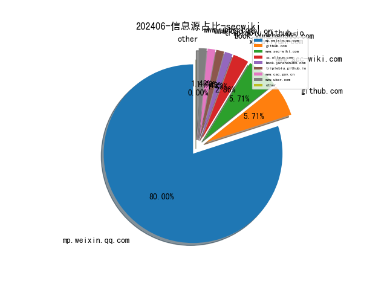

# [数据--所有](README_20.md)
# [数据--年度](README_2024.md)
# 202406 信息源与信息类型占比

# 网络安全书籍 推荐
| date_added | language | title | author | link | size| 
| --- | --- | --- | --- | --- | ---| 
| 2024-06-03 11:35:22 | English | Fundamentals of Python: First Programs, 3rd Edition | unknown | https://www.wowebook.org/fundamentals-of-python-first-programs-3rd-edition/ | unknown| 
| 2024-06-02 09:05:12 | English | Mastering Knowledge Management Using Microsoft Technologies | unknown | https://www.wowebook.org/mastering-knowledge-management-using-microsoft-technologies/ | unknown| 
| 2024-06-02 08:17:27 | English | Windows Forensics: Understand Analysis Techniques for Your Windows | unknown | https://www.wowebook.org/windows-forensics-understand-analysis-techniques-for-your-windows/ | unknown| 
| 2024-06-01 18:47:39 | English | Think Python, 3rd Edition | unknown | https://www.wowebook.org/think-python-3rd-edition/ | unknown| 

# 微信公众号 推荐
| nickname_english | weixin_no | title | url| 
| --- | --- | --- | ---| 
| AI与网安 | gh_c57275954216 | CVE-2024-5354 | https://mp.weixin.qq.com/s?__biz=MzU1ODQ2NTY3Ng==&mid=2247486870&idx=1&sn=1aad2293e9c9586c7792579d4ef15f7d | 1| 
| AtomsTeam | Atoms4Team | 上周漏洞周报(5月27---6月2号) | https://mp.weixin.qq.com/s?__biz=Mzg3ODgyMzMzNw==&mid=2247484306&idx=1&sn=d1324c789393fd2e44e77c5f2b4107a2 | 1| 
| Desync InfoSec | DesyncInfoSec | Linux 应急响应手册 | https://mp.weixin.qq.com/s?__biz=MzkzMDE3ODc1Mw==&mid=2247488029&idx=1&sn=d259badf401f5f2109288418c9776cc0 | 1| 
| Eonian Sharp | Eonian_sharp | 漏洞预警 , Spring Cloud Data Flow 存在任意文件写入漏洞 | https://mp.weixin.qq.com/s?__biz=Mzg3NzUyMTM0NA==&mid=2247485855&idx=1&sn=35712192c6e51ce46956260c5092100f | 2| 
| E安全 | EAQapp | 超3亿美元！2024最严重的比特币抢劫案出现 | https://mp.weixin.qq.com/s?__biz=MzI4MjA1MzkyNA==&mid=2655346001&idx=1&sn=d665e3a5be3d3d49f97c12d223f5c0a3 | 2| 
| GoUpSec | GoUpSec | 5.6亿条记录？票务巨头Ticketmaster确认发生大规模数据泄露 | https://mp.weixin.qq.com/s?__biz=MzkxNTI2MTI1NA==&mid=2247499364&idx=2&sn=19da1fd72f46da7e135dfd53cab35a3f | 4| 
| HACK之道 | hacklearn | 央企独家 名额有限 , 往期薪资8-30K，首次开放中国中车2个月项目实战 | https://mp.weixin.qq.com/s?__biz=MzIwMzIyMjYzNA==&mid=2247514119&idx=1&sn=27fa547915ca3a0e6b0d4e7caa0af02e | 1| 
| Hack分享吧 | HackShareB | 禁用Windows Defender的新工具 | https://mp.weixin.qq.com/s?__biz=MzA4NzU1Mjk4Mw==&mid=2247490717&idx=1&sn=62aa2ab46cf78df9c31dee6cbf62143a | 1| 
| IoVSecurity | IoVSecurity | MCU - 微控制器上的微弧时序攻击是可操作的 | https://mp.weixin.qq.com/s?__biz=MzU2MDk1Nzg2MQ==&mid=2247609673&idx=3&sn=26b8faae93ab08b6c2068a6998b7dd9f | 9| 
| Khan安全攻防实验室 | None | 不鸟我是吧 | https://mp.weixin.qq.com/s?__biz=MzAwMjQ2NTQ4Mg==&mid=2247493063&idx=1&sn=a103b683f5b661701e82a6b37cadd69d | 2| 
| NightmareV | Kobernet | Nacos未授权文件下载漏洞 | https://mp.weixin.qq.com/s?__biz=MzkxNDU2ODc0Nw==&mid=2247484054&idx=1&sn=b1845ce95e1d06b8ce10009700ad9003 | 1| 
| Sec探索者 | gh_46a14c338f91 | 【漏洞复现】Minio verify 信息泄露 | https://mp.weixin.qq.com/s?__biz=MzkyNDYwNTcyNA==&mid=2247485171&idx=1&sn=6aafa2b14fe257c1f8249b25a158b529 | 1| 
| T0daySeeker | gh_26c54b2c64aa | Turla组织最新Tiny BackDoor后门通信模型剖析及攻击场景复现 | https://mp.weixin.qq.com/s?__biz=MzAwNDUzNDExMQ==&mid=2247484664&idx=1&sn=255a9093105d16d7e36b3ab1582cfd2a | 1| 
| TtTeam | gh_a0a1db78ea68 | CVE-2024-24919 Check Point 安全网关 RCE | https://mp.weixin.qq.com/s?__biz=Mzg2NTk4MTE1MQ==&mid=2247485031&idx=1&sn=719cefc1752e604676b85a5738ccf65a | 2| 
| WebSec | gh_2914f5b10e8e | 【1day新接口】用友某接口存在任意文件下载漏洞 | https://mp.weixin.qq.com/s?__biz=MzkyMzYwNTEyNg==&mid=2247486469&idx=1&sn=91f86a79fddfad652cb75cf7118fe701 | 1| 
| crossoverJie | crossoverJie | 几个你或许并不知道 kubernetes 技巧 | https://mp.weixin.qq.com/s?__biz=MzIyMzgyODkxMQ==&mid=2247487221&idx=1&sn=2036133015a6077638ccfb4b8afe1ca2 | 1| 
| dotNet安全矩阵 | doNetSafety | 国内最大的.NET安全攻防知识社区 | https://mp.weixin.qq.com/s?__biz=MzUyOTc3NTQ5MA==&mid=2247492339&idx=2&sn=0420f17657d795c5fb50217917d9c05e | 2| 
| e安在线 | ean-online | OpenAI声称挫败了俄罗斯、以色列等国的“舆论黑客” | https://mp.weixin.qq.com/s?__biz=MzI1OTA1MzQzNA==&mid=2651245818&idx=1&sn=ef46e9b11790befac0896a06248fcf6e | 2| 
| imBobby的自留地 | imBobbySY | 微软开源脱敏框架 Presidio：三十行 Python 就能精准脱敏？ | https://mp.weixin.qq.com/s?__biz=MzI5MjI4ODU4Nw==&mid=2247490608&idx=1&sn=c67d9244952ddd15040efd6a76438491 | 1| 
| 一起聊安全 | gh_589ffdaa31f9 | 重磅发布：《数据要素赋能新质生产力：数据要素场景创新发展报告（2024）》｜附下载 | https://mp.weixin.qq.com/s?__biz=MzI3NjUzOTQ0NQ==&mid=2247511007&idx=1&sn=5e6c9811c3d3a624a11d5dc36c5aa514 | 2| 
| 丁爸 情报分析师的工具箱 | dingba2016 | 【情报实战】美军艾森豪威尔航母在哪里？是否被袭击（含视频） | https://mp.weixin.qq.com/s?__biz=MzI2MTE0NTE3Mw==&mid=2651144145&idx=1&sn=057dd15529f7100f9e47fe93cd5e1a2b | 1| 
| 七夜安全博客 | qiye_safe | 彻底解决微信apk1文件安装问题，传输个文件还给我重命名！！！ | https://mp.weixin.qq.com/s?__biz=MzIwODIxMjc4MQ==&mid=2651005539&idx=1&sn=643c449717915a5482b191b1e52e2758 | 3| 
| 七芒星实验室 | HeptagramSec | 内网渗透之云桌面文件上传限制绕过 | https://mp.weixin.qq.com/s?__biz=Mzg4MTU4NTc2Nw==&mid=2247491787&idx=2&sn=509e2b46d9144323fc9d13a1567296c3 | 2| 
| 二进制空间安全 | suntiger_2023 | 要小心了,利用编程社区信任和权威进行传播的恶意软件 | https://mp.weixin.qq.com/s?__biz=MzkxOTUyOTc0NQ==&mid=2247489995&idx=1&sn=855abbdc6143bb0ad5ec0bbf6990528e | 2| 
| 亿人安全 | Yr-Sec | 2024HW注意事项及资料整理 | https://mp.weixin.qq.com/s?__biz=Mzk0MTIzNTgzMQ==&mid=2247515444&idx=1&sn=a58ca333bc8ec8d4b953e8e600a6e684 | 1| 
| 会杀毒的单反狗 | cmlitiejun | 俄黑客组织 APT28 利用 HeadLace 恶意软件攻击欧洲关键网络 | https://mp.weixin.qq.com/s?__biz=MzI2NzAwOTg4NQ==&mid=2649791347&idx=1&sn=c5e6c1fe664941ea7742ab5206e17d9c | 2| 
| 伟大航路D | gh_c1fdc31f79ef | 【漏洞复现】迈普 多业务融合网关 send_order.cgi 接口处存在RCE漏洞 | https://mp.weixin.qq.com/s?__biz=MzkwNzYzNTkzNA==&mid=2247486147&idx=1&sn=ca3ea22326eff5e0f7a82b3409e571e4 | 2| 
| 信安路漫漫 | gh_96cdf0c3b4d5 | 攻防演练中如何进行溯源分析 | https://mp.weixin.qq.com/s?__biz=Mzg2MzkwNDU1Mw==&mid=2247484758&idx=1&sn=a9c47d167acf59ef35a0f4f82ec117d7 | 1| 
| 兰花豆说网络安全 | SecuritySay | 网络安全工程师必知的漏洞相关标准 | https://mp.weixin.qq.com/s?__biz=MzI3NzM5NDA0NA==&mid=2247487956&idx=1&sn=55c3c466e9ecc643cc1897202ab49a0c | 2| 
| 关键信息基础设施安全保护联盟 | CNCIIPA | 党建学习 , 红色印记·纪律之光 | https://mp.weixin.qq.com/s?__biz=MzkxNjU2NjY5MQ==&mid=2247503111&idx=3&sn=488c6dd9dd9f83578feca2fb63def8d8 | 4| 
| 军机故阁 | gh_e57baf46bdf5 | 新增facebook泄露查询库 | https://mp.weixin.qq.com/s?__biz=MzU5Mjk3MDA5Ng==&mid=2247486084&idx=1&sn=d618b50bf0b9fa7c8b19cd545583193b | 1| 
| 利刃信安 | DMXGFSYS | 【网络安全】网络运维知识点大全 | https://mp.weixin.qq.com/s?__biz=MzU1Mjk3MDY1OA==&mid=2247513950&idx=1&sn=b47e9be907155148e1795c692e2f4295 | 1| 
| 前沿信安资讯阵地 | infosrc | 研究网络危机管理最佳做法 | https://mp.weixin.qq.com/s?__biz=MzA3MTM0NTQzNA==&mid=2455774939&idx=1&sn=baf9b65b7a60629ff474f308dffccb24 | 2| 
| 吉祥学安全 | gh_bf0dc85c3f99 | 护网分析研判岗中级面试题 | https://mp.weixin.qq.com/s?__biz=MzkwNjY1Mzc0Nw==&mid=2247484482&idx=2&sn=4df6c565a9763ad7a949b863f3752fe9 | 3| 
| 夜组安全 | NightCrawler_Team | 自动化代码审计工具 | https://mp.weixin.qq.com/s?__biz=Mzk0ODM0NDIxNQ==&mid=2247490952&idx=1&sn=9dcb97ac8969ca8feaad865f9e51dde1 | 1| 
| 天驿安全 | tianyisec | hvv大批量的ip自动化溯源工具 | https://mp.weixin.qq.com/s?__biz=MzkxNjIxNDQyMQ==&mid=2247497076&idx=1&sn=e4cad7d0ed7350e9f003d96a7b10d636 | 2| 
| 威努特安全网络 | winicssec_bj | 打造水泥生产安全新体系，保障水泥生产网络零事故 | https://mp.weixin.qq.com/s?__biz=MzAwNTgyODU3NQ==&mid=2651122422&idx=1&sn=b65bb62e0108c4c6770770397eee32ee | 1| 
| 安全学习那些事儿 | aqxxse | 导致60万台路由器变砖 安全公司揭露网络僵尸病毒猖狂活动 | https://mp.weixin.qq.com/s?__biz=MzkxNTI2NTQxOA==&mid=2247492376&idx=2&sn=0866020735e9b6904d004f38f92fd1a4 | 2| 
| 安全小姿势 | www_sqlsec_com | 国光二期 WEB 课程之端口扫描靶场 WP | https://mp.weixin.qq.com/s?__biz=Mzk0MDI0OTQwNw==&mid=2247484604&idx=1&sn=c91b18bbc3484c91f31a7f3b819bbc47 | 1| 
| 安全村SecUN | sec-un | 出海·新加坡｜Cyber Security World Asia 2024，中国馆同行！ | https://mp.weixin.qq.com/s?__biz=MzkyODM5NzQwNQ==&mid=2247494994&idx=1&sn=8281571c43d9b49f3dde4dd38acc550c | 1| 
| 安全极客 | gh_23236568a71e | 第54期,GPTSecurity周报 | https://mp.weixin.qq.com/s?__biz=MzkzNDUxOTk2Mw==&mid=2247494013&idx=1&sn=5aef7ec0f3f9671c773579c8b3c2a8bd | 1| 
| 安全洞察知识图谱 | gh_d9a3a4cfeeac | 真实IP获取工具 — CloakQuest3r | https://mp.weixin.qq.com/s?__biz=MzkyMDM4NDM5Ng==&mid=2247485846&idx=1&sn=274504a2e263b02be1b4ac0d07881e48 | 2| 
| 安全狗的自我修养 | haidragon_study | 第 0 集：制作微型操作系统的旅程简介 | https://mp.weixin.qq.com/s?__biz=MzkwOTE5MDY5NA==&mid=2247496447&idx=1&sn=342956f78a45f75cea6ddbad5131d365 | 2| 
| 安全笔记 | gh_20cf09f0438b | 实战 ,, 对bc站点的一次权限获取 | https://mp.weixin.qq.com/s?__biz=Mzg3NDc3NDQ3NA==&mid=2247484426&idx=1&sn=f3faa05d672fd2289f3a28bd47e1209b | 1| 
| 安恒信息 | AnHengCloudNews | AVM系列漫画之暴露面丨辛辛苦苦梳理暴露面资产，还是被偷袭了 | https://mp.weixin.qq.com/s?__biz=MjM5NTE0MjQyMg==&mid=2650609388&idx=1&sn=be552d38b748faec20c402f7ea2ca6b4 | 3| 
| 实战安全研究 | gh_f390fc63c711 | 某多语言3合一港交易所审计(未公开漏洞) | https://mp.weixin.qq.com/s?__biz=MzU0MTc2NTExNg==&mid=2247490416&idx=1&sn=465fde03f30007692b268df467fbf303 | 2| 
| 小兵搞安全 | antian365sec | 批量下载学习图片 | https://mp.weixin.qq.com/s?__biz=MzA3NTc0MTA1Mg==&mid=2664711613&idx=1&sn=8589f1a79ff51b940775295e441e37df | 1| 
| 山石网科新视界 | hillstone-vision | 客户面对面 , 山石网科春华行动走进陕、皖、滇 | https://mp.weixin.qq.com/s?__biz=MzAxMDE4MTAzMQ==&mid=2661288615&idx=2&sn=d64a43815558297b9d34cbd9eccf1f41 | 2| 
| 技术修道场 | gh_fe3e6e63e435 | Linux系统问题及处理方法（安全问题） | https://mp.weixin.qq.com/s?__biz=MzA4NTY4MjAyMQ==&mid=2447899054&idx=1&sn=96fc844ea1c992552dacd6a7b4741b8b | 1| 
| 昊天信安 | cniaosec | ISC2官方公布全球CCSP/CISSP薪资水平 | https://mp.weixin.qq.com/s?__biz=MzkzNzI4NDQzMA==&mid=2247498106&idx=1&sn=2d21a359fc1b1730349596ac1e2fcd25 | 1| 
| 李白你好 | libai_hello | 2024HW注意事项及资料整理 | https://mp.weixin.qq.com/s?__biz=MzkwMzMwODg2Mw==&mid=2247507153&idx=1&sn=fce05d109075362049165cfaaa2096ee | 1| 
| 极梦C | gh_2353880ae4d9 | Bypass某VPN-rce到内网横向 | https://mp.weixin.qq.com/s?__biz=MzU2NjgzMDM3Mg==&mid=2247491482&idx=1&sn=2639afc7b107615973ffe93fef00e231 | 1| 
| 沃克学安全 | walkerxuewangan | CVE-2024-2961：将php://filter任意文件读取提升为远程代码执行（RCE） | https://mp.weixin.qq.com/s?__biz=MzkzMjIxNjExNg==&mid=2247485234&idx=1&sn=b7660e38d866b424d1a2c09f2207c7a1 | 1| 
| 河南等级保护测评 | hndjbh | APT：网络威胁分类标准 | https://mp.weixin.qq.com/s?__biz=Mzg2NjY2MTI3Mg==&mid=2247495489&idx=2&sn=737f05a754532dba532697cf0e2e1cef | 5| 
| 洞见网安 | doonsec | 网安简报【2024/6/3】 | https://mp.weixin.qq.com/s?__biz=MzAxNzg3NzMyNQ==&mid=2247488298&idx=1&sn=1b207a27de1c773661cee0b25fd37c61 | 5| 
| 浅安安全 | gh_758e256fcc72 | 工具 , railgun | https://mp.weixin.qq.com/s?__biz=MzkwMTQ0NDA1NQ==&mid=2247489107&idx=4&sn=018e2f06cbee005c07b275aa6df5618b | 4| 
| 混入安全圈的程序猿 | gh_b205effae10a | 美国国家安全局：每周至少重启一次你的手机。原因如下... | https://mp.weixin.qq.com/s?__biz=MzU3ODI3NDc4NA==&mid=2247484240&idx=1&sn=61e3a2818effb4400f561b06bc3fc893 | 1| 
| 渗透安全HackTwo | CB-Hack | (未公开)用友NC pagesServlet SQL注入致RCE漏洞,漏洞预警 | https://mp.weixin.qq.com/s?__biz=Mzg3ODE2MjkxMQ==&mid=2247487104&idx=1&sn=2387626529da4e6a5b345c8749f428f3 | 2| 
| 渗透测试 | sql_sec | Glass(镜)-红队快速资产指纹识别探测工具 | https://mp.weixin.qq.com/s?__biz=Mzg2ODY3NDYxNA==&mid=2247485502&idx=3&sn=876bc4b60f6bb6b0eee433c6155661f4 | 5| 
| 潇湘信安 | xxxasec | mssql攻防探究 | https://mp.weixin.qq.com/s?__biz=Mzg4NTUwMzM1Ng==&mid=2247510619&idx=1&sn=66246e58d89068277862c23a4d2c5da4 | 1| 
| 白帽子社区团队 | bmzsec | 护网知多少（一） | https://mp.weixin.qq.com/s?__biz=MzkzNDQ0MDcxMw==&mid=2247484650&idx=1&sn=b8999fa3d62b7e4cc735dbcc1eb14260 | 1| 
| 皓月当空w | hanaffectionl | 【2024年6月3日】 All In One 平台数据源征集 | https://mp.weixin.qq.com/s?__biz=Mzg4MDg5NzAxMQ==&mid=2247485650&idx=2&sn=45f4978880a668a5fac547f570c7f7c0 | 4| 
| 知攻善防实验室 | ChinaRan404 | 央企独家 名额有限 , 往期薪资8-30K，首次开放中国中车2个月项目实战 | https://mp.weixin.qq.com/s?__biz=MzkxMTUwOTY1MA==&mid=2247487748&idx=1&sn=379859a936edbb9aef600d62462fc491 | 2| 
| 网空闲话plus | TheCyberExpress1 | 5th域安全微讯早报【20240604】134期 | https://mp.weixin.qq.com/s?__biz=MzkyMjQ5ODk5OA==&mid=2247499607&idx=3&sn=e94e4ca63770ba11df4804cc5b0279e2 | 3| 
| 网络个人修炼 | None | 一文读懂svchost：被黑客“玩坏”的神秘进程 | https://mp.weixin.qq.com/s?__biz=MzkzMDQ0NzQwNA==&mid=2247484953&idx=1&sn=b9e71dd3a040f302b48feb8cbccaa396 | 1| 
| 网络安全与取证研究 | wangluoanquanquzheng | msf生成木马分析 | https://mp.weixin.qq.com/s?__biz=Mzg3NTU3NTY0Nw==&mid=2247488857&idx=1&sn=dd200eb507b467a1c0e6a2a9ea0e7c87 | 1| 
| 网络安全实验室 | wlaqyjs | 网络安全永久资料库 | https://mp.weixin.qq.com/s?__biz=MzU4OTg4Nzc4MQ==&mid=2247502550&idx=2&sn=79e927d1a8e36a78a8ab7e486c03f51c | 2| 
| 船山信安 | zghyxa | 数据安全——数据分类分级落地实践 | https://mp.weixin.qq.com/s?__biz=MzU2NDY2OTU4Nw==&mid=2247514220&idx=1&sn=8f6360b63aef25f0c7b4e7d149b74cef | 2| 
| 苏说安全 | sushuoanquan | 医院必备信息化系统之-EMR系统 | https://mp.weixin.qq.com/s?__biz=Mzg5OTg5OTI1NQ==&mid=2247487524&idx=1&sn=51ac70a1b69cf5690165fd8ecaa455e7 | 1| 
| 苏诺木安全团队 | Ni-Caiqing | 【1day】万户ezEIP企业管理系统 success 反序列化漏洞【附poc】 | https://mp.weixin.qq.com/s?__biz=MzkwMjYzNTE4MA==&mid=2247484463&idx=1&sn=d055a5ed199176ad65eff02168f28acf | 2| 
| 草帽一只尔 | OSINTAnalyst | 美国国务院情报和研究局发布首个针对外交的《开源情报战略》 | https://mp.weixin.qq.com/s?__biz=Mzg2MTg3NzQ5OQ==&mid=2247484893&idx=2&sn=a39a9817fffdd5ac2579c9f6be8dbdf4 | 3| 
| 菜鸟学信安 | securitylearn | 哥斯拉webshell管理工具免杀（5月更新） | https://mp.weixin.qq.com/s?__biz=MzU2NzY5MzI5Ng==&mid=2247501957&idx=1&sn=a0f315eb2dd1bd5ea3f106a549519493 | 1| 
| 计算机与网络安全 | C-CyberSecurity | 工业控制系统信息安全应急演练方法 | https://mp.weixin.qq.com/s?__biz=MjM5OTk4MDE2MA==&mid=2655242107&idx=8&sn=f1879be1f353228010f7e3e27012ec09 | 8| 
| 赛博研究院 | SICSI-cybersecurity | 全球人工智能监管框架洞察与合规指引 | https://mp.weixin.qq.com/s?__biz=MzUzODYyMDIzNw==&mid=2247509425&idx=1&sn=edb78edcc839b2a092fb2d55954a77c1 | 2| 
| 赛查查 | gh_fabaad32b9d1 | “复兴杯”第四届大学生网络安全精英赛总决赛公告 | https://mp.weixin.qq.com/s?__biz=Mzk0NTU0ODc0Nw==&mid=2247486877&idx=1&sn=0916e92893ef79bcbe87527239a3d692 | 1| 
| 赛欧思安全研究实验室 | gh_04596d590471 | Telegram 上泄露的 3.61 亿个被盗账户被添加到 HIBP 中 | https://mp.weixin.qq.com/s?__biz=MzU0MjE2Mjk3Ng==&mid=2247487177&idx=1&sn=c2abc310ec78974d40132ce4ea7bc031 | 2| 
| 道一安全 | DaoYiSecurity | 常见网络产品默认口令大全 | https://mp.weixin.qq.com/s?__biz=MzU5OTMxNjkxMA==&mid=2247485520&idx=1&sn=f42983a5d8cab74af89a0b7384e48f2e | 3| 
| 道玄网安驿站 | gh_cb9a38436cdd | CMSimple 5.15 - Remote Code Execution (RCE) | https://mp.weixin.qq.com/s?__biz=Mzg4NTg5MDQ0OA==&mid=2247486325&idx=1&sn=6fdaaac054325d8fb541a98f63c7e254 | 2| 
| 邑安全 | EansecD | SoumniBot恶意软件非常规分析和检测规避方法 | https://mp.weixin.qq.com/s?__biz=MzUyMzczNzUyNQ==&mid=2247522061&idx=4&sn=a48b8b92bbf5d68497bb1f5deb75443e | 4| 
| 银遁安全团队 | gh_3e6002f59af7 | 【未公开】和丰多媒体信息发布系统存在账号密码信息泄露漏洞 | https://mp.weixin.qq.com/s?__biz=MzU3MjU4MjM3MQ==&mid=2247485820&idx=1&sn=b5d2fa829101a338eb078e5ddfbed8f1 | 2| 
| 鹏组安全 | Kris_Alex2 | 安全知识库 网安人必备！ | https://mp.weixin.qq.com/s?__biz=Mzg5NDU3NDA3OQ==&mid=2247490484&idx=1&sn=282288e3e52921e515c803277aa4f721 | 2| 
| 黑客技术与网络安全 | HackerCoder | 12秒“挪走”2500万！以太坊漏洞暴露，麻省理工两学子一手主导闪电窃案，或将面临二十年铁窗生涯 | https://mp.weixin.qq.com/s?__biz=MzIyMDEzMTA2MQ==&mid=2651166782&idx=1&sn=5a567ac91fe7c25fa23fe64cd794d994 | 2| 
| 黑客白帽子 | hackerwhitehat | 【免费资源】Excel课程-HR玩转人事（完结） | https://mp.weixin.qq.com/s?__biz=MzA5MzYzMzkzNg==&mid=2650952586&idx=4&sn=4e2e5364477c27963b9401aa0220bdaa | 4| 
| 黑猫安全 | Blackcat-Security | 西班牙警方关闭了非法的电视直播网络 | https://mp.weixin.qq.com/s?__biz=Mzg3OTc0NDcyNQ==&mid=2247491631&idx=2&sn=0b9d27afef145b3010baf1c3ce5fad06 | 2| 
| 黑白之道 | i77169 | 微信小程序自动化辅助渗透工具 | https://mp.weixin.qq.com/s?__biz=MzAxMjE3ODU3MQ==&mid=2650593978&idx=4&sn=94c7a89d906e219e33356afb46e2d1bd | 8| 
| 3072 | gh_02e64d74f88d | Windows利用任意对象目录创建来提权 | https://mp.weixin.qq.com/s?__biz=MzU4OTk0NDMzOA==&mid=2247484626&idx=3&sn=e529f46ee63d5eee32c0e3e13064ca3b | 3| 
| 360数字安全 | gh_6db130c5163e | 360生态战略升级 携手合作伙伴共建数字中国 | https://mp.weixin.qq.com/s?__biz=MzA4MTg0MDQ4Nw==&mid=2247572083&idx=2&sn=51eba027589d5be25532e93131aaa94d | 2| 
| Adler学安全 | Acade- | 漏洞复现-CVE-2024-36428 | https://mp.weixin.qq.com/s?__biz=Mzg5NDU1MDc1OA==&mid=2247485673&idx=4&sn=b427c1978ee5c567f95a34b941d08cc5 | 4| 
| CatalyzeSec | gh_9dea37e0d7ad | 插件推荐-CS上线提醒 | https://mp.weixin.qq.com/s?__biz=MzkxNjY1MjY3OQ==&mid=2247485504&idx=1&sn=e4e4e718a0b8bff8322d329ebde55e35 | 1| 
| ChaMd5安全团队 | chamd5sec | 矩阵杯战队攻防对抗赛 writeup by Mini-Venom | https://mp.weixin.qq.com/s?__biz=MzIzMTc1MjExOQ==&mid=2247510434&idx=1&sn=862386c7b1a8d91429e1a3d4837441ee | 1| 
| DFIR蘇小沐 | DFIR00 | 【镜像仿真篇】特殊的Windows11系统镜像仿真之旅（长篇） | https://mp.weixin.qq.com/s?__biz=MzI2MTUwNjI4Mw==&mid=2247488454&idx=1&sn=8a9246bab116114af94e65a2a84c0047 | 1| 
| F12sec | F12sec | 【好文转载】kkFileView 被攻击溯源 | https://mp.weixin.qq.com/s?__biz=Mzg5NjU3NzE3OQ==&mid=2247488978&idx=1&sn=1920a207072748b83f0ef84295829e02 | 1| 
| FreeBuf | freebuf | AzSubEnum：针对Azure服务的子域名枚举查询工具 | https://mp.weixin.qq.com/s?__biz=MjM5NjA0NjgyMA==&mid=2651283007&idx=4&sn=4612cf99e2b2a7f5c2ac46ba19b4689b | 4| 
| NGC660安全实验室 | NGC660_Team | 案例分享 , 记一次对大型国企Ruoyi系统曲折的打点测试But lucky~ | https://mp.weixin.qq.com/s?__biz=MzkyODMxODUwNQ==&mid=2247493472&idx=1&sn=1bc0e9ff875e2d99334ac383ba2e07ad | 1| 
| Nil聊安全 | Sec_Nil | 权限不清还谈什么安全 | https://mp.weixin.qq.com/s?__biz=MzkyMDY4MTc2Ng==&mid=2247483809&idx=1&sn=1e994b97255f81f00f507ea3158f5958 | 1| 
| OSINT情报分析师 | OSINT_LSD | 赛博吗喽之歌 | https://mp.weixin.qq.com/s?__biz=MzkxNzU5MjE0OA==&mid=2247484599&idx=1&sn=d4d41e3c4fb918356562ba9eda38e8e1 | 1| 
| OSINT研习社 | OSINT_Club | 新的网络攻击活动利用虚假电子邮件和电话轰炸组织机构 | https://mp.weixin.qq.com/s?__biz=Mzg4MzA4NTM0OA==&mid=2247490498&idx=1&sn=eaeab3f3f8e2d6fe7040c1bf63741114 | 1| 
| Ots安全 | AnQuan7 | 将 N-day 漏洞链接以破坏所有内容：第 6 部分 — Windows 内核 LPE：获取SYSTEM | https://mp.weixin.qq.com/s?__biz=MzAxMjYyMzkwOA==&mid=2247508829&idx=6&sn=8783304ce44f1f40abec62390ac5d918 | 6| 
| Rock sec | gh_a129a168e0d4 | 内网渗透--轻松玩转多级代理 | https://mp.weixin.qq.com/s?__biz=Mzk0NzYyMTAwNw==&mid=2247484487&idx=1&sn=f1db3ea14a13f64cb1f4d632e27d18c9 | 1| 
| SCA御盾 | SCA_Magic | 【漏洞复现】宏景-pos_dept_post-delay-sql注入漏洞复现 | https://mp.weixin.qq.com/s?__biz=MzkzNjYwODg3Ng==&mid=2247485160&idx=1&sn=40907bd1823daaf2485ad5175b83bef3 | 1| 
| SecHub网络安全社区 | secevery0x01 | 禁用Windows Defender的有趣新方法 | https://mp.weixin.qq.com/s?__biz=MzI5NTUzNzY3Ng==&mid=2247488607&idx=1&sn=ddf2ed92c646363d374c69f500c48dd8 | 1| 
| TimeAxis Sec | TimeAxis_Sec | 新手上路之微信小程序反编译 | https://mp.weixin.qq.com/s?__biz=MzIxNzY1MTc1OA==&mid=2247483818&idx=1&sn=850d8181d933fecad06e1421eb4c9965 | 1| 
| Web安全工具库 | websec-tools | 60余个副业项目教程合集下载，总有适合你的一款 | https://mp.weixin.qq.com/s?__biz=MzI4MDQ5MjY1Mg==&mid=2247513084&idx=2&sn=6dd0402451d53a1b30b50f47f82a65a7 | 4| 
| kali笔记 | bbskali-cn | Nmap报告可视化 | https://mp.weixin.qq.com/s?__biz=MzkxMzIwNTY1OA==&mid=2247504719&idx=1&sn=3e19c39cecf90a6a8a7550823bb3d1d5 | 1| 
| 中国电信安全 | gh_ea6109d37f13 | 今日上线！ | https://mp.weixin.qq.com/s?__biz=Mzg5NTU3Nzg3MQ==&mid=2247519841&idx=1&sn=413c04cdb880a251f753ec0c4bd0ce0a | 1| 
| 乌雲安全 | hackctf | 师傅们！找到一个接私活的好地方！ | https://mp.weixin.qq.com/s?__biz=MzAwMjA5OTY5Ng==&mid=2247522619&idx=1&sn=d44ee28ef3fef811e4a5e85b78ca3715 | 1| 
| 云下信安 | yunxiabiyu | Mimikatz_sam文件解密原理 | https://mp.weixin.qq.com/s?__biz=MzU2MzY1NjU3Ng==&mid=2247485717&idx=1&sn=394a9d6f3a7a765420687d7416d151b6 | 1| 
| 云计算和网络安全技术实践 | gh_34d6b0cb5633 | vulnhub之AI-Web-2的实践 | https://mp.weixin.qq.com/s?__biz=MzA3MjM5MDc2Nw==&mid=2650748473&idx=1&sn=6efed3d29cd87e3540c0458bfe277255 | 1| 
| 京数安 | jsa20210329 | 算法备案通过了，聊聊踩过的坑 | https://mp.weixin.qq.com/s?__biz=Mzg4OTY4MDA2MA==&mid=2247491394&idx=1&sn=39964b19d5df2174fd18ef7a113b7ffc | 1| 
| 信安404 | infosec404 | ISC2官方公布全球CCSP/CISSP薪资水平 | https://mp.weixin.qq.com/s?__biz=Mzk0NjQ5MTM1MA==&mid=2247490542&idx=1&sn=24afee1ba499a73cdf1c66d7f7467a86 | 1| 
| 信息新安全 | XXxinanquan | 中央网信办等四部门发布《互联网政务应用安全管理规定》，要求落实密码应用管理要求 | https://mp.weixin.qq.com/s?__biz=MjM5NDA3ODY4Ng==&mid=2247488748&idx=2&sn=c4644fef957d72b6ccf0a9f3e3bec477 | 2| 
| 冷漠安全 | gh_1c1d6111ce8f | 「漏洞复现」万户ezEIP企业管理系统 /member/success.aspx 命令执行漏洞 | https://mp.weixin.qq.com/s?__biz=MzkyNDY3MTY3MA==&mid=2247484464&idx=1&sn=255d46c31fa507cf4fe0e9bcc7352cfd | 3| 
| 北京网络安全大会 | BCS-QAX | BCS即将启幕 嘉宾寄语 | https://mp.weixin.qq.com/s?__biz=Mzg4MjIyNjU4OQ==&mid=2247495242&idx=4&sn=f03e04ab86c81f1db04d2e79dba77284 | 4| 
| 南街老友 | gh_f9a38b1d58f0 | 大华DSS 安防新平台struts2远程代码执行 | https://mp.weixin.qq.com/s?__biz=MzA5OTA0MTU4Mg==&mid=2247485960&idx=1&sn=0a44bc0f970ea22246e98a439a200141 | 1| 
| 启明星辰集团 | venustech_weixin | 深化协同 四川移动与启明星辰携手筑牢网络安全基座 | https://mp.weixin.qq.com/s?__biz=MzA3NDQ0MzkzMA==&mid=2651725929&idx=1&sn=75adebe2a8a11d600b8f333d1aa466a2 | 1| 
| 哈拉少安全小队 | gh_b273ce95df95 | 从API接口信息泄露到挖掘出一个RCE | https://mp.weixin.qq.com/s?__biz=MzAxNzkyOTgxMw==&mid=2247492631&idx=1&sn=b1757942745d4fc3f2bdf3bdb950878a | 2| 
| 商密君 | shangmijun | 间谍软件在美泛滥，泄露高达17TB隐私数据 | https://mp.weixin.qq.com/s?__biz=MzI5NTM4OTQ5Mg==&mid=2247623837&idx=6&sn=4b4aba449f8c51eb7c4475cac385ed76 | 10| 
| 嘶吼专业版 | Pro4hou | 安全动态回顾 , 佳士得遭RansomHub勒索软件团伙入侵  TP-Link修复C5400X游戏路由器中关键RCE漏洞 | https://mp.weixin.qq.com/s?__biz=MzI0MDY1MDU4MQ==&mid=2247575594&idx=2&sn=dbfa135a7451b9c89715344b31790a96 | 2| 
| 天唯信息安全 | TWtech2113189 | 《网络协同制造平台数据服务要求》（GB/T 43843-2024）将于今年11月1日起正式实施 | https://mp.weixin.qq.com/s?__biz=MzkzMjE5MTY5NQ==&mid=2247498120&idx=3&sn=6853d15d5b400b33fb39d443228c1052 | 3| 
| 天际友盟 | gh_8833afc123ef | [0603]一周重点暗网情报｜天际友盟情报站 | https://mp.weixin.qq.com/s?__biz=MzIwNjQ4OTU3NA==&mid=2247508311&idx=1&sn=55c91a2cc62abcc7235f63c46ea15c6a | 1| 
| 奇安信 CERT | gh_64040028303e | 攻防演练收敛已知漏洞攻击面，请更新这些软件到最新版本！ | https://mp.weixin.qq.com/s?__biz=MzU5NDgxODU1MQ==&mid=2247501231&idx=1&sn=149d1942b6b9dc0a4a08fa5c0017d674 | 1| 
| 奇安信集团 | qianxin-keji | BCS2024倒计时2天 | https://mp.weixin.qq.com/s?__biz=MzU0NDk0NTAwMw==&mid=2247611804&idx=3&sn=edcdc3f272b1516029c1be70e105299e | 5| 
| 安全光圈 | None | 记一次某设备的授权p解 | https://mp.weixin.qq.com/s?__biz=Mzk0MDY2NTY5Mw==&mid=2247484460&idx=1&sn=ec6a0db5f5c8fac5e798dd7dcb107bdc | 1| 
| 安全内参 | anquanneican | 欧盟《人工智能法》如何看待“数据不动算法动”？ | https://mp.weixin.qq.com/s?__biz=MzI4NDY2MDMwMw==&mid=2247511754&idx=1&sn=c0b74306ac546d7f418875dcad8ffe4d | 1| 
| 安全喵喵站 | CyberSecurityMew | 出海·新加坡｜Cyber Security World Asia 2024，中国馆同行！ | https://mp.weixin.qq.com/s?__biz=MzkzNjE5NjQ4Mw==&mid=2247538643&idx=1&sn=714fb2860a7a6cf5fa442ed357e2a110 | 1| 
| 安全圈 | ChinaAnQuan | 【安全圈】一天 300 台设备受害，僵尸网络 CatDDoS 向思科 / 华为等发起攻击 | https://mp.weixin.qq.com/s?__biz=MzIzMzE4NDU1OQ==&mid=2652061096&idx=4&sn=4c40f8ea670a8a9e06a0d0cb72ee9b4a | 8| 
| 安全牛 | aqniu-wx | NIST推出ARIA计划；Okta再次遭受撞库攻击；BBC遭遇数据泄露 , 牛览 | https://mp.weixin.qq.com/s?__biz=MjM5Njc3NjM4MA==&mid=2651130106&idx=2&sn=a687076942326fe28341c17883cda88c | 2| 
| 安全研究GoSSIP | GoSSIPSJTU | G.O.S.S.I.P 阅读推荐 2024-06-03 PromptFuzz | https://mp.weixin.qq.com/s?__biz=Mzg5ODUxMzg0Ng==&mid=2247498183&idx=1&sn=e31518b3de845ef3d7b51fbffabc8f1b | 2| 
| 安全逐梦人 | gh_bdb40c30b1d4 | 矩阵杯战队攻防对抗赛writeup by 四五队 | https://mp.weixin.qq.com/s?__biz=MzkxNzUxMjU5OQ==&mid=2247484522&idx=1&sn=446eecdf5a280cb6a327c3877779bd12 | 1| 
| 安知讯 | dataanquan | 国家计算机网络与信息安全管理中心江苏分中心数据出境安全管理系统项目招标 | https://mp.weixin.qq.com/s?__biz=MzIxMDIwODM2MA==&mid=2653930015&idx=2&sn=12a8b05749cccad37339887e483ed41b | 3| 
| 工业互联网标识智库 | CAICT-bs | 中国信通院谢家贵：工业互联网标识解析体系已在众多行业开展规模化应用 | https://mp.weixin.qq.com/s?__biz=MzU1OTUxNTI1NA==&mid=2247584310&idx=1&sn=476bfc172c698158e56a20b6f1439cd1 | 1| 
| 工业安全产业联盟 | ICSISIA | 荐读丨简析自主SOC战略的关键流程与应用实例 | https://mp.weixin.qq.com/s?__biz=MzI2MDk2NDA0OA==&mid=2247527442&idx=2&sn=97b728cd608e6ec837b3134e0606f5b2 | 2| 
| 开源搬运工宋师傅 | gh_9e345a3a1074 | KVM+OpenvSwitch虚拟交换机 | https://mp.weixin.qq.com/s/mqIuk6_SfCdyPLB8CpAMlw | 1| 
| 影域实验室 | gh_342a62011dc0 | 免杀-Unhook | https://mp.weixin.qq.com/s?__biz=MzkzODU3MzA5OQ==&mid=2247484439&idx=1&sn=3f67c9554b9d4b94b09d8cdc13196f28 | 1| 
| 德斯克安全小课堂 | szdesk | 数据安全——数据分类分级落地实践 | https://mp.weixin.qq.com/s?__biz=MzA3MTUxNzQxMQ==&mid=2453885133&idx=1&sn=ef8fdd1f6dd3a30d9aa02b44175acd53 | 1| 
| 思极安全实验室 | gh_1fb130164fa3 | 1day-Nacos未授权下载配置信息 | https://mp.weixin.qq.com/s?__biz=MzAwOTQzMjMwOQ==&mid=2247483743&idx=1&sn=1c2d7611c64600adaf50fc6b721ed50f | 1| 
| 情报分析师Pro | globalpolice | 白宫最新发布巴以冲突三阶段停火计划 | https://mp.weixin.qq.com/s?__biz=MzkwNzM0NzA5MA==&mid=2247498424&idx=1&sn=41d9a88e7e0d4e41171a765a29f15b74 | 1| 
| 我的安全视界观 | CANI_Security | BCS2024 , 企业安全运营论坛 | https://mp.weixin.qq.com/s?__biz=MzI3Njk2OTIzOQ==&mid=2247486196&idx=1&sn=bb3dfbc5bedbbd2dea86e443e892777b | 1| 
| 掌控安全EDU | ZKAQEDU | 2024国家HW行动招募通知！ | https://mp.weixin.qq.com/s?__biz=MzUyODkwNDIyMg==&mid=2247540666&idx=3&sn=069beff67d59978dc4939a6e770ba22e | 3| 
| 教父爱分享 | jiaofutql | 安服能力要求自查 | https://mp.weixin.qq.com/s?__biz=MzI1Mjc3NTUwMQ==&mid=2247535165&idx=1&sn=f8a2b3aafe03aff7100f637db43b6168 | 1| 
| 斗象智能安全 | TophantAI | 2024攻防演练必修高危漏洞集合 | https://mp.weixin.qq.com/s?__biz=MzIwMjcyNzA5Mw==&mid=2247494799&idx=1&sn=078bc73aad5fae5b55fc489a5d9282fd | 1| 
| 无糖反网络犯罪研究中心 | gh_2ee7a9b17c0d | 平川警方破获网售假药诈骗案 , 桐梓警方破获帮助信息网络犯罪案——涉网犯罪每日情报 | https://mp.weixin.qq.com/s?__biz=MzAxMzkzNDA1Mg==&mid=2247511052&idx=1&sn=40f542a7ce4d5aa9eb87b8e10717e894 | 1| 
| 极星信安 | gh_90d6a5c9b8d6 | SRC思路分享-JS逆向（jsrpc运用） | https://mp.weixin.qq.com/s?__biz=MzkyMzQ5NjYwMw==&mid=2247484597&idx=1&sn=e41c365fe49c033016e4bf686bb6eaeb | 1| 
| 棉花糖网络安全圈 | hacker-mht | Awvs最新版v24.5.14-windows&linux破解版 | https://mp.weixin.qq.com/s?__biz=Mzg5NTYwMDIyOA==&mid=2247504504&idx=1&sn=c1993b0da73528d6325989229a6db9f5 | 1| 
| 永信至诚 | INT-GROUP | 「数字风洞」AI安全测评丨Llama2-7b全球使用最广泛的AI大模型开源基座发现613次安全错误 | https://mp.weixin.qq.com/s?__biz=MzAwNDUyMjk4MQ==&mid=2454825301&idx=1&sn=385df5c0a845ecb10d0bb043bc331e3c | 1| 
| 汇能云安全 | metech2005 | 国家安全机关又破获一起英国MI6重大间谍案 | https://mp.weixin.qq.com/s?__biz=MzIwNzAwOTQxMg==&mid=2652250035&idx=1&sn=b07c1bd564045177e8d87f5fb140177f | 1| 
| 洞源实验室 | Official_InsBug | 监听蓝牙对话的BlueSpy技术 | https://mp.weixin.qq.com/s/iCeImLLPAwwKH1avLmqEpA | 1| 
| 深信服千里目安全技术中心 | gh_c644c6e98b08 | 【漏洞通告】Check Point Security Gateways任意文件读取漏洞CVE-2024-24919 | https://mp.weixin.qq.com/s?__biz=Mzg2NjgzNjA5NQ==&mid=2247523052&idx=2&sn=061da9e1d572420582e8cfb67d81b551 | 2| 
| 深信服科技 | sangfor_man | 新型威胁面前，传统安全产品为什么失效了？ | https://mp.weixin.qq.com/s?__biz=MjM5MTAzNjYyMA==&mid=2650587940&idx=1&sn=172898776fd818d81ce7ef4778fba7f0 | 1| 
| 深圳市网络与信息安全行业协会 | SNISRI | 网络运维知识点大全 | https://mp.weixin.qq.com/s?__biz=MzU0Mzk0NDQyOA==&mid=2247517124&idx=1&sn=2b03127abd9fb8b6d544fa2b8a719763 | 1| 
| 清华大学智能法治研究院 | THUIAIL | 许瀚文 , 流量劫持罪名认定的困境与纾解——基于数据安全法益的视角 | https://mp.weixin.qq.com/s/XuEyec0UK2Td2LdM8XAQiA | 1| 
| 渗透攻击红队 | RedTeamHacker | 2024HW必看！360大佬安全学习笔记曝光，太牛了!(附完整版PDF) | https://mp.weixin.qq.com/s?__biz=MzkxNDEwMDA4Mw==&mid=2247492219&idx=1&sn=06d0ba9bb6381083a53e272ad67fa36f | 1| 
| 渗透测试知识学习 | stcszsxx | 一款网络破解嗅探工具Ettercap | https://mp.weixin.qq.com/s?__biz=MzI1MzQwNjEzNA==&mid=2247484125&idx=1&sn=1ce20a58074f541fd9ffd168916cd7c6 | 1| 
| 湘安无事 | xndsb-1234 | 【很深情的奇技淫巧】不一样的越权漏洞 | https://mp.weixin.qq.com/s?__biz=MzU3Mjk2NDU2Nw==&mid=2247491432&idx=1&sn=449beb0b46c405eb67bdd2ccd462e544 | 1| 
| 源鲁安全实验室 | gh_464e24bb7624 | 玄机应急响应靶场 - 内存马分析WP | https://mp.weixin.qq.com/s?__biz=Mzg5MDk3MTgxOQ==&mid=2247492409&idx=1&sn=bd26829181370b07cbc4e7895066527a | 1| 
| 炼石网络CipherGateway | CipherGateway | 速下载 , 图解国家四部委《互联网政务应用安全管理规定》 | https://mp.weixin.qq.com/s?__biz=MzkyNzE5MDUzMw==&mid=2247548995&idx=1&sn=348a0e42eed959f83ff9881576cf67cb | 1| 
| 爱加密 | zhiyouaijiami | 爱加密核心领域用户满意度第一，再次入选百强！ | https://mp.weixin.qq.com/s?__biz=MjM5NzU4NjkyMw==&mid=2650744199&idx=2&sn=f062934b716b5cffa6f230d2950099d8 | 2| 
| 独眼情报 | None | 分享图片 | https://mp.weixin.qq.com/s?__biz=MzkzNDIzNDUxOQ==&mid=2247485096&idx=1&sn=ca2df05125f5525b30d343a92ece597e | 1| 
| 玄道夜谈 | None | 分享图片 | https://mp.weixin.qq.com/s?__biz=MzI3Njc1MjcxMg==&mid=2247492221&idx=1&sn=19a6ccebf4f46669a5491b068f74504c | 2| 
| 珂技知识分享 | kezibei001 | web选手入门pwn(13) ——off by one | https://mp.weixin.qq.com/s?__biz=MzUzNDMyNjI3Mg==&mid=2247486762&idx=1&sn=b608bc1cce715ef8af2800d44bc73c33 | 1| 
| 琴音安全 | Qinyinsafe | 【工具更新】红蓝对抗重点OA系统漏洞利用工具增强版V2.3 发布！ | https://mp.weixin.qq.com/s?__biz=Mzg3NTk4MzY0MA==&mid=2247486642&idx=1&sn=66ac387ef2b2d2da7534703244e50516 | 1| 
| 电子取证wiki | forensicswiki | 雷池WAF 动态防护体验 | https://mp.weixin.qq.com/s?__biz=MzkzNTQzNTQzMQ==&mid=2247484839&idx=1&sn=8cfadfd354ea48f7dc2018b459d46396 | 1| 
| 白帽子左一 | HackRead | 2024国家HW行动招募通知！ | https://mp.weixin.qq.com/s?__biz=MzI4NTcxMjQ1MA==&mid=2247610375&idx=2&sn=5cff56331069b66e3e791ef96add6d02 | 2| 
| 百度安全实验室 | BaiduX_lab | 度安讲 , 第二期「安全左移·业务护航」技术沙龙成功举办 | https://mp.weixin.qq.com/s?__biz=MzA3NTQ3ODI0NA==&mid=2247487143&idx=1&sn=f8d470835a72bb681dea1ffab1120af0 | 1| 
| 看雪学苑 | ikanxue | 基于 Frida 对单字节加密验证程序侧信道爆破 | https://mp.weixin.qq.com/s/_oqzAuL9CYZUgHv1EFDjbA | 3| 
| 知机安全 | gh_ad3e7f23f43a | 俄罗斯黑客利用HeadLace恶意软件和凭据收集攻击欧洲 | https://mp.weixin.qq.com/s?__biz=MzIzNDU5NTI4OQ==&mid=2247486376&idx=1&sn=54c8ab218037ca32df1d0a7e4b37f270 | 1| 
| 祺印说信安 | qiyinshuoxinan | 网络安全等级保护：上下文中的API安全性 | https://mp.weixin.qq.com/s?__biz=MzA5MzU5MzQzMA==&mid=2652107315&idx=1&sn=22a9b2a66ebfe218e6ed697138307fc6 | 1| 
| 秦安战略 | qinan1128 | 《诗词游记》第331期：秦安杏林田 | https://mp.weixin.qq.com/s?__biz=MzA5MDg1MDUyMA==&mid=2650470262&idx=3&sn=e1025c9acf1626193a4185cb0e04acf7 | 6| 
| 穿过丛林 | gh_f90eac70537b | ACM CSUR24：基于深度学习的代码智能综述 | https://mp.weixin.qq.com/s/XwhbffG85YglcrfYrg095w | 1| 
| 紫队安全研究 | ziduianquanyanjiu | 俄罗斯APT28 利用 HEADLACE 恶意软件攻击欧洲关键网络 | https://mp.weixin.qq.com/s?__biz=Mzg3OTYxODQxNg==&mid=2247484395&idx=1&sn=86a0b7f68cdcbefac0cff36d91e477ea | 1| 
| 网安守护 | None | 分享图片 | https://mp.weixin.qq.com/s?__biz=MzU4NDY3MTk2NQ==&mid=2247490195&idx=1&sn=721f69d1bc6e03756d9f87f4b6903c13 | 1| 
| 网络安全者 | close_3577673633 | 渗透测试靶场 -- Pilot-Web | https://mp.weixin.qq.com/s?__biz=MzU3NzY3MzYzMw==&mid=2247497648&idx=1&sn=497aa1db9b1953decc826dd3d68c477b | 1| 
| 网络空间信息安全学习 | gh_39213c5878aa | 不来数据都没了！Kindle 倒计时，还不赶快下载书，20 天后真没机会了！ | https://mp.weixin.qq.com/s?__biz=MzI2MjcwMTgwOQ==&mid=2247490954&idx=1&sn=7e14f345451f7fc18a096303ed19e64f | 1| 
| 腾讯安全应急响应中心 | tsrc_team | 腾讯元宝专项众测启动，多重奖励等你来拿！ | https://mp.weixin.qq.com/s?__biz=MjM5NzE1NjA0MQ==&mid=2651206589&idx=1&sn=f88e6fa813d649b5d36b14cac28f48e9 | 1| 
| 蓝胖子之家 | gh_fa158f2ae9b3 | 它可以做到定位弹窗广告找到流氓软件 | https://mp.weixin.qq.com/s?__biz=MzU1NDg4MjY1Mg==&mid=2247488011&idx=1&sn=57fe5573f187c5069c3ab6a5616e817c | 2| 
| 赛博游民营 | CyberGame101 | 202405国外网络安全产品发布情况 | https://mp.weixin.qq.com/s?__biz=MzIzNjI1OTY5Mw==&mid=2247486892&idx=1&sn=33084cbfa1038dff6c22b9f054d7bd39 | 1| 
| 进击的HACK | redteasec | 通过IDEA远程调试vulhub当中的Nexus镜像分析CVE-2024-4956 | https://mp.weixin.qq.com/s?__biz=MzkxNjMwNDUxNg==&mid=2247485575&idx=1&sn=0e3eb9ecb4477a67da022ff78b130ba9 | 2| 
| 迪哥讲事 | growing0101 | XML 相关漏洞风险研究 | https://mp.weixin.qq.com/s?__biz=MzIzMTIzNTM0MA==&mid=2247494861&idx=1&sn=79e37026c4eca3723b99344d177d0b54 | 2| 
| 追梦信安 | Dreamer-Sec | 【悬赏问答】复现疑问求解答：Microsoft Sharepoint XXE（CVE-2024-30043） | https://mp.weixin.qq.com/s?__biz=MzkwNTQxNDc1MQ==&mid=2247486772&idx=1&sn=be5758ab1554e773e2042f2c6fb64f4d | 1| 
| 透明魔方 | TransparentCube | 通保中门户综合网站就一定要定为2级以上吗？ | https://mp.weixin.qq.com/s?__biz=MzI4NzA1Nzg5OA==&mid=2247485011&idx=1&sn=1ba312d55f8fc87520b379ae663c680a | 1| 
| 重生之成为赛博女保安 | None | 新的大瓜已经出现 | https://mp.weixin.qq.com/s?__biz=MzIxOTQ1OTY4OQ==&mid=2247484978&idx=1&sn=0f440525b8aae6e5bdcccfdbf6206c76 | 1| 
| 锋刃科技 | None | 南京市互联网协会会员走访——江苏锋刃信息科技有限公司 | https://mp.weixin.qq.com/s?__biz=MzUxMjc0MTE3Mw==&mid=2247493345&idx=1&sn=3a64fe3981ff8fa429354405b921cc7b | 1| 
| 锐安全 | SecuritySharp | 2024北京网络安全大会开幕在即，三大顶会30年安全思想大碰撞 | https://mp.weixin.qq.com/s?__biz=MzAxOTk3NTg5OQ==&mid=2247490470&idx=1&sn=057f01ecf8885065075075c705bb94ba | 1| 
| 隐雾安全 | gh_9355275bad2a | Src公开课第二讲：APP漏洞挖掘 | https://mp.weixin.qq.com/s?__biz=MzkyNzM2MjM0OQ==&mid=2247493547&idx=1&sn=acba41eee2ed1fb1309631126e04de9a | 1| 
| 隼目安全 | SUNMU_WEB | 【相关分享】统一认证系统的挖掘方法 | https://mp.weixin.qq.com/s?__biz=Mzk0OTUwNTU5Nw==&mid=2247486298&idx=1&sn=4e953df2197fdfae3c0284460a9c50ab | 1| 
| 飓风网络安全 | gh_183f818a07dc | 【漏洞预警】Apache OFBiz 路径遍历漏洞 可导致远程代码执行CVE-2024-36104 | https://mp.weixin.qq.com/s?__biz=MzI3NzMzNzE5Ng==&mid=2247488294&idx=1&sn=a758fc94434dd846ec5510e1dc94c52b | 1| 
| 魔方安全 | cubesec | 安全卫士 , 魔方安全漏洞周报 | https://mp.weixin.qq.com/s?__biz=MzI3NzA5NDc0MA==&mid=2649291170&idx=1&sn=c1e86a3c676d32866c04bb9af1dd3fa2 | 1| 
| 黑伞安全 | hack_umbrella | Aj-report 二次就业 | https://mp.weixin.qq.com/s?__biz=MzU0MzkzOTYzOQ==&mid=2247489181&idx=1&sn=90737048c16b380b5d9ab88dfdf3a1da | 1| 
| 黑客技术家园 | hacker202403 | 2024年的iphone16 都有哪些更新，值得大家期待的。 | https://mp.weixin.qq.com/s?__biz=MzI2OTk4MTA3Ng==&mid=2247490963&idx=1&sn=ca23d8c6ff7d8be367d25efe6e85720c | 5| 
| 黑客驰 | HackerChi_Top | GitHub每周精选(2024.6.3) | https://mp.weixin.qq.com/s?__biz=Mzg4MzgwMDE2Mw==&mid=2247487753&idx=1&sn=08fa87089868bc218bf5aa54beaaf0d1 | 1| 
| 黑白天实验室 | HBT-SEC | SDL第一阶段的总结共发表了13篇文件 | https://mp.weixin.qq.com/s?__biz=MzU4NTY4MDEzMw==&mid=2247493966&idx=1&sn=f3af4531829661e9e001dd427694d963 | 1| 
| 默安逐日实验室 | gh_995a1a9f25b5 | 免杀杂谈 | https://mp.weixin.qq.com/s?__biz=MzkxMjI3MDgwOA==&mid=2247484768&idx=1&sn=c81e2f24dd19518da634fad93c77f33e | 1| 
| 鼎信安全 | HNDXCP | 鼎信安全 , 网络安全一周资讯 | https://mp.weixin.qq.com/s?__biz=MzIwOTc4MTE4Nw==&mid=2247499258&idx=1&sn=7b1e01c684ec05dfdc6157312328211f | 1| 
| CKCsec安全研究院 | ckcsec2022 | 【红队基础 武器开发】一篇文章上手JAVAGUI武器开发 | https://mp.weixin.qq.com/s?__biz=MzkxMTIyMjg0NQ==&mid=2247494449&idx=1&sn=90e14b9b4b80e0e6a3756c44798e5cac | 1| 
| Gat4by | gat4by2002 | 【红队基础 武器开发】一篇文章上手JAVAGUI武器开发 | https://mp.weixin.qq.com/s?__biz=MzkzNTY1MTg4Mg==&mid=2247484038&idx=1&sn=37818bc1a41ab82532d1fa75993d775e | 2| 
| HackSee | hacksee_com | 可疑的“旋转木马”广告欺诈网络使组织损失惨重 | https://mp.weixin.qq.com/s?__biz=MzI5NTA0MTY2Mw==&mid=2247485209&idx=1&sn=1661b4ac5cd7973fde4d6233ea3cce01 | 2| 
| Hacking黑白红 | Hacking012 | 2024HW倒计时！最后一波蓝队，中级16天4.6W | https://mp.weixin.qq.com/s?__biz=Mzg2NDYwMDA1NA==&mid=2247538913&idx=2&sn=9507bac00744afcc70d9da75889d6e30 | 2| 
| Ting丶的安全笔记 | gh_59e3478608d5 | 【红队基础 武器开发】一篇文章上手JAVAGUI武器开发 | https://mp.weixin.qq.com/s?__biz=MzkyODY3NjkyNQ==&mid=2247484019&idx=1&sn=6c7a0a689b97c6f190e8bd49ad250369 | 2| 
| Z2O安全攻防 | Z2O_SEC | 红队安全攻防知识库 | https://mp.weixin.qq.com/s?__biz=Mzg2ODYxMzY3OQ==&mid=2247512477&idx=2&sn=49f653500b71ba55aa6dd314032290cb | 2| 
| wavecn | sender_is_sender | 国产化替代：资源有限的甲方如何选择操作系统？ | https://mp.weixin.qq.com/s?__biz=Mzg4Njc0Mjc3NQ==&mid=2247486077&idx=1&sn=8015d6f4b271f1d6d43f646c8a960557 | 1| 
| 全球技术地图 | drc_iite | 美国太空规划流程中的任务分析框架 | https://mp.weixin.qq.com/s?__biz=MzI1OTExNDY1NQ==&mid=2651613179&idx=1&sn=b74555632b494182a2ba7a11e7a9b0c5 | 1| 
| 吉祥在职场 | gh_370fbad7aec1 | 入职阿里第一关就难死我了，居然需要众筹一个花名！外包人员更可怜，没有花名！ | https://mp.weixin.qq.com/s?__biz=MzI1ODY3MTA3Nw==&mid=2247485409&idx=1&sn=8b9be8dedc0acc83ff17d93baea39d76 | 1| 
| 呼啦啦安全 | gh_586ce4241b73 | 安卓逆向系列补充(二) | https://mp.weixin.qq.com/s?__biz=Mzg5OTg5NzkwNw==&mid=2247485063&idx=1&sn=34b1f1fd19aefab208f575ae178a04b0 | 1| 
| 天御攻防实验室 | TianyuLab | 美军网络战战略学说 | https://mp.weixin.qq.com/s?__biz=MzU0MzgyMzM2Nw==&mid=2247485769&idx=1&sn=221629b72e382034c63764487f4db515 | 1| 
| 安全学术圈 | secquan | 清华大学｜基于单向Mamba的高效网络流量分类预训练模型 | https://mp.weixin.qq.com/s/SAEHhdOgqM3_zaFfRFau8w | 2| 
| 安在 | AnZer_SH | 在Z｜翼支付高薪诚招安全架构师、数据安全专家、应用安全专家、基础安全工程师 | https://mp.weixin.qq.com/s?__biz=MzU5ODgzNTExOQ==&mid=2247623373&idx=2&sn=a01f55aff27b69b01a0641201141a535 | 2| 
| 小呆安全 | gh_c8cea8fc3c2d | LitCTF2024-WEB | https://mp.weixin.qq.com/s?__biz=MzkzNTUwNzIxNA==&mid=2247484272&idx=1&sn=65282c5abf76c67a00c94cbb8ae182d1 | 2| 
| 山海之关 | shg-sec | 矩阵杯战队攻防对抗赛 writeup by Arr3stY0u | https://mp.weixin.qq.com/s?__biz=Mzg4MjcxMTAwMQ==&mid=2247488298&idx=1&sn=8ba5167f3d587c6ccdb5f58d817405f4 | 1| 
| 微步在线研究响应中心 | gh_280024a09930 | 安全威胁情报周报（5.27~6.2） | https://mp.weixin.qq.com/s?__biz=Mzg5MTc3ODY4Mw==&mid=2247505996&idx=1&sn=2879b7ba1429d76f6a6ca255e44d059e | 1| 
| 情报分析师 | Intelligencer1 | 骗子是怎么知道你的姓名、手机号码、家庭住址的？ | https://mp.weixin.qq.com/s?__biz=MzA3Mjc1MTkwOA==&mid=2650550967&idx=1&sn=0711cd8e2d562c1b3901a188dc26fbd4 | 2| 
| 有价值炮灰 | dust1337 | XML 相关漏洞风险研究 | https://mp.weixin.qq.com/s?__biz=MzA3MzU1MDQwOA==&mid=2247484988&idx=1&sn=0aeb2158b68b18db537c9694446cf052 | 1| 
| 渗透云记 | gh_31250237d569 | 渗透测试小技巧之绕过“请在微信客户端打开链接” | https://mp.weixin.qq.com/s?__biz=MzkxNDYxMTc0Mg==&mid=2247484107&idx=1&sn=756afcf489ef0c10e6764c538b10669f | 1| 
| 渗透安全团队 | GuYingLanQi | 干货 , SSH批量连接改密码 | https://mp.weixin.qq.com/s?__biz=MzkxNDAyNTY2NA==&mid=2247517016&idx=2&sn=8d0f1b84fa9d85791c6e042fa6a27720 | 4| 
| 狐狸说安全 | itseckpg | One-Fox工具箱V8公开版补丁包已发布！ | https://mp.weixin.qq.com/s?__biz=MzUzMDQ1MTY0MQ==&mid=2247505749&idx=1&sn=2d4f9787362c208398877f96bde86f75 | 1| 
| 白安全组 | bai-1152770445 | 属于安全行业人的项目群 | https://mp.weixin.qq.com/s?__biz=MzU4MjYxNTYwNA==&mid=2247487263&idx=1&sn=83481cf8146d013bb995cc3d9f0ea04e | 1| 
| 网络与信息法学会 | cyber-info-law | 【资讯】市场监管总局集中曝光一批侵害未成年人权益的广告违法典型案例 | https://mp.weixin.qq.com/s?__biz=MzU1NDY3NDgwMQ==&mid=2247541480&idx=2&sn=8697a34baa8c17060b0b9dd961f173fd | 2| 
| 网络安全资源库 | gh_e8a4866a67fe | 超全网络安全面试题汇总（2024版） | https://mp.weixin.qq.com/s?__biz=MzkxMzMyNzMyMA==&mid=2247557735&idx=2&sn=33628716e00f219806f175b0da2b28c5 | 2| 
| 网络技术联盟站 | wljslmz | WAN 革命：SD-WAN 与传统 WAN 对比 | https://mp.weixin.qq.com/s?__biz=MzIyMzIwNzAxMQ==&mid=2649458375&idx=1&sn=7d798c4065c7285d14a72d5c6ff89c60 | 2| 
| 谈思实验室 | gh_6446c19b4595 | RH850实践：中断入门 | https://mp.weixin.qq.com/s?__biz=MzIzOTc2OTAxMg==&mid=2247538426&idx=1&sn=2ac5a7f1b7ba6762a2b5064ff01a9e52 | 1| 
| 赤弋安全团队 | gh_532e7430f018 | Tomcat最新利用工具 | https://mp.weixin.qq.com/s?__biz=MzkzNzQyMDkxMQ==&mid=2247487577&idx=1&sn=a36ccc960e2872be3ad3e816e7550051 | 1| 
| 闪石星曜CyberSecurity | ShiningStone666666 | 有了这个超强助手，没人比你更懂网络安全攻防 | https://mp.weixin.qq.com/s?__biz=Mzg3MDU1MjgwNA==&mid=2247486717&idx=1&sn=191c0109d6aa558a97de7a2119d67ef6 | 1| 
| 骨哥说事 | guge_guge | ‘黑掉’NASA：SSRF、子域接管以及XSS | https://mp.weixin.qq.com/s?__biz=MjM5Mzc4MzUzMQ==&mid=2650258954&idx=1&sn=5cb7c334ffea57bcd8597d3e3166d3e8 | 1| 
| 鸿鹄实验室 | None | 每日一学：众所周知当系统安装了杀软时，windows defender会自动被你安装的杀软所接管，利用该特性有人逆向了该过程并武器化，项目地址\\n\\nhttps://github.com/es3n1n/no-defender\\n\\n关闭defender的方式又多了一种。 | https://mp.weixin.qq.com/s?__biz=MzU0MjUxNjgyOQ==&mid=2247492199&idx=1&sn=9291ee3b437d203b6810e96146bec49d | 1| 

# 私人github账号 推荐
| github_id | title | url | p_url | p_profile | p_loc | p_company | p_repositories | p_projects | p_stars | p_followers | p_following | repo_lang | repo_star | repo_forks | 
| --- | --- | --- | --- | --- | --- | --- | --- | --- | --- | --- | --- | --- | --- | ---| 
| X1r0z | 本文介绍了一种针对Nexus Repository 3目录穿越漏洞的简单测试工具，并提供了相关漏洞的详细分析和利用方法。 | https://github.com/X1r0z/JettyFuzz | https://github.com/X1cT34m | Web Security, @X1cT34m & @Nu1LCTF | Nanjing, China | NJUPT | 22 | 0 | 414 | 0 | 0 | Go,Java | 0 | 0 | 1| 
| carlos-al | 该文章介绍了在Windows 11上实现用户模式和内核模式系统调用hooking的技术，重点讨论了对ETW日志记录进行劫持的方法。 | https://github.com/carlos-al/user-kernel-syscall-hook | https://github.com/carlos-al?tab=followers |  | None | None | 2 | 0 | 32 | 0 | 0 | Rust | 0 | 0 | 1| 
| seemoo-lab | VirtFuzz是一个基于VirtIO和LibAFL构建的Linux内核模糊测试工具，提供了关于其构建和使用的详细介绍。 | https://github.com/seemoo-lab/VirtFuzz | None | None | None | None | 0 | 0 | 0 | 0 | 0 | C,Jupyter,Python,Kotlin,JavaScript,Java,Swift,Rust | 0 | 0 | 1| 

# 论坛 推荐
| title | url| 
| --- | ---| 
| 介绍了Joomla内容管理系统中的多个漏洞 | https://xz.aliyun.com/t/14661?time__1311=mqmx9QDtDQ0QD%3DeDsdoYK0%3Dgcwqfxuu7rD| 

# 日更新程序
`python update_daily.py`