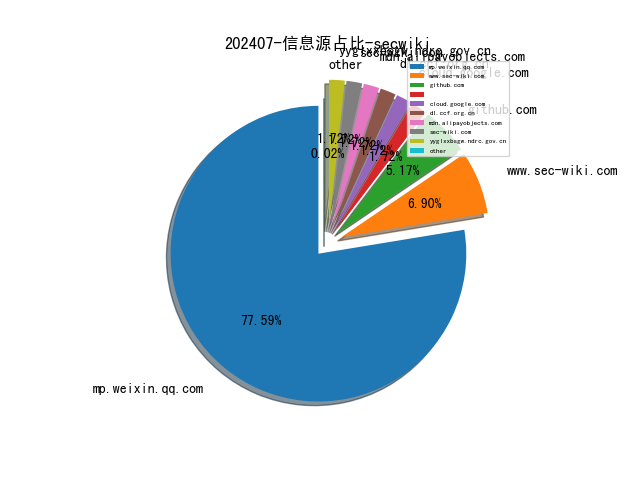

# [数据--所有](README_20.md)
# [数据--年度](README_2024.md)
# 202407 信息源与信息类型占比

# 微信公众号 推荐
| nickname_english | weixin_no | title | url| 
| --- | --- | --- | ---| 
| 360数字安全 | gh_6db130c5163e | 3000名黑客巅峰较量，100+漏洞震撼突破！矩阵杯决赛落幕 | https://mp.weixin.qq.com/s?__biz=MzA4MTg0MDQ4Nw==&mid=2247572647&idx=3&sn=74126bea92b9fa3e7b8f2f51a69381d2 | 3| 
| BlockSec | None | 全球青年峰会圆桌实录：深度解析Web3安全、DePIN与AI | https://mp.weixin.qq.com/s?__biz=MzkyMzI2NzIyMw==&mid=2247487922&idx=1&sn=1e3194eaad2698e6227788e48ab868a6 | 1| 
| CAICT可信安全 | CAICT_SECURITY | 中国信通院TSM标准工作首次出海亮相欧洲，与OWASP SAMM映射工作同步启动 | https://mp.weixin.qq.com/s?__biz=Mzk0MjM1MDg2Mg==&mid=2247499680&idx=1&sn=027d33ab1ae8e1a59fac7203f2eced0d | 1| 
| CISP | None | 5大举措，促进技能人才培养提质加速 | https://mp.weixin.qq.com/s?__biz=MzI1NzQ0NTMxMQ==&mid=2247489741&idx=2&sn=340a91a2af57c3e839405157cf5c8b6c | 2| 
| CISSP | None | 商汤科技招聘安全攻防架构师 | https://mp.weixin.qq.com/s?__biz=Mzg4MTg0MjQ5OA==&mid=2247485484&idx=1&sn=76226148fce848dae5d04bf138c84ec0 | 1| 
| CNCERT国家工程研究中心 | NELCERT | 售价15万美元， Linux内核UAF零日漏洞在暗网出售 | https://mp.weixin.qq.com/s?__biz=MzUzNDYxOTA1NA==&mid=2247545625&idx=3&sn=c8fb7ac2663ccd0375b830fbfbe40a2e | 3| 
| CNVD漏洞平台 | CNVDTS | 上周关注度较高的产品安全漏洞(20240624-20240630) | https://mp.weixin.qq.com/s?__biz=MzU3ODM2NTg2Mg==&mid=2247494959&idx=2&sn=0320ca35f1b70fe13692b868354a82dc | 2| 
| CertiK | certikchina | CertiK亚洲区域云基础设施成功迁移至阿里云，持续强化Web3.0安全 | https://mp.weixin.qq.com/s?__biz=MzU5OTg4MTIxMw==&mid=2247503098&idx=1&sn=a65c50bb1efb14235d9dd54897c3ffb0 | 1| 
| FreeBuf | freebuf | CrimsonEDR：一款恶意软件模式识别与EDR策略评估工具 | https://mp.weixin.qq.com/s?__biz=MjM5NjA0NjgyMA==&mid=2651288467&idx=4&sn=6350fafa9ccd2e7155da8b05f8d3da62 | 4| 
| FreeBuf安全咨询 | freebuf_ent | 新勒索软件 Shinra 与 Limpopo 浮出水面 | https://mp.weixin.qq.com/s?__biz=Mzg2MTAwNzg1Ng==&mid=2247494513&idx=1&sn=d121e4f2e20b5ccd61ecf0ad3d8c2106 | 1| 
| HackSee | hacksee_com | AWS如何利用人工智能帮助乌克兰排雷 | https://mp.weixin.qq.com/s?__biz=MzI5NTA0MTY2Mw==&mid=2247485394&idx=1&sn=461fd87c2c1df180ac2b614172dc861b | 1| 
| Hacking黑白红 | Hacking012 | 蓝队HW 实战应急响应-案例 | https://mp.weixin.qq.com/s?__biz=Mzg2NDYwMDA1NA==&mid=2247539285&idx=1&sn=da18f37b6763ce9a7bccaf19fa5a902b | 1| 
| KCon 黑客大会 | None | 大众评选开启 , KCon大会议题大PK！速来选出你的心仪议题 | https://mp.weixin.qq.com/s?__biz=MzIzOTAwNzc1OQ==&mid=2651137364&idx=1&sn=12a5737e2923a363de5f0a0fc8145247 | 1| 
| NullError Sec | gh_34a2be56ee46 | Windows和Java环境下的redis未授权利用 | https://mp.weixin.qq.com/s?__biz=MzkyMjY4NzUwMw==&mid=2247483781&idx=1&sn=199122602e1161340ffc6c379baac92e | 1| 
| OPPO安珀实验室 | gh_c3e58b525224 | Parcelable和Bundle的爱恨情仇（二）——LazyValue | https://mp.weixin.qq.com/s?__biz=MjM5Njk1MDY5Ng==&mid=2247490911&idx=1&sn=41865a4a7b7ae6ec8eca54241da94ac6 | 1| 
| Tide安全团队 | TideSec | 山东省移动应用六月份安全态势 | https://mp.weixin.qq.com/s?__biz=Mzg2NTA4OTI5NA==&mid=2247515781&idx=1&sn=310d6ab2ffdb00e9d17dfc8693976eea | 1| 
| TimeAxis Sec | TimeAxis_Sec | 【IDEA插件分享】SecInspector | https://mp.weixin.qq.com/s?__biz=MzIxNzY1MTc1OA==&mid=2247484035&idx=1&sn=e5956592597bea477004e09305534a94 | 1| 
| Urkc安全 | None | 《红队实战宝典之内网渗透测试》特惠抽书活动 | https://mp.weixin.qq.com/s?__biz=MzkxNTU5NTI1Ng==&mid=2247485014&idx=1&sn=85aa15000ed5e53926b9e096b76f9c8e | 1| 
| 中国信息安全 | chinainfosec | 警惕！这些APP也许是你“最熟悉的陌生人”！ | https://mp.weixin.qq.com/s?__biz=MzA5MzE5MDAzOA==&mid=2664217857&idx=7&sn=eccf29665162f736b01b5a189e397be3 | 7| 
| 中国网络空间安全协会 | CSAC20160325 | 2024年第二期网络安全大讲堂培训班顺利举办 | https://mp.weixin.qq.com/s?__biz=MzA3ODE0NDA4MA==&mid=2649399833&idx=1&sn=15e2d785b6d67c14cdf51320fea02f50 | 1| 
| 中国软件评测中心 | china_testing | 【时间定了】2024数字政府和政府网站评估指标意见征求研讨会即将召开 | https://mp.weixin.qq.com/s?__biz=MjM5NzYwNDU0Mg==&mid=2649245635&idx=2&sn=3e940f3af285adcc31015cee18810562 | 2| 
| 二进制空间安全 | suntiger_2023 | Linux中控制正在运行进程的优先级原理和过程 | https://mp.weixin.qq.com/s?__biz=MzkxOTUyOTc0NQ==&mid=2247490736&idx=1&sn=2b59e54a42709ca2ac1021810d696acc | 1| 
| 云众可信 | None | 建党节 ,  爱党敬业，不忘初心 | https://mp.weixin.qq.com/s?__biz=Mzg2NDU3Mzc5OA==&mid=2247489516&idx=1&sn=e22d96420f6e92ad88c6f4f16f5deb09 | 1| 
| 亚信安全 | yaxinanquan | “AI+信舵态势感知”应用成果发布！亚信安全出席2024首届算力之都开发者大会 | https://mp.weixin.qq.com/s?__biz=MjM5NjY2MTIzMw==&mid=2650617377&idx=2&sn=ae2c1eb6d79ff2914c194dfca4d922b2 | 2| 
| 代码卫士 | codesafe | 存疑 CVE 漏洞带来无谓压力 热门开源项目开发者归档 GitHub 仓库 | https://mp.weixin.qq.com/s?__biz=MzI2NTg4OTc5Nw==&mid=2247519930&idx=2&sn=acd4b1226ac3021b5aa91433e3f657f5 | 2| 
| 信安保密 | None | 我靠运气挣来的钱，靠实力全部亏完了（专业朗诵版） | https://mp.weixin.qq.com/s?__biz=MjM5MzUyMzM2NA==&mid=2652914174&idx=4&sn=7c998e6bce65654d8108b70f73fef833 | 4| 
| 信安王子 | gh_aa248fc3b5bb | xday预警-某云APP签名分发系统任意文件上传 | https://mp.weixin.qq.com/s?__biz=Mzg4MjY5MDE4NA==&mid=2247483910&idx=1&sn=d2c042414a857807402429f395a0fb3f | 1| 
| 信安百科 | gh_1a73db5eef37 | CVE-2024-36837｜CRMEB电商管理系统存在SQL 注入漏洞（POC） | https://mp.weixin.qq.com/s?__biz=Mzg2ODcxMjYzMA==&mid=2247485458&idx=2&sn=c25113b4a0ead82773652cae79323bf6 | 2| 
| 信息安全与通信保密杂志社 | None | 24款App被工信部通报 | https://mp.weixin.qq.com/s?__biz=MzkwMTMyMDQ3Mw==&mid=2247590308&idx=3&sn=97f757b60a23a13bc747432d52e2875d | 3| 
| 信息安全大事件 | xxaqdsj | 著名远控软件系统遭APT攻陷，安全专家建议暂时删除 | https://mp.weixin.qq.com/s?__biz=MzkzNjIzMjM5Ng==&mid=2247489448&idx=1&sn=2bfa12b635506622cad41970969144ed | 1| 
| 信息安全研究 | ISR2016 | 【业界动态】网安市场周度监测（2024-07-01） | https://mp.weixin.qq.com/s?__biz=MzA3NzgzNDM0OQ==&mid=2664987834&idx=3&sn=d291c5d1194dbfba66f582b0a2e9f89f | 3| 
| 全球技术地图 | drc_iite | 美国务院启动新的人工智能资源中心“AI.State” | https://mp.weixin.qq.com/s?__biz=MzI1OTExNDY1NQ==&mid=2651613865&idx=2&sn=9aff863c4f6ef90c7077b695f65b0c32 | 2| 
| 全频带阻塞干扰 | RFJamming | 商业安全必读 , 手机窃听的8种途径 | https://mp.weixin.qq.com/s/1gvxVPnEVxLLCyUp63knmA | 1| 
| 关键基础设施安全应急响应中心 | CII-SRC | 影响超六百万人！美国一企业遭LockBit勒索软件攻击 | https://mp.weixin.qq.com/s?__biz=MzkyMzAwMDEyNg==&mid=2247544680&idx=3&sn=d9e3f1e05a20ce2e7776ebdf4337e553 | 3| 
| 冷漠安全 | gh_1c1d6111ce8f | 「冷漠安全」六月份0day/1day/nday漏洞汇总 | https://mp.weixin.qq.com/s?__biz=MzkyNDY3MTY3MA==&mid=2247484736&idx=1&sn=466abab53f6ccca7a55f663032da83e7 | 1| 
| 合天网安实验室 | hee_tian | 【免费领】等保必备：Windows系统配置安全标准与操作指南 | https://mp.weixin.qq.com/s?__biz=MjM5MTYxNjQxOA==&mid=2652905460&idx=2&sn=5b1a6ad06fd5e09072f33301201c437e | 2| 
| 启明星辰安全简讯 | VitaminSecurity | 【漏洞通告】OpenSSH Server远程代码执行漏洞（CVE-2024-6387） | https://mp.weixin.qq.com/s?__biz=MzkzNzY5OTg2Ng==&mid=2247499561&idx=2&sn=9ca79ec82113cb737d4b6d01c0de6fc0 | 2| 
| 启明星辰集团 | venustech_weixin | 重温百年党史 勇担历史使命 , 启明星辰集团党委举办迎“七一”暨参观中国共产党历史展览馆活动 | https://mp.weixin.qq.com/s?__biz=MzA3NDQ0MzkzMA==&mid=2651726415&idx=1&sn=736922d652ee486dc3dca64b704f4b38 | 1| 
| 吾爱破解论坛 | pojie_52 | 吾爱破解安卓逆向入门教程《安卓逆向这档事》十九、表哥，你也不想你的Frida被检测吧!(下) | https://mp.weixin.qq.com/s?__biz=MjM5Mjc3MDM2Mw==&mid=2651140730&idx=1&sn=35c28447e545cfca350016102548d63b | 1| 
| 商密君 | None | 已抓获30余人！北京警方破获特大盗刷信用卡诈骗案 | https://mp.weixin.qq.com/s?__biz=MzI5NTM4OTQ5Mg==&mid=2247625497&idx=5&sn=7cc420cae65bebe9f43b1709cc519bf3 | 5| 
| 四叶草安全 | siyecaoanquan1 | 四叶草安全顺利通过陕西省知识产权保护中心主体备案 | https://mp.weixin.qq.com/s?__biz=MjM5MTI2NDQzNg==&mid=2654551575&idx=1&sn=4767cd72bfa7886d214edccef41dfccb | 1| 
| 国家信息安全服务资质 | gh_2e911008c3ff | 不忘初心 牢记使命，庆祝建党103周年 | https://mp.weixin.qq.com/s?__biz=MzI0NDg4MTIyNQ==&mid=2247485935&idx=1&sn=2c5b82acdb43db8be52e5e650e666702 | 1| 
| 国际云安全联盟CSA | gh_674820794ae8 | 被⽹络罪犯利⽤的5⼤ChatGPT越狱提⽰ | https://mp.weixin.qq.com/s?__biz=MzkwMTM5MDUxMA==&mid=2247497719&idx=1&sn=57455c7565049d9d279191a5f70ff7c2 | 1| 
| 墨瞳编程 | gh_58ed2d9a9b71 | 为什么说运维工程师做不长久，做两年就赶快转网络安全或者研发 | https://mp.weixin.qq.com/s?__biz=MzkxNDU0MTUyNw==&mid=2247488492&idx=1&sn=bc2b00630aa2c3b9db54619dbf273b1a | 1| 
| 天启实验室 | NXKMKS | CVE-2024-6387｜OpenSSH远程代码执行漏洞 | https://mp.weixin.qq.com/s?__biz=Mzk0NzM4NzI1MA==&mid=2247486098&idx=1&sn=001f771b65fbb1dc2946d31287a06bc0 | 1| 
| 天启者安全 | gh_f40f7e422cdf | 吃瓜了兄弟们学神大瓜！ | https://mp.weixin.qq.com/s?__biz=MzkxNjY2MjY3NQ==&mid=2247483895&idx=1&sn=2b5d8efdabfc9b6e750f2fb28987abd6 | 1| 
| 天融信教育 | TOPSEC-EDU | 每日安全提醒~ | https://mp.weixin.qq.com/s?__biz=MzU0MjEwNTM5Ng==&mid=2247518719&idx=2&sn=9bb803ae74bc6c9d9fe255965b449d89 | 2| 
| 奇安信 CERT | None | 安全热点周报：全球叉车巨头科朗遭网络攻击，工厂生产被迫中断超一周 | https://mp.weixin.qq.com/s?__biz=MzU5NDgxODU1MQ==&mid=2247501517&idx=3&sn=56dde274f6b48d17aaa8abd6682ee1b0 | 3| 
| 奇安信安全应急响应中心 | gh_5c0c4dc97eb6 | 【周末读书日】终端安全运营新书震撼上线，速来抢购！ | https://mp.weixin.qq.com/s?__biz=Mzg5OTYwMTY5MA==&mid=2247506228&idx=1&sn=a43f0e665878f5824f1bac133b256a7b | 1| 
| 奇安信集团 | qianxin-keji | 著名远控软件TeamViewer IT系统遭APT攻陷，安全专家建议暂时删除 | https://mp.weixin.qq.com/s?__biz=MzU0NDk0NTAwMw==&mid=2247612953&idx=3&sn=eeb2efe1aa305cc196c2aee107568241 | 3| 
| 奉天安全团队 | FTsec-team | CNVD—由前端Js引发的SQL注入通用高危 | https://mp.weixin.qq.com/s?__biz=Mzk0NjQ2NzQ0Ng==&mid=2247484852&idx=1&sn=61b418d89a37fabfe014c84436d2aed7 | 1| 
| 字节跳动安全中心 | None | ByteSRC交流室｜云安全大佬Target1a在线解答弹幕问题 | https://mp.weixin.qq.com/s?__biz=MzUzMzcyMDYzMw==&mid=2247493604&idx=1&sn=72892a09a7db477757e729397048acb0 | 1| 
| 安世加 | None | 安全聘 , 京东数据安全部招人啦 | https://mp.weixin.qq.com/s?__biz=MzU2MTQwMzMxNA==&mid=2247539002&idx=1&sn=e941f24981c06f52b23d086df7353e0b | 1| 
| 安信安全 | gsaxns | CISA：大多数关键开源项目未使用内存安全代码 | https://mp.weixin.qq.com/s?__biz=MzAxNTYwOTU1Mw==&mid=2650090594&idx=1&sn=7ce888901f3efa6e314d7bee04a6d06c | 1| 
| 安全419 | None | 资料下载 , 大型互联网平台网络安全评估指南、安全大模型技术与市场研究报告 | https://mp.weixin.qq.com/s?__biz=MzUyMDQ4OTkyMg==&mid=2247540343&idx=3&sn=e4aa071473a00722936fefd7b6b6d51e | 3| 
| 安全内参 | None | 美国人工智能治理体系的底层逻辑浅析 | https://mp.weixin.qq.com/s?__biz=MzI4NDY2MDMwMw==&mid=2247512068&idx=2&sn=a2e305de9218f40ce48b66faf9f038bc | 2| 
| 安全圈 | ChinaAnQuan | 【安全圈】英国零售连锁店 Shoezone 披露网络攻击，数据泄露 | https://mp.weixin.qq.com/s?__biz=MzIzMzE4NDU1OQ==&mid=2652062411&idx=4&sn=8358fd00c02bf72903fdec1481a27a75 | 4| 
| 安全威胁纵横 | gh_715fe2f8df0b | 勒索软件入侵儿童医院系统，黑客声称窃取 600GB 数据 | https://mp.weixin.qq.com/s?__biz=Mzk0MDYwMjE3OQ==&mid=2247485387&idx=1&sn=038bc03bde1c72b8de30ebe84098906a | 1| 
| 安全新说 | InSightNIS | 《数字中国发展报告（2023年）》正式发布 | https://mp.weixin.qq.com/s?__biz=MzA3NDIwNTY5Mw==&mid=2247505254&idx=1&sn=0ad61a79d2d8ff8f460055d1fb1faafd | 1| 
| 安全极客 | gh_23236568a71e | 第57期,GPTSecurity周报 | https://mp.weixin.qq.com/s?__biz=MzkzNDUxOTk2Mw==&mid=2247494170&idx=1&sn=ac1477ce95536524b55745c865d6d61a | 1| 
| 安全牛课堂 | aqniu_edu | 7月特别活动 , 强强联手，双课组合助您能力提升！ | https://mp.weixin.qq.com/s?__biz=MzIxNTM4NDY2MQ==&mid=2247511065&idx=1&sn=7a7230da1579a8dec51449b490c8845b | 1| 
| 安全狗 | safedog2013 | 喜报！亚信安全中标中国移动主机安全防护软件集采 | https://mp.weixin.qq.com/s?__biz=MjM5NTc2NDM4MQ==&mid=2650841242&idx=1&sn=b826999eb797e42848de5304663099ba | 1| 
| 安全狗的自我修养 | haidragon_study | 如何避免成为电子邮件诈骗的受害者 | https://mp.weixin.qq.com/s?__biz=MzkwOTE5MDY5NA==&mid=2247497244&idx=1&sn=a0ba4df83ac00400e45aae3cdb82b75e | 1| 
| 安全研究GoSSIP | GoSSIPSJTU | G.O.S.S.I.P 阅读推荐 2024-07-01 治Plugin App如烹小鲜 | https://mp.weixin.qq.com/s?__biz=Mzg5ODUxMzg0Ng==&mid=2247498342&idx=1&sn=b4327e707f16163a8045d446032f802e | 1| 
| 安全绘景 | gh_a4e19e42a2aa | DecryptTools综合加解密V2.4 最强版本更新！！！ | https://mp.weixin.qq.com/s?__biz=MzkyNzYxMDQ2MQ==&mid=2247484722&idx=1&sn=204382e24c3a4773f4b5ae10079d1a75 | 1| 
| 安全脉脉 | gh_6d21af7faacb | 为电磁故障注入（EMFI）去除芯片封装 | https://mp.weixin.qq.com/s?__biz=Mzk0MzQzNzMxOA==&mid=2247486961&idx=1&sn=fc14eab9800fc1530c0ef24d4e33dbb9 | 1| 
| 安在 | AnZer_SH | 百家说事 , 第三场：数据安全再探再谈 | https://mp.weixin.qq.com/s?__biz=MzU5ODgzNTExOQ==&mid=2247624678&idx=3&sn=be1326d60582e0284fc1ff29658b9fe6 | 3| 
| 安天集团 | Antiylab | 安天多种形式庆祝建党103周年 | https://mp.weixin.qq.com/s?__biz=MjM5MTA3Nzk4MQ==&mid=2650206166&idx=1&sn=3a06f23b54b818abf2481ca113c3ad83 | 1| 
| 安知讯 | dataanquan | 海关总署2024年网络与数据安全服务采购 | https://mp.weixin.qq.com/s?__biz=MzIxMDIwODM2MA==&mid=2653930232&idx=2&sn=e5cc4ca08b3a9556381e7ba00c74f742 | 2| 
| 实战安全研究 | gh_f390fc63c711 | 漏洞复现 , 迈普多业务融合网关send_order.cgi远程命令执行漏洞【附poc】 | https://mp.weixin.qq.com/s?__biz=MzU0MTc2NTExNg==&mid=2247490460&idx=1&sn=7276be856c9a1e000c8a4d69123c7d5e | 1| 
| 宸极实验室 | ChenJiLab | 『CTF』IO_FILE利用入门(2) | https://mp.weixin.qq.com/s?__biz=Mzg4NTA0MzgxNQ==&mid=2247489353&idx=1&sn=6ca1bc92cb1e990ed1085cddab445093 | 1| 
| 小杨学安全 | gh_23d7e9450391 | SQL注入之二次注入 | https://mp.weixin.qq.com/s?__biz=Mzk0NzM4OTQ5NQ==&mid=2247484416&idx=1&sn=62031a5d428a4fea80dfb1ec998f11e9 | 1| 
| 小白菜安全 | None | burpsuit最新破解版本2024-6 | https://mp.weixin.qq.com/s?__biz=MzIzOTM2MzczNQ==&mid=2247484514&idx=1&sn=7122fdd679f2e921ee23530ab3cb4f21 | 1| 
| 小羽网安 | None | Python很慢？这十个方法让你的代码执行速度提升3倍！ | https://mp.weixin.qq.com/s?__biz=Mzg2Nzk0NjA4Mg==&mid=2247486088&idx=2&sn=5428dcb551d1e33d1e6f8f725827f57f | 2| 
| 平航科技 | pinghangtechnology | 【绝对干货】TrueUpdate类变种-银狐木马实战详解 | https://mp.weixin.qq.com/s?__biz=MzI0OTEyMTk5OQ==&mid=2247493251&idx=1&sn=2ad2170a2093aef834a46a9e9f864401 | 1| 
| 德斯克安全小课堂 | szdesk | 2个许可如何满足10位工程师使用 | https://mp.weixin.qq.com/s?__biz=MzA3MTUxNzQxMQ==&mid=2453885213&idx=1&sn=c94e45634990b9d1fc786647f1fe925a | 1| 
| 快手技术 | gh_96fee918d420 | CVPR 2024 短视频质量评价学术竞赛收官，一文详解Top团队方案 | https://mp.weixin.qq.com/s?__biz=Mzg2NzU4MDM0MQ==&mid=2247487140&idx=2&sn=7dcd5d0ab57ce4e86b74e23907a8d3ae | 2| 
| 恒星EDU | None | 恒星实验室再创佳绩！荣获“矩阵杯”原创漏洞挖掘赛最佳利用奖、战队攻防对抗赛优胜奖 | https://mp.weixin.qq.com/s?__biz=MzU1MzE3Njg2Mw==&mid=2247508884&idx=1&sn=db58426f12d8d4b3022a0706965b5774 | 1| 
| 慢雾科技 | SlowMist | 慢雾出品 , 2024 上半年区块链安全与反洗钱报告 | https://mp.weixin.qq.com/s?__biz=MzU4ODQ3NTM2OA==&mid=2247499923&idx=1&sn=e075b86887cefa622b8a8318be269d49 | 1| 
| 技可达工作室 | None | 为复杂之眼客户端安装哨兵反病毒引擎 | https://mp.weixin.qq.com/s?__biz=MzU3NDY1NTYyOQ==&mid=2247485953&idx=1&sn=1c6ecdf6164c2f1d33779449fa3c7a35 | 1| 
| 攻防实战指南 | gh_93a3ff373a24 | 某开源电商系统代码审计 | https://mp.weixin.qq.com/s?__biz=MzkwNzY4MzE3OQ==&mid=2247484007&idx=1&sn=a432aa4783311c36d7c23d4f1cd9779c | 1| 
| 数世咨询 | dwconcn | 【十佳案例】某市“一网共享”数据安全治理管控平台开发和数据安全运营案例 | https://mp.weixin.qq.com/s?__biz=MzkxNzA3MTgyNg==&mid=2247513577&idx=2&sn=efb2c90fddcf3ecf903537a2480a9492 | 2| 
| 无糖反网络犯罪研究中心 | gh_2ee7a9b17c0d | 长寿警方破获“考试密卷”诈骗案 , 东湖警方破获“法律咨询”诈骗案——涉网犯罪每日情报 | https://mp.weixin.qq.com/s?__biz=MzAxMzkzNDA1Mg==&mid=2247511534&idx=1&sn=f77387178dc257d6a8af50a416f6574a | 1| 
| 梅苑安全 | None | 内网渗透信息搜集骚姿势 | https://mp.weixin.qq.com/s?__biz=MzkwMTU2NzMwOQ==&mid=2247484377&idx=1&sn=3491689b5b778a8d11fcc47ddd75b9c5 | 1| 
| 棉花糖fans | None | 假如我年少有为不自卑 | https://mp.weixin.qq.com/s?__biz=MzkyOTQzNjIwNw==&mid=2247485043&idx=1&sn=d8f87d1ed71c74c3fd9aa0ae2f124680 | 1| 
| 泾弦安全 | None | 招中级初级，初级常态化1w左右，中级常态化一天千把块钱 | https://mp.weixin.qq.com/s?__biz=Mzk0MzU5NTg1Ng==&mid=2247484690&idx=1&sn=d35ab6289bbc9d86c4f29a7fdc911ddc | 1| 
| 洞源实验室 | Official_InsBug | 监听蓝牙对话的BlueSpy技术复现 | https://mp.weixin.qq.com/s/CvDs26dQ9fKoUQoULRbv3w | 1| 
| 猫蛋儿安全 | None | 李X鸿！\"就是不想给了\"\"态度不行\" 哈哈哈 | https://mp.weixin.qq.com/s?__biz=MzkxMTUyMjUxMw==&mid=2247522625&idx=1&sn=4fe050ccfe40ad754ae03e78aaf98e63 | 1| 
| 珂技知识分享 | None | web选手入门pwn(16) ——house of husk | https://mp.weixin.qq.com/s?__biz=MzUzNDMyNjI3Mg==&mid=2247486850&idx=1&sn=46890b745c6643483601acab134c72b9 | 1| 
| 生有可恋 | hyang0-1 | 如何拥有一副好肠道 | https://mp.weixin.qq.com/s?__biz=Mzk0MTI4NTIzNQ==&mid=2247491537&idx=1&sn=46761299195b658bbd5163f456efb843 | 1| 
| 百度安全 | BaiduSD00 | Baidu Comate发布中文名“文心快码” ，版本升级至2.5 | https://mp.weixin.qq.com/s?__biz=MjM5MTAwNzUzNQ==&mid=2650509795&idx=2&sn=f791644903a22ea285320ec1916b353b | 2| 
| 百度安全实验室 | BaiduX_lab | Baidu Comate发布中文名“文心快码” ，版本升级至2.5 | https://mp.weixin.qq.com/s?__biz=MzA3NTQ3ODI0NA==&mid=2247487211&idx=2&sn=705da1883c07aa0375e403ef3f73aa68 | 2| 
| 百度安全应急响应中心 | baidu_sec | Baidu Comate发布中文名“文心快码” ，版本升级至2.5 | https://mp.weixin.qq.com/s?__biz=MzA4ODc0MTIwMw==&mid=2652540889&idx=2&sn=a179af3dfa9372cad86df96b1fec2017 | 2| 
| 盛邦安全WebRAY | WebRay_weixin | 倒计时1天丨盛邦安全携DayDayMap，邀您共赴2024全球数字经济大会 | https://mp.weixin.qq.com/s?__biz=MzAwNTAxMjUwNw==&mid=2650275833&idx=3&sn=b647c00c61f4b75bf1b2c243585caee5 | 3| 
| 看雪学苑 | None | 0day windows 直播回放更新：实战挖掘整数溢出漏洞2 | https://mp.weixin.qq.com/s?__biz=MjM5NTc2MDYxMw==&mid=2458561661&idx=3&sn=ae1018d6034565ff9795ae2bd2622061 | 3| 
| 瞌睡虫小K | gh_fd73ce9242f7 | 【喜报】Dozer战队取得第十七届全国大学生信息安全竞赛创新实践能力赛（华东北分区选拔赛）二等奖和三等奖 | https://mp.weixin.qq.com/s?__biz=MzI4MTIxMzkxMg==&mid=2247485329&idx=1&sn=598443391911369c32426c791a2f00ec | 1| 
| 知道创宇 | knownsec | 【知道创宇404实验室】建议关注Glibc-based Linux OpenSSH 最新RCE漏洞(CVE-2024-6387) | https://mp.weixin.qq.com/s?__biz=MjM5NzA3Nzg2MA==&mid=2649868718&idx=1&sn=c7133745486c32cef152a05a7b966300 | 1| 
| 知道创宇404实验室 | seebug_org | 【知道创宇404实验室】建议关注Glibc-based Linux OpenSSH 最新RCE漏洞(CVE-2024-6387) | https://mp.weixin.qq.com/s?__biz=MzAxNDY2MTQ2OQ==&mid=2650979072&idx=1&sn=5df59160be8c5380e22367cdfbd79a62 | 1| 
| 红蓝公鸡队 | None | 未来可期 | https://mp.weixin.qq.com/s?__biz=Mzg5MDc1MjY5Ng==&mid=2247492965&idx=1&sn=49a3067dfe1f69c5dba27c56b0b9df5c | 1| 
| 红队蓝军 | None | S2-061 Struts2远程代码执行漏洞复现 （POC详解） | https://mp.weixin.qq.com/s?__biz=Mzg2NDY2MTQ1OQ==&mid=2247519329&idx=1&sn=4dd94fe655d3aa2aabbc81c8ed1abd1f | 1| 
| 绿盟科技 | NSFOCUS-weixin | 民航数据管理的体系化发展及思考 | https://mp.weixin.qq.com/s?__biz=MjM5ODYyMTM4MA==&mid=2650454452&idx=2&sn=616102593b590e5b3aa4d66807d2131b | 2| 
| 绿盟科技研究通讯 | nsfocus_research | 技术解读｜软件敏感信息检测工具对比分析 | https://mp.weixin.qq.com/s?__biz=MzIyODYzNTU2OA==&mid=2247497480&idx=1&sn=9979c9ab8e516c8c18c9ce1a1becc8a8 | 1| 
| 网安寻路人 | None | 【赠书】逐条指导法律适用——《未成年人网络保护条例理解与适用》 | https://mp.weixin.qq.com/s?__biz=MzIxODM0NDU4MQ==&mid=2247503825&idx=1&sn=8f5f3ea1731a273e1971e4bdf7fceeed | 1| 
| 网安百色 | None | 当心太空中的“间谍之眼” | https://mp.weixin.qq.com/s?__biz=MzI0NzE4ODk1Mw==&mid=2652093097&idx=2&sn=e28945c1606d5af31957f4f08b68983a | 2| 
| 网易云音乐技术团队 | gh_e0a72742f973 | 云音乐2023年报前端大揭秘 | https://mp.weixin.qq.com/s?__biz=MzI1NTg3NzcwNQ==&mid=2247491669&idx=1&sn=f878ad514748074621c4c8c01ed91880 | 1| 
| 网络与信息法学会 | None | 【资讯】山东省工信厅发布《关于加快大模型产业高质量发展的指导意见》 | https://mp.weixin.qq.com/s?__biz=MzU1NDY3NDgwMQ==&mid=2247543029&idx=2&sn=64f5a4849816077dd0c50d67e5704bce | 2| 
| 网络安全和信息化 | ITyunwei_365master | 1—5月我国规上互联网企业完成互联网业务收入同比增长5% | https://mp.weixin.qq.com/s?__biz=MjM5MzMwMDU5NQ==&mid=2649165243&idx=3&sn=0b76194c067b48cf06d52737645927b9 | 3| 
| 网络安全资源库 | gh_e8a4866a67fe | 一份Shell脚本手册，阿里云出品，赞！ | https://mp.weixin.qq.com/s?__biz=MzkxMzMyNzMyMA==&mid=2247558949&idx=2&sn=1dd428174e32e8800d401e290c143c0f | 2| 
| 老鑫安全 | studentSec | 瓜甜落地：2024hvv之耍猴记-粉丝投稿 | https://mp.weixin.qq.com/s?__biz=MzU0NDc0NTY3OQ==&mid=2247487278&idx=1&sn=0b6e30bc945fccd3858fb5b6cdf976e5 | 1| 
| 腾讯安全 | None | 科技圆桌 , 麦德龙对话腾讯：消费换挡期，系统性安全增长如何成为零售的新竞争力？ | https://mp.weixin.qq.com/s?__biz=Mzg5OTE4NTczMQ==&mid=2247521050&idx=1&sn=857d39b5c10c27a432f24304bc92bd67 | 1| 
| 葡萄不只会安全 | putao-m0l1 | hw 常态化两个月继续收简历 价格美丽 | https://mp.weixin.qq.com/s?__biz=Mzg5OTg1MDk0Mw==&mid=2247484814&idx=1&sn=00a010f3b117f25a0f0eb2ed474ae594 | 1| 
| 蓝胖子之家 | gh_fa158f2ae9b3 | 网站一键封装APP | https://mp.weixin.qq.com/s?__biz=MzU1NDg4MjY1Mg==&mid=2247488324&idx=1&sn=5df05af383ae0d024e3fb7eb2066cfb8 | 1| 
| 蚁景网安 | None | 【Windbg】学习及在CTF中解题 | https://mp.weixin.qq.com/s?__biz=MzkyNTY3Nzc3Mg==&mid=2247485985&idx=1&sn=b935c825322edbfd132949c58f7cab8e | 1| 
| 表哥带我 | gh_1c54009a0474 | 瓜甜落地：2024hvv之耍猴记-粉丝投稿 | https://mp.weixin.qq.com/s?__biz=Mzg4NDg2NTM3NQ==&mid=2247484287&idx=1&sn=adc5ab4a1d65803c72b734034f24531f | 1| 
| 谈思实验室 | None | 汽车电子电气架构正向开发流程 | https://mp.weixin.qq.com/s?__biz=MzIzOTc2OTAxMg==&mid=2247539668&idx=3&sn=53cfdddf32b133865f566a5cecbdd156 | 3| 
| 赛博昆仑 | None | 赛博昆仑与金山办公达成战略合作，共建“漏洞实战攻防协同防御”体系 | https://mp.weixin.qq.com/s?__biz=MzkwMDI0ODkyMw==&mid=2247484471&idx=1&sn=e03aa81d622e04a46281debd4e9c6c65 | 1| 
| 赛查查 | gh_fabaad32b9d1 | 比赛经验分享 , “2024数字中国创新大赛”数字安全赛道数据安全产业人才积分争夺赛进步奖获得者-湖北移动太极队 | https://mp.weixin.qq.com/s?__biz=Mzk0NTU0ODc0Nw==&mid=2247487247&idx=1&sn=d1998c3e97c3c6bab757ef585469c1f3 | 1| 
| 道玄网安驿站 | gh_cb9a38436cdd | OpenSSH 远程代码执行漏洞(CVE-2024-6387)风险警告 | https://mp.weixin.qq.com/s?__biz=Mzg4NTg5MDQ0OA==&mid=2247486444&idx=1&sn=24bd338f5dc27f3c60183be9003e2864 | 1| 
| 重生之成为赛博女保安 | None | 吃大瓜之项目经理的自白 | https://mp.weixin.qq.com/s?__biz=MzIxOTQ1OTY4OQ==&mid=2247485229&idx=1&sn=9e4acde037a1a1d11e8a3ff5ec110885 | 1| 
| 金盾信安 | JD952401 | 工信部通报24款存在侵害用户权益行为的APP (SDK) | https://mp.weixin.qq.com/s?__biz=MjM5NjA2NzY3NA==&mid=2448664863&idx=4&sn=246ab64eee183f3e77da2b8e8b52947b | 4| 
| 长亭安全观察 | None | 永远跟党走，建功新时代 | https://mp.weixin.qq.com/s?__biz=MzkyNDUyNzU1MQ==&mid=2247484987&idx=1&sn=f15938a3f53d951fafdb0813f6262a37 | 1| 
| 隐雾安全 | gh_9355275bad2a | Java代码审计第三期,CVE漏洞挖掘 | https://mp.weixin.qq.com/s?__biz=MzkyNzM2MjM0OQ==&mid=2247493691&idx=1&sn=a0437d892a3eac8af7e1efe033556c69 | 1| 
| 雷神众测 | bounty_team | 雷神众测漏洞周报2024.06.24-2024.06.30 | https://mp.weixin.qq.com/s?__biz=MzI0NzEwOTM0MA==&mid=2652502969&idx=1&sn=b1c6510f73b076788e0d93dc8b589ca8 | 1| 
| 青藤云安全 | None | 青藤党支部荣获上地街道“先进基层党组织” | https://mp.weixin.qq.com/s?__biz=MzAwNDE4Mzc1NA==&mid=2650848908&idx=1&sn=15d7666f5e869022677b251b02ad80fd | 1| 
| 飓风网络安全 | gh_183f818a07dc | 【漏洞预警】Saltstack需授权路径遍历漏洞 (CVE-2024-22232) | https://mp.weixin.qq.com/s?__biz=MzI3NzMzNzE5Ng==&mid=2247488465&idx=2&sn=d0ceeeb0175f882423a10b82124133ca | 2| 
| 黑客技术家园 | hacker202403 | 只需一招就可以解决路由器延迟问题。 | https://mp.weixin.qq.com/s?__biz=MzI2OTk4MTA3Ng==&mid=2247492024&idx=4&sn=7da4b83508beb25c9b857617d04c125f | 4| 
| 黑盾云 | heiduncloud | 第一百八十三期【黑盾云】每周安全头条（2024.6.24-6.30） | https://mp.weixin.qq.com/s?__biz=MzUzMzE5MTQ0Mw==&mid=2247491161&idx=1&sn=2570dd704b0c2c75a872058e041bcb02 | 1| 
| 鼎信安全 | HNDXCP | 鼎信安全 , 网络安全一周资讯 | https://mp.weixin.qq.com/s?__biz=MzIwOTc4MTE4Nw==&mid=2247499573&idx=1&sn=1c2b9e7a18c5c99eb3c7470dcddcffef | 1| 

# 日更新程序
`python update_daily.py`