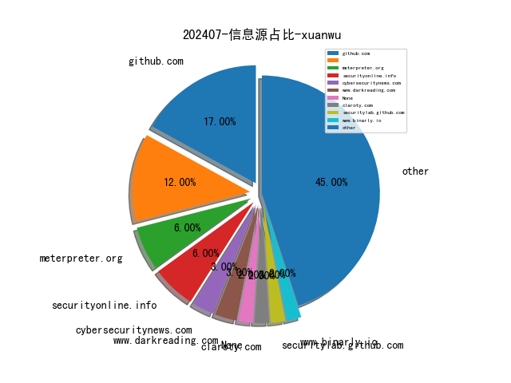

# [数据--所有](README_20.md)
# [数据--年度](README_2024.md)
# 202407 信息源与信息类型占比

# 网络安全书籍 推荐
| date_added | language | title | author | link | size| 
| --- | --- | --- | --- | --- | ---| 
| 2024-07-03 04:59:47 | English | Kubernetes Anti-Patterns | unknown | https://www.wowebook.org/kubernetes-anti-patterns/ | unknown| 
| 2024-07-02 01:52:58 | English | The Art of Star Wars: Episode II, Attack of the Clones | Mark Cotta Vaz | http://libgen.rs/book/index.php?md5=9FCAD6308E004C7FE32838E0A26503C5 | 246 MB [PDF]| 
| 2024-07-01 11:24:09 | English | The Big Book of Small Python Projects | Al Sweigart | http://libgen.rs/book/index.php?md5=5F4C3734F6718D71A6DE44228FA5C094 | 51 MB [PDF]| 
| 2024-07-01 23:39:52 | English | Star Wars: The Bounty Hunter Code: From the Files of Boba Fett | Daniel Wallace, Ryder Windham, Jason Fry | http://libgen.rs/book/index.php?md5=A82232D5F4BFD1CB2D510E7350B937B6 | 172 MB [PDF]| 

# 微信公众号 推荐
| nickname_english | weixin_no | title | url| 
| --- | --- | --- | ---| 
| 3072 | None | CVE-2024-29510 – 格式化字符串漏洞实现Ghostscript RCE | https://mp.weixin.qq.com/s?__biz=MzU4OTk0NDMzOA==&mid=2247488912&idx=1&sn=70eb0668ef07e920efa74ea84664559f | 1| 
| 360安全应急响应中心 | qihusrc | 360SRC助力矩阵杯赛事 | https://mp.weixin.qq.com/s?__biz=MzkzOTIyMzYyMg==&mid=2247493751&idx=1&sn=43aca9c4424bdee585f15156ee713046 | 1| 
| 360数字安全 | None | 热点 , 某国家数据中心遭勒索攻击，超210个政府机构服务中断 | https://mp.weixin.qq.com/s?__biz=MzA4MTg0MDQ4Nw==&mid=2247572669&idx=1&sn=82a28ad922760450e7ada2a673df15a3 | 4| 
| CAICT可信安全 | None | 重磅发布 , 《安全行业大模型技术应用态势发展报告（2024）》正式发布！（文末附下载链接） | https://mp.weixin.qq.com/s?__biz=Mzk0MjM1MDg2Mg==&mid=2247499950&idx=3&sn=7ffd887fa6eb8a794f35b7aba8d0501d | 7| 
| CISP | None | 2024年4月CISP考试成绩 | https://mp.weixin.qq.com/s?__biz=MzI1NzQ0NTMxMQ==&mid=2247489746&idx=1&sn=5daaffb4c5f9b6d525a149ad46db4b51 | 3| 
| CNCERT国家工程研究中心 | None | 覆盖1400个服务器！OpenSSH 严重漏洞可导致整个系统遭入侵 | https://mp.weixin.qq.com/s?__biz=MzUzNDYxOTA1NA==&mid=2247545671&idx=3&sn=86fc4f651ec46819ac9eb7c6c31d8e48 | 9| 
| CNNVD安全动态 | None | CNNVD关于OpenSSH安全漏洞的通报 | https://mp.weixin.qq.com/s?__biz=MzAxODY1OTM5OQ==&mid=2651450045&idx=1&sn=9f8b92db4ec6c16eeab26cf39f005d3c | 2| 
| Devil安全 | None | 【漏洞复现】迈普多业务融合网关远程命令执行漏洞 | https://mp.weixin.qq.com/s?__biz=Mzg2MjkwMDY3OA==&mid=2247485110&idx=1&sn=36a2fd90fa2f366c2aada4da6893bb6d | 1| 
| Docker中文社区 | dockerchina | nacos 实战（史上最全） | https://mp.weixin.qq.com/s?__biz=MzI1NzI5NDM4Mw==&mid=2247497541&idx=1&sn=3ae003e7e0ab5ee56b33244b1cd382bc | 1| 
| EBCloud | None | 震惊！Ping不通居然是因为这个... | https://mp.weixin.qq.com/s?__biz=Mzg4MTA2MTc4MA==&mid=2247493185&idx=1&sn=b14d74d8e252d694c50ff312feba3d6c | 1| 
| E安全 | None | 覆盖1400个服务器！OpenSSH 严重漏洞可导致整个系统遭入侵 | https://mp.weixin.qq.com/s?__biz=MzI4MjA1MzkyNA==&mid=2655346326&idx=1&sn=0b7571bd34ef7bc14a6dec623435e4d3 | 1| 
| FreeBuf | freebuf | AttackGen：一款基于LLM的网络安全事件响应测试工具 | https://mp.weixin.qq.com/s?__biz=MjM5NjA0NjgyMA==&mid=2651289403&idx=4&sn=5121b9b51b7d81dcfcca62869c9a2ba0 | 12| 
| HACK之道 | None | 好用！找到一个帮师傅们接私活的神器 | https://mp.weixin.qq.com/s?__biz=MzIwMzIyMjYzNA==&mid=2247514791&idx=1&sn=5c60495fbe7e6a30d877357f25579f01 | 1| 
| HackSee | None | 2024年，勒索软件攻击需求将达到惊人的520万美元 | https://mp.weixin.qq.com/s?__biz=MzI5NTA0MTY2Mw==&mid=2247485405&idx=1&sn=ae49019ea20fa09289da75b6e42939fb | 3| 
| Hacking黑白红 | None | 2024HW现场,红蓝武器库 | https://mp.weixin.qq.com/s?__biz=Mzg2NDYwMDA1NA==&mid=2247539293&idx=1&sn=98ba6a43f42f42c6b10a61911ac621a6 | 2| 
| Hack分享吧 | None | 一个师傅们接私活的绝佳渠道... | https://mp.weixin.qq.com/s?__biz=MzA4NzU1Mjk4Mw==&mid=2247491046&idx=1&sn=a0963cf4a9c9db0949ec9deb31bd888e | 1| 
| ISC平台 | CISC360 | ISC.AIxa02024 AI应用火热招募中，海量AI工具集体助阵！ | https://mp.weixin.qq.com/s?__biz=MjM5ODI2MTg3Mw==&mid=2649816326&idx=1&sn=e3a58b1c0db148616531203f44d892a2 | 1| 
| ISEC安全e站 | None | 严防数据泄露：风险评估来预警，自查自纠防患未然！ | https://mp.weixin.qq.com/s?__biz=MzIxNzU5NzYzNQ==&mid=2247489126&idx=1&sn=8853c3975fcbf65bc5b1b2ab2fa6a2ee | 1| 
| IoVSecurity | None | 汽车出海全产业数据安全合规发展白皮书 | https://mp.weixin.qq.com/s?__biz=MzU2MDk1Nzg2MQ==&mid=2247610843&idx=3&sn=af2aa6b9de4be3549a41632c8f20fdb2 | 3| 
| KCon 黑客大会 | None | KCon 2024大会志愿者招募开启！欢迎热爱技术的你～ | https://mp.weixin.qq.com/s?__biz=MzIzOTAwNzc1OQ==&mid=2651137401&idx=1&sn=917bd85ad8f896842f35fe48ef2ac5f9 | 3| 
| KK安全说 | None | 全球数字经济大会—数字安全生态建设专题论坛报名开启！ | https://mp.weixin.qq.com/s?__biz=Mzg4NzgyODEzNQ==&mid=2247487466&idx=1&sn=127c9d77d590845bd7ae8a54e2bce522 | 2| 
| LemonSec | None | 恶意软件分析平台 | https://mp.weixin.qq.com/s?__biz=MzUyMTA0MjQ4NA==&mid=2247550229&idx=2&sn=8cab64060316efc47259aafc12cd1563 | 2| 
| Nil聊安全 | Sec_Nil | 甲方安全建设系列之 HTTP 资产清洗 | https://mp.weixin.qq.com/s?__biz=MzkyMDY4MTc2Ng==&mid=2247483862&idx=1&sn=b6282506ba04bdac6efd1d899042842c | 1| 
| Ots安全 | AnQuan7 | 红队战术 - 域持久性黄金票据 | https://mp.weixin.qq.com/s?__biz=MzAxMjYyMzkwOA==&mid=2247510279&idx=1&sn=482917aca3f13d4b7d4f0e6f5b9bf754 | 2| 
| Sec探索者 | None | 【直播预告】某绒6.0最新免杀方法 | https://mp.weixin.qq.com/s?__biz=MzkyNDYwNTcyNA==&mid=2247486018&idx=1&sn=c7135bd78aabe8454eedf7d770869fe6 | 1| 
| T0ngMystic工作站 | None | CVE-2024-6387-OpenSSH远程代码执行 | https://mp.weixin.qq.com/s?__biz=MzUyMDk3ODk5MA==&mid=2247485095&idx=1&sn=bbe61035db42658aa9c6ed97194acb29 | 1| 
| TeamSecret安全团队 | None | 后渗透系列-Windows日志致盲与绕过 | https://mp.weixin.qq.com/s?__biz=MzkzMDQ5MDM3NA==&mid=2247484506&idx=1&sn=6fcb47cf2279dcef2c5b86e8ec5b4566 | 1| 
| TtTeam | None | 哥斯拉webshell管理工具二开小记(已上传至github) | https://mp.weixin.qq.com/s?__biz=Mzg2NTk4MTE1MQ==&mid=2247485209&idx=1&sn=38695afc48dfd5b0163bb05f87ad2152 | 2| 
| UKFC安全 | None | UKFC2024 CISCN华北赛区pwn方向WP | https://mp.weixin.qq.com/s?__biz=MzkyNTU4OTc3MA==&mid=2247485005&idx=1&sn=7c4bee0f46ca6439128b3df1493d762e | 1| 
| XRSec | None | 人面兽薪 | https://mp.weixin.qq.com/s?__biz=MzUyMzE1MzI3NA==&mid=2247486479&idx=1&sn=0f658182f0aeb7ef80bc92b853692c81 | 1| 
| crossoverJie | crossoverJie | 五个我最近在 Go 里学到的小技巧 | https://mp.weixin.qq.com/s?__biz=MzIyMzgyODkxMQ==&mid=2247487460&idx=1&sn=63d0750d0e95b2404e9b055a5275b96b | 1| 
| dotNet安全矩阵 | None | 两个国内最专业的.NET安全知识库 | https://mp.weixin.qq.com/s?__biz=MzUyOTc3NTQ5MA==&mid=2247493069&idx=2&sn=6d1bfb59402d39e84fa8888e5a5ad27a | 2| 
| e安在线 | None | 2024年上半年典型网络攻击事件盘点 | https://mp.weixin.qq.com/s?__biz=MzI1OTA1MzQzNA==&mid=2651245973&idx=1&sn=56577433ed735cdc69ab151758ec5b7b | 1| 
| kali笔记 | None | 一款强大的目录扫描神器-Feroxbuster | https://mp.weixin.qq.com/s?__biz=MzkxMzIwNTY1OA==&mid=2247505152&idx=1&sn=c1e79f5511af1696def64d55226f6bf0 | 1| 
| simple学安全 | gh_0bf41368d3ca | 0day,OpenSSH 远程代码执行漏洞(CVE-2024-6387) | https://mp.weixin.qq.com/s?__biz=Mzk0NTY5Nzc1OA==&mid=2247483971&idx=1&sn=eaa1342477e952ff2f73cc0440668c69 | 1| 
| 一起聊安全 | gh_589ffdaa31f9 | 25项密码行业新标准获批发布（附下载） | https://mp.weixin.qq.com/s?__biz=MzI3NjUzOTQ0NQ==&mid=2247512317&idx=1&sn=7a4c97fcfae060f103f500a2fa583ba2 | 1| 
| 丁爸 情报分析师的工具箱 | dingba2016 | 【论文】算法武器化与大国情报决策模式变革 | https://mp.weixin.qq.com/s?__biz=MzI2MTE0NTE3Mw==&mid=2651144722&idx=2&sn=48ae26ea2e98e550b2cdf96979e2a2fe | 2| 
| 七芒星实验室 | HeptagramSec | 请求走私利用扩展 | https://mp.weixin.qq.com/s?__biz=Mzg4MTU4NTc2Nw==&mid=2247492498&idx=2&sn=2299131452c2144a3a2024ac2fd0da2d | 2| 
| 丈八网安 | None | 丈八网安入选2024中国最佳信创安全厂商 | https://mp.weixin.qq.com/s?__biz=MzkwNzI1NDk0MQ==&mid=2247491848&idx=1&sn=f35749eaa55c32ec4e6bb429e8ce4d6e | 1| 
| 中国信息安全 | chinainfosec | 观点 , 多策并举治理电信网络诈骗 | https://mp.weixin.qq.com/s?__biz=MzA5MzE5MDAzOA==&mid=2664218035&idx=8&sn=3010a307254a8950d6239607c3f7eded | 22| 
| 中国软件评测中心 | china_testing | 圆满闭幕！2024“三品”行河北——首届数字“三品”创新发展大赛闭幕式在邢台宁晋召开 | https://mp.weixin.qq.com/s?__biz=MjM5NzYwNDU0Mg==&mid=2649245690&idx=1&sn=ad31cdab3d68153607da508381b1fe51 | 7| 
| 中孚信息 | None | 跻身行业前列——中孚信息成功入选“中国数字安全综合实力百强” | https://mp.weixin.qq.com/s?__biz=MzAxMjE1MDY0NA==&mid=2247508142&idx=1&sn=8a42f4bc92887eda4755280dd8a49020 | 1| 
| 乌雲安全 | None | 一款云渗透工具 | https://mp.weixin.qq.com/s?__biz=MzAwMjA5OTY5Ng==&mid=2247523274&idx=1&sn=8957b8203bc378c959a7a36024c5d74b | 1| 
| 云鸦安全 | None | 【奇淫技巧】mysql注入小技巧 | https://mp.weixin.qq.com/s?__biz=Mzk0MTY5NzYyOA==&mid=2247485323&idx=1&sn=644d806e5fdc7ad2460d9eb95c533909 | 1| 
| 亚信安全 | yaxinanquan | 6月威胁态势 , 2024攻防演练划重点：6月高危漏洞猛增60%，需高度警惕 | https://mp.weixin.qq.com/s?__biz=MjM5NjY2MTIzMw==&mid=2650617463&idx=2&sn=7d41b2894c7335c8610b8859e93e7499 | 6| 
| 京数安 | jsa20210329 | 湖南某培训学校不履行网络安全保护义务被罚款 | https://mp.weixin.qq.com/s?__biz=Mzg4OTY4MDA2MA==&mid=2247491456&idx=1&sn=88fe475112f572671a209601695f8603 | 1| 
| 亿人安全 | None | 2024年的HW红蓝必备工具库来了~ | https://mp.weixin.qq.com/s?__biz=Mzk0MTIzNTgzMQ==&mid=2247516017&idx=1&sn=a320365f431e849ed363a8bd6c88e175 | 1| 
| 代码卫士 | codesafe | Splunk 修复企业产品中的多个高危漏洞 | https://mp.weixin.qq.com/s?__biz=MzI2NTg4OTc5Nw==&mid=2247519961&idx=2&sn=8bd333df15de255db874f15d0653517b | 7| 
| 众智维安 | None | 高危漏洞预警｜OpenSSH远程执行漏洞漏洞（CVE-2024-6387） | https://mp.weixin.qq.com/s?__biz=MzU5Mjg0NzA5Mw==&mid=2247492612&idx=1&sn=3d5dcfe77d5b8ab4341268142d7a6aad | 2| 
| 会杀毒的单反狗 | None | 严重 CocoaPods 漏洞导致许多 iOS、macOS 应用程序面临供应链攻击 | https://mp.weixin.qq.com/s?__biz=MzI2NzAwOTg4NQ==&mid=2649791603&idx=2&sn=f0da8d1ceb1cc0fad1caa7b7b2105be9 | 2| 
| 伟大航路D | gh_c1fdc31f79ef | 【漏洞复现】GeoServer  wfs接口处存在RCE漏洞(CVE-2024-36401) | https://mp.weixin.qq.com/s?__biz=MzkwNzYzNTkzNA==&mid=2247486571&idx=1&sn=39239f8c567ff4239f7333eca8124a7e | 1| 
| 信安404 | None | 一款红队在大量的资产中存活探测与重点攻击系统指纹探测工具 | https://mp.weixin.qq.com/s?__biz=Mzk0NjQ5MTM1MA==&mid=2247491021&idx=1&sn=b0aeb715135816bbd761dc0fde1ff231 | 1| 
| 信息安全D1net | D1Net18 | 当今最强大的十家网络安全公司 | https://mp.weixin.qq.com/s?__biz=MzA3NTIyNzgwNA==&mid=2650258769&idx=1&sn=1d442fc632772dcb536c1500bfa7cf1f | 1| 
| 信息安全与通信保密杂志社 | cismag2013 | 工信部网安局组织召开网络安全保险服务试点工作推进会 | https://mp.weixin.qq.com/s?__biz=MzkwMTMyMDQ3Mw==&mid=2247590391&idx=3&sn=6dc200c9ea95a8be7f02f0c84398808c | 9| 
| 信息安全动态 | SecurityDynamics | 可至40K/月*15，商汤招聘安全架构师 | https://mp.weixin.qq.com/s?__biz=Mzg4NDc0Njk1MQ==&mid=2247486286&idx=1&sn=e5eb1eb586d4a32dbd9d41d6da107c82 | 1| 
| 像梦又似花 | None | 企业解决方案ERP SAP系统标准业务流程[附件可下载] | https://mp.weixin.qq.com/s?__biz=MzkwMjQyNjAxMA==&mid=2247484242&idx=1&sn=958d6a541e8e4bcd5efa1c10a093108d | 1| 
| 全栈网络空间安全 | None | 安全团队指南：如何创建网络安全的 \"谷歌地图\" | https://mp.weixin.qq.com/s?__biz=Mzg3NTUzOTg3NA==&mid=2247512942&idx=1&sn=b1356717b941f5690f7a7698059a4c55 | 1| 
| 全球技术地图 | drc_iite | NASA发布两份关于“从月球到火星”架构的白皮书 | https://mp.weixin.qq.com/s?__biz=MzI1OTExNDY1NQ==&mid=2651613926&idx=2&sn=c8d7f52a4f430665a526311a0e575dc9 | 6| 
| 兰花豆说网络安全 | None | CVE-2024-6387：Openssh再现远程代码执行漏洞 | https://mp.weixin.qq.com/s?__biz=MzI3NzM5NDA0NA==&mid=2247488300&idx=1&sn=69ed7940db6f8393f7df0fefae1f4feb | 1| 
| 关键信息基础设施安全保护联盟 | CNCIIPA | 网络安全保险服务试点工作推进会顺利召开 | https://mp.weixin.qq.com/s?__biz=MzkxNjU2NjY5MQ==&mid=2247504283&idx=3&sn=e440c3b4a217c86ff51807bd4301bea3 | 3| 
| 关键基础设施安全应急响应中心 | None | 高端培训名堂多！美国外交官发现威胁的科技速成培训 | https://mp.weixin.qq.com/s?__biz=MzkyMzAwMDEyNg==&mid=2247544720&idx=3&sn=23a8f069001f2514b19a39bbe4960215 | 9| 
| 内生安全联盟 | CCESS_CHINA | 规范全生命周期的安全要求：四部门联合印发《国家人工智能产业综合标准化体系建设指南（2024版）》 | https://mp.weixin.qq.com/s?__biz=Mzg4MDU0NTQ4Mw==&mid=2247520711&idx=2&sn=4c4d1544af0a3f39aaffbccc6e2c48ca | 4| 
| 军机故阁 | None | 查找已删除的推文 | https://mp.weixin.qq.com/s?__biz=MzU5Mjk3MDA5Ng==&mid=2247486124&idx=1&sn=3f02233673658bceb41246bedbb05fb8 | 1| 
| 冷漠安全 | gh_1c1d6111ce8f | 「漏洞复现」热网无线监测系统 SystemManager.asmx SQL注入漏洞 | https://mp.weixin.qq.com/s?__biz=MzkyNDY3MTY3MA==&mid=2247484758&idx=1&sn=ef9a30a3c1e94bcceb2e7c0618d4bcd7 | 3| 
| 凝聚力安全团队 | None | 【漏洞复现】用友 U8CRM downloadfile.php 任意文件读取漏洞 | https://mp.weixin.qq.com/s?__biz=MzkyMDUwOTU1MA==&mid=2247484322&idx=1&sn=801edd15fa72d4a7b112777034c085e3 | 2| 
| 剁椒Muyou鱼头 | None | 【工作记录】某攻防演练活动HW实战总结23 | https://mp.weixin.qq.com/s?__biz=MzkxMTY1MTIzOA==&mid=2247484151&idx=1&sn=1cf871ad7200b710c9847f06a43a0eff | 1| 
| 前沿信安资讯阵地 | infosrc | 构建家庭网络安全实验室 ,（07）实践与实验 | https://mp.weixin.qq.com/s?__biz=MzA3MTM0NTQzNA==&mid=2455775712&idx=1&sn=c5bee4e6c81898ed8dcfcc9993d97dec | 1| 
| 北邮 GAMMA Lab | None | 专题解读 , 大语言模型中的记忆设计 | https://mp.weixin.qq.com/s?__biz=Mzg4MzE1MTQzNw==&mid=2247490060&idx=1&sn=6810d7d92e69de70671ff75e227c5276 | 1| 
| 南阳网络空间安全研究院 | gh_206ce0a49692 | 一周网络安全速递 | https://mp.weixin.qq.com/s?__biz=Mzg5MjkxMDc4MA==&mid=2247483794&idx=1&sn=91d25aaab2e2ae69a8c78d0067dd53f7 | 1| 
| 合天网安实验室 | hee_tian | 【免费领】超强渗透工具：Kali Linux实战技术教程 | https://mp.weixin.qq.com/s?__biz=MjM5MTYxNjQxOA==&mid=2652905590&idx=2&sn=94c2bfa1254433b3c17cd938ac06cf8f | 6| 
| 君哥的体历 | jungedetili | 关于日志脱敏及修改的相关讨论与法规探究, 总第252周 | https://mp.weixin.qq.com/s?__biz=MzI2MjQ1NTA4MA==&mid=2247491327&idx=1&sn=ff785d64c773063797962c54611fcf2a | 1| 
| 启明星辰安全简讯 | None | 安全简讯（2024.07.03） | https://mp.weixin.qq.com/s?__biz=MzkzNzY5OTg2Ng==&mid=2247499578&idx=2&sn=d5ebdc51fd5e856ddf9e76fcae3f870c | 7| 
| 启明星辰集团 | venustech_weixin | OpenSSH 高危漏洞来袭！启明星辰提供解决方案 | https://mp.weixin.qq.com/s?__biz=MzA3NDQ0MzkzMA==&mid=2651726518&idx=2&sn=2993abeb163ce69436344de4d248a74c | 4| 
| 吾爱破解论坛 | pojie_52 | 记一次某游戏 mod 文件加密逆向过程 | https://mp.weixin.qq.com/s?__biz=MjM5Mjc3MDM2Mw==&mid=2651140787&idx=1&sn=ab02eceac3a7241143f61eeb7cd98b85 | 2| 
| 啄木鸟软件测试 | iTestTrain | JUnit单元测试入门小结 | https://mp.weixin.qq.com/s?__biz=MzA5NDk4NTU3Mg==&mid=2649589631&idx=3&sn=568622664203ef3d2bd203990f299e81 | 4| 
| 嘉诚安全 | jiachengsec | 【漏洞通告】GeoServer property表达式注入代码执行漏洞安全风险通告 | https://mp.weixin.qq.com/s?__biz=MzU4NjY4MDAyNQ==&mid=2247495855&idx=1&sn=edd7ad5b4b8c09d85224d3ffa8c6c83a | 1| 
| 国家互联网应急中心CNCERT | None | 网络安全信息与动态周报2024年第26期（6月24日-6月30日） | https://mp.weixin.qq.com/s?__biz=MzIwNDk0MDgxMw==&mid=2247499223&idx=1&sn=2d9d4399eb571ef59cc1fcf44316a208 | 3| 
| 国舜股份 | guoshun-gs | 国家数据局：《数字中国发展报告（2023年）》发布 | https://mp.weixin.qq.com/s?__biz=MzA3NjU5MTIxMg==&mid=2650574475&idx=2&sn=24fb46422a9af9372a9b6d3fc083f9cd | 2| 
| 夜组安全 | NightCrawler_Team | Python内存马管理工具 Python MemShellResources | https://mp.weixin.qq.com/s?__biz=Mzk0ODM0NDIxNQ==&mid=2247491322&idx=1&sn=5138a40172a5cd3fcd5030b3106f57ec | 1| 
| 天唯信息安全 | None | B站、小红书崩了！阿里云称受影响产品服务已恢复！ | https://mp.weixin.qq.com/s?__biz=MzkzMjE5MTY5NQ==&mid=2247498793&idx=3&sn=edc1da838eaaa090b750120ea4474818 | 3| 
| 天极智库 | gh_90d775fd9c26 | 【国际视野】美国能源部发布第二版《能源部生成式人工智能参考指南》 | https://mp.weixin.qq.com/s?__biz=MzIyMjQwMTQ3Ng==&mid=2247490154&idx=1&sn=ade348c0c9842d0d4330e62696363227 | 1| 
| 天融信 | TopsecPioneer | “渝”您共赴2024 CHITEC盛宴！天融信发出邀请函 | https://mp.weixin.qq.com/s?__biz=MzA3OTMxNTcxNA==&mid=2650927750&idx=2&sn=6def8e2cecd5bfb4ba969b7612ea5364 | 4| 
| 天融信教育 | TOPSEC-EDU | 每日安全提醒~ | https://mp.weixin.qq.com/s?__biz=MzU0MjEwNTM5Ng==&mid=2247518732&idx=2&sn=8f1f9ce27b43deb0af8832142570c245 | 6| 
| 奇安信司法鉴定 | qax-forensic | 议程&直播｜北京司法鉴定理论与实践研讨会声像资料分会场即将启动！ | https://mp.weixin.qq.com/s?__biz=Mzg4NDYzNzIzNQ==&mid=2247491261&idx=1&sn=c79388c135d5ed333bc7f4e5e42d29fc | 1| 
| 奇安信技术研究院 | jishuyanjiuyuan001 | 喜报 , 3篇研究成果被国际顶级会议ACM CCS 2024录用 | https://mp.weixin.qq.com/s?__biz=Mzg4OTU4MjQ4Mg==&mid=2247487563&idx=1&sn=7cd108af8b7918c904a72231b2b704be | 1| 
| 奇安信集团 | qianxin-keji | 北京市第六届职业技能大赛电子数据取证分析师复赛时间确定，线下免费培训报名中！ | https://mp.weixin.qq.com/s?__biz=MzU0NDk0NTAwMw==&mid=2247613136&idx=4&sn=889cf5622d9e2257a2668a6b7a75edac | 10| 
| 威努特安全网络 | winicssec_bj | 数字媒体的数据安全：传媒行业的勒索防护与数据备份之道 | https://mp.weixin.qq.com/s?__biz=MzAwNTgyODU3NQ==&mid=2651124308&idx=1&sn=f456cd4c0e766e041de165ed1f8d3d8c | 1| 
| 威胁猎人Threat Hunter | YongAnOnline | 威胁猎人黑产交易风险监测模块正式上线，限时开放内测名额 | https://mp.weixin.qq.com/s?__biz=MzI3NDY3NDUxNg==&mid=2247497398&idx=1&sn=f2ec7f9065da071bf0067a56e7971807 | 2| 
| 守护安全团队 | None | 0基础黑客渗透速成特训营，暑假限时特惠99.9元...... | https://mp.weixin.qq.com/s?__biz=MzIxMzE2NzI1MA==&mid=2648549423&idx=1&sn=b77c8d55368228b3d2fea7b7e20ef616 | 1| 
| 安世加 | asjeiss | 现代与起亚再曝安全漏洞 小小“Game Boy”便可盗走汽车 | https://mp.weixin.qq.com/s?__biz=MzU2MTQwMzMxNA==&mid=2247539020&idx=1&sn=6e10939230bc922b38c3263fb3980809 | 3| 
| 安信安全 | gsaxns | CISA发布明日安全工具包，覆盖九大基础设施安全热点 | https://mp.weixin.qq.com/s?__biz=MzAxNTYwOTU1Mw==&mid=2650090638&idx=1&sn=a55a0e3a5ae225da3dd7d4fa5d49bff6 | 3| 
| 安全419 | anquan-419 | 安全419盘点 , 2024年上半年网络安全政策法规一览 | https://mp.weixin.qq.com/s?__biz=MzUyMDQ4OTkyMg==&mid=2247540366&idx=1&sn=1160ce227e6f86907b7f2b821fec78cc | 4| 
| 安全内参 | anquanneican | 盘点：2024年上半年典型网络攻击事件 | https://mp.weixin.qq.com/s?__biz=MzI4NDY2MDMwMw==&mid=2247512081&idx=2&sn=71d663c19a88badb891de6a2ad8be328 | 6| 
| 安全喵喵站 | None | XDR哪家强？Forrester 2024最新排名解读 | https://mp.weixin.qq.com/s?__biz=MzkzNjE5NjQ4Mw==&mid=2247539077&idx=1&sn=fa4e0ec8e6d84ee9176da3a4c55f3ef6 | 1| 
| 安全圈 | ChinaAnQuan | 【安全圈】Juniper 警告存在严重身份验证绕过漏洞（CVE-2024-2973，CVSS 评分为 10） | https://mp.weixin.qq.com/s?__biz=MzIzMzE4NDU1OQ==&mid=2652062520&idx=4&sn=33ecb849545820707a62bfcb0b8c9a95 | 12| 
| 安全学习那些事儿 | aqxxse | B站、小红书崩了！阿里云称受影响产品服务已恢复！ | https://mp.weixin.qq.com/s?__biz=MzkxNTI2NTQxOA==&mid=2247492867&idx=2&sn=5964140e7bf4eafc316df8429b4aac03 | 2| 
| 安全学术圈 | None | AsiaCCS 2024 论文录用列表 | https://mp.weixin.qq.com/s?__biz=MzU5MTM5MTQ2MA==&mid=2247491031&idx=1&sn=6228f200e07da52f4789fea6b601ce0e | 2| 
| 安全极客 | gh_23236568a71e | 【论文速读】, JADE：用于大语言模型的基于语言学的安全评估平台 | https://mp.weixin.qq.com/s?__biz=MzkzNDUxOTk2Mw==&mid=2247494195&idx=1&sn=0c87878a1b77155d7400d2093c6fe5cf | 3| 
| 安全洞察知识图谱 | None | 一款集成了fofa、zoomeye、censys、鹰图平台、360quake的信息收集工具 | https://mp.weixin.qq.com/s?__biz=MzkyMDM4NDM5Ng==&mid=2247486192&idx=1&sn=46fd612837fc523dfad38b50197070e4 | 1| 
| 安全牛 | None | 国家数据局今年将推出八项制度文件；工信部部署推进网络安全保险服务试点工作；OpenSSH被曝存在严重安全缺陷 , 牛览 | https://mp.weixin.qq.com/s?__biz=MjM5Njc3NjM4MA==&mid=2651130910&idx=2&sn=7e3aa2b999d8f7772f5e66e0ea6f20c7 | 4| 
| 安全牛课堂 | aqniu_edu | 主动威胁检测：威胁搜寻要点介绍 | https://mp.weixin.qq.com/s?__biz=MzIxNTM4NDY2MQ==&mid=2247511086&idx=2&sn=a26fe578e3d7759a5e5fc954580ecfd9 | 3| 
| 安全狗 | None | 算力云，亚信安全首发信舱ForCloud算力云安全方案 | https://mp.weixin.qq.com/s?__biz=MjM5NTc2NDM4MQ==&mid=2650841268&idx=1&sn=84d2c066ef181619936845a871321812 | 2| 
| 安全红蓝紫 | RushForce2020 | 2024欧洲身份周点亮认知安全 | https://mp.weixin.qq.com/s?__biz=MzI1NjQxMzIzMw==&mid=2247492610&idx=1&sn=f452488756e159980ef8f8c45914f47b | 1| 
| 安在 | AnZer_SH | HW将至，安全永不遗忘——持续安全、持续合规，安全人的冰与火之歌 | https://mp.weixin.qq.com/s?__biz=MzU5ODgzNTExOQ==&mid=2247624829&idx=3&sn=c8415355ac835d5ec3ccb6fab72cb3fc | 9| 
| 安恒信息 | None | 四川省“网络安全医院”服务平台丨安恒信息入选“七大门诊”，覆盖多个领域 | https://mp.weixin.qq.com/s?__biz=MjM5NTE0MjQyMg==&mid=2650611095&idx=2&sn=ed239baac701b43b1ac2e3353a15a614 | 2| 
| 安恒信息CERT | gh_1c2b41c1abc7 | 网络安全信息与动态周报2024年第26期（6月24日-6月30日） | https://mp.weixin.qq.com/s?__biz=MzUzOTE2OTM5Mg==&mid=2247489495&idx=3&sn=51d55bfcfce4cfc0aea90b280be26316 | 4| 
| 安知讯 | dataanquan | 15款侵害用户权益App被两家通信管理局通报 | https://mp.weixin.qq.com/s?__biz=MzIxMDIwODM2MA==&mid=2653930255&idx=2&sn=bf7b5d66a55dcc9d23f0ce098cdeeb2d | 6| 
| 安迈信科应急响应中心 | gh_6b3e4cf2d589 | 【漏洞通告】普元信息技术股份有限公司普元业务综合管理平台存在任意文件读取漏洞(CNVD-2024-26171) | https://mp.weixin.qq.com/s?__biz=Mzg2NjczMzc1NA==&mid=2247486059&idx=5&sn=13a07f0ea96362dc0dbf94b22776e243 | 5| 
| 实战安全研究 | None | 记一次攻防从SQL注入到拿下域控 | https://mp.weixin.qq.com/s?__biz=MzU0MTc2NTExNg==&mid=2247490464&idx=1&sn=1165dcaa7768d77407715fb594586444 | 3| 
| 小白菜安全 | xiaobaicaianquan | GeoServer远程代码执行漏洞-CVE-2024-36401 | https://mp.weixin.qq.com/s?__biz=MzIzOTM2MzczNQ==&mid=2247484522&idx=1&sn=c2d24d445055d8569c707a1f36bd4bae | 2| 
| 小羽网安 | xiaoyus_cc | 揭秘JWT：从CTF实战到Web开发，使用JWT令牌验证 | https://mp.weixin.qq.com/s?__biz=Mzg2Nzk0NjA4Mg==&mid=2247486157&idx=1&sn=b0db020337f2696301576c0b1778f052 | 3| 
| 山石网科安全技术研究院 | None | 2024银行清算中心网络安全竞赛复赛解题过程 | https://mp.weixin.qq.com/s?__biz=MzUzMDUxNTE1Mw==&mid=2247506856&idx=1&sn=a01e0171bf0c2bbffd78e9edec593c56 | 1| 
| 山石网科新视界 | hillstone-vision | 山石网科零信任，TOP10 ! | https://mp.weixin.qq.com/s?__biz=MzAxMDE4MTAzMQ==&mid=2661290317&idx=1&sn=c62b067d37f9f2514eab9cc7fa727fd9 | 1| 
| 州弟学安全 | gh_8440a0e647ba | 渗透测试,真详细！以实战学习渗透测试流程及报告(图文+视频讲解) | https://mp.weixin.qq.com/s?__biz=MzkzMDE5OTQyNQ==&mid=2247485746&idx=1&sn=f4c97c78f22bf57407a22329363a5e3c | 1| 
| 工业信息安全产业发展联盟 | None | 关于开展数据安全产品应用及人才现状调研的通知 | https://mp.weixin.qq.com/s?__biz=MzUyMzA1MTM2NA==&mid=2247497964&idx=1&sn=33ddaa724ac04f5886b5ec74f7a5b2a6 | 1| 
| 工业安全产业联盟 | ICSISIA | 荐读丨网络安全运营关键绩效指标简析 | https://mp.weixin.qq.com/s?__biz=MzI2MDk2NDA0OA==&mid=2247528041&idx=2&sn=9b52e63bd019f8b61b7b021276e98fd9 | 2| 
| 微步在线 | None | 国家级认证！微步获安全运营类一级服务资质 | https://mp.weixin.qq.com/s?__biz=MzI5NjA0NjI5MQ==&mid=2650181644&idx=1&sn=dbcaa8c832269c5f1eef96beac3ab80d | 1| 
| 微步在线研究响应中心 | None | 漏洞通告 , GeoServer JXPath远程代码执行漏洞 | https://mp.weixin.qq.com/s?__biz=Mzg5MTc3ODY4Mw==&mid=2247506192&idx=1&sn=d63be631e744eb42d6ea499f35b25240 | 2| 
| 恒星EDU | cyberslab | 金牌讲师！2024网络安全应急响应“未来星”夏令营等你加入～ | https://mp.weixin.qq.com/s?__biz=MzU1MzE3Njg2Mw==&mid=2247508895&idx=1&sn=3e3a60c3c4173818a964c3704ed6dbe8 | 2| 
| 情报分析师 | Intelligencer1 | 古巴正在扩大可以追踪美国军事行动的信号基地 | https://mp.weixin.qq.com/s?__biz=MzA3Mjc1MTkwOA==&mid=2650551875&idx=1&sn=8cbf7e9fff7be34479da8dc29fade237 | 1| 
| 情报分析师Pro | None | 基于PESTEL模型分析哈萨克斯坦 | https://mp.weixin.qq.com/s?__biz=MzkwNzM0NzA5MA==&mid=2247498908&idx=1&sn=a8f24d617e0c96ef121828a3affa4dc4 | 1| 
| 技可达工作室 | ms016team | 复杂之眼EDR 威胁狩猎查询MEQL规则 | https://mp.weixin.qq.com/s?__biz=MzU3NDY1NTYyOQ==&mid=2247485963&idx=1&sn=79552b09b965aa5528356e1e94b4c9cb | 2| 
| 技术修道场 | None | 内网管理员账号密码获取：攻破管理员权限 | https://mp.weixin.qq.com/s?__biz=MzA4NTY4MjAyMQ==&mid=2447899164&idx=1&sn=9fb6da76f7d041feaed43cae39988c83 | 1| 
| 指尖安全 | secfree_com | 聚焦安全和AI双域，ISC.AI 2024早鸟票618限量发售！ | https://mp.weixin.qq.com/s?__biz=MzkwMDU5NTE0OQ==&mid=2247488591&idx=1&sn=6487654222702817cfcf7353707af751 | 1| 
| 攻防SRC | SNNUSRC | CTF密码学之侧信道攻击-声学攻击出题指南 | https://mp.weixin.qq.com/s?__biz=MzIyNDg2MDQ4Ng==&mid=2247486196&idx=1&sn=ebcb114f5d261662eb8571429d7bd63a | 1| 
| 效率源 | xiaolvyuantech | 取证能力升级 , 全面支持安卓12/13、鸿蒙4.0/4.2提取，免费升级和试用！ | https://mp.weixin.qq.com/s?__biz=MjM5ODQ3NjAwNQ==&mid=2650548443&idx=1&sn=5689cbdea565703edbab14c5a28e52f3 | 1| 
| 数世咨询 | dwconcn | 直播预告：全球数字经济大会－数字安全生态建设专题论坛 | https://mp.weixin.qq.com/s?__biz=MzkxNzA3MTgyNg==&mid=2247513827&idx=3&sn=fc83140e3bffb9f72a56746e8d1b68be | 8| 
| 无糖反网络犯罪研究中心 | gh_2ee7a9b17c0d | 七星警方破获取现洗钱案 , 贵德警方破获网络交友诈骗案——涉网犯罪每日情报 | https://mp.weixin.qq.com/s?__biz=MzAxMzkzNDA1Mg==&mid=2247511556&idx=1&sn=627948b10093b575e79f736d887eb59b | 3| 
| 昊天信安 | cniaosec | 改造版HVV小脚本 v1.1 | https://mp.weixin.qq.com/s?__biz=MzkzNzI4NDQzMA==&mid=2247498621&idx=1&sn=61efe26bd11ad12ea8bc77b9e07f4210 | 1| 
| 星禾团队 | lansjsbehdudbwiwo1 | 国家反计算机入侵和防病毒研究中心——网络安全服务能力评价（CCSS） 可入选公安部第三研究所人才库 | https://mp.weixin.qq.com/s?__biz=MzkyNzY1NzEwMQ==&mid=2247484127&idx=1&sn=56b4c743c22b2e03f719bac150bfa3d1 | 1| 
| 暗影网安实验室 | mryp99 | 【附带远控演示与自研自动化工具】海康威视综合安防管理平台 多处 FastJson反序列化RCE漏洞复现 | https://mp.weixin.qq.com/s?__biz=MzIyNTIxNDA1Ng==&mid=2659209842&idx=1&sn=d6398691533f6e32f50e9e7fad0f6685 | 2| 
| 李白你好 | libai_hello | 某园区系统漏洞挖掘 | https://mp.weixin.qq.com/s?__biz=MzkwMzMwODg2Mw==&mid=2247507576&idx=1&sn=bb2b97774886c7e3571b983a79cfd52a | 1| 
| 柠檬赏金猎人 | nmlr3306 | LD_PRELOAD rootkit | https://mp.weixin.qq.com/s?__biz=Mzg2Mzg2NDM0NA==&mid=2247484698&idx=1&sn=aa7ec5bca400be765bb58feb3e3bcf86 | 1| 
| 梆梆安全 | BANGCLE | 梆梆安全受邀出席个人信息保护论坛，行业洞察抢先看 | https://mp.weixin.qq.com/s?__biz=MjM5NzE0NTIxMg==&mid=2651132646&idx=1&sn=7885f9fcd8c3dab71b3bcd109c7e7d7c | 1| 
| 棉花糖网络安全圈 | hacker-mht | 助力红队成员一键生成免杀木马，使用rust实现 | https://mp.weixin.qq.com/s?__biz=Mzg5NTYwMDIyOA==&mid=2247505275&idx=1&sn=912560a5173242110eae79cb871ab60c | 2| 
| 橘猫学安全 | None | 无线渗透 , Wi-Fi渗透思路 | https://mp.weixin.qq.com/s?__biz=Mzg5OTY2NjUxMw==&mid=2247512206&idx=2&sn=de98037b82d01f290ff3fce4bf7948db | 2| 
| 永信至诚 | None | 永信至诚集团公司与总裁陈俊荣获2023年度国家科学技术进步奖 | https://mp.weixin.qq.com/s?__biz=MzAwNDUyMjk4MQ==&mid=2454825729&idx=1&sn=c5243db53f9f48cb2246261ddc892b26 | 1| 
| 河南等级保护测评 | hndjbh | 湖南长沙市一培训学校不履行网络安全保护义务被罚款 | https://mp.weixin.qq.com/s?__biz=Mzg2NjY2MTI3Mg==&mid=2247496135&idx=2&sn=3b44ef8d8b507e5d3d7aa06bfaff0083 | 2| 
| 洞见网安 | None | 网安原创文章推荐【2024/7/2】 | https://mp.weixin.qq.com/s?__biz=MzAxNzg3NzMyNQ==&mid=2247488566&idx=1&sn=8c969600d4062d8dbbd892bfed4c3abe | 1| 
| 洞观安全 | gh_eac130f8c508 | [第8期_20240703] 洞观安全 , 漏洞预警通告 | https://mp.weixin.qq.com/s?__biz=MzkxNzMwODM0MQ==&mid=2247485914&idx=1&sn=601d98bcd941ea504956fc352144cdfd | 1| 
| 浅安安全 | gh_758e256fcc72 | 工具 , dahuaExploitGUI | https://mp.weixin.qq.com/s?__biz=MzkwMTQ0NDA1NQ==&mid=2247489487&idx=4&sn=c13dba959eb68453a4f5632e24c32877 | 4| 
| 浅梦安全 | onewinsec | 【漏洞复现,含POC】GeoServer 最新前台RCE wfs 远程代码执行漏洞(CVE-2024-36401) | https://mp.weixin.qq.com/s?__biz=Mzk0NzUyNTk1NQ==&mid=2247485369&idx=1&sn=1d6b91c9aea4b2f7635b9b47efbd0f66 | 1| 
| 深信服千里目安全技术中心 | gh_c644c6e98b08 | 【漏洞通告】Geoserver远程代码执行漏洞(CVE-2024-36401) | https://mp.weixin.qq.com/s?__biz=Mzg2NjgzNjA5NQ==&mid=2247523428&idx=1&sn=533f9c89b2ec8b6b42d63614393c2801 | 1| 
| 深信服科技 | sangfor_man | 110000张！深信服×大势智慧最新联合方案，主打一个「极速」 | https://mp.weixin.qq.com/s?__biz=MjM5MTAzNjYyMA==&mid=2650588889&idx=1&sn=5e73dc94f2be5646977eb1fb4f48f9e9 | 1| 
| 深圳市网络与信息安全行业协会 | SNISRI | 一文了解30家央企数科公司 | https://mp.weixin.qq.com/s?__biz=MzU0Mzk0NDQyOA==&mid=2247517759&idx=1&sn=1ffbc7dd93000c725c191e22fa43083c | 3| 
| 混入安全圈的程序猿 | None | 网络安全行业被忽视的问题，你中招了吗？ | https://mp.weixin.qq.com/s?__biz=MzU3ODI3NDc4NA==&mid=2247484361&idx=1&sn=d6b76b7b878f45c4e3cd087f78fffaed | 2| 
| 渗透安全HackTwo | CB-Hack | MemShellGene内存马生成和Java测试工具,漏洞利用 | https://mp.weixin.qq.com/s?__biz=Mzg3ODE2MjkxMQ==&mid=2247487466&idx=1&sn=1bb0fa3bf0c7fadc32fd4e0addb7830b | 1| 
| 漏洞文库 | None | 【漏洞复现】CVE-2024-36401 | https://mp.weixin.qq.com/s?__biz=MzkwNTE4Mzc2Mg==&mid=2247485930&idx=1&sn=23db3d775cc8ba4cfbc6f181f45296c8 | 3| 
| 潇湘信安 | None | 又一款微信聊天记录取证工具 | https://mp.weixin.qq.com/s?__biz=Mzg4NTUwMzM1Ng==&mid=2247511195&idx=1&sn=437cd6f547ff4cbe094953a60da8a8c4 | 1| 
| 火绒安全 | HuorongLab | 蠕虫病毒伪装传播，根目录文件遭神秘删除 | https://mp.weixin.qq.com/s?__biz=MzI3NjYzMDM1Mg==&mid=2247519324&idx=1&sn=1659754a737a29ccf27bb82560fcb5b7 | 1| 
| 犀利猪安全 | XiLi-Pig | 一篇水文 , 当注入存在些许过滤，是否就此放弃？ | https://mp.weixin.qq.com/s?__biz=Mzk0NzQxNzY2OQ==&mid=2247486521&idx=1&sn=23ca5a49a0da76b4b8341a3c54c5cfe6 | 1| 
| 狐狸说安全 | None | 找到一个师傅们接私活的好地方！ | https://mp.weixin.qq.com/s?__biz=MzUzMDQ1MTY0MQ==&mid=2247505798&idx=1&sn=9565792f8f61144d28de11fef769b7e2 | 1| 
| 独眼情报 | None | 攻防演练中红队利器--社工 | https://mp.weixin.qq.com/s?__biz=MzkzNDIzNDUxOQ==&mid=2247486351&idx=2&sn=418e7a11bf823b7b1b4c31102112fddc | 5| 
| 玄道夜谈 | None | 分享图片 | https://mp.weixin.qq.com/s?__biz=MzI3Njc1MjcxMg==&mid=2247492555&idx=1&sn=5e616e9fe079b4127777e95fe17dc4c0 | 1| 
| 琴音安全 | None | 大量收常态化两个月hw！ | https://mp.weixin.qq.com/s?__biz=Mzg3NTk4MzY0MA==&mid=2247486687&idx=1&sn=eb7092f4e4efdf48eac4792cb1d8548c | 1| 
| 由由学习吧 | TNT-Anonymous | 因为新群加满了，新开放了2k人的群，大家需要软件的可以加入这个新q群里面 | https://mp.weixin.qq.com/s?__biz=MzI1NzUxOTUzMA==&mid=2247485402&idx=1&sn=96b8400ccdc9f327e7b80156aa5f1e11 | 2| 
| 白帽子 | None | 2024银行清算中心网络安全竞赛复赛解题过程 | https://mp.weixin.qq.com/s?__biz=MzAwMDQwNTE5MA==&mid=2650247570&idx=1&sn=88a318690a4810d329cfdd9a42786b3e | 1| 
| 白帽学子 | gh_4bda7b44c1e3 | 3秒内可扫描65k个端口的探测工具 | https://mp.weixin.qq.com/s?__biz=MzkyNzIxMjM3Mg==&mid=2247487012&idx=1&sn=98adf798b936de4eea830fa8cc579fc0 | 1| 
| 白给信安 | gh_7ab1751417f8 | JAVA代码审计-SpEL表达式注入漏洞(配套视频) | https://mp.weixin.qq.com/s?__biz=MzkzODQ0MDc2Mg==&mid=2247484888&idx=1&sn=3aefe4c4bb13d2fd8b544e96ce1ded70 | 1| 
| 皓月当空w | None | 【高危漏洞】Apache HTTP Server 信息泄露漏洞 | https://mp.weixin.qq.com/s?__biz=Mzg4MDg5NzAxMQ==&mid=2247485699&idx=1&sn=a42c06d4137d01a18d040c8268da078b | 1| 
| 皓月的笔记本 | None | 【漏洞复现】GeoServer 代码执行漏洞（CVE-2022-24816） | https://mp.weixin.qq.com/s?__biz=Mzk0ODM0NDExMg==&mid=2247484503&idx=1&sn=3d287e505fc9913c69f769c7552d57b5 | 1| 
| 盘古石取证 | Panguite_CN | Andoird 8-14提权，盘古石横跨6年的坚持与创新 | https://mp.weixin.qq.com/s?__biz=Mzg3MjE1NjQ0NA==&mid=2247503594&idx=1&sn=9c815353268fb115c71efd6b0d8c88e7 | 1| 
| 盛邦安全WebRAY | WebRay_weixin | 2024全球数字经济大会Day2丨盛邦安全四大创新成果震撼发布，构筑数字世界安全基石 | https://mp.weixin.qq.com/s?__biz=MzAwNTAxMjUwNw==&mid=2650275861&idx=1&sn=8e187b78aadff7dc0a6926b0a6e1671f | 5| 
| 看雪学苑 | ikanxue | 看雪安卓高研3w班【内容更新】：qemu虚拟化的网络模式详解与实战 | https://mp.weixin.qq.com/s?__biz=MjM5NTc2MDYxMw==&mid=2458562039&idx=3&sn=774d9325ad40fe861dd337053d7fdfc8 | 9| 
| 知其安科技 | None | 防护验证通告,GeoServer property 表达式注入代码执行漏洞(CVE-2024-36401) | https://mp.weixin.qq.com/s?__biz=MzkzNTI5NTgyMw==&mid=2247501910&idx=1&sn=3fa98ac0f5fdea41a20cb1d2e117248a | 1| 
| 知机安全 | gh_ad3e7f23f43a | 韩国ERP供应商服务器被黑客入侵以传播Xctdoor恶意软件 | https://mp.weixin.qq.com/s?__biz=MzIzNDU5NTI4OQ==&mid=2247486518&idx=2&sn=798ddf808aee84a2aae1177c4dcc8671 | 2| 
| 破晓信安 | None | 某公司管理软件后台注入 | https://mp.weixin.qq.com/s?__biz=MzU0NDk4MTM0OA==&mid=2247488033&idx=1&sn=13e8882309c41d843bda9c9ad730ddaf | 1| 
| 祺印说信安 | qiyinshuoxinan | Kali Linux 最佳工具之Fluxion | https://mp.weixin.qq.com/s?__biz=MzA5MzU5MzQzMA==&mid=2652108218&idx=3&sn=851362255217805b20348b9763c6912b | 3| 
| 竞远网络安全 | None | 祝贺我司詹前进同志获评广州市非公有制经济组织党务工作标兵荣誉称号! | https://mp.weixin.qq.com/s?__biz=MzAwMTU3NTcwMg==&mid=2650274384&idx=3&sn=2b134cf7412d6592b10e89c8b1d8c64f | 3| 
| 等保不好做啊 | None | 等保小剧场（一） | https://mp.weixin.qq.com/s?__biz=MzkzNjU3NTY5NQ==&mid=2247486985&idx=1&sn=1a0c1072e7c57c03bf6d1840042177d8 | 1| 
| 红队蓝军 | Xx_Security | web渗透测试——信息收集下（超详细） | https://mp.weixin.qq.com/s?__biz=Mzg2NDY2MTQ1OQ==&mid=2247519362&idx=1&sn=f3b817097f4eb25d3885fdc97db24f9d | 2| 
| 绿盟科技 | NSFOCUS-weixin | 绿盟科技荣获中国MDR竞争战略领导奖 | https://mp.weixin.qq.com/s?__biz=MjM5ODYyMTM4MA==&mid=2650454546&idx=1&sn=e013b7f5074da0b895658287bfbc9746 | 4| 
| 绿盟科技研究通讯 | nsfocus_research | 大模型时代下的国防科技：Palantir产品简析 | https://mp.weixin.qq.com/s?__biz=MzIyODYzNTU2OA==&mid=2247497507&idx=1&sn=cbe11bfe6ea80ee4fc3f589a7b03d1b0 | 3| 
| 网安国际 | inforsec | 转发抽奖！InForSec2024夏令营报名倒计时，席位有限，欲报从速！ | https://mp.weixin.qq.com/s?__biz=MzA4ODYzMjU0NQ==&mid=2652314958&idx=1&sn=6c063142753ca5179e7c27e3ad4034a9 | 2| 
| 网安守护 | security_fangxian | 所有的磨练 换来的都是成长 | https://mp.weixin.qq.com/s?__biz=MzU4NDY3MTk2NQ==&mid=2247490521&idx=1&sn=bc1f703d03f0e5579d0b79789a61c3b1 | 1| 
| 网安百色 | www_xinbs_net | 警惕使用 Word 文件缩短 URL 来安装 Remcos RAT | https://mp.weixin.qq.com/s?__biz=MzI0NzE4ODk1Mw==&mid=2652093115&idx=2&sn=7c817e833a1db4d6fe60c3e64c023b8c | 6| 
| 网空闲话plus | TheCyberExpress1 | 5th域安全微讯早报【20240703】159期 | https://mp.weixin.qq.com/s?__biz=MzkyMjQ5ODk5OA==&mid=2247500811&idx=2&sn=f4f32270a88d308a60766b53c28acaab | 2| 
| 网络个人修炼 | None | Windows上轻松安装Python | https://mp.weixin.qq.com/s?__biz=MzkzMDQ0NzQwNA==&mid=2247485090&idx=1&sn=260628f882c7fcf194a22c6ab6135c2b | 1| 
| 网络安全与取证研究 | wangluoanquanquzheng | 【Android 原创】某短视频虚拟机分析和还原 | https://mp.weixin.qq.com/s?__biz=Mzg3NTU3NTY0Nw==&mid=2247488927&idx=1&sn=54b0df85cadebda74a6a003163ce2c67 | 1| 
| 网络安全和信息化 | ITyunwei_365master | 国家数据局今年将陆续推出8项制度文件 | https://mp.weixin.qq.com/s?__biz=MjM5MzMwMDU5NQ==&mid=2649165281&idx=3&sn=9d0750bdfc50812ed4c50c36367d9d97 | 9| 
| 网络安全备忘录 | None | 等级保护安全框架和关键技术使用要求 | https://mp.weixin.qq.com/s?__biz=MzA3NDMyNDM0NQ==&mid=2247484386&idx=1&sn=672134f9f5ad9deb5aed922a38737e9f | 1| 
| 网络安全实验室 | None | 杭州迪普科技股份有限公司2025实习生招聘 | https://mp.weixin.qq.com/s?__biz=MzU4OTg4Nzc4MQ==&mid=2247502891&idx=2&sn=c7b07a459c21556ad72865aed4f97462 | 2| 
| 网络安全资源库 | gh_e8a4866a67fe | 你知道RHCSA~RHCA代表了什么样的水平吗? | https://mp.weixin.qq.com/s?__biz=MzkxMzMyNzMyMA==&mid=2247559133&idx=2&sn=2e635a9928f006d5448edc134ddfa3a8 | 6| 
| 网络技术联盟站 | wljslmz | 锐捷设备命令大全，网络工程师收藏！ | https://mp.weixin.qq.com/s?__biz=MzIyMzIwNzAxMQ==&mid=2649459291&idx=1&sn=a6cbd3fd11def6c4bcc6df876ed85ea9 | 2| 
| 网络研究观 | gh_509c2c9c9245 | 网络犯罪简报【20240702】 | https://mp.weixin.qq.com/s?__biz=MzkxNDM4OTM3OQ==&mid=2247490949&idx=6&sn=46db5e408564db8642d225156c20e5fe | 6| 
| 网络空间信息安全学习 | gh_39213c5878aa | 朋友圈这样秀，瞬间提升社交身价！ | https://mp.weixin.qq.com/s?__biz=MzI2MjcwMTgwOQ==&mid=2247491116&idx=1&sn=d418fb9f2e2c06452e617aa0d9e5af3f | 1| 
| 美亚柏科 | MeiyaPico | 游戏、会员“低价代充”，靠谱吗？ | https://mp.weixin.qq.com/s?__biz=MjM5NTU4NjgzMg==&mid=2651412907&idx=3&sn=2ed87d1b2a2eadf2569a69ec4ece02d5 | 3| 
| 老烦的草根安全观 | linglan30 | 网络安全缩略语汇编手册--(C&A-COTS) | https://mp.weixin.qq.com/s?__biz=MzA5MTYyMDQ0OQ==&mid=2247492813&idx=1&sn=ffef732bf600bef28acf7aa9d73ee836 | 1| 
| 腾讯安全 | TXAQ2019 | 直播预约 , 攻防常态化背景下，安全运营体系建设如何提质增效？ | https://mp.weixin.qq.com/s?__biz=Mzg5OTE4NTczMQ==&mid=2247522467&idx=2&sn=efdbb26c19f49f34a8896bdebadaca62 | 3| 
| 腾讯玄武实验室 | None | 每日安全动态推送(7-3) | https://mp.weixin.qq.com/s?__biz=MzA5NDYyNDI0MA==&mid=2651959721&idx=1&sn=a26137769a56c46f2d853576a92cb88f | 2| 
| 船山信安 | None | LibreSSL 之 CVE-2023-35784 漏洞分析 | https://mp.weixin.qq.com/s?__biz=MzU2NDY2OTU4Nw==&mid=2247514849&idx=1&sn=de3424492f08f472922c5581ee0c102b | 1| 
| 苏说安全 | sushuoanquan | 渗透测试与漏洞扫描的区别 | https://mp.weixin.qq.com/s?__biz=Mzg5OTg5OTI1NQ==&mid=2247487851&idx=1&sn=75e5960c3a103ee355d96b5542734e24 | 1| 
| 菜鸟学信安 | securitylearn | Burpsuite API敏感信息查找插件 | https://mp.weixin.qq.com/s?__biz=MzU2NzY5MzI5Ng==&mid=2247502214&idx=1&sn=e6b390c49ff866c48de446200b8ce965 | 1| 
| 蓝桥云课精选 | lanqiaoyunke01 | 编程第一准则，所有程序员都懂！！ | https://mp.weixin.qq.com/s?__biz=MzkwODM4NDM5OA==&mid=2247518233&idx=2&sn=3ccbfe5e96e1ddac5c9459e63b39e5b0 | 2| 
| 蓝鸟安全 | gh_470e70686f5f | 【已复现】安全通告｜GeoServer远程代码执行漏洞（CVE-2024-36401） | https://mp.weixin.qq.com/s?__biz=MzkwNDM4MjgzMA==&mid=2247495006&idx=1&sn=077c7fbe6bca293076931ff3debfb88b | 1| 
| 蚁景网安 | yijing_168 | 【训练营】从远控木马到控制目标电脑 | https://mp.weixin.qq.com/s?__biz=MzkyNTY3Nzc3Mg==&mid=2247486018&idx=1&sn=8e6691a615a0beac0e8713db8b1aa01a | 3| 
| 蝉蜕 | gh_eccc538cb3e5 | 神秘黑客的世界：网络中的幽灵 | https://mp.weixin.qq.com/s?__biz=Mzg5NTU4MjkyMQ==&mid=2247484032&idx=1&sn=0f6611482fd01c03112e00294cdebb70 | 1| 
| 计算机与网络安全 | C-CyberSecurity | 等保测评、数据处理、校园网改造、安全建设、安全设备采购等项目 | https://mp.weixin.qq.com/s?__biz=MjM5OTk4MDE2MA==&mid=2655246151&idx=8&sn=e58f1ed0058510eab04a6652796ea8b9 | 8| 
| 谈思实验室 | gh_6446c19b4595 | 【谈思月度盘点】6月汽车网络安全产业事件金榜Top10 | https://mp.weixin.qq.com/s?__biz=MzIzOTc2OTAxMg==&mid=2247539796&idx=3&sn=03921c65260fb06562c88e2083708500 | 9| 
| 赛博昆仑CERT | None | 【复现】Geoserver远程代码执行漏洞（CVE-2024-36401）的风险通告 | https://mp.weixin.qq.com/s?__biz=MzkxMDQyMTIzMA==&mid=2247484628&idx=1&sn=02f3159b9b0a138729fbe7b3cc66643c | 1| 
| 赛宁网安 | Cyberpeace | 新质百强先行者 , 赛宁网安入选《新质·中国数字安全百强2024》榜单 | https://mp.weixin.qq.com/s?__biz=MzA4Mjk5NjU3MA==&mid=2455485690&idx=1&sn=525f2339655014be7908aac7ea068e07 | 2| 
| 赛查查 | gh_fabaad32b9d1 | “数据要素×”大赛｜2024年“数据要素×”大赛内蒙古分赛正式启动 | https://mp.weixin.qq.com/s?__biz=Mzk0NTU0ODc0Nw==&mid=2247487504&idx=7&sn=45e94f49d6555152b5b48d36b8e03ebb | 9| 
| 赛欧思安全研究实验室 | None | OpenSSH 远程代码执行漏洞：无需用户交互，可提权至root | https://mp.weixin.qq.com/s?__biz=MzU0MjE2Mjk3Ng==&mid=2247487320&idx=1&sn=3e234ef2e09cac034c7a210b1637eb86 | 1| 
| 车小胖谈网络 | chexiaopangnetwork | 教科书是不是写错了？ | https://mp.weixin.qq.com/s?__biz=MzIxNTM3NDE2Nw==&mid=2247490062&idx=1&sn=948d1f9179332ea16d03c4fc078f463d | 1| 
| 车联网攻防日记 | heiyu_sec | 【车联网】通过flexray中间人对奥迪Q8渗透 | https://mp.weixin.qq.com/s?__biz=Mzg5MjY0MzU0Nw==&mid=2247484540&idx=1&sn=d6e124185430b0bca95343359c1deda9 | 1| 
| 迪普科技 | None | 新品发布丨迪普科技国产化等保一体机上市，助力政企客户解决等保难题 | https://mp.weixin.qq.com/s?__biz=MzA4NzE5MzkzNA==&mid=2650355709&idx=1&sn=b73d3733ad4fa3973d6218044224a238 | 1| 
| 透明魔方 | TransparentCube | 参考最佳实践攥写企业数据库敏感度界定标准 | https://mp.weixin.qq.com/s?__biz=MzI4NzA1Nzg5OA==&mid=2247485133&idx=1&sn=44528f5a7b062c6a20d2b49cd43439e7 | 2| 
| 道玄网安驿站 | None | 【车联网】现代汽车Ioniq SEL渗透测试-脑图总结 | https://mp.weixin.qq.com/s?__biz=Mzg4NTg5MDQ0OA==&mid=2247486452&idx=1&sn=83eb2a50d53ee96949e8bd978e740eb4 | 2| 
| 释然IT杂谈 | ShiRan_IT | 《Linux核心笔记》——运维人员的宝典，不容错过！ | https://mp.weixin.qq.com/s?__biz=MzIxMTEyOTM2Ng==&mid=2247503312&idx=1&sn=c9817209f20f605cc1e40d2f1eb9446e | 1| 
| 重生者安全 | None | 【车联网】现代汽车Ioniq SEL渗透测试-脑图总结 | https://mp.weixin.qq.com/s?__biz=Mzg4NTczMTMyMQ==&mid=2247486141&idx=1&sn=8d45f32219a827ae05460deb99a35d5b | 1| 
| 金盾信安 | JD952401 | CNNVD关于OpenSSH安全漏洞的通报 | https://mp.weixin.qq.com/s?__biz=MjM5NjA2NzY3NA==&mid=2448664925&idx=4&sn=c910800861608c3cee28b041656a905d | 8| 
| 金色钱江 | None | HW蓝队高级值守金手指 | https://mp.weixin.qq.com/s?__biz=Mzg5NTY3NTMxMQ==&mid=2247484464&idx=1&sn=b8a7972ee47210a46d918761119337e1 | 2| 
| 银遁安全团队 | gh_3e6002f59af7 | 【0day】某云HKMP智慧商业软件存在逻辑缺陷漏洞 | https://mp.weixin.qq.com/s?__biz=MzU3MjU4MjM3MQ==&mid=2247486477&idx=1&sn=05bea7d8bd91239f6902b526ffe99ca7 | 1| 
| 锐眼安全实验室 | None | 写一副机关对联，猜一个现阶段网络名词 | https://mp.weixin.qq.com/s?__biz=MzIyOTczMjI2MQ==&mid=2247486200&idx=1&sn=c5ee4942d95b8fd8a3cacff2783864d9 | 1| 
| 长亭安全观察 | Chaitin_Tech2 | 守护数据安全，长亭科技API安全防护产品入选《优秀数据安全产品榜单》 | https://mp.weixin.qq.com/s?__biz=MzkyNDUyNzU1MQ==&mid=2247485024&idx=1&sn=a3464a03758ca0b4551980dd700d1549 | 3| 
| 阿乐你好 | None | 【成功复现】用友U8-Cloud系统XML外部实体注入漏洞(XXE) | https://mp.weixin.qq.com/s?__biz=MzIxNTIzNTExMQ==&mid=2247490018&idx=1&sn=de909b3c145d2df92d5dfa0dd46f2ae5 | 1| 
| 靖安科技 | jing-an-tech | 重磅！望楼·智能哨兵防御系统「地面防御版」对外发布！ | https://mp.weixin.qq.com/s?__biz=Mzk0NjIzOTgzNw==&mid=2247498283&idx=1&sn=030d90af3e04dec07caedad723be71a2 | 1| 
| 高等精灵实验室 | LHE_ERU | Photoview：一款可以部署在NAS上的照片管理器，支持人脸识别，还有免费App可用！ | https://mp.weixin.qq.com/s?__biz=MzA4MjkzMTcxMg==&mid=2449045372&idx=1&sn=cc633f578d80c83e8db8ae246a20162d | 1| 
| 魅族安全应急响应中心 | None | 广东省公安厅公布打击整治网络谣言和网络水军十大典型案例 | https://mp.weixin.qq.com/s?__biz=MzI0Mzg2NjM3NQ==&mid=2247499436&idx=1&sn=e2c43c200ad47b684e8fca15d9ad22f9 | 1| 
| 黑客技术家园 | None | kail利用msf工具对漏洞入侵渗透Win7仅供测试使用 | https://mp.weixin.qq.com/s?__biz=MzI2OTk4MTA3Ng==&mid=2247492272&idx=3&sn=fe48758768b6d9217cc4be14172bec11 | 7| 
| 黑客白帽子 | hackerwhitehat | 【LSP专享】助眠视频隔壁的苏苏1V，含2个小剧场 | https://mp.weixin.qq.com/s?__biz=MzA5MzYzMzkzNg==&mid=2650954719&idx=3&sn=96b4a5cc9dfab7d58c67a6596026675c | 3| 
| 黑猫安全 | None | EVOLVE 银行数据泄露影响了金融科技公司 WISE 和 AFFIRM | https://mp.weixin.qq.com/s?__biz=Mzg3OTc0NDcyNQ==&mid=2247491853&idx=3&sn=a40bea0c891e23d6eff8a67fa70adae9 | 6| 
| 黑白之道 | None | Mythic！一款多平台C2红队框架 | https://mp.weixin.qq.com/s?__biz=MzAxMjE3ODU3MQ==&mid=2650595962&idx=4&sn=6275cf3661f847de09216b2f5ff56822 | 4| 
| Beacon Tower Lab | WebRAY_BTL | 漏洞预警丨OpenSSH 远程代码执行漏洞（CVE-2024-6387） | https://mp.weixin.qq.com/s?__biz=MzkyNzcxNTczNA==&mid=2247486390&idx=1&sn=77c7cea2378d96abb260adb6361df587 | 1| 
| Cyb3rES3c | Cyb3rES3c | 一文了解Base64编码 | https://mp.weixin.qq.com/s?__biz=Mzg2MTc1MjY5OQ==&mid=2247485695&idx=1&sn=b0bdc86dabda19aecc23918bfabe65e8 | 1| 
| DataCon大数据安全分析竞赛 | gh_a0316d342599 | 转发抽奖！InForSec2024夏令营报名倒计时，席位有限，欲报从速！ | https://mp.weixin.qq.com/s?__biz=MzU5Njg1NzMyNw==&mid=2247488128&idx=1&sn=2f6f21ad4100765ae16517faf2c505f2 | 1| 
| Hack All Sec | PTIOVHA | 韩兴强和张孟超，叔叔找你 | https://mp.weixin.qq.com/s?__biz=MzkwMjQyMDA5Nw==&mid=2247485740&idx=1&sn=65e56006dfd031128ced494d4836da6c | 1| 
| LK安全 | loudonglieren123 | HW来临！快来更新一波功防技术储备库吧！ | https://mp.weixin.qq.com/s?__biz=MzkxMzQyMzUwMg==&mid=2247486147&idx=1&sn=71099a2a902a94e66d9f2843def5669f | 1| 
| Ms08067安全实验室 | Ms08067_com | 暑假弯道超车！零基础网络安全渗透速成特训营限时99.9元...... | https://mp.weixin.qq.com/s?__biz=MzU1NjgzOTAyMg==&mid=2247520764&idx=1&sn=10020ec1ef17857b10e67adbf499a33d | 1| 
| Riley的杰作 | Hell0Hacker_Riley | Ti云-开启你的数字之旅 | https://mp.weixin.qq.com/s?__biz=Mzk0NzY0NDY5NQ==&mid=2247483760&idx=1&sn=5e5a1a05bb0a0208fb5a7d5128330dc2 | 1| 
| WgpSec狼组安全团队 | wgpsec | UIUCTF 2024 Writeup | https://mp.weixin.qq.com/s?__biz=MzIyMjkzMzY4Ng==&mid=2247505965&idx=1&sn=bfe89b6f1147e9fab2837ac4bf260494 | 1| 
| XDsecurity | None | 招聘,深圳,初级安服工程师,7K-10K | https://mp.weixin.qq.com/s?__biz=Mzg2NTcyNjU4Nw==&mid=2247485269&idx=1&sn=7f57dbc256d9948a6bcce24b042d2d5a | 1| 
| xsser的博客 | xsser_w | LLM jailbreak的对抗 | https://mp.weixin.qq.com/s?__biz=MzA4NzA5OTYzNw==&mid=2247484434&idx=1&sn=b3e1b21fcd052f803a8b3e4eb1ec1017 | 1| 
| 一个不正经的黑客 | None | 打工人，格局真不能小！ | https://mp.weixin.qq.com/s?__biz=MzkwODI1ODgzOA==&mid=2247505717&idx=1&sn=9c13da84098fa54b92ced8aa7e813621 | 1| 
| 中国电信安全 | gh_ea6109d37f13 | 公安部权威公布！当心当心！ | https://mp.weixin.qq.com/s?__biz=Mzg5NTU3Nzg3MQ==&mid=2247523405&idx=1&sn=5311cf66f73489a283ff0b5928606ea4 | 1| 
| 中国网络空间安全协会 | CSAC20160325 | 网络安全态势研判分析报告（第8期） | https://mp.weixin.qq.com/s?__biz=MzA3ODE0NDA4MA==&mid=2649399842&idx=1&sn=abc0ff6d0d867967857bd4ca1e6b0a36 | 2| 
| 二进制空间安全 | suntiger_2023 | 研究开发针对Golang程序的运行时钩子 | https://mp.weixin.qq.com/s?__biz=MzkxOTUyOTc0NQ==&mid=2247490762&idx=1&sn=f1c797bf9749fc143e78b759cff047c1 | 2| 
| 京东安全应急响应中心 | jsrc_team | 巅峰之夜，星光闪耀！第二届京麒CTF总决赛战队巡礼第一篇章！ | https://mp.weixin.qq.com/s?__biz=MjM5OTk2MTMxOQ==&mid=2727837170&idx=1&sn=b537bdbdbbde31ec335045b402f1d56a | 1| 
| 信息安全大事件 | xxaqdsj | 长沙市某培训学校不履行网络安全保护义务被罚款 | https://mp.weixin.qq.com/s?__biz=MzkzNjIzMjM5Ng==&mid=2247489454&idx=1&sn=b97e7b1906b6222af280e9f540d21ad8 | 2| 
| 信息安全最新论文技术交流 | gh_a7fb15b30ab3 | 中国科协：2024重大科学问题、工程技术难题和产业技术问题 | https://mp.weixin.qq.com/s?__biz=MzI2NDg5NjY0OA==&mid=2247491323&idx=1&sn=280bc6d046730abcc610bc0b51d22178 | 1| 
| 信息安全研究 | ISR2016 | 【业界动态】我国牵头提出的国际标准《网络安全 物联网安全与隐私 家庭物联网指南》正式发布 | https://mp.weixin.qq.com/s?__biz=MzA3NzgzNDM0OQ==&mid=2664987857&idx=3&sn=c2fc08e50db38d963033ec39ce090648 | 6| 
| 农夫安全团队 | gh_6d3f01673a87 | 关于今年HW的⼀些思考 | https://mp.weixin.qq.com/s?__biz=MzI0MzQ4NTI1OA==&mid=2247484836&idx=1&sn=42f211d0d04a1dd18d934d17e1f43450 | 1| 
| 农夫安全开源计划 | fsec-nongfu | 关于今年HW的⼀些思考 | https://mp.weixin.qq.com/s?__biz=MzkxOTMzNDkwOA==&mid=2247484169&idx=1&sn=7e7145f84131bb41499ee6143264d398 | 1| 
| 冠程科技 | bj_gctech | HIGC 微型百变服务器-HIGC数智园区平台使用手册 | https://mp.weixin.qq.com/s?__biz=MzUzNDc0NDcwOA==&mid=2247522944&idx=1&sn=dcaf9341edca01254989b968efc6026f | 1| 
| 创信华通 | cdcxht | 创信培训丨国家信息安全水平考试 (NISP)介绍 | https://mp.weixin.qq.com/s?__biz=MzUxNTQxMzUxMw==&mid=2247523047&idx=1&sn=65b74abf6b080987ba9766f2192eb411 | 1| 
| 利刃信安 | DMXGFSYS | 进群围观棉花糖道歉信 | https://mp.weixin.qq.com/s?__biz=MzU1Mjk3MDY1OA==&mid=2247514599&idx=1&sn=9a807e4691d322ff1d74bb6c06716325 | 1| 
| 华云安 | huaun_security | 从Cloud-Native到AI-Native，构建智能化的网络安全防御体系 | https://mp.weixin.qq.com/s?__biz=MzI1Njc5NTY1MQ==&mid=2247499880&idx=1&sn=5de1d6d19cb323da3b309a1a259d5ba0 | 1| 
| 取证者联盟 | F_I_United | 为啥取证厂商扎堆突破安卓12/13提权？来看看CVE-2024-0044高严重性漏洞 | https://mp.weixin.qq.com/s?__biz=Mzg4MzEwMDAyNw==&mid=2247485103&idx=1&sn=f4d14912f9151d55123e7fbf45311793 | 1| 
| 吉祥学安全 | gh_bf0dc85c3f99 | BAS（入侵与攻击模拟）正在替代红队测试？ | https://mp.weixin.qq.com/s?__biz=MzkwNjY1Mzc0Nw==&mid=2247485059&idx=1&sn=69ff3fff9b6facbcea5af928e6a50249 | 1| 
| 哔哩哔哩技术 | bilibili-TC | 基于Freetype的文字渲染流程以及缓存策略 | https://mp.weixin.qq.com/s?__biz=Mzg3Njc0NTgwMg==&mid=2247499796&idx=1&sn=887f76402a40fa2a98f05e997ffbbe4d | 1| 
| 商密君 | shangmijun | 印尼国家数据中心遭受重大网络攻击，主管部长面临辞职压力 | https://mp.weixin.qq.com/s?__biz=MzI5NTM4OTQ5Mg==&mid=2247625537&idx=4&sn=9b6b9ddce1fa94d9c50015ef19040beb | 9| 
| 嘶吼专业版 | Pro4hou | 博智安全深度参与2024年能源网络安全大赛暨能源网络安全和信息化大会，亮点纷呈 | https://mp.weixin.qq.com/s?__biz=MzI0MDY1MDU4MQ==&mid=2247576024&idx=2&sn=fc49996f224c1d2e53b858adab04929f | 2| 
| 天御攻防实验室 | TianyuLab | 防御任意SSH远程代码执行漏洞 | https://mp.weixin.qq.com/s?__biz=MzU0MzgyMzM2Nw==&mid=2247485842&idx=1&sn=6a462334aa94328aa7689f1ddf80be6a | 1| 
| 天融信阿尔法实验室 | gh_0b0b1747bf15 | 【风险提示】天融信关于OpenSSH远程代码执行漏洞(CVE-2024-6387)的风险提示 | https://mp.weixin.qq.com/s?__biz=Mzg3MDAzMDQxNw==&mid=2247496648&idx=1&sn=34cf6111dc8ff2fca5fb1e2c2b2acd74 | 1| 
| 奇安信 CERT | gh_64040028303e | 【POC公开】OpenSSH 远程代码执行漏洞(CVE-2024-6387)安全风险通告第二次更新 | https://mp.weixin.qq.com/s?__biz=MzU5NDgxODU1MQ==&mid=2247501533&idx=1&sn=41f10403f24687361e445dd7db724d59 | 4| 
| 字节跳动技术团队 | BytedanceTechBlog | 字节图数据库架构论文入选数据库顶会SIGMOD 2024 | https://mp.weixin.qq.com/s?__biz=MzI1MzYzMjE0MQ==&mid=2247508010&idx=1&sn=725cde183484561000bbbe255fa1203a | 1| 
| 安全新说 | InSightNIS | 2024年上半年典型网络攻击事件盘点 | https://mp.weixin.qq.com/s?__biz=MzA3NDIwNTY5Mw==&mid=2247505260&idx=1&sn=a5f004f2fd412cb07ae2d87411883e44 | 2| 
| 安天移动安全 | AVLTeam | 【向网络赌球开炮】本周战报（6.24-6.30） | https://mp.weixin.qq.com/s?__biz=MjM5NTY4NzcyNg==&mid=2650249414&idx=1&sn=76f0f3e237745d6f784656b45c03b53e | 1| 
| 安天集团 | Antiylab | OpenSSH远程代码执行漏洞(CVE-2024-6387)风险提示 | https://mp.weixin.qq.com/s?__biz=MjM5MTA3Nzk4MQ==&mid=2650206176&idx=1&sn=87d5bd0288daf61bac58d6f38fee2b78 | 2| 
| 小C学安全 | V_MOG11 | 【渗透工具】远控工具Brute Ratel C4 1.4.5 --使用教程一（木马上线） | https://mp.weixin.qq.com/s?__biz=MzU5NTEwMTMxMw==&mid=2247485016&idx=1&sn=ea4bd364115a015ea163674041de5ff5 | 1| 
| 小明信安 | security-xm | 【漏洞复现】GeoServer开源地理服务 wfs 远程命令执行(CVE-2024-36401) | https://mp.weixin.qq.com/s?__biz=Mzg4NjI0MDM5MA==&mid=2247485596&idx=1&sn=aef6013b3b1d585ad0e15e98e4bcd5aa | 2| 
| 工业互联网标识智库 | CAICT-bs | 一图读懂丨广东省工业互联网标识解析体系“千标通粤”贯通行动计划 | https://mp.weixin.qq.com/s?__biz=MzU1OTUxNTI1NA==&mid=2247587370&idx=2&sn=b813f58c27de989db2bfc5ac44f576bc | 2| 
| 德斯克安全小课堂 | szdesk | 中了勒索怎么办？？? | https://mp.weixin.qq.com/s?__biz=MzA3MTUxNzQxMQ==&mid=2453885223&idx=1&sn=8d8402081486bebb25bf77f3eff2c849 | 2| 
| 快手技术 | gh_96fee918d420 | 快手Vision Pro版实测体验！沉浸模式，刷视频绝了！ | https://mp.weixin.qq.com/s?__biz=Mzg2NzU4MDM0MQ==&mid=2247487201&idx=1&sn=cbabef994d78028db7a12f60aea53890 | 3| 
| 慢雾科技 | SlowMist | 慢雾：2024 Q2 MistTrack 被盗表单分析 | https://mp.weixin.qq.com/s?__biz=MzU4ODQ3NTM2OA==&mid=2247499939&idx=1&sn=9a19ea41c058d225c6ccbb21736f8923 | 2| 
| 掌控安全EDU | ZKAQEDU | 靶场上新：showdoc前台SQL注入+后台Phar反序列化 | https://mp.weixin.qq.com/s?__biz=MzUyODkwNDIyMg==&mid=2247541498&idx=3&sn=4eb5f124b397b2f3e9f7aa23ad5303d9 | 3| 
| 格格巫和蓝精灵 | None | 用AI复活专辑封面 被惊艳到了 | https://mp.weixin.qq.com/s?__biz=MzI5NDg0ODkwMQ==&mid=2247485993&idx=1&sn=da36a7911c59b03db8c6713964f6a584 | 1| 
| 渗透安全团队 | GuYingLanQi | OpenSSH RCE (CVE-2024-6387) , 附poc | https://mp.weixin.qq.com/s?__biz=MzkxNDAyNTY2NA==&mid=2247517478&idx=2&sn=625cb9f9115aff27508956aa87530da7 | 2| 
| 湖南金盾评估中心 | JD83758161 | 湖南金盾软测服务：为用户提供全方位的软件质量保障 | https://mp.weixin.qq.com/s?__biz=MzIyNTI0ODcwMw==&mid=2662128619&idx=1&sn=8452f4507f0753465191b47bc5a01ebf | 1| 
| 灵创科技安全服务 | linked360 | 喜讯,灵创科技荣膺HN省工业领域网络和数据安全技术服务支撑单位 | https://mp.weixin.qq.com/s?__biz=Mzg4MzEzOTEwMw==&mid=2247491946&idx=1&sn=ab4d14e3d7aa3fde94a656d3f44393c4 | 1| 
| 炼石网络CipherGateway | CipherGateway | 速下载 , 密评密改实施、移动新场景等25项密码新标准全文来了 | https://mp.weixin.qq.com/s?__biz=MzkyNzE5MDUzMw==&mid=2247551403&idx=1&sn=a608ce26d3e560dd7f44ea53022bba23 | 1| 
| 牵着蜗牛学安全 | snailsec | 提取浏览器数据的方法总结 | https://mp.weixin.qq.com/s?__biz=MzI4NjUyNzU0NA==&mid=2247483821&idx=1&sn=0dbe113992842907690b6fe4652d50d2 | 1| 
| 独立观察员博客 | DLGCY_BLOG | 用WPF实现《英雄联盟》风格滑块｜深入剖析 | https://mp.weixin.qq.com/s?__biz=MzA3NDE0NTA0MA==&mid=2649212092&idx=1&sn=fc79bdc072d5b981d376507f687c8b48 | 1| 
| 猫鼠信安 | gh_b8b8c8961ead | 交换机的通信原理 | https://mp.weixin.qq.com/s?__biz=Mzg2NjUzNzg4Ng==&mid=2247484493&idx=1&sn=55fd1d7f849e8c28f006a76e3c4c524e | 1| 
| 珞安科技 | luoantechnology | 典型案例 ,某油田工控网络安全加固项目 | https://mp.weixin.qq.com/s?__biz=MzU2NjI5NzY1OA==&mid=2247510205&idx=1&sn=15ef96bac02ab5d55177909ff36625f5 | 1| 
| 生有可恋 | hyang0-1 | docx 转 markdown | https://mp.weixin.qq.com/s?__biz=Mzk0MTI4NTIzNQ==&mid=2247491549&idx=1&sn=eb5d70af7db3e31e3d66e6c5a3c6d9fb | 2| 
| 白帽子左一 | HackRead | 靶场上新：showdoc前台SQL注入+后台Phar反序列化 | https://mp.weixin.qq.com/s?__biz=MzI4NTcxMjQ1MA==&mid=2247611173&idx=3&sn=854e44696a67cfcf19b891d98892140e | 3| 
| 百度安全实验室 | None | GLCC 2024 , Apache HugeGragh高校活动任务等你来挑战！ | https://mp.weixin.qq.com/s?__biz=MzA3NTQ3ODI0NA==&mid=2247487235&idx=2&sn=0602f96dd58ca49131f0bab9c929c1b4 | 4| 
| 盛邦安全应急响应中心 | WebRAY_Sec | 漏洞预警丨OpenSSH 远程代码执行漏洞（CVE-2024-6387） | https://mp.weixin.qq.com/s?__biz=Mzk0NjMxNTgyOQ==&mid=2247484289&idx=1&sn=92805505335081882eb1f8b38954407b | 1| 
| 矢安科技 | shanghaishiankeji | 漏洞预警｜OpenSSH 远程代码执行漏洞(CVE-2024-6387) | https://mp.weixin.qq.com/s?__biz=Mzg2Mjc3NTMxOA==&mid=2247510308&idx=1&sn=fb241daec3a07786225f2b6528791c92 | 1| 
| 知攻善防实验室 | ChinaRan404 | 护网在即，助力安服仔漏洞扫描~ | https://mp.weixin.qq.com/s?__biz=MzkxMTUwOTY1MA==&mid=2247487943&idx=1&sn=04d0d45ae9c85cb8739d15e47c05c779 | 1| 
| 知道创宇 | knownsec | 【知道创宇404实验室】建议关注 Apache 2.4.60 更新修复多个安全漏洞 | https://mp.weixin.qq.com/s?__biz=MjM5NzA3Nzg2MA==&mid=2649868723&idx=1&sn=9c9beeeb146c3535fded07ee0dc0999b | 2| 
| 知道创宇404实验室 | seebug_org | 【知道创宇404实验室】建议关注 Apache 2.4.60 更新修复多个安全漏洞 | https://mp.weixin.qq.com/s?__biz=MzAxNDY2MTQ2OQ==&mid=2650979086&idx=1&sn=d18d0320395ab76700da91330bb4c9da | 2| 
| 秦安战略 | qinan1128 | 《诗词游记》第339期：三十三年弹指间 | https://mp.weixin.qq.com/s?__biz=MzA5MDg1MDUyMA==&mid=2650470873&idx=3&sn=5279ff03c97f981010006a58f57f84d1 | 3| 
| 第59号 | malianwa59 | 漏洞通告｜OpenSSH远程代码执行漏洞（CVE-2024-6387） | https://mp.weixin.qq.com/s?__biz=MzI0NDgxMzgxNA==&mid=2247495989&idx=1&sn=a3749330fc81c97a59ab286dcca1c7d7 | 1| 
| 等级保护测评 | zgdjbh | 长沙市某培训学校不履行网络安全保护义务被罚款 | https://mp.weixin.qq.com/s?__biz=MzU1ODM1Njc1Ng==&mid=2247498060&idx=1&sn=439eadd3b207bdc572064728d0cab7c0 | 1| 
| 紫队安全研究 | ziduianquanyanjiu | 俄罗斯APT29 从未停止进攻脚步：新型恶意软件曝光 | https://mp.weixin.qq.com/s?__biz=Mzg3OTYxODQxNg==&mid=2247484572&idx=1&sn=a4ee46f9f37d5e64c67f7f69b95bee75 | 1| 
| 网络安全者 | close_3577673633 | 网络安全学习资料 -- 安全加固 | https://mp.weixin.qq.com/s?__biz=MzU3NzY3MzYzMw==&mid=2247497773&idx=1&sn=ba60002e6060acb5979500d17130a2a5 | 1| 
| 网络安全透视镜 | gh_0111d52251cf | 原来是个“废物”漏洞，我以为是多牛逼的漏洞 | https://mp.weixin.qq.com/s?__biz=MzIxMTg1ODAwNw==&mid=2247499960&idx=1&sn=c8d8d06562588da449f6e84aa1e98dbf | 1| 
| 网络技术干货圈 | wljsghq | OSPFv3与OSPFv2有啥不同，有哪些大的改进？ | https://mp.weixin.qq.com/s?__biz=MzUyNTExOTY1Nw==&mid=2247524318&idx=1&sn=9ba7220aec5b4622660d578a41fb2655 | 1| 
| 网络空间安全与法治协同创新中心 | gh_53f81866942d | 现已修复！AirPods 最新固件曝出蓝牙漏洞，可能导致设备被窃听 | https://mp.weixin.qq.com/s?__biz=MzkwMTQyODI4Ng==&mid=2247492820&idx=3&sn=eeb55bca86e3eca3df4d6a04864c8f99 | 3| 
| 网络空间安全科学学报 | wxjmrh | 网安周报 , 国务院审议通过《中华人民共和国保守国家秘密法实施条例（修订草案）》 | https://mp.weixin.qq.com/s?__biz=MzI0NjU2NDMwNQ==&mid=2247500914&idx=2&sn=094bee49732997c08294a6147f2d0fbe | 2| 
| 腾讯技术工程 | Tencent_TEG | Android Native内存泄漏检测方案详解 | https://mp.weixin.qq.com/s?__biz=MjM5ODYwMjI2MA==&mid=2649784368&idx=1&sn=387c3ecda352f1dff29c41a5edb4fd04 | 1| 
| 虎符智库 | TT_Thinktank | 安全团队指南：如何创建网络安全的 \"谷歌地图\" | https://mp.weixin.qq.com/s?__biz=MzIwNjYwMTMyNQ==&mid=2247490239&idx=1&sn=ecd8dd3d792f3244a4a24c6d62f08122 | 1| 
| 补天平台 | Patchingthesky | 现金奖励 , GROW计划漏洞挖掘实战第二期 | https://mp.weixin.qq.com/s?__biz=MzI2NzY5MDI3NQ==&mid=2247504105&idx=1&sn=8be3ac5a93373daad53d3c7736185cc7 | 1| 
| 赛博游民营 | CyberGame101 | 202406国外网络安全产品发布情况 | https://mp.weixin.qq.com/s?__biz=MzIzNjI1OTY5Mw==&mid=2247486916&idx=1&sn=26ac50ef6586e29b5da32b47543d168e | 1| 
| 赛博研究院 | SICSI-cybersecurity | 第一期圆满结束,“浦江护航”2024年上海市电信和互联网行业数据安全专项行动公益培训 | https://mp.weixin.qq.com/s?__biz=MzUzODYyMDIzNw==&mid=2247509787&idx=1&sn=4984f5324d095844aefaf1df0f2ea310 | 1| 
| 迪哥讲事 | growing0101 | 实战登录框漏洞测试 | https://mp.weixin.qq.com/s?__biz=MzIzMTIzNTM0MA==&mid=2247495095&idx=1&sn=3b2fcf7fb8dc6ec2b4c7b55eb61a2d44 | 1| 
| 逆向有你 | nixiangyouni | 逆向学习汇编篇 -- API Hook应用实例 | https://mp.weixin.qq.com/s?__biz=MzA4MzgzNTU5MA==&mid=2652035390&idx=2&sn=51358347359cc81f6278e05d33f473de | 2| 
| 道一安全 | DaoYiSecurity | OpenSSH远程代码执行漏洞分析及POC（CVE-2024-6387） | https://mp.weixin.qq.com/s?__biz=MzU5OTMxNjkxMA==&mid=2247485816&idx=1&sn=0fa6d1f852c9a7e2cc5065e1c1b52d8b | 1| 
| 金山办公安全应急响应中心 | wpssrc | WPS Office安全漏洞众测活动 | https://mp.weixin.qq.com/s?__biz=MzA4NDI3NzI2MQ==&mid=2247483736&idx=1&sn=6ffb271e3a04eb2cc77c88549ec42c49 | 1| 
| 长亭安全应急响应中心 | chaitin_cert | 【已复现】Geoserver表达式注入致远程代码执行漏洞（CVE-2024-36401） | https://mp.weixin.qq.com/s?__biz=MzIwMDk1MjMyMg==&mid=2247492594&idx=1&sn=c56a9f265ee403ab4c30a4843bf186d6 | 1| 
| 隐雾安全 | gh_9355275bad2a | 本周直播通知 | https://mp.weixin.qq.com/s?__biz=MzkyNzM2MjM0OQ==&mid=2247493703&idx=1&sn=8f43019a3ea5513ee32cece0f4f4b073 | 2| 
| 零时科技 | noneage | 【安全月报】, 6月区块链安全事件持续增长，因黑客攻击等损失近2亿美元 | https://mp.weixin.qq.com/s?__biz=MzU1OTc2MzE2Mg==&mid=2247488815&idx=1&sn=15d78696ca9c419894ede54abe638972 | 1| 
| 零漏安全 | None | 《渡难关》 | https://mp.weixin.qq.com/s?__biz=MzkyMDUzMzY1MA==&mid=2247498842&idx=1&sn=7edb04b13986b7eb96c4dacf602f0d61 | 1| 
| 青春计协 | None | 各位同学不好意思，最近有其它事情需要处理，所以暂不更新公众号内容以及竞赛平台。 | https://mp.weixin.qq.com/s?__biz=Mzg4MzU3MTcwNg==&mid=2247485598&idx=1&sn=c08d1949816fea45cf0f84328792a88b | 1| 
| 飓风网络安全 | gh_183f818a07dc | 【漏洞预警】Apache HTTP Server 信息泄露漏洞 | https://mp.weixin.qq.com/s?__biz=MzI3NzMzNzE5Ng==&mid=2247488474&idx=2&sn=7767e45978a0b9d59238e70cab89ff67 | 4| 
| 鱼影安全 | gh_c09563251189 | 2023工业信息安全大赛--决赛溯源分析报告networ.pcapng | https://mp.weixin.qq.com/s?__biz=MzkyOTI4NTY4MQ==&mid=2247490259&idx=1&sn=f35c89534e005a487514ed52a620e225 | 1| 
| 黄公子学安全 | huang_Block | 实战,记一次java协同办公OA系统源码审计 | https://mp.weixin.qq.com/s?__biz=MzkzODQzNTU2NA==&mid=2247485843&idx=1&sn=b239861d37530be873dfbdcde76c891c | 1| 
| 黑客仓库 | hacker-depot | 暑假弯道超车！零基础网络安全渗透速成特训营限时99.9元...... | https://mp.weixin.qq.com/s?__biz=MzU0MDUxMDEzNQ==&mid=2247489497&idx=1&sn=c770a71710d2e6f4c05e1cb3e008b77c | 1| 
| 默安科技 | moresec | 中标中国移动集采项目，共谱高效安全运营新篇 | https://mp.weixin.qq.com/s?__biz=MzIzODQxMjM2NQ==&mid=2247498801&idx=1&sn=45921f8d13183b3ae1cd0b6e8a98f1f5 | 1| 
| BlockSec | None | 全球青年峰会圆桌实录：深度解析Web3安全、DePIN与AI | https://mp.weixin.qq.com/s?__biz=MzkyMzI2NzIyMw==&mid=2247487922&idx=1&sn=1e3194eaad2698e6227788e48ab868a6 | 1| 
| CISSP | None | 商汤科技招聘安全攻防架构师 | https://mp.weixin.qq.com/s?__biz=Mzg4MTg0MjQ5OA==&mid=2247485484&idx=1&sn=76226148fce848dae5d04bf138c84ec0 | 1| 
| CNVD漏洞平台 | CNVDTS | 上周关注度较高的产品安全漏洞(20240624-20240630) | https://mp.weixin.qq.com/s?__biz=MzU3ODM2NTg2Mg==&mid=2247494959&idx=2&sn=0320ca35f1b70fe13692b868354a82dc | 2| 
| CertiK | certikchina | CertiK亚洲区域云基础设施成功迁移至阿里云，持续强化Web3.0安全 | https://mp.weixin.qq.com/s?__biz=MzU5OTg4MTIxMw==&mid=2247503098&idx=1&sn=a65c50bb1efb14235d9dd54897c3ffb0 | 1| 
| FreeBuf安全咨询 | freebuf_ent | 新勒索软件 Shinra 与 Limpopo 浮出水面 | https://mp.weixin.qq.com/s?__biz=Mzg2MTAwNzg1Ng==&mid=2247494513&idx=1&sn=d121e4f2e20b5ccd61ecf0ad3d8c2106 | 1| 
| NullError Sec | gh_34a2be56ee46 | Windows和Java环境下的redis未授权利用 | https://mp.weixin.qq.com/s?__biz=MzkyMjY4NzUwMw==&mid=2247483781&idx=1&sn=199122602e1161340ffc6c379baac92e | 1| 
| OPPO安珀实验室 | gh_c3e58b525224 | Parcelable和Bundle的爱恨情仇（二）——LazyValue | https://mp.weixin.qq.com/s?__biz=MjM5Njk1MDY5Ng==&mid=2247490911&idx=1&sn=41865a4a7b7ae6ec8eca54241da94ac6 | 1| 
| Tide安全团队 | TideSec | 山东省移动应用六月份安全态势 | https://mp.weixin.qq.com/s?__biz=Mzg2NTA4OTI5NA==&mid=2247515781&idx=1&sn=310d6ab2ffdb00e9d17dfc8693976eea | 1| 
| TimeAxis Sec | TimeAxis_Sec | 【IDEA插件分享】SecInspector | https://mp.weixin.qq.com/s?__biz=MzIxNzY1MTc1OA==&mid=2247484035&idx=1&sn=e5956592597bea477004e09305534a94 | 1| 
| Urkc安全 | None | 《红队实战宝典之内网渗透测试》特惠抽书活动 | https://mp.weixin.qq.com/s?__biz=MzkxNTU5NTI1Ng==&mid=2247485014&idx=1&sn=85aa15000ed5e53926b9e096b76f9c8e | 1| 
| 云众可信 | None | 建党节 ,  爱党敬业，不忘初心 | https://mp.weixin.qq.com/s?__biz=Mzg2NDU3Mzc5OA==&mid=2247489516&idx=1&sn=e22d96420f6e92ad88c6f4f16f5deb09 | 1| 
| 信安保密 | None | 我靠运气挣来的钱，靠实力全部亏完了（专业朗诵版） | https://mp.weixin.qq.com/s?__biz=MjM5MzUyMzM2NA==&mid=2652914174&idx=4&sn=7c998e6bce65654d8108b70f73fef833 | 4| 
| 信安王子 | gh_aa248fc3b5bb | xday预警-某云APP签名分发系统任意文件上传 | https://mp.weixin.qq.com/s?__biz=Mzg4MjY5MDE4NA==&mid=2247483910&idx=1&sn=d2c042414a857807402429f395a0fb3f | 1| 
| 信安百科 | gh_1a73db5eef37 | CVE-2024-36837｜CRMEB电商管理系统存在SQL 注入漏洞（POC） | https://mp.weixin.qq.com/s?__biz=Mzg2ODcxMjYzMA==&mid=2247485458&idx=2&sn=c25113b4a0ead82773652cae79323bf6 | 2| 
| 全频带阻塞干扰 | RFJamming | 商业安全必读 , 手机窃听的8种途径 | https://mp.weixin.qq.com/s/1gvxVPnEVxLLCyUp63knmA | 3| 
| 四叶草安全 | siyecaoanquan1 | 四叶草安全顺利通过陕西省知识产权保护中心主体备案 | https://mp.weixin.qq.com/s?__biz=MjM5MTI2NDQzNg==&mid=2654551575&idx=1&sn=4767cd72bfa7886d214edccef41dfccb | 1| 
| 国家信息安全服务资质 | gh_2e911008c3ff | 不忘初心 牢记使命，庆祝建党103周年 | https://mp.weixin.qq.com/s?__biz=MzI0NDg4MTIyNQ==&mid=2247485935&idx=1&sn=2c5b82acdb43db8be52e5e650e666702 | 1| 
| 国际云安全联盟CSA | gh_674820794ae8 | 被⽹络罪犯利⽤的5⼤ChatGPT越狱提⽰ | https://mp.weixin.qq.com/s?__biz=MzkwMTM5MDUxMA==&mid=2247497719&idx=1&sn=57455c7565049d9d279191a5f70ff7c2 | 1| 
| 墨瞳编程 | gh_58ed2d9a9b71 | 为什么说运维工程师做不长久，做两年就赶快转网络安全或者研发 | https://mp.weixin.qq.com/s?__biz=MzkxNDU0MTUyNw==&mid=2247488492&idx=1&sn=bc2b00630aa2c3b9db54619dbf273b1a | 1| 
| 大道简行 | lsof-i | 美国-国土安全部人工智能路线图 2024 | https://mp.weixin.qq.com/s/TU3LY4eHhvSfZQrpg1_VhA | 1| 
| 天启实验室 | NXKMKS | CVE-2024-6387｜OpenSSH远程代码执行漏洞 | https://mp.weixin.qq.com/s?__biz=Mzk0NzM4NzI1MA==&mid=2247486098&idx=1&sn=001f771b65fbb1dc2946d31287a06bc0 | 1| 
| 天启者安全 | gh_f40f7e422cdf | 吃瓜了兄弟们学神大瓜！ | https://mp.weixin.qq.com/s?__biz=MzkxNjY2MjY3NQ==&mid=2247483895&idx=1&sn=2b5d8efdabfc9b6e750f2fb28987abd6 | 1| 
| 奇安信安全应急响应中心 | gh_5c0c4dc97eb6 | 【周末读书日】终端安全运营新书震撼上线，速来抢购！ | https://mp.weixin.qq.com/s?__biz=Mzg5OTYwMTY5MA==&mid=2247506228&idx=1&sn=a43f0e665878f5824f1bac133b256a7b | 1| 
| 奉天安全团队 | FTsec-team | CNVD—由前端Js引发的SQL注入通用高危 | https://mp.weixin.qq.com/s?__biz=Mzk0NjQ2NzQ0Ng==&mid=2247484852&idx=1&sn=61b418d89a37fabfe014c84436d2aed7 | 1| 
| 字节跳动安全中心 | None | ByteSRC交流室｜云安全大佬Target1a在线解答弹幕问题 | https://mp.weixin.qq.com/s?__biz=MzUzMzcyMDYzMw==&mid=2247493604&idx=1&sn=72892a09a7db477757e729397048acb0 | 1| 
| 安全威胁纵横 | gh_715fe2f8df0b | 勒索软件入侵儿童医院系统，黑客声称窃取 600GB 数据 | https://mp.weixin.qq.com/s?__biz=Mzk0MDYwMjE3OQ==&mid=2247485387&idx=1&sn=038bc03bde1c72b8de30ebe84098906a | 1| 
| 安全狗的自我修养 | haidragon_study | 如何避免成为电子邮件诈骗的受害者 | https://mp.weixin.qq.com/s?__biz=MzkwOTE5MDY5NA==&mid=2247497244&idx=1&sn=a0ba4df83ac00400e45aae3cdb82b75e | 1| 
| 安全研究GoSSIP | GoSSIPSJTU | G.O.S.S.I.P 阅读推荐 2024-07-01 治Plugin App如烹小鲜 | https://mp.weixin.qq.com/s?__biz=Mzg5ODUxMzg0Ng==&mid=2247498342&idx=1&sn=b4327e707f16163a8045d446032f802e | 1| 
| 安全绘景 | gh_a4e19e42a2aa | DecryptTools综合加解密V2.4 最强版本更新！！！ | https://mp.weixin.qq.com/s?__biz=MzkyNzYxMDQ2MQ==&mid=2247484722&idx=1&sn=204382e24c3a4773f4b5ae10079d1a75 | 1| 
| 安全脉脉 | gh_6d21af7faacb | 为电磁故障注入（EMFI）去除芯片封装 | https://mp.weixin.qq.com/s?__biz=Mzk0MzQzNzMxOA==&mid=2247486961&idx=1&sn=fc14eab9800fc1530c0ef24d4e33dbb9 | 1| 
| 宸极实验室 | ChenJiLab | 『CTF』IO_FILE利用入门(2) | https://mp.weixin.qq.com/s?__biz=Mzg4NTA0MzgxNQ==&mid=2247489353&idx=1&sn=6ca1bc92cb1e990ed1085cddab445093 | 1| 
| 小杨学安全 | gh_23d7e9450391 | SQL注入之二次注入 | https://mp.weixin.qq.com/s?__biz=Mzk0NzM4OTQ5NQ==&mid=2247484416&idx=1&sn=62031a5d428a4fea80dfb1ec998f11e9 | 1| 
| 平航科技 | pinghangtechnology | 【绝对干货】TrueUpdate类变种-银狐木马实战详解 | https://mp.weixin.qq.com/s?__biz=MzI0OTEyMTk5OQ==&mid=2247493251&idx=1&sn=2ad2170a2093aef834a46a9e9f864401 | 1| 
| 攻防实战指南 | gh_93a3ff373a24 | 某开源电商系统代码审计 | https://mp.weixin.qq.com/s?__biz=MzkwNzY4MzE3OQ==&mid=2247484007&idx=1&sn=a432aa4783311c36d7c23d4f1cd9779c | 1| 
| 梅苑安全 | None | 内网渗透信息搜集骚姿势 | https://mp.weixin.qq.com/s?__biz=MzkwMTU2NzMwOQ==&mid=2247484377&idx=1&sn=3491689b5b778a8d11fcc47ddd75b9c5 | 1| 
| 棉花糖fans | None | 假如我年少有为不自卑 | https://mp.weixin.qq.com/s?__biz=MzkyOTQzNjIwNw==&mid=2247485043&idx=1&sn=d8f87d1ed71c74c3fd9aa0ae2f124680 | 1| 
| 泾弦安全 | None | 招中级初级，初级常态化1w左右，中级常态化一天千把块钱 | https://mp.weixin.qq.com/s?__biz=Mzk0MzU5NTg1Ng==&mid=2247484690&idx=1&sn=d35ab6289bbc9d86c4f29a7fdc911ddc | 1| 
| 洞源实验室 | Official_InsBug | 监听蓝牙对话的BlueSpy技术复现 | https://mp.weixin.qq.com/s/CvDs26dQ9fKoUQoULRbv3w | 1| 
| 猫蛋儿安全 | None | 李X鸿！\"就是不想给了\"\"态度不行\" 哈哈哈 | https://mp.weixin.qq.com/s?__biz=MzkxMTUyMjUxMw==&mid=2247522625&idx=1&sn=4fe050ccfe40ad754ae03e78aaf98e63 | 1| 
| 珂技知识分享 | None | web选手入门pwn(16) ——house of husk | https://mp.weixin.qq.com/s?__biz=MzUzNDMyNjI3Mg==&mid=2247486850&idx=1&sn=46890b745c6643483601acab134c72b9 | 1| 
| 百度安全 | BaiduSD00 | Baidu Comate发布中文名“文心快码” ，版本升级至2.5 | https://mp.weixin.qq.com/s?__biz=MjM5MTAwNzUzNQ==&mid=2650509795&idx=2&sn=f791644903a22ea285320ec1916b353b | 2| 
| 百度安全应急响应中心 | baidu_sec | Baidu Comate发布中文名“文心快码” ，版本升级至2.5 | https://mp.weixin.qq.com/s?__biz=MzA4ODc0MTIwMw==&mid=2652540889&idx=2&sn=a179af3dfa9372cad86df96b1fec2017 | 2| 
| 瞌睡虫小K | gh_fd73ce9242f7 | 【喜报】Dozer战队取得第十七届全国大学生信息安全竞赛创新实践能力赛（华东北分区选拔赛）二等奖和三等奖 | https://mp.weixin.qq.com/s?__biz=MzI4MTIxMzkxMg==&mid=2247485329&idx=1&sn=598443391911369c32426c791a2f00ec | 1| 
| 红蓝公鸡队 | None | 未来可期 | https://mp.weixin.qq.com/s?__biz=Mzg5MDc1MjY5Ng==&mid=2247492965&idx=1&sn=49a3067dfe1f69c5dba27c56b0b9df5c | 1| 
| 网安寻路人 | None | 【赠书】逐条指导法律适用——《未成年人网络保护条例理解与适用》 | https://mp.weixin.qq.com/s?__biz=MzIxODM0NDU4MQ==&mid=2247503825&idx=1&sn=8f5f3ea1731a273e1971e4bdf7fceeed | 1| 
| 网易云音乐技术团队 | gh_e0a72742f973 | 云音乐2023年报前端大揭秘 | https://mp.weixin.qq.com/s?__biz=MzI1NTg3NzcwNQ==&mid=2247491669&idx=1&sn=f878ad514748074621c4c8c01ed91880 | 1| 
| 网络与信息法学会 | None | 【资讯】山东省工信厅发布《关于加快大模型产业高质量发展的指导意见》 | https://mp.weixin.qq.com/s?__biz=MzU1NDY3NDgwMQ==&mid=2247543029&idx=2&sn=64f5a4849816077dd0c50d67e5704bce | 2| 
| 网络普法 | wangluopufa | 中国网络法治三十年大事记（1994-2024） | https://mp.weixin.qq.com/s/Yw0YEo0Sz_QruMLgfHeOJQ | 1| 
| 老鑫安全 | studentSec | 瓜甜落地：2024hvv之耍猴记-粉丝投稿 | https://mp.weixin.qq.com/s?__biz=MzU0NDc0NTY3OQ==&mid=2247487278&idx=1&sn=0b6e30bc945fccd3858fb5b6cdf976e5 | 1| 
| 葡萄不只会安全 | putao-m0l1 | hw 常态化两个月继续收简历 价格美丽 | https://mp.weixin.qq.com/s?__biz=Mzg5OTg1MDk0Mw==&mid=2247484814&idx=1&sn=00a010f3b117f25a0f0eb2ed474ae594 | 1| 
| 蓝胖子之家 | gh_fa158f2ae9b3 | 网站一键封装APP | https://mp.weixin.qq.com/s?__biz=MzU1NDg4MjY1Mg==&mid=2247488324&idx=1&sn=5df05af383ae0d024e3fb7eb2066cfb8 | 1| 
| 表哥带我 | gh_1c54009a0474 | 瓜甜落地：2024hvv之耍猴记-粉丝投稿 | https://mp.weixin.qq.com/s?__biz=Mzg4NDg2NTM3NQ==&mid=2247484287&idx=1&sn=adc5ab4a1d65803c72b734034f24531f | 1| 
| 赛博昆仑 | None | 赛博昆仑与金山办公达成战略合作，共建“漏洞实战攻防协同防御”体系 | https://mp.weixin.qq.com/s?__biz=MzkwMDI0ODkyMw==&mid=2247484471&idx=1&sn=e03aa81d622e04a46281debd4e9c6c65 | 1| 
| 重生之成为赛博女保安 | None | 吃大瓜之项目经理的自白 | https://mp.weixin.qq.com/s?__biz=MzIxOTQ1OTY4OQ==&mid=2247485229&idx=1&sn=9e4acde037a1a1d11e8a3ff5ec110885 | 1| 
| 雷神众测 | bounty_team | 雷神众测漏洞周报2024.06.24-2024.06.30 | https://mp.weixin.qq.com/s?__biz=MzI0NzEwOTM0MA==&mid=2652502969&idx=1&sn=b1c6510f73b076788e0d93dc8b589ca8 | 1| 
| 青藤云安全 | None | 青藤党支部荣获上地街道“先进基层党组织” | https://mp.weixin.qq.com/s?__biz=MzAwNDE4Mzc1NA==&mid=2650848908&idx=1&sn=15d7666f5e869022677b251b02ad80fd | 1| 
| 黑盾云 | heiduncloud | 第一百八十三期【黑盾云】每周安全头条（2024.6.24-6.30） | https://mp.weixin.qq.com/s?__biz=MzUzMzE5MTQ0Mw==&mid=2247491161&idx=1&sn=2570dd704b0c2c75a872058e041bcb02 | 1| 
| 鼎信安全 | HNDXCP | 鼎信安全 , 网络安全一周资讯 | https://mp.weixin.qq.com/s?__biz=MzIwOTc4MTE4Nw==&mid=2247499573&idx=1&sn=1c2b9e7a18c5c99eb3c7470dcddcffef | 1| 

# 私人github账号 推荐
| github_id | title | url | p_url | p_profile | p_loc | p_company | p_repositories | p_projects | p_stars | p_followers | p_following | repo_lang | repo_star | repo_forks | 
| --- | --- | --- | --- | --- | --- | --- | --- | --- | --- | --- | --- | --- | --- | ---| 
| rainerzufalldererste | 一个易于修改的shellcode模板，用于加载LoadLibraryA和GetProcAddress，并暴露kernel32.dll的HMODULE。 | https://github.com/rainerzufalldererste/windows_x64_shellcode_template | https://github.com/rainerzufalldererste?tab=followers | Data Compression Connoisseur, Low-Level & Optimization Enthusiast , Ex Euclideon Head of R&D | Cologne, Germany | Six Impossible Things Before Breakfast | 45 | 0 | 41 | 0 | 0 | C,C++ | 0 | 0 | 1| 

# 日更新程序
`python update_daily.py`