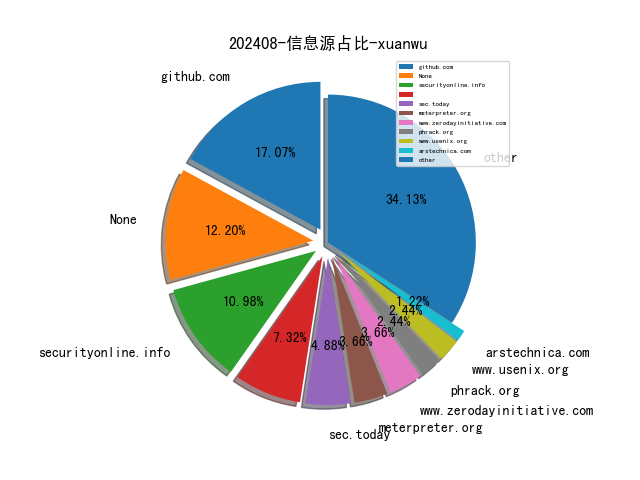

# [数据--所有](README_20.md)
# [数据--年度](README_2024.md)
# 202408 信息源与信息类型占比

# 政策 推荐
| title | url| 
| --- | ---| 
| 工业和信息化部主责国家重点研发计划重点专项管理实施细则 | https://www.miit.gov.cn/gyhxxhb/jgsj/gxjss/wjfb/art/2024/art_e13533ef46b84f00ac360d85e453bcf8.html| 

# 网络安全书籍 推荐
| date_added | language | title | author | link | size| 
| --- | --- | --- | --- | --- | ---| 
| 2024-08-26 08:55:29 | English | beginners guide to streamlit with python | unknown | https://it-ebooks.info/book/1686051862-beginners_guide_to_streamlit_with_python/ | unknown| 
| 2024-08-25 07:31:19 | English | -beginners guide to streamlit with python | unknown | https://it-ebooks.info/book/1686051862-beginners_guide_to_streamlit_with_python/ | unknown| 
| 2024-08-23 17:07:56 | English | Serious Cryptography, 2nd Edition: A Practical Introduction to Modern Encryption | Jean-Philippe Aumasson | http://libgen.rs/book/index.php?md5=764E7EE754A2EFCDD841A710B84B8C73 | 15 MB [RAR]| 
| 2024-08-23 16:14:16 | English | Python for Algorithmic Trading Cookbook | unknown | https://www.wowebook.org/python-for-algorithmic-trading-cookbook/ | unknown| 
| 2024-08-23 17:07:53 | English | Serious Cryptography, 2nd Edition: A Practical Introduction to Modern Encryption | Jean-Philippe Aumasson | http://libgen.rs/book/index.php?md5=98BAEE034C0A929A742DFDE69353A637 | 10 MB [EPUB]| 
| 2024-08-22 04:24:50 | English | Cloud Penetration Testing for Red Teamers: Learn how to effectively pentest AWS, Azure, and GCP applications | Kim Crawley | http://libgen.rs/book/index.php?md5=640C86A8583D91F9F3F8AA69D0AC774A | 9 MB [EPUB]| 
| 2024-08-22 04:24:46 | English | Cloud Penetration Testing for Red Teamers: Learn how to effectively pentest AWS, Azure, and GCP applications | Kim Crawley | http://libgen.rs/book/index.php?md5=501DBCAF367D42F658CB377C12CD051D | 11 MB [PDF]| 
| 2024-08-22 12:41:15 | English | Idiomatic Rust | unknown | https://www.wowebook.org/idiomatic-rust/ | unknown| 
| 2024-08-21 23:20:50 | English | Geek Silicon Valley: The Inside Guide to Palo Alto, Stanford, Menlo Park, Mountain View, Santa Clara, Sunnyvale, San Jose, San Francisco | Vance, Ashlee | http://libgen.rs/book/index.php?md5=5FA9FE225DD3F60A1CAF778FFEC41451 | 1 MB [AZW]| 
| 2024-08-21 09:57:35 | English | AI-Powered Developer: Build great software with ChatGPT and Copilot | Nathan B. Crocker | http://libgen.rs/book/index.php?md5=3626B904C0420794D5BF6EE7283CDBBC | 21 MB [PDF]| 
| 2024-08-20 18:03:45 | English | Rust Fundamentals for Data Science: An Introductory Guide For Data Science | Hayden Van Der Post, Johann Strauss, Alice Schwartz (editor) | http://libgen.rs/book/index.php?md5=E36C088817E807EEB29BC25B9B426E9E | 937 kB [PDF]| 
| 2024-08-20 10:50:52 | English | Ego Mechanisms of Defense: A Guide for Clinicians and Researchers | George E. Vaillant, | http://libgen.rs/book/index.php?md5=890F1DD4D16A368858876FC677CC88C4 | 16 MB [PDF]| 
| 2024-08-20 10:18:15 | English | Programming with Python for Engineers | Sinan Kalkan, Onur T. Şehitoğlu, Göktürk Üçoluk | http://libgen.rs/book/index.php?md5=BB99ECC521C66372031509D1C67FF38C | 19 MB [PDF]| 
| 2024-08-20 08:18:14 | English | Python Programming Interviews Exposed: Ace Your Python Coding Interviews With Confidence (100 Questions And Answers) | Jackson , Marley | http://libgen.rs/book/index.php?md5=7BDD59BC26511DA3849EC9A73881D763 | 1 MB [EPUB]| 
| 2024-08-20 20:27:39 | English | Voting Rights Act - Securing Ballot | Richard M. Valelly | http://libgen.rs/book/index.php?md5=59ABE7E3D964F66403EE6A17760294D9 | 9 MB [PDF]| 
| 2024-08-20 14:47:40 | English | CompTIA Cloud+ Certification Guide (Exam CV0-003): Everything you need to know to pass the CompTIA Cloud+ CV0-003 exam (English Edition) | Gopi Krishna Nuti | http://libgen.rs/book/index.php?md5=3232FB96EBC7E57582892C5AF38F476E | 4 MB [EPUB]| 
| 2024-08-20 13:44:51 | English | Learning Kali Linux: Security Testing, Penetration Testing & Ethical Hacking | Ric Messier | http://libgen.rs/book/index.php?md5=3CA14DC2251A2EEFB28C8C33584CB465 | 15 MB [EPUB]| 
| 2024-08-20 13:39:26 | English | Defensive Security Handbook: Best Practices for Securing Infrastructure | Amanda Berlin, Lee Brotherston, William Reyor III | http://libgen.rs/book/index.php?md5=5AD86BA72075B7B59D45654765123D44 | 8 MB [EPUB]| 
| 2024-08-19 08:24:17 | English | CompTIA Network+ Certification Guide (Exam N10-008): Unleash your full potential as a Network Administrator | unknown | http://libgen.rs/book/index.php?md5=DD72F60D313A1D00C07ED26213D90AFE | 57 MB [PDF]| 
| 2024-08-19 20:43:53 | English | Generative AI with Amazon Bedrock: Build, scale, and secure generative AI applications using Amazon Bedrock | Shikhar Kwatra, Bunny Kaushik | http://libgen.rs/book/index.php?md5=135D60E8E373A747BA1020367CF7A0BB | 29 MB [EPUB]| 
| 2024-08-19 20:10:46 | English | Generative AI with Amazon Bedrock: Build, scale, and secure generative AI applications using Amazon Bedrock | Shikhar Kwatra, Bunny Kaushik | http://libgen.rs/book/index.php?md5=429310088F3BE97ADB57C8658A411966 | 32 MB [RAR]| 
| 2024-08-17 06:04:03 | English | Zero Trust Networks: Building Secure Systems in Untrusted Networks | Razi Rais, Christina Morillo, Evan Gilman, Doug Barth | http://libgen.rs/book/index.php?md5=E4436AE06AA46BD46019E0B6ADB3150A | 9 MB [EPUB]| 
| 2024-08-17 05:41:16 | English | Advanced Excel 365: Including ChatGPT Tips | Ritu Arora | http://libgen.rs/book/index.php?md5=B9657CC0E65286C1B3D420C93CB88DC9 | 19 MB [RAR]| 
| 2024-08-17 10:10:31 | English | Python for Engineering and Scientific Computing | unknown | https://www.wowebook.org/python-for-engineering-and-scientific-computing/ | unknown| 
| 2024-08-17 09:44:16 | English | Scripting: Automation with Bash, PowerShell, and Python | unknown | https://www.wowebook.org/scripting-automation-with-bash-powershell-and-python/ | unknown| 
| 2024-08-14 07:02:55 | English | Learning Kali Linux, 2nd Edition | unknown | https://www.wowebook.org/learning-kali-linux-2nd-edition/ | unknown| 
| 2024-08-13 10:07:45 | English | Learn OpenAI Whisper | unknown | https://www.wowebook.org/learn-openai-whisper/ | unknown| 
| 2024-08-09 09:04:23 | English | Introduction to Python Network Automation Volume II | unknown | https://www.wowebook.org/introduction-to-python-network-automation-volume-ii/ | unknown| 
| 2024-08-09 06:51:38 | English | Introducing Microsoft Copilot for Managers | unknown | https://www.wowebook.org/introducing-microsoft-copilot-for-managers/ | unknown| 
| 2024-08-09 05:55:34 | English | Blockchain, IoT, and AI Technologies for Supply Chain Management | unknown | https://www.wowebook.org/blockchain-iot-and-ai-technologies-for-supply-chain-management/ | unknown| 
| 2024-08-07 10:34:15 | English | Return to Reason: A Critique of Enlightenment Evidentialism and a Defense of Reason and Belief in God | Kelly James Clark | http://libgen.rs/book/index.php?md5=E18784D6CC8AAB1A67A9793DDB19D6F8 | 678 kB [EPUB]| 
| 2024-08-07 07:09:20 | English | Empowering the Public Sector with Generative AI | unknown | https://www.wowebook.org/empowering-the-public-sector-with-generative-ai/ | unknown| 
| 2024-08-07 06:36:45 | English | Learning Microsoft Power Apps | unknown | https://www.wowebook.org/learning-microsoft-power-apps/ | unknown| 
| 2024-08-07 05:43:15 | English | Security Architecture for Hybrid Cloud | unknown | https://www.wowebook.org/security-architecture-for-hybrid-cloud/ | unknown| 
| 2024-08-07 17:50:57 | English | Innovations in Computer Vision and Data Classification: From Pandemic Data Analysis to Environmental and Health Monitoring (EAI/Springer Innovations in Communication and Computing) | Arfan Ghani | http://libgen.rs/book/index.php?md5=F05E2C5A51FAF773C4031475CD79A590 | 44 MB [RAR]| 
| 2024-08-07 17:50:55 | English | Innovations in Computer Vision and Data Classification: From Pandemic Data Analysis to Environmental and Health Monitoring (EAI/Springer Innovations in Communication and Computing) | Arfan Ghani | http://libgen.rs/book/index.php?md5=43F22D0FC2D9CCDD3598664E661AED6C | 26 MB [EPUB]| 
| 2024-08-07 17:50:52 | English | Innovations in Computer Vision and Data Classification: From Pandemic Data Analysis to Environmental and Health Monitoring (EAI/Springer Innovations in Communication and Computing) | Arfan Ghani | http://libgen.rs/book/index.php?md5=29BC875550BF16CDF8031411EA09FA05 | 16 MB [PDF]| 
| 2024-08-06 05:08:06 | English | Python for Information Professionals: How to Design Practical Applications to Capitalize on the Data Explosion | Brady Lund, Daniel Agbaji, Kossi Dodzi Bissadu, Haihua Chen | http://libgen.rs/book/index.php?md5=B29AA649D208FC684CD7A3CFAF723535 | 10 MB [RAR]| 
| 2024-08-06 05:08:04 | English | Python for Information Professionals: How to Design Practical Applications to Capitalize on the Data Explosion | Brady Lund, Daniel Agbaji, Kossi Dodzi Bissadu, Haihua Chen | http://libgen.rs/book/index.php?md5=B5D0A71C0E86C993F7CA27F9C7546ABB | 832 kB [EPUB]| 
| 2024-08-06 05:08:02 | English | Python for Information Professionals: How to Design Practical Applications to Capitalize on the Data Explosion | Brady Lund, Daniel Agbaji, Kossi Dodzi Bissadu, Haihua Chen | http://libgen.rs/book/index.php?md5=0790FA2CA1F6DB64B4B985DFB004FD74 | 7 MB [PDF]| 
| 2024-08-06 04:41:55 | English | Digital Identification: Privacy, Security, and Technology | Lottie Gould | http://libgen.rs/book/index.php?md5=6D5FFFCA4C6A2AD1896589E873412157 | 17 MB [RAR]| 
| 2024-08-06 04:41:43 | English | Digital Identification: Privacy, Security, and Technology | Lottie Gould | http://libgen.rs/book/index.php?md5=FBF5459FD4DCCDD5C9399ECF53C4B4F5 | 16 MB [PDF]| 
| 2024-08-06 04:33:16 | English | Exam Ref SC-100 Microsoft Cybersecurity Architect | Yuri Diogenes, Sarah Young, Mark Simos, Gladys Rodriguez | http://libgen.rs/book/index.php?md5=CFBDA81A5F146EBB0D88CF8978AFAB6A | 20 MB [RAR]| 
| 2024-08-06 04:33:13 | English | Exam Ref SC-100 Microsoft Cybersecurity Architect | Yuri Diogenes, Sarah Young, Mark Simos, Gladys Rodriguez | http://libgen.rs/book/index.php?md5=4F96235413DAF7FA10CCA17FBA32142D | 11 MB [EPUB]| 
| 2024-08-06 04:33:11 | English | Exam Ref SC-100 Microsoft Cybersecurity Architect | Yuri Diogenes, Sarah Young, Mark Simos, Gladys Rodriguez | http://libgen.rs/book/index.php?md5=404887E07F6D046F78BB37445185A7CC | 8 MB [PDF]| 
| 2024-08-06 04:12:27 | English | Quick Start Guide to Large Language Models: Strategies and Best Practices for Using ChatGPT and Other LLMs (Addison-Wesley Data & Analytics Series) | Sinan Ozdemir | http://libgen.rs/book/index.php?md5=21CCCD8BA26CBDDC693EE93B30ECB786 | 27 MB [EPUB]| 
| 2024-08-06 00:01:51 | English | CompTIA A+ Practice Questions Exam Cram Core 1 (220-1101) and Core 2 (220-1102) | Dave Prowse | http://libgen.rs/book/index.php?md5=1C279DAC69F60175423159EDEE7ED79F | 10 MB [RAR]| 
| 2024-08-06 00:01:49 | English | CompTIA A+ Practice Questions Exam Cram Core 1 (220-1101) and Core 2 (220-1102) | Dave Prowse | http://libgen.rs/book/index.php?md5=E5A97CF54FB617AB5084D59FE4135CDB | 1 MB [EPUB]| 
| 2024-08-06 00:01:47 | English | CompTIA A+ Practice Questions Exam Cram Core 1 (220-1101) and Core 2 (220-1102) | Dave Prowse | http://libgen.rs/book/index.php?md5=8FB5116CF781569C2A3F5D4DC29D5989 | 6 MB [PDF]| 
| 2024-08-05 04:42:21 | English | Applying Artificial Intelligence in Cybersecurity Analytics and Cyber Threat Detection | Shilpa Mahajan (editor), Mehak Khurana (editor), Vania Vieira Estrela (editor) | http://libgen.rs/book/index.php?md5=3557433B02C18657E5E2016DA702A5D0 | 23 MB [RAR]| 
| 2024-08-05 04:41:44 | English | Applying Artificial Intelligence in Cybersecurity Analytics and Cyber Threat Detection | Shilpa Mahajan (editor), Mehak Khurana (editor), Vania Vieira Estrela (editor) | http://libgen.rs/book/index.php?md5=390B1BC658BFA380B8DAADBA423D54A4 | 6 MB [PDF]| 
| 2024-08-05 04:22:33 | English | The Active Defender: Immersion in the Offensive Security Mindset (Tech Today) | Catherine J. Ullman | http://libgen.rs/book/index.php?md5=3F46653712E1083A1632A2F17C49AB8D | 13 MB [RAR]| 
| 2024-08-05 04:18:32 | English | Introduction to Python Network Automation Volume II: Stepping up: Beyond the Essentials for Success | Brendan Choi | http://libgen.rs/book/index.php?md5=1CB6C7B0F0A8FF8D69676C667B950E8C | 46 MB [RAR]| 
| 2024-08-05 04:10:12 | English | Introduction to Python Network Automation Volume II: Stepping up: Beyond the Essentials for Success | Brendan Choi | http://libgen.rs/book/index.php?md5=248FBB296140D35073A0BE83EC4D75AF | 23 MB [PDF]| 
| 2024-08-05 16:47:12 | English | Building AI Applications with Microsoft Semantic Kernel | unknown | https://www.wowebook.org/building-ai-applications-with-microsoft-semantic-kernel/ | unknown| 
| 2024-08-05 07:06:46 | English | Generative AI with Amazon Bedrock | unknown | https://www.wowebook.org/generative-ai-with-amazon-bedrock/ | unknown| 
| 2024-08-05 06:20:51 | English | The Complete Guide to Defense in Depth | unknown | https://www.wowebook.org/the-complete-guide-to-defense-in-depth/ | unknown| 
| 2024-08-05 23:53:13 | English | Quick Start Guide to Large Language Models: Strategies and Best Practices for Using ChatGPT and Other LLMs (Addison-Wesley Data & Analytics Series) | Sinan Ozdemir | http://libgen.rs/book/index.php?md5=3C7ACDA5696F843B577938141468BE6D | 51 MB [RAR]| 
| 2024-08-05 23:53:11 | English | Quick Start Guide to Large Language Models: Strategies and Best Practices for Using ChatGPT and Other LLMs (Addison-Wesley Data & Analytics Series) | Sinan Ozdemir | http://libgen.rs/book/index.php?md5=19635694BA6DB46198FB7E26CFC9FC53 | 27 MB [EPUB]| 
| 2024-08-05 23:53:10 | English | Quick Start Guide to Large Language Models: Strategies and Best Practices for Using ChatGPT and Other LLMs (Addison-Wesley Data & Analytics Series) | Sinan Ozdemir | http://libgen.rs/book/index.php?md5=366C04EBD17C164F1807A4EAF53950F0 | 21 MB [PDF]| 
| 2024-08-05 22:58:08 | English | FBI Handbook of Crime Scene Forensics: The Authoritative Guide to Navigating Crime Scenes | The Federal Bureau of Investigation | http://libgen.rs/book/index.php?md5=2E9007FFAC9FA261D907E7A3E6EE94F3 | 1 MB [EPUB]| 
| 2024-08-05 18:17:35 | English | Microsoft Power BI Cookbook, Third Edition | unknown | https://www.wowebook.org/microsoft-power-bi-cookbook-third-edition/ | unknown| 
| 2024-08-05 19:09:15 | English | Modern Python Cookbook, Third Edition | unknown | https://www.wowebook.org/modern-python-cookbook-third-edition/ | unknown| 
| 2024-08-05 18:51:13 | English | Python Machine Learning By Example, Fourth Edition | unknown | https://www.wowebook.org/python-machine-learning-by-example-fourth-edition/ | unknown| 
| 2024-08-04 00:42:40 | English | Empowering the Public Sector with Generative AI: From Strategy and Design to Real-World Applications | Sanjeev Pulapaka; Srinath Godavarthi; Sherry Ding | http://libgen.rs/book/index.php?md5=B9028A0818AB363EB8E4E1476A9904C4 | 8 MB [PDF]| 
| 2024-08-03 05:59:58 | English | Causal Inference and Discovery in Python: Unlock the secrets of modern causal machine learning with DoWhy, EconML, PyTorch and more | Aleksander Molak | http://libgen.rs/book/index.php?md5=475E9E1EB217D481E46109BED7382CA3 | 10 MB [PDF]| 
| 2024-08-03 22:58:05 | English | ChatGPT & Co.: A Workbook for Writing, Research, Creating Images, Programming, and More | Rainer Hattenhauer | http://libgen.rs/book/index.php?md5=3BFF0B21BC6A4DBF14CA5384EEDCD2BD | 18 MB [PDF]| 
| 2024-08-03 21:56:47 | English | Introduction to Python Network Automation Volume II : Stepping up: Beyond the Essentials for Success | Brendan Choi | http://libgen.rs/book/index.php?md5=04D327365FA9BFFF3B5EA356B9270D3D | 21 MB [EPUB]| 
| 2024-08-01 07:44:31 | English | (EXPERT INSIGHT) Modern Python Cookbook: 130+ updated recipes for modern Python 3.12 with new techniques and tools, 3rd Edition | Steven F. Lott | http://libgen.rs/book/index.php?md5=D731D90A898B09E8C5A998DE5A779991 | 13 MB [EPUB]| 
| 2024-08-01 07:27:53 | English | Write Powerful Rust Macros | Van Overmeire, Sam; | http://libgen.rs/book/index.php?md5=660722869C7184BF13AF142D6FBD598C | 9 MB [EPUB]| 
| 2024-08-01 07:25:34 | English | Business Analytics with R and Python (AI for Risks) | David L. Olson , Desheng Dash Wu , Cuicui Luo , Majid Nabavi | http://libgen.rs/book/index.php?md5=9A879BC0732EB36A842F9A0724482C26 | 5 MB [PDF]| 
| 2024-08-01 07:11:06 | English | Python Machine Learning By Example_Fourth Edition | Yuxi (Hayden) Liu | http://libgen.rs/book/index.php?md5=09EE97ED0847AD4F1B44B3E003544CE1 | 23 MB [EPUB]| 
| 2024-08-01 01:56:56 | English | (20th Anniversary Edition) Applied Cryptography: Protocols, Algorithms and Source Code in C | Bruce Schneier | http://libgen.rs/book/index.php?md5=7708506900EF60D1657BE5D342387917 | 22 MB [EPUB]| 
| 2024-08-01 11:29:24 | English | ChatGPT for Conversational AI and Chatbots | unknown | https://www.wowebook.org/chatgpt-for-conversational-ai-and-chatbots/ | unknown| 
| 2024-08-01 08:29:09 | English | Python Data Cleaning Cookbook, Second Edition | unknown | https://www.wowebook.org/python-data-cleaning-cookbook-second-edition/ | unknown| 

# 微信公众号 推荐
| nickname_english | weixin_no | title | url| 
| --- | --- | --- | ---| 
| 404安全 | None | HarmonyLib在渗透中的妙用 | https://mp.weixin.qq.com/s?__biz=MzU0NDk1NjAwOQ==&mid=2247483854&idx=1&sn=4dbe90984bbfc9c186e7af55bddd0460 | 1| 
| AI与安全 | None | 大模型发展到哪个阶段了？ | https://mp.weixin.qq.com/s?__biz=Mzg5NTMxMjQ4OA==&mid=2247484304&idx=1&sn=52f2078a020f197a11ca51df8a4a6efc | 2| 
| Beacon Tower Lab | None | 【0826】重保演习每日情报汇总 | https://mp.weixin.qq.com/s?__biz=MzkyNzcxNTczNA==&mid=2247486696&idx=1&sn=7a56aa340e34c6c7e6e8dbe2746e5860 | 5| 
| BigYoung安全 | None | 付费工具获取最新版方式优化 | https://mp.weixin.qq.com/s?__biz=MzI1NDYyNjUyMw==&mid=2247485736&idx=1&sn=eb67d07e02e05badfefb89f010bbcb53 | 1| 
| CAPPVD漏洞库 | None | 案例征集｜2024移动互联网APP产品安全漏洞治理优秀案例征集 | https://mp.weixin.qq.com/s?__biz=MzkyMjM4MzY5Ng==&mid=2247485760&idx=1&sn=74de45434d1aa20510b240ba872096a4 | 3| 
| CNCERT国家工程研究中心 | None | 黑客现形记！著名黑客USDoD真实身份确定！ | https://mp.weixin.qq.com/s?__biz=MzUzNDYxOTA1NA==&mid=2247546595&idx=3&sn=0e3ab49bf6d1379d75944ebd12dc1adc | 22| 
| CNVD漏洞平台 | None | 上周关注度较高的产品安全漏洞(20240819-20240825) | https://mp.weixin.qq.com/s?__biz=MzU3ODM2NTg2Mg==&mid=2247495211&idx=2&sn=5948b260aa941937650fdf718efb01a2 | 6| 
| Feng随心而安 | None | 杂项-EDUSRC邀请码白嫖 | https://mp.weixin.qq.com/s?__biz=MzkzMjIwNzM1Ng==&mid=2247484744&idx=1&sn=471d3fcf7ee3338a11b9efde0fb50552 | 1| 
| Flower Sec | None | Fake Location 1.3.5 BATE版破解分析 | https://mp.weixin.qq.com/s?__biz=MzkyOTY2Mjc4Mg==&mid=2247483918&idx=1&sn=c12e04b83ca3cd1b3de8459981afeebf | 2| 
| FreeBuf | None | 如何使用Kdrill检测Windows内核中潜在的rootkit | https://mp.weixin.qq.com/s?__biz=MjM5NjA0NjgyMA==&mid=2651300128&idx=4&sn=9762a3d1dd633f0633843556489c30a9 | 44| 
| FreeBuf安全咨询 | None | FreeBuf 全球网络安全产业投融资观察（7月） | https://mp.weixin.qq.com/s?__biz=Mzg2MTAwNzg1Ng==&mid=2247494785&idx=1&sn=9fb76edd4009af6f5cfdf4c7fc19ae1b | 2| 
| Glass的网安笔记 | None | 【红队靶机系列】-- DC-7 | https://mp.weixin.qq.com/s?__biz=Mzg4NjkxNTYwNA==&mid=2247484399&idx=1&sn=d10c4012658e1cf09e1df83764ec5faf | 2| 
| ISEC安全e站 | None | 网络安全大考，攻防演练驱动企业常态化安全运营升级！ | https://mp.weixin.qq.com/s?__biz=MzIxNzU5NzYzNQ==&mid=2247489202&idx=1&sn=f30c15642c2d3db905d276ff1b0a43ed | 2| 
| KK安全说 | None | 【CSA】：AI深度伪造的安全隐患 | https://mp.weixin.qq.com/s?__biz=Mzg4NzgyODEzNQ==&mid=2247487937&idx=1&sn=1b171d31c217884fc1619d8cfe4082df | 6| 
| NOVASEC | None | 配置afrog的RevSuit | https://mp.weixin.qq.com/s?__biz=MzUzODU3ODA0MA==&mid=2247489680&idx=1&sn=e813d5f3dc38e2b379c574b91a34a149 | 1| 
| Nu1L Team | None | SEKAI CTF 2024 WP By Nu1L Team | https://mp.weixin.qq.com/s?__biz=MzU4MTg1NzAzMA==&mid=2247490391&idx=1&sn=ea058adae9e72ee2799182aabe386cb5 | 3| 
| SSP安全研究 | None | edusrc邀请码200个，请查收～ | https://mp.weixin.qq.com/s?__biz=Mzg5MzMzNTUzMA==&mid=2247485262&idx=1&sn=e70eaaac5677fb2d5ced566423aa08df | 3| 
| Sec探索者 | None | 【漏洞复现】契约锁电子签章平台 /param/edits 远程代码执行漏洞(XVE-2024-18394) | https://mp.weixin.qq.com/s?__biz=MzkyNDYwNTcyNA==&mid=2247486965&idx=1&sn=05331253867f4ea40e60efa1ac1b2e03 | 8| 
| TimeAxis Sec | None | 【edu刷分】智慧校园(安校易)管理系统任意文件上传 | https://mp.weixin.qq.com/s?__biz=MzIxNzY1MTc1OA==&mid=2247484374&idx=1&sn=59136b6df00bc9029bbe21b3ce1a130b | 2| 
| Timeline Sec | None | 庆知识大陆两周年，SRC帮会特惠来袭～ | https://mp.weixin.qq.com/s?__biz=MzA4NzUwMzc3NQ==&mid=2247495461&idx=1&sn=43450c8e622bab5abe354e170c9eba47 | 1| 
| WIN哥学安全 | None | 【工具更新】HCL AppScan Standard v10.6.0破解版 | https://mp.weixin.qq.com/s?__biz=MzkwODM3NjIxOQ==&mid=2247501777&idx=2&sn=580186842c1770662d79a338f3a82c36 | 4| 
| XCTF联赛 | None | SekaiCTF 2024 圆满落幕，Nu1L战队夺冠！ | https://mp.weixin.qq.com/s?__biz=MjM5NDU3MjExNw==&mid=2247515369&idx=1&sn=90d467c239c5bdee2407031f80a7c98b | 4| 
| YY的黑板报 | None | 开发运维一体化能力成熟度模型（一） | https://mp.weixin.qq.com/s?__biz=Mzg5NzY5NjM5Mg==&mid=2247484868&idx=1&sn=bc149d265403d41e8e94204d123d7eff | 1| 
| Z2O安全攻防 | None | 【文末赠书】移动安全如何从0到1学习 | https://mp.weixin.qq.com/s?__biz=Mzg2ODYxMzY3OQ==&mid=2247514624&idx=1&sn=c92be17ce8276ecf7a13503a967dcea7 | 9| 
| flowers-boy | None | 等保-Linux | https://mp.weixin.qq.com/s?__biz=MzkxMzY5NDUyMQ==&mid=2247484566&idx=1&sn=007776f145b378efe165527e0b355358 | 2| 
| fullbug | None | vue3+vite+axios+mock从接口获取模拟数据实战 | https://mp.weixin.qq.com/s?__biz=MjM5NDMwMjEwMg==&mid=2451851827&idx=1&sn=f989b6c6d020a686b7aba74f5978e7d8 | 2| 
| goddemon的小屋 | None | 巧用action方式进行权限绕过 | https://mp.weixin.qq.com/s?__biz=MzI2NTc1ODY0Mw==&mid=2247486030&idx=1&sn=e54ce5a0b7861032572bbac16b07ccf5 | 3| 
| kali笔记 | None | Navicat Premium 17 激活与卸载 | https://mp.weixin.qq.com/s?__biz=MzkxMzIwNTY1OA==&mid=2247507522&idx=1&sn=dd47ec5f5a84d13e4a84bdee710eeb94 | 9| 
| nday POC | None | 【漏洞复现】智慧校园(某校易)管理系统 FileUpAd.aspx 任意文件上传漏洞 | https://mp.weixin.qq.com/s?__biz=MzkzMTcwMTg1Mg==&mid=2247486389&idx=1&sn=fd96450f237dcadbf4a40028de9c2e31 | 7| 
| night安全 | None | 【HVV情报】2024-08-26 | https://mp.weixin.qq.com/s?__biz=MzU5MTc1NTE0Ng==&mid=2247485982&idx=1&sn=542c28f6d368468a66f69f9862e75475 | 3| 
| 丁爸 情报分析师的工具箱 | None | 【资料】联合国毒品办公室暗网调查工具和程序 | https://mp.weixin.qq.com/s?__biz=MzI2MTE0NTE3Mw==&mid=2651145875&idx=2&sn=42652534dd46ef96eaa036d98d52ffe3 | 18| 
| 万径安全 | None | 万径安全Yaklang项目入选信息通信年度十大科技进展！ | https://mp.weixin.qq.com/s?__biz=MzIwMzI1MDg2Mg==&mid=2649944736&idx=1&sn=ded070af9bb3facd7fdf285c072d73ef | 1| 
| 与智慧做朋友 | None | 安全数据加工厂，一个开启数据工作和打消数据工作疑虑的基础工具 | https://mp.weixin.qq.com/s?__biz=MzA3OTg3Mjg3NA==&mid=2456976380&idx=1&sn=728683e0105f2c8f00c5ffb8ea4454a8 | 3| 
| 中国信息安全 | None | 国际 , 澳成立新网络司令部 | https://mp.weixin.qq.com/s?__biz=MzA5MzE5MDAzOA==&mid=2664223279&idx=7&sn=3e28e6aef31c7c59bd2b52f8b2ef7d31 | 35| 
| 中国电信安全 | None | 每周更新：安全锦囊第十四期 | https://mp.weixin.qq.com/s?__biz=MzkxNDY0MjMxNQ==&mid=2247529042&idx=2&sn=24961b5595603c3ff9ab4e6c5281a512 | 5| 
| 中国网络空间安全协会 | None | 喜报,网安协会党支部荣获2024年中央和国家机关“四强”党支部荣誉称号 | https://mp.weixin.qq.com/s?__biz=MzA3ODE0NDA4MA==&mid=2649400018&idx=1&sn=17d96ddf60c9a016b94dee5e1d83e25e | 3| 
| 中孚信息 | None | 以构建横向覆盖应用，纵向叠加安全的数据流动安全底座，助力数据要素价值释放 | https://mp.weixin.qq.com/s?__biz=MzAxMjE1MDY0NA==&mid=2247508373&idx=1&sn=386f4baa058995c21448f4d04870db41 | 3| 
| 二进制磨剑 | None | IDA 技巧(45) 反编译器生成的数据类型 | https://mp.weixin.qq.com/s?__biz=MzI1Mjk2MTM1OQ==&mid=2247484595&idx=1&sn=caff02f32f2570ed0e443c48e908c0d2 | 6| 
| 二进制空间安全 | None | 几套常用场景下的命令清单 | https://mp.weixin.qq.com/s?__biz=MzkxOTUyOTc0NQ==&mid=2247491369&idx=1&sn=b56ffa3f4c3e3d7de276850120546edf | 5| 
| 亚信安全 | None | 亚信安全发布《2024年第二季度网络安全威胁报告》 | https://mp.weixin.qq.com/s?__biz=MjM5NjY2MTIzMw==&mid=2650618499&idx=1&sn=6caa75cb15b44bfb3b17f1cefba2aaae | 9| 
| 亿人安全 | None | 实战 , 对自己学校内网的渗透测试 | https://mp.weixin.qq.com/s?__biz=Mzk0MTIzNTgzMQ==&mid=2247516956&idx=1&sn=18e3a6589a0e304d0b0bb6c8fb61939f | 8| 
| 代码卫士 | None | Telegram 创始人 Pavel Durov 因缺乏内容审核被捕 | https://mp.weixin.qq.com/s?__biz=MzI2NTg4OTc5Nw==&mid=2247520597&idx=2&sn=770e8cc62ae6c306013787851b80f66e | 8| 
| 俊杰说黑客 | None | 电报Telegram创始人帕维尔杜罗夫爆狱真相！网络犯罪指控幕后有何隐情？ | https://mp.weixin.qq.com/s?__biz=Mzg5Mzg2MTc0OQ==&mid=2247485002&idx=1&sn=d075407bd1cc749e450b4f0c116e5b57 | 6| 
| 信安404 | None | 关于电脑端抓包小程序的3种方法 | https://mp.weixin.qq.com/s?__biz=Mzk0NjQ5MTM1MA==&mid=2247491895&idx=2&sn=e194817ebd69d891aba738b28ab04084 | 5| 
| 信息安全D1net | None | 与信任问题共存：零信任架构的人性化一面 | https://mp.weixin.qq.com/s?__biz=MzA3NTIyNzgwNA==&mid=2650259035&idx=1&sn=6b6b01b0a9ef8bd3e4060c4128bea38a | 4| 
| 信息安全与通信保密杂志社 | None | 天融信携手山东大学成立网络空间安全实战人才实践基地，李雪莹博士受聘为山东大学兼职特聘教授！ | https://mp.weixin.qq.com/s?__biz=MzkwMTMyMDQ3Mw==&mid=2247592580&idx=2&sn=27da5ba89a967b44e1220f7e0e380b46 | 15| 
| 信息安全大事件 | None | 新的 Android 恶意软件 NGate 窃取 NFC 数据以克隆非接触式支付卡 | https://mp.weixin.qq.com/s?__biz=MzkzNjIzMjM5Ng==&mid=2247489671&idx=1&sn=0275ea25ca6541607e53e7ee538c46f2 | 6| 
| 信息安全最新论文技术交流 | None | 中国人工智能学会推荐国际学术会议、国际/国内期刊目录 | https://mp.weixin.qq.com/s?__biz=MzI2NDg5NjY0OA==&mid=2247491372&idx=1&sn=b3b66e953c1b9fb94a22dc049527f71a | 3| 
| 信息安全研究 | None | 【业界动态】网安市场周度监测（2024-08-26） | https://mp.weixin.qq.com/s?__biz=MzA3NzgzNDM0OQ==&mid=2664989346&idx=4&sn=e4bdc109e82a0e24a001c0b107eea22e | 19| 
| 信睿网络 | None | 花式固件提取之韩国KT固件 | https://mp.weixin.qq.com/s?__biz=Mzg4MDA2NjExMA==&mid=2247489945&idx=2&sn=0d8ced9fb76a26d73fe84f96b17472e9 | 2| 
| 全球技术地图 | None | DARPA选定五家机构作为区域商业加速器，促进资助技术快速商业化 | https://mp.weixin.qq.com/s?__biz=MzI1OTExNDY1NQ==&mid=2651615141&idx=2&sn=bc00dfaa47bbe11b952de5d35070a1da | 10| 
| 内生安全联盟 | None | “蓝屏事件”阴魂不散，微软安全更新导致Linux系统无法启动 | https://mp.weixin.qq.com/s?__biz=Mzg4MDU0NTQ4Mw==&mid=2247522754&idx=2&sn=c9a877f7ee2a1c05135a0fd3b4d190c3 | 24| 
| 冷漠安全 | None | 「漏洞复现」安美数字酒店宽带运营系统 weather.php 任意文件读取漏洞 | https://mp.weixin.qq.com/s?__biz=MzkyNDY3MTY3MA==&mid=2247485265&idx=1&sn=ff32978c8d2e42571a01a3f37b76bb8a | 13| 
| 北极星安全实验室 | None | 【hw】2024护网漏洞情报-第二十二弹 | https://mp.weixin.qq.com/s?__biz=Mzg5MDg0MzYxMg==&mid=2247487508&idx=1&sn=83d96ea4412c5c136a4905fec2b3b9dd | 14| 
| 卡巴斯基网络安全大百科 | None | 如何安全旅行 | https://mp.weixin.qq.com/s?__biz=MzAxNjg3MjczOA==&mid=2247485809&idx=1&sn=7d58e6a913e11d29cd433321121d152b | 3| 
| 吉祥在职场 | None | 记者韩福涛：如果哪天一不小心卧底到你身边，希望给予理解！国家表态：问题罐车“零容忍”！ | https://mp.weixin.qq.com/s?__biz=MzI1ODY3MTA3Nw==&mid=2247486182&idx=1&sn=aeda47ec3592b4b91c3ba4de0e990b59 | 8| 
| 吉祥学安全 | None | 金融行业网安的发展 | https://mp.weixin.qq.com/s?__biz=MzkwNjY1Mzc0Nw==&mid=2247485619&idx=1&sn=19e12a51b4e5bceed27b6dd5a5a123d9 | 9| 
| 吉祥快学网络安全吧 | None | 白票党们：不可不知的开源安全产品系列 | https://mp.weixin.qq.com/s?__biz=MzkzMzcxNTQyNw==&mid=2247484597&idx=1&sn=b730128dd146dd57a6529f4f73b7df6f | 16| 
| 启明星辰安全简讯 | None | 安全简讯（2024.08.26） | https://mp.weixin.qq.com/s?__biz=MzkzNzY5OTg2Ng==&mid=2247499857&idx=1&sn=4446207803ef4d51749d600fde4b46a1 | 6| 
| 启明星辰集团 | None | 智领视界 安全并驱 , 启明星辰亮相第三十一届北京国际广播电影电视展览会 | https://mp.weixin.qq.com/s?__biz=MzA3NDQ0MzkzMA==&mid=2651727226&idx=2&sn=93ba8d8a365fc694620a42c3f5f4591e | 6| 
| 哈拉少安全小队 | None | 关于一些常见的JSP_Webshell免杀小tips | https://mp.weixin.qq.com/s?__biz=MzAxNzkyOTgxMw==&mid=2247493031&idx=1&sn=5eaaa8ad725a4d1c2f2cf5cbc8da4ee5 | 8| 
| 商密君 | None | 澳大利亚成立新网络司令部 | https://mp.weixin.qq.com/s?__biz=MzI5NTM4OTQ5Mg==&mid=2247629763&idx=5&sn=a3e7651e03fc22f44e30d4f69fb7f7fb | 41| 
| 嘉诚安全 | None | 【漏洞通告】WordPress LiteSpeed Cache权限提升漏洞安全风险通告 | https://mp.weixin.qq.com/s?__biz=MzU4NjY4MDAyNQ==&mid=2247496102&idx=1&sn=7d05154bae7a66e03ace0e0cce552bd7 | 5| 
| 嘶吼专业版 | None | 北京市国家网络安全宣传周网络安全作品征集活动开始 石油巨头Halliburton遭受网络攻击导致系统关闭 | https://mp.weixin.qq.com/s?__biz=MzI0MDY1MDU4MQ==&mid=2247577675&idx=2&sn=9de7e71a41fdc2d6062df3a220197b6f | 12| 
| 国信安全 | None | 周民同志出席2024“数盾”生态大会并致辞 | https://mp.weixin.qq.com/s?__biz=MzU5MzYzMzU5NA==&mid=2247489134&idx=1&sn=c1c56d1eaa25e6f27d0e6e3ec211c86a | 1| 
| 天融信教育 | None | 邀请申报天融信教育2024年产学合作协同育人项目 | https://mp.weixin.qq.com/s?__biz=MzU0MjEwNTM5Ng==&mid=2247519349&idx=1&sn=723fc36bcc7bb8e94f4fd77c5ab29036 | 5| 
| 奇安信 CERT | None | 安全热点周报：本周新增两个在野利用漏洞，其中 Jenkins 被用于勒索软件活动 | https://mp.weixin.qq.com/s?__biz=MzU5NDgxODU1MQ==&mid=2247501958&idx=1&sn=699c44f8f8bd7c4117f7087e0679f1cc | 4| 
| 奇安信集团 | None | 金融巨头因勒索攻击损失近2亿元，超1600万用户数据泄露 | https://mp.weixin.qq.com/s?__biz=MzU0NDk0NTAwMw==&mid=2247616672&idx=2&sn=6df4fe93b5ffbc419744656a33e3ccbd | 13| 
| 字节跳动技术团队 | None | 魔方最新黑科技！全球首个语音指挥 FPS AI 队友 F.A.C.U.L. 亮相科隆｜AGI 掘金资讯 | https://mp.weixin.qq.com/s?__biz=MzI1MzYzMjE0MQ==&mid=2247509235&idx=2&sn=f3df5cadca0f38e0fb548776c8a983d2 | 15| 
| 安世加 | None | 国家标准《汽车软件升级通用技术要求》 于2026年实施 | https://mp.weixin.qq.com/s?__biz=MzU2MTQwMzMxNA==&mid=2247539478&idx=1&sn=59bc3ac62e99ef2d3e699a6bfe4ffd74 | 6| 
| 安信安全 | None | 端点安全市场要变天？CrowdStrike抱怨友商落井下石 | https://mp.weixin.qq.com/s?__biz=MzAxNTYwOTU1Mw==&mid=2650091558&idx=1&sn=e7916e1a4bf4efe541eecbe99a1229fc | 6| 
| 安全之眼SecEye | None | 一款针对加解密综合利用后渗透工具 | https://mp.weixin.qq.com/s?__biz=MzkzOTY1MzcyOQ==&mid=2247489259&idx=1&sn=f649ad79398a2bd3527d7655ef1df12b | 4| 
| 安全内参 | None | 澳大利亚成立新网络司令部 | https://mp.weixin.qq.com/s?__biz=MzI4NDY2MDMwMw==&mid=2247512470&idx=2&sn=c74261a19b8c6d1465d391df6e1e6c75 | 9| 
| 安全君呀 | None | CTF分享 , 命令执行-2 | https://mp.weixin.qq.com/s?__biz=MzkyOTUxMzk2NQ==&mid=2247484926&idx=1&sn=440fae09aae16c0f1f797811bd018add | 9| 
| 安全新说 | None | 软件供应链安全实践 | https://mp.weixin.qq.com/s?__biz=MzA3NDIwNTY5Mw==&mid=2247505626&idx=1&sn=5f31d73e915f29fea5873dda83e6dcf5 | 2| 
| 安全牛 | None | COBIT框架下的AI安全治理与优化 | https://mp.weixin.qq.com/s?__biz=MjM5Njc3NjM4MA==&mid=2651131716&idx=2&sn=b526a1077c6125278f3f2740416e9ba1 | 16| 
| 安全牛课堂 | None | 备考必看！CISSP最近考试时间更新！ | https://mp.weixin.qq.com/s?__biz=MzIxNTM4NDY2MQ==&mid=2247512322&idx=1&sn=df8cab0ab4e0e6cf172f477b9e0e7a64 | 7| 
| 安全狗的自我修养 | None | 新课-linux恶意软件开发对抗与进程安全管理视频教程(2024最新)更新到12节啦 | https://mp.weixin.qq.com/s?__biz=MzkwOTE5MDY5NA==&mid=2247499268&idx=1&sn=0061f5603f5d1a9d5fbee5fce52526a0 | 9| 
| 安全研究GoSSIP | None | RISC-V is Inevitable —— RISC-V 中国峰会 2024 参会小记 | https://mp.weixin.qq.com/s?__biz=Mzg5ODUxMzg0Ng==&mid=2247498761&idx=1&sn=7b9f942ea3651ffa7f7ee01cdd9ffd6a | 6| 
| 安迈信科应急响应中心 | None | 【漏洞通告】RG-UAC 6000-E50存在命令执行漏洞 | https://mp.weixin.qq.com/s?__biz=Mzg2NjczMzc1NA==&mid=2247486245&idx=5&sn=6dd82274fa6a5e039aaa5043ed1b8e28 | 9| 
| 小呆安全 | None | 掌控安全CTF挑战赛WP | https://mp.weixin.qq.com/s?__biz=MzkzNTUwNzIxNA==&mid=2247484439&idx=1&sn=e48a22ba3189930ca84a87bca255e2b3 | 1| 
| 山石网科安全技术研究院 | None | 山石网科安研院第一季度原创技术文章合辑 | https://mp.weixin.qq.com/s?__biz=MzUzMDUxNTE1Mw==&mid=2247507703&idx=1&sn=0a654a5878c2a40cba03bb609b47d477 | 4| 
| 工业安全产业联盟平台 | None | 通知丨中央网信办等十部门联合印发《数字化绿色化协同转型发展实施指南》，附下载 | https://mp.weixin.qq.com/s?__biz=MzI2MDk2NDA0OA==&mid=2247528930&idx=1&sn=bd553c9cf8c491a6292c07d4e1ec63b5 | 9| 
| 情报分析师 | None | 【分析报告】库尔斯克之后的北约行动能力 | https://mp.weixin.qq.com/s?__biz=MzA3Mjc1MTkwOA==&mid=2650554482&idx=2&sn=e01f1edf376ee39127c4f77e3566911d | 18| 
| 扫地僧的茶饭日常 | None | [工具篇] BurpSuite插件-HopLa推荐 | https://mp.weixin.qq.com/s?__biz=Mzg5NTUyNTI5OA==&mid=2247485794&idx=1&sn=9e1fef3a996419dad96461a375bca662 | 11| 
| 技可达工作室 | None | 加密货币量化分析学习记录一 | https://mp.weixin.qq.com/s?__biz=MzU3NDY1NTYyOQ==&mid=2247485999&idx=1&sn=03cd79c311dc65f26b7bb7ccf1df70c5 | 1| 
| 掌控安全EDU | None | Edusrc , 记一次某职院漏洞挖掘 | https://mp.weixin.qq.com/s?__biz=MzUyODkwNDIyMg==&mid=2247542927&idx=1&sn=c1cd709bc4e940986f94f008394c1ce6 | 38| 
| 攻城狮成长日记 | None | iPerf3 教程：轻松评估网络性能的终极工具 | https://mp.weixin.qq.com/s?__biz=MjM5OTc5MjM4Nw==&mid=2457381620&idx=1&sn=768f04a519394660bf7934bffbc51825 | 12| 
| 数世咨询 | None | KCon 2024大会：同道携手并进 技术引领行业变革 | https://mp.weixin.qq.com/s?__biz=MzkxNzA3MTgyNg==&mid=2247514908&idx=2&sn=aae3a4bf8ebeadff8b55bc1280754366 | 11| 
| 新氧安全应急响应中心 | None | 图算法在新氧风控业务中的实践 | https://mp.weixin.qq.com/s?__biz=MzkxMDU0NjY4MQ==&mid=2247484867&idx=1&sn=2e3483b13a14acb3b24f96fff814ed97 | 1| 
| 星悦安全 | None | [福利]EduSRC邀请码直接领，手快有 | https://mp.weixin.qq.com/s?__biz=Mzg4MTkwMTI5Mw==&mid=2247485371&idx=1&sn=4e893325cef23ba5e192f00673161866 | 10| 
| 深圳市网络与信息安全行业协会 | None | 甲方信息安全建设和优化案例 | https://mp.weixin.qq.com/s?__biz=MzU0Mzk0NDQyOA==&mid=2247518834&idx=1&sn=72ed8027660806e8e83ec052beb349e3 | 5| 
| 渗透测试安全攻防 | None | WIN32实现远程桌面监控 | https://mp.weixin.qq.com/s?__biz=MzkyNTUyNDMyOA==&mid=2247487331&idx=1&sn=0d1191fa6bcc9040f6d70aabaf6a7866 | 2| 
| 湖南金盾评估中心 | None | 湖南金盾参加2024年湖南省工业和信息化领域网络和数据安全分类分级管理工作推进会 | https://mp.weixin.qq.com/s?__biz=MzIyNTI0ODcwMw==&mid=2662128852&idx=1&sn=0c030bb87303ef4089f34bc88bb90df6 | 4| 
| 漏洞文库 | None | 【漏洞复现】全程云OA接口UploadFile存在任意文件上传漏洞 | https://mp.weixin.qq.com/s?__biz=MzkwNTE4Mzc2Mg==&mid=2247486382&idx=1&sn=f0a48cafb5e37f58c087772c95ee113b | 3| 
| 爱喝酒烫头的曹操 | None | 【免杀】基于fscan过360、火绒、Defender、卡巴斯基的xlscan正式发布！ | https://mp.weixin.qq.com/s?__biz=MzkwOTIzODg0MA==&mid=2247491156&idx=1&sn=e4d3b1fb229409cc4cdfd8534b99b06f | 3| 
| 犀利猪安全 | None | 福利来袭 , EduSRC注册邀请码免费送，速抢，手慢无 | https://mp.weixin.qq.com/s?__biz=Mzk0NzQxNzY2OQ==&mid=2247486756&idx=1&sn=e6fe781660b5e0c6eca34614e819bb67 | 3| 
| 犀牛安全 | None | 美国石油巨头哈里伯顿遭受到网络攻击，导致业务系统关闭 | https://mp.weixin.qq.com/s?__biz=Mzg3ODY0NTczMA==&mid=2247490960&idx=1&sn=840739b12bd6e0e6e2fafcdad457840a | 6| 
| 生有可恋 | None | 完整版的Oracle数据库客户端在哪儿下载 | https://mp.weixin.qq.com/s?__biz=Mzk0MTI4NTIzNQ==&mid=2247491683&idx=1&sn=de1d2afecd7fbff0005591a2b874f356 | 1| 
| 白帽子左一 | None | 安全盲点：如何从Docker Registry到RCE | https://mp.weixin.qq.com/s?__biz=MzI4NTcxMjQ1MA==&mid=2247612511&idx=1&sn=4cd24492bfe499d9dd299f07b07225e2 | 31| 
| 看雪学苑 | None | 看雪安卓1w班更新：检测抓包的初级对抗 | https://mp.weixin.qq.com/s?__biz=MjM5NTc2MDYxMw==&mid=2458569599&idx=3&sn=50c9af7309d16d4a333274fb96fb306c | 26| 
| 秦安战略 | None | 秦安：庄严的政治承诺！老百姓交了钱就应该拿到房，要重视这几点 | https://mp.weixin.qq.com/s?__biz=MzA5MDg1MDUyMA==&mid=2650472837&idx=2&sn=730b518982e981b213faf164b7abfa0a | 35| 
| 稻草人安全团队 | None | 帆软报表反序列化黑名单绕过分析 | https://mp.weixin.qq.com/s?__biz=Mzg2MzU2NDMzMA==&mid=2247487140&idx=1&sn=f7f2e45dc3e8f2aa6f9481c2e54c083c | 1| 
| 篝火信安 | None | 2024HVV日记 , 各位天命人，明年你还来护X吗？ | https://mp.weixin.qq.com/s?__biz=MzIyNzc3OTMzNw==&mid=2247485421&idx=1&sn=55ee76899e89c90ffe4b1507e28be9f9 | 3| 
| 紫队安全研究 | None | HVV技战法 , ChatGPT 双刃剑下的攻防新战法 | https://mp.weixin.qq.com/s?__biz=Mzg3OTYxODQxNg==&mid=2247484863&idx=1&sn=9fa38ab2811c7330c54562e62ec4f9a2 | 11| 
| 红云谈安全 | None | regreSSHion：发现 OpenSSH 中的 CVE-2024-6387 - 一个严重漏洞 | https://mp.weixin.qq.com/s?__biz=MzI0MTUwMjQ5Nw==&mid=2247487794&idx=1&sn=c4bd65be7fe2cc91075dcb12ea79c586 | 4| 
| 红蓝攻防研究实验室 | None | 进程注入——ThreadlessInject无线程注入 | https://mp.weixin.qq.com/s?__biz=Mzg4NzkwMDA5NQ==&mid=2247484640&idx=1&sn=6bb64e4c7485fab80e6306917858a784 | 2| 
| 绿盟科技 | None | 命运难挡？魔力防火墙说“走着瞧” | https://mp.weixin.qq.com/s?__biz=MjM5ODYyMTM4MA==&mid=2650456742&idx=1&sn=bfa6223ca435293544a7ed6d4dba48ba | 9| 
| 绿盟科技威胁情报 | None | 开源前哨 · 热点情报速览（2024.08.19-2024.08.25） | https://mp.weixin.qq.com/s?__biz=Mzg2Nzg0NDkwMw==&mid=2247492704&idx=1&sn=4f628eb01d76d05484134d3336c3d744 | 3| 
| 编程技术栈 | None | 2024全网最全网络安全（自学）学习路线！整理了一个月！ | https://mp.weixin.qq.com/s?__biz=MzkxNDU0MTUyNw==&mid=2247490199&idx=1&sn=eb80e0a919fc54206c38129740784050 | 1| 
| 网安探索员 | None | 内网渗透横向移动技巧 | https://mp.weixin.qq.com/s?__biz=MzkzNTYwMTk4Mw==&mid=2247486898&idx=1&sn=90b41689b348814c4bf774d16f3a5478 | 2| 
| 网络与信息法学会 | None | 【资讯】北京市经信局发布《关于组织开展2024年物联网赋能行业发展典型案例征集工作的通知》 | https://mp.weixin.qq.com/s?__biz=MzU1NDY3NDgwMQ==&mid=2247544824&idx=3&sn=67626096fa6b32061fa957c95380abca | 34| 
| 网络安全和信息化 | None | 中央网信办等十部门秘书局（办公厅、综合司）联合印发《数字化绿色化协同转型发展实施指南》 | https://mp.weixin.qq.com/s?__biz=MjM5MzMwMDU5NQ==&mid=2649166153&idx=2&sn=074c2b0d8cede6f65a4bfd165a8f52b0 | 8| 
| 网络安全等保与关保 | None | 数据安全检查测评报告参考模板 | https://mp.weixin.qq.com/s?__biz=MzUyNjk2MDU4MQ==&mid=2247486272&idx=1&sn=1baa2b561ea84115167fbb0a00ab31b2 | 2| 
| 网络技术干货圈 | None | 华为设备端口检查怎么搞？记住这5个命令，让你轻松早下班！ | https://mp.weixin.qq.com/s?__biz=MzUyNTExOTY1Nw==&mid=2247526296&idx=1&sn=3e0972fa7a274c0229d9eeb85639504e | 11| 
| 网络技术联盟站 | None | 冷知识：如何将多播 IP 地址转换为多播 MAC 地址？ | https://mp.weixin.qq.com/s?__biz=MzIyMzIwNzAxMQ==&mid=2649460770&idx=1&sn=5056d034908b04b99c5c44eff024f3a4 | 11| 
| 美亚柏科 | None | AI 赋能•支撑实战——人工智能技术在新型涉网犯罪取证中的应用 | https://mp.weixin.qq.com/s?__biz=MjM5NTU4NjgzMg==&mid=2651419235&idx=3&sn=4739be2b82d342a7d532c06b4f5cc2a8 | 8| 
| 脚本小子 | None | 用友U8Cloud系统MeasureQResultAction接口处存在SQL注入漏洞【漏洞复现,附nuclei-POC】 | https://mp.weixin.qq.com/s?__biz=MzkyOTcwOTMwMQ==&mid=2247484238&idx=1&sn=c5b4cf972a79775f3dfb5c4515257aeb | 3| 
| 菜狗安全 | None | 记一次Spring boot框架代审与思考 | https://mp.weixin.qq.com/s?__biz=Mzg4MzkwNzI1OQ==&mid=2247484966&idx=1&sn=8a2a87a9fef37facc7dc65791d62c40b | 5| 
| 虎符智库 | None | 一体化vs.模块化，谁才是SOC的未来？ | https://mp.weixin.qq.com/s?__biz=MzIwNjYwMTMyNQ==&mid=2247492012&idx=1&sn=ffc548200dab26b314736aa5f08e3df1 | 2| 
| 蚂蚁安全响应中心 | None | 码上报名丨以AI守护AI ，大模型时代的攻守之道 | https://mp.weixin.qq.com/s?__biz=MzI3NDEzNzIxMg==&mid=2650490910&idx=1&sn=38595697092eb82f2f2e2d611e306e29 | 1| 
| 补天平台 | None | 与补天众测一起共创团圆时刻！ | https://mp.weixin.qq.com/s?__biz=MzI2NzY5MDI3NQ==&mid=2247504709&idx=1&sn=a7763f4e71c82a6348aade652fab0693 | 2| 
| 诚殷网络 | None | 【第二波】割韭菜开始，学习群招人，提供指导 | https://mp.weixin.qq.com/s?__biz=MzU3MzE2ODAyNA==&mid=2247484848&idx=1&sn=c1523d5de1c389ab281e96b432557bae | 1| 
| 谈思实验室 | None | 全员降薪、董事长工资打五折！ | https://mp.weixin.qq.com/s?__biz=MzIzOTc2OTAxMg==&mid=2247542306&idx=4&sn=1b6726bf63bfc3ee567e84c7e41e80ee | 21| 
| 谢公子学安全 | None | 安全圈跳槽招人 | https://mp.weixin.qq.com/s?__biz=MzI2NDQyNzg1OA==&mid=2247493654&idx=1&sn=9c3a80e3f749e1478026e1b327c48e57 | 1| 
| 赛博研究院 | None | 美国法院将重新审理谷歌Chrome隐私案 | https://mp.weixin.qq.com/s?__biz=MzUzODYyMDIzNw==&mid=2247510371&idx=1&sn=f7d08ab07d8caa72b699d95cf7952609 | 4| 
| 迪哥讲事 | None | 渗透测试爆破小技巧tips | https://mp.weixin.qq.com/s?__biz=MzIzMTIzNTM0MA==&mid=2247495592&idx=1&sn=431ee5088410255df7a952ae3650c9ad | 9| 
| 金盾信安 | None | 金盾信安 , 网络和数据领域资讯第25期（2024.8.20-2024.8.26） | https://mp.weixin.qq.com/s?__biz=MjM5NjA2NzY3NA==&mid=2448670000&idx=1&sn=5c08d34c3d10a713aa517b3f5501707e | 6| 
| 钟毓安全 | None | 【免杀】基于fscan过360、火绒、Defender、卡巴斯基的xlscan正式发布！ | https://mp.weixin.qq.com/s?__biz=MzkzNjM5NDU0OA==&mid=2247486101&idx=1&sn=6b3b9813abcfce0d22f09c8cca0acb8a | 3| 
| 锦鲤安全 | None | CS4.9 使用 CrossC2 上线 Linux 详细教程 | https://mp.weixin.qq.com/s?__biz=Mzg5MDg0NzUzMw==&mid=2247484124&idx=1&sn=20365d4cab9edac96699c7a677b373ec | 1| 
| 长亭安全观察 | None | 《汽车整车信息安全技术要求》正式发布 | https://mp.weixin.qq.com/s?__biz=MzkyNDUyNzU1MQ==&mid=2247485469&idx=1&sn=2b755f739377e1666714da0cda1c7423 | 7| 
| 飓风网络安全 | None | 8.24-8.26hvv情报 | https://mp.weixin.qq.com/s?__biz=MzI3NzMzNzE5Ng==&mid=2247488766&idx=1&sn=7439d5bbcc264fc0073160b2e2edc05b | 9| 
| 马哥网络安全 | None | 安恒信息总裁离职，转头创业开起了大排档，你怎么看？ | https://mp.weixin.qq.com/s?__biz=MzkxMzMyNzMyMA==&mid=2247562683&idx=2&sn=feb451eb1e5907e74273bdb95729b05f | 16| 
| 魔方安全 | None | 安全卫士 , 魔方安全漏洞周报 | https://mp.weixin.qq.com/s?__biz=MzI3NzA5NDc0MA==&mid=2649291527&idx=1&sn=f2fa23d85579e7f9b70f9be04f5eab54 | 3| 
| 黑客技术家园 | None | 1块钱也包邮？各种零食纸巾小风扇捡漏操作！？赶快上车！ | https://mp.weixin.qq.com/s?__biz=MzI2OTk4MTA3Ng==&mid=2247493881&idx=1&sn=c7f205aa4812fc10b0c150d7992a8ee2 | 6| 
| 黑客白帽子 | None | 【LSP专享】更新抖音直播下载，助眠视频夏茉高清视频1V | https://mp.weixin.qq.com/s?__biz=MzA5MzYzMzkzNg==&mid=2650957860&idx=3&sn=6862f2c52a2715eaa3244de069f9d02c | 24| 
| 黑熊安全 | None | ureport-CVE-2023-24187漏洞 | https://mp.weixin.qq.com/s?__biz=Mzg2MTg2NzI5OA==&mid=2247484476&idx=1&sn=09706b7fdf04f14699370a798b6c02dd | 5| 
| 黑猫安全 | None | 西雅图港口和西塔科国际机场的运营受到了一次网络攻击的影响 | https://mp.weixin.qq.com/s?__biz=Mzg3OTc0NDcyNQ==&mid=2247492268&idx=5&sn=3f14e7b951fc51b2622b5b1f08542fa3 | 29| 
| 黑盾云 | None | 第一百九十一期【黑盾云】每周安全头条（2024.8.19-8.25） | https://mp.weixin.qq.com/s?__biz=MzUzMzE5MTQ0Mw==&mid=2247491186&idx=1&sn=51f29fd6cb22860b1e91f3c77056edeb | 2| 
| 鼎信安全 | None | 鼎信安全 , 网络安全一周资讯 | https://mp.weixin.qq.com/s?__biz=MzIwOTc4MTE4Nw==&mid=2247499983&idx=1&sn=a7acfc7386f0dd53d9318723c6cba52c | 2| 
| 龙哥网络安全 | None | 计算机专业怎么脱颖而出？ | https://mp.weixin.qq.com/s?__biz=MzU3MjczNzA1Ng==&mid=2247489958&idx=1&sn=37098092efd8900dc2dfad01ee30f761 | 5| 
| HW安全之路 | None | LOLBins详解 , 攻防实战中的\"白加黑\"利用技术 | https://mp.weixin.qq.com/s?__biz=MzI5MjY4MTMyMQ==&mid=2247485173&idx=1&sn=6038fec0902ff9e54edf5cd59cab9a93 | 8| 
| Hack分享吧 | None | 使“upx -d”解包变得不可能！ | https://mp.weixin.qq.com/s?__biz=MzA4NzU1Mjk4Mw==&mid=2247491548&idx=1&sn=73a4386a968f1a1622e60d531d7bc968 | 8| 
| IoT物联网技术 | None | 刚刚！突然宣布:全体彻底沸腾了！8月25日正式开始。。。 | https://mp.weixin.qq.com/s?__biz=MjM5OTA4MzA0MA==&mid=2454934863&idx=1&sn=67fb331402ed93b14578a5e61b3d9999 | 1| 
| Khan安全攻防实验室 | None | 利用Notion笔记应用程序 - C2 | https://mp.weixin.qq.com/s?__biz=MzAwMjQ2NTQ4Mg==&mid=2247494697&idx=2&sn=08d85bb06ebe49bff25877ab636316c8 | 20| 
| NS Demon团队 | None | RT的2024hvv日记 | https://mp.weixin.qq.com/s?__biz=Mzg4ODYyMDMzOA==&mid=2247488699&idx=1&sn=ca15b278cf3baf0f20e22e729a5c4e75 | 1| 
| OSINT情报分析师 | None | Telegram 创始人24日在法国被捕 | https://mp.weixin.qq.com/s?__biz=MzkxNzU5MjE0OA==&mid=2247485080&idx=1&sn=1a839438b2919388f2c2fe987cdca7f2 | 2| 
| OSINT研习社 | None | 数据泄露摘要 - 2024 年第 34 周 | https://mp.weixin.qq.com/s?__biz=Mzg4MzA4NTM0OA==&mid=2247491468&idx=1&sn=edf6fe3617b3d4872e59dd764d4afec9 | 8| 
| XDsecurity | None | 活动总结,Hacking Group 0772&0771A联谊活动 | https://mp.weixin.qq.com/s?__biz=Mzg2NTcyNjU4Nw==&mid=2247485458&idx=1&sn=47cc1a5d6b7c8e574b86483c3e26ab09 | 6| 
| dotNet安全矩阵 | None | .NET 一款体积极小用于规避WAF的Shell | https://mp.weixin.qq.com/s?__biz=MzUyOTc3NTQ5MA==&mid=2247494748&idx=3&sn=659c8a26a166e96337134b009a4e56c4 | 39| 
| 七芒星实验室 | None | RDP连接多开方法与利用思路 | https://mp.weixin.qq.com/s?__biz=Mzg4MTU4NTc2Nw==&mid=2247493229&idx=2&sn=2cc929e6def05c91d9ea255b03da14c2 | 15| 
| 不言安全 | None | SQL注入之数据类型与数据提交方式 | https://mp.weixin.qq.com/s?__biz=MzkzODcyNDg1OQ==&mid=2247483753&idx=1&sn=a0d2d6a03667c0b296e6fb7349feaf45 | 3| 
| 人遁安全 | None | Linux提权 | https://mp.weixin.qq.com/s?__biz=Mzk0NDQwMDY1Nw==&mid=2247484409&idx=1&sn=b4ee1123eaed1cb613b17613364e688e | 3| 
| 军机故阁 | None | telegram创始人被捕 | https://mp.weixin.qq.com/s?__biz=MzU5Mjk3MDA5Ng==&mid=2247486251&idx=1&sn=71bd0ec8aaba15070c43e0e25191c798 | 2| 
| 前沿信安资讯阵地 | None | 2024年汽车出海全产业数据安全合规发展白皮书 | https://mp.weixin.qq.com/s?__biz=MzA3MTM0NTQzNA==&mid=2455778521&idx=1&sn=7f8c17113a5b10f00e5a175567154779 | 10| 
| 君说安全 | None | 网络安全职场必备的七种工作态度 | https://mp.weixin.qq.com/s?__biz=MzUzNjkxODE5MA==&mid=2247486581&idx=1&sn=c7c923927bd4c41cd104df31895121ba | 10| 
| 哆啦安全 | None | Android添加系统服务的实现 | https://mp.weixin.qq.com/s?__biz=Mzg2NzUzNzk1Mw==&mid=2247497005&idx=2&sn=714d3d63ec414f22cb1347c375e1a720 | 3| 
| 夜组安全 | None | xp_CAPTCHA(瞎跑 白嫖版) burp 验证码 识别 burp插件，大更新！！！ | https://mp.weixin.qq.com/s?__biz=Mzk0ODM0NDIxNQ==&mid=2247492042&idx=1&sn=f93a2fda51cf2764ad42bafac25b5242 | 7| 
| 大象只为你 | None | Explain-MySQL分析和优化查询的核心工具 | https://mp.weixin.qq.com/s?__biz=MzI5NzUyNzMzMQ==&mid=2247485292&idx=1&sn=fef85fbc9e3693b23fd2e4f1e020abfd | 5| 
| 安全喵喵站 | None | 震惊！Telegram 创始人Pavel Durov在法国机场被捕！ | https://mp.weixin.qq.com/s?__biz=MzkzNjE5NjQ4Mw==&mid=2247539991&idx=1&sn=12e92c5f2e7efc1de425826ff030ded7 | 9| 
| 安全学习那些事儿 | None | 美国油田巨头哈里伯顿遭网络攻击后关闭系统 运营中断 | https://mp.weixin.qq.com/s?__biz=MzkxNTI2NTQxOA==&mid=2247493667&idx=3&sn=31156238dc2dc251153e86df447e303f | 38| 
| 安全架构 | None | 某大型集团信息安全建设和优化案例 | https://mp.weixin.qq.com/s?__biz=Mzg5MjgxNTQ1MA==&mid=2247487757&idx=1&sn=f422c72266d7c54858bbe3af15f92871 | 2| 
| 安恒信息 | None | 黑神话悟空：直面网安天命 | https://mp.weixin.qq.com/s?__biz=MjM5NTE0MjQyMg==&mid=2650613099&idx=1&sn=4d3de8f96b1394a99186802b8dbae397 | 14| 
| 实战安全研究 | None | 渗透实战！从外网直接打到内网全过程 | https://mp.weixin.qq.com/s?__biz=MzU0MTc2NTExNg==&mid=2247490832&idx=1&sn=6d0ccbee4e53acf9ba0122bccb9998e2 | 11| 
| 小明信安 | None | 【1day , 漏洞复现】开源SeaCMS海洋影视管理系统存在前台SQL注入漏洞 | https://mp.weixin.qq.com/s?__biz=Mzg4NjI0MDM5MA==&mid=2247486428&idx=1&sn=f7a06f72d24cf0aa5fc45c3f10ab3ef0 | 12| 
| 小羽网安 | None | 【流量分析】Java框架Shiro、工具利用、漏洞复现以及流量特征分析 | https://mp.weixin.qq.com/s?__biz=Mzg2Nzk0NjA4Mg==&mid=2247490293&idx=1&sn=38f904e828f23c168df38eb030dfc81a | 10| 
| 李白你好 | None | Telegram“电报”创始人在法国被捕 | https://mp.weixin.qq.com/s?__biz=MzkwMzMwODg2Mw==&mid=2247508282&idx=1&sn=21d8a364bced74f65d08823f0ffb97bb | 10| 
| 棉花糖fans | None | TG“电报”创始人在法国被捕，会影响各位大黑客吗？ | https://mp.weixin.qq.com/s?__biz=MzkyOTQzNjIwNw==&mid=2247487876&idx=1&sn=8c99465fef308ff243d4e14ca23aa463 | 10| 
| 洞见网安 | None | 网安原创文章推荐【2024/8/24】 | https://mp.weixin.qq.com/s?__biz=MzAxNzg3NzMyNQ==&mid=2247488790&idx=1&sn=c07757cc28fdf48839ef29c01ca560a9 | 9| 
| 浅安安全 | None | 工具 , P1finger | https://mp.weixin.qq.com/s?__biz=MzkwMTQ0NDA1NQ==&mid=2247490294&idx=4&sn=2561d9c9babb94be48e922789f2d84af | 32| 
| 玄道夜谈 | None | 分享图片 | https://mp.weixin.qq.com/s?__biz=MzI3Njc1MjcxMg==&mid=2247493100&idx=1&sn=60709bc2779a4a891e757f88216726cf | 13| 
| 白帽学子 | None | TongdaScan！通达OA漏洞检测工具 | https://mp.weixin.qq.com/s?__biz=MzkyNzIxMjM3Mg==&mid=2247487346&idx=1&sn=f27e360cb9c8e03c541a416a4b7188cc | 12| 
| 知机安全 | None | 【2024-08-25】每日安全资讯 | https://mp.weixin.qq.com/s?__biz=MzIzNDU5NTI4OQ==&mid=2247487513&idx=1&sn=b8c01b64d4d19c28f4e3b8af1dc51a6e | 10| 
| 知道创宇 | None | 媒体报道｜《黑神话：悟空》玩家过多致Steam崩了？ 知道创宇李伟辰：DDoS攻击在游戏行业非常常见，黑客以此谋利 | https://mp.weixin.qq.com/s?__biz=MjM5NzA3Nzg2MA==&mid=2649869343&idx=1&sn=f00b09178fbc8ce8ee4290a1c9ffd896 | 2| 
| 网空闲话plus | None | 值得一试！2024年安全编码工具Top10 | https://mp.weixin.qq.com/s?__biz=MzkyMjQ5ODk5OA==&mid=2247502674&idx=2&sn=56fb01f7f19290ec5d2468c4ce4fe085 | 26| 
| 网络空间信息安全学习 | None | 文学名著背后，揭秘人生哲学的启示！ | https://mp.weixin.qq.com/s?__biz=MzI2MjcwMTgwOQ==&mid=2247491500&idx=1&sn=9a43fd4f4340548ec45a72d6c450f813 | 11| 
| 船山信安 | None | 玄机 流量分析篇 | https://mp.weixin.qq.com/s?__biz=MzU2NDY2OTU4Nw==&mid=2247515869&idx=1&sn=41c488b7f2acb7bd6263f49942b2f333 | 11| 
| 苏说安全 | None | 2024年云安全十大威胁 | https://mp.weixin.qq.com/s?__biz=Mzg5OTg5OTI1NQ==&mid=2247488350&idx=1&sn=8337979826a56f3e2d7f6b07036e60d7 | 12| 
| 菜鸟学信安 | None | HopLa插件让漏洞挖掘更容易 | https://mp.weixin.qq.com/s?__biz=MzU2NzY5MzI5Ng==&mid=2247502585&idx=1&sn=a8787991ed0f4edac2d5ace5899f40e3 | 8| 
| 计算机与网络安全 | None | 前30名减30 | https://mp.weixin.qq.com/s?__biz=MjM5OTk4MDE2MA==&mid=2655252227&idx=2&sn=c16f86af2765dcd9c58a94847d5bdd43 | 61| 
| 释然IT杂谈 | None | 无敌了！强烈建议网工运维今年拿下软考！ | https://mp.weixin.qq.com/s?__biz=MzIxMTEyOTM2Ng==&mid=2247503630&idx=1&sn=8ad81f6812c243f1b439dfcfd957886d | 4| 
| 黑白之道 | None | AVEC！开源在线免杀生成平台 | https://mp.weixin.qq.com/s?__biz=MzAxMjE3ODU3MQ==&mid=2650598848&idx=4&sn=4588ad37e3fa7561c3f66ee3cbb2ead1 | 46| 
| 7coinSec | None | 用友畅捷通CRM newleadset SQL 注入漏洞 | https://mp.weixin.qq.com/s?__biz=MzkyMTMxNjQ5NA==&mid=2247484750&idx=1&sn=34bd14d75cdc21b0760da33454ed0630 | 3| 
| CISSP | None | 信息安全领域的黄金认证：CISSP的12个必知要点详解 | https://mp.weixin.qq.com/s?__biz=Mzg4MTg0MjQ5OA==&mid=2247486383&idx=1&sn=fab01d1cb9ff0ab91bb8aff6ca067211 | 6| 
| CKCsec安全研究院 | None | 老生常谈杀软特性 免杀数字你也行 | https://mp.weixin.qq.com/s?__biz=MzkxMTIyMjg0NQ==&mid=2247495301&idx=1&sn=c5e5ac66371c0563b5aef546c4452c2b | 2| 
| Eonian Sharp | None | 刻刀-rust , 脉冲红队快速资产探测综合工具使用指南 | https://mp.weixin.qq.com/s?__biz=Mzg3NzUyMTM0NA==&mid=2247487099&idx=1&sn=1ed0603bf5b923bb9c22402cdd547253 | 8| 
| GSDK安全团队 | None | 流量包匹配敏感信息的工具 - Keydd | https://mp.weixin.qq.com/s?__biz=MzIzNTE0Mzc0OA==&mid=2247485836&idx=1&sn=2c7d10771a374e05ca127f19bb7530e5 | 6| 
| Gat4by | None | 老生常谈杀软特性 免杀数字你也行 | https://mp.weixin.qq.com/s?__biz=MzkzNTY1MTg4Mg==&mid=2247484200&idx=1&sn=55ea211ca5389bd7c46d2c84c92e37da | 2| 
| HACK之道 | None | 推荐一款非常炸裂的shell工具箱 | https://mp.weixin.qq.com/s?__biz=MzIwMzIyMjYzNA==&mid=2247515495&idx=1&sn=0c975f9edd670029167826428f4bb4e5 | 9| 
| HackSee | None | 研究揭示了阿尔茨海默病、脂质代谢和冠状动脉疾病之间的遗传联系 | https://mp.weixin.qq.com/s?__biz=MzI5NTA0MTY2Mw==&mid=2247485607&idx=1&sn=cbfb3ed4c3ff01910582e131b6e79a50 | 8| 
| IoVSecurity | None | 现代车辆的前10 大安全问题 | https://mp.weixin.qq.com/s?__biz=MzU2MDk1Nzg2MQ==&mid=2247612484&idx=3&sn=51a1777fa57b08a5dc46c466f76b9679 | 27| 
| Jiyou too beautiful | None | HTB-Lantern笔记 | https://mp.weixin.qq.com/s?__biz=Mzk0MTQxOTA3Ng==&mid=2247489092&idx=1&sn=b4a940291fe16596769874693dfbf041 | 1| 
| KCon 黑客大会 | None | KCon 2024大会开幕！ “同道”携手 推动网络安全技术创新与发展 | https://mp.weixin.qq.com/s?__biz=MzIzOTAwNzc1OQ==&mid=2651138010&idx=1&sn=1a295b89840a1cd155fc5f4451f96af8 | 9| 
| KeepHack1ng | None | HTB-GreenHorn | https://mp.weixin.qq.com/s?__biz=MzkzOTQ5MzY3OQ==&mid=2247484061&idx=1&sn=b2195ba7cc35714c9a84e9f4f8d9f6f9 | 1| 
| LemonSec | None | 实战｜一次相当曲折又精彩的渗透 | https://mp.weixin.qq.com/s?__biz=MzUyMTA0MjQ4NA==&mid=2247550815&idx=2&sn=4ad5adec57b8474a8fa473ce26f98859 | 8| 
| Ots安全 | None | CVE-2024-22263：Spring Cloud Dataflow中路径遍历导致的任意文件写入漏洞 | https://mp.weixin.qq.com/s?__biz=MzAxMjYyMzkwOA==&mid=2247512824&idx=1&sn=ef407c0a21f7b07bd52c7d7749d1ea11 | 28| 
| Rsec | None | HTB靶场 Sea (Linux)[Easy] | https://mp.weixin.qq.com/s?__biz=MzA4NDQ5NTU0MA==&mid=2647689870&idx=1&sn=27ab972bfb564688eec6c8c604192acd | 2| 
| Ting丶的安全笔记 | None | 老生常谈杀软特性 免杀数字你也行 | https://mp.weixin.qq.com/s?__biz=MzkyODY3NjkyNQ==&mid=2247484288&idx=1&sn=9ee98b9bb79284b48561ac815b91be30 | 3| 
| TtTeam | None | 网络安全宣传 - USB Hub设备木马植入威胁分析与防护措施 | https://mp.weixin.qq.com/s?__biz=Mzg2NTk4MTE1MQ==&mid=2247485856&idx=2&sn=96e0bd790b2e8db3156946ea0b41ddff | 17| 
| Urkc安全 | None | 【赠书】app挖掘必备基础 | https://mp.weixin.qq.com/s?__biz=MzkxNTU5NTI1Ng==&mid=2247485772&idx=1&sn=b659349f8fda538eb77903e48ac2db43 | 5| 
| WgpSec狼组安全团队 | None | Kubernetes has its “ADCS” | https://mp.weixin.qq.com/s?__biz=MzIyMjkzMzY4Ng==&mid=2247507394&idx=1&sn=1a54b38f51a5707e673e6b80939600d2 | 3| 
| fkalis | None | 老生常谈杀软特性 免杀数字你也行 | https://mp.weixin.qq.com/s?__biz=MzkyODcwOTA4NA==&mid=2247484933&idx=1&sn=7437eefa829e0d9676b33d7f1e50e785 | 2| 
| flower安全 | None | 【情报预警】玩家注意！Steam正在遭受DDOS攻击！ | https://mp.weixin.qq.com/s?__biz=MzkxNjQyODY5MA==&mid=2247486877&idx=1&sn=ccca4545b2039ca5be40880b4b3b80ed | 3| 
| web安全与运维 | None | Linux 中如何使用 less，more 和 most 命令 | https://mp.weixin.qq.com/s?__biz=Mzg2NjgyNDM4MA==&mid=2247489974&idx=1&sn=81f0c31689ae9f31f9548652d1da0b0a | 4| 
| 三沐数安 | None | 揭秘常见诈骗手法，提高全民反诈意识。 | https://mp.weixin.qq.com/s?__biz=MzU1NjczNjA0Nw==&mid=2247484775&idx=1&sn=06716c38435f5a996dc7ec531743e636 | 11| 
| 云隐安全 | None | 【HW工具IPWhitePass】IP白名单过滤、CDN过滤，封禁帮手 | https://mp.weixin.qq.com/s?__biz=MzkzOTcyOTY0NA==&mid=2247484135&idx=1&sn=3007709e4481ef642ecf8551c7a0d452 | 1| 
| 儒道易行 | None | 某系统任意文件读取漏洞 | https://mp.weixin.qq.com/s?__biz=Mzg5NTU2NjA1Mw==&mid=2247492632&idx=1&sn=13e2c8aba44b30a3092534c9238781fe | 8| 
| 兰花豆说网络安全 | None | 深信服2024年半年报解读：营收27亿 | https://mp.weixin.qq.com/s?__biz=MzI3NzM5NDA0NA==&mid=2247488781&idx=1&sn=50f3a5530aa44a1f74cfe4c6e620f331 | 9| 
| 南风漏洞复现文库 | None | 华夏ERP getAllList接口存在敏感信息泄露 附POC | https://mp.weixin.qq.com/s?__biz=MzIxMjEzMDkyMA==&mid=2247486992&idx=1&sn=cc4b661a9cdfd82449d050e93c8fa3d2 | 2| 
| 天融信 | None | 壮志凌云 一往无前！第九届（2024年）全国高校密码数学挑战赛总决赛圆满举办 | https://mp.weixin.qq.com/s?__biz=MzA3OTMxNTcxNA==&mid=2650937130&idx=1&sn=ea4c5ba402630cdd6e7d023b6287ed0c | 8| 
| 威努特安全网络 | None | 一周全球重大网络安全事件速递（第三十五期） | https://mp.weixin.qq.com/s?__biz=MzAwNTgyODU3NQ==&mid=2651125874&idx=1&sn=a2a9dfffdfdce0f44b2a31887758c857 | 8| 
| 安全圈 | None | 【安全圈】GitHub 修补GitHub Enterprise Server 中的三个漏洞并建议企业用户紧急修补 | https://mp.weixin.qq.com/s?__biz=MzIzMzE4NDU1OQ==&mid=2652063818&idx=4&sn=8cf1e8bb192224ef0c90f7a993439312 | 32| 
| 安全的黑魔法 | None | 记某s护网的一点总结 | https://mp.weixin.qq.com/s?__biz=MzU4Mzc4MDQyOQ==&mid=2247484143&idx=1&sn=2b7b31e5eb01529eca6cf2f9c1c81d85 | 1| 
| 安全脉脉 | None | 速 , 最后半小时，$100k等你来！ | https://mp.weixin.qq.com/s?__biz=Mzk0MzQzNzMxOA==&mid=2247487350&idx=1&sn=27c05a25a8ab3dac98d838ed321a8581 | 5| 
| 安全视安 | None | 【速看】谷歌浏览器 Chrome RCE , Google Chrome 沙箱穿越 | https://mp.weixin.qq.com/s?__biz=Mzg4NzgzMjUzOA==&mid=2247485005&idx=1&sn=fc9852d47746ec2d32294c98159e7b99 | 5| 
| 安在 | None | 在看 , 厂商：本周热门网络安全产业动态 | https://mp.weixin.qq.com/s?__biz=MzU5ODgzNTExOQ==&mid=2247627220&idx=2&sn=93dc62e9196d6438ddf08b8070dad3c8 | 23| 
| 安天集团 | None | 安天AVL SDK反病毒引擎升级通告（20240824） | https://mp.weixin.qq.com/s?__biz=MjM5MTA3Nzk4MQ==&mid=2650206753&idx=1&sn=752208f994432f52092fb18e6ff6abe2 | 8| 
| 安小圈 | None | 【HVV】情报推送_0824 | https://mp.weixin.qq.com/s?__biz=Mzg2MDg0ODg1NQ==&mid=2247525889&idx=2&sn=00f3e0e93e46b12c7094cc65debffd50 | 28| 
| 安知讯 | None | 民生银行招聘数据架构师、数据规划工程师 | https://mp.weixin.qq.com/s?__biz=MzIxMDIwODM2MA==&mid=2653930540&idx=1&sn=1b960b84239627a631f08210e7645283 | 16| 
| 山海之关 | None | 2024攻防演练POC合集（含多个1day 8.12-8.23） | https://mp.weixin.qq.com/s?__biz=Mzg4MjcxMTAwMQ==&mid=2247488387&idx=1&sn=b55a0d63ebd32308e743305f8027fba9 | 3| 
| 开源情报技术研究院 | None | 网络安全资讯周报（8/19- 8/23） | https://mp.weixin.qq.com/s?__biz=MzkwNjQxOTk1Mg==&mid=2247485959&idx=1&sn=fe5e4e71c17a0112b3a319f52e399557 | 1| 
| 张无瑕思密达 | None | 深圳有小区，3年跌50% | https://mp.weixin.qq.com/s?__biz=MzkwMzI1ODUwNA==&mid=2247487382&idx=1&sn=1cf9af40672d185357dd6a0d036b5383 | 6| 
| 情报分析师Pro | None | 【分析报告】加深介入：美国与其盟国在乌克兰战争的策略 | https://mp.weixin.qq.com/s?__biz=MzkwNzM0NzA5MA==&mid=2247500251&idx=1&sn=d7ba66045382859d71d830950ffbb863 | 11| 
| 无糖反网络犯罪研究中心 | None | 即将满额，抓紧报名！一年一度FCTS大会精彩不可错过 | https://mp.weixin.qq.com/s?__biz=MzAxMzkzNDA1Mg==&mid=2247512592&idx=1&sn=9b8f9411ca13f620dfd94021b2807207 | 4| 
| 星尘安全 | None | 配置错误酿大祸：.env文件泄漏导致数千组织云端数据遭受攻击 | https://mp.weixin.qq.com/s?__biz=Mzg3NTY0MjIwNg==&mid=2247484568&idx=1&sn=7831307a52613d1379da685237411c79 | 6| 
| 橘猫学安全 | None | Linux网络抓包分析工具 | https://mp.weixin.qq.com/s?__biz=Mzg5OTY2NjUxMw==&mid=2247512911&idx=2&sn=202d9fdbd38d5caef0b4466deeb6e139 | 14| 
| 比伯信安 | None | AWVS_v24.6详细安装教程 | https://mp.weixin.qq.com/s?__biz=MzkzNDcyNjM4MA==&mid=2247483904&idx=1&sn=cac60adc103a21ae15f2038d83d4e1f4 | 1| 
| 河南等级保护测评 | None | 国外：一周网络安全态势回顾之第61期 | https://mp.weixin.qq.com/s?__biz=Mzg2NjY2MTI3Mg==&mid=2247496775&idx=2&sn=2d1f741e6cae4332a9866e332e7ba955 | 20| 
| 深信服科技 | None | 国际校企合作 , 深信服、常州信息职业技术学院、马来西亚汽车工业大学三方国际化人才培养合作签约仪式圆满成功 | https://mp.weixin.qq.com/s?__biz=MjM5MTAzNjYyMA==&mid=2650590656&idx=1&sn=41fd134474bccf9c260ca9d69f477403 | 2| 
| 独眼情报 | None | Android 恶意软件利用前所未见的技术窃取支付卡数据 | https://mp.weixin.qq.com/s?__biz=MzkzNDIzNDUxOQ==&mid=2247488568&idx=6&sn=d7e310697c1ddcbbe6eb8709c52447fe | 82| 
| 猫头鹰安全团队 | None | 跨平台C2框架与内存对抗技术 | https://mp.weixin.qq.com/s?__biz=Mzg5NzcyNTk3OQ==&mid=2247484117&idx=1&sn=6a9d57ae2ccde0d5d70cdd116ded6c2a | 1| 
| 白帽子社区团队 | None | COM组件劫持实现持久化控制（社区用户文末抽奖） | https://mp.weixin.qq.com/s?__biz=MzkzNDQ0MDcxMw==&mid=2247486486&idx=1&sn=c3aa6e998571754ffc27742b00eab49c | 3| 
| 知黑 | None | 写下我的犯罪记录，赌你们找不到我！ | https://mp.weixin.qq.com/s?__biz=MzAxMDk3MzkyOA==&mid=2247486500&idx=1&sn=e2e1a62bfa425bc46f9c5a1653e7381c | 1| 
| 秦国商鞅 | None | 原创-玩笑版生活经验，干货不看后悔，看了后悔 | https://mp.weixin.qq.com/s?__biz=Mzg4NzAwNzA4NA==&mid=2247484857&idx=1&sn=0b8b3ab1e89ae6e1de0bcc717f1c48a0 | 1| 
| 筑梦之月 | None | Nmap扫描六种端口状态介绍 | https://mp.weixin.qq.com/s?__biz=MzkyMTYyOTQ5NA==&mid=2247484856&idx=1&sn=f1cb5cb98009449d91678f2a5dd4cd82 | 6| 
| 系统安全运维 | None | 华为防火墙与Cisco防火墙在NAT穿越场景下建立IPSec隧道（详解！） | https://mp.weixin.qq.com/s?__biz=Mzk0NjE0NDc5OQ==&mid=2247524804&idx=2&sn=8b2a81f8296e69931163271b04c0752c | 10| 
| 红细胞安全实验室 | None | 某友U8+CRM的SSRF漏洞 | https://mp.weixin.qq.com/s?__biz=MzkxMjY1NDMxMg==&mid=2247484758&idx=1&sn=52b68be8f2744d1c49de19945875bab4 | 3| 
| 网络安全与取证研究 | None | 暗网取证的方法与工具 | https://mp.weixin.qq.com/s?__biz=Mzg3NTU3NTY0Nw==&mid=2247489065&idx=1&sn=b6ef8e48243c2161e16f24a1e5c11eac | 11| 
| 网络安全实验室 | None | 限时特价，送黑悟空 | https://mp.weixin.qq.com/s?__biz=MzU4OTg4Nzc4MQ==&mid=2247503505&idx=2&sn=2fdc3b878b0d2b9be654c4fd9933b6b7 | 16| 
| 网络安全等保测评 | None | 机器学习核心算法02 | https://mp.weixin.qq.com/s?__biz=MzI3MDY0Nzg1Nw==&mid=2247489186&idx=1&sn=2c6f7572607b29e12769ad499acbb87f | 1| 
| 网络安全者 | None | 钓鱼工具&CS上线提醒&自动权限维持 -- CSFish（8月22日更新） | https://mp.weixin.qq.com/s?__biz=MzU3NzY3MzYzMw==&mid=2247498147&idx=1&sn=62c070a0399158f2263a94f23d62da22 | 3| 
| 网络研究观 | None | 美国十大亿万富翁有多少资产？ | https://mp.weixin.qq.com/s?__biz=MzkxNDM4OTM3OQ==&mid=2247499326&idx=1&sn=97e1395d927ce30d8c0400e8a16e8d02 | 16| 
| 网络空间安全与法治协同创新中心 | None | 官方强烈建议更新，关键漏洞影响GitHub Enterprise Server所有版本 | https://mp.weixin.qq.com/s?__biz=MzkwMTQyODI4Ng==&mid=2247493493&idx=3&sn=6e728b07cc039685feaf329a0a92d150 | 12| 
| 老烦的草根安全观 | None | 网络安全缩略语汇编手册-K | https://mp.weixin.qq.com/s?__biz=MzA5MTYyMDQ0OQ==&mid=2247493223&idx=1&sn=e9303e1455ac06b78660f1a06133f4e9 | 5| 
| 芸云虾扯蛋 | None | 重生之我欠每人一台服务器｜鑫榕云开业啦！ | https://mp.weixin.qq.com/s?__biz=MzkwMzI4NDU0MA==&mid=2247484415&idx=1&sn=69529c0dd09eef7db3665ca860013d98 | 2| 
| 赛欧思安全研究实验室 | None | 赛欧思一周资讯分类汇总(2024-08-19 ~ 2024-08-24) | https://mp.weixin.qq.com/s?__biz=MzU0MjE2Mjk3Ng==&mid=2247487599&idx=1&sn=32bfeda05720332fb4a6ec8b0aba1964 | 7| 
| 透明魔方 | None | 从一件小事情聊聊需求的获取 | https://mp.weixin.qq.com/s?__biz=MzI4NzA1Nzg5OA==&mid=2247485381&idx=1&sn=29544d129603ab1e926403e0ee103ce9 | 9| 
| 道一安全 | None | 域内横向总结系列-IPC | https://mp.weixin.qq.com/s?__biz=MzU5OTMxNjkxMA==&mid=2247486648&idx=1&sn=62675db8c778b15e398de69e95356540 | 7| 
| 阿呆攻防 | None | 工具,测试水平越权使用的虚拟身份X生成器+1576个Goby附加POC | https://mp.weixin.qq.com/s?__biz=MzIzNDU5Mzk2OQ==&mid=2247486124&idx=1&sn=7596f7151df4cb76a38849bf9e4cf538 | 4| 
| 青衣十三楼飞花堂 | None | WEB前端逆向TS PES NALU解密 | https://mp.weixin.qq.com/s?__biz=MzUzMjQyMDE3Ng==&mid=2247487532&idx=1&sn=75e87cc45588aa26b3d46779f7edbaac | 1| 
| 高等精灵实验室 | None | Medusa：一款老牌的电视动漫一条龙管理器，面对美杜莎的凝视吧！ | https://mp.weixin.qq.com/s?__biz=MzA4MjkzMTcxMg==&mid=2449045788&idx=1&sn=ce3d92ed9fcf747bd8184a79e5cb1b64 | 7| 
| 黑帽渗透技术 | None | 建议AI爱好者，去网易写短篇故事，官方扶持可直接签约有道！ | https://mp.weixin.qq.com/s?__biz=MzAxNTQwMjAzOA==&mid=2452514754&idx=1&sn=f64ed30971c036ac4f477ea6178a39c4 | 5| 
| GEEKCON | None | 抢先一步｜GEEKCON 2024 中国站早鸟票限时抢购中！ | https://mp.weixin.qq.com/s?__biz=Mzk0NzQ5MDYyNw==&mid=2247486084&idx=1&sn=80c41dac083278ce6c6031df1632d4d4 | 1| 
| 北邮 GAMMA Lab | None | SMP 2024大模型图分析挑战赛在线评测已开放 | https://mp.weixin.qq.com/s?__biz=Mzg4MzE1MTQzNw==&mid=2247490292&idx=1&sn=59dd841a3ad9c5e78860ca936b80dfcc | 4| 
| 安全学术圈 | None | 2024年CCF-绿盟科技“鲲鹏”科研基金项目申报指南 | https://mp.weixin.qq.com/s?__biz=MzU5MTM5MTQ2MA==&mid=2247491137&idx=1&sn=7ecc0a712c23dec0e70d3fb29d42a9da | 3| 
| 小红书技术REDtech | None | 直播预告 , 10篇顶会论文分享，提前开启小红书校招内推！ | https://mp.weixin.qq.com/s?__biz=Mzg4OTc2MzczNg==&mid=2247491070&idx=1&sn=3098c6ff8fc14e37575252b62d63be78 | 1| 
| 攻防SRC | None | 08-23-攻防演练之请防守方重点关注威胁情报样本信息 | https://mp.weixin.qq.com/s?__biz=MzIyNDg2MDQ4Ng==&mid=2247486534&idx=1&sn=a4783c66655bda2cca4ed3d946638680 | 8| 
| 洞源实验室 | None | 在野漏洞的应急响应流程 | https://mp.weixin.qq.com/s?__biz=Mzg4Nzk3MTg3MA==&mid=2247487219&idx=1&sn=a1ec97c07c4f775e1141b67a2d59c9d0 | 1| 
| 湘安无事 | None | edu漏洞平台挖掘-7月总结 | https://mp.weixin.qq.com/s?__biz=MzU3Mjk2NDU2Nw==&mid=2247492248&idx=1&sn=32038256bfbfc149d7199c70ecb40861 | 5| 
| 盛邦安全WebRAY | None | 红色盾牌 , 盛邦安全携手上地街道，共启2024年第三期“红领上地”支部书记主题沙龙 | https://mp.weixin.qq.com/s?__biz=MzAwNTAxMjUwNw==&mid=2650276333&idx=2&sn=26491d730928c2dfcc291544b0897238 | 5| 
| 盛邦安全应急响应中心 | None | 烽火狼烟丨暗网数据及攻击威胁情报分析周报（08/19-08/23） | https://mp.weixin.qq.com/s?__biz=Mzk0NjMxNTgyOQ==&mid=2247484347&idx=1&sn=a03b9128b19bc1c53d72476246b4eeed | 1| 
| 矢安科技 | None | 漏洞预警｜微信内置 chrome 浏览器 RCE | https://mp.weixin.qq.com/s?__biz=Mzg2Mjc3NTMxOA==&mid=2247513647&idx=1&sn=b48d7b6e6f5f94bb490056bdcc894e0d | 2| 
| 老高的互联网杂谈 | None | 今年的第一篇文章，献给我们的“友商” | https://mp.weixin.qq.com/s?__biz=MzA4NDMzODY1MQ==&mid=2247484215&idx=1&sn=603fb8a890cf7e826e38114765f86e21 | 1| 
| 草帽一只尔 | None | 开源情报调查中的三大利器：地图、行程追踪和网络摄像头工具 | https://mp.weixin.qq.com/s?__biz=Mzg2MTg3NzQ5OQ==&mid=2247485187&idx=1&sn=cf27037039983c01646cf75f3db12542 | 1| 
| 表哥带我 | None | 抽象 | https://mp.weixin.qq.com/s?__biz=Mzg4NDg2NTM3NQ==&mid=2247484371&idx=1&sn=027d94323103ec3e5b5146dc7819c1e6 | 6| 
| 360安全应急响应中心 | None | 赛博朋克 , 潮流 , 潮酷 , 酷炫 , 撞色 , 时尚 , 酒吧 ,电竞 | https://mp.weixin.qq.com/s?__biz=MzkzOTIyMzYyMg==&mid=2247494258&idx=2&sn=baef912c9af6ba4dc1c204af56233ffd | 2| 
| CT Stack 安全社区 | None | 【中秋团圆，安全相伴】Xray社区PoC悬赏活动邀您共赏月圆之夜！ | https://mp.weixin.qq.com/s?__biz=MzIzOTE1ODczMg==&mid=2247499191&idx=1&sn=704186f41975063e2acf236473a4dbc5 | 1| 
| CatalyzeSec | None | 从0学习CTF-从ctfhub来了解弱口令和SQL注入 | https://mp.weixin.qq.com/s?__biz=MzkxNjY1MjY3OQ==&mid=2247486032&idx=1&sn=f4f41c0d53915c915e0d90721f91f4b5 | 2| 
| Code4th安全团队 | None | 懂后端开发的网安人才，到底有多吃香 | https://mp.weixin.qq.com/s?__biz=MzkzMzE5OTQzMA==&mid=2247484979&idx=1&sn=24788766270df596358baac438368b74 | 3| 
| Devil安全 | None | 月底结束？尊嘟假嘟！ | https://mp.weixin.qq.com/s?__biz=Mzg2MjkwMDY3OA==&mid=2247485266&idx=1&sn=2131e6e72c3cd7ce9c6c0240a87bb805 | 2| 
| Echo Reply | None | Wireshark 核心简说 | https://mp.weixin.qq.com/s?__biz=MzA5NTUxODA0OA==&mid=2247492874&idx=1&sn=2e1f7bc8e2d455d7758975b4f94c7a1c | 5| 
| E安全 | None | 苹果macOS版微软应用发现8个漏洞，警惕黑客恶意操作 | https://mp.weixin.qq.com/s?__biz=MzI4MjA1MzkyNA==&mid=2655347099&idx=1&sn=bbb0d0fdaa3fe63efec7878d651a6492 | 6| 
| Gcow安全团队 | None | KCon 2024开幕在即，会议亮点及议程公布！ | https://mp.weixin.qq.com/s?__biz=MzUyNzk2NDcwMw==&mid=2247488591&idx=1&sn=56dbc3a858b72b4c37804a0e3c13bab1 | 1| 
| HACK学习呀 | None | 大学生在哪里？羊毛速薅→OffSec课程 | https://mp.weixin.qq.com/s?__biz=MzI5MDU1NDk2MA==&mid=2247513081&idx=1&sn=2f7f2714c1a24fce9ac4d6520320827e | 2| 
| Hacking黑白红 | None | KCon 2024开幕在即，会议亮点及议程公布！ | https://mp.weixin.qq.com/s?__biz=Mzg2NDYwMDA1NA==&mid=2247539813&idx=2&sn=0b1e9765f741697ab67b9b4ea5a1f603 | 6| 
| OpenWrt | None | OpenWrt应用过滤插件自定义特征库 | https://mp.weixin.qq.com/s?__biz=MzU4MTgxNDc2MQ==&mid=2247485886&idx=1&sn=423bd80858b4326bd516b3de4c301f40 | 1| 
| Pik安全实验室 | None | [代码审计] php 数据库注入 | https://mp.weixin.qq.com/s?__biz=Mzg5NTgzMTgyNQ==&mid=2247484073&idx=1&sn=b37658ffc53bb31c260bb184086d7aaa | 2| 
| TEST安全 | None | 关于电脑端抓包小程序的3种方法 | https://mp.weixin.qq.com/s?__biz=MzkyMTQyMzkyMg==&mid=2247484020&idx=1&sn=dafef1bfc76fbbb477f5e35721e1fa3e | 2| 
| Web安全工具库 | None | 第二十六天 -- 社会工程学 | https://mp.weixin.qq.com/s?__biz=MzI4MDQ5MjY1Mg==&mid=2247513940&idx=2&sn=6bced828f6aa69d4b095f255a8f0225c | 13| 
| wavecn | None | 高“效”运维已死，高质运维永生 | https://mp.weixin.qq.com/s?__biz=Mzg4Njc0Mjc3NQ==&mid=2247486253&idx=1&sn=11182b29e3742d1a6048c54c40a3114f | 2| 
| 一起聊安全 | None | 知识大陆限时特价、送黑神话悟空了！！！ | https://mp.weixin.qq.com/s?__biz=MzI3NjUzOTQ0NQ==&mid=2247513428&idx=1&sn=4b9e052e060eb364e49803c6ad5c2137 | 8| 
| 不秃头的安全 | None | 搞懂APP安全关键一环-结尾抽奖 | https://mp.weixin.qq.com/s?__biz=Mzg3NzkwMTYyOQ==&mid=2247487417&idx=1&sn=bf6c5974fa3906923db5c51a4f3bddbe | 2| 
| 东方隐侠安全团队 | None | 抽3人送《黑神话：悟空》豪华版！ | https://mp.weixin.qq.com/s?__biz=Mzg2NTkwODU3Ng==&mid=2247510324&idx=1&sn=2783a57ffc3fde1aec268257d274fcd7 | 1| 
| 中国保密协会科学技术分会 | None | 公共移动通信网络中的安全问题分析 | https://mp.weixin.qq.com/s?__biz=MzIxMzI4ODI1MA==&mid=2247488562&idx=1&sn=98a3c8d96f41429e802f275e07fc42ee | 3| 
| 乌雲安全 | None | 大学生在哪里？羊毛速薅→OffSec课程 | https://mp.weixin.qq.com/s?__biz=MzAwMjA5OTY5Ng==&mid=2247523636&idx=1&sn=d4a78258d2b42398f7787d8f61fee131 | 12| 
| 云科安信Antira | None | HW持久战,「实战」方法论之全域应用风险防护 | https://mp.weixin.qq.com/s?__biz=Mzg2NTk3NjczNQ==&mid=2247485081&idx=1&sn=8c002d845a5a1678e2deb38fe9a2ff5c | 2| 
| 众智维安 | None | 倒计时两天，众智维科技请您查收医疗机构网络安全管理论坛邀请函！ | https://mp.weixin.qq.com/s?__biz=MzU5Mjg0NzA5Mw==&mid=2247493067&idx=1&sn=8fd3210a3cbde5d7a9fbf128e4926312 | 1| 
| 信安路漫漫 | None | 大型互联网企业入侵检测实战总结 | https://mp.weixin.qq.com/s?__biz=Mzg2MzkwNDU1Mw==&mid=2247485070&idx=1&sn=725bed6525b63c59f1ef29a135175057 | 3| 
| 关键信息基础设施安全保护联盟 | None | 又抓一个0day漏洞，青藤RASP 24小时内接连捕获2个0day漏洞 | https://mp.weixin.qq.com/s?__biz=MzkxNjU2NjY5MQ==&mid=2247505824&idx=3&sn=11c6e64ae574cb079588748cfd26ad16 | 21| 
| 利刃信安 | None | 【能力验证】ASN.1 解码神器本地部署 | https://mp.weixin.qq.com/s?__biz=MzU1Mjk3MDY1OA==&mid=2247515677&idx=7&sn=66f4e24d5e3701b4826fe19165355628 | 8| 
| 十九线菜鸟学安全 | None | 浅谈企业蓝军的业务标准化｜大湾区金融安全专刊·安全村 | https://mp.weixin.qq.com/s?__biz=MzI1OTUyMTI2MQ==&mid=2247484598&idx=1&sn=bc10dd4ddbd4aaa2514eeb078a075f21 | 1| 
| 合规渗透 | None | 记一次简单的Vulnhub渗透 希望以后的每次渗透都能这么简单顺利 | https://mp.weixin.qq.com/s?__biz=MzkzOTI2NjUyNA==&mid=2247484846&idx=1&sn=86e2805546b4dcfbbd658fcecdb4ac67 | 11| 
| 听风安全 | None | 后门病毒伪装PDF文档，利用钓鱼邮件实现远控 | https://mp.weixin.qq.com/s?__biz=Mzg3NzIxMDYxMw==&mid=2247502309&idx=1&sn=e9f35cb7a73aa8b7eb2e5c58c49b40bd | 4| 
| 吾爱破解论坛 | None | 【PC样本分析】记录自己的第一次红队钓鱼样本分析 | https://mp.weixin.qq.com/s?__biz=MjM5Mjc3MDM2Mw==&mid=2651141297&idx=1&sn=93ec338d4114304f6c9f6f2b19ca0aa3 | 3| 
| 嗨嗨安全 | None | 大学生在哪里？羊毛速薅→OffSec课程 | https://mp.weixin.qq.com/s?__biz=MzIzMjg0MjM5OQ==&mid=2247487573&idx=1&sn=2f59d2c651ce978946655cbf8e74b9da | 6| 
| 四叶草安全 | None | 《黑神话：悟空》你通关了吗？注意分辨“真假美猴王” | https://mp.weixin.qq.com/s?__biz=MjM5MTI2NDQzNg==&mid=2654551767&idx=1&sn=87ce55383902f4220fa669d5e88c762a | 1| 
| 埋藏酱油瓶 | None | 【畅想】WindowsServer安全事件监控 | https://mp.weixin.qq.com/s?__biz=MzA5OTI3MTE5MQ==&mid=2247485295&idx=1&sn=2995bf83202a3320adba337a82651767 | 1| 
| 增益安全 | None | 除了悟空还有哪些法力高强的神仙？ | https://mp.weixin.qq.com/s?__biz=MzI3ODk3ODE2OA==&mid=2247484348&idx=1&sn=b8422363723d56086da8345c24ee2841 | 4| 
| 墨瞳编程 | None | 网警教学零基础入门到精通（超详细），看这一篇就够了！ | https://mp.weixin.qq.com/s?__biz=MzkxNDU0MTUyNw==&mid=2247490146&idx=1&sn=45ac049628723d2bc1464dd964ad2bba | 6| 
| 天禧信安 | None | 大学生在哪里？羊毛速薅→OffSec课程 | https://mp.weixin.qq.com/s?__biz=MzUyMTE0MDQ0OA==&mid=2247493729&idx=1&sn=9626cf1d81d05644a8bbca6bf76b0aaa | 1| 
| 天防安全 | None | 漏洞预警,浙江大华城市安防监控DSS系统存在信息泄露漏洞 | https://mp.weixin.qq.com/s?__biz=MzU1Mzk0MjU1OQ==&mid=2247492947&idx=1&sn=f18f0fc7d9410dad99d7abd24ae0fac6 | 1| 
| 天驿安全 | None | 大学生在哪里？羊毛速薅→OffSec课程 | https://mp.weixin.qq.com/s?__biz=MzkxNjIxNDQyMQ==&mid=2247497511&idx=1&sn=cc1d1642e4fa6abe1461a47c2d4ec24f | 2| 
| 奇安信威胁情报中心 | None | 近期值得关注的IOC（2024-08-22） | https://mp.weixin.qq.com/s?__biz=MzI2MDc2MDA4OA==&mid=2247511767&idx=1&sn=f3b92e0ca030eb85cbf0e5c7dcd6b833 | 10| 
| 安全分析与研究 | None | 针对一个JAVA套CS马的详细分析 | https://mp.weixin.qq.com/s?__biz=MzA4ODEyODA3MQ==&mid=2247488771&idx=1&sn=26684a976dd2c0c34ab5e6b5e2a7804f | 3| 
| 安全村SecUN | None | 浅谈企业蓝军的业务标准化｜大湾区金融安全专刊·安全村 | https://mp.weixin.qq.com/s?__biz=MzkyODM5NzQwNQ==&mid=2247495665&idx=1&sn=beb6492bdf517a969a878689c07001af | 5| 
| 安全极客 | None | 【论文速读】,RO-SVD：一种用于 AIGC 应用的可重构硬件版权保护框架 | https://mp.weixin.qq.com/s?__biz=MzkzNDUxOTk2Mw==&mid=2247494482&idx=1&sn=4368b56cc9af9936cdd5df1ead087c72 | 5| 
| 安全洞察知识图谱 | None | .NET 一款用于入口打点的免杀WebShell | https://mp.weixin.qq.com/s?__biz=MzkyMDM4NDM5Ng==&mid=2247486882&idx=1&sn=fe654d7c54a3fbd829c85847023d623b | 6| 
| 安全聚 | None | 【漏洞预警】Google Chrome V8 类型混淆漏洞（CVE-2024-7971） | https://mp.weixin.qq.com/s?__biz=MzkyNzQzNDI5OQ==&mid=2247486605&idx=1&sn=f03003b8ef87b5e7f7d1bb450523af08 | 4| 
| 安恒信息CERT | None | 《黑神话：悟空》与网络安全 —— 在数字世界中的西行之旅 | https://mp.weixin.qq.com/s?__biz=MzUzOTE2OTM5Mg==&mid=2247489972&idx=1&sn=40b78fd51a19fa234dce112d6b2d8657 | 3| 
| 山石网科新视界 | None | 山石网科：关于网传WAF漏洞说明 | https://mp.weixin.qq.com/s?__biz=MzAxMDE4MTAzMQ==&mid=2661293107&idx=1&sn=6e2ab0265f496974ed53754baa283eac | 6| 
| 工业互联网标识智库 | None | 工业互联网标识解析标准化工作动态第16期 | https://mp.weixin.qq.com/s?__biz=MzU1OTUxNTI1NA==&mid=2247590672&idx=1&sn=7728e1f965c8c63ea4fc8fea614e2f49 | 7| 
| 巨黑科 | None | FastAdmin 任意文件读取 CVE-2024-7928 | https://mp.weixin.qq.com/s?__biz=MzkzODY3ODI0Nw==&mid=2247484095&idx=1&sn=1eb3cdf569f7337164be372a0b342183 | 1| 
| 开源网安 | None | SourceCheck V3.5焕新登场 , 恶意代码检测与组件版本兼容分析能力全面升级 | https://mp.weixin.qq.com/s?__biz=MzI0NzY1MDgyMw==&mid=2247512143&idx=1&sn=c5e8fbfcf10f81d6a206cbd6c2a6ef56 | 3| 
| 开源聚合网络空间安全研究院 | None | 那些“不为人知”的木马反制与隐藏技巧 | https://mp.weixin.qq.com/s?__biz=MzI4NTE4NDAyNA==&mid=2650396899&idx=1&sn=982c0c92681aa1b1b9da175c7e5236da | 1| 
| 弥天安全实验室 | None | 【勒索必备】值得关注的几个有关勒索的网站 | https://mp.weixin.qq.com/s?__biz=MzU2NDgzOTQzNw==&mid=2247502298&idx=1&sn=fe8ebe71cbfd9747e60a15946adc63e1 | 1| 
| 德斯克安全小课堂 | None | 安全编排自动化响应SOAR项目记录 | https://mp.weixin.qq.com/s?__biz=MzA3MTUxNzQxMQ==&mid=2453885429&idx=1&sn=24e0caad22f1b6f7877342df82f61cad | 2| 
| 技术修道场 | None | Linux 文件挂载：解锁存储空间的魔法 | https://mp.weixin.qq.com/s?__biz=MzA4NTY4MjAyMQ==&mid=2447899336&idx=1&sn=450854f17e6a6640debf314fd3996d62 | 7| 
| 技术分享交流 | None | 干货分享：测试主管的管理策略 | https://mp.weixin.qq.com/s?__biz=MzAxMDIwNjg2MA==&mid=2247485915&idx=1&sn=a09ece1a3fc88a2e3b68e330b3a05fe3 | 1| 
| 携程技术 | None | 干货 , 携程度假商品千亿日志系统架构演进 | https://mp.weixin.qq.com/s?__biz=MjM5MDI3MjA5MQ==&mid=2697276218&idx=1&sn=b3462ecfe6af079832f295b5f625cef1 | 2| 
| 无影安全实验室 | None | CSFish—实现水坑钓鱼自动收杆&CS上线提醒&自动权限维持 | https://mp.weixin.qq.com/s?__biz=Mzg5NzUyNTI1Nw==&mid=2247493702&idx=1&sn=da623f410110081af162e5c098f593c4 | 1| 
| 暗影安全 | None | KCon 2024开幕在即，会议亮点及议程公布！ | https://mp.weixin.qq.com/s?__biz=MzI2MzA3OTgxOA==&mid=2657165613&idx=1&sn=fbf348e267a591817a29bb696f46c196 | 4| 
| 格格巫和蓝精灵 | None | slow down | https://mp.weixin.qq.com/s?__biz=MzI5NDg0ODkwMQ==&mid=2247486027&idx=1&sn=35f439cc0f017fcd1e68ca49321b0ba1 | 1| 
| 汽车电子嵌入式 | None | TC3xx芯片CAN模块详解 | https://mp.weixin.qq.com/s?__biz=Mzg2NTYxOTcxMw==&mid=2247492416&idx=2&sn=3fb175b623a9c83466234b8d6b73fb8a | 6| 
| 泾弦安全 | None | 帆软报表 channel 反序列化漏洞分析与利用 | https://mp.weixin.qq.com/s?__biz=Mzk0MzU5NTg1Ng==&mid=2247484764&idx=1&sn=d2452739361600d0d9c4b4c7c2d30b57 | 3| 
| 混入安全圈的程序猿 | None | 世界上最大的ZIP炸弹：114885734 Quettabytes，一个普通人无法想象的量级。 | https://mp.weixin.qq.com/s?__biz=MzU3ODI3NDc4NA==&mid=2247484487&idx=1&sn=a418fea9a744e1fcdd2b6886e4cac8fe | 3| 
| 渗透安全HackTwo | None | 全自动安全测试SmartScanner-1.23.0-Pro-WEB漏洞扫描工具下载,漏洞检测 | https://mp.weixin.qq.com/s?__biz=Mzg3ODE2MjkxMQ==&mid=2247488210&idx=1&sn=ae6bc7c6a1880022a931c99455814481 | 6| 
| 渗透攻击红队 | None | KCon 2024开幕在即，会议亮点及议程公布！ | https://mp.weixin.qq.com/s?__biz=MzkxNDEwMDA4Mw==&mid=2247492268&idx=1&sn=1ac5f3fe18fc954d6dd88deb2d44f52d | 2| 
| 湖南省网络空间安全协会 | None | ESET披露最新网络钓鱼活动，专门针对Android、iPhone用户 | https://mp.weixin.qq.com/s?__biz=MzAwMTg3MDQzOA==&mid=2247509957&idx=1&sn=474f72b12e9cb3eca3d247754342f5d6 | 7| 
| 炼石网络CipherGateway | None | 喜报！炼石入选“2024中国信创500强” | https://mp.weixin.qq.com/s?__biz=MzkyNzE5MDUzMw==&mid=2247553150&idx=1&sn=a1726a1b34fb8c9580d941ba8ec97139 | 4| 
| 紫金山实验室 | None | 共商科教人才融合之策 共绘协调发展美好蓝图——第八届未来网络发展大会“教育科技人才一体化融合发展”交流会成功举办 | https://mp.weixin.qq.com/s?__biz=MzU4NDc2MzcwNw==&mid=2247498080&idx=1&sn=70a52f061e8c5bcdd2b0d0923e76f8cf | 4| 
| 编码安全研究 | None | Linux的10个最危险命令 | https://mp.weixin.qq.com/s?__biz=Mzg2NDY1MDc2Mg==&mid=2247505550&idx=2&sn=4da7546acb541c8b39de46499616ccd7 | 5| 
| 网安加社区 | None | 国内外网络安全政策动态（2024年7月） | https://mp.weixin.qq.com/s?__biz=Mzg4MjQ4MjM4OA==&mid=2247518508&idx=1&sn=17b8f9348b1e13701a11d013273f03b2 | 4| 
| 网安培训 | None | CISAW安全集成，协助组织构建坚固的信息防护堡垒 | https://mp.weixin.qq.com/s?__biz=MzIzNTEzNzIyMA==&mid=2247486371&idx=1&sn=557ef058d9ad8b4d93df641032fa19af | 3| 
| 网络安全创新服务基地 | None | 中网信安“2024网络安全暑期集训营”（三期）开训 持续推动网络安全人才培养 | https://mp.weixin.qq.com/s?__biz=MzA3Nzk3NTA4Nw==&mid=2247515370&idx=1&sn=928055349d43b82f1cf5c20354127ae8 | 2| 
| 网络安全透视镜 | None | 《黑神话悟空》免费送 | https://mp.weixin.qq.com/s?__biz=MzIxMTg1ODAwNw==&mid=2247500177&idx=1&sn=411575434361d1346011186b0c670ed9 | 3| 
| 腾讯安全威胁情报中心 | None | 重保战报20240822｜SQL注入漏洞和RCE漏洞占据目前漏洞主流 | https://mp.weixin.qq.com/s?__biz=MzI5ODk3OTM1Ng==&mid=2247509838&idx=1&sn=a7e5ec94bf1e4d58b0faff8afe9fbbf6 | 4| 
| 苏诺木安全团队 | None | 【HW-day】某联云采 SRM2.0 download 任意文件读取漏洞【附poc】 | https://mp.weixin.qq.com/s?__biz=MzkwMjYzNTE4MA==&mid=2247485016&idx=1&sn=af145bf30298de77733f74b19dc490ef | 5| 
| 蚁景网安 | None | 【抽奖福利】App安全实战指南 | https://mp.weixin.qq.com/s?__biz=MzkyNTY3Nzc3Mg==&mid=2247486665&idx=1&sn=6dc571fd6b1b41d3a146b96dc5fc9fd6 | 4| 
| 蟹堡安全团队 | None | PHP反序列化C绕过O(二) | https://mp.weixin.qq.com/s?__biz=MzkyMTUzMDY1OA==&mid=2247484898&idx=1&sn=32fafee76f3309a5ad4e733a151d3812 | 17| 
| 赛宁网安 | None | 直击奥运网络安保隐形赛场 , 2024巴黎奥运会遭遇144次网络攻击！ | https://mp.weixin.qq.com/s?__biz=MzA4Mjk5NjU3MA==&mid=2455486238&idx=1&sn=ea3bd85fb59e686cf04f34366d0ae532 | 4| 
| 走在网安路上的哥布林 | None | 从信息泄露到云服务接管 | https://mp.weixin.qq.com/s?__biz=MzU5NjYwNDIyOQ==&mid=2247484611&idx=1&sn=30fb8dd2d784af77d86762a543ffc232 | 1| 
| 逆向有你 | None | 逆向神器IDA PRO 9.0（你懂得版） | https://mp.weixin.qq.com/s?__biz=MzA4MzgzNTU5MA==&mid=2652035762&idx=1&sn=452e465a69834f4416bce00fcd63348a | 6| 
| 锐安全 | None | 零信任8大应用场景，能用么？可用么？够用么？ | https://mp.weixin.qq.com/s?__biz=MzAxOTk3NTg5OQ==&mid=2247490938&idx=1&sn=192a0fd4afab6dc0d54ca0a323f48e2c | 3| 
| 闪石星曜CyberSecurity | None | 基于资源的约束性委派相关 | https://mp.weixin.qq.com/s?__biz=Mzg3MDU1MjgwNA==&mid=2247487144&idx=1&sn=7bf902d238435544b77dff9af8560b14 | 3| 
| 骏安检测 | None | 处暑｜光阴缱绻  渐觅秋声 | https://mp.weixin.qq.com/s?__biz=MzkxODczNjA4NQ==&mid=2247493703&idx=1&sn=1c62246448db5760395c38962db610b6 | 2| 
| 骨哥说事 | None | 【$2000】由于缓存配置错误导致授权绕过 | https://mp.weixin.qq.com/s?__biz=MjM5Mzc4MzUzMQ==&mid=2650259700&idx=1&sn=9e836b4b13e59ca7bd354e42b3053417 | 6| 
| 高级红队专家 | None | CRTO , 域探测 | https://mp.weixin.qq.com/s?__biz=MzIzODMyMzQxNQ==&mid=2247484080&idx=1&sn=08b15d2be098dbca0b1577bf7aec434e | 6| 
| 黑客联盟l | None | Ars Technica的内容现已在OpenAI服务中可用 | https://mp.weixin.qq.com/s?__biz=MzA5NzQxMTczNA==&mid=2649166226&idx=3&sn=791440f234df850017f0287d55c6075c | 9| 
| 黑客驰 | None | 《黑神话:悟空》 - 国产3A游戏的里程碑之作（文末彩蛋） | https://mp.weixin.qq.com/s?__biz=Mzg4MzgwMDE2Mw==&mid=2247488074&idx=1&sn=485d942a4549a29ceb36ef3aed366cad | 2| 
| 360数字安全 | None | 应急“国家队”！360支撑全国20+省市网络安全应急工作 | https://mp.weixin.qq.com/s?__biz=MzA4MTg0MDQ4Nw==&mid=2247574513&idx=3&sn=32051ac8e12ad5d9d789fc7007ae9ce0 | 5| 
| Burp0lz Lab | None | IAM身份安全系统以及如何攻击它的操作 | https://mp.weixin.qq.com/s?__biz=MzkzNjY3MTc1MA==&mid=2247484253&idx=1&sn=7cabfcd221be04e62f54a04a325d399d | 1| 
| Docker中文社区 | None | docker 教程（通俗易懂，好理解） | https://mp.weixin.qq.com/s?__biz=MzI1NzI5NDM4Mw==&mid=2247497714&idx=1&sn=23aaf1bfc0fe23952269d60fdb590847 | 4| 
| EBCloud | None | 下一代图形和计算API-WebGPU | https://mp.weixin.qq.com/s?__biz=Mzg4MTA2MTc4MA==&mid=2247493297&idx=1&sn=9a5d7bcf7e2095e5e1ee24f9523f8d28 | 1| 
| EchoSec | None | 大学生在哪里？羊毛速薅→OffSec课程 | https://mp.weixin.qq.com/s?__biz=MzU3MTU3NTY2NA==&mid=2247488609&idx=1&sn=34529328155bb5ed304e4d220f8c6f3a | 1| 
| Longwaer安全百晓堂 | None | 《L师傅陪你SRC冲冲冲》挖洞 游戏两不误 | https://mp.weixin.qq.com/s?__biz=MzkxODY0NjE5MA==&mid=2247484905&idx=1&sn=e373f3d10715f6e14ab2ec1932a2e193 | 2| 
| MicroPest | None | 【开放下载】：Ip地址程序 | https://mp.weixin.qq.com/s?__biz=MjM5NDcxMDQzNA==&mid=2247489236&idx=1&sn=08c5cafbddeb190fb2b3bbdb56462fbc | 2| 
| SCA御盾 | None | 【漏洞复现】某物流平台-CompanysAccountGridSource-sql注入漏洞 | https://mp.weixin.qq.com/s?__biz=MzkzNjYwODg3Ng==&mid=2247485469&idx=1&sn=6da8d8b494ef8e0d960060aa523abbc4 | 5| 
| SecretTeam安全团队 | None | 钓鱼系列之12种常见网络钓鱼手法 | https://mp.weixin.qq.com/s?__biz=MzkzMDQ5MDM3NA==&mid=2247485159&idx=1&sn=fca552f5389f126c85a20926853d32f1 | 1| 
| WebSec | None | (0day)吉林某医药系统存在SQL注入漏洞 | https://mp.weixin.qq.com/s?__biz=MzkyMzYwNTEyNg==&mid=2247486867&idx=1&sn=3f098ce1caac53d1e3e3aee8d90927d8 | 3| 
| crossoverJie | None | OpenTelemetry 实战：从零实现分布式链路追踪 | https://mp.weixin.qq.com/s?__biz=MzIyMzgyODkxMQ==&mid=2247487724&idx=1&sn=56322188a34d910f04374f5f3b86bd1c | 2| 
| i春秋 | None | 【领跑新学期】9月开班计划助你开启学习模式！ | https://mp.weixin.qq.com/s?__biz=MzUzNTkyODI0OA==&mid=2247527460&idx=2&sn=585a1c44a0dd304bb0af5da441af8afe | 2| 
| 一个不正经的黑客 | None | 可悲，死都不怕，都要学安全！ | https://mp.weixin.qq.com/s?__biz=MzkwODI1ODgzOA==&mid=2247505804&idx=1&sn=9876a92715f82f7aeb60744df1f238bf | 3| 
| 一个安全研究员 | None | 我会对刚进入职场的自己说些什么？ | https://mp.weixin.qq.com/s?__biz=MzU5MDI0ODI5MQ==&mid=2247486697&idx=1&sn=ee1ff1851d2d35d32e2d2f85042e568a | 4| 
| 二进制科学 | None | 在ida中me对switch表的浅析 | https://mp.weixin.qq.com/s?__biz=MjM5NDMzMzAwNQ==&mid=2247485603&idx=1&sn=021b1450c94c49d9169f72ff6db85735 | 1| 
| 云下信安 | None | Net-NTLMv1加密降级攻击 | https://mp.weixin.qq.com/s?__biz=MzU2MzY1NjU3Ng==&mid=2247485811&idx=1&sn=25465a76ab7ce621e751ba6800de455d | 2| 
| 云梦安全 | None | GeoServer 远程代码执行漏洞 CVE-2024-36401 POC | https://mp.weixin.qq.com/s?__biz=MzU1NzczNTM1MQ==&mid=2247484886&idx=2&sn=286c8451380b27c7c200125e7054fc59 | 2| 
| 云起无垠 | None | 喜讯！云起无垠创始人沈凯文博士荣列科学家创业先锋榜 | https://mp.weixin.qq.com/s?__biz=Mzg3Mjg4NTcyNg==&mid=2247489600&idx=1&sn=39441553352d87c03b4cb60f79f2129e | 2| 
| 信息新安全 | None | 2024年身份验证技术应用10大关键趋势 | https://mp.weixin.qq.com/s?__biz=MjM5NDA3ODY4Ng==&mid=2247488780&idx=2&sn=37d44dfc89fd8f1ece6f39121e182f9f | 2| 
| 光剑安全 | None | 【今日大瓜】“WPS办公文档”崩了？ | https://mp.weixin.qq.com/s?__biz=Mzk0MzQ4OTg0NQ==&mid=2247484114&idx=1&sn=450c242d834d9c7d9348f6767e90495d | 7| 
| 关键基础设施安全应急响应中心 | None | 印度国家支付系统部分中断：因供应商高风险漏洞迟迟不修后被黑 | https://mp.weixin.qq.com/s?__biz=MzkyMzAwMDEyNg==&mid=2247545438&idx=3&sn=6b30684225b55fb0f6996f240793d61d | 15| 
| 创信华通 | None | 创安实验室专栏丨2024年四川省“熊猫杯”网络安全大赛-决赛 | https://mp.weixin.qq.com/s?__biz=MzUxNTQxMzUxMw==&mid=2247523581&idx=1&sn=0f9173c1182a5a068f05fb7f09226a3f | 2| 
| 哪都通安全 | None | 大学生在哪里？羊毛速薅→OffSec课程 | https://mp.weixin.qq.com/s?__biz=Mzg4MjgxNjk2NQ==&mid=2247486109&idx=1&sn=c8c50589ae18b52f6b5b75a628cb0773 | 1| 
| 喵苗安全 | None | 每周云安全动态推送(2024.8.12-2024.8.18） | https://mp.weixin.qq.com/s?__biz=Mzg5MjkwODc4MA==&mid=2247485149&idx=1&sn=05e5083af3fbeeb6b45e40e035cee8a6 | 2| 
| 国家互联网应急中心CNCERT | None | 网络安全信息与动态周报2024年第33期（8月12日-8月18日） | https://mp.weixin.qq.com/s?__biz=MzIwNDk0MDgxMw==&mid=2247499300&idx=1&sn=73690a7200a69cfb03811e65ef410dec | 1| 
| 塞讯安全验证 | None | 漏洞分析 , Apache Tomcat 信息泄露漏洞 (CVE-2024-21733) | https://mp.weixin.qq.com/s?__biz=Mzk0MTMzMDUyOA==&mid=2247499942&idx=1&sn=77465571d8ef0d6d93445fe8d020d881 | 1| 
| 大头SEC | None | [CTF复现计划]2024巅峰极客初赛 easy_java | https://mp.weixin.qq.com/s?__biz=MzkxOTYwMDI2OA==&mid=2247484175&idx=1&sn=b44ebf3540ad05aa32a0e370732fd1be | 3| 
| 天唯信息安全 | None | 《信息技术 存储管理 第3部分:通用轮廓》（GB/T 36450.3-2024）将于今年11月1日起正式实施。 | https://mp.weixin.qq.com/s?__biz=MzkzMjE5MTY5NQ==&mid=2247500028&idx=4&sn=70de7afce5121a458f1ad20da6822be1 | 18| 
| 奇安信病毒响应中心 | None | Rhysida勒索家族分析报告 | https://mp.weixin.qq.com/s?__biz=MzI5Mzg5MDM3NQ==&mid=2247495585&idx=1&sn=b46735cc19bab6ba7cecf2499135013a | 2| 
| 字节跳动安全中心 | None | 【爆！0元购】师傅速来 字节中秋礼盒0元购 | https://mp.weixin.qq.com/s?__biz=MzUzMzcyMDYzMw==&mid=2247493686&idx=1&sn=c1c1c33c7073992306cad101df78e653 | 1| 
| 安全威胁纵横 | None | 美国某知名建筑公司遭勒索软件攻击，1.3 万名客户数据被泄露 | https://mp.weixin.qq.com/s?__biz=Mzk0MDYwMjE3OQ==&mid=2247485816&idx=1&sn=11d11372c79f4aaa6b803c7c816189d5 | 4| 
| 安全灭火器团队 | None | 黑神话悟空修改器 【灭火器团队】 | https://mp.weixin.qq.com/s?__biz=MzU3MjQ0NDQyMg==&mid=2247483835&idx=1&sn=29c8c849a428fa1a51c53cefab7a697e | 1| 
| 安全随心录 | None | 第十五课-系统学习代码审计：SSRF漏洞利用和常见防御写法以及绕过方式 | https://mp.weixin.qq.com/s?__biz=MzkxNjY0NDM3OA==&mid=2247484108&idx=1&sn=d9de55345695e9b293f1247c489a7356 | 3| 
| 小毅安全阵地 | None | 因数据安全管理粗放等，交银信托被罚款120万元 | https://mp.weixin.qq.com/s?__biz=Mzg4MDE0MzQzMw==&mid=2247487708&idx=1&sn=ae9af68492758352541fc050e757ace9 | 1| 
| 州弟学安全 | None | 学习干货,实战学习应急响应之Windows日志分析(附镜像) | https://mp.weixin.qq.com/s?__biz=MzkzMDE5OTQyNQ==&mid=2247486229&idx=1&sn=ed869cba93a5f84a5737f15dcadae841 | 2| 
| 希潭实验室 | None | 第101篇：一个绕过5层权限校验的0day漏洞的代码审计分析 | https://mp.weixin.qq.com/s?__biz=MzkzMjI1NjI3Ng==&mid=2247486934&idx=1&sn=9c3b5246bbf686127bba2c0019cbdd2f | 1| 
| 微步在线 | None | 某园区管理平台爆0day，微步威胁防御系统已自动拦截 | https://mp.weixin.qq.com/s?__biz=MzI5NjA0NjI5MQ==&mid=2650182029&idx=1&sn=19b623732d9e233ef05d8cc7bf4c4a7c | 5| 
| 我吃饼干 | None | 【技术分享】对方拒绝我的登录请求并把管理员密码甩到我脸上的奇葩案例 | https://mp.weixin.qq.com/s?__biz=MzkzODY2ODA0OA==&mid=2247485734&idx=1&sn=2734012770c1a7339ed2c801cc488b3f | 7| 
| 方桥安全漏洞防治中心 | None | 安钥®「漏洞处置标准作业程序（SOP）」征文启示 | https://mp.weixin.qq.com/s?__biz=Mzk0OTQzMDI4Mg==&mid=2247484130&idx=1&sn=0b5905380c5de16c41a17e07379e286d | 1| 
| 梅苑安全 | None | 学习干货,实战学习应急响应之Windows日志分析(附镜像) | https://mp.weixin.qq.com/s?__biz=MzkwMTU2NzMwOQ==&mid=2247484388&idx=1&sn=ff8c8415d649b6067887e15962cb1f3f | 3| 
| 梆梆安全 | None | 梆梆安全汽车信息安全测试平台荣获“2024年网络安全优秀创新成果大赛”优胜奖 | https://mp.weixin.qq.com/s?__biz=MjM5NzE0NTIxMg==&mid=2651133733&idx=1&sn=2523e9d1672ba050d1f71a03ccd96907 | 6| 
| 浪飒sec | None | 灵兔宝盒-Rabbit_Treasure_Box_V1.0.1 | https://mp.weixin.qq.com/s?__biz=MzI1ODM1MjUxMQ==&mid=2247494261&idx=1&sn=cf61c1b1c78da8910d816c9b95c54335 | 1| 
| 渗透Xiao白帽 | None | 大学生在哪里？羊毛速薅→OffSec课程 | https://mp.weixin.qq.com/s?__biz=MzI1NTM4ODIxMw==&mid=2247501010&idx=1&sn=36ea9a04c38d3df66651bc809263c6ce | 1| 
| 爱加密 | None | 分享漏洞治理经验，爱加密积极支持移动互联网 App 产品安全漏洞技术沙龙！ | https://mp.weixin.qq.com/s?__biz=MjM5NzU4NjkyMw==&mid=2650745401&idx=1&sn=212b77b6b915cca086a3ca7cdcb04d2d | 2| 
| 珞安科技 | None | 智能电表安全研究：原理分析与攻击测试 | https://mp.weixin.qq.com/s?__biz=MzU2NjI5NzY1OA==&mid=2247510720&idx=1&sn=0019e416a5a3f9d923ef44f113828057 | 2| 
| 白帽攻防 | None | 【漏洞复现】泛微 e-cology v10 远程代码执行漏洞 | https://mp.weixin.qq.com/s?__biz=MzkyMjcxNzE2MQ==&mid=2247483875&idx=1&sn=6077e2c0c52d04a75b4bf1505cb5b987 | 2| 
| 知攻善防实验室 | None | [VIP]应急响应工具箱+AI研判=抽奖！！ | https://mp.weixin.qq.com/s?__biz=MzkxMTUwOTY1MA==&mid=2247488496&idx=1&sn=1015efa8331860708f26d5afdf98450c | 8| 
| 红队蓝军 | None | burpsuite常用插件总结 | https://mp.weixin.qq.com/s?__biz=Mzg2NDY2MTQ1OQ==&mid=2247520730&idx=1&sn=982684a77d0cd1a00782f1fa735cb84d | 2| 
| 联想全球安全实验室 | None | 大模型文件的中毒攻击与防护 | https://mp.weixin.qq.com/s?__biz=MzU1ODk1MzI1NQ==&mid=2247490629&idx=1&sn=8303b50787ba676481c3cdbdfa61f993 | 1| 
| 腾讯安全 | None | 模型对抗时代，金融行业智能化风险经营怎么做？ , 产业安全专家谈 | https://mp.weixin.qq.com/s?__biz=Mzg5OTE4NTczMQ==&mid=2247524568&idx=1&sn=e30e2fd6e6afbe668088a09bb4ba4a2e | 2| 
| 腾讯玄武实验室 | None | 每日安全动态推送(8-21) | https://mp.weixin.qq.com/s?__biz=MzA5NDYyNDI0MA==&mid=2651959767&idx=1&sn=8529fc71fcae898263a5ab4e99c166a3 | 3| 
| 菜鸟学渗透 | None | 海康威视iSecure Center综合安防管理平台 config.properties信息泄漏漏洞 | https://mp.weixin.qq.com/s?__biz=Mzg2NzkxOTQ0OA==&mid=2247484208&idx=1&sn=2eb4fbdbf3871b4dfc88bc32c45ebd6e | 1| 
| 菜鸟小新 | None | HTB-BoardLight靶机笔记 | https://mp.weixin.qq.com/s?__biz=Mzg4OTI0MDk5MQ==&mid=2247492358&idx=1&sn=008bbd1aadad7904912b944c517301a1 | 6| 
| 赛查查 | None | 赛事通知 , 关于征集第二届“数信杯”数据安全大赛专家的通知 | https://mp.weixin.qq.com/s?__biz=Mzk0NTU0ODc0Nw==&mid=2247489313&idx=1&sn=cb0f2f6a15f6fb08ccc2ecdb2bbc7636 | 2| 
| 超安全 | None | 顶尖CISO是如何打造企业核心网络安全文化的 | https://mp.weixin.qq.com/s?__biz=MzU0MDc5ODM0Mg==&mid=2247484555&idx=1&sn=6ce405659dfa99ba0238101e118b2f70 | 2| 
| 跟着斯叔唠安全 | None | 我有一个朋友…… | https://mp.weixin.qq.com/s?__biz=MzkzNDI5NjEzMQ==&mid=2247484201&idx=1&sn=9f7e0ca16b76681d967a4a15d53f548f | 2| 
| 进击安全 | None | 唉！ | https://mp.weixin.qq.com/s?__biz=MzkyMjM5NDM3NQ==&mid=2247485864&idx=1&sn=f769989e6cd309bb50a9105b07c01a86 | 2| 
| 逆向成长日记 | None | 谷歌防护——pairip | https://mp.weixin.qq.com/s?__biz=Mzg4NTg0MjMzNQ==&mid=2247483973&idx=1&sn=d7b99c51a266f6dfc2fff14f988023ca | 1| 
| 重生之成为赛博女保安 | None | 一款支持自定义路径与认证的java-agent内存马工具，自动注入neo和冰蝎内存马 | https://mp.weixin.qq.com/s?__biz=MzIxOTQ1OTY4OQ==&mid=2247485683&idx=1&sn=ca9a0f7c37e02ce58171ffdc6cb1be34 | 5| 
| 银遁安全团队 | None | 【0day】LVS精益价值管理系统FileUpload存在任意文件上传漏洞 | https://mp.weixin.qq.com/s?__biz=MzU3MjU4MjM3MQ==&mid=2247487176&idx=1&sn=f053c6a8cb7016a3d3f4f0569c91534e | 8| 
| 阿无安全 | None | 大学生在哪里？羊毛速薅→OffSec课程 | https://mp.weixin.qq.com/s?__biz=MzkwMTUzNDgxOA==&mid=2247484491&idx=1&sn=5bf1b9dd55ef9834fcdbae6dd1c13175 | 1| 
| 零时科技 | None | 零时科技 ,, Zenterest 攻击事件分析 | https://mp.weixin.qq.com/s?__biz=MzU1OTc2MzE2Mg==&mid=2247488920&idx=1&sn=66b238bdb89728d41548c2fb47431f47 | 2| 
| 靶机狂魔 | None | 巨作《渗透测试从入门到入狱》 | https://mp.weixin.qq.com/s?__biz=MzI0NDI2MzgzNQ==&mid=2651186066&idx=1&sn=5300a54d799b7cd42e14a4fae58b8b74 | 1| 
| 安全学习之路 | None | 一次无语的应急 | https://mp.weixin.qq.com/s?__biz=Mzg4MTUwODQxMw==&mid=2247484006&idx=1&sn=cf21bc04af53713995da83a010d1f31f | 1| 
| 小话安全 | None | 2024\"观安杯\"网络安全管理运维赛初赛部分writeup | https://mp.weixin.qq.com/s?__biz=Mzg2MjgwMzIxMA==&mid=2247484688&idx=1&sn=e628723a3b17a49c9220828ae5757974 | 1| 
| 白安全组 | None | DC全解，从信息搜集到提权上线 | https://mp.weixin.qq.com/s?__biz=MzU4MjYxNTYwNA==&mid=2247487448&idx=1&sn=c4a48ebd8da824acff9e103c38746de4 | 1| 
| 网络安全知识 | None | 瑞萨芯片固件提取思路以及存在上锁的情况怎么破 | https://mp.weixin.qq.com/s?__biz=Mzk0NzI3ODU0Mg==&mid=2247483788&idx=1&sn=12555d9b8d0aeaf41210ddd0d8741177 | 1| 
| 警戒线安全 | None | MDUT-Extend(MDUT-增强版) V1.1.0 Released | https://mp.weixin.qq.com/s?__biz=MzU3Mzg4NTI3MA==&mid=2247484705&idx=1&sn=f388e428fc48281efb6d10379602c994 | 2| 
| 闲聊知识铺 | None | 工具二开交流群 | https://mp.weixin.qq.com/s?__biz=MzkwMzE0NDMwMg==&mid=2247486201&idx=1&sn=35eeff2e65a69c31287ee7b81da58a6b | 3| 
| 青锋云盾 | None | 护网蓝队之AD域控安全加固 | https://mp.weixin.qq.com/s?__biz=MzkwODU5NjA2OA==&mid=2247486049&idx=1&sn=0c1a0278b30fa05f4c37228978863703 | 1| 
| CISP | None | CISP授权培训机构目录 | https://mp.weixin.qq.com/s?__biz=MzI1NzQ0NTMxMQ==&mid=2247489792&idx=1&sn=21921623a5eabe6930cd8a90b80ebccb | 2| 
| CSJH网络安全团队 | None | 网易云音乐崩了 | https://mp.weixin.qq.com/s?__biz=Mzg3MDYyNzY0MA==&mid=2247491001&idx=1&sn=d0fbf73a8da26cde55c68a234727b036 | 2| 
| CodeA聊安全 | None | 攻防小技巧 | https://mp.weixin.qq.com/s?__biz=Mzg3MzYwNDYzNA==&mid=2247484344&idx=1&sn=e7e2cf04bcd5c1052cf958ee43f88547 | 1| 
| GoUpSec | None | 周刊 , 网安大事回顾（2024.8.12-2024.8.18） | https://mp.weixin.qq.com/s?__biz=MzkxNTI2MTI1NA==&mid=2247500245&idx=2&sn=dea5d25118d8d4f40549b224d6deae32 | 11| 
| Nil聊安全 | None | 网易云崩了，说好的灾备呢？ | https://mp.weixin.qq.com/s?__biz=MzkyMDY4MTc2Ng==&mid=2247483932&idx=1&sn=57449ad9333f903e543bfa27c9ada759 | 1| 
| SCUCTF | None | 祝贺！川大学子，再创佳绩！ | https://mp.weixin.qq.com/s?__biz=MzUxNDk1ODUxMw==&mid=2247486387&idx=1&sn=1615b8c21d98559367ebc12231f4479f | 1| 
| 信安保密 | None | 我们要活成一束激光 | https://mp.weixin.qq.com/s?__biz=MjM5MzUyMzM2NA==&mid=2652914315&idx=4&sn=763028d0b4793668da9e74b821975de7 | 4| 
| 信安客 | None | 2024年可以报考的CISP培训认证课程 | https://mp.weixin.qq.com/s?__biz=MzU2NzMwNTgxNQ==&mid=2247491310&idx=2&sn=0a5c857d94313f8c7e545ec4505c529f | 2| 
| 信息网络安全公安部重点实验室 | None | 一体化协同警务平台 , 助力大数据实战赋能 提升新质公安战斗力 | https://mp.weixin.qq.com/s?__biz=MzI0NjM3MTY1MA==&mid=2247484412&idx=1&sn=e97a1ef6d04808cf74485ed5ece69784 | 1| 
| 刨洞安全团队 | None | 下一代C2计划---Internal-of-Malice | https://mp.weixin.qq.com/s?__biz=Mzk0OTM5MTk0OA==&mid=2247496403&idx=1&sn=29f8fb188950cb6ad2ddd07006a2f7a7 | 2| 
| 华顺信安 | None | 华顺信安入选Gartner®2024中国安全技术成熟度曲线报告 攻击面管理代表厂商 | https://mp.weixin.qq.com/s?__biz=MzUzNjg1OTY3Mg==&mid=2247491541&idx=1&sn=93f6fc6c08f4d8d5198a093f7dc4615a | 1| 
| 合天网安实验室 | None | 【免费领】Docker容器最佳安全实践白皮书 | https://mp.weixin.qq.com/s?__biz=MjM5MTYxNjQxOA==&mid=2652906087&idx=2&sn=789a8a0608db28862bdaeb2d4e625025 | 2| 
| 君哥的体历 | None | 关于防爬虫及服务器漏洞扫描相关问题的探讨, 总第258周 | https://mp.weixin.qq.com/s?__biz=MzI2MjQ1NTA4MA==&mid=2247491415&idx=1&sn=cc1950b3c5ac269c6a749c1ba9fbbf5c | 1| 
| 奇安信高校合作中心 | None | 2024年全国网络安全“双师型”教师研修班-贵阳及桂林站圆满结业 | https://mp.weixin.qq.com/s?__biz=MzkwMTM1MTA4MQ==&mid=2247486972&idx=1&sn=07acc348788a098fd9bfa1e2dca41420 | 1| 
| 奉天安全团队 | None | 某易云音乐疑似被打穿 | https://mp.weixin.qq.com/s?__biz=Mzk0NjQ2NzQ0Ng==&mid=2247484900&idx=1&sn=4b3b6a01001f8b5810b4c42e921d8e4c | 1| 
| 安全419 | None | 资料下载 , 会计软件基本功能和服务规范、网络安全威胁2024年中报告 | https://mp.weixin.qq.com/s?__biz=MzUyMDQ4OTkyMg==&mid=2247541053&idx=2&sn=56f7b5bf62d2b27fa76c57a4ffa19b1d | 6| 
| 小白菜安全 | None | 【合集】漏洞POC,东华医疗协同办公系统漏洞 | https://mp.weixin.qq.com/s?__biz=MzIzOTM2MzczNQ==&mid=2247484949&idx=1&sn=1f7851dca05c3be9615bc6887c342a63 | 6| 
| 平航科技 | None | 微信取证-原来这些数据也能被恢复 | https://mp.weixin.qq.com/s?__biz=MzI0OTEyMTk5OQ==&mid=2247493410&idx=1&sn=dab702fd3165a2f65f365b4ec8590be7 | 1| 
| 开普勒安全团队 | None | 下一代C2计划---Internal-of-Malice | https://mp.weixin.qq.com/s?__biz=Mzk0NjEyNjY5OQ==&mid=2247487982&idx=1&sn=77e0d45da007eb030593ec10bfdfcbfe | 1| 
| 弱口令安全实验室 | None | 【近源渗透大揭秘】关不掉的蓝牙弹窗之 HackRF One + Portapack H2 BLESpam攻击 | https://mp.weixin.qq.com/s?__biz=MzkyNzMyNjcwNQ==&mid=2247486904&idx=1&sn=b32eca95348a169ee224a804a5e71d56 | 1| 
| 影域实验室 | None | 通过系统调用 (POC) 绕过 AV/EDR 挂钩 | https://mp.weixin.qq.com/s?__biz=MzkzODU3MzA5OQ==&mid=2247484795&idx=1&sn=8fa241e5068765c35803cd01db170241 | 1| 
| 攻防实战指南 | None | 攻防实战指南内部群八月第三周工具资源话题整合 | https://mp.weixin.qq.com/s?__biz=MzkwNzY4MzE3OQ==&mid=2247484212&idx=1&sn=e6f06cdff14c34f77f26b70d8dfa3d48 | 2| 
| 斗象智能安全 | None | 从安全元数据湖，看懂斗象的技术坚持 | https://mp.weixin.qq.com/s?__biz=MzIwMjcyNzA5Mw==&mid=2247494946&idx=1&sn=7ebf82d1ce950581bd0f34fe6c8db43e | 2| 
| 明不可欺 | None | 数据类企业汇总：附IBM  I2下载地址 | https://mp.weixin.qq.com/s?__biz=MzI1NTI4OTE5OA==&mid=2247487459&idx=2&sn=0ceaaef083a43a92394ee72847abfae9 | 2| 
| 星网实验室 | None | 【hw】2024护网漏洞情报-第十七弹 | https://mp.weixin.qq.com/s?__biz=MjM5ODQzNTE3NA==&mid=2247485460&idx=1&sn=9017d9ad1c6181b7a5d1090689da3944 | 1| 
| 智佳网络安全 | None | 【Nacos】漏洞利用Poc整理 | https://mp.weixin.qq.com/s?__biz=Mzk0NDYwOTcxNg==&mid=2247484039&idx=1&sn=4a6b75a2df0d051e15d5d12067b0fd00 | 2| 
| 智能汽车开发者平台 | None | 8.20直播预告“自动驾驶汽车安全技术论坛” | https://mp.weixin.qq.com/s?__biz=MzkyOTMwMDQ5MQ==&mid=2247519805&idx=2&sn=8e644a37d94c7bada58a62b8d660c2f0 | 2| 
| 朱厌安全 | None | 网易实锤了，真正的原因竟然是这个！ | https://mp.weixin.qq.com/s?__biz=Mzg4Njg3MDk5Ng==&mid=2247486708&idx=1&sn=e7cdbb834bcd283a018380dc8a4a8820 | 1| 
| 极梦C | None | 我也不知道，我们一起听了几千个小时，我们以为我们跨越万里时间长河，但是TM的网易云崩了 | https://mp.weixin.qq.com/s?__biz=MzU2NjgzMDM3Mg==&mid=2247492843&idx=1&sn=770fd67af19408dd70cf3d64071f77dc | 2| 
| 甲方安全建设 | None | 「推安早报」0819 , Chrome、Zabbix等漏洞、红队工具更新 | https://mp.weixin.qq.com/s?__biz=MzU0MDcyMTMxOQ==&mid=2247487718&idx=1&sn=621ea5c2e0d12c57bf23b830a0e0a842 | 2| 
| 网安守护 | None | 网易出啥问题了,www站跳转m站..音乐打不开 | https://mp.weixin.qq.com/s?__biz=MzU4NDY3MTk2NQ==&mid=2247490589&idx=1&sn=93d04613bc572b58d6419dec5d386814 | 4| 
| 腾讯科恩实验室 | None | Gartner®发布《2024中国网络安全技术成熟度曲线》，科恩SCA及ASM两项安全技术入选！ | https://mp.weixin.qq.com/s?__biz=MzU1MjgwNzc4Ng==&mid=2247511818&idx=1&sn=c91826e5ac5b33d26a6816315ed60877 | 1| 
| 蜚语科技 | None | 蜚语荣誉 , 蜚语科技入选“2024软件研发优秀工具案例”榜单 | https://mp.weixin.qq.com/s?__biz=MzI5NzI5NzY1MA==&mid=2247485741&idx=1&sn=6a1f120ee144fc9fb3b436812015dbb8 | 1| 
| 诸葛安全 | None | 开门，社区送温暖！ | https://mp.weixin.qq.com/s?__biz=MzkxODczMzQ1MA==&mid=2247484411&idx=1&sn=004148c314b6843cfbefd74ddccfa331 | 1| 
| 迪普科技 | None | 上海电信量子城域网一期建成，迪普科技助力实用化量子通信网络建设！ | https://mp.weixin.qq.com/s?__biz=MzA4NzE5MzkzNA==&mid=2650359621&idx=1&sn=d85d0ed6c6e28cb5bf3cde554e2b57f8 | 3| 
| 锋刃科技 | None | Spring Framework 两处存在拒绝服务漏洞（CVE-2024-38808、CVE-2024-38809） | https://mp.weixin.qq.com/s?__biz=MzUxMjc0MTE3Mw==&mid=2247493827&idx=1&sn=bdf37a40c414248914f8c6d685e63a8d | 1| 
| 阿里云安全 | None | 广纳贤才！阿里云安全诚招安全工程师 | https://mp.weixin.qq.com/s?__biz=MzA4MTQ2MjI5OA==&mid=2664091116&idx=2&sn=7fa7125531f05b6719f3f22ec93a653d | 2| 
| 陌陌安全 | None | APPLE音响，花落谁家，速来登顶！ | https://mp.weixin.qq.com/s?__biz=MzI2OTYzOTQzNw==&mid=2247488488&idx=1&sn=8ba260d243dfbd155b268e0d17746d69 | 1| 
| 隼目安全 | None | 网易云音乐“崩了” 知情人士称机房刚刚完成迁移 | https://mp.weixin.qq.com/s?__biz=Mzk0OTUwNTU5Nw==&mid=2247486451&idx=1&sn=c4e25fa7185294258ab02ebf5967f7c2 | 3| 
| 零漏安全 | None | 震惊了网易云被打穿了 | https://mp.weixin.qq.com/s?__biz=MzkyMDUzMzY1MA==&mid=2247499221&idx=1&sn=f91f25f8a03a56deab47d1ae2108d777 | 4| 
| 风铃Sec | None | C/C++逆向：x96dbg(x64dbg/x86dbg)的使用 | https://mp.weixin.qq.com/s?__biz=Mzk0MjY1ODE5Mg==&mid=2247484397&idx=1&sn=ac5db7c960cd56bea01d762bd0c9b96a | 2| 
| LK安全 | None | LK安全小秘圈 V1.0 全新升级 | https://mp.weixin.qq.com/s?__biz=MzkxMzQyMzUwMg==&mid=2247486198&idx=1&sn=2acee461f46fbe049d2ae58e283a0ce8 | 2| 
| NGC660安全实验室 | None | 新一代内网神器来了！eBSploit 永恒之蓝一键利用工具 | https://mp.weixin.qq.com/s?__biz=MzkyODMxODUwNQ==&mid=2247493576&idx=1&sn=de9e6f4e71d81893584965aae3f7e177 | 2| 
| Undoubted Security | None | 【福利分享】免费进知识星球及关于知识星球那些事 | https://mp.weixin.qq.com/s?__biz=MzI0NjE1NDYyOA==&mid=2247484561&idx=2&sn=c7ce692b3ee067f0d6b018be9a8f7493 | 3| 
| 中国软件评测中心 | None | “机器人+”典型应用场景案例集--矿山领域机器人典型应用场景：综采设备回撤及巷道清理辅助作业 | https://mp.weixin.qq.com/s?__biz=MjM5NzYwNDU0Mg==&mid=2649246448&idx=2&sn=11a5c82df700d18473523038cf1d531a | 22| 
| 剁椒Muyou鱼头 | None | 【渗透干货】红队渗透集成工具箱+武器库 v1.0 | https://mp.weixin.qq.com/s?__biz=MzkxMTY1MTIzOA==&mid=2247484230&idx=1&sn=dd172468284589abee4898f833345164 | 1| 
| 威零安全实验室 | None | 自研态势感知产品 | https://mp.weixin.qq.com/s?__biz=Mzg4Mzg4OTIyMA==&mid=2247485633&idx=1&sn=e5eb86bd008d4afb2fca70b0f344f415 | 4| 
| 暴暴的皮卡丘 | None | Frida Hook(9) -  安卓native层hook基础 | https://mp.weixin.qq.com/s?__biz=MzU0NDI5NTY4OQ==&mid=2247485866&idx=1&sn=06561f27a4512a69c88ce93b95fc710d | 1| 
| 狐狸说安全 | None | 一个师傅们接私活的绝佳渠道... | https://mp.weixin.qq.com/s?__biz=MzUzMDQ1MTY0MQ==&mid=2247505866&idx=1&sn=27dc74b1adf0a9a9dec7bb5ac76f2ae7 | 3| 
| 菜鸟的渗透测试之路 | None | 太极框架停更后无root的一种新的xposed替代方案 | https://mp.weixin.qq.com/s?__biz=MzkwMTQxNDc3OQ==&mid=2247484078&idx=1&sn=73b601b6168a24c5ff660ca11903f5c6 | 1| 
| 飞羽技术工坊 | None | 使用uWSGI在生产环境下部署Flask服务 | https://mp.weixin.qq.com/s?__biz=MzkwODQyMjgwNg==&mid=2247485099&idx=1&sn=d56f3a86dfe6a9f28cfdfa14beb24558 | 2| 
| RowTeam | None | 【翻译】Double Agent：利用 Azure AD 中的直通身份验证凭据验证 | https://mp.weixin.qq.com/s?__biz=Mzg4NTU5NjMxOQ==&mid=2247484347&idx=1&sn=7865b3d329673290c53b7b8ffbc3acfd | 2| 
| 娜璋AI安全之家 | None | [译文] 恶意代码分析：5.解析Blackjack Group的Fuxnet恶意软件（工控攻击解析） | https://mp.weixin.qq.com/s?__biz=Mzg5MTM5ODU2Mg==&mid=2247500659&idx=1&sn=ce2522a7696c6c780336c31fb5f1ecb6 | 1| 
| 广东省网络安全应急响应中心 | None | 【2024年信创大赛】新兴职业：信息系统适配验证师 | https://mp.weixin.qq.com/s?__biz=MzUzNTI2MzU0OQ==&mid=2247497585&idx=1&sn=5897a48c64327b87c684f142bf80e093 | 2| 
| 教父爱分享 | None | 小安全公司招人 | https://mp.weixin.qq.com/s?__biz=MzI1Mjc3NTUwMQ==&mid=2247535370&idx=1&sn=5b300b65ca373d82665899850d1fe3c0 | 1| 
| 有恒安全 | None | 【代码审计】某系统存在文件上传漏洞 | https://mp.weixin.qq.com/s?__biz=Mzk0NDU5NTc4OA==&mid=2247484157&idx=1&sn=dbe66de5a3565b5514ad9f7139880166 | 1| 
| 笑谈安全阁 | None | 【工具推荐】Goby红队版工具分享，附2024年漏洞POC下载 | https://mp.weixin.qq.com/s?__biz=MzkxMTQyNDM5MQ==&mid=2247483947&idx=1&sn=26ac8ded821b8463cb4581c8ee4b71de | 1| 
| 赛博堡垒 | None | CVE-2024-41660: 一个OpenBMC高危漏洞利用 | https://mp.weixin.qq.com/s?__biz=MzkxMTI4MDI3NQ==&mid=2247484236&idx=1&sn=c700e235c4f64b800265d21b1bc58500 | 1| 
| 锐眼安全实验室 | None | 论道四·水善？ | https://mp.weixin.qq.com/s?__biz=MzIyOTczMjI2MQ==&mid=2247486345&idx=1&sn=453145c5f9967d11035209ee7045caf9 | 2| 
| 青藤云安全 | None | 青藤RASP再显神威：捕获电子公文系统0day | https://mp.weixin.qq.com/s?__biz=MzAwNDE4Mzc1NA==&mid=2650849361&idx=1&sn=08dde19387bf183649e8ee32e52153fa | 1| 
| SecWiki | None | SecWiki周刊（第545期） | https://mp.weixin.qq.com/s?__biz=MjM5NDM1OTM0Mg==&mid=2651053293&idx=1&sn=07440fd14dfd58f5885f1a985925f5c3 | 1| 
| 安协小天使 | None | 来打比赛吧！就现在！ | https://mp.weixin.qq.com/s?__biz=MzIxNDU2ODg3Mw==&mid=2247485927&idx=1&sn=cd5926f7469d8b042542664112385d17 | 2| 
| 潇湘信安 | None | 如何用一种SQL注入姿势在src斩获30w+赏金？ | https://mp.weixin.qq.com/s?__biz=Mzg4NTUwMzM1Ng==&mid=2247511598&idx=1&sn=c38e83f9ae8f875ee79b5331549dbf3a | 4| 
| 火炬木攻防实验室 | None | TEA密码与逆向工程 | https://mp.weixin.qq.com/s?__biz=Mzg4NzcxOTI0OQ==&mid=2247486104&idx=1&sn=8468ccc0a2ef78ee03e6fe4fa552a1c0 | 2| 
| 猎洞时刻 | None | 一次非常简单的任意用户登录 | https://mp.weixin.qq.com/s?__biz=MzkyNTUyNTE5OA==&mid=2247485689&idx=1&sn=b0997d8913a567343912c2f4185058d7 | 1| 
| 贝雷帽SEC | None | 【OSCP】locker | https://mp.weixin.qq.com/s?__biz=Mzk0MDQzNzY5NQ==&mid=2247492203&idx=1&sn=059782f3940520a380d127132f894f0a | 3| 
| 首席安全官 | None | 启明星辰等被暂停南部战区采购资格 | https://mp.weixin.qq.com/s?__biz=MzA4NDA3ODc3OQ==&mid=3045897878&idx=1&sn=64d12f8ba3aa2b04c22a8a188ffedcf6 | 1| 
| ISC平台 | None | ISC.AI 2024聚焦新型涉网犯罪打击与治理，共筑网络安全新防线 | https://mp.weixin.qq.com/s?__biz=MjM5ODI2MTg3Mw==&mid=2649818485&idx=3&sn=5ffa4d8bf1c12d402e534a2f60700bb8 | 6| 
| e安在线 | None | 保密局发布：典型泄密案例、《保密法》规定的12种严重违规行为案例 | https://mp.weixin.qq.com/s?__biz=MzI1OTA1MzQzNA==&mid=2651246165&idx=1&sn=aa278bf02de227f58ce4c25d524559b9 | 4| 
| lufeisec | None | “VT全绿”-手动patch exe免杀 | https://mp.weixin.qq.com/s?__biz=MzU1NzkwMzUzNg==&mid=2247484180&idx=1&sn=a454e67c8629b8254da900a5c5900a2e | 1| 
| 云计算和网络安全技术实践 | None | vulnhub之TORMENT的实践 | https://mp.weixin.qq.com/s?__biz=MzA3MjM5MDc2Nw==&mid=2650748607&idx=1&sn=2e6ab7972cb0f7c1a6ef574a4ce3e0d1 | 2| 
| 剁椒鱼头没剁椒 | None | 过年啦！IDA Pro 9.0 beta已流出！附win/mac手把手教程 | https://mp.weixin.qq.com/s?__biz=Mzg3MDk0OTc1Nw==&mid=2247487614&idx=1&sn=4d362fc69e710dcd2f656d6d32eb2036 | 4| 
| 剑客古月的安全屋 | None | 区块链-RUST实战篇(1) | https://mp.weixin.qq.com/s?__biz=MzkxNDY0NjY3MQ==&mid=2247484951&idx=1&sn=6c9fae14e846fcc1aed5365950dcc864 | 1| 
| 南街老友 | None | H3C IMC 最新三个远程代码执行漏洞 | https://mp.weixin.qq.com/s?__biz=MzA5OTA0MTU4Mg==&mid=2247486093&idx=1&sn=c65bc00be82366648a8f3997c8b36487 | 1| 
| 南阳网络空间安全研究院 | None | 一周网络安全动态 | https://mp.weixin.qq.com/s?__biz=Mzg5MjkxMDc4MA==&mid=2247483815&idx=1&sn=6b859c0655f3b4ca83f129c83d9ce1e4 | 1| 
| 啄木鸟软件测试 | None | 基于Python豆瓣自动化测试 | https://mp.weixin.qq.com/s?__biz=MzA5NDk4NTU3Mg==&mid=2649590123&idx=3&sn=b1f50c29051a8e1ce868aad452ddab69 | 9| 
| 天地和兴 | None | 天地和兴受邀出席2024中国操作系统产业大会并荣获“最优协同奖” | https://mp.weixin.qq.com/s?__biz=MjM5Mzk0MDE2Ng==&mid=2649607880&idx=1&sn=2f8afed1d4bfe431684241c09ff32301 | 2| 
| 天际友盟 | None | [0812]一周重点暗网情报｜天际友盟情报站 | https://mp.weixin.qq.com/s?__biz=MzIwNjQ4OTU3NA==&mid=2247509249&idx=1&sn=0396bd36764c892c99a73f25da361bcb | 4| 
| 威胁棱镜 | None | 为什么存在漏洞的主机还在运行？ | https://mp.weixin.qq.com/s?__biz=MzkyMzE5ODExNQ==&mid=2247487310&idx=1&sn=8739ac5ff604966005672e30d13a265f | 1| 
| 字节跳动云原生 | None | 让生成式 AI 触手可及：火山引擎推出 NVIDIA NIM on VKE 最佳部署实践 | https://mp.weixin.qq.com/s?__biz=Mzk0NDMzNjkxNw==&mid=2247487220&idx=2&sn=f80bd95d1663d8ed1b065ceab591443e | 2| 
| 安全方案与实践 | None | 新一代网络和安全架构设计的思考——以零信任架构为核心的网络安全架构设计 | https://mp.weixin.qq.com/s?__biz=MzkyMzU2NjQyNA==&mid=2247483836&idx=1&sn=ffb0c04ef86804b65d250324cad6dc8c | 2| 
| 安天移动安全 | None | 【舆情简讯】低俗主播被当地网信约谈；四川警方侦破上亿网赌案件；运动学习App弹窗广告关不掉、内容低俗；卡牌盲盒“套牢”未成年人 | https://mp.weixin.qq.com/s?__biz=MjM5NTY4NzcyNg==&mid=2650249649&idx=1&sn=6ac696c0239c26fb768131eb71b2f9fc | 1| 
| 小谢取证 | None | 新型网络犯罪之PHP网站后台密码绕过的几种姿势 | https://mp.weixin.qq.com/s?__biz=Mzg4MTcyMTc5Nw==&mid=2247484974&idx=1&sn=1125ab5dd20078357d5c3138e0dc93a7 | 2| 
| 恒星EDU | None | 申报启动！安恒信息2024年教育部产学合作协同育人项目申报指南 | https://mp.weixin.qq.com/s?__biz=MzU1MzE3Njg2Mw==&mid=2247509437&idx=1&sn=ddf93c12041907352051281d251c9117 | 1| 
| 我的安全专家之路 | None | 渗透测试实战流程详解 | https://mp.weixin.qq.com/s?__biz=MzI5MTA1ODk5NQ==&mid=2247485072&idx=1&sn=2976184216eec934052b339ba60b6c8c | 1| 
| 昊天信安 | None | 红队的微信聊天记录取证工具 | https://mp.weixin.qq.com/s?__biz=MzkzNzI4NDQzMA==&mid=2247498945&idx=1&sn=15f57c96eaeb5c83198d7bfbcb24f778 | 5| 
| 白帽100安全攻防实验室 | None | DEFCON CTF 32决赛战报，全球第五，中国队伍第一！ | https://mp.weixin.qq.com/s?__biz=MzIxMDYyNTk3Nw==&mid=2247514888&idx=1&sn=b858b5653c256f13e935af4e4dbf14a4 | 1| 
| 白帽子 | None | 警惕！大规模VPN水坑攻击来袭 | https://mp.weixin.qq.com/s?__biz=MzAwMDQwNTE5MA==&mid=2650247594&idx=1&sn=e09d6c7da0a06f579a5df3df4346ee21 | 2| 
| 网安杂谈 | None | 蓄能作战力！成都链安“战法训练营”开课啦！ | https://mp.weixin.qq.com/s?__biz=MzAwMTMzMDUwNg==&mid=2650889009&idx=1&sn=f4fd5605071cd13b4015ef0e6e1ae3c5 | 5| 
| 道玄网安驿站 | None | GitLab 预身份验证远程命令执行 （CVE-2021-22205） | https://mp.weixin.qq.com/s?__biz=Mzg4NTg5MDQ0OA==&mid=2247486606&idx=1&sn=f7f7ac5571c7e5270234282b37de8a0f | 5| 
| 阿一安全 | None | 干货分享！！！网络安全必备技能清单 | https://mp.weixin.qq.com/s?__biz=MzkwMzY1MTYyMA==&mid=2247510210&idx=3&sn=8b7b091c52658eee692f1f1abb1e2d18 | 3| 
| 隐雾安全 | None | 谁家好人学安全 | https://mp.weixin.qq.com/s?__biz=MzkyNzM2MjM0OQ==&mid=2247494109&idx=1&sn=6309076b46f47bdbe028892e328689c4 | 4| 
| 黑伞安全 | None | 红队武器更新：数据库杀器 MDUT增强版 | https://mp.weixin.qq.com/s?__biz=MzU0MzkzOTYzOQ==&mid=2247489429&idx=1&sn=7cf9b6320357acb7eda9a44e0a470fb4 | 2| 
| 黑战士 | None | 渗透测试的一些小技巧 | https://mp.weixin.qq.com/s?__biz=MzUxMzQ2NTM2Nw==&mid=2247493377&idx=1&sn=aa1c98d858945e9d21eadf164aa525d8 | 1| 
| APT250 | None | 数据泄露的隐患：解析XXE攻击的隐藏威胁 | https://mp.weixin.qq.com/s?__biz=MzkwODY2MzMyMA==&mid=2247484065&idx=1&sn=450ab98f521a0e27e0c06ab77707c4ce | 1| 
| Bits | None | [火热出炉] IDA Pro 9.0 beta Cracked | https://mp.weixin.qq.com/s?__biz=MzkzNDU5NTg5OQ==&mid=2247483717&idx=1&sn=3e6310cff421b20109e8c47520a91ae5 | 1| 
| Desync InfoSec | None | 第二十课 情报共享：决策 | https://mp.weixin.qq.com/s?__biz=MzkzMDE3ODc1Mw==&mid=2247488264&idx=4&sn=093cfb6dbe7a7dbab5fd0c79e7e8827d | 4| 
| Heihu Share | None | 开发基础 , SpringBoot 基本使用总结 | https://mp.weixin.qq.com/s?__biz=MzkwMzQyMTg5OA==&mid=2247484222&idx=1&sn=5b6a63d0ab4a8aa365f77bff7a582e01 | 2| 
| WalkingCloud | None | 使用RR(Redpill Recovery)引导安装最新群晖NAS系统DSM7.2.1 | https://mp.weixin.qq.com/s?__biz=MzU2MjU1OTE0MA==&mid=2247499248&idx=1&sn=8feb60f95b6c9965919ae11a03bb4d0e | 2| 
| W啥都学 | None | 【真单兵武器库】统领0.7.5 “应急响应” | https://mp.weixin.qq.com/s?__biz=Mzg4NTgxNTc5Mg==&mid=2247486593&idx=1&sn=1b2e0c40c9c860e70b7f9cadb7e0aae2 | 1| 
| 农夫安全团队 | None | 十二期梦想班 | https://mp.weixin.qq.com/s?__biz=MzI0MzQ4NTI1OA==&mid=2247484840&idx=1&sn=d1bf83e4aaed118d203da7849cf76920 | 1| 
| 农夫安全开源计划 | None | 十二期梦想班 | https://mp.weixin.qq.com/s?__biz=MzkxOTMzNDkwOA==&mid=2247484173&idx=1&sn=17938a8783a4cfb300729d618221ea83 | 1| 
| 安全工程师实录 | None | 云上渗透-StsToken利用技巧 | https://mp.weixin.qq.com/s?__biz=Mzg3MTc0MDYwMg==&mid=2247483855&idx=1&sn=cc41111f7e8a67018432195f6f978ef8 | 1| 
| 安全帮 | None | 攻防演练实战：如何快速应对0day漏洞攻击 | https://mp.weixin.qq.com/s?__biz=MzkzNjQwOTc4MQ==&mid=2247489580&idx=1&sn=e5ce1687bb3c88fce4a87f0d26ab34ef | 1| 
| 安全管理杂谈 | None | 防御性驾驶 | https://mp.weixin.qq.com/s?__biz=MzI5MjEyOTE4MA==&mid=2648520003&idx=1&sn=712ca4179d4b04bd53eb87a877108cc8 | 1| 
| 小艾搞安全 | None | 微软Windows 远程桌面许可服务RCE漏洞(CVE-2024-38077)的相关说明 | https://mp.weixin.qq.com/s?__biz=Mzg3MTY3NzUwMQ==&mid=2247489502&idx=1&sn=f278870a53f6115fe21e4f932748156e | 3| 
| 微步在线研究响应中心 | None | 威胁情报周报（8.5~8.11） | https://mp.weixin.qq.com/s?__biz=Mzg5MTc3ODY4Mw==&mid=2247506740&idx=1&sn=3cc3bb319291dfdc6843f36de8c3a1dd | 2| 
| 暗影网安实验室 | None | 从0到1，一篇搞定帮你挖到人生第一个漏洞 | https://mp.weixin.qq.com/s?__biz=MzIyNTIxNDA1Ng==&mid=2659210280&idx=1&sn=da34db288dff77273c01dcca4acf6eb8 | 1| 
| 暗魂攻防实验室 | None | 暗魂攻防实验室2群 | https://mp.weixin.qq.com/s?__biz=MzkyMjE1NzQ2MA==&mid=2247489364&idx=1&sn=4e940ac03af35fbb5ab52562da9553cb | 1| 
| 朴过安全的水 | None | 七夕夜，我忙活了一宿... 出了一款红队重点资产指纹识别工具 - P1finger.exe | https://mp.weixin.qq.com/s?__biz=MzkwNjY0MzIyNw==&mid=2247483705&idx=1&sn=9205adf34b53b9f9c8f09c99e246c44e | 1| 
| 榫卯江湖 | None | 详解：L4LB四层负载均衡IP伪造漏洞 | https://mp.weixin.qq.com/s?__biz=MzUyMDM0OTY5NA==&mid=2247485017&idx=1&sn=8629da1a7c1cc5b6d48dd6e81e1f0329 | 2| 
| 漏洞猎人安全 | None | 分享一下最近挖的src的几个漏洞 | https://mp.weixin.qq.com/s?__biz=Mzk0MTQ4NzU5NQ==&mid=2247483833&idx=1&sn=53dd32d97f4150bbf02ac5d90937563f | 1| 
| 独立观察员博客 | None | Windows电脑定时睡眠和唤醒 | https://mp.weixin.qq.com/s?__biz=MzA3NDE0NTA0MA==&mid=2649212122&idx=1&sn=f4433682d4c209d2dde9b061921fc581 | 1| 
| 琴音安全 | None | Rce！Apache OFBiz代码执行(CVE-2024-38856) | https://mp.weixin.qq.com/s?__biz=Mzg3NTk4MzY0MA==&mid=2247486813&idx=1&sn=551a2548c9d75f426e63383634003b0e | 2| 
| 由由学习吧 | None | 系统教学！二进制系列之Pwn篇 | https://mp.weixin.qq.com/s?__biz=MzI1NzUxOTUzMA==&mid=2247485483&idx=1&sn=fb57ba7ff6fa71a16e5cfa6561a74d22 | 2| 
| 网安鲲为帝 | None | 【免杀】重写传输协议webshell生成器，来了！！ | https://mp.weixin.qq.com/s?__biz=Mzk0OTY3OTc5Mw==&mid=2247484521&idx=1&sn=467d010d5ae92f942b60b8a6e4cafaaf | 2| 
| 葡萄不只会安全 | None | 七夕福利，众测项目，远程 | https://mp.weixin.qq.com/s?__biz=Mzg5OTg1MDk0Mw==&mid=2247485457&idx=1&sn=6d33561e102af363e3f9370163f94863 | 2| 
| 飞奔的狸花猫 | None | 记一次深信服云对抗环境搭建思路分享 | https://mp.weixin.qq.com/s?__biz=Mzg3NTg1NTc0Nw==&mid=2247484231&idx=1&sn=8eda9e2d9b23f8f91410bc8011441136 | 1| 
| 我爱林 | None | 漏洞复现 ,, Apache OFBiz代码执行(CVE-2024-38856) | https://mp.weixin.qq.com/s?__biz=MzI2Mzc3OTg1Ng==&mid=2247492597&idx=1&sn=38060ceba7e34896970d343651ab366b | 2| 
| ADLab | None | VMware ESXi CVE-2024-37085漏洞验证分析 | https://mp.weixin.qq.com/s?__biz=MzAwNTI1NDI3MQ==&mid=2649619550&idx=1&sn=a751128726875a90e9107764b6a4f4f3 | 1| 
| CAS网信安全 | None | 数据出境新规详解，跨国公司如何快速适应？ | https://mp.weixin.qq.com/s?__biz=Mzg2MDgyNzcwNg==&mid=2247485184&idx=1&sn=4a4c6f74fe17788df2258611275fc5e1 | 1| 
| JC的安全之路 | None | xss最短语句直接干进后台？ | https://mp.weixin.qq.com/s?__biz=Mzg3NDk3NzMwNw==&mid=2247484698&idx=1&sn=17fc0513660d35604f92e4c4f7b326b3 | 2| 
| 京东安全应急响应中心 | None | 京东集团举办第二届京麒CTF挑战赛 顶尖青年极客汇聚 | https://mp.weixin.qq.com/s?__biz=MjM5OTk2MTMxOQ==&mid=2727837321&idx=1&sn=0a695f7cc4db264bb01da42910411b57 | 1| 
| 亿赛通 | None | 亿赛通CDG产品补丁下载（20240808） | https://mp.weixin.qq.com/s?__biz=MzA5MjE0OTQzMw==&mid=2666306884&idx=2&sn=bd49cb64c3a3eea3102a797163ae3aea | 3| 
| 众安天下Allsec | None | 众安天下, 逐鹰平台赋能“明网安-2024”网络安全实战演练 | https://mp.weixin.qq.com/s?__biz=MzIyOTUzODY5Ng==&mid=2247504220&idx=1&sn=62699e9f1ce0727e256a190ab73e6246 | 1| 
| 创宇安全智脑 | None | 创宇安全智脑 , H3C 校园网自助服务系统 index.xhtml 远程代码执行等79个漏洞可检测 | https://mp.weixin.qq.com/s?__biz=MzIwNjU0NjAyNg==&mid=2247489362&idx=1&sn=734afd253801e1a36109cc80260e08ff | 1| 
| 国际云安全联盟CSA | None | 报名启动, CSA大中华区将组织代表出席2024联合国未来峰会 | https://mp.weixin.qq.com/s?__biz=MzkwMTM5MDUxMA==&mid=2247498330&idx=1&sn=dec81546c70a0f8ee93aae292752a7db | 2| 
| 天启实验室 | None | 弘扬数字时代青年力量，ISC.AI 2024漏洞生态与实战人才发展论坛召开 | https://mp.weixin.qq.com/s?__biz=Mzk0NzM4NzI1MA==&mid=2247486120&idx=1&sn=f00c43246ba46dbda0b539543e29c4e5 | 1| 
| 奇安信技术研究院 | None | 天穹 , Linux后门Xnote家族的新变种：FZX | https://mp.weixin.qq.com/s?__biz=Mzg4OTU4MjQ4Mg==&mid=2247487829&idx=1&sn=01c3b6721baa021535a185ce8f54afd1 | 1| 
| 奇安网情局 | None | 美国陆军网络部队将在夏威夷开展网络攻防对抗训练 | https://mp.weixin.qq.com/s?__biz=MzI4ODQzMzk3MA==&mid=2247488960&idx=1&sn=057c1a28810fc5715995fd3f93fdf355 | 3| 
| 如棠安全 | None | Git的一些报错，看这一篇就够了！超细！！！ | https://mp.weixin.qq.com/s?__biz=MzIxOTk0ODY0NQ==&mid=2247484493&idx=1&sn=43d4bc32fbc1e5dc671ab21f1dcd6e63 | 1| 
| 威胁猎人Threat Hunter | None | 威胁猎人7月产品升级｜风险IP公开查询平台、信贷反欺诈方案等上线 | https://mp.weixin.qq.com/s?__biz=MzI3NDY3NDUxNg==&mid=2247497740&idx=1&sn=8e52d5b9ec4956aa619863ab798e672d | 1| 
| 字节脉搏实验室 | None | ISC.AI 2024赛博文化街：老周惊喜探馆，共赏极客潮流！ | https://mp.weixin.qq.com/s?__biz=MzI2ODU2MjM0OA==&mid=2247492326&idx=1&sn=17521c433427a0932c5cb09c7fd8c40c | 3| 
| 安全孺子牛 | None | 5.Wireshark导出FTP恶意文件 | https://mp.weixin.qq.com/s?__biz=MzI2MDI0NTM2Nw==&mid=2247490102&idx=1&sn=7006288a64e644dda058bc4e02479a7a | 2| 
| 富贵安全 | None | 玲珑安全他来了 | https://mp.weixin.qq.com/s?__biz=MzkxNzY5MTg1Ng==&mid=2247483799&idx=1&sn=4ba6cf7fa66c002f24c4839e33bfa8df | 1| 
| 慢雾科技 | None | 初识 TON：账号、Token、交易与资产安全 | https://mp.weixin.qq.com/s?__biz=MzU4ODQ3NTM2OA==&mid=2247500158&idx=1&sn=7496a1dcfa1326533a145348078bb996 | 1| 
| 白帽黑客训练营 | None | 19岁的黑客是如何远程操控25辆特斯拉汽车的，你的新能源电动汽车真的安全吗 | https://mp.weixin.qq.com/s?__biz=MzIzNjIwNTQ5MQ==&mid=2247484900&idx=1&sn=ac115fe9c5a5e4335fc7acb09e96a60e | 3| 
| 破浪信安 | None | 【工具推荐】一个项目实现chatgpt自由！！！ | https://mp.weixin.qq.com/s?__biz=MzkwMjU2OTEwMQ==&mid=2247483879&idx=1&sn=6c89fda087659cf7bd5b0495b489db2d | 1| 
| 米好信安 | None | 米好·明镜数字司法鉴定训练平台 | https://mp.weixin.qq.com/s?__biz=MzU1NTYxMjA5MA==&mid=2247502942&idx=4&sn=f2db27a67cc0068c05df069f440a3be9 | 4| 
| 网络与数据法律实务 | None | 李天航律师被上海市信息网络安全管理协会聘为互联网安全法律服务专家委员会专家 | https://mp.weixin.qq.com/s?__biz=MzAxOTk5NDY1MQ==&mid=2247486939&idx=1&sn=fcb190d72c7318e0a91d1dd0a8a42a66 | 2| 
| 网络空间威胁观察 | None | 小红书APP扫码窃取登录票据漏洞 | https://mp.weixin.qq.com/s?__biz=MzkzOTIwOTkxMQ==&mid=2247484031&idx=1&sn=b423ba730d9283b69e7aedf000c2c1cb | 1| 
| 罚你不许挖洞 | None | 【每日一招】基于SAAS环境下的拒绝服务攻击（文末有抽奖） | https://mp.weixin.qq.com/s?__biz=Mzk0MjY4ODk3Mw==&mid=2247483934&idx=1&sn=65517c3d642bce9d585d80bd44702472 | 1| 
| 美团技术团队 | None | 报名 , 美团技术沙龙第83期：前端新动向 | https://mp.weixin.qq.com/s?__biz=MjM5NjQ5MTI5OA==&mid=2651779101&idx=3&sn=b49a51739a7ed46748bd761875a85fd0 | 3| 
| 腾讯技术工程 | None | 腾讯包揽15项世界第一：新一代视频编码器 | https://mp.weixin.qq.com/s?__biz=MjM5ODYwMjI2MA==&mid=2649784674&idx=1&sn=92547922fb4a5a20df97a6bda193d566 | 1| 
| 车小胖谈网络 | None | OSI七层数据封装为什么先到网络层，再到数据链路层？ | https://mp.weixin.qq.com/s?__biz=MzIxNTM3NDE2Nw==&mid=2247490105&idx=1&sn=57fc9e9615d334fbb708e9143b4ed97f | 2| 
| 黑域之路 | None | 05-文件读取/下载备忘录 | https://mp.weixin.qq.com/s?__biz=Mzg3Mzc2MjMyNw==&mid=2247483995&idx=1&sn=890bc588a1b82468b72aea67f20b32ee | 1| 
| 默安科技 | None | 一站式方案！巡哨全面接入“两高一弱”专项风险监测 | https://mp.weixin.qq.com/s?__biz=MzIzODQxMjM2NQ==&mid=2247498879&idx=1&sn=817365d2644a985d2386868619cd1cc5 | 1| 
| 3072 | None | Tenda Ac8v4 RCE漏洞挖掘与分析 | https://mp.weixin.qq.com/s?__biz=MzU4OTk0NDMzOA==&mid=2247489502&idx=1&sn=1727cdeef2e6a21983f31f8a11240a1c | 4| 
| 360漏洞云 | None | ISC.AI 2024赛博文化街：老周惊喜探馆，共赏极客潮流！ | https://mp.weixin.qq.com/s?__biz=Mzg5MTc5Mzk2OA==&mid=2247501017&idx=1&sn=091bf59d26fb6d961d50c199fb696186 | 1| 
| CAICT可信安全 | None | 评估动态 , 腾讯云通过API安全能力要求评估 | https://mp.weixin.qq.com/s?__biz=Mzk0MjM1MDg2Mg==&mid=2247500932&idx=1&sn=0d64d305ff692390984e287411741764 | 2| 
| Kokoxca安全 | None | 红海云ehr任意文件上传分析 | https://mp.weixin.qq.com/s?__biz=Mzg3ODkzNjkxMg==&mid=2247483980&idx=1&sn=9f9ef81e096c7dc6d3eca1a694a9fd34 | 1| 
| TERRA星环安全团队 | None | ISC.AI 2024赛博文化街：老周惊喜探馆，共赏极客潮流！ | https://mp.weixin.qq.com/s?__biz=Mzk0NDAyNTg1NA==&mid=2247490409&idx=1&sn=98803a866d2d53348872660b7bb0d3bc | 1| 
| lowkey笔记 | None | 分享一个免费轻量级的截图工具 | https://mp.weixin.qq.com/s?__biz=MzI0NDA4NzQ1Mw==&mid=2247484888&idx=1&sn=b53225ddbeb52424c0dca8e74fab1a53 | 2| 
| 云鸦安全 | None | 【内测】HW内网横向GUI工具免费分享 | https://mp.weixin.qq.com/s?__biz=Mzk0MTY5NzYyOA==&mid=2247485963&idx=1&sn=3dee01e59d6e2531b8e1fff4aa8a157e | 1| 
| 信息安全与网络安全 | None | 首个AI安全认证课程引爆关注：600+学员上课，行业专家亲授 | https://mp.weixin.qq.com/s?__biz=Mzg4NTU3NjY2OQ==&mid=2247488160&idx=1&sn=7f1a16bed6ea991147295f4309bdbda2 | 2| 
| 信息安全动态 | None | 外媒称美拟禁止自动驾驶汽车使用中国软件 | https://mp.weixin.qq.com/s?__biz=Mzg4NDc0Njk1MQ==&mid=2247486319&idx=1&sn=fd217692f5ae1228d1724daa8d85a0a3 | 1| 
| 像梦又似花 | None | 必看：网络安全逆向分析HotPage比2345更流氓的广告注入应用程序 | https://mp.weixin.qq.com/s?__biz=MzkwMjQyNjAxMA==&mid=2247484350&idx=1&sn=ef2ab3d6eeed92b0e188367c38edc62b | 1| 
| 军哥网络安全读报 | None | 谷歌称 Android 0Day漏洞(CVE-2024-36971)已被广泛利用 | https://mp.weixin.qq.com/s?__biz=MzI2NzAwOTg4NQ==&mid=2649792006&idx=3&sn=7a06f5f04e9e03be03a84579b55d705d | 11| 
| 十二主神 | None | 从一个Potato插件看红队武器化开发 | https://mp.weixin.qq.com/s?__biz=Mzg3MDU3OTA4Ng==&mid=2247484046&idx=1&sn=04e03d9682fc0a0a7ef5921c1ea71a92 | 1| 
| 唯品会安全应急响应中心 | None | 2024年“广东通信杯”广东省信息通信行业第四届网络安全技能大赛唯品会获得团体赛一等奖 | https://mp.weixin.qq.com/s?__biz=MzI5ODE0ODA5MQ==&mid=2652281664&idx=1&sn=7d827ebb70127a0a87e577ba419425d1 | 1| 
| 天启者安全 | None | 聊聊我眼中的“红队武器化” | https://mp.weixin.qq.com/s?__biz=MzkxNjY2MjY3NQ==&mid=2247483965&idx=1&sn=2e77e133cc2527d965191769e4e5fd67 | 1| 
| 天极智库 | None | 【国际视野】美国SAFECOM发布《采用公共安全云计算的注意事项》指南 | https://mp.weixin.qq.com/s?__biz=MzIyMjQwMTQ3Ng==&mid=2247490387&idx=2&sn=16ba1ea49b6951ad2d3981dc463b3ce2 | 2| 
| 奇安信天工实验室 | None | Scala代码审计之痛 -- Scala与Java的爱恨情仇 | https://mp.weixin.qq.com/s?__biz=Mzk0OTU2ODQ4Mw==&mid=2247485887&idx=1&sn=3b753e68b5a120106487fb2d78fd350c | 1| 
| 奇安信洞鉴 | None | 小心钱票两失！揭秘低价门票背后真相 | https://mp.weixin.qq.com/s?__biz=Mzg4NDYzNzIzNQ==&mid=2247491635&idx=1&sn=7b0e2ad4fa7544abbe76a68fde5e7255 | 1| 
| 揽月安全团队 | None | 管家婆订货易在线商城 VshopProcess 任意文件上传漏洞 | https://mp.weixin.qq.com/s?__biz=Mzg2OTk3ODYzOA==&mid=2247485678&idx=1&sn=9e2a7719ec540df72966bcbeb59a6503 | 4| 
| 数字暗影 | None | ISC.AI 2024赛博文化街：老周惊喜探馆，共赏极客潮流！ | https://mp.weixin.qq.com/s?__biz=MjM5MDA2NDcxNw==&mid=2247484476&idx=1&sn=7653fad5de9b986c922185f8503cfc6e | 1| 
| 渗透安全团队 | None | 实战 , 湾湾网站的肾透案例 | https://mp.weixin.qq.com/s?__biz=MzkxNDAyNTY2NA==&mid=2247517966&idx=2&sn=909bde339d6d0e4d700a748cb9c88cbc | 8| 
| 渗透测试研究中心 | None | 一款burpsuit敏感信息查询插件 | https://mp.weixin.qq.com/s?__biz=MzU5ODMzMzc5MQ==&mid=2247486404&idx=1&sn=971252d6ffc87a32377ef838a548e211 | 4| 
| 漏洞谷 | None | ISC.AI 2024赛博文化街：老周惊喜探馆，共赏极客潮流！ | https://mp.weixin.qq.com/s?__biz=Mzk0NTI2ODE1Nw==&mid=2247486704&idx=1&sn=74d84ef2e91b5183ac10ecb10fd082a7 | 1| 
| 白昼信安 | None | app渗透之抓包绕过&hook | https://mp.weixin.qq.com/s?__biz=MzU1NzgyMzA0OA==&mid=2247490328&idx=1&sn=6bcbe7240547f4b1f21834ba158517a1 | 1| 
| 网安寻路人 | None | 法国CNIL对欧盟AI法的首次问答（全文翻译） | https://mp.weixin.qq.com/s?__biz=MzIxODM0NDU4MQ==&mid=2247504133&idx=1&sn=bb1aba7a931102674f138700f41ec372 | 2| 
| 网络安全新视界 | None | EDUSRC邀请码限时送！！！ | https://mp.weixin.qq.com/s?__biz=MzkwMjYwMjkwMA==&mid=2247484317&idx=1&sn=466aebbce788ac5e079b00ce5634ab77 | 1| 
| 金盾检测股份 | None | 今日，立秋 | https://mp.weixin.qq.com/s?__biz=MzI5NjA4NjA3OA==&mid=2652101287&idx=1&sn=548edec05d955ab469a284bdd84fa8a5 | 1| 
| CIO之家 | None | 云原生应用高可用最佳实践 | https://mp.weixin.qq.com/s?__biz=MjM5NTk5Mjc4Mg==&mid=2655216204&idx=2&sn=c07681b227e3576ab55c6b9e6061e189 | 2| 
| 小羊安全屋 | None | 【文件上传】泛微云桥 | https://mp.weixin.qq.com/s?__biz=MzkyMTY1NDc2OA==&mid=2247486611&idx=1&sn=1b30da010d166f367ec203adce295312 | 1| 
| 渝安全Sec | None | 什么是商用密码应用改造 | https://mp.weixin.qq.com/s?__biz=Mzg2NDkwMDcxNA==&mid=2247485389&idx=1&sn=e770c6073f72a256b0e945d1970d61c7 | 1| 
| ChaMd5安全团队 | None | 对大型语言模型的即时抽象攻击，实现更低廉的应用程序接口定价 | https://mp.weixin.qq.com/s?__biz=MzIzMTc1MjExOQ==&mid=2247510851&idx=1&sn=309d1e778f4ed34a163a4c69cbf9803f | 2| 
| Crush Sec | None | Athena_钉钉推送群 | https://mp.weixin.qq.com/s?__biz=MzkxMjMwNTEwMg==&mid=2247486128&idx=1&sn=70506adb1939937c1a03a15754f10b90 | 2| 
| F12sec | None | 数据安全项目实施工作随笔 | https://mp.weixin.qq.com/s?__biz=Mzg5NjU3NzE3OQ==&mid=2247489025&idx=2&sn=8411aa1b33b3244c309eb51695de45ed | 2| 
| Hack All Sec | None | Web API 渗透测试指南 | https://mp.weixin.qq.com/s?__biz=MzkwMjQyMDA5Nw==&mid=2247485875&idx=1&sn=45db1ad9ad2d4d16e106635620f36398 | 1| 
| OneTS安全团队 | None | CTF必会-古典密码与常见编码大全（全网最全） | https://mp.weixin.qq.com/s?__biz=MzkxMDY3MzQyNQ==&mid=2247484346&idx=1&sn=a57d828cd8066f2f774ee48fb96f2f5a | 1| 
| RainSec | None | Firefly-SRC资产探测平台新版更新 | https://mp.weixin.qq.com/s?__biz=Mzg3NzczOTA3OQ==&mid=2247486061&idx=1&sn=c8b9c5b6b773ff1782be53a3d940e903 | 1| 
| TeamSecret安全团队 | None | 【工具免杀】SharpWeb -Google篇 | https://mp.weixin.qq.com/s?__biz=MzkzMDQ5MDM3NA==&mid=2247485002&idx=1&sn=111d2cde2098063d80568cdfb4b69b8a | 3| 
| 代码审计SDL | None | MinerU 介绍 | https://mp.weixin.qq.com/s?__biz=MzI2NTExNzcxNQ==&mid=2247484288&idx=1&sn=a11342590cf0edb24985d65fc3de366a | 1| 
| 取证者联盟 | None | 电子数据鉴定在知识产权领域的应用 | https://mp.weixin.qq.com/s?__biz=Mzg4MzEwMDAyNw==&mid=2247485143&idx=1&sn=32b1e0e10416bf11b59f90eb089d68a3 | 1| 
| 墨雪飘影 | None | 8月1日hvv情报推送 | https://mp.weixin.qq.com/s?__biz=MzI3NzI4OTkyNw==&mid=2247489347&idx=2&sn=2872fad16eb21bf3e844dd2ec2110a72 | 2| 
| 大山子雪人 | None | 炎炎夏日，来点清新爽文解解暑 | https://mp.weixin.qq.com/s?__biz=Mzg2MDc0NTIxOQ==&mid=2247484561&idx=1&sn=3faa49f315f159b3e8bf791a419ad47d | 1| 
| 安全光圈 | None | HVV防守-天蝎通信流量揭秘 | https://mp.weixin.qq.com/s?__biz=Mzk0MDY2NTY5Mw==&mid=2247485203&idx=1&sn=9dffadeab672dd9ac69f058711e2b000 | 3| 
| 安全小工坊 | None | Firefly-SRC资产探测平台新版更新 | https://mp.weixin.qq.com/s?__biz=MzU5MTE4Mzk0NQ==&mid=2247484479&idx=1&sn=134c4aa37b0fb60248aab05579bc2b61 | 1| 
| 安全无界 | None | 一次完整的渗透测试经历 | https://mp.weixin.qq.com/s?__biz=Mzg2MjU2MjY4Mw==&mid=2247484847&idx=1&sn=c4142f86671c9fc2379d7409971df682 | 1| 
| 小行星安全圈 | None | 【首发】内网横向GUI图形化工具 | https://mp.weixin.qq.com/s?__biz=MzkxNDcwMjg0Mg==&mid=2247485120&idx=1&sn=4a522cacf13a62251b657ed1920c37e0 | 1| 
| 小酸弟信安 | None | Panalog 日志审计系统  SQL 注入漏洞【XVE-2024-5232】 | https://mp.weixin.qq.com/s?__biz=Mzk0MTcyNDk4OA==&mid=2247483684&idx=1&sn=573e3f481bcdf83b45f64697c405a09e | 1| 
| 工业信息安全产业发展联盟 | None | 《工业和信息化部主责国家重点研发计划重点专项管理实施细则》印发实施 | https://mp.weixin.qq.com/s?__biz=MzUyMzA1MTM2NA==&mid=2247498097&idx=2&sn=a99838dfc201391d525d2135481fc738 | 4| 
| 永信至诚 | None | 「数字风洞」支撑香港特区赛事演练丨永信至诚护航香港网络攻防精英培训暨攻防大赛圆满举办 | https://mp.weixin.qq.com/s?__biz=MzAwNDUyMjk4MQ==&mid=2454826718&idx=1&sn=8a56766ebca68967ff2f152b5eb465fc | 1| 
| 电子物证 | None | 【在中国开展手机取证会面临什么困难？】 | https://mp.weixin.qq.com/s?__biz=MzAwNDcwMDgzMA==&mid=2651047739&idx=2&sn=551272f3af62f5cb3d39148a7a6102a9 | 2| 
| 知其安科技 | None | 关注前沿技术，知其安加入平行切面联盟 | https://mp.weixin.qq.com/s?__biz=MzkzNTI5NTgyMw==&mid=2247502065&idx=1&sn=37f6c29e82b966951e369fba6700d323 | 1| 
| 红蓝公鸡队 | None | 《经典》 | https://mp.weixin.qq.com/s?__biz=Mzg5MDc1MjY5Ng==&mid=2247493001&idx=1&sn=1d827a307ea40238812f10083ae09313 | 1| 
| 良月安全 | None | [漏洞分析]LiveBos文件上传漏洞复现及绕过分析 | https://mp.weixin.qq.com/s?__biz=MzkzMDcxNzg4MA==&mid=2247484049&idx=1&sn=c3f120e7bbfccc3d6751ad547b259fb4 | 3| 
| 蓝胖子之家 | None | 音乐下载器--支持自定义歌单批量下载（使用时注意合法合规）无损音质 | https://mp.weixin.qq.com/s?__biz=MzU1NDg4MjY1Mg==&mid=2247488412&idx=1&sn=24cd3dd555df1214cc11cde08558468d | 2| 
| 蛙王工具库 | None | Hvv姿势——0day拦截 | https://mp.weixin.qq.com/s?__biz=MzkwNzM5NDk4Mw==&mid=2247484272&idx=1&sn=83d7dd724948db7d2e8cec59c6fc4bbf | 1| 
| 轩辕实验室 | None | 行业 , 虚拟硬件ECU原型仿真工具，助力整车开发优化提速 | https://mp.weixin.qq.com/s?__biz=MzI1MTkwODMxMQ==&mid=2247487505&idx=1&sn=2033a3527ca39e9849f2a836868f6058 | 1| 
| 逆向与爬虫的故事 | None | b站w_rid逆向 | https://mp.weixin.qq.com/s?__biz=Mzg5ODA3OTM1NA==&mid=2247493092&idx=2&sn=dbf804cb6def42f16127ad1a358b7336 | 2| 
| 阿乐你好 | None | XAMPP默认环境CVE-2024-4577 PHP CGI 远程代码执行漏洞复现 | https://mp.weixin.qq.com/s?__biz=MzIxNTIzNTExMQ==&mid=2247490165&idx=1&sn=2a7ce1121470dce13871199479c03e2f | 1| 
| 青藤实验室 | None | 【已复现】CVE-2024-38856 Apache OFbiz未授权RCE漏洞 | https://mp.weixin.qq.com/s?__biz=MzI1NDQxMDE0NQ==&mid=2247485059&idx=1&sn=88ea8bf4dfa968f2d66ff833c81c4bbc | 1| 
| H4ll0 H4ck3r | None | 老铁有奖领辣~快点击文章观看吧 | https://mp.weixin.qq.com/s?__biz=MzkwNzcyNTUwNQ==&mid=2247483826&idx=1&sn=b3b9cde1a704b4bb5ee26562f3d2ff4b | 1| 
| RongRui安全团队 | None | 免杀分享 白+黑 手动查找白文件下的DLL | https://mp.weixin.qq.com/s?__biz=MzkwMzcwMDU5OA==&mid=2247483854&idx=1&sn=48ed68ecfd332a917a3998373fcc62af | 1| 
| X安全实验室 | None | 蓝队猴子的摸鱼秘籍 | https://mp.weixin.qq.com/s?__biz=MzkzMDM5NzIwMw==&mid=2247484511&idx=1&sn=8aa0d28d151cb255fef3255322c92034 | 1| 
| 一位不愿透露姓名的热心网友 | None | VUE｜如何不使用Fuzz得到网站所有参数与接口？ | https://mp.weixin.qq.com/s?__biz=MzkzODEzNjA3MQ==&mid=2247488483&idx=1&sn=7a3b79fbc58491102eee78204ffacb2f | 1| 
| 一己之见安全团队 | None | Hvv姿势——0day拦截 | https://mp.weixin.qq.com/s?__biz=MzkzNzY3ODk4MQ==&mid=2247484020&idx=1&sn=6ea2f48f3404e23601cb8faa6176f7d5 | 1| 
| 信安王子 | None | windows开机密码绕过再现，到底是谁的锅 | https://mp.weixin.qq.com/s?__biz=Mzg4MjY5MDE4NA==&mid=2247483975&idx=1&sn=154a16ef40563af4c09a48849c43ad16 | 1| 
| 博通技术 | None | 涉“文件传输助手”，国安部紧急提醒 | https://mp.weixin.qq.com/s?__biz=Mzk0MjM5ODQ0Ng==&mid=2247493235&idx=1&sn=105499080be63e057f42ffb8199d5642 | 2| 
| 在下小白 | None | 记一次校园墙小程序渗透测试 | https://mp.weixin.qq.com/s?__biz=MzkyNzUzMjM1NQ==&mid=2247484624&idx=1&sn=6f368fd3958e6b74ac304b4ad209dda1 | 1| 
| 大仙安全说 | None | 集中化护网招人 | https://mp.weixin.qq.com/s?__biz=MzkxMDYwODk2NQ==&mid=2247484524&idx=1&sn=d502a53af884f8f696c24c92174a41c8 | 1| 
| 弱口令验证机器人 | None | 记一次JS逆向分析 | https://mp.weixin.qq.com/s?__biz=MzkzNzM0OTcyOQ==&mid=2247484671&idx=1&sn=7d5b98a8a26c1736ea15d32bc63606ce | 1| 
| 核点点 | None | 单位、组织的信息安全管理工作与公安机关网络安全保卫部门之间的配合 | https://mp.weixin.qq.com/s?__biz=MzU3MDEwMjk2MQ==&mid=2247485093&idx=1&sn=61e18ac877cd9aa5df3d70a0ba9aa6f8 | 1| 
| 红紫蓝攻防实验室 | None | ISC.AI 2024数字安全峰会 | https://mp.weixin.qq.com/s?__biz=MzkyNjQ0NTQ2NA==&mid=2247493601&idx=1&sn=ed96e42f1da767fee4fea7e58c5f1955 | 2| 
| 网络安全备忘录 | None | 电力监控系统安全防护总体方案介绍 | https://mp.weixin.qq.com/s?__biz=MzA3NDMyNDM0NQ==&mid=2247484483&idx=1&sn=e8d70dddf1c43cda0d067cba8b45561d | 2| 
| 航行笔记 | None | 21岁郑钦文奥运夺冠的一些启发 | https://mp.weixin.qq.com/s?__biz=MzIyOTAxOTYwMw==&mid=2650236690&idx=1&sn=1e8f957c983c97e7ca5afd6152f6e713 | 1| 
| 融云攻防实验室 | None | 漏洞预警 用友 NC querypsninfo SQL注入漏洞 | https://mp.weixin.qq.com/s?__biz=MzkyMTMwNjU1Mg==&mid=2247491559&idx=1&sn=dc307b921e03c9215e4951320bc30903 | 2| 
| 轩公子谈技术 | None | 某攻防演练｜从404页面到接管阿里云 | https://mp.weixin.qq.com/s?__biz=MzU3MDg2NDI4OA==&mid=2247490037&idx=1&sn=a42cb74c865fdfc4e044a578d08f706e | 1| 
| FCSQ安全团队 | None | ISC.AI 2024人工智能峰会：解锁明星场景，助推AI普惠 | https://mp.weixin.qq.com/s?__biz=MzkzODIwNjA1Mw==&mid=2247484651&idx=1&sn=3b4d1c3d80c8c1f23b3c7fae70421b2d | 1| 
| ListSec | None | GZCTF平台搭建记录 | https://mp.weixin.qq.com/s?__biz=MzIwMjUyNDM0OA==&mid=2247485678&idx=1&sn=6ac2834b0f4488c52634cbac587d0122 | 1| 
| Tide安全团队 | None | 山东省移动应用七月份安全态势 | https://mp.weixin.qq.com/s?__biz=Mzg2NTA4OTI5NA==&mid=2247516712&idx=1&sn=2aab79d5d86766da30efc87cbbbe881e | 1| 
| 信安百科 | None | Android版Telegram中的0day | https://mp.weixin.qq.com/s?__biz=Mzg2ODcxMjYzMA==&mid=2247485524&idx=2&sn=107bfa4ace14218a76c777ada29d55c0 | 2| 
| 信息安全笔记 | None | 月薪30k的安全专家被裁员后选择回老家县城做外包，说给谁听都不会信 | https://mp.weixin.qq.com/s?__biz=MjM5MzI3NzE4NA==&mid=2257484292&idx=1&sn=a6bf741d557aeaa1683ad0e71428fbc8 | 1| 
| 天帷信息 | None | 天帷信息入选安徽省通信管理局第二届网络安全应急技术支撑单位 | https://mp.weixin.qq.com/s?__biz=Mzk0NDQ5MzIxOA==&mid=2247508531&idx=1&sn=b18bb27373fc968e5e4715254f333a4d | 1| 
| 天才少女Alpha | None | 年中小结：自由职业工作者的一天 | https://mp.weixin.qq.com/s?__biz=MzkxMDQ3MTYxMA==&mid=2247484200&idx=1&sn=49ddb286ec5ae2c2437fee644789dadc | 1| 
| 小兵搞安全 | None | 2024年7月网络安全动态情报收集 | https://mp.weixin.qq.com/s?__biz=MzA3NTc0MTA1Mg==&mid=2664711833&idx=1&sn=4520eb3738f822d414f7bedd64983c9e | 1| 
| 星盟安全 | None | NKCTF2024 re VM？VM！WP | https://mp.weixin.qq.com/s?__biz=MzU3ODc2NTg1OA==&mid=2247490242&idx=2&sn=bd06f3b6b614a6ad576758c0cdcc227a | 2| 
| 车联网攻防日记 | None | 【IoT安全】如何手搓一个Wi-Fi协议栈（2） | https://mp.weixin.qq.com/s?__biz=Mzg5MjY0MzU0Nw==&mid=2247484834&idx=1&sn=3a1be0ef81a7b121edd5d67ab218300d | 2| 
| 鱼影安全 | None | Wirehark数据分析与取证TLS.pcapng | https://mp.weixin.qq.com/s?__biz=MzkyOTI4NTY4MQ==&mid=2247490618&idx=1&sn=282557f165e6423fe7bb17da634c565d | 1| 
| BlockSec | None | BlockSec助力香港Web3｜设立品牌奖学金 联手港理工推动区块链人才发展 | https://mp.weixin.qq.com/s?__biz=MzkyMzI2NzIyMw==&mid=2247488031&idx=1&sn=7d07ee2f037e47a02a22269165b38461 | 2| 
| CertiK | None | 荣誉 , CertiK第五次获Apple致谢，致力于提供全面的安全解决方案 | https://mp.weixin.qq.com/s?__biz=MzU5OTg4MTIxMw==&mid=2247503189&idx=1&sn=5f67b622083c0e239ba3c5be8c005b73 | 1| 
| Evilc0de 安全团队 | None | 流量对抗-域前置基础设施搭建 | https://mp.weixin.qq.com/s?__biz=MzkzMTM3OTA0NQ==&mid=2247484805&idx=1&sn=98edbfc422e50e1a7276c04ea4310c2d | 1| 
| MSEC运营号 | None | 实战攻防—子域名搜集技术简析 | https://mp.weixin.qq.com/s?__biz=Mzk0MzUxOTc2MQ==&mid=2247484700&idx=1&sn=a1287d3f6c78e5c83be51d2808dc77e8 | 1| 
| XCon | None | XCon2024议题,,挖掘Windows系统组件中的认证前远程代码执行漏洞 | https://mp.weixin.qq.com/s?__biz=MzU4ODUzMTU4Mg==&mid=2247486474&idx=1&sn=061bf4d52f413c9f40de79ac282d1d26 | 1| 
| XiAnG学安全 | None | 流量对抗-域前置基础设施搭建 | https://mp.weixin.qq.com/s?__biz=Mzk0MTQzNjIyNg==&mid=2247492401&idx=1&sn=1fa3a804e2f5c8fda7a92317cce191c8 | 1| 
| YuanQiu安全 | None | Windows 0Day“搜狗输入法”被利用，背后曝光?（并有人借用此方法来钓鱼） | https://mp.weixin.qq.com/s?__biz=MzkyNzQxMjQ4Ng==&mid=2247484134&idx=1&sn=b83e5fb54e9b6b6ebc1c0b59ec6942a5 | 1| 
| 哔哩哔哩技术 | None | bilibili邀请您参加ALC Shanghai Meetup 第1期！ | https://mp.weixin.qq.com/s?__biz=Mzg3Njc0NTgwMg==&mid=2247500098&idx=2&sn=bf0994c8113760780e3a10897fcd1688 | 2| 
| 小C学安全 | None | 【漏洞复现】“搜狗输入法”简单绕过Windows锁屏机制？真相是？？？ | https://mp.weixin.qq.com/s?__biz=MzU5NTEwMTMxMw==&mid=2247485326&idx=1&sn=8613332b70754da627f690c82f64a734 | 1| 
| 常行科技 | None | 【漏洞通告】第三方输入法绕过Windows锁屏机制 | https://mp.weixin.qq.com/s?__biz=MzA4NjMwMzI3Mg==&mid=2247500024&idx=1&sn=f4c20be04235d0358b5d9a239a49f3ef | 1| 
| 教育网络信息安全 | None | 招贤纳士 | https://mp.weixin.qq.com/s?__biz=MzI0ODI4Njk0Ng==&mid=2247492054&idx=4&sn=f2825c54553e4257a8c792c60322b690 | 4| 
| 樱花庄的本间白猫 | None | 【转发】输入法绕过Windows锁屏机制后续 | https://mp.weixin.qq.com/s?__biz=Mzk0NDU1NTA5MA==&mid=2247483853&idx=1&sn=b51e9479b48fc23412e5f3c18ff3158a | 1| 
| 浅梦安全 | None | 关于三方输入法绕过Windows锁屏机制获取system权限简单分析（三方输入法替windows背锅，并有人以此来钓鱼） | https://mp.weixin.qq.com/s?__biz=Mzk0NzUyNTk1NQ==&mid=2247485871&idx=1&sn=c6e433ab5aa63cba1c03a7ff9e59fb72 | 1| 
| 白泽安全实验室 | None | 多个疑似巴基斯坦APT组织攻击技战术及目标的重合分析——每周威胁情报动态第186期（07.26-08.01） | https://mp.weixin.qq.com/s?__biz=MzI0MTE4ODY3Nw==&mid=2247492265&idx=1&sn=c1d045347fc8703c7ca172bd583d9f9c | 1| 
| 盘古石取证 | None | 奇安信助力全国职业院校“电子数据取证”师资培训班圆满结束 | https://mp.weixin.qq.com/s?__biz=Mzg3MjE1NjQ0NA==&mid=2247503972&idx=1&sn=c99bec620c19ca313f9ed9915932bbb1 | 1| 
| 绿盟科技研究通讯 | None | 【顶会论文分享】ET-BERT：基于预训练模型BERT的加密流量表征方法 | https://mp.weixin.qq.com/s?__biz=MzIyODYzNTU2OA==&mid=2247497614&idx=1&sn=9da6f37710ddae613391834258089655 | 2| 
| 网络与安全实验室 | None | 团队科研成果分享-36 | https://mp.weixin.qq.com/s?__biz=MzI1MTQwMjYwNA==&mid=2247500433&idx=1&sn=7c320567e79687ddfdc6ea222f920696 | 1| 
| 黑客技术与网络安全 | None | “调制解调器遭入侵后，我调查发现了大漏洞！” | https://mp.weixin.qq.com/s?__biz=MzIyMDEzMTA2MQ==&mid=2651167649&idx=1&sn=5312c93373c0678edc18ce6140ee16f1 | 1| 
| Art Of Hunting | None | [VIP 001]在线秒查RockYou2024 100亿密码本 | https://mp.weixin.qq.com/s?__biz=MzkzMTIyOTA1NA==&mid=2247484294&idx=1&sn=95f452736a9f71bf04761b842281cd7f | 1| 
| BeFun安全实验室 | None | 四川省职工职业技能大赛网络安全决赛题解 | https://mp.weixin.qq.com/s?__biz=MzI3NDEzMDgzNw==&mid=2247485059&idx=1&sn=7ad2dc37b89c57d708727f43d187c810 | 1| 
| DFIR蘇小沐 | None | 【八一】建军节快乐 | https://mp.weixin.qq.com/s?__biz=MzI2MTUwNjI4Mw==&mid=2247488540&idx=1&sn=8c8d69e5c62b42ae94d7cac2d740d74e | 1| 
| Gaobai文库 | None | HW攻防知识库分享 | https://mp.weixin.qq.com/s?__biz=MzkxNzIzNDExMA==&mid=2247486602&idx=1&sn=6f27c612a8ce3fd8276c70de514fe8c2 | 1| 
| LHACK安全 | None | 2024 互联网公司时薪排行榜！拼多多、小红书很顶！ | https://mp.weixin.qq.com/s?__biz=MzkyMjU2Nzc1Mg==&mid=2247484369&idx=1&sn=a4ad65cd3c21547b633f9516dd30dee4 | 1| 
| TIPFactory情报工厂 | None | 深入研究C2框架--CobaltStrike 篇1 | https://mp.weixin.qq.com/s?__biz=MzkyMjM0ODAwNg==&mid=2247488035&idx=1&sn=b5d1a5e576d765434816444b6c625c03 | 1| 
| Tenable安全 | None | Tenable公布2024年第二季度业绩 | https://mp.weixin.qq.com/s?__biz=MzIyMTg0MTE3MA==&mid=2247487218&idx=1&sn=880b36396b666636f0eccd4818a6788a | 1| 
| 中泊研安全应急响应中心 | None | 加快工业互联网建设，促进企业数字化转型 | https://mp.weixin.qq.com/s?__biz=Mzg2NDc0MjUxMw==&mid=2247485850&idx=1&sn=e34be97e32d64ed3ea3b167a403adcc7 | 1| 
| 信安之路 | None | 后门对抗技术，与管理员躲猫猫，敌进我退，敌退我进 | https://mp.weixin.qq.com/s?__biz=MzI5MDQ2NjExOQ==&mid=2247499530&idx=1&sn=e68c15f49398bf1120b6d36bb16ee36a | 1| 
| 反入侵实验室 | None | 【资讯速看】最大黑客论坛之一BreachForums 的用户数据被管理员泄露 | https://mp.weixin.qq.com/s?__biz=MzIxODg1OTkzMg==&mid=2247487302&idx=3&sn=43ce9d52a5dfc2d9d125c0e034333987 | 3| 
| 安全Si语 | None | 最近的一些小事情。 | https://mp.weixin.qq.com/s?__biz=MzU4NTkwMzgzNQ==&mid=2247483879&idx=1&sn=315c2cac55dfe94821c6c2b676e88385 | 1| 
| 安芯网盾 | None | 铁血铸盾，致敬军人 | https://mp.weixin.qq.com/s?__biz=MzU1Njk1NTYzOA==&mid=2247491215&idx=1&sn=0f31cb8112905dd4d76357c50250cec4 | 1| 
| 度小满安全应急响应中心 | None | 【联合众测】DXMSRC携手5家SRC送福利！ | https://mp.weixin.qq.com/s?__biz=Mzg2MjIzODI3Mw==&mid=2247492592&idx=1&sn=5d99b3f8ba6b82f00569b18a31df29aa | 1| 
| 效率源 | None | 新品福利 , 用数据恢复技术赋能手机取证，效率源极光手机多路快取系统重磅来袭！ | https://mp.weixin.qq.com/s?__biz=MjM5ODQ3NjAwNQ==&mid=2650549354&idx=1&sn=151b73cb39b8c8fa0fcddb69abcce44f | 1| 
| 数说安全 | None | 第二届切面联盟会议成功举办，解锁安全生态发展新视角 | https://mp.weixin.qq.com/s?__biz=MzkzMDE5MDI5Mg==&mid=2247507009&idx=2&sn=73aa5942d019177285491455798fee26 | 2| 
| 柠檬赏金猎人 | None | Reqable安卓抓包工具 | https://mp.weixin.qq.com/s?__biz=Mzg2Mzg2NDM0NA==&mid=2247484739&idx=1&sn=5cf326fd7d856e4f7f0612fe4455fdaf | 1| 
| 泽鹿安全 | None | 八一建军节 , 峥嵘岁月，致敬八一 | https://mp.weixin.qq.com/s?__biz=Mzg5MjE1NzgzMw==&mid=2247488852&idx=1&sn=e863671bbc7c7cfe5c11934c6a36e3e1 | 1| 
| 渊龙Sec安全团队 | None | ISC.AI 2024在京开幕：院士专家共议“安全+AI”发展新路径 | https://mp.weixin.qq.com/s?__biz=Mzg4NTY0MDg1Mg==&mid=2247485578&idx=1&sn=f31b25d370fd4ef22d1a41421941fad6 | 1| 
| 滑板人之家 | None | 从一个Potato插件看红队武器化开发 | https://mp.weixin.qq.com/s?__biz=MzIyMDkxMTk4MQ==&mid=2247484008&idx=1&sn=912f613660e2b9757e9d816ad05e2941 | 1| 
| 灵创科技安全服务 | None | 致敬最可爱的人，灵创科技与您共庆八一建军节 | https://mp.weixin.qq.com/s?__biz=Mzg4MzEzOTEwMw==&mid=2247491992&idx=1&sn=6b0d6668a7fbbe1d38fce31a6718bc17 | 1| 
| 竞远网络安全 | None | 热烈庆祝中国人民解放军建军97周年 | https://mp.weixin.qq.com/s?__biz=MzAwMTU3NTcwMg==&mid=2650274414&idx=1&sn=bcf658dd24e92d7173b9919d5f0ee91a | 1| 
| 等保不好做啊 | None | 等保语录 | https://mp.weixin.qq.com/s?__biz=MzkzNjU3NTY5NQ==&mid=2247487021&idx=1&sn=41cd13da751c1eac7b2c5153915ca9f3 | 1| 
| 粤西网络空间安全实验室 | None | 每月网络安全动向（97） | https://mp.weixin.qq.com/s?__biz=MzkyODMxNzQ2NQ==&mid=2247487739&idx=1&sn=1ea088b9f669f38622b3cf45acd65c6f | 1| 
| 网络个人修炼 | None | Python自动化：微步API文件解析 | https://mp.weixin.qq.com/s?__biz=MzkzMDQ0NzQwNA==&mid=2247485244&idx=1&sn=85d72ec2dc81dd1c0cbaae5a8638daea | 1| 
| 网络安全威胁和漏洞信息共享平台 | None | 关于防范勒索病毒Play新变种的风险提示 | https://mp.weixin.qq.com/s?__biz=MzA5Nzc4Njg1NA==&mid=2247489109&idx=1&sn=497dcd0d2120be8958c3a4ab3f7f2cea | 1| 
| 逆向OneByOne | None | js逆向案例-极验3代滑块3个w | https://mp.weixin.qq.com/s?__biz=MzU5NTcyMDc1Ng==&mid=2247492494&idx=1&sn=2c00dbbe9cf56f9b0cb2df665915c67f | 1| 
| 鹰图平台 | None | 2024攻防演习天眼情报站 · 0731期 | https://mp.weixin.qq.com/s?__biz=MzkzMDUxNzU3MQ==&mid=2247483854&idx=1&sn=c4965493d40f225565ae311e05bed896 | 1| 
| 黑客街安全团队 | None | 搜狗输入法可以简单绕过Windows锁屏机制 | https://mp.weixin.qq.com/s?__biz=Mzg5OTQzNTI4Nw==&mid=2247488823&idx=1&sn=01e72c84668438090e776958ead594a6 | 1| 

# 私人github账号 推荐
| github_id | title | url | p_url | p_profile | p_loc | p_company | p_repositories | p_projects | p_stars | p_followers | p_following | repo_lang | repo_star | repo_forks | 
| --- | --- | --- | --- | --- | --- | --- | --- | --- | --- | --- | --- | --- | --- | ---| 
| AI-Voodoo | Red Reaper项目着眼于自动化识别可能被恶意利用的敏感通信，结合了数据科学和网络安全。 | https://github.com/AI-Voodoo/Red_Reaper_v2 | https://github.com/AI-Voodoo?tab=followers | Gain-of-Function Engineer - Frontier AI/ML Researcher , BlackMamba 🐍 Author | None | None | 4 | 0 | 1 | 0 | 0 | Python | 0 | 0 | 1| 
| AdnaneKhan | Gato Extreme Edition是Gato的一个硬分叉，用于自动化GitHub存储库和组织的高级枚举和利用技术。 | https://github.com/AdnaneKhan/Gato-X | https://github.com/AdnaneKhan?tab=followers |  | None | None | 13 | 0 | 32 | 0 | 0 | Python | 0 | 0 | 1| 
| BeichenDream | SharpToken是一款用于利用令牌泄漏的工具，可以帮助用户获取系统中泄漏的令牌并使用它们进行特权升级。该工具提供了多种命令，可以进行令牌列表查看、用户添加、执行命令等操作。 | https://github.com/BeichenDream/SharpToken | https://github.com/BeichenDream?tab=followers |  | None | None | 33 | 0 | 606 | 0 | 0 | C# | 0 | 0 | 1| 
| C2SP | Project Wycheproof是一个针对加密库进行已知攻击测试的开源项目。它提供了80多个测试用例，揭示了40多个漏洞，并对大多数加密算法进行了测试。 | https://github.com/C2SP/wycheproof | None | None | None | None | 0 | 0 | 0 | 0 | 0 | Python,Go,Java,C++ | 0 | 0 | 1| 
| MatthewKuKanich | 介绍了如何利用FlipperZero的蓝牙功能扩展其跟踪能力，使其能够模拟苹果AirTag、三星SmartTag或Tile Tracker。通过克隆现有标签或生成OpenHaystack密钥对，用户可以自定义广播间隔和修改传输功率，从而实现可追踪的多功能工具。 | https://github.com/MatthewKuKanich/FindMyFlipper | https://github.com/MatthewKuKanich?tab=followers | Cybersecurity Engineer | 21:37 (UTC -04:00) | None | 18 | 0 | 15 | 0 | 0 | Python,C,C++ | 0 | 0 | 1| 
| compsec-snu | ARM Memory Tagging Extension (MTE)是ARMv8.5-A的一个功能，旨在减轻内存破坏攻击。文章介绍了一种通过投机执行来突破MTE的新漏洞，提供了对Pixel 8和Pixel 8 Pro设备上的漏洞利用或POC，并探讨了模糊测试的新方法。 | https://github.com/compsec-snu/tiktag | None | None | None | None | 0 | 0 | 0 | 0 | 0 | Python,C,Verilog | 0 | 0 | 1| 
| hangxin1940 | bladerazor: 由人工智能驱动的渗透测试解决方案 | https://github.com/hangxin1940/bladerazor | https://github.com/hangxin1940?tab=followers |  | None | None | 14 | 0 | 133 | 0 | 0 | Python,Shell,JavaScript,Java | 0 | 0 | 1| 
| joeavanzato | RetrievIR是一个轻量级的PowerShell脚本工具，用于帮助事件响应人员从本地和远程主机收集取证有用的工件 | https://github.com/joeavanzato/RetrievIR/tree/main?utm_content=buffer85e0b&utm_medium=social&utm_source=twitter.com&utm_campaign=buffer | https://github.com/joeavanzato?tab=followers | Security Spaghetti, al dente. DFIR, Detection Engineering, Threat Hunting, etc. | None | None | 31 | 0 | 47 | 0 | 0 | Go,HTML,PowerShell | 0 | 0 | 1| 
| synacktiv | 一个名为SCCMSecrets.py的工具，用于利用SCCM策略。它提供了全面的方法来利用SCCM策略，并可以从不同权限级别执行。工具可以用于在入侵过程中模拟合法的SCCM客户端，并且具有收集变量、转储策略内容以及包脚本等功能。工具的详细用法和安装方法可以在提供的链接中找到。 | https://github.com/synacktiv/SCCMSecrets | None | None | None | None | 0 | 0 | 0 | 0 | 0 | C,Java,CodeQL,Python,Go,Rust | 0 | 0 | 1| 

# 日更新程序
`python update_daily.py`