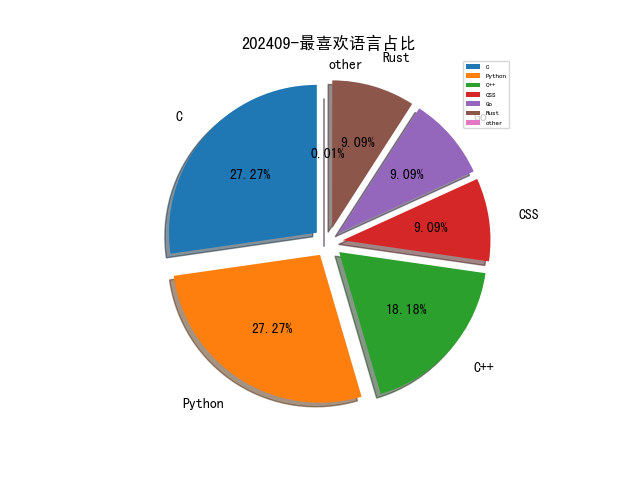

# [数据--所有](README_20.md)
# [数据--年度](README_2024.md)
# 202409 信息源与信息类型占比

# 网络安全书籍 推荐
| date_added | language | title | author | link | size| 
| --- | --- | --- | --- | --- | ---| 
| 2024-09-01 17:05:18 | English | beginners guide to streamlit with python | unknown | https://it-ebooks.info/book/1686051862-beginners_guide_to_streamlit_with_python/ | unknown| 

# 微信公众号 推荐
| nickname_english | weixin_no | title | url| 
| --- | --- | --- | ---| 
| 关键信息基础设施安全保护联盟 | None | 国务院：审议通过《网络数据安全管理条例（草案）》 讨论《中华人民共和国海商法（修订草案）》等 | https://mp.weixin.qq.com/s?__biz=MzkxNjU2NjY5MQ==&mid=2247506133&idx=3&sn=fdee7e63c128b79d21157d9d1bae1d1a | 3| 
| 汽车电子嵌入式 | None | AUTOSAR OsTask切换原理 | https://mp.weixin.qq.com/s?__biz=Mzg2NTYxOTcxMw==&mid=2247492460&idx=2&sn=36f8a9432356ddb058f3a51cc72b9442 | 2| 
| 混入安全圈的程序猿 | None | Android破签：密钥native方法里了？不会C也看不懂IDA？用这个工具吧~ | https://mp.weixin.qq.com/s?__biz=MzU3ODI3NDc4NA==&mid=2247484494&idx=1&sn=1c63a7913f36f0962e3cfeacc59a6d0b | 1| 
| 电子物证 | None | 刑诉法修改前瞻｜叶青：修法应建立电子数据证据审查认定规则 | https://mp.weixin.qq.com/s?__biz=MzAwNDcwMDgzMA==&mid=2651047850&idx=2&sn=0c90f983c31394e811d52e386d3a5a72 | 2| 
| 银遁安全团队 | None | 【未公开】用友NC-Cloud系统权限绕过SQL注入漏洞导致RCE | https://mp.weixin.qq.com/s?__biz=MzU3MjU4MjM3MQ==&mid=2247487350&idx=1&sn=160aa5a8202e47434aa74e0a858bf200 | 1| 
| 7coinSec | None | 「0day」金和OA C6 jQueryUploadify.ashx存在sql注入漏洞 | https://mp.weixin.qq.com/s?__biz=MzkyMTMxNjQ5NA==&mid=2247484791&idx=1&sn=4160ee6707e37e6885085d5813a4f104 | 1| 
| CISSP | None | 应急响应工具汉化包 | https://mp.weixin.qq.com/s?__biz=Mzg4MTg0MjQ5OA==&mid=2247486449&idx=1&sn=37d17d32228781a82c869e13c7c4e61c | 1| 
| Daylight庆尘 | None | JS逆向入门：AES加解密及其Python脚本实现与解析 | https://mp.weixin.qq.com/s?__biz=Mzg3Mzg3OTU4OQ==&mid=2247491699&idx=1&sn=8c1fb0fd1e9477a06f59b24f68674112 | 1| 
| FreeBuf | None | RetrievIR：专为事件响应设计的Windows设备安全取证收集工具 | https://mp.weixin.qq.com/s?__biz=MjM5NjA0NjgyMA==&mid=2651300585&idx=4&sn=94fe09e1db2b80072757c865461222e9 | 4| 
| HACK之道 | None | 32个好用渗透测试技巧 | https://mp.weixin.qq.com/s?__biz=MzIwMzIyMjYzNA==&mid=2247515543&idx=1&sn=925fb7430b279655b21b1510d955db62 | 1| 
| HW安全之路 | None | 【技术干货】Zmap: 45分钟扫描全网的网络安全利器 | https://mp.weixin.qq.com/s?__biz=MzI5MjY4MTMyMQ==&mid=2247485287&idx=1&sn=d52bbbb998dafd31f95a37fed1d48da3 | 2| 
| IoT物联网技术 | None | EMQX + PostgreSQL 实现 AIoT 车联网GPS位置实时监控和轨迹追踪 | https://mp.weixin.qq.com/s?__biz=MjM5OTA4MzA0MA==&mid=2454934899&idx=1&sn=79f40ec476edb8d2571074a064a09bdc | 1| 
| IoVSecurity | None | 车辆漏洞管理 - 从设计开始有效保护软件定义车辆 | https://mp.weixin.qq.com/s?__biz=MzU2MDk1Nzg2MQ==&mid=2247612683&idx=3&sn=9fce372dd44e785ffffdc36a6c85bc40 | 3| 
| KK安全说 | None | 汽车安（黑）全（客）指南1/3 | https://mp.weixin.qq.com/s?__biz=Mzg4NzgyODEzNQ==&mid=2247487953&idx=3&sn=2c485b420531ec45c8b7b82dd914bfd3 | 3| 
| Khan安全攻防实验室 | None | 这是什么操作 | https://mp.weixin.qq.com/s?__biz=MzAwMjQ2NTQ4Mg==&mid=2247494764&idx=1&sn=f9ae57cf206f657563d49970b04340b9 | 2| 
| OpenWrt | None | OpenWrt做主路由or旁路由，来投个票 | https://mp.weixin.qq.com/s?__biz=MzU4MTgxNDc2MQ==&mid=2247485896&idx=1&sn=4f311be6622572a99caca9e5660229d3 | 1| 
| Ots安全 | None | 混淆的 PowerShell 导致 Lumma C2 Stealer | https://mp.weixin.qq.com/s?__biz=MzAxMjYyMzkwOA==&mid=2247513172&idx=3&sn=3b67e11ecb0fda779a0e8f74211dd99d | 3| 
| SeeUSec | None | “冀信2024”网络安全技能竞赛取得优异成绩 | https://mp.weixin.qq.com/s?__biz=MzkzMjE4NzU5MA==&mid=2247488217&idx=1&sn=b45aceb8fc6782fe6b779dcf0c906d37 | 1| 
| TtTeam | None | ez突破边界到内网渗透 | https://mp.weixin.qq.com/s?__biz=Mzg2NTk4MTE1MQ==&mid=2247485934&idx=1&sn=0510a105c1ef07bde08fa0c6ace934af | 2| 
| WalkingCloud | None | 国产免费NAS系统-飞牛私有云fnOS安装初体验 | https://mp.weixin.qq.com/s?__biz=MzU2MjU1OTE0MA==&mid=2247499289&idx=1&sn=66c0515db32ae5d01cbcc623f83ab95d | 1| 
| XG小刚 | None | Thymeleaf模板注入还能打吗？ | https://mp.weixin.qq.com/s?__biz=MzIwOTMzMzY0Ng==&mid=2247487839&idx=1&sn=f7ab87173b12014ccfefa0f47f33df8f | 1| 
| XRSec | None | 护网的马喽们，回家了吗？ | https://mp.weixin.qq.com/s?__biz=MzUyMzE1MzI3NA==&mid=2247486495&idx=1&sn=015b6da276bd9dfc47287da5eb908841 | 1| 
| XiAnG学安全 | None | 记录某次 溯源反制 全过程 | https://mp.weixin.qq.com/s?__biz=Mzk0MTQzNjIyNg==&mid=2247492406&idx=1&sn=970d4e60aac8cd895206e357e32bf73f | 1| 
| dotNet安全矩阵 | None | .NET 一款通过白名单程序执行命令的工具 | https://mp.weixin.qq.com/s?__biz=MzUyOTc3NTQ5MA==&mid=2247494938&idx=3&sn=afdb6a2afd012b75f3bf3f2aea1c545b | 3| 
| fkalis | None | 【粉丝福利】无问社区会员大放送 | https://mp.weixin.qq.com/s?__biz=MzkyODcwOTA4NA==&mid=2247485207&idx=1&sn=85f14c241d9a96a054a20677ca926bd8 | 1| 
| kali笔记 | None | Kali 配置VNC服务 及解决灰屏问题 | https://mp.weixin.qq.com/s?__biz=MzkxMzIwNTY1OA==&mid=2247507624&idx=1&sn=3ce73d8b1d1c8d364c9da0e510fe0783 | 1| 
| vExpert | None | 最新版本固件引出的麻烦 | https://mp.weixin.qq.com/s?__biz=MzUyOTkzMjk1Ng==&mid=2247485980&idx=1&sn=c7b7569ef0c1d3f8f6df283d88779e0b | 1| 
| 一起聊安全 | None | “同道”｜第十三届KCon大会后记（附公开PPT下载链接） | https://mp.weixin.qq.com/s?__biz=MzI3NjUzOTQ0NQ==&mid=2247513846&idx=1&sn=cb2b42398c9c13be5c59ed98d68af56f | 1| 
| 丁爸 情报分析师的工具箱 | None | 【AI速读】基于OSINT技术的twitter和instagram定位:一个案例研究 | https://mp.weixin.qq.com/s?__biz=MzI2MTE0NTE3Mw==&mid=2651145943&idx=1&sn=76ce6a773e8fa5c09166504cd7244fe9 | 1| 
| 三沐数安 | None | 揭秘绕过WAF的一些技巧，增强防护细节。 | https://mp.weixin.qq.com/s?__biz=MzU1NjczNjA0Nw==&mid=2247484815&idx=1&sn=f6ebd2a3dd21b6767de50aba000c6322 | 1| 
| 不懂安全的果仁 | None | 实战,任意用户漏洞挖掘分享 | https://mp.weixin.qq.com/s?__biz=Mzg4NDg3NjE5MQ==&mid=2247485065&idx=1&sn=a62a0479493cae0a6b6cea6506250443 | 1| 
| 乌雲安全 | None | 木马反制与隐藏技巧 | https://mp.weixin.qq.com/s?__biz=MzAwMjA5OTY5Ng==&mid=2247523736&idx=1&sn=7e6b6395f302210585c8a2ac42599dd1 | 1| 
| 信息安全与通信保密杂志社 | None | 人工智能与国家治理的问题空间 | https://mp.weixin.qq.com/s?__biz=MzkwMTMyMDQ3Mw==&mid=2247592792&idx=1&sn=85d885892f1e0fe1cd2f20bb10419287 | 1| 
| 儒道易行 | None | 你生而有翼，为何竟愿一生匍匐前行，形如虫蚁。 | https://mp.weixin.qq.com/s?__biz=Mzg5NTU2NjA1Mw==&mid=2247492696&idx=2&sn=edd5c65c14ca9e9f4c25fb2a369033ee | 2| 
| 全栈安全 | None | 结合Wireshark抓包实战，图文详解TCP三次握手及四次挥手原理（附下载） | https://mp.weixin.qq.com/s?__biz=MzkyMTYyOTQ5NA==&mid=2247484950&idx=1&sn=aa8ad93499c5ac4ebbe15008fda558a8 | 2| 
| 全球技术地图 | None | 人机协同赋能的情报周期构想 | https://mp.weixin.qq.com/s?__biz=MzI1OTExNDY1NQ==&mid=2651615295&idx=1&sn=c764e02e5045e1c2ea90ad6b970bfa9a | 1| 
| 兰花豆说网络安全 | None | 奇葩！1390元够标书费用吗？ | https://mp.weixin.qq.com/s?__biz=MzI3NzM5NDA0NA==&mid=2247489000&idx=1&sn=099a993bf9e4ef60ef60fac42e296d89 | 1| 
| 内生安全联盟 | None | 译文丨美国“关于安全、可靠、可信地开发和使用人工智能的行政命令” | https://mp.weixin.qq.com/s?__biz=Mzg4MDU0NTQ4Mw==&mid=2247523011&idx=2&sn=bebc0c91b958d9f630f8fb1720906b00 | 2| 
| 冷漠安全 | None | 「冷漠安全」八月份0day/1day/nday漏洞汇总 | https://mp.weixin.qq.com/s?__biz=MzkyNDY3MTY3MA==&mid=2247485332&idx=1&sn=cfd3a526b441fa5f1eb00b908033b9df | 1| 
| 利刃信安 | None | 老僧活了270岁，空有500多件袈裟 | https://mp.weixin.qq.com/s?__biz=MzU1Mjk3MDY1OA==&mid=2247515729&idx=1&sn=539ae136626c92c643d8c14930ce722d | 2| 
| 前沿信安资讯阵地 | None | 网络安全知识手册（全册下载） | https://mp.weixin.qq.com/s?__biz=MzA3MTM0NTQzNA==&mid=2455778558&idx=1&sn=4ffe458ab6bc78cfeff81d2f90455970 | 2| 
| 合规渗透 | None | CVE-2024-21413 Microsoft Outlook远程代码执行漏洞 附POC | https://mp.weixin.qq.com/s?__biz=MzkzOTI2NjUyNA==&mid=2247484902&idx=1&sn=eae50a81028e28f70c0b9c992a84f2b1 | 1| 
| 君说安全 | None | 网传HVV第一阶段结束，常态化保障可以带来那些改进？ | https://mp.weixin.qq.com/s?__biz=MzUzNjkxODE5MA==&mid=2247486684&idx=1&sn=4d4c147ef9036a966e6c8ef60ea26aa5 | 1| 
| 商密君 | None | 俄导弹袭击致使乌克兰关基设施瘫痪，水电网中断近12小时 | https://mp.weixin.qq.com/s?__biz=MzI5NTM4OTQ5Mg==&mid=2247629941&idx=4&sn=f6da460e77cfc0e3beaa34e4bc547590 | 4| 
| 天空卫士SkyGuard | None | 数据安全法实施三周年 , 天空卫士引领关键技术突破 | https://mp.weixin.qq.com/s?__biz=MzA5MjQyODY1Mw==&mid=2648504266&idx=1&sn=e7bdd65d0f78e6bc15c27f478bad55f4 | 1| 
| 安全圈 | None | 【安全圈】伪装“黑神话悟空修改器”传播木马的活动分析 | https://mp.weixin.qq.com/s?__biz=MzIzMzE4NDU1OQ==&mid=2652064070&idx=3&sn=5e430705e6b9fdd3348f754221e17c83 | 3| 
| 安全学习那些事儿 | None | 新加坡电子商务服务公司Abecha遭勒索软件攻击 | https://mp.weixin.qq.com/s?__biz=MzkxNTI2NTQxOA==&mid=2247493782&idx=2&sn=f611bff13806aaa4cad1557b475d7099 | 5| 
| 安全帮 | None | 终于有人把“高级网工必备软件”整理出来了，收藏起来，随时查看 | https://mp.weixin.qq.com/s?__biz=MzkzNjQwOTc4MQ==&mid=2247489637&idx=1&sn=d58ea3ad552111bd2cac8ce3021b4090 | 1| 
| 安全狗的自我修养 | None | 自身经历从面试到职场，同时如何避免沦为你曾经瞧不起的人的下属 | https://mp.weixin.qq.com/s?__biz=MzkwOTE5MDY5NA==&mid=2247499352&idx=1&sn=b37cbf156c36935618df607ead94ebf8 | 2| 
| 安全研究GoSSIP | None | 2024年9月投稿指南 | https://mp.weixin.qq.com/s?__biz=Mzg5ODUxMzg0Ng==&mid=2247498794&idx=1&sn=69ec2476ec5183117396de1a469c14fc | 1| 
| 安全红蓝紫 | None | 什么是数据空间 | https://mp.weixin.qq.com/s?__biz=MzI1NjQxMzIzMw==&mid=2247492973&idx=1&sn=61cef4b757111977205cfc3413b869e6 | 1| 
| 安在 | None | 知识星球 , 历年网安报告合集一键下载；更新AI风险库、全球DDoS攻击、金融网安等资源 | https://mp.weixin.qq.com/s?__biz=MzU5ODgzNTExOQ==&mid=2247627669&idx=1&sn=707416c6e2de4841d4ff029451abfd82 | 1| 
| 安天集团 | None | 安天网络行为检测能力升级通告（20240901） | https://mp.weixin.qq.com/s?__biz=MjM5MTA3Nzk4MQ==&mid=2650206807&idx=1&sn=c7002506b0920d6e836181b3c43da0d1 | 1| 
| 安知讯 | None | “幻觉”导致大模型不能大范围落地，微众银行称可解决该问题 | https://mp.weixin.qq.com/s?__biz=MzIxMDIwODM2MA==&mid=2653930676&idx=2&sn=ad48e1bb5a28bb556279f4097d26a619 | 2| 
| 安羽安全 | None | 某联云采 SRM autologin 逻辑漏洞登录后台 | https://mp.weixin.qq.com/s?__biz=MzkwMzY5NTg0Mg==&mid=2247483987&idx=1&sn=e5d4db5e84993a7093c043463af873f3 | 1| 
| 小黑说安全 | None | Thymeleaf模板注入还能打吗？ | https://mp.weixin.qq.com/s?__biz=MzkxNjQyMjcwMw==&mid=2247486452&idx=1&sn=8bc15d1d342b71c4f4dfd8cf9ff29a96 | 1| 
| 张无瑕思密达 | None | 台湾在大陆间谍网络覆灭记 | https://mp.weixin.qq.com/s?__biz=MzkwMzI1ODUwNA==&mid=2247487434&idx=1&sn=d95ab07632bafbe2b506f412e30e0843 | 1| 
| 弥天安全实验室 | None | 【成功复现】SPIP porte_plume远程代码执行漏洞(CVE-2024-7954) | https://mp.weixin.qq.com/s?__biz=MzU2NDgzOTQzNw==&mid=2247502377&idx=1&sn=453981c8da15fb44352bc8c43f5c795d | 1| 
| 微步在线研究响应中心 | None | 威胁情报周报（8.26~9.1） | https://mp.weixin.qq.com/s?__biz=Mzg5MTc3ODY4Mw==&mid=2247506908&idx=1&sn=fe0adde9917049d485e07beec9ed3c7c | 1| 
| 我爱林 | None | 漏洞复现 ,, Bazaar swaggerui目录遍历 | https://mp.weixin.qq.com/s?__biz=MzI2Mzc3OTg1Ng==&mid=2247492608&idx=1&sn=58853db4366ab941adbcef183a9a8cb2 | 1| 
| 扫地僧的茶饭日常 | None | 【漏洞复现】奥威亚-教学视频应用云平台-任意文件上传漏洞 (附批量验证脚本) | https://mp.weixin.qq.com/s?__biz=Mzg5NTUyNTI5OA==&mid=2247485828&idx=1&sn=7363589e4e901c21dfab146714d83f1b | 1| 
| 技术分享交流 | None | 深入探秘 ansible-vault 命令 | https://mp.weixin.qq.com/s?__biz=MzAxMDIwNjg2MA==&mid=2247486006&idx=1&sn=c9f32cd8d6404548fffc418c8a51ff0e | 1| 
| 掌控安全EDU | None | 漏洞挖掘｜自动备案批量查询脚本 | https://mp.weixin.qq.com/s?__biz=MzUyODkwNDIyMg==&mid=2247543153&idx=2&sn=7b877e3365ef72190578f4e1a0bd2bd2 | 2| 
| 星悦安全 | None | 2024年最新新小剧场短剧影视系统代码审计(RCE) | https://mp.weixin.qq.com/s?__biz=Mzg4MTkwMTI5Mw==&mid=2247485435&idx=1&sn=99f5eb0f17d458b8c2069dc178885434 | 1| 
| 暗影网安实验室 | None | 网络安全揭秘 , 白帽黑客常用的漏洞挖掘技巧分享 | https://mp.weixin.qq.com/s?__biz=MzIyNTIxNDA1Ng==&mid=2659210381&idx=1&sn=7f04098ef1ffd706a6b0aaec5cb004e3 | 1| 
| 暴暴的皮卡丘 | None | Frida Hook(十一)  Process类获取模块/内存详解 | https://mp.weixin.qq.com/s?__biz=MzU0NDI5NTY4OQ==&mid=2247485892&idx=1&sn=8f1fcce434d74c36acc34d297f54778e | 1| 
| 李白你好 | None | 推荐一个高质量的网络安全情报攻防站 | https://mp.weixin.qq.com/s?__biz=MzkwMzMwODg2Mw==&mid=2247508355&idx=1&sn=0b2d6f1f6d8994915f6c2a6e6d11f678 | 1| 
| 梅苑安全 | None | 【版本更新】ProxyCat - 如猫咪般灵活的代理池中间件 v1.4 Release！ | https://mp.weixin.qq.com/s?__biz=MzkwMTU2NzMwOQ==&mid=2247484392&idx=1&sn=c41aab66b50d789cfc38444fad10cc18 | 1| 
| 棉花糖fans | None | 为什么建议大家都来做网安公众号？ | https://mp.weixin.qq.com/s?__biz=MzkyOTQzNjIwNw==&mid=2247487954&idx=1&sn=bca71fd6e38720b6bc71394c0b34f3fc | 1| 
| 樱花庄的本间白猫 | None | 【版本更新】ProxyCat - 如猫咪般灵活的代理池中间件 v1.4 Release！ | https://mp.weixin.qq.com/s?__biz=Mzk0NDU1NTA5MA==&mid=2247483948&idx=1&sn=1128e07264d9e44565d6d1ba071a6b8f | 1| 
| 河南等级保护测评 | None | 巴黎奥运当局采取了哪些抵御网络攻击好措施 | https://mp.weixin.qq.com/s?__biz=Mzg2NjY2MTI3Mg==&mid=2247496905&idx=2&sn=93c13a3fb3d2702d6bcd54752b31b90f | 4| 
| 泷羽Sec | None | 如何在GZCTF部署简单的Web和PWN动态flag？ | https://mp.weixin.qq.com/s?__biz=Mzg2Nzk0NjA4Mg==&mid=2247490588&idx=1&sn=56ed49134a5bd92c21e5621f7ff7693e | 1| 
| 洞见网安 | None | 网安原创文章推荐【2024/8/31】 | https://mp.weixin.qq.com/s?__biz=MzAxNzg3NzMyNQ==&mid=2247488822&idx=1&sn=145f9e3407ecb967d28b0ab084a73dcb | 1| 
| 浅安安全 | None | 工具 , anti-honeypot | https://mp.weixin.qq.com/s?__biz=MzkwMTQ0NDA1NQ==&mid=2247490380&idx=4&sn=1d028d0824d515170ab53dfbb3d2601a | 4| 
| 渗透安全HackTwo | None | 人工智能AI漏洞扫描工具PRO版SmartScanner-1.23.0-Pro版补丁更新,漏洞检测 | https://mp.weixin.qq.com/s?__biz=Mzg3ODE2MjkxMQ==&mid=2247488285&idx=1&sn=93e26682915f36381c11de4d5c201d38 | 2| 
| 源鲁安全实验室 | None | 2024“源鲁杯”高校网络安全技能大赛正式启动，报名通道现已开启！ | https://mp.weixin.qq.com/s?__biz=Mzg5MDk3MTgxOQ==&mid=2247492704&idx=1&sn=5a7a4cda444b8d1ecd18f3b1bdf6fe36 | 1| 
| 滴滴安全应急响应中心 | None | DSRC中秋活动 ｜ 好礼如“月”而至（内含中秋礼盒领取攻略） | https://mp.weixin.qq.com/s?__biz=MzA3Mzk1MDk1NA==&mid=2651908403&idx=1&sn=649a8eb1e9a92a8ab28b6f5a6c42f405 | 1| 
| 犀牛安全 | None | 美国无线电中继联盟遭勒索攻击，确认支付 100 万美元赎金 | https://mp.weixin.qq.com/s?__biz=Mzg3ODY0NTczMA==&mid=2247491052&idx=1&sn=d386ebba40cfb9b7ab0e7efbb8fb9f0b | 1| 
| 独眼情报 | None | 又一起针对软件开发人员的社工活动 | https://mp.weixin.qq.com/s?__biz=MzkzNDIzNDUxOQ==&mid=2247488873&idx=4&sn=27be195d97c199edae1845a3f575e330 | 4| 
| 玄道夜谈 | None | 分享图片 | https://mp.weixin.qq.com/s?__biz=MzI3Njc1MjcxMg==&mid=2247493169&idx=1&sn=604c330701a6c052d6aa1da743e19673 | 1| 
| 电子取证wiki | None | 记录某次 溯源反制 全过程 | https://mp.weixin.qq.com/s?__biz=MzkzNTQzNTQzMQ==&mid=2247484941&idx=1&sn=e177bdd28ee24d9485b6520ebbccd126 | 1| 
| 白帽子左一 | None | 通过组合Self-XSS + CSRF得到存储型XSS | https://mp.weixin.qq.com/s?__biz=MzI4NTcxMjQ1MA==&mid=2247612690&idx=1&sn=403c634bd3e633d40f7acd2e0fe50605 | 1| 
| 白帽子社区团队 | None | CobaltStrike-DNS侦听器 | https://mp.weixin.qq.com/s?__biz=MzkzNDQ0MDcxMw==&mid=2247486768&idx=2&sn=e76e0e14ac47d155f25dbcb563f10689 | 2| 
| 白帽学子 | None | C2 Magic | https://mp.weixin.qq.com/s?__biz=MzkyNzIxMjM3Mg==&mid=2247487405&idx=1&sn=561e95ab23f4767cdca7350c41e7ae0e | 1| 
| 白帽黑客训练营 | None | 黑客零基础入门方法有哪些？如何自学黑客技术？ | https://mp.weixin.qq.com/s?__biz=MzIzNjIwNTQ5MQ==&mid=2247484968&idx=1&sn=bbeaeb2190039cb94f4658e72edb296d | 2| 
| 看雪学苑 | None | 【即刻说】第8期 , 极客育儿经 | https://mp.weixin.qq.com/s?__biz=MjM5NTc2MDYxMw==&mid=2458571424&idx=3&sn=4c754b3732fd343292bfbb7cd77cc9a8 | 3| 
| 知机安全 | None | 【2024-09-01】每日安全资讯 | https://mp.weixin.qq.com/s?__biz=MzIzNDU5NTI4OQ==&mid=2247487573&idx=1&sn=7bbb99cf5523d478ed627b996166fcfa | 1| 
| 秦安战略 | None | 秦安：景县模式与红蓝融合理念碰撞，规模化发展体现中国制度优势 | https://mp.weixin.qq.com/s?__biz=MzA5MDg1MDUyMA==&mid=2650472940&idx=3&sn=e18176c39099464b81968f0ba61d825d | 3| 
| 粤西网络空间安全实验室 | None | 每月网络安全动向（98） | https://mp.weixin.qq.com/s?__biz=MzkyODMxNzQ2NQ==&mid=2247487750&idx=1&sn=f01520d13381758876ecad01ff7bdbe7 | 1| 
| 紫队安全研究 | None | HVV技战法 , 零信任：构筑不可突破的纵深防御体系 | https://mp.weixin.qq.com/s?__biz=Mzg3OTYxODQxNg==&mid=2247484882&idx=1&sn=47ccffab6283b4495ce766f02ebd6c39 | 1| 
| 红云谈安全 | None | 测试最不安全的 Docker 应用程序的实际安全性 | https://mp.weixin.qq.com/s?__biz=MzI0MTUwMjQ5Nw==&mid=2247488164&idx=1&sn=f321c4ba9124acb8c359a89b39ff2b59 | 1| 
| 网空闲话plus | None | 政府耍流氓起诉安全研究者！原因是与媒体分享了泄露数据 | https://mp.weixin.qq.com/s?__biz=MzkyMjQ5ODk5OA==&mid=2247502877&idx=2&sn=7434e54927f2d57d0c19bb80f52f8bdb | 5| 
| 网络安全实验室 | None | 武汉众多网络安全岗位招聘 | https://mp.weixin.qq.com/s?__biz=MzU4OTg4Nzc4MQ==&mid=2247503584&idx=1&sn=21c79b48ba57cb185ed6c2b8a8fb8843 | 1| 
| 网络技术干货圈 | None | 各个网络厂商网络设备默认的用户名和密码大全 | https://mp.weixin.qq.com/s?__biz=MzUyNTExOTY1Nw==&mid=2247526398&idx=1&sn=82d3546c6c8249f0e44c377948fba591 | 1| 
| 网络技术联盟站 | None | 网络安全：IPS和IDS有啥区别？ | https://mp.weixin.qq.com/s?__biz=MzIyMzIwNzAxMQ==&mid=2649460869&idx=1&sn=40937c069115e07d210c85feef637b1d | 1| 
| 网络研究观 | None | 历史上名人不为人知的一面 | https://mp.weixin.qq.com/s?__biz=MzkxNDM4OTM3OQ==&mid=2247500883&idx=1&sn=6c4b4f4773593ce476a2f26629f32076 | 1| 
| 网络空间信息安全学习 | None | 科技艺术：灵魂归宿的探索与发现？ | https://mp.weixin.qq.com/s?__biz=MzI2MjcwMTgwOQ==&mid=2247491538&idx=1&sn=a111af395aff2d4bf585fa529d5c276f | 1| 
| 网络空间安全与法治协同创新中心 | None | 针对蒙古政府！疑俄罗斯APT29利用与NSO和Intellexa“惊人相似”的漏洞实施水坑攻击 | https://mp.weixin.qq.com/s?__biz=MzkwMTQyODI4Ng==&mid=2247493575&idx=3&sn=3c376e3f80656a67c52a3fa4c8541e21 | 3| 
| 腾讯技术工程 | None | 【微信】后悔才知道！居然有这些隐藏用法... | https://mp.weixin.qq.com/s?__biz=MjM5ODYwMjI2MA==&mid=2649785457&idx=1&sn=e457381fcdd8c34cdddef26a3fab6701 | 1| 
| 船山信安 | None | 实战中的高版本JDK的JNDI注入 | https://mp.weixin.qq.com/s?__biz=MzU2NDY2OTU4Nw==&mid=2247515959&idx=1&sn=364641a7abd610089dcab625bbdb17ad | 2| 
| 苏说安全 | None | 2024年网安上市公司上半年财报排行 | https://mp.weixin.qq.com/s?__biz=Mzg5OTg5OTI1NQ==&mid=2247488419&idx=1&sn=034ef08ed7caa74b1a7f935a341b35ef | 2| 
| 菜鸟小新 | None | 内容安全策略CSP详解 | https://mp.weixin.qq.com/s?__biz=Mzg4OTI0MDk5MQ==&mid=2247492461&idx=1&sn=35fdd49aaeb6686f18b484fc01fbbbfd | 1| 
| 计算机与网络安全 | None | 商密信创等保关保，网络安全攻防HVV，网络安全运营运维，人工智能、算力算网，工控安全、能源行业，云安全 | https://mp.weixin.qq.com/s?__biz=MjM5OTk4MDE2MA==&mid=2655252978&idx=3&sn=d7dd9992e71d71024dfcaa6d1d545d25 | 3| 
| 谈思实验室 | None | AEB自动紧急制动，没那么简单！ | https://mp.weixin.qq.com/s?__biz=MzIzOTc2OTAxMg==&mid=2247542546&idx=1&sn=0bedd5cdc7f6b8b625706c51b1cbbc17 | 1| 
| 迪哥讲事 | None | 一个$1600赏金奖励的漏洞 | https://mp.weixin.qq.com/s?__biz=MzIzMTIzNTM0MA==&mid=2247495675&idx=1&sn=b2f83dec52050274e8eafc46f30c606d | 1| 
| 风铃Sec | None | C/C++逆向：寻找mian函数（其他） | https://mp.weixin.qq.com/s?__biz=Mzk0MjY1ODE5Mg==&mid=2247484474&idx=1&sn=dcb3d4cdfc0e34ede39b9c00000ea814 | 1| 
| 高等精灵实验室 | None | Ollama+LobeChat：在个人电脑上打造无限制、高颜值、免费的专属大模型助手！ | https://mp.weixin.qq.com/s?__biz=MzA4MjkzMTcxMg==&mid=2449045868&idx=1&sn=605c4b5c978f9cae20c6709f6c02ddf6 | 1| 
| 黑客白帽子 | None | 【LSP专享】更新46位抖音女主播直播录屏，助眠视频MY雪寒高清视频1V | https://mp.weixin.qq.com/s?__biz=MzA5MzYzMzkzNg==&mid=2650958274&idx=3&sn=aa561c3b9fb7da016051777621e04c02 | 3| 
| 黑白之道 | None | MDUT渗透神器二开增强版 | https://mp.weixin.qq.com/s?__biz=MzAxMjE3ODU3MQ==&mid=2650599479&idx=4&sn=313d1904bd708fb7c47a3a1d7a0693bb | 4| 

# 日更新程序
`python update_daily.py`