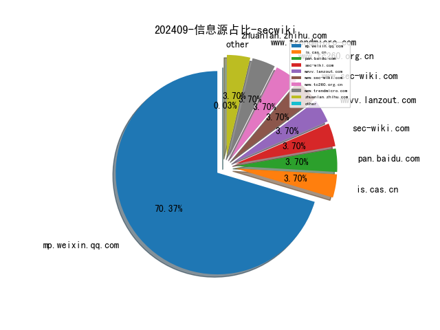

# [数据--所有](README_20.md)
# [数据--年度](README_2024.md)
# 202409 信息源与信息类型占比

# 网络安全书籍 推荐
| date_added | language | title | author | link | size| 
| --- | --- | --- | --- | --- | ---| 
| 2024-09-09 07:33:24 | English | beginners guide to streamlit with python | unknown | https://it-ebooks.info/book/1686051862-beginners_guide_to_streamlit_with_python/ | unknown| 
| 2024-09-08 12:19:18 | English | An Introduction to Derivative Securities, Financial Markets, and Risk Management (Third Edition) | Robert A Jarrow, Arkadev Chatterjea | http://libgen.rs/book/index.php?md5=01CECBF43561DBFD045D83965C2477A7 | 9 MB [PDF]| 
| 2024-09-08 08:35:43 | English | An Introduction to R and Python For Data Analysis: A Side-By-Side Approach | Brown, Taylor R. | http://libgen.rs/book/index.php?md5=647BA26BFE108210F8B5DF841D905D21 | 13 MB [EPUB]| 
| 2024-09-08 08:30:41 | English | (the python series) Introduction to Python for Humanists | William J.B. Mattingly | http://libgen.rs/book/index.php?md5=B26E0576E7B21A6E3F080E788109E13D | 20 MB [EPUB]| 
| 2024-09-08 08:29:25 | English | Python Packages | Tomas Beuzen; Tiffany Timbers | http://libgen.rs/book/index.php?md5=A78B3D2E03B34F080FE75F5AAA953177 | 19 MB [EPUB]| 
| 2024-09-08 08:12:08 | English | MS-700 Managing Microsoft Teams Exam Guide | Nate Chamberlain, Peter Rising | http://libgen.rs/book/index.php?md5=0DE950A2831B2CBCC1689755C1DF3DC9 | 33 MB [EPUB]| 
| 2024-09-07 16:24:46 | English | Raspberry Pi OS System Administration with systemd and Python | Robert M. Koretsky | http://libgen.rs/book/index.php?md5=4A4C01522C8FAF247636D2326C80EB58 | 5 MB [EPUB]| 
| 2024-09-07 16:24:43 | English | Raspberry Pi OS System Administration with systemd and Python | Robert M. Koretsky | http://libgen.rs/book/index.php?md5=7FFBE025FA2BA956525D0C51169283F3 | 25 MB [PDF]| 
| 2024-09-07 18:27:12 | English | AI-Driven Cybersecurity and Threat Intelligence: Cyber Automation, Intelligent Decision-Making and Explainability | Iqbal H. Sarker | http://libgen.rs/book/index.php?md5=F769FFBB6993C406159444B5BD3DEB9E | 22 MB [RAR]| 
| 2024-09-07 18:27:10 | English | AI-Driven Cybersecurity and Threat Intelligence: Cyber Automation, Intelligent Decision-Making and Explainability | Iqbal H. Sarker | http://libgen.rs/book/index.php?md5=C58A9F13BC824576B8AF52F71D3EC772 | 14 MB [EPUB]| 
| 2024-09-07 18:27:08 | English | AI-Driven Cybersecurity and Threat Intelligence: Cyber Automation, Intelligent Decision-Making and Explainability | Iqbal H. Sarker | http://libgen.rs/book/index.php?md5=33A0BD999BD50B617E1D28C4069DAECB | 7 MB [PDF]| 
| 2024-09-07 18:26:10 | English | Next-Generation Cybersecurity: AI, ML, and Blockchain (Blockchain Technologies) | Keshav Kaushik (editor), Ishu Sharma (editor) | http://libgen.rs/book/index.php?md5=2FF104CAA6BD1A29DFFFDCBEBC4095AE | 38 MB [RAR]| 
| 2024-09-07 18:26:08 | English | Next-Generation Cybersecurity: AI, ML, and Blockchain (Blockchain Technologies) | Keshav Kaushik (editor), Ishu Sharma (editor) | http://libgen.rs/book/index.php?md5=43EBB4D256B5B2FAD1C926790B76CBF3 | 27 MB [EPUB]| 
| 2024-09-07 18:26:07 | English | Next-Generation Cybersecurity: AI, ML, and Blockchain (Blockchain Technologies) | Keshav Kaushik (editor), Ishu Sharma (editor) | http://libgen.rs/book/index.php?md5=C5ECC52EF2633DD787A8C335E5EF17E7 | 10 MB [PDF]| 
| 2024-09-07 23:48:58 | English | A Simple Introduction to Python (Chapman & Hall/CRC The Python Series) | Stephen Lynch | http://libgen.rs/book/index.php?md5=1F6CFF7B5E6B0D7D295461AFCE37B2A2 | 4 MB [EPUB]| 
| 2024-09-07 23:11:47 | English | UX for Enterprise ChatGPT Solutions: A practical guide to designing enterprise-grade LLMs | Richard H. Miller | http://libgen.rs/book/index.php?md5=18B22892108866E63198412E07AD6E22 | 16 MB [EPUB]| 
| 2024-09-06 12:43:08 | English | Implementing GitOps with Kubernetes | unknown | https://www.wowebook.org/implementing-gitops-with-kubernetes/ | unknown| 
| 2024-09-06 11:22:31 | English | Microsoft Power BI Performance Best Practices, Second Edition | unknown | https://www.wowebook.org/microsoft-power-bi-performance-best-practices-second-edition/ | unknown| 
| 2024-09-05 19:33:22 | English | Incident Response for Windows | unknown | https://www.wowebook.org/incident-response-for-windows/ | unknown| 
| 2024-09-05 16:52:33 | English | DevSecOps for Azure | unknown | https://www.wowebook.org/devsecops-for-azure/ | unknown| 
| 2024-09-05 11:59:46 | English | Securing Industrial Control Systems and Safety Instrumented Systems | unknown | https://www.wowebook.org/securing-industrial-control-systems-and-safety-instrumented-systems/ | unknown| 
| 2024-09-04 09:36:27 | English | Fraud Examination | W. Steve Albrecht, Chad O. Albrecht, Conan C. Albrecht, Mark F. Zimbelman | http://libgen.rs/book/index.php?md5=217BB3B9F56D57BF514CE6144E5AB92D | 2 MB [PDF]| 
| 2024-09-04 09:01:49 | English | Starting Out with Python (Pearson+) | Tony Gaddis | http://libgen.rs/book/index.php?md5=578A4251EFD147BE3BB212205F509107 | 1 MB [PDF]| 
| 2024-09-04 06:16:12 | English | Exam Ref AZ-104 Microsoft Azure Administrator | Charles Pluta; | http://libgen.rs/book/index.php?md5=D612CBAA9567B2126D2A07BA082E6DF8 | 38 MB [EPUB]| 
| 2024-09-03 13:12:09 | English | Microsoft 365 Copilot: Harness the Power of Generative AI in the Microsoft Apps You Use Every Day | Jess Stratton | http://libgen.rs/book/index.php?md5=0990DCFADBAC0FCD55B74B360BCDCF0D | 16 MB [EPUB]| 
| 2024-09-03 13:12:04 | English | Microsoft 365 Copilot: Harness the Power of Generative AI in the Microsoft Apps You Use Every Day | Jess Stratton | http://libgen.rs/book/index.php?md5=957E5CE1F13FAA7D21EA683E46FD834C | 37 MB [PDF]| 
| 2024-09-03 21:20:48 | English | Generative AI-Powered Assistant for Developers | unknown | https://www.wowebook.org/generative-ai-powered-assistant-for-developers/ | unknown| 
| 2024-09-03 20:35:51 | English | Hack the Cybersecurity Interview, Second Edition | unknown | https://www.wowebook.org/hack-the-cybersecurity-interview-second-edition/ | unknown| 
| 2024-09-03 20:04:00 | English | Accelerating IoT Development with ChatGPT | unknown | https://www.wowebook.org/accelerating-iot-development-with-chatgpt/ | unknown| 
| 2024-09-03 19:29:42 | English | The AI Value Playbook | unknown | https://www.wowebook.org/the-ai-value-playbook/ | unknown| 
| 2024-09-03 17:22:17 | English | Machine Learning and Generative AI for Marketing | unknown | https://www.wowebook.org/machine-learning-and-generative-ai-for-marketing/ | unknown| 
| 2024-09-02 05:04:13 | English | Advanced Excel 365: Including ChatGPT Tips | Ritu Arora | http://libgen.rs/book/index.php?md5=E80745E6123FD270D452A454375DE32E | 41 MB [RAR]| 
| 2024-09-02 10:56:51 | English | Python Feature Engineering Cookbook, Third Edition | unknown | https://www.wowebook.org/python-feature-engineering-cookbook-third-edition/ | unknown| 
| 2024-09-02 09:27:09 | English | Kubernetes: An Enterprise Guide, Third Edition | unknown | https://www.wowebook.org/kubernetes-an-enterprise-guide-third-edition/ | unknown| 
| 2024-09-02 08:19:02 | English | Mark as downloadedDownloaded Security and Privacy in Web 3.0 | Meng Shen, Xiangyun Tang, Wei Wang, Liehuang Zhu | http://libgen.rs/book/index.php?md5=9BA4003927D79EAE68669272404CA14E | 6 MB [PDF]| 
| 2024-09-01 23:42:40 | English | 100 Deadly Skills: The SEAL Operatives Guide to Eluding Pursuers, Evading Capture, and Surviving Any Dangerous Situation | Clint Emerson | http://libgen.rs/book/index.php?md5=E6AB747FE1C2E60E5B7BF1226F566D71 | 53 MB [AZW3]| 

# 微信公众号 推荐
| nickname_english | weixin_no | title | url| 
| --- | --- | --- | ---| 
| 360数字安全 | None | 吹响开学第一哨，北京邮电大学&360专业实习实训项目开班 | https://mp.weixin.qq.com/s?__biz=MzA4MTg0MDQ4Nw==&mid=2247575212&idx=2&sn=bff3e95f64ddd77265c582fc85ba4349 | 9| 
| CAICT可信安全 | None | 报名启动 , 中国信通院【第二批】云上勒索攻击防护能力要求评估开始报名 | https://mp.weixin.qq.com/s?__biz=Mzk0MjM1MDg2Mg==&mid=2247501267&idx=1&sn=7306a78c78478134e5cccbd6aa34a038 | 1| 
| CISSP | None | 攻防领域认证（  CISP-PTE/PTS/IRE/IRS） | https://mp.weixin.qq.com/s?__biz=Mzg4MTg0MjQ5OA==&mid=2247486540&idx=2&sn=121a243ae9a34c10d475524631808d76 | 8| 
| CNCERT国家工程研究中心 | None | LiteSpeed 曝出严重漏洞，致使超 600 万 WordPress 网站遭攻击 | https://mp.weixin.qq.com/s?__biz=MzUzNDYxOTA1NA==&mid=2247546821&idx=4&sn=a612e0ab0f8706e0036c396c402390ce | 14| 
| CNVD漏洞平台 | None | 上周关注度较高的产品安全漏洞(20240902-20240908) | https://mp.weixin.qq.com/s?__biz=MzU3ODM2NTg2Mg==&mid=2247495269&idx=2&sn=eea86aadf895bd9500df03bddd96b8f7 | 4| 
| CatalyzeSec | None | TIDRONEAPT组织攻击台湾无人机制造商 | https://mp.weixin.qq.com/s?__biz=MzkxNjY1MjY3OQ==&mid=2247486261&idx=1&sn=a6bfb1aca0f71dec38aac18836b889bf | 3| 
| ChaMd5安全团队 | None | 论文解读:《函数调用的阴暗面：破解大型语言模型的途径》 | https://mp.weixin.qq.com/s?__biz=MzIzMTc1MjExOQ==&mid=2247510937&idx=1&sn=38ab990542b9cbd54cd06f9b6ec05a71 | 2| 
| Eonian Sharp | None | 2025 Rust 全员大会，庆祝Rust十周年！ | https://mp.weixin.qq.com/s?__biz=Mzg3NzUyMTM0NA==&mid=2247487184&idx=1&sn=ce69d47c69be52a8b1c7e564f538c162 | 2| 
| FreeBuf | None | Artifacts：一款多功能信息安全数字取证工具库 | https://mp.weixin.qq.com/s?__biz=MjM5NjA0NjgyMA==&mid=2651301291&idx=4&sn=98ca7ab837e4da9c52d675d28d704a17 | 32| 
| HackSee | None | 炎症对身体有什么影响? | https://mp.weixin.qq.com/s?__biz=MzI5NTA0MTY2Mw==&mid=2247485617&idx=1&sn=7c6b2839047fbeabf7fa4cbb0dd693e3 | 1| 
| IoVSecurity | None | 全球数据安全法规研究报告（2024版） | https://mp.weixin.qq.com/s?__biz=MzU2MDk1Nzg2MQ==&mid=2247612930&idx=3&sn=0daca5a0172251de9648cfd1a8accb21 | 18| 
| Khan安全攻防实验室 | None | 论文一直投不中？保姆级SCI全程投稿发表服务来了！润色、选刊、投稿、返修，直至中刊！ | https://mp.weixin.qq.com/s?__biz=MzAwMjQ2NTQ4Mg==&mid=2247494801&idx=2&sn=a02819e7e809e370ee97a27d7caaae31 | 6| 
| OSINT情报分析师 | None | 想要快速提升情报能力?这个社群有秘诀！ | https://mp.weixin.qq.com/s?__biz=MzkxNzU5MjE0OA==&mid=2247485110&idx=1&sn=28212695de2ce46412bb024541982639 | 1| 
| Ots安全 | None | PhysMem(e)：当内核驱动程序窥视内存时 CVE-2024-41498 | https://mp.weixin.qq.com/s?__biz=MzAxMjYyMzkwOA==&mid=2247513759&idx=1&sn=75877e0d83075501538d80b8eb519ac3 | 12| 
| SecNL安全团队 | None | 记一次帮朋友扬眉吐气的逻辑漏洞挖掘 | https://mp.weixin.qq.com/s?__biz=MzU2MDE2MjU1Mw==&mid=2247485655&idx=1&sn=dc5948522083140e8f4649d471c8bf0f | 1| 
| SecWiki | None | SecWiki周刊（第549期） | https://mp.weixin.qq.com/s?__biz=MjM5NDM1OTM0Mg==&mid=2651053317&idx=1&sn=e21a70c6285df9d0d64f0ef76611ce79 | 1| 
| Tenable安全 | None | 美国CISA组织发现: 90%的针对关键基础设施的攻击是通过身份及权限错误配置实现的 | https://mp.weixin.qq.com/s?__biz=MzIyMTg0MTE3MA==&mid=2247487278&idx=1&sn=5f81a0af4921f478ef7c490ef69f14e1 | 1| 
| Z2O安全攻防 | None | 建了个SRC 专项漏洞知识库 | https://mp.weixin.qq.com/s?__biz=Mzg2ODYxMzY3OQ==&mid=2247515075&idx=2&sn=9051db5ef8f597f5fa6ad7ad0508ca52 | 8| 
| fkalis | None | 【海外SRC赏金挖掘】通过页面资产监控，拿下1500美刀！！ | https://mp.weixin.qq.com/s?__biz=MzkyODcwOTA4NA==&mid=2247485453&idx=1&sn=f9a0d25788656d19ef912f78209a9139 | 7| 
| 万径安全 | None | 携手中国联通共建网络安全生态，YAK编程语言亮相网安周 | https://mp.weixin.qq.com/s?__biz=MzIwMzI1MDg2Mg==&mid=2649944848&idx=1&sn=822081fe26f21deb09ec767df75ac255 | 1| 
| 中国信息安全 | None | 关注 , 2024年8月全国受理网络违法和不良信息举报1983.3万件 | https://mp.weixin.qq.com/s?__biz=MzA5MzE5MDAzOA==&mid=2664224960&idx=7&sn=3f88d75bbf042cf8e0f542d792eeae82 | 43| 
| 中国电信安全 | None | 每周更新：安全锦囊第十六期 | https://mp.weixin.qq.com/s?__biz=MzkxNDY0MjMxNQ==&mid=2247529772&idx=1&sn=0cbfb0cefdadee913151d09cf18180ee | 7| 
| 中国软件评测中心 | None | 从数博会关注数据产业发展看开展数据企业认定重要性 | https://mp.weixin.qq.com/s?__biz=MjM5NzYwNDU0Mg==&mid=2649247109&idx=1&sn=8cac7b0524030f97d47f30897e825f78 | 12| 
| 中孚信息 | None | 荣誉上榜,中孚信息入选2024年中国网安产业竞争力50强 | https://mp.weixin.qq.com/s?__biz=MzAxMjE1MDY0NA==&mid=2247508450&idx=1&sn=6039d24c86dba23b2780bd73093c17d9 | 2| 
| 乌雲安全 | None | 一个师傅们接私活的绝佳渠道... | https://mp.weixin.qq.com/s?__biz=MzAwMjA5OTY5Ng==&mid=2247523773&idx=1&sn=e05d603d0811233e22746dc8749d04e5 | 4| 
| 云计算和网络安全技术实践 | None | vulnhub之symfonos3的实践 | https://mp.weixin.qq.com/s?__biz=MzA3MjM5MDc2Nw==&mid=2650748669&idx=1&sn=18eace96f71f80e9a760eb5473187e59 | 2| 
| 亚信安全 | None | 亚信安全全球云安全SaaS运营总部项目落地厦门 | https://mp.weixin.qq.com/s?__biz=MjM5NjY2MTIzMw==&mid=2650618716&idx=1&sn=019930790d41ed3499906aed0c2ad7a0 | 8| 
| 代码卫士 | None | CISA提醒注意百特、三菱产品中的多个ICS 漏洞 | https://mp.weixin.qq.com/s?__biz=MzI2NTg4OTc5Nw==&mid=2247520732&idx=2&sn=080d86bc26683d38189a49ac073be44c | 12| 
| 信安保密 | None | 让他人开心是一种智慧（专业朗诵版） | https://mp.weixin.qq.com/s?__biz=MjM5MzUyMzM2NA==&mid=2652914396&idx=4&sn=96fc741a096e1e51bee768d35b84da03 | 4| 
| 信息安全D1net | None | 全面提升企业数字防御：多层次病毒扫描技术的最佳实践 | https://mp.weixin.qq.com/s?__biz=MzA3NTIyNzgwNA==&mid=2650259099&idx=1&sn=e2d2e11f774aae3a9a6a74120276050e | 4| 
| 信息安全与通信保密杂志社 | None | 2024网安周 , 2024年国家网络安全宣传周开幕式在广东广州举行 | https://mp.weixin.qq.com/s?__biz=MzkwMTMyMDQ3Mw==&mid=2247593387&idx=3&sn=bef48aad8096c37afa3de045a6c17457 | 17| 
| 信息安全大事件 | None | 防止账户盗用的新有效方法 | https://mp.weixin.qq.com/s?__biz=MzkzNjIzMjM5Ng==&mid=2247489727&idx=1&sn=31d8c90a45a96cd0ee64513d8a970cbe | 4| 
| 信息安全研究 | None | 【业界动态】网安市场周度监测（2024-09-09） | https://mp.weixin.qq.com/s?__biz=MzA3NzgzNDM0OQ==&mid=2664989622&idx=3&sn=61f5a811369a8935313b156cdacf91c5 | 13| 
| 信息新安全 | None | 2024年国家网络安全宣传周亮点十足 | https://mp.weixin.qq.com/s?__biz=MjM5NDA3ODY4Ng==&mid=2247488787&idx=2&sn=76170c4a66f1276fd73b6e3e2563589e | 2| 
| 全球技术地图 | None | 荷兰政府宣布对两种 ASML 设备进行出口管制 | https://mp.weixin.qq.com/s?__biz=MzI1OTExNDY1NQ==&mid=2651615490&idx=2&sn=a42bb68273c4ff1d94603dab675dcd01 | 11| 
| 关键基础设施安全应急响应中心 | None | 黑客通过 PWA 应用窃取 iOS、Android 用户的银行凭证 | https://mp.weixin.qq.com/s?__biz=MzkyMzAwMDEyNg==&mid=2247545718&idx=4&sn=e7e6095f757729b1a5577a56ddf635cb | 14| 
| 内生安全联盟 | None | 2024年国家网络安全宣传周首次推出网络安全主题AI宣传片 | https://mp.weixin.qq.com/s?__biz=Mzg4MDU0NTQ4Mw==&mid=2247523342&idx=2&sn=30037c796dde01a7a50461e17f4ab45c | 14| 
| 军哥网络安全读报 | None | CISA 将 Draytek VigorConnect 和金山 WPS Office 漏洞添加到已知利用漏洞列表 | https://mp.weixin.qq.com/s?__biz=MzI2NzAwOTg4NQ==&mid=2649792328&idx=2&sn=2e9d77e7e36698761ee6b098dd9f7707 | 5| 
| 利刃信安 | None | 网上又见水军通稿，图文已升级成视频版了！ | https://mp.weixin.qq.com/s?__biz=MzU1Mjk3MDY1OA==&mid=2247516073&idx=1&sn=3390d17a72256c8ba422fc0600a4c57a | 5| 
| 剁椒Muyou鱼头 | None | 【渗透干货】最新Kali Linux下载安装配置大全（超详细保姆级教学） | https://mp.weixin.qq.com/s?__biz=MzkxMTY1MTIzOA==&mid=2247484240&idx=1&sn=c43b9e42194bc8d95ccbbb2440f9d879 | 1| 
| 前沿信安资讯阵地 | None | 身份盗用安全防范，这样做就对了 | https://mp.weixin.qq.com/s?__biz=MzA3MTM0NTQzNA==&mid=2455778814&idx=1&sn=c67dc26b471fdb91ca712fe5deaa5838 | 4| 
| 华顺信安 | None | 授牌！华顺信安入选湖南省湘潭市第二届网络安全技术支撑单位 | https://mp.weixin.qq.com/s?__biz=MzUzNjg1OTY3Mg==&mid=2247491628&idx=1&sn=75f42ce1646338e11870e21dbdb93efa | 2| 
| 吉祥在职场 | None | 我们都被工作耽误了！ | https://mp.weixin.qq.com/s?__biz=MzI1ODY3MTA3Nw==&mid=2247486301&idx=1&sn=31a883bb28db3e0e40d4b546f4d4bb91 | 2| 
| 吉祥学安全 | None | 数字化建设总体规划ppt | https://mp.weixin.qq.com/s?__biz=MzkwNjY1Mzc0Nw==&mid=2247485803&idx=2&sn=9929f43b0810f05af11e3ba066dc61a8 | 6| 
| 吉祥快学网络安全吧 | None | 999.8万中标！四家竞争，启明星辰胜出！ | https://mp.weixin.qq.com/s?__biz=MzkzMzcxNTQyNw==&mid=2247484815&idx=1&sn=9f9a0b78648823042b1559f6dcb6c2c4 | 3| 
| 听风安全 | None | 马上开奖！【中秋抽奖福利】无套路、无广告 | https://mp.weixin.qq.com/s?__biz=Mzg3NzIxMDYxMw==&mid=2247502395&idx=1&sn=335f394b4a8c94d77e30992d18269e08 | 3| 
| 启明星辰安全简讯 | None | 【漏洞通告】Kibana任意代码执行漏洞（CVE-2024-37288） | https://mp.weixin.qq.com/s?__biz=MzkzNzY5OTg2Ng==&mid=2247499934&idx=3&sn=d97dffa533752178ad2b8111d4f1dfb4 | 12| 
| 启明星辰集团 | None | 启明星辰集团九度蝉联数据安全市场第一！ | https://mp.weixin.qq.com/s?__biz=MzA3NDQ0MzkzMA==&mid=2651727558&idx=1&sn=84c5beb904e2c02267c9ca34a6785011 | 8| 
| 商密君 | None | 有黑客使用 OnlyFans 工具钓鱼其他黑客，反向背刺同行 | https://mp.weixin.qq.com/s?__biz=MzI5NTM4OTQ5Mg==&mid=2247630226&idx=4&sn=4385597fcafda1483ff3d5f1980318ba | 31| 
| 复旦白泽战队 | None | 喜报 , 祝贺我实验室荣获“钟扬式”科研团队称号 | https://mp.weixin.qq.com/s?__biz=MzU4NzUxOTI0OQ==&mid=2247490827&idx=1&sn=a7003f43d54527028019a6f46c26c743 | 2| 
| 天地和兴 | None | 载誉前行｜天地和兴顺利通过国家级专精特新“小巨人”企业复核 | https://mp.weixin.qq.com/s?__biz=MjM5Mzk0MDE2Ng==&mid=2649608039&idx=1&sn=c184d92b2924c5b565fe01ff7236f867 | 2| 
| 天融信 | None | 天融信车联网安全检测平台获2024年中国网络创新创业大赛总决赛二等奖U0001f929 | https://mp.weixin.qq.com/s?__biz=MzA3OTMxNTcxNA==&mid=2650939450&idx=2&sn=591db4ced01df7a2879242bbac3a74e0 | 8| 
| 天融信教育 | None | 每日安全提醒~ | https://mp.weixin.qq.com/s?__biz=MzU0MjEwNTM5Ng==&mid=2247519654&idx=2&sn=c0fb780d8424a9bd085501dc7b80761d | 6| 
| 奇安信 CERT | None | 安全热点周报：HAProxy 漏洞 CVE-2024-45506 正在被利用需要紧急修补 | https://mp.weixin.qq.com/s?__biz=MzU5NDgxODU1MQ==&mid=2247502031&idx=1&sn=c8e850fe73d19f83709ccb2fd1fbcbfc | 4| 
| 奇安信洞鉴 | None | 以黑帽SEO案为例，解析木马攻防战 | https://mp.weixin.qq.com/s?__biz=Mzg4NDYzNzIzNQ==&mid=2247491777&idx=2&sn=3ae07716d3ac35daa14009941b53f79b | 2| 
| 奇安信集团 | None | 奇安信将亮相2024全球工业互联网大会 | https://mp.weixin.qq.com/s?__biz=MzU0NDk0NTAwMw==&mid=2247617395&idx=4&sn=b4e938c83dac711ad90dbbe3e145746e | 14| 
| 字节跳动安全中心 | None | 50万元奖金池｜ByteHACK漏洞挖掘赛等你报名 | https://mp.weixin.qq.com/s?__biz=MzUzMzcyMDYzMw==&mid=2247493777&idx=1&sn=853ffd52cd3e4fe26b3ace83a7d96042 | 2| 
| 字节跳动技术团队 | None | 您有一封「 MarsCode 中秋晚宴邀请函」待查收！ | https://mp.weixin.qq.com/s?__biz=MzI1MzYzMjE0MQ==&mid=2247510076&idx=3&sn=3c5dd43fb30b09f16c38420820a642ed | 4| 
| 安全419 | None | 资料下载 , 电子认证服务管理办法 、新质生产力研究报告、大模型落地路线图研究报告 | https://mp.weixin.qq.com/s?__biz=MzUyMDQ4OTkyMg==&mid=2247541876&idx=3&sn=6ee201020d9f29fc840274eae153cd2d | 12| 
| 安全内参 | None | 美军特战部队首次展示WiFi“网络爆破”新技能 | https://mp.weixin.qq.com/s?__biz=MzI4NDY2MDMwMw==&mid=2247512570&idx=2&sn=29d201ac3304885f0a5a8320b20dbb84 | 11| 
| 安全圈 | None | 【安全圈】Firefox v115 ESR版延长支持到明年3月 为Win7/8.1用户提供安全更新 | https://mp.weixin.qq.com/s?__biz=MzIzMzE4NDU1OQ==&mid=2652064269&idx=4&sn=f6ee8f9c2829dcd4f3b0ef60616fef23 | 31| 
| 安全客 | None | 或致防火墙崩溃！SonicWall SonicOS 管理访问和 SSLVPN 中存在访问控制不当漏洞 | https://mp.weixin.qq.com/s?__biz=MzA5ODA0NDE2MA==&mid=2649786854&idx=1&sn=25f5439f2c74dc7cc3ec94a747abc73e | 1| 
| 安全新说 | None | 《人工智能安全治理框架》1.0版公开发布 | https://mp.weixin.qq.com/s?__biz=MzA3NDIwNTY5Mw==&mid=2247506055&idx=1&sn=2c83852d3cd2f26b5db030ae58c60f50 | 3| 
| 安全极客 | None | 第67期 , GPTSecurity周报 | https://mp.weixin.qq.com/s?__biz=MzkzNDUxOTk2Mw==&mid=2247494631&idx=1&sn=7a8dcf5438f28113f38d09e5d7b9f5f3 | 4| 
| 安全狗 | None | 亚信安全全球云安全SaaS运营总部项目落地厦门 | https://mp.weixin.qq.com/s?__biz=MjM5NTc2NDM4MQ==&mid=2650841872&idx=1&sn=e84e6358ade4817bd0104727ac201a9c | 4| 
| 安全社 | None | ToDesk 密码提取教程+工具 | https://mp.weixin.qq.com/s?__biz=MzkwMzUyNDIwMA==&mid=2247484014&idx=1&sn=a21ac935ca6cf82c94b01129b08f1da6 | 1| 
| 安在 | None | 超级CSO研修班｜“线上播课”第三节：管理实务 | https://mp.weixin.qq.com/s?__biz=MzU5ODgzNTExOQ==&mid=2247628029&idx=2&sn=c1600c0b5d2c042fa5370469d3b33c09 | 15| 
| 安天集团 | None | 网安周首日，安天API雷达获创新产品奖 | https://mp.weixin.qq.com/s?__biz=MjM5MTA3Nzk4MQ==&mid=2650206842&idx=1&sn=7b8969a84de8aa7e710e10236b576678 | 4| 
| 安小圈 | None | 美国曝光俄罗斯军方王牌黑客部队 | https://mp.weixin.qq.com/s?__biz=Mzg2MDg0ODg1NQ==&mid=2247527933&idx=3&sn=e9c10398497342c9b1765d7beebbcc7e | 6| 
| 安恒信息 | None | 2024网安周丨范渊将出席主论坛并演讲......另有多场活动请关注 | https://mp.weixin.qq.com/s?__biz=MjM5NTE0MjQyMg==&mid=2650613960&idx=2&sn=b828eed8f0f6ebad2db311a931c3014d | 3| 
| 安知讯 | None | 二手回收的困境：旧手机究竟如何处理才能真正保证数据安全 | https://mp.weixin.qq.com/s?__biz=MzIxMDIwODM2MA==&mid=2653930764&idx=2&sn=8cb168ba6eab04af68639f9764ecf6d8 | 14| 
| 安迈信科应急响应中心 | None | 【漏洞通告】使用 OpenEdge 默认 TLS 证书的客户端连接可能会绕过 TLS 主机名验证 (CVE-2024-7346) | https://mp.weixin.qq.com/s?__biz=Mzg2NjczMzc1NA==&mid=2247486283&idx=6&sn=dab423aa01c0d69dc548faaa4e9d52d2 | 6| 
| 小白菜安全 | None | 漏洞推送,某智能网关 list_service_manage存在命令执行漏洞 | https://mp.weixin.qq.com/s?__biz=MzIzOTM2MzczNQ==&mid=2247485017&idx=1&sn=0d82afe39465840f6dbca7bda7970d56 | 3| 
| 小红书技术REDtech | None | 探索可观测的新视角—— eBPF 在小红书的实践 | https://mp.weixin.qq.com/s?__biz=Mzg4OTc2MzczNg==&mid=2247491177&idx=1&sn=72391a4f2a387a8a0f98c37bd49ffadd | 2| 
| 山石网科新视界 | None | 国内仅2家｜山石网科再获Gartner® VoC for NDR “强劲表现者”称号 | https://mp.weixin.qq.com/s?__biz=MzAxMDE4MTAzMQ==&mid=2661294103&idx=1&sn=684482d67cb6d4d9c5b37d71dd4ee767 | 2| 
| 工业信息安全产业发展联盟 | None | 关注 , 重点行业领域数据分类分级公益沙龙顺利举办 | https://mp.weixin.qq.com/s?__biz=MzUyMzA1MTM2NA==&mid=2247498418&idx=2&sn=67925a0c735a21c4e6559e7d0987fa5f | 2| 
| 工业安全产业联盟平台 | None | 电力安全丨印度《2024年电力行业网络安全法规草案》 | https://mp.weixin.qq.com/s?__biz=MzI2MDk2NDA0OA==&mid=2247529151&idx=2&sn=40d645b271c55b91b85d4798d05de224 | 4| 
| 常行科技 | None | 最新最全！常行科技直达指南！ | https://mp.weixin.qq.com/s?__biz=MzA4NjMwMzI3Mg==&mid=2247500112&idx=1&sn=d548d748590b4d18995af73e5160ff5c | 2| 
| 开源网安 | None | 又一国家级认定！开源网安通过国家专精特新“小巨人”认定 | https://mp.weixin.qq.com/s?__biz=MzI0NzY1MDgyMw==&mid=2247512260&idx=1&sn=bb72d4453f7c332a9e5d1fa17254dd5b | 3| 
| 德斯克安全小课堂 | None | 是时候再次重新认识云桌面了！ | https://mp.weixin.qq.com/s?__biz=MzA3MTUxNzQxMQ==&mid=2453885456&idx=1&sn=6b265404b78dae9fa32aa4d015117d5c | 1| 
| 慢雾科技 | None | Web3 安全入门避坑指南｜貔貅盘骗局 | https://mp.weixin.qq.com/s?__biz=MzU4ODQ3NTM2OA==&mid=2247500277&idx=1&sn=b1cfdb0c440c56b433b896725ff84c8d | 4| 
| 我的安全视界观 | None | DevSecOps实施关键：研发安全规范 | https://mp.weixin.qq.com/s?__biz=MzI3Njk2OTIzOQ==&mid=2247486304&idx=1&sn=a625dfefbe8e0a96e1505e50c43c07c6 | 1| 
| 我真不是红队啊 | None | wmiExec可视化利用工具 | https://mp.weixin.qq.com/s?__biz=MzUzNjg5ODkxMA==&mid=2247484038&idx=1&sn=6227938b63d8f4589f087e3c6d1bae19 | 2| 
| 技术修道场 | None | 安全基线检查：Linux和Windows系统的守护神 | https://mp.weixin.qq.com/s?__biz=MzA4NTY4MjAyMQ==&mid=2447899400&idx=1&sn=b3b25748b55115221caa56a85a01f3d3 | 2| 
| 攻防SRC | None | 牛马说 | https://mp.weixin.qq.com/s?__biz=MzIyNDg2MDQ4Ng==&mid=2247486567&idx=1&sn=b9cb04ab0ca00b25035252647f674547 | 2| 
| 数世咨询 | None | 保险服务巨头倡议政府解决9000亿美元的网安风险 | https://mp.weixin.qq.com/s?__biz=MzkxNzA3MTgyNg==&mid=2247515469&idx=1&sn=6528019240dbbd4a976e4e7e140fa6ad | 3| 
| 新潮信息安全 | None | 2024网络安全宣传周——网络安全为人民 网络安全靠人民 | https://mp.weixin.qq.com/s?__biz=MzkwNDcyODgwOQ==&mid=2247486265&idx=1&sn=245ac59a04fdf43db1959603e977e40d | 1| 
| 智检安全 | None | 润道智检 , 2024年国家网络安全宣传周 | https://mp.weixin.qq.com/s?__biz=MzkyNTUyOTk0NA==&mid=2247487537&idx=1&sn=cebe334e6ca7e31d36916cbe459fbf9e | 1| 
| 梆梆安全 | None | 再度登榜 , 梆梆安全入选CCIA2024年中国网安产业竞争力50强 | https://mp.weixin.qq.com/s?__biz=MjM5NzE0NTIxMg==&mid=2651133925&idx=3&sn=67af94dbc8eef7c72ba6a95da13094ab | 6| 
| 棉花糖fans | None | todesk最新版设备代码、连接密码读取，附工具 | https://mp.weixin.qq.com/s?__biz=MzkyOTQzNjIwNw==&mid=2247488129&idx=1&sn=0ee550d46540bd2477c5dc6048ecd8bf | 6| 
| 汽车电子嵌入式 | None | TC3xx 芯片SPI模块详解 | https://mp.weixin.qq.com/s?__biz=Mzg2NTYxOTcxMw==&mid=2247492564&idx=1&sn=d7b761ace3d6fc6375d0139f4e1ae895 | 3| 
| 沃克学安全 | None | Apache OFBiz又爆未授权RCE—CVE-2024-45195 | https://mp.weixin.qq.com/s?__biz=MzkzMjIxNjExNg==&mid=2247485481&idx=1&sn=d38f62bf0c963760c633730c0bd712c5 | 1| 
| 河南等级保护测评 | None | 美国政府取消网络工作四年制学位要求 | https://mp.weixin.qq.com/s?__biz=Mzg2NjY2MTI3Mg==&mid=2247497008&idx=2&sn=7d7a86864f24792b3de61f5354cacccb | 10| 
| 流浪猫收容所 | None | 千亿文本单机bloom去重实战 | https://mp.weixin.qq.com/s?__biz=MzIzMDY2NTIxNg==&mid=2247484175&idx=1&sn=ffcff9342e3984d6498548b7a66d956c | 1| 
| 浅安安全 | None | 工具 , MDUT-Extend-Release | https://mp.weixin.qq.com/s?__biz=MzkwMTQ0NDA1NQ==&mid=2247490495&idx=4&sn=2e64c6fef0f1db8f7891f7bf035660c4 | 16| 
| 浅梦安全 | None | 【漏洞复现,含POC】HW期间用友系列漏洞整理(1) | https://mp.weixin.qq.com/s?__biz=Mzk0NzUyNTk1NQ==&mid=2247486119&idx=1&sn=2ccb2c8ad8917760323cfea4826c1e55 | 2| 
| 深信服科技 | None | 2024网安周 , 深信服何朝曦：湾区协同，共建更安全的数字化世界 | https://mp.weixin.qq.com/s?__biz=MjM5MTAzNjYyMA==&mid=2650591560&idx=1&sn=70691997bd58d08eb214048c4a4e8b55 | 3| 
| 渗透安全HackTwo | None | 记一次某平台的任意密码重置漏洞挖掘,挖洞技巧 | https://mp.weixin.qq.com/s?__biz=Mzg3ODE2MjkxMQ==&mid=2247488399&idx=1&sn=5990e753bb5ff82ff57840955d5d4079 | 4| 
| 渗透安全团队 | None | 【保姆级教程】ARL灯塔完美安装版 , 干货 | https://mp.weixin.qq.com/s?__biz=MzkxNDAyNTY2NA==&mid=2247518630&idx=2&sn=eeac601378baa8d61f38c059144c5e8e | 6| 
| 湖南金盾评估中心 | None | 新一代自主安全系统产业链走访调研湖南金盾 | https://mp.weixin.qq.com/s?__biz=MzIyNTI0ODcwMw==&mid=2662128929&idx=1&sn=a8cf60cc45bcb79f2551c285ed1076c7 | 1| 
| 火绒安全 | None | 火绒安全终端防护数据月报（2024-08） | https://mp.weixin.qq.com/s?__biz=MzI3NjYzMDM1Mg==&mid=2247519817&idx=1&sn=067512d2b37670348bf5a76161357bbc | 2| 
| 爱加密 | None | 国家网安周正式开幕，爱加密接受新华社采访！ | https://mp.weixin.qq.com/s?__biz=MjM5NzU4NjkyMw==&mid=2650745582&idx=1&sn=bb9d31eefc97c18c15e28f8857c994f6 | 3| 
| 犀牛安全 | None | 黑客利用 PHP 漏洞利用新恶意软件对 Windows 系统进行后门攻击 | https://mp.weixin.qq.com/s?__biz=Mzg3ODY0NTczMA==&mid=2247491060&idx=1&sn=432bf1ab6e71986a673f3ba164f734f5 | 4| 
| 狐狸说安全 | None | One-Fox工具箱V8.2中秋特别优化版发布—文末抽奖 | https://mp.weixin.qq.com/s?__biz=MzUzMDQ1MTY0MQ==&mid=2247505881&idx=1&sn=7f1e2fd2c20bb0b5f29dcfcb1915576d | 1| 
| 独立观察员博客 | None | 不可不知的WPF几何图形（Geometry） | https://mp.weixin.qq.com/s?__biz=MzA3NDE0NTA0MA==&mid=2649212162&idx=3&sn=887633a6cc4cf6ff9bd7989875f834f8 | 3| 
| 玄道夜谈 | None | 分享图片 | https://mp.weixin.qq.com/s?__biz=MzI3Njc1MjcxMg==&mid=2247493196&idx=1&sn=83070e68d79934434ab47d0d77cb8617 | 5| 
| 珞安科技 | None | 典型案例 , 某矿业公司工控网络安全升级改造项目 | https://mp.weixin.qq.com/s?__biz=MzU2NjI5NzY1OA==&mid=2247510819&idx=1&sn=4814400be73127e8f206611591cac497 | 3| 
| 琴音安全 | None | One-Fox工具箱V8.2中秋特别优化版发布—文末抽奖 | https://mp.weixin.qq.com/s?__biz=Mzg3NTk4MzY0MA==&mid=2247487152&idx=1&sn=4bc8f70f746cbbe181fb937f5855bed9 | 2| 
| 电科网安 | None | 让我们深入的了解下mybatis返回主键id | https://mp.weixin.qq.com/s?__biz=MzU3ODk0MzE4OA==&mid=2247487442&idx=3&sn=fb36502bbe8c9cf554e36db926f3db5b | 3| 
| 白安全组 | None | HackerOne私人邀请CTF杂记 | https://mp.weixin.qq.com/s?__biz=MzU4MjYxNTYwNA==&mid=2247487481&idx=1&sn=054fcdb135636e35056bae59d48044c7 | 1| 
| 白帽攻防 | None | 【漏洞复现】华天动力OA任意文件读取漏洞 | https://mp.weixin.qq.com/s?__biz=MzkyMjcxNzE2MQ==&mid=2247483896&idx=1&sn=0038a9fe6ac482957dc7129a85d5eb20 | 1| 
| 盛邦安全WebRAY | None | 盛邦安全全面亮相2024国家网络安全宣传周，20城联动共谱网安新篇章 | https://mp.weixin.qq.com/s?__biz=MzAwNTAxMjUwNw==&mid=2650276397&idx=1&sn=9c53f832250b3cec51b4a1f882b29910 | 3| 
| 看雪学苑 | None | 【零基础】系统学习移动端漏洞挖掘 | https://mp.weixin.qq.com/s?__biz=MjM5NTc2MDYxMw==&mid=2458572285&idx=4&sn=f46ed7fb4fee1632b7844f82c7f17301 | 25| 
| 知道创宇 | None | 媒体专访 , 探索AI大模型的“童年”：瓶颈与潜力 | https://mp.weixin.qq.com/s?__biz=MjM5NzA3Nzg2MA==&mid=2649869431&idx=1&sn=aac4604221282a0a4336b759fba18ab7 | 2| 
| 知道创宇404实验室 | None | 威胁情报 , 网络空间的“边水往事”？针对华语黑产及用户进行攻击的 APT-K-UN3 活动分析 | https://mp.weixin.qq.com/s?__biz=MzAxNDY2MTQ2OQ==&mid=2650986722&idx=1&sn=683cdf211094018be422a0e4ef628522 | 2| 
| 祺印说信安 | None | Tor 浏览器 13.5.3 发布一览新功能 | https://mp.weixin.qq.com/s?__biz=MzA5MzU5MzQzMA==&mid=2652110180&idx=2&sn=88fef76b9690d6295f6a6614780a7eab | 2| 
| 红队蓝军 | None | Ofcms1.1.3版本审计 | https://mp.weixin.qq.com/s?__biz=Mzg2NDY2MTQ1OQ==&mid=2247521245&idx=1&sn=71aa9ed954cff092b817fc33c65608da | 3| 
| 绿盟科技 | None | 网安小侦探（二） , Wi-Fi 谍影重重：破解网络背后的秘密 | https://mp.weixin.qq.com/s?__biz=MjM5ODYyMTM4MA==&mid=2650457620&idx=3&sn=aa5fc8c3aa60175345eb35b626a5c008 | 9| 
| 绿盟科技威胁情报 | None | 开源前哨 · 热点情报速览（2024.09.02-2024.09.09） | https://mp.weixin.qq.com/s?__biz=Mzg2Nzg0NDkwMw==&mid=2247492786&idx=1&sn=5396ff3e0009dbf466a7de6432525aab | 3| 
| 编程技术栈 | None | 你真的了解渗透测试吗？一文告诉你渗透测试在网络安全行业属于食物链什么层级？ | https://mp.weixin.qq.com/s?__biz=MzkxNDU0MTUyNw==&mid=2247490255&idx=1&sn=6407bcb1e034daad767149c91be43d17 | 2| 
| 网安加社区 | None | 今晚直播 , 《提升网络安全意识，筑牢网络安全防线》专题 | https://mp.weixin.qq.com/s?__biz=Mzg4MjQ4MjM4OA==&mid=2247518978&idx=2&sn=396aca94869629de0432b9a99e4d0f0b | 9| 
| 网络安全创新服务基地 | None | 网络安全“朱日和”创新服务基地赋能成都市城管委圆满举办2024年网络安全宣传周活动 | https://mp.weixin.qq.com/s?__biz=MzA3Nzk3NTA4Nw==&mid=2247515439&idx=1&sn=337eaadfa4b3ebb2da8992f1e5d0d8ac | 2| 
| 网络安全和信息化 | None | 《人工智能安全治理框架》1.0版 | https://mp.weixin.qq.com/s?__biz=MjM5MzMwMDU5NQ==&mid=2649166624&idx=3&sn=c8c9f0cb9e419d4ff2224fa7a65c30a7 | 17| 
| 网络安全备忘录 | None | 北京地区电信领域数据安全管理实施细则 | https://mp.weixin.qq.com/s?__biz=MzA3NDMyNDM0NQ==&mid=2247484521&idx=1&sn=80d5c4517d296fc1c6fb71bc58becbc9 | 2| 
| 网络安全实验室 | None | 网络安全交流帮会 | https://mp.weixin.qq.com/s?__biz=MzU4OTg4Nzc4MQ==&mid=2247503675&idx=2&sn=33d914b28666959e4e39f64b1d7868d5 | 4| 
| 网络研究观 | None | Predator 间谍软件再次出现：新的威胁和全球影响 | https://mp.weixin.qq.com/s?__biz=MzkxNDM4OTM3OQ==&mid=2247502030&idx=5&sn=48227f4f0aba833200d167d1e1aac09e | 31| 
| 腾讯安全 | None | 在2024腾讯全球数字生态大会，我们如何讲“看得见的安全” | https://mp.weixin.qq.com/s?__biz=Mzg5OTE4NTczMQ==&mid=2247524752&idx=1&sn=8b42f1a6149c436558ce37fccb9585c7 | 5| 
| 腾讯技术工程 | None | Linux内存变低会发生什么问题 | https://mp.weixin.qq.com/s?__biz=MjM5ODYwMjI2MA==&mid=2649785631&idx=1&sn=4ff0a18db034174b5dec2455c759e3d8 | 6| 
| 腾讯玄武实验室 | None | 每日安全动态推送(9-9) | https://mp.weixin.qq.com/s?__biz=MzA5NDYyNDI0MA==&mid=2651959787&idx=1&sn=afd40f233547d2a912b874bd0692801a | 4| 
| 船山信安 | None | 微软RDL远程代码执行超高危漏洞（CVE-2024-38077）漏洞检测排查方式 | https://mp.weixin.qq.com/s?__biz=MzU2NDY2OTU4Nw==&mid=2247516087&idx=1&sn=fd0368d96adcf20109d4fcc2e6604a1b | 5| 
| 苏说安全 | None | 2024年国家网络安全宣传周今日正式启动 | https://mp.weixin.qq.com/s?__biz=Mzg5OTg5OTI1NQ==&mid=2247488493&idx=1&sn=b756473a14c2be79f9935ec5c3e55ba3 | 5| 
| 草帽一只尔 | None | X（Twitter）平台上的开源情报（osint）搜索方法和技巧 | https://mp.weixin.qq.com/s?__biz=Mzg2MTg3NzQ5OQ==&mid=2247485258&idx=1&sn=b44b073462b9b097871a04c0315b0597 | 3| 
| 菜鸟学信安 | None | 一次完整的实战域渗透 | https://mp.weixin.qq.com/s?__biz=MzU2NzY5MzI5Ng==&mid=2247502727&idx=1&sn=35df661e9cfc0550c31cf2295349a4c7 | 1| 
| 菜鸟小新 | None | 威胁警报：Attack Vector 使用容器有条不紊地以云资源为目标 | https://mp.weixin.qq.com/s?__biz=Mzg4OTI0MDk5MQ==&mid=2247492683&idx=1&sn=85094999639ec0fb2c0cd9151fbffcbd | 3| 
| 蚁景网安 | None | 2024年国家网络安全宣传周-网络安全政策法规 | https://mp.weixin.qq.com/s?__biz=MzkyNTY3Nzc3Mg==&mid=2247486911&idx=2&sn=66812aff4990dc413e2082a4cdb825a0 | 6| 
| 蜚语科技 | None | 国家备案！聚焦“读代码”难题，生成式AI编程助手——罗塞塔（Rosetta）来了 | https://mp.weixin.qq.com/s?__biz=MzI5NzI5NzY1MA==&mid=2247486009&idx=1&sn=d840d79d6e9d25602cb1742b2bcb75f3 | 1| 
| 计算机与网络安全 | None | 综合 | https://mp.weixin.qq.com/s?__biz=MjM5OTk4MDE2MA==&mid=2655254108&idx=8&sn=8b28e3838a6a02c4eb356bf5698fa222 | 27| 
| 谈思实验室 | None | 汽车驻车系统的功能安全监控 | https://mp.weixin.qq.com/s?__biz=MzIzOTc2OTAxMg==&mid=2247542949&idx=3&sn=b2b6b27ef7644b01ff45bbc7fb6e692f | 14| 
| 赛博研究院 | None | 四大重点一次说清——解读《网络数据安全管理条例（草案）》 | https://mp.weixin.qq.com/s?__biz=MzUzODYyMDIzNw==&mid=2247510463&idx=1&sn=ed1d9aa50b646f0613e0a3dfc95ddf56 | 6| 
| 赛宁网安 | None | 2024国家网络安全宣传周 | https://mp.weixin.qq.com/s?__biz=MzA4Mjk5NjU3MA==&mid=2455486468&idx=1&sn=6bbc708e2a1c3eb25ab963aa3b9a4313 | 2| 
| 赛欧思安全研究实验室 | None | Progress LoadMaster 易受 10/10 严重程度 RCE 漏洞影响 | https://mp.weixin.qq.com/s?__biz=MzU0MjE2Mjk3Ng==&mid=2247487688&idx=1&sn=9aa1ec435f827a0f8eccbc02edc29e94 | 2| 
| 重生之成为赛博女保安 | None | 烤面筋 , 乙方-驻场，渗透测试一面（已通过） | https://mp.weixin.qq.com/s?__biz=MzIxOTQ1OTY4OQ==&mid=2247485765&idx=1&sn=1ffe028ac6c6977c4168f95dda92582f | 2| 
| 银遁安全团队 | None | 【0day】NUUO摄像头存在任意文件读取漏洞 | https://mp.weixin.qq.com/s?__biz=MzU3MjU4MjM3MQ==&mid=2247487410&idx=1&sn=f65bae666ad343ec7dc0f54b291140b5 | 4| 
| 银针安全 | None | 多组件客户端 | https://mp.weixin.qq.com/s?__biz=Mzg2MDY2ODc5MA==&mid=2247484010&idx=1&sn=6face0aa268ccb988c6072b3a6d5a0ee | 1| 
| 锦行科技 | None | 锦行科技作为安全平行切面联盟成员单位受邀参加“2024 Inclusion·外滩大会”！ | https://mp.weixin.qq.com/s?__biz=MzIxNTQxMjQyNg==&mid=2247493243&idx=1&sn=0b1ee978d8ed1423d8214fe9f53ad341 | 2| 
| 长亭安全观察 | None | 长亭科技荣膺2024年中国网络安全创新创业大赛总决赛二等奖 | https://mp.weixin.qq.com/s?__biz=MzkyNDUyNzU1MQ==&mid=2247485623&idx=1&sn=add21a023764465930c841788eff81d0 | 3| 
| 阿乐你好 | None | 公安部第一研究所招聘 | https://mp.weixin.qq.com/s?__biz=MzIxNTIzNTExMQ==&mid=2247490204&idx=1&sn=43722dd44ec9b04d99621e3cebc3612f | 1| 
| 雷神众测 | None | 雷神众测漏洞周报2024.09.02-2024.09.08 | https://mp.weixin.qq.com/s?__biz=MzI0NzEwOTM0MA==&mid=2652503092&idx=1&sn=7eb9b0a033af163cd89464f3755bf727 | 2| 
| 顺丰安全应急响应中心 | None | SFSRC助力 ,【内含福利】白帽技术沙龙&极客之夜来了！ | https://mp.weixin.qq.com/s?__biz=MzU3OTAyODk4MQ==&mid=2247490084&idx=2&sn=2cbff3a9648c0957c6ea909a9f57ea21 | 2| 
| 马哥网络安全 | None | 渗透测试笔记合集(内含100份干货)，建议收藏！ | https://mp.weixin.qq.com/s?__biz=MzkxMzMyNzMyMA==&mid=2247563274&idx=2&sn=65a11d4545989cfb554fc8e7d1cf62d8 | 11| 
| 高等精灵实验室 | None | WeWe RSS：一种更优雅的微信公众号订阅方式 | https://mp.weixin.qq.com/s?__biz=MzA4MjkzMTcxMg==&mid=2449045910&idx=1&sn=d38f84c385f81e2d7a6900ae0e69c325 | 4| 
| 魔方安全 | None | 安全卫士 , 魔方安全漏洞周报 | https://mp.weixin.qq.com/s?__biz=MzI3NzA5NDc0MA==&mid=2649291588&idx=1&sn=e5d6b00bc850160b3d4f0d7615cb115b | 2| 
| 鱼影安全 | None | 2024年“长城杯”初赛-Misc全部Writeup | https://mp.weixin.qq.com/s?__biz=MzkyOTI4NTY4MQ==&mid=2247490856&idx=1&sn=08f7e38f065448c46dae9ae700aaa3bf | 3| 
| 黑白天实验室 | None | SDL序列课程-第23篇-SDLC与DevSecOps区别篇也进行总结 | https://mp.weixin.qq.com/s?__biz=MzU4NTY4MDEzMw==&mid=2247493985&idx=2&sn=179cc5581e60442f91459638207fe15b | 3| 
| 黑盾云 | None | 第一百九十三期【黑盾云】每周安全头条（2024.9.2-9.8） | https://mp.weixin.qq.com/s?__biz=MzUzMzE5MTQ0Mw==&mid=2247491197&idx=1&sn=837c6348184f4eb9e8a7ecb0067e7fb9 | 1| 
| 默安科技 | None | 全国三等奖！默安科技推动软件供应链安全创新发展 | https://mp.weixin.qq.com/s?__biz=MzIzODQxMjM2NQ==&mid=2247499093&idx=1&sn=a7061394f18461e6424e1bccdc4b9b78 | 1| 
| 鼎信安全 | None | 鼎信安全 , 网络安全一周资讯 | https://mp.weixin.qq.com/s?__biz=MzIwOTc4MTE4Nw==&mid=2247500082&idx=1&sn=5e53d6e9d1bb9312c53f9496af18435f | 1| 
| 3072 | None | CVE-2024-30051 dwmcore 堆溢出漏洞分析 | https://mp.weixin.qq.com/s?__biz=MzU4OTk0NDMzOA==&mid=2247489647&idx=1&sn=a6a110fa0c9911da36423ef8063f68f0 | 1| 
| ACT Team | None | 2024年第四届“长城杯”网络安全大赛_暨京津冀网络安全技能竞赛（初赛）Writeup | https://mp.weixin.qq.com/s?__biz=Mzg2OTcyODc1OA==&mid=2247488352&idx=1&sn=dbc3c89dbda6a4301f272a8580a5691e | 1| 
| Code4th安全团队 | None | 分享一个内部网安社区-高质量文章(文末抽悟空) | https://mp.weixin.qq.com/s?__biz=MzkzMzE5OTQzMA==&mid=2247485044&idx=1&sn=a428c66cf75bf6938275bf1ddda64de6 | 1| 
| Esn技术社区 | None | Linux—列表 （黑客技术与自动化为目的的Linux入门列表） | https://mp.weixin.qq.com/s?__biz=MzU5Njg5NzUzMw==&mid=2247490334&idx=2&sn=f72338ea974ccca1b3514185f5ed33ad | 2| 
| Flower Sec | None | Android app抓包场景详解 | https://mp.weixin.qq.com/s?__biz=MzkyOTY2Mjc4Mg==&mid=2247484028&idx=1&sn=e17091446e0553b7ecedc57bb4566361 | 1| 
| HACK之道 | None | 师傅们！一个新方向爆了，80k很稳！ | https://mp.weixin.qq.com/s?__biz=MzIwMzIyMjYzNA==&mid=2247515583&idx=1&sn=c43ad84a1d56d5ab730370f88fc19102 | 2| 
| HW安全之路 | None | 全栈工程师必读：如何在跨域资源共享中掌握CORS的安全技巧？ | https://mp.weixin.qq.com/s?__biz=MzI5MjY4MTMyMQ==&mid=2247485420&idx=1&sn=6ff8db42e6745fed51641c3434834323 | 4| 
| Hacking黑白红 | None | telegram 创始人帕维尔·杜罗夫获释后的首次公开发言：法国当局应投诉公司而非拘留自己 | https://mp.weixin.qq.com/s?__biz=Mzg2NDYwMDA1NA==&mid=2247540279&idx=1&sn=321e89e46cc56903b5ec66b3997075b6 | 5| 
| IoT物联网技术 | None | 强烈推荐，国产 Java 可源码交付 IoT 物联网平台，智慧水务、污水处理解决方案 | https://mp.weixin.qq.com/s?__biz=MjM5OTA4MzA0MA==&mid=2454934989&idx=1&sn=b2ae0f86b02c26ea9668b27dea863a9e | 5| 
| KK安全说 | None | WEB4概念的思考-元代理 | https://mp.weixin.qq.com/s?__biz=Mzg4NzgyODEzNQ==&mid=2247488085&idx=1&sn=914d5139be0aa071cc2d2df5d2c4cc52 | 5| 
| Ms08067安全实验室 | None | 无敌了！强烈建议网安人今年拿下软考！ | https://mp.weixin.qq.com/s?__biz=MzU1NjgzOTAyMg==&mid=2247521346&idx=1&sn=684f1844abc717cb4e51d97571bcaf53 | 2| 
| SeeUSec | None | 网络安全为人民，网络安全靠人民 | https://mp.weixin.qq.com/s?__biz=MzkzMjE4NzU5MA==&mid=2247488239&idx=1&sn=b08e2bb2282e4565397bd5784ba5d6d3 | 2| 
| dotNet安全矩阵 | None | .NET 安全攻防知识交流社区 | https://mp.weixin.qq.com/s?__biz=MzUyOTc3NTQ5MA==&mid=2247495117&idx=3&sn=cd105a3e80dfbc5e98dc6fd88ed63df1 | 12| 
| goddemon的小屋 | None | 学工系统0day挖掘-危害拉满 | https://mp.weixin.qq.com/s?__biz=MzI2NTc1ODY0Mw==&mid=2247486087&idx=1&sn=880ee6f09abda67dd090a172005d3552 | 2| 
| wavecn | None | CISecurity.org 已经拒绝中国大陆 IP 地址访问 | https://mp.weixin.qq.com/s?__biz=Mzg4Njc0Mjc3NQ==&mid=2247486304&idx=1&sn=4edc096e8f649894233a7632a8a5dfbc | 3| 
| 丁爸 情报分析师的工具箱 | None | 【通知】第二届全国大学生开源情报数据采集与分析大赛 | https://mp.weixin.qq.com/s?__biz=MzI2MTE0NTE3Mw==&mid=2651146037&idx=2&sn=854e6fd572514c2dc33afc6f8750b496 | 5| 
| 三沐数安 | None | 网络安全如何与业务的方向保持一致，而不是靠合规驱动，促进网络安全成为公司生命的重要一环 | https://mp.weixin.qq.com/s?__biz=MzU1NjczNjA0Nw==&mid=2247484930&idx=1&sn=35a548b6b5b03a6febbdb9d60b76a0f4 | 7| 
| 中国网络空间安全协会 | None | 网安协会组织近百家会员单位在广州参加2024年国家网络安全宣传周活动 | https://mp.weixin.qq.com/s?__biz=MzA3ODE0NDA4MA==&mid=2649400113&idx=2&sn=b4e52adfc7cf874787411af9531b3440 | 2| 
| 云下信安 | None | 蓝队最强型态--人形蜜罐 | https://mp.weixin.qq.com/s?__biz=MzU2MzY1NjU3Ng==&mid=2247485834&idx=2&sn=748b945ea4b718762343103cd4d801a7 | 2| 
| 信安404 | None | 【真单兵武器库】统领0.7.5 “应急响应” | https://mp.weixin.qq.com/s?__biz=Mzk0NjQ5MTM1MA==&mid=2247492211&idx=1&sn=bee3ea07004ee0996a664ff984947a0c | 1| 
| 儒道易行 | None | 失败的人只有一种，就是在抵达成功之前放弃的人。 | https://mp.weixin.qq.com/s?__biz=Mzg5NTU2NjA1Mw==&mid=2247492741&idx=2&sn=5c8a6b17495959027d9428f091b33f09 | 12| 
| 全栈网络空间安全 | None | 网络通信协议 | https://mp.weixin.qq.com/s?__biz=Mzg3NTUzOTg3NA==&mid=2247513407&idx=1&sn=602fe9d89421ed8702a9fd07733b6119 | 2| 
| 凝聚力安全团队 | None | 【漏洞复现】锐捷 校园网自助服务系统 operatorReportorRoamService Sql注入漏洞 | https://mp.weixin.qq.com/s?__biz=MzkyMDUwOTU1MA==&mid=2247484765&idx=1&sn=d8ff9153281360c43343a4e4d8f50637 | 4| 
| 华为安全 | None | 华为星河AI网络安全亮相2024国家网络安全宣传周 | https://mp.weixin.qq.com/s?__biz=MzAwODU5NzYxOA==&mid=2247504913&idx=1&sn=563af714e1268ee1b7bfb1d07b19ffeb | 3| 
| 安全光圈 | None | 面对shi业热潮，被cai员的我们该怎么维护自己的权益？ | https://mp.weixin.qq.com/s?__biz=Mzk0MDY2NTY5Mw==&mid=2247485408&idx=1&sn=f09676fd1249bd3ecba4ca80d2bdda6d | 1| 
| 安全狗的自我修养 | None | 从 Linux 远程转储 LSASS | https://mp.weixin.qq.com/s?__biz=MzkwOTE5MDY5NA==&mid=2247499626&idx=1&sn=79036ec20298e545555d3741b156ac3e | 3| 
| 实战安全研究 | None | 本想分析rce还出了一个sql注入 | https://mp.weixin.qq.com/s?__biz=MzU0MTc2NTExNg==&mid=2247490892&idx=1&sn=8a1d99fd298d22d6c397c90adc2e0077 | 4| 
| 小兵搞安全 | None | 闲聊——2024年差不多就这样了 | https://mp.weixin.qq.com/s?__biz=MzA3NTc0MTA1Mg==&mid=2664711854&idx=1&sn=40d4aa40bad4a470f71e186034099dde | 1| 
| 微步在线研究响应中心 | None | 威胁情报周报（9.2~9.8） | https://mp.weixin.qq.com/s?__biz=Mzg5MTc3ODY4Mw==&mid=2247506931&idx=1&sn=799c2766c0f26523ec959c17dade764d | 2| 
| 掌控安全EDU | None | 封神台靶场更新提示：漏洞复现 + CTF板块 | https://mp.weixin.qq.com/s?__biz=MzUyODkwNDIyMg==&mid=2247543341&idx=3&sn=77466e921fc57c4ae0929ab657511617 | 5| 
| 攻城狮成长日记 | None | 提升效率必备！学习awk命令，轻松搞定数据 | https://mp.weixin.qq.com/s?__biz=MjM5OTc5MjM4Nw==&mid=2457382349&idx=1&sn=c234896ac66515d017ada77b9a1bff8c | 5| 
| 星悦安全 | None | 记一次渗透测试某靶标 (1) | https://mp.weixin.qq.com/s?__biz=Mzg4MTkwMTI5Mw==&mid=2247485482&idx=1&sn=c5a4984442f9fdb0721a6ce3fe01631a | 4| 
| 暗影网安实验室 | None | 一个黑灰产的自白，千万不要随便连公共WIFI | https://mp.weixin.qq.com/s?__biz=MzIyNTIxNDA1Ng==&mid=2659210425&idx=1&sn=a310ed005800d0f5bc0793ca0869be0e | 3| 
| 梅苑安全 | None | 应该如何寻找参数的蛛丝马迹？ | https://mp.weixin.qq.com/s?__biz=MzkwMTU2NzMwOQ==&mid=2247484398&idx=1&sn=46e192ab169e72229e3a8daf35a63dc6 | 4| 
| 洞见网安 | None | 网安原创文章推荐【2024/9/7】 | https://mp.weixin.qq.com/s?__biz=MzAxNzg3NzMyNQ==&mid=2247488854&idx=1&sn=3d4d39ce8db93f00d548a02ccbccc964 | 5| 
| 犀利猪安全 | None | 别开车了 , 需要进群的师傅扫码加我抠2即可 | https://mp.weixin.qq.com/s?__biz=Mzk0NzQxNzY2OQ==&mid=2247486852&idx=1&sn=71b5b22c33061b32d01621a90fd8fbf5 | 2| 
| 猎洞时刻 | None | 企业src门户站点？看我如何直接打出cookie！ | https://mp.weixin.qq.com/s?__biz=MzkyNTUyNTE5OA==&mid=2247485954&idx=2&sn=728bde8e2aa10255ad7086e3deba52ff | 2| 
| 由由学习吧 | None | ctftools-all-in-one pro版本已发布 | https://mp.weixin.qq.com/s?__biz=MzI1NzUxOTUzMA==&mid=2247485507&idx=1&sn=0359e9a1849a82a8c22bb22132d3ed49 | 1| 
| 白帽子左一 | None | 安全盲点：如何从Docker Registry到RCE | https://mp.weixin.qq.com/s?__biz=MzI4NTcxMjQ1MA==&mid=2247612804&idx=3&sn=6a3f4687e586842047f4ac62b575b5d0 | 4| 
| 知机安全 | None | 【2024-09-08】每日安全资讯 | https://mp.weixin.qq.com/s?__biz=MzIzNDU5NTI4OQ==&mid=2247487630&idx=1&sn=ff45576246d181ee58b9e13a57740655 | 3| 
| 秃头的逆向痴想 | None | Apple Music 中的 URI 权限操控 | https://mp.weixin.qq.com/s?__biz=MzIzNDE3NjI0MQ==&mid=2247484074&idx=1&sn=57ed188a46ac100ee8d5e15840b20ac8 | 2| 
| 秦安战略 | None | 张志坤：警惕内奸作妖，配合赖清德论调而鼓与呼的，大有人在 | https://mp.weixin.qq.com/s?__biz=MzA5MDg1MDUyMA==&mid=2650473111&idx=2&sn=b506e9ef552539ac720ed97624263b15 | 12| 
| 紫队安全研究 | None | 伊朗APT33组织新型恶意软件Tickler曝光：目标锁定政府、国防和能源领域 | https://mp.weixin.qq.com/s?__biz=Mzg3OTYxODQxNg==&mid=2247484964&idx=1&sn=9805a6dae830bf73bb32629c8bb1d01a | 4| 
| 网空闲话plus | None | 虚假信息？山姆大叔手也很黑很脏 | https://mp.weixin.qq.com/s?__biz=MzkyMjQ5ODk5OA==&mid=2247503095&idx=1&sn=4b7f413a7fa0ccd4aa27064ff18a74ce | 14| 
| 网络与信息法学会 | None | 【资讯】湖南省政府、国家知识产权局印发《湖南省人民政府 国家知识产权局共建“三高四新”知识产权强省实施方案》 | https://mp.weixin.qq.com/s?__biz=MzU1NDY3NDgwMQ==&mid=2247545191&idx=1&sn=72200916063f7798b93b21fa84d68c86 | 12| 
| 网络安全与取证研究 | None | 【技术分享】某百万诈骗案件远控木马现场勘查分析实战 | https://mp.weixin.qq.com/s?__biz=Mzg3NTU3NTY0Nw==&mid=2247489105&idx=1&sn=78d48d5d662146e3b308d5843b71e0df | 4| 
| 网络安全透视镜 | None | 网络安全AI大模型训练从入门到精通 | https://mp.weixin.qq.com/s?__biz=MzIxMTg1ODAwNw==&mid=2247500247&idx=1&sn=23287f61202c9377134eaffc1e3e9eef | 1| 
| 网络技术干货圈 | None | 网络工程师必知的锐捷设备巡检命令大全，建议收藏！ | https://mp.weixin.qq.com/s?__biz=MzUyNTExOTY1Nw==&mid=2247526507&idx=1&sn=3cb35b9d4c0790d356450a4d40c69cfb | 3| 
| 网络技术联盟站 | None | 仅一个字母之差，IGMP 与 ICMP有啥区别？ | https://mp.weixin.qq.com/s?__biz=MzIyMzIwNzAxMQ==&mid=2649461155&idx=1&sn=74d9840aaf0866e637388a47fa51b01d | 4| 
| 网络空间信息安全学习 | None | 城市漫步 | https://mp.weixin.qq.com/s?__biz=MzI2MjcwMTgwOQ==&mid=2247491601&idx=1&sn=16b05371a959326c4f76e3d7c47a6d32 | 3| 
| 网络空间安全与法治协同创新中心 | None | 专题丨量子计算信息安全威胁与应对策略分析 | https://mp.weixin.qq.com/s?__biz=MzkwMTQyODI4Ng==&mid=2247493678&idx=3&sn=f58a64d9ca369573dfd7405befc76e52 | 6| 
| 迪哥讲事 | None | IIS页面中存在的LFI | https://mp.weixin.qq.com/s?__biz=MzIzMTIzNTM0MA==&mid=2247495847&idx=1&sn=519a699e97bda29b955eb9a381026de1 | 5| 
| 锐安全 | None | 安全私房菜，到底应该怎么吃？ | https://mp.weixin.qq.com/s?__biz=MzAxOTk3NTg5OQ==&mid=2247491028&idx=1&sn=e36817aa365959e9b00ad996811b3d62 | 1| 
| 锦鲤安全 | None | 【CS插件】OneScreenshot 截图插件 | https://mp.weixin.qq.com/s?__biz=Mzg5MDg0NzUzMw==&mid=2247484140&idx=1&sn=3234bcfdd2c7712477c2def8b4c3b87d | 1| 
| 零漏安全 | None | 【版本更新】ProxyCat - 如猫咪般灵活的代理池中间件 v1.4 Release！ | https://mp.weixin.qq.com/s?__biz=MzkyMDUzMzY1MA==&mid=2247499279&idx=1&sn=845aae7cbcb93f40b755fb4bd9a57ebb | 1| 
| 零羊IT | None | 2024年国家网络安全宣传周将于9月9日至15日在全国范围举行 | https://mp.weixin.qq.com/s?__biz=MzkyMTQzNTM3Ng==&mid=2247483805&idx=1&sn=64b0a630e44b0522f5e902f22f68716b | 1| 
| 鬼麦子 | None | 解放思想 | https://mp.weixin.qq.com/s?__biz=Mzg4MzY3MTgyMw==&mid=2247483982&idx=1&sn=b22d48a373b4149fabbe83adaaf7d8d4 | 1| 
| 黑客白帽子 | None | 【LSP专享】更新56位抖音女主播直播录屏，助眠视频左颜玉很下饭高清视频1V | https://mp.weixin.qq.com/s?__biz=MzA5MzYzMzkzNg==&mid=2650959025&idx=3&sn=6e87c44c83fdecc1577c8f107bb14660 | 18| 
| APT250 | None | .NET技巧 - 控制台应用隐藏窗口 | https://mp.weixin.qq.com/s?__biz=MzkwODY2MzMyMA==&mid=2247484103&idx=1&sn=b50413d6446a95e57faf16815879aaa7 | 1| 
| Day1安全团队 | None | 公开声明 | https://mp.weixin.qq.com/s?__biz=MzU1NDU1NTI5Nw==&mid=2247487924&idx=1&sn=d8b505598e47b150800214466f77d329 | 1| 
| MSEC运营号 | None | M-SEC 社区：中秋抽奖，惊喜一触即发 | https://mp.weixin.qq.com/s?__biz=Mzk0MzUxOTc2MQ==&mid=2247484722&idx=1&sn=ee7dd9369135d503b374dfbb56a8f90b | 1| 
| Rsec | None | HTB靶场 monitorsthree (Linux)[Medium] | https://mp.weixin.qq.com/s?__biz=MzA4NDQ5NTU0MA==&mid=2647689980&idx=1&sn=1caab13f3342a10446d4053ca41a04c6 | 1| 
| TahirSec | None | APT , Patchwork组织近期攻击活动分析 | https://mp.weixin.qq.com/s?__biz=MzkzNjIwMzM5Nw==&mid=2247489429&idx=1&sn=81d342c7262fb6bc3559e30b187c622c | 1| 
| Urkc安全 | None | 解锁网络安全巅峰：HVV实战课程与超值福利 | https://mp.weixin.qq.com/s?__biz=MzkxNTU5NTI1Ng==&mid=2247485866&idx=1&sn=ea59b41cfcdf19b2d5df0916c0c8902e | 1| 
| ZeroPointZero安全团队 | None | 解锁网络安全巅峰：HVV实战课程与超值福利 | https://mp.weixin.qq.com/s?__biz=MzkyMDY5OTg5OA==&mid=2247488996&idx=1&sn=43accfa8dc12eddb1a38171a37c639bf | 1| 
| kali笔记 | None | 一款具有56种方法的DDoS攻击脚本 | https://mp.weixin.qq.com/s?__biz=MzkxMzIwNTY1OA==&mid=2247507924&idx=1&sn=14373dc42e5bc9ab43a287bc056cb8d0 | 3| 
| 丈八网安 | None | 丈八网安邀您相约2024国家网络安全宣传周 | https://mp.weixin.qq.com/s?__biz=MzkwNzI1NDk0MQ==&mid=2247491932&idx=1&sn=b6c0f980866b63136cd0a56d0efe3aa8 | 1| 
| 中泊研安全应急响应中心 | None | 2024年国家网络安全宣传周将于9月9日至15日举办 | https://mp.weixin.qq.com/s?__biz=Mzg2NDc0MjUxMw==&mid=2247485881&idx=1&sn=6f2bb5108572deda0b6df059bec998b0 | 1| 
| 信安王子 | None | 鲸发卡系统 /pay/xinhui/request_post 任意文件读取漏洞复现 | https://mp.weixin.qq.com/s?__biz=Mzg4MjY5MDE4NA==&mid=2247484010&idx=1&sn=3c22c4e5b56906e18f5b9bf89c0ab2ea | 1| 
| 全栈安全 | None | 通过15张图带你掌握网络抓包工具Wireshark必备使用技巧 | https://mp.weixin.qq.com/s?__biz=MzkyMTYyOTQ5NA==&mid=2247485046&idx=1&sn=940b9b0efb9b0cad3e5f75fe05e1f36f | 4| 
| 兰花豆说网络安全 | None | 黑客使用ATO攻击越来越普遍了 | https://mp.weixin.qq.com/s?__biz=MzI3NzM5NDA0NA==&mid=2247489118&idx=1&sn=2172497babe865b558ea8560fe89c301 | 3| 
| 冷漠安全 | None | 「漏洞复现」停车场后台管理系统 GetPasswayData SQL注入漏洞 | https://mp.weixin.qq.com/s?__biz=MzkyNDY3MTY3MA==&mid=2247485388&idx=1&sn=867c422735a6515a7f990a8020c763f3 | 6| 
| 剁椒鱼头没剁椒 | None | AWVS最新版本8.28 | https://mp.weixin.qq.com/s?__biz=Mzg3MDk0OTc1Nw==&mid=2247487677&idx=1&sn=82d1abab74f097259e79bc6323ad3257 | 2| 
| 北京磐石安科技有限公司 | None | 北京,全职岗位  金融行业驻场 | https://mp.weixin.qq.com/s?__biz=MzkwNDI0MjkzOA==&mid=2247485391&idx=1&sn=933e2875c6ffe840ae5ca896a989037b | 1| 
| 十九线菜鸟学安全 | None | 中秋抽奖，惊喜一触即发 | https://mp.weixin.qq.com/s?__biz=MzI1OTUyMTI2MQ==&mid=2247484659&idx=1&sn=e81c6bde929c8fbabaa65abbafc7956a | 1| 
| 国际云安全联盟CSA | None | CSA大中华区发布《AI可信度分析》报告，中国电信、广州大学、蚂蚁集团、西安电子科技大学等单位参编 | https://mp.weixin.qq.com/s?__biz=MzkwMTM5MDUxMA==&mid=2247498807&idx=1&sn=92c708b346fa9ba74badd6b6d352db3e | 2| 
| 威努特安全网络 | None | 一周全球重大网络安全事件速递（第三十七期） | https://mp.weixin.qq.com/s?__biz=MzAwNTgyODU3NQ==&mid=2651126366&idx=1&sn=2ad368359da9833ffc3f71039e04e096 | 2| 
| 学蚁致用 | None | M-SEC社区联动，中秋节礼盒抽奖 | https://mp.weixin.qq.com/s?__biz=MzI0MDI5MTQ3OQ==&mid=2247484612&idx=1&sn=a316c98c91a1d7b66be9387040682fdf | 1| 
| 安全喵喵站 | None | 美国驱逐卡巴斯基，Pango接盘百万用户 | https://mp.weixin.qq.com/s?__biz=MzkzNjE5NjQ4Mw==&mid=2247540442&idx=1&sn=c2717d1d4cfd610d847ba691a52fbaa9 | 1| 
| 安全学习那些事儿 | None | 非法破解无人机电子围栏 男子被行政拘留！ | https://mp.weixin.qq.com/s?__biz=MzkxNTI2NTQxOA==&mid=2247493905&idx=4&sn=cbc85d828e1b7e8c4d3143020774ee35 | 15| 
| 安全牛课堂 | None | CISSP这么备考，助我顺利上岸！ | https://mp.weixin.qq.com/s?__biz=MzIxNTM4NDY2MQ==&mid=2247512635&idx=1&sn=37c294126dee9df3776c250939ead4a8 | 5| 
| 开源情报技术研究院 | None | 网络安全资讯周报（9/2- 9/6） | https://mp.weixin.qq.com/s?__biz=MzkwNjQxOTk1Mg==&mid=2247485972&idx=1&sn=fe40e9326a5bab6b2da59c7e4ccbf0a9 | 1| 
| 情报分析师Pro | None | 揭秘美国情报界的人才搜寻与招募 | https://mp.weixin.qq.com/s?__biz=MzkwNzM0NzA5MA==&mid=2247500420&idx=1&sn=abfadeee058b43edcadf9fdfad0adfd0 | 1| 
| 方桥安全漏洞防治中心 | None | 入选作品公布｜安钥®「漏洞处置标准作业程序（SOP）」征文第一期 | https://mp.weixin.qq.com/s?__biz=Mzk0OTQzMDI4Mg==&mid=2247484176&idx=1&sn=075c87d06e177c5cfc335bc6dbcf67dd | 2| 
| 星盟安全 | None | SEKAICTF 2024 Writeup --Polaris战队 | https://mp.weixin.qq.com/s?__biz=MzU3ODc2NTg1OA==&mid=2247490362&idx=1&sn=1e6fb6a321a70d20dc525d6cbb43a597 | 1| 
| 暴暴的皮卡丘 | None | Windows Web浏览器存储凭证攻防探索 | https://mp.weixin.qq.com/s?__biz=MzU0NDI5NTY4OQ==&mid=2247485930&idx=1&sn=7860b0dbf86da8109e158dee16453bac | 2| 
| 柠檬赏金猎人 | None | SessionExec在其他Session中执行命令 | https://mp.weixin.qq.com/s?__biz=Mzg2Mzg2NDM0NA==&mid=2247484767&idx=1&sn=35f7e356b221fb160d3578ab668b49ed | 1| 
| 泰晓科技 | None | OSDT Weekly 2024-08-28 第269期 | https://mp.weixin.qq.com/s?__biz=MzA5NDQzODQ3MQ==&mid=2648194073&idx=2&sn=007f2ba0d0cccd58a7dd9500830cdff5 | 2| 
| 泷羽Sec | None | 【内网渗透】免工具，内网、域内信息收集的40种方式总结 | https://mp.weixin.qq.com/s?__biz=Mzg2Nzk0NjA4Mg==&mid=2247491058&idx=1&sn=ecf020c69fc944cd680c261140a3d202 | 2| 
| 深信服安全应急响应中心 | None | 深信服SRC邀您共同关注「洞见未来 共筑安全」白帽技术沙龙&极客之夜 | https://mp.weixin.qq.com/s?__biz=MzkxNDY5MDAwOQ==&mid=2247485374&idx=1&sn=f37a6e9c0e3f022dbe9a50e4aeee6678 | 1| 
| 独眼情报 | None | CVE-2024-45076 (CVSS 9.9)：IBM webMethods 存在严重漏洞 | https://mp.weixin.qq.com/s?__biz=MzkzNDIzNDUxOQ==&mid=2247489305&idx=8&sn=e5e9b6fad46ed8ab874972f4284abef8 | 20| 
| 白帽学子 | None | 高度可定制的 Linux 持久性工具 | https://mp.weixin.qq.com/s?__biz=MzkyNzIxMjM3Mg==&mid=2247487462&idx=1&sn=98d3de8261d0f8ccd1999def88e4a343 | 3| 
| 白帽黑客训练营 | None | 黑神话悟空平台被黑客攻击 | https://mp.weixin.qq.com/s?__biz=MzIzNjIwNTQ5MQ==&mid=2247484998&idx=1&sn=75f070408b9fbf4b64dee89d947ba341 | 3| 
| 网安探索员 | None | 安利一个分享副业的知识星球 | https://mp.weixin.qq.com/s?__biz=MzkzNTYwMTk4Mw==&mid=2247487181&idx=2&sn=f3a5baa01f59335a219c3ebe2833349d | 3| 
| 网络与安全实验室 | None | 每周文章分享-176 | https://mp.weixin.qq.com/s?__biz=MzI1MTQwMjYwNA==&mid=2247500609&idx=1&sn=7363fc81e1974a2ed6fb75654e5c0920 | 1| 
| 网络个人修炼 | None | 系统巡检报告自动发送设置指南 | https://mp.weixin.qq.com/s?__biz=MzkzMDQ0NzQwNA==&mid=2247485314&idx=1&sn=acaab6c64f6e05a705645ad64db5a6d3 | 1| 
| 网络安全回收站 | None | M-SEC社区联动：中秋礼盒抽奖 | https://mp.weixin.qq.com/s?__biz=Mzg2MTc1NDAxMA==&mid=2247484094&idx=1&sn=19da173cd3d1c2c2a98aaa5e63968aae | 1| 
| 网络安全自学 | None | 天线的分类 | https://mp.weixin.qq.com/s?__biz=MzI3NzQ3NzY4OA==&mid=2247484075&idx=1&sn=7f1fb3714cdbfed36c3160e52a6389e3 | 1| 
| 网络空间安全研究院UESTC | None | 四川省自然科学基金重大项目“智能联网工业控制系统主动安全理论与技术”项目研讨会在成电国际创新中心成功举办 | https://mp.weixin.qq.com/s?__biz=Mzk0MDMwNjU3Ng==&mid=2247484312&idx=1&sn=6d3017caf44f0a71449a5bcc9e032439 | 2| 
| 美亚柏科 | None | 倒计时1天！2024中国（厦门）国际警安法务科技展即将开幕 | https://mp.weixin.qq.com/s?__biz=MjM5NTU4NjgzMg==&mid=2651420435&idx=1&sn=ebd79df158ec281b23493790dbf8a52b | 7| 
| 车小胖谈网络 | None | 字节一面：TCP 和 UDP 可以使用同一个端口吗？ | https://mp.weixin.qq.com/s?__biz=MzIxNTM3NDE2Nw==&mid=2247490128&idx=1&sn=57c3fe32a4a644bbf1261778fac0b186 | 1| 
| 进击安全 | None | 本想分析rce还出了一个sql注入 | https://mp.weixin.qq.com/s?__biz=MzkyMjM5NDM3NQ==&mid=2247485950&idx=1&sn=3f4bb6cf0bf446a7947b950392f8baf6 | 1| 
| 进击的HACK | None | 代码审计 , API批量分配导致的普通用户垂直越权到admin | https://mp.weixin.qq.com/s?__biz=MzkxNjMwNDUxNg==&mid=2247485820&idx=1&sn=d62c97c7f544683b31280e8412dc7ee1 | 2| 
| 迪普科技 | None | 众行致远 深耕共赢丨迪普科技合作伙伴大会·福州站：筑梦数字安全新时代 | https://mp.weixin.qq.com/s?__biz=MzA4NzE5MzkzNA==&mid=2650361550&idx=1&sn=4738ced2a5944d888339e15c627a82db | 2| 
| 逆向有你 | None | 黑裙下的秘密花园：一位都市少妇的情感绽放 | https://mp.weixin.qq.com/s?__biz=MzA4MzgzNTU5MA==&mid=2652035950&idx=2&sn=13d6f98952c26a470318ad9186d150a6 | 4| 
| 金盾信安 | None | 民政部等五部门联合公布《个人求助网络服务平台管理办法》 | https://mp.weixin.qq.com/s?__biz=MjM5NjA2NzY3NA==&mid=2448670735&idx=2&sn=3473fa5a83968a275d5a952e92aa1016 | 11| 
| 阿肯的不惑之年 | None | 数据跨境安全浅谈 | https://mp.weixin.qq.com/s?__biz=MzIyMjUzNzYyNA==&mid=2247484562&idx=1&sn=25dec81542bf1be9c6082ca942009df8 | 2| 
| 随风四千里 | None | 国内SAAS业务真就死路一条？ | https://mp.weixin.qq.com/s?__biz=MzkyMzY1NDYxMQ==&mid=2247483770&idx=1&sn=f671b8484e345d859dfb756614140b6e | 1| 
| 青衣十三楼飞花堂 | None | cby的日常 | https://mp.weixin.qq.com/s?__biz=MzUzMjQyMDE3Ng==&mid=2247487570&idx=1&sn=3488cbb1ba5cfa8c3020d0779d171069 | 1| 
| 骏安检测 | None | 白露｜秋意渐浓，露珠凝华 | https://mp.weixin.qq.com/s?__biz=MzkxODczNjA4NQ==&mid=2247493730&idx=1&sn=df656583cede69ed3e55a2fc56afbfe2 | 1| 
| 黑白之道 | None | tomcat漏洞批量弱口令检测、后台部署war包getshell | https://mp.weixin.qq.com/s?__biz=MzAxMjE3ODU3MQ==&mid=2650599945&idx=4&sn=661154515f44a89db25ff2663322eedb | 8| 
| 安全帮 | None | 号称中国英伟达 “象帝先”一夕倒闭 员工薪水记账上 | https://mp.weixin.qq.com/s?__biz=MzkzNjQwOTc4MQ==&mid=2247489641&idx=1&sn=5d967f2ad048f9ff0fb7cc3f8820a0f2 | 3| 
| 教父爱分享 | None | 毕业工作几年的乙方安服仔，接下来该何去何从..... | https://mp.weixin.qq.com/s?__biz=MzI1Mjc3NTUwMQ==&mid=2247535440&idx=1&sn=6038a845cd0cd027327da9a31aad3d18 | 1| 
| 漏洞之星 | None | 漏洞不收不就安全了 | https://mp.weixin.qq.com/s?__biz=Mzg2ODc0Mjc0Mw==&mid=2247484101&idx=1&sn=a0cedc41f3e38dbc7ad0a57ff454ec89 | 1| 
| 漏洞文库 | None | 【漏洞复现】Apache OFBiz存在远程代码执行漏洞(CVE-2024-45195) | https://mp.weixin.qq.com/s?__biz=MzkwNTE4Mzc2Mg==&mid=2247486425&idx=1&sn=4b7d6635d25edcb99a4d9a308c151382 | 3| 
| F12sec | None | 【安全热点】为什么建议大家都来做网安公众号？ | https://mp.weixin.qq.com/s?__biz=Mzg5NjU3NzE3OQ==&mid=2247489921&idx=1&sn=3e3e2e3f5019426dfd8539ab247fc2ad | 1| 
| GG安全 | None | 网数中心-CDO首席数据官9月班正在招募中，日程安排抢先看！ | https://mp.weixin.qq.com/s?__biz=MzIwMjE2NTM5Mg==&mid=2247485244&idx=1&sn=deb4a3c6fbfce78df85678207087f3c2 | 2| 
| Hack分享吧 | None | 一款用于Redis漏洞的利用工具 | https://mp.weixin.qq.com/s?__biz=MzA4NzU1Mjk4Mw==&mid=2247491573&idx=1&sn=a44c58777a1fd5b7ead606b745404990 | 1| 
| ISC平台 | None | 第二届“天网杯”网络安全大赛落幕，为新质生产力发展保驾护航 | https://mp.weixin.qq.com/s?__biz=MjM5ODI2MTg3Mw==&mid=2649818558&idx=2&sn=c7e1bda6d0d68e79e938adb7b1185c9c | 2| 
| OSINT研习社 | None | 【暗网数据泄露情报】 - 240905日报 | https://mp.weixin.qq.com/s?__biz=Mzg4MzA4NTM0OA==&mid=2247491743&idx=1&sn=ef8e18dd7f8821a1bfea8174aa37cb4b | 3| 
| SecIN技术平台 | None | CCS2024,精彩前瞻内容速览 | https://mp.weixin.qq.com/s?__biz=MzI4Mzc0MTI0Mw==&mid=2247499133&idx=2&sn=0bb3484ac2b965cea8e470c210612c2d | 2| 
| T0daySeeker | None | macOS后门，以中国钉钉和微信用户为目标的HZRat后门攻击场景复现及木马检测方法 | https://mp.weixin.qq.com/s?__biz=MzAwNDUzNDExMQ==&mid=2247484997&idx=1&sn=c9a83dd0373d35ff69a39a78d57c7027 | 2| 
| 云科安信Antira | None | AI+攻击面：发现企业数字风险暴露面 | https://mp.weixin.qq.com/s?__biz=Mzg2NTk3NjczNQ==&mid=2247485168&idx=1&sn=91766df5c8ba357646da03962cb57cdc | 1| 
| 众亦信安 | None | 想做长短期项目的师傅看过来 | https://mp.weixin.qq.com/s?__biz=Mzg5NTkxNzg4MA==&mid=2247488891&idx=1&sn=ff9cb50897c21cf8238dd6e8431e8468 | 1| 
| 众智维安 | None | 本周六，一份南京双碳产业大会邀请函请你查收！ | https://mp.weixin.qq.com/s?__biz=MzU5Mjg0NzA5Mw==&mid=2247493134&idx=2&sn=94e88b2ce2d49f4a75f5bd1f1ef8a2f5 | 3| 
| 创宇安全智脑 | None | 创宇安全智脑 , 浪潮GS企业管理软件 UploadListFile.ashx 任意文件上传等79个漏洞可检测 | https://mp.weixin.qq.com/s?__biz=MzIwNjU0NjAyNg==&mid=2247489474&idx=1&sn=d63a5bc70b3adc3f8d00e59f39ba4faa | 1| 
| 北京路劲科技有限公司 | None | 2024年必须了解的6款运维工具 | https://mp.weixin.qq.com/s?__biz=MzUyMjAyODU1NA==&mid=2247491562&idx=1&sn=ca8c465d31fd248a6f469aef5d528d17 | 1| 
| 华住安全响应中心 | None | 【HSRC活动】快来领取你的中秋礼盒吧！ | https://mp.weixin.qq.com/s?__biz=MzAwNTcyMTc4OQ==&mid=2247484454&idx=1&sn=8499b3a1ac77da6b500f0553d4fa8849 | 1| 
| 卡巴斯基网络安全大百科 | None | “专业”勒索软件变种如何提升网络犯罪组织的能力 | https://mp.weixin.qq.com/s?__biz=MzAxNjg3MjczOA==&mid=2247485839&idx=1&sn=dd86c5ef704abc58e78b56917e42b57b | 1| 
| 合规渗透 | None | 超高危 Wordpress RCE漏洞 CVE-2024-5932 全网资产 5W+ 附POC | https://mp.weixin.qq.com/s?__biz=MzkzOTI2NjUyNA==&mid=2247484918&idx=1&sn=0414f876c0d77a66e7f16a319822a208 | 2| 
| 吾爱破解论坛 | None | 【原创】音频采样率转换的研究与Rust代码实现 | https://mp.weixin.qq.com/s?__biz=MjM5Mjc3MDM2Mw==&mid=2651141350&idx=1&sn=1a63fc243a6b682b5b891eb6d46ac034 | 1| 
| 哈拉少安全小队 | None | 兄弟被改造成女人前，我还一直以为是个玩笑！ | https://mp.weixin.qq.com/s?__biz=MzAxNzkyOTgxMw==&mid=2247493310&idx=1&sn=45ea3c583abe5a68f67e03df6e817fc5 | 2| 
| 天唯信息安全 | None | 《信息技术 云计算 面向云原生的应用支撑平台功能要求》（GB/T 44158-2024）将于2025年1月1日起正式实施 | https://mp.weixin.qq.com/s?__biz=MzkzMjE5MTY5NQ==&mid=2247500527&idx=3&sn=6e43450852d7c89e1321aabae22b3d56 | 3| 
| 奇安信威胁情报中心 | None | 公开的隐秘：CVE-2024-30051在野提权漏洞研究 | https://mp.weixin.qq.com/s?__biz=MzI2MDc2MDA4OA==&mid=2247512365&idx=1&sn=710b2599bd33984303fdd16660edd361 | 1| 
| 安世加 | None | 抢票软件不到 1 秒钟就能抢到票，黑客与“黄牛”被判刑 | https://mp.weixin.qq.com/s?__biz=MzU2MTQwMzMxNA==&mid=2247540002&idx=1&sn=3b9eb3032c7994e164579ce23d238541 | 9| 
| 安信安全 | None | 航空安全系统曝严重漏洞，黑客可绕过安检进入驾驶舱 | https://mp.weixin.qq.com/s?__biz=MzAxNTYwOTU1Mw==&mid=2650091763&idx=1&sn=8cfd5d0b9fc9951d01ea6e7dae62d9f5 | 1| 
| 安全之眼SecEye | None | 开源在线免杀生成平台 | https://mp.weixin.qq.com/s?__biz=MzkzOTY1MzcyOQ==&mid=2247489557&idx=1&sn=39413c167152a924e6f54fba0e50dd16 | 1| 
| 安全威胁纵横 | None | 美国某州计划生育协会遭入侵，近 100GB 敏感数据被泄露 | https://mp.weixin.qq.com/s?__biz=Mzk0MDYwMjE3OQ==&mid=2247485930&idx=1&sn=8ef232a13013b01434c684b1e4ca69c2 | 2| 
| 安全牛 | None | 十一部门联合印发《关于推动新型信息基础设施协调发展有关事项的通知》；2024北京电信和互联网行业网络与数据安全检查工作启动,牛览 | https://mp.weixin.qq.com/s?__biz=MjM5Njc3NjM4MA==&mid=2651132009&idx=2&sn=9851a563252c1b4182204c558420a8f2 | 4| 
| 安全研究GoSSIP | None | G.O.S.S.I.P 阅读推荐 2024-09-05 用PDF做点坏事 | https://mp.weixin.qq.com/s?__biz=Mzg5ODUxMzg0Ng==&mid=2247498814&idx=1&sn=bd3fba594bf73147a5f0b8daf2a7d39b | 3| 
| 安全视安 | None | 认知大于技术本身 | https://mp.weixin.qq.com/s?__biz=Mzg4NzgzMjUzOA==&mid=2247485056&idx=1&sn=b3d4b0b175b2de7e6790aeb6d7b2d291 | 1| 
| 小谢取证 | None | 第八届美亚杯团体赛-朗尼计算机题解（虚拟货币取证） | https://mp.weixin.qq.com/s?__biz=Mzg4MTcyMTc5Nw==&mid=2247485165&idx=1&sn=9d5ad865fee010999206559835d0b057 | 2| 
| 星尘安全 | None | 新型供应链攻击手法 — “Revival Hijack” | https://mp.weixin.qq.com/s?__biz=Mzg3NTY0MjIwNg==&mid=2247484660&idx=1&sn=d9f8f18293598f9505c444a0ae668779 | 1| 
| 森柒柒 | None | 中秋佳节！宠粉时刻！感恩遇见！ | https://mp.weixin.qq.com/s?__biz=MzU2MDkzMTk3Mg==&mid=2247485301&idx=1&sn=46a65ea52825b2113a8a5c0ea267a888 | 1| 
| 比伯信安 | None | Goby  2024红版 | https://mp.weixin.qq.com/s?__biz=MzkzNDcyNjM4MA==&mid=2247484000&idx=1&sn=4283cb16a401f434cf28c876fda13bb8 | 1| 
| 深信服千里目安全技术中心 | None | 【漏洞通告】Apache OFBiz服务端请求伪造漏洞 （CVE-2024-45507） | https://mp.weixin.qq.com/s?__biz=Mzg2NjgzNjA5NQ==&mid=2247523564&idx=1&sn=10f214e39c6a8000a11eb0a4f35c0ac1 | 1| 
| 深圳市网络与信息安全行业协会 | None | PPT解读商用密码法律法规及标准体系（附下载） | https://mp.weixin.qq.com/s?__biz=MzU0Mzk0NDQyOA==&mid=2247518977&idx=1&sn=3dcb1b00bd8c307be76bbc345a44bf52 | 2| 
| 源鲁安全实验室 | None | CTF-PWN之栈迁移介绍(文末抽奖赠书) | https://mp.weixin.qq.com/s?__biz=Mzg5MDk3MTgxOQ==&mid=2247497177&idx=1&sn=8cbf33da78c0adf884426ae3199f2394 | 2| 
| 滴滴技术 | None | 人工智能时代，滴滴 OrangeFS 数据湖存储的探索与实践 | https://mp.weixin.qq.com/s?__biz=MzU1ODEzNjI2NA==&mid=2247570550&idx=1&sn=ca6d23e7edc26e75f3f24eae8a16cb8f | 1| 
| 猪猪谈安全 | None | SpEL表达式注入漏洞总结 | https://mp.weixin.qq.com/s?__biz=MzIyMDAwMjkzNg==&mid=2247513380&idx=1&sn=c597ca25d97dfa3d225abefdc38ec2ce | 1| 
| 白帽子社区团队 | None | 5K人选择的技术社区-安排一波福利 | https://mp.weixin.qq.com/s?__biz=MzkzNDQ0MDcxMw==&mid=2247486782&idx=1&sn=de9d6a6e48265eb82d2e7de51ad698e5 | 3| 
| 白昼信安 | None | 5K人选择的技术社区-安排一波福利 | https://mp.weixin.qq.com/s?__biz=MzU1NzgyMzA0OA==&mid=2247490347&idx=1&sn=59a2923df48c9d19af954c82170939e2 | 1| 
| 百度安全 | None | 倒计时7天！CCS2024「大模型安全与产业应用创新研讨活动」诚邀你来 | https://mp.weixin.qq.com/s?__biz=MjM5MTAwNzUzNQ==&mid=2650510652&idx=1&sn=d28d80cf2a92eb44de99dbfc7427671f | 1| 
| 百度安全实验室 | None | 倒计时7天！CCS2024「大模型安全与产业应用创新研讨活动」诚邀你来 | https://mp.weixin.qq.com/s?__biz=MzA3NTQ3ODI0NA==&mid=2247487302&idx=1&sn=ab8f86d1477346b8775f1932e56f77fa | 1| 
| 盘古石取证 | None | 盘古石取证实现iOS 17.0提权提取 | https://mp.weixin.qq.com/s?__biz=Mzg3MjE1NjQ0NA==&mid=2247504193&idx=1&sn=806cea81d9e79bac278bfdf2438e170d | 2| 
| 红云谈安全 | None | 滥用 Docker 目录的搜索权限来提升权限 | https://mp.weixin.qq.com/s?__biz=MzI0MTUwMjQ5Nw==&mid=2247488175&idx=1&sn=95b1a995283ec176d015aa379b0a1dde | 2| 
| 网安培训 | None | 数据安全评估师（CCRC-DSA）白皮书 | https://mp.weixin.qq.com/s?__biz=MzIzNTEzNzIyMA==&mid=2247486410&idx=2&sn=9f5f25eecbc84d01857a079b23381bde | 2| 
| 美团技术团队 | None | 社招｜美团Keeta技术岗位热招中，邀你共赴星辰大海！ | https://mp.weixin.qq.com/s?__biz=MjM5NjQ5MTI5OA==&mid=2651779329&idx=3&sn=bce5a58df78872a77261cec1ce8ec63a | 3| 
| 蓝桥云课精选 | None | 【备赛16届蓝桥杯】蓝桥杯历年真题及题解 - 压缩变换 | https://mp.weixin.qq.com/s?__biz=MzkwODM4NDM5OA==&mid=2247518968&idx=2&sn=8bfd830fad580e656a7183c6d3d06f1b | 2| 
| 赛查查 | None | 关于举办第二届“数信杯”数据安全大赛数据安全产品能力评比赛，数据安全优秀案例征集赛决赛，数据安全讲师选拔赛决赛的通知 | https://mp.weixin.qq.com/s?__biz=Mzk0NTU0ODc0Nw==&mid=2247489421&idx=1&sn=84815b76f2891ab5961c2392111f36a2 | 2| 
| 钟毓安全 | None | 【免杀】冰蝎免杀 XlByPassBehinder 过360、火绒、微软 已更新！ | https://mp.weixin.qq.com/s?__biz=MzkzNjM5NDU0OA==&mid=2247486105&idx=1&sn=44f9b22b0e09566b802586479f5a5430 | 1| 
| 锐眼安全实验室 | None | 一个简单规避微信传播病毒中毒的小方法 | https://mp.weixin.qq.com/s?__biz=MzIyOTczMjI2MQ==&mid=2247486369&idx=1&sn=8ff8e7546e8bf74cd9b6d0e679e67ee7 | 1| 
| 青藤云安全 | None | 国家网安周 , 青藤邀您相约2024国家网络安全宣传周 | https://mp.weixin.qq.com/s?__biz=MzAwNDE4Mzc1NA==&mid=2650849397&idx=1&sn=956befe0f002223b23c2018737896cc4 | 1| 
| 马赛克安全实验室 | None | 【漏洞复现】九思OA系列漏洞之文件上传-文件读取-SQL注入漏洞 | https://mp.weixin.qq.com/s?__biz=MzI5MzU4ODE5Mw==&mid=2247485270&idx=1&sn=634cca27fd20c481dbab02e121910280 | 2| 
| 高级红队专家 | None | CRTE认证学习组预报名 | https://mp.weixin.qq.com/s?__biz=MzIzODMyMzQxNQ==&mid=2247484116&idx=1&sn=debca8a251d1d513b8bfab2ccf6946b8 | 1| 
| 龙哥网络安全 | None | NTP放大攻击原理【黑客渗透测试零基础入门必知必会】 | https://mp.weixin.qq.com/s?__biz=MzU3MjczNzA1Ng==&mid=2247490375&idx=2&sn=3b1e9fa0b4065ddcef9795858ea0052c | 2| 
| 360安全应急响应中心 | None | 「洞见未来 共筑安全」白帽技术沙龙&极客之夜来了！ | https://mp.weixin.qq.com/s?__biz=MzkzOTIyMzYyMg==&mid=2247494292&idx=2&sn=7116c85fac0717b720ffcb504911243c | 2| 
| CNNVD安全动态 | None | 信息安全漏洞月报（2024年8月） | https://mp.weixin.qq.com/s?__biz=MzAxODY1OTM5OQ==&mid=2651454209&idx=3&sn=d8772ac32f1ea64c22a1f437ea9267b5 | 4| 
| CertiK | None | Skynet：多维度功能助力Web3.0社区安全升级 | https://mp.weixin.qq.com/s?__biz=MzU5OTg4MTIxMw==&mid=2247503272&idx=1&sn=10079dd85fa6a5d5cb03f3cc4595e080 | 3| 
| EBCloud | None | 使用iastool命令行进行宝兰德应用管理 | https://mp.weixin.qq.com/s?__biz=Mzg4MTA2MTc4MA==&mid=2247493327&idx=1&sn=4dfcff02e26bbb33de204af7ee0ce4a8 | 1| 
| ISEC安全e站 | None | 《网络数据安全管理条例(草案)》审议通过，分级分类再引热议！ | https://mp.weixin.qq.com/s?__biz=MzIxNzU5NzYzNQ==&mid=2247489228&idx=1&sn=fa502558482932576530e2a4f300bf41 | 1| 
| Timeline Sec | None | TimelineSec助力PSRC中秋福利大放送！速来围观 | https://mp.weixin.qq.com/s?__biz=MzA4NzUwMzc3NQ==&mid=2247495628&idx=2&sn=4cb0de09b950fbb2017a63c5733863d6 | 3| 
| TtTeam | None | 红蓝,H3C路由器ERG2系列的内网打法(文末Secoclient网盘地址) | https://mp.weixin.qq.com/s?__biz=Mzg2NTk4MTE1MQ==&mid=2247485940&idx=1&sn=92f14beec79c8a47d0ed3dd705b951ee | 4| 
| Undoubted Security | None | 重生之我是网安赏金猎人（六） | https://mp.weixin.qq.com/s?__biz=MzI0NjE1NDYyOA==&mid=2247484645&idx=1&sn=90921c25c75be312b8b49f7ae7e5fe27 | 1| 
| solar专业应急响应团队 | None | 【新闻转载】石油巨头哈里伯顿遭受勒索组织攻击，要求支付赎金超3亿 | https://mp.weixin.qq.com/s?__biz=MzkyOTQ0MjE1NQ==&mid=2247490678&idx=1&sn=bbf4475fd6502acdd38be96bf71d4fb6 | 1| 
| 二进制科学 | None | 在m2上编译frida16.1.3 | https://mp.weixin.qq.com/s?__biz=MjM5NDMzMzAwNQ==&mid=2247485663&idx=1&sn=16dd4466e25402a6399d677d2ca7886b | 1| 
| 云起无垠 | None | 云起无垠入选“2024中国网安新势力30强” | https://mp.weixin.qq.com/s?__biz=Mzg3Mjg4NTcyNg==&mid=2247489668&idx=1&sn=7ab7ddbdf769d254035a5bcb51c58d5f | 2| 
| 亿人安全 | None | Src挖掘之比较有意思的几个漏洞挖掘记录 | https://mp.weixin.qq.com/s?__biz=Mzk0MTIzNTgzMQ==&mid=2247517239&idx=1&sn=f81cd23d9d9b7ab8278b1c2c829fc6e4 | 2| 
| 像梦又似花 | None | 你知道吗？截止2024年，世界上最拥挤的公寓楼 - 内住2万人 | https://mp.weixin.qq.com/s?__biz=MzkwMjQyNjAxMA==&mid=2247484405&idx=1&sn=551325d458c8bd9e8e09e71d83d214c3 | 1| 
| 创信华通 | None | 9月数据安全人员认证培训 | https://mp.weixin.qq.com/s?__biz=MzUxNTQxMzUxMw==&mid=2247523666&idx=2&sn=c88f87b23dbc04f9833b637dbb7b54b6 | 3| 
| 四叶草安全 | None | 2024年国家网络安全宣传周盛启 | https://mp.weixin.qq.com/s?__biz=MjM5MTI2NDQzNg==&mid=2654551775&idx=1&sn=76ba965d0d0471fef025db2eb4bff2ac | 1| 
| 国家互联网应急中心CNCERT | None | 网络安全信息与动态周报2024年第35期（8月26日-9月1日） | https://mp.weixin.qq.com/s?__biz=MzIwNDk0MDgxMw==&mid=2247499323&idx=1&sn=60164cc9b97800ae003bc2b1824da1c8 | 3| 
| 墨云安全 | None | 面对智能设备安全隐患，5个有效的解决策略 | https://mp.weixin.qq.com/s?__biz=MzU5ODE2NDA3NA==&mid=2247496444&idx=1&sn=773f5279033151231014855d9ab44734 | 1| 
| 天极智库 | None | 【国际视野】美国联邦调查局、网络安全和基础设施安全局等多机构联合发布RansomHub 勒索软件公告 | https://mp.weixin.qq.com/s?__biz=MzIyMjQwMTQ3Ng==&mid=2247490615&idx=1&sn=178ea330b6b035943d0a9b15e9cb701c | 1| 
| 天空卫士SkyGuard | None | 聚焦2024数博会｜与天空卫士一起探索AI与数据安全的融合应用 | https://mp.weixin.qq.com/s?__biz=MzA5MjQyODY1Mw==&mid=2648504282&idx=1&sn=19be8402b9d311ecfefc039b85d9e341 | 2| 
| 奇安信病毒响应中心 | None | 窥伺暗藏：Cobalt Strike隐秘攻击活动探析 | https://mp.weixin.qq.com/s?__biz=MzI5Mzg5MDM3NQ==&mid=2247495801&idx=1&sn=8d50bb5244a4e73ea96abe445c660541 | 1| 
| 威零安全实验室 | None | 【免杀】冰蝎免杀 XlByPassBehinder 过360、火绒、微软 已更新！ | https://mp.weixin.qq.com/s?__biz=Mzg4Mzg4OTIyMA==&mid=2247485653&idx=1&sn=24c18bbb1df9db8857fcf99ba69526b0 | 1| 
| 安全学术圈 | None | 中科院软件所 , 一种针对非回溯正则引擎ReDoS漏洞的有效检测方法 | https://mp.weixin.qq.com/s?__biz=MzU5MTM5MTQ2MA==&mid=2247491193&idx=1&sn=0b4f11ecd294dd99667d2b21ba9ec44b | 2| 
| 安全的黑魔法 | None | 泛微E-mobile7-rce | https://mp.weixin.qq.com/s?__biz=MzU4Mzc4MDQyOQ==&mid=2247484197&idx=1&sn=012203ed668d404c9f4b973ac4917fce | 1| 
| 安全聚 | None | 【漏洞预警】Apache OFBiz 服务端请求伪造漏洞（CVE-2024-45507） | https://mp.weixin.qq.com/s?__biz=MzkyNzQzNDI5OQ==&mid=2247486616&idx=1&sn=b351e2f24bf492624fab0bf1fb336bf4 | 1| 
| 安芯网盾 | None | 勒索软件揭秘（下） | https://mp.weixin.qq.com/s?__biz=MzU1Njk1NTYzOA==&mid=2247491256&idx=1&sn=f7b9b8f915625d996fc1f726835a6aed | 1| 
| 小毅安全阵地 | None | 网络安全“两高一弱”科普 | https://mp.weixin.qq.com/s?__biz=Mzg4MDE0MzQzMw==&mid=2247487734&idx=1&sn=f4f1361cc53e619ccffef8e9ccefd8eb | 1| 
| 开源聚合网络空间安全研究院 | None | 中北大学软件学院携手开源聚合启程软件实践征途 | https://mp.weixin.qq.com/s?__biz=MzI4NTE4NDAyNA==&mid=2650396940&idx=2&sn=d2246d810347e261d352020c8309b9e6 | 2| 
| 情报分析师 | None | AI 对 2024 年美国总统大选的影响 | https://mp.weixin.qq.com/s?__biz=MzA3Mjc1MTkwOA==&mid=2650554602&idx=2&sn=0a06f7c04ae6748f6f1b7f04e7175710 | 2| 
| 无限学习安全团队 | None | 微信小程序辅助渗透-自动化工具更新1.21版本 | https://mp.weixin.qq.com/s?__biz=MzkyNTYzMTg3OQ==&mid=2247485700&idx=1&sn=86d52dd16b3295d6b23f33d7576c7d80 | 1| 
| 李白你好 | None | 简约风-tomcat漏洞批量弱口令检测、后台部署war包getshell | https://mp.weixin.qq.com/s?__biz=MzkwMzMwODg2Mw==&mid=2247508402&idx=1&sn=b47e65906f560794803d9340c06be1e3 | 3| 
| 汉华信安 | None | 汉华信安 , 荣获中国路桥感谢函 | https://mp.weixin.qq.com/s?__biz=Mzg5ODYyMTI2NA==&mid=2247484536&idx=1&sn=cf2ea3aebcca435131df2d10fb394855 | 1| 
| 湘安无事 | None | 【文末抽奖】JNDI注入(基础篇) | https://mp.weixin.qq.com/s?__biz=MzU3Mjk2NDU2Nw==&mid=2247492311&idx=1&sn=b4a4e866bec73fdcc5bf3b42ba6db80e | 1| 
| 白泽安全实验室 | None | 针对中国用户的SLOW#TEMPEST攻击活动(是Hvv红队样本被捕获，还是有黑客组织浑水摸鱼？) | https://mp.weixin.qq.com/s?__biz=MzI0MTE4ODY3Nw==&mid=2247492310&idx=1&sn=81d1c876dacb5f88f297f39d46e34ff3 | 2| 
| 知攻善防实验室 | None | [红队武器]One-Fox工具箱V8公开版已发布！ | https://mp.weixin.qq.com/s?__biz=MzkxMTUwOTY1MA==&mid=2247488680&idx=1&sn=450382eb9e0b3c0910484ef1d28feefa | 1| 
| 稻草人安全团队 | None | JDK高版本的模块化以及反射类加载限制绕过 | https://mp.weixin.qq.com/s?__biz=Mzg2MzU2NDMzMA==&mid=2247487168&idx=1&sn=f7d5097a9e8e957480652935db8eab8d | 1| 
| 粵港澳大灣區網絡安全協會 | None | 报名开启 , 网络安全赋能制造业，协会安全沙龙「走进制造业」首站——走进TOP手机研发企业！ | https://mp.weixin.qq.com/s?__biz=MzkwOTUyODE5Mg==&mid=2247485199&idx=1&sn=fa3fd0210f3ebcf8799b6bab8b78b493 | 1| 
| 网星安全 | None | 集权系列科普 , 想了解AD&攻击面？独家干货放送（下） | https://mp.weixin.qq.com/s?__biz=MzkxNTEzMTA0Mw==&mid=2247495664&idx=1&sn=fbd3651a0673a3c94c6d741c3dac0aa9 | 2| 
| 网络安全等保与关保 | None | 2024年国家网络安全宣传周宣传资料下载 | https://mp.weixin.qq.com/s?__biz=MzUyNjk2MDU4MQ==&mid=2247486300&idx=1&sn=7eb1c1b8f32c67acd8e416e6b50d4fa2 | 1| 
| 美团安全应急响应中心 | None | 美团安全亮相KCon 2024，分享RDI技术新视角 | https://mp.weixin.qq.com/s?__biz=MzI5MDc4MTM3Mg==&mid=2247493266&idx=1&sn=148ab2c53446796b415384e9fd0dbaf2 | 1| 
| 菜狗安全 | None | 记一次曲折的代审过程-MCMS | https://mp.weixin.qq.com/s?__biz=Mzg4MzkwNzI1OQ==&mid=2247485066&idx=1&sn=6a0ddf7802862dd5e32036c72ef810cf | 1| 
| 道一安全 | None | vue框架测试技巧（一） | https://mp.weixin.qq.com/s?__biz=MzU5OTMxNjkxMA==&mid=2247486783&idx=1&sn=4a7dd63cc3d51d385ec21af0ca92c973 | 2| 
| 飞羽技术工坊 | None | 貌似微信公众号又开始开放了留言功能，咱也有了 | https://mp.weixin.qq.com/s?__biz=MzkwODQyMjgwNg==&mid=2247485127&idx=1&sn=4e92f853e995c7aa3706ae14b82bd163 | 1| 
| 360漏洞云 | None | 荣耀巅峰，时代铭记！城市守护者计划正式发布！以青春之名，共筑安全防线，共守网络疆域！ | https://mp.weixin.qq.com/s?__biz=Mzg5MTc5Mzk2OA==&mid=2247501573&idx=1&sn=6b8e409ac4c13412cec6031edd59590b | 1| 
| 360漏洞众包响应平台 | None | 荣耀巅峰，时代铭记！城市守护者计划正式发布！以青春之名，共筑安全防线，共守网络疆域！ | https://mp.weixin.qq.com/s?__biz=MzkzNjIyNjM1OA==&mid=2247485011&idx=1&sn=b29fedf8ac47804dc0224ea91ae67d96 | 1| 
| 7coinSec | None | 「POC」用友U8-Cloud系统接口RepAddToTaskAction存在SQL注入漏洞 | https://mp.weixin.qq.com/s?__biz=MzkyMTMxNjQ5NA==&mid=2247484796&idx=1&sn=40ec636837b552124e00b05b6fcccd82 | 2| 
| BlockSec | None | BlockSec助力数码港元新势能 | https://mp.weixin.qq.com/s?__biz=MzkyMzI2NzIyMw==&mid=2247488125&idx=1&sn=522570a87169df11ca035403feea1e08 | 1| 
| Echo Reply | None | Wireshark & Packetdrill 系列合集目录 | https://mp.weixin.qq.com/s?__biz=MzA5NTUxODA0OA==&mid=2247492905&idx=1&sn=c8bb22ae4d086fce4722d328a7241516 | 1| 
| GSDK安全团队 | None | 杀软识别工具 - Antivirus-Scan | https://mp.weixin.qq.com/s?__biz=MzIzNTE0Mzc0OA==&mid=2247485866&idx=1&sn=87a38fae745a567a4d3e9b8aa0bdf149 | 2| 
| IOTsecZone | None | 【限时特惠】线下课程火热报名中！ | https://mp.weixin.qq.com/s?__biz=Mzg2NTgwNzg5MQ==&mid=2247486952&idx=1&sn=36886e135bfa12bf40e480d66f069ee6 | 1| 
| Jiyou too beautiful | None | HTB-Infiltrator笔记 | https://mp.weixin.qq.com/s?__biz=Mzk0MTQxOTA3Ng==&mid=2247489170&idx=1&sn=eb6c2e36ab9c8819340858a069be8176 | 1| 
| NS Demon团队 | None | 中秋福利，速来参与！ | https://mp.weixin.qq.com/s?__biz=Mzg4ODYyMDMzOA==&mid=2247488793&idx=1&sn=e73b27a78e701ec335326ac89ddc210a | 1| 
| Nil聊安全 | None | 2024 年预防网络攻击的12项网络安全最佳实践和措施 | https://mp.weixin.qq.com/s?__biz=MzkyMDY4MTc2Ng==&mid=2247483940&idx=1&sn=f315e9aa45c02c57df0766fc733a5ec9 | 1| 
| SecretTeam安全团队 | None | Windows信息收集工具-TeamSrcet-RdpLog | https://mp.weixin.qq.com/s?__biz=MzkzMDQ5MDM3NA==&mid=2247485275&idx=1&sn=cca77980db570c9a144665b26049aa43 | 1| 
| Tide安全团队 | None | 山东省移动应用八月份安全态势 | https://mp.weixin.qq.com/s?__biz=Mzg2NTA4OTI5NA==&mid=2247517130&idx=1&sn=63d9a3f94e7e7739b2d8376ded0452e5 | 1| 
| WalkingCloud | None | GrayLog对接DLP并实现数据安全告警单独发送给员工主管 | https://mp.weixin.qq.com/s?__biz=MzU2MjU1OTE0MA==&mid=2247499303&idx=1&sn=e74dde967720a652cd277a628c6796c1 | 2| 
| Web安全工具库 | None | 某网络安全课程（213节打包下载） | https://mp.weixin.qq.com/s?__biz=MzI4MDQ5MjY1Mg==&mid=2247514026&idx=2&sn=90f982ee7c7ef2910ec18dc58f22fd78 | 2| 
| WiFi安全应急响应中心 | None | Coming Back Soon | https://mp.weixin.qq.com/s?__biz=MzI1NTY2MTkwNw==&mid=2247487392&idx=1&sn=f64860a2b37ee3494e9de401c389495d | 1| 
| W啥都学 | None | Adobe ColdFusion （CVE-2023-26360 入侵了美国联邦民事执行局）漏洞分析，实现反弹思路， | https://mp.weixin.qq.com/s?__biz=Mzg4NTgxNTc5Mg==&mid=2247486675&idx=1&sn=63e6f415e8df75ebc74724e870224326 | 1| 
| e0m安全屋 | None | jenkins CVE-2024-43044 | https://mp.weixin.qq.com/s?__biz=Mzg5MjY2NTU4Mw==&mid=2247486465&idx=1&sn=cf83bf9e381c1a5511d9ac6819ca5002 | 1| 
| lufeisec | None | 某中间件反序列化链曲折调试 | https://mp.weixin.qq.com/s?__biz=MzU1NzkwMzUzNg==&mid=2247484231&idx=1&sn=f8bb40741e8953141fa78ee31de72705 | 1| 
| 不秃头的安全 | None | 攻防实战 , 某金融src的一次较复杂攻击链进入后台 | https://mp.weixin.qq.com/s?__biz=Mzg3NzkwMTYyOQ==&mid=2247487654&idx=1&sn=ac59d7a517606d509da23d06659043d6 | 1| 
| 两年半网安练习生 | None | 第五集预告+粉丝福利 | https://mp.weixin.qq.com/s?__biz=MzkyNDQ5NDM3OA==&mid=2247483971&idx=1&sn=d7af5196e035f4e4b8b436962ef81b33 | 1| 
| 中睿天下 | None | 中睿天下上榜数说安全“2024中国网络安全市场100强” | https://mp.weixin.qq.com/s?__biz=MzAwNjc0MDA1NA==&mid=2650141049&idx=1&sn=35ce68b613982729ef7931635985a0ea | 1| 
| 信安路漫漫 | None | linux常用命令-grep命令 | https://mp.weixin.qq.com/s?__biz=Mzg2MzkwNDU1Mw==&mid=2247485113&idx=2&sn=d7331e43ee0c0aae6c7b69a4607d050e | 2| 
| 关键信息基础设施安全保护联盟 | None | 党建学习日 , 筑基固本，砥砺前行 | https://mp.weixin.qq.com/s?__biz=MzkxNjU2NjY5MQ==&mid=2247506153&idx=3&sn=f948def5f6a7897594aade6a8bcfc13e | 6| 
| 南阳网络空间安全研究院 | None | 一周网络安全速递 | https://mp.weixin.qq.com/s?__biz=Mzg5MjkxMDc4MA==&mid=2247483823&idx=1&sn=d6089728805ef5d98ff67b2a22108dbd | 1| 
| 君说安全 | None | 网络安全主机探针常用的钩子技术简介 | https://mp.weixin.qq.com/s?__biz=MzUzNjkxODE5MA==&mid=2247486706&idx=1&sn=b08843a3e4b40e33153a434929c646b2 | 2| 
| 夜组安全 | None | 攻防,24年安全面试题汇总 | https://mp.weixin.qq.com/s?__biz=Mzk0ODM0NDIxNQ==&mid=2247492126&idx=1&sn=8ed8962f0be662e3dbf517d955d1dd8c | 1| 
| 天际友盟 | None | 《2024年上半年全球主要APT攻击活动报告》重磅发布 | https://mp.weixin.qq.com/s?__biz=MzIwNjQ4OTU3NA==&mid=2247509320&idx=1&sn=4b3dab74d607bd8587ad6bfcf8d1cd66 | 1| 
| 奇安信安全应急响应中心 | None | QAXSRC中秋月饼派送 | https://mp.weixin.qq.com/s?__biz=Mzg5OTYwMTY5MA==&mid=2247517840&idx=1&sn=54ec78142a152b383e0422e8cf57bbdf | 1| 
| 安全之道 | None | CVE-2024-7593 - Ivanti-vTM身份认证绕过 | https://mp.weixin.qq.com/s?__biz=Mzg5MzE4MjAxMw==&mid=2247484355&idx=1&sn=3cc06e9be0533a8b280c0f85848baf56 | 1| 
| 安全分析与研究 | None | 某黑产最新远控服务端加载器详细分析 | https://mp.weixin.qq.com/s?__biz=MzA4ODEyODA3MQ==&mid=2247488815&idx=1&sn=f6876f76447234aaac326fe8cd784b4a | 1| 
| 安全洞察知识图谱 | None | 实战 , 对自己学校内网漫游 | https://mp.weixin.qq.com/s?__biz=MzkyMDM4NDM5Ng==&mid=2247487039&idx=1&sn=79475f118570bb4774a485c179c8d036 | 1| 
| 安全红蓝紫 | None | 击败人工智能深度伪造的黄金标准 | https://mp.weixin.qq.com/s?__biz=MzI1NjQxMzIzMw==&mid=2247492976&idx=1&sn=c41e3a545d203757e0786c1eef889661 | 2| 
| 安全随笔 | None | JavaWeb之Request请求和Response响应 | https://mp.weixin.qq.com/s?__biz=MzU1MTA4ODM4MQ==&mid=2247485588&idx=1&sn=7f2f2e391e12f505d78b8f845e99b49c | 1| 
| 工业互联网标识智库 | None | 中国信通院智能+学院成功举办《工业互联网标识解析技术与应用》教材编写启动会 | https://mp.weixin.qq.com/s?__biz=MzU1OTUxNTI1NA==&mid=2247590795&idx=2&sn=c3f4627a21830d9d4480b9a98602644b | 2| 
| 希潭实验室 | None | 第103篇：对一个加密混淆的java内存马的反混淆实战分析 | https://mp.weixin.qq.com/s?__biz=MzkzMjI1NjI3Ng==&mid=2247486969&idx=1&sn=cd7f4a8ab3eb0aa2daba5cf312cf21db | 1| 
| 技可达工作室 | None | 加密货币量化回测工具开发记录 | https://mp.weixin.qq.com/s?__biz=MzU3NDY1NTYyOQ==&mid=2247486010&idx=1&sn=d095d813687760f76a1fa85723348cb2 | 2| 
| 数说安全 | None | 安全玻璃盒全新力作《软件供应链安全实践指南》正式出版｜中国工程院院士沈昌祥等联合力荐 | https://mp.weixin.qq.com/s?__biz=MzkzMDE5MDI5Mg==&mid=2247507328&idx=2&sn=18397f7fc3bf1178d170aab2aea4a200 | 2| 
| 炼石网络CipherGateway | None | 收藏贴！120篇数据安全原创资料下载导航来了 | https://mp.weixin.qq.com/s?__biz=MzkyNzE5MDUzMw==&mid=2247554614&idx=1&sn=bfb5205d0b9fb66a0a8fd4b225093323 | 1| 
| 生有可恋 | None | 如何查看 Oracle 定时任务执行耗时 | https://mp.weixin.qq.com/s?__biz=Mzk0MTI4NTIzNQ==&mid=2247491700&idx=1&sn=03ffaa83f57ac878183585ebdad7532b | 1| 
| 白帽子 | None | 探索 Sui：高性能背后的技术与合约安全 | https://mp.weixin.qq.com/s?__biz=MzAwMDQwNTE5MA==&mid=2650247607&idx=1&sn=0eeeedf85ccd1e5867c1a10418a1f902 | 1| 
| 紫金山实验室 | None | 在PML过暑假，做一个幸福的娃 | https://mp.weixin.qq.com/s?__biz=MzU4NDc2MzcwNw==&mid=2247498137&idx=1&sn=dce7611f2be431b794c814ca523a9610 | 1| 
| 网络安全罗盘 | None | 【国外网安政策快评】美国发布《关于将网络安全成熟度模型认证要求纳入合同流程的拟议规则》，拟将CMMC认证作为国防采购要件 | https://mp.weixin.qq.com/s?__biz=Mzg3OTg0OTAyOQ==&mid=2247486046&idx=1&sn=a28412e4f1e4a5e54be42878b327f9f6 | 1| 
| 网络安全者 | None | 一键Windows应急响应检测脚本 -- Winscan(8月31日更新) | https://mp.weixin.qq.com/s?__biz=MzU3NzY3MzYzMw==&mid=2247498176&idx=1&sn=1c81f5d26a36b1a3d38bba8e1141b04d | 1| 
| 脚本小子 | None | 浪潮云财务系统UploadListFile接口处存在任意文件上传漏洞【漏洞复现,附nuclei-POC】 | https://mp.weixin.qq.com/s?__biz=MzkyOTcwOTMwMQ==&mid=2247484299&idx=1&sn=28cce31ca5ae204f4da23deb14a74313 | 1| 
| 艾克sec | None | .NET反序列化漏洞类型以及案例分析（1）-LosFormatter | https://mp.weixin.qq.com/s?__biz=MzkxNTUwNjgxOQ==&mid=2247484289&idx=1&sn=e2cd69f644e6b8bad746fa5055693d4b | 1| 
| 芸云虾扯蛋 | None | 无问社区福利 | https://mp.weixin.qq.com/s?__biz=MzkwMzI4NDU0MA==&mid=2247484480&idx=1&sn=9125b72cebac1900227944d74dc093b0 | 1| 
| 苏诺木安全团队 | None | 【Nday】FastBee开源物联网平台 download 任意文件下载漏洞【附poc】 | https://mp.weixin.qq.com/s?__biz=MzkwMjYzNTE4MA==&mid=2247485034&idx=1&sn=a543ab65e44afa6e7005e89a07781327 | 2| 
| 表图 | None | 不是每一块钱的收入都一样：哪家网络安全上市公司更受市场青睐 | https://mp.weixin.qq.com/s?__biz=MzUzOTI4NDQ3NA==&mid=2247484651&idx=1&sn=c66c96db345b3d52cde642c7cde40a5a | 1| 
| 诸葛安全 | None | [24HW总结] 400+漏洞POC汇总 | https://mp.weixin.qq.com/s?__biz=MzkxODczMzQ1MA==&mid=2247484674&idx=1&sn=86a7bb2160c9da1bba46aa4564ff44f9 | 1| 
| 赛博昆仑 | None | 青马红客“精英训练营”圆满落幕，赛博昆仑全程鼎力支持 | https://mp.weixin.qq.com/s?__biz=MzkwMDI0ODkyMw==&mid=2247484562&idx=2&sn=dcd65a1a3cdfab1195a29f7bfc77e93f | 2| 
| 逆向成长日记 | None | 装x | https://mp.weixin.qq.com/s?__biz=Mzg4NTg0MjMzNQ==&mid=2247483982&idx=1&sn=98cc6569d5f504454a9258390a7353aa | 1| 
| 透明魔方 | None | 给社区老人做个人信息保护讲座 | https://mp.weixin.qq.com/s?__biz=MzI4NzA1Nzg5OA==&mid=2247485390&idx=1&sn=dd8fa97a69028c9149a1d61abbc54deb | 1| 
| 长亭科技 | None | 多域联动、多维参与：长亭科技邀您共赴2024网安周！ | https://mp.weixin.qq.com/s?__biz=MzIwNDA2NDk5OQ==&mid=2651388230&idx=2&sn=6e54c764aa1bbb65ad8d9d27e7d2efc6 | 2| 
| 青春计协 | None | 逻辑漏洞——验证码篇 | https://mp.weixin.qq.com/s?__biz=Mzg4MzU3MTcwNg==&mid=2247485680&idx=1&sn=c874c954fee0807a4e717df8c0ed0f6f | 1| 
| 飓风网络安全 | None | 【漏洞预警】vim代码执行漏洞(CVE-2024-45306) | https://mp.weixin.qq.com/s?__biz=MzI3NzMzNzE5Ng==&mid=2247488804&idx=2&sn=409d1274dfb07474fae0068a3eee0beb | 3| 
| 黑客技术家园 | None | 一款非常不错的插件推荐给大家，可以更改你的gps地址值得大家体验一下 | https://mp.weixin.qq.com/s?__biz=MzI2OTk4MTA3Ng==&mid=2247494394&idx=2&sn=a48aeece1bb1c273adc4a38b2fc1318b | 2| 
| FreeBuf安全咨询 | None | LianSpy：针对俄罗斯用户的新Android间谍软件 | https://mp.weixin.qq.com/s?__biz=Mzg2MTAwNzg1Ng==&mid=2247494804&idx=1&sn=3f8abfd1c27c79f9a511cd9e9f3b8443 | 1| 
| TIPFactory情报工厂 | None | MSI 文件漏洞的探索 | https://mp.weixin.qq.com/s?__biz=MzkyMjM0ODAwNg==&mid=2247488058&idx=1&sn=3cb21c6ed20893aa8b5f76007d577c58 | 1| 
| TimeAxis Sec | None | 【文末抽奖】JNDI注入(基础篇) | https://mp.weixin.qq.com/s?__biz=MzIxNzY1MTc1OA==&mid=2247484415&idx=1&sn=1e3a8427bfbe37d381f996f604da636f | 1| 
| Ting丶的安全笔记 | None | 【海外SRC赏金挖掘】IIS欢迎页面到SSRF拿下美金！（IIS默认页面如何测试） | https://mp.weixin.qq.com/s?__biz=MzkyODY3NjkyNQ==&mid=2247484290&idx=1&sn=cb5c2d2d8e6ca839e0b8d5b98eee4acd | 1| 
| 云弈安全 | None | 权威资质+1！云弈科技再获网络关键设备和网络安全专用产品安全认证 | https://mp.weixin.qq.com/s?__biz=MzU2ODY0ODk2Nw==&mid=2247489395&idx=2&sn=784afd871342f416b88c12ccdf7a7486 | 2| 
| 安全随心录 | None | 第十七课-系统学习代码审计：Java反序列化基础-类加载过程和类加载器讲解 | https://mp.weixin.qq.com/s?__biz=MzkxNjY0NDM3OA==&mid=2247484151&idx=1&sn=d5cf409aabf78f7766622492ab0e028d | 1| 
| 山石网科安全技术研究院 | None | 2024年羊城杯粤港澳大湾区网络安全大赛WP-AI AK篇 | https://mp.weixin.qq.com/s?__biz=MzUzMDUxNTE1Mw==&mid=2247507926&idx=1&sn=f4b44b48442ad1e337888d49ab88b8f9 | 1| 
| 巨黑科 | None | Jenkins 任意命令执行漏洞 CVE-2024-43044 | https://mp.weixin.qq.com/s?__biz=MzkzODY3ODI0Nw==&mid=2247484101&idx=1&sn=902163048d1df69f6f5b087f11e8e1e8 | 1| 
| 数据安全合规交流部落 | None | HVV2024POC漏洞核查思路 | https://mp.weixin.qq.com/s?__biz=MzU2MDQ0NzkyMw==&mid=2247484850&idx=1&sn=d8259a8a6f631c69a331466ec553adaa | 1| 
| 混入安全圈的程序猿 | None | Android破签：密钥native方法里了？不会C也看不懂IDA？用这个工具吧~ | https://mp.weixin.qq.com/s?__biz=MzU3ODI3NDc4NA==&mid=2247484494&idx=1&sn=1c63a7913f36f0962e3cfeacc59a6d0b | 1| 
| 电子物证 | None | 刑诉法修改前瞻｜叶青：修法应建立电子数据证据审查认定规则 | https://mp.weixin.qq.com/s?__biz=MzAwNDcwMDgzMA==&mid=2651047850&idx=2&sn=0c90f983c31394e811d52e386d3a5a72 | 2| 
| 百度安全应急响应中心 | None | 【内含福利】白帽技术沙龙&极客之夜来了！ | https://mp.weixin.qq.com/s?__biz=MzA4ODc0MTIwMw==&mid=2652541127&idx=1&sn=2ebf648f9657250901d8cafc8400f48e | 1| 
| 知黑 | None | 兄弟被改造成女人前，我还一直以为是个玩笑！ | https://mp.weixin.qq.com/s?__biz=MzAxMDk3MzkyOA==&mid=2247486613&idx=1&sn=0969e7052aacf680848dcf30b3b210b5 | 1| 
| 红蓝攻防研究实验室 | None | 进程注入——通过VEH向量异常处理进行进程注入 | https://mp.weixin.qq.com/s?__biz=Mzg4NzkwMDA5NQ==&mid=2247484651&idx=1&sn=9a951551fb2aa4ad06571b25ed80a481 | 1| 
| 行长叠报 | None | 【月盈礼满满】2024年度中秋活动开奖了! | https://mp.weixin.qq.com/s?__biz=MzAxODg1MDMwOQ==&mid=2247506003&idx=1&sn=d557abe77047cb479f5e865cbb43a4d5 | 1| 
| 边界无限 | None | 边界无限上榜数说安全《2024中国网安新势力30强》 | https://mp.weixin.qq.com/s?__biz=MzAwNzk0NTkxNw==&mid=2247486982&idx=1&sn=93319ab7576d004327713d2eee5c5266 | 1| 
| 边界骇客 | None | 太抽象了 | https://mp.weixin.qq.com/s?__biz=MzU1NTkzMTYxOQ==&mid=2247485711&idx=1&sn=ea8f7e9f16d8b6699ae269f6f900094e | 1| 
| 零时科技 | None | 【安全月报】, 8月区块链安全事件持续增长，因黑客攻击等损失金额达3.14亿美元 | https://mp.weixin.qq.com/s?__biz=MzU1OTc2MzE2Mg==&mid=2247488967&idx=1&sn=1994ea6eaddfa654cb45c29747cb6df2 | 1| 
| Daylight庆尘 | None | JS逆向入门：AES加解密及其Python脚本实现与解析 | https://mp.weixin.qq.com/s?__biz=Mzg3Mzg3OTU4OQ==&mid=2247491699&idx=1&sn=8c1fb0fd1e9477a06f59b24f68674112 | 1| 
| OpenWrt | None | OpenWrt做主路由or旁路由，来投个票 | https://mp.weixin.qq.com/s?__biz=MzU4MTgxNDc2MQ==&mid=2247485896&idx=1&sn=4f311be6622572a99caca9e5660229d3 | 1| 
| XG小刚 | None | Thymeleaf模板注入还能打吗？ | https://mp.weixin.qq.com/s?__biz=MzIwOTMzMzY0Ng==&mid=2247487839&idx=1&sn=f7ab87173b12014ccfefa0f47f33df8f | 1| 
| XRSec | None | 护网的马喽们，回家了吗？ | https://mp.weixin.qq.com/s?__biz=MzUyMzE1MzI3NA==&mid=2247486495&idx=1&sn=015b6da276bd9dfc47287da5eb908841 | 1| 
| XiAnG学安全 | None | 记录某次 溯源反制 全过程 | https://mp.weixin.qq.com/s?__biz=Mzk0MTQzNjIyNg==&mid=2247492406&idx=1&sn=970d4e60aac8cd895206e357e32bf73f | 1| 
| vExpert | None | 最新版本固件引出的麻烦 | https://mp.weixin.qq.com/s?__biz=MzUyOTkzMjk1Ng==&mid=2247485980&idx=1&sn=c7b7569ef0c1d3f8f6df283d88779e0b | 1| 
| 一起聊安全 | None | “同道”｜第十三届KCon大会后记（附公开PPT下载链接） | https://mp.weixin.qq.com/s?__biz=MzI3NjUzOTQ0NQ==&mid=2247513846&idx=1&sn=cb2b42398c9c13be5c59ed98d68af56f | 1| 
| 不懂安全的果仁 | None | 实战,任意用户漏洞挖掘分享 | https://mp.weixin.qq.com/s?__biz=Mzg4NDg3NjE5MQ==&mid=2247485065&idx=1&sn=a62a0479493cae0a6b6cea6506250443 | 1| 
| 安羽安全 | None | 某联云采 SRM autologin 逻辑漏洞登录后台 | https://mp.weixin.qq.com/s?__biz=MzkwMzY5NTg0Mg==&mid=2247483987&idx=1&sn=e5d4db5e84993a7093c043463af873f3 | 1| 
| 小黑说安全 | None | Thymeleaf模板注入还能打吗？ | https://mp.weixin.qq.com/s?__biz=MzkxNjQyMjcwMw==&mid=2247486452&idx=1&sn=8bc15d1d342b71c4f4dfd8cf9ff29a96 | 1| 
| 张无瑕思密达 | None | 台湾在大陆间谍网络覆灭记 | https://mp.weixin.qq.com/s?__biz=MzkwMzI1ODUwNA==&mid=2247487434&idx=1&sn=d95ab07632bafbe2b506f412e30e0843 | 1| 
| 弥天安全实验室 | None | 【成功复现】SPIP porte_plume远程代码执行漏洞(CVE-2024-7954) | https://mp.weixin.qq.com/s?__biz=MzU2NDgzOTQzNw==&mid=2247502377&idx=1&sn=453981c8da15fb44352bc8c43f5c795d | 1| 
| 我爱林 | None | 漏洞复现 ,, Bazaar swaggerui目录遍历 | https://mp.weixin.qq.com/s?__biz=MzI2Mzc3OTg1Ng==&mid=2247492608&idx=1&sn=58853db4366ab941adbcef183a9a8cb2 | 1| 
| 扫地僧的茶饭日常 | None | 【漏洞复现】奥威亚-教学视频应用云平台-任意文件上传漏洞 (附批量验证脚本) | https://mp.weixin.qq.com/s?__biz=Mzg5NTUyNTI5OA==&mid=2247485828&idx=1&sn=7363589e4e901c21dfab146714d83f1b | 1| 
| 技术分享交流 | None | 深入探秘 ansible-vault 命令 | https://mp.weixin.qq.com/s?__biz=MzAxMDIwNjg2MA==&mid=2247486006&idx=1&sn=c9f32cd8d6404548fffc418c8a51ff0e | 1| 
| 樱花庄的本间白猫 | None | 【版本更新】ProxyCat - 如猫咪般灵活的代理池中间件 v1.4 Release！ | https://mp.weixin.qq.com/s?__biz=Mzk0NDU1NTA5MA==&mid=2247483948&idx=1&sn=1128e07264d9e44565d6d1ba071a6b8f | 1| 
| 滴滴安全应急响应中心 | None | DSRC中秋活动 ｜ 好礼如“月”而至（内含中秋礼盒领取攻略） | https://mp.weixin.qq.com/s?__biz=MzA3Mzk1MDk1NA==&mid=2651908403&idx=1&sn=649a8eb1e9a92a8ab28b6f5a6c42f405 | 1| 
| 电子取证wiki | None | 记录某次 溯源反制 全过程 | https://mp.weixin.qq.com/s?__biz=MzkzNTQzNTQzMQ==&mid=2247484941&idx=1&sn=e177bdd28ee24d9485b6520ebbccd126 | 1| 
| 粤西网络空间安全实验室 | None | 每月网络安全动向（98） | https://mp.weixin.qq.com/s?__biz=MzkyODMxNzQ2NQ==&mid=2247487750&idx=1&sn=f01520d13381758876ecad01ff7bdbe7 | 1| 
| 风铃Sec | None | C/C++逆向：寻找mian函数（其他） | https://mp.weixin.qq.com/s?__biz=Mzk0MjY1ODE5Mg==&mid=2247484474&idx=1&sn=dcb3d4cdfc0e34ede39b9c00000ea814 | 1| 

# 私人github账号 推荐
| github_id | title | url | p_url | p_profile | p_loc | p_company | p_repositories | p_projects | p_stars | p_followers | p_following | repo_lang | repo_star | repo_forks | 
| --- | --- | --- | --- | --- | --- | --- | --- | --- | --- | --- | --- | --- | --- | ---| 
| SamuelTulach | 介绍了一种能够替换Windows引导加载程序中mcupdate_<platform>.dll文件的漏洞利用方法，并提供了相应的漏洞利用代码。 | https://github.com/SamuelTulach/PwnedBoot | https://github.com/SamuelTulach?tab=followers | Mostly interested in x86 architecture, UEFI environment, early boot stages of Windows, and HyperV. Likes to mess around with games anti-cheats and DRM. | Czechia | None | 57 | 0 | 200 | 0 | 0 | C,C++ | 0 | 0 | 1| 
| blackorbird | Lazarus Group的rootkit攻击的分析 | https://github.com/blackorbird/APT_REPORT/tree/master/lazarus/fudmodule | https://github.com/blackorbird?tab=followers | APT hunter threat analyst | https://twitter.com/blackorbird | https://twitter.com/blackorbird | 46 | 0 | 128 | 0 | 0 | Python,C | 0 | 0 | 1| 
| fortra | 对Microsoft Windows DWM核心库中的漏洞进行分析和利用 | https://github.com/fortra/CVE-2024-30051?tab=readme-ov-file | None | None | None | None | 0 | 0 | 0 | 0 | 0 | Python,C,C++ | 0 | 0 | 1| 

# medium 推荐
| title | url| 
| --- | ---| 
| 在Netlify的图像CDN上发现XSS漏洞并说明了如何绕过内容安全策略 | https://sudhanshur705.medium.com/bypassing-csp-via-url-parser-confusions-xss-on-netlifys-image-cdn-755a27065fd9| 
| 本文介绍了通过IIS欢迎页面到源代码审查再到LFI的过程，发现了eStreamChat开源软件存在LFI和盲SSRF漏洞。 | https://medium.com/@omarahmed_13016/iis-welcome-page-to-source-code-review-to-lfi-23ec581049f5| 

# 知乎 推荐
| title | url| 
| --- | ---| 
| 关于如何做科研的一些个人经验 | https://zhuanlan.zhihu.com/p/718156903| 

# 日更新程序
`python update_daily.py`