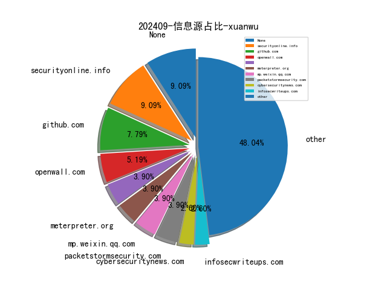

# [数据--所有](README_20.md)
# [数据--年度](README_2024.md)
# 202409 信息源与信息类型占比

# 网络安全书籍 推荐
| date_added | language | title | author | link | size| 
| --- | --- | --- | --- | --- | ---| 
| 2024-09-14 17:29:46 | English | beginners guide to streamlit with python | unknown | https://it-ebooks.info/book/1686051862-beginners_guide_to_streamlit_with_python/ | unknown| 
| 2024-09-13 06:30:44 | English | The Developer’s Playbook for Large Language Model Security | unknown | https://www.wowebook.org/the-developers-playbook-for-large-language-model-security/ | unknown| 
| 2024-09-13 06:05:02 | English | LLMs and Generative AI for Healthcare | unknown | https://www.wowebook.org/llms-and-generative-ai-for-healthcare/ | unknown| 
| 2024-09-13 22:52:43 | English | Tech Leadership Playbook: Building and Sustaining High-Impact Technology Teams | Alexsandro Souza | http://libgen.rs/book/index.php?md5=482841D406AF5358B3A378CED0BF4545 | 4 MB [PDF]| 
| 2024-09-13 19:48:56 | English | IT Audit Field Manual: Strengthen your cyber defense through proactive IT auditing | Lewis Heuermann | http://libgen.rs/book/index.php?md5=8FDEC5AAC4655735C883765F859F00F9 | 5 MB [EPUB]| 
| 2024-09-12 17:40:18 | English | Raspberry Pi IoT In Python Using GPIO Zero, 2nd Edition | Harry Fairhead, Mike James | http://libgen.rs/book/index.php?md5=39C0A42D027B4A8B43B07050C297F3FF | 25 MB [PDF]| 
| 2024-09-12 20:03:28 | English | Programming with GitHub Copilot: Write Better Code--Faster! | Kurt Dowswell | http://libgen.rs/book/index.php?md5=767B5E4F3636195C26B79C4825BFD1ED | 24 MB [PDF]| 
| 2024-09-12 19:43:03 | English | Build a Website with ChatGPT: No coding experience necessary | Paul McFedries | http://libgen.rs/book/index.php?md5=34E27654C547FC433E4348606C2FA8DA | 43 MB [EPUB]| 
| 2024-09-12 19:18:18 | English | Better APIs: Quality, Stability, Observability | Mikael Vesavuori | http://libgen.rs/book/index.php?md5=255C6B2C6E78F21F173E9CE82FFB78BB | 4 MB [PDF]| 
| 2024-09-12 19:18:17 | English | Better APIs: Quality, Stability, Observability | Mikael Vesavuori | http://libgen.rs/book/index.php?md5=ECFF1C92C65834889F1249B80A2B48E6 | 4 MB [EPUB]| 
| 2024-09-12 16:37:45 | English | Generative AI in Action | unknown | https://www.wowebook.org/generative-ai-in-action/ | unknown| 
| 2024-09-12 09:51:11 | English | Generative AI Application Integration Patterns | unknown | https://www.wowebook.org/generative-ai-application-integration-patterns/ | unknown| 
| 2024-09-12 09:11:41 | English | Continuous Testing, Quality, Security, and Feedback | unknown | https://www.wowebook.org/continuous-testing-quality-security-and-feedback/ | unknown| 
| 2024-09-12 08:55:22 | English | Mastering DevOps on Microsoft Power Platform | unknown | https://www.wowebook.org/mastering-devops-on-microsoft-power-platform/ | unknown| 
| 2024-09-11 06:14:07 | English | The Early-Career Professional’s Guide to Generative AI | unknown | https://www.wowebook.org/the-early-career-professionals-guide-to-generative-ai/ | unknown| 
| 2024-09-11 14:52:18 | English | Generative AI in Action | Amit Bahree | http://libgen.rs/book/index.php?md5=A44C80EC69D5BFE2065EB9B4824D341C | 29 MB [PDF]| 
| 2024-09-11 17:08:19 | English | Building AI Intensive Python Applications | unknown | https://www.wowebook.org/building-ai-intensive-python-applications/ | unknown| 
| 2024-09-11 16:58:17 | English | UX for Enterprise ChatGPT Solutions | unknown | https://www.wowebook.org/ux-for-enterprise-chatgpt-solutions/ | unknown| 
| 2024-09-11 16:40:40 | English | MS-700 Managing Microsoft Teams Exam Guide, Third Edition | unknown | https://www.wowebook.org/ms-700-managing-microsoft-teams-exam-guide-third-edition/ | unknown| 
| 2024-09-10 10:47:47 | English | Playful Python Projects | unknown | https://www.wowebook.org/playful-python-projects/ | unknown| 
| 2024-09-10 03:14:51 | English | Microsoft Copilot for Windows 11 | unknown | https://www.wowebook.org/microsoft-copilot-for-windows-11/ | unknown| 
| 2024-09-10 11:26:02 | English | Engage, Excel, and Elevate with Microsoft Viva Engage | unknown | https://www.wowebook.org/engage-excel-and-elevate-with-microsoft-viva-engage/ | unknown| 
| 2024-09-10 19:54:47 | English | Quantum Computing and Supply Chain Management: A New Era of Optimization | Pronaya Bhattacharya; Ahdi Hassan; Pushan Kumar Dutta | http://libgen.rs/book/index.php?md5=EA3173180C1272DBDE77FDE890836FA6 | 12 MB [EPUB]| 
| 2024-09-10 19:37:51 | English | The Ansible Workshop: Hands-On Learning For Rapid Mastery | Aymen El Amri | http://libgen.rs/book/index.php?md5=83DC4CB5A6354A083367A808B98F7F66 | 1 MB [EPUB]| 
| 2024-09-10 19:36:59 | English | Computer and Information Security Handbook | John R. Vacca (editor) | http://libgen.rs/book/index.php?md5=C137B482E13FC7DE27F38BC546B10A27 | 321 MB [RAR]| 
| 2024-09-10 19:36:57 | English | Computer and Information Security Handbook | John R. Vacca (editor) | http://libgen.rs/book/index.php?md5=5BAE65A20ED77B89B219F7237904A5FE | 309 MB [EPUB]| 
| 2024-09-10 18:27:23 | English | DevSecOps for Azure: End-to-end supply chain security for GitHub, Azure DevOps, and the Azure cloud | David Okeyode, Joylynn Kirui | http://libgen.rs/book/index.php?md5=CF6649101E36539CB856730EBB43E616 | 38 MB [EPUB]| 
| 2024-09-09 07:24:54 | English | (Series of computational physics) Thermal Physics Tutorial with Python Simulations | Kouh, Minjoon; Kouh, Taejoon | http://libgen.rs/book/index.php?md5=2A27B59C720F6EE2D308330BDFA79987 | 17 MB [EPUB]| 
| 2024-09-09 07:11:28 | English | Introduction to Engineering and Scientific Computing with Python | Clough, David E.; Chapra, Steven C. | http://libgen.rs/book/index.php?md5=E05EEED69898343EC1997CE722BE4FC3 | 20 MB [EPUB]| 
| 2024-09-09 06:55:00 | English | Computational Framework for the Finite Element Method in MATLAB® and Python | Sumets, Pavel | http://libgen.rs/book/index.php?md5=948BD8F613091DDD02AF223C79F26FB4 | 9 MB [EPUB]| 
| 2024-09-09 20:19:26 | English | Public Key Cryptography: 4th International Workshop on Practice and Theory in Public Key Cryptosystems, PKC 2001, Cheju Island, Korea, February 13-15, ... (Lecture Notes in Computer Science, 1992) | Kwangjo Kim (editor) | http://libgen.rs/book/index.php?md5=076ED84707F87B2F7447F4EC41E346A8 | 4 MB [PDF]| 
| 2024-09-09 19:53:47 | English | Data Mining with Python (Chapman & Hall/CRC The Python Series) | Di Wu | http://libgen.rs/book/index.php?md5=31EA5C5FC4E9E5051F6536E370F9748B | 14 MB [PDF]| 
| 2024-09-09 19:44:09 | English | Research Methodologies in Supply Chain Management | Herbert Kotzab, Stefan Seuring (editor), Martin Müller (editor), Gerald Reiner (editor) | http://libgen.rs/book/index.php?md5=69430E0B9B8B639DE3C5CF98F4FA18DA | 3 MB [PDF]| 
| 2024-09-08 12:19:18 | English | An Introduction to Derivative Securities, Financial Markets, and Risk Management (Third Edition) | Robert A Jarrow, Arkadev Chatterjea | http://libgen.rs/book/index.php?md5=01CECBF43561DBFD045D83965C2477A7 | 9 MB [PDF]| 
| 2024-09-08 08:35:43 | English | An Introduction to R and Python For Data Analysis: A Side-By-Side Approach | Brown, Taylor R. | http://libgen.rs/book/index.php?md5=647BA26BFE108210F8B5DF841D905D21 | 13 MB [EPUB]| 
| 2024-09-08 08:30:41 | English | (the python series) Introduction to Python for Humanists | William J.B. Mattingly | http://libgen.rs/book/index.php?md5=B26E0576E7B21A6E3F080E788109E13D | 20 MB [EPUB]| 
| 2024-09-08 08:29:25 | English | Python Packages | Tomas Beuzen; Tiffany Timbers | http://libgen.rs/book/index.php?md5=A78B3D2E03B34F080FE75F5AAA953177 | 19 MB [EPUB]| 
| 2024-09-08 08:12:08 | English | MS-700 Managing Microsoft Teams Exam Guide | Nate Chamberlain, Peter Rising | http://libgen.rs/book/index.php?md5=0DE950A2831B2CBCC1689755C1DF3DC9 | 33 MB [EPUB]| 
| 2024-09-08 21:00:01 | English | Microsoft Copilot for Windows 11: Understanding the AI-Powered Features in Windows 11 | Anand Narayanaswamy | http://libgen.rs/book/index.php?md5=6D4501EC5A5DF2A8874DDBB5ABBE295C | 16 MB [EPUB]| 
| 2024-09-08 20:44:50 | English | (Routledge Studies in Linguistics) Data Analytics for Discourse Analysis with Python: The Case of Therapy Talk | Dennis Tay | http://libgen.rs/book/index.php?md5=2B54E302E6119E08B6F5D989A3554BBD | 2 MB [EPUB]| 
| 2024-09-07 16:24:46 | English | Raspberry Pi OS System Administration with systemd and Python | Robert M. Koretsky | http://libgen.rs/book/index.php?md5=4A4C01522C8FAF247636D2326C80EB58 | 5 MB [EPUB]| 
| 2024-09-07 16:24:43 | English | Raspberry Pi OS System Administration with systemd and Python | Robert M. Koretsky | http://libgen.rs/book/index.php?md5=7FFBE025FA2BA956525D0C51169283F3 | 25 MB [PDF]| 
| 2024-09-07 18:27:12 | English | AI-Driven Cybersecurity and Threat Intelligence: Cyber Automation, Intelligent Decision-Making and Explainability | Iqbal H. Sarker | http://libgen.rs/book/index.php?md5=F769FFBB6993C406159444B5BD3DEB9E | 22 MB [RAR]| 
| 2024-09-07 18:27:10 | English | AI-Driven Cybersecurity and Threat Intelligence: Cyber Automation, Intelligent Decision-Making and Explainability | Iqbal H. Sarker | http://libgen.rs/book/index.php?md5=C58A9F13BC824576B8AF52F71D3EC772 | 14 MB [EPUB]| 
| 2024-09-07 18:27:08 | English | AI-Driven Cybersecurity and Threat Intelligence: Cyber Automation, Intelligent Decision-Making and Explainability | Iqbal H. Sarker | http://libgen.rs/book/index.php?md5=33A0BD999BD50B617E1D28C4069DAECB | 7 MB [PDF]| 
| 2024-09-07 18:26:10 | English | Next-Generation Cybersecurity: AI, ML, and Blockchain (Blockchain Technologies) | Keshav Kaushik (editor), Ishu Sharma (editor) | http://libgen.rs/book/index.php?md5=2FF104CAA6BD1A29DFFFDCBEBC4095AE | 38 MB [RAR]| 
| 2024-09-07 18:26:08 | English | Next-Generation Cybersecurity: AI, ML, and Blockchain (Blockchain Technologies) | Keshav Kaushik (editor), Ishu Sharma (editor) | http://libgen.rs/book/index.php?md5=43EBB4D256B5B2FAD1C926790B76CBF3 | 27 MB [EPUB]| 
| 2024-09-07 18:26:07 | English | Next-Generation Cybersecurity: AI, ML, and Blockchain (Blockchain Technologies) | Keshav Kaushik (editor), Ishu Sharma (editor) | http://libgen.rs/book/index.php?md5=C5ECC52EF2633DD787A8C335E5EF17E7 | 10 MB [PDF]| 
| 2024-09-07 23:48:58 | English | A Simple Introduction to Python (Chapman & Hall/CRC The Python Series) | Stephen Lynch | http://libgen.rs/book/index.php?md5=1F6CFF7B5E6B0D7D295461AFCE37B2A2 | 4 MB [EPUB]| 
| 2024-09-07 23:11:47 | English | UX for Enterprise ChatGPT Solutions: A practical guide to designing enterprise-grade LLMs | Richard H. Miller | http://libgen.rs/book/index.php?md5=18B22892108866E63198412E07AD6E22 | 16 MB [EPUB]| 
| 2024-09-06 12:43:08 | English | Implementing GitOps with Kubernetes | unknown | https://www.wowebook.org/implementing-gitops-with-kubernetes/ | unknown| 
| 2024-09-06 11:22:31 | English | Microsoft Power BI Performance Best Practices, Second Edition | unknown | https://www.wowebook.org/microsoft-power-bi-performance-best-practices-second-edition/ | unknown| 
| 2024-09-05 19:33:22 | English | Incident Response for Windows | unknown | https://www.wowebook.org/incident-response-for-windows/ | unknown| 
| 2024-09-05 16:52:33 | English | DevSecOps for Azure | unknown | https://www.wowebook.org/devsecops-for-azure/ | unknown| 
| 2024-09-05 11:59:46 | English | Securing Industrial Control Systems and Safety Instrumented Systems | unknown | https://www.wowebook.org/securing-industrial-control-systems-and-safety-instrumented-systems/ | unknown| 
| 2024-09-04 09:36:27 | English | Fraud Examination | W. Steve Albrecht, Chad O. Albrecht, Conan C. Albrecht, Mark F. Zimbelman | http://libgen.rs/book/index.php?md5=217BB3B9F56D57BF514CE6144E5AB92D | 2 MB [PDF]| 
| 2024-09-04 09:01:49 | English | Starting Out with Python (Pearson+) | Tony Gaddis | http://libgen.rs/book/index.php?md5=578A4251EFD147BE3BB212205F509107 | 1 MB [PDF]| 
| 2024-09-04 06:16:12 | English | Exam Ref AZ-104 Microsoft Azure Administrator | Charles Pluta; | http://libgen.rs/book/index.php?md5=D612CBAA9567B2126D2A07BA082E6DF8 | 38 MB [EPUB]| 
| 2024-09-03 13:12:09 | English | Microsoft 365 Copilot: Harness the Power of Generative AI in the Microsoft Apps You Use Every Day | Jess Stratton | http://libgen.rs/book/index.php?md5=0990DCFADBAC0FCD55B74B360BCDCF0D | 16 MB [EPUB]| 
| 2024-09-03 13:12:04 | English | Microsoft 365 Copilot: Harness the Power of Generative AI in the Microsoft Apps You Use Every Day | Jess Stratton | http://libgen.rs/book/index.php?md5=957E5CE1F13FAA7D21EA683E46FD834C | 37 MB [PDF]| 
| 2024-09-03 21:20:48 | English | Generative AI-Powered Assistant for Developers | unknown | https://www.wowebook.org/generative-ai-powered-assistant-for-developers/ | unknown| 
| 2024-09-03 20:35:51 | English | Hack the Cybersecurity Interview, Second Edition | unknown | https://www.wowebook.org/hack-the-cybersecurity-interview-second-edition/ | unknown| 
| 2024-09-03 20:04:00 | English | Accelerating IoT Development with ChatGPT | unknown | https://www.wowebook.org/accelerating-iot-development-with-chatgpt/ | unknown| 
| 2024-09-03 19:29:42 | English | The AI Value Playbook | unknown | https://www.wowebook.org/the-ai-value-playbook/ | unknown| 
| 2024-09-03 17:22:17 | English | Machine Learning and Generative AI for Marketing | unknown | https://www.wowebook.org/machine-learning-and-generative-ai-for-marketing/ | unknown| 
| 2024-09-02 05:04:13 | English | Advanced Excel 365: Including ChatGPT Tips | Ritu Arora | http://libgen.rs/book/index.php?md5=E80745E6123FD270D452A454375DE32E | 41 MB [RAR]| 
| 2024-09-02 10:56:51 | English | Python Feature Engineering Cookbook, Third Edition | unknown | https://www.wowebook.org/python-feature-engineering-cookbook-third-edition/ | unknown| 
| 2024-09-02 09:27:09 | English | Kubernetes: An Enterprise Guide, Third Edition | unknown | https://www.wowebook.org/kubernetes-an-enterprise-guide-third-edition/ | unknown| 
| 2024-09-02 08:19:02 | English | Mark as downloadedDownloaded Security and Privacy in Web 3.0 | Meng Shen, Xiangyun Tang, Wei Wang, Liehuang Zhu | http://libgen.rs/book/index.php?md5=9BA4003927D79EAE68669272404CA14E | 6 MB [PDF]| 
| 2024-09-01 23:42:40 | English | 100 Deadly Skills: The SEAL Operatives Guide to Eluding Pursuers, Evading Capture, and Surviving Any Dangerous Situation | Clint Emerson | http://libgen.rs/book/index.php?md5=E6AB747FE1C2E60E5B7BF1226F566D71 | 53 MB [AZW3]| 

# 微信公众号 推荐
| nickname_english | weixin_no | title | url| 
| --- | --- | --- | ---| 
| Khan安全攻防实验室 | None | 马上退休了 | https://mp.weixin.qq.com/s?__biz=MzAwMjQ2NTQ4Mg==&mid=2247494842&idx=1&sn=64329f42aefc31915339e12a795a8ab2 | 11| 
| 关键信息基础设施安全保护联盟 | None | 支撑网安行业发展，我国已发布389项国家标准 | https://mp.weixin.qq.com/s?__biz=MzkxNjU2NjY5MQ==&mid=2247506620&idx=2&sn=b29bbf2cbea7bd2bcd029b594353a193 | 8| 
| 利刃信安 | None | 别问中秋都发了啥，反正搬进来累死了！ | https://mp.weixin.qq.com/s?__biz=MzU1Mjk3MDY1OA==&mid=2247516536&idx=1&sn=59c234aa0805be2cc03b05a35e2b26f1 | 6| 
| 前沿信安资讯阵地 | None | 国家网络安全宣传周 , 黑客可以控制计算机并将为其所用。保持计算机安全，并学会识别感染迹象 | https://mp.weixin.qq.com/s?__biz=MzA3MTM0NTQzNA==&mid=2455778997&idx=1&sn=a50ef671e5f2babab78a3087de9abf4c | 7| 
| 安全学习那些事儿 | None | 学校未对4000多条学生个人信息脱敏或去标识化 南昌市网信办予以警告处罚 | https://mp.weixin.qq.com/s?__biz=MzkxNTI2NTQxOA==&mid=2247494053&idx=5&sn=a2f9ab6d1207aee158e91db76b574a56 | 26| 
| 浅安安全 | None | 工具 , BurpFingerPrint | https://mp.weixin.qq.com/s?__biz=MzkwMTQ0NDA1NQ==&mid=2247490621&idx=4&sn=3fa9fef66d22945a3c94e4190cac75b1 | 23| 
| 玄道夜谈 | None | 分享图片 | https://mp.weixin.qq.com/s?__biz=MzI3Njc1MjcxMg==&mid=2247493230&idx=1&sn=dd3de1bdd4fcb6a23c11aea431f929a1 | 7| 
| 网安加社区 | None | 做好预防与排查，拒绝恶意软件入侵！ | https://mp.weixin.qq.com/s?__biz=Mzg4MjQ4MjM4OA==&mid=2247519571&idx=2&sn=c6cf8b49f15d03b7f9b7dd1af54d9d3d | 12| 
| 网安守护 | None | 周鸿祎，这次直播确实有些尴尬啊！ | https://mp.weixin.qq.com/s?__biz=MzU4NDY3MTk2NQ==&mid=2247490625&idx=1&sn=44206f3a4a58113e08c2278161df1f8b | 1| 
| 船山信安 | None | 如何绕过Golang木马的HTTPS证书验证 | https://mp.weixin.qq.com/s?__biz=MzU2NDY2OTU4Nw==&mid=2247516192&idx=1&sn=1afc12bc4618da6586cf48332cef0eff | 9| 
| 苏说安全 | None | 《网络安全人才实战能力白皮书-安全测试评估篇》正式发布 | https://mp.weixin.qq.com/s?__biz=Mzg5OTg5OTI1NQ==&mid=2247488561&idx=1&sn=e0181b69e1c978ac46223d85917fd5a4 | 7| 
| 计算机与网络安全 | None | 2023年加密货币欺诈报告 | https://mp.weixin.qq.com/s?__biz=MjM5OTk4MDE2MA==&mid=2655255046&idx=8&sn=e76fd169a640ea59807f288ede571f5e | 51| 
| 高等精灵实验室 | None | Hoarder：一款功能强大的稍后阅读工具，囤积爱好者必备！ | https://mp.weixin.qq.com/s?__biz=MzA4MjkzMTcxMg==&mid=2449045913&idx=1&sn=4f12b3cc649da2f3cc0cfba5c9e2d9f5 | 5| 
| 高级红队专家 | None | HTB-CPTS刷Path进度 | https://mp.weixin.qq.com/s?__biz=MzIzODMyMzQxNQ==&mid=2247484136&idx=1&sn=281999648e5c3e806e1836ed1fc38fe7 | 2| 
| 360数字安全 | None | 360：让安全运营“自动驾驶”照进现实 | https://mp.weixin.qq.com/s?__biz=MzA4MTg0MDQ4Nw==&mid=2247575396&idx=1&sn=3df2e172397d8907ed4ed9e1e76f3a62 | 16| 
| CISSP | None | 网络安全项目常用招标证书 | https://mp.weixin.qq.com/s?__biz=Mzg4MTg0MjQ5OA==&mid=2247486576&idx=1&sn=e3c403f40b11506e149f9e808419a238 | 11| 
| CatalyzeSec | None | 万户协同办公平台ezoffice filesendcheck_gd SQL注入漏洞复现及POC | https://mp.weixin.qq.com/s?__biz=MzkxNjY1MjY3OQ==&mid=2247486361&idx=1&sn=c3a760a9131d252ca4b230fbbc8e2a99 | 6| 
| CertiK | None | 技术详解 , CertiK协助修复Solana大整数模幂运算中的DOS漏洞 | https://mp.weixin.qq.com/s?__biz=MzU5OTg4MTIxMw==&mid=2247503353&idx=1&sn=0638683a745a06bcfa2780066b864099 | 5| 
| Code4th安全团队 | None | 代码审计指南 - Github开源Java项目 | https://mp.weixin.qq.com/s?__biz=MzkzMzE5OTQzMA==&mid=2247485124&idx=1&sn=743da2cdbc41c7779fad5cd4de01adb5 | 2| 
| Day1安全团队 | None | 燃爆！两天三夜线下特训课，见证成长奇迹！ | https://mp.weixin.qq.com/s?__biz=MzU1NDU1NTI5Nw==&mid=2247487978&idx=1&sn=1a267eaa2ec7a52b2b0f1ae9eeeebc30 | 2| 
| EDI安全 | None | 玄机靶场护网应急类靶场投稿有奖活动正式启动！ | https://mp.weixin.qq.com/s?__biz=MzIzMTQ4NzE2Ng==&mid=2247495000&idx=1&sn=3342a68b2514fcb8990e2f803195fc8d | 1| 
| FreeBuf | None | 安全什么时候才能被看见? | https://mp.weixin.qq.com/s?__biz=MjM5NjA0NjgyMA==&mid=2651301847&idx=1&sn=2b5e0f8f4ee2f77d23333ec956ee7721 | 45| 
| GoUpSec | None | 微软“抢跑”量子安全技术，力推NIST抗量子加密算法标准 | https://mp.weixin.qq.com/s?__biz=MzkxNTI2MTI1NA==&mid=2247500565&idx=2&sn=ddc9a32df04603fba3d36594293ace82 | 4| 
| HW安全之路 | None | 【建议收藏】防黑必备！30个终极反间谍脚本，让系统坚不可摧【HW安全之路】 | https://mp.weixin.qq.com/s?__biz=MzI5MjY4MTMyMQ==&mid=2247485550&idx=1&sn=0754ea578798af0414ede825ff65687b | 6| 
| IoVSecurity | None | GB XXXXX-XXXX智能网联汽车时空数据安全处理基本要求（征求意见稿） | https://mp.weixin.qq.com/s?__biz=MzU2MDk1Nzg2MQ==&mid=2247613069&idx=3&sn=bd6a1070269162ad72e6f3df07ed2936 | 27| 
| KK安全说 | None | Meterpreter：安（黑）全（客）的终极命令指南 | https://mp.weixin.qq.com/s?__biz=Mzg4NzgyODEzNQ==&mid=2247488088&idx=1&sn=904abbfbfff8b880840dfb2e0ce106a5 | 6| 
| OWASP | None | 中秋特辑 , 共赏明月，守护安全 | https://mp.weixin.qq.com/s?__biz=MjM5OTk5NDMyMw==&mid=2652098899&idx=1&sn=38614d81e3768b2327d1424f3e472941 | 1| 
| Ots安全 | None | 顶级网络钓鱼技术 | https://mp.weixin.qq.com/s?__biz=MzAxMjYyMzkwOA==&mid=2247514418&idx=4&sn=4ed17e75a21d74c85932cadabdd2538a | 21| 
| Rsec | None | HTB靶场 sightless (Linux)[Easy] | https://mp.weixin.qq.com/s?__biz=MzA4NDQ5NTU0MA==&mid=2647690025&idx=1&sn=0c0ecf303f1083313a1b5641aaed3da4 | 2| 
| Yak Project | None | 超级牛哭诉常年被认错，Yaklang和Yakit有哪些区别 | https://mp.weixin.qq.com/s?__biz=Mzk0MTM4NzIxMQ==&mid=2247521347&idx=1&sn=767277c99e12f8fb2c08104b53fe6f99 | 1| 
| Z2O安全攻防 | None | SRC现状？难，太难了！ | https://mp.weixin.qq.com/s?__biz=Mzg2ODYxMzY3OQ==&mid=2247515459&idx=1&sn=e5f8a1c70d92c415e06686d47f03624f | 14| 
| e安在线 | None | 优衣库因离职员工访问超400名在职员工薪资信息 被罚27万欧元 | https://mp.weixin.qq.com/s?__biz=MzI1OTA1MzQzNA==&mid=2651246310&idx=1&sn=e08b63d5832055f7cd90812df43714d1 | 2| 
| solar专业应急响应团队 | None | 【新闻转载】因黑客窃取并泄露病人隐私，该医疗行业巨头支付了超4.6亿元的赔偿金 | https://mp.weixin.qq.com/s?__biz=MzkyOTQ0MjE1NQ==&mid=2247490930&idx=1&sn=69a30ea39b3ffb39458b99f1612fdf12 | 3| 
| 一起聊安全 | None | 国家互联网信息办公室关于《人工智能生成合成内容标识办法（征求意见稿）》公开征求意见的通知 | https://mp.weixin.qq.com/s?__biz=MzI3NjUzOTQ0NQ==&mid=2247514414&idx=2&sn=6ebde3008248d160bb6447a3178df100 | 6| 
| 丁爸 情报分析师的工具箱 | None | 【情报】美国推动澳大利亚、日本做对华战争准备 | https://mp.weixin.qq.com/s?__biz=MzI2MTE0NTE3Mw==&mid=2651146115&idx=1&sn=5b65ab6faedca72bf9117ad682921173 | 9| 
| 万径安全 | None | 关于举办2024年全国仿真创新应用大赛的通知 | https://mp.weixin.qq.com/s?__biz=MzIwMzI1MDg2Mg==&mid=2649944862&idx=1&sn=44345b3ded2287091760d6d1293bec5d | 2| 
| 丈八网安 | None | 丈八网安荣膺第九届“创客中国”网络安全中小企业创新创业大赛“卓越奖” | https://mp.weixin.qq.com/s?__biz=MzkwNzI1NDk0MQ==&mid=2247492003&idx=1&sn=82c63d8e61aa405b152d67d5d7e5a8c8 | 2| 
| 三沐数安 | None | UNC5537 针对 Snowflake 客户实例进行数据窃取和勒索 | https://mp.weixin.qq.com/s?__biz=MzU1NjczNjA0Nw==&mid=2247484957&idx=1&sn=86443a544d03e8830c1267d5b30baa59 | 9| 
| 中国电信安全 | None | 公告 , 电信安全中秋假期服务保障持续在线 | https://mp.weixin.qq.com/s?__biz=MzkxNDY0MjMxNQ==&mid=2247529998&idx=4&sn=2b5a75ec3e23e6b4aebdb364cd77af03 | 14| 
| 中国网络空间安全协会 | None | 国家互联网信息办公室关于《人工智能生成合成内容标识办法（征求意见稿）》公开征求意见的通知 | https://mp.weixin.qq.com/s?__biz=MzA3ODE0NDA4MA==&mid=2649400303&idx=1&sn=63433ed3430695f42577ee547b98428e | 13| 
| 中国软件评测中心 | None | 【奋进强国路 阔步新征程】从120亿元到39.9万亿元！中国制造实现跨越式增长 | https://mp.weixin.qq.com/s?__biz=MjM5NzYwNDU0Mg==&mid=2649247248&idx=3&sn=50f28dba526b43d01c78d0f396bb4fba | 17| 
| 乌雲安全 | None | 网络安全行业推荐证书 | https://mp.weixin.qq.com/s?__biz=MzAwMjA5OTY5Ng==&mid=2247524001&idx=2&sn=0c982076766f646e833ae05259f11d43 | 6| 
| 云弈安全 | None | 月满中秋，“弈”起团圆 , 云弈科技祝您节日快乐！ | https://mp.weixin.qq.com/s?__biz=MzU2ODY0ODk2Nw==&mid=2247489440&idx=1&sn=dd746e5f2dad56d358359549f1ddd3ca | 3| 
| 亚信安全 | None | 【安全护航 合作共赢】系列——亚信安全浙江总代安刻科技 | https://mp.weixin.qq.com/s?__biz=MjM5NjY2MTIzMw==&mid=2650618910&idx=2&sn=9e7f68e3a8a62ed22d0caec386fecc14 | 14| 
| 京东安全应急响应中心 | None | 【公告】JSRC八月英雄榜单揭晓 | https://mp.weixin.qq.com/s?__biz=MjM5OTk2MTMxOQ==&mid=2727838667&idx=2&sn=06aa58dce3012760607480d0fc67804e | 3| 
| 信安王子 | None | 实时更新的漏洞库索引工具推荐 | https://mp.weixin.qq.com/s?__biz=Mzg4MjY5MDE4NA==&mid=2247484226&idx=1&sn=4bd1a82ac2d7f30f8bdf0fbf9408d78c | 3| 
| 信息安全D1net | None | Aflac引领保险业身份验证变革 通过无密码认证提升客户体验与安全 | https://mp.weixin.qq.com/s?__biz=MzA3NTIyNzgwNA==&mid=2650259137&idx=1&sn=720f216188cf08cfddff0596a93134ab | 7| 
| 信息安全研究 | None | 【业界动态】城市全域数字化转型现场推进会在重庆市召开 | https://mp.weixin.qq.com/s?__biz=MzA3NzgzNDM0OQ==&mid=2664989799&idx=3&sn=94eba2137c9588f553a70fdb6120f117 | 25| 
| 儒道易行 | None | 有些事情不是看到希望才去坚持，而是坚持了才会看到希望。 | https://mp.weixin.qq.com/s?__biz=Mzg5NTU2NjA1Mw==&mid=2247492757&idx=2&sn=39007a25d85965d90e7f6d1772e52d07 | 14| 
| 全球技术地图 | None | 美国和新加坡举行第14届战略安全政策对话 | https://mp.weixin.qq.com/s?__biz=MzI1OTExNDY1NQ==&mid=2651615617&idx=2&sn=adf96d4af60e5a40d876fdc66509adec | 19| 
| 内生安全联盟 | None | 全国网安标委征求《网络安全技术 网络身份认证公共服务应用接入规范》（征求意见稿）等4项国家标准意见 | https://mp.weixin.qq.com/s?__biz=Mzg4MDU0NTQ4Mw==&mid=2247523488&idx=2&sn=2645253817fff0a34d0d765ff8474144 | 18| 
| 冷漠安全 | None | 「漏洞复现」紫光电子档案管理系统 selectFileRemote SQL注入漏洞 | https://mp.weixin.qq.com/s?__biz=MzkyNDY3MTY3MA==&mid=2247485453&idx=1&sn=f0fde752197744226aaadb8748d186ef | 9| 
| 千寻安服 | None | SSTI-Tornado | https://mp.weixin.qq.com/s?__biz=MzkzMzI3OTczNA==&mid=2247487279&idx=1&sn=bf0efb1331c1102d37dbfd85ddbc0895 | 1| 
| 华为安全 | None | 第二届“天网杯”网络安全大赛，华为安全产品零漏洞完赛 | https://mp.weixin.qq.com/s?__biz=MzAwODU5NzYxOA==&mid=2247505032&idx=2&sn=c75b3ad01df79dd65e9b15f78d79cd51 | 7| 
| 华为安全应急响应中心 | None | 第二届“天网杯”网络安全大赛，华为安全产品零漏洞完赛 | https://mp.weixin.qq.com/s?__biz=MzI0MTY5NDQyMw==&mid=2247523288&idx=1&sn=9b5e9b542ad1cdb1cd97d8156cd0f394 | 2| 
| 吉祥快学网络安全吧 | None | 终身禁止！真行，火箭军查处270名失信专家！ | https://mp.weixin.qq.com/s?__biz=MzkzMzcxNTQyNw==&mid=2247484847&idx=1&sn=279abb17cedba30c80250f79bafdcccd | 5| 
| 君说安全 | None | “道常无名”不仅是一种处世哲学更是一种生活态度 | https://mp.weixin.qq.com/s?__biz=MzUzNjkxODE5MA==&mid=2247486791&idx=1&sn=5f4efadc9842e1569076580216557f06 | 3| 
| 启明星辰集团 | None | 2024网安周 , 启明星辰多地联动，共筑国家网络安全防线 | https://mp.weixin.qq.com/s?__biz=MzA3NDQ0MzkzMA==&mid=2651727943&idx=1&sn=eb588785f8f8b8fec7f611cf650d2e82 | 12| 
| 商密君 | None | 因勒索攻击泄露患者敏感数据，这家医疗巨头赔偿超4.6亿元 | https://mp.weixin.qq.com/s?__biz=MzI5NTM4OTQ5Mg==&mid=2247630366&idx=4&sn=3c9d9ab5a25ae045c1c7b4b91a375dc4 | 45| 
| 嘶吼专业版 | None | 网络安全巨头 Fortinet 证实遭遇数据泄露 | https://mp.weixin.qq.com/s?__biz=MzI0MDY1MDU4MQ==&mid=2247577995&idx=2&sn=cd26b1312eefd89a0b015b6bfab46deb | 6| 
| 国际云安全联盟CSA | None | 【丰厚奖金池】外滩大会：CSA大中华区携手学界与业界，以科技竞赛推动大模型安全发展 | https://mp.weixin.qq.com/s?__biz=MzkwMTM5MDUxMA==&mid=2247499027&idx=1&sn=d8c7782e2a1ba4ee0bb21454bdbe904e | 5| 
| 天御攻防实验室 | None | 与Hunters International勒索软件团伙的谈判记录 | https://mp.weixin.qq.com/s?__biz=MzU0MzgyMzM2Nw==&mid=2247486000&idx=1&sn=45e69cc203c96a48457c6e699cc9451a | 1| 
| 天融信 | None | 共筑网安，共享美好数字生活~天融信2024网安周全国行 | https://mp.weixin.qq.com/s?__biz=MzA3OTMxNTcxNA==&mid=2650943060&idx=3&sn=2618f5d94712c2eeae5b33ec92ca660b | 15| 
| 天融信教育 | None | 每日安全提醒~ | https://mp.weixin.qq.com/s?__biz=MzU0MjEwNTM5Ng==&mid=2247519726&idx=5&sn=3f2a4ebd1a516a127f5a5dff9e8bd8f9 | 16| 
| 奇安信病毒响应中心 | None | 每周勒索威胁摘要 | https://mp.weixin.qq.com/s?__biz=MzI5Mzg5MDM3NQ==&mid=2247496748&idx=1&sn=8225f1f5a2c23de24ac1ce676fc66c75 | 3| 
| 奇安盘古 | None | 北京市第六届职业技能大赛电子数据取证分析师赛项圆满落幕 | https://mp.weixin.qq.com/s?__biz=MzI2MDA0MTYyMQ==&mid=2654404321&idx=1&sn=deb3629dc1a9a1167d0df14820637b04 | 1| 
| 奇安网情局 | None | 美国网络司令部公布网络作战人工智能路线图 | https://mp.weixin.qq.com/s?__biz=MzI4ODQzMzk3MA==&mid=2247489085&idx=1&sn=e2c3159918d0bb6bb6d44e7cc3e84d29 | 1| 
| 威零安全实验室 | None | 【免杀】导出 Lsass.exe 内存工具 过360动态、火绒 xlrls 正式发布！ | https://mp.weixin.qq.com/s?__biz=Mzg4Mzg4OTIyMA==&mid=2247485730&idx=1&sn=ebd08790f27f86b2e308404f4464e9d7 | 3| 
| 安世加 | None | 国家互联网信息办公室关于《人工智能生成合成内容标识办法（征求意见稿）》公开征求意见的通知 | https://mp.weixin.qq.com/s?__biz=MzU2MTQwMzMxNA==&mid=2247540059&idx=1&sn=bbad897b33db87037c6198af46039854 | 13| 
| 安信安全 | None | 网络安全巨头Fortinet发生大规模数据泄漏 | https://mp.weixin.qq.com/s?__biz=MzAxNTYwOTU1Mw==&mid=2650091807&idx=1&sn=888205e31b6080328210c366daeee822 | 3| 
| 安全419 | None | “探索无限量 安全新未来” 密码创新大会2024在京举办 | https://mp.weixin.qq.com/s?__biz=MzUyMDQ4OTkyMg==&mid=2247542118&idx=2&sn=db2651b7de9d8006c579532dcd5e9e36 | 24| 
| 安全内参 | None | 国家网信办《人工智能生成合成内容标识办法》公开征求意见 | https://mp.weixin.qq.com/s?__biz=MzI4NDY2MDMwMw==&mid=2247512624&idx=2&sn=09ad285d75a640c274ed22d16dd74bdd | 18| 
| 安全新说 | None | 国家互联网信息办公室关于《人工智能生成合成内容标识办法（征求意见稿）》公开征求意见的通知 | https://mp.weixin.qq.com/s?__biz=MzA3NDIwNTY5Mw==&mid=2247506213&idx=1&sn=03e70479fbc947fbcaa9ff0dcced0787 | 6| 
| 安全研究GoSSIP | None | 【丰厚奖金池】外滩大会：全球AI攻防挑战赛报名启动，探索大模型时代攻防之道 | https://mp.weixin.qq.com/s?__biz=Mzg5ODUxMzg0Ng==&mid=2247498865&idx=1&sn=3d3bfbe9e7602995b2d61b51f86a4ff0 | 6| 
| 安全笔记 | None | Phpstorm+Xdebug动态调试php代码教程 | https://mp.weixin.qq.com/s?__biz=Mzg3NDc3NDQ3NA==&mid=2247484637&idx=1&sn=481534fceecd4a78358454d03a447aef | 1| 
| 安天移动安全 | None | 死灰复燃！小圈交友涉黄、招嫖乱象亟待重视 | https://mp.weixin.qq.com/s?__biz=MjM5NTY4NzcyNg==&mid=2650249688&idx=1&sn=bd012e3e0086ddd6708e499e7c4f249d | 1| 
| 安天集团 | None | 从方法框架到安全实践 安天持续践行“网络安全为人民，网络安全靠人民” | https://mp.weixin.qq.com/s?__biz=MjM5MTA3Nzk4MQ==&mid=2650207006&idx=1&sn=a7417f0cbe7b87f4907b49031c0f76f1 | 7| 
| 安恒信息 | None | 网安周星火传递十一年，安恒信息奔赴全国69城 | https://mp.weixin.qq.com/s?__biz=MjM5NTE0MjQyMg==&mid=2650614527&idx=2&sn=d6da53d41ca905ee3051cc56879dc86a | 7| 
| 安知讯 | None | 近5年信息科技风险罚单统计：涉国有行、股份行、城农商行等 | https://mp.weixin.qq.com/s?__biz=MzIxMDIwODM2MA==&mid=2653930808&idx=1&sn=c7df5973ac74b115f62ae6970c3ca2a3 | 19| 
| 安羽安全 | None | 商混ERP operater-action.aspx SQL注入漏洞 | https://mp.weixin.qq.com/s?__biz=MzkwMzY5NTg0Mg==&mid=2247484002&idx=1&sn=bc022018cf06f10b9ec46fd4b7314b9a | 2| 
| 小惜渗透 | None | 又收费了？没关系我会出手 | https://mp.weixin.qq.com/s?__biz=Mzg3OTcxMjE2NQ==&mid=2247487051&idx=2&sn=003108e69c20215486d0bfc88a1c4308 | 1| 
| 山海之关 | None | 重发【已复现】e-cology v10远程代码执行漏洞 | https://mp.weixin.qq.com/s?__biz=Mzg4MjcxMTAwMQ==&mid=2247488433&idx=2&sn=abd228e4cc8ecf441035fc371270161a | 1| 
| 山石网科新视界 | None | 中秋话安全｜山石网科 与 CMI共聚多行业用户 | https://mp.weixin.qq.com/s?__biz=MzAxMDE4MTAzMQ==&mid=2661294374&idx=2&sn=9adc29385d8d77a0174c5109c8a34e90 | 5| 
| 工业安全产业联盟平台 | None | ICSISIA祝您中秋快乐，阖家幸福！ | https://mp.weixin.qq.com/s?__biz=MzI2MDk2NDA0OA==&mid=2247529250&idx=1&sn=6ec9cabd1674e36f3315d6d6c8ef8934 | 7| 
| 平航科技 | None | 【福满中秋，花好月圆】平航科技中秋放假通知 | https://mp.weixin.qq.com/s?__biz=MzI0OTEyMTk5OQ==&mid=2247493540&idx=1&sn=051514735a73b67388582b31299b64fa | 1| 
| 开源网安 | None | 开源网安中秋节假期值岗通知 | https://mp.weixin.qq.com/s?__biz=MzI0NzY1MDgyMw==&mid=2247512353&idx=2&sn=c328a778b5f55d8c06e397ae00685750 | 7| 
| 张无瑕思密达 | None | 2030，中国人口崩塌拐点 | https://mp.weixin.qq.com/s?__biz=MzkwMzI1ODUwNA==&mid=2247487455&idx=1&sn=d5242bb53d670a5ca13b6a7ec85efc0a | 2| 
| 悟安 | None | 网络安全为人民，网络安全靠人民 | https://mp.weixin.qq.com/s?__biz=MzU5MTIxNzg0Ng==&mid=2247487927&idx=1&sn=40635c74b49a5c8bc9d541ef2a9ca621 | 1| 
| 情报分析站 | None | 中国开源情报分析的真实案例 | https://mp.weixin.qq.com/s?__biz=MzkxMDIwMTMxMw==&mid=2247493825&idx=1&sn=a8ca700477d4152fcb19d35ffb12e4a2 | 1| 
| 我不懂安全 | None | 应急响应实战---是谁修改了我的密码？ | https://mp.weixin.qq.com/s?__biz=Mzg2NDcwNjkzNw==&mid=2247487150&idx=1&sn=8aefa8324fa68e79deeddb9b95daa43b | 2| 
| 我吃饼干 | None | 【漏洞复现】哲霖机械ERP存在DownloadInpFile任意文件读取漏洞 | https://mp.weixin.qq.com/s?__biz=MzkzODY2ODA0OA==&mid=2247485836&idx=3&sn=6e78c9915edf51d686714d150a9649f5 | 4| 
| 掌控安全EDU | None | 利用shuji还原webpack打包源码 | https://mp.weixin.qq.com/s?__biz=MzUyODkwNDIyMg==&mid=2247543553&idx=1&sn=6c0bff9f001822ad5196a886282024d5 | 9| 
| 攻城狮成长日记 | None | Docker镜像源不再受限，开发者的极速时代现已开启！ | https://mp.weixin.qq.com/s?__biz=MjM5OTc5MjM4Nw==&mid=2457382676&idx=1&sn=21f313f1e2ee33ad17190923ff44a3fe | 7| 
| 教育网络信息安全 | None | 招贤纳士 | https://mp.weixin.qq.com/s?__biz=MzI0ODI4Njk0Ng==&mid=2247492104&idx=2&sn=f0f98c0e6ed79795bbc047be0ef23192 | 2| 
| 数世咨询 | None | 【再添“国字号”！】金睛云华登榜国家工信部专精特新“小巨人” | https://mp.weixin.qq.com/s?__biz=MzkxNzA3MTgyNg==&mid=2247516039&idx=2&sn=a006e48f3fe29d6d8c6757b84089d329 | 10| 
| 数说安全 | None | AI驱动安全，金睛云华登榜国家工信部专精特新“小巨人” | https://mp.weixin.qq.com/s?__biz=MzkzMDE5MDI5Mg==&mid=2247507684&idx=2&sn=f624d05749f9d03518c7b1f9a59b621e | 9| 
| 星尘安全 | None | 网安巨头Fortinet竟遭受黑客攻击，440G文件泄露 | https://mp.weixin.qq.com/s?__biz=Mzg3NTY0MjIwNg==&mid=2247484701&idx=1&sn=d9bff02c8094cfe4f67bb3cdf5174559 | 2| 
| 星悦安全 | None | mooder知识共享平台搭建 | https://mp.weixin.qq.com/s?__biz=Mzg4MTkwMTI5Mw==&mid=2247485541&idx=1&sn=78635d2a403e67eaacd9deab2a926c99 | 9| 
| 智检安全 | None | 模糊测试基础（一） | https://mp.weixin.qq.com/s?__biz=MzkyNTUyOTk0NA==&mid=2247487646&idx=1&sn=0d57c4ddd70a5d9d968cbacec91d95e5 | 3| 
| 暗影网安实验室 | None | 阿里云盘惊现灾难级bug！ 可查看其它用户云盘图片 | https://mp.weixin.qq.com/s?__biz=MzIyNTIxNDA1Ng==&mid=2659210453&idx=1&sn=a6c6f6e3b54f9e594cad40cc5ff7ca8e | 6| 
| 梅苑安全 | None | 实战中获取JS文件的各种场景 | https://mp.weixin.qq.com/s?__biz=MzkwMTU2NzMwOQ==&mid=2247484404&idx=1&sn=295e4209184c53c46e52adcebc2733ea | 6| 
| 梆梆安全 | None | 再获殊荣！梆梆安全荣获第九届“创客中国”网络安全中小企业创新创业大赛“卓越奖” | https://mp.weixin.qq.com/s?__biz=MjM5NzE0NTIxMg==&mid=2651134164&idx=1&sn=2693d6731271a0b90e83b9355fbe637e | 12| 
| 每天一个入狱小技巧 | None | 应急响应实战---是谁修改了我的密码？ | https://mp.weixin.qq.com/s?__biz=Mzg2MzYzNjEyMg==&mid=2247487195&idx=1&sn=e4ca2df47290e4f4578213edb1be4cbe | 1| 
| 永信至诚 | None | 香港网络安全专题技术论坛丨永信至诚付磊：「数字风洞」护航数字时代安全感 | https://mp.weixin.qq.com/s?__biz=MzAwNDUyMjk4MQ==&mid=2454827452&idx=1&sn=12f3c818473295fdb13ad95016fa484a | 1| 
| 泷羽Sec | None | 伪静态注入的几种方式 | https://mp.weixin.qq.com/s?__biz=Mzg2Nzk0NjA4Mg==&mid=2247491135&idx=1&sn=d1bebeeb65fcc872452aa2b113a35c27 | 3| 
| 泽鹿安全 | None | 泽鹿安全荣获“泰山杯”团体一等奖！！！ | https://mp.weixin.qq.com/s?__biz=Mzg5MjE1NzgzMw==&mid=2247489109&idx=1&sn=3a5563eb737a0cc8b35efac06094247c | 3| 
| 深信服科技 | None | 深信服助力西南空管局第一届“安康杯”网络安全职业技能大赛成功举办！ | https://mp.weixin.qq.com/s?__biz=MjM5MTAzNjYyMA==&mid=2650591821&idx=2&sn=d134691522eb769ca3acce53a149510e | 5| 
| 湖南省网络空间安全协会 | None | 公安部公布！ | https://mp.weixin.qq.com/s?__biz=MzAwMTg3MDQzOA==&mid=2247510155&idx=1&sn=0168e0a23a04aae6200ff542f4439dc1 | 4| 
| 源鲁安全实验室 | None | CTF参赛攻略：如何在“源鲁杯”脱颖而出？ | https://mp.weixin.qq.com/s?__biz=Mzg5MDk3MTgxOQ==&mid=2247497213&idx=1&sn=9a5166047d13caf0ef016bf7bd00c05d | 3| 
| 火绒安全 | None | 中秋期间火绒将持续为您护航 | https://mp.weixin.qq.com/s?__biz=MzI3NjYzMDM1Mg==&mid=2247519910&idx=1&sn=387959d6bcd4ab8de27c449d67b3a4c5 | 5| 
| 爱加密 | None | 爱加密亮相五大网安周会场，积极贡献产业侧力量！ | https://mp.weixin.qq.com/s?__biz=MjM5NzU4NjkyMw==&mid=2650745645&idx=1&sn=b8540360f3a04e1d4d12e79920098aad | 5| 
| 独眼情报 | None | 无人机表演有点炸裂 | https://mp.weixin.qq.com/s?__biz=MzkzNDIzNDUxOQ==&mid=2247489512&idx=3&sn=7e460674d9e413b758cc36b23f1d1039 | 40| 
| 电科网安 | None | spring中不同类型的的bean注入 | https://mp.weixin.qq.com/s?__biz=MzU3ODk0MzE4OA==&mid=2247487465&idx=3&sn=909855c51c10699bb82052bc7806f7b8 | 6| 
| 白帽子左一 | None | Google Dorks 发现隐藏的端点和参数 | https://mp.weixin.qq.com/s?__biz=MzI4NTcxMjQ1MA==&mid=2247612918&idx=2&sn=312d50d715c1d8a07450061d18a9eaf9 | 8| 
| 白帽子社区团队 | None | 向日葵RCEbypass | https://mp.weixin.qq.com/s?__biz=MzkzNDQ0MDcxMw==&mid=2247486880&idx=1&sn=e898bb43f0ebcd28df583ed34e08ef82 | 5| 
| 白帽黑客训练营 | None | 这是被我端掉的一个赌博网站，涉案流水高达一个亿 | https://mp.weixin.qq.com/s?__biz=MzIzNjIwNTQ5MQ==&mid=2247485006&idx=1&sn=3c501832bd8e9f474448d99470604479 | 4| 
| 盘古石取证 | None | 盘古石取证 - 中秋假期服务值班表 | https://mp.weixin.qq.com/s?__biz=Mzg3MjE1NjQ0NA==&mid=2247504247&idx=1&sn=c6fd932db962bb72eb5479d44a8449df | 3| 
| 看雪学苑 | None | 新课来袭 , WMBa0带你领略Android逆向的魅力！ | https://mp.weixin.qq.com/s?__biz=MjM5NTc2MDYxMw==&mid=2458573672&idx=3&sn=f342cf8d2eecc2a51e1c4245721a5eed | 37| 
| 知道创宇404实验室 | None | 原创 Paper , 使用 Peach 进行基于变异和生成的 fuzzing | https://mp.weixin.qq.com/s?__biz=MzAxNDY2MTQ2OQ==&mid=2650988702&idx=1&sn=281656d78aeb3f4318336630f589cab8 | 5| 
| 秦安战略 | None | 王常胜：认为挖公有医院人才是外商独资医院存在的弊端，有点浅薄 | https://mp.weixin.qq.com/s?__biz=MzA5MDg1MDUyMA==&mid=2650473554&idx=2&sn=300ab72046105d4cb7f09c157598bcd1 | 26| 
| 米好信安 | None | 赛事通知,2024一带一路暨金砖国家技能发展与技术创新大赛之企业信息系统安全赛项国内决赛的通知 | https://mp.weixin.qq.com/s?__biz=MzU1NTYxMjA5MA==&mid=2247503309&idx=1&sn=85316d0217f94d56852730d0fa2fe9f0 | 5| 
| 紫队安全研究 | None | 谷歌揭露全球270多个国家支持的黑客组织：APT28和APT35成焦点 | https://mp.weixin.qq.com/s?__biz=Mzg3OTYxODQxNg==&mid=2247484972&idx=1&sn=68830105286548dc2a317cffd1c76d86 | 6| 
| 绿盟科技 | None | 网安小侦探（七）,xa0保密任务进行时：勇扛责任，顶住无形压力 | https://mp.weixin.qq.com/s?__biz=MjM5ODYyMTM4MA==&mid=2650458383&idx=3&sn=f15d762691242c2147eaefe4306491d5 | 23| 
| 网安探索员 | None | 小白必看的Bypass WAF食用方法 | https://mp.weixin.qq.com/s?__biz=MzkzNTYwMTk4Mw==&mid=2247487268&idx=1&sn=cdba3ae6d7c6cd7ecd90ff06245cc74e | 5| 
| 网络与信息法学会 | None | 【资讯】中央网信办就《网络安全技术 人工智能生成合成内容标识方法》强制性国家标准（征求意见稿）公开征求意见 | https://mp.weixin.qq.com/s?__biz=MzU1NDY3NDgwMQ==&mid=2247545360&idx=2&sn=be1671ab057cb60ee30043c0bd6896ee | 19| 
| 网络安全创新服务基地 | None | 中网信安受邀2024现代化产业体系人才创新创业盛会 王超博士作精彩项目路演 | https://mp.weixin.qq.com/s?__biz=MzA3Nzk3NTA4Nw==&mid=2247515531&idx=1&sn=92856b32c5383956f8430090e6f1db6c | 8| 
| 网络安全透视镜 | None | 45岁失业，65岁领退休金，资本主义国家老工人晚景凄凉—人民日报视角看当下 | https://mp.weixin.qq.com/s?__biz=MzIxMTg1ODAwNw==&mid=2247500260&idx=1&sn=286e42f30cf54e7ec0e0468cc0d45f9c | 2| 
| 网络技术干货圈 | None | 50个华为和华三设备的常用命令，对比着看真直观！ | https://mp.weixin.qq.com/s?__biz=MzUyNTExOTY1Nw==&mid=2247526665&idx=1&sn=787f23c04a39d7c13838cb5b8be71676 | 5| 
| 网络研究观 | None | 新的 AutoIt 恶意软件迫使用户在自助服务终端模式下交出凭证 | https://mp.weixin.qq.com/s?__biz=MzkxNDM4OTM3OQ==&mid=2247502203&idx=5&sn=22a01ced3d59bd2c8d0d2deaddfb7dc4 | 42| 
| 美亚柏科 | None | 福建省见义勇为基金会成立30周年纪录片重磅发布 | https://mp.weixin.qq.com/s?__biz=MjM5NTU4NjgzMg==&mid=2651420639&idx=3&sn=4d6d81a7b8170a29c32d0957f43e01a0 | 12| 
| 腾讯玄武实验室 | None | 每日安全动态推送(9-14) | https://mp.weixin.qq.com/s?__biz=MzA5NDYyNDI0MA==&mid=2651959795&idx=1&sn=689e70fbb370d6f6b7a8a298f31996b1 | 6| 
| 虎符智库 | None | 深入探讨：人工智能生态系统的安全性 | https://mp.weixin.qq.com/s?__biz=MzIwNjYwMTMyNQ==&mid=2247492246&idx=1&sn=71f881b1e1f6801e0390522b1a0e88e4 | 1| 
| 蚁景网安 | None | 2024年国家网络安全宣传周-电信网络诈骗 | https://mp.weixin.qq.com/s?__biz=MzkyNTY3Nzc3Mg==&mid=2247486997&idx=2&sn=ba131a6c7d1f9353ee75c7327594067f | 14| 
| 蜚语科技 | None | 蜚语科技荣获《2024年度AI4SE“银弹”优秀案例》, 大模型技术引领软件安全行业应用典范 | https://mp.weixin.qq.com/s?__biz=MzI5NzI5NzY1MA==&mid=2247486227&idx=1&sn=0f89ce2a448a8fdcfeaaf4dba90c7c40 | 2| 
| 螣龙Vision | None | 连GPU都没用，凭什么说16是AI phone？ | https://mp.weixin.qq.com/s?__biz=MzkyMDIyNTAzMA==&mid=2247488004&idx=1&sn=53da4abf59a687f1b473d39c50320e18 | 1| 
| 谈思实验室 | None | 人气与实力并存！小米荣获“AutoSec Awards安全之星”杰出汽车信息安全实验室 | https://mp.weixin.qq.com/s?__biz=MzIzOTc2OTAxMg==&mid=2247543249&idx=3&sn=8ea7337b54286681e2417002d7d42621 | 23| 
| 赛博研究院 | None | 关于Fortinet数据泄露，你需要知道什么？ | https://mp.weixin.qq.com/s?__biz=MzUzODYyMDIzNw==&mid=2247510523&idx=1&sn=77ace428f847211922c8105fed8420cb | 12| 
| 赛宁网安 | None | 赛宁护航 , “鹏城·赛宁”工业场景防御锦标赛报名通道开启！ | https://mp.weixin.qq.com/s?__biz=MzA4Mjk5NjU3MA==&mid=2455486568&idx=1&sn=a900e72e826a3549cf4383afbab8a90f | 4| 
| 超安全 | None | 个人信息与隐私保卫战 , 莫让朋友圈成为“隐私泄露”高发地！ | https://mp.weixin.qq.com/s?__biz=MzU0MDc5ODM0Mg==&mid=2247484628&idx=1&sn=6608f5b6f8f02444ec316387d3bbc28e | 1| 
| 轩公子谈技术 | None | 应急响应实战---是谁修改了我的密码？反正不是我 | https://mp.weixin.qq.com/s?__biz=MzU3MDg2NDI4OA==&mid=2247490045&idx=1&sn=1ca330636fe5c36f15cd8b41d2f31ad0 | 1| 
| 迪哥讲事 | None | src挖掘-记一次付费资源的sign绕过 | https://mp.weixin.qq.com/s?__biz=MzIzMTIzNTM0MA==&mid=2247495886&idx=1&sn=0f13fdd7ee90374c8f665f8cccefe6e2 | 9| 
| 迪普科技 | None | 迪普科技2024年中秋节假期保障通知 | https://mp.weixin.qq.com/s?__biz=MzA4NzE5MzkzNA==&mid=2650362604&idx=2&sn=8ebac817d553263dfe47f9aebb82e80d | 6| 
| 道玄网安驿站 | None | SNMP服务泄露信息突破边界 | https://mp.weixin.qq.com/s?__biz=Mzg4NTg5MDQ0OA==&mid=2247486746&idx=1&sn=a2a12fe6329a9fc6fe794cac3ff903f1 | 1| 
| 金盾信安 | None | 中央网信办就强制性国家标准《网络安全技术 人工智能生成合成内容标识方法》征求意见 | https://mp.weixin.qq.com/s?__biz=MjM5NjA2NzY3NA==&mid=2448671382&idx=3&sn=8f791b92cdb557045e5546c040cc8a41 | 21| 
| 锐眼安全实验室 | None | 马上过节，注意防范勒索病毒 | https://mp.weixin.qq.com/s?__biz=MzIyOTczMjI2MQ==&mid=2247486386&idx=1&sn=c75c6399ae69c814da4d579052e385a1 | 3| 
| 阿乐你好 | None | 某研究所招聘威胁情报工程师 初、中、高级 | https://mp.weixin.qq.com/s?__biz=MzIxNTIzNTExMQ==&mid=2247490210&idx=1&sn=4547ed46a1227aeb3ca4ecda9576de3d | 2| 
| 阿里云安全 | None | 阿里云亮相2024国家网安周 , AI驱动的云上新质安全成亮点 | https://mp.weixin.qq.com/s?__biz=MzA4MTQ2MjI5OA==&mid=2664091194&idx=1&sn=887670f6b85c25b50d54cb0cd91b640c | 2| 
| 阿里安全响应中心 | None | 特别奖励揭晓｜14家SRC邀您加入双11安全保卫战 | https://mp.weixin.qq.com/s?__biz=MzIxMjEwNTc4NA==&mid=2652995524&idx=1&sn=c769c5eff83b3a08fc09af7fd9cad94d | 4| 
| 隼目安全 | None | 【漏洞情报】惊！PC端某云盘存在Bug？ | https://mp.weixin.qq.com/s?__biz=Mzk0OTUwNTU5Nw==&mid=2247486492&idx=1&sn=98cf86db13198f7536c05f0ee025a34e | 1| 
| 青春计协 | None | 一次简单通用漏洞挖掘 | https://mp.weixin.qq.com/s?__biz=Mzg4MzU3MTcwNg==&mid=2247485703&idx=1&sn=54fe4f888a552a21a9049472d6daff2a | 2| 
| 飓风网络安全 | None | 9.14hvv情报 | https://mp.weixin.qq.com/s?__biz=MzI3NzMzNzE5Ng==&mid=2247488875&idx=1&sn=1c444328bd1772f640c4dacc7ababf6a | 9| 
| 马哥网络安全 | None | 校企合作 , 马哥教育联合河南工业大学开启2024云计算项目实训 | https://mp.weixin.qq.com/s?__biz=MzkxMzMyNzMyMA==&mid=2247563512&idx=2&sn=46595ca7200131dd52c84563a09829af | 19| 
| 骏安检测 | None | 放假通知｜月满中秋，共享团圆 | https://mp.weixin.qq.com/s?__biz=MzkxODczNjA4NQ==&mid=2247493758&idx=2&sn=09cd8872e0187db981518e4aa9aebf41 | 3| 
| 骨哥说事 | None | 【赏金15000美元】通过监控调试模式实现 RCE | https://mp.weixin.qq.com/s?__biz=MjM5Mzc4MzUzMQ==&mid=2650259822&idx=1&sn=3b0245be9578373bfbfcf824509c11dc | 1| 
| 黑客技术与网络安全 | None | 两男子自建视频平台App——“盗链”影视作品、获利3.92亿 | https://mp.weixin.qq.com/s?__biz=MzIyMDEzMTA2MQ==&mid=2651167894&idx=1&sn=fd5f200103a8540cf1b9ce61663f6a53 | 1| 
| 黑客联盟l | None | 谷歌向安卓用户推出语音驱动的AI聊天功能 | https://mp.weixin.qq.com/s?__biz=MzA5NzQxMTczNA==&mid=2649166399&idx=3&sn=b0d45f8ecf20fe5065f52e38fff4b28d | 5| 
| 鼎信安全 | None | 中秋节放假通知 | https://mp.weixin.qq.com/s?__biz=MzIwOTc4MTE4Nw==&mid=2247500119&idx=1&sn=8f5edaf1105070d0480dcbb1cbd4073d | 2| 
| 360漏洞云 | None | 顶尖科创大会“S创上海2024”即将启幕！AI安全科创圆桌邀你共话！ | https://mp.weixin.qq.com/s?__biz=Mzg5MTc5Mzk2OA==&mid=2247501604&idx=1&sn=a480f61e346a9e99223c494347c3da33 | 2| 
| Art Of Hunting | None | [AOH 032][世界五百强第1位][零售巨头]从基础设施到任意业务系统接管 | https://mp.weixin.qq.com/s?__biz=MzkzMTIyOTA1NA==&mid=2247484310&idx=1&sn=13a4d4e1e9f1c7a712bf21993ac1bce0 | 1| 
| CAICT可信安全 | None | 报名启动 , 中国信通院【第十六批】IaaS/PaaS安全能力评估报名启动！ | https://mp.weixin.qq.com/s?__biz=Mzk0MjM1MDg2Mg==&mid=2247501364&idx=1&sn=f37fd5bb027e30ef45fe59ef95aa57d8 | 3| 
| CKCsec安全研究院 | None | 又一篇网安顶会！这个idea简直“ 杀疯了 ” .... | https://mp.weixin.qq.com/s?__biz=MzkxMTIyMjg0NQ==&mid=2247495308&idx=1&sn=67436c714f599c2b24cac78b617d4f8b | 1| 
| Eonian Sharp | None | EonianSharp · 永恒之锋安全 | https://mp.weixin.qq.com/s?__biz=Mzg3NzUyMTM0NA==&mid=2247487260&idx=1&sn=c24975d1aa6985665a2dca2189fc9b37 | 4| 
| HACK之道 | None | 攻防演练 , 某医院内网遨游 | https://mp.weixin.qq.com/s?__biz=MzIwMzIyMjYzNA==&mid=2247515682&idx=1&sn=c7d5ffcba9abc69322ee93b9fdffc9ad | 4| 
| HackSee | None | 生白蒜有望促进心脏健康，降低疾病风险 | https://mp.weixin.qq.com/s?__biz=MzI5NTA0MTY2Mw==&mid=2247485627&idx=1&sn=5ac7c469beb761fc364ac2454cca7943 | 3| 
| IIE Safety | None | 说实话，网络安全让我真的挣到了钱 | https://mp.weixin.qq.com/s?__biz=MzIwMzU0ODczOA==&mid=2247486864&idx=1&sn=710d83ebd7311fd8aec15a1cd40cc7f7 | 2| 
| OSINT情报分析师 | None | 阿里云新加坡数据中心突发火灾，影响评估仍在进行中中关村储能产业技术联盟 | https://mp.weixin.qq.com/s?__biz=MzkxNzU5MjE0OA==&mid=2247485114&idx=1&sn=a42e202373bbb18d782dd97489ceb08b | 2| 
| SCA御盾 | None | 【漏洞复现】某会议平台-checkDoubleUserNameForAdd-sql注入漏洞 | https://mp.weixin.qq.com/s?__biz=MzkzNjYwODg3Ng==&mid=2247485537&idx=1&sn=dbd2908f43764c8436a9a9a1b8a14179 | 1| 
| Web安全工具库 | None | 安全大佬内部学习笔记曝光，这也太牛了吧！（附完整版PDF） | https://mp.weixin.qq.com/s?__biz=MzI4MDQ5MjY1Mg==&mid=2247514122&idx=1&sn=9a1575cf043a26b9db1c4e18a33384b2 | 7| 
| XRSec | None | 有人喜欢你 | https://mp.weixin.qq.com/s?__biz=MzUyMzE1MzI3NA==&mid=2247486505&idx=1&sn=3cc763870c877d1c11b92ecfe01d387c | 2| 
| YY的黑板报 | None | 高通 410 棒子折腾记 | https://mp.weixin.qq.com/s?__biz=Mzg5NzY5NjM5Mg==&mid=2247484886&idx=1&sn=48fcc8889bf31a0b1c4cd299d2814f41 | 1| 
| ZAC安全 | None | 议题招募！2024 ZAC首届闭门沙龙会议举办 | https://mp.weixin.qq.com/s?__biz=MzkzMjIxMDU5OA==&mid=2247498571&idx=1&sn=9bfaba180371cacbf408e25f2a89e18e | 1| 
| crossoverJie | None | 邀请函 , Pulsar Meetup 北京 2024 | https://mp.weixin.qq.com/s?__biz=MzIyMzgyODkxMQ==&mid=2247487805&idx=1&sn=5812107a26ca69afad4105ed826927cc | 1| 
| moonsec | None | 【新鲜出炉】暗月安全课程上线 | https://mp.weixin.qq.com/s?__biz=MzAwMjc0NTEzMw==&mid=2653588476&idx=1&sn=c21e1efd727e4ce720eb0fa412442d40 | 1| 
| 一个不正经的黑客 | None | 懂安全的开发都会这样写！ | https://mp.weixin.qq.com/s?__biz=MzkwODI1ODgzOA==&mid=2247505916&idx=1&sn=0a07546d6209771e9696a5503cd281a7 | 1| 
| 中国保密协会科学技术分会 | None | 卫星互联网、安全与Starlink | https://mp.weixin.qq.com/s?__biz=MzIxMzI4ODI1MA==&mid=2247488598&idx=1&sn=beea36556e69a886cfda91b1a35a93dd | 1| 
| 亿人安全 | None | Bypass WAF （小白食用） | https://mp.weixin.qq.com/s?__biz=Mzk0MTIzNTgzMQ==&mid=2247517371&idx=1&sn=3f155aef847a5ac94058ac8138d0dd0e | 5| 
| 众智维安 | None | 数智能源引领未来，众智维科技闪耀2024中国（南京）双碳产业大会 | https://mp.weixin.qq.com/s?__biz=MzU5Mjg0NzA5Mw==&mid=2247493174&idx=1&sn=f990b8b806ceba7d7f994348281ef4d2 | 4| 
| 信安路漫漫 | None | 勒索病毒应急流程 | https://mp.weixin.qq.com/s?__biz=Mzg2MzkwNDU1Mw==&mid=2247485151&idx=1&sn=bb726ef59d266b4e42fe26e0c53a8aa7 | 3| 
| 信息安全与通信保密杂志社 | None | 5G在特殊行业应用的安全风险及防御措施 | https://mp.weixin.qq.com/s?__biz=MzkwMTMyMDQ3Mw==&mid=2247593540&idx=3&sn=657782f43726a8915218eada7f1290cd | 26| 
| 信息安全大事件 | None | Quad7 僵尸网络扩展至以 SOHO 路由器和 VPN 设备为目标 | https://mp.weixin.qq.com/s?__biz=MzkzNjIzMjM5Ng==&mid=2247489774&idx=1&sn=62ad0a7d8f4e6a8941344ff25f1e77d6 | 5| 
| 信睿网络 | None | 【限时特惠】线下课程火热报名中！ | https://mp.weixin.qq.com/s?__biz=Mzg4MDA2NjExMA==&mid=2247490049&idx=1&sn=1b581d1e555d935090d381b807641d34 | 1| 
| 全栈安全 | None | 「 典型安全漏洞系列 」12.OAuth 2.0身份验证漏洞攻击和防御思路 | https://mp.weixin.qq.com/s?__biz=MzkyMTYyOTQ5NA==&mid=2247485079&idx=1&sn=89b0adb570bb074fa9615e97268852f7 | 5| 
| 兰花豆说网络安全 | None | 出奇了！某安全公司开启岗位盲盒招聘 | https://mp.weixin.qq.com/s?__biz=MzI3NzM5NDA0NA==&mid=2247489208&idx=1&sn=3b1691796890b3246e6b30e7ebc09c41 | 6| 
| 创宇安全智脑 | None | 创宇安全智脑 , 灵当 CRM multipleUpload.php 任意文件上传等97个漏洞可检测 | https://mp.weixin.qq.com/s?__biz=MzIwNjU0NjAyNg==&mid=2247489574&idx=1&sn=75532b50de8d7726b2c6c2176f9708d9 | 2| 
| 北京路劲科技有限公司 | None | 筑梦网安之路，易行网安学习平台——你的官方课程首选！ | https://mp.weixin.qq.com/s?__biz=MzUyMjAyODU1NA==&mid=2247491598&idx=1&sn=4715643b8ef4a56f79b9aafcbb1f929c | 4| 
| 华云安 | None | 华云安蝉联2024年中国网安产业“成长之星” | https://mp.weixin.qq.com/s?__biz=MzI1Njc5NTY1MQ==&mid=2247500165&idx=1&sn=28ba61df9b260c4e56b106be34bc20b6 | 2| 
| 华顺信安 | None | 华顺信安创始人赵武出席CCS2024 | https://mp.weixin.qq.com/s?__biz=MzUzNjg1OTY3Mg==&mid=2247491637&idx=1&sn=98ad6738c48d91264617d26e9331bcff | 3| 
| 卡巴斯基网络安全大百科 | None | Tropic Trooper 监视中东的政府实体 | https://mp.weixin.qq.com/s?__biz=MzAxNjg3MjczOA==&mid=2247485896&idx=1&sn=3097268466f6faa2c8fc2a23b8aeebe6 | 2| 
| 吉祥在职场 | None | 当坐等N+1时，上班的感觉真是玄妙！ | https://mp.weixin.qq.com/s?__biz=MzI1ODY3MTA3Nw==&mid=2247486330&idx=1&sn=b6f20d829ff8e66f0658be560d6739f4 | 3| 
| 吉祥学安全 | None | 网安行业还能吸纳626所高校的网安专业？ | https://mp.weixin.qq.com/s?__biz=MzkwNjY1Mzc0Nw==&mid=2247485811&idx=1&sn=3b82d94777fa5ff036a58a2b480b2a18 | 7| 
| 听风安全 | None | 浅谈如何让钓鱼攻击无所遁形 | https://mp.weixin.qq.com/s?__biz=Mzg3NzIxMDYxMw==&mid=2247502424&idx=1&sn=72eb8c00f912b7a5aa2393edb20f2a49 | 4| 
| 哈拉少安全小队 | None | ToDesk 密码提取教程+工具 | https://mp.weixin.qq.com/s?__biz=MzAxNzkyOTgxMw==&mid=2247493318&idx=1&sn=8415be5bec4e09abbad1c01a64b2f836 | 5| 
| 国家互联网应急中心CNCERT | None | 第21届中国网络安全年会暨国家网络安全宣传周网络安全协同治理分论坛在广州召开 | https://mp.weixin.qq.com/s?__biz=MzIwNDk0MDgxMw==&mid=2247499346&idx=1&sn=00fb165c1e5089f645498f3e140e797c | 7| 
| 国家网络安全通报中心 | None | 黑龙江网安总队召开全省网络安全保护工作会议 | https://mp.weixin.qq.com/s?__biz=MzU1MTE1MjU5Nw==&mid=2247485219&idx=1&sn=cf83160b76acf97958ed1355d119954c | 2| 
| 墨云安全 | None | 研究,金融领域大语言模型应用安全探析 | https://mp.weixin.qq.com/s?__biz=MzU5ODE2NDA3NA==&mid=2247496467&idx=1&sn=c8c827e48052d55b8a00e6f7dd09ef86 | 2| 
| 夜组安全 | None | 牛的！用于host碰撞而生的小工具,专门检测渗透中需要绑定hosts才能访问的主机或内部系统 | https://mp.weixin.qq.com/s?__biz=Mzk0ODM0NDIxNQ==&mid=2247492179&idx=1&sn=f6cb219ce22bf26c19e5d4fc5756dc66 | 2| 
| 天唯信息安全 | None | 卡巴斯基发布的EDR防护杀手，被勒索组织广泛使用 | https://mp.weixin.qq.com/s?__biz=MzkzMjE5MTY5NQ==&mid=2247500685&idx=2&sn=1e0cfc8aa53636bafb2f49f3c08a5860 | 5| 
| 天地和兴 | None | 守护电力之心·铸就安全防线——天地和兴数据备份与恢复一体机，应急措施中的坚实后盾 | https://mp.weixin.qq.com/s?__biz=MjM5Mzk0MDE2Ng==&mid=2649608063&idx=1&sn=9512751efa9ed43621630755da280653 | 4| 
| 奇安信集团 | None | 锦州市委书记刘克武会见奇安信集团董事长齐向东 | https://mp.weixin.qq.com/s?__biz=MzU0NDk0NTAwMw==&mid=2247617687&idx=2&sn=6520fe94bd65a0824e655e2c6499b67b | 23| 
| 奇安信高校合作中心 | None | 围绕产业发展、聚焦产业需求，武职人工智能学院构筑产教融合“五金”共同体 | https://mp.weixin.qq.com/s?__biz=MzkwMTM1MTA4MQ==&mid=2247486996&idx=1&sn=6dd8e076db43707f551a867a0ed4c5fc | 1| 
| 威努特安全网络 | None | 威努特守护油气管道网络安全，协助构建“全国一张网” | https://mp.weixin.qq.com/s?__biz=MzAwNTgyODU3NQ==&mid=2651126452&idx=1&sn=a6526b867cc2898db1fb71de87b7bf92 | 3| 
| 威胁猎人Threat Hunter | None | 威胁猎人发布《信贷欺诈虚假流水研究报告》 | https://mp.weixin.qq.com/s?__biz=MzI3NDY3NDUxNg==&mid=2247497917&idx=1&sn=2b5feeb429711a453088abc3325d47c9 | 2| 
| 字节跳动技术团队 | None | 火热开赛 , ByteAI安全挑战赛开启大模型攻防之战 | https://mp.weixin.qq.com/s?__biz=MzI1MzYzMjE0MQ==&mid=2247510127&idx=2&sn=0d1c6178a0555b19a6dee466ca3d8b91 | 9| 
| 安全光圈 | None | [含POC]JimuReport积木报表存在权限绕过漏洞 | https://mp.weixin.qq.com/s?__biz=Mzk0MDY2NTY5Mw==&mid=2247485420&idx=1&sn=1a4394de8d68635f816fe68678eb3f9a | 2| 
| 安全圈 | None | 【安全圈】微软在最新更新中修复Windows Server服务器系统启动/卡死/性能问题 | https://mp.weixin.qq.com/s?__biz=MzIzMzE4NDU1OQ==&mid=2652064353&idx=4&sn=d99e5642ecba879387bb295187dce3d3 | 43| 
| 安在 | None | 张杰演唱会自爆手机号？号主遭受无妄之灾 | https://mp.weixin.qq.com/s?__biz=MzU5ODgzNTExOQ==&mid=2247628227&idx=2&sn=9ad019ab2b6c5cbf45c2961a8dbe105d | 19| 
| 安恒信息服务平台 | None | 花维保的钱，用全新产品！安恒信息以旧换新活动正式开启 | https://mp.weixin.qq.com/s?__biz=MzkwODE2OTU0NA==&mid=2247492964&idx=1&sn=ca480f9ec4b6529f461a358b3c9a1709 | 1| 
| 山石网科安全技术研究院 | None | 山石荣获2024羊城杯粤港澳大湾区网络安全大赛双第一 | https://mp.weixin.qq.com/s?__biz=MzUzMDUxNTE1Mw==&mid=2247508197&idx=1&sn=5e53656af7beaedb019cc2b2d4c0abaa | 4| 
| 工业互联网标识智库 | None | 工业互联网观察：4项工业互联网平台国家标准正式发布实施；工信部和国家标准委发布《物联网标准体系建设指南（2024版）》 | https://mp.weixin.qq.com/s?__biz=MzU1OTUxNTI1NA==&mid=2247590909&idx=1&sn=698ffbfb159d0259802caa0bb0af79e7 | 5| 
| 工业信息安全产业发展联盟 | None | 关注 , 2024年国家网络安全宣传周——智能网联汽车安全分论坛在广州顺利举办！ | https://mp.weixin.qq.com/s?__biz=MzUyMzA1MTM2NA==&mid=2247498454&idx=1&sn=7f57eb51cba516828e12467e80983932 | 3| 
| 工联安全众测 | None | 习言道｜网络安全对国家安全牵一发而动全身 | https://mp.weixin.qq.com/s?__biz=MzkyMDMwNTkwNg==&mid=2247487180&idx=1&sn=695d97ba2ea6765b97e0b1b9cbd7d00b | 1| 
| 广东省网络安全应急响应中心 | None | 【第二轮通知】2024年广东省首届信息系统适配验证师职业技能竞赛 | https://mp.weixin.qq.com/s?__biz=MzUzNTI2MzU0OQ==&mid=2247497589&idx=6&sn=a974faa4e77d402b50cf034ee0da5dbf | 6| 
| 微众安全应急响应中心 | None | 中秋来微众SRC挖洞，获11.8万的现金奖励 | https://mp.weixin.qq.com/s?__biz=Mzg4NjAyODc1NQ==&mid=2247487078&idx=1&sn=56fb68f600ab297224473cb7e953a50a | 1| 
| 微步在线研究响应中心 | None | Hunters International 勒索团伙究竟何许人？ | https://mp.weixin.qq.com/s?__biz=Mzg5MTc3ODY4Mw==&mid=2247506944&idx=1&sn=017d66dd0b57a75a7f71583121f66724 | 3| 
| 情报分析师 | None | 开源情报信息，一网打尽！ | https://mp.weixin.qq.com/s?__biz=MzA3Mjc1MTkwOA==&mid=2650554846&idx=2&sn=15d5e082311b9946ab3a5c7641851349 | 4| 
| 情报分析师Pro | None | 数据与谍报：CIA、MI6如何利用AI改变国际关系 | https://mp.weixin.qq.com/s?__biz=MzkwNzM0NzA5MA==&mid=2247500491&idx=1&sn=2f7b3b3fec3802a786c546dd13825602 | 2| 
| 慢雾科技 | None | 慢雾：Toncoin 智能合约安全最佳实践 | https://mp.weixin.qq.com/s?__biz=MzU4ODQ3NTM2OA==&mid=2247500342&idx=1&sn=3c8681b941ccf3f03a308fa32558c327 | 6| 
| 技术修道场 | None | 突破界限：Cobalt Strike上线Linux服务器实战 | https://mp.weixin.qq.com/s?__biz=MzA4NTY4MjAyMQ==&mid=2447899403&idx=1&sn=f538a0dc3886fb33a588910777987f8e | 4| 
| 李白你好 | None | 中病毒了咋办？别慌，这几款病毒云沙箱帮你分析！ | https://mp.weixin.qq.com/s?__biz=MzkwMzMwODg2Mw==&mid=2247508559&idx=1&sn=c19fcc6ab358da42e1926a4fd0312af9 | 4| 
| 棉花糖fans | None | 一个网站卖你100,挣钱真是太简单啦 | https://mp.weixin.qq.com/s?__biz=MzkyOTQzNjIwNw==&mid=2247488166&idx=1&sn=2ed8380a84fe52a72af02a54962ef9a6 | 7| 
| 河南等级保护测评 | None | 网络安全等级保护应知应会（下） | https://mp.weixin.qq.com/s?__biz=Mzg2NjY2MTI3Mg==&mid=2247497110&idx=3&sn=b48765cded7f663a21c2594da7422873 | 17| 
| 深圳市网络与信息安全行业协会 | None | 数据安全和个人信息保护标准应用参考框架 | https://mp.weixin.qq.com/s?__biz=MzU0Mzk0NDQyOA==&mid=2247519075&idx=1&sn=3ff9f8cb60709ed694b6c9f0579db35a | 5| 
| 渗透安全HackTwo | None | 最新AWVS/Acunetix Premium V24.8高级版漏洞扫描器Windows/Linux下载 | https://mp.weixin.qq.com/s?__biz=Mzg3ODE2MjkxMQ==&mid=2247488419&idx=1&sn=2a254a9a31f51a685e99a4383d13a121 | 7| 
| 渗透测试安全攻防 | None | 【c/c++ 】Windows 开发笔记[三] | https://mp.weixin.qq.com/s?__biz=MzkyNTUyNDMyOA==&mid=2247487359&idx=1&sn=96b441491b9587ec55ae73e71473839a | 1| 
| 滑板人之家 | None | 安服仔检测工具-海康系列检测工具. | https://mp.weixin.qq.com/s?__biz=MzIyMDkxMTk4MQ==&mid=2247484028&idx=1&sn=079e313344d5ab1c7c637ee819e6eb3e | 1| 
| 滴滴技术 | None | 首次分享！滴滴国际化出行的建站实战经验 | https://mp.weixin.qq.com/s?__biz=MzU1ODEzNjI2NA==&mid=2247570830&idx=1&sn=bc3f31c973705c946049cffd9f81a2a6 | 2| 
| 炼石网络CipherGateway | None | 炼石荣膺国家级专精特新“小巨人” | https://mp.weixin.qq.com/s?__biz=MzkyNzE5MDUzMw==&mid=2247554968&idx=1&sn=617e244c2ee8be72e681bc7dc1499493 | 2| 
| 爱奇艺技术产品团队 | None | 爱奇艺广告智能算力探索与实践 | https://mp.weixin.qq.com/s?__biz=MzI0MjczMjM2NA==&mid=2247498380&idx=1&sn=240bf32d603b0bd1fa4818f2b473a120 | 1| 
| 猎洞时刻 | None | 支付漏洞之拆分购买漏洞案例 | https://mp.weixin.qq.com/s?__biz=MzkyNTUyNTE5OA==&mid=2247485986&idx=2&sn=492244dec82b5b5ae0f76be8ac043c65 | 4| 
| 琴音安全 | None | 月圆人团圆，中秋共此时，中秋月饼抽奖！ | https://mp.weixin.qq.com/s?__biz=Mzg3NTk4MzY0MA==&mid=2247487180&idx=1&sn=ad02859361b35ed2ced6e90b9187413e | 3| 
| 生有可恋 | None | 通过事件查看器检查Windows异常关机情况 | https://mp.weixin.qq.com/s?__biz=Mzk0MTI4NTIzNQ==&mid=2247491750&idx=1&sn=493488ecdf92cc360c826769979a655d | 2| 
| 白帽100安全攻防实验室 | None | WMCTF 2024 官方WP | https://mp.weixin.qq.com/s?__biz=MzIxMDYyNTk3Nw==&mid=2247514933&idx=2&sn=188781764abc37d3fe94d69c26f30182 | 2| 
| 白帽子安全笔记 | None | AV终结者，使用驱动终止杀软进程 | https://mp.weixin.qq.com/s?__biz=Mzg2ODE5OTM5Nw==&mid=2247486081&idx=1&sn=a27f1af7686b8fd7e86be20abd83f2e6 | 1| 
| 白帽攻防 | None | 【漏洞复现】Windows TCP/IP远程执行代码蓝屏漏洞(CVE-2024-38063) | https://mp.weixin.qq.com/s?__biz=MzkyMjcxNzE2MQ==&mid=2247483932&idx=1&sn=b0526beaa3d429a2442b65c573d3560a | 3| 
| 白泽安全实验室 | None | 新型SpyAgent恶意软件利用OCR技术针对加密货币钱包展开攻击 | https://mp.weixin.qq.com/s?__biz=MzI0MTE4ODY3Nw==&mid=2247492321&idx=1&sn=20a27b2ce118647d449508531b6a4451 | 3| 
| 百度安全应急响应中心 | None | 司令5w！报名开启｜BSRC与13家SRC邀您加入双11安全保卫战 | https://mp.weixin.qq.com/s?__biz=MzA4ODc0MTIwMw==&mid=2652541175&idx=1&sn=fcf9663c3158cde4f0ffc3ffb1ee26b3 | 2| 
| 盛邦安全WebRAY | None | 业界之声｜权小文：卫星互联网安全需坚持“长期主义” | https://mp.weixin.qq.com/s?__biz=MzAwNTAxMjUwNw==&mid=2650276447&idx=2&sn=2915a0d2b62ee729a3903090b0b0f819 | 7| 
| 绿盟科技研究通讯 | None | 送你一张船票，开启网安梦幻之旅 | https://mp.weixin.qq.com/s?__biz=MzIyODYzNTU2OA==&mid=2247497822&idx=1&sn=a583c223cf10a07cd85aea591641e20f | 2| 
| 编程技术栈 | None | 卷运维不如卷网络安全？真的假的？ | https://mp.weixin.qq.com/s?__biz=MzkxNDU0MTUyNw==&mid=2247490308&idx=1&sn=97868233ebc89ea653f52de51d09e796 | 3| 
| 网安寻路人 | None | 欧盟委员会《<数据法>常见问题解答（1.0版本）》中译文 | https://mp.weixin.qq.com/s?__biz=MzIxODM0NDU4MQ==&mid=2247504483&idx=1&sn=b9ecfabcbc2dfed66353f21b46756610 | 1| 
| 网空闲话plus | None | 5th域安全微讯早报【20240912】220期 | https://mp.weixin.qq.com/s?__biz=MzkyMjQ5ODk5OA==&mid=2247503178&idx=2&sn=387cafc36ffde00bf76664f2d6411ca5 | 16| 
| 网络个人修炼 | None | zabbix6.4服务端详细安装教程 | https://mp.weixin.qq.com/s?__biz=MzkzMDQ0NzQwNA==&mid=2247485355&idx=1&sn=7ed1ac9e075c30ec0508b057ef3741c8 | 2| 
| 网络安全与取证研究 | None | 技术分享 , 某“劫持流量”案件案例分享 | https://mp.weixin.qq.com/s?__biz=Mzg3NTU3NTY0Nw==&mid=2247489157&idx=1&sn=d019e50287cf5a9bfdbaa72668afb160 | 5| 
| 网络安全卓越验证示范中心 | None | ITU-T SG17安全研究组2022-2024研究周期最后一次全会圆满闭幕 中国信通院安全所取得多项进展 | https://mp.weixin.qq.com/s?__biz=MzkxNzE4NDk3OA==&mid=2247487017&idx=2&sn=3a2e2109189f0cceca8318eab579ff13 | 2| 
| 网络安全者 | None | tomcat自动化漏洞扫描利用工具 -- TomcatScanPro(9月9日更新) | https://mp.weixin.qq.com/s?__biz=MzU3NzY3MzYzMw==&mid=2247498220&idx=1&sn=489aad022a89c1b33acb85e01711fc35 | 3| 
| 腾讯科恩实验室 | None | BinaryAI更新布告｜摆脱特征码和特征工程束缚，语义化恶意文件检测功能上线 | https://mp.weixin.qq.com/s?__biz=MzU1MjgwNzc4Ng==&mid=2247511896&idx=1&sn=17f4962ddd9b42727e3a499ea79b39f6 | 1| 
| 良月安全 | None | [漏洞复现]网神SecGate3600防火墙可通过信息泄露漏洞进入后台 | https://mp.weixin.qq.com/s?__biz=MzkzMDcxNzg4MA==&mid=2247484288&idx=1&sn=ecb0f35e9e827cb1ef7b8d175993929e | 1| 
| 菜狗安全 | None | 记一次不知名小CMS代审过程-MRCMS | https://mp.weixin.qq.com/s?__biz=Mzg4MzkwNzI1OQ==&mid=2247485128&idx=1&sn=121198dac5fae8ed8affca60b3e7a328 | 2| 
| 菜鸟学信安 | None | 50道渗透测试面试题，全懂绝对是高手 | https://mp.weixin.qq.com/s?__biz=MzU2NzY5MzI5Ng==&mid=2247502767&idx=1&sn=bed499152f78c5869e87a971a595fc59 | 2| 
| 菜鸟小新 | None | 加密货币矿工滥用容器：（未遂）攻击剖析 | https://mp.weixin.qq.com/s?__biz=Mzg4OTI0MDk5MQ==&mid=2247492686&idx=1&sn=f4e577057cb2a31d2ec6a230cb631ccd | 4| 
| 起凡安全 | None | 一次攻防演练记录 | https://mp.weixin.qq.com/s?__biz=MzkzODUzMjA1MQ==&mid=2247484227&idx=1&sn=9a2942201acad0a36065c0cdd4ff452f | 1| 
| 逆向有你 | None | 安卓逆向 -- Apk反编译报错的7个解决方法 | https://mp.weixin.qq.com/s?__biz=MzA4MzgzNTU5MA==&mid=2652036034&idx=1&sn=083be1834e7c407368e2dd526634a13a | 8| 
| 透明魔方 | None | Y姐的困境——安全服务项目的扯皮事宜 | https://mp.weixin.qq.com/s?__biz=MzI4NzA1Nzg5OA==&mid=2247485418&idx=1&sn=beaa6ae0fb320c9e94dbe288fc7e4d5d | 3| 
| 重生之成为赛博女保安 | None | 这下闭环了 | https://mp.weixin.qq.com/s?__biz=MzIxOTQ1OTY4OQ==&mid=2247485792&idx=1&sn=86e8fe1c42e8dd772cc3331db97e9c93 | 3| 
| 锦行科技 | None | 喜讯 , 锦行科技入选广东省电信和互联网行业网络数据安全技术支撑单位！ | https://mp.weixin.qq.com/s?__biz=MzIxNTQxMjQyNg==&mid=2247493261&idx=1&sn=036d6e12722fa68305001a2d53d57ce3 | 4| 
| 长亭安全观察 | None | 分享成功经验，长亭科技CEO朱文雷参加网安周创新创业专场活动 | https://mp.weixin.qq.com/s?__biz=MzkyNDUyNzU1MQ==&mid=2247485702&idx=1&sn=8be56b5038efac17a25bd863d6244d10 | 6| 
| 长亭科技 | None | 长亭x趋境：一张4090让安全大模型进入千亿时代 | https://mp.weixin.qq.com/s?__biz=MzIwNDA2NDk5OQ==&mid=2651388240&idx=1&sn=5dfe506177704309afef56a1ff80c211 | 3| 
| 阿呆攻防 | None | 代审公开课二,SpringKill讲代码审计之反序列化概述和文件上传直播录屏 | https://mp.weixin.qq.com/s?__biz=MzIzNDU5Mzk2OQ==&mid=2247486249&idx=1&sn=c5f2c3ef7d0b889daf9cabd8a4b56353 | 1| 
| 零羊IT | None | 网络安全的未来？ | https://mp.weixin.qq.com/s?__biz=MzkyMTQzNTM3Ng==&mid=2247483812&idx=1&sn=68016eae7918edf7d1af9a266254b215 | 2| 
| 雾都的猫 | None | 黑客使用假域名在交易卡骗局中欺骗特朗普支持者 | https://mp.weixin.qq.com/s?__biz=Mzk0OTQ0MTI2MQ==&mid=2247484565&idx=1&sn=cc112fb3cac607243a34bc226c998b45 | 1| 
| 青藤云安全 | None | 2024网安周 , 政务应用与数据安全融合技术探讨 | https://mp.weixin.qq.com/s?__biz=MzAwNDE4Mzc1NA==&mid=2650849456&idx=1&sn=60beb1367efde4f39fd20f5e786c120f | 4| 
| 风炫安全 | None | FileZen文件禅2.0版本发布，支持本地模型 | https://mp.weixin.qq.com/s?__biz=MzI4MTQxMjExMw==&mid=2247485584&idx=1&sn=f9299bb36e8ad18c1bc8ea696a095d2e | 1| 
| 马赛克安全实验室 | None | 【漏洞复现】Kedacom-Phoenix-监控平台任意文件上传 | https://mp.weixin.qq.com/s?__biz=MzI5MzU4ODE5Mw==&mid=2247485289&idx=1&sn=e58ca12ecb47c53ec921a612a65b8b1b | 3| 
| 黑客白帽子 | None | 【LSP专享】更新至304位女主播直播录屏，助眠视频左颜玉很下饭高清视频1V | https://mp.weixin.qq.com/s?__biz=MzA5MzYzMzkzNg==&mid=2650959334&idx=3&sn=6c7063f6fae8cd505b2db872dba8910f | 21| 
| 黑客驰 | None | 2024信息安全书单推荐 | https://mp.weixin.qq.com/s?__biz=Mzg4MzgwMDE2Mw==&mid=2247488092&idx=1&sn=d6265068876319a36d2c45c04a8ab75c | 1| 
| 黑白之道 | None | 勒索病毒及常用的搜索引擎 | https://mp.weixin.qq.com/s?__biz=MzAxMjE3ODU3MQ==&mid=2650600299&idx=4&sn=99c12869d5e7158b52272f7a2a83ddb8 | 12| 
| 龙哥网络安全 | None | aircrack-ng破解wifi密码【黑客渗透测试零基础入门必知必会】 | https://mp.weixin.qq.com/s?__biz=MzU3MjczNzA1Ng==&mid=2247490548&idx=2&sn=c0e57e5563eae57f1562d1aabdfbc72f | 6| 
| BOSS直聘安全应急响应中心 | None | 司令5w！报名开启｜BSSRC携手13家SRC邀您加入双11安全保卫战 | https://mp.weixin.qq.com/s?__biz=MzkyODIwNDI3NA==&mid=2247486133&idx=1&sn=1a312a5d3d2da0cf6fc9f04e429f07e5 | 1| 
| BlockSec | None | 香港演讲回顾｜BlockSec加速数码港元技术安全双轮驱动 | https://mp.weixin.qq.com/s?__biz=MzkyMzI2NzIyMw==&mid=2247488151&idx=1&sn=bb7cde463bfdda4c0e297aa76fe433c3 | 2| 
| CNNVD安全动态 | None | CCS2024 , 国家漏洞库网络安全漏洞治理产业协同创新研讨活动成功举办 | https://mp.weixin.qq.com/s?__biz=MzAxODY1OTM5OQ==&mid=2651456430&idx=1&sn=2fc8e4a6c25f2aedf0780201cf653d78 | 6| 
| Docker中文社区 | None | 2024互联网大厂中秋礼盒大比拼 | https://mp.weixin.qq.com/s?__biz=MzI1NzI5NDM4Mw==&mid=2247498054&idx=1&sn=91e4b668ffd89022e9f517675bcdd7d5 | 1| 
| EBCloud | None | GPU技术演进与AI加速 | https://mp.weixin.qq.com/s?__biz=Mzg4MTA2MTc4MA==&mid=2247493358&idx=1&sn=ce90071728881a82d9097fbe6fe99b23 | 2| 
| Hacking黑白红 | None | DOTA——何以不永伤 | https://mp.weixin.qq.com/s?__biz=Mzg2NDYwMDA1NA==&mid=2247540536&idx=1&sn=c2d98bbfee271977179db14df6fc2d9e | 8| 
| Hack分享吧 | None | PostExpKit插件更新：文件下载模块 | https://mp.weixin.qq.com/s?__biz=MzA4NzU1Mjk4Mw==&mid=2247491592&idx=1&sn=4de04bb7b929e2e549c78d3a7c02b89f | 2| 
| Heihu Share | None | 语言特性 , JAVA IO类结构 | https://mp.weixin.qq.com/s?__biz=MzkwMzQyMTg5OA==&mid=2247484303&idx=1&sn=2c55f9d2d8cb445a47f1b0602e283c32 | 1| 
| ISEC安全e站 | None | 网络安全宣传周 , 安全防护小贴士，远离网络威胁！ | https://mp.weixin.qq.com/s?__biz=MzIxNzU5NzYzNQ==&mid=2247489249&idx=2&sn=0504c102a482dcfe17c89417b2f81ca9 | 3| 
| IoT物联网技术 | None | 毕业设计 , Arduino 全开源 ESP32 物联网开发板的智能手表，支持温度、湿度、压力、空气监测、海拔、倾斜度和加速度 | https://mp.weixin.qq.com/s?__biz=MjM5OTA4MzA0MA==&mid=2454935062&idx=1&sn=83b2eeac77fe0ddf3c6c44a63cc7c40e | 6| 
| NOP Team | None | 一个记录本机IP的程序 | https://mp.weixin.qq.com/s?__biz=MzU1NDkwMzAyMg==&mid=2247502534&idx=1&sn=680bf94ad28fc21ea3507b7b672cff03 | 1| 
| Nu1L Team | None | WMCTF 2024  WP By MNGA | https://mp.weixin.qq.com/s?__biz=MzU4MTg1NzAzMA==&mid=2247490397&idx=1&sn=cd3cb46408071a5b92d0c0b922b4b911 | 1| 
| Urkc安全 | None | 代码审计应用测试:PUMA SCAN | https://mp.weixin.qq.com/s?__biz=MzkxNTU5NTI1Ng==&mid=2247485883&idx=1&sn=13994b73e57d4d2b0367d3c9139d0a50 | 2| 
| fkalis | None | 【海外SRC赏金挖掘】子域名fuzz技巧，发现隐藏域名并RCE，获取35k美刀！！ | https://mp.weixin.qq.com/s?__biz=MzkyODcwOTA4NA==&mid=2247485480&idx=1&sn=3f1d9b21f69f1bae7fd81782c5a17494 | 8| 
| nday POC | None | 【漏洞复现】智联云采 SRM2.0 autologin 身份认证绕过漏洞 | https://mp.weixin.qq.com/s?__biz=MzkzMTcwMTg1Mg==&mid=2247487161&idx=1&sn=a9c3f9a8939dbd3d4e62bad28bda72bc | 1| 
| vivo安全应急响应中心 | None | 桂月中秋 , 秋月明，佳节至，中秋节联合漏洞活动限时开启 | https://mp.weixin.qq.com/s?__biz=MzU4NzU1MjE4OQ==&mid=2247487826&idx=1&sn=026754c1b75859e30c364d61be1fb071 | 1| 
| 中国信息安全 | None | 盘点 , 中国互联网联合辟谣平台2024年8月辟谣榜 | https://mp.weixin.qq.com/s?__biz=MzA5MzE5MDAzOA==&mid=2664225217&idx=8&sn=3ad34fe3385a512cbb6deedaa5415a35 | 59| 
| 代码卫士 | None | Ivanti 修复Endpoint Management 软件中的严重RCE漏洞 | https://mp.weixin.qq.com/s?__biz=MzI2NTg4OTc5Nw==&mid=2247520759&idx=2&sn=1fc5e0f7a15b2f6ee85191294e7148e0 | 16| 
| 信安客 | None | 国内个人信息安全4大权威认证：PIPP、PIPA、PIPCA、CISAW-PIS | https://mp.weixin.qq.com/s?__biz=MzU2NzMwNTgxNQ==&mid=2247491367&idx=1&sn=57dc1818e47b85605d1657684cb78494 | 1| 
| 全栈网络空间安全 | None | WPS用户警惕！APT-C-60利用WPS Office漏洞部署SpyGlace后门 | https://mp.weixin.qq.com/s?__biz=Mzg3NTUzOTg3NA==&mid=2247513410&idx=1&sn=45f8784b477676ad27edda1dfe1fc79e | 3| 
| 内存泄漏 | None | 陈佩斯账号紧急发布：硬刚到底！ | https://mp.weixin.qq.com/s?__biz=MzU2MjU2MzI3MA==&mid=2247484453&idx=3&sn=27be6d13d5c43fa32c80ca485e9b0730 | 3| 
| 凝聚力安全团队 | None | 【漏洞复现】华三 H3C IMC 智能管理中心 autoDeploy RCE | https://mp.weixin.qq.com/s?__biz=MzkyMDUwOTU1MA==&mid=2247484768&idx=1&sn=60226b2ceadbab8471c2c866323da315 | 6| 
| 创信华通 | None | 喜报丨创信华通入选成都市第四届网络和数据安全技术服务单位 | https://mp.weixin.qq.com/s?__biz=MzUxNTQxMzUxMw==&mid=2247523712&idx=1&sn=91a4f4cd3956157aa2e2a8fa5b529db1 | 4| 
| 南风漏洞复现文库 | None | 用友NC Cloud queryStaffByName接口存在SQL注入漏洞 附POC | https://mp.weixin.qq.com/s?__biz=MzIxMjEzMDkyMA==&mid=2247487313&idx=1&sn=3c32a87bc50f6e328b8afcb0095afdb0 | 3| 
| 启明星辰安全简讯 | None | 【漏洞通告】Ivanti Endpoint Manager反序列化远程代码执行漏洞（CVE-2024-29847） | https://mp.weixin.qq.com/s?__biz=MzkzNzY5OTg2Ng==&mid=2247499953&idx=3&sn=10bc245245173dc1fe42df0ecce72009 | 18| 
| 四叶草安全 | None | 四叶草安全入选兰州市网络安全应急技术支撑单位 | https://mp.weixin.qq.com/s?__biz=MjM5MTI2NDQzNg==&mid=2654551792&idx=1&sn=7bdf1b1e1fd884616dea3e675334753f | 2| 
| 复旦白泽战队 | None | 白泽迎新 , 学术扬帆时，共踏新征程！ | https://mp.weixin.qq.com/s?__biz=MzU4NzUxOTI0OQ==&mid=2247490905&idx=1&sn=1d8773a49480f88487d536761d8e2219 | 4| 
| 天融信阿尔法实验室 | None | 【风险提示】天融信关于微软2024年9月安全更新的风险提示 | https://mp.weixin.qq.com/s?__biz=Mzg3MDAzMDQxNw==&mid=2247496658&idx=1&sn=02005282a824b73cb47aac5119d935e7 | 1| 
| 安全分析与研究 | None | 银狐最新攻击样本使用MSC文件传播 | https://mp.weixin.qq.com/s?__biz=MzA4ODEyODA3MQ==&mid=2247488867&idx=1&sn=d69b69836610203190e208b7fed75964 | 2| 
| 安全喵喵站 | None | 去掉中间商！网络安全保险不相信MSP | https://mp.weixin.qq.com/s?__biz=MzkzNjE5NjQ4Mw==&mid=2247540677&idx=1&sn=0f59b6cbef1dc345640db4faafb828ea | 2| 
| 安全客 | None | 涉及微软多款产品，4个被利用的0 Day漏洞亟待修复 | https://mp.weixin.qq.com/s?__biz=MzA5ODA0NDE2MA==&mid=2649786863&idx=1&sn=830d42f5a9877e0226f0be133543e6a8 | 2| 
| 安全牛课堂 | None | CISAW-PIS丨个人信息安全领域专业级权威认证 | https://mp.weixin.qq.com/s?__biz=MzIxNTM4NDY2MQ==&mid=2247512798&idx=2&sn=2cc568b08075f850c878fa3976ff5796 | 10| 
| 安全狗 | None | 亚信安全正式加入金砖创新基地项目，推进新型工业安全创新发展 | https://mp.weixin.qq.com/s?__biz=MjM5NTc2NDM4MQ==&mid=2650841882&idx=1&sn=b5ff644c6073a3ede18d01c272f5551f | 5| 
| 安恒信息CERT | None | 网络安全信息与动态周报2024年第36期（9月2日-9月8日） | https://mp.weixin.qq.com/s?__biz=MzUzOTE2OTM5Mg==&mid=2247490044&idx=2&sn=d26b61dad175603d72e7397a863e653d | 2| 
| 小白菜安全 | None | 漏洞推送,景ERP管理系统UploadInvtSpFile存在任意文件上传漏洞 | https://mp.weixin.qq.com/s?__biz=MzIzOTM2MzczNQ==&mid=2247485024&idx=1&sn=d71facf4d4f55b5a0ca61bb844a61d4f | 4| 
| 小艾搞安全 | None | 一文搞懂windows UAC机制逻辑及提权原理 | https://mp.weixin.qq.com/s?__biz=Mzg3MTY3NzUwMQ==&mid=2247489677&idx=1&sn=1e6771481101a516d1c15647ae312307 | 1| 
| 常行科技 | None | 2024网络安全宣传周,常行力量在行动 | https://mp.weixin.qq.com/s?__biz=MzA4NjMwMzI3Mg==&mid=2247500180&idx=1&sn=5cbb95d20a92adced8911a3834ef1a8f | 3| 
| 平安集团安全应急响应中心 | None | 司令5w！报名开启｜14家SRC邀您加入双11安全保卫战 | https://mp.weixin.qq.com/s?__biz=MzIzODAwMTYxNQ==&mid=2652145156&idx=1&sn=0c6a94f7f4e2e1a64e68ac3d06a5a894 | 1| 
| 度小满安全应急响应中心 | None | 桂月中秋 , 秋月明，佳节至，中秋节联合漏洞活动限时开启 | https://mp.weixin.qq.com/s?__biz=Mzg2MjIzODI3Mw==&mid=2247492850&idx=1&sn=f82d329010392dbbbfd779caadde6672 | 1| 
| 弥天安全实验室 | None | 记某SRC忽略漏洞新姿势！！！ | https://mp.weixin.qq.com/s?__biz=MzU2NDgzOTQzNw==&mid=2247502405&idx=1&sn=d6d8b3ddc784e61c624739f177458953 | 2| 
| 方桥安全漏洞防治中心 | None | 第四期 · 安钥®「漏洞处置标准作业程序（SOP）」征文启示 | https://mp.weixin.qq.com/s?__biz=Mzk0OTQzMDI4Mg==&mid=2247484201&idx=2&sn=c9655249789aa40d41915bb6225b9abb | 4| 
| 樱花庄的本间白猫 | None | 脸，要否？ | https://mp.weixin.qq.com/s?__biz=Mzk0NDU1NTA5MA==&mid=2247483958&idx=1&sn=6bc44a189f9816f641f4ad8bfc2aa2c5 | 2| 
| 深信服千里目安全技术中心 | None | CNVD漏洞周报2024年第36期 | https://mp.weixin.qq.com/s?__biz=Mzg2NjgzNjA5NQ==&mid=2247523597&idx=2&sn=8b37864c2d0ad3b3d5d38e5b5f081f6d | 3| 
| 潇湘信安 | None | 记一次密码重置到后台GetShell | https://mp.weixin.qq.com/s?__biz=Mzg4NTUwMzM1Ng==&mid=2247511987&idx=1&sn=865da611e455a4b43bb2052dae395e0f | 1| 
| 灵创科技安全服务 | None | 喜讯,灵创科技入选“商丘市网络安全技术支撑单位” | https://mp.weixin.qq.com/s?__biz=Mzg4MzEzOTEwMw==&mid=2247492018&idx=1&sn=ea9efeeb34343418272e440b4930a551 | 1| 
| 犀牛安全 | None | 新的网络攻击利用 Cobalt Strike 负载针对华语企业 | https://mp.weixin.qq.com/s?__biz=Mzg3ODY0NTczMA==&mid=2247491062&idx=1&sn=e7445f47dd3a3196d2dc698e1d78a34b | 5| 
| 珞安科技 | None | 首批成员单位 , 珞安科技受邀参加石化化工行业数字化转型推进中心成立大会 | https://mp.weixin.qq.com/s?__biz=MzU2NjI5NzY1OA==&mid=2247510839&idx=1&sn=c8e242fde1498fee8c0d6c202adf319e | 4| 
| 白帽子 | None | 威胁情报 , DarkHotel APT 组织 Observer 木马攻击分析 | https://mp.weixin.qq.com/s?__biz=MzAwMDQwNTE5MA==&mid=2650247615&idx=1&sn=116f6aebc962036f66f8cdc4edea1bfe | 3| 
| 瞌睡虫小K | None | 【2024年国家网络安全宣传周】【科普宣传】如何避免信息过载与网络焦虑 | https://mp.weixin.qq.com/s?__biz=MzI4MTIxMzkxMg==&mid=2247485359&idx=1&sn=4841bfe7f8a2728edaaa5b92bbc1e42a | 1| 
| 知机安全 | None | 【2024-09-11】每日安全资讯 | https://mp.weixin.qq.com/s?__biz=MzIzNDU5NTI4OQ==&mid=2247487651&idx=1&sn=146e69cdbec272c1f2999582b31ab921 | 5| 
| 知道创宇 | None | 喜报！知道创宇获评CNVD年度双项殊荣 | https://mp.weixin.qq.com/s?__biz=MjM5NzA3Nzg2MA==&mid=2649869473&idx=1&sn=b259b95b4dba0e025f85dad2d6ecacc3 | 5| 
| 秦国商鞅 | None | 原创-人生哲学之处世经 | https://mp.weixin.qq.com/s?__biz=Mzg4NzAwNzA4NA==&mid=2247484881&idx=1&sn=01334b75af1ee08bde17ba26f3dd3b16 | 2| 
| 竞远网络安全 | None | 南方都市报：15家单位共同发出“促进网络数据安全与个人信息保护”倡议 | https://mp.weixin.qq.com/s?__biz=MzAwMTU3NTcwMg==&mid=2650274436&idx=1&sn=f1efbadb80a00c9167e4f0e26414c980 | 1| 
| 红队蓝军 | None | AJ-Report（CNVD-2024-15077）漏洞复现(超详细) | https://mp.weixin.qq.com/s?__biz=Mzg2NDY2MTQ1OQ==&mid=2247521271&idx=1&sn=71aa3bcbbbf01a50de7abdbf7067aa56 | 4| 
| 网安鲲为帝 | None | 【免杀】重磅！罕有！多参数php不死马！ | https://mp.weixin.qq.com/s?__biz=Mzk0OTY3OTc5Mw==&mid=2247484548&idx=1&sn=99c3dc5be83546ad1b72435a706c6c16 | 1| 
| 网新安服 | None | Microsoft 9 月 CVE 漏洞预警 | https://mp.weixin.qq.com/s?__biz=MzA5OTk2OTY5MA==&mid=2247485636&idx=1&sn=f919964957bf8acd9d7ebccf2c2fc78c | 1| 
| 网络安全和信息化 | None | 2024国家网络安全宣传周｜《网络安全人才实战能力白皮书-安全测试评估篇》发布 | https://mp.weixin.qq.com/s?__biz=MjM5MzMwMDU5NQ==&mid=2649166731&idx=2&sn=ffb1199f309dc2030dc30567c2b9f4a1 | 23| 
| 联想全球安全实验室 | None | 联想全球安全实验室热招AI安全领域精英，欢迎志同道合的小伙伴加入！ | https://mp.weixin.qq.com/s?__biz=MzU1ODk1MzI1NQ==&mid=2247490779&idx=1&sn=564e5fb7b7d98e037f342d0c8d29c77a | 1| 
| 腾讯技术工程 | None | 附源码🔥用Python为Unreal引擎打造个性化菜单 | https://mp.weixin.qq.com/s?__biz=MjM5ODYwMjI2MA==&mid=2649785656&idx=1&sn=4f5b80263623b9c8c29504823d8a8b56 | 7| 
| 蝰蛇信息安全实验室 | None | 2024蝰蛇信息安全实验室招新啦！ | https://mp.weixin.qq.com/s?__biz=MzA3NzgyNjUwNA==&mid=2247492080&idx=1&sn=69373db6348c074b03e6f5b5fb28995a | 2| 
| 补天漏洞响应平台 | None | 补天众测Q2榜单发布,看看哪些卷王白帽在常年霸榜?! | https://mp.weixin.qq.com/s?__biz=MzU4MzgwODc3Ng==&mid=2247496718&idx=1&sn=0c083fc30c2671748f6785f9714fc2e5 | 1| 
| 逆向成长日记 | None | Http2.0 请求头解压缩 | https://mp.weixin.qq.com/s?__biz=Mzg4NTg0MjMzNQ==&mid=2247483992&idx=1&sn=eb47d6a12bf1be90f29c7bd9305c53cb | 2| 
| 钟毓安全 | None | 【版本更新】ProxyCat - 如猫咪般灵活的代理池中间件 v1.4 Release！ | https://mp.weixin.qq.com/s?__biz=MzkzNjM5NDU0OA==&mid=2247486107&idx=1&sn=1a058b0268620a69b3233acb93c5d1d8 | 2| 
| 青衣十三楼飞花堂 | None | 2024年教师节的朋友圈 | https://mp.weixin.qq.com/s?__biz=MzUzMjQyMDE3Ng==&mid=2247487594&idx=1&sn=4f85ee412fadda5b5c76a527527e1de2 | 5| 
| 0x6270安全团队 | None | 团队知识星球安利 | https://mp.weixin.qq.com/s?__biz=Mzg4Njc1MTIzMw==&mid=2247485682&idx=2&sn=024622b643c659242a2cd3db5f642146 | 2| 
| 404安全 | None | ViewState反序列化-不常见加密组合 | https://mp.weixin.qq.com/s?__biz=MzU0NDk1NjAwOQ==&mid=2247483868&idx=1&sn=76db351b64d0eb91e2b75dfaad5ab156 | 1| 
| 7coinSec | None | 「POC」Jenkins-Remoting任意文件读取漏洞(CVE-2024-43044) | https://mp.weixin.qq.com/s?__biz=MzkyMTMxNjQ5NA==&mid=2247484810&idx=1&sn=0729c383b72071dc4c24b1eb6f134eea | 3| 
| APP个人信息保护治理 | None | 【一图读懂】如何更好的保护你的个人信息？ | https://mp.weixin.qq.com/s?__biz=MzU3NzYzOTIwNg==&mid=2247486186&idx=1&sn=186c2a04ad04873323c9dda6300472f3 | 1| 
| CAPPVD漏洞库 | None | 桃李芬芳满天下 , 祝福教师，节日快乐！ | https://mp.weixin.qq.com/s?__biz=MzkyMjM4MzY5Ng==&mid=2247485812&idx=1&sn=bcb715331245f21924539e0942b2cb01 | 1| 
| LemonSec | None | 一文学会DNS隧道搭建 | https://mp.weixin.qq.com/s?__biz=MzUyMTA0MjQ4NA==&mid=2247551131&idx=3&sn=79d7fc918f708a2c0a955ba74743d0be | 3| 
| MicroPest | None | 作个骑行人 | https://mp.weixin.qq.com/s?__biz=MjM5NDcxMDQzNA==&mid=2247489267&idx=1&sn=2f593cae4f502916b81327d7a3b51aae | 1| 
| OPPO安全中心 | None | 【司令5w！报名开启】OSRC与13家SRC邀您加入双11安全保卫战 | https://mp.weixin.qq.com/s?__biz=MzUyNzc4Mzk3MQ==&mid=2247493752&idx=1&sn=1eaa428d9c4b1dfcb23438272011fee2 | 1| 
| OSINT研习社 | None | 高级持续性威胁 (APT) 攻击指南 | https://mp.weixin.qq.com/s?__biz=Mzg4MzA4NTM0OA==&mid=2247491774&idx=1&sn=44e3ddd47be98d93f5ff9070c2d61630 | 4| 
| TtTeam | None | 记一次通告引起的漏洞复现记录 | https://mp.weixin.qq.com/s?__biz=Mzg2NTk4MTE1MQ==&mid=2247485950&idx=1&sn=23100b423ccb1b8716f881773b2081f8 | 5| 
| XH安全 | None | JAVA内存马生成工具 | https://mp.weixin.qq.com/s?__biz=MzkxNDcxNjk1MQ==&mid=2247483772&idx=1&sn=d66d24f37a324cc2eafc7b09cad00c45 | 1| 
| 中通安全应急响应中心 | None | 关于中通SRC恢复漏洞测试的通知 | https://mp.weixin.qq.com/s?__biz=MzUyMTcwNTY3Mg==&mid=2247486263&idx=1&sn=f73406fc022a52936ad43f7b4d6adb58 | 1| 
| 军机故阁 | None | 溯源知名数据售卖组织USDoD | https://mp.weixin.qq.com/s?__biz=MzU5Mjk3MDA5Ng==&mid=2247486288&idx=1&sn=73081b6e12b15925b8808c15d85e2019 | 1| 
| 北京磐石安科技有限公司 | None | 2024年国家网络安全宣传周 , 网络安全法律知识划重点啦！ | https://mp.weixin.qq.com/s?__biz=MzkwNDI0MjkzOA==&mid=2247485397&idx=1&sn=32a43cec1a0e31707c5af8324d28cfb1 | 2| 
| 嘉诚安全 | None | 【漏洞通告】Kibana任意代码执行漏洞安全风险通告 | https://mp.weixin.qq.com/s?__biz=MzU4NjY4MDAyNQ==&mid=2247496253&idx=3&sn=0145ec5dc9101f1a5f7adc4abad94d54 | 3| 
| 塞讯安全验证 | None | 漏洞分析 , APT-C-60 组织针对中国！利用 WPS Office 漏洞部署 SpyGlace 后门 | https://mp.weixin.qq.com/s?__biz=Mzk0MTMzMDUyOA==&mid=2247500561&idx=2&sn=0a775ef8b673a731a8166c4ad69db3f6 | 2| 
| 天空卫士SkyGuard | None | 师恩难忘，感谢生命中出现的每一位师者 | https://mp.weixin.qq.com/s?__biz=MzA5MjQyODY1Mw==&mid=2648504303&idx=1&sn=56e2661a72ed4cdac89d2b0d4cab665e | 3| 
| 奇安信 CERT | None | 【已复现】Apache OFBiz 服务端请求伪造漏洞(CVE-2024-45507)安全风险通告第二次更新 | https://mp.weixin.qq.com/s?__biz=MzU5NDgxODU1MQ==&mid=2247502047&idx=2&sn=02def7dfd210294564b852a1c08450f3 | 6| 
| 安全极客 | None | 【论文速读】, 基于第一性原理的大语言模型多轮上下文越狱攻击 | https://mp.weixin.qq.com/s?__biz=MzkzNDUxOTk2Mw==&mid=2247494642&idx=1&sn=0cc4eefd99a281320bc78cca040ba00e | 5| 
| 安全牛 | None | AI风险审计方法论 | https://mp.weixin.qq.com/s?__biz=MjM5Njc3NjM4MA==&mid=2651132091&idx=2&sn=083aa66090c43d26950bddfa589d5142 | 6| 
| 安全的黑魔法 | None | 苏州 渗透 能打红队的优先 | https://mp.weixin.qq.com/s?__biz=MzU4Mzc4MDQyOQ==&mid=2247484205&idx=1&sn=4abbc2af4e7f3aa8221966a02dd1d2b5 | 2| 
| 安全社 | None | 向日葵密码读取+工具 | https://mp.weixin.qq.com/s?__biz=MzkwMzUyNDIwMA==&mid=2247484034&idx=1&sn=ddfcb0344c4be3c0a06d81b058963342 | 2| 
| 安全聚 | None | 【漏洞预警】FreeBSD UAF代码执行漏洞（CVE-2024-43102） | https://mp.weixin.qq.com/s?__biz=MzkyNzQzNDI5OQ==&mid=2247486618&idx=1&sn=726983ee2692969cc4638bddbd6e8a2c | 2| 
| 安全脉脉 | None | 车联网安全招聘看这里！！ | https://mp.weixin.qq.com/s?__biz=Mzk0MzQzNzMxOA==&mid=2247487367&idx=2&sn=5a8c352ef5288c7c26effdc1659722ca | 2| 
| 安全视安 | None | 年收入近三百亿美元的IT巨头信息泄露 | https://mp.weixin.qq.com/s?__biz=Mzg4NzgzMjUzOA==&mid=2247485066&idx=1&sn=1971d3a21a9da956dbbf17cb68dd27fe | 2| 
| 小毅安全阵地 | None | 2024年国家网络安全宣传周 , 看这里！网络安全法律知识划重点啦！ | https://mp.weixin.qq.com/s?__biz=Mzg4MDE0MzQzMw==&mid=2247487750&idx=1&sn=f0aab31d7f18d0440a9a530ff1941100 | 2| 
| 小谢取证 | None | Fofa平台使用入门--利用网站小图标绕过CDN | https://mp.weixin.qq.com/s?__biz=Mzg4MTcyMTc5Nw==&mid=2247485203&idx=1&sn=75fe0ac6dfc9b0f9f702bf321eb430c7 | 3| 
| 我的安全视界观 | None | 推荐：图说安全年度打卡活动 | https://mp.weixin.qq.com/s?__biz=MzI3Njk2OTIzOQ==&mid=2247486310&idx=1&sn=7d0a19d51d4367d00b8e72188c5d9730 | 2| 
| 携程技术 | None | 干货 , 能效变革，携程酒店前端BFF实践 | https://mp.weixin.qq.com/s?__biz=MjM5MDI3MjA5MQ==&mid=2697276238&idx=1&sn=3e61ec17c08d6ac75aec9c641ec499cb | 1| 
| 教父爱分享 | None | 大学刚毕业，你的就业该如何选择..... | https://mp.weixin.qq.com/s?__biz=MzI1Mjc3NTUwMQ==&mid=2247535453&idx=1&sn=09ae99619b2be9f4bc17674502112370 | 2| 
| 橘猫学安全 | None | FTPBruter：一个FTP服务器暴力破解脚本 | https://mp.weixin.qq.com/s?__biz=Mzg5OTY2NjUxMw==&mid=2247513037&idx=3&sn=89fb9462d4ef2618a6e72189884bb154 | 3| 
| 泰晓科技 | None | 体验图形编程KTurtle，从积木块过渡到程序指令 - 国内首个面向儿童的 Linux 系统盘 | https://mp.weixin.qq.com/s?__biz=MzA5NDQzODQ3MQ==&mid=2648194082&idx=1&sn=340d90c014a7a2fb493f1287a5971073 | 3| 
| 漏洞之星 | None | 你敢干 我就敢发 | https://mp.weixin.qq.com/s?__biz=Mzg2ODc0Mjc0Mw==&mid=2247484114&idx=1&sn=c35f8f0604691ae442a5867d31cbc1df | 2| 
| 爱喝酒烫头的曹操 | None | 【完整版】哥斯拉免杀 过360、火绒、微软 XlByPassGodzilla v1.2已更新！ | https://mp.weixin.qq.com/s?__biz=MzkwOTIzODg0MA==&mid=2247491166&idx=1&sn=b6cc2f0c1991b21a3309ff966ec3c6d3 | 1| 
| 电子取证wiki | None | 通道开启！2024年“龙信杯”全国电子数据取证大赛邀您参与 | https://mp.weixin.qq.com/s?__biz=MzkzNTQzNTQzMQ==&mid=2247484969&idx=1&sn=e9496ce86e1383606adbcb12ac98a543 | 2| 
| 红云谈安全 | None | 逆转、揭露、恢复：Windows Defender 隔离取证 | https://mp.weixin.qq.com/s?__biz=MzI0MTUwMjQ5Nw==&mid=2247488177&idx=1&sn=38e023262d21b8f135809047dbf8a7cc | 3| 
| 网安观察室XQ | None | 网络安全态势周报（9月2日-9月8日）2024年第35期 | https://mp.weixin.qq.com/s?__biz=MzkzNjM4ODc3OQ==&mid=2247485351&idx=1&sn=62fa771cf437e506b1ade5f212ef1d3f | 1| 
| 网星安全 | None | 集权系列科普 , Exchange server的“高光”，就在这一篇 | https://mp.weixin.qq.com/s?__biz=MzkxNTEzMTA0Mw==&mid=2247495676&idx=1&sn=b9f647ec4411cc7d36c3d8ca7232fb55 | 3| 
| 网络安全备忘录 | None | 2024年度北京地区电信和互联网行业数据安全管理实施方案 | https://mp.weixin.qq.com/s?__biz=MzA3NDMyNDM0NQ==&mid=2247484525&idx=1&sn=ce2b567ac3931f19bd7af45e43abf94a | 3| 
| 网络安全等保与关保 | None | 国家安全部举办教师节庆祝表彰大会暨“实战砺兵2024”成果展示活动 | https://mp.weixin.qq.com/s?__biz=MzUyNjk2MDU4MQ==&mid=2247486302&idx=1&sn=8c3026d890c8710d2cc5fa85cd8d9f51 | 2| 
| 网络空间安全与法治协同创新中心 | None | 从部署到运维：全球安全机构联手打造AI安全部署指南 , 英美安全机构《AI系统安全部署指南》全文翻译 | https://mp.weixin.qq.com/s?__biz=MzkwMTQyODI4Ng==&mid=2247493757&idx=3&sn=3e1495e8dc4fc07889dadca2c498b02d | 9| 
| 网络空间安全科学学报 | None | 《网络空间安全科学学报》编辑部恭祝各位教育工作者教师节快乐！ | https://mp.weixin.qq.com/s?__biz=MzI0NjU2NDMwNQ==&mid=2247501270&idx=1&sn=b312d1a087e46f831274096140e4093b | 1| 
| 老鑫安全 | None | 查找和利用泄露的代码签名证书 | https://mp.weixin.qq.com/s?__biz=MzU0NDc0NTY3OQ==&mid=2247487870&idx=1&sn=11036887722b4372eb861e9e468a19d7 | 1| 
| 苏诺木安全团队 | None | 【Nday】某户-ezOFFICE filesendcheck_gd SQL注入漏洞【附poc】 | https://mp.weixin.qq.com/s?__biz=MzkwMjYzNTE4MA==&mid=2247485058&idx=1&sn=2726848aba4bbbeab6b9115213542efd | 3| 
| 贝壳安全应急响应中心 | None | 贝壳SRC助力｜司令5w！14家SRC邀您加入双11安全保卫战 | https://mp.weixin.qq.com/s?__biz=MzA5MjA0OTAwOQ==&mid=2247485462&idx=1&sn=61c239991693c6cf6da3ad33524e3210 | 1| 
| 赛查查 | None | 桃李芬芳遍天下！, 赛查查祝教师们节日快乐！ | https://mp.weixin.qq.com/s?__biz=Mzk0NTU0ODc0Nw==&mid=2247489463&idx=1&sn=53a93837bb77311e74314526a86bc9c3 | 3| 
| 锦岳智慧 | None | 师恩如炬，致敬每一位引路人！ | https://mp.weixin.qq.com/s?__biz=MzkxMzQwNDcxNg==&mid=2247486558&idx=1&sn=6aa491718995b53130f11c43ce32e783 | 1| 
| 鱼影安全 | None | 2024年“羊城杯”粤港澳大湾区网络安全大赛Crypto-Writeup | https://mp.weixin.qq.com/s?__biz=MzkyOTI4NTY4MQ==&mid=2247490869&idx=1&sn=b8050068508973fe7bea493fc4f0b672 | 4| 
| 默安科技 | None | 谈谈俄乌战场攻防欺骗之道 | https://mp.weixin.qq.com/s?__biz=MzIzODQxMjM2NQ==&mid=2247499134&idx=1&sn=7763d85869bf783c6aa34b5016e1e952 | 2| 
| CNCERT国家工程研究中心 | None | LiteSpeed 曝出严重漏洞，致使超 600 万 WordPress 网站遭攻击 | https://mp.weixin.qq.com/s?__biz=MzUzNDYxOTA1NA==&mid=2247546821&idx=4&sn=a612e0ab0f8706e0036c396c402390ce | 14| 
| CNVD漏洞平台 | None | 上周关注度较高的产品安全漏洞(20240902-20240908) | https://mp.weixin.qq.com/s?__biz=MzU3ODM2NTg2Mg==&mid=2247495269&idx=2&sn=eea86aadf895bd9500df03bddd96b8f7 | 4| 
| ChaMd5安全团队 | None | 论文解读:《函数调用的阴暗面：破解大型语言模型的途径》 | https://mp.weixin.qq.com/s?__biz=MzIzMTc1MjExOQ==&mid=2247510937&idx=1&sn=38ab990542b9cbd54cd06f9b6ec05a71 | 2| 
| Relay学安全 | None | 权限提升Loader分享 | https://mp.weixin.qq.com/s?__biz=Mzg5MDg3OTc0OA==&mid=2247487430&idx=1&sn=f8f1da55dff4235b823504194c270dcc | 1| 
| SecNL安全团队 | None | 记一次帮朋友扬眉吐气的逻辑漏洞挖掘 | https://mp.weixin.qq.com/s?__biz=MzU2MDE2MjU1Mw==&mid=2247485655&idx=1&sn=dc5948522083140e8f4649d471c8bf0f | 1| 
| SecWiki | None | SecWiki周刊（第549期） | https://mp.weixin.qq.com/s?__biz=MjM5NDM1OTM0Mg==&mid=2651053317&idx=1&sn=e21a70c6285df9d0d64f0ef76611ce79 | 1| 
| Tenable安全 | None | 美国CISA组织发现: 90%的针对关键基础设施的攻击是通过身份及权限错误配置实现的 | https://mp.weixin.qq.com/s?__biz=MzIyMTg0MTE3MA==&mid=2247487278&idx=1&sn=5f81a0af4921f478ef7c490ef69f14e1 | 1| 
| UKFC安全 | None | UKFC2024 羊城杯WP | https://mp.weixin.qq.com/s?__biz=MzkyNTU4OTc3MA==&mid=2247485022&idx=1&sn=d1f9f937f42c4f16e2b0601e116bb06c | 1| 
| 中孚信息 | None | 荣誉上榜,中孚信息入选2024年中国网安产业竞争力50强 | https://mp.weixin.qq.com/s?__biz=MzAxMjE1MDY0NA==&mid=2247508450&idx=1&sn=6039d24c86dba23b2780bd73093c17d9 | 2| 
| 云计算和网络安全技术实践 | None | vulnhub之symfonos3的实践 | https://mp.weixin.qq.com/s?__biz=MzA3MjM5MDc2Nw==&mid=2650748669&idx=1&sn=18eace96f71f80e9a760eb5473187e59 | 2| 
| 信安保密 | None | 让他人开心是一种智慧（专业朗诵版） | https://mp.weixin.qq.com/s?__biz=MjM5MzUyMzM2NA==&mid=2652914396&idx=4&sn=96fc741a096e1e51bee768d35b84da03 | 4| 
| 信息新安全 | None | 2024年国家网络安全宣传周亮点十足 | https://mp.weixin.qq.com/s?__biz=MjM5NDA3ODY4Ng==&mid=2247488787&idx=2&sn=76170c4a66f1276fd73b6e3e2563589e | 2| 
| 关键基础设施安全应急响应中心 | None | 黑客通过 PWA 应用窃取 iOS、Android 用户的银行凭证 | https://mp.weixin.qq.com/s?__biz=MzkyMzAwMDEyNg==&mid=2247545718&idx=4&sn=e7e6095f757729b1a5577a56ddf635cb | 14| 
| 军哥网络安全读报 | None | CISA 将 Draytek VigorConnect 和金山 WPS Office 漏洞添加到已知利用漏洞列表 | https://mp.weixin.qq.com/s?__biz=MzI2NzAwOTg4NQ==&mid=2649792328&idx=2&sn=2e9d77e7e36698761ee6b098dd9f7707 | 5| 
| 剁椒Muyou鱼头 | None | 【渗透干货】最新Kali Linux下载安装配置大全（超详细保姆级教学） | https://mp.weixin.qq.com/s?__biz=MzkxMTY1MTIzOA==&mid=2247484240&idx=1&sn=c43b9e42194bc8d95ccbbb2440f9d879 | 1| 
| 奇安信洞鉴 | None | 以黑帽SEO案为例，解析木马攻防战 | https://mp.weixin.qq.com/s?__biz=Mzg4NDYzNzIzNQ==&mid=2247491777&idx=2&sn=3ae07716d3ac35daa14009941b53f79b | 2| 
| 字节跳动安全中心 | None | 50万元奖金池｜ByteHACK漏洞挖掘赛等你报名 | https://mp.weixin.qq.com/s?__biz=MzUzMzcyMDYzMw==&mid=2247493777&idx=1&sn=853ffd52cd3e4fe26b3ace83a7d96042 | 2| 
| 安小圈 | None | 美国曝光俄罗斯军方王牌黑客部队 | https://mp.weixin.qq.com/s?__biz=Mzg2MDg0ODg1NQ==&mid=2247527933&idx=3&sn=e9c10398497342c9b1765d7beebbcc7e | 6| 
| 安迈信科应急响应中心 | None | 【漏洞通告】使用 OpenEdge 默认 TLS 证书的客户端连接可能会绕过 TLS 主机名验证 (CVE-2024-7346) | https://mp.weixin.qq.com/s?__biz=Mzg2NjczMzc1NA==&mid=2247486283&idx=6&sn=dab423aa01c0d69dc548faaa4e9d52d2 | 6| 
| 小红书技术REDtech | None | 探索可观测的新视角—— eBPF 在小红书的实践 | https://mp.weixin.qq.com/s?__biz=Mzg4OTc2MzczNg==&mid=2247491177&idx=1&sn=72391a4f2a387a8a0f98c37bd49ffadd | 2| 
| 德斯克安全小课堂 | None | 是时候再次重新认识云桌面了！ | https://mp.weixin.qq.com/s?__biz=MzA3MTUxNzQxMQ==&mid=2453885456&idx=1&sn=6b265404b78dae9fa32aa4d015117d5c | 1| 
| 我真不是红队啊 | None | wmiExec可视化利用工具 | https://mp.weixin.qq.com/s?__biz=MzUzNjg5ODkxMA==&mid=2247484038&idx=1&sn=6227938b63d8f4589f087e3c6d1bae19 | 2| 
| 攻防SRC | None | 牛马说 | https://mp.weixin.qq.com/s?__biz=MzIyNDg2MDQ4Ng==&mid=2247486567&idx=1&sn=b9cb04ab0ca00b25035252647f674547 | 2| 
| 新潮信息安全 | None | 2024网络安全宣传周——网络安全为人民 网络安全靠人民 | https://mp.weixin.qq.com/s?__biz=MzkwNDcyODgwOQ==&mid=2247486265&idx=1&sn=245ac59a04fdf43db1959603e977e40d | 1| 
| 格格巫和蓝精灵 | None | CTF流量分析题目一把梭 | https://mp.weixin.qq.com/s?__biz=MzI5NDg0ODkwMQ==&mid=2247486043&idx=1&sn=95d9e198f78088f46524cdd91b5e4160 | 1| 
| 汽车电子嵌入式 | None | TC3xx 芯片SPI模块详解 | https://mp.weixin.qq.com/s?__biz=Mzg2NTYxOTcxMw==&mid=2247492564&idx=1&sn=d7b761ace3d6fc6375d0139f4e1ae895 | 3| 
| 沃克学安全 | None | Apache OFBiz又爆未授权RCE—CVE-2024-45195 | https://mp.weixin.qq.com/s?__biz=MzkzMjIxNjExNg==&mid=2247485481&idx=1&sn=d38f62bf0c963760c633730c0bd712c5 | 1| 
| 流浪猫收容所 | None | 千亿文本单机bloom去重实战 | https://mp.weixin.qq.com/s?__biz=MzIzMDY2NTIxNg==&mid=2247484175&idx=1&sn=ffcff9342e3984d6498548b7a66d956c | 1| 
| 浅梦安全 | None | 【漏洞复现,含POC】HW期间用友系列漏洞整理(1) | https://mp.weixin.qq.com/s?__biz=Mzk0NzUyNTk1NQ==&mid=2247486119&idx=1&sn=2ccb2c8ad8917760323cfea4826c1e55 | 2| 
| 渗透安全团队 | None | 【保姆级教程】ARL灯塔完美安装版 , 干货 | https://mp.weixin.qq.com/s?__biz=MzkxNDAyNTY2NA==&mid=2247518630&idx=2&sn=eeac601378baa8d61f38c059144c5e8e | 6| 
| 湖南金盾评估中心 | None | 新一代自主安全系统产业链走访调研湖南金盾 | https://mp.weixin.qq.com/s?__biz=MzIyNTI0ODcwMw==&mid=2662128929&idx=1&sn=a8cf60cc45bcb79f2551c285ed1076c7 | 1| 
| 狐狸说安全 | None | One-Fox工具箱V8.2中秋特别优化版发布—文末抽奖 | https://mp.weixin.qq.com/s?__biz=MzUzMDQ1MTY0MQ==&mid=2247505881&idx=1&sn=7f1e2fd2c20bb0b5f29dcfcb1915576d | 1| 
| 独立观察员博客 | None | 不可不知的WPF几何图形（Geometry） | https://mp.weixin.qq.com/s?__biz=MzA3NDE0NTA0MA==&mid=2649212162&idx=3&sn=887633a6cc4cf6ff9bd7989875f834f8 | 3| 
| 白安全组 | None | HackerOne私人邀请CTF杂记 | https://mp.weixin.qq.com/s?__biz=MzU4MjYxNTYwNA==&mid=2247487481&idx=1&sn=054fcdb135636e35056bae59d48044c7 | 1| 
| 祺印说信安 | None | Tor 浏览器 13.5.3 发布一览新功能 | https://mp.weixin.qq.com/s?__biz=MzA5MzU5MzQzMA==&mid=2652110180&idx=2&sn=88fef76b9690d6295f6a6614780a7eab | 2| 
| 绿盟科技威胁情报 | None | 开源前哨 · 热点情报速览（2024.09.02-2024.09.09） | https://mp.weixin.qq.com/s?__biz=Mzg2Nzg0NDkwMw==&mid=2247492786&idx=1&sn=5396ff3e0009dbf466a7de6432525aab | 3| 
| 网络安全实验室 | None | 网络安全交流帮会 | https://mp.weixin.qq.com/s?__biz=MzU4OTg4Nzc4MQ==&mid=2247503675&idx=2&sn=33d914b28666959e4e39f64b1d7868d5 | 4| 
| 腾讯安全 | None | 在2024腾讯全球数字生态大会，我们如何讲“看得见的安全” | https://mp.weixin.qq.com/s?__biz=Mzg5OTE4NTczMQ==&mid=2247524752&idx=1&sn=8b42f1a6149c436558ce37fccb9585c7 | 5| 
| 草帽一只尔 | None | X（Twitter）平台上的开源情报（osint）搜索方法和技巧 | https://mp.weixin.qq.com/s?__biz=Mzg2MTg3NzQ5OQ==&mid=2247485258&idx=1&sn=b44b073462b9b097871a04c0315b0597 | 3| 
| 赛欧思安全研究实验室 | None | Progress LoadMaster 易受 10/10 严重程度 RCE 漏洞影响 | https://mp.weixin.qq.com/s?__biz=MzU0MjE2Mjk3Ng==&mid=2247487688&idx=1&sn=9aa1ec435f827a0f8eccbc02edc29e94 | 2| 
| 银遁安全团队 | None | 【0day】NUUO摄像头存在任意文件读取漏洞 | https://mp.weixin.qq.com/s?__biz=MzU3MjU4MjM3MQ==&mid=2247487410&idx=1&sn=f65bae666ad343ec7dc0f54b291140b5 | 4| 
| 银针安全 | None | 多组件客户端 | https://mp.weixin.qq.com/s?__biz=Mzg2MDY2ODc5MA==&mid=2247484010&idx=1&sn=6face0aa268ccb988c6072b3a6d5a0ee | 1| 
| 雷神众测 | None | 雷神众测漏洞周报2024.09.02-2024.09.08 | https://mp.weixin.qq.com/s?__biz=MzI0NzEwOTM0MA==&mid=2652503092&idx=1&sn=7eb9b0a033af163cd89464f3755bf727 | 2| 
| 顺丰安全应急响应中心 | None | SFSRC助力 ,【内含福利】白帽技术沙龙&极客之夜来了！ | https://mp.weixin.qq.com/s?__biz=MzU3OTAyODk4MQ==&mid=2247490084&idx=2&sn=2cbff3a9648c0957c6ea909a9f57ea21 | 2| 
| 魔方安全 | None | 安全卫士 , 魔方安全漏洞周报 | https://mp.weixin.qq.com/s?__biz=MzI3NzA5NDc0MA==&mid=2649291588&idx=1&sn=e5d6b00bc850160b3d4f0d7615cb115b | 2| 
| 黑白天实验室 | None | SDL序列课程-第23篇-SDLC与DevSecOps区别篇也进行总结 | https://mp.weixin.qq.com/s?__biz=MzU4NTY4MDEzMw==&mid=2247493985&idx=2&sn=179cc5581e60442f91459638207fe15b | 3| 
| 黑盾云 | None | 第一百九十三期【黑盾云】每周安全头条（2024.9.2-9.8） | https://mp.weixin.qq.com/s?__biz=MzUzMzE5MTQ0Mw==&mid=2247491197&idx=1&sn=837c6348184f4eb9e8a7ecb0067e7fb9 | 1| 
| 3072 | None | CVE-2024-30051 dwmcore 堆溢出漏洞分析 | https://mp.weixin.qq.com/s?__biz=MzU4OTk0NDMzOA==&mid=2247489647&idx=1&sn=a6a110fa0c9911da36423ef8063f68f0 | 1| 
| ACT Team | None | 2024年第四届“长城杯”网络安全大赛_暨京津冀网络安全技能竞赛（初赛）Writeup | https://mp.weixin.qq.com/s?__biz=Mzg2OTcyODc1OA==&mid=2247488352&idx=1&sn=dbc3c89dbda6a4301f272a8580a5691e | 1| 
| Esn技术社区 | None | Linux—列表 （黑客技术与自动化为目的的Linux入门列表） | https://mp.weixin.qq.com/s?__biz=MzU5Njg5NzUzMw==&mid=2247490334&idx=2&sn=f72338ea974ccca1b3514185f5ed33ad | 2| 
| Flower Sec | None | Android app抓包场景详解 | https://mp.weixin.qq.com/s?__biz=MzkyOTY2Mjc4Mg==&mid=2247484028&idx=1&sn=e17091446e0553b7ecedc57bb4566361 | 1| 
| Ms08067安全实验室 | None | 无敌了！强烈建议网安人今年拿下软考！ | https://mp.weixin.qq.com/s?__biz=MzU1NjgzOTAyMg==&mid=2247521346&idx=1&sn=684f1844abc717cb4e51d97571bcaf53 | 2| 
| SeeUSec | None | 网络安全为人民，网络安全靠人民 | https://mp.weixin.qq.com/s?__biz=MzkzMjE4NzU5MA==&mid=2247488239&idx=1&sn=b08e2bb2282e4565397bd5784ba5d6d3 | 2| 
| dotNet安全矩阵 | None | .NET 安全攻防知识交流社区 | https://mp.weixin.qq.com/s?__biz=MzUyOTc3NTQ5MA==&mid=2247495117&idx=3&sn=cd105a3e80dfbc5e98dc6fd88ed63df1 | 12| 
| goddemon的小屋 | None | 学工系统0day挖掘-危害拉满 | https://mp.weixin.qq.com/s?__biz=MzI2NTc1ODY0Mw==&mid=2247486087&idx=1&sn=880ee6f09abda67dd090a172005d3552 | 2| 
| wavecn | None | CISecurity.org 已经拒绝中国大陆 IP 地址访问 | https://mp.weixin.qq.com/s?__biz=Mzg4Njc0Mjc3NQ==&mid=2247486304&idx=1&sn=4edc096e8f649894233a7632a8a5dfbc | 3| 
| 云下信安 | None | 蓝队最强型态--人形蜜罐 | https://mp.weixin.qq.com/s?__biz=MzU2MzY1NjU3Ng==&mid=2247485834&idx=2&sn=748b945ea4b718762343103cd4d801a7 | 2| 
| 信安404 | None | 【真单兵武器库】统领0.7.5 “应急响应” | https://mp.weixin.qq.com/s?__biz=Mzk0NjQ5MTM1MA==&mid=2247492211&idx=1&sn=bee3ea07004ee0996a664ff984947a0c | 1| 
| 安全狗的自我修养 | None | 从 Linux 远程转储 LSASS | https://mp.weixin.qq.com/s?__biz=MzkwOTE5MDY5NA==&mid=2247499626&idx=1&sn=79036ec20298e545555d3741b156ac3e | 3| 
| 实战安全研究 | None | 本想分析rce还出了一个sql注入 | https://mp.weixin.qq.com/s?__biz=MzU0MTc2NTExNg==&mid=2247490892&idx=1&sn=8a1d99fd298d22d6c397c90adc2e0077 | 4| 
| 小兵搞安全 | None | 闲聊——2024年差不多就这样了 | https://mp.weixin.qq.com/s?__biz=MzA3NTc0MTA1Mg==&mid=2664711854&idx=1&sn=40d4aa40bad4a470f71e186034099dde | 1| 
| 洞见网安 | None | 网安原创文章推荐【2024/9/7】 | https://mp.weixin.qq.com/s?__biz=MzAxNzg3NzMyNQ==&mid=2247488854&idx=1&sn=3d4d39ce8db93f00d548a02ccbccc964 | 5| 
| 犀利猪安全 | None | 别开车了 , 需要进群的师傅扫码加我抠2即可 | https://mp.weixin.qq.com/s?__biz=Mzk0NzQxNzY2OQ==&mid=2247486852&idx=1&sn=71b5b22c33061b32d01621a90fd8fbf5 | 2| 
| 由由学习吧 | None | ctftools-all-in-one pro版本已发布 | https://mp.weixin.qq.com/s?__biz=MzI1NzUxOTUzMA==&mid=2247485507&idx=1&sn=0359e9a1849a82a8c22bb22132d3ed49 | 1| 
| 秃头的逆向痴想 | None | Apple Music 中的 URI 权限操控 | https://mp.weixin.qq.com/s?__biz=MzIzNDE3NjI0MQ==&mid=2247484074&idx=1&sn=57ed188a46ac100ee8d5e15840b20ac8 | 2| 
| 网络技术联盟站 | None | 仅一个字母之差，IGMP 与 ICMP有啥区别？ | https://mp.weixin.qq.com/s?__biz=MzIyMzIwNzAxMQ==&mid=2649461155&idx=1&sn=74d9840aaf0866e637388a47fa51b01d | 4| 
| 网络空间信息安全学习 | None | 城市漫步 | https://mp.weixin.qq.com/s?__biz=MzI2MjcwMTgwOQ==&mid=2247491601&idx=1&sn=16b05371a959326c4f76e3d7c47a6d32 | 3| 
| 锐安全 | None | 安全私房菜，到底应该怎么吃？ | https://mp.weixin.qq.com/s?__biz=MzAxOTk3NTg5OQ==&mid=2247491028&idx=1&sn=e36817aa365959e9b00ad996811b3d62 | 1| 
| 锦鲤安全 | None | 【CS插件】OneScreenshot 截图插件 | https://mp.weixin.qq.com/s?__biz=Mzg5MDg0NzUzMw==&mid=2247484140&idx=1&sn=3234bcfdd2c7712477c2def8b4c3b87d | 1| 
| 零漏安全 | None | 【版本更新】ProxyCat - 如猫咪般灵活的代理池中间件 v1.4 Release！ | https://mp.weixin.qq.com/s?__biz=MzkyMDUzMzY1MA==&mid=2247499279&idx=1&sn=845aae7cbcb93f40b755fb4bd9a57ebb | 1| 
| 鬼麦子 | None | 解放思想 | https://mp.weixin.qq.com/s?__biz=Mzg4MzY3MTgyMw==&mid=2247483982&idx=1&sn=b22d48a373b4149fabbe83adaaf7d8d4 | 1| 
| APT250 | None | .NET技巧 - 控制台应用隐藏窗口 | https://mp.weixin.qq.com/s?__biz=MzkwODY2MzMyMA==&mid=2247484103&idx=1&sn=b50413d6446a95e57faf16815879aaa7 | 1| 
| MSEC运营号 | None | M-SEC 社区：中秋抽奖，惊喜一触即发 | https://mp.weixin.qq.com/s?__biz=Mzk0MzUxOTc2MQ==&mid=2247484722&idx=1&sn=ee7dd9369135d503b374dfbb56a8f90b | 1| 
| TahirSec | None | APT , Patchwork组织近期攻击活动分析 | https://mp.weixin.qq.com/s?__biz=MzkzNjIwMzM5Nw==&mid=2247489429&idx=1&sn=81d342c7262fb6bc3559e30b187c622c | 1| 
| ZeroPointZero安全团队 | None | 解锁网络安全巅峰：HVV实战课程与超值福利 | https://mp.weixin.qq.com/s?__biz=MzkyMDY5OTg5OA==&mid=2247488996&idx=1&sn=43accfa8dc12eddb1a38171a37c639bf | 1| 
| kali笔记 | None | 一款具有56种方法的DDoS攻击脚本 | https://mp.weixin.qq.com/s?__biz=MzkxMzIwNTY1OA==&mid=2247507924&idx=1&sn=14373dc42e5bc9ab43a287bc056cb8d0 | 3| 
| 中泊研安全应急响应中心 | None | 2024年国家网络安全宣传周将于9月9日至15日举办 | https://mp.weixin.qq.com/s?__biz=Mzg2NDc0MjUxMw==&mid=2247485881&idx=1&sn=6f2bb5108572deda0b6df059bec998b0 | 1| 
| 剁椒鱼头没剁椒 | None | AWVS最新版本8.28 | https://mp.weixin.qq.com/s?__biz=Mzg3MDk0OTc1Nw==&mid=2247487677&idx=1&sn=82d1abab74f097259e79bc6323ad3257 | 2| 
| 十九线菜鸟学安全 | None | 中秋抽奖，惊喜一触即发 | https://mp.weixin.qq.com/s?__biz=MzI1OTUyMTI2MQ==&mid=2247484659&idx=1&sn=e81c6bde929c8fbabaa65abbafc7956a | 1| 
| 学蚁致用 | None | M-SEC社区联动，中秋节礼盒抽奖 | https://mp.weixin.qq.com/s?__biz=MzI0MDI5MTQ3OQ==&mid=2247484612&idx=1&sn=a316c98c91a1d7b66be9387040682fdf | 1| 
| 开源情报技术研究院 | None | 网络安全资讯周报（9/2- 9/6） | https://mp.weixin.qq.com/s?__biz=MzkwNjQxOTk1Mg==&mid=2247485972&idx=1&sn=fe40e9326a5bab6b2da59c7e4ccbf0a9 | 1| 
| 星盟安全 | None | SEKAICTF 2024 Writeup --Polaris战队 | https://mp.weixin.qq.com/s?__biz=MzU3ODc2NTg1OA==&mid=2247490362&idx=1&sn=1e6fb6a321a70d20dc525d6cbb43a597 | 1| 
| 暴暴的皮卡丘 | None | Windows Web浏览器存储凭证攻防探索 | https://mp.weixin.qq.com/s?__biz=MzU0NDI5NTY4OQ==&mid=2247485930&idx=1&sn=7860b0dbf86da8109e158dee16453bac | 2| 
| 柠檬赏金猎人 | None | SessionExec在其他Session中执行命令 | https://mp.weixin.qq.com/s?__biz=Mzg2Mzg2NDM0NA==&mid=2247484767&idx=1&sn=35f7e356b221fb160d3578ab668b49ed | 1| 
| 深信服安全应急响应中心 | None | 深信服SRC邀您共同关注「洞见未来 共筑安全」白帽技术沙龙&极客之夜 | https://mp.weixin.qq.com/s?__biz=MzkxNDY5MDAwOQ==&mid=2247485374&idx=1&sn=f37a6e9c0e3f022dbe9a50e4aeee6678 | 1| 
| 白帽学子 | None | 高度可定制的 Linux 持久性工具 | https://mp.weixin.qq.com/s?__biz=MzkyNzIxMjM3Mg==&mid=2247487462&idx=1&sn=98d3de8261d0f8ccd1999def88e4a343 | 3| 
| 网络与安全实验室 | None | 每周文章分享-176 | https://mp.weixin.qq.com/s?__biz=MzI1MTQwMjYwNA==&mid=2247500609&idx=1&sn=7363fc81e1974a2ed6fb75654e5c0920 | 1| 
| 网络安全回收站 | None | M-SEC社区联动：中秋礼盒抽奖 | https://mp.weixin.qq.com/s?__biz=Mzg2MTc1NDAxMA==&mid=2247484094&idx=1&sn=19da173cd3d1c2c2a98aaa5e63968aae | 1| 
| 网络安全自学 | None | 天线的分类 | https://mp.weixin.qq.com/s?__biz=MzI3NzQ3NzY4OA==&mid=2247484075&idx=1&sn=7f1fb3714cdbfed36c3160e52a6389e3 | 1| 
| 网络空间安全研究院UESTC | None | 四川省自然科学基金重大项目“智能联网工业控制系统主动安全理论与技术”项目研讨会在成电国际创新中心成功举办 | https://mp.weixin.qq.com/s?__biz=Mzk0MDMwNjU3Ng==&mid=2247484312&idx=1&sn=6d3017caf44f0a71449a5bcc9e032439 | 2| 
| 车小胖谈网络 | None | 字节一面：TCP 和 UDP 可以使用同一个端口吗？ | https://mp.weixin.qq.com/s?__biz=MzIxNTM3NDE2Nw==&mid=2247490128&idx=1&sn=57c3fe32a4a644bbf1261778fac0b186 | 1| 
| 进击安全 | None | 本想分析rce还出了一个sql注入 | https://mp.weixin.qq.com/s?__biz=MzkyMjM5NDM3NQ==&mid=2247485950&idx=1&sn=3f4bb6cf0bf446a7947b950392f8baf6 | 1| 
| 进击的HACK | None | 代码审计 , API批量分配导致的普通用户垂直越权到admin | https://mp.weixin.qq.com/s?__biz=MzkxNjMwNDUxNg==&mid=2247485820&idx=1&sn=d62c97c7f544683b31280e8412dc7ee1 | 2| 
| 阿肯的不惑之年 | None | 数据跨境安全浅谈 | https://mp.weixin.qq.com/s?__biz=MzIyMjUzNzYyNA==&mid=2247484562&idx=1&sn=25dec81542bf1be9c6082ca942009df8 | 2| 
| 随风四千里 | None | 国内SAAS业务真就死路一条？ | https://mp.weixin.qq.com/s?__biz=MzkyMzY1NDYxMQ==&mid=2247483770&idx=1&sn=f671b8484e345d859dfb756614140b6e | 1| 
| 安全帮 | None | 号称中国英伟达 “象帝先”一夕倒闭 员工薪水记账上 | https://mp.weixin.qq.com/s?__biz=MzkzNjQwOTc4MQ==&mid=2247489641&idx=1&sn=5d967f2ad048f9ff0fb7cc3f8820a0f2 | 3| 
| 漏洞文库 | None | 【漏洞复现】Apache OFBiz存在远程代码执行漏洞(CVE-2024-45195) | https://mp.weixin.qq.com/s?__biz=MzkwNTE4Mzc2Mg==&mid=2247486425&idx=1&sn=4b7d6635d25edcb99a4d9a308c151382 | 3| 
| F12sec | None | 【安全热点】为什么建议大家都来做网安公众号？ | https://mp.weixin.qq.com/s?__biz=Mzg5NjU3NzE3OQ==&mid=2247489921&idx=1&sn=3e3e2e3f5019426dfd8539ab247fc2ad | 1| 
| GG安全 | None | 网数中心-CDO首席数据官9月班正在招募中，日程安排抢先看！ | https://mp.weixin.qq.com/s?__biz=MzIwMjE2NTM5Mg==&mid=2247485244&idx=1&sn=deb4a3c6fbfce78df85678207087f3c2 | 2| 
| ISC平台 | None | 第二届“天网杯”网络安全大赛落幕，为新质生产力发展保驾护航 | https://mp.weixin.qq.com/s?__biz=MjM5ODI2MTg3Mw==&mid=2649818558&idx=2&sn=c7e1bda6d0d68e79e938adb7b1185c9c | 2| 
| SecIN技术平台 | None | CCS2024,精彩前瞻内容速览 | https://mp.weixin.qq.com/s?__biz=MzI4Mzc0MTI0Mw==&mid=2247499133&idx=2&sn=0bb3484ac2b965cea8e470c210612c2d | 2| 
| T0daySeeker | None | macOS后门，以中国钉钉和微信用户为目标的HZRat后门攻击场景复现及木马检测方法 | https://mp.weixin.qq.com/s?__biz=MzAwNDUzNDExMQ==&mid=2247484997&idx=1&sn=c9a83dd0373d35ff69a39a78d57c7027 | 2| 
| 云科安信Antira | None | AI+攻击面：发现企业数字风险暴露面 | https://mp.weixin.qq.com/s?__biz=Mzg2NTk3NjczNQ==&mid=2247485168&idx=1&sn=91766df5c8ba357646da03962cb57cdc | 1| 
| 众亦信安 | None | 想做长短期项目的师傅看过来 | https://mp.weixin.qq.com/s?__biz=Mzg5NTkxNzg4MA==&mid=2247488891&idx=1&sn=ff9cb50897c21cf8238dd6e8431e8468 | 1| 
| 华住安全响应中心 | None | 【HSRC活动】快来领取你的中秋礼盒吧！ | https://mp.weixin.qq.com/s?__biz=MzAwNTcyMTc4OQ==&mid=2247484454&idx=1&sn=8499b3a1ac77da6b500f0553d4fa8849 | 1| 
| 合规渗透 | None | 超高危 Wordpress RCE漏洞 CVE-2024-5932 全网资产 5W+ 附POC | https://mp.weixin.qq.com/s?__biz=MzkzOTI2NjUyNA==&mid=2247484918&idx=1&sn=0414f876c0d77a66e7f16a319822a208 | 2| 
| 吾爱破解论坛 | None | 【原创】音频采样率转换的研究与Rust代码实现 | https://mp.weixin.qq.com/s?__biz=MjM5Mjc3MDM2Mw==&mid=2651141350&idx=1&sn=1a63fc243a6b682b5b891eb6d46ac034 | 1| 
| 奇安信威胁情报中心 | None | 公开的隐秘：CVE-2024-30051在野提权漏洞研究 | https://mp.weixin.qq.com/s?__biz=MzI2MDc2MDA4OA==&mid=2247512365&idx=1&sn=710b2599bd33984303fdd16660edd361 | 1| 
| 安全之眼SecEye | None | 开源在线免杀生成平台 | https://mp.weixin.qq.com/s?__biz=MzkzOTY1MzcyOQ==&mid=2247489557&idx=1&sn=39413c167152a924e6f54fba0e50dd16 | 1| 
| 安全威胁纵横 | None | 美国某州计划生育协会遭入侵，近 100GB 敏感数据被泄露 | https://mp.weixin.qq.com/s?__biz=Mzk0MDYwMjE3OQ==&mid=2247485930&idx=1&sn=8ef232a13013b01434c684b1e4ca69c2 | 2| 
| 森柒柒 | None | 中秋佳节！宠粉时刻！感恩遇见！ | https://mp.weixin.qq.com/s?__biz=MzU2MDkzMTk3Mg==&mid=2247485301&idx=1&sn=46a65ea52825b2113a8a5c0ea267a888 | 1| 
| 比伯信安 | None | Goby  2024红版 | https://mp.weixin.qq.com/s?__biz=MzkzNDcyNjM4MA==&mid=2247484000&idx=1&sn=4283cb16a401f434cf28c876fda13bb8 | 1| 
| 猪猪谈安全 | None | SpEL表达式注入漏洞总结 | https://mp.weixin.qq.com/s?__biz=MzIyMDAwMjkzNg==&mid=2247513380&idx=1&sn=c597ca25d97dfa3d225abefdc38ec2ce | 1| 
| 白昼信安 | None | 5K人选择的技术社区-安排一波福利 | https://mp.weixin.qq.com/s?__biz=MzU1NzgyMzA0OA==&mid=2247490347&idx=1&sn=59a2923df48c9d19af954c82170939e2 | 1| 
| 百度安全 | None | 倒计时7天！CCS2024「大模型安全与产业应用创新研讨活动」诚邀你来 | https://mp.weixin.qq.com/s?__biz=MjM5MTAwNzUzNQ==&mid=2650510652&idx=1&sn=d28d80cf2a92eb44de99dbfc7427671f | 1| 
| 百度安全实验室 | None | 倒计时7天！CCS2024「大模型安全与产业应用创新研讨活动」诚邀你来 | https://mp.weixin.qq.com/s?__biz=MzA3NTQ3ODI0NA==&mid=2247487302&idx=1&sn=ab8f86d1477346b8775f1932e56f77fa | 1| 
| 网安培训 | None | 数据安全评估师（CCRC-DSA）白皮书 | https://mp.weixin.qq.com/s?__biz=MzIzNTEzNzIyMA==&mid=2247486410&idx=2&sn=9f5f25eecbc84d01857a079b23381bde | 2| 
| 美团技术团队 | None | 社招｜美团Keeta技术岗位热招中，邀你共赴星辰大海！ | https://mp.weixin.qq.com/s?__biz=MjM5NjQ5MTI5OA==&mid=2651779329&idx=3&sn=bce5a58df78872a77261cec1ce8ec63a | 3| 
| 蓝桥云课精选 | None | 【备赛16届蓝桥杯】蓝桥杯历年真题及题解 - 压缩变换 | https://mp.weixin.qq.com/s?__biz=MzkwODM4NDM5OA==&mid=2247518968&idx=2&sn=8bfd830fad580e656a7183c6d3d06f1b | 2| 
| 360安全应急响应中心 | None | 「洞见未来 共筑安全」白帽技术沙龙&极客之夜来了！ | https://mp.weixin.qq.com/s?__biz=MzkzOTIyMzYyMg==&mid=2247494292&idx=2&sn=7116c85fac0717b720ffcb504911243c | 2| 
| Timeline Sec | None | TimelineSec助力PSRC中秋福利大放送！速来围观 | https://mp.weixin.qq.com/s?__biz=MzA4NzUwMzc3NQ==&mid=2247495628&idx=2&sn=4cb0de09b950fbb2017a63c5733863d6 | 3| 
| Undoubted Security | None | 重生之我是网安赏金猎人（六） | https://mp.weixin.qq.com/s?__biz=MzI0NjE1NDYyOA==&mid=2247484645&idx=1&sn=90921c25c75be312b8b49f7ae7e5fe27 | 1| 
| 二进制科学 | None | 在m2上编译frida16.1.3 | https://mp.weixin.qq.com/s?__biz=MjM5NDMzMzAwNQ==&mid=2247485663&idx=1&sn=16dd4466e25402a6399d677d2ca7886b | 1| 
| 云起无垠 | None | 云起无垠入选“2024中国网安新势力30强” | https://mp.weixin.qq.com/s?__biz=Mzg3Mjg4NTcyNg==&mid=2247489668&idx=1&sn=7ab7ddbdf769d254035a5bcb51c58d5f | 2| 
| 像梦又似花 | None | 你知道吗？截止2024年，世界上最拥挤的公寓楼 - 内住2万人 | https://mp.weixin.qq.com/s?__biz=MzkwMjQyNjAxMA==&mid=2247484405&idx=1&sn=551325d458c8bd9e8e09e71d83d214c3 | 1| 
| 天极智库 | None | 【国际视野】美国联邦调查局、网络安全和基础设施安全局等多机构联合发布RansomHub 勒索软件公告 | https://mp.weixin.qq.com/s?__biz=MzIyMjQwMTQ3Ng==&mid=2247490615&idx=1&sn=178ea330b6b035943d0a9b15e9cb701c | 1| 
| 安全学术圈 | None | 中科院软件所 , 一种针对非回溯正则引擎ReDoS漏洞的有效检测方法 | https://mp.weixin.qq.com/s?__biz=MzU5MTM5MTQ2MA==&mid=2247491193&idx=1&sn=0b4f11ecd294dd99667d2b21ba9ec44b | 2| 
| 安芯网盾 | None | 勒索软件揭秘（下） | https://mp.weixin.qq.com/s?__biz=MzU1Njk1NTYzOA==&mid=2247491256&idx=1&sn=f7b9b8f915625d996fc1f726835a6aed | 1| 
| 开源聚合网络空间安全研究院 | None | 中北大学软件学院携手开源聚合启程软件实践征途 | https://mp.weixin.qq.com/s?__biz=MzI4NTE4NDAyNA==&mid=2650396940&idx=2&sn=d2246d810347e261d352020c8309b9e6 | 2| 
| 无限学习安全团队 | None | 微信小程序辅助渗透-自动化工具更新1.21版本 | https://mp.weixin.qq.com/s?__biz=MzkyNTYzMTg3OQ==&mid=2247485700&idx=1&sn=86d52dd16b3295d6b23f33d7576c7d80 | 1| 
| 汉华信安 | None | 汉华信安 , 荣获中国路桥感谢函 | https://mp.weixin.qq.com/s?__biz=Mzg5ODYyMTI2NA==&mid=2247484536&idx=1&sn=cf2ea3aebcca435131df2d10fb394855 | 1| 
| 湘安无事 | None | 【文末抽奖】JNDI注入(基础篇) | https://mp.weixin.qq.com/s?__biz=MzU3Mjk2NDU2Nw==&mid=2247492311&idx=1&sn=b4a4e866bec73fdcc5bf3b42ba6db80e | 1| 
| 知攻善防实验室 | None | [红队武器]One-Fox工具箱V8公开版已发布！ | https://mp.weixin.qq.com/s?__biz=MzkxMTUwOTY1MA==&mid=2247488680&idx=1&sn=450382eb9e0b3c0910484ef1d28feefa | 1| 
| 稻草人安全团队 | None | JDK高版本的模块化以及反射类加载限制绕过 | https://mp.weixin.qq.com/s?__biz=Mzg2MzU2NDMzMA==&mid=2247487168&idx=1&sn=f7d5097a9e8e957480652935db8eab8d | 1| 
| 粵港澳大灣區網絡安全協會 | None | 报名开启 , 网络安全赋能制造业，协会安全沙龙「走进制造业」首站——走进TOP手机研发企业！ | https://mp.weixin.qq.com/s?__biz=MzkwOTUyODE5Mg==&mid=2247485199&idx=1&sn=fa3fd0210f3ebcf8799b6bab8b78b493 | 1| 
| 美团安全应急响应中心 | None | 美团安全亮相KCon 2024，分享RDI技术新视角 | https://mp.weixin.qq.com/s?__biz=MzI5MDc4MTM3Mg==&mid=2247493266&idx=1&sn=148ab2c53446796b415384e9fd0dbaf2 | 1| 
| 道一安全 | None | vue框架测试技巧（一） | https://mp.weixin.qq.com/s?__biz=MzU5OTMxNjkxMA==&mid=2247486783&idx=1&sn=4a7dd63cc3d51d385ec21af0ca92c973 | 2| 
| 飞羽技术工坊 | None | 貌似微信公众号又开始开放了留言功能，咱也有了 | https://mp.weixin.qq.com/s?__biz=MzkwODQyMjgwNg==&mid=2247485127&idx=1&sn=4e92f853e995c7aa3706ae14b82bd163 | 1| 
| 360漏洞众包响应平台 | None | 荣耀巅峰，时代铭记！城市守护者计划正式发布！以青春之名，共筑安全防线，共守网络疆域！ | https://mp.weixin.qq.com/s?__biz=MzkzNjIyNjM1OA==&mid=2247485011&idx=1&sn=b29fedf8ac47804dc0224ea91ae67d96 | 1| 
| Echo Reply | None | Wireshark & Packetdrill 系列合集目录 | https://mp.weixin.qq.com/s?__biz=MzA5NTUxODA0OA==&mid=2247492905&idx=1&sn=c8bb22ae4d086fce4722d328a7241516 | 1| 
| GSDK安全团队 | None | 杀软识别工具 - Antivirus-Scan | https://mp.weixin.qq.com/s?__biz=MzIzNTE0Mzc0OA==&mid=2247485866&idx=1&sn=87a38fae745a567a4d3e9b8aa0bdf149 | 2| 
| IOTsecZone | None | 【限时特惠】线下课程火热报名中！ | https://mp.weixin.qq.com/s?__biz=Mzg2NTgwNzg5MQ==&mid=2247486952&idx=1&sn=36886e135bfa12bf40e480d66f069ee6 | 1| 
| Jiyou too beautiful | None | HTB-Infiltrator笔记 | https://mp.weixin.qq.com/s?__biz=Mzk0MTQxOTA3Ng==&mid=2247489170&idx=1&sn=eb6c2e36ab9c8819340858a069be8176 | 1| 
| NS Demon团队 | None | 中秋福利，速来参与！ | https://mp.weixin.qq.com/s?__biz=Mzg4ODYyMDMzOA==&mid=2247488793&idx=1&sn=e73b27a78e701ec335326ac89ddc210a | 1| 
| Nil聊安全 | None | 2024 年预防网络攻击的12项网络安全最佳实践和措施 | https://mp.weixin.qq.com/s?__biz=MzkyMDY4MTc2Ng==&mid=2247483940&idx=1&sn=f315e9aa45c02c57df0766fc733a5ec9 | 1| 
| SecretTeam安全团队 | None | Windows信息收集工具-TeamSrcet-RdpLog | https://mp.weixin.qq.com/s?__biz=MzkzMDQ5MDM3NA==&mid=2247485275&idx=1&sn=cca77980db570c9a144665b26049aa43 | 1| 
| Tide安全团队 | None | 山东省移动应用八月份安全态势 | https://mp.weixin.qq.com/s?__biz=Mzg2NTA4OTI5NA==&mid=2247517130&idx=1&sn=63d9a3f94e7e7739b2d8376ded0452e5 | 1| 
| WalkingCloud | None | GrayLog对接DLP并实现数据安全告警单独发送给员工主管 | https://mp.weixin.qq.com/s?__biz=MzU2MjU1OTE0MA==&mid=2247499303&idx=1&sn=e74dde967720a652cd277a628c6796c1 | 2| 
| WiFi安全应急响应中心 | None | Coming Back Soon | https://mp.weixin.qq.com/s?__biz=MzI1NTY2MTkwNw==&mid=2247487392&idx=1&sn=f64860a2b37ee3494e9de401c389495d | 1| 
| W啥都学 | None | Adobe ColdFusion （CVE-2023-26360 入侵了美国联邦民事执行局）漏洞分析，实现反弹思路， | https://mp.weixin.qq.com/s?__biz=Mzg4NTgxNTc5Mg==&mid=2247486675&idx=1&sn=63e6f415e8df75ebc74724e870224326 | 1| 
| e0m安全屋 | None | jenkins CVE-2024-43044 | https://mp.weixin.qq.com/s?__biz=Mzg5MjY2NTU4Mw==&mid=2247486465&idx=1&sn=cf83bf9e381c1a5511d9ac6819ca5002 | 1| 
| lufeisec | None | 某中间件反序列化链曲折调试 | https://mp.weixin.qq.com/s?__biz=MzU1NzkwMzUzNg==&mid=2247484231&idx=1&sn=f8bb40741e8953141fa78ee31de72705 | 1| 
| 不秃头的安全 | None | 攻防实战 , 某金融src的一次较复杂攻击链进入后台 | https://mp.weixin.qq.com/s?__biz=Mzg3NzkwMTYyOQ==&mid=2247487654&idx=1&sn=ac59d7a517606d509da23d06659043d6 | 1| 
| 两年半网安练习生 | None | 第五集预告+粉丝福利 | https://mp.weixin.qq.com/s?__biz=MzkyNDQ5NDM3OA==&mid=2247483971&idx=1&sn=d7af5196e035f4e4b8b436962ef81b33 | 1| 
| 中睿天下 | None | 中睿天下上榜数说安全“2024中国网络安全市场100强” | https://mp.weixin.qq.com/s?__biz=MzAwNjc0MDA1NA==&mid=2650141049&idx=1&sn=35ce68b613982729ef7931635985a0ea | 1| 
| 南阳网络空间安全研究院 | None | 一周网络安全速递 | https://mp.weixin.qq.com/s?__biz=Mzg5MjkxMDc4MA==&mid=2247483823&idx=1&sn=d6089728805ef5d98ff67b2a22108dbd | 1| 
| 天际友盟 | None | 《2024年上半年全球主要APT攻击活动报告》重磅发布 | https://mp.weixin.qq.com/s?__biz=MzIwNjQ4OTU3NA==&mid=2247509320&idx=1&sn=4b3dab74d607bd8587ad6bfcf8d1cd66 | 1| 
| 奇安信安全应急响应中心 | None | QAXSRC中秋月饼派送 | https://mp.weixin.qq.com/s?__biz=Mzg5OTYwMTY5MA==&mid=2247517840&idx=1&sn=54ec78142a152b383e0422e8cf57bbdf | 1| 
| 安全之道 | None | CVE-2024-7593 - Ivanti-vTM身份认证绕过 | https://mp.weixin.qq.com/s?__biz=Mzg5MzE4MjAxMw==&mid=2247484355&idx=1&sn=3cc06e9be0533a8b280c0f85848baf56 | 1| 
| 安全洞察知识图谱 | None | 实战 , 对自己学校内网漫游 | https://mp.weixin.qq.com/s?__biz=MzkyMDM4NDM5Ng==&mid=2247487039&idx=1&sn=79475f118570bb4774a485c179c8d036 | 1| 
| 安全红蓝紫 | None | 击败人工智能深度伪造的黄金标准 | https://mp.weixin.qq.com/s?__biz=MzI1NjQxMzIzMw==&mid=2247492976&idx=1&sn=c41e3a545d203757e0786c1eef889661 | 2| 
| 安全随笔 | None | JavaWeb之Request请求和Response响应 | https://mp.weixin.qq.com/s?__biz=MzU1MTA4ODM4MQ==&mid=2247485588&idx=1&sn=7f2f2e391e12f505d78b8f845e99b49c | 1| 
| 希潭实验室 | None | 第103篇：对一个加密混淆的java内存马的反混淆实战分析 | https://mp.weixin.qq.com/s?__biz=MzkzMjI1NjI3Ng==&mid=2247486969&idx=1&sn=cd7f4a8ab3eb0aa2daba5cf312cf21db | 1| 
| 技可达工作室 | None | 加密货币量化回测工具开发记录 | https://mp.weixin.qq.com/s?__biz=MzU3NDY1NTYyOQ==&mid=2247486010&idx=1&sn=d095d813687760f76a1fa85723348cb2 | 2| 
| 紫金山实验室 | None | 在PML过暑假，做一个幸福的娃 | https://mp.weixin.qq.com/s?__biz=MzU4NDc2MzcwNw==&mid=2247498137&idx=1&sn=dce7611f2be431b794c814ca523a9610 | 1| 
| 网络安全罗盘 | None | 【国外网安政策快评】美国发布《关于将网络安全成熟度模型认证要求纳入合同流程的拟议规则》，拟将CMMC认证作为国防采购要件 | https://mp.weixin.qq.com/s?__biz=Mzg3OTg0OTAyOQ==&mid=2247486046&idx=1&sn=a28412e4f1e4a5e54be42878b327f9f6 | 1| 
| 脚本小子 | None | 浪潮云财务系统UploadListFile接口处存在任意文件上传漏洞【漏洞复现,附nuclei-POC】 | https://mp.weixin.qq.com/s?__biz=MzkyOTcwOTMwMQ==&mid=2247484299&idx=1&sn=28cce31ca5ae204f4da23deb14a74313 | 1| 
| 艾克sec | None | .NET反序列化漏洞类型以及案例分析（1）-LosFormatter | https://mp.weixin.qq.com/s?__biz=MzkxNTUwNjgxOQ==&mid=2247484289&idx=1&sn=e2cd69f644e6b8bad746fa5055693d4b | 1| 
| 芸云虾扯蛋 | None | 无问社区福利 | https://mp.weixin.qq.com/s?__biz=MzkwMzI4NDU0MA==&mid=2247484480&idx=1&sn=9125b72cebac1900227944d74dc093b0 | 1| 
| 表图 | None | 不是每一块钱的收入都一样：哪家网络安全上市公司更受市场青睐 | https://mp.weixin.qq.com/s?__biz=MzUzOTI4NDQ3NA==&mid=2247484651&idx=1&sn=c66c96db345b3d52cde642c7cde40a5a | 1| 
| 诸葛安全 | None | [24HW总结] 400+漏洞POC汇总 | https://mp.weixin.qq.com/s?__biz=MzkxODczMzQ1MA==&mid=2247484674&idx=1&sn=86a7bb2160c9da1bba46aa4564ff44f9 | 1| 
| 赛博昆仑 | None | 青马红客“精英训练营”圆满落幕，赛博昆仑全程鼎力支持 | https://mp.weixin.qq.com/s?__biz=MzkwMDI0ODkyMw==&mid=2247484562&idx=2&sn=dcd65a1a3cdfab1195a29f7bfc77e93f | 2| 
| 黑客技术家园 | None | 一款非常不错的插件推荐给大家，可以更改你的gps地址值得大家体验一下 | https://mp.weixin.qq.com/s?__biz=MzI2OTk4MTA3Ng==&mid=2247494394&idx=2&sn=a48aeece1bb1c273adc4a38b2fc1318b | 2| 
| FreeBuf安全咨询 | None | LianSpy：针对俄罗斯用户的新Android间谍软件 | https://mp.weixin.qq.com/s?__biz=Mzg2MTAwNzg1Ng==&mid=2247494804&idx=1&sn=3f8abfd1c27c79f9a511cd9e9f3b8443 | 1| 
| TIPFactory情报工厂 | None | MSI 文件漏洞的探索 | https://mp.weixin.qq.com/s?__biz=MzkyMjM0ODAwNg==&mid=2247488058&idx=1&sn=3cb21c6ed20893aa8b5f76007d577c58 | 1| 
| TimeAxis Sec | None | 【文末抽奖】JNDI注入(基础篇) | https://mp.weixin.qq.com/s?__biz=MzIxNzY1MTc1OA==&mid=2247484415&idx=1&sn=1e3a8427bfbe37d381f996f604da636f | 1| 
| Ting丶的安全笔记 | None | 【海外SRC赏金挖掘】IIS欢迎页面到SSRF拿下美金！（IIS默认页面如何测试） | https://mp.weixin.qq.com/s?__biz=MzkyODY3NjkyNQ==&mid=2247484290&idx=1&sn=cb5c2d2d8e6ca839e0b8d5b98eee4acd | 1| 
| 安全随心录 | None | 第十七课-系统学习代码审计：Java反序列化基础-类加载过程和类加载器讲解 | https://mp.weixin.qq.com/s?__biz=MzkxNjY0NDM3OA==&mid=2247484151&idx=1&sn=d5cf409aabf78f7766622492ab0e028d | 1| 
| 巨黑科 | None | Jenkins 任意命令执行漏洞 CVE-2024-43044 | https://mp.weixin.qq.com/s?__biz=MzkzODY3ODI0Nw==&mid=2247484101&idx=1&sn=902163048d1df69f6f5b087f11e8e1e8 | 1| 
| 数据安全合规交流部落 | None | HVV2024POC漏洞核查思路 | https://mp.weixin.qq.com/s?__biz=MzU2MDQ0NzkyMw==&mid=2247484850&idx=1&sn=d8259a8a6f631c69a331466ec553adaa | 1| 
| 混入安全圈的程序猿 | None | Android破签：密钥native方法里了？不会C也看不懂IDA？用这个工具吧~ | https://mp.weixin.qq.com/s?__biz=MzU3ODI3NDc4NA==&mid=2247484494&idx=1&sn=1c63a7913f36f0962e3cfeacc59a6d0b | 1| 
| 电子物证 | None | 刑诉法修改前瞻｜叶青：修法应建立电子数据证据审查认定规则 | https://mp.weixin.qq.com/s?__biz=MzAwNDcwMDgzMA==&mid=2651047850&idx=2&sn=0c90f983c31394e811d52e386d3a5a72 | 2| 
| 知黑 | None | 兄弟被改造成女人前，我还一直以为是个玩笑！ | https://mp.weixin.qq.com/s?__biz=MzAxMDk3MzkyOA==&mid=2247486613&idx=1&sn=0969e7052aacf680848dcf30b3b210b5 | 1| 
| 红蓝攻防研究实验室 | None | 进程注入——通过VEH向量异常处理进行进程注入 | https://mp.weixin.qq.com/s?__biz=Mzg4NzkwMDA5NQ==&mid=2247484651&idx=1&sn=9a951551fb2aa4ad06571b25ed80a481 | 1| 
| 行长叠报 | None | 【月盈礼满满】2024年度中秋活动开奖了! | https://mp.weixin.qq.com/s?__biz=MzAxODg1MDMwOQ==&mid=2247506003&idx=1&sn=d557abe77047cb479f5e865cbb43a4d5 | 1| 
| 边界无限 | None | 边界无限上榜数说安全《2024中国网安新势力30强》 | https://mp.weixin.qq.com/s?__biz=MzAwNzk0NTkxNw==&mid=2247486982&idx=1&sn=93319ab7576d004327713d2eee5c5266 | 1| 
| 边界骇客 | None | 太抽象了 | https://mp.weixin.qq.com/s?__biz=MzU1NTkzMTYxOQ==&mid=2247485711&idx=1&sn=ea8f7e9f16d8b6699ae269f6f900094e | 1| 
| 零时科技 | None | 【安全月报】, 8月区块链安全事件持续增长，因黑客攻击等损失金额达3.14亿美元 | https://mp.weixin.qq.com/s?__biz=MzU1OTc2MzE2Mg==&mid=2247488967&idx=1&sn=1994ea6eaddfa654cb45c29747cb6df2 | 1| 
| Daylight庆尘 | None | JS逆向入门：AES加解密及其Python脚本实现与解析 | https://mp.weixin.qq.com/s?__biz=Mzg3Mzg3OTU4OQ==&mid=2247491699&idx=1&sn=8c1fb0fd1e9477a06f59b24f68674112 | 1| 
| OpenWrt | None | OpenWrt做主路由or旁路由，来投个票 | https://mp.weixin.qq.com/s?__biz=MzU4MTgxNDc2MQ==&mid=2247485896&idx=1&sn=4f311be6622572a99caca9e5660229d3 | 1| 
| XG小刚 | None | Thymeleaf模板注入还能打吗？ | https://mp.weixin.qq.com/s?__biz=MzIwOTMzMzY0Ng==&mid=2247487839&idx=1&sn=f7ab87173b12014ccfefa0f47f33df8f | 1| 
| XiAnG学安全 | None | 记录某次 溯源反制 全过程 | https://mp.weixin.qq.com/s?__biz=Mzk0MTQzNjIyNg==&mid=2247492406&idx=1&sn=970d4e60aac8cd895206e357e32bf73f | 1| 
| vExpert | None | 最新版本固件引出的麻烦 | https://mp.weixin.qq.com/s?__biz=MzUyOTkzMjk1Ng==&mid=2247485980&idx=1&sn=c7b7569ef0c1d3f8f6df283d88779e0b | 1| 
| 不懂安全的果仁 | None | 实战,任意用户漏洞挖掘分享 | https://mp.weixin.qq.com/s?__biz=Mzg4NDg3NjE5MQ==&mid=2247485065&idx=1&sn=a62a0479493cae0a6b6cea6506250443 | 1| 
| 小黑说安全 | None | Thymeleaf模板注入还能打吗？ | https://mp.weixin.qq.com/s?__biz=MzkxNjQyMjcwMw==&mid=2247486452&idx=1&sn=8bc15d1d342b71c4f4dfd8cf9ff29a96 | 1| 
| 我爱林 | None | 漏洞复现 ,, Bazaar swaggerui目录遍历 | https://mp.weixin.qq.com/s?__biz=MzI2Mzc3OTg1Ng==&mid=2247492608&idx=1&sn=58853db4366ab941adbcef183a9a8cb2 | 1| 
| 扫地僧的茶饭日常 | None | 【漏洞复现】奥威亚-教学视频应用云平台-任意文件上传漏洞 (附批量验证脚本) | https://mp.weixin.qq.com/s?__biz=Mzg5NTUyNTI5OA==&mid=2247485828&idx=1&sn=7363589e4e901c21dfab146714d83f1b | 1| 
| 技术分享交流 | None | 深入探秘 ansible-vault 命令 | https://mp.weixin.qq.com/s?__biz=MzAxMDIwNjg2MA==&mid=2247486006&idx=1&sn=c9f32cd8d6404548fffc418c8a51ff0e | 1| 
| 滴滴安全应急响应中心 | None | DSRC中秋活动 ｜ 好礼如“月”而至（内含中秋礼盒领取攻略） | https://mp.weixin.qq.com/s?__biz=MzA3Mzk1MDk1NA==&mid=2651908403&idx=1&sn=649a8eb1e9a92a8ab28b6f5a6c42f405 | 1| 
| 粤西网络空间安全实验室 | None | 每月网络安全动向（98） | https://mp.weixin.qq.com/s?__biz=MzkyODMxNzQ2NQ==&mid=2247487750&idx=1&sn=f01520d13381758876ecad01ff7bdbe7 | 1| 
| 风铃Sec | None | C/C++逆向：寻找mian函数（其他） | https://mp.weixin.qq.com/s?__biz=Mzk0MjY1ODE5Mg==&mid=2247484474&idx=1&sn=dcb3d4cdfc0e34ede39b9c00000ea814 | 1| 

# 私人github账号 推荐
| github_id | title | url | p_url | p_profile | p_loc | p_company | p_repositories | p_projects | p_stars | p_followers | p_following | repo_lang | repo_star | repo_forks | 
| --- | --- | --- | --- | --- | --- | --- | --- | --- | --- | --- | --- | --- | --- | ---| 
| SamuelTulach | 介绍了一种能够替换Windows引导加载程序中mcupdate_<platform>.dll文件的漏洞利用方法，并提供了相应的漏洞利用代码。 | https://github.com/SamuelTulach/PwnedBoot | https://github.com/SamuelTulach?tab=followers | Mostly interested in x86 architecture, UEFI environment, early boot stages of Windows, and HyperV. Likes to mess around with games anti-cheats and DRM. | Czechia | None | 57 | 0 | 200 | 0 | 0 | C,C++ | 0 | 0 | 1| 
| blackorbird | Lazarus Group的rootkit攻击的分析 | https://github.com/blackorbird/APT_REPORT/tree/master/lazarus/fudmodule | https://github.com/blackorbird?tab=followers | APT hunter threat analyst | https://twitter.com/blackorbird | https://twitter.com/blackorbird | 46 | 0 | 128 | 0 | 0 | Python,C | 0 | 0 | 1| 
| fortra | 对Microsoft Windows DWM核心库中的漏洞进行分析和利用 | https://github.com/fortra/CVE-2024-30051?tab=readme-ov-file | None | None | None | None | 0 | 0 | 0 | 0 | 0 | Python,C,C++ | 0 | 0 | 1| 
| lizhianyuguangming | 介绍了一款针对Tomcat服务的弱口令检测、漏洞检测以及本地文件包含攻击工具。 | https://github.com/lizhianyuguangming/TomcatScanPro | https://github.com/lizhianyuguangming?tab=followers |  | None | None | 1 | 0 | 6 | 0 | 0 | Python | 0 | 0 | 1| 
| rotarydrone | 可以用于解密和收集来自Windows客户端安装的GlobalProtect配置、cookies和HIP文件。 | https://github.com/rotarydrone/GlobalUnProtect | https://twitter.com/rotarydrone |  | None | None | 5 | 0 | 0 | 0 | 0 |  | 0 | 0 | 1| 
| seekbytes | 该文章介绍了一款用于分析PDF文件的新工具，可以提取和分析PDF文件中的重要载荷，理解对象之间的关系，并可视化指向文件中其他对象或位置的引用。该工具使用pdf-rs和Rust兼容性，不需要额外的软件、库或外部服务来运行。 | https://github.com/seekbytes/IPA | https://github.com/seekbytes?tab=followers |  | None | None | 12 | 0 | 23 | 0 | 0 | Go,CSS,Rust | 0 | 0 | 1| 

# medium 推荐
| title | url| 
| --- | ---| 
| 在Netlify的图像CDN上发现XSS漏洞并说明了如何绕过内容安全策略 | https://sudhanshur705.medium.com/bypassing-csp-via-url-parser-confusions-xss-on-netlifys-image-cdn-755a27065fd9| 
| 本文介绍了通过IIS欢迎页面到源代码审查再到LFI的过程，发现了eStreamChat开源软件存在LFI和盲SSRF漏洞。 | https://medium.com/@omarahmed_13016/iis-welcome-page-to-source-code-review-to-lfi-23ec581049f5| 

# 知乎 推荐
| title | url| 
| --- | ---| 
| 关于如何做科研的一些个人经验 | https://zhuanlan.zhihu.com/p/718156903| 

# 日更新程序
`python update_daily.py`